{width="7.0875in" height="3.4229166666666666in"}

Contents {#contents .TT}
========

[6](#foreword)

[7](#scope)

[7](#references)

[10](#definitions-symbols-and-abbreviations)

[10](#definitions)

[11](#symbols)

[11](#abbreviations)

[13](#non-terrestrial-networks-overview-background-information)

[13](#roles-for-non-terrestrial-networks-in-5g-system)

[13](#g-use-cases-wherein-non-terrestrial-network-components-have-a-role)

[13](#g-use-cases-introduction)

[17](#satellite-and-aerial-access-network-architecture-principles)

[20](#characteristics-of-ntn-terminals-for-satellite-aerial-access-network)

[21](#airspace-borne-vehicle-characteristics)

[21](#coverage-pattern-of-ntn)

[22](#non-terrestrial-network-architecture-options)

[23](#spectrum)

[24](#non-terrestrial-networks-deployment-scenarios)

[24](#scenarios-overview)

[25](#attributes)

[26](#doppler-and-propagation-delay-characterisation)

[26](#methodology)

[26](#propagation-delay)

[26](#differential-delay)

[26](#doppler-shiftvariation)

[27](#geo-stationary-platforms)

[28](#propagation-delay-1)

[28](#differential-delay-1)

[29](#doppler-shift)

[32](#aerial-vehicle)

[33](#non-geostationary-satellites)

[33](#propagation-delay-2)

[34](#differential-delay-2)

[34](#doppler-shift-and-variation-rate)

[36](#case-at-2-ghz)

[37](#case-in-ka-band)

[41](#doppler-shift-and-variation-rate-1)

[42](#synthesis-for-each-scenarios)

[43](#non-terrestrial-networks-channel-models)

[43](#statusexpectation-of-existing-information-for-satellitehaps-channels)

[43](#channel-modeling-works-outside-of-3gpp)

[43](#targeted-user-environment)

[43](#modeling-objectives)

[43](#differences-between-satellitehaps-and-cellular-channel-modelling)

[45](#coordinate-system)

[45](#antenna-modelling)

[45](#hapssatellite-antenna)

[46](#ue-antenna-pattern)

[46](#methodology-to-define-channel-models)

[46](#system-level-methodology)

[47](#link-level-methodology)

[48](#large-scale-model)

[48](#los-probability)

[48](#path-loss-and-shadow-fading)

[50](#o2i-penetration-loss)

[51](#atmospheric-absorption)

[52](#rain-and-cloud-attenuation)

[52](#scintillation)

[52](#ionospheric-scintillation)

[53](#ionospheric-scintillation-indices)

[53](#ionospheric-scintillation-location-dependence)

[54](#frequency-scaling)

[54](#model-for-ionospheric-scintillation-loss)

[57](#tropospheric-scintillation)

[57](#model-for-tropospheric-scintillation-loss)

[58](#fast-fading-model)

[58](#flat-fading)

[61](#frequency-selective-fading)

[86](#additional-modelling-components)

[86](#time-varying-doppler-shift)

[86](#faraday-rotation)

[88](#channel-models-for-link-level-simulations)

[88](#cdl-models)

[91](#tdl-models)

[94](#channel-model-calibration)

[94](#ntn-channel-model-features-per-deployment-scenarios)

[96](#potential-key-impact-areas-on-nr-to-support-ntn)

[96](#specific-constraints-associated-to-ntn)

[98](#nr-featuresprotocols-potentially-affected)

[101](#nr-modifications-to-support-the-non-terrestrial-network-deployment-scenarios)

[101](#methodology-1)

[101](#motion-of-the-spaceaerial-vehicles)

[101](#hand-over-and-paging)

[101](#problem-statement)

[102](#assessment-of-conditions-for-nr-operation-in-non-terrestrial-networks)

[102](#nr-impact-considerations)

[102](#ta-adjustment)

[102](#problem-statement-1)

[103](#assessment-of-conditions-for-nr-operation-in-non-terrestrial-networks-1)

[104](#nr-impact-considerations-1)

[104](#initial-synchronization-in-downlink)

[104](#problem-statement-2)

[104](#assessment-of-conditions-for-nr-operation-in-non-terrestrial-networks-2)

[104](#nr-impact-considerations-2)

[105](#dmrs-time-density)

[105](#problem-statement-3)

[106](#assessment-of-conditions-for-nr-operation-in-non-terrestrial-networks-3)

[106](#nr-impact-considerations-3)

[106](#altitude-of-the-spaceaerial-vehicles)

[106](#harq)

[107](#problem-statement-4)

[108](#assessment-of-conditions-for-nr-operation-in-non-terrestrial-networks-4)

[108](#nr-impact-considerations-4)

[108](#macrlc-procedures)

[108](#problem-statement-5)

[108](#assessment-of-conditions-for-nr-operation-in-non-terrestrial-networks-5)

[109](#nr-impact-considerations-5)

[109](#physical-layer-procedures-acm-power-control)

[109](#problem-statement-6)

[109](#assessment-of-conditions-for-nr-operation-in-non-terrestrial-networks-6)

[109](#nr-impact-considerations-6)

[109](#cell-size-beam-foot-print)

[109](#prach-and-random-access)

[109](#problem-statement-7)

[110](#assessment-of-conditions-for-nr-operation-in-non-terrestrial-networks-7)

[111](#nr-impact-considerations-7)

[111](#ta-in-random-access-response-message)

[111](#problem-statement-8)

[112](#assessment-of-conditions-for-nr-operation-in-non-terrestrial-networks-8)

[112](#nr-impact-considerations-8)

[112](#propagation-channel)

[112](#dmrs-frequency-density)

[112](#problem-statement-9)

[113](#assessment-of-conditions-for-nr-operation-in-non-terrestrial-networks-9)

[113](#nr-impact-considerations-9)

[113](#cyclic-prefix)

[113](#problem-statement-10)

[114](#assessment-of-conditions-for-nr-operation-in-non-terrestrial-networks-10)

[114](#nr-impact-considerations-10)

[114](#duplex-mode)

[114](#fddtdd-duplexing-mode)

[114](#problem-statement-11)

[115](#assessment-of-conditions-for-nr-operation-in-non-terrestrial-networks-11)

[115](#nr-impact-considerations-11)

[115](#satellite-or-aerial-payload-performance)

[115](#pt-rs)

[115](#problem-statement-12)

[115](#assessment-of-conditions-for-nr-operation-in-non-terrestrial-networks-12)

[116](#nr-impact-considerations-12)

[116](#papr)

[116](#problem-statement-13)

[117](#assessment-of-conditions-for-nr-operation-in-non-terrestrial-networks-13)

[117](#nr-impact-considerations-13)

[117](#network-architecture)

[117](#protocols)

[117](#problem-statement-14)

[118](#assessment-of-conditions-for-nr-operation-in-non-terrestrial-networks-14)

[120](#nr-impact-considerations-14)

[122](#recommendations-on-the-way-forward)

[122](#general-outcomes)

[122](#reference-deployment-scenarios)

[122](#non-terrestrial-network-channel-modelling)

[122](#nr-impacts-to-support-non-terrestrial-networks)

[122](#type-of-potential-nr-impacts)

[122](#assessment-of-potential-nr-impacts-to-support-non-terrestrial-networks)

[125](#annex-a-example-of-reference-scenario-for-calibration-of-large-scale-parameters)

[126](#annex-b-non-terrestrial-network-characteristics)

[126](#b.1-ntn-phase-noise-masks)

[127](#annex-c-change-history)Foreword 1 Scope 2 References 3
Definitions, symbols and abbreviations 3.1 Definitions 3.2 Symbols 3.3
Abbreviations 4 Non-Terrestrial Networks Overview -- background
information 4.1 Roles for Non-Terrestrial Networks in 5G system 4.2 5G
Use Cases wherein Non-Terrestrial Network components have a role 4.2.1
5G use cases introduction 4.3 Satellite and aerial access network
architecture principles 4.4 Characteristics of NTN Terminals for
satellite / aerial access network 4.5 Air/Space borne vehicle
characteristics 4.6 Coverage pattern of NTN 4.7 Non-Terrestrial Network
architecture options 4.8 Spectrum 5 Non-Terrestrial Networks deployment
scenarios 5.1 Scenarios overview 5.2 Attributes 5.3 Doppler and
Propagation delay characterisation 5.3.1 Methodology 5.3.1.1 Propagation
delay 5.3.1.2 Differential delay 5.3.1.3 Doppler shift/variation 5.3.2
Geo-stationary platforms 5.3.2.1 Propagation delay 5.3.2.2 Differential
delay 5.3.2.3 Doppler shift 5.3.3 Aerial vehicle 5.3.4 Non geostationary
satellites 5.3.4.1 Propagation delay 5.3.4.2 Differential delay 5.3.4.3
Doppler Shift and variation rate 5.3.4.3.1 Case at 2 GHz 5.3.4.3.2 Case
in Ka band 5.3.4.4 Doppler Shift and variation rate 5.3.5 Synthesis for
each scenarios 6 Non-Terrestrial Networks channel models 6.1.
Status/expectation of existing information for satellite/HAPS channels
6.1.1 Channel modeling works outside of 3GPP 6.1.2 Targeted user
environment 6.1.3 Modeling objectives 6.2 Differences between
satellite/HAPS and cellular channel modelling 6.3 Coordinate system 6.4
Antenna modelling 6.4.1 HAPS/Satellite antenna 6.4.2 UE antenna pattern
6.5 Methodology to define channel models 6.5.1 System-level methodology
6.5.2 Link-level methodology 6.6 Large scale model 6.6.1 LOS probability
6.6.2 Path loss and Shadow fading 6.6.3 O2I penetration loss 6.6.4
Atmospheric absorption 6.6.5 Rain and cloud attenuation 6.6.6
Scintillation 6.6.6.1 Ionospheric scintillation 6.6.6.1.1 Ionospheric
scintillation indices 6.6.6.1.2 Ionospheric scintillation location
dependence 6.6.6.1.3 Frequency scaling 6.6.6.1.4 Model for Ionospheric
scintillation loss 6.6.6.2 Tropospheric scintillation 6.6.6.2.1 Model
for Tropospheric scintillation loss 6.7 Fast fading model 6.7.1 Flat
fading 6.7.2 Frequency selective fading 6.8. Additional modelling
components 6.8.1 Time-varying Doppler shift 6.8.2 Faraday rotation 6.9
Channel models for link level simulations 6.9.1 CDL models 6.9.2 TDL
models 6.10 Channel model calibration 6.10.1 NTN channel model features
per deployment scenarios 7 Potential key impact areas on NR to support
NTN 7.1 Specific constraints associated to NTN 7.2 NR features/protocols
potentially affected 7.3 NR modifications to support the Non-Terrestrial
Network deployment scenarios 7.3.1 Methodology 7.3.2 Motion of the
space/aerial vehicles 7.3.2.1 Hand-Over and paging 7.3.2.1.1 Problem
statement 7.3.2.1.2 Assessment of conditions for NR operation in
Non-Terrestrial networks 7.3.2.1.3 NR impact considerations 7.3.2.2 TA
adjustment 7.3.2.2.1 Problem statement 7.3.2.2.2 Assessment of
conditions for NR operation in Non-Terrestrial networks 7.3.2.2.3 NR
impact considerations 7.3.2.3 Initial synchronization in downlink
7.3.2.3.1 Problem statement 7.3.2.3.2 Assessment of conditions for NR
operation in Non-Terrestrial networks 7.3.2.3.3 NR impact considerations
7.3.2.4 DMRS time density 7.3.2.4.1 Problem statement 7.3.2.4.2
Assessment of conditions for NR operation in Non-Terrestrial networks
7.3.2.4.3 NR impact considerations 7.3.3 Altitude of the space/aerial
vehicles 7.3.3.1 HARQ 7.3.3.1.1 Problem statement 7.3.3.1.2 Assessment
of conditions for NR operation in non-terrestrial networks 7.3.3.1.3 NR
impact considerations 7.3.3.2 MAC/RLC procedures 7.3.3.2.1 Problem
statement 7.3.3.2.2 Assessment of conditions for NR operation in
Non-Terrestrial networks 7.3.3.2.3 NR impact considerations 7.3.3.3
Physical layer procedures (ACM, power control) 7.3.3.3.1 Problem
statement 7.3.3.3.2 Assessment of conditions for NR operation in
Non-Terrestrial networks 7.3.3.3.3 NR impact considerations 7.3.4 Cell
size (Beam foot print) 7.3.4.1 PRACH and Random access 7.3.4.1.1 Problem
statement 7.3.4.1.2 Assessment of conditions for NR operation in
Non-Terrestrial networks 7.3.4.1.3 NR impact considerations 7.3.4.2 TA
in Random access response message 7.3.4.2.1 Problem statement 7.3.4.2.2
Assessment of conditions for NR operation in Non-Terrestrial networks
7.3.4.2.3 NR impact considerations 7.3.5 Propagation channel 7.3.5.1
DMRS frequency density 7.3.5.1.1 Problem statement 7.3.5.1.2 Assessment
of conditions for NR operation in Non-Terrestrial networks 7.3.5.1.3 NR
impact considerations 7.3.5.2 Cyclic prefix 7.3.5.2.1 Problem statement
7.3.5.2.2 Assessment of conditions for NR operation in Non-Terrestrial
networks 7.3.5.2.3 NR impact considerations 7.3.6 Duplex mode 7.3.6.1
FDD/TDD Duplexing mode 7.3.6.1.1 Problem statement 7.3.6.1.2 Assessment
of conditions for NR operation in Non-Terrestrial networks 7.3.6.1.3 NR
impact considerations 7.3.7 Satellite or aerial Payload performance
7.3.7.1 PT-RS 7.3.7.1.1 Problem statement 7.3.7.1.2 Assessment of
conditions for NR operation in Non-Terrestrial networks 7.3.7.1.3 NR
impact considerations 7.3.7.2 PAPR 7.3.7.2.1 Problem statement 7.3.7.2.2
Assessment of conditions for NR operation in Non-Terrestrial networks
7.3.7.2.3 NR impact considerations 7.3.8 Network architecture 7.3.8.1
Protocols 7.3.8.1.1 Problem statement 7.3.8.1.2 Assessment of conditions
for NR operation in Non-Terrestrial Networks 7.3.8.1.3 NR impact
considerations 8 Recommendations on the way forward 8.1 General outcomes
8.2 Reference deployment scenarios 8.3 Non-Terrestrial network channel
modelling 8.4 NR impacts to support Non-Terrestrial networks 8.4.1 Type
of potential NR impacts 8.4.2 Assessment of potential NR impacts to
support Non-Terrestrial networks Annex A: Example of reference scenario
for calibration of large scale parameters Annex B: Non Terrestrial
network characteristics B.1 NTN Phase noise masks Annex C: Change
History

Foreword
========

This Technical Report has been produced by the 3rd Generation
Partnership Project (3GPP).

The contents of the present document are subject to continuing work
within the TSG and may change following formal TSG approval. Should the
TSG modify the contents of the present document, it will be re-released
by the TSG with an identifying change of release date and an increase in
version number as follows:

Version x.y.z

where:

x the first digit:

1 presented to TSG for information;

2 presented to TSG for approval;

3 or greater indicates TSG approved document under change control.

y the second digit is incremented for all changes of substance, i.e.
technical enhancements, corrections, updates, etc.

z the third digit is incremented when editorial only changes have been
incorporated in the document.

1 Scope
=======

This technical report is related to a study item New Radio to support
Non-Terrestrial Networks. The purpose of this TR is to collect the TSG
RAN and RAN WG1 findings related to the study.

The objectives for the study are the following

\- Definition of the Non-Terrestrial Networks deployment scenarios and
related system parameters such as architecture, altitude, orbit etc.

\- Adaptation of the 3GPP channel models for non-terrestrial networks
(propagation conditions, mobility, ...).

\- For the described deployment scenarios, identification of any key
impact areas on the New Radio interface that may need further
evaluations.

2 References
============

The following documents contain provisions which, through reference in
this text, constitute provisions of the present document.

\- References are either specific (identified by date of publication,
edition number, version number, etc.) or non‑specific.

\- For a specific reference, subsequent revisions do not apply.

\- For a non-specific reference, the latest version applies. In the case
of a reference to a 3GPP document (including a GSM document), a
non-specific reference implicitly refers to the latest version of that
document *in the same Release as the present document*.

\[1\] 3GPP TR 21.905: \"Vocabulary for 3GPP Specifications\".

\[2\] 3GPP TS 36.101: \"Technical Specification Group Radio Access
Network; Evolved Universal Terrestrial Radio Access (E-UTRA); User
Equipment (UE) radio transmission and reception (Release 14)\".

\[3\] 3GPP TR 38.801: \"Technical Specification Group Radio Access
Network; Study on new radio access technology: Radio access architecture
and interfaces (Release 14)\".

\[4\] 3GPP TR 38.804: \"Technical Specification Group Radio Access
Network; Study on New Radio Access Technology; Radio Interface Protocol
Aspects (Release 14)\".

\[5\] 3GPP TR 38.913: \"Study on Scenarios and Requirements for Next
Generation Access Technologies (Release 14)\".

\[6\] 3GPP TS 22.261: \"Service requirements for next generation new
services and markets\".

\[7\] A. Guidotti *et. al*, \"Satellite-enabled LTE systems in LEO
Constellations\", 2017 IEEE International Conference on Communications
(ICC), Paris, May 2017, pp. 876-881, doi: 10.1109/ICCW.2017.7962769

\[8\] 3GPP TR 38.802 v14.1.0, \"Study on New Radio Access Technology
Physical Layer Aspects (Release 14)\".

\[9\] Void

\[10\] Recommendation ITU-R P.681-10, \"Propagation data required for
the design of earth-space land mobile telecommunication systems\", Dec.
2017.

\[11\] Recommendation ITU-R P.618-13, \"Propagation data and prediction
methods required for the design of Earth-space telecommunication
systems\", Dec. 2017.

\[12\] 3GPP TR 38.901: \"Study on channel model for frequencies from 0.5
to 100 GHz (Release 14)\".

\[13\] Recommendation ITU-R P.531-13, \"Ionospheric propagation data and
prediction methods required for the design of satellite services and
systems\", September 2016.

\[14\] Wheelon, A.D., Electromagnetic Scintillation II. Weak Scattering,
Cambridge Univ. Press, pp. 110-111, Cambridge, U.K., 2005.

\[15\] F. P. Fontan, M. Vazquez-Castro, C. E. Cabado, J. P. Garcia and
E. Kubista, \"Statistical modeling of the LMS channel,\" in IEEE
Transactions on Vehicular Technology, vol. 50, no. 6, pp. 1549-1567, Nov
2001

\[16\] A. Jahn and E. Lutz, \"Propagation Data and channel model for LMS
systems\", Final Rep. ESA PO 141 742. DLR, 1995.

\[17\] Prieto-Cerdeira, R., Perez-Fontan, F., Burzigotti, P.,
Bolea-Alamañac, A. and Sanchez-Lago, I., \"Versatile two-state land
mobile satellite channel model with first application to DVB-SH
analysis\", Int. J. Satell. Commun. Network., 28: 291--315., June 2010.

\[18\] Void

\[19\] Void

\[20\] 3GPP TS 38.321 \"Technical Specification Group Radio Access
Network; NR; Medium Access Control (MAC) protocol specification (Release
15)\".

\[21\] 3GPP TS 38.211, \"Technical Specification Group Radio Access
Network; NR; Physical channels and modulation (Release 15)\".

\[22\] 3GPP TS 38.133 \"Technical Specification Group Radio Access
Network; NR; Requirements for support of radio resource management
(Release 15)\".

\[23\] 3GPP TS 38.214, \"Technical Specification Group Radio Access
Network; NR; Physical layer procedures for data (Release 15)\".

\[24\] 3GPP TR 38.802 v14.1.0, \"Study on New Radio Access Technology
Physical Layer Aspects (Release 14)\", June 2016.

\[25\] 3GPP TS 36.101: \"Technical Specification Group Radio Access
Network; Evolved Universal Terrestrial Radio Access (E-UTRA); User
Equipment (UE) radio transmission and reception (Release 14)\".

\[26\] 3GPP TS 38.101, \"Technical Specification Group Radio Access
Network; NR; User Equipment (UE) radio transmission and reception\".

\[27\] 3GPP TS 36.104, \"Technical Specification Group Radio Access
Network; Evolved Universal Terrestrial Radio Access (E-UTRA); Base
Station (BS) radio transmission and reception\".

\[28\] O. Kodheli, A. Guidotti, and A. Vanelli-Coralli. \"Integration of
Satellites in 5G through LEO Constellations\", CoRR abs/1706.06013
(2017): pp. 1-6

\[29\] 3GPP TS 36.321, \"Evolved Universal Terrestrial Radio Access
(E-UTRA); Medium Access Control (MAC) protocol specification (Release
15)\", v1.0.0 (2017-12).

\[30\] R1-1802632, \"Considerations on random access for non-terrestrial
networks\", Interdigital Inc., 3GPP TSG RAN WG1 Meeting \#93, Busan,
Korea, May 21st -- 25th, 2018.

\[31\] R1-1804236, \"Discussion on the NR impacts on random access for
NTN\", ZTE, 3GPP TSG RAN WG1 Meeting \#93, Busan, Korea, May 21st --
25th, 2018.

\[32\] RP-180664, \"NR-NTN: solution principles for NR to support
non-terrestrial networks\", Thales et al, 3GPP TSG RAN Meeting \#80, La
Jolla, USA, June 11th -- 14th, 2018.

\[33\] R1-1806768 \"Considerations on timing advance and random access
for NTN\", Nokia, Nokia Shanghai Bell, 3GPP TSG RAN WG1 Meeting \#93,
Busan, Korea, May 21st -- 25th, 2018.

\[34\] ITU-R M.1225, \"Guidelines for evaluation of radio transmission
technologies for IMT-2000\", 1997

\[35\] E. Lutz, M. Werner, and A. Jahn, \"Satellite Systems for Personal
and Broadband Communications\", Berlin, Germany, Springer-Verlag, 2000.

\[36\] T. Rappaport, \"Wireless Communications\", New Jersey: Prentice
Hall, 1996

\[37\] DVB Document A171-2, Digital Video Broadcasting (DVB)
Implementation guidelines for the second generation system for
Broadcasting, Interactive Services, News Gathering and other broadband
satellite applications; Part 2 - S2 Extensions (DVB-S2X), March 2015.

\[38\] 3GPP TR 38.803 v14.2.0, \"Study on new radio access technology:
Radio Frequency (RF) and co-existence aspects\".

\[39\] R1-1806750, \"Considerations on random access for NTN\", Samsung,
3GPP TSG RAN WG1 Meeting \#93, Busan, Korea, May 21st -- 25th, 2018.

\[40\] 3GPP TS 38.104, \"Technical Specification Group Radio Access
Network; NR; Base Station (BS) radio transmission and reception\".

\[41\] R. Ali Ahmad, J. Lacan, F. Arnal, M. Gineste and L. Clarac,
\"Enhancing satellite system throughput using adaptive HARQ for delay
tolerant services in mobile communications\", 2015 Wireless
Telecommunications Symposium (WTS), New York, NY, 2015, pp. 1-7.

\[42\] Tae Chul Hong, Kunseok Kang, Bon-Jun Ku, Dae-Ig Chang, \"Receiver
memory management method for HARQ in LTE-based satellite communication
system\", International Journal of Satellite Communications and
Networking, 2017, 35, 1, 3.

\[43\] R1-1802613, \"NTN NR impacts on the HARQ Operation\", Fraunhofer,
3GPP TSG RAN1 meeting \#92, Athens, Greece, Feb. 26 - Mar. 2, 2018.

\[44\] R1-1804857, \"Deactivating HARQ for Non-Terrestrial Networks\",
InterDigital Inc, 3GPP TSG RAN WG1 Meeting \#93, Busan, Korea, May 21st
-- 25th, 2018.

\[45\] R1-1805848, \"Consideration on HARQ Impact for NTN\", Nokia,
Nokia Shanghai Bell, 3GPP TSG RAN WG1 Meeting \#93, Busan, Korea, May
21st -- 25th, 2018.

\[46\] O. Kodheli, A. Guidotti, and A. Vanelli-Coralli. \"Integration of
Satellites in 5G through LEO Constellations\", CoRR abs/1706.06013
(2017): pp. 1-6.

\[47\] R1-1807164, \"NR-NTN Channel Modeling -- Flat fading criteria\",
THALES, 3GPP TSG RAN WG1 Meeting \#93, Busan, Korea, May 21st -- 25th,
2018.

\[48\] R1-1802551, \"UE antenna assumption and beam modelling for NTN\",
Nokia, 3GPP TSG RAN WG1 Meeting \#92, Athens, Greece, February 20th --
March 2nd, 2018.

3 Definitions, symbols and abbreviations
========================================

3.1 Definitions
---------------

For the purposes of the present document, the terms and definitions
given in 3GPP TR 21.905 \[1\] and the following apply. A term defined in
the present document takes precedence over the definition of the same
term, if any, in 3GPP TR 21.905 \[1\].

**Aerial:** an airborne vehicle embarking a bent pipe payload or a
regenerative payload telecommunication transmitter, typically at an
altitude between 8 to 50 km.

**Airborne vehicles:** Unmanned Aircraft Systems (UAS) encompassing
tethered UAS (TUA), Lighter than Air UAS (LTA), Heavier than Air UAS
(HTA), all operating in altitudes typically between 8 and 50 km
including High Altitude Platforms (HAPs)

**Availability:** % of time during which the RAN is available for the
targeted communication. Unavailable communication for shorter period
than \[Y\] ms shall not be counted. The RAN may contain several access
network components among which an NTN to achieve multi-connectivity or
link aggregation.

**Beam throughput:** data rate provided in a beam

**Bentpipe payload:** payload that changes the frequency carrier of the
uplink RF signal, filters and amplifies it before transmitting it on the
downlink

**Connectivity:** capability to establish and maintain data / voice /
video transfer between networks and parts thereof

**Geostationary Earth orbit:** Circular orbit at 35,786 kilometres above
the Earth\'s equator and following the direction of the Earth\'s
rotation. An object in such an orbit has an orbital period equal to the
Earth\'s rotational period and thus appears motionless, at a fixed
position in the sky, to ground observers.

**Low Earth Orbit:** Orbit around the around Earth with an altitude
between 500 kilometres (orbital period of about 88 minutes), and 2,000
kilometres (orbital period of about 127 minutes).

**Medium Earth Orbit:** region of space around the Earth above low Earth
orbit and below geostationary Earth Orbit.

**Mobile Services:** a radiocommunication service between mobile and
land stations, or between mobile stations

**Mobile Satellite Services:** A radiocommunication service between
mobile earth stations and one or more space stations, or between space
stations used by this service; or between mobile earth stations by means
of one or more space stations

**Non Geostationary Satellites:** Satellites (LEO and MEO) orbiting
around the Earth with a period that varies approximately between 1.5
hour and 10 hours. It is necessary to have a constellation of several
Non Geostationary satellites associated with handover mechanisms to
ensure a service continuity.

**Non-terrestrial networks:** Networks, or segments of networks, using
an airborne or space-borne vehicle to embark a transmission equipment
relay node or base station.

**On Board processing:** digital processing carried out on uplink RF
signals aboard a satellite or an aerial.

**One way latency:** time required to propagate through the RAN from a
terminal to the gateway or from the gateway to the terminal. This is
especially used for voice and video conference applications.

**Regenerative payload:** payload that transforms and amplifies an
uplink RF signal before transmitting it on the downlink. The
transformation of the signal refers to digital processing that may
include demodulation, decoding, re-encoding, re-modulation and/or
filtering.

**Relay node:** Relay of Uu radio interface. The relay function can take
place at Layer 1, 2 or 3.

**Reliability:** probability that the RAN performs in a satisfactory
manner for a given period of time when used under specific operating
conditions. The RAN may contain several access network components
including an NTN to achieve multi-connectivity or link aggregation.

**Round Trip Delay:** time required for a network communication to
travel from a terminal to the gateway or from the gateway to the
terminal and back. This is especially used for web based applications.

**Satellite:** a space-borne vehicle embarking a bent pipe payload or a
regenerative payload telecommunication transmitter, placed into
Low-Earth Orbit (LEO) typically at an altitude between 500 km to 2000
km, Medium-Earth Orbit (MEO) typically at an altitude between 8000 to
20000 km, or Geostationary-satellite Earth Orbit (GEO) at 35 786 km
altitude.

**Space-borne vehicles:** Satellites including Low Earth Orbiting (LEO)
satellites, Medium Earth Orbiting (MEO) satellites, Geostationary Earth
Orbiting (GEO) satellites as well as Highly Elliptical Orbiting (HEO)
satellites

**User Connectivity:** capability to establish and maintain data / voice
/ video transfer between networks and Terminals

**User Throughput:** data rate provided to a terminal

3.2 Symbols
-----------

For the purposes of the present document, the following symbols apply:

\<symbol\> \<Explanation\>

3.3 Abbreviations
-----------------

For the purposes of the present document, the abbreviations given in
3GPP TR 21.905 \[1\] and the following apply. An abbreviation defined in
the present document takes precedence over the definition of the same
abbreviation, if any, in 3GPP TR 21.905 \[1\].

2D two-dimensional

3D three-dimensional

ACM Adaptive Modulation and Coding

AMF Access and Mobility Management Function

AOA Azimuth angle Of Arrival

AOD Azimuth angle Of Departure

ARQ Automatic Repeat Request

AS Angular Spread

ASA Azimuth angle Spread of Arrival

ASD Azimuth angle Spread of Departure

AWGN Additive White Gaussian Noise

BLOS Beyond Line of Sight

BS Base Station

BW Bandwidth

C2 Control and Command

CDF Cumulative Distribution Function

CDL Cluster Delay Line

CFO Carrier Frequency Offset

CP Cyclic Prefix

CPE Common Phase Error

DS Delay Spread

EIRP Equivalent Isotropically Radiated Power

eMBB enhanced Mobile Broadband

FDM Frequency-Division Multiplexed

FOTA Firmware Over The Air services

FSS Fixed Satellite Services

GEO Geostationary Earth Orbiting

gNB next Generation Node B

GNSS Global Navigation Satellite System

GSO Geo Synchronous Orbit

GW Gateway

HAPS High Altitude Platform Station

HARQ Hybrid Automatic Repeat Request

HD High Definition

HEO Highly Elliptical Orbiting

ICI Inter-Carrier Interference

IoT Internet of Things

K Ricean K factor

KPI Key Performance Indicator

IMUX Input MUltipleXer

ISL Inter-Satellite Links

LEO Low Earth Orbiting

LMS Land Mobile Satellite

LOS Line of Sight

Mbps Mega bit per second

MEO Medium Earth Orbiting

mMTC massive Machine Type Communications

MS Mobile Services

MSS Mobile Satellite Services

NGSO Non Geostationary Satellite Orbit

NLOS Non-LOS

NT Non Terrestrial

NTN Non Terrestrial Network

O2I Outdoor-to-Indoor

OBO Output Backoff

OMUX Output MUltipleXer

PA Power Amplifier

PAPR Peak-to-Average Power Ratio

PL Path Loss

POI Point of Interest

PRACH Physical Random Access Channel

PSS Primary Synchronization Signal

RACH Random Access Channel

RAN Radio Access Network

RAR Random Access Response

RAT Radio Access Technology

RTT Round Trip Time

RRH Remote Radio Head

SCS Subcarrier Spacing

SIB System Information Block

SNR Signal-to-Noise Ratio

RMa Rural Macro

RMS Root Mean Square

Rx Receiver

SF Shadow Fading

SOTA Software Over The Air services

SSPA Solid-State Power Amplifier

SSS Secondary Synchronization Signal

TA Timing Advance

TAG Timing Advance Group

TDL Tapped Delay Line

TOA Time Of Arrival

Tx Transmitter

TV Television

UAS Unmanned Aerial System

UE User Equipment

UMa Urban Macro

UMi Urban Micro

URLLC Ultra-Reliable Low Latency Communications

VSAT Very Small Aperture Terminal

XPR Cross-Polarization Ratio

ZOA Zenith angle Of Arrival

ZOD Zenith angle Of Departure

ZSA Zenith angle Spread of Arrival

ZSD Zenith angle Spread of Departure

4 Non-Terrestrial Networks Overview -- background information
=============================================================

4.1 Roles for Non-Terrestrial Networks in 5G system
---------------------------------------------------

Thanks to the wide service coverage capabilities and reduced
vulnerability of space/airborne vehicles to physical attacks and natural
disasters, Non-Terrestrial Networks are expected to

\- foster the roll out of 5G service in un-served areas that cannot be
covered by terrestrial 5G network (isolated/remote areas, on board
aircrafts or vessels) and underserved areas (e.g. sub-urban/rural areas)
to upgrade the performance of limited terrestrial networks in cost
effective manner,

\- reinforce the 5G service reliability by providing service continuity
for M2M/IoT devices or for passengers on board moving platforms (e.g.
passenger vehicles-aircraft, ships, high speed trains, bus) or ensuring
service availability anywhere especially for critical communications,
future railway/maritime/aeronautical communications, and to

\- enable 5G network scalability by providing efficient
multicast/broadcast resources for data delivery towards the network
edges or even user terminal.

The benefits relate to either Non-Terrestrial networks operating alone
or to integrated terrestrial and Non-Terrestrial networks. They will
impact coverage, user bandwidth, system capacity, service reliability or
service availability, energy consumption, connection density (See
\[5\]).

A role for Non-Terrestrial Network components in the 5G system is
expected for the following verticals: transport, Public Safety, Media
and Entertainment, eHealth, Energy, Agriculture, Finance, Automotive.

4.2 5G Use Cases wherein Non-Terrestrial Network components have a role
-----------------------------------------------------------------------

### 4.2.1 5G use cases introduction

A use case, typically refers to the interactions between a role and a
system, to achieve a specific goal. Hence, it is necessary to identify
the goal of the service enabled by a Non-Terrestrial network component
integrated in the 5G system.

The tables in the clauses after respectively identify for each of the 5G
service enablers, the use cases wherein Non-Terrestrial Network
components have a role to play.

\- 5G service enablers refer to eMBB (enhanced Mobile Broadband), URLLC
(Ultra-Reliable Low Latency Communications) and mMTC (massive Machine
Type Communications).

\- 5G use cases correspond to the interactions between a stakeholder
(user, operator, service provider) and the 5G system, to achieve a
specific goal.

\- The role of the Non-Terrestrial Network refers to services enabled by
the Non-Terrestrial Network component in the 5G system to support the
use case.

\- 3GPP reference documents are provided in which the use cases are
mentioned.

NOTE: While the propagation delay of satellite systems may be an issue
for certain applications requiring ultra low latency, the importance of
satellite for Critical Communications including public safety
communications due to their dependability and large coverage area is
well known.

Table 4.2.1-1: 5G use cases for Satellite access networks

+-------------+-------------+-------------+-------------+-------------+
| ***5G       | ***5G Use   | **5G U*se   | *           | ***3GPP     |
| Service     | case***     | case        | **Satellite | Re          |
| enabler***  |             | des         | service***  | ferences*** |
|             |             | cription*** |             |             |
+-------------+-------------+-------------+-------------+-------------+
| **eMBB**    | **Multi     | Users in    | *Broadband  | *TR 22.864, |
|             | con         | underserved | c           | §5.5:       |
|             | nectivity** | areas (home | onnectivity | Backhauling |
|             |             | or in Small | to cells or | TR 22.863,  |
|             |             | Offices,    | relay node  | §5.6: Fixed |
|             |             | big events  | in          | Mobile      |
|             |             | in ad-hoc   | underserved | C           |
|             |             | built-up    | areas in    | onvergence* |
|             |             | facilities) | combination |             |
|             |             | are         | with        | *TR 22.863, |
|             |             | connected   | terrestrial | §5.7: Femto |
|             |             | to the 5G   | wirele      | cell*       |
|             |             | network via | ss/cellular |             |
|             |             | multiple    | or wire     | *TR 22.863, |
|             |             | network     | line access | §5.4:       |
|             |             | t           | featuring   | Higher user |
|             |             | echnologies | limited     | mobility*   |
|             |             | and benefit | user        |             |
|             |             | from 50     | t           | *TS 22.261  |
|             |             | Mbps+.      | hroughput.* | (related to |
|             |             | Delay       |             | §6.3)*      |
|             |             | sensitive   |             |             |
|             |             | traffic may |             |             |
|             |             | be routed   |             |             |
|             |             | over short  |             |             |
|             |             | latency     |             |             |
|             |             | links while |             |             |
|             |             | less delay  |             |             |
|             |             | sensitive   |             |             |
|             |             | traffic can |             |             |
|             |             | be routed   |             |             |
|             |             | over the    |             |             |
|             |             | long        |             |             |
|             |             | latency     |             |             |
|             |             | links.      |             |             |
+-------------+-------------+-------------+-------------+-------------+
| **eMBB**    | **Fixed     | Users in    | Broadband   | *TR 22.863, |
|             | cell        | isolated    | *c          | §5.3:       |
|             | con         | villages or | onnectivity | Deployment  |
|             | nectivity** | industry    | between the | and         |
|             |             | premises    | core        | coverage*   |
|             |             | (Mining,    | network and |             |
|             |             | off shore   | the cells   |             |
|             |             | platform)   | in          |             |
|             |             | access 5G   | un-served   |             |
|             |             | services    | areas       |             |
|             |             | and benefit | (isolated   |             |
|             |             | from 50     | areas).*    |             |
|             |             | Mbps+.      |             |             |
+-------------+-------------+-------------+-------------+-------------+
| **eMBB**    | **Mobile    | Passengers  | Broadband   | *TR 22.863, |
|             | cell        | on board    | *c          | §5.3:       |
|             | con         | vessels or  | onnectivity | Deployment  |
|             | nectivity** | aircrafts   | between the | and         |
|             |             | access 5G   | core        | coverage*   |
|             |             | services    | network and |             |
|             |             | and benefit | the cells   | *TS 22.261  |
|             |             | from 50     | on board a  | (related to |
|             |             | Mbps+.      | moving      | §7.1)*      |
|             |             |             | platform    |             |
|             |             |             | (e.g.       |             |
|             |             |             | aircraft or |             |
|             |             |             | vessels).*  |             |
+-------------+-------------+-------------+-------------+-------------+
| **eMBB**    | **Network   | Some        | Secon       | *TR 22.862, |
|             | r           | critical    | dary/backup | §5.5:       |
|             | esilience** | network     | connection  | Higher      |
|             |             | links       | (although   | av          |
|             |             | requires    | potentially | ailability* |
|             |             | high        | limited in  |             |
|             |             | a           | capability  | *TS 22.261  |
|             |             | vailability | compared to | (related to |
|             |             | which can   | the primary | §6.3)*      |
|             |             | be achieved | network     |             |
|             |             | through the | c           |             |
|             |             | aggregation | onnection). |             |
|             |             | of two or   |             |             |
|             |             | several     |             |             |
|             |             | network     |             |             |
|             |             | connections |             |             |
|             |             | in          |             |             |
|             |             | parallel.   |             |             |
|             |             |             |             |             |
|             |             | The intent  |             |             |
|             |             | is to       |             |             |
|             |             | prevent     |             |             |
|             |             | complete    |             |             |
|             |             | network     |             |             |
|             |             | connection  |             |             |
|             |             | outage.     |             |             |
+-------------+-------------+-------------+-------------+-------------+
| **eMBB**    | *           | A network   | Broadband   | *TR 22.863, |
|             | *Trunking** | operator    | *c          | §5.3:       |
|             |             | may want to | onnectivity | Deployment  |
|             |             | deploy or   | between the | and         |
|             |             | restore     | public data | coverage*   |
|             |             | (disaster   | network and |             |
|             |             | relief) 5G  | a mobile    |             |
|             |             | service in  | network     |             |
|             |             | an isolated | anchor      |             |
|             |             | area (not   | point or    |             |
|             |             | connected   | between the |             |
|             |             | to public   | anchor      |             |
|             |             | data        | points of   |             |
|             |             | network).   | two mobile  |             |
|             |             |             | networks.*  |             |
|             |             | A network   |             |             |
|             |             | operator    |             |             |
|             |             | may want to |             |             |
|             |             | i           |             |             |
|             |             | nterconnect |             |             |
|             |             | various 5G  |             |             |
|             |             | local       |             |             |
|             |             | access      |             |             |
|             |             | network     |             |             |
|             |             | islands not |             |             |
|             |             | otherwise   |             |             |
|             |             | connected   |             |             |
+-------------+-------------+-------------+-------------+-------------+
| **eMBB**    | **Edge      | Media and   | Broadcast   | *TR 22.864, |
|             | network     | en          | channel to  | §5.4:       |
|             | Delivery**  | tertainment | support     | Efficient   |
|             |             | content     | Multicast   | content     |
|             |             | such as     | delivery to | delivery*   |
|             |             | live        | 5G network  |             |
|             |             | broadcasts, | edges.      | *TS 22.261  |
|             |             | ad-hoc      |             | (related to |
|             |             | broadcas    |             | §6.6)*      |
|             |             | t/multicast |             |             |
|             |             | streams,    |             |             |
|             |             | group       |             |             |
|             |             | comm        |             |             |
|             |             | unications, |             |             |
|             |             | Mobile Edge |             |             |
|             |             | C           |             |             |
|             |             | omputing\'s |             |             |
|             |             | Virtual     |             |             |
|             |             | Network     |             |             |
|             |             | Function    |             |             |
|             |             | updates are |             |             |
|             |             | transmitted |             |             |
|             |             | in          |             |             |
|             |             | multicast   |             |             |
|             |             | mode to a   |             |             |
|             |             | RAN         |             |             |
|             |             | equipment   |             |             |
|             |             | at the      |             |             |
|             |             | network     |             |             |
|             |             | edge where  |             |             |
|             |             | it may be   |             |             |
|             |             | stored in a |             |             |
|             |             | local cache |             |             |
|             |             | or further  |             |             |
|             |             | distributed |             |             |
|             |             | to the User |             |             |
|             |             | Equipment.  |             |             |
|             |             |             |             |             |
|             |             | The intent  |             |             |
|             |             | is to off   |             |             |
|             |             | load        |             |             |
|             |             | popular     |             |             |
|             |             | content     |             |             |
|             |             | from the    |             |             |
|             |             | mobile      |             |             |
|             |             | network     |             |             |
|             |             | inf         |             |             |
|             |             | rastructure |             |             |
|             |             | (especially |             |             |
|             |             | at backhaul |             |             |
|             |             | level).     |             |             |
+-------------+-------------+-------------+-------------+-------------+
| **eMBB**    | **Mobile    | Passengers  | *Broadband  | *TR 22.863, |
|             | cell hybrid | on board    | c           | §5.3:       |
|             | con         | public      | onnectivity | Deployment  |
|             | nectivity** | transport   | combined    | and         |
|             |             | vehicles    | with        | coverage*   |
|             |             | (e.g. high  | terrestrial |             |
|             |             | sp          | cellular    | *TR 22.862, |
|             |             | eed/regular | access to   | §5.5:       |
|             |             | trains,     | connect a   | Higher      |
|             |             | buses,      | cell/group  | av          |
|             |             | river       | of cells or | ailability* |
|             |             | boats)      | relay       |             |
|             |             | access      | node(s) on  | *TS 22.261  |
|             |             | reliable 5G | board       | (related to |
|             |             | services.   | moving      | §7.1)*      |
|             |             | They are    | platforms.* |             |
|             |             | served by a |             |             |
|             |             | base        |             |             |
|             |             | station     |             |             |
|             |             | which is    |             |             |
|             |             | connected   |             |             |
|             |             | by a hybrid |             |             |
|             |             | cellula     |             |             |
|             |             | r/satellite |             |             |
|             |             | connection. |             |             |
|             |             | The         |             |             |
|             |             | cellular    |             |             |
|             |             | c           |             |             |
|             |             | onnectivity |             |             |
|             |             | may be      |             |             |
|             |             | i           |             |             |
|             |             | ntermittent |             |             |
|             |             | and/or      |             |             |
|             |             | support     |             |             |
|             |             | limited     |             |             |
|             |             | user        |             |             |
|             |             | throughput. |             |             |
+-------------+-------------+-------------+-------------+-------------+
| **eMBB**    | **Direct To | TV or       | *Broadcas   | *TR 22.864, |
|             | Node        | multimedia  | t/Multicast | §5.4:       |
|             | broadcast** | service     | service to  | Efficient   |
|             |             | delivery to | access      | content     |
|             |             | home        | points in   | delivery*   |
|             |             | premises or | homes or on |             |
|             |             | on board a  | board       | *TS 22.261  |
|             |             | moving      | moving      | (related to |
|             |             | platform    | platforms.* | §6.6)*      |
+-------------+-------------+-------------+-------------+-------------+
| **mMTC**    | **Wide area | Global      | *C          | *TR 22.861, |
|             | IoT         | continuity  | onnectivity | §5.2:       |
|             | service**   | of service  | between IoT | c           |
|             |             | for         | devices     | onnectivity |
|             |             | telematic   | (battery    | aspects*    |
|             |             | a           | activated   |             |
|             |             | pplications | sensor      | *TR 22.864, |
|             |             | based on a  | s/actuators | §5.6:       |
|             |             | group of    | or not)     | Access*     |
|             |             | sensor      | and*        |             |
|             |             | s/actuators | spaceborne  | *TR 22.862, |
|             |             | (IoT        | platform.   | §5.1:       |
|             |             | devices,    | Continuity  | Higher      |
|             |             | battery     | of service  | reliability |
|             |             | activated   | across      | and lower   |
|             |             | or not)     | spaceborne  | latency*    |
|             |             | scattered   | platforms   |             |
|             |             | over or     | and         | *TS 22.261  |
|             |             | moving      | terrestrial | (related to |
|             |             | around a    | base        | §6.2.3      |
|             |             | wide area   | stations is | Service     |
|             |             | and         | needed.     | continuity  |
|             |             | reporting   |             | across      |
|             |             | information |             | different   |
|             |             | to or       |             | access      |
|             |             | controlled  |             | tec         |
|             |             | by a        |             | hnologies)* |
|             |             | central     |             |             |
|             |             | server.     |             |             |
|             |             |             |             |             |
|             |             | These       |             |             |
|             |             | sensors     |             |             |
|             |             | and/or      |             |             |
|             |             | actuators   |             |             |
|             |             | may be used |             |             |
|             |             | for example |             |             |
|             |             | the         |             |             |
|             |             | following   |             |             |
|             |             | telematics  |             |             |
|             |             | ap          |             |             |
|             |             | plications: |             |             |
|             |             |             |             |             |
|             |             | > \-        |             |             |
|             |             | >           |             |             |
|             |             |  Automotive |             |             |
|             |             | > and road  |             |             |
|             |             | >           |             |             |
|             |             |  transport: |             |             |
|             |             | > high      |             |             |
|             |             | > density   |             |             |
|             |             | >           |             |             |
|             |             | platooning, |             |             |
|             |             | > HD map    |             |             |
|             |             | > updates,  |             |             |
|             |             | > Traffic   |             |             |
|             |             | > flow      |             |             |
|             |             | > op        |             |             |
|             |             | timisation, |             |             |
|             |             | > Vehicle   |             |             |
|             |             | > software  |             |             |
|             |             | > updates,  |             |             |
|             |             | >           |             |             |
|             |             |  automotive |             |             |
|             |             | >           |             |             |
|             |             |  diagnostic |             |             |
|             |             | >           |             |             |
|             |             |  reporting, |             |             |
|             |             | > user base |             |             |
|             |             | > insurance |             |             |
|             |             | >           |             |             |
|             |             | information |             |             |
|             |             | > (e.g.     |             |             |
|             |             | > speed     |             |             |
|             |             | > limit,    |             |             |
|             |             | > driving   |             |             |
|             |             | >           |             |             |
|             |             | behaviour), |             |             |
|             |             | > safety    |             |             |
|             |             | > status    |             |             |
|             |             | > reporting |             |             |
|             |             | > (e.g.     |             |             |
|             |             | > air-bag   |             |             |
|             |             | >           |             |             |
|             |             |  deployment |             |             |
|             |             | >           |             |             |
|             |             | reporting), |             |             |
|             |             | >           |             |             |
|             |             | advertising |             |             |
|             |             | > based     |             |             |
|             |             | > revenue,  |             |             |
|             |             | > Context   |             |             |
|             |             | > awareness |             |             |
|             |             | >           |             |             |
|             |             | information |             |             |
|             |             | > (e.g.     |             |             |
|             |             | > n         |             |             |
|             |             | eighbouring |             |             |
|             |             | > bargain   |             |             |
|             |             | > op        |             |             |
|             |             | portunities |             |             |
|             |             | > based on  |             |             |
|             |             | > revenue), |             |             |
|             |             | > remote    |             |             |
|             |             | > access    |             |             |
|             |             | > functions |             |             |
|             |             | > (e.g.     |             |             |
|             |             | > remote    |             |             |
|             |             | > door      |             |             |
|             |             | >           |             |             |
|             |             | unlocking). |             |             |
|             |             | >           |             |             |
|             |             | > \-        |             |             |
|             |             | > Energy:   |             |             |
|             |             | > Critical  |             |             |
|             |             | > s         |             |             |
|             |             | urveillance |             |             |
|             |             | > of        |             |             |
|             |             | > oil/gas   |             |             |
|             |             | > infr      |             |             |
|             |             | astructures |             |             |
|             |             | > (e.g.     |             |             |
|             |             | > pipeline  |             |             |
|             |             | > status)   |             |             |
|             |             | >           |             |             |
|             |             | > \-        |             |             |
|             |             | >           |             |             |
|             |             |  Transport: |             |             |
|             |             | > Fleet     |             |             |
|             |             | >           |             |             |
|             |             | management, |             |             |
|             |             | > asset     |             |             |
|             |             | > tracking, |             |             |
|             |             | > digital   |             |             |
|             |             | > signage,  |             |             |
|             |             | > remote    |             |             |
|             |             | > road      |             |             |
|             |             | > alerts    |             |             |
|             |             | >           |             |             |
|             |             | > \-        |             |             |
|             |             | > A         |             |             |
|             |             | griculture: |             |             |
|             |             | > Livestock |             |             |
|             |             | >           |             |             |
|             |             | management, |             |             |
|             |             | > farming   |             |             |
+-------------+-------------+-------------+-------------+-------------+
| **mMTC**    | **Local     | Group of    | *C          | *TR 22.863, |
|             | area IoT    | sensors     | onnectivity | §5.3:       |
|             | service**   | that        | between     | Deployment  |
|             |             | collect     | mobile core | and         |
|             |             | local       | network and | coverage*   |
|             |             | i           | base        |             |
|             |             | nformation, | station     | *TS 22.261  |
|             |             | connect to  | serving IoT | (related to |
|             |             | each other  | devices in  | §7.1)*      |
|             |             | and report  | a cell or a |             |
|             |             | to a        | group of    |             |
|             |             | central     | cells.*     |             |
|             |             | point. The  |             |             |
|             |             | central     |             |             |
|             |             | point may   |             |             |
|             |             | also        |             |             |
|             |             | command a   |             |             |
|             |             | set of      |             |             |
|             |             | actuators   |             |             |
|             |             | to take     |             |             |
|             |             | local       |             |             |
|             |             | actions     |             |             |
|             |             | such as     |             |             |
|             |             | on-off      |             |             |
|             |             | activities  |             |             |
|             |             | or far more |             |             |
|             |             | complex     |             |             |
|             |             | actions.    |             |             |
|             |             |             |             |             |
|             |             | The         |             |             |
|             |             | sensor      |             |             |
|             |             | s/actuators |             |             |
|             |             | served by a |             |             |
|             |             | local area  |             |             |
|             |             | network may |             |             |
|             |             | be located  |             |             |
|             |             | in a smart  |             |             |
|             |             | grid        |             |             |
|             |             | sub-system  |             |             |
|             |             | (Advanced   |             |             |
|             |             | Metering)   |             |             |
|             |             | or on board |             |             |
|             |             | a moving    |             |             |
|             |             | platform    |             |             |
|             |             | (e.g.       |             |             |
|             |             | container   |             |             |
|             |             | on board a  |             |             |
|             |             | vessel, a   |             |             |
|             |             | truck or a  |             |             |
|             |             | train).     |             |             |
+-------------+-------------+-------------+-------------+-------------+
| **eMBB**    | **Direct to | Public      | *Broadcas   | *TR 22.864, |
|             | mobile      | safety      | t/Multicast | §5.4:       |
|             | broadcast** | authorities | service     | Efficient   |
|             |             | want to be  | directly to | content     |
|             |             | able to     | User        | delivery*   |
|             |             | inst        | Equipment   |             |
|             |             | antaneously | whether     | *TR 22.862, |
|             |             | alert/warn  | handheld or | §5.6:       |
|             |             | the public  | vehicle     | Mission     |
|             |             | (or         | mounted.*   | critical    |
|             |             | specific    |             | services*   |
|             |             | subsets     |             |             |
|             |             | thereof) of |             | *TS 22.261  |
|             |             | c           |             | (related    |
|             |             | atastrophic |             | to)*        |
|             |             | events and  |             |             |
|             |             | provide     |             |             |
|             |             | guidance to |             |             |
|             |             | them during |             |             |
|             |             | the         |             |             |
|             |             | disaster    |             |             |
|             |             | relief      |             |             |
|             |             | while the   |             |             |
|             |             | terrestrial |             |             |
|             |             | network     |             |             |
|             |             | might be    |             |             |
|             |             | down.       |             |             |
|             |             |             |             |             |
|             |             | Automotive  |             |             |
|             |             | industry    |             |             |
|             |             | players,    |             |             |
|             |             | are         |             |             |
|             |             | interested  |             |             |
|             |             | to provide  |             |             |
|             |             | inst        |             |             |
|             |             | antaneously |             |             |
|             |             | Firmwa      |             |             |
|             |             | re/Software |             |             |
|             |             | Over The    |             |             |
|             |             | Air         |             |             |
|             |             | services    |             |             |
|             |             | (FOTA/SOTA) |             |             |
|             |             | to their    |             |             |
|             |             | customers   |             |             |
|             |             | wherever    |             |             |
|             |             | they are.   |             |             |
|             |             | This will   |             |             |
|             |             | include     |             |             |
|             |             | information |             |             |
|             |             | updates     |             |             |
|             |             | such as map |             |             |
|             |             | information |             |             |
|             |             | including   |             |             |
|             |             | points of   |             |             |
|             |             | interest    |             |             |
|             |             | (POI),      |             |             |
|             |             | real-time   |             |             |
|             |             | traffic,    |             |             |
|             |             | weather,    |             |             |
|             |             | and early   |             |             |
|             |             | warning     |             |             |
|             |             | broadcasts  |             |             |
|             |             | (e.g.       |             |             |
|             |             | floods,     |             |             |
|             |             | earthquakes |             |             |
|             |             | and other   |             |             |
|             |             | extreme     |             |             |
|             |             | weather     |             |             |
|             |             | situations, |             |             |
|             |             | as well as  |             |             |
|             |             | terror      |             |             |
|             |             | attacks),   |             |             |
|             |             | parking     |             |             |
|             |             | av          |             |             |
|             |             | ailability, |             |             |
|             |             | in          |             |             |
|             |             | fotainment, |             |             |
|             |             | etc.        |             |             |
|             |             |             |             |             |
|             |             | Media and   |             |             |
|             |             | en          |             |             |
|             |             | tertainment |             |             |
|             |             | industry    |             |             |
|             |             | can provide |             |             |
|             |             | en          |             |             |
|             |             | tertainment |             |             |
|             |             | services in |             |             |
|             |             | vehicles    |             |             |
|             |             | (cars,      |             |             |
|             |             | buses,      |             |             |
|             |             | trucks).    |             |             |
+-------------+-------------+-------------+-------------+-------------+
| **eMBB**    | **Wide area | Emergency   | *Access to  | *TR 22.862, |
|             | public      | responders, | User        | §5.6:       |
|             | safety**    | such as     | Equipment   | Mission     |
|             |             | police,     | (handset or | critical    |
|             |             | fire        | vehicle     | services*   |
|             |             | brigade and | mounted).*  |             |
|             |             | medical     |             | *TS 22.261  |
|             |             | personnel   |             | (related    |
|             |             | can         |             | to)*        |
|             |             | exchange    |             |             |
|             |             | messaging   |             |             |
|             |             | and voice   |             |             |
|             |             | services in |             |             |
|             |             | outdoor     |             |             |
|             |             | conditions  |             |             |
|             |             | anywhere    |             |             |
|             |             | they are    |             |             |
|             |             | and achieve |             |             |
|             |             | continuity  |             |             |
|             |             | of service  |             |             |
|             |             | whatever    |             |             |
|             |             | mobility    |             |             |
|             |             | scenarios.  |             |             |
+-------------+-------------+-------------+-------------+-------------+
| **eMBB**    | **Local     | Emergency   | *Broadband  | *TR 22.862, |
|             | area public | responders, | c           | §5.6:       |
|             | safety**    | such as     | onnectivity | Mission     |
|             |             | police,     | between the | critical    |
|             |             | fire        | core        | services*   |
|             |             | brigade,    | network and |             |
|             |             | and medical | the         | *TS 22.261  |
|             |             | personnel   | tactical    | (related    |
|             |             | can set up  | cells.*     | to)*        |
|             |             | a tactical  |             |             |
|             |             | cell        |             |             |
|             |             | wherever    |             |             |
|             |             | they need   |             |             |
|             |             | to operate. |             |             |
|             |             | This cell   |             |             |
|             |             | can be      |             |             |
|             |             | connected   |             |             |
|             |             | to the 5G   |             |             |
|             |             | system via  |             |             |
|             |             | satellite   |             |             |
|             |             | to exchange |             |             |
|             |             | data, voice |             |             |
|             |             | and video   |             |             |
|             |             | based       |             |             |
|             |             | services    |             |             |
|             |             | between the |             |             |
|             |             | public      |             |             |
|             |             | safety      |             |             |
|             |             | users       |             |             |
|             |             | within a    |             |             |
|             |             | tactical    |             |             |
|             |             | cell or     |             |             |
|             |             | with the    |             |             |
|             |             | remote      |             |             |
|             |             | c           |             |             |
|             |             | oordination |             |             |
|             |             | centre.     |             |             |
+-------------+-------------+-------------+-------------+-------------+

Table 4.2.1-2: 5G use cases for Aerial access networks

+-------------+-------------+-------------+-------------+-------------+
| ***5G       | ***5G Use   | **5G U*se   | ***Aerial   | ***3GPP     |
| Service     | case***     | case        | access      | Re          |
| enabler***  |             | des         | service***  | ferences*** |
|             |             | cription*** |             |             |
+-------------+-------------+-------------+-------------+-------------+
| **eMBB**    | **Hot spot  | Users in    | *Broadband  | *TR 22.863, |
|             | on demand** | un/         | c           | §5.3:       |
|             |             | underserved | onnectivity | Deployment  |
|             |             | areas (big  | to cells or | and         |
|             |             | events) are | relay node  | coverage*   |
|             |             | connected   | in          |             |
|             |             | to the 5G   | un/         | *TS 22.261  |
|             |             | network and | underserved | (related    |
|             |             | benefit     | areas.*     | to)*        |
|             |             | from 50     |             |             |
|             |             | Mbps+.      |             |             |
+-------------+-------------+-------------+-------------+-------------+
| **eMBB**    | **Regional  | Emergency   | *Access to  | *TR 22.862, |
|             | area public | responders, | User        | §5.6:       |
|             | safety**    | such as     | Equipment   | Mission     |
|             |             | police,     | (handset or | critical    |
|             |             | fire        | vehicle     | services*   |
|             |             | brigades,   | mounted).*  |             |
|             |             | and medical |             | *TS 22.261  |
|             |             | personnel   | *Adhoc      | (related    |
|             |             | can         | c           | to)*        |
|             |             | exchange    | onnectivity |             |
|             |             | messaging,  | between two |             |
|             |             | voice and   | cells*      |             |
|             |             | video       |             |             |
|             |             | services in |             |             |
|             |             | ind         |             |             |
|             |             | oor/outdoor |             |             |
|             |             | conditions  |             |             |
|             |             | anywhere    |             |             |
|             |             | they are    |             |             |
|             |             | and         |             |             |
|             |             | whatever    |             |             |
|             |             | mobility    |             |             |
|             |             | scenarios.  |             |             |
+-------------+-------------+-------------+-------------+-------------+
| **eMBB**    | **Fixed     | Users in    | *Broadband  | *TS 22.261  |
|             | cell        | isolated    | c           | (related to |
|             | con         | villages or | onnectivity | §7.1)*      |
|             | nectivity** | industry    | between the |             |
|             |             | premises    | core        | *TR 22.863, |
|             |             | (Mining,    | network and | §5.3:       |
|             |             | off shore   | the cells   | Deployment  |
|             |             | platform)   | in          | and         |
|             |             | access 5G   | un-served   | coverage*   |
|             |             | services    | areas       |             |
|             |             | and benefit | (isolated   |             |
|             |             | from 50     | areas).*    |             |
|             |             | Mbps+.      |             |             |
+-------------+-------------+-------------+-------------+-------------+

4.3 Satellite and aerial access network architecture principles
---------------------------------------------------------------

Non-Terrestrial Network access typically features the following system
elements:

\- NTN Terminal: It may refer to directly the 3GPP UE or a terminal
specific to the satellite system in case the satellite doesn\'t serve
directly 3GPP UEs.

\- A service link which refer to the radio link between the user
equipment and the space/airborne platform. In addition the UE may also
support a radio link with terrestrial based RAN.

\- A space or an airborne platform embarking a payload which may
implement either a bent-pipe or a regenerative payload configuration:

\- A bent pipe payload: Radio Frequency filtering, Frequency conversion
and amplification:

\- A regenerative payload: Radio Frequency filtering, Frequency
conversion and amplification as well as demodulation/decoding, switch
and/or routing, coding/modulation. This is effectively equivalent to
having base station functions (e.g. gNB) on board the space/airborne
vehicle

\- Inter satellite/aerial links in case of regenerative payload and a
constellation of satellites. ISL may operate in RF frequency or optical
bands

\- Gateways that connect the satellite or aerial access network to the
core network

\- Feeder links which refer to the radio links between the Gateways and
the space/airborne platform

We shall distinguish between two types of Satellite and Aerial access
network

\- Broadband access network serving Very Small Aperture Terminals that
can be fixed or mounted on a moving platform (e.g. bus, train, vessel,
aircraft, etc.). In this context, Broadband refers to at least 50 Mbps
data rate and even up to several hundred Mbps (satellite) or even up to
several Gbps (aerial) on the downlink. The service links operate in
frequency bands allocated to satellite and aerial services (Fixed,
Mobile) above 6 GHz.

\- Narrow or wide band access network serving terminals equipped with
Omni or semi directional antenna (e.g. handheld terminal). In this
context, Narrowband refers to less than 1 or 2 Mbps data rate on the
downlink. The service links operate typically in frequency bands
allocated to mobile satellite or aerial services below 6 GHz.

It is also helpful to distinguish between satellite and aerial systems
with inter-satellite links (ISL) or inter-aerial links (IAL) and those
without ISL/IAL.

For Aerial networks, we consider a configuration where base station
functions are on board the airborne vehicle. The purpose of this network
component is to provide the 5G service enablers to handheld devices.

Based on these principles, the figures below illustrate possible
satellite and aerial access network architectures.

{width="6.534027777777778in"
height="1.0326388888888889in"}

Figure 4.3-1: Satellite access network (without ISL) with a service link
operating in frequency bands above 6 GHz allocated to Fixed and Mobile
Satellite Services (FSS and MSS)

{width="6.531944444444444in"
height="1.1861111111111111in"}

Figure 4.3-2: Satellite access network (with ISL) with a service link
operating in frequency bands above the 6 GHz allocated to Fixed and
Mobile Satellite Services (FSS and MSS)

{width="6.530555555555556in"
height="0.9847222222222223in"}

Figure 4.3-3A: Satellite access network with a service link operating in
frequency bands below 6 GHz allocated to Mobile Satellite Services (MSS)

{width="6.138194444444444in"
height="3.4784722222222224in"}

Figure 4.3-3B: Satellite access network which service link operates
below 6 GHz frequency bands allocated to Mobile Satellite Services (MSS)
and complemented with the terrestrial access network served by the same
or independent core networks.

{width="6.529166666666667in"
height="0.9486111111111111in"}

Figure 4.3-4: Aerial access network (without IAL) with a service link
operating in frequency bands below or above 6 GHz

{width="6.530555555555556in"
height="1.1034722222222222in"}

Figure 4.3-4B: Aerial access network (with IAL) with a service link
operating in frequency bands below or above 6 GHz

{width="6.531944444444444in"
height="1.0402777777777779in"}

Figure 4.3-4C: Aerial access network (with IAL) with a service link
operating in frequency bands above 6 GHz

It is recommended to select a range of deployment scenarios with either
bent pipe or regenerative payloads. Note that the technical details of
implementing the ISL interface is beyond the scope of this study.

4.4 Characteristics of NTN Terminals for satellite / aerial access network
--------------------------------------------------------------------------

Table 4.4-1 gives the minimum RF characteristics of the terminals
operating respectively in Ka band (e.g. very small aperture terminals)
and in S band (e.g. handheld terminals).

Table 4.4-1: Typical minimum RF characteristics of UE in satellite and
aerial access networks

+----------------------+----------------------+----------------------+
|                      | Very Small Aperture  | Handheld or IoT      |
|                      | Terminal (fixed or   | devices (3GPP class  |
|                      | mounted on moving    | 3, see \[2\])        |
|                      | platforms)           |                      |
+----------------------+----------------------+----------------------+
| Transmit Power       | 2 W (33 dBm)         | 200 mW (23 dBm)      |
+----------------------+----------------------+----------------------+
| Antenna type         | 60 cm equivalent     | Omnidirectional      |
|                      | aperture diameter    | antenna (linear      |
|                      | (circular            | polarisation)        |
|                      | polarisation)        |                      |
+----------------------+----------------------+----------------------+
| Antenna gain         | Tx: 43.2 dBi         | Tx and Rx: 0 dBi     |
|                      |                      |                      |
|                      | Rx: 39.7 dB          |                      |
+----------------------+----------------------+----------------------+
| Noise figure         | 1.2 dB               | 9 dB                 |
+----------------------+----------------------+----------------------+
| EIRP                 | 45.75 dBW            | -7 dBW               |
+----------------------+----------------------+----------------------+
| G/T (NOTE 1)         | 18.5 dB/K            | -33.6 dB/K           |
+----------------------+----------------------+----------------------+
| Polarisation (NOTE   | Circular             | Linear               |
| 2)                   |                      |                      |
+----------------------+----------------------+----------------------+
| NOTE 1: For the      |                      |                      |
| computation of G/T   |                      |                      |
| or figure of merit,  |                      |                      |
| following formula    |                      |                      |
| applies in dB:       |                      |                      |
|                      |                      |                      |
| G/T = Ga -- NF --    |                      |                      |
| 10\*LOG              |                      |                      |
| (To+(T               |                      |                      |
| a-To)/(10^0.1\*NF^)) |                      |                      |
|                      |                      |                      |
| Where:               |                      |                      |
|                      |                      |                      |
| \- Antenna Gain : Ga |                      |                      |
| in dBi               |                      |                      |
|                      |                      |                      |
| \- Ambient           |                      |                      |
| Temperature : T0     |                      |                      |
| (usually 290 K)      |                      |                      |
|                      |                      |                      |
| \- Antenna           |                      |                      |
| temperature : Ta     |                      |                      |
| (typically 290 K     |                      |                      |
| with 0 dBi gain and  |                      |                      |
| 150 K with \>30 dBi  |                      |                      |
| gain)                |                      |                      |
|                      |                      |                      |
| \- Noise Figure: NF  |                      |                      |
| in dB                |                      |                      |
|                      |                      |                      |
| NOTE 2: For S band,  |                      |                      |
| we assume that the   |                      |                      |
| User Equipment has   |                      |                      |
| an omni-directional  |                      |                      |
| antenna of linear    |                      |                      |
| polarization, while  |                      |                      |
| the antenna on board |                      |                      |
| space-borne or       |                      |                      |
| airborne platforms   |                      |                      |
| features typically   |                      |                      |
| employs circular     |                      |                      |
| polarization. Hence  |                      |                      |
| a polarization       |                      |                      |
| mismatch of 3 dB has |                      |                      |
| to be taken into     |                      |                      |
| account for the      |                      |                      |
| radio link budget    |                      |                      |
| computation. This    |                      |                      |
| will impact the UE   |                      |                      |
| RF characteristics   |                      |                      |
| as below:            |                      |                      |
|                      |                      |                      |
| \- Equivalent EIRP   |                      |                      |
| of 20 dBm (-10 dBW)  |                      |                      |
| under satellite      |                      |                      |
| coverage.            |                      |                      |
|                      |                      |                      |
| \- Equivalent G/T of |                      |                      |
| -36,6 dB/K under     |                      |                      |
| satellite coverage.  |                      |                      |
+----------------------+----------------------+----------------------+

Note that other performance may be considered.

4.5 Air/Space borne vehicle characteristics
-------------------------------------------

Table 4.5-1 provides characteristics of aerial and satellite vehicles
that are relevant for the purpose of the study item:

Table 4.5-1: Typical characteristics of Airborne or Space-borne vehicles

+----------------+----------------+----------------+----------------+
| C              | Geostationary  | Non            | Airborne       |
| haracteristics | satellites     | -Geostationary | platforms      |
|                |                | satellites     |                |
+----------------+----------------+----------------+----------------+
| Altitude       | 35 786 km      | Low Earth      | Typically from |
|                |                | Orbiting       | 8 to 50 km     |
|                |                | satellites:    |                |
|                |                | From 600 km up |                |
|                |                | to 1500 km     |                |
|                |                |                |                |
|                |                | Medium Earth   |                |
|                |                | Orbiting       |                |
|                |                | satellites:    |                |
|                |                | From 7000 up   |                |
|                |                | to 20000 km    |                |
+----------------+----------------+----------------+----------------+
| Motion         | Typically      | We shall       | Typically in   |
|                | within a cube  | assume here    | motion within  |
|                | of 50-100 km   | only circular  | TBD km from    |
|                | side around    | orbits around  | the notional   |
|                | the            | the earth      | station        |
|                | theoretical    |                | keeping        |
|                | orbital        |                | position fixed |
|                | position fixed |                | in terms of    |
|                | in terms of    |                | ele            |
|                | ele            |                | vation/azimuth |
|                | vation/azimuth |                | with respect   |
|                | with respect   |                | to a given     |
|                | to a given     |                | earth point    |
|                | earth point    |                |                |
+----------------+----------------+----------------+----------------+
| Elevation      | Typically more |                |                |
| angle (NOTE 1) | than 10° for   |                |                |
|                | user terminal  |                |                |
|                | and more than  |                |                |
|                | 5° for         |                |                |
|                | gateways       |                |                |
+----------------+----------------+----------------+----------------+
| NOTE 1: The    |                |                |                |
| minimum        |                |                |                |
| Elevation      |                |                |                |
| angle refers   |                |                |                |
| to the minimum |                |                |                |
| angle under    |                |                |                |
| which the      |                |                |                |
| airbo          |                |                |                |
| rne/spaceborne |                |                |                |
| platform can   |                |                |                |
| be seen by a   |                |                |                |
| terminal.      |                |                |                |
| Below is a     |                |                |                |
| summary table  |                |                |                |
| of minimum     |                |                |                |
| elevation      |                |                |                |
| angles for     |                |                |                |
| different      |                |                |                |
| types of       |                |                |                |
| satellite and  |                |                |                |
| aerial based   |                |                |                |
| systems        |                |                |                |
| applications.  |                |                |                |
+----------------+----------------+----------------+----------------+

The characteristics of the air/space-borne vehicles create specific
Doppler and propagation delay conditions that NR has to cope with.

Table 4.5-2: Typical elevation angles in aerial and satellite based
systems

  ------------------------------ ----------------------------------------------- ---------------------------------------------------------------------------------
  Satellite & aerial Systems     Typical minimum Elevation Angle for terminals   Rationale/remarks
  International GEO (Trunking)   5 degrees                                       Serving earth stations equipped with very large antennas
  Regional GEO                   10 degrees                                      Addressing regions in lower and medium latitude
  International (GEO) Maritime   5 degrees                                       Addressing large ships
  Aeronautical                   20 degrees                                      Taking into account aero-dynamic constraints prevents operation at lower angles
  Vehicles                       15 degrees                                      Taking into account road conditions, terrain, and vehicle mechanics
  Non GSO                        10 to 30 degrees                                Ensuring service continuity optimising the number of satellites
  Aerial                         In the range of 10 degrees                      Maximising the service area
  ------------------------------ ----------------------------------------------- ---------------------------------------------------------------------------------

4.6 Coverage pattern of NTN
---------------------------

Satellite or aerial vehicles typically generate several beams over a
given area. The foot print of the beams are typically elliptic shape.

The beam footprint may be moving over the earth with the satellite or
the aerial vehicle motion on its orbit. Alternatively, the beam foot
print may be earth fixed, in such case some beam pointing mechanisms
(mechanical or electronic steering feature) will compensate for the
satellite or the aerial vehicle motion.

Table 4.6-1: Typical beam foot print size

  ---------------------------------- ---------------- --------------- ------------
  Attributes                         GEO              Non-GEO         Aerial
  Beam foot print size in diameter   200 -- 1000 km   100 -- 500 km   5 - 200 km
  ---------------------------------- ---------------- --------------- ------------

Typical beam patterns of various NTN access networks are depicted below:

{width="6.685416666666667in"
height="2.4541666666666666in"}

Figure 4.6-1: NTN Beam patterns

4.7 Non-Terrestrial Network architecture options
------------------------------------------------

The possible options of NTN architecture in 5G context based on the RAN
architecture principles described in \[3\] are shown below:

{width="5.672916666666667in"
height="1.0180555555555555in"}

Figure 4.7-1: NTN featuring an access network serving UEs and based on a
satellite/aerial with bent pipe payload and gNB on the ground (Satellite
hub or gateway level)

In figure 4.7-1, the satellite or the aerial will relay a \"Satellite
friendly\" NR signal between the gNB and the UEs in a transparent
manner.

{width="5.6715277777777775in"
height="1.1972222222222222in"}

Figure 4.7-2: NTN featuring an access network serving UEs and based on a
satellite/aerial with gNB on board

In figure 4.7-2, the satellite or the aerial includes full or part of a
gNB to generate/receive a \"Satellite friendly\" NR signal to/from the
UEs. This requires sufficient on board processing capabilities to be
able to deploy gNB or Relay Node functions.

{width="6.530555555555556in"
height="0.9604166666666667in"}

Figure 4.7-3: NTN featuring an access network serving Relay Nodes and
based on a satellite/aerial with bent pipe payload

In figure 4.7-3, the satellite or the aerial will relay a \"Satellite
friendly\" NR signal between the gNB and the Relay Nodes in a
transparent manner.

{width="6.527777777777778in"
height="1.1520833333333333in"}

Figure 4.7-4: NTN featuring an access network serving Relay Nodes and
based on a satellite/aerial with gNB

In figure 4.7-4, the satellite or the aerial includes full or part of a
gNB to generate/receive a \"Satellite friendly\" NR signal to/from the
Relay Nodes. This requires sufficient on board processing capabilities
to be able to deploy gNB or a Relay Node functionality.

NOTE: In the figures above a satellite represents both satellite and
aerial platforms.

Table 4.7-1: 5G system elements mapping in NTN architecture

+----------------+--------------+----------------+----------------+
| 5G elements -  |              |                |                |
| NTN elements   |              |                |                |
| mapping        |              |                |                |
+----------------+--------------+----------------+----------------+
| NTN            | NTN Terminal | Space or HAPS  | NTN Gateway    |
| architecture   |              |                |                |
| options        |              |                |                |
+----------------+--------------+----------------+----------------+
| A1: access     | UE           | Remote Radio   | gNB            |
| network        |              | Head           |                |
| serving UEs    |              |                |                |
| via bentpipe   |              | (Bent pipe     |                |
| sa             |              | relay of Uu    |                |
| tellite/aerial |              | radio          |                |
|                |              | interface      |                |
|                |              | signals)       |                |
+----------------+--------------+----------------+----------------+
| A2: access     | UE           | gNB or Relay   | Router         |
| network        |              | Node functions | interfacing to |
| serving UEs    |              |                | Core network   |
| with gNB on    |              |                |                |
| board          |              |                |                |
| sa             |              |                |                |
| tellite/aerial |              |                |                |
+----------------+--------------+----------------+----------------+
| A3: access     | Relay Node   | Remote Radio   | gNB            |
| network        |              | Head           |                |
| serving Relay  |              |                |                |
| Nodes via bent |              | (Bent pipe     |                |
| pipe           |              | relay of Uu    |                |
| sa             |              | radio          |                |
| tellite/aerial |              | interface      |                |
|                |              | signals)       |                |
+----------------+--------------+----------------+----------------+
| A4: access     | Relay Node   | gNB or Relay   | Router         |
| network        |              | Node functions | interfacing to |
| serving Relay  |              |                | Core network   |
| Nodes with gNB |              |                |                |
| on board       |              |                |                |
| sa             |              |                |                |
| tellite/aerial |              |                |                |
+----------------+--------------+----------------+----------------+

4.8 Spectrum
------------

Satellite and Aerial systems operate in allocated frequency bands as per
ITU-R/national allocation regime.

5 Non-Terrestrial Networks deployment scenarios
===============================================

5.1 Scenarios overview
----------------------

Based on the NTN overview background information presented in clause 4
and in examples of deployment scenarios, defined in the TR 38.913 \[5\]
under clause 6.1.12 \"Satellite extension to Terrestrial\", the
following Non-Terrestrial Network (NTN) reference deployment scenarios
are down selected and will be further detailed in the study and used for
the evaluations:

Table 5.1-1: Reference Non-Terrestrial Network Deployment scenarios to
be considered in the NR-NTN study

+----------+----------+----------+----------+----------+----------+
| **Main   | *        | *        | *        | *        | *        |
| attr     | *Deploym | *Deploym | *Deploym | *Deploym | *Deploym |
| ibutes** | ent-D1** | ent-D2** | ent-D3** | ent-D4** | ent-D5** |
+----------+----------+----------+----------+----------+----------+
| Platform | GEO at   | GEO at   | Non-GEO  | Non-GEO  | UAS      |
| orbit    | 35 786   | 35 786   | down to  | down to  | between  |
| and      | km       | km       | 600 km   | 600 km   | 8 km and |
| altitude |          |          |          |          | 50 km    |
|          |          |          |          |          | i        |
|          |          |          |          |          | ncluding |
|          |          |          |          |          | HAPS     |
+----------+----------+----------+----------+----------+----------+
| Carrier  | Around   | Around 2 | Around 2 | Around   | Below    |
| F        | 20 GHz   | GHz for  | GHz for  | 20 GHz   | and      |
| requency | for DL   | both DL  | both DL  | for DL   | above 6  |
| on the   |          | and UL   | and UL   |          | GHz      |
| link     | Around   | (S band) | (S band) | Around   |          |
| between  | 30 GHz   |          |          | 30 GHz   |          |
| Air /    | for UL   |          |          | for UL   |          |
| spa      | (Ka      |          |          | (Ka      |          |
| ce-borne | band)    |          |          | band)    |          |
| platform |          |          |          |          |          |
| and UE   |          |          |          |          |          |
+----------+----------+----------+----------+----------+----------+
| Beam     | Earth    | Earth    | Moving   | Earth    | Earth    |
| pattern  | fixed    | fixed    | beams    | fixed    | fixed    |
|          | beams    | beams    |          | beams    | beams    |
+----------+----------+----------+----------+----------+----------+
| D        | FDD      | FDD      | FDD      | FDD      | FDD      |
| uplexing |          |          |          |          |          |
+----------+----------+----------+----------+----------+----------+
| Channel  | Up to 2  | Up to 2  | Up to 2  | Up to 2  | Up to 2  |
| B        | \* 800   | \* 20    | \* 20MHz | \* 800   | \* 80    |
| andwidth | MHz      | MHz      |          | MHz      | MHz in   |
|          |          |          |          |          | mobile   |
| (DL +    |          |          |          |          | use and  |
| UL)      |          |          |          |          | 2 \*     |
|          |          |          |          |          | 1800 MHz |
|          |          |          |          |          | in fixed |
|          |          |          |          |          | use      |
+----------+----------+----------+----------+----------+----------+
| NTN      | A3       | A1       | A2       | A4       | A2       |
| arch     |          |          |          |          |          |
| itecture |          |          |          |          |          |
| options  |          |          |          |          |          |
| (See     |          |          |          |          |          |
| clause   |          |          |          |          |          |
| 4)       |          |          |          |          |          |
+----------+----------+----------+----------+----------+----------+
| NTN      | Very     | Up to    | Up to    | Very     | Up to    |
| Terminal | Small    | 3GPP     | 3GPP     | Small    | 3GPP     |
| type     | Aperture | class 3  | class 3  | Aperture | class 3  |
|          | Terminal | UE \[2\] | UE \[2\] | Terminal | UE \[2\] |
|          | (fixed   |          |          | (fixed   |          |
|          | or       |          |          | or       | Also     |
|          | mounted  |          |          | mounted  | Very     |
|          | on       |          |          | on       | Small    |
|          | Moving   |          |          | Moving   | Aperture |
|          | Pl       |          |          | Pl       | Terminal |
|          | atforms) |          |          | atforms) |          |
|          | impl     |          |          | impl     |          |
|          | ementing |          |          | ementing |          |
|          | a relay  |          |          | a Relay  |          |
|          | node     |          |          | node     |          |
+----------+----------+----------+----------+----------+----------+
| NTN      | 100%     | 100%     | 100%     | 100%     | Indoor   |
| terminal | Outdoors | Outdoors | Outdoors | Outdoors | and      |
| Dist     |          |          |          |          | Outdoor  |
| ribution |          |          |          |          |          |
+----------+----------+----------+----------+----------+----------+
| NTN      | up to    | up to    | up to    | up to    | up to    |
| terminal | 1000     | 1000     | 1000     | 1000     | 500 km/h |
| Speed    | km/h     | km/h     | km/h     | km/h     | (e.g.    |
|          | (e.g.    | (e.g.    | (e.g.    | (e.g.    | high     |
|          | a        | a        | a        | a        | speed    |
|          | ircraft) | ircraft) | ircraft) | ircraft) | trains)  |
+----------+----------+----------+----------+----------+----------+
| Main     | GEO      | GEO      | Non-GEO  | Non-GEO  | Support  |
| ra       | based    | based    | based    | based    | of low   |
| tionales | indirect | direct   | direct   | indirect | latency  |
|          | access   | access   | access   | access   | services |
|          | via      |          |          | via      | for 3GPP |
|          | relay    |          |          | relay    | mobile   |
|          | node     |          |          | node     | UEs,     |
|          |          |          |          |          | both     |
|          |          |          |          |          | indoors  |
|          |          |          |          |          | and      |
|          |          |          |          |          | outdoors |
+----------+----------+----------+----------+----------+----------+
| S        | 1/ eMBB: | 1/eMBB:  | 1/eMBB:  | 1/ eMBB: | 1/ eMBB: |
| upported | mul      | Regional | Regional | multi    | Hot spot |
| Uses     | ti-conne | area     | area     | -homing, | on       |
| cases,   | ctivity, | public   | public   | fixed    | demand   |
| see      | fixed    | safety,  | safety,  | cell     |          |
| clause 4 | cell     | Wide     | Wide     | conne    |          |
|          | conne    | area     | area     | ctivity, |          |
|          | ctivity, | public   | public   | mobile   |          |
|          | mobile   | safety,  | safety,  | cell     |          |
|          | cell     | Direct   | Wide     | conne    |          |
|          | conne    | to       | area IoT | ctivity, |          |
|          | ctivity, | mobile   | service  | network  |          |
|          | network  | br       |          | res      |          |
|          | res      | oadcast, |          | ilience, |          |
|          | ilience, | Wide     |          | T        |          |
|          | T        | area IoT |          | runking, |          |
|          | runking, | service  |          | Mobile   |          |
|          | edge     |          |          | cell     |          |
|          | network  |          |          | hybrid   |          |
|          | d        |          |          | conn     |          |
|          | elivery, |          |          | ectivity |          |
|          | Mobile   |          |          |          |          |
|          | cell     |          |          |          |          |
|          | hybrid   |          |          |          |          |
|          | conne    |          |          |          |          |
|          | ctivity, |          |          |          |          |
|          | Direct   |          |          |          |          |
|          | To Node  |          |          |          |          |
|          | mu       |          |          |          |          |
|          | lticast/ |          |          |          |          |
|          | b        |          |          |          |          |
|          | roadcast |          |          |          |          |
+----------+----------+----------+----------+----------+----------+

The scenarios attributes used in the Table 5.1-1 are described below.

Only the main attributes are discussed in this clause, for
simplification purposes. Complementary attributes that should be set up
for each scenario are described in the clause 7.

The [use cases]{.underline} mentioned in the Table 5.1-1, are described
in clause 4.2.1.

5.2 Attributes
--------------

**[Platform orbit and altitude]{.underline}**

This attribute stands for the Platform orbit type (GEO, Non-GEO) and its
altitude.

A platform is either a satellite (alias space-borne vehicle), or a HAPS
(airborne vehicle).

See clause 4.5 for further characteristics of Air / space borne
vehicles.

**[Carrier frequency between air / space-borne platform and
UE]{.underline}**

The study addresses the whole frequency range between 0.5 -- 100 GHz.
For channel modelling and for the identification of areas of impact on
the NR , the following frequency bands will be in particular considered:

\- For VSAT, Ka band: Downlink: 19.7 - 21.2 GHz, Uplink: 29.5 -- 30.0
GHz

\- For UE, S band: Downlink: 2170 - 2200 MHz, Uplink: 1980 - 2010 MHz

The UE characteristics are described in clause 4.4.

**[Beam pattern]{.underline}**

Beam pattern stands for \"beam coverage pattern\". It is described in
clause 4.6.

**[Access scheme]{.underline}**

For these scenarios, the FDD (Frequency Division Duplexing) is selected,
versus TDD (Time Division Duplexing).

FDD means that the transmitter and the receiver operate at different
carrier frequencies. Uplink and downlink sub-bands are separated by the
named frequency offset.

**[Channel Bandwidth (DL + UL)]{.underline}**

*This scenario attribute stands for the available bandwidth for
channels, for DL and for UL. It depends on the used carrier frequencies.
For evaluation purposes, we will consider:*

\- For Satellite and aerial networks operating in frequency bands above
6 GHz, the bandwidth is up to 800MHz on both Downlink and Uplink

\- For Satellite and aerial networks operating in frequency bands below
6 GHz, the bandwidth is up to 80MHz on both Downlink and Uplink

**[NTN architecture options]{.underline}**

See clause 4.7.

**[NTN terminal type]{.underline}**

*For evaluation purposes:*

\- The VSAT transmit power will be set to 33dBm (2W), with a 60 cm
equivalent aperture diameter (circular polarisation).

\- For each 3GPP FDD power class (PC), the maximum output Power is:
33dBm (2W) for PC 1, 27dBm (0.5W) for PC 2 and 23dBm (0.20W) for the PC
3, with an omnidirectional antenna. In a 1st approach and for evaluation
purposes, the PC 3 UE will have a Transmit Power set to 23dBm (0.20W).

Relay node is defined in clause 3.1.

See clause 4.4 for further characteristics of UE of satellite / aerial
access network.

**[NTN terminal distribution]{.underline}**

This attribute is set to either:

\- 100% outdoors UEs,

\- 100% indoors UEs,

\- Or mixed indoors & outdoors UE distribution

**[NTN terminal Speed]{.underline}**

This attribute is a generic term relative to the transmitter/receiver
which is on board the satellite or aerial platform. It stands for:

\- High speed / low speed UE

\- High speed / low speed platform (such as Trains, Boats embedding base
stations )

For evaluation purposes, the selected maximum values are:

\- 1000 km/h (e.g. aircraft)

\- 500 km/h (e.g. high speed trains)

The effect of the maximum NTN terminal speed as well as satellite or
aerial motion are considered in each deployment scenario.

See clause 4.5 for further characteristics on air / space borne
platform.

5.3 Doppler and Propagation delay characterisation
--------------------------------------------------

### 5.3.1 Methodology

We shall distinguish between geostationary satellite, non geo stationary
satellite and HAPS platforms.

#### 5.3.1.1 Propagation delay

We consider the one way propagation delay as the delay:

\- from the Gateway to the UE via the space/airborne platform (bent pipe
payload)

\- from the space/airborne platform to the UE (regenerative payload)

The Round Trip Time corresponds to the two way propagation delay:

\- from the Gateway to the UE via the space/airborne platform and return
(bent pipe payload)

\- from the space/airborne platform to the UE and return (regenerative
payload)

For the propagation delay analysis, we consider a minimum gateway
elevation angle of 5° (the elevation angle of the space/air borne
platform from the Gateway). While the minimum terminal elevation angle
is typically 10°.

The actual propagation delay depends on the space/airborne platform
altitude and respective position of the gateway and terminal.

#### 5.3.1.2 Differential delay

The differential delay corresponds to the difference of propagation
delays between two chosen points that are at some specific positions
within the beam foot print: for example the points can be selected at
nadir and Edge of Coverage.

The path to gateway is likely to be the same for all terminals, but this
just to simplify the computation.

#### 5.3.1.3 Doppler shift/variation

Doppler shift: Shift of the signal frequency due to the motion of the
receiver, the transmitter or both.

Doppler variation rate: During time, the Doppler shift is evolving. This
is called the Doppler variation rate or simply Doppler rate.

The Doppler shift and Doppler variation depend on the relative speed of
the space/airborne platforms, the speed of the UE, and the carrier
frequency.

The figure below recalls the basic geometry of the system. The carrier
frequency of the signal received at satellite is affected by the motion
of the transmitter. The Doppler on the signal received by the UE from
the satellite is also impacted by the motion of the UE in addition to
the motion of the satellite or HAPS. Since both the air/spaceborne
vehicle and the UE are moving relatively to the Earth, their respective
effects can be added algebraically.

In the present document, we can follow a non-relativistic approach to
compute the Doppler shift and variation rate given that the ratio
between the relative speed of the transmitter or receiver and the light
velocity is negligible.

\- For a terminal at a speed of 1000 km/h (or 0.277 km/s): this ratio is
0.277/300000 = 0.00009

\- For a relative speed of Non-Geo satellite of 7.5 km/s (orbital
speed): the ratio is 0.000025

The signal received by the satellite at a nominal carrier frequency Fo
is affected by a Doppler shift.

The Doppler shift is computed with the formula:

Doppler shift formula: ∆F = Fo\*V\* cos (θ)/c

Where

\- Fo: nominal carrier frequency

\- V = UE velocity

\- Θ is the angle between the velocity vector V of the mobile
(Transmitter or receiver ) and the direction of propagation of the
signal between the UE and the space/airborne platform.

{width="4.846527777777778in"
height="2.426388888888889in"}

Figure 5.3.1.3-1: Definition of the theta angle between space/airborne
platform and the direction of the UE in motion

When a transmitter is moving away from a receiver, ∆F is negative.

When a transmitter is moving towards a receiver, ∆F is positive.

The Doppler shift variation corresponds to the variation of the Doppler
shift over time. In other words, it refers to the derivative of the
Doppler shift function of time.

### 5.3.2 Geo-stationary platforms

Geostationary platform are orbiting at 35786 km altitude in the
equatorial plan, and is fixed with respect to the earth. Nevertheless,
due to some imperfection of the terrestrial potential, the satellite has
some motion around its orbital position, as described in a further
section.

#### 5.3.2.1 Propagation delay

One should distinguish between

\- Bent pipe payloads

\- One way propagation delay is the sum of feeder link propagation delay
and user link propagation delay, thus the propagation delay between
Gateway and UE via the satellite

\- Round Trip Time is the delay over the path,
Gateway-Satellite-UE-Satellite-Gateway. It corresponds to twice the one
way propagation delay

\- Regenerative payloads (decoding/coding on board)

\- One way propagation delay is the propagation delay between the
satellite and the UE

\- Round Trip Time is the delay over path: satellite-UE-satellite

In both cases the transit time and/or processing time are not taken into
account.

For the propagation delay computation, the min elevation angle is set at
5° for the Gateway, and is set at 10°for the terminal can be set at
various elevation angles, but we consider that the worst case is 10°
elevation angle.

The following table summarises the different situation and the different
distances in km and the different propagation delays in ms.

Table 5.3.2.1-1: Propagation delays for GEO satellite at 35786 km

  ------------------------ ------------------------ ---------- -----------
                            GEO at 35786 km                    
  Elevation angle          Path                     D (km)     Time (ms)
  UE :10°                  satellite - UE           40586      135.286
  GW : 5°                  satellite - gateway      41126.6    137.088
  90°                      satellite - UE           35786      119.286
  Bent Pipe satellite                                          
  One way delay            Gateway-satellite\_UE    81712.6    272.375
  Round trip Time          Twice                    163425.3   544.751
  Regenerative Satellite                                       
  One way delay            Satellite -UE            40586      135.286
  Round Trip Time          Satellite-UE-Satellite   81172      270.572
  ------------------------ ------------------------ ---------- -----------

#### 5.3.2.2 Differential delay

In this clause, we compute the differential delays between specific
positions: for instance at nadir and Edge of Coverage.

The path to gateway is supposed to be the same for all UEs.

Table 5.3.2.2-1: Differential Delay for GEO satellite

  --------------------------------------------------------------------------------- -------------- -----------------
  GEO at 35786 km                                                                                  
                                                                                    Delta D (km)   Delta Time (ms)
  Differential One way delay between nadir and EOC paths                            4800           16
  Percentage of the difference compared to maximum delay (bent pipe)                               5.9 %
  Percentage of the difference compared to maximum delay (regenerative satellite)                  11.9 %
  --------------------------------------------------------------------------------- -------------- -----------------

For Geostationary satellites we have also taken a satellite located at
10 ° E and we have computed different differential delays between some
points, provided all points were linked to the same Gateway.

The table is valid for both bent pipe satellite and regenerative
satellite.

Table 5.3.2.2-2: Differential delay examples

  ------------------ ----------------
  Duo of Cities      Delta Time(ms)
  Paris-Marseille    1.722
  Lille-Toulouse     2.029
  Brest-Strasbourg   0.426
  Oslo-Tromsoe       -3.545
  Oslo-Svalbard      -6.555
  Oslo-Paris         3.487
  ------------------ ----------------

#### 5.3.2.3 Doppler shift

In principle, the Geostationary satellite is fixed and therefore no
Doppler shift is induced except that due to possible UE motion.

In reality the satellite is moving around its nominal orbital position,
due to perturbations (e.g. sun, moon) and to non-spherical component
earth attraction which impact the earth gravitational force.

The satellite must be kept to inside a box described here below. The
satellite is typically maintained inside a box that has the following
dimensions, by thrust or plasmic propulsion.

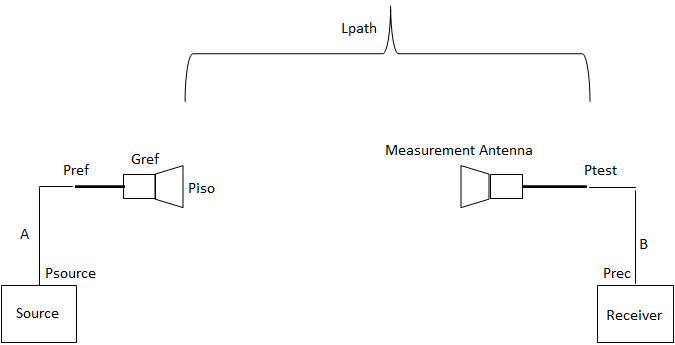{width="5.3277777777777775in"
height="2.5076388888888888in"}

Figure 5.3.2.3-1: Trajectory box for a Geostationary satellite

Without maintaining the satellite inside the box, the motion could be a
higher value like inclination up to +/6 °.

We take the hypothesis that the satellite is kept in the limited box.
The trajectory that the satellite follows is an \"8\" as shown in next
figure. The plane is seen from the centre of the Earth. The blue arrows
in the next figure indicate the sense of motion of the satellite around
its orbital position So.

{width="4.330555555555556in"
height="3.4319444444444445in"}

Figure 5.3.2.3-2: Geostationary satellite trajectory

In the figure above, the trajectory of the satellite is represented as
seen from a point at the equator having same longitude as the nominal
Geostationary satellite orbital position.

A geostationary satellite will cover the whole trajectory in 24 Hours.

The average tangential velocity of a geostationary satellite with
respect to an earth point is around 2.74 m/s.

Satellite maintained in a typical trajectory box (see figure 2)
characterized by

\- +/- 37.5 km in both latitude and longitude directions corresponding
to an aperture angle of +/- 0.05 °.

\- +/- 17.5 km in the equatorial plane.

To illustrate the Doppler shift computation using the Doppler Shift
formula, we shall consider some concrete cases:

\- Geostationary Satellite at 10 ° E (over Europe)

\- First a High Speed Train (500 km/h) from Paris to Lille (France) and
from Paris to Strasbourg (France)

\- Secondly an air plane (1000 km/h and 10 km altitude) moving in the
same directions.

We first compute the Doppler shift while supposing the satellite has no
motion, but on a moving UE, and secondly we evaluate the impact of the
satellite motion on a fixed UE.

**[First case: Satellite is considered fixed with respect to earth
point]{.underline}**

In the high speed train going north from Paris the obtained Doppler
shift is provided here below

Table 5.3.2.3-1: Examples of Doppler shift with GEO and a terminal on
board a High Speed Train in opposition direction

  -------------------- ----------------------------- -------- --------
  Frequency            [2GHz](mailto:Doppler@2GHz)   20 GHz   30 GHz
  Doppler shift (Hz)   -707                          -7074    -10612
  -------------------- ----------------------------- -------- --------

Table 5.3.2.3-2: Example of Doppler shift with GEO and a terminal on
board an aircraft in opposition direction

  -------------------- ----------------------------- -------- --------
  Frequency            [2GHz](mailto:Doppler@2GHz)   20 GHz   30 GHz
  Doppler shift (Hz)   -1414                         -14149   -21224
  -------------------- ----------------------------- -------- --------

And going from Paris to east.

Table 5.3.2.3-3: Example of Doppler shift with GEO and in High Speed
Train

  ----------------------------- ----------------------------- -------- --------
  Frequency                     [2GHz](mailto:Doppler@2GHz)   20 GHz   30 GHz
  Doppler shift (Hz) in Paris   147                           1478     2217
  Doppler shift (Hz) in Lille   138                           1383     2075
  ----------------------------- ----------------------------- -------- --------

Table 5.3.2.3-4: Example of Doppler shift with GEO and in a plane

  -------------------- ----------------------------- -------- --------
  Frequency            [2GHz](mailto:Doppler@2GHz)   20 GHz   30 GHz
  Doppler shift (Hz)   295                           2956     4434
  -------------------- ----------------------------- -------- --------

The Doppler shift is highest for a platform moving along longitude
compared to a moving platform along latitude.

In the figure below, we consider a train travelling North from the
Equator at a constant speed of 500 km/h. The two extreme points in the
figure are 3600 seconds apart. The Doppler shift plotted as a function
of the latitude. The maximum rate of change of Doppler shift is
approximately -23 mHz/s

{width="6.5472222222222225in"
height="3.29375in"}

Figure 5.3.2.3-3: Doppler Shift at 2 GHz for a High Speed Train
travelling along a longitude (North direction)

In the figure below, we consider an aircraft travelling North from the
Equator at a constant speed of 1000 km/h. Similarly to the previous
plot, the two extreme points are 1800 seconds apart. The Doppler shift
plotted as a function of the latitude. The maximum rate of change of
Doppler shift is approximately -90 mHz/s.

{width="6.5472222222222225in"
height="3.29375in"}

Figure 5.3.2.3-4: Doppler Shift at 2 GHz for an aircraft travelling
north

> However these values are reached only when cos (θ) is equal to 1 or
> -1. Where θ is the angle between the vector speed and the direction of
> wave propagation (the axis UE-Satellite).

**[Second case: Satellite is moving on its \"8\"]{.underline}**

When satellite is moving from S2 to S1, the Doppler shift in Paris is
the following

Table 5.3.2.3-4:Example of Doppler shift when satellite is moving

  -------------------- ----------------------------- -------- --------
  Frequency            [2GHz](mailto:Doppler@2GHz)   20 GHz   30 GHz
  Doppler shift (Hz)   -0.25                         -2.4     -4.0
  -------------------- ----------------------------- -------- --------

When satellite is moving from S1 to S4, the Doppler shift in Paris is
the following

Table 5.3.2.3-5:Example of Doppler shift when satellite is moving

  -------------------- ----------------------------- -------- --------
  Frequency            [2GHz](mailto:Doppler@2GHz)   20 GHz   30 GHz
  Doppler shift (Hz)   2.25                          22.5     34
  -------------------- ----------------------------- -------- --------

Doppler shift is higher than in the previous case, though still very low
compared to the case of Non GEO satellites.

When satellite is in near GEO orbit with inclination up to 6°, the
Doppler shift can reach around 300 Hz at 2 GHz, then 3000 Hz at 20 GHz
and 4500 Hz at 30 GHz, which are still compatible with OFDM.

### 5.3.3 Aerial vehicle

The altitude of aerial vehicle also called UAS (Unmanned Aircraft
Systems) can be between 8 and 50 km, including HAPS. HAPS is a station
located on an aerial object at an altitude of 20 to 50 km and at a
specified, nominal, fixed point relative to the Earth.

The general UAS based system architectures are presented in the
following picture.

{width="2.8333333333333335in"
height="1.9222222222222223in"}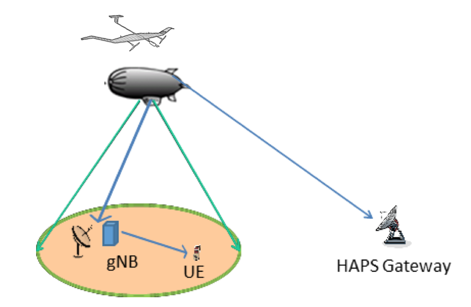{width="2.9180555555555556in"
height="1.9027777777777777in"}

Figure 5.3.3-1: UAS based system architectures

The coverage can be divided into small cells, and usually the minimum
elevation angle for a Mobile Terminal is 5°.

The platform can move around its nominal position within a few
kilometres at a maximum tangential velocity of 15 m/s.

This can result in maximum Doppler shift (in absolute value) of 100 Hz @
2GHz, 1000 Hz @ 20 GHz and 1500 Hz @ 30 GHz due to Haps motion.

In S band, at 100 km/h a car will suffer a Doppler shift of +/- 185 Hz
maximum

The Doppler variation can be evaluated with a car moving from one edge
to another at 100 km/h , covering 450 km . The Doppler variation will be
around -0.0025 Hz/s. So no impact on demodulation

At 5° elevation angle the distance to the aerial vehicle is 229 km, and
if we suppose the Gateway is at same distance

\- One way delay is around 1.526 ms

\- Round Trip Time is 3.053 ms

\- Differential delay between nadir and Edge of Coverage: 0.697 ms

### 5.3.4 Non geostationary satellites

The Non-Geostationary case comprises three examples

\- LEO at 600 km

\- LEO at 1500 km

\- MEO at 10000 km

#### 5.3.4.1 Propagation delay

In the case of bent pipe satellites, one way propagation delay is the
sum of feeder link propagation delay and user link propagation delay,
thus the propagation delay between Gateway and UE.

In the case of regenerative satellite, one way propagation delay is the
satellite to UE propagation delay.

In both cases the transit time and/or processing time are not taken into
account.

In the case of bent pipe satellite, the Round Trip Time is the physical
path duration of the path : Gateway-Satellite-UE-Satellite-Gateway, that
is in fact twice the one way propagation delay.

In the case of regenerative satellite, the round trip delay is the delay
corresponding to the following path :satellite-UE-satellite.

In the computation, Gateway is set at 5° (TBC) elevation angle, and
terminal can be set at various elevation angles, but we consider that
the reference case is 10° elevation angle for the propagation delay
computation.

The following table summarises the different situations and the
different distances in km and the different propagation delays in ms.

The results for the three cases of NGSO satellites are summarized in the
next table.

Table 5.3.4.1-1: Propagation delays for different NGSO satellites
(altitude and payload types)

  ------------------------ ------------------------ ----------------- ---------------- ----------------- ------------ ----------------- ------------
                                                    LEO at 600 km     LEO at 1500 km   MEO at 10000 km                                  
  Elevation angle          Path                     Distance D (km)   Delay (ms)       Distance D (km)   Delay (ms)   Distance D (km)   Delay (ms)
  UE: 10°                  satellite - UE           1932.24           6,440            3647.5            12,158       14018.16          46.727
  GW: 5°                   satellite - gateway      2329.01           7.763            4101.6            13.672       14539.4           48.464
  90°                      satellite - UE           600               2                1500              5            10000             33.333
  Bent pipe satellite                                                                                                                   
  One way delay            Gateway-satellite\_UE    4261.2            14.204           7749.2            25.83        28557.6           95.192
  Round Trip Delay         Twice                    8522.5            28.408           15498.4           51.661       57115.2           190.38
  Regenerative satellite                                                                                                                
  One way delay            Satellite -UE            1932.24           6.44             3647.5            12.16        14018.16          46.73
  Round Trip Delay         Satellite-UE-Satellite   3864.48           12.88            7295              24.32        28036.32          93.45
  ------------------------ ------------------------ ----------------- ---------------- ----------------- ------------ ----------------- ------------

#### 5.3.4.2 Differential delay

In this clause, we compute the differential delays between some specific
positions : for instance at nadir and Edge of Coverage.

The path to gateway is supposed to be the same for all terminals.

Table 5.3.4.2-1: Differential Delay for LEO satellite

  ---------------------------------------------------------- -------------------- ----------------- -------------------- ----------------- -------------------- -----------------
                                                             **LEO 600 km**       **LEO 1500 km**   **MEO 10000 km**                                            
                                                             **Delta Distance**   **Delta Delay**   **Delta Distance**   **Delta Delay**   **Delta Distance**   **Delta Delay**
  Differential One way delay between nadir and EOC paths     1332.2 km            4.44 ms           2147.5 km            7.158 ms          4018.16 km           13.4 ms
  Percentage of the maximum delay (bent pipe)                                     31.26 %                                27.8 %                                 14.1 %
  Percentage of the maximum delay (regenerative satellite)                        67 %                                   58.9 %                                 28.7 %
  ---------------------------------------------------------- -------------------- ----------------- -------------------- ----------------- -------------------- -----------------

#### 5.3.4.3 Doppler Shift and variation rate

The following picture summarizes the methodology used for Non
Geostationary systems. We evaluate the Doppler shift which is maximum
when the UE is located in the orbital plane.

{width="3.2680555555555557in" height="3.4875in"}

Figure 5.3.4.3-1: System Geometry for Doppler computation

The picture describing the system geometry shows the satellite \"S\" on
its circular orbit. The vector V corresponds to the orbital speed
vector.

The Doppler shift is computed for a Mobile Terminal \"M\" located in the
orbital plan, and corresponds to the maximum value.

One of the impacting factors on the Doppler shift value is the angle
between 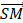{width="0.19166666666666668in"
height="0.19166666666666668in"} and the speed vector
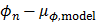{width="9.166666666666666e-2in"
height="0.18333333333333332in"}. Angle called θ.

\- The satellite is at an altitude h, and R is the earth radius.

\- The satellite has the velocity
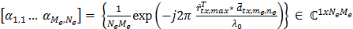{width="9.375e-2in" height="0.1875in"}, and the
transmitted frequency is F~c~.

\- The Doppler shift value F~d~ due to satellite motion is expressed by
the formula

\- {width="2.5520833333333335in"
height="0.2708333333333333in"}

\- Where

\- θ is the angle between satellite velocity and
{width="0.19166666666666668in"
height="0.19166666666666668in"}.

\- u the angle between {width="0.21875in"
height="0.1875in"} and
{width="0.19791666666666666in"
height="0.1875in"}

\- {width="0.21875in" height="0.1875in"} is the
vector between earth centre and point on earth

\- {width="0.19791666666666666in"
height="0.1875in"}is the vector between earth centre and the satellite

\- angle u is varying with the satellite motion: u(t) = V\*t/(R+h) with
t the time

\- α is the elevation angle to the satellite of the UT in M.

\- γ can be computed as follow:

\- {width="0.4583333333333333in"
height="0.23958333333333334in"}

\- The Doppler formula is obtained after some computation.

At this altitude the speed of the satellite in circular orbit is 7.5622
km.s^-1^. So we can use non-relativistic approximation to compute
Doppler shift.

Also at first order we neglect the speed of earth which is 327 m/s at
45° latitude and 464 m/s at the equator.

For all Non GSO cases, the satellite speeds are the following

\- At 600 km : V =7.5622 km.s^-1^

\- At 1500 km : V =7.1172 km.s^-1^

\- At 10000 km : V =4.9301 km.s^-1^

##### 5.3.4.3.1 Case at 2 GHz

Both (Downlink) D/L and (Uplink) U/L the signal is around 2GHz and we
limit the curves at 2 GHz.

If we consider now a moving UE at 1000 km/h, and moving in the same
direction than the satellite, we have determined the worst case impact
in the following graph. We can define the bounds by adding the Doppler
shift due to the satellite motion and the Doppler shift due to the UE
motion.

All the curves are gathered in the next graphs, showing clearly the
boundaries of the Doppler shift depending on the sense of motion between
the satellites and the UE.

Three NON GSO satellites cases are provided.

{width="5.559722222222222in"
height="2.7090277777777776in"}

Figure 5.3.4.3.1-1: Case with 2 GHz signal at 600 km on D/L and U/L:
fixed UE and UE in motion

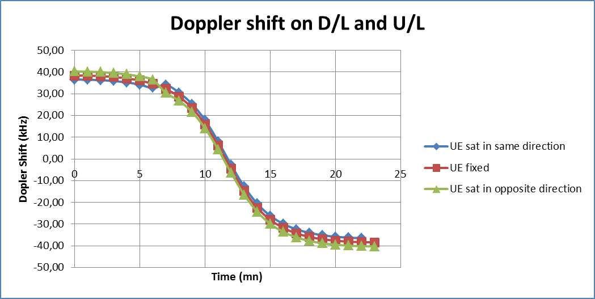{width="6.217361111111111in"
height="3.123611111111111in"}

Figure 5.3.4.3.1-2: Case with 2 GHz signal at 1500 km: fixed UE and UE
in motion

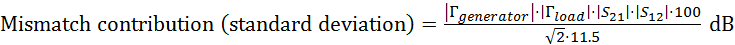{width="6.554166666666666in"
height="2.8069444444444445in"}

Figure 5.3.4.3.1-3: Case with 2 GHz signal at 10000 km: fixed UE and UE
in motion

##### 5.3.4.3.2 Case in Ka band

There are two cases

\- Downlink at 20 GHz

\- Uplink at 30 GHz

If we consider now a moving UE at 1000 km/h, and moving in the same
direction than the satellite, we have determined the worst case impact
in the following graph.

This impact is at maximum 18 kHz in one sense or the other at 20 GHz,
and 27 kHz at 30 GHz, all the curves are gathered in the next graph,
showing clearly the boundaries of the Doppler shift depending on the
sense of motion between the satellite and the UE.

{width="5.64375in" height="2.838888888888889in"}

Figure 5.3.4.3.2-1: Case with 20 GHz signal at 600 km on D/L: fixed UE
and UE in motion

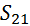{width="5.6715277777777775in"
height="2.8493055555555555in"}

Figure 5.3.4.3.2-2 Case with 30 GHz signal at 600 km on D/L: fixed UE
and UE in motion

{width="6.259027777777778in"
height="3.1444444444444444in"}

Figure 5.3.4.3.2-3: Case with 20 GHz signal at 1500 km on D/L: fixed UE
and UE in motion

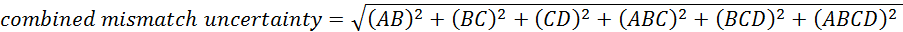{width="6.238194444444445in"
height="3.134027777777778in"}

Figure 5.3.4.3.2-4: Case with 30 GHz signal at 1500 km on D/L: fixed UE
and UE in motion

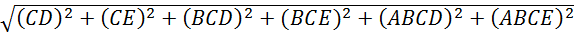{width="6.263888888888889in"
height="3.0527777777777776in"}

Figure 5.3.4.3.2-5: Case with 20 GHz signal at 10000 km on D/L: fixed UE
and UE in motion

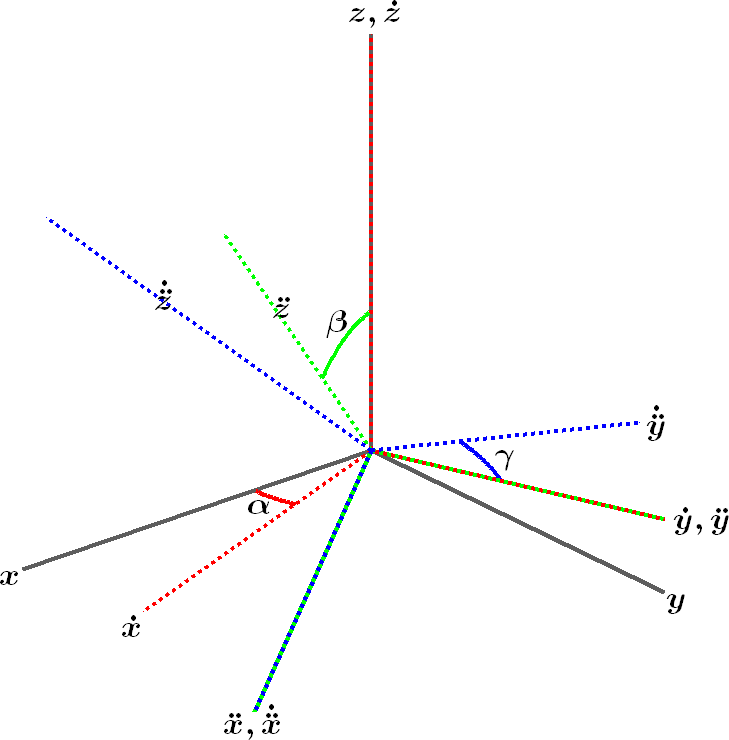{width="6.120138888888889in"
height="2.982638888888889in"}

Figure 5.3.4.3.2-6: Case with 30 GHz signal at 10000 km on D/L: fixed UE
and UE in motion

The different cases are summarized here below with the ratio of maximum
Doppler shift in absolute value to the central frequency.

Table 5.3.4.3.2-7: Summary of Doppler shift and shift variation for
different altitudes

  ----------------- ------------- ------------------ ----------------------------- --------------------------
  Frequency (GHz)   Max Doppler   Relative Doppler   Max Doppler shift variation   
  2                 +/- 48 kHz    0.0024 %           \- 544 Hz/s                   LEO at 600 km altitude
  20                +/- 480 kHz   0.0024 %           -5.44 kHz/s                   
  30                +/- 720 kHz   0.0024 %           -8.16 kHz/s                   
  2                 +/- 40 kHz    0.002 %            -180 Hz/s                     LEO at 1500 km altitude
  20                +/- 400 kHz   0.002 %            -1.8 kHz/s                    
  30                +/- 600 kHz   0.002 %            -2.7 kHz/s                    
  2                 +/- 15 kHz    0.00075 %          -6 Hz/s                       MEO at 10000 km altitude
  20                +/- 150 kHz   0.00075 %          -60 Hz/s                      
  30                +/- 225 kHz   0.00075 %          -90 Hz/s                      
  ----------------- ------------- ------------------ ----------------------------- --------------------------

Note that the Maximum Doppler shift variation in absolute value is
always negative and observed when the Doppler shift is zero.

#### 5.3.4.4 Doppler Shift and variation rate

The following picture summarizes the methodology used to compute Doppler
shift for Non Geostationary satellite systems. It assumes a Cartesian
coordinate system such that the moving satellite and the receiver are on
the y-z plane. The Doppler shift experienced by a stationary receiver
can be computed as follows as a function of time:

{width="1.5104166666666667in"
height="0.34375in"}

where *f*~0~ is the carrier frequency, **d**(t) is the distance vector
between the satellite and the receiver, and **x**~SAT~(t) is the vector
of the satellite position. These vectors can be expressed as:

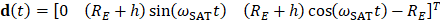{width="3.6666666666666665in"
height="0.16666666666666666in"}

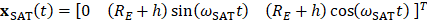{width="3.558333333333333in"
height="0.16666666666666666in"}

where *R*~E~ is the Earth radius, *h* is the satellite altitude, and
{width="0.2916666666666667in"
height="0.16666666666666666in"} is the satellite angular velocity.

{width="3.0076388888888888in"
height="3.1791666666666667in"}

Figure 5.3.4.4-1: System geometry for Doppler computation (Satellite
moves in the Y-Z plane)

After some mathematical manipulation \[7\], the Doppler shift as a
function of the elevation angle is computed in a closed-form expression
as follows:

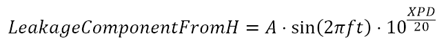{width="1.6354166666666667in" height="0.3125in"}

where the angular velocity is , with *G* the gravitational constant and
M~E~ the Earth mass.

If the receiver is placed on board an aircraft or a high speed train,
there will be an additional term of Doppler shift resulting from its own
velocity. In case of Non Geostationary satellites, the Doppler shift due
to satellite movement is much higher than the one caused by UE movement.
For GEO and HAPS, the Doppler shift component is mainly caused by the UE
movement.

### 5.3.5 Synthesis for each scenarios

Following table summarises the different Doppler shift, Doppler Shift
variation and propagation delays. The main impairments are the Doppler
shifts and Doppler variation in deployment scenarios D3 and D4.
(Non-geostationary platforms at 600 km).

Table 5.3.5-1: Summary of Doppler shift, Doppler Shift variation and
propagation delay for LEO at 600 km, GEO and HAPS

+---------+---------+---------+---------+---------+---------+---------+
|         | Deploy  | Deploy  | Deploy  | Deploy  | Deploy  | C       |
|         | ment-D1 | ment-D2 | ment-D3 | ment-D4 | ment-D5 | ellular |
|         |         |         |         |         |         | ( 10 km |
|         |         |         |         |         |         | Radius) |
+---------+---------+---------+---------+---------+---------+---------+
| P       | GEO at  | GEO at  | Non-GEO | Non-GEO | A       |         |
| latform | 35 786  | 35 786  | down to | down to | irborne |         |
| orbit   | km      | km      | 600 km  | 600 km  | vehicle |         |
| and     |         |         |         |         | up to   |         |
| a       |         |         |         |         | 20 km   |         |
| ltitude |         |         |         |         |         |         |
| when    |         |         |         |         |         |         |
| r       |         |         |         |         |         |         |
| elevant |         |         |         |         |         |         |
+---------+---------+---------+---------+---------+---------+---------+
| Fr      | Ka band | S band  | S band  | Ka band | S band  | S band  |
| equency |         |         |         |         | (Below  |         |
| band    |         |         |         |         | 6 GHz)  |         |
+---------+---------+---------+---------+---------+---------+---------+
| Max One | Be      | 272.37  | 14.204  | 14.204  | 1.526   | 0.03333 |
| way     | ntpipe: | ms      | ms      | ms      | ms      | ms      |
| Prop    | 272.37  |         |         |         |         |         |
| agation | ms      |         |         |         |         |         |
| delay   |         |         |         |         |         |         |
| (ms)    | gNB on  |         |         |         |         |         |
|         | board:  |         |         |         |         |         |
|         | 135.28  |         |         |         |         |         |
|         | ms      |         |         |         |         |         |
+---------+---------+---------+---------+---------+---------+---------+
| Max     | 16      | 16      | 4.44    | 4.44    | 0.697   | 0       |
| Diffe   | (       | (       | (       | (       | (       | .00333( |
| rential | between | between | between | between | between | between |
| delay   | Edge of | Edge of | Edge of | Edge of | Edge of | cell    |
| (ms)    | sa      | sa      | sa      | sa      | sa      | centre  |
|         | tellite | tellite | tellite | tellite | tellite | and     |
|         | c       | c       | c       | c       | c       | cell    |
|         | overage | overage | overage | overage | overage | edge)   |
|         | and     | and     | and     | and     | and     | equal   |
|         | Nadir)  | Nadir)  | Nadir)  | Nadir)  | Nadir)  | to      |
|         |         |         |         |         |         | maximum |
|         |         |         |         |         |         | delay   |
+---------+---------+---------+---------+---------+---------+---------+
| Max     | For     | For     | +/- 48  | \@20    | @ 2     | In case |
| Doppler | plane   | plane   | kHz     | GHz :   | GHz:    | of UE   |
| shift   |         |         |         | +/- 480 | +/- 100 | on      |
| in kHz  | @ 20    | 1.851   |         | kHz     | Hz      | board a |
|         | GHz:    | kHz @   |         |         | mainly  | high    |
|         | +/-     | 20 GHz  |         | \@30    | due to  | speed   |
|         | 18.51   |         |         | GHz :   | p       | train:  |
|         | kHz     |         |         | +/- 720 | latform |         |
|         |         |         |         | kHz     | motion  | +/- 925 |
|         | \@30    |         |         |         |         | Hz      |
|         | GHz:    |         |         |         |         |         |
|         | +/-     |         |         |         |         |         |
|         | 27.7    |         |         |         |         |         |
|         | kHz     |         |         |         |         |         |
+---------+---------+---------+---------+---------+---------+---------+
| \% of   | 10^-4^  | 10^-4^  | 0.0024% | 0.0024% |         |         |
| the     | %       | %       |         |         |         |         |
| carrier |         |         |         |         |         |         |
| fr      |         |         |         |         |         |         |
| equency |         |         |         |         |         |         |
| (Ratio  |         |         |         |         |         |         |
| of      |         |         |         |         |         |         |
| Doppler |         |         |         |         |         |         |
| Shift   |         |         |         |         |         |         |
| over    |         |         |         |         |         |         |
| the     |         |         |         |         |         |         |
| central |         |         |         |         |         |         |
| signal  |         |         |         |         |         |         |
| fr      |         |         |         |         |         |         |
| equency |         |         |         |         |         |         |
+---------+---------+---------+---------+---------+---------+---------+
| Max     | Neg     | Neg     | -544    | -5.44   | Neg     | Neg     |
| Doppler | ligible | ligible | Hz/s @  | kHz/s @ | ligible | ligible |
| va      |         |         | 2 GHz   | 20Ghz   |         |         |
| riation |         |         |         | (Do     |         |         |
| in      |         |         |         | wnlink) |         |         |
| Hz/s.   |         |         |         |         |         |         |
|         |         |         |         | -8.16   |         |         |
|         |         |         |         | kHz/s   |         |         |
|         |         |         |         | \@30    |         |         |
|         |         |         |         | GHz     |         |         |
|         |         |         |         | (       |         |         |
|         |         |         |         | uplink) |         |         |
+---------+---------+---------+---------+---------+---------+---------+

NOTE : In some cases like UE on board an aircraft during taking off, the
acceleration can add a supplementary Doppler variation in absolute value
of respectively 262 Hz/s @ 20 Ghz, and 393 Hz/s @ 30 GHz.

6 Non-Terrestrial Networks channel models
=========================================

6.1. Status/expectation of existing information for satellite/HAPS channels
---------------------------------------------------------------------------

### 6.1.1 Channel modeling works outside of 3GPP

ITU recommendations are encompassing most recent works and measurements
on satellite channel models.

\- ITU-R P.681 \[10\] defines the Land Mobile Satellite channel with
measurements up to 20 GHz

\- ITU-R P.618 \[11\] describes atmospheric effects such as gas
attenuation, scintillation, rain and cloud attenuation.

### 6.1.2 Targeted user environment

Only outdoor conditions are considered for satellite operations, since
performance requirements are not expected to be met with the available
link budget for indoor communications.

Since HAPS are closer to the Earth, resulting in less path loss than in
satellite access networks, additional indoor conditions are also
considered for HAPS.

Several user environments will be considered, depending on the frequency
band: open, rural, suburban, urban and dense urban. In open environments
(such as fixed terminals or terminals mounted on boats/aircrafts), an
AWGN channel is assumed.

### 6.1.3 Modeling objectives

The requirements for channel modelling are as follows:

\- Support a frequency range from 0.5 GHz up to 100 GHz. Two frequency
bands are targeted in particular: below 6 GHz and Ka bands. For Ka band
communications, the uplink frequency is around 30 GHz while the downlink
frequency is around 20 GHz.

\- Accommodate UE mobility. For satellite channel models, mobility speed
up to 1000 km/h is supported; this corresponds to aircrafts that can be
served by satellite access. For HAPS channel models, mobility speed up
to around 500 km/h is supported, corresponding to high speed trains.

6.2 Differences between satellite/HAPS and cellular channel modelling
---------------------------------------------------------------------

Figures 6.2-1 and 6.2-2 compare the macro-cellular and satellite access
links in NLOS and LOS cases, respectively. The terrestrial propagation
is quite similar: multipath propagation is caused by objects near the
user. However, the angular spread from satellite is almost zero (due to
its distant location) while it can still be several degrees from the
base station.

{width="4.531944444444444in" height="2.05in"}

Figure 6.2-1: Macro-cellular vs. satellite channel, NLOS

{width="4.800694444444445in"
height="2.0520833333333335in"}

Figure 6.2-2: Macro-cellular vs. satellite channel, LOS

{width="6.46875in"
height="3.2381944444444444in"}

Figure 6.2-3: Combined satellite and terrestrial channels (conceptual
drawing).

6.3 Coordinate system
---------------------

A three-dimensional global coordinate system is considered, described as
\"Earth Centred Earth fixed\". The Earth is approximated as a true
sphere with radius of 6371 km. The coordinates\' origin O lies in the
center of the earth, x-y plane locates in the equator plane with x-axis
pointing to 0 degree longitude, y axis pointing to 90 degree longitude,
and z-axis pointing to geographical north pole from the origin O.

A UE or a satellite position is described by a set of three
parameters$(x,y,z)$, with $\sqrt{x² + y² + z²} = \text{6371}\text{km}$
for all UEs and for all satellites.

The proposed coordinate system is illustrated in Figure 6.3-1 for a
non-GEO satellite constellation.

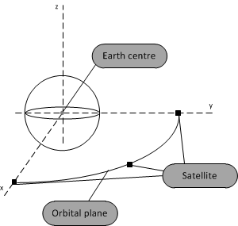{width="2.74375in"
height="2.6069444444444443in"}

Figure 6.3-1: Illustration of the coordinate system

6.4 Antenna modelling
---------------------

### 6.4.1 HAPS/Satellite antenna

**Satellite antenna pattern**

The following normalized antenna gain pattern, corresponding to a
typical reflector antenna with a circular aperture, is considered

1 {width="0.6388888888888888in"
height="0.2222222222222222in"}

{width="1.2868055555555555in"
height="0.6076388888888888in"}
{width="1.2868055555555555in"
height="0.32083333333333336in"}

where J~1~(x) is the Bessel function of the first kind and first order
with argument x, is the radius of the antenna\'s circular aperture, k =
2πf/c is the wave number, f is the frequency of operation, c is the
speed of light in a vacuum and θ is the angle measured from the bore
sight of the antenna\'s main beam. Note that *ka* equals to the number
of wavelengths on the circumference of the aperture and is independent
of the operating frequency.

The normalized gain pattern for a = 10 c/f (aperture radius of 10
wavelengths) is shown in Figure 6.4.1-1.

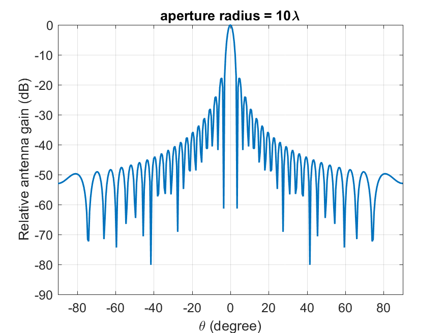{width="3.49375in" height="2.623611111111111in"}

**Figure 6.4.1-1: Satellite antenna gain pattern for aperture radius 10
wavelengths, *a*=10 *c*/*f***

**HAPS antenna pattern**

Two different antenna patterns are considered:

\- The above antenna pattern defined for satellite scenarios, based on
the Bessel function.

\- The 3GPP antenna pattern defined for the base station in Section 7.3
of \[12\], corresponding to a uniform rectangular panel array with dual
linear polarization.

### 6.4.2 UE antenna pattern

The following reference UE antenna patterns are adopted for fast fading:

\- Quasi Isotropic - Linear polarisation (Quasi isotropic refers to
dipole antenna which is omni-directional in one plane)

\- Co-phased array - Dual Linear polarisation (one for below 6 GHz band
and one for above 6 GHz band as described in \[48\])

\- \"VSAT type - circular polarization: fixed or tracking\" UE antenna
pattern (only in deployment scenarios featuring flat fading conditions)

6.5 Methodology to define channel models
----------------------------------------

### 6.5.1 System-level methodology

Only drop-based simulations are considered, similarly to \[12\].

The baseline model to generate channel coefficients is the one described
in \[12\] for terrestrial links, and depicted in Figure 6.5.1-1.

Figure 6.5.1-1: Channel coefficient generation procedure issued from
\[12\]

An alternative and simplified model can be applied if all UE meet the
flat fading criteria. In this case, the channel coefficients reduce to a
single tap, since the channel is not frequency selective. This
simplified model, derived from \[10\] is depicted in Figure 6.5.1-2.

Figure 6.5.1-2: Simplified channel coefficient generation issued from
\[10\]

### 6.5.2 Link-level methodology

Similarly to \[12\], reference CDL and TDL are considered for link-level
simulations. For given environment and elevation angle, they are
obtained from a single instance of the baseline model used for system
level simulations (i.e. the one derived from \[12\]).

For flat fading conditions (including AWGN) no channel model is needed
for link-level simulations.

6.6 Large scale model
---------------------

### 6.6.1 LOS probability

Line-Of-Sight (LOS) probability depends on UE environment and elevation
angle, and is obtained from Table 6.6.1-1. Reference elevation angles
are considered from 10° to 90° with a 10° step. For an UE-to-satellite
or UE-to-HAPS link, the LOS probability is taken from the nearest
reference elevation angle.

Table 6.6.1-1 LOS probability

  ----------- ---------------------- ---------------- ------------------------------
  Elevation   Dense urban scenario   Urban scenario   Suburban and Rural scenarios
  10°         28.2%                  24.6%            78.2%
  20°         33.1%                  38.6%            86.9%
  30°         39.8%                  49.3%            91.9%
  40°         46.8%                  61.3%            92.9%
  50°         53.7%                  72.6%            93.5%
  60°         61.2%                  80.5%            94.0%
  70°         73.8%                  91.9%            94.9%
  80°         82.0%                  96.8%            95.2%
  90°         98.1%                  99.2%            99.8%
  ----------- ---------------------- ---------------- ------------------------------

### 6.6.2 Path loss and Shadow fading

The signal path between a satellite or HAPS transmitter and an NTN
terminal undergoes several stages of propagation and attenuation. The
path loss (PL) is composed of components as follows:

{width="1.9166666666666667in"
height="0.2638888888888889in"}, (6.6-1)

where $\text{PL}$is the total path loss in dB,

$\text{PL}_{b}$ is the basic path loss in dB,

$\text{PL}_{g}$ is the attenuation due to atmospheric gasses in dB,

$\text{PL}_{s}$ is the attenuation due to either ionospheric or
tropospheric scintillation in dB,

$\text{PL}_{e}$is building entry loss in dB.

This section specifies the basic path loss model ($\text{PL}_{b}$) which
accounts for the signal\'s free space propagation, clutter loss, and
shadow fading. Attenuations due to building entry loss, atmospheric
gasses and scintillation are described in Sections 6.6.3, 6.6.4 and
6.6.6, respectively.

The free space path loss (FSPL) in dB for a separation distance *d* in
meter and frequency 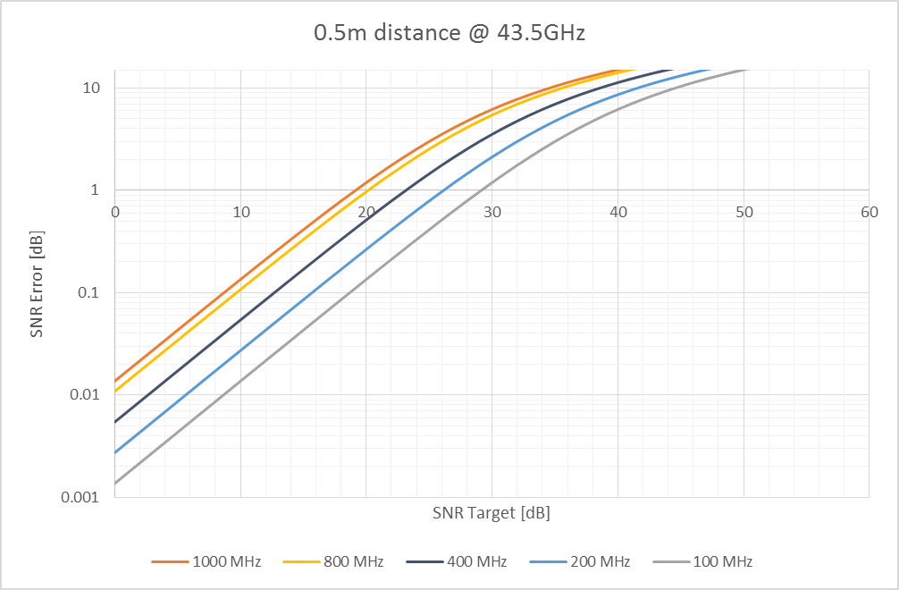{width="0.125in"
height="0.17708333333333334in"} in GHz is given by

{width="3.1805555555555554in" height="0.25in"}
(6.6-2)

For a ground terminal, the distance *d* (a.k.a. slant range), as shown
in Figure 6.6.2-1, can be determined by the satellite/HAPS altitude
$h_{0}$ and elevation angle α by

{width="2.625in" height="0.3194444444444444in"},
(6.6-3)

where $R_{E}$ denotes Earth radius.

Figure 6.6.2-1: Slant range d between a satellite and a ground terminal

Clutter loss (CL) models the attenuation of signal power caused by
surrounding buildings and objects on the ground. It depends on the
elevation angle α, the carrier frequency f~c~, and the environment.
Shadow fading (SF) is modeled by a log-normal distribution, which when
expressed in decibel unit, is a zero-mean normal distribution with a
standard deviation $\sigma_{\text{SF}}^{2}$, i.e.,
$N(0,\sigma_{\text{SF}}^{2})$.

The basic path loss in dB unit is modeled as

{width="2.44375in" height="0.25in"}, (6.6-4)

where is the free space path loss, $\text{CL}(\alpha,f_{c})$is clutter
loss, and $\text{SF}$ is shadow fading loss represented by a random
number generated by the normal distribution, i.e., $\text{SF}$
\~$N(0,\sigma_{\text{SF}}^{2})$. When the UE is in LOS condition,
clutter loss is negligible and should be set to 0 dB in the basic path
loss model.

The values of and $\text{CL}$ are given in tables 6.6.2-1 to 6.6.2-3 at
reference elevation angles for different scenarios. The UE in a
particular scenario should take the values corresponding to the
reference angle nearest to its elevation angle α.

Table 6.6.2-1: Shadow fading and clutter loss for dense urban scenario

  ----------- ----------------------- -------------------------- ----------------- ------ ------ -----------------
  Elevation   S-band                  Ka-band                                                    
              LOS                     NLOS                       LOS               NLOS          
              $c_{\text{ASA}}$ (dB)   $\sigma_{\text{SF}}$(dB)   $\text{CL}$(dB)   (dB)   (dB)   $\text{CL}$(dB)
  10°         3.5                     15.5                       34.3              2.9    17.1   44.3
  20°         3.4                     13.9                       30.9              2.4    17.1   39.9
  30°         2.9                     12.4                       29.0              2.7    15.6   37.5
  40°         3.0                     11.7                       27.7              2.4    14.6   35.8
  50°         3.1                     10.6                       26.8              2.4    14.2   34.6
  60°         2.7                     10.5                       26.2              2.7    12.6   33.8
  70°         2.5                     10.1                       25.8              2.6    12.1   33.3
  80°         2.3                     9.2                        25.5              2.8    12.3   33.0
  90°         1.2                     9.2                        25.5              0.6    12.3   32.9
  ----------- ----------------------- -------------------------- ----------------- ------ ------ -----------------

Table 6.6.2-2: Shadow fading and clutter loss for urban scenario

  ----------- ----------------------- -------------------------- ----------------- ------ ------ -----------------
  Elevation   S-band                  Ka-band                                                    
              LOS                     NLOS                       LOS               NLOS          
              $c_{\text{ASA}}$ (dB)   $\sigma_{\text{SF}}$(dB)   $\text{CL}$(dB)   (dB)   (dB)   $\text{CL}$(dB)
  10°         4                       6                          34.3              4      6      44.3
  20°         4                       6                          30.9              4      6      39.9
  30°         4                       6                          29.0              4      6      37.5
  40°         4                       6                          27.7              4      6      35.8
  50°         4                       6                          26.8              4      6      34.6
  60°         4                       6                          26.2              4      6      33.8
  70°         4                       6                          25.8              4      6      33.3
  80°         4                       6                          25.5              4      6      33.0
  90°         4                       6                          25.5              4      6      32.9
  ----------- ----------------------- -------------------------- ----------------- ------ ------ -----------------

Table 6.6.2-3: Shadow fading and clutter loss for suburban and rural
scenarios

  ----------- -------- --------- ----------------- ------ ------ -----------------
  Elevation   S-band   Ka-band                                   
              LOS      NLOS      LOS               NLOS          
              (dB)     (dB)      $\text{CL}$(dB)   (dB)   (dB)   $\text{CL}$(dB)
  10°         1.79     8.93      19.52             1.9    10.7   29.5
  20°         1.14     9.08      18.17             1.6    10.0   24.6
  30°         1.14     8.78      18.42             1.9    11.2   21.9
  40°         0.92     10.25     18.28             2.3    11.6   20.0
  50°         1.42     10.56     18.63             2.7    11.8   18.7
  60°         1.56     10.74     17.68             3.1    10.8   17.8
  70°         0.85     10.17     16.50             3.0    10.8   17.2
  80°         0.72     11.52     16.30             3.6    10.8   16.9
  90°         0.72     11.52     16.30             0.4    10.8   16.8
  ----------- -------- --------- ----------------- ------ ------ -----------------

### 6.6.3 O2I penetration loss

For an indoor Earth-based station, account must be taken of the
additional loss between the station and the adjacent outdoor path. The
additional loss varies greatly with the location and construction
details of buildings, and a statistical evaluation is required.
Recommendation ITU‑R P.2109 gives a suitable building entry/exit-loss
model for this purpose.

Experimental results, such as those collated in Report ITU-R P.2346,
shows that, when characterised in terms of entry loss, buildings fall
into two distinct populations: where modern, thermally-efficient
building methods are used (metallised glass, foil-backed panels)
building entry loss is generally significantly higher than for
\'traditional\' buildings without such materials. The model therefore
gives predictions for these two cases.

This classification, of \'thermally efficient\' and \'traditional\',
refers purely to the thermal efficiency of construction materials. No
assumption should be made on the year of construction, type (single or
multi-floors), heritage or building method.

For building entry loss, it is important to consider the thermal
efficiency of the complete building (or the overall thermal efficiency).
A highly thermally efficient main structure with poorly insulated
windows (e.g. single glazed with thin glass) can make the building
thermally inefficient and vice versa.

Thermal transmittance, commonly referred as U-value, provides a
quantifiable description of thermal efficiency. Low U-values represent
high thermal efficiency. Typically, the presence of metallised glass
windows, insulated cavity walls, thick reinforced concrete and metal
foil back cladding is a good indication of a thermally efficient
building.

NOTE: For example, U-values of \< 0.3 and \< 0.9 are representative of
thermally efficient main structure and metallised glass, respectively.

Building entry loss will vary depending on building type, location
within the building and movement in the building. The building entry
loss distribution is given by a combination of two lognormal
distributions. The building entry loss not exceeded for the probability,
*P*, is given by:

{width="3.111111111111111in" height="0.25in"}
(6.6-5)

with:

where:

*L~h~* is the median loss for horizontal paths, given by:

{width="1.9583333333333333in"
height="0.2638888888888889in"} (6.6-6)

*L~e~* is the correction for elevation angle of the path at the building
façade:

{width="0.8333333333333334in"
height="0.2777777777777778in"} (6.6-7)

and:

*f* = frequency (GHz)

θ = elevation angle of the path at the building façade (degrees)

*P* = probability that loss is not exceeded (0.0 \< *P* \< 1.0)

*F*^-1^(*P*) = inverse cumulative normal distribution as a function of
probability.

and the coefficients are as given in Table 6.6.3-1:

Table **6.6.3-1:** Model coefficients

  --------------------- ------------------- ------- ------ ------ ----- ------ ------ ----- ------
  Building type         *r*                 *s*     *t*    *u*    *v*   *w*    *x*    *y*   *z*
  Related to:           Median BEL (μ~1~)   σ~1~    μ~2~   σ~2~                             
  Traditional           12.64               3.72    0.96   9.6    2.0   9.1    −3.0   4.5   −2.0
  Thermally-efficient   28.19               −3.00   8.48   13.5   3.8   27.8   −2.9   9.4   −2.1
  --------------------- ------------------- ------- ------ ------ ----- ------ ------ ----- ------

### 6.6.4 Atmospheric absorption

Attenuation by atmospheric gases which is entirely caused by absorption
depends mainly on frequency, elevation angle, altitude above sea level
and water vapour density (absolute humidity). At frequencies below 10
GHz, it may normally be neglected. However, for elevation angles below
10 degrees it is recommended that the calculation is performed for any
frequency above 1 GHz. Annex 1 of Recommendation ITU‑R P.676 gives a
complete method for calculating gaseous attenuation, while Annex 2 of
the same Recommendation gives an approximate method for frequencies up
to 350 GHz.

For system level simulations, the baseline method is as follows:

\- The method of Annex 2 in ITU-R P.676 is considered (except for UE
altitude higher than 10km and for frequencies within 0.5 GHz of the
centres of resonance lines at any altitude).

\- For all UEs, a geometric height of 0km is considered, corresponding
to the sea level.

\- For all UEs, dry air pressure, water-vapour density, water vapour
partial pressure and temperature correspond to the mean annual global
reference atmosphere given in Recommendation ITU-R P835.

For all UEs, this corresponds to the following values:

T = 288.15 K

p = 1013.25 hPa

e =
$\frac{\text{ρT}}{\text{216}\text{.}5} = 9\text{.}\text{98}\text{hPa}$

where T denotes the temperature, p the dry air pressure, ρ the
water-vapour density and e the water vapour partial pressure.

Figure 6 of ITU‑R P.676 shows the corresponding zenith attenuation
$A_{\text{zenith}}(f)$ for frequencies between 1 and 350 GHz. For an
elevation angle α, the corresponding attenuation
$\text{PL}_{A}(\alpha,f)$ is given by:

{width="1.5416666666666667in"
height="0.4583333333333333in"} (6.6-8)

### 6.6.5 Rain and cloud attenuation

Rain and cloud attenuation is considered as negligible for frequencies
below 6 GHz. Section 2.2 of \[11\] describes a method to estimate the
long-term statistics of attenuation due to rain, which are location
specific.

For system-level simulations, the baseline is to consider clear sky
conditions only.

Alternatively, the following procedure shall be followed to define rain
and cloud attenuation (adaptation of \[11\] for drop-based simulations):

\- For each UE, determine its CDF of rain and cloud attenuation
(location specific) using Section 2.2 of \[11\].

\- For each drop, draw the attenuation due to rain and cloud attenuation
for each UE from its corresponding CDF

NOTE: The spatial correlation of rain and cloud attenuation is not taken
into account in this procedure.

### 6.6.6 Scintillation

#### 6.6.6.1 Ionospheric scintillation

Scintillation corresponds to rapid fluctuations of the received signal
amplitude and phase. Ionosphere propagation shall only be considered for
frequencies below 6 GHz.

These phenomena are among the most severe disruptions along a
trans-ionospheric propagation path for signals below 3 GHz, and may be
observed occasionally up to 10 GHz \[13\]. Scintillations depend on
location, time-of-day (as observed in Figure 6.6.6.1-1), season, solar
and geomagnetic activity. During nominal conditions, strong levels of
scintillation are rarely observed in mid-latitudes, but they may be
encountered daily during post-sunset hours in low latitude regions. At
high (auroral and polar) latitudes, moderate to strong levels of
scintillations have been observed.

{width="4.313888888888889in"
height="3.2333333333333334in"}

Figure 6.6.6.1-1: Occurrence of different scintillation events around
the solar maximum of 2014 at low (top) and high (bottom) latitudes

##### 6.6.6.1.1 Ionospheric scintillation indices

The most commonly used parameter to characterize intensity fluctuations
(amplitude scintillations) is the amplitude scintillation index *S~4~*
\[4\], defined by equation:

{width="1.375in" height="0.5965277777777778in"}
(6.6-9)

where *I* is intensity (proportional to the square of the signal
amplitude) and 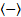{width="0.21875in"
height="0.17708333333333334in"} denotes averaging, usually over a period
of 60 seconds. Likewise, phase scintillations are characterized by the
standard deviation of the phase variations, the phase scintillation
index *σ~φ~*:

{width="1.2777777777777777in" height="0.375in"}
(6.6-10)

where *φ* is carrier phase in radians and
{width="0.21875in"
height="0.17708333333333334in"} denotes averaging, usually over a period
of 60 seconds.

For convenience, scintillation strength can be classified into three
regimes:

Table 6.6.6.1.1-1: Definition of scintillation regime based on *S*~4~
values

  ---------------------- ------------------------- -----------------------------
  Scintillation Regime   Amplitude Scintillation   Phase Scintillation (rad)
  Weak                   *S~4~* \< 0.3             *σ~φ~* \< 0.25-0.3
  Moderate               0.3 ≤ *S~4~* ≤ 0.6        0.25-0.3 ≤ *σ~φ~* ≤ 0.5-0.7
  Strong                 *S~4~* \> 0.6             *σ~φ~* \> 0.5-0.7
  ---------------------- ------------------------- -----------------------------

##### 6.6.6.1.2 Ionospheric scintillation location dependence

As previously mentioned, scintillation effects differ at low and
high-latitudes, and they are not observed at mid-latitudes except for
strong geomagnetic storms. At high-latitudes (e.g., above 60°), the
effect mainly occurs from the high-latitude edge of the Van Allen outer
belt into polar region. On the other hand, Equatorial scintillations
occur around ±20° of latitude of the magnetic equator and they are due
to large (\~100 km) depleted ionization volumes driven through the F
region, leaving a plume of small-scale (tens of cm to m) irregularities
surrounding the depletion, which can extend well through F-layer peak.
They are produced by convective plasma processes. Irregularities with
this range of scales are not independent from larger-scale plasma
structures to those of smaller-scale irregularities.

The cross-correlation between *S~4~* and *σ~φ~* is markedly different
between high geomagnetic latitudes and low latitudes. Amplitude
scintillations dominate at low-latitudes, and phase scintillations
dominate at high latitudes, however, they are not exclusively and both
effects can be expected in the two regions.

##### 6.6.6.1.3 Frequency scaling

For frequency scaling, typically the following relation on amplitude
scintillation *S~4~* index is used:

{width="1.1527777777777777in"
height="0.4722222222222222in"} (6.6-11)

with *n*=1.5 recommended for L-band frequencies. In \[14\], values of
*n* derived from satellite measurement data between several pairs of
frequencies from 30 MHz up to 6 GHz are presented, ranging from 1 to 2.
This relationship is valid particularly for weak scattering assumptions
(higher elevations and low to moderate *S~4~* values below 0.6). For
high *S~4~* values (*S~4~*=1), the relation saturates with *n* equal to
0.

For phase scintillations, an equivalent relation is used:

{width="1.1666666666666667in"
height="0.4722222222222222in"} (6.6-12)

with *n*=1 recommended for L-band frequencies and also reaching
saturation for high *σ~φ~* values.

As an illustrative example, the frequency scaling between GPS L1, L2 and
L5 bands (1.57542, 1.22760 and 1.17645 GHz, respectively) is presented
in Figure 6.6.6.1.3-1, where scintillation events in two bands are
compared against each other and against the theoretical values described
by 6.6-11 and 6.6-12.

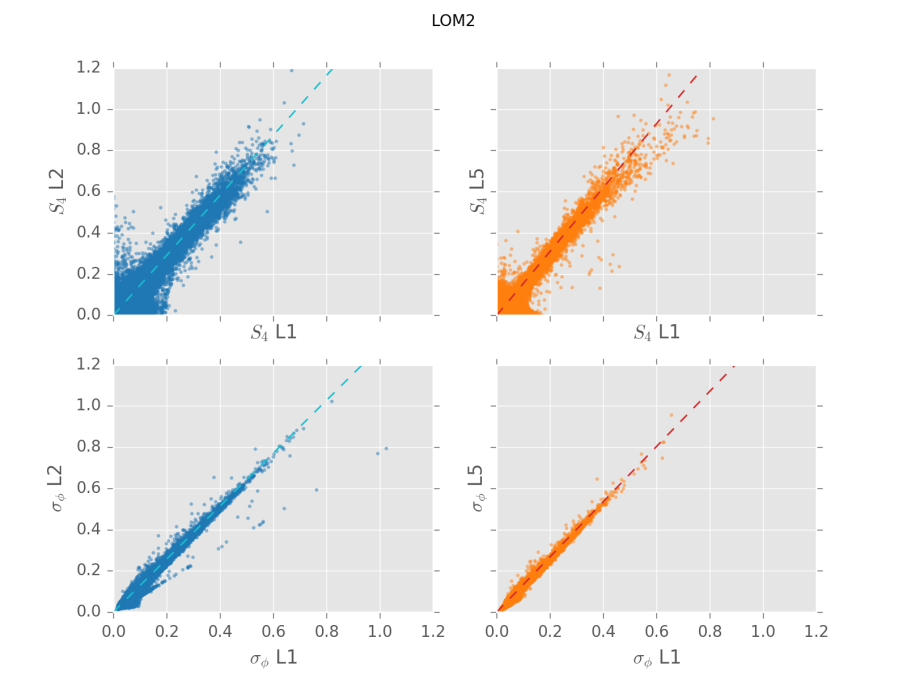{width="5.157638888888889in"
height="3.8631944444444444in"}

Figure 6.6.6.1.3-1: Frequency correlation of scintillation events
observed in GPS L1, L2 and L5 bands

##### 6.6.6.1.4 Model for Ionospheric scintillation loss

The proposed method for the ionospheric scintillation loss is based on
the so-called *Gigahertz scintillation model* (\[13\], Section 4.8), and
it is valid only for the regions located approximately 20° north and
south of the magnetic equator. At high-latitudes (e.g., above 60°), this
model is not applicable, whereas for other latitude locations the
ionospheric scintillation can be neglected.

To evaluate the scintillation effects that can be expected in a given
situation the following steps may be used:

***Step 1***: Figure 6.6.6.1.4-1 provides scintillation occurrence
statistics on equatorial ionospheric paths: peak‑to-peak amplitude
fluctuations, *P~fluc~*, (dB), for 4 GHz reception from satellites in
the East at elevation angles of about 20° (**P** solid curves) and in
the West at about 30° elevation (**I** dotted curves). The data are
given for different times of year and sunspot number.

***Step 2***: Since Figure 6.6.6.1.4-1 relates to 4 GHz, values for
other frequencies are found by multiplying these values by
( *f* /4)^--1.5^ where *f* is the frequency of interest (GHz).

***Step 3***: Since one element of link budget calculations is related
to signal loss due to ionospheric scintillation, *A~IS~*, the following
relationship is recommended:

{width="1.0138888888888888in"
height="0.2916666666666667in"} {QUOTE
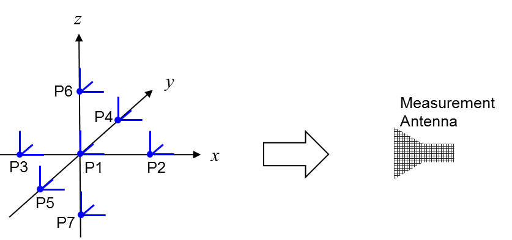{width="0.9083333333333333in" height="0.2in"} }
(6.6-13)

NOTE: The most widely used parameter in describing amplitude
scintillations phenomena is the amplitude index *S*~4~. It is adopted to
define three main regime conditions (see Table 6.6.6.1.1-1), and it is
related to *P~fluc~* using the empirical approximation:

*P~fluc~* = 27.5 *S*~4~^1.26^ (6.6-14)

where the empirical conversion table is presented in Table 1 of \[13\].

{width="5.743055555555555in"
height="6.127083333333333in"}

Figure 6.6.6.1.4-1: Annual statistics of peak-to-peak fluctuations
observed at Hong Kong earth station (Curves I1, P1, I3-I6, P3-P6) and
Taipei earth station (Curves P2 and I2). Extracted from \[13\].

For system-level simulations below 6 GHz, $\text{PL}_{S}$is equal to
*A~IS~* from Equation (6.6-13) for latitudes of maximum ±20°. For
latitudes between ±20° and ±60° of latitude, $\text{PL}_{S} = 0$.
Finally, for latitude above ±60°, the presented ITU model is not
applicable; nevertheless, in those regions the scintillation phenomena
are mainly affecting the signal phase and having negligible effects on
the signal amplitude. For such reasons, the choice of
$\text{PL}_{S} = 0$ is also applied for latitude above ±60°.

As baseline for system-level simulations below 6 GHz in the regions of
maximum ±20°, the additional path loss due to scintillation
$\text{PL}_{S}$ is equal to the ionospheric attenuation level at 99% of
the P3 curve derived from Figure 6.6.6.1.4-1. For example, by applying
the presented *Gigahertz scintillation model*, the attenuation at 2 GHz
center frequency is summarized in the following equation:

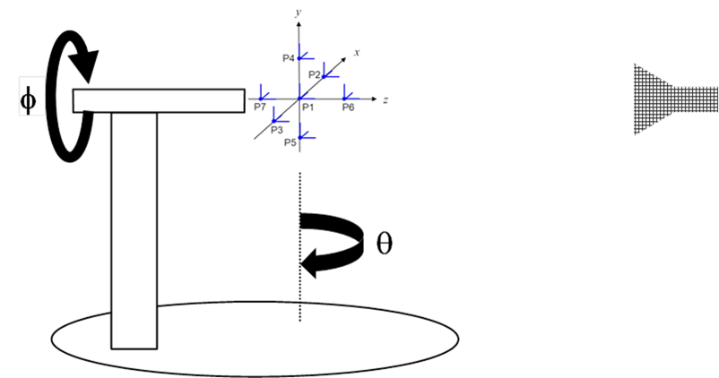{width="3.183333333333333in"
height="0.4083333333333333in"}

#### 6.6.6.2 Tropospheric scintillation

Scintillation corresponds to rapid fluctuations of the received signal
amplitude and phase. Tropospheric propagation shall only be considered
for frequencies above 6 GHz.

Tropospheric scintillation is a phenomenon that causes rapid amplitude
and phase fluctuations of signals from satellite communication systems.
Unlike, ionospheric scintillation, the effect of tropospheric
scintillation increases with the carrier frequency of the signal, being
especially significant above 10 GHz. In this case, the signal
fluctuations are caused by sudden changes in the refractive index due to
the variation of temperature, water vapor content, and barometric
pressure.

Besides increasing with the carrier frequency, the effects of
scintillation also increase with low elevation angles, due to the longer
path of the signal, and wide beam width receiving antennas.

##### 6.6.6.2.1 Model for Tropospheric scintillation loss

The ITU-R recommendation algorithm for fading prediction \[11\] permits
an accurate prediction of the amplitude. This method consists in three
parts:

\- Prediction of the amplitude scintillation fading at free-space
elevation angles ≥ 5° (Section 2.4.1 in \[13\]).

\- Prediction of the amplitude scintillation fading for fades ≥ 25 dB
(section 2.4.2 in \[13\]).

\- Prediction of the amplitude scintillation in the transition region
between the above two distributions (section 2.4.3 in \[13\]).

An illustrative example of typical power attenuation levels as a
function of the elevation angle is depicted in Figure 6.6.6.2.1-1. The
user location is Toulouse (France), the carrier frequency is set to 20
GHz, and circular polarization is assumed. Even though tropospheric
scintillation is latitude dependent, it is suggested to take this plot
as a reference for satellite link margin computation.

{width="6.697222222222222in" height="3.9125in"}

Figure 6.6.6.2.1-1: Complementary cumulative probability function of the
tropospheric scintillation attenuation at 20 GHz in Toulouse (France).

As baseline for system-level simulations above 6 GHz, the fading due to
scintillation $\text{PL}_{S}$ is equal to the tropospheric attenuation
level at 99% of the time derived from Figure 6.6.6.2.1-1 and summarized
in Table 6.6.6.2.1-1. Alternatively, it can be drawn for each UE based
on its corresponding CDF from Figure 6.6.6.2.1-1, assuming no
correlation between different UE.

Table 6.6.6.2.1-1: Tropospheric attenuation in dB with 99% probability
at 20 GHz in Toulouse

  ------------------------- -------------------------------------------------------
  Elevation angle \[deg\]   Tropospheric attenuation, *P*{*A~IS~* \> *x*} \< 0.01
  10                        1.08 dB
  20                        0.48 dB
  30                        0.30 dB
  40                        0.22 dB
  50                        0.17 dB
  60                        0.13 dB
  70                        0.12 dB
  80                        0.12 dB
  90                        0.12 dB
  ------------------------- -------------------------------------------------------

6.7 Fast fading model
---------------------

The generic fast fading model in 3GPP is based on TR 38.901 \[12\]. For
narrowband **SISO** simulations, an optional simplified channel model
can be used as long as the flat fading assumption is valid.

Most literature on satellite channel models rely on flat fading models
\[15\], \[16\], \[17\], i.e. non frequency selective channel models, the
ITU two-state model described in \[1\] being the most up-to-date model.

The formula$B_{C} = \frac{1}{\text{10}\tau_{\text{rms}}}$ is defined to
calculate the coherence bandwidth from the 95th percentile rms delay
spread. Coherence bandwidth depends on environment, antenna pattern and
elevation. The channel is assumed to be flat if the UE bandwidth is
lower than the coherence bandwidth of the channel. In satellite
channels, where small fade margins are usually considered,
$\tau_{\text{rms}}$ can be assessed only for cases where the fade event
is below a given threshold (otherwise, system outage will occur
regardless of channel dispersion).

In \[47\], values of $\tau_{\text{rms}}$ were estimated considering an
omnidirectional UE antenna for suburban and urban environments, several
elevation angles and fade margins. Based on these results, the ITU
two-state model can at least (NOTE 1) be used as a simplified
alternative to the TR 38.901 \[12\] methodology for satellite links if
all of the following conditions are met:

\- S-band scenario

\- Minimum elevation angle is 20° or above

\- Quasi-LOS conditions (i.e. fading margin is approx. 5dB maximum)

\- Channel bandwidth is 5 MHz or below

\- Environment is rural, suburban or urban

NOTE 1: Flat fading conditions are more easily achievable when using
highly directive UE antennas located in less scattering environment,
like on a rooftop or on an open field. In every case, the flat fading
criterion described above shall be fulfilled.

### 6.7.1 Flat fading

We consider here the ITU two-state model. This model includes already
the clutter loss and the shadow fading, so that the basis path loss is
calculated as follows:

{width="1.3055555555555556in" height="0.25in"}
(6.7-1)

In the two-state model, the signal level is statistically described with
a good state (corresponding to LOS and slightly shadowed conditions) and
a bad state (corresponding to severe shadowed conditions). The state
duration is described by a semi-Markov model. Within each state fading
is described by a Loo distribution where the received signal is the sum
of the direct path signal and the diffuse multipath.

The Loo distribution is therefore defined with the following parameters:

\- Mean of the direct signal

\- Standard deviation of the direct signal

\- Mean of the multipath

The following procedure shall be followed for system-level evaluations:

[Step 1]{.underline}: Set general parameters related to environment and
satellite link as follows:

\- Set the center frequency from 1.5 GHz to 20 GHz;

\- Choose one of the following LMS scenarios available (in S band:
urban, suburban, rural wooded, residential -- in Ka band: suburban,
rural wooded);

\- Set the link elevation assuming a rounded value towards the closest
available elevation for the frequency/environment chosen (20°, 30°, 34°,
45°, 60°, 70°);

\- Give UE position, array orientation, speed and direction of motion in
the global coordinate system.

[Step 2]{.underline}: Determine the (µ,σ)~*G,B*~ *,
(*$\mu_{M_{A}},\sigma_{M_{A}})_{G,B}$*, (g~1,~g~2~)~G,B~,
(h~1,~h~2~)~G,B~, (dur~min~)~G,B~ ,(f~1~,f~2~), p~B,min~* and *p~B,max~*
from the input parameters table provided in Annex 2 of \[1\] and
summarized in Table 6.7.1-1.

Table 6.7.1-1: Model parameters of the 2-state model

+----------------------------------+----------------------------------+
| Parameter                        | Description                      |
+----------------------------------+----------------------------------+
| (µ,σ)*~G,B~*                     | Mean and standard deviation of   |
|                                  | the log-normal law assumed for   |
|                                  | events duration (m)              |
+----------------------------------+----------------------------------+
| *dur~minG,B~*                    | Minimum possible events duration |
|                                  | (m)                              |
+----------------------------------+----------------------------------+
| ($\mu_{M_{A}}$*~GB~*,            | Parameters of the *M~A\ G,B~*    |
| $\sigma_{M_{A}}$*~GB~*)          | distribution (*M~A~* being the   |
|                                  | average value of the direct path |
|                                  | amplitude *A* over one event)    |
|                                  | (dB)                             |
+----------------------------------+----------------------------------+
| *MP* =                           | Multipath power, *MP~G,B~* (one  |
| *h*~1*G,B*~*M~A~*+*h*~2*G,B*~    | 1^st^ order polynomial for each  |
|                                  | state), (dB)                     |
+----------------------------------+----------------------------------+
| = *g*~1*G,B*~*M~A~+*g~2*G,B*~    | Standard deviation of *A*,       |
|                                  | $\Sigma_{\text{AG},B}$ (one      |
|                                  | 1^st^ order polynomial for each  |
|                                  | state)                           |
+----------------------------------+----------------------------------+
| *L~corrG,B~* NOTE 2              | Direct path amplitude            |
|                                  | correlation distance (m)         |
+----------------------------------+----------------------------------+
| *f*~1~Δ*M~A~+f*~2~               | Transition length, *L~trans~*    |
|                                  | (one single 1^st^ order          |
|                                  | polynomial), (m)                 |
+----------------------------------+----------------------------------+
| \[*p~B,min~ , p~B,max~*\]        | Probability range to consider    |
|                                  | for the *M~A\ B~* distribution   |
+----------------------------------+----------------------------------+
| NOTE 1: G stands for the GOOD    |                                  |
| state and B stands for the BAD   |                                  |
| state.                           |                                  |
|                                  |                                  |
| NOTE 2: Only for generative      |                                  |
| modelling.                       |                                  |
+----------------------------------+----------------------------------+

Assign propagation condition (GOOD/BAD) states in the original procedure
from \[15\].

NOTE: Unlike the frequency selective case, the LOS probability defined
in clause 6.6.1 is not used when considering the flat fading model

The propagation conditions for different Earth-space links are
uncorrelated.

*The GOOD and BAD state probability is calculated as follows :*

{width="4.805555555555555in" height="0.94375in"}
(6.7-2)

{width="5.852083333333334in"
height="0.5215277777777778in"} (6.7-3)

{width="3.3333333333333335in"
height="0.3055555555555556in"} (6.7-4)

{width="2.19375in"
height="0.5416666666666666in"} (6.7-5)

\- Where subscripts G, B and T stand respectively for good, bad and
transition states, $\text{dur} >$ the mean duration of the considered
state in meters, dur~min~ the minimal state duration in meters, µ and σ
respectively the mean and standard deviation of the assumed log-normal
law in m.

*- p~N~(x; μ,σ)* and *F~N~(x; μ,σ)* are respectively the probability
density function and the cumulative distribution function of a normal
distribution with mean μ and standard deviation *σ* as defined in
Recommendation ITU-R P.1057

\- Where $\mu_{M_{A}}$*~GB~*, $\sigma_{M_{A}}$*~GB~* are the parameters
of the average value of the direct path amplitude A over one event,
\[*p~B,min~ , p~B,max~*\] the probability range to consider for the
M~A,B~ distribution.

[]{.underline}

[Step 3]{.underline}: Draw M~Ai~, the mean power of the direct signal,
as a normally distributed parameter function of
$(\mu_{M_{A}},\sigma_{M_{A}})_{G,B}$ expressed in dB.

$M_{A_{i}}\text{\textasciitilde}N(\mu_{M_{A_{i}}},\sigma_{M_{A_{i}}})$

Compute *Σ~Ai~ and MP~i~, respectively the standard deviation of the
direct signal and the mean multipath power both expressed in dB where
suscript i designate the good or bad state, as follow:*

*Σ~Ai~* = *g*~1*i*~*M~Ai~ + g*~2*i*~ (6.7-6)

*MP~i\ ~*= *h*~1*i*~*M~Ai~ + h*~2*i*~ (6.7-7)

[]{.underline}

[Step 4]{.underline}: Draw the power of the direct signal $P_{D}$
following the normally distribution($M_{A_{i}},\Sigma_{A_{i}}$) and
derive the K factor as $P_{D}$-$\text{MP}_{i}$ (all expressed in dB).

For each UE, the channel is therefore characterized by a single Rice
distributed tap.

Note that the above procedure is only valid for simulation durations up
to a few TTIs. It is further assumed that no state change occurs during
the simulation duration.

For longer simulations, the procedure described in clause 6.2 from
\[10\] must be applied, as the K factor must not be considered as
constant.

Note that individual fading values at a given time may directly be
obtained after step 3 of the above procedure, based on the Loo
distribution:

*(6.7-8)*

With 2$\sigma_{i}^{2}$being the multipath mean received power expressed
in dB, i.e. *MP~i\ ~*= 10log (2$\sigma_{i}^{2}$)

Similarly to \[10\], a Jake\'s Doppler spectrum is considered for UE
mobility.

Additional Doppler shift due to satellite motion should be taken into
account according to the following formula:

,

Where denotes the satellite speed, *c* denotes the speed of light, *R*
denotes the earth radius, *h* denotes the satellite altitude, denotes
the satellite elevation angle, and denotes the carrier frequency.

The satellite speed, satellite elevation angle and UE speed should be
considered to be constant during the simulation duration, if limited to
few TTIs.

### 6.7.2 Frequency selective fading

In the fast fading model, the process in 7.5 of TR 38.901 \[12\] is
used. This section is not a stand-alone description of the fast fading
model, but it describes the differences between the channel models used
for terrestrial and satellite/HAPS communications. As can be seen from
Figure 6.7.2-1, there is not much difference in local scattering between
the HAPS and satellite cases. Therefore, the same fast fading parameters
can be used for the both cases, including different satellite orbits as
well. The critical parameter is the elevation angle of the LOS path of
the satellite/HAPS vs. ground horizon.

{width="4.88125in"
height="2.4305555555555554in"}

Figure 6.7.2-1: HAPS to UE vs. satellite to UE propagation

Instead of the parameterization tables in TR 38.901 \[12\] (Table 7.5-6
Part-1 and Part-2) the following tables shall be used.

NOTE 1: Some channel models may lead to pessimistic results of the
performance of satellite/HAPS to UE link especially in the higher
elevations due to the high number of clusters and low K factor.

NOTE 2: In some cases, the correlation distances are shorter in real
world conditions.

Angular scaling factors in cluster generation need to be added to the
NTN scenarios that have lower number of clusters than the scenarios
described in TR 38.901 \[12\] (Table 6.7.2-1aa below corresponds to
Table 7.5-2 in TR 38.901 \[12\] and Table 6.7.2-1ab below corresponds to
Table 7.5-3 in TR 38.901 \[12\]).

Table 6.7.2-1aa: Scaling factors for AOA, AOD generation

  --------------------------------------------------------------------------- ------- ------- ------- ------- ------- -------- -------- -------- -------- -------- -------- -------- --------
  **\# clusters**                                                             **2**   **3**   **4**   **5**   **8**   **10**   **11**   **12**   **14**   **15**   **16**   **19**   **20**
  {width="0.43125in" height="0.2743055555555556in"}   0.501   0.680   0.779   0.860   1.018   1.090    1.123    1.146    1.190    1.211    1.226    1.273    1.289
  --------------------------------------------------------------------------- ------- ------- ------- ------- ------- -------- -------- -------- -------- -------- -------- -------- --------

Table 6.7.2-1ab: Scaling factors for ZOA, ZOD generation

  --------------------------------------------------------------------------- ------- ------- ------- ------- -------- -------- -------- -------- -------- --------
  **\# clusters**                                                             **2**   **3**   **4**   **8**   **10**   **11**   **12**   **15**   **19**   **20**
  {width="0.43125in" height="0.2638888888888889in"}   0.430   0.594   0.697   0.889   0.957    1.031    1.104    1.1088   1.184    1.178
  --------------------------------------------------------------------------- ------- ------- ------- ------- -------- -------- -------- -------- -------- --------

Table 6.7.2-1a: Channel model parameters for Dense Urban Scenario (LOS)
in S band

<table>
<tbody>
<tr class="odd">
<td>Scenarios</td>
<td>Dense Urban LOS</td>
<td></td>
<td></td>
<td></td>
<td></td>
<td></td>
<td></td>
<td></td>
<td></td>
<td></td>
</tr>
<tr class="even">
<td></td>
<td>10°</td>
<td>20°</td>
<td>30°</td>
<td>40°</td>
<td>50°</td>
<td>60°</td>
<td>70°</td>
<td>80°</td>
<td>90°</td>
<td></td>
</tr>
<tr class="odd">
<td>
Delay spread (DS)

lgDS=log10(DS/1s)
</td>
<td><em>μ</em>lgDS</td>
<td>-7.12</td>
<td>-7.28</td>
<td>-7.45</td>
<td>-7.73</td>
<td>-7.91</td>
<td>-8.14</td>
<td>-8.23</td>
<td>-8.28</td>
<td>-8.36</td>
</tr>
<tr class="even">
<td></td>
<td><em>σ</em>lgDS</td>
<td>0.80</td>
<td>0.67</td>
<td>0.68</td>
<td>0.66</td>
<td>0.62</td>
<td>0.51</td>
<td>0.45</td>
<td>0.31</td>
<td>0.08</td>
</tr>
<tr class="odd">
<td>
AOD spread (ASD)

lgASD=log10(ASD/1°)
</td>
<td><em>μ</em>lgASD</td>
<td>-3.06</td>
<td>-2.68</td>
<td>-2.51</td>
<td>-2.40</td>
<td>-2.31</td>
<td>-2.20</td>
<td>-2.00</td>
<td>-1.64</td>
<td>-0.63</td>
</tr>
<tr class="even">
<td></td>
<td><em>σ</em>lgASD</td>
<td>0.48</td>
<td>0.36</td>
<td>0.38</td>
<td>0.32</td>
<td>0.33</td>
<td>0.39</td>
<td>0.40</td>
<td>0.32</td>
<td>0.53</td>
</tr>
<tr class="odd">
<td>
AOA spread (ASA)

lgASA=log10(ASA/1°)
</td>
<td><em>μ</em>lgASA</td>
<td>0.94</td>
<td>0.87</td>
<td>0.92</td>
<td>0.79</td>
<td>0.72</td>
<td>0.60</td>
<td>0.55</td>
<td>0.71</td>
<td>0.81</td>
</tr>
<tr class="even">
<td></td>
<td><em>σ</em>lgASA</td>
<td>0.70</td>
<td>0.66</td>
<td>0.68</td>
<td>0.64</td>
<td>0.63</td>
<td>0.54</td>
<td>0.52</td>
<td>0.53</td>
<td>0.62</td>
</tr>
<tr class="odd">
<td>
ZOA spread (ZSA)

lgZSA=log10(ZSA/1°)
</td>
<td><em>μ</em>lgZSA</td>
<td>0.82</td>
<td>0.50</td>
<td>0.82</td>
<td>1.23</td>
<td>1.43</td>
<td>1.56</td>
<td>1.66</td>
<td>1.73</td>
<td>1.79</td>
</tr>
<tr class="even">
<td></td>
<td><em>σ</em>lgZSA</td>
<td>0.03</td>
<td>0.09</td>
<td>0.05</td>
<td>0.03</td>
<td>0.06</td>
<td>0.05</td>
<td>0.05</td>
<td>0.02</td>
<td>0.01</td>
</tr>
<tr class="odd">
<td>
ZOD spread (ZSD)

lgZSA=log10(ZSD/1°)
</td>
<td><em>μ</em>lgZSD</td>
<td>-2.52</td>
<td>-2.29</td>
<td>-2.19</td>
<td>-2.24</td>
<td>-2.30</td>
<td>-2.48</td>
<td>-2.64</td>
<td>-2.68</td>
<td>-2.61</td>
</tr>
<tr class="even">
<td></td>
<td><em>σ</em>lgZSD</td>
<td>0.50</td>
<td>0.53</td>
<td>0.58</td>
<td>0.51</td>
<td>0.46</td>
<td>0.35</td>
<td>0.31</td>
<td>0.39</td>
<td>0.28</td>
</tr>
<tr class="odd">
<td>Shadow fading (SF) [dB]</td>
<td><em>σSF</em></td>
<td>See Table 6.6.2-1</td>
<td></td>
<td></td>
<td></td>
<td></td>
<td></td>
<td></td>
<td></td>
<td></td>
</tr>
<tr class="even">
<td>K-factor (K) [dB]</td>
<td><em>μK</em></td>
<td>4.4</td>
<td>9.0</td>
<td>9.3</td>
<td>7.9</td>
<td>7.4</td>
<td>7.0</td>
<td>6.9</td>
<td>6.5</td>
<td>6.8</td>
</tr>
<tr class="odd">
<td></td>
<td><em>σK</em></td>
<td>3.3</td>
<td>6.6</td>
<td>6.1</td>
<td>4.0</td>
<td>3.0</td>
<td>2.6</td>
<td>2.2</td>
<td>2.1</td>
<td>1.9</td>
</tr>
<tr class="even">
<td>Cross-Correlations</td>
<td><em>ASD</em> vs <em>DS</em></td>
<td>0.4</td>
<td>0.4</td>
<td>0.4</td>
<td>0.4</td>
<td>0.4</td>
<td>0.4</td>
<td>0.4</td>
<td>0.4</td>
<td>0.4</td>
</tr>
<tr class="odd">
<td></td>
<td><em>ASA</em> vs <em>DS</em></td>
<td>0.8</td>
<td>0.8</td>
<td>0.8</td>
<td>0.8</td>
<td>0.8</td>
<td>0.8</td>
<td>0.8</td>
<td>0.8</td>
<td>0.8</td>
</tr>
<tr class="even">
<td></td>
<td><em>ASA</em> vs <em>SF</em></td>
<td>-0.5</td>
<td>-0.5</td>
<td>-0.5</td>
<td>-0.5</td>
<td>-0.5</td>
<td>-0.5</td>
<td>-0.5</td>
<td>-0.5</td>
<td>-0.5</td>
</tr>
<tr class="odd">
<td></td>
<td><em>ASD</em> vs <em>SF</em></td>
<td>-0.5</td>
<td>-0.5</td>
<td>-0.5</td>
<td>-0.5</td>
<td>-0.5</td>
<td>-0.5</td>
<td>-0.5</td>
<td>-0.5</td>
<td>-0.5</td>
</tr>
<tr class="even">
<td></td>
<td><em>DS</em> vs <em>SF</em></td>
<td>-0.4</td>
<td>-0.4</td>
<td>-0.4</td>
<td>-0.4</td>
<td>-0.4</td>
<td>-0.4</td>
<td>-0.4</td>
<td>-0.4</td>
<td>-0.4</td>
</tr>
<tr class="odd">
<td></td>
<td><em>ASD</em> vs <em>ASA</em></td>
<td>0</td>
<td>0</td>
<td>0</td>
<td>0</td>
<td>0</td>
<td>0</td>
<td>0</td>
<td>0</td>
<td>0</td>
</tr>
<tr class="even">
<td></td>
<td><em>ASD</em> vs <em>Κ</em></td>
<td>0</td>
<td>0</td>
<td>0</td>
<td>0</td>
<td>0</td>
<td>0</td>
<td>0</td>
<td>0</td>
<td>0</td>
</tr>
<tr class="odd">
<td></td>
<td><em>ASA</em> vs <em>Κ</em></td>
<td>-0.2</td>
<td>-0.2</td>
<td>-0.2</td>
<td>-0.2</td>
<td>-0.2</td>
<td>-0.2</td>
<td>-0.2</td>
<td>-0.2</td>
<td>-0.2</td>
</tr>
<tr class="even">
<td></td>
<td><em>DS</em> vs <em>Κ</em></td>
<td>-0.4</td>
<td>-0.4</td>
<td>-0.4</td>
<td>-0.4</td>
<td>-0.4</td>
<td>-0.4</td>
<td>-0.4</td>
<td>-0.4</td>
<td>-0.4</td>
</tr>
<tr class="odd">
<td></td>
<td><em>SF</em> vs <em>Κ</em></td>
<td>0</td>
<td>0</td>
<td>0</td>
<td>0</td>
<td>0</td>
<td>0</td>
<td>0</td>
<td>0</td>
<td>0</td>
</tr>
<tr class="even">
<td>Cross-Correlations</td>
<td><em>ZSD</em> vs <em>SF</em></td>
<td>0</td>
<td>0</td>
<td>0</td>
<td>0</td>
<td>0</td>
<td>0</td>
<td>0</td>
<td>0</td>
<td>0</td>
</tr>
<tr class="odd">
<td></td>
<td><em>ZSA</em> vs <em>SF</em></td>
<td>-0.8</td>
<td>-0.8</td>
<td>-0.8</td>
<td>-0.8</td>
<td>-0.8</td>
<td>-0.8</td>
<td>-0.8</td>
<td>-0.8</td>
<td>-0.8</td>
</tr>
<tr class="even">
<td></td>
<td><em>ZSD</em> vs <em>K</em></td>
<td>0</td>
<td>0</td>
<td>0</td>
<td>0</td>
<td>0</td>
<td>0</td>
<td>0</td>
<td>0</td>
<td>0</td>
</tr>
<tr class="odd">
<td></td>
<td><em>ZSA</em> vs <em>K</em></td>
<td>0</td>
<td>0</td>
<td>0</td>
<td>0</td>
<td>0</td>
<td>0</td>
<td>0</td>
<td>0</td>
<td>0</td>
</tr>
<tr class="even">
<td></td>
<td><em>ZSD</em> vs <em>DS</em></td>
<td>-0.2</td>
<td>-0.2</td>
<td>-0.2</td>
<td>-0.2</td>
<td>-0.2</td>
<td>-0.2</td>
<td>-0.2</td>
<td>-0.2</td>
<td>-0.2</td>
</tr>
<tr class="odd">
<td></td>
<td><em>ZSA</em> vs <em>DS</em></td>
<td>0</td>
<td>0</td>
<td>0</td>
<td>0</td>
<td>0</td>
<td>0</td>
<td>0</td>
<td>0</td>
<td>0</td>
</tr>
<tr class="even">
<td></td>
<td><em>ZSD</em> vs <em>ASD</em></td>
<td>0.5</td>
<td>0.5</td>
<td>0.5</td>
<td>0.5</td>
<td>0.5</td>
<td>0.5</td>
<td>0.5</td>
<td>0.5</td>
<td>0.5</td>
</tr>
<tr class="odd">
<td></td>
<td><em>ZSA</em> vs <em>ASD</em></td>
<td>0</td>
<td>0</td>
<td>0</td>
<td>0</td>
<td>0</td>
<td>0</td>
<td>0</td>
<td>0</td>
<td>0</td>
</tr>
<tr class="even">
<td></td>
<td><em>ZSD</em> vs <em>ASA</em></td>
<td>-0.3</td>
<td>-0.3</td>
<td>-0.3</td>
<td>-0.3</td>
<td>-0.3</td>
<td>-0.3</td>
<td>-0.3</td>
<td>-0.3</td>
<td>-0.3</td>
</tr>
<tr class="odd">
<td></td>
<td><em>ZSA</em> vs <em>ASA</em></td>
<td>0.4</td>
<td>0.4</td>
<td>0.4</td>
<td>0.4</td>
<td>0.4</td>
<td>0.4</td>
<td>0.4</td>
<td>0.4</td>
<td>0.4</td>
</tr>
<tr class="even">
<td></td>
<td><em>ZSD</em> vs <em>ZSA</em></td>
<td>0</td>
<td>0</td>
<td>0</td>
<td>0</td>
<td>0</td>
<td>0</td>
<td>0</td>
<td>0</td>
<td>0</td>
</tr>
<tr class="odd">
<td>Delay scaling parameter <em>rτ</em></td>
<td>2.5</td>
<td>2.5</td>
<td>2.5</td>
<td>2.5</td>
<td>2.5</td>
<td>2.5</td>
<td>2.5</td>
<td>2.5</td>
<td>2.5</td>
<td></td>
</tr>
<tr class="even">
<td>XPR [dB]</td>
<td><em>μ</em>XPR</td>
<td>24.4</td>
<td>23.6</td>
<td>23.2</td>
<td>22.6</td>
<td>21.8</td>
<td>20.5</td>
<td>19.3</td>
<td>17.4</td>
<td>12.3</td>
</tr>
<tr class="odd">
<td></td>
<td><em>σ</em>XPR</td>
<td>3.8</td>
<td>4.7</td>
<td>4.6</td>
<td>4.9</td>
<td>5.7</td>
<td>6.9</td>
<td>8.1</td>
<td>10.3</td>
<td>15.2</td>
</tr>
<tr class="even">
<td>Number of clusters <em>N</em></td>
<td>3</td>
<td>3</td>
<td>3</td>
<td>3</td>
<td>3</td>
<td>3</td>
<td>3</td>
<td>3</td>
<td>3</td>
<td></td>
</tr>
<tr class="odd">
<td>Number of rays per cluster <em>M</em></td>
<td>20</td>
<td>20</td>
<td>20</td>
<td>20</td>
<td>20</td>
<td>20</td>
<td>20</td>
<td>20</td>
<td>20</td>
<td></td>
</tr>
<tr class="even">
<td>Cluster <em>DS</em> (<em>c</em>DS) in [ns]</td>
<td>3.9</td>
<td>3.9</td>
<td>3.9</td>
<td>3.9</td>
<td>3.9</td>
<td>3.9</td>
<td>3.9</td>
<td>3.9</td>
<td>3.9</td>
<td></td>
</tr>
<tr class="odd">
<td>Cluster <em>ASD</em> (<em>c</em>ASD) in [deg]</td>
<td>0</td>
<td>0</td>
<td>0</td>
<td>0</td>
<td>0</td>
<td>0</td>
<td>0</td>
<td>0</td>
<td>0</td>
<td></td>
</tr>
<tr class="even">
<td>Cluster <em>ASA</em> (<em>c</em>ASA) in [deg]</td>
<td>11</td>
<td>11</td>
<td>11</td>
<td>11</td>
<td>11</td>
<td>11</td>
<td>11</td>
<td>11</td>
<td>11</td>
<td></td>
</tr>
<tr class="odd">
<td>Cluster <em>ZSA</em> (<em>c</em>ZSA) in [deg]</td>
<td>7</td>
<td>7</td>
<td>7</td>
<td>7</td>
<td>7</td>
<td>7</td>
<td>7</td>
<td>7</td>
<td>7</td>
<td></td>
</tr>
<tr class="even">
<td>Per cluster shadowing std ζ [dB]</td>
<td>3</td>
<td>3</td>
<td>3</td>
<td>3</td>
<td>3</td>
<td>3</td>
<td>3</td>
<td>3</td>
<td>3</td>
<td></td>
</tr>
<tr class="odd">
<td>Correlation distance in the horizontal plane [m]</td>
<td><em>DS</em></td>
<td>30</td>
<td>30</td>
<td>30</td>
<td>30</td>
<td>30</td>
<td>30</td>
<td>30</td>
<td>30</td>
<td>30</td>
</tr>
<tr class="even">
<td></td>
<td><em>ASD</em></td>
<td>18</td>
<td>18</td>
<td>18</td>
<td>18</td>
<td>18</td>
<td>18</td>
<td>18</td>
<td>18</td>
<td>18</td>
</tr>
<tr class="odd">
<td></td>
<td><em>ASA</em></td>
<td>15</td>
<td>15</td>
<td>15</td>
<td>15</td>
<td>15</td>
<td>15</td>
<td>15</td>
<td>15</td>
<td>15</td>
</tr>
<tr class="even">
<td></td>
<td><em>SF</em></td>
<td>37</td>
<td>37</td>
<td>37</td>
<td>37</td>
<td>37</td>
<td>37</td>
<td>37</td>
<td>37</td>
<td>37</td>
</tr>
<tr class="odd">
<td></td>
<td><em>Κ</em></td>
<td>12</td>
<td>12</td>
<td>12</td>
<td>12</td>
<td>12</td>
<td>12</td>
<td>12</td>
<td>12</td>
<td>12</td>
</tr>
<tr class="even">
<td></td>
<td><em>ZSA</em></td>
<td>15</td>
<td>15</td>
<td>15</td>
<td>15</td>
<td>15</td>
<td>15</td>
<td>15</td>
<td>15</td>
<td>15</td>
</tr>
<tr class="odd">
<td></td>
<td><em>ZSD</em></td>
<td>15</td>
<td>15</td>
<td>15</td>
<td>15</td>
<td>15</td>
<td>15</td>
<td>15</td>
<td>15</td>
<td>15</td>
</tr>
<tr class="even">
<td>
<em>fc</em> is carrier frequency in GHz; <em>d</em>2D is BS-UT distance in km.

NOTE 1: <em>DS</em> = rms delay spread, <em>ASD</em> = rms azimuth spread of departure angles, <em>ASA</em> = rms azimuth spread of arrival angles, <em>ZSD</em> = rms zenith spread of departure angles, <em>ZSA</em> = rms zenith spread of arrival angles, <em>SF</em> = shadow fading, and <em>K</em> = Ricean K-factor.

NOTE 2: The sign of the shadow fading is defined so that positive SF means more received power at UT than predicted by the path loss model.

NOTE 3: All large scale parameters are assumed to have no correlation between different floors.

NOTE 4: The following notation for mean (<em>μ</em>lgX=mean{log10(X) }) and standard deviation (<em>σ</em>lgX=std{log10(X) }) is used for logarithmized parameters X.

NOTE 5: For all considered scenarios the AOD/AOA distributions are modelled by a wrapped Gaussian distribution, the ZOD/ZOA distributions are modelled by a Laplacian distribution and the delay distribution is modelled by an exponential distribution.

NOTE 6: For UMa and frequencies below 6 GHz, use <em>fc </em>= 6 when determining the values of the frequency-dependent LSP values

NOTE 7: For UMi and frequencies below 2 GHz, use fc = 2 when determining the values of the frequency-dependent LSP values

NOTE 8: For satellite (e.g.GEO/LEO), the departure angle spreads are zeros, i.e. µlgASD and µlgZSD are –∞, and corresponding standard deviations are zeros.

NOTE 9: The number of clusters is based on a limited data. The number may be different in the real field conditions.
</td>
<td></td>
<td></td>
<td></td>
<td></td>
<td></td>
<td></td>
<td></td>
<td></td>
<td></td>
<td></td>
</tr>
</tbody>
</table>

Table 6.7.2-1b: Channel model parameters for Dense Urban Scenario (LOS)
in Ka band

<table>
<tbody>
<tr class="odd">
<td>Scenarios</td>
<td>Dense Urban LOS</td>
<td></td>
<td></td>
<td></td>
<td></td>
<td></td>
<td></td>
<td></td>
<td></td>
<td></td>
</tr>
<tr class="even">
<td></td>
<td>10°</td>
<td>20°</td>
<td>30°</td>
<td>40°</td>
<td>50°</td>
<td>60°</td>
<td>70°</td>
<td>80°</td>
<td>90°</td>
<td></td>
</tr>
<tr class="odd">
<td>
Delay spread (DS)

lgDS=log10(DS/1s)
</td>
<td><em>μ</em>lgDS</td>
<td>-7.43</td>
<td>-7.62</td>
<td>-7.76</td>
<td>-8.02</td>
<td>-8.13</td>
<td>-8.30</td>
<td>-8.34</td>
<td>-8.39</td>
<td>-8.45</td>
</tr>
<tr class="even">
<td></td>
<td><em>σ</em>lgDS</td>
<td>0.90</td>
<td>0.78</td>
<td>0.80</td>
<td>0.72</td>
<td>0.61</td>
<td>0.47</td>
<td>0.39</td>
<td>0.26</td>
<td>0.01</td>
</tr>
<tr class="odd">
<td>
AOD spread (ASD)

lgASD=log10(ASD/1°)
</td>
<td><em>μ</em>lgASD</td>
<td>-3.43</td>
<td>-3.06</td>
<td>-2.91</td>
<td>-2.81</td>
<td>-2.74</td>
<td>-2.72</td>
<td>-2.46</td>
<td>-2.30</td>
<td>-1.11</td>
</tr>
<tr class="even">
<td></td>
<td><em>σ</em>lgASD</td>
<td>0.54</td>
<td>0.41</td>
<td>0.42</td>
<td>0.34</td>
<td>0.34</td>
<td>0.70</td>
<td>0.40</td>
<td>0.78</td>
<td>0.51</td>
</tr>
<tr class="odd">
<td>
AOA spread (ASA)

lgASA=log10(ASA/1°)
</td>
<td><em>μ</em>lgASA</td>
<td>0.65</td>
<td>0.53</td>
<td>0.60</td>
<td>0.43</td>
<td>0.36</td>
<td>0.16</td>
<td>0.18</td>
<td>0.24</td>
<td>0.36</td>
</tr>
<tr class="even">
<td></td>
<td><em>σ</em>lgASA</td>
<td>0.82</td>
<td>0.78</td>
<td>0.83</td>
<td>0.78</td>
<td>0.77</td>
<td>0.84</td>
<td>0.64</td>
<td>0.81</td>
<td>0.65</td>
</tr>
<tr class="odd">
<td>
ZOA spread (ZSA)

lgZSA=log10(ZSA/1°)
</td>
<td><em>μ</em>lgZSA</td>
<td>0.82</td>
<td>0.47</td>
<td>0.80</td>
<td>1.23</td>
<td>1.42</td>
<td>1.56</td>
<td>1.65</td>
<td>1.73</td>
<td>1.79</td>
</tr>
<tr class="even">
<td></td>
<td><em>σ</em>lgZSA</td>
<td>0.05</td>
<td>0.11</td>
<td>0.05</td>
<td>0.04</td>
<td>0.10</td>
<td>0.06</td>
<td>0.07</td>
<td>0.02</td>
<td>0.01</td>
</tr>
<tr class="odd">
<td>
ZOD spread (ZSD)

lgZSA=log10(ZSD/1°)
</td>
<td><em>μ</em>lgZSD</td>
<td>-2.75</td>
<td>-2.64</td>
<td>-2.49</td>
<td>-2.51</td>
<td>-2.54</td>
<td>-2.71</td>
<td>-2.85</td>
<td>-3.01</td>
<td>-3.08</td>
</tr>
<tr class="even">
<td></td>
<td><em>σ</em>lgZSD</td>
<td>0.55</td>
<td>0.64</td>
<td>0.69</td>
<td>0.57</td>
<td>0.50</td>
<td>0.37</td>
<td>0.31</td>
<td>0.45</td>
<td>0.27</td>
</tr>
<tr class="odd">
<td>Shadow fading (SF) [dB]</td>
<td><em>σSF</em></td>
<td>See Table 6.6.2-1</td>
<td></td>
<td></td>
<td></td>
<td></td>
<td></td>
<td></td>
<td></td>
<td></td>
</tr>
<tr class="even">
<td>K-factor (K) [dB]</td>
<td><em>μK</em></td>
<td>6.1</td>
<td>13.7</td>
<td>12.9</td>
<td>10.3</td>
<td>9.2</td>
<td>8.4</td>
<td>8.0</td>
<td>7.4</td>
<td>7.6</td>
</tr>
<tr class="odd">
<td></td>
<td><em>σK</em></td>
<td>2.6</td>
<td>6.8</td>
<td>6.0</td>
<td>3.3</td>
<td>2.2</td>
<td>1.9</td>
<td>1.5</td>
<td>1.6</td>
<td>1.3</td>
</tr>
<tr class="even">
<td>Cross-Correlations</td>
<td><em>ASD</em> vs <em>DS</em></td>
<td>0.4</td>
<td>0.4</td>
<td>0.4</td>
<td>0.4</td>
<td>0.4</td>
<td>0.4</td>
<td>0.4</td>
<td>0.4</td>
<td>0.4</td>
</tr>
<tr class="odd">
<td></td>
<td><em>ASA</em> vs <em>DS</em></td>
<td>0.8</td>
<td>0.8</td>
<td>0.8</td>
<td>0.8</td>
<td>0.8</td>
<td>0.8</td>
<td>0.8</td>
<td>0.8</td>
<td>0.8</td>
</tr>
<tr class="even">
<td></td>
<td><em>ASA</em> vs <em>SF</em></td>
<td>-0.5</td>
<td>-0.5</td>
<td>-0.5</td>
<td>-0.5</td>
<td>-0.5</td>
<td>-0.5</td>
<td>-0.5</td>
<td>-0.5</td>
<td>-0.5</td>
</tr>
<tr class="odd">
<td></td>
<td><em>ASD</em> vs <em>SF</em></td>
<td>-0.5</td>
<td>-0.5</td>
<td>-0.5</td>
<td>-0.5</td>
<td>-0.5</td>
<td>-0.5</td>
<td>-0.5</td>
<td>-0.5</td>
<td>-0.5</td>
</tr>
<tr class="even">
<td></td>
<td><em>DS</em> vs <em>SF</em></td>
<td>-0.4</td>
<td>-0.4</td>
<td>-0.4</td>
<td>-0.4</td>
<td>-0.4</td>
<td>-0.4</td>
<td>-0.4</td>
<td>-0.4</td>
<td>-0.4</td>
</tr>
<tr class="odd">
<td></td>
<td><em>ASD</em> vs <em>ASA</em></td>
<td>0</td>
<td>0</td>
<td>0</td>
<td>0</td>
<td>0</td>
<td>0</td>
<td>0</td>
<td>0</td>
<td>0</td>
</tr>
<tr class="even">
<td></td>
<td><em>ASD</em> vs <em>Κ</em></td>
<td>0</td>
<td>0</td>
<td>0</td>
<td>0</td>
<td>0</td>
<td>0</td>
<td>0</td>
<td>0</td>
<td>0</td>
</tr>
<tr class="odd">
<td></td>
<td><em>ASA</em> vs <em>Κ</em></td>
<td>-0.2</td>
<td>-0.2</td>
<td>-0.2</td>
<td>-0.2</td>
<td>-0.2</td>
<td>-0.2</td>
<td>-0.2</td>
<td>-0.2</td>
<td>-0.2</td>
</tr>
<tr class="even">
<td></td>
<td><em>DS</em> vs <em>Κ</em></td>
<td>-0.4</td>
<td>-0.4</td>
<td>-0.4</td>
<td>-0.4</td>
<td>-0.4</td>
<td>-0.4</td>
<td>-0.4</td>
<td>-0.4</td>
<td>-0.4</td>
</tr>
<tr class="odd">
<td></td>
<td><em>SF</em> vs <em>Κ</em></td>
<td>0</td>
<td>0</td>
<td>0</td>
<td>0</td>
<td>0</td>
<td>0</td>
<td>0</td>
<td>0</td>
<td>0</td>
</tr>
<tr class="even">
<td>Cross-Correlations</td>
<td><em>ZSD</em> vs <em>SF</em></td>
<td>0</td>
<td>0</td>
<td>0</td>
<td>0</td>
<td>0</td>
<td>0</td>
<td>0</td>
<td>0</td>
<td>0</td>
</tr>
<tr class="odd">
<td></td>
<td><em>ZSA</em> vs <em>SF</em></td>
<td>-0.8</td>
<td>-0.8</td>
<td>-0.8</td>
<td>-0.8</td>
<td>-0.8</td>
<td>-0.8</td>
<td>-0.8</td>
<td>-0.8</td>
<td>-0.8</td>
</tr>
<tr class="even">
<td></td>
<td><em>ZSD</em> vs <em>K</em></td>
<td>0</td>
<td>0</td>
<td>0</td>
<td>0</td>
<td>0</td>
<td>0</td>
<td>0</td>
<td>0</td>
<td>0</td>
</tr>
<tr class="odd">
<td></td>
<td><em>ZSA</em> vs <em>K</em></td>
<td>0</td>
<td>0</td>
<td>0</td>
<td>0</td>
<td>0</td>
<td>0</td>
<td>0</td>
<td>0</td>
<td>0</td>
</tr>
<tr class="even">
<td></td>
<td><em>ZSD</em> vs <em>DS</em></td>
<td>-0.2</td>
<td>-0.2</td>
<td>-0.2</td>
<td>-0.2</td>
<td>-0.2</td>
<td>-0.2</td>
<td>-0.2</td>
<td>-0.2</td>
<td>-0.2</td>
</tr>
<tr class="odd">
<td></td>
<td><em>ZSA</em> vs <em>DS</em></td>
<td>0</td>
<td>0</td>
<td>0</td>
<td>0</td>
<td>0</td>
<td>0</td>
<td>0</td>
<td>0</td>
<td>0</td>
</tr>
<tr class="even">
<td></td>
<td><em>ZSD</em> vs <em>ASD</em></td>
<td>0.5</td>
<td>0.5</td>
<td>0.5</td>
<td>0.5</td>
<td>0.5</td>
<td>0.5</td>
<td>0.5</td>
<td>0.5</td>
<td>0.5</td>
</tr>
<tr class="odd">
<td></td>
<td><em>ZSA</em> vs <em>ASD</em></td>
<td>0</td>
<td>0</td>
<td>0</td>
<td>0</td>
<td>0</td>
<td>0</td>
<td>0</td>
<td>0</td>
<td>0</td>
</tr>
<tr class="even">
<td></td>
<td><em>ZSD</em> vs <em>ASA</em></td>
<td>-0.3</td>
<td>-0.3</td>
<td>-0.3</td>
<td>-0.3</td>
<td>-0.3</td>
<td>-0.3</td>
<td>-0.3</td>
<td>-0.3</td>
<td>-0.3</td>
</tr>
<tr class="odd">
<td></td>
<td><em>ZSA</em> vs <em>ASA</em></td>
<td>0.4</td>
<td>0.4</td>
<td>0.4</td>
<td>0.4</td>
<td>0.4</td>
<td>0.4</td>
<td>0.4</td>
<td>0.4</td>
<td>0.4</td>
</tr>
<tr class="even">
<td></td>
<td><em>ZSD</em> vs <em>ZSA</em></td>
<td>0</td>
<td>0</td>
<td>0</td>
<td>0</td>
<td>0</td>
<td>0</td>
<td>0</td>
<td>0</td>
<td>0</td>
</tr>
<tr class="odd">
<td>Delay scaling parameter <em>rτ</em></td>
<td>2.5</td>
<td>2.5</td>
<td>2.5</td>
<td>2.5</td>
<td>2.5</td>
<td>2.5</td>
<td>2.5</td>
<td>2.5</td>
<td>2.5</td>
<td></td>
</tr>
<tr class="even">
<td>XPR [dB]</td>
<td><em>μ</em>XPR</td>
<td>24.7</td>
<td>24.4</td>
<td>24.4</td>
<td>24.2</td>
<td>23.9</td>
<td>23.3</td>
<td>22.6</td>
<td>21.2</td>
<td>17.6</td>
</tr>
<tr class="odd">
<td></td>
<td><em>σ</em>XPR</td>
<td>2.1</td>
<td>2.8</td>
<td>2.7</td>
<td>2.7</td>
<td>3.1</td>
<td>3.9</td>
<td>4.8</td>
<td>6.8</td>
<td>12.7</td>
</tr>
<tr class="even">
<td>Number of clusters <em>N</em></td>
<td>3</td>
<td>3</td>
<td>3</td>
<td>3</td>
<td>3</td>
<td>3</td>
<td>3</td>
<td>3</td>
<td>3</td>
<td></td>
</tr>
<tr class="odd">
<td>Number of rays per cluster <em>M</em></td>
<td>20</td>
<td>20</td>
<td>20</td>
<td>20</td>
<td>20</td>
<td>20</td>
<td>20</td>
<td>20</td>
<td>20</td>
<td></td>
</tr>
<tr class="even">
<td>Cluster <em>DS</em> (<em>c</em>DS) in [ns]</td>
<td>1.6</td>
<td>1.6</td>
<td>1.6</td>
<td>1.6</td>
<td>1.6</td>
<td>1.6</td>
<td>1.6</td>
<td>1.6</td>
<td>1.6</td>
<td></td>
</tr>
<tr class="odd">
<td>Cluster <em>ASD</em> (<em>c</em>ASD) in [deg]</td>
<td>0</td>
<td>0</td>
<td>0</td>
<td>0</td>
<td>0</td>
<td>0</td>
<td>0</td>
<td>0</td>
<td>0</td>
<td></td>
</tr>
<tr class="even">
<td>Cluster <em>ASA</em> (<em>c</em>ASA) in [deg]</td>
<td>11</td>
<td>11</td>
<td>11</td>
<td>11</td>
<td>11</td>
<td>11</td>
<td>11</td>
<td>11</td>
<td>11</td>
<td></td>
</tr>
<tr class="odd">
<td>Cluster <em>ZSA</em> (<em>c</em>ZSA) in [deg]</td>
<td>7</td>
<td>7</td>
<td>7</td>
<td>7</td>
<td>7</td>
<td>7</td>
<td>7</td>
<td>7</td>
<td>7</td>
<td></td>
</tr>
<tr class="even">
<td>Per cluster shadowing std ζ [dB]</td>
<td>3</td>
<td>3</td>
<td>3</td>
<td>3</td>
<td>3</td>
<td>3</td>
<td>3</td>
<td>3</td>
<td>3</td>
<td></td>
</tr>
<tr class="odd">
<td>Correlation distance in the horizontal plane [m]</td>
<td><em>DS</em></td>
<td>30</td>
<td>30</td>
<td>30</td>
<td>30</td>
<td>30</td>
<td>30</td>
<td>30</td>
<td>30</td>
<td>30</td>
</tr>
<tr class="even">
<td></td>
<td><em>ASD</em></td>
<td>18</td>
<td>18</td>
<td>18</td>
<td>18</td>
<td>18</td>
<td>18</td>
<td>18</td>
<td>18</td>
<td>18</td>
</tr>
<tr class="odd">
<td></td>
<td><em>ASA</em></td>
<td>15</td>
<td>15</td>
<td>15</td>
<td>15</td>
<td>15</td>
<td>15</td>
<td>15</td>
<td>15</td>
<td>15</td>
</tr>
<tr class="even">
<td></td>
<td><em>SF</em></td>
<td>37</td>
<td>37</td>
<td>37</td>
<td>37</td>
<td>37</td>
<td>37</td>
<td>37</td>
<td>37</td>
<td>37</td>
</tr>
<tr class="odd">
<td></td>
<td><em>Κ</em></td>
<td>12</td>
<td>12</td>
<td>12</td>
<td>12</td>
<td>12</td>
<td>12</td>
<td>12</td>
<td>12</td>
<td>12</td>
</tr>
<tr class="even">
<td></td>
<td><em>ZSA</em></td>
<td>15</td>
<td>15</td>
<td>15</td>
<td>15</td>
<td>15</td>
<td>15</td>
<td>15</td>
<td>15</td>
<td>15</td>
</tr>
<tr class="odd">
<td></td>
<td><em>ZSD</em></td>
<td>15</td>
<td>15</td>
<td>15</td>
<td>15</td>
<td>15</td>
<td>15</td>
<td>15</td>
<td>15</td>
<td>15</td>
</tr>
<tr class="even">
<td>
<em>fc</em> is carrier frequency in GHz; <em>d</em>2D is BS-UT distance in km.

NOTE 1: <em>DS</em> = rms delay spread, <em>ASD</em> = rms azimuth spread of departure angles, <em>ASA</em> = rms azimuth spread of arrival angles, <em>ZSD</em> = rms zenith spread of departure angles, <em>ZSA</em> = rms zenith spread of arrival angles, <em>SF</em> = shadow fading, and <em>K</em> = Ricean K-factor.

NOTE 2: The sign of the shadow fading is defined so that positive SF means more received power at UT than predicted by the path loss model.

NOTE 3: All large scale parameters are assumed to have no correlation between different floors.

NOTE 4: The following notation for mean (<em>μ</em>lgX=mean{log10(X) }) and standard deviation (<em>σ</em>lgX=std{log10(X) }) is used for logarithmized parameters X.

NOTE 5: For all considered scenarios the AOD/AOA distributions are modelled by a wrapped Gaussian distribution, the ZOD/ZOA distributions are modelled by a Laplacian distribution and the delay distribution is modelled by an exponential distribution.

NOTE 6: For UMa and frequencies below 6 GHz, use <em>fc </em>= 6 when determining the values of the frequency-dependent LSP values

NOTE 7: For UMi and frequencies below 2 GHz, use fc = 2 when determining the values of the frequency-dependent LSP values

NOTE 8: For satellite (e.g.GEO/LEO), the departure angle spreads are zeros, i.e. µlgASD and µlgZSD are –∞, and corresponding standard deviations are zeros.

NOTE 9: The number of clusters is based on a limited data. The number may be different in the real field conditions.
</td>
<td></td>
<td></td>
<td></td>
<td></td>
<td></td>
<td></td>
<td></td>
<td></td>
<td></td>
<td></td>
</tr>
</tbody>
</table>

Table 6.7.2-2a: Channel model parameters for Dense Urban Scenario (NLOS)
in S band

<table>
<tbody>
<tr class="odd">
<td>Scenarios</td>
<td>Dense Urban NLOS</td>
<td></td>
<td></td>
<td></td>
<td></td>
<td></td>
<td></td>
<td></td>
<td></td>
<td></td>
</tr>
<tr class="even">
<td></td>
<td>10°</td>
<td>20°</td>
<td>30°</td>
<td>40°</td>
<td>50°</td>
<td>60°</td>
<td>70°</td>
<td>80°</td>
<td>90°</td>
<td></td>
</tr>
<tr class="odd">
<td>
Delay spread (DS)

lgDS=log10(DS/1s)
</td>
<td><em>μ</em>lgDS</td>
<td>-6.84</td>
<td>-6.81</td>
<td>-6.94</td>
<td>-7.14</td>
<td>-7.34</td>
<td>-7.53</td>
<td>-7.67</td>
<td>-7.82</td>
<td>-7.84</td>
</tr>
<tr class="even">
<td></td>
<td><em>σ</em>lgDS</td>
<td>0.82</td>
<td>0.61</td>
<td>0.49</td>
<td>0.49</td>
<td>0.51</td>
<td>0.47</td>
<td>0.44</td>
<td>0.42</td>
<td>0.55</td>
</tr>
<tr class="odd">
<td>
AOD spread (ASD)

lgASD=log10(ASD/1°)
</td>
<td><em>μ</em>lgASD</td>
<td>-2.08</td>
<td>-1.68</td>
<td>-1.46</td>
<td>-1.43</td>
<td>-1.44</td>
<td>-1.33</td>
<td>-1.31</td>
<td>-1.11</td>
<td>-0.11</td>
</tr>
<tr class="even">
<td></td>
<td><em>σ</em>lgASD</td>
<td>0.87</td>
<td>0.73</td>
<td>0.53</td>
<td>0.50</td>
<td>0.58</td>
<td>0.49</td>
<td>0.65</td>
<td>0.69</td>
<td>0.53</td>
</tr>
<tr class="odd">
<td>
AOA spread (ASA)

lgASA=log10(ASA/1°)
</td>
<td><em>μ</em>lgASA</td>
<td>1.00</td>
<td>1.44</td>
<td>1.54</td>
<td>1.53</td>
<td>1.48</td>
<td>1.39</td>
<td>1.42</td>
<td>1.38</td>
<td>1.23</td>
</tr>
<tr class="even">
<td></td>
<td><em>σ</em>lgASA</td>
<td>1.60</td>
<td>0.87</td>
<td>0.64</td>
<td>0.56</td>
<td>0.54</td>
<td>0.68</td>
<td>0.55</td>
<td>0.60</td>
<td>0.60</td>
</tr>
<tr class="odd">
<td>
ZOA spread (ZSA)

lgZSA=log10(ZSA/1°)
</td>
<td><em>μ</em>lgZSA</td>
<td>1.00</td>
<td>0.94</td>
<td>1.15</td>
<td>1.35</td>
<td>1.44</td>
<td>1.56</td>
<td>1.64</td>
<td>1.70</td>
<td>1.70</td>
</tr>
<tr class="even">
<td></td>
<td><em>σ</em>lgZSA</td>
<td>0.63</td>
<td>0.65</td>
<td>0.42</td>
<td>0.28</td>
<td>0.25</td>
<td>0.16</td>
<td>0.18</td>
<td>0.09</td>
<td>0.17</td>
</tr>
<tr class="odd">
<td>
ZOD spread (ZSD)

lgZSA=log10(ZSD/1°)
</td>
<td><em>μ</em>lgZSD</td>
<td>-2.08</td>
<td>-1.66</td>
<td>-1.48</td>
<td>-1.46</td>
<td>-1.53</td>
<td>-1.61</td>
<td>-1.77</td>
<td>-1.90</td>
<td>-1.99</td>
</tr>
<tr class="even">
<td></td>
<td><em>σ</em>lgZSD</td>
<td>0.58</td>
<td>0.50</td>
<td>0.40</td>
<td>0.37</td>
<td>0.47</td>
<td>0.43</td>
<td>0.50</td>
<td>0.42</td>
<td>0.50</td>
</tr>
<tr class="odd">
<td>Shadow fading (SF) [dB]</td>
<td><em>σSF</em></td>
<td>See Table 6.6.2-1</td>
<td></td>
<td></td>
<td></td>
<td></td>
<td></td>
<td></td>
<td></td>
<td></td>
</tr>
<tr class="even">
<td>Cross-Correlations</td>
<td><em>ASD</em> vs <em>DS</em></td>
<td>0.4</td>
<td>0.4</td>
<td>0.4</td>
<td>0.4</td>
<td>0.4</td>
<td>0.4</td>
<td>0.4</td>
<td>0.4</td>
<td>0.4</td>
</tr>
<tr class="odd">
<td></td>
<td><em>ASA</em> vs <em>DS</em></td>
<td>0.6</td>
<td>0.6</td>
<td>0.6</td>
<td>0.6</td>
<td>0.6</td>
<td>0.6</td>
<td>0.6</td>
<td>0.6</td>
<td>0.6</td>
</tr>
<tr class="even">
<td></td>
<td><em>ASA</em> vs <em>SF</em></td>
<td>0</td>
<td>0</td>
<td>0</td>
<td>0</td>
<td>0</td>
<td>0</td>
<td>0</td>
<td>0</td>
<td>0</td>
</tr>
<tr class="odd">
<td></td>
<td><em>ASD</em> vs <em>SF</em></td>
<td>-0.6</td>
<td>-0.6</td>
<td>-0.6</td>
<td>-0.6</td>
<td>-0.6</td>
<td>-0.6</td>
<td>-0.6</td>
<td>-0.6</td>
<td>-0.6</td>
</tr>
<tr class="even">
<td></td>
<td><em>DS</em> vs <em>SF</em></td>
<td>-0.4</td>
<td>-0.4</td>
<td>-0.4</td>
<td>-0.4</td>
<td>-0.4</td>
<td>-0.4</td>
<td>-0.4</td>
<td>-0.4</td>
<td>-0.4</td>
</tr>
<tr class="odd">
<td></td>
<td><em>ASD</em> vs <em>ASA</em></td>
<td>0.4</td>
<td>0.4</td>
<td>0.4</td>
<td>0.4</td>
<td>0.4</td>
<td>0.4</td>
<td>0.4</td>
<td>0.4</td>
<td>0.4</td>
</tr>
<tr class="even">
<td></td>
<td><em>ASD</em> vs <em>Κ</em></td>
<td>N/A</td>
<td>N/A</td>
<td>N/A</td>
<td>N/A</td>
<td>N/A</td>
<td>N/A</td>
<td>N/A</td>
<td>N/A</td>
<td>N/A</td>
</tr>
<tr class="odd">
<td></td>
<td><em>ASA</em> vs <em>Κ</em></td>
<td>N/A</td>
<td>N/A</td>
<td>N/A</td>
<td>N/A</td>
<td>N/A</td>
<td>N/A</td>
<td>N/A</td>
<td>N/A</td>
<td>N/A</td>
</tr>
<tr class="even">
<td></td>
<td><em>DS</em> vs <em>Κ</em></td>
<td>N/A</td>
<td>N/A</td>
<td>N/A</td>
<td>N/A</td>
<td>N/A</td>
<td>N/A</td>
<td>N/A</td>
<td>N/A</td>
<td>N/A</td>
</tr>
<tr class="odd">
<td></td>
<td><em>SF</em> vs <em>Κ</em></td>
<td>N/A</td>
<td>N/A</td>
<td>N/A</td>
<td>N/A</td>
<td>N/A</td>
<td>N/A</td>
<td>N/A</td>
<td>N/A</td>
<td>N/A</td>
</tr>
<tr class="even">
<td>Cross-Correlations</td>
<td><em>ZSD</em> vs <em>SF</em></td>
<td>0</td>
<td>0</td>
<td>0</td>
<td>0</td>
<td>0</td>
<td>0</td>
<td>0</td>
<td>0</td>
<td>0</td>
</tr>
<tr class="odd">
<td></td>
<td><em>ZSA</em> vs <em>SF</em></td>
<td>-0.4</td>
<td>-0.4</td>
<td>-0.4</td>
<td>-0.4</td>
<td>-0.4</td>
<td>-0.4</td>
<td>-0.4</td>
<td>-0.4</td>
<td>-0.4</td>
</tr>
<tr class="even">
<td></td>
<td><em>ZSD</em> vs <em>K</em></td>
<td>N/A</td>
<td>N/A</td>
<td>N/A</td>
<td>N/A</td>
<td>N/A</td>
<td>N/A</td>
<td>N/A</td>
<td>N/A</td>
<td>N/A</td>
</tr>
<tr class="odd">
<td></td>
<td><em>ZSA</em> vs <em>K</em></td>
<td>N/A</td>
<td>N/A</td>
<td>N/A</td>
<td>N/A</td>
<td>N/A</td>
<td>N/A</td>
<td>N/A</td>
<td>N/A</td>
<td>N/A</td>
</tr>
<tr class="even">
<td></td>
<td><em>ZSD</em> vs <em>DS</em></td>
<td>-0.5</td>
<td>-0.5</td>
<td>-0.5</td>
<td>-0.5</td>
<td>-0.5</td>
<td>-0.5</td>
<td>-0.5</td>
<td>-0.5</td>
<td>-0.5</td>
</tr>
<tr class="odd">
<td></td>
<td><em>ZSA</em> vs <em>DS</em></td>
<td>0</td>
<td>0</td>
<td>0</td>
<td>0</td>
<td>0</td>
<td>0</td>
<td>0</td>
<td>0</td>
<td>0</td>
</tr>
<tr class="even">
<td></td>
<td><em>ZSD</em> vs <em>ASD</em></td>
<td>0.5</td>
<td>0.5</td>
<td>0.5</td>
<td>0.5</td>
<td>0.5</td>
<td>0.5</td>
<td>0.5</td>
<td>0.5</td>
<td>0.5</td>
</tr>
<tr class="odd">
<td></td>
<td><em>ZSA</em> vs <em>ASD</em></td>
<td>-0.1</td>
<td>-0.1</td>
<td>-0.1</td>
<td>-0.1</td>
<td>-0.1</td>
<td>-0.1</td>
<td>-0.1</td>
<td>-0.1</td>
<td>-0.1</td>
</tr>
<tr class="even">
<td></td>
<td><em>ZSD</em> vs <em>ASA</em></td>
<td>0</td>
<td>0</td>
<td>0</td>
<td>0</td>
<td>0</td>
<td>0</td>
<td>0</td>
<td>0</td>
<td>0</td>
</tr>
<tr class="odd">
<td></td>
<td><em>ZSA</em> vs <em>ASA</em></td>
<td>0</td>
<td>0</td>
<td>0</td>
<td>0</td>
<td>0</td>
<td>0</td>
<td>0</td>
<td>0</td>
<td>0</td>
</tr>
<tr class="even">
<td></td>
<td><em>ZSD</em> vs <em>ZSA</em></td>
<td>0</td>
<td>0</td>
<td>0</td>
<td>0</td>
<td>0</td>
<td>0</td>
<td>0</td>
<td>0</td>
<td>0</td>
</tr>
<tr class="odd">
<td>Delay scaling parameter <em>rτ</em></td>
<td>2.3</td>
<td>2.3</td>
<td>2.3</td>
<td>2.3</td>
<td>2.3</td>
<td>2.3</td>
<td>2.3</td>
<td>2.3</td>
<td>2.3</td>
<td></td>
</tr>
<tr class="even">
<td>XPR [dB]</td>
<td><em>μ</em>XPR</td>
<td>23.8</td>
<td>21.9</td>
<td>19.7</td>
<td>18.1</td>
<td>16.3</td>
<td>14.0</td>
<td>12.1</td>
<td>8.7</td>
<td>6.4</td>
</tr>
<tr class="odd">
<td></td>
<td><em>σ</em>XPR</td>
<td>4.4</td>
<td>6.3</td>
<td>8.1</td>
<td>9.3</td>
<td>11.5</td>
<td>13.3</td>
<td>14.9</td>
<td>17.0</td>
<td>12.3</td>
</tr>
<tr class="even">
<td>Number of clusters <em>N</em></td>
<td>4</td>
<td>4</td>
<td>4</td>
<td>4</td>
<td>4</td>
<td>4</td>
<td>4</td>
<td>4</td>
<td>4</td>
<td></td>
</tr>
<tr class="odd">
<td>Number of rays per cluster <em>M</em></td>
<td>20</td>
<td>20</td>
<td>20</td>
<td>20</td>
<td>20</td>
<td>20</td>
<td>20</td>
<td>20</td>
<td>20</td>
<td></td>
</tr>
<tr class="even">
<td>Cluster <em>DS</em> (<em>c</em>DS) in [ns]</td>
<td>3.9</td>
<td>3.9</td>
<td>3.9</td>
<td>3.9</td>
<td>3.9</td>
<td>3.9</td>
<td>3.9</td>
<td>3.9</td>
<td>3.9</td>
<td></td>
</tr>
<tr class="odd">
<td>Cluster <em>ASD</em> (<em>c</em>ASD) in [deg]</td>
<td>0</td>
<td>0</td>
<td>0</td>
<td>0</td>
<td>0</td>
<td>0</td>
<td>0</td>
<td>0</td>
<td>0</td>
<td></td>
</tr>
<tr class="even">
<td>Cluster <em>ASA</em> (<em>c</em>ASA) in [deg]</td>
<td>15</td>
<td>15</td>
<td>15</td>
<td>15</td>
<td>15</td>
<td>15</td>
<td>15</td>
<td>15</td>
<td>15</td>
<td></td>
</tr>
<tr class="odd">
<td>Cluster <em>ZSA</em> (<em>c</em>ZSA) in [deg]</td>
<td>7</td>
<td>7</td>
<td>7</td>
<td>7</td>
<td>7</td>
<td>7</td>
<td>7</td>
<td>7</td>
<td>7</td>
<td></td>
</tr>
<tr class="even">
<td>Per cluster shadowing std ζ [dB]</td>
<td>3</td>
<td>3</td>
<td>3</td>
<td>3</td>
<td>3</td>
<td>3</td>
<td>3</td>
<td>3</td>
<td>3</td>
<td></td>
</tr>
<tr class="odd">
<td>Correlation distance in the horizontal plane [m]</td>
<td><em>DS</em></td>
<td>40</td>
<td>40</td>
<td>40</td>
<td>40</td>
<td>40</td>
<td>40</td>
<td>40</td>
<td>40</td>
<td>40</td>
</tr>
<tr class="even">
<td></td>
<td><em>ASD</em></td>
<td>50</td>
<td>50</td>
<td>50</td>
<td>50</td>
<td>50</td>
<td>50</td>
<td>50</td>
<td>50</td>
<td>50</td>
</tr>
<tr class="odd">
<td></td>
<td><em>ASA</em></td>
<td>50</td>
<td>50</td>
<td>50</td>
<td>50</td>
<td>50</td>
<td>50</td>
<td>50</td>
<td>50</td>
<td>50</td>
</tr>
<tr class="even">
<td></td>
<td><em>SF</em></td>
<td>50</td>
<td>50</td>
<td>50</td>
<td>50</td>
<td>50</td>
<td>50</td>
<td>50</td>
<td>50</td>
<td>50</td>
</tr>
<tr class="odd">
<td></td>
<td><em>Κ</em></td>
<td>N/A</td>
<td>N/A</td>
<td>N/A</td>
<td>N/A</td>
<td>N/A</td>
<td>N/A</td>
<td>N/A</td>
<td>N/A</td>
<td>N/A</td>
</tr>
<tr class="even">
<td></td>
<td><em>ZSA</em></td>
<td>50</td>
<td>50</td>
<td>50</td>
<td>50</td>
<td>50</td>
<td>50</td>
<td>50</td>
<td>50</td>
<td>50</td>
</tr>
<tr class="odd">
<td></td>
<td><em>ZSD</em></td>
<td>50</td>
<td>50</td>
<td>50</td>
<td>50</td>
<td>50</td>
<td>50</td>
<td>50</td>
<td>50</td>
<td>50</td>
</tr>
<tr class="even">
<td>
<em>fc</em> is carrier frequency in GHz; <em>d</em>2D is BS-UT distance in km.

NOTE 1: <em>DS</em> = rms delay spread, <em>ASD</em> = rms azimuth spread of departure angles, <em>ASA</em> = rms azimuth spread of arrival angles, <em>ZSD</em> = rms zenith spread of departure angles, <em>ZSA</em> = rms zenith spread of arrival angles, <em>SF</em> = shadow fading, and <em>K</em> = Ricean K-factor.

NOTE 2: The sign of the shadow fading is defined so that positive SF means more received power at UT than predicted by the path loss model.

NOTE 3: All large scale parameters are assumed to have no correlation between different floors.

NOTE 4: The following notation for mean (<em>μ</em>lgX=mean{log10(X) }) and standard deviation (<em>σ</em>lgX=std{log10(X) }) is used for logarithmized parameters X.

NOTE 5: For all considered scenarios the AOD/AOA distributions are modelled by a wrapped Gaussian distribution, the ZOD/ZOA distributions are modelled by a Laplacian distribution and the delay distribution is modelled by an exponential distribution.

NOTE 6: For UMa and frequencies below 6 GHz, use <em>fc </em>= 6 when determining the values of the frequency-dependent LSP values

NOTE 7: For UMi and frequencies below 2 GHz, use fc = 2 when determining the values of the frequency-dependent LSP values

NOTE 8: For satellite (e.g.GEO/LEO), the departure angle spreads are zeros, i.e. µlgASD and µlgZSD are –∞, and corresponding standard deviations are zeros.

NOTE 9: The number of clusters is based on a limited data. The number may be different in the real field conditions.
</td>
<td></td>
<td></td>
<td></td>
<td></td>
<td></td>
<td></td>
<td></td>
<td></td>
<td></td>
<td></td>
</tr>
</tbody>
</table>

Table 6.7.2-2b: Channel model parameters for Dense Urban Scenario (NLOS)
in Ka band

<table>
<tbody>
<tr class="odd">
<td>Scenarios</td>
<td>Dense Urban NLOS</td>
<td></td>
<td></td>
<td></td>
<td></td>
<td></td>
<td></td>
<td></td>
<td></td>
<td></td>
</tr>
<tr class="even">
<td></td>
<td>10°</td>
<td>20°</td>
<td>30°</td>
<td>40°</td>
<td>50°</td>
<td>60°</td>
<td>70°</td>
<td>80°</td>
<td>90°</td>
<td></td>
</tr>
<tr class="odd">
<td>
Delay spread (DS)

lgDS=log10(DS/1s)
</td>
<td><em>μ</em>lgDS</td>
<td>-6.86</td>
<td>-6.84</td>
<td>-7.00</td>
<td>-7.21</td>
<td>-7.42</td>
<td>-7.86</td>
<td>-7.76</td>
<td>-8.07</td>
<td>-7.95</td>
</tr>
<tr class="even">
<td></td>
<td><em>σ</em>lgDS</td>
<td>0.81</td>
<td>0.61</td>
<td>0.56</td>
<td>0.56</td>
<td>0.57</td>
<td>0.55</td>
<td>0.47</td>
<td>0.42</td>
<td>0.59</td>
</tr>
<tr class="odd">
<td>
AOD spread (ASD)

lgASD=log10(ASD/1°)
</td>
<td><em>μ</em>lgASD</td>
<td>-2.12</td>
<td>-1.74</td>
<td>-1.56</td>
<td>-1.54</td>
<td>-1.45</td>
<td>-1.64</td>
<td>-1.37</td>
<td>-1.29</td>
<td>-0.41</td>
</tr>
<tr class="even">
<td></td>
<td><em>σ</em>lgASD</td>
<td>0.94</td>
<td>0.79</td>
<td>0.66</td>
<td>0.63</td>
<td>0.56</td>
<td>0.78</td>
<td>0.56</td>
<td>0.76</td>
<td>0.59</td>
</tr>
<tr class="odd">
<td>
AOA spread (ASA)

lgASA=log10(ASA/1°)
</td>
<td><em>μ</em>lgASA</td>
<td>1.02</td>
<td>1.44</td>
<td>1.48</td>
<td>1.46</td>
<td>1.40</td>
<td>0.97</td>
<td>1.33</td>
<td>1.12</td>
<td>1.04</td>
</tr>
<tr class="even">
<td></td>
<td><em>σ</em>lgASA</td>
<td>1.44</td>
<td>0.77</td>
<td>0.70</td>
<td>0.60</td>
<td>0.59</td>
<td>1.27</td>
<td>0.56</td>
<td>1.04</td>
<td>0.63</td>
</tr>
<tr class="odd">
<td>
ZOA spread (ZSA)

lgZSA=log10(ZSA/1°)
</td>
<td><em>μ</em>lgZSA</td>
<td>1.01</td>
<td>0.96</td>
<td>1.13</td>
<td>1.30</td>
<td>1.40</td>
<td>1.41</td>
<td>1.63</td>
<td>1.68</td>
<td>1.70</td>
</tr>
<tr class="even">
<td></td>
<td><em>σ</em>lgZSA</td>
<td>0.56</td>
<td>0.55</td>
<td>0.43</td>
<td>0.37</td>
<td>0.32</td>
<td>0.45</td>
<td>0.17</td>
<td>0.14</td>
<td>0.17</td>
</tr>
<tr class="odd">
<td>
ZOD spread (ZSD)

lgZSA=log10(ZSD/1°)
</td>
<td><em>μ</em>lgZSD</td>
<td>-2.11</td>
<td>-1.69</td>
<td>-1.52</td>
<td>-1.51</td>
<td>-1.54</td>
<td>-1.84</td>
<td>-1.86</td>
<td>-2.16</td>
<td>-2.21</td>
</tr>
<tr class="even">
<td></td>
<td><em>σ</em>lgZSD</td>
<td>0.59</td>
<td>0.51</td>
<td>0.46</td>
<td>0.43</td>
<td>0.45</td>
<td>0.63</td>
<td>0.51</td>
<td>0.74</td>
<td>0.61</td>
</tr>
<tr class="odd">
<td>Shadow fading (SF) [dB]</td>
<td><em>σSF</em></td>
<td>See Table 6.6.2-1</td>
<td></td>
<td></td>
<td></td>
<td></td>
<td></td>
<td></td>
<td></td>
<td></td>
</tr>
<tr class="even">
<td>Cross-Correlations</td>
<td><em>ASD</em> vs <em>DS</em></td>
<td>0.4</td>
<td>0.4</td>
<td>0.4</td>
<td>0.4</td>
<td>0.4</td>
<td>0.4</td>
<td>0.4</td>
<td>0.4</td>
<td>0.4</td>
</tr>
<tr class="odd">
<td></td>
<td><em>ASA</em> vs <em>DS</em></td>
<td>0.6</td>
<td>0.6</td>
<td>0.6</td>
<td>0.6</td>
<td>0.6</td>
<td>0.6</td>
<td>0.6</td>
<td>0.6</td>
<td>0.6</td>
</tr>
<tr class="even">
<td></td>
<td><em>ASA</em> vs <em>SF</em></td>
<td>0</td>
<td>0</td>
<td>0</td>
<td>0</td>
<td>0</td>
<td>0</td>
<td>0</td>
<td>0</td>
<td>0</td>
</tr>
<tr class="odd">
<td></td>
<td><em>ASD</em> vs <em>SF</em></td>
<td>-0.6</td>
<td>-0.6</td>
<td>-0.6</td>
<td>-0.6</td>
<td>-0.6</td>
<td>-0.6</td>
<td>-0.6</td>
<td>-0.6</td>
<td>-0.6</td>
</tr>
<tr class="even">
<td></td>
<td><em>DS</em> vs <em>SF</em></td>
<td>-0.4</td>
<td>-0.4</td>
<td>-0.4</td>
<td>-0.4</td>
<td>-0.4</td>
<td>-0.4</td>
<td>-0.4</td>
<td>-0.4</td>
<td>-0.4</td>
</tr>
<tr class="odd">
<td></td>
<td><em>ASD</em> vs <em>ASA</em></td>
<td>0.4</td>
<td>0.4</td>
<td>0.4</td>
<td>0.4</td>
<td>0.4</td>
<td>0.4</td>
<td>0.4</td>
<td>0.4</td>
<td>0.4</td>
</tr>
<tr class="even">
<td></td>
<td><em>ASD</em> vs <em>Κ</em></td>
<td>N/A</td>
<td>N/A</td>
<td>N/A</td>
<td>N/A</td>
<td>N/A</td>
<td>N/A</td>
<td>N/A</td>
<td>N/A</td>
<td>N/A</td>
</tr>
<tr class="odd">
<td></td>
<td><em>ASA</em> vs <em>Κ</em></td>
<td>N/A</td>
<td>N/A</td>
<td>N/A</td>
<td>N/A</td>
<td>N/A</td>
<td>N/A</td>
<td>N/A</td>
<td>N/A</td>
<td>N/A</td>
</tr>
<tr class="even">
<td></td>
<td><em>DS</em> vs <em>Κ</em></td>
<td>N/A</td>
<td>N/A</td>
<td>N/A</td>
<td>N/A</td>
<td>N/A</td>
<td>N/A</td>
<td>N/A</td>
<td>N/A</td>
<td>N/A</td>
</tr>
<tr class="odd">
<td></td>
<td><em>SF</em> vs <em>Κ</em></td>
<td>N/A</td>
<td>N/A</td>
<td>N/A</td>
<td>N/A</td>
<td>N/A</td>
<td>N/A</td>
<td>N/A</td>
<td>N/A</td>
<td>N/A</td>
</tr>
<tr class="even">
<td>Cross-Correlations</td>
<td><em>ZSD</em> vs <em>SF</em></td>
<td>0</td>
<td>0</td>
<td>0</td>
<td>0</td>
<td>0</td>
<td>0</td>
<td>0</td>
<td>0</td>
<td>0</td>
</tr>
<tr class="odd">
<td></td>
<td><em>ZSA</em> vs <em>SF</em></td>
<td>-0.4</td>
<td>-0.4</td>
<td>-0.4</td>
<td>-0.4</td>
<td>-0.4</td>
<td>-0.4</td>
<td>-0.4</td>
<td>-0.4</td>
<td>-0.4</td>
</tr>
<tr class="even">
<td></td>
<td><em>ZSD</em> vs <em>K</em></td>
<td>N/A</td>
<td>N/A</td>
<td>N/A</td>
<td>N/A</td>
<td>N/A</td>
<td>N/A</td>
<td>N/A</td>
<td>N/A</td>
<td>N/A</td>
</tr>
<tr class="odd">
<td></td>
<td><em>ZSA</em> vs <em>K</em></td>
<td>N/A</td>
<td>N/A</td>
<td>N/A</td>
<td>N/A</td>
<td>N/A</td>
<td>N/A</td>
<td>N/A</td>
<td>N/A</td>
<td>N/A</td>
</tr>
<tr class="even">
<td></td>
<td><em>ZSD</em> vs <em>DS</em></td>
<td>-0.5</td>
<td>-0.5</td>
<td>-0.5</td>
<td>-0.5</td>
<td>-0.5</td>
<td>-0.5</td>
<td>-0.5</td>
<td>-0.5</td>
<td>-0.5</td>
</tr>
<tr class="odd">
<td></td>
<td><em>ZSA</em> vs <em>DS</em></td>
<td>0</td>
<td>0</td>
<td>0</td>
<td>0</td>
<td>0</td>
<td>0</td>
<td>0</td>
<td>0</td>
<td>0</td>
</tr>
<tr class="even">
<td></td>
<td><em>ZSD</em> vs <em>ASD</em></td>
<td>0.5</td>
<td>0.5</td>
<td>0.5</td>
<td>0.5</td>
<td>0.5</td>
<td>0.5</td>
<td>0.5</td>
<td>0.5</td>
<td>0.5</td>
</tr>
<tr class="odd">
<td></td>
<td><em>ZSA</em> vs <em>ASD</em></td>
<td>-0.1</td>
<td>-0.1</td>
<td>-0.1</td>
<td>-0.1</td>
<td>-0.1</td>
<td>-0.1</td>
<td>-0.1</td>
<td>-0.1</td>
<td>-0.1</td>
</tr>
<tr class="even">
<td></td>
<td><em>ZSD</em> vs <em>ASA</em></td>
<td>0</td>
<td>0</td>
<td>0</td>
<td>0</td>
<td>0</td>
<td>0</td>
<td>0</td>
<td>0</td>
<td>0</td>
</tr>
<tr class="odd">
<td></td>
<td><em>ZSA</em> vs <em>ASA</em></td>
<td>0</td>
<td>0</td>
<td>0</td>
<td>0</td>
<td>0</td>
<td>0</td>
<td>0</td>
<td>0</td>
<td>0</td>
</tr>
<tr class="even">
<td></td>
<td><em>ZSD</em> vs <em>ZSA</em></td>
<td>0</td>
<td>0</td>
<td>0</td>
<td>0</td>
<td>0</td>
<td>0</td>
<td>0</td>
<td>0</td>
<td>0</td>
</tr>
<tr class="odd">
<td>Delay scaling parameter <em>rτ</em></td>
<td>2.3</td>
<td>2.3</td>
<td>2.3</td>
<td>2.3</td>
<td>2.3</td>
<td>2.3</td>
<td>2.3</td>
<td>2.3</td>
<td>2.3</td>
<td></td>
</tr>
<tr class="even">
<td>XPR [dB]</td>
<td><em>μ</em>XPR</td>
<td>23.7</td>
<td>21.8</td>
<td>19.6</td>
<td>18.0</td>
<td>16.3</td>
<td>15.9</td>
<td>12.3</td>
<td>10.5</td>
<td>10.5</td>
</tr>
<tr class="odd">
<td></td>
<td><em>σ</em>XPR</td>
<td>4.5</td>
<td>6.3</td>
<td>8.2</td>
<td>9.4</td>
<td>11.5</td>
<td>12.4</td>
<td>15.0</td>
<td>15.7</td>
<td>15.7</td>
</tr>
<tr class="even">
<td>Number of clusters <em>N</em></td>
<td>4</td>
<td>4</td>
<td>4</td>
<td>4</td>
<td>4</td>
<td>4</td>
<td>4</td>
<td>4</td>
<td>4</td>
<td></td>
</tr>
<tr class="odd">
<td>Number of rays per cluster <em>M</em></td>
<td>20</td>
<td>20</td>
<td>20</td>
<td>20</td>
<td>20</td>
<td>20</td>
<td>20</td>
<td>20</td>
<td>20</td>
<td></td>
</tr>
<tr class="even">
<td>Cluster <em>DS</em> (<em>c</em>DS) in [ns]</td>
<td>3.9</td>
<td>3.9</td>
<td>3.9</td>
<td>3.9</td>
<td>3.9</td>
<td>3.9</td>
<td>3.9</td>
<td>3.9</td>
<td>3.9</td>
<td></td>
</tr>
<tr class="odd">
<td>Cluster <em>ASD</em> (<em>c</em>ASD) in [deg]</td>
<td>0</td>
<td>0</td>
<td>0</td>
<td>0</td>
<td>0</td>
<td>0</td>
<td>0</td>
<td>0</td>
<td>0</td>
<td></td>
</tr>
<tr class="even">
<td>Cluster <em>ASA</em> (<em>c</em>ASA) in [deg]</td>
<td>15</td>
<td>15</td>
<td>15</td>
<td>15</td>
<td>15</td>
<td>15</td>
<td>15</td>
<td>15</td>
<td>15</td>
<td></td>
</tr>
<tr class="odd">
<td>Cluster <em>ZSA</em> (<em>c</em>ZSA) in [deg]</td>
<td>7</td>
<td>7</td>
<td>7</td>
<td>7</td>
<td>7</td>
<td>7</td>
<td>7</td>
<td>7</td>
<td>7</td>
<td></td>
</tr>
<tr class="even">
<td>Per cluster shadowing std ζ [dB]</td>
<td>3</td>
<td>3</td>
<td>3</td>
<td>3</td>
<td>3</td>
<td>3</td>
<td>3</td>
<td>3</td>
<td>3</td>
<td></td>
</tr>
<tr class="odd">
<td>Correlation distance in the horizontal plane [m]</td>
<td><em>DS</em></td>
<td>40</td>
<td>40</td>
<td>40</td>
<td>40</td>
<td>40</td>
<td>40</td>
<td>40</td>
<td>40</td>
<td>40</td>
</tr>
<tr class="even">
<td></td>
<td><em>ASD</em></td>
<td>50</td>
<td>50</td>
<td>50</td>
<td>50</td>
<td>50</td>
<td>50</td>
<td>50</td>
<td>50</td>
<td>50</td>
</tr>
<tr class="odd">
<td></td>
<td><em>ASA</em></td>
<td>50</td>
<td>50</td>
<td>50</td>
<td>50</td>
<td>50</td>
<td>50</td>
<td>50</td>
<td>50</td>
<td>50</td>
</tr>
<tr class="even">
<td></td>
<td><em>SF</em></td>
<td>50</td>
<td>50</td>
<td>50</td>
<td>50</td>
<td>50</td>
<td>50</td>
<td>50</td>
<td>50</td>
<td>50</td>
</tr>
<tr class="odd">
<td></td>
<td><em>Κ</em></td>
<td>N/A</td>
<td>N/A</td>
<td>N/A</td>
<td>N/A</td>
<td>N/A</td>
<td>N/A</td>
<td>N/A</td>
<td>N/A</td>
<td>N/A</td>
</tr>
<tr class="even">
<td></td>
<td><em>ZSA</em></td>
<td>50</td>
<td>50</td>
<td>50</td>
<td>50</td>
<td>50</td>
<td>50</td>
<td>50</td>
<td>50</td>
<td>50</td>
</tr>
<tr class="odd">
<td></td>
<td><em>ZSD</em></td>
<td>50</td>
<td>50</td>
<td>50</td>
<td>50</td>
<td>50</td>
<td>50</td>
<td>50</td>
<td>50</td>
<td>50</td>
</tr>
<tr class="even">
<td>
<em>fc</em> is carrier frequency in GHz; <em>d</em>2D is BS-UT distance in km.

NOTE 1: <em>DS</em> = rms delay spread, <em>ASD</em> = rms azimuth spread of departure angles, <em>ASA</em> = rms azimuth spread of arrival angles, <em>ZSD</em> = rms zenith spread of departure angles, <em>ZSA</em> = rms zenith spread of arrival angles, <em>SF</em> = shadow fading, and <em>K</em> = Ricean K-factor.

NOTE 2: The sign of the shadow fading is defined so that positive SF means more received power at UT than predicted by the path loss model.

NOTE 3: All large scale parameters are assumed to have no correlation between different floors.

NOTE 4: The following notation for mean (<em>μ</em>lgX=mean{log10(X) }) and standard deviation (<em>σ</em>lgX=std{log10(X) }) is used for logarithmized parameters X.

NOTE 5: For all considered scenarios the AOD/AOA distributions are modelled by a wrapped Gaussian distribution, the ZOD/ZOA distributions are modelled by a Laplacian distribution and the delay distribution is modelled by an exponential distribution.

NOTE 6: For UMa and frequencies below 6 GHz, use <em>fc </em>= 6 when determining the values of the frequency-dependent LSP values

NOTE 7: For UMi and frequencies below 2 GHz, use fc = 2 when determining the values of the frequency-dependent LSP values

NOTE 8: For satellite (e.g.GEO/LEO), the departure angle spreads are zeros, i.e. µlgASD and µlgZSD are –∞, and corresponding standard deviations are zeros.

NOTE 9: The number of clusters is based on a limited data. The number may be different in the real field conditions.
</td>
<td></td>
<td></td>
<td></td>
<td></td>
<td></td>
<td></td>
<td></td>
<td></td>
<td></td>
<td></td>
</tr>
</tbody>
</table>

Table 6.7.2-3a: Channel model parameters for Urban Scenario (LOS) at S
band

<table>
<tbody>
<tr class="odd">
<td>Scenarios</td>
<td>Urban LOS</td>
<td></td>
<td></td>
<td></td>
<td></td>
<td></td>
<td></td>
<td></td>
<td></td>
<td></td>
</tr>
<tr class="even">
<td></td>
<td>10°</td>
<td>20°</td>
<td>30°</td>
<td>40°</td>
<td>50°</td>
<td>60°</td>
<td>70°</td>
<td>80°</td>
<td>90°</td>
<td></td>
</tr>
<tr class="odd">
<td>
Delay spread (DS)

lgDS=log10(DS/1s)
</td>
<td><em>μ</em>lgDS</td>
<td>-7.97</td>
<td>-8.12</td>
<td>-8.21</td>
<td>-8.31</td>
<td>-8.37</td>
<td>-8.39</td>
<td>-8.38</td>
<td>-8.35</td>
<td>-8.34</td>
</tr>
<tr class="even">
<td></td>
<td><em>σ</em>lgDS</td>
<td>1</td>
<td>0.83</td>
<td>0.68</td>
<td>0.48</td>
<td>0.38</td>
<td>0.24</td>
<td>0.18</td>
<td>0.13</td>
<td>0.09</td>
</tr>
<tr class="odd">
<td>
AOD spread (ASD)

lgASD=log10(ASD/1°)
</td>
<td><em>μ</em>lgASD</td>
<td>-2.6</td>
<td>-2.48</td>
<td>-2.44</td>
<td>-2.6</td>
<td>-2.71</td>
<td>-2.76</td>
<td>-2.78</td>
<td>-2.65</td>
<td>-2.27</td>
</tr>
<tr class="even">
<td></td>
<td><em>σ</em>lgASD</td>
<td>0.79</td>
<td>0.8</td>
<td>0.91</td>
<td>1.02</td>
<td>1.17</td>
<td>1.17</td>
<td>1.2</td>
<td>1.45</td>
<td>1.85</td>
</tr>
<tr class="odd">
<td>
AOA spread (ASA)

lgASA=log10(ASA/1°)
</td>
<td><em>μ</em>lgASA</td>
<td>0.18</td>
<td>0.42</td>
<td>0.41</td>
<td>0.18</td>
<td>-0.07</td>
<td>-0.43</td>
<td>-0.64</td>
<td>-0.91</td>
<td>-0.54</td>
</tr>
<tr class="even">
<td></td>
<td><em>σ</em>lgASA</td>
<td>0.74</td>
<td>0.9</td>
<td>1.3</td>
<td>1.69</td>
<td>2.04</td>
<td>2.54</td>
<td>2.47</td>
<td>2.69</td>
<td>1.66</td>
</tr>
<tr class="odd">
<td>
ZOA spread (ZSA)

lgZSA=log10(ZSA/1°)
</td>
<td><em>μ</em>lgZSA</td>
<td>-0.63</td>
<td>-0.15</td>
<td>0.54</td>
<td>0.35</td>
<td>0.27</td>
<td>0.26</td>
<td>-0.12</td>
<td>-0.21</td>
<td>-0.07</td>
</tr>
<tr class="even">
<td></td>
<td><em>σ</em>lgZSA</td>
<td>2.6</td>
<td>3.31</td>
<td>1.1</td>
<td>1.59</td>
<td>1.62</td>
<td>0.97</td>
<td>1.99</td>
<td>1.82</td>
<td>1.43</td>
</tr>
<tr class="odd">
<td>
ZOD spread (ZSD)

lgZSA=log10(ZSD/1°)
</td>
<td><em>μ</em>lgZSD</td>
<td>-2.54</td>
<td>-2.67</td>
<td>-2.03</td>
<td>-2.28</td>
<td>-2.48</td>
<td>-2.56</td>
<td>-2.96</td>
<td>-3.08</td>
<td>-3</td>
</tr>
<tr class="even">
<td></td>
<td><em>σ</em>lgZSD</td>
<td>2.62</td>
<td>2.96</td>
<td>0.86</td>
<td>1.19</td>
<td>1.4</td>
<td>0.85</td>
<td>1.61</td>
<td>1.49</td>
<td>1.09</td>
</tr>
<tr class="odd">
<td>Shadow fading (SF) [dB]</td>
<td><em>σSF</em></td>
<td>See Table 6.6.2-2</td>
<td></td>
<td></td>
<td></td>
<td></td>
<td></td>
<td></td>
<td></td>
<td></td>
</tr>
<tr class="even">
<td>K-factor (K) [dB]</td>
<td><em>μK</em></td>
<td>31.83</td>
<td>18.78</td>
<td>10.49</td>
<td>7.46</td>
<td>6.52</td>
<td>5.47</td>
<td>4.54</td>
<td>4.03</td>
<td>3.68</td>
</tr>
<tr class="odd">
<td></td>
<td><em>σK</em></td>
<td>13.84</td>
<td>13.78</td>
<td>10.42</td>
<td>8.01</td>
<td>8.27</td>
<td>7.26</td>
<td>5.53</td>
<td>4.49</td>
<td>3.14</td>
</tr>
<tr class="even">
<td>Cross-Correlations</td>
<td><em>ASD</em> vs <em>DS</em></td>
<td>0.4</td>
<td>0.4</td>
<td>0.4</td>
<td>0.4</td>
<td>0.4</td>
<td>0.4</td>
<td>0.4</td>
<td>0.4</td>
<td>0.4</td>
</tr>
<tr class="odd">
<td></td>
<td><em>ASA</em> vs <em>DS</em></td>
<td>0.8</td>
<td>0.8</td>
<td>0.8</td>
<td>0.8</td>
<td>0.8</td>
<td>0.8</td>
<td>0.8</td>
<td>0.8</td>
<td>0.8</td>
</tr>
<tr class="even">
<td></td>
<td><em>ASA</em> vs <em>SF</em></td>
<td>-0.5</td>
<td>-0.5</td>
<td>-0.5</td>
<td>-0.5</td>
<td>-0.5</td>
<td>-0.5</td>
<td>-0.5</td>
<td>-0.5</td>
<td>-0.5</td>
</tr>
<tr class="odd">
<td></td>
<td><em>ASD</em> vs <em>SF</em></td>
<td>-0.5</td>
<td>-0.5</td>
<td>-0.5</td>
<td>-0.5</td>
<td>-0.5</td>
<td>-0.5</td>
<td>-0.5</td>
<td>-0.5</td>
<td>-0.5</td>
</tr>
<tr class="even">
<td></td>
<td><em>DS</em> vs <em>SF</em></td>
<td>-0.4</td>
<td>-0.4</td>
<td>-0.4</td>
<td>-0.4</td>
<td>-0.4</td>
<td>-0.4</td>
<td>-0.4</td>
<td>-0.4</td>
<td>-0.4</td>
</tr>
<tr class="odd">
<td></td>
<td><em>ASD</em> vs <em>ASA</em></td>
<td>0</td>
<td>0</td>
<td>0</td>
<td>0</td>
<td>0</td>
<td>0</td>
<td>0</td>
<td>0</td>
<td>0</td>
</tr>
<tr class="even">
<td></td>
<td><em>ASD</em> vs <em>Κ</em></td>
<td>0</td>
<td>0</td>
<td>0</td>
<td>0</td>
<td>0</td>
<td>0</td>
<td>0</td>
<td>0</td>
<td>0</td>
</tr>
<tr class="odd">
<td></td>
<td><em>ASA</em> vs <em>Κ</em></td>
<td>-0.2</td>
<td>-0.2</td>
<td>-0.2</td>
<td>-0.2</td>
<td>-0.2</td>
<td>-0.2</td>
<td>-0.2</td>
<td>-0.2</td>
<td>-0.2</td>
</tr>
<tr class="even">
<td></td>
<td><em>DS</em> vs <em>Κ</em></td>
<td>-0.4</td>
<td>-0.4</td>
<td>-0.4</td>
<td>-0.4</td>
<td>-0.4</td>
<td>-0.4</td>
<td>-0.4</td>
<td>-0.4</td>
<td>-0.4</td>
</tr>
<tr class="odd">
<td></td>
<td><em>SF</em> vs <em>Κ</em></td>
<td>0</td>
<td>0</td>
<td>0</td>
<td>0</td>
<td>0</td>
<td>0</td>
<td>0</td>
<td>0</td>
<td>0</td>
</tr>
<tr class="even">
<td>Cross-Correlations</td>
<td><em>ZSD</em> vs <em>SF</em></td>
<td>0</td>
<td>0</td>
<td>0</td>
<td>0</td>
<td>0</td>
<td>0</td>
<td>0</td>
<td>0</td>
<td>0</td>
</tr>
<tr class="odd">
<td></td>
<td><em>ZSA</em> vs <em>SF</em></td>
<td>-0.8</td>
<td>-0.8</td>
<td>-0.8</td>
<td>-0.8</td>
<td>-0.8</td>
<td>-0.8</td>
<td>-0.8</td>
<td>-0.8</td>
<td>-0.8</td>
</tr>
<tr class="even">
<td></td>
<td><em>ZSD</em> vs <em>K</em></td>
<td>0</td>
<td>0</td>
<td>0</td>
<td>0</td>
<td>0</td>
<td>0</td>
<td>0</td>
<td>0</td>
<td>0</td>
</tr>
<tr class="odd">
<td></td>
<td><em>ZSA</em> vs <em>K</em></td>
<td>0</td>
<td>0</td>
<td>0</td>
<td>0</td>
<td>0</td>
<td>0</td>
<td>0</td>
<td>0</td>
<td>0</td>
</tr>
<tr class="even">
<td></td>
<td><em>ZSD</em> vs <em>DS</em></td>
<td>-0.2</td>
<td>-0.2</td>
<td>-0.2</td>
<td>-0.2</td>
<td>-0.2</td>
<td>-0.2</td>
<td>-0.2</td>
<td>-0.2</td>
<td>-0.2</td>
</tr>
<tr class="odd">
<td></td>
<td><em>ZSA</em> vs <em>DS</em></td>
<td>0</td>
<td>0</td>
<td>0</td>
<td>0</td>
<td>0</td>
<td>0</td>
<td>0</td>
<td>0</td>
<td>0</td>
</tr>
<tr class="even">
<td></td>
<td><em>ZSD</em> vs <em>ASD</em></td>
<td>0.5</td>
<td>0.5</td>
<td>0.5</td>
<td>0.5</td>
<td>0.5</td>
<td>0.5</td>
<td>0.5</td>
<td>0.5</td>
<td>0.5</td>
</tr>
<tr class="odd">
<td></td>
<td><em>ZSA</em> vs <em>ASD</em></td>
<td>0</td>
<td>0</td>
<td>0</td>
<td>0</td>
<td>0</td>
<td>0</td>
<td>0</td>
<td>0</td>
<td>0</td>
</tr>
<tr class="even">
<td></td>
<td><em>ZSD</em> vs <em>ASA</em></td>
<td>-0.3</td>
<td>-0.3</td>
<td>-0.3</td>
<td>-0.3</td>
<td>-0.3</td>
<td>-0.3</td>
<td>-0.3</td>
<td>-0.3</td>
<td>-0.3</td>
</tr>
<tr class="odd">
<td></td>
<td><em>ZSA</em> vs <em>ASA</em></td>
<td>0.4</td>
<td>0.4</td>
<td>0.4</td>
<td>0.4</td>
<td>0.4</td>
<td>0.4</td>
<td>0.4</td>
<td>0.4</td>
<td>0.4</td>
</tr>
<tr class="even">
<td></td>
<td><em>ZSD</em> vs <em>ZSA</em></td>
<td>0</td>
<td>0</td>
<td>0</td>
<td>0</td>
<td>0</td>
<td>0</td>
<td>0</td>
<td>0</td>
<td>0</td>
</tr>
<tr class="odd">
<td>Delay scaling parameter <em>rτ</em></td>
<td>2.5</td>
<td>2.5</td>
<td>2.5</td>
<td>2.5</td>
<td>2.5</td>
<td>2.5</td>
<td>2.5</td>
<td>2.5</td>
<td>2.5</td>
<td></td>
</tr>
<tr class="even">
<td>XPR [dB]</td>
<td><em>μ</em>XPR</td>
<td>8</td>
<td>8</td>
<td>8</td>
<td>8</td>
<td>8</td>
<td>8</td>
<td>8</td>
<td>8</td>
<td>8</td>
</tr>
<tr class="odd">
<td></td>
<td><em>σ</em>XPR</td>
<td>4</td>
<td>4</td>
<td>4</td>
<td>4</td>
<td>4</td>
<td>4</td>
<td>4</td>
<td>4</td>
<td>4</td>
</tr>
<tr class="even">
<td>Number of clusters <em>N</em></td>
<td>4</td>
<td>3</td>
<td>3</td>
<td>3</td>
<td>3</td>
<td>3</td>
<td>3</td>
<td>3</td>
<td>3</td>
<td></td>
</tr>
<tr class="odd">
<td>Number of rays per cluster <em>M</em></td>
<td>20</td>
<td>20</td>
<td>20</td>
<td>20</td>
<td>20</td>
<td>20</td>
<td>20</td>
<td>20</td>
<td>20</td>
<td></td>
</tr>
<tr class="even">
<td>Cluster <em>DS</em> (<em>c</em>DS) in [ns]</td>
<td>3.9</td>
<td>3.9</td>
<td>3.9</td>
<td>3.9</td>
<td>3.9</td>
<td>3.9</td>
<td>3.9</td>
<td>3.9</td>
<td>3.9</td>
<td></td>
</tr>
<tr class="odd">
<td>Cluster <em>ASD</em> (<em>c</em>ASD) in [deg]</td>
<td>0.09</td>
<td>0.09</td>
<td>0.12</td>
<td>0.16</td>
<td>0.2</td>
<td>0.28</td>
<td>0.44</td>
<td>0.9</td>
<td>2.87</td>
<td></td>
</tr>
<tr class="even">
<td>Cluster <em>ASA</em> (<em>c</em>ASA) in [deg]</td>
<td>12.55</td>
<td>12.76</td>
<td>14.36</td>
<td>16.42</td>
<td>17.13</td>
<td>19.01</td>
<td>19.31</td>
<td>22.39</td>
<td>27.8</td>
<td></td>
</tr>
<tr class="odd">
<td>Cluster <em>ZSA</em> (<em>c</em>ZSA) in [deg]</td>
<td>1.25</td>
<td>3.23</td>
<td>4.39</td>
<td>5.72</td>
<td>6.17</td>
<td>7.36</td>
<td>7.3</td>
<td>7.7</td>
<td>9.25</td>
<td></td>
</tr>
<tr class="even">
<td>Per cluster shadowing std ζ [dB]</td>
<td>3</td>
<td>3</td>
<td>3</td>
<td>3</td>
<td>3</td>
<td>3</td>
<td>3</td>
<td>3</td>
<td>3</td>
<td></td>
</tr>
<tr class="odd">
<td>Correlation distance in the horizontal plane [m]</td>
<td><em>DS</em></td>
<td>30</td>
<td>30</td>
<td>30</td>
<td>30</td>
<td>30</td>
<td>30</td>
<td>30</td>
<td>30</td>
<td>30</td>
</tr>
<tr class="even">
<td></td>
<td><em>ASD</em></td>
<td>18</td>
<td>18</td>
<td>18</td>
<td>18</td>
<td>18</td>
<td>18</td>
<td>18</td>
<td>18</td>
<td>18</td>
</tr>
<tr class="odd">
<td></td>
<td><em>ASA</em></td>
<td>15</td>
<td>15</td>
<td>15</td>
<td>15</td>
<td>15</td>
<td>15</td>
<td>15</td>
<td>15</td>
<td>15</td>
</tr>
<tr class="even">
<td></td>
<td><em>SF</em></td>
<td>37</td>
<td>37</td>
<td>37</td>
<td>37</td>
<td>37</td>
<td>37</td>
<td>37</td>
<td>37</td>
<td>37</td>
</tr>
<tr class="odd">
<td></td>
<td><em>Κ</em></td>
<td>12</td>
<td>12</td>
<td>12</td>
<td>12</td>
<td>12</td>
<td>12</td>
<td>12</td>
<td>12</td>
<td>12</td>
</tr>
<tr class="even">
<td></td>
<td><em>ZSA</em></td>
<td>15</td>
<td>15</td>
<td>15</td>
<td>15</td>
<td>15</td>
<td>15</td>
<td>15</td>
<td>15</td>
<td>15</td>
</tr>
<tr class="odd">
<td></td>
<td><em>ZSD</em></td>
<td>15</td>
<td>15</td>
<td>15</td>
<td>15</td>
<td>15</td>
<td>15</td>
<td>15</td>
<td>15</td>
<td>15</td>
</tr>
<tr class="even">
<td>
<em>fc</em> is carrier frequency in GHz; <em>d</em>2D is BS-UT distance in km.

NOTE 1: <em>DS</em> = rms delay spread, <em>ASD</em> = rms azimuth spread of departure angles, <em>ASA</em> = rms azimuth spread of arrival angles, <em>ZSD</em> = rms zenith spread of departure angles, <em>ZSA</em> = rms zenith spread of arrival angles, <em>SF</em> = shadow fading, and <em>K</em> = Ricean K-factor.

NOTE 2: The sign of the shadow fading is defined so that positive SF means more received power at UT than predicted by the path loss model.

NOTE 3: All large scale parameters are assumed to have no correlation between different floors.

NOTE 4: The following notation for mean (<em>μ</em>lgX=mean{log10(X) }) and standard deviation (<em>σ</em>lgX=std{log10(X) }) is used for logarithmized parameters X.

NOTE 5: For all considered scenarios the AOD/AOA distributions are modelled by a wrapped Gaussian distribution, the ZOD/ZOA distributions are modelled by a Laplacian distribution and the delay distribution is modelled by an exponential distribution.

NOTE 6: For UMa and frequencies below 6 GHz, use <em>fc </em>= 6 when determining the values of the frequency-dependent LSP values

NOTE 7: For UMi and frequencies below 2 GHz, use fc = 2 when determining the values of the frequency-dependent LSP values

NOTE 8: For satellite (e.g.GEO/LEO), the departure angle spreads are zeros, i.e. µlgASD and µlgZSD are –∞, and corresponding standard deviations are zeros.

NOTE 9: The number of clusters is based on a limited data. The number may be different in the real field conditions.
</td>
<td></td>
<td></td>
<td></td>
<td></td>
<td></td>
<td></td>
<td></td>
<td></td>
<td></td>
<td></td>
</tr>
</tbody>
</table>

Table 6.7.2-3b: Channel model parameters for Urban Scenario (LOS) at Ka
band

<table>
<tbody>
<tr class="odd">
<td>Scenarios</td>
<td>Urban LOS</td>
<td></td>
<td></td>
<td></td>
<td></td>
<td></td>
<td></td>
<td></td>
<td></td>
<td></td>
</tr>
<tr class="even">
<td></td>
<td>10°</td>
<td>20°</td>
<td>30°</td>
<td>40°</td>
<td>50°</td>
<td>60°</td>
<td>70°</td>
<td>80°</td>
<td>90°</td>
<td></td>
</tr>
<tr class="odd">
<td>
Delay spread (DS)

lgDS=log10(DS/1s)
</td>
<td><em>μ</em>lgDS</td>
<td>-8.52</td>
<td>-8.59</td>
<td>-8.51</td>
<td>-8.49</td>
<td>-8.48</td>
<td>-8.44</td>
<td>-8.4</td>
<td>-8.37</td>
<td>-8.35</td>
</tr>
<tr class="even">
<td></td>
<td><em>σ</em>lgDS</td>
<td>0.92</td>
<td>0.79</td>
<td>0.65</td>
<td>0.48</td>
<td>0.46</td>
<td>0.34</td>
<td>0.27</td>
<td>0.19</td>
<td>0.14</td>
</tr>
<tr class="odd">
<td>
AOD spread (ASD)

lgASD=log10(ASD/1°)
</td>
<td><em>μ</em>lgASD</td>
<td>-3.18</td>
<td>-3.05</td>
<td>-2.98</td>
<td>-3.11</td>
<td>-3.19</td>
<td>-3.25</td>
<td>-3.33</td>
<td>-3.22</td>
<td>-2.83</td>
</tr>
<tr class="even">
<td></td>
<td><em>σ</em>lgASD</td>
<td>0.79</td>
<td>0.87</td>
<td>1.04</td>
<td>1.06</td>
<td>1.12</td>
<td>1.14</td>
<td>1.25</td>
<td>1.35</td>
<td>1.62</td>
</tr>
<tr class="odd">
<td>
AOA spread (ASA)

lgASA=log10(ASA/1°)
</td>
<td><em>μ</em>lgASA</td>
<td>-0.4</td>
<td>-0.15</td>
<td>-0.18</td>
<td>-0.31</td>
<td>-0.58</td>
<td>-0.9</td>
<td>-1.16</td>
<td>-1.48</td>
<td>-1.14</td>
</tr>
<tr class="even">
<td></td>
<td><em>σ</em>lgASA</td>
<td>0.77</td>
<td>0.97</td>
<td>1.58</td>
<td>1.69</td>
<td>2.13</td>
<td>2.51</td>
<td>2.47</td>
<td>2.61</td>
<td>1.7</td>
</tr>
<tr class="odd">
<td>
ZOA spread (ZSA)

lgZSA=log10(ZSA/1°)
</td>
<td><em>μ</em>lgZSA</td>
<td>-0.67</td>
<td>-0.34</td>
<td>0.07</td>
<td>-0.08</td>
<td>-0.21</td>
<td>-0.25</td>
<td>-0.61</td>
<td>-0.79</td>
<td>-0.58</td>
</tr>
<tr class="even">
<td></td>
<td><em>σ</em>lgZSA</td>
<td>2.22</td>
<td>3.04</td>
<td>1.33</td>
<td>1.45</td>
<td>1.62</td>
<td>1.06</td>
<td>1.88</td>
<td>1.87</td>
<td>1.19</td>
</tr>
<tr class="odd">
<td>
ZOD spread (ZSD)

lgZSA=log10(ZSD/1°)
</td>
<td><em>μ</em>lgZSD</td>
<td>-2.61</td>
<td>-2.82</td>
<td>-2.48</td>
<td>-2.76</td>
<td>-2.93</td>
<td>-3.05</td>
<td>-3.45</td>
<td>-3.66</td>
<td>-3.56</td>
</tr>
<tr class="even">
<td></td>
<td><em>σ</em>lgZSD</td>
<td>2.41</td>
<td>2.59</td>
<td>1.02</td>
<td>1.27</td>
<td>1.38</td>
<td>0.96</td>
<td>1.51</td>
<td>1.49</td>
<td>0.89</td>
</tr>
<tr class="odd">
<td>Shadow fading (SF) [dB]</td>
<td><em>σSF</em></td>
<td>See Table 6.6.2-2</td>
<td></td>
<td></td>
<td></td>
<td></td>
<td></td>
<td></td>
<td></td>
<td></td>
</tr>
<tr class="even">
<td>K-factor (K) [dB]</td>
<td><em>μK</em></td>
<td>40.18</td>
<td>23.62</td>
<td>12.48</td>
<td>8.56</td>
<td>7.42</td>
<td>5.97</td>
<td>4.88</td>
<td>4.22</td>
<td>3.81</td>
</tr>
<tr class="odd">
<td></td>
<td><em>σK</em></td>
<td>16.99</td>
<td>18.96</td>
<td>14.23</td>
<td>11.06</td>
<td>11.21</td>
<td>9.47</td>
<td>7.24</td>
<td>5.79</td>
<td>4.25</td>
</tr>
<tr class="even">
<td>Cross-Correlations</td>
<td><em>ASD</em> vs <em>DS</em></td>
<td>0.4</td>
<td>0.4</td>
<td>0.4</td>
<td>0.4</td>
<td>0.4</td>
<td>0.4</td>
<td>0.4</td>
<td>0.4</td>
<td>0.4</td>
</tr>
<tr class="odd">
<td></td>
<td><em>ASA</em> vs <em>DS</em></td>
<td>0.8</td>
<td>0.8</td>
<td>0.8</td>
<td>0.8</td>
<td>0.8</td>
<td>0.8</td>
<td>0.8</td>
<td>0.8</td>
<td>0.8</td>
</tr>
<tr class="even">
<td></td>
<td><em>ASA</em> vs <em>SF</em></td>
<td>-0.5</td>
<td>-0.5</td>
<td>-0.5</td>
<td>-0.5</td>
<td>-0.5</td>
<td>-0.5</td>
<td>-0.5</td>
<td>-0.5</td>
<td>-0.5</td>
</tr>
<tr class="odd">
<td></td>
<td><em>ASD</em> vs <em>SF</em></td>
<td>-0.5</td>
<td>-0.5</td>
<td>-0.5</td>
<td>-0.5</td>
<td>-0.5</td>
<td>-0.5</td>
<td>-0.5</td>
<td>-0.5</td>
<td>-0.5</td>
</tr>
<tr class="even">
<td></td>
<td><em>DS</em> vs <em>SF</em></td>
<td>-0.4</td>
<td>-0.4</td>
<td>-0.4</td>
<td>-0.4</td>
<td>-0.4</td>
<td>-0.4</td>
<td>-0.4</td>
<td>-0.4</td>
<td>-0.4</td>
</tr>
<tr class="odd">
<td></td>
<td><em>ASD</em> vs <em>ASA</em></td>
<td>0</td>
<td>0</td>
<td>0</td>
<td>0</td>
<td>0</td>
<td>0</td>
<td>0</td>
<td>0</td>
<td>0</td>
</tr>
<tr class="even">
<td></td>
<td><em>ASD</em> vs <em>Κ</em></td>
<td>0</td>
<td>0</td>
<td>0</td>
<td>0</td>
<td>0</td>
<td>0</td>
<td>0</td>
<td>0</td>
<td>0</td>
</tr>
<tr class="odd">
<td></td>
<td><em>ASA</em> vs <em>Κ</em></td>
<td>-0.2</td>
<td>-0.2</td>
<td>-0.2</td>
<td>-0.2</td>
<td>-0.2</td>
<td>-0.2</td>
<td>-0.2</td>
<td>-0.2</td>
<td>-0.2</td>
</tr>
<tr class="even">
<td></td>
<td><em>DS</em> vs <em>Κ</em></td>
<td>-0.4</td>
<td>-0.4</td>
<td>-0.4</td>
<td>-0.4</td>
<td>-0.4</td>
<td>-0.4</td>
<td>-0.4</td>
<td>-0.4</td>
<td>-0.4</td>
</tr>
<tr class="odd">
<td></td>
<td><em>SF</em> vs <em>Κ</em></td>
<td>0</td>
<td>0</td>
<td>0</td>
<td>0</td>
<td>0</td>
<td>0</td>
<td>0</td>
<td>0</td>
<td>0</td>
</tr>
<tr class="even">
<td>Cross-Correlations</td>
<td><em>ZSD</em> vs <em>SF</em></td>
<td>0</td>
<td>0</td>
<td>0</td>
<td>0</td>
<td>0</td>
<td>0</td>
<td>0</td>
<td>0</td>
<td>0</td>
</tr>
<tr class="odd">
<td></td>
<td><em>ZSA</em> vs <em>SF</em></td>
<td>-0.8</td>
<td>-0.8</td>
<td>-0.8</td>
<td>-0.8</td>
<td>-0.8</td>
<td>-0.8</td>
<td>-0.8</td>
<td>-0.8</td>
<td>-0.8</td>
</tr>
<tr class="even">
<td></td>
<td><em>ZSD</em> vs <em>K</em></td>
<td>0</td>
<td>0</td>
<td>0</td>
<td>0</td>
<td>0</td>
<td>0</td>
<td>0</td>
<td>0</td>
<td>0</td>
</tr>
<tr class="odd">
<td></td>
<td><em>ZSA</em> vs <em>K</em></td>
<td>0</td>
<td>0</td>
<td>0</td>
<td>0</td>
<td>0</td>
<td>0</td>
<td>0</td>
<td>0</td>
<td>0</td>
</tr>
<tr class="even">
<td></td>
<td><em>ZSD</em> vs <em>DS</em></td>
<td>-0.2</td>
<td>-0.2</td>
<td>-0.2</td>
<td>-0.2</td>
<td>-0.2</td>
<td>-0.2</td>
<td>-0.2</td>
<td>-0.2</td>
<td>-0.2</td>
</tr>
<tr class="odd">
<td></td>
<td><em>ZSA</em> vs <em>DS</em></td>
<td>0</td>
<td>0</td>
<td>0</td>
<td>0</td>
<td>0</td>
<td>0</td>
<td>0</td>
<td>0</td>
<td>0</td>
</tr>
<tr class="even">
<td></td>
<td><em>ZSD</em> vs <em>ASD</em></td>
<td>0.5</td>
<td>0.5</td>
<td>0.5</td>
<td>0.5</td>
<td>0.5</td>
<td>0.5</td>
<td>0.5</td>
<td>0.5</td>
<td>0.5</td>
</tr>
<tr class="odd">
<td></td>
<td><em>ZSA</em> vs <em>ASD</em></td>
<td>0</td>
<td>0</td>
<td>0</td>
<td>0</td>
<td>0</td>
<td>0</td>
<td>0</td>
<td>0</td>
<td>0</td>
</tr>
<tr class="even">
<td></td>
<td><em>ZSD</em> vs <em>ASA</em></td>
<td>-0.3</td>
<td>-0.3</td>
<td>-0.3</td>
<td>-0.3</td>
<td>-0.3</td>
<td>-0.3</td>
<td>-0.3</td>
<td>-0.3</td>
<td>-0.3</td>
</tr>
<tr class="odd">
<td></td>
<td><em>ZSA</em> vs <em>ASA</em></td>
<td>0.4</td>
<td>0.4</td>
<td>0.4</td>
<td>0.4</td>
<td>0.4</td>
<td>0.4</td>
<td>0.4</td>
<td>0.4</td>
<td>0.4</td>
</tr>
<tr class="even">
<td></td>
<td><em>ZSD</em> vs <em>ZSA</em></td>
<td>0</td>
<td>0</td>
<td>0</td>
<td>0</td>
<td>0</td>
<td>0</td>
<td>0</td>
<td>0</td>
<td>0</td>
</tr>
<tr class="odd">
<td>Delay scaling parameter <em>rτ</em></td>
<td>2.5</td>
<td>2.5</td>
<td>2.5</td>
<td>2.5</td>
<td>2.5</td>
<td>2.5</td>
<td>2.5</td>
<td>2.5</td>
<td>2.5</td>
<td></td>
</tr>
<tr class="even">
<td>XPR [dB]</td>
<td><em>μ</em>XPR</td>
<td>8</td>
<td>8</td>
<td>8</td>
<td>8</td>
<td>8</td>
<td>8</td>
<td>8</td>
<td>8</td>
<td>8</td>
</tr>
<tr class="odd">
<td></td>
<td><em>σ</em>XPR</td>
<td>4</td>
<td>4</td>
<td>4</td>
<td>4</td>
<td>4</td>
<td>4</td>
<td>4</td>
<td>4</td>
<td>4</td>
</tr>
<tr class="even">
<td>Number of clusters <em>N</em></td>
<td>4</td>
<td>3</td>
<td>3</td>
<td>3</td>
<td>3</td>
<td>3</td>
<td>3</td>
<td>3</td>
<td>3</td>
<td></td>
</tr>
<tr class="odd">
<td>Number of rays per cluster <em>M</em></td>
<td>20</td>
<td>20</td>
<td>20</td>
<td>20</td>
<td>20</td>
<td>20</td>
<td>20</td>
<td>20</td>
<td>20</td>
<td></td>
</tr>
<tr class="even">
<td>Cluster <em>DS</em> (<em>c</em>DS) in [ns]</td>
<td>1.6</td>
<td>1.6</td>
<td>1.6</td>
<td>1.6</td>
<td>1.6</td>
<td>1.6</td>
<td>1.6</td>
<td>1.6</td>
<td>1.6</td>
<td></td>
</tr>
<tr class="odd">
<td>Cluster <em>ASD</em> (<em>c</em>ASD) in [deg]</td>
<td>0.09</td>
<td>0.09</td>
<td>0.11</td>
<td>0.15</td>
<td>0.18</td>
<td>0.27</td>
<td>0.42</td>
<td>0.86</td>
<td>2.55</td>
<td></td>
</tr>
<tr class="even">
<td>Cluster <em>ASA</em> (<em>c</em>ASA) in [deg]</td>
<td>11.78</td>
<td>11.6</td>
<td>13.05</td>
<td>14.56</td>
<td>15.35</td>
<td>16.97</td>
<td>17.96</td>
<td>20.68</td>
<td>25.08</td>
<td></td>
</tr>
<tr class="odd">
<td>Cluster <em>ZSA</em> (<em>c</em>ZSA) in [deg]</td>
<td>1.14</td>
<td>2.78</td>
<td>3.87</td>
<td>4.94</td>
<td>5.41</td>
<td>6.31</td>
<td>6.66</td>
<td>7.31</td>
<td>9.23</td>
<td></td>
</tr>
<tr class="even">
<td>Per cluster shadowing std ζ [dB]</td>
<td>3</td>
<td>3</td>
<td>3</td>
<td>3</td>
<td>3</td>
<td>3</td>
<td>3</td>
<td>3</td>
<td>3</td>
<td></td>
</tr>
<tr class="odd">
<td>Correlation distance in the horizontal plane [m]</td>
<td><em>DS</em></td>
<td>30</td>
<td>30</td>
<td>30</td>
<td>30</td>
<td>30</td>
<td>30</td>
<td>30</td>
<td>30</td>
<td>30</td>
</tr>
<tr class="even">
<td></td>
<td><em>ASD</em></td>
<td>18</td>
<td>18</td>
<td>18</td>
<td>18</td>
<td>18</td>
<td>18</td>
<td>18</td>
<td>18</td>
<td>18</td>
</tr>
<tr class="odd">
<td></td>
<td><em>ASA</em></td>
<td>15</td>
<td>15</td>
<td>15</td>
<td>15</td>
<td>15</td>
<td>15</td>
<td>15</td>
<td>15</td>
<td>15</td>
</tr>
<tr class="even">
<td></td>
<td><em>SF</em></td>
<td>37</td>
<td>37</td>
<td>37</td>
<td>37</td>
<td>37</td>
<td>37</td>
<td>37</td>
<td>37</td>
<td>37</td>
</tr>
<tr class="odd">
<td></td>
<td><em>Κ</em></td>
<td>12</td>
<td>12</td>
<td>12</td>
<td>12</td>
<td>12</td>
<td>12</td>
<td>12</td>
<td>12</td>
<td>12</td>
</tr>
<tr class="even">
<td></td>
<td><em>ZSA</em></td>
<td>15</td>
<td>15</td>
<td>15</td>
<td>15</td>
<td>15</td>
<td>15</td>
<td>15</td>
<td>15</td>
<td>15</td>
</tr>
<tr class="odd">
<td></td>
<td><em>ZSD</em></td>
<td>15</td>
<td>15</td>
<td>15</td>
<td>15</td>
<td>15</td>
<td>15</td>
<td>15</td>
<td>15</td>
<td>15</td>
</tr>
<tr class="even">
<td>
<em>fc</em> is carrier frequency in GHz; <em>d</em>2D is BS-UT distance in km.

NOTE 1: <em>DS</em> = rms delay spread, <em>ASD</em> = rms azimuth spread of departure angles, <em>ASA</em> = rms azimuth spread of arrival angles, <em>ZSD</em> = rms zenith spread of departure angles, <em>ZSA</em> = rms zenith spread of arrival angles, <em>SF</em> = shadow fading, and <em>K</em> = Ricean K-factor.

NOTE 2: The sign of the shadow fading is defined so that positive SF means more received power at UT than predicted by the path loss model.

NOTE 3: All large scale parameters are assumed to have no correlation between different floors.

NOTE 4: The following notation for mean (<em>μ</em>lgX=mean{log10(X) }) and standard deviation (<em>σ</em>lgX=std{log10(X) }) is used for logarithmized parameters X.

NOTE 5: For all considered scenarios the AOD/AOA distributions are modelled by a wrapped Gaussian distribution, the ZOD/ZOA distributions are modelled by a Laplacian distribution and the delay distribution is modelled by an exponential distribution.

NOTE 6: For UMa and frequencies below 6 GHz, use <em>fc </em>= 6 when determining the values of the frequency-dependent LSP values

NOTE 7: For UMi and frequencies below 2 GHz, use fc = 2 when determining the values of the frequency-dependent LSP values

NOTE 8: For satellite (e.g.GEO/LEO), the departure angle spreads are zeros, i.e. µlgASD and µlgZSD are –∞, and corresponding standard deviations are zeros.

NOTE 9: The number of clusters is based on a limited data. The number may be different in the real field conditions.
</td>
<td></td>
<td></td>
<td></td>
<td></td>
<td></td>
<td></td>
<td></td>
<td></td>
<td></td>
<td></td>
</tr>
</tbody>
</table>

Table 6.7.2-4a: Channel model parameters for Urban Scenario (NLOS) at S
band

<table>
<tbody>
<tr class="odd">
<td>Scenarios</td>
<td>Urban NLOS</td>
<td></td>
<td></td>
<td></td>
<td></td>
<td></td>
<td></td>
<td></td>
<td></td>
<td></td>
</tr>
<tr class="even">
<td></td>
<td>10°</td>
<td>20°</td>
<td>30°</td>
<td>40°</td>
<td>50°</td>
<td>60°</td>
<td>70°</td>
<td>80°</td>
<td>90°</td>
<td></td>
</tr>
<tr class="odd">
<td>
Delay spread (DS)

lgDS=log10(DS/1s)
</td>
<td><em>μ</em>lgDS</td>
<td>-7.21</td>
<td>-7.63</td>
<td>-7.75</td>
<td>-7.97</td>
<td>-7.99</td>
<td>-8.01</td>
<td>-8.09</td>
<td>-7.97</td>
<td>-8.17</td>
</tr>
<tr class="even">
<td></td>
<td><em>σ</em>lgDS</td>
<td>1.19</td>
<td>0.98</td>
<td>0.84</td>
<td>0.73</td>
<td>0.73</td>
<td>0.72</td>
<td>0.71</td>
<td>0.78</td>
<td>0.67</td>
</tr>
<tr class="odd">
<td>
AOD spread (ASD)

lgASD=log10(ASD/1°)
</td>
<td><em>μ</em>lgASD</td>
<td>-1.55</td>
<td>-1.61</td>
<td>-1.73</td>
<td>-1.95</td>
<td>-1.94</td>
<td>-1.88</td>
<td>-2.1</td>
<td>-1.8</td>
<td>-1.77</td>
</tr>
<tr class="even">
<td></td>
<td><em>σ</em>lgASD</td>
<td>0.87</td>
<td>0.88</td>
<td>1.15</td>
<td>1.13</td>
<td>1.21</td>
<td>0.99</td>
<td>1.77</td>
<td>1.54</td>
<td>1.4</td>
</tr>
<tr class="odd">
<td>
AOA spread (ASA)

lgASA=log10(ASA/1°)
</td>
<td><em>μ</em>lgASA</td>
<td>0.17</td>
<td>0.32</td>
<td>0.52</td>
<td>0.61</td>
<td>0.68</td>
<td>0.64</td>
<td>0.58</td>
<td>0.71</td>
<td>0.49</td>
</tr>
<tr class="even">
<td></td>
<td><em>σ</em>lgASA</td>
<td>2.97</td>
<td>2.99</td>
<td>2.71</td>
<td>2.26</td>
<td>2.08</td>
<td>1.93</td>
<td>1.71</td>
<td>0.96</td>
<td>1.16</td>
</tr>
<tr class="odd">
<td>
ZOA spread (ZSA)

lgZSA=log10(ZSA/1°)
</td>
<td><em>μ</em>lgZSA</td>
<td>-0.97</td>
<td>0.49</td>
<td>1.03</td>
<td>1.12</td>
<td>1.3</td>
<td>1.32</td>
<td>1.35</td>
<td>1.31</td>
<td>1.5</td>
</tr>
<tr class="even">
<td></td>
<td><em>σ</em>lgZSA</td>
<td>2.35</td>
<td>2.11</td>
<td>1.29</td>
<td>1.45</td>
<td>1.07</td>
<td>1.2</td>
<td>1.1</td>
<td>1.35</td>
<td>0.56</td>
</tr>
<tr class="odd">
<td>
ZOD spread (ZSD)

lgZSA=log10(ZSD/1°)
</td>
<td><em>μ</em>lgZSD</td>
<td>-2.86</td>
<td>-2.64</td>
<td>-2.05</td>
<td>-2.18</td>
<td>-2.24</td>
<td>-2.21</td>
<td>-2.69</td>
<td>-2.81</td>
<td>-4.29</td>
</tr>
<tr class="even">
<td></td>
<td><em>σ</em>lgZSD</td>
<td>2.77</td>
<td>2.79</td>
<td>1.53</td>
<td>1.67</td>
<td>1.95</td>
<td>1.87</td>
<td>2.72</td>
<td>2.98</td>
<td>4.37</td>
</tr>
<tr class="odd">
<td>Shadow fading (SF) [dB]</td>
<td><em>σSF</em></td>
<td>See Table 6.6.2-2</td>
<td></td>
<td></td>
<td></td>
<td></td>
<td></td>
<td></td>
<td></td>
<td></td>
</tr>
<tr class="even">
<td>K-factor (K) [dB]</td>
<td><em>μK</em></td>
<td>N/A</td>
<td>N/A</td>
<td>N/A</td>
<td>N/A</td>
<td>N/A</td>
<td>N/A</td>
<td>N/A</td>
<td>N/A</td>
<td>N/A</td>
</tr>
<tr class="odd">
<td></td>
<td><em>σK</em></td>
<td>N/A</td>
<td>N/A</td>
<td>N/A</td>
<td>N/A</td>
<td>N/A</td>
<td>N/A</td>
<td>N/A</td>
<td>N/A</td>
<td>N/A</td>
</tr>
<tr class="even">
<td>Cross-Correlations</td>
<td><em>ASD</em> vs <em>DS</em></td>
<td>0.54</td>
<td>0.46</td>
<td>0.56</td>
<td>0.52</td>
<td>0.6</td>
<td>0.59</td>
<td>0.6</td>
<td>0.57</td>
<td>0.64</td>
</tr>
<tr class="odd">
<td></td>
<td><em>ASA</em> vs <em>DS</em></td>
<td>0.38</td>
<td>0.36</td>
<td>0.27</td>
<td>0.29</td>
<td>0.21</td>
<td>0.24</td>
<td>0.22</td>
<td>0.24</td>
<td>0.24</td>
</tr>
<tr class="even">
<td></td>
<td><em>ASA</em> vs <em>SF</em></td>
<td>-0.05</td>
<td>-0.04</td>
<td>-0.04</td>
<td>-0.04</td>
<td>-0.03</td>
<td>-0.05</td>
<td>-0.02</td>
<td>-0.01</td>
<td>0</td>
</tr>
<tr class="odd">
<td></td>
<td><em>ASD</em> vs <em>SF</em></td>
<td>-0.48</td>
<td>-0.53</td>
<td>-0.52</td>
<td>-0.52</td>
<td>-0.54</td>
<td>-0.51</td>
<td>-0.5</td>
<td>-0.48</td>
<td>-0.43</td>
</tr>
<tr class="even">
<td></td>
<td><em>DS</em> vs <em>SF</em></td>
<td>-0.22</td>
<td>-0.26</td>
<td>-0.21</td>
<td>-0.25</td>
<td>-0.21</td>
<td>-0.19</td>
<td>-0.19</td>
<td>-0.2</td>
<td>-0.2</td>
</tr>
<tr class="odd">
<td></td>
<td><em>ASD</em> vs <em>ASA</em></td>
<td>0.41</td>
<td>0.4</td>
<td>0.33</td>
<td>0.37</td>
<td>0.23</td>
<td>0.23</td>
<td>0.22</td>
<td>0.23</td>
<td>0.21</td>
</tr>
<tr class="even">
<td></td>
<td><em>ASD</em> vs <em>Κ</em></td>
<td>N/A</td>
<td>N/A</td>
<td>N/A</td>
<td>N/A</td>
<td>N/A</td>
<td>N/A</td>
<td>N/A</td>
<td>N/A</td>
<td>N/A</td>
</tr>
<tr class="odd">
<td></td>
<td><em>ASA</em> vs <em>Κ</em></td>
<td>N/A</td>
<td>N/A</td>
<td>N/A</td>
<td>N/A</td>
<td>N/A</td>
<td>N/A</td>
<td>N/A</td>
<td>N/A</td>
<td>N/A</td>
</tr>
<tr class="even">
<td></td>
<td><em>DS</em> vs <em>Κ</em></td>
<td>N/A</td>
<td>N/A</td>
<td>N/A</td>
<td>N/A</td>
<td>N/A</td>
<td>N/A</td>
<td>N/A</td>
<td>N/A</td>
<td>N/A</td>
</tr>
<tr class="odd">
<td></td>
<td><em>SF</em> vs <em>Κ</em></td>
<td>N/A</td>
<td>N/A</td>
<td>N/A</td>
<td>N/A</td>
<td>N/A</td>
<td>N/A</td>
<td>N/A</td>
<td>N/A</td>
<td>N/A</td>
</tr>
<tr class="even">
<td>Cross-Correlations</td>
<td><em>ZSD</em> vs <em>SF</em></td>
<td>-0.02</td>
<td>0</td>
<td>0.01</td>
<td>0</td>
<td>0.01</td>
<td>0.01</td>
<td>-0.02</td>
<td>-0.08</td>
<td>-0.12</td>
</tr>
<tr class="odd">
<td></td>
<td><em>ZSA</em> vs <em>SF</em></td>
<td>-0.31</td>
<td>-0.33</td>
<td>-0.33</td>
<td>-0.33</td>
<td>-0.38</td>
<td>-0.39</td>
<td>-0.37</td>
<td>-0.37</td>
<td>-0.36</td>
</tr>
<tr class="even">
<td></td>
<td><em>ZSD</em> vs <em>K</em></td>
<td>N/A</td>
<td>N/A</td>
<td>N/A</td>
<td>N/A</td>
<td>N/A</td>
<td>N/A</td>
<td>N/A</td>
<td>N/A</td>
<td>N/A</td>
</tr>
<tr class="odd">
<td></td>
<td><em>ZSA</em> vs <em>K</em></td>
<td>N/A</td>
<td>N/A</td>
<td>N/A</td>
<td>N/A</td>
<td>N/A</td>
<td>N/A</td>
<td>N/A</td>
<td>N/A</td>
<td>N/A</td>
</tr>
<tr class="even">
<td></td>
<td><em>ZSD</em> vs <em>DS</em></td>
<td>0.69</td>
<td>0.72</td>
<td>0.68</td>
<td>0.68</td>
<td>0.64</td>
<td>0.65</td>
<td>0.64</td>
<td>0.61</td>
<td>0.53</td>
</tr>
<tr class="odd">
<td></td>
<td><em>ZSA</em> vs <em>DS</em></td>
<td>0.05</td>
<td>0.09</td>
<td>0.09</td>
<td>0.09</td>
<td>-0.03</td>
<td>-0.15</td>
<td>-0.13</td>
<td>-0.29</td>
<td>-0.19</td>
</tr>
<tr class="even">
<td></td>
<td><em>ZSD</em> vs <em>ASD</em></td>
<td>0.52</td>
<td>0.48</td>
<td>0.6</td>
<td>0.56</td>
<td>0.62</td>
<td>0.6</td>
<td>0.65</td>
<td>0.59</td>
<td>0.64</td>
</tr>
<tr class="odd">
<td></td>
<td><em>ZSA</em> vs <em>ASD</em></td>
<td>0.05</td>
<td>0.11</td>
<td>0.13</td>
<td>0.14</td>
<td>-0.02</td>
<td>-0.11</td>
<td>-0.13</td>
<td>-0.26</td>
<td>-0.22</td>
</tr>
<tr class="even">
<td></td>
<td><em>ZSD</em> vs <em>ASA</em></td>
<td>0.4</td>
<td>0.39</td>
<td>0.34</td>
<td>0.37</td>
<td>0.31</td>
<td>0.28</td>
<td>0.23</td>
<td>0.21</td>
<td>0.28</td>
</tr>
<tr class="odd">
<td></td>
<td><em>ZSA</em> vs <em>ASA</em></td>
<td>0.04</td>
<td>0.13</td>
<td>0.16</td>
<td>0.13</td>
<td>0.13</td>
<td>0.14</td>
<td>-0.02</td>
<td>-0.2</td>
<td>-0.46</td>
</tr>
<tr class="even">
<td></td>
<td><em>ZSD</em> vs <em>ZSA</em></td>
<td>-0.03</td>
<td>0.04</td>
<td>0.07</td>
<td>0.07</td>
<td>-0.01</td>
<td>-0.12</td>
<td>-0.15</td>
<td>-0.34</td>
<td>-0.36</td>
</tr>
<tr class="odd">
<td>Delay scaling parameter <em>rτ</em></td>
<td>2.3</td>
<td>2.3</td>
<td>2.3</td>
<td>2.3</td>
<td>2.3</td>
<td>2.3</td>
<td>2.3</td>
<td>2.3</td>
<td>2.3</td>
<td></td>
</tr>
<tr class="even">
<td>XPR [dB]</td>
<td><em>μ</em>XPR</td>
<td>7</td>
<td>7</td>
<td>7</td>
<td>7</td>
<td>7</td>
<td>7</td>
<td>7</td>
<td>7</td>
<td>7</td>
</tr>
<tr class="odd">
<td></td>
<td><em>σ</em>XPR</td>
<td>3</td>
<td>3</td>
<td>3</td>
<td>3</td>
<td>3</td>
<td>3</td>
<td>3</td>
<td>3</td>
<td>3</td>
</tr>
<tr class="even">
<td>Number of clusters <em>N</em></td>
<td>3</td>
<td>3</td>
<td>3</td>
<td>3</td>
<td>3</td>
<td>3</td>
<td>2</td>
<td>2</td>
<td>2</td>
<td></td>
</tr>
<tr class="odd">
<td>Number of rays per cluster <em>M</em></td>
<td>20</td>
<td>20</td>
<td>20</td>
<td>20</td>
<td>20</td>
<td>20</td>
<td>20</td>
<td>20</td>
<td>20</td>
<td></td>
</tr>
<tr class="even">
<td>Cluster <em>DS</em> (<em>c</em>DS) in [ns]</td>
<td>3.9</td>
<td>3.9</td>
<td>3.9</td>
<td>3.9</td>
<td>3.9</td>
<td>3.9</td>
<td>3.9</td>
<td>3.9</td>
<td>3.9</td>
<td></td>
</tr>
<tr class="odd">
<td>Cluster <em>ASD</em> (<em>c</em>ASD) in [deg]</td>
<td>0.08</td>
<td>0.1</td>
<td>0.14</td>
<td>0.23</td>
<td>0.33</td>
<td>0.53</td>
<td>1</td>
<td>1.4</td>
<td>6.63</td>
<td></td>
</tr>
<tr class="even">
<td>Cluster <em>ASA</em> (<em>c</em>ASA) in [deg]</td>
<td>15.07</td>
<td>16.2</td>
<td>18.14</td>
<td>19.96</td>
<td>21.53</td>
<td>22.44</td>
<td>23.59</td>
<td>26.57</td>
<td>32.7</td>
<td></td>
</tr>
<tr class="odd">
<td>Cluster <em>ZSA</em> (<em>c</em>ZSA) in [deg]</td>
<td>1.66</td>
<td>4.71</td>
<td>7.33</td>
<td>9.82</td>
<td>11.52</td>
<td>11.75</td>
<td>10.93</td>
<td>12.19</td>
<td>16.68</td>
<td></td>
</tr>
<tr class="even">
<td>Per cluster shadowing std ζ [dB]</td>
<td>3</td>
<td>3</td>
<td>3</td>
<td>3</td>
<td>3</td>
<td>3</td>
<td>3</td>
<td>3</td>
<td>3</td>
<td></td>
</tr>
<tr class="odd">
<td>Correlation distance in the horizontal plane [m]</td>
<td><em>DS</em></td>
<td>40</td>
<td>40</td>
<td>40</td>
<td>40</td>
<td>40</td>
<td>40</td>
<td>40</td>
<td>40</td>
<td>40</td>
</tr>
<tr class="even">
<td></td>
<td><em>ASD</em></td>
<td>50</td>
<td>50</td>
<td>50</td>
<td>50</td>
<td>50</td>
<td>50</td>
<td>50</td>
<td>50</td>
<td>50</td>
</tr>
<tr class="odd">
<td></td>
<td><em>ASA</em></td>
<td>50</td>
<td>50</td>
<td>50</td>
<td>50</td>
<td>50</td>
<td>50</td>
<td>50</td>
<td>50</td>
<td>50</td>
</tr>
<tr class="even">
<td></td>
<td><em>SF</em></td>
<td>50</td>
<td>50</td>
<td>50</td>
<td>50</td>
<td>50</td>
<td>50</td>
<td>50</td>
<td>50</td>
<td>50</td>
</tr>
<tr class="odd">
<td></td>
<td><em>Κ</em></td>
<td>N/A</td>
<td>N/A</td>
<td>N/A</td>
<td>N/A</td>
<td>N/A</td>
<td>N/A</td>
<td>N/A</td>
<td>N/A</td>
<td>N/A</td>
</tr>
<tr class="even">
<td></td>
<td><em>ZSA</em></td>
<td>50</td>
<td>50</td>
<td>50</td>
<td>50</td>
<td>50</td>
<td>50</td>
<td>50</td>
<td>50</td>
<td>50</td>
</tr>
<tr class="odd">
<td></td>
<td><em>ZSD</em></td>
<td>50</td>
<td>50</td>
<td>50</td>
<td>50</td>
<td>50</td>
<td>50</td>
<td>50</td>
<td>50</td>
<td>50</td>
</tr>
<tr class="even">
<td>
<em>fc</em> is carrier frequency in GHz; <em>d</em>2D is BS-UT distance in km.

NOTE 1: <em>DS</em> = rms delay spread, <em>ASD</em> = rms azimuth spread of departure angles, <em>ASA</em> = rms azimuth spread of arrival angles, <em>ZSD</em> = rms zenith spread of departure angles, <em>ZSA</em> = rms zenith spread of arrival angles, <em>SF</em> = shadow fading, and <em>K</em> = Ricean K-factor.

NOTE 2: The sign of the shadow fading is defined so that positive SF means more received power at UT than predicted by the path loss model.

NOTE 3: All large scale parameters are assumed to have no correlation between different floors.

NOTE 4: The following notation for mean (<em>μ</em>lgX=mean{log10(X) }) and standard deviation (<em>σ</em>lgX=std{log10(X) }) is used for logarithmized parameters X.

NOTE 5: For all considered scenarios the AOD/AOA distributions are modelled by a wrapped Gaussian distribution, the ZOD/ZOA distributions are modelled by a Laplacian distribution and the delay distribution is modelled by an exponential distribution.

NOTE 6: For UMa and frequencies below 6 GHz, use <em>fc </em>= 6 when determining the values of the frequency-dependent LSP values

NOTE 7: For UMi and frequencies below 2 GHz, use fc = 2 when determining the values of the frequency-dependent LSP values

NOTE 8: For satellite (e.g.GEO/LEO), the departure angle spreads are zeros, i.e. µlgASD and µlgZSD are –∞, and corresponding standard deviations are zeros.

NOTE 9: The number of clusters is based on a limited data. The number may be different in the real field conditions.
</td>
<td></td>
<td></td>
<td></td>
<td></td>
<td></td>
<td></td>
<td></td>
<td></td>
<td></td>
<td></td>
</tr>
</tbody>
</table>

Table 6.7.2-4b: Channel model parameters for Urban Scenario (NLOS) at Ka
band

<table>
<tbody>
<tr class="odd">
<td>Scenarios</td>
<td>Urban NLOS</td>
<td></td>
<td></td>
<td></td>
<td></td>
<td></td>
<td></td>
<td></td>
<td></td>
<td></td>
</tr>
<tr class="even">
<td></td>
<td>10°</td>
<td>20°</td>
<td>30°</td>
<td>40°</td>
<td>50°</td>
<td>60°</td>
<td>70°</td>
<td>80°</td>
<td>90°</td>
<td></td>
</tr>
<tr class="odd">
<td>
Delay spread (DS)

lgDS=log10(DS/1s)
</td>
<td><em>μ</em>lgDS</td>
<td>-7.24</td>
<td>-7.7</td>
<td>-7.82</td>
<td>-8.04</td>
<td>-8.08</td>
<td>-8.1</td>
<td>-8.16</td>
<td>-8.03</td>
<td>-8.33</td>
</tr>
<tr class="even">
<td></td>
<td><em>σ</em>lgDS</td>
<td>1.26</td>
<td>0.99</td>
<td>0.86</td>
<td>0.75</td>
<td>0.77</td>
<td>0.76</td>
<td>0.73</td>
<td>0.79</td>
<td>0.7</td>
</tr>
<tr class="odd">
<td>
AOD spread (ASD)

lgASD=log10(ASD/1°)
</td>
<td><em>μ</em>lgASD</td>
<td>-1.58</td>
<td>-1.67</td>
<td>-1.84</td>
<td>-2.02</td>
<td>-2.06</td>
<td>-1.99</td>
<td>-2.19</td>
<td>-1.88</td>
<td>-2</td>
</tr>
<tr class="even">
<td></td>
<td><em>σ</em>lgASD</td>
<td>0.89</td>
<td>0.89</td>
<td>1.3</td>
<td>1.15</td>
<td>1.23</td>
<td>1.02</td>
<td>1.78</td>
<td>1.55</td>
<td>1.4</td>
</tr>
<tr class="odd">
<td>
AOA spread (ASA)

lgASA=log10(ASA/1°)
</td>
<td><em>μ</em>lgASA</td>
<td>0.13</td>
<td>0.19</td>
<td>0.44</td>
<td>0.48</td>
<td>0.56</td>
<td>0.55</td>
<td>0.48</td>
<td>0.53</td>
<td>0.32</td>
</tr>
<tr class="even">
<td></td>
<td><em>σ</em>lgASA</td>
<td>2.99</td>
<td>3.12</td>
<td>2.69</td>
<td>2.45</td>
<td>2.17</td>
<td>1.93</td>
<td>1.72</td>
<td>1.51</td>
<td>1.2</td>
</tr>
<tr class="odd">
<td>
ZOA spread (ZSA)

lgZSA=log10(ZSA/1°)
</td>
<td><em>μ</em>lgZSA</td>
<td>-1.13</td>
<td>0.49</td>
<td>0.95</td>
<td>1.15</td>
<td>1.14</td>
<td>1.13</td>
<td>1.16</td>
<td>1.28</td>
<td>1.42</td>
</tr>
<tr class="even">
<td></td>
<td><em>σ</em>lgZSA</td>
<td>2.66</td>
<td>2.03</td>
<td>1.54</td>
<td>1.02</td>
<td>1.61</td>
<td>1.84</td>
<td>1.81</td>
<td>1.35</td>
<td>0.6</td>
</tr>
<tr class="odd">
<td>
ZOD spread (ZSD)

lgZSA=log10(ZSD/1°)
</td>
<td><em>μ</em>lgZSD</td>
<td>-2.87</td>
<td>-2.68</td>
<td>-2.12</td>
<td>-2.27</td>
<td>-2.5</td>
<td>-2.47</td>
<td>-2.83</td>
<td>-2.82</td>
<td>-4.55</td>
</tr>
<tr class="even">
<td></td>
<td><em>σ</em>lgZSD</td>
<td>2.76</td>
<td>2.76</td>
<td>1.54</td>
<td>1.77</td>
<td>2.36</td>
<td>2.33</td>
<td>2.84</td>
<td>2.87</td>
<td>4.27</td>
</tr>
<tr class="odd">
<td>Shadow fading (SF) [dB]</td>
<td><em>σSF</em></td>
<td>See Table 6.6.2-2</td>
<td></td>
<td></td>
<td></td>
<td></td>
<td></td>
<td></td>
<td></td>
<td></td>
</tr>
<tr class="even">
<td>K-factor (K) [dB]</td>
<td><em>μK</em></td>
<td>N/A</td>
<td>N/A</td>
<td>N/A</td>
<td>N/A</td>
<td>N/A</td>
<td>N/A</td>
<td>N/A</td>
<td>N/A</td>
<td>N/A</td>
</tr>
<tr class="odd">
<td></td>
<td><em>σK</em></td>
<td>N/A</td>
<td>N/A</td>
<td>N/A</td>
<td>N/A</td>
<td>N/A</td>
<td>N/A</td>
<td>N/A</td>
<td>N/A</td>
<td>N/A</td>
</tr>
<tr class="even">
<td>Cross-Correlations</td>
<td><em>ASD</em> vs <em>DS</em></td>
<td>0.55</td>
<td>0.47</td>
<td>0.55</td>
<td>0.52</td>
<td>0.55</td>
<td>0.57</td>
<td>0.61</td>
<td>0.59</td>
<td>0.65</td>
</tr>
<tr class="odd">
<td></td>
<td><em>ASA</em> vs <em>DS</em></td>
<td>0.38</td>
<td>0.37</td>
<td>0.29</td>
<td>0.3</td>
<td>0.23</td>
<td>0.21</td>
<td>0.23</td>
<td>0.23</td>
<td>0.36</td>
</tr>
<tr class="even">
<td></td>
<td><em>ASA</em> vs <em>SF</em></td>
<td>-0.05</td>
<td>-0.04</td>
<td>-0.04</td>
<td>-0.04</td>
<td>-0.03</td>
<td>-0.05</td>
<td>-0.03</td>
<td>-0.01</td>
<td>-0.03</td>
</tr>
<tr class="odd">
<td></td>
<td><em>ASD</em> vs <em>SF</em></td>
<td>-0.48</td>
<td>-0.52</td>
<td>-0.52</td>
<td>-0.53</td>
<td>-0.57</td>
<td>-0.53</td>
<td>-0.5</td>
<td>-0.49</td>
<td>-0.38</td>
</tr>
<tr class="even">
<td></td>
<td><em>DS</em> vs <em>SF</em></td>
<td>-0.21</td>
<td>-0.25</td>
<td>-0.21</td>
<td>-0.26</td>
<td>-0.25</td>
<td>-0.2</td>
<td>-0.19</td>
<td>-0.2</td>
<td>-0.19</td>
</tr>
<tr class="odd">
<td></td>
<td><em>ASD</em> vs <em>ASA</em></td>
<td>0.41</td>
<td>0.42</td>
<td>0.34</td>
<td>0.38</td>
<td>0.28</td>
<td>0.2</td>
<td>0.26</td>
<td>0.23</td>
<td>0.31</td>
</tr>
<tr class="even">
<td></td>
<td><em>ASD</em> vs <em>Κ</em></td>
<td>N/A</td>
<td>N/A</td>
<td>N/A</td>
<td>N/A</td>
<td>N/A</td>
<td>N/A</td>
<td>N/A</td>
<td>N/A</td>
<td>N/A</td>
</tr>
<tr class="odd">
<td></td>
<td><em>ASA</em> vs <em>Κ</em></td>
<td>N/A</td>
<td>N/A</td>
<td>N/A</td>
<td>N/A</td>
<td>N/A</td>
<td>N/A</td>
<td>N/A</td>
<td>N/A</td>
<td>N/A</td>
</tr>
<tr class="even">
<td></td>
<td><em>DS</em> vs <em>Κ</em></td>
<td>N/A</td>
<td>N/A</td>
<td>N/A</td>
<td>N/A</td>
<td>N/A</td>
<td>N/A</td>
<td>N/A</td>
<td>N/A</td>
<td>N/A</td>
</tr>
<tr class="odd">
<td></td>
<td><em>SF</em> vs <em>Κ</em></td>
<td>N/A</td>
<td>N/A</td>
<td>N/A</td>
<td>N/A</td>
<td>N/A</td>
<td>N/A</td>
<td>N/A</td>
<td>N/A</td>
<td>N/A</td>
</tr>
<tr class="even">
<td>Cross-Correlations</td>
<td><em>ZSD</em> vs <em>SF</em></td>
<td>-0.02</td>
<td>0</td>
<td>0.01</td>
<td>0.01</td>
<td>0.03</td>
<td>0.03</td>
<td>-0.02</td>
<td>-0.05</td>
<td>-0.12</td>
</tr>
<tr class="odd">
<td></td>
<td><em>ZSA</em> vs <em>SF</em></td>
<td>-0.31</td>
<td>-0.32</td>
<td>-0.33</td>
<td>-0.33</td>
<td>-0.41</td>
<td>-0.4</td>
<td>-0.36</td>
<td>-0.37</td>
<td>-0.33</td>
</tr>
<tr class="even">
<td></td>
<td><em>ZSD</em> vs <em>K</em></td>
<td>N/A</td>
<td>N/A</td>
<td>N/A</td>
<td>N/A</td>
<td>N/A</td>
<td>N/A</td>
<td>N/A</td>
<td>N/A</td>
<td>N/A</td>
</tr>
<tr class="odd">
<td></td>
<td><em>ZSA</em> vs <em>K</em></td>
<td>N/A</td>
<td>N/A</td>
<td>N/A</td>
<td>N/A</td>
<td>N/A</td>
<td>N/A</td>
<td>N/A</td>
<td>N/A</td>
<td>N/A</td>
</tr>
<tr class="even">
<td></td>
<td><em>ZSD</em> vs <em>DS</em></td>
<td>0.68</td>
<td>0.72</td>
<td>0.68</td>
<td>0.67</td>
<td>0.65</td>
<td>0.67</td>
<td>0.63</td>
<td>0.61</td>
<td>0.54</td>
</tr>
<tr class="odd">
<td></td>
<td><em>ZSA</em> vs <em>DS</em></td>
<td>0.06</td>
<td>0.1</td>
<td>0.11</td>
<td>0.13</td>
<td>-0.04</td>
<td>-0.14</td>
<td>-0.11</td>
<td>-0.24</td>
<td>-0.19</td>
</tr>
<tr class="even">
<td></td>
<td><em>ZSD</em> vs <em>ASD</em></td>
<td>0.52</td>
<td>0.48</td>
<td>0.59</td>
<td>0.55</td>
<td>0.54</td>
<td>0.6</td>
<td>0.64</td>
<td>0.6</td>
<td>0.6</td>
</tr>
<tr class="odd">
<td></td>
<td><em>ZSA</em> vs <em>ASD</em></td>
<td>0.06</td>
<td>0.12</td>
<td>0.14</td>
<td>0.18</td>
<td>0.01</td>
<td>-0.1</td>
<td>-0.11</td>
<td>-0.24</td>
<td>-0.2</td>
</tr>
<tr class="even">
<td></td>
<td><em>ZSD</em> vs <em>ASA</em></td>
<td>0.4</td>
<td>0.41</td>
<td>0.34</td>
<td>0.38</td>
<td>0.31</td>
<td>0.25</td>
<td>0.23</td>
<td>0.22</td>
<td>0.29</td>
</tr>
<tr class="odd">
<td></td>
<td><em>ZSA</em> vs <em>ASA</em></td>
<td>0.05</td>
<td>0.13</td>
<td>0.16</td>
<td>0.16</td>
<td>0.18</td>
<td>0.21</td>
<td>0.02</td>
<td>-0.13</td>
<td>-0.35</td>
</tr>
<tr class="even">
<td></td>
<td><em>ZSD</em> vs <em>ZSA</em></td>
<td>-0.02</td>
<td>0.04</td>
<td>0.09</td>
<td>0.11</td>
<td>0</td>
<td>-0.09</td>
<td>-0.15</td>
<td>-0.29</td>
<td>-0.33</td>
</tr>
<tr class="odd">
<td>Delay scaling parameter <em>rτ</em></td>
<td>2.3</td>
<td>2.3</td>
<td>2.3</td>
<td>2.3</td>
<td>2.3</td>
<td>2.3</td>
<td>2.3</td>
<td>2.3</td>
<td>2.3</td>
<td></td>
</tr>
<tr class="even">
<td>XPR [dB]</td>
<td><em>μ</em>XPR</td>
<td>7</td>
<td>7</td>
<td>7</td>
<td>7</td>
<td>7</td>
<td>7</td>
<td>7</td>
<td>7</td>
<td>7</td>
</tr>
<tr class="odd">
<td></td>
<td><em>σ</em>XPR</td>
<td>3</td>
<td>3</td>
<td>3</td>
<td>3</td>
<td>3</td>
<td>3</td>
<td>3</td>
<td>3</td>
<td>3</td>
</tr>
<tr class="even">
<td>Number of clusters <em>N</em></td>
<td>3</td>
<td>3</td>
<td>3</td>
<td>3</td>
<td>3</td>
<td>3</td>
<td>2</td>
<td>2</td>
<td>2</td>
<td></td>
</tr>
<tr class="odd">
<td>Number of rays per cluster <em>M</em></td>
<td>20</td>
<td>20</td>
<td>20</td>
<td>20</td>
<td>20</td>
<td>20</td>
<td>20</td>
<td>20</td>
<td>20</td>
<td></td>
</tr>
<tr class="even">
<td>Cluster <em>DS</em> (<em>c</em>DS) in [ns]</td>
<td>1.6</td>
<td>1.6</td>
<td>1.6</td>
<td>1.6</td>
<td>1.6</td>
<td>1.6</td>
<td>1.6</td>
<td>1.6</td>
<td>1.6</td>
<td></td>
</tr>
<tr class="odd">
<td>Cluster <em>ASD</em> (<em>c</em>ASD) in [deg]</td>
<td>0.08</td>
<td>0.1</td>
<td>0.14</td>
<td>0.22</td>
<td>0.31</td>
<td>0.49</td>
<td>0.97</td>
<td>1.52</td>
<td>5.36</td>
<td></td>
</tr>
<tr class="even">
<td>Cluster <em>ASA</em> (<em>c</em>ASA) in [deg]</td>
<td>14.72</td>
<td>14.62</td>
<td>16.4</td>
<td>17.86</td>
<td>19.74</td>
<td>19.73</td>
<td>20.5</td>
<td>26.16</td>
<td>25.83</td>
<td></td>
</tr>
<tr class="odd">
<td>Cluster <em>ZSA</em> (<em>c</em>ZSA) in [deg]</td>
<td>1.57</td>
<td>4.3</td>
<td>6.64</td>
<td>9.21</td>
<td>10.32</td>
<td>10.3</td>
<td>10.2</td>
<td>12.27</td>
<td>12.75</td>
<td></td>
</tr>
<tr class="even">
<td>Per cluster shadowing std ζ [dB]</td>
<td>3</td>
<td>3</td>
<td>3</td>
<td>3</td>
<td>3</td>
<td>3</td>
<td>3</td>
<td>3</td>
<td>3</td>
<td></td>
</tr>
<tr class="odd">
<td>Correlation distance in the horizontal plane [m]</td>
<td><em>DS</em></td>
<td>40</td>
<td>40</td>
<td>40</td>
<td>40</td>
<td>40</td>
<td>40</td>
<td>40</td>
<td>40</td>
<td>40</td>
</tr>
<tr class="even">
<td></td>
<td><em>ASD</em></td>
<td>50</td>
<td>50</td>
<td>50</td>
<td>50</td>
<td>50</td>
<td>50</td>
<td>50</td>
<td>50</td>
<td>50</td>
</tr>
<tr class="odd">
<td></td>
<td><em>ASA</em></td>
<td>50</td>
<td>50</td>
<td>50</td>
<td>50</td>
<td>50</td>
<td>50</td>
<td>50</td>
<td>50</td>
<td>50</td>
</tr>
<tr class="even">
<td></td>
<td><em>SF</em></td>
<td>50</td>
<td>50</td>
<td>50</td>
<td>50</td>
<td>50</td>
<td>50</td>
<td>50</td>
<td>50</td>
<td>50</td>
</tr>
<tr class="odd">
<td></td>
<td><em>Κ</em></td>
<td>N/A</td>
<td>N/A</td>
<td>N/A</td>
<td>N/A</td>
<td>N/A</td>
<td>N/A</td>
<td>N/A</td>
<td>N/A</td>
<td>N/A</td>
</tr>
<tr class="even">
<td></td>
<td><em>ZSA</em></td>
<td>50</td>
<td>50</td>
<td>50</td>
<td>50</td>
<td>50</td>
<td>50</td>
<td>50</td>
<td>50</td>
<td>50</td>
</tr>
<tr class="odd">
<td></td>
<td><em>ZSD</em></td>
<td>50</td>
<td>50</td>
<td>50</td>
<td>50</td>
<td>50</td>
<td>50</td>
<td>50</td>
<td>50</td>
<td>50</td>
</tr>
<tr class="even">
<td>
<em>fc</em> is carrier frequency in GHz; <em>d</em>2D is BS-UT distance in km.

NOTE 1: <em>DS</em> = rms delay spread, <em>ASD</em> = rms azimuth spread of departure angles, <em>ASA</em> = rms azimuth spread of arrival angles, <em>ZSD</em> = rms zenith spread of departure angles, <em>ZSA</em> = rms zenith spread of arrival angles, <em>SF</em> = shadow fading, and <em>K</em> = Ricean K-factor.

NOTE 2: The sign of the shadow fading is defined so that positive SF means more received power at UT than predicted by the path loss model.

NOTE 3: All large scale parameters are assumed to have no correlation between different floors.

NOTE 4: The following notation for mean (<em>μ</em>lgX=mean{log10(X) }) and standard deviation (<em>σ</em>lgX=std{log10(X) }) is used for logarithmized parameters X.

NOTE 5: For all considered scenarios the AOD/AOA distributions are modelled by a wrapped Gaussian distribution, the ZOD/ZOA distributions are modelled by a Laplacian distribution and the delay distribution is modelled by an exponential distribution.

NOTE 6: For UMa and frequencies below 6 GHz, use <em>fc </em>= 6 when determining the values of the frequency-dependent LSP values

NOTE 7: For UMi and frequencies below 2 GHz, use fc = 2 when determining the values of the frequency-dependent LSP values

NOTE 8: For satellite (e.g.GEO/LEO), the departure angle spreads are zeros, i.e. µlgASD and µlgZSD are –∞, and corresponding standard deviations are zeros.

NOTE 9: The number of clusters is based on a limited data. The number may be different in the real field conditions.
</td>
<td></td>
<td></td>
<td></td>
<td></td>
<td></td>
<td></td>
<td></td>
<td></td>
<td></td>
<td></td>
</tr>
</tbody>
</table>

Table 6.7.2-5a: Channel model parameters for Suburban Scenario (LOS) in
S band

<table>
<tbody>
<tr class="odd">
<td>Scenarios</td>
<td>Suburban LOS</td>
<td></td>
<td></td>
<td></td>
<td></td>
<td></td>
<td></td>
<td></td>
<td></td>
<td></td>
</tr>
<tr class="even">
<td></td>
<td>10°</td>
<td>20°</td>
<td>30°</td>
<td>40°</td>
<td>50°</td>
<td>60°</td>
<td>70°</td>
<td>80°</td>
<td>90°</td>
<td></td>
</tr>
<tr class="odd">
<td>
Delay spread (DS)

lgDS=log10(DS/1s)
</td>
<td><em>μ</em>lgDS</td>
<td>-8.16</td>
<td>-8.56</td>
<td>-8.72</td>
<td>-8.71</td>
<td>-8.72</td>
<td>-8.66</td>
<td>-8.38</td>
<td>-8.34</td>
<td>-8.34</td>
</tr>
<tr class="even">
<td></td>
<td><em>σ</em>lgDS</td>
<td>0.99</td>
<td>0.96</td>
<td>0.79</td>
<td>0.81</td>
<td>1.12</td>
<td>1.23</td>
<td>0.55</td>
<td>0.63</td>
<td>0.63</td>
</tr>
<tr class="odd">
<td>
AOD spread (ASD)

lgASD=log10(ASD/1°)
</td>
<td><em>μ</em>lgASD</td>
<td>-3.57</td>
<td>-3.80</td>
<td>-3.77</td>
<td>-3.57</td>
<td>-3.42</td>
<td>-3.27</td>
<td>-3.08</td>
<td>-2.75</td>
<td>-2.75</td>
</tr>
<tr class="even">
<td></td>
<td><em>σ</em>lgASD</td>
<td>1.62</td>
<td>1.74</td>
<td>1.72</td>
<td>1.60</td>
<td>1.49</td>
<td>1.43</td>
<td>1.36</td>
<td>1.26</td>
<td>1.26</td>
</tr>
<tr class="odd">
<td>
AOA spread (ASA)

lgASA=log10(ASA/1°)
</td>
<td><em>μ</em>lgASA</td>
<td>0.05</td>
<td>-0.38</td>
<td>-0.56</td>
<td>-0.59</td>
<td>-0.58</td>
<td>-0.55</td>
<td>-0.28</td>
<td>-0.17</td>
<td>-0.17</td>
</tr>
<tr class="even">
<td></td>
<td><em>σ</em>lgASA</td>
<td>1.84</td>
<td>1.94</td>
<td>1.75</td>
<td>1.82</td>
<td>1.87</td>
<td>1.92</td>
<td>1.16</td>
<td>1.09</td>
<td>1.09</td>
</tr>
<tr class="odd">
<td>
ZOA spread (ZSA)

lgZSA=log10(ZSA/1°)
</td>
<td><em>μ</em>lgZSA</td>
<td>-1.78</td>
<td>-1.84</td>
<td>-1.67</td>
<td>-1.59</td>
<td>-1.55</td>
<td>-1.51</td>
<td>-1.27</td>
<td>-1.28</td>
<td>-1.28</td>
</tr>
<tr class="even">
<td></td>
<td><em>σ</em>lgZSA</td>
<td>0.62</td>
<td>0.81</td>
<td>0.57</td>
<td>0.86</td>
<td>1.05</td>
<td>1.23</td>
<td>0.54</td>
<td>0.67</td>
<td>0.67</td>
</tr>
<tr class="odd">
<td>
ZOD spread (ZSD)

lgZSA=log10(ZSD/1°)
</td>
<td><em>μ</em>lgZSD</td>
<td>-1.06</td>
<td>-1.21</td>
<td>-1.28</td>
<td>-1.32</td>
<td>-1.39</td>
<td>-1.36</td>
<td>-1.08</td>
<td>-1.31</td>
<td>-1.31</td>
</tr>
<tr class="even">
<td></td>
<td><em>σ</em>lgZSD</td>
<td>0.96</td>
<td>0.95</td>
<td>0.49</td>
<td>0.79</td>
<td>0.97</td>
<td>1.17</td>
<td>0.62</td>
<td>0.76</td>
<td>0.76</td>
</tr>
<tr class="odd">
<td>Shadow fading (SF) [dB]</td>
<td><em>σSF</em></td>
<td>Table 6.6.2-3</td>
<td></td>
<td></td>
<td></td>
<td></td>
<td></td>
<td></td>
<td></td>
<td></td>
</tr>
<tr class="even">
<td>K-factor (K) [dB]</td>
<td><em>μK</em></td>
<td>11.40</td>
<td>19.45</td>
<td>20.80</td>
<td>21.20</td>
<td>21.60</td>
<td>19.75</td>
<td>12.00</td>
<td>12.85</td>
<td>12.85</td>
</tr>
<tr class="odd">
<td></td>
<td><em>σK</em></td>
<td>6.26</td>
<td>10.32</td>
<td>16.34</td>
<td>15.63</td>
<td>14.22</td>
<td>14.19</td>
<td>5.70</td>
<td>9.91</td>
<td>9.91</td>
</tr>
<tr class="even">
<td>Cross-Correlations</td>
<td><em>ASD</em> vs <em>DS</em></td>
<td>0.4</td>
<td>0.4</td>
<td>0.4</td>
<td>0.4</td>
<td>0.4</td>
<td>0.4</td>
<td>0.4</td>
<td>0.4</td>
<td>0.4</td>
</tr>
<tr class="odd">
<td></td>
<td><em>ASA</em> vs <em>DS</em></td>
<td>0.8</td>
<td>0.8</td>
<td>0.8</td>
<td>0.8</td>
<td>0.8</td>
<td>0.8</td>
<td>0.8</td>
<td>0.8</td>
<td>0.8</td>
</tr>
<tr class="even">
<td></td>
<td><em>ASA</em> vs <em>SF</em></td>
<td>-0.5</td>
<td>-0.5</td>
<td>-0.5</td>
<td>-0.5</td>
<td>-0.5</td>
<td>-0.5</td>
<td>-0.5</td>
<td>-0.5</td>
<td>-0.5</td>
</tr>
<tr class="odd">
<td></td>
<td><em>ASD</em> vs <em>SF</em></td>
<td>-0.5</td>
<td>-0.5</td>
<td>-0.5</td>
<td>-0.5</td>
<td>-0.5</td>
<td>-0.5</td>
<td>-0.5</td>
<td>-0.5</td>
<td>-0.5</td>
</tr>
<tr class="even">
<td></td>
<td><em>DS</em> vs <em>SF</em></td>
<td>-0.4</td>
<td>-0.4</td>
<td>-0.4</td>
<td>-0.4</td>
<td>-0.4</td>
<td>-0.4</td>
<td>-0.4</td>
<td>-0.4</td>
<td>-0.4</td>
</tr>
<tr class="odd">
<td></td>
<td><em>ASD</em> vs <em>ASA</em></td>
<td>0</td>
<td>0</td>
<td>0</td>
<td>0</td>
<td>0</td>
<td>0</td>
<td>0</td>
<td>0</td>
<td>0</td>
</tr>
<tr class="even">
<td></td>
<td><em>ASD</em> vs <em>Κ</em></td>
<td>0</td>
<td>0</td>
<td>0</td>
<td>0</td>
<td>0</td>
<td>0</td>
<td>0</td>
<td>0</td>
<td>0</td>
</tr>
<tr class="odd">
<td></td>
<td><em>ASA</em> vs <em>Κ</em></td>
<td>-0.2</td>
<td>-0.2</td>
<td>-0.2</td>
<td>-0.2</td>
<td>-0.2</td>
<td>-0.2</td>
<td>-0.2</td>
<td>-0.2</td>
<td>-0.2</td>
</tr>
<tr class="even">
<td></td>
<td><em>DS</em> vs <em>Κ</em></td>
<td>-0.4</td>
<td>-0.4</td>
<td>-0.4</td>
<td>-0.4</td>
<td>-0.4</td>
<td>-0.4</td>
<td>-0.4</td>
<td>-0.4</td>
<td>-0.4</td>
</tr>
<tr class="odd">
<td></td>
<td><em>SF</em> vs <em>Κ</em></td>
<td>0</td>
<td>0</td>
<td>0</td>
<td>0</td>
<td>0</td>
<td>0</td>
<td>0</td>
<td>0</td>
<td>0</td>
</tr>
<tr class="even">
<td>Cross-Correlations</td>
<td><em>ZSD</em> vs <em>SF</em></td>
<td>0</td>
<td>0</td>
<td>0</td>
<td>0</td>
<td>0</td>
<td>0</td>
<td>0</td>
<td>0</td>
<td>0</td>
</tr>
<tr class="odd">
<td></td>
<td><em>ZSA</em> vs <em>SF</em></td>
<td>-0.8</td>
<td>-0.8</td>
<td>-0.8</td>
<td>-0.8</td>
<td>-0.8</td>
<td>-0.8</td>
<td>-0.8</td>
<td>-0.8</td>
<td>-0.8</td>
</tr>
<tr class="even">
<td></td>
<td><em>ZSD</em> vs <em>K</em></td>
<td>0</td>
<td>0</td>
<td>0</td>
<td>0</td>
<td>0</td>
<td>0</td>
<td>0</td>
<td>0</td>
<td>0</td>
</tr>
<tr class="odd">
<td></td>
<td><em>ZSA</em> vs <em>K</em></td>
<td>0</td>
<td>0</td>
<td>0</td>
<td>0</td>
<td>0</td>
<td>0</td>
<td>0</td>
<td>0</td>
<td>0</td>
</tr>
<tr class="even">
<td></td>
<td><em>ZSD</em> vs <em>DS</em></td>
<td>-0.2</td>
<td>-0.2</td>
<td>-0.2</td>
<td>-0.2</td>
<td>-0.2</td>
<td>-0.2</td>
<td>-0.2</td>
<td>-0.2</td>
<td>-0.2</td>
</tr>
<tr class="odd">
<td></td>
<td><em>ZSA</em> vs <em>DS</em></td>
<td>0</td>
<td>0</td>
<td>0</td>
<td>0</td>
<td>0</td>
<td>0</td>
<td>0</td>
<td>0</td>
<td>0</td>
</tr>
<tr class="even">
<td></td>
<td><em>ZSD</em> vs <em>ASD</em></td>
<td>0.5</td>
<td>0.5</td>
<td>0.5</td>
<td>0.5</td>
<td>0.5</td>
<td>0.5</td>
<td>0.5</td>
<td>0.5</td>
<td>0.5</td>
</tr>
<tr class="odd">
<td></td>
<td><em>ZSA</em> vs <em>ASD</em></td>
<td>0</td>
<td>0</td>
<td>0</td>
<td>0</td>
<td>0</td>
<td>0</td>
<td>0</td>
<td>0</td>
<td>0</td>
</tr>
<tr class="even">
<td></td>
<td><em>ZSD</em> vs <em>ASA</em></td>
<td>-0.3</td>
<td>-0.3</td>
<td>-0.3</td>
<td>-0.3</td>
<td>-0.3</td>
<td>-0.3</td>
<td>-0.3</td>
<td>-0.3</td>
<td>-0.3</td>
</tr>
<tr class="odd">
<td></td>
<td><em>ZSA</em> vs <em>ASA</em></td>
<td>0.4</td>
<td>0.4</td>
<td>0.4</td>
<td>0.4</td>
<td>0.4</td>
<td>0.4</td>
<td>0.4</td>
<td>0.4</td>
<td>0.4</td>
</tr>
<tr class="even">
<td></td>
<td><em>ZSD</em> vs <em>ZSA</em></td>
<td>0</td>
<td>0</td>
<td>0</td>
<td>0</td>
<td>0</td>
<td>0</td>
<td>0</td>
<td>0</td>
<td>0</td>
</tr>
<tr class="odd">
<td>Delay scaling parameter <em>rτ</em></td>
<td>2.20</td>
<td>3.36</td>
<td>3.50</td>
<td>2.81</td>
<td>2.39</td>
<td>2.73</td>
<td>2.07</td>
<td>2.04</td>
<td>2.04</td>
<td></td>
</tr>
<tr class="even">
<td>XPR [dB]</td>
<td><em>μ</em>XPR</td>
<td>21.3</td>
<td>21.0</td>
<td>21.2</td>
<td>21.1</td>
<td>20.7</td>
<td>20.6</td>
<td>20.3</td>
<td>19.8</td>
<td>19.1</td>
</tr>
<tr class="odd">
<td></td>
<td><em>σ</em>XPR</td>
<td>7.6</td>
<td>8.9</td>
<td>8.5</td>
<td>8.4</td>
<td>9.2</td>
<td>9.8</td>
<td>10.8</td>
<td>12.2</td>
<td>13.0</td>
</tr>
<tr class="even">
<td>Number of clusters <em>N</em></td>
<td>3</td>
<td>3</td>
<td>3</td>
<td>3</td>
<td>3</td>
<td>3</td>
<td>2</td>
<td>2</td>
<td>2</td>
<td></td>
</tr>
<tr class="odd">
<td>Number of rays per cluster <em>M</em></td>
<td>20</td>
<td>20</td>
<td>20</td>
<td>20</td>
<td>20</td>
<td>20</td>
<td>20</td>
<td>20</td>
<td>20</td>
<td></td>
</tr>
<tr class="even">
<td>Cluster <em>DS</em> (<em>c</em>DS) in [ns]</td>
<td>1.6</td>
<td>1.6</td>
<td>1.6</td>
<td>1.6</td>
<td>1.6</td>
<td>1.6</td>
<td>1.6</td>
<td>1.6</td>
<td>1.6</td>
<td></td>
</tr>
<tr class="odd">
<td>Cluster <em>ASD</em> (<em>c</em>ASD) in [deg]</td>
<td>0</td>
<td>0</td>
<td>0</td>
<td>0</td>
<td>0</td>
<td>0</td>
<td>0</td>
<td>0</td>
<td>0</td>
<td></td>
</tr>
<tr class="even">
<td>Cluster <em>ASA</em> (<em>c</em>ASA) in [deg]</td>
<td>11</td>
<td>11</td>
<td>11</td>
<td>11</td>
<td>11</td>
<td>11</td>
<td>11</td>
<td>11</td>
<td>11</td>
<td></td>
</tr>
<tr class="odd">
<td>Cluster <em>ZSA</em> (<em>c</em>ZSA) in [deg]</td>
<td>7</td>
<td>7</td>
<td>7</td>
<td>7</td>
<td>7</td>
<td>7</td>
<td>7</td>
<td>7</td>
<td>7</td>
<td></td>
</tr>
<tr class="even">
<td>Per cluster shadowing std ζ [dB]</td>
<td>3</td>
<td>3</td>
<td>3</td>
<td>3</td>
<td>3</td>
<td>3</td>
<td>3</td>
<td>3</td>
<td>3</td>
<td></td>
</tr>
<tr class="odd">
<td>Correlation distance in the horizontal plane [m]</td>
<td><em>DS</em></td>
<td>30</td>
<td>30</td>
<td>30</td>
<td>30</td>
<td>30</td>
<td>30</td>
<td>30</td>
<td>30</td>
<td>30</td>
</tr>
<tr class="even">
<td></td>
<td><em>ASD</em></td>
<td>18</td>
<td>18</td>
<td>18</td>
<td>18</td>
<td>18</td>
<td>18</td>
<td>18</td>
<td>18</td>
<td>18</td>
</tr>
<tr class="odd">
<td></td>
<td><em>ASA</em></td>
<td>15</td>
<td>15</td>
<td>15</td>
<td>15</td>
<td>15</td>
<td>15</td>
<td>15</td>
<td>15</td>
<td>15</td>
</tr>
<tr class="even">
<td></td>
<td><em>SF</em></td>
<td>37</td>
<td>37</td>
<td>37</td>
<td>37</td>
<td>37</td>
<td>37</td>
<td>37</td>
<td>37</td>
<td>37</td>
</tr>
<tr class="odd">
<td></td>
<td><em>Κ</em></td>
<td>12</td>
<td>12</td>
<td>12</td>
<td>12</td>
<td>12</td>
<td>12</td>
<td>12</td>
<td>12</td>
<td>12</td>
</tr>
<tr class="even">
<td></td>
<td><em>ZSA</em></td>
<td>15</td>
<td>15</td>
<td>15</td>
<td>15</td>
<td>15</td>
<td>15</td>
<td>15</td>
<td>15</td>
<td>15</td>
</tr>
<tr class="odd">
<td></td>
<td><em>ZSD</em></td>
<td>15</td>
<td>15</td>
<td>15</td>
<td>15</td>
<td>15</td>
<td>15</td>
<td>15</td>
<td>15</td>
<td>15</td>
</tr>
<tr class="even">
<td>
<em>fc</em> is carrier frequency in GHz; <em>d</em>2D is BS-UT distance in km.

NOTE 1: <em>DS</em> = rms delay spread, <em>ASD</em> = rms azimuth spread of departure angles, <em>ASA</em> = rms azimuth spread of arrival angles, <em>ZSD</em> = rms zenith spread of departure angles, <em>ZSA</em> = rms zenith spread of arrival angles, <em>SF</em> = shadow fading, and <em>K</em> = Ricean K-factor.

NOTE 2: The sign of the shadow fading is defined so that positive SF means more received power at UT than predicted by the path loss model.

NOTE 3: All large scale parameters are assumed to have no correlation between different floors.

NOTE 4: The following notation for mean (<em>μ</em>lgX=mean{log10(X) }) and standard deviation (<em>σ</em>lgX=std{log10(X) }) is used for logarithmized parameters X.

NOTE 5: For all considered scenarios the AOD/AOA distributions are modelled by a wrapped Gaussian distribution, the ZOD/ZOA distributions are modelled by a Laplacian distribution and the delay distribution is modelled by an exponential distribution.

NOTE 6: For UMa and frequencies below 6 GHz, use <em>fc </em>= 6 when determining the values of the frequency-dependent LSP values

NOTE 7: For UMi and frequencies below 2 GHz, use fc = 2 when determining the values of the frequency-dependent LSP values

NOTE 8: For satellite (e.g.GEO/LEO), the departure angle spreads are zeros, i.e. µlgASD and µlgZSD are –∞, and corresponding standard deviations are zeros.
</td>
<td></td>
<td></td>
<td></td>
<td></td>
<td></td>
<td></td>
<td></td>
<td></td>
<td></td>
<td></td>
</tr>
</tbody>
</table>

Table 6.7.2-5b: Channel model parameters for Suburban Scenario (LOS) in
Ka band

<table>
<tbody>
<tr class="odd">
<td>Scenarios</td>
<td>Suburban LOS</td>
<td></td>
<td></td>
<td></td>
<td></td>
<td></td>
<td></td>
<td></td>
<td></td>
<td></td>
</tr>
<tr class="even">
<td></td>
<td>10°</td>
<td>20°</td>
<td>30°</td>
<td>40°</td>
<td>50°</td>
<td>60°</td>
<td>70°</td>
<td>80°</td>
<td>90°</td>
<td></td>
</tr>
<tr class="odd">
<td>
Delay spread (DS)

lgDS=log10(DS/1s)
</td>
<td><em>μ</em>lgDS</td>
<td>-8.07</td>
<td>-8.61</td>
<td>-8.72</td>
<td>-8.63</td>
<td>-8.54</td>
<td>-8.48</td>
<td>-8.42</td>
<td>-8.39</td>
<td>-8.37</td>
</tr>
<tr class="even">
<td></td>
<td><em>σ</em>lgDS</td>
<td>0.46</td>
<td>0.45</td>
<td>0.28</td>
<td>0.17</td>
<td>0.14</td>
<td>0.15</td>
<td>0.09</td>
<td>0.05</td>
<td>0.02</td>
</tr>
<tr class="odd">
<td>
AOD spread (ASD)

lgASD=log10(ASD/1°)
</td>
<td><em>μ</em>lgASD</td>
<td>-3.55</td>
<td>-3.69</td>
<td>-3.59</td>
<td>-3.38</td>
<td>-3.23</td>
<td>-3.19</td>
<td>-2.83</td>
<td>-2.66</td>
<td>-1.22</td>
</tr>
<tr class="even">
<td></td>
<td><em>σ</em>lgASD</td>
<td>0.48</td>
<td>0.41</td>
<td>0.41</td>
<td>0.35</td>
<td>0.35</td>
<td>0.43</td>
<td>0.33</td>
<td>0.44</td>
<td>0.31</td>
</tr>
<tr class="odd">
<td>
AOA spread (ASA)

lgASA=log10(ASA/1°)
</td>
<td><em>μ</em>lgASA</td>
<td>0.89</td>
<td>0.31</td>
<td>0.02</td>
<td>-0.10</td>
<td>-0.19</td>
<td>-0.54</td>
<td>-0.24</td>
<td>-0.52</td>
<td>-0.15</td>
</tr>
<tr class="even">
<td></td>
<td><em>σ</em>lgASA</td>
<td>0.67</td>
<td>0.78</td>
<td>0.75</td>
<td>0.65</td>
<td>0.55</td>
<td>0.96</td>
<td>0.43</td>
<td>0.93</td>
<td>0.44</td>
</tr>
<tr class="odd">
<td>
ZOA spread (ZSA)

lgZSA=log10(ZSA/1°)
</td>
<td><em>μ</em>lgZSA</td>
<td>0.63</td>
<td>0.76</td>
<td>1.11</td>
<td>1.37</td>
<td>1.53</td>
<td>1.65</td>
<td>1.74</td>
<td>1.82</td>
<td>1.87</td>
</tr>
<tr class="even">
<td></td>
<td><em>σ</em>lgZSA</td>
<td>0.35</td>
<td>0.30</td>
<td>0.28</td>
<td>0.23</td>
<td>0.23</td>
<td>0.17</td>
<td>0.11</td>
<td>0.05</td>
<td>0.02</td>
</tr>
<tr class="odd">
<td>
ZOD spread (ZSD)

lgZSA=log10(ZSD/1°)
</td>
<td><em>μ</em>lgZSD</td>
<td>-3.37</td>
<td>-3.28</td>
<td>-3.04</td>
<td>-2.88</td>
<td>-2.83</td>
<td>-2.86</td>
<td>-2.95</td>
<td>-3.21</td>
<td>-3.49</td>
</tr>
<tr class="even">
<td></td>
<td><em>σ</em>lgZSD</td>
<td>0.28</td>
<td>0.27</td>
<td>0.26</td>
<td>0.21</td>
<td>0.18</td>
<td>0.17</td>
<td>0.10</td>
<td>0.07</td>
<td>0.24</td>
</tr>
<tr class="odd">
<td>Shadow fading (SF) [dB]</td>
<td><em>σSF</em></td>
<td>Table 6.6.2-3</td>
<td></td>
<td></td>
<td></td>
<td></td>
<td></td>
<td></td>
<td></td>
<td></td>
</tr>
<tr class="even">
<td>K-factor (K) [dB]</td>
<td><em>μK</em></td>
<td>8.9</td>
<td>14.0</td>
<td>11.3</td>
<td>9.0</td>
<td>7.5</td>
<td>6.6</td>
<td>5.9</td>
<td>5.5</td>
<td>5.4</td>
</tr>
<tr class="odd">
<td></td>
<td><em>σK</em></td>
<td>4.4</td>
<td>4.6</td>
<td>3.7</td>
<td>3.5</td>
<td>3.0</td>
<td>2.6</td>
<td>1.7</td>
<td>0.7</td>
<td>0.3</td>
</tr>
<tr class="even">
<td>Cross-Correlations</td>
<td><em>ASD</em> vs <em>DS</em></td>
<td>0.4</td>
<td>0.4</td>
<td>0.4</td>
<td>0.4</td>
<td>0.4</td>
<td>0.4</td>
<td>0.4</td>
<td>0.4</td>
<td>0.4</td>
</tr>
<tr class="odd">
<td></td>
<td><em>ASA</em> vs <em>DS</em></td>
<td>0.8</td>
<td>0.8</td>
<td>0.8</td>
<td>0.8</td>
<td>0.8</td>
<td>0.8</td>
<td>0.8</td>
<td>0.8</td>
<td>0.8</td>
</tr>
<tr class="even">
<td></td>
<td><em>ASA</em> vs <em>SF</em></td>
<td>-0.5</td>
<td>-0.5</td>
<td>-0.5</td>
<td>-0.5</td>
<td>-0.5</td>
<td>-0.5</td>
<td>-0.5</td>
<td>-0.5</td>
<td>-0.5</td>
</tr>
<tr class="odd">
<td></td>
<td><em>ASD</em> vs <em>SF</em></td>
<td>-0.5</td>
<td>-0.5</td>
<td>-0.5</td>
<td>-0.5</td>
<td>-0.5</td>
<td>-0.5</td>
<td>-0.5</td>
<td>-0.5</td>
<td>-0.5</td>
</tr>
<tr class="even">
<td></td>
<td><em>DS</em> vs <em>SF</em></td>
<td>-0.4</td>
<td>-0.4</td>
<td>-0.4</td>
<td>-0.4</td>
<td>-0.4</td>
<td>-0.4</td>
<td>-0.4</td>
<td>-0.4</td>
<td>-0.4</td>
</tr>
<tr class="odd">
<td></td>
<td><em>ASD</em> vs <em>ASA</em></td>
<td>0</td>
<td>0</td>
<td>0</td>
<td>0</td>
<td>0</td>
<td>0</td>
<td>0</td>
<td>0</td>
<td>0</td>
</tr>
<tr class="even">
<td></td>
<td><em>ASD</em> vs <em>Κ</em></td>
<td>0</td>
<td>0</td>
<td>0</td>
<td>0</td>
<td>0</td>
<td>0</td>
<td>0</td>
<td>0</td>
<td>0</td>
</tr>
<tr class="odd">
<td></td>
<td><em>ASA</em> vs <em>Κ</em></td>
<td>-0.2</td>
<td>-0.2</td>
<td>-0.2</td>
<td>-0.2</td>
<td>-0.2</td>
<td>-0.2</td>
<td>-0.2</td>
<td>-0.2</td>
<td>-0.2</td>
</tr>
<tr class="even">
<td></td>
<td><em>DS</em> vs <em>Κ</em></td>
<td>-0.4</td>
<td>-0.4</td>
<td>-0.4</td>
<td>-0.4</td>
<td>-0.4</td>
<td>-0.4</td>
<td>-0.4</td>
<td>-0.4</td>
<td>-0.4</td>
</tr>
<tr class="odd">
<td></td>
<td><em>SF</em> vs <em>Κ</em></td>
<td>0</td>
<td>0</td>
<td>0</td>
<td>0</td>
<td>0</td>
<td>0</td>
<td>0</td>
<td>0</td>
<td>0</td>
</tr>
<tr class="even">
<td>Cross-Correlations</td>
<td><em>ZSD</em> vs <em>SF</em></td>
<td>0</td>
<td>0</td>
<td>0</td>
<td>0</td>
<td>0</td>
<td>0</td>
<td>0</td>
<td>0</td>
<td>0</td>
</tr>
<tr class="odd">
<td></td>
<td><em>ZSA</em> vs <em>SF</em></td>
<td>-0.8</td>
<td>-0.8</td>
<td>-0.8</td>
<td>-0.8</td>
<td>-0.8</td>
<td>-0.8</td>
<td>-0.8</td>
<td>-0.8</td>
<td>-0.8</td>
</tr>
<tr class="even">
<td></td>
<td><em>ZSD</em> vs <em>K</em></td>
<td>0</td>
<td>0</td>
<td>0</td>
<td>0</td>
<td>0</td>
<td>0</td>
<td>0</td>
<td>0</td>
<td>0</td>
</tr>
<tr class="odd">
<td></td>
<td><em>ZSA</em> vs <em>K</em></td>
<td>0</td>
<td>0</td>
<td>0</td>
<td>0</td>
<td>0</td>
<td>0</td>
<td>0</td>
<td>0</td>
<td>0</td>
</tr>
<tr class="even">
<td></td>
<td><em>ZSD</em> vs <em>DS</em></td>
<td>-0.2</td>
<td>-0.2</td>
<td>-0.2</td>
<td>-0.2</td>
<td>-0.2</td>
<td>-0.2</td>
<td>-0.2</td>
<td>-0.2</td>
<td>-0.2</td>
</tr>
<tr class="odd">
<td></td>
<td><em>ZSA</em> vs <em>DS</em></td>
<td>0</td>
<td>0</td>
<td>0</td>
<td>0</td>
<td>0</td>
<td>0</td>
<td>0</td>
<td>0</td>
<td>0</td>
</tr>
<tr class="even">
<td></td>
<td><em>ZSD</em> vs <em>ASD</em></td>
<td>0.5</td>
<td>0.5</td>
<td>0.5</td>
<td>0.5</td>
<td>0.5</td>
<td>0.5</td>
<td>0.5</td>
<td>0.5</td>
<td>0.5</td>
</tr>
<tr class="odd">
<td></td>
<td><em>ZSA</em> vs <em>ASD</em></td>
<td>0</td>
<td>0</td>
<td>0</td>
<td>0</td>
<td>0</td>
<td>0</td>
<td>0</td>
<td>0</td>
<td>0</td>
</tr>
<tr class="even">
<td></td>
<td><em>ZSD</em> vs <em>ASA</em></td>
<td>-0.3</td>
<td>-0.3</td>
<td>-0.3</td>
<td>-0.3</td>
<td>-0.3</td>
<td>-0.3</td>
<td>-0.3</td>
<td>-0.3</td>
<td>-0.3</td>
</tr>
<tr class="odd">
<td></td>
<td><em>ZSA</em> vs <em>ASA</em></td>
<td>0.4</td>
<td>0.4</td>
<td>0.4</td>
<td>0.4</td>
<td>0.4</td>
<td>0.4</td>
<td>0.4</td>
<td>0.4</td>
<td>0.4</td>
</tr>
<tr class="even">
<td></td>
<td><em>ZSD</em> vs <em>ZSA</em></td>
<td>0</td>
<td>0</td>
<td>0</td>
<td>0</td>
<td>0</td>
<td>0</td>
<td>0</td>
<td>0</td>
<td>0</td>
</tr>
<tr class="odd">
<td>Delay scaling parameter <em>rτ</em></td>
<td>2.5</td>
<td>2.5</td>
<td>2.5</td>
<td>2.5</td>
<td>2.5</td>
<td>2.5</td>
<td>2.5</td>
<td>2.5</td>
<td>2.5</td>
<td></td>
</tr>
<tr class="even">
<td>XPR [dB]</td>
<td><em>μ</em>XPR</td>
<td>23.2</td>
<td>23.6</td>
<td>23.5</td>
<td>23.4</td>
<td>23.2</td>
<td>23.3</td>
<td>23.4</td>
<td>23.2</td>
<td>23.1</td>
</tr>
<tr class="odd">
<td></td>
<td><em>σ</em>XPR</td>
<td>5.0</td>
<td>4.5</td>
<td>4.7</td>
<td>5.2</td>
<td>5.7</td>
<td>5.9</td>
<td>6.2</td>
<td>7.0</td>
<td>7.6</td>
</tr>
<tr class="even">
<td>Number of clusters <em>N</em></td>
<td>3</td>
<td>3</td>
<td>3</td>
<td>3</td>
<td>3</td>
<td>3</td>
<td>2</td>
<td>2</td>
<td>2</td>
<td></td>
</tr>
<tr class="odd">
<td>Number of rays per cluster <em>M</em></td>
<td>20</td>
<td>20</td>
<td>20</td>
<td>20</td>
<td>20</td>
<td>20</td>
<td>20</td>
<td>20</td>
<td>20</td>
<td></td>
</tr>
<tr class="even">
<td>Cluster <em>DS</em> (<em>c</em>DS) in [ns]</td>
<td>1.6</td>
<td>1.6</td>
<td>1.6</td>
<td>1.6</td>
<td>1.6</td>
<td>1.6</td>
<td>1.6</td>
<td>1.6</td>
<td>1.6</td>
<td></td>
</tr>
<tr class="odd">
<td>Cluster <em>ASD</em> (<em>c</em>ASD) in [deg]</td>
<td>0</td>
<td>0</td>
<td>0</td>
<td>0</td>
<td>0</td>
<td>0</td>
<td>0</td>
<td>0</td>
<td>0</td>
<td></td>
</tr>
<tr class="even">
<td>Cluster <em>ASA</em> (<em>c</em>ASA) in [deg]</td>
<td>11</td>
<td>11</td>
<td>11</td>
<td>11</td>
<td>11</td>
<td>11</td>
<td>11</td>
<td>11</td>
<td>11</td>
<td></td>
</tr>
<tr class="odd">
<td>Cluster <em>ZSA</em> (<em>c</em>ZSA) in [deg]</td>
<td>7</td>
<td>7</td>
<td>7</td>
<td>7</td>
<td>7</td>
<td>7</td>
<td>7</td>
<td>7</td>
<td>7</td>
<td></td>
</tr>
<tr class="even">
<td>Per cluster shadowing std ζ [dB]</td>
<td>3</td>
<td>3</td>
<td>3</td>
<td>3</td>
<td>3</td>
<td>3</td>
<td>3</td>
<td>3</td>
<td>3</td>
<td></td>
</tr>
<tr class="odd">
<td>Correlation distance in the horizontal plane [m]</td>
<td><em>DS</em></td>
<td>30</td>
<td>30</td>
<td>30</td>
<td>30</td>
<td>30</td>
<td>30</td>
<td>30</td>
<td>30</td>
<td>30</td>
</tr>
<tr class="even">
<td></td>
<td><em>ASD</em></td>
<td>18</td>
<td>18</td>
<td>18</td>
<td>18</td>
<td>18</td>
<td>18</td>
<td>18</td>
<td>18</td>
<td>18</td>
</tr>
<tr class="odd">
<td></td>
<td><em>ASA</em></td>
<td>15</td>
<td>15</td>
<td>15</td>
<td>15</td>
<td>15</td>
<td>15</td>
<td>15</td>
<td>15</td>
<td>15</td>
</tr>
<tr class="even">
<td></td>
<td><em>SF</em></td>
<td>37</td>
<td>37</td>
<td>37</td>
<td>37</td>
<td>37</td>
<td>37</td>
<td>37</td>
<td>37</td>
<td>37</td>
</tr>
<tr class="odd">
<td></td>
<td><em>Κ</em></td>
<td>12</td>
<td>12</td>
<td>12</td>
<td>12</td>
<td>12</td>
<td>12</td>
<td>12</td>
<td>12</td>
<td>12</td>
</tr>
<tr class="even">
<td></td>
<td><em>ZSA</em></td>
<td>15</td>
<td>15</td>
<td>15</td>
<td>15</td>
<td>15</td>
<td>15</td>
<td>15</td>
<td>15</td>
<td>15</td>
</tr>
<tr class="odd">
<td></td>
<td><em>ZSD</em></td>
<td>15</td>
<td>15</td>
<td>15</td>
<td>15</td>
<td>15</td>
<td>15</td>
<td>15</td>
<td>15</td>
<td>15</td>
</tr>
<tr class="even">
<td>
<em>fc</em> is carrier frequency in GHz; <em>d</em>2D is BS-UT distance in km.

NOTE 1: <em>DS</em> = rms delay spread, <em>ASD</em> = rms azimuth spread of departure angles, <em>ASA</em> = rms azimuth spread of arrival angles, <em>ZSD</em> = rms zenith spread of departure angles, <em>ZSA</em> = rms zenith spread of arrival angles, <em>SF</em> = shadow fading, and <em>K</em> = Ricean K-factor.

NOTE 2: The sign of the shadow fading is defined so that positive SF means more received power at UT than predicted by the path loss model.

NOTE 3: All large scale parameters are assumed to have no correlation between different floors.

NOTE 4: The following notation for mean (<em>μ</em>lgX=mean{log10(X) }) and standard deviation (<em>σ</em>lgX=std{log10(X) }) is used for logarithmized parameters X.

NOTE 5: For all considered scenarios the AOD/AOA distributions are modelled by a wrapped Gaussian distribution, the ZOD/ZOA distributions are modelled by a Laplacian distribution and the delay distribution is modelled by an exponential distribution.

NOTE 6: For UMa and frequencies below 6 GHz, use <em>fc </em>= 6 when determining the values of the frequency-dependent LSP values

NOTE 7: For UMi and frequencies below 2 GHz, use fc = 2 when determining the values of the frequency-dependent LSP values

NOTE 8: For satellite (e.g.GEO/LEO), the departure angle spreads are zeros, i.e. µlgASD and µlgZSD are –∞, and corresponding standard deviations are zeros.
</td>
<td></td>
<td></td>
<td></td>
<td></td>
<td></td>
<td></td>
<td></td>
<td></td>
<td></td>
<td></td>
</tr>
</tbody>
</table>

Table 6.7.2-6a: Channel model parameters for Suburban Scenario (NLOS) in
S band

<table>
<tbody>
<tr class="odd">
<td>Scenarios</td>
<td>Suburban NLOS</td>
<td></td>
<td></td>
<td></td>
<td></td>
<td></td>
<td></td>
<td></td>
<td></td>
<td></td>
</tr>
<tr class="even">
<td></td>
<td>10°</td>
<td>20°</td>
<td>30°</td>
<td>40°</td>
<td>50°</td>
<td>60°</td>
<td>70°</td>
<td>80°</td>
<td>90°</td>
<td></td>
</tr>
<tr class="odd">
<td>
Delay spread (DS)

lgDS=log10(DS/1s)
</td>
<td><em>μ</em>lgDS</td>
<td>-7.91</td>
<td>-8.39</td>
<td>-8.69</td>
<td>-8.59</td>
<td>-8.64</td>
<td>-8.74</td>
<td>-8.98</td>
<td>-9.28</td>
<td>-9.28</td>
</tr>
<tr class="even">
<td></td>
<td><em>σ</em>lgDS</td>
<td>1.42</td>
<td>1.46</td>
<td>1.46</td>
<td>1.21</td>
<td>1.18</td>
<td>1.13</td>
<td>1.37</td>
<td>1.50</td>
<td>1.50</td>
</tr>
<tr class="odd">
<td>
AOD spread (ASD)

lgASD=log10(ASD/1°)
</td>
<td><em>μ</em>lgASD</td>
<td>-3.54</td>
<td>-3.63</td>
<td>-3.66</td>
<td>-3.66</td>
<td>-3.66</td>
<td>-3.57</td>
<td>-3.18</td>
<td>-2.71</td>
<td>-2.71</td>
</tr>
<tr class="even">
<td></td>
<td><em>σ</em>lgASD</td>
<td>1.80</td>
<td>1.43</td>
<td>1.68</td>
<td>1.48</td>
<td>1.55</td>
<td>1.38</td>
<td>1.62</td>
<td>1.63</td>
<td>1.63</td>
</tr>
<tr class="odd">
<td>
AOA spread (ASA)

lgASA=log10(ASA/1°)
</td>
<td><em>μ</em>lgASA</td>
<td>0.91</td>
<td>0.70</td>
<td>0.38</td>
<td>0.30</td>
<td>0.28</td>
<td>0.23</td>
<td>0.10</td>
<td>0.04</td>
<td>0.04</td>
</tr>
<tr class="even">
<td></td>
<td><em>σ</em>lgASA</td>
<td>1.70</td>
<td>1.33</td>
<td>1.52</td>
<td>1.46</td>
<td>1.44</td>
<td>1.44</td>
<td>1.24</td>
<td>1.04</td>
<td>1.04</td>
</tr>
<tr class="odd">
<td>
ZOA spread (ZSA)

lgZSA=log10(ZSA/1°)
</td>
<td><em>μ</em>lgZSA</td>
<td>-1.90</td>
<td>-1.70</td>
<td>-1.75</td>
<td>-1.80</td>
<td>-1.80</td>
<td>-1.85</td>
<td>-1.45</td>
<td>-1.19</td>
<td>-1.19</td>
</tr>
<tr class="even">
<td></td>
<td><em>σ</em>lgZSA</td>
<td>1.63</td>
<td>1.24</td>
<td>1.54</td>
<td>1.25</td>
<td>1.21</td>
<td>1.20</td>
<td>1.38</td>
<td>1.58</td>
<td>1.58</td>
</tr>
<tr class="odd">
<td>
ZOD spread (ZSD)

lgZSA=log10(ZSD/1°)
</td>
<td><em>μ</em>lgZSD</td>
<td>-2.01</td>
<td>-1.67</td>
<td>-1.75</td>
<td>-1.49</td>
<td>-1.53</td>
<td>-1.57</td>
<td>-1.48</td>
<td>-1.62</td>
<td>-1.62</td>
</tr>
<tr class="even">
<td></td>
<td><em>σ</em>lgZSD</td>
<td>1.79</td>
<td>1.31</td>
<td>1.42</td>
<td>1.28</td>
<td>1.40</td>
<td>1.24</td>
<td>0.98</td>
<td>0.88</td>
<td>0.88</td>
</tr>
<tr class="odd">
<td>Shadow fading (SF) [dB]</td>
<td><em>σSF</em></td>
<td>Table 6.6.2-3</td>
<td></td>
<td></td>
<td></td>
<td></td>
<td></td>
<td></td>
<td></td>
<td></td>
</tr>
<tr class="even">
<td>Cross-Correlations</td>
<td><em>ASD</em> vs <em>DS</em></td>
<td>0.4</td>
<td>0.4</td>
<td>0.4</td>
<td>0.4</td>
<td>0.4</td>
<td>0.4</td>
<td>0.4</td>
<td>0.4</td>
<td>0.4</td>
</tr>
<tr class="odd">
<td></td>
<td><em>ASA</em> vs <em>DS</em></td>
<td>0.6</td>
<td>0.6</td>
<td>0.6</td>
<td>0.6</td>
<td>0.6</td>
<td>0.6</td>
<td>0.6</td>
<td>0.6</td>
<td>0.6</td>
</tr>
<tr class="even">
<td></td>
<td><em>ASA</em> vs <em>SF</em></td>
<td>0</td>
<td>0</td>
<td>0</td>
<td>0</td>
<td>0</td>
<td>0</td>
<td>0</td>
<td>0</td>
<td>0</td>
</tr>
<tr class="odd">
<td></td>
<td><em>ASD</em> vs <em>SF</em></td>
<td>-0.6</td>
<td>-0.6</td>
<td>-0.6</td>
<td>-0.6</td>
<td>-0.6</td>
<td>-0.6</td>
<td>-0.6</td>
<td>-0.6</td>
<td>-0.6</td>
</tr>
<tr class="even">
<td></td>
<td><em>DS</em> vs <em>SF</em></td>
<td>-0.4</td>
<td>-0.4</td>
<td>-0.4</td>
<td>-0.4</td>
<td>-0.4</td>
<td>-0.4</td>
<td>-0.4</td>
<td>-0.4</td>
<td>-0.4</td>
</tr>
<tr class="odd">
<td></td>
<td><em>ASD</em> vs <em>ASA</em></td>
<td>0.4</td>
<td>0.4</td>
<td>0.4</td>
<td>0.4</td>
<td>0.4</td>
<td>0.4</td>
<td>0.4</td>
<td>0.4</td>
<td>0.4</td>
</tr>
<tr class="even">
<td></td>
<td><em>ASD</em> vs <em>Κ</em></td>
<td>N/A</td>
<td>N/A</td>
<td>N/A</td>
<td>N/A</td>
<td>N/A</td>
<td>N/A</td>
<td>N/A</td>
<td>N/A</td>
<td>N/A</td>
</tr>
<tr class="odd">
<td></td>
<td><em>ASA</em> vs <em>Κ</em></td>
<td>N/A</td>
<td>N/A</td>
<td>N/A</td>
<td>N/A</td>
<td>N/A</td>
<td>N/A</td>
<td>N/A</td>
<td>N/A</td>
<td>N/A</td>
</tr>
<tr class="even">
<td></td>
<td><em>DS</em> vs <em>Κ</em></td>
<td>N/A</td>
<td>N/A</td>
<td>N/A</td>
<td>N/A</td>
<td>N/A</td>
<td>N/A</td>
<td>N/A</td>
<td>N/A</td>
<td>N/A</td>
</tr>
<tr class="odd">
<td></td>
<td><em>SF</em> vs <em>Κ</em></td>
<td>N/A</td>
<td>N/A</td>
<td>N/A</td>
<td>N/A</td>
<td>N/A</td>
<td>N/A</td>
<td>N/A</td>
<td>N/A</td>
<td>N/A</td>
</tr>
<tr class="even">
<td>Cross-Correlations</td>
<td><em>ZSD</em> vs <em>SF</em></td>
<td>0</td>
<td>0</td>
<td>0</td>
<td>0</td>
<td>0</td>
<td>0</td>
<td>0</td>
<td>0</td>
<td>0</td>
</tr>
<tr class="odd">
<td></td>
<td><em>ZSA</em> vs <em>SF</em></td>
<td>-0.4</td>
<td>-0.4</td>
<td>-0.4</td>
<td>-0.4</td>
<td>-0.4</td>
<td>-0.4</td>
<td>-0.4</td>
<td>-0.4</td>
<td>-0.4</td>
</tr>
<tr class="even">
<td></td>
<td><em>ZSD</em> vs <em>K</em></td>
<td>N/A</td>
<td>N/A</td>
<td>N/A</td>
<td>N/A</td>
<td>N/A</td>
<td>N/A</td>
<td>N/A</td>
<td>N/A</td>
<td>N/A</td>
</tr>
<tr class="odd">
<td></td>
<td><em>ZSA</em> vs <em>K</em></td>
<td>N/A</td>
<td>N/A</td>
<td>N/A</td>
<td>N/A</td>
<td>N/A</td>
<td>N/A</td>
<td>N/A</td>
<td>N/A</td>
<td>N/A</td>
</tr>
<tr class="even">
<td></td>
<td><em>ZSD</em> vs <em>DS</em></td>
<td>-0.5</td>
<td>-0.5</td>
<td>-0.5</td>
<td>-0.5</td>
<td>-0.5</td>
<td>-0.5</td>
<td>-0.5</td>
<td>-0.5</td>
<td>-0.5</td>
</tr>
<tr class="odd">
<td></td>
<td><em>ZSA</em> vs <em>DS</em></td>
<td>0</td>
<td>0</td>
<td>0</td>
<td>0</td>
<td>0</td>
<td>0</td>
<td>0</td>
<td>0</td>
<td>0</td>
</tr>
<tr class="even">
<td></td>
<td><em>ZSD</em> vs <em>ASD</em></td>
<td>0.5</td>
<td>0.5</td>
<td>0.5</td>
<td>0.5</td>
<td>0.5</td>
<td>0.5</td>
<td>0.5</td>
<td>0.5</td>
<td>0.5</td>
</tr>
<tr class="odd">
<td></td>
<td><em>ZSA</em> vs <em>ASD</em></td>
<td>-0.1</td>
<td>-0.1</td>
<td>-0.1</td>
<td>-0.1</td>
<td>-0.1</td>
<td>-0.1</td>
<td>-0.1</td>
<td>-0.1</td>
<td>-0.1</td>
</tr>
<tr class="even">
<td></td>
<td><em>ZSD</em> vs <em>ASA</em></td>
<td>0</td>
<td>0</td>
<td>0</td>
<td>0</td>
<td>0</td>
<td>0</td>
<td>0</td>
<td>0</td>
<td>0</td>
</tr>
<tr class="odd">
<td></td>
<td><em>ZSA</em> vs <em>ASA</em></td>
<td>0</td>
<td>0</td>
<td>0</td>
<td>0</td>
<td>0</td>
<td>0</td>
<td>0</td>
<td>0</td>
<td>0</td>
</tr>
<tr class="even">
<td></td>
<td><em>ZSD</em> vs <em>ZSA</em></td>
<td>0</td>
<td>0</td>
<td>0</td>
<td>0</td>
<td>0</td>
<td>0</td>
<td>0</td>
<td>0</td>
<td>0</td>
</tr>
<tr class="odd">
<td>Delay scaling parameter <em>rτ</em></td>
<td>2.28</td>
<td>2.33</td>
<td>2.43</td>
<td>2.26</td>
<td>2.71</td>
<td>2.10</td>
<td>2.19</td>
<td>2.06</td>
<td>2.06</td>
<td></td>
</tr>
<tr class="even">
<td>XPR [dB]</td>
<td><em>μ</em>XPR</td>
<td>20.6</td>
<td>16.7</td>
<td>13.2</td>
<td>11.3</td>
<td>9.6</td>
<td>7.5</td>
<td>9.1</td>
<td>11.7</td>
<td>11.7</td>
</tr>
<tr class="odd">
<td></td>
<td><em>σ</em>XPR</td>
<td>8.5</td>
<td>12.0</td>
<td>12.8</td>
<td>13.8</td>
<td>12.5</td>
<td>11.2</td>
<td>10.1</td>
<td>13.1</td>
<td>13.1</td>
</tr>
<tr class="even">
<td>Number of clusters <em>N</em></td>
<td>4</td>
<td>4</td>
<td>4</td>
<td>4</td>
<td>4</td>
<td>3</td>
<td>3</td>
<td>3</td>
<td>3</td>
<td></td>
</tr>
<tr class="odd">
<td>Number of rays per cluster <em>M</em></td>
<td>20</td>
<td>20</td>
<td>20</td>
<td>20</td>
<td>20</td>
<td>20</td>
<td>20</td>
<td>20</td>
<td>20</td>
<td></td>
</tr>
<tr class="even">
<td>Cluster <em>DS</em> (<em>c</em>DS) in [ns]</td>
<td>1.6</td>
<td>1.6</td>
<td>1.6</td>
<td>1.6</td>
<td>1.6</td>
<td>1.6</td>
<td>1.6</td>
<td>1.6</td>
<td>1.6</td>
<td></td>
</tr>
<tr class="odd">
<td>Cluster <em>ASD</em> (<em>c</em>ASD) in [deg]</td>
<td>0</td>
<td>0</td>
<td>0</td>
<td>0</td>
<td>0</td>
<td>0</td>
<td>0</td>
<td>0</td>
<td>0</td>
<td></td>
</tr>
<tr class="even">
<td>Cluster <em>ASA</em> (<em>c</em>ASA) in [deg]</td>
<td>15</td>
<td>15</td>
<td>15</td>
<td>15</td>
<td>15</td>
<td>15</td>
<td>15</td>
<td>15</td>
<td>15</td>
<td></td>
</tr>
<tr class="odd">
<td>Cluster <em>ZSA</em> (<em>c</em>ZSA) in [deg]</td>
<td>7</td>
<td>7</td>
<td>7</td>
<td>7</td>
<td>7</td>
<td>7</td>
<td>7</td>
<td>7</td>
<td>7</td>
<td></td>
</tr>
<tr class="even">
<td>Per cluster shadowing std ζ [dB]</td>
<td>3</td>
<td>3</td>
<td>3</td>
<td>3</td>
<td>3</td>
<td>3</td>
<td>3</td>
<td>3</td>
<td>3</td>
<td></td>
</tr>
<tr class="odd">
<td>Correlation distance in the horizontal plane [m]</td>
<td><em>DS</em></td>
<td>40</td>
<td>40</td>
<td>40</td>
<td>40</td>
<td>40</td>
<td>40</td>
<td>40</td>
<td>40</td>
<td>40</td>
</tr>
<tr class="even">
<td></td>
<td><em>ASD</em></td>
<td>50</td>
<td>50</td>
<td>50</td>
<td>50</td>
<td>50</td>
<td>50</td>
<td>50</td>
<td>50</td>
<td>50</td>
</tr>
<tr class="odd">
<td></td>
<td><em>ASA</em></td>
<td>50</td>
<td>50</td>
<td>50</td>
<td>50</td>
<td>50</td>
<td>50</td>
<td>50</td>
<td>50</td>
<td>50</td>
</tr>
<tr class="even">
<td></td>
<td><em>SF</em></td>
<td>50</td>
<td>50</td>
<td>50</td>
<td>50</td>
<td>50</td>
<td>50</td>
<td>50</td>
<td>50</td>
<td>50</td>
</tr>
<tr class="odd">
<td></td>
<td><em>Κ</em></td>
<td>N/A</td>
<td>N/A</td>
<td>N/A</td>
<td>N/A</td>
<td>N/A</td>
<td>N/A</td>
<td>N/A</td>
<td>N/A</td>
<td>N/A</td>
</tr>
<tr class="even">
<td></td>
<td><em>ZSA</em></td>
<td>50</td>
<td>50</td>
<td>50</td>
<td>50</td>
<td>50</td>
<td>50</td>
<td>50</td>
<td>50</td>
<td>50</td>
</tr>
<tr class="odd">
<td></td>
<td><em>ZSD</em></td>
<td>50</td>
<td>50</td>
<td>50</td>
<td>50</td>
<td>50</td>
<td>50</td>
<td>50</td>
<td>50</td>
<td>50</td>
</tr>
<tr class="even">
<td>
<em>fc</em> is carrier frequency in GHz; <em>d</em>2D is BS-UT distance in km.

NOTE 1: <em>DS</em> = rms delay spread, <em>ASD</em> = rms azimuth spread of departure angles, <em>ASA</em> = rms azimuth spread of arrival angles, <em>ZSD</em> = rms zenith spread of departure angles, <em>ZSA</em> = rms zenith spread of arrival angles, <em>SF</em> = shadow fading, and <em>K</em> = Ricean K-factor.

NOTE 2: The sign of the shadow fading is defined so that positive SF means more received power at UT than predicted by the path loss model.

NOTE 3: All large scale parameters are assumed to have no correlation between different floors.

NOTE 4: The following notation for mean (<em>μ</em>lgX=mean{log10(X) }) and standard deviation (<em>σ</em>lgX=std{log10(X) }) is used for logarithmized parameters X.

NOTE 5: For all considered scenarios the AOD/AOA distributions are modelled by a wrapped Gaussian distribution, the ZOD/ZOA distributions are modelled by a Laplacian distribution and the delay distribution is modelled by an exponential distribution.

NOTE 6: For UMa and frequencies below 6 GHz, use <em>fc </em>= 6 when determining the values of the frequency-dependent LSP values

NOTE 7: For UMi and frequencies below 2 GHz, use fc = 2 when determining the values of the frequency-dependent LSP values

NOTE 8: For satellite (e.g.GEO/LEO), the departure angle spreads are zeros, i.e. µlgASD and µlgZSD are –∞, and corresponding standard deviations are zeros.
</td>
<td></td>
<td></td>
<td></td>
<td></td>
<td></td>
<td></td>
<td></td>
<td></td>
<td></td>
<td></td>
</tr>
</tbody>
</table>

Table 6.7.2-6b: Channel model parameters for Suburban Scenario (NLOS) in
Ka band

<table>
<tbody>
<tr class="odd">
<td>Scenarios</td>
<td>Suburban NLOS</td>
<td></td>
<td></td>
<td></td>
<td></td>
<td></td>
<td></td>
<td></td>
<td></td>
<td></td>
</tr>
<tr class="even">
<td></td>
<td>10°</td>
<td>20°</td>
<td>30°</td>
<td>40°</td>
<td>50°</td>
<td>60°</td>
<td>70°</td>
<td>80°</td>
<td>90°</td>
<td></td>
</tr>
<tr class="odd">
<td>
Delay spread (DS)

lgDS=log10(DS/1s)
</td>
<td><em>μ</em>lgDS</td>
<td>-7.43</td>
<td>-7.63</td>
<td>-7.86</td>
<td>-7.96</td>
<td>-7.98</td>
<td>-8.45</td>
<td>-8.21</td>
<td>-8.69</td>
<td>-8.69</td>
</tr>
<tr class="even">
<td></td>
<td><em>σ</em>lgDS</td>
<td>0.50</td>
<td>0.61</td>
<td>0.56</td>
<td>0.58</td>
<td>0.59</td>
<td>0.47</td>
<td>0.36</td>
<td>0.29</td>
<td>0.29</td>
</tr>
<tr class="odd">
<td>
AOD spread (ASD)

lgASD=log10(ASD/1°)
</td>
<td><em>μ</em>lgASD</td>
<td>-2.89</td>
<td>-2.76</td>
<td>-2.64</td>
<td>-2.41</td>
<td>-2.42</td>
<td>-2.53</td>
<td>-2.35</td>
<td>-2.31</td>
<td>-2.31</td>
</tr>
<tr class="even">
<td></td>
<td><em>σ</em>lgASD</td>
<td>0.41</td>
<td>0.41</td>
<td>0.41</td>
<td>0.52</td>
<td>0.70</td>
<td>0.50</td>
<td>0.58</td>
<td>0.73</td>
<td>0.73</td>
</tr>
<tr class="odd">
<td>
AOA spread (ASA)

lgASA=log10(ASA/1°)
</td>
<td><em>μ</em>lgASA</td>
<td>1.49</td>
<td>1.24</td>
<td>1.06</td>
<td>0.91</td>
<td>0.98</td>
<td>0.49</td>
<td>0.73</td>
<td>-0.04</td>
<td>-0.04</td>
</tr>
<tr class="even">
<td></td>
<td><em>σ</em>lgASA</td>
<td>0.40</td>
<td>0.82</td>
<td>0.71</td>
<td>0.55</td>
<td>0.58</td>
<td>1.37</td>
<td>0.49</td>
<td>1.48</td>
<td>1.48</td>
</tr>
<tr class="odd">
<td>
ZOA spread (ZSA)

lgZSA=log10(ZSA/1°)
</td>
<td><em>μ</em>lgZSA</td>
<td>0.81</td>
<td>1.06</td>
<td>1.12</td>
<td>1.14</td>
<td>1.29</td>
<td>1.38</td>
<td>1.36</td>
<td>1.38</td>
<td>1.38</td>
</tr>
<tr class="even">
<td></td>
<td><em>σ</em>lgZSA</td>
<td>0.36</td>
<td>0.41</td>
<td>0.40</td>
<td>0.39</td>
<td>0.35</td>
<td>0.36</td>
<td>0.29</td>
<td>0.20</td>
<td>0.20</td>
</tr>
<tr class="odd">
<td>
ZOD spread (ZSD)

lgZSA=log10(ZSD/1°)
</td>
<td><em>μ</em>lgZSD</td>
<td>-3.09</td>
<td>-2.93</td>
<td>-2.91</td>
<td>-2.78</td>
<td>-2.70</td>
<td>-3.03</td>
<td>-2.90</td>
<td>-3.20</td>
<td>-3.20</td>
</tr>
<tr class="even">
<td></td>
<td><em>σ</em>lgZSD</td>
<td>0.32</td>
<td>0.47</td>
<td>0.46</td>
<td>0.54</td>
<td>0.45</td>
<td>0.36</td>
<td>0.42</td>
<td>0.30</td>
<td>0.30</td>
</tr>
<tr class="odd">
<td>Shadow fading (SF) [dB]</td>
<td><em>σSF</em></td>
<td>Table 6.6.2-3</td>
<td></td>
<td></td>
<td></td>
<td></td>
<td></td>
<td></td>
<td></td>
<td></td>
</tr>
<tr class="even">
<td>Cross-Correlations</td>
<td><em>ASD</em> vs <em>DS</em></td>
<td>0.4</td>
<td>0.4</td>
<td>0.4</td>
<td>0.4</td>
<td>0.4</td>
<td>0.4</td>
<td>0.4</td>
<td>0.4</td>
<td>0.4</td>
</tr>
<tr class="odd">
<td></td>
<td><em>ASA</em> vs <em>DS</em></td>
<td>0.6</td>
<td>0.6</td>
<td>0.6</td>
<td>0.6</td>
<td>0.6</td>
<td>0.6</td>
<td>0.6</td>
<td>0.6</td>
<td>0.6</td>
</tr>
<tr class="even">
<td></td>
<td><em>ASA</em> vs <em>SF</em></td>
<td>0</td>
<td>0</td>
<td>0</td>
<td>0</td>
<td>0</td>
<td>0</td>
<td>0</td>
<td>0</td>
<td>0</td>
</tr>
<tr class="odd">
<td></td>
<td><em>ASD</em> vs <em>SF</em></td>
<td>-0.6</td>
<td>-0.6</td>
<td>-0.6</td>
<td>-0.6</td>
<td>-0.6</td>
<td>-0.6</td>
<td>-0.6</td>
<td>-0.6</td>
<td>-0.6</td>
</tr>
<tr class="even">
<td></td>
<td><em>DS</em> vs <em>SF</em></td>
<td>-0.4</td>
<td>-0.4</td>
<td>-0.4</td>
<td>-0.4</td>
<td>-0.4</td>
<td>-0.4</td>
<td>-0.4</td>
<td>-0.4</td>
<td>-0.4</td>
</tr>
<tr class="odd">
<td></td>
<td><em>ASD</em> vs <em>ASA</em></td>
<td>0.4</td>
<td>0.4</td>
<td>0.4</td>
<td>0.4</td>
<td>0.4</td>
<td>0.4</td>
<td>0.4</td>
<td>0.4</td>
<td>0.4</td>
</tr>
<tr class="even">
<td></td>
<td><em>ASD</em> vs <em>Κ</em></td>
<td>N/A</td>
<td>N/A</td>
<td>N/A</td>
<td>N/A</td>
<td>N/A</td>
<td>N/A</td>
<td>N/A</td>
<td>N/A</td>
<td>N/A</td>
</tr>
<tr class="odd">
<td></td>
<td><em>ASA</em> vs <em>Κ</em></td>
<td>N/A</td>
<td>N/A</td>
<td>N/A</td>
<td>N/A</td>
<td>N/A</td>
<td>N/A</td>
<td>N/A</td>
<td>N/A</td>
<td>N/A</td>
</tr>
<tr class="even">
<td></td>
<td><em>DS</em> vs <em>Κ</em></td>
<td>N/A</td>
<td>N/A</td>
<td>N/A</td>
<td>N/A</td>
<td>N/A</td>
<td>N/A</td>
<td>N/A</td>
<td>N/A</td>
<td>N/A</td>
</tr>
<tr class="odd">
<td></td>
<td><em>SF</em> vs <em>Κ</em></td>
<td>N/A</td>
<td>N/A</td>
<td>N/A</td>
<td>N/A</td>
<td>N/A</td>
<td>N/A</td>
<td>N/A</td>
<td>N/A</td>
<td>N/A</td>
</tr>
<tr class="even">
<td>Cross-Correlations</td>
<td><em>ZSD</em> vs <em>SF</em></td>
<td>0</td>
<td>0</td>
<td>0</td>
<td>0</td>
<td>0</td>
<td>0</td>
<td>0</td>
<td>0</td>
<td>0</td>
</tr>
<tr class="odd">
<td></td>
<td><em>ZSA</em> vs <em>SF</em></td>
<td>-0.4</td>
<td>-0.4</td>
<td>-0.4</td>
<td>-0.4</td>
<td>-0.4</td>
<td>-0.4</td>
<td>-0.4</td>
<td>-0.4</td>
<td>-0.4</td>
</tr>
<tr class="even">
<td></td>
<td><em>ZSD</em> vs <em>K</em></td>
<td>N/A</td>
<td>N/A</td>
<td>N/A</td>
<td>N/A</td>
<td>N/A</td>
<td>N/A</td>
<td>N/A</td>
<td>N/A</td>
<td>N/A</td>
</tr>
<tr class="odd">
<td></td>
<td><em>ZSA</em> vs <em>K</em></td>
<td>N/A</td>
<td>N/A</td>
<td>N/A</td>
<td>N/A</td>
<td>N/A</td>
<td>N/A</td>
<td>N/A</td>
<td>N/A</td>
<td>N/A</td>
</tr>
<tr class="even">
<td></td>
<td><em>ZSD</em> vs <em>DS</em></td>
<td>-0.5</td>
<td>-0.5</td>
<td>-0.5</td>
<td>-0.5</td>
<td>-0.5</td>
<td>-0.5</td>
<td>-0.5</td>
<td>-0.5</td>
<td>-0.5</td>
</tr>
<tr class="odd">
<td></td>
<td><em>ZSA</em> vs <em>DS</em></td>
<td>0</td>
<td>0</td>
<td>0</td>
<td>0</td>
<td>0</td>
<td>0</td>
<td>0</td>
<td>0</td>
<td>0</td>
</tr>
<tr class="even">
<td></td>
<td><em>ZSD</em> vs <em>ASD</em></td>
<td>0.5</td>
<td>0.5</td>
<td>0.5</td>
<td>0.5</td>
<td>0.5</td>
<td>0.5</td>
<td>0.5</td>
<td>0.5</td>
<td>0.5</td>
</tr>
<tr class="odd">
<td></td>
<td><em>ZSA</em> vs <em>ASD</em></td>
<td>-0.1</td>
<td>-0.1</td>
<td>-0.1</td>
<td>-0.1</td>
<td>-0.1</td>
<td>-0.1</td>
<td>-0.1</td>
<td>-0.1</td>
<td>-0.1</td>
</tr>
<tr class="even">
<td></td>
<td><em>ZSD</em> vs <em>ASA</em></td>
<td>0</td>
<td>0</td>
<td>0</td>
<td>0</td>
<td>0</td>
<td>0</td>
<td>0</td>
<td>0</td>
<td>0</td>
</tr>
<tr class="odd">
<td></td>
<td><em>ZSA</em> vs <em>ASA</em></td>
<td>0</td>
<td>0</td>
<td>0</td>
<td>0</td>
<td>0</td>
<td>0</td>
<td>0</td>
<td>0</td>
<td>0</td>
</tr>
<tr class="even">
<td></td>
<td><em>ZSD</em> vs <em>ZSA</em></td>
<td>0</td>
<td>0</td>
<td>0</td>
<td>0</td>
<td>0</td>
<td>0</td>
<td>0</td>
<td>0</td>
<td>0</td>
</tr>
<tr class="odd">
<td>Delay scaling parameter <em>rτ</em></td>
<td>2.3</td>
<td>2.3</td>
<td>2.3</td>
<td>2.3</td>
<td>2.3</td>
<td>2.3</td>
<td>2.3</td>
<td>2.3</td>
<td>2.3</td>
<td></td>
</tr>
<tr class="even">
<td>XPR [dB]</td>
<td><em>μ</em>XPR</td>
<td>22.5</td>
<td>19.4</td>
<td>15.5</td>
<td>13.9</td>
<td>11.7</td>
<td>9.8</td>
<td>10.3</td>
<td>15.6</td>
<td>15.6</td>
</tr>
<tr class="odd">
<td></td>
<td><em>σ</em>XPR</td>
<td>5.0</td>
<td>8.5</td>
<td>10.0</td>
<td>10.6</td>
<td>10.0</td>
<td>9.1</td>
<td>9.1</td>
<td>9.1</td>
<td>9.1</td>
</tr>
<tr class="even">
<td>Number of clusters <em>N</em></td>
<td>4</td>
<td>4</td>
<td>4</td>
<td>4</td>
<td>4</td>
<td>3</td>
<td>3</td>
<td>3</td>
<td>3</td>
<td></td>
</tr>
<tr class="odd">
<td>Number of rays per cluster <em>M</em></td>
<td>20</td>
<td>20</td>
<td>20</td>
<td>20</td>
<td>20</td>
<td>20</td>
<td>20</td>
<td>20</td>
<td>20</td>
<td></td>
</tr>
<tr class="even">
<td>Cluster <em>DS</em> (<em>c</em>DS) in [ns]</td>
<td>1.6</td>
<td>1.6</td>
<td>1.6</td>
<td>1.6</td>
<td>1.6</td>
<td>1.6</td>
<td>1.6</td>
<td>1.6</td>
<td>1.6</td>
<td></td>
</tr>
<tr class="odd">
<td>Cluster <em>ASD</em> (<em>c</em>ASD) in [deg]</td>
<td>0</td>
<td>0</td>
<td>0</td>
<td>0</td>
<td>0</td>
<td>0</td>
<td>0</td>
<td>0</td>
<td>0</td>
<td></td>
</tr>
<tr class="even">
<td>Cluster <em>ASA</em> (<em>c</em>ASA) in [deg]</td>
<td>15</td>
<td>15</td>
<td>15</td>
<td>15</td>
<td>15</td>
<td>15</td>
<td>15</td>
<td>15</td>
<td>15</td>
<td></td>
</tr>
<tr class="odd">
<td>Cluster <em>ZSA</em> (<em>c</em>ZSA) in [deg]</td>
<td>7</td>
<td>7</td>
<td>7</td>
<td>7</td>
<td>7</td>
<td>7</td>
<td>7</td>
<td>7</td>
<td>7</td>
<td></td>
</tr>
<tr class="even">
<td>Per cluster shadowing std ζ [dB]</td>
<td>3</td>
<td>3</td>
<td>3</td>
<td>3</td>
<td>3</td>
<td>3</td>
<td>3</td>
<td>3</td>
<td>3</td>
<td></td>
</tr>
<tr class="odd">
<td>Correlation distance in the horizontal plane [m]</td>
<td><em>DS</em></td>
<td>40</td>
<td>40</td>
<td>40</td>
<td>40</td>
<td>40</td>
<td>40</td>
<td>40</td>
<td>40</td>
<td>40</td>
</tr>
<tr class="even">
<td></td>
<td><em>ASD</em></td>
<td>50</td>
<td>50</td>
<td>50</td>
<td>50</td>
<td>50</td>
<td>50</td>
<td>50</td>
<td>50</td>
<td>50</td>
</tr>
<tr class="odd">
<td></td>
<td><em>ASA</em></td>
<td>50</td>
<td>50</td>
<td>50</td>
<td>50</td>
<td>50</td>
<td>50</td>
<td>50</td>
<td>50</td>
<td>50</td>
</tr>
<tr class="even">
<td></td>
<td><em>SF</em></td>
<td>50</td>
<td>50</td>
<td>50</td>
<td>50</td>
<td>50</td>
<td>50</td>
<td>50</td>
<td>50</td>
<td>50</td>
</tr>
<tr class="odd">
<td></td>
<td><em>Κ</em></td>
<td>N/A</td>
<td>N/A</td>
<td>N/A</td>
<td>N/A</td>
<td>N/A</td>
<td>N/A</td>
<td>N/A</td>
<td>N/A</td>
<td>N/A</td>
</tr>
<tr class="even">
<td></td>
<td><em>ZSA</em></td>
<td>50</td>
<td>50</td>
<td>50</td>
<td>50</td>
<td>50</td>
<td>50</td>
<td>50</td>
<td>50</td>
<td>50</td>
</tr>
<tr class="odd">
<td></td>
<td><em>ZSD</em></td>
<td>50</td>
<td>50</td>
<td>50</td>
<td>50</td>
<td>50</td>
<td>50</td>
<td>50</td>
<td>50</td>
<td>50</td>
</tr>
<tr class="even">
<td>
<em>fc</em> is carrier frequency in GHz; <em>d</em>2D is BS-UT distance in km.

NOTE 1: <em>DS</em> = rms delay spread, <em>ASD</em> = rms azimuth spread of departure angles, <em>ASA</em> = rms azimuth spread of arrival angles, <em>ZSD</em> = rms zenith spread of departure angles, <em>ZSA</em> = rms zenith spread of arrival angles, <em>SF</em> = shadow fading, and <em>K</em> = Ricean K-factor.

NOTE 2: The sign of the shadow fading is defined so that positive SF means more received power at UT than predicted by the path loss model.

NOTE 3: All large scale parameters are assumed to have no correlation between different floors.

NOTE 4: The following notation for mean (<em>μ</em>lgX=mean{log10(X) }) and standard deviation (<em>σ</em>lgX=std{log10(X) }) is used for logarithmized parameters X.

NOTE 5: For all considered scenarios the AOD/AOA distributions are modelled by a wrapped Gaussian distribution, the ZOD/ZOA distributions are modelled by a Laplacian distribution and the delay distribution is modelled by an exponential distribution.

NOTE 6: For UMa and frequencies below 6 GHz, use <em>fc </em>= 6 when determining the values of the frequency-dependent LSP values

NOTE 7: For UMi and frequencies below 2 GHz, use fc = 2 when determining the values of the frequency-dependent LSP values

NOTE 8: For satellite (e.g.GEO/LEO), the departure angle spreads are zeros, i.e. µlgASD and µlgZSD are –∞, and corresponding standard deviations are zeros.
</td>
<td></td>
<td></td>
<td></td>
<td></td>
<td></td>
<td></td>
<td></td>
<td></td>
<td></td>
<td></td>
</tr>
</tbody>
</table>

Table 6.7.2-7a: Channel model parameters for Rural Scenario (LOS) at S
band

<table>
<tbody>
<tr class="odd">
<td>Scenarios</td>
<td>Rural LOS</td>
<td></td>
<td></td>
<td></td>
<td></td>
<td></td>
<td></td>
<td></td>
<td></td>
<td></td>
</tr>
<tr class="even">
<td></td>
<td>10°</td>
<td>20°</td>
<td>30°</td>
<td>40°</td>
<td>50°</td>
<td>60°</td>
<td>70°</td>
<td>80°</td>
<td>90°</td>
<td></td>
</tr>
<tr class="odd">
<td>
Delay spread (DS)

lgDS=log10(DS/1s)
</td>
<td><em>μ</em>lgDS</td>
<td>-9.55</td>
<td>-8.68</td>
<td>-8.46</td>
<td>-8.36</td>
<td>-8.29</td>
<td>-8.26</td>
<td>-8.22</td>
<td>-8.2</td>
<td>-8.19</td>
</tr>
<tr class="even">
<td></td>
<td><em>σ</em>lgDS</td>
<td>0.66</td>
<td>0.44</td>
<td>0.28</td>
<td>0.19</td>
<td>0.14</td>
<td>0.1</td>
<td>0.1</td>
<td>0.05</td>
<td>0.06</td>
</tr>
<tr class="odd">
<td>
AOD spread (ASD)

lgASD=log10(ASD/1°)
</td>
<td><em>μ</em>lgASD</td>
<td>-3.42</td>
<td>-3</td>
<td>-2.86</td>
<td>-2.78</td>
<td>-2.7</td>
<td>-2.66</td>
<td>-2.53</td>
<td>-2.21</td>
<td>-1.78</td>
</tr>
<tr class="even">
<td></td>
<td><em>σ</em>lgASD</td>
<td>0.89</td>
<td>0.63</td>
<td>0.52</td>
<td>0.45</td>
<td>0.42</td>
<td>0.41</td>
<td>0.42</td>
<td>0.5</td>
<td>0.91</td>
</tr>
<tr class="odd">
<td>
AOA spread (ASA)

lgASA=log10(ASA/1°)
</td>
<td><em>μ</em>lgASA</td>
<td>-9.45</td>
<td>-4.45</td>
<td>-2.39</td>
<td>-1.28</td>
<td>-0.99</td>
<td>-1.05</td>
<td>-0.9</td>
<td>-0.89</td>
<td>-0.81</td>
</tr>
<tr class="even">
<td></td>
<td><em>σ</em>lgASA</td>
<td>7.83</td>
<td>6.86</td>
<td>5.14</td>
<td>3.44</td>
<td>2.59</td>
<td>2.42</td>
<td>1.78</td>
<td>1.65</td>
<td>1.26</td>
</tr>
<tr class="odd">
<td>
ZOA spread (ZSA)

lgZSA=log10(ZSA/1°)
</td>
<td><em>μ</em>lgZSA</td>
<td>-4.2</td>
<td>-2.31</td>
<td>-0.28</td>
<td>-0.38</td>
<td>-0.38</td>
<td>-0.46</td>
<td>-0.49</td>
<td>-0.53</td>
<td>-0.46</td>
</tr>
<tr class="even">
<td></td>
<td><em>σ</em>lgZSA</td>
<td>6.3</td>
<td>5.04</td>
<td>0.81</td>
<td>1.16</td>
<td>0.82</td>
<td>0.67</td>
<td>1</td>
<td>1.18</td>
<td>0.91</td>
</tr>
<tr class="odd">
<td>
ZOD spread (ZSD)

lgZSA=log10(ZSD/1°)
</td>
<td><em>μ</em>lgZSD</td>
<td>-6.03</td>
<td>-4.31</td>
<td>-2.57</td>
<td>-2.59</td>
<td>-2.59</td>
<td>-2.65</td>
<td>-2.69</td>
<td>-2.65</td>
<td>-2.65</td>
</tr>
<tr class="even">
<td></td>
<td><em>σ</em>lgZSD</td>
<td>5.19</td>
<td>4.18</td>
<td>0.61</td>
<td>0.79</td>
<td>0.65</td>
<td>0.52</td>
<td>0.78</td>
<td>1.01</td>
<td>0.71</td>
</tr>
<tr class="odd">
<td>Shadow fading (SF) [dB]</td>
<td><em>σSF</em></td>
<td>Table 6.6.2-3</td>
<td></td>
<td></td>
<td></td>
<td></td>
<td></td>
<td></td>
<td></td>
<td></td>
</tr>
<tr class="even">
<td>K-factor (K) [dB]</td>
<td><em>μK</em></td>
<td>24.72</td>
<td>12.31</td>
<td>8.05</td>
<td>6.21</td>
<td>5.04</td>
<td>4.42</td>
<td>3.92</td>
<td>3.65</td>
<td>3.59</td>
</tr>
<tr class="odd">
<td></td>
<td><em>σK</em></td>
<td>5.07</td>
<td>5.75</td>
<td>5.46</td>
<td>5.23</td>
<td>3.95</td>
<td>3.75</td>
<td>2.56</td>
<td>1.77</td>
<td>1.77</td>
</tr>
<tr class="even">
<td>Cross-Correlations</td>
<td><em>ASD</em> vs <em>DS</em></td>
<td>0</td>
<td>0</td>
<td>0</td>
<td>0</td>
<td>0</td>
<td>0</td>
<td>0</td>
<td>0</td>
<td>0</td>
</tr>
<tr class="odd">
<td></td>
<td><em>ASA</em> vs <em>DS</em></td>
<td>0</td>
<td>0</td>
<td>0</td>
<td>0</td>
<td>0</td>
<td>0</td>
<td>0</td>
<td>0</td>
<td>0</td>
</tr>
<tr class="even">
<td></td>
<td><em>ASA</em> vs <em>SF</em></td>
<td>0</td>
<td>0</td>
<td>0</td>
<td>0</td>
<td>0</td>
<td>0</td>
<td>0</td>
<td>0</td>
<td>0</td>
</tr>
<tr class="odd">
<td></td>
<td><em>ASD</em> vs <em>SF</em></td>
<td>0</td>
<td>0</td>
<td>0</td>
<td>0</td>
<td>0</td>
<td>0</td>
<td>0</td>
<td>0</td>
<td>0</td>
</tr>
<tr class="even">
<td></td>
<td><em>DS</em> vs <em>SF</em></td>
<td>-0.5</td>
<td>-0.5</td>
<td>-0.5</td>
<td>-0.5</td>
<td>-0.5</td>
<td>-0.5</td>
<td>-0.5</td>
<td>-0.5</td>
<td>-0.5</td>
</tr>
<tr class="odd">
<td></td>
<td><em>ASD</em> vs <em>ASA</em></td>
<td>0</td>
<td>0</td>
<td>0</td>
<td>0</td>
<td>0</td>
<td>0</td>
<td>0</td>
<td>0</td>
<td>0</td>
</tr>
<tr class="even">
<td></td>
<td><em>ASD</em> vs <em>Κ</em></td>
<td>0</td>
<td>0</td>
<td>0</td>
<td>0</td>
<td>0</td>
<td>0</td>
<td>0</td>
<td>0</td>
<td>0</td>
</tr>
<tr class="odd">
<td></td>
<td><em>ASA</em> vs <em>Κ</em></td>
<td>0</td>
<td>0</td>
<td>0</td>
<td>0</td>
<td>0</td>
<td>0</td>
<td>0</td>
<td>0</td>
<td>0</td>
</tr>
<tr class="even">
<td></td>
<td><em>DS</em> vs <em>Κ</em></td>
<td>0</td>
<td>0</td>
<td>0</td>
<td>0</td>
<td>0</td>
<td>0</td>
<td>0</td>
<td>0</td>
<td>0</td>
</tr>
<tr class="odd">
<td></td>
<td><em>SF</em> vs <em>Κ</em></td>
<td>0</td>
<td>0</td>
<td>0</td>
<td>0</td>
<td>0</td>
<td>0</td>
<td>0</td>
<td>0</td>
<td>0</td>
</tr>
<tr class="even">
<td>Cross-Correlations</td>
<td><em>ZSD</em> vs <em>SF</em></td>
<td>0.01</td>
<td>0.01</td>
<td>0.01</td>
<td>0.01</td>
<td>0.01</td>
<td>0.01</td>
<td>0.01</td>
<td>0.01</td>
<td>0.01</td>
</tr>
<tr class="odd">
<td></td>
<td><em>ZSA</em> vs <em>SF</em></td>
<td>-0.17</td>
<td>-0.17</td>
<td>-0.17</td>
<td>-0.17</td>
<td>-0.17</td>
<td>-0.17</td>
<td>-0.17</td>
<td>-0.17</td>
<td>-0.17</td>
</tr>
<tr class="even">
<td></td>
<td><em>ZSD</em> vs <em>K</em></td>
<td>0</td>
<td>0</td>
<td>0</td>
<td>0</td>
<td>0</td>
<td>0</td>
<td>0</td>
<td>0</td>
<td>0</td>
</tr>
<tr class="odd">
<td></td>
<td><em>ZSA</em> vs <em>K</em></td>
<td>-0.02</td>
<td>-0.02</td>
<td>-0.02</td>
<td>-0.02</td>
<td>-0.02</td>
<td>-0.02</td>
<td>-0.02</td>
<td>-0.02</td>
<td>-0.02</td>
</tr>
<tr class="even">
<td></td>
<td><em>ZSD</em> vs <em>DS</em></td>
<td>-0.05</td>
<td>-0.05</td>
<td>-0.05</td>
<td>-0.05</td>
<td>-0.05</td>
<td>-0.05</td>
<td>-0.05</td>
<td>-0.05</td>
<td>-0.05</td>
</tr>
<tr class="odd">
<td></td>
<td><em>ZSA</em> vs <em>DS</em></td>
<td>0.27</td>
<td>0.27</td>
<td>0.27</td>
<td>0.27</td>
<td>0.27</td>
<td>0.27</td>
<td>0.27</td>
<td>0.27</td>
<td>0.27</td>
</tr>
<tr class="even">
<td></td>
<td><em>ZSD</em> vs <em>ASD</em></td>
<td>0.73</td>
<td>0.73</td>
<td>0.73</td>
<td>0.73</td>
<td>0.73</td>
<td>0.73</td>
<td>0.73</td>
<td>0.73</td>
<td>0.73</td>
</tr>
<tr class="odd">
<td></td>
<td><em>ZSA</em> vs <em>ASD</em></td>
<td>-0.14</td>
<td>-0.14</td>
<td>-0.14</td>
<td>-0.14</td>
<td>-0.14</td>
<td>-0.14</td>
<td>-0.14</td>
<td>-0.14</td>
<td>-0.14</td>
</tr>
<tr class="even">
<td></td>
<td><em>ZSD</em> vs <em>ASA</em></td>
<td>-0.20</td>
<td>-0.20</td>
<td>-0.20</td>
<td>-0.20</td>
<td>-0.20</td>
<td>-0.20</td>
<td>-0.20</td>
<td>-0.20</td>
<td>-0.20</td>
</tr>
<tr class="odd">
<td></td>
<td><em>ZSA</em> vs <em>ASA</em></td>
<td>0.24</td>
<td>0.24</td>
<td>0.24</td>
<td>0.24</td>
<td>0.24</td>
<td>0.24</td>
<td>0.24</td>
<td>0.24</td>
<td>0.24</td>
</tr>
<tr class="even">
<td></td>
<td><em>ZSD</em> vs <em>ZSA</em></td>
<td>-0.07</td>
<td>-0.07</td>
<td>-0.07</td>
<td>-0.07</td>
<td>-0.07</td>
<td>-0.07</td>
<td>-0.07</td>
<td>-0.07</td>
<td>-0.07</td>
</tr>
<tr class="odd">
<td>Delay scaling parameter <em>rτ</em></td>
<td>3.8</td>
<td>3.8</td>
<td>3.8</td>
<td>3.8</td>
<td>3.8</td>
<td>3.8</td>
<td>3.8</td>
<td>3.8</td>
<td>3.8</td>
<td></td>
</tr>
<tr class="even">
<td>XPR [dB]</td>
<td><em>μ</em>XPR</td>
<td>12</td>
<td>12</td>
<td>12</td>
<td>12</td>
<td>12</td>
<td>12</td>
<td>12</td>
<td>12</td>
<td>12</td>
</tr>
<tr class="odd">
<td></td>
<td><em>σ</em>XPR</td>
<td>4</td>
<td>4</td>
<td>4</td>
<td>4</td>
<td>4</td>
<td>4</td>
<td>4</td>
<td>4</td>
<td>4</td>
</tr>
<tr class="even">
<td>Number of clusters <em>N</em></td>
<td>2</td>
<td>2</td>
<td>2</td>
<td>2</td>
<td>2</td>
<td>2</td>
<td>2</td>
<td>2</td>
<td>2</td>
<td></td>
</tr>
<tr class="odd">
<td>Number of rays per cluster <em>M</em></td>
<td>20</td>
<td>20</td>
<td>20</td>
<td>20</td>
<td>20</td>
<td>20</td>
<td>20</td>
<td>20</td>
<td>20</td>
<td></td>
</tr>
<tr class="even">
<td>Cluster <em>DS</em> (<em>c</em>DS) in [ns]</td>
<td>N/A</td>
<td>N/A</td>
<td>N/A</td>
<td>N/A</td>
<td>N/A</td>
<td>N/A</td>
<td>N/A</td>
<td>N/A</td>
<td>N/A</td>
<td></td>
</tr>
<tr class="odd">
<td>Cluster <em>ASD</em> (<em>c</em>ASD) in [deg]</td>
<td>0.39</td>
<td>0.31</td>
<td>0.29</td>
<td>0.37</td>
<td>0.61</td>
<td>0.9</td>
<td>1.43</td>
<td>2.87</td>
<td>5.48</td>
<td></td>
</tr>
<tr class="even">
<td>Cluster <em>ASA</em> (<em>c</em>ASA) in [deg]</td>
<td>10.81</td>
<td>8.09</td>
<td>13.7</td>
<td>20.05</td>
<td>24.51</td>
<td>26.35</td>
<td>31.84</td>
<td>36.62</td>
<td>36.77</td>
<td></td>
</tr>
<tr class="odd">
<td>Cluster <em>ZSA</em> (<em>c</em>ZSA) in [deg]</td>
<td>1.94</td>
<td>1.83</td>
<td>2.28</td>
<td>2.93</td>
<td>2.84</td>
<td>3.17</td>
<td>3.88</td>
<td>4.17</td>
<td>4.29</td>
<td></td>
</tr>
<tr class="even">
<td>Per cluster shadowing std ζ [dB]</td>
<td>3</td>
<td>3</td>
<td>3</td>
<td>3</td>
<td>3</td>
<td>3</td>
<td>3</td>
<td>3</td>
<td>3</td>
<td></td>
</tr>
<tr class="odd">
<td>Correlation distance in the horizontal plane [m]</td>
<td><em>DS</em></td>
<td>50</td>
<td>50</td>
<td>50</td>
<td>50</td>
<td>50</td>
<td>50</td>
<td>50</td>
<td>50</td>
<td>50</td>
</tr>
<tr class="even">
<td></td>
<td><em>ASD</em></td>
<td>25</td>
<td>25</td>
<td>25</td>
<td>25</td>
<td>25</td>
<td>25</td>
<td>25</td>
<td>25</td>
<td>25</td>
</tr>
<tr class="odd">
<td></td>
<td><em>ASA</em></td>
<td>35</td>
<td>35</td>
<td>35</td>
<td>35</td>
<td>35</td>
<td>35</td>
<td>35</td>
<td>35</td>
<td>35</td>
</tr>
<tr class="even">
<td></td>
<td><em>SF</em></td>
<td>37</td>
<td>37</td>
<td>37</td>
<td>37</td>
<td>37</td>
<td>37</td>
<td>37</td>
<td>37</td>
<td>37</td>
</tr>
<tr class="odd">
<td></td>
<td><em>Κ</em></td>
<td>40</td>
<td>40</td>
<td>40</td>
<td>40</td>
<td>40</td>
<td>40</td>
<td>40</td>
<td>40</td>
<td>40</td>
</tr>
<tr class="even">
<td></td>
<td><em>ZSA</em></td>
<td>15</td>
<td>15</td>
<td>15</td>
<td>15</td>
<td>15</td>
<td>15</td>
<td>15</td>
<td>15</td>
<td>15</td>
</tr>
<tr class="odd">
<td></td>
<td><em>ZSD</em></td>
<td>15</td>
<td>15</td>
<td>15</td>
<td>15</td>
<td>15</td>
<td>15</td>
<td>15</td>
<td>15</td>
<td>15</td>
</tr>
<tr class="even">
<td>
<em>fc</em> is carrier frequency in GHz; <em>d</em>2D is BS-UT distance in km.

NOTE 1: <em>DS</em> = rms delay spread, <em>ASD</em> = rms azimuth spread of departure angles, <em>ASA</em> = rms azimuth spread of arrival angles, <em>ZSD</em> = rms zenith spread of departure angles, <em>ZSA</em> = rms zenith spread of arrival angles, <em>SF</em> = shadow fading, and <em>K</em> = Ricean K-factor.

NOTE 2: The sign of the shadow fading is defined so that positive SF means more received power at UT than predicted by the path loss model.

NOTE 3: All large scale parameters are assumed to have no correlation between different floors.

NOTE 4: The following notation for mean (<em>μ</em>lgX=mean{log10(X) }) and standard deviation (<em>σ</em>lgX=std{log10(X) }) is used for logarithmized parameters X.

NOTE 5: For all considered scenarios the AOD/AOA distributions are modelled by a wrapped Gaussian distribution, the ZOD/ZOA distributions are modelled by a Laplacian distribution and the delay distribution is modelled by an exponential distribution.

NOTE 6: For UMa and frequencies below 6 GHz, use <em>fc </em>= 6 when determining the values of the frequency-dependent LSP values

NOTE 7: For UMi and frequencies below 2 GHz, use fc = 2 when determining the values of the frequency-dependent LSP values

NOTE 8: For satellite (e.g.GEO/LEO), the departure angle spreads are zeros, i.e. µlgASD and µlgZSD are –∞, and corresponding standard deviations are zeros.
</td>
<td></td>
<td></td>
<td></td>
<td></td>
<td></td>
<td></td>
<td></td>
<td></td>
<td></td>
<td></td>
</tr>
</tbody>
</table>

Table 6.7.2-7b: Channel model parameters for Rural Scenario (LOS) at Ka
band.

<table>
<tbody>
<tr class="odd">
<td>Scenarios</td>
<td>Rural LOS</td>
<td></td>
<td></td>
<td></td>
<td></td>
<td></td>
<td></td>
<td></td>
<td></td>
<td></td>
</tr>
<tr class="even">
<td></td>
<td>10°</td>
<td>20°</td>
<td>30°</td>
<td>40°</td>
<td>50°</td>
<td>60°</td>
<td>70°</td>
<td>80°</td>
<td>90°</td>
<td></td>
</tr>
<tr class="odd">
<td>
Delay spread (DS)

lgDS=log10(DS/1s)
</td>
<td><em>μ</em>lgDS</td>
<td>-9.68</td>
<td>-8.86</td>
<td>-8.59</td>
<td>-8.46</td>
<td>-8.36</td>
<td>-8.3</td>
<td>-8.26</td>
<td>-8.22</td>
<td>-8.21</td>
</tr>
<tr class="even">
<td></td>
<td><em>σ</em>lgDS</td>
<td>0.46</td>
<td>0.29</td>
<td>0.18</td>
<td>0.19</td>
<td>0.14</td>
<td>0.15</td>
<td>0.13</td>
<td>0.03</td>
<td>0.07</td>
</tr>
<tr class="odd">
<td>
AOD spread (ASD)

lgASD=log10(ASD/1°)
</td>
<td><em>μ</em>lgASD</td>
<td>-4.03</td>
<td>-3.55</td>
<td>-3.45</td>
<td>-3.38</td>
<td>-3.33</td>
<td>-3.29</td>
<td>-3.24</td>
<td>-2.9</td>
<td>-2.5</td>
</tr>
<tr class="even">
<td></td>
<td><em>σ</em>lgASD</td>
<td>0.91</td>
<td>0.7</td>
<td>0.55</td>
<td>0.52</td>
<td>0.46</td>
<td>0.43</td>
<td>0.46</td>
<td>0.44</td>
<td>0.82</td>
</tr>
<tr class="odd">
<td>
AOA spread (ASA)

lgASA=log10(ASA/1°)
</td>
<td><em>μ</em>lgASA</td>
<td>-9.74</td>
<td>-4.88</td>
<td>-2.6</td>
<td>-1.92</td>
<td>-1.56</td>
<td>-1.66</td>
<td>-1.59</td>
<td>-1.58</td>
<td>-1.51</td>
</tr>
<tr class="even">
<td></td>
<td><em>σ</em>lgASA</td>
<td>7.52</td>
<td>6.67</td>
<td>4.63</td>
<td>3.45</td>
<td>2.44</td>
<td>2.38</td>
<td>1.67</td>
<td>1.44</td>
<td>1.13</td>
</tr>
<tr class="odd">
<td>
ZOA spread (ZSA)

lgZSA=log10(ZSA/1°)
</td>
<td><em>μ</em>lgZSA</td>
<td>-5.85</td>
<td>-3.27</td>
<td>-0.88</td>
<td>-0.93</td>
<td>-0.99</td>
<td>-1.04</td>
<td>-1.17</td>
<td>-1.19</td>
<td>-1.13</td>
</tr>
<tr class="even">
<td></td>
<td><em>σ</em>lgZSA</td>
<td>6.51</td>
<td>5.36</td>
<td>0.93</td>
<td>0.96</td>
<td>0.97</td>
<td>0.83</td>
<td>1.01</td>
<td>1.01</td>
<td>0.85</td>
</tr>
<tr class="odd">
<td>
ZOD spread (ZSD)

lgZSA=log10(ZSD/1°)
</td>
<td><em>μ</em>lgZSD</td>
<td>-7.45</td>
<td>-5.25</td>
<td>-3.16</td>
<td>-3.15</td>
<td>-3.2</td>
<td>-3.27</td>
<td>-3.42</td>
<td>-3.36</td>
<td>-3.35</td>
</tr>
<tr class="even">
<td></td>
<td><em>σ</em>lgZSD</td>
<td>5.3</td>
<td>4.42</td>
<td>0.68</td>
<td>0.73</td>
<td>0.77</td>
<td>0.61</td>
<td>0.74</td>
<td>0.79</td>
<td>0.65</td>
</tr>
<tr class="odd">
<td>Shadow fading (SF) [dB]</td>
<td><em>σSF</em></td>
<td>Table 6.6.2-3</td>
<td></td>
<td></td>
<td></td>
<td></td>
<td></td>
<td></td>
<td></td>
<td></td>
</tr>
<tr class="even">
<td>K-factor (K) [dB]</td>
<td><em>μK</em></td>
<td>25.43</td>
<td>12.72</td>
<td>8.40</td>
<td>6.52</td>
<td>5.24</td>
<td>4.57</td>
<td>4.02</td>
<td>3.70</td>
<td>3.62</td>
</tr>
<tr class="odd">
<td></td>
<td><em>σK</em></td>
<td>7.04</td>
<td>7.47</td>
<td>7.18</td>
<td>6.88</td>
<td>5.28</td>
<td>4.92</td>
<td>3.40</td>
<td>2.22</td>
<td>2.28</td>
</tr>
<tr class="even">
<td>Cross-Correlations</td>
<td><em>ASD</em> vs <em>DS</em></td>
<td>0</td>
<td>0</td>
<td>0</td>
<td>0</td>
<td>0</td>
<td>0</td>
<td>0</td>
<td>0</td>
<td>0</td>
</tr>
<tr class="odd">
<td></td>
<td><em>ASA</em> vs <em>DS</em></td>
<td>0</td>
<td>0</td>
<td>0</td>
<td>0</td>
<td>0</td>
<td>0</td>
<td>0</td>
<td>0</td>
<td>0</td>
</tr>
<tr class="even">
<td></td>
<td><em>ASA</em> vs <em>SF</em></td>
<td>0</td>
<td>0</td>
<td>0</td>
<td>0</td>
<td>0</td>
<td>0</td>
<td>0</td>
<td>0</td>
<td>0</td>
</tr>
<tr class="odd">
<td></td>
<td><em>ASD</em> vs <em>SF</em></td>
<td>0</td>
<td>0</td>
<td>0</td>
<td>0</td>
<td>0</td>
<td>0</td>
<td>0</td>
<td>0</td>
<td>0</td>
</tr>
<tr class="even">
<td></td>
<td><em>DS</em> vs <em>SF</em></td>
<td>-0.5</td>
<td>-0.5</td>
<td>-0.5</td>
<td>-0.5</td>
<td>-0.5</td>
<td>-0.5</td>
<td>-0.5</td>
<td>-0.5</td>
<td>-0.5</td>
</tr>
<tr class="odd">
<td></td>
<td><em>ASD</em> vs <em>ASA</em></td>
<td>0</td>
<td>0</td>
<td>0</td>
<td>0</td>
<td>0</td>
<td>0</td>
<td>0</td>
<td>0</td>
<td>0</td>
</tr>
<tr class="even">
<td></td>
<td><em>ASD</em> vs <em>Κ</em></td>
<td>0</td>
<td>0</td>
<td>0</td>
<td>0</td>
<td>0</td>
<td>0</td>
<td>0</td>
<td>0</td>
<td>0</td>
</tr>
<tr class="odd">
<td></td>
<td><em>ASA</em> vs <em>Κ</em></td>
<td>0</td>
<td>0</td>
<td>0</td>
<td>0</td>
<td>0</td>
<td>0</td>
<td>0</td>
<td>0</td>
<td>0</td>
</tr>
<tr class="even">
<td></td>
<td><em>DS</em> vs <em>Κ</em></td>
<td>0</td>
<td>0</td>
<td>0</td>
<td>0</td>
<td>0</td>
<td>0</td>
<td>0</td>
<td>0</td>
<td>0</td>
</tr>
<tr class="odd">
<td></td>
<td><em>SF</em> vs <em>Κ</em></td>
<td>0</td>
<td>0</td>
<td>0</td>
<td>0</td>
<td>0</td>
<td>0</td>
<td>0</td>
<td>0</td>
<td>0</td>
</tr>
<tr class="even">
<td>Cross-Correlations</td>
<td><em>ZSD</em> vs <em>SF</em></td>
<td>0.01</td>
<td>0.01</td>
<td>0.01</td>
<td>0.01</td>
<td>0.01</td>
<td>0.01</td>
<td>0.01</td>
<td>0.01</td>
<td>0.01</td>
</tr>
<tr class="odd">
<td></td>
<td><em>ZSA</em> vs <em>SF</em></td>
<td>-0.17</td>
<td>-0.17</td>
<td>-0.17</td>
<td>-0.17</td>
<td>-0.17</td>
<td>-0.17</td>
<td>-0.17</td>
<td>-0.17</td>
<td>-0.17</td>
</tr>
<tr class="even">
<td></td>
<td><em>ZSD</em> vs <em>K</em></td>
<td>0</td>
<td>0</td>
<td>0</td>
<td>0</td>
<td>0</td>
<td>0</td>
<td>0</td>
<td>0</td>
<td>0</td>
</tr>
<tr class="odd">
<td></td>
<td><em>ZSA</em> vs <em>K</em></td>
<td>-0.02</td>
<td>-0.02</td>
<td>-0.02</td>
<td>-0.02</td>
<td>-0.02</td>
<td>-0.02</td>
<td>-0.02</td>
<td>-0.02</td>
<td>-0.02</td>
</tr>
<tr class="even">
<td></td>
<td><em>ZSD</em> vs <em>DS</em></td>
<td>-0.05</td>
<td>-0.05</td>
<td>-0.05</td>
<td>-0.05</td>
<td>-0.05</td>
<td>-0.05</td>
<td>-0.05</td>
<td>-0.05</td>
<td>-0.05</td>
</tr>
<tr class="odd">
<td></td>
<td><em>ZSA</em> vs <em>DS</em></td>
<td>0.27</td>
<td>0.27</td>
<td>0.27</td>
<td>0.27</td>
<td>0.27</td>
<td>0.27</td>
<td>0.27</td>
<td>0.27</td>
<td>0.27</td>
</tr>
<tr class="even">
<td></td>
<td><em>ZSD</em> vs <em>ASD</em></td>
<td>0.73</td>
<td>0.73</td>
<td>0.73</td>
<td>0.73</td>
<td>0.73</td>
<td>0.73</td>
<td>0.73</td>
<td>0.73</td>
<td>0.73</td>
</tr>
<tr class="odd">
<td></td>
<td><em>ZSA</em> vs <em>ASD</em></td>
<td>-0.14</td>
<td>-0.14</td>
<td>-0.14</td>
<td>-0.14</td>
<td>-0.14</td>
<td>-0.14</td>
<td>-0.14</td>
<td>-0.14</td>
<td>-0.14</td>
</tr>
<tr class="even">
<td></td>
<td><em>ZSD</em> vs <em>ASA</em></td>
<td>-0.20</td>
<td>-0.20</td>
<td>-0.20</td>
<td>-0.20</td>
<td>-0.20</td>
<td>-0.20</td>
<td>-0.20</td>
<td>-0.20</td>
<td>-0.20</td>
</tr>
<tr class="odd">
<td></td>
<td><em>ZSA</em> vs <em>ASA</em></td>
<td>0.24</td>
<td>0.24</td>
<td>0.24</td>
<td>0.24</td>
<td>0.24</td>
<td>0.24</td>
<td>0.24</td>
<td>0.24</td>
<td>0.24</td>
</tr>
<tr class="even">
<td></td>
<td><em>ZSD</em> vs <em>ZSA</em></td>
<td>-0.07</td>
<td>-0.07</td>
<td>-0.07</td>
<td>-0.07</td>
<td>-0.07</td>
<td>-0.07</td>
<td>-0.07</td>
<td>-0.07</td>
<td>-0.07</td>
</tr>
<tr class="odd">
<td>Delay scaling parameter <em>rτ</em></td>
<td>3.8</td>
<td>3.8</td>
<td>3.8</td>
<td>3.8</td>
<td>3.8</td>
<td>3.8</td>
<td>3.8</td>
<td>3.8</td>
<td>3.8</td>
<td></td>
</tr>
<tr class="even">
<td>XPR [dB]</td>
<td><em>μ</em>XPR</td>
<td>12</td>
<td>12</td>
<td>12</td>
<td>12</td>
<td>12</td>
<td>12</td>
<td>12</td>
<td>12</td>
<td>12</td>
</tr>
<tr class="odd">
<td></td>
<td><em>σ</em>XPR</td>
<td>4</td>
<td>4</td>
<td>4</td>
<td>4</td>
<td>4</td>
<td>4</td>
<td>4</td>
<td>4</td>
<td>4</td>
</tr>
<tr class="even">
<td>Number of clusters <em>N</em></td>
<td>2</td>
<td>2</td>
<td>2</td>
<td>2</td>
<td>2</td>
<td>2</td>
<td>2</td>
<td>2</td>
<td>2</td>
<td></td>
</tr>
<tr class="odd">
<td>Number of rays per cluster <em>M</em></td>
<td>20</td>
<td>20</td>
<td>20</td>
<td>20</td>
<td>20</td>
<td>20</td>
<td>20</td>
<td>20</td>
<td>20</td>
<td></td>
</tr>
<tr class="even">
<td>Cluster <em>DS</em> (<em>c</em>DS) in [ns]</td>
<td>N/A</td>
<td>N/A</td>
<td>N/A</td>
<td>N/A</td>
<td>N/A</td>
<td>N/A</td>
<td>N/A</td>
<td>N/A</td>
<td>N/A</td>
<td></td>
</tr>
<tr class="odd">
<td>Cluster <em>ASD</em> (<em>c</em>ASD) in [deg]</td>
<td>0.36</td>
<td>0.3</td>
<td>0.25</td>
<td>0.35</td>
<td>0.53</td>
<td>0.88</td>
<td>1.39</td>
<td>2.7</td>
<td>4.97</td>
<td></td>
</tr>
<tr class="even">
<td>Cluster <em>ASA</em> (<em>c</em>ASA) in [deg]</td>
<td>4.63</td>
<td>6.83</td>
<td>12.91</td>
<td>18.9</td>
<td>22.44</td>
<td>25.69</td>
<td>27.95</td>
<td>31.45</td>
<td>28.01</td>
<td></td>
</tr>
<tr class="odd">
<td>Cluster <em>ZSA</em> (<em>c</em>ZSA) in [deg]</td>
<td>0.75</td>
<td>1.25</td>
<td>1.93</td>
<td>2.37</td>
<td>2.66</td>
<td>3.23</td>
<td>3.71</td>
<td>4.17</td>
<td>4.14</td>
<td></td>
</tr>
<tr class="even">
<td>Per cluster shadowing std ζ [dB]</td>
<td>3</td>
<td>3</td>
<td>3</td>
<td>3</td>
<td>3</td>
<td>3</td>
<td>3</td>
<td>3</td>
<td>3</td>
<td></td>
</tr>
<tr class="odd">
<td>Correlation distance in the horizontal plane [m]</td>
<td><em>DS</em></td>
<td>50</td>
<td>50</td>
<td>50</td>
<td>50</td>
<td>50</td>
<td>50</td>
<td>50</td>
<td>50</td>
<td>50</td>
</tr>
<tr class="even">
<td></td>
<td><em>ASD</em></td>
<td>25</td>
<td>25</td>
<td>25</td>
<td>25</td>
<td>25</td>
<td>25</td>
<td>25</td>
<td>25</td>
<td>25</td>
</tr>
<tr class="odd">
<td></td>
<td><em>ASA</em></td>
<td>35</td>
<td>35</td>
<td>35</td>
<td>35</td>
<td>35</td>
<td>35</td>
<td>35</td>
<td>35</td>
<td>35</td>
</tr>
<tr class="even">
<td></td>
<td><em>SF</em></td>
<td>37</td>
<td>37</td>
<td>37</td>
<td>37</td>
<td>37</td>
<td>37</td>
<td>37</td>
<td>37</td>
<td>37</td>
</tr>
<tr class="odd">
<td></td>
<td><em>Κ</em></td>
<td>40</td>
<td>40</td>
<td>40</td>
<td>40</td>
<td>40</td>
<td>40</td>
<td>40</td>
<td>40</td>
<td>40</td>
</tr>
<tr class="even">
<td></td>
<td><em>ZSA</em></td>
<td>15</td>
<td>15</td>
<td>15</td>
<td>15</td>
<td>15</td>
<td>15</td>
<td>15</td>
<td>15</td>
<td>15</td>
</tr>
<tr class="odd">
<td></td>
<td><em>ZSD</em></td>
<td>15</td>
<td>15</td>
<td>15</td>
<td>15</td>
<td>15</td>
<td>15</td>
<td>15</td>
<td>15</td>
<td>15</td>
</tr>
<tr class="even">
<td>
<em>fc</em> is carrier frequency in GHz; <em>d</em>2D is BS-UT distance in km.

NOTE 1: <em>DS</em> = rms delay spread, <em>ASD</em> = rms azimuth spread of departure angles, <em>ASA</em> = rms azimuth spread of arrival angles, <em>ZSD</em> = rms zenith spread of departure angles, <em>ZSA</em> = rms zenith spread of arrival angles, <em>SF</em> = shadow fading, and <em>K</em> = Ricean K-factor.

NOTE 2: The sign of the shadow fading is defined so that positive SF means more received power at UT than predicted by the path loss model.

NOTE 3: All large scale parameters are assumed to have no correlation between different floors.

NOTE 4: The following notation for mean (<em>μ</em>lgX=mean{log10(X) }) and standard deviation (<em>σ</em>lgX=std{log10(X) }) is used for logarithmized parameters X.

NOTE 5: For all considered scenarios the AOD/AOA distributions are modelled by a wrapped Gaussian distribution, the ZOD/ZOA distributions are modelled by a Laplacian distribution and the delay distribution is modelled by an exponential distribution.

NOTE 6: For UMa and frequencies below 6 GHz, use <em>fc </em>= 6 when determining the values of the frequency-dependent LSP values

NOTE 7: For UMi and frequencies below 2 GHz, use fc = 2 when determining the values of the frequency-dependent LSP values

NOTE 8: For satellite (e.g.GEO/LEO), the departure angle spreads are zeros, i.e. µlgASD and µlgZSD are –∞, and corresponding standard deviations are zeros.
</td>
<td></td>
<td></td>
<td></td>
<td></td>
<td></td>
<td></td>
<td></td>
<td></td>
<td></td>
<td></td>
</tr>
</tbody>
</table>

Table 6.7.2-8a: Channel model parameters for Rural Scenario (NLOS) at S
band

<table>
<tbody>
<tr class="odd">
<td>Scenarios</td>
<td>Rural NLOS</td>
<td></td>
<td></td>
<td></td>
<td></td>
<td></td>
<td></td>
<td></td>
<td></td>
<td></td>
</tr>
<tr class="even">
<td></td>
<td>10°</td>
<td>20°</td>
<td>30°</td>
<td>40°</td>
<td>50°</td>
<td>60°</td>
<td>70°</td>
<td>80°</td>
<td>90°</td>
<td></td>
</tr>
<tr class="odd">
<td>
Delay spread (DS)

lgDS=log10(DS/1s)
</td>
<td><em>μ</em>lgDS</td>
<td>-9.01</td>
<td>-8.37</td>
<td>-8.05</td>
<td>-7.92</td>
<td>-7.92</td>
<td>-7.96</td>
<td>-7.91</td>
<td>-7.79</td>
<td>-7.74</td>
</tr>
<tr class="even">
<td></td>
<td><em>σ</em>lgDS</td>
<td>1.59</td>
<td>0.95</td>
<td>0.92</td>
<td>0.92</td>
<td>0.87</td>
<td>0.87</td>
<td>0.82</td>
<td>0.86</td>
<td>0.81</td>
</tr>
<tr class="odd">
<td>
AOD spread (ASD)

lgASD=log10(ASD/1°)
</td>
<td><em>μ</em>lgASD</td>
<td>-2.9</td>
<td>-2.5</td>
<td>-2.12</td>
<td>-1.99</td>
<td>-1.9</td>
<td>-1.85</td>
<td>-1.69</td>
<td>-1.46</td>
<td>-1.32</td>
</tr>
<tr class="even">
<td></td>
<td><em>σ</em>lgASD</td>
<td>1.34</td>
<td>1.18</td>
<td>1.08</td>
<td>1.06</td>
<td>1.05</td>
<td>1.06</td>
<td>1.14</td>
<td>1.16</td>
<td>1.3</td>
</tr>
<tr class="odd">
<td>
AOA spread (ASA)

lgASA=log10(ASA/1°)
</td>
<td><em>μ</em>lgASA</td>
<td>-3.33</td>
<td>-0.74</td>
<td>0.08</td>
<td>0.32</td>
<td>0.53</td>
<td>0.33</td>
<td>0.55</td>
<td>0.45</td>
<td>0.4</td>
</tr>
<tr class="even">
<td></td>
<td><em>σ</em>lgASA</td>
<td>6.22</td>
<td>4.22</td>
<td>3.02</td>
<td>2.45</td>
<td>1.63</td>
<td>2.08</td>
<td>1.58</td>
<td>2.01</td>
<td>2.19</td>
</tr>
<tr class="odd">
<td>
ZOA spread (ZSA)

lgZSA=log10(ZSA/1°)
</td>
<td><em>μ</em>lgZSA</td>
<td>-0.88</td>
<td>-0.07</td>
<td>0.75</td>
<td>0.72</td>
<td>0.95</td>
<td>0.97</td>
<td>1.1</td>
<td>0.97</td>
<td>1.35</td>
</tr>
<tr class="even">
<td></td>
<td><em>σ</em>lgZSA</td>
<td>3.26</td>
<td>3.29</td>
<td>1.92</td>
<td>1.92</td>
<td>1.45</td>
<td>1.62</td>
<td>1.43</td>
<td>1.88</td>
<td>0.62</td>
</tr>
<tr class="odd">
<td>
ZOD spread (ZSD)

lgZSA=log10(ZSD/1°)
</td>
<td><em>μ</em>lgZSD</td>
<td>-4.92</td>
<td>-4.06</td>
<td>-2.33</td>
<td>-2.24</td>
<td>-2.24</td>
<td>-2.22</td>
<td>-2.19</td>
<td>-2.41</td>
<td>-2.45</td>
</tr>
<tr class="even">
<td></td>
<td><em>σ</em>lgZSD</td>
<td>3.96</td>
<td>4.07</td>
<td>1.7</td>
<td>2.01</td>
<td>2</td>
<td>1.82</td>
<td>1.66</td>
<td>2.58</td>
<td>2.52</td>
</tr>
<tr class="odd">
<td>Shadow fading (SF) [dB]</td>
<td><em>σSF</em></td>
<td>Table 6.6.2-3</td>
<td></td>
<td></td>
<td></td>
<td></td>
<td></td>
<td></td>
<td></td>
<td></td>
</tr>
<tr class="even">
<td>K-factor (K) [dB]</td>
<td><em>μK</em></td>
<td>N/A</td>
<td>N/A</td>
<td>N/A</td>
<td>N/A</td>
<td>N/A</td>
<td>N/A</td>
<td>N/A</td>
<td>N/A</td>
<td>N/A</td>
</tr>
<tr class="odd">
<td></td>
<td><em>σK</em></td>
<td>N/A</td>
<td>N/A</td>
<td>N/A</td>
<td>N/A</td>
<td>N/A</td>
<td>N/A</td>
<td>N/A</td>
<td>N/A</td>
<td>N/A</td>
</tr>
<tr class="even">
<td>Cross-Correlations</td>
<td><em>ASD</em> vs <em>DS</em></td>
<td>0.32</td>
<td>0.19</td>
<td>0.23</td>
<td>0.25</td>
<td>0.15</td>
<td>0.08</td>
<td>0.13</td>
<td>0.15</td>
<td>0.64</td>
</tr>
<tr class="odd">
<td></td>
<td><em>ASA</em> vs <em>DS</em></td>
<td>0.3</td>
<td>0.32</td>
<td>0.32</td>
<td>0.4</td>
<td>0.45</td>
<td>0.39</td>
<td>0.51</td>
<td>0.27</td>
<td>0.05</td>
</tr>
<tr class="even">
<td></td>
<td><em>ASA</em> vs <em>SF</em></td>
<td>0.02</td>
<td>0</td>
<td>0</td>
<td>0.01</td>
<td>0.02</td>
<td>0.02</td>
<td>0.04</td>
<td>0.01</td>
<td>0.06</td>
</tr>
<tr class="odd">
<td></td>
<td><em>ASD</em> vs <em>SF</em></td>
<td>0.45</td>
<td>0.52</td>
<td>0.54</td>
<td>0.53</td>
<td>0.55</td>
<td>0.56</td>
<td>0.56</td>
<td>0.58</td>
<td>0.47</td>
</tr>
<tr class="even">
<td></td>
<td><em>DS</em> vs <em>SF</em></td>
<td>-0.36</td>
<td>-0.39</td>
<td>-0.41</td>
<td>-0.37</td>
<td>-0.4</td>
<td>-0.41</td>
<td>-0.4</td>
<td>-0.46</td>
<td>-0.3</td>
</tr>
<tr class="odd">
<td></td>
<td><em>ASD</em> vs <em>ASA</em></td>
<td>0.45</td>
<td>0.12</td>
<td>0.07</td>
<td>0.22</td>
<td>0.16</td>
<td>0.14</td>
<td>0.2</td>
<td>-0.04</td>
<td>-0.11</td>
</tr>
<tr class="even">
<td></td>
<td><em>ASD</em> vs <em>Κ</em></td>
<td>N/A</td>
<td>N/A</td>
<td>N/A</td>
<td>N/A</td>
<td>N/A</td>
<td>N/A</td>
<td>N/A</td>
<td>N/A</td>
<td>N/A</td>
</tr>
<tr class="odd">
<td></td>
<td><em>ASA</em> vs <em>Κ</em></td>
<td>N/A</td>
<td>N/A</td>
<td>N/A</td>
<td>N/A</td>
<td>N/A</td>
<td>N/A</td>
<td>N/A</td>
<td>N/A</td>
<td>N/A</td>
</tr>
<tr class="even">
<td></td>
<td><em>DS</em> vs <em>Κ</em></td>
<td>N/A</td>
<td>N/A</td>
<td>N/A</td>
<td>N/A</td>
<td>N/A</td>
<td>N/A</td>
<td>N/A</td>
<td>N/A</td>
<td>N/A</td>
</tr>
<tr class="odd">
<td></td>
<td><em>SF</em> vs <em>Κ</em></td>
<td>N/A</td>
<td>N/A</td>
<td>N/A</td>
<td>N/A</td>
<td>N/A</td>
<td>N/A</td>
<td>N/A</td>
<td>N/A</td>
<td>N/A</td>
</tr>
<tr class="even">
<td>Cross-Correlations</td>
<td><em>ZSD</em> vs <em>SF</em></td>
<td>-0.06</td>
<td>-0.04</td>
<td>-0.04</td>
<td>-0.05</td>
<td>-0.06</td>
<td>-0.07</td>
<td>-0.11</td>
<td>-0.05</td>
<td>-0.1</td>
</tr>
<tr class="odd">
<td></td>
<td><em>ZSA</em> vs <em>SF</em></td>
<td>-0.07</td>
<td>-0.17</td>
<td>-0.19</td>
<td>-0.17</td>
<td>-0.19</td>
<td>-0.2</td>
<td>-0.19</td>
<td>-0.23</td>
<td>-0.13</td>
</tr>
<tr class="even">
<td></td>
<td><em>ZSD</em> vs <em>K</em></td>
<td>N/A</td>
<td>N/A</td>
<td>N/A</td>
<td>N/A</td>
<td>N/A</td>
<td>N/A</td>
<td>N/A</td>
<td>N/A</td>
<td>N/A</td>
</tr>
<tr class="odd">
<td></td>
<td><em>ZSA</em> vs <em>K</em></td>
<td>N/A</td>
<td>N/A</td>
<td>N/A</td>
<td>N/A</td>
<td>N/A</td>
<td>N/A</td>
<td>N/A</td>
<td>N/A</td>
<td>N/A</td>
</tr>
<tr class="even">
<td></td>
<td><em>ZSD</em> vs <em>DS</em></td>
<td>0.58</td>
<td>0.67</td>
<td>0.65</td>
<td>0.73</td>
<td>0.79</td>
<td>0.81</td>
<td>0.79</td>
<td>0.7</td>
<td>0.42</td>
</tr>
<tr class="odd">
<td></td>
<td><em>ZSA</em> vs <em>DS</em></td>
<td>0.06</td>
<td>0.03</td>
<td>0</td>
<td>-0.09</td>
<td>-0.2</td>
<td>-0.22</td>
<td>-0.32</td>
<td>-0.41</td>
<td>-0.35</td>
</tr>
<tr class="even">
<td></td>
<td><em>ZSD</em> vs <em>ASD</em></td>
<td>0.6</td>
<td>0.41</td>
<td>0.37</td>
<td>0.32</td>
<td>0.19</td>
<td>0.16</td>
<td>0.2</td>
<td>0.15</td>
<td>0.28</td>
</tr>
<tr class="odd">
<td></td>
<td><em>ZSA</em> vs <em>ASD</em></td>
<td>0.21</td>
<td>-0.02</td>
<td>-0.09</td>
<td>-0.1</td>
<td>-0.12</td>
<td>-0.11</td>
<td>-0.1</td>
<td>-0.14</td>
<td>-0.25</td>
</tr>
<tr class="even">
<td></td>
<td><em>ZSD</em> vs <em>ASA</em></td>
<td>0.33</td>
<td>0.35</td>
<td>0.31</td>
<td>0.37</td>
<td>0.46</td>
<td>0.44</td>
<td>0.49</td>
<td>0.27</td>
<td>0.07</td>
</tr>
<tr class="odd">
<td></td>
<td><em>ZSA</em> vs <em>ASA</em></td>
<td>0.1</td>
<td>0.21</td>
<td>0.22</td>
<td>0.07</td>
<td>-0.04</td>
<td>-0.12</td>
<td>-0.29</td>
<td>-0.26</td>
<td>-0.36</td>
</tr>
<tr class="even">
<td></td>
<td><em>ZSD</em> vs <em>ZSA</em></td>
<td>0.01</td>
<td>-0.02</td>
<td>-0.12</td>
<td>-0.21</td>
<td>-0.27</td>
<td>-0.27</td>
<td>-0.38</td>
<td>-0.35</td>
<td>-0.36</td>
</tr>
<tr class="odd">
<td>Delay scaling parameter <em>rτ</em></td>
<td>1.7</td>
<td>1.7</td>
<td>1.7</td>
<td>1.7</td>
<td>1.7</td>
<td>1.7</td>
<td>1.7</td>
<td>1.7</td>
<td>1.7</td>
<td></td>
</tr>
<tr class="even">
<td>XPR [dB]</td>
<td><em>μ</em>XPR</td>
<td>7</td>
<td>7</td>
<td>7</td>
<td>7</td>
<td>7</td>
<td>7</td>
<td>7</td>
<td>7</td>
<td>7</td>
</tr>
<tr class="odd">
<td></td>
<td><em>σ</em>XPR</td>
<td>3</td>
<td>3</td>
<td>3</td>
<td>3</td>
<td>3</td>
<td>3</td>
<td>3</td>
<td>3</td>
<td>3</td>
</tr>
<tr class="even">
<td>Number of clusters <em>N</em></td>
<td>3</td>
<td>3</td>
<td>2</td>
<td>2</td>
<td>2</td>
<td>2</td>
<td>2</td>
<td>2</td>
<td>2</td>
<td></td>
</tr>
<tr class="odd">
<td>Number of rays per cluster <em>M</em></td>
<td>20</td>
<td>20</td>
<td>20</td>
<td>20</td>
<td>20</td>
<td>20</td>
<td>20</td>
<td>20</td>
<td>20</td>
<td></td>
</tr>
<tr class="even">
<td>Cluster <em>DS</em> (<em>c</em>DS) in [ns]</td>
<td>N/A</td>
<td>N/A</td>
<td>N/A</td>
<td>N/A</td>
<td>N/A</td>
<td>N/A</td>
<td>N/A</td>
<td>N/A</td>
<td>N/A</td>
<td></td>
</tr>
<tr class="odd">
<td>Cluster <em>ASD</em> (<em>c</em>ASD) in [deg]</td>
<td>0.03</td>
<td>0.05</td>
<td>0.07</td>
<td>0.1</td>
<td>0.15</td>
<td>0.22</td>
<td>0.5</td>
<td>1.04</td>
<td>2.11</td>
<td></td>
</tr>
<tr class="even">
<td>Cluster <em>ASA</em> (<em>c</em>ASA) in [deg]</td>
<td>18.16</td>
<td>26.82</td>
<td>21.99</td>
<td>22.86</td>
<td>25.93</td>
<td>27.79</td>
<td>28.5</td>
<td>37.53</td>
<td>29.23</td>
<td></td>
</tr>
<tr class="odd">
<td>Cluster <em>ZSA</em> (<em>c</em>ZSA) in [deg]</td>
<td>2.32</td>
<td>7.34</td>
<td>8.28</td>
<td>8.76</td>
<td>9.68</td>
<td>9.94</td>
<td>8.9</td>
<td>13.74</td>
<td>12.16</td>
<td></td>
</tr>
<tr class="even">
<td>Per cluster shadowing std ζ [dB]</td>
<td>3</td>
<td>3</td>
<td>3</td>
<td>3</td>
<td>3</td>
<td>3</td>
<td>3</td>
<td>3</td>
<td>3</td>
<td></td>
</tr>
<tr class="odd">
<td>Correlation distance in the horizontal plane [m]</td>
<td><em>DS</em></td>
<td>36</td>
<td>36</td>
<td>36</td>
<td>36</td>
<td>36</td>
<td>36</td>
<td>36</td>
<td>36</td>
<td>36</td>
</tr>
<tr class="even">
<td></td>
<td><em>ASD</em></td>
<td>30</td>
<td>30</td>
<td>30</td>
<td>30</td>
<td>30</td>
<td>30</td>
<td>30</td>
<td>30</td>
<td>30</td>
</tr>
<tr class="odd">
<td></td>
<td><em>ASA</em></td>
<td>40</td>
<td>40</td>
<td>40</td>
<td>40</td>
<td>40</td>
<td>40</td>
<td>40</td>
<td>40</td>
<td>40</td>
</tr>
<tr class="even">
<td></td>
<td><em>SF</em></td>
<td>120</td>
<td>120</td>
<td>120</td>
<td>120</td>
<td>120</td>
<td>120</td>
<td>120</td>
<td>120</td>
<td>120</td>
</tr>
<tr class="odd">
<td></td>
<td><em>Κ</em></td>
<td>N/A</td>
<td>N/A</td>
<td>N/A</td>
<td>N/A</td>
<td>N/A</td>
<td>N/A</td>
<td>N/A</td>
<td>N/A</td>
<td>N/A</td>
</tr>
<tr class="even">
<td></td>
<td><em>ZSA</em></td>
<td>50</td>
<td>50</td>
<td>50</td>
<td>50</td>
<td>50</td>
<td>50</td>
<td>50</td>
<td>50</td>
<td>50</td>
</tr>
<tr class="odd">
<td></td>
<td><em>ZSD</em></td>
<td>50</td>
<td>50</td>
<td>50</td>
<td>50</td>
<td>50</td>
<td>50</td>
<td>50</td>
<td>50</td>
<td>50</td>
</tr>
<tr class="even">
<td>
<em>fc</em> is carrier frequency in GHz; <em>d</em>2D is BS-UT distance in km.

NOTE 1: <em>DS</em> = rms delay spread, <em>ASD</em> = rms azimuth spread of departure angles, <em>ASA</em> = rms azimuth spread of arrival angles, <em>ZSD</em> = rms zenith spread of departure angles, <em>ZSA</em> = rms zenith spread of arrival angles, <em>SF</em> = shadow fading, and <em>K</em> = Ricean K-factor.

NOTE 2: The sign of the shadow fading is defined so that positive SF means more received power at UT than predicted by the path loss model.

NOTE 3: All large scale parameters are assumed to have no correlation between different floors.

NOTE 4: The following notation for mean (<em>μ</em>lgX=mean{log10(X) }) and standard deviation (<em>σ</em>lgX=std{log10(X) }) is used for logarithmized parameters X.

NOTE 5: For all considered scenarios the AOD/AOA distributions are modelled by a wrapped Gaussian distribution, the ZOD/ZOA distributions are modelled by a Laplacian distribution and the delay distribution is modelled by an exponential distribution.

NOTE 6: For UMa and frequencies below 6 GHz, use <em>fc </em>= 6 when determining the values of the frequency-dependent LSP values.

NOTE 7: For UMi and frequencies below 2 GHz, use fc = 2 when determining the values of the frequency-dependent LSP values

NOTE 8: For satellite (e.g.GEO/LEO), the departure angle spreads are zeros, i.e. µlgASD and µlgZSD are –∞, and corresponding standard deviations are zeros.
</td>
<td></td>
<td></td>
<td></td>
<td></td>
<td></td>
<td></td>
<td></td>
<td></td>
<td></td>
<td></td>
</tr>
</tbody>
</table>

Table 6.7.2-8b: Channel model parameters for Rural Scenario (NLOS) at Ka
band

<table>
<tbody>
<tr class="odd">
<td>Scenarios</td>
<td>Rural NLOS</td>
<td></td>
<td></td>
<td></td>
<td></td>
<td></td>
<td></td>
<td></td>
<td></td>
<td></td>
</tr>
<tr class="even">
<td></td>
<td>10°</td>
<td>20°</td>
<td>30°</td>
<td>40°</td>
<td>50°</td>
<td>60°</td>
<td>70°</td>
<td>80°</td>
<td>90°</td>
<td></td>
</tr>
<tr class="odd">
<td>
Delay spread (DS)

lgDS=log10(DS/1s)
</td>
<td><em>μ</em>lgDS</td>
<td>-9.13</td>
<td>-8.39</td>
<td>-8.1</td>
<td>-7.96</td>
<td>-7.99</td>
<td>-8.05</td>
<td>-8.01</td>
<td>-8.05</td>
<td>-7.91</td>
</tr>
<tr class="even">
<td></td>
<td><em>σ</em>lgDS</td>
<td>1.91</td>
<td>0.94</td>
<td>0.92</td>
<td>0.94</td>
<td>0.89</td>
<td>0.87</td>
<td>0.82</td>
<td>1.65</td>
<td>0.76</td>
</tr>
<tr class="odd">
<td>
AOD spread (ASD)

lgASD=log10(ASD/1°)
</td>
<td><em>μ</em>lgASD</td>
<td>-2.9</td>
<td>-2.53</td>
<td>-2.16</td>
<td>-2.04</td>
<td>-1.99</td>
<td>-1.95</td>
<td>-1.81</td>
<td>-1.56</td>
<td>-1.53</td>
</tr>
<tr class="even">
<td></td>
<td><em>σ</em>lgASD</td>
<td>1.32</td>
<td>1.18</td>
<td>1.08</td>
<td>1.09</td>
<td>1.08</td>
<td>1.06</td>
<td>1.17</td>
<td>1.2</td>
<td>1.27</td>
</tr>
<tr class="odd">
<td>
AOA spread (ASA)

lgASA=log10(ASA/1°)
</td>
<td><em>μ</em>lgASA</td>
<td>-3.4</td>
<td>-0.51</td>
<td>0.06</td>
<td>0.2</td>
<td>0.4</td>
<td>0.32</td>
<td>0.46</td>
<td>0.33</td>
<td>0.24</td>
</tr>
<tr class="even">
<td></td>
<td><em>σ</em>lgASA</td>
<td>6.28</td>
<td>3.75</td>
<td>2.95</td>
<td>2.65</td>
<td>1.85</td>
<td>1.83</td>
<td>1.57</td>
<td>1.99</td>
<td>2.18</td>
</tr>
<tr class="odd">
<td>
ZOA spread (ZSA)

lgZSA=log10(ZSA/1°)
</td>
<td><em>μ</em>lgZSA</td>
<td>-1.19</td>
<td>-0.11</td>
<td>0.72</td>
<td>0.69</td>
<td>0.84</td>
<td>0.99</td>
<td>0.95</td>
<td>0.92</td>
<td>1.29</td>
</tr>
<tr class="even">
<td></td>
<td><em>σ</em>lgZSA</td>
<td>3.81</td>
<td>3.33</td>
<td>1.93</td>
<td>1.91</td>
<td>1.7</td>
<td>1.27</td>
<td>1.86</td>
<td>1.84</td>
<td>0.59</td>
</tr>
<tr class="odd">
<td>
ZOD spread (ZSD)

lgZSA=log10(ZSD/1°)
</td>
<td><em>μ</em>lgZSD</td>
<td>-5.47</td>
<td>-4.06</td>
<td>-2.32</td>
<td>-2.19</td>
<td>-2.16</td>
<td>-2.24</td>
<td>-2.29</td>
<td>-2.65</td>
<td>-2.23</td>
</tr>
<tr class="even">
<td></td>
<td><em>σ</em>lgZSD</td>
<td>4.39</td>
<td>4.04</td>
<td>1.54</td>
<td>1.73</td>
<td>1.5</td>
<td>1.64</td>
<td>1.66</td>
<td>2.86</td>
<td>1.12</td>
</tr>
<tr class="odd">
<td>Shadow fading (SF) [dB]</td>
<td><em>σSF</em></td>
<td>Table 6.6.2-3</td>
<td></td>
<td></td>
<td></td>
<td></td>
<td></td>
<td></td>
<td></td>
<td></td>
</tr>
<tr class="even">
<td>K-factor (K) [dB]</td>
<td><em>μK</em></td>
<td>N/A</td>
<td>N/A</td>
<td>N/A</td>
<td>N/A</td>
<td>N/A</td>
<td>N/A</td>
<td>N/A</td>
<td>N/A</td>
<td>N/A</td>
</tr>
<tr class="odd">
<td></td>
<td><em>σK</em></td>
<td>N/A</td>
<td>N/A</td>
<td>N/A</td>
<td>N/A</td>
<td>N/A</td>
<td>N/A</td>
<td>N/A</td>
<td>N/A</td>
<td>N/A</td>
</tr>
<tr class="even">
<td>Cross-Correlations</td>
<td><em>ASD</em> vs <em>DS</em></td>
<td>0.33</td>
<td>0.24</td>
<td>0.21</td>
<td>0.26</td>
<td>0.16</td>
<td>0.12</td>
<td>0.29</td>
<td>0.14</td>
<td>0.59</td>
</tr>
<tr class="odd">
<td></td>
<td><em>ASA</em> vs <em>DS</em></td>
<td>0.32</td>
<td>0.34</td>
<td>0.33</td>
<td>0.43</td>
<td>0.46</td>
<td>0.38</td>
<td>0.37</td>
<td>0.28</td>
<td>0.06</td>
</tr>
<tr class="even">
<td></td>
<td><em>ASA</em> vs <em>SF</em></td>
<td>0.02</td>
<td>0</td>
<td>0</td>
<td>0.01</td>
<td>0.01</td>
<td>0.02</td>
<td>0.04</td>
<td>0.01</td>
<td>0.04</td>
</tr>
<tr class="odd">
<td></td>
<td><em>ASD</em> vs <em>SF</em></td>
<td>0.45</td>
<td>0.52</td>
<td>0.54</td>
<td>0.53</td>
<td>0.55</td>
<td>0.56</td>
<td>0.54</td>
<td>0.57</td>
<td>0.46</td>
</tr>
<tr class="even">
<td></td>
<td><em>DS</em> vs <em>SF</em></td>
<td>-0.36</td>
<td>-0.38</td>
<td>-0.42</td>
<td>-0.36</td>
<td>-0.39</td>
<td>-0.42</td>
<td>-0.36</td>
<td>-0.44</td>
<td>-0.27</td>
</tr>
<tr class="odd">
<td></td>
<td><em>ASD</em> vs <em>ASA</em></td>
<td>0.45</td>
<td>0.13</td>
<td>0.08</td>
<td>0.21</td>
<td>0.12</td>
<td>0.15</td>
<td>0.22</td>
<td>-0.03</td>
<td>-0.11</td>
</tr>
<tr class="even">
<td></td>
<td><em>ASD</em> vs <em>Κ</em></td>
<td>N/A</td>
<td>N/A</td>
<td>N/A</td>
<td>N/A</td>
<td>N/A</td>
<td>N/A</td>
<td>N/A</td>
<td>N/A</td>
<td>N/A</td>
</tr>
<tr class="odd">
<td></td>
<td><em>ASA</em> vs <em>Κ</em></td>
<td>N/A</td>
<td>N/A</td>
<td>N/A</td>
<td>N/A</td>
<td>N/A</td>
<td>N/A</td>
<td>N/A</td>
<td>N/A</td>
<td>N/A</td>
</tr>
<tr class="even">
<td></td>
<td><em>DS</em> vs <em>Κ</em></td>
<td>N/A</td>
<td>N/A</td>
<td>N/A</td>
<td>N/A</td>
<td>N/A</td>
<td>N/A</td>
<td>N/A</td>
<td>N/A</td>
<td>N/A</td>
</tr>
<tr class="odd">
<td></td>
<td><em>SF</em> vs <em>Κ</em></td>
<td>N/A</td>
<td>N/A</td>
<td>N/A</td>
<td>N/A</td>
<td>N/A</td>
<td>N/A</td>
<td>N/A</td>
<td>N/A</td>
<td>N/A</td>
</tr>
<tr class="even">
<td>Cross-Correlations</td>
<td><em>ZSD</em> vs <em>SF</em></td>
<td>-0.07</td>
<td>-0.04</td>
<td>-0.04</td>
<td>-0.05</td>
<td>-0.06</td>
<td>-0.06</td>
<td>-0.09</td>
<td>-0.06</td>
<td>-0.08</td>
</tr>
<tr class="odd">
<td></td>
<td><em>ZSA</em> vs <em>SF</em></td>
<td>-0.06</td>
<td>-0.16</td>
<td>-0.19</td>
<td>-0.16</td>
<td>-0.19</td>
<td>-0.2</td>
<td>-0.17</td>
<td>-0.22</td>
<td>-0.11</td>
</tr>
<tr class="even">
<td></td>
<td><em>ZSD</em> vs <em>K</em></td>
<td>N/A</td>
<td>N/A</td>
<td>N/A</td>
<td>N/A</td>
<td>N/A</td>
<td>N/A</td>
<td>N/A</td>
<td>N/A</td>
<td>N/A</td>
</tr>
<tr class="odd">
<td></td>
<td><em>ZSA</em> vs <em>K</em></td>
<td>N/A</td>
<td>N/A</td>
<td>N/A</td>
<td>N/A</td>
<td>N/A</td>
<td>N/A</td>
<td>N/A</td>
<td>N/A</td>
<td>N/A</td>
</tr>
<tr class="even">
<td></td>
<td><em>ZSD</em> vs <em>DS</em></td>
<td>0.55</td>
<td>0.65</td>
<td>0.64</td>
<td>0.73</td>
<td>0.78</td>
<td>0.77</td>
<td>0.74</td>
<td>0.75</td>
<td>0.52</td>
</tr>
<tr class="odd">
<td></td>
<td><em>ZSA</em> vs <em>DS</em></td>
<td>0.06</td>
<td>0.02</td>
<td>0.04</td>
<td>-0.06</td>
<td>-0.16</td>
<td>-0.17</td>
<td>-0.3</td>
<td>-0.35</td>
<td>-0.28</td>
</tr>
<tr class="even">
<td></td>
<td><em>ZSD</em> vs <em>ASD</em></td>
<td>0.61</td>
<td>0.41</td>
<td>0.39</td>
<td>0.44</td>
<td>0.15</td>
<td>0.2</td>
<td>0.3</td>
<td>0.11</td>
<td>0.41</td>
</tr>
<tr class="odd">
<td></td>
<td><em>ZSA</em> vs <em>ASD</em></td>
<td>0.19</td>
<td>-0.02</td>
<td>-0.06</td>
<td>-0.08</td>
<td>-0.13</td>
<td>-0.09</td>
<td>-0.09</td>
<td>-0.14</td>
<td>-0.25</td>
</tr>
<tr class="even">
<td></td>
<td><em>ZSD</em> vs <em>ASA</em></td>
<td>0.38</td>
<td>0.35</td>
<td>0.33</td>
<td>0.4</td>
<td>0.46</td>
<td>0.45</td>
<td>0.33</td>
<td>0.29</td>
<td>0.06</td>
</tr>
<tr class="odd">
<td></td>
<td><em>ZSA</em> vs <em>ASA</em></td>
<td>0.12</td>
<td>0.21</td>
<td>0.22</td>
<td>0.11</td>
<td>0.02</td>
<td>-0.08</td>
<td>-0.2</td>
<td>-0.16</td>
<td>-0.18</td>
</tr>
<tr class="even">
<td></td>
<td><em>ZSD</em> vs <em>ZSA</em></td>
<td>0.05</td>
<td>-0.03</td>
<td>-0.08</td>
<td>-0.2</td>
<td>-0.25</td>
<td>-0.24</td>
<td>-0.37</td>
<td>-0.31</td>
<td>-0.32</td>
</tr>
<tr class="odd">
<td>Delay scaling parameter <em>rτ</em></td>
<td>1.7</td>
<td>1.7</td>
<td>1.7</td>
<td>1.7</td>
<td>1.7</td>
<td>1.7</td>
<td>1.7</td>
<td>1.7</td>
<td>1.7</td>
<td></td>
</tr>
<tr class="even">
<td>XPR [dB]</td>
<td><em>μ</em>XPR</td>
<td>7</td>
<td>7</td>
<td>7</td>
<td>7</td>
<td>7</td>
<td>7</td>
<td>7</td>
<td>7</td>
<td>7</td>
</tr>
<tr class="odd">
<td></td>
<td><em>σ</em>XPR</td>
<td>3</td>
<td>3</td>
<td>3</td>
<td>3</td>
<td>3</td>
<td>3</td>
<td>3</td>
<td>3</td>
<td>3</td>
</tr>
<tr class="even">
<td>Number of clusters <em>N</em></td>
<td>3</td>
<td>3</td>
<td>2</td>
<td>2</td>
<td>2</td>
<td>2</td>
<td>2</td>
<td>2</td>
<td>2</td>
<td></td>
</tr>
<tr class="odd">
<td>Number of rays per cluster <em>M</em></td>
<td>20</td>
<td>20</td>
<td>20</td>
<td>20</td>
<td>20</td>
<td>20</td>
<td>20</td>
<td>20</td>
<td>20</td>
<td></td>
</tr>
<tr class="even">
<td>Cluster <em>DS</em> (<em>c</em>DS) in [ns]</td>
<td>N/A</td>
<td>N/A</td>
<td>N/A</td>
<td>N/A</td>
<td>N/A</td>
<td>N/A</td>
<td>N/A</td>
<td>N/A</td>
<td>N/A</td>
<td></td>
</tr>
<tr class="odd">
<td>Cluster <em>ASD</em> (<em>c</em>ASD) in [deg]</td>
<td>0.03</td>
<td>0.05</td>
<td>0.07</td>
<td>0.09</td>
<td>0.16</td>
<td>0.22</td>
<td>0.51</td>
<td>0.89</td>
<td>1.68</td>
<td></td>
</tr>
<tr class="even">
<td>Cluster <em>ASA</em> (<em>c</em>ASA) in [deg]</td>
<td>18.21</td>
<td>24.08</td>
<td>22.06</td>
<td>21.4</td>
<td>24.26</td>
<td>24.15</td>
<td>25.99</td>
<td>36.07</td>
<td>24.51</td>
<td></td>
</tr>
<tr class="odd">
<td>Cluster <em>ZSA</em> (<em>c</em>ZSA) in [deg]</td>
<td>2.13</td>
<td>6.52</td>
<td>7.72</td>
<td>8.45</td>
<td>8.92</td>
<td>8.76</td>
<td>9</td>
<td>13.6</td>
<td>10.56</td>
<td></td>
</tr>
<tr class="even">
<td>Per cluster shadowing std ζ [dB]</td>
<td>3</td>
<td>3</td>
<td>3</td>
<td>3</td>
<td>3</td>
<td>3</td>
<td>3</td>
<td>3</td>
<td>3</td>
<td></td>
</tr>
<tr class="odd">
<td>Correlation distance in the horizontal plane [m]</td>
<td><em>DS</em></td>
<td>36</td>
<td>36</td>
<td>36</td>
<td>36</td>
<td>36</td>
<td>36</td>
<td>36</td>
<td>36</td>
<td>36</td>
</tr>
<tr class="even">
<td></td>
<td><em>ASD</em></td>
<td>30</td>
<td>30</td>
<td>30</td>
<td>30</td>
<td>30</td>
<td>30</td>
<td>30</td>
<td>30</td>
<td>30</td>
</tr>
<tr class="odd">
<td></td>
<td><em>ASA</em></td>
<td>40</td>
<td>40</td>
<td>40</td>
<td>40</td>
<td>40</td>
<td>40</td>
<td>40</td>
<td>40</td>
<td>40</td>
</tr>
<tr class="even">
<td></td>
<td><em>SF</em></td>
<td>120</td>
<td>120</td>
<td>120</td>
<td>120</td>
<td>120</td>
<td>120</td>
<td>120</td>
<td>120</td>
<td>120</td>
</tr>
<tr class="odd">
<td></td>
<td><em>Κ</em></td>
<td>N/A</td>
<td>N/A</td>
<td>N/A</td>
<td>N/A</td>
<td>N/A</td>
<td>N/A</td>
<td>N/A</td>
<td>N/A</td>
<td>N/A</td>
</tr>
<tr class="even">
<td></td>
<td><em>ZSA</em></td>
<td>50</td>
<td>50</td>
<td>50</td>
<td>50</td>
<td>50</td>
<td>50</td>
<td>50</td>
<td>50</td>
<td>50</td>
</tr>
<tr class="odd">
<td></td>
<td><em>ZSD</em></td>
<td>50</td>
<td>50</td>
<td>50</td>
<td>50</td>
<td>50</td>
<td>50</td>
<td>50</td>
<td>50</td>
<td>50</td>
</tr>
<tr class="even">
<td>
<em>fc</em> is carrier frequency in GHz; <em>d</em>2D is BS-UT distance in km.

NOTE 1: <em>DS</em> = rms delay spread, <em>ASD</em> = rms azimuth spread of departure angles, <em>ASA</em> = rms azimuth spread of arrival angles, <em>ZSD</em> = rms zenith spread of departure angles, <em>ZSA</em> = rms zenith spread of arrival angles, <em>SF</em> = shadow fading, and <em>K</em> = Ricean K-factor.

NOTE 2: The sign of the shadow fading is defined so that positive SF means more received power at UT than predicted by the path loss model.

NOTE 3: All large scale parameters are assumed to have no correlation between different floors.

NOTE 4: The following notation for mean (<em>μ</em>lgX=mean{log10(X) }) and standard deviation (<em>σ</em>lgX=std{log10(X) }) is used for logarithmized parameters X.

NOTE 5: For all considered scenarios the AOD/AOA distributions are modelled by a wrapped Gaussian distribution, the ZOD/ZOA distributions are modelled by a Laplacian distribution and the delay distribution is modelled by an exponential distribution.

NOTE 6: For UMa and frequencies below 6 GHz, use <em>fc </em>= 6 when determining the values of the frequency-dependent LSP values.

NOTE 7: For UMi and frequencies below 2 GHz, use fc = 2 when determining the values of the frequency-dependent LSP values.

NOTE 8: For satellite (e.g.GEO/LEO), the departure angle spreads are zeros, i.e. µlgASD and µlgZSD are –∞, and corresponding standard deviations are zeros.
</td>
<td></td>
<td></td>
<td></td>
<td></td>
<td></td>
<td></td>
<td></td>
<td></td>
<td></td>
<td></td>
</tr>
</tbody>
</table>

6.8. Additional modelling components
------------------------------------

### 6.8.1 Time-varying Doppler shift

The Doppler shift generally depends on the time evolution of the channel
as the joint results due to the movement of Tx and Rx, or scatterer
movement. As mentioned above, the movement of BS and UE are
time-varying, especially in the spaceborne case. Then, the more general
form to describe the phase rotation due to the Doppler shift can be
calculated as:

.

Here, ${\hat{r}}_{\text{rx},n,m}(t)$ is the normalized vector that
points into the direction of the incoming wave as seen from the Rx at
time $t$. $\overrightarrow{v}\left( t \right)$ denotes the velocity
vector of the Rx at time $t$. is the normalized vector that points into
the direction of the outgoing wave as seen from the Tx at time $t$.
denotes the velocity vector of the Tx at time $t$. While $t_{0}$ denotes
a reference point in time that defines the initial phase, e.g.
$t_{0} = 0$.

### 6.8.2 Faraday rotation

The Faraday rotation is introduced to describe the rotation of the
polarization due to the interaction of the electromagnetic wave with the
ionized medium in the earth\'s magnetic field along the path. In case of
propagation for spaceborne BS above the ionosphere, the Faraday rotation
should be calculated as:

$F_{r} = \begin{bmatrix}
\text{cos}(\psi_{n,m}) & - \text{sin}(\psi_{n,m}) \\
\text{sin}(\psi_{n,m}) & \text{cos}(\psi_{n,m}) \\
\end{bmatrix}$ *(6.8-1)*

The equations 7.5-28 and 7.5-29 in \[12\] should be updated by
post-multiplied with $F_{r}$for the channel coefficient generation of
the *m^th^* path in the *n^th^* cluster, as equations 6.8-1a and 6.8-1b,
respectively:

$\begin{matrix}
H_{u,s,n,m}^{\text{NLOS}}(t) = \sqrt{\frac{P_{n}}{M}}\begin{bmatrix}
F_{\text{rx},u,\theta}\left( \theta_{n,m,\text{ZOA}},\varphi_{n,m,\text{AOA}} \right) \\
F_{\text{rx},u,\varphi}\left( \theta_{n,m,\text{ZOA}},\varphi_{n,m,\text{AOA}} \right) \\
\end{bmatrix}^{T}\begin{bmatrix}
\text{exp}\left( \text{jΦ}_{n,m}^{\text{θθ}} \right) & \sqrt{\kappa_{{n,m}^{- 1}}}\text{exp}\left( \text{jΦ}_{n,m}^{\text{θφ}} \right) \\
\sqrt{\kappa_{{n,m}^{- 1}}}\text{exp}\left( \text{jΦ}_{n,m}^{\text{φθ}} \right) & \text{exp}\left( \text{jΦ}_{n,m}^{\text{φφ}} \right) \\
\end{bmatrix} \\
\begin{bmatrix}
\text{cos}(\psi_{n,m}) & - \text{sin}(\psi_{n,m}) \\
\text{sin}(\psi_{n,m}) & \text{cos}(\psi_{n,m}) \\
\end{bmatrix}\begin{bmatrix}
F_{\text{tx},s,\theta}\left( \theta_{n,m,\text{ZOD}},\varphi_{n,m,\text{AOD}} \right) \\
F_{\text{tx},s,\varphi}\left( \theta_{n,m,\text{ZOD}},\varphi_{n,m,\text{AOD}} \right) \\
\end{bmatrix}\text{exp}\left( j2\pi\frac{{\hat{r}}_{\text{rx},n,m}^{T}\text{.}{\overline{d}}_{\text{rx},u}}{\lambda_{0}} \right)\text{exp}\left( j2\pi\frac{{\hat{r}}_{\text{tx},n,m}^{T}\text{.}{\overline{d}}_{\text{tx},s}}{\lambda_{0}} \right)\text{exp}\left( j2\pi\frac{{\hat{r}}_{\text{rx},n,m}^{T}\text{.}\overline{v}}{\lambda_{0}}t \right) \\
\end{matrix}$ (6.8-1a)

$\begin{matrix}
H_{u,s,1}^{\text{LOS}}(t) = \begin{bmatrix}
F_{\text{rx},u,\theta}\left( \theta_{\text{LOS},\text{ZOA}},\varphi_{\text{LOS},\text{AOA}} \right) \\
F_{\text{rx},u,\varphi}\left( \theta_{\text{LOS},\text{ZOA}},\varphi_{\text{LOS},\text{AOA}} \right) \\
\end{bmatrix}^{T}\begin{bmatrix}
1 & 0 \\
0 & - 1 \\
\end{bmatrix}\begin{bmatrix}
\text{cos}(\psi_{n,m}) & - \text{sin}(\psi_{n,m}) \\
\text{sin}(\psi_{n,m}) & \text{cos}(\psi_{n,m}) \\
\end{bmatrix}\begin{bmatrix}
F_{\text{tx},s,\theta}\left( \theta_{\text{LOS},\text{ZOD}},\varphi_{\text{LOS},\text{AOD}} \right) \\
F_{\text{tx},s,\varphi}\left( \theta_{\text{LOS},\text{ZOD}},\varphi_{\text{LOS},\text{AOD}} \right) \\
\end{bmatrix} \\
\text{exp}\left( - j2\pi\frac{d_{\text{3D}}}{\lambda_{0}} \right)\text{exp}\left( j2\pi\frac{{\hat{r}}_{\text{rx},\text{LOS}}^{T}\text{.}{\overline{d}}_{\text{rx},u}}{\lambda_{0}} \right)\text{exp}\left( j2\pi\frac{{\hat{r}}_{\text{tx},\text{LOS}}^{T}\text{.}{\overline{d}}_{\text{tx},s}}{\lambda_{0}} \right)\text{exp}\left( j2\pi\frac{{\hat{r}}_{\text{rx},\text{LOS}}^{T}\text{.}\overline{v}}{\lambda_{0}}t \right) \\
\end{matrix}$(6.8-1b)

where $\psi_{n,m}$is calculated as \[11\]:

{width="0.5965277777777778in"
height="0.4583333333333333in"} *(6.8-2)*

where ψ is the faraday rotation in degree and *f* is the central carrier
frequency in GHz.

6.9 Channel models for link level simulations
---------------------------------------------

The link level models follow the same principles as the link level
models specified in TR38.901 section 7.7.

### 6.9.1 CDL models

The CDL models are defined for the S and Ka bands and are applicable to
different environments and elevation angles. NTN-CDL-A and NTN-CDL-B are
constructed to represent two different channel profiles for NLOS, while
NTN-CDL-C and NTN-CDL-D are constructed for LOS. The parameters of these
models can be found in Tables 6.9.1-1 to 6.9.1-4.

Table 6.9.1-1a: Void

Table 6.9.1-1b: Void

Due to the long propagation distance between the NTN gNB and ground UE,
the azimuth and elevation angular spreads of departure, ASD and ZSD, can
be considered zero, and all cluster AOD and ZOD angles the same. The
coordinate system can be chosen in such a way that all AODs are zero.
With the NTN gNB at an elevation angle *α* with respect to the UE, ZOD
of all clusters is 90⁰+*α*, as shown in Figure 6.9.1-1. The CDL models
in Tables 6.9.1-1 to 6.9.1-4 use 50⁰ elevation angle between the NTN gNB
and UE, resulting in ZODs equal to 190⁰. For a desired elevation angle
*α*~desired~, the cluster ZOD needs to be set to

{width="2.017361111111111in"
height="0.25555555555555554in"} (6.9-1)

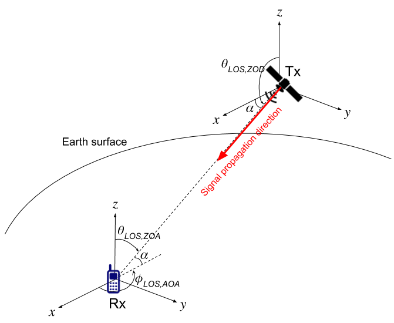{width="4.214583333333334in"
height="3.4541666666666666in"}

**Figure 6.9.1-1 Elevation angle *α* at UE with NTN gNB**

Depending on the frequency band, environment scenario, and elevation
angle of the intended link level simulations, suitable DS, ASA, ZSA, and
Rician K-factor in case of LOS, can be determined from the channel model
parameters in Section 6.7.2.

Each CDL model can be scaled in delay and AOA to achieve desired RMS
delay spread and ASA according to the procedures specified respectively
in subclauses 7.7.3 and 7.7.5.1 of TR 38.901 \[12\]. With the same angle
scaling principle, each CDL model can also be scaled in ZOA to achieve
desired ZSA, taking into account the difference between the desired
elevation angle and reference elevation angle, by

{width="4.831944444444445in"
height="0.5041666666666667in"} (6.9-2)

where

{width="0.8875in" height="0.3125in"} is the
scaled ZOA,

> {width="0.7375in"
> height="0.30416666666666664in"} is the desired ZSA,
>
> {width="0.6986111111111111in"
> height="0.30416666666666664in"} is the RMS zenith angular spread of
> the reference model,
>
> {width="0.8875in" height="0.3125in"} is the
> cluster ZOA of the reference model,
>
> {width="0.8027777777777778in"
> height="0.3125in"} is the mean angle of ZOA of the reference model,
>
> {width="0.8159722222222222in"
> height="0.3125in"} is the desired mean ZOA,
>
> {width="1.5993055555555555in"
> height="0.30416666666666664in"} is the difference between the desired
> and reference elevation angles between the NTN gNB and UE.

The resultant ZOA angles after scaling may need to be wrapped to the
domain \[0,180\] by the same rule in TR 38.901: if
{width="1.4951388888888888in"
height="0.32083333333333336in"}, it should be set to
{width="1.1555555555555554in"
height="0.33055555555555555in"}.

For LOS channel models, the K-factor of NTN-CDL-C and NTN-CDL-D can be
set to a desired value following the procedure described in subclause
7.7.6 of TR 38.901.

Doppler shift due to UE and satellite motion should be calculated based
on section 6.8.1. For simulations over a few TTIs, constant speed for
the UE and the satellite and constant satellite elevation angle may be
considered

**Table 6.9.1-1 NTN-CDL-A at elevation**
{width="1.0118055555555556in"
height="0.30416666666666664in"}

  ---------------------------- ---------------------- --------------------- ------------------- ------------------- ------------------ ------------------
  **Cluster \#**               **Normalized delay**   **Power in \[dB\]**   **AOD in \[°\]**    **AOA in \[°\]**    **ZOD in \[°\]**   **ZOA in \[°\]**
  1                            0                      0                     0                   178.8               140                35.6
  2                            1.0811                 -4.675                0                   -115.7              140                22.9
  3                            2.8416                 -6.482                0                   111.5               140                127.4
  **Per-Cluster Parameters**                                                                                                           
  Parameter                    *c*~ASD~ in \[°\]      *c*~ASA~ in \[°\]     *c*~ZSD~ in \[°\]   *c*~ZSA~ in \[°\]   XPR in \[dB\]      
  Value                        0                      15                    0                   7                   10                 
  ---------------------------- ---------------------- --------------------- ------------------- ------------------- ------------------ ------------------

**Table 6.9.1-2 NTN-CDL-B at elevation**
{width="1.0118055555555556in"
height="0.30416666666666664in"}

  ---------------------------- ---------------------- --------------------- ------------------- ------------------- ------------------ ------------------
  **Cluster \#**               **Normalized delay**   **Power in \[dB\]**   **AOD in \[°\]**    **AOA in \[°\]**    **ZOD in \[°\]**   **ZOA in \[°\]**
  1                            0                      0                     0                   -174.6              140                42.2
  2                            0.7249                 -1.973                0                   144.9               140                63.4
  3                            0.7410                 -4.332                0                   -119.8              140                89.7
  4                            5.7392                 -11.914               0                   -88.8               140                174.1
  **Per-Cluster Parameters**                                                                                                           
  Parameter                    *c*~ASD~ in \[°\]      *c*~ASA~ in \[°\]     *c*~ZSD~ in \[°\]   *c*~ZSA~ in \[°\]   XPR in \[dB\]      
  Value                        0                      15                    0                   7                   10                 
  ---------------------------- ---------------------- --------------------- ------------------- ------------------- ------------------ ------------------

**Table 6.9.1-3 NTN-CDL-C at elevation**
{width="1.0118055555555556in"
height="0.30416666666666664in"}

  ---------------------------- -------------------- ---------------------- --------------------- ------------------- ------------------ ------------------ ------------------
  **Cluster \#**               **Cluster PAS**      **Normalized Delay**   **Power in \[dB\]**   **AOD in \[°\]**    **AOA in \[°\]**   **ZOD in \[°\]**   **ZOA in \[°\]**
  1                            Specular(LOS path)   0                      -0.394                0                   -180               140                40
                               Laplacian            0                      -10.618               0                   -180               140                40
  2                            Laplacian            14.8124                -23.373               0                   -75.9              140                87.1
  **Per-Cluster Parameters**                                                                                                                               
  Parameter                    *c*~ASD~ in \[°\]    *c*~ASA~ in \[°\]      *c*~ZSD~ in \[°\]     *c*~ZSA~ in \[°\]   XPR in \[dB\]                         
  Value                        0                    11                     0                     7                   16                                    
  ---------------------------- -------------------- ---------------------- --------------------- ------------------- ------------------ ------------------ ------------------

**Table 6.9.1-4 NTN-CDL-D at elevation**
{width="1.0118055555555556in"
height="0.30416666666666664in"}

  ---------------------------- -------------------- ---------------------- --------------------- ------------------- ------------------ ------------------ ------------------
  **Cluster \#**               **Cluster PAS**      **Normalized Delay**   **Power in \[dB\]**   **AOD in \[°\]**    **AOA in \[°\]**   **ZOD in \[°\]**   **ZOA in \[°\]**
  1                            Specular(LOS path)   0                      -0.284                0                   -180               140                40
                               Laplacian            0                      -11.991               0                   -180               140                40
  2                            Laplacian            0.5596                 -9.887                0                   -135.4             140                146.2
  3                            Laplacian            7.3340                 -16.771               0                   -121.5             140                136.0
  **Per-Cluster Parameters**                                                                                                                               
  Parameter                    *c*~ASD~ in \[°\]    *c*~ASA~ in \[°\]      *c*~ZSD~ in \[°\]     *c*~ZSA~ in \[°\]   XPR in \[dB\]                         
  Value                        0                    11                     0                     7                   16                                    
  ---------------------------- -------------------- ---------------------- --------------------- ------------------- ------------------ ------------------ ------------------

### 6.9.2 TDL models

The Tapped Delay Line (TDL) models are filtered from the CDL models
according to the section 7.7.4 of TR 38.901 \[12\] by assuming isotropic
UE antenna. Two TDL models, namely NTN-TDL-A and NTN-TDL-B are
constructed to represent two different channel profiles for NLOS, while
NTN-TDL-C and NTN-TDL-D are constructed for LOS. The parameter of these
models can be found in Tables 6.9.2-1 to 6.9.2-4.

Table 6.9.2-1a: Void

Table 6.9.2-1b: Void

The Doppler spectrum for each tap is defined as described in subclause
7.7.2 of TR 38.901. Each TDL model can be scaled in delay to achieve
desired RMS delay spread according to the procedure specified in
subclause 7.7.3 of TR 38.901. For LOS channel models, the K-factor of
NTN-TDL-C and NTN-TDL-D can be set to a desired value following the
procedure described in subclause 7.7.6 of TR 38.901.

Additional Doppler shift due to satellite motion should be taken into
account according to the following formula:

,

Where denotes the satellite speed, *c* denotes the speed of light, *R*
denotes the earth radius, *h* denotes the satellite altitude, denotes
the satellite elevation angle, and denotes the carrier frequency.

This additional Doppler shift should be applied to all taps of the TDL
model.

The satellite speed, satellite elevation angle and UE speed should be
considered to be constant during the simulation duration, if limited to
few TTIs.

An illustration of the effect of additional Doppler shift due to
satellite motion on the Doppler power spectrum is displayed on the next
figure.

{width="5.038888888888889in"
height="3.702777777777778in"}

Figure 6.9.2-1: Illustration of Doppler power spectrum in NTN in LOS
conditions

**Table 6.9.2-1. NTN-TDL-A at elevation**
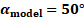{width="0.875in"
height="0.17708333333333334in"}

  ------------ ---------------------- --------------------- -------------------------
  **Tap \#**   **Normalized delay**   **Power in \[dB\]**   **Fading distribution**
  1            0                      0                     Rayleigh
  2            1.0811                 -4.675                Rayleigh
  3            2.8416                 -6.482                Rayleigh
  ------------ ---------------------- --------------------- -------------------------

**Table 6.9.2-2. NTN-TDL-B at elevation**
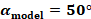{width="0.9479166666666666in"
height="0.19791666666666666in"}

  ------------ ---------------------- --------------------- -------------------------
  **Tap \#**   **Normalized delay**   **Power in \[dB\]**   **Fading distribution**
  1            0                      0                     Rayleigh
  2            0.7249                 -1.973                Rayleigh
  3            0.7410                 -4.332                Rayleigh
  4            5.7392                 -11.914               Rayleigh
  ------------ ---------------------- --------------------- -------------------------

**Table 6.9.2-3. NTN-TDL-C at elevation**
{width="0.9479166666666666in"
height="0.19791666666666666in"}

  ----------------------------------------------------------------------------------------------------------------- ---------------------- --------------------- -------------------------
  **Tap \#**                                                                                                        **Normalized delay**   **Power in \[dB\]**   **Fading distribution**
  1                                                                                                                 0                      -0.394                LOS path
                                                                                                                    0                      -10.618               Rayleigh
  2                                                                                                                 14.8124                -23.373               Rayleigh
  NOTE: The first tap follows a Ricean distribution with a K-factor of K~1~ = 10.224 dB and a mean power of 0 dB.                                                
  ----------------------------------------------------------------------------------------------------------------- ---------------------- --------------------- -------------------------

**Table 6.9.2-4. NTN-TDL-D at elevation**
{width="0.9479166666666666in"
height="0.19791666666666666in"}

  ----------------------------------------------------------------------------------------------------------------- ---------------------- --------------------- -------------------------
  **Tap \#**                                                                                                        **Normalized delay**   **Power in \[dB\]**   **Fading distribution**
  1                                                                                                                 0                      -0.284                LOS path
                                                                                                                    0                      -11.991               Rayleigh
  2                                                                                                                 0.5596                 -9.887                Rayleigh
  3                                                                                                                 7.3340                 -16.771               Rayleigh
  NOTE: The first tap follows a Ricean distribution with a K-factor of K~1~ = 11.707 dB and a mean power of 0 dB.                                                
  ----------------------------------------------------------------------------------------------------------------- ---------------------- --------------------- -------------------------

6.10 Channel model calibration
------------------------------

### 6.10.1 NTN channel model features per deployment scenarios

Table 6.10.1-1: NTN channel model features per deployment scenarios

+----------+----------+----------+----------+----------+----------+
|          | *        | *        | *        | *        | *        |
|          | *Deploym | *Deploym | *Deploym | *Deploym | *Deploym |
|          | ent-D1** | ent-D2** | ent-D3** | ent-D4** | ent-D5** |
+----------+----------+----------+----------+----------+----------+
| Platform | GEO at   | GEO at   | Non-GEO  | Non-GEO  | HAPS     |
| orbit    | 35 786   | 35 786   | down to  | down to  | between  |
| and      | km       | km       | 600 km   | 600 km   | 8 km and |
| altitude |          |          |          |          | 50 km    |
+----------+----------+----------+----------+----------+----------+
| Carrier  | Around   | Around 2 | Around 2 | Around   | Below 6  |
| F        | 20 GHz   | GHz for  | GHz for  | 20 GHz   | GHz      |
| requency | for DL   | both DL  | both DL  | for DL   |          |
| on the   |          | and UL   | and UL   |          |          |
| link     | Around   | (S band) | (S band) | Around   |          |
| between  | 30 GHz   |          |          | 30 GHz   |          |
| Air /    | for UL   |          |          | for UL   |          |
| spa      | (Ka      |          |          | (Ka      |          |
| ce-borne | band)    |          |          | band)    |          |
| platform |          |          |          |          |          |
| and UE   |          |          |          |          |          |
+----------+----------+----------+----------+----------+----------+
| Maximum  | Up to 2  | Up to 2  | Up to 2  | Up to 2  | Up to 2  |
| Channel  | \* 800   | \* 20    | \* 20    | \* 800   | \* 80    |
| B        | MHz      | MHz      | MHz      | MHz      | MHz      |
| andwidth |          |          |          |          |          |
|          |          |          |          |          |          |
| (DL +    |          |          |          |          |          |
| UL)      |          |          |          |          |          |
+----------+----------+----------+----------+----------+----------+
| UE       | VSAT     | Quasi    | Quasi    | VSAT     | Quasi    |
| antenna  | type -   | I        | I        | type -   | I        |
| pattern  | circular | sotropic | sotropic | circular | sotropic |
| +        | pola     | - Linear | - Linear | pola     | - Linear |
| pola     | risation | pola     | pola     | risation | pola     |
| risation |          | risation | risation |          | risation |
|          | C        | (Note 4) | (Note 4) | C        | (Note 4) |
|          | o-phased |          |          | o-phased |          |
|          | array -  | C        | C        | array -  | C        |
|          | Dual     | o-phased | o-phased | Dual     | o-phased |
|          | Linear   | array -  | array -  | Linear   | array -  |
|          | pola     | Dual     | Dual     | pola     | Dual     |
|          | risation | Linear   | Linear   | risation | Linear   |
|          | (Note 1) | pola     | pola     | (Note 1) | pola     |
|          |          | risation | risation |          | risation |
|          |          | (Note 2) | (Note 2) |          | (Note 2) |
+----------+----------+----------+----------+----------+----------+
| UE type  | H        | H        | H        | H        | H        |
|          | andheld, | andheld, | andheld, | andheld, | andheld, |
|          | nomadic, | moving   | moving   | nomadic, | moving   |
|          | fixed,   | platform | platform | fixed,   | platform |
|          | moving   | mounted  | mounted  | moving   | mounted  |
|          | platform |          |          | platform |          |
|          | mounted  |          |          | mounted  |          |
+----------+----------+----------+----------+----------+----------+
| Airborne | Bessel   | Bessel   | Bessel   | Bessel   | > \-     |
| & space  | function | function | function | function | > Bessel |
| borne    | and      | and      | and      | and      | >        |
| antenna  | circular | circular | circular | circular | function |
| pattern  | pola     | pola     | pola     | pola     | > and    |
| m        | risation | risation | risation | risation | >        |
| odelling |          |          |          |          | circular |
| +        |          |          |          |          | > pola   |
| pola     |          |          |          |          | risation |
| risation |          |          |          |          | >        |
|          |          |          |          |          | > \-     |
|          |          |          |          |          | > 3GPP   |
|          |          |          |          |          | >        |
|          |          |          |          |          |  antenna |
|          |          |          |          |          | >        |
|          |          |          |          |          |  pattern |
|          |          |          |          |          | > of     |
|          |          |          |          |          | > Base   |
|          |          |          |          |          | >        |
|          |          |          |          |          |  Station |
|          |          |          |          |          | > (Dual  |
|          |          |          |          |          | > Linear |
|          |          |          |          |          | > polar  |
|          |          |          |          |          | isation) |
+----------+----------+----------+----------+----------+----------+
| Doppler  | Mainly   | Mainly   | UE +     | UE +     | UE +     |
| cause    | UE       | UE       | s        | s        | HAPS     |
|          | mobility | mobility | atellite | atellite | mobility |
|          |          |          | mobility | mobility |          |
+----------+----------+----------+----------+----------+----------+
| O2I      | No       | No       | No       | No       | Possible |
| pen      |          |          |          |          |          |
| etration |          |          |          |          |          |
| loss     |          |          |          |          |          |
+----------+----------+----------+----------+----------+----------+
| Atm      | M        | Ne       | Ne       | M        | Ne       |
| ospheric | andatory | gligible | gligible | andatory | gligible |
| ab       |          |          |          |          |          |
| sorption |          |          |          |          |          |
+----------+----------+----------+----------+----------+----------+
| Rain     | (Note 3) | Ne       | Ne       | (Note 3) | Ne       |
| att      |          | gligible | gligible |          | gligible |
| enuation |          |          |          |          |          |
+----------+----------+----------+----------+----------+----------+
| Cloud    | (Note 3) | Ne       | Ne       | (Note 3) | Ne       |
| att      |          | gligible | gligible |          | gligible |
| enuation |          |          |          |          |          |
+----------+----------+----------+----------+----------+----------+
| Scint    | Trop     | Ion      | Ion      | Trop     | Ne       |
| illation | ospheric | ospheric | ospheric | ospheric | gligible |
+----------+----------+----------+----------+----------+----------+
| Fast     | Flat     | Flat     | Flat     | Flat     | F        |
| fading   | fading   | fading   | fading   | fading   | requency |
| models   | (Note 6) | (Note 6) | (Note 6) | (Note 6) | s        |
| (system  |          | or       | or       |          | elective |
| level)   |          | f        | f        |          | fading   |
|          |          | requency | requency |          | (note 5) |
|          |          | s        | s        |          | a        |
|          |          | elective | elective |          | ccording |
|          |          | fading   | fading   |          | to       |
|          |          | (note 5) | (note 5) |          | e        |
|          |          | a        | a        |          | levation |
|          |          | ccording | ccording |          | and      |
|          |          | to       | to       |          | envi     |
|          |          | e        | e        |          | ronments |
|          |          | levation | levation |          |          |
|          |          | and      | and      |          |          |
|          |          | envi     | envi     |          |          |
|          |          | ronments | ronments |          |          |
+----------+----------+----------+----------+----------+----------+
| Link     | Flat     | CDL or   | CDL or   | Flat     | CDL or   |
| level    | fading   | TDL      | TDL      | fading   | TDL      |
| model    | (Note 6) |          |          | (Note 6) |          |
+----------+----------+----------+----------+----------+----------+
| S        | LMS      | LMS      | LMS      | LMS      | 3GPP     |
| hadowing | (Land    |          |          |          | TR38.901 |
| model    | Mobile   |          |          |          | based    |
|          | Sa       |          |          |          |          |
|          | tellite) |          |          |          |          |
+----------+----------+----------+----------+----------+----------+

Note 1: As described in \[48\] as \[M,N,P\] = \[2,4,2\].

Note 2: As described in \[48\] as \[M,N,P\] = \[1,2,2\].

Note 3: Rain and cloud attenuation are not needed for system or link
level simulations related to channel model, if they are already
considered in the system dimensioning (e.g. link budget). If they need
to be taken into account, ITU-R P618 models (Rain) and ITU-R P840 models
(Cloud) shall be used.

Note 4: Quasi isotropic refers to dipole antenna which is
omni-directional in one plane.

Note 5: The frequency selective fading refers to Geometry based
Stochastic Channel Model or GSCM which is defined in (SCM/FP7 WINNER,
3GPP TR 38.901 etc.)

Note 6: Flat fading model refers to the 2 state model from ITU-R P681
(section 6). Since this model is based on time series, R1-1802975
proposes a method to adapt it to drop based simulations for system level
evaluation.

7 Potential key impact areas on NR to support NTN
=================================================

7.1 Specific constraints associated to NTN
------------------------------------------

This clause describes selected specific Non Terrestrial Network design
constraints that need to be addressed when considering the
Non-Terrestrial Network deployment scenarios.

Table 7.1-1: Specific design constraints of Non Terrestrial Network

+----------------------------------+----------------------------------+
| Non Terrestrial Network Design   | Differences between NTN and      |
| Constraints                      | cellular systems                 |
+----------------------------------+----------------------------------+
| Propagation channel              | As detailed in clause 6, the     |
|                                  | main differences lies in         |
|                                  | different multi path delay and   |
|                                  | Doppler spectrum model .         |
|                                  |                                  |
|                                  | For narrowband signals and       |
|                                  | frequency bands below 6 GHz, the |
|                                  | time dispersion may be ignored.  |
|                                  |                                  |
|                                  | We shall assume outdoor          |
|                                  | conditions and line-of-sight     |
|                                  | operations for the UE for        |
|                                  | communication via satellite. In  |
|                                  | HAPS system, indoor conditions   |
|                                  | are also addressed, which        |
|                                  | implies the need to consider     |
|                                  | non-line-of-sight conditions as  |
|                                  | well.                            |
+----------------------------------+----------------------------------+
| Frequency Plan and channel       | The allocated spectrum to a      |
| Bandwidth                        | satellite system is respectively |
|                                  | 2 x 15 MHz (UL & DL) at S band   |
|                                  | and about 2 x 2500 MHz (UL & DL) |
|                                  | at Ka band. In addition,         |
|                                  | satellite systems at S and Ka    |
|                                  | bands use mostly circular        |
|                                  | polarizations.                   |
|                                  |                                  |
|                                  | Frequency re-use and flexibility |
|                                  | of spectrum allocation in the    |
|                                  | different cells may be supported |
|                                  | and therefore the maximum        |
|                                  | channel bandwidth per cell is    |
|                                  | assumed to be respectively 2 x   |
|                                  | 15 MHz (UL & DL) at S band and 2 |
|                                  | x 800 MHz (UL & DL) at Ka band.  |
|                                  |                                  |
|                                  | For efficient spectrum usage,    |
|                                  | the system should always         |
|                                  | minimise the risk of inter cell  |
|                                  | interference.                    |
+----------------------------------+----------------------------------+
| Power limited link budget        | The main design drivers of       |
|                                  | satellite and HAPS based         |
|                                  | communication systems are;       |
|                                  |                                  |
|                                  | \- To maximise the throughput    |
|                                  | for a given transmit power from  |
|                                  | the UE on the UL and from the    |
|                                  | satellite/HAPS on the DL.        |
|                                  |                                  |
|                                  | \- To maximise the availability  |
|                                  | of the service under deep fading |
|                                  | situations (typically between 20 |
|                                  | and 30 dB in Ka band for 99.95%  |
|                                  | availability)                    |
+----------------------------------+----------------------------------+
| Cell pattern generation          | Space and HAPS systems typically |
|                                  | feature larger cells compared to |
|                                  | cellular networks. In addition,  |
|                                  | the cells may be moving (without |
|                                  | a fixed earth reference point)   |
|                                  | in case of NGSO (Non             |
|                                  | Geostationary Satellite Orbit)   |
|                                  | satellite or HAPS system.        |
|                                  |                                  |
|                                  | These large cells especially at  |
|                                  | low operational elevation angles |
|                                  | will create a significant        |
|                                  | differential propagation delay   |
|                                  | between a UE at cell centre and  |
|                                  | UE at cell edge and the ratio of |
|                                  | the differential increases as    |
|                                  | the altitude of the satellite    |
|                                  | and HAPS decreases. In other     |
|                                  | words, the ratio between         |
|                                  | propagation delays at cell       |
|                                  | centre and cell edge is likely   |
|                                  | to be higher in the context of   |
|                                  | HAPS as compared to              |
|                                  | geostationary satellite systems. |
|                                  |                                  |
|                                  | This will impact contention      |
|                                  | based access channels when the   |
|                                  | position of UEs is not known by  |
|                                  | the network.                     |
+----------------------------------+----------------------------------+
| Propagation Delay                | Satellite systems feature much   |
| characteristics                  | larger propagation delays than   |
|                                  | terrestrial systems. The one-way |
|                                  | delay between the UE and the RAN |
|                                  | (whether on-board the            |
|                                  | satellite/HAPS or on the ground) |
|                                  | may reach up to 272.4 ms for GSO |
|                                  | (Geostationary Synchronous       |
|                                  | Orbit) systems, and is greater   |
|                                  | than 14.2 ms for NGSO            |
|                                  | (Non-Geosynchronous Orbit)       |
|                                  | systems. In the case of HAPS,    |
|                                  | the one way delay is less than   |
|                                  | 1.6 ms and hence comparable with |
|                                  | cellular networks.               |
|                                  |                                  |
|                                  | This larger delay will likely    |
|                                  | impact all signalling loops      |
|                                  | especially at access and         |
|                                  | transport (data transfer)        |
|                                  | levels.                          |
|                                  |                                  |
|                                  | The analysis of the propagation  |
|                                  | delay is detailed in clause 5.3. |
+----------------------------------+----------------------------------+
| Mobility of the                  | In cellular networks,            |
| infrastructure\'s transmission   | transmission equipment refers to |
| equipment                        | base stations (gNB) or Remote    |
|                                  | Radio Heads (RRH). They are      |
|                                  | usually fixed, except when on    |
|                                  | board a moving platform such as  |
|                                  | a train.                         |
|                                  |                                  |
|                                  | In Non-Terestrial Networks, the  |
|                                  | transmission equipment is on     |
|                                  | board the space/HAPS. For GSO    |
|                                  | systems, the transmission        |
|                                  | equipment is quasi static with   |
|                                  | respect to the UE with only      |
|                                  | small Doppler effects. For HAPS, |
|                                  | the transmission equipment is    |
|                                  | moving around or across a        |
|                                  | theoretical central point and    |
|                                  | hence creates Doppler. For NGSO  |
|                                  | systems, the satellites move     |
|                                  | relative to the earth and        |
|                                  | creates higher Doppler effects   |
|                                  | than for GSO systems.            |
|                                  |                                  |
|                                  | The Doppler depends on the       |
|                                  | relative satellite/HAPS velocity |
|                                  | with respect to the UE, and on   |
|                                  | the frequency band. Doppler can  |
|                                  | be characterized by a maximum    |
|                                  | Doppler Shift and a Doppler      |
|                                  | variation rate.                  |
|                                  |                                  |
|                                  | This effect will continuously    |
|                                  | modify the carrier frequency,    |
|                                  | phase and spacing and may create |
|                                  | Inter Carrier Interference       |
|                                  | (ICI).                           |
|                                  |                                  |
|                                  | As detailed in clause 5.3,       |
|                                  | assuming a worst case UE         |
|                                  | velocity of 1000 km/h:           |
|                                  |                                  |
|                                  | \- For LEO in S band (2 GHz):    |
|                                  | +/- 48kHz Doppler Shift and -    |
|                                  | 544 Hz/s Doppler variation rate  |
|                                  |                                  |
|                                  | \- For LEO in Ka band (20 GHz):  |
|                                  | +/- 480kHz Doppler Shift and --  |
|                                  | 5.44 kHz/s Doppler variation     |
|                                  | rate                             |
|                                  |                                  |
|                                  | \- For LEO in Ka band (30 GHz):  |
|                                  | +/- 720kHz Doppler Shift and --  |
|                                  | 8.16 kHz/s Doppler variation     |
|                                  | rate                             |
|                                  |                                  |
|                                  | Note, although these values are  |
|                                  | high, most of the Doppler shift  |
|                                  | and Doppler variation rate can   |
|                                  | be pre/post compensated,         |
|                                  | exploiting the knowledge of the  |
|                                  | satellite/HAPS motion that can   |
|                                  | be anticipated through modelling |
|                                  | (e.g. ephemeris of satellites)   |
|                                  | as well as UE location if known. |
+----------------------------------+----------------------------------+
| Service continuity between       | Whenever a UE leaves or enters   |
| land-based 5G access and         | cellular coverage, a hand-over   |
| non-terrestrial based access     | to or from the satellite/HAPS    |
| networks                         | system can take place to ensure  |
|                                  | service continuity. The handover |
|                                  | triggering mechanisms might be   |
|                                  | different for each direction     |
|                                  | e.g. leave satellite as soon as  |
|                                  | there is enough cellular signal, |
|                                  | but only leave cellular when     |
|                                  | there is a very low cellular     |
|                                  | signal.                          |
|                                  |                                  |
|                                  | The hand-over procedure should   |
|                                  | take into account the service    |
|                                  | enablers, the characteristics    |
|                                  | and the measurement reports of   |
|                                  | both access technologies. The    |
|                                  | following aspects should be      |
|                                  | considered:                      |
|                                  |                                  |
|                                  | \- Support both non-transparent  |
|                                  | air/spaceborne (on-board         |
|                                  | processing) and bent-pipe        |
|                                  | architectures                    |
|                                  |                                  |
|                                  | \- Handover preparation and HO   |
|                                  | failure/RLF handling             |
|                                  |                                  |
|                                  | \- Time synchronization          |
|                                  |                                  |
|                                  | \- Measurement object            |
|                                  | coordination -- incl. gap        |
|                                  | allocation & alignment           |
|                                  |                                  |
|                                  | \- Lossless handover support     |
|                                  |                                  |
|                                  | \- Specifics related to          |
|                                  | intra-Non Terrestrial network    |
|                                  | mobility, as well as between     |
|                                  | Non-Terrestrial and Cellular     |
|                                  | networks                         |
+----------------------------------+----------------------------------+
| Radio resource management        | In order to support varying      |
| adapted to network topology      | traffic demand while also taking |
|                                  | UE mobility requirements into    |
|                                  | account, requires minimal        |
|                                  | response time of the access      |
|                                  | control functionality.           |
|                                  |                                  |
|                                  | In cellular systems, access      |
|                                  | control is typically located in  |
|                                  | the gNB close to the UE.         |
|                                  | Moreover coordination between    |
|                                  | gNBs is possible through the Xn  |
|                                  | interface (between gNBs          |
|                                  | interface) or via a central      |
|                                  | entity.                          |
|                                  |                                  |
|                                  | In satellite systems, access     |
|                                  | control is mostly located at     |
|                                  | satellite base station, gateway  |
|                                  | or hub level which may prevent   |
|                                  | optimal response time for access |
|                                  | control. Hence, pre-grants, Semi |
|                                  | Persistent Scheduling (SPS)      |
|                                  | and/or grant free access scheme  |
|                                  | would be beneficial.             |
+----------------------------------+----------------------------------+
| Terminal mobility                | The challenge is to support very |
|                                  | high speed UEs such as aircraft  |
|                                  | systems featuring maximum speeds |
|                                  | of 1000 km/h (see 3GPP TS 22.261 |
|                                  | \[6\]).                          |
+----------------------------------+----------------------------------+

7.2 NR features/protocols potentially affected
----------------------------------------------

This clause identifies the NR Features/protocols **in bold** that may
require some adaptations to support operation via Satellite or HAPS.
Other solutions may be identified but don\'t require adaptations of the
standard.

Table 7.2-1: NR Features/protocols that may require some adaptations to
support operations via Satellite or HAPS

+----------------------+----------------------+----------------------+
| Non-Terrestrial      | Impacted NR areas    | NR Features that may |
| Network design       |                      | require adaptations  |
| constraints          |                      | to support NR        |
|                      |                      | operation via        |
|                      |                      | Satellite or HAPS    |
+----------------------+----------------------+----------------------+
| Propagation channel  | Physical Layer       | For satellite-based  |
|                      |                      | systems the signal   |
|                      |                      | is mostly direct LOS |
|                      |                      | and follows a Ricean |
|                      |                      | distibution with     |
|                      |                      | strong direct signal |
|                      |                      | component; slow      |
|                      |                      | fading is possible,  |
|                      |                      | due to temporary     |
|                      |                      | signal masking e.g.  |
|                      |                      | under trees and      |
|                      |                      | bridges.             |
|                      |                      |                      |
|                      |                      | For HAPS based       |
|                      |                      | systems, the signal  |
|                      |                      | contains significant |
|                      |                      | multipath components |
|                      |                      | and follows a Ricean |
|                      |                      | model. Similarly to  |
|                      |                      | cellular systems, a  |
|                      |                      | frequent and fast    |
|                      |                      | fading of max 100 ms |
|                      |                      | coherence time is    |
|                      |                      | expected, mainly due |
|                      |                      | to signal components |
|                      |                      | recombination.       |
|                      |                      |                      |
|                      |                      | To improve           |
|                      |                      | performance, the     |
|                      |                      | receivers\'          |
|                      |                      | synchronisation      |
|                      |                      | configuration at     |
|                      |                      | both UE and gNB      |
|                      |                      | level, could be      |
|                      |                      | adapted especially:  |
|                      |                      |                      |
|                      |                      | \- The **Reference   |
|                      |                      | signals** in the     |
|                      |                      | physical signals     |
|                      |                      | (e.g. DL: PSS, SSS,  |
|                      |                      | Reference Signals;   |
|                      |                      | UL: DMRS, SRS), the  |
|                      |                      | **Preamble sequence  |
|                      |                      | and aggregation**    |
|                      |                      | (related to random   |
|                      |                      | access channel), to  |
|                      |                      | take into account    |
|                      |                      | the Doppler and      |
|                      |                      | possibly some        |
|                      |                      | specific multi path  |
|                      |                      | channel model.       |
|                      |                      |                      |
|                      |                      | \- The **Cyclic      |
|                      |                      | Prefix** to          |
|                      |                      | compensate for the   |
|                      |                      | delay spread and the |
|                      |                      | jitter/phase. The    |
|                      |                      | **sub-carrier        |
|                      |                      | spacing** (SCS) of   |
|                      |                      | the OFDM signal may  |
|                      |                      | be extended with     |
|                      |                      | greater SCS values   |
|                      |                      | to accommodate       |
|                      |                      | larger Doppler (To   |
|                      |                      | Be Confirmed).       |
+----------------------+----------------------+----------------------+
| Frequency plan and   | Physical Layer       | The **carrier        |
| channel Bandwidth    |                      | numbering** could be |
|                      |                      | reviewed to support  |
|                      |                      | the targeted         |
|                      |                      | spectrum (S band, Ka |
|                      |                      | band) and the        |
|                      |                      | **pairing between    |
|                      |                      | UL/DL bands** with   |
|                      |                      | specific band        |
|                      |                      | separation.          |
|                      |                      |                      |
|                      |                      | Specifically, for Ka |
|                      |                      | band NTN deployment  |
|                      |                      | scenarios, the 5G    |
|                      |                      | radio interface mode |
|                      |                      | foreseen for above 6 |
|                      |                      | GHz bands shall be   |
|                      |                      | configured to        |
|                      |                      | support FDD access   |
|                      |                      | scheme (e.g. with    |
|                      |                      | two mono directional |
|                      |                      | carriers operated in |
|                      |                      | opposite direction   |
|                      |                      | on both UL and DL    |
|                      |                      | bands). This will    |
|                      |                      | require the system   |
|                      |                      | to configure and     |
|                      |                      | possibly **adapt the |
|                      |                      | MAC and network      |
|                      |                      | layer** signalling   |
|                      |                      | in a specific        |
|                      |                      | manner.              |
|                      |                      |                      |
|                      |                      | The **carrier        |
|                      |                      | bandwidth** could be |
|                      |                      | extended up to a     |
|                      |                      | maximum of 800 MHz.  |
|                      |                      | Alternatively        |
|                      |                      | **carrier            |
|                      |                      | aggregation** method |
|                      |                      | can be used to       |
|                      |                      | provide equivalent   |
|                      |                      | throughput while     |
|                      |                      | enabling a greater   |
|                      |                      | flexibility of       |
|                      |                      | carrier allocation   |
|                      |                      | between the cells    |
|                      |                      | while respecting     |
|                      |                      | frequency reuse      |
|                      |                      | constraints.         |
+----------------------+----------------------+----------------------+
| Power limited link   | Physical Layer       | To maximise the      |
| budget               |                      | throughput / power   |
|                      |                      | ratio, the operation |
|                      |                      | point in the power   |
|                      |                      | amplifier at         |
|                      |                      | satellite or at the  |
|                      |                      | UE shall be set as   |
|                      |                      | close as possible to |
|                      |                      | the saturation       |
|                      |                      | point, when needed.  |
|                      |                      | To support this,     |
|                      |                      | several techniques   |
|                      |                      | can be considered    |
|                      |                      | and possibly         |
|                      |                      | combined together:   |
|                      |                      |                      |
|                      |                      | \- Extended          |
|                      |                      | multicarrier         |
|                      |                      | **modulation and     |
|                      |                      | coding schemes**     |
|                      |                      | especially for the   |
|                      |                      | UL that features low |
|                      |                      | Peak to Average      |
|                      |                      | Power Ratio (PAPR)   |
|                      |                      | that are more robust |
|                      |                      | against distortions  |
|                      |                      |                      |
|                      |                      | \- PAPR reduction    |
|                      |                      | and nonlinear        |
|                      |                      | distortion           |
|                      |                      | mitigation through   |
|                      |                      | signal processing    |
|                      |                      | techniques (e.g.     |
|                      |                      | pre-distortion       |
|                      |                      | mechanisms).         |
|                      |                      |                      |
|                      |                      | \- Operating the     |
|                      |                      | high power amplifier |
|                      |                      | (UE and              |
|                      |                      | satellite/HAPS       |
|                      |                      | level) with the      |
|                      |                      | minimum output       |
|                      |                      | back-off if          |
|                      |                      | necessary.           |
|                      |                      |                      |
|                      |                      | To maximise the      |
|                      |                      | signal availability  |
|                      |                      | with slow and deep   |
|                      |                      | fading, especially   |
|                      |                      | for UE at cell edge, |
|                      |                      | it is recommended to |
|                      |                      | provide **modulation |
|                      |                      | and coding schemes** |
|                      |                      | featuring very low   |
|                      |                      | SNR operating points |
|                      |                      | or other             |
|                      |                      | alternatives         |
|                      |                      | especially for mMTC  |
|                      |                      | service enablers.    |
|                      |                      | This may lead to     |
|                      |                      | extend the           |
|                      |                      | Modulation Coding    |
|                      |                      | Scheme of NR towards |
|                      |                      | very low Es/No to    |
|                      |                      | meet the reliability |
|                      |                      | requirements of      |
|                      |                      | critical             |
|                      |                      | communications or    |
|                      |                      | low energy           |
|                      |                      | consumption          |
|                      |                      | scenarios.           |
+----------------------+----------------------+----------------------+
| Power limited link   | MAC layer (Resource  | To maximise the      |
| budget               | Allocation)          | spectral efficiency  |
|                      |                      | and accommodate      |
|                      |                      | limited power        |
|                      |                      | terminals, the MAC   |
|                      |                      | layer should be able |
|                      |                      | to allocate          |
|                      |                      | **Physical Resource  |
|                      |                      | Blocks** in the most |
|                      |                      | flexible way.        |
|                      |                      | Reduced size of      |
|                      |                      | **Physical Resource  |
|                      |                      | Blocks** should be   |
|                      |                      | considered (e.g.     |
|                      |                      | single tone          |
|                      |                      | transmission or      |
|                      |                      | transmission over    |
|                      |                      | one OFDM sub carrier |
|                      |                      | of same or larger    |
|                      |                      | bandwidth than a     |
|                      |                      | single OFDM          |
|                      |                      | carrier).            |
+----------------------+----------------------+----------------------+
| Cell pattern         | Physical layer       | The differential     |
| generation           |                      | delay due to large   |
|                      |                      | cell size may create |
|                      |                      | near far effect      |
|                      |                      | between UEs during   |
|                      |                      | the **initial access |
|                      |                      | procedure** when the |
|                      |                      | UEs positions are    |
|                      |                      | not known. This may  |
|                      |                      | require an extended  |
|                      |                      | acquisition window   |
|                      |                      | to improve           |
|                      |                      | performance.         |
|                      |                      |                      |
|                      |                      | Note however that if |
|                      |                      | the UE position      |
|                      |                      | becomes known during |
|                      |                      | a session, the       |
|                      |                      | differential delay   |
|                      |                      | can be compensated   |
|                      |                      | by the network.      |
|                      |                      |                      |
|                      |                      | For broadcast        |
|                      |                      | service, specific    |
|                      |                      | signalling may be    |
|                      |                      | needed to            |
|                      |                      | accommodate the      |
|                      |                      | larger and moving    |
|                      |                      | cells.               |
+----------------------+----------------------+----------------------+
| Propagation Delay    | Physical layer       | User traffic, such   |
| characteristics      |                      | as voice or video    |
|                      |                      | conference services, |
|                      |                      | is latency and       |
|                      |                      | jitter sensitive.    |
|                      |                      |                      |
|                      |                      | In cellular          |
|                      |                      | networks, HARQ       |
|                      |                      | retransmission may   |
|                      |                      | lead to jitter (e.g. |
|                      |                      | typically up to 8ms  |
|                      |                      | in the case of LTE   |
|                      |                      | FDD mode). A         |
|                      |                      | mitigation scheme    |
|                      |                      | called TTI Bundling  |
|                      |                      | on UL is defined. It |
|                      |                      | allows to            |
|                      |                      | re-transmit the same |
|                      |                      | symbols over up to 4 |
|                      |                      | consecutive sub      |
|                      |                      | frames, without      |
|                      |                      | waiting for HI       |
|                      |                      | acknowledgment. It   |
|                      |                      | is optimised for     |
|                      |                      | short jitter.        |
|                      |                      |                      |
|                      |                      | In Satellite/HAPS    |
|                      |                      | systems, as the      |
|                      |                      | propagation delays   |
|                      |                      | are significantly    |
|                      |                      | longer, HARQ scheme  |
|                      |                      | would create         |
|                      |                      | unacceptable jitter. |
|                      |                      | The UL **slot        |
|                      |                      | aggregation** may    |
|                      |                      | need to be adapted   |
|                      |                      | to compensate for    |
|                      |                      | higher jitter.       |
|                      |                      | Possible solutions   |
|                      |                      | could be to increase |
|                      |                      | the periodicity, the |
|                      |                      | number of            |
|                      |                      | re-transmissions of  |
|                      |                      | symbols and/or       |
|                      |                      | decrease the **slot  |
|                      |                      | duration**.          |
|                      |                      |                      |
|                      |                      | Further enhancements |
|                      |                      | of **HARQ process**  |
|                      |                      | should not be        |
|                      |                      | precluded to         |
|                      |                      | compensate for the   |
|                      |                      | propagation delay    |
|                      |                      | characteristics.     |
+----------------------+----------------------+----------------------+
| Propagation Delay    | Access layer (MAC,   | In satellite/HAPS    |
| characteristics      | RLC)                 | systems, the longer  |
|                      |                      | propagation delay    |
|                      |                      | impacts various      |
|                      |                      | protocol layers,     |
|                      |                      | retransmission       |
|                      |                      | mechanisms and       |
|                      |                      | response times in    |
|                      |                      | resource scheduling. |
|                      |                      |                      |
|                      |                      | The following        |
|                      |                      | mechanisms should be |
|                      |                      | adapted to           |
|                      |                      | accommodate longer   |
|                      |                      | delays and provide   |
|                      |                      | latency              |
|                      |                      | co                   |
|                      |                      | mpensation/reduction |
|                      |                      | especially on delay  |
|                      |                      | sensitive            |
|                      |                      | applications. We     |
|                      |                      | recommend to         |
|                      |                      | minimise the number  |
|                      |                      | of exchanges between |
|                      |                      | the UE and the       |
|                      |                      | network via the      |
|                      |                      | following features   |
|                      |                      |                      |
|                      |                      | \- an **Initial      |
|                      |                      | Access procedure**   |
|                      |                      | (based on a random   |
|                      |                      | access scheme) by    |
|                      |                      | implementing novel   |
|                      |                      | methods, where data  |
|                      |                      | and access           |
|                      |                      | signalling are sent  |
|                      |                      | together, would help |
|                      |                      | to meet this         |
|                      |                      | requirement (e.g.    |
|                      |                      | grant free access, 2 |
|                      |                      | step RACH)           |
|                      |                      |                      |
|                      |                      | \- a **Data Transfer |
|                      |                      | procedure**, by      |
|                      |                      | implementing         |
|                      |                      | flexible/extended    |
|                      |                      | receive window size, |
|                      |                      | flexible             |
|                      |                      | acknowledgement      |
|                      |                      | policy in terms of   |
|                      |                      | frequency, event,    |
|                      |                      | flexible and         |
|                      |                      | ARQ/HARQ cross       |
|                      |                      | coordination, radio  |
|                      |                      | resource allocation, |
|                      |                      | ACK free scheme or a |
|                      |                      | latency adaptive     |
|                      |                      | HARQ-ACK feedback,   |
|                      |                      | to accommodate long  |
|                      |                      | delay channel        |
+----------------------+----------------------+----------------------+
| Propagation Delay    | Physical Layer       | In terrestrial       |
| characteristics      |                      | cellular systems,    |
|                      |                      | the gNB selects the  |
|                      |                      | most appropriate MCS |
|                      |                      | (Modulation and      |
|                      |                      | Coding Scheme) based |
|                      |                      | on the CQI (Channel  |
|                      |                      | Quality Indicator)   |
|                      |                      | reported by the UE   |
|                      |                      | as part of the AMC   |
|                      |                      | (Adaptive Modulation |
|                      |                      | and Coding)          |
|                      |                      | procedure.           |
|                      |                      |                      |
|                      |                      | In satellite         |
|                      |                      | systems, the         |
|                      |                      | propagation delay    |
|                      |                      | creates a larger     |
|                      |                      | response time for    |
|                      |                      | the AMC loop and     |
|                      |                      | hence requires a     |
|                      |                      | margin to compensate |
|                      |                      | for the possible     |
|                      |                      | outdated CQI. This   |
|                      |                      | leads to a           |
|                      |                      | suboptimal use of    |
|                      |                      | the useful           |
|                      |                      | transmission         |
|                      |                      | capacity (lower      |
|                      |                      | spectral             |
|                      |                      | efficiency).         |
|                      |                      |                      |
|                      |                      | In order to improve  |
|                      |                      | its efficiency, the  |
|                      |                      | **AMC procedure**    |
|                      |                      | could be modified    |
|                      |                      | with potential       |
|                      |                      | signalling           |
|                      |                      | extension.           |
+----------------------+----------------------+----------------------+
| Node B or RRH        | Physical Layer       | In cellular networks |
| mobility             |                      | based on an OFDM     |
|                      |                      | radio interface, the |
|                      |                      | SCS (Sub Carrier     |
|                      |                      | Spacing) may be      |
|                      |                      | scaled in order to   |
|                      |                      | mitigate both the    |
|                      |                      | Doppler shift and    |
|                      |                      | Doppler variation    |
|                      |                      | rate.                |
|                      |                      |                      |
|                      |                      | In satellite / HAPS  |
|                      |                      | systems, the **SCS   |
|                      |                      | range** of values    |
|                      |                      | may need to be       |
|                      |                      | extended especially  |
|                      |                      | for Ka band and      |
|                      |                      | large channel        |
|                      |                      | bandwidth (e.g. 800  |
|                      |                      | MHz).                |
+----------------------+----------------------+----------------------+
| Service Continuity   | Physical Layer, MAC  | To support service   |
| between land based   | layer (Resource      | continuity between   |
| 5G access and        | Allocation) and      | the cellular and     |
| satellite based      | above (Mobility      | non-terrestrial      |
| access networks      | Management)          | networks or within   |
|                      |                      | non-terrestrial      |
|                      |                      | network, it is       |
|                      |                      | recommended to adopt |
|                      |                      | a hard hand-over     |
|                      |                      | scheme or            |
|                      |                      | dua                  |
|                      |                      | l/multi-connectivity |
|                      |                      | between terrestrial  |
|                      |                      | and non-terrestrial  |
|                      |                      | networks, when       |
|                      |                      | possible.            |
|                      |                      |                      |
|                      |                      | The differences in   |
|                      |                      | propagation delay    |
|                      |                      | between cellular and |
|                      |                      | non-terrestrial      |
|                      |                      | access network will  |
|                      |                      | create a significant |
|                      |                      | jitter or possible   |
|                      |                      | data starvation.     |
|                      |                      |                      |
|                      |                      | \- For delay         |
|                      |                      | sensitive            |
|                      |                      | applications, a      |
|                      |                      | temporary QoS        |
|                      |                      | degradation may be   |
|                      |                      | accommodated         |
|                      |                      | provided that it     |
|                      |                      | doesn\'t occur too   |
|                      |                      | often.               |
|                      |                      |                      |
|                      |                      | \- For data services |
|                      |                      | with high            |
|                      |                      | reliability          |
|                      |                      | requirements,        |
|                      |                      | buffering or         |
|                      |                      | retransmission       |
|                      |                      | techniques (e.g.     |
|                      |                      | PDCP inherent        |
|                      |                      | capability) may be   |
|                      |                      | needed to compensate |
|                      |                      | for such impairment. |
|                      |                      |                      |
|                      |                      | \- Delays may be     |
|                      |                      | compensated before   |
|                      |                      | starting the         |
|                      |                      | hand-over            |
|                      |                      |                      |
|                      |                      | The support of       |
|                      |                      | hand-over between    |
|                      |                      | cellular and         |
|                      |                      | non-terrestrial      |
|                      |                      | network will         |
|                      |                      | require:             |
|                      |                      |                      |
|                      |                      | \- **Extension of    |
|                      |                      | PDCP retransmission  |
|                      |                      | scheme** in terms of |
|                      |                      | repetition rate of   |
|                      |                      | data and duplication |
|                      |                      | handling in PDCP     |
|                      |                      | layer                |
|                      |                      |                      |
|                      |                      | \- **Extension of    |
|                      |                      | hand-over            |
|                      |                      | signalling** at RRC, |
|                      |                      | RLC, MAC layer       |
+----------------------+----------------------+----------------------+
| Radio resource       | NAS, RRC, RLC, MAC,  | The mobility         |
| management adapted   | Physical Layer       | management should    |
| to network topology  |                      | accommodate the      |
|                      |                      | specific cell        |
|                      |                      | patterns (size and   |
|                      |                      | position) of NTN     |
|                      |                      | networks. Moreover,  |
|                      |                      | cells in the         |
|                      |                      | non-terrestrial      |
|                      |                      | network may cross    |
|                      |                      | borders between      |
|                      |                      | countries.           |
|                      |                      |                      |
|                      |                      | In particular, this  |
|                      |                      | will affect the      |
|                      |                      | **identification     |
|                      |                      | method of cells, the |
|                      |                      | design of tracking   |
|                      |                      | and location areas,  |
|                      |                      | the roaming and      |
|                      |                      | billing procedures   |
|                      |                      | as well as location  |
|                      |                      | based services**.    |
|                      |                      |                      |
|                      |                      | Furthermore, NGSO    |
|                      |                      | and HAPS systems     |
|                      |                      | generate cells which |
|                      |                      | move around. This    |
|                      |                      | causes hand-over to  |
|                      |                      | occur not only for   |
|                      |                      | mobile units but     |
|                      |                      | also for fixed UEs.  |
|                      |                      | However, the         |
|                      |                      | hand-over caused by  |
|                      |                      | such NTN may be      |
|                      |                      | anticipated, by      |
|                      |                      | exploiting           |
|                      |                      | trajectory models    |
|                      |                      | such as satellite    |
|                      |                      | ephemeris.           |
+----------------------+----------------------+----------------------+
| Radio resource       | RAN                  | In cellular          |
| management adapted   |                      | networks, the access |
| to network topology  | Architecture         | controller, which    |
|                      |                      | control radio        |
|                      |                      | resources            |
|                      |                      | allocation, is       |
|                      |                      | implemented in the   |
|                      |                      | gNB. The access      |
|                      |                      | controller may       |
|                      |                      | control the          |
|                      |                      | interface between    |
|                      |                      | the nominal gNB and  |
|                      |                      | the UE or the        |
|                      |                      | interface between a  |
|                      |                      | neighbouring gNB and |
|                      |                      | the attached UE (in  |
|                      |                      | the latter case, the |
|                      |                      | neighbouring gNB     |
|                      |                      | acts as a relay      |
|                      |                      | node).               |
|                      |                      |                      |
|                      |                      | In Non-Terrestrial   |
|                      |                      | Networks, the access |
|                      |                      | controller function  |
|                      |                      | is typically         |
|                      |                      | implemented          |
|                      |                      |                      |
|                      |                      | \- on board the HAPS |
|                      |                      |                      |
|                      |                      | \- at the satellite  |
|                      |                      | gateway/gateway      |
|                      |                      | level or on board    |
|                      |                      | the satellite for    |
|                      |                      | GSO and NGSO systems |
|                      |                      |                      |
|                      |                      | In case of Ka band   |
|                      |                      | deployment           |
|                      |                      | scenarios, the NTN   |
|                      |                      | terminal may         |
|                      |                      | accommodate gNB      |
|                      |                      | functions as part of |
|                      |                      | a Relay Node.        |
|                      |                      |                      |
|                      |                      | The NTN specific     |
|                      |                      | topology may require |
|                      |                      | some adaptations to  |
|                      |                      | the **inter gNB      |
|                      |                      | protocols** to cope  |
|                      |                      | with the propagation |
|                      |                      | delay, the cell      |
|                      |                      | pattern and the cell |
|                      |                      | mobility (NGSO and   |
|                      |                      | HAPS systems)        |
+----------------------+----------------------+----------------------+
| Terminal mobility    | Physical layer       | For NTN terminals    |
|                      |                      | moving at 1000 Km/h  |
|                      |                      | the response time of |
|                      |                      | the power control    |
|                      |                      | loop should be       |
|                      |                      | decreased.           |
|                      |                      |                      |
|                      |                      | \- Physical Frame &  |
|                      |                      | Sub-Frame            |
|                      |                      | structures:          |
|                      |                      |                      |
|                      |                      | \- The reduction of  |
|                      |                      | **transmission slot  |
|                      |                      | duration** could be  |
|                      |                      | considered (e.g.     |
|                      |                      | mini slot approach)  |
|                      |                      | to decrease the      |
|                      |                      | Power Control Loop   |
|                      |                      | response time        |
|                      |                      |                      |
|                      |                      | \- The extension of  |
|                      |                      | **SCS** values could |
|                      |                      | be considered to     |
|                      |                      | support very high    |
|                      |                      | speed mobility UEs   |
|                      |                      |                      |
|                      |                      | \- Physical signals: |
|                      |                      |                      |
|                      |                      | \- The mapping and   |
|                      |                      | scheduling of the    |
|                      |                      | **power control      |
|                      |                      | command** on         |
|                      |                      | physical radio       |
|                      |                      | resources may be     |
|                      |                      | revisited to enable  |
|                      |                      | a faster response    |
|                      |                      | time.                |
+----------------------+----------------------+----------------------+

7.3 NR modifications to support the Non-Terrestrial Network deployment scenarios
--------------------------------------------------------------------------------

For each deployment scenarios, the [actual]{.underline} impacts on NR
are identified.

### 7.3.1 Methodology

For each of the NR Features that may require adaptations to support NR
operation via Satellite or HAPS, identified in chapter 7.2, the problem
statement in terms of issue are assessed, potential areas of impact on
NR protocol are identified.

Table 7.3.1-1: Areas of impacts on NR to support Non-Terrestrial
networks

  ----------------------------------------------------------------------------------- ------------------------ ------------------------------------------------
  Non-Terrestrial network specifics                                                   Effects                  Impacted NR features
  Motion of the space/aerial vehicles (especially for Non GEO based access network)   Moving cell pattern      Hand-over/paging
                                                                                      Delay variation          TA adjustment
                                                                                      Doppler                  Init synchro downlink
                                                                                                               DMRS time density
  Altitude                                                                            Long latency             HARQ
                                                                                                               MAC/RLC Procedures
                                                                                                               Physical layer Procedures (ACM, power control)
  Cell size                                                                           Differential delay       TA in Random access response message
                                                                                                               RACH
  Propagation channel                                                                 Impairments              DMRS frequency density
                                                                                                               Cyclic prefix
  Duplex mode                                                                         Regulatory constraints   Access scheme (TDD/FDD)
  Satellite or aerial Payload performance                                             Phase noise impairment   PT-RS
                                                                                      Back-off                 PAPR
  Network architecture                                                                RAN Mapping              Protocols
  ----------------------------------------------------------------------------------- ------------------------ ------------------------------------------------

### 7.3.2 Motion of the space/aerial vehicles

#### 7.3.2.1 Hand-Over and paging

##### 7.3.2.1.1 Problem statement

NGSO satellites move rapidly with respect to any given UE location. As
an example, on a 2-hour orbit, a LEO satellite is in view of a
stationary UE from horizon to horizon for about 20 minutes. Since each
LEO satellite may have many beams, the time such a UE stays within a
beam is typically for only a few minutes. The fast pace of change
creates problems for paging as well as handoffs for a stationary UE as
well as a moving UE.

Since handover happens in general when the UE or relay is in CM-ACTIVE
and RRC-CONNECTED state, the procedure is time critical to avoid loss
data. In NTN systems based on NGSO satellites, the cells or spot beams
are moving at high speeds and so the handover procedure from one spot
beam to the next or from one satellite to the next has to be executed
quickly otherwise the UE may not make use the target beam and/or
satellite resources efficiently and in the worst case may suffer loss of
data.

NR beam management for mobility between spot-beams on the same base
station cannot be ported to satellite to minimize the handoff overhead.
The NR beam management might assume same frequency on the adjacent
beams, but for, the adjacent beams on the same satellite may use
different frequencies or different polarization. Thus, the beam
management procedures may have to be modified.

The problem for paging needs more detailed explanation. In NR based
cellular networks, a UE camps on a cell. The cell is uniquely identified
by the RAN from which the UE is receiving the radio signals from. A
collection of cells is called a Tracking Area. A collection of Tracking
Areas is called as a Registration Area. A cell belongs to a Tracking
area and a Registration Area. As long as the UE stays within a
Registration Area, no location update is needed. The UE in the CM-IDLE
state will perform a Registration Area update when it moves out of a
Tracking Area.

The AMF only needs be aware of the UE location to the granularity of
Registration Area when a UE is in the CM-IDLE state. If a packet arrives
from internet for this UE in CM-IDLE state, the AMF attempts to page the
UE on all cells belonging to the Registration Area in order to notify
the arrival of packets to it. All RANs that receive the page transmits a
page in the corresponding cells to reach UE that may be anywhere in the
Registration Area.

In Non-GEO satellite access network, a UE camps on a beam of a
satellite, but as beams move, it ends up camping on different beams and
different satellites over time even though UE may not have moved. Unlike
terrestrial framework where a cell on the ground is tied to radio
communication with a RAN, in Non-GEO satellite access network, the
satellite beams are moving. There is no correspondence between cells on
the ground and satellite beams. The same cell on the ground is covered
by different satellites and different beams over time. Therefore, for
the initial Registration, the Satellite based radio access network will
not be able to provide the Tracking Area information to AMF based on
which beam and which satellite the Registration Request was received.
Given that tracking areas are defined on the ground and Non-GEO beams
are moving, there is no one-to-one correspondence between moving beams
and fixed tracking areas or registration areas on the ground. However,
this information is necessary for UE to determine if it needs to perform
a registration area update with AMF in NR.

##### 7.3.2.1.2 Assessment of conditions for NR operation in Non-Terrestrial networks

For handover and paging to operate successfully and efficiently in the
NGSO satellite networks, the NR UEs may need to be capable of
geo-location. One possibility is that the NR UE may be aware of their
locations and may report this to the satellite RAN if needed. (For fixed
installations, their location can be reported once at time of
installation.)

The ephemeris information of the NGSO satellites can be used to
determine their footprints of each of the beams, and its velocity all
the time. Therefore, for a given UE location at any given time, the
network has information as to which beam of which satellite covers that
location best. It also knows the duration that UE location would remain
to be covered by the beam and which beam on the same satellite, or a
different satellite will be the best candidate to switch over next, and
at what time. If positioning information of the UEs is available at the
network, the possibility to simplify handover procedure and reduce
measurement reporting overhead require further study.

##### 7.3.2.1.3 NR impact considerations

No impact for HAPS or GEO satellite based NTN. For Non-GEO satellite
based NTN, adaptation of the NR handover and paging protocols needs
further study possibly taking advantage of the knowledge of the UE
location and satellite ephemeris information.

#### 7.3.2.2 TA adjustment

##### 7.3.2.2.1 Problem statement

MEO, LEO and HAPS systems feature a strong varying delay because
satellite/HAPS and UE are fast-moving and are not relatively static. In
this case, the individual timing advances of the UEs may need to be
dynamically updated and appropriate TA index values may be needed to
solve the long strong delay in the overall distance of the propagation
on NTN link.

The issues or technical problems to solve, related to TA alignment in
Satellite communications, are as follows:

1\. A strong delay variation is caused by moving satellites generating a
fast change in the overall distance of the propagation from UE over
Satellite to BS.

2\. The delay is much longer over a satellite link than one TTI.

A strong delay variation is caused by moving satellites generating a
fast change in the overall distance of the radio link between UE and BS
via satellite. The delay is much higher and variable over a satellite
radio link than over a terrestrial radio link. This delay largely
exceeds the TTI (Equivalent to one frame) of NR which is equal to or
less than 1 ms. However, the delay variation is quite predictable
knowing the satellite orbits and UE position.

Hence, TA alignment is an important feature of NR that will be impacted
by introduction of NTN in 5G to ensure that all uplink transmissions are
synchronized at gNB reception point.

##### 7.3.2.2.2 Assessment of conditions for NR operation in Non-Terrestrial networks

A timing advance command \[20\], $T_{A}$, for a TAG indicates adjustment
of the current $N_{\text{TA}}$ value, $N_{\text{TA\_old}}$, to the new
$N_{\text{TA}}$ value, $N_{\text{TA\_new}}$, by index values of $T_{A}$
= 0, 1, 2,\..., 63, where for a subcarrier spacing of
$2^{\mu} \cdot \text{15}$ kHz,
$N_{\text{TA\_new}} = N_{\text{TA\_old}} + \left( T_{A} - \text{31} \right) \cdot \text{16} \cdot \text{64}/2^{\mu}$.

As shown in Figure 7.3.2.2.2-1, transmission of uplink frame number
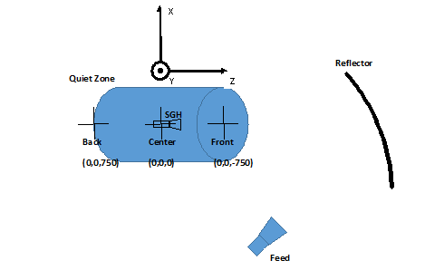{width="5.2083333333333336e-2in"
height="0.16666666666666666in"} from the UE shall start
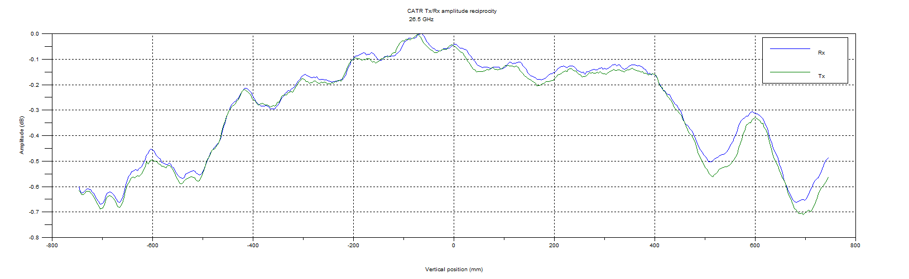{width="1.7083333333333333in"
height="0.1875in"} before the start of the corresponding downlink frame
{width="5.2083333333333336e-2in"
height="0.16666666666666666in"} at the UE, where
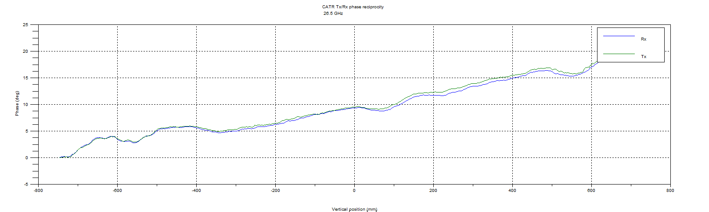{width="0.22916666666666666in"
height="0.16666666666666666in"} can be derived by the UE based on the
index value 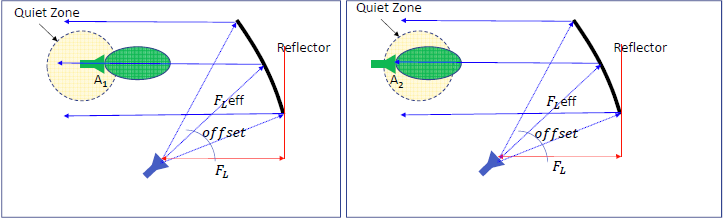{width="0.14583333333333334in"
height="0.16666666666666666in"} from gNB,
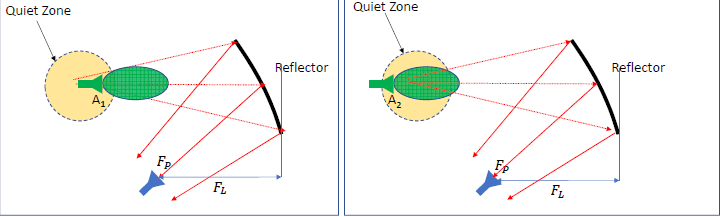{width="0.5104166666666666in"
height="0.17708333333333334in"} depends on the duplex mode and frequency
range in uplink transmission, and
{width="0.13541666666666666in"
height="0.16666666666666666in"} is the basic timing unit
\[21\]\[22\]\[23\].

{width="6.0472222222222225in"
height="3.4090277777777778in"}

Figure 7.3.2.2.2-1: Time alignment at gNB with TA

In case of satellite, the high delay drift of individual non-GEO
satellites is quite predictable because the motion of the satellites
follows known paths. The very fast update of the TA is neither required
in terrestrial links, nor in GEO satellite links. In both scenarios, the
terminal mobility is dominating the TA requirements.

Another technical issue that arises is that the delay variation over the
satellite link is much more than a TTI. E.g. if the SCS is increasing
from 15 kHz to 60 kHz, the TTI goes down from 1 ms to 250 μs. The
required TA adjustment range for satellite links will become larger that
the TTI with any SCS selection and the transmission timing of the UE has
to be adjusted over the borders of individual TTIs.

Table 7.3.2.2.2-1: TA granularity, and step size with SCS

  ----------------------------------------------------- ------------- ----------------------- ------------------------ ---------------- -------------------------
  Subcarrier spacing (SCS) configuration parameter, µ   SCS \[kHz\]   RB band-width \[kHz\]   TA gran-ularity \[Ts\]   T~step~ \[ns\]   Max Ta step size \[µs\]
  0                                                     15            180                     1024                     *520.83*         *16,6*
  1                                                     30            360                     512                      *260.42*         *8,3*
  2                                                     60            720                     256                      *130.21*         *4,15*
  3                                                     120           1440                    128                      *65.10*          *2,1*
  4                                                     240           2880                    64                       *32.55*          *1*
  ----------------------------------------------------- ------------- ----------------------- ------------------------ ---------------- -------------------------

This max Ta step should be valid only for extended cyclic prefix. With
normal cyclic prefix, we expect this maximum step not to exceed the
normal CP length (e.g. CP length is 4.7 µs in 15kHz SCS case). It means
that the number of Ta commands to be sent per second to track the
maximum drift of 35 µs/s is about 10 per second for 15 kHz SCS case, 40
per second for 60 kHz SCS, and 80 per second for 120 kHz SCS case. The
number of Ta commands to be sent per second is important but can be
implemented.

##### 7.3.2.2.3 NR impact considerations

Solutions need to be studied to ensure alignment of uplink signals over
the NTN links to overcome the predictable delay of NTN.

#### 7.3.2.3 Initial synchronization in downlink

##### 7.3.2.3.1 Problem statement

In order to access the 5G network, the UE has to detect the PSS and the
SSS. Those synchronization signals allow time and frequency correction,
and Cell Id detection. UE in cellular network has to get good one-shot
detection probability at -6 dB received baseband SNR condition with less
than 1% false alarm rate as defined in chapter 7.1.5 of \[24\], with
robustness against initial frequency offset up to 5 ppm.

We expect that requirements (SNR level of -6 dB, frequency error
robustness of 5 ppm and 1% false alarm) defined for terrestrial UE will
be kept the same for NTN UE. Even if the SNR level of NTN systems is
typically in the range of -3 to 13 dB SNR.

In cellular networks, transmission equipment (gNB or RRH) are usually
fixed, except when on board a moving platform such as a train.

In Non-Terrestrial Networks, the transmission equipment is on board the
satellite/HAPS.

\- For geostationary systems, the transmission equipment is quasi static
with respect to the UE with only small Doppler shift.

\- For HAPS, the transmission equipment is moving around or across a
theoretical central point but creates small Doppler shift.

\- For non-geostationary systems, the satellites move relative to the
earth and creates higher Doppler shift than for geostationary systems.

The Doppler shift depends on the relative satellite/HAPS velocity with
respect to the UE, and on the frequency band.

In term of Doppler shift, the worst case for NTN systems corresponds to
non-geostationary systems, at lowest altitude (i.e. 600 km), where the
speed of the satellite embedding transmission equipment is 7.5 km/s.

As detailed in clause 5.3, assuming a worst case NTN terminal velocity
of 1000 km/h:

\- For LEO in S band (2 GHz): Up to +/- 48kHz Doppler Shift in downlink
for the whole satellite coverage (spot)

\- For LEO in Ka band (20 GHz): Up to +/- 480kHz Doppler Shift in
downlink for the whole satellite coverage (spot)

If frequency error robustness requirement is 5 ppm (i.e. 10kHz for S
band, 100 kHz for Ka band), it means that this worst case described
above is not covered by current 5G specifications. To be inferior or
equal to 5ppm error, the satellite altitude has to be above 13000 km.

Actually, the Doppler shift amplitude to be compensated is less than 48
kHz for S band and 480 kHz for Ka band, because in satellite
communication systems, all satellites whether GSO or NGSO generate multi
beams and each beam foot print corresponds to a cell. The Max Doppler
shift amplitude observed at the satellite coverage foot print edges will
be reduced within each beam footprint. The lower the beam width, the
less the Doppler shift amplitude.

##### 7.3.2.3.2 Assessment of conditions for NR operation in Non-Terrestrial networks

In case the altitude of the satellite is above a certain altitude (about
13 000 km) or if center beam pre-compensation is sufficient to reach the
5 ppm requirements, no impact is foreseen.

##### 7.3.2.3.3 NR impact considerations

In case the above conditions are not met, further studies are required
to accommodate the high Doppler shift during the cell synchronization
procedure in non-Terrestrial networks.

Note that this high Doppler shift can be known based on UE location and
satellite ephemeris and hence could be for example pre compensated. This
could prevent impact on the NR but may need to be confirmed with further
study.

#### 7.3.2.4 DMRS time density

##### 7.3.2.4.1 Problem statement

As analyzed in Section 5.3, the maximum Doppler variation rates during
the field tests appeared in the scenarios of LEO at the altitude of 600
km, and are -544 Hz/s with carrier frequency of 2 GHz, -5.44 kHz/s with
carrier frequency of 20Ghz and -8.16 kHz/s with carrier frequency of 30
GHz, where the maximum Doppler variation rate is the maximum slope
(maximum derivative) of the Doppler shift curves. In NR network, there
are up to 4 DMRS symbols per slot and the duration of one slot can be
configured to 1 ms, 0.5 ms, 0.25 ms, 0.125 ms or 0.0625 ms, which
correspond to the subcarrier spacing of 15 kHz, 30 kHz, 60 kHz, 120 kHz
and 240 kHz respectively, as shown in Figure 7.3.2.4.1-1. Table
7.3.2.4.1-1 summarizes the potential maximum Doppler shift in one slot
in NTN based on the observed maximum Doppler variation rate during the
field tests. As shown in Table 7.3.2.4.1-1, it is observed that the
potential maximum Doppler shifts are up to 0.544 Hz with carrier
frequency of 2 GHz in DL/UL, up to 5.44 Hz with carrier frequency of 20
GHz in DL and up to 8.16 Hz with carrier frequency of 30 GHz in UL.

{width="5.979166666666667in"
height="5.538194444444445in"}

Figure 7.3.2.4.1-1: Slot duration depending on µ configuration

Table 7.3.2.4.1-1 Potential maximum Doppler Shift in one slot in NTN

+----------------+----------------+----------------+----------------+
| Carrier        | Maximum        | Duration of    | Potential      |
| frequency when | Doppler        | one slot (ms)  | maximum        |
| the altitude   | variation      |                | Doppler shift  |
| of LEO         | (Hz/s)         |                | in one slot    |
| satellite is   |                |                | (Hz)           |
| 600km          |                |                |                |
+----------------+----------------+----------------+----------------+
| 2 GHz          | \- 544         | 1              | 0.544          |
|                |                |                |                |
| (DL/UL)        |                |                |                |
+----------------+----------------+----------------+----------------+
|                |                | 0.5            | 0.272          |
+----------------+----------------+----------------+----------------+
|                |                | 0.25           | 0.136          |
+----------------+----------------+----------------+----------------+
|                |                | 0.125          | 0.068          |
+----------------+----------------+----------------+----------------+
|                |                | 0.0625         | 0.034          |
+----------------+----------------+----------------+----------------+
| 20 GHz         | -5440          | 1              | 5.44           |
|                |                |                |                |
| \(DL\)         |                |                |                |
+----------------+----------------+----------------+----------------+
|                |                | 0.5            | 2.72           |
+----------------+----------------+----------------+----------------+
|                |                | 0.25           | 1.36           |
+----------------+----------------+----------------+----------------+
|                |                | 0.125          | 0.68           |
+----------------+----------------+----------------+----------------+
|                |                | 0.0625         | 0.34           |
+----------------+----------------+----------------+----------------+
| 30 GHz         | -8160          | 1              | 8.16           |
|                |                |                |                |
| (UL)           |                |                |                |
+----------------+----------------+----------------+----------------+
|                |                | 0.5            | 4.08           |
+----------------+----------------+----------------+----------------+
|                |                | 0.25           | 2.04           |
+----------------+----------------+----------------+----------------+
|                |                | 0.125          | 1.02           |
+----------------+----------------+----------------+----------------+
|                |                | 0.0625         | 0.51           |
+----------------+----------------+----------------+----------------+

In the existing LTE network, the frequency error at the UE side shall be
within ±0.1 PPM observed over a period of 0.5 ms \[25\]. In NR network,
the frequency error at the UE side shall be within ±0.1 PPM observed
over a period of 1 ms\[26\].

##### 7.3.2.4.2 Assessment of conditions for NR operation in Non-Terrestrial networks

The frequency error corresponding to ±0.1 PPM is ±200 Hz with carrier
frequency of 2 GHz, ±2 kHz with carrier frequency of 20 GHz and ±3 kHz
with carrier frequency of 30 GHz. Compared to the requirement of
frequency error at the UE side, the maximum Doppler shift in one slot in
LEO scenarios during field test is negligible, see Table 7.3.2.4.1-1.
This result is also valid for other configurations with higher DMRS time
density per time slot as configurable in 5G NR. Similar conclusion could
be observed at the eNB side too \[27\]\[40\].

##### 7.3.2.4.3 NR impact considerations

As a conclusion, no impact on NR specifications is needed for DMRS
positioning in time in NTN deployment scenarios because the maximum
Doppler Variation in NTN is negligible compared to the minimum
requirement of frequency error at both gNB and UE sides in NR.

### 7.3.3 Altitude of the space/aerial vehicles

#### 7.3.3.1 HARQ

The HARQ process is a very time-critical mechanism. HARQ operation
becomes even more critical at extremely long RTT, i.e., as in case of
NTN and extreme coverage scenarios.

In satellite communication, the RTT normally exceeds the maximum
conventional HARQ timers (after which an ACK is received) or the maximum
possible number of HARQ processes (i.e., a flexible pool of parallel
HARQ processes similar to LTE). This is also true even for LEO
constellations, where the RTT varies between 15 to 63 times longer than
that of the terrestrial RTT \[28\]. Thereby, simply extending the number
of HARQ processes linearly to RTT induced by the satellite channel might
not be feasible for some UEs due to memory restrictions and the maximum
possible parallel processing channels \[41\]\[42\]\[43\]\[44\]\[45\].
Furthermore, gNBs also have to consider this latency impact on the
number of their active HARQ processes. Therefore, it is important to
study the impact on NR HARQ operation for the introduced NTN delays.
Figure 7.3.3.1-1 depicts the HARQ feedback RTT, i.e., from data
retransmission time up to acknowledge reception at a bent-pipe
satellite. The figure also shows the backhauling delay
{width="0.1875in"
height="0.17708333333333334in"} as well as the forward/reverse satellite
link delay {width="0.20833333333333334in"
height="0.1875in"}, i.e., where the RTT =
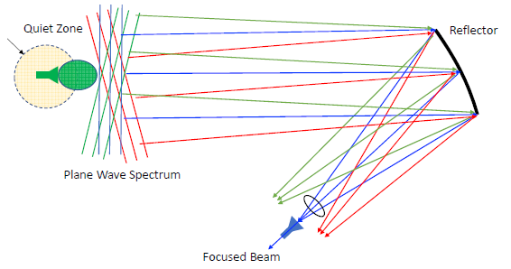{width="1.3333333333333333in"
height="0.1875in"}.

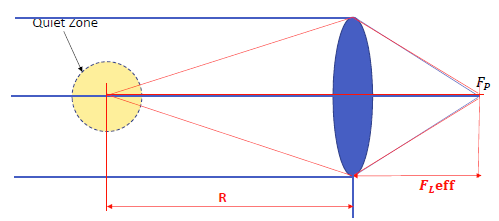{width="5.0625in" height="2.567361111111111in"}

Figure 7.3.3.1-1: Bent-pipe Satellite HARQ feedback operation with a
maximum RTT (from sending a NACK until receiving a retransmission
redundancy version (RV))

##### 7.3.3.1.1 Problem statement

NR has extended the number of HARQ processes in Rel. 15 to 16 processes
\[29\]. For NR NTN satellite transmission, the number of HARQ processes
may need to be further extended flexibly according to the induced RTT
delay. Here, the minimum required number of HARQ processes can be
computed directly from the RTT delay of each satellite constellation,
e.g., LEO, MEO and GEO, using the following formula \[28\]:

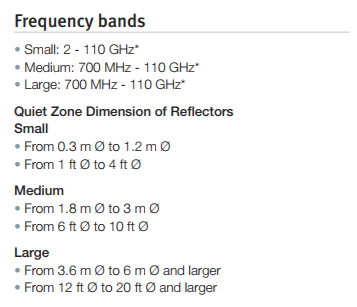{width="1.1354166666666667in"
height="0.2604166666666667in"} (7.3.3.1-1)

where 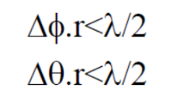{width="0.5833333333333334in"
height="0.17708333333333334in"} is the minimum required number of HARQ
processes, 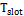{width="0.25in"
height="0.16666666666666666in"} is 1ms assuming a reference numerology
15 kHz subcarrier spacing, and
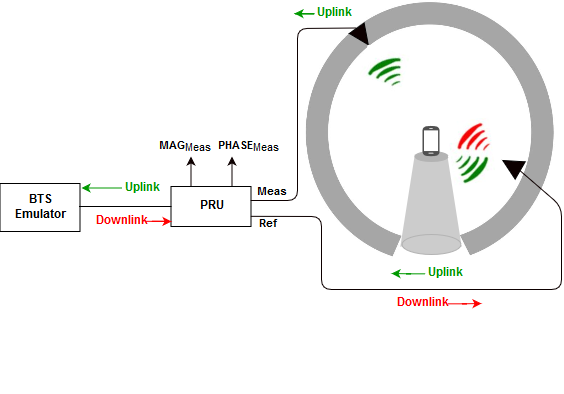{width="0.3541666666666667in"
height="0.17708333333333334in"} is the time duration between the initial
transmission of one transport block (TB) and the corresponding ACK/NACK
complete decoding.

The {width="0.3541666666666667in"
height="0.17708333333333334in"} is depicted in Figure 7.3.3.1.1-1
considering the RTT
(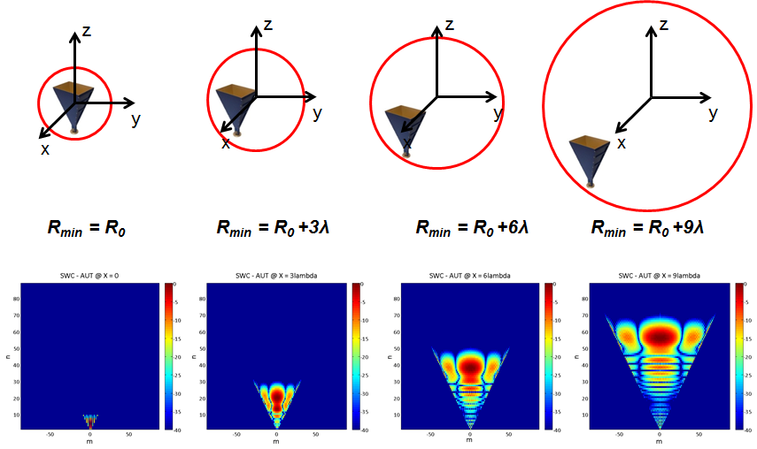{width="0.3645833333333333in"
height="0.1875in"}), transmission time
(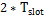{width="0.4583333333333333in"
height="0.16666666666666666in"}), and processing time,
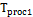{width="0.34375in"
height="0.17708333333333334in"} and
{width="0.34375in"
height="0.17708333333333334in"}, for decoding the TB and the ACK/NACK
frame, respectively.
{width="0.3541666666666667in"
height="0.17708333333333334in"} is illustrated in details in Figure
7.3.3.1.1-1.

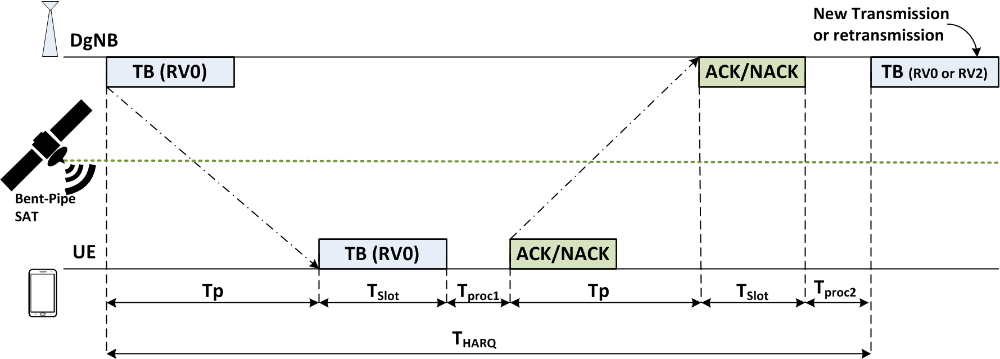{width="5.503472222222222in"
height="1.9833333333333334in"}

Figure 7.3.3.1.1-1: Timing diagram of a single HARQ process for a NTN
with a single bent-pipe satellite in the link

Table 7.3.3.1.1-1 gives an overview of the number of HARQ processes,
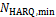{width="0.5833333333333334in"
height="0.17708333333333334in"}, based on different
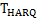{width="0.40625in" height="0.1875in"}values
(including the RTT) for different satellite constellations, LEO, MEO,
and GEO \[5\].

Table 7.3.3.1.1-1: The minimum required number of the HARQ processes,
{width="0.5833333333333334in"
height="0.17708333333333334in"}, assuming a 1ms slot duration for 15
kHz^\*^ reference subcarrier-spacing

  --------------- -------------------------------------------------------------------------------- -------------------------------------------------------------------------------------------------------------------------- --------------------------------
  constellation   Max. {width="0.375in" height="0.17708333333333334in"}   {width="0.5833333333333334in" height="0.17708333333333334in"} processes for 1 ms slot operation   UE side feasibility
  Terrestrial     16ms                                                                             16                                                                                                                         Feasible (Rel. 15)
  LEO             50ms                                                                             50                                                                                                                         Feasible (with HARQ extension)
  MEO             180ms                                                                            180                                                                                                                        FFS (impact on TBS/MCS)
  GEO/HEO         600ms                                                                            600                                                                                                                        FFS (impact on TBS/MCS)
  --------------- -------------------------------------------------------------------------------- -------------------------------------------------------------------------------------------------------------------------- --------------------------------

NOTE\*: For larger subcarrier spacing (SCS), i.e., 2^k^ \* 15 kHz, the
min. required number of the HARQ processes might be scaled by 2^k^.

##### 7.3.3.1.2 Assessment of conditions for NR operation in non-terrestrial networks

Handling a higher number of parallel HARQ processes and its feasibility
for NTN have been addressed in \[46\] \[41\] \[32\]. The impacts of NTN
delays on the existing HARQ-supporting mechanisms need to be addressed
in a subsequent study.

At least the following principles can be considered in further study:

**- Enhancing existing HARQ operation** to extend the HARQ processing
accommodating low to moderate NTN RTT delays.

**- Limiting HARQ capabilities and/or disabling HARQ** for long RTT
delays.

##### 7.3.3.1.3 NR impact considerations

It is required to study the impact on NR HARQ operation due to the long
RTT delay of a non-terrestrial network. The impacts should be considered
as well for the NTN UEs and serving gNBs, when the number of HARQ
processes is either extended to satisfy high reliability scenarios or
limited/disabled for longer NTN delays.

#### 7.3.3.2 MAC/RLC procedures

##### 7.3.3.2.1 Problem statement

UE operating in GEO satellite access networks can experience a one-way
propagation time of 240 ms at the minimum, 270 ms at the maximum between
UE and satellite base station. The base station can observe the
acknowledgement of packets sent to the UE only after the round trip plus
some processing time, which is more than ½ second later. Similarly the
UE can observe acknowledgement for its packet sent to the base station
in about the same time interval. For the LEO satellite systems with
typical 600 km orbit, the one way propagation delay changes continuously
between 2 ms when the satellite is directly above, and 7 ms when the
satellite is seen with 10° elevation.

ARQ requires that the transmitted packets be buffered in anticipation of
potential packet loss and released only after the successful receipt of
an acknowledgement, or until a time-out mechanism reinitiating a
retransmission. The long round trip delay requires larger transmission
buffer, and potentially limits the number of retransmission allowed for
each transmitted packet in both the forward and return links. Note that
in LEO satellite systems, the ARQ transmit buffer size, and
retransmission mechanism must be designed for the longest possible
delay, i.e. at the lowest elevation.

Scheduling mechanisms must be able to cope with the long RTT. UL
scheduling delay parameters are expected to be redefined to accommodate
the RTT of the associated deployment scenario.

##### 7.3.3.2.2 Assessment of conditions for NR operation in Non-Terrestrial networks

For efficient ARQ operation in GEO or NGSO satellite networks, NR UE and
base stations must size their transmission buffer and the retransmission
time-out mechanism according to the longest round-trip delay to be
anticipated. The number of retransmissions allowed before a packet is
dropped from the retransmission buffer may also be adjusted.

UL scheduling delay parameters are expected to be redefined to
accommodate the RTT of the associated deployment scenario.

##### 7.3.3.2.3 NR impact considerations

No impacts on the ARQ protocol itself, except parameter sizing needs to
account for the longer delay of the NTN network.

#### 7.3.3.3 Physical layer procedures (ACM, power control)

##### 7.3.3.3.1 Problem statement

As mentioned in section 7.3.3.2.1, UE operating in GEO satellite access
networks can experience a one-way propagation time up to 270 msec. Using
LEO satellite access network with 600 km orbit, the one way propagation
delay changes continuously between 2 ms, and 7 ms. The slow reaction
time is expected to have performance impact on some of the physical
layer procedures particularly those with close loops such as power
control and ACM.

##### 7.3.3.3.2 Assessment of conditions for NR operation in Non-Terrestrial networks

While slower reaction on the control loops affects the performance of
all the control loops between UE and base station, most of them require
some adjustments in implementation, but not fundamentally different
design.

While the link margin may be different for specific links and systems
depending on applications, satellite power is typically at a premium.
Due to the large free space loss and limited EIRP and battery power
available at UE, power margin is also limited for mobile terminals.
Thus, a very limited amount of power control, if at all, is available
for the GEO satellite links. Due to the long delay in the loop, the
power control is not expected to track fast fading, but may be used to
track slower power variations.

For Ka-band satellites, ACM is an essential tool that maintains
connection through rain fades, which typically changes somewhat slower
than the ½ second round trip delay. It generally works well with some
hysteresis to avoid excessive oscillations between two ACM modulation
coding modes. But, this reaction time is too slow for ACM to adapt for
changes of signal strength for mobile terminals when line of sight is
interrupted by shadowing.

For GEO systems in S-band, the main issue is multipath fading, which can
be much faster than ½ second round trip delay. As such, ACM will not be
able to follow it. ACM algorithm typically attempts to settle on a
modulation coding mode that closes the link if possible, by giving up
some power to maintain a margin.

For LEO satellites, ACM may also be used to adapt for the large
variation of free space loss. The variation is sufficiently slow
compared to the 20 ms worst case round trip delay. It should also be
able to react to shadowing fades to a large extent, but still unable to
follow fast fading.

##### 7.3.3.3.3 NR impact considerations

Further studies need to be performed to define the required margin for
power and ACM control loops to accommodate to the long RTT.

### 7.3.4 Cell size (Beam foot print)

#### 7.3.4.1 PRACH and Random access 

##### 7.3.4.1.1 Problem statement

*The RTT in NTN can be much larger than the RTT in terrestrial network
as analyzed in Section 5.3. Therefore, it is necessary to consider its
impact on PRACH and random access procedure. As shown in* Figure
7.3.4.1.1-1, for one given beam covering a cell, there is one common
propagation delay for all served UEs and one relative propagation delay
for each served UE. *If the common propagation delay can be compensated,
then the NTN PRACH signal design will depend on the relative propagation
delay, which is limited up to 200km in current specifications regarding
TA range. However even if only the difference value left, a NTN PRACH
signal design and PRACH procedure design are still needed since the
common propagation delay could be thousands of kilometers which cannot
be ignored.*

{width="3.415277777777778in"
height="3.952777777777778in"}

Figure 7.3.4.1.1-1: NTN systems, new geometry and the cell size

##### 7.3.4.1.2 Assessment of conditions for NR operation in Non-Terrestrial networks

**[Random Access Response]{.underline}**

For non-terrestrial networks, the round-trip time can be much larger
than the round-trip time in terrestrial networks (up to 600 ms for the
case of GEO satellites, with bent pipe architecture). However the
current window for the PRACH response in NR, which starts at
$\left\lceil \left( \Delta \cdot N_{\text{slot}}^{\text{subframe,}\text{.}\mu} \cdot N_{\text{symb}}^{\text{slot}} \right)/T_{\text{sf}} \right\rceil \cdot T_{\text{sf}}/\left( N_{\text{slot}}^{\text{subframe,}\text{.}\mu} \cdot N_{\text{symb}}^{\text{slot}} \right)$
symbols after transmitting the last symbol of the preamble and has the
size of \"rar-WindowLength\", cannot cover this round-trip time \[30\].
Therefore, the random access response window length in NR should be
revisited to accommodate the round-trip time of NTN. However, extending
the RA response window size in the existing procedure introduces
unnecessary UE monitoring intervals thus more power saving due to large
propagation delay in NTNs. Therefore, the solution to handle long
propagation delay with the consideration of power saving at the UE side
needs to be further studied.

**[PRACH Sequence and Format]{.underline}**

Considering that the cell size of NTN HAPS is not extremely large, the
current NR preamble format design should be enough to support HAPS. The
current NR preamble format design should be enough to support HAPS but
for Satellite it needs to be revisited \[30\]\[31\]\[23\]\[39\]\[32\].
As shown *in Figure 7.3.4.1.1-1,* the difference d3 = d2 -- d1 depends
on the elevation angle, as listed in Table 7.3.4.1.2-1.

Table 7.3.4.1.2-1 Differential *delay* d3 = d2 -- d1 vs. satellite
elevation angle

  --------------------------------------------------------------------------------------- ------------------------------------------------------------------------------------------------- -----------
  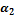{width="0.15625in" height="0.16666666666666666in"}\[degree\]   cell radius (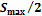{width="0.4375in" height="0.16666666666666666in"}) \[km\]   d3 \[km\]
  10                                                                                      200                                                                                               390
  20                                                                                      200                                                                                               372
  30                                                                                      200                                                                                               343
  40                                                                                      200                                                                                               303
  50                                                                                      200                                                                                               254
  60                                                                                      200                                                                                               197
  70                                                                                      200                                                                                               134
  80                                                                                      200                                                                                               67
  --------------------------------------------------------------------------------------- ------------------------------------------------------------------------------------------------- -----------

Clearly, the difference d3 exceeds the maximum cell coverage supported
by the NR preamble format of 2x 100 km for satellite elevation angles
below 60 degrees. In such a case, NR preamble format needs to be
extended for NTN system considering different footprint of NTN cells. So
it should be further studied if new random access preamble format is
needed for spaceborne vehicles.

The effect of the residual differential delay may be mitigated as
follows:

\- Case 1: NTN differential delay ≤ Max currently specified NR PRACH CP
duration.\
In this case no change is required to the specified NR RACH procedure.

\- Case 2: NTN differential delay \> Max currently specified NR PRACH CP
duration.\
In this case different solutions are possible which are for further
study.

**[RACH Procedure]{.underline}**

For PRACH procedure, huge propagation delay \[66.7μs, 120ms\] \[3\]
corresponding to BS heights \[8km, 35786km\] will lead to long RA
response procedure \[33\]\[32\]. As a result, it is necessary to shorten
the RA transmission/retransmission delay and design an NTN-specific RAR
window based on the given BS information to make the UE efficient and
power saving.

##### 7.3.4.1.3 NR impact considerations

Regarding NR PRACH waveform/format, no NR spec impacts are identified if
the GNSS based techniques are applicable at the UE side, otherwise,
potential enhancements w.r.t PRACH waveform/format may be needed which
are for further study. For RACH procedures, potential enhancements can
be studied regardless of whether the GNSS based techniques are
applicable or not.

#### 7.3.4.2 TA in Random access response message

##### 7.3.4.2.1 Problem statement

The Timing advance mechanisms ensure that transmissions from all UEs
operating in the same cell are synchronized when received by the same
gNB. A TA command is provided to the UE in a RAR message during initial
access, as well as later, to adjust the uplink transmission timing for
PUCCH/PUSCH/SRS. TA adjustment is analyzed in Section 7.3.2.2.

The timing advance
(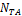{width="0.22916666666666666in"
height="0.16666666666666666in"}) is given by:

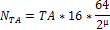{width="1.1458333333333333in"
height="0.3125in"}

where 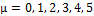{width="0.9791666666666666in"
height="0.16666666666666666in"} and TA is an integer between 0 and 3846.

The maximum value of the TA command sent in RAR message constraints the
maximum distance between an UE and the serving base station, which also
defines the maximum allowed cell size, as illustrated in Table
7.3.4.2.1-1.

Table 7.3.4.2.1-1: Terrestrial link distance for 5G NR

+---------+--------+--------+--------+---------+---------+---------+
| Sub     | 15 kHz | 30 kHz | 60 kHz | 120 kHz | 240 kHz | 480 kHz |
| carrier |        |        |        |         |         |         |
| spacing | µ= 0   | µ= 1   | µ= 2   | µ= 3    | µ= 4    | µ= 5    |
+---------+--------+--------+--------+---------+---------+---------+
| **      | 0.67   | 0.335  | 0.1675 | 0.0838  | 0.0419  | 0.0209  |
| Maximum |        |        |        |         |         |         |
| timing  |        |        |        |         |         |         |
| advance |        |        |        |         |         |         |
| (ms)**  |        |        |        |         |         |         |
+---------+--------+--------+--------+---------+---------+---------+
| **      | 300    | 150    | 75     | 37.5    | 18.75   | 9.38    |
| Maximum |        |        |        |         |         |         |
| link    |        |        |        |         |         |         |
| d       |        |        |        |         |         |         |
| istance |        |        |        |         |         |         |
| (TA =   |        |        |        |         |         |         |
| 3846)   |        |        |        |         |         |         |
| (km)**  |        |        |        |         |         |         |
+---------+--------+--------+--------+---------+---------+---------+

Even at 15kHz, the maximum cell size is below the satellite altitude,
for both LEO and GEO scenarios. Therefore, it is not expected that the
timing advance mechanism can be reused as is for satellite networks.

For HAPS scenarios, the HAPS altitude is quite negligible compared to
the maximum link distance for low numerology. In these cases, the
maximum allowed cell size for terrestrial operations needs to be
slightly reduced to ensure the maximum link distance is never exceeded.
For high numerology however, the maximum link distance may be smaller
than the HAPS altitude, leading to the same conclusion as for satellite
operations.

##### 7.3.4.2.2 Assessment of conditions for NR operation in Non-Terrestrial networks

**Compensation of entire propagation delay by TA**

For satellite operations, it is expected that TA mechanism cannot be
reused as is to compensate for the propagation delay. For HAPS
operations, the mechanism can be reused as is in some cases (low
numerology and/or low HAPS altitude). The maximum cell size shall then
be redefined to ensure that the maximum allowed link distance is never
exceeded.

**Common delay known and handled by the network**

In this case, TA compensates only for differential delay/distance, so
that the maximum TA value defines the maximum allowed differential
delay/distance. Considering Figure 7.3.4.1.1-1, it can be easily shown
that the maximum differential distance is achieved when
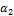{width="0.14583333333333334in"
height="0.16666666666666666in"} is minimum. As shown in Table
7.3.4.2.2-1, the maximum differential distance is almost equal to the
maximum cell diameter for 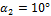{width="0.53125in"
height="0.16666666666666666in"}.

Table 7.3.4.2.2-1: Maximum cell size for
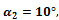{width="0.6145833333333334in"
height="0.20833333333333334in"} SCS=15kHz, GEO/MEO/LEO cases

  ---------------------------- ------------------------------------------------------------------------------------------------------- ---------------------------------------------- -------------------------------------------------
  NTN vehicle altitude orbit   Min Elevation angle {width="0.15625in" height="0.16666666666666666in"} (deg)   Max Differential distance d3 = d2 -- d1 (km)   Maximum cell [diameter]{.underline} S~max~ (km)
  GEO (at 35 786 km)           10°                                                                                                     300 km                                         304.66
  MEO at 10 000 km             10°                                                                                                     300 km                                         304.73
  LEO at 1500 km               10°                                                                                                     300 km                                         305.05
  LEO at 600 km                10°                                                                                                     300 km                                         305.50
  ---------------------------- ------------------------------------------------------------------------------------------------------- ---------------------------------------------- -------------------------------------------------

In first approximation, it can be stated that the existing TA mechanism
can compensate the differential delay if the cell diameter does not
exceed the maximum link distance given in Table 7.3.4.2.1-1.

##### 7.3.4.2.3 NR impact considerations

In HAPS operations, extension of the maximum TA value could be
considered to extend the maximum allowed cell size, especially for high
numerology.

In satellite operations, it is expected that the network can take into
account the common propagation delay. To extend the maximum cell size,
different approaches can be studied further.

### 7.3.5 Propagation channel

#### 7.3.5.1 DMRS frequency density

##### 7.3.5.1.1 Problem statement

For PDSCH, the mapping to physical resources of the Demodulation
reference signals is described in chapter 7.4.1.1.2 of \[21\] recalled
below. There is either one DM-RS symbol per slot or 2 in consecutive
OFDM symbols within a slot. The resource elements of this DM-RS symbol
are scattered over different subcarriers according to two configuration
types.

In configuration type 1, DM-RS symbols are inserted every 2 subcarriers
in PDSCH. In configuration type 2, DM-RS symbols are inserted every 5
subcarriers in PDSCH.

Table 7.3.5.1.1-1: Minimum coherence bandwidth of PDSCH supported for a
given SCS value

  ----------- -------------------------------------------------------------------------------- ----------------------
              Minimum supported coherence bandwidth (assumed no orthogonally required) (kHz)   
  SCS (kHz)   Configuration type 1                                                             Configuration type 2
  15          30                                                                               75
  30          60                                                                               150
  60          120                                                                              300
  120         240                                                                              600
  ----------- -------------------------------------------------------------------------------- ----------------------

For PBCH, the mapping to physical resources of the Demodulation
reference signals is specified in Table 7.4.3.1-1 of \[21\]. DM-RS are
inserted every four subcarriers in PBCH on all OFDM symbols.

For PDCCH, the DM-RS symbols are inserted every 4 subcarriers as for
PBCH (chapter 7.4.1.3.2 in \[21\]).

Table 7.3.5.1.1-2: Minimum coherence bandwidth of PBCH/PDCCH supported
for a given SCS value

  ----------- ---------------------------------------------
  SCS (kHz)   Minimum supported coherence bandwidth (kHz)
  15          60
  30          120
  60          240
  120         480
  ----------- ---------------------------------------------

The minimum coherence bandwidth for each NTN deployment scenario can be
computed with the following formula:

Minimum coherence bandwidth = 1/(alpha \*delay spread)

with alpha being a constant between 1 and 50. As a worst case, it is set
to 50 for the DM-RS mapping selection. The maximum delay spread depends
on the UE antenna directivity.

Table 7.3.5.1.1-3: Maximum delay spread and minimum coherence bandwidth
for each deployment scenario

  ------------------------------- ------------------ ----------------- ----------------- ------------------ ------------------
                                  D1, GEO, Ka band   D2, GEO, S band   D3, LEO, S band   D4, LEO, Ka band   D5, HAPS, S band

  **Maximum Delay spread (ns)**   10                 100               100               10                 150

  **Min coherence bandwidth\      \>\> MHz           200 kHz           200 kHz           \>\> MHz           133 kHz
  (NOTE 1, NOTE 2)**                                                                                        
  ------------------------------- ------------------ ----------------- ----------------- ------------------ ------------------

NOTE 1: In Ka band, typical antenna directivity is taken into account in
the delay spead estimate

NOTE 2: In S band, delay spread in satellite scenarios is lower than in
HAPS scenario, because the min operating SNR is lower which leads to
discard largest delay spread.

##### 7.3.5.1.2 Assessment of conditions for NR operation in Non-Terrestrial networks

For S band, the minimal coherence bandwidth has been computed with the
formula in the previous clause and an alpha value corresponding to a
theoretical worst case (Alpha set to 50). This may put some constraints
on the SCS value selection which needs to be further studied.

##### 7.3.5.1.3 NR impact considerations

Enhancement to NR specifications with respect to DMRS frequency
diversity may not be needed depending on possible SCS choice constraints
that needs to be further studied.

#### 7.3.5.2 Cyclic prefix

##### 7.3.5.2.1 Problem statement

Originally, the NR CP has been dimensioned for terrestrial transmissions
characterized by high delay spread due to multi path propagation. This
clause describes selection criteria of the CP that need to be addressed
when considering using NR in Non-Terrestrial Network deployment
scenarios.

##### 7.3.5.2.2 Assessment of conditions for NR operation in Non-Terrestrial networks

**Delay spread in satellite propagation channels**

Signal echoes are associated to the presence of indirect rays that reach
the receiver antenna and carry a significant energy with respect to the
energy of the direct ray.

ITU-R recommendation \[34\] defines for the 2 GHz band three parameter
sets of wideband models, including LOS and NLOS cases, applicable for an
elevation range from 15 to 55° and for urban, suburban and rural
environments. The delay spread of these three parameter sets ranges
between 180 ns to 250 ns, whereas the 250 ns are stated to cover 90% of
the cases.

For higher elevations than 55°, we assume that the delay spread of the
satellite channel will be in the same range or even lower due to the
traveling distances of the echoes arriving at a receiver.

Few papers are available on delay spread measurements in Ka-Band.
Reference \[35\] is stating the coherence bandwidth to be 30 MHz at 40
GHz with omnidirectional antennas. According to \[36\], the coherence
bandwidth (Δ f)~c~ of a channel with maximum delay spread Tm is

(Δ f)~c~ ≈ 1 / (5T)

For the stated coherence bandwidth in \[35\], this results in a maximum
delay spread of T~m~ = 25 ns for omni-directional antennas. For
directional antennas, echoes with significant delay are normally
filtered out by the antenna radiation pattern, so flat fading can be
assumed for Ka-band signals.

**CP length defined in NR**

The possible CP lengths currently defined for New Radio \[21\] are
summarized in the following table:

Table 7.3.5.2.2-1: CP lengths and minimum/maximum RF bandwidth of NR as
currently defined in \[21\]

  ---------------------------------------------------- ------------- ------------------------- ---------------------------
  Subcarrier spacing (SCS) configuration parameter µ   SCS \[kHz\]   normal CP length \[µs\]   extended CP length \[µs\]
  0                                                    15            *4,688*                   Not defined
  1                                                    30            *2,344*                   Not defined
  2                                                    60            *1,172*                   *16,67*
  3                                                    120           *0,586*                   Not defined
  4                                                    240           *0,293*                   Not defined
  ---------------------------------------------------- ------------- ------------------------- ---------------------------

##### 7.3.5.2.3 NR impact considerations

It is observed that lower numerologies (µ= 0, 1) are associated with CP
lengths exceeding the requirement of NTN, resulting in a slightly
reduced spectral efficiency due to the over-dimensioned CP (e.g.
overhead is for µ= 0: (4.688µs - 0.25µs) / 66.67 µs = 6.7 %).

High numerologies (µ= 3, 4) result in CP lengths which are well matching
to propagation characteristics in Ka-Band.

The extended CP for a SCS of 60 kHz is not required, because it is
significantly larger than required for satellite applications.

Enhancement to NR specification is not expected for NTN applications due
to the NTN channel model delay spread compatible with the existing
specified CP values.

### 7.3.6 Duplex mode

#### 7.3.6.1 FDD/TDD Duplexing mode

##### 7.3.6.1.1 Problem statement

Most of the existing satellite systems operate in the frequency bands
designated for FDD mode, with defined transmit direction. For some
frequency bands, TDD mode is possible.

When considering TDD mode, a guard time is necessary to prevent UE to
simultaneously Transmit and reception. This guard time directly depends
on the propagation delay between UE and gNB. This guard time will
directly impact the useful throughput and hence the spectral efficiency.

When considering Non-Terrestrial networks, this guard time should
commensurate the round trip delay.

Guard time would range between 2 x 7 ms for LEO at 600 km and 2 x 270 ms
for GEO satellite access networks since NTN terminals can experience a
one-way propagation time of

\- 240 ms at minimum and 270 ms at maximum between UE and satellite base
station for GEO

\- 2 ms at minimum and 7 ms at maximum between UE and satellite base
station for LEO at 600 km altitude

Such excessive guard time would lead to a very inefficient radio
interface especially in GEO or even MEO based access.

It may be acceptable in the case of LEO access system with the need to
deal with the variable delay.

##### 7.3.6.1.2 Assessment of conditions for NR operation in Non-Terrestrial networks

The applicability of the duplexing mode TDD or FDD depends on the
regulations (ITU-R and/or national) associated to the targeted spectrum.

##### 7.3.6.1.3 NR impact considerations

FDD is preferred duplexing mode for most NR based NTN access network.

In case the regulations allow it, TDD mode can be considered for both
HAPS and LEO satellite based access network with potential NR impacts if
required.

### 7.3.7 Satellite or aerial Payload performance

#### 7.3.7.1 PT-RS

##### 7.3.7.1.1 Problem statement

Phase variations in time domain can be caused by different phenomena:
presence of phase noise, frequency drifts due to Doppler shift, or due
to insufficient frequency synchronization (e.g. residual CFO), etc.
Phase noise, caused by imperfect oscillator implementation technology
destroys the orthogonality of subcarriers in OFDM-based systems
especially in FR2. Phase noise causes CPE, resulting in a constant
rotation angle of the modulation constellation, and ICI, resulting in
scattering of the constellation points in OFDM based systems. Doppler
effects and/or residual CFO cause frequency shifts translated into time
domain phase ramps at OFDM symbol level.

The phase variations translating all the above effects may significantly
degrade the performance and need compensation. When mild, these
variations can be absorbed by the DM-RS in the channel estimation
process. But when strong phase variations are present, which is
particularly the case at carrier frequencies above 6GHz, more frequent
support than the one provided by DM-RS is necessary in order to track
the remaining variations.

In NR, PT-RS has been introduced in \[21\], \[23\] to compensate for
phase errors. PT-RS configuration in NR is very flexible and allows
user-specific configuration depending on scheduled MCS/bandwidth, UE RF
characteristics, DM-RS configuration, waveform, etc.

##### 7.3.7.1.2 Assessment of conditions for NR operation in Non-Terrestrial networks

It has been proposed that eMBB should be supported for NTN and the
modulation order might not always be low. PT-RS is needed in NTN at high
carrier frequencies, where the maximum received SNR is limited by the
phase noise.

Considering the high speed of airborne/spaceborne vehicles, CFO and
Doppler shift/spread might be worse in NTN and therefore CFO and Doppler
estimation need to be considered.

A number of phase noise masks such as DTH or VSAT use cases considered
in \[37\], or other state of the art bent pipe of satellite or HAPS
payloads as described in Annex B are considered as pertinent for
non-terrestrial communications. Phase noise masks pertinent for
terrestrial equipment operating in mmWave have been defined in NR in
\[38\].

The performance of phase tracking algorithms is highly dependent on a
large set of variables such as carrier frequency, subcarrier spacing, UE
specific RF characteristics, configured MCS/bandwidth, frame length,
DMRS configuration, Doppler, receiver implementation options, etc.

##### 7.3.7.1.3 NR impact considerations

PTRS is needed in NR supporting NTN for phase error compensation. PTRS
configuration in NR is very flexible. Typical phase noise masks of state
of the art bent pipe of satellite or HAPS payloads in Non-Terrestrial
networks can be efficiently compensated by the current NR design in the
absence of important Doppler shifts and/or residual CFO at a carrier
frequency of up to 30 GHz. Some further investigation is needed in the
case of important Doppler shifts and/or residual CFO, or in the presence
of the specific phase noise masks of on board payloads significantly
different from the ones considered in cellular network so far, or with
very large channel bandwidths.

#### 7.3.7.2 PAPR

##### 7.3.7.2.1 Problem statement

A key component in the satellite payload architecture is a PA. It
exhibits nonlinear behavior when driven near saturation in an effort to
increase power efficiency. Nonlinear distortion causing constellation
warping and clustering, thus complicating signal reception. One
measurement that determines the vulnerability of the transmitted signal
to nonlinear distortion is the PAPR, with higher values associated with
worse impact.

In the NR downlink, CP-OFDM is used. CP-OFDM is composed of
superposition of narrowband orthogonal subcarriers, resulting in higher
PAPR values compared with the underlying modulation in a single carrier.
The PAPR is a function of the number of subcarriers in the signal, as
well as the underlining modulation.

The amount of distortion caused by nonlinear amplifier characteristics
is a function of the PAPR of the signal. The greater the PAPR, the
greater the distortion can be. The distortion can be reduced by
increasing the backoff of the amplifier operating point. But this
reduces the amplifier efficiency accordingly. Tradeoffs are often made
between the amplifier OBO and the nonlinear signal distortion, such that
the total degradation of output power and signal distortion is
minimized.

As an example, the figures (NOTE 1) below show the total degradation of
CP-OFDM with over a typical satellite transponder is about 6 dB for QPSK
modulation and 7.6 dB for 16-QAM, whereas that for DFT-spread-OFDM is
about 4 dB for QPSK and 6 dB for 16-QAM. The difference between CP-OFDM
and DFT-spread-OFDM is 1.6-2 dB.

NOTE 1: See ETSI TR 103 297 \"Satellite Earth Stations and Systems
(SES), SC-FDMA based radio waveform technology for Ku/Ka band satellite
service\", , V.1.1.1., (2017-07). Pages 29-30.

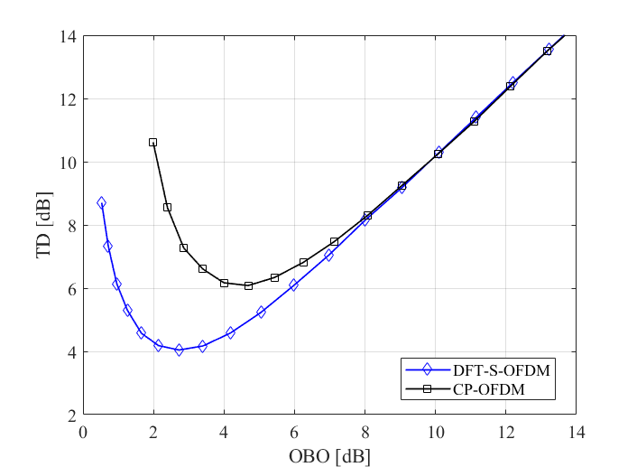{width="3.1319444444444446in"
height="2.29375in"}
{width="3.0965277777777778in"
height="2.279861111111111in"}

QPSK Modulation (b) 16-QAM modulation\
Figure 7.3.7.2.1-1: DFT-S-OFDM vs CP-OFDM total degradation

The additional 2 dB output backoff may represent 20 to 40 percent
reduction of link capacity compared to State of the art satellite radio
interface, depending on whether the satellite is bandwidth limited or
power limited.

As for HAPS, the payload architecture may be very similar to satellite,
and power amplifier remains to be a key component, although SSPA is
likely to be used instead of traveling wave tube. Regardless, the PAPR
difference between CP-OFDM and DFT-spread-OFDM also requires different
OBO which translates to different total distortion. The higher total
distortion of CP-OFDM ultimately means lower capacity. In this case,
however, the problem may be less acute, since the payload power
efficiency may not be as critical.

##### 7.3.7.2.2 Assessment of conditions for NR operation in Non-Terrestrial networks

The use of CP-OFDM in the downlink does not restrict NR operation in
non-terrestrial networks, but it may affect the system performance:

\- In one case, a satellite transponder is sufficiently wide and
sufficiently powerful to accommodate more than one FDM carriers, each of
which is a different NR CP-OFDM signal. The satellite amplifier is
backed off to minimize the intermodulation between these FDM carriers
within the same transponder. For such cases, the distortion introduced
by the amplifier nonlinearity is small, with little impact.

\- In second and much more common case for communicating to small UEs,
the satellite amplifier is used to send only one NR CP-OFDM downlink. It
is highly desirable to operate the amplifier with as small OBO as
possible. But, due to the higher PAPR of CP-OFDM signal, sufficient OBO
is necessary. To close the link, it may be necessary to reduce the size
of CP-OFDM carrier or operate the CP-OFDM carrier with a lower
modulation and coding mode. Either way, the forward link capacity is
reduced significantly.

On the uplink, DFT-spread-OFDM might be beneficial.

##### 7.3.7.2.3 NR impact considerations

PAPR reduction techniques of CP-OFDM signal on the downlink would be
beneficial to optimize the capacity of non-terrestrial networks and
therefore could be considered in future studies.

### 7.3.8 Network architecture

#### 7.3.8.1 Protocols

##### 7.3.8.1.1 Problem statement

Non-Terrestrial networks differ from typical cellular networks in terms
of network architecture, deployment scenarios as well as coverage which
may span across several countries.

Potential impacts on the NR specifications could be minimized through
suitable mapping options of the Logical NG RAN architecture onto the NTN
network architecture.

The respective NG-RAN logical architecture and the NTN network
architecture are depicted below. The area of impacts associated to the
NG-RAN mapping options need to be identified.

{width="6.498611111111111in"
height="0.3902777777777778in"}

Figure 7.3.8.1.1-1: 3GPP NG-RAN (or NR radio access) architecture
defined in TS 38.401

{width="6.495833333333334in"
height="1.417361111111111in"}

Figure 7.3.8.1.1-2: Typical Non-Terrestrial network physical
architecture

Furthermore, when dealing with mobility of UEs, one should distinguish:

\- The mobility induced by the motion of the NTN platform, in particular
when considering Non-Geostationary Satellites;

\- The mobility of the terrestrial equipment:

\- when moving from one beam to another beam generated by a satellite or
a HAPS

\- The mobility of UE between beams generated by different satellites or
HAPS

\- The mobility of UE between NTN (Satellite or HAPS) and cellular
access

Location update, paging and hand-over RAN related protocols may need to
be adapted to accommodate

\- The extended delay of NTN for intra NTN access mobility

\- The differential delay when mobility between satellite access and
cellular access

\- The mobility of the cell pattern generated by non geo-stationary
satellites

##### 7.3.8.1.2 Assessment of conditions for NR operation in Non-Terrestrial Networks

**RAN architecture mapping**

There are several options to instantiate the RAN architecture in
Non-Terrestrial networks. It depends on whether the satellite or HAPS
implement a bent pipe payload or a processed payload. This leads to the
following example mapping options that prevent the need to create new
interfaces or reference points. Note that there may exist other mapping
options not listed here.

Table 7.3.8.1.2-1: RAN architecture example mapping options in
Non-Terrestrial networks

  ------------------------ ---------------------
  Satellite/HAPS payload   NG RAN architecture
  Bent pipe                Mapping option 1
  Processed -- low         Mapping option 2
  Processed - high         Mapping option 3
  ------------------------ ---------------------

A bent pipe satellite/HAPS payload implements Radio frequency
conversion, analogue filtering and amplification. A processed payload
implements some RAN functions. The type of gNB functions that can be
embarked will be constrained by the available power and mass on board
satellite/HAPS.

Here under are depicted different mapping options of the logical NG RAN
architecture onto the physical architecture of Non-Terrestrial networks
which prevents to modify the NG RAN architecture.

{width="6.499305555555556in"
height="1.426388888888889in"}

Figure 7.3.8.1.2-1: Mapping option 1 - NG RAN architecture in Non
Terrestrial network with bent pipe payload

{width="6.504861111111111in"
height="1.4854166666666666in"}

Figure 7.3.8.1.2-2: Mapping option 2 - NG RAN architecture in Non
Terrestrial network with gNB-DU processed payload

NOTE: SRI refers to Satellite Radio Interface

{width="6.534027777777778in"
height="1.492361111111111in"}

Figure 7.3.8.1.2-3: Mapping option 3 - NG RAN architecture in Non
Terrestrial network with gNB processed payload

Table 7.3.8.1.2-2 highlights the difference in terms of interfaces
transported by the satellite links and NG RAN functions implemented in
the NTN physical entities.

Table 7.3.8.1.2-2: Mapping options of the logical architecture of NR RAN
onto the physical architecture of Non-Terrestrial networks

  -------------------------------- ----------------------------- ------------------------------------------------- --------------- ---------------------------------------------
  Mapping options                  Satellite/HAPS Service link   Satellite/HAPS feeder link                        Terminal side   Network side
  1 --Bentpipe payload             NR-Uu radio interface         NR-Uu radio interface                             UE              NTN Remote Radio Unit + gNB
  2 --Processed payload (gNB-DU)   NR-Uu radio interface         F1 over Satellite radio interface (SRI)           UE              NTN Remote Radio Unit + SRI modems + gNB-CU
  3 --Processed payload (gNB)      NR-Uu radio interface         N1, N2, N3 over Satellite radio interface (SRI)   UE              NTN Remote Radio Unit + SRI modems
  -------------------------------- ----------------------------- ------------------------------------------------- --------------- ---------------------------------------------

Given that Non-terrestrial networks feature longer propagation delays,
the timers associated to the protocols transported over the feeder and
service links may require to be extended. This applies for example to F1
as well as N1, N2 and N3 reference points.

In mapping option 1, the Satellite or HAPS implements an RF repeater
(with frequency conversion), whereas in mapping option 2, they implement
some kind of \"intermediate\" node which could be based on the outcomes
of 3GPP TR 38.874: \"Study on Integrated Access and Backhaul\".

It is recommended to consider the outcome of this TR 38.874 and see how
it can be applicable to Non-Terrestrial networks (especially for NTN
deployment scenarios 2 and 3) and what areas of impact it may create.
Other mapping options may be considered depending on different CU-DU
lower layer split for NR that may be defined (See TR 38.816).

**Location update, paging and hand-over RAN related protocols**

Table 7.3.8.1.2-3 identifies the possible areas of impact on NR
associated to Location update, paging and hand-over RAN related
protocols in different types of non-terrestrial networks.

Table 7.3.8.1.2-3: Potential areas of impact on NR specifications
associated to Location update, paging and hand-over RAN related
protocols for different types of non-terrestrial networks

+----------------+----------------+----------------+----------------+
| NTN Deployment | GEO            | Non GEO        | HAPS           |
| scenarios      |                |                |                |
+----------------+----------------+----------------+----------------+
| Cell pattern   | Earth fixed:   | Motion over    | Motion over    |
|                | same as in     | earth or earth | earth (e.g.    |
|                | cellular       | fixed          | rotating) &    |
|                |                |                |                |
|                |                |                | Possibly UE    |
|                |                |                | altitude       |
|                |                |                | dependent      |
+----------------+----------------+----------------+----------------+
| Tracking area  | Tracking area  | For further    | Same as for    |
|                | congruent with | study          | GEO and        |
|                | cell pattern:  |                | cellular       |
|                | same as in     |                | networks       |
|                | cellular       |                |                |
+----------------+----------------+----------------+----------------+
| Potential      | Mobility       | Location       | Case 1:        |
| areas of       | management     | update, paging | tracking area  |
| impact on NR   | procedures     | and hand-over  | corresponds to |
| specifications | (Paging,       | RAN related    | HAPS coverage: |
|                | hand-over,     | protocols to   | no impact      |
|                | location       | be adapted     |                |
|                | update):       | depending on   | Case 2:        |
|                | Potential      | tracking area  | Tracking area  |
|                | extension of   | design         | smaller than   |
|                | some timers    |                | HAPS total     |
|                |                | **Handling of  | coverage, same |
|                |                | network        | impact as for  |
|                |                | identities to  | Non GEO are    |
|                |                | be adapted**   | expected       |
+----------------+----------------+----------------+----------------+

##### 7.3.8.1.3 NR impact considerations

Thanks to suitable mapping options of the logical architecture of NG RAN
onto the physical architecture of non terrestrial network, modifications
of the NG RAN architecture are not needed in terms of reference points,
interfaces or functions.

However the N1/N2/3 and GTP based F1 interface protocols may need to be
adapted to accommodate the non terrestrial networks feeder link
characteristics (long delay, BER).Depending on the non-terrestrial
network deployment scenarios, other impacts on NR specification may have
to be considered among which, location update, paging and hand-over RAN
related protocols and handling of network identifies.

Last, it may be considered how the architecture being defined in 3GPP
TR38.874 \"Study on Integrated Access and Backhaul\" can be used in the
context of various Non-Terrestrial networks deployment scenarios.

8 Recommendations on the way forward
====================================

8.1 General outcomes
--------------------

This report has

\- provided detailed descriptions of some deployment scenarios for
non-terrestrial networks and the related system parameters such as
altitude, orbit, etc.

\- defined a way to generate Non-Terrestrial network channel models
leveraging on the models defined in TR 38.901 \"Study on channel model
for frequencies from 0.5 to 100 GHz (Release 14)\"

\- identified potential key impact areas on the NR to support
Non-Terrestrial networks

In line with 3GPP TR 38.901, the study considered channel models in
Non-Terrestrial networks operating in any frequency bands between 0.5
and 100 GHz.

8.2 Reference deployment scenarios
----------------------------------

A number of scenarios is considered in clause 5.1 \"Scenarios overview\"
including GEO, Non-GEO as well as HAPS based access networks. The intent
is to assess relatively worst-case scenarios with respect to Doppler
shift, Doppler variation rate, Delay and Delay variation rate. For
non-GEO deployment scenarios, the altitude has been set to 600 km, which
is pessimistic with respect to the Doppler, and Doppler rate, related
effects.

Non-Terrestrial access networks can be used to serve directly User
Equipment or indirectly via a relay node.

8.3 Non-Terrestrial network channel modelling
---------------------------------------------

Leveraging on the models defined in TR 38.901 \"Study on channel model
for frequencies from 0.5 to 100 GHz (Release 14)\", complementary
features and specific parameters have been identified and proposed in
chapter 6 of this report to generate Non-Terrestrial network channel
models for all possible deployment scenarios characterised by
altitude/orbit of space/aerial vehicles, user environments (rural,
sub-urban, urban and dense urban), targeted user equipment type (omni or
directive antennas, LOS/NLOS conditions) as well as frequency bands.

8.4 NR impacts to support Non-Terrestrial networks
--------------------------------------------------

### 8.4.1 Type of potential NR impacts

The potential NR impacts are characterised according to the
classification in Table 8.4.1-1:

Table 8.4.1-1: Type of Potential area of NR impacts to support
Non-Terrestrial networks

  ---------------------------------- ------------------------------------------------------------------
  Type of Potential area of impact   Modifications of 3GPP NR specifications
  Higher layers impact               Layer 2/3 protocols/architecture
  Physical layer impact              Parameters settings, procedures or physical channels and signals
  ---------------------------------- ------------------------------------------------------------------

### 8.4.2 Assessment of potential NR impacts to support Non-Terrestrial networks

Table 8.4.2-1 identifies the potential area of impacts on the NR
specification. This will depend on the deployment scenarios. The intent
is to identify the main studies to be carried out taking into account
the defined NTN channel model to enable operation of NR in
Non-Terrestrial networks. Other areas of impact are identified which
could lead to performance improvement.

Table 8.4.2-1: Evaluation of NR impacts to support Non-Terrestrial
networks

+-------------+-------------+-------------+-------------+-------------+
| Non-        | Effects     | Impacted NR | Potential   | Comment     |
| Terrestrial |             | features    | areas of    |             |
| network     |             |             | impact to   |             |
| specifics   |             |             | be further  |             |
|             |             |             | studied     |             |
+-------------+-------------+-------------+-------------+-------------+
| Motion of   | Moving cell | Hand-       | Higher      | Paging and  |
| the         | pattern     | over/paging | layers      | Hand-over   |
| s           |             |             | impact      | procedures  |
| pace/aerial |             |             |             | should be   |
| vehicles    |             |             |             | adapted to  |
|             |             |             |             | take into   |
|             |             |             |             | account the |
|             |             |             |             | relative    |
|             |             |             |             | motion of   |
|             |             |             |             | the cell    |
|             |             |             |             | pattern     |
|             |             |             |             | with        |
|             |             |             |             | respect to  |
|             |             |             |             | the         |
|             |             |             |             | tracking    |
|             |             |             |             | area.       |
|             |             |             |             | Further     |
|             |             |             |             | analysis on |
|             |             |             |             | tracking    |
|             |             |             |             | area design |
|             |             |             |             | may need to |
|             |             |             |             | be carried  |
|             |             |             |             | out.        |
|             |             |             |             | Mobility    |
|             |             |             |             | management  |
|             |             |             |             | is also to  |
|             |             |             |             | be          |
|             |             |             |             | considered  |
|             |             |             |             | (NOTE 1)    |
+-------------+-------------+-------------+-------------+-------------+
|             | Delay       | TA          | Physical    | Alignment   |
|             | variation   | adjustment  | layer       | of uplink   |
|             |             |             | impact      | signals may |
|             |             |             |             | need to be  |
|             |             |             |             | considered  |
+-------------+-------------+-------------+-------------+-------------+
|             | Doppler     | Initial     | No impact   | The         |
|             |             | downlink    |             | preferred   |
|             |             | sync        |             | SCS values  |
|             |             | hronization |             | for         |
|             |             |             |             | Non-        |
|             |             |             |             | Terrestrial |
|             |             |             |             | Networks    |
|             |             |             |             | may be      |
|             |             |             |             | r           |
|             |             |             |             | espectively |
|             |             |             |             | 60 KHz for  |
|             |             |             |             | frequency   |
|             |             |             |             | bands lower |
|             |             |             |             | than 6 GHz  |
|             |             |             |             | and 240 KHz |
|             |             |             |             | for         |
|             |             |             |             | frequency   |
|             |             |             |             | bands above |
|             |             |             |             | 6 GHz.      |
|             |             |             |             | However it  |
|             |             |             |             | can also    |
|             |             |             |             | operate     |
|             |             |             |             | with lower  |
|             |             |             |             | SCS value   |
+-------------+-------------+-------------+-------------+-------------+
|             |             | DMRS time   | No impact   | The         |
|             |             | density     |             | preferred   |
|             |             |             |             | DM-RS       |
|             |             |             |             | co          |
|             |             |             |             | nfiguration |
|             |             |             |             | may be type |
|             |             |             |             | 1 to cope   |
|             |             |             |             | with        |
|             |             |             |             | Doppler     |
|             |             |             |             | variation   |
|             |             |             |             | rate        |
+-------------+-------------+-------------+-------------+-------------+
| Altitude    | Long        | HARQ        | Higher      | Need to     |
|             | latency     |             | Layers &    | adapt the   |
|             |             |             | physical    | HARQ        |
|             |             |             | layer       | spe         |
|             |             |             | Impact      | cification. |
|             |             |             |             | D           |
|             |             |             |             | eactivation |
|             |             |             |             | and/or      |
|             |             |             |             | e           |
|             |             |             |             | nhancements |
|             |             |             |             | of NR HARQ  |
|             |             |             |             | can be      |
|             |             |             |             | considered  |
+-------------+-------------+-------------+-------------+-------------+
|             |             | Physical    | Physical    | The         |
|             |             | layer       | layer       | o           |
|             |             | Procedures  | impact      | peration/co |
|             |             | (ACM, power |             | nfiguration |
|             |             | control)    |             | of Adaptive |
|             |             |             |             | power and   |
|             |             |             |             | coding      |
|             |             |             |             | /modulation |
|             |             |             |             | control     |
|             |             |             |             | loop        |
|             |             |             |             | protocols   |
|             |             |             |             | may have to |
|             |             |             |             | be adapted. |
+-------------+-------------+-------------+-------------+-------------+
|             |             | MAC/RLC     | Higher      | Timers      |
|             |             | Procedures  | layers      | limit of    |
|             |             |             | impact      | MAC/RLC and |
|             |             |             |             | higher      |
|             |             |             |             | layers loop |
|             |             |             |             | protocols   |
|             |             |             |             | may have to |
|             |             |             |             | be extended |
+-------------+-------------+-------------+-------------+-------------+
| Cell size   | D           | TA in       | Physical    | Do          |
|             | ifferential | Random      | layer       | ppler/Delay |
|             | delay       | access      | impact      | (NOTE 2)    |
|             |             | response    |             | c           |
|             |             | message     |             | ompensation |
|             |             |             |             | technique   |
|             |             |             |             | (NOTE 3)    |
|             |             |             |             | can be      |
|             |             |             |             | i           |
|             |             |             |             | mplemented. |
|             |             |             |             | Further     |
|             |             |             |             | analysis/   |
|             |             |             |             | simulations |
|             |             |             |             | using the   |
|             |             |             |             | NTN channel |
|             |             |             |             | model is    |
|             |             |             |             | needed.     |
|             |             |             |             | Adaptations |
|             |             |             |             | of PRACH    |
|             |             |             |             | format and  |
|             |             |             |             | random      |
|             |             |             |             | access      |
|             |             |             |             | procedure   |
|             |             |             |             | may have to |
|             |             |             |             | be          |
|             |             |             |             | considered. |
+-------------+-------------+-------------+-------------+-------------+
|             |             | Random      | Physical    |             |
|             |             | access      | layer       |             |
|             |             |             | impact      |             |
+-------------+-------------+-------------+-------------+-------------+
| Propagation | Impairments | DMRS        | No impact   | Non         |
| channel     |             | frequency   |             | terrestrial |
|             |             | density     |             | network     |
|             |             |             |             | propagation |
|             |             |             |             | channel may |
|             |             |             |             | feature a   |
|             |             |             |             | frequency   |
|             |             |             |             | selective   |
|             |             |             |             | at most     |
|             |             |             |             | comparable  |
|             |             |             |             | with        |
|             |             |             |             | cellular    |
|             |             |             |             | channel     |
+-------------+-------------+-------------+-------------+-------------+
|             | Impairments | Cyclic      | No impact   | Non         |
|             |             | prefix      |             | terrestrial |
|             |             |             |             | network     |
|             |             |             |             | propagation |
|             |             |             |             | channel may |
|             |             |             |             | feature a   |
|             |             |             |             | worse delay |
|             |             |             |             | spread at   |
|             |             |             |             | most        |
|             |             |             |             | comparable  |
|             |             |             |             | to cellular |
|             |             |             |             | channels.   |
+-------------+-------------+-------------+-------------+-------------+
| Duplex      | Regulatory  | Duplexing   | Higher      | FDD is      |
| scheme      | constraints | mode        | layers      | preferred   |
|             |             | (TDD/FDD)   | impact      | especially  |
|             |             |             |             | for most    |
|             |             |             |             | satellite   |
|             |             |             |             | systems.    |
|             |             |             |             | TDD can be  |
|             |             |             |             | considered  |
|             |             |             |             | for HAPS    |
|             |             |             |             | and for LEO |
+-------------+-------------+-------------+-------------+-------------+
| Satellite   | Phase noise | PT-RS       | Potential   | Satellite   |
| or aerial   | impairment  |             | constraint  | Radio links |
| Payload     |             |             | on the      | are         |
| performance |             |             | operation   | typically   |
|             |             |             | to be       | operated    |
|             |             |             | further     | with        |
|             |             |             | studied     | relatively  |
|             |             |             |             | low order   |
|             |             |             |             | modulation  |
|             |             |             |             | scheme, in  |
|             |             |             |             | most of the |
|             |             |             |             | cases up to |
|             |             |             |             | 16QAM       |
+-------------+-------------+-------------+-------------+-------------+
|             | Back-off    | PAPR        | Physical    | Uplink: It  |
|             |             |             | layer       | is          |
|             |             |             | impact      | recommended |
|             |             |             |             | to use      |
|             |             |             |             | DFT-S OFDM  |
|             |             |             |             |             |
|             |             |             |             | Downlink:   |
|             |             |             |             | Low PAPR    |
|             |             |             |             | scheme may  |
|             |             |             |             | improve     |
|             |             |             |             | p           |
|             |             |             |             | erformance. |
|             |             |             |             | Howver not  |
|             |             |             |             | mandatory   |
|             |             |             |             | to support  |
|             |             |             |             | non-        |
|             |             |             |             | terrestrial |
|             |             |             |             | networks    |
+-------------+-------------+-------------+-------------+-------------+

NOTE 1: Some of the considered deployment scenarios assume indirect
access based on fixed or even mobile relays. For NGSO-based deployment
scenarios NTN and/or relays mounted on a moving platform such as a
train, mobility management also needs further studies.

NOTE 2: The common delay, the Differential delay as well as their time
variation may need to be compensated.

NOTE 3: Doppler/Delay compensation techniques can be implemented
especially for Non GEO satellites:

\- GNSS based techniques: The User Equipment equipped with a GNSS
receiver determines its position and the universal time. Thanks to
pre-loaded / updated ephemeris of the satellite constellation which can
be theoretical or actual, the UE is able to compute the position and
motion of the possible serving satellites enabling to determine the
Doppler shift and variation rate as well as the absolute Delay and Delay
variation.

\- Non GNSS based techniques can also be envisaged and implemented.

######### Annex A: Example of reference scenario for calibration of large scale parameters

For large scale calibration, fast fading is not modelled. The
calibration parameters can be found in Table A-1.

Table A-1: Simulation assumptions for large scale calibration

+----------------------------------+----------------------------------+
| Parameter                        | Values                           |
+----------------------------------+----------------------------------+
| Scenarios                        | NGSO satellite at 1500km,        |
|                                  | suburban environment             |
+----------------------------------+----------------------------------+
| Satellite position               | (7871,0,0)                       |
+----------------------------------+----------------------------------+
| Number of beams                  | 4                                |
+----------------------------------+----------------------------------+
| Beam layout (as seen from        |                        | a/image153.png){width="3.8875in" |
|                                  | height="2.26875in"}              |
+----------------------------------+----------------------------------+
| Beam centre                      | B~1~: (6371,0,0), elevation =    |
|                                  | 90°                              |
|                                  |                                  |
|                                  | B~2~: (6347, 481,278), elevation |
|                                  | = 65°                            |
|                                  |                                  |
|                                  | B~3~: (6347, 481,-278),          |
|                                  | elevation = 65°                  |
|                                  |                                  |
|                                  | B~4~: (5242,3622,0), elevation = |
|                                  | 45°                              |
+----------------------------------+----------------------------------+
| Satellite antenna pattern        | ka = 10                          |
| parameter                        |                                  |
+----------------------------------+----------------------------------+
| Satellite EIRP                   | 36dBW/MHz                        |
+----------------------------------+----------------------------------+
| Bandwidth                        | 5MHz                             |
+----------------------------------+----------------------------------+
| UE antenna configurations        | Co-phased array -- Dual linear   |
|                                  | polarization                     |
|                                  |                                  |
|                                  | (M, N, P) = (1, 2, 2),           |
|                                  | $d_{H} = 0\text{.}5\lambda$,     |
|                                  | Polarization: 0°, 90°            |
+----------------------------------+----------------------------------+
| UE orientation                   | TBD                              |
+----------------------------------+----------------------------------+
| Handover margin (for             | 0dB                              |
| calibration)                     |                                  |
+----------------------------------+----------------------------------+
| UE distribution                  | Uniform dropping, 25 users per   |
|                                  | beam                             |
+----------------------------------+----------------------------------+
| UE attachment                    | Geometric                        |
+----------------------------------+----------------------------------+
| UE noise figure                  | 7 dB                             |
+----------------------------------+----------------------------------+
| Fast fading channel              | Fast fading channel is not       |
|                                  | modelled                         |
+----------------------------------+----------------------------------+
| Carrier Frequency                | 2 GHz                            |
+----------------------------------+----------------------------------+
| Metrics                          | 1\) Coupling loss -- serving     |
|                                  | cell (based on LOS pathloss)     |
+----------------------------------+----------------------------------+
|                                  | 2\) Geometry (based on LOS       |
|                                  | pathloss) with and without white |
|                                  | noise                            |
+----------------------------------+----------------------------------+

######### Annex B: Non Terrestrial network characteristics

B.1 NTN Phase noise masks
=========================

DTH P1 and P2 and VSAT P1 and P2 phase noise masks were previously
defined by DVB \[37\]. in the context of satellite communications.

######### Annex C: Change History

+-------+-------+-------+-------+-------+-------+-------+-------+
| **C   |       |       |       |       |       |       |       |
| hange |       |       |       |       |       |       |       |
| hist  |       |       |       |       |       |       |       |
| ory** |       |       |       |       |       |       |       |
+-------+-------+-------+-------+-------+-------+-------+-------+
| **D   | *     | **T   | *     | **    | **    | **Su  | **New |
| ate** | *Meet | Doc** | *CR** | Rev** | Cat** | bject | vers  |
|       | ing** |       |       |       |       | /Comm | ion** |
|       |       |       |       |       |       | ent** |       |
+-------+-------+-------+-------+-------+-------+-------+-------+
| 20    | RP-76 | RP-1  |       |       |       | Ske   | 0.0.0 |
| 17-06 |       | 70983 |       |       |       | leton |       |
|       |       |       |       |       |       | r     |       |
|       |       |       |       |       |       | eport |       |
|       |       |       |       |       |       | pro   |       |
|       |       |       |       |       |       | vided |       |
|       |       |       |       |       |       | as    |       |
|       |       |       |       |       |       | input |       |
|       |       |       |       |       |       | to    |       |
|       |       |       |       |       |       | RAN   |       |
|       |       |       |       |       |       | \#76  |       |
+-------+-------+-------+-------+-------+-------+-------+-------+
| 20    | RP-76 | RP-1  |       |       |       | A     | 0.1.0 |
| 17-06 |       | 71453 |       |       |       | greed |       |
|       |       |       |       |       |       | ve    |       |
|       |       |       |       |       |       | rsion |       |
|       |       |       |       |       |       | as    |       |
|       |       |       |       |       |       | o     |       |
|       |       |       |       |       |       | utput |       |
|       |       |       |       |       |       | of    |       |
|       |       |       |       |       |       | RAN   |       |
|       |       |       |       |       |       | \#76  |       |
|       |       |       |       |       |       | incl  |       |
|       |       |       |       |       |       | uding |       |
|       |       |       |       |       |       | pCRs  |       |
|       |       |       |       |       |       | of    |       |
|       |       |       |       |       |       | RP-17 |       |
|       |       |       |       |       |       | 0917, |       |
|       |       |       |       |       |       | RP-17 |       |
|       |       |       |       |       |       | 0918, |       |
|       |       |       |       |       |       | RP-17 |       |
|       |       |       |       |       |       | 1447, |       |
|       |       |       |       |       |       | RP-17 |       |
|       |       |       |       |       |       | 1448. |       |
+-------+-------+-------+-------+-------+-------+-------+-------+
| 20    | RP-77 | RP-1  |       |       |       | A     | 0.2.0 |
| 17-09 |       | 72074 |       |       |       | greed |       |
|       |       |       |       |       |       | ve    |       |
|       |       |       |       |       |       | rsion |       |
|       |       |       |       |       |       | as    |       |
|       |       |       |       |       |       | o     |       |
|       |       |       |       |       |       | utput |       |
|       |       |       |       |       |       | of    |       |
|       |       |       |       |       |       | RAN   |       |
|       |       |       |       |       |       | \#77  |       |
|       |       |       |       |       |       | incl  |       |
|       |       |       |       |       |       | uding |       |
|       |       |       |       |       |       | pCRs  |       |
|       |       |       |       |       |       | of    |       |
|       |       |       |       |       |       | RP-17 |       |
|       |       |       |       |       |       | 1578, |       |
|       |       |       |       |       |       | RP-17 |       |
|       |       |       |       |       |       | 1579, |       |
|       |       |       |       |       |       | RP-17 |       |
|       |       |       |       |       |       | 1580, |       |
|       |       |       |       |       |       | RP-17 |       |
|       |       |       |       |       |       | 2075. |       |
+-------+-------+-------+-------+-------+-------+-------+-------+
| 20    | RP-78 | RP-1  |       |       |       | Cl    | 0.2.1 |
| 17-11 |       | 72179 |       |       |       | eanup |       |
|       |       |       |       |       |       | of    |       |
|       |       |       |       |       |       | v     |       |
|       |       |       |       |       |       | 0.2.0 |       |
|       |       |       |       |       |       | to    |       |
|       |       |       |       |       |       | align |       |
|       |       |       |       |       |       | with  |       |
|       |       |       |       |       |       | 3GPP  |       |
|       |       |       |       |       |       | dra   |       |
|       |       |       |       |       |       | fting |       |
|       |       |       |       |       |       | rules |       |
+-------+-------+-------+-------+-------+-------+-------+-------+
| 20    | RP-78 | RP-1  |       |       |       | A     | 0.3.0 |
| 17-12 |       | 72794 |       |       |       | greed |       |
|       |       |       |       |       |       | ve    |       |
|       |       |       |       |       |       | rsion |       |
|       |       |       |       |       |       | as    |       |
|       |       |       |       |       |       | o     |       |
|       |       |       |       |       |       | utput |       |
|       |       |       |       |       |       | of    |       |
|       |       |       |       |       |       | RAN   |       |
|       |       |       |       |       |       | \#78  |       |
|       |       |       |       |       |       | incl  |       |
|       |       |       |       |       |       | uding |       |
|       |       |       |       |       |       | pCRs  |       |
|       |       |       |       |       |       | of    |       |
|       |       |       |       |       |       | RP-17 |       |
|       |       |       |       |       |       | 2274, |       |
|       |       |       |       |       |       | RP-17 |       |
|       |       |       |       |       |       | 2768, |       |
|       |       |       |       |       |       | RP-1  |       |
|       |       |       |       |       |       | 72769 |       |
+-------+-------+-------+-------+-------+-------+-------+-------+
| 20    | RP-79 | RP-1  |       |       |       | A     | 0.4.0 |
| 18-03 |       | 80545 |       |       |       | greed |       |
|       |       |       |       |       |       | ve    |       |
|       |       |       |       |       |       | rsion |       |
|       |       |       |       |       |       | as    |       |
|       |       |       |       |       |       | o     |       |
|       |       |       |       |       |       | utput |       |
|       |       |       |       |       |       | of    |       |
|       |       |       |       |       |       | RAN   |       |
|       |       |       |       |       |       | \#79  |       |
|       |       |       |       |       |       | incl  |       |
|       |       |       |       |       |       | uding |       |
|       |       |       |       |       |       | pCRs  |       |
|       |       |       |       |       |       | of    |       |
|       |       |       |       |       |       | RP-18 |       |
|       |       |       |       |       |       | 0036, |       |
|       |       |       |       |       |       | RP-18 |       |
|       |       |       |       |       |       | 0135, |       |
|       |       |       |       |       |       | RP-18 |       |
|       |       |       |       |       |       | 0180, |       |
|       |       |       |       |       |       | RP-1  |       |
|       |       |       |       |       |       | 80543 |       |
+-------+-------+-------+-------+-------+-------+-------+-------+
| 20    | RP-80 | RP-1  |       |       |       | A     | 1.0.0 |
| 18-06 |       | 81393 |       |       |       | greed |       |
|       |       |       |       |       |       | ve    |       |
|       |       |       |       |       |       | rsion |       |
|       |       |       |       |       |       | as    |       |
|       |       |       |       |       |       | o     |       |
|       |       |       |       |       |       | utput |       |
|       |       |       |       |       |       | of    |       |
|       |       |       |       |       |       | RAN   |       |
|       |       |       |       |       |       | \#80  |       |
|       |       |       |       |       |       | incl  |       |
|       |       |       |       |       |       | uding |       |
|       |       |       |       |       |       | pCRs  |       |
|       |       |       |       |       |       | of    |       |
|       |       |       |       |       |       | RP-18 |       |
|       |       |       |       |       |       | 0661, |       |
|       |       |       |       |       |       | RP-18 |       |
|       |       |       |       |       |       | 1381, |       |
|       |       |       |       |       |       | RP-18 |       |
|       |       |       |       |       |       | 1382, |       |
|       |       |       |       |       |       | RP-18 |       |
|       |       |       |       |       |       | 1383, |       |
|       |       |       |       |       |       | RP-18 |       |
|       |       |       |       |       |       | 1392, |       |
|       |       |       |       |       |       | RP-1  |       |
|       |       |       |       |       |       | 81394 |       |
+-------+-------+-------+-------+-------+-------+-------+-------+
| 20    | RP-80 |       |       |       |       | App   | 1     |
| 18-06 |       |       |       |       |       | roved | 5.0.0 |
|       |       |       |       |       |       | TR    |       |
|       |       |       |       |       |       | ve    |       |
|       |       |       |       |       |       | rsion |       |
|       |       |       |       |       |       | (incl |       |
|       |       |       |       |       |       | uding |       |
|       |       |       |       |       |       | edit  |       |
|       |       |       |       |       |       | orial |       |
|       |       |       |       |       |       | cl    |       |
|       |       |       |       |       |       | eanup |       |
|       |       |       |       |       |       | of    |       |
|       |       |       |       |       |       | v1    |       |
|       |       |       |       |       |       | .0.0) |       |
+-------+-------+-------+-------+-------+-------+-------+-------+
| 20    | RP-84 | RP-1  | 0001  | \-    | F     | C     | 1     |
| 19-06 |       | 90842 |       |       |       | orrec | 5.1.0 |
|       |       |       |       |       |       | tions |       |
|       |       |       |       |       |       | for   |       |
|       |       |       |       |       |       | TR    |       |
|       |       |       |       |       |       | 3     |       |
|       |       |       |       |       |       | 8.811 |       |
|       |       |       |       |       |       | Ch    |       |
|       |       |       |       |       |       | apter |       |
|       |       |       |       |       |       | 6     |       |
|       |       |       |       |       |       | Non-T |       |
|       |       |       |       |       |       | erres |       |
|       |       |       |       |       |       | trial |       |
|       |       |       |       |       |       | Net   |       |
|       |       |       |       |       |       | works |       |
|       |       |       |       |       |       | ch    |       |
|       |       |       |       |       |       | annel |       |
|       |       |       |       |       |       | m     |       |
|       |       |       |       |       |       | odels |       |
|       |       |       |       |       |       |       |       |
|       |       |       |       |       |       | Note: |       |
|       |       |       |       |       |       | Some  |       |
|       |       |       |       |       |       | r     |       |
|       |       |       |       |       |       | enumb |       |
|       |       |       |       |       |       | ering |       |
|       |       |       |       |       |       | of    |       |
|       |       |       |       |       |       | c     |       |
|       |       |       |       |       |       | lause |       |
|       |       |       |       |       |       | s/fig |       |
|       |       |       |       |       |       | ures/ |       |
|       |       |       |       |       |       | equat |       |
|       |       |       |       |       |       | ions, |       |
|       |       |       |       |       |       | reuse |       |
|       |       |       |       |       |       | of    |       |
|       |       |       |       |       |       | refe  |       |
|       |       |       |       |       |       | rence |       |
|       |       |       |       |       |       | nu    |       |
|       |       |       |       |       |       | mbers |       |
|       |       |       |       |       |       | could |       |
|       |       |       |       |       |       | not   |       |
|       |       |       |       |       |       | be    |       |
|       |       |       |       |       |       | im    |       |
|       |       |       |       |       |       | pleme |       |
|       |       |       |       |       |       | nted. |       |
+-------+-------+-------+-------+-------+-------+-------+-------+
| 20    | RP-85 | [RP-  | 0002  |       | F     | Corre | 1     |
| 19-09 |       | 19175 |       |       |       | ction | 5.2.0 |
|       |       | 0](ht |       |       |       | to    |       |
|       |       | tp:// |       |       |       | NTN   |       |
|       |       | www.3 |       |       |       | ch    |       |
|       |       | gpp.o |       |       |       | annel |       |
|       |       | rg/ft |       |       |       | m     |       |
|       |       | p/TSG |       |       |       | odels |       |
|       |       | _RAN/ |       |       |       |       |       |
|       |       | TSG_R |       |       |       |       |       |
|       |       | AN/TS |       |       |       |       |       |
|       |       | GR_85 |       |       |       |       |       |
|       |       | /Docs |       |       |       |       |       |
|       |       | /RP-1 |       |       |       |       |       |
|       |       | 91750 |       |       |       |       |       |
|       |       | .zip) |       |       |       |       |       |
+-------+-------+-------+-------+-------+-------+-------+-------+
| 20    | RP-85 | [RP-  | 0003  |       | F     | C     | 1     |
| 19-09 |       | 19182 |       |       |       | orrec | 5.2.0 |
|       |       | 5](ht |       |       |       | tions |       |
|       |       | tp:// |       |       |       | for   |       |
|       |       | www.3 |       |       |       | TR3   |       |
|       |       | gpp.o |       |       |       | 8.811 |       |
|       |       | rg/ft |       |       |       | Se    |       |
|       |       | p/TSG |       |       |       | ction |       |
|       |       | _RAN/ |       |       |       | 6.8.2 |       |
|       |       | TSG_R |       |       |       | Non-T |       |
|       |       | AN/TS |       |       |       | erres |       |
|       |       | GR_85 |       |       |       | trial |       |
|       |       | /Docs |       |       |       | Net   |       |
|       |       | /RP-1 |       |       |       | works |       |
|       |       | 91825 |       |       |       | ch    |       |
|       |       | .zip) |       |       |       | annel |       |
|       |       |       |       |       |       | m     |       |
|       |       |       |       |       |       | odels |       |
+-------+-------+-------+-------+-------+-------+-------+-------+
| 20    | RP-85 | [RP-  | 0004  |       | F     | Corre | 1     |
| 19-09 |       | 19182 |       |       |       | ction | 5.2.0 |
|       |       | 7](ht |       |       |       | to    |       |
|       |       | tp:// |       |       |       | NTN   |       |
|       |       | www.3 |       |       |       | ch    |       |
|       |       | gpp.o |       |       |       | annel |       |
|       |       | rg/ft |       |       |       | m     |       |
|       |       | p/TSG |       |       |       | odels |       |
|       |       | _RAN/ |       |       |       | (I    |       |
|       |       | TSG_R |       |       |       | onosp |       |
|       |       | AN/TS |       |       |       | heric |       |
|       |       | GR_85 |       |       |       | scint |       |
|       |       | /Docs |       |       |       | illat |       |
|       |       | /RP-1 |       |       |       | ions) |       |
|       |       | 91827 |       |       |       |       |       |
|       |       | .zip) |       |       |       |       |       |
+-------+-------+-------+-------+-------+-------+-------+-------+
| 20    | RP-85 | [RP-  | 0005  |       | F     | CR TR | 1     |
| 19-09 |       | 19183 |       |       |       | 3     | 5.2.0 |
|       |       | 5](ht |       |       |       | 8.811 |       |
|       |       | tp:// |       |       |       | Se    |       |
|       |       | www.3 |       |       |       | ction |       |
|       |       | gpp.o |       |       |       | 6.9.2 |       |
|       |       | rg/ft |       |       |       | and   |       |
|       |       | p/TSG |       |       |       | 5.3.4 |       |
|       |       | _RAN/ |       |       |       |       |       |
|       |       | TSG_R |       |       |       |       |       |
|       |       | AN/TS |       |       |       |       |       |
|       |       | GR_85 |       |       |       |       |       |
|       |       | /Docs |       |       |       |       |       |
|       |       | /RP-1 |       |       |       |       |       |
|       |       | 91835 |       |       |       |       |       |
|       |       | .zip) |       |       |       |       |       |
+-------+-------+-------+-------+-------+-------+-------+-------+
| 20    | R     | RP-2  | 0006  |       | F     | Corre | 1     |
| 20-07 | P-88e | 00717 |       |       |       | ction | 5.3.0 |
|       |       |       |       |       |       | for   |       |
|       |       |       |       |       |       | in    |       |
|       |       |       |       |       |       | consi |       |
|       |       |       |       |       |       | stent |       |
|       |       |       |       |       |       | s     |       |
|       |       |       |       |       |       | hadow |       |
|       |       |       |       |       |       | f     |       |
|       |       |       |       |       |       | ading |       |
|       |       |       |       |       |       | param |       |
|       |       |       |       |       |       | eters |       |
|       |       |       |       |       |       | in    |       |
|       |       |       |       |       |       | NTN   |       |
|       |       |       |       |       |       | rural |       |
|       |       |       |       |       |       | sce   |       |
|       |       |       |       |       |       | nario |       |
+-------+-------+-------+-------+-------+-------+-------+-------+
| 20    | R     | RP-2  | 0007  |       | F     | Corr  | 1     |
| 20-09 | P-89e | 01919 |       |       |       | ected | 5.4.0 |
|       |       |       |       |       |       | impl  |       |
|       |       |       |       |       |       | ement |       |
|       |       |       |       |       |       | ation |       |
|       |       |       |       |       |       | for   |       |
|       |       |       |       |       |       | in    |       |
|       |       |       |       |       |       | consi |       |
|       |       |       |       |       |       | stent |       |
|       |       |       |       |       |       | s     |       |
|       |       |       |       |       |       | hadow |       |
|       |       |       |       |       |       | f     |       |
|       |       |       |       |       |       | ading |       |
|       |       |       |       |       |       | param |       |
|       |       |       |       |       |       | eters |       |
|       |       |       |       |       |       | in    |       |
|       |       |       |       |       |       | NTN   |       |
|       |       |       |       |       |       | rural |       |
|       |       |       |       |       |       | sce   |       |
|       |       |       |       |       |       | nario |       |
+-------+-------+-------+-------+-------+-------+-------+-------+
| 20    | R     | RP-2  | 0008  |       | F     | Corre | 1     |
| 20-09 | P-89e | 01957 |       |       |       | ction | 5.4.0 |
|       |       |       |       |       |       | to    |       |
|       |       |       |       |       |       | NTN   |       |
|       |       |       |       |       |       | ch    |       |
|       |       |       |       |       |       | annel |       |
|       |       |       |       |       |       | model |       |
+-------+-------+-------+-------+-------+-------+-------+-------+
