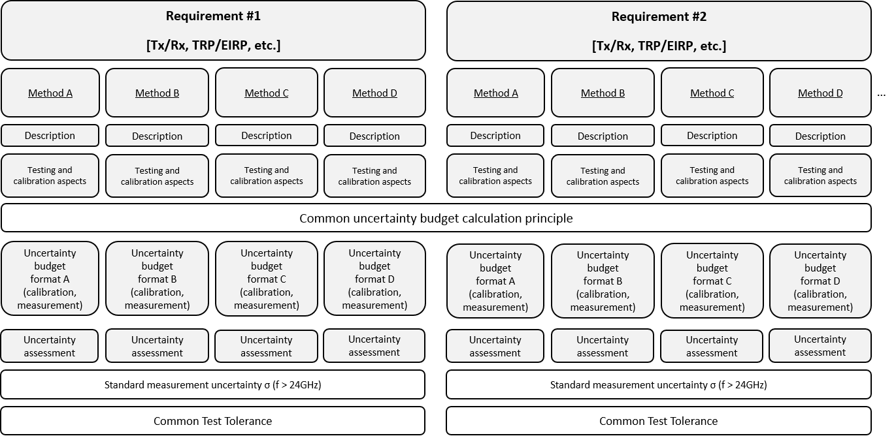

3GPP TR 38.813 V15.0.0 (2018-03)

Technical Report

3rd Generation Partnership Project;

Technical Specification Group Radio Access Network;

New frequency range for NR (3.3-4.2 GHz)

(Release 15)

{width="1.3229166666666667in"
height="0.9166666666666666in"}
{width="1.78125in"
height="1.0416666666666667in"}

The present document has been developed within the 3^rd^ Generation
Partnership Project (3GPP ^TM^) and may be further elaborated for the
purposes of 3GPP.\
The present document has not been subject to any approval process by the
3GPP Organizational Partners and shall not be implemented.\
This Report is provided for future development work within 3GPP only.
The Organizational Partners accept no liability for any use of this
Specification.\
Specifications and Reports for implementation of the 3GPP ^TM^ system
should be obtained via the 3GPP Organizational Partners\' Publications
Offices.

> ***3GPP***
>
> Postal address
>
> 3GPP support office address
>
> 650 Route des Lucioles - Sophia Antipolis
>
> Valbonne - FRANCE
>
> Tel.: +33 4 92 94 42 00 Fax: +33 4 93 65 47 16
>
> Internet
>
> http://www.3gpp.org

***Copyright Notification***

No part may be reproduced except as authorized by written permission.\
The copyright and the foregoing restriction extend to reproduction in
all media.

© 2018, 3GPP Organizational Partners (ARIB, ATIS, CCSA, ETSI, TSDSI,
TTA, TTC).

All rights reserved.

UMTS™ is a Trade Mark of ETSI registered for the benefit of its members

3GPP™ is a Trade Mark of ETSI registered for the benefit of its Members
and of the 3GPP Organizational Partners\
LTE™ is a Trade Mark of ETSI registered for the benefit of its Members
and of the 3GPP Organizational Partners

GSM® and the GSM logo are registered and owned by the GSM Association

 Contents {#contents .TT}
========

Foreword 5

1 Scope 6

2 References 6

3 Definitions, symbols and abbreviations 6

3.1 Definitions 6

3.2 Symbols 6

3.3 Abbreviations 7

4 Background 7

5 NR Frequency band definition 7

6 Band numbering and channel bandwidth 7

6.1 Band numbering 7

6.2 Channel bandwidth 8

6.2.1 Channel bandwidth Set \[NR\_newRAT\] 8

7 NR band 3.3GHz - 3.8GHz specific issues 8

7.1 UE specific 8

7.1.1 Transmitter characteristics 8

7.1.1.1 UE maximum output power 8

7.1.1.2 UE maximum output power for modulation / channel bandwidth 9

7.1.1.3 UE maximum output power with additional requirements 9

7.1.1.4 Adjacent Channel Leakage Ratio (ACLR) 10

7.1.1.5 Spectrum emission mask 10

7.1.1.6 Spurious emissions 10

7.1.1.7 Tx requirements for UL MIMO with PC2 11

7.1.1.7.1 UE maximum output power 11

7.1.1.7.2 Configured transmitted power 11

7.1.1.7.3 Minimum output power 12

7.1.1.7.4 Transmit OFF power 12

7.1.1.7.5 ON/OFF time mask 12

7.1.1.7.6 Power control 12

7.1.1.7.7 Frequency error for UL-MIMO 13

7.1.1.7.8 Transmit modulation quality 13

7.1.1.7.9 Occupied bandwidth for UL-MIMO 13

7.1.1.7.10 Out of band emission for UL-MIMO 13

7.1.1.7.11 Spurious emission for UL-MIMO 13

7.1.1.7.12 Transmit intermodulation for UL-MIMO 13

7.1.1.7.13 Time alignment error for UL-MIMO 14

7.1.2 Receiver characteristics 14

7.1.2.1 Reference sensitivity 14

7.1.2.2 Adjacent Channel Selectivity (ACS) 15

7.1.2.3 Blocking 17

7.1.2.3.1 Out-of-band blocking 17

7.1.2.4 Rx requirements for UL MIMO with PC2 18

7.1.2.4.1 Reference sensitivity level 18

7.1.2.4.2 Maximum input level 18

7.1.2.4.3 ACS 18

7.1.2.4.4 Blocking 18

7.1.2.4.5 Spurious response 18

7.1.2.4.6 Receiver intermodulation 19

7.1.2.5 4Rx requirements 19

7.2 BS specific 19

7.2.1 Operating band unwanted emissions 19

7.2.1.1 Minimum requirement for BS type 1-C and BS type 1-H 19

7.2.1.2 Minimum requirement for BS type 1-O 20

7.2.2 Additional spurious emissions requirements 20

7.2.2.1 Minimum requirement for BS type 1-C and BS type 1-H 20

7.2.2.2 Minimum requirement for BS type 1-O 20

7.2.3 Co-location with other base stations 20

7.2.3.1 Minimum requirement for BS type 1-C and BS type 1-H 20

7.2.4 General blocking requirement 21

7.2.4.1 Minimum requirement for BS type 1-C and BS type 1-H 21

7.2.4.2 Minimum requirement for BS type 1-O 21

7.2.5 Blocking requirement for co-location with other base stations 21

8 NR band 3.3GHz - 4.2GHz specific issues 21

8.1 UE specific 21

8.1.1 Transmitter characteristics 22

8.1.1.1 UE maximum output power 22

8.1.1.2 UE maximum output power for modulation / channel bandwidth 22

8.1.1.3 UE maximum output power with additional requirements 22

8.1.1.4 Adjacent Channel Leakage Ratio (ACLR) 22

8.1.1.5 Spectrum emission mask 23

8.1.1.6 Spurious emissions 23

8.1.2 Receiver characteristics 24

8.1.2.1 Reference sensitivity 24

8.1.2.2 Adjacent Channel Selectivity (ACS) 24

8.1.2.3 Blocking 26

8.1.2.3.1 Out-of-band blocking 26

8.2 BS specific 26

8.2.1 Operating band unwanted emissions 26

8.2.1.1 Minimum requirement for BS type 1-C and BS type 1-H 27

8.2.1.2 Minimum requirement for BS type 1-O 27

8.2.2 Additional spurious emissions requirements 27

8.2.2.1 Minimum requirement for BS type 1-C and BS type 1-H 27

8.2.2.2 Minimum requirement for BS type 1-O 27

8.2.3 Co-location with other base stations 27

8.2.3.1 Minimum requirement for BS type 1-C and BS type 1-H 27

8.2.3.2 Minimum requirement for BS type 1-O 27

8.2.4 General blocking requirement 28

8.2.4.1 Minimum requirement for BS type 1-C and BS type 1-H 28

8.2.4.2 Minimum requirement for BS type 1-O 28

8.2.5 Blocking requirement for co-location with other base stations 28

9 Required changes to NR, E-UTRA, UTRA and MSR specifications 28

Annex A: Change history 29

 Foreword
========

This Technical Report has been produced by the 3^rd^ Generation
Partnership Project (3GPP).

The contents of the present document are subject to continuing work
within the TSG and may change following formal TSG approval. Should the
TSG modify the contents of the present document, it will be re-released
by the TSG with an identifying change of release date and an increase in
version number as follows:

Version x.y.z

where:

x the first digit:

1 presented to TSG for information;

2 presented to TSG for approval;

3 or greater indicates TSG approved document under change control.

y the second digit is incremented for all changes of substance, i.e.
technical enhancements, corrections, updates, etc.

z the third digit is incremented when editorial only changes have been
incorporated in the document.

 1 Scope
=======

The present document is a technical report for New frequency range for
NR (3.3-4.2 GHz). The purpose of this technical report is to provide
specification support for NR bands 3.3-3.8 GHz and 3.3-4.2 GHz.

2 References
============

The following documents contain provisions which, through reference in
this text, constitute provisions of the present document.

\- References are either specific (identified by date of publication,
edition number, version number, etc.) or non‑specific.

\- For a specific reference, subsequent revisions do not apply.

\- For a non-specific reference, the latest version applies. In the case
of a reference to a 3GPP document (including a GSM document), a
non-specific reference implicitly refers to the latest version of that
document *in the same Release as the present document*.

\[1\] 3GPP TR 21.905: \"Vocabulary for 3GPP Specifications\".

\[2\] R4-1706893, "WF on 3.5GHz NR band definition", CMCC, Vodafone,
Ericsson, Qualcomm, Skyworks, Huawei, HiSilicon, CATT, ZTE, Telecom
Italia, Orange, Deutsche Telekom, BT, Broadcom, China Telecom, China
Unicom

\[3\] R4-1709181, "WF on band numbering", NTT DOCOMO

\[4\] R4-1708845, "WF on UE mandatory channel bandwidth", Nokia

\[5\] R4-1711732, "WF on BS channel BW set", Huawei, Hisilicon,
Vodafone, Ericsson

\[6\] R4-1710957, "TP to TR 38.817-01: Futher ACLR agreements", Nokia

\[7\] R4-1710962, "TP to TS 38.101-1 Output RF spectrum emissions",
Nokia

\[8\] TS 38.101-1: "NR; User Equipment (UE) radio transmission and
reception; Part 1: Range 1 Standalone".

\[9\] TR *37.843*: "Radio Frequency (RF) requirement background for
Active Antenna System (AAS) Base Station (BS) radiated requirements".

\[10\] TR 38.817-01: "General aspects for UE RF for NR".

3 Definitions, symbols and abbreviations
========================================

3.1 Definitions
---------------

For the purposes of the present document, the terms and definitions
given in 3GPP TR 21.905 \[1\] and the following apply. A term defined in
the present document takes precedence over the definition of the same
term, if any, in 3GPP TR 21.905 \[1\].

3.2 Symbols
-----------

For the purposes of the present document, the following symbols apply:

F~Interferer~ Frequency of the interferer

F~DL\_low~ The lowest frequency of the downlink *operating band*

F~DL\_high~ The highest frequency of the downlink *operating band*

F~UL\_low~ The lowest frequency of the uplink *operating band*

F~UL\_high~ The highest frequency of the uplink *operating band*

P~CMAX~ The configured maximum UE output power.

P~CMAX~, *~c~* The configured maximum UE output power for serving cell
*c*.

P~Interferer~ Modulated mean power of the interferer

3.3 Abbreviations
-----------------

For the purposes of the present document, the abbreviations given in
3GPP TR 21.905 \[1\] and the following apply. An abbreviation defined in
the present document takes precedence over the definition of the same
abbreviation, if any, in 3GPP TR 21.905 \[1\].

4 Background
============

In 3GPP RAN4 \#AH2 meeting, it is proposed that new bands for NR are
assigned band numbers on a "first come first served" basis in reserved
ranges regardless of duplex mode or RAT. Then, in RAN4 \#84 meeting,
band 3.3-3.8 GHz and band 3.3-4.2GHz are assigned band number n78 and
n77 respectively.

5 NR Frequency band definition
==============================

In 3GPP, RAN 4 specified two NR operating bands n77 and n78 in
3.3GHz-4.2GHz. A UE supporting n78 band is not required to support n77
band \[2\].

{width="2.9166666666666665in"
height="0.6086953193350831in"}
{width="1.8645833333333333in"
height="0.6317935258092738in"}

6 Band numbering and channel bandwidth
======================================

6.1 Band numbering
------------------

For 3.3-4.2GHz frequency range the NR frequency bands are defined as in
Table 6.1-1.

Table 6.1-1: NR frequency bands

  -----------------------------------------------------------------------------------------------
  NR Operating Band   Uplink (UL) operating band\   Downlink (DL) operating band\   Duplex Mode
                      BS receive\                   BS transmit\                    
                      UE transmit                   UE receive                      
  ------------------- ----------------------------- ------------------------------- -------------
                      FUL\_low -- FUL\_high         FDL\_low -- FDL\_high           

  n77                 3300MHz-4200MHz               3300MHz-4200MHz                 TDD

  n78                 3300MHz-3800MHz               3300MHz-3800MHz                 TDD
  -----------------------------------------------------------------------------------------------

6.2 Channel bandwidth 
---------------------

### 6.2.1 Channel bandwidth Set \[NR\_newRAT\]

The superset of channel bandwidth for UE was agreed in Table 6.2.1-1:

Table 6.2.1-1 UE channel bandwidth set

<table>
<thead>
<tr class="header">
<th>NR Band</th>
<th>Data SCS = 15kHz</th>
<th>Data SCS = 30kHz</th>
<th>Data SCS = 60kHz (for more than 1GHz bands)</th>
<th></th>
<th></th>
<th></th>
<th></th>
<th></th>
<th></th>
<th></th>
<th></th>
<th></th>
<th></th>
<th></th>
<th></th>
<th></th>
<th></th>
<th></th>
<th></th>
<th></th>
<th></th>
</tr>
</thead>
<tbody>
<tr class="odd">
<td></td>
<td>
10

MHZ
</td>
<td>
15

MHz
</td>
<td>
20

MHZ
</td>
<td>
40

MHz
</td>
<td>
50

MHz
</td>
<td>
10

MHZ
</td>
<td>
15

MHz
</td>
<td>
20

MHz
</td>
<td>
40

MHz
</td>
<td>
50

MHz
</td>
<td>
60

MHz
</td>
<td>
80

MHz
</td>
<td>
100

MHz
</td>
<td>
10

MHz 
(NOTE)
</td>
<td>
15

MHz
</td>
<td>
20

MHz
</td>
<td>
40

MH

z
</td>
<td>
50

MHz
</td>
<td>
60

MHz
</td>
<td>
80

MHz
</td>
<td>
100

MHz
</td>
</tr>
<tr class="even">
<td>n77</td>
<td>Yes</td>
<td>Yes</td>
<td>Yes</td>
<td>Yes</td>
<td>Yes</td>
<td>Yes</td>
<td>Yes</td>
<td>Yes</td>
<td>Yes</td>
<td>Yes</td>
<td>Yes</td>
<td>Yes</td>
<td>Yes</td>
<td>Yes</td>
<td>Yes</td>
<td>Yes</td>
<td>Yes</td>
<td>Yes</td>
<td>Yes</td>
<td>Yes</td>
<td>Yes</td>
</tr>
<tr class="odd">
<td>n78</td>
<td>Yes</td>
<td>Yes</td>
<td>Yes</td>
<td>Yes</td>
<td>Yes</td>
<td>Yes</td>
<td>Yes</td>
<td>Yes</td>
<td>Yes</td>
<td>Yes</td>
<td>Yes</td>
<td>Yes</td>
<td>Yes</td>
<td>Yes</td>
<td>Yes</td>
<td>Yes</td>
<td>Yes</td>
<td>Yes</td>
<td>Yes</td>
<td>Yes</td>
<td>Yes</td>
</tr>
<tr class="even">
<td>NOTE: 90% spectrum utilization may not be achieved</td>
<td></td>
<td></td>
<td></td>
<td></td>
<td></td>
<td></td>
<td></td>
<td></td>
<td></td>
<td></td>
<td></td>
<td></td>
<td></td>
<td></td>
<td></td>
<td></td>
<td></td>
<td></td>
<td></td>
<td></td>
<td></td>
</tr>
</tbody>
</table>

For band n77 and band n78, addition to the UE channel BWs for the band,
30 MHz, 70 MHz and 90 MHz are supported for BS. These new BS CBWs have
low priority compared to the UE channel BWs.

7 NR band 3.3GHz - 3.8GHz specific issues
=========================================

7.1 UE specific
---------------

### 7.1.1 Transmitter characteristics

#### 7.1.1.1 UE maximum output power

The MOP requirements for Band 42 and 43 single-carrier were specified as
23 dBm +2/-3 dB for power class 3 based on simulation results shown in
Table 7.1.1.1-1 in August 2011.

Table 7.1.1.1-1. Simulation results for combined Band 42 and Band 43
filter \[R4-114656\]

             Bandwidth   Max IL (corner)   2f~0~ rejection   2.7 GHz rejection
  ---------- ----------- ----------------- ----------------- -------------------
  Design 7   400 MHz     1.9               20 dB             30 dB
  Design 8   400 MHz     2.3               15 dB             10 dB
  Design 9   400 MHz     2.0               20 dB             15 dB

When specifying MOP requirements of Band n77 and n78, the delta to be
checked is IL impact of BPF due to the extension of pass-bandwidth. It
is shown in Table 7.1.1.1-2.

Table 7.1.1.1-2. Simulation results for Band n77 and n78

+-------+-------+-------+-------+-------+-------+-------+-------+
| Para  | Freq  | V     | V     | V     |       |       |       |
| meter | uency | endor | endor | endor |       |       |       |
|       | range | 1     | 2     | 3     |       |       |       |
+=======+=======+=======+=======+=======+=======+=======+=======+
|       |       | Band  | Band  | Band  | Band  | Band  | Band  |
|       |       | n78   | n77   | n78   | n77   | n78   | n77   |
|       |       | BPF   | BPF   | BPF   | BPF   | BPF   | BPF   |
+-------+-------+-------+-------+-------+-------+-------+-------+
| Inse  | 3300  | 1.05  | 1.05  | 2.0   | 2.0   | 1.9   | 1.9   |
| rtion | -3400 | dB    | dB    | dB    | dB    | dB    | dB    |
| loss  | MHz   |       |       |       |       |       |       |
|       |       |       |       |       |       |       |       |
| (ETC) |       |       |       |       |       |       |       |
+-------+-------+-------+-------+-------+-------+-------+-------+
|       | 3400  | 1.0   | 1.0   | 1.5   | 1.5   |       |       |
|       | -3800 | dB    | dB    | dB    | dB    |       |       |
|       | MHz   |       |       |       |       |       |       |
+-------+-------+-------+-------+-------+-------+-------+-------+
|       | 3800  | \-    | 1.25  | \-    | 2.0   | \-    |       |
|       | -4200 |       | dB    |       | dB    |       |       |
|       | MHz   |       |       |       |       |       |       |
+-------+-------+-------+-------+-------+-------+-------+-------+
| A     | 698   | 41.0  | 41.0  | 45 dB | 35 dB | 46.3  | 47.8  |
| ttenu | -2690 | dB    | dB    |       | (ETC) | dB    | dB    |
| ation | MHz   |       |       |       |       |       |       |
|       |       |       |       |       |       |       |       |
| (Typ) |       |       |       |       |       |       |       |
+-------+-------+-------+-------+-------+-------+-------+-------+
|       | 5150  | 40.2  | 40.2  | 35 dB | 35 dB | 40.8  | 35.6  |
|       | -5925 | dB    | dB    |       | (ETC) | dB    | dB    |
|       | MHz   |       |       |       |       |       |       |
+-------+-------+-------+-------+-------+-------+-------+-------+

With comparison between Table 7.1.1.1-1 and Table 7.1.1.1-2, it was
concluded that there is no degradation of IL at ETC even with the
extension and agreed to specify the same MOP as that of Band 42 and 43
(i.e., 23 dBm +2/-3 dB) for Band n77 and n78 of power class 3.

Agreement: MOP is to be specified as 23 dBm +2/-3 dB for Band n77 and
n78 of power class 3

The following NR UE Power Classes define the maximum output power for
any transmission bandwidth within the channel bandwidth for non-CA
configuration and UL-MIMO unless otherwise stated.

Table 7.1.1.1-3: NR UE power classes

  **NR Operating band**   **Class 2**       **Class 3**       **Comments**
  ----------------------- ----------------- ----------------- ---------------
  n77                     26 dBm +2/-3 dB   23 dBm +2/-3 dB   3.3 - 4.2 GHz
  n78                     26 dBm +2/-3 dB   23 dBm +2/-3 dB   3.3 - 3.8 GHz
  n79                     26 dBm +2/-3 dB   23 dBm +2/-3 dB   4.4 - 5 GHz

For a power class 2 UE, applicability to certain restriction of
uplink/downlink configuration is TBD.

If UE is configured for power class 2 UE, the requirements in Table
7.1.1.1-4.

Table 7.1.1.1-4: P~CMAX~ tolerance

  ----------------------------------------------------
  P~CMAX,*c*\              Tolerance T(P~CMAX,*c*~)\
  ~(dBm)                   (dB)
  ------------------------ ---------------------------
  23 \< P~CMAX,*c*~ ≤ 33   2.0

  21 ≤ P~CMAX,*c*~ ≤ 23    2.0

  20 ≤ P~CMAX,*c*~ \< 21   2.5

  19 ≤ P~CMAX,*c*~ \< 20   3.5

  18 ≤ P~CMAX,*c*~ \< 19   4.0

  13 ≤ P~CMAX,*c*~ \< 18   5.0

  8 ≤ P~CMAX,*c*~ \< 13    6.0

  -40 ≤ P~CMAX,*c*~ \< 8   7.0
  ----------------------------------------------------

#### 7.1.1.2 UE maximum output power for modulation / channel bandwidth

For UE Power 2 and 3, the allowed Maximum Power Reduction (MPR) for the
maximum output power is not band specific requirement. MPR follow the
requirements of general aspects for UE RF in TR 38.817-01 \[10\].

#### 7.1.1.3 UE maximum output power with additional requirements

UE maximum output power with additional requirements follows A-MPR
requirements of general aspects for UE RF in TR 38.817-01 \[10\].

#### 7.1.1.4 Adjacent Channel Leakage Ratio (ACLR)

NR adjacent channel leakage power ratio (NR~ACLR~) is the ratio of the
filtered mean power centred on the assigned NR channel frequency to the
filtered mean power centred on an adjacent NR channel frequency at
nominal channel spacing.

The assigned NR channel power and adjacent NR channel power are measured
with rectangular filters with measurement bandwidths specified in
Table 7.1.1.4-1.

If the measured adjacent channel power is greater than \[--50dBm\] then
the NR~ACLR~ shall be higher than the value specified in
Table 7.1.1.4-2.

Table 7.1.1.4-1: NR ACLR measurement bandwidth

                                  10 MHz   15 MHz   20 MHz   40 MHz   50 MHz   60 MHz   80 MHz   100 MHz
  ------------------------------- -------- -------- -------- -------- -------- -------- -------- ---------
  NR ACLR measurement bandwidth   9.375    14.235   19.095   38.895   48.615   58.35    78.15    98.31

Table 7.1.1.4-2: NR ACLR requirement

             Power class 1   Power class 2   Power class 3
  ---------- --------------- --------------- ---------------
  NR~ACLR~                   31 dB           30 dB

#### 7.1.1.5 Spectrum emission mask 

The power of any UE emission shall not exceed the levels specified in
Table 7.1.1.5-1 for the specified channel bandwidth.

Table 7.1.1.5-1: NR General spectrum emission mask

<table>
<thead>
<tr class="header">
<th>
ΔfOOB

(MHz)
</th>
<th>
10

MHz
</th>
<th>
15

MHz
</th>
<th>
20

MHz
</th>
<th>
40

MHz
</th>
<th>
50

MHz
</th>
<th>
60

MHz
</th>
<th>
80

MHz
</th>
<th>
100

MHz
</th>
<th>Measurement bandwidth</th>
</tr>
</thead>
<tbody>
<tr class="odd">
<td>± 0-1</td>
<td>-18</td>
<td>-20</td>
<td>-21</td>
<td>-24</td>
<td>-24</td>
<td>-24</td>
<td>-24</td>
<td>-24</td>
<td>30 kHz</td>
</tr>
<tr class="even">
<td>± 1-5</td>
<td>-10</td>
<td>-10</td>
<td>-10</td>
<td>-10</td>
<td>-10</td>
<td>-10</td>
<td>-10</td>
<td>-10</td>
<td>1 MHz</td>
</tr>
<tr class="odd">
<td>± 5-6</td>
<td>-13</td>
<td>-13</td>
<td>-13</td>
<td>-13</td>
<td>-13</td>
<td>-13</td>
<td>-13</td>
<td>-13</td>
<td></td>
</tr>
<tr class="even">
<td>± 6-10</td>
<td></td>
<td></td>
<td></td>
<td></td>
<td></td>
<td></td>
<td></td>
<td></td>
<td></td>
</tr>
<tr class="odd">
<td>± 10-15</td>
<td>-25</td>
<td></td>
<td></td>
<td></td>
<td></td>
<td></td>
<td></td>
<td></td>
<td></td>
</tr>
<tr class="even">
<td>± 15-20</td>
<td></td>
<td>-25</td>
<td></td>
<td></td>
<td></td>
<td></td>
<td></td>
<td></td>
<td></td>
</tr>
<tr class="odd">
<td>± 20-25</td>
<td></td>
<td></td>
<td>-25</td>
<td></td>
<td></td>
<td></td>
<td></td>
<td></td>
<td></td>
</tr>
<tr class="even">
<td>± 25-30</td>
<td></td>
<td></td>
<td></td>
<td></td>
<td></td>
<td></td>
<td></td>
<td></td>
<td></td>
</tr>
<tr class="odd">
<td>± 30-40</td>
<td></td>
<td></td>
<td></td>
<td></td>
<td></td>
<td></td>
<td></td>
<td></td>
<td></td>
</tr>
<tr class="even">
<td>± 40-45</td>
<td></td>
<td></td>
<td></td>
<td>-25</td>
<td></td>
<td></td>
<td></td>
<td></td>
<td></td>
</tr>
<tr class="odd">
<td>± 45-50</td>
<td></td>
<td></td>
<td></td>
<td></td>
<td></td>
<td></td>
<td></td>
<td></td>
<td></td>
</tr>
<tr class="even">
<td>± 50-55</td>
<td></td>
<td></td>
<td></td>
<td></td>
<td>-25</td>
<td></td>
<td></td>
<td></td>
<td></td>
</tr>
<tr class="odd">
<td>± 55-60</td>
<td></td>
<td></td>
<td></td>
<td></td>
<td></td>
<td></td>
<td></td>
<td></td>
<td></td>
</tr>
<tr class="even">
<td>± 60-65</td>
<td></td>
<td></td>
<td></td>
<td></td>
<td></td>
<td>-25</td>
<td></td>
<td></td>
<td></td>
</tr>
<tr class="odd">
<td>± 65-80</td>
<td></td>
<td></td>
<td></td>
<td></td>
<td></td>
<td></td>
<td></td>
<td></td>
<td></td>
</tr>
<tr class="even">
<td>± 80-85</td>
<td></td>
<td></td>
<td></td>
<td></td>
<td></td>
<td></td>
<td>-25</td>
<td></td>
<td></td>
</tr>
<tr class="odd">
<td>± 85-100</td>
<td></td>
<td></td>
<td></td>
<td></td>
<td></td>
<td></td>
<td></td>
<td></td>
<td></td>
</tr>
<tr class="even">
<td>± 100-105</td>
<td></td>
<td></td>
<td></td>
<td></td>
<td></td>
<td></td>
<td></td>
<td>-25</td>
<td></td>
</tr>
</tbody>
</table>

No changes to Table 7.1.1.5-1 are needed as a result of Band n78 power
class 2 operation.

#### 7.1.1.6 Spurious emissions 

Since Band n77 and/or n78 will be used at least in Japan, bands operated
in Japan need to be protected. In addition, protected bands required in
Europe, Korea and China regions (i.e., operating bands specified for
Band n78 of 3.3-3.8 GHz) should also be added for potential use of these
bands. As a consequence, required protected bands for Band n77 and n78
will be the same. Note that it was already agreed not to specify the
co-existence requirement between Band n77 and Band n79, which means that
the co-existence will be guaranteed by the NR general emission
requirements.

Table 7.1.1.6-1: Spurious emission band UE co-existence for Band n77 and
n78

  **NR band**   **Spurious emission**                                                                                                                                              
  ------------- --------------------------------------------------------------------------- --------------------------- ------------------------- --------------- ---------- ----- -----
                **Protected band**                                                          **Frequency range (MHz)**   **Maximum Level (dBm)**   **MBW (MHz)**   **NOTE**         
  n78           E-UTRA Band 1, 3, 5, 7, 8, 11, 18, 19, 20, 21, 26, 28, 34, 39, 40, 41, 65   F~DL\_low~                  \-                        F~DL\_high~     -50        1     
                Frequency range                                                             1884.5                      \-                        1915.7          -41        0.3   PHS
                NR Band n257                                                                26500                       \-                        29500           \[-5\]     100   

> ***Agreement: Protected bands required for Band n77 are to be the same
> as those for Band n78 (i.e., not only Japanese bands but also ones
> required for other regions such as Europe, Korea and China)***

No changes to Table 7.1.1.6-1 are needed as a result of Band n78 power
class 2 operation.

#### 7.1.1.7 Tx requirements for UL MIMO with PC2

##### 7.1.1.7.1 UE maximum output power 

For PC2 UE with two transmit antenna connectors in closed-loop spatial
multiplexing scheme, the maximum output power for any transmission
bandwidth within the channel bandwidth is specified in Table
7.1.1.7.1-1. For UE supporting UL-MIMO, the maximum output power is
measured as the sum of the maximum output power at each UE antenna
connector. The period of measurement shall be at least one sub frame
(1ms).

The requirements shall be met with the UL-MIMO configurations of using
2-layer UL-MIMO transmission with codebook
of{width="0.6666666666666666in"
height="0.4270833333333333in"}. Whether other code book will be
introduced in Rel-15 is FFS. DCI Format for UE configured in PUSCH
transmission mode for uplink single-user MIMO shall be used.

Table 7.1.1.7.1-1: UE Power Class for UL-MIMO in closed loop spatial
multiplexing scheme

  NR band   Class 1 (dBm)   Tolerance (dB)   Class 2 (dBm)   Tolerance (dB)   Class 3 (dBm)   Tolerance (dB)   Class 4 (dBm)   Tolerance (dB)
  --------- --------------- ---------------- --------------- ---------------- --------------- ---------------- --------------- ----------------
  n77                                        26              +2/-3                                                             
  n78                                        26              +2/-3                                                             

If UE is configured for transmission on single-antenna port, the
requirements in Table 7.1.1.7.1-2 shall apply.

Table 7.1.1.7.1-2: UE Power Class

  EUTRA band   Class 1 (dBm)   Tolerance (dB)   Class 2 (dBm)   Tolerance (dB)   Class 3 (dBm)   Tolerance (dB)   Class 4 (dBm)   Tolerance (dB)
  ------------ --------------- ---------------- --------------- ---------------- --------------- ---------------- --------------- ----------------
  n77                                                                            23              ±2                               
  n78                                                                            23              ±2                               

For a power class 2 capable UE supporting UL MIMO, applicability to
certain restriction of uplink/downlink configuration is TBD.

##### 7.1.1.7.2 Configured transmitted power

For UE supporting UL-MIMO, the transmitted power is configured per each
UE.

For PC2 UE with two transmit antenna connectors in closed-loop spatial
amultiplexing scheme, the tolerance is specified in Table 7.1.1.7.2-1.
The requirements shall be met with UL-MIMO configurations described in
sub-clause 7.1.1.7.1.

Table 7.1.1.7.2-1: P~CMAX,*c*~ tolerance in closed-loop spatial
multiplexing scheme

  --------------------------------------------------------------------------------------
  P~CMAX,*c*\               Tolerance\                    Tolerance\
  ~(dBm)                    T~LOW~(P~CMAX\_L,*c*~) (dB)   T~HIGH~(P~CMAX\_H,*c*~) (dB)
  ------------------------- ----------------------------- ------------------------------
  P~CMAX,*c*~ =26           3.0                           2.0

  23 ≤ P~CMAX,*c*~ \< 26    3.0                           2.0

  22 ≤ P~CMAX,*c*~ \< 23    5.0                           2.0

  21 ≤ P~CMAX,*c*~ \< 22    5.0                           3.0

  20 ≤ P~CMAX,*c*~ \< 21    6.0                           4.0

  16 ≤ P~CMAX,*c*~ \< 20    5.0                           

  11 ≤ P~CMAX,*c*~ \< 16    6.0                           

  -40 ≤ P~CMAX,*c*~ \< 11   7.0                           
  --------------------------------------------------------------------------------------

If UE is configured for transmission on single-antenna port, the
requirements in Table 7.1.1.7.2-2 apply.

Table 7.1.1.7.2-2: P~CMAX~ tolerance

  ----------------------------------------------------
  P~CMAX,*c*\              Tolerance T(P~CMAX,*c*~)\
  ~(dBm)                   (dB)
  ------------------------ ---------------------------
  23 \< P~CMAX,*c*~ ≤ 33   2.0

  21 ≤ P~CMAX,*c*~ ≤ 23    2.0

  20 ≤ P~CMAX,*c*~ \< 21   2.5

  19 ≤ P~CMAX,*c*~ \< 20   3.5

  18 ≤ P~CMAX,*c*~ \< 19   4.0

  13 ≤ P~CMAX,*c*~ \< 18   5.0

  8 ≤ P~CMAX,*c*~ \< 13    6.0

  -40 ≤ P~CMAX,*c*~ \< 8   7.0
  ----------------------------------------------------

##### 7.1.1.7.3 Minimum output power

For UE with two transmit antenna connectors in closed-loop spatial
multiplexing scheme, the minimum output power is defined as the sum of
the mean power at each transmit connector in one sub-frame (1ms). The
minimum output power shall not exceed the values specified for single
carrier.

If UE is configured for transmission on single-antenna port, the
requirements specified for single carrier shall apply.

##### 7.1.1.7.4 Transmit OFF power

The transmit OFF power is defined as the mean power at each transmit
antenna connector in a duration of at least one sub-frame (1ms)
excluding any transient periods.

The transmit OFF power at each transmit antenna connector shall not
exceed the values specified for single carrier.

##### 7.1.1.7.5 ON/OFF time mask

For UE supporting UL-MIMO, the ON/OFF time mask requirements apply at
each transmit antenna connector.

For UE with two transmit antenna connectors in closed-loop spatial
multiplexing scheme, the general ON/OFF time mask requirements apply to
each transmit antenna connector. The requirements shall be met with the
UL-MIMO configurations described in sub-clause 7.1.1.7.1.

If UE is configured for transmission on single-antenna port, the general
ON/OFF time mask requirements apply.

##### 7.1.1.7.6 Power control

For UE supporting UL-MIMO, the power control tolerance applies to the
sum of output power at each transmit antenna connector.

The power control requirements specified for single carrier apply to UE
with two transmit antenna connectors in closed-loop spatial multiplexing
scheme. The requirements shall be met with UL-MIMO configurations
described in sub-clause 7.1.1.7.1.

If UE is configured for transmission on single-antenna port, the
requirements for single carrier apply.

##### 7.1.1.7.7 Frequency error for UL-MIMO

For UE(s) supporting UL-MIMO, the UE modulated carrier frequency at each
transmit antenna connector shall be accurate to within ±0.1 PPM observed
over a period of one sub-frame (1 ms) compared to the carrier frequency
received from the NR Node B.

##### 7.1.1.7.8 Transmit modulation quality

For UE supporting UL-MIMO, the transmit modulation quality requirements
are specified at each transmit antenna connector.

If UE is configured for transmission on single-antenna port, the
requirements specified for single carrier apply.

The transmit modulation quality is specified in terms of:

\- Error Vector Magnitude (EVM) for the allocated resource blocks (RBs)

\- EVM equalizer spectrum flatness derived from the equalizer
coefficients generated by the EVM measurement process

\- Carrier leakage (caused by IQ offset)

\- In-band emissions for the non-allocated RB

##### 7.1.1.7.9 Occupied bandwidth for UL-MIMO

For UE supporting UL-MIMO, the requirements for occupied bandwidth is
specified at each transmit antenna connector. The occupied bandwidth is
defined as the bandwidth containing 99 % of the total integrated mean
power of the transmitted spectrum on the assigned channel at each
transmit antenna connector.

For UE with two transmit antenna connectors in closed-loop spatial
multiplexing scheme, the occupied bandwidth at each transmitter antenna
shall be less than the channel bandwidth specified for single carrier.
The requirements shall be met with UL-MIMO configurations described in
sub-clause 7.1.1.7.1.

If UE is configured for transmission on single-antenna port, the
requirements specified for single carrier apply.

##### 7.1.1.7.10 Out of band emission for UL-MIMO

For UE supporting UL-MIMO, the requirements for Out of band emissions
resulting from the modulation process and non-linearity in the
transmitters are specified at each transmit antenna connector.

For UEs with two transmit antenna connectors in closed-loop spatial
multiplexing scheme, the requirements specified for single carrier apply
to each transmit antenna connector. The requirements shall be met with
UL-MIMO configurations described in sub-clause 7.1.1.7.1.

If UE is configured for transmission on single-antenna port, the
requirements specified for single carrier apply.

##### 7.1.1.7.11 Spurious emission for UL-MIMO

For UE supporting UL-MIMO, the requirements for Spurious emissions which
are caused by unwanted transmitter effects such as harmonics emission,
parasitic emissions, intermodulation products and frequency conversion
products are specified at each transmit antenna connector.

For UEs with two transmit antenna connectors in closed-loop spatial
multiplexing scheme, the requirements specified for single carrier apply
to each transmit antenna connector. The requirements shall be met with
the UL-MIMO configurations described in sub-clause 7.1.1.7.1.

If UE is configured for transmission on single-antenna port, the general
requirements specified for single carrier apply.

##### 7.1.1.7.12 Transmit intermodulation for UL-MIMO

For UE supporting UL-MIMO, the transmit intermodulation requirements are
specified at each transmit antenna connector and the wanted signal is
defined as the sum of output power at each transmit antenna connector.

For UEs with two transmit antenna connectors in closed-loop spatial
multiplexing scheme, the requirements specified for single carrier apply
to each transmit antenna connector. The requirements shall be met with
the UL-MIMO configurations described in sub-clause 7.1.1.7.1.

If UE is configured for transmission on single-antenna port, the
requirements specified for single carrier apply.

##### 7.1.1.7.13 Time alignment error for UL-MIMO

For UE(s) with multiple transmit antenna connectors supporting UL-MIMO,
this requirement applies to frame timing differences between
transmissions on multiple transmit antenna connectors in the closed-loop
spatial multiplexing scheme.

The time alignment error (TAE) is defined as the average frame timing
difference between any two transmissions on different transmit antenna
connectors.

For UE(s) with multiple transmit antenna connectors, the Time Alignment
Error (TAE) shall not exceed 130 ns.

### 7.1.2 Receiver characteristics

No changes to receiver characteristics are needed as a result of Band
n78 power class 2 operation.

#### 7.1.2.1 Reference sensitivity

Based on Table 7.1.1.1-2 and more simulation results in Table 7.1.2.1-1,
7.1.2.1-2 and 7.1.2.1-3 whose attenuation is at least typ. 35 dB below
2690 MHz and above 5150 MHz, the following was agreed.

Table 7.1.2.1-1. Filter simulation results reported by Vendor A in
\[R4-1711334\]

  -----------------------------------------------------------------------------------------------------------------------------------------
  Filter              Nominal IL \[dB\]                             Min Attenuation \[dB\] @                                   
  ------------------- --------------------------------------------- ---------------------------------------------- ----------- ------------
                      w/o 30 dB Rejection in Radio Altimeter Band   with 30 dB Rejection in Radio Altimeter Band   693-2690\   5150-5925\
                                                                                                                   MHz         MHz

  n77 (3.3-4.2 GHz)   1.8                                           2.7                                            \>35        \>35

  n78 (3.3-3.8 GHz)   1.5                                           1.8                                            \>35        \>35
  -----------------------------------------------------------------------------------------------------------------------------------------

Table 7.1.2.1-2. Filter simulation results reported by Vendor B in
\[R4-1711334\]

  -----------------------------------------------------------------------------------------------------
  Filter              IL \[dB\]   Min Attenuation \[dB\] @                            
  ------------------- ----------- -------------------------- ----------- ------------ -----------------
                      Nominal     Worst Case                 693-2690\   5150-5925\   Radio Altimeter
                                                             MHz         MHz          

  n77 (3.3-4.2 GHz)   1.87        TBC                        44          46           

  n78 (3.3-3.8 GHz)   1.56        TBC                        40.5        51           
  -----------------------------------------------------------------------------------------------------

Table 7.1.2.1-3. Filter simulation results reported in \[R4-1711334\]

  Filter                IL \[dB\]   Min Attenuation \[dB\]                                                                                   
  --------------------- ----------- ------------------------ ----- ----- ----- ----- ---------- ----------- --------- --------- ------------ -------------
                        Nominal     Worst case                                                                                               
  Frequencies \[GHz\]   3.3         3.8                      4.2   3.3   3.8   4.2   2.3-2.69   0.617-2.2   4.4-5.0   4.8-5.0   5.15-5.925   5.250-5.925
  n77 (3.3-4.2 GHz)     2.6         1.9                      2.4   2.9   2.1   2.6   35         45          5         18        40           45
  n78 (3.3-3.8 GHz)     2.1         1.8                      \-    2.3   2.1   \-    35         40          22        25        40           45

> ***Agreement: REFSENS for Band n77 at 3.3-3.8 GHz and n78 should be 1
> dB larger than that of bands which have NR smallest sensitivity (less
> RF challenges) such as Band n1. REFSENS for Band n77 at 3.8-4.2 GHz is
> increased by 0.5 dB compared to that of Band n78.***

Table 7.1.2.1-4. Reference sensitivity for Band n78

  Operating Band   SCS kHz   10      15      20      40      50      60      80      100      Duplex Mode
  ---------------- --------- ------- ------- ------- ------- ------- ------- ------- -------- -------------
                             MHz     MHz     MHz     MHz     MHz     MHz     MHz     MHz      
                             (dBm)   (dBm)   (dBm)   (dBm)   (dBm)   (dBm)   (dBm)    (dBm)   
  n78              15        -95.8   -94.0   -92.7   -89.6   -88.6                            TDD
                   30        -96.1   -94.1   -92.9   -89.7   -88.7   -87.9   -86.6   -85.6    
                   60        -96.5   -94.4   -93.1   -89.9   -88.8   -88.0   -86.7   -85.7    

#### 7.1.2.2 Adjacent Channel Selectivity (ACS)

Adjacent Channel Selectivity (ACS) is a measure of a receiver\'s ability
to receive a NR signal at its assigned channel frequency in the presence
of an adjacent channel signal at a given frequency offset from the
centre frequency of the assigned channel. ACS is the ratio of the
receive filter attenuation on the assigned channel frequency to the
receive filter attenuation on the adjacent channel(s).

It is not possible to directly measure the ACS, instead the lower and
upper range of test parameters are chosen in Table 7.1.2.2-2 and Table
7.1.2.2-3 where the throughput shall be ≥ 95% of the maximum throughput
of the reference measurement channels as specified in Annexes A.2.2,
A.2.3 and A.3.2 of TS 38.101-1 \[8\] (with one sided dynamic OCNG
Pattern OP.1 FDD/TDD for the DL-signal as described in Annex
A.5.1.1/A.5.2.1 of TS 38.101-1 \[8\]).

Table 7.1.2.2-1: Adjacent channel selectivity

<table>
<thead>
<tr class="header">
<th>NR band</th>
<th>Rx Parameter</th>
<th>Units</th>
<th>Channel bandwidth</th>
<th></th>
<th></th>
<th></th>
<th></th>
<th></th>
<th></th>
<th></th>
</tr>
</thead>
<tbody>
<tr class="odd">
<td></td>
<td></td>
<td></td>
<td>10 
MHz</td>
<td>15 
MHz</td>
<td>20 
MHz</td>
<td>
40

MHz
</td>
<td>50 
MHz</td>
<td>
60

MHz
</td>
<td>
80

MHz
</td>
<td>100 
MHz</td>
</tr>
<tr class="even">
<td>n78</td>
<td>ACS</td>
<td>dB</td>
<td>[33.0]</td>
<td>[33.0]</td>
<td>[33.0]</td>
<td>[33.0]</td>
<td>[33.0]</td>
<td>[33.0]</td>
<td>[33.0]</td>
<td>[33.0]</td>
</tr>
</tbody>
</table>

Table 7.1.2.2-2: Test parameters for Adjacent channel selectivity, Case
1

<table>
<thead>
<tr class="header">
<th>NR band</th>
<th>Rx Parameter</th>
<th>Units</th>
<th>Channel bandwidth</th>
<th></th>
<th></th>
<th></th>
<th></th>
<th></th>
<th></th>
<th></th>
</tr>
</thead>
<tbody>
<tr class="odd">
<td></td>
<td></td>
<td></td>
<td>10 MHz</td>
<td>
15

MHz
</td>
<td>
20

MHz
</td>
<td>
40

MHz
</td>
<td>
50

MHz
</td>
<td>
60

MHz
</td>
<td>
80

MHz
</td>
<td>100 MHz</td>
</tr>
<tr class="even">
<td>n78</td>
<td>Power in Transmission Bandwidth Configuration</td>
<td>dBm</td>
<td>REFSENS + 14 dB</td>
<td></td>
<td></td>
<td></td>
<td></td>
<td></td>
<td></td>
<td></td>
</tr>
<tr class="odd">
<td></td>
<td>PInterferer</td>
<td>dBm</td>
<td>REFSENS [+45.5]dB</td>
<td>
REFSENS [+45.5]

dB
</td>
<td>REFSENS [+45.5]dB</td>
<td>REFSENS [+45.5]dB</td>
<td>REFSENS [+45.5]dB</td>
<td>REFSENS [+45.5]dB</td>
<td>REFSENS [+45.5]dB</td>
<td>REFSENS [+45.5]dB</td>
</tr>
<tr class="even">
<td></td>
<td>BWInterferer</td>
<td>MHz</td>
<td>10</td>
<td>15</td>
<td>20</td>
<td>40</td>
<td>50</td>
<td>60</td>
<td>80</td>
<td>100</td>
</tr>
<tr class="odd">
<td></td>
<td>
FInterferer (offset)

For SCS of 15kHz
</td>
<td>MHz</td>
<td>
10+0.0125

/

-10-0.0125
</td>
<td>
15+0.0075

/

-15-0.0075
</td>
<td>
20+0.0025

/

-20-0.0025
</td>
<td>
40+0.0125

/

-40-0.0125
</td>
<td>
50+0.0025

/

-50-0.0025
</td>
<td>N/A</td>
<td>N/A</td>
<td>N/A</td>
</tr>
<tr class="even">
<td></td>
<td>
FInterferer (offset)

For SCS of 30kHz
</td>
<td>MHz</td>
<td>
10+0.005

/

-10-0.005
</td>
<td>
15+0.015

/

-15-0.015
</td>
<td>
20+0.025

/

-20-0.025
</td>
<td>
40+0.005

/

-40-0.005
</td>
<td>
50+0.025

/

-50-0.025
</td>
<td>
60+0.015

/

-60-0.015
</td>
<td>
80+0.025

/

-80-0.025
</td>
<td>
100+0.005

/

-100-0.005
</td>
</tr>
<tr class="odd">
<td></td>
<td>
FInterferer (offset)

For SCS of 60kHz
</td>
<td>MHz</td>
<td>
10+0.050

/

-10-0.050
</td>
<td>
15+0.030

/

-15-0.030
</td>
<td>
20+0.010

/

-20-0.010
</td>
<td>
40+0.050

/

-40-0.050
</td>
<td>
50+0.010

/

-50-0.010
</td>
<td>
60+0.030

/

-60-0.030
</td>
<td>
80+0.010

/

-80-0.010
</td>
<td>
100+0.050

/

-100-0.050
</td>
</tr>
</tbody>
</table>

Table 7.1.2.2-3: Test parameters for Adjacent channel selectivity, Case
2

<table>
<thead>
<tr class="header">
<th>NR band</th>
<th>Rx Parameter</th>
<th>Units</th>
<th>Channel bandwidth</th>
<th></th>
<th></th>
<th></th>
<th></th>
<th></th>
<th></th>
<th></th>
</tr>
</thead>
<tbody>
<tr class="odd">
<td></td>
<td></td>
<td></td>
<td>10 MHz</td>
<td>
15

MHz
</td>
<td>20 MHz</td>
<td>
40

MHz
</td>
<td>50 MHz</td>
<td>
60

MHz
</td>
<td>
80

MHz
</td>
<td>100 MHz</td>
</tr>
<tr class="even">
<td>n78</td>
<td>Power in Transmission Bandwidth Configuration</td>
<td>dBm</td>
<td>[-56.5]</td>
<td>[-56.5]</td>
<td>[-56.5]</td>
<td>[-56.5]</td>
<td>[-56.5]</td>
<td>[-56.5]</td>
<td>[-56.5]</td>
<td>[-56.5]</td>
</tr>
<tr class="odd">
<td></td>
<td>PInterferer</td>
<td>dBm</td>
<td>-25</td>
<td></td>
<td></td>
<td></td>
<td></td>
<td></td>
<td></td>
<td></td>
</tr>
<tr class="even">
<td></td>
<td>BWInterferer</td>
<td>MHz</td>
<td>10</td>
<td>15</td>
<td>20</td>
<td>40</td>
<td>50</td>
<td>60</td>
<td>80</td>
<td>100</td>
</tr>
<tr class="odd">
<td></td>
<td>
FInterferer (offset)

For SCS of 15kHz
</td>
<td>MHz</td>
<td>
10+0.0125

/

-10-0.0125
</td>
<td>
15+0.0075

/

-15-0.0075
</td>
<td>
20+0.0025

/

-20-0.0025
</td>
<td>
40+0.0125

/

-40-0.0125
</td>
<td>
50+0.0025

/

-50-0.0025
</td>
<td>NA</td>
<td>NA</td>
<td>NA</td>
</tr>
<tr class="even">
<td></td>
<td>
FInterferer (offset)

For SCS of 30kHz
</td>
<td>MHz</td>
<td>
10+0.005

/

-10-0.005
</td>
<td>
15+0.015

/

-15-0.015
</td>
<td>
20+0.025

/

-20-0.025
</td>
<td>
40+0.005

/

-40-0.005
</td>
<td>
50+0.025

/

-50-0.025
</td>
<td>
60+0.015

/

-60-0.015
</td>
<td>
80+0.025

/

-80-0.025
</td>
<td>
100+0.005

/

-100-0.005
</td>
</tr>
<tr class="odd">
<td></td>
<td>
FInterferer (offset)

For SCS of 60kHz
</td>
<td>MHz</td>
<td>
10+0.050

/

-10-0.050
</td>
<td>
15+0.030

/

-15-0.030
</td>
<td>
20+0.010

/

-20-0.010
</td>
<td>
40+0.050

/

-40-0.050
</td>
<td>
50+0.010

/

-50-0.010
</td>
<td>
60+0.030

/

-60-0.030
</td>
<td>
80+0.010

/

-80-0.010
</td>
<td>
100+0.050

/

-100-0.050
</td>
</tr>
</tbody>
</table>

#### 7.1.2.3 Blocking

##### 7.1.2.3.1 Out-of-band blocking

Based on filter performance shown in Table 7.1.1.1-2, out-of-band
blocking requirement needs to be optimized as with LTE band 42 and 43 as
shown in Table 7.1.2.3-1. Wanted signal level is the same as that of LTE
refarming bands.

Agreement: Out-of-band blocking for n78 should be specified as below.

Table 7.1.2.3.1-1: Out-of-band blocking parameters for n78

<table>
<thead>
<tr class="header">
<th><strong>Rx Parameter</strong></th>
<th><strong>Units</strong></th>
<th><strong>Channel bandwidth</strong></th>
<th></th>
<th></th>
<th></th>
<th></th>
<th></th>
<th></th>
<th></th>
</tr>
</thead>
<tbody>
<tr class="odd">
<td></td>
<td></td>
<td><strong>10 
MHz</strong></td>
<td><strong>15 
MHz</strong></td>
<td><strong>20 
MHz</strong></td>
<td><strong>40 
MHz</strong></td>
<td><strong>50 
MHz</strong></td>
<td><strong>60 
MHz</strong></td>
<td><strong>80 
MHz</strong></td>
<td><strong>100 
MHz</strong></td>
</tr>
<tr class="even">
<td>Power in Transmission Bandwidth Configuration</td>
<td>dBm</td>
<td>REFSENS + channel bandwidth specific value below</td>
<td></td>
<td></td>
<td></td>
<td></td>
<td></td>
<td></td>
<td></td>
</tr>
<tr class="odd">
<td></td>
<td></td>
<td>6</td>
<td>7</td>
<td>9</td>
<td>9</td>
<td>9</td>
<td>9</td>
<td>9</td>
<td>9</td>
</tr>
<tr class="even">
<td>
NOTE 1: The transmitter shall be set to 4dB below PCMAX_L at the minimum uplink configuration specified TBD with PCMAX_L as defined in subclause 6.2.5.

NOTE 2: Reference measurement channel is TBD

NOTE 3: The REFSENS power level is TBD
</td>
<td></td>
<td></td>
<td></td>
<td></td>
<td></td>
<td></td>
<td></td>
<td></td>
<td></td>
</tr>
</tbody>
</table>

Table 7.1.2.3.1-2: Out of band blocking for Band n78

+----------+----------+----------+----------+----------+----------+
| **NR     | **Par    | *        | **Fre    |          |          |
| band**   | ameter** | *Units** | quency** |          |          |
+==========+==========+==========+==========+==========+==========+
|          |          |          | **Range  | **Range  | **Range  |
|          |          |          | 1**      | 2**      | 3**      |
+----------+----------+----------+----------+----------+----------+
|          | P~Int    | dBm      | -44      | -30      | -15      |
|          | erferer~ |          |          |          |          |
+----------+----------+----------+----------+----------+----------+
| n78      | F~int    | MHz      | -60 \< f | -200 \<  | 1 ≤ f ≤  |
|          | erferer~ |          | --       | f --     | F~       |
| (NOTE 2) | (CW)     |          | F~       | F~       | DL\_low~ |
|          |          |          | DL\_low~ | DL\_low~ | -- 200   |
|          |          |          | \< -3CBW | -60      |          |
|          |          |          |          |          | or       |
|          |          |          | or       | or       |          |
|          |          |          |          |          | F~D      |
|          |          |          | 3CBW \<  | 60 ≤ f   | L\_high~ |
|          |          |          | f --     | --       | + 200 ≤  |
|          |          |          | F~D      | F~D      | f        |
|          |          |          | L\_high~ | L\_high~ |          |
|          |          |          | \< 60    | \< 200   | ≤ 12750  |
+----------+----------+----------+----------+----------+----------+
| n78      | F~Int    | MHz      | N/A      | -200 \<  | 1 ≤ f ≤  |
| (NOTE 3) | erferer~ |          |          | f --     | F~       |
|          | (CW)     |          |          | F~       | DL\_low~ |
|          |          |          |          | DL\_low~ | --       |
|          |          |          |          |          | MIN(2    |
|          |          |          |          | ≤        | 00,3CBW) |
|          |          |          |          | -MIN(2   |          |
|          |          |          |          | 00,3CBW) | or       |
|          |          |          |          |          |          |
|          |          |          |          | or       | F~D      |
|          |          |          |          |          | L\_high~ |
|          |          |          |          | MIN(2    | +        |
|          |          |          |          | 00,3CBW) | MIN(2    |
|          |          |          |          |          | 00,3CBW) |
|          |          |          |          | ≤ f --   |          |
|          |          |          |          | F~D      | ≤ f ≤    |
|          |          |          |          | L\_high~ | 12750    |
|          |          |          |          | \< 200   |          |
+----------+----------+----------+----------+----------+----------+
| NOTE 1:  |          |          |          |          |          |
| CBW      |          |          |          |          |          |
| denotes  |          |          |          |          |          |
| the      |          |          |          |          |          |
| channel  |          |          |          |          |          |
| b        |          |          |          |          |          |
| andwidth |          |          |          |          |          |
| of the   |          |          |          |          |          |
| wanted   |          |          |          |          |          |
| signal   |          |          |          |          |          |
|          |          |          |          |          |          |
| NOTE 2:  |          |          |          |          |          |
| For CBW  |          |          |          |          |          |
| \< 20    |          |          |          |          |          |
| MHz      |          |          |          |          |          |
|          |          |          |          |          |          |
| NOTE 3:  |          |          |          |          |          |
| The      |          |          |          |          |          |
| power    |          |          |          |          |          |
| level of |          |          |          |          |          |
| the      |          |          |          |          |          |
| in       |          |          |          |          |          |
| terferer |          |          |          |          |          |
| (P~Inte  |          |          |          |          |          |
| rferer~) |          |          |          |          |          |
| for      |          |          |          |          |          |
| Range 3  |          |          |          |          |          |
| shall be |          |          |          |          |          |
| modified |          |          |          |          |          |
| to -20   |          |          |          |          |          |
| dBm, for |          |          |          |          |          |
| F~Int    |          |          |          |          |          |
| erferer~ |          |          |          |          |          |
| \> 2700  |          |          |          |          |          |
| MHz and  |          |          |          |          |          |
| F~Int    |          |          |          |          |          |
| erferer~ |          |          |          |          |          |
| \< 4800  |          |          |          |          |          |
| MHz. For |          |          |          |          |          |
| CBW      |          |          |          |          |          |
| larger   |          |          |          |          |          |
| than 60  |          |          |          |          |          |
| MHz, the |          |          |          |          |          |
| req      |          |          |          |          |          |
| uirement |          |          |          |          |          |
| for      |          |          |          |          |          |
| Range 2  |          |          |          |          |          |
| is not   |          |          |          |          |          |
| ap       |          |          |          |          |          |
| plicable |          |          |          |          |          |
| and      |          |          |          |          |          |
| Range 3  |          |          |          |          |          |
| applies  |          |          |          |          |          |
| from the |          |          |          |          |          |
| f        |          |          |          |          |          |
| requency |          |          |          |          |          |
| offset   |          |          |          |          |          |
| of       |          |          |          |          |          |
| 3\*CBW   |          |          |          |          |          |
| from the |          |          |          |          |          |
| band     |          |          |          |          |          |
| edge.    |          |          |          |          |          |
+----------+----------+----------+----------+----------+----------+

#### 7.1.2.4 Rx requirements for UL MIMO with PC2

##### 7.1.2.4.1 Reference sensitivity level

For UE with two transmitter antenna connectors in closed-loop spatial
multiplexing scheme, the minimum requirements specified for single
carrier shall be met with the UL-MIMO configurations described in
sub-clause 7.1.1.7.1. For UL-MIMO, the parameter P~UMAX~ is the total
transmitter power over the two transmits power over the two transmit
antenna connectors.

##### 7.1.2.4.2 Maximum input level

For UE with two transmitter antenna connectors in closed-loop spatial
multiplexing, the minimum requirements specified for single carrier
shall be met with the UL-MIMO configurations described in sub-clause
7.1.1.7.1. For UL-MIMO, the parameter PCMAX\_L is defined as the total
transmitter power over the two transmit antenna connectors.

##### 7.1.2.4.3 ACS

For UE(s) with two transmitter antenna connectors in closed-loop spatial
multiplexing scheme, the minimum requirements specified for single
carrier shall be met with the UL-MIMO configurations described in
sub-clause 7.1.1.7.1. For UL-MIMO, the parameter PCMAX\_L is defined as
the total transmitter power over the two transmit antenna connectors.

##### 7.1.2.4.4 Blocking

For UE with two transmitter antenna connectors in closed-loop spatial
multiplexing scheme, the minimum requirements specified for single
carrier shall be met with the UL-MIMO configurations described in
sub-clause 7.1.1.7.1. For UL-MIMO, the parameter PCMAX\_L is defined as
the total transmitter power over the two transmit antenna connectors.

##### 7.1.2.4.5 Spurious response

For UE with two transmitter antenna connectors in closed-loop spatial
multiplexing scheme, the minimum requirements specified for single
carrier shall be met with the UL-MIMO configurations described in
sub-clause 7.1.1.7.1. For UL-MIMO, the parameter PCMAX\_L is defined as
the total transmitter power over the two transmit antenna connectors.

##### 7.1.2.4.6 Receiver intermodulation

For UE(s) with two transmitter antenna connectors in closed-loop spatial
multiplexing scheme, the minimum requirements specified for single
carrier shall be met with the UL-MIMO configurations described in
sub-clause 7.1.1.7.1. For UL-MIMO, the parameter PCMAX\_L is defined as
the total transmitter power over the two transmit antenna connectors.

#### 7.1.2.5 4Rx requirements

Table 7.1.2.5-1 and 7.1.2.5-1a are the REFSENS and ΔR~IB,4R~ for n77 and
n78 to support 4Rx.

Table 7.1.2.5-1: Reference sensitivity QPSK PREFSENS

<table>
<thead>
<tr class="header">
<th>Operating band / SCS / Channel bandwidth / Duplex-mode</th>
<th></th>
<th></th>
<th></th>
<th></th>
<th></th>
<th></th>
<th></th>
<th></th>
<th></th>
<th></th>
<th></th>
<th></th>
</tr>
</thead>
<tbody>
<tr class="odd">
<td>Operating Band</td>
<td>SCS kHz</td>
<td>
5

MHz 
(dBm)
</td>
<td>
10

MHz 
(dBm)
</td>
<td>
15

MHz 
(dBm)
</td>
<td>
20

MHz 
(dBm)
</td>
<td>
25

MHz 
(dBm)
</td>
<td>
40

MHz 
(dBm)
</td>
<td>
50

MHz 
(dBm)
</td>
<td>
60

MHz 
(dBm)
</td>
<td>
80

MHz 
(dBm)
</td>
<td>100 MHz 
(dBm)</td>
<td>Duplex Mode</td>
</tr>
<tr class="even">
<td>n77 (3.3 to 3.8 GHz)1</td>
<td>15</td>
<td></td>
<td>-95.8</td>
<td>-94.0</td>
<td>-92.7</td>
<td></td>
<td>-89.6</td>
<td>-88.6</td>
<td></td>
<td></td>
<td></td>
<td>TDD</td>
</tr>
<tr class="odd">
<td></td>
<td>30</td>
<td></td>
<td>-96.1</td>
<td>-94.1</td>
<td>-92.9</td>
<td></td>
<td>-89.7</td>
<td>-88.7</td>
<td>-87.9</td>
<td>-86.6</td>
<td>-85.6</td>
<td></td>
</tr>
<tr class="even">
<td></td>
<td>60</td>
<td>-</td>
<td>-96.5</td>
<td>-94.4</td>
<td>-93.1</td>
<td></td>
<td>-89.9</td>
<td>-88.8</td>
<td>-88.0</td>
<td>-86.7</td>
<td>-85.7</td>
<td></td>
</tr>
<tr class="odd">
<td>n77 (3.8 to 4.2 GHz) 1</td>
<td>15</td>
<td></td>
<td>-95.3</td>
<td>-93.5</td>
<td>-92.2</td>
<td></td>
<td>-89.1</td>
<td>-88.1</td>
<td></td>
<td></td>
<td></td>
<td>TDD</td>
</tr>
<tr class="even">
<td></td>
<td>30</td>
<td></td>
<td>-95.6</td>
<td>-93.6</td>
<td>-92.4</td>
<td></td>
<td>-89.2</td>
<td>-88.2</td>
<td>-87.4</td>
<td>-86.1</td>
<td>-85.1</td>
<td></td>
</tr>
<tr class="odd">
<td></td>
<td>60</td>
<td>-</td>
<td>-96.0</td>
<td>-93.9</td>
<td>-92.6</td>
<td></td>
<td>-89.4</td>
<td>-88.3</td>
<td>-87.5</td>
<td>-86.2</td>
<td>-85.2</td>
<td></td>
</tr>
<tr class="even">
<td>n781</td>
<td>15</td>
<td></td>
<td>-95.8</td>
<td>-94.0</td>
<td>-92.7</td>
<td></td>
<td>-89.6</td>
<td>-88.6</td>
<td></td>
<td></td>
<td></td>
<td>TDD</td>
</tr>
<tr class="odd">
<td></td>
<td>30</td>
<td></td>
<td>-96.1</td>
<td>-94.1</td>
<td>-92.9</td>
<td></td>
<td>-89.7</td>
<td>-88.7</td>
<td>-87.9</td>
<td>-86.6</td>
<td>-85.6</td>
<td></td>
</tr>
<tr class="even">
<td></td>
<td>60</td>
<td></td>
<td>-96.5</td>
<td>-94.4</td>
<td>-93.1</td>
<td></td>
<td>-89.9</td>
<td>-88.8</td>
<td>-88.0</td>
<td>-86.7</td>
<td>-85.7</td>
<td></td>
</tr>
<tr class="odd">
<td>NOTE 1: Four Rx antenna ports shall be the baseline for this operating band.</td>
<td></td>
<td></td>
<td></td>
<td></td>
<td></td>
<td></td>
<td></td>
<td></td>
<td></td>
<td></td>
<td></td>
<td></td>
</tr>
</tbody>
</table>

For UE(s) equipped with 4 antenna ports, the minimum requirement for
reference sensitivity in Table 7.1.2.5-1 shall be modified by the amount
given in ΔR~IB,4R~ in Table 7.1.2.5-1a for the applicable NR bands.

Table 7.1.2.5-1a: ΔRIB,4R

  NR Band                    ΔR~IB,4R~ \[dB\]
  -------------------------- ------------------
  1.7GHz \< NR band \<3GHz   \- 2.7
  NR band \> 3GHz            \- 2.2

For the ACS and blocking requirements in section in 7.1.2.2 and 7.1.2.3
as well as Spurious response and Receiver intermodulation requirements,
it should be noted that the REFSENS power level for these requirements
represents for two and four antenna ports, respectively.

7.2 BS specific
---------------

The operating band Band n78 is 3300MHz\~3800MHz, belonging to FR1,
therefore only 3 distinct types of NR BS each has a different
architecture and requirements set are applied, which are *BS type 1-C*,
*BS type 1-H* and *BS type 1-O.*

For Band n78 power class 2 HPUE, it can be foreseen that there are no
additional BS receive blocking such as in-band blocking and out-of-band
blocking requirements introduced.

### 7.2.1 Operating band unwanted emissions

The operating band unwanted emission (OBUE) limits are defined from
Δf~OBUE~ below the lowest frequency of each supported downlink operating
band up to Δf~OBUE~ above the highest frequency of each supported
downlink operating band. According to the WF in R4-1706223, Δf~OBUE~=40
MHz for NR bands wider than 100 MHz as baseline for the boundary between
UEM and spurious emission( for both Cat A and Cat B ). Therefore for
Band n78, Δf~OBUE~ should be40 MHz.

#### 7.2.1.1 Minimum requirement for BS type 1-C and BS type 1-H

The *basic limits* of the operating band unwanted emission for Band n78
is the based on the same principles as for LTE, where the unwanted
emission limits for \>=5MHz channel bandwidth of each BS classes( Wide
Area BS(band \>1GHz), Medium Range BS and Local Area BS) can be applied
to Cat A and Cat B for the unwanted emission basic limits for Band n78.

\- For BS type 1-C, the operating band unwanted emissions requirement
for each *antenna connector* shall be defined based on *basic limits*
with no scaling and no antenna considered.

\- For BS type 1-H, the operating band unwanted emissions requirements
are for each *TAB connector TX* shall be defined based on *base limits*.
*The power summation emission at the TAB connectors of the TAB connector
TX min cell shall not* exceed the *basic limit* + X, where X =
10log~10~(N~TXU,countedpercell~).

#### 7.2.1.2 Minimum requirement for BS type 1-O

The OTA operating band unwanted emissions requirements are applied at
RIB and based on the emission scaling, where the emission limits are
defined as basic limit+9dB, where the basic limits are specified in
subclause 7.2.1.1.

### 7.2.2 Additional spurious emissions requirements

#### 7.2.2.1 Minimum requirement for BS type 1-C and BS type 1-H

The additional spurious emission requirement may be applied for the
protection of system operating in frequency ranges other than the BS
downlink operating band. It is proposed that the same limits as TDD
E-UTRA bands (i.e. -52 dBm/MHz) can be applied for the *basic limits*
for NR band n78.

In addition, since the Band n77 and n78 are overlapping operating bands,
and these two bands may be deployed in the same geographical area, thus
this requirement does not apply to BS operating in Band n77 and n78.

*For BS type 1-C*, the emissions requirements for each *antenna
connector* shall be defined based on *basic limits* with no scaling and
no antenna considered.

*For BS type 1-H*, the emissions requirements are for each *TAB
connector shall be defined based on the basics limits, The power
summation emission at the TAB connectors of the TAB connector TX min
cell shall not* exceed the *basic limit* + X, where X =
10log~10~(N~TXU,countedpercell~).

#### 7.2.2.2 Minimum requirement for BS type 1-O

The OTA minimum requirements are applied at RIB and based on the
emission scaling, where the emission limits are defined as basic
limits+9dB, where the basic limits are specified in subclause 7.2.2.1.

### 7.2.3 Co-location with other base stations

#### 7.2.3.1 Minimum requirement for BS type 1-C and BS type 1-H

The conduct requirements assume a 30dB coupling loss between transmitter
and receiver and are based on co-location with base stations of the same
class. Thus, it is proposed that the same limits as E-UTRA for different
BS classes can be applied for the *basic limits* of co-location
requirements for each BS classes for NR Bands n78.

For BS type 1-C, the emissions requirements for each antenna connector
shall be defined based on basic limits with no scaling and no antenna
considered.

For BS type 1-H, the emissions requirements are for each *TAB connector
shall be defined based on the basics limits, The power summation
emission at the TAB connectors of the TAB connector TX min cell shall
not* exceed the *basic limit* + X, where X =
10log~10~(N~TXU,countedpercell~).

7.2.3.2 Minimum requirement for BS type 1-O

The OTA co-location with other base stations requirements are specified
as co-location requirements using the co-location reference antenna, as
described in TR 37.843 \[9\].

The output of the *co-location reference antenna* of any spurious
emission shall not exceed the *basic limits* in subclause 7.2.3.1 + X
dB, where X = -21 dB.

### 7.2.4 General blocking requirement

#### 7.2.4.1 Minimum requirement for BS type 1-C and BS type 1-H

The blocking requirements apply in the in-band blocking frequency range,
which is from 60 MHz below the lowest frequency of the uplink operating
band up to 60 MHz above the highest frequency of the uplink operating
band for NR Band n78, but excludes the downlink frequency range of the
operating band.

The blocking requirements apply in the out-of-band blocking frequency
range, which is from 1MHz to 60 MHz below the lowest frequency of the
uplink operating band or from 60 MHz above the highest frequency of the
uplink operating band to 12750MHz for NR BS operating in Band n78, but
includes the downlink frequency range of the operating band.

Minimum conducted requirement is defined at the *antenna connector* for
*BS type 1-C* and at the *TAB connector* for *BS type 1-H*.

#### 7.2.4.2 Minimum requirement for BS type 1-O

The blocking requirements apply in the in-band blocking frequency range,
which is from 60 MHz below the lowest frequency of the uplink operating
band up to 60 MHz above the highest frequency of the uplink operating
band for NR Band n78, but excludes the downlink frequency range of the
operating band.

The *BS type 1-O* in-band blocking requirements apply at the RIB when
the AoA of the incident wave of a received signal and the interfering
signal are from the same direction and are within OTA REFSEN *RoAOA* and
*minSENS RoAoA.*

The blocking requirements apply in the out-of-band blocking frequency
range, which is from 30MHz to 60 MHz below the lowest frequency of the
uplink operating band or from 60 MHz above the highest frequency of the
uplink operating band to 12750MHz for NR BS operating in Band n78, but
includes the downlink frequency range of the operating band.

The *BS type 1-O* out-of -band blocking requirements apply at the RIB
when the AoA of the incident wave of a received signal and the
interfering signal are from the same direction and are within *minSENS
RoAoA.*

### 7.2.5 Blocking requirement for co-location with other base stations

7.2.5.1 Minimum requirement for *BS type 1-C* and *BS type 1-H*

The conduct requirements assume a 30dB coupling loss between interfering
transmitter and receiver and are based on co-location with base stations
of the same class. Thus, it is proposed that the same limits as E-UTRA
for different BS classes can be applied for the *base limits* of
co-location requirements for each BS classes for NR Bands n78.

Minimum conducted requirement is defined at the *antenna connector* for
*BS type 1-C* and at the *TAB connector* for *BS type 1-H*.

7.2.5.2 Minimum requirement for *BS type 1-O*

The OTA co-location blocking requirements are specified as co-location
requirements using the co-location reference antenna, as described in TR
37.843 \[9\].

The interferer power level is specified per polarization and defined as
a power into the conducted input of the co-location reference antenna.

8 NR band 3.3GHz - 4.2GHz specific issues
=========================================

8.1 UE specific
---------------

For Power Class 2 UE in Band n77 supporting UL MIMO, the requirements in
Clause 7.1.1.7 and 7.1.2.4 apply.

For UE in Band n77 supporting 4Rx, the requirements in Clause 7.1.2.5
apply.

### 8.1.1 Transmitter characteristics

#### 8.1.1.1 UE maximum output power

Based on the same discussion as UE maximum output power of Band n78
described in clause 7.1.1.1, the following was agreed.

Agreement: MOP is to be specified as 23 dBm +2/-3 dB for Band n77 and
n78 of power class 3

The following NR UE Power Classes define the maximum output power for
any transmission bandwidth within the channel bandwidth for non-CA
configuration and UL-MIMO unless otherwise stated.

Table 8.1.1.1-1: NR UE power classes

  **NR Operating band**   **Class 2**       **Class 3**       **Comments**
  ----------------------- ----------------- ----------------- ---------------
  n77                     26 dBm +2/-3 dB   23 dBm +2/-3 dB   3.3 - 4.2 GHz
  n78                     26 dBm +2/-3 dB   23 dBm +2/-3 dB   3.3 - 3.8 GHz
  n79                     26 dBm +2/-3 dB   23 dBm +2/-3 dB   4.4 - 5 GHz

For a power class 2 UE, applicability to certain restriction of
uplink/downlink configuration is TBD.

If UE is configured for power class 2 UE, the requirements in Table
8.1.1.1-2.

Table 8.1.1.1-2: PCMAX tolerance

  ----------------------------------------------------
  P~CMAX,*c*\              Tolerance T(P~CMAX,*c*~)\
  ~(dBm)                   (dB)
  ------------------------ ---------------------------
  23 \< P~CMAX,*c*~ ≤ 33   2.0

  21 ≤ P~CMAX,*c*~ ≤ 23    2.0

  20 ≤ P~CMAX,*c*~ \< 21   2.5

  19 ≤ P~CMAX,*c*~ \< 20   3.5

  18 ≤ P~CMAX,*c*~ \< 19   4.0

  13 ≤ P~CMAX,*c*~ \< 18   5.0

  8 ≤ P~CMAX,*c*~ \< 13    6.0

  -40 ≤ P~CMAX,*c*~ \< 8   7.0
  ----------------------------------------------------

#### 8.1.1.2 UE maximum output power for modulation / channel bandwidth

For UE Power 2 and 3, the allowed Maximum Power Reduction (MPR) for the
maximum output power is not band specific requirement. MPR follow
requirements of general aspects for UE RF in TR 38.817-01 \[10\].

#### 8.1.1.3 UE maximum output power with additional requirements

UE maximum output power with additional requirements follows A-MPR
requirements of general aspects for UE RF in TR 38.817-01 \[10\].

#### 8.1.1.4 Adjacent Channel Leakage Ratio (ACLR)

NR adjacent channel leakage power ratio (NR~ACLR~) is the ratio of the
filtered mean power centred on the assigned NR channel frequency to the
filtered mean power centred on an adjacent NR channel frequency at
nominal channel spacing.

The assigned NR channel power and adjacent NR channel power are measured
with rectangular filters with measurement bandwidths specified in
Table 8.1.1.4-1.

If the measured adjacent channel power is greater than \[--50dBm\] then
the NR~ACLR~ shall be higher than the value specified in
Table 8.1.1.4-2.

Table 8.1.1.4-1: NR ACLR measurement bandwidth

                                  10 MHz   15 MHz   20 MHz   40 MHz   50 MHz   60 MHz   80 MHz   100 MHz
  ------------------------------- -------- -------- -------- -------- -------- -------- -------- ---------
  NR ACLR measurement bandwidth   9.375    14.235   19.095   38.895   48.615   58.35    78.15    98.31

Table 8.1.1.4-2: NR ACLR requirement

             Power class 1   Power class 2   Power class 3
  ---------- --------------- --------------- ---------------
  NR~ACLR~                   31 dB           30 dB

#### 8.1.1.5 Spectrum emission mask 

The power of any UE emission shall not exceed the levels specified in
Table 8.1.1.5-1 for the specified channel bandwidth.

Table 8.1.1.5-1: NR General spectrum emission mask

<table>
<thead>
<tr class="header">
<th>
ΔfOOB

(MHz)
</th>
<th>
10

MHz
</th>
<th>
15

MHz
</th>
<th>
20

MHz
</th>
<th>
40

MHz
</th>
<th>
50

MHz
</th>
<th>
60

MHz
</th>
<th>
80

MHz
</th>
<th>
100

MHz
</th>
<th>Measurement bandwidth</th>
</tr>
</thead>
<tbody>
<tr class="odd">
<td>± 0-1</td>
<td>-18</td>
<td>-20</td>
<td>-21</td>
<td>-24</td>
<td>-24</td>
<td>-24</td>
<td>-24</td>
<td>-24</td>
<td>30 kHz</td>
</tr>
<tr class="even">
<td>± 1-5</td>
<td>-10</td>
<td>-10</td>
<td>-10</td>
<td>-10</td>
<td>-10</td>
<td>-10</td>
<td>-10</td>
<td>-10</td>
<td>1 MHz</td>
</tr>
<tr class="odd">
<td>± 5-6</td>
<td>-13</td>
<td>-13</td>
<td>-13</td>
<td>-13</td>
<td>-13</td>
<td>-13</td>
<td>-13</td>
<td>-13</td>
<td></td>
</tr>
<tr class="even">
<td>± 6-10</td>
<td></td>
<td></td>
<td></td>
<td></td>
<td></td>
<td></td>
<td></td>
<td></td>
<td></td>
</tr>
<tr class="odd">
<td>± 10-15</td>
<td>-25</td>
<td></td>
<td></td>
<td></td>
<td></td>
<td></td>
<td></td>
<td></td>
<td></td>
</tr>
<tr class="even">
<td>± 15-20</td>
<td></td>
<td>-25</td>
<td></td>
<td></td>
<td></td>
<td></td>
<td></td>
<td></td>
<td></td>
</tr>
<tr class="odd">
<td>± 20-25</td>
<td></td>
<td></td>
<td>-25</td>
<td></td>
<td></td>
<td></td>
<td></td>
<td></td>
<td></td>
</tr>
<tr class="even">
<td>± 25-30</td>
<td></td>
<td></td>
<td></td>
<td></td>
<td></td>
<td></td>
<td></td>
<td></td>
<td></td>
</tr>
<tr class="odd">
<td>± 30-40</td>
<td></td>
<td></td>
<td></td>
<td></td>
<td></td>
<td></td>
<td></td>
<td></td>
<td></td>
</tr>
<tr class="even">
<td>± 40-45</td>
<td></td>
<td></td>
<td></td>
<td>-25</td>
<td></td>
<td></td>
<td></td>
<td></td>
<td></td>
</tr>
<tr class="odd">
<td>± 45-50</td>
<td></td>
<td></td>
<td></td>
<td></td>
<td></td>
<td></td>
<td></td>
<td></td>
<td></td>
</tr>
<tr class="even">
<td>± 50-55</td>
<td></td>
<td></td>
<td></td>
<td></td>
<td>-25</td>
<td></td>
<td></td>
<td></td>
<td></td>
</tr>
<tr class="odd">
<td>± 55-60</td>
<td></td>
<td></td>
<td></td>
<td></td>
<td></td>
<td></td>
<td></td>
<td></td>
<td></td>
</tr>
<tr class="even">
<td>± 60-65</td>
<td></td>
<td></td>
<td></td>
<td></td>
<td></td>
<td>-25</td>
<td></td>
<td></td>
<td></td>
</tr>
<tr class="odd">
<td>± 65-80</td>
<td></td>
<td></td>
<td></td>
<td></td>
<td></td>
<td></td>
<td></td>
<td></td>
<td></td>
</tr>
<tr class="even">
<td>± 80-85</td>
<td></td>
<td></td>
<td></td>
<td></td>
<td></td>
<td></td>
<td>-25</td>
<td></td>
<td></td>
</tr>
<tr class="odd">
<td>± 85-100</td>
<td></td>
<td></td>
<td></td>
<td></td>
<td></td>
<td></td>
<td></td>
<td></td>
<td></td>
</tr>
<tr class="even">
<td>± 100-105</td>
<td></td>
<td></td>
<td></td>
<td></td>
<td></td>
<td></td>
<td></td>
<td>-25</td>
<td></td>
</tr>
</tbody>
</table>

No changes to Table 8.1.1.5-1 are needed as a result of Band n77 power
class 2 operation.

#### 8.1.1.6 Spurious emissions 

Based on the same discussion as Spurious emissions of Band n78 described
in clause 8.1.1.6, the following was agreed.

Table 8.1.1.6-1: Spurious emission band UE co-existence for Band n77 and
n78

  **NR band**   **Spurious emission**                                                                                                                                              
  ------------- --------------------------------------------------------------------------- --------------------------- ------------------------- --------------- ---------- ----- -----
                **Protected band**                                                          **Frequency range (MHz)**   **Maximum Level (dBm)**   **MBW (MHz)**   **NOTE**         
  n77           E-UTRA Band 1, 3, 5, 7, 8, 11, 18, 19, 20, 21, 26, 28, 34, 39, 40, 41, 65   F~DL\_low~                  \-                        F~DL\_high~     -50        1     
                Frequency range                                                             1884.5                      \-                        1915.7          -41        0.3   PHS
                NR Band n257                                                                26500                       \-                        29500           \[-5\]     100   

> ***Agreement: Protected bands required for Band n77 are to be the same
> as those for Band n78 (i.e., not only Japanese bands but also ones
> required for other regions such as Europe, Korea and China)***

No changes to Table 8.1.1.6-1 are needed as a result of Band n77 power
class 2 operation.

### 8.1.2 Receiver characteristics

No changes to receiver characteristics are needed as a result of Band
n77 power class 2 operation.

#### 8.1.2.1 Reference sensitivity

Based on the same discussion as reference sensitivity of Band n78
described in clause 7.1.2.1, the following was agreed.

> ***Agreement: REFSENS for Band n77 at 3.3-3.8 GHz and n78 should be 1
> dB larger than that of bands which have NR smallest sensitivity (less
> RF challenges) such as Band n1. REFSENS for Band n77 at 3.8-4.2 GHz is
> increased by 0.5 dB compared to that of Band n78.***

Table 8.1.2.1-1. Reference sensitivity for Band n77

  Operating Band         SCS kHz   10      15      20      40      50      60      80      100     Duplex Mode
  ---------------------- --------- ------- ------- ------- ------- ------- ------- ------- ------- -------------
                                   MHz     MHz     MHz     MHz     MHz     MHz     MHz     MHz     
                                   (dBm)   (dBm)   (dBm)   (dBm)   (dBm)   (dBm)   (dBm)   (dBm)   
  n77 (3.3 to 3.8 GHz)   15        -95.8   -94.0   -92.7   -89.6   -88.6                           TDD
                         30        -96.1   -94.1   -92.9   -89.7   -88.7   -87.9   -86.6   -85.6   
                         60        -96.5   -94.4   -93.1   -89.9   -88.8   -88.0   -86.7   -85.7   
  n77 (3.8 to 4.2 GHz)   15        -95.3   -93.5   -92.2   -89.1   -88.1                           TDD
                         30        -95.6   -93.6   -92.4   -89.2   -88.2   -87.4   -86.1   -85.1   
                         60        -96.0   -93.9   -92.6   -89.4   -88.3   -87.5   -86.2   -85.2   

#### 8.1.2.2 Adjacent Channel Selectivity (ACS)

Adjacent Channel Selectivity (ACS) is a measure of a receiver\'s ability
to receive a NR signal at its assigned channel frequency in the presence
of an adjacent channel signal at a given frequency offset from the
centre frequency of the assigned channel. ACS is the ratio of the
receive filter attenuation on the assigned channel frequency to the
receive filter attenuation on the adjacent channel(s).

It is not possible to directly measure the ACS, instead the lower and
upper range of test parameters are chosen in Table 8.1.2.2-2 and Table
8.1.2.2-3 where the throughput shall be ≥ 95% of the maximum throughput
of the reference measurement channels as specified in Annexes A.2.2,
A.2.3 and A.3.2 of TS 38.101-1 \[8\] (with one sided dynamic OCNG
Pattern OP.1 FDD/TDD for the DL-signal as described in Annex
A.5.1.1/A.5.2.1 of TS 38.101-1 \[8\]).

Table 8.1.2.2-1: Adjacent channel selectivity

<table>
<thead>
<tr class="header">
<th>NR band</th>
<th>Rx Parameter</th>
<th>Units</th>
<th>Channel bandwidth</th>
<th></th>
<th></th>
<th></th>
<th></th>
<th></th>
<th></th>
<th></th>
</tr>
</thead>
<tbody>
<tr class="odd">
<td></td>
<td></td>
<td></td>
<td>10 
MHz</td>
<td>15 
MHz</td>
<td>20 
MHz</td>
<td>
40

MHz
</td>
<td>50 
MHz</td>
<td>
60

MHz
</td>
<td>
80

MHz
</td>
<td>100 
MHz</td>
</tr>
<tr class="even">
<td>n77</td>
<td>ACS</td>
<td>dB</td>
<td>[33.0]</td>
<td>[33.0]</td>
<td>[33.0]</td>
<td>[33.0]</td>
<td>[33.0]</td>
<td>[33.0]</td>
<td>[33.0]</td>
<td>[33.0]</td>
</tr>
</tbody>
</table>

Table 8.1.2.2-2: Test parameters for Adjacent channel selectivity, Case
1

<table>
<thead>
<tr class="header">
<th>NR band</th>
<th>Rx Parameter</th>
<th>Units</th>
<th>Channel bandwidth</th>
<th></th>
<th></th>
<th></th>
<th></th>
<th></th>
<th></th>
<th></th>
</tr>
</thead>
<tbody>
<tr class="odd">
<td></td>
<td></td>
<td></td>
<td>10 MHz</td>
<td>15 MHz</td>
<td>20 MHz</td>
<td>40MHz</td>
<td>50 MHz</td>
<td>60MHz</td>
<td>80MHz</td>
<td>100 MHz</td>
</tr>
<tr class="even">
<td>n77</td>
<td>Power in Transmission Bandwidth Configuration</td>
<td>dBm</td>
<td>REFSENS + 14 dB</td>
<td></td>
<td></td>
<td></td>
<td></td>
<td></td>
<td></td>
<td></td>
</tr>
<tr class="odd">
<td></td>
<td>PInterferer</td>
<td>dBm</td>
<td>REFSENS [+45.5]dB</td>
<td>REFSENS [+45.5]dB</td>
<td>REFSENS [+45.5]dB</td>
<td>REFSENS [+45.5]dB</td>
<td>REFSENS [+45.5]dB</td>
<td>REFSENS [+45.5]dB</td>
<td>REFSENS [+45.5]dB</td>
<td>REFSENS [+45.5]dB</td>
</tr>
<tr class="even">
<td></td>
<td>BWInterferer</td>
<td>MHz</td>
<td>10</td>
<td>15</td>
<td>20</td>
<td>40</td>
<td>50</td>
<td>60</td>
<td>80</td>
<td>100</td>
</tr>
<tr class="odd">
<td></td>
<td>
FInterferer (offset)

For SCS of 15kHz
</td>
<td>MHz</td>
<td>
10+0.0125

/

-10-0.0125
</td>
<td>
15+0.0075

/

-15-0.0075
</td>
<td>
20+0.0025

/

-20-0.0025
</td>
<td>
40+0.0125

/

-40-0.0125
</td>
<td>
50+0.0025

/

-50-0.0025
</td>
<td>N/A</td>
<td>N/A</td>
<td>N/A</td>
</tr>
<tr class="even">
<td></td>
<td>
FInterferer (offset)

For SCS of 30kHz
</td>
<td>MHz</td>
<td>
10+0.005

/

-10-0.005
</td>
<td>
15+0.015

/

-15-0.015
</td>
<td>
20+0.025

/

-20-0.025
</td>
<td>
40+0.005

/

-40-0.005
</td>
<td>
50+0.025

/

-50-0.025
</td>
<td>
60+0.015

/

-60-0.015
</td>
<td>
80+0.025

/

-80-0.025
</td>
<td>
100+0.005

/

-100-0.005
</td>
</tr>
<tr class="odd">
<td></td>
<td>
FInterferer (offset)

For SCS of 60kHz
</td>
<td>MHz</td>
<td>
10+0.050

/

-10-0.050
</td>
<td>
15+0.030

/

-15-0.030
</td>
<td>
20+0.010

/

-20-0.010
</td>
<td>
40+0.050

/

-40-0.050
</td>
<td>
50+0.010

/

-50-0.010
</td>
<td>
60+0.030

/

-60-0.030
</td>
<td>
80+0.010

/

-80-0.010
</td>
<td>
100+0.050

/

-100-0.050
</td>
</tr>
</tbody>
</table>

Table 8.1.2.2-3: Test parameters for Adjacent channel selectivity, Case
2

<table>
<thead>
<tr class="header">
<th>NR band</th>
<th>Rx Parameter</th>
<th>Units</th>
<th>Channel bandwidth</th>
<th></th>
<th></th>
<th></th>
<th></th>
<th></th>
<th></th>
<th></th>
</tr>
</thead>
<tbody>
<tr class="odd">
<td></td>
<td></td>
<td></td>
<td>10 MHz</td>
<td>15 MHz</td>
<td>20 MHz</td>
<td>40MHz</td>
<td>50 MHz</td>
<td>60MHz</td>
<td>80MHz</td>
<td>100 MHz</td>
</tr>
<tr class="even">
<td>n77</td>
<td>Power in Transmission Bandwidth Configuration</td>
<td>dBm</td>
<td>[-56.5]</td>
<td>[-56.5]</td>
<td>[-56.5]</td>
<td>[-56.5]</td>
<td>[-56.5]</td>
<td>[-56.5]</td>
<td>[-56.5]</td>
<td>[-56.5]</td>
</tr>
<tr class="odd">
<td></td>
<td>PInterferer</td>
<td>dBm</td>
<td>-25</td>
<td></td>
<td></td>
<td></td>
<td></td>
<td></td>
<td></td>
<td></td>
</tr>
<tr class="even">
<td></td>
<td>BWInterferer</td>
<td>MHz</td>
<td>10</td>
<td>15</td>
<td>20</td>
<td>40</td>
<td>50</td>
<td>60</td>
<td>80</td>
<td>100</td>
</tr>
<tr class="odd">
<td></td>
<td>
FInterferer (offset)

For SCS of 15kHz
</td>
<td>MHz</td>
<td>
10+0.0125

/

-10-0.0125
</td>
<td>
15+0.0075

/

-15-0.0075
</td>
<td>
20+0.0025

/

-20-0.0025
</td>
<td>
40+0.0125

/

-40-0.0125
</td>
<td>
50+0.0025

/

-50-0.0025
</td>
<td>N/A</td>
<td>N/A</td>
<td>N/A</td>
</tr>
<tr class="even">
<td></td>
<td>
FInterferer (offset)

For SCS of 30kHz
</td>
<td>MHz</td>
<td>
10+0.005

/

-10-0.005
</td>
<td>
15+0.015

/

-15-0.015
</td>
<td>
20+0.025

/

-20-0.025
</td>
<td>
40+0.005

/

-40-0.005
</td>
<td>
50+0.025

/

-50-0.025
</td>
<td>
60+0.015

/

-60-0.015
</td>
<td>
80+0.025

/

-80-0.025
</td>
<td>
100+0.005

/

-100-0.005
</td>
</tr>
<tr class="odd">
<td></td>
<td>
FInterferer (offset)

For SCS of 60kHz
</td>
<td>MHz</td>
<td>
10+0.050

/

-10-0.050
</td>
<td>
15+0.030

/

-15-0.030
</td>
<td>
20+0.010

/

-20-0.010
</td>
<td>
40+0.050

/

-40-0.050
</td>
<td>
50+0.010

/

-50-0.010
</td>
<td>
60+0.030

/

-60-0.030
</td>
<td>
80+0.010

/

-80-0.010
</td>
<td>
100+0.050

/

-100-0.050
</td>
</tr>
</tbody>
</table>

#### 8.1.2.3 Blocking

##### 8.1.2.3.1 Out-of-band blocking

Based on the same discussion as out-of-band blocking of Band n78
described in clause 7.1.2.3.1, the following was agreed.

Agreement: Out-of-band blocking for Band n77 and n78 should be specified
as below.

Table 8.1.2.3.1-1: Out-of-band blocking parameters for Band n77 and n78

<table>
<thead>
<tr class="header">
<th><strong>Rx Parameter</strong></th>
<th><strong>Units</strong></th>
<th><strong>Channel bandwidth</strong></th>
<th></th>
<th></th>
<th></th>
<th></th>
<th></th>
<th></th>
<th></th>
</tr>
</thead>
<tbody>
<tr class="odd">
<td></td>
<td></td>
<td><strong>10 
MHz</strong></td>
<td><strong>15 
MHz</strong></td>
<td><strong>20 
MHz</strong></td>
<td><strong>40 
MHz</strong></td>
<td><strong>50 
MHz</strong></td>
<td><strong>60 
MHz</strong></td>
<td><strong>80 
MHz</strong></td>
<td><strong>100 
MHz</strong></td>
</tr>
<tr class="even">
<td>Power in Transmission Bandwidth Configuration</td>
<td>dBm</td>
<td>REFSENS + channel bandwidth specific value below</td>
<td></td>
<td></td>
<td></td>
<td></td>
<td></td>
<td></td>
<td></td>
</tr>
<tr class="odd">
<td></td>
<td></td>
<td>6</td>
<td>7</td>
<td>9</td>
<td>9</td>
<td>9</td>
<td>9</td>
<td>9</td>
<td>9</td>
</tr>
<tr class="even">
<td>
NOTE 1: The transmitter shall be set to 4dB below PCMAX_L at the minimum uplink configuration specified TBD with PCMAX_L as defined in subclause 6.2.5.

NOTE 2: Reference measurement channel is TBD

NOTE 3: The REFSENS power level is TBD
</td>
<td></td>
<td></td>
<td></td>
<td></td>
<td></td>
<td></td>
<td></td>
<td></td>
<td></td>
</tr>
</tbody>
</table>

Table 8.1.2.3.1-2: Out of band blocking for Band n77 and n78

+----------+----------+----------+----------+----------+----------+
| **NR     | **Par    | *        | **Fre    |          |          |
| band**   | ameter** | *Units** | quency** |          |          |
+==========+==========+==========+==========+==========+==========+
|          |          |          | **Range  | **Range  | **Range  |
|          |          |          | 1**      | 2**      | 3**      |
+----------+----------+----------+----------+----------+----------+
|          | P~Int    | dBm      | -44      | -30      | -15      |
|          | erferer~ |          |          |          |          |
+----------+----------+----------+----------+----------+----------+
| n77      | F~int    | MHz      | -60 \< f | -200 \<  | 1 ≤ f ≤  |
|          | erferer~ |          | --       | f --     | F~       |
| (NOTE 2) | (CW)     |          | F~       | F~       | DL\_low~ |
|          |          |          | DL\_low~ | DL\_low~ | -- 200   |
|          |          |          | \< -3CBW | -60      |          |
|          |          |          |          |          | or       |
|          |          |          | or       | or       |          |
|          |          |          |          |          | F~D      |
|          |          |          | 3CBW \<  | 60 ≤ f   | L\_high~ |
|          |          |          | f --     | --       | + 200 ≤  |
|          |          |          | F~D      | F~D      | f        |
|          |          |          | L\_high~ | L\_high~ |          |
|          |          |          | \< 60    | \< 200   | ≤ 12750  |
+----------+----------+----------+----------+----------+----------+
| n77      | F~Int    | MHz      | --N/A    | -200 \<  | 1 ≤ f ≤  |
| (NOTE 3) | erferer~ |          |          | f --     | F~       |
|          | (CW)     |          |          | F~       | DL\_low~ |
|          |          |          |          | DL\_low~ | --       |
|          |          |          |          |          | MIN(2    |
|          |          |          |          | ≤        | 00,3CBW) |
|          |          |          |          | -MIN(2   |          |
|          |          |          |          | 00,3CBW) | or       |
|          |          |          |          |          |          |
|          |          |          |          | or       | F~D      |
|          |          |          |          |          | L\_high~ |
|          |          |          |          | MIN(2    | +        |
|          |          |          |          | 00,3CBW) | MIN(2    |
|          |          |          |          |          | 00,3CBW) |
|          |          |          |          | ≤ f --   |          |
|          |          |          |          | F~D      | ≤ f ≤    |
|          |          |          |          | L\_high~ | 12750    |
|          |          |          |          | \< 200   |          |
+----------+----------+----------+----------+----------+----------+
| NOTE 1:  |          |          |          |          |          |
| CBW      |          |          |          |          |          |
| denotes  |          |          |          |          |          |
| the      |          |          |          |          |          |
| channel  |          |          |          |          |          |
| b        |          |          |          |          |          |
| andwidth |          |          |          |          |          |
| of the   |          |          |          |          |          |
| wanted   |          |          |          |          |          |
| signal   |          |          |          |          |          |
|          |          |          |          |          |          |
| NOTE 2:  |          |          |          |          |          |
| For CBW  |          |          |          |          |          |
| \< 20    |          |          |          |          |          |
| MHz      |          |          |          |          |          |
|          |          |          |          |          |          |
| NOTE 3:  |          |          |          |          |          |
| The      |          |          |          |          |          |
| power    |          |          |          |          |          |
| level of |          |          |          |          |          |
| the      |          |          |          |          |          |
| in       |          |          |          |          |          |
| terferer |          |          |          |          |          |
| (P~Inte  |          |          |          |          |          |
| rferer~) |          |          |          |          |          |
| for      |          |          |          |          |          |
| Range 3  |          |          |          |          |          |
| shall be |          |          |          |          |          |
| modified |          |          |          |          |          |
| to -20   |          |          |          |          |          |
| dBm, for |          |          |          |          |          |
| F~Int    |          |          |          |          |          |
| erferer~ |          |          |          |          |          |
| \> 2700  |          |          |          |          |          |
| MHz and  |          |          |          |          |          |
| F~Int    |          |          |          |          |          |
| erferer~ |          |          |          |          |          |
| \< 4800  |          |          |          |          |          |
| MHz. For |          |          |          |          |          |
| CBW      |          |          |          |          |          |
| larger   |          |          |          |          |          |
| than 60  |          |          |          |          |          |
| MHz, the |          |          |          |          |          |
| req      |          |          |          |          |          |
| uirement |          |          |          |          |          |
| for      |          |          |          |          |          |
| Range 2  |          |          |          |          |          |
| is not   |          |          |          |          |          |
| ap       |          |          |          |          |          |
| plicable |          |          |          |          |          |
| and      |          |          |          |          |          |
| Range 3  |          |          |          |          |          |
| applies  |          |          |          |          |          |
| from the |          |          |          |          |          |
| f        |          |          |          |          |          |
| requency |          |          |          |          |          |
| offset   |          |          |          |          |          |
| of       |          |          |          |          |          |
| 3\*CBW   |          |          |          |          |          |
| from the |          |          |          |          |          |
| band     |          |          |          |          |          |
| edge.    |          |          |          |          |          |
+----------+----------+----------+----------+----------+----------+

8.2 BS specific
---------------

The operating band Band n77 is 3300MHz\~4200MHz, belonging to FR1,
therefore only 3 distinct types of NR BS each has a different
architecture and requirements set are applied, which are *BS type 1-C*,
*BS type 1-H* and *BS type 1-O.*

For Band n77 power class 2 HPUE, it can be foreseen that there are no
additional BS receive blocking such as in-band blocking and out-of-band
blocking requirements introduced.

### 8.2.1 Operating band unwanted emissions

The operating band unwanted emission (OBUE) limits are defined from
Δf~OBUE~ below the lowest frequency of each supported downlink operating
band up to Δf~OBUE~ above the highest frequency of each supported
downlink operating band. According to the WF in R4-1706223, Δf~OBUE~=40
MHz for NR bands wider than 100 MHz as baseline for the boundary between
UEM and spurious emission( for both Cat A and Cat B ). Therefore for
Band n77, Δf~OBUE~ should be 40 MHz.

#### 8.2.1.1 Minimum requirement for BS type 1-C and BS type 1-H

The *basic limits* of the operating band unwanted emission for Band n77
is the based on the same principles as for LTE, where the unwanted
emission limits for \>=5MHz channel bandwidth of each BS classes( Wide
Area BS(band \>1GHz), Medium Range BS and Local Area BS) can be applied
to Cat A and Cat B for the unwanted emission basic limits for Band n77.

For *BS type 1-C*, the operating band unwanted emissions requirement for
each *antenna connector* shall be defined based on *basic limits* with
no scaling and no antenna considered.

For *BS type 1-H*, the operating band unwanted emissions requirements
are for each *TAB connector TX* shall be defined based on *base limits*.
*The power summation emission at the TAB connectors of the TAB connector
TX min cell shall not* exceed the *basic limit* + X, where X =
10log~10~(N~TXU,countedpercell~).

#### 8.2.1.2 Minimum requirement for BS type 1-O

The OTA operating band unwanted emissions requirements are applied at
RIB and based on the emission scaling, where the emission limits are
defined as basic limit+9dB, where the basic limits are specified in
subclause 8.2.1.1.

### 8.2.2 Additional spurious emissions requirements

#### 8.2.2.1 Minimum requirement for BS type 1-C and BS type 1-H

The additional spurious emission requirement may be applied for the
protection of system operating in frequency ranges other than the BS
downlink operating band. It is proposed that the same limits as TDD
E-UTRA bands (i.e. -52 dBm/MHz) can be applied for the *basic limits*
for NR band n77.

In addition, since the Band n77 and n78 are overlapping operating bands,
and these two bands may be deployed in the same geographical area, thus
this requirement does not apply to BS operating in Band n77 and n78.

For *BS type 1-C*, the emissions requirements for each *antenna
connector* shall be defined based on *basic limits* with no scaling and
no antenna considered.

For *BS type 1-H*, the emissions requirements are for each *TAB
connector TX shall be defined based on the basics limits, The power
summation emission at the TAB connectors of the TAB connector TX min
cell shall not* exceed the *basic limit* + X, where X =
10log~10~(N~TXU,countedpercell~).

#### 8.2.2.2 Minimum requirement for BS type 1-O

The OTA minimum requirements are applied at RIB and based on the
emission scaling, where the emission limits are defined as basic
limit+9dB, where the basic limits are specified in subclause 8.2.2.1.

### 8.2.3 Co-location with other base stations

#### 8.2.3.1 Minimum requirement for BS type 1-C and BS type 1-H

The conduct requirements assume a 30dB coupling loss between transmitter
and receiver and are based on co-location with base stations of the same
class. Thus, it is proposed that the same limits as E-UTRA for different
BS classes can be applied for the *basic limits* of co-location
requirements for each BS classes for NR Bands n77.

For BS type 1-C, the emissions requirements for each *antenna connector*
shall be defined based on *basic limits* with no scaling and no antenna
considered.

For BS type 1-H, the emissions requirements are for each *TAB connector
shall be defined based on the basics limits, The power summation
emission at the TAB connectors of the TAB connector TX min cell shall
not* exceed the *basic limit* + X, where X =
10log~10~(N~TXU,countedpercell~).

#### 8.2.3.2 Minimum requirement for BS type 1-O

The OTA co-location with other base stations requirements are specified
as co-location requirements using the co-location reference antenna, as
described in TR 37.843 \[9\].

The output of the *co-location reference antenna* of any spurious
emission shall not exceed the *basic limits* in subclause 7.2.3.1 + X
dB, where X = -21 dB.

### 8.2.4 General blocking requirement

#### 8.2.4.1 Minimum requirement for BS type 1-C and BS type 1-H

The blocking requirements apply in the in-band blocking frequency range,
which is from 60 MHz below the lowest frequency of the uplink operating
band up to 60 MHz above the highest frequency of the uplink operating
band for NR Band n77, but excludes the downlink frequency range of the
operating band.

The blocking requirements apply in the out-of-band blocking frequency
range, which is from 1MHz to 60 MHz below the lowest frequency of the
uplink operating band or from 60 MHz above the highest frequency of the
uplink operating band to 12750MHz for NR BS operating in Band n77, but
includes the downlink frequency range of the operating band.

Minimum conducted requirement is defined at the *antenna connector* for
*BS type 1-C* and at the *TAB connector* for *BS type 1-H*.

#### 8.2.4.2 Minimum requirement for BS type 1-O

The blocking requirements apply in the in-band blocking frequency range,
which is from 60 MHz below the lowest frequency of the uplink operating
band up to 60 MHz above the highest frequency of the uplink operating
band for NR Band n77, but excludes the downlink frequency range of the
operating band.

The *BS type 1-O* in-band blocking requirements apply at the RIB when
the AoA of the incident wave of a received signal and the interfering
signal are from the same direction and are within OTA REFSEN *RoAOA* and
*minSENS RoAoA.*

The blocking requirements apply in the out-of-band blocking frequency
range, which is from 30MHz to 60 MHz below the lowest frequency of the
uplink operating band or from 60 MHz above the highest frequency of the
uplink operating band to 12750MHz for NR BS operating in Band n77, but
includes the downlink frequency range of the operating band.

The *BS type 1-O* out-of -band blocking requirements apply at the RIB
when the AoA of the incident wave of a received signal and the
interfering signal are from the same direction and are within *minSENS
RoAoA.*

### 8.2.5 Blocking requirement for co-location with other base stations

8.2.5.1 Minimum requirement for *BS type 1-C* and *BS type 1-H*

The conduct requirements assume a 30dB coupling loss between interfering
transmitter and receiver and are based on co-location with base stations
of the same class. Thus, it is proposed that the same limits as E-UTRA
for different BS classes can be applied for the *base limits* of
co-location requirements for each BS classes for NR Bands n77.

Minimum conducted requirement is defined at the *antenna connector* for
*BS type 1-C* and at the *TAB connector* for *BS type 1-H*.

8.2.5.2 Minimum requirement for *BS type 1-O*

The OTA co-location blocking requirements are specified as co-location
requirements using the co-location reference antenna, as described in TR
37.843 \[9\].

The interferer power level is specified per polarization and defined as
a power into the conducted input of the co-location reference antenna.

9 Required changes to NR, E-UTRA, UTRA and MSR specifications
=============================================================

No changes identified

######### Annex A: Change history

+-------+-------+-------+-------+-------+-------+-------+-------+
| **C   |       |       |       |       |       |       |       |
| hange |       |       |       |       |       |       |       |
| hist  |       |       |       |       |       |       |       |
| ory** |       |       |       |       |       |       |       |
+=======+=======+=======+=======+=======+=======+=======+=======+
| **D   | *     | **T   | *     | **    | **    | **Su  | **New |
| ate** | *Meet | Doc** | *CR** | Rev** | Cat** | bject | vers  |
|       | ing** |       |       |       |       | /Comm | ion** |
|       |       |       |       |       |       | ent** |       |
+-------+-------+-------+-------+-------+-------+-------+-------+
| 20    | RAN   | R4-17 |       |       |       | TR    | 0.0.1 |
| 17-08 | 4\#84 | 07861 |       |       |       | ske   |       |
|       |       |       |       |       |       | leton |       |
+-------+-------+-------+-------+-------+-------+-------+-------+
| 20    | RAN   | R4-17 |       |       |       | [     | 0.1.0 |
| 17-11 | 4\#85 | 13002 |       |       |       | R4-17 |       |
|       |       |       |       |       |       | 11816 |       |
|       |       |       |       |       |       | ](fil |       |
|       |       |       |       |       |       | e:/// |       |
|       |       |       |       |       |       | C:\Us |       |
|       |       |       |       |       |       | ers\c |       |
|       |       |       |       |       |       | mri\D |       |
|       |       |       |       |       |       | ocs\R |       |
|       |       |       |       |       |       | 4-171 |       |
|       |       |       |       |       |       | 1816. |       |
|       |       |       |       |       |       | zip), |       |
|       |       |       |       |       |       | TP    |       |
|       |       |       |       |       |       | for   |       |
|       |       |       |       |       |       | TR    |       |
|       |       |       |       |       |       | 3     |       |
|       |       |       |       |       |       | 8.813 |       |
|       |       |       |       |       |       | UE RF |       |
|       |       |       |       |       |       | re    |       |
|       |       |       |       |       |       | quire |       |
|       |       |       |       |       |       | ments |       |
|       |       |       |       |       |       | of    |       |
|       |       |       |       |       |       | Band  |       |
|       |       |       |       |       |       | n77   |       |
|       |       |       |       |       |       | and   |       |
|       |       |       |       |       |       | n78   |       |
+-------+-------+-------+-------+-------+-------+-------+-------+
| 20    | R     | R4-18 |       |       |       | R     | 0.2.0 |
| 18-01 | AN4\# | 00511 |       |       |       | 4-171 |       |
|       | AH    |       |       |       |       | 3002, |       |
|       | -1801 |       |       |       |       | TR    |       |
|       |       |       |       |       |       | 3     |       |
|       |       |       |       |       |       | 8.813 |       |
|       |       |       |       |       |       | v     |       |
|       |       |       |       |       |       | 0.1.0 |       |
|       |       |       |       |       |       | New   |       |
|       |       |       |       |       |       | freq  |       |
|       |       |       |       |       |       | uency |       |
|       |       |       |       |       |       | range |       |
|       |       |       |       |       |       | for   |       |
|       |       |       |       |       |       | NR    |       |
|       |       |       |       |       |       | 3     |       |
|       |       |       |       |       |       | .3GHz |       |
|       |       |       |       |       |       | -     |       |
|       |       |       |       |       |       | 4     |       |
|       |       |       |       |       |       | .2GHz |       |
|       |       |       |       |       |       |       |       |
|       |       |       |       |       |       | R     |       |
|       |       |       |       |       |       | 4-171 |       |
|       |       |       |       |       |       | 4322, |       |
|       |       |       |       |       |       | TP to |       |
|       |       |       |       |       |       | TR38  |       |
|       |       |       |       |       |       | .813: |       |
|       |       |       |       |       |       | BS    |       |
|       |       |       |       |       |       | spe   |       |
|       |       |       |       |       |       | cific |       |
|       |       |       |       |       |       | requ  |       |
|       |       |       |       |       |       | ireme |       |
|       |       |       |       |       |       | nts(C |       |
|       |       |       |       |       |       | lause |       |
|       |       |       |       |       |       | 8.2); |       |
|       |       |       |       |       |       |       |       |
|       |       |       |       |       |       | R     |       |
|       |       |       |       |       |       | 4-171 |       |
|       |       |       |       |       |       | 4323, |       |
|       |       |       |       |       |       | TP to |       |
|       |       |       |       |       |       | TR38  |       |
|       |       |       |       |       |       | .813: |       |
|       |       |       |       |       |       | BS    |       |
|       |       |       |       |       |       | spe   |       |
|       |       |       |       |       |       | cific |       |
|       |       |       |       |       |       | requ  |       |
|       |       |       |       |       |       | ireme |       |
|       |       |       |       |       |       | nts(C |       |
|       |       |       |       |       |       | lause |       |
|       |       |       |       |       |       | 7.2); |       |
|       |       |       |       |       |       |       |       |
|       |       |       |       |       |       | R4-   |       |
|       |       |       |       |       |       | 17128 |       |
|       |       |       |       |       |       | 15,TP |       |
|       |       |       |       |       |       | for   |       |
|       |       |       |       |       |       | TR    |       |
|       |       |       |       |       |       | 3     |       |
|       |       |       |       |       |       | 8.813 |       |
|       |       |       |       |       |       | Fi    |       |
|       |       |       |       |       |       | naliz |       |
|       |       |       |       |       |       | ation |       |
|       |       |       |       |       |       | of    |       |
|       |       |       |       |       |       | Band  |       |
|       |       |       |       |       |       | n77   |       |
|       |       |       |       |       |       | and   |       |
|       |       |       |       |       |       | n78;  |       |
|       |       |       |       |       |       |       |       |
|       |       |       |       |       |       | R4-17 |       |
|       |       |       |       |       |       | 14341 |       |
|       |       |       |       |       |       | \     |       |
|       |       |       |       |       |       | [NR\] |       |
|       |       |       |       |       |       | TP    |       |
|       |       |       |       |       |       | for   |       |
|       |       |       |       |       |       | TR    |       |
|       |       |       |       |       |       | 3     |       |
|       |       |       |       |       |       | 8.813 |       |
|       |       |       |       |       |       | UL    |       |
|       |       |       |       |       |       | MIMO  |       |
|       |       |       |       |       |       | UE RF |       |
|       |       |       |       |       |       | re    |       |
|       |       |       |       |       |       | quire |       |
|       |       |       |       |       |       | ments |       |
|       |       |       |       |       |       | of    |       |
|       |       |       |       |       |       | Band  |       |
|       |       |       |       |       |       | n78   |       |
|       |       |       |       |       |       | and   |       |
|       |       |       |       |       |       | n77;  |       |
|       |       |       |       |       |       |       |       |
|       |       |       |       |       |       | R4-17 |       |
|       |       |       |       |       |       | 14374 |       |
|       |       |       |       |       |       | TP to |       |
|       |       |       |       |       |       | TR    |       |
|       |       |       |       |       |       | 3     |       |
|       |       |       |       |       |       | 8.813 |       |
|       |       |       |       |       |       | NR    |       |
|       |       |       |       |       |       | band  |       |
|       |       |       |       |       |       | for   |       |
|       |       |       |       |       |       | n77   |       |
|       |       |       |       |       |       | and   |       |
|       |       |       |       |       |       | n78   |       |
+-------+-------+-------+-------+-------+-------+-------+-------+
| 20    | RAN   | R4-18 |       |       |       | R     | 0.3.0 |
| 18-02 | 4\#86 | 01424 |       |       |       | 4-180 |       |
|       |       |       |       |       |       | 0511, |       |
|       |       |       |       |       |       | TR    |       |
|       |       |       |       |       |       | 3     |       |
|       |       |       |       |       |       | 8.813 |       |
|       |       |       |       |       |       | v     |       |
|       |       |       |       |       |       | 0.2.0 |       |
|       |       |       |       |       |       | \_New |       |
|       |       |       |       |       |       | freq  |       |
|       |       |       |       |       |       | uency |       |
|       |       |       |       |       |       | range |       |
|       |       |       |       |       |       | for   |       |
|       |       |       |       |       |       | NR    |       |
|       |       |       |       |       |       | 3     |       |
|       |       |       |       |       |       | .3GHz |       |
|       |       |       |       |       |       | -     |       |
|       |       |       |       |       |       | 4.    |       |
|       |       |       |       |       |       | 2GHz; |       |
|       |       |       |       |       |       |       |       |
|       |       |       |       |       |       | R     |       |
|       |       |       |       |       |       | 4-180 |       |
|       |       |       |       |       |       | 0436, |       |
|       |       |       |       |       |       | TP to |       |
|       |       |       |       |       |       | TR    |       |
|       |       |       |       |       |       | 3     |       |
|       |       |       |       |       |       | 8.813 |       |
|       |       |       |       |       |       | for   |       |
|       |       |       |       |       |       | NR    |       |
|       |       |       |       |       |       | bands |       |
|       |       |       |       |       |       | n77   |       |
|       |       |       |       |       |       | and   |       |
|       |       |       |       |       |       | n78;  |       |
|       |       |       |       |       |       |       |       |
|       |       |       |       |       |       | R4-18 |       |
|       |       |       |       |       |       | 00452 |       |
|       |       |       |       |       |       | \     |       |
|       |       |       |       |       |       | [NR\] |       |
|       |       |       |       |       |       | TP    |       |
|       |       |       |       |       |       | for   |       |
|       |       |       |       |       |       | 3     |       |
|       |       |       |       |       |       | 8.813 |       |
|       |       |       |       |       |       | 4Rx   |       |
|       |       |       |       |       |       | for   |       |
|       |       |       |       |       |       | n77   |       |
|       |       |       |       |       |       | and   |       |
|       |       |       |       |       |       | n78   |       |
+-------+-------+-------+-------+-------+-------+-------+-------+
| 20    | RA    | RP-1  |       |       |       | Pres  | 1.0.0 |
| 18-03 | N\#79 | 80156 |       |       |       | ented |       |
|       |       |       |       |       |       | to    |       |
|       |       |       |       |       |       | pl    |       |
|       |       |       |       |       |       | enary |       |
|       |       |       |       |       |       | for   |       |
|       |       |       |       |       |       | app   |       |
|       |       |       |       |       |       | roval |       |
|       |       |       |       |       |       |       |       |
|       |       |       |       |       |       | R     |       |
|       |       |       |       |       |       | 4-180 |       |
|       |       |       |       |       |       | 1424, |       |
|       |       |       |       |       |       | Draft |       |
|       |       |       |       |       |       | TR    |       |
|       |       |       |       |       |       | 3     |       |
|       |       |       |       |       |       | 8.813 |       |
|       |       |       |       |       |       | v     |       |
|       |       |       |       |       |       | 0.3.0 |       |
|       |       |       |       |       |       | for   |       |
|       |       |       |       |       |       | New   |       |
|       |       |       |       |       |       | freq  |       |
|       |       |       |       |       |       | uency |       |
|       |       |       |       |       |       | range |       |
|       |       |       |       |       |       | 3     |       |
|       |       |       |       |       |       | .3GHz |       |
|       |       |       |       |       |       | -     |       |
|       |       |       |       |       |       | 4.    |       |
|       |       |       |       |       |       | 2GHz; |       |
|       |       |       |       |       |       |       |       |
|       |       |       |       |       |       | R     |       |
|       |       |       |       |       |       | 4-180 |       |
|       |       |       |       |       |       | 1428, |       |
|       |       |       |       |       |       | TP    |       |
|       |       |       |       |       |       | for   |       |
|       |       |       |       |       |       | TR    |       |
|       |       |       |       |       |       | 3     |       |
|       |       |       |       |       |       | 8.813 |       |
|       |       |       |       |       |       | HPUE  |       |
|       |       |       |       |       |       | of    |       |
|       |       |       |       |       |       | n78   |       |
|       |       |       |       |       |       | and   |       |
|       |       |       |       |       |       | n77;  |       |
|       |       |       |       |       |       |       |       |
|       |       |       |       |       |       | R     |       |
|       |       |       |       |       |       | 4-180 |       |
|       |       |       |       |       |       | 1473, |       |
|       |       |       |       |       |       | TP to |       |
|       |       |       |       |       |       | TR3   |       |
|       |       |       |       |       |       | 8.813 |       |
|       |       |       |       |       |       | BS    |       |
|       |       |       |       |       |       | spec  |       |
|       |       |       |       |       |       | ific; |       |
|       |       |       |       |       |       | requi |       |
|       |       |       |       |       |       | remen |       |
|       |       |       |       |       |       | ts(Se |       |
|       |       |       |       |       |       | ction |       |
|       |       |       |       |       |       | 7.2); |       |
|       |       |       |       |       |       |       |       |
|       |       |       |       |       |       | R     |       |
|       |       |       |       |       |       | 4-180 |       |
|       |       |       |       |       |       | 1474, |       |
|       |       |       |       |       |       | TP to |       |
|       |       |       |       |       |       | TR3   |       |
|       |       |       |       |       |       | 8.813 |       |
|       |       |       |       |       |       | BS    |       |
|       |       |       |       |       |       | spe   |       |
|       |       |       |       |       |       | cific |       |
|       |       |       |       |       |       | requi |       |
|       |       |       |       |       |       | remen |       |
|       |       |       |       |       |       | ts(Se |       |
|       |       |       |       |       |       | ction |       |
|       |       |       |       |       |       | 8.2); |       |
|       |       |       |       |       |       |       |       |
|       |       |       |       |       |       | R     |       |
|       |       |       |       |       |       | 4-180 |       |
|       |       |       |       |       |       | 1429, |       |
|       |       |       |       |       |       | U     |       |
|       |       |       |       |       |       | pdate |       |
|       |       |       |       |       |       | to TR |       |
|       |       |       |       |       |       | 3     |       |
|       |       |       |       |       |       | 8.813 |       |
|       |       |       |       |       |       | v     |       |
|       |       |       |       |       |       | 0.4.0 |       |
|       |       |       |       |       |       | Fi    |       |
|       |       |       |       |       |       | naliz |       |
|       |       |       |       |       |       | ation |       |
+-------+-------+-------+-------+-------+-------+-------+-------+
| 20    | RA    |       |       |       |       | App   | 1     |
| 18-03 | N\#79 |       |       |       |       | roved | 5.0.0 |
|       |       |       |       |       |       | by    |       |
|       |       |       |       |       |       | pl    |       |
|       |       |       |       |       |       | enary |       |
|       |       |       |       |       |       | --    |       |
|       |       |       |       |       |       | R     |       |
|       |       |       |       |       |       | el-15 |       |
|       |       |       |       |       |       | spec  |       |
|       |       |       |       |       |       | under |       |
|       |       |       |       |       |       | c     |       |
|       |       |       |       |       |       | hange |       |
|       |       |       |       |       |       | co    |       |
|       |       |       |       |       |       | ntrol |       |
+-------+-------+-------+-------+-------+-------+-------+-------+
