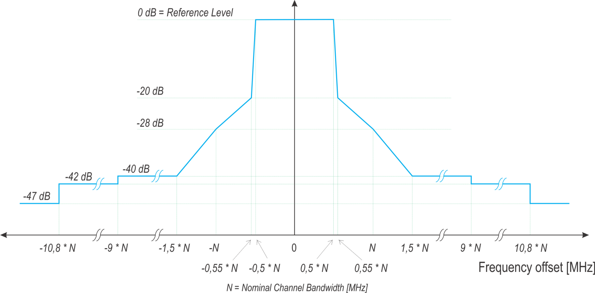

3GPP TR 38.814 V15.0.0 (2018-06)

Technical Report

3rd Generation Partnership Project;

Technical Specification Group Radio Access Network;

New frequency range for NR (4.4-5.0 GHz)

(Release 15)

{width="1.3166666666666667in"
height="0.9180555555555555in"}
{width="1.7784722222222222in"
height="1.0444444444444445in"}

The present document has been developed within the 3rd Generation
Partnership Project (3GPP ^TM^) and may be further elaborated for the
purposes of 3GPP.\
The present document has not been subject to any approval process by the
3GPP Organizational Partners and shall not be implemented.\
This Specification is provided for future development work within 3GPP
only. The Organizational Partners accept no liability for any use of
this Specification.\
Specifications and Reports for implementation of the 3GPP ^TM^ system
should be obtained via the 3GPP Organizational Partners\' Publications
Offices.

> ***3GPP***
>
> Postal address
>
> 3GPP support office address
>
> 650 Route des Lucioles - Sophia Antipolis
>
> Valbonne - FRANCE
>
> Tel.: +33 4 92 94 42 00 Fax: +33 4 93 65 47 16
>
> Internet
>
> http://www.3gpp.org

***Copyright Notification***

No part may be reproduced except as authorized by written permission.\
The copyright and the foregoing restriction extend to reproduction in
all media.

© 2018, 3GPP Organizational Partners (ARIB, ATIS, CCSA, ETSI, TSDSI,
TTA, TTC).

All rights reserved.

UMTS™ is a Trade Mark of ETSI registered for the benefit of its members

3GPP™ is a Trade Mark of ETSI registered for the benefit of its Members
and of the 3GPP Organizational Partners\
LTE™ is a Trade Mark of ETSI registered for the benefit of its Members
and of the 3GPP Organizational Partners

GSM® and the GSM logo are registered and owned by the GSM Association

 Contents {#contents .TT}
========

Foreword 4

1 Scope 5

2 References 5

3 Definitions, symbols and abbreviations 5

3.1 Definitions 5

3.2 Symbols 5

3.3 Abbreviations 5

4 Background 6

5 NR Frequency band definition 6

6 Channel numbering and channel bandwidth 6

7 NR band 4.4-5.0 GHz issues 7

7.1 UE specific 7

7.1.1 Transmitter characteristics 7

7.1.1.1 UE maximum output power 7

7.1.2 Receiver characteristics 8

7.1.2.1 Reference sensitivity 8

7.1.2.2 Blocking 8

7.1.2.2.1 Out-of-band blocking 8

8 Required changes to NR, E-UTRA, UTRA and MSR specifications 9

Annex A: Change history 10

 Foreword
========

This Technical Report has been produced by the 3^rd^ Generation
Partnership Project (3GPP).

The contents of the present document are subject to continuing work
within the TSG and may change following formal TSG approval. Should the
TSG modify the contents of the present document, it will be re-released
by the TSG with an identifying change of release date and an increase in
version number as follows:

Version x.y.z

where:

x the first digit:

1 presented to TSG for information;

2 presented to TSG for approval;

3 or greater indicates TSG approved document under change control.

y the second digit is incremented for all changes of substance, i.e.
technical enhancements, corrections, updates, etc.

z the third digit is incremented when editorial only changes have been
incorporated in the document.

 1 Scope
=======

The present document is a technical report for Work Item on New Radio
(NR) Access Technology, covering the new frequency range between 4.4 --
5.0 GHz for NR.

2 References
============

The following documents contain provisions which, through reference in
this text, constitute provisions of the present document.

\- References are either specific (identified by date of publication,
edition number, version number, etc.) or non‑specific.

\- For a specific reference, subsequent revisions do not apply.

\- For a non-specific reference, the latest version applies. In the case
of a reference to a 3GPP document (including a GSM document), a
non-specific reference implicitly refers to the latest version of that
document *in the same Release as the present document*.

\[1\] 3GPP TR 21.905: \"Vocabulary for 3GPP Specifications\".

3 Definitions, symbols and abbreviations
========================================

3.1 Definitions
---------------

For the purposes of the present document, the terms and definitions
given in 3GPP TR 21.905 \[1\] and the following apply. A term defined in
the present document takes precedence over the definition of the same
term, if any, in 3GPP TR 21.905 \[1\].

3.2 Symbols
-----------

For the purposes of the present document, the following symbols apply:

F~Interferer~ Frequency of the interferer

F~DL\_low~ The lowest frequency of the downlink operating band

F~DL\_high~ The highest frequency of the downlink operating band

P~Interferer~ Modulated mean power of the interferer

3.3 Abbreviations
-----------------

For the purposes of the present document, the abbreviations given in
3GPP TR 21.905 \[1\] and the following apply. An abbreviation defined in
the present document takes precedence over the definition of the same
abbreviation, if any, in 3GPP TR 21.905 \[1\].

BW Bandwidth

NR New Radio

RF Radio Frequency

SCS Sub-Carrier Spacing

TDD Time division Duplex

UE User Equipment

4 Background
============

Recently, two countries such as Japan and China have announced their
"5G" spectrum strategies and roadmaps for the frequency range between
4.4-5.0 GHz to deploy commercial stems for NR as follows.

{width="4.456000656167979in"
height="1.965644138232721in"}

Figure 4-1: NR spectrum plans in the range between 4.4 -- 5.0 GHz

5 NR Frequency band definition
==============================

Considering the spectrum plans in each country described in the section
4, the band plan for 4.4 -- 5.0 GHz frequency range is decided as shown
in Figure 5-1.

{width="4.613923884514436in"
height="1.0599026684164479in"}

Figure 5-1: Band definition in the frequency range between 4.4 -- 5.0
GHz

6 Channel numbering and channel bandwidth
=========================================

Band numbering for the range and applicable duplex mode for 4.4 -- 5.0
GHz are provided in Table 6-1.

Table 6-1: New NR band in the frequency range between 4.4 -- 5.0 GHz

  **Band number**   **UL**           **DL**           **Duplex mode**
  ----------------- ---------------- ---------------- -----------------
  n79               4.4 -- 5.0 GHz   4.4 -- 5.0 GHz   TDD

Available channel bandwidths for n79 are summarized below.

Table 6-2: Channel Bandwidths for n79

<table>
<thead>
<tr class="header">
<th>NR band / SCS / UE Channel bandwidth</th>
<th></th>
<th></th>
<th></th>
<th></th>
<th></th>
<th></th>
<th></th>
<th></th>
<th></th>
<th></th>
<th></th>
<th></th>
</tr>
</thead>
<tbody>
<tr class="odd">
<td>NR Band</td>
<td>
SCS

kHz
</td>
<td>5 MHz</td>
<td>101,2 MHz</td>
<td>152 MHz</td>
<td>202 MHz</td>
<td>252 MHz</td>
<td>30 MHz</td>
<td>40 MHz</td>
<td>50 MHz</td>
<td>60 MHz</td>
<td>80 MHz</td>
<td>100 MHz</td>
</tr>
<tr class="even">
<td>n79</td>
<td>15</td>
<td></td>
<td></td>
<td></td>
<td></td>
<td></td>
<td></td>
<td>Yes</td>
<td>Yes</td>
<td></td>
<td></td>
<td></td>
</tr>
<tr class="odd">
<td></td>
<td>30</td>
<td></td>
<td></td>
<td></td>
<td></td>
<td></td>
<td></td>
<td>Yes</td>
<td>Yes</td>
<td>Yes</td>
<td>Yes</td>
<td>Yes</td>
</tr>
<tr class="even">
<td></td>
<td>60</td>
<td></td>
<td></td>
<td></td>
<td></td>
<td></td>
<td></td>
<td>Yes</td>
<td>Yes</td>
<td>Yes</td>
<td>Yes</td>
<td>Yes</td>
</tr>
<tr class="odd">
<td>
NOTE 1: 90% spectrum utilization may not be achieved for 30kHz SCS.

NOTE 2: 90% spectrum utilization may not be achieved for 60kHz SCS.

NOTE 3: This UE channel bandwidth is applicable only to downlink.
</td>
<td></td>
<td></td>
<td></td>
<td></td>
<td></td>
<td></td>
<td></td>
<td></td>
<td></td>
<td></td>
<td></td>
<td></td>
</tr>
</tbody>
</table>

7 NR band 4.4-5.0 GHz issues
============================

7.1 UE specific
---------------

### 7.1.1 Transmitter characteristics

#### 7.1.1.1 UE maximum output power

The MOP requirements for Band 42 and 43 single-carrier were specified as
23 dBm +2/-3 dB for power class 3 based on simulation results shown in
Table 7.1.1.1-1 in August 2011.

Table 7.1.1.1-1: Simulation results for combined Band 42 and Band 43
filter \[R4-114656\]

             Bandwidth   Max IL (corner)   2f~0~ rejection   2.7 GHz rejection
  ---------- ----------- ----------------- ----------------- -------------------
  Design 7   400 MHz     1.9               20 dB             30 dB
  Design 8   400 MHz     2.3               15 dB             10 dB
  Design 9   400 MHz     2.0               20 dB             15 dB

BPFs for Band n79 are provided in Table 7.1.1.1-2 and 7.1.1.1-3.

Table 7.1.1.1-2: Simulation results for combined Band 42 and Band 43
filter \[R4-114656\]

{width="4.565277777777778in" height="3.2in"}

  F \[GHz\]                 4.4    4.8    4.99   5.0
  ------------------------- ------ ------ ------ ------
  IL +25C \[dB\]            0.88   0.60   0.59   0.59
  IL ETC -40\~+90C \[dB\]   1.1    0.8    0.80   0.80

Table 7.1.1.1-3: Simulation results for combined Band 42 and Band 43
filter \[R4-114656\]

  --------------------- ----------------------------------------------------------------------------- ----------------- -------------------- ----- ----- ----- ---------- ----------- --------- --------- ------------ -------------
                        typ IL \[dB\]                                                                 worst IL \[dB\]   Attenuation \[dB\]                                                                             
  frequencies \[GHz\]   4.4                                                                           4.8               5                    4.4   4.8   5     2.3-2.69   0.617-2.2   3.3-4.2   3.3-3.8   5.15-5.925   5.250-5.925
  n79 filter TR         2.3                                                                           1                 2.3                  2.5   1.2   2.5   \>35       \>25        \>15      \>15      \>40         \>40
  comment               4.4-4.5GHz range must demonstrate coexistence with altimeter band for China                                                                                                                    
                        improved rejection in WiFi band                                                                                                                                                                
  --------------------- ----------------------------------------------------------------------------- ----------------- -------------------- ----- ----- ----- ---------- ----------- --------- --------- ------------ -------------

From these tables, no significant filter IL degradation for Band n79 can
be seen compared to that of Band 42 and 43 at ETC condition. Therefore,
MOP for Band n79 should be aligned with those of Band 42 and 43 at
least.

Agreement: MOP for Band n79 is to be 23 dBm +2/-3 dB

### 7.1.2 Receiver characteristics

#### 7.1.2.1 Reference sensitivity

With the same investigation as UE maximum output power described in
7.1.1.1, no significant filter IL degradation for Band n79 can be seen
compared to that of Band 42 and 43 at ETC condition. In addition, from
LNA perspective, the fractional bandwidth of Band n79 pass-band is 12.8
% which is smaller than that of Band n78 (14.1 %). Hence, NF of Band n79
shouldn't be higher than that of Band n78. Therefore, reference
sensitivity for Band n79 should also be aligned with those of Band n78
at least.

Agreement: REFSENS for Band n79 should be 1 dB larger than that of bands
which have NR smallest sensitivity (less RF challenges) such as Band n1.

Table 7.1.2.1-1: Reference sensitivity for Band n79

  Operating Band   SCS kHz   40      50      60      80      100     Duplex Mode
  ---------------- --------- ------- ------- ------- ------- ------- -------------
                             MHz     MHz     MHz     MHz     MHz     
                             (dBm)   (dBm)   (dBm)   (dBm)   (dBm)   
  n79              15        -89.6   -88.6                           TDD
                   30        -89.7   -88.7   -87.9   -86.6   -85.6   
                   60        -89.9   -88.8   -88.0   -86.7   -85.7   

#### 7.1.2.2 Blocking

##### 7.1.2.2.1 Out-of-band blocking

Based on filter performance shown in Table 7.1.1.1-1 and 7.1.1.1-2,
out-of-band blocking requirement needs to be optimized as with LTE band
42 and 43 as below.

Table 7.1.2.2.1-1: Out-of-band blocking parameters for Band n79

+-----------+-----------+-----------+-------+-------+-------+--------+
| **Rx      | **Units** | **Channel |       |       |       |        |
| Pa        |           | ba        |       |       |       |        |
| rameter** |           | ndwidth** |       |       |       |        |
+===========+===========+===========+=======+=======+=======+========+
|           |           | **40\     | **50\ | **60\ | **80\ | **100\ |
|           |           | MHz**     | MHz** | MHz** | MHz** | MHz**  |
+-----------+-----------+-----------+-------+-------+-------+--------+
| Power in  | dBm       | REFSENS + |       |       |       |        |
| Tra       |           | channel   |       |       |       |        |
| nsmission |           | bandwidth |       |       |       |        |
| Bandwidth |           | specific  |       |       |       |        |
| Conf      |           | value     |       |       |       |        |
| iguration |           | below     |       |       |       |        |
+-----------+-----------+-----------+-------+-------+-------+--------+
|           |           | 9         | 9     | 9     | 9     | 9      |
+-----------+-----------+-----------+-------+-------+-------+--------+
| NOTE 1:   |           |           |       |       |       |        |
| The       |           |           |       |       |       |        |
| tr        |           |           |       |       |       |        |
| ansmitter |           |           |       |       |       |        |
| shall be  |           |           |       |       |       |        |
| set to    |           |           |       |       |       |        |
| 4dB below |           |           |       |       |       |        |
| PCMAX\_L  |           |           |       |       |       |        |
| at the    |           |           |       |       |       |        |
| minimum   |           |           |       |       |       |        |
| uplink    |           |           |       |       |       |        |
| conf      |           |           |       |       |       |        |
| iguration |           |           |       |       |       |        |
| specified |           |           |       |       |       |        |
| TBD with  |           |           |       |       |       |        |
| PCMAX\_L  |           |           |       |       |       |        |
| as        |           |           |       |       |       |        |
| defined   |           |           |       |       |       |        |
| in        |           |           |       |       |       |        |
| subclause |           |           |       |       |       |        |
| 6.2.5.    |           |           |       |       |       |        |
|           |           |           |       |       |       |        |
| NOTE 2:   |           |           |       |       |       |        |
| Reference |           |           |       |       |       |        |
| me        |           |           |       |       |       |        |
| asurement |           |           |       |       |       |        |
| channel   |           |           |       |       |       |        |
| is TBD    |           |           |       |       |       |        |
|           |           |           |       |       |       |        |
| NOTE 3:   |           |           |       |       |       |        |
| The       |           |           |       |       |       |        |
| REFSENS   |           |           |       |       |       |        |
| power     |           |           |       |       |       |        |
| level is  |           |           |       |       |       |        |
| TBD       |           |           |       |       |       |        |
+-----------+-----------+-----------+-------+-------+-------+--------+

Table 7.1.2.2.1-2: Out of band blocking for Band n79

+----------+----------+----------+----------+----------+----------+
| **NR     | **Par    | *        | **Fre    |          |          |
| band**   | ameter** | *Units** | quency** |          |          |
+==========+==========+==========+==========+==========+==========+
|          |          |          | **Range  | **Range  | **Range  |
|          |          |          | 1**      | 2**      | 3**      |
+----------+----------+----------+----------+----------+----------+
|          | P~Int    | dBm      | -44      | -30      | -15      |
|          | erferer~ |          |          |          |          |
+----------+----------+----------+----------+----------+----------+
| n79      | F~Int    | MHz      | N/A      | -150 \<  | 1 ≤ f ≤  |
| (NOTE 2) | erferer~ |          |          | f --     | F~       |
|          | (CW)     |          |          | F~       | DL\_low~ |
|          |          |          |          | DL\_low~ | --       |
|          |          |          |          | ≤        | MIN(1    |
|          |          |          |          | -MIN(1   | 50,3CBW) |
|          |          |          |          | 50,3CBW) |          |
|          |          |          |          |          | or       |
|          |          |          |          | or       |          |
|          |          |          |          |          | F~D      |
|          |          |          |          | MIN(1    | L\_high~ |
|          |          |          |          | 50,3CBW) | +        |
|          |          |          |          | ≤ f --   | MIN(1    |
|          |          |          |          | F~D      | 50,3CBW) |
|          |          |          |          | L\_high~ | ≤ f ≤    |
|          |          |          |          | \< 150   | 12750    |
+----------+----------+----------+----------+----------+----------+
| NOTE 1:  |          |          |          |          |          |
| CBW      |          |          |          |          |          |
| denotes  |          |          |          |          |          |
| the      |          |          |          |          |          |
| channel  |          |          |          |          |          |
| b        |          |          |          |          |          |
| andwidth |          |          |          |          |          |
| of the   |          |          |          |          |          |
| wanted   |          |          |          |          |          |
| signal   |          |          |          |          |          |
|          |          |          |          |          |          |
| NOTE 2:  |          |          |          |          |          |
| The      |          |          |          |          |          |
| power    |          |          |          |          |          |
| level of |          |          |          |          |          |
| the      |          |          |          |          |          |
| in       |          |          |          |          |          |
| terferer |          |          |          |          |          |
| (P~Inte  |          |          |          |          |          |
| rferer~) |          |          |          |          |          |
| for      |          |          |          |          |          |
| Range 3  |          |          |          |          |          |
| shall be |          |          |          |          |          |
| modified |          |          |          |          |          |
| to -20   |          |          |          |          |          |
| dBm, for |          |          |          |          |          |
| F~Int    |          |          |          |          |          |
| erferer~ |          |          |          |          |          |
| \> 3650  |          |          |          |          |          |
| MHz and  |          |          |          |          |          |
| F~Int    |          |          |          |          |          |
| erferer~ |          |          |          |          |          |
| \< 5750  |          |          |          |          |          |
| MHz. For |          |          |          |          |          |
| CBW      |          |          |          |          |          |
| equal or |          |          |          |          |          |
| larger   |          |          |          |          |          |
| than 50  |          |          |          |          |          |
| MHz, the |          |          |          |          |          |
| req      |          |          |          |          |          |
| uirement |          |          |          |          |          |
| for      |          |          |          |          |          |
| Range 2  |          |          |          |          |          |
| is not   |          |          |          |          |          |
| ap       |          |          |          |          |          |
| plicable |          |          |          |          |          |
| and      |          |          |          |          |          |
| Range 3  |          |          |          |          |          |
| applies  |          |          |          |          |          |
| from the |          |          |          |          |          |
| f        |          |          |          |          |          |
| requency |          |          |          |          |          |
| offset   |          |          |          |          |          |
| of       |          |          |          |          |          |
| 3\*CBW   |          |          |          |          |          |
| from the |          |          |          |          |          |
| band     |          |          |          |          |          |
| edge.    |          |          |          |          |          |
+----------+----------+----------+----------+----------+----------+

8 Required changes to NR, E-UTRA, UTRA and MSR specifications
=============================================================

No changes identified.

#########  Annex A: Change history

  -------------------- ------------- ------------ -------- --------- --------- --------------------------------------------------------- -----------------
  **Change history**                                                                                                                     
  **Date**             **Meeting**   **TDoc**     **CR**   **Rev**   **Cat**   **Subject/Comment**                                       **New version**
  2017-08              RAN4\#84      R4-1708172                                Skeleton TR 38.814                                        0.0.1
  2018-01              ARN4AH-1801   R4-1800831                                draft TR 38.814 (NR 4.4-5.0GHz band)                      0.1.0
  2018-03              RAN\#79       RP-180334                                 v1.0.0 presented to plenary for information               1.0.0
  2018-06              RAN\#80                                                 v2.0.0 presented to plenary for approval                  2.0.0
  2018-06              RAN\#80                                                 Approved by plenary -- Rel-15 spec under change control   15.0.0
  -------------------- ------------- ------------ -------- --------- --------- --------------------------------------------------------- -----------------
