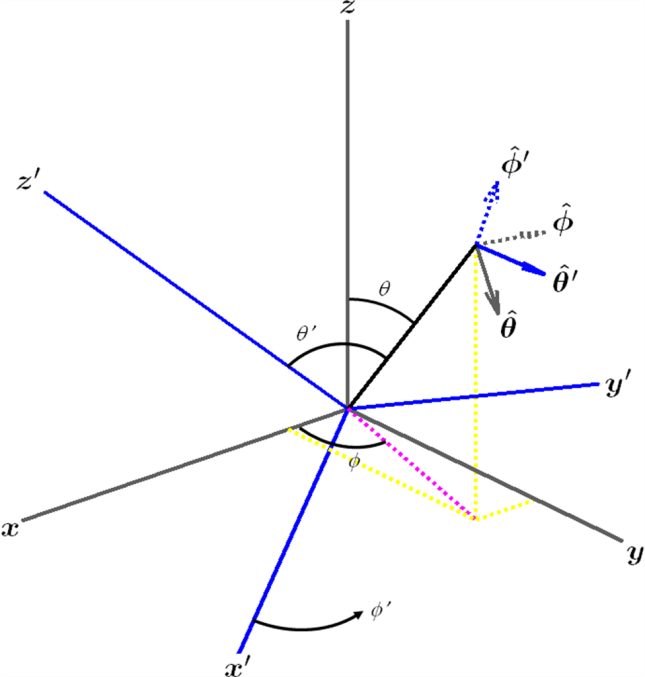
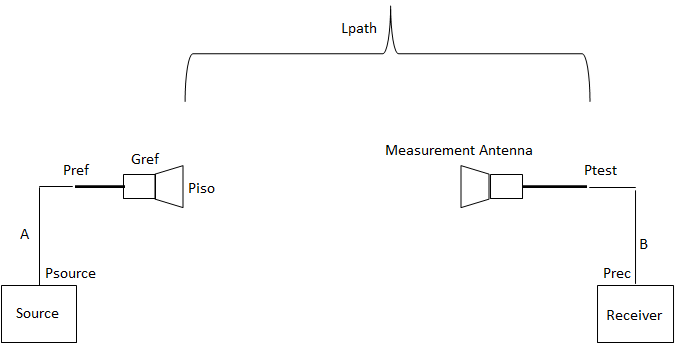
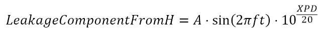

+----------------------------------+----------------------------------+
| 3GPP TR 38.817-02 V15.12.0       |                                  |
| (2025-06)                        |                                  |
+==================================+==================================+
| Technical Specification          |                                  |
+----------------------------------+----------------------------------+
| 3rd Generation Partnership       |                                  |
| Project;                         |                                  |
|                                  |                                  |
| Technical Specification Group    |                                  |
| Radio Access Network;            |                                  |
|                                  |                                  |
| NR;                              |                                  |
|                                  |                                  |
| General aspects for Base Station |                                  |
| (BS) Radio Frequency (RF) for NR |                                  |
|                                  |                                  |
| (Release 15)                     |                                  |
+----------------------------------+----------------------------------+
|                                  |                                  |
+----------------------------------+----------------------------------+
| {width="1.3229166666666667in" | ng){width="1.7708333333333333in" |
| height="0.9166666666666666in"}   | height="1.0416666666666667in"}   |
+----------------------------------+----------------------------------+
|                                  |                                  |
+----------------------------------+----------------------------------+
| The present document has been    |                                  |
| developed within the 3rd         |                                  |
| Generation Partnership Project   |                                  |
| (3GPP ^TM^) and may be further   |                                  |
| elaborated for the purposes of   |                                  |
| 3GPP.\                           |                                  |
| The present document has not     |                                  |
| been subject to any approval     |                                  |
| process by the 3GPP              |                                  |
| Organizational Partners and      |                                  |
| shall not be implemented.\       |                                  |
| This Specification is provided   |                                  |
| for future development work      |                                  |
| within 3GPP only. The            |                                  |
| Organizational Partners accept   |                                  |
| no liability for any use of this |                                  |
| Specification.\                  |                                  |
| Specifications and Reports for   |                                  |
| implementation of the 3GPP ^TM^  |                                  |
| system should be obtained via    |                                  |
| the 3GPP Organizational          |                                  |
| Partners\' Publications Offices. |                                  |
+----------------------------------+----------------------------------+

+----------------------------------------------------------------------+
|                                                                      |
+======================================================================+
| > ***3GPP***                                                         |
| >                                                                    |
| > Postal address                                                     |
| >                                                                    |
| > 3GPP support office address                                        |
| >                                                                    |
| > 650 Route des Lucioles - Sophia Antipolis                          |
| >                                                                    |
| > Valbonne - FRANCE                                                  |
| >                                                                    |
| > Tel.: +33 4 92 94 42 00 Fax: +33 4 93 65 47 16                     |
| >                                                                    |
| > Internet                                                           |
| >                                                                    |
| > http://www.3gpp.org                                                |
+----------------------------------------------------------------------+
| ***Copyright Notification***                                         |
|                                                                      |
| No part may be reproduced except as authorized by written            |
| permission.\                                                         |
| The copyright and the foregoing restriction extend to reproduction   |
| in all media.                                                        |
|                                                                      |
| © 2025, 3GPP Organizational Partners (ARIB, ATIS, CCSA, ETSI, TSDSI, |
| TTA, TTC).                                                           |
|                                                                      |
| All rights reserved.                                                 |
|                                                                      |
| UMTS™ is a Trade Mark of ETSI registered for the benefit of its      |
| members                                                              |
|                                                                      |
| 3GPP™ is a Trade Mark of ETSI registered for the benefit of its      |
| Members and of the 3GPP Organizational Partners\                     |
| LTE™ is a Trade Mark of ETSI registered for the benefit of its       |
| Members and of the 3GPP Organizational Partners                      |
|                                                                      |
| GSM® and the GSM logo are registered and owned by the GSM            |
| Association                                                          |
+----------------------------------------------------------------------+

 Contents {#contents .TT}
========

Foreword 12

1 Scope 14

2 References 14

3 Definitions, symbols and abbreviations 16

3.1 Definitions 16

3.2 Symbols 19

3.3 Abbreviations 20

4 General and common aspects 21

5 General BS RF aspects 21

5.1 Relationship with other core specifications 21

5.2 Relationship between minimum requirements and test requirements 22

5.3 General BS architectures 22

5.3.1 Background 22

5.3.2 General 23

5.3.3 BS type 1-C 23

5.3.4 BS type 1-H 24

5.3.5 BS type 1-O and BS type 2-O 25

5.4 Base station classes 25

5.5 Regional requirements 26

5.6 Applicability of requirements 26

5.7 Requirements for contiguous and non-contiguous spectrum 27

5.8 Requirements for BS capable of multi-band operation 28

5.9 Basic limits and scaling of emissions 28

5.10 In-band and out-of-band boundaries for FR1 29

6 Conducted BS transmitter characteristics 29

6.1 General 29

6.2 Base station output power 30

6.2.1 General 30

6.2.2 Basic limit 30

6.2.3 Non-AAS BS output requirement 30

6.2.4 AAS BS output power requirement 30

6.3 Output power dynamics 30

6.3.1 General 30

6.3.2 RE power control dynamic range 30

6.3.3 Total power dynamic range 31

6.4 Transmit ON/OFF power 31

6.4.1 Transmitter OFF power 31

6.4.2 Transmitter transient period 31

6.5 Transmitted signal quality 32

6.5.1 General 32

6.5.2 Frequency error 32

6.5.3 Time alignment error 33

6.5.3.1 General 33

6.5.3.2 Carrier aggregation 33

6.5.3.2.1 General 33

6.5.3.2.2 UE implementation 33

6.5.3.2.3 Deployment scenarios 35

6.5.3.2.4 Intra band contiguous CA 35

6.5.3.2.5 Intra band non-contiguous CA 36

6.5.3.2.6 Inter band CA 36

6.5.3.2.7 Other dependencies 36

6.5.3.2.8 Conclusion 37

6.5.4 Modulation Quality 37

6.5.4.1 General 37

6.5.4.2 Example N~RB~ values 38

6.5.4.3 RSTP and OSTP 38

6.6.7.4 TDD EVM measurements 39

6.6.7.5 EVM window 39

6.6 Unwanted emissions 39

6.6.1 General 39

6.6.2 Occupied bandwidth (FR1) 39

6.6.3 Adjacent Channel Leakage Power Ratio (ACLR) 39

6.6.4 Operating band unwanted emissions 41

6.6.5 Transmitter spurious emissions 42

6.6.5.1 General 42

6.6.5.2 Basic limits 43

6.6.5.3 Conducted Tx spurious emissions requirement for *BS type 1-C* 43

6.6.5.4 AAS conducted Tx spurious emissions requirement 43

6.7 Transmitter intermodulation 43

6.7.1 General 43

6.7.2 Co-location transmitter intermodulation 44

6.7.3 Intra system transmitter intermodulation 45

7 Conducted BS receiver characteristics 46

7.1 General 46

7.2 Reference sensitivity level 46

7.2.1 General 46

7.2.2 FRCs 46

7.3 Dynamic range 47

7.4 In-band selectivity and blocking 48

7.4.1 Adjacent Channel Selectivity (ACS) 48

7.4.2 In-band Blocking 49

7.5 Out-of-band blocking 50

7.5.1 General 50

7.5.2 Non-AAS conducted out-of-band blocking 50

7.5.3 AAS conducted out-of-band blocking 50

7.6 Receiver spurious emissions 50

7.6.1 Background for conducted receiver spurious emissions in LTE 50

7.6.2 NR receiver spurious emissions limits (conducted) 51

7.7 Receiver intermodulation 51

7.8 In-channel selectivity 54

8 Void 56

9 Radiated BS transmitter characteristics 56

9.1 General 56

9.1.1 Spatial definitions 56

9.2 Radiated transmit power 56

9.2.1 General 56

9.2.2 Minimum requirement for BS type 1-O and BS type 1-H 57

9.2.3 Minimum requirement for BS type 2-O 57

9.3 OTA Base station output power 57

9.3.1 General 57

9.3.2 Output power requirement for FR1 57

9.3.3 Output power requirement for FR2 58

9.4 OTA output power dynamics 58

9.4.1 General 58

9.4.2 OTA RE power control dynamic range for FR1 58

9.4.3 OTA RE power control dynamic range for FR2 58

9.4.4 OTA total power dynamic range for FR1 58

9.4.5 OTA total power dynamic range for FR2 59

9.5 OTA Transmit ON/OFF power 59

9.5.1 OTA Transmitter OFF power 59

9.5.1.1 General 59

9.5.1.2 OTA Transmitter OFF power for NR BS 1-O 59

9.5.1.3 OTA Transmitter OFF power for NR BS Type 2-O 59

9.5.2 OTA Transmitter transient period 62

9.6 OTA Transmitted signal quality 63

9.6.1 General 63

9.6.2 OTA frequency error for FR1 63

9.6.3 OTA time alignment error for FR1 64

9.6.4 OTA time alignment error for FR2 64

9.6.5 OTA frequency error for FR2 64

9.6.6 OTA modulation quality for FR1 64

9.6.7 OTA modulation quality for FR2 65

9.6.7.1 General 65

9.6.7.2 Example N~RB~ values 66

9.6.7.3 RSTP and OSTP 66

9.6.7.4 TDD EVM measurements 66

9.6.7.5 EVM window 66

9.7 OTA Unwanted emissions 66

9.7.1 General 66

9.7.2 OTA Occupied bandwidth 66

9.7.3 OTA Adjacent Channel Leakage Power Ratio (ACLR) 66

9.7.3.1 General 66

9.7.3.2 AAS radiated ACLR requirement for FR1 66

9.7.3.3 AAS radiated ACLR requirement for FR2 66

9.7.4 OTA Operating band unwanted emissions 67

9.7.4.1 Radiated OBUE Requirement in FR1 67

9.7.4.2 Radiated OBUE Requirement in FR2 67

9.7.5 OTA Transmitter spurious emissions 68

9.7.5.1 General 68

9.7.5.2 AAS radiated Tx spurious emissions requirement for FR1 68

9.7.5.3 AAS radiated Tx spurious emissions requirement for FR2 69

9.8 OTA Transmitter intermodulation 69

9.8.1 General 69

9.8.2 Core requirement 69

9.9 Transmitter spatial emissions 70

9.9.1 General 70

9.9.2 Declaration definition 71

9.10 Beam switching speed 74

9.10.1 General 74

9.10.2 Estimated switching speed 74

9.10.3 Simulation results 75

9.10.3.1 General 75

9.10.3.2 PSS 75

9.10.3.3 PDCCH 76

9.10.3.4 PDSCH 79

9.10.4 Test feasibility 81

9.10.5 Conclusion 81

10 Radiated BS receiver characteristics 82

10.1 General 82

10.2 OTA sensitivity 83

10.3 OTA Reference sensitivity level 83

10.3.1 General 83

10.3.2 BS type 1-O 83

10.3.3 BS type 2-O 84

10.3.3.1 General 84

10.3.3.2 Antenna gain and loss assumptions 84

10.3.3.3 Noise figure assumptions 85

10.3.3.4 SNR and IM 85

10.3.3.5 OTA Reference sensitivity ranges 86

10.4 OTA Dynamic range 86

10.4.1 Dynamic range requirements for Range 2 NR BS 86

10.4.2 OTA Dynamic range requirements for FR1 88

10.5 OTA In-band selectivity and blocking 88

10.5.1 General 88

10.5.2 Adjacent channel Selectivity (ACS) 88

10.5.3 In-band Blocking 89

10.5.3.1 General 89

10.5.3.2 FR1 89

10.5.3.3 FR2 89

10.6 OTA Out-of-band blocking 90

10.6.1 FR1 OTA out-of-band blocking 90

10.6.2 FR2 OTA out-of-band blocking 90

10.7 OTA Receiver spurious emissions 91

10.7.1 General 91

10.7.2 Radiated Rx spurious emissions requirement in FR1 92

10.7.3 Radiated Rx spurious emissions requirement in FR2 92

10.8 OTA Receiver intermodulation 92

10.8.1 General Receiver intermodulation 92

10.8.2 Narrowband Receiver intermodulation 93

10.9 OTA In-channel selectivity 93

10.9.1 General 93

10.9.2 BS type 1-O 93

10.9.3 BS type 2-O 94

11 EMC requirements 95

11.1 General 95

11.2 NR BS ports for the EMC purposes 95

11.3 Emission requirements 96

11.4 Radiated immunity requirements 97

11.4.1 Measurement set-up for testing radiated immunity 97

11.4.2 Alternatives to protect BS type 1-O during RI test 97

11.4.2.1 Void 97

11.4.2.2 Void 97

12 Conformance testing aspects 97

12.1 General 97

12.2 Conformance testing for conducted requirements 97

12.2.1 Measurement uncertainty of test system 97

12.3 Conformance testing for OTA TX directional requirements 98

12.3.1 Void 99

12.3.2 Void 99

12.3.3 Void 99

12.3.4 Void 99

12.3.5 Void 99

12.3.6 Void 99

12.4 Conformance testing for OTA RX directional requirements 99

12.4.1 Void 99

12.4.2 Void 99

12.5 Conformance testing for OTA RX out of band blocking 99

12.5.1 Void 99

12.5.2 Void 99

12.5.3 Void 99

12.6 Conformance testing for OTA in band TRP requirements 99

12.6.1 Void12.6.2 Void 99

12.6.3 Void 99

12.7 Conformance testing for OTA out of band TRP requirements 99

12.7.1 Void 100

12.7.2 Void 100

12.7.3 Void 100

12.8 Conformance testing for OTA co-location requirements 100

12.8.1 Void 100

12.8.2 Void 100

12.8.3 Void 100

12.8.4 Void 100

12.8.5 Void 100

12.9 Conformance testing for performance requirements 100

12.9.1 Void 100

12.9.2 Void 100

12.9.3 Void 100

12.10 TRP measurements 100

12.10.1 Void 100

Annex A: Aspects related to measurement of OTA unwanted emission 101

A.1 Void 101

A.2 Void 101

A.3 Void 101

A.4 Void 101

Annex B: Simulation assumptions and results summary for RF Fixed
Reference Channels 102

Annex C: Change history 104

 Foreword
========

This Technical Specification has been produced by the 3rd Generation
Partnership Project (3GPP).

The contents of the present document are subject to continuing work
within the TSG and may change following formal TSG approval. Should the
TSG modify the contents of the present document, it will be re-released
by the TSG with an identifying change of release date and an increase in
version number as follows:

Version x.y.z

where:

x the first digit:

1 presented to TSG for information;

2 presented to TSG for approval;

3 or greater indicates TSG approved document under change control.

y the second digit is incremented for all changes of substance, i.e.
technical enhancements, corrections, updates, etc.

z the third digit is incremented when editorial only changes have been
incorporated in the document.

In the present document, modal verbs have the following meanings:

**shall** indicates a mandatory requirement to do something

**shall not** indicates an interdiction (prohibition) to do something

The constructions \"shall\" and \"shall not\" are confined to the
context of normative provisions, and do not appear in Technical Reports.

The constructions \"must\" and \"must not\" are not used as substitutes
for \"shall\" and \"shall not\". Their use is avoided insofar as
possible, and they are not used in a normative context except in a
direct citation from an external, referenced, non-3GPP document, or so
as to maintain continuity of style when extending or modifying the
provisions of such a referenced document.

**should** indicates a recommendation to do something

**should not** indicates a recommendation not to do something

**may** indicates permission to do something

**need not** indicates permission not to do something

The construction \"may not\" is ambiguous and is not used in normative
elements. The unambiguous constructions \"might not\" or \"shall not\"
are used instead, depending upon the meaning intended.

**can** indicates that something is possible

**cannot** indicates that something is impossible

The constructions \"can\" and \"cannot\" are not substitutes for \"may\"
and \"need not\".

**will** indicates that something is certain or expected to happen as a
result of action taken by an agency the behaviour of which is outside
the scope of the present document

**will not** indicates that something is certain or expected not to
happen as a result of action taken by an agency the behaviour of which
is outside the scope of the present document

**might** indicates a likelihood that something will happen as a result
of action taken by some agency the behaviour of which is outside the
scope of the present document

**might not** indicates a likelihood that something will not happen as a
result of action taken by some agency the behaviour of which is outside
the scope of the present document

In addition:

**is** (or any other verb in the indicative mood) indicates a statement
of fact

**is not** (or any other negative verb in the indicative mood) indicates
a statement of fact

The constructions \"is\" and \"is not\" do not indicate requirements.

1 Scope
=======

The present document is a technical report for the work item on Work
Item on New Radio (NR) Access Technology, covering the general aspects
for BS RF for NR.

NOTE: In Rel-15, multiple clauses related to the OTA measurements of the
BS were shifted to the OTA BS testing TR 37.941 \[36\], which includes
such aspects as e.g., test tolerance and measurement uncertainty
derivations, OTA test chambers descriptions, calibration and test
procedure descriptions, etc.

2 References
============

The following documents contain provisions which, through reference in
this text, constitute provisions of the present document.

\- References are either specific (identified by date of publication,
edition number, version number, etc.) or non‑specific.

\- For a specific reference, subsequent revisions do not apply.

\- For a non-specific reference, the latest version applies. In the case
of a reference to a 3GPP document (including a GSM document), a
non-specific reference implicitly refers to the latest version of that
document *in the same Release as the present document*.

\[1\] 3GPP TR 21.905: \"Vocabulary for 3GPP Specifications\".

\[2\] Recommendation ITU-R M.1036-5 (10/2015), \"Frequency arrangements
for implementation of the terrestrial component of International Mobile
Telecommunications (IMT) in the bands identified for IMT in the Radio
Regulations (RR)\".

\[3\] 3GPP TS 38.104: \"NR; Base Station (BS) radio transmission and
reception\".

\[4\] ITU-R Recommendation SM.329: \"Unwanted emissions in the spurious
domain\".

\[5\] ITU-R Recommendation SM.328: \"Spectra and bandwidth of
emissions\".

\[6\] 3GPP TS 36.104: \"Evolved Universal Terrestrial Radio Access
(E-UTRA); Base Station (BS) radio transmission and reception\".

\[7\] 3GPP TS 37.105: \"Active Antenna System (AAS) Base Station (BS)
transmission and reception\".

\[8\] 3GPP TR 37.842: \"Evolved Universal Terrestrial Radio Access
(E-UTRA) and Universal Terrestrial Radio Access (UTRA; Radio Frequency
(RF) requirement background for Active Antenna System (AAS) Base Station
(BS)\".

\[9\] 3GPP TR 37.843: \"Radio Frequency (RF) requirement background for
Active Antenna System (AAS) Base Station (BS) radiated requirements\".

\[10\] R4-1700305, \"LS on Characteristics of terrestrial IMT systems
for frequency sharing/interference analysis in the frequency range
between 24.25 GHz and 86 GHz\".

\[11\] Code of Federal Regulations, Title 47, Part 30.203, Upper
Microwave Flexible Use Service; Emission limits, Federal Communications
Commission.

\[12\] Recommendation ITU-R M.1545: \"Measurement uncertainty as it
applies to test limits for the terrestrial component of International
Mobile Telecommunications-2000\".

\[13\] Void.

\[14\] ETSI EN 301 489: \"Electromagnetic compatibility and Radio
spectrum Matters (ERM); ElectroMagnetic Compatibility (EMC) standard for
radio equipment and services\".

\[15\] 3GPP TS 38.113: \"NR; Base Station (BS) and repeater
ElectroMagnetic Compatibility (EMC)\".

\[16\] 3GPP TS 37.114: \"Active Antenna System (AAS) Base Station (BS)
Electromagnetic Compatibility (EMC)\".

\[17\] 3GPP TS 38.141-1: \"NR; Base Station (BS) conformance testing;
Part 1: Conducted conformance testing\".

\[18\] 3GPP TS 38.141-2: \"NR; Base Station (BS) conformance testing;
Part 2: Radiated conformance testing\".

\[19\] 3GPP TS 37.104: \" NR, E-UTRA, UTRA and GSM/EDGE; Multi-Standard
Radio (MSR) Base Station (BS) radio transmission and reception\".

\[20\] 3GPP TS 38.817-01: \"General aspects for User Equipment (UE)
Radio Frequency (RF) for NR\".

\[21\] 3GPP TR 36.815: \"Further Advancements for E-UTRA; LTE-Advanced
feasibility studies in RAN WG4\".

\[22\] 3GPP TS 36.133: \"Evolved Universal Terrestrial Radio Access
(E-UTRA); Requirements for support of radio resource management\".

\[23\] 3GPP TS 37.113: \"Multi-Standard Radio (MSR) Base Station (BS)
Electromagnetic Compatibility (EMC)\".

\[24\] 3GPP TR 38.803: \"Study on new radio access technology: Radio
Frequency (RF) and co-existence aspects\".

\[25\] 3GPP TS 38.211: \"NR; Physical channels and modulation\".

\[26\] 3GPP TR 37.843: \"Radio Frequency (RF) requirement background for
Active Antenna System (AAS) Base Station (BS) radiated requirements\".
v15.2.0

\[27\] 3GPP TS 36.141: \"Evolved Universal Terrestrial Radio Access
(E-UTRA); Base Station (BS) conformance testing\".

\[28\] IEC 61000-4-3: 2006+AMD1:2007+AMD2:2010: "Electromagnetic
compatibility (EMC) - Part 4-3: Testing and measurement techniques -
Radiated, radio-frequency, electromagnetic field immunity test"

\[29\] ITU-T Recommendation K.114: "Electromagnetic compatibility
requirements and measurement methods for digital cellular mobile
communication base station equipment"

\[30\] ITU-T Recommendation K.48: "EMC requirements for
telecommunication equipment - Product family Recommendation"

\[31\] 3GPP TS 38.133: \"NR; Requirements for support of radio resource
management\".

\[32\] 3GPP TS 37.141: \"NR, E-UTRA, UTRA and GSM/EDGE; Multi-Standard
Radio (MSR) Base Station (BS) conformance testing\".

\[33\] 3GPP TS 37.145-1: \"Active Antenna System (AAS) Base Station (BS)
conformance testing; Part 1: Conducted conformance testing\".

\[34\] 3GPP TS 37.145-2: \"Active Antenna System (AAS) Base Station (BS)
conformance testing; Part 2: radiated conformance testing\".

\[35\] ERC Recommendation 74-01, \"Unwanted emissions in the spurious
domain\".

\[36\] 3GPP TR 37.941: \"Radio Frequency (RF) conformance testing
background for radiated Base Station (BS) requirements\"

3 Definitions, symbols and abbreviations
========================================

3.1 Definitions
---------------

For the purposes of the present document, the terms and definitions
given in 3GPP TR 21.905 \[1\] and the following apply. A term defined in
the present document takes precedence over the definition of the same
term, if any, in 3GPP TR 21.905 \[1\].

**active antenna system base station:** BS system which combines an
a*ntenna array* with an *transceiver unit array*. An AAS BS may include
a radio distribution network

**array element:** subdivision of a passive *antenna array*, consisting
of a single radiating element or a group of radiating elements, with a
fixed radiation pattern

**antenna connector:** connector at the conducted interface of the *BS
type 1-C*

**antenna array:** group of radiating elements characterized by the
geometry and the properties of the *array elements*

**antenna gain: ratio of the radiation intensity, in a given direction,
to the radiation intensity that would be obtained if the power accepted
by the antenna were radiated isotropically**

NOTE: If the direction is not specified, the direction of maximum
radiation intensity is implied.

**array factor:** radiation pattern of an array antenna when each *array
element* is considered to radiate isotropically

NOTE: When the radiation pattern of individual *array elements* are
identical, and the *array elements* are congruent under translation,
then the product of the *array factor* and the *array element* radiation
pattern gives the radiation pattern of the entire array.

**angle of arrival:** is the direction of propagation of electromagnetic
wave incident on an AAS BS *antenna array*

**basic limit:** emissions limit from a single transceiver unit of the
non-AAS BS type, used for the formulation of the unwanted emissions and
output power requirements for 1-C type NR BS, as well as for the
formulation of the unwanted emissions minimum requirements for *1-H* and
*1-O* types NR BS by using emissions scaling

**beam:** beam (of the antenna) is the main lobe of the radiation
pattern of an *antenna array*

NOTE: For certain AAS BS *antenna array*, there may be more than one
beam.

**beam centre direction:** direction equal to the geometric centre of
the half-power contour of the beam

**beam direction pair:** data set consisting of the *beam centre
direction* and the related *beam peak direction*

**beam peak direction:** direction where the maximum EIRP is found

**beamwidth:** beam which has a half-power contour that is essentially
elliptical, the half-power beamwidths in the two pattern cuts that
respectively contain the major and minor axis of the ellipse

**BS channel bandwidth**: RF bandwidth supporting a single NR RF carrier
with the transmission bandwidth configured in the uplink or downlink.

NOTE: The channel bandwidth is measured in MHz and is used as a
reference for transmitter and receiver RF requirements.

NOTE: It is possible for the BS to transmit to and/or receive from one
or more UE Bandwidth parts that are smaller than or equal to the BS
transmission bandwidth configuration, in any part of the BS transmission
bandwidth configuration.

**BS type 1-C:** NR base station operating at FR1 with requirements set
consisting only of conducted requirements defined at individual *antenna
connectors*

**BS type 1-H:** NR base station operating at FR1 with a requirement set
consisting of conducted requirements defined at individual *TAB
connectors* and OTA requirements defined at RIB

**BS type 1-O:** NR base station operating at FR1 with a requirement set
consisting only of OTA requirements defined at the RIB

**BS type 2-O:** NR base station operating at FR2 with a requirement set
consisting only of OTA requirements defined at the RIB

**cell specific beam:** *Cell specific beam* is a beam which is intended
to facilitate communication for multiple UEs within a cell

**cell splitting:** division of the cell\'s coverage in a sector into
multiple subsectors

NOTE: The subsectors may be divided into the vertical and/or horizontal
plane.

**demodulation branch:** single input to the demodulation algorithms

NOTE: For UTRA a *demodulation branch* is referred to as a receive
diversity branch or a UL MIMO branch. For E-UTRA a *demodulation branch*
is referred to as an RX antenna in the performance requirement tables.

NOTE: The term \"RX antenna\" in chapter 8 of the E-UTRA specification
3GPP TS 36.104 \[8\] does not refer to physical receiver antennas, but
to the *demodulation branches*.

**directions diagram:** two-dimensional Cartesian diagram showing φ on
the horizontal axis and minus θ on the vertical axis

**directivity: ratio of the radiation intensity in a given direction
from the antenna to the radiation intensity averaged over all
directions**

NOTE: If the direction is not specified, the direction of maximum
radiation intensity is implied.

**EIRP accuracy directions set:** *beam peak directions* for which the
EIRP accuracy requirement is intended to be met

NOTE: The *beam peak directions* are related to a corresponding
contiguous range or discrete list of *beam centre directions* by the
*beam direction pairs* included in the set.

**EMC antenna port**: RF connector referred to as antenna port in EMC
requirements

**equivalent isotropic radiated power:** in a given direction, the
relative *antenna gain* of a transmitting antenna with respect to the
*antenna gain* of an isotropic radiating element multiplied by the net
power accepted by the antenna from the connected transmitter

NOTE: For an AAS BS the EIRP can be seen as the equivalent power
radiated from an isotropic radiating element, producing the same field
intensity as the field intensity radiated in the declared beam pointing
direction of the active antenna system being considered.

**equivalent isotropic sensitivity:** power level relative to an
isotropic antenna that is required to be incident on the AAS BS array
from a specified azimuth/elevation direction in order to meet a
specified receiver sensitivity requirement

NOTE: EIS is directly related to field-strength via free-space impedance
and effective aperture antenna area. EIS is expressed as the receiver
power that would be collected by an isotropic antenna if it were subject
to a uniform field around the whole sphere as the AAS BS array
experiences in the specified azimuth/elevation direction.

**front-to-back ratio:** ratio of maximum directivity of an antenna to
its directivity in a specified rearward direction

**hybrid AAS BS**: AAS BS which has both a conducted RF interface and a
radiated RF interface in the far field and conforms to a *hybrid
requirements set*

**hybrid requirements set**: Complete set of requirements applied to a
*hybrid AAS BS* with both conducted and radiated requirements

**minSENS:** the lowest declared EIS value for the OSDD's declared for
OTA sensitivity requirement

**multi-band connector**: *antenna connector* of the *BS type 1-C* or
*TAB connector* of the *BS type 1-H*, associated with a transmitter or
receiver that is characterized by the ability to process two or more
carriers in common active RF components simultaneously, where at least
one carrier is configured at a different operating band than the other
carrier(s) and where this different operating band is not a sub-band or
superseding-band of another supported operating band

**multi-band RIB:** *operating band* specific RIB which is paired with
one or more additional operating band specific RIBs where the multiple
bands are supported through common active electronic component(s)

**OTA AAS BS:** AAS BS which has a radiated RF interface only and
conforms to the *OTA requirements set*

**OTA coverage range**: a common range of directions within which TX OTA
requirements that are neither specified in the *OTA peak directions
sets* nor as TRP are intended to be met

**OTA peak directions set(s)**: set(s) of *beam peak directions* within
which certain TX OTA requirements are intended to be met, all *OTA peak
directions set(s)* are subsets of the *OTA coverage range*

NOTE: The *beam peak directions* are related to a corresponding
contiguous range or discrete list of *beam centre directions* by the
*beam direction pairs* included in the set.

**OTA REFSENS RoAoA**: is the RoAoA determined by the contour defined by
the points at which the achieved EIS is 3dB higher than the achieved EIS
in the reference direction.

NOTE: This contour will be related to the average element/sub-array
radiation pattern 3dB beam width

**OTA requirements set:** complete set of OTA requirements applied to an
OTA AAS BS.

**radiating element:** basic building block of an *array element*
characterized by its radiation properties

**radiation pattern:** angular distribution of the radiated
electromagnetic field or power level in the far field region

**radio distribution network:** passive network which distributes radio
signals generated by the active *transceiver unit array* to the *antenna
array*, and/or distributes the radio signals collected by the *antenna
array* to the active *transceiver unit array*.

NOTE: The number of transmission outputs from the RDN should be greater
than or equal to the number of transmission inputs for a single
frequency.

NOTE: In the case when the active *transceiver units* are physically
integrated with the *array elements* of the *antenna array*, the radio
distribution network is a one-to-one mapping.

**operating band:** frequency range in which NR operates (paired or
unpaired), that is defined with a specific set of technical
requirements**.**

**OTA sensitivity directions declaration:** set of manufacturer
declarations comprising an EIS value and the directions where it applies

**polarization match:** condition that exists when a plane wave,
incident upon an antenna from a given direction, has a polarization that
is the same as the receiving polarization of the antenna in that
direction.

**receiver target:** angles of arrival in which reception is performed

**receiver target redirection range:** union of all the *sensitivity
RoAoA* achievable through redirecting the *receiver target* related to
the OSDD

**receiver target reference direction: direction, inside the *receiver
target redirection range* declared by the manufacturer for conformance
testing**

NOTE: For an OSDD without *receiver target redirection range*, this is a
direction inside the *sensitivity RoAoA*.

**reference beam direction pair:** declared *beam direction pair*,
including reference *beam centre direction* and reference *beam peak
direction* where the reference *beam peak direction* is the direction
for the intended maximum EIRP within the EIRP accuracy compliance
directions set

**sensitivity RoAoA:** RoAoA within which the declared EIS of an OSDD is
intended to be achieved at any instance of time for a specific AAS BS
direction setting

**single** **band RIB:** operating band specific RIB without any common
active electronic component(s) shared with other *operating bands*

**single direction requirement:** AAS BS requirement which is applied in
a specific direction within the OTA coverage range for the Tx and FFS
for the receiver.

**single-band TAB connector:** *TAB connector* supporting either
operation only in a single operating band, or operation in multiple
operating bands without any common active electronic component(s)

**TAB connector:** transceiver array boundary connector

**TAB connectors beam forming group:** group of *TAB connectors*
associated with an EIRP beam declaration, comprising of the complete set
of *TAB connectors* from which a declared beam is transmitted

**transceiver array boundary:** conducted interface between the
transceiver unit array and the composite antenna

**transceiver unit:** active unit consisting of transmitter and/or
receiver which transmits and/or receives radio signals, and which may
include passive RF filters

**transceiver unit array:** array of transceiver units which generate
radio signals in the transmit direction and accept radio signals in the
receive direction

**TRP requirement:** AAS BS requirements, which requires dual‑polarized
measurements of the figure of merit over the whole sphere around the DUT

**UE channel bandwidth:** The RF bandwidth supporting a single NR RF
carrier with the transmission bandwidth configured in the uplink or
downlink of a cell. The channel bandwidth is measured in MHz and is used
as a reference for transmitter and receiver RF requirements.

3.2 Symbols
-----------

For the purposes of the present document, the following symbols apply:

{width="0.22916666666666666in"
height="0.24305555555555555in"} The composite *antenna array* pattern in
dB

{width="0.22916666666666666in"
height="0.24305555555555555in"} The *array element* pattern in dB

BeW~Θ~ The Beam width in Θ

BeW~ϕ~ The Beam width in ϕ

BeW~θ~ The beamwidth equivalent to the range of OTA REFSENS RoAoA in the
θ-axis in degrees.

BeW~φ~ The beamwidth equivalent to the range of OTA REFSENS RoAoA in the
φ-axis in degrees.

Ci Weighting coefficient

EIS~minsens~ The EIS declared for the *minimum OSDD*

Δ~minSENS~ Difference between conducted reference sensitivity and OTA
REFSENS

Δ~REFSENS~ Difference between conducted reference sensitivity and
minSENS

EIS~REFSENS~ OTA REFSENS EIS value

*E~FF\ ~*Far field pattern

*E~meas~* Measured near field

EVM Error Vector Magnitude

*F~basis~* Basis functions (near field to far field transformation)

L~RX~ loss factor accounting for antenna losses, distribution losses,
integration losses etc. in the receiver path inside the operating band

L~TX~ loss factor accounting for antenna losses, distribution losses,
integration losses etc. in the transmitter path inside the operating
band

N~cells~ The declared number corresponding to the minimum number of
cells that can be transmitted by an AAS BS in a particular operating
band.

N~RB~ Transmission bandwidth configuration (number of resource blocks)

P~Rated,c,TRP~ The rated total radiated power when all the transmitter
units are operating at their rated output power for a single carrier

{width="0.1597222222222222in"
height="0.20833333333333334in"} The *array factor*

{width="0.1527777777777778in" height="0.1875in"}
The azimuth angle (defined between -180° and 180°)

{width="0.14583333333333334in" height="0.1875in"}
Elevation angle of the signal direction (defined between -90° and 90°,
0° represents the direction perpendicular to the *antenna array*)

σ Standard uncertainty

{width="0.1527777777777778in" height="0.1875in"}
The signal correlation coefficient

φ The angle in the reference coordinate system between the x-axis and
the projection of the radiation vector onto the x/y plane defined
between -180° and 180°

Θ The angle in the reference coordinate system between the projection of
the x/y plane and the radiation vector defined between -90° and 90°. 0°
represents the direction perpendicular to the y/z plane. The angle is
aligned with the down-tilt angle

P~REFSENS~ Conducted reference Sensitivity power level

3.3 Abbreviations
-----------------

For the purposes of the present document, the abbreviations given in
3GPP TR 21.905 \[1\] and the following apply. An abbreviation defined in
the present document takes precedence over the definition of the same
abbreviation, if any, in 3GPP TR 21.905 \[1\].

AA Antenna Array

**AAS BS Active Antenna System Base Station**

ACLR Adjacent Channel Leakage Ratio

ACS Adjacent Channel Selectivity

**AoA Angle of Arrival**

**AWGN Additive White Gaussian Noise**

**BLER Block Error Rate**

**BS** Band Category

**BW Bandwidth**

**CA Carrier Aggregation**

CACLR Cumulative ACLR

**CATR Compact Antenna Test Range**

**CC Component Carrier**

**CRS Common Reference Signals**

**DMRS Demodulation Reference Signal**

**DUT Device Under Test**

**EIRP Equivalent Isotropic Radiated Power**

**EIS Equivalent Isotropic Sensitivity**

**EMC Electromagnetic compatibility**

EMC RE EMC Radiated Emissions

EUT Equipment Under Test

EVM Error Vector Magnitude

FFT Fast Fourier Transform

FR Frequency Range

**FRC Fixed Reference Channel**

**FSPL Free Space Path-Loss**

**IM Intermodulation**

**IMD Intermodulation**

**IM Implementation Margin**

ISD Inter-Site Distance

ITU International Telecommunications Union

LA Local Area

MCL Minimum Coupling Loss

MR Medium Range

MRTD Maximum Receive Timing Difference

NF Noise Figure

**OBUE Operating Band Unwanted Emissions**

**OSDD OTA Sensitivity Direction Declaration**

**RAT Radio Access Technology**

**REFSENS Reference Sensitivity**

**RDN Radio Distribution Network**

**RE Resource Element**

RF RSE RF Radiated Spurious Emissions

RIB Radiated interface boundary

**RoAoA Range of Angles of Arrival**

**RXU Receiver Unit**

**SCS SubCarrier Spacing**

**SEM Spectrum Emission Mask**

**SNR Signal-to-Noise Ratio**

**SS Synchronization Signal**

**TAB Transceiver Array Boundary**

**TAE Time Alignment Error**

TRP Total Radiated Power

**TRXU Transceiver Unit**

**TRXUA Transceiver Unit Array**

**TXU Transmitter Unit**

**UEM Unwanted Emissions Mask**

WA Wide Area

4 General and common aspects
============================

The general and common aspects for BS RF and UE RF for NR are in clause
4 of 3GPP TS 38.817-01 \[20\].

5 General BS RF aspects 
=======================

5.1 Relationship with other core specifications
-----------------------------------------------

The following relations among the single RAT NR BS core specification
and the MSR BS, AAS BS and EMC specifications are identified:

**RAT NR BS:** 3GPP TS 38.104 \[3\] is a Single RAT NR BS specification.
It is expected to capture BS requirements for the following aspects:

\- Tx, Rx and BS demodulation core requirements for NR BS,

\- Conducted and radiated sets of core requirements for the above listed
categories (i.e. Tx, Rx and BS demodulation),

\- Requirements for NSA NR and SA NR deployments (with the consideration
of the NSA/SA prioritization in Rel-15),

\- Requirements for FR1 and FR2 frequency ranges, based on the
classification defined in 3GPP TR 38.803 \[24\]:

\- FR1: Both conducted and OTA requirements will be required for FR1.
The applicability may depend on the requirements.

\- Requirement set 1-C: Conducted requirements for FR1 Non-AAS BS (which
doesn't include antenna functionality).

\- Requirement set 1-H: Conducted requirements and OTA requirements for
FR1 hybrid AAS BS (which includes antenna functionality).

\- Requirement set 1-O: OTA requirements for FR1 OTA AAS BS (which
includes antenna functionality).

\- FR2: Only OTA requirements will be required for FR2.

\- Requirement set 2-O: OTA requirements for FR2 OTA AAS BS.

**MSR BS:** The MSR BS specification in 3GPP TS 37.104 \[19\] will be
updated in Rel-15 for capability sets of Single RAT NR BS and LTE+NR MSR
BS.

\- It shall be noted that the MSR BS specification is considered as
non-AAS specification, defining conducted requirements.

**AAS BS:** The AAS BS specification in 3GPP TS 37.105 \[7\] will be
updated in Rel-15 for capability sets of Single RAT NR BS and LTE+NR MSR
BS. In Rel-15, the AAS BS specification is expected to be extended with
the full set of OTA requirements.

**EMC:** New EMC specification for the NR BS will be defined in 3GPP TS
38.113.

\- The NR BS EMC specification will reuse the eAAS WI work on the EMC
requirements for the OTA AAS BS, i.e. EMC testing of DUT's with
radiating antenna elements.

\- It shall be noted, that each of the EMC specifications for Single RAT
refers to the MSR EMC specification in 3GPP TS 37.113 \[23\] for the
additional optional applicability of the MSR EMC requirements.

\- NR BS EMC specification shall also consider additional optional
conformance requirements in the extended Rel‑15 version of the MSR EMC
specification in 3GPP TS 37.113 \[23\].

Furthermore, relations among conformance BS specifications are
identified as follows:

**Single RAT NR BS:** New conformance specifications in 3GPP TS 38.141-1
and in 3GPP TS 38.141-2 for the NR BS conformance for conducted and
radiated testing will be defined, respectively,

**MSR BS:** 3GPP TS 37.141 \[32\] MSR BS conformance testing
specification will be updated with the NR RAT.

**AAS BS:** AAS BS conformance testing specifications in 3GPP TS
37.145-1 \[33\] and 3GPP TS 37.145-2 \[34\] will be updated based on the
AAS BS core specification modifications.

5.2 Relationship between minimum requirements and test requirements
-------------------------------------------------------------------

While 3GPP TS 38.104 \[3\] describes conducted and OTA core
requirements, the conformance to the requirements is demonstrated by
fulfilling the test requirements specified in the conformance
specification 3GPP TS 38.141-1 \[17\] for conducted testing and 3GPP TS
38.141-2 \[18\] for radiated testing. An allowance for measurement
uncertainty through application of test tolerances is used to create the
conformance test requirements using the shared risk principle.

This is explained through clause 4.2 in 3GPP TS 38.104 \[3\], in a way
aligned with the specifications for E-UTRA in 3GPP TS 36.104 \[6\] and
for AAS BS in 3GPP TS 37.105 \[7\]. The shared risk principle is defined
in recommendation ITU‑R M.1545 \[12\].

For selected requirements, conducted FR1 requirements and FR1 OTA
requirements are derived from the same limit, leading to the same core
requirement values in 3GPP TS 38.104 \[3\]. Test tolerances associated
with conducted and OTA testing may differ. In practice, this means that
the test requirement value for a conducted requirement and an analogous
OTA requirement may differ, even if both requirements have been derived
from the same limit.

5.3 General BS architectures
----------------------------

### 5.3.1 Background

For E-UTRA all BS specifications are in frequency range 1, historically
requirements applied to the antenna connector of a single transceiver
and were all conducted.

Evolution of the AAS initially led to the AAS specification which had
both a conducted interface and an OTA interface, this was then enhanced
to provide an OTA only set of requirements, this has led to 2 types of
AAS and corresponding requirement sets. The hybrid AAS BS which has both
a conducted and a radiated interface and the OTA AAS BS which has only a
radiated interface.

The work on the AAS BS lead for the need to refer to the original BS
specifications with a unique term, the term non-AAS was adopted and
whilst it is not ideal to refer to something by what it is not, there
has been no more appropriate alternative has been found so the term
non-AAS has stuck.

There are 2 major differences between the non-AAS and the AAS
architectures and requirement sets

1\. The AAS BS refers to a system of many transceiver units and the
requirements are related to the sum of all the transceiver units.
Non-AAS specifications refer to only a single Transceiver

2\. The AAS BS has the antenna included as part of the architecture and
has a radiated interface.

The intention of the AAS BS specification was to maintain the same
levels of protection and performance as an equivalent non-AAS system
with the same number of transceiver units. As it is possible for an AAS
to have a very large number of transceiver units whereas practical
non-AAS installations are likely to have only as many transceivers as
there are MIMO channels available (8 for E-UTRA), hence AAS emission
(wanted and unwanted) are capped at the equivalent of 8 transceivers no
matter how many transceiver units they have.

An E-UTRA AAS does not have to have mandatory beam forming, hence all
OTA requirements which involve assumptions on antenna gain are designed
so they can be met with a passive antenna gain with the same coverage
area.

NR range 1 has the same 3 BS types as E-UTRA, in addition there is NR
range 2 which is OTA only due to the high frequency. In addition, a
certain level of beam forming is required for range 2 BS so the
relationship between coverage range and antenna gain is not the same as
in range 1.

### 5.3.2 General

There are 4 distinct types of NR BS each has a different architecture
and requirements set corresponding to Table 5.3.2‑1

Table 5.3.2-1: Supported requirement sets

  BS type / Requirement set   BS Description                                                                                                              Additional information
  --------------------------- --------------------------------------------------------------------------------------------------------------------------- --------------------------------------------------------------------------------------------------------------------
  1-C                         A BS operating at FR1 with all requirements defined at individual antenna connectors.                                       Following the approach used in 3GPP TS 36.104 and 3GPP TS 37.104 \[19\]
  1-H                         A BS operating at FR1 with a requirement set holding requirements defined at the TAB and OTA requirements defined at RIB.   The requirement set is like the one defined for Hybrid AAS BS. Following the approach used in 3GPP TS 37.105 \[7\]
  1-O                         A BS operating at FR1 with a requirement set consisting only OTA requirements defined at the RIB.                           Following the approach developed in eAAS and documented in 3GPP TR 37.843 \[9\].
  2-O                         A BS operating at FR2 with a requirement set consisting only of OTA requirements defined at the RIB.                        This requirement set is relevant for AAS BS and does not require access to RF connectors.

### 5.3.3 BS type 1-C

BS type 1-C requirements are applied at the BS antenna connector (port
A) for a single transmitter or receiver with a full complement of
transceivers for the configuration in normal operating conditions. If
any external apparatus such as an amplifier, a filter or the combination
of such devices is used, requirements apply at the far end antenna
connector (port B).

Figure 5.3.3-1: 1-C BS Transmitter interface

Figure 5.3.3-2: 1-C BS Receiver interface

### 5.3.4 BS type 1-H

The BS type 1-H the radio architecture is represented by three main
functional blocks, the *transceiver unit array* (TRXUA), the *radio
distribution network* (RDN), and the *antenna array* (AA). The
*transceiver units* (TRXU) interface with the base band processing
within the AAS BS.

The TRXUA consists of multiple transmitter units (TXU) and receiver
units (RXUs). The TXU takes the baseband input from the AAS BS and
provides the RF TX outputs. The RF TX outputs are distributed to the AA
via a RDN. The RXU performs the reverse of the TXU operations. The RDN
performs the distribution of the TX outputs into the corresponding
antenna paths and antenna elements, and a distribution of RX inputs from
antenna paths in the reverse direction. The TXU and RXU can be separated
and can have different mapping through the RDN towards the AA.

The transceiver array boundary (TAB) is the point or points at which the
TRXUA is connected to the RDN. The point where a TXU or RXU connects
with the RDN is called \"Transceiver Array Boundary connector\" (*TAB
connector*). The *TAB connector* is defined as conducted requirement
reference point. The transmitted signal per carrier from one Transmitter
Unit appear at one or more *TAB connector(s)* and the received signals
per carrier from one or more *TAB connector(s)* appear at a single RXU.

Figure 5.3.4-1 shows a general architecture of a *BS type 1-H* radio
architecture, where M is the total number of *transceiver units* and K
is the total number of *TAB connectors* at the transceiver array
boundary.

NOTE 1: The RDN may consist of a simple one to one mapping between the
TXU(s)/RXU(s) and the passive *antenna array*. In this case, the RDN
would be a logical entity but not necessarily a physical entity.

NOTE 2: The *antenna array* includes various implementations and
configurations e.g. polarization, array geometry (including element
factor and element separation), etc.

**NOTE 3:** The physical location of the TRXUA, the RDN, and the AA may
differ from this logical representation and is implementation dependent.

NOTE 4: No specific mapping in the RDN between *TAB connectors* and
antenna elements is assumed. Further the number of separate receiver and
transmitter units as well as the mapping in the RDN between *TAB
connectors* and radiating elements can differ between the transmit and
receive directions. The *BS type 1-H* reference architecture allows for
full asymmetry between receiver path and transmit path.

NOTE 5: For BS type 1-H capable of supporting applications employing
beamforming, all or subgroups of *TAB connectors* can be configured with
designated amplitude and phase weights such that one or more beams are
radiated from the *antenna array*.

NOTE 6: If the TR text and figure 5.3.4-1 contradict each other, then
the TR text applies.

NOTE 7: The fixed scaling factor of 8 is based on the maximum number of
layers/streams specified in release 12 of 3GPP E-UTRA specifications.
The scaling function may be further reconsidered for future releases if
the maximum number of layers/streams supported in NR is changed.

{width="6.697222222222222in"
height="2.7395833333333335in"}

Figure 5.3.4-1: General architecture of *BS type 1-H*

### 5.3.5 BS type 1-O and BS type 2-O

BS type 1-O and 2-O BS requirement are applied in the far field at the
radiated interface boundary.

The *OTA BS* types have no transceiver array boundary or *TAB
connectors* defined as they have no conducted requirements.

Figure 5.3.5-1 shows a general architecture of *OTA BS*, where P is the
total number of *transceiver units* and P ≥ 8.

NOTE 1: If a BS type 1-O is declared to support more than 1 cell
(*N~cells~*\>1) the total number of transceiver units must be greater
than 8\* *N~cells~*.

NOTE 2: The fixed scaling factor of 8 is based on the maximum number of
layers/streams specified in release 12 of 3GPP E-UTRA specifications.
The scaling function may be further reconsidered for future releases if
the maximum number of layers/streams supported in NR is changed.

Figure 5.3.5-1: General architecture of *BS type 1-O* and *BS type 2-O*

5.4 Base station classes
------------------------

The requirements for NR BS apply to Wide Area Base Stations, Medium
Range Base Stations and Local Area Base Stations unless otherwise
stated. The associated deployment scenarios for each class are exactly
the same for BS with and without antenna connectors or *TAB connectors*.

NR BS classes for BS type 1-C and 1-H are defined as indicated below:

\- Wide Area Base Stations are characterised by requirements derived
from Macro Cell scenarios with a BS to UE minimum coupling loss equal to
70 dB.

\- Medium Range Base Stations are characterised by requirements derived
from Micro Cell scenarios with a BS to UE minimum coupling loss equals
to 53 dB.

\- Local Area Base Stations are characterised by requirements derived
from Pico Cell scenarios with a BS to UE minimum coupling loss equal to
45 dB.

NR BS classes for BS type 1-O and 2-O are defined as indicated below:

\- Wide Area Base Stations are characterised by requirements derived
from Macro Cell scenarios with a BS to UE minimum distance along the
ground equal to 35 m.

\- Medium Range Base Stations are characterised by requirements derived
from Micro Cell scenarios with a BS to UE minimum distance along the
ground equal to 5 m.

\- Local Area Base Stations are characterised by requirements derived
from Pico Cell scenarios with a BS to UE minimum distance along the
ground equal to 2 m.

5.5 Regional requirements
-------------------------

Some requirements for NR in 3GPP TS 38.104 \[3\] may only apply in
certain regions either as optional requirements, or as mandatory
requirements set by local and regional regulation. It is normally not
stated in the 3GPP specifications under what exact circumstances the
regional requirements apply, since this is defined by local or regional
regulation.

A list of such requirements is provided in clause 4.5 of 3GPP TS 38.104
\[3\].

5.6 Applicability of requirements
---------------------------------

The mapping between requirement set and individual requirement is
captured in Table 5.6-1.

Table 5.6-1: Requirement set applicability

+-----------+-----------+-----------+-------+-------+-----------+
| Re        | Re        | Spatial   |       |       |           |
| quirement | quirement | appl      |       |       |           |
|           | set       | icability |       |       |           |
|           |           |           |       |       |           |
|           |           | of the    |       |       |           |
|           |           | req       |       |       |           |
|           |           | uirements |       |       |           |
+===========+===========+===========+=======+=======+===========+
|           | 1-C       | 1-H       | 1-O   | 2-O   |           |
+-----------+-----------+-----------+-------+-------+-----------+
| Base      | 6.2       | 6.2       | NA    | NA    | Conducted |
| station   |           |           |       |       | re        |
| output    |           |           |       |       | quirement |
| power     |           |           |       |       |           |
+-----------+-----------+-----------+-------+-------+-----------+
| Output    | 6.3       | 6.3       | NA    | NA    |           |
| power     |           |           |       |       |           |
| dynamics  |           |           |       |       |           |
+-----------+-----------+-----------+-------+-------+-----------+
| Transmit  | 6.4       | 6.4       | NA    | NA    |           |
| ON/OFF    |           |           |       |       |           |
| power     |           |           |       |       |           |
+-----------+-----------+-----------+-------+-------+-----------+
| Tr        | 6.5       | 6.5       | NA    | NA    |           |
| ansmitted |           |           |       |       |           |
| signal    |           |           |       |       |           |
| quality   |           |           |       |       |           |
+-----------+-----------+-----------+-------+-------+-----------+
| Occupied  | 6.6.2     | 6.6.2     | NA    | NA    |           |
| bandwidth |           |           |       |       |           |
+-----------+-----------+-----------+-------+-------+-----------+
| ACLR      | 6.6.3     | 6.6.3     | NA    | NA    |           |
+-----------+-----------+-----------+-------+-------+-----------+
| Operating | 6.6.4.x   | 6.6.4.x   | NA    | NA    |           |
| band      |           |           |       |       |           |
| unwanted  |           |           |       |       |           |
|           |           |           |       |       |           |
| Emissions |           |           |       |       |           |
+-----------+-----------+-----------+-------+-------+-----------+
| Tr        | 6.6.5.x   | 6.6.5.x   | NA    | NA    |           |
| ansmitter |           |           |       |       |           |
| spurious  |           |           |       |       |           |
| emissions |           |           |       |       |           |
+-----------+-----------+-----------+-------+-------+-----------+
| Tr        | 6.7.2     | 6.7.2 and | NA    | NA    |           |
| ansmitter |           | 6.7.3     |       |       |           |
| interm    |           |           |       |       |           |
| odulation |           |           |       |       |           |
+-----------+-----------+-----------+-------+-------+-----------+
| Reference | 7.2       | 7.2       | NA    | NA    |           |
| se        |           |           |       |       |           |
| nsitivity |           |           |       |       |           |
| level     |           |           |       |       |           |
+-----------+-----------+-----------+-------+-------+-----------+
| Dynamic   | 7.3       | 7.3       | NA    | NA    |           |
| range     |           |           |       |       |           |
+-----------+-----------+-----------+-------+-------+-----------+
| In-band   | 7.4       | 7.4       | NA    | NA    |           |
| se        |           |           |       |       |           |
| lectivity |           |           |       |       |           |
| and       |           |           |       |       |           |
| blocking  |           |           |       |       |           |
+-----------+-----------+-----------+-------+-------+-----------+
| Ou        | 7.5       | 7.5       | NA    | NA    |           |
| t-of-band |           |           |       |       |           |
| blocking  |           |           |       |       |           |
+-----------+-----------+-----------+-------+-------+-----------+
| Receiver  | 7.6       | 7.6       | NA    | NA    |           |
| spurious  |           |           |       |       |           |
| emissions |           |           |       |       |           |
+-----------+-----------+-----------+-------+-------+-----------+
| Receiver  | 7.7       | 7.7       | NA    | NA    |           |
| interm    |           |           |       |       |           |
| odulation |           |           |       |       |           |
+-----------+-----------+-----------+-------+-------+-----------+
| I         | 7.8       | 7.8       | NA    | NA    |           |
| n-channel |           |           |       |       |           |
| se        |           |           |       |       |           |
| lectivity |           |           |       |       |           |
+-----------+-----------+-----------+-------+-------+-----------+
| Pe        | Note      | Note      | NA    | NA    |           |
| rformance |           |           |       |       |           |
| req       |           |           |       |       |           |
| uirements |           |           |       |       |           |
+-----------+-----------+-----------+-------+-------+-----------+
| Radiated  | NA        | 9.2       | 9.2   | 9.2   | Radiated  |
| transmit  |           |           |       |       | di        |
| power     |           |           |       |       | rectional |
|           |           |           |       |       | re        |
|           |           |           |       |       | quirement |
+-----------+-----------+-----------+-------+-------+-----------+
| OTA Base  | NA        | NA        | 9.3   | 9.3   | Radiated  |
| station   |           |           |       |       | TRP       |
| output    |           |           |       |       | re        |
| power     |           |           |       |       | quirement |
+-----------+-----------+-----------+-------+-------+-----------+
| OTA       | NA        | NA        | 9.4   | 9.4   | Radiated  |
| Output    |           |           |       |       | di        |
| power     |           |           |       |       | rectional |
| dynamics  |           |           |       |       | re        |
|           |           |           |       |       | quirement |
+-----------+-----------+-----------+-------+-------+-----------+
| OTA       | NA        | NA        | 9.5   | 9.5   | Co        |
| Transmit  |           |           |       |       | -location |
| ON/OFF    |           |           |       |       | re        |
| power     |           |           |       |       | quirement |
|           |           |           |       |       | for 1-O   |
|           |           |           |       |       |           |
|           |           |           |       |       | Radiated  |
|           |           |           |       |       | TRP       |
|           |           |           |       |       | re        |
|           |           |           |       |       | quirement |
|           |           |           |       |       | for 2-O   |
+-----------+-----------+-----------+-------+-------+-----------+
| OTA       | NA        | NA        | 9.6   | 9.6   | Radiated  |
| Tr        |           |           |       |       | di        |
| ansmitted |           |           |       |       | rectional |
| signal    |           |           |       |       | re        |
| quality   |           |           |       |       | quirement |
+-----------+-----------+-----------+-------+-------+-----------+
| OTA       | NA        | NA        | 9.7.2 | 9.7.2 | Radiated  |
| Occupied  |           |           |       |       | di        |
| bandwidth |           |           |       |       | rectional |
|           |           |           |       |       | re        |
|           |           |           |       |       | quirement |
+-----------+-----------+-----------+-------+-------+-----------+
| OTA ACLR  | NA        | NA        | 9.7.3 | 9.7.3 | Radiated  |
|           |           |           |       |       | TRP       |
|           |           |           |       |       | re        |
|           |           |           |       |       | quirement |
+-----------+-----------+-----------+-------+-------+-----------+
| OTA       | NA        | NA        | 9.7.4 | 9.7.4 | Radiated  |
| Operating |           |           |       |       | TRP       |
| band      |           |           |       |       | re        |
| unwanted  |           |           |       |       | quirement |
| emission  |           |           |       |       |           |
+-----------+-----------+-----------+-------+-------+-----------+
| OTA       | NA        | NA        | 9.7.5 | 9.7.5 | Radiated  |
| Tr        |           |           |       |       | TRP       |
| ansmitter |           |           |       |       | re        |
| spurious  |           |           |       |       | quirement |
| emission  |           |           |       |       | except    |
|           |           |           |       |       | for       |
|           |           |           |       |       | co        |
|           |           |           |       |       | -location |
|           |           |           |       |       | req       |
|           |           |           |       |       | uirements |
|           |           |           |       |       | a         |
|           |           |           |       |       | pplicable |
|           |           |           |       |       | for 1-O   |
+-----------+-----------+-----------+-------+-------+-----------+
| OTA       | NA        | NA        | 9.8   | NA    | Co        |
| Tr        |           |           |       |       | -location |
| ansmitter |           |           |       |       | re        |
| interm    |           |           |       |       | quirement |
| odulation |           |           |       |       |           |
+-----------+-----------+-----------+-------+-------+-----------+
| OTA       | NA        | 10.2      | 10.2  | NA    | Radiated  |
| se        |           |           |       |       | di        |
| nsitivity |           |           |       |       | rectional |
|           |           |           |       |       | re        |
|           |           |           |       |       | quirement |
+-----------+-----------+-----------+-------+-------+-----------+
| OTA       | NA        | NA        | 10.3  | 10.3  | Radiated  |
| Reference |           |           |       |       | di        |
| se        |           |           |       |       | rectional |
| nsitivity |           |           |       |       | re        |
| level     |           |           |       |       | quirement |
+-----------+-----------+-----------+-------+-------+-----------+
| OTA       | NA        | NA        | 10.4  | NA    | Radiated  |
| Dynamic   |           |           |       |       | di        |
| range     |           |           |       |       | rectional |
|           |           |           |       |       | re        |
|           |           |           |       |       | quirement |
+-----------+-----------+-----------+-------+-------+-----------+
| OTA       | NA        | NA        | 10.5  | 10.5  | Radiated  |
| In-band   |           |           |       |       | di        |
| se        |           |           |       |       | rectional |
| lectivity |           |           |       |       | re        |
| and       |           |           |       |       | quirement |
| blocking  |           |           |       |       |           |
+-----------+-----------+-----------+-------+-------+-----------+
| OTA       | NA        | NA        | 10.6  | 10.6  | Radiated  |
| Ou        |           |           |       |       | di        |
| t-of-band |           |           |       |       | rectional |
| blocking  |           |           |       |       | re        |
|           |           |           |       |       | quirement |
|           |           |           |       |       | except    |
|           |           |           |       |       | for       |
|           |           |           |       |       | co        |
|           |           |           |       |       | -location |
|           |           |           |       |       | req       |
|           |           |           |       |       | uirements |
|           |           |           |       |       | a         |
|           |           |           |       |       | pplicable |
|           |           |           |       |       | for 1-O   |
+-----------+-----------+-----------+-------+-------+-----------+
| OTA       | NA        | NA        | 10.7  | 10.7  | Radiated  |
| Receiver  |           |           |       |       | TRP       |
| spurious  |           |           |       |       | re        |
| emission  |           |           |       |       | quirement |
+-----------+-----------+-----------+-------+-------+-----------+
| OTA       | NA        | NA        | 10.8  | 10.8  | Radiated  |
| Receiver  |           |           |       |       | di        |
| interm    |           |           |       |       | rectional |
| odulation |           |           |       |       | re        |
|           |           |           |       |       | quirement |
+-----------+-----------+-----------+-------+-------+-----------+
| OTA       | NA        | NA        | 10.9  | 10.9  | Radiated  |
| I         |           |           |       |       | di        |
| n-channel |           |           |       |       | rectional |
| se        |           |           |       |       | re        |
| lectivity |           |           |       |       | quirement |
+-----------+-----------+-----------+-------+-------+-----------+
| Radiated  | NA        | NA        | Note  | Note  | Radiated  |
| Pe        |           |           |       |       | di        |
| rformance |           |           |       |       | rectional |
| req       |           |           |       |       | re        |
| uirements |           |           |       |       | quirement |
+-----------+-----------+-----------+-------+-------+-----------+
| NOTE:     |           |           |       |       |           |
| Pe        |           |           |       |       |           |
| rformance |           |           |       |       |           |
| req       |           |           |       |       |           |
| uirements |           |           |       |       |           |
| /         |           |           |       |       |           |
| radiated  |           |           |       |       |           |
| pe        |           |           |       |       |           |
| rformance |           |           |       |       |           |
| req       |           |           |       |       |           |
| uirements |           |           |       |       |           |
| were      |           |           |       |       |           |
| developed |           |           |       |       |           |
| based on  |           |           |       |       |           |
| pe        |           |           |       |       |           |
| rformance |           |           |       |       |           |
| req       |           |           |       |       |           |
| uirements |           |           |       |       |           |
| for eAAS  |           |           |       |       |           |
| BS in     |           |           |       |       |           |
| TR 37.8   |           |           |       |       |           |
| 43 \[9\]. |           |           |       |       |           |
+-----------+-----------+-----------+-------+-------+-----------+

5.7 Requirements for contiguous and non-contiguous spectrum
-----------------------------------------------------------

Requirements for contiguous and non-contiguous spectrum are well defined
in existing single-RAT and MSR specifications. Both contiguous and
non-contiguous operation has been requested in various NR-LTE CA/DC
combinations and is considered to be completed within Rel-15 timeframe.

The text to Technical Specification for requirements for contiguous and
non-contiguous spectrum Clause is as follows:

A spectrum allocation where an BS operates can either be contiguous or
non-contiguous. Unless otherwise stated, the requirements in the present
specification apply for BS configured for both contiguous spectrum
operation and non-contiguous spectrum operation.

For BS operation in non-contiguous spectrum, some requirements apply
both at the Base Station RF Bandwidth edges and inside the sub-block
gaps. For each such requirement, it is stated how the limits apply
relative to the Base Station RF Bandwidth edges and the sub-block edges
respectively.

5.8 Requirements for BS capable of multi-band operation
-------------------------------------------------------

Multi-band band operation concept is well defined in existing single-RAT
and MSR specifications. The most important feature of multi-band BS is
to support dynamic power sharing between different bands and hence allow
operators more flexibility in the network deployment. From the site
engineering point of view, multi-band BS can reduce installation
complexity for different bands at the same site. Furthermore, multi-band
BS can reduce insertion loss for the antenna sharing multi-band scenario
since no combiner is needed.

Multi-band operation for *BS type 1-C*, *BS type 1-H* and *BS type 1-O*
is included in Rel-15 NR specifications.

5.9 Basic limits and scaling of emissions
-----------------------------------------

For conducted Tx unwanted emissions requirements on ACLR, spectrum
emission mask, operating band unwanted emissions and transmitter
spurious emissions in clause 6 (and for conducted Rx spurious emissions
requirement in clause 7), as well as for the BS output power
requirement, the following sub-clauses apply:

*6.x.y Conducted requirement A*

*6.x.y.1 Basic limits*

Table with basic limits for NR BS in FR1.

*6.x.y.2 non-AAS requirement A*

Minimum conducted requirement for 1-C type NR BS in FR1 is defined as
basic limit, i.e. no scaling and no antenna considered.

Minimum 1-C requirement \[dBm\] = basic limit

Where:

\- basic limit is defined in 6.x.y.1

*6.x.y.3 AAS requirement A*

Minimum conducted requirement for 1-H type NR BS in FR1 is defined based
on basic limit with the emissions scaling applied, i.e. basic limit is
scaled up to an AAS BS requirement according to the number of *active
transceiver units*.

Minimum 1-H requirement \[dBm\] = basic limit + 10\*log~10~(N)

Where:

\- basic limit is defined in 6.x.y.1

\- Scaling factor N ≤ 8

For operation in Region 2, where the FCC guidance for MIMO systems in
\[FCC publication number 662911\] is applicable, N shall be equal to 1
for the purposes of calculating the spurious emissions limits. For all
other unwanted emissions requirements, N value shall be according to the
number of active transmitters per cell. Note, that such limitation of
the applicability of the emissions scaling will be reflected in 3GPP TS
38.104 \[3\].

*9.x.y Radiated requirement A*

*9.x.y.1 AAS requirement A*

Minimum radiated requirement for 1-O NR BS in FR1 is defined based on
basic limit with the emissions scaling applied, i.e. basic limit is
scaled up to an AAS BS requirement according to the number of *active
transceiver units*.

Minimum 1-O requirement \[dBm\] = basic limit + 10\*log~10~(N)

Where:

\- basic limit is defined in 6.x.y.1

\- Scaling factor N is fixed to 8

Therefore the resulting OTA limit can be derived as:

Minimum 1-O requirement \[dBm\] = basic limit + 9 dB

For operation in Region 2, where the FCC guidance for MIMO systems in
\[FCC publication number 662911\] is applicable, N shall be equal to 1
for the purposes of calculating the spurious emissions limits. For all
other unwanted emissions requirements, N value shall be according to the
number of active transmitters per cell. Note, that such limitation of
the applicability of the emissions scaling will be reflected in 3GPP TS
38.104 \[3\].

5.10 In-band and out-of-band boundaries for FR1
-----------------------------------------------

Agreements of the boundary between OBUE and spurious emissions are
summarized in tables 5.10-1 and 5.10-2. The boundary is valid regardless
of whether it is single-RAT case or MSR case, and NR new band or
refarming band (except Band 46). If wider band(s) than current maximum
bandwidth is specified (i.e. wider than 900MHz for NR), the values of
the boundary should be discussed.

Table 5.10-1: Δf~OBUE~ (NR single-RAT case)

+------------------+------------------+------------------+--------+
| Applicable       | 3GPP TS 38.104   | 3GPP TS 38.104   |        |
| specification    |                  |                  |        |
|                  | 3GPP TS 38.141-1 | 3GPP TS 38.141-1 |        |
|                  |                  |                  |        |
|                  |                  | 3GPP TS 38.141-2 |        |
+==================+==================+==================+========+
| Applicable BS    | BS type 1-C      | BS type 1-H      |        |
| type             |                  |                  |        |
|                  |                  | BS type 1-O      |        |
+------------------+------------------+------------------+--------+
| Δf~OBUE~         | F~DL\_high~ --   | 10 MHz           | 10 MHz |
|                  | F~DL\_low~ \<    |                  |        |
|                  | 100 MHz          |                  |        |
+------------------+------------------+------------------+--------+
|                  | 100 MHz ≤        | 10 MHz           | 40 MHz |
|                  | F~DL\_high~ --   |                  |        |
|                  | F~DL\_low~ ≤     |                  |        |
|                  | 200 MHz          |                  |        |
+------------------+------------------+------------------+--------+
|                  | 200 MHz \<       | 40 MHz           | 40 MHz |
|                  | F~DL\_high~ --   |                  |        |
|                  | F~DL\_low~ ≤ 900 |                  |        |
|                  | MHz              |                  |        |
+------------------+------------------+------------------+--------+

Table 5.10-2: Δf~OBUE~ (NR MSR case)

+------------------+------------------+------------------+--------+
| Applicable       | 3GPP TS 37.104   | 3GPP TS 37.105   |        |
| specification    |                  |                  |        |
|                  | 3GPP TS 37.141   | 3GPP TS 37.145-1 |        |
|                  |                  |                  |        |
|                  |                  | 3GPP TS 37.145-2 |        |
+------------------+------------------+------------------+--------+
| Applicable BS    | BS type 1-C      | BS type 1-H      |        |
| type             |                  |                  |        |
|                  |                  | BS type 1-O      |        |
+------------------+------------------+------------------+--------+
| Δf~OBUE~         | F~DL\_high~ --   | 10 MHz           | 10 MHz |
|                  | F~DL\_low~ \<    |                  |        |
|                  | 100 MHz          |                  |        |
+------------------+------------------+------------------+--------+
|                  | 100 MHz ≤        | 10 MHz           | 40 MHz |
|                  | F~DL\_high~ --   |                  |        |
|                  | F~DL\_low~ ≤     |                  |        |
|                  | 200 MHz          |                  |        |
+------------------+------------------+------------------+--------+
|                  | 200 MHz \<       | 40 MHz           | 40 MHz |
|                  | F~DL\_high~ --   |                  |        |
|                  | F~DL\_low~ ≤     |                  |        |
|                  | 900 MHz          |                  |        |
+------------------+------------------+------------------+--------+

6 Conducted BS transmitter characteristics
==========================================

6.1 General
-----------

General aspects of *BS type 1-H* and *BS type 1-C* is given in clause
6.1. of 3GPP TS 38.104 \[3\].

6.2 Base station output power
-----------------------------

### 6.2.1 General

NR BS conducted output power requirement is at antenna connector for *BS
type 1-C*, or at *TAB connector* for *BS type 1-H*.

Despite the general requirements for the NR BS output power described in
sub-clauses 6.2.2 -- 6.2.4, additional regional requirements might be
applicable.

### 6.2.2 Basic limit

*Basic limits* for NR BS output power are defined based on the *rated
carrier output power*.

The *basic limits* for the Medium Area BS and for the Local Area BS are
adopted from the 3GPP TS 36.104 \[6\] conducted E-UTRA requirements
values for the the *rated carrier output power*.

Similar to the E-UTRA BS and MSR BS, there is no upper limit for the
*rated carrier output power* of the Wide Area Base Station.

### 6.2.3 Non-AAS BS output requirement

For *BS type 1-C*, the output power limit requirement equals to the
*basic limits*, as defined in clause 6.2.2 and applies per antenna
connector during the *transmitter ON period*.

Minimum conducted output power accuracy requirement for the 1-C type BS
is reused from the AAS BS specification in 3GPP TS 37.105 \[7\].
Requirement for normal and extreme conditions is reused.

### 6.2.4 AAS BS output power requirement

For *BS type 1-H*, the output power limit requirement applies both per
*TAB connector* and per system during the *transmitter(s) ON period*.

The output power limit per *TAB connector,* P~rated,c,TABC~, equals to
the *basic limits* as defined in clause 6.2.2. The output power limit
per system*,* P~rated,c,sys~, equals to the *basic limits* scaled by the
number of *active transmitter units*, N~TXU,counted~.

Minimum conducted output power accuracy requirement for the *BS type
1-H* is reused from the AAS BS specification in 3GPP TS 37.105 \[7\].
Requirement for normal and extreme conditions is reused.

6.3 Output power dynamics
-------------------------

### 6.3.1 General

Similar to E-UTRA, gNB output power dynamics requirements can be divided
into,

1\. RE power control dynamic range.

2\. Total power dynamic range .

### 6.3.2 RE power control dynamic range

In E-UTRA, the eNB RE power control dynamic range is defined as the
difference between the power of an RE and the average RE power for a BS
at maximum output power for a specified reference condition. RE power up
and down range for each modulation scheme was derived by considering the
relation between RE power boosting/de-boosting and other RF requirements
like UEM, ACLR and EVM.

\- Power boosting on some REs within the BS channel bandwidth may cause
unequal PSD for the wanted signal. Then the unequal PSD will increase
the unwanted emission level in the adjacent channel compared to the case
for equal PSD. Power up limit should ensure that the UEM and ACLR
requirements are not violated.

\- RE power down requirement is limited by the EVM requirement as power
de-boosting on some EPREs will lead to reduced Tx SNR which effectively
requires a lower EVM requirement. To tighten the EVM requirement due to
power control is not preferred from system and implementation
perspective.

For NR, the same CP-OFDM waveform as E-UTRA is used for downlink.
Although multiple numerologies are supported by the gNB, the E-UTRA
definition of RE power dynamic range is generic and the applicability
can be easily expanded to all the numerologies for NR.

The conducted requirement for NR BS RE power control dynamic range is
reused from E-UTRA (as captured in 3GPP TS 36.104 \[6\], table
6.3.1.1-1) for the modulations schemes applicable to NR.

The conducted RE power control dynamic range requirement has no specific
test and it is tested together with the EVM. The core requirements is in
Table 6.3.2.2-1 of 3GPP TS 38.104 \[3\].

### 6.3.3 Total power dynamic range

The total power dynamic range is the difference between the maximum and
the minimum transmit power of an OFDM symbol for a specified reference
condition. The upper limit of the dynamic range is the OFDM symbol power
for a BS at maximum output power per carrier. The lower limit of the
dynamic range is the OFDM symbol power for a BS when one resource block
is transmitted.

For NR, the same definitions can be used for total power dynamic range
requirement by using PDSCH as the concerning channel. The upper limit of
the dynamic range is the OFDM symbol power for a BS at maximum output
power. The lower limit of the dynamic range is the average OFDM symbol
power for a BS when one resource block is transmitted.

The requirement derivation for NR channel bandwidths and SCS is
following the requirement derivation for E-UTRA. The minimum requirement
is expressed as the corresponding total power dynamic range for each BS
channel bandwidth of difference SCS as shown in Table 6.3.3.2-1 of 3GPP
TS 38.104 \[3\].

6.4 Transmit ON/OFF power
-------------------------

### 6.4.1 Transmitter OFF power

Transmitter OFF power is defined as the mean power measured over 70/N us
filtered with a square filter of bandwidth equal to the transmission
bandwidth configuration of the BS (BW~Config~) centred on the assigned
channel frequency during the transmitter OFF period. N = SCS/15, where
SCS is Sub Carrier Spacing in kHz.

The requirements for transmitter OFF power spectral density is agreed to
be less than \[-85 dBm/MHz, as currently specified in E-UTRA\].

Following the same principle applied to E-UTRA multi-band operation, it
is agreed that for NR BS capable of multi-band operation, the
requirement to be only applicable during the transmitter OFF period in
all supported operating bands.

### 6.4.2 Transmitter transient period

The transmitter transient period is the time period during which the
transmitter is changing from the OFF period to the ON period or vice
versa. The transmitter transient period is illustrated in Figure 6.4.2-1
as adopted from the E-UTRA requirement on transmitter transient period
as specified in 3GPP TS 36.104.

{width="6.6875in" height="3.2291666666666665in"}

Figure 6.4.2-1: Illustration of the relations of transmitter ON period,
transmitter OFF period and transmitter transient period.

In E-UTRA BS, the transmitter transient period for both OFF to ON and ON
to OFF are specified to be shorter than 17us.

For NR, since larger sub-carrier spacing are introduced, such as 30kHz,
60kHz and 120kHz, the length of symbol is reduced significantly. It
means if the same transient period is kept and the same number of symbol
is configured for gap period (GP), the cell coverage will be reduced and
BS to BS distance without interference will also be reduced. This may
bring the risk of introducing BS to BS interference in the network.
Balance needs to be considered between transient period requirements and
BS to BS interference in the network. So, NR BS transient periods need
to be optimized.

Based on the aforementioned argument, it is agreed to adopt shorter
transient periods for NR BS than the values specified for E-UTRA BS by
considering the capabilities of current hardware. A value of 10us has
been agreed and accepted for the transmitter transient periods for FR1.

The transmitter transient period for non-AAS NR BS is agreed to be
shorter than the values listed in the minimum requirement Table
6.4.2.2-1 in 3GPP TS 38.104 \[3\] for FR1.

The transmitter transient period for AAS NR BS is agreed to be shorter
than the values listed in the minimum requirement Table 6.4.2.2-1 in
3GPP TS 38.104 \[3\] for FR1.

6.5 Transmitted signal quality
------------------------------

### 6.5.1 General

Unless otherwise stated, the requirements in clause 6.5 apply per
antenna connector for 1-C type NR BS, or per *TAB connector* for 1-H
type NR BS, during the *transmitter ON period.*

### 6.5.2 Frequency error

Frequency error performance mainly depends on PLL performance within
transceiver chain and the timing and synchronization performance. The
example approach of timing and synchronization in the real network is to
deploy one GNSS receiver with BS, then high quality GNSS receiver
derives frequency and timing from the satellite signals and the
synchronization equipment then use it as reference clock for network
timing. This approach has been adopted for legacy system, like GSM, UTRA
and E-UTRA for many years. Therefore for range1 NR, it is also quite
beneficial to reuse existing timing and synchronization network directly
to reduce the network construction cost. Meanwhile, similar PLL
performance of NR BS as E-UTRA BS is also expected as they are operating
at the same frequency range. Based on the above considerations, RAN4
agreed that frequency error requirement of LTE can be reused for NR
range1.

The frequency error requirement is defined to capture the maximum
allowable difference between an assigned frequency and the actual
generated frequency. The frequency error requirement is a regulatory
requirement in some regions.

The core requirement for the conducted frequency error for FR1
requirement will be reused from conducted frequency error requirement
from 3GPP TS 37.105 \[7\] specification.

For conformance testing purposes, the frequency error shall be tested at
the maximum and minimum power settings (together with the EVM test).

### 6.5.3 Time alignment error

#### 6.5.3.1 General

Frames of NR signals present at antenna connectors (for 1-C type NR BS),
or at *TAB connectors* (for 1-H type NR BS) are not perfectly aligned in
time. In relation to each other, the RF signals present at the BS
transmitter antenna port(s) or at the *transceiver array boundary* may
experience certain timing differences.

For a specific set of NR signals/transmitter configurations/transmission
modes, the conducted Time Alignment Error (TAE) is defined as the
largest allowed timing difference (i.e. error) between two different
reference signals belonging to different antenna connectors (for 1-C
type NR BS), or *TAB connectors* (for 1-H type NR BS).

TAE is only applicable for NR BS transmitting from multiple antennas via
MIMO, CA, or combination of them.

In UTRA and E-UTRA, TAE requirement was defined for TX diversity, MIMO
transmission, carrier aggregation and their combinations. However in NR,
there is no TX diversity transmission mode defined. As a result, no TAE
tests need to be developed for TX diversity for NR operation.

In case of 1-H type NR BS the number of *TAB connectors* could be large.
Therefore, a concept for reducing number of test combinations was
introduced in 3GPP TS 37.105 \[7\]. In TAE requirement for AAS BS is
designed as:

The TAE between any two *TAB connectors* from different transmitter
groups shall not exceed the specified minimum requirements above, where
transmitter groups are associated with the *TAB connectors* in the
transceiver unit array corresponding to MIMO transmission, CA, etc.

#### 6.5.3.2 Carrier aggregation

##### 6.5.3.2.1 General

TAE requirements for CA is generally discussed and set as a requirement
isolated at the base station while it is the TAE at the UE that matters
(generally referred as MRTD). This can lead to wrong or unbalanced
requirements.

The maximum [allowed]{.underline} TAE at the UE depends of
implementation choices and potential design restrictions within the UE,
so this is not a single fixed figure.

The TAE depends on:

\- The relative synchronization error between the transmission points
involved in the CA service (ΔTsync)

\- The differences in signal arrival time at the UE due to difference in
propagation distance between the transmission point and the UE (ΔTprop)
which depends on actual deployment scenario and UE relative position.

Discussing CA TAE requirements isolated at the base station can lead to
wrong or unbalanced requirements, it is not the TAE at the base station
that matters, it is the TAE at the UE (MRTD) that matters. The TAE at
the UE (MRTD) depends of synchronization error between transmission
points ΔT~sync~ and differences in propagation time from the
transmission points (ΔT~prop~).

##### 6.5.3.2.2 UE implementation 

As stated above the maximum allowed timing difference at the UE depends
on actual UE implementation.

For CA the UE can be implemented with independent receiver paths for the
CCs as shown to the left in Figure 6.5.3.2.2-1 below or with some common
part resulting in dependencies between the paths.

{width="6.256944444444445in" height="1.1875in"}

Figure 6.5.3.2.2-1 UE implementation

Different receiver architectures were already highlighted in LTE \[21\]
where two types of receiver options option A and B are described, see
Figure 6.5.3.2.2-2.

{width="4.618055555555555in" height="3.0in"}

Figure 6.5.3.2.2-2 LTE CA receiver options (from 3GPP TR 36.815 \[21\])

As can be seen receiver option B is more flexible to support different
CA types since introduces less dependencies between the CC.

Receiver option A with a single wide band receiver and FFT also requires
strict timing requirements that relates to a fraction of the CP. As
shown in the Figure 6.5.3.2.2-2, option A only supports intra band
contiguous CA and it would generally be intra band contiguous that might
be implemented with strict timing dependencies. As an example, CA
between NR sub 6GHz and NR \>24GHz high BW system would likely be
implemented as separate receiver paths without any strict dependencies
since very different receiver characteristics.

Similar for the transmitter, the UE can be implemented with independent
paths or dependent paths as also shown in \[21\].

It is also important that CA now is a mature implemented technology in
LTE and much knowledge have been gain over the years, potential UE
implementation restrictions in the early days when introducing CA might
not be applicable anymore and therefore not necessarily inherited as
restrictions also in NR.

Implementation assumptions about the UE must be made to understand its
MRTD requirements and UEs can be implemented without any strict
dependencies (i.e. no strict requirement for MRTD) which would give
better service availability.

##### 6.5.3.2.3 Deployment scenarios

As stated in the beginning the TAE at the UE depends of the differences
in signal arrival time at the UE due to difference in distance between
the transmission point and the UE (ΔT~prop~) which depends of the
deployment scenarios as shown in Figure 6.5.3.2.3-1.

{width="5.215277777777778in"
height="2.2708333333333335in"}

Figure 6.5.3.2.3-1 Deployment scenarios

To the left in Figure 6.5.3.2.3-1 an intra base station deployment is
shown and this is normally where the strict base station synchronization
requirements can be met since close to a common timing source.

300m corresponds to approximately 1us RF propagation delay, as shown in
the right part of Figure 6.5.3.2.3-1 a separation of the base station
transmission points (different Radio Units connected to a common Digital
Unit) will give a difference in signal arrival time at the UE.

In addition, dependent radio channel condition (depends on frequency
bands and environment) there will also be a ΔT~channel~ component that
adds to the total TAE at the UE.

This means that potential UE architecture requirements specified as a
fraction of the CP e.g. based on a common FFT and will be intra site
with co-located antenna transmission points. It is also worth noting,
separating the transmission points will put strict requirements on the
interfaces towards a common aggregation node at the MAC layer.

To allow for distributed and separated transmission points in CA (e.g.
heterogenous deployments with (different Radio Units connected to a
common Digital Unit) the UE cannot be designed to have strict TAE
requirement since ΔT~prop~ quickly will be the dominating part of the
complete TAE budget. It is either not desirable to only allow for short
ΔT~prop~ since it will seriously limit the availability of the service
and where it can be provided.

##### 6.5.3.2.4 Intra band contiguous CA

To understand requirements for NR it is beneficial to first understand
existing requirements in LTE since there will be dependencies in various
forms.

If we then consider the intra band contiguous CA in LTE with a TAE
requirement of 130ns at the UE, it is then clear that this can only be
met as an intra base station requirement with the transmission points
close to each other. This since a propagation difference of 39m would
correspond to a ΔT~prop~ =130ns (leaving unrealistically ΔT~sync~ =
ΔT~channel~ =0ns) or making the service unpractical since limit it to
certain small areas where symmetric propagation delays are fulfilled.

The 130 ns LTE intra band contiguous CA requirement is strict and only
\~ 2.5% of the LTE CP. Compared to CoMP and MBSFN the CA requirement is
much stricter, hence it should not be used unconditionally as a base for
scaling NR without new simulations, as an example keeping 130ns would
still only correspond to \~10% of the CP for 60kHz numerology and 20%
for the 120kHz numerology.

The main technical motivation for strict TAE requirements in NR would be
the possibility to use a single FFT in the UE, that is Option A in
Figure 6.5.3.2.2-2. However, as we will see in subsequent clauses, 2.4
and 2.5, CA non-contiguous intra band and CA inter band has allowed
non-colocated Radio Units with a ΔT~prop~ requirement of 30 µs for the
relative time of arrival difference for LTE. It is fair to assume that
NR CA non-contiguous intra band and NR CA inter band will have similar
requirements, to allow non-colocated Radio Units connected to a common
gNB Base Band Unit. This will drive UE architecture B with multiple FFT
to be implemented for NR CA non-contiguous intra band and NR CA inter
band. The same thing can be said about Dual Connectivity (DC) feature.
DC is non-colocated for most cases and has to handle different SCS
between carriers. The non-colocated nature of DC feature as well as the
need to support different SCS for different carriers drives the need to
have separate FFT in UE implemented. One may conclude that multiple FFT
will be implemented for other CA variants (non-contiguous intra band and
interband) and other features (DC). A UE architecture B with multiple
FFT also for contiguous NR CA would also be more flexible when it comes
to different SCS for NR contiguously aggregated carriers, in case of
different latency needs or different BWP TAE requirements can be relaxed
for the case of separate FFT in UE.

Existing LTE intra band contiguous CA TAE requirement of 130 ns is an
intra base station requirement.

The LTE 130 ns intra band contiguous CA requirement is very strict since
only \~ 2.5% of the CP. It should not just be used unconditionally as a
base for scaling NR without new simulations proving actual need, as an
example keeping 130ns would still only correspond to \~10% of the CP for
60kHz numerology and 20% for the 120kHz numerology

Main motivation for strict TAE is the possibility to use common FFT, but
that multiple FFT will be implemented for other CA variants
(non-contiguous intra band and interband) and other features (DC). TAE
requirements can be relaxed for the case of separate FFT in UE.

##### 6.5.3.2.5 Intra band non-contiguous CA

From \[21\] existing relative base station synchronization requirement
is 260 ns however in \[22\] the TAE requirements at the UE receiver is
30.260 us. The chosen 30 us is dedicated for the ΔT~prop~ and
corresponds to a relative difference of 9km from the transmission
points, and then it does not relate to the CP. The requirements require
an ideal interface towards common aggregation node.

The 260 ns of the total 30.26 us corresponds to only 0.85% and cannot be
considered as a well-balanced requirement.

Marginally increasing the TAE error at the UE e.g. to 33 us (i.e. same
as for DC) would allow for a less strict synchronization requirement
(T~sync~ = 3 us) and hence allow for more flexible deployments.
Alternative keeping the UE 30.26 us TAE requirement and decreasing the
relative propagation difference to 8.2 km instead of 9 km would also
allow for T~sync~ = 3 us.

Worth noting, intra band between two \> 24 GHz systems with its smaller
cell sizes, a need for 9 km propagation difference would not be
reasonable.

The condition with a max propagation difference ≤ 9 km will not be
needed for e.g. intra band CA \> 24 GHz.

From TS 38.133 \[31\], in Release 15 only co-located deployment is
applied for intra-band CA. And RAN4 made the further agreement that
intra-band non-contiguous CA TAE requirements in FR1 and FR2 are aligned
with intra-band non-contiguous CA MRTD requirements for FR1 and FR2 in
TS 38.133 \[31\].

##### 6.5.3.2.6 Inter band CA

From 3GPP TS 38.104 \[3\] the existing relative base station
synchronization requirement is 260ns however in \[22\] the TAE
requirements at the UE receiver is 30.260 us and hence same as for intra
band non-contiguous CA and everything valid in previous clause are also
valid here.

3GPP 36.300 Annex J contains CA deployment scenarios.

For both intra non-contiguous and inter band CA the base station LTE
requirement of 260 ns is not a well-balanced requirement since only
\~0.85% of total budget.

For both intra and inter band non-contiguous CA, marginally increasing
the LTE MRTD error at the UE would allow for a less strict
synchronization requirement or allocating slightly reduced max
propagation difference would reduce the synchronization requirement and
allow for more flexible deployments.

##### 6.5.3.2.7 Other dependencies

There could be other intra/inter RAT dependencies and e.g. for CA
sometimes minimizing overhead for UE measurement gaps is mentioned.
However, for that specific scenario it can be show that e.g. using 33us
instead of specified 30.26us would have a very small impact.

Even if an early NR design principle has been to avoid strict timing
relations, potential cross dependencies must be analyzed to get the
complete picture of potential timing dependencies.

For a full analysis, potential new NR inter/intra RAT CC cross
dependencies must be analyzed to get the complete picture of potential
timing dependencies.

##### 6.5.3.2.8 Conclusion

Requirements for TAE cannot be set isolated at the base stations since
will lead to wrong or unbalanced requirements as sometimes seen in the
past. The TAE at the base station is just one part of a total budget
while in the end, it is the MRTD at the UE that matters. Different UE
architectures options will impose different requirements.

If requirements at the UE are set too strict it will reduce deployment
flexibility, limit area where the UE can be served (small ΔT~prop~) and
drive cost for synchronization**.**

Main motivation for strict TAE is the possibility to use common FFT, but
that multiple FFT will be implemented for other CA variants
(non-contiguous intra band and inter band) and other features (DC). TAE
requirements can be relaxed for the case of separate FFT in UE.

### 6.5.4 Modulation Quality

#### 6.5.4.1 General

The modulation quality requirement is defined by the difference between
the measured carrier signal and an ideal signal. Modulation quality can
be expressed Error Vector Magnitude (EVM).

The core requirement for the conducted modulation quality for FR1
requirement will be reused from conducted modulation quality requirement
from 3GPP TS 37.104 \[7\] specification. Although some aspects, such as
the requirement level is reused other aspects such as EVM window and
equalization algorithms will need to differ to suit NR aspects such as
spectrum utilization, reference signal structure, and numerologies. The
requirements apply per *TAB connector*.

A DM-RS pattern will be transmitted, and a standardized receiver will be
used to mitigate some linear aspects of the EVM. With the removal of
Common Reference Signals (CRS) present in LTE and the new design of
demodulation reference signals (DM-RS) the specifics of pattern
configurations are needed to be considered as part of the overall
requirement conditions. The overall link performance was studied in a
fading channel and also in an AWGN channel for different DM-RS pattern
designs. In fading channels during operation (as opposed to just test
operation), the simulations showed that a minimum DM-RS density
configuration of comb 2 (every other subcarrier) in symbols 3 and 11
would be required to achieve similar performance with CRS in LTE.

{width="2.1180555555555554in"
height="1.3958333333333333in"}

Figure 6.5.4-1: DM-RS patterns for DL Single Layer Front Loaded and
Front and Back Loaded (pattern 1 and 2)

+----------------------------------+----------------------------------+
| {width="3.6527777777777777in" | png){width="3.673611111111111in" |
| height="2.798611111111111in"}    | height="2.7916666666666665in"}   |
|                                  |                                  |
| EVM 8% for 64 QAM                | EVM 3.5% for 256 QAM             |
+----------------------------------+----------------------------------+

Figure 6.5.4-1: Throughput for PDSCH vs SNR simulation results
\[R4-1711162, Ericsson\]

+----------------------------------+----------------------------------+
| {width="3.611111111111111in" | emf){width="3.611111111111111in" |
| height="2.7083333333333335in"}   | height="2.7083333333333335in"}   |
|                                  |                                  |
| EVM impacts on throughput        | EVM impacts on throughput        |
| performance, NR DMRS Pattern 1   | performance, NR DMRS Pattern 2   |
+----------------------------------+----------------------------------+

Figure 6.5.4-1: Throughput for PDCCH vs SNR simulation results
\[R4-1713672, NEC\]

In the following clauses, background on the EVM measurement is
introduced in detail.

#### 6.5.4.2 Example N~RB~ values

For NR specification, it is agreed to use 100 MHz channel bandwidth with
30 kHz SCS for FR1 as example case.

#### 6.5.4.3 RSTP and OSTP

The RS TX power (RSTP) is mainly used for testing the DL RS power
accuracy requirement as specified for UTRA and E-UTRA system, however
for NR specification, DL RS power accuracy requirement is not specified.

The OFDM symbol TX power (OSTP) is required for testing total power
dynamic range. In the TS 36.141 \[27\] specification, the RETP and OSTP
is defined as following with considerations on the supported SCS.

$$\text{RETP} = \left| Z'\left( t,f \right) \right|^{2}\Delta f$$

where $\Delta f$ is the subcarrier spacing in Hz.

In the TS 36.141 \[27\] specification, from RETP the OFDM Symbol TX
power (OSTP) is derived as follows:

For NR system, the 4^th^ symbol is used to explicitly indicate which
OFDM symbols should be used for single RB power measurement and whole RB
power measurement.

From RETP the OFDM Symbol TX power (OSTP) is derived as follows:

$$\text{OSTP} = \sum_{}^{}\text{RETP}$$

Where the summation accumulates $N_{\text{RB}}N_{\text{sc}}^{\text{RB}}$
RETP values of the 4^th^ OFDM symbol. The 4^th^ (out of 14 OFDM symbols
within a slot in case of normal CP length) contains exclusively PDSCH.
$N_{\text{sc}}^{\text{RB}} = 12$

#### 6.6.7.4 TDD EVM measurements

Moving average length 19 from E-UTRA specification is to be used for FR1
in NR.

#### 6.6.7.5 EVM window

For the configurations, the example case for FR1 is 100 MHz channel
bandwidth with 30 kHz SCS, then sampling rate should be 122.88 Msps,
therefore is 1 and is 64 for Tc (1/480kHz \* 4096).

is on T~f~=144 () within the CP of length 288 () (in OFDM symbol or ).

is on T~f~=208 () within the CP of length 352 () (in OFDM symbol or ).

6.6 Unwanted emissions
----------------------

### 6.6.1 General

An overview of unwanted emissions and the relation and frequency
boundary between the OBUE and spurious emissions is given in clause
6.6.1 of 3GPP TS 38.104 \[3\].

### 6.6.2 Occupied bandwidth (FR1)

The occupied bandwidth is the width of a frequency band such that, below
the lower and above the upper frequency limits, the mean powers emitted
are each equal to a specified percentage β/2 (=0.5%) of the total mean
transmitted power. See also Recommendation ITU-R SM.328.

It was agreed that the same principle with existing E-UTRA (99% power
should be within BS channel bandwidth can be reused, and the minimum
requirement for FR1 occupied bandwidth shall be less than the BS channel
bandwidth supported by NR.

Furthermore, the minimum requirement may be applied regionally.

### 6.6.3 Adjacent Channel Leakage Power Ratio (ACLR)

The following have been agreed for conducted ACLR requirement in FR1:

\- Adopt the E-UTRA BS (45dB) ACLR1 and ACLR2 to all NR BS classes.

\- Adopt each E-UTRA BS absolute limit to the corresponding NR BS class,
whichever is less stringent compared to the ACLR.

\- The same channel bandwidth with wanted signal can be assumed as the
adjacent channel bandwidth.

\- Transmission bandwidth configuration of wanted channel (it would
differ depend on subcarrier spacing and/or BS channel bandwidth) should
be used as a measurement bandwidth for wanted signal power measurement.

\- Maximum transmission bandwidth configuration of the BS channel
bandwidth (between subcarrier spacing) specified in Release 15 should be
used as a measurement bandwidth for adjacent channel power measurement,
i.e. the measurement bandwidth should also apply to future releases
regardless of whether new SU is introduced or not.

\- For bands defined also for E-UTRA or UTRA:

\- Specify BS 45 dB ACLR conducted requirement for 5MHz adjacent channel
bandwidth.

\- The same measurement bandwidth is used for adjacent channel power
measurement with existing E-UTRA specification.

\- Not to specify against other E-UTRA channel bandwidth than 5MHz.

\- No need to specify ACLR against UTRA in core specification since it
is already covered by ACLR against E-UTRA case.

Based on above agreements, the ACLR requirement is specified in Table
6.6.3.2-1of 3GPP TS 38.104 \[3\].

The following have been agreed for conducted CACLR requirement in FR1:

\- Adopt the E-UTRA BS relative (45dBc) and absolute (for each BS class)
CACLR limits for NR BS.

\- Only specify CACLR against NR in core specification.

\- Apply the 5 MHz adjacent channel carrier to NR channel bandwidth ≤20
MHz and the 20 MHz adjacent channel carrier to NR channel bandwidth \>20
MHz.

> \- Apply different gap sizes for different combinations of NR channel
> bandwidth (≤20 or \>20 MHz) at the edges of the gap, as shown in
> figures 6.6.3-1 to 6.6.3-8.

{width="4.534722222222222in" height="0.5in"}

Figure 6.6.3-1: CACLR1 scenario for 20MHz BS channel bandwidth (min
frequency separation)

{width="4.534722222222222in"
height="0.6041666666666666in"}

Figure 6.6.3-2: CACLR1 scenario for 20MHz BS channel bandwidth (max
frequency separation)

{width="4.534722222222222in"
height="0.6041666666666666in"}

Figure 6.6.3-3: CACLR2 scenario for 20MHz BS channel bandwidth (min
frequency separation)

{width="5.395833333333333in"
height="0.6041666666666666in"}

Figure 6.6.3-4: CACLR2 scenario for 20MHz BS channel bandwidth (max
frequency separation)

{width="4.534722222222222in"
height="0.5138888888888888in"}

Figure 6.6.3-5: CACLR1 scenario for 25MHz BS channel bandwidth (min
frequency separation)

{width="4.534722222222222in"
height="0.6180555555555556in"}

Figure 6.6.3-6: CACLR1 scenario for 25MHz BS channel bandwidth (max
frequency separation)

{width="4.534722222222222in"
height="0.6319444444444444in"}

Figure 6.6.3-7: CACLR2 scenario for 25MHz BS channel bandwidth (min
frequency separation)

{width="5.291666666666667in"
height="0.6319444444444444in"}

Figure 6.6.3-8: CACLR2 scenario for 25MHz BS channel bandwidth (max
frequency separation)

Based on above agreements, the CACLR requirement is specified in Table
6.6.3.2-3 of 3GPP TS 38.104 \[3\].

Based on above agreements, the ACLR requirement in non-contiguous
spectrum or multiple bands is specified in Table 6.6.3.2-2a of 3GPP TS
38.104 \[3\].

### 6.6.4 Operating band unwanted emissions

A set of band-centric masks are defined for NR in Frequency Range 1,
based on the same principles as for LTE. Details of the masks are as
follows:

\- The UEM should be defined up to an offset Δf~OBUE~ from the band
edge, where Δf~OBUE~ = 40 MHz for NR bands equal to and wider than 100
MHz. This serves as a baseline for the boundary between UEM and spurious
emission for both Category A and Category B spurious emission limits.

\- The emission levels for the UEM will be the same as for LTE (5 MHz
and larger channel BW) in the full frequency range (F~DL~\_low--
Δf~OBUE~) \~ (F~DL~\_high+Δf~OBUE~).

\- The same UEM tables will be used for the different Δf~UEM~. For
Category B spurious emissions, the limits will be taken from LTE
Category B Option 1.

\- The following variations for the Unwanted Emissions Mask (UEM) tables
should be used for sub-6 GHz:

-- BS classes

-- Category of emission (A/B)

-- Frequency range (above/below 1 GHz)

-- Power levels (for some BS classes)

The value of Δf~OBUE~ determines the extent of the mask outside the
operating band, but it also defines the spurious emissions requirements.
It is a parameter that will vary between bands and is therefore best
documented in a table, listing its value for different bands. Since it
is common to spurious emissions and UEM requirements, the table should
be placed in the general clause of Unwanted emissions (6.6.1).

Specification of UEM relies on a few common parameters defining the
frequency offset. These can largely be re-used from LTE:

\- Since the limits will be the same as for LTE, we also need to
consider re-using the concept of two definitions of offset from the
channel edge: Δf defining offset to the edge of the measurement filter
and f\_offset defining the offset to the centre of the filter. Both
should be kept, since the difference (half the measurement bandwidth) is
not negligible.

\- Keeping both Δf and f\_offset, we also need to define two maximum
values setting the maximum offset to which the UEM extends: ∆f~max~ and
f\_offset~max~.

\- For LTE, the UEM is in general extended to Δf~OBUE~ = 10 MHz beyond
the operating band edges. This will now be out to Δf~OBUE~ = 40 MHz for
some bands.

For Wide Area BS, the UEM level in the spurious domain is aligned with
ITU-R recommendation SM.329. Consequently, there is a need to
distinguish between Category A and B emission limits and also between
frequencies below and above 1 GHz, since they have different limits
and/or measurement bandwidths. For this reason, Category A and B should
be in separate clauses:

**Wide Area BS, Category A (clause)**

Table: Category A (\<1 GHz)

Table: Category A (1 GHz \< f \< 6 GHz)

**Wide Area BS, Category B (clause)**

Table: Category B (\<1 GHz)

Table: Category B (1 GHz \< f \< 6 GHz)

**Medium Range BS (clause)**

Table: Category A & B

**Local Area BS (clause)**

Table: Category A & B

### 6.6.5 Transmitter spurious emissions

#### 6.6.5.1 General

NR BS Tx spurious emission conducted requirement for FR1 should comply
with the following:

\- For conducted requirements (at antenna connector/ at the transceiver
array boundary) use same limits as 3GPP TS 37.104 \[19\]/3GPP TS
37.105 \[7\] i.e. 9kHz lower limit, 5th harmonic upper limit

\- The corresponding reference bandwidths for the specified spurious
emission domain level measurement are:

\- 1kHz between 9 kHz and 150 kHz

\- 10kHz between 150 kHz and 30 MHz

\- 100 kHz between 30 MHz and 1 GHz

\- 1 MHz for above 1 GHz

#### 6.6.5.2 Basic limits

Category A or Category B basic limits are defined for the conducted Tx
spurious emissions requirements for NR BS in Range 1, as outlined in
Table 6.6.5.2.1-1 and Table 6.6.5.2.1-2 of 3GPP TS 38.104 \[3\],
respectively.

#### 6.6.5.3 Conducted Tx spurious emissions requirement for *BS type 1-C*

Minimum conducted requirement for *BS type 1-C* in FR1 is defined as
basic limit, i.e. no scaling and no antenna considered.

The transmitter spurious emission limits for *BS type 1-C* conducted
requirement apply from 9 kHz to 12.75 GHz, excluding the frequency range
from Δf~OBUE~ below the lowest frequency of each supported downlink
operating band, up to Δf~OBUE~ above the highest frequency of each
supported downlink operating band, where the Δf~OBUE~ is defined in
sub-clause 6.6.4.

The transmitter spurious emission limits for *BS type 1-C* are specified
as basic limits in sub-clause 6.6.5.2.

For BS capable of multi-band operation where multiple bands are mapped
on the same m*ulti-band connector*, this exclusion applies for each
supported operating band. For BS capable of multi-band operation where
multiple bands are mapped on separate antenna connectors (*TAB
connectors*), the single-band requirements apply and the multi-band
exclusions and provisions are not applicable.

The requirements shall apply whatever the type of transmitter considered
(single carrier or multi-carrier). It applies for all transmission modes
foreseen by the manufacturer\'s specification. Unless otherwise stated,
all requirements are measured as mean power (RMS).

#### 6.6.5.4 AAS conducted Tx spurious emissions requirement

The transmitter spurious emission limits for 1-H conducted requirement
apply from 9 kHz to 12.75 GHz, excluding the frequency range from
Δf~OBUE~ below the lowest frequency of each supported downlink operating
band, up to Δf~OBUE~ above the highest frequency of each supported
downlink operating band, where the Δf~OBUE~ is defined in sub-clause
6.6.4.

The transmitter spurious emission limits for 1-H are based on the
emissions scaling, where the emissions limits are defined as:

Basic limit +10log(N).

N is the scaling factor which is based on the number of active
transmitter units as counted at the *transceiver array boundary*.

6.7 Transmitter intermodulation
-------------------------------

### 6.7.1 General

Traditionally the transmitter intermodulation requirement was created to
guarantee emission levels in a co-location scenario. The requirement is
based on robustness against injection of a reverse interference signal
from a co-located BS. In addition, for NR AAS BS reverse interference
signals can be caused also by intra-system coupling.

Therefore, two types of transmitter intermodulation scenarios have been
identified for NR BS:

1\) Co-location transmitter intermodulation in which the interfering
signal is from a co-located BS, and this is analogous to the existing
transmitter intermodulation requirement in 3GPP TS 36.104 \[6\]. This
scenario is applicable for requirement set 1-C and 1-H.

2\) Intra-system transmitter intermodulation in which the interfering
signal is determined by the sum of the co-channel leakage power coupled
via the combined RDN and antenna array within the NR AAS BS. This
scenario is applicable for requirement set 1-H.

For NR AAS BS following requirement set 1-H both scenarios are captured
by the transmitter intermodulation requirement, where a reverse
interference signal is feed to *TAB connector*, while maintaining
emission levels.

The co-location transmitter intermodulation test is considered
sufficient if it represents the greatest interference power at the
tested antenna connector or *TAB connector*. Intra-system AAS
transmitter intermodulation is only be tested where the maximum leakage
power at the *transceiver unit* connector exceeds the interference
signal power level at the *TAB connector* determined for co-location
transmitter intermodulation.

{width="6.840277777777778in"
height="2.701388888888889in"}

Figure 6.7.1-1: Set-up for testing transmitter intermodulation on one
TAB connector

### 6.7.2 Co-location transmitter intermodulation

Traditionally for the transmitter intermodulation requirement is to
address the coexistence between the transmitter antenna from one BS and
the transmitter antenna from another BS in case the antennas are
co-located with assumption that the worst-case coupling loss between
them is 30 dB. The requirement assumes that they transmit the same level
of power, and the transmitted signals are adjacent to each other in the
frequency domain.

For BS type 1-C this results in the power level of the interfering
signal being specified as the power at the antenna connector minus the
coupling factor of 30dB.

For BS type 1-H the specific co-location coupling is between an
aggressor co-located system and the element/sub array of the victim BS
type 1-H. Whilst the top-level co-location scenario is the same the
resulting interference power definition different as the TAB connector
power is not necessarily the same as the aggressor signal power and the
coupling between the aggressor antenna and the element/sub array is not
necessarily 30dB. However, these 2 effects tend to cancel each other out
resulting in the final definition of the interfere being very similar,
where the interferer applied to each TAB connector is the wanted signal
power at the TAB connector minus 30dB, according to 3GPP TR
37.842 \[8\], sub-clause 8.2.5.1.

As the co-location scenarios for NR are the same as those for E-UTRA the
same respective solutions can be applied to NR BS type 1-C and BS type
1-H.

The signal parameters to be used for wanted signal and interfering
signal is defined in Table 6.7.2-1.

Table 6.7.2-1: NR signal parameters for co-location transmitter
intermodulation

  Parameter                                                                                     Value                                                                          
  --------------------------------------------------------------------------------------------- ------------------------------------------------------------------------------ --------------------------------------------------------------------------
                                                                                                BS type 1-C                                                                    BS type 1-H
  Wanted signal                                                                                 NR signal                                                                      
  Interfering signal type                                                                       NR signal of minimum supported CBW (B~I~) and SCS set to 15 kHz                
  Interfering signal level                                                                      Rated total output power per antenna connector in the operating band -- 30dB   Rated total output power per TAB connector in the operating band -- 30dB
  Interfering signal centre frequency offset from the lower (upper) edge of the wanted signal   , for n=1, 2 and 3                                                             

The transmitter intermodulation emission level caused by the
interference from co-located BS should not exceed the unwanted emission
limits of the transmitter spurious emissions requirement, the BS
operating band unwanted emission requirement and ACLR requirements in
the presence of the interfering signal defined above.

Note: For BS type 1-C the emission levels are defined per antenna
connector, for BS type 1-H they emission levels are defined as the sum
of the output of all TAB connectors (per operating band).

### 6.7.3 Intra system transmitter intermodulation

For the E-UTRA hybrid AAS BS an intra system transmitter intermodulation
requirement is defined.

In a hybrid AAS BS there could be coupling effects occurring in the RDN
and the *antenna array*, which potentially can generate reverse
interferers and consequently unwanted emissions due to intermodulation.
In this case, the central frequencies of the transmitted signals are
aligned in frequency domain, and they could transmit the same level of
power.

The wanted signal and the interfering signal in a corresponding test
would thus be within the bandwidth of the same carriers. The wanted
signal and the interfering signal would have the same waveform
characteristics, but they would be non-coherent. The wanted signal for
intra hybrid AAS BS transmitter intermodulation testing is the same as
the one defined for co-location transmitter intermodulation.

The transmitter intermodulation emission level caused by intra system
interfering signal should not exceed the unwanted emission limits of the
operating band unwanted emission requirement and ACLR requirement in the
presence of the interference signal declared by the manufacturer as
described below.

The manufacturer declares one of the following options:

\- The maximum interference signal level for testing equal to the
maximum intra array leakage power for each *TAB connector* in the
transceiver array boundary for each operating band supported by that
*TAB connector*.

\- The maximum interference signal level for testing equal to the
leakage power of the *TAB connector* experiencing the most leakage power
in the array to be applied for all *TAB connectors*.

The maximum leakage power at each *TAB connector* at the transceiver
array boundary is the sum of the co-channel leakage power coupled via
the combined RDN and *antenna array* from all the other *TAB
connectors*, but does not comprise power radiated from the *antenna
array* and reflected back from the environment. All *TAB connectors*
should be transmitting at P~Rated,c,TABC~. The manufacturer can estimate
the maximum leakage power at each *TAB connector* at the Transceiver
Array Boundary by measurements and calculation. Measurement does not
have to include all *TAB connectors* provided that the level of leakage
power from the excluded *TAB connectors* have no impact on the estimated
maximum leakage power.

The NR BS type 1-H has the same architecture as the hybrid AAS BS and
hence the same requirement is applied.

 7 Conducted BS receiver characteristics 
=======================================

7.1 General
-----------

A general description of applicability for conducted BS receiver
characteristics is given in clause 7.1 of 3GPP TS 38.104 \[3\].

7.2 Reference sensitivity level
-------------------------------

### 7.2.1 General

Reference sensitivity shall be specified according following formula:

Where:

\- BW is the maximum transmission bandwidth

\- N~F~ is BS noise figure, equal to 5 dB for Wide Area BS, 10 dB for
Medium Range BS and 13 dB for Local Area BS.

\- I~M~ is the implementation margin, equal to 2dB.

\- SNR is the SNR value for which we reach 95% throughput. Each company
provided simulation results, and average will be done for each BW.

### 7.2.2 FRCs

To specify Reference Sensitivity requirement, following agreements have
been reached:

\- Limit the number of FRCs to the strict minimum.

\- It shall be possible to specify one requirement per *BS channel
bandwidth* and per sub-carrier spacing.

\- Due to the new spectrum allocation, for some *BS channel bandwidth*,
it would not be possible anymore to cover all PRBs by juxtaposing FRC
occurrences, some overlapping might be needed.

Following FRCs have been selected so for FR1 REFSENS:

Table 7.2.2-1: Fixed reference channel for FR1 REFSENS.

               BS Channel BW   Subcarrier spacing   Number of PRBS
  ------------ --------------- -------------------- ----------------
  G-FR1-A1-1   5 MHz           15 kHz               25
  G-FR1-A1-2   5 MHz           30 kHz               11
  G-FR1-A1-3   10 MHz          60 kHz               11
  G-FR1-A1-4   20 MHz          15 kHz               106
  G-FR1-A1-5   20 MHz          30 kHz               51
  G-FR1-A1-6   20 MHz          60 kHz               24

Following DMRS pattern (front loaded) was also selected. DMRS symbols
are boosted by 3dB.

{width="3.3604166666666666in"
height="2.2534722222222223in"}

No PTRS was considered for FR1and FR2MCS index 4 was selected with
target code rate equal to 308/1024 for Reference Sensitivity and In
Channel Selectivity FRCs. Complete list of simulations assumptions could
be found in Annex B.

7.3 Dynamic range
-----------------

Dynamic range is specified as a measure of the capability of the
receiver to receive a wanted signal in the presence of an interfering
signal inside the received *BS channel bandwidth*. In this condition a
throughput requirement shall be met for a specified reference
measurement channel.

**[FRC]{.underline}**

NR supports multiple numerologies as well as increased number of *BS
channel bandwidth*s, e.g. up to 100MHz for frequency range 1. To better
balance the spec complexity and test permutation, it was agreed to
define the following FRCs for dynamic range requirement. The SNR \@95%
maximum throughput point for each FRC will be used for the wanted signal
calculation.

Table 7.3-1: Fixed reference channel and SNR points for dynamic range

  FRC          *BS channel bandwidth* (MHz)   Subcarrier spacing (kHz)
  ------------ ------------------------------ --------------------------
  G-FR1-A2-1   5                              15
  G-FR1-A2-2   5                              30
  G-FR1-A2-3   10                             60
  G-FR1-A2-4   20                             15
  G-FR1-A2-5   20                             30
  G-FR1-A2-6   20                             60

**[Interference level]{.underline}**

Receiver dynamic range requirement is to ensure that the base station
can receive high throughput also in the presence of increased
interference levels. It measures the effects of base station receiver
impairments. While measuring these effects, uncertainty due to the
receiver's own thermal noise floor should be minimized. So the
interference level should be increased by a certain amount of margin to
mask the receiver's own noise floor. From a scenario of view, it is
reasonable to adopt the similar amount of interference signal margin for
NR as for E-UTRA. The mean power of interfering signal is defined in the
following method:

P~Intf~ = -174dBm/Hz+10\*log10(N~RB~\*SCS\*12) + NF + 20

Where:

\- N~RB~ is the transmission bandwidth configuration N~RB~ of the lowest
SCS defined in TS 38.104 \[3\] for each *BS channel bandwidth*;

\- SCS is the lowest sub-carrier spacing defined in TS 38.104 \[3\] for
each *BS channel bandwidth*;

\- NF is noise figure of NR BS receiver in dB, where 5dB is assumed for
WA, 10dB for MR ,13dB for LA;

**[Wanted signal]{.underline}**

The mean power of the wanted signal is defined in the following method:

P~wanted~ = -174dBm/Hz+10\*log~10~(N~RB~\*SCS\*12) + NF + 20+SNR+IM

Where

\- NF is noise figure of NR BS receiver in dB, where 5dB is assumed for
WA, 10dB for MR ,13dB for LA;

\- IM is implementation margin reserved for BS manufacturer in dB; for
high MCS level, IM is assumed to be 2.5dB;

\- N~RB~ depends on the FRCs defined for dynamic range requirement;

\- SCS is the sub-carrier spacing of the wanted signal;

\- SNR is the value to satisfy the 95% throughput of measurement
channel;

7.4 In-band selectivity and blocking
------------------------------------

### 7.4.1 Adjacent Channel Selectivity (ACS)

The following have been agreed for conducted ACS requirement in FR1:

\- For *BS channel bandwidth*s of 5 MHz, adopt the E-UTRA BS (46dB) ACS
to all NR BS classes.

\- For *BS channel bandwidth*s more than 5 MHz, apply the same
interferer power as for *BS channel bandwidth*s equal to 5 MHz.

\- The allowed REFSENS degradation is 6 dB.

\- Additional frequency offset similar to E-UTRA should be considered to
avoid orthogonality between sub-carriers of wanted and interfering
signal.

\- ACS interfering signal should not extend to frequency range of OOB
blocking.

\- For *BS channel bandwidth*s less than or equal to 20 MHz, to specify
5 MHz as the interfering signal channel bandwidth for ACS requirements.

\- For *BS channel bandwidth*s wider than 20 MHz, to specify 20 MHz as
the interfering signal channel bandwidth.

The wanted signal and interfering signal power level are calculated in
the following way in FR1:

Wanted signal power level = REFSENS + 6 dB

Interfering signal power level = BS noise
floor + ACS + 4.7dB = ‑174 dBm/Hz+10\*log~10~(BW) + NF + ACS + 4.7 dB

Where:

\- BW is wanted signal bandwidth in Hz, e.g. 25PRB for 5 MHz SCS:15 kHz;

\- NF is noise figure which is agreed as 5 dB for WA, 10 dB for MR,
13 dB for LA BS;

\- ACS for 5 MHz *BS channel bandwidth* is agreed as 46 dBc;

\- 4.7 dB is calculated from 10log~10~(10\^(6/10)-1).

The ACS requirement may be specified with an offset calculated for the
exact position of the interfering signal such that the sub-carrier grid
of the interferer is ½ of the sub-carrier spacing offset from the
sub-carrier grid of the wanted signal. Furthermore, the sub-carrier
spacing of the interferer and the wanted signal could be set the same,
such that the offset is achieved for all sub-carriers of the interferer
and wanted signal. However, since only the first few sub-carriers tend
to impact ACS performance it is preferable to apply 15 kHz sub-carrier
spacing for the interferer regardless of the wanted signal sub-carrier
spacing, since the 15 kHz sub-carrier spacing has the highest spectrum
utilization. Testing with the minimum distance from the active PRBs of
the interferer and the wanted signal bandwidth edge is seen as more
important than aligning the sub-carrier spacings.

The required increment in frequency offset can be calculated by applying
the following equation:

where

and is the nominal frequency offset (which is equal to half of the sum
of the channel bandwidth of the wanted signal and the channel bandwidth
of the interfering signal) and is the calculated offset increment.
Moreover, the frequency offset between the wider than 20 MHz wanted
signal and the 20 MHz interfering signal is further reduced by 540 kHz
(3 RBs) considering the DFT-s-OFDM interfering signal type.

The wanted signal subcarrier spacing should be the lowest subcarrier
spacing supported by the BS for the *BS channel bandwidth* in question.

Based on above agreements, the ACS requirement is specified in Table
7.4.1.2-1 and Table 7.4.1.2-2 of 3GPP TS 38.104 \[3\].

### 7.4.2 In-band Blocking

The following have been agreed for conducted in-band blocking
requirement in FR1:

\- To specify the below 6GHz NR BS receiver in-band blocking conducted
requirement for each NR BS class with an interfering signal power equal
to that for the corresponding E-UTRA BS class, and the wanted signal
level calculated as the BS reference sensitivity plus 6dB.

\- The SNR for the BS reference sensitivity can be obtained at 95%
relative throughput from link level simulations.

\- The interfering signal should be defined as the same type as the
interfering signal for the ACS requirement, with carrier frequency
offset of two times the *BS channel bandwidth* of the interfering signal
plus additional frequency offset like E-UTRA to avoid orthogonality
between sub-carriers of wanted and interfering signal.

\- Consider extension on the lower and upper boundaries for the in-band
blocking requirements.

\- Once the alignment of the boundary for both NR and E-UTRA is agreed
for the transmitter the same solution is used for the receiver boundary.

For the narrowband blocking requirement, the requirement should be
specified with an offset calculated for the exact position of the
interfering signal such that the sub-carrier grid of the interferer is ½
of the sub-carrier spacing offset from the sub-carrier grid of the
wanted signal. Furthermore, the SCS of the interferer and the wanted
signal could be set the same, such that the offset is achieved for all
sub-carriers of the interferer and wanted signal. However, since only
the first few sub-carriers tend to impact blocking performance it is
preferable to apply 15 kHz sub-carrier spacing for the interferer
regardless of the wanted signal sub-carrier spacing, since the 15 kHz
sub-carrier spacing has the highest spectrum utilization. Testing with
the minimum distance from the active PRBs of the interferer and the
wanted signal bandwidth edge is seen as more important than aligning the
sub-carrier spacings. The required increment in frequency offset can be
calculated using same method as the ACS requirement. Moreover, the
frequency offset between the wanted signal and the interfering signal is
further increased by 7.5 kHz (½ sub-carrier) considering the centre of
the interfering RB refers to the frequency location between the two
central sub-carriers.

For the general blocking requirement, since the requirement relates to
the receiver processing a large general power level, it is not important
to consider the SCS for the wanted signal or the offset. The SCS was
assumed to be 15khz.

The wanted signal SCS should be the lowest SCS supported by the BS for
the *BS channel bandwidth* in question.

Based on above agreements, the general blocking requirements is
specified in Table 7.4.2.2-1 of 3GPP TS 38.104 \[3\] and the narrowband
blocking requirement in Table 7.4.2.2-2 and Table 7.4.2.2-3 of 3GPP TS
38.104 \[3\].

7.5 Out-of-band blocking 
------------------------

### 7.5.1 General

The out-of-band blocking characteristics is a measure of the receiver
ability to receive a wanted signal at its assigned channel in the
presence of an unwanted interferer out of the operating band, which is a
CW signal for out-of-band blocking.

The conducted out-of-band blocking requirements are reused from E-UTRA
and MSR BS.

For a BS capable of multi-band operation, the requirement in the
out-of-band blocking frequency ranges apply for each operating band,
with the exception that the in-band blocking frequency ranges of all
supported operating bands shall be excluded from the out-of-band
blocking requirement.

### 7.5.2 Non-AAS conducted out-of-band blocking

The blocking requirements apply in the out-of-band blocking frequency
range, for FR1 non-AAS BS which is more than 20 MHz below the lowest
frequency of the uplink operating band or more than 20 MHz above the
highest frequency of the uplink operating band for an operating band
less than or equal to 200 MHz wide, or is more than 60MHz below the
lowest frequency of the uplink operating band or more than 60 MHz above
the highest frequency of the uplink operating band for an operating band
more than 200 MHz wide, but includes the downlink frequency range of the
operating band.

### 7.5.3 AAS conducted out-of-band blocking

The blocking requirements apply in the out-of-band blocking frequency
range, for FR1 AAS BS which is more than 20 MHz below the lowest
frequency of the uplink operating band or more than 20 MHz above the
highest frequency of the uplink operating band for an operating band
less than 100 MHz wide, or is more than 60MHz below the lowest frequency
of the uplink operating band or more than 60 MHz above the highest
frequency of the uplink operating band for an operating band more than
or equal to 100 MHz wide, but includes the downlink frequency range of
the operating band.

7.6 Receiver spurious emissions
-------------------------------

### 7.6.1 Background for conducted receiver spurious emissions in LTE

For BS type 1-C the E-UTRA requirement for receiver spurious emissions
in 3GPP TS 36.104 \[6\] is for the power of emissions generated or
amplified in a receiver that appear at the BS receiver antenna
connector. For BS type 1-H the E-UTRA requirement for receiver spurious
emissions is in 3GPP TS 37.105 \[7\], the limit is based on the limits
in 3GPP TS 36.104 \[6\] but applied to the hybrid AAS architecture. The
requirements apply to all BS with separate RX and TX antenna ports. In
this case for FDD BS the test shall be performed when both TX and RX are
on, with the TX port terminated. The requirement consists of three
parts:

\- General spurious emissions requirements, based on internationally
recognized limits.

\- Additional requirements for protection of FDD BS receivers, and for
co-existence with other systems. These requirements are incorporated by
reference to the corresponding Transmitter spurious emission limits.

\- Co-existence requirements that may apply for co-located base
stations, also incorporated by reference.

For the general spurious emissions requirement in \[6\], the frequency
range covered by the requirement is set as follows:

\- The frequency range covered by the spurious emissions requirement for
the BS transmitter should be included. For LTE, this is frequencies that
are more than 10 MHz below the lowest frequency the BS downlink
operating band or more than 10 MHz above the highest frequency of any of
the BS downlink operating.

\- In addition, the 250% rule must be met also within the downlink
operating band. This must be explicitly stated for the Receiver, since
there is no Rx requirement that corresponds to the Operating band
unwanted emissions for the transmitter.

### 7.6.2 NR receiver spurious emissions limits (conducted)

The general spurious emission limits should exclude the frequency range
in the transmitter out-of-band domain, i.e. out to the outermost carrier
centres plus 250% of the necessary bandwidth. In order to align with the
Transmitter spurious emissions requirements in Clause 6.6.5, frequencies
that are more than Δf~UEM~ below or above the transmitter operating band
are however not excluded from the requirement, even if they are within
2.5 \* BW~Channel~ from the carrier. The total frequency range covered
by the limits will thus be the same as for transmitter spurious
emissions, plus the additional frequencies inside the operating band
that are not covered y the 250% rule. The reason is that there is no
other unwanted emission limit for the receiver that would cover those
frequencies inside the operating band.

For a type 1-C BS the spurious emissions power is the power of emissions
generated or amplified in a receiver that appear at the BS receiver
antenna connector. The limits apply to all BS type 1-C with separate RX
and TX antenna ports. The test shall be performed when both TX and RX
are on, with the TX port terminated.

For all BS type 1-C with common RX and TX antenna port the transmitter
spurious emission limits as specified in clause 6.6.5 is valid.

The resulting spurious emissions limits are shown in Table 7.6.2-1 of
3GPP TS 38.104 \[3\].

In addition to the requirements in Table 7.6.2-1 of 3GPP TS 38.104
\[3\], additional limits for protection of FDD BS receivers, and for
co-existence with other systems, plus the Co-existence limits that may
apply for co-located base stations, should be incorporated by reference.

7.7 Receiver intermodulation
----------------------------

The following have been agreed for conducted receiver intermodulation
requirements in FR1:

\- To specify the below 6GHz NR BS receiver intermodulation conducted
requirements for each NR BS class with an interfering signal power equal
to that for the corresponding E-UTRA BS class, and the wanted signal
level calculated as the BS reference sensitivity plus 6 dB.

\- The SNR for the BS reference sensitivity can be obtained at 95%
relative throughput from link level simulations.

\- The bandwidth of the modulated interfering signal should be defined
as the same as that of the interfering signal for the ACS requirement,
with SCS is the same as that of the wanted signal to ensure that any
peaks of the IM product align with the SCS of the wanted signal.

\- The offsets between the CW and modulated interfering signal centre
frequency and the nominal band edge of the wanted carrier specified to
ensure the intermodulation products fall (almost) on the edge resource
blocks of an operating *BS channel bandwidth* and avoid orthogonality
between sub-carriers of wanted and interfering signal.

\- Requirements are set for all possible SCS of the wanted signal, but
only the lowest SCS supported by the BS needs to be tested.

For the general receiver intermodulation requirement, the frequency
offset of the modulated interfering signal centre frequency from the
lower/upper *Base Station RF Bandwidth* edge is calculated by the
following equation:

$${\mathrm{\Delta}f}_{\text{Mod}} = 15 + \frac{\text{BW}_{\text{interferer}}}{2}$$

Where

BW~interferer~ = Channel bandwidth of the modulated interfering signal
(in MHz)

The modulated interfering signal resource blocks should be placed
adjacent to the transmission bandwidth configuration edge which is
closer to the *Base Station RF Bandwidth* edge.

Then the frequency offset of the CW interfering signal from the
lower/upper *Base Station RF Bandwidth* edge is calculated by the
following equation to ensure the intermodulation products fall (almost)
on the edge resource blocks of the operating *BS channel bandwidth* at
least with the lowest SCS defined for the wanted signal channel
bandwidth:

$${\mathrm{\Delta}f}_{\text{CW}} = 7.5 - \frac{G_{\text{wanted}} - G_{\text{interferer}}}{2}$$

Where

G~wanted~ = Minimum guardband with the lowest SCS defined for the wanted
signal channel bandwidth (in MHz)

G~interferer~ = Minimum guardband with the lowest SCS defined for the
interfering signal channel bandwidth (in MHz)

The lowest SCS defined for the wanted signal channel bandwidth is
targeted here, as the resultant intermodulation products may fall partly
outside the wanted signal resource blocks if the highest SCS (which is
optional for UE to support) is targeted.

In case the frequency offset of the CW interfering signal is too close
to the lower/upper *Base Station RF Bandwidth* edge, the modulated
interfering signal centre frequency is increased by 5 MHz, so that the
frequency offset of the CW interfering signal from the lower/upper *Base
Station RF Bandwidth* edge can then be increased by 2.5 MHz.

Therefore, the frequency offsets of the interfering signals are
calculated in table 7.7-1 below. It can be seen from the table that with
the resultant intermodulation products fall on the wanted signal edge
resource block at least with the lowest SCS defined for the wanted
signal channel bandwidth.

Table 7.7-1: Interfering signals for general intermodulation requirement

+-------------+-------------+-------------+-------------+-------------+
| *BS channel | Interfering | Distance    | Distance    | Distance    |
| bandwidth*  | signal      | between     | between     | between     |
| of the      | centre      | inte        | inte        | inte        |
| low         | frequency   | rmodulation | rmodulation | rmodulation |
| est/highest | offset from | products    | products    | products    |
| carrier     | the         | edge and    | edge and    | edge and    |
| received    | lower/upper | wanted      | wanted      | wanted      |
| (MHz)       | *Base       | signal edge | signal edge | signal edge |
|             | Station RF  | resource    | resource    | resource    |
|             | Bandwidth*  | block edge  | block edge  | block edge  |
|             | edge (MHz)  | with 15 kHz | with 30 kHz | with 60 kHz |
|             |             | sub-carrier | sub-carrier | sub-carrier |
|             |             | spacing     | spacing     | spacing     |
|             |             |             |             |             |
|             |             | (kHz)       | (kHz)       | (kHz)       |
+=============+=============+=============+=============+=============+
| 5           | ±7.5        | 0           | 0           | N/A         |
+-------------+-------------+-------------+-------------+-------------+
|             | ±17.5       |             |             |             |
+-------------+-------------+-------------+-------------+-------------+
| 10          | ±7.465      | 0           | -90         | -450        |
+-------------+-------------+-------------+-------------+-------------+
|             | ±17.5       |             |             |             |
+-------------+-------------+-------------+-------------+-------------+
| 15          | ±7.43       | 0           | 0           | -360        |
+-------------+-------------+-------------+-------------+-------------+
|             | ±17.5       |             |             |             |
+-------------+-------------+-------------+-------------+-------------+
| 20          | ±7.395      | 0           | -90         | -630        |
+-------------+-------------+-------------+-------------+-------------+
|             | ±17.5       |             |             |             |
+-------------+-------------+-------------+-------------+-------------+
| 25          | ±7.465      | 0           | 90          | -450        |
+-------------+-------------+-------------+-------------+-------------+
|             | ±25         |             |             |             |
+-------------+-------------+-------------+-------------+-------------+
| 30          | ±7.43       | 0           | 0           | 180         |
+-------------+-------------+-------------+-------------+-------------+
|             | ±25         |             |             |             |
+-------------+-------------+-------------+-------------+-------------+
| 40          | ±7.45       | 0           | 0           | -180        |
+-------------+-------------+-------------+-------------+-------------+
|             | ±25         |             |             |             |
+-------------+-------------+-------------+-------------+-------------+
| 50          | ±7.38       | 0           | 0           | 0           |
+-------------+-------------+-------------+-------------+-------------+
|             | ±25         |             |             |             |
+-------------+-------------+-------------+-------------+-------------+
| 60          | ±7.49       | N/A         | 0           | -180        |
+-------------+-------------+-------------+-------------+-------------+
|             | ±25         |             |             |             |
+-------------+-------------+-------------+-------------+-------------+
| 70          | ±7.42       | N/A         | 0           | 0           |
+-------------+-------------+-------------+-------------+-------------+
|             | ±25         |             |             |             |
+-------------+-------------+-------------+-------------+-------------+
| 80          | ±7.44       | N/A         | 0           | 0           |
+-------------+-------------+-------------+-------------+-------------+
|             | ±25         |             |             |             |
+-------------+-------------+-------------+-------------+-------------+
| 90          | ±7.46       | N/A         | 0           | 0           |
+-------------+-------------+-------------+-------------+-------------+
|             | ±25         |             |             |             |
+-------------+-------------+-------------+-------------+-------------+
| 100         | ±7.48       | N/A         | 0           | 0           |
+-------------+-------------+-------------+-------------+-------------+
|             | ±25         |             |             |             |
+-------------+-------------+-------------+-------------+-------------+

For the narrowband receiver intermodulation requirement, the frequency
offset of the modulated interfering RB centre frequency from the
lower/upper *Base Station RF Bandwidth* edge is calculated by the
following equation:

${\mathrm{\Delta}f}_{\text{Mod}} = 700 + G_{\text{wanted}} + \frac{\text{SCS}_{\text{wanted}}}{2} + \frac{\text{RB}_{\text{interferer}}}{2}$

Where

G~wanted~ = Minimum guardband with the highest SCS defined for the
wanted signal channel bandwidth (in kHz)

SCS~wanted~ = The highest SCS defined for the wanted signal channel
bandwidth (in kHz)

RB~interferer~ = RB size with the highest SCS defined for the modulated
interfering signal channel bandwidth (in kHz)

The modulated interfering RB centre frequency refers to the frequency
location between the two central subcarriers. Although the highest SCS
defined for the wanted signal channel bandwidth is targeted here, the
resultant intermodulation products still fall wholly inside the wanted
signal resource blocks with the lowest SCS, because the intermodulation
products are only one RB wide.

In case the modulated interfering RB centre frequency does not align the
RB grid of the adjacent channel with the lowest SCS defined for the
modulated interfering signal channel bandwidth, the modulated
interfering RB centre frequency is adjusted so that the modulated
interfering RB will fall onto the closest RB position of the adjacent
channel.

Then the frequency offset of the CW interfering signal from the
lower/upper *Base Station RF Bandwidth* edge is calculated by the
following equation to ensure the intermodulation products fall (almost)
on the edge resource blocks of the operating *BS channel bandwidth* with
the highest SCS defined for the wanted signal channel bandwidth:

${\mathrm{\Delta}f}_{\text{CW}} = \frac{{\mathrm{\Delta}f'}_{\text{Mod}} - \text{SCS}_{\text{wanted}}/2 - \text{RB}_{\text{interferer}}/2{- G}_{\text{wanted}}}{2}$

Where

${\mathrm{\Delta}f'}_{\text{Mod}}$ = Frequency offset of the modulated
interfering RB centre frequency from the lower/upper *Base Station RF
Bandwidth* edge after RB grid alignment (in kHz)

In case the frequency offset of the CW interfering signal is too close
to the lower/upper *Base Station RF Bandwidth* edge, the modulated
interfering RB centre frequency is increased by one RB size with the
lowest SCS defined for the modulated interfering signal channel
bandwidth, so that the frequency offset of the CW interfering signal
from the lower/upper *Base Station RF Bandwidth* edge can then be
increased by half of the RB size.

Therefore, the frequency offsets of the interfering signals are
calculated in table 7.7-2 below. It can be seen from the table that the
resultant intermodulation products consistently fall on the wanted
signal edge resource blocks with the highest SCS defined for the wanted
signal channel bandwidth.

Table 7.7-2: Interfering signals for narrowband intermodulation
requirement

+-------------+-------------+-------------+-------------+-------------+
| *BS channel | Interfering | Distance    | Distance    | Distance    |
| bandwidth*  | signal      | between     | between     | between     |
| of the      | centre      | inte        | inte        | inte        |
| low         | frequency   | rmodulation | rmodulation | rmodulation |
| est/highest | offset from | products    | products    | products    |
| carrier     | the         | edge and    | edge and    | edge and    |
| received    | lower/upper | wanted      | wanted      | wanted      |
| (MHz)       | *Base       | signal edge | signal edge | signal edge |
|             | Station RF  | resource    | resource    | resource    |
|             | Bandwidth*  | block edge  | block edge  | block edge  |
|             | edge (MHz)  | with 15 kHz | with 30 kHz | with 60 kHz |
|             |             | sub-carrier | sub-carrier | sub-carrier |
|             |             | spacing     | spacing     | spacing     |
|             |             |             |             |             |
|             |             | (kHz)       | (kHz)       | (kHz)       |
+=============+=============+=============+=============+=============+
| 5           | ±360        | 360         | 0           | N/A         |
+-------------+-------------+-------------+-------------+-------------+
|             | ±1420       |             |             |             |
+-------------+-------------+-------------+-------------+-------------+
| 10          | ±370        | 810         | 360         | 0           |
+-------------+-------------+-------------+-------------+-------------+
|             | ±1960       |             |             |             |
+-------------+-------------+-------------+-------------+-------------+
| 15          | ±380        | 720         | 360         | 0           |
+-------------+-------------+-------------+-------------+-------------+
|             | ±1960       |             |             |             |
+-------------+-------------+-------------+-------------+-------------+
| 20          | ±390        | 990         | 540         | 0           |
+-------------+-------------+-------------+-------------+-------------+
|             | ±2320       |             |             |             |
+-------------+-------------+-------------+-------------+-------------+
| 25          | ±325        | 1080        | 720         | 0           |
+-------------+-------------+-------------+-------------+-------------+
|             | ±2350       |             |             |             |
+-------------+-------------+-------------+-------------+-------------+
| 30          | ±335        | 990         | 540         | 0           |
+-------------+-------------+-------------+-------------+-------------+
|             | ±2350       |             |             |             |
+-------------+-------------+-------------+-------------+-------------+
| 40          | ±355        | 1350        | 900         | 0           |
+-------------+-------------+-------------+-------------+-------------+
|             | ±2710       |             |             |             |
+-------------+-------------+-------------+-------------+-------------+
| 50          | ±375        | 1170        | 720         | 0           |
+-------------+-------------+-------------+-------------+-------------+
|             | ±2710       |             |             |             |
+-------------+-------------+-------------+-------------+-------------+
| 60          | ±395        | N/A         | 900         | 0           |
+-------------+-------------+-------------+-------------+-------------+
|             | ±2710       |             |             |             |
+-------------+-------------+-------------+-------------+-------------+
| 70          | ±415        | N/A         | 720         | 0           |
+-------------+-------------+-------------+-------------+-------------+
|             | ±2710       |             |             |             |
+-------------+-------------+-------------+-------------+-------------+
| 80          | ±435        | N/A         | 720         | 0           |
+-------------+-------------+-------------+-------------+-------------+
|             | ±2710       |             |             |             |
+-------------+-------------+-------------+-------------+-------------+
| 90          | ±365        | N/A         | 720         | 0           |
+-------------+-------------+-------------+-------------+-------------+
|             | ±2530       |             |             |             |
+-------------+-------------+-------------+-------------+-------------+
| 100         | ±385        | N/A         | 720         | 0           |
+-------------+-------------+-------------+-------------+-------------+
|             | ±2530       |             |             |             |
+-------------+-------------+-------------+-------------+-------------+

Based on above agreements, the receiver intermodulation requirement is
specified in Table 7.7.2-1 and Table 7.7.2-2 of 3GPP TS 38.104 \[3\] for
general intermodulation and Table 7.7.2-3 and Table 7.7.2-4 of 3GPP TS
38.104 \[3\] for narrowband intermodulation.

7.8 In-channel selectivity
--------------------------

In-channel selectivity (ICS) is a measure of the receiver ability to
receive a wanted signal at its assigned resource block locations in the
presence of another in-channel wanted signal received at a much larger
power spectral density.

Similar as for E-UTRA BS, the UL signal is defined for 2 users, one
being the "wanted" signal and the other one being the "interfering"
signal at elevated power. The wanted signal and interfering signal power
level are calculated in the following way:

Interfering signal power level = -174dBm/Hz+10\*log~10~(BW)+NF+ICS;

Where:

\- BW is interfering signal bandwidth in Hz, e.g. 10PRB for 5MHz
SCS:15 kHz;

\- NF is agreed as 5dB for WA, 10db for MR, 13dB for LA BS;

\- ICS is agreed as 25dBc for all BS type which is the same as legacy
E-UTRA ICS;

It should be noted that DFT-s-OFDM has been adopted as the interfering
signal of ICS requirement, the PRB number of interfering signal should
comply with basic DFT process principle
$2^{\alpha_{2}} \bullet 3^{\alpha_{3}} \bullet 5^{\alpha_{5}}$, where is
a set of non-negative integers, as specified in TS 38.211 \[25\].

Wanted signal power level for ICS requirement for BS type 1-C and 1-H
could be calculated as following:

Wanted signal power level = -174 dBm/Hz+10\*log~10~(BW)+NF+SNR+IM+3;

Where:

\- BW is wanted signal bandwidth in Hz, e.g. 15PRB for 5MHz SCS:15 kHz;

\- NF is agreed as 5dB for WA, 10dB for MR, 13dB for LA BS;

\- SNR is dependent on the link level simulation results;

\- IM is implementation margin which is assumed as 2dB;

\- 3dB is reference sensitivity degradation which is reused from legacy
E-UTRA requirement;

Regarding the interferer level, the modulation scheme for interfering
signal is assumed as 16QAM and modulation scheme for wanted signal is
assumed as QPSK.

 8 Void
======

9 Radiated BS transmitter characteristics
=========================================

9.1 General
-----------

### 9.1.1 Spatial definitions

NOTE: For description of spatial definition for the OTA requirements,
refer to the OTA BS testing TR 37.941 \[36\].

Table 9.1.1-1: Void

9.2 Radiated transmit power
---------------------------

### 9.2.1 General

The minimum requirements for radiated transmit power, are placed on one
or more manufacturer declared beam(s) over a declared *OTA peak
direction set*. OTA requirements for NR BS output power are defined for
directional EIRP requirements as radiated transmit power requirements
(sub-clauses 9.2.2 and 9.2.3) and for TRP requirements as OTA base
station output power (sub-clauses 9.3.2 and 9.3.3).

Some NR bands have a significantly larger fractional band width than
existing bands as shown in Table 9.2.1-1.

Table 9.2.1-1: NR bands

+------+--------------+--------------+--------------+--------------+
| Band | *Band        | Absolute     | Relative     | Fractional   |
|      | Definition*  | Bandwidth    | Bandwidth    | Bandwidth    |
|      |              |              |              |              |
|      | *f~l~* to    | *f~h~* --    | *            | 100^         |
|      | *f~h~*       | *f~l~*       | f~h~*/*f~l~* | .^(*f~h~*-*f |
|      |              |              |              | ~l~*)/*f~c~* |
|      | (MHz)        | (MHz)        | (dB)         |              |
|      |              |              |              | (%)          |
+======+==============+==============+==============+==============+
| n41  | 2496 to 2690 | 194          | 0.3          | 7.5          |
+------+--------------+--------------+--------------+--------------+
| n77  | 3300 to 4200 | 900          | 1.0          | 24.0         |
+------+--------------+--------------+--------------+--------------+
| n78  | 3300 to 3800 | 500          | 0.6          | 14.1         |
+------+--------------+--------------+--------------+--------------+
| n79  | 4400 to 5000 | 600          | 0.6          | 12.8         |
+------+--------------+--------------+--------------+--------------+
| n257 | 26500 to     | 3000         | 0.5          | 10.7         |
|      | 29500        |              |              |              |
+------+--------------+--------------+--------------+--------------+
| n258 | 24250 to     | 3250         | 0.5          | 12.6         |
|      | 27500        |              |              |              |
+------+--------------+--------------+--------------+--------------+
| n260 | 37000 to     | 2500         | 0.3          | 6.5          |
|      | 40000        |              |              |              |
+------+--------------+--------------+--------------+--------------+
| n261 | 27500 to     | 850          | 0.13         | 3.0          |
|      | 28350        |              |              |              |
+------+--------------+--------------+--------------+--------------+

The fractional bandwidth FBW is given in percent as:

The radiated transmit power in a specific direction in terms of EIRP can
be expressed as: EIRP = TRP + *D* in dBm, where TRP is the total
radiated power in dBm and *D* is the directivity in dBi. For an array
antenna the composite directivity is determined by the element
directivity and the array factor directivity. From TR 38.803 \[24\]
Annex C, the element directivity can be expressed as:

where *A~eff~* is the antenna aperture in m^2^ and λ is the wave length
in m.

For a uniform rectangular array antenna, where elements as separated
*dλ* m along both y-axis and the z-axis, the maximum area for the
antenna aperture is limited to an area of (*dλ*)^2^ m^2^. Typically, the
d is in the range of 0.5 to 0.7 and *λ* is derived from the highest
supported frequency. Since the directivity is depending on frequency, it
is interesting to analyze the directivity characteristics as function of
very wide operation bands.

In Table 9.2.1-2, some wide NR bands have been analyzed with respect to
directivity variations (*δ) *due to fixed antenna aperture.

Table 9.2.1-2: Directivity variation over supported frequency range

+------+------+
| Band | *δ*  |
|      |      |
|      | (dB) |
+======+======+
| n41  | -0.6 |
+------+------+
| n77  | -2.1 |
+------+------+
| n78  | -1.2 |
+------+------+
| n79  | -1.1 |
+------+------+
| n257 | -0.9 |
+------+------+
| n258 | -1.1 |
+------+------+
| n260 | -0.7 |
+------+------+

It's clear that the directivity is lower at lowest supported frequency
compared with the highest supported frequency as expected. For a NR base
station supporting wide bands the directivity variation is managed by
declaring EIRP at lowest supported frequency and highest supported
frequency within a specific band.

### 9.2.2 Minimum requirement for BS type 1-O and BS type 1-H

For requirement set 1-H and 1-O, the radiated transmit power
requirements will be the same as those for E-UTRA, background
information for the minimum requirement is captured in 3GPP TR 37.842
\[8\], sub-clause 7.2.4. The radiated transmit power requirements for
FR1 are defined as the directional requirements on the output power
accuracy for EIRP.

As the radiated transmit power for FR1 is based on the manufacturer's
declarations, the *basic limit* concept does not apply to this
requirement.

The technical background for BS type 1-O extreme condition requirement
is captured in TR 37.843 \[9\].

### 9.2.3 Minimum requirement for BS type 2-O

Based on the background information in TR 37.842 \[8\], and aspects
related to FR2 captured in TR 38.803 \[24\], the minimum requirement for
BS type 2-O will be defined. For requirement set 2-O, the radiated
transmit power requirements will be defined as the directional
requirements on the output power accuracy for EIRP.

The technical background for BS type 2-O extreme condition requirement
is influenced by TR 37.843 \[9\] and adapted for FR2.

9.3 OTA Base station output power
---------------------------------

### 9.3.1 General

OTA base station output power requirements are valid when the beam has
any specific *beam peak direction* associated with a *beam direction
pair* within the *OTA peak directions set*. Conformance is only required
in a single *beam peak direction*.

Despite the general requirements for the NR BS output power described in
sub-clauses 9.3.2 -- 9.3.3, additional regional requirements might be
applicable.

### 9.3.2 Output power requirement for FR1

For 1-O requirements set, the TRP will be used as a metric for NR BS
output power limit requirement. The OTA BS output power limit
requirement for 1-O applies per RIB interface during the *transmitter ON
period*.

For 1-O requirements set, the output power limit requirement is based on
the *basic limits* defined in sub-clause 6.2.2, with the emissions
scaling applied based on the *basic limit* as described in sub-clause
5.9.

Minimum radiated output power accuracy requirement for the 1-O type NR
BS in normal conditions is reused from the AAS BS specification in 3GPP
TS 37.105 \[7\].

No extreme condition requirement is specified for 1-O.

### 9.3.3 Output power requirement for FR2

Minimum radiated output power accuracy requirement for the 2-O type NR
BS is+/- 3dB.

There is no upper limit for the *rated carrier TRP output power* of *BS
type 2-O*. This is due to the expectation that co-existence between MR
and LA BS with a WA network will not be compromised by output power due
to beamforming and greater pathloss.

No extreme condition requirement is specified for 2-O.

9.4 OTA output power dynamics
-----------------------------

### 9.4.1 General

Similar to the conducted requirement, the OTA output power dynamics
requirement is divided into:

1\. OTA RE power control dynamic range,

2\. OTA total power dynamic range.

Verification of the OTA output power dynamics is not impacted by the
spatial aspects around the DUT. Therefore the OTA output power dynamics
requirements are considered as *directional requirements* and apply to
the *beam peak directions* over the *OTA peak directions set*. These
requirements shall apply at each RIB supporting transmission in the
*operating band*.

### 9.4.2 OTA RE power control dynamic range for FR1

As verification of the OTA output power dynamics is not impacted by the
spatial aspects around the DUT, the OTA RE power control dynamic range
for *BS type 1-O* is specified the same as the conducted RE power
control dynamic range requirement. The OTA RE power control dynamic
range requirement for *BS type 1-O* has no specific test and it is
tested together with the OTA EVM.

### 9.4.3 OTA RE power control dynamic range for FR2

Motivation of the OTA RE power dynamic range requirement by
consideration of the power boosting/de-boosting for FR2 was considered
as questionable. Coverage extensions for mmW scenarios was seen as not
suitable due to challenging propagation conditions (i.e. it is
considered that any sort of coverage extension will be done based on FR1
spectrum). Furthermore, interference mitigation by the power de-boosting
is also questionable for FR2, as the mmW beamforming will allow granular
spatial power allocations, which can be seen as interference reduction
in spatial directions other than the wanted signal. Therefore, there is
no radiated RE power control dynamic range requirement defined for *BS
type 2-O*.

### 9.4.4 OTA total power dynamic range for FR1

As verification of the OTA output power dynamics is not impacted by the
spatial aspects around the DUT, the OTA total power dynamic range for
*BS type 1-O* is specified the same as the conducted total power dynamic
range requirement.

### 9.4.5 OTA total power dynamic range for FR2

The derivation of the OTA total power dynamic range requirement for *BS
type 2-O* for FR2 channel bandwidths and SCS is following the
methodology used for the derivation of the legacy E-UTRA requirements
for total power dynamic range.

9.5 OTA Transmit ON/OFF power
-----------------------------

### 9.5.1 OTA Transmitter OFF power

#### 9.5.1.1 General

OTA transmitter OFF power is defined as the mean power measured over
70/N μs filtered with a square filter of bandwidth equal to the Base
Station RF transmission Bandwidth (s) centred on the assigned channel
frequency of the Base Station RF Bandwidth (s) during the *transmitter
OFF period*. N = SCS/15, where SCS is Sub Carrier Spacing in kHz. For BS
type 1-O, the transmitter OFF power is defined as the output power at
the co-location reference antenna. For BS type 2-O the transmitter OFF
power is defined as the TRP. For BS capable of multi-band operation, the
requirement is agreed to be only applicable during the transmitter OFF
period in all supported operating bands, same as is currently applied
for E-UTRA BS.

#### 9.5.1.2 OTA Transmitter OFF power for NR BS 1-O

The transmitter OFF power spectral density for NR BS 1-O is a
co-location requirement. The requirement is defined at the co-location
reference antenna conductive output side.

The requirements for transmitter OFF power spectral density threshold at
the co-location reference antenna is calculated based on the following
formula - 85dBm/MHz -- 30dB + X dB, where the scaling factor X is equal
9dB. This leads to a transmitter OFF power spectral density threshold of
-106 dBm/MHz which is adopted as the minimum requirement in the
technical specifications for NR BS type 1-O.

#### 9.5.1.3 OTA Transmitter OFF power for NR BS Type 2-O

For BS Type 1-O three cases are analyzed:

\- Own receiver -- this is possible but, it is unlikely a TDD system
will have separate Tx and Rx antennas so will be identified by the RX
sensitivity requirement even for a conducted system.

\- Co-located receivers -- the requirement is measured for the Tx
channel -- however the same noise can be expected across the whole
operational band. Other co-located receivers using other channels in the
band are hence protected.

\- Same geographical area receivers -- most co-location requirements in
the same geographical area assume a reasonable separation between BS's,
hence the isolation is assumed to be greater.

In the case of inter-site interference, the TDD system must be
dimensioned with a Guard Period which corresponds to the cell size and
its corresponding propagation delay. If we assume that the cell size
corresponds to an ISD of d as illustrated in Figure 9.5.1.3-1, we can
then calculate the OFF power interference at the neighboring site that
can be tolerated as follows.

Figure 9.5.1.3-1: The inter site interference propagation case

Assume the Total Radiated Power OFF Power, $\text{TRP}_{\text{Off}}$,
from an interfering site traverse a path loss to reach the victim
receiver. The power at the victim receiver array is then:

The OFF power into each victim transceiver equipped with an element
receive gain of ,becomes:

The total OFF power fed into the whole array of *N*$N$ transceivers,
then becomes:

If we assume the margin for a given noise increase in the system is *M*
dB and the applicable bandwidth of *B* Hz, we get the total noise in the
system as:

From equations (1) and (2) we get

The path loss can be estimated using the 3GPP model for NLOS case:

Where:

\- d is in km, and f in GHz

*=*

By assuming the following parameters for the path loss:

\- *B* = 1 MHz

\- *NF* = 10 dB

\- *M* = 6 dB, for 1 dB noise rise

\- *N* = 128 transceivers

\- = 6 dB

\- *f* = 28 GHz

\- *d* = 100 m

\- = 25 m

\- $h_{m}$ = 1.5 m

We get a value for = 117 dB. However, when considering interference, the
NLOS case is not the limiting factor but rather the LOS case. In 3GPP we
have 2 LOS models LOS1 and LOS2. The path loss for each of these LOS
models can be expressed as follows:

$L_{P}\  = \ 28\  + \ 22log(d)\  + \ 20log(f)$, at LOS1

$L_{P}\  = \ 28\  + \ 22log(d)\  + \ 20log(f)–\ 9log(d_{\text{brk}}^{2} + {(h_{b} - h_{m})}^{2})$*,*
at LOS2

LOS1 model is used for the Urban environment which is characterized by
shorter distance.

We get = 101 dB and the corresponding OFF power
$\text{TRP}_{\text{Off}}\ $= - 36 dBm/MHz.

This value of -36dBm/MHz can then be the requirement for the transmitter
OFF power for BS type 2-O.

This value can be measured either as TRP or at the output of the
colocation reference antenna.

In case of transmit power OFF measurement as a TRP, the transient time
is measured as a relative EIRP measurement.

For the colocation interference scenario corresponds to when the base
stations of two operators mutually interfere with each other
simultaneously. A typical configuration is shown in Figure 9.5.1.3-2
where both antennas are mounted on the same vertical plane. The most
difficult case is when both operators coexist in the same band.

The TDD network is synchronized to within a T~Sync~, Cell Phase Sync
requirement and the Guard Period T~GUARD~ is dimensioned to cope with
the cell size and the transient times:

T~GUARD~ ≥ 2\* T~Sync~ + 2\*T~prop\_cell\ edge~ +max ((T~BS\ on\ off~),
(T~UE\ off\ on~)) + max ((T~BS\ off\ on~), (T~UE\ on\ off~))

The synchronization assumption, the guard period and the assumptions
that UL and DL TDD configurations are coordinated so that only the TDD
OFF power needs to be considered.

Figure 9.5.1.3-2: Colocation interference scenario

This colocation scenario is governed by the OTA reference sensitivity.
Equipment not conforming to reference sensitivity requirements would
self desense their own transceiver array and its neighboring sectors,
even in its own channel. In this colocation case we would have some
additional protection, since this is a neighbor carrier, even if it is
in the same band.

For the scenario of sector site example, different sectors are installed
within one site. This scenario is also governed by the OTA reference
sensitivity. Equipment not conforming to reference sensitivity
requirements would self desense their own transceiver array and its
neighboring.

In summary, the transmit OFF power spectral density for NR BS type 2-O
can be specified as TRP with a value less than -36 dBm/MHz and adopted
as the core requirement.

For conformance testing, when verifying TX OFF power and ON/OFF
transient period, it is only necessary to measure that the power level
is below the TX OFF limit value after the specified time. The absolute
TX OFF power level is not explicitly measured because compliance to the
OFF power level is inferred by the transient period test.

The conformance power level is measured as the maximum EIRP value
assuming on-state directivity (i.e. the difference between the maximum
EIRP and TRP during transmitter ON power in dB). The EIRP conformance
level during TX OFF power is measured in the beam peak direction within
a reference beam direction pair for the declared beam identifier with
the highest EIRP.

The transmitter OFF power antenna directivity is not known explicitly
and hence an assumption must be made in order to translate the
transmitter OFF power TRP core requirement to an EIRP OFF conformance
requirement. At the same time the test system sensitivity restrictions
due to the measurement being EIRP means it is difficult to measure very
low power levels.

It has been shown that it is feasible to measure TX OFF power as EIRP if
it is assumed that the transmitter ON antenna directivity is equal to
the transmitter OFF antenna directivity. If a lower directivity is
assumed then it is not possible to measure the power. Hence it is agreed
that the transmitter ON antenna directivity will be used to calculate
the EIRP of transmitter OFF level. This is reasonable as the transmitter
ON directivity was used as a worst case when calculating the core TRP
level in equation (1) above.

As the transmitter OFF level is fixed and there is no upper bound on the
TX output power there is effectively no cap on the difference between ON
power and OFF power level. Currently the measurement receiver can
provide a dynamic range of approximately 70 dB. As the transmitter OFF
level is -36 dBm/MHz this sets an upper TRP limit of approximately
+34 dBm/MHz or +51 dBm/50MHz. It is not likely that an FR2 BS will have
an output power at this power level. Hence, the dynamic range is not
likely to be an issue. The ON antenna directivity can be calculated
using the declared values of:

\- rated carrier output EIRP, P~Rated,c,EIRP~, (clause 4.6, D.11 of
TS 38.141-2 \[18\])

\- rated carrier TRP output power, P~Rated,c,TRP~, (clause 4.6, D.37 of
TS 38.141-2 \[18\]),

where P~Rated,c,EIRP~ is in the value associated with the reference beam
direction pair for the beam identifier with the highest EIRP.

The transmitter OFF power level for conformance testing as an EIRP TX
OFF limit, P~EIRP\ OFF,~ is calculated as:

### 9.5.2 OTA Transmitter transient period

For OTA, the transmitter transient period is defined the same as for the
conducted case. That is, it is defined as the time period during which
the transmitter is changing from the OFF period to the ON period or vice
versa. The transmitter transient period is illustrated in Figure
9.5.2-1.

{width="6.763888888888889in"
height="3.2569444444444446in"}

Figure 9.5.2-1: Illustration of the relations of transmitter ON period,
transmitter OFF period and transmitter transient period.

In E-UTRA BS, the transmitter transient period for both OFF to ON and ON
to OFF are specified to be shorter than 17us.

For NR, since larger sub-carrier spacing are introduced, such as 30kHz,
60kHz and 120kHz, the length of symbol is reduced significantly. It
means if the same transient period is kept and the same number of symbol
is configured for gap period (GP), the cell coverage will be reduced and
BS to BS distance without interference will also be reduced. This may
bring the risk of introducing BS to BS interference in the network.
Balance needs to be considered between transient period requirements and
BS to BS interference in the network. So NR BS transient periods need to
be optimized.

Based on the above argument, it is agreed to adopt shorter transient
periods for NR BS than the values specified for E-UTRA BS by considering
the capabilities of current hardware. A value of 10 µs is agreed and
accepted for the transmitter transient periods for FR1 as specified in
Table 9.5.3.2-1 of 3GPP TS 38.104 \[3\].

For FR2, a value of 3 µs is agreed for the transmitter transient period
as specified in Table 9.5.3.3-1 of 3GPP TS 38.104 \[3\].

9.6 OTA Transmitted signal quality
----------------------------------

### 9.6.1 General

Unless otherwise stated, the requirements in clause 9.6 apply during the
*transmitter(s) ON period*.

### 9.6.2 OTA frequency error for FR1

The OTA frequency error requirement is defined to capture the maximum
allowable difference between an assigned frequency and the actual
generated frequency. The frequency error requirement is a regulatory
requirement in some regions.

Based on the motivation captured in 3GPP TS 37.843 \[9\], the OTA
frequency error will be correlated among all TRX units forming the beam,
hence the frequency error is coherent, will have a 'flat' response in
the spatial domain, i.e. OTA frequency error will not depend on the
selection of the measurement point within beam's compliance directions
set.

The measurement time contributes to the frequency error. A short
measurement time induces an intrinsic uncertainty of what the frequency
error is. A measurement time like 1 ms in LTE is short and one has to go
all the way to a one second measurement time is long enough to clear a
frequency error measurement from the influence of phase noise and spurs,
leaving only the contributions from the reference signal, frequency slip
due to non-phase-locks and hold-over frequency drift. A frequency error
requirement at ppb accuracy level must have a defined measurement
duration. A 1 ms measurement time is sufficient.

As the frequency error is flat in the spatial domain it is only
necessary to show conformance in a single direction. Therefore, the OTA
frequency error requirement is defined as a directional requirement at
the RIB and shall be met within the OTA coverage range. The requirement
needs to be defined so that all transmitter units are active and the
system is operating at the declared maximum rated total radiated power.

Based on considerations for conducted frequency error requirement in
clause 6.5.2, conducted frequency error requirement will be reused for
OTA frequency error requirement in FR1.

For the sake of minimising the number of spatial declarations and as
frequency error testing is generally done at the same time as OTA EVM
testing the 'reference direction' of the OTA compliance peak directions
set is the most suitable direction to define for the conformance
testing.

For conformance testing purposes, the OTA frequency error shall be
tested at the maximum and minimum power settings (together with the EVM
test).

### 9.6.3 OTA time alignment error for FR1

Similar to the conducted TAE requirement motivation captured in
sub-clause 6.5.3, the OTA TAE requirement is defined as the largest
timing difference between any two different NR signals belonging to
different reference symbols in the radiated domain. The OTA TAE
requirement is defined as a directional requirement at the RIB and shall
be met within the OTA coverage range.

This requirement applies to frame timing in MIMO transmission, *carrier
aggregation* and their combination in FR1.

The same general comments apply for carrier aggregation, as already
stated in 6.5.3.1 carrier aggregation.

### 9.6.4 OTA time alignment error for FR2

The same general comments apply for carrier aggregation, as already
stated in 6.5.3.1 carrier aggregation.

### 9.6.5 OTA frequency error for FR2

The Doppler shift dominates over any static frequency error at high
speed when it comes to UE HO requirements for mobility and it is the UE
RX Doppler performance that matters at handover. Moreover, NR FR2 will
in the same way as NR FR1 benefit from using existing synchronization
infrastructure. Oscillators in NR FR2 cannot be expected to be better
than for NR FR1 and a strict base station frequency error would reduce
the base station holdover margin and thereby the holdover duration when
losing an external synchronization source. Given this one can conclude
that there is nor a need or any motivation from an implantation view to
have stricter base station frequency requirements for FR2 than for FR1.
The same comments regarding measurement time apply to FR2 as stated for
FR1 in clause 9.6.2.

### 9.6.6 OTA modulation quality for FR1

OTA transmit modulation signal quality is measured in terms of error
vector magnitude (EVM). EVM captures a maximum allowed distortion due to
degradations in the BS transmitter.

For NR EVM is defined similar to that of E-UTRA in that the measurement
device contains a equalization algorithm and the EVM is assessed after
equalization. For 2-O, common phase error compensation algorithm is also
needed to be applied in addition to the simple equalization algorithm.
EVM is also measured over a root mean square average over 10 sub-frames.

Although EVM is expressed in terms of a percentage it is a ratio, that
of the error vector and the reference power. Whilst the reference (or
wanted) signal may be subjected to beam forming the error vector power
has unknown correlation level between transmitter units and hence may be
beam formed or not.

The EVM requirement is important only between the BS and its intended
UE. Hence the EVM is only of importance in directions where the BS
intends to communicate with the UE's. It is therefore in a set of
specific directions from the AAS BS which is of interest rather than the
average or total EVM over the entire sphere. Based upon the method
captured in 3GPP TR 37.843 \[9\], the EVM requirement is defined over a
declared OTA coverage range. The range of directions which the NR BS
meets the EVM requirement is declared by the manufacturer as *OTA
coverage range*.

{width="5.604166666666667in" height="2.9375in"}

Figure 9.6.6-1. Example of *OTA coverage range* and 5 conformance points

The EVM is required to be met across the *OTA coverage range*. Physical
layer specifics such as DM-RS patterns needed are discussed in more
detail in 6.5.4 for conducted requirements, can also be applied to OTA
for FR1.

### 9.6.7 OTA modulation quality for FR2

#### 9.6.7.1 General

The EVM requirement for FR2 shall apply also to the range of directions
which is described in clause 9.6.6.

The intention of the following description is to summarize the
parameters used to determine appropriate EVM levels.

A DM-RS pattern will be transmitted, and a standardized receiver will be
used to mitigate some linear aspects of the EVM. Additionally, common
phase error compensation algorithm is also needed to be applied in
addition to the simple equalization algorithm. For this, an additional
reference signal is needed, the so-called phase tracking reference
signal (PT-RS).

To balance between reference signal overhead and throughput a balance of
DM-RS and PT-RS along with achievable EVM levels were studied.

{width="1.6527777777777777in"
height="1.3888888888888888in"}

PTRS every 4^th^ OFDM symbol

{width="0.2638888888888889in"
height="0.2013888888888889in"} PDCCH
{width="0.25in" height="0.20833333333333334in"}
DM-RS {width="0.24305555555555555in"
height="0.2222222222222222in"} PT-RS
{width="0.25in" height="0.2013888888888889in"}
PDSCH

Figure 9.6.7-1: TYPE-1 Pattern front loaded DM-RS (1 DM-RS symbol)

In the following clause, background on the EVM measurement are
introduced in details.

#### 9.6.7.2 Example N~RB~ values

For NR specification, it is agreed to use 100 MHz channel bandwidth with
30 kHz SCS for FR1 and 400 MHz channel bandwidth with 120 kHz SCS for
FR2 as example cases.

#### 9.6.7.3 RSTP and OSTP

The considerations in clause 6.5.4.3 could be applied for FR2.

#### 9.6.7.4 TDD EVM measurements

Moving average length 19 from E-UTRA specification is to be used for FR2
in NR.

#### 9.6.7.5 EVM window

For the configurations, the example case for FR2 is 400 MHz BW with 120
kHz SCS, then sampling rate should be 491.52 Msps, therefore is 3 where
is 64 for Tc (1/480kHz \* 4096).

is on T~f~ = 144 () within the CP of length 288 () (in OFDM symbol or ).

is on T~f~ = 400 () within the CP of length 352 () (in OFDM symbol or ).

9.7 OTA Unwanted emissions
--------------------------

### 9.7.1 General

An overview of unwanted emissions and the relation and frequency
boundary between the OBUE and spurious emissions is given in clause
9.7.1 of 3GPP TS 38.104 \[3\].

### 9.7.2 OTA Occupied bandwidth 

The OTA occupied BW requirement is the same as the conducted occupied BW
requirement in sub-clause 6.6.2.1. For frequency range1 and frequency
range 2 the spatial requirements are the same as those used of an OTA
AAS BS \[9\], occupied BW is a directional requirement

### 9.7.3 OTA Adjacent Channel Leakage Power Ratio (ACLR)

#### 9.7.3.1 General

OTA ACLR is the ratio of the filtered mean power centred on the assigned
channel frequency to the filtered mean power centred on an adjacent
channel frequency. TRP is used a metric for the power measured on the
assigned channel frequency and the adjacent channel frequency.

#### 9.7.3.2 AAS radiated ACLR requirement for FR1

The OTA ACLR limit requirement for 1-O applies per RIB interface during
the *transmitter ON period*. The OTA ACLR limit requirement for 1-O is
based on the basic limits without the emission scaling applied as
defined in sub-clause 6.3.3. The OTA ACLR absolute limit requirement for
1-O is based on the *basic limits* defined in sub-clause 6.3.3, with the
emissions scaling applied to the basic limit as described in sub-clause
5.9.

#### 9.7.3.3 AAS radiated ACLR requirement for FR2

For the frequency ranging from 24.25 GHz to 33.4 GHz, the OTA ACLR1
limit is 28 dB.

For the frequency ranging from 37 GHz to 52.6 GHz, the OTA ACLR1 limit
is 26 dB.

The OTA ACLR2 limit is not specified since the emission level at the
ACLR2 range will be close to noise floor.

The same *BS channel bandwidth* with the wanted signal can be assumed as
the adjacent channel bandwidth.

The transmission bandwidth configuration of wanted channel (it would
differ depending on SCS and/or *BS channel bandwidth*) should be used as
a measurement bandwidth for the wanted signal power measurement.

Maximum transmission bandwidth configuration of the *BS channel
bandwidth* (between subcarrier spacing) specified in Release 15 should
be used as a measurement bandwidth for adjacent channel power
measurement, i.e. the measurement bandwidth should also apply to future
releases regardless of whether new SU is introduced or not.

The minimum radiated requirement for 2-O NR BS for FR2 is specified in
Table 9.7.3.3-1 of 3GPP TS 38.104 \[3\].

It has also been agreed to define absolute ACLR limits for FR2, thus the
following is agreed. In case the absolute ACLR requirement is not
compatible with Japanese regulation, a regional requirement for Japan
can be introduced. The absolute ACLR limits for FR2 are specified in
Table 9.7.3.3-2 of 3GPP TS 38.104 \[3\].

It has also been agreed to apply the 50 MHz adjacent channel carrier to
NR channel bandwidth \<200 MHz and the 200 MHz adjacent channel carrier
to NR channel bandwidth ≥200 MHz for OTA CACLR requirement in FR2.
Accordingly, the CACLR requirement and the ACLR requirement in
non-contiguous spectrum in FR2 are specified as shown in tables
9.7.3.3-3 to 9.7.3.3-5 of 3GPP TS 38.104 \[3\].

### 9.7.4 OTA Operating band unwanted emissions 

#### 9.7.4.1 Radiated OBUE Requirement in FR1

Minimum radiated requirement for 1-O NR BS in FR1 is defined based on
basic limit with the emissions scaling applied, with reference to the
basic limits in clause 6.6.4.2 of 3GPP TS 38.104 \[3\].

#### 9.7.4.2 Radiated OBUE Requirement in FR2

The NR BS mmWave spectrum emission mask is defined taking into account
following assumptions for Category A OBUE requirement:

\- Boundary between OOB and spurious domain limits should be applied
according ITU-R SM.1539 recommendation.

\- Masks in the Out-of-band domain should be band centric OBUE mask

\- The NR emission mask should use the emission limits submitted to WP5D
as a baseline

\- Agreed ACLR values should be considered

\- Spurious emission limits should be taken into account (when agreed)

\- BS mmWave output power should be taken into account

\- Frequency range up to 52.6 GHz should be covered

\- The mask is linked with the total transmission bandwidth (the sum of
*BS channel bandwidth*s in case of multicarrier transmission).

The BS spectrum emission mask tables will need to cover the following
variations:

\- Power levels

\- Frequency ranges

\- BS classes (see further discussion below)

For the LS response to WP5D LS on "Characteristics of terrestrial IMT
systems for frequency sharing/interference analysis in the frequency
range between 24.25 GHz and 86 GHz" \[10\], there were spectrum masks
developed that were based on similar principles as listed above. The
masks in \[10\] used the FCC limits in 30.203 \[11\] as a baseline and
that defined a mask with lower limits for BS Total transmitted power
levels (P~Tx~) below certain levels, aligned with the ACLR defined for
different frequency ranges.

For LTE, there are different masks defined for different BS classes. The
BS classes are fundamentally defined for different deployment scenarios
(identified by Minimum Coupling Loss MCL), but also with different BS
output powers. The spectrum masks for "smaller" BS (Medium Range and
Local Area) have a dependence on the BS power level.

For NR, the spectrum masks for Medium Range and Local Area would also
have dependence on power level. The dependence could similar between the
different BS classes, making it possible to use the same spectrum mask
definition for different BS classes. That would for example be the case
if similar transceiver implementation was used for the different sized
BS and with the implementation scaled with the BS power level in terms
of the number of transmitting elements.

For this reason, a generic set of NR Operation Band Category A Unwanted
Emission Masks is defined based on the same principles as for the WP5D
LS response \[10\], applicable to all BS classes:

\- A fixed mask, same as FCC limit applies to the highest BS power
levels.

\- Variable masks scaled with power level apply to BS with power level
below certain thresholds:

> \- One mask for 24.25 -- 33.4 GHz, based on ACLR = 28 dBc.
>
> \- One mask for 37 -- 52.6 GHz, based on ACLR = 26 dBc.

\- Masks are limited to an absolute lowest emission limit of -20 dBm as
in the WP5D LS response \[10\]

The masks cover the frequency ranges within the present scope of the
work item. It is specified in Table 9.7.4.3.2-1 to Table 9.7.4.3.2-2 of
3GPP TS 38.104 \[3\].

The BS power level used to distinguish and derive the FR2 OTA OBUE mask
is agreed as **rated total TRP output power (**P~rated,t,TRP~)**, which
is** mean power level that the manufacturer has declared to be available
at the RIB during the *transmitter ON period. Furthermore, it is
consensus that the "rated total TRP output power" means both
polarizations and includes all sub-blocks in case of non-contiguous
operation.*

*For Category B OBUE requirement is based on the same principle of
category A OBUE as much as possible with necessary modification to align
with regulation in \[35\] as below:*

\- A single Δf~OBUE~ of 1.5GHz applies for FR2 BS type 2-O as well for
Category B OBUE

\- Wide bandwidth and narrow bandwidth is considered with the breakout
point at BW~contiguous~ of 500MHz according to SM.1539

### 9.7.5 OTA Transmitter spurious emissions

#### 9.7.5.1 General

The metric used to capture OTA transmitter spurious emissions is total
radiated power (TRP).

OTA transmitter spurious emissions co-location requirements shall not be
specified for BS type 2-O co-located with BS type 2-O. Regional
requirements are FFS.

Measurement bandwidths and frequency limits of the spurious emissions
range are defined according to SM.329 \[4\].

#### 9.7.5.2 AAS radiated Tx spurious emissions requirement for FR1

The OTA Tx spurious emission requirement for 1-O type NR BS is defined
at RIB interface for the spurious range from 30 MHz (as opposed to the 9
kHz limit for the conducted requirement) up to the 12.75 GHz, excluding
the frequency range from Δf~OBUE~ below the lowest frequency of each
supported downlink operating band, up to Δf~OBUE~ above the highest
frequency of each supported downlink operating band, where the Δf~OBUE~
is defined in sub-clause 6.6.4. For *operating bands* for which the
5^th^ harmonics reaches beyond the 12.75 GHz, the upper limit of the
spurious range is extended up to the 5^th^ harmonic of the fundamental
range, but not higher than 26 GHz.

Spurious emissions limits for 1-O are based on the *basic limits*
defined for Cat. A and for Cat. B in Table 6.6.5-1 and Table 6.6.5-2,
with the fixed emissions scaling applied based on the basic limit as
described in sub-clause 5.9.

Minimum radiated requirement for *BS type 1-O* is defined based on basic
limit with the emissions scaling applied. The basic limits are in clause
6.6.5.2 of 3GPP TS 38.104 \[3\].

#### 9.7.5.3 AAS radiated Tx spurious emissions requirement for FR2

The Tx spurious emission requirement for *BS type 2-O* is defined at RIB
for the spurious range from 30 MHz up to the 2^nd^ harmonics of the
upper frequency edge of the *operating band.*

Category A limits are defined for FR2 and are the same as limits defined
for *basic limits* in subclause 6.6.5.2. The limits are specified in
table 9.7.5.3.2-1 of TS 38.104 \[3\].

Category B limits are defined for FR2 with regional regulation defined
in \[35\] as baseline. The limits are specified in table 9.7.5.3.2.3-1
with step frequencies defined in table 9.7.5.3.2.3-2. Currently, step
frequencies are only defined for one band, i.e. n258, for Category B
spurious emissions. If the applicability of Category B limit is
confirmed for other FR2 operating band in future, corresponding step
frequencies for that band will be defined accordingly. The step
frequencies are calculated as shown in table 9.7.5.3-0.

Table 9.7.5.3-0: Step frequencies for defining the radiated Tx spurious
emission limits for FR2

+---------+---------+---------+---------+---------+---------+---------+
| Op      | F~s     | F~s     | F~s     | F~s     | F~s     | F~s     |
| erating | tep,1~\ | tep,2~\ | tep,3~\ | tep,4~\ | tep,5~\ | tep,6~\ |
| band    | (GHz)   | (GHz)   | (GHz)   | (GHz)   | (GHz)   | (GHz)   |
| (GHz)   |         |         | (Note   | (Note   |         |         |
|         |         |         | 3)      | 3)      |         |         |
+=========+=========+=========+=========+=========+=========+=========+
| n258    | max     | 24.25 - | 24.25 - | 27.5 +  | 27.5 +  | 27.5 +  |
| (24.25  | (18,    | max (2, | 1.5 =   | 1.5. =  | max (2, | max     |
| --      | 24.25 - | W~B~) = | 22.75   | 29      | W~B~) = | (10, 4  |
| 27.5)   | max     | 21      |         |         | 30.75   | × W~B~) |
|         | (10, 4  |         |         |         |         | = 40.5  |
|         | ×       |         |         |         |         |         |
|         | W~B~))  |         |         |         |         |         |
|         | = 18    |         |         |         |         |         |
+---------+---------+---------+---------+---------+---------+---------+
| NOTE 1: |         |         |         |         |         |         |
| max ()  |         |         |         |         |         |         |
| is the  |         |         |         |         |         |         |
| maximum |         |         |         |         |         |         |
| op      |         |         |         |         |         |         |
| eration |         |         |         |         |         |         |
| of the  |         |         |         |         |         |         |
| two     |         |         |         |         |         |         |
| op      |         |         |         |         |         |         |
| erands. |         |         |         |         |         |         |
|         |         |         |         |         |         |         |
| NOTE 2: |         |         |         |         |         |         |
| W~B~ is |         |         |         |         |         |         |
| the     |         |         |         |         |         |         |
| ba      |         |         |         |         |         |         |
| ndwidth |         |         |         |         |         |         |
| of the  |         |         |         |         |         |         |
| op      |         |         |         |         |         |         |
| erating |         |         |         |         |         |         |
| band.   |         |         |         |         |         |         |
|         |         |         |         |         |         |         |
| NOTE 3: |         |         |         |         |         |         |
| F~      |         |         |         |         |         |         |
| step,3~ |         |         |         |         |         |         |
| and     |         |         |         |         |         |         |
| F~      |         |         |         |         |         |         |
| step,4~ |         |         |         |         |         |         |
| are     |         |         |         |         |         |         |
| aligned |         |         |         |         |         |         |
| with    |         |         |         |         |         |         |
| the     |         |         |         |         |         |         |
| values  |         |         |         |         |         |         |
| for     |         |         |         |         |         |         |
| Δf      |         |         |         |         |         |         |
| ~OBUE~. |         |         |         |         |         |         |
+---------+---------+---------+---------+---------+---------+---------+

For conformance testing of the Tx spurious emissions requirement for *BS
type 2-O*, the upper frequency limit of the spurious range might be
limited to 60 GHz value, considering practical OTA measurement
capabilities of the OTA test ranges in the spurious range.

Table 9.7.5.3-1: (Void)

9.8 OTA Transmitter intermodulation
-----------------------------------

### 9.8.1 General

The transmitter intermodulation requirement is a measure of the
capability of the transmitter unit to inhibit the generation of signals
in its non-linear elements caused by presence of the wanted signal and
an interfering signal reaching the transmitter unit via the RDN and
antenna array.

The requirement applies during the *transmitter ON period* and the
*transmitter transient period*. The interfering signal level is derived
based on the co-location assumption that the co-located BS is of the
same class and output power level as the BS under test. The OTA TX IMD
interferer level can hence be regarded as a co-location requirement.

Due to high isolation between co-located base stations at FR2
frequencies there is no relevance for a transmitter intermodulation
requirement for base stations operating at FR2 bands specified by
requirement set 2-O.

### 9.8.2 Core requirement

The minimum requirement for the transmitter intermodulation requirement
is that the emissions output level shall not exceed the unwanted
emission limits specified for operating band unwanted emission in
sub-clause 9.7.4, transmitter spurious emission in sub-clause 9.7.5, and
ACLR in sub-clause 9.7.3 in the presence of a wanted signal and an
interfering signal specified in Table 9.8.2-1 of 3GPP TS 38.104 \[3\] in
an OTA environment.

When OTA ACLR, OTA OBUE and OTA spurious emission is defined, the
relevance for having a separate intra-system requirement disappears. The
intra-system case is covered by OTA unwanted emission requirement
including the unwanted emission for the whole system, hence a separate
intra-system IMD requirement is not needed when considering OTA.

9.9 Transmitter spatial emissions
---------------------------------

### 9.9.1 General

Traditional antenna data sheets provide information on not only the
antenna gain in the intended direction but also the gain in unwanted
directions. Traditional metrics are:

\- Front to back ration (FBR) -- which captured the ratio of emissions
behind the antenna compared to those in the forward direction.

\- Side Lobe Ratio (SLR) -- ratio of the side lobe antenna gain to the
main lobe antenna gain.

For an AAS it is clear that these traditional metrics of antenna gain
are not directly applicable, as an AAS has the ability to manipulate the
shape of the spatial emissions to maintain optimum network throughput it
is unlikely that the spatial pattern of the emissions will relate to a
specific beam pattern with identifiable side and back lobes. An example
of a realistic AAS beam pattern in an operational environment is shown
in Figure 9.9.1-1.

{width="3.3472222222222223in"
height="2.2777777777777777in"}{width="3.125in"
height="2.361111111111111in"}

Figure 9.9.1-1: Example of a realistic AAS beam pattern in an
operational environment (with DFT subband precoding)

The influence that the shape of the antenna pattern (and wanted and
unwanted cell emission) has depends on the number of simultaneously
operating beams, which could be depending on the operational state of
the beamforming algorithm and operator configurations. The wanted and in
the same time the unwanted spatial emissions strongly depends on the
number of simultaneously beams and their shapes and directions.

The antenna pattern also depends on beamforming architectures and
algorithms, amplitude tapering level, antenna structure, etc. and is
affected by realistic propagation channel as described below in example.

In practice, several multipaths may exist to the UE, and radiation along
each of the multipaths comprises useful radiation.

For example:

It can be possible that a multipath reflection may result in a beam
radiated into the direction of a neighbor cell may be reflected back
towards the wanted UE and be useful as shown in Figure 9.9.1-2 (A).
Furthermore, in a multipath environment it may also be possible that
radiation is both useful for the scheduled UE and interference to other
UEs with a different multipath profile. In the example illustrated in
figure 3, the beams are reflected back to the wanted UE. However, the
beam also causes interference to another UE, as shown in Figure
9.9.1-2(B)

{width="3.638888888888889in"
height="3.8194444444444446in"}
{width="2.5972222222222223in"
height="3.7152777777777777in"}

\(A\) (B)

Figure 9.9.1-2: Example of how radiation may be both wanted and unwanted
are difficult to differentiate.

Furthermore, techniques such as beam tapering may reduce the side lobe
levels but at the cost of widening the beam and hence lowering EIRP. It
has been shown that under some circumstances this has a negative effect
on network throughput and hence a low side lobe level is not a
beneficial target.

Hence the declaration of unwanted spatial emission may in many
circumstances not directly relate to system performance on its own. This
is because it is often not possible to differentiate wanted and unwanted
radiation, and furthermore because the benefits of optimizing
beamforming performance may outweigh the impacts of "unwanted"
radiation, leading to systems with apparently higher unwanted radiation
also providing superior throughput performance. System performance
should additionally be characterized taking all factors into account.

However there remains some benefit in having a means to indicate the
ratio of emissions in the intended directions to the unintended
directions.

An option declaration of the spatial emissions has therefore been
defined, this does not form part of the BS minimum requirements but a
means for BS vendors to have a common understanding of a means to
declare and measure the spatial emissions. This optional declaration
should be also defined to limit the evaluation complexities and take
into account that not all antenna pattern options could be evaluated due
to many possibilities of AAS configuration in term of beamforming
techniques, number of beams, amplitude tapering level, radiation pattern
shaping for interference management, etc.

### 9.9.2 Declaration definition

The spatial emissions requirement can be separated into 2 ranges of
directions, those in the intended set of directions (in cell) and those
in the unwanted set of directions (out of cell). The intended set of
directions (in cell) is defined only for the *OTA peak directions set*
that corresponds to the maximum expected steering angles of the AAS in
azimuth and elevation. The unwanted emissions unwanted directions are
therefore defined as follows:

Out of cell direction set -- The set of directions which are outside the
intended directions of radiation or outside the wanted cell. Declared
per operating band. The out of cell direction set is defined when
intended set of directions (in cell) is specified for the *OTA peak
directions set* that corresponds to the maximum expected steering angles
of the AAS in azimuth and elevation.

As it is not possible to predict the spatial pattern of the emissions
when the AAS is operational (as it depends on the channel, the UE'
location and allocation etc.) the declaration only applies to the AAS
when it is transmitting the conformance test directions where the beam
pattern is defined. The declaration is defined only for single beam
emissions and one declared operating condition.

The directions sets of transmitter directional requirements are defined
by the *OTA coverage range* and the *OTA peak directions set(s).* The
EIRR accuracy requirement uses a set of conformance directions based on
the OTA peak directions set(s) as shown in Figure 9.9.2-1.

{width="5.631944444444445in"
height="2.8402777777777777in"}

Figure 9.9.2-1: Diagram showing an example of requirement declaration

The OTA peak directions set is a subset of the OTA coverage range. So
clearly the out of cell directions set must be outside the OTA coverage
range and the OTA peak directions set. AN example id given in Figure
9.9.2-2

{width="5.916666666666667in" height="4.875in"}

Figure 9.9.2-2: Example of out of cell directions set and declared
single beam at a single extreme steering direction.

Having described the spatial aspects of the declaration the power levels
of the power in the wanted direction (i.e. not in the out of cell
direction set) and the power in the unwanted direction set need to be
declared.

There are 5 conformance directions out of cell power level is the
average power over these 5 conformance directions. For each of the
conformance directions the power level is the average power in the
specified out of cell directions set.

The out of cell power level and in cell power levels are declared for
each of the 5 conformance directions. In addition, the average in cell
power level and out of cell power level averaged over all 5 directions
is declared. The reason that the average is declared is that the average
more accurately reflects the impact of out of cell radiation to other
cells.

The in-cell power level is the average power outside the out of cell
directions set (i.e. in the intended direction) averaged over the 5
conformance directions.

So the optimal declarations are:

Table 9.9.2-1: Optional Manufacturer declarations

  Declaration identifier   Declaration                       Description
  ------------------------ --------------------------------- -------------------------------------------------------------------------------------------------------------------------------------------------
  DE.1                     Out of cell directions set        The set of directions which are outside the intended directions of radiation or outside the wanted cell. Declared per operating band.
  DE.2                     Out of cell power level           Declared in band average power inside each of the out of cell directions set(s) (DE.1) declared for each of the 5 conformance directions (D9.x)
  DE.3                     In cell power level               Declared in band average power outside the out of cell directions set(s) (DE.1) declared for each of the 5 conformance directions (D9.x)
  DE.4                     Average out of cell power level   Declared in band average power inside each of the out of cell directions set(s) (DE.1) averaged over the 5 conformance directions (D9.x).
  DE.5                     Average in cell power level       Declared in band average power inside each of the out of cell directions set(s) (DE.1) averaged over the 5 conformance directions (D9.x)

NOTE 1: The declaration of unwanted spatial emission may in many
circumstances not directly relate to system performance on its own. This
is because it is often not possible to differentiate wanted and unwanted
radiation, and furthermore because the benefits of optimizing
beamforming performance may outweigh the impacts of "unwanted"
radiation, leading to systems with apparently higher unwanted radiation
also providing superior throughput performance. System performance
should additionally be characterized taking all factors into account.

NOTE 2: The Average out of cell power level reflects the impact of out
of cell radiation on other cells more accurately than the out of cell
power level for individual test beams.

9.10 Beam switching speed
-------------------------

### 9.10.1 General

The necessity of Beam switching speed requirement was discussed in RAN4.
Beam forming (BF) is one of the essential capabilities for NR FR2 to
compensate for large path-loss (BF is not required as a mandatory in
legacy RAT and NR FR1). If the beam is not pointing in the direction of
the target UE, DL performance may be affected. If multiple UEs are
scheduled in different directions, the beam must be able to switch
between them. It will be necessary that the BS can change steering
direction in time which will not negatively impact DL performance. The
steering speed capability is guaranteed by existing requirements such as
EIRP accuracy or EVM while the requirements relevant to beam forming
such as EIRP accuracy are specified in specific directions within the
declared Range by the manufacture.

Based on RAN1 agreed OFDM symbol design, BS needs to switch own beam to
different directions of different UEs at next OFDM symbol without any
guard time. In this case, in order to prevent the DL performance
degradation, the switching time should be at least less than cyclic
prefix (CP) length (normal CP length unless otherwise stated). Following
Table 9.10.1-1 shows CP length for each SCS.

Table 9.10.1-1: CP length for each SCS

  SCS \[kHz\]   CP length
  ------------- -----------
  15            4.69 µs
  30            2.34 µs
  60            1.17 µs
  120           586 ns
  240           293 ns

### 9.10.2 Estimated switching speed

The direction of the beam from a phased array is changed by adjusting
the phase of the signal applied to each of the elements in the antenna
array. This may be implemented in a number of ways:

\- Digital beam forming -- in this case the phase is adjusted in the
baseband -- it can be considered that the time taken to adjust beam
direction is so fast it is negligible.

\- Analogue beam forming

\- Analogue phase shifters -- devices which implement a controllable
phase shift such as PIN diodes. This is probably the slowest reacting
method of phase shift, such circuits have a reaction time in the 10s of
ns and a worst case of 100ns can be considered.

\- Switched phase shifters -- RF switches are used to switch different
transmission line delays, such circuits will react based on the RF
switching time, GaAs switches react in approximately 10ns.

\- Hybrid beam forming -- mixture of analogue and digital beam forming,
worst case will have similar switching time to the analogue part.

The worst-case beam switching time is hence based on the analogue
implementation and is estimated as \< 100ns.

### 9.10.3 Simulation results

#### 9.10.3.1 General

To clarify required beam switching time smaller than CP length, RAN4
carried out link level simulation evaluations based on a number of
different assumptions. The final assumptions listed in Table 9.10.3-1
represent what is considered the worst-case set.

Table 9.10.3-1: Simulation assumption

  **Parameters**        **Values**
  --------------------- ------------------------------------
  Evaluated channel     PSS/PBCH/PDCCH/PDSCH
  Carrier frequency     28GHz
  BS CBW                400MHz
  SS block SCS          240kHz
  Data CH SCS           120kHz
  Beam Switching Time   0%, 20%, 40%, 60%, 80%, 100% of CP
  Channel Type          TDL\_C
  Delay spread          300ns(, 100ns)

#### 9.10.3.2 PSS

Simulation assumption and results for PSS are shown in Table 9.10.3.2-1
and Figure 9.10.3.2-1 respectively \[R4-1711428, Nokia\]. There is
almost no impact to error detection probability according to CP loss by
difference of beam switching times under the same delay spread
assumption.

Table 9.10.3.2-1: Simulation assumption for PSS \[R4-1711428, Nokia\]

  Parameters            Values
  --------------------- ----------------------
  Evaluated channel     PSS
  Carrier frequency     28GHz
  BS CBW                100MHz
  SCS                   240kHz
  Beam Switching Time   0%, 50%, 100% of CP
  Channel Type          TDL\_A, TDL\_D
  Delay spread          100ns, 300ns, 1000ns

{width="3.3541666666666665in"
height="2.451388888888889in"}{width="3.3541666666666665in"
height="2.4722222222222223in"}

Figure 9.10.3.2-1: Error detection probability for PSS vs. SNR
simulation results

#### 9.10.3.3 PDCCH

Simulation assumption and results for PDCCH are shown in Table
9.10.3.3-1, and Figure 9.10.3.3-1 and 9.10.3.3-2 respectively
\[R4-1711428, Nokia\]. There is almost no impact to performance
according CP loss by difference of beam switching times.

Table 9.10.3.3-1: Simulation assumption for PDCCH \[R4-1711428, Nokia\]

  Parameters            Values
  --------------------- ---------------------
  Evaluated channel     PDCCH
  Carrier frequency     28GHz
  BS CBW                100MHz
  SCS                   120kHz
  Beam Switching Time   0%, 50%, 100% of CP
  Channel Type          TDL\_C
  Delay spread          100ns, 300ns

{width="3.173611111111111in"
height="2.3680555555555554in"} {width="3.25in"
height="2.4444444444444446in"}

Figure 9.10.3.3-1: BLER for PDCCH vs. SNR simulation results with PDCCH
allocated after PUCCH

{width="3.1597222222222223in"
height="2.3680555555555554in"}
{width="3.201388888888889in"
height="2.4166666666666665in"}

Figure 9.10.3.3-2: BLER for PDCCH vs. SNR simulation results with PDCCH
allocated after PDSCH

Simulation assumption and results for PDCCH are shown in Table
9.10.3.3-2 and Figure 9.10.3.3-3 respectively \[R4-1711164, Ericsson\].
The simulation results for 400MHz CBW are shown in Figure 9.10.3.3-4.
There is almost no impact to performance according CP loss by difference
of beam switching times up to 40% of CP. Note that results on 60, 80,
100% of CP are not provided.

Table 9.10.3.3-2: Simulation assumption for PDCCH \[R4-1711164,
Ericsson\]

  Parameters            Values
  --------------------- --------------------
  Evaluated channel     PDCCH
  Carrier frequency     28GHz
  BS CBW                20 MHz, 400 MHz
  SCS                   120kHz
  Beam Switching Time   0%, 20%, 40% of CP
  Channel Type          TDL\_C
  Delay spread          300ns

{width="5.902777777777778in"
height="4.298611111111111in"}

Figure 9.10.3.3-3: Throughput for PDCCH vs. SNR simulation results
(20MHz CBW)

Figure 9.10.3.3-4: Throughput for PDCCH vs. SNR simulation results
(400MHz CBW)

#### 9.10.3.4 PDSCH

Simulation assumption and results for PDSCH are shown in Table
9.10.3.4-1 and Figure 9.10.3.4-1 to 9.10.3.4-3 respectively
\[R4-1711428, Nokia\]. The degradation of throughput and BLER are found
under the condition of 80% CP loss by beam switching speed delay, 100 ns
delay spread and MCS 3 (code rate = 0.6092). In the case of 300ns delay
spread, so that the code rate is too high to decode, the lower code rate
(0.25) was used.

Table 9.10.3.4-1: Simulation assumption for PDSCH \[R4-1711428, Nokia\]

  Parameters            Values
  --------------------- ------------------------------------
  Evaluated channel     PDCCH
  Carrier frequency     28GHz
  BS CBW                100MHz
  SCS                   120kHz
  Beam Switching Time   0%, 20%, 40%, 60%, 80%, 100% of CP
  Channel Type          TDL\_C
  Delay spread          300ns, 100ns
  MCS                   MCS 0, MCS 3

{width="3.3125in" height="2.5in"}

Figure 9.10.3.4-1: BLER for PDSCH vs. SNR simulation results with MCS0
(QPSK, Coding Rate = 0.2285) and 100ns delay spread

{width="3.298611111111111in"
height="2.4652777777777777in"}
{width="3.2569444444444446in"
height="2.451388888888889in"}

Figure 9.10.3.4-2: Throughput and BLER for PDSCH vs. SNR simulation
results with MCS3 (64QAM, Coding Rate = 0.6092) and 100ns delay spread

{width="6.840277777777778in"
height="2.5972222222222223in"}

Figure 9.10.3.4-3: Throughput and BLER for PDSCH vs. SNR simulation
results with MCS3 (64QAM, Coding Rate = 0.25) and 300ns delay spread

### 9.10.4 Test feasibility

Test feasibility is not identified yet in RAN4. Generally, two receive
test antennas within OTA camber are required in order to confirm.
However, it is not a typical OTA testing environment.

Beam switching definition arises a problem that although the beam
switching duration can be specified the variation in power can cause a
false failing of the requirement.

Studies had also been performed to understand the performance impact,
results showed that if beam switch delay fell within the CP length then
little to no impact was made on the overall link.

Discussions of complexity of the requirement description and the
testability aspects of the requirement had also been discussed. One
approach for the requirement description was to describe the beam switch
time of the signal envelope. In the following table the number of
samples contained within a 100nsec switching time for different SCS. The
number of samples is small then power levels could depend as much on the
modulation envelope of the signal itself as the beam switching.

Table 9.10.4-1: Number of samples during a 100 ns switching time for
several example sampling rates

  SCS       Example bandwidth   Example sampling rate   Samples of signal during 100nsec switching time
  --------- ------------------- ----------------------- -------------------------------------------------
  15 kHz    10MHz               15.36MHz                1.5
  30 kHz    10MHz               15.36MHz                1.5
  60 kHz    20MHz               20.48MHz                2
  120 kHz   50MHz               61.44MHz                6
  240 kHz   100MHz              122.88MHz               12

### 9.10.5 Conclusion

Based on simulation results, to prevent degradation to system
performance the switching time must be less than 80% of the CP length.
However, RAN4 decided not to introduce the requirement in Rel-15 3GPP TS
38.104 \[3\] as the estimated maximum switching time was smaller than
80% of the CP length. Additionally, some companies had concerns to
introduce the requirement whose test feasibility was not clear, though
it was agreed that a test feasibility does not affect the decision on
whether to introduce the requirement to core spec or not. If further
evidence is identified in the future it is not excluded to reconsider
the conclusion and add a requirement in the future release of 3GPP TS
38.104 \[3\].

 10 Radiated BS receiver characteristics 
=======================================

10.1 General
------------

For BS type 1-H and BS type 1-O the same spatial definitions are used as
for the AAS BS, as described in TR 37.941 \[36\].

For BS type 2-O spatial definitions defined for BS type 1-O are reused,
with few exceptions described in table 10.1-1.

For NR BS type 1-O OTA sensitivity is valid over the RoAoA(s) in the
declared OSDD(s), where any number of OSDD's may be declared by the
manufacturer to describe the receiver capabilities.

Minimum sensitivity (minSENS) is defined as the lowest declared EIS
value from all the declared OSDD's and is valid over the *minSENS
RoAoA*.

Absolute levels which are based on performance at minSENS are offset
from the appropriate conducted absolute power level by the following:

Δ~minSENS~ = P~REFSENS~ -- EIS~minSENS~

OTA REFSENS is valid over the OTA REFSENS RoAoA which is declared by the
manufacturer, absolute levels which are based on performance at OTA
REFSENS are offset from the appropriate conducted absolute power level
by the following:

Δ~REFSENS~ = P~REFSENS~ -- EIS~REFSENS~

In table 10.1-1 classification of the radiated Rx requirements is
provided with brief justification.

Table 10.1-1: Classification of radiated Rx requirements

+----------------------+----------------------+----------------------+
| Rx requirement       | Description and      | Classification       |
|                      | discussion           |                      |
+======================+======================+======================+
| OTA sensitivity      | Based on the Rel-13  | Directional          |
|                      | EIS requirement      |                      |
|                      | declaration over the |                      |
|                      | OSDD, the OTA        |                      |
|                      | sensitivity is       |                      |
|                      | directional          |                      |
|                      | requirement by       |                      |
|                      | definition.          |                      |
|                      |                      |                      |
|                      | Conformance testing  |                      |
|                      | for OTA sensitivity  |                      |
|                      | is performed for the |                      |
|                      | five directions same |                      |
|                      | as the Rel-13 AAS    |                      |
|                      | OTA sensitivity      |                      |
|                      | requirements. This   |                      |
|                      | requirement is not   |                      |
|                      | applicable for BS    |                      |
|                      | type 2-O.            |                      |
+----------------------+----------------------+----------------------+
| OTA reference        | Conformance testing  | Directional          |
| sensitivity level    | for OTA reference    |                      |
|                      | sensitivity is       |                      |
|                      | performed for five   |                      |
|                      | directions declared  |                      |
|                      | by the manufacturer. |                      |
+----------------------+----------------------+----------------------+
| OTA dynamic range    | It was agreed that   | Directional          |
|                      | the requirement      |                      |
|                      | assumes that the     |                      |
|                      | wanted signal and    |                      |
|                      | interfering signal   |                      |
|                      | come from the same   |                      |
|                      | direction. Testing   |                      |
|                      | is defined in the    |                      |
|                      | receiver target      |                      |
|                      | reference direction, |                      |
|                      | meaning that this is |                      |
|                      | directional          |                      |
|                      | requirement. This    |                      |
|                      | requirement is not   |                      |
|                      | applicable for BS    |                      |
|                      | type 2-O.            |                      |
+----------------------+----------------------+----------------------+
| OTA in-band          | The OTA blocking     | Directional          |
| selectivity and      | requirement is       |                      |
| blocking             | tested as follows:   |                      |
|                      |                      |                      |
|                      | \- In the reference  |                      |
|                      | direction of the     |                      |
|                      | minSENS OSDD using   |                      |
|                      | the minSENS based    |                      |
|                      | requirement level    |                      |
|                      |                      |                      |
|                      | \- In each of the 4  |                      |
|                      | conformance          |                      |
|                      | directions at the    |                      |
|                      | extremities of the   |                      |
|                      | OTA REFSENS RoAoA    |                      |
|                      | using the REFSENS    |                      |
|                      | based requirement    |                      |
|                      | level.               |                      |
+----------------------+----------------------+----------------------+
| OTA out-of-band      | Out of band blocking | Directional, except  |
| blocking             | is a long test and   | for co-location      |
|                      | hence it is optimum  | requirement          |
|                      | to minimize the      | applicable for BS    |
|                      | number of            | type 1-O             |
|                      | conformance test     |                      |
|                      | directions. The      |                      |
|                      | antenna gain can be  |                      |
|                      | assumed to be        |                      |
|                      | maximum at the       |                      |
|                      | reference direction, |                      |
|                      | therefore it is      |                      |
|                      | sufficient to show   |                      |
|                      | conformance at the   |                      |
|                      | reference direction  |                      |
|                      | only.                |                      |
+----------------------+----------------------+----------------------+
| OTA receiver         | The Rx spurious      | TRP                  |
| spurious emission    | emissions            |                      |
|                      | requirement follows  |                      |
|                      | the approach for the |                      |
|                      | Tx spurious          |                      |
|                      | emissions, i.e. the  |                      |
|                      | emissions in the     |                      |
|                      | spurious region      |                      |
|                      | needs to be measured |                      |
|                      | as TRP due to        |                      |
|                      | unknown radiation    |                      |
|                      | pattern.             |                      |
+----------------------+----------------------+----------------------+
| OTA receiver         | Since RX sensitivity | Directional          |
| intermodulation      | and blocking already |                      |
|                      | test at all          |                      |
|                      | conformance          |                      |
|                      | directions, it is    |                      |
|                      | sufficient to test   |                      |
|                      | RX IM only in a      |                      |
|                      | single direction.    |                      |
+----------------------+----------------------+----------------------+
| OTA in-channel       | In channel           | Directional          |
| selectivity          | selectivity          |                      |
|                      | requirement is       |                      |
|                      | tested in a single   |                      |
|                      | direction.           |                      |
+----------------------+----------------------+----------------------+

Spatial definitions relevant for co-location requirements applicable for
BS type 1-O are described in TR 37.941 \[36\].

10.2 OTA sensitivity
--------------------

The minimum requirements for OTA sensitivity, are based on one or more
manufacturer declared OSDD. For BS type 1-H and 1-O, the OTA sensitivity
requirements will be as those for E-UTRA, except that NR specific FRCs
required for NR. The background information for the minimum requirement
is captured in 3GPP TR 37.842, sub-clause 7.3.2.

For BS type 2-O there are no equivalent conducted requirements and a
certain minimum level of beam forming gain is required. As such it is
not necessary to have both declared OTA sensitivity and reference
sensitivity requirements. Hence there is only one sensitivity
requirement for FR2, which is used as reference sensitivity and hence is
called REFSENS.

10.3 OTA Reference sensitivity level
------------------------------------

### 10.3.1 General

OTA reference sensitivity level is a directional requirement specified
as an EIS level.

As OTA reference sensitivity is used as a reference for many of the
interference requirements where it is important that the interferer is
polarization matched to the receiver antenna it is also important that
the wanted signal is polarization matched. Hence OTA reference
sensitivity is specifically declared per polarization and the EIS values
are under the assumption of *polarization match*.

### 10.3.2 BS type 1-O

For BS type 1-O OTA reference sensitivity is intended to provide
equivalent protection and performance as the conducted reference
sensitivity level. The OTA reference sensitivity level is calculated
based on the conducted reference sensitivity level for BS type 1-C and
1-H and a hypothetical antenna gain of a passive antenna which would be
used with a non-AAS BS in the same deployment scenario.

The requirement is valid over the OTA REFSENS RoAoA which is a declared
by the vendor. The OTA REFSENS RoAoA is used to estimate the equivalent
antenna gain using the Elliot's formula approximation, and a number of
agreed margins as follows:

Where:

\- P~REFSENS~ is the conducted reference sensitivity level in dBm.

\- D~RX\_OTA+MARGIN~ is an implementation margin to allow for errors
associated with beam forming in the UL. The D~RX\_OTA\_MARGIN~ value is
1dB.

\- D~0~ is the estimated antenna peak directivity in dBi of a non-AAS
BS, which has a beam pattern related to the OTA REFSENS RoAoA region.
D~0~ is approximated by the Elliot's formula and expressed as,

Where,

\- BeW~θ,REFSENS~ is the beamwidth equivalent to the OTA REFSENS RoAoA
in the θ-axis in degrees.

\- BeW~φ,REFSENS~ is the beamwidth equivalent to the OTA REFSENS RoAoA
in the φ-axis in degrees.*OTA REFSENS RoAoA* is declared by the vendor.

\- D~off-peak~ is the peak directivity off-peak margin, it is defined as
follows:

\- The OTA REFSENS RoAoA is defined as the contour where the EIS is 3dB
higher than in the reference direction, therefore by definition
D~off-peak~ in the reference direction is 0dB. In all other directions
within the OTA REFSENS RoAoA D~off-peak~ is 3dB.

### 10.3.3 BS type 2-O

#### 10.3.3.1 General

The OTA reference sensitivity requirement is the only sensitivity
requirement used for BS type 2-0. OTA REFSENS RoAoA defines the region
over which the EIS~REFSENS~ value is valid. For BS type 2-O, it is not
clear what beam forming gain is needed even if there is a single ideal
beam forming gain because the channel scenarios for the same BS class
can potentially vary significantly. Hence in order to allow for
implementation in different deployment scenarios a range of antenna gain
is identified for each BS class. This range of antenna gain can then be
used along with the implementation margin and SINR requirements to
calculate a range of potential minimum EIS values. The vendor declares
the OTA reference sensitivity within this range, depending on their view
on the needed array size considering the propagation scenarios under
which they expect their BS to operate.

The FRC and hence the noise BW for the reference sensitivity FRC is
50MHz.

Hence for a wide area BS

Where: BW is the noise BW of the FRC, NF is the noise figure, IM is
implantation margin not related to antenna array, SNR is the required
SNR for demodulation and G is the antenna gain and RF losses.

The declared reference sensitivity value is per polarization under the
assumption of *polarization matching*.

The declared FR2 OTA sensitivity applies when all receiver units in the
BS per polarization are considered no matter the arrangement of the
antenna elements and or antenna panels. As such it is not necessary to
defined or discuss antenna panels in the specification.

#### 10.3.3.2 Antenna gain and loss assumptions

For WA BS the antenna gain (G) has been identified for the 28GHz band to
be the range 10 to 33 dB.

G includes the antenna directivity and the antenna loss.

Losses may arise from a number of factors, including array related
aspects such as scan loss, mutual coupling, steering loss, RF phase
error, beam straddling, allowances for beam shaping algorithms, drop
towards the coverage edge, radome related losses, antenna mismatch, and
any other antenna array related RF losses.

The antenna mismatch may be different between the Rx and Tx the antenna
mismatch discussed here is for Rx only. If we need to discuss Tx antenna
gain and mismatch, this can be discussed separately.

The current agreements assume there are no filter losses included, if
band filtering is needed between the LNA and the antenna then additional
loss may be added the value of this is FFS.

The exact distribution of directivity and loss is not formally agreed
however the max and min values are based on the approximate extreme
cases (based on 28GHz):

Low gain case:

The minimum usable low gain for a wide area BS can be approximated based
on the minimum cell size for a wide area BS. The minimum distance for a
UE to the antenna for a wide area BS is 35m (assuming a 23.5m vertical
separation). It is reasonable to expect that high throughput and hence
high SINR should be achievable at distances greater than this. To
achieve and UL SINR of 15 dBi for a 200MHz channel at 100m at least 10dB
antenna gain is required.

This is equivalent to antenna of approx. 4x4 elements (0.5λ spacing)
with 3dB off peak margin and 4dB losses.

High gain case:

The high gain is limited by practical implementation of the antenna, a
64x32 element (0.5λ spacing) antenna would consist of 2048 elements and
have a directivity of 38.1dBi. With some many elements it is likely the
losses would be higher than for a smaller antenna, hence 3dB off peak
margin and 5dB losses result in a gain of 30 dBi. Two such panels are
considered and hence the upper gain limits 33dBi.

For higher frequencies as the noise figure is higher (see sub-clause
10.3.3.3) the antenna gain required to maintain the same OTA REFSENS
value is higher. As the low gain case is based on a reasonable minimum
cell size it is reasonable that the OTA REFSENS is not reduced further
for the higher frequencies, so for the 45GHz range the minimum
expectation for G will be 12dB rather than 10dB.

Note this does not take into account the effect of higher FSPL on the
cell size at higher frequencies.

Table 10.3.3.2-1: G assumptions for calculating FR2 WA OTA REFSENS range

  ---------------------------------------------------
  BS class   G                     
  ---------- --------------------- ------------------
             30 GHz\               45GHz\
             (24.25 -- 33.4 GHz)   (37 -- 52.6 GHz)

  WA         10 to 33 dBi          12 to 35 dBi
  ---------------------------------------------------

Medium range and local area BS are intended to cover smaller cell sizes
and hence the antenna gain requirements are lower, for medium range and
local area BS the following assumptions for G have been agreed.

Table 10.3.3.2-2: G assumptions for calculating FR2 MR and LA OTA
REFSENS range

  ---------------------------------------------------
  BS class   G                     
  ---------- --------------------- ------------------
             30 GHz\               45GHz\
             (24.25 -- 33.4 GHz)   (37 -- 52.6 GHz)

  MR         \[5 to 28\] dBi       \[7 to 30\] dBi

  LA         0 to 23 dBi           2 to 25 dBi
  ---------------------------------------------------

#### 10.3.3.3 Noise figure assumptions

The noise figure for the receiver will increase as the frequency
increases, the following values have been agreed for each frequency
range:

Table 10.3.3.3-1: Noise Figure values for the WP5D response in TR 38.803
\[24\]

  ----------------------------------------------------------
  Frequency range   30 GHz\               45GHz\
                    (24.25 -- 33.4 GHz)   (37 -- 52.6 GHz)
  ----------------- --------------------- ------------------
  BS                10 dB                 12 dB

  ----------------------------------------------------------

The same NF assumption is used for all BS classes.

#### 10.3.3.4 SNR and IM

IM is the implementation margin associated with the RF parts and the BB,
not including the antenna mismatch. It is the same for all frequency
ranges and both conducted and OTA requirements. It has been agreed that:

\- For REFSENS and ICS:

\- IM = 2 dB

The SNR values are found by simulation and are explained in annex B, for
FR2 OTA sensitivity the values are as show in table 10.3.3.4-1.

Table 10.3.3.4-1: SNR values for FR2 OTA RF sensitivity

  FRC          SNR (dB)
  ------------ ----------
  G-FR2-A1-1   -1.1
  G-FR2-A1-2   -1.1
  G-FR2-A1-3   -1.2

There is a 0.1dB difference between the SNR for the different FRC's,
however as it has been agreed that the OTA sensitivity will be declared
in integer values the difference between the FRC's is not significant,
the SNR can be rounded down to -1dB, therefore a single range can be
declared covering all FRC's

G-FR2-A1-3 has a CBW of 100MHz, assumption so far have been based on FRC
with 50MHzCBW, how the 100MHz CBW of the FRC is handled is FFS.

#### 10.3.3.5 OTA Reference sensitivity ranges

Considering the gain range is adjusted to account of the higher NF at
the higher frequencies a single range is defined for all bands as
follows:

OTA reference sensitivity level for FR2 is:

\- 1 dB step within the range -96 to -119 dBm dB for WA

\- 1 dB step within the range -91 to -114 dBm for MR

\- 1 dB step within the range -86 to -109 dBm dB for LA

10.4 OTA Dynamic range
----------------------

### 10.4.1 Dynamic range requirements for Range 2 NR BS

In the table below, we summarize investigations from different companies
related to mmWave receiver noise floor rise requirements.

Table 10.4.1-1: Investigations related to mmWave receiver noise floor
rise

+----------------------------------+----------------------------------+
| R4-1706752: BS receiver dynamic  | Proposal:                        |
| range for mmWave bands           |                                  |
|                                  | The dynamic range simulation     |
| Source: Huawei, HiSilicon        | result for mmWave bands is small |
|                                  | and no need to specify the       |
|                                  | requirement.                     |
+==================================+==================================+
| R4-1705097, Simulation results   | Observation-1:                   |
| for receiver dynamic range of NR |                                  |
| BS receiver with different       | Noise floor rise for dynamic     |
| deployment scenarios             | range of NR receiver is \~0dB    |
|                                  | for all scenarios at 50          |
| Source: Ericsson                 | percentile UL interference.      |
|                                  |                                  |
|                                  | Observation-2:                   |
|                                  |                                  |
|                                  | Noise floor rise for dynamic     |
|                                  | range of NR receiver is \~0dB    |
|                                  | for UMa and UMi scenarios at 90  |
|                                  | percentile UL interference.      |
|                                  |                                  |
|                                  | Observation-3:                   |
|                                  |                                  |
|                                  | Noise floor rise for dynamic     |
|                                  | range of NR receiver for InH     |
|                                  | scenario at 99 percentile UL     |
|                                  | interference is not substantial. |
|                                  |                                  |
|                                  | Proposal:                        |
|                                  |                                  |
|                                  | There is no need to specify      |
|                                  | dynamic range requirement for NR |
|                                  | BS.                              |
+----------------------------------+----------------------------------+
| R4-1705430: Proposal on mmWave   | Proposal:                        |
| NR BS Receiver Dynamic Range     |                                  |
|                                  | To specify the mmWave NR BS      |
| Source: Nokia, Alcatel-Lucent    | receiver dynamic range           |
| Shanghai Bell                    | requirement with the             |
|                                  | interference level of 15dB over  |
|                                  | the receiver thermal noise       |
|                                  | floor, and the wanted signal     |
|                                  | level calculated as the          |
|                                  | interference signal level plus   |
|                                  | the required UL 16QAM SNR and    |
|                                  | implementation margin. Here the  |
|                                  | SNR can be obtained at 95%       |
|                                  | relative throughput from link    |
|                                  | level simulations, and the       |
|                                  | implementation margin can be     |
|                                  | defined as 2.5dB.                |
+----------------------------------+----------------------------------+
| R4-1706813: Simulation results   | Observation:                     |
| for receiver dynamic range of NR |                                  |
| BS receiver without array gain   | Noise floor rise for dynamic     |
| for different deployment         | range of NR receiver without     |
| scenarios,                       | including the array gain is      |
|                                  | \~0dB for all scenarios at 50    |
| Source: Ericsson                 | and 99 percentile UL             |
|                                  | interference.                    |
|                                  |                                  |
|                                  | Proposal:                        |
|                                  |                                  |
|                                  | There is no need to specify      |
|                                  | dynamic range requirement for NR |
|                                  | BS.                              |
+----------------------------------+----------------------------------+
| R4-1706774: Discussion on        | Proposal 1:                      |
| receiver dynamic range and ICS   |                                  |
| requirement of range2 NR BS      | not to specify the dynamic range |
|                                  | requirement for rang2 NR BS.     |
| Source: ZTE Corporation          |                                  |
+----------------------------------+----------------------------------+
| R4-1704930: Discussion on NR BS  | Observation 1: Due to the        |
| dynamic range,                   | considerable path loss in mmW    |
|                                  | frequency range, the             |
| Source: CATT                     | interference signals reach to    |
|                                  | the BS side will be much lower   |
|                                  | in NR system than in LTE system. |
|                                  |                                  |
|                                  | Observation 2: The UE specific   |
|                                  | BF will bring on significant     |
|                                  | rejections to the interference   |
|                                  | signals in the directions other  |
|                                  | than the direction of wanted     |
|                                  | signal.                          |
|                                  |                                  |
|                                  | Observation 3: The large *BS     |
|                                  | channel bandwidth* of NR will    |
|                                  | result in a higher noise floor.  |
|                                  |                                  |
|                                  | Observation 4: Considering that  |
|                                  | there has been the REFSENS       |
|                                  | requirement which is aims to     |
|                                  | measure the receiver capability  |
|                                  | to receive the wanted signal in  |
|                                  | the level of noise floor, it     |
|                                  | seems unnecessary to define a    |
|                                  | similar requirement, say dynamic |
|                                  | range requirement.               |
|                                  |                                  |
|                                  | Observation 5: For sub-6GHz NR   |
|                                  | BS dynamic requirement, it's     |
|                                  | acceptable to reuse the same     |
|                                  | requirement of LTE except that   |
|                                  | the reference measurement        |
|                                  | channel may need to be further   |
|                                  | investigated for the new         |
|                                  | numerologies, *BS channel        |
|                                  | bandwidth* and coding schemes.   |
+----------------------------------+----------------------------------+
| R4-1709427: Further simulation   | Additional simulation results    |
| results for range2 NR BS Dynamic |                                  |
| Range                            |                                  |
|                                  |                                  |
| Source: CATT                     |                                  |
+----------------------------------+----------------------------------+

As it is seen from the above summary, most of the investigations point
to a common conclusion that there is no need to define NR BS receiver
dynamic range requirement for mmWave base station, considering the noise
floor rise for NR BS receiver dynamic range in the simulated scenarios.

In addition to the above investigations, it also been discussed whether
other requirements implicitly demonstrate compliance to a small (e.g.
5dB) dynamic range.

For LTE, the demodulation requirements are set well above the noise
floor. It is reasonable to assume that a similar approach may be adopted
for NR demodulation, then the demodulation requirements will be set well
above the receiver noise floor.

In case of LTE, with 5MHz channel bandwidth, the noise floor is -103dBm
with a 5dB Noise Figure. So, the 5dB noise floor rise would result in
-98dBm in AWGN. As seen in Table 8.2.1.4.2-1 of TS 36.141 \[27\], the
AWGN power level at the BS input is specified as -80.4dBm/18MHz for
20MHz channel bandwidth. For receiver dynamic range test, 16-QAM is
used, the SINR in that case is around 10.3dB, which results in absolute
signal level around -75dBm. This is well above 5dB from the noise floor.

In NR, the AWGN noise level will be higher compared to LTE levels, due
to channel bandwidth and noise figure levels. However, if we follow same
approach in defining the demodulation requirements as it is done for
LTE, the absolute levels for demodulation requirements will be well
above the AWGN noise floor. Thus, we do not see any need for testing
dynamic range requirements in the order of 5dB.

Based on the above discussions and based on proposals from multiple
companies, the following is agreed:

***Agreement: There is no need to specify dynamic range requirement for
range2 NR BS.***

The absolute levels for demodulation requirements shall be well above
(e.g. at least \~5dB) the AWGN noise floor, thus the small dynamic range
shall be handled via demodulation requirements.

### 10.4.2 OTA Dynamic range requirements for FR1

As agreed in eAAS WI, in order to provide a reasonable conformance test,
the requirement assumes that the wanted signal and interfering signal
come from the same direction. And since both wanted signal and AWGN will
be transmitted from the test equipment in the same direction, the same
combining gain will be achieved for both wanted signal and the AWGN.
Hence the OTA dynamic range for FR1 can be defined based on conductive
requirements plus an offset, i.e. Δ~OTAREFSENS.~

10.5 OTA In-band selectivity and blocking
-----------------------------------------

### 10.5.1 General

The narrowband blocking specified for E-UTRA is based on single PRB
interferer capturing the co-existence in bands with narrow band systems
such as GSM. As FR2 bands would be dedicated to NR and minimum bandwidth
is 50 MHz and even adjacent bands e.g. in 23.6-24 GHz has *BS channel
bandwidth* of 100 MHz and 200 MHz, there is no need for narrowband
blocking requirements for FR2 and thus a narrowband blocking requirement
should not be specified.

### 10.5.2 Adjacent channel Selectivity (ACS)

Conformance of the OTA ACS requirements can be shown in the reference
direction.

The following have been agreed for OTA ACS requirement in FR2:

\- For *BS channel bandwidth*s of 50 MHz, the ACS requirement is agreed
as 24 dB in 24.25 -- 33.4 GHz BS and 23 dB in 37 -- 52.6 GHz BS.

\- For *BS channel bandwidth*s more than 50 MHz, apply the same
interferer power as for *BS channel bandwidth*s equal to 50 MHz.

\- The allowed REFSEN degradation is 6 dB.

\- Additional frequency offset similar to E-UTRA should be considered to
avoid orthogonality between sub-carriers of wanted and interfering
signal.

\- For all *BS channel bandwidth*s within the same frequency range
(24.25 -- 33.4 GHz or 37 -- 52.6 GHz), to specify a 50 MHz DFT-s-OFDM NR
signal (60 kHz SCS, 64 RB) for ACS requirements.

The wanted signal and interfering signal power level are calculated in
the following way in FR2:

Wanted signal power level = REFSEN + 6 dB

Interfering signal power level = BS noise
floor + ACS + 4.7 dB = ‑174 dBm/Hz + 10\*log~10~(BW) + NF - G + ACS + 4.7 dB

Where:

\- BW is wanted signal bandwidth in Hz, e.g. 66PRB for 50 MHz SCS:
60 kHz;

\- NF is noise figure which is agreed as 10 dB within 24.25 -- 33.4 GHz,
12 dB within 37 -- 52.6 GHz;

\- G is dependent on the mmWave receiver antenna gain and other factors
for OTA REFSENS requirement;

\- ACS for 50 MHz *BS channel bandwidth* is agreed as 24 dB within 24.25
-- 33.4 GHz, 23 dB within 37 -- 52.6 GHz;

\- 4.7 dB is calculated from 10log~10~(10\^(6/10)-1).

### 10.5.3 In-band Blocking

#### 10.5.3.1 General

OTA blocking interference levels are based on statistical analysis of
likely power levels in simulated networks. The interferer power levels
are based on a statistical analysis and as such do not represent a worst
case and cannot be attributed to a specific direction.

The OTA RF requirement places the interfere and the wanted signal in the
same direction for simplicity, however this is not intended to represent
a real scenario, where such an event is very low probability as
interferers are large and tend to be lose to the antenna and wanted
signals at sensitivity are small and tend to be far from the antenna.
The RF requirement ensures however that if the hardware can demodulate
the specified wanted signal in the presence of the specified interferer
level (from the same direction), then it will provide sufficient
performance to maintain the same probability-based blocking protection
shown in the simulations, and expected in actual real world scenarios.

The OTA blocking requirement is tested using the same set of 5
conformance directions as the OTA sensitivity requirement. However, in
each direction, only one of the two blocking requirements is tested.
Each of the two requirements is tested in at least one direction.

#### 10.5.3.2 FR1

In-band blocking for BS type 1-O uses the same approach as that used for
E-UTRA AAS as described in 3GPP TR 37.843. Wanted signal and interferer
levels are adjusted to be in line with NR channel BW and FRC's.

Both the in-band interferer and the wanted signal have requirements at 2
power levels associated with OTA REFSENS and minSENS.

#### 10.5.3.3 FR2

BS type 2-O has a number of differences when considering the OTA
blocking levels.

\- There are no conducted requirements, so simulation of conducted
interferer power levels do not give a final OTA power level.

\- Beam forming is necessary in order to overcome the path loss.

\- A wide range of implementations with varying antenna maximum beam
forming gain are envisaged.

\- Different beam forming architectures result in different statistical
spread of interferer power at the active Rx input (i.e. the LNA).

Traditionally the in-band blocking level has been analysis on a
statistical basis based on the 99.99% probability of an interferer being
possible. This has been used since UTRA where WCDMA modulation was
susceptible to blocking and the entire system would be blocked if such
an event occurred. The NR OFDMA scheme does not suffer so greatly due to
a blocking event hence such a high probability is not required,
probabilities between 99% and 99.9% have also been considered.

In the past the wanted signal has not been considered when studying the
interferer level, however with an OTA requirement and a beam forming
system when considering a statistical worst case, it is important to
consider both the wanted and the interfering signal. This is due to the
fact that blocking arises when a low power wanted signal and a
high-power blocking signal occur simultaneously (the likelihood of this
occurring depends on instantaneous power control, scheduling and beam
directions) Hence the difference between the wanted signal and the
interferer is also important.

Initially the probability of the interferer alone was simulated looking
at the same scenarios identified in the co-existence simulation in 3GPP
TR 38.803 \[24\].

The probability of the blocking signal level and also the probability of
simultaneous low wanted signal and high blocking signal were both
considered. Simulations of both of these aspects suggested that the
blocking signal is typically 33dB above the reference sensitivity level.
This result was consistent when considering different architectures.

It was agreed that the specification for the interferer power level will
be 33dB higher than the OTA REFSENS power level.

As for FR2 there is only a single sensitivity requirement, a 6dB offset
from OTA reference sensitivity is used for the wanted signal and a 33dB
offset from reference sensitivity is used for the interferer.

10.6 OTA Out-of-band blocking
-----------------------------

### 10.6.1 FR1 OTA out-of-band blocking

The OTA out-of-band blocking requirement derivation for NR is the same
as that for AAS and is documented in 3GPP TR 37.843 \[9\], in summary
the OTA out of band blocking is difficult to translate directly from the
conducted out of band blocking requirement as

\- The gain characteristics of an antenna is not known in the
out-of-band frequency region.

\- The free space path-loss at high frequencies (i.e. up to 12.75 GHz)
means that the radiated power levels required to provide -15 dBm at
conducted point are unfeasibly high.

Clearly the interferers are present irrespective of the victim *antenna
gain*, the original levels assumed that the victim *antenna gain* was
the same as the in-band gain, this assumption is not required when
considering an OTA requirement and the interferer levels can be
represented as a field strength at the antenna array.

The field strength is derived from the conducted out of band interfere
level and the in-band antenna gain assumptions:

EIRP(30m) = P~rx~ -- Gant + FSPL(30m) = -15dBm -- 17dBi +
68dB(frequency=2 GHz, FSPL 30m) = 36dBm

And

### 10.6.2 FR2 OTA out-of-band blocking

The blocking interferer for FR1 is defined from 30 MHz to 12.75 GHz at a
level of 0.36 V/m, as the interferer level is based on the aggressors in
the same geographical area rather than the victim the FR2 BS will be
subjected to the same interference levels over this frequency range.

Out of band blocking requirements are based on analysis of interferers
in the specified frequency region, for FR1 the largest interfering
signals have been other 3GPP BS and hence out of band blocking levels
are based on the co-existence in the same geographical area with other
3GPP systems.

FR1 requirements are based on the analysis done for UTRA BS the
derivation of the -15 dBm conducted interferer level is based on
interference from other BS at approximately the same frequency.

For FR2 there is no conducted level so the scenario is constructed from
the interference itself under similar assumptions.

The aggressor out of band BS is considered to have a total power of
29 dBm, an antenna gain of 26 dBi hence an EIRP in the main beam of
55 dBm. As the beam has high gain and is pointed at UE\'s on the ground
then when considering the interference at a victim BS there is a down
tilt loss (L~DT~) of 13 dB is considered.

With the interferer at a distance (d) of 200 m this gives an interfering
field strength of:

$$E = \frac{\sqrt{30\text{EIRP}(W)}}{d} = \frac{\sqrt{30*10^{\frac{\text{EIRP}\left( \text{dBW} \right) - L_{\text{DT}}}{10}}}}{d} = \frac{\sqrt{30*10^{\frac{\left( 55 - 30 \right) - 13}{10}}}}{200} = 0.1V/m$$

This core requirement is applied from 12.57 GHz to 2^nd^ harmonic of the
upper frequency edge of the *operating band* (excluding the operating
band +/- 1.5 GHz).

For base station operating at the upper frequency region of FR2, it is
relevant to discussion the possibility to limit the upper frequency for
conformance testing in a similar manner as for FR2 spurious emission.
For OTA spurious emission the upper frequency limit for FR2 is set to 60
GHz. The reason for why limiting the test to 60 GHz, is that essential
test equipment such as cables and connectors gets very expensive and
unreliable. Hence the upper conformance test frequency for OTA
out-of-band blocking should also be set to 60 GHz.

The base station out-of-band blocking requirement is tested with a CW
interferer and the wanted uplink signal. A spurious response occurs when
the *m*-th harmonic of the interferer frequency mixes with the *n*-th
harmonic of an internal signal, like a clock or a local oscillator
signal, and this mixing product falls within the receive bandwidth of
the wanted signal (or near the receive bandwidth, if the receiver
selectivity is insufficient to suppress the spurious mixing product).
The frequency of the unwanted mixing product equals
±*m·f~CW~*±*n·f~internal~*, where *f~CW~* is the interferer frequency
and *f~internal~* is the frequency of the internal signal involved in
the mixing product. *m* can assume the values 1, 2, 3, ... and *n* can
assume the values 0, 1, 2, .... Spurious responses for which the
harmonic number *m* of the interferer signal equals 4 or more are
usually not significant. Hence, the frequency step size should be chosen
such that any spurious response due to a maximum third harmonic of the
interferer will be captured within the receive bandwidth of the wanted
signal.

To reduce the amount of time used for the time-consuming OTA conformance
testing, while continue to ensure that any spurious response within the
receive bandwidth will still be verified with sufficient granularity,
the measurement step size for interfering signal at frequency above 6
GHz can be set according to the minimum supported BS channel bandwidth
as shown in Table 10.6.2-1 in the NR BS type 2-O OTA out-of-band
blocking conformance testing. For interfering signal at frequency below
6 GHz, the traditionally measurement step size of 1 MHz can be kept.

Table 10.6.2-1: Measurement step size for out-of-band blocking
conformance testing

  **Minimum supported BS Channel bandwidth of wanted signal \[MHz\]**   50   100   200   400
  --------------------------------------------------------------------- ---- ----- ----- -----
  **Measurement step size for interfering signal \[MHz\]**              15   30    60    60

10.7 OTA Receiver spurious emissions
------------------------------------

### 10.7.1 General

The metric used to capture receiver spurious emissions OTA is total
radiated power (TRP).

OTA Tx spurious emissions co-location requirements and regional
requirements are FFS.

Measurement bandwidths as well as the spurious range frequency limits
are defined according to SM.329 \[4\].

The OTA receiver spurious emission requirement is subject to the
following limitations:

1\. For BS operating in FDD: OTA RX spurious emissions requirement will
not apply to FDD duplex as being superseded by the OTA TX spurious
emissions requirement. This is due to the fact that TX and RX spurious
emissions cannot be distinguished in OTA domain.

NOTE: The OTA receiver spurious emission requirement applicability for
the AAS BS with the RX-only capabilities is FFS.

2\. For BS operating in TDD: the OTA receiver spurious emissions
requirement applies during the *transmitter OFF period* only.

### 10.7.2 Radiated Rx spurious emissions requirement in FR1

The OTA Rx spurious emission requirement for BS type 1-O is defined at
the RIB over the same spurious range as defined for the conducted Rx
spurious requirement, as defined in sub-clause 7.6.1.

Rx spurious emissions limits for BS type 1-O are based on the *basic
limits* defined in sub-clause 7.6, with the emissions scaling applied
based on the *basic limit* as described in clause 5.9.

Definition of the emissions measurements for the conformance requirement
will be based on the core requirement, subject to the TRP MU, where the
MU definition should capture the whole spurious frequency range.

### 10.7.3 Radiated Rx spurious emissions requirement in FR2

The Rx spurious emission requirement for *BS type 2-O* is defined at RIB
over the same spurious range as defined for the radiated Tx spurious
requirement for *BS type 2-O*, i.e. from 30 MHz up to the 2^nd^
harmonics of the upper frequency edge of the *operating band.*

Rx spurious emission limits for FR2 are reused from the FR1 range above
1GHz, i.e. - 47 dBm. Please note, that comparing to the FR1 spurious
requirements, there is no emissions scaling applied for the spurious
emissions in FR2.

Measurement BW is based on the value from SM.329 recommendation \[4\].

The step frequencies for defining the radiated spurious emission limits
are calculated as shown in table 10.7.3-1 according to the frequency
range of each operating band.

Table 10.7.3-1: Step frequencies for defining the radiated Rx spurious
emission limits for FR2

+---------+---------+---------+---------+---------+---------+---------+
| Op      | F~s     | F~s     | F~s     | F~s     | F~s     | F~s     |
| erating | tep,1~\ | tep,2~\ | tep,3~\ | tep,4~\ | tep,5~\ | tep,6~\ |
| band    | (GHz)   | (GHz)   | (GHz)   | (GHz)   | (GHz)   | (GHz)   |
| (GHz)   |         |         | (Note   | (Note   |         |         |
|         |         |         | 3)      | 3)      |         |         |
+=========+=========+=========+=========+=========+=========+=========+
| n258    | max     | 24.25 - | 24.25 - | 27.5 +  | 27.5 +  | 27.5 +  |
| (24.25  | (18,    | max (2, | 1.5 =   | 1.5. =  | max (2, | max     |
| --      | 24.25 - | W~B~) = | 22.75   | 29      | W~B~) = | (10, 4  |
| 27.5)   | max     | 21      |         |         | 30.75   | × W~B~) |
|         | (10, 4  |         |         |         |         | = 40.5  |
|         | ×       |         |         |         |         |         |
|         | W~B~))  |         |         |         |         |         |
|         | = 18    |         |         |         |         |         |
+---------+---------+---------+---------+---------+---------+---------+
| n260    | max     | 37 -    | 37 -    | 40 +    | 40 +    | 40 +    |
| (37 --  | (18, 37 | max (2, | 1.5 =   | 1.5. =  | max (2, | max     |
| 40)     | - max   | W~B~) = | 35.5    | 41.5    | W~B~) = | (10, 4  |
|         | (10, 4  | 34      |         |         | 43      | × W~B~) |
|         | ×       |         |         |         |         | = 52    |
|         | W~B~))  |         |         |         |         |         |
|         | = 25    |         |         |         |         |         |
+---------+---------+---------+---------+---------+---------+---------+
| n261    | max     | 27.5 -  | 27.5 -  | 28.35 + | 28.35 + | 28.35 + |
| (27.5   | (18,    | max (2, | 1.5 =   | 1.5. =  | max (2, | max     |
| --      | 27.5 -  | W~B~) = | 26      | 29.85   | W~B~) = | (10, 4  |
| 28.35)  | max     | 25.5    |         |         | 30.35   | × W~B~) |
|         | (10, 4  |         |         |         |         | = 38.35 |
|         | ×       |         |         |         |         |         |
|         | W~B~))  |         |         |         |         |         |
|         | = 18    |         |         |         |         |         |
+---------+---------+---------+---------+---------+---------+---------+
| NOTE 1: |         |         |         |         |         |         |
| max ()  |         |         |         |         |         |         |
| is the  |         |         |         |         |         |         |
| maximum |         |         |         |         |         |         |
| op      |         |         |         |         |         |         |
| eration |         |         |         |         |         |         |
| of the  |         |         |         |         |         |         |
| two     |         |         |         |         |         |         |
| op      |         |         |         |         |         |         |
| erands. |         |         |         |         |         |         |
|         |         |         |         |         |         |         |
| NOTE 2: |         |         |         |         |         |         |
| W~B~ is |         |         |         |         |         |         |
| the     |         |         |         |         |         |         |
| ba      |         |         |         |         |         |         |
| ndwidth |         |         |         |         |         |         |
| of the  |         |         |         |         |         |         |
| op      |         |         |         |         |         |         |
| erating |         |         |         |         |         |         |
| band.   |         |         |         |         |         |         |
|         |         |         |         |         |         |         |
| NOTE 3: |         |         |         |         |         |         |
| F~      |         |         |         |         |         |         |
| step,3~ |         |         |         |         |         |         |
| and     |         |         |         |         |         |         |
| F~      |         |         |         |         |         |         |
| step,4~ |         |         |         |         |         |         |
| are     |         |         |         |         |         |         |
| aligned |         |         |         |         |         |         |
| with    |         |         |         |         |         |         |
| the     |         |         |         |         |         |         |
| values  |         |         |         |         |         |         |
| for     |         |         |         |         |         |         |
| Δf      |         |         |         |         |         |         |
| ~OBUE~. |         |         |         |         |         |         |
+---------+---------+---------+---------+---------+---------+---------+

Considering that FR2 frequency bands are expected to be TDD only, the
conformance testing of the OTA RX spurious emissions for *BS type 2-O*
could be applied during TX OFF period only.

Similar to the OTA Tx spurious emissions, for conformance testing of the
Rx spurious emissions requirement for *BS type 2-O*, the upper frequency
limit of the spurious range might be limited to 60 GHz value,
considering practical OTA measurement capabilities of the OTA test
ranges in the spurious range.

10.8 OTA Receiver intermodulation
---------------------------------

### 10.8.1 General Receiver intermodulation

The blocking requirements capture the selectivity of the receiver,
whilst the receiver intermodulation given the two interferers condition
would capture the linearity of the receiver.

For FR1, the RX IM wanted signal and interferer levels are re-used from
E-UTRA. The interfering signal subcarrier spacing is the same as the
wanted signal subcarrier spacing. The lowest supported wanted signal SCS
is tested. The frequency offset of the CW is adjusted taking into
account the NR spectrum utilization for each bandwidth such that the RX
IM signal overlaps the wanted signal to within a few subcarriers.

For FR2, the RX IM levels are set re-using the same principles as FR1.
In FR1, the general receiver intermodulation requirements with two
interferers (one modulated and one CW) and corresponding joint
probabilities between the two interferers which would be lower than one
interferer, the relation between general blocking level and receiver
intermodulation level is summarized in Table 10.8.1-1 which indicate an
offset in level around 8-9 dB between general blocking and receiver
intermodulation interferer levels of \~8-9 dB. Note that for receiver
intermodulation, interferers having same level resemble the worst case
compared to asymmetrical interferer levels.

Table 10.8.1-1: Existing general receiver blocking and intermodulation
requirements

+----------------------------------------+---------+---------+---------+
|                                        | UTRA    | E-UTRA  | MSR     |
|                                        |         |         |         |
|                                        | 25.104  | 36.104  | 37.104  |
+========================================+=========+=========+=========+
| General blocking level                 | -40 dBm | -43 dBm | -40 dBm |
+----------------------------------------+---------+---------+---------+
| General receiver intermodulation level | -48 dBm | -52 dBm | -48 dBm |
+----------------------------------------+---------+---------+---------+
| Level offset                           | 8 dB    | 9 dB    | 8 dB    |
+----------------------------------------+---------+---------+---------+

Given the involvement of statistics of two interferer and OTA spatial
aspect for mm-waves and possible non-symmetrical interferer levels etc,
to avoid lengthy investigation, a pragmatic approach similar to existing
RATs is used to define the receiver intermodulation requirements for FR2
bands. Thus, simulations of interferer levels were carried out under the
assumption that the requirement would be based on equal levels. The
simulations demonstrated that the for 1% RX IM probability, the RX IM
interferer levels are around 8-10dB lower than the in-band blocking
level under this assumption.

Thus it was decided that for FR2, the interferer levels for general
receiver intermodulation should be derived by applying an offset of 8 dB
below OTA blocking levels.

In addition, for FR2, the modulated interferer bandwidth should be 50
MHz, but larger interferer bandwidths are not precluded in later
releases when wide band operation is considered.

### 10.8.2 Narrowband Receiver intermodulation

The narrowband receiver intermodulation specified for E-UTRA is based on
single PRB interferer and CW interferer capturing the co-existence in
bands with narrow band systems such as GSM.

For FR1, the same interferer and wanted signal levels as for E-UTRA are
applied. The IM SCS is the same as for the wanted signal. The CW
position is calculated such that the IM product falls within the wanted
signal FRC in most cases (taking into account the NR spectrum
utilization).

As FR2 bands would be dedicated to NR and minimum bandwidth is 50 MHz
and even adjacent bands e.g. in 23.6-24 GHz has *BS channel bandwidth*
of 100 MHz and 200 MHz, there is no need for narrowband receiver
intermodulation requirements for FR2 and thus requirements should not be
specified.

10.9 OTA In-channel selectivity
-------------------------------

### 10.9.1 General

In-channel selectivity (ICS) is a measure of the receiver ability to
receive a wanted signal at its assigned resource block locations in the
presence of another in-channel wanted signal received at a much larger
power spectral density.

### 10.9.2 BS type 1-O

For BS type 1-O, power level of wanted signal and interfering signal
should be offset by the value Δ~minSENS,~ other parameters could be
reused from BS type 1-C.

### 10.9.3 BS type 2-O

Similar to E-UTRA BS, the UL signal is defined for just 2 users, one
being the "wanted" signal and the other one being the "interfering"
signal at elevated power. The wanted signal and interferingsignal power
level can be calculated in the following way:

Interfering signal power level = -174dBm/Hz+10\*log~10~(BW)+NF+ICS-G,\
Where:

\- BW is interfering signal bandwidth in Hz, e.g. 33PRB for 50MHz
SCS:60 kHz;

\- G is dependent on the mmWave receiver antenna gain and other factors
for OTA REFSENS requirement

\- ICS is agreed as 14dBc for all BS type, the specific reasons can be
found in the following Table.;

  R4-1710771,ZTE      The observed IoT level for mmWave BS is around \[0-5\] dB which is much less than 16dB assumed for legacy LTE BS. Considering the legacy *C/I* 9dB assumed for interfering signal, then maximum in-channel selectivity is 14dB which is still much less than 25dB assumed for legacy LTE BS.
  ------------------- ------------------------------------------------------------------------------------------------------------------------------------------------------------------------------------------------------------------------------------------------------------------------------------------------------------------------------------------------------------------------------------------------------------------------------------------------------
  R4-1711156, Nokia   Comparing the simulation results between mmWave and below 6GHz, it can be seen the UL IOT for below 6GHz NR BS is around 10 dB higher than that for mmWave NR BS. It has been agreed that the current 25dB E-UTRA BS receiver in-channel selectivity could be reuse for below 6GHz NR BS, hence (25-10=)15dB should be a suitable level for mmWave NR BS in-channel selectivity based on the agreed below 6GHz NR BS receiver in-channel selectivity

Similar as FR1 ICS requirement, it should be noted that DFT-s-OFDM has
been adopted as the interfering signal of ICS requirement, the PRB
number of interfering signal should comply with basic DFT process
principle$2^{\alpha_{2}} \bullet 3^{\alpha_{3}} \bullet 5^{\alpha_{5}}$,
where is a set of non-negative integers, as specified in
TS 38.211 \[25\].

Wanted signal power level for ICS requirement for BS type 2-O could be
calculated as following:

Wanted signal power level = -174dBm/Hz+10\*log10(BW)+NF+SNR+IM+3dB-G;\
Where:

\- BW is wanted signal bandwidth in Hz;

\- G is dependent on the mmWave receiver antenna gain and other factors
for OTA REFSENS requirement;

\- SNR is dependent on the link level simulation results;

\- IM is implementation margin which is assumed as 2dB;

\- 3dB is reference sensitivity degradation which is reused from legacy
E-UTRA requirement;

Regarding the interferer power level, the modulation scheme for
interfering signal is assumed as 16QAM and modulation scheme for wanted
signal is assumed as QPSK.

The values of the wanted signal and the interferer have been specified
based on the declared sensitivity EIS~REFSENS\_50M~. This declared
sensitivity is based on an FR2 signal of 50 MHz channel bandwidth (66
PRBs -- 60kHz SCS), while the FRCs (used for the wanted signal) and the
interferers have different channel bandwidth, bandwidth adaptation needs
to be done then for each requirement. The wanted signal and
interferingsignal power level can be calculated as follows:

EIS~REFSENS\_wanted~ = EIS~REFSENS\_50M~ +10\*log10(BW~wanted~/
BW~50M~)+( SNR~wanted~ - SNR~50M~)+3

EIS~REFSENS\_interfer~ = EIS~REFSENS\_50M~ +10\*log10(BW~interfer~/
BW~50M~)+ ICS-0.9

Note: ICS in above equation = 14 dBc

For example, for 50 MHz and 60 kHz SCS:

\- The wanted signal is specified based on G-FR2-A1-4 FRC which is 33
PRBs wide and 60 kHz SCS, so its value should be:

EIS~REFSENS\_50M~ + 3 + 10 \* log10(33\*12\*60\*1000/66\*12\*60\*1000) =
EIS~REFSENS\_50M~ + 3 -3.01

\- The interferer signal is specified based on 32 PRBs and 60 kHz SCS,
so its value should be:

EIS~REFSENS\_50M~ + 13 + 10 \* log10(32\*12\*60\*1000/66\*12\*60\*1000)
= EIS~REFSENS\_50M~ + 13 - 3.14

11 EMC requirements
===================

11.1 General
------------

For the NR BS EMC specification drafting purposes, the following
approach was agreed:

\- Text of the 3GPP TS 38.113 \[15\] specification for single RAT NR
aims not to refer to the legacy EMC specifications and to capture full
text of the EMC specification with the required updates and corrections.

\- For the purpose for RAN4 specification transparency, any EMC
requirements and limits required from the external EMC specifications
(e.g. IEC, CISPR) shall be referred (i.e. not copied over), if possible.

\- Any potential NR updates shall be considered for MSR BS EMC
specification 3GPP TS 37.113 \[23\] and AAS BS EMC specification 3GPP TS
37.114 \[16\], once the Single RAT NR EMC specification 3GPP TS 38.113
\[15\] is stable.

For NR update of the MSR BS EMC specification 3GPP TS 37.113 \[23\], the
following main clauses were considered to belong to the core and
conformance parts, due to June 2018 and December 2018, respectively:

\- Core part: clauses 2, 3, 4.4 (exclusion bands), 7 (Applicability
overview), 8 (Emission; all clauses except 8.1), 9 (Immunity; all
clauses except 9.1)

\- Conformance part: clauses 4 (Test conditions, all except 4.4), 5
(Performance assessment), 6 (Performance criteria), 8.1 (Test
configurations), 9.1 (Test configurations)

For NR update of the AAS BS EMC specification 3GPP TS 37.114 \[16\], the
following main clauses were considered to belong to the core and
conformance parts, due to June 2018 and December 2018, respectively:

\- Core part: clauses 2, 3, 4.1 (exclusion bands), 7 (Applicability
overview), 8 (Emission; all clauses except 8.1), 9 (Immunity; all
clauses except 9.1)

\- Conformance part: clauses 4 (Test conditions, all except 4.1), 5
(Performance assessment), 6 (Performance criteria), 8.1 (Test
configurations), 9.1 (Test configurations)

NOTE: In case of further clauses identified to be belonging to the core
or to conformance part, their content shall be specified within the
deadlines listed above.

11.2 NR BS ports for the EMC purposes
-------------------------------------

Based on the legacy EMC specification approach to the definition of the
antenna ports, the updated figures for the NR BS architectures are
presented for the EMC requirements purposes, including the BS type 1-C
and BS type 1-H equipped with the antenna ports, and the BS type 1-O and
BS type 2-O, which are not equipped with the antenna ports and which
rely on the radiated interface only.

Figure 11.2-1: Examples of ports for BS type 1-C and BS type 1-H

Figure 11.2-2: Examples of ports for BS type 1-O and BS type 2-O

11.3 Emission requirements
--------------------------

For the EMC emissions requirement, the following approach was agreed for
the NR BS types:

1\. BS type 1-C and BS type 1-H:

\- The emissions requirement will reuse the legacy approach base on the
antenna ports termination.

*i*. RF spurious emission requirement will be captured in the RF core
specification 3GPP TS 38.104 \[3\], conforming to the 3GPP TS 38.141-1
\[17\].

*ii*. EMC radiated emissions requirement will be captured in the EMC
specification 3GPP TS 38.113 \[15\]

\- The emission requirement will apply to BS and the ancillary
equipment.

2\. BS type 1-O and BS type 2-O:

\- For BS type 1-O and BS type 2-O the RF radiated spurious emission
includes the EMC radiated emissions. In this case RF radiated spurious
emissions and EMC radiated emissions cannot be distinguished in the OTA
measurement setup.

\- Follow the single limit approach for the RF RSE and EMC RE emission
requirement.

*i*. The core requirement will be captured in the RF core specification
3GPP TS 38.104 \[3\], conforming to the 3GPP TS 38.141-2 \[18\].

*ii*. Remove the corresponding EMC radiated emission requirements from
3GPP TS 38.113 \[15\].

\- The emission requirement will apply to the ancillary equipment only.

11.4 Radiated immunity requirements
-----------------------------------

For the measurement aspects of the radiated immunity requirements, refer
to TR 37.941 \[36\].

### 11.4.1 Measurement set-up for testing radiated immunity

NOTE: In Rel-15, content of this clause was shifted to the OTA BS
testing TR 37.941 \[36\].

Figure 11.4.1-1: Void

### 11.4.2 Alternatives to protect BS type 1-O during RI test

NOTE: In Rel-15, content of this clause was shifted to the OTA BS
testing TR 37.941 \[36\].

#### 11.4.2.1 Void

#### 11.4.2.2 Void

12 Conformance testing aspects
==============================

12.1 General
------------

This clause captures conformance testing aspects related to the
measurement uncertainty of test system for conducted requirements.

For measurement uncertainty of test system for radiated requirements,
refer to TR 37.941 \[36\].

12.2 Conformance testing for conducted requirements
---------------------------------------------------

### 12.2.1 Measurement uncertainty of test system

For the frequency range up to 4.2 GHz, the same measurement uncertainty
as E-UTRA in TS 36.141 \[27\] were adopted for conducted requirements.

For frequency range 4.2 - 6 GHz, for measurement of transmitter, all
uncertainty factors including instrumentation related MU were judged to
the same as for the 3 -- 4.2 GHz range and thus the total MU for 4.2 --
6 GHz is the same as for 3 - 4.2 GHz.

For frequency range 4.2 - 6 GHz, for measurement of receiver, both the
wanted signal level error and interferer level error may differ for
frequency ranges. Hence the MU for the frequency range is defined
separately. The derivation of maximum test system uncertainty for 4.2 --
6 GHz receiver tests is shown in table 12.2.1-1.

This assessment was made under the assumption of testing BS designed for
licensed spectrum; for unlicensed spectrum the MU may differ.

Table 12.2.1-1: Maximum test system uncertainty for 4.2 -- 6 GHz
conducted receiver tests

+---------+---------+---------+---------+---------+---------+-------+
| Requ    | Der     | MU (dB) |         |         |         |       |
| irement | ivation |         |         |         |         |       |
|         | of Test |         |         |         |         |       |
|         | System  |         |         |         |         |       |
|         | Unce    |         |         |         |         |       |
|         | rtainty |         |         |         |         |       |
+=========+=========+=========+=========+=========+=========+=======+
|         |         | Wanted  | Mo      | CW      | ACLR    | Total |
|         |         | signal  | dulated | Int     | effect  |       |
|         |         | level   | Int     | erferer | or      |       |
|         |         | error   | erferer | level   | Br      |       |
|         |         |         | level   | error   | oadband |       |
|         |         |         | error   |         | noise   |       |
|         |         |         |         |         | effect  |       |
+---------+---------+---------+---------+---------+---------+-------+
| 7.2     | wanted  | 1.22    | N/A     | N/A     | N/A     | 1.2   |
| Re      | \_level |         |         |         |         |       |
| ference | \_error |         |         |         |         |       |
| sens    |         |         |         |         |         |       |
| itivity |         |         |         |         |         |       |
| level   |         |         |         |         |         |       |
+---------+---------+---------+---------+---------+---------+-------+
| 7.4.1   | \[SQRT  | 1.22    | 1.22    | N/A     | 0.4     | 2.1   |
| A       | (wa     |         |         |         |         |       |
| djacent | nted\_l |         |         |         |         |       |
| channel | evel\_e |         |         |         |         |       |
| sele    | rror^2^ |         |         |         |         |       |
| ctivity | +       |         |         |         |         |       |
|         | in      |         |         |         |         |       |
|         | terfere |         |         |         |         |       |
|         | r\_leve |         |         |         |         |       |
|         | l\_erro |         |         |         |         |       |
|         | r^2^)\] |         |         |         |         |       |
|         | +       |         |         |         |         |       |
|         | leakage |         |         |         |         |       |
|         | effect  |         |         |         |         |       |
+---------+---------+---------+---------+---------+---------+-------+
| 7.4.2   | \[SQRT  | 1.22    | 1.39    | N/A     | 0.4     | 2.2   |
| In-band | (wa     |         |         |         |         |       |
| b       | nted\_l |         |         |         |         |       |
| locking | evel\_e |         |         |         |         |       |
| (       | rror^2^ |         |         |         |         |       |
| General | +       |         |         |         |         |       |
| bl      | in      |         |         |         |         |       |
| ocking) | terfere |         |         |         |         |       |
|         | r\_leve |         |         |         |         |       |
|         | l\_erro |         |         |         |         |       |
|         | r^2^)\] |         |         |         |         |       |
|         | +       |         |         |         |         |       |
|         | leakage |         |         |         |         |       |
|         | effect  |         |         |         |         |       |
+---------+---------+---------+---------+---------+---------+-------+
| 7.4.2   | \[SQRT  | 1.22    | 1.22    | N/A     | 0.4     | 2.1   |
| In-band | (wa     |         |         |         |         |       |
| bl      | nted\_l |         |         |         |         |       |
| ocking\ | evel\_e |         |         |         |         |       |
| (Narrow | rror^2^ |         |         |         |         |       |
| band    | +       |         |         |         |         |       |
| bl      | in      |         |         |         |         |       |
| ocking) | terfere |         |         |         |         |       |
|         | r\_leve |         |         |         |         |       |
|         | l\_erro |         |         |         |         |       |
|         | r^2^)\] |         |         |         |         |       |
|         | +       |         |         |         |         |       |
|         | leakage |         |         |         |         |       |
|         | effect  |         |         |         |         |       |
+---------+---------+---------+---------+---------+---------+-------+
| 7.5.5.1 | \[SQRT  | 1.22    | N/A     | 1       | 0.1     | 1.7   |
| Out-    | (wa     |         |         |         |         |       |
| of-band | nted\_l |         |         |         |         |       |
| b       | evel\_e |         |         |         |         |       |
| locking | rror^2^ |         |         |         |         |       |
| (       | +       |         |         |         |         |       |
| General | in      |         |         |         |         |       |
| requir  | terfere |         |         |         |         |       |
| ements) | r\_leve |         |         |         |         |       |
|         | l\_erro |         |         |         |         |       |
| 1MHz \< | r^2^)\] |         |         |         |         |       |
| f~inte  | +       |         |         |         |         |       |
| rferer~ | Br      |         |         |         |         |       |
| ≤ 3 GHz | oadband |         |         |         |         |       |
|         | noise   |         |         |         |         |       |
|         | effect  |         |         |         |         |       |
+---------+---------+---------+---------+---------+---------+-------+
| 7.5.5.1 | \[SQRT  | 1.22    | N/A     | 1.2     | 0.1     | 1.8   |
| Out-    | (wa     |         |         |         |         |       |
| of-band | nted\_l |         |         |         |         |       |
| b       | evel\_e |         |         |         |         |       |
| locking | rror^2^ |         |         |         |         |       |
| (       | +       |         |         |         |         |       |
| General | in      |         |         |         |         |       |
| requir  | terfere |         |         |         |         |       |
| ements) | r\_leve |         |         |         |         |       |
|         | l\_erro |         |         |         |         |       |
| 3.0GHz  | r^2^)\] |         |         |         |         |       |
| \<      | +       |         |         |         |         |       |
| f~inte  | Br      |         |         |         |         |       |
| rferer~ | oadband |         |         |         |         |       |
| ≤ 4.2   | noise   |         |         |         |         |       |
| GHz     | effect  |         |         |         |         |       |
+---------+---------+---------+---------+---------+---------+-------+
| 7.5.5.1 | \[SQRT  | 1.22    | N/A     | 3       | 0.1     | 3.3   |
| Out-    | (wa     |         |         |         |         |       |
| of-band | nted\_l |         |         |         |         |       |
| b       | evel\_e |         |         |         |         |       |
| locking | rror^2^ |         |         |         |         |       |
| (       | +       |         |         |         |         |       |
| General | in      |         |         |         |         |       |
| requir  | terfere |         |         |         |         |       |
| ements) | r\_leve |         |         |         |         |       |
|         | l\_erro |         |         |         |         |       |
| 4.2GHz  | r^2^)\] |         |         |         |         |       |
| \<      | +       |         |         |         |         |       |
| f~inte  | Br      |         |         |         |         |       |
| rferer~ | oadband |         |         |         |         |       |
| ≤ 12.75 | noise   |         |         |         |         |       |
| GHz     | effect  |         |         |         |         |       |
+---------+---------+---------+---------+---------+---------+-------+
| 7.5.5.2 | \[SQRT  | 1.22    | N/A     | 2       | 0.4     | 2.7   |
| Out-    | (wa     |         |         |         |         |       |
| of-band | nted\_l |         |         |         |         |       |
| b       | evel\_e |         |         |         |         |       |
| locking | rror^2^ |         |         |         |         |       |
| (Co-l   | +       |         |         |         |         |       |
| ocation | in      |         |         |         |         |       |
| requir  | terfere |         |         |         |         |       |
| ements) | r\_leve |         |         |         |         |       |
|         | l\_erro |         |         |         |         |       |
|         | r^2^)\] |         |         |         |         |       |
|         | +       |         |         |         |         |       |
|         | Br      |         |         |         |         |       |
|         | oadband |         |         |         |         |       |
|         | noise   |         |         |         |         |       |
|         | effect  |         |         |         |         |       |
+---------+---------+---------+---------+---------+---------+-------+
| 7.7     | SQRT    | 1.22    | 1.22    | 0.98    | 0.4     | 3     |
| R       | \[(2 x  |         |         |         |         |       |
| eceiver | CW\_le  |         |         |         |         |       |
| i       | vel\_er |         |         |         |         |       |
| ntermod | ror)^2^ |         |         |         |         |       |
| ulation | +(mod   |         |         |         |         |       |
|         | interfe |         |         |         |         |       |
|         | rer\_le |         |         |         |         |       |
|         | vel\_er |         |         |         |         |       |
|         | ror)^2^ |         |         |         |         |       |
|         | +       |         |         |         |         |       |
|         | (wanted |         |         |         |         |       |
|         | signa   |         |         |         |         |       |
|         | l\_leve |         |         |         |         |       |
|         | l\_erro |         |         |         |         |       |
|         | r)^2^\] |         |         |         |         |       |
|         | + ACLR  |         |         |         |         |       |
|         | effect  |         |         |         |         |       |
+---------+---------+---------+---------+---------+---------+-------+
| 7.8     | \[SQRT  | 1.22    | 1.22    | N/A     | 0.4     | 2.1   |
| In-     | (wa     |         |         |         |         |       |
| channel | nted\_l |         |         |         |         |       |
| sele    | evel\_e |         |         |         |         |       |
| ctivity | rror^2^ |         |         |         |         |       |
|         | +       |         |         |         |         |       |
|         | in      |         |         |         |         |       |
|         | terfere |         |         |         |         |       |
|         | r\_leve |         |         |         |         |       |
|         | l\_erro |         |         |         |         |       |
|         | r^2^)\] |         |         |         |         |       |
|         | +       |         |         |         |         |       |
|         | leakage |         |         |         |         |       |
|         | effect  |         |         |         |         |       |
+---------+---------+---------+---------+---------+---------+-------+

12.3 Conformance testing for OTA TX directional requirements
------------------------------------------------------------

NOTE: In Rel-15, content of this clause was shifted to the OTA BS
testing TR 37.941 \[36\].

### 12.3.1 Void

### 12.3.2 Void

### 12.3.3 Void

### 12.3.4 Void

### 12.3.5 Void

### 12.3.6 Void

12.4 Conformance testing for OTA RX directional requirements
------------------------------------------------------------

NOTE: In Rel-15, content of this clause was shifted to the OTA BS
testing TR 37.941 \[36\].

### 12.4.1 Void

### 12.4.2 Void

12.4.3 Void

12.5 Conformance testing for OTA RX out of band blocking
--------------------------------------------------------

NOTE: In Rel-15, content of this clause was shifted to the OTA BS
testing TR 37.941 \[36\].

### 12.5.1 Void

### 12.5.2 Void

### 12.5.3 Void

12.6 Conformance testing for OTA in band TRP requirements
---------------------------------------------------------

NOTE: In Rel-15, content of this clause was shifted to the OTA BS
testing TR 37.941 \[36\].

### 12.6.1 Void12.6.2 Void

### 12.6.3 Void

12.7 Conformance testing for OTA out of band TRP requirements
-------------------------------------------------------------

NOTE: In Rel-15, content of this clause was shifted to the OTA BS
testing TR 37.941 \[36\].

### 12.7.1 Void

### 12.7.2 Void

### 12.7.3 Void

12.8 Conformance testing for OTA co-location requirements
---------------------------------------------------------

NOTE: In Rel-15, content of this clause was shifted to the OTA BS
testing TR 37.941 \[36\].

### 12.8.1 Void

### 12.8.2 Void

### 12.8.3 Void

### 12.8.4 Void

### 12.8.5 Void

12.9 Conformance testing for performance requirements
-----------------------------------------------------

NOTE: In Rel-15, content of this clause was shifted to the OTA BS
testing TR 37.941 \[36\].

### 12.9.1 Void

### 12.9.2 Void

### 12.9.3 Void

12.10 TRP measurements
----------------------

NOTE: In Rel-15, content of this clause was shifted to the OTA BS
testing TR 37.941 \[36\].

### 12.10.1 Void

#########  Annex A: Aspects related to measurement of OTA unwanted emission

NOTE: In Rel-15, content of this annex was shifted to the OTA BS testing
TR 37.941 \[36\].

A.1 Void
========

A.2 Void
========

A.3 Void
========

A.4 Void
========

#########  Annex B: Simulation assumptions and results summary for RF Fixed Reference Channels

Table B.1 Simulation assumptions for RF Fixed Reference Channels

+---------------------------+-----------------------------------------+
| Parameter                 | Assumption (common)                     |
+---------------------------+-----------------------------------------+
| DMRS pattern              | Type 1: 1 symbol front loaded (symbol   |
|                           | 2) + 1 additional (symbol 11), no FDM   |
|                           | data in DMRS symbols                    |
+---------------------------+-----------------------------------------+
| DMRS power boosting       | 3 dB                                    |
+---------------------------+-----------------------------------------+
| Receiver type             | MMSE                                    |
+---------------------------+-----------------------------------------+
| PTRS                      | None                                    |
+---------------------------+-----------------------------------------+
| Propagation               | AWGN                                    |
+---------------------------+-----------------------------------------+
| Modulation                | QPSK for REFSENS and ICS                |
|                           |                                         |
|                           | 16QAM for Dynamic Range                 |
+---------------------------+-----------------------------------------+
| Expected coding rate      | 1/3 for REFSENS and ICS                 |
|                           |                                         |
|                           | 2/3 for Dynamic Range                   |
+---------------------------+-----------------------------------------+
| Symbol type               | CP-OFDM                                 |
+---------------------------+-----------------------------------------+
| HARQ                      | None                                    |
+---------------------------+-----------------------------------------+
| Number of receive antenna | 1                                       |
+---------------------------+-----------------------------------------+
| Channel estimation        | Practical                               |
+---------------------------+-----------------------------------------+
| Criteria                  | SNR at 95%-tile throughput              |
+---------------------------+-----------------------------------------+
| MCS index                 | 4 for REFSENS and ICS                   |
|                           |                                         |
|                           | 16 for Dynamic Range                    |
+---------------------------+-----------------------------------------+

Table B.2 Simulation parameters according to RAN1 agreements

+---------------------+-----------------------------------------------+
| Parameter           | Assumption (common)                           |
+---------------------+-----------------------------------------------+
| Base graph          | For coding rate ≤ 0.25, base graph 2 is       |
|                     | selected                                      |
|                     |                                               |
|                     | For 0.25 ＜coding rate ≤ 0.67, base graph 2   |
|                     | is selected if transport block size ≤ 3824    |
|                     | （payload only, without CRC）                 |
|                     |                                               |
|                     | For transport block size ≤ 292, base graph 2  |
|                     | is selected                                   |
|                     |                                               |
|                     | Otherwise, base graph 1 is selected           |
+---------------------+-----------------------------------------------+
| Transport block CRC | 24bits if transport block size \> 3824        |
|                     |                                               |
|                     | 16bits if transport block size ≤ 3824         |
+---------------------+-----------------------------------------------+
| Code block CRC      | 24bits (if more than 1 code block)            |
+---------------------+-----------------------------------------------+
| Target coding rate  | 308/1024 for REFSENS and ICS                  |
|                     |                                               |
|                     | 658/1024 for Dynamic Range                    |
+---------------------+-----------------------------------------------+

Table B.3 Simulation results summary for RF Fixed Reference Channels

  ----------------------------------------------------------------------------------------------------------------------------------
                                 **Ericsson**\   **Huawei**\   **ZTE**\      **CATT**\     **Nokia\        **Average**   Standard\
                                 \               \             \             \             \                             Deviation
                                 R4-1802310\     R4-1801675\   R4-1802412\   R4-1801447\   **R4-1802737\                 
                                 R4-1802311\     R4-1801676\   R4-1802414\   R4-1801448\   R4-1802738\                   
                                 R4-1802312\     R4-1801677\   R4-1802415\   R4-1801450    R4-1802742                    
                                 R4-1802313\     R4-1801678\   R4-1802416\                                               
                                 R4-1802314      R4-1601679    R4-1802417                                                
  ----------- ----- ------------ --------------- ------------- ------------- ------------- --------------- ------------- -----------
  REFSENS     FR1   G-FR1-A1-1   -1.1            -1.5          -1.3          -1.1          -1.1            -1.2          0.2

                    G-FR1-A1-2   -0.6            -1            -1            -0.8          -0.8            -0.8          0.2

                    G-FR1-A1-3   -0.7            -1            -1            -0.8          -0.8            -0.9          0.1

                    G-FR1-A1-4   -1.1            -1.2          -1.2          -1            -1.1            -1.1          0.1

                    G-FR1-A1-5   -1.2            -1.2          -1.3          -1.2          -1.2            -1.2          0

                    G-FR1-A1-6   -1              -1.3          -1.2          -1.1          -0.9            -1.1          0.2

                                                                                                                         

  ICS         FR1   G-FR1-A1-7   -0.8            -1            -1.1          -1            -0.8            -0.9          0.1

                    G-FR1-A1-8   -0.4            -0.4          -0.8          -1            -0.6            -0.6          0.3

                    G-FR1-A1-6   -0.4            -0.4          -0.8          -1            -0.6            -0.6          0.3

                                                                                                                         

  Dyn Range   FR1   G-FR1-A2-1   8.9             10.1          9.1           9.1           9.2             9.3           0.5

                    G-FR1-A2-2   8.9             9.7           9             9             9               9.1           0.3

                    G-FR1-A2-3   8.9             9.7           9             9             9               9.1           0.3

                    G-FR1-A2-4   8.8             10.1          9             9             9.1             9.2           0.5

                    G-FR1-A2-5   8.9             10.6          9.1           9.2           9.2             9.4           0.7

                    G-FR1-A2-6   9.1             9.6           9.2           9.3           9.3             9.3           0.2

                                                                                                                         

  REFSENS     FR2   G-FR2-A1-1   -1.2            -1.3          -1.3          -0.8          -1.1            -1.1          0.2

                    G-FR2-A1-2   -1.1            -1.5          -1.2          -1            -0.9            -1.1          0.2

                    G-FR2-A1-3   -1.2            -1.3          -1.3          -0.8          -1.2            -1.2          0.2

                                                                                                                         

  ICS         FR2   G-FR1-A1-4   -1.1            -1.6          -1.3          -1            -1              -1.2          0.3

                    G-FR1-A1-5   -0.8            -1.3          -1.1          -0.8          -0.8            -1            0.2
  ----------------------------------------------------------------------------------------------------------------------------------

#########  Annex C: Change history

+-------+-------+-------+-------+-------+-------+-------+-------+
| **C   |       |       |       |       |       |       |       |
| hange |       |       |       |       |       |       |       |
| hist  |       |       |       |       |       |       |       |
| ory** |       |       |       |       |       |       |       |
+-------+-------+-------+-------+-------+-------+-------+-------+
| **D   | *     | **T   | *     | **    | **    | **Su  | **New |
| ate** | *Meet | Doc** | *CR** | Rev** | Cat** | bject | vers  |
|       | ing** |       |       |       |       | /Comm | ion** |
|       |       |       |       |       |       | ent** |       |
+-------+-------+-------+-------+-------+-------+-------+-------+
| 20    | RAN   | R4-17 |       |       |       | R     | 0.0.1 |
| 17-09 | 4\#84 | 09364 |       |       |       | eport |       |
|       |       |       |       |       |       | ske   |       |
|       |       |       |       |       |       | leton |       |
+-------+-------+-------+-------+-------+-------+-------+-------+
| 20    | RA    | R4-17 |       |       |       | A     | 0.1.0 |
| 17-09 | N4-NR | 09365 |       |       |       | greed |       |
|       | AH    |       |       |       |       | Text  |       |
|       | \#3   |       |       |       |       | Prop  |       |
|       |       |       |       |       |       | osals |       |
|       |       |       |       |       |       | in    |       |
|       |       |       |       |       |       | RAN4  |       |
|       |       |       |       |       |       | NR AH |       |
|       |       |       |       |       |       | \#2:  |       |
|       |       |       |       |       |       |       |       |
|       |       |       |       |       |       | **R4- |       |
|       |       |       |       |       |       | 17088 |       |
|       |       |       |       |       |       | 36**, |       |
|       |       |       |       |       |       | \"    |       |
|       |       |       |       |       |       | Draft |       |
|       |       |       |       |       |       | TR    |       |
|       |       |       |       |       |       | 38    |       |
|       |       |       |       |       |       | .XXX: |       |
|       |       |       |       |       |       | Ge    |       |
|       |       |       |       |       |       | neral |       |
|       |       |       |       |       |       | as    |       |
|       |       |       |       |       |       | pects |       |
|       |       |       |       |       |       | for   |       |
|       |       |       |       |       |       | RF,   |       |
|       |       |       |       |       |       | RRM   |       |
|       |       |       |       |       |       | and   |       |
|       |       |       |       |       |       | de    |       |
|       |       |       |       |       |       | modul |       |
|       |       |       |       |       |       | ation |       |
|       |       |       |       |       |       | for   |       |
|       |       |       |       |       |       | NR\"  |       |
|       |       |       |       |       |       |       |       |
|       |       |       |       |       |       | **R4- |       |
|       |       |       |       |       |       | 17088 |       |
|       |       |       |       |       |       | 60**, |       |
|       |       |       |       |       |       | \"TP  |       |
|       |       |       |       |       |       | to    |       |
|       |       |       |       |       |       | ge    |       |
|       |       |       |       |       |       | neral |       |
|       |       |       |       |       |       | TR    |       |
|       |       |       |       |       |       | 3     |       |
|       |       |       |       |       |       | 8.XXX |       |
|       |       |       |       |       |       | rel   |       |
|       |       |       |       |       |       | ation |       |
|       |       |       |       |       |       | ships |       |
|       |       |       |       |       |       | with  |       |
|       |       |       |       |       |       | other |       |
|       |       |       |       |       |       | core  |       |
|       |       |       |       |       |       | s     |       |
|       |       |       |       |       |       | pecif |       |
|       |       |       |       |       |       | icati |       |
|       |       |       |       |       |       | ons\" |       |
|       |       |       |       |       |       |       |       |
|       |       |       |       |       |       | **R4- |       |
|       |       |       |       |       |       | 17088 |       |
|       |       |       |       |       |       | 69**, |       |
|       |       |       |       |       |       | \"TP  |       |
|       |       |       |       |       |       | to TR |       |
|       |       |       |       |       |       | 3     |       |
|       |       |       |       |       |       | 8.xxx |       |
|       |       |       |       |       |       | (NR   |       |
|       |       |       |       |       |       | WI    |       |
|       |       |       |       |       |       | TR):  |       |
|       |       |       |       |       |       | Unw   |       |
|       |       |       |       |       |       | anted |       |
|       |       |       |       |       |       | Emis  |       |
|       |       |       |       |       |       | sions |       |
|       |       |       |       |       |       | Mask  |       |
|       |       |       |       |       |       | (UEM) |       |
|       |       |       |       |       |       | for   |       |
|       |       |       |       |       |       | Freq  |       |
|       |       |       |       |       |       | uency |       |
|       |       |       |       |       |       | Range |       |
|       |       |       |       |       |       | 1\"   |       |
|       |       |       |       |       |       |       |       |
|       |       |       |       |       |       | **R4- |       |
|       |       |       |       |       |       | 17089 |       |
|       |       |       |       |       |       | 65**, |       |
|       |       |       |       |       |       | \"TP  |       |
|       |       |       |       |       |       | to TR |       |
|       |       |       |       |       |       | 3     |       |
|       |       |       |       |       |       | 8.xxx |       |
|       |       |       |       |       |       | (NR   |       |
|       |       |       |       |       |       | WI    |       |
|       |       |       |       |       |       | TR):  |       |
|       |       |       |       |       |       | NR    |       |
|       |       |       |       |       |       | band  |       |
|       |       |       |       |       |       | n     |       |
|       |       |       |       |       |       | umber |       |
|       |       |       |       |       |       | ing\" |       |
|       |       |       |       |       |       |       |       |
|       |       |       |       |       |       | **R4- |       |
|       |       |       |       |       |       | 17091 |       |
|       |       |       |       |       |       | 37**, |       |
|       |       |       |       |       |       | \"TP  |       |
|       |       |       |       |       |       | to    |       |
|       |       |       |       |       |       | draft |       |
|       |       |       |       |       |       | ge    |       |
|       |       |       |       |       |       | neral |       |
|       |       |       |       |       |       | TS    |       |
|       |       |       |       |       |       | 38    |       |
|       |       |       |       |       |       | .xxx: |       |
|       |       |       |       |       |       | Cond  |       |
|       |       |       |       |       |       | ucted |       |
|       |       |       |       |       |       | Tx    |       |
|       |       |       |       |       |       | spu   |       |
|       |       |       |       |       |       | rious |       |
|       |       |       |       |       |       | re    |       |
|       |       |       |       |       |       | quire |       |
|       |       |       |       |       |       | ments |       |
|       |       |       |       |       |       | for   |       |
|       |       |       |       |       |       | NR    |       |
|       |       |       |       |       |       | BS,   |       |
|       |       |       |       |       |       | Range |       |
|       |       |       |       |       |       | 1\"   |       |
+-------+-------+-------+-------+-------+-------+-------+-------+
| 20    | RA    | R4-17 |       |       |       | Up    | 0.1.1 |
| 17-09 | N4-NR | 09990 |       |       |       | dated |       |
|       | AH    |       |       |       |       | done  |       |
|       | \#3   |       |       |       |       | d     |       |
|       |       |       |       |       |       | uring |       |
|       |       |       |       |       |       | RAN4  |       |
|       |       |       |       |       |       | NR    |       |
|       |       |       |       |       |       | A     |       |
|       |       |       |       |       |       | H\#3, |       |
|       |       |       |       |       |       | incl  |       |
|       |       |       |       |       |       | uding |       |
|       |       |       |       |       |       | re    |       |
|       |       |       |       |       |       | vised |       |
|       |       |       |       |       |       | stru  |       |
|       |       |       |       |       |       | cture |       |
|       |       |       |       |       |       | for   |       |
|       |       |       |       |       |       | cl    |       |
|       |       |       |       |       |       | auses |       |
|       |       |       |       |       |       | 8-10. |       |
+-------+-------+-------+-------+-------+-------+-------+-------+
| 20    | RA    | R4-17 |       |       |       | A     | 0.2.0 |
| 17-09 | N4-NR | 10085 |       |       |       | greed |       |
|       | AH\#3 |       |       |       |       | Text  |       |
|       |       |       |       |       |       | Prop  |       |
|       |       |       |       |       |       | osals |       |
|       |       |       |       |       |       | in    |       |
|       |       |       |       |       |       | RAN4  |       |
|       |       |       |       |       |       | NR AH |       |
|       |       |       |       |       |       | \#3:  |       |
|       |       |       |       |       |       |       |       |
|       |       |       |       |       |       | **R4- |       |
|       |       |       |       |       |       | 17099 |       |
|       |       |       |       |       |       | 91**, |       |
|       |       |       |       |       |       | \"TP  |       |
|       |       |       |       |       |       | for   |       |
|       |       |       |       |       |       | TR    |       |
|       |       |       |       |       |       | 38    |       |
|       |       |       |       |       |       | .xyz: |       |
|       |       |       |       |       |       | App   |       |
|       |       |       |       |       |       | licab |       |
|       |       |       |       |       |       | ility |       |
|       |       |       |       |       |       | of NR |       |
|       |       |       |       |       |       | BS    |       |
|       |       |       |       |       |       | requ  |       |
|       |       |       |       |       |       | ireme |       |
|       |       |       |       |       |       | nts\" |       |
|       |       |       |       |       |       |       |       |
|       |       |       |       |       |       | **R4- |       |
|       |       |       |       |       |       | 17099 |       |
|       |       |       |       |       |       | 92**, |       |
|       |       |       |       |       |       | \"TR  |       |
|       |       |       |       |       |       | to TR |       |
|       |       |       |       |       |       | 3     |       |
|       |       |       |       |       |       | 8.xxx |       |
|       |       |       |       |       |       | capt  |       |
|       |       |       |       |       |       | uring |       |
|       |       |       |       |       |       | BS    |       |
|       |       |       |       |       |       | arc   |       |
|       |       |       |       |       |       | hitec |       |
|       |       |       |       |       |       | tures |       |
|       |       |       |       |       |       | and   |       |
|       |       |       |       |       |       | in    |       |
|       |       |       |       |       |       | terfa |       |
|       |       |       |       |       |       | ces\" |       |
|       |       |       |       |       |       |       |       |
|       |       |       |       |       |       | **R4- |       |
|       |       |       |       |       |       | 17099 |       |
|       |       |       |       |       |       | 94**, |       |
|       |       |       |       |       |       | \"TP  |       |
|       |       |       |       |       |       | to TR |       |
|       |       |       |       |       |       | 3     |       |
|       |       |       |       |       |       | 8.xxx |       |
|       |       |       |       |       |       | (BS   |       |
|       |       |       |       |       |       | RF):  |       |
|       |       |       |       |       |       | NR BS |       |
|       |       |       |       |       |       | clas  |       |
|       |       |       |       |       |       | ses\" |       |
|       |       |       |       |       |       |       |       |
|       |       |       |       |       |       | **R4- |       |
|       |       |       |       |       |       | 17099 |       |
|       |       |       |       |       |       | 95**, |       |
|       |       |       |       |       |       | \"TP  |       |
|       |       |       |       |       |       | for   |       |
|       |       |       |       |       |       | TR    |       |
|       |       |       |       |       |       | 38    |       |
|       |       |       |       |       |       | .xyz: |       |
|       |       |       |       |       |       | A     |       |
|       |       |       |       |       |       | nchor |       |
|       |       |       |       |       |       | p     |       |
|       |       |       |       |       |       | oints |       |
|       |       |       |       |       |       | for   |       |
|       |       |       |       |       |       | NR BS |       |
|       |       |       |       |       |       | requ  |       |
|       |       |       |       |       |       | ireme |       |
|       |       |       |       |       |       | nts\" |       |
|       |       |       |       |       |       |       |       |
|       |       |       |       |       |       | **R4- |       |
|       |       |       |       |       |       | 17099 |       |
|       |       |       |       |       |       | 99**, |       |
|       |       |       |       |       |       | \"TP  |       |
|       |       |       |       |       |       | to TR |       |
|       |       |       |       |       |       | 3     |       |
|       |       |       |       |       |       | 8.xxx |       |
|       |       |       |       |       |       | (BS   |       |
|       |       |       |       |       |       | RF):  |       |
|       |       |       |       |       |       | Basic |       |
|       |       |       |       |       |       | limit |       |
|       |       |       |       |       |       | and   |       |
|       |       |       |       |       |       | emis  |       |
|       |       |       |       |       |       | sions |       |
|       |       |       |       |       |       | scal  |       |
|       |       |       |       |       |       | ing\" |       |
|       |       |       |       |       |       |       |       |
|       |       |       |       |       |       | **R4- |       |
|       |       |       |       |       |       | 17100 |       |
|       |       |       |       |       |       | 00**, |       |
|       |       |       |       |       |       | \"TP  |       |
|       |       |       |       |       |       | to TR |       |
|       |       |       |       |       |       | 3     |       |
|       |       |       |       |       |       | 8.xxx |       |
|       |       |       |       |       |       | (BS   |       |
|       |       |       |       |       |       | RF):  |       |
|       |       |       |       |       |       | BS    |       |
|       |       |       |       |       |       | o     |       |
|       |       |       |       |       |       | utput |       |
|       |       |       |       |       |       | po    |       |
|       |       |       |       |       |       | wer\" |       |
|       |       |       |       |       |       |       |       |
|       |       |       |       |       |       | **R4- |       |
|       |       |       |       |       |       | 17100 |       |
|       |       |       |       |       |       | 01**, |       |
|       |       |       |       |       |       | \"TP  |       |
|       |       |       |       |       |       | for   |       |
|       |       |       |       |       |       | TR    |       |
|       |       |       |       |       |       | 38    |       |
|       |       |       |       |       |       | .xyz: |       |
|       |       |       |       |       |       | A     |       |
|       |       |       |       |       |       | dding |       |
|       |       |       |       |       |       | backg |       |
|       |       |       |       |       |       | round |       |
|       |       |       |       |       |       | i     |       |
|       |       |       |       |       |       | nform |       |
|       |       |       |       |       |       | ation |       |
|       |       |       |       |       |       | for   |       |
|       |       |       |       |       |       | rad   |       |
|       |       |       |       |       |       | iated |       |
|       |       |       |       |       |       | tra   |       |
|       |       |       |       |       |       | nsmit |       |
|       |       |       |       |       |       | po    |       |
|       |       |       |       |       |       | wer\" |       |
|       |       |       |       |       |       |       |       |
|       |       |       |       |       |       | **R4- |       |
|       |       |       |       |       |       | 17100 |       |
|       |       |       |       |       |       | 02**, |       |
|       |       |       |       |       |       | \"TP  |       |
|       |       |       |       |       |       | for   |       |
|       |       |       |       |       |       | TR    |       |
|       |       |       |       |       |       | 38    |       |
|       |       |       |       |       |       | .xyz: |       |
|       |       |       |       |       |       | Add   |       |
|       |       |       |       |       |       | ition |       |
|       |       |       |       |       |       | of    |       |
|       |       |       |       |       |       | backg |       |
|       |       |       |       |       |       | round |       |
|       |       |       |       |       |       | i     |       |
|       |       |       |       |       |       | nform |       |
|       |       |       |       |       |       | ation |       |
|       |       |       |       |       |       | for   |       |
|       |       |       |       |       |       | cond  |       |
|       |       |       |       |       |       | ucted |       |
|       |       |       |       |       |       | TX    |       |
|       |       |       |       |       |       | IMD\" |       |
|       |       |       |       |       |       |       |       |
|       |       |       |       |       |       | **R4- |       |
|       |       |       |       |       |       | 17100 |       |
|       |       |       |       |       |       | 03**, |       |
|       |       |       |       |       |       | \"TP  |       |
|       |       |       |       |       |       | of    |       |
|       |       |       |       |       |       | freq  |       |
|       |       |       |       |       |       | uency |       |
|       |       |       |       |       |       | error |       |
|       |       |       |       |       |       | for   |       |
|       |       |       |       |       |       | r     |       |
|       |       |       |       |       |       | ange1 |       |
|       |       |       |       |       |       | NR    |       |
|       |       |       |       |       |       | BS\"  |       |
|       |       |       |       |       |       |       |       |
|       |       |       |       |       |       | **R4- |       |
|       |       |       |       |       |       | 17100 |       |
|       |       |       |       |       |       | 06**, |       |
|       |       |       |       |       |       | \"TP  |       |
|       |       |       |       |       |       | to TR |       |
|       |       |       |       |       |       | 38    |       |
|       |       |       |       |       |       | .xxx: |       |
|       |       |       |       |       |       | OBW   |       |
|       |       |       |       |       |       | for   |       |
|       |       |       |       |       |       | NR    |       |
|       |       |       |       |       |       | BS\"  |       |
|       |       |       |       |       |       |       |       |
|       |       |       |       |       |       | **R4- |       |
|       |       |       |       |       |       | 17100 |       |
|       |       |       |       |       |       | 07**, |       |
|       |       |       |       |       |       | \"TP  |       |
|       |       |       |       |       |       | to TR |       |
|       |       |       |       |       |       | 3     |       |
|       |       |       |       |       |       | 8.xxx |       |
|       |       |       |       |       |       | (BS   |       |
|       |       |       |       |       |       | RF):  |       |
|       |       |       |       |       |       | Tx    |       |
|       |       |       |       |       |       | spu   |       |
|       |       |       |       |       |       | rious |       |
|       |       |       |       |       |       | emis  |       |
|       |       |       |       |       |       | sions |       |
|       |       |       |       |       |       | re    |       |
|       |       |       |       |       |       | quire |       |
|       |       |       |       |       |       | ments |       |
|       |       |       |       |       |       | for   |       |
|       |       |       |       |       |       | 1-O   |       |
|       |       |       |       |       |       | and   |       |
|       |       |       |       |       |       | 2-O\" |       |
|       |       |       |       |       |       |       |       |
|       |       |       |       |       |       | **R4- |       |
|       |       |       |       |       |       | 17100 |       |
|       |       |       |       |       |       | 08**, |       |
|       |       |       |       |       |       | \"TP  |       |
|       |       |       |       |       |       | to TR |       |
|       |       |       |       |       |       | 3     |       |
|       |       |       |       |       |       | 8.xxx |       |
|       |       |       |       |       |       | (BS   |       |
|       |       |       |       |       |       | RF):  |       |
|       |       |       |       |       |       | TAE   |       |
|       |       |       |       |       |       | req   |       |
|       |       |       |       |       |       | uirem |       |
|       |       |       |       |       |       | ent\" |       |
|       |       |       |       |       |       |       |       |
|       |       |       |       |       |       | **R4- |       |
|       |       |       |       |       |       | 17100 |       |
|       |       |       |       |       |       | 09**, |       |
|       |       |       |       |       |       | \"TP  |       |
|       |       |       |       |       |       | for   |       |
|       |       |       |       |       |       | TR BS |       |
|       |       |       |       |       |       | RF on |       |
|       |       |       |       |       |       | Tra   |       |
|       |       |       |       |       |       | nsmit |       |
|       |       |       |       |       |       | O     |       |
|       |       |       |       |       |       | N/OFF |       |
|       |       |       |       |       |       | power |       |
|       |       |       |       |       |       | for   |       |
|       |       |       |       |       |       | TDD   |       |
|       |       |       |       |       |       | NR    |       |
|       |       |       |       |       |       | BS\"  |       |
|       |       |       |       |       |       |       |       |
|       |       |       |       |       |       | **R4- |       |
|       |       |       |       |       |       | 17100 |       |
|       |       |       |       |       |       | 11**, |       |
|       |       |       |       |       |       | \"TP  |       |
|       |       |       |       |       |       | to TR |       |
|       |       |       |       |       |       | 3     |       |
|       |       |       |       |       |       | 8.xxx |       |
|       |       |       |       |       |       | (BS   |       |
|       |       |       |       |       |       | RF):  |       |
|       |       |       |       |       |       | Rx    |       |
|       |       |       |       |       |       | spu   |       |
|       |       |       |       |       |       | rious |       |
|       |       |       |       |       |       | emis  |       |
|       |       |       |       |       |       | sions |       |
|       |       |       |       |       |       | r     |       |
|       |       |       |       |       |       | equir |       |
|       |       |       |       |       |       | ement |       |
|       |       |       |       |       |       | for   |       |
|       |       |       |       |       |       | NR    |       |
|       |       |       |       |       |       | BS\"  |       |
|       |       |       |       |       |       |       |       |
|       |       |       |       |       |       | **R4- |       |
|       |       |       |       |       |       | 17100 |       |
|       |       |       |       |       |       | 12**, |       |
|       |       |       |       |       |       | \"TP  |       |
|       |       |       |       |       |       | to TR |       |
|       |       |       |       |       |       | 38    |       |
|       |       |       |       |       |       | .xxx: |       |
|       |       |       |       |       |       | Rec   |       |
|       |       |       |       |       |       | eiver |       |
|       |       |       |       |       |       | spu   |       |
|       |       |       |       |       |       | rious |       |
|       |       |       |       |       |       | emi   |       |
|       |       |       |       |       |       | ssion |       |
|       |       |       |       |       |       | for   |       |
|       |       |       |       |       |       | FR1\" |       |
|       |       |       |       |       |       |       |       |
|       |       |       |       |       |       | **R4- |       |
|       |       |       |       |       |       | 17100 |       |
|       |       |       |       |       |       | 14**, |       |
|       |       |       |       |       |       | \"TP  |       |
|       |       |       |       |       |       | to TR |       |
|       |       |       |       |       |       | 3     |       |
|       |       |       |       |       |       | 8.xxx |       |
|       |       |       |       |       |       | -     |       |
|       |       |       |       |       |       | range |       |
|       |       |       |       |       |       | 1     |       |
|       |       |       |       |       |       | sp    |       |
|       |       |       |       |       |       | atial |       |
|       |       |       |       |       |       | pa    |       |
|       |       |       |       |       |       | ramet |       |
|       |       |       |       |       |       | ers\" |       |
|       |       |       |       |       |       |       |       |
|       |       |       |       |       |       | **R4- |       |
|       |       |       |       |       |       | 17100 |       |
|       |       |       |       |       |       | 16**, |       |
|       |       |       |       |       |       | \"TP  |       |
|       |       |       |       |       |       | to TR |       |
|       |       |       |       |       |       | 3     |       |
|       |       |       |       |       |       | 8.xxx |       |
|       |       |       |       |       |       | (BS   |       |
|       |       |       |       |       |       | RF):  |       |
|       |       |       |       |       |       | in    |       |
|       |       |       |       |       |       | trodu |       |
|       |       |       |       |       |       | ction |       |
|       |       |       |       |       |       | of    |       |
|       |       |       |       |       |       | the   |       |
|       |       |       |       |       |       | EMC   |       |
|       |       |       |       |       |       | re    |       |
|       |       |       |       |       |       | quire |       |
|       |       |       |       |       |       | ments |       |
|       |       |       |       |       |       | se    |       |
|       |       |       |       |       |       | ction |       |
|       |       |       |       |       |       | for   |       |
|       |       |       |       |       |       | the   |       |
|       |       |       |       |       |       | NR    |       |
|       |       |       |       |       |       | BS\"  |       |
|       |       |       |       |       |       |       |       |
|       |       |       |       |       |       | **R4- |       |
|       |       |       |       |       |       | 17100 |       |
|       |       |       |       |       |       | 24**, |       |
|       |       |       |       |       |       | \"    |       |
|       |       |       |       |       |       | Corre |       |
|       |       |       |       |       |       | ction |       |
|       |       |       |       |       |       | TP of |       |
|       |       |       |       |       |       | Cond  |       |
|       |       |       |       |       |       | ucted |       |
|       |       |       |       |       |       | Tx    |       |
|       |       |       |       |       |       | spu   |       |
|       |       |       |       |       |       | rious |       |
|       |       |       |       |       |       | re    |       |
|       |       |       |       |       |       | quire |       |
|       |       |       |       |       |       | ments |       |
|       |       |       |       |       |       | for   |       |
|       |       |       |       |       |       | NR    |       |
|       |       |       |       |       |       | BS,   |       |
|       |       |       |       |       |       | Range |       |
|       |       |       |       |       |       | 1\"   |       |
|       |       |       |       |       |       |       |       |
|       |       |       |       |       |       | **R4- |       |
|       |       |       |       |       |       | 17100 |       |
|       |       |       |       |       |       | 38**, |       |
|       |       |       |       |       |       | \"TP  |       |
|       |       |       |       |       |       | dy    |       |
|       |       |       |       |       |       | namic |       |
|       |       |       |       |       |       | range |       |
|       |       |       |       |       |       | re    |       |
|       |       |       |       |       |       | quire |       |
|       |       |       |       |       |       | ments |       |
|       |       |       |       |       |       | for   |       |
|       |       |       |       |       |       | Range |       |
|       |       |       |       |       |       | 2 NR  |       |
|       |       |       |       |       |       | BS to |       |
|       |       |       |       |       |       | TR    |       |
|       |       |       |       |       |       | 38.   |       |
|       |       |       |       |       |       | xxx\" |       |
|       |       |       |       |       |       |       |       |
|       |       |       |       |       |       | **R4- |       |
|       |       |       |       |       |       | 17100 |       |
|       |       |       |       |       |       | 74**, |       |
|       |       |       |       |       |       | \"TP  |       |
|       |       |       |       |       |       | to TR |       |
|       |       |       |       |       |       | 3     |       |
|       |       |       |       |       |       | 8.xxx |       |
|       |       |       |       |       |       | defin |       |
|       |       |       |       |       |       | ition |       |
|       |       |       |       |       |       | of    |       |
|       |       |       |       |       |       | sp    |       |
|       |       |       |       |       |       | atial |       |
|       |       |       |       |       |       | emis  |       |
|       |       |       |       |       |       | sions |       |
|       |       |       |       |       |       | decl  |       |
|       |       |       |       |       |       | arati |       |
|       |       |       |       |       |       | ons\" |       |
|       |       |       |       |       |       |       |       |
|       |       |       |       |       |       | **R4- |       |
|       |       |       |       |       |       | 17100 |       |
|       |       |       |       |       |       | 75**, |       |
|       |       |       |       |       |       | \"TP  |       |
|       |       |       |       |       |       | to TR |       |
|       |       |       |       |       |       | 38    |       |
|       |       |       |       |       |       | .xxx: |       |
|       |       |       |       |       |       | Spe   |       |
|       |       |       |       |       |       | ctrum |       |
|       |       |       |       |       |       | emi   |       |
|       |       |       |       |       |       | ssion |       |
|       |       |       |       |       |       | mask  |       |
|       |       |       |       |       |       | (SEM) |       |
|       |       |       |       |       |       | for   |       |
|       |       |       |       |       |       | FR2\" |       |
+-------+-------+-------+-------+-------+-------+-------+-------+
| 20    | R     | R4-17 |       |       |       | A     | 0.3.0 |
| 17-10 | AN4\# | 11981 |       |       |       | greed |       |
|       | 84bis |       |       |       |       | Text  |       |
|       |       |       |       |       |       | Prop  |       |
|       |       |       |       |       |       | osals |       |
|       |       |       |       |       |       | in    |       |
|       |       |       |       |       |       | RAN4  |       |
|       |       |       |       |       |       | \#8   |       |
|       |       |       |       |       |       | 4bis: |       |
|       |       |       |       |       |       |       |       |
|       |       |       |       |       |       | **R4- |       |
|       |       |       |       |       |       | 17105 |       |
|       |       |       |       |       |       | 85**, |       |
|       |       |       |       |       |       | \"TP  |       |
|       |       |       |       |       |       | for   |       |
|       |       |       |       |       |       | TS    |       |
|       |       |       |       |       |       | 38.81 |       |
|       |       |       |       |       |       | 7-02: |       |
|       |       |       |       |       |       | Re    |       |
|       |       |       |       |       |       | latio |       |
|       |       |       |       |       |       | nship |       |
|       |       |       |       |       |       | be    |       |
|       |       |       |       |       |       | tween |       |
|       |       |       |       |       |       | mi    |       |
|       |       |       |       |       |       | nimum |       |
|       |       |       |       |       |       | re    |       |
|       |       |       |       |       |       | quire |       |
|       |       |       |       |       |       | ments |       |
|       |       |       |       |       |       | and   |       |
|       |       |       |       |       |       | test  |       |
|       |       |       |       |       |       | req   |       |
|       |       |       |       |       |       | uirem |       |
|       |       |       |       |       |       | ents; |       |
|       |       |       |       |       |       | Reg   |       |
|       |       |       |       |       |       | ional |       |
|       |       |       |       |       |       | requ  |       |
|       |       |       |       |       |       | ireme |       |
|       |       |       |       |       |       | nts\" |       |
|       |       |       |       |       |       |       |       |
|       |       |       |       |       |       | **R4- |       |
|       |       |       |       |       |       | 17105 |       |
|       |       |       |       |       |       | 86**, |       |
|       |       |       |       |       |       | \"TP  |       |
|       |       |       |       |       |       | for   |       |
|       |       |       |       |       |       | TS    |       |
|       |       |       |       |       |       | 38.81 |       |
|       |       |       |       |       |       | 7-02: |       |
|       |       |       |       |       |       | Rec   |       |
|       |       |       |       |       |       | eiver |       |
|       |       |       |       |       |       | spu   |       |
|       |       |       |       |       |       | rious |       |
|       |       |       |       |       |       | emis  |       |
|       |       |       |       |       |       | sions |       |
|       |       |       |       |       |       | and   |       |
|       |       |       |       |       |       | the   |       |
|       |       |       |       |       |       | bou   |       |
|       |       |       |       |       |       | ndary |       |
|       |       |       |       |       |       | to    |       |
|       |       |       |       |       |       | spu   |       |
|       |       |       |       |       |       | rious |       |
|       |       |       |       |       |       | dom   |       |
|       |       |       |       |       |       | ain\" |       |
|       |       |       |       |       |       |       |       |
|       |       |       |       |       |       | **R4- |       |
|       |       |       |       |       |       | 17107 |       |
|       |       |       |       |       |       | 35**, |       |
|       |       |       |       |       |       | \"Occ |       |
|       |       |       |       |       |       | upied |       |
|       |       |       |       |       |       | band  |       |
|       |       |       |       |       |       | width |       |
|       |       |       |       |       |       | for   |       |
|       |       |       |       |       |       | Freq  |       |
|       |       |       |       |       |       | uency |       |
|       |       |       |       |       |       | Range |       |
|       |       |       |       |       |       | 2\"   |       |
|       |       |       |       |       |       |       |       |
|       |       |       |       |       |       | **R4- |       |
|       |       |       |       |       |       | 17110 |       |
|       |       |       |       |       |       | 19**, |       |
|       |       |       |       |       |       | \"TP  |       |
|       |       |       |       |       |       | to TR |       |
|       |       |       |       |       |       | 38.8  |       |
|       |       |       |       |       |       | 17-2: |       |
|       |       |       |       |       |       | on NB |       |
|       |       |       |       |       |       | blo   |       |
|       |       |       |       |       |       | cking |       |
|       |       |       |       |       |       | for   |       |
|       |       |       |       |       |       | mm-wa |       |
|       |       |       |       |       |       | ves\" |       |
|       |       |       |       |       |       |       |       |
|       |       |       |       |       |       | **R4- |       |
|       |       |       |       |       |       | 17113 |       |
|       |       |       |       |       |       | 27**, |       |
|       |       |       |       |       |       | \"TP  |       |
|       |       |       |       |       |       | to    |       |
|       |       |       |       |       |       | TR3   |       |
|       |       |       |       |       |       | 8.817 |       |
|       |       |       |       |       |       | (BS   |       |
|       |       |       |       |       |       | RF):  |       |
|       |       |       |       |       |       | cond  |       |
|       |       |       |       |       |       | ucted |       |
|       |       |       |       |       |       | NR BS |       |
|       |       |       |       |       |       | o     |       |
|       |       |       |       |       |       | utput |       |
|       |       |       |       |       |       | po    |       |
|       |       |       |       |       |       | wer\" |       |
|       |       |       |       |       |       |       |       |
|       |       |       |       |       |       | **R4- |       |
|       |       |       |       |       |       | 17113 |       |
|       |       |       |       |       |       | 28**, |       |
|       |       |       |       |       |       | \"TP  |       |
|       |       |       |       |       |       | to    |       |
|       |       |       |       |       |       | TR3   |       |
|       |       |       |       |       |       | 8.817 |       |
|       |       |       |       |       |       | (BS   |       |
|       |       |       |       |       |       | RF):  |       |
|       |       |       |       |       |       | Rad   |       |
|       |       |       |       |       |       | iated |       |
|       |       |       |       |       |       | NR BS |       |
|       |       |       |       |       |       | tra   |       |
|       |       |       |       |       |       | nsmit |       |
|       |       |       |       |       |       | p     |       |
|       |       |       |       |       |       | ower, |       |
|       |       |       |       |       |       | FR1\" |       |
|       |       |       |       |       |       |       |       |
|       |       |       |       |       |       | **R4- |       |
|       |       |       |       |       |       | 17113 |       |
|       |       |       |       |       |       | 29**, |       |
|       |       |       |       |       |       | \"TP  |       |
|       |       |       |       |       |       | to    |       |
|       |       |       |       |       |       | TR3   |       |
|       |       |       |       |       |       | 8.817 |       |
|       |       |       |       |       |       | (BS   |       |
|       |       |       |       |       |       | RF):  |       |
|       |       |       |       |       |       | OTA   |       |
|       |       |       |       |       |       | base  |       |
|       |       |       |       |       |       | st    |       |
|       |       |       |       |       |       | ation |       |
|       |       |       |       |       |       | o     |       |
|       |       |       |       |       |       | utput |       |
|       |       |       |       |       |       | p     |       |
|       |       |       |       |       |       | ower, |       |
|       |       |       |       |       |       | FR1\" |       |
|       |       |       |       |       |       |       |       |
|       |       |       |       |       |       | **R4- |       |
|       |       |       |       |       |       | 17116 |       |
|       |       |       |       |       |       | 04**, |       |
|       |       |       |       |       |       | \"TP  |       |
|       |       |       |       |       |       | to TR |       |
|       |       |       |       |       |       | 38.8  |       |
|       |       |       |       |       |       | 17-02 |       |
|       |       |       |       |       |       | v0    |       |
|       |       |       |       |       |       | .1.0: |       |
|       |       |       |       |       |       | Tran  |       |
|       |       |       |       |       |       | sient |       |
|       |       |       |       |       |       | time  |       |
|       |       |       |       |       |       | for   |       |
|       |       |       |       |       |       | NR    |       |
|       |       |       |       |       |       | UE\"  |       |
|       |       |       |       |       |       |       |       |
|       |       |       |       |       |       | **R4- |       |
|       |       |       |       |       |       | 17117 |       |
|       |       |       |       |       |       | 39**, |       |
|       |       |       |       |       |       | \"TP  |       |
|       |       |       |       |       |       | to    |       |
|       |       |       |       |       |       | 38.81 |       |
|       |       |       |       |       |       | 7-02: |       |
|       |       |       |       |       |       | Re    |       |
|       |       |       |       |       |       | quire |       |
|       |       |       |       |       |       | ments |       |
|       |       |       |       |       |       | for   |       |
|       |       |       |       |       |       | conti |       |
|       |       |       |       |       |       | guous |       |
|       |       |       |       |       |       | and   |       |
|       |       |       |       |       |       | non-  |       |
|       |       |       |       |       |       | conti |       |
|       |       |       |       |       |       | guous |       |
|       |       |       |       |       |       | spect |       |
|       |       |       |       |       |       | rum\" |       |
|       |       |       |       |       |       |       |       |
|       |       |       |       |       |       | **R4- |       |
|       |       |       |       |       |       | 17117 |       |
|       |       |       |       |       |       | 40**, |       |
|       |       |       |       |       |       | \"TP  |       |
|       |       |       |       |       |       | to TR |       |
|       |       |       |       |       |       | 38.8  |       |
|       |       |       |       |       |       | 17-2: |       |
|       |       |       |       |       |       | Base  |       |
|       |       |       |       |       |       | st    |       |
|       |       |       |       |       |       | ation |       |
|       |       |       |       |       |       | and   |       |
|       |       |       |       |       |       | UE    |       |
|       |       |       |       |       |       | band  |       |
|       |       |       |       |       |       | width |       |
|       |       |       |       |       |       | al    |       |
|       |       |       |       |       |       | locat |       |
|       |       |       |       |       |       | ion\" |       |
|       |       |       |       |       |       |       |       |
|       |       |       |       |       |       | **R4- |       |
|       |       |       |       |       |       | 17117 |       |
|       |       |       |       |       |       | 42**, |       |
|       |       |       |       |       |       | \"TP  |       |
|       |       |       |       |       |       | to    |       |
|       |       |       |       |       |       | 38.81 |       |
|       |       |       |       |       |       | 7-02: |       |
|       |       |       |       |       |       | Re    |       |
|       |       |       |       |       |       | quire |       |
|       |       |       |       |       |       | ments |       |
|       |       |       |       |       |       | for   |       |
|       |       |       |       |       |       | BS    |       |
|       |       |       |       |       |       | ca    |       |
|       |       |       |       |       |       | pable |       |
|       |       |       |       |       |       | of    |       |
|       |       |       |       |       |       | multi |       |
|       |       |       |       |       |       | -band |       |
|       |       |       |       |       |       | o     |       |
|       |       |       |       |       |       | perat |       |
|       |       |       |       |       |       | ion\" |       |
|       |       |       |       |       |       |       |       |
|       |       |       |       |       |       | **R4- |       |
|       |       |       |       |       |       | 17117 |       |
|       |       |       |       |       |       | 43**, |       |
|       |       |       |       |       |       | \"TP  |       |
|       |       |       |       |       |       | for   |       |
|       |       |       |       |       |       | TR    |       |
|       |       |       |       |       |       | 38.81 |       |
|       |       |       |       |       |       | 7-02: |       |
|       |       |       |       |       |       | out   |       |
|       |       |       |       |       |       | of    |       |
|       |       |       |       |       |       | band  |       |
|       |       |       |       |       |       | blo   |       |
|       |       |       |       |       |       | cking |       |
|       |       |       |       |       |       | (7    |       |
|       |       |       |       |       |       | .5)\" |       |
|       |       |       |       |       |       |       |       |
|       |       |       |       |       |       | **R4- |       |
|       |       |       |       |       |       | 17117 |       |
|       |       |       |       |       |       | 74,** |       |
|       |       |       |       |       |       | \     |       |
|       |       |       |       |       |       | "Test |       |
|       |       |       |       |       |       | Pro   |       |
|       |       |       |       |       |       | posal |       |
|       |       |       |       |       |       | for   |       |
|       |       |       |       |       |       | BS RF |       |
|       |       |       |       |       |       | TR    |       |
|       |       |       |       |       |       | 38.71 |       |
|       |       |       |       |       |       | 8-02: |       |
|       |       |       |       |       |       | NR BS |       |
|       |       |       |       |       |       | beam  |       |
|       |       |       |       |       |       | swit  |       |
|       |       |       |       |       |       | ching |       |
|       |       |       |       |       |       | speed |       |
|       |       |       |       |       |       | req   |       |
|       |       |       |       |       |       | uirem |       |
|       |       |       |       |       |       | ent\" |       |
|       |       |       |       |       |       |       |       |
|       |       |       |       |       |       | **R4- |       |
|       |       |       |       |       |       | 17117 |       |
|       |       |       |       |       |       | 76**, |       |
|       |       |       |       |       |       | \"TP  |       |
|       |       |       |       |       |       | to TR |       |
|       |       |       |       |       |       | 38.8  |       |
|       |       |       |       |       |       | 17-02 |       |
|       |       |       |       |       |       | for   |       |
|       |       |       |       |       |       | Unw   |       |
|       |       |       |       |       |       | anted |       |
|       |       |       |       |       |       | sp    |       |
|       |       |       |       |       |       | atial |       |
|       |       |       |       |       |       | emi   |       |
|       |       |       |       |       |       | ssion |       |
|       |       |       |       |       |       | d     |       |
|       |       |       |       |       |       | eclar |       |
|       |       |       |       |       |       | ation |       |
|       |       |       |       |       |       | -     |       |
|       |       |       |       |       |       | upd   |       |
|       |       |       |       |       |       | ate\" |       |
|       |       |       |       |       |       |       |       |
|       |       |       |       |       |       | **R4- |       |
|       |       |       |       |       |       | 17117 |       |
|       |       |       |       |       |       | 81**, |       |
|       |       |       |       |       |       | \"TP  |       |
|       |       |       |       |       |       | to TR |       |
|       |       |       |       |       |       | 38.81 |       |
|       |       |       |       |       |       | 7-02: |       |
|       |       |       |       |       |       | NR BS |       |
|       |       |       |       |       |       | cond  |       |
|       |       |       |       |       |       | ucted |       |
|       |       |       |       |       |       | ACLR  |       |
|       |       |       |       |       |       | r     |       |
|       |       |       |       |       |       | equir |       |
|       |       |       |       |       |       | ement |       |
|       |       |       |       |       |       | in    |       |
|       |       |       |       |       |       | FR1   |       |
|       |       |       |       |       |       | (6.6  |       |
|       |       |       |       |       |       | .3)\" |       |
|       |       |       |       |       |       |       |       |
|       |       |       |       |       |       | **R4- |       |
|       |       |       |       |       |       | 17118 |       |
|       |       |       |       |       |       | 10**, |       |
|       |       |       |       |       |       | \"TP  |       |
|       |       |       |       |       |       | to TR |       |
|       |       |       |       |       |       | 38.81 |       |
|       |       |       |       |       |       | 7-02: |       |
|       |       |       |       |       |       | NR BS |       |
|       |       |       |       |       |       | cond  |       |
|       |       |       |       |       |       | ucted |       |
|       |       |       |       |       |       | in    |       |
|       |       |       |       |       |       | -band |       |
|       |       |       |       |       |       | s     |       |
|       |       |       |       |       |       | elect |       |
|       |       |       |       |       |       | ivity |       |
|       |       |       |       |       |       | and   |       |
|       |       |       |       |       |       | blo   |       |
|       |       |       |       |       |       | cking |       |
|       |       |       |       |       |       | re    |       |
|       |       |       |       |       |       | quire |       |
|       |       |       |       |       |       | ments |       |
|       |       |       |       |       |       | in    |       |
|       |       |       |       |       |       | FR1   |       |
|       |       |       |       |       |       | (7    |       |
|       |       |       |       |       |       | .4)\" |       |
|       |       |       |       |       |       |       |       |
|       |       |       |       |       |       | **R4- |       |
|       |       |       |       |       |       | 17118 |       |
|       |       |       |       |       |       | 13**, |       |
|       |       |       |       |       |       | \"TP  |       |
|       |       |       |       |       |       | to TR |       |
|       |       |       |       |       |       | 37.8  |       |
|       |       |       |       |       |       | 17-2: |       |
|       |       |       |       |       |       | rec   |       |
|       |       |       |       |       |       | eiver |       |
|       |       |       |       |       |       | inter |       |
|       |       |       |       |       |       | modul |       |
|       |       |       |       |       |       | ation |       |
|       |       |       |       |       |       | re    |       |
|       |       |       |       |       |       | quire |       |
|       |       |       |       |       |       | ments |       |
|       |       |       |       |       |       | for   |       |
|       |       |       |       |       |       | mm-wa |       |
|       |       |       |       |       |       | ves\" |       |
|       |       |       |       |       |       |       |       |
|       |       |       |       |       |       | **R4- |       |
|       |       |       |       |       |       | 17118 |       |
|       |       |       |       |       |       | 27**, |       |
|       |       |       |       |       |       | \"TP  |       |
|       |       |       |       |       |       | to TR |       |
|       |       |       |       |       |       | 38.81 |       |
|       |       |       |       |       |       | 7-02: |       |
|       |       |       |       |       |       | EMC   |       |
|       |       |       |       |       |       | ag    |       |
|       |       |       |       |       |       | reeme |       |
|       |       |       |       |       |       | nts\" |       |
|       |       |       |       |       |       |       |       |
|       |       |       |       |       |       | **R4- |       |
|       |       |       |       |       |       | 17118 |       |
|       |       |       |       |       |       | 51**, |       |
|       |       |       |       |       |       | \"TP  |       |
|       |       |       |       |       |       | to TR |       |
|       |       |       |       |       |       | 38.   |       |
|       |       |       |       |       |       | 817-2 |       |
|       |       |       |       |       |       | to    |       |
|       |       |       |       |       |       | add   |       |
|       |       |       |       |       |       | the   |       |
|       |       |       |       |       |       | subc  |       |
|       |       |       |       |       |       | lause |       |
|       |       |       |       |       |       | for   |       |
|       |       |       |       |       |       | BS    |       |
|       |       |       |       |       |       | ge    |       |
|       |       |       |       |       |       | neral |       |
|       |       |       |       |       |       | RF    |       |
|       |       |       |       |       |       | re    |       |
|       |       |       |       |       |       | quire |       |
|       |       |       |       |       |       | ments |       |
|       |       |       |       |       |       | for   |       |
|       |       |       |       |       |       | SUL   |       |
|       |       |       |       |       |       | and   |       |
|       |       |       |       |       |       | L     |       |
|       |       |       |       |       |       | TE-NR |       |
|       |       |       |       |       |       | co-e  |       |
|       |       |       |       |       |       | xiste |       |
|       |       |       |       |       |       | nce\" |       |
|       |       |       |       |       |       |       |       |
|       |       |       |       |       |       | **R4- |       |
|       |       |       |       |       |       | 17119 |       |
|       |       |       |       |       |       | 28**, |       |
|       |       |       |       |       |       | \"TP  |       |
|       |       |       |       |       |       | to TR |       |
|       |       |       |       |       |       | 38.8  |       |
|       |       |       |       |       |       | 17-02 |       |
|       |       |       |       |       |       | - OTA |       |
|       |       |       |       |       |       | ACLR  |       |
|       |       |       |       |       |       | (9.7  |       |
|       |       |       |       |       |       | .3)\" |       |
+-------+-------+-------+-------+-------+-------+-------+-------+
| 20    | RAN   | R4-17 |       |       |       | A     | 0.4.0 |
| 17-11 | 4\#85 | 12124 |       |       |       | greed |       |
|       |       |       |       |       |       | Text  |       |
|       |       |       |       |       |       | Pro   |       |
|       |       |       |       |       |       | posal |       |
|       |       |       |       |       |       | in    |       |
|       |       |       |       |       |       | RAN4  |       |
|       |       |       |       |       |       | \#8   |       |
|       |       |       |       |       |       | 4bis: |       |
|       |       |       |       |       |       |       |       |
|       |       |       |       |       |       | **R4- |       |
|       |       |       |       |       |       | 17108 |       |
|       |       |       |       |       |       | 18**, |       |
|       |       |       |       |       |       | \"TP  |       |
|       |       |       |       |       |       | for   |       |
|       |       |       |       |       |       | TR    |       |
|       |       |       |       |       |       | 38    |       |
|       |       |       |       |       |       | .xyz: |       |
|       |       |       |       |       |       | A     |       |
|       |       |       |       |       |       | dding |       |
|       |       |       |       |       |       | backg |       |
|       |       |       |       |       |       | round |       |
|       |       |       |       |       |       | i     |       |
|       |       |       |       |       |       | nform |       |
|       |       |       |       |       |       | ation |       |
|       |       |       |       |       |       | for   |       |
|       |       |       |       |       |       | OTA   |       |
|       |       |       |       |       |       | s     |       |
|       |       |       |       |       |       | ensit |       |
|       |       |       |       |       |       | ivity |       |
|       |       |       |       |       |       | for   |       |
|       |       |       |       |       |       | FR1\" |       |
|       |       |       |       |       |       |       |       |
|       |       |       |       |       |       | **R4- |       |
|       |       |       |       |       |       | 17117 |       |
|       |       |       |       |       |       | 83**, |       |
|       |       |       |       |       |       | \"TP  |       |
|       |       |       |       |       |       | for   |       |
|       |       |       |       |       |       | TR    |       |
|       |       |       |       |       |       | 38    |       |
|       |       |       |       |       |       | .xyz: |       |
|       |       |       |       |       |       | A     |       |
|       |       |       |       |       |       | dding |       |
|       |       |       |       |       |       | backg |       |
|       |       |       |       |       |       | round |       |
|       |       |       |       |       |       | i     |       |
|       |       |       |       |       |       | nform |       |
|       |       |       |       |       |       | ation |       |
|       |       |       |       |       |       | on    |       |
|       |       |       |       |       |       | FR1   |       |
|       |       |       |       |       |       | TX    |       |
|       |       |       |       |       |       | IMD\" |       |
|       |       |       |       |       |       |       |       |
|       |       |       |       |       |       | **R4- |       |
|       |       |       |       |       |       | 17118 |       |
|       |       |       |       |       |       | 14**, |       |
|       |       |       |       |       |       | \"TP  |       |
|       |       |       |       |       |       | for   |       |
|       |       |       |       |       |       | TR    |       |
|       |       |       |       |       |       | 38    |       |
|       |       |       |       |       |       | .xyz: |       |
|       |       |       |       |       |       | A     |       |
|       |       |       |       |       |       | dding |       |
|       |       |       |       |       |       | OTA   |       |
|       |       |       |       |       |       | unw   |       |
|       |       |       |       |       |       | anted |       |
|       |       |       |       |       |       | emi   |       |
|       |       |       |       |       |       | ssion |       |
|       |       |       |       |       |       | test  |       |
|       |       |       |       |       |       | aspe  |       |
|       |       |       |       |       |       | cts\" |       |
+-------+-------+-------+-------+-------+-------+-------+-------+
| 20    | RAN   | R4-17 |       |       |       | A     | 0.5.0 |
| 17-12 | 4\#85 | 14547 |       |       |       | greed |       |
|       |       |       |       |       |       | Text  |       |
|       |       |       |       |       |       | Pro   |       |
|       |       |       |       |       |       | posal |       |
|       |       |       |       |       |       | in    |       |
|       |       |       |       |       |       | RAN4  |       |
|       |       |       |       |       |       | \#85: |       |
|       |       |       |       |       |       |       |       |
|       |       |       |       |       |       | **R4- |       |
|       |       |       |       |       |       | 17126 |       |
|       |       |       |       |       |       | 52**, |       |
|       |       |       |       |       |       | \"TP  |       |
|       |       |       |       |       |       | to TR |       |
|       |       |       |       |       |       | 38.81 |       |
|       |       |       |       |       |       | 7-02: |       |
|       |       |       |       |       |       | D     |       |
|       |       |       |       |       |       | irect |       |
|       |       |       |       |       |       | ional |       |
|       |       |       |       |       |       | and   |       |
|       |       |       |       |       |       | TRP   |       |
|       |       |       |       |       |       | re    |       |
|       |       |       |       |       |       | quire |       |
|       |       |       |       |       |       | ments |       |
|       |       |       |       |       |       | iden  |       |
|       |       |       |       |       |       | tific |       |
|       |       |       |       |       |       | ation |       |
|       |       |       |       |       |       | (d    |       |
|       |       |       |       |       |       | irect |       |
|       |       |       |       |       |       | ional |       |
|       |       |       |       |       |       | vs.   |       |
|       |       |       |       |       |       | T     |       |
|       |       |       |       |       |       | RP)\" |       |
|       |       |       |       |       |       |       |       |
|       |       |       |       |       |       | **R4- |       |
|       |       |       |       |       |       | 17129 |       |
|       |       |       |       |       |       | 62**, |       |
|       |       |       |       |       |       | \"TP  |       |
|       |       |       |       |       |       | for   |       |
|       |       |       |       |       |       | TR    |       |
|       |       |       |       |       |       | 38.81 |       |
|       |       |       |       |       |       | 7-02: |       |
|       |       |       |       |       |       | out   |       |
|       |       |       |       |       |       | of    |       |
|       |       |       |       |       |       | band  |       |
|       |       |       |       |       |       | blo   |       |
|       |       |       |       |       |       | cking |       |
|       |       |       |       |       |       | (7    |       |
|       |       |       |       |       |       | .5)\" |       |
|       |       |       |       |       |       |       |       |
|       |       |       |       |       |       | **R4- |       |
|       |       |       |       |       |       | 17129 |       |
|       |       |       |       |       |       | 63**, |       |
|       |       |       |       |       |       | \"TP  |       |
|       |       |       |       |       |       | for   |       |
|       |       |       |       |       |       | TS    |       |
|       |       |       |       |       |       | 38.81 |       |
|       |       |       |       |       |       | 7-02: |       |
|       |       |       |       |       |       | OTA   |       |
|       |       |       |       |       |       | Dy    |       |
|       |       |       |       |       |       | namic |       |
|       |       |       |       |       |       | range |       |
|       |       |       |       |       |       | (10   |       |
|       |       |       |       |       |       | .4)\" |       |
|       |       |       |       |       |       |       |       |
|       |       |       |       |       |       | **R4- |       |
|       |       |       |       |       |       | 17130 |       |
|       |       |       |       |       |       | 25**, |       |
|       |       |       |       |       |       | \"TP  |       |
|       |       |       |       |       |       | for   |       |
|       |       |       |       |       |       | TR    |       |
|       |       |       |       |       |       | 38.81 |       |
|       |       |       |       |       |       | 7-02: |       |
|       |       |       |       |       |       | A     |       |
|       |       |       |       |       |       | dding |       |
|       |       |       |       |       |       | backg |       |
|       |       |       |       |       |       | round |       |
|       |       |       |       |       |       | i     |       |
|       |       |       |       |       |       | nform |       |
|       |       |       |       |       |       | ation |       |
|       |       |       |       |       |       | for   |       |
|       |       |       |       |       |       | OTA   |       |
|       |       |       |       |       |       | unw   |       |
|       |       |       |       |       |       | anted |       |
|       |       |       |       |       |       | emi   |       |
|       |       |       |       |       |       | ssion |       |
|       |       |       |       |       |       | te    |       |
|       |       |       |       |       |       | sting |       |
|       |       |       |       |       |       | in    |       |
|       |       |       |       |       |       | sub-c |       |
|       |       |       |       |       |       | lause |       |
|       |       |       |       |       |       | 3.1   |       |
|       |       |       |       |       |       | and   |       |
|       |       |       |       |       |       | Annex |       |
|       |       |       |       |       |       | A\"   |       |
|       |       |       |       |       |       |       |       |
|       |       |       |       |       |       | **R4- |       |
|       |       |       |       |       |       | 17138 |       |
|       |       |       |       |       |       | 14**, |       |
|       |       |       |       |       |       | \"TP  |       |
|       |       |       |       |       |       | to TR |       |
|       |       |       |       |       |       | 38.81 |       |
|       |       |       |       |       |       | 7-02: |       |
|       |       |       |       |       |       | OTA   |       |
|       |       |       |       |       |       | rec   |       |
|       |       |       |       |       |       | eiver |       |
|       |       |       |       |       |       | spu   |       |
|       |       |       |       |       |       | rious |       |
|       |       |       |       |       |       | emiss |       |
|       |       |       |       |       |       | ions, |       |
|       |       |       |       |       |       | FR2   |       |
|       |       |       |       |       |       | (10.7 |       |
|       |       |       |       |       |       | .3)\" |       |
|       |       |       |       |       |       |       |       |
|       |       |       |       |       |       | **R4- |       |
|       |       |       |       |       |       | 17141 |       |
|       |       |       |       |       |       | 23**, |       |
|       |       |       |       |       |       | \"TP  |       |
|       |       |       |       |       |       | for   |       |
|       |       |       |       |       |       | TR    |       |
|       |       |       |       |       |       | 38.   |       |
|       |       |       |       |       |       | 817-2 |       |
|       |       |       |       |       |       | Tra   |       |
|       |       |       |       |       |       | nsmit |       |
|       |       |       |       |       |       | OFF   |       |
|       |       |       |       |       |       | level |       |
|       |       |       |       |       |       | for   |       |
|       |       |       |       |       |       | NR BS |       |
|       |       |       |       |       |       | 1-O   |       |
|       |       |       |       |       |       | (9.5  |       |
|       |       |       |       |       |       | .1)\" |       |
|       |       |       |       |       |       |       |       |
|       |       |       |       |       |       | **R4- |       |
|       |       |       |       |       |       | 17141 |       |
|       |       |       |       |       |       | 24**, |       |
|       |       |       |       |       |       | \"TP  |       |
|       |       |       |       |       |       | for   |       |
|       |       |       |       |       |       | TR    |       |
|       |       |       |       |       |       | 38.   |       |
|       |       |       |       |       |       | 817-2 |       |
|       |       |       |       |       |       | T     |       |
|       |       |       |       |       |       | ransm |       |
|       |       |       |       |       |       | itter |       |
|       |       |       |       |       |       | OFF   |       |
|       |       |       |       |       |       | Power |       |
|       |       |       |       |       |       | for   |       |
|       |       |       |       |       |       | NR BS |       |
|       |       |       |       |       |       | 2-O   |       |
|       |       |       |       |       |       | (9.5  |       |
|       |       |       |       |       |       | .1)\" |       |
|       |       |       |       |       |       |       |       |
|       |       |       |       |       |       | **R4- |       |
|       |       |       |       |       |       | 17141 |       |
|       |       |       |       |       |       | 28**, |       |
|       |       |       |       |       |       | \"TP  |       |
|       |       |       |       |       |       | to TR |       |
|       |       |       |       |       |       | 38.8  |       |
|       |       |       |       |       |       | 17-02 |       |
|       |       |       |       |       |       | v0    |       |
|       |       |       |       |       |       | .4.0: |       |
|       |       |       |       |       |       | Freq  |       |
|       |       |       |       |       |       | uency |       |
|       |       |       |       |       |       | er    |       |
|       |       |       |       |       |       | ror\" |       |
|       |       |       |       |       |       |       |       |
|       |       |       |       |       |       | **R4- |       |
|       |       |       |       |       |       | 17141 |       |
|       |       |       |       |       |       | 30**, |       |
|       |       |       |       |       |       | \"TP  |       |
|       |       |       |       |       |       | to TR |       |
|       |       |       |       |       |       | 38.81 |       |
|       |       |       |       |       |       | 7-02: |       |
|       |       |       |       |       |       | NR BS |       |
|       |       |       |       |       |       | cond  |       |
|       |       |       |       |       |       | ucted |       |
|       |       |       |       |       |       | CACLR |       |
|       |       |       |       |       |       | re    |       |
|       |       |       |       |       |       | quire |       |
|       |       |       |       |       |       | ments |       |
|       |       |       |       |       |       | in    |       |
|       |       |       |       |       |       | FR1   |       |
|       |       |       |       |       |       | (6.6  |       |
|       |       |       |       |       |       | .3)\" |       |
|       |       |       |       |       |       |       |       |
|       |       |       |       |       |       | **R4- |       |
|       |       |       |       |       |       | 17141 |       |
|       |       |       |       |       |       | 56**, |       |
|       |       |       |       |       |       | \"TP  |       |
|       |       |       |       |       |       | for   |       |
|       |       |       |       |       |       | TR    |       |
|       |       |       |       |       |       | 38.81 |       |
|       |       |       |       |       |       | 7-02: |       |
|       |       |       |       |       |       | NR BS |       |
|       |       |       |       |       |       | beam  |       |
|       |       |       |       |       |       | swit  |       |
|       |       |       |       |       |       | ching |       |
|       |       |       |       |       |       | speed |       |
|       |       |       |       |       |       | req   |       |
|       |       |       |       |       |       | uirem |       |
|       |       |       |       |       |       | ent\" |       |
|       |       |       |       |       |       |       |       |
|       |       |       |       |       |       | **R4- |       |
|       |       |       |       |       |       | 17142 |       |
|       |       |       |       |       |       | 98**, |       |
|       |       |       |       |       |       | \"TP  |       |
|       |       |       |       |       |       | to TR |       |
|       |       |       |       |       |       | 38.81 |       |
|       |       |       |       |       |       | 7-02: |       |
|       |       |       |       |       |       | O     |       |
|       |       |       |       |       |       | utput |       |
|       |       |       |       |       |       | power |       |
|       |       |       |       |       |       | dyn   |       |
|       |       |       |       |       |       | amics |       |
|       |       |       |       |       |       | for   |       |
|       |       |       |       |       |       | FR1   |       |
|       |       |       |       |       |       | (co   |       |
|       |       |       |       |       |       | nduct |       |
|       |       |       |       |       |       | ed)\" |       |
|       |       |       |       |       |       |       |       |
|       |       |       |       |       |       | **R4- |       |
|       |       |       |       |       |       | 17143 |       |
|       |       |       |       |       |       | 11**, |       |
|       |       |       |       |       |       | \"TP  |       |
|       |       |       |       |       |       | to TR |       |
|       |       |       |       |       |       | 38.8  |       |
|       |       |       |       |       |       | 17-02 |       |
|       |       |       |       |       |       | v0    |       |
|       |       |       |       |       |       | .4.0: |       |
|       |       |       |       |       |       | D     |       |
|       |       |       |       |       |       | irect |       |
|       |       |       |       |       |       | ional |       |
|       |       |       |       |       |       | and   |       |
|       |       |       |       |       |       | TRP   |       |
|       |       |       |       |       |       | re    |       |
|       |       |       |       |       |       | quire |       |
|       |       |       |       |       |       | ments |       |
|       |       |       |       |       |       | iden  |       |
|       |       |       |       |       |       | tific |       |
|       |       |       |       |       |       | ation |       |
|       |       |       |       |       |       | (d    |       |
|       |       |       |       |       |       | irect |       |
|       |       |       |       |       |       | ional |       |
|       |       |       |       |       |       | vs.   |       |
|       |       |       |       |       |       | T     |       |
|       |       |       |       |       |       | RP)\" |       |
|       |       |       |       |       |       |       |       |
|       |       |       |       |       |       | **R4- |       |
|       |       |       |       |       |       | 17144 |       |
|       |       |       |       |       |       | 31**, |       |
|       |       |       |       |       |       | \"TP  |       |
|       |       |       |       |       |       | to TR |       |
|       |       |       |       |       |       | 38.8  |       |
|       |       |       |       |       |       | 17-02 |       |
|       |       |       |       |       |       | v0    |       |
|       |       |       |       |       |       | .4.0: |       |
|       |       |       |       |       |       | Abs   |       |
|       |       |       |       |       |       | olute |       |
|       |       |       |       |       |       | l     |       |
|       |       |       |       |       |       | evels |       |
|       |       |       |       |       |       | for   |       |
|       |       |       |       |       |       | FR2   |       |
|       |       |       |       |       |       | ACLR  |       |
|       |       |       |       |       |       | abs   |       |
|       |       |       |       |       |       | olute |       |
|       |       |       |       |       |       | l     |       |
|       |       |       |       |       |       | evels |       |
|       |       |       |       |       |       | for   |       |
|       |       |       |       |       |       | NR    |       |
|       |       |       |       |       |       | BS\"  |       |
|       |       |       |       |       |       |       |       |
|       |       |       |       |       |       | **R4- |       |
|       |       |       |       |       |       | 17144 |       |
|       |       |       |       |       |       | 40**, |       |
|       |       |       |       |       |       | \"TP  |       |
|       |       |       |       |       |       | for   |       |
|       |       |       |       |       |       | TR    |       |
|       |       |       |       |       |       | 38.81 |       |
|       |       |       |       |       |       | 7-02: |       |
|       |       |       |       |       |       | Base  |       |
|       |       |       |       |       |       | st    |       |
|       |       |       |       |       |       | ation |       |
|       |       |       |       |       |       | cl    |       |
|       |       |       |       |       |       | asses |       |
|       |       |       |       |       |       | (5    |       |
|       |       |       |       |       |       | .4)\" |       |
|       |       |       |       |       |       |       |       |
|       |       |       |       |       |       | **R4- |       |
|       |       |       |       |       |       | 17145 |       |
|       |       |       |       |       |       | 19**, |       |
|       |       |       |       |       |       | \"TP  |       |
|       |       |       |       |       |       | to TR |       |
|       |       |       |       |       |       | 38.8  |       |
|       |       |       |       |       |       | 17-2: |       |
|       |       |       |       |       |       | ACS & |       |
|       |       |       |       |       |       | blo   |       |
|       |       |       |       |       |       | cking |       |
|       |       |       |       |       |       | fu    |       |
|       |       |       |       |       |       | rther |       |
|       |       |       |       |       |       | det   |       |
|       |       |       |       |       |       | ail\" |       |
|       |       |       |       |       |       |       |       |
|       |       |       |       |       |       | **R4- |       |
|       |       |       |       |       |       | 17145 |       |
|       |       |       |       |       |       | 21**, |       |
|       |       |       |       |       |       | \"TP  |       |
|       |       |       |       |       |       | to TR |       |
|       |       |       |       |       |       | 38.81 |       |
|       |       |       |       |       |       | 7-02: |       |
|       |       |       |       |       |       | NR BS |       |
|       |       |       |       |       |       | cond  |       |
|       |       |       |       |       |       | ucted |       |
|       |       |       |       |       |       | rec   |       |
|       |       |       |       |       |       | eiver |       |
|       |       |       |       |       |       | inter |       |
|       |       |       |       |       |       | modul |       |
|       |       |       |       |       |       | ation |       |
|       |       |       |       |       |       | re    |       |
|       |       |       |       |       |       | quire |       |
|       |       |       |       |       |       | ments |       |
|       |       |       |       |       |       | in    |       |
|       |       |       |       |       |       | FR1   |       |
|       |       |       |       |       |       | (7    |       |
|       |       |       |       |       |       | .7)\" |       |
+-------+-------+-------+-------+-------+-------+-------+-------+
| 20    | RA    | R4-18 |       |       |       | A     | 0.6.0 |
| 18-05 | N4-AH | 00270 |       |       |       | greed |       |
|       | 1801  |       |       |       |       | Text  |       |
|       |       |       |       |       |       | Pro   |       |
|       |       |       |       |       |       | posal |       |
|       |       |       |       |       |       | in    |       |
|       |       |       |       |       |       | RAN4  |       |
|       |       |       |       |       |       | AH    |       |
|       |       |       |       |       |       | 1801: |       |
|       |       |       |       |       |       |       |       |
|       |       |       |       |       |       | **R4- |       |
|       |       |       |       |       |       | 18005 |       |
|       |       |       |       |       |       | 93**, |       |
|       |       |       |       |       |       | \"pCR |       |
|       |       |       |       |       |       | to TR |       |
|       |       |       |       |       |       | 38.8  |       |
|       |       |       |       |       |       | 17-2: |       |
|       |       |       |       |       |       | C     |       |
|       |       |       |       |       |       | orrec |       |
|       |       |       |       |       |       | tions |       |
|       |       |       |       |       |       | to RX |       |
|       |       |       |       |       |       | IM    |       |
|       |       |       |       |       |       | t     |       |
|       |       |       |       |       |       | ext\" |       |
|       |       |       |       |       |       |       |       |
|       |       |       |       |       |       | **R4- |       |
|       |       |       |       |       |       | 18009 |       |
|       |       |       |       |       |       | 17**, |       |
|       |       |       |       |       |       | \"TP  |       |
|       |       |       |       |       |       | to TR |       |
|       |       |       |       |       |       | 38.81 |       |
|       |       |       |       |       |       | 7-02: |       |
|       |       |       |       |       |       | Ch    |       |
|       |       |       |       |       |       | annel |       |
|       |       |       |       |       |       | band  |       |
|       |       |       |       |       |       | width |       |
|       |       |       |       |       |       | c     |       |
|       |       |       |       |       |       | orrec |       |
|       |       |       |       |       |       | tions |       |
|       |       |       |       |       |       | (7    |       |
|       |       |       |       |       |       | .4.1, |       |
|       |       |       |       |       |       | 10    |       |
|       |       |       |       |       |       | .5.1, |       |
|       |       |       |       |       |       | 10.8  |       |
|       |       |       |       |       |       | .2)\" |       |
|       |       |       |       |       |       |       |       |
|       |       |       |       |       |       | **R4- |       |
|       |       |       |       |       |       | 18010 |       |
|       |       |       |       |       |       | 27**, |       |
|       |       |       |       |       |       | \"TP  |       |
|       |       |       |       |       |       | for   |       |
|       |       |       |       |       |       | TR    |       |
|       |       |       |       |       |       | 38.81 |       |
|       |       |       |       |       |       | 7-02: |       |
|       |       |       |       |       |       | NR BS |       |
|       |       |       |       |       |       | beam  |       |
|       |       |       |       |       |       | swit  |       |
|       |       |       |       |       |       | ching |       |
|       |       |       |       |       |       | speed |       |
|       |       |       |       |       |       | req   |       |
|       |       |       |       |       |       | uirem |       |
|       |       |       |       |       |       | ent\" |       |
|       |       |       |       |       |       |       |       |
|       |       |       |       |       |       | **R4- |       |
|       |       |       |       |       |       | 18010 |       |
|       |       |       |       |       |       | 28**, |       |
|       |       |       |       |       |       | \"TP  |       |
|       |       |       |       |       |       | to TR |       |
|       |       |       |       |       |       | 3     |       |
|       |       |       |       |       |       | 8.817 |       |
|       |       |       |       |       |       | -02   |       |
|       |       |       |       |       |       | and   |       |
|       |       |       |       |       |       | Rx    |       |
|       |       |       |       |       |       | Sp    |       |
|       |       |       |       |       |       | atial |       |
|       |       |       |       |       |       | de    |       |
|       |       |       |       |       |       | clara |       |
|       |       |       |       |       |       | tions |       |
|       |       |       |       |       |       | (10   |       |
|       |       |       |       |       |       | .1)\" |       |
|       |       |       |       |       |       |       |       |
|       |       |       |       |       |       | **R4- |       |
|       |       |       |       |       |       | 18010 |       |
|       |       |       |       |       |       | 38**, |       |
|       |       |       |       |       |       | \"TP  |       |
|       |       |       |       |       |       | to TR |       |
|       |       |       |       |       |       | 3     |       |
|       |       |       |       |       |       | 7.817 |       |
|       |       |       |       |       |       | capt  |       |
|       |       |       |       |       |       | uring |       |
|       |       |       |       |       |       | agre  |       |
|       |       |       |       |       |       | ement |       |
|       |       |       |       |       |       | on    |       |
|       |       |       |       |       |       | FR2   |       |
|       |       |       |       |       |       | in    |       |
|       |       |       |       |       |       | -band |       |
|       |       |       |       |       |       | blo   |       |
|       |       |       |       |       |       | cking |       |
|       |       |       |       |       |       | (10   |       |
|       |       |       |       |       |       | .5)\" |       |
|       |       |       |       |       |       |       |       |
|       |       |       |       |       |       | **R4- |       |
|       |       |       |       |       |       | 18012 |       |
|       |       |       |       |       |       | 41**, |       |
|       |       |       |       |       |       | \"TP  |       |
|       |       |       |       |       |       | to TR |       |
|       |       |       |       |       |       | 38.81 |       |
|       |       |       |       |       |       | 7-02: |       |
|       |       |       |       |       |       | NR BS |       |
|       |       |       |       |       |       | in    |       |
|       |       |       |       |       |       | -band |       |
|       |       |       |       |       |       | and   |       |
|       |       |       |       |       |       | o     |       |
|       |       |       |       |       |       | ut-of |       |
|       |       |       |       |       |       | -band |       |
|       |       |       |       |       |       | bound |       |
|       |       |       |       |       |       | aries |       |
|       |       |       |       |       |       | for   |       |
|       |       |       |       |       |       | FR1   |       |
|       |       |       |       |       |       | (5    |       |
|       |       |       |       |       |       | .9)\" |       |
|       |       |       |       |       |       |       |       |
|       |       |       |       |       |       | **R4- |       |
|       |       |       |       |       |       | 18012 |       |
|       |       |       |       |       |       | 42**, |       |
|       |       |       |       |       |       | \"TP  |       |
|       |       |       |       |       |       | to TR |       |
|       |       |       |       |       |       | 38.81 |       |
|       |       |       |       |       |       | 7-02: |       |
|       |       |       |       |       |       | Se    |       |
|       |       |       |       |       |       | ction |       |
|       |       |       |       |       |       | 6.5   |       |
|       |       |       |       |       |       | T     |       |
|       |       |       |       |       |       | ransm |       |
|       |       |       |       |       |       | itted |       |
|       |       |       |       |       |       | S     |       |
|       |       |       |       |       |       | ignal |       |
|       |       |       |       |       |       | Qual  |       |
|       |       |       |       |       |       | ity\" |       |
|       |       |       |       |       |       |       |       |
|       |       |       |       |       |       | **R4- |       |
|       |       |       |       |       |       | 18012 |       |
|       |       |       |       |       |       | 43**, |       |
|       |       |       |       |       |       | \"TP  |       |
|       |       |       |       |       |       | to TR |       |
|       |       |       |       |       |       | 38.81 |       |
|       |       |       |       |       |       | 7-02: |       |
|       |       |       |       |       |       | Se    |       |
|       |       |       |       |       |       | ction |       |
|       |       |       |       |       |       | 9.6   |       |
|       |       |       |       |       |       | OTA   |       |
|       |       |       |       |       |       | T     |       |
|       |       |       |       |       |       | ransm |       |
|       |       |       |       |       |       | itted |       |
|       |       |       |       |       |       | S     |       |
|       |       |       |       |       |       | ignal |       |
|       |       |       |       |       |       | Qual  |       |
|       |       |       |       |       |       | ity\" |       |
|       |       |       |       |       |       |       |       |
|       |       |       |       |       |       | **R4- |       |
|       |       |       |       |       |       | 18012 |       |
|       |       |       |       |       |       | 44**, |       |
|       |       |       |       |       |       | \"TP  |       |
|       |       |       |       |       |       | for   |       |
|       |       |       |       |       |       | TR    |       |
|       |       |       |       |       |       | 38.81 |       |
|       |       |       |       |       |       | 7-02: |       |
|       |       |       |       |       |       | Edit  |       |
|       |       |       |       |       |       | orial |       |
|       |       |       |       |       |       | corre |       |
|       |       |       |       |       |       | ction |       |
|       |       |       |       |       |       | of    |       |
|       |       |       |       |       |       | hea   |       |
|       |       |       |       |       |       | dings |       |
|       |       |       |       |       |       | and   |       |
|       |       |       |       |       |       | text  |       |
|       |       |       |       |       |       | in    |       |
|       |       |       |       |       |       | Annex |       |
|       |       |       |       |       |       | A\"   |       |
|       |       |       |       |       |       |       |       |
|       |       |       |       |       |       | **R4- |       |
|       |       |       |       |       |       | 18012 |       |
|       |       |       |       |       |       | 73**, |       |
|       |       |       |       |       |       | \"TP  |       |
|       |       |       |       |       |       | to TR |       |
|       |       |       |       |       |       | 38.8  |       |
|       |       |       |       |       |       | 17-02 |       |
|       |       |       |       |       |       | clari |       |
|       |       |       |       |       |       | fying |       |
|       |       |       |       |       |       | sp    |       |
|       |       |       |       |       |       | atial |       |
|       |       |       |       |       |       | r     |       |
|       |       |       |       |       |       | anges |       |
|       |       |       |       |       |       | for   |       |
|       |       |       |       |       |       | Tx    |       |
|       |       |       |       |       |       | requ  |       |
|       |       |       |       |       |       | ireme |       |
|       |       |       |       |       |       | nts\" |       |
|       |       |       |       |       |       |       |       |
|       |       |       |       |       |       | **R4- |       |
|       |       |       |       |       |       | 18012 |       |
|       |       |       |       |       |       | 82**, |       |
|       |       |       |       |       |       | \"TP  |       |
|       |       |       |       |       |       | to TR |       |
|       |       |       |       |       |       | 38.81 |       |
|       |       |       |       |       |       | 7-02: |       |
|       |       |       |       |       |       | Rela  |       |
|       |       |       |       |       |       | tions |       |
|       |       |       |       |       |       | be    |       |
|       |       |       |       |       |       | tween |       |
|       |       |       |       |       |       | s     |       |
|       |       |       |       |       |       | ingle |       |
|       |       |       |       |       |       | core  |       |
|       |       |       |       |       |       | and   |       |
|       |       |       |       |       |       | sep   |       |
|       |       |       |       |       |       | arate |       |
|       |       |       |       |       |       | con   |       |
|       |       |       |       |       |       | ducte |       |
|       |       |       |       |       |       | d/OTA |       |
|       |       |       |       |       |       | test  |       |
|       |       |       |       |       |       | re    |       |
|       |       |       |       |       |       | quire |       |
|       |       |       |       |       |       | ments |       |
|       |       |       |       |       |       | (5    |       |
|       |       |       |       |       |       | .2)\" |       |
|       |       |       |       |       |       |       |       |
|       |       |       |       |       |       | **R4- |       |
|       |       |       |       |       |       | 18013 |       |
|       |       |       |       |       |       | 22**, |       |
|       |       |       |       |       |       | \"TP  |       |
|       |       |       |       |       |       | to TR |       |
|       |       |       |       |       |       | 3     |       |
|       |       |       |       |       |       | 8.817 |       |
|       |       |       |       |       |       | -     |       |
|       |       |       |       |       |       | capt  |       |
|       |       |       |       |       |       | uring |       |
|       |       |       |       |       |       | agree |       |
|       |       |       |       |       |       | ments |       |
|       |       |       |       |       |       | on    |       |
|       |       |       |       |       |       | FR2   |       |
|       |       |       |       |       |       | an    |       |
|       |       |       |       |       |       | tenna |       |
|       |       |       |       |       |       | gain  |       |
|       |       |       |       |       |       | a     |       |
|       |       |       |       |       |       | ssump |       |
|       |       |       |       |       |       | tions |       |
|       |       |       |       |       |       | (10   |       |
|       |       |       |       |       |       | .2,10 |       |
|       |       |       |       |       |       | .3)\" |       |
+-------+-------+-------+-------+-------+-------+-------+-------+
| 03    | RAN   | R4-18 |       |       |       | A     | 0.7.0 |
| /2018 | 4\#86 | 02143 |       |       |       | greed |       |
|       |       |       |       |       |       | Text  |       |
|       |       |       |       |       |       | Pro   |       |
|       |       |       |       |       |       | posal |       |
|       |       |       |       |       |       | in    |       |
|       |       |       |       |       |       | RAN4  |       |
|       |       |       |       |       |       | \#86: |       |
|       |       |       |       |       |       |       |       |
|       |       |       |       |       |       | **R4- |       |
|       |       |       |       |       |       | 18020 |       |
|       |       |       |       |       |       | 15**, |       |
|       |       |       |       |       |       | \"TP  |       |
|       |       |       |       |       |       | to TR |       |
|       |       |       |       |       |       | 38.81 |       |
|       |       |       |       |       |       | 7-02: |       |
|       |       |       |       |       |       | BS    |       |
|       |       |       |       |       |       | cl    |       |
|       |       |       |       |       |       | asses |       |
|       |       |       |       |       |       | (5    |       |
|       |       |       |       |       |       | .4)\" |       |
|       |       |       |       |       |       |       |       |
|       |       |       |       |       |       | **R4- |       |
|       |       |       |       |       |       | 18023 |       |
|       |       |       |       |       |       | 16**, |       |
|       |       |       |       |       |       | \"TP  |       |
|       |       |       |       |       |       | to TR |       |
|       |       |       |       |       |       | 38.8  |       |
|       |       |       |       |       |       | 17-02 |       |
|       |       |       |       |       |       | - 7.2 |       |
|       |       |       |       |       |       | RE    |       |
|       |       |       |       |       |       | FSENS |       |
|       |       |       |       |       |       | c     |       |
|       |       |       |       |       |       | onduc |       |
|       |       |       |       |       |       | ted\" |       |
|       |       |       |       |       |       |       |       |
|       |       |       |       |       |       | **R4- |       |
|       |       |       |       |       |       | 18024 |       |
|       |       |       |       |       |       | 18**, |       |
|       |       |       |       |       |       | \"TP  |       |
|       |       |       |       |       |       | to    |       |
|       |       |       |       |       |       | TR38  |       |
|       |       |       |       |       |       | .817: |       |
|       |       |       |       |       |       | ICS   |       |
|       |       |       |       |       |       | r     |       |
|       |       |       |       |       |       | equir |       |
|       |       |       |       |       |       | ement |       |
|       |       |       |       |       |       | (Se   |       |
|       |       |       |       |       |       | ction |       |
|       |       |       |       |       |       | 7     |       |
|       |       |       |       |       |       | .8)\" |       |
|       |       |       |       |       |       |       |       |
|       |       |       |       |       |       | **R4- |       |
|       |       |       |       |       |       | 18027 |       |
|       |       |       |       |       |       | 31**, |       |
|       |       |       |       |       |       | \"TP  |       |
|       |       |       |       |       |       | to TR |       |
|       |       |       |       |       |       | 38.81 |       |
|       |       |       |       |       |       | 7-02: |       |
|       |       |       |       |       |       | NR    |       |
|       |       |       |       |       |       | CACLR |       |
|       |       |       |       |       |       | r     |       |
|       |       |       |       |       |       | equir |       |
|       |       |       |       |       |       | ement |       |
|       |       |       |       |       |       | for   |       |
|       |       |       |       |       |       | non-  |       |
|       |       |       |       |       |       | conti |       |
|       |       |       |       |       |       | nuous |       |
|       |       |       |       |       |       | alloc |       |
|       |       |       |       |       |       | ation |       |
|       |       |       |       |       |       | in    |       |
|       |       |       |       |       |       | FR1   |       |
|       |       |       |       |       |       | (6.6  |       |
|       |       |       |       |       |       | .3)\" |       |
|       |       |       |       |       |       |       |       |
|       |       |       |       |       |       | **R4- |       |
|       |       |       |       |       |       | 18027 |       |
|       |       |       |       |       |       | 45**, |       |
|       |       |       |       |       |       | \"TP  |       |
|       |       |       |       |       |       | to TR |       |
|       |       |       |       |       |       | 38.8  |       |
|       |       |       |       |       |       | 17-02 |       |
|       |       |       |       |       |       | v0    |       |
|       |       |       |       |       |       | .6.0: |       |
|       |       |       |       |       |       | Cond  |       |
|       |       |       |       |       |       | ucted |       |
|       |       |       |       |       |       | TAE   |       |
|       |       |       |       |       |       | for   |       |
|       |       |       |       |       |       | CA\"  |       |
|       |       |       |       |       |       |       |       |
|       |       |       |       |       |       | **R4- |       |
|       |       |       |       |       |       | 18027 |       |
|       |       |       |       |       |       | 46**, |       |
|       |       |       |       |       |       | \"TP  |       |
|       |       |       |       |       |       | to TR |       |
|       |       |       |       |       |       | 38.8  |       |
|       |       |       |       |       |       | 17-02 |       |
|       |       |       |       |       |       | v0    |       |
|       |       |       |       |       |       | .6.0: |       |
|       |       |       |       |       |       | OTA   |       |
|       |       |       |       |       |       | TAE   |       |
|       |       |       |       |       |       | for   |       |
|       |       |       |       |       |       | CA\"  |       |
|       |       |       |       |       |       |       |       |
|       |       |       |       |       |       | **R4- |       |
|       |       |       |       |       |       | 18029 |       |
|       |       |       |       |       |       | 33**, |       |
|       |       |       |       |       |       | \"TP  |       |
|       |       |       |       |       |       | to TR |       |
|       |       |       |       |       |       | 38.81 |       |
|       |       |       |       |       |       | 7-02: |       |
|       |       |       |       |       |       | Upper |       |
|       |       |       |       |       |       | limit |       |
|       |       |       |       |       |       | of    |       |
|       |       |       |       |       |       | the   |       |
|       |       |       |       |       |       | spu   |       |
|       |       |       |       |       |       | rious |       |
|       |       |       |       |       |       | range |       |
|       |       |       |       |       |       | for   |       |
|       |       |       |       |       |       | BS    |       |
|       |       |       |       |       |       | type  |       |
|       |       |       |       |       |       | 2-O   |       |
|       |       |       |       |       |       | (9.7  |       |
|       |       |       |       |       |       | .5.3, |       |
|       |       |       |       |       |       | 10.7  |       |
|       |       |       |       |       |       | .3)\" |       |
|       |       |       |       |       |       |       |       |
|       |       |       |       |       |       | **R4- |       |
|       |       |       |       |       |       | 18032 |       |
|       |       |       |       |       |       | 92**, |       |
|       |       |       |       |       |       | \"TP  |       |
|       |       |       |       |       |       | to TR |       |
|       |       |       |       |       |       | 38.81 |       |
|       |       |       |       |       |       | 7-02: |       |
|       |       |       |       |       |       | Base  |       |
|       |       |       |       |       |       | st    |       |
|       |       |       |       |       |       | ation |       |
|       |       |       |       |       |       | o     |       |
|       |       |       |       |       |       | utput |       |
|       |       |       |       |       |       | power |       |
|       |       |       |       |       |       | (6    |       |
|       |       |       |       |       |       | .2)\" |       |
|       |       |       |       |       |       |       |       |
|       |       |       |       |       |       | **R4- |       |
|       |       |       |       |       |       | 18033 |       |
|       |       |       |       |       |       | 00**, |       |
|       |       |       |       |       |       | \"TP  |       |
|       |       |       |       |       |       | to TR |       |
|       |       |       |       |       |       | 38.81 |       |
|       |       |       |       |       |       | 7-02: |       |
|       |       |       |       |       |       | Simul |       |
|       |       |       |       |       |       | ation |       |
|       |       |       |       |       |       | A     |       |
|       |       |       |       |       |       | ssump |       |
|       |       |       |       |       |       | tions |       |
|       |       |       |       |       |       | for   |       |
|       |       |       |       |       |       | NR BS |       |
|       |       |       |       |       |       | RF    |       |
|       |       |       |       |       |       | FRCs  |       |
|       |       |       |       |       |       | (     |       |
|       |       |       |       |       |       | Annex |       |
|       |       |       |       |       |       | B)\"  |       |
|       |       |       |       |       |       |       |       |
|       |       |       |       |       |       | **R4- |       |
|       |       |       |       |       |       | 18033 |       |
|       |       |       |       |       |       | 08**, |       |
|       |       |       |       |       |       | \"TP  |       |
|       |       |       |       |       |       | to TR |       |
|       |       |       |       |       |       | 38.81 |       |
|       |       |       |       |       |       | 7-02: |       |
|       |       |       |       |       |       | simp  |       |
|       |       |       |       |       |       | lific |       |
|       |       |       |       |       |       | ation |       |
|       |       |       |       |       |       | of    |       |
|       |       |       |       |       |       | the   |       |
|       |       |       |       |       |       | BS    |       |
|       |       |       |       |       |       | EMC   |       |
|       |       |       |       |       |       | spe   |       |
|       |       |       |       |       |       | cific |       |
|       |       |       |       |       |       | ation |       |
|       |       |       |       |       |       | (11   |       |
|       |       |       |       |       |       | .1)\" |       |
|       |       |       |       |       |       |       |       |
|       |       |       |       |       |       | **R4- |       |
|       |       |       |       |       |       | 18033 |       |
|       |       |       |       |       |       | 22**, |       |
|       |       |       |       |       |       | \"TP  |       |
|       |       |       |       |       |       | to TR |       |
|       |       |       |       |       |       | 38.81 |       |
|       |       |       |       |       |       | 7-02: |       |
|       |       |       |       |       |       | Cond  |       |
|       |       |       |       |       |       | ucted |       |
|       |       |       |       |       |       | dy    |       |
|       |       |       |       |       |       | namic |       |
|       |       |       |       |       |       | Range |       |
|       |       |       |       |       |       | for   |       |
|       |       |       |       |       |       | BS    |       |
|       |       |       |       |       |       | type  |       |
|       |       |       |       |       |       | 1-C   |       |
|       |       |       |       |       |       | and   |       |
|       |       |       |       |       |       | BS    |       |
|       |       |       |       |       |       | type  |       |
|       |       |       |       |       |       | 1-H\" |       |
|       |       |       |       |       |       |       |       |
|       |       |       |       |       |       | **R4- |       |
|       |       |       |       |       |       | 18033 |       |
|       |       |       |       |       |       | 23**, |       |
|       |       |       |       |       |       | \"TP  |       |
|       |       |       |       |       |       | to    |       |
|       |       |       |       |       |       | TR3   |       |
|       |       |       |       |       |       | 8.817 |       |
|       |       |       |       |       |       | ICS   |       |
|       |       |       |       |       |       | r     |       |
|       |       |       |       |       |       | equir |       |
|       |       |       |       |       |       | ement |       |
|       |       |       |       |       |       | (Se   |       |
|       |       |       |       |       |       | ction |       |
|       |       |       |       |       |       | 10    |       |
|       |       |       |       |       |       | .9)\" |       |
|       |       |       |       |       |       |       |       |
|       |       |       |       |       |       | **R4- |       |
|       |       |       |       |       |       | 18035 |       |
|       |       |       |       |       |       | 27**, |       |
|       |       |       |       |       |       | \"TP  |       |
|       |       |       |       |       |       | to TR |       |
|       |       |       |       |       |       | 38    |       |
|       |       |       |       |       |       | 817-2 |       |
|       |       |       |       |       |       | -     |       |
|       |       |       |       |       |       | an    |       |
|       |       |       |       |       |       | tenna |       |
|       |       |       |       |       |       | gain  |       |
|       |       |       |       |       |       | misma |       |
|       |       |       |       |       |       | tch\" |       |
+-------+-------+-------+-------+-------+-------+-------+-------+
| 20    | R     | R4-18 |       |       |       | A     | 0.8.0 |
| 18-05 | AN4\# | 04041 |       |       |       | greed |       |
|       | 86bis |       |       |       |       | Text  |       |
|       |       |       |       |       |       | Pro   |       |
|       |       |       |       |       |       | posal |       |
|       |       |       |       |       |       | in    |       |
|       |       |       |       |       |       | RAN4  |       |
|       |       |       |       |       |       | \#86: |       |
|       |       |       |       |       |       |       |       |
|       |       |       |       |       |       | **R4- |       |
|       |       |       |       |       |       | 18042 |       |
|       |       |       |       |       |       | 43**, |       |
|       |       |       |       |       |       | \"TP  |       |
|       |       |       |       |       |       | to TR |       |
|       |       |       |       |       |       | 38.81 |       |
|       |       |       |       |       |       | 7-02: |       |
|       |       |       |       |       |       | NR    |       |
|       |       |       |       |       |       | CACLR |       |
|       |       |       |       |       |       | r     |       |
|       |       |       |       |       |       | equir |       |
|       |       |       |       |       |       | ement |       |
|       |       |       |       |       |       | for   |       |
|       |       |       |       |       |       | non-  |       |
|       |       |       |       |       |       | conti |       |
|       |       |       |       |       |       | nuous |       |
|       |       |       |       |       |       | alloc |       |
|       |       |       |       |       |       | ation |       |
|       |       |       |       |       |       | in    |       |
|       |       |       |       |       |       | FR2   |       |
|       |       |       |       |       |       | (     |       |
|       |       |       |       |       |       | 9.7.3 |       |
|       |       |       |       |       |       | .3)\" |       |
|       |       |       |       |       |       |       |       |
|       |       |       |       |       |       | **R4- |       |
|       |       |       |       |       |       | 18045 |       |
|       |       |       |       |       |       | 69**, |       |
|       |       |       |       |       |       | \"TP  |       |
|       |       |       |       |       |       | to TR |       |
|       |       |       |       |       |       | 38.81 |       |
|       |       |       |       |       |       | 7-02: |       |
|       |       |       |       |       |       | Base  |       |
|       |       |       |       |       |       | st    |       |
|       |       |       |       |       |       | ation |       |
|       |       |       |       |       |       | cond  |       |
|       |       |       |       |       |       | ucted |       |
|       |       |       |       |       |       | o     |       |
|       |       |       |       |       |       | utput |       |
|       |       |       |       |       |       | power |       |
|       |       |       |       |       |       | (6    |       |
|       |       |       |       |       |       | .2)\" |       |
|       |       |       |       |       |       |       |       |
|       |       |       |       |       |       | **R4- |       |
|       |       |       |       |       |       | 18052 |       |
|       |       |       |       |       |       | 08**, |       |
|       |       |       |       |       |       | \"TP  |       |
|       |       |       |       |       |       | to TR |       |
|       |       |       |       |       |       | 38.   |       |
|       |       |       |       |       |       | 817-2 |       |
|       |       |       |       |       |       | - FR1 |       |
|       |       |       |       |       |       | out   |       |
|       |       |       |       |       |       | of    |       |
|       |       |       |       |       |       | band  |       |
|       |       |       |       |       |       | blo   |       |
|       |       |       |       |       |       | cking |       |
|       |       |       |       |       |       | (10.6 |       |
|       |       |       |       |       |       | .1)\" |       |
|       |       |       |       |       |       |       |       |
|       |       |       |       |       |       | **R4- |       |
|       |       |       |       |       |       | 18058 |       |
|       |       |       |       |       |       | 12**, |       |
|       |       |       |       |       |       | \"TP  |       |
|       |       |       |       |       |       | to TR |       |
|       |       |       |       |       |       | 38.   |       |
|       |       |       |       |       |       | 817-2 |       |
|       |       |       |       |       |       | --    |       |
|       |       |       |       |       |       | c     |       |
|       |       |       |       |       |       | orrec |       |
|       |       |       |       |       |       | tions |       |
|       |       |       |       |       |       | for   |       |
|       |       |       |       |       |       | FR2   |       |
|       |       |       |       |       |       | OTA   |       |
|       |       |       |       |       |       | refe  |       |
|       |       |       |       |       |       | rence |       |
|       |       |       |       |       |       | s     |       |
|       |       |       |       |       |       | ensit |       |
|       |       |       |       |       |       | ivity |       |
|       |       |       |       |       |       | (10.3 |       |
|       |       |       |       |       |       | .3)\" |       |
|       |       |       |       |       |       |       |       |
|       |       |       |       |       |       | **R4- |       |
|       |       |       |       |       |       | 18058 |       |
|       |       |       |       |       |       | 18**, |       |
|       |       |       |       |       |       | \"TP  |       |
|       |       |       |       |       |       | to TR |       |
|       |       |       |       |       |       | 37.81 |       |
|       |       |       |       |       |       | 7-02: |       |
|       |       |       |       |       |       | tim   |       |
|       |       |       |       |       |       | eline |       |
|       |       |       |       |       |       | of    |       |
|       |       |       |       |       |       | the   |       |
|       |       |       |       |       |       | NR    |       |
|       |       |       |       |       |       | up    |       |
|       |       |       |       |       |       | dates |       |
|       |       |       |       |       |       | for   |       |
|       |       |       |       |       |       | MS    |       |
|       |       |       |       |       |       | R/AAS |       |
|       |       |       |       |       |       | EMC\" |       |
+-------+-------+-------+-------+-------+-------+-------+-------+
| 20    | RAN   | R4-18 |       |       |       | A     | 0.9.0 |
| 18-05 | 4\#87 | 06933 |       |       |       | greed |       |
|       |       |       |       |       |       | Text  |       |
|       |       |       |       |       |       | Pro   |       |
|       |       |       |       |       |       | posal |       |
|       |       |       |       |       |       | in    |       |
|       |       |       |       |       |       | RAN4  |       |
|       |       |       |       |       |       | \#87: |       |
|       |       |       |       |       |       |       |       |
|       |       |       |       |       |       | **R4- |       |
|       |       |       |       |       |       | 18069 |       |
|       |       |       |       |       |       | 30**, |       |
|       |       |       |       |       |       | \"    |       |
|       |       |       |       |       |       | Corre |       |
|       |       |       |       |       |       | ction |       |
|       |       |       |       |       |       | TP to |       |
|       |       |       |       |       |       | TR3   |       |
|       |       |       |       |       |       | 8.817 |       |
|       |       |       |       |       |       | Dy    |       |
|       |       |       |       |       |       | namic |       |
|       |       |       |       |       |       | range |       |
|       |       |       |       |       |       | r     |       |
|       |       |       |       |       |       | equir |       |
|       |       |       |       |       |       | ement |       |
|       |       |       |       |       |       | (Se   |       |
|       |       |       |       |       |       | ction |       |
|       |       |       |       |       |       | 7     |       |
|       |       |       |       |       |       | .3)\" |       |
|       |       |       |       |       |       |       |       |
|       |       |       |       |       |       | **R4- |       |
|       |       |       |       |       |       | 18069 |       |
|       |       |       |       |       |       | 31**, |       |
|       |       |       |       |       |       | \"    |       |
|       |       |       |       |       |       | Corre |       |
|       |       |       |       |       |       | ction |       |
|       |       |       |       |       |       | TP to |       |
|       |       |       |       |       |       | TR3   |       |
|       |       |       |       |       |       | 8.817 |       |
|       |       |       |       |       |       | ICS   |       |
|       |       |       |       |       |       | r     |       |
|       |       |       |       |       |       | equir |       |
|       |       |       |       |       |       | ement |       |
|       |       |       |       |       |       | (Se   |       |
|       |       |       |       |       |       | ction |       |
|       |       |       |       |       |       | 7.8   |       |
|       |       |       |       |       |       | and   |       |
|       |       |       |       |       |       | 10    |       |
|       |       |       |       |       |       | .9)\" |       |
|       |       |       |       |       |       |       |       |
|       |       |       |       |       |       | **R4- |       |
|       |       |       |       |       |       | 18069 |       |
|       |       |       |       |       |       | 34**, |       |
|       |       |       |       |       |       | \"TP  |       |
|       |       |       |       |       |       | to TR |       |
|       |       |       |       |       |       | 38.81 |       |
|       |       |       |       |       |       | 7-02: |       |
|       |       |       |       |       |       | Re    |       |
|       |       |       |       |       |       | moval |       |
|       |       |       |       |       |       | of    |       |
|       |       |       |       |       |       | full  |       |
|       |       |       |       |       |       | requ  |       |
|       |       |       |       |       |       | ireme |       |
|       |       |       |       |       |       | nts\" |       |
|       |       |       |       |       |       |       |       |
|       |       |       |       |       |       | **R4- |       |
|       |       |       |       |       |       | 18071 |       |
|       |       |       |       |       |       | 88**, |       |
|       |       |       |       |       |       | \"TP  |       |
|       |       |       |       |       |       | to TR |       |
|       |       |       |       |       |       | 38.81 |       |
|       |       |       |       |       |       | 7-02: |       |
|       |       |       |       |       |       | Freq  |       |
|       |       |       |       |       |       | uency |       |
|       |       |       |       |       |       | range |       |
|       |       |       |       |       |       | for   |       |
|       |       |       |       |       |       | OTA   |       |
|       |       |       |       |       |       | ACLR  |       |
|       |       |       |       |       |       | re    |       |
|       |       |       |       |       |       | quire |       |
|       |       |       |       |       |       | ments |       |
|       |       |       |       |       |       | in    |       |
|       |       |       |       |       |       | FR2   |       |
|       |       |       |       |       |       | (9.7  |       |
|       |       |       |       |       |       | .3)\" |       |
|       |       |       |       |       |       |       |       |
|       |       |       |       |       |       | **R4- |       |
|       |       |       |       |       |       | 18071 |       |
|       |       |       |       |       |       | 89**, |       |
|       |       |       |       |       |       | \"TP  |       |
|       |       |       |       |       |       | to TR |       |
|       |       |       |       |       |       | 38.81 |       |
|       |       |       |       |       |       | 7-02: |       |
|       |       |       |       |       |       | Freq  |       |
|       |       |       |       |       |       | uency |       |
|       |       |       |       |       |       | range |       |
|       |       |       |       |       |       | for   |       |
|       |       |       |       |       |       | OTA   |       |
|       |       |       |       |       |       | OBUE  |       |
|       |       |       |       |       |       | r     |       |
|       |       |       |       |       |       | equir |       |
|       |       |       |       |       |       | ement |       |
|       |       |       |       |       |       | in    |       |
|       |       |       |       |       |       | FR2   |       |
|       |       |       |       |       |       | (9.7  |       |
|       |       |       |       |       |       | .4)\" |       |
|       |       |       |       |       |       |       |       |
|       |       |       |       |       |       | **R4- |       |
|       |       |       |       |       |       | 18077 |       |
|       |       |       |       |       |       | 39**, |       |
|       |       |       |       |       |       | \"TP  |       |
|       |       |       |       |       |       | to TR |       |
|       |       |       |       |       |       | 38.81 |       |
|       |       |       |       |       |       | 7-02: |       |
|       |       |       |       |       |       | O     |       |
|       |       |       |       |       |       | utput |       |
|       |       |       |       |       |       | power |       |
|       |       |       |       |       |       | dyn   |       |
|       |       |       |       |       |       | amics |       |
|       |       |       |       |       |       | re    |       |
|       |       |       |       |       |       | quire |       |
|       |       |       |       |       |       | ments |       |
|       |       |       |       |       |       | co    |       |
|       |       |       |       |       |       | mplet |       |
|       |       |       |       |       |       | ion\" |       |
|       |       |       |       |       |       |       |       |
|       |       |       |       |       |       | **R4- |       |
|       |       |       |       |       |       | 18082 |       |
|       |       |       |       |       |       | 77**, |       |
|       |       |       |       |       |       | \"TP  |       |
|       |       |       |       |       |       | to TR |       |
|       |       |       |       |       |       | 38.81 |       |
|       |       |       |       |       |       | 7-02: |       |
|       |       |       |       |       |       | I     |       |
|       |       |       |       |       |       | mprov |       |
|       |       |       |       |       |       | ement |       |
|       |       |       |       |       |       | of    |       |
|       |       |       |       |       |       | RIB   |       |
|       |       |       |       |       |       | inte  |       |
|       |       |       |       |       |       | rface |       |
|       |       |       |       |       |       | in    |       |
|       |       |       |       |       |       | Fi    |       |
|       |       |       |       |       |       | gures |       |
|       |       |       |       |       |       | 5.    |       |
|       |       |       |       |       |       | 3.4-1 |       |
|       |       |       |       |       |       | and   |       |
|       |       |       |       |       |       | 5.3   |       |
|       |       |       |       |       |       | .5-1, |       |
|       |       |       |       |       |       | in    |       |
|       |       |       |       |       |       | sub-c |       |
|       |       |       |       |       |       | lause |       |
|       |       |       |       |       |       | 5.3\" |       |
|       |       |       |       |       |       |       |       |
|       |       |       |       |       |       | **R4- |       |
|       |       |       |       |       |       | 18082 |       |
|       |       |       |       |       |       | 79**, |       |
|       |       |       |       |       |       | \"TP  |       |
|       |       |       |       |       |       | to TR |       |
|       |       |       |       |       |       | 38.81 |       |
|       |       |       |       |       |       | 7-02: |       |
|       |       |       |       |       |       | multi |       |
|       |       |       |       |       |       | -band |       |
|       |       |       |       |       |       | cor   |       |
|       |       |       |       |       |       | recti |       |
|       |       |       |       |       |       | ons\" |       |
|       |       |       |       |       |       |       |       |
|       |       |       |       |       |       | **R4- |       |
|       |       |       |       |       |       | 18082 |       |
|       |       |       |       |       |       | 96**, |       |
|       |       |       |       |       |       | \"TP  |       |
|       |       |       |       |       |       | to TR |       |
|       |       |       |       |       |       | 38.81 |       |
|       |       |       |       |       |       | 7-02: |       |
|       |       |       |       |       |       | U     |       |
|       |       |       |       |       |       | pdate |       |
|       |       |       |       |       |       | of    |       |
|       |       |       |       |       |       | c     |       |
|       |       |       |       |       |       | lause |       |
|       |       |       |       |       |       | 9.    |       |
|       |       |       |       |       |       | 7.5.1 |       |
|       |       |       |       |       |       | OTA   |       |
|       |       |       |       |       |       | T     |       |
|       |       |       |       |       |       | ransm |       |
|       |       |       |       |       |       | itter |       |
|       |       |       |       |       |       | spu   |       |
|       |       |       |       |       |       | rious |       |
|       |       |       |       |       |       | emis  |       |
|       |       |       |       |       |       | sions |       |
|       |       |       |       |       |       | for   |       |
|       |       |       |       |       |       | co-l  |       |
|       |       |       |       |       |       | ocati |       |
|       |       |       |       |       |       | on.\" |       |
|       |       |       |       |       |       |       |       |
|       |       |       |       |       |       | **R4- |       |
|       |       |       |       |       |       | 18084 |       |
|       |       |       |       |       |       | 30**, |       |
|       |       |       |       |       |       | \"TP  |       |
|       |       |       |       |       |       | to    |       |
|       |       |       |       |       |       | T     |       |
|       |       |       |       |       |       | R38.8 |       |
|       |       |       |       |       |       | 17-2: |       |
|       |       |       |       |       |       | ICS   |       |
|       |       |       |       |       |       | r     |       |
|       |       |       |       |       |       | equir |       |
|       |       |       |       |       |       | ement |       |
|       |       |       |       |       |       | for   |       |
|       |       |       |       |       |       | FR2\" |       |
+-------+-------+-------+-------+-------+-------+-------+-------+
| 20    | RA    | RP-1  |       |       |       | Pr    | 1.0.0 |
| 18-06 | N\#80 | 80795 |       |       |       | esent |       |
|       |       |       |       |       |       | ation |       |
|       |       |       |       |       |       | to    |       |
|       |       |       |       |       |       | TSG   |       |
|       |       |       |       |       |       | RAN   |       |
|       |       |       |       |       |       | for   |       |
|       |       |       |       |       |       | appr  |       |
|       |       |       |       |       |       | oval. |       |
+-------+-------+-------+-------+-------+-------+-------+-------+
| 20    | RA    |       |       |       |       | App   | 1     |
| 18-06 | N\#80 |       |       |       |       | roved | 5.0.0 |
|       |       |       |       |       |       | by    |       |
|       |       |       |       |       |       | pl    |       |
|       |       |       |       |       |       | enary |       |
|       |       |       |       |       |       | --    |       |
|       |       |       |       |       |       | R     |       |
|       |       |       |       |       |       | el-15 |       |
|       |       |       |       |       |       | spec  |       |
|       |       |       |       |       |       | under |       |
|       |       |       |       |       |       | c     |       |
|       |       |       |       |       |       | hange |       |
|       |       |       |       |       |       | co    |       |
|       |       |       |       |       |       | ntrol |       |
+-------+-------+-------+-------+-------+-------+-------+-------+
| 20    | RA    | RP-1  | 0001  | 2     | F     | CR to | 1     |
| 18-09 | N\#81 | 81896 |       |       |       | TR    | 5.1.0 |
|       |       |       |       |       |       | 38.81 |       |
|       |       |       |       |       |       | 7-02: |       |
|       |       |       |       |       |       | U     |       |
|       |       |       |       |       |       | pdate |       |
|       |       |       |       |       |       | to    |       |
|       |       |       |       |       |       | OTA   |       |
|       |       |       |       |       |       | Modul |       |
|       |       |       |       |       |       | ation |       |
|       |       |       |       |       |       | Qu    |       |
|       |       |       |       |       |       | ality |       |
+-------+-------+-------+-------+-------+-------+-------+-------+
| 20    | RA    | RP-1  | 0002  |       | F     | CR to | 1     |
| 18-09 | N\#81 | 81896 |       |       |       | TR    | 5.1.0 |
|       |       |       |       |       |       | 38.81 |       |
|       |       |       |       |       |       | 7-02: |       |
|       |       |       |       |       |       | cl    |       |
|       |       |       |       |       |       | eanup |       |
|       |       |       |       |       |       | of    |       |
|       |       |       |       |       |       | the   |       |
|       |       |       |       |       |       | FR2   |       |
|       |       |       |       |       |       | spu   |       |
|       |       |       |       |       |       | rious |       |
|       |       |       |       |       |       | emi   |       |
|       |       |       |       |       |       | ssion |       |
|       |       |       |       |       |       | re    |       |
|       |       |       |       |       |       | quire |       |
|       |       |       |       |       |       | ments |       |
+-------+-------+-------+-------+-------+-------+-------+-------+
| 20    | RA    | RP-1  | 0003  |       | F     | CR to | 1     |
| 18-09 | N\#81 | 81896 |       |       |       | 38.81 | 5.1.0 |
|       |       |       |       |       |       | 7-02: |       |
|       |       |       |       |       |       | OTA   |       |
|       |       |       |       |       |       | oper  |       |
|       |       |       |       |       |       | ating |       |
|       |       |       |       |       |       | band  |       |
|       |       |       |       |       |       | unw   |       |
|       |       |       |       |       |       | anted |       |
|       |       |       |       |       |       | emi   |       |
|       |       |       |       |       |       | ssion |       |
|       |       |       |       |       |       | (9    |       |
|       |       |       |       |       |       | .7.4) |       |
+-------+-------+-------+-------+-------+-------+-------+-------+
| 20    | RA    | RP-1  | 0004  | 1     | F     | Corre | 1     |
| 18-12 | N\#82 | 82359 |       |       |       | ction | 5.2.0 |
|       |       |       |       |       |       | CR on |       |
|       |       |       |       |       |       | OTA   |       |
|       |       |       |       |       |       | FR2   |       |
|       |       |       |       |       |       | OBUE  |       |
|       |       |       |       |       |       | in    |       |
|       |       |       |       |       |       | T     |       |
|       |       |       |       |       |       | R38.8 |       |
|       |       |       |       |       |       | 17-02 |       |
+-------+-------+-------+-------+-------+-------+-------+-------+
| 20    | RA    | RP-1  | 0005  | 1     | F     | CR to | 1     |
| 18-12 | N\#82 | 82361 |       |       |       | TR    | 5.2.0 |
|       |       |       |       |       |       | 38.81 |       |
|       |       |       |       |       |       | 7-02: |       |
|       |       |       |       |       |       | Clar  |       |
|       |       |       |       |       |       | ifica |       |
|       |       |       |       |       |       | tions |       |
|       |       |       |       |       |       | on    |       |
|       |       |       |       |       |       | backg |       |
|       |       |       |       |       |       | round |       |
|       |       |       |       |       |       | of    |       |
|       |       |       |       |       |       | Adj   |       |
|       |       |       |       |       |       | acent |       |
|       |       |       |       |       |       | Ch    |       |
|       |       |       |       |       |       | annel |       |
|       |       |       |       |       |       | S     |       |
|       |       |       |       |       |       | elect |       |
|       |       |       |       |       |       | ivity |       |
|       |       |       |       |       |       | re    |       |
|       |       |       |       |       |       | quire |       |
|       |       |       |       |       |       | ments |       |
|       |       |       |       |       |       | (7    |       |
|       |       |       |       |       |       | .4.1, |       |
|       |       |       |       |       |       | 10    |       |
|       |       |       |       |       |       | .5.2) |       |
+-------+-------+-------+-------+-------+-------+-------+-------+
| 20    | RA    | RP-1  | 0006  |       | F     | CR to | 1     |
| 18-12 | N\#82 | 82361 |       |       |       | TR    | 5.2.0 |
|       |       |       |       |       |       | 38.81 |       |
|       |       |       |       |       |       | 7-02: |       |
|       |       |       |       |       |       | C     |       |
|       |       |       |       |       |       | orrec |       |
|       |       |       |       |       |       | tions |       |
|       |       |       |       |       |       | on    |       |
|       |       |       |       |       |       | backg |       |
|       |       |       |       |       |       | round |       |
|       |       |       |       |       |       | of    |       |
|       |       |       |       |       |       | In-Ch |       |
|       |       |       |       |       |       | annel |       |
|       |       |       |       |       |       | S     |       |
|       |       |       |       |       |       | elect |       |
|       |       |       |       |       |       | ivity |       |
|       |       |       |       |       |       | re    |       |
|       |       |       |       |       |       | quire |       |
|       |       |       |       |       |       | ments |       |
|       |       |       |       |       |       | (2,   |       |
|       |       |       |       |       |       | 7.8,  |       |
|       |       |       |       |       |       | 10    |       |
|       |       |       |       |       |       | .9.3) |       |
+-------+-------+-------+-------+-------+-------+-------+-------+
| 20    | RA    | RP-1  | 0009  |       | F     | CR to | 1     |
| 18-12 | N\#82 | 82361 |       |       |       | TR    | 5.2.0 |
|       |       |       |       |       |       | 38.81 |       |
|       |       |       |       |       |       | 7-02: |       |
|       |       |       |       |       |       | Final |       |
|       |       |       |       |       |       | izing |       |
|       |       |       |       |       |       | the   |       |
|       |       |       |       |       |       | m     |       |
|       |       |       |       |       |       | easur |       |
|       |       |       |       |       |       | ement |       |
|       |       |       |       |       |       | step  |       |
|       |       |       |       |       |       | size  |       |
|       |       |       |       |       |       | for   |       |
|       |       |       |       |       |       | BS    |       |
|       |       |       |       |       |       | type  |       |
|       |       |       |       |       |       | 2-O   |       |
|       |       |       |       |       |       | o     |       |
|       |       |       |       |       |       | ut-of |       |
|       |       |       |       |       |       | -band |       |
|       |       |       |       |       |       | blo   |       |
|       |       |       |       |       |       | cking |       |
|       |       |       |       |       |       | c     |       |
|       |       |       |       |       |       | onfor |       |
|       |       |       |       |       |       | mance |       |
|       |       |       |       |       |       | te    |       |
|       |       |       |       |       |       | sting |       |
|       |       |       |       |       |       | (new  |       |
|       |       |       |       |       |       | c     |       |
|       |       |       |       |       |       | lause |       |
|       |       |       |       |       |       | 10    |       |
|       |       |       |       |       |       | .6.2) |       |
+-------+-------+-------+-------+-------+-------+-------+-------+
| 20    | RA    | RP-1  | 0010  | 1     | F     | CR    | 1     |
| 18-12 | N\#82 | 82359 |       |       |       | for   | 5.2.0 |
|       |       |       |       |       |       | TR    |       |
|       |       |       |       |       |       | 38.81 |       |
|       |       |       |       |       |       | 7-02: |       |
|       |       |       |       |       |       | A     |       |
|       |       |       |       |       |       | dding |       |
|       |       |       |       |       |       | mi    |       |
|       |       |       |       |       |       | ssing |       |
|       |       |       |       |       |       | backg |       |
|       |       |       |       |       |       | round |       |
|       |       |       |       |       |       | i     |       |
|       |       |       |       |       |       | nform |       |
|       |       |       |       |       |       | ation |       |
|       |       |       |       |       |       | for   |       |
|       |       |       |       |       |       | 2-O   |       |
|       |       |       |       |       |       | rad   |       |
|       |       |       |       |       |       | iated |       |
|       |       |       |       |       |       | tra   |       |
|       |       |       |       |       |       | nsmit |       |
|       |       |       |       |       |       | power |       |
|       |       |       |       |       |       | in    |       |
|       |       |       |       |       |       | sub-c |       |
|       |       |       |       |       |       | lause |       |
|       |       |       |       |       |       | 9.2.3 |       |
+-------+-------+-------+-------+-------+-------+-------+-------+
| 20    | RA    | RP-1  | 0012  | 1     | F     | CR    | 1     |
| 18-12 | N\#82 | 82359 |       |       |       | for   | 5.2.0 |
|       |       |       |       |       |       | TR    |       |
|       |       |       |       |       |       | 38.81 |       |
|       |       |       |       |       |       | 7-02: |       |
|       |       |       |       |       |       | Im    |       |
|       |       |       |       |       |       | prove |       |
|       |       |       |       |       |       | ments |       |
|       |       |       |       |       |       | of    |       |
|       |       |       |       |       |       | app   |       |
|       |       |       |       |       |       | licab |       |
|       |       |       |       |       |       | ility |       |
|       |       |       |       |       |       | table |       |
|       |       |       |       |       |       | in    |       |
|       |       |       |       |       |       | sub-c |       |
|       |       |       |       |       |       | lause |       |
|       |       |       |       |       |       | 5.6   |       |
+-------+-------+-------+-------+-------+-------+-------+-------+
| 20    | RA    | RP-1  | 0013  | 1     | F     | CR to | 1     |
| 18-12 | N\#82 | 82359 |       |       |       | TR    | 5.2.0 |
|       |       |       |       |       |       | 38.81 |       |
|       |       |       |       |       |       | 7-02: |       |
|       |       |       |       |       |       | I     |       |
|       |       |       |       |       |       | mprov |       |
|       |       |       |       |       |       | ement |       |
|       |       |       |       |       |       | of    |       |
|       |       |       |       |       |       | sub-c |       |
|       |       |       |       |       |       | lasue |       |
|       |       |       |       |       |       | 9.1   |       |
|       |       |       |       |       |       | to    |       |
|       |       |       |       |       |       | in    |       |
|       |       |       |       |       |       | clude |       |
|       |       |       |       |       |       | both  |       |
|       |       |       |       |       |       | FR1   |       |
|       |       |       |       |       |       | and   |       |
|       |       |       |       |       |       | FR2   |       |
+-------+-------+-------+-------+-------+-------+-------+-------+
| 20    | RA    | RP-1  | 0014  | 1     | F     | CR to | 1     |
| 18-12 | N\#82 | 82359 |       |       |       | TR    | 5.2.0 |
|       |       |       |       |       |       | 38.81 |       |
|       |       |       |       |       |       | 7-02: |       |
|       |       |       |       |       |       | I     |       |
|       |       |       |       |       |       | mprov |       |
|       |       |       |       |       |       | ement |       |
|       |       |       |       |       |       | of    |       |
|       |       |       |       |       |       | sub-c |       |
|       |       |       |       |       |       | lasue |       |
|       |       |       |       |       |       | 10.1  |       |
|       |       |       |       |       |       | to    |       |
|       |       |       |       |       |       | in    |       |
|       |       |       |       |       |       | clude |       |
|       |       |       |       |       |       | both  |       |
|       |       |       |       |       |       | FR1   |       |
|       |       |       |       |       |       | and   |       |
|       |       |       |       |       |       | FR2   |       |
+-------+-------+-------+-------+-------+-------+-------+-------+
| 20    | RA    | RP-1  | 0017  | 1     | F     | CR to | 1     |
| 18-12 | N\#82 | 82359 |       |       |       | TR    | 5.2.0 |
|       |       |       |       |       |       | 38.81 |       |
|       |       |       |       |       |       | 7-02: |       |
|       |       |       |       |       |       | Ad    |       |
|       |       |       |       |       |       | dtion |       |
|       |       |       |       |       |       | of    |       |
|       |       |       |       |       |       | FR2   |       |
|       |       |       |       |       |       | ex    |       |
|       |       |       |       |       |       | treme |       |
|       |       |       |       |       |       | EIRP  |       |
|       |       |       |       |       |       | re    |       |
|       |       |       |       |       |       | quire |       |
|       |       |       |       |       |       | ments |       |
|       |       |       |       |       |       | in    |       |
|       |       |       |       |       |       | sub-c |       |
|       |       |       |       |       |       | lause |       |
|       |       |       |       |       |       | 9.2   |       |
+-------+-------+-------+-------+-------+-------+-------+-------+
| 20    | RA    | RP-1  | 0018  | 1     | F     | CR to | 1     |
| 18-12 | N\#82 | 82359 |       |       |       | TR    | 5.2.0 |
|       |       |       |       |       |       | 38.81 |       |
|       |       |       |       |       |       | 7-02: |       |
|       |       |       |       |       |       | A     |       |
|       |       |       |       |       |       | dding |       |
|       |       |       |       |       |       | tech  |       |
|       |       |       |       |       |       | nical |       |
|       |       |       |       |       |       | backg |       |
|       |       |       |       |       |       | round |       |
|       |       |       |       |       |       | FBW   |       |
|       |       |       |       |       |       | d     |       |
|       |       |       |       |       |       | eclar |       |
|       |       |       |       |       |       | ation |       |
|       |       |       |       |       |       | of    |       |
|       |       |       |       |       |       | EIRP  |       |
|       |       |       |       |       |       | in    |       |
|       |       |       |       |       |       | sub-c |       |
|       |       |       |       |       |       | lause |       |
|       |       |       |       |       |       | 9.2.1 |       |
+-------+-------+-------+-------+-------+-------+-------+-------+
| 20    | RA    | RP-1  | 0021  |       | F     | Corre | 1     |
| 18-12 | N\#82 | 82361 |       |       |       | ction | 5.2.0 |
|       |       |       |       |       |       | to    |       |
|       |       |       |       |       |       | direc |       |
|       |       |       |       |       |       | tions |       |
|       |       |       |       |       |       | for   |       |
|       |       |       |       |       |       | FR1   |       |
|       |       |       |       |       |       | OTA   |       |
|       |       |       |       |       |       | in    |       |
|       |       |       |       |       |       | -band |       |
|       |       |       |       |       |       | blo   |       |
|       |       |       |       |       |       | cking |       |
|       |       |       |       |       |       | r     |       |
|       |       |       |       |       |       | equir |       |
|       |       |       |       |       |       | ement |       |
+-------+-------+-------+-------+-------+-------+-------+-------+
| 20    | RA    | RP-1  | 0022  |       | F     | CR to | 1     |
| 18-12 | N\#82 | 82361 |       |       |       | TR    | 5.2.0 |
|       |       |       |       |       |       | 38.8  |       |
|       |       |       |       |       |       | 17-02 |       |
|       |       |       |       |       |       | for   |       |
|       |       |       |       |       |       | C     |       |
|       |       |       |       |       |       | onfor |       |
|       |       |       |       |       |       | mance |       |
|       |       |       |       |       |       | te    |       |
|       |       |       |       |       |       | sting |       |
|       |       |       |       |       |       | (Ch   |       |
|       |       |       |       |       |       | 12)   |       |
|       |       |       |       |       |       | after |       |
|       |       |       |       |       |       | RAN   |       |
|       |       |       |       |       |       | 4\#89 |       |
+-------+-------+-------+-------+-------+-------+-------+-------+
| 20    | RA    | RP-1  | 0024  | 2     | F     | CR to | 1     |
| 18-12 | N\#82 | 82361 |       |       |       | TR    | 5.2.0 |
|       |       |       |       |       |       | 38.8  |       |
|       |       |       |       |       |       | 17-02 |       |
|       |       |       |       |       |       | -     |       |
|       |       |       |       |       |       | po    |       |
|       |       |       |       |       |       | laris |       |
|       |       |       |       |       |       | ation |       |
|       |       |       |       |       |       | wo    |       |
|       |       |       |       |       |       | rding |       |
|       |       |       |       |       |       | im    |       |
|       |       |       |       |       |       | prove |       |
|       |       |       |       |       |       | ments |       |
|       |       |       |       |       |       | for   |       |
|       |       |       |       |       |       | OTA   |       |
|       |       |       |       |       |       | refe  |       |
|       |       |       |       |       |       | rence |       |
|       |       |       |       |       |       | s     |       |
|       |       |       |       |       |       | ensit |       |
|       |       |       |       |       |       | ivity |       |
+-------+-------+-------+-------+-------+-------+-------+-------+
| 20    | RA    | RP-1  | 0025  | 1     | F     | CR to | 1     |
| 18-12 | N\#82 | 82359 |       |       |       | TR    | 5.2.0 |
|       |       |       |       |       |       | 38    |       |
|       |       |       |       |       |       | .817- |       |
|       |       |       |       |       |       | 02:Im |       |
|       |       |       |       |       |       | prove |       |
|       |       |       |       |       |       | ments |       |
|       |       |       |       |       |       | of    |       |
|       |       |       |       |       |       | app   |       |
|       |       |       |       |       |       | licab |       |
|       |       |       |       |       |       | ility |       |
|       |       |       |       |       |       | table |       |
|       |       |       |       |       |       | (5.6) |       |
+-------+-------+-------+-------+-------+-------+-------+-------+
| 20    | RA    | RP-1  | 0026  | 1     | F     | CR to | 1     |
| 18-12 | N\#82 | 82359 |       |       |       | TR    | 5.2.0 |
|       |       |       |       |       |       | 38.81 |       |
|       |       |       |       |       |       | 7-02: |       |
|       |       |       |       |       |       | Clas  |       |
|       |       |       |       |       |       | sific |       |
|       |       |       |       |       |       | ation |       |
|       |       |       |       |       |       | of    |       |
|       |       |       |       |       |       | rad   |       |
|       |       |       |       |       |       | iated |       |
|       |       |       |       |       |       | Tx    |       |
|       |       |       |       |       |       | re    |       |
|       |       |       |       |       |       | quire |       |
|       |       |       |       |       |       | ments |       |
|       |       |       |       |       |       | (9.1) |       |
+-------+-------+-------+-------+-------+-------+-------+-------+
| 20    | RA    | RP-1  | 0029  | 1     | F     | CR to | 1     |
| 19-03 | N\#83 | 90402 |       |       |       | TR    | 5.3.0 |
|       |       |       |       |       |       | 38.81 |       |
|       |       |       |       |       |       | 7-02: |       |
|       |       |       |       |       |       | Cle   |       |
|       |       |       |       |       |       | an-up |       |
|       |       |       |       |       |       | of    |       |
|       |       |       |       |       |       | TRP   |       |
|       |       |       |       |       |       | m     |       |
|       |       |       |       |       |       | easur |       |
|       |       |       |       |       |       | ement |       |
|       |       |       |       |       |       | backg |       |
|       |       |       |       |       |       | round |       |
|       |       |       |       |       |       | in    |       |
|       |       |       |       |       |       | sub-c |       |
|       |       |       |       |       |       | lause |       |
|       |       |       |       |       |       | 12.7  |       |
|       |       |       |       |       |       | and   |       |
|       |       |       |       |       |       | Annex |       |
|       |       |       |       |       |       | A     |       |
+-------+-------+-------+-------+-------+-------+-------+-------+
| 20    | RA    | RP-1  | 0032  | 1     | F     | CR to | 1     |
| 19-03 | N\#83 | 90401 |       |       |       | 38.81 | 5.3.0 |
|       |       |       |       |       |       | 7-02; |       |
|       |       |       |       |       |       | cla   |       |
|       |       |       |       |       |       | rific |       |
|       |       |       |       |       |       | ation |       |
|       |       |       |       |       |       | of BS |       |
|       |       |       |       |       |       | power |       |
|       |       |       |       |       |       | l     |       |
|       |       |       |       |       |       | imits |       |
+-------+-------+-------+-------+-------+-------+-------+-------+
| 20    | RA    | RP-1  | 0033  |       | F     | CR to | 1     |
| 19-03 | N\#83 | 90401 |       |       |       | 38.81 | 5.3.0 |
|       |       |       |       |       |       | 7-02: |       |
|       |       |       |       |       |       | Backg |       |
|       |       |       |       |       |       | round |       |
|       |       |       |       |       |       | on MU |       |
|       |       |       |       |       |       | for   |       |
|       |       |       |       |       |       | cond  |       |
|       |       |       |       |       |       | ucted |       |
|       |       |       |       |       |       | te    |       |
|       |       |       |       |       |       | sting |       |
+-------+-------+-------+-------+-------+-------+-------+-------+
| 20    | RA    | RP-1  | 0034  | 1     | B     | CR to | 1     |
| 19-03 | N\#83 | 90401 |       |       |       | TR    | 5.3.0 |
|       |       |       |       |       |       | 38.8  |       |
|       |       |       |       |       |       | 17-02 |       |
|       |       |       |       |       |       | a     |       |
|       |       |       |       |       |       | dding |       |
|       |       |       |       |       |       | backg |       |
|       |       |       |       |       |       | round |       |
|       |       |       |       |       |       | of RX |       |
|       |       |       |       |       |       | excl  |       |
|       |       |       |       |       |       | usion |       |
|       |       |       |       |       |       | band  |       |
+-------+-------+-------+-------+-------+-------+-------+-------+
| 20    | RA    | RP-1  | 0035  | 1     | F     | CR to | 1     |
| 19-06 | N\#84 | 91237 |       |       |       | TR    | 5.4.0 |
|       |       |       |       |       |       | 38.81 |       |
|       |       |       |       |       |       | 7-02: |       |
|       |       |       |       |       |       | Add   |       |
|       |       |       |       |       |       | ition |       |
|       |       |       |       |       |       | of RC |       |
|       |       |       |       |       |       | MU    |       |
|       |       |       |       |       |       | t     |       |
|       |       |       |       |       |       | ables |       |
|       |       |       |       |       |       | for   |       |
|       |       |       |       |       |       | FR2   |       |
|       |       |       |       |       |       | spu   |       |
|       |       |       |       |       |       | rious |       |
|       |       |       |       |       |       | emi   |       |
|       |       |       |       |       |       | ssion |       |
|       |       |       |       |       |       | in    |       |
|       |       |       |       |       |       | subc  |       |
|       |       |       |       |       |       | lause |       |
|       |       |       |       |       |       | 1     |       |
|       |       |       |       |       |       | 2.7.1 |       |
+-------+-------+-------+-------+-------+-------+-------+-------+
| 20    | RA    | RP-1  | 0037  |       | F     | CR to | 1     |
| 19-06 | N\#84 | 91237 |       |       |       | TR    | 5.4.0 |
|       |       |       |       |       |       | 38.81 |       |
|       |       |       |       |       |       | 7-02: |       |
|       |       |       |       |       |       | on    |       |
|       |       |       |       |       |       | backg |       |
|       |       |       |       |       |       | round |       |
|       |       |       |       |       |       | for   |       |
|       |       |       |       |       |       | FR2   |       |
|       |       |       |       |       |       | OFF   |       |
|       |       |       |       |       |       | power |       |
+-------+-------+-------+-------+-------+-------+-------+-------+
| 20    | RA    | RP-1  | 0039  | 1     | F     | CR to | 1     |
| 19-06 | N\#84 | 91237 |       |       |       | T     | 5.4.0 |
|       |       |       |       |       |       | R38.8 |       |
|       |       |       |       |       |       | 17-02 |       |
|       |       |       |       |       |       | on TT |       |
|       |       |       |       |       |       | and   |       |
|       |       |       |       |       |       | MU    |       |
|       |       |       |       |       |       | t     |       |
|       |       |       |       |       |       | ables |       |
|       |       |       |       |       |       | for   |       |
|       |       |       |       |       |       | FR2   |       |
|       |       |       |       |       |       | OFF   |       |
|       |       |       |       |       |       | power |       |
+-------+-------+-------+-------+-------+-------+-------+-------+
| 20    | RA    | RP-1  | 0040  | 2     | F     | CR to | 1     |
| 19-06 | N\#84 | 91237 |       |       |       | TR    | 5.4.0 |
|       |       |       |       |       |       | 38.81 |       |
|       |       |       |       |       |       | 7-02: |       |
|       |       |       |       |       |       | Add   |       |
|       |       |       |       |       |       | ition |       |
|       |       |       |       |       |       | of MU |       |
|       |       |       |       |       |       | evalu |       |
|       |       |       |       |       |       | ation |       |
|       |       |       |       |       |       | for   |       |
|       |       |       |       |       |       | te    |       |
|       |       |       |       |       |       | sting |       |
|       |       |       |       |       |       | o     |       |
|       |       |       |       |       |       | utput |       |
|       |       |       |       |       |       | p     |       |
|       |       |       |       |       |       | ower, |       |
|       |       |       |       |       |       | ACLR  |       |
|       |       |       |       |       |       | and   |       |
|       |       |       |       |       |       | OBUE  |       |
|       |       |       |       |       |       | in RC |       |
|       |       |       |       |       |       | test  |       |
|       |       |       |       |       |       | m     |       |
|       |       |       |       |       |       | ethod |       |
|       |       |       |       |       |       | in    |       |
|       |       |       |       |       |       | subc  |       |
|       |       |       |       |       |       | lause |       |
|       |       |       |       |       |       | 12.6  |       |
+-------+-------+-------+-------+-------+-------+-------+-------+
| 20    | RA    | RP-1  | 0041  | 1     | F     | CR to | 1     |
| 19-06 | N\#84 | 91237 |       |       |       | TR    | 5.4.0 |
|       |       |       |       |       |       | 38.8  |       |
|       |       |       |       |       |       | 17-02 |       |
|       |       |       |       |       |       | re    |       |
|       |       |       |       |       |       | moval |       |
|       |       |       |       |       |       | of Tx |       |
|       |       |       |       |       |       | Dive  |       |
|       |       |       |       |       |       | rsity |       |
|       |       |       |       |       |       | for   |       |
|       |       |       |       |       |       | TAE   |       |
|       |       |       |       |       |       | te    |       |
|       |       |       |       |       |       | sting |       |
+-------+-------+-------+-------+-------+-------+-------+-------+
| 20    | RA    | RP-1  | 0042  | 1     | F     | CR to | 1     |
| 19-06 | N\#84 | 91237 |       |       |       | TR    | 5.4.0 |
|       |       |       |       |       |       | 38.81 |       |
|       |       |       |       |       |       | 7-02: |       |
|       |       |       |       |       |       | upd   |       |
|       |       |       |       |       |       | ating |       |
|       |       |       |       |       |       | the   |       |
|       |       |       |       |       |       | FR2   |       |
|       |       |       |       |       |       | OTA   |       |
|       |       |       |       |       |       | tra   |       |
|       |       |       |       |       |       | nsmit |       |
|       |       |       |       |       |       | O     |       |
|       |       |       |       |       |       | N/OFF |       |
|       |       |       |       |       |       | c     |       |
|       |       |       |       |       |       | olumn |       |
|       |       |       |       |       |       | in    |       |
|       |       |       |       |       |       | Table |       |
|       |       |       |       |       |       | 12.1  |       |
|       |       |       |       |       |       | 0.1-1 |       |
|       |       |       |       |       |       | (12.  |       |
|       |       |       |       |       |       | 10.1) |       |
+-------+-------+-------+-------+-------+-------+-------+-------+
| 20    | RA    | RP-1  | 0043  | 2     | F     | CR to | 1     |
| 19-06 | N\#84 | 91237 |       |       |       | T     | 5.4.0 |
|       |       |       |       |       |       | R38.8 |       |
|       |       |       |       |       |       | 17-02 |       |
|       |       |       |       |       |       | Corre |       |
|       |       |       |       |       |       | ction |       |
|       |       |       |       |       |       | on    |       |
|       |       |       |       |       |       | beam  |       |
|       |       |       |       |       |       | based |       |
|       |       |       |       |       |       | d     |       |
|       |       |       |       |       |       | irecr |       |
|       |       |       |       |       |       | tions |       |
+-------+-------+-------+-------+-------+-------+-------+-------+
| 20    | RA    | RP-1  | 0045  |       | F     | CR to | 1     |
| 19-06 | N\#84 | 91237 |       |       |       | TR    | 5.4.0 |
|       |       |       |       |       |       | 38.8  |       |
|       |       |       |       |       |       | 17-02 |       |
|       |       |       |       |       |       | Edit  |       |
|       |       |       |       |       |       | orial |       |
|       |       |       |       |       |       | C     |       |
|       |       |       |       |       |       | orrec |       |
|       |       |       |       |       |       | tions |       |
|       |       |       |       |       |       | to TR |       |
|       |       |       |       |       |       | 38.8  |       |
|       |       |       |       |       |       | 17-02 |       |
+-------+-------+-------+-------+-------+-------+-------+-------+
| 20    | RA    | RP-1  | 0046  | 1     | F     | CR to | 1     |
| 19-09 | N\#85 | 92048 |       |       |       | TR    | 5.5.0 |
|       |       |       |       |       |       | 38.8  |       |
|       |       |       |       |       |       | 17-02 |       |
|       |       |       |       |       |       | BS    |       |
|       |       |       |       |       |       | type  |       |
|       |       |       |       |       |       | corre |       |
|       |       |       |       |       |       | ction |       |
|       |       |       |       |       |       | subc  |       |
|       |       |       |       |       |       | lause |       |
|       |       |       |       |       |       | 11    |       |
+-------+-------+-------+-------+-------+-------+-------+-------+
| 20    | RA    | RP-1  | 0047  |       | F     | CR to | 1     |
| 19-09 | N\#85 | 92048 |       |       |       | TR    | 5.5.0 |
|       |       |       |       |       |       | 38.81 |       |
|       |       |       |       |       |       | 7-02: |       |
|       |       |       |       |       |       | Co    |       |
|       |       |       |       |       |       | rrect |       |
|       |       |       |       |       |       | on    |       |
|       |       |       |       |       |       | FR1   |       |
|       |       |       |       |       |       | ?     |       |
|       |       |       |       |       |       | fOBUE |       |
+-------+-------+-------+-------+-------+-------+-------+-------+
| 20    | RA    | RP-1  | 0048  | 2     | F     | CR to | 1     |
| 19-09 | N\#85 | 92048 |       |       |       | TR    | 5.5.0 |
|       |       |       |       |       |       | 38.81 |       |
|       |       |       |       |       |       | 7-02: |       |
|       |       |       |       |       |       | Backg |       |
|       |       |       |       |       |       | round |       |
|       |       |       |       |       |       | on    |       |
|       |       |       |       |       |       | the   |       |
|       |       |       |       |       |       | EVM   |       |
+-------+-------+-------+-------+-------+-------+-------+-------+
| 20    | RA    | RP-1  | 0049  |       | F     | CR to | 1     |
| 19-09 | N\#85 | 92048 |       |       |       | TR    | 5.5.0 |
|       |       |       |       |       |       | 38.8  |       |
|       |       |       |       |       |       | 17-02 |       |
|       |       |       |       |       |       | with  |       |
|       |       |       |       |       |       | corre |       |
|       |       |       |       |       |       | ction |       |
|       |       |       |       |       |       | of    |       |
|       |       |       |       |       |       | term  |       |
|       |       |       |       |       |       | 'refe |       |
|       |       |       |       |       |       | rence |       |
|       |       |       |       |       |       | si    |       |
|       |       |       |       |       |       | gnal" |       |
|       |       |       |       |       |       | for   |       |
|       |       |       |       |       |       | EVM   |       |
+-------+-------+-------+-------+-------+-------+-------+-------+
| 20    | RA    | RP-1  | 0050  | 2     | F     | CR to | 1     |
| 19-09 | N\#85 | 92048 |       |       |       | TR    | 5.5.0 |
|       |       |       |       |       |       | 38.8  |       |
|       |       |       |       |       |       | 17-02 |       |
|       |       |       |       |       |       | upd   |       |
|       |       |       |       |       |       | ating |       |
|       |       |       |       |       |       | the   |       |
|       |       |       |       |       |       | FR2   |       |
|       |       |       |       |       |       | TAE   |       |
|       |       |       |       |       |       | l     |       |
|       |       |       |       |       |       | imits |       |
+-------+-------+-------+-------+-------+-------+-------+-------+
| 20    | RA    | RP-1  | 0051  | 1     | F     | CR to | 1     |
| 19-09 | N\#85 | 92048 |       |       |       | 38.8  | 5.5.0 |
|       |       |       |       |       |       | 17-02 |       |
|       |       |       |       |       |       | -     |       |
|       |       |       |       |       |       | co    |       |
|       |       |       |       |       |       | rrect |       |
|       |       |       |       |       |       | TX    |       |
|       |       |       |       |       |       | OFF   |       |
|       |       |       |       |       |       | MU    |       |
|       |       |       |       |       |       | table |       |
+-------+-------+-------+-------+-------+-------+-------+-------+
| 20    | RA    | RP-1  | 0052  |       | F     | CR to | 1     |
| 19-09 | N\#85 | 92048 |       |       |       | 38.8  | 5.5.0 |
|       |       |       |       |       |       | 17-02 |       |
|       |       |       |       |       |       | -     |       |
|       |       |       |       |       |       | deriv |       |
|       |       |       |       |       |       | ation |       |
|       |       |       |       |       |       | of    |       |
|       |       |       |       |       |       | FR2   |       |
|       |       |       |       |       |       | out   |       |
|       |       |       |       |       |       | of    |       |
|       |       |       |       |       |       | band  |       |
|       |       |       |       |       |       | blo   |       |
|       |       |       |       |       |       | cking |       |
|       |       |       |       |       |       | l     |       |
|       |       |       |       |       |       | imits |       |
+-------+-------+-------+-------+-------+-------+-------+-------+
| 20    | RA    | RP-1  | 0055  |       | F     | CR to | 1     |
| 19-12 | N\#86 | 93036 |       |       |       | TS    | 5.6.0 |
|       |       |       |       |       |       | 38.81 |       |
|       |       |       |       |       |       | 7-02: |       |
|       |       |       |       |       |       | Cla   |       |
|       |       |       |       |       |       | rific |       |
|       |       |       |       |       |       | ation |       |
|       |       |       |       |       |       | on    |       |
|       |       |       |       |       |       | in    |       |
|       |       |       |       |       |       | terfe |       |
|       |       |       |       |       |       | rence |       |
|       |       |       |       |       |       | level |       |
|       |       |       |       |       |       | of    |       |
|       |       |       |       |       |       | rec   |       |
|       |       |       |       |       |       | eiver |       |
|       |       |       |       |       |       | dy    |       |
|       |       |       |       |       |       | namic |       |
|       |       |       |       |       |       | range |       |
|       |       |       |       |       |       | r     |       |
|       |       |       |       |       |       | equir |       |
|       |       |       |       |       |       | ement |       |
+-------+-------+-------+-------+-------+-------+-------+-------+
| 20    | RA    | RP-1  | 0056  |       | F     | CR to | 1     |
| 19-12 | N\#86 | 93036 |       |       |       | TS    | 5.6.0 |
|       |       |       |       |       |       | 38.81 |       |
|       |       |       |       |       |       | 7-02: |       |
|       |       |       |       |       |       | Cla   |       |
|       |       |       |       |       |       | rific |       |
|       |       |       |       |       |       | ation |       |
|       |       |       |       |       |       | on    |       |
|       |       |       |       |       |       | i     |       |
|       |       |       |       |       |       | nterf |       |
|       |       |       |       |       |       | ering |       |
|       |       |       |       |       |       | s     |       |
|       |       |       |       |       |       | ignal |       |
|       |       |       |       |       |       | freq  |       |
|       |       |       |       |       |       | uency |       |
|       |       |       |       |       |       | of    |       |
|       |       |       |       |       |       | fsets |       |
|       |       |       |       |       |       | of    |       |
|       |       |       |       |       |       | rec   |       |
|       |       |       |       |       |       | eiver |       |
|       |       |       |       |       |       | in    |       |
|       |       |       |       |       |       | -band |       |
|       |       |       |       |       |       | s     |       |
|       |       |       |       |       |       | elect |       |
|       |       |       |       |       |       | ivity |       |
|       |       |       |       |       |       | and   |       |
|       |       |       |       |       |       | blo   |       |
|       |       |       |       |       |       | cking |       |
|       |       |       |       |       |       | re    |       |
|       |       |       |       |       |       | quire |       |
|       |       |       |       |       |       | ments |       |
+-------+-------+-------+-------+-------+-------+-------+-------+
| 20    | RA    | RP-1  | 0057  |       | F     | CR to | 1     |
| 19-12 | N\#86 | 93036 |       |       |       | TR    | 5.6.0 |
|       |       |       |       |       |       | 38.81 |       |
|       |       |       |       |       |       | 7-02: |       |
|       |       |       |       |       |       | Cla   |       |
|       |       |       |       |       |       | rific |       |
|       |       |       |       |       |       | ation |       |
|       |       |       |       |       |       | on    |       |
|       |       |       |       |       |       | i     |       |
|       |       |       |       |       |       | nterf |       |
|       |       |       |       |       |       | ering |       |
|       |       |       |       |       |       | s     |       |
|       |       |       |       |       |       | ignal |       |
|       |       |       |       |       |       | freq  |       |
|       |       |       |       |       |       | uency |       |
|       |       |       |       |       |       | of    |       |
|       |       |       |       |       |       | fsets |       |
|       |       |       |       |       |       | for   |       |
|       |       |       |       |       |       | rec   |       |
|       |       |       |       |       |       | eiver |       |
|       |       |       |       |       |       | inter |       |
|       |       |       |       |       |       | modul |       |
|       |       |       |       |       |       | ation |       |
|       |       |       |       |       |       | re    |       |
|       |       |       |       |       |       | quire |       |
|       |       |       |       |       |       | ments |       |
+-------+-------+-------+-------+-------+-------+-------+-------+
| 20    | RA    | RP-1  | 0058  |       | F     | CR to | 1     |
| 19-12 | N\#86 | 93036 |       |       |       | 38    | 5.6.0 |
|       |       |       |       |       |       | .817- |       |
|       |       |       |       |       |       | 02:In |       |
|       |       |       |       |       |       | -band |       |
|       |       |       |       |       |       | and   |       |
|       |       |       |       |       |       | o     |       |
|       |       |       |       |       |       | ut-of |       |
|       |       |       |       |       |       | -band |       |
|       |       |       |       |       |       | bound |       |
|       |       |       |       |       |       | aries |       |
|       |       |       |       |       |       | for   |       |
|       |       |       |       |       |       | FR1   |       |
|       |       |       |       |       |       | (     |       |
|       |       |       |       |       |       | 5.10) |       |
+-------+-------+-------+-------+-------+-------+-------+-------+
| 20    | RA    | RP-2  | 0061  | 1     | F     | CR to | 1     |
| 20-03 | N\#87 | 00404 |       |       |       | TR    | 5.7.0 |
|       |       |       |       |       |       | 38.81 |       |
|       |       |       |       |       |       | 7-02: |       |
|       |       |       |       |       |       | Clar  |       |
|       |       |       |       |       |       | ifica |       |
|       |       |       |       |       |       | tions |       |
|       |       |       |       |       |       | and   |       |
|       |       |       |       |       |       | c     |       |
|       |       |       |       |       |       | orrec |       |
|       |       |       |       |       |       | tions |       |
|       |       |       |       |       |       | on    |       |
|       |       |       |       |       |       | rec   |       |
|       |       |       |       |       |       | eiver |       |
|       |       |       |       |       |       | dy    |       |
|       |       |       |       |       |       | namic |       |
|       |       |       |       |       |       | range |       |
|       |       |       |       |       |       | and   |       |
|       |       |       |       |       |       | other |       |
|       |       |       |       |       |       | re    |       |
|       |       |       |       |       |       | quire |       |
|       |       |       |       |       |       | ments |       |
+-------+-------+-------+-------+-------+-------+-------+-------+
| 20    | RA    | RP-2  | 0062  | 1     | F     | CR    | 1     |
| 20-03 | N\#87 | 00404 |       |       |       | for   | 5.7.0 |
|       |       |       |       |       |       | backg |       |
|       |       |       |       |       |       | round |       |
|       |       |       |       |       |       | on    |       |
|       |       |       |       |       |       | Cat   |       |
|       |       |       |       |       |       | egory |       |
|       |       |       |       |       |       | B     |       |
|       |       |       |       |       |       | unw   |       |
|       |       |       |       |       |       | anted |       |
|       |       |       |       |       |       | emi   |       |
|       |       |       |       |       |       | ssion |       |
|       |       |       |       |       |       | r     |       |
|       |       |       |       |       |       | equir |       |
|       |       |       |       |       |       | ement |       |
|       |       |       |       |       |       | for   |       |
|       |       |       |       |       |       | BS    |       |
|       |       |       |       |       |       | type  |       |
|       |       |       |       |       |       | 2-O   |       |
+-------+-------+-------+-------+-------+-------+-------+-------+
| 20    | RA    | RP-2  | 0065  |       | F     | CR to | 1     |
| 20-03 | N\#87 | 00404 |       |       |       | 38.81 | 5.7.0 |
|       |       |       |       |       |       | 7-02: |       |
|       |       |       |       |       |       | M     |       |
|       |       |       |       |       |       | easur |       |
|       |       |       |       |       |       | ement |       |
|       |       |       |       |       |       | u     |       |
|       |       |       |       |       |       | ncert |       |
|       |       |       |       |       |       | ainty |       |
|       |       |       |       |       |       | for   |       |
|       |       |       |       |       |       | FR2   |       |
|       |       |       |       |       |       | OTA   |       |
|       |       |       |       |       |       | addit |       |
|       |       |       |       |       |       | ional |       |
|       |       |       |       |       |       | spu   |       |
|       |       |       |       |       |       | rious |       |
|       |       |       |       |       |       | emis  |       |
|       |       |       |       |       |       | sions |       |
|       |       |       |       |       |       | re    |       |
|       |       |       |       |       |       | quire |       |
|       |       |       |       |       |       | ments |       |
+-------+-------+-------+-------+-------+-------+-------+-------+
| 20    | RA    | RP-2  | 0066  |       | F     | CR to | 1     |
| 20-06 | N\#88 | 00986 |       |       |       | TR    | 5.8.0 |
|       |       |       |       |       |       | 38.81 |       |
|       |       |       |       |       |       | 7-02: |       |
|       |       |       |       |       |       | C     |       |
|       |       |       |       |       |       | orrec |       |
|       |       |       |       |       |       | tions |       |
|       |       |       |       |       |       | of CR |       |
|       |       |       |       |       |       | impl  |       |
|       |       |       |       |       |       | ement |       |
|       |       |       |       |       |       | ation |       |
|       |       |       |       |       |       | e     |       |
|       |       |       |       |       |       | rrors |       |
+-------+-------+-------+-------+-------+-------+-------+-------+
| 20    | RA    | RP-2  | 0067  | 1     | F     | CR to | 1     |
| 20-06 | N\#88 | 01005 |       |       |       | TR    | 5.8.0 |
|       |       |       |       |       |       | 38.81 |       |
|       |       |       |       |       |       | 7-02: |       |
|       |       |       |       |       |       | int   |       |
|       |       |       |       |       |       | ernal |       |
|       |       |       |       |       |       | TR    |       |
|       |       |       |       |       |       | refer |       |
|       |       |       |       |       |       | ences |       |
|       |       |       |       |       |       | c     |       |
|       |       |       |       |       |       | orrec |       |
|       |       |       |       |       |       | tions |       |
|       |       |       |       |       |       | and   |       |
|       |       |       |       |       |       | co    |       |
|       |       |       |       |       |       | ntent |       |
|       |       |       |       |       |       | redun |       |
|       |       |       |       |       |       | dancy |       |
|       |       |       |       |       |       | re    |       |
|       |       |       |       |       |       | moval |       |
|       |       |       |       |       |       | (wrt. |       |
|       |       |       |       |       |       | TR    |       |
|       |       |       |       |       |       | 3     |       |
|       |       |       |       |       |       | 7.941 |       |
|       |       |       |       |       |       | for   |       |
|       |       |       |       |       |       | OTA   |       |
|       |       |       |       |       |       | BS    |       |
|       |       |       |       |       |       | test  |       |
|       |       |       |       |       |       | ing), |       |
|       |       |       |       |       |       | R     |       |
|       |       |       |       |       |       | el-15 |       |
+-------+-------+-------+-------+-------+-------+-------+-------+
| 20    | RA    | RP-2  | 0068  | 1     | F     | CR to | 1     |
| 20-09 | N\#89 | 01512 |       |       |       | TS    | 5.9.0 |
|       |       |       |       |       |       | 38.81 |       |
|       |       |       |       |       |       | 7-02: |       |
|       |       |       |       |       |       | Cla   |       |
|       |       |       |       |       |       | rific |       |
|       |       |       |       |       |       | ation |       |
|       |       |       |       |       |       | on    |       |
|       |       |       |       |       |       | c     |       |
|       |       |       |       |       |       | alcul |       |
|       |       |       |       |       |       | ation |       |
|       |       |       |       |       |       | of    |       |
|       |       |       |       |       |       | step  |       |
|       |       |       |       |       |       | f     |       |
|       |       |       |       |       |       | reque |       |
|       |       |       |       |       |       | ncies |       |
|       |       |       |       |       |       | for   |       |
|       |       |       |       |       |       | def   |       |
|       |       |       |       |       |       | ining |       |
|       |       |       |       |       |       | the   |       |
|       |       |       |       |       |       | Cat   |       |
|       |       |       |       |       |       | egory |       |
|       |       |       |       |       |       | B     |       |
|       |       |       |       |       |       | rad   |       |
|       |       |       |       |       |       | iated |       |
|       |       |       |       |       |       | Tx    |       |
|       |       |       |       |       |       | spu   |       |
|       |       |       |       |       |       | rious |       |
|       |       |       |       |       |       | emi   |       |
|       |       |       |       |       |       | ssion |       |
|       |       |       |       |       |       | l     |       |
|       |       |       |       |       |       | imits |       |
|       |       |       |       |       |       | in    |       |
|       |       |       |       |       |       | FR2   |       |
+-------+-------+-------+-------+-------+-------+-------+-------+
| 20    | RA    | RP-2  | 0069  |       | F     | Big   | 15    |
| 22-09 | N\#97 | 22023 |       |       |       | CR    | .10.0 |
|       |       |       |       |       |       | for   |       |
|       |       |       |       |       |       | TR    |       |
|       |       |       |       |       |       | 38.8  |       |
|       |       |       |       |       |       | 17-02 |       |
|       |       |       |       |       |       | M     |       |
|       |       |       |       |       |       | ainte |       |
|       |       |       |       |       |       | nance |       |
|       |       |       |       |       |       | (Re   |       |
|       |       |       |       |       |       | l-15, |       |
|       |       |       |       |       |       | CAT   |       |
|       |       |       |       |       |       | F)    |       |
+-------+-------+-------+-------+-------+-------+-------+-------+
| 20    | RAN   | RP-2  | 0070  |       | F     | \[NR  | 15    |
| 23-09 | \#101 | 32502 |       |       |       | \_new | .11.0 |
|       |       |       |       |       |       | RAT-C |       |
|       |       |       |       |       |       | ore\] |       |
|       |       |       |       |       |       | CR to |       |
|       |       |       |       |       |       | TR    |       |
|       |       |       |       |       |       | 38.81 |       |
|       |       |       |       |       |       | 7-02: |       |
|       |       |       |       |       |       | Cla   |       |
|       |       |       |       |       |       | rific |       |
|       |       |       |       |       |       | ation |       |
|       |       |       |       |       |       | on    |       |
|       |       |       |       |       |       | c     |       |
|       |       |       |       |       |       | alcul |       |
|       |       |       |       |       |       | ation |       |
|       |       |       |       |       |       | of CW |       |
|       |       |       |       |       |       | freq  |       |
|       |       |       |       |       |       | uency |       |
|       |       |       |       |       |       | o     |       |
|       |       |       |       |       |       | ffset |       |
|       |       |       |       |       |       | for   |       |
|       |       |       |       |       |       | cond  |       |
|       |       |       |       |       |       | ucted |       |
|       |       |       |       |       |       | narro |       |
|       |       |       |       |       |       | wband |       |
|       |       |       |       |       |       | rec   |       |
|       |       |       |       |       |       | eiver |       |
|       |       |       |       |       |       | inter |       |
|       |       |       |       |       |       | modul |       |
|       |       |       |       |       |       | ation |       |
|       |       |       |       |       |       | r     |       |
|       |       |       |       |       |       | equir |       |
|       |       |       |       |       |       | ement |       |
|       |       |       |       |       |       | in    |       |
|       |       |       |       |       |       | FR1   |       |
+-------+-------+-------+-------+-------+-------+-------+-------+
| 20    | RAN   | RP-2  | 0072  | 1     | F     | (N    | 15    |
| 25-06 | \#108 | 50911 |       |       |       | R\_ne | .12.0 |
|       |       |       |       |       |       | wRAT- |       |
|       |       |       |       |       |       | Core) |       |
|       |       |       |       |       |       | CR to |       |
|       |       |       |       |       |       | TR    |       |
|       |       |       |       |       |       | 38.81 |       |
|       |       |       |       |       |       | 7-02: |       |
|       |       |       |       |       |       | corre |       |
|       |       |       |       |       |       | ction |       |
|       |       |       |       |       |       | of    |       |
|       |       |       |       |       |       | the   |       |
|       |       |       |       |       |       | inter |       |
|       |       |       |       |       |       | ferer |       |
|       |       |       |       |       |       | band  |       |
|       |       |       |       |       |       | width |       |
|       |       |       |       |       |       | deriv |       |
|       |       |       |       |       |       | ation |       |
|       |       |       |       |       |       | for   |       |
|       |       |       |       |       |       | the   |       |
|       |       |       |       |       |       | ICS   |       |
|       |       |       |       |       |       | re    |       |
|       |       |       |       |       |       | quire |       |
|       |       |       |       |       |       | ments |       |
+-------+-------+-------+-------+-------+-------+-------+-------+
