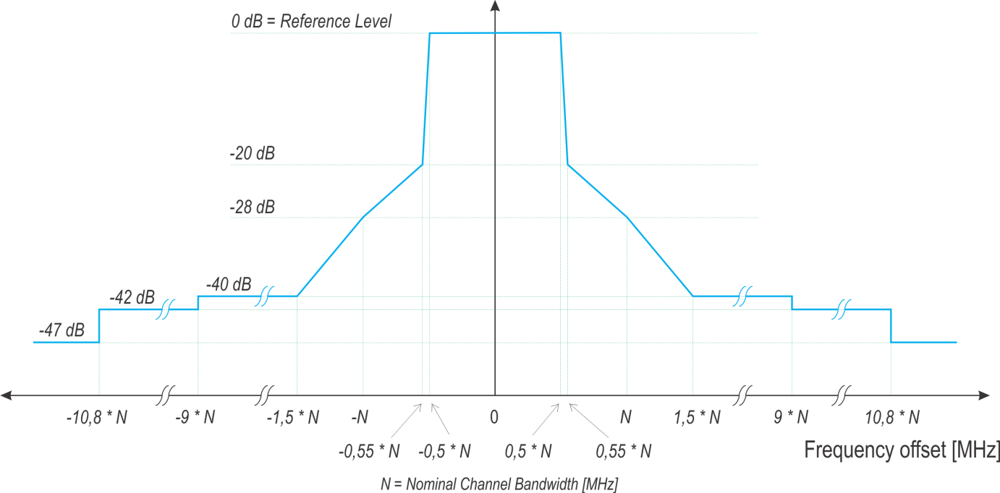
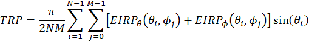

3GPP TR 38.889 V0.0.2 (2018-05)

Technical Report

3rd Generation Partnership Project;

Technical Specification Group Radio Access Network;

Study on NR-based access to unlicensed spectrum;

(Release 15)

{width="1.325in" height="1.325in"}
{width="1.7791666666666666in"
height="1.038888888888889in"}

The present document has been developed within the 3^rd^ Generation
Partnership Project (3GPP ^TM^) and may be further elaborated for the
purposes of 3GPP.\
The present document has not been subject to any approval process by the
3GPP Organizational Partners and shall not be implemented.\
This Report is provided for future development work within 3GPP only.
The Organizational Partners accept no liability for any use of this
Specification.\
Specifications and Reports for implementation of the 3GPP ^TM^ system
should be obtained via the 3GPP Organizational Partners\' Publications
Offices.

> Keywords
>
> NR, radio, unlicensed spectrum, physical layer
>
> ***3GPP***
>
> Postal address
>
> 3GPP support office address
>
> 650 Route des Lucioles - Sophia Antipolis
>
> Valbonne - FRANCE
>
> Tel.: +33 4 92 94 42 00 Fax: +33 4 93 65 47 16
>
> Internet
>
> http://www.3gpp.org

***Copyright Notification***

No part may be reproduced except as authorized by written permission.\
The copyright and the foregoing restriction extend to reproduction in
all media.

© 2018, 3GPP Organizational Partners (ARIB, ATIS, CCSA, ETSI, TSDSI,
TTA, TTC).

All rights reserved.

UMTS™ is a Trade Mark of ETSI registered for the benefit of its members

3GPP™ is a Trade Mark of ETSI registered for the benefit of its Members
and of the 3GPP Organizational Partners\
LTE™ is a Trade Mark of ETSI registered for the benefit of its Members
and of the 3GPP Organizational Partners

GSM® and the GSM logo are registered and owned by the GSM Association

 Contents {#contents .TT}
========

[Foreword 4](#foreword)

[Introduction 4](#introduction)

[1 Scope 5](#scope)

[2 References 5](#references)

[3 Definitions, symbols and abbreviations
5](#definitions-symbols-and-abbreviations)

[3.1 Definitions 5](#definitions)

[3.2 Symbols 5](#symbols)

[3.3 Abbreviations 5](#abbreviations)

[4 Regulatory requirements 5](#regulatory-requirements)

[4.1 Regulatory requirements for 5GHz band
5](#regulatory-requirements-for-5ghz-band)

[4.1.1 ITU Region 1 7](#itu-region-1)

[4.1.2 ITU Region 2 12](#itu-region-2)

[4.1.3 ITU Region 3 16](#itu-region-3)

[4.2 Regulatory requirements for \[X\]GHz band
30](#regulatory-requirements-for-xghz-band)

[4.4 Applicability of DFS requirements
30](#applicability-of-dfs-requirements)

[4.4.1 DFS according to ECC 31](#_Toc507312034)

[4.4.2 DFS in the Part 15 rules 31](#_Toc507312035)

[4.4 Applicability of DFS requirements
32](#applicability-of-dfs-requirements)

[4.4.1 DFS according to ECC 33](#dfs-according-to-ecc)

[4.4.2 DFS in the Part 15 rules 33](#dfs-in-the-part-15-rules)

[5 Spectrum considerations 35](#spectrum-considerations)

[6 Deployment scenarios 35](#deployment-scenarios)

[7 Design targets, functionalities and solutions
35](#design-targets-functionalities-and-solutions)

[7.1 Design targets and functionalities
35](#design-targets-and-functionalities)

[7.2 Solutions for operation in unlicensed spectrum
35](#solutions-for-operation-in-unlicensed-spectrum)

[7.2.1 Physical layer aspects 35](#physical-layer-aspects)

[7.2.2 Higher layer aspects 35](#higher-layer-aspects)

[8 Performance evaluations 35](#performance-evaluations)

[8.1 Scenarios and methodology 35](#scenarios-and-methodology)

[8.2 Channel access schemes 35](#channel-access-schemes)

[8.3 Evaluation results 35](#evaluation-results)

[9 Conclusions 35](#conclusions)

[Annex A: Evaluation methodology 35](#annex-a-evaluation-methodology)

[A.1 General evaluation assumptions
35](#a.1-general-evaluation-assumptions)

[Annex B: Evaluation results f 35](#annex-b-evaluation-results)

[Annex C: Change history 36](#annex-c-change-history)

 Foreword
========

This Technical Report has been produced by the 3^rd^ Generation
Partnership Project (3GPP).

The contents of the present document are subject to continuing work
within the TSG and may change following formal TSG approval. Should the
TSG modify the contents of the present document, it will be re-released
by the TSG with an identifying change of release date and an increase in
version number as follows:

Version x.y.z

where:

x the first digit:

1 presented to TSG for information;

2 presented to TSG for approval;

3 or greater indicates TSG approved document under change control.

y the second digit is incremented for all changes of substance, i.e.
technical enhancements, corrections, updates, etc.

z the third digit is incremented when editorial only changes have been
incorporated in the document.

Introduction
============

A study item, "Study on NR-based Access to Unlicensed Spectrum", was
approved at 3GPP TSG RAN \#77 \[2\]. This study is to determine a single
global solution for NR-based access to unlicensed spectrum, to be
compatible with the NR concepts.

The objectives of the study include:

-   \- **Study NR-based operation in unlicensed spectrum (RAN1, RAN2,
    RAN4) including**

    -   **Physical channels inheriting the choices of duplex mode,
        waveform, carrier bandwidth, subcarrier spacing, frame
        structure, and physical layer design made as part of the NR
        study and avoiding unnecessary divergence with decisions made in
        the NR WI**

        -   **Consider unlicensed bands both below and above 6GHz, up to
            52.6GHz**

        -   **Consider unlicensed bands above 52.6GHz to the extent that
            waveform design principles remain unchanged with respect to
            below 52.6GHz bands**

        -   **Consider similar forward compatibility principles made in
            the NR WI**

    -   **Initial access, channel access. Scheduling/HARQ, and mobility
        including connected/inactive/idle mode operation and radio-link
        monitoring/failure**

    -   **Coexistence methods within NR-based and between NR-based
        operation in unlicensed and LTE-based LAA and with other
        incumbent RATs in accordance with regulatory requirements in
        e.g., 5GHz , 37GHz, 60GHz bands**

        -   **Coexistence methods already defined for 5GHz band in
            LTE-based LAA context should be assumed as the baseline for
            5GHz operation. Enhancements in 5GHz over these methods
            should not be precluded. NR-based operation in unlicensed
            spectrum should not impact deployed Wi-Fi services (data,
            video and voice services) more than an additional Wi-Fi
            network on the same carrier;**

The above study will address the following architectural scenarios
(RAN2):

-   An NR-based LAA cell(s) connects with an LTE or NR anchor cell
    operating in licensed spectrum

    -   The study assumes the techniques for linking between Pcell (LTE
        or NR licensed CC) and Scell (NR unlicensed CCs) according to
        the NR WI

-   An NR-based cell operating standalone in unlicensed spectrum,
    connected to a 5G-CN network with priority on frequency bands above
    6GHz, e.g., for private network deployments;

-   Study how to ensure from a RAN level that connection and security
    management can be integrated with the E-UTRAN, NG RAN and 5G CN
    architecture, including service continuity requirements for users
    moving between cells of licensed and unlicensed frequency bands,
    liaising with SA2 as required

The results and findings of the study are documented in this technical
report.

 1 Scope
=======

The present document contains the results and findings from the study
item, "Study on NR-based Access to Unlicensed Spectrum" \[2\]. The
purpose of this TR is to document the identified NR enhancements and
corresponding evaluations for a single global solution framework for NR
based access to unlicensed spectrum.

This document addresses evaluation methodology and possible scenarios
for NR based unlicensed deployments.

This technical report documents the existing regulatory requirements for
unlicensed spectrum deployment in the 5GHz bands, \[and other bands\]

This document identifies and captures coexistence evaluations of
physical layer options and enhancements to NR and, if necessary, NR RAN
protocols to meet the requirements and targets for unlicensed spectrum
deployments.

This document contains an assessment of the feasibility of base station
and terminal operation of 5GHz band (based on regulatory limits) in
conjunction with relevant licensed frequency bands.

This document is a 'living' document, i.e. it is permanently updated and
presented to TSG-RAN meetings.

2 References
============

The following documents contain provisions which, through reference in
this text, constitute provisions of the present document.

\- References are either specific (identified by date of publication,
edition number, version number, etc.) or non‑specific.

\- For a specific reference, subsequent revisions do not apply.

\- For a non-specific reference, the latest version applies. In the case
of a reference to a 3GPP document (including a GSM document), a
non-specific reference implicitly refers to the latest version of that
document *in the same Release as the present document*.

\[1\] 3GPP TR 21.905: \"Vocabulary for 3GPP Specifications\".

\[2\] 3GPP RP-172021: "Revised SID on NR-based Access to Unlicensed
Spectrum".

\[3\] FCC Part 15 ruling,
http://www.ecfr.gov/cgi-bin/text-idx?SID=3c5e2d1533490603e0131fcdc041030d&node=pt47.1.15&rgn=div5

\[4\] FCC 13-22, "Notice of proposed rulemaking" , Feb 20, 2013.

\[5\] ETSI EN 301 893, Harmonized European Standard, "Broadband Radio
Access Networks (BRAN); 5 GHz high performance RLAN"

\[6\] ETSI EN 302 502, Harmonized European Standard, "Broadband Radio
Access Networks (BRAN); 5,8 GHz fixed broadband data transmitting
systems"

\[7\] ETSI EN 302 571, Harmonized European Standard, "Intelligent
Transport Systems (ITS); Radio communications equipment operating in the
5 855 MHz to 5 925 MHz frequency band"

\[8\] "Commission decision of 11 July 2005 on the harmonised use of
radio spectrum in the 5 GHz frequency band for the implementation of
wireless access systems including radio local area networks (WAS/RLANs)"
(2005/513/EC).

\[9\] "Commission decisions of 12 February 2007 amending Decision
2005/513/EC on the harmonised use of radio spectrum in the 5 GHz
frequency band for the implementation of Wireless Access Systems
including Radio Local Area Networks (WAS/RLANs)" (2007/90/EC).

\[10\] ECC/DEC (04)08, "ECC Decision of 09 July 2004 on the harmonised
use of the 5 GHz frequency bands for the implementation of Wireless
Access Systems including Radio Local Area Networks (WAS/RLANs)"

\[11\] KDB 443 999, FCC Office of Engineering and Technology --
Laboratory Division: "Interim Plans to Approve UNII Devices Operating in
the 5470-5725 MHz Band with Radar Detection and DFS Capabilities" (14th
October 2010).

\[12\] FCC 12-148, "Notice of Proposed Rulemaking and Order: amendment
of the Commission's Rules with regard to Commercial Operations in the
3550-3650 MHz Band" (GN Docket No. 12-354), adopted and released
December 12, 2012.

\[13\] FCC 13-154, "Public Notice. Commission Seeks Comment on Licensing
Models and Technical Requirements in the 3550-3650 MHz Band", released
November 1, 2013

\[14\] ECC Recommendation ECC/REC (06)04: "Use of the band 5725- 5875
MHz for Broadband Fixed Wireless Access (BFWA)"

\[15\] Commission Decision 2008/671/EC of 5th August2008 on the
harmonised use of radio spectrum in the 5875-5905 MHz frequency band for
safety related application of Intelligent Transport Systems (IOTS)

\[16\] ECC Decision (08)01: \"ECC Decision of 14 March 2008 on the
harmonized use of the 5875-5925 frequency band for Intelligent Transport
Systems (ITS)"

\[17\] ECC Recommendation (08)01:\"Use of band 5855-5875 MHz for
Intelligent Transport Systems (ITS)\".

\[18\] ETSI EN 300 440-1 v1.6.1: "Electromagnetic compatibility and
Radio spectrum Matters (ERM); Short range devices; Radio equipment to be
used in the 1 GHz to 40 GHz frequency range; Part 1: Technical
characteristics and test methods"

\[19\] Document RSCOM 13-32rev3: "Mandate to CEPT to study and identify
harmonised compatibility and sharing conditions for Wireless Access
Systems including Radio Local Area Networks in the bands 5350-5470 MHz
and 5725-5925 MHz (\'WAS/RLAN extension bands\') for the provision of
wireless broadband services"

\[20\] Group of Administrative Co-operation Under the R&TTE Directive
(ADCO R&TTE): Report on the 5th joint cross-border R&TTE Market
Surveillance Campaign on WLAN 5 GHz (2013)

\[21\] RSS-210 Issue 8 (December 2010): Licence-exempt Radio Apparatus
(All Frequency Bands): Category I Equipment

\[22\] National Frequency Allocation Plan 2011 (In-Force):
http://www.wpc.gov.in/WriteReadData/userfiles/file/National\_Frequency\_Allocation\_Plan-2011.pdf

\[23\] http://legislacao.anatel.gov.br/resolucoes/2008/104-resolucao-506
, Resolução nº 506, de 1º de julho de 2008, Regulamento sobre
Equipamentos de Radiocomunicação de Radiação Restrita.

\[24\] 3GPP TR 36.872: "Small cell enhancements for E-UTRA and E-UTRAN -
Physical layer aspects".

\[25\] Part 11: Wireless LAN Medium Access Control (MAC) and Physical
Layer (PHY) Specifications, IEEE Std 802.11-2012.

\[26\]
<https://mentor.ieee.org/802.11/dcn/14/11-14-0571-08-00ax-evaluation-methodology.docx>

\[27\] 3GPP TR 36.942 V11.0.0, "Radio Frequency (RF) system scenarios,"
Sept. 2012.

\[28\] 3GPP TR 38.802, \"Study on new radio access technology Physical
layer aspects\"

\[29\] 3GPP TS 38.901, \"Study on channel model for frequencies from 0.5
to 100 GHz\"

\[30\]

\[31\]

\[32\]

\[33\]

\[34\]

\[35\] GSR No. 46(E) Dated: 28th Jan. 2005, Rule - Indoor Use of low
power wireless equipment in the frequency band 5 GHz (Exemption from
Licensing Requirement) Rules, 2005.

\[36\] GSR No. 37(E) Dated: 10th Jan. 2007, Rule - Indoor use of low
power wireless equipment in the frequency band 5 GHz (Exemption from
Licensing Requirement) Amendment Rules, 2006. (GSR No. 46(E)
Ammendment).

\[37\] GSR No. 38(E) Dated: 19th Jan. 2007, Rule - the Outdoor Use of
wireless Equipment (Exemption from Licensing Requirement) Rules,
2007.\[38\] RESOLUTION 229 (Rev. WRC-12), "Use of the bands 5 150-5 250,
5 250-5 350 MHz and 5 470-5 725 MHz by the mobile service for the
implementation of wireless access systems including radio local area
networks".

\[39\] Recommendation ITU-R M.1652-1 (05/2011) "Dynamic frequency
selection in wireless access systems including radio local area networks
for the purpose of protecting the radiodetermination service in the 5
GHz band".

> \[40\]
> http://www.ncc.gov.tw/chinese/law\_detail.aspx?site\_content\_sn=260&is\_history=0&law\_sn=1807&sn\_f=1807,
> the regulations for low-power transmitters in Taiwan, June 28, 2011
> (in Chinese).
>
> \[41\] http://www.motc.gov.tw/post/home.jsp?id=369&parentpath=0,364,
> the frequency allocation in Taiwan (in Chinese)

3 Definitions, symbols and abbreviations
========================================

3.1 Definitions
---------------

For the purposes of the present document, the terms and definitions
given in TR 21.905 \[1\] and the following apply.\
A term defined in the present document takes precedence over the
definition of the same term, if any, in TR 21.905 \[1\].

3.2 Symbols
-----------

For the purposes of the present document, the following symbols apply:

3.3 Abbreviations
-----------------

For the purposes of the present document, the abbreviations given in
TR 21.905 \[1\] and the following apply.\
An abbreviation defined in the present document takes precedence over
the definition of the same abbreviation, if any, in TR 21.905 \[1\].

4 Regulatory requirements
=========================

4.1 Regulatory requirements for 5GHz band
-----------------------------------------

The range 5150-5925 MHz, or parts thereof, is potentially available for
license-assisted access to unlicensed operation. This represents a
significant amount of spectrum that can be used by operators to augment
their service offerings in licensed bands. The range above can be
operated under a license-exempt regime or ISM but must be shared with
existing mobile services and other incumbent services. The quality of
service offered by a licensed regime can therefore not be matched.
Hence, unlicensed access is viewed as complementary, and does not reduce
the need for additional allocations for licensed operation in view of
the increased demand for wireless broadband access.

It is relevant to consider the global (International) ITU-R allocations
and technical provisions first. These could be basis for defining
globally harmonised bands for LAA and starting points for requirements
and limits before the local variations are considered.

**[5150-5350 and 5470-5725 MHz]{.underline}**

WRC 2003 allocated the bands 5 150-5 350 MHz and 5 470-5 725 MHz on a
co-primary basis to the mobile service for the implementation of
"wireless access systems (WAS), including radio local area networks
(RLANs)". This was subject to technical and regulatory provisions
included in the radio regulations given in Resolution 229 (WRC-03),
which was subsequently revised at WRC-12 to Resolution 229 (Rev. WRC-12)
\[38\]. These provisions are followed by many Administrations and
resolves:

1\) that the use of these bands by the mobile service will be for the
implementation of WAS, including RLANs, as described in the most recent
version of Recommendation ITU‑R M.1450;

2\) that in the band 5 150-5 250 MHz, stations in the mobile service
shall be restricted to indoor use with a maximum mean e.i.r.p. of 200 mW
and a maximum mean e.i.r.p. density of 10 mW/MHz in any 1 MHz band or
equivalently 0.25 mW/25 kHz in any 25 kHz band;

3\) that administrations may monitor whether the aggregate pfd levels
given in Recommendation ITU‑R S.1426 have been, or will be exceeded in
the future, in order to enable a future competent conference to take
appropriate action;

4\) that in the band 5 250-5 350 MHz, stations in the mobile service
shall be limited to a maximum mean e.i.r.p. of 200 mW and a maximum mean
e.i.r.p. density of 10 mW/MHz in any 1 MHz band. Administrations are
requested to take appropriate measures that will result in the
predominant number of stations in the mobile service being operated in
an indoor environment. Furthermore, stations in the mobile service that
are permitted to be used either indoors or outdoors may operate up to a
maximum mean e.i.r.p. of 1 W and a maximum mean e.i.r.p. density of
50 mW/MHz in any 1 MHz band, and, when operating above a mean e.i.r.p.
of 200 mW, these stations shall comply with the following e.i.r.p.
elevation angle mask where θ is the angle above the local horizontal
plane (of the Earth):

--13 dB(W/MHz) for 0° [\<]{.underline} θ \< 8°

--13 -- 0.716(θ-8) dB(W/MHz) for 8° [\<]{.underline} θ \< 40°

--35.9 -- 1.22(θ-40) dB(W/MHz) for 40° [\<]{.underline} θ
[\<]{.underline} 45°

--42 dB(W/MHz) for 45° \< θ;

5\) that administrations may exercise some flexibility in adopting other
mitigation techniques, provided that they develop national regulations
to meet their obligations to achieve an equivalent level of protection
to the EESS (active) and the SRS (active) based on their system
characteristics and interference criteria as stated in Recommendation
ITU‑R RS.1632;

6\) that in the band 5 470-5 725 MHz, stations in the mobile service
shall be restricted to a maximum transmitter power of 250 mW^3^
(*administrations with existing regulations prior to WRC 03 may exercise
some flexibility in determining transmitter power limits)* with a
maximum mean e.i.r.p. of 1 W and a maximum mean e.i.r.p. density of
50 mW/MHz in any 1 MHz band;

7\) that in the bands 5 250-5 350 MHz and 5 470-5 725 MHz, systems in
the mobile service shall either employ transmitter power control to
provide, on average, a mitigation factor of at least 3 dB on the maximum
average output power of the systems, or, if transmitter power control is
not in use, then the maximum mean e.i.r.p. shall be reduced by 3 dB;

8\) that, in the bands 5 250-5 350 MHz and 5 470-5 725 MHz, the
mitigation measures found in Annex 1 to Recommendation ITU‑R M.1652-1
shall be implemented by systems in the mobile service to ensure
compatible operation with radiodetermination systems,

This resolution makes DFS as described in the Annex 1 of ITU-R
Recommendation M.1652-1 \[39\] mandatory, the basis for the DFS
requirements developed e.g. in Europe and the US.

WAS is defined as end-user radio connections to public or private core
networks, while primary allocation means that the services can claim
protection from services of the secondary service. However, the WAS/RLAN
services must protect the incumbent primary services.

Even if primary in the International table of allocations, this may not
be the case in all countries. The bands are not allocated on a primary
basis in the US allocation table, but to the Part 15 rules that provide
for operation of low power radio transmitters without a license
(secondary service operated on a non-interference basis).

**[5725-5850 MHz]{.underline}**

The 5725-5875 MHz is allocated for ISM applications by means a footnote
in the allocation table. Radiolocation is allocated on primary basis up
to 5850 MHz so DFS is required up to this limit. Operation in 5725-5850
MHz is allowed in the US under the Part 15 rules (15.247 and 15.407).

**[5850-5925 MHz]{.underline}**

The band is allocated to the mobile service on a primary basis in all
regions. In Europe it has been decided (2008) to harmonise the use of
the 5875-5925 MHz frequency band for Intelligent Transport Systems
(ITS). Similarly, according to the US allocation table, the use of the
non-Federal mobile service in the band 5850-5925 MHz is limited to
Dedicated Short Range Communications operating in the Intelligent
Transportation System radio service.

### 4.1.1 ITU Region 1

#### 4.1.1.1 Europe

The European regulation is determined by the European Commission and the
ECC. The relevant regulations for the 5 GHz bands are found in two
Commission Decisions \[8, 9\] and one ECC Decision \[10\]. These are
interpreted by ETSI and used as a basis for harmonized standards, which
are used for conformance declaration when products are placed on the
European market. Harmonized European standards have a higher regulatory
relevance than other product standards, since they are produced based on
a mandate from the Commission with reference to an EU directive. They
also go through a public enquiry and voting process, and are cited by
the Commission. The European requirements on 5 GHz unlicensed deployment
are specified in three ETSI harmonized standards \[5, 6, and 7\]. Figure
4.1.1.1-1 summarizes the relevant parts of the 5 GHz band set aside for
unlicensed spectrum usage. The 5150-5350 MHz and the 5470-5725 MHz bands
are referred here as the broadband radio access networks (BRAN) bands
where the wireless access systems (WAS) including RLAN equipment are
operating in. Moreover, the 5725-5875 MHz band (in the BRAN domain) is
used by the fixed wireless access (FWA) networks and finally the
intelligent transport systems (ITS) utilize the 5855-5925 MHz band.

The BFWA and the ITS are designated by the ECC for use as parts of the 5
GHz band and the relevant regulations are found in:

\- An ECC Recommendation for FBWA \[14\], and

\- A Commission Decision \[15\], an ECC Decision \[16\] and an ECC
Recommendation for ITS \[17\].

General purpose SRD devices can also operate in the band 5725-5875 MHz
under the provisions of the ETSI harmonised standard EN 300 440 \[18\],
but with reduced max EIRP of 25 mW.

{width="6.701388888888889in"
height="1.5520833333333333in"}

Figure 4.1.1.1-1: 5 GHz spectrum allocations in Europe.

The European Commission has recently submitted to CEPT a mandate to
study the conditions for the extension of the 5 GHz range designated for
WAS/RLANs \[19\] in order to allow the use by WAS/RLANs of the whole
5150-5925 MHz band.

ECC approved CEPT Report 57 in March 2015 in response to the mandate
based on the results of the Public Consultation. CEPT has carried out a
significant amount of work but studies on mitigation techniques have not
been completed in the timeframe and there are still a number of open
issues ongoing.

Figure 4.1.1.1-2: Summary of existing and proposed EU regulations for
WAS/RLANs in the 5GHz band

In the rest of this section, the specified ETSI requirements for the
WAS/RLAN and FWA bands are summarized. Table 4.1.1.1-1 provides the
limits on the transmit power control (TPC), the RF output power and
power density given by the mean EIRP and the mean EIRP density at the
highest power level. Additionally the requirements on the transmitter
out of band emissions are listed in Table 4.1.1.1-2, Figures 4.1.1.1-3a,
and Figure 4.1.1.1-3b. Table 4.1.1.1-4 illustrates the DFS requirements
for some of these bands in Europe. Moreover, the 5150-5350 MHz is
restricted to indoor deployments.

Transmit Power Control (TPC) is a mechanism to be used by the RLAN
device to ensure a mitigation factor of at least 3 dB on the aggregate
power from a large number of devices. This requires the RLAN device with
TPC to have a TPC range for which the lowest value is at least 6 dB
below the values for mean EIRP given in Table 4.1.1.1-1.

In ETSI EN 301 893 \[5\], the requirements on the Nominal Channel
Bandwidth and the Occupied Channel Bandwidth are defined for unlicensed
spectrum in the 5 GHz region. The Nominal Channel Bandwidth, i.e., the
widest band of frequencies inclusive of guard bands assigned to a single
channel, shall be at least 5MHz at all times. The Occupied Channel
Bandwidth, i.e., the bandwidth containing 99 % of the power of the
signal, shall be between 80 % and 100 % of the declared Nominal Channel
Bandwidth. During an established communication, a device is allowed to
operate temporarily in a mode where its Occupied Channel Bandwidth may
be reduced to as low as 40 % of its Nominal Channel Bandwidth with a
minimum of 4 MHz. The Occupied Channel Bandwidth is determined by the
test procedure defined in Section 5.3.3.2 in \[5\].

ETSI mandates the usage of DFS in some bands as shown in Table
4.1.1.1-4. Furthermore, a Listen-Before-Talk (LBT) mechanism is
requested independently of whether the channel is occupied or not, the
LBT parameters being given in Table 4.1.1.1-5a and 4.1.1-5b. Both the
requirements on frame-based equipment and the requirements on load-based
equipment are summarized in Table 4.1.1.1-5a and 4.1.1.1-5b,
respectively. Note that no LBT requirement is requested in \[6\] for the
FWA band.

Table 4.1.1.1-1: TPC, Transmit power and power spectral density
requirements in Europe

+-------------+-------------+-------------+-------------+-------------+
|             | Freq. range | Max Mean    | Max Mean    | Comment     |
|             | (MHz)       | EIRP (dBm)  | EIRP        |             |
|             |             |             | density     |             |
|             |             |             | (dBm/MHz)   |             |
+=============+=============+=============+=============+=============+
| WAS/RLAN    | 5150-5350   | 23          | 10          | 20 MHz and  |
|             |             |             |             | 40 MHz      |
|             |             |             |             | channels    |
+-------------+-------------+-------------+-------------+-------------+
|             | 5470-5725   | 30          | 17          |             |
+-------------+-------------+-------------+-------------+-------------+
| FWA         | 5725-5875   | 33          | 23          | 10 MHz      |
|             |             |             |             | channels    |
+-------------+-------------+-------------+-------------+-------------+
|             | 5725-5875   | 36          | 23          | 20 MHz      |
|             |             |             |             | channels    |
+-------------+-------------+-------------+-------------+-------------+
| Transmit    |             |             |             |             |
| Power       |             |             |             |             |
| Control     |             |             |             |             |
| (TPC):      |             |             |             |             |
|             |             |             |             |             |
| TPC ensures |             |             |             |             |
| an average  |             |             |             |             |
| reduction   |             |             |             |             |
| in the      |             |             |             |             |
| aggregated  |             |             |             |             |
| t           |             |             |             |             |
| ransmission |             |             |             |             |
| power by at |             |             |             |             |
| least 3 dB  |             |             |             |             |
| (5 dB for   |             |             |             |             |
| FWA)        |             |             |             |             |
| compared    |             |             |             |             |
| with the    |             |             |             |             |
| maximum     |             |             |             |             |
| permitted   |             |             |             |             |
| t           |             |             |             |             |
| ransmission |             |             |             |             |
| power.      |             |             |             |             |
|             |             |             |             |             |
| TCP is not  |             |             |             |             |
| required    |             |             |             |             |
| for         |             |             |             |             |
| channels    |             |             |             |             |
| within the  |             |             |             |             |
| band        |             |             |             |             |
| 5150-5250   |             |             |             |             |
| MHz.        |             |             |             |             |
|             |             |             |             |             |
| Without     |             |             |             |             |
| TPC, the    |             |             |             |             |
| highest     |             |             |             |             |
| permissible |             |             |             |             |
| average     |             |             |             |             |
| EIRP        |             |             |             |             |
| (density)   |             |             |             |             |
| are reduced |             |             |             |             |
| by 3 dB.    |             |             |             |             |
+-------------+-------------+-------------+-------------+-------------+

Table 4.1.1.1- 2: Requirements on out of band emissions in Europe

+-----------+-----------------+------------+-----------+
|           | Frequency range | Max. power | Bandwidth |
+===========+=================+============+===========+
| WAS/RLAN, | 30-47 MHz       | -36 dBm    | 100 kHz   |
|           |                 |            |           |
| FWA       |                 |            |           |
+-----------+-----------------+------------+-----------+
|           | 47-74 MHz       | -54 dBm    | 100 kHz   |
+-----------+-----------------+------------+-----------+
|           | 75-87.5 MHz     | -36 dBm    | 100 kHz   |
+-----------+-----------------+------------+-----------+
|           | 87.5-118 MHz    | -54 dBm    | 100 kHz   |
+-----------+-----------------+------------+-----------+
|           | 118-174 MHz     | -36 dBm    | 100 kHz   |
+-----------+-----------------+------------+-----------+
|           | 174-230 MHz     | -54 dBm    | 100 kHz   |
+-----------+-----------------+------------+-----------+
|           | 230-470 MHz     | -36 dBm    | 100 kHz   |
+-----------+-----------------+------------+-----------+
|           | 470-862 MHz     | -54 dBm    | 100 kHz   |
+-----------+-----------------+------------+-----------+
|           | 0.862-1 GHz     | -36 dBm    | 100 kHz   |
+-----------+-----------------+------------+-----------+
|           | 1-5.15 GHz      | -30 dBm    | 1 MHz     |
+-----------+-----------------+------------+-----------+
|           | 5.35-5.5.47 GHz | -30 dBm    | 1 MHz     |
+-----------+-----------------+------------+-----------+
|           | 5.725-26 GHz    | -30 dBm    | 1 MHz     |
+-----------+-----------------+------------+-----------+

{width="6.279166666666667in"
height="3.0972222222222223in"}

NOTE: dBc is the spectral density relative to the maximum spectral power
density of the transmitted signal.

Figure 4.1.1.1-3a: Transmit spectral power mask for RLAN equipment
operating within the frequency bands 5150-5250 MHz; 5250-5350 MHz or
5470-5725 MHz

{width="6.695138888888889in" height="3.3375in"}

NOTE1: 0 dB Reference Level is the spectral density relative to the
maximum spectral power density of the transmitted signal.

NOTE2: On the Frequency Offset axis, the figures apply to ChS = 20 MHz
whereas the figures in parentheses apply to ChS = 10 MHz.

NOTE3: Emissions that fall outside the lower and upper band frequency
limits of 5 725 MHz and 5 875 MHz, respectively shall instead meet the
unwanted emission limits of clause 4.3.1 \[6\].

Figure 4.1.1.1-3b: Transmit spectral power mask for FBWA equipment
operating within the frequency band 5725-5875 MHz

FWA devices in the 5.8 GHz range are also subject to an additional
requirement of EIRP spectral density limit in the elevation plane, see
Table 5.

Table 4.1.1.1-3: EIRP spectral density limits in the elevation plane
(5.8 GHz frequency range)

  EIRP spectral density                                                                  Elevation angle
  -------------------------------------------------------------------------------------- -----------------
  For sectorised (e.g. P-MP Central or Base Station) and Omni-directional deployments:   
  −7 dB(W/MHz)                                                                           0° ≤ θ \<4°
  −2.2 - (1.2\*θ) dB(W/MHz)                                                              4° ≤ θ ≤ 15°
  −18.4 - (0.15\*θ) dB(W/MHz)                                                            θ \> 15°
  For P-MP Customer Terminal Station and P-P deployments:                                
  −7 dB(W/MHz)                                                                           for 0° ≤ θ \<8°
  −2.68 -(0.54\*θ) dB(W/MHz)                                                             8° ≤ θ \< 32°
  −20 dB(W/MHz)                                                                          32° ≤ θ ≤50°
  −10 - (0.2\*θ) dB(W/MHz)                                                               θ \> 50°

Table 4.1.1.1-4: DFS requirements in Europe

+----------------------+----------------------+----------------------+
| Parameter            | Requirement          | Comments             |
+======================+======================+======================+
| DFS Threshold (dBm)  | -62(dBm) +           | \*No DFS             |
| for WAS/RLAN         | 10(dBm/MHz) - EIRP   | requirements on 5150 |
|                      | Spectral density     | MHz -- 5250 MHz      |
|                      | (dBm/MHz) + G(dBi)   |                      |
|                      |                      | \*G denotes antenna  |
|                      |                      | gain                 |
+----------------------+----------------------+----------------------+
| DFS Threshold (dBm)  | -69 (dBm) +          | \*No DFS             |
| for FWA              | 23(dBm/MHz) - EIRP   | requirements on 5850 |
|                      | Spectral density     | MHz -- 5875 MHz      |
|                      | (dBm/MHz) + G(dBi)   |                      |
|                      |                      | \*G denotes antenna  |
|                      |                      | gain                 |
+----------------------+----------------------+----------------------+
| Channel Availability | 60 seconds outside   | Master mode          |
| check                | 5600-5650 MHz        |                      |
+----------------------+----------------------+----------------------+
|                      | 10 minutes inside    |                      |
|                      | 5600-5650 MHz        |                      |
+----------------------+----------------------+----------------------+
| Channel move time    | 10 seconds           | Master and slave     |
|                      |                      | modes                |
+----------------------+----------------------+----------------------+
| Non-occupancy time   | 30 minutes           | After radar          |
|                      |                      | detection in either  |
|                      |                      | channel availability |
|                      |                      | check or in-service  |
|                      |                      | monitoring           |
+----------------------+----------------------+----------------------+
| *Uniform Spreading*  |                      |                      |
| is required across   |                      |                      |
| the frequency ranges |                      |                      |
| 5150 -5350 MHz and   |                      |                      |
| 5470-5725 MHz.       |                      |                      |
|                      |                      |                      |
| *Uniform Spreading*  |                      |                      |
| is not applicable    |                      |                      |
| for equipment that   |                      |                      |
| only operates in     |                      |                      |
| 5150-5250 MHz band.  |                      |                      |
+----------------------+----------------------+----------------------+

Table 4.1.1.1-5a: LBT requirements for Frame-Based-Equipment in Europe

+----------------------+----------------------+----------------------+
| Parameter            | Requirement          | Comment              |
+======================+======================+======================+
| Clear Channel        | Minimum 20μs         |                      |
| Assessment (CCA)     |                      |                      |
| time                 |                      |                      |
+----------------------+----------------------+----------------------+
| Channel Occupancy    | Minimum 1 ms,        |                      |
| time                 | maximum10 ms         |                      |
+----------------------+----------------------+----------------------+
| Idle period          | Minimum 5% of        |                      |
|                      | channel occupancy    |                      |
|                      | time                 |                      |
+----------------------+----------------------+----------------------+
| Fixed frame period   | Equals to Channel    |                      |
|                      | Occupancy time +     |                      |
|                      | Idle Period          |                      |
+----------------------+----------------------+----------------------+
| Short control        | Maximum duty cycle   | Part of Channel      |
| signaling            | of 5% within an      | occupancy time       |
| transmission time    | observation period   |                      |
|                      | of 50ms              |                      |
+----------------------+----------------------+----------------------+
| CCA Energy detection | Assuming receive     | For WAS/RLAN         |
| threshold            | antenna gain G=0dBi: |                      |
|                      |                      |                      |
|                      | If EIRP=23dBm at     |                      |
|                      | transmitter          |                      |
|                      |                      |                      |
|                      | > Threshold ≤ -73    |                      |
|                      | > dBm/MHz            |                      |
|                      |                      |                      |
|                      | Otherwise (different |                      |
|                      | transmit power       |                      |
|                      | levels, PH)          |                      |
|                      |                      |                      |
|                      | > Threshold =        |                      |
|                      | > -73(dBm/MHz) +     |                      |
|                      | > 23(dBm) -- PH(dBm) |                      |
+----------------------+----------------------+----------------------+

Table 4.1.1.1-5b: LBT requirements for Load-Based-Equipment in Europe

+----------------------+----------------------+----------------------+
| Parameter            | Requirement          | Comment              |
+======================+======================+======================+
| Clear Channel        | Minimum 20μs         | Also referred to as  |
| Assessment (CCA)     |                      | CCA time slot        |
| time                 |                      |                      |
+----------------------+----------------------+----------------------+
| N (number of clear   | N shall be randomly  |                      |
| idle slots) in       | selected in the      |                      |
| extended CCA         | range 1..q every     |                      |
|                      | time, q=4...32       |                      |
+----------------------+----------------------+----------------------+
| Channel Occupancy    | \<= (13/32) × q ms   |                      |
| time                 |                      |                      |
+----------------------+----------------------+----------------------+
| Idle period          | At least the         |                      |
|                      | duration of a random |                      |
|                      | factor N multiplied  |                      |
|                      | by the CCA time      |                      |
|                      | slot.                |                      |
+----------------------+----------------------+----------------------+
| Short control        | Maximum duty cycle   | Part of Channel      |
| signaling            | of 5% within an      | occupancy time       |
| transmission time    | observation period   |                      |
|                      | of 50ms              |                      |
+----------------------+----------------------+----------------------+
| CCA Energy detection | Assuming receive     | For WAS/RLAN         |
| threshold            | antenna gain G=0dBi: |                      |
|                      |                      |                      |
|                      | If EIRP=23dBm at     |                      |
|                      | transmitter          |                      |
|                      |                      |                      |
|                      | > Threshold ≤ -73    |                      |
|                      | > dBm/MHz            |                      |
|                      |                      |                      |
|                      | Otherwise (different |                      |
|                      | transmit power       |                      |
|                      | levels, PH)          |                      |
|                      |                      |                      |
|                      | > Threshold =        |                      |
|                      | > -73(dBm/MHz) +     |                      |
|                      | > 23(dBm) -- PH(dBm) |                      |
+----------------------+----------------------+----------------------+

**[Interference to Weather Radars]{.underline}**

Interference to Weather Radars is also a hot topic in the EU. The two
last versions of EN 301 893 (1.6.1 and 1.7.1) have included amendments
to better protect these radars, like the prohibition to give the user
access to the configuration control settings that would allow him to
disconnect the DFS functionality.

The use of the band 5.60-5.65 GHz by WLANs is allowed in Europe, and a
Market Surveillance campaign on WLANs 5 GHz has been led at EU level by
the ADCO R&TTE Group. The report \[20\] of the campaign has proposed
specific recommendations to improve the situation. These recommendations
do not require amendments to the last version of EN 301 893.

#### 4.1.1.2 Israel

In Israel the bands 5150-5250 MHz and 5250-5350 MHz are open to RLANs.

#### 4.1.1.3 Russia

In the Russian Federation the bands 5150-5350 MHz, the band 5470-5725
MHz above 5650 MHz and the band 5725-5825 MHz \[20\] are allowed to
RLANs. Use of DFS is not mandated.

#### 4.1.1.4 South Africa

In South Africa the bands 5150-5250 MHz and 5250-5350 MHz are available
to RLANs but restricted to indoor use. The band 5470-5725 MHz is also
open to RLANs.

#### 4.1.1.5 Turkey

In Turkey the bands 5150-5250 MHz and 5250-5350 MHz are restricted to
indoor use. DFS and TPC are mandated in the band 5470-5725 MHz.

### 4.1.2 ITU Region 2

#### 4.1.2.1 USA

The use of unlicensed 5 GHz spectrum in USA is governed by FCC part 15
regulations \[3\]. In Feb 2013, potential new rules were proposed in FCC
13-22 \[4\]. Figure 4.1.2.1-1 summarizes the relevant part 15 rules for
5GHz unlicensed spectrum usage:

{width="6.6819444444444445in"
height="1.0583333333333333in"}

Figure 4.1.2.1-1 : Summary of existing and proposed new FCC part 15
rules for 5GHz unlicensed spectrum usage

In Figure 4.1.2.1-1, U-NII-x bands denote frequency bands for Unlicensed
National Information Infrastructure devices usage that are governed by
§15.407 \[3\]. As shown in the figure, there is also an overlapping
ruling of §15.247 from 5.725 to 5.85 GHz. A device could choose to
follow either U-NII rulings or §15.247 rulings when operating within the
frequency range.

In the rest of this section, we summarize FCC paragraphs 15.407 and
15.247 rules. In general either frequency hopping or digital modulation
techniques are permitted under part 15 rules. Since LTE is not designed
as a frequency hopping system, the rest of the document will focus on
regulations related to digital modulation.

Paragraph 15.247 rules relevant for LTE point to multi-point
communications are summarized in 4 aspects:

\- Transmission Bandwidth:

\- The minimum 6 dB bandwidth shall be at least 500 kHz.

\- Maximum Transmit Power:

\- Peak conducted output power shall not exceed 1 W. An alternative to
peak power measurements is maximum conducted output power, which is the
total transmit power over all antennas and antenna elements when the
transmitter is operating at its maximum power control level.

\- Note that, the conducted output power limit is based on the use of
antennas with directional gains that do not exceed 6 dBi. If
transmitting antennas of directional gain greater than 6 dBi are used,
the conducted output power from the intentional radiator shall be
reduced by the amount in dB that the directional gain of the antenna
exceeds 6 dBi.

\- Out of Band Emission:

\- In any 100 kHz bandwidth outside the frequency band, the radio
frequency power that is produced by the intentional radiator shall be at
least 20 dB below that in the 100 kHz bandwidth within the band that
contains the highest level of the desired power, based on either an RF
conducted or a radiated measurement. If the transmitter complies with
the conducted power limits based on the use of RMS averaging over a time
interval, the attenuation required under this paragraph shall be 30 dB
instead of 20 dB.

\- Power Spectrum Density:

\- The power spectral density conducted from the intentional radiator to
the antenna shall not be greater than 8 dBm in any 3 kHz band during any
time interval of continuous transmission. The same method of determining
the conducted output power shall be used to determine the power spectral
density.

Paragraph15.407 rules for UNII devices are summarized in following
tables. In Table 4.1.2.1-1, the maximum transmit power, PSD and out of
band emission requirements are listed for UNII-1/2/3 bands. In Table
4.1.2.1-2, the dynamic frequency selection requirements for radar
detection are summarized for UNII-2 devices.

Table 4.1.2.1-1: Transmit power requirements for UNII devices

+---------+---------+---------+---------+---------+---------+---------+
|         | UNII-1  | UNII-2A | UNII-2C | UNII-3  | C       |         |
|         |         |         |         |         | omments |         |
+=========+=========+=========+=========+=========+=========+=========+
| Fr      |         | 5.15 -- | 5.      | 5.4     | 5.7     |         |
| equency |         | 5.25    | 25-5.35 | 7-5.725 | 25-5.85 |         |
| Range   |         |         |         |         |         |         |
| (GHz)   |         |         |         |         |         |         |
+---------+---------+---------+---------+---------+---------+---------+
| Max     | a       | eNB:    | 24      | 24      | 30      |         |
| co      |         | 30\     |         |         |         |         |
| nducted |         | UE: 24  |         |         |         |         |
| output  |         |         |         |         |         |         |
| power   |         |         |         |         |         |         |
| \<      |         |         |         |         |         |         |
| min(a,  |         |         |         |         |         |         |
| b)      |         |         |         |         |         |         |
| (dBm)   |         |         |         |         |         |         |
+---------+---------+---------+---------+---------+---------+---------+
|         | b       |         | 11      | 11      |         | B is    |
|         |         |         | +10logB | +10logB |         | the     |
|         |         |         |         |         |         | 26-dB   |
|         |         |         |         |         |         | e       |
|         |         |         |         |         |         | mission |
|         |         |         |         |         |         | ba      |
|         |         |         |         |         |         | ndwidth |
|         |         |         |         |         |         | in MHz  |
+---------+---------+---------+---------+---------+---------+---------+
| Peak    |         | eNB:    | 11      | 11      | 30dBm   |         |
| PSD     |         | 17\     |         |         | in      |         |
| (d      |         | UE: 11  |         |         | 500kHz  |         |
| Bm/MHz) |         |         |         |         |         |         |
+---------+---------+---------+---------+---------+---------+---------+
| Assumed |         | 6       | 6       | 6       | 6\*     | Peak    |
| Antenna |         |         |         |         |         | power   |
| Gain    |         |         |         |         |         | is      |
| (dBi)   |         |         |         |         |         | reduced |
|         |         |         |         |         |         | by G-6  |
|         |         |         |         |         |         | dB for  |
|         |         |         |         |         |         | dire    |
|         |         |         |         |         |         | ctional |
|         |         |         |         |         |         | a       |
|         |         |         |         |         |         | ntennas |
|         |         |         |         |         |         | with    |
|         |         |         |         |         |         | gain \> |
|         |         |         |         |         |         | 6 dBi;  |
|         |         |         |         |         |         |         |
|         |         |         |         |         |         | \*      |
|         |         |         |         |         |         | UNII-3  |
|         |         |         |         |         |         | fixed   |
|         |         |         |         |         |         | point   |
|         |         |         |         |         |         | to      |
|         |         |         |         |         |         | point   |
|         |         |         |         |         |         | op      |
|         |         |         |         |         |         | eration |
|         |         |         |         |         |         | power   |
|         |         |         |         |         |         | scaling |
|         |         |         |         |         |         | th      |
|         |         |         |         |         |         | reshold |
|         |         |         |         |         |         | is 23   |
|         |         |         |         |         |         | dBi     |
+---------+---------+---------+---------+---------+---------+---------+
| Out of  | Fr      | Outside | Outside | Outside | Outside |         |
| band    | equency | 5.15 -- | 5.15 -- | 5.4     | 5.71    |         |
| e       | Support | 5.35    | 5.35    | 7-5.725 | 5-5.865 |         |
| mission | (GHz)   |         |         |         |         |         |
+---------+---------+---------+---------+---------+---------+---------+
|         | EIRP    | -27     | -27     | -27     | -27     | Res     |
|         | (d      |         |         |         |         | olution |
|         | Bm/MHz) |         |         |         |         | ba      |
|         |         |         |         |         |         | ndwidth |
|         |         |         |         |         |         | 1 MHz   |
+---------+---------+---------+---------+---------+---------+---------+
|         | Fr      |         |         |         | 5.71    |         |
|         | equency |         |         |         | 5-5.725 |         |
|         | Support |         |         |         |         |         |
|         | (GHz)   |         |         |         | 5.      |         |
|         |         |         |         |         | 85-5.86 |         |
+---------+---------+---------+---------+---------+---------+---------+
|         | EIRP    |         |         |         | -17     | Res     |
|         | (d      |         |         |         |         | olution |
|         | Bm/MHz) |         |         |         |         | ba      |
|         |         |         |         |         |         | ndwidth |
|         |         |         |         |         |         | 1 MHz   |
+---------+---------+---------+---------+---------+---------+---------+
| T       |         | N/A     | TPC to  | N/A     |         |         |
| ransmit |         |         | 6 dB    |         |         |         |
| Power   |         |         | below a |         |         |         |
| Control |         |         | mean    |         |         |         |
|         |         |         | EIRP of |         |         |         |
|         |         |         | 30 dBm. |         |         |         |
|         |         |         | No TPC  |         |         |         |
|         |         |         | for     |         |         |         |
|         |         |         | mean    |         |         |         |
|         |         |         | EIRP \< |         |         |         |
|         |         |         | 27 dBm  |         |         |         |
+---------+---------+---------+---------+---------+---------+---------+

Table 4.1.2.1-2: DFS requirements for UNII-2 devices

+----------------------+----------------------+----------------------+
|                      | Levels               | Comments             |
+======================+======================+======================+
| Max EIRP (dBm)       | 23 to 30             | \* DFS power is      |
|                      |                      | averaged in 1        |
|                      |                      | micro-second for 0   |
|                      |                      | dBi antenna.         |
|                      |                      |                      |
|                      |                      | \* Uniform spread    |
|                      |                      | over available       |
|                      |                      | channels.            |
+----------------------+----------------------+----------------------+
| DFS Threshold (dBm)  | -64                  |                      |
+----------------------+----------------------+----------------------+
| Max EIRP (dBm)       | \<23                 |                      |
+----------------------+----------------------+----------------------+
| DFS Threshold (dBm)  | -62                  |                      |
+----------------------+----------------------+----------------------+
| Channel Availability | 60 seconds           | Master mode          |
| check                |                      |                      |
+----------------------+----------------------+----------------------+
| Channel move time    | 10 seconds           | Master and slave     |
|                      |                      | modes                |
+----------------------+----------------------+----------------------+
|                      | 200 ms normal        |                      |
|                      | operation            |                      |
+----------------------+----------------------+----------------------+
| Non-occupancy time   | 30 minutes           | After radar          |
|                      |                      | detection in either  |
|                      |                      | channel availability |
|                      |                      | check or in-service  |
|                      |                      | monitoring           |
+----------------------+----------------------+----------------------+

**[Interference to Weather Radars]{.underline}**

In order to resolve interference to Terminal Doppler Weather Radar
(TDWR) the FCC has defined interim plans to approve UNII devices
operating in the 5470-5725 MHz band \[11\]. These interim plans provide
specific actions for equipment authorization and installation, as
detailed below. The main elements in the interim plan are:

\- Master devices shall not transmit on channels overlapping with the
range 5600-5650 MHz band used by TDWRs;

\- Professional installation of equipment operating within the band
5470-5720 MHz;

\- Prohibition to include configuration controls (like country code
settings) that would allow to change the frequency of operations to any
frequency other than those specified on the grant of certification for
US operation.

In parallel FCC is continuing its work to develop long-term equipment
authorization test procedures that will ensure that the devices comply
with the rules that protect the TDWR operations.

#### 4.1.2.2 Canada

In Canada, the use of RLANs is forbidden in the band 5600-5650 MHz in
order to protect the meteorological radars from interference caused by
RLANs. The regulations for RLANs in the 5 GHz range in Canada are
defined in RSS-210 Annex 9 \[21\]. Table 4.1.2.2-1 presents the transmit
power requirements for RLAN devices while Table 4.1.2.2-1 provides the
EIRP spectral density limits in the elevation plane required from RLAN
devices operating with an EIRP level higher than 200 mW in the frequency
range 5250-5350 MHz.

Table 4.1.2.2-1: Transmit power requirements for RLAN devices in Canada

+---------+---------+---------+---------+---------+---------+---------+
| Fr      |         | 5.15 -- | 5.      | 5.      | 5.72    |         |
| equency |         | 5.25    | 25-5.35 | 47-5.60 | 5-5.825 |         |
| Range   |         |         |         | and     |         |         |
| (GHz)   |         |         |         | 5.6     |         |         |
|         |         |         |         | 5-5.725 |         |         |
+=========+=========+=========+=========+=========+=========+=========+
| Max     | a       |         | 24      | 24      | 30      |         |
| co      |         |         |         |         |         |         |
| nducted |         |         |         |         |         |         |
| output  |         |         |         |         |         |         |
| power   |         |         |         |         |         |         |
| \<      |         |         |         |         |         |         |
| min(a,  |         |         |         |         |         |         |
| b)      |         |         |         |         |         |         |
| (dBm)   |         |         |         |         |         |         |
+---------+---------+---------+---------+---------+---------+---------+
|         | b       |         | 11      | 11      | 17      | B is    |
|         |         |         | +10logB | +10logB | +10logB | the     |
|         |         |         |         |         |         | 26-dB   |
|         |         |         |         |         |         | e       |
|         |         |         |         |         |         | mission |
|         |         |         |         |         |         | ba      |
|         |         |         |         |         |         | ndwidth |
|         |         |         |         |         |         | in MHz  |
+---------+---------+---------+---------+---------+---------+---------+
| Peak    |         | 4       | 11      | 11      | 17      | Res     |
| PSD     |         |         |         |         |         | olution |
| (d      |         |         |         |         |         | ba      |
| Bm/MHz) |         |         |         |         |         | ndwidth |
|         |         |         |         |         |         | 1 MHz   |
+---------+---------+---------+---------+---------+---------+---------+
| Max     | a       | 23      | 30      | 30      | 36      |         |
| e       |         |         |         |         |         |         |
| .i.r.p. |         |         |         |         |         |         |
| \<      |         |         |         |         |         |         |
| min(a,  |         |         |         |         |         |         |
| b)      |         |         |         |         |         |         |
| (dBm)   |         |         |         |         |         |         |
+---------+---------+---------+---------+---------+---------+---------+
|         | b       | 10      | 17      | 17      | 23      |         |
|         |         | +10logB | +10logB | +10logB | +10logB |         |
+---------+---------+---------+---------+---------+---------+---------+
| Max     |         | 10      |         |         |         | Res     |
| e.i.r.p |         |         |         |         |         | olution |
| density |         |         |         |         |         | ba      |
| (d      |         |         |         |         |         | ndwidth |
| Bm/MHz) |         |         |         |         |         | 1 MHz   |
+---------+---------+---------+---------+---------+---------+---------+
| Out of  | Fr      | Outside | Outside | Outside | Outside |         |
| band    | equency | 5.15 -- | 5.25 -- | 5.4     | 5.72    |         |
| e       | Support | 5.25    | 5.35    | 7-5.725 | 5-5.825 |         |
| mission | (GHz)   |         |         |         |         |         |
+---------+---------+---------+---------+---------+---------+---------+
|         | EIRP    | -27     | -27     | -27     | -17     | Res     |
|         | (d      |         |         |         | within  | olution |
|         | Bm/MHz) |         |         |         | 5.71    | ba      |
|         |         |         |         |         | 5-5.725 | ndwidth |
|         |         |         |         |         | and     | 1 MHz   |
|         |         |         |         |         | 5.825   |         |
|         |         |         |         |         | -5.835; |         |
|         |         |         |         |         |         |         |
|         |         |         |         |         | -27     |         |
|         |         |         |         |         | outside |         |
+---------+---------+---------+---------+---------+---------+---------+
| T       |         | N/A     | TPC to  |         |         |         |
| ransmit |         |         | 6 dB    |         |         |         |
| Power   |         |         | below a |         |         |         |
| Control |         |         | mean    |         |         |         |
|         |         |         | EIRP of |         |         |         |
|         |         |         | 30 dBm. |         |         |         |
|         |         |         | No TPC  |         |         |         |
|         |         |         | for     |         |         |         |
|         |         |         | mean    |         |         |         |
|         |         |         | EIRP \< |         |         |         |
|         |         |         | 27 dBm  |         |         |         |
+---------+---------+---------+---------+---------+---------+---------+
| DFS     |         | N/A     | R       |         |         |         |
|         |         |         | equired |         |         |         |
+---------+---------+---------+---------+---------+---------+---------+
| e       |         | N/A     | If      | N/A     | N/A     |         |
| .i.r.p. |         |         | e       |         |         |         |
| el      |         |         | .i.r.p. |         |         |         |
| evation |         |         | \> 23   |         |         |         |
| mask    |         |         | dBm     |         |         |         |
|         |         |         | com     |         |         |         |
|         |         |         | pliance |         |         |         |
|         |         |         | with    |         |         |         |
|         |         |         | e       |         |         |         |
|         |         |         | .i.r.p. |         |         |         |
|         |         |         | el      |         |         |         |
|         |         |         | evation |         |         |         |
|         |         |         | mask    |         |         |         |
|         |         |         | r       |         |         |         |
|         |         |         | equired |         |         |         |
+---------+---------+---------+---------+---------+---------+---------+

Table 4.1.2.2-1: EIRP spectral density limits in the elevation plane for
devices with EIRP \> 200 mW (5.25-5.35 GHz frequency range)

  EIRP spectral density            Elevation angle
  -------------------------------- -----------------
  −13 dB(W/MHz)                    0° ≤ θ \<8°
  --13 -- 0.716(θ-8) dB(W/MHz)     8° ≤ θ \< 40°
  --35.9 -- 1.22(θ-40) dB(W/MHz)   40° ≤ θ \< 45°
  --42 dB(W/MHz)                   44° ≤ θ

#### 4.1.2.3 Brazil

In Brazil, nearly all the 5 GHz spectrum is allocated for Restricted
Radiation, which means low-power unlicensed bands (i.e. any
low-power-device can use it on a secondary basis). The bands 5250-5350
MHz, 5470-5650 MHz, 5650-5725 MHz and 5725-5850 MHz are allowed to RLANs
\[22\]. Bands 5150-5250 MHz and 5250-5350 MHz are restricted to indoor
use, and DFS is mandated in the bands 5250-5350 MHz and 5470-5725 MHz.

The relevant restrictions by band are as follows \[23\]:

  From (MHz)   To (MHz)   Service                                 Restriction \[insert reference\]
  ------------ ---------- --------------------------------------- ----------------------------------------------------------------------------------------------------------------------------------
  5150         5350       Restricted radiation                    Indoor use only, EIRP limited to 200mW, EIRP spectral power density limited to 10mW/MHz. DFS mandated between 5250-5350MHz.
  5350         5470       Unregulated                              
  5470         5650       Restricted radiation                    DFS mandated. Max transmitter output power limited to 250mW, EIRP limited to 1W, EIRP spectral power density limited to 50mW/MHz
  5650         5725       Restricted radiation or amateur radio   DFS mandated. Max transmitter output power limited to 250mW, EIRP limited to 1W, EIRP spectral power density limited to 50mW/MHz
  5725         5875       Restricted radiation (ISM Band)         Max transmitter output power limited to 1W, max EIRP EMF density of 50,000 microvolt per meter (measured at 3 meter distance)

NOTE: Note that the 5350-5470MHz band is not regulated.

#### 4.1.2.4 Mexico

In Mexico, the bands 5150-5250 MHz, 5250-5350 MHz, 5470-5600 MHz,
5650-5725 MHz and 5725-5875 MHz are open to RLANs \[22\].

### 4.1.3 ITU Region 3

#### 4.1.3.1 China

The 5150-5350 MHz frequency band is open to unlicensed WAS/RLANs indoor
deployment in China. Furthermore, mandatory DFS / TPC (no less than 6
dB) or DFS only with a 3 dB backoff of the max mean EIRP, Power spectrum
density and max emission is required for 5250-5350 MHz.

The key regulatory restrictions include:

\- EIRP: ≤200mW

\- Power Spectrum Density: ≤10dBm/MHz (EIPR)

\- Max Emission at edges of the used frequency:  ≤-80dBm/Hz (EIRP)

\- Spurious Emission (corresponding to frequency range outside
2.5\*carrier bandwidth )

\- 30-1000MHz: -36dBm/100kHz

\- 48.5-72.5MHz, 76-118MHz, 167-223MHz, 470-798MHz: -54dBm/100kHz

\- 2400-2483.5MHz: -40dBm/1MHz

\- 5150-5350MHz: -33dBm/100kHz

\- 5470-5850MHz: -40dBm/1MHz

\- Other frequency in 1-40GHz: -30dBm/1MHz

The 5725-5850 MHz frequency band was assigned as light licensed in 2009,
shared among operators and traffic control bureau, open for both WAS
(wireless access system) and RLAN, for both indoor and outdoor
deployment in China. The key regulatory restrictions as below:

\- Transmit Power: ≤500mW and ≤27dBm;

\- EIRP: ≤2W and ≤33dBm

\- Power Spectrum Density: ≤13dBm/MHz and ≤19dBm/MHz(EIRP)

\- Out of Band Emission:  ≤-80dBm/Hz(≤5725MHz and ≥5850MHz)

\- Spurious emission

\- 30-1000MHz: ≤-36dBm/100kHz

\- 2400-2483.5MHz: ≤-40dBm/1MHz

\- 3400-3530MHz: ≤-40dBm/1MHz

\- 5725-5850MHz: ≤-33dBm/100kHz

\- corresponding to frequency range outside 2.5\*carrier bandwidth

\- Other frequency in 1-40 GHz: -30dBm/1MHz

In the end of 2014, the regulation requirements of this band were
adjusted from light license to fully unlicensed. Meanwhile, some
restrictions for equipment were proposed to be updated such as spurious
emission etc., which was publicly inquired on the website of ministry of
industry and information technology of China without formal issued so
far. The proposed key regulation restrictions update in 5725-5850MHz can
be found in the table below.

Table 4.1.3.1-1 Proposed key regulatory restrictions update in
5725-5850MHz

+----------------------------------+----------------------------------+
| Parameter                        | Requirement                      |
+==================================+==================================+
| EIRP                             | ≤25mW for Micro power(short      |
|                                  | range) station                   |
|                                  |                                  |
|                                  | ≤2W for others                   |
+----------------------------------+----------------------------------+
| Power Spectrum Density(EIRP)     | ≤19dBm/MHz (other than ITS       |
|                                  | system)                          |
+----------------------------------+----------------------------------+
| Max Emission at edges of the     |  ≤-80dBm/Hz（EIRP）              |
| used frequency                   |                                  |
+----------------------------------+----------------------------------+
| Spurious Emission (corresponding | -36dBm/100kHz (30-1000MHz)       |
| to frequency range outside       |                                  |
| 2.5\*carrier bandwidth)          | -54dBm/100kHz (48.5-72.5MHz,     |
|                                  | 76-118MHz, 167-223MHz,           |
|                                  | 470-798MHz)                      |
|                                  |                                  |
|                                  | -40dBm/1MHz (2400-2483.5MHz,     |
|                                  | 5150-5350MHz)                    |
|                                  |                                  |
|                                  | -33dBm/100kHz (5470-5850MHz)     |
|                                  |                                  |
|                                  | -30dBm/1MHz(Other frequency in   |
|                                  | 1-40GHz)                         |
+----------------------------------+----------------------------------+

The band 5470-5725 MHz has not yet been officially open for WAS/RLAN (is
put on hold). However, this band as a potential WAS/RLAN frequency band
has been widely discussed, while the related regulation restrictions are
also publicly inquired on the website of ministry of industry and
information technology of China in the year of 2014. In order to protect
the incumbent services (such as radio-determination service), DFS and
TPC (no less than 6dB) are strictly required and DFS function can not be
closed. The details of the proposed key regulation restrictions in
5470-5725MHz are listed as table below.

Table 4.1.3.1-2 Proposed key regulatory restrictions in 5470-5725MHz

+----------------------------------+----------------------------------+
| Parameter                        | Requirement                      |
+==================================+==================================+
| EIRP                             | ≤1W                              |
+----------------------------------+----------------------------------+
| Power Spectrum Density(EIRP)     | ≤50mW/MHz                        |
+----------------------------------+----------------------------------+
| Max Emission at edges of the     |  ≤-80dBm/Hz（EIRP）              |
| used frequency                   |                                  |
+----------------------------------+----------------------------------+
| Spurious Emission (corresponding | -36dBm/100kHz (30-1000MHz)       |
| to frequency range outside       |                                  |
| 2.5\*carrier bandwidth)          | -54dBm/100kHz (48.5-72.5MHz,     |
|                                  | 76-118MHz, 167-223MHz,           |
|                                  | 470-798MHz)                      |
|                                  |                                  |
|                                  | -40dBm/1MHz (2400-2483.5MHz)     |
|                                  |                                  |
|                                  | -33dBm/100kHz (5470-5850MHz)     |
|                                  |                                  |
|                                  | -30dBm/1MHz (Other frequency in  |
|                                  | 1-40GHz)                         |
+----------------------------------+----------------------------------+

#### 4.1.3.2 Japan

With regard to the use of 5 GHz spectrum for RLAN in Japan, the
following frequency bands are available:

\- 5150-5250 MHz;

\- 5250-5350 MHz;

\- 5470-5725 MHz.

Table 4.1.3.2-1 summarizes overview of technical regulatory requirements
in Japan based on those for IEEE 802.11a/n/ac. As shown in the table, it
should be noted that "Max Burst Length" is specified as less than 4 msec
for RLAN systems in Japan.

Table 4.1.3.2-1: Summary of basic regulatory requirements

  Frequency                                                                     5.15-5.25 GHz       5.25-5.35 GHz                                                                                   5.47\~5.725 GHz
  ----------------------------------------------------------------------------- ------------------- ----------------------------------------------------------------------------------------------- ------------------------
  Location                                                                      Limited to indoor   Indoor and outdoor                                                                              
  Channel bandwidth                                                             20/40/80/160 MHz                                                                                                    
  Modulation                                                                    20/40/80/160 MHz    OFDM                                                                                            
  Maximum output power                                                          20/40/80/160 MHz    10/5/2.5/1.25 mW/MHz                                                                            
  Maximum antenna gain                                                          Any                                                                                                                 
  Maximum e.i.r.p                                                               20/40/80/160 MHz    10/5/2.5/1.25 mW/MHz                                                                            50/25/12.5/6.25 mW/MHz
  Carrier sense                                                                 20/40/80/160 MHz    Required                                                                                        
  Max Burst Length                                                              \< 4 ms                                                                                                             
  DFS, TPC (Note 1)                                                             Not required        Required (only for master control station)                                                      
  Connection topology                                                           Any                 Any (connection between the stations not controlled by master control station is not allowed)   
  NOTE 1: DFS（Dynamic Frequency Selection）, TPC（Transmitter Power Control)                                                                                                                       

Figure 4.1.3.2-1 indicates the spectrum and channelling arrangements
available for different channel bandwidth. This figure also provides
information on incumbent systems to be coexisting with RLAN systems in
Japan.

{width="5.0152777777777775in"
height="3.3777777777777778in"}

Figure 4.1.3.2-1: Spectrum and channel arrangement

Further detailed regulatory requirements, such as ACLR, SEM and peak
data rate for the respective frequency bands are provided in the
following sub-sections. Note that for "78 MHz \< Occupied bandwidth ≤
158 MHz" (covers the 160 MHz system), there are no ACLR1 and ACLR2
requirements specified.

##### 4.1.3.2.1 5150-5250 and 5250-5350 MHz

Table 4.1.3.2.1-1: Adjacent Channel Leakage Ratio (ACLR) 1

+--------------+---------+--------------+--------------+--------------+
| Occupied     | ≤ 18MHz | \> 18MHz and | \> 19MHz and | \> 38MHz and |
| bandwidth    |         | ≤ 19MHz      | ≤ 38MHz      | ≤ 78MHz      |
+==============+=========+==============+==============+==============+
| ACLR 1       | ≥ 25 dB | ≥ 25 dB      | ≥ 25 dB      | ≥ 25 dB      |
+--------------+---------+--------------+--------------+--------------+
| Measurement  | 18 MHz  | 19 MHz       | 38 MHz       | 78 MHz       |
|              |         |              |              |              |
| bandwidth    |         |              |              |              |
+--------------+---------+--------------+--------------+--------------+
| Adjacent     | +20     | +20          | +40          | +80          |
| channel      |         |              |              |              |
| centre       | /       | /            | /            | /            |
| frequency    |         |              |              |              |
| offset       | -20     | -20          | -40          | -80          |
| \[MHz\]      |         |              |              |              |
+--------------+---------+--------------+--------------+--------------+

Table 4.1.3.2.1-2: Adjacent Channel Leakage Ratio (ACLR) 2

+--------------+---------+--------------+--------------+--------------+
| Occupied     | ≤ 18MHz | \> 18MHz and | \> 19MHz and | \> 38MHz and |
| bandwidth    |         | ≤ 19MHz      | ≤ 38MHz      | ≤ 78MHz      |
+==============+=========+==============+==============+==============+
| ACLR 2       | ≥ 40 dB | ≥ 40 dB      | ≥ 40 dB      | \-           |
+--------------+---------+--------------+--------------+--------------+
| Measurement  | 18 MHz  | 19 MHz       | 38 MHz       | \-           |
|              |         |              |              |              |
| bandwidth    |         |              |              |              |
+--------------+---------+--------------+--------------+--------------+
| Adjacent     | +40     | +40          | +80          | \-           |
| channel      |         |              |              |              |
| centre       | /       | /            | /            |              |
| frequency    |         |              |              |              |
| offset       | -40     | -40          | -80          |              |
| \[MHz\]      |         |              |              |              |
+--------------+---------+--------------+--------------+--------------+

Occupied bandwidth ≤ 18 MHz:

Table 4.1.3.2.1-3: SEM: Occupied bandwidth ≤ 18 MHz

+-----------+-----------------+-----------------+-----------------+
| Centre    | Frequency       | Frequency       | e.i.r.p/MHz     |
|           | range(f)        | difference      |                 |
| Frequency |                 | between centre  |                 |
|           | (MHz)           | frequency --    |                 |
| (MHz)     |                 | the edges of    |                 |
|           |                 | frequency       |                 |
|           |                 | range(MHz)      |                 |
+===========+=================+=================+=================+
| 5240      | 5140 ≤ f ≤ 5142 | ≥ 98 and ≤ 100  | ≤ 2.5 μW        |
+-----------+-----------------+-----------------+-----------------+
|           | 5142 \< f ≤     | ≥ 90 and \< 98  | ≤ 15 μW         |
|           | 5150            |                 |                 |
+-----------+-----------------+-----------------+-----------------+
|           | 5250 ≤ f \<     | ≥ 10 and \< 11  | ≤               |
|           | 5251            |                 | $10             |
|           |                 |                 | ^{1 - (f - 9)}$ |
|           |                 |                 | mW              |
+-----------+-----------------+-----------------+-----------------+
|           | 5251 ≤ f \<     | ≥ 11 and \< 20  | ≤               |
|           | 5260            |                 | $10^{           |
|           |                 |                 | - 1 - (\frac{8} |
|           |                 |                 | {90})(f - 11)}$ |
|           |                 |                 | mW              |
+-----------+-----------------+-----------------+-----------------+
|           | 5260 ≤ f \<     | ≥ 20 and \<     | ≤               |
|           | 5266.7          | 26.7            | $10^{-          |
|           |                 |                 | 1.8 - (\frac{6} |
|           |                 |                 | {50})(f - 20)}$ |
|           |                 |                 | mW              |
+-----------+-----------------+-----------------+-----------------+
|           | 5266.7 ≤ f ≤    | ≥ 26.7 and ≤    | ≤ 2.5 μW        |
|           | 5360            | 120             |                 |
+-----------+-----------------+-----------------+-----------------+
| 5260      | 5140 ≤ f ≤      | ≥ 26.7 and ≤    | ≤ 2.5 μW        |
|           | 5233.3          | 120             |                 |
+-----------+-----------------+-----------------+-----------------+
|           | 5233.3 \< f ≤   | ≥ 20 and \<     | ≤               |
|           | 5240            | 26.7            | $10^{-          |
|           |                 |                 | 1.8 - (\frac{6} |
|           |                 |                 | {50})(f - 20)}$ |
|           |                 |                 | mW              |
+-----------+-----------------+-----------------+-----------------+
|           | 5240 \< f ≤     | ≥ 11 and \< 20  | ≤               |
|           | 5249            |                 | $10^{           |
|           |                 |                 | - 1 - (\frac{8} |
|           |                 |                 | {90})(f - 11)}$ |
|           |                 |                 | mW              |
+-----------+-----------------+-----------------+-----------------+
|           | 5249 \< f ≤     | ≥ 10 and \< 11  | ≤               |
|           | 5250            |                 | $10             |
|           |                 |                 | ^{1 - (f - 9)}$ |
|           |                 |                 | mW              |
+-----------+-----------------+-----------------+-----------------+
|           | 5350 ≤ f ≤ 5360 | ≥ 90 and ≤ 100  | ≤ 2.5 μW        |
+-----------+-----------------+-----------------+-----------------+

18 MHz \< Occupied bandwidth ≤ 19 MHz:

Table 4.1.3.2.1-4: SEM: 18 MHz \< Occupied bandwidth ≤ 19 MHz

+-----------+-----------------+-----------------+-----------------+
| Centre    | Frequency       | Frequency       | e.i.r.p/MHz     |
|           | range(f)        | difference      |                 |
| Frequency |                 | between centre  |                 |
|           | (MHz)           | frequency --    |                 |
| (MHz)     |                 | the edges of    |                 |
|           |                 | frequency       |                 |
|           |                 | range(MHz)      |                 |
+===========+=================+=================+=================+
| 5180      | 5135 ≤ f ≤ 5142 | ≥ 38 and ≤ 45   | ≤ 2.5 μW        |
+-----------+-----------------+-----------------+-----------------+
|           | 5142 \< f ≤     | ≥ 30 and \< 38  | ≤ 15 μW         |
|           | 5150            |                 |                 |
+-----------+-----------------+-----------------+-----------------+
| 5240      | 5250 ≤ f \<     | ≥ 10 and \< 11  | ≤               |
|           | 5251            |                 | $10             |
|           |                 |                 | ^{1 - (f - 9)}$ |
|           |                 |                 | mW              |
+-----------+-----------------+-----------------+-----------------+
|           | 5251 ≤ f \<     | ≥ 11 and \< 20  | ≤               |
|           | 5260            |                 | $10^{           |
|           |                 |                 | - 1 - (\frac{8} |
|           |                 |                 | {90})(f - 11)}$ |
|           |                 |                 | mW              |
+-----------+-----------------+-----------------+-----------------+
|           | 5260 ≤ f \<     | ≥ 20 and \<     | ≤               |
|           | 5266.7          | 26.7            | $10^{-          |
|           |                 |                 | 1.8 - (\frac{6} |
|           |                 |                 | {50})(f - 20)}$ |
|           |                 |                 | mW              |
+-----------+-----------------+-----------------+-----------------+
|           | 5266.7 ≤ f ≤    | ≥ 26.7 and ≤    | ≤ 2.5           |
|           | 5365            | 125             | $\text{μW}$     |
+-----------+-----------------+-----------------+-----------------+
| 5260      | 5135 ≤ f ≤      | ≥ 26.7 and ≤    | ≤ 2.5           |
|           | 5233.3          | 125             | $\text{μW}$     |
+-----------+-----------------+-----------------+-----------------+
|           | 5233.3 \< f ≤   | ≥ 20 and \<     | ≤               |
|           | 5240            | 26.7            | $10^{-          |
|           |                 |                 | 1.8 - (\frac{6} |
|           |                 |                 | {50})(f - 20)}$ |
|           |                 |                 | mW              |
+-----------+-----------------+-----------------+-----------------+
|           | 5240 \< f ≤     | ≥ 11 and \< 20  | ≤               |
|           | 5249            |                 | $10^{           |
|           |                 |                 | - 1 - (\frac{8} |
|           |                 |                 | {90})(f - 11)}$ |
|           |                 |                 | mW              |
+-----------+-----------------+-----------------+-----------------+
|           | 5249 \< f ≤     | ≥ 10 and \< 11  | ≤               |
|           | 5250            |                 | $10             |
|           |                 |                 | ^{1 - (f - 9)}$ |
|           |                 |                 | mW              |
+-----------+-----------------+-----------------+-----------------+
| 5320      | 5350 ≤ f ≤ 5365 | ≥ 30 and ≤ 45   | ≤ 2.5 μW        |
+-----------+-----------------+-----------------+-----------------+

19 MHz \< Occupied bandwidth ≤ 38 MHz:

Table 4.1.3.2.1-5: SEM: 19 MHz \< Occupied bandwidth ≤ 38 MHz

+-----------+-----------------+-----------------+-----------------+
| Centre    | Frequency       | Frequency       | e.i.r.p/MHz     |
|           | range(f)        | difference      |                 |
| Frequency |                 | between centre  |                 |
|           | (MHz)           | frequency --    |                 |
| (MHz)     |                 | the edges of    |                 |
|           |                 | frequency       |                 |
|           |                 | range(MHz)      |                 |
+===========+=================+=================+=================+
| 5190      | 5100 ≤ f ≤      | ≥ 48.4 and ≤ 90 | ≤ 2.5 μW        |
|           | 5141.6          |                 |                 |
+-----------+-----------------+-----------------+-----------------+
|           | 5141.6 \< f ≤   | ≥ 40 and \<     | ≤ 15 μW         |
|           | 5150            | 48.4            |                 |
+-----------+-----------------+-----------------+-----------------+
| 5230      | 5250 ≤ f \<     | ≥ 20 and \< 21  | ≤               |
|           | 5251            |                 | $10^{- \lef     |
|           |                 |                 | t( f - 20 \righ |
|           |                 |                 | t) + log(1/2)}$ |
|           |                 |                 | mW              |
+-----------+-----------------+-----------------+-----------------+
|           | 5251 ≤ f \<     | ≥ 21 and \< 40  | ≤               |
|           | 5270            |                 | $10^{- \left(   |
|           |                 |                 |  \frac{8}{190}  |
|           |                 |                 | \right)\left( f |
|           |                 |                 |  - 21 \right) - |
|           |                 |                 |  1 + log(1/2)}$ |
|           |                 |                 | mW              |
+-----------+-----------------+-----------------+-----------------+
|           | 5270 ≤ f \<     | ≥ 40 and \<     | ≤               |
|           | 5278.4          | 48.4            | $10^{- \left(   |
|           |                 |                 | \frac{3}{50} \r |
|           |                 |                 | ight)\left( f - |
|           |                 |                 |  40 \right) - 1 |
|           |                 |                 | .8 + log(1/2)}$ |
|           |                 |                 | mW              |
+-----------+-----------------+-----------------+-----------------+
|           | 5278.4 ≤ f ≤    | ≥ 48.4 and ≤    | ≤ 2.5 μW        |
|           | 5400            | 170             |                 |
+-----------+-----------------+-----------------+-----------------+
| 5270      | 5100 ≤ f ≤ 5210 | ≥ 60 and ≤ 170  | ≤ 2.5 μW        |
+-----------+-----------------+-----------------+-----------------+
|           | 5210 \< f ≤     | ≥ 48.4 and \<   | ≤ 2.5 μW        |
|           | 5221.6          | 60              |                 |
+-----------+-----------------+-----------------+-----------------+
|           | 5221.6 \< f ≤   | ≥ 40 and \<     | ≤               |
|           | 5230            | 48.4            | $10^{- \left(   |
|           |                 |                 | \frac{3}{50} \r |
|           |                 |                 | ight)\left( f - |
|           |                 |                 |  40 \right) - 1 |
|           |                 |                 | .8 + log(1/2)}$ |
|           |                 |                 | mW              |
+-----------+-----------------+-----------------+-----------------+
|           | 5230 \< f ≤     | ≥ 21 and \< 40  | ≤               |
|           | 5249            |                 | $10^{-          |
|           |                 |                 | \left( \frac{8} |
|           |                 |                 | {190} \right)\l |
|           |                 |                 | eft( f - 21 \ri |
|           |                 |                 | ght) - 1 + log( |
|           |                 |                 | 1/2)}\text{mW}$ |
+-----------+-----------------+-----------------+-----------------+
|           | 5249 \< f ≤     | ≥ 20 and \< 21  | ≤               |
|           | 5250            |                 | $10^{- \lef     |
|           |                 |                 | t( f - 20 \righ |
|           |                 |                 | t) + log(1/2)}$ |
|           |                 |                 | mW              |
+-----------+-----------------+-----------------+-----------------+
| 5310      | 5350 ≤ f \<     | ≥ 40 and \<     | ≤ 15 μW         |
|           | 5358.4          | 48.4            |                 |
+-----------+-----------------+-----------------+-----------------+
|           | 5358.4 ≤ f ≤    | ≥ 48.4 and ≤ 90 | ≤ 2.5 μW        |
|           | 5400            |                 |                 |
+-----------+-----------------+-----------------+-----------------+

38 MHz \< Occupied bandwidth ≤ 78 MHz:

Table 4.1.3.2.1-6: SEM: 38 MHz \< Occupied bandwidth ≤ 78 MHz

+-----------+-----------------+-----------------+-----------------+
| Centre    | Frequency       | Frequency       | e.i.r.p/MHz     |
|           | range(f)        | difference      |                 |
| Frequency |                 | between centre  |                 |
|           | (MHz)           | frequency --    |                 |
| (MHz)     |                 | the edges of    |                 |
|           |                 | frequency       |                 |
|           |                 | range(MHz)      |                 |
+===========+=================+=================+=================+
| 5210      | 5020 ≤ f ≤      | ≥ 86.8 and ≤    | ≤ 2.5 μW        |
|           | 5123.2          | 190             |                 |
+-----------+-----------------+-----------------+-----------------+
|           | 5123.2 \< f ≤   | ≥ 60 and \<     | ≤ 15 μW         |
|           | 5150            | 86.8            |                 |
+-----------+-----------------+-----------------+-----------------+
|           | 5250 ≤ f \<     | ≥ 40 and \< 41  | ≤               |
|           | 5251            |                 | $10^{- \lef     |
|           |                 |                 | t( f - 40 \righ |
|           |                 |                 | t) + log(1/4)}$ |
|           |                 |                 | mW              |
+-----------+-----------------+-----------------+-----------------+
|           | 5251 ≤ f \<     | ≥ 41 and \< 80  | ≤               |
|           | 5290            |                 | $10^{- \left(   |
|           |                 |                 |  \frac{8}{390}  |
|           |                 |                 | \right)\left( f |
|           |                 |                 |  - 41 \right) - |
|           |                 |                 |  1 + log(1/4)}$ |
|           |                 |                 | mW              |
+-----------+-----------------+-----------------+-----------------+
|           | 5290 ≤ f \<     | ≥ 80 and \<     | ≤               |
|           | 5296.7          | 86.7            | $10^{- \left( \ |
|           |                 |                 | frac{3}{100} \r |
|           |                 |                 | ight)\left( f - |
|           |                 |                 |  80 \right) - 1 |
|           |                 |                 | .8 + log(1/4)}$ |
|           |                 |                 | mW              |
+-----------+-----------------+-----------------+-----------------+
|           | 5296.7 ≤ f ≤    | ≥ 86.7 and ≤    | ≤ 2.5 μW        |
|           | 5480            | 270             |                 |
+-----------+-----------------+-----------------+-----------------+
| 5290      | 5020 ≤ f ≤      | ≥ 86.7 and ≤    | ≤ 2.5 μW        |
|           | 5203.3          | 270             |                 |
+-----------+-----------------+-----------------+-----------------+
|           | 5203.3 \< f ≤   | ≥ 80 and \<     | ≤               |
|           | 5210            | 86.7            | $10^{- \left( \ |
|           |                 |                 | frac{3}{100} \r |
|           |                 |                 | ight)\left( f - |
|           |                 |                 |  80 \right) - 1 |
|           |                 |                 | .8 + log(1/4)}$ |
|           |                 |                 | mW              |
+-----------+-----------------+-----------------+-----------------+
|           | 5210 \< f ≤     | ≥ 41 and \< 80  | ≤               |
|           | 5249            |                 | $10^{- \left(   |
|           |                 |                 |  \frac{8}{390}  |
|           |                 |                 | \right)\left( f |
|           |                 |                 |  - 41 \right) - |
|           |                 |                 |  1 + log(1/4)}$ |
|           |                 |                 | mW              |
+-----------+-----------------+-----------------+-----------------+
|           | 5249 \< f ≤     | ≥ 40 and \< 41  | ≤               |
|           | 5250            |                 | $10^{- \lef     |
|           |                 |                 | t( f - 40 \righ |
|           |                 |                 | t) + log(1/4)}$ |
|           |                 |                 | mW              |
+-----------+-----------------+-----------------+-----------------+
|           | 5350 ≤ f \<     | ≥ 60 and \<     | ≤ 15 μW         |
|           | 5376.8          | 86.8            |                 |
+-----------+-----------------+-----------------+-----------------+
|           | 5376.8 ≤ f ≤    | ≥ 86.8 and ≤    | ≤ 2.5 μW        |
|           | 5480            | 190             |                 |
+-----------+-----------------+-----------------+-----------------+

78 MHz \< Occupied bandwidth ≤ 158 MHz:

Table 4.1.3.2.1-7: SEM: 78 MHz \< Occupied bandwidth ≤ 158 MHz

+-----------+--------------------+--------------------+-------------+
| Centre    | Frequency range(f) | Frequency          | e.i.r.p/MHz |
|           |                    | difference between |             |
| Frequency | (MHz)              | centre frequency   |             |
|           |                    | -- the edges of    |             |
| (MHz)     |                    | frequency          |             |
|           |                    | range(MHz)         |             |
+===========+====================+====================+=============+
| 5250      | 4916 ≤ f ≤ 5099.6  | ≥ 150.4 and ≤ 334  | ≤ 2.5 μW    |
+-----------+--------------------+--------------------+-------------+
|           | 5099.6 \< f ≤ 5150 | ≥ 100 and \< 150.4 | ≤ 15 μW     |
+-----------+--------------------+--------------------+-------------+
|           | 5350 ≤ f \< 5400.4 | ≥ 100 and \< 150.4 | ≤ 15 μW     |
+-----------+--------------------+--------------------+-------------+
|           | 5400.4 ≤ f ≤ 5584  | ≥ 150.4 and ≤ 334  | ≤ 2.5 μW    |
+-----------+--------------------+--------------------+-------------+

Table 4.1.3.2.1-8: Peak data rate

  Occupied bandwidth(MHz)   Peak data rate (Mbps)
  ------------------------- -----------------------
  ≤ 19                      ≥ 20
  \> 19 and ≤ 38            ≥ 40
  \> 38 and ≤ 78            ≥ 80
  \> 78 and ≤ 158           ≥ 160

##### 4.1.3.2.2 5470-5725 MHz

Table 4.1.3.2.2-1: Adjacent Channel Leakage Ratio (ACLR) 1

+-----------------+-----------+-----------------+-----------------+
| Occupied        | ≤ 19.7MHz | \> 19.7MHz and  | \> 38MHz and ≤  |
| bandwidth       |           | ≤ 38MHz         | 78MHz           |
+=================+===========+=================+=================+
| ACLR 1          | ≥ 25 dB   | ≥ 25 dB         | ≥ 25 dB         |
+-----------------+-----------+-----------------+-----------------+
| Measurement     | 19 MHz    | 38 MHz          | 78 MHz          |
|                 |           |                 |                 |
| bandwidth       |           |                 |                 |
+-----------------+-----------+-----------------+-----------------+
| Adjacent        | +20       | +40             | +80             |
| channel centre  |           |                 |                 |
| frequency       | /         | /               | /               |
| offset \[MHz\]  |           |                 |                 |
|                 | -20       | -40             | -80             |
+-----------------+-----------+-----------------+-----------------+

Table 4.1.3.2.2-2: Adjacent Channel Leakage Ratio (ACLR) 2

+------------------+----------+------------------+------------------+
| Occupied         | ≤19.7MHz | \> 19.7MHz and ≤ | \> 38MHz and ≤   |
| bandwidth        |          | 38MHz            | 78MHz            |
+==================+==========+==================+==================+
| ACLR 2           | ≥ 40 dB  | ≥ 40 dB          | \-               |
+------------------+----------+------------------+------------------+
| Measurement      | 19 MHz   | 38 MHz           | \-               |
|                  |          |                  |                  |
| bandwidth        |          |                  |                  |
+------------------+----------+------------------+------------------+
| Adjacent channel | +40      | +80              | \-               |
| centre           |          |                  |                  |
|                  | /        | /                |                  |
| frequency offset |          |                  |                  |
| \[MHz\]          | -40      | -80              |                  |
+------------------+----------+------------------+------------------+

Occupied bandwidth ≤ 19.7 MHz:

Table 4.1.3.2.2-3: SEM: Occupied bandwidth ≤ 19.7 MHz

+--------------------+-------------+
| Frequency range(f) | e.i.r.p/MHz |
|                    |             |
| (MHz)              |             |
+====================+=============+
| 5455 ≤ f ≤ 5460    | ≤ 2.5 μW    |
+--------------------+-------------+
| 5460 \< f ≤ 5470   | ≤ 12.5 μW   |
+--------------------+-------------+
| 5725 ≤ f \< 5740   | ≤ 12.5 μW   |
+--------------------+-------------+
| 5740 ≤ f ≤ 5745    | ≤ 2.5 μW    |
+--------------------+-------------+

19.7 MHz \< Occupied bandwidth ≤ 38 MHz:

Table 4.1.3.2.2-4: SEM: 19.7 MHz \< Occupied bandwidth ≤ 38 MHz

+--------------------+-------------+
| Frequency range(f) | e.i.r.p/MHz |
|                    |             |
| (MHz)              |             |
+====================+=============+
| 5420 ≤ f ≤ 5460    | ≤ 12.5 μW   |
+--------------------+-------------+
| 5460 \< f ≤ 5470   | ≤ 50 μW     |
+--------------------+-------------+
| 5725 ≤ f ≤ 5760    | ≤ 12.5 μW   |
+--------------------+-------------+

38 MHz \< Occupied bandwidth ≤ 78 MHz:

Table 4.1.3.2.2-5: SEM: 38 MHz \< Occupied bandwidth ≤ 78 MHz

+--------------------+-------------+
| Frequency range(f) | e.i.r.p/MHz |
|                    |             |
| (MHz)              |             |
+====================+=============+
| 5340 ≤ f ≤ 5460    | ≤ 12.5 μW   |
+--------------------+-------------+
| 5460 \< f ≤ 5469.5 | ≤ 50 μW     |
+--------------------+-------------+
| 5469.5 \< f ≤ 5470 | ≤ 51.2 μW   |
+--------------------+-------------+
| 5725 ≤ f ≤ 5800    | ≤ 12.5 μW   |
+--------------------+-------------+

78 MHz \< Occupied bandwidth ≤ 158 MHz:

Table 4.1.3.2.2-6: SEM: 78 MHz \< Occupied bandwidth ≤ 158 MHz

+--------------------+-------------+
| Frequency range(f) | e.i.r.p/MHz |
|                    |             |
| (MHz)              |             |
+====================+=============+
| 5236 ≤ f ≤ 5419.6  | ≤ 12.5 μW   |
+--------------------+-------------+
| 5419.6 \< f ≤ 5470 | ≤ 50 μW     |
+--------------------+-------------+
| 5725 ≤ f ≤ 5904    | ≤ 12.5 μW   |
+--------------------+-------------+

Table 4.1.3.2.2-7: Peak data rate

  Occupied bandwidth(MHz)   Peak data rate (Mbps)
  ------------------------- -----------------------
  ≤ 19.7                    ≥ 20
  \> 19.7 and ≤ 38          ≥ 40
  \> 38 and ≤ 78            ≥ 80
  \> 78 and ≤ 158           ≥ 160

##### 4.1.3.2.3 Simultaneous use of 5150-5250 and 5470-5725 MHz / 5250-5350 and 5470-5725 MHz

When simultaneous use of non-contiguous two channels in 5150-5250 and
5470-5725 MHz or that in 5250-5350 and 5470-5725MHz is employed, the
following regulatory requirements are also applied. It should be note
that total channel bandwidth is less and equal to 160 MHz in these
usages.

Table 4.1.3.2.3-1: SEM: 78 MHz \< Occupied bandwidth ≤ 158 MHz

  Case   Combination of simultaneous transmission Centre Frequencies   
  ------ ------------------------------------------------------------- --------------------------
         Centre Frequency 1 (MHz)                                      Centre Frequency 2 (MHz)
  1      5210                                                          5530
  2                                                                    5610
  3      5290                                                          5530
  4                                                                    5610

Side conditions

\- Occupied bandwidth for respective Carrier for Centre frequency is \>
38 MHz and ≤ 78 MHz.

\- Maximum Output power ≤ 1.25 mW

\- e.i.r.p.≤ 1.25$\ $mW

Table 4.1.3.2.3-2: Adjacent Channel Leakage Ratio (ACLR)

+----------------------------------------+----------------------+
| Occupied bandwidth                     | \> 38MHz and ≤ 78MHz |
+========================================+======================+
| ACLR                                   | ≥ 25 dB              |
+----------------------------------------+----------------------+
| Measurement                            | 78 MHz               |
|                                        |                      |
| bandwidth                              |                      |
+----------------------------------------+----------------------+
| Adjacent channel centre                | +80                  |
|                                        |                      |
| frequency offset \[MHz\]               | /                    |
|                                        |                      |
|                                        | -80                  |
+----------------------------------------+----------------------+
| Note: Applicable to respective carrier |                      |
+----------------------------------------+----------------------+

Table 4.1.3.2.3-3: SEM: Case 1 and 2

+-----------+-----------------+-----------------+-----------------+
| Centre    | Frequency       | Frequency       | e.i.r.p/MHz     |
|           | range(f)        | difference      |                 |
| Frequency |                 | between centre  |                 |
|           | (MHz)           | frequency --    |                 |
| (MHz)     |                 | the edges of    |                 |
|           |                 | frequency       |                 |
|           |                 | range(MHz)      |                 |
+===========+=================+=================+=================+
| 5,210     | 5,020 ≤ f ≤     | ≥ 75.2 and ≤    | ≤ 2.5 W        |
|           | 5,134.8         | 190             |                 |
+-----------+-----------------+-----------------+-----------------+
|           | 5,134.8 \< f ≤  | ≥ 60 and \<     | ≤ 12.5 W       |
|           | 5,150           | 75.2            |                 |
+-----------+-----------------+-----------------+-----------------+
|           | 5,250 ≤ f \<    | ≥ 40 and \< 41  | ≤               |
|           | 5,251           |                 | $10^{- \left    |
|           |                 |                 | ( f - 40 \right |
|           |                 |                 | ) + \log(1/8)}$ |
|           |                 |                 | mW              |
+-----------+-----------------+-----------------+-----------------+
|           | 5,251 ≤ f \<    | ≥ 41 and \<     | ≤               |
|           | 5,285.2         | 75.2            | $10^{- \left(   |
|           |                 |                 | \frac{8}{390} \ |
|           |                 |                 | right)\left( f  |
|           |                 |                 | - 41 \right) -  |
|           |                 |                 | 1 + \log(1/8)}$ |
|           |                 |                 | mW              |
+-----------+-----------------+-----------------+-----------------+
|           | 5,285.2 ≤ f \<  | ≥ 75.2 and \<   | ≤ 2.5 W        |
|           | 5,370           | 160             |                 |
+-----------+-----------------+-----------------+-----------------+
| 5,530     | 5,370 ≤ f ≤     | ≥ 75.2 and ≤    | ≤ 2.5 W        |
|           | 5,454.8         | 160             |                 |
+-----------+-----------------+-----------------+-----------------+
|           | 5,454.8 \< f ≤  | ≥ 60 and \<     | ≤ 15 W         |
|           | 5,470           | 75.2            |                 |
+-----------+-----------------+-----------------+-----------------+
| 5,610     | 5,725 ≤ f ≤     | ≥ 115 and ≤ 190 | ≤ 15 W         |
|           | 5,800           |                 |                 |
+-----------+-----------------+-----------------+-----------------+

Table 4.1.3.2.3-4: SEM: Case 3 and 4

+-----------+-----------------+-----------------+-----------------+
| Centre    | Frequency       | Frequency       | e.i.r.p/MHz     |
|           | range(f)        | difference      |                 |
| Frequency |                 | between centre  |                 |
|           | (MHz)           | frequency --    |                 |
| (MHz)     |                 | the edges of    |                 |
|           |                 | frequency       |                 |
|           |                 | range(MHz)      |                 |
+===========+=================+=================+=================+
| 5,290     | 5,020 ≤ f ≤     | ≥ 75.2 and ≤    | ≤ 2.5 W        |
|           | 5,214.8         | 270             |                 |
+-----------+-----------------+-----------------+-----------------+
|           | 5,214.8 \< f ≤  | ≥ 41 and \<     | ≤               |
|           | 5,249           | 75.2            | $10^{- \left(   |
|           |                 |                 | \frac{8}{390} \ |
|           |                 |                 | right)\left( f  |
|           |                 |                 | - 41 \right) -  |
|           |                 |                 | 1 + \log(1/8)}$ |
|           |                 |                 | mW              |
+-----------+-----------------+-----------------+-----------------+
|           | 5,249 \< f ≤    | ≥ 40 and \< 41  | ≤               |
|           | 5,250           |                 | $10^{- \left    |
|           |                 |                 | ( f - 40 \right |
|           |                 |                 | ) + \log(1/8)}$ |
|           |                 |                 | mW              |
+-----------+-----------------+-----------------+-----------------+
|           | 5,350 ≤ f \<    | ≥ 60 and \<     | ≤ 15 W         |
|           | 5,365.2         | 75.2            |                 |
+-----------+-----------------+-----------------+-----------------+
|           | 5,365.2 ≤ f \<  | ≥ 75.2 and \<   | ≤ 2.5 W        |
|           | 5,410           | 120             |                 |
+-----------+-----------------+-----------------+-----------------+
| 5,530     | 5,410 ≤ f ≤     | ≥ 75.2 and ≤    | ≤ 2.5 W        |
|           | 5,454.8         | 120             |                 |
+-----------+-----------------+-----------------+-----------------+
|           | 5,454.8 \< f ≤  | ≥ 60 and \<     | ≤ 15 W         |
|           | 5,470           | 75.2            |                 |
+-----------+-----------------+-----------------+-----------------+
| 5,610     | 5,725 ≤ f ≤     | ≥ 115 and ≤ 190 | ≤ 15 W         |
|           | 5,800           |                 |                 |
+-----------+-----------------+-----------------+-----------------+

Table 4.1.3.2.3-5: Peak data rate

  Peak data rate (Mbps)
  -----------------------
  ≥ 160

#### 4.1.3.3 Korea

Table 4.1.3.3-1: Transmit power requirements for 5GHz Devices

+-------+-------+-------+-------+-------+-------+------+-------+-------+
| Freq  | 5100  | 5250  | 5470  | 5725- |       |      |       |       |
| uency | -5250 | -5350 | -5650 | 5825, |       |      |       |       |
| Range |       |       |       |       |       |      |       |       |
| (MHz) |       |       |       | 24    |       |      |       |       |
|       |       |       |       | 00\~2 |       |      |       |       |
|       |       |       |       | 483.5 |       |      |       |       |
|       |       |       |       | (Note |       |      |       |       |
|       |       |       |       | 7)    |       |      |       |       |
+=======+=======+=======+=======+=======+=======+======+=======+=======+
| Av    | BW    | PSD   | BW    | PSD   | BW    | PSD  | BW    | PSD   |
| erage | (MHz) |       | (MHz) |       | (MHz) |      | (MHz) |       |
| PSD   |       |       |       |       |       |      |       |       |
| r     |       |       |       |       |       |      |       |       |
| equir |       |       |       |       |       |      |       |       |
| ement |       |       |       |       |       |      |       |       |
| (mW   |       |       |       |       |       |      |       |       |
| /MHz) |       |       |       |       |       |      |       |       |
+-------+-------+-------+-------+-------+-------+------+-------+-------+
|       | 0     | ≤2.5  | 0     | ≤10   | 0     | ≤10  | 0     | ≤10   |
|       | .5-20 |       | .5-20 |       | .5-20 |      | .5-26 |       |
+-------+-------+-------+-------+-------+-------+------+-------+-------+
|       | 20-40 | ≤1.25 | 20-40 | ≤5    | 20-40 | ≤5   | 26-40 | ≤5    |
+-------+-------+-------+-------+-------+-------+------+-------+-------+
|       | 40-80 | ≤     | 40-80 | ≤2.5  | 40-80 | ≤2.5 | 40-80 | ≤2.5  |
|       |       | 0.625 |       |       |       |      |       |       |
+-------+-------+-------+-------+-------+-------+------+-------+-------+
|       |       |       |       |       |       |      | 40-60 | ≤0.1  |
|       |       |       |       |       |       |      | (Note | (Note |
|       |       |       |       |       |       |      | 1)    | 1)    |
+-------+-------+-------+-------+-------+-------+------+-------+-------+
| As    | 6     | 7     | 7     | 6, 20 |       |      |       |       |
| sumed |       |       |       | (PTP) |       |      |       |       |
| an    |       |       |       | (     |       |      |       |       |
| tenna |       |       |       | Notes |       |      |       |       |
| gain  |       |       |       | 2, 3) |       |      |       |       |
| G     |       |       |       |       |       |      |       |       |
| (dBi) |       |       |       |       |       |      |       |       |
| (Note |       |       |       |       |       |      |       |       |
| 4)    |       |       |       |       |       |      |       |       |
+-------+-------+-------+-------+-------+-------+------+-------+-------+
| Out   | -27   | -27   | -27   | For   |       |      |       |       |
| of    |       |       |       | any   |       |      |       |       |
| band  |       |       |       | 1     |       |      |       |       |
| emis  |       |       |       | 00kHz |       |      |       |       |
| sion, |       |       |       | in    |       |      |       |       |
| EIRP  |       |       |       | ou    |       |      |       |       |
| (dBm  |       |       |       | tside |       |      |       |       |
| /MHz) |       |       |       | band, |       |      |       |       |
|       |       |       |       | less  |       |      |       |       |
|       |       |       |       | than  |       |      |       |       |
|       |       |       |       | -3    |       |      |       |       |
|       |       |       |       | 0dBm( |       |      |       |       |
|       |       |       |       | 2400- |       |      |       |       |
|       |       |       |       | 2483. |       |      |       |       |
|       |       |       |       | 5MHz) |       |      |       |       |
|       |       |       |       |       |       |      |       |       |
|       |       |       |       | -27dB |       |      |       |       |
|       |       |       |       | m/MHz |       |      |       |       |
|       |       |       |       | (572  |       |      |       |       |
|       |       |       |       | 5-582 |       |      |       |       |
|       |       |       |       | 5MHz) |       |      |       |       |
+-------+-------+-------+-------+-------+-------+------+-------+-------+
| DFS   | No    | Yes   | Yes   | No    |       |      |       |       |
| (Note |       |       |       |       |       |      |       |       |
| 5)    |       |       |       |       |       |      |       |       |
+-------+-------+-------+-------+-------+-------+------+-------+-------+
| TPC   | No    | Yes   | Yes   | No    |       |      |       |       |
| (Note |       |       |       |       |       |      |       |       |
| 6)    |       |       |       |       |       |      |       |       |
+-------+-------+-------+-------+-------+-------+------+-------+-------+
| NOTE  |       |       |       |       |       |      |       |       |
| 1:    |       |       |       |       |       |      |       |       |
| 2400  |       |       |       |       |       |      |       |       |
| -2483 |       |       |       |       |       |      |       |       |
| .5MHz |       |       |       |       |       |      |       |       |
| de    |       |       |       |       |       |      |       |       |
| vices |       |       |       |       |       |      |       |       |
|       |       |       |       |       |       |      |       |       |
| NOTE  |       |       |       |       |       |      |       |       |
| 2:    |       |       |       |       |       |      |       |       |
| Fixed |       |       |       |       |       |      |       |       |
| point |       |       |       |       |       |      |       |       |
| to    |       |       |       |       |       |      |       |       |
| point |       |       |       |       |       |      |       |       |
| oper  |       |       |       |       |       |      |       |       |
| ation |       |       |       |       |       |      |       |       |
| power |       |       |       |       |       |      |       |       |
| sc    |       |       |       |       |       |      |       |       |
| aling |       |       |       |       |       |      |       |       |
| thre  |       |       |       |       |       |      |       |       |
| shold |       |       |       |       |       |      |       |       |
| is 20 |       |       |       |       |       |      |       |       |
| dBi   |       |       |       |       |       |      |       |       |
|       |       |       |       |       |       |      |       |       |
| NOTE  |       |       |       |       |       |      |       |       |
| 3:    |       |       |       |       |       |      |       |       |
| PTP:  |       |       |       |       |       |      |       |       |
| Point |       |       |       |       |       |      |       |       |
| to    |       |       |       |       |       |      |       |       |
| Point |       |       |       |       |       |      |       |       |
| com   |       |       |       |       |       |      |       |       |
| munic |       |       |       |       |       |      |       |       |
| ation |       |       |       |       |       |      |       |       |
|       |       |       |       |       |       |      |       |       |
| NOTE  |       |       |       |       |       |      |       |       |
| 4:    |       |       |       |       |       |      |       |       |
| Peak  |       |       |       |       |       |      |       |       |
| power |       |       |       |       |       |      |       |       |
| is    |       |       |       |       |       |      |       |       |
| re    |       |       |       |       |       |      |       |       |
| duced |       |       |       |       |       |      |       |       |
| by    |       |       |       |       |       |      |       |       |
| G-THR |       |       |       |       |       |      |       |       |
| dB    |       |       |       |       |       |      |       |       |
| for   |       |       |       |       |       |      |       |       |
| d     |       |       |       |       |       |      |       |       |
| irect |       |       |       |       |       |      |       |       |
| ional |       |       |       |       |       |      |       |       |
| ant   |       |       |       |       |       |      |       |       |
| ennas |       |       |       |       |       |      |       |       |
| with  |       |       |       |       |       |      |       |       |
| gain  |       |       |       |       |       |      |       |       |
| \>    |       |       |       |       |       |      |       |       |
| THR   |       |       |       |       |       |      |       |       |
| dBi   |       |       |       |       |       |      |       |       |
| (THR  |       |       |       |       |       |      |       |       |
| = 6   |       |       |       |       |       |      |       |       |
| dBi   |       |       |       |       |       |      |       |       |
| for   |       |       |       |       |       |      |       |       |
| 5     |       |       |       |       |       |      |       |       |
| 10052 |       |       |       |       |       |      |       |       |
| 50MHz |       |       |       |       |       |      |       |       |
| and   |       |       |       |       |       |      |       |       |
| 57    |       |       |       |       |       |      |       |       |
| 25-58 |       |       |       |       |       |      |       |       |
| 25MHz |       |       |       |       |       |      |       |       |
| or    |       |       |       |       |       |      |       |       |
| 7dBi  |       |       |       |       |       |      |       |       |
| for   |       |       |       |       |       |      |       |       |
| 52    |       |       |       |       |       |      |       |       |
| 50-53 |       |       |       |       |       |      |       |       |
| 50MHz |       |       |       |       |       |      |       |       |
| and   |       |       |       |       |       |      |       |       |
| 547   |       |       |       |       |       |      |       |       |
| 0-565 |       |       |       |       |       |      |       |       |
| 0MHz) |       |       |       |       |       |      |       |       |
|       |       |       |       |       |       |      |       |       |
| NOTE  |       |       |       |       |       |      |       |       |
| 5:    |       |       |       |       |       |      |       |       |
| DFS:  |       |       |       |       |       |      |       |       |
| Dy    |       |       |       |       |       |      |       |       |
| namic |       |       |       |       |       |      |       |       |
| Freq  |       |       |       |       |       |      |       |       |
| uency |       |       |       |       |       |      |       |       |
| Sele  |       |       |       |       |       |      |       |       |
| ction |       |       |       |       |       |      |       |       |
|       |       |       |       |       |       |      |       |       |
| NOTE  |       |       |       |       |       |      |       |       |
| 6:    |       |       |       |       |       |      |       |       |
| TPC:  |       |       |       |       |       |      |       |       |
| Tra   |       |       |       |       |       |      |       |       |
| nsmit |       |       |       |       |       |      |       |       |
| Power |       |       |       |       |       |      |       |       |
| Co    |       |       |       |       |       |      |       |       |
| ntrol |       |       |       |       |       |      |       |       |
|       |       |       |       |       |       |      |       |       |
| NOTE  |       |       |       |       |       |      |       |       |
| 7:    |       |       |       |       |       |      |       |       |
| 572   |       |       |       |       |       |      |       |       |
| 5-582 |       |       |       |       |       |      |       |       |
| 5MHz, |       |       |       |       |       |      |       |       |
| 2400  |       |       |       |       |       |      |       |       |
| -2483 |       |       |       |       |       |      |       |       |
| .5MHz |       |       |       |       |       |      |       |       |
| are   |       |       |       |       |       |      |       |       |
| not   |       |       |       |       |       |      |       |       |
| al    |       |       |       |       |       |      |       |       |
| lowed |       |       |       |       |       |      |       |       |
| to be |       |       |       |       |       |      |       |       |
| used  |       |       |       |       |       |      |       |       |
| for   |       |       |       |       |       |      |       |       |
| poin  |       |       |       |       |       |      |       |       |
| t-to- |       |       |       |       |       |      |       |       |
| multi |       |       |       |       |       |      |       |       |
| point |       |       |       |       |       |      |       |       |
| se    |       |       |       |       |       |      |       |       |
| rvice |       |       |       |       |       |      |       |       |
| for   |       |       |       |       |       |      |       |       |
| the   |       |       |       |       |       |      |       |       |
| same  |       |       |       |       |       |      |       |       |
| i     |       |       |       |       |       |      |       |       |
| nform |       |       |       |       |       |      |       |       |
| ation |       |       |       |       |       |      |       |       |
| and   |       |       |       |       |       |      |       |       |
| o     |       |       |       |       |       |      |       |       |
| mni-d |       |       |       |       |       |      |       |       |
| irect |       |       |       |       |       |      |       |       |
| ional |       |       |       |       |       |      |       |       |
| e     |       |       |       |       |       |      |       |       |
| lectr |       |       |       |       |       |      |       |       |
| o-mag |       |       |       |       |       |      |       |       |
| netic |       |       |       |       |       |      |       |       |
| wave  |       |       |       |       |       |      |       |       |
| tr    |       |       |       |       |       |      |       |       |
| ansmi |       |       |       |       |       |      |       |       |
| ssion |       |       |       |       |       |      |       |       |
+-------+-------+-------+-------+-------+-------+------+-------+-------+

Table 4.1.3.3-2: DFS requirements for 5GHz Devices

                                                   Levels          Comments
  ------------------------------------------------ --------------- -------------------------------------------------------------------------------------
  DFS Threshold (dBm) for interference detection   -62dBm          Average power considering antenna gain: \<10mW/MHz
                                                   -64dBm          Average power considering antenna gain: 10mW/MHz \~50mW/MHz
  Channel availability check time                  \> 60 seconds   
  Channel move time                                \< 10 seconds   
  Non-occupancy time                               \> 30 minutes   After radar detection in either channel availability check or in-service monitoring

Korean regulatory requirements are summarized as follows:

\- Average PSD requirement (mW/MHz)

\- It covers both power spectral density and Max transmission power

\- The maximum PSD is defined for a given spectrum range

\- Maximum transmission power :

\- 50mW, 200mW, 200mW and 200/260mW for 5150-5250, 5250-5350, 5470-5650,
and 5725-5825 MHz band respectively

\- Antenna gain assumed:

\- 6 dBi for 5150-5250 and 5725-5825MHz band

\- 7 dBi for 52505350 and 5470-5650MHz band

\- Out of Band Emission (EIRP (dBm/MHz) )

\- \<-27 dBm/MHz

\- DFS & TPC

\- DFS is defined for 5250-5350MHz and 5470-5650MHz

\- TPC is defined for 5250-5350MHz and 5470-5650MHz

\- TPC ensures wireless devices with average Tx power including antenna
gain larger than 25mW/MHz can reduce its average Tx power by at least
3dB (below 12.5mW/MHz)

\- Maximum bandwidth occupancy

\- \< 80MHz for 5GHz

\- Maximum power spectral density for bandwidth aggregation (contiguous
or non-contiguous)

\- Among 5150-5250, 5250-5350, 5470-5650, and 5725-5825 MHz bands,
multiple of 80MHz bandwidth can be aggregated in contiguous or
non-contiguous manner to form 160MHz bandwidth

\- In this case, maximum power spectral density for 5150-5250MHz should
be lower than 0.625mW/MHz while it should be lower than 1.25mW/Hz in the
other bands

\- Modulation scheme

\- Digital modulation for 5GHz

\- Difference from FCC regulation

\- Maximum transmission power in case of 5725 to 5825MHz is still 200mW
for 20MHz bandwidth (a bit lower compared to 1W power in UNII-3)

\- 5825-5850MHz is not for WAS (Wireless Access System)

#### 4.1.3.4 India

In India the bands 5150-5250 MHz, 5250-5350 MHz, 5570-5725 MHz and
5725-5875 MHz are open to RLANs \[22\], \[35\], \[36\], \[37\]. Table
4.1.3.4-1 and Table 4.1.3.4-2 summarize regulatory requirements in India
for indoor and outdoor deployments respectively. Some parts of the 5 GHz
band shall follow usage "on non-interference, non-protection and shared
(non-exclusive) basis". These are the 5725-5825 MHz band open to
licensed WAS including RLANs, and the 5150-5350 MHz and 5725-5875 MHz
bands open for unlicensed WAS including RLANs for indoor deployment.

Table 4.1.3.4-1: Summary of regulatory requirements for indoor
deployment in India

  Regulation code             NFAP2011-IND 67, GSR No 46E, 37E   NFAP2011-IND 69
  --------------------------- ---------------------------------- ------------------------------
  Band (MHz)                  5150-5350, 5725-5875               5570-5725
  License Type                Unlicensed                         Licensed
  Maximum mean EIRP           200mW (23dBm)                      1W (30dBm)
  Maximum mean EIRP density   10 mW/MHz                          50 mW/MHz
  Band usage                  Low power WAS including RLAN       Low power WAS including RLAN

Table 4.1.3.4-2: Summary of regulatory requirements for outdoor
deployment in India

  Regulation code                    NFAP2011-IND 68                NFAP2011-IND 69                NFAP2011-IND 71                                                                                                   NFAP2011-IND 72, GSR No 38E
  ---------------------------------- ------------------------------ ------------------------------ ----------------------------------------------------------------------------------------------------------------- -------------------------------------------
  Band (MHz)                         5150-5250                      5570-5725                      5725-5825                                                                                                         5825-5875
  License Type                       Licensed                       Licensed                       Licensed                                                                                                          Unlicensed
  Maximum transmitter output power                                                                 1 W (30dBm) in spread of 10 MHz or higher                                                                         1 W (30dBm) in spread of 10 MHz or higher
  Maximum mean EIRP                  200mW (23dBm)                  1W (30dBm)                     4W (36dBm)                                                                                                        4W (36dBm)
  Maximum mean EIRP density          10 mW/MHz                      50 mW/MHz                                                                                                                                        
  Band usage                         Low power WAS including RLAN   Low power WAS including RLAN   Low power WAS including RLAN and Dedicated Short Range Communications (DSRC) for Intelligent Transport Networks   Low power WAS including RLAN

.

#### 4.1.3.5 Taiwan

In Taiwan the bands 5250-5350 MHz, 5470-5600 MHz, 5650-5725 MHz and
5725-5850 MHz are allocated to RLANs \[22\]\[40\]. Table 4.1.3.5-1 and
Table 4.1.3.5-2 summarize the current regulatory requirements for
transmit power and DFS in Taiwan \[40\]. DFS is mandate for 5470-5725
MHz \[41\]. Recently, work for specifying requirements for allowing
RLANs in 5150-5250 MHz and 5600-5650 MHz has started but the detailed
regulatory requirements for this has not yet been specified.
Additionally specification work for allowing 5250-5350 MHz outdoor has
started, this assumes that DFS will be performed, but detailed
requirements are not yet defined.

Table 4.1.3.5-1 Transmit power requirements for 5GHz band in Taiwan

+----------+----------+----------+----------+----------+----------+
| F        |          | 5        | 5        | 5.7      | \*For    |
| requency |          | .25-5.35 | .47-5.60 | 25-5.825 | indoor   |
| Range    |          | \*       | and      |          | use only |
| (GHz)    |          |          | 5.       |          |          |
|          |          |          | 65-5.725 |          |          |
+==========+==========+==========+==========+==========+==========+
| Peak     | A        | 17       | 24       | 30       |          |
| transmit |          |          |          |          |          |
| power \< |          |          |          |          |          |
| min(a,   |          |          |          |          |          |
| b) (dBm) |          |          |          |          |          |
+----------+----------+----------+----------+----------+----------+
|          | B        | 4+10logB | 1        | 1        | B is the |
|          |          |          | 1+10logB | 7+10logB | 26-dB    |
|          |          |          |          |          | emission |
|          |          |          |          |          | b        |
|          |          |          |          |          | andwidth |
|          |          |          |          |          | in MHz   |
+----------+----------+----------+----------+----------+----------+
| Peak PSD |          | 4        | 11       | 17       | Re       |
| (        |          |          |          |          | solution |
| dBm/MHz) |          |          |          |          | b        |
|          |          |          |          |          | andwidth |
|          |          |          |          |          | 1 MHz    |
+----------+----------+----------+----------+----------+----------+
| Assumed  |          | 6        | 6        | 6\*\*    | Peak     |
| Antenna  |          |          |          |          | power is |
| Gain     |          |          |          |          | reduced  |
| (dBi)    |          |          |          |          | by G-6   |
|          |          |          |          |          | dB for   |
|          |          |          |          |          | dir      |
|          |          |          |          |          | ectional |
|          |          |          |          |          | antennas |
|          |          |          |          |          | with     |
|          |          |          |          |          | gain \>  |
|          |          |          |          |          | 6 dBi;   |
|          |          |          |          |          |          |
|          |          |          |          |          | \*\*     |
|          |          |          |          |          | Fixed    |
|          |          |          |          |          | point to |
|          |          |          |          |          | point    |
|          |          |          |          |          | o        |
|          |          |          |          |          | peration |
|          |          |          |          |          | power    |
|          |          |          |          |          | scaling  |
|          |          |          |          |          | t        |
|          |          |          |          |          | hreshold |
|          |          |          |          |          | is 23    |
|          |          |          |          |          | dBi      |
+----------+----------+----------+----------+----------+----------+
| Out of   | F        | Outside  | Outside  | Outside  |          |
| band     | requency | 5.25 --  | 5.       | 5.7      |          |
| emission | Support  | 5.35     | 47-5.725 | 15-5.835 |          |
|          | (GHz)    |          |          |          |          |
+----------+----------+----------+----------+----------+----------+
|          | EIRP     | -27      | -27      | -27      | Re       |
|          | (        |          |          |          | solution |
|          | dBm/MHz) |          |          |          | b        |
|          |          |          |          |          | andwidth |
|          |          |          |          |          | 1 MHz    |
+----------+----------+----------+----------+----------+----------+
|          | F        |          |          | 5.7      |          |
|          | requency |          |          | 15-5.725 |          |
|          | Support  |          |          |          |          |
|          | (GHz)    |          |          | 5.8      |          |
|          |          |          |          | 25-5.835 |          |
+----------+----------+----------+----------+----------+----------+
|          | EIRP     |          |          | -17      | Re       |
|          | (        |          |          |          | solution |
|          | dBm/MHz) |          |          |          | b        |
|          |          |          |          |          | andwidth |
|          |          |          |          |          | 1 MHz    |
+----------+----------+----------+----------+----------+----------+
| Transmit |          | N/A      | TPC to 6 | N/A      |          |
| Power    |          |          | dB below |          |          |
| Control  |          |          | a mean   |          |          |
|          |          |          | EIRP of  |          |          |
|          |          |          | 30 dBm.  |          |          |
|          |          |          | No TPC   |          |          |
|          |          |          | for mean |          |          |
|          |          |          | EIRP \<  |          |          |
|          |          |          | 27 dBm   |          |          |
+----------+----------+----------+----------+----------+----------+
| DFS      |          | Required | Required | N/A      |          |
+----------+----------+----------+----------+----------+----------+

Table 4.1.3.5-2 DFS requirements for 5.470-5.725GHz band in Taiwan

+----------------------+----------------------+----------------------+
|                      | Levels               | Comments             |
+======================+======================+======================+
| DFS Detection        | -64 for EIRP between | DFS power is         |
| Threshold (dBm)      | 200mW and 1W         | averaged in 1        |
|                      |                      | micro-second for 0   |
|                      |                      | dBi antenna.         |
|                      |                      |                      |
|                      |                      | Uniform spread over  |
|                      |                      | available channels.  |
+----------------------+----------------------+----------------------+
|                      | -62 for EIRP \<      |                      |
|                      | 200mW                |                      |
+----------------------+----------------------+----------------------+
| Channel availability | 60 seconds           | Master mode          |
| check time           |                      |                      |
+----------------------+----------------------+----------------------+
| Channel move time    | \<10 seconds         | Master and slave     |
|                      |                      | mode                 |
|                      |                      |                      |
|                      |                      | After detection of   |
|                      |                      | radar signal:        |
|                      |                      |                      |
|                      |                      | at most 200ms for    |
|                      |                      | normal communication |
|                      |                      |                      |
|                      |                      | manage and control   |
|                      |                      | signals can be       |
|                      |                      | transmitted          |
|                      |                      | discontinuously in   |
|                      |                      | the remaining time   |
|                      |                      | within 10 seconds    |
+----------------------+----------------------+----------------------+
| Non-occupancy time   | \>30 minutes         | After radar          |
|                      |                      | detection in either  |
|                      |                      | channel availability |
|                      |                      | check or in-service  |
|                      |                      | monitoring           |
+----------------------+----------------------+----------------------+

#### 4.1.3.6 Singapore

In Singapore the bands 5150-5250 MHz, 5250-5350 MHz, 5470-5725MHz and
5725-5850 MHz are open to RLANs.

#### 4.1.3.7 Australia

In Australia the band bands 5150-5250 MHz, 5250-5350 MHz and 5470-5725
MHz, except the sub-band 5600-5650 MHz, are open to RLANs. DFS and TPC
are mandatory in the bands 5250-5350 MHz and 5470-5725 MHz.

### 4.1.4 Applicability of DFS requirements

The concept surfaced around 2001 in the ECC for handling uniform spread
of WLAN interference into satellite and radar services, but was soon
extended to include methods for discovery and avoidance of frequencies
used by the radar service in the preparation work for WRC 2003.

Use of DFS in accordance with Annex 1 of ITU-R Recommendation M.1652
\[39\] is mandated as per Resolution 229 \[38\]. The 5 GHz Harmonized
European Standard developed by ETSI TC BRAN was the first to include
these DFS rules (EN 301 893 V1.2.3 in 2003), the DFS test specification
included in this standard therefore became the basis for the development
of the FCC DFS test specification and other test specifications in other
countries.

For NR-U, it appears that conformance testing would only have to be
performed for the BS. Already at the outset in ITU-R M.1652 it was made
clear that full DFS functionality may not have to be implemented in all
devices, only those controlling the transmission \[39\]:

**2.1 Detection requirements**

The DFS mechanism should be able to detect interference signals above a
minimum DFS detection threshold of --62 dBm for devices with a maximum
e.i.r.p. of \< 200 mW and --64 dBm for devices with a maximum e.i.r.p.
of 200 mW to 1 W^3^ averaged over 1 μs.

This is defined as the received signal strength (RSS) (dBm), normalized
to the output of a 0 dBi receive antenna, that is required to be
detected within the WAS channel bandwidth.

**2.2 Operational**

with the footnote 3 stating:

In practice, it may not be necessary for each device to implement full
DFS functionality, provided that such devices are only able to transmit
under the control of a device that ensures that all DFS requirements are
fulfilled.

This is reflected in both regulation for Europe and the Part 15 rules by
the FCC. The harmonized ETSI BRAN standard cited in the EC commission
rules is also followed by many other countries outside Europe.

#### 4.1.4.1 DFS according to ECC

In accordance with the ECC Decision \[10\], "Every Master Device will
use the Radar Interference Detection function in order to check for any
co-channel radar signal prior to use a channel but also during normal
operation. In addition to this Radar Interference Detection function,
every Master Device shall also implement a channel selection mechanism
to ensure a near uniform spread of the loading of available spectrum."
In the latest version of the EN 301 893 \[5\], the applicability of the
DFS requirements is listed as follows:

Table 5 lists the DFS related technical requirements and their
applicability for every operational mode. If the RLAN device is capable
of operating in more than one operational mode then every operating mode
shall be assessed separately.

Table 5 (from EN 301 893): Applicability of DFS requirements

+----------------+----------------+----------------+----------------+
| Requirement    | DFS            |                |                |
|                | Operational    |                |                |
|                | mode           |                |                |
+----------------+----------------+----------------+----------------+
|                | **Master**     | **Slave        | **Slave with   |
|                |                | without radar  | radar          |
|                |                | detection**    | detection**    |
|                |                |                |                |
|                |                | **(see table   | **(see table   |
|                |                | D.2, note 2)** | D.2, note 2)** |
+----------------+----------------+----------------+----------------+
| Channel        |               | Not required   | (see note 2) |
| Availability   |                |                |                |
| Check          |                |                |                |
+----------------+----------------+----------------+----------------+
| Off-Channel    |               | Not required   | (see note 2) |
| CAC (see note  |                |                |                |
| 1)             |                |                |                |
+----------------+----------------+----------------+----------------+
| In-Service     |               | Not required   |               |
| Monitoring     |                |                |                |
+----------------+----------------+----------------+----------------+
| Channel        |               |               |               |
| Shutdown       |                |                |                |
+----------------+----------------+----------------+----------------+
| Non-Occupancy  |               | Not required   |               |
| Period         |                |                |                |
+----------------+----------------+----------------+----------------+
| Uniform        |               | Not required   | Not required   |
| Spreading      |                |                |                |
+----------------+----------------+----------------+----------------+
| NOTE 1: Where  |                |                |                |
| implemented by |                |                |                |
| the            |                |                |                |
| manufacturer.  |                |                |                |
|                |                |                |                |
| NOTE 2: A      |                |                |                |
| slave with     |                |                |                |
| radar          |                |                |                |
| detection is   |                |                |                |
| not required   |                |                |                |
| to perform a   |                |                |                |
| CAC or         |                |                |                |
| *Off-Channel   |                |                |                |
| CAC* at        |                |                |                |
| initial use of |                |                |                |
| the channel    |                |                |                |
| but only after |                |                |                |
| the slave has  |                |                |                |
| detected a     |                |                |                |
| radar signal   |                |                |                |
| on the         |                |                |                |
| *Operating     |                |                |                |
| Channel* by    |                |                |                |
| *In-Service    |                |                |                |
| Monitoring.*   |                |                |                |
+----------------+----------------+----------------+----------------+

The radar detection requirements specified in clauses 4.7.2.2 to 4.7.2.4
assume that the centre frequencies of the radar signals fall within the
central 80 % of the *Occupied Channel Bandwidth* of the RLAN channel
(see clause 4.3).

Notice also the assumption that the radar signal falls within 80% of the
occupied bandwidth, which is linked to the requirements on occupied
emission bandwidth in EN 801 893 (clause 4.7).

#### 4.1.4.2 DFS in the Part 15 rules

The rules with regard to implementation of DFS functionality are similar
in the Part 15 rules \[3\]; the required functionality is limited for
the slave,

> \(2\) Radar Detection Function of Dynamic Frequency Selection (DFS).
> U-NII devices operating with any part of its 26 dB emission bandwidth
> in the 5.25-5.35 GHz and 5.47-5.725 GHz bands shall employ a DFS radar
> detection mechanism to detect the presence of radar systems and to
> avoid co-channel operation with radar systems. Operators shall only
> use equipment with a DFS mechanism that is turned on when operating in
> these bands. The device must sense for radar signals at 100 percent of
> its emission bandwidth. The minimum DFS detection threshold for
> devices with a maximum e.i.r.p. \[...\]
>
> \(i\) Operational Modes. The DFS requirement applies to the following
> operational modes:
>
> \(A\) The requirement for channel availability check time applies in
> the master operational mode.
>
> \(B\) The requirement for channel move time applies in both the master
> and slave operational modes.
>
> \(ii\) Channel Availability Check Time. A U-NII device shall check if
> there is a radar system already operating on the channel before it can
> initiate a transmission on a channel and when it has to move to a new
> channel. The U-NII device may start using the channel if no radar
> signal with a power level greater than the interference threshold
> values listed in paragraph (h)(2) of this section, is detected within
> 60 seconds.
>
> \(iii\) Channel Move Time. After a radar\'s presence is detected, all
> transmissions shall cease on the operating channel within 10 seconds.
> Transmissions during this period shall consist of normal traffic for a
> maximum of 200 ms after detection of the radar signal. In addition,
> intermittent management and control signals can be sent during the
> remaining time to facilitate vacating the operating channel.

Similar to the ETSI BRAN harmonized standard, there is also a
requirement that "the device must sense for radar signals at 100 percent
of its emission bandwidth". In deriving the minimum DFS detection
threshold for the WAS receiver, it was assumed that above this threshold
the emissions within the RLAN bandwidth would desensitize the radar
receiver. Reciprocity was thus assumed, the WAS should be able to detect
a radar within its emission bandwidth. The bandwidth of the WAS affects
the probability of detecting a radar signal and its side lobes and the
probability of causing interference (the WAS emissions).

4.2 Regulatory requirements for \[X\]GHz band
---------------------------------------------

5 Spectrum considerations 
=========================

For the NR-U study item, different unlicensed bands or shared bands have
been discussed, such as 2.4 GHz band, 3.5 GHz band, 5 GHz band, 6 GHz
band, 37 GHz band, and 60 GHz band. Some bands are available globally
and some bands are only available in some specific regions.

Follow the NR design principles, from RAN1 design perspective, this NR-U
study is not limited to a particular unlicensed band. Instead, the
target NR-U design is applicable to a set of frequency ranges to be
further defined. There is no prioritization between unlicensed bands. On
the other hand, the NR-U study does not target sub-1 GHz unlicensed
bands, due to the lack of spectrum in the band to support efficient NR-U
operation.

6 Deployment scenarios 
======================

This section describes possible deployment scenarios for NR-U.

Five deployment scenarios have been identified:

-   Scenario A: Carrier aggregation between licensed band NR (PCell) and
    NR-U (SCell)

    -   NR-U SCell may have both DL and UL, or DL-only.

-   Scenario B: Dual connectivity between licensed band LTE (PCell) and
    NR-U (PSCell)

-   Scenario C: Stand-alone NR-U

-   Scenario D: An NR cell with DL in unlicensed band and UL in licensed
    band

-   Scenario E: Dual connectivity between licensed band NR (PCell) and
    NR-U (PSCell)

7 Design targets, functionalities and solutions
===============================================

In the discussions in the NR-U study item, references to sub-7 GHz are
intended to include unlicensed bands in the 6 GHz region that are being
discussed in regulatory discussions which may have some region exceeding
7 GHz (e.g., 7.125 GHz).

7.1 Design targets and functionalities
--------------------------------------

The NR-U study targets identification of additional functionality needed
for a PHY layer design (except channel access procedures) for operation
in unlicensed spectrum that may be applicable over a particular
frequency range (e.g., sub-7 GHz, 7-52.6 GHz, \> 52.6 GHz). The
definition of the frequency ranges is to be further defined. On the
other hand, the optimizations for a particular frequency band may be
necessary due to different requirements, such as PSD limitation or OCB
requirement, for each band. Channel bandwidths below 5 MHz are not
targeted in this study.

The study targets the design of channel access procedures for frequency
bands based on coexistence and regulatory considerations applicable to
the band. The study includes identification of procedures for technology
neutral channel access for frequency bands that may become available
subject to regulations. The study assumes regulation will provide the
framework concerning the protection for the technologies not using
unlicensed access in those bands.

7.2 Solutions for operation in unlicensed spectrum
--------------------------------------------------

### 7.2.1 Physical layer aspects

#### 7.2.1.1 Frame structure

-   NR-U supports both Type-A and Type-B mapping already supported in NR

    -   Additional starting positions and durations are not precluded

```{=html}
<!-- -->
```
-   For sub-7 GHz, NR-U study the SCSs, 15/30/60KHz

    -   Study performance difference between different SCS

    -   Study if changes to UL design are needed to meet the PSD and OCB
        requirements

    -   Study if an SS block design/RMSI/OSI with 60KHz SCS is needed

    -   Impact on MIB and SIB1 content

    -   Need for use of ECP for 60KHz

    -   RACH design with 60KHz SCS in addition to options currently part
        of NR

    -   Other considerations are not precluded.

    -   Impact on support of different BWs with different SCS

-   Study supporting more than one switching points within a TxOP

    -   FFS the LBT requirement for each DL/UL data/control burst in the
        TxOP

#### 7.2.1.2 Physical layer channel designs

For physical layer channel design, NR design will be used as baseline,
and the following potential design changes are to be studied to support
the following channels/signals in NR-U.

-   PDCCH/PDSCH

-   PUCCH/PUSCH

-   PSS/SSS/PBCH

-   PRACH

-   DL and UL reference signals applicable to the operational frequency
    range

#### 7.2.1.3 Physical layer procedure designs

If absence of Wi-Fi cannot be guaranteed (e.g. by regulation) in the
band (sub-7 GHz) where NR-U is operating, the baseline assumption is,
the NR-U operating bandwidth is an integer multiple of 20MHz.

For physical layer procedures, the following areas has been identified
as areas for further study for NR-U:

-   Study possible enhancements for HARQ operation

-   Study changes needed for Configured Grant support in NR-U

-   Channel access mechanisms

For channel access mechanism, LTE-LAA LBT mechanism are assumed as
baseline for evaluations for 5GHz. At least for band where absence of
Wi-Fi cannot be guaranteed (e.g. by regulation), LBT can be performed in
units of 20 MHz.

Study whether or not the following techniques enhance performance beyond
the baseline LBT mechanisms

-   Techniques to cope with directional antennas/transmissions

-   Receiver assisted LBT : RTS/CTS type mechanism

    -   On-demand receiver assisted LBT: For example receiver assisted
        LBT enabled only when needed

-   Techniques to enhance spatial reuse

-   Preamble detection

-   Enhancements to baseline LBT mechanisms above 7 GHz

### 7.2.2 Higher layer aspects

8 Performance evaluations
=========================

For performance evaluation, coexistence with other networks will be
evaluation, such as WiFi, LTE-LAA, or other NR-U network.

When coexistence with WiFi is evaluated, following the study item
description \[2\], NR-based operation in unlicensed spectrum should not
impact deployed Wi-Fi services (data, video and voice services) more
than an additional Wi-Fi network on the same carrier, where the deployed
Wi-Fi includes 11ac in 5GHz band and 11ad in 60GHz band. The fairness
criterion for coexistence with 11ax can be further discussed.

For sub-7 GHz bands, coexistence simulations will be performed using
technology neutral assumptions (eg. channel access mechanism) at an
arbitrary carrier frequency in 5GHz band for application to bands other
than 5GHz which may become available subject to regulations. The study
assumes regulation will provide the framework concerning the protection
for the technologies not using unlicensed access in those bands.

8.1 Scenarios and methodology
-----------------------------

For the NR-U study evaluation, to reuse the simulation platform already
developed for NR study, the 5GCM in \[29\] is used for NR-U simulation
evaluation. The evaluation deployment scenarios are derived from NR
evaluation deployment scenarios as defined in \[28\] with proper
modifications to introduce the second operator.

NR-U simulation evaluation considers the following layout scenarios:

-   Indoor sub-7GHz, 2 operators

-   Outdoor Sub-7 GHz, 2 operators

-   Indoor mmW, 2 Operators

-   Outdoor mmW, 2 operators

-   Stadium scenario for sub-7GHz, 2 operators, can be optionally
    considered by interested companies.

The following deployment scenarios for simulation are identified:

-   CA between NR licensed cell and NR unlicensed cell

-   DC (with LTE and with NR)

-   SA

-   An NR cell with DL in unlicensed band and UL in licensed band

In the simulations, only unlicensed cell(s) is to be simulated. The
licensed cell may not be explicitly modelled in the simulation.
Necessary assumptions regarding the presence of the licensed carriers
can be made and provided.

It was also noted that a single set of evaluations may be applicable to
multiple deployment scenarios. For example, DC and SA deployment
scenarios can share the same set of simulations, possibly with some
minor differences on how the overhead (say for system information
delivery) is captured in the result.

### 8.1.1 Sub7 GHz indoor scenario

For sub7 GHz indoor simulation evaluation, two operators each with 3
gNBs are deployed in a room of size 120 meters by 80 meters as shown in
Figure 1. In the figure, the gNB of the same color belongs to the same
operator. The parameters are of value a=20 meters, b=40 meters, c=20
meters, and d=40 meters. The deployment scenario is selected to achieved
a target serving link RSSI distribution with 10%-15% serving link below
-72dBm. 

Figure 1. Indoor sub7 simulation office layout

Other parameters are as given in Table 1. Other parameters not
explicitly included in the table will use values defined in \[28\] and
\[29\]/

Table 1. Evaluation parameters for sub7 GHz indoor scenario

+----------------------------------+----------------------------------+
| **Parameter**                    | **Value**                        |
+==================================+==================================+
| Carrier Frequency                | 5GHz                             |
+----------------------------------+----------------------------------+
| Carrier Channel Bandwidth        | 20MHz baseline , 80MHz optional  |
+----------------------------------+----------------------------------+
| Number of carriers               | 1                                |
+----------------------------------+----------------------------------+
| Number of users per operator     | 5 per gNB per 20MHz              |
+----------------------------------+----------------------------------+
| SCS                              | To be reported together          |
|                                  | simulation results               |
+----------------------------------+----------------------------------+
| Channel Model                    | NR InH Mixed Office model        |
+----------------------------------+----------------------------------+
| BS/AP Tx Power                   | 23dBm (total across all TX       |
|                                  | antennas)                        |
+----------------------------------+----------------------------------+
| UE/STA Tx Power                  | 18dBm (total across all TX       |
|                                  | antennas)                        |
+----------------------------------+----------------------------------+
| BS/AP Antenna gain               | 0dBi                             |
+----------------------------------+----------------------------------+
| UE/STA Antenna gain              | 0dBi                             |
+----------------------------------+----------------------------------+
| BS/AP Noise Figure               | 5dB                              |
+----------------------------------+----------------------------------+
| UE/STA Receiver Noise Figure     | 9dB                              |
+----------------------------------+----------------------------------+
| Minimum received power from      | -82dBm                           |
| serving cell for UE dropping     |                                  |
+----------------------------------+----------------------------------+
| UE receiver                      | MMSE-IRC as the baseline         |
|                                  | receiver                         |
+----------------------------------+----------------------------------+
| BS/AP antenna Array              | (M, N, P, M~g~, N~g~) = (1, 2,   |
| configuration                    | 2, 1, 1), dH = dV = 0.5 λ        |
+----------------------------------+----------------------------------+
| UE/STA antenna Array             | Baseline Tx/Rx: (M, N, P, Mg,    |
| configuration                    | Ng) = (1, 1, 2, 1, 1), dH = dV = |
|                                  | 0.5 λ                            |
|                                  |                                  |
|                                  | Optional Tx/Rx: (M, N, P, Mg,    |
|                                  | Ng) = (1, 2, 2, 1, 1), dH = dV = |
|                                  | 0.5 λ                            |
+----------------------------------+----------------------------------+
| Traffic model                    | Use 36.889 Table A.1.1.          |
|                                  |                                  |
|                                  | Note: Results based on the mixed |
|                                  | traffic models can be used to    |
|                                  | determine the design.            |
+----------------------------------+----------------------------------+
| UE/STA to UE/STA link pathloss   | Directly use InH office pathloss |
| model                            | model with proper d\_3D with     |
|                                  | indoor mixed office LOS          |
|                                  | probability                      |
+----------------------------------+----------------------------------+
| gNB to gNB link pathloss model   | Directly use InH office pathloss |
|                                  | model with proper d\_3D with     |
|                                  | indoor mixed office LOS          |
|                                  | probability                      |
+----------------------------------+----------------------------------+

### 8.1.2 Sub7GHz outdoor scenario

### 8.1.3 mmW indoor scenario

### 8.1.4 mmW outdoor scenario

8.2 Channel access schemes
--------------------------

8.3 Evaluation results
----------------------

9 Conclusions
=============

Annex A: Evaluation methodology
===============================

A.1 General evaluation assumptions
----------------------------------

Annex B: Evaluation results
===========================

Annex C: Change history
=======================

  ---------------- ---------- ------------ ---- ----- ------------------------------------------------------------------- ------- -------
  Change history                                                                                                                  
  Date             TSG \#     TSG Doc.     CR   Rev   Subject/Comment                                                     Old     New
  2018-02-26       RAN1\#92   R1-1803272              First version of TR                                                         0.0.1
  2018-05-21       RAN1\#93   R1-180xxxx              Update to capture the agreements reached in RAN1 \#92 and \#92bis   0.0.1   0.0.2
                                                                                                                                  
                                                                                                                                  
                                                                                                                                  
                                                                                                                                  
                                                                                                                                  
                                                                                                                                  
                                                                                                                                  
                                                                                                                                  
                                                                                                                                  
                                                                                                                                  
                                                                                                                                  
                                                                                                                                  
                                                                                                                                  
                                                                                                                                  
                                                                                                                                  
                                                                                                                                  
                                                                                                                                  
                                                                                                                                  
                                                                                                                                  
                                                                                                                                  
                                                                                                                                  
  ---------------- ---------- ------------ ---- ----- ------------------------------------------------------------------- ------- -------
