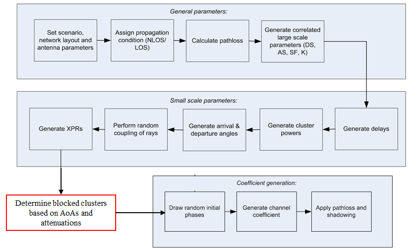

{width="7.0875in" height="4.646527777777778in"}

Contents {#contents .TT}
========

[5](#foreword)

[6](#scope)

[6](#references)

[7](#definitions-symbols-and-abbreviations)

[7](#definitions)

[7](#symbols)

[8](#abbreviations)

[9](#introduction)

[9](#general)

[10](#statusexpectation-of-existing-information-on-high-frequencies)

[10](#channel-modelling-works-outside-of-3gpp)

[12](#scenarios-of-interest)

[12](#channel-measurement-capabilities)

[13](#modelling-objectives)

[14](#channel-models-for-6ghz)

[14](#coordinate-system)

[14](#definition)

[15](#local-and-global-coordinate-systems)

[15](#transformation-from-a-lcs-to-a-gcs)

[18](#transformation-from-an-lcs-to-a-gcs-for-downtilt-angle-only)

[20](#scenarios)

[22](#antenna-modelling)

[24](#pathloss-los-probability-and-penetration-modelling)

[24](#pathloss)

[26](#los-probability)

[27](#o2i-penetration-loss)

[29](#autocorrelation-of-shadow-fading)

[29](#fast-fading-model)

[42](#additional-modelling-components)

[43](#oxygen-absorption)

[44](#large-bandwidth-and-large-antenna-array)

[44](#modelling-of-the-propagation-delay)

[44](#modelling-of-intra-cluster-angular-and-delay-spreads)

[46](#spatial-consistency)

[46](#spatial-consistency-procedure)

[46](#spatially-consistent-ut-mobility-modelling)

[48](#losnlos-indoor-states-and-o2i-parameters)

[49](#blockage)

[50](#blockage-model-a)

[52](#blockage-model-b)

[54](#correlation-modelling-for-multi-frequency-simulations)

[55](#time-varying-doppler-shift)

[55](#ut-rotation)

[55](#channel-models-for-link-level-evaluations)

[55](#clustered-delay-line-cdl-models)

[60](#tapped-delay-line-tdl-models)

[63](#scaling-of-delays)

[65](#spatial-filter-for-generating-tdl-channel-model)

[65](#exemplary-filtersantenna-patterns)

[66](#generation-procedure)

[66](#extension-for-mimo-simulations)

[66](#cdl-extension-scaling-of-angles)

[67](#tdl-extension-applying-a-correlation-matrix)

[67](#k-factor-for-los-channel-models)

[68](#channel-model-calibration)

[68](#large-scale-calibration)

[68](#full-calibration)

[69](#calibration-of-additional-features)

[72](#map-based-hybrid-channel-model-alternative-channel-model-methodology)

[72](#coordinate-system-1)

[72](#scenarios-1)

[72](#antenna-modelling-1)

[72](#channel-generation)

[83](#annex-a-calculation-of-angular-spread)

[84](#annex-b-change-history)Foreword 1 Scope 2 References 3
Definitions, symbols and abbreviations 3.1 Definitions 3.2 Symbols 3.3
Abbreviations 4 Introduction 5 General 6 Status/Expectation of existing
information on high frequencies 6.1 Channel modelling works outside of
3GPP 6.2 Scenarios of interest 6.3 Channel measurement capabilities 6.4
Modelling objectives 7 Channel model(s) for \>6GHz 7.1 Coordinate system
7.1.1 Definition 7.1.2 Local and global coordinate systems 7.1.3
Transformation from a LCS to a GCS 7.1.4 Transformation from an LCS to a
GCS for downtilt angle only 7.2 Scenarios 7.3 Antenna modelling 7.4
Pathloss, LOS probability and penetration modelling 7.4.1 Pathloss 7.4.2
LOS probability 7.4.3 O2I penetration loss 7.4.4 Autocorrelation of
shadow fading 7.5 Fast fading model 7.6 Additional modelling components
7.6.1 Oxygen absorption 7.6.2 Large bandwidth and large antenna array
7.6.2.1 Modelling of the propagation delay 7.6.2.2 Modelling of
intra-cluster angular and delay spreads 7.6.3 Spatial consistency
7.6.3.1 Spatial consistency procedure 7.6.3.2 Spatially-consistent UT
mobility modelling 7.6.3.3 LOS/NLOS, indoor states and O2I parameters
7.6.4 Blockage 7.6.4.1 Blockage model A 7.6.4.2 Blockage model B 7.6.5
Correlation modelling for multi-frequency simulations 7.6.6 Time-varying
Doppler shift 7.6.7 UT rotation 7.7 Channel models for link-level
evaluations 7.7.1 Clustered Delay Line (CDL) models 7.7.2 Tapped Delay
Line (TDL) models 7.7.3 Scaling of delays 7.7.4 Spatial filter for
generating TDL channel model 7.7.4.1 Exemplary filters/antenna patterns
7.7.4.2 Generation procedure 7.7.5 Extension for MIMO simulations
7.7.5.1 CDL extension: Scaling of angles 7.7.5.2 TDL extension: Applying
a correlation matrix 7.7.6 K-factor for LOS channel models 7.8 Channel
model calibration 7.8.1 Large scale calibration 7.8.2 Full calibration
7.8.3 Calibration of additional features 8 Map-based hybrid channel
model (Alternative channel model methodology) 8.1 Coordinate system 8.2
Scenarios 8.3 Antenna modelling 8.4 Channel generation Annex A:
Calculation of angular spread Annex B: Change history

Foreword
========

This Technical Report has been produced by the 3^rd^ Generation
Partnership Project (3GPP).

The contents of the present document are subject to continuing work
within the TSG and may change following formal TSG approval. Should the
TSG modify the contents of the present document, it will be re-released
by the TSG with an identifying change of release date and an increase in
version number as follows:

Version x.y.z

where:

x the first digit:

1 presented to TSG for information;

2 presented to TSG for approval;

3 or greater indicates TSG approved document under change control.

y the second digit is incremented for all changes of substance, i.e.
technical enhancements, corrections, updates, etc.

z the third digit is incremented when editorial only changes have been
incorporated in the document.

1 Scope
=======

The present document captures the findings of the study item, \"Study on
channel model for frequency spectrum above 6 GHz\" \[2\]. The purpose of
this TR is to help TSG RAN WG1 to properly model and evaluate the
performance of physical layer techniques using the above-6GHz channel
model(s).

This document relates to the 3GPP evaluation methodology and covers the
modelling of the physical layer of both Mobile Equipment and Access
Network of 3GPP systems.

This document is intended to capture the channel model(s) for
frequencies above 6 GHz up to 100GHz.

The present document is no longer maintained. For 5G channel models in
releases greater than release 14 refer to 38.901 \[19\].

2 References
============

The following documents contain provisions which, through reference in
this text, constitute provisions of the present document.

\- References are either specific (identified by date of publication,
edition number, version number, etc.) or non‑specific.

\- For a specific reference, subsequent revisions do not apply.

\- For a non-specific reference, the latest version applies. In the case
of a reference to a 3GPP document (including a GSM document), a
non-specific reference implicitly refers to the latest version of that
document *in the same Release as the present document*.

\[1\] 3GPP TR 21.905: \"Vocabulary for 3GPP Specifications\".

\[2\] 3GPP TD RP-151606: \"Study on channel model for frequency spectrum
above 6 GHz \".

\[3\] 3GPP TR 36.873 (V12.2.0): \"Study on 3D channel model for LTE\".

\[4\] 3GPP RP-151847: \"Report of RAN email discussion about \>6GHz
channel modelling\", Samsung

\[5\] 3GPP R1-163408: \"Additional Considerations on Building
Penetration Loss Modeling for 5G System Performance Evaluation,\"
Straight Path Communications

\[6\] METIS channel model, METIS 2020,ICT-317667-METIS/D1.4, Feb, 2015

\[7\] A S. Glassner, An introduction to ray tracing. Elsevier, 1989

\[8\] J. W. McKown, R. L. Hamilton. \"Ray tracing as a design tool for
radio networks,\" Network, IEEE, 1991(6): 27-30.

\[9\] T. Kurner, D. J. Cichon, W.Wiesbeck, \"Concepts and results for 3D
digital terrain-based wave propagation models: An overview,\" IEEE
J.Select. Areas Commun., vol. 11, pp. 1002--1012, 1993.

\[10\] M. Born, E. Wolf, Principles of optics: electromagnetic theory of
propagation, interference and diffraction of light. CUP Archive, 2000

\[11\] H. Friis, \"A note on a simple transmission formula,\" proc. IRE,
vol. 34, no. 5, pp. 254--256, 1946

\[12\] R. G. Kouyoumjian and P. H. Pathak, \"A uniform geometrical
theory of diffraction for an edge in a perfectly conducting surface,\"
Proc. IEEE, vol. 62, pp. 1448--1461, Nov. 1974.

\[13\] P. Pathak, W. Burnside, and R. Marhefka, \"A Uniform GTD Analysis
of the Diffraction of Electromagnetic Waves by a Smooth Convex
Surface,\" IEEE Transactions on Antennas and Propagation, vol. 28, no.
5, pp. 631--642, 1980

\[14\] IST-WINNER II Deliverable 1.1.2 v.1.2, \"WINNER II Channel
Models\", IST-WINNER2, Tech. Rep., 2007
(<http://www.ist-winner.org/deliverables.html>).

\[15\] 3GPP TR36.101: \"User Equipment (UE) radio transmission and
reception\"

\[16\] 3GPP TR36.104: \"Base Station (BS) radio transmission and
reception\"

\[17\] H. Asplund et al., \"A simplified approach to applying the 3GPP
spatial channel model\", in Proc. of PIMRC 2006

\[18\] ITU-R Rec. P.1816: \"The prediction of the time and the spatial
profile for broadband land mobile services using UHF and SHF bands\"

\[19\] 3GPP TR 38.901: \"Study on channel model for frequencies from 0.5
to 100 GHz\".

3 Definitions, symbols and abbreviations
========================================

3.1 Definitions
---------------

For the purposes of the present document, the terms and definitions
given in TR 21.905 \[1\] and the following apply. A term defined in the
present document takes precedence over the definition of the same term,
if any, in TR 21.905 \[1\].

3.2 Symbols
-----------

For the purposes of the present document, the following symbols apply:

*d~2D~* 2D distance between Tx and Rx

*d*~3D~ 3D distance between Tx and Rx

*f* frequency

*f~c~* center frequency / carrier frequency

F~rx,u,θ~ Receive antenna element *u* field pattern in the direction of
the spherical basis vector $\hat{\theta}$

F~rx,u,ϕ~ Receive antenna element *u* field pattern in the direction of
the spherical basis vector $\hat{\varphi}$

F~tx,s,θ~ Transmit antenna element *s* field pattern in the direction of
the spherical basis vector $\hat{\theta}$

F~rx,s,ϕ~ Transmit antenna element *s* field pattern in the direction of
the spherical basis vector $\hat{\varphi}$

*h*~BS~ antenna height for BS

*h*~UT~ antenna height for UT

${\hat{r}}_{\text{rx},n,m}$ spherical unit vector of cluster *n*, ray
*m*, for receiver

${\hat{r}}_{\text{tx},n,m}$ spherical unit vector of cluster *n*, ray
*m*, for transmitter

*α* bearing angle

*β* downtilt angle

*γ* slant angle

*κ* cross-polarization power ratio in linear scale

*μ*~lgASA~ mean value of 10-base logarithm of azimuth angle spread of
arrival

*μ*~lgASD~ mean value of 10-base logarithm of azimuth angle spread of
departure

*μ*~lgDS~ mean value of 10-base logarithm of delay spread

*μ*~lgZSA~ mean value of 10-base logarithm of zenith angle spread of
arrival

*μ*~lgZSD~ mean value of 10-base logarithm of zenith angle spread of
departure

*σ*~lgASA~ standard deviation of 10-base logarithm of azimuth angle
spread of arrival

*σ*~lgASD~ standard deviation of 10-base logarithm of azimuth angle
spread of departure

*σ*~lgDS~ standard deviation value of 10-base logarithm of delay spread

*σ*~lgZSA~ standard deviation of 10-base logarithm of zenith angle
spread of arrival

*σ*~lgZSD~ standard deviation of 10-base logarithm of zenith angle
spread of departure

$\sigma_{\text{SF}}$ standard deviation of SF

$\varphi$ azimuth angle

$\theta$ zenith angle

$\hat{\varphi}$ spherical basis vector (unit vector) for GCS

${\hat{\varphi}}^{'}$ spherical basis vector (unit vector) for LCS

$\varphi_{\text{3dB}}$ horizontal 3 dB beamwidth of an antenna

$\hat{\theta}$ spherical basis vector (unit vector), orthogonal to
$\hat{\varphi}$, for GCS

${\hat{\theta}}^{'}$ spherical basis vector (unit vector), orthogonal to
${\hat{\varphi}}^{'}$, for LCS

$\theta_{\text{3dB}}$ vertical 3 dB beamwidth of an antenna

*ψ* Angular displacement between two pairs of unit vectors

3.3 Abbreviations
-----------------

For the purposes of the present document, the abbreviations given in
TR 21.905 \[1\] and the following apply. An abbreviation defined in the
present document takes precedence over the definition of the same
abbreviation, if any, in TR 21.905 \[1\].

2D two-dimensional

3D three-dimensional

AOA Azimuth angle Of Arrival

AOD Azimuth angle Of Departure

AS Angular Spread

ASA Azimuth angle Spread of Arrival

ASD Azimuth angle Spread of Departure

BF Beamforming

BS Base Station

BP Breakpoint

BW Beamwidth

CDF Cumulative Distribution Function

CDL Clustered Delay Line

CRS Common Reference Signal

D2D Device-to-Device

DFT Discrete Fourier Transform

DS Delay Spread

GCS Global Coordinate System

IID Independent and identically distributed

InH Indoor Hotspot

IRR Infrared Reflecting

ISD Intersite Distance

K Ricean K factor

LCS Local Coordinate System

LOS Line Of Sight

MIMO Multiple-Input-Multiple-Output

MPC Multipath Component

NLOS Non-LOS

O2I Outdoor-to-Indoor

O2O Outdoor-to-Outdoor

OFDM Orthogonal Frequency-Division Multiplexing

PAS Power angular spectrum

PL Path Loss

PRB Physical Resource Block

RCS Radar cross-section

RMa Rural Macro

RMS Root Mean Square

RSRP Reference Signal Received Power

Rx Receiver

SCM Spatial Channel Model

SINR Signal-to-Interference-plus-Noise Ratio

SIR Signal-to-Interference Ratio

SSCM Statistical Spatial Channel Model

SF Shadow Fading

SLA Sidelobe Attenuation

TDL Tapped Delay Line

TOA Time Of Arrival

TRP Transmission Reception Point

Tx Transmitter

UMa Urban Macro

UMi Urban Micro

UT User Terminal

UTD Uniform Theory of Diffraction

V2V Vehicle-to-Vehicle

XPR Cross-Polarization Ratio

ZOA Zenith angle Of Arrival

ZOD Zenith angle Of Departure

ZSA Zenith angle Spread of Arrival

ZSD Zenith angle Spread of Departure

4 Introduction
==============

At 3GPP TSG RAN \#69 meeting the Study Item Description on \"Study on
channel model for frequency spectrum above 6 GHz\" was approved \[2\].
This study item covers the identification of the status/expectation of
existing information on high frequencies (e.g. spectrum allocation,
scenarios of interest, measurements, etc), and the channel model(s) for
frequencies above 6 GHz up to 100 GHz. This technical report documents
the channel model(s). The new channel model is observed not always
consistent with earlier channel models for \<6 GHz such as the 3D SCM
model (3GPP TR 36.873) or IMT-Advanced (ITU-R M.2135). Comparisons
across frequency bands using different models are discouraged.

The channel model is applicable for link and system level simulations in
the following conditions:

\- For system level simulations, supported scenarios are urban microcell
street canyon, urban macrocell, indoor office, and rural macrocell.

\- Bandwidth is supported up to 10% of the center frequency but no
larger than 2GHz.

\- Mobility of one end of the link is supported

\- For the stochastic model, spatial consistency is supported by
correlation of LSPs and SSPs as well as LOS/NLOS state.

\- Large array support is based on far field assumption and stationary
channel over the size of the array.

5 General
=========

6 Status/Expectation of existing information on high frequencies
================================================================

6.1 Channel modelling works outside of 3GPP
-------------------------------------------

This section summarized the Channel Modelling works outside of 3GPP
based on the input from companies.

**METIS Channel Models:**

\- Identified 5G requirements (e.g., wide frequency range, high
bandwidth, massive MIMO, 3-D and accurate polarization modelling)

\- Performed channel measurements at various bands between 2GHz and 60
GHz

\- Provided different channel model methodologies (map-based model,
stochastic model or hybrid model). For stochastic model, the proposed
channel is focused on outdoor square, Indoor cafeteria and indoor
shopping mall scenarios.

**MiWEBA Channel Models:**

\- Addressed various challenges: Shadowing, spatial consistency,
environment dynamics, spherical wave modelling, dual mobility Doppler
model, ratio between diffuse and specular reflections, polarization

\- Proposed Quasi-deterministic channel model

\- Performed channel measurements at 60 GHz

\- Focused on university campus, street canyon, hotel lobby, backhaul,
and D2D scenarios.

**ITU-R M Channel Models:**

\- Addressed the propagation loss and atmospheric loss on mmW

\- Introduced enabling antenna array technology and semiconductor
technology

\- Proposed deployment scenarios, focused on dense urban environment for
high data rate service: indoor shopping mall, indoor enterprise, in
home, urban hotspot in a square/street, mobility in city.

**COST2100 and COST IC1004 Channel Models:**

\- Geometry-based stochastic channel model that reproduce the stochastic
properties of MIMO channels over time, frequency and space. It is a
cluster-level model where the statistics of the large scale parameters
are always guaranteed in each series of channel instances.

**NYU WIRELESS Channel Models:**

\- Conducted many urban propagation measurements on 28/38/60/73 GHz
bands for both outdoor and indoor channels, measurements are continuing.

\- Proposed 3 areas for 5G mmWave channel modeling which are small
modifications or extensions from 3GPP\'s current below 6GHz channel
models

\- 1) LOS/NLOS/blockage modeling (a squared exponential term); 2).
Wideband power delay profiles (time clusters and spatial lobes for a
simple extension to the existing 3GPP SSCM model); 3). Physics-based
path loss model (using the existing 3GPP path loss equations, but simply
replacing the \"floating\" optimization parameter with a deterministic 1
m \"close-in\" free space reference term in order to provide a standard
and stable definition of \"path loss exponent\" across all different
parties, scenarios, and frequencies).

**802.11 ad/ay Channel Models:**

\- Conducted ray-tracing methodology on 60 GHz band indoor channels,
including conference room, cubicle, living room scenarios

\- Intra cluster parameters were proposed in terms of ray excess delay
and ray power distribution

\- Human blockage models were proposed in terms of blockage probability
and blockage attenuation

**5G mmWave Channel Model Alliance:**

\- Will provide a venue to promote fundamental research into
measurement, analysis, identification of physical parameters, and
statistical representations of mmWave propagation channels. 

\- Divided into six collaborative working groups that include a Steering
Committee; Modeling Methodology Group; Measurement Methodology Group;
and groups that focus on defining and parameterizing Indoor, Outdoor,
and Emerging Usage Scenarios. 

\- Sponsored by Communications Technology Research Laboratory within the
NIST.

**mmMAGIC:**

\- Brings together major infrastructure vendors, major European
operators, leading research institutes and universities, measurement
equipment vendors and one SME.

\- Will undertake extensive radio channel measurements in the 6-100 GHz
range.

\- Will develop and validate advanced channel models that will be used
for rigorous validation and feasibility analysis of the proposed
concepts and system, as well as for usage in regulatory and standards
fora.

**IMT-2020 5G promotion association**

\- Jointly established by three ministries of China based on the
original IMT-Advanced promotion group

\- Members including the main operators, vendors, universities and
research institutes in China

\- The major platform to promote 5G technology research in China and to
facilitate international communication and cooperation

**QuaDRiGa (Fraunhofer HHI)**

\- QuaDRiGa (QUAsi Deterministic RadIo channel GenerAtor) was developed
at the [Fraunhofer Heinrich Hertz
Institute](http://www.hhi.fraunhofer.de/) within the [Wireless
Communications and Networks Department](http://www.hhi.fraunhofer.de/wn)
to enable the modeling of MIMO radio channels for specific network
configurations, such as indoor, satellite or heterogeneous
configurations.

\- Besides being a fully-fledged 3D geometry-based stochastic channel
model (well aligned with TR36.873), QuaDRiGa contains a collection of
features created in SCM(e) and WINNER channel models along with novel 
modeling approaches which provide features to enable quasi-deterministic
multi-link tracking of users (receiver) movements in changing
environments. QuaDRiGa supports Massive MIMO modeling enabled through a
new multi-bounce scattering approach and spherical wave propagation. It
will be continuously extended with features required by 5G and
frequencies beyond 6 GHz. The QuaDRiGa model is supported by data from
extensive channel measurement campaigns at 10 / 28 / 43 / 60 / 82 GHz
performed by the same group.

6.2 Scenarios of interest
-------------------------

Brief description of the key scenarios of interest identified[^1]:

\(1\) UMi (Street canyon, open area) with O2O and O2I: This is similar
to 3D-UMi scenario, where the BSs are mounted below rooftop levels of
surrounding buildings. UMi open area is intended to capture real-life
scenarios such as a city or station square. The width of the typical
open area is in the order of 50 to 100 m.

Example: \[Tx height:10m, Rx height: 1.5-2.5 m, ISD: 200m\]

\(2\) UMa with O2O and O2I: This is similar to 3D-UMa scenario, where
the BSs are mounted above rooftop levels of surrounding buildings.

Example: \[Tx height:25m, Rx height: 1.5-2.5 m, ISD: 500m\]

\(3\) Indoor: This scenario is intended to capture various typical
indoor deployment scenarios, including office environments, and shopping
malls. The typical office environment is comprised of open cubicle
areas, walled offices, open areas, corridors etc. The BSs are mounted at
a height of 2-3 m either on the ceilings or walls. The shopping malls
are often 1-5 stories high and may include an open area (or \"atrium\")
shared by several floors. The BSs are mounted at a height of
approximately 3 m on the walls or ceilings of the corridors and shops.

Example: \[Tx height: 2-3m, Rx height: 1.5m, area: 500 square meters\]

\(4\) Backhaul, including outdoor above roof top backhaul in urban area
and street canyon scenario where small cell BSs are placed at lamp
posts.

\(5\) D2D/V2V. Device-to-device access in open area, street canyon, and
indoor scenarios. V2V is a special case where the devices are mobile.

\(6\) Other scenarios such as Stadium (open-roof) and Gym (close-roof).

6.3 Channel measurement capabilities
------------------------------------

The measurement capability as reported by each company is summarized in
the table below.

Table 6.3-1: Channel measurement capabilities

+-------------+-------------+-------------+-------------+-------------+
|             | 6 - 20 GHz  | 20 - 30 GHz | 30  - 60    | \>60 GHz    |
|             |             |             | GHz         |             |
+-------------+-------------+-------------+-------------+-------------+
| Urban macro | CMCC        | No          | NYU         |             |
|             |             | kia/Aalborg |             |             |
|             | No          |             |             |             |
|             | kia/Aalborg |             |             |             |
+-------------+-------------+-------------+-------------+-------------+
| Urban micro | Aalto       | AT&T        | AT&T        | AT&T        |
|             | University  |             |             |             |
|             |             | Aalto       | Huawei      | Aalto       |
|             | CMCC        | University  |             | University  |
|             |             |             | Intel       |             |
|             | Ericsson    | CMCC        | /Fraunhofer | Huawei      |
|             |             |             | HHI         |             |
|             | Intel       | Huawei      |             | Intel       |
|             | /Fraunhofer |             | NTT DOCOMO  | /Fraunhofer |
|             | HHI         | Intel       |             | HHI         |
|             |             | /Fraunhofer | Qualcomm    |             |
|             | No          | HHI         |             | NYU         |
|             | kia/Aalborg |             | CATT        |             |
|             |             | No          |             |             |
|             | NTT DOCOMO  | kia/Aalborg | ETRI        |             |
|             |             |             |             |             |
|             | Orange      | NTT DOCOMO  | ITRI/CCU    |             |
|             |             |             |             |             |
|             |             | NYU         | ZTE         |             |
|             |             |             |             |             |
|             |             | Qualcomm    |             |             |
|             |             |             |             |             |
|             |             | Samsung     |             |             |
|             |             |             |             |             |
|             |             | CATT        |             |             |
|             |             |             |             |             |
|             |             | KT          |             |             |
|             |             |             |             |             |
|             |             | ETRI        |             |             |
|             |             |             |             |             |
|             |             | ITRI/CCU    |             |             |
|             |             |             |             |             |
|             |             | ZTE         |             |             |
+-------------+-------------+-------------+-------------+-------------+
| Indoor      | Aalto       | AT&T        | AT&T        | AT&T        |
|             | University  |             |             |             |
|             |             | Alc         | Ericsson    | Aalto       |
|             | CMCC        | atel-Lucent |             | University  |
|             |             |             | Huawei      |             |
|             | Ericsson    | Aalto       |             | Huawei      |
|             |             | University  | Intel       |             |
|             | Huawei      |             | /Fraunhofer | Intel       |
|             |             | BUPT        | HHI         | /Fraunhofer |
|             | Intel       |             |             | HHI         |
|             | /Fraunhofer | CMCC        | NTT DOCOMO  |             |
|             | HHI         |             |             | NYU         |
|             |             | Huawei      | NYU         |             |
|             | No          |             |             |             |
|             | kia/Aalborg | Intel       | Qualcomm    |             |
|             |             | /Fraunhofer |             |             |
|             | NTT DOCOMO  | HHI         | CATT        |             |
|             |             |             |             |             |
|             | Orange      | No          | ETRI        |             |
|             |             | kia/Aalborg |             |             |
|             |             |             | ITRI/CCU    |             |
|             |             | NTT DOCOMO  |             |             |
|             |             |             | ZTE         |             |
|             |             | NYU         |             |             |
|             |             |             |             |             |
|             |             | Qualcomm    |             |             |
|             |             |             |             |             |
|             |             | Samsung     |             |             |
|             |             |             |             |             |
|             |             | CATT        |             |             |
|             |             |             |             |             |
|             |             | KT          |             |             |
|             |             |             |             |             |
|             |             | ETRI        |             |             |
|             |             |             |             |             |
|             |             | ITRI/CCU    |             |             |
|             |             |             |             |             |
|             |             | ZTE         |             |             |
+-------------+-------------+-------------+-------------+-------------+
| O2I         | Ericsson    | AT&T        | AT&T        | AT&T        |
|             |             |             |             |             |
|             | Huawei      | Alc         | Ericsson    | Huawei      |
|             |             | atel-Lucent |             |             |
|             | Intel       |             | Huawei      | Intel       |
|             | /Fraunhofer | Ericsson    |             | /Fraunhofer |
|             | HHI         |             | Intel       | HHI         |
|             |             | Huawei      | /Fraunhofer |             |
|             | No          |             | HHI         |             |
|             | kia/Aalborg | Intel       |             |             |
|             |             | /Fraunhofer | NTT DOCOMO  |             |
|             | NTT DOCOMO  | HHI         |             |             |
|             |             |             |             |             |
|             | Orange      | NTT DOCOMO  |             |             |
|             |             |             |             |             |
|             |             | NYU         |             |             |
|             |             |             |             |             |
|             |             | Samsung     |             |             |
|             |             |             |             |             |
|             |             | KT          |             |             |
+-------------+-------------+-------------+-------------+-------------+

6.4 Modelling objectives
------------------------

The requirements for \>6 GHz channel modelling are as follows.

\- Channel model SI should take into account the outcome of RAN-level
discussion in the \'5G\' requirement study item

\- Complexity in terms of Description, Generating channel coefficients,
development complexity and Simulation time should be considered.

\- Support frequency range up to 100 GHz.

\- The critical path of the SI is 6 -- 100 GHz

\- Take care of mmW propagation aspects such as blocking and atmosphere
attenuation.

\- The model should be consistent in space, time and frequency

\- Support large channel bandwidths (up to 10% of carrier frequency)

\- Aim for the channel model to cover a range of coupling loss
considering current typical cell sizes, e.g. up to km-range macro cells.
Note: This is to enable investigation of the relevance of the 5G system
using higher frequency bands to existing deployments.

\- Accommodate UT mobility

\- Mobile speed up to 500 km/h.

\- Develop a methodology considering that model extensions to D2D and
V2V may be developed in future SI.

\- Support large antenna arrays

7 Channel model(s) for \>6GHz
=============================

Applicability of the channel model to frequency range 0.5-6GHz was
discussed but consensus was not reached.

7.1 Coordinate system
---------------------

### 7.1.1 Definition

A coordinate system is defined by the x, y, z axes, the spherical angles
and the spherical unit vectors as shown in Figure 7.1.1. Figure 7.1.1
defines the zenith angle $\theta$ and the azimuth angle$\varphi$ in a
Cartesian coordinate system. Note that $\theta = 0$points to the zenith
and $\theta = \text{90}^{0}$points to the horizon. The field component
in the direction of $\hat{\theta}$ is given by $F_{\theta}$and the field
component in the direction of $\hat{\varphi}$ is given by $F_{\varphi}$.

{width="3.8333333333333335in"
height="2.8222222222222224in"}

Figure 7.1.1: Definition of spherical angles and spherical unit vectors
in a Cartesian coordinate system, where$\hat{n}$is the given direction,
$\hat{\theta}$ and $\hat{\varphi}$are the spherical basis vectors

### 7.1.2 Local and global coordinate systems

A Global Coordinate System (GCS) is defined for a system comprising
multiple BSs and UTs. An array antenna for a BS or a UT can be defined
in a Local Coordinate System (LCS). An LCS is used as a reference to
define the vector far-field that is pattern and polarization, of each
antenna element in an array. It is assumed that the far-field is known
in the LCS by formulae. The placement of an array within the GCS is
defined by the translation between the GCS and a LCS. The orientation of
the array with respect to the GCS is defined in general by a sequence of
rotations (described in clause 7.1.3). Since this orientation is in
general different from the GCS orientation, it is necessary to map the
vector fields of the array elements from the LCS to the GCS. This
mapping depends only on the orientation of the array and is given by the
equations in clause 7.1.3.\
Note that any arbitrary mechanical orientation of the array can be
achieved by rotating the LCS with respect to the GCS.

### 7.1.3 Transformation from a LCS to a GCS

A GCS with coordinates (*x*, *y*, *z*, $\theta$, $\varphi$) and unit
vectors ($\hat{\theta}$, $\hat{\varphi}$) and an LCS with \"primed\"
coordinates (*x\'*, *y\'*, *z\'*, $\theta'$, $\varphi'$) and \"primed\"
unit vectors ($\hat{\theta}'$, $\hat{\varphi}'$) are defined with a
common origins in Figures 7.1.3-1 and 7.1.3-2. Figure 7.1.3-1
illustrates the sequence of rotations that relate the GCS (gray) and the
LCS (blue). Figure 7.1.3-2 shows the coordinate direction and unit
vectors of the GCS (gray) and the LCS (blue). Note that the vector
fields of the array antenna elements are defined in the LCS. In Figure
7.1.3-1 we consider an arbitrary 3D-rotation of the LCS with respect to
the GCS given by the angles *α*, *β*, *γ*. The set of angles *α*, *β*,
*γ* can also be termed as the orientation of the array antenna with
respect to the GCS.

Note that the transformation from a LCS to a GCS depends only on the
angles *α*, *β*, *γ*. The angle *α* is called the bearing angle, *β* is
called the downtilt angle and *γ* is called the slant angle.

  ---------------------------------------------------------------------------------------------------------------------- -----------------------------------------------------------------------------------------------
  {width="2.9229166666666666in" height="3.0902777777777777in"}                                   {width="2.928472222222222in" height="3.088888888888889in"}
  Figure 7.1.3-1: Orienting the LCS (blue) with respect to the GCS (gray) by a sequence of 3 rotations: *α*, *β*, *γ*.   Figure 7.1.3-2: Definition of spherical coordinates and unit vectors in both the GCS and LCS.
  ---------------------------------------------------------------------------------------------------------------------- -----------------------------------------------------------------------------------------------

Let $A'(\theta\text{',}\varphi')$denote an antenna element pattern in
the LCS and $A(\theta,\varphi)$denote the same antenna element pattern
in the GCS. Then the two are related simply by

$A(\theta,\varphi) = A'(\theta\text{',}\varphi')$ (7.1-1)

with $\theta'$ and $\varphi'$given by (7.1-7) and (7.1-8).

Let us denote the polarized field components in the LCS by
$F_{\theta'}(\theta\text{',}\varphi')$,
$F_{\varphi'}(\theta\text{',}\varphi')$and in the GCS by
$F_{\theta}(\theta,\varphi)$, $F_{\varphi}(\theta,\varphi)$. Then they
are related by equation (7.1-11).

Any arbitrary 3-D rotation can be specified by at most 3 elemental
rotations, and following the framework of Figure 7.1.3-1, a series of
rotations about the z, $\overset{˙}{y}$and $\overset{¨}{x}$axes are
assumed here, in that order. The dotted and double-dotted marks indicate
that the rotations are intrinsic, which means that they are the result
of one (⋅) or two (⋅⋅) intermediate rotations. In other words, the
$\overset{˙}{y}$ axis is the original y axis after the first rotation
about z, and the $\overset{¨}{x}$ axis is the original x axis after the
first rotation about z and the second rotation about$\overset{˙}{y}$. A
first rotation of *α* about *z* sets the antenna bearing angle (i.e. the
sector pointing direction for a BS antenna element). The second rotation
of *β* about $\overset{˙}{y}$ sets the antenna downtilt angle. Finally,
the third rotation of *γ* about $\overset{¨}{x}$ sets the antenna slant
angle. The orientation of the *x*, *y* and *z* axes after all three
rotations can be denoted as $\dddot{x}$, $\dddot{y}$ and $\dddot{z}$.
These triple-dotted axes represents the final orientation of the LCS,
and for notational purposes denoted as the *x\'*, *y\'* and *z\'* axes
(local or \"primed\" coordinate system).

In order to establish the equations for transformation of the coordinate
system and the polarized antenna field patterns between the GCS and the
LCS, it is necessary to determine the composite rotation matrix that
describes the transformation of point (*x*, *y*, *z*) in the GCS into
point (*x\'*, *y\'*, *z\'*) in the LCS. This rotation matrix is computed
as the product of three elemental rotation matrices. The matrix to
describe rotations about the *z*,$\overset{˙}{y}$and $\overset{¨}{x}$
axes by the angles *α*, *β* and *γ* respectively and in that order is
defined as

$R = R_{Z}\left( \alpha \right)R_{Y}\left( \beta \right)R_{X}\left( \gamma \right) = \begin{pmatrix}
 + \text{cos}\alpha & - \text{sin}\alpha & 0 \\
 + \text{sin}\alpha & + \text{cos}\alpha & 0 \\
0 & 0 & 1 \\
\end{pmatrix}\begin{pmatrix}
 + \text{cos}\beta & 0 & + \text{sin}\beta \\
0 & 1 & 0 \\
 - \text{sin}\beta & 0 & + \text{cos}\beta \\
\end{pmatrix}\begin{pmatrix}
1 & 0 & 0 \\
0 & + \text{cos}\gamma & - \text{sin}\gamma \\
0 & + \text{sin}\gamma & + \text{cos}\gamma \\
\end{pmatrix}$ (7.1-2)

The reverse transformation is given by the inverse of R, which is also
equal to the transpose of R since it is orthogonal.

$R^{- 1} = R_{X}\left( - \gamma \right)R_{Y}\left( - \beta \right)R_{Z}\left( - \alpha \right) = R^{T}$
(7.1-3)

The simplified forward and reverse composite rotation matrices are given
by

$R = \begin{pmatrix}
\text{cos}\alpha\text{cos}\beta & \text{cos}\alpha\text{sin}\beta\text{sin}\gamma - \text{sin}\alpha\text{cos}\gamma & \text{cos}\alpha\text{sin}\beta\text{cos}\gamma + \text{sin}\alpha\text{sin}\gamma \\
\text{sin}\alpha\text{cos}\beta & \text{sin}\alpha\text{sin}\beta\text{sin}\gamma + \text{cos}\alpha\text{cos}\gamma & \text{sin}\alpha\text{sin}\beta\text{cos}\gamma - \text{cos}\alpha\text{sin}\gamma \\
 - \text{sin}\beta & \text{cos}\beta\text{sin}\gamma & \text{cos}\beta\text{cos}\gamma \\
\end{pmatrix}$ (7.1-4)

and

$R^{- 1} = \begin{pmatrix}
\text{cos}\alpha\text{cos}\beta & \text{sin}\alpha\text{cos}\beta & - \text{sin}\beta \\
\text{cos}\alpha\text{sin}\beta\text{sin}\gamma - \text{sin}\alpha\text{cos}\gamma & \text{sin}\alpha\text{sin}\beta\text{sin}\gamma + \text{cos}\alpha\text{cos}\gamma & \text{cos}\beta\text{sin}\gamma \\
\text{cos}\alpha\text{sin}\beta\text{cos}\gamma + \text{sin}\alpha\text{sin}\gamma & \text{sin}\alpha\text{sin}\beta\text{cos}\gamma - \text{cos}\alpha\text{sin}\gamma & \text{cos}\beta\text{cos}\gamma \\
\end{pmatrix}$ (7.1-5)

These transformations can be used to derive the angular and polarization
relationships between the two coordinate systems.

In order to establish the angular relationships, consider a point (*x*,
*y*, *z*) on the unit sphere defined by the spherical coordinates
(*ρ*=1, *θ*, *φ*), where *ρ* is the unit radius, *θ* is the zenith angle
measured from the +*z*-axis, and *φ* is the azimuth angle measured from
the +*x*-axis in the *x*-*y* plane. The Cartesian representation of that
point is given by

$\hat{\rho} = \begin{matrix}
\left( x \middle| \right)\left( y \middle| \right) \\
 \\
\end{matrix}$ (7.1-6)

The zenith angle is computed as
$\text{arccos}\left( \hat{\rho} \cdot \hat{z} \right)$ and the azimuth
angle as
$\text{arg}(\hat{x} \cdot \hat{\rho} + j\ \hat{y} \cdot \hat{\rho})$,
where $\hat{x}$, $\hat{y}$ and $\hat{z}$ are the Cartesian unit vectors.
If this point represents a location in the GCS defined by *θ* and *φ*,
the corresponding position in the LCS is given by $R^{- 1}\hat{\rho}$,
from which local angles *θ\'* and *φ\'* can be computed. The results are
given in equations (7.1-7) and (7.1-8).

$\theta'\left( \alpha,\beta,\gamma;\theta,\varphi \right) = \text{arccos}$
(7.1-7)

$\varphi'\left( \alpha,\beta,\gamma;\theta,\varphi \right) = \text{arg}\left( \begin{bmatrix}
1 \\
j \\
0 \\
\end{bmatrix}^{T}R^{- 1}\hat{\rho} \right) = a\text{rg}\begin{matrix}
\left( \left( \text{cos}\beta\text{sin}\theta\text{cos}\left( \varphi - \alpha \right) - \text{sin}\beta\text{cos}\theta \right) + \middle| \right) \\
 \\
\end{matrix}$ (7.1-8)

These formulae relate the spherical angles (*θ*, *φ*) of the GCS to the
spherical angles (*θ\'*, *φ\'*) of the LCS given the rotation operation
defined by the angles (*α*, *β*, *γ*).

Let us denote the polarized field
components$F_{\theta}(\theta,\varphi)$, $F_{\varphi}(\theta,\varphi)$ in
the GCS and$F_{\theta'}(\theta\text{',}\varphi')$,
$F_{\varphi'}(\theta\text{',}\varphi')$ in the LCS. These are related by

$\begin{pmatrix}
F_{\theta}\left( \theta,\varphi \right) \\
F_{\varphi}\left( \theta,\varphi \right) \\
\end{pmatrix} = \begin{pmatrix}
\hat{\theta}\left( \theta,\varphi \right)^{T}R{\hat{\theta}}^{'}\left( \theta^{'},\varphi^{'} \right) & \hat{\theta}\left( \theta,\varphi \right)^{T}R{\hat{\varphi}}^{'}\left( \theta^{'},\varphi^{'} \right) \\
\hat{\varphi}\left( \theta,\varphi \right)^{T}R{\hat{\theta}}^{'}\left( \theta^{'},\varphi^{'} \right) & \hat{\varphi}\left( \theta,\varphi \right)^{T}R{\hat{\varphi}}^{'}\left( \theta^{'},\varphi^{'} \right) \\
\end{pmatrix}\begin{pmatrix}
F_{\theta^{'}}\left( \theta^{'},\varphi^{'} \right) \\
F_{\varphi^{'}}\left( \theta^{'},\varphi^{'} \right) \\
\end{pmatrix}$ (7.1-9)

In this equation, $\hat{\theta}$ and $\hat{\varphi}$ represent the
spherical unit vectors of the GCS, and ${\hat{\theta}}^{'}$ and
${\hat{\varphi}}^{'}$are the representations in the LCS. The forward
rotation matrix R transforms the LCS unit vectors into the GCS frame of
reference. These pairs of unit vectors are orthogonal and can be
represented as shown in Figure 7.1.3-3.

Figure 7.1.3-3: Rotation of the spherical basis vectors by an angle *ψ*
due to the orientation of the LCS with respect to the GCS

Assuming an angular displacement of *ψ* between the two pairs of unit
vectors, the rotation matrix of equation (7.1-9) can be further
simplified as:

$\begin{pmatrix}
\hat{\theta}\left( \theta,\varphi \right)^{T}R{\hat{\theta}}^{'}\left( \theta^{'},\varphi^{'} \right) & \hat{\theta}\left( \theta,\varphi \right)^{T}R{\hat{\varphi}}^{'}\left( \theta^{'},\varphi^{'} \right) \\
\hat{\varphi}\left( \theta,\varphi \right)^{T}R{\hat{\theta}}^{'}\left( \theta^{'},\varphi^{'} \right) & \hat{\varphi}\left( \theta,\varphi \right)^{T}R{\hat{\varphi}}^{'}\left( \theta^{'},\varphi^{'} \right) \\
\end{pmatrix} = \begin{pmatrix}
\text{cos}\psi & \text{cos}\left( \pi/2 + \psi \right) \\
\text{cos}\left( \pi/2 - \psi \right) & \text{cos}\psi \\
\end{pmatrix} = \begin{pmatrix}
 + \text{cos}\psi & - \text{sin}\psi \\
 + \text{sin}\psi & + \text{cos}\psi \\
\end{pmatrix}$ (7.1-10)

and equation (7.1-9) can be written as:

$\begin{pmatrix}
F_{\theta}\left( \theta,\varphi \right) \\
F_{\varphi}\left( \theta,\varphi \right) \\
\end{pmatrix} = \begin{pmatrix}
 + \text{cos}\psi & - \text{sin}\psi \\
 + \text{sin}\psi & + \text{cos}\psi \\
\end{pmatrix}\begin{pmatrix}
F_{\theta^{'}}\left( \theta^{'},\varphi^{'} \right) \\
F_{\varphi^{'}}\left( \theta^{'},\varphi^{'} \right) \\
\end{pmatrix}$ (7.1-11)

The angle *ψ* can be computed in numerous ways from equation (7.1-10),
with one such way approach being

$\psi = \text{arg}(\hat{\theta}\left( \theta,\varphi \right)^{T}R{\hat{\theta}}^{'}\left( \theta^{'},\varphi^{'} \right) + j\ \hat{\varphi}\left( \theta,\varphi \right)^{T}R{\hat{\theta}}^{'}\left( \theta^{'},\varphi^{'} \right))$
(7.1-12)

The dot products are readily computed using the Cartesian representation
of the spherical unit vectors.\
The general expressions for these unit vectors are given by

$\hat{\theta} = \begin{pmatrix}
\text{cos}\theta\text{cos}\varphi \\
\text{cos}\theta\text{sin}\varphi \\
 - \text{sin}\theta \\
\end{pmatrix}$ (7.1-13)

and

$\hat{\varphi} = \begin{pmatrix}
 - \text{sin}\varphi \\
 + \text{cos}\varphi \\
0 \\
\end{pmatrix}$ (7.1-14)

The angle *ψ* can be expressed as a function of mechanical orientation
(*α*, *β*, *γ*) and spherical position (*θ*, *φ*), and is given by

$\psi = \text{arg}\begin{pmatrix}
\left( \text{sin}\gamma\text{cos}\theta\text{sin}\left( \varphi - \alpha \right) + \text{cos}\gamma\left( \text{cos}\beta\text{sin}\theta - \text{sin}\beta\text{cos}\theta\text{cos}\left( \varphi - \alpha \right) \right) \right) + \\
j\left( \text{sin}\gamma\text{cos}\left( \varphi - \alpha \right) + \text{sin}\beta\text{cos}\gamma\text{sin}\left( \varphi - \alpha \right) \right) \\
\end{pmatrix}$ (7.1-15)

It can be shown that$\text{cos}\psi$and$\text{sin}\psi$can be expressed
as:

$\text{cos}\psi = \frac{\text{cos}\beta\text{cos}\gamma\text{sin}\theta - \left( \text{sin}\beta\text{cos}\gamma\text{cos}\left( \varphi - \alpha \right) - \text{sin}\gamma\text{sin}\left( \varphi - \alpha \right) \right)\text{cos}\theta}{\sqrt{1 - \left( \text{cos}\beta\text{cos}\gamma\text{cos}\theta + \left( \text{sin}\beta\text{cos}\gamma\text{cos}\left( \varphi - \alpha \right) - \text{sin}\gamma\text{sin}\left( \varphi - \alpha \right) \right)\text{sin}\theta \right)^{2}}}$
(7.1-16)

$\text{sin}\psi = \frac{\text{sin}\beta\text{cos}\gamma\text{sin}\left( \varphi - \alpha \right) + \text{sin}\gamma\text{cos}\left( \varphi - \alpha \right)}{\sqrt{1 - \left( \text{cos}\beta\text{cos}\gamma\text{cos}\theta + \left( \text{sin}\beta\text{cos}\gamma\text{cos}\left( \varphi - \alpha \right) - \text{sin}\gamma\text{sin}\left( \varphi - \alpha \right) \right)\text{sin}\theta \right)^{2}}}$
(7.1-17)

### 7.1.4 Transformation from an LCS to a GCS for downtilt angle only

In this clause equations are provided for the transformation from LCS to
GCS assuming that the orientation of the LCS (with respect to the GCS)
is such that the bearing angle *α*=0, the downtilt angle *β* is non-zero
and the slant angle *γ*=0. In other words the *y\'*-axis of the LCS is
parallel to the *y*-axis of the GCS. Considering a BS antenna element
the *x*-axis of the GCS is aligned with the pointing direction of the
sector. Mechanical downtilt is modelled as a rotation of the LCS around
the *y*-axis. For zero mechanical downtilt the LCS coincides with the
GCS.

This transformation relates the spherical angles ($\theta$,$\varphi$) in
the global coordinate system to spherical angles ($\theta'$,$\varphi'$)
in the local (antenna-fixed) coordinate system and is defined as
follows:

$\theta' = \text{arccos}\left( \text{cos}\varphi\text{sin}\theta\text{sin}\beta + \text{cos}\theta\text{cos}\beta \right)$
(7.1-18)

$\varphi' = \text{arg}\left( \text{cos}\varphi\text{sin}\theta\text{cos}\beta - \text{cos}\theta\text{sin}\beta + j\text{sin}\varphi\text{sin}\theta \right)$
(7.1-19)

where $\beta$ is the mechanical tilt angle around the *y*-axis as
defined in Figure 7.1.4. Note that the equations (7.1-7), (7.1-8) reduce
to equations (7.1-18), (7.1-19) if both *α* and *γ* are zero.

The antenna element pattern $A(\theta,\varphi)$in the GCS is related to
the antenna element pattern $A'(\theta\text{',}\varphi')$in the LCS by
the relation

$A(\theta,\varphi) = A'(\theta\text{',}\varphi')$ (7.1-20)

with $\theta'$ and $\varphi'$given by (7.1-18) and (7.1-19).

{width="3.1930555555555555in"
height="2.3631944444444444in"}{width="2.1083333333333334in"
height="1.4618055555555556in"}

Figure 7.1.4: Definition of angles and unit vectors when the LCS has
been rotated an angle $\beta$ around the *y*-axis of the GCS

For a mechanical tilt angle $\beta$, the global coordinate system field
components $F_{\theta}(\theta,\varphi)$ and
$F_{\varphi}(\theta,\varphi)$, are calculated from the field components
$F_{\theta'}(\theta\text{',}\varphi')$ and
$F_{\varphi'}(\theta\text{',}\varphi')$ of the radiation pattern in the
local (antenna-fixed) coordinate system as:

$F_{\theta}(\theta,\varphi) = F_{\theta'}(\theta\text{',}\varphi')\text{cos}\psi - F_{\varphi'}(\theta\text{',}\varphi')\text{sin}\psi$
(7.1-21)

$F_{\varphi}(\theta,\varphi) = F_{\theta'}(\theta\text{',}\varphi')\text{sin}\psi + F_{\varphi'}(\theta\text{',}\varphi')\text{cos}\psi$
(7.1-22)

where $\theta'$ and $\varphi'$ are defined as in (7.1-18) and (7.1-19),
and $\psi$ is defined as:

$\psi = \text{arg}\left( \text{sin}\theta\text{cos}\beta - \text{cos}\varphi\text{cos}\theta\text{sin}\beta + j\text{sin}\varphi\text{sin}\beta \right)$.
(7.1-23)

Note that the equation (7.1-15) is reduced to equation (7.1-23) if both
α and γ are zero.

As an example, in the horizontal cut, i.e., for
$\theta = \text{90}^{\circ}$, equations (7.1-18), (7.1-19) and (7.1-23)
become

$\theta' = \text{arccos}\left( \text{cos}\varphi\text{sin}\beta \right)$
(7.1-24)

$\varphi' = \text{arg}\left( \text{cos}\varphi\text{cos}\beta + j\text{sin}\varphi \right)$
(7.1-25)

$\psi = \text{arg}\left( \text{cos}\beta + j\text{sin}\varphi\text{sin}\beta \right)$
(7.1-26)

7.2 Scenarios
-------------

The detailed scenario description in this subsection can be used for
channel model calibration.

**UMi-street canyon and UMa**

Details on UMi-street canyon and UMa scenarios are listed in Table
7.2-1.

Table 7.2-1: Evaluation parameters for UMi-street canyon and UMa
scenarios

  ------------------------------------- ----------------------------------------------------------------- ----------------------------------------------------------------- ----------------------------
  Parameters                            UMi -- street canyon                                              UMa                                                               
  Cell layout                           Hexagonal grid, 19 micro sites, 3 sectors per site (ISD = 200m)   Hexagonal grid, 19 macro sites, 3 sectors per site (ISD = 500m)   
  BS antenna height $h_{\text{BS}}$     10m                                                               25m                                                               
  UT location                           Outdoor/indoor                                                    Outdoor and indoor                                                Outdoor and indoor
                                        LOS/NLOS                                                          LOS and NLOS                                                      LOS and NLOS
                                        Height $h_{\text{UT}}$                                            Same as 3D-UMi in TR36.873                                        Same as 3D-UMa in TR36.873
  Indoor UT ratio                       80%                                                               80%                                                               
  UT mobility (horizontal plane only)   3km/h                                                             3km/h                                                             
  Min. BS - UT distance (2D)            10m                                                               35m                                                               
  UT distribution (horizontal)          Uniform                                                           Uniform                                                           
  ------------------------------------- ----------------------------------------------------------------- ----------------------------------------------------------------- ----------------------------

**Indoor-office**

Details on indoor-office scenarios are listed in Table 7.2-2 and
presented in Figure 7.2-1. More details, if necessary, can be added to
Figure 7.2-1.

Table 7.2-2: Evaluation parameters for indoor-office scenarios

+------------------------+------------------------+------------------+
| Parameters             | Indoor -- office       | Indoor -- office |
|                        |                        |                  |
|                        | open office            | mixed office     |
+------------------------+------------------------+------------------+
| Layout                 | Room size (WxLxH)      | 120mx50mx3m      |
+------------------------+------------------------+------------------+
|                        | ISD                    | 20m              |
+------------------------+------------------------+------------------+
| BS antenna height      | 3 m (ceiling)          |                  |
| $h_{\text{BS}}$        |                        |                  |
+------------------------+------------------------+------------------+
| UT location            | LOS/NLOS               | LOS and NLOS     |
+------------------------+------------------------+------------------+
|                        | Height $h_{\text{UT}}$ | 1 m              |
+------------------------+------------------------+------------------+
| UT mobility            | 3 km/h                 |                  |
| (horizontal plane      |                        |                  |
| only)                  |                        |                  |
+------------------------+------------------------+------------------+
| Min. BS - UT distance  | 0                      |                  |
| (2D)                   |                        |                  |
+------------------------+------------------------+------------------+
| UT distribution        | Uniform                |                  |
| (horizontal)           |                        |                  |
+------------------------+------------------------+------------------+

{width="5.998611111111111in"
height="2.9055555555555554in"}

Figure 7.2-1: Layout of indoor office scenarios.

**RMa**

The rural deployment scenario focuses on larger and continuous coverage.
The key characteristics of this scenario are continuous wide area
coverage supporting high speed vehicles. This scenario will be
noise-limited and/or interference-limited, using macro TRPs. Details of
RMa scenario is described in Table 7.2-3.

Table 7.2-3: Evaluation parameters for RMa

  --------------------------- -------------------------------------------------------------------------
  Parameters                  RMa
  Carrier Frequency           Up to 7Ghz
  BS height $h_{\text{BS}}$   35m
  Layout                      Hexagonal grid, 19 Macro sites, 3sectors per site, ISD = 1732m or 5000m
  UT height $h_{\text{UT}}$   1.5m
  UT distribution             Uniform
  Indoor/Outdoor              50% indoor and 50% in car
  LOS/NLOS                    LOS and NLOS
  Min BS- UT distance(2D)     35m
  --------------------------- -------------------------------------------------------------------------

**UMi-open square**

Details on UMi-open square scenario are listed in Table 7.2-4.

Table 7.2-4: Evaluation parameters for UMi-open square scenario

  ------------------------------------- --------------------------------------------------------------------------------------------------- --------------------------------------------------------------------------------
  Parameters                            UMi -- open square                                                                                  
  Cell layout                           Hexagonal grid, 19 micro sites, 3 sectors per site (ISD = 200m)                                     
  BS antenna height $h_{\text{BS}}$     10m                                                                                                 
  UT location                           Outdoor/indoor                                                                                      Outdoor for UTs in open square, outdoor and indoor otherwise
                                        LOS/NLOS                                                                                            LOS for links between UTs and BSs in open square; LOS and NLOS for other links
                                        Height $h_{\text{UT}}$                                                                              Same as 3D-UMi in TR36.873
  Indoor UT ratio                       80% for UTs outside open square                                                                     
  UT mobility (horizontal plane only)   3km/h                                                                                               
  Min. BS - UT distance (2D)            10m                                                                                                 
  UT distribution (horizontal)          Uniform (the density of UTs inside open square can be different from that outside of open square)   
  ------------------------------------- --------------------------------------------------------------------------------------------------- --------------------------------------------------------------------------------

**Indoor - shopping mall**

Indoor - shopping mall layout is defined in Figure 7.2-2, where large
multiple-story building with open ceiling in the middle; shops are
arranged along the outer wall of the building; BS antennas are regularly
placed with ISD = 20m.

{width="4.945833333333334in"
height="2.361111111111111in"}

Figure 7.2-2: Layout of the indoor shopping mall scenario

7.3 Antenna modelling
---------------------

This subsection captures the antenna array structures considered in this
SI for calibration.

BS antenna model is a uniform rectangular panel array, comprising
M~g~N~g~ panels, as illustrated in Figure 7.3-1.

\- M~g~ is number of panels in a column

\- N~g~ is number of panels in a row

\- Antenna panels are uniformly spaced in the horizontal direction with
a spacing of *d~g,H~* and in the vertical direction with a spacing of
*d~g,V~*.

\- On each antenna panel, antenna elements are placed in the vertical
and horizontal direction, where N is the number of columns, M is the
number of antenna elements with the same polarization in each column.

\- Antenna numbering on the panel illustrated in Figure 7.3-1 assumes
observation of the antenna array from the front (with x-axis pointing
towards broad-side and increasing y-coordinate for increasing column
number).

\- The antenna elements are uniformly spaced in the horizontal direction
with a spacing of *d~H~* and in the vertical direction with a spacing of
*d~V~*.

\- The antenna panel is either single polarized (P=1) or dual polarized
(P=2).

The rectangular panel array antenna can be described by the following
tuple $\left( M_{g},N_{g},M,N,P \right)$.

Figure 7.3-1: Antenna model

Antenna radiation pattern of each antenna element is generated according
to Table 7.3-1.

Table 7.3-1: Antenna radiation pattern

  ----------------------------------------------------------- --------
  Parameter                                                   Values
  Antenna element vertical radiation pattern (dB)             
  Antenna element horizontal radiation pattern (dB)           
  Combining method for 3D antenna element pattern (dB)        
  Maximum directional gain of an antenna element *G~E,max~*   8 dBi
  ----------------------------------------------------------- --------

7.4 Pathloss, LOS probability and penetration modelling
-------------------------------------------------------

### 7.4.1 Pathloss

The pathloss models are summarized in Table 7.4.1-1 and the distance
definitions are indicated in Figure 7.4.1-1 and Figure 7.4.1-2. Note
that the distribution of the shadow fading is log-normal, and its
standard deviation for each scenario is given in Table 7.4.1-1.

  --------------------------------------------------- --------------------------------------------------------
                                                      

  Figure7.4.1-1: Definition of *d~2D~* and *d~3D~*\   Figure 7.4.1-2: Definition of *d~2D-out~*, *d~2D-in~*\
  for outdoor UTs                                     and *d~3D-out~*, *d~3D-in~* for indoor UTs.
  --------------------------------------------------- --------------------------------------------------------

Note that

$d_{\text{3D} - \text{out}} + d_{\text{3D} - \text{in}} = \sqrt{\left( d_{\text{2D} - \text{out}} + d_{\text{2D} - \text{in}} \right)^{2} + \left( h_{\text{BS}} - h_{\text{UT}} \right)^{2}}$
(7.4-1)

Table 7.4.1-1: Pathloss models

+-------------+------------+-------------+------------+-------------+
| > Scenario  | > LOS/NLOS | Pathloss    | Shadow     | Ap          |
|             |            | \[dB\],     |            | plicability |
|             |            | *f~c~* is   | fading     | range,      |
|             |            | in GHz and  |            |             |
|             |            | *d* is in   | std \[dB\] | antenna     |
|             |            | meters      |            | height      |
|             |            | ^(6)^       |            |             |
|             |            |             |            | default     |
|             |            |             |            | values      |
+-------------+------------+-------------+------------+-------------+
| > RMa       | > LOS      | $\text      |            | h = avg.    |
|             |            | {PL}_{\text |            | building    |
|             |            | {RMa} - \te |            | height      |
|             |            | xt{LOS}} =  |            |             |
|             |            | \left\{ \be |            | W = avg.    |
|             |            | gin{matrix} |            | street      |
|             |            | \           |            | width       |
|             |            | text{PL}_{1 |            |             |
|             |            | } & \text{1 |            | The         |
|             |            | 0}m \leq d_ |            | ap          |
|             |            | {\text{2D}} |            | plicability |
|             |            |  \leq d_{\t |            | ranges:     |
|             |            | ext{BP}} \\ |            |             |
|             |            | \text{PL}   |            |             |
|             |            | _{2} & d_{\ |            |             |
|             |            | text{BP}} \ |            |             |
|             |            | leq d_{\tex |            |             |
|             |            | t{2D}} \leq |            |             |
|             |            |  \text{10}\ |            |             |
|             |            | text{km} \\ |            |             |
|             |            | \e          |            |             |
|             |            | nd{matrix}  |            |             |
|             |            | \right.\ $, |            |             |
|             |            | see note 5  |            |             |
+-------------+------------+-------------+------------+-------------+
|             | > NLOS     | for         |            |             |
|             |            | $\t         |            |             |
|             |            | ext{10}m \l |            |             |
|             |            | eq d_{\text |            |             |
|             |            | {2D}} \leq  |            |             |
|             |            | 5\text{km}$ |            |             |
+-------------+------------+-------------+------------+-------------+
| > UMa       | > LOS      | $\text      |            |             |
|             |            | {PL}_{\text |            |             |
|             |            | {UMa} - \te |            |             |
|             |            | xt{LOS}} =  |            |             |
|             |            | \left\{ \be |            |             |
|             |            | gin{matrix} |            |             |
|             |            | \text       |            |             |
|             |            | {PL}_{1} &  |            |             |
|             |            | \text{10}m  |            |             |
|             |            | \leq d_{\te |            |             |
|             |            | xt{2D}} \le |            |             |
|             |            | q d_{\text{ |            |             |
|             |            | BP}}^{'} \\ |            |             |
|             |            | \text       |            |             |
|             |            | {PL}_{2} &  |            |             |
|             |            | d_{\text{BP |            |             |
|             |            | }}^{'} \leq |            |             |
|             |            |  d_{\text{2 |            |             |
|             |            | D}} \leq 5\ |            |             |
|             |            | text{km} \\ |            |             |
|             |            | \e          |            |             |
|             |            | nd{matrix}  |            |             |
|             |            | \right.\ $, |            |             |
|             |            | see note 1  |            |             |
+-------------+------------+-------------+------------+-------------+
|             | > NLOS     | for         |            | Ex          |
|             |            | $\t         |            | planations: |
|             |            | ext{10}m \l |            | see note 3  |
|             |            | eq d_{\text |            |             |
|             |            | {2D}} \leq  |            |             |
|             |            | 5\text{km}$ |            |             |
+-------------+------------+-------------+------------+-------------+
|             |            | Optional    |            |             |
|             |            | $\text{PL   |            |             |
|             |            | } = \text{3 |            |             |
|             |            | 2}\text{.}4 |            |             |
|             |            |  + \text{20 |            |             |
|             |            | }\text{log} |            |             |
|             |            | _{\text{10} |            |             |
|             |            | }\left( f_{ |            |             |
|             |            | c} \right)  |            |             |
|             |            | + \text{30} |            |             |
|             |            | \text{log}_ |            |             |
|             |            | {\text{10}} |            |             |
|             |            | \left( d_{3 |            |             |
|             |            | D} \right)$ |            |             |
+-------------+------------+-------------+------------+-------------+
| > UMi -     | > LOS      | $\text      |            |             |
| > Street    |            | {PL}_{\text |            |             |
| > Canyon    |            | {UMi} - \te |            |             |
|             |            | xt{LOS}} =  |            |             |
|             |            | \left\{ \be |            |             |
|             |            | gin{matrix} |            |             |
|             |            | \text       |            |             |
|             |            | {PL}_{1} &  |            |             |
|             |            | \text{10}m  |            |             |
|             |            | \leq d_{\te |            |             |
|             |            | xt{2D}} \le |            |             |
|             |            | q d_{\text{ |            |             |
|             |            | BP}}^{'} \\ |            |             |
|             |            | \text       |            |             |
|             |            | {PL}_{2} &  |            |             |
|             |            | d_{\text{BP |            |             |
|             |            | }}^{'} \leq |            |             |
|             |            |  d_{\text{2 |            |             |
|             |            | D}} \leq 5\ |            |             |
|             |            | text{km} \\ |            |             |
|             |            | \e          |            |             |
|             |            | nd{matrix}  |            |             |
|             |            | \right.\ $, |            |             |
|             |            | see note 1  |            |             |
+-------------+------------+-------------+------------+-------------+
|             | > NLOS     | for         |            | Ex          |
|             |            | $\t         |            | planations: |
|             |            | ext{10}m \l |            | see note 4  |
|             |            | eq d_{\text |            |             |
|             |            | {2D}} \leq  |            |             |
|             |            | 5\text{km}$ |            |             |
+-------------+------------+-------------+------------+-------------+
|             |            | Optional    |            |             |
|             |            | $\t         |            |             |
|             |            | ext{PL} = \ |            |             |
|             |            | text{32}\te |            |             |
|             |            | xt{.}4 + \t |            |             |
|             |            | ext{20}\tex |            |             |
|             |            | t{log}_{\te |            |             |
|             |            | xt{10}}\lef |            |             |
|             |            | t( f_{c} \r |            |             |
|             |            | ight) + \te |            |             |
|             |            | xt{31}\text |            |             |
|             |            | {.}9\text{l |            |             |
|             |            | og}_{\text{ |            |             |
|             |            | 10}}\left(  |            |             |
|             |            | d_{\text{3D |            |             |
|             |            | }} \right)$ |            |             |
+-------------+------------+-------------+------------+-------------+
| > InH -     | > LOS      |             |            |             |
| > Office    |            |             |            |             |
+-------------+------------+-------------+------------+-------------+
|             | > NLOS     |             |            |             |
+-------------+------------+-------------+------------+-------------+
|             |            | Optional    |            |             |
|             |            | $PL_{\t     |            |             |
|             |            | ext{InH-NLO |            |             |
|             |            | S}}^{'} = \ |            |             |
|             |            | text{32}\te |            |             |
|             |            | xt{.}4 + \t |            |             |
|             |            | ext{20}\tex |            |             |
|             |            | t{log}_{\te |            |             |
|             |            | xt{10}}\lef |            |             |
|             |            | t( f_{c} \r |            |             |
|             |            | ight) + \te |            |             |
|             |            | xt{31}\text |            |             |
|             |            | {.}9\text{l |            |             |
|             |            | og}_{\text{ |            |             |
|             |            | 10}}\left(  |            |             |
|             |            | d_{\text{3D |            |             |
|             |            | }} \right)$ |            |             |
+-------------+------------+-------------+------------+-------------+
| > InH -     | > LOS      |             |            |             |
| > Shopping  |            |             |            |             |
| > mall      |            |             |            |             |
+-------------+------------+-------------+------------+-------------+
| Note 1:     |            |             |            |             |
| Breakpoint  |            |             |            |             |
| distance    |            |             |            |             |
| *d*\'~BP~ = |            |             |            |             |
| 4 *h*\'~BS~ |            |             |            |             |
| *h*\'~UT~   |            |             |            |             |
| *f*~c~/*c*, |            |             |            |             |
| where       |            |             |            |             |
| *f*~c~ is   |            |             |            |             |
| the centre  |            |             |            |             |
| frequency   |            |             |            |             |
| in Hz, *c*  |            |             |            |             |
| = 3.0×10^8^ |            |             |            |             |
| m/s is the  |            |             |            |             |
| propagation |            |             |            |             |
| velocity in |            |             |            |             |
| free space, |            |             |            |             |
| and         |            |             |            |             |
| *h*\'~BS~   |            |             |            |             |
| and         |            |             |            |             |
| *h*\'~UT~   |            |             |            |             |
| are the     |            |             |            |             |
| effective   |            |             |            |             |
| antenna     |            |             |            |             |
| heights at  |            |             |            |             |
| the BS and  |            |             |            |             |
| the UT,     |            |             |            |             |
| re          |            |             |            |             |
| spectively. |            |             |            |             |
| The         |            |             |            |             |
| effective   |            |             |            |             |
| antenna     |            |             |            |             |
| heights     |            |             |            |             |
| *h*\'~BS~   |            |             |            |             |
| and         |            |             |            |             |
| *h*\'~UT~   |            |             |            |             |
| are         |            |             |            |             |
| computed as |            |             |            |             |
| follows:    |            |             |            |             |
| *h*\'~BS~ = |            |             |            |             |
| *h*~BS~ --  |            |             |            |             |
| *h*~E~,     |            |             |            |             |
| *h*\'~UT~ = |            |             |            |             |
| *h*~UT~ --  |            |             |            |             |
| *h*~E~,     |            |             |            |             |
| where       |            |             |            |             |
| *h*~BS~ and |            |             |            |             |
| *h*~UT~ are |            |             |            |             |
| the actual  |            |             |            |             |
| antenna     |            |             |            |             |
| heights,    |            |             |            |             |
| and h~E~ is |            |             |            |             |
| the         |            |             |            |             |
| effective   |            |             |            |             |
| environment |            |             |            |             |
| height. .   |            |             |            |             |
| For UMi     |            |             |            |             |
| h~E~ =      |            |             |            |             |
| 1.0m. For   |            |             |            |             |
| UMa         |            |             |            |             |
| *h*~E~=1m   |            |             |            |             |
| with a      |            |             |            |             |
| probability |            |             |            |             |
| equal to    |            |             |            |             |
| 1/(1        |            |             |            |             |
| +C(*d*~2D~, |            |             |            |             |
| *h*~UT~))   |            |             |            |             |
| and chosen  |            |             |            |             |
| from a      |            |             |            |             |
| discrete    |            |             |            |             |
| uniform     |            |             |            |             |
| d           |            |             |            |             |
| istribution |            |             |            |             |
| uniform(12  |            |             |            |             |
| ,15,...,(*h |            |             |            |             |
| *~UT~-1.5)) |            |             |            |             |
| otherwise.  |            |             |            |             |
| With        |            |             |            |             |
| C(*d*~2D~,  |            |             |            |             |
| *h*~UT~)    |            |             |            |             |
| given by    |            |             |            |             |
|             |            |             |            |             |
| $C\         |            |             |            |             |
| left( d_{\t |            |             |            |             |
| ext{2D}},h_ |            |             |            |             |
| {\text{UT}} |            |             |            |             |
|  \right) =  |            |             |            |             |
| \left\{ \be |            |             |            |             |
| gin{matrix} |            |             |            |             |
| 0           |            |             |            |             |
|  & ,h_{\tex |            |             |            |             |
| t{UT}} < \t |            |             |            |             |
| ext{13}m \\ |            |             |            |             |
| \left( \f   |            |             |            |             |
| rac{h_{\tex |            |             |            |             |
| t{UT}} - \t |            |             |            |             |
| ext{13}}{\t |            |             |            |             |
| ext{10}} \r |            |             |            |             |
| ight)^{1\te |            |             |            |             |
| xt{.}5}g\le |            |             |            |             |
| ft( d_{\tex |            |             |            |             |
| t{2D}} \rig |            |             |            |             |
| ht) & ,\tex |            |             |            |             |
| t{13}m \leq |            |             |            |             |
|  h_{\text{U |            |             |            |             |
| T}} \leq \t |            |             |            |             |
| ext{23}m \\ |            |             |            |             |
| \e          |            |             |            |             |
| nd{matrix}  |            |             |            |             |
| \right.\ $, |            |             |            |             |
|             |            |             |            |             |
| where       |            |             |            |             |
|             |            |             |            |             |
| $g\left( d_ |            |             |            |             |
| {\text{2D}} |            |             |            |             |
|  \right) =  |            |             |            |             |
| \left\{ \be |            |             |            |             |
| gin{matrix} |            |             |            |             |
| 0 &         |            |             |            |             |
| ,d_{\text{2 |            |             |            |             |
| D}} \leq \t |            |             |            |             |
| ext{18}m \\ |            |             |            |             |
| \frac{5}{4} |            |             |            |             |
| \left( \fra |            |             |            |             |
| c{d_{\text{ |            |             |            |             |
| 2D}}}{\text |            |             |            |             |
| {100}} \rig |            |             |            |             |
| ht)^{3}\tex |            |             |            |             |
| t{exp}\left |            |             |            |             |
| ( \frac{- d |            |             |            |             |
| _{\text{2D} |            |             |            |             |
| }}{\text{15 |            |             |            |             |
| 0}} \right) |            |             |            |             |
|  & ,\text{1 |            |             |            |             |
| 8}m < d_{\t |            |             |            |             |
| ext{2D}} \\ |            |             |            |             |
| \e          |            |             |            |             |
| nd{matrix}  |            |             |            |             |
| \right.\ $. |            |             |            |             |
|             |            |             |            |             |
| Note 2: The |            |             |            |             |
| applicable  |            |             |            |             |
| frequency   |            |             |            |             |
| range of    |            |             |            |             |
| the PL      |            |             |            |             |
| formula in  |            |             |            |             |
| this table  |            |             |            |             |
| is 0.8 \<   |            |             |            |             |
| *f~c~* \<   |            |             |            |             |
| *f*~H~ GHz, |            |             |            |             |
| w           |            |             |            |             |
| here *f*~H~ |            |             |            |             |
| = 30 GHz    |            |             |            |             |
| for RMa and |            |             |            |             |
| *f*~H~ =    |            |             |            |             |
| 100 GHz for |            |             |            |             |
| all the     |            |             |            |             |
| other       |            |             |            |             |
| scenarios.  |            |             |            |             |
| It is noted |            |             |            |             |
| that RMa    |            |             |            |             |
| pathloss    |            |             |            |             |
| model for   |            |             |            |             |
| \>7 GHz is  |            |             |            |             |
| validated   |            |             |            |             |
| based on a  |            |             |            |             |
| single      |            |             |            |             |
| measurement |            |             |            |             |
| campaign    |            |             |            |             |
| conducted   |            |             |            |             |
| at 24 GHz.  |            |             |            |             |
|             |            |             |            |             |
| Note 3: UMa |            |             |            |             |
| NLOS        |            |             |            |             |
| pathloss is |            |             |            |             |
| from        |            |             |            |             |
| TR36.873    |            |             |            |             |
| with        |            |             |            |             |
| simplified  |            |             |            |             |
| format and  |            |             |            |             |
| and         |            |             |            |             |
| PL~UMa-LOS~ |            |             |            |             |
| = Pathloss  |            |             |            |             |
| of UMa LOS  |            |             |            |             |
| outdoor     |            |             |            |             |
| scenario.   |            |             |            |             |
|             |            |             |            |             |
| Note 4:     |            |             |            |             |
| PL~UMi-LOS~ |            |             |            |             |
| = Pathloss  |            |             |            |             |
| of          |            |             |            |             |
| UMi-Street  |            |             |            |             |
| Canyon LOS  |            |             |            |             |
| outdoor     |            |             |            |             |
| scenario.   |            |             |            |             |
|             |            |             |            |             |
| Note 5:     |            |             |            |             |
| Break point |            |             |            |             |
| distance    |            |             |            |             |
| *d~BP~* =   |            |             |            |             |
| 2π *h~BS~*  |            |             |            |             |
| *h~UT~*     |            |             |            |             |
| *f~c~*/*c*, |            |             |            |             |
| where       |            |             |            |             |
| *f~c~* is   |            |             |            |             |
| the centre  |            |             |            |             |
| frequency   |            |             |            |             |
| in Hz, *c*  |            |             |            |             |
| = 3.0 ×     |            |             |            |             |
| 10^8^ m/s   |            |             |            |             |
| is the      |            |             |            |             |
| propagation |            |             |            |             |
| velocity in |            |             |            |             |
| free space, |            |             |            |             |
| and *h~BS~* |            |             |            |             |
| and *h~UT~* |            |             |            |             |
| are the     |            |             |            |             |
| antenna     |            |             |            |             |
| heights at  |            |             |            |             |
| the BS and  |            |             |            |             |
| the UT,     |            |             |            |             |
| re          |            |             |            |             |
| spectively. |            |             |            |             |
|             |            |             |            |             |
| Note 6:     |            |             |            |             |
| *f~c\ ~*    |            |             |            |             |
| denotes the |            |             |            |             |
| center      |            |             |            |             |
| frequency   |            |             |            |             |
| normalized  |            |             |            |             |
| by 1GHz,    |            |             |            |             |
| all         |            |             |            |             |
| distance    |            |             |            |             |
| related     |            |             |            |             |
| values are  |            |             |            |             |
| normalized  |            |             |            |             |
| by 1m,      |            |             |            |             |
| unless it   |            |             |            |             |
| is stated   |            |             |            |             |
| otherwise.  |            |             |            |             |
+-------------+------------+-------------+------------+-------------+

### 7.4.2 LOS probability

The Line-Of-Sight (LOS) probabilities are given in Table 7.4.2-1.

Table 7.4.2-1 LOS probability

+----------------------------------+----------------------------------+
| Scenario                         | LOS probability (distance is in  |
|                                  | meters)                          |
+----------------------------------+----------------------------------+
| RMa                              |                                  |
+----------------------------------+----------------------------------+
| UMi -- Street canyon             | Outdoor users:                   |
|                                  |                                  |
|                                  | Indoor users:                    |
|                                  |                                  |
|                                  | Use *d~2D-out~* in the formula   |
|                                  | above instead of *d~2D~*         |
+----------------------------------+----------------------------------+
| UMa                              | Outdoor users:                   |
|                                  |                                  |
|                                  | where                            |
|                                  |                                  |
|                                  | Indoor users:                    |
|                                  |                                  |
|                                  | Use *d~2D-out~* in the formula   |
|                                  | above instead of *d~2D~*         |
+----------------------------------+----------------------------------+
| Indoor - Mixed office            |                                  |
+----------------------------------+----------------------------------+
| Indoor -- Open office            |                                  |
+----------------------------------+----------------------------------+
| Note: The LOS probability is     |                                  |
| derived with assuming antenna    |                                  |
| heights of 3m for indoor, 10m    |                                  |
| for UMi, and 25m for UMa         |                                  |
+----------------------------------+----------------------------------+

### 7.4.3 O2I penetration loss

The pathloss incorporating O2I building penetration loss is modelled as
in the following:

$\text{PL} = \text{PL}_{b} + \text{PL}_{\text{tw}} + \text{PL}_{\text{in}} + N\left( 0,\sigma_{P}^{2} \right)$
(7.4-2)

where $\text{PL}_{b}$ is the basic outdoor path loss given in Section
7.4.1. $\text{PL}_{\text{tw}}$ is the building penetration loss through
the external wall, $\text{PL}_{\text{in}}$ is the inside loss dependent
on the depth into the building, and σ*~P~* is the standard deviation for
the penetration loss.

$\text{PL}_{\text{tw}}$ is characterized as:

$\text{PL}_{\text{tw}} = \text{PL}_{\text{npi}} - \text{10}\text{log}_{\text{10}}\sum_{i = 1}^{N}\left( p_{i} \times \text{10}^{\frac{L_{\text{material}_{i}}}{- \text{10}}} \right)$
(7.4-3)

$\text{PL}_{\text{npi}}$ is an additional loss is added to the external
wall loss to account for non-perpendicular incidence;
$L_{\text{material}_{i}} = a_{\text{material}_{i}} + b_{\text{material}_{i}} \cdot f$,
is the penetration loss of material *i*, example values of which can be
found in Table 7.4.3-1. *p~i~* is proportion of *i*-th materials, where
$\sum_{i = 1}^{N}p_{i} = 1$; and *N* is the number of materials.

Table 7.4.3-1: Material penetration losses

  --------------------------- -------------------------
  Material                    Penetration loss \[dB\]
  Standard multi-pane glass   
  IRR glass                   
  Concrete                    
  Wood                        
  Note: f is in GHz           
  --------------------------- -------------------------

Table 7.4.3-2 gives $\text{PL}_{\text{tw}}$, $\text{PL}_{\text{in}}$ and
σ*~P~* for two O2I penetration loss models. The O2I penetration is
UT-specifically generated, and is added to the SF realization in the log
domain.

Table 7.4.3-2: O2I penetration loss model

  ----------------- ----------------------------------------------------------------- --------------------------------------------- -----------------------------------
                    Path loss through external wall: $\text{PL}_{\text{tw}}$ \[dB\]   Indoor loss: $\text{PL}_{\text{in}}$ \[dB\]   Standard deviation: σ*~P~* \[dB\]
  Low-loss model                                                                      0.5*d*~2D-in~                                 4.4
  High-loss model                                                                     0.5*d*~2D-in~                                 6.5
  ----------------- ----------------------------------------------------------------- --------------------------------------------- -----------------------------------

*d~2D~-~in~* is minimum of two independently generated uniformly
distributed variables between 0 and 25 m for UMa and UMi-Street Canyon,
and between 0 and 10 m for RMa. *d~2D~-~in~* shall be UT-specifically
generated.

Both low-loss and high-loss models are applicable to UMa and UMi-Street
Canyon.

Only the low-loss model is applicable to RMa.

The composition of low and high loss is a simulation parameter that
should be determined by the user of the channel models, and is dependent
on the use of metal-coated glass in buildings and the deployment
scenarios. Such use is expected to differ in different markets and
regions of the world and also may increase over years to new regulations
and energy saving initiatives. Furthermore, the use of such high-loss
glass currently appears to be more predominant in commercial buildings
than in residential buildings in some regions of the world[^2].

The pathloss incorporating O2I car penetration loss is modelled as in
the following:

$\text{PL} = \text{PL}_{b} + Ν\left( \text{μ,σ}_{P}^{2} \right)$ (7.4-4)

where $\text{PL}_{b}$ is the basic outdoor path loss given in Section
7.4.1. *μ* = 9, and σ*~P~* = 5. The car penetration loss shall be
UT-specifically generated. Optionally, for metallized car windows, *μ* =
20 can be used. The O2I car penetration loss models are applicable for
at least 0.6-60 GHz.

### 7.4.4 Autocorrelation of shadow fading

The long-term (log-normal) fading in the logarithmic scale around the
mean path loss *PL* (dB) is characterized by a Gaussian distribution
with zero mean and standard deviation. Due to the slow fading process
versus distance ∆*x*\
(∆*x* is in the horizontal plane), adjacent fading values are
correlated. Its normalized autocorrelation function *R*(∆*x*) can be
described with sufficient accuracy by the exponential function ITU-R
Rec. P.1816 \[18\]

$R\left( \text{Δx} \right)\  = \ e^{- \frac{\left| \text{Δx} \right|}{d_{\text{cor}}}}$
(7.4-5)

with the correlation length *dcor* being dependent on the environment,
see the correlation parameters for shadowing and other large scale
parameters in Table 7.5-6 (Channel model parameters). In a spatial
consistency procedure in Section 7.6.3, the cluster specific random
variables are also correlated following the exponential function with
respect to correlation distances in the two dimensional horizontal
plane.

7.5 Fast fading model
---------------------

The radio channel realizations are created using the parameters listed
in Table 7.5-1. The channel realizations are obtained by a step-wise
procedure illustrated in Figure 7.5-1 and described below. It has to be
noted that the geometric description covers arrival angles from the last
bounce scatterers and respectively departure angles to the first
scatterers interacted from the transmitting side. The propagation
between the first and the last interaction is not defined. Thus, this
approach can model also multiple interactions with the scattering media.
This indicates also that e.g., the delay of a multipath component cannot
be determined by the geometry. In the following steps, downlink is
assumed. For uplink, arrival and departure parameters have to be
swapped.

Note: the channel generation in this section is enough for at least the
following cases.

\- Case 1: For low complexity evaluations

\- Case 2: To compare with earlier simulation results,

\- Case 3: When none of the additional modeling components are turned
on.

For other advanced simulations, e.g., spatially consistency, large
bandwidth and arrays, oxygen absorption, blockage, etc., some of the
additional modelling components of Section 7.6 should be considered.

Figure 7.5-1 Channel coefficient generation procedure

[]{.underline}

{width="3.827777777777778in"
height="2.8222222222222224in"}

Figure 7.5-2: Definition of a global coordinate system showing the
zenith angle *θ* and the azimuth angle *ϕ*. *θ=*0^0^ points to zenith
and *θ=*+90^0^ points to the horizon.\
The spherical basis vectors $\hat{\theta}$ and $\hat{\varphi}$ shown
above are defined based on the direction of propagation$\hat{n}$.

Table 7.5-1: Notations in the global coordinate system (GCS)

  ----------------------------------------------------------------------------------------------------------- ------------
  Parameter                                                                                                   Notation
  LOS AOD                                                                                                     ϕ~LOS,AOD~
  LOS AOA                                                                                                     ϕ~LOS,AOA~
  LOS ZOD                                                                                                     θ~LOS,ZOD~
  LOS ZOA                                                                                                     θ~LOS,ZOA~
  AOA for cluster *n*                                                                                         ϕ~n,AOA~
  AOD for cluster *n*                                                                                         ϕ~n,AOD~
  AOA for ray *m* in cluster *n*                                                                              ϕ~n,m,AOA~
  AOD for ray *m* in cluster *n*                                                                              ϕ~n,m,AOD~
  ZOA for cluster *n*                                                                                         θ~n,ZOA~
  ZOD for cluster *n*                                                                                         θ~n,ZOD~
  ZOA for ray *m* in cluster *n*                                                                              θ~n,m,ZOA~
  ZOD for ray *m* in cluster *n*                                                                              θ~n,m,ZOD~
  Receive antenna element *u* field pattern in the direction of the spherical basis vector $\hat{\theta}$     F~rx,u,θ~
  Receive antenna element *u* field pattern in the direction of the spherical basis vector $\hat{\varphi}$    F~rx,u,ϕ~
  Transmit antenna element *s* field pattern in the direction of the spherical basis vector $\hat{\theta}$    F~tx,s,θ~
  Transmit antenna element *s* field pattern in the direction of the spherical basis vector $\hat{\varphi}$   F~rx,s,ϕ~
  ----------------------------------------------------------------------------------------------------------- ------------

[]{.underline}

[Step 1]{.underline}: Set environment, network layout, and antenna array
parameters

a\) Choose one of the scenarios (e.g. UMa, UMi-Street Canyon, RMa or
InH-Office). Choose a global coordinate system and define zenith angle
*θ*, azimuth angle *ϕ*, and spherical basis vectors $\hat{\theta}$,
$\hat{\varphi}$ as shown in Figure 7.3-2. Note: Scenario RMa is for up
to 7GHz while others are for up to 100GHz

b\) Give number of BS and UT

c\) Give 3D locations of BS and UT, and determine LOS AOD
(*ϕ~LOS,AOD~*), LOS ZOD (*θ~LOS,ZOD~*), LOS AOA (*ϕ~LOS,AOA~*), and LOS
ZOA (*θ~LOS,ZOA~*) of each BS and UT in the global coordinate system

d\) Give BS and UT antenna field patterns *F~rx~* and *F~tx~* in the
global coordinate system and array geometries

e\) Give BS and UT array orientations with respect to the global
coordinate system. BS array orientation is defined by three angles
Ω*~BS,α~* (BS bearing angle), Ω*~BS,β~* (BS downtilt angle) and
Ω*~BS,γ~* (BS slant angle). UT array orientation is defined by three
angles Ω*~UT,α~* (UT bearing angle), Ω*~UT,β~* (UT downtilt angle) and
Ω*~UT,γ~* (UT slant angle).

f\) Give speed and direction of motion of UT in the global coordinate
system

g\) Specify system centre frequency $f_{c}$ and bandwidth $B$

**Large scale parameters:**

[Step 2]{.underline}: Assign propagation condition (LOS/NLOS) according
to Table 7.4.2-1. The propagation conditions for different BS-UT links
are uncorrelated.

Also, assign an indoor/outdoor state for each UT. It is noted that all
the links from a UT have the same indoor/outdoor state.

[Step 3]{.underline}: Calculate pathloss with formulas in Table 7.4.1-1
for each BS-UT link to be modelled.

[Step 4]{.underline}: Generate large scale parameters, e.g. delay spread
(DS), angular spreads (ASA, ASD, ZSA, ZSD), Ricean K factor (K) and
shadow fading (SF) taking into account cross correlation according to
Table 7.5-6 and using the procedure described in section 3.3.1 of \[14\]
with the square root matrix$\sqrt{C_{\text{MxM}}(0)}$being generated
using the Cholesky decomposition and the following order of the large
scale parameter vector: **s***~M~* = \[*s~SF~, s~K,~ s~DS~, s~ASD~,
s~ASA,~ s~ZSD,~ s~ZSA~*\]*^T^*.

These LSPs for different BS-UT links are uncorrelated, but the LSPs for
links from co-sited sectors to a UT are the same. In addition, these
LSPs for the links of UTs on different floors are uncorrelated.

Limit random RMS azimuth arrival and azimuth departure spread values to
104 degrees, i.e., ASA= min(ASA ,104°), ASD = min(ASD ,104°). Limit
random RMS zenith arrival and zenith departure spread values to 52
degrees, i.e., ZSA = min(ZSA,52°), ZSD = min(ZSD,52°).

[]{.underline}

**Small scale parameters:**

[Step 5]{.underline}: Generate delays *.*

Delays are drawn randomly from the delay distribution defined in Table
7.5-6. With exponential delay distribution calculate

$\tau_{n}' = - r_{\tau}\text{DS}\text{ln}\left( X_{n} \right)$, (7.5-1)

Where *r~τ~* is the delay distribution proportionality factor,
*X~n~* \~ uniform(0,1), and cluster index *n* = 1,...,*N*. With uniform
delay distribution the delay values *τ~n~\'* are drawn from the
corresponding range. Normalise the delays by subtracting the minimum
delay and sort the normalised delays to ascending order:

$\tau_{n} = \text{sort}\left( \tau_{n}' - \text{min}\left( \tau_{n}' \right) \right)$.
(7.5-2)

*In the case of LOS condition,* additional scaling of delays is required
to compensate for the effect of LOS peak addition to the delay spread.
The heuristically determined Ricean K-factor dependent scaling constant
is

$C_{\tau} = 0\text{.}\text{7705} - 0\text{.}\text{0433}K + 0\text{.}\text{0002}K^{2} + 0\text{.}\text{000017}K^{3}$,
(7.5-3)

where *K* \[dB\] is the Ricean K-factor as generated in Step 4. The
scaled delays

$\tau_{n}^{\text{LOS}} = \frac{\tau_{n}}{C_{\tau}}$, (7.5-4)

are **not** to be used in cluster power generation.

[Step 6]{.underline}: Generate cluster powers.

Cluster powers are calculated assuming a single slope exponential power
delay profile. Power assignment depends on the delay distribution
defined in Table 7.5-6. With exponential delay distribution the cluster
powers are determined by

$P_{n}^{'} = \text{exp}\left( - \tau_{n}\frac{r_{\tau} - 1}{r_{\tau}\text{DS}} \right) \cdot \text{10}^{\frac{- Ζ_{n}}{\text{10}}}$
(7.5-5)

where $Z_{n}\text{\textasciitilde}N\left( 0,\zeta^{2} \right)$ is the
per cluster shadowing term in \[dB\]. Average the power so that the sum
power of all cluster powers is equal to one, i.e.,

$P_{n} = \frac{P_{n}^{'}}{\sum_{}^{}P_{n}^{'}}$ (7.5-6)

*In the case of LoS condition* an additional specular component is added
to the first cluster. Power of the single LoS ray is:

$P_{1,\text{LOS}} = \frac{K_{R}}{K_{R} + 1}$ (7.5-7)

and the cluster powers are not normalized as in equation (7.5-6) , but:

$P_{n} = \frac{1}{K_{R} + 1}\frac{P_{n}^{'}}{\sum_{}^{}P_{n}^{'}} + \delta\left( n - 1 \right)P_{1,\text{LOS}}$
(7.5-8)

where δ(.) is Dirac\'s delta function and *K~R~* is the Ricean
*K*-factor as generated in Step 4 converted to linear scale. These power
values are used *only* in equations (7.5-9) and (7.5-14), but *not* in
equation (7.5-22).

Assign the power of each ray within a cluster as *P~n ~/ M*, where *M*
is the number of rays per cluster.

Remove clusters with less than -25 dB power compared to the maximum
cluster power. The scaling factors need not be changed after cluster
elimination.

[]{.underline}

[Step 7]{.underline}: Generate arrival angles and departure angles for
both azimuth and elevation.

The composite PAS in azimuth of all clusters is modelled as wrapped
Gaussian (see Table 7.5-6). The AOAs are determined by applying the
inverse Gaussian function (7.5-9) with input parameters *P~n~* and RMS
angle spread ASA

$\varphi_{n,\text{AOA}}^{'} = \frac{2(\frac{\text{ASA}}{1}\text{.}4)\sqrt{- \text{ln}\left( P_{n}/\text{max}\left( P_{n} \right) \right)}}{C_{\varphi}}$,
(7.5-9)

with $C_{\varphi}$ defined as

$C_{\varphi} = \left\{ \begin{matrix}
C_{\varphi}^{\text{NLOS}} \cdot \left( 1\text{.}\text{1035} - 0\text{.}\text{028}K - 0\text{.}\text{002}K^{2} + 0\text{.}\text{0001}K^{3} \right) & \text{,for\ LOS} \\
C_{\varphi}^{\text{NLOS}} & \text{,for\ NLOS} \\
\end{matrix} \right.\ $, (7.5-10)

where $C_{\varphi}^{\text{NLOS}}$ is defined as a scaling factor related
to the total number of clusters and is given in Table 7.5-2:

> Table 7.5-2: Scaling factors for AOA, AOD generation

  ------------- ------- ------- ------- ------- ------- ------- ------- ------- ------- ------- -------
  \# clusters   4       5       8       10      11      12      14      15      16      19      20
                0.779   0.860   1.018   1.090   1.123   1.146   1.190   1.211   1.226   1.273   1.289
  ------------- ------- ------- ------- ------- ------- ------- ------- ------- ------- ------- -------

*In the LOS case,* constant $C_{\varphi}$ also depends on the Ricean
K-factor *K* in \[dB\], as generated in Step 4. Additional scaling of
the angles is required to compensate for the effect of LOS peak addition
to the angle spread.

Assign positive or negative sign to the angles by multiplying with a
random variable *X~n~* with uniform distribution to the discrete set of
{1,--1}, and add component
$Y_{n}\text{\textasciitilde}N\left( 0,\left( \text{ASA}/7 \right)^{2} \right)$
to introduce random variation

$\varphi_{n,\text{AOA}} = X_{n}\varphi_{n,\text{AOA}}^{'} + Y_{n} + \varphi_{\text{LOS},\text{AOA}}$,
(7.5-11)

where *ϕ~LOS,AOA~* is the LOS direction defined in the network layout
description, see Step1c.

*In the LOS case,* substitute (7.5-11) by (7.5-12) to enforce the first
cluster to the LOS direction *ϕ~LOS,\ AOA~*

$\varphi_{n,\text{AOA}} = \left( X_{n}\varphi_{n,\text{AOA}}^{'} + Y_{n} \right) - \left( X_{1}\varphi_{1,\text{AOA}}^{'} + Y_{1} - \varphi_{\text{LOS},\text{AOA}} \right)$
(7.5-12)

Finally add offset angles *α~m~* from Table 7.5-3 to the cluster angles

$\varphi_{n,m,\text{AOA}} = \varphi_{n,\text{AOA}} + c_{\text{ASA}}\alpha_{m}$,
(7.5-13)

where *c~ASA~* is the cluster-wise rms azimuth spread of arrival angles
(cluster ASA) in Table 7.5-6.

> Table 7.5-3: Ray offset angles within a cluster, given for rms angle
> spread normalized to 1

  ---------------- --------------------------------------
  Ray number *m*   Basis vector of offset angles *α~m~*
  1,2              ± 0.0447
  3,4              ± 0.1413
  5,6              ± 0.2492
  7,8              ± 0.3715
  9,10             ± 0.5129
  11,12            ± 0.6797
  13,14            ± 0.8844
  15,16            ± 1.1481
  17,18            ± 1.5195
  19,20            ± 2.1551
  ---------------- --------------------------------------

The generation of AOD ($\varphi_{n,m,\text{AOD}}$) follows a procedure
similar to AOA as described above.

The generation of ZOA assumes that the composite PAS in the zenith
dimension of all clusters is Laplacian (see Table 7.5-6). The ZOAs are
determined by applying the inverse Laplacian function (7.5-14) with
input parameters *P~n~* and RMS angle spread ZSA

$\theta_{n,\text{ZOA}}^{'} = - \frac{\text{ZSA}\text{ln}\left( P_{n}/\text{max}\left( P_{n} \right) \right)}{C_{\theta}}$,
(7.5-14)

with $C_{\theta}$ defined as

$C_{\theta} = \left\{ \begin{matrix}
C_{\theta}^{\text{NLOS}} \cdot \left( 1\text{.}\text{3086} + 0\text{.}\text{0339}K - 0\text{.}\text{0077}K^{2} + 0\text{.}\text{0002}K^{3} \right) & \text{,\ for\ LOS} \\
C_{\theta}^{\text{NLOS}} & \text{,\ for\ NLOS} \\
\end{matrix} \right.\ $, (7.5-15)

Where $C_{\theta}^{\text{NLOS}}$ is a scaling factor related to the
total number of clusters and is given in Table 7.5-4:

> Table 7.5-4: Scaling factors for ZOA, ZOD generation

  ------------- ------- ------- ------- ------- ------- -------
  \# clusters   8       10      11      12      19      20
                0.889   0.957   1.031   1.104   1.184   1.178
  ------------- ------- ------- ------- ------- ------- -------

*In the LOS case,* constant $C_{\theta}$ also depends on the Ricean
K-factor *K* in \[dB\], as generated in Step 4. Additional scaling of
the angles is required to compensate for the effect of LOS peak addition
to the angle spread.

Assign positive or negative sign to the angles by multiplying with a
random variable *X~n~* with uniform distribution to the discrete set of
{1,--1}, and add component
$Y_{n}\text{\textasciitilde}N\left( 0,\left( \text{ZSA}/7 \right)^{2} \right)$
to introduce random variation

$\theta_{n,\text{ZOA}} = X_{n}\theta_{n,\text{ZOA}}^{'} + Y_{n} + {\overline{\theta}}_{\text{ZOA}}$,
(7.5-16)

where ${\overline{\theta}}_{\text{ZOA}} = \text{90}^{0}$ if the BS-UT
link is O2I and
${\overline{\theta}}_{\text{ZOA}} = \theta_{\text{LOS},\text{ZOA}}$otherwise.
The LOS direction is defined in the network layout description, see
Step1c.

*In the LOS case,* substitute (7.5-16) by (7.5-17) to enforce the first
cluster to the LOS direction *θ~LOS,ZOA~*

$\theta_{n,\text{ZOA}} = \left( X_{n}\theta_{n,\text{ZOA}}^{'} + Y_{n} \right) - \left( X_{1}\theta_{1,\text{ZOA}}^{'} + Y_{1} - \theta_{\text{LOS},\text{ZOA}} \right)$.
(7.5-17)

Finally add offset angles *α~m~* from Table 7.5-3 to the cluster angles

$\theta_{n,m,\text{ZOA}} = \theta_{n,\text{ZOA}} + c_{\text{ZSA}}\alpha_{m}$,
(7.5-18)

where *c~ZSA~* is the cluster-wise rms spread of ZOA (cluster ZSA) in
Table 7.5-6. Assuming that $\theta_{n,m,\text{ZOA}}$is wrapped within
\[0,360^0^\], if
$\theta_{n,m,\text{ZOA}} \in \lbrack\text{180}^{0},\text{360}^{0}\rbrack$,
then$\theta_{n,m,\text{ZOA}}$is set to
$(\text{360}^{0} - \theta_{n,m,\text{ZOA}})$.

The generation of ZOD follows the same procedure as ZOA described above
except equation (7.5-16) is replaced by

$\theta_{n,\text{ZOD}} = X_{n}\theta_{n,\text{ZOD}}^{'} + Y_{n} + \theta_{\text{LOS},\text{ZOD}} + \mu_{\text{offset},\text{ZOD}}$,
(7.5-19)

where variable *X~n~* is with uniform distribution to the discrete set
of {1,--1},
$Y_{n}\text{\textasciitilde}N\left( 0,\left( \text{ZSD}/7 \right)^{2} \right)$,
$\mu_{\text{offset},\text{ZOD}}$is given in Tables 7.5-6/7/8 and
equation (7.5-18) is replaced by

$\theta_{n,m,\text{ZOD}} = \theta_{n,\text{ZOD}} + (\frac{3}{8})(\text{10}^{\mu_{\text{lgZSD}}})\alpha_{m}$
(7.5-20)

where $\mu_{\text{lgZSD}}$is the mean of the ZSD log-normal
distribution.

*In the LOS case,* the generation of ZOD follows the same procedure as
ZOA described above using equation (7.5-17).

[]{.underline}

[Step 8]{.underline}: Coupling of rays within a cluster for both azimuth
and elevation

Couple randomly AOD angles *φ~n,m,AOD~* to AOA angles *φ~n,m,AOA~*
within a cluster *n*, or within a sub-cluster in the case of two
strongest clusters (see Step 11 and Table 7.5-3). Couple randomly ZOD
angles $\theta_{n,m,\text{ZOD}}$ with ZOA angles
$\theta_{n,m,\text{ZOA}}$using the same procedure. Couple randomly AOD
angles *φ~n,m,AOD~* with ZOD angles $\theta_{n,m,\text{ZOD}}$within a
cluster *n* or within a sub-cluster in the case of two strongest
clusters.

[]{.underline}

[Step 9]{.underline}: Generate the cross polarization power ratios

Generate the cross polarization power ratios (XPR) *κ* for each ray *m*
of each cluster *n*. XPR is log-Normal distributed. Draw XPR values as

$\kappa_{n,m} = \text{10}^{\frac{X}{\text{10}}}$, (7.5-21)

where
$X\text{\textasciitilde}N(\mu_{\text{XPR}},\sigma_{\text{XPR}}^{2})$ is
Gaussian distributed with $\sigma_{\text{XPR}}$ and $\mu_{\text{XPR}}$
from Table 7.5-6

The outcome of Steps 1-9 shall be identical for all the links from
co-sited sectors to a UT.

**Coefficient generation:**

[Step 10]{.underline}: Draw initial random phases

Draw random initial phase
$\left\{ \Phi_{n,m}^{\text{θθ}},\Phi_{n,m}^{\text{θφ}},\Phi_{n,m}^{\text{φθ}},\Phi_{n,m}^{\text{φφ}} \right\}$
for each ray *m* of each cluster *n* and for four different polarisation
combinations (*θθ*, *θϕ,* *ϕθ,* *ϕϕ*). The distribution for initial
phases is uniform within (-*π,π*).

*In the LOS case,* draw also a random initial phase $\Phi_{\text{LOS}}$
for both *θθ* and *ϕϕ* polarisations.

[]{.underline}

[Step 11]{.underline}: Generate channel coefficients for each cluster
*n* and each receiver and transmitter element pair *u, s*.

The method described below is used at least for *drop-based evaluations*
irrespective of UT speeds. Relevant cases for drop-based evaluations
are:

\- Case 1: For low complexity evaluations

\- Case 2: To compare with earlier simulation results,

\- Case 3: When none of the additional modeling components are turned
on.

\- Case 4: When spatial consistency and/or blockage is modeled for
MU-MIMO simulations

\- Other cases are not precluded

*For the N -- 2 weakest clusters*, say *n* = 3, 4,..., *N*, the channel
coefficients are given by:

$\begin{matrix}
H_{u,s,n}^{\text{NLOS}}(t) = \sqrt{\frac{P_{n}}{M}}\sum_{m = 1}^{M}\begin{bmatrix}
F_{\text{rx},u,\theta}\left( \theta_{n,m,\text{ZOA}},\varphi_{n,m,\text{AOA}} \right) \\
F_{\text{rx},u,\varphi}\left( \theta_{n,m,\text{ZOA}},\varphi_{n,m,\text{AOA}} \right) \\
\end{bmatrix}^{T}\begin{bmatrix}
\text{exp}\left( \text{jΦ}_{n,m}^{\text{θθ}} \right) & \sqrt{\kappa_{{n,m}^{- 1}}}\text{exp}\left( \text{jΦ}_{n,m}^{\text{θφ}} \right) \\
\sqrt{\kappa_{{n,m}^{- 1}}}\text{exp}\left( \text{jΦ}_{n,m}^{\text{φθ}} \right) & \text{exp}\left( \text{jΦ}_{n,m}^{\text{φφ}} \right) \\
\end{bmatrix} \\
\begin{bmatrix}
F_{\text{tx},s,\theta}\left( \theta_{n,m,\text{ZOD}},\varphi_{n,m,\text{AOD}} \right) \\
F_{\text{tx},s,\varphi}\left( \theta_{n,m,\text{ZOD}},\varphi_{n,m,\text{AOD}} \right) \\
\end{bmatrix}\text{exp}\left( \frac{j2\pi\left( {\hat{r}}_{\text{rx},n,m}^{T}\text{.}{\overline{d}}_{\text{rx},u} \right)}{\lambda_{0}} \right)\text{exp}\left( \frac{j2\pi\left( {\hat{r}}_{\text{tx},n,m}^{T}\text{.}{\overline{d}}_{\text{tx},s} \right)}{\lambda_{0}} \right)\text{exp}\left( j2\pi\frac{{\hat{r}}_{\text{rx},n,m}^{T}\text{.}\overline{v}}{\lambda_{0}}t \right) \\
\end{matrix}$ (7.5-22)

where *F~rx,u,θ~* and *F~rx,u,ϕ~* are the field patterns of receive
antenna element *u* according to (7.1-11) and in the direction of the
spherical basis vectors, $\hat{\theta}$ and $\hat{\varphi}$
respectively, *F~tx,s,θ~* and *F~tx,s,ϕ~* are the field patterns of
transmit antenna element *s* in the direction of the spherical basis
vectors, $\hat{\theta}$ and $\hat{\varphi}$ respectively. Note that the
patterns are given in the GCS and therefore include transformations with
respect to antenna orientation as described in Section 7.1.
${\hat{r}}_{\text{rx},n,m}$ is the spherical unit vector with azimuth
arrival angle *ϕ~n,m,AOA~* and elevation arrival angle *θ~n,m,ZOA~*,
given by

${\hat{r}}_{\text{rx},n,m} = \begin{bmatrix}
\text{sin}\theta_{n,m,\text{ZOA}}\text{cos}\varphi_{n,m,\text{AOA}} \\
\text{sin}\theta_{n,m,\text{ZOA}}\text{sin}\varphi_{n,m,\text{AOA}} \\
\text{cos}\theta_{n,m,\text{ZOA}} \\
\end{bmatrix}$, (7.5-23)

where *n* denotes a cluster and *m* denotes a ray within cluster *n*.
${\hat{r}}_{\text{tx},n,m}$ is the spherical unit vector with azimuth
departure angle *ϕ~n,m,AOD~* and elevation departure angle *θ~n,m,ZOD~*,
given by

${\hat{r}}_{\text{tx},n,m} = \begin{bmatrix}
\text{sin}\theta_{n,m,\text{ZOD}}\text{cos}\varphi_{n,m,\text{AOD}} \\
\text{sin}\theta_{n,m,\text{ZOD}}\text{sin}\varphi_{n,m,\text{AOD}} \\
\text{cos}\theta_{n,m,\text{ZOD}} \\
\end{bmatrix}$, (7.5-24)

where *n* denotes a cluster and *m* denotes a ray within cluster *n*.
Also, ${\overline{d}}_{\text{rx},u}$is the location vector of receive
antenna element *u* and ${\overline{d}}_{\text{tx},s}$is the location
vector of transmit antenna element *s*, *κ~n,m~* is the cross
polarisation power ratio in linear scale, and *λ*~0~ is the wavelength
of the carrier frequency. If polarisation is not considered, the 2x2
polarisation matrix can be replaced by the scalar
$\text{exp}\left( \text{jΦ}_{n,m} \right)$ and only vertically polarised
field patterns are applied.

The Doppler frequency component depends on the arrival angles (AOA,
ZOA), and the UT velocity vector $\overline{v}$with speed *v*, travel
azimuth angle *ϕ~v~*, elevation angle *θ~v~* and is given by

$v_{n,m} = \frac{{\hat{r}}_{\text{rx},n,m}^{T}\text{.}\overline{v}}{\lambda_{0}},\text{where}\ \overline{v} = v\text{.}\left\lbrack \text{sin}\theta_{v}\text{cos}\varphi_{v}\ \text{sin}\theta_{v}\text{sin}\varphi_{v}\ \text{cos}\theta_{v} \right\rbrack^{T}$
(7.5-25)

*For the two strongest clusters*, say *n* = 1 and 2, rays are spread in
delay to three sub-clusters (per cluster), with fixed delay offset. The
delays of the sub-clusters are

$\begin{matrix}
\tau_{n,1} = \tau_{n} \\
\tau_{n,2} = \tau_{n} + 1\text{.}\text{28\ \ }c_{\text{DS}} \\
\tau_{n,3} = \tau_{n} + 2\text{.}\text{56\ \ }c_{\text{DS}} \\
\end{matrix}$ (7.5-26)

where $c_{\text{DS}}$ is cluster delay spread specified in Table 7.5-6.
When intra-cluster delay spread is unspecified (i.e., N/A) the value
3.91 ns is used; it is noted that this value results in the legacy
behaviour with 5 and 10 ns sub-cluster delays

Twenty rays of a cluster are mapped to sub-clusters as presented in
Table 7.3-5 below. The corresponding offset angles are taken from Table
7.5-3 with mapping of Table 7.5-5.

Table 7.5-5: Sub-cluster information for intra cluster delay spread
clusters

  ---------------- ----------------- ------- ----------------------
  sub-cluster \#   mapping to rays   Power   delay offset
                                     10/20   0
                                     6/20    1.28 $c_{\text{DS}}$
                                     4/20    2.56 $c_{\text{DS}}$
  ---------------- ----------------- ------- ----------------------

Then, the channel impulse response is given by:

$H_{u,s}^{\text{NLOS}}(\tau,t) = \sum_{n = 1}^{2}{\sum_{i = 1}^{3}{\sum_{m \in R_{i}}^{}{H_{u,s,n,m}^{\text{NLOS}}(t)\delta(\tau - \tau_{n,i})}}} + \sum_{n = 3}^{N}{H_{u,s,n}^{\text{NLOS}}(t)\delta(}\tau - \tau_{n})$
(7.5-27)

where $H_{u,s,n}^{\text{NLOS}}(t)$ is given in (7.5-22) and
$H_{u,s,n,m}^{\text{NLOS}}(t)$ defined as:

$\begin{matrix}
H_{u,s,n,m}^{\text{NLOS}}(t) = \sqrt{\frac{P_{n}}{M}}\begin{bmatrix}
F_{\text{rx},u,\theta}\left( \theta_{n,m,\text{ZOA}},\varphi_{n,m,\text{AOA}} \right) \\
F_{\text{rx},u,\varphi}\left( \theta_{n,m,\text{ZOA}},\varphi_{n,m,\text{AOA}} \right) \\
\end{bmatrix}^{T}\begin{bmatrix}
\text{exp}\left( \text{jΦ}_{n,m}^{\text{θθ}} \right) & \sqrt{\kappa_{{n,m}^{- 1}}}\text{exp}\left( \text{jΦ}_{n,m}^{\text{θφ}} \right) \\
\sqrt{\kappa_{{n,m}^{- 1}}}\text{exp}\left( \text{jΦ}_{n,m}^{\text{φθ}} \right) & \text{exp}\left( \text{jΦ}_{n,m}^{\text{φφ}} \right) \\
\end{bmatrix} \\
\begin{bmatrix}
F_{\text{tx},s,\theta}\left( \theta_{n,m,\text{ZOD}},\varphi_{n,m,\text{AOD}} \right) \\
F_{\text{tx},s,\varphi}\left( \theta_{n,m,\text{ZOD}},\varphi_{n,m,\text{AOD}} \right) \\
\end{bmatrix}\text{exp}\left( \frac{j2\pi\left( {\hat{r}}_{\text{rx},n,m}^{T}\text{.}{\overline{d}}_{\text{rx},u} \right)}{\lambda_{0}} \right)\text{exp}\left( \frac{j2\pi\left( {\hat{r}}_{\text{tx},n,m}^{T}\text{.}{\overline{d}}_{\text{tx},s} \right)}{\lambda_{0}} \right)\text{exp}\left( j2\pi\frac{{\hat{r}}_{\text{rx},n,m}^{T}\text{.}\overline{v}}{\lambda_{0}}t \right) \\
\end{matrix}$ (7.5-28)

*In the LOS case,* determine the LOS channel coefficient by:

$\begin{matrix}
H_{u,s,1}^{\text{LOS}}(t) = \begin{bmatrix}
F_{\text{rx},u,\theta}\left( \theta_{\text{LOS},\text{ZOA}},\varphi_{\text{LOS},\text{AOA}} \right) \\
F_{\text{rx},u,\varphi}\left( \theta_{\text{LOS},\text{ZOA}},\varphi_{\text{LOS},\text{AOA}} \right) \\
\end{bmatrix}^{T}\begin{bmatrix}
\text{exp}\left( \text{jΦ}_{\text{LOS}} \right) & 0 \\
0 & - \text{exp}\left( \text{jΦ}_{\text{LOS}} \right) \\
\end{bmatrix}\begin{bmatrix}
F_{\text{tx},s,\theta}\left( \theta_{\text{LOS},\text{ZOD}},\varphi_{\text{LOS},\text{AOD}} \right) \\
F_{\text{tx},s,\varphi}\left( \theta_{\text{LOS},\text{ZOD}},\varphi_{\text{LOS},\text{AOD}} \right) \\
\end{bmatrix} \\
\text{.}\text{exp}\left( \frac{j2\pi\left( {\hat{r}}_{\text{rx},\text{LOS}}^{T}\text{.}{\overline{d}}_{\text{rx},u} \right)}{\lambda_{0}} \right)\text{.}\text{exp}\left( \frac{j2\pi\left( {\hat{r}}_{\text{tx},\text{LOS}}^{T}\text{.}{\overline{d}}_{\text{tx},s} \right)}{\lambda_{0}} \right)\text{.}\text{exp}\left( j2\pi\frac{{\hat{r}}_{\text{rx},\text{LOS}}^{T}\text{.}\overline{v}}{\lambda_{0}}t \right) \\
\end{matrix}$ (7.5-29)

where *δ*(**^.^**) is the Dirac\'s delta function and *K~R~* is the
Ricean K-factor as generated in Step 4 converted to linear scale.

Then, the channel impulse response is given by adding the LOS channel
coefficient to the NLOS channel impulse response and scaling both terms
according to the desired K-factor $K_{R}$ as

$H_{u,s}^{\text{LOS}}(\tau,t) = \sqrt{\frac{1}{K_{R} + 1}}H_{u,s}^{\text{NLOS}}\left( \tau,t \right) + \sqrt{\frac{K_{R}}{K_{R} + 1}}H_{u,s,1}^{\text{LOS}}(t)\delta\left( \tau - \tau_{1} \right)$.
(7.5-30)

[Step 12]{.underline}: Apply pathloss and shadowing for the channel
coefficients.

Table 7.5-6 Part-1: Channel model parameters for UMi-Street Canyon and
UMa (for *f~c~* \> 6 GHz)

+-------+-------+-------+-------+-------+-------+-------+-------+
| Scen  | UMi   | UMa   |       |       |       |       |       |
| arios | --    |       |       |       |       |       |       |
|       | S     |       |       |       |       |       |       |
|       | treet |       |       |       |       |       |       |
|       | C     |       |       |       |       |       |       |
|       | anyon |       |       |       |       |       |       |
+-------+-------+-------+-------+-------+-------+-------+-------+
|       | LOS   | NLOS  | O2I   | LOS   | NLOS  | O2I   |       |
+-------+-------+-------+-------+-------+-------+-------+-------+
| Delay | *μ*~  | -0.24 | -0.24 | -6.62 | -     | -6.28 | -6.62 |
| s     | lgDS~ | lo    | lo    |       | 6.955 | -     |       |
| pread |       | g~10~ | g~10~ |       | -     | 0.204 |       |
| (DS)  |       | (1+   | (1+   |       | 0     | log~1 |       |
|       |       | *f    | *f    |       | .0963 | 0~(*f |       |
| lgDS  |       | ~c~*) | ~c~*) |       | log~1 | ~c~*) |       |
| =log~ |       | -     | --    |       | 0~(*f |       |       |
| 10~(D |       | 7.14  | 6.83  |       | ~c~*) |       |       |
| S/1s) |       |       |       |       |       |       |       |
+-------+-------+-------+-------+-------+-------+-------+-------+
|       | *σ*~  | 0.38  | 0.16  | 0.32  | 0.66  | 0.39  | 0.32  |
|       | lgDS~ |       | lo    |       |       |       |       |
|       |       |       | g~10~ |       |       |       |       |
|       |       |       | (1+   |       |       |       |       |
|       |       |       | *f    |       |       |       |       |
|       |       |       | ~c~*) |       |       |       |       |
|       |       |       | +     |       |       |       |       |
|       |       |       | 0.28  |       |       |       |       |
+-------+-------+-------+-------+-------+-------+-------+-------+
| AoD   | *μ*~l | -0.05 | -0.23 | 1.25  | 1.06  | 1.5 - | 1.25  |
| s     | gASD~ | log~1 | log~1 |       | +     | 0     |       |
| pread |       | 0~(1+ | 0~(1+ |       | 0     | .1144 |       |
| (ASD) |       | *f    | *f    |       | .1114 | log~1 |       |
|       |       | ~c~*) | ~c~*) |       | log~1 | 0~(*f |       |
| l     |       | +     | +     |       | 0~(*f | ~c~*) |       |
| gASD= |       | 1.21  | 1.53  |       | ~c~*) |       |       |
| log~1 |       |       |       |       |       |       |       |
| 0~(AS |       |       |       |       |       |       |       |
| D/1°) |       |       |       |       |       |       |       |
+-------+-------+-------+-------+-------+-------+-------+-------+
|       | *σ*~l | 0.41  | 0.11  | 0.42  | 0.28  | 0.28  | 0.42  |
|       | gASD~ |       | log~1 |       |       |       |       |
|       |       |       | 0~(1+ |       |       |       |       |
|       |       |       | *f    |       |       |       |       |
|       |       |       | ~c~*) |       |       |       |       |
|       |       |       | +     |       |       |       |       |
|       |       |       | 0.33  |       |       |       |       |
+-------+-------+-------+-------+-------+-------+-------+-------+
| AoA   | *μ*~l | -0.08 | -0.08 | 1.76  | 1.81  | 2.08  | 1.76  |
| s     | gASA~ | log~1 | log~1 |       |       | -     |       |
| pread |       | 0~(1+ | 0~(1+ |       |       | 0.27  |       |
| (ASA) |       | *f    | *f    |       |       | log~1 |       |
|       |       | ~c~*) | ~c~*) |       |       | 0~(*f |       |
| l     |       | +     | +     |       |       | ~c~*) |       |
| gASA= |       | 1.73  | 1.81  |       |       |       |       |
| log~1 |       |       |       |       |       |       |       |
| 0~(AS |       |       |       |       |       |       |       |
| A/1°) |       |       |       |       |       |       |       |
+-------+-------+-------+-------+-------+-------+-------+-------+
|       | *σ*~l | 0.014 | 0.05  | 0.16  | 0.20  | 0.11  | 0.16  |
|       | gASA~ | log~1 | log~1 |       |       |       |       |
|       |       | 0~(1+ | 0~(1+ |       |       |       |       |
|       |       | *f    | *f    |       |       |       |       |
|       |       | ~c~*) | ~c~*) |       |       |       |       |
|       |       | +     | + 0.3 |       |       |       |       |
|       |       | 0.28  |       |       |       |       |       |
+-------+-------+-------+-------+-------+-------+-------+-------+
| ZoA   | *μ*~l | -0.1  | -0.04 | 1.01  | 0.95  | -0    | 1.01  |
| s     | gZSA~ | log~1 | log~1 |       |       | .3236 |       |
| pread |       | 0~(1+ | 0~(1+ |       |       | log~1 |       |
| (ZSA) |       | *f    | *f    |       |       | 0~(*f |       |
|       |       | ~c~*) | ~c~*) |       |       | ~c~*) |       |
| l     |       | +     | +     |       |       | +     |       |
| gZSA= |       | 0.73  | 0.92  |       |       | 1.512 |       |
| log~1 |       |       |       |       |       |       |       |
| 0~(ZS |       |       |       |       |       |       |       |
| A/1°) |       |       |       |       |       |       |       |
+-------+-------+-------+-------+-------+-------+-------+-------+
|       | *σ*~l | -0.04 | -0.07 | 0.43  | 0.16  | 0.16  | 0.43  |
|       | gZSA~ | log~1 | log~1 |       |       |       |       |
|       |       | 0~(1+ | 0~(1+ |       |       |       |       |
|       |       | *f    | *f    |       |       |       |       |
|       |       | ~c~*) | ~c~*) |       |       |       |       |
|       |       | +     | +     |       |       |       |       |
|       |       | 0.34  | 0.41  |       |       |       |       |
+-------+-------+-------+-------+-------+-------+-------+-------+
| S     | *σ    | See   | See   | 7     | See   | See   | 7     |
| hadow | ~SF~* | table | table |       | table | table |       |
| f     |       | 7.    | 7.    |       | 7.    | 7.    |       |
| ading |       | 4.1-1 | 4.1-1 |       | 4.1-1 | 4.1-1 |       |
| (     |       |       |       |       |       |       |       |
| *SF*) |       |       |       |       |       |       |       |
| \     |       |       |       |       |       |       |       |
| [dB\] |       |       |       |       |       |       |       |
+-------+-------+-------+-------+-------+-------+-------+-------+
| K-f   | *     | 9     | N/A   | N/A   | 9     | N/A   | N/A   |
| actor | μ~K~* |       |       |       |       |       |       |
| (*K*) |       |       |       |       |       |       |       |
| \     |       |       |       |       |       |       |       |
| [dB\] |       |       |       |       |       |       |       |
+-------+-------+-------+-------+-------+-------+-------+-------+
|       | *     | 5     | N/A   | N/A   | 3.5   | N/A   | N/A   |
|       | σ~K~* |       |       |       |       |       |       |
+-------+-------+-------+-------+-------+-------+-------+-------+
| Cro   | *ASD* | 0.5   | 0     | 0.4   | 0.4   | 0.4   | 0.4   |
| ss-Co | vs    |       |       |       |       |       |       |
| rrela | *DS*  |       |       |       |       |       |       |
| tions |       |       |       |       |       |       |       |
+-------+-------+-------+-------+-------+-------+-------+-------+
|       | *ASA* | 0.8   | 0.4   | 0     | 0.8   | 0.6   | 0     |
|       | vs    |       |       |       |       |       |       |
|       | *DS*  |       |       |       |       |       |       |
+-------+-------+-------+-------+-------+-------+-------+-------+
|       | *ASA* | -0.4  | -0.4  | 0.53  | -0.5  | 0     | 0.53  |
|       | vs    |       |       |       |       |       |       |
|       | *SF*  |       |       |       |       |       |       |
+-------+-------+-------+-------+-------+-------+-------+-------+
|       | *ASD* | -0.5  | 0     | 0     | -0.5  | -0.6  | 0     |
|       | vs    |       |       |       |       |       |       |
|       | *SF*  |       |       |       |       |       |       |
+-------+-------+-------+-------+-------+-------+-------+-------+
|       | *DS*  | -0.4  | -0.7  | -0.5  | -0.4  | -0.4  | -0.5  |
|       | vs    |       |       |       |       |       |       |
|       | *SF*  |       |       |       |       |       |       |
+-------+-------+-------+-------+-------+-------+-------+-------+
|       | *ASD* | 0.4   | 0     | 0     | 0     | 0.4   | 0     |
|       | vs    |       |       |       |       |       |       |
|       | *ASA* |       |       |       |       |       |       |
+-------+-------+-------+-------+-------+-------+-------+-------+
|       | *ASD* | -0.2  | N/A   | N/A   | 0     | N/A   | N/A   |
|       | vs    |       |       |       |       |       |       |
|       | *Κ*   |       |       |       |       |       |       |
+-------+-------+-------+-------+-------+-------+-------+-------+
|       | *ASA* | -0.3  | N/A   | N/A   | -0.2  | N/A   | N/A   |
|       | vs    |       |       |       |       |       |       |
|       | *Κ*   |       |       |       |       |       |       |
+-------+-------+-------+-------+-------+-------+-------+-------+
|       | *DS*  | -0.7  | N/A   | N/A   | -0.4  | N/A   | N/A   |
|       | vs    |       |       |       |       |       |       |
|       | *Κ*   |       |       |       |       |       |       |
+-------+-------+-------+-------+-------+-------+-------+-------+
|       | *SF*  | 0.5   | N/A   | N/A   | 0     | N/A   | N/A   |
|       | vs    |       |       |       |       |       |       |
|       | *Κ*   |       |       |       |       |       |       |
+-------+-------+-------+-------+-------+-------+-------+-------+
| Cro   | *ZSD* | 0     | 0     | 0     | 0     | 0     | 0     |
| ss-Co | vs    |       |       |       |       |       |       |
| rrela | *SF*  |       |       |       |       |       |       |
| tions |       |       |       |       |       |       |       |
| ^1)^  |       |       |       |       |       |       |       |
+-------+-------+-------+-------+-------+-------+-------+-------+
|       | *ZSA* | 0     | 0     | 0.4   | -0.8  | -0.4  | 0.4   |
|       | vs    |       |       |       |       |       |       |
|       | *SF*  |       |       |       |       |       |       |
+-------+-------+-------+-------+-------+-------+-------+-------+
|       | *ZSD* | 0     | N/A   | N/A   | 0     | N/A   | N/A   |
|       | vs    |       |       |       |       |       |       |
|       | *K*   |       |       |       |       |       |       |
+-------+-------+-------+-------+-------+-------+-------+-------+
|       | *ZSA* | 0     | N/A   | N/A   | 0     | N/A   | N/A   |
|       | vs    |       |       |       |       |       |       |
|       | *K*   |       |       |       |       |       |       |
+-------+-------+-------+-------+-------+-------+-------+-------+
|       | *ZSD* | 0     | -0.5  | 0     | -0.2  | -0.5  | 0     |
|       | vs    |       |       |       |       |       |       |
|       | *DS*  |       |       |       |       |       |       |
+-------+-------+-------+-------+-------+-------+-------+-------+
|       | *ZSA* | 0.2   | 0     | -0.53 | 0     | 0     | -0.53 |
|       | vs    |       |       |       |       |       |       |
|       | *DS*  |       |       |       |       |       |       |
+-------+-------+-------+-------+-------+-------+-------+-------+
|       | *ZSD* | 0.5   | 0.5   | 0     | 0.5   | 0.5   | 0     |
|       | vs    |       |       |       |       |       |       |
|       | *ASD* |       |       |       |       |       |       |
+-------+-------+-------+-------+-------+-------+-------+-------+
|       | *ZSA* | 0.3   | 0.5   | 0.42  | 0     | -0.1  | 0.42  |
|       | vs    |       |       |       |       |       |       |
|       | *ASD* |       |       |       |       |       |       |
+-------+-------+-------+-------+-------+-------+-------+-------+
|       | *ZSD* | 0     | 0     | 0     | -0.3  | 0     | 0     |
|       | vs    |       |       |       |       |       |       |
|       | *ASA* |       |       |       |       |       |       |
+-------+-------+-------+-------+-------+-------+-------+-------+
|       | *ZSA* | 0     | 0.2   | 0     | 0.4   | 0     | 0     |
|       | vs    |       |       |       |       |       |       |
|       | *ASA* |       |       |       |       |       |       |
+-------+-------+-------+-------+-------+-------+-------+-------+
|       | *ZSD* | 0     | 0     | 0     | 0     | 0     | 0     |
|       | vs    |       |       |       |       |       |       |
|       | *ZSA* |       |       |       |       |       |       |
+-------+-------+-------+-------+-------+-------+-------+-------+
| Delay | 3     | 2.1   | 2.2   | 2.5   | 2.3   | 2.2   |       |
| sc    |       |       |       |       |       |       |       |
| aling |       |       |       |       |       |       |       |
| para  |       |       |       |       |       |       |       |
| meter |       |       |       |       |       |       |       |
| *     |       |       |       |       |       |       |       |
| r~τ~* |       |       |       |       |       |       |       |
+-------+-------+-------+-------+-------+-------+-------+-------+
| XPR   | *μ*   | 9     | 8.0   | 9     | 8     | 7     | 9     |
| \     | ~XPR~ |       |       |       |       |       |       |
| [dB\] |       |       |       |       |       |       |       |
+-------+-------+-------+-------+-------+-------+-------+-------+
|       | *σ*   | 3     | 3     | 5     | 4     | 3     | 5     |
|       | ~XPR~ |       |       |       |       |       |       |
+-------+-------+-------+-------+-------+-------+-------+-------+
| N     | 12    | 19    | 12    | 12    | 20    | 12    |       |
| umber |       |       |       |       |       |       |       |
| of    |       |       |       |       |       |       |       |
| clu   |       |       |       |       |       |       |       |
| sters |       |       |       |       |       |       |       |
| $N$   |       |       |       |       |       |       |       |
+-------+-------+-------+-------+-------+-------+-------+-------+
| N     | 20    | 20    | 20    | 20    | 20    | 20    |       |
| umber |       |       |       |       |       |       |       |
| of    |       |       |       |       |       |       |       |
| rays  |       |       |       |       |       |       |       |
| per   |       |       |       |       |       |       |       |
| cl    |       |       |       |       |       |       |       |
| uster |       |       |       |       |       |       |       |
| $M$   |       |       |       |       |       |       |       |
+-------+-------+-------+-------+-------+-------+-------+-------+
| Cl    | 5     | 11    | 11    | max(  | max(  | 11    |       |
| uster |       |       |       | 0.25, | 0.25, |       |       |
| *DS*  |       |       |       | -3    | -3    |       |       |
| ($    |       |       |       | .4084 | .4084 |       |       |
| c_{\t |       |       |       | lo    | lo    |       |       |
| ext{D |       |       |       | g~10~ | g~10~ |       |       |
| S}}$) |       |       |       | (     | (     |       |       |
| in    |       |       |       |       |       |       |       |
| \     |       |       |       | *f*~c | *     |       |       |
| [ns\] |       |       |       | ~)+6. | f*~c~ |       |       |
|       |       |       |       | 5622) | )+6.  |       |       |
|       |       |       |       |       | 5622) |       |       |
+-------+-------+-------+-------+-------+-------+-------+-------+
| Cl    | 3     | 10    | 5     | 5     | 2     | 5     |       |
| uster |       |       |       |       |       |       |       |
| *ASD* |       |       |       |       |       |       |       |
| ($c   |       |       |       |       |       |       |       |
| _{\te |       |       |       |       |       |       |       |
| xt{AS |       |       |       |       |       |       |       |
| D}}$) |       |       |       |       |       |       |       |
| in    |       |       |       |       |       |       |       |
| \[    |       |       |       |       |       |       |       |
| deg\] |       |       |       |       |       |       |       |
+-------+-------+-------+-------+-------+-------+-------+-------+
| Cl    | 17    | 22    | 20    | 11    | 15    | 20    |       |
| uster |       |       |       |       |       |       |       |
| *ASA* |       |       |       |       |       |       |       |
| ($c   |       |       |       |       |       |       |       |
| _{\te |       |       |       |       |       |       |       |
| xt{AS |       |       |       |       |       |       |       |
| A}}$) |       |       |       |       |       |       |       |
| in    |       |       |       |       |       |       |       |
| \[    |       |       |       |       |       |       |       |
| deg\] |       |       |       |       |       |       |       |
+-------+-------+-------+-------+-------+-------+-------+-------+
| Cl    | 7     | 7     | 6     | 7     | 7     | 6     |       |
| uster |       |       |       |       |       |       |       |
| *ZSA* |       |       |       |       |       |       |       |
| ($c   |       |       |       |       |       |       |       |
| _{\te |       |       |       |       |       |       |       |
| xt{ZS |       |       |       |       |       |       |       |
| A}}$) |       |       |       |       |       |       |       |
| in    |       |       |       |       |       |       |       |
| \[    |       |       |       |       |       |       |       |
| deg\] |       |       |       |       |       |       |       |
+-------+-------+-------+-------+-------+-------+-------+-------+
| Per   | 3     | 3     | 4     | 3     | 3     | 4     |       |
| cl    |       |       |       |       |       |       |       |
| uster |       |       |       |       |       |       |       |
| shad  |       |       |       |       |       |       |       |
| owing |       |       |       |       |       |       |       |
| std ζ |       |       |       |       |       |       |       |
| \     |       |       |       |       |       |       |       |
| [dB\] |       |       |       |       |       |       |       |
+-------+-------+-------+-------+-------+-------+-------+-------+
| C     | *DS*  | 7     | 10    | 10    | 30    | 40    | 10    |
| orrel |       |       |       |       |       |       |       |
| ation |       |       |       |       |       |       |       |
| dis   |       |       |       |       |       |       |       |
| tance |       |       |       |       |       |       |       |
| in    |       |       |       |       |       |       |       |
| the   |       |       |       |       |       |       |       |
| horiz |       |       |       |       |       |       |       |
| ontal |       |       |       |       |       |       |       |
| plane |       |       |       |       |       |       |       |
| \[m\] |       |       |       |       |       |       |       |
+-------+-------+-------+-------+-------+-------+-------+-------+
|       | *ASD* | 8     | 10    | 11    | 18    | 50    | 11    |
+-------+-------+-------+-------+-------+-------+-------+-------+
|       | *ASA* | 8     | 9     | 17    | 15    | 50    | 17    |
+-------+-------+-------+-------+-------+-------+-------+-------+
|       | *SF*  | 10    | 13    | 7     | 37    | 50    | 7     |
+-------+-------+-------+-------+-------+-------+-------+-------+
|       | *Κ*   | 15    | N/A   | N/A   | 12    | N/A   | N/A   |
+-------+-------+-------+-------+-------+-------+-------+-------+
|       | *ZSA* | -4.95 | 10    | 25    | 15    | 50    | 25    |
|       |       | lo    |       |       |       |       |       |
|       |       | g~10~ |       |       |       |       |       |
|       |       | (     |       |       |       |       |       |
|       |       | 1+*f~ |       |       |       |       |       |
|       |       | c~*)+ |       |       |       |       |       |
|       |       | 12.65 |       |       |       |       |       |
+-------+-------+-------+-------+-------+-------+-------+-------+
|       | *ZSD* | -3.76 | 10    | 25    | 15    | 50    | 25    |
|       |       | lo    |       |       |       |       |       |
|       |       | g~10~ |       |       |       |       |       |
|       |       | (     |       |       |       |       |       |
|       |       | 1+*f~ |       |       |       |       |       |
|       |       | c~*)+ |       |       |       |       |       |
|       |       | 11.92 |       |       |       |       |       |
+-------+-------+-------+-------+-------+-------+-------+-------+
| *     |       |       |       |       |       |       |       |
| f~c~* |       |       |       |       |       |       |       |
| is    |       |       |       |       |       |       |       |
| ca    |       |       |       |       |       |       |       |
| rrier |       |       |       |       |       |       |       |
| freq  |       |       |       |       |       |       |       |
| uency |       |       |       |       |       |       |       |
| in    |       |       |       |       |       |       |       |
| GHz;  |       |       |       |       |       |       |       |
| *d    |       |       |       |       |       |       |       |
| *~2D~ |       |       |       |       |       |       |       |
| is    |       |       |       |       |       |       |       |
| BS-UT |       |       |       |       |       |       |       |
| dis   |       |       |       |       |       |       |       |
| tance |       |       |       |       |       |       |       |
| in    |       |       |       |       |       |       |       |
| km.   |       |       |       |       |       |       |       |
|       |       |       |       |       |       |       |       |
| NOTE  |       |       |       |       |       |       |       |
| 1:    |       |       |       |       |       |       |       |
| *DS*  |       |       |       |       |       |       |       |
| = rms |       |       |       |       |       |       |       |
| delay |       |       |       |       |       |       |       |
| sp    |       |       |       |       |       |       |       |
| read, |       |       |       |       |       |       |       |
| *ASD* |       |       |       |       |       |       |       |
| = rms |       |       |       |       |       |       |       |
| az    |       |       |       |       |       |       |       |
| imuth |       |       |       |       |       |       |       |
| s     |       |       |       |       |       |       |       |
| pread |       |       |       |       |       |       |       |
| of    |       |       |       |       |       |       |       |
| depa  |       |       |       |       |       |       |       |
| rture |       |       |       |       |       |       |       |
| an    |       |       |       |       |       |       |       |
| gles, |       |       |       |       |       |       |       |
| *ASA* |       |       |       |       |       |       |       |
| = rms |       |       |       |       |       |       |       |
| az    |       |       |       |       |       |       |       |
| imuth |       |       |       |       |       |       |       |
| s     |       |       |       |       |       |       |       |
| pread |       |       |       |       |       |       |       |
| of    |       |       |       |       |       |       |       |
| ar    |       |       |       |       |       |       |       |
| rival |       |       |       |       |       |       |       |
| an    |       |       |       |       |       |       |       |
| gles, |       |       |       |       |       |       |       |
| *ZSD* |       |       |       |       |       |       |       |
| = rms |       |       |       |       |       |       |       |
| z     |       |       |       |       |       |       |       |
| enith |       |       |       |       |       |       |       |
| s     |       |       |       |       |       |       |       |
| pread |       |       |       |       |       |       |       |
| of    |       |       |       |       |       |       |       |
| depa  |       |       |       |       |       |       |       |
| rture |       |       |       |       |       |       |       |
| an    |       |       |       |       |       |       |       |
| gles, |       |       |       |       |       |       |       |
| *ZSA* |       |       |       |       |       |       |       |
| = rms |       |       |       |       |       |       |       |
| z     |       |       |       |       |       |       |       |
| enith |       |       |       |       |       |       |       |
| s     |       |       |       |       |       |       |       |
| pread |       |       |       |       |       |       |       |
| of    |       |       |       |       |       |       |       |
| ar    |       |       |       |       |       |       |       |
| rival |       |       |       |       |       |       |       |
| an    |       |       |       |       |       |       |       |
| gles, |       |       |       |       |       |       |       |
| *SF*  |       |       |       |       |       |       |       |
| =     |       |       |       |       |       |       |       |
| s     |       |       |       |       |       |       |       |
| hadow |       |       |       |       |       |       |       |
| fa    |       |       |       |       |       |       |       |
| ding, |       |       |       |       |       |       |       |
| and   |       |       |       |       |       |       |       |
| *K* = |       |       |       |       |       |       |       |
| R     |       |       |       |       |       |       |       |
| icean |       |       |       |       |       |       |       |
| K-fa  |       |       |       |       |       |       |       |
| ctor. |       |       |       |       |       |       |       |
|       |       |       |       |       |       |       |       |
| NOTE  |       |       |       |       |       |       |       |
| 2:    |       |       |       |       |       |       |       |
| The   |       |       |       |       |       |       |       |
| sign  |       |       |       |       |       |       |       |
| of    |       |       |       |       |       |       |       |
| the   |       |       |       |       |       |       |       |
| s     |       |       |       |       |       |       |       |
| hadow |       |       |       |       |       |       |       |
| f     |       |       |       |       |       |       |       |
| ading |       |       |       |       |       |       |       |
| is    |       |       |       |       |       |       |       |
| de    |       |       |       |       |       |       |       |
| fined |       |       |       |       |       |       |       |
| so    |       |       |       |       |       |       |       |
| that  |       |       |       |       |       |       |       |
| pos   |       |       |       |       |       |       |       |
| itive |       |       |       |       |       |       |       |
| SF    |       |       |       |       |       |       |       |
| means |       |       |       |       |       |       |       |
| more  |       |       |       |       |       |       |       |
| rec   |       |       |       |       |       |       |       |
| eived |       |       |       |       |       |       |       |
| power |       |       |       |       |       |       |       |
| at UT |       |       |       |       |       |       |       |
| than  |       |       |       |       |       |       |       |
| pred  |       |       |       |       |       |       |       |
| icted |       |       |       |       |       |       |       |
| by    |       |       |       |       |       |       |       |
| the   |       |       |       |       |       |       |       |
| path  |       |       |       |       |       |       |       |
| loss  |       |       |       |       |       |       |       |
| m     |       |       |       |       |       |       |       |
| odel. |       |       |       |       |       |       |       |
|       |       |       |       |       |       |       |       |
| NOTE  |       |       |       |       |       |       |       |
| 3:    |       |       |       |       |       |       |       |
| All   |       |       |       |       |       |       |       |
| large |       |       |       |       |       |       |       |
| scale |       |       |       |       |       |       |       |
| param |       |       |       |       |       |       |       |
| eters |       |       |       |       |       |       |       |
| are   |       |       |       |       |       |       |       |
| as    |       |       |       |       |       |       |       |
| sumed |       |       |       |       |       |       |       |
| to    |       |       |       |       |       |       |       |
| have  |       |       |       |       |       |       |       |
| no    |       |       |       |       |       |       |       |
| c     |       |       |       |       |       |       |       |
| orrel |       |       |       |       |       |       |       |
| ation |       |       |       |       |       |       |       |
| be    |       |       |       |       |       |       |       |
| tween |       |       |       |       |       |       |       |
| diff  |       |       |       |       |       |       |       |
| erent |       |       |       |       |       |       |       |
| fl    |       |       |       |       |       |       |       |
| oors. |       |       |       |       |       |       |       |
|       |       |       |       |       |       |       |       |
| NOTE  |       |       |       |       |       |       |       |
| 4:    |       |       |       |       |       |       |       |
| The   |       |       |       |       |       |       |       |
| foll  |       |       |       |       |       |       |       |
| owing |       |       |       |       |       |       |       |
| not   |       |       |       |       |       |       |       |
| ation |       |       |       |       |       |       |       |
| for   |       |       |       |       |       |       |       |
| mean  |       |       |       |       |       |       |       |
| (*μ*~ |       |       |       |       |       |       |       |
| lgX~= |       |       |       |       |       |       |       |
| mean{ |       |       |       |       |       |       |       |
| log~1 |       |       |       |       |       |       |       |
| 0~(X) |       |       |       |       |       |       |       |
| })    |       |       |       |       |       |       |       |
| and   |       |       |       |       |       |       |       |
| sta   |       |       |       |       |       |       |       |
| ndard |       |       |       |       |       |       |       |
| devi  |       |       |       |       |       |       |       |
| ation |       |       |       |       |       |       |       |
| (*σ*  |       |       |       |       |       |       |       |
| ~lgX~ |       |       |       |       |       |       |       |
| =std{ |       |       |       |       |       |       |       |
| log~1 |       |       |       |       |       |       |       |
| 0~(X) |       |       |       |       |       |       |       |
| }) is |       |       |       |       |       |       |       |
| used  |       |       |       |       |       |       |       |
| for   |       |       |       |       |       |       |       |
| log   |       |       |       |       |       |       |       |
| arith |       |       |       |       |       |       |       |
| mized |       |       |       |       |       |       |       |
| param |       |       |       |       |       |       |       |
| eters |       |       |       |       |       |       |       |
| X.    |       |       |       |       |       |       |       |
|       |       |       |       |       |       |       |       |
| NOTE  |       |       |       |       |       |       |       |
| 5:    |       |       |       |       |       |       |       |
| For   |       |       |       |       |       |       |       |
| all   |       |       |       |       |       |       |       |
| consi |       |       |       |       |       |       |       |
| dered |       |       |       |       |       |       |       |
| scen  |       |       |       |       |       |       |       |
| arios |       |       |       |       |       |       |       |
| the   |       |       |       |       |       |       |       |
| Ao    |       |       |       |       |       |       |       |
| D/AoA |       |       |       |       |       |       |       |
| dis   |       |       |       |       |       |       |       |
| tribu |       |       |       |       |       |       |       |
| tions |       |       |       |       |       |       |       |
| are   |       |       |       |       |       |       |       |
| mod   |       |       |       |       |       |       |       |
| elled |       |       |       |       |       |       |       |
| by a  |       |       |       |       |       |       |       |
| wr    |       |       |       |       |       |       |       |
| apped |       |       |       |       |       |       |       |
| Gau   |       |       |       |       |       |       |       |
| ssian |       |       |       |       |       |       |       |
| dis   |       |       |       |       |       |       |       |
| tribu |       |       |       |       |       |       |       |
| tion, |       |       |       |       |       |       |       |
| the   |       |       |       |       |       |       |       |
| Zo    |       |       |       |       |       |       |       |
| D/ZoA |       |       |       |       |       |       |       |
| dis   |       |       |       |       |       |       |       |
| tribu |       |       |       |       |       |       |       |
| tions |       |       |       |       |       |       |       |
| are   |       |       |       |       |       |       |       |
| mod   |       |       |       |       |       |       |       |
| elled |       |       |       |       |       |       |       |
| by a  |       |       |       |       |       |       |       |
| Lapl  |       |       |       |       |       |       |       |
| acian |       |       |       |       |       |       |       |
| di    |       |       |       |       |       |       |       |
| strib |       |       |       |       |       |       |       |
| ution |       |       |       |       |       |       |       |
| and   |       |       |       |       |       |       |       |
| the   |       |       |       |       |       |       |       |
| delay |       |       |       |       |       |       |       |
| di    |       |       |       |       |       |       |       |
| strib |       |       |       |       |       |       |       |
| ution |       |       |       |       |       |       |       |
| is    |       |       |       |       |       |       |       |
| mod   |       |       |       |       |       |       |       |
| elled |       |       |       |       |       |       |       |
| by an |       |       |       |       |       |       |       |
| e     |       |       |       |       |       |       |       |
| xpone |       |       |       |       |       |       |       |
| ntial |       |       |       |       |       |       |       |
| dis   |       |       |       |       |       |       |       |
| tribu |       |       |       |       |       |       |       |
| tion. |       |       |       |       |       |       |       |
+-------+-------+-------+-------+-------+-------+-------+-------+

Table 7.5-6 Part-2: Channel model parameters for RMa (up to 7GHz) and
Indoor-Office (*f~c~* \> 6 GHz)

+-------+-------+-------+-------+-------+-------+-------+-------+
| Scen  | RMa   | Ind   |       |       |       |       |       |
| arios |       | oor-O |       |       |       |       |       |
|       |       | ffice |       |       |       |       |       |
+-------+-------+-------+-------+-------+-------+-------+-------+
|       | LOS   | NLOS  | LOS   | NLOS  | LOS   | NLOS  |       |
|       |       |       | O2I   |       |       |       |       |
|       |       |       |       | O2I   |       |       |       |
+-------+-------+-------+-------+-------+-------+-------+-------+
| Delay | *μ*~  | -7.49 | -7.43 | -7.49 | -7.43 | -0.01 | -0.28 |
| s     | lgDS~ |       |       |       |       | lo    | lo    |
| pread |       |       |       |       |       | g~10~ | g~10~ |
| (DS)  |       |       |       |       |       | (1+*f | (1+*f |
|       |       |       |       |       |       | ~c~*) | ~c~*) |
| lgDS  |       |       |       |       |       | -7.79 | -7.29 |
| =log~ |       |       |       |       |       |       |       |
| 10~(D |       |       |       |       |       |       |       |
| S/1s) |       |       |       |       |       |       |       |
+-------+-------+-------+-------+-------+-------+-------+-------+
|       | *σ*~  | 0.55  | 0.48  | 0.55  | 0.48  | -0.16 | 0.10  |
|       | lgDS~ |       |       |       |       | lo    | lo    |
|       |       |       |       |       |       | g~10~ | g~10~ |
|       |       |       |       |       |       | (1+*f | (1+*f |
|       |       |       |       |       |       | ~c~*) | ~c~*) |
|       |       |       |       |       |       | +0.50 | +0.11 |
+-------+-------+-------+-------+-------+-------+-------+-------+
| AoD   | *μ*~l | 0.90  | 0.95  | 0.90  | 0.95  | 1.60  | 1.49  |
| s     | gASD~ |       |       |       |       |       |       |
| pread |       |       |       |       |       |       |       |
| (ASD) |       |       |       |       |       |       |       |
|       |       |       |       |       |       |       |       |
| l     |       |       |       |       |       |       |       |
| gASD= |       |       |       |       |       |       |       |
| log~1 |       |       |       |       |       |       |       |
| 0~(AS |       |       |       |       |       |       |       |
| D/1°) |       |       |       |       |       |       |       |
+-------+-------+-------+-------+-------+-------+-------+-------+
|       | *σ*~l | 0.38  | 0.45  | 0.38  | 0.45  | 0.18  | 0.17  |
|       | gASD~ |       |       |       |       |       |       |
+-------+-------+-------+-------+-------+-------+-------+-------+
| AoA   | *μ*~l | 1.52  | 1.52  | 1.52  | 1.52  | -0.19 | -0.11 |
| s     | gASA~ |       |       |       |       | lo    | lo    |
| pread |       |       |       |       |       | g~10~ | g~10~ |
| (ASA) |       |       |       |       |       | (1+*f | (1+*f |
|       |       |       |       |       |       | ~c~*) | ~c~*) |
| l     |       |       |       |       |       | +1.86 | +1.80 |
| gASA= |       |       |       |       |       |       |       |
| log~1 |       |       |       |       |       |       |       |
| 0~(AS |       |       |       |       |       |       |       |
| A/1°) |       |       |       |       |       |       |       |
+-------+-------+-------+-------+-------+-------+-------+-------+
|       | *σ*~l | 0.24  | 0.13  | 0.24  | 0.13  | 0.12  | 0.12  |
|       | gASA~ |       |       |       |       | lo    | lo    |
|       |       |       |       |       |       | g~10~ | g~10~ |
|       |       |       |       |       |       | (1+*f | (1+*f |
|       |       |       |       |       |       | ~c~*) | ~c~*) |
+-------+-------+-------+-------+-------+-------+-------+-------+
| ZoA   | *μ*~l | 0.60  | 0.88  | 0.60  | 0.88  | -0.26 | -0.15 |
| s     | gZSA~ |       |       |       |       | lo    | lo    |
| pread |       |       |       |       |       | g~10~ | g~10~ |
| (ZSA) |       |       |       |       |       | (1+*f | (1+*f |
|       |       |       |       |       |       | ~c~*) | ~c~*) |
| l     |       |       |       |       |       | +1.21 | +1.04 |
| gZSA= |       |       |       |       |       |       |       |
| log~1 |       |       |       |       |       |       |       |
| 0~(ZS |       |       |       |       |       |       |       |
| A/1°) |       |       |       |       |       |       |       |
+-------+-------+-------+-------+-------+-------+-------+-------+
|       | *σ*~l | 0.16  | 0.16  | 0.16  | 0.16  | -0.04 | -0.09 |
|       | gZSA~ |       |       |       |       | lo    | lo    |
|       |       |       |       |       |       | g~10~ | g~10~ |
|       |       |       |       |       |       | (1+*f | (1+*f |
|       |       |       |       |       |       | ~c~*) | ~c~*) |
|       |       |       |       |       |       | +0.17 | +0.24 |
+-------+-------+-------+-------+-------+-------+-------+-------+
| S     | *σ    | See   | See   | See   |       |       |       |
| hadow | ~SF~* | table | note  | table |       |       |       |
| f     |       | 7.4   | 4     | 7.4   |       |       |       |
| ading |       | .1-1. |       | .1-1. |       |       |       |
| (SF)  |       |       |       |       |       |       |       |
| \     |       |       |       |       |       |       |       |
| [dB\] |       |       |       |       |       |       |       |
+-------+-------+-------+-------+-------+-------+-------+-------+
| K-f   | *     | 7     | N/A   | 7     | N/A   | **0   | N/A   |
| actor | μ~K~* |       |       |       |       | .84** |       |
| (*K*) |       |       |       |       |       | lo    |       |
| \     |       |       |       |       |       | g~10~ |       |
| [dB\] |       |       |       |       |       | **(1  |       |
|       |       |       |       |       |       | +*f~c |       |
|       |       |       |       |       |       | ~*)+2 |       |
|       |       |       |       |       |       | .12** |       |
+-------+-------+-------+-------+-------+-------+-------+-------+
|       | *     | 4     | N/A   | 4     | N/A   | -0.58 | N/A   |
|       | σ~K~* |       |       |       |       | lo    |       |
|       |       |       |       |       |       | g~10~ |       |
|       |       |       |       |       |       | (1+*f |       |
|       |       |       |       |       |       | ~c~*) |       |
|       |       |       |       |       |       | +6.19 |       |
+-------+-------+-------+-------+-------+-------+-------+-------+
| Cro   | *ASD* | 0     | -0.4  | 0     | -0.4  | 0.6   | 0.4   |
| ss-Co | vs    |       |       |       |       |       |       |
| rrela | *DS*  |       |       |       |       |       |       |
| tions |       |       |       |       |       |       |       |
+-------+-------+-------+-------+-------+-------+-------+-------+
|       | *ASA* | 0     | 0     | 0     | 0     | 0.8   | 0     |
|       | vs    |       |       |       |       |       |       |
|       | *DS*  |       |       |       |       |       |       |
+-------+-------+-------+-------+-------+-------+-------+-------+
|       | *ASA* | 0     | 0     | 0     | 0     | --0.5 | --0.4 |
|       | vs    |       |       |       |       |       |       |
|       | *SF*  |       |       |       |       |       |       |
+-------+-------+-------+-------+-------+-------+-------+-------+
|       | *ASD* | 0     | 0.6   | 0     | 0.6   | --0.4 | 0     |
|       | vs    |       |       |       |       |       |       |
|       | *SF*  |       |       |       |       |       |       |
+-------+-------+-------+-------+-------+-------+-------+-------+
|       | *DS*  | -0.5  | -0.5  | -0.5  | -0.5  | --0.8 | --0.5 |
|       | vs    |       |       |       |       |       |       |
|       | *SF*  |       |       |       |       |       |       |
+-------+-------+-------+-------+-------+-------+-------+-------+
|       | *ASD* | 0     | 0     | 0     | 0     | 0.4   | 0     |
|       | vs    |       |       |       |       |       |       |
|       | *ASA* |       |       |       |       |       |       |
+-------+-------+-------+-------+-------+-------+-------+-------+
|       | *ASD* | 0     | N/A   | 0     | N/A   | 0     | N/A   |
|       | vs    |       |       |       |       |       |       |
|       | *Κ*   |       |       |       |       |       |       |
+-------+-------+-------+-------+-------+-------+-------+-------+
|       | *ASA* | 0     | N/A   | 0     | N/A   | 0     | N/A   |
|       | vs    |       |       |       |       |       |       |
|       | *Κ*   |       |       |       |       |       |       |
+-------+-------+-------+-------+-------+-------+-------+-------+
|       | *DS*  | 0     | N/A   | 0     | N/A   | -0.5  | N/A   |
|       | vs    |       |       |       |       |       |       |
|       | *Κ*   |       |       |       |       |       |       |
+-------+-------+-------+-------+-------+-------+-------+-------+
|       | *SF*  | 0     | N/A   | 0     | N/A   | 0.5   | N/A   |
|       | vs    |       |       |       |       |       |       |
|       | *Κ*   |       |       |       |       |       |       |
+-------+-------+-------+-------+-------+-------+-------+-------+
| Cro   | *ZSD* | 0     | 0     | 0     | 0     | 0.2   | 0     |
| ss-Co | vs    |       |       |       |       |       |       |
| rrela | *SF*  |       |       |       |       |       |       |
| tions |       |       |       |       |       |       |       |
| ^1)^  |       |       |       |       |       |       |       |
+-------+-------+-------+-------+-------+-------+-------+-------+
|       | *ZSA* | -0.8  | -0.4  | -0.8  | -0.4  | -0.1  | -0.1  |
|       | vs    |       |       |       |       |       |       |
|       | *SF*  |       |       |       |       |       |       |
+-------+-------+-------+-------+-------+-------+-------+-------+
|       | *ZSD* | 0     | N/A   | 0     | N/A   | 0     | N/A   |
|       | vs    |       |       |       |       |       |       |
|       | *K*   |       |       |       |       |       |       |
+-------+-------+-------+-------+-------+-------+-------+-------+
|       | *ZSA* | 0     | N/A   | 0     | N/A   | 0.1   | N/A   |
|       | vs    |       |       |       |       |       |       |
|       | *K*   |       |       |       |       |       |       |
+-------+-------+-------+-------+-------+-------+-------+-------+
|       | *ZSD* | 0     | -0.5  | 0     | -0.5  | 0.1   | -0.1  |
|       | vs    |       |       |       |       |       |       |
|       | *DS*  |       |       |       |       |       |       |
+-------+-------+-------+-------+-------+-------+-------+-------+
|       | *ZSA* | 0     | 0     | 0     | 0     | 0.2   | -0.1  |
|       | vs    |       |       |       |       |       |       |
|       | *DS*  |       |       |       |       |       |       |
+-------+-------+-------+-------+-------+-------+-------+-------+
|       | *ZSD* | 0.5   | 0.5   | 0.5   | 0.5   | 0.2   | 0.3   |
|       | vs    |       |       |       |       |       |       |
|       | *ASD* |       |       |       |       |       |       |
+-------+-------+-------+-------+-------+-------+-------+-------+
|       | *ZSA* | 0     | -0.1  | 0     | -0.1  | 0.2   | 0.2   |
|       | vs    |       |       |       |       |       |       |
|       | *ASD* |       |       |       |       |       |       |
+-------+-------+-------+-------+-------+-------+-------+-------+
|       | *ZSD* | 0     | 0     | 0     | 0     | 0.1   | 0.1   |
|       | vs    |       |       |       |       |       |       |
|       | *ASA* |       |       |       |       |       |       |
+-------+-------+-------+-------+-------+-------+-------+-------+
|       | *ZSA* | 0     | 0     | 0     | 0     | 0.3   | 0     |
|       | vs    |       |       |       |       |       |       |
|       | *ASA* |       |       |       |       |       |       |
+-------+-------+-------+-------+-------+-------+-------+-------+
|       | *ZSD* | 0     | 0     | 0     | 0     | 0.2   | 0.4   |
|       | vs    |       |       |       |       |       |       |
|       | *ZSA* |       |       |       |       |       |       |
+-------+-------+-------+-------+-------+-------+-------+-------+
| Delay | 3.8   | 1.7   | 3.8   | 1.7   | 2.15  | 1.84  |       |
| sc    |       |       |       |       |       |       |       |
| aling |       |       |       |       |       |       |       |
| para  |       |       |       |       |       |       |       |
| meter |       |       |       |       |       |       |       |
| *     |       |       |       |       |       |       |       |
| r~τ~* |       |       |       |       |       |       |       |
+-------+-------+-------+-------+-------+-------+-------+-------+
| XPR   | *μ*   | 12    | 7     | 12    | 7     | 15    | 12    |
| \     | ~XPR~ |       |       |       |       |       |       |
| [dB\] |       |       |       |       |       |       |       |
+-------+-------+-------+-------+-------+-------+-------+-------+
|       | *σ*   | 4     | 3     | 4     | 3     | 3     | 7     |
|       | ~XPR~ |       |       |       |       |       |       |
+-------+-------+-------+-------+-------+-------+-------+-------+
| N     | 11    | 10    | 11    | 10    | 8     | 10    |       |
| umber |       |       |       |       |       |       |       |
| of    |       |       |       |       |       |       |       |
| clu   |       |       |       |       |       |       |       |
| sters |       |       |       |       |       |       |       |
+-------+-------+-------+-------+-------+-------+-------+-------+
| N     | 20    | 20    | 20    | 20    | 20    | 20    |       |
| umber |       |       |       |       |       |       |       |
| of    |       |       |       |       |       |       |       |
| rays  |       |       |       |       |       |       |       |
| per   |       |       |       |       |       |       |       |
| cl    |       |       |       |       |       |       |       |
| uster |       |       |       |       |       |       |       |
+-------+-------+-------+-------+-------+-------+-------+-------+
| Cl    | N/A   | N/A   | N/A   | N/A   | N/A   | N/A   |       |
| uster |       |       |       |       |       |       |       |
| *DS*  |       |       |       |       |       |       |       |
| ($    |       |       |       |       |       |       |       |
| c_{\t |       |       |       |       |       |       |       |
| ext{D |       |       |       |       |       |       |       |
| S}}$) |       |       |       |       |       |       |       |
| in    |       |       |       |       |       |       |       |
| \     |       |       |       |       |       |       |       |
| [ns\] |       |       |       |       |       |       |       |
+-------+-------+-------+-------+-------+-------+-------+-------+
| Cl    | 2     | 2     | 2     | 2     | 7     | 3     |       |
| uster |       |       |       |       |       |       |       |
| *ASD* |       |       |       |       |       |       |       |
| ($c   |       |       |       |       |       |       |       |
| _{\te |       |       |       |       |       |       |       |
| xt{AS |       |       |       |       |       |       |       |
| D}}$) |       |       |       |       |       |       |       |
| in    |       |       |       |       |       |       |       |
| \[    |       |       |       |       |       |       |       |
| deg\] |       |       |       |       |       |       |       |
+-------+-------+-------+-------+-------+-------+-------+-------+
| Cl    | 3     | 3     | 3     | 3     |       |       |       |
| uster |       |       |       |       |       |       |       |
| *ASA* |       |       |       |       |       |       |       |
| ($c   |       |       |       |       |       |       |       |
| _{\te |       |       |       |       |       |       |       |
| xt{AS |       |       |       |       |       |       |       |
| A}}$) |       |       |       |       |       |       |       |
| in    |       |       |       |       |       |       |       |
| \[    |       |       |       |       |       |       |       |
| deg\] |       |       |       |       |       |       |       |
+-------+-------+-------+-------+-------+-------+-------+-------+
| Cl    | 3     | 3     | 3     | 3     |       |       |       |
| uster |       |       |       |       |       |       |       |
| *ZSA* |       |       |       |       |       |       |       |
| ($c   |       |       |       |       |       |       |       |
| _{\te |       |       |       |       |       |       |       |
| xt{ZS |       |       |       |       |       |       |       |
| A}}$) |       |       |       |       |       |       |       |
| in    |       |       |       |       |       |       |       |
| \[    |       |       |       |       |       |       |       |
| deg\] |       |       |       |       |       |       |       |
+-------+-------+-------+-------+-------+-------+-------+-------+
| Per   | 3     | 3     | 3     | 3     | 6     | 3     |       |
| cl    |       |       |       |       |       |       |       |
| uster |       |       |       |       |       |       |       |
| shad  |       |       |       |       |       |       |       |
| owing |       |       |       |       |       |       |       |
| std ζ |       |       |       |       |       |       |       |
| \     |       |       |       |       |       |       |       |
| [dB\] |       |       |       |       |       |       |       |
+-------+-------+-------+-------+-------+-------+-------+-------+
| C     | *DS*  | 50    | 36    | 50    | 36    | 8     | 5     |
| orrel |       |       |       |       |       |       |       |
| ation |       |       |       |       |       |       |       |
| dis   |       |       |       |       |       |       |       |
| tance |       |       |       |       |       |       |       |
| in    |       |       |       |       |       |       |       |
| the   |       |       |       |       |       |       |       |
| horiz |       |       |       |       |       |       |       |
| ontal |       |       |       |       |       |       |       |
| plane |       |       |       |       |       |       |       |
| \[m\] |       |       |       |       |       |       |       |
+-------+-------+-------+-------+-------+-------+-------+-------+
|       | *ASD* | 25    | 30    | 25    | 30    | 7     | 3     |
+-------+-------+-------+-------+-------+-------+-------+-------+
|       | *ASA* | 35    | 40    | 35    | 40    | 5     | 3     |
+-------+-------+-------+-------+-------+-------+-------+-------+
|       | *SF*  | 37    | 120   | 37    | 120   | 10    | 6     |
+-------+-------+-------+-------+-------+-------+-------+-------+
|       | *Κ*   | 40    | N/A   | 40    | N/A   | 4     | N/A   |
+-------+-------+-------+-------+-------+-------+-------+-------+
|       | *ZSA* | 15    | 50    | 15    | 50    | 3     | 3     |
+-------+-------+-------+-------+-------+-------+-------+-------+
|       | *ZSD* | 15    | 50    | 15    | 50    | 3     | 3     |
+-------+-------+-------+-------+-------+-------+-------+-------+
| *     |       |       |       |       |       |       |       |
| f~c~* |       |       |       |       |       |       |       |
| is    |       |       |       |       |       |       |       |
| ca    |       |       |       |       |       |       |       |
| rrier |       |       |       |       |       |       |       |
| freq  |       |       |       |       |       |       |       |
| uency |       |       |       |       |       |       |       |
| in    |       |       |       |       |       |       |       |
| GHz;  |       |       |       |       |       |       |       |
| *d    |       |       |       |       |       |       |       |
| *~2D~ |       |       |       |       |       |       |       |
| is    |       |       |       |       |       |       |       |
| BS-UT |       |       |       |       |       |       |       |
| dis   |       |       |       |       |       |       |       |
| tance |       |       |       |       |       |       |       |
| in    |       |       |       |       |       |       |       |
| km.   |       |       |       |       |       |       |       |
|       |       |       |       |       |       |       |       |
| NOTE  |       |       |       |       |       |       |       |
| 1:    |       |       |       |       |       |       |       |
| *DS*  |       |       |       |       |       |       |       |
| = rms |       |       |       |       |       |       |       |
| delay |       |       |       |       |       |       |       |
| sp    |       |       |       |       |       |       |       |
| read, |       |       |       |       |       |       |       |
| *ASD* |       |       |       |       |       |       |       |
| = rms |       |       |       |       |       |       |       |
| az    |       |       |       |       |       |       |       |
| imuth |       |       |       |       |       |       |       |
| s     |       |       |       |       |       |       |       |
| pread |       |       |       |       |       |       |       |
| of    |       |       |       |       |       |       |       |
| depa  |       |       |       |       |       |       |       |
| rture |       |       |       |       |       |       |       |
| an    |       |       |       |       |       |       |       |
| gles, |       |       |       |       |       |       |       |
| *ASA* |       |       |       |       |       |       |       |
| = rms |       |       |       |       |       |       |       |
| az    |       |       |       |       |       |       |       |
| imuth |       |       |       |       |       |       |       |
| s     |       |       |       |       |       |       |       |
| pread |       |       |       |       |       |       |       |
| of    |       |       |       |       |       |       |       |
| ar    |       |       |       |       |       |       |       |
| rival |       |       |       |       |       |       |       |
| an    |       |       |       |       |       |       |       |
| gles, |       |       |       |       |       |       |       |
| *ZSD* |       |       |       |       |       |       |       |
| = rms |       |       |       |       |       |       |       |
| z     |       |       |       |       |       |       |       |
| enith |       |       |       |       |       |       |       |
| s     |       |       |       |       |       |       |       |
| pread |       |       |       |       |       |       |       |
| of    |       |       |       |       |       |       |       |
| depa  |       |       |       |       |       |       |       |
| rture |       |       |       |       |       |       |       |
| an    |       |       |       |       |       |       |       |
| gles, |       |       |       |       |       |       |       |
| *ZSA* |       |       |       |       |       |       |       |
| = rms |       |       |       |       |       |       |       |
| z     |       |       |       |       |       |       |       |
| enith |       |       |       |       |       |       |       |
| s     |       |       |       |       |       |       |       |
| pread |       |       |       |       |       |       |       |
| of    |       |       |       |       |       |       |       |
| ar    |       |       |       |       |       |       |       |
| rival |       |       |       |       |       |       |       |
| an    |       |       |       |       |       |       |       |
| gles, |       |       |       |       |       |       |       |
| *SF*  |       |       |       |       |       |       |       |
| =     |       |       |       |       |       |       |       |
| s     |       |       |       |       |       |       |       |
| hadow |       |       |       |       |       |       |       |
| fa    |       |       |       |       |       |       |       |
| ding, |       |       |       |       |       |       |       |
| and   |       |       |       |       |       |       |       |
| *K* = |       |       |       |       |       |       |       |
| R     |       |       |       |       |       |       |       |
| icean |       |       |       |       |       |       |       |
| K-fa  |       |       |       |       |       |       |       |
| ctor. |       |       |       |       |       |       |       |
|       |       |       |       |       |       |       |       |
| NOTE  |       |       |       |       |       |       |       |
| 2:    |       |       |       |       |       |       |       |
| The   |       |       |       |       |       |       |       |
| sign  |       |       |       |       |       |       |       |
| of    |       |       |       |       |       |       |       |
| the   |       |       |       |       |       |       |       |
| s     |       |       |       |       |       |       |       |
| hadow |       |       |       |       |       |       |       |
| f     |       |       |       |       |       |       |       |
| ading |       |       |       |       |       |       |       |
| is    |       |       |       |       |       |       |       |
| de    |       |       |       |       |       |       |       |
| fined |       |       |       |       |       |       |       |
| so    |       |       |       |       |       |       |       |
| that  |       |       |       |       |       |       |       |
| pos   |       |       |       |       |       |       |       |
| itive |       |       |       |       |       |       |       |
| SF    |       |       |       |       |       |       |       |
| means |       |       |       |       |       |       |       |
| more  |       |       |       |       |       |       |       |
| rec   |       |       |       |       |       |       |       |
| eived |       |       |       |       |       |       |       |
| power |       |       |       |       |       |       |       |
| at UT |       |       |       |       |       |       |       |
| than  |       |       |       |       |       |       |       |
| pred  |       |       |       |       |       |       |       |
| icted |       |       |       |       |       |       |       |
| by    |       |       |       |       |       |       |       |
| the   |       |       |       |       |       |       |       |
| path  |       |       |       |       |       |       |       |
| loss  |       |       |       |       |       |       |       |
| m     |       |       |       |       |       |       |       |
| odel. |       |       |       |       |       |       |       |
|       |       |       |       |       |       |       |       |
| NOTE  |       |       |       |       |       |       |       |
| 3:    |       |       |       |       |       |       |       |
| The   |       |       |       |       |       |       |       |
| foll  |       |       |       |       |       |       |       |
| owing |       |       |       |       |       |       |       |
| not   |       |       |       |       |       |       |       |
| ation |       |       |       |       |       |       |       |
| for   |       |       |       |       |       |       |       |
| mean  |       |       |       |       |       |       |       |
| (*μ*~ |       |       |       |       |       |       |       |
| lgX~= |       |       |       |       |       |       |       |
| mean{ |       |       |       |       |       |       |       |
| log~1 |       |       |       |       |       |       |       |
| 0~(X) |       |       |       |       |       |       |       |
| })    |       |       |       |       |       |       |       |
| and   |       |       |       |       |       |       |       |
| sta   |       |       |       |       |       |       |       |
| ndard |       |       |       |       |       |       |       |
| devi  |       |       |       |       |       |       |       |
| ation |       |       |       |       |       |       |       |
| (*σ*  |       |       |       |       |       |       |       |
| ~lgX~ |       |       |       |       |       |       |       |
| =std{ |       |       |       |       |       |       |       |
| log~1 |       |       |       |       |       |       |       |
| 0~(X) |       |       |       |       |       |       |       |
| }) is |       |       |       |       |       |       |       |
| used  |       |       |       |       |       |       |       |
| for   |       |       |       |       |       |       |       |
| log   |       |       |       |       |       |       |       |
| arith |       |       |       |       |       |       |       |
| mized |       |       |       |       |       |       |       |
| param |       |       |       |       |       |       |       |
| eters |       |       |       |       |       |       |       |
| X.    |       |       |       |       |       |       |       |
|       |       |       |       |       |       |       |       |
| NOTE  |       |       |       |       |       |       |       |
| 4:    |       |       |       |       |       |       |       |
| For   |       |       |       |       |       |       |       |
| RMa   |       |       |       |       |       |       |       |
| LOS   |       |       |       |       |       |       |       |
| O2I   |       |       |       |       |       |       |       |
| and   |       |       |       |       |       |       |       |
| RMa   |       |       |       |       |       |       |       |
| NLOS  |       |       |       |       |       |       |       |
| O2I,  |       |       |       |       |       |       |       |
| the   |       |       |       |       |       |       |       |
| same  |       |       |       |       |       |       |       |
| s     |       |       |       |       |       |       |       |
| hadow |       |       |       |       |       |       |       |
| f     |       |       |       |       |       |       |       |
| ading |       |       |       |       |       |       |       |
| is    |       |       |       |       |       |       |       |
| used  |       |       |       |       |       |       |       |
| as    |       |       |       |       |       |       |       |
| for   |       |       |       |       |       |       |       |
| RMa   |       |       |       |       |       |       |       |
| LOS   |       |       |       |       |       |       |       |
| and   |       |       |       |       |       |       |       |
| RMa   |       |       |       |       |       |       |       |
| NLOS, |       |       |       |       |       |       |       |
| res   |       |       |       |       |       |       |       |
| pecti |       |       |       |       |       |       |       |
| vely. |       |       |       |       |       |       |       |
|       |       |       |       |       |       |       |       |
| NOTE  |       |       |       |       |       |       |       |
| 5:    |       |       |       |       |       |       |       |
| For   |       |       |       |       |       |       |       |
| all   |       |       |       |       |       |       |       |
| consi |       |       |       |       |       |       |       |
| dered |       |       |       |       |       |       |       |
| scen  |       |       |       |       |       |       |       |
| arios |       |       |       |       |       |       |       |
| the   |       |       |       |       |       |       |       |
| Ao    |       |       |       |       |       |       |       |
| D/AoA |       |       |       |       |       |       |       |
| dis   |       |       |       |       |       |       |       |
| tribu |       |       |       |       |       |       |       |
| tions |       |       |       |       |       |       |       |
| are   |       |       |       |       |       |       |       |
| mod   |       |       |       |       |       |       |       |
| elled |       |       |       |       |       |       |       |
| by a  |       |       |       |       |       |       |       |
| wr    |       |       |       |       |       |       |       |
| apped |       |       |       |       |       |       |       |
| Gau   |       |       |       |       |       |       |       |
| ssian |       |       |       |       |       |       |       |
| dis   |       |       |       |       |       |       |       |
| tribu |       |       |       |       |       |       |       |
| tion, |       |       |       |       |       |       |       |
| the   |       |       |       |       |       |       |       |
| Zo    |       |       |       |       |       |       |       |
| D/ZoA |       |       |       |       |       |       |       |
| dis   |       |       |       |       |       |       |       |
| tribu |       |       |       |       |       |       |       |
| tions |       |       |       |       |       |       |       |
| are   |       |       |       |       |       |       |       |
| mod   |       |       |       |       |       |       |       |
| elled |       |       |       |       |       |       |       |
| by a  |       |       |       |       |       |       |       |
| Lapl  |       |       |       |       |       |       |       |
| acian |       |       |       |       |       |       |       |
| di    |       |       |       |       |       |       |       |
| strib |       |       |       |       |       |       |       |
| ution |       |       |       |       |       |       |       |
| and   |       |       |       |       |       |       |       |
| the   |       |       |       |       |       |       |       |
| delay |       |       |       |       |       |       |       |
| di    |       |       |       |       |       |       |       |
| strib |       |       |       |       |       |       |       |
| ution |       |       |       |       |       |       |       |
| is    |       |       |       |       |       |       |       |
| mod   |       |       |       |       |       |       |       |
| elled |       |       |       |       |       |       |       |
| by an |       |       |       |       |       |       |       |
| e     |       |       |       |       |       |       |       |
| xpone |       |       |       |       |       |       |       |
| ntial |       |       |       |       |       |       |       |
| dis   |       |       |       |       |       |       |       |
| tribu |       |       |       |       |       |       |       |
| tion. |       |       |       |       |       |       |       |
+-------+-------+-------+-------+-------+-------+-------+-------+

Table 7.5-7: ZSD and ZoD offset parameters for UMa

+----------------+----------------+----------------+----------------+
| Scenarios      | LOS/           | NLOS/          |                |
|                |                |                |                |
|                | LOS O2I        | NLOS O2I       |                |
+----------------+----------------+----------------+----------------+
| ZoD spread     | *μ*~lgZSD~     | max\[-0.5,     | max\[-0.5,     |
| (ZSD)          |                | -2.1           | -2.1(*         |
|                |                | (*d~2D~*/1000) | d~2D~*/1000)-0 |
| lgZSD=l        |                | -0.01          | .01(*h~UT\ ~*- |
| og~10~(ZSD/1°) |                | (*h~UT\ ~*-    | 1.5)+0.9\]     |
|                |                | 1.5)+0.75\]    |                |
+----------------+----------------+----------------+----------------+
|                | *σ*~lgZSD~     | 0.40           | 0.49           |
+----------------+----------------+----------------+----------------+
| ZoD offset     | *              | 0              | *e*(*f~c~*)-10 |
|                | µ~offset,ZOD~* |                | \^{*a*(*f~c~*) |
|                |                |                | log~10~(ma     |
|                |                |                | x(*b*(*f~c~*), |
|                |                |                | *d~2D~*)       |
|                |                |                | )+*c*(*f~c~*)} |
+----------------+----------------+----------------+----------------+
| Note: For NLOS |                |                |                |
| ZOD offset:    |                |                |                |
|                |                |                |                |
| *a*(*f~c~*) =  |                |                |                |
| 0.208lo        |                |                |                |
| g~10~(*f~c~*)- |                |                |                |
| 0.782;         |                |                |                |
|                |                |                |                |
| *b*(*f~c~*) =  |                |                |                |
| 25;            |                |                |                |
|                |                |                |                |
| *c*(*f~c~*) =  |                |                |                |
| -0.13log~10~   |                |                |                |
| (*f~c~*)+2.03; |                |                |                |
|                |                |                |                |
| *e*(*f~c~*) =  |                |                |                |
| 7.66log~10~    |                |                |                |
| (*f~c~*)-5.96. |                |                |                |
+----------------+----------------+----------------+----------------+

Table 7.5-8: ZSD and ZoD offset parameters for UMi -- Street Canyon

+----------------+----------------+----------------+----------------+
| Scenarios      | LOS/           | NLOS/          |                |
|                |                |                |                |
|                | LOS O2I        | NLOS O2I       |                |
+----------------+----------------+----------------+----------------+
| ZoD spread     | *μ*~lgZSD~     | max\[-0.21,    | max\[-0.5,     |
| (ZSD)          |                | -14.8          | -3.1           |
|                |                | (*d*~2D~/1000) | (*d*~2D~/1000) |
| lgZSD=l        |                | +              | +              |
| og~10~(ZSD/1°) |                | 0.01\|*h*      | 0.01 max(*h*~  |
|                |                | ~UT~-*h*~BS~\| | UT~-*h*~BS~,0) |
|                |                | + 0.83\]       | +0.2\]         |
+----------------+----------------+----------------+----------------+
|                | *σ*~lgZSD~     | 0.35           | 0.35           |
+----------------+----------------+----------------+----------------+
| ZoD offset     | *              | 0              | -10\^{-1.5l    |
|                | µ*~offset,ZOD~ |                | og~10~(max(10, |
|                |                |                | *d~2D~*))+3.3} |
+----------------+----------------+----------------+----------------+

Table 7.5-9: ZSD and ZoD offset parameters for RMa

+------------------+-----------------+----------+------------------+
| Scenarios        | LOS/            | NLOS/    |                  |
|                  |                 |          |                  |
|                  | LOS O2I         | NLOS O2I |                  |
+------------------+-----------------+----------+------------------+
| ZoD spread (ZSD) | *μ*~lgZSD~      | 0.3      | 0.3              |
|                  |                 |          |                  |
| lgZSD            |                 |          |                  |
| =log~10~(ZSD/1°) |                 |          |                  |
+------------------+-----------------+----------+------------------+
|                  | *σ*~lgZSD~      | 0.40     | 0.49             |
+------------------+-----------------+----------+------------------+
| ZoD offset       | *µ*~offset,ZOD~ | 0        | arctan((35-5)/   |
|                  |                 |          | *d~2D~* )-       |
|                  |                 |          | arctan((35-1.5)/ |
|                  |                 |          | *d~2D~* )        |
+------------------+-----------------+----------+------------------+

Table 7.5-10: ZSD and ZoD offset parameters for Indoor-Office

+-----------------------+-----------------+-------------------------------+------+
| Scenarios             | LOS             | NLOS                          |      |
+-----------------------+-----------------+-------------------------------+------+
| ZoD spread (ZSD)      | *μ*~lgZSD~      | -1.43 log~10~(1+ *f~c~*)+2.25 | 1.37 |
|                       |                 |                               |      |
| lgZSD=log~10~(ZSD/1°) |                 |                               |      |
+-----------------------+-----------------+-------------------------------+------+
|                       | *σ*~lgZSD~      | 0.13 log~10~(1+*f~c~*)+0.15   | 0.38 |
+-----------------------+-----------------+-------------------------------+------+
| ZoD offset            | *µ*~offset,ZOD~ | 0                             | 0    |
+-----------------------+-----------------+-------------------------------+------+

Notes for Table 7.5-7, 7.5-8, 7.5-9, 7.5-10:

NOTE 1: *f~c~* is center frequency in GHz; *d*~2D~ is BS-UT distance in
m.

NOTE 2: *h*~BS~ and *h*~UT~ are antenna heights in m for BS and UT
**respectively.**

NOTE 3: The following notation for mean (*μ*~lgX~=mean{log~10~(X) }) and
standard deviation (*σ*~lgX~=std{log~10~(X) }) is used for logarithmized
parameters X**.**

7.6 Additional modelling components 
-----------------------------------

The additional modelling components in this section are to support
advanced simulations, such as simulations with very large arrays and
large bandwidth, simulations affected by oxygen absorption (frequencies
between 53 and 67 GHz), simulations in which spatial consistency is
important (e.g. high number of closely located user), simulations of
mobility, and simulations of blockage effects. These modelling
components affect some of the steps between Step 1 and Step 12 in
Section 7.5.

These extensions are computationally more expensive and might not be
required in all evaluation cases.

### 7.6.1 Oxygen absorption

Oxygen absorption loss is applied to the cluster responses generated in
Step 11 in Section 7.5. The additional loss, OL*~n~*(*f~c~*) for cluster
*n* at centre frequency *f~c~* is modelled as:

$\text{OL}_{n}(f_{c}) = \frac{\alpha(f_{c})}{\text{1000}} \cdot (d_{3D} + c \cdot (\tau_{n} + \tau_{\Delta}))$
\[dB\] (7.6-1)

where:

*- α*(*f~c~*) is frequency dependent oxygen loss (dB/km) characterized
in Table 7.6.1-1;

\- *c* is the speed of light (m/s); and *d*~3D~ is the distance (m);

*- τ~n~* is the *n*-th cluster delay (s) in Step 11 in Section 7.5;

*- τ*~Δ~ is 0 in the LOS case and min(*τ~n~\'*) otherwise, where
min(*τ~n~\'*) is the minimum delay in Step 5.

For centre frequencies not specified in this table, the frequency
dependent oxygen loss *α*(*f~c~*) is obtained from a linear
interpolation between two loss values corresponding to the two adjacent
centre frequencies of the centre frequency *f~c~*.

Table 7.6.1-1 Frequency dependent oxygen loss *α*(*f*) \[dB/km\]

+---------------------+-----------+
| Frequency *f* (GHz) | *α*(*f*)  |
|                     |           |
|                     | \[dB/km\] |
+---------------------+-----------+
| 0-52                | **0**     |
+---------------------+-----------+
| 53                  | 1         |
+---------------------+-----------+
| 54                  | 2.2       |
+---------------------+-----------+
| 55                  | 4         |
+---------------------+-----------+
| 56                  | 6.6       |
+---------------------+-----------+
| 57                  | 9.7       |
+---------------------+-----------+
| 58                  | 12.6      |
+---------------------+-----------+
| 59                  | 14.6      |
+---------------------+-----------+
| 60                  | 15        |
+---------------------+-----------+
| 61                  | 14.6      |
+---------------------+-----------+
| 62                  | 14.3      |
+---------------------+-----------+
| 63                  | 10.5      |
+---------------------+-----------+
| 64                  | 6.8       |
+---------------------+-----------+
| 65                  | 3.9       |
+---------------------+-----------+
| 66                  | 1.9       |
+---------------------+-----------+
| 67                  | 1         |
+---------------------+-----------+
| 68-100              | **0**     |
+---------------------+-----------+

For large channel bandwidth, first transform the time-domain channel
response of each cluster (all rays within one cluster share common
oxygen absorption loss for simplicity) into frequency-domain channel
response, and apply the oxygen absorption loss to the cluster\'s
frequency-domain channel response for frequency *f~c~* + Δ*f* within the
considered bandwidth. The oxygen loss, OL*~n~*(*f~c~*+ Δ*f*) for cluster
*n* at frequency *f~c~*+ Δ*f* is modelled as:

\[dB\] (7.6-2)

where:

*- α*(*f~c~*+ Δ*f*) is the oxygen loss (dB/km) at frequency *f~c~*+ Δ*f*
characterized in Table 7.6.1-1. Note that Δ*f* is in \[-B/2, B/2\],
where B is the bandwidth. Linear interpolation is applied for
frequencies not provided in Table 7.6.1-1.

The final frequency-domain channel response is obtained by the summation
of frequency-domain channel responses of all clusters.

Time-domain channel response is obtained by the reverse transform from
the obtained frequency-domain channel response.

### 7.6.2 Large bandwidth and large antenna array

#### 7.6.2.1 Modelling of the propagation delay 

The modelling in this section applies only when the bandwidth *B* is
greater than *c/D* Hz, where

*- D* is the maximum antenna aperture in either azimuth or elevation (m)

*- c* is the speed of light (m/s)

Each ray within a cluster for a given *u* (Rx) and *s* (Tx) has unique
time of arrival (TOA). The channel coefficient generation step (step 11
in Section 7.5) is updated to model individual rays. In this case, the
channel response of ray *m* in cluster *n* for a link between Rx antenna
*u* and Tx antenna *s* at delay $\tau$ at time *t* is given by:

$\begin{matrix}
H_{u,s,n,m}^{\text{NLOS}}(t;\tau) = \sqrt{P_{n,m}}\begin{bmatrix}
F_{\text{rx},u,\theta}\left( \theta_{n,m,\text{ZOA}},\varphi_{n,m,\text{AOA}} \right) \\
F_{\text{rx},u,\varphi}\left( \theta_{n,m,\text{ZOA}},\varphi_{n,m,\text{AOA}} \right) \\
\end{bmatrix}^{T}\begin{bmatrix}
\text{exp}\left( \text{jΦ}_{n,m}^{\text{θθ}} \right) & \sqrt{\kappa_{{n,m}^{- 1}}}\text{exp}\left( \text{jΦ}_{n,m}^{\text{θφ}} \right) \\
\sqrt{\kappa_{{n,m}^{- 1}}}\text{exp}\left( \text{jΦ}_{n,m}^{\text{φθ}} \right) & \text{exp}\left( \text{jΦ}_{n,m}^{\text{φφ}} \right) \\
\end{bmatrix} \\
\begin{bmatrix}
F_{\text{tx},s,\theta}\left( \theta_{n,m,\text{ZOD}},\varphi_{n,m,\text{AOD}} \right) \\
F_{\text{tx},s,\varphi}\left( \theta_{n,m,\text{ZOD}},\varphi_{n,m,\text{AOD}} \right) \\
\end{bmatrix}\text{exp}\left( \frac{j2\pi\left( {\hat{r}}_{\text{rx},n,m}^{T}\text{.}{\overline{d}}_{\text{rx},u} \right)}{\lambda\left( f \right)} \right)\text{exp}\left( \frac{j2\pi\left( {\hat{r}}_{\text{tx},n,m}^{T}\text{.}{\overline{d}}_{\text{tx},s} \right)}{\lambda\left( f \right)} \right) \\
\text{exp}\left( j2\pi\frac{{\hat{r}}_{\text{rx},n,m}^{T}\text{.}\overline{v}}{\lambda_{0}}t \right)\delta\left( \tau - \tau_{n,m} \right) \\
\end{matrix}$ (7.6-3)

with $\lambda\left( f \right)$ is the wavelength on frequency
$f \in \left\lbrack f_{c} - \frac{B}{2},f_{c} + \frac{B}{2} \right\rbrack$*,
which can be implemented by user\'s own method.* The delay (TOA) for ray
*m* in cluster *n* for a link between Rx antenna *u* and Tx antenna *s*
is given by:

$\tau_{u,s,n,m} = \tau_{n,m} - \frac{1}{c}{\hat{r}}_{\text{rx},n,m}^{T}\text{.}{\overline{d}}_{\text{rx},u} - \frac{1}{c}{\hat{r}}_{\text{tx},n,m}^{T}\text{.}{\overline{d}}_{\text{tx},s}$
(7.6-4)

Note that Equation (7.6-3) only considers the delays $\tau_{n,m}$
intentionally. *If unequal ray powers are considered,* $P_{n,m}$ *are
generated according to Section 7.6.2.2. Otherwise, ray powers are equal
within a cluster, i.e.,* $P_{n,m} = P_{n}/M$ *for all m.*Note: this
model is developed assuming plane wave propagation.

#### 7.6.2.2 Modelling of intra-cluster angular and delay spreads 

With large antenna arrays or large bandwidths, the angle and/or delay
resolution can be larger than what the fast fading model in Section 7.5
is designed to support. To model this effect, the following
modifications to Step 7 in Section 7.5 can be optionally used.

> [1. The offset angles *α~m~*]{.underline} in (7.5-13), (7.5-18) and
> (7.5-20) are generated independently per cluster and ray using:

$\alpha_{n,m,\left\{ \text{AOA,AOD,ZOA,ZOD} \right\}}\text{\textasciitilde}\text{unif}\left( - 2,2 \right)$
(7.6-5)

where $\text{unif}\left( a,b \right)$ denotes the continuous uniform
distribution in the interval $\left\lbrack a,b \right\rbrack$. These
random variables may further be modelled as spatially consistent with
correlation distance equal to the cluster-specific random variable
correlation distance of Table 7.6.3.1-2.

[2. The relative delay of *m*-th ray]{.underline} is given by
$\tau_{n,m}^{'} = \tau_{n,m}^{''} - \text{min}\left( \left\{ \tau_{n,i}^{''} \right\}_{i = 1}^{M} \right)$,
where *n* is the cluster index,
$\tau_{n,m}^{''}\text{\textasciitilde}\text{unif}\left( 0,\ 2c_{\text{DS}} \right)$,
the cluster DS $c_{\text{DS}}$ is given in Table 7.5.6. These random
variables may further be modelled as spatially consistent with
correlation distance equal to the cluster-specific random variable
correlation distance of Table 7.6.3.1-2. In this case, the sub-cluster
mapping according to (7.5-26) and Table 7.5-5 shall not be applied. The
delays to be used in Equation (7.6-3) are given by
$\tau_{n,m} = \tau_{n} + \tau_{n,m}^{'}$.

[3. Ray powers]{.underline} are determined unequally by the following
process:

The power of *m*-th ray in *n*-th cluster is given by
$P_{n,m} = P_{n} \cdot \frac{P_{n,m}^{'}}{\sum_{m = 1}^{M}P_{n,m}^{'}}$
for *m* = 1,...,*M*, where

$\begin{matrix}
P_{n,m}^{'} = \text{exp}\left( - \frac{\tau_{n,m}^{'}}{c_{\text{DS}}} \right)\text{exp}\left( - \frac{\sqrt{2}\left| \alpha_{n,m,\text{AOA}} \right|}{c_{\text{ASA}}} \right)\text{exp}\left( - \frac{\sqrt{2}\left| \alpha_{n,m,\text{AOD}} \right|}{c_{\text{ASD}}} \right) \\
\text{exp}\left( - \frac{\sqrt{2}\left| \alpha_{n,m,\text{ZOA}} \right|}{c_{\text{ZSA}}} \right)\text{exp}\left( - \frac{\sqrt{2}\left| \alpha_{n,m,\text{ZOD}} \right|}{c_{\text{ZSD}}} \right) \\
\end{matrix}$ (7.6-6)

and $c_{\text{DS}}$, $c_{\text{ASA}}$, $c_{\text{ASD}}$, and
$c_{\text{ZSA}}$ are respectively the intra-cluster delay spread and the
corresponding intra-cluster angular spread that are given in Table
7.5.6. The cluster zenith spread of departure is given by

$c_{\text{ZSD}} = \frac{3}{8}\text{10}^{\mu_{\text{lgZSD}}}$, (7.6-7)

with $\mu_{\text{lgZSD}}$ being defined in Tables 7.5-7, 7.5-8, 7.5-9,
and 7.5-10.

4\. The number of rays per cluster shall be calculated as follows:

$M = \text{min}\left\{ \text{max}\left( M_{t}M_{\text{AOD}}M_{\text{ZOD}},\text{20} \right),M_{\text{max}} \right\}$
(7.6-8)

where:

\- $M_{t} = \left\lceil 4\text{kc}_{\text{DS}}B \right\rceil$

\-
$M_{\text{AOD}} = \left\lceil 4\text{kc}_{\text{ASD}}D_{h}/\text{57}\text{.}3 \right\rceil$

\-
$M_{\text{ZOD}} = \left\lceil 4\text{kc}_{\text{ZSD}}D_{v}/\text{57}\text{.}3 \right\rceil$

\- $M_{\text{max}}$ is the upper limit of $M$, and it should be selected
by the user of channel model based on the trade-off between simulation
complexity and accuracy.

\- $D_{h}$ and $D_{v}$ are the array size in m in horizontal and
vertical dimension, *B* is bandwidth in Hz

\- $k$ is a \"sparseness\" parameter with value 0.5.

It is noted that each MPC may have different AOD, ZOD, and delay.

### 7.6.3 Spatial consistency 

#### 7.6.3.1 Spatial consistency procedure

A new procedure, namely *a* *spatial consistency procedure*, can be used
for both cluster-specific and ray-specific random variables to be
generated in various channel generation steps in Section 7.5, so that
they are spatially consistent for drop-based simulations. Alternatively,
this can be used together with Procedure B described in Section 7.6.3.2
for spatially consistent mobility simulations.

The procedure can be considered as a 2D random process (in the
horizontal plane) given the UT locations based on the parameter-specific
correlation distance values for spatial consistency, specified in Table
7.6.3.1-2. The cluster specific random variables include:

\- Cluster specific random delay in step 5;

\- Cluster specific shadowing in step 6; and

\- Cluster specific offset for AoD/AoA/ZoD/ZoA in step 7.

\- Cluster specific sign for AoD/AoA/ZoD/ZoA in step 7.

\- Optionally in case of large bandwidth as described in Section 7.6.2.2
the procedure may apply as well for the parameters of rays within a
cluster.

The procedure shall apply to each cluster before sorting the delay.
Cluster specific sign for AoD/AoA/ZoD/ZoA in step 7 shall be kept
unchanged per simulation drop even if UT position changes during
simulation. The ray specific random variables include:

\- Random coupling of rays in step 8;

\- XPR in step 9; and

\- Random phase in step 10.

The random coupling of rays in step 8 shall be kept unchanged per
simulation drop even if UT position changes during simulation.

Table 7.6.3.1-2 Correlation distance for spatial consistency

  ------------------------------------------- ----- ------ ----- -------- ------ ----- ----- ------ ----- ----
  Correlation distance in \[m\]               RMa   UMi    UMa   Indoor                                   
                                              LOS   NLOS   O2I   LOS      NLOS   O2I   LOS   NLOS   O2I   
  Cluster and ray specific random variables   50    60     15    12       15     15    40    50     15    10
  LOS/NLOS state                              60    50     50    10                                       
  Indoor/outdoor state                        50    50     50    N/A                                      
  ------------------------------------------- ----- ------ ----- -------- ------ ----- ----- ------ ----- ----

#### 7.6.3.2 Spatially-consistent UT mobility modelling

For mobility simulation enhancement, two alternative spatial consistency
procedures -- Procedure A and Procedure B -- are described as follows.
The procedures presented below consider the downlink direction same as
in Section 7.5.

**Procedure A:**

For *t*~0~=0 when a UT is dropped into the network, spatially consistent
powers/delays/angles of clusters are generated according to Section
7.6.3.1.

At *t*~0~+*t*, update channel cluster power/delay/angles based on UT
channel cluster power/delay/angles, moving speed moving direction and UT
position at *t*~0.~

[Cluster delay]{.underline} is updated as:

$\tau_{n}\left( t_{0} + t \right) = \tau_{n}\left( t_{0} \right) - \frac{{\hat{r}}_{\text{rx},n}\left( t_{0} \right)^{T}\overline{v}\left( t_{0} \right)}{c}t$
(7.6-9)

where $c$ *is the speed of light,*
$\overline{v}\left( t_{0} \right) = v\begin{bmatrix}
\text{cos}\left( \varphi_{v}\left( t_{0} \right) \right) & \text{sin}\left( \varphi_{v}\left( t_{0} \right) \right) & 0 \\
\end{bmatrix}^{T}$ is the UT velocity vector on the horizontal plane, is
the speed of the UT, and $\varphi_{v}$ is UT moving direction on the
horizontal plane*. Also,*

${\hat{r}}_{\text{rx},n}\left( t_{0} \right) = \begin{bmatrix}
\text{sin}\left( \theta_{n,\text{ZOA}}(t_{0}) \right)\text{cos}\left( \varphi_{n,\text{AOA}}(t_{0}) \right) \\
\text{sin}\left( \theta_{n,\text{ZOA}}(t_{0}) \right)\text{sin}\left( \varphi_{n,\text{AOA}}(t_{0}) \right) \\
\text{cos}\left( \theta_{n,\text{ZOA}}(t_{0}) \right) \\
\end{bmatrix}$*. (7.6-10)*

where $\theta_{n,\text{ZOA}}$ and$\varphi_{n,\text{AOA}}$ are cluster
specific arrival and departure angles.

[Cluster power]{.underline} is updated using Step 6 with cluster delay
*.*

[Cluster departure angles]{.underline} ($\theta_{n,\text{ZOD}}$
and$\varphi_{n,\text{AOD}}$) [and arrival angles]{.underline}
($\theta_{n,\text{ZOA}}$ and$\varphi_{n,\text{AOA}}$) are updated
as{width="3.125e-2in"
height="0.17708333333333334in"}

$\varphi_{n,\text{AOD}}(t_{0} + t) = \varphi_{n,\text{AOD}}(t_{0}) + \frac{\text{vt}\text{sin}\left( \varphi_{v}(t_{0}) - \varphi_{n,\text{AOD}}(t_{0}) + \varphi_{n,\text{AOD}}^{'} \right)}{d_{\text{2D}}(t_{0})}\frac{\text{180}}{\pi}$
(7.6-11)

$\theta_{n,\text{ZOD}}(t_{0} + t) = \theta_{n,\text{ZOD}}(t_{0}) - \frac{\text{vt}\text{cos}\left( \varphi_{v}(t_{0}) - \varphi_{n,\text{AOD}}(t_{0}) + \theta_{n,\text{ZOD}}^{'} \right)}{d_{\text{3D}}(t_{0})}\frac{\text{180}}{\pi}$
(7.6-12)

and

$\varphi_{n,\text{AOA}}(t_{0} + t) = \varphi_{n,\text{AOA}}(t_{0}) - \frac{\text{vt}\text{sin}\left( \varphi_{v}(t_{0}) - \varphi_{n,\text{AOA}}(t_{0}) + \varphi_{n,\text{AOA}}^{'} \right)}{d_{\text{2D}}(t_{0})}\frac{\text{180}}{\pi}$
(7.6-13)

$\theta_{n,\text{ZOA}}(t_{0} + t) = \theta_{n,\text{ZOA}}(t_{0}) - \frac{\text{vt}\text{cos}\left( \varphi_{v}(t_{0}) - \varphi_{n,\text{AOA}}(t_{0}) + \theta_{n,\text{ZOA}}^{'} \right)}{d_{\text{3D}}(t_{0})}\frac{\text{180}}{\pi}$
(7.6-14)

where $d_{2D}$ is 2D distance between Tx/Rx; is 3D distance between
Tx/Rx; $\theta_{n,\text{ZOD}}^{'}$, $\varphi_{n,\text{AOD}}^{'}$,
$\theta_{n,\text{ZOA}}^{'}$ and $\varphi_{n,\text{AOA}}^{'}$ are cluster
specific reflection surface angles. These angles equal 0 for LOS path
and are generated using spatially consistent random numbers with uniform
distribution U(-180^o^, 180^o^) and 50m correlation distance for and *;
and U(-90*^o^*, 90*^o^*) and 100m correlation distance for and .*

**Procedure B:**

Modify Steps 5, 6, and 7 to include the following procedure:

Step 5: Generate delays , with $n \in \left\lbrack 1,N \right\rbrack$.

$N$ delays are drawn randomly from a uniform distribution.

$\tau_{n}^{'}\text{\textasciitilde}\text{unif}\left( 0,2 \cdot \text{10}^{\mu_{\text{lgDS}} + \sigma_{\text{lgDS}}} \right)$
(7.6-15)

Step 6: Generate $N$ arrival angles and departure angles for both
azimuth and elevation.

$\varphi_{n,\text{AOA}}^{'}\text{\textasciitilde}2 \cdot \text{10}^{\mu_{\text{lgASA}} + \sigma_{\text{lgASA}}}\text{unif}\left( - 1,\ 1 \right)$
(7.6-16)

with $n \in \left\lbrack 1,N \right\rbrack$. This step is repeated
independently for AOD, AOA, ZOD, and ZOA with corresponding maximum
angles.

The autocorrelation distances are for AOD, and ZOD, while they are fixed
to 50m for AOA, and ZOA.

Offset angles etc are applied as before but not until cluster powers
have been calculated

Step 7: Generate cluster powers

Cluster powers are calculated assuming a single slope exponential power
profile and Laplacian angular power profiles. The cluster powers are
determined by

$\begin{matrix}
P_{n}^{'} = \text{exp}\left( \frac{- \tau_{n}^{'}}{\text{DS}} \right)\text{exp}\left( \frac{- \sqrt{2}\left| \varphi_{n,\text{AOA}}^{'} \right|}{\text{ASA}} \right)\text{exp}\left( \frac{- \sqrt{2}\left| \varphi_{n,\text{AOD}}^{'} \right|}{\text{ASD}} \right) \\
\text{exp}\left( \frac{- \sqrt{2}\left| \theta_{n,\text{ZOA}}^{'} \right|}{\text{ZSA}} \right)\text{exp}\left( \frac{- \sqrt{2}\left| \theta_{n,\text{ZOD}}^{'} \right|}{\text{ZSD}} \right) \cdot \text{10}^{\frac{- Z_{n}}{\text{10}}} \\
\end{matrix}$ (7.6-17)

*where* $Z_{n}\text{\textasciitilde}N(0,\zeta^{2})$ *(autocorrelation
distance same as for shadow fading) is the per cluster shadowing term in
\[dB\]. Delay spread* $\text{DS}$ *and angular spreads* $\text{ASA}$,
$\text{ASD}$, $\text{ZSA}$, $\text{ZSD}$*are generated in Step 4 of
Section 7.5.*

#### 7.6.3.3 LOS/NLOS, indoor states and O2I parameters

The LOS state can be determined according to the spatial consistency
procedure for random variables as mentioned in Section 7.6.3.1, by
comparing a realization of a random variable generated with
distance-dependent LOS probability. If the realization is less than the
LOS probability, the state is LOS; otherwise NLOS. Decision of LOS and
NLOS status should be used in Step 2 in Section 7.5 if this advanced
simulation is performed.

The same procedure can be applied for determining the indoor state, with
the indoor probability instead of the LOS probability.

The correlation distance for LOS state and indoor/outdoor is specified
in Table 7.6.3.1-2.

The indoor distance can be modeled as the minimum of two spatially
consistent uniform random variables within (0, 25) meters with
correlation distance 25m.

Note in case the UT is in an indoor state, the pathloss model changes
and a penetration loss is considered. For details on the model, see
Section 7.4.3. Here, the focus is on modeling aspects with respect to
spatial consistency. As described in Section 7.4.3, the penetration loss
deviation σ~p~ represents variations within and between buildings of the
same type. For spatial consistency this can be modeled as a spatially
consistent random variable with correlation distance 10m, see Section
7.6.3.1. The \"building type\" is determined using a spatially
consistent uniform random variable with correlation distance 50 m. The
building type is determined by comparing the random variable with P~1~,
where P~1~ is the probability of the building type with low loss
penetration. If the realization of the random variable is less than
P~1~, the building type is low loss; otherwise the building type is high
loss.

The cluster-specific and ray-specific random variables as defined in
Section 7.6.3.1 on the same floor are generated in the spatial
consistency modeling; otherwise, these variables across different floors
are uncorrelated.

In case there is a transition from LOS to NLOS due to UT mobility, there
will be a hard transition in the channel response. This is because
pathloss and LS parameters are different for these states, leading
automatically to very different channel realizations. To circumvent such
hard transitions the optional soft LOS state can be considered to
determine the PL and the channel impulse responses containing
characteristics of both LOS and NLOS. Soft LOS state is generated by
floating numbers between 0 (NLOS) and 1 (LOS) in the spatial consistency
modeling. The value of is determined by

$\text{LOS}_{\text{soft}} = \frac{1}{2} + \frac{1}{\pi}\text{arctan}\left( \sqrt{\frac{\text{20}}{\lambda}}\left( G + F\left( d \right) \right) \right)$,
(7.6-18)

where:

\- is a spatially consistent Gaussian random variable with correlation
distance according to Table 7.6.3.1-2;

\- ; and

\- is the distance dependent LOS probability function.

After is obtained, Steps 2-12 of the channel coefficient generation
described in Section 7.5 are performed twice, once with the propagation
condition in step 2 set as LOS and once with the propagation condition
in Step 2 set as NLOS. The resulting channel coefficients are denoted as
$H^{\text{LOS}}$ and $H^{\text{NLOS}}$ respectively, where
$H^{\text{LOS}}$ is generated with the LOS path loss formula and channel
model parameters while is $H^{\text{NLOS}}$ generated using the NLOS
path loss formula and channel model parameters. The channel matrix $H$
with soft LOS state is determined from a linear combination of
$H^{\text{LOS}}$ and $H^{\text{NLOS}}$ as:

$H\left( \text{LOS}_{\text{soft}} \right) = H^{\text{LOS}}\text{LOS}_{\text{soft}} + H^{\text{NLOS}}\sqrt{1 - \text{LOS}_{\text{soft}}^{2}}$
(7.6-19)

It is noted that soft indoor/outdoor states are not modeled in this TR.
The model thus doesn\'t support move between indoor/outdoor states in
mobility simulations.

### 7.6.4 Blockage

Blockage modelling is an add-on feature to the channel model. The method
described in the following applies only when this feature is turned on.
In addition, the temporal variability of the blockage modelling
parameters is on-demand basis. It is also noted that the modeling of the
blockage does not change LOS/NLOS state of each link.

When blockage model is applied, the channel generation in section 7.5
should have several additional steps between Step 9 and 10 as
illustrated in Figure 7.6.4-1.

{width="6.698611111111111in"
height="4.098611111111111in"}

Figure.7.6.4-1 Channel generation procedure with blockage model

Two alternative models (Model A and Model B) are provided for the
blockage modelling. Both approaches have their own use cases. Model A is
applicable when a generic and computationally efficient blockage
modelling is desired. Model B is applicable when a specific and more
realistic blocking modelling is desired.

#### 7.6.4.1 Blockage model A

Model A adopts a stochastic method for capturing human and vehicular
blocking.

[Step a: Determine the number of blockers]{.underline}

Multiple 2-dimensional (2D) angular blocking regions, in terms of centre
angle, azimuth and elevation angular span are generated around the UT.
There is one self-blocking region, and $K$= 4 non-self-blocking regions,
where $K$ *may be changed for certain scenarios (e.g., higher blocker
density).* Note that the self-blocking component of the model is
important in capturing the effects of human body blocking.

[Step b: Generate the size and location of each blocker]{.underline}

For self-blocking, the blocking region in UT LCS is defined in terms of
elevation and azimuth angles,
($\theta'_{\text{sb}}$,$\varphi'_{\text{sb}}$) and azimuth and elevation
angular span ($x_{\text{sb}}$, $y_{\text{sb}}$).

$\left\{ \left( \theta\text{',}\varphi' \right)|\left( \theta'_{\text{sb}} - \frac{y_{\text{sb}}}{2} \leq \theta' \leq \theta'_{\text{sb}} + \frac{y_{\text{sb}}}{2},\varphi'_{\text{sb}} - \frac{x_{\text{sb}}}{2} \leq \varphi' \leq \varphi'_{\text{sb}} + \frac{x_{\text{sb}}}{2} \right) \right\}$
(7.6-20)

where the parameters are described in Table 7.6.4.1-1.

Table 7.6.4.1-1: Self-blocking region parameters.

  ---------------- -------- -------- -------- -------
                                              
  Portrait mode    260^o^   120^o^   100^o^   80^o^
  Landscape mode   40^o^    160^o^   110^o^   75^o^
  ---------------- -------- -------- -------- -------

For non-self-blocking *k* = 1, ..., 4, the blocking region in GCS is
defined by

$\left\{ \left( \theta,\varphi \right)|\left( \theta_{k} - \frac{y_{k}}{2} \leq \theta \leq \theta_{k} + \frac{y_{k}}{2},\varphi_{k} - \frac{x_{k}}{2} \leq \varphi \leq \varphi_{k} + \frac{x_{k}}{2} \right) \right\}$
(7.6-21)

where the parameters are described in Table 7.6.4.1-2, as well as the
distance *r* between the UT and the blocker.

Table 7.6.4.1-2: Blocking region parameters.

+-----------+-----------+-----------+-------+-----------+------+
| Blocker   |           |           |       |           | *r*  |
| index     |           |           |       |           |      |
| (*k* = 1, |           |           |       |           |      |
| ..., 4)   |           |           |       |           |      |
+-----------+-----------+-----------+-------+-----------+------+
| InH       | Uniform   | Uniform   | 90^o^ | Uniform   | 2 m  |
| scenario  | in        | in        |       | in        |      |
|           |           |           |       |           |      |
|           | \[0^o^,   | \[15^o^,  |       | \[5^o^,   |      |
|           | 360^o^\]  | 45^o^\]   |       | 15^o^\]   |      |
+-----------+-----------+-----------+-------+-----------+------+
| UMi, UMa, | Uniform   | Uniform   | 90^o^ | 5^o^      | 10 m |
| RMa       | in        | in        |       |           |      |
| scenarios |           |           |       |           |      |
|           | \[0^o^,   | \[5^o^,   |       |           |      |
|           | 360^o^\]  | 15^o^\]   |       |           |      |
+-----------+-----------+-----------+-------+-----------+------+

[Step c: Determine the attenuation of each cluster due to
blockers]{.underline}

The attenuation of each cluster due to self-blocking corresponding to
the centre angle pair ($\theta'_{\text{sb}}$, $\varphi'_{\text{sb}}$),
is 30 dB provided that *and Otherwise, the attenuation is 0 dB.*

The attenuation of each cluster due to the non-self-blocking regions
(*k*=1, ..., 4) is given by

$L_{\text{dB}} = - \text{20}\text{log}_{\text{10}}\left( 1 - \left( F_{A_{1}} + F_{A_{2}} \right)\left( F_{Z_{1}} + F_{Z_{2}} \right) \right)$
(7.6-22)

provided that *and . Otherwise, the attenuation is 0 dB. The terms in
the above equation are given as*

$F_{A_{1}|A_{2}|Z_{1}|Z_{2}} = \frac{\text{tan}^{- 1}\left( \pm \frac{\pi}{2}\sqrt{\frac{\pi}{\lambda}r\left( \frac{1}{\text{cos}\left( A_{1}|A_{2}|Z_{1}|Z_{2} \right)} - 1 \right)} \right)}{\pi}$
(7.6-23)

where

$A_{1} = \varphi_{\text{AOA}} - \left( \varphi_{k} + \frac{x_{k}}{2} \right)$,
(7.6-24)

$A_{2} = \varphi_{\text{AOA}} - \left( \varphi_{k} - \frac{x_{k}}{2} \right)$,
(7.6-25)

$Z_{1} = \theta_{\text{ZOA}} - \left( \theta_{k} + \frac{y_{k}}{2} \right)$,
(7.6-26)

$Z_{2} = \theta_{\text{ZOA}} - \left( \theta_{k} - \frac{y_{k}}{2} \right)\text{.}$
(7.6-27)

In the above formula for $F_{A_{1}|A_{2}|Z_{1}|Z_{2}}$, $\lambda$ *is
the wavelength. The appropriate signs (*$\pm$)*within the*
$\text{tan}^{- 1}$ *term are described in Table 7.6.4.1-3.*

[Table 7.6.4.1-3: Description of signs]{.underline}

+---+------------------------+------------------------+------------+
|   |                        |                        |            |
+---+------------------------+------------------------+------------+
|   | (-, +) for             | (-, +) for             | (-, +) for |
|   | $\left                 | $\left                 |            |
|   | ( A_{1},A_{2} \right)$ | ( A_{1},A_{2} \right)$ | (-, +) for |
|   |                        |                        |            |
|   | (+, -) for             | (+, +) for             |            |
|   | $\left                 | $\left                 |            |
|   | ( Z_{1},Z_{2} \right)$ | ( Z_{1},Z_{2} \right)$ |            |
+---+------------------------+------------------------+------------+
|   | (+, +) for             | (+, +) for             | (+, +) for |
|   | $\left                 | $\left                 |            |
|   | ( A_{1},A_{2} \right)$ | ( A_{1},A_{2} \right)$ | (-, +) for |
|   |                        |                        |            |
|   | (+, -) for             | (+, +) for             |            |
|   | $\left                 |                        |            |
|   | ( Z_{1},Z_{2} \right)$ |                        |            |
+---+------------------------+------------------------+------------+
|   | (+, -) for             | (+, -) for             | (+, -) for |
|   |                        |                        |            |
|   | (+, -) for             | (+, +) for             | (-, +) for |
+---+------------------------+------------------------+------------+

[]{.underline}

[Step d: Spatial and temporal consistency of each blocker]{.underline}

The centre of the blocker is generated based on a uniformly distributed
random variable, which is temporally and spatially consistent. The
two-dimensional autocorrelation function can be described with
sufficient accuracy by the exponential function

$R\left( \Delta_{x},\Delta_{t} \right) = \text{exp}\left( - \left( \frac{\left| \Delta_{x} \right|}{d_{\text{corr}}} + \frac{\left| \Delta_{t} \right|}{t_{\text{corr}}} \right) \right)$
(7.6-28)

The spatial correlation distance for the random variable determining the
centre of the blocker is given in Table 7.6.4.1-4 for different
scenarios.

Table 7.6.4.1-4: Spatial correlation distance for different scenarios.

  ----------------------------------------------------------------------------------------------------------------------- ----- ------ ----- ----- ------ ----- ----- ------ ----- ----- ------
                                                                                                                          UMi   UMa    RMa   InH                                         
                                                                                                                          LOS   NLOS   O2I   LOS   NLOS   O2I   LOS   NLOS   O2I   LOS   NLOS
  Spatial correlation distance $d_{\text{corr}}$ in \[m\] for the random variable determining the centre of the blocker   10    10     5     10    10     5     10    10     5     5     5
  ----------------------------------------------------------------------------------------------------------------------- ----- ------ ----- ----- ------ ----- ----- ------ ----- ----- ------

The correlation time , where is the speed of the moving blocker.

[Note:]{.underline} The rectangular blocker description is chosen for
self-blocking region with the specific choices of assumed here.
Generalization of this description to other choices should be done with
care as the rectangular description may not be accurate.

#### 7.6.4.2 Blockage model B

Model B adopts a geometric method for capturing e.g., human and
vehicular blocking.

[Step a: Determine blockers]{.underline}

A number, $K$*,* of blockers are modelled as rectangular screens that
are physically placed on the map. Each screen has the dimension by
height ($h_{k}$) and width ($w_{k}$), with the screen centre at
coordinate $\left( x_{k},y_{k},z_{k} \right)$.

[Note:]{.underline}

\- The number of blockers ($K$), their horizontal and vertical
extensions ($h_{k}$ and $w_{k}$), locations
$\left( x_{k},y_{k},z_{k} \right)$, density, and movement pattern (if
non-stationary) are all simulation assumptions, to allow different
blocking scenarios to be constructed depending on the need of the
particular simulation study.

Recommended parameters for typical blockers are provided in Table
7.6.4.2-5.

\- The blocking effect diminishes with increasing distance to the
blocker. For implementation purposes it may be sufficient to consider
only the $K$ nearest blockers or the blockers closer than some distance
from a specific UT.

Table 7.6.4.2-5: Recommended blocker parameters

  ----------------- ------------------------- --------------------------- ------------------------------
                    Typical set of blockers   Blocker dimensions          Mobility pattern
  Indoor; Outdoor   Human                     Cartesian: w=0.3m; h=1.7m   Stationary or up to 3 km/h
  Outdoor           Vehicle                   Cartesian: w=4.8m; h=1.4m   Stationary or up to 100 km/h
  ----------------- ------------------------- --------------------------- ------------------------------

[]{.underline}

[Step b: Determine the blockage attenuation for each
cluster]{.underline}

*Attenuation caused by each blocker to each of clusters is* modelled
using a simple knife edge diffraction model *and is given by*

$L_{\text{dB}} = - \text{20}\text{log}_{\text{10}}\left( 1 - \left( F_{h_{1}} + F_{h_{2}} \right)\left( F_{w_{1}} + F_{w_{2}} \right) \right)$
(7.6-29)

where , and , account for knife edge diffraction at the four edges, and
are given by

$F_{h_{1}|h_{2}|w_{1}|w_{2}} = \left\{ \begin{matrix}
\frac{\text{tan}^{- 1}\left( \pm \frac{\pi}{2}\sqrt{\frac{\pi}{\lambda}\left( \text{D1}_{h_{1}|h_{2}|w_{1}|w_{2}} + D2_{h_{1}|h_{2}|w_{1}|w_{2}} - r \right)} \right)}{\pi} & \text{,\ for\ direct\ path\ in\ LOS} \\
\frac{\text{tan}^{- 1}\left( \pm \frac{\pi}{2}\sqrt{\frac{\pi}{\lambda}\left( \text{D1}_{h_{1}|h_{2}|w_{1}|w_{2}} - r \right)} \right)}{\pi} & \text{,\ for\ all\ other\ paths} \\
\end{matrix} \right.\ $ (7.6-30)

where is the wave length. As shown in Figure 7.6.4.2-2, are the
projected distances between the receiver and four edges of the
corresponding blocker, and are the projected distances between the
transmitter and four edges of the corresponding blocker. For each
cluster, the blocker screen is rotated around its centre such that the
arrival direction of the corresponding path is always perpendicular to
the screen. It should be noted that different rotations are required for
each individual sub-path. As the screen is perpendicular to each
sub-path, $r$ is the distance between the transmitter and receiver for
direct path in LOS, and is the distance between the blocker screen and
receiver for all the other paths. In the equation of
$F_{h_{1}|h_{2}|w_{1}|w_{2}}$, the plus and minus signs are determined
in such a way that, as shown in Figure 7.6.4.2-2,

\- if the inner angle between $\text{D1}_{h_{1}}$ (or
$\text{D1}_{h_{2}}$) and $h$ (i.e., $h_{k}$ for k-th blocker) is acute,
plus sign is applied to $F_{h_{1}}$ (or $F_{h_{2}}$); otherwise minus
sign is applied.

\- if the inner angle between $\text{D1}_{w_{1}}$ (or
$\text{D1}_{w_{2}}$) and $w$ (i.e., $w_{k}$ for k-th blocker) is acute,
plus sign is applied to $F_{w_{1}}$ (or $F_{w_{2}}$); otherwise minus
sign is applied.

For the case of multiple screens the total loss is given by summing the
losses of each contributing screen in dB units.

The model according to option B is consistent in time, frequency and
space, and is more appropriate to be used for simulations with
arbitrarily designated blocker density.

Figure 7.6.4.2-2(a): Illustration of the geometric relation among
blocker, receiver and transmitter for LOS path

Figure 7.6.4.2-2(b): Illustration of the geometric relation between
blocker and receiver for non-LOS path

### 7.6.5 Correlation modelling for multi-frequency simulations

This section describes how to generate parameters to reflect correlation
across different frequencies for a BS-UT link, for simulations involved
with multiple frequencies.

For those simulations, the steps in Section 7.5 should be revised
according to the following:

\- The parameters generated in Step 1 are the same for all the
frequencies, except for antenna patterns, array geometries, system
center frequency and bandwidth.

\- Propagation conditions generated in Step 2 are the same for all the
frequencies. It is noted that soft LOS states may be different due to
frequency dependent function.

\- The parameters generated in Step 4 are the same for all the
frequencies, except for possibly frequency-dependent scaling of e.g.
delay spread and angular spreads according to the LSP tables.

\- The cluster delays and angles resulting from steps 5-7 are the same
for all frequency bands

\- Per-cluster shadowing (*Ζ~n~* in step 6) are independently generated
for the frequency bands.

\- Cluster powers in step 6 may be frequency-dependent.

\- Steps 8-11 are independently applied for the frequency bands.

In addition, when blockage is modeled according to 7.6.4, the positions
of blockers are the same across all the frequencies.

### 7.6.6 Time-varying Doppler shift

The Doppler shift generally depends on the time evolution of the channel
as it is defined as the derivative of the channels phase over time. It
can be the result from Tx, Rx, or scatterer movement. The more general
form of the exponential Doppler term as used in Equation (7.5-22) is
given by

$\text{exp}\left( j2\pi\int_{t_{0}}^{t}{\frac{{\hat{r}}_{\text{rx},n,m}^{T}(\overset{\sim}{t}) \cdot \overrightarrow{v}\left( \overset{\sim}{t} \right)}{\lambda_{0}}d\overset{\sim}{t}} \right)$.
(7.6-31)

Here, ${\hat{r}}_{\text{rx},n,m}(t)$ is the normalized vector that
points into the direction of the incoming wave as seen from the Rx at
time $t$. $\overrightarrow{v}\left( t \right)$ denotes the velocity
vector of the Rx at time $t$, while $t_{0}$ denotes a reference point in
time that defines the initial phase, e.g. $t_{0} = 0$.

Note that Equation (7.5-22) only holds for time-invariant Doppler shift,
i.e.
${\hat{r}}_{\text{rx},n,m}^{T}(t) \cdot \overrightarrow{v}\left( t \right) = {\hat{r}}_{\text{rx},n,m}^{T} \cdot \overrightarrow{v}$.

### 7.6.7 UT rotation

UT rotation modelling is an add-on feature. When modelled, step 1 in
Section 7.5 shall consider UT rotational motion.

Step 1:

Add: h) Give rotational motion of UT in terms of its bearing angle,
downtilt angle and slant angle.

7.7 Channel models for link-level evaluations
---------------------------------------------

### 7.7.1 Clustered Delay Line (CDL) models

The CDL models are defined for the full frequency range from 0.5 GHz to
100 GHz with a maximum bandwidth of 2 GHz. CDL models can be implemented
by e.g., coefficient generation Step 10 and Step 11 in Section 7.5 or
generating TDL model using spatial filter from Section 7.7.4. Three CDL
models, namely CDL-A, CDL-B and CDL-C are constructed to represent three
different channel profiles for NLOS while CDL-D and CDL-E are
constructed for LOS, the parameters of which can be found respectively
in Table 7.7.1-1, Table 7.7.1-2 , Table 7.7.1-3, Table 7.7.1-4 and Table
7.7.1-5.

Each CDL model can be scaled in delay so that the model achieves a
desired RMS delay spread, according to the procedure described in
Section 7.7.3. Each CDL model can also be scaled in angles so that the
model achieves desired angle spreads, according to the procedure
described in Section 7.7.5.1.

For LOS channel models, the K-factor of CDL-D and CDL-E can be set to a
desired value following the procedure described in Section 7.7.6.

For modeling effect of beamforming in a simplified way, a brick-wall
window can be applied to a delay-scaled CDL model. The power shall be
normalized after applying the window. A TDL model for simplified
evaluations can be obtained from the CDL model, according to this
method.

The following step by step procedure should be used to generate channel
coefficients using the CDL models.

[Step 1:]{.underline} Generate departure and arrival angles

Generate arrival angles of azimuth using the following equation

$\varphi_{n,m,\text{AOA}} = \varphi_{n,\text{AOA}} + c_{\text{ASA}}\alpha_{m}$,
(7.7-0a)

Where *φ~n,~*~AOA~ is the cluster AOA and *c*~ASA~ is the cluster-wise
rms azimuth spread of arrival angles (cluster ASA) in Tables 7.7.1.1 --
7.7.1.5 below, and *α~m~* is the ray offset angles within a cluster
given by Table 7.5-3. If angular scaling according to Section 7.7.5.1 is
used, this is applied to the ray angles $\varphi_{n,m,\text{AOA}}$, The
generation of AOD ($\varphi_{n,m,\text{AOD}}$), ZSA
($\theta_{n,m,\text{ZOA}}$), and ZSD ($\theta_{n,m,\text{ZOD}}$) follows
a procedure similar to AOA as described above.

[Step 2:]{.underline} Coupling of rays within a cluster for both azimuth
and elevation

Couple randomly AOD angles $\varphi_{n,m,\text{AOD}}$ to AOA angles
$\varphi_{n,m,\text{AOA}}$ within a cluster *n*. Couple randomly ZOD
angles $\theta_{n,m,\text{ZOD}}$ with ZOA angles
$\theta_{n,m,\text{ZOA}}$using the same procedure. Couple randomly AOD
angles $\varphi_{n,m,\text{AOD}}$ with ZOD angles
$\theta_{n,m,\text{ZOD}}$within a cluster *n*.

[Step 3:]{.underline} Generate the cross polarization power ratios

Generate the cross polarization power ratios (XPR) *κ* for each ray *m*
of each cluster *n* as

$\kappa_{n,m} = \text{10}^{\frac{X}{\text{10}}}$, (7.7-0b)

where *X* is the per-cluster XPR in dB from Tables 7.7.1.1 -- 7.7.1.5.

[Step 4:]{.underline} Coefficient generation

Follow the same procedure as in Steps 10 and 11 in Section 7.5, with the
exception that all clusters are treated as \"weaker cluster\", i.e. no
further sub-clusters in delay should be generated. Additional clusters
representing delay spread of the stronger clusters are already provided
in Tables 7.7.1.1 -- 7.7.1.5.

Table 7.7.1-1. CDL-A

  ------------------------ ------------------ ---------- ---------- ---------- ------- -------
  Clusters                                                                             
  Cluster                  Normalized delay   Power      AoD        AoA        ZoD     ZoA
  \#                                          dB         º          º          º       º
  1                        0.0000             -13.4      -178.1     51.3       50.2    125.4
  2                        0.3819             0          -4.2       -152.7     93.2    91.3
  3                        0.4025             -2.2       -4.2       -152.7     93.2    91.3
  4                        0.5868             -4         -4.2       -152.7     93.2    91.3
  5                        0.4610             -6         90.2       76.6       122     94
  6                        0.5375             -8.2       90.2       76.6       122     94
  7                        0.6708             -9.9       90.2       76.6       122     94
  8                        0.5750             -10.5      121.5      -1.8       150.2   47.1
  9                        0.7618             -7.5       -81.7      -41.9      55.2    56
  10                       1.5375             -15.9      158.4      94.2       26.4    30.1
  11                       1.8978             -6.6       -83        51.9       126.4   58.8
  12                       2.2242             -16.7      134.8      -115.9     171.6   26
  13                       2.1718             -12.4      -153       26.6       151.4   49.2
  14                       2.4942             -15.2      -172       76.6       157.2   143.1
  15                       2.5119             -10.8      -129.9     -7         47.2    117.4
  16                       3.0582             -11.3      -136       -23        40.4    122.7
  17                       4.0810             -12.7      165.4      -47.2      43.3    123.2
  18                       4.4579             -16.2      148.4      110.4      161.8   32.6
  19                       4.5695             -18.3      132.7      144.5      10.8    27.2
  20                       4.7966             -18.9      -118.6     155.3      16.7    15.2
  21                       5.0066             -16.6      -154.1     102        171.7   146
  22                       5.3043             -19.9      126.5      -151.8     22.7    150.7
  23                       9.6586             -29.7      -56.2      55.2       144.9   156.1
  Per-Cluster Parameters                                                               
  Parameter                *c*~ASD~           *c*~ASA~   *c*~ZSD~   *c*~ZSA~   XPR     
  Unit                     º                  º          º          º          dB      
  Value                    5                  11         3          3          10      
  ------------------------ ------------------ ---------- ---------- ---------- ------- -------

Table 7.7.1-2. CDL-B

  ------------------------ ------------------ ---------- ---------- ---------- ------- ------
  Clusters                                                                             
  Cluster                  Normalized delay   Power      AoD        AoA        ZoD     ZoA
  \#                                          dB         º          º          º       º
  1                        0.0000             0          9.3        -173.3     105.8   78.9
  2                        0.1072             -2.2       9.3        -173.3     105.8   78.9
  3                        0.2155             -4         9.3        -173.3     105.8   78.9
  4                        0.2095             -3.2       -34.1      125.5      115.3   63.3
  5                        0.2870             -9.8       -65.4      -88.0      119.3   59.9
  6                        0.2986             -1.2       -11.4      155.1      103.2   67.5
  7                        0.3752             -3.4       -11.4      155.1      103.2   67.5
  8                        0.5055             -5.2       -11.4      155.1      103.2   67.5
  9                        0.3681             -7.6       -67.2      -89.8      118.2   82.6
  10                       0.3697             -3         52.5       132.1      102.0   66.3
  11                       0.5700             -8.9       -72        -83.6      100.4   61.6
  12                       0.5283             -9         74.3       95.3       98.3    58.0
  13                       1.1021             -4.8       -52.2      103.7      103.4   78.2
  14                       1.2756             -5.7       -50.5      -87.8      102.5   82.0
  15                       1.5474             -7.5       61.4       -92.5      101.4   62.4
  16                       1.7842             -1.9       30.6       -139.1     103.0   78.0
  17                       2.0169             -7.6       -72.5      -90.6      100.0   60.9
  18                       2.8294             -12.2      -90.6      58.6       115.2   82.9
  19                       3.0219             -9.8       -77.6      -79.0      100.5   60.8
  20                       3.6187             -11.4      -82.6      65.8       119.6   57.3
  21                       4.1067             -14.9      -103.6     52.7       118.7   59.9
  22                       4.2790             -9.2       75.6       88.7       117.8   60.1
  23                       4.7834             -11.3      -77.6      -60.4      115.7   62.3
  Per-Cluster Parameters                                                               
  Parameter                *c*~ASD~           *c*~ASA~   *c*~ZSD~   *c*~ZSA~   XPR     
  Unit                     º                  º          º          º          dB      
  Value                    10                 22         3          7          8       
  ------------------------ ------------------ ---------- ---------- ---------- ------- ------

Table 7.7.1-3. CDL-C

  ------------------------ ------------------ ---------- ---------- ---------- ------- -------
  Clusters                                                                             
  Cluster                  Normalized delay   Power      AoD        AoA        ZoD     ZoA
  \#                                          dB         º          º          º       º
  1                        0                  -4.4       -46.6      -101       97.2    87.6
  2                        0.2099             -1.2       -22.8      120        98.6    72.1
  3                        0.2219             -3.5       -22.8      120        98.6    72.1
  4                        0.2329             -5.2       -22.8      120        98.6    72.1
  5                        0.2176             -2.5       -40.7      -127.5     100.6   70.1
  6                        0.6366             0          0.3        170.4      99.2    75.3
  7                        0.6448             -2.2       0.3        170.4      99.2    75.3
  8                        0.6560             -3.9       0.3        170.4      99.2    75.3
  9                        0.6584             -7.4       73.1       55.4       105.2   67.4
  10                       0.7935             -7.1       -64.5      66.5       95.3    63.8
  11                       0.8213             -10.7      80.2       -48.1      106.1   71.4
  12                       0.9336             -11.1      -97.1      46.9       93.5    60.5
  13                       1.2285             -5.1       -55.3      68.1       103.7   90.6
  14                       1.3083             -6.8       -64.3      -68.7      104.2   60.1
  15                       2.1704             -8.7       -78.5      81.5       93.0    61.0
  16                       2.7105             -13.2      102.7      30.7       104.2   100.7
  17                       4.2589             -13.9      99.2       -16.4      94.9    62.3
  18                       4.6003             -13.9      88.8       3.8        93.1    66.7
  19                       5.4902             -15.8      -101.9     -13.7      92.2    52.9
  20                       5.6077             -17.1      92.2       9.7        106.7   61.8
  21                       6.3065             -16        93.3       5.6        93.0    51.9
  22                       6.6374             -15.7      106.6      0.7        92.9    61.7
  23                       7.0427             -21.6      119.5      -21.9      105.2   58
  24                       8.6523             -22.8      -123.8     33.6       107.8   57
  Per-Cluster Parameters                                                               
  Parameter                *c*~ASD~           *c*~ASA~   *c*~ZSD~   *c*~ZSA~   XPR     
  Unit                     º                  º          º          º          dB      
  Value                    2                  15         3          7          7       
  ------------------------ ------------------ ---------- ---------- ---------- ------- -------

Table 7.7.1-4. CDL-D.

  ------------------------ -------------------- ------------------ ---------- ---------- -------- ------- ------
  Cluster                  Cluster PAS          Normalized Delay   Power      AoD        AoA      ZoD     ZoA
  \#                                                               dB         º          º        º       º
  1                        Specular(LOS path)   0                  -0.2       0          -180     98.5    81.5
                           Laplacian            0                  -13.5      0          -180     98.5    81.5
  2                        Laplacian            0.035              -18.8      89.2       89.2     85.5    86.9
  3                        Laplacian            0.612              -21        89.2       89.2     85.5    86.9
  4                        Laplacian            1.363              -22.8      89.2       89.2     85.5    86.9
  5                        Laplacian            1.405              -17.9      13         163      97.5    79.4
  6                        Laplacian            1.804              -20.1      13         163      97.5    79.4
  7                        Laplacian            2.596              -21.9      13         163      97.5    79.4
  8                        Laplacian            1.775              -22.9      34.6       -137     98.5    78.2
  9                        Laplacian            4.042              -27.8      -64.5      74.5     88.4    73.6
  10                       Laplacian            7.937              -23.6      -32.9      127.7    91.3    78.3
  11                       Laplacian            9.424              -24.8      52.6       -119.6   103.8   87
  12                       Laplacian            9.708              -30.0      -132.1     -9.1     80.3    70.6
  13                       Laplacian            12.525             -27.7      77.2       -83.8    86.5    72.9
  Per-Cluster Parameters                                                                                  
  Parameter                *c*~ASD~             *c*~ASA~           *c*~ZSD~   *c*~ZSA~   XPR              
  Unit                     º                    º                  º          º          dB               
  Value                    5                    8                  3          3          11               
  ------------------------ -------------------- ------------------ ---------- ---------- -------- ------- ------

Table 7.7.1-5. CDL-E.

  --------- ------------------------ ------------------ ---------- ---------- ---------- ------- ------
  Cluster   Cluster                  Normalized Delay   Power      AoD        AoA        ZoD     ZoA
  \#        PAS                                         dB         º          º          º       º
  1         Specular (LOS path)      0.000              -0.03      0          -180       99.6    80.4
            Laplacian                0.000              -22.03     0          -180       99.6    80.4
  2         Laplacian                0.5133             -15.8      57.5       18.2       104.2   80.4
  3         Laplacian                0.5440             -18.1      57.5       18.2       104.2   80.4
  4         Laplacian                0.5630             -19.8      57.5       18.2       104.2   80.4
  5         Laplacian                0.5440             -22.9      -20.1      101.8      99.4    80.8
  6         Laplacian                0.7112             -22.4      16.2       112.9      100.8   86.3
  7         Laplacian                1.9092             -18.6      9.3        -155.5     98.8    82.7
  8         Laplacian                1.9293             -20.8      9.3        -155.5     98.8    82.7
  9         Laplacian                1.9589             -22.6      9.3        -155.5     98.8    82.7
  10        Laplacian                2.6426             -22.3      19         -143.3     100.8   82.9
  11        Laplacian                3.7136             -25.6      32.7       -94.7      96.4    88
  12        Laplacian                5.4524             -20.2      0.5        147        98.9    81
  13        Laplacian                12.0034            -29.8      55.9       -36.2      95.6    88.6
  14        Laplacian                20.6419            -29.2      57.6       -26        104.6   78.3
            Per-Cluster Parameters                                                               
            Parameter                *c*~ASD~           *c*~ASA~   *c*~ZSD~   *c*~ZSA~   XPR     
            Unit                     º                  º          º          º          dB      
            Value                    5                  11         3          7          8       
  --------- ------------------------ ------------------ ---------- ---------- ---------- ------- ------

### 7.7.2 Tapped Delay Line (TDL) models

The TDL models for simplified evaluations, e.g., for non-MIMO
evaluations, are defined for the full frequency range from 0.5 GHz to
100 GHz with a maximum bandwidth of 2 GHz.

Three TDL models, namely TDL-A, TDL-B and TDL-C, are constructed to
represent three different channel profiles for NLOS while TDL-D and
TDL-E are constructed for LOS, the parameters of which can be found
respectively in Table 7.7.2-1, Table 7.7.2-2 , Table 7.7.2-3, Table
7.7.2-4 and Table 7.7.2-5.

The Doppler spectrum for each tap is characterized by a classical
(Jakes) spectrum shape and a maximum Doppler shift *f~D~* where
$f_{D} = \left| \overline{v} \right|/\lambda_{0}$. Due to the presence
of a LOS path, the first tap in TDL-D and TDL-E follows a Ricean fading
distribution. For those taps the Doppler spectrum additionally contains
a peak at the Doppler shift *f~S~* = 0.7 *f~D~* with an amplitude such
that the resulting fading distribution has the specified K-factor.

Each TDL model can be scaled in delay so that the model achieves a
desired RMS delay spread, according to the procedure described in
Section 7.7.3.

For LOS channel models, the K-factor of TDL-D and TDL-E can be set to a
desired value following the procedure described in Section 7.7.6.

Table 7.7.2-1. TDL-A

  -------- ------------------ ----------------- ---------------------
  Tap \#   Normalized delay   Power in \[dB\]   Fading distribution
  1        0.0000             -13.4             Rayleigh
  2        0.3819             0                 Rayleigh
  3        0.4025             -2.2              Rayleigh
  4        0.5868             -4                Rayleigh
  5        0.4610             -6                Rayleigh
  6        0.5375             -8.2              Rayleigh
  7        0.6708             -9.9              Rayleigh
  8        0.5750             -10.5             Rayleigh
  9        0.7618             -7.5              Rayleigh
  10       1.5375             -15.9             Rayleigh
  11       1.8978             -6.6              Rayleigh
  12       2.2242             -16.7             Rayleigh
  13       2.1718             -12.4             Rayleigh
  14       2.4942             -15.2             Rayleigh
  15       2.5119             -10.8             Rayleigh
  16       3.0582             -11.3             Rayleigh
  17       4.0810             -12.7             Rayleigh
  18       4.4579             -16.2             Rayleigh
  19       4.5695             -18.3             Rayleigh
  20       4.7966             -18.9             Rayleigh
  21       5.0066             -16.6             Rayleigh
  22       5.3043             -19.9             Rayleigh
  23       9.6586             -29.7             Rayleigh
  -------- ------------------ ----------------- ---------------------

Table 7.7.2-2. TDL-B

  -------- ---------------------- --------------------- -------------------------
  Tap \#   **Normalized delay**   **Power in \[dB\]**   **Fading distribution**
  1        0.0000                 0                     Rayleigh
  2        0.1072                 -2.2                  Rayleigh
  3        0.2155                 -4                    Rayleigh
  4        0.2095                 -3.2                  Rayleigh
  5        0.2870                 -9.8                  Rayleigh
  6        0.2986                 -1.2                  Rayleigh
  7        0.3752                 -3.4                  Rayleigh
  8        0.5055                 -5.2                  Rayleigh
  9        0.3681                 -7.6                  Rayleigh
  10       0.3697                 -3                    Rayleigh
  11       0.5700                 -8.9                  Rayleigh
  12       0.5283                 -9                    Rayleigh
  13       1.1021                 -4.8                  Rayleigh
  14       1.2756                 -5.7                  Rayleigh
  15       1.5474                 -7.5                  Rayleigh
  16       1.7842                 -1.9                  Rayleigh
  17       2.0169                 -7.6                  Rayleigh
  18       2.8294                 -12.2                 Rayleigh
  19       3.0219                 -9.8                  Rayleigh
  20       3.6187                 -11.4                 Rayleigh
  21       4.1067                 -14.9                 Rayleigh
  22       4.2790                 -9.2                  Rayleigh
  23       4.7834                 -11.3                 Rayleigh
  -------- ---------------------- --------------------- -------------------------

Table 7.7.2-3. TDL-C

  ------------ ----------------------- --------------------- -------------------------
  **Tap \#**   **Normalized delays**   **Power in \[dB\]**   **Fading distribution**
  1            0                       -4.4                  Rayleigh
  2            0.2099                  -1.2                  Rayleigh
  3            0.2219                  -3.5                  Rayleigh
  4            0.2329                  -5.2                  Rayleigh
  5            0.2176                  -2.5                  Rayleigh
  6            0.6366                  0                     Rayleigh
  7            0.6448                  -2.2                  Rayleigh
  8            0.6560                  -3.9                  Rayleigh
  9            0.6584                  -7.4                  Rayleigh
  10           0.7935                  -7.1                  Rayleigh
  11           0.8213                  -10.7                 Rayleigh
  12           0.9336                  -11.1                 Rayleigh
  13           1.2285                  -5.1                  Rayleigh
  14           1.3083                  -6.8                  Rayleigh
  15           2.1704                  -8.7                  Rayleigh
  16           2.7105                  -13.2                 Rayleigh
  17           4.2589                  -13.9                 Rayleigh
  18           4.6003                  -13.9                 Rayleigh
  19           5.4902                  -15.8                 Rayleigh
  20           5.6077                  -17.1                 Rayleigh
  21           6.3065                  -16                   Rayleigh
  22           6.6374                  -15.7                 Rayleigh
  23           7.0427                  -21.6                 Rayleigh
  24           8.6523                  -22.8                 Rayleigh
  ------------ ----------------------- --------------------- -------------------------

Table 7.7.2-4. TDL-D.

  -------------------------------------------------------------------------------------------------------------- ------------------ ----------------- ---------------------
  Tap \#                                                                                                         Normalized delay   Power in \[dB\]   Fading distribution
  1                                                                                                              0                  -0.2              LOS path
                                                                                                                 0                  -13.5             Rayleigh
  2                                                                                                              0.035              -18.8             Rayleigh
  3                                                                                                              0.612              -21               Rayleigh
  4                                                                                                              1.363              -22.8             Rayleigh
  5                                                                                                              1.405              -17.9             Rayleigh
  6                                                                                                              1.804              -20.1             Rayleigh
  7                                                                                                              2.596              -21.9             Rayleigh
  8                                                                                                              1.775              -22.9             Rayleigh
  9                                                                                                              4.042              -27.8             Rayleigh
  10                                                                                                             7.937              -23.6             Rayleigh
  11                                                                                                             9.424              -24.8             Rayleigh
  12                                                                                                             9.708              -30.0             Rayleigh
  13                                                                                                             12.525             -27.7             Rayleigh
  NOTE: The first tap follows a Ricean distribution with a K-factor of K~1~ = 13.3 dB and a mean power of 0dB.                                        
  -------------------------------------------------------------------------------------------------------------- ------------------ ----------------- ---------------------

Table 7.7.2-5. TDL-E.

  ------------------------------------------------------------------------------------------------------------ ------------------ ----------------- ---------------------
  Tap \#                                                                                                       Normalized delay   Power in \[dB\]   Fading distribution
  1                                                                                                            0                  -0.03             LOS path
                                                                                                               0                  -22.03            Rayleigh
  2                                                                                                            0.5133             -15.8             Rayleigh
  3                                                                                                            0.5440             -18.1             Rayleigh
  4                                                                                                            0.5630             -19.8             Rayleigh
  5                                                                                                            0.5440             -22.9             Rayleigh
  6                                                                                                            0.7112             -22.4             Rayleigh
  7                                                                                                            1.9092             -18.6             Rayleigh
  8                                                                                                            1.9293             -20.8             Rayleigh
  9                                                                                                            1.9589             -22.6             Rayleigh
  10                                                                                                           2.6426             -22.3             Rayleigh
  11                                                                                                           3.7136             -25.6             Rayleigh
  12                                                                                                           5.4524             -20.2             Rayleigh
  13                                                                                                           12.0034            -29.8             Rayleigh
  14                                                                                                           20.6519            -29.2             Rayleigh
  NOTE: The first tap follows a Ricean distribution with a K-factor of K~1~ = 22 dB and a mean power of 0dB.                                        
  ------------------------------------------------------------------------------------------------------------ ------------------ ----------------- ---------------------

### 7.7.3 Scaling of delays

The RMS delay spread values of both CDL and TDL models are normalized
and they can be scaled in delay so that a desired RMS delay spread can
be achieved. The scaled delays can be obtained according to the
following equation:

$\tau_{n,\text{scaled}} = \tau_{n,\text{model}} \cdot \text{DS}_{\text{desired}}$
(7.7-1)

in which

$\tau_{n,\text{model}}$ is the normalized delay value of the *n*th
cluster in a CDL or a TDL model

$\tau_{n,\text{scaled}}$ is the new delay value (in \[ns\]) of the *n*th
cluster

$\text{DS}_{\text{desired}}$ is the wanted delay spread (in \[ns\])

The example scaling parameters are selected according to Table 7.7.3-1
where the values have been chosen such that the RMS delay spreads span
the range observed in measurements corresponding to the typical 5G
evaluation scenarios. For information purposes, examples of such RMS
delay spreads for the different scenarios are given in Table 7.7.3-2
where the \"short-delay profile\" corresponds to the median RMS delay
spread for LOS scenarios, while \"normal-delay profile\" and
\"long-delay profile\" correspond to the median and the 90^th^
percentile RMS delay spread for NLOS scenarios according to the channel
parameters in Table 7.5-6. It can therefore be understood that a
particular RMS delay spread in Table 7.7.3-1 may occur in any scenario;
however certain values may be more likely in some scenarios than in
others.

The example parameters given in Table 7.7.3-1 does not preclude the use
of other scaling values if this is found appropriate, for instance if
additional scenarios are introduced or if e.g. the effect of beamforming
needs to be captured in a TDL. Both of these examples can potentially
result in an increased range of experienced RMS delay spreads.

Table 7.7.3-1. Example scaling parameters for CDL and TDL models.

  ------------------------- ---------
  Model                     
  Very short delay spread   10 ns
  Short delay spread        30 ns
  Nominal delay spread      100 ns
  Long delay spread         300 ns
  Very long delay spread    1000 ns
  ------------------------- ---------

Table 7.7.3-2. Scenario specific scaling factors \-- for information
only

+-------------+-------------+------+------+-----+-----+-----+-----+-----+
| Propo       | Frequency   |      |      |     |     |     |     |     |
| sed Scaling | \[GHz\]     |      |      |     |     |     |     |     |
| Factor\     |             |      |      |     |     |     |     |     |
| ($\text     |             |      |      |     |     |     |     |     |
| {DS}_{\text |             |      |      |     |     |     |     |     |
| {desired}}$ |             |      |      |     |     |     |     |     |
| \[ns\])     |             |      |      |     |     |     |     |     |
+-------------+-------------+------+------+-----+-----+-----+-----+-----+
|             | 2           | 6    | 15   | 28  | 39  | 60  | 70  |     |
+-------------+-------------+------+------+-----+-----+-----+-----+-----+
| Indoor      | Short-delay | 20   | 16   | 16  | 16  | 16  | 16  | 16  |
| office      | profile     |      |      |     |     |     |     |     |
+-------------+-------------+------+------+-----+-----+-----+-----+-----+
|             | N           | 39   | 30   | 24  | 20  | 18  | 16  | 16  |
|             | ormal-delay |      |      |     |     |     |     |     |
|             | profile     |      |      |     |     |     |     |     |
+-------------+-------------+------+------+-----+-----+-----+-----+-----+
|             | Long-delay  | 59   | 53   | 47  | 43  | 41  | 38  | 37  |
|             | profile     |      |      |     |     |     |     |     |
+-------------+-------------+------+------+-----+-----+-----+-----+-----+
| UMi         | Short-delay | 65   | 45   | 37  | 32  | 30  | 27  | 26  |
|             | profile     |      |      |     |     |     |     |     |
| St          |             |      |      |     |     |     |     |     |
| reet-canyon |             |      |      |     |     |     |     |     |
+-------------+-------------+------+------+-----+-----+-----+-----+-----+
|             | N           | 129  | 93   | 76  | 66  | 61  | 55  | 53  |
|             | ormal-delay |      |      |     |     |     |     |     |
|             | profile     |      |      |     |     |     |     |     |
+-------------+-------------+------+------+-----+-----+-----+-----+-----+
|             | Long-delay  | 634  | 316  | 307 | 301 | 297 | 293 | 291 |
|             | profile     |      |      |     |     |     |     |     |
+-------------+-------------+------+------+-----+-----+-----+-----+-----+
| UMa         | Short-delay | 93   | 93   | 85  | 80  | 78  | 75  | 74  |
|             | profile     |      |      |     |     |     |     |     |
+-------------+-------------+------+------+-----+-----+-----+-----+-----+
|             | N           | 363  | 363  | 302 | 266 | 249 | 228 | 221 |
|             | ormal-delay |      |      |     |     |     |     |     |
|             | profile     |      |      |     |     |     |     |     |
+-------------+-------------+------+------+-----+-----+-----+-----+-----+
|             | Long-delay  | 1148 | 1148 | 955 | 841 | 786 | 720 | 698 |
|             | profile     |      |      |     |     |     |     |     |
+-------------+-------------+------+------+-----+-----+-----+-----+-----+
| RMa &       | Short-delay | 32   | 32   | N/A | N/A | N/A | N/A | N/A |
|             | profile     |      |      |     |     |     |     |     |
| RMa O2I     |             |      |      |     |     |     |     |     |
+-------------+-------------+------+------+-----+-----+-----+-----+-----+
|             | N           | 37   | 37   | N/A | N/A | N/A | N/A | N/A |
|             | ormal-delay |      |      |     |     |     |     |     |
|             | profile     |      |      |     |     |     |     |     |
+-------------+-------------+------+------+-----+-----+-----+-----+-----+
|             | Long-delay  | 153  | 153  | N/A | N/A | N/A | N/A | N/A |
|             | profile     |      |      |     |     |     |     |     |
+-------------+-------------+------+------+-----+-----+-----+-----+-----+
| UMi / UMa   | N           | 240  |      |     |     |     |     |     |
| O2I         | ormal-delay |      |      |     |     |     |     |     |
|             | profile     |      |      |     |     |     |     |     |
+-------------+-------------+------+------+-----+-----+-----+-----+-----+
|             | Long-delay  | 616  |      |     |     |     |     |     |
|             | profile     |      |      |     |     |     |     |     |
+-------------+-------------+------+------+-----+-----+-----+-----+-----+

### 7.7.4 Spatial filter for generating TDL channel model

The TDL models described in Section 7.7.2 are generated from the CDL
models assuming ideal isotropic antennas at both Tx and Rx. It is also
possible to generate TDL models by assuming non-isotropic antennas like
directive horn antennas or array antennas.

The basic idea to generate a TDL model based on a filtered CDL model is
shown in Figure 7.7.4-1 below.

{width="3.9375in" height="1.8333333333333333in"}

Figure 7.7.4-1 The basic idea for filtering the CDL model to TDL model.

#### 7.7.4.1 Exemplary filters/antenna patterns

Note that any filter/pattern can be applied on a CDL to derive a TDL for
evaluating directional algorithms.

**Example 1:** Isotropic pattern

$F_{\left\{ \text{tx},\text{rx} \right\}}^{'}\left( \theta^{'},\varphi^{'} \right) = 1$
(7.7-2)

**Example 2:** Rectangular mask

$F_{\left\{ \text{tx},\text{rx} \right\}}^{'}\left( \theta^{'},\varphi^{'},\text{BW} \right) = \left\{ \begin{matrix}
1, & \left| \theta^{'} - \text{90}{^\circ} \right| \leq \frac{\text{BW}}{2} \land \left| \varphi^{'} \right| \leq \frac{\text{BW}}{2} \\
0, & \text{otherwise}\text{.} \\
\end{matrix} \right.\ $ (7.7-3)

with $\text{BW}$ denotes beamwidth.

**Example 3:** Simplified antenna pattern given in \[ITU-R M.2135\]

{width="3.0034722222222223in"
height="2.161111111111111in"}

Figure 7.7.4-2 Simplified antenna pattern \[ITU-R M.2135\].

#### 7.7.4.2 Generation procedure

1\. The following steps are needed to generate tapped delay line (TDL)
models:Choose a CDL model (e.g. CDL-A). Note that the models may be
scaled according to Section 7.7.5.1 prior to the filtering in order to
represent different angular spreads.

2\. Choose spatial filters $F_{\text{tx}}^{'}$ and $F_{\text{rx}}^{'}$
defined in LCS

3\. Transform the spatial filter into GCS to obtain $F_{\text{tx}}$ and
$F_{\text{rx}}$ such that the pointing direction
$\left( \theta_{p},\varphi_{p} \right)$ is centered within the filter.
The pointing direction may be defined

a\. by the dominant path
$(\theta_{P},\varphi_{P}) = (\theta_{i},\varphi_{i})$ with , where
$P_{n}^{\text{CDL}}$ denotes the CDL cluster power values

b\. Or an arbitrary direction

4\. Calculate TDL cluster power values given the following equation

$P_{n}^{\text{TDL}} = P_{n}^{\text{CDL}}\left| F_{\text{rx}}\left( \theta_{n},\varphi_{n} \right)F_{\text{tx}}\left( \theta_{n},\varphi_{n} \right) \right|^{2}$
(7.7-4)

### 7.7.5 Extension for MIMO simulations

Extended MIMO link-level channel models can be constructed according to
two alternative methods described in the following subsections.

#### 7.7.5.1 CDL extension: Scaling of angles

The angle values of CDL models are fixed, which is not very suitable for
MIMO simulations for several reasons; The PMI statistics can become
biased, and a fixed precoder may perform better than open-loop and on
par with closed-loop or reciprocity beamforming. Furthermore, a CDL only
represents a single channel realization. The predefined angle values in
the CDL models can be generalized by introducing angular translation and
scaling. By translation, mean angle can be changed to
$\mu_{\varphi,\text{desired}}$ and angular spread can be changed by
scaling. The translated and scaled ray angles can be obtained according
to the following equation:

$\varphi_{n,\text{scaled}} = \frac{\text{AS}_{\text{desired}}}{\text{AS}_{\text{model}}}\left( \varphi_{n,\text{model}} - \mu_{\varphi,\text{model}} \right) + \mu_{\varphi,\text{desired}}$
(7.7-5)

in which:

$\varphi_{n,\text{model}}$ is the tabulated CDL ray angle

$\text{AS}_{\text{model}}$ is the rms angular spread of the tabulated
CDL including the offset ray angles, calculated using the angular spread
definition in Annex A

$\mu_{\varphi,\text{model}}$ is the mean angle of the tabulated CDL

$\mu_{\varphi,\text{desired}}$ is the desired mean angle

$\text{AS}_{\text{desired}}$ is the desired rms angular spread

$\varphi_{n,\text{scaled}}$ is the resulting scaled ray angle.

The angular scaling is applied on the ray angles including offsets from
the tabulated cluster angles. Typical angular spreads for different
scenarios can be obtained from the system-level model.

Example scaling values are:

\- AoD spread (ASD) for each CDL model: {5, 10, 15, 25} degrees.

\- AoA spread (ASA) for each CDL model: {30, 45, 60} degrees.

\- ZoA spread (ZSA) for each CDL model: {5, 10, 15} degrees.

\- ZoD spread (ZSD) for each CDL model: {1, 3, 5} degrees.

The angular scaling and translation can be applied to some or all of the
azimuth and zenith angles of departure and arrival.

Note: The azimuth angles may need to be wrapped around to be within \[0,
360\] degrees, while the zenith angles may need to be clipped to be
within \[0, 180\] degrees.

#### 7.7.5.2 TDL extension: Applying a correlation matrix

The TDLs and the spatial-filtered TDLs can be used with the correlation
matrices for MIMO link-level simulations. Typical correlation parameters
can be derived from 1) delay & angular scaled CDLs with antenna array
assumptions, 2) system-level model with antenna array assumptions, or 3)
by selecting extreme cases, e.g. uncorrelated, highly correlated etc.
For example, these following options can be considered:

1\) Zero correlation (IID channel coefficients) can be used for any
number of antenna elements

2\) The correlation matrix construction method from 3GPP TS36.101/104
\[15\]\[16\] can be used for linear and planar (single- or
dual-polarized) arrays.

\- Other correlation parameters α, β, γ than those specified in 3GPP
TS36.101/104 \[15\]\[16\] and extensions to larger antenna arrays can be
considered. For typical scenarios, α and β will be in the range 0-1

\- A representative set of values is {0,0.7,0.9,0.99}

Note: This approach can be applied to TDLs derived from spatially
filtered CDLs to emulate hybrid BF system

Note: Other methodologies could also be developed, e.g.

\- - extending the 3GPP TS36.101/104 \[15\]\[16\] procedure to planar
arrays or more elements

\- - using CDLs in combination with array assumptions to derive per-tap
correlation matrices as in \[17\].

\- - using the system-level model in combination with array assumptions
to derive per-tap or per-channel correlation matrices

### 7.7.6 K-factor for LOS channel models

For the LOS channel models of CDL/TDL-D and CDL/TDL-E, the K-factor
values may be changed by the user. Mean and standard deviation of
K-factor values can be found in Table 7.5-6, although other values may
also be used.

If the K-factor of a model shall be changed to $K_{\text{desired}}$
\[dB\], the cluster powers for the Laplacian clusters (in case of CDL)
or the tap powers for the Rayleigh fading taps (in case of TDL) are
determined by

$P_{n,\text{scaled}} = P_{n,\text{model}} - K_{\text{desired}} + K_{\text{model}}$,
(7.7.6-1)

where $P_{n,\text{scaled}}$ and $P_{n,\text{model}}$ denote the scaled
and the model path power (as given in the tables) of tap/cluster $n$.
The model\'s K-factor $K_{\text{model}}$ is defined as

$K_{\text{model}} = P_{\text{1,model}}^{\text{LOS}} - \text{10}\text{log}_{\text{10}}\left( \sum_{n = 1}^{N}\text{10}^{P_{\text{n,model}}/\text{10}} \right)$.
(7.7.6-2)

After scaling the powers, the delay spread needs to be re-normalized.
This is done through the two steps below.

1\) Calculate the actual RMS delay spread after the K-factor adjustment.

2\) Divide the delays by that value to obtain DS = 1.

7.8 Channel model calibration 
-----------------------------

### 7.8.1 Large scale calibration 

For large scale calibration, fast fading is not modeled. The calibration
parameters can be found in Table 7.8-1. The calibration results can be
found in R1-165974.

Table 7.8-1: Simulation assumptions for large scale calibration

+----------------------------------+----------------------------------+
| Parameter                        | Values                           |
+----------------------------------+----------------------------------+
| Scenarios                        | UMa, UMi-Street Canyon,          |
|                                  | Indoor-office                    |
+----------------------------------+----------------------------------+
| Sectorization                    | 3 sectors per cell site: 30, 150 |
|                                  | and 270 degrees                  |
|                                  |                                  |
|                                  | {width="1.586111111111111in" |
|                                  | height="0.99375in"}              |
+----------------------------------+----------------------------------+
| BS antenna configurations        | Mg = Ng = 1; (M,N,P) = (10,1,1), |
|                                  | dV = 0.5lambda                   |
+----------------------------------+----------------------------------+
| BS port mapping                  | The 10 elements are mapped to a  |
|                                  | single CRS port                  |
+----------------------------------+----------------------------------+
| BS antenna electrical            | 102 degrees for UMa and UMi      |
| downtilting                      | Street Canyon                    |
|                                  |                                  |
|                                  | 110 degrees for indoor           |
+----------------------------------+----------------------------------+
| Antenna virtualization           | DFT precoding according to TR    |
|                                  | 36.897 with application of       |
|                                  | panning and tilting angles       |
+----------------------------------+----------------------------------+
| BS Tx power                      | 44 dBm for UMi-Street Canyon, 49 |
|                                  | for UMa at 6GHz                  |
|                                  |                                  |
|                                  | 35 dBm at 30GHz and 70 GHz for   |
|                                  | UMa and UMi-Street canyon        |
|                                  |                                  |
|                                  | 24 dBm for Indoor for all        |
|                                  | carrier frequencies              |
+----------------------------------+----------------------------------+
| Bandwidth                        | 20MHz for 6GHz, and 100MHz for   |
|                                  | 30Ghz and 70 GHz                 |
+----------------------------------+----------------------------------+
| UT antenna configurations        | 1 element (vertically            |
|                                  | polarized), Isotropic antenna    |
|                                  | gain pattern                     |
+----------------------------------+----------------------------------+
| Handover margin (for             | 0dB                              |
| calibration)                     |                                  |
+----------------------------------+----------------------------------+
| UT distribution                  | Following TR36.873 for UMa and   |
|                                  | UMi, (3D dropping)               |
|                                  |                                  |
|                                  | uniform dropping for indoor with |
|                                  | minimum distance (2D) of 0 m     |
+----------------------------------+----------------------------------+
| UT attachment                    | Based on pathloss considering    |
|                                  | LOS angle                        |
+----------------------------------+----------------------------------+
| UT noise figure                  | 9 dB                             |
+----------------------------------+----------------------------------+
| Fast fading channel              | Fast fading channel is not       |
|                                  | modelled                         |
+----------------------------------+----------------------------------+
| O2I penetration loss             | 50% low loss and 50% high loss   |
+----------------------------------+----------------------------------+
| Carrier Frequency                | 6 GHz, 30 GHz, 70GHz             |
+----------------------------------+----------------------------------+
| Wrapping method for UMa and UMi  | geographical distance based      |
|                                  | wrapping (mandatory)             |
|                                  |                                  |
|                                  | radio distance (optional)        |
+----------------------------------+----------------------------------+
| Metrics                          | 1\) Coupling loss -- serving     |
|                                  | cell (based on LOS pathloss)     |
+----------------------------------+----------------------------------+
|                                  | 2\) Geometry (based on LOS       |
|                                  | pathloss) with and without white |
|                                  | noise                            |
+----------------------------------+----------------------------------+

### 7.8.2 Full calibration 

The calibration parameters for full calibration including the fast
fading modeling can be found in Table 7.8-2. Unspecified parameters in
Table 7.8-2 are the same as those in Table 7.8-1. When P=2, X-pol (+/-45
degree) is used for BS antenna configuration 1 and X-pol (0/+90 degree)
is used for UT antenna configuration. The calibration results can be
found in R1-165975.

Table 7.8-2: Simulation assumptions for full calibration

+-----------------------------+---------------------------------------+
| Parameter                   | Values                                |
+-----------------------------+---------------------------------------+
| Scenarios                   | 3D-UMa, 3D-UMi-street Canyon,         |
|                             | Indoor-office                         |
+-----------------------------+---------------------------------------+
| Carrier Frequency           | 6 GHz, 30 GHz, 60GHz, 70GHz           |
+-----------------------------+---------------------------------------+
| Bandwidth                   | 20MHz for 6GHz, and 100MHz for 30GHz, |
|                             | 60 GHz and 70 GHz                     |
+-----------------------------+---------------------------------------+
| BS Tx power                 | 44 dBm for UMi-Street Canyon, 49 for  |
|                             | UMa at 6GHz                           |
|                             |                                       |
|                             | 35 dBm at 30GHz, 60 GHz and 70 GHz    |
|                             | for UMa and UMi-Street canyon         |
|                             |                                       |
|                             | 24 dBm for Indoor for all carrier     |
|                             | frequencies                           |
+-----------------------------+---------------------------------------+
| BS antenna configurations   | Config 1: M=4,N=4,P=2, Mg=1, Ng =2,   |
|                             | dH = dV = 0.5lambda,                  |
|                             | d~H,g~=d~V,g~=2.5lambda ...           |
|                             | calibration metrics 1), 2), 3) are    |
|                             | calibrated                            |
|                             |                                       |
|                             | Config 2: Mg=Ng=1, M=N=2, P = 1 ...   |
|                             | calibration metrics 1), 2), 4) are    |
|                             | calibrated                            |
+-----------------------------+---------------------------------------+
| BS port mapping             | Config 1: all 16 elements for each    |
|                             | polarization on each panel are mapped |
|                             | to a single CRS port; panning angles  |
|                             | of the two subarrays: (0,0) degs;     |
|                             | same downtilt angles as used for the  |
|                             | large-scale calibrations              |
|                             |                                       |
|                             | Config 2: each antenna element is     |
|                             | mapped to one CRS port                |
+-----------------------------+---------------------------------------+
| UT antenna configurations   | Mg=Ng=1, M=N=1, P=2                   |
+-----------------------------+---------------------------------------+
| UT distribution             | Following TR36.873 for UMa and UMi,   |
|                             | (3D dropping)                         |
|                             |                                       |
|                             | uniform dropping for indoor with      |
|                             | minimum distance (2D) of 0 m          |
+-----------------------------+---------------------------------------+
| UT attachment               | Based on RSRP (formula) from CRS port |
|                             | 0                                     |
+-----------------------------+---------------------------------------+
| Polarized antenna modelling | Model-2 in TR36.873                   |
+-----------------------------+---------------------------------------+
| UT array orientation        | Ω*~UT,α ~* uniformly distributed on   |
|                             | \[0,360\] degree, Ω*~UT,β~ *= 90      |
|                             | degree, Ω*~UT,γ~* = 0 degree          |
+-----------------------------+---------------------------------------+
| UT antenna pattern          | Isotropic                             |
+-----------------------------+---------------------------------------+
| Metrics                     | 1\) Coupling loss -- serving cell     |
+-----------------------------+---------------------------------------+
|                             | 2\) Wideband SIR before receiver      |
|                             | without noise                         |
+-----------------------------+---------------------------------------+
|                             | 3\) CDF of Delay Spread and Angle     |
|                             | Spread (ASD, ZSD, ASA, ZSA) from the  |
|                             | serving cell (according to circular   |
|                             | angle spread definition of TR 25.996) |
+-----------------------------+---------------------------------------+
|                             | 4\)                                   |
|                             |                                       |
|                             |   -- -------------------------------  |
|                             | ------------------------------------- |
|                             | ------------------------------------- |
|                             | ------------------------------------- |
|                             |      CDF of largest                   |
|                             | (1st) PRB singular values (serving ce |
|                             | ll) at t=0 plotted in 10\*log10 scale |
|                             |      CDF of smallest                  |
|                             | (2nd) PRB singular values (serving ce |
|                             | ll) at t=0 plotted in 10\*log10 scale |
|                             |      CDF of the ratio between the     |
|                             | largest PRB singular value and the sm |
|                             | allest PRB singular value (serving ce |
|                             | ll) at t=0 plotted in 10\*log10 scale |
|                             |   -- -------------------------------  |
|                             | ------------------------------------- |
|                             | ------------------------------------- |
|                             | ------------------------------------- |
|                             |                                       |
|                             | Note: The PRB singular values of a    |
|                             | PRB are the eigenvalues of the mean   |
|                             | covariance matrix in the PRB.         |
+-----------------------------+---------------------------------------+

### 7.8.3 Calibration of additional features 

The calibration parameters for the calibration of oxygen absorption,
large bandwidth and large antenna array, spatial consistency, and
blockage can be respectively found in Table 7.8-3, 7.8-4, 7.8-5, and
7.8-6. Unspecified parameters in these tables are the same as those in
Tables 7.8-1 and 7.8-2. When P=2, X-pol (+/-45 degree) is used for BS
antenna configuration 1 and X-pol (0/+90 degree) is used for UT antenna
configuration. The calibration results can be found in R1-1609785.

Table 7.8-3: Simulation assumptions for calibration for oxygen
absorption

+---------------------------+-----------------------------------------+
| Parameter                 | Values                                  |
+---------------------------+-----------------------------------------+
| Scenarios                 | 3D-UMi-street Canyon                    |
+---------------------------+-----------------------------------------+
| Carrier Frequency         | 60 GHz                                  |
+---------------------------+-----------------------------------------+
| BS antenna configurations | M=4,N=4,P=2, Mg=1, Ng =2, dH = dV =     |
|                           | 0.5lambda, d~H,g~=d~V,g~=2.5lambda      |
+---------------------------+-----------------------------------------+
| BS port mapping           | all 16 elements for each polarization   |
|                           | on each panel are mapped to a single    |
|                           | CRS port; panning angles of the two     |
|                           | subarrays: (0,0) degs; same downtilt    |
|                           | angles as used for the large-scale      |
|                           | calibrations                            |
+---------------------------+-----------------------------------------+
| Calibration method        | Drop multiple users in the multiple     |
|                           | cells randomly, and collect the         |
|                           | following metrics for each user after   |
|                           | attachment.                             |
+---------------------------+-----------------------------------------+
| Metrics                   | 1\) CDF of coupling loss (serving cell) |
|                           |                                         |
|                           | 2\) Wideband SINR before receiver --    |
|                           | determined from RSRP (formula) from CRS |
|                           | port 0                                  |
|                           |                                         |
|                           | 3\) CDF of Delay Spread from the        |
|                           | serving cell                            |
+---------------------------+-----------------------------------------+

Table 7.8-4: Simulation assumptions for calibration for large bandwidth
and large antenna array

+--------------------------------+------------------------------------+
| Parameter                      | Values                             |
+--------------------------------+------------------------------------+
| Scenarios                      | 3D-UMi-street Canyon               |
+--------------------------------+------------------------------------+
| Carrier Frequency              | 30GHz                              |
+--------------------------------+------------------------------------+
| Bandwidth                      | 2GHz                               |
+--------------------------------+------------------------------------+
| BS antenna configurations      | M=8,N=8,P=2, Mg=1, Ng =4, dH = dV  |
|                                | = 0.5lambda, d~H,g~=d~V,g~=4lambda |
+--------------------------------+------------------------------------+
| BS port mapping                | all 64 elements for each           |
|                                | polarization on each panel are     |
|                                | mapped to a single CRS port;       |
|                                | panning angles of the two          |
|                                | subarrays: (0,0) degs; same        |
|                                | downtilt angles as used for the    |
|                                | large-scale calibrations           |
+--------------------------------+------------------------------------+
| The number of rays per cluster | *N*~MPC~ = 40                      |
+--------------------------------+------------------------------------+
| Calibration method             | Drop multiple users in the         |
|                                | multiple cells randomly, and       |
|                                | collect the following metrics for  |
|                                | each user after attachment.        |
+--------------------------------+------------------------------------+
| Metrics                        | 1\) CDF of coupling loss (serving  |
|                                | cell)                              |
|                                |                                    |
|                                | 2\) Wideband SINR before receiver  |
|                                | -- determined from RSRP (formula)  |
|                                | from CRS port 0                    |
|                                |                                    |
|                                | 3\) CDF of largest (1st) PRB       |
|                                | singular values (serving cell) at  |
|                                | t=0 plotted in 10\*log10 scale     |
+--------------------------------+------------------------------------+

Table 7.8-5: Simulation assumptions for calibration for spatial
consistency

+----------------------------------+----------------------------------+
| Parameter                        | Values                           |
+----------------------------------+----------------------------------+
| Scenarios                        | 3D-UMi-street Canyon             |
+----------------------------------+----------------------------------+
| Carrier Frequency                | 30 GHz                           |
+----------------------------------+----------------------------------+
| BS antenna configurations        | M=4,N=4,P=2, Mg=1, Ng =2, dH =   |
|                                  | dV = 0.5lambda,                  |
|                                  | d~H,g~=d~V,g~=2.5lambda          |
+----------------------------------+----------------------------------+
| BS port mapping                  | all 16 elements for each         |
|                                  | polarization on each panel are   |
|                                  | mapped to a single CRS port;     |
|                                  | panning angles of the two        |
|                                  | subarrays: (0,0) degs; same      |
|                                  | downtilt angles as used for the  |
|                                  | large-scale calibrations         |
+----------------------------------+----------------------------------+
| UT distribution                  | Following TR36.873, 3D dropping  |
|                                  |                                  |
|                                  | uniform dropping for indoor with |
|                                  | minimum distance of 0 m          |
|                                  |                                  |
|                                  | For Config1: 100% UT indoor and  |
|                                  | in the 1^st^ floor               |
|                                  |                                  |
|                                  | For Config2: 100% UT outdoor     |
+----------------------------------+----------------------------------+
| Mobility                         | Config1: UT is stationary        |
|                                  |                                  |
|                                  | Config2: UT is moving with       |
|                                  | random direction and fixed       |
|                                  | speed, e.g., 30 km/h             |
+----------------------------------+----------------------------------+
| Calibration method               | For Config1:                     |
|                                  |                                  |
|                                  | Drop multiple UTs in a single    |
|                                  | cell, determine all permutations |
|                                  | of pairs of UTs, collect the     |
|                                  | variables for each pair and bin  |
|                                  | them into certain distance       |
|                                  | ranges, e.g., 1m/2m/10m, to get  |
|                                  | enough samples. Collect the      |
|                                  | following metrics 1) --6).       |
|                                  |                                  |
|                                  | For Config2:                     |
|                                  |                                  |
|                                  | Drop multiple users in the       |
|                                  | single cell, and collect metric  |
|                                  | 1)-2) and 7)-9) for each user    |
|                                  | after attachment.                |
+----------------------------------+----------------------------------+
| Metrics                          | > 1\) CDF of coupling loss       |
|                                  | > (serving cell)                 |
|                                  | >                                |
|                                  | > 2\) Wideband SINR before       |
|                                  | > receiver -- determined from    |
|                                  | > RSRP (formula) from CRS port 0 |
|                                  | >                                |
|                                  | > 3\) Cross-correlation          |
|                                  | > coefficient of delay for the   |
|                                  | > third cluster between paired   |
|                                  | > UTs\*                          |
|                                  | >                                |
|                                  | > 4\) Cross-correlation          |
|                                  | > coefficient of AoA for the     |
|                                  | > third cluster between paired   |
|                                  | > UTs                            |
|                                  | >                                |
|                                  | > 5\) Cross-correlation          |
|                                  | > coefficient of LoS/NLoS status |
|                                  | > between paired UTs             |
|                                  | >                                |
|                                  | > 6\) Cross correlation          |
|                                  | > coefficient of the channel     |
|                                  | > response in Step 11 on the     |
|                                  | > first single subcarrier in a   |
|                                  | > first PRB in an OFDM symbol on |
|                                  | > antenna port 0 received on the |
|                                  | > first UT antenna over multiple |
|                                  | > realizations between paired    |
|                                  | > UTs                            |
|                                  | >                                |
|                                  | > 7\) CDF of average varying     |
|                                  | > rate of power for the third    |
|                                  | > cluster\*\*                    |
|                                  | >                                |
|                                  | > 8\) CDF of average varying     |
|                                  | > rate of delay for the third    |
|                                  | > cluster                        |
|                                  | >                                |
|                                  | > 9\) CDF of average varying     |
|                                  | > rate of AoA for the third      |
|                                  | > cluster                        |
+----------------------------------+----------------------------------+
| \* For the UT pair at a certain  |                                  |
| distance range, the variables    |                                  |
| collected by two UTs can be      |                                  |
| denoted as X and Y,              |                                  |
| respectively, then the           |                                  |
| cross-correlation coefficient    |                                  |
| can be written as                |                                  |
| \[E(XY)-E(X)                     |                                  |
| E(Y)\]/sqrt(\[E(X\^2)-E(X)\^2\]/ |                                  |
| sqrt(\[E(Y\^2)-E(Y)\^2\]).       |                                  |
|                                  |                                  |
| \*\* For the average varying     |                                  |
| rate, we assume the collecting   |                                  |
| interval, e.g., 100ms, and then  |                                  |
| get the samples for a certain    |                                  |
| UT, the varying rate can be      |                                  |
| written as the standard variance |                                  |
| of the samples / 100ms.          |                                  |
+----------------------------------+----------------------------------+

Table 7.8-6: Simulation assumptions for calibration for blockage

+---------------------------+-----------------------------------------+
| Parameter                 | Values                                  |
+---------------------------+-----------------------------------------+
| Scenarios                 | 3D-UMi-street Canyon                    |
+---------------------------+-----------------------------------------+
| Carrier Frequency         | 30 GHz                                  |
+---------------------------+-----------------------------------------+
| BS antenna configurations | M=4,N=4,P=2, Mg=1, Ng =2, dH = dV =     |
|                           | 0.5lambda, d~H,g~=d~V,g~=2.5lambda      |
+---------------------------+-----------------------------------------+
| BS port mapping           | all 16 elements for each polarization   |
|                           | on each panel are mapped to a single    |
|                           | CRS port; panning angles of the two     |
|                           | subarrays: (0,0) degs; same downtilt    |
|                           | angles as used for the large-scale      |
|                           | calibrations                            |
+---------------------------+-----------------------------------------+
| Calibration method        | For Model A:                            |
|                           |                                         |
|                           | Drop multiple users in the multiple     |
|                           | cells, and collect the following        |
|                           | metrics 1) -- 3) for each user after    |
|                           | attachment. Optional self-blocking      |
|                           | feature is made mandatory in the        |
|                           | Landscape mode only for calibration     |
|                           | purposes.                               |
|                           |                                         |
|                           | For Model B:                            |
|                           |                                         |
|                           | Drop a BS in (0,0,30) and a UT in       |
|                           | (100,0,1.5),                            |
|                           |                                         |
|                           | Jump directly to step 11 and replace    |
|                           | the channel with CDL-A.                 |
|                           |                                         |
|                           | Drop a blocking screen of size 10x2 m   |
|                           | in (80,10,1.5)                          |
|                           |                                         |
|                           | Move the UT from (100,0,1.5) to         |
|                           | (100,20,1.5) in small increments.       |
|                           |                                         |
|                           | Collect metric 4)                       |
+---------------------------+-----------------------------------------+
| Metrics                   | 1\) CDF of coupling loss (serving cell) |
|                           |                                         |
|                           | 2\) Wideband SINR before receiver --    |
|                           | determined from RSRP (formula) from CRS |
|                           | port 0                                  |
|                           |                                         |
|                           | 3\) CDF of ASA from the serving cell    |
|                           |                                         |
|                           | 4\) RSRP as a function of UT position   |
+---------------------------+-----------------------------------------+

8 Map-based hybrid channel model (Alternative channel model methodology)
========================================================================

Map-based hybrid model is composed of a deterministic component
following, e.g., METIS work \[6\] and a stochastic component following
mainly the model described in section 7. The channel model methodology
described in this section is an alternative to the methodology specified
in section 7, and can be used if:

\- The system performance is desired to be evaluated or predicted with
the use of digital map to take into account the impacts from
environmental structures and materials.

The map-based hybrid model defined in this section is not calibrated and
can be used per company basis.

Applicability of the channel model to frequency range 0.5-6GHz was
discussed but consensus was not reached.

8.1 Coordinate system
---------------------

The same coordinate system as defined in section 7.1 is applied.

8.2 Scenarios
-------------

The same scenarios as in section 7.2 can be applied.

8.3 Antenna modelling
---------------------

The same antenna modelling as defined in section 7.3 can be applied.

8.4 Channel generation
----------------------

The radio channels are created using the deterministic ray-tracing upon
a digitized map and emulating certain stochastic components according to
the statistic parameters listed in Table 7.5-6 to Table 7.5-10 \[Note:
Not all parameters listed in these tables are used in hybrid model\]..
The channel realizations are obtained by a step-wise procedure
illustrated in Figure 8.4-1 and described below. In the following steps,
downlink is assumed. For uplink, arrival and departure parameters have
to be swapped.

Figure 8.4-1: Channel coefficient generation procedure

**Step-wise procedure:**

[Step 1]{.underline}: Set environment and import digitized map
accordingly

> a\) Choose scenario. Choose a global coordinate system and define
> zenith angle *θ*, azimuth angle *ϕ*, and spherical basis vectors
> $\hat{\theta}$, $\hat{\varphi}$ as shown in Figure 7.5-2.
>
> b\) Import digitized map according to the chosen scenario. The
> digitized map should at least contain the following information:

\- The 3D geometric information for each of major structures involving
with buildings or rooms. The external building walls and internal room
walls are represented by surfaces and identified by the coordinates of
the vertices on each wall.

\- The material and thickness of each wall as well as the corresponding
electromagnetic properties including permittivity and conductivity.

\- Random small objects in certain scenarios (e.g, UMi outdoor)

The format of digitized map, including additional information besides
above-mentioned, is per implementation wise and out of scope of this
description.

[Step 2]{.underline}: Set network layout, and antenna array parameters

a\) Give number of BS and UT.

b\) Give 3D locations of BS and UT, and calculate LOS AOD
(*ϕ~LOS,AOD~*), LOS ZOD (*θ~LOS,ZOD~*), LOS AOA (*ϕ~LOS,AOA~*), LOS ZOA
(*θ~LOS,ZOA~*) of each BS and UT in the global coordinate system

c\) Give BS and UT antenna field patterns *F~rx~* and *F~tx~* in the
global coordinate system and array geometries

d\) Give BS and UT array orientations with respect to the global
coordinate system. BS array orientation is defined by three angles
Ω*~BS,α~* (BS bearing angle), Ω*~BS,β~* (BS downtilt angle) and
Ω*~BS,γ~* (BS slant angle). UT array orientation is defined by three
angles Ω*~UT,α~* (UT bearing angle), Ω*~UT,β~* (UT downtilt angle) and
Ω*~UT,γ~* (UT slant angle). Give rotational motion of UT in terms of its
bearing angle, downtilt angle and slant angle if UT rotation is
modelled.

e\) Give speed and direction of motion of UT in the global coordinate
system for virtual motion.

f\) Give system centre frequency/frequencies and bandwidth(s) for each
of BS-UT links

If the bandwidth (denoted as $B$) is greater than *c/D* Hz, where *c* is
the speed of light and *D* is the maximum antenna aperture in either
azimuth or elevation, the whole bandwidth is split into $K_{B}$
equal-sized frequency bins, where
$K_{B} \geq \left\lceil \frac{B}{c/D} \right\rceil$ is a
per-implementation parameter taking into account the channel constancy
as well as other potential evaluation needs, and the bandwidth of each
frequency bin is $\text{ΔB} = \frac{B}{K_{B}}$. Within *k*-th frequency
bin, the channel power attenuation, phase rotation, Doppler are assumed
constant, whose corresponding values are calculated based on the centre
frequency of *k*-th frequency
bin$f_{k} = f_{c} - \frac{K_{B} - 2k + 1}{2}\text{ΔB}$ for
$1 \leq k \leq K_{B}$, where $f_{c}$ is the centre frequency of the
corresponding BS-UT link.

[Step 3]{.underline}: Apply ray-tracing to each pair of link ends (i.e.,
end-to-end propagation between pair of Tx/Rx arrays).

a\) Perform geometric calculations in ray-tracing to identify
propagation interaction types, including LoS, reflections, diffractions,
penetrations and scattering (in case the digitized map contains random
small objects), for each propagation path. In general, some maximum
orders of different interaction types can be set.

The theoretical principles and procedures of geometric tracing
calculations can be found in \[6\]\~\[10\]\[12\]. This description does
not intend to mandate new concepts and/or procedures to the conventional
ray-tracing algorithms; on the other hand, the implementation-based
variations aiming to reduce computation complexity are allowed within
limits of acceptable calibration tolerances.

The same geometric calculation is shared among all $K_{B}$ frequency
bins.

b\) Perform electric field calculations over propagation path, based on
identified propagation interaction types (LoS, reflection, diffraction,
penetration and scattering) and centre frequencies of frequency bins.

The details of electric field calculation can be found in \[6\]\~\[13\].

> The modelling algorithms in geometry and electric field calculations
> for different propagation interactions are summarized in the table
> below.

Table 8.4-1 Principles applied in ray-tracing

  --------------------------------- -------------------------------------------------- ----------------------------------------
                                    Geometry calculation                               Electric field calculation
  LoS                               Free space LoS                                     Friis equation \[11\]
  Reflection                        Snell\'s law with image-based method \[7\]         Fresnel equation \[7\]
  Diffraction                       Fermat\'s principle \[12\]                         UTD \[13\]
  Penetration                       Snell\'s law for transmission through slab \[8\]   Fresnel equation \[7\]
  Scattering (upon small objects)   Isotropic scattering \[6\]                         RCS-based scattering coefficient \[6\]
  --------------------------------- -------------------------------------------------- ----------------------------------------

Note: For reasons of simplicity and simulation speed, the maximum order
of reflection on a path without diffraction is configurable from
{1,2,3}; the maximum order of diffraction on a path without reflection
is configurable from {1,2}; the path containing both reflection and
diffraction has 1-order reflection and 1-order diffraction, besides any
potential penetrations; and the maximum order of penetration on a path
is configurable, with the recommended value equal to 5.

> The outputs from Step 3 should at least contain following for each
> pair of link ends:

\- the LoS/NLoS flag to indicate whether a LoS propagation mechanism
exists;

\- the number of deterministic propagation paths (also referred as
deterministic clusters in Step 8. To avoid the unnecessary computation
complexity, these deterministic paths only include those paths whose
powers are higher than 25dB below the maximum deterministic path power,
where the path power is denoted as
$P_{l_{\text{RT}}}^{\text{RT},\text{real}}$ and defined below);

\- for each deterministic path (-th path sorted in ascending order of
path delay):

\- the flag indicating whether the deterministic path is generated with
scattering upon random small objects;

\- the normalized path delay and the first arrival absolute
delay$\text{min}\left( \tau_{n}' \right)$ (with to be the real absolute
propagation delay of the path);

\- angles of arrival and departure
\[$\varphi_{l_{\text{RT}},\text{AOA}}^{\text{RT}}$,$\theta_{l_{\text{RT}},\text{ZOA}}^{\text{RT}}$,$\varphi_{l_{\text{RT}},\text{AOD}}^{\text{RT}}$,$\theta_{l_{\text{RT}},\text{ZOD}}^{\text{RT}}$\];

\- the power $P_{l_{\text{RT}},k}^{\text{RT},\text{real}}$ for k-th
frequency bin, and the path power
$P_{l_{\text{RT}}}^{\text{RT},\text{real}} = \frac{1}{K_{B}}\sum_{k = 1}^{K_{B}}P_{l_{\text{RT}},k}^{\text{RT},\text{real}}$

\- the XPR of the path, where
$\kappa_{l_{\text{RT}}}^{\text{RT}} = \frac{1}{K_{B}}\sum_{k = 1}^{K_{B}}\kappa_{l_{\text{RT}},k}^{\text{RT}}$
with $\kappa_{l_{\text{RT}},k}^{\text{RT}}$ being the XPR for k-th
frequency bin.

\- to support for true motion, i.e. the case when a trajectory is
specified for UT, a path ID is associated for each deterministic path.
The same ID is associated for a path across a number of UT locations as
far as 1) it has same interaction types in the same order and 2) its
interactions occur in same walls or other surfaces.

The deterministic paths are sorted by normalized path delay
($\tau_{l_{\text{RT}}}^{\text{RT}}$) in ascending order. That is to say,
$\tau_{1}^{\text{RT}}$= 0.

If =0 for a pair of link ends, the channel gain for this pair of link
ends is assumed to be zero and the remaining steps are skipped with none
of random cluster.

[Step 4]{.underline}: Generate large scale parameters e.g. delay spread,
angular spreads and Ricean K factor for random clusters.

The generation of large scale parameters takes into account cross
correlation according to Table 7.5-6 and uses the procedure described in
section 3.3.1 of \[14\] with the square root
matrix$\sqrt{C_{\text{MxM}}(0)}$being generated using the Cholesky
decomposition and the following order of the large scale parameter
vector: **s***~M~* = \[*s~K,~ s~DS~, s~ASD~, s~ASA,~ s~ZSD,~
s~ZSA~*\]*^T^*. Limit random RMS azimuth arrival and azimuth departure
spread values to 104 degrees, i.e., ASA= min(ASA ,104°), ASD = min(ASD
,104°). Limit random RMS zenith arrival and zenith departure spread
values to 52 degrees, i.e., ZSA = min(ZSA,52°), ZSD = min(ZSD,52°). For
the parameter selection from Table 7.5-6, the LoS/NLoS condition
determined in Step 3 is applied. For the parameter selection from Table
7.5-6, the LoS/NLoS condition determined in Step 3 is applied.

[Step 5]{.underline}: Generate delays (denoted as {}) for random
clusters*.*

Delays are drawn randomly according to the exponential delay
distribution

$\tau_{n}' = - \mu_{\tau}^{\text{RC}}\text{ln}\left( X_{n} \right)$
(8.4-1)

where $\mu_{\tau}^{\text{RC}}$= max{ *μ~τ~* ,
$\frac{1}{L_{\text{RT}}}\sum_{l_{\text{RT}} = 1}^{L_{\text{RT}}}\tau_{l_{\text{RT}}}^{\text{RT}}$},
*X~n~* \~ uniform(0,1), and cluster index *n* = 0,...,
$L_{\text{RC}}^{'}$ with $L_{\text{RC}}^{'}$ to be configurable. A
recommended value for $L_{\text{RC}}^{'}$ is the number of clusters
given in Table 7.5-6.

$\mu_{\tau} = r_{\tau}\text{DS} + \frac{L_{\text{RT}}}{L_{\text{RC}}^{'} + 1}\left( r_{\tau}\text{DS} - \frac{1}{L_{\text{RT}}}\sum_{l_{\text{RT}} = 1}^{L_{\text{RT}}}\tau_{l_{\text{RT}}}^{\text{RT}} \right)$,
where *r~τ~* is the delay distribution proportionality factor given in
Table 7.5-6.

Normalise the delays by subtracting the minimum delay and sort the
normalised delays to ascending order:

$\tau_{n} = \text{sort}\left( \tau_{n}' - \text{min}\left( \tau_{n}' \right) \right)/C_{\tau}$
(8.4-2)

where $C_{\tau}$ is the additional scaling of delays to compensate for
the effect of LOS peak addition to the delay spread, and is depending on
the heuristically determined Ricean K-factor \[dB\] as generated in Step
4:

$C_{\tau} = \left\{ \begin{matrix}
0\text{.}\text{7705} - 0\text{.}\text{0433}K + 0\text{.}\text{0002}K^{2} + 0\text{.}\text{000017}K^{3} & \text{LoS\ condition} \\
1 & \text{NLoS\ condition} \\
\end{matrix} \right.\ $ (8.4-3)

For the delay used in cluster power generation in Step 6, the scaling
factor $C_{\tau}$ is always 1.

The *n*-th random cluster is removed if *n=0* or
$\left| \tau_{n} - \tau_{l_{\text{RT}}}^{\text{RT}} \right|\tau_{\text{th}}$
for any of *1≤l~RT~≤L~RT~*, where *τ~th~* is given by
$\tau_{\text{th}} = \frac{1}{2 \cdot L_{\text{RC}}^{'}}\sqrt{\sum_{n = 1}^{L_{\text{RC}}^{'}}\left( \tau_{n} - \tau_{n - 1} \right)^{2}}$,
and is the configurable probability for cluster inter-arrival interval
to be less than *τ~th~*. For example, set =0.2 to obtain *τ~th~*=0.223.

Denote for *1≤n≤L~RC\ ~* as the delays of the *L~RC\ ~*random clusters
that remain after the cluster removal.

[Step 6]{.underline}: Generate powers (denoted as for *1≤i≤L~RC~*) for
random clusters.

Cluster powers for the random clusters are calculated assuming a single
slope exponential power delay profile. First, the virtual powers
(denoted as $P_{i}^{\text{RC},\text{virtual}}$ for *1≤i≤L~RC~*) of
random clusters and virtual powers (denoted as
$P_{j}^{\text{RT},\text{virtual}}$ for *1≤j≤L~RT~*) of deterministic
clusters are calculated as following.

Denote:

$V_{i}^{\text{RC}} = \text{exp}\left( - \tau_{i}^{\text{RC}}\frac{r_{\tau} - 1}{r_{\tau}\text{DS}} \right) \cdot \text{10}^{\frac{- Ζ_{i,\text{RC}}}{\text{10}}}$
(8.4-4)

$V_{j}^{\text{RT}} = \text{exp}\left( - \tau_{j}^{\text{RT}}\frac{r_{\tau} - 1}{r_{\tau}\text{DS}} \right) \cdot \text{10}^{\frac{- Ζ_{j,\text{RT}}}{\text{10}}}$
(8.4-5)

where *Ζ~i,RC~* and *Ζ~j,RT~* are the per cluster shadowing terms in
\[dB\] and meet distribution of *N(0, ζ^2^ )*. Then,

(8.4-6)

$P_{j}^{\text{RT},\text{virtual}} = \frac{1}{A + 1} \cdot \frac{V_{j}^{\text{RT}}}{\sum_{i = 1}^{L_{\text{RC}}}V_{i}^{\text{RC}} + \sum_{j = 1}^{L_{\text{RT}}}V_{j}^{\text{RT}}} + \frac{A}{A + 1} \cdot \delta\left( j - 1 \right)$
(8.4-7)

*In the case of LoS condition*, *A=K~R~* with *K~R~* being the Ricean
*K*-factor obtained in Step 4 and converted to linear scale; otherwise,
*A=0*. The real power (including effects of pathloss) per random cluster
in k-th frequency bin is given by

$P_{i,k}^{\text{RC},\text{real}} = \frac{\sum_{j = 1}^{L_{\text{RT}}}P_{j,k}^{\text{RT},\text{real}}}{\sum_{j = 1}^{L_{\text{RT}}}P_{j}^{\text{RT},\text{virtual}}}P_{i}^{\text{RC},\text{virtual}}$
(8.4-8)

for *1≤i≤L~RC\ ~* and $1 \leq k \leq K_{B}$. Similar to path power of
deterministic cluster, the path power of *i*-th random cluster is
calculated as

$P_{i}^{\text{RC},\text{real}} = \frac{1}{K_{B}}\sum_{k = 1}^{K_{B}}P_{i,k}^{\text{RC},\text{real}}$.
(8.4-9)

[Step 7]{.underline}: Generate arrival angles and departure angles for
both azimuth and elevation, for each random cluster.

> *[For azimuth angles of the n-th random cluster:]{.underline}*
>
> The composite PAS in azimuth of all random clusters is modelled as
> wrapped Gaussian (see Table 7.5-6). The AOAs are determined by
> applying the inverse Gaussian function with input parameters
> $P_{n}^{\text{RC},\text{real}}$and RMS angle spread ASA

$\varphi_{n,\text{AOA}}^{'} = \frac{2(\frac{\text{ASA}}{1}\text{.}4)\sqrt{- \text{ln}\left( P_{n}^{\text{RC},\text{real}}/\underset{i,j}{\text{max}}\left( P_{i}^{\text{RC},\text{real}},P_{j}^{\text{RT},\text{real}} \right) \right)}}{C_{\varphi}}$
(8.4-10)

> with constant $C_{\varphi}$ defined as

$C_{\varphi} = \left\{ \begin{matrix}
C_{\varphi}^{\text{NLOS}} \cdot \left( 1\text{.}\text{1035} - 0\text{.}\text{028}K - 0\text{.}\text{002}K^{2} + 0\text{.}\text{0001}K^{3} \right) & \text{,for\ LOS} \\
C_{\varphi}^{\text{NLOS}} & \text{,for\ NLOS} \\
\end{matrix} \right.\ $ (8.4-11)

> where $C_{\varphi}^{\text{NLOS}}$ is defined as a scaling factor
> related to the total number of clusters and is given in Table 7.5-2.
>
> In the LOS case, constant $C_{\varphi}$ also depends on the Ricean
> K-factor K in \[dB\], as generated in Step 4. Additional scaling of
> the angles is required to compensate for the effect of LOS peak
> addition to the angle spread.
>
> Assign positive or negative sign to the angles by multiplying with a
> random variable *X~n~* with uniform distribution to the discrete set
> of {1,--1}, and add component
> $Y_{n}\text{\textasciitilde}N\left( 0,\left( \text{ASA}/7 \right)^{2} \right)$
> to introduce random variation

$\varphi_{n,\text{AOA}} = X_{n}\varphi_{n,\text{AOA}}^{'} + Y_{n} + \varphi_{\text{center},\text{AOA}}$
(8.4-12)

> where $\varphi_{\text{center},\text{AOA}}$is calculated as

$\varphi_{\text{center},\text{AOA}} = \text{arg}\left( \sum_{l = 1}^{L_{\text{RT}}}{P_{l}^{\text{RT},\text{real}} \cdot \text{exp}\left( \text{jφ}_{l,\text{AOA}}^{\text{RT}} \right)} \right)$
(8.4-13)

> Note that $\varphi_{l,\text{AOA}}^{\text{RT}}$ shall be given in
> radians here.
>
> The generation of AOD *(φ~n,AOD~*) follows a procedure similar to AOA
> as described above.
>
> *[For zenith angles of the n-th random cluster:]{.underline}*
>
> The generation of ZOA assumes that the composite PAS in the zenith
> dimension of all random clusters is Laplacian (see Table 7.5-6). The
> ZOAs are determined by applying the inverse Laplacian function with
> input parameters $P_{n}^{\text{RC},\text{real}}$ and RMS angle spread
> ZSA

$\theta_{n,\text{ZOA}}^{'} = - \frac{\text{ZSA}\text{ln}\left( P_{n}^{\text{RC},\text{real}}/\underset{i,j}{\text{max}}\left( P_{i}^{\text{RC},\text{real}},P_{j}^{\text{RT},\text{real}} \right) \right)}{C_{\theta}}$
(8.4-14)

> with $C_{\theta}$ defined as

$C_{\theta} = \left\{ \begin{matrix}
C_{\theta}^{\text{NLOS}} \cdot \left( 1\text{.}\text{3086} + 0\text{.}\text{0339}K - 0\text{.}\text{0077}K^{2} + 0\text{.}\text{0002}K^{3} \right) & \text{,\ for\ LOS} \\
C_{\theta}^{\text{NLOS}} & \text{,\ for\ NLOS} \\
\end{matrix} \right.\ $, (8.4-15)

> where $C_{\theta}^{\text{NLOS}}$ is a scaling factor related to the
> total number of clusters and is given in Table 7.5-4.
>
> *In the LOS case*, constant $C_{\theta}$ also depends on the Ricean
> K-factor K in \[dB\], as generated in Step 4. Additional scaling of
> the angles is required to compensate for the effect of LOS peak
> addition to the angle spread.
>
> Assign positive or negative sign to the angles by multiplying with a
> random variable *X~n~* with uniform distribution to the discrete set
> of {1,--1}, and add component
> $Y_{n}\text{\textasciitilde}N\left( 0,\left( \text{ZSA}/7 \right)^{2} \right)$
> to introduce random variation

$\theta_{n,\text{ZOA}} = X_{n}\theta_{n,\text{ZOA}}^{'} + Y_{n} + {\overline{\theta}}_{\text{ZOA}}$
(8.4-16)

> where ${\overline{\theta}}_{\text{ZOA}} = \text{90}^{0}$ if the UT is
> located indoors and
> ${\overline{\theta}}_{\text{ZOA}} = \theta_{\text{center},\text{ZOA}}$
> if the UT is located outdoors, where
> $\theta_{\text{center},\text{ZOA}}$ is calculated as

$\theta_{\text{center},\text{ZOA}} = \text{arg}\left( \sum_{l = 1}^{L_{\text{RT}}}{P_{l}^{\text{RT},\text{real}} \cdot \text{exp}\left( \text{jθ}_{l,\text{ZOA}}^{\text{RT}} \right)} \right)$
(8.4-17)

> Note that $\theta_{l,\text{ZOA}}^{\text{RT}}$ shall be given in
> radians here.
>
> The generation of ZOD follows the same procedure as ZOA described
> above except equation (8.4-16) is replaced by

$\theta_{n,\text{ZOD}} = X_{n}\theta_{n,\text{ZOD}}^{'} + Y_{n} + \theta_{\text{center},\text{ZOD}} + \mu_{\text{offset},\text{ZOD}}$
(8.4-18)

where variable *X~n~* is with uniform distribution to the discrete set
of {1,--1},
$Y_{n}\text{\textasciitilde}N\left( 0,\left( \text{ZSD}/7 \right)^{2} \right)$,
$\mu_{\text{offset},\text{ZOD}}$is given in Table 7.5-7 to Table 7.5-10.

[Step 8]{.underline}: Merge deterministic clusters and random clusters.

First, remove any deterministic or random cluster with less than -25 dB
power compared to max{$P_{j}^{\text{RT},\text{real}}$,} for all
*1≤j≤L~RT~* and *1≤i≤L~RC~*. Then, simply put the remaining
deterministic clusters and random clusters into single set of clusters,
and meanwhile maintain an attribute for each cluster to indicate whether
the cluster is a deterministic cluster or a random cluster.

[Step 9]{.underline}: Generate ray delays and ray angle offsets inside
each cluster, where the cluster can be either random or deterministic.

> Denote *M* as the number of rays per cluster, where *M=1* if the
> cluster corresponds to n=1 in the LOS case, otherwise the value of *M*
> is given in Table 7.5.6.
>
> *When* $K_{B} = 1$*:*
>
> The relative delay of *m*-th ray within *n*-th cluster is given by
> $\tau_{n,m}^{'} = 0$ for *m* = 1,...,*M*.
>
> The azimuth angle of arrival (AoA) for the *m*-th ray in *n*-th
> cluster is given by

$\varphi_{n,m,\text{AOA}} = \varphi_{n,\text{AOA}} + c_{\text{ASA}}\alpha_{m}$
(8.4-19)

> where $c_{\text{ASA}}$ is the cluster-wise rms azimuth spread of
> arrival angles (cluster ASA) in Table 7.5-6, and offset angle *α~m~*
> is given in Table 7.5-3. $\varphi_{n,\text{AOA}}$ equals to the AOA
> angle output from Step 3 if *n*-th cluster is deterministic cluster,
> and equals to the AOA angle (8.4-12) in Step 7 if *n*-th cluster is
> random cluster.
>
> The generation of AOD (*φ~n,m,AOD~*) follows a procedure similar to
> AOA as described above.
>
> The zenith angle of arrival (ZoA) for the *m*-th ray in *n*-th cluster
> is given by

$\theta_{n,m,\text{ZOA}} = \theta_{n,\text{ZOA}} + c_{\text{ZSA}}\alpha_{m}$
(8.4-20)

> where $c_{\text{ZSA}}$ is the cluster-wise rms spread of ZOA (cluster
> ZOA) in Table 7.5-6, and offset angle *α~m~* is given in Table 7.5-3.
> [ ]{.underline} Assuming that $\theta_{n,m,\text{ZOA}}$is wrapped
> within \[0,360^0^\], if
> $\theta_{n,m,\text{ZOA}} \in \lbrack\text{180}^{0},\text{360}^{0}\rbrack$,
> then$\theta_{n,m,\text{ZOA}}$is set to
> $(\text{360}^{0} - \theta_{n,m,\text{ZOA}})$. $\theta_{n,\text{ZOA}}$
> equals to the ZOA angle output from Step 3 if *n*-th cluster is
> deterministic cluster, and equals to the ZOA angle (8.4-16) in Step 7
> if *n*-th cluster is random cluster.
>
> The zenith angle of departure (ZoD) for the *m*-th ray in *n*-th
> cluster is given by

$\theta_{n,m,\text{ZOD}} = \theta_{n,\text{ZOD}} + (\frac{3}{8})(\text{10}^{\mu_{\text{lgZSD}}})\alpha_{m}$
(8.4-21)

> where $\mu_{\text{lgZSD}}$ is the mean of the ZSD log-normal
> distribution. $\theta_{n,\text{ZOD}}$ equals to the ZOD angle output
> from Step 3 if *n*-th cluster is deterministic cluster, and equals to
> the ZOD angle (8.4-18) in Step 7 if *n*-th cluster is random cluster.
>
> *When* $K_{B} > 1$*:*
>
> The relative delay of *m*-th ray within *n*-th cluster is given by
> $\tau_{n,m}^{'} = \text{sort}\left( \tau_{n,m}^{''} - \underset{1 \leq m \leq M}{\text{min}}\left\{ \tau_{n,m}^{''} \right\} \right)$
> that are sorted in ascending order, where
> $\tau_{n,m}^{''}\text{\textasciitilde}\text{unif}\left( \text{0,}2c_{\text{DS}} \right)$,
> with the cluster delay spread as given in Table 7.5.6.
> $\text{unif}\left( a,b \right)$ denotes the continuous uniform
> distribution on the interval $\left\lbrack a,b \right\rbrack$. Note
> that $\tau_{n,m}^{''}$ shall be the independently generated.
>
> The azimuth angles (AOA and AOD) and zenith angles (ZOA and ZOD) for
> the *m*-th ray in *n*-th cluster in each frequency bin is given by

$\begin{matrix}
\varphi_{n,m,\text{AOA}} = \varphi_{n,\text{AOA}} + \varphi_{n,m,\text{AOA}}^{'} \\
\varphi_{n,m,\text{AOD}} = \varphi_{n,\text{AOD}} + \varphi_{n,m,\text{AOD}}^{'} \\
\theta_{n,m,\text{ZOA}} = \theta_{n,\text{ZOA}} + \theta_{n,m,\text{ZOA}}^{'} \\
\theta_{n,m,\text{ZOD}} = \theta_{n,\text{ZOD}} + \theta_{n,m,\text{ZOD}}^{'} \\
\end{matrix}$ (8.4-22)

> for *m* = 1,...,*M*, where
> $\varphi_{n,\left\{ \text{AOA}|\text{AOD} \right\}}$and
> $\theta_{n,\left\{ \text{ZOA}|\text{ZOD} \right\}}$ equal to the
> {AOA,AOD} and {ZOA, ZOD} angle outputs from Step 3 if *n*-th cluster
> is deterministic cluster, and equal to the {AOA,AOD} and {ZOA, ZOD}
> angle in Step 7 if *n*-th cluster is random cluster; and

$\begin{matrix}
\varphi_{n,m,\text{AOA}}^{'}\text{\textasciitilde}2c_{\text{ASA}}\text{unif}\left( - 1,\ 1 \right) \\
\varphi_{n,m,\text{AOD}}^{'}\text{\textasciitilde}2c_{\text{ASD}}\text{unif}\left( - 1,\ 1 \right) \\
\theta_{n,m,\text{ZOA}}^{'}\text{\textasciitilde}2c_{\text{ZSA}}\text{unif}\left( - 1,\ 1 \right) \\
\theta_{n,m,\text{ZOD}}^{'}\text{\textasciitilde}2c_{\text{ZSD}}\text{unif}\left( - 1,\ 1 \right) \\
\end{matrix}$ (8.4-23)

> with the respective cluster angular spreads as given in Tables 7.5.6
> \~ 7.5. 10.
>
> Assuming that $\theta_{n,m,\text{ZOA}}$is wrapped within \[0,360^0^\],
> if
> $\theta_{n,m,\text{ZOA}} \in \lbrack\text{180}^{0},\text{360}^{0}\rbrack$,
> then$\theta_{n,m,\text{ZOA}}$is set to
> $(\text{360}^{0} - \theta_{n,m,\text{ZOA}})$.

[Step 10]{.underline}: Generate power of rays in each cluster, where
coupling of rays within a cluster for both azimuth and elevation could
be needed.

> Given $P_{n,k}$ as the real power in *k*-th frequency bin for the
> *n*-th cluster (either deterministic or random) obtained from Step 8,
>
> *When* $K_{B} = 1$*:*
>
> Couple randomly AOD angles *φ~n,m,AOD~* to AOA angles *φ~n,m,AOA~*
> within a cluster *n*. Couple randomly ZOD angles
> $\theta_{n,m,\text{ZOD}}$ with ZOA angles
> $\theta_{n,m,\text{ZOA}}$using the same procedure. Couple randomly AOD
> angles *φ~n,m,AOD~* with ZOD angles $\theta_{n,m,\text{ZOD}}$within a
> cluster *n*.
>
> The power of *m*-th ray in *n*-th cluster and in *k*-th frequency bin
> is given by $P_{n,m,k} = P_{n,k}/M$ for *m* = 1,...,*M*.
>
> *When* $K_{B} > 1$*:*
>
> The power of *m*-th ray in *n*-th cluster and in *k*-th frequency bin
> is given by
> $P_{n,m,k} = P_{n,k} \cdot \frac{P_{n,m}^{'}}{\sum_{m = 1}^{M}P_{n,m}^{'}}$
> for *m* = 1,...,*M*, where

$\begin{matrix}
P_{n,m}^{'} = \text{exp}\left( - \frac{\tau_{n,m}^{'}}{c_{\text{DS}}} \right)\text{exp}\left( - \frac{\sqrt{2}\left| \varphi_{n,m,\text{AOA}}^{'} \right|}{c_{\text{ASA}}} \right)\text{exp}\left( - \frac{\sqrt{2}\left| \varphi_{n,m,\text{AOD}}^{'} \right|}{c_{\text{ASD}}} \right) \\
\text{exp}\left( - \frac{\sqrt{2}\left| \theta_{n,m,\text{ZOA}}^{'} \right|}{c_{\text{ZSA}}} \right)\text{exp}\left( - \frac{\sqrt{2}\left| \theta_{n,m,\text{ZOD}}^{'} \right|}{c_{\text{ZSD}}} \right) \\
\end{matrix}$ (8.4-24)

> and $c_{\text{DS}}$, $c_{\text{ASA}}$, $c_{\text{ASD}}$, and
> $c_{\text{ZSA}}$ are respectively the intra-cluster delay spread and
> the corresponding intra-cluster angular spreads that are given in
> Table 7.5.6. The cluster zenith spread of departure is given by

$c_{\text{ZSD}} = \frac{3}{8}\text{10}^{\mu_{\text{lgZSD}}}$, (8.4-25)

> with $\mu_{\text{lgZSD}}$ being defined in Tables 7.5-7, 7.5-8, 7.5-9,
> and 7.5-10.

[Step 11]{.underline}: Generate XPRs

> Generate the cross polarization power ratios (XPR) *κ* for each ray
> *m* of each cluster *n*. XPR is log-Normal distributed. Draw XPR
> values as

$\kappa_{n,m} = \text{10}^{\frac{X}{\text{10}}}$ (8.4-26)

> where $X\text{\textasciitilde}N(\mu,\sigma_{\text{XPR}}^{2})$ is
> Gaussian distributed with $\sigma_{\text{XPR}}$ given from Table
> 7.5-6. If *n*-th cluster is a deterministic cluster,
> $\mu = \text{10}\text{log}_{\text{10}}\kappa_{l_{\text{RT}}}^{\text{RT}}$;
> otherwise, $\mu = \mu_{\text{XPR}}$ is given in Table 7.5-6.

[Step 12]{.underline}: Draw initial random phases

> Draw random initial phase
> $\left\{ \Phi_{n,m}^{\text{θθ}},\Phi_{n,m}^{\text{θφ}},\Phi_{n,m}^{\text{φθ}},\Phi_{n,m}^{\text{φφ}} \right\}$
> for each ray *m* of each cluster *n* and for four different
> polarisation combinations (*θθ*, *θϕ,* *ϕθ,* *ϕϕ*). The distribution
> for initial phases is uniform within (-*π,π*).
>
> *In the LOS case,* draw also a random initial phase
> $\Phi_{\text{LOS}}$ for both *θθ* and *ϕϕ* polarisations.

[]{.underline}

[Step 13]{.underline}: Generate channel coefficients for each cluster
*n* and each receiver and transmitter element pair *u, s*.

> *In case of NLoS,* the channel coefficients of ray *m* in cluster *n*
> for a link between Rx antenna *u* and Tx antenna *s* at time *t* in
> *k*-th frequency bin can be calculated as

$\begin{matrix}
H_{u,s,n,m,k}\left( t \right) = \begin{bmatrix}
F_{\text{rx},u,\theta}\left( \theta_{n,m,\text{ZOA}},\varphi_{n,m,\text{AOA}} \right) \\
F_{\text{rx},u,\varphi}\left( \theta_{n,m,\text{ZOA}},\varphi_{n,m,\text{AOA}} \right) \\
\end{bmatrix}^{T}\begin{bmatrix}
\text{exp}\left( \text{jΦ}_{n,m}^{\text{θθ}} \right) & \sqrt{\kappa_{n,m}^{- 1}}\text{exp}\left( \text{jΦ}_{n,m}^{\text{θφ}} \right) \\
\sqrt{\kappa_{n,m}^{- 1}}\text{exp}\left( \text{jΦ}_{n,m}^{\text{φθ}} \right) & \text{exp}\left( \text{jΦ}_{n,m}^{\text{φφ}} \right) \\
\end{bmatrix} \\
\begin{bmatrix}
F_{\text{tx},s,\theta}\left( \theta_{n,m,\text{ZOD}},\varphi_{n,m,\text{AOD}} \right) \\
F_{\text{tx},s,\varphi}\left( \theta_{n,m,\text{ZOD}},\varphi_{n,m,\text{AOD}} \right) \\
\end{bmatrix} \cdot \text{exp}\left( j2\pi\frac{f_{k}}{c}\left( {\hat{r}}_{\text{rx},n,m}^{T}\text{.}{\overline{d}}_{\text{rx},u} + {\hat{r}}_{\text{tx},n,m}^{T}\text{.}{\overline{d}}_{\text{tx},s} \right) \right) \\
\left( \sqrt{P_{n,m,k}} \cdot \text{10}^{\frac{- \left( \text{OL}_{n,m}\left( f_{k} \right) + \text{BL}_{n,m}\left( f_{k},t \right) \right)}{\text{20}}} \right)\text{exp}\left( j2\pi\frac{f_{k}}{c}\hat{r_{\text{rx},n,m}^{T}}\text{.}\overline{v}t \right) \\
\end{matrix}$ (8.4-27)

> where *F~rx,u,θ~* and *F~rx,u,ϕ~* are the receive antenna element *u*
> field patterns in the direction of the spherical basis vectors,
> $\hat{\theta}$ and $\hat{\varphi}$ respectively, *F~tx,s,θ~* and
> *F~tx,s,ϕ~* are the transmit antenna element *s* field patterns in the
> direction of the spherical basis vectors, $\hat{\theta}$ and
> $\hat{\varphi}$ respectively. The delay (TOA) for ray *m* in cluster
> *n* for a link between Rx antenna *u* and Tx antenna *s* is given by:

$\tau_{u,s,n,m} = \tau_{n} + \tau_{n,m}^{'} - \frac{1}{c}{\hat{r}}_{\text{rx},n,m}^{T}\text{.}{\overline{d}}_{\text{rx},u} - \frac{1}{c}{\hat{r}}_{\text{tx},n,m}^{T}\text{.}{\overline{d}}_{\text{tx},s}$
(8.4-28)

> For the *m*-th ray within *n*-th cluster, ${\hat{r}}_{\text{rx},n,m}$
> is the spherical unit vector with azimuth arrival angle
> $\varphi_{n,m,\text{AOA}}$ and elevation arrival angle
> $\theta_{n,m,\text{ZOA}}$, given by

${\hat{r}}_{\text{rx},n,m} = \begin{bmatrix}
\text{sin}\theta_{n,m,\text{ZOA}}\text{cos}\varphi_{n,m,\text{AOA}} \\
\text{sin}\theta_{n,m,\text{ZOA}}\text{sin}\varphi_{n,m,\text{AOA}} \\
\text{cos}\theta_{n,m,\text{ZOA}} \\
\end{bmatrix}$ (8.4-29)

> ${\hat{r}}_{\text{tx},n,m}$ is the spherical unit vector with azimuth
> departure angle $\varphi_{n,m,\text{AOD}}$ and elevation departure
> angle $\theta_{n,m,\text{ZOD}}$, given by

${\hat{r}}_{\text{tx},n,m} = \begin{bmatrix}
\text{sin}\theta_{n,m,\text{ZOD}}\text{cos}\varphi_{n,m,\text{AOD}} \\
\text{sin}\theta_{n,m,\text{ZOD}}\text{sin}\varphi_{n,m,\text{AOD}} \\
\text{cos}\theta_{n,m,\text{ZOD}} \\
\end{bmatrix}$ (8.4-30)

> Also, ${\overline{d}}_{\text{rx},u}$is the location vector of receive
> antenna element *u* and ${\overline{d}}_{\text{tx},s}$is the location
> vector of transmit antenna element *s*, *κ~n,m~* is the cross
> polarisation power ratio in linear scale. If polarisation is not
> considered, the 2x2 polarisation matrix can be replaced by the scalar
> $\text{exp}\left( \text{jΦ}_{n,m} \right)$ and only vertically
> polarised field patterns are applied.
>
> The Doppler frequency component is calculated from the arrival angles
> (AOA, ZOA), and the UT velocity vector $\overline{v}$ with speed *v*,
> travel azimuth angle *ϕ~v~*, elevation angle *θ~v~* and is given by

$\overline{v} = v\text{.}\left\lbrack \text{sin}\theta_{v}\text{cos}\varphi_{v}\ \text{sin}\theta_{v}\text{sin}\varphi_{v}\ \text{cos}\theta_{v} \right\rbrack^{T}$,
(8.4-31)

> *In case of LOS,* the channel coefficient is calculated in the same
> way as in (8.4-27) except for n=1:

$\begin{matrix}
H_{u,s,n = 1,k}\left( t \right) = \begin{bmatrix}
F_{\text{rx},u,\theta}\left( \theta_{\text{LOS},\text{ZOA}},\varphi_{\text{LOS},\text{AOA}} \right) \\
F_{\text{rx},u,\varphi}\left( \theta_{\text{LOS},\text{ZOA}},\varphi_{\text{LOS},\text{AOA}} \right) \\
\end{bmatrix}^{T}\begin{bmatrix}
\text{exp}\left( \text{jΦ}_{\text{LOS}} \right) & 0 \\
0 & - \text{exp}\left( \text{jΦ}_{\text{LOS}} \right) \\
\end{bmatrix}\begin{bmatrix}
F_{\text{tx},s,\theta}\left( \theta_{\text{LOS},\text{ZOD}},\varphi_{\text{LOS},\text{AOD}} \right) \\
F_{\text{tx},s,\varphi}\left( \theta_{\text{LOS},\text{ZOD}},\varphi_{\text{LOS},\text{AOD}} \right) \\
\end{bmatrix} \\
\text{exp}\left( j2\pi\frac{f_{k}}{c}\left( {\hat{r}}_{\text{rx},\text{LOS}}^{T}\text{.}{\overline{d}}_{\text{rx},u} + {\hat{r}}_{\text{tx},\text{LOS}}^{T}\text{.}{\overline{d}}_{\text{tx},s} \right) \right)\text{.}\left( \sqrt{P_{1,k}} \cdot \text{10}^{\frac{- \left( \text{OL}_{n,m = 1}\left( f_{k} \right) + \text{BL}_{n,m = 1}\left( f_{k},t \right) \right)}{\text{20}}} \right)\text{exp}\left( j2\pi\frac{f_{k}}{c}\hat{r_{\text{rx},\text{LOS}}^{T}}\text{.}\overline{v}t \right) \\
\end{matrix}$ (8.4-32)

> where the corresponding delay (TOA) for cluster *n=1* for a link
> between Rx antenna *u* and Tx antenna *s* is given by
> $\tau_{u,s,n = 1} = \tau_{n} - \frac{1}{c}{\hat{r}}_{\text{rx},\text{LOS}}^{T}\text{.}{\overline{d}}_{\text{rx},u} - \frac{1}{c}{\hat{r}}_{\text{tx},\text{LOS}}^{T}\text{.}{\overline{d}}_{\text{tx},s}$.
>
> In (8.4-27) and (8.4-32), the oxygen absorption loss, OL*~n,m~*(*f*),
> for each ray *m* in cluster *n* at carrier frequency *f* is modelled
> as

OL*~n,m~*(*f*) = *α*(*f*)/1000 · *c* ·
$\left\lbrack \tau_{n} + \tau_{n,m}^{'} + \underset{l_{\text{RT}}}{\text{min}}\left( \tau_{l_{\text{RT}}}^{'} \right) \right\rbrack$
\[dB\] (8.4-33)

> where:

*- α*(*f*) is the frequency dependent oxygen loss per distance (dB/km)
characterized in section 7.6.1;

\- *c* is speed of light (m/s); and

\- is the delay (s) obtained from Step 3 for deterministic clusters and
from Step 5 for random clusters. $\text{min}\left( \tau_{n}' \right)$ is
from the output of Step 3.

> In (8.4-27) and (8.4-32), blockage modelling is an add-on feature. If
> the blockage model is applied, the blockage loss, BL*~n,m~*(*f,t*) in
> unit of dB, for each ray *m* in cluster *n* at carrier frequency *f*
> and time *t* is modelled in the same way as given in section 7.6.4;
> otherwise BL*~n,m~*(*f,t*)=0dB for all *f* and *t*.

######### Annex A: Calculation of angular spread

Based on the circular standard deviation in directional statistics, the
following expression for the angular spread AS in radians is proposed

$\text{AS} = \sqrt{- 2\text{log}\left( \left| \frac{\sum_{n = 1}^{N}{\sum_{m = 1}^{M}{\text{exp}\left( \text{jφ}_{n,m} \right)P_{n,m}}}}{\sum_{n = 1}^{N}{\sum_{m = 1}^{M}P_{n,m}}} \right| \right)}$
(A-1)

where {width="0.2916666666666667in"
height="0.2604166666666667in"} is the power for the *m*th subpath of the
*n*th path and {width="0.2916666666666667in"
height="0.2604166666666667in"} is the subpaths angle (either AoA, AoD,
EoA, EoD) given in radians.

######### Annex B: Change history

  -------------------- ------------- ----------- -------- --------- --------- --------------------------------------------------------------------------------------------- -----------------
  **Change history**                                                                                                                                                        
  **Date**             **Meeting**   **TDoc**    **CR**   **Rev**   **Cat**   **Subject/Comment**                                                                           **New version**
  2016-02              RAN1\#84      R1-160587                                Initial draft                                                                                 0.1.0
  2016-04              RAN1\#84bis   R1-163488                                Added contents in Section 7 based on the agreements in RAN1\#84 and RAN1-channelmodel-adhoc   0.2.0
  2016-05              RAN1\#85      R1-165465                                Added contents based on agreements in RAN1\#84b                                               0.3.0
  2016-05              RAN1\#85      R1-165966                                Added contents based on agreements in RAN1\#85                                                0.4.0
  2016-06              RAN\#72       R1-165970                                MCC clean-up -- for information to RAN\#72                                                    1.0.0
  2016-06              RAN\#72       RP-161108                                One left comment removed -- for information to RAN\#72                                        1.0.1
  2016-06              RAN\#72       RP-161301                                RAN decision to approve it at RAN\#72                                                         2.0.0
  2016-06              RAN\#72                                                Approved by RAN\#72 as Rel-14 TR -- decision to go under change control                       14.0.0
  2016-09              RAN\#73       RP-161573   0002     2         F         Definitions, symbols and abbreviations in section 3 of TR38.900                               14.1.0
  2016-09              RAN\#73       RP-161573   0004     2         F         Clarifications and corrections to fast fading model in Sections 7.5 and 7.6 of TR38.900       14.1.0
  2016-09              RAN\#73       RP-161573   0009     \-        F         Correction to the TDL-E and CDL-E                                                             14.1.0
  2016-09              RAN\#73       RP-161573   0012     \-        F         CR for capturing large-scale and full-scale calibration results                               14.1.0
  2016-09              RAN\#73       RP-161573   0013     1         F         CR for TR38.900 for editorials and minor corrections                                          14.1.0
  2016-09              RAN\#73       RP-161573   0014     1         F         TR38.900\_CR\_Section\_6                                                                      14.1.0
  2016-09              RAN\#73       RP-161573   0015     1         F         TR38.900\_CR\_Section\_7.1                                                                    14.1.0
  2016-09              RAN\#73       RP-161573   0016     \-        F         TR38.900\_CR\_Section\_7.2                                                                    14.1.0
  2016-09              RAN\#73       RP-161573   0017     1         F         TR38.900\_CR\_Section\_7.3                                                                    14.1.0
  2016-09              RAN\#73       RP-161573   0019     \-        F         Correction to UMi O2I delay spread                                                            14.1.0
  2016-09              RAN\#73       RP-161573   0020     \-        F         Correction for spatial consistency of indoor distance                                         14.1.0
  2016-09              RAN\#73       RP-161573   0022     1         F         Correction for RMa shadow fading                                                              14.1.0
  2016-09              RAN\#73       RP-161573   0023     \-        F         Correction to MIMO extension of TDLs                                                          14.1.0
  2016-09              RAN\#73       RP-161573   0024     \-        F         Correction for mean ZOA                                                                       14.1.0
  2016-09              RAN\#73       RP-161573   0025     1         F         Correction for K-factor scaling of TDL models                                                 14.1.0
  2016-09              RAN\#73       RP-161573   0026     1         F         Correction for Doppler spectrum of TDLs                                                       14.1.0
  2016-09              RAN\#73       RP-161573   0027     \-        F         TR38.900\_CR\_Section\_7.4                                                                    14.1.0
  2016-09              RAN\#73       RP-161573   0029     1         F         TR38.900\_CR\_Section\_7.6.2.1                                                                14.1.0
  2016-09              RAN\#73       RP-161573   0030     1         F         TR38.900\_CR\_Section\_7.6.2.2                                                                14.1.0
  2016-09              RAN\#73       RP-161573   0031     2         F         TR38.900\_CR\_Section\_7.6.3                                                                  14.1.0
  2016-09              RAN\#73       RP-161573   0032     2         F         TR38.900\_CR\_Section\_7.6.4                                                                  14.1.0
  2016-09              RAN\#73       RP-161573   0033     \-        F         TR38.900\_CR\_Section\_7.7.3                                                                  14.1.0
  2016-09              RAN\#73       RP-161573   0034     2         F         TR38.900\_CR\_Section\_7.7.4                                                                  14.1.0
  2016-09              RAN\#73       RP-161573   0035     1         F         TR38.900\_CR\_Section\_7.7.5                                                                  14.1.0
  2016-09              RAN\#73       RP-161573   0036     3         F         TR38.900\_CR\_Section\_8.4                                                                    14.1.0
  2016-09              RAN\#73       RP-161573   0037     2         F         TR38.900\_CR\_Section\_7.6.6                                                                  14.1.0
  2016-09              RAN\#73       RP-161573   0038     2         F         Applicability of TR38.900                                                                     14.1.0
  2016-09              RAN\#73       RP-161573   0039     \-        F         TR38.900\_CR\_Consistent\_Equation\_Numbering                                                 14.1.0
  2016-09              RAN\#73       RP-161573   0040     \-        F         Corrections on spatial consistency across floors in TR 38.900                                 14.1.0
  2016-09              RAN\#73       RP-161573   0041     \-        F         CR on Oxygen Absorption                                                                       14.1.0
  2016-09              RAN\#73       RP-161573   0042     \-        F         CR on spatially consistent random variable clarification in TR38.900                          14.1.0
  2016-09              RAN\#73       RP-161573   0043     \-        F         CR on delay scaling parameters in LLS channel model in TR38.900                               14.1.0
  2016-09              RAN\#73       RP-161573   0044     \-        F         Correction on Calibration Simulation Assumption in TR38.900                                   14.1.0
  2016-12              RAN\#74       RP-162369   0045     \-        F         Correction for O-I modeling for RMa                                                           14.2.0
  2016-12              RAN\#74       RP-162369   0046     \-        F         TR38.900\_CR\_Section\_7.5                                                                    14.2.0
  2016-12              RAN\#74       RP-162369   0047     1         F         TR38.900\_CR\_Section\_7.6.2.2                                                                14.2.0
  2016-12              RAN\#74       RP-162369   0048     \-        F         TR38.900\_CR\_Section\_7.7.1                                                                  14.2.0
  2016-12              RAN\#74       RP-162369   0049     \-        F         TR38.900\_CR\_Section\_8.4                                                                    14.2.0
  2016-12              RAN\#74       RP-162369   0050     \-        F         TR38.900\_CR\_Section\_7.7.5.1                                                                14.2.0
  2016-12              RAN\#74       RP-162369   0052     \-        F         CR to capture additional feature calibration results                                          14.2.0
  2016-12              RAN\#74       RP-162369   0053     1         F         TR38.900\_CR\_Azimuthal\_Angle\_Notation                                                      14.2.0
  2016-12              RAN\#74       RP-162369   0054     1         F         TR38.900\_CR\_Harmonizing\_Terminology                                                        14.2.0
  2016-12              RAN\#74       RP-162369   0055     1         F         Correction for channel models for link-level evaluations                                      14.2.0
  2016-12              RAN\#74       RP-162369   0058     \-        F         Correction for spatial consistency procedure                                                  14.2.0
  2016-12              RAN\#74       RP-162369   0059     \-        F         Correction for terminology of UE antenna model and scattering                                 14.2.0
  2016-12              RAN\#74       RP-162369   0060     1         F         TR38.900\_CR\_TDL\_and\_KF\_scaling                                                           14.2.0
  2016-12              RAN\#74       RP-162369   0061     1         F         TR38.900\_CR\_Correction\_of\_UMa\_BP\_definition                                             14.2.0
  2016-12              RAN\#74       RP-162369   0062     1         F         Correction for scaling of angles for CDL models                                               14.2.0
  2016-12              RAN\#74       RP-162369   0065     \-        F         CR for TR38.900 Section 7.1.3                                                                 14.2.0
  2017-06              RAN\#76       RP-171207   0085     \-        F         Correction for scope                                                                          14.3.0
  2017-07                                                                     MCC clean up due to formatting issue                                                          14.3.1
  2018-06              SA\#80        \-          \-       \-        \-        Update to Rel-15 version (MCC)                                                                **15.0.0**
  -------------------- ------------- ----------- -------- --------- --------- --------------------------------------------------------------------------------------------- -----------------

[^1]: The scenarios of interest are based on the plenary email
    discussion and different from the supported scenarios in section 7

[^2]: One example survey for the US market can be found in \[5\]. The
    survey does not necessarily be representative for all the scenarios.
    Other ratios outside of the survey should not be precluded.
