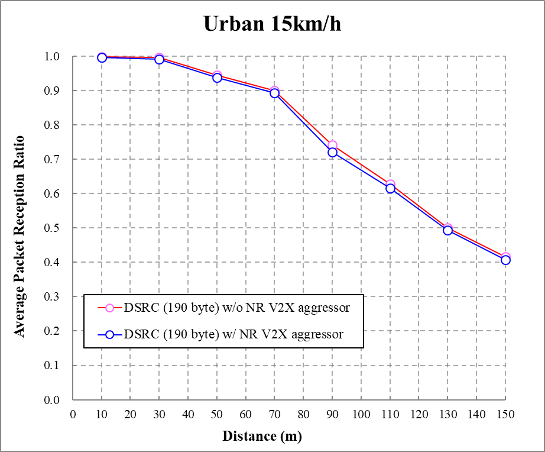

6 Transmitter characteristics
=============================

6.1 General
-----------

Unless otherwise stated the transmitter characteristics are specified at
the antenna connector(s) of the UE for the bands operating on frequency
range 1 and over the air of the UE for the bands operating on frequency
range 2. The requirements for frequency range 1 and frequency range 2
can be verified separately. For the carrier in frequency range 1,
requirements can be verified with NR FR2 link disabled. For the carrier
in frequency range 2, requirements can be verified in OTA mode with
E-UTRA or NR FR1 connecting to the network by OTA without calibration.

Unless otherwise stated, requirements for NR transmitter written in TS
38.101-1 \[2\] and TS 38.101-2 \[3\] apply and are assumed anchor
agnostic. Requirements are verified under conditions where anchor
resources do not interfere NR operation. If UE indicates IE
*powerClassNRPart-r16* as defined in TS 38.331 \[9\] in EN-DC, UE shall
meet NR requirements according to this power class.

For sub-clauses with suffix A or B: the minimum requirements for band
combinations including Band n41 also apply for the corresponding band
combinations with Band n90 replacing Band n41 but with otherwise
identical parameters. For brevity the said band combinations with Band
n90 are not listed in the tables below but are covered by this
specification.

The requirements for EN-DC applies for NE-DC, unless otherwise
specified.

6.2 Void
--------

6.2A Transmitter power for CA
-----------------------------

### 6.2A.1 UE maximum output power for CA

#### 6.2A.1.1 Inter-band CA between FR1 and FR2

Table 6.2A.1.1-1: Void

For inter-band NR CA in FR1 and FR2 combined, the UE shall meet each
transmitter power requirement specified in TS 38.101-1 \[2\] and TS
38.101-2 \[3\] for each frequency range independently.

### 6.2A.2 UE maximum output power reduction for CA

#### 6.2A.2.1 Inter-band CA between FR1 and FR2

For inter-band NR CA between FR1 and FR2, UE maximum output power
reduction specified in TS 38.101-1 \[2\] and TS 38.101-2 \[3\] apply for
each frequency range respectively.

### 6.2A.3 UE additional maximum output power reduction for CA

For inter-band NR CA between FR1 and FR2, UE additional maximum output
power reduction specified in TS 38.101-1 \[2\] and TS 38.101-2 \[3\]
apply for each frequency range respectively.

### 6.2A.4 Configured output power for CA

#### 6.2A.4.1 Configured output power level

For inter-band NR CA between FR1 and FR2, UE configured output power
specified in TS 38.101-1 \[2\] and TS 38.101-2 \[3\] apply for each
frequency range respectively.

#### 6.2A.4.2 ΔT~IB,c~ for CA

##### 6.2A.4.2.1 ΔT~IB,c~ for Inter-band CA between FR1 and FR2

Unless otherwise stated, ΔT~IB,c~ for NR FR1 band and FR2 band of
inter-band CA defined in table 5.5A.1-1 is set to zero.

Table 6.2A.4.2.1-1: Void

**Table 6.2A.4.2.1-2: Void**

**Table 6.2A.4.2.1-3: Void**

6.2B Transmitter power for DC
-----------------------------

### 6.2B.1 UE maximum output power for DC

#### 6.2B.1.1 Intra-band contiguous EN-DC

The following UE Power Classes define the total maximum output power for
any transmission bandwidth(s) of the CG(s) configured.

The maximum output power is measured as the total maximum output power
across the UE antenna connector(s). The period of measurement shall be
at least one sub frame.

Table 6.2B.1.1-1: Maximum output power for EN-DC (continuous sub-blocks)

+---------+---------+---------+---------+---------+---------+---------+
| EN-DC   | Power   | To      | Power   | To      | Power   | To      |
| config  | class   | lerance | class 2 | lerance | class 3 | lerance |
| uration | 1.5     |         |         |         |         |         |
|         |         | (dB)    | (dBm)   | (dB)    | (dBm)   | (dB)    |
|         | (dBm)   |         |         |         |         |         |
+---------+---------+---------+---------+---------+---------+---------+
| DC\_(n  |         |         |         |         | 23      | +2/-3   |
| )5AA^3^ |         |         |         |         |         |         |
+---------+---------+---------+---------+---------+---------+---------+
| DC\_(n) |         |         |         |         | 23      | +2/-3   |
| 12AA^3^ |         |         |         |         |         |         |
+---------+---------+---------+---------+---------+---------+---------+
| DC\_    |         |         |         |         | 23      | +2/-3   |
| (n)71AA |         |         |         |         |         |         |
+---------+---------+---------+---------+---------+---------+---------+
| DC\_(n) |         |         |         |         | 23      | +2/-3   |
| 38AA^3^ |         |         |         |         |         |         |
+---------+---------+---------+---------+---------+---------+---------+
| DC\_    | 29      | +       | 26      | +       | 23      | +       |
| (n)41AA |         | 2/-3^1^ |         | 2/-3^1^ |         | 2/-3^1^ |
+---------+---------+---------+---------+---------+---------+---------+
| DC\_(n) |         |         |         |         | 23      | +2/-3   |
| 48AA^3^ |         |         |         |         |         |         |
+---------+---------+---------+---------+---------+---------+---------+
| NOTE 1: |         |         |         |         |         |         |
| If all  |         |         |         |         |         |         |
| tran    |         |         |         |         |         |         |
| smitted |         |         |         |         |         |         |
| r       |         |         |         |         |         |         |
| esource |         |         |         |         |         |         |
| blocks  |         |         |         |         |         |         |
| over    |         |         |         |         |         |         |
| all     |         |         |         |         |         |         |
| co      |         |         |         |         |         |         |
| mponent |         |         |         |         |         |         |
| c       |         |         |         |         |         |         |
| arriers |         |         |         |         |         |         |
| are     |         |         |         |         |         |         |
| c       |         |         |         |         |         |         |
| onfined |         |         |         |         |         |         |
| within  |         |         |         |         |         |         |
| F~U     |         |         |         |         |         |         |
| L\_low~ |         |         |         |         |         |         |
| and     |         |         |         |         |         |         |
| F~U     |         |         |         |         |         |         |
| L\_low~ |         |         |         |         |         |         |
| + 4 MHz |         |         |         |         |         |         |
| or/and  |         |         |         |         |         |         |
| F~UL    |         |         |         |         |         |         |
| \_high~ |         |         |         |         |         |         |
| -- 4    |         |         |         |         |         |         |
| MHz and |         |         |         |         |         |         |
| F~UL\   |         |         |         |         |         |         |
| _high~, |         |         |         |         |         |         |
| the     |         |         |         |         |         |         |
| maximum |         |         |         |         |         |         |
| output  |         |         |         |         |         |         |
| power   |         |         |         |         |         |         |
| requ    |         |         |         |         |         |         |
| irement |         |         |         |         |         |         |
| is      |         |         |         |         |         |         |
| relaxed |         |         |         |         |         |         |
| by      |         |         |         |         |         |         |
| r       |         |         |         |         |         |         |
| educing |         |         |         |         |         |         |
| the     |         |         |         |         |         |         |
| lower   |         |         |         |         |         |         |
| to      |         |         |         |         |         |         |
| lerance |         |         |         |         |         |         |
| limit   |         |         |         |         |         |         |
| by 1.5  |         |         |         |         |         |         |
| dB      |         |         |         |         |         |         |
|         |         |         |         |         |         |         |
| NOTE 2: |         |         |         |         |         |         |
| Power   |         |         |         |         |         |         |
| Class 3 |         |         |         |         |         |         |
| is the  |         |         |         |         |         |         |
| default |         |         |         |         |         |         |
| power   |         |         |         |         |         |         |
| class   |         |         |         |         |         |         |
| unless  |         |         |         |         |         |         |
| ot      |         |         |         |         |         |         |
| herwise |         |         |         |         |         |         |
| stated. |         |         |         |         |         |         |
|         |         |         |         |         |         |         |
| NOTE 3: |         |         |         |         |         |         |
| Only    |         |         |         |         |         |         |
| single  |         |         |         |         |         |         |
| s       |         |         |         |         |         |         |
| witched |         |         |         |         |         |         |
| UL is   |         |         |         |         |         |         |
| sup     |         |         |         |         |         |         |
| ported. |         |         |         |         |         |         |
+---------+---------+---------+---------+---------+---------+---------+

If UE supports a different power class than the default UE power class
for EN-DC band combination, and the supported power class enables higher
maximum output power than that of the default power class:

\- if the E-UTRA UL/DL configuration is 0 or 6; or

\- if the E-UTRA UL/DL configuration is 1 and special subframe
configuration is 0 or 5; or

\- if the IE *p-maxUE-FR1-r15* as defined in TS 36.331 \[8\] is provided
and set to the maximum output power of the default power class or lower;

\- apply all requirements for the default power class, and set the
configured transmitted power as specified in clause 6.2B.4;

\- else

\- if the UE does not support a power class with higher maximum output
power than power class 2; or

\- if the E-UTRA UL/DL configuration is not 2 or 4 or 5; or

\- if the field of UE IE *maxUplinkDutyCycle-PC2-FR1* as defined in TS
38.331 is absent and the percentage of uplink symbols transmitted in a
certain evaluation period is larger than 25% (The exact evaluation
period is no less than one radio frame); or

\- if the field of UE IE *maxUplinkDutyCycle-PC2-FR1* is not absent and
the percentage of uplink symbols transmitted in a certain evaluation
period is larger than 0.5\**maxUplinkDutyCycle-PC2-FR1* (The exact
evaluation period is no less than one radio frame); or

\- if the IE P-Max as defined in TS 38.331 \[9\] is provided and set to
the maximum output power of the power class 2 or lower;

\- apply all requirements for the power class 2 and set the configured
transmitted power as specified in clause 6.2B.4;

\- else

\- apply all requirements for the supported power class, and set the
configured transmitted power class as specified in clause 6.2B.4;

#### 6.2B.1.2 Intra-band non-contiguous EN-DC

Table 6.2B.1.2-1: Maximum output power for EN-DC (non-continuous
sub-blocks)

+---------+---------+---------+---------+---------+---------+---------+
| EN-DC   | Power   | To      | Power   | To      | Power   | To      |
| config  | class   | lerance | class 2 | lerance | class 3 | lerance |
| uration | 1.5     |         |         |         |         |         |
|         |         | (dB)    | (dBm)   | (dB)    | (dBm)   | (dB)    |
|         | (dBm)   |         |         |         |         |         |
+---------+---------+---------+---------+---------+---------+---------+
| DC\_2A\ |         |         |         |         | 23      | +2/-3   |
| _n2A^4^ |         |         |         |         |         |         |
+---------+---------+---------+---------+---------+---------+---------+
| DC\_    |         |         |         |         | 23      | +2/-3   |
| 3A\_n3A |         |         |         |         |         |         |
+---------+---------+---------+---------+---------+---------+---------+
| DC\_5A\ |         |         |         |         | 23      | +2/-3   |
| _n5A^4^ |         |         |         |         |         |         |
+---------+---------+---------+---------+---------+---------+---------+
| DC\_7A\ |         |         |         |         | 23      | +2/-3   |
| _n7A^4^ |         |         |         |         |         |         |
+---------+---------+---------+---------+---------+---------+---------+
| DC      |         |         |         |         | 23      | +2/-3   |
| \_48A\_ |         |         |         |         |         |         |
| n48A^4^ |         |         |         |         |         |         |
+---------+---------+---------+---------+---------+---------+---------+
| DC\_41  | 29      | +       | 26      | +       | 23      | +       |
| A\_n41A |         | 2/-3^1^ |         | 2/-3^1^ |         | 2/-3^1^ |
+---------+---------+---------+---------+---------+---------+---------+
| DC      |         |         |         |         | 23      | +2/-3   |
| \_66A\_ |         |         |         |         |         |         |
| n66A^4^ |         |         |         |         |         |         |
+---------+---------+---------+---------+---------+---------+---------+
| NOTE 1: |         |         |         |         |         |         |
| If all  |         |         |         |         |         |         |
| tran    |         |         |         |         |         |         |
| smitted |         |         |         |         |         |         |
| r       |         |         |         |         |         |         |
| esource |         |         |         |         |         |         |
| blocks  |         |         |         |         |         |         |
| over    |         |         |         |         |         |         |
| all     |         |         |         |         |         |         |
| co      |         |         |         |         |         |         |
| mponent |         |         |         |         |         |         |
| c       |         |         |         |         |         |         |
| arriers |         |         |         |         |         |         |
| are     |         |         |         |         |         |         |
| c       |         |         |         |         |         |         |
| onfined |         |         |         |         |         |         |
| within  |         |         |         |         |         |         |
| F~U     |         |         |         |         |         |         |
| L\_low~ |         |         |         |         |         |         |
| and     |         |         |         |         |         |         |
| F~U     |         |         |         |         |         |         |
| L\_low~ |         |         |         |         |         |         |
| + 4 MHz |         |         |         |         |         |         |
| or/and  |         |         |         |         |         |         |
| F~UL    |         |         |         |         |         |         |
| \_high~ |         |         |         |         |         |         |
| -- 4    |         |         |         |         |         |         |
| MHz and |         |         |         |         |         |         |
| F~UL\   |         |         |         |         |         |         |
| _high~, |         |         |         |         |         |         |
| the     |         |         |         |         |         |         |
| maximum |         |         |         |         |         |         |
| output  |         |         |         |         |         |         |
| power   |         |         |         |         |         |         |
| requ    |         |         |         |         |         |         |
| irement |         |         |         |         |         |         |
| is      |         |         |         |         |         |         |
| relaxed |         |         |         |         |         |         |
| by      |         |         |         |         |         |         |
| r       |         |         |         |         |         |         |
| educing |         |         |         |         |         |         |
| the     |         |         |         |         |         |         |
| lower   |         |         |         |         |         |         |
| to      |         |         |         |         |         |         |
| lerance |         |         |         |         |         |         |
| limit   |         |         |         |         |         |         |
| by 1.5  |         |         |         |         |         |         |
| dB      |         |         |         |         |         |         |
|         |         |         |         |         |         |         |
| NOTE 2: |         |         |         |         |         |         |
| Void    |         |         |         |         |         |         |
|         |         |         |         |         |         |         |
| NOTE 3: |         |         |         |         |         |         |
| Power   |         |         |         |         |         |         |
| Class 3 |         |         |         |         |         |         |
| is the  |         |         |         |         |         |         |
| default |         |         |         |         |         |         |
| power   |         |         |         |         |         |         |
| class   |         |         |         |         |         |         |
| unless  |         |         |         |         |         |         |
| ot      |         |         |         |         |         |         |
| herwise |         |         |         |         |         |         |
| stated. |         |         |         |         |         |         |
|         |         |         |         |         |         |         |
| NOTE 4: |         |         |         |         |         |         |
| Only    |         |         |         |         |         |         |
| single  |         |         |         |         |         |         |
| s       |         |         |         |         |         |         |
| witched |         |         |         |         |         |         |
| UL is   |         |         |         |         |         |         |
| su      |         |         |         |         |         |         |
| pported |         |         |         |         |         |         |
+---------+---------+---------+---------+---------+---------+---------+

If UE supports a different power class than the default UE power class
for EN-DC band combination, and the supported power class enables higher
maximum output power than that of the default power class:

\- if the E-UTRA UL/DL configuration is 0 or 6; or

\- if the E-UTRA UL/DL configuration is 1 and special subframe
configuration is 0 or 5; or

\- if the IE *p-maxUE-FR1-r15* as defined in TS 36.331 \[8\] is provided
and set to the maximum output power of the default power class or lower;

\- apply all requirements for the default power class, and set the
configured transmitted power as specified in clause 6.2B.4;

\- else

\- if the UE does not support a power class with higher maximum output
power than power class 2; or

\- if the E-UTRA UL/DL configuration is not 2 or 4 or 5; or

\- if the field of UE IE *maxUplinkDutyCycle-PC2-FR1* as defined in TS
38.331 is absent and the percentage of uplink symbols transmitted in a
certain evaluation period is larger than 25% (The exact evaluation
period is no less than one radio frame); or

\- if the field of UE IE *maxUplinkDutyCycle-PC2-FR1* is not absent and
the percentage of uplink symbols transmitted in a certain evaluation
period is larger than 0.5\**maxUplinkDutyCycle-PC2-FR1* (The exact
evaluation period is no less than one radio frame); or

\- if the IE P-Max as defined in TS 38.331 \[9\] is provided and set to
the maximum output power of the power class 2 or lower;

\- apply all requirements for the power class 2 and set the configured
transmitted power as specified in clause 6.2B.4;

\- else

\- apply all requirements for the supported power class, and set the
configured transmitted power class as specified in clause 6.2B.4;

#### 6.2B.1.3 Inter-band EN-DC within FR1

For inter-band EN-DC of E-UTRA and NR in FR1, the following UE Power
Classes define the maximum output power for any transmission bandwidth
within the aggregated channel bandwidth. The maximum output power is
measured as the sum of the maximum output power at each UE antenna
connector. The period of measurement shall be at least one sub frame
(1ms). UE maximum output power shall be measured over all component
carriers from different bands. If each band has separate antenna
connectors, maximum output power is measured as the sum of maximum
output power at each UE antenna connector.

Table 6.2B.1.3-1: Maximum output power for inter-band EN-DC (two bands)

+--------------+--------------+-----------+--------------+-----------+
| EN-DC        | Power class  | Tolerance | Power class  | Tolerance |
| c            | 2            |           | 3            |           |
| onfiguration |              | (dB)      |              | (dB)      |
|              | (dBm)        |           | (dBm)        |           |
+==============+==============+===========+==============+===========+
| DC\_1A\_n3A  |              |           | 23           | +2/-3     |
+--------------+--------------+-----------+--------------+-----------+
| DC\_1A\_n5A  |              |           | 23           | +2/-3     |
+--------------+--------------+-----------+--------------+-----------+
| DC\_1A\_n7A  |              |           | 23           | +2/-3     |
+--------------+--------------+-----------+--------------+-----------+
| DC\_1A\_n8A  |              |           | 23           | +2/-3     |
+--------------+--------------+-----------+--------------+-----------+
| DC\_1A\_n20A |              |           | 23           | +2/-3     |
+--------------+--------------+-----------+--------------+-----------+
| DC\_1A\_n28A |              |           | 23           | +2/-3     |
+--------------+--------------+-----------+--------------+-----------+
| DC\_1A\_n38A |              |           | 23           | +2/-3     |
+--------------+--------------+-----------+--------------+-----------+
| DC\_1A\_n40A |              |           | 23           | +2/-3     |
+--------------+--------------+-----------+--------------+-----------+
| DC\_1A\_n41A |              |           | 23           | +2/-3     |
+--------------+--------------+-----------+--------------+-----------+
| DC\_1A\_n50A |              |           | 23           | +2/-3     |
+--------------+--------------+-----------+--------------+-----------+
| DC\_1A\_n51A |              |           | 23           | +2/-3     |
+--------------+--------------+-----------+--------------+-----------+
| DC\_1A\_n71A |              |           | 23           | +2/-3     |
+--------------+--------------+-----------+--------------+-----------+
| DC\_1A\_n77A |              |           | 23           | +2/-3     |
+--------------+--------------+-----------+--------------+-----------+
| DC\_1        |              |           | 23           | +2/-3     |
| A\_n84A\_ULS |              |           |              |           |
| UP-TDM\_n77A |              |           |              |           |
+--------------+--------------+-----------+--------------+-----------+
| DC\_1A\_n78A |              |           | 23           | +2/-3     |
+--------------+--------------+-----------+--------------+-----------+
| DC\_1        |              |           | 23           | +2/-3     |
| A\_n84A\_ULS |              |           |              |           |
| UP-TDM\_n78A |              |           |              |           |
+--------------+--------------+-----------+--------------+-----------+
| DC\_1A\_n79A |              |           | 23           | +2/-3     |
+--------------+--------------+-----------+--------------+-----------+
| DC\_1        |              |           | 23           | +2/-3     |
| A\_n84A\_ULS |              |           |              |           |
| UP-TDM\_n79A |              |           |              |           |
+--------------+--------------+-----------+--------------+-----------+
| DC\_1A\_n80A |              |           | 23           | +2/-3     |
+--------------+--------------+-----------+--------------+-----------+
| DC\_2A\_n5A  |              |           | 23           | +2/-3^1^  |
+--------------+--------------+-----------+--------------+-----------+
| **D          |              |           | **23**       | **+2/-3** |
| C\_2A\_n7A** |              |           |              |           |
+--------------+--------------+-----------+--------------+-----------+
| DC\_2A\_n12A |              |           | **23**       | **+2/-3** |
+--------------+--------------+-----------+--------------+-----------+
| DC\_2A\_n38A |              |           | 23           | +2/-3     |
+--------------+--------------+-----------+--------------+-----------+
| DC\_2A\_n41A |              |           | 23           | +2/-3     |
+--------------+--------------+-----------+--------------+-----------+
| DC\_2A\_n46A |              |           | 23           | +2/-3     |
+--------------+--------------+-----------+--------------+-----------+
| DC\_2A\_n48A |              |           | 23           | +2/-3     |
+--------------+--------------+-----------+--------------+-----------+
| DC\_2A\_n66A |              |           | 23           | +2/-3^1^  |
+--------------+--------------+-----------+--------------+-----------+
| DC\_2A\_n71A |              |           | 23           | +2/-3     |
+--------------+--------------+-----------+--------------+-----------+
| DC\_2A\_n78A |              |           | 23           | +2/-3     |
+--------------+--------------+-----------+--------------+-----------+
| DC\_3A\_n1A  |              |           | 23           | +2/-3     |
+--------------+--------------+-----------+--------------+-----------+
| DC\_3C\_n1A  |              |           | 23           | +2/-3     |
+--------------+--------------+-----------+--------------+-----------+
| DC\_3A\_n5A  |              |           | 23           | +2/-3     |
+--------------+--------------+-----------+--------------+-----------+
| DC\_3A\_n7A  |              |           | 23           | +2/-3^1^  |
+--------------+--------------+-----------+--------------+-----------+
| DC\_3A\_n7B  |              |           | 23           | +2/-3^1^  |
+--------------+--------------+-----------+--------------+-----------+
| DC\_3C\_n7A  |              |           | 23           | +2/-3^1^  |
+--------------+--------------+-----------+--------------+-----------+
| DC\_3A\_n8A  |              |           | 23           | +2/-3     |
+--------------+--------------+-----------+--------------+-----------+
| DC\_3A\_n20A |              |           | 23           | +2/-3     |
+--------------+--------------+-----------+--------------+-----------+
| DC\_3A\_n28A |              |           | 23           | +2/-3^1^  |
+--------------+--------------+-----------+--------------+-----------+
| DC\_3C\_n28A |              |           | 23           | +2/-3^1^  |
+--------------+--------------+-----------+--------------+-----------+
| DC\_3A\_n34A |              |           | 23           | +2/-3^1^  |
+--------------+--------------+-----------+--------------+-----------+
| DC\_3A\_n38A |              |           | 23           | +2/-3     |
+--------------+--------------+-----------+--------------+-----------+
| DC\_3A\_n40A |              |           | 23           | +2/-3^1^  |
+--------------+--------------+-----------+--------------+-----------+
| DC\_3A\_n41A | 26^6^        | +2/-3     | 23           | +2/-3     |
+--------------+--------------+-----------+--------------+-----------+
| D            | 26^6^        | +2/-3     | 23           | +2/-3     |
| C\_3C\_n41A, |              |           |              |           |
+--------------+--------------+-----------+--------------+-----------+
| DC\_3A\_n50A |              |           | 23           | +2/-3     |
+--------------+--------------+-----------+--------------+-----------+
| DC\_3A\_n51A |              |           | 23           | +2/-3^1^  |
+--------------+--------------+-----------+--------------+-----------+
| DC\_3A\_n71A |              |           | 23           | +2/-3     |
+--------------+--------------+-----------+--------------+-----------+
| DC\_3A\_n77A |              |           | 23           | +2/-3^1^  |
+--------------+--------------+-----------+--------------+-----------+
| DC\_3A\_n78A | 26^6^        | +2/-3^1^  | 23           | +2/-3^1^  |
+--------------+--------------+-----------+--------------+-----------+
| DC\_3A\_n79A |              |           | 23           | +2/-3^1^  |
+--------------+--------------+-----------+--------------+-----------+
| DC\_3C\_n79A |              |           | 23           | +2/-3^1^  |
+--------------+--------------+-----------+--------------+-----------+
| DC\_3        |              |           | 23           | +2/-3     |
| A\_n80A\_ULS |              |           |              |           |
| UP-TDM\_n41A |              |           |              |           |
+--------------+--------------+-----------+--------------+-----------+
| DC\_3        |              |           | 23           | +2/-3     |
| C\_n80A\_ULS |              |           |              |           |
| UP-TDM\_n41A |              |           |              |           |
+--------------+--------------+-----------+--------------+-----------+
| DC\_3        |              |           | 23           | +2/-3^1^  |
| A\_n80A\_ULS |              |           |              |           |
| UP-TDM\_n77A |              |           |              |           |
+--------------+--------------+-----------+--------------+-----------+
| DC\_3        |              |           | 23           | +2/-3^1^  |
| A\_n80A\_ULS |              |           |              |           |
| UP-TDM\_n78A |              |           |              |           |
+--------------+--------------+-----------+--------------+-----------+
| DC\_3        |              |           | 23           | +2/-3^1^  |
| A\_n80A\_ULS |              |           |              |           |
| UP-TDM\_n79A |              |           |              |           |
+--------------+--------------+-----------+--------------+-----------+
| DC\_3A\_n82A |              |           | 23           | +2/-3^1^  |
+--------------+--------------+-----------+--------------+-----------+
| DC\_3A\_n84A |              |           | 23           | +2/-3^1^  |
+--------------+--------------+-----------+--------------+-----------+
| DC\_4A\_n38A |              |           | 23           | +2/-3     |
+--------------+--------------+-----------+--------------+-----------+
| DC\_4A\_n41A |              |           | 23           | +2/-3     |
+--------------+--------------+-----------+--------------+-----------+
| DC\_4A\_n78A |              |           | 23           | +2/-3     |
+--------------+--------------+-----------+--------------+-----------+
| DC\_5A\_n2A  |              |           | 23           | +2/-3     |
+--------------+--------------+-----------+--------------+-----------+
| **D          |              |           | **23**       | **+2/-3** |
| C\_5A\_n7A** |              |           |              |           |
+--------------+--------------+-----------+--------------+-----------+
| **DC         |              |           | 23           | +2/-3     |
| \_5A\_n12A** |              |           |              |           |
+--------------+--------------+-----------+--------------+-----------+
| **DC         |              |           | **23**       | **+2/-3** |
| \_5A\_n38A** |              |           |              |           |
+--------------+--------------+-----------+--------------+-----------+
| DC\_5A\_n40A |              |           | 23           | +2/-3^1^  |
+--------------+--------------+-----------+--------------+-----------+
| DC\_5A\_n48A |              |           | 23           | +2/-3     |
+--------------+--------------+-----------+--------------+-----------+
| DC\_5A\_n66A |              |           | 23           | +2/-3^1^  |
+--------------+--------------+-----------+--------------+-----------+
| DC\_5A\_n71A |              |           | 23           | +2/-3     |
+--------------+--------------+-----------+--------------+-----------+
| DC\_5A\_n78A |              |           | 23           | +2/-3     |
+--------------+--------------+-----------+--------------+-----------+
| DC\_5A\_n79A |              |           | 23           | +2/-3     |
+--------------+--------------+-----------+--------------+-----------+
| DC\_7A\_n1A  |              |           | 23           | +2/-3     |
+--------------+--------------+-----------+--------------+-----------+
| DC\_7A\_n3A  |              |           | 23           | +2/-3     |
+--------------+--------------+-----------+--------------+-----------+
| DC\_7A\_n5A  |              |           | 23           | +2/-3     |
+--------------+--------------+-----------+--------------+-----------+
| DC\_7C\_n5A  |              |           | 23           | +2/-3     |
+--------------+--------------+-----------+--------------+-----------+
| DC\_7A\_n8A  |              |           | 23           | +2/-3     |
+--------------+--------------+-----------+--------------+-----------+
| DC\_7A\_n20A |              |           | 23           | +2/-3     |
+--------------+--------------+-----------+--------------+-----------+
| DC\_7A\_n28A |              |           | 23           | +2/-3^1^  |
+--------------+--------------+-----------+--------------+-----------+
| DC\_7A\_n40A |              |           | 23           | +2/-3     |
+--------------+--------------+-----------+--------------+-----------+
| DC\_7A\_n51A |              |           | 23           | +2/-3^1^  |
+--------------+--------------+-----------+--------------+-----------+
| DC\_7A\_n66A |              |           | 23           | +2/-3^1^  |
+--------------+--------------+-----------+--------------+-----------+
| DC\_7A\_n71A |              |           | 23           | +2/-3     |
+--------------+--------------+-----------+--------------+-----------+
| DC\_7A\_n77A |              |           | 23           | +2/-3     |
+--------------+--------------+-----------+--------------+-----------+
| DC\_7A\_n78A |              |           | 23           | +2/-3     |
+--------------+--------------+-----------+--------------+-----------+
| DC\_7C\_n78A |              |           | 23           | +2/-3     |
+--------------+--------------+-----------+--------------+-----------+
| DC\_7A\_n80A |              |           | 23           | +2/-3     |
+--------------+--------------+-----------+--------------+-----------+
| DC\_8A\_n1A  |              |           | 23           | +2/-3     |
+--------------+--------------+-----------+--------------+-----------+
| DC\_8A\_n3A  |              |           | 23           | +2/-3     |
+--------------+--------------+-----------+--------------+-----------+
| DC\_8A\_n20A |              |           | 23           | +2/-3     |
+--------------+--------------+-----------+--------------+-----------+
| DC\_8A\_n28A |              |           | 23           | +2/-3     |
+--------------+--------------+-----------+--------------+-----------+
| DC\_8A\_n34A |              |           | 23           | +2/-3^1^  |
+--------------+--------------+-----------+--------------+-----------+
| DC\_8A\_n39A |              |           | 23           | +2/-3     |
+--------------+--------------+-----------+--------------+-----------+
| DC\_8A\_n40A |              |           | 23           | +2/-3^1^  |
+--------------+--------------+-----------+--------------+-----------+
| D            |              |           | 23           | +2/-3     |
| C\_8A\_n41A, |              |           |              |           |
+--------------+--------------+-----------+--------------+-----------+
| DC\_8A\_n77A |              |           | 23           | +2/-3     |
+--------------+--------------+-----------+--------------+-----------+
| DC\_8A\_n78A |              |           | 23           | +2/-3     |
+--------------+--------------+-----------+--------------+-----------+
| DC\_8A\_n79A |              |           | 23           | +2/-3     |
+--------------+--------------+-----------+--------------+-----------+
| DC\_8A\_n79C |              |           | 23           | +2/-3     |
+--------------+--------------+-----------+--------------+-----------+
| DC\_8A\_n80A |              |           | 23           | +2/-3     |
+--------------+--------------+-----------+--------------+-----------+
| DC\_8        |              |           | 23           | +2/-3     |
| A\_n81A\_ULS |              |           |              |           |
| UP-TDM\_n41A |              |           |              |           |
+--------------+--------------+-----------+--------------+-----------+
| DC\_8        |              |           | 23           | +2/-3     |
| A\_n81A\_ULS |              |           |              |           |
| UP-TDM\_n78A |              |           |              |           |
+--------------+--------------+-----------+--------------+-----------+
| DC\_8        |              |           | 23           | +2/-3     |
| A\_n81A\_ULS |              |           |              |           |
| UP-TDM\_n79A |              |           |              |           |
+--------------+--------------+-----------+--------------+-----------+
| DC\_11A\_n3A |              |           | 23           | +2/-3     |
+--------------+--------------+-----------+--------------+-----------+
| D            |              |           | 23           | +2/-3     |
| C\_11A\_n28A |              |           |              |           |
+--------------+--------------+-----------+--------------+-----------+
| D            |              |           | 23           | +2/-3     |
| C\_11A\_n77A |              |           |              |           |
+--------------+--------------+-----------+--------------+-----------+
| D            |              |           | 23           | +2/-3     |
| C\_11A\_n78A |              |           |              |           |
+--------------+--------------+-----------+--------------+-----------+
| D            |              |           | 23           | +2/-3     |
| C\_11A\_n79A |              |           |              |           |
+--------------+--------------+-----------+--------------+-----------+
| DC\_12A\_n2A |              |           | 23           | +2/-3     |
+--------------+--------------+-----------+--------------+-----------+
| DC\_12A\_n5A |              |           | 23           | +2/-3     |
+--------------+--------------+-----------+--------------+-----------+
| DC\_12A\_n7A |              |           | 23           | +2/-3     |
+--------------+--------------+-----------+--------------+-----------+
| D            |              |           | 23           | +2/-3     |
| C\_12A\_n25A |              |           |              |           |
+--------------+--------------+-----------+--------------+-----------+
| D            |              |           | 23           | +2/-3     |
| C\_12A\_n38A |              |           |              |           |
+--------------+--------------+-----------+--------------+-----------+
| D            |              |           | 23           | +2/-3     |
| C\_12A\_n41A |              |           |              |           |
+--------------+--------------+-----------+--------------+-----------+
| D            |              |           | 23           | +2/-3     |
| C\_12A\_n66A |              |           |              |           |
+--------------+--------------+-----------+--------------+-----------+
| D            |              |           | 23           | +2/-3     |
| C\_12A\_n78A |              |           |              |           |
+--------------+--------------+-----------+--------------+-----------+
| DC\_13A\_n2A |              |           | 23           | +2/-3     |
+--------------+--------------+-----------+--------------+-----------+
| DC\_13A\_n5A |              |           | 23           | +2/-3     |
+--------------+--------------+-----------+--------------+-----------+
| DC\_13A\_n7A |              |           | 23           | +2/-3     |
+--------------+--------------+-----------+--------------+-----------+
| D            |              |           | 23           | +2/-3     |
| C\_13A\_n48A |              |           |              |           |
+--------------+--------------+-----------+--------------+-----------+
| D            |              |           | 23           | +2/-3     |
| C\_13A\_n66A |              |           |              |           |
+--------------+--------------+-----------+--------------+-----------+
| D            |              |           | 23           | +2/-3     |
| C\_13A\_n71A |              |           |              |           |
+--------------+--------------+-----------+--------------+-----------+
| D            |              |           | 23           | +2/-3     |
| C\_13A\_n78A |              |           |              |           |
+--------------+--------------+-----------+--------------+-----------+
| DC\_14A\_n2A |              |           | 23           | +2/-3     |
+--------------+--------------+-----------+--------------+-----------+
| D            |              |           | 23           | +2/-3     |
| C\_14A\_n66A |              |           |              |           |
+--------------+--------------+-----------+--------------+-----------+
| DC\_18A\_n3A |              |           | 23           | +2/-3     |
+--------------+--------------+-----------+--------------+-----------+
| D            |              |           | 23           | +2/-3     |
| C\_18A\_n77A |              |           |              |           |
+--------------+--------------+-----------+--------------+-----------+
| D            |              |           | 23           | +2/-3     |
| C\_18A\_n78A |              |           |              |           |
+--------------+--------------+-----------+--------------+-----------+
| D            |              |           | 23           | +2/-3     |
| C\_18A\_n79A |              |           |              |           |
+--------------+--------------+-----------+--------------+-----------+
| D            |              |           | 23           | +2/-3     |
| C\_19A\_n77A |              |           |              |           |
+--------------+--------------+-----------+--------------+-----------+
| D            |              |           | 23           | +2/-3     |
| C\_19A\_n78A |              |           |              |           |
+--------------+--------------+-----------+--------------+-----------+
| D            |              |           | 23           | +2/-3     |
| C\_19A\_n79A |              |           |              |           |
+--------------+--------------+-----------+--------------+-----------+
| DC\_20A\_n1A |              |           | 23           | +2/-3     |
+--------------+--------------+-----------+--------------+-----------+
| DC\_20A\_n3A |              |           | 23           | +2/-3     |
+--------------+--------------+-----------+--------------+-----------+
| DC\_20A\_n7A |              |           | 23           | +2/-3     |
+--------------+--------------+-----------+--------------+-----------+
| DC\_20A\_n8A |              |           | 23           | +2/-3     |
+--------------+--------------+-----------+--------------+-----------+
| D            |              |           | 23           | +2/-3     |
| C\_20A\_n38A |              |           |              |           |
+--------------+--------------+-----------+--------------+-----------+
| D            |              |           | 23           | +2/-3     |
| C\_20A\_n28A |              |           |              |           |
+--------------+--------------+-----------+--------------+-----------+
| D            |              |           | 23           | +2/-3     |
| C\_20A\_n41A |              |           |              |           |
+--------------+--------------+-----------+--------------+-----------+
| D            |              |           | 23           | +2/-3     |
| C\_20A\_n50A |              |           |              |           |
+--------------+--------------+-----------+--------------+-----------+
| D            |              |           | 23           | +2/-3     |
| C\_20A\_n51A |              |           |              |           |
+--------------+--------------+-----------+--------------+-----------+
| D            |              |           | 23           | +2/-3     |
| C\_20A\_n77A |              |           |              |           |
+--------------+--------------+-----------+--------------+-----------+
| D            |              |           | 23           | +2/-3     |
| C\_20A\_n80A |              |           |              |           |
+--------------+--------------+-----------+--------------+-----------+
| D            |              |           | 23           | +2/-3     |
| C\_20A\_n78A |              |           |              |           |
+--------------+--------------+-----------+--------------+-----------+
| DC\_20       |              |           | 23           | +2/-3     |
| A\_n82A\_ULS |              |           |              |           |
| UP-TDM\_n78A |              |           |              |           |
+--------------+--------------+-----------+--------------+-----------+
| D            |              |           | 23           | +2/-3     |
| C\_20A\_n83A |              |           |              |           |
+--------------+--------------+-----------+--------------+-----------+
| D            |              |           | 23           | +2/-3     |
| C\_21A\_n77A |              |           |              |           |
+--------------+--------------+-----------+--------------+-----------+
| D            |              |           | 23           | +2/-3     |
| C\_21A\_n78A |              |           |              |           |
+--------------+--------------+-----------+--------------+-----------+
| D            |              |           | 23           | +2/-3     |
| C\_21A\_n79A |              |           |              |           |
+--------------+--------------+-----------+--------------+-----------+
| D            |              |           | 23           | +2/-3     |
| C\_25A\_n41A |              |           |              |           |
+--------------+--------------+-----------+--------------+-----------+
| D            |              |           | 23           | +2/-3     |
| C\_26A\_n25A |              |           |              |           |
+--------------+--------------+-----------+--------------+-----------+
| D            |              |           | 23           | +2/-3     |
| C\_26A\_n41A |              |           |              |           |
+--------------+--------------+-----------+--------------+-----------+
| D            |              |           | 23           | +2/-3     |
| C\_26A\_n77A |              |           |              |           |
+--------------+--------------+-----------+--------------+-----------+
| D            |              |           | 23           | +2/-3     |
| C\_26A\_n78A |              |           |              |           |
+--------------+--------------+-----------+--------------+-----------+
| D            |              |           | 23           | +2/-3     |
| C\_26A\_n79A |              |           |              |           |
+--------------+--------------+-----------+--------------+-----------+
| DC\_28A\_n3A |              |           | 23           | +2/-3     |
+--------------+--------------+-----------+--------------+-----------+
| DC\_28A\_n5A |              |           | 23           | +2/-3     |
+--------------+--------------+-----------+--------------+-----------+
| DC\_28A\_n7A |              |           | 23           | +2/-3     |
+--------------+--------------+-----------+--------------+-----------+
| DC\_28A\_n7B |              |           | 23           | +2/-3     |
+--------------+--------------+-----------+--------------+-----------+
| DC\_28A\_n8A |              |           | 23           | +2/-3     |
+--------------+--------------+-----------+--------------+-----------+
| D            |              |           | 23           | +2/-3     |
| C\_28A\_n40A |              |           |              |           |
+--------------+--------------+-----------+--------------+-----------+
| D            |              |           | 23           | +2/-3     |
| C\_28A\_n41A |              |           |              |           |
+--------------+--------------+-----------+--------------+-----------+
| D            |              |           | 23           | +2/-3     |
| C\_28A\_n50A |              |           |              |           |
+--------------+--------------+-----------+--------------+-----------+
| D            |              |           | 23           | +2/-3     |
| C\_28A\_n51A |              |           |              |           |
+--------------+--------------+-----------+--------------+-----------+
| D            |              |           | 23           | +2/-3     |
| C\_28A\_n77A |              |           |              |           |
+--------------+--------------+-----------+--------------+-----------+
| D            |              |           | 23           | +2/-3     |
| C\_28A\_n78A |              |           |              |           |
+--------------+--------------+-----------+--------------+-----------+
| D            |              |           | 23           | +2/-3     |
| C\_28A\_n79A |              |           |              |           |
+--------------+--------------+-----------+--------------+-----------+
| DC\_28       |              |           | 23           | +2/-3     |
| A\_n83A\_ULS |              |           |              |           |
| UP-TDM\_n78A |              |           |              |           |
+--------------+--------------+-----------+--------------+-----------+
| DC\_30A\_n2A |              |           | 23           | +2/-3     |
+--------------+--------------+-----------+--------------+-----------+
| DC\_30A\_n5A |              |           | 23           | +2/-3     |
+--------------+--------------+-----------+--------------+-----------+
| D            |              |           | 23           | +2/-3     |
| C\_30A\_n66A |              |           |              |           |
+--------------+--------------+-----------+--------------+-----------+
| D            |              |           | 23           | +2/-3     |
| C\_38A\_n78A |              |           |              |           |
+--------------+--------------+-----------+--------------+-----------+
| D            |              |           | 23           | +2/-3     |
| C\_39A\_n40A |              |           |              |           |
+--------------+--------------+-----------+--------------+-----------+
| D            | 26^5^        | +2/-3^1^  | 23           | +2/-3     |
| C\_39A\_n41A |              |           |              |           |
+--------------+--------------+-----------+--------------+-----------+
| D            | 26^5^        | +2/-3^1^  | 23           | +2/-3     |
| C\_39C\_n41A |              |           |              |           |
+--------------+--------------+-----------+--------------+-----------+
| D            |              |           | 23           | +2/-3^1^  |
| C\_39A\_n78A |              |           |              |           |
+--------------+--------------+-----------+--------------+-----------+
| D            | 26^5^        | +2/-3^1^  | 23           | +2/-3^1^  |
| C\_39A\_n79A |              |           |              |           |
+--------------+--------------+-----------+--------------+-----------+
| DC\_40A\_n1A |              |           | 23           | +2/-3     |
+--------------+--------------+-----------+--------------+-----------+
| D            |              |           | 23           | +2/-3     |
| C\_40A\_n41A |              |           |              |           |
+--------------+--------------+-----------+--------------+-----------+
| D            |              |           | 23           | +2/-3     |
| C\_40A\_n77A |              |           |              |           |
+--------------+--------------+-----------+--------------+-----------+
| D            |              |           | 23           | +2/-3     |
| C\_40A\_n78A |              |           |              |           |
+--------------+--------------+-----------+--------------+-----------+
| D            |              |           | 23           | +2/-3     |
| C\_40C\_n78A |              |           |              |           |
+--------------+--------------+-----------+--------------+-----------+
| D            |              |           | 23           | +2/-3     |
| C\_40A\_n79A |              |           |              |           |
+--------------+--------------+-----------+--------------+-----------+
| DC\_41A\_n3A |              |           | 23           | +2/-3     |
+--------------+--------------+-----------+--------------+-----------+
| DC\_41C\_n3A |              |           | 23           | +2/-3     |
+--------------+--------------+-----------+--------------+-----------+
| D            |              |           | 23           | +2/-3     |
| C\_41A\_n28A |              |           |              |           |
+--------------+--------------+-----------+--------------+-----------+
| D            |              |           | 23           | +2/-3     |
| C\_41C\_n28A |              |           |              |           |
+--------------+--------------+-----------+--------------+-----------+
| D            |              |           | 23           | +2/-3^1^  |
| C\_41A\_n77A |              |           |              |           |
+--------------+--------------+-----------+--------------+-----------+
| D            |              |           | 23           | +2/-3^1^  |
| C\_41C\_n77A |              |           |              |           |
+--------------+--------------+-----------+--------------+-----------+
| D            |              |           | 23           | +2/-3^1^  |
| C\_41A\_n78A |              |           |              |           |
+--------------+--------------+-----------+--------------+-----------+
| D            |              |           | 23           | +2/-3^1^  |
| C\_41C\_n78A |              |           |              |           |
+--------------+--------------+-----------+--------------+-----------+
| D            | 26^5^        | +2/-3^1^  | 23           | +2/-3^1^  |
| C\_41A\_n79A |              |           |              |           |
+--------------+--------------+-----------+--------------+-----------+
| D            | 26^5^        | +2/-3^1^  | 23           | +2/-3^1^  |
| C\_41C\_n79A |              |           |              |           |
+--------------+--------------+-----------+--------------+-----------+
| D            |              |           | 23           | +2/-3     |
| C\_42A\_n28A |              |           |              |           |
+--------------+--------------+-----------+--------------+-----------+
| D            |              |           | 23           | +2/-3     |
| C\_42C\_n28A |              |           |              |           |
+--------------+--------------+-----------+--------------+-----------+
| D            |              |           | 23           | +2/-3     |
| C\_42A\_n51A |              |           |              |           |
+--------------+--------------+-----------+--------------+-----------+
| D            |              |           | N/A          | N/A       |
| C\_42A\_n77A |              |           |              |           |
+--------------+--------------+-----------+--------------+-----------+
| D            |              |           | N/A          | N/A       |
| C\_42A\_n78A |              |           |              |           |
+--------------+--------------+-----------+--------------+-----------+
| D            |              |           | N/A          | N/A       |
| C\_42A\_n79A |              |           |              |           |
+--------------+--------------+-----------+--------------+-----------+
| DC\_48A\_n5A |              |           | 23           | +2/-3     |
+--------------+--------------+-----------+--------------+-----------+
| D            |              |           | 23           | +2/-3     |
| C\_48A\_n12A |              |           |              |           |
+--------------+--------------+-----------+--------------+-----------+
| D            |              |           | 23           | +2/-3     |
| C\_48A\_n46A |              |           |              |           |
+--------------+--------------+-----------+--------------+-----------+
| D            |              |           | 23           | +2/-3     |
| C\_48A\_n66A |              |           |              |           |
+--------------+--------------+-----------+--------------+-----------+
| D            |              |           | 23           | +2/-3     |
| C\_48A\_n71A |              |           |              |           |
+--------------+--------------+-----------+--------------+-----------+
| DC\_66A\_n2A |              |           | 23           | +2/-3     |
+--------------+--------------+-----------+--------------+-----------+
| DC\_66A\_n5A |              |           | 23           | +2/-3^1^  |
+--------------+--------------+-----------+--------------+-----------+
| DC\_66A\_n7A |              |           | 23           | +2/-3     |
+--------------+--------------+-----------+--------------+-----------+
| D            |              |           | 23           | +2/-3     |
| C\_66A\_n12A |              |           |              |           |
+--------------+--------------+-----------+--------------+-----------+
| D            |              |           | 23           | +2/-3     |
| C\_66A\_n25A |              |           |              |           |
+--------------+--------------+-----------+--------------+-----------+
| D            |              |           | 23           | +2/-3     |
| C\_66A\_n38A |              |           |              |           |
+--------------+--------------+-----------+--------------+-----------+
| D            |              |           | 23           | +2/-3     |
| C\_66A\_n41A |              |           |              |           |
+--------------+--------------+-----------+--------------+-----------+
| D            |              |           | 23           | +2/-3     |
| C\_66A\_n46A |              |           |              |           |
+--------------+--------------+-----------+--------------+-----------+
| D            |              |           | 23           | +2/-3     |
| C\_66A\_n48A |              |           |              |           |
+--------------+--------------+-----------+--------------+-----------+
| D            |              |           | 23           | +2/-3     |
| C\_66A\_n71A |              |           |              |           |
+--------------+--------------+-----------+--------------+-----------+
| D            |              |           | 23           | +2/-3     |
| C\_66A\_n78A |              |           |              |           |
+--------------+--------------+-----------+--------------+-----------+
| DC\_66       |              |           | 23           | +2/-3     |
| A\_n86A\_ULS |              |           |              |           |
| UP-TDM\_n78A |              |           |              |           |
+--------------+--------------+-----------+--------------+-----------+
| DC\_71A\_n5A |              |           | 23           | +2/-3     |
+--------------+--------------+-----------+--------------+-----------+
| D            |              |           | 23           | +2/-3     |
| C\_71A\_n38A |              |           |              |           |
+--------------+--------------+-----------+--------------+-----------+
| D            |              |           | 23           | +2/-3     |
| C\_71A\_n48A |              |           |              |           |
+--------------+--------------+-----------+--------------+-----------+
| D            |              |           | 23           | +2/-3     |
| C\_71A\_n66A |              |           |              |           |
+--------------+--------------+-----------+--------------+-----------+
| D            |              |           | 23           | +2/-3     |
| C\_71A\_n78A |              |           |              |           |
+--------------+--------------+-----------+--------------+-----------+
| NOTE 1: For  |              |           |              |           |
| the          |              |           |              |           |
| transmission |              |           |              |           |
| bandwidths   |              |           |              |           |
| confined     |              |           |              |           |
| within       |              |           |              |           |
| F~UL\_low~   |              |           |              |           |
| and          |              |           |              |           |
| F~UL\_low~ + |              |           |              |           |
| 4 MHz or     |              |           |              |           |
| F~UL\_high~  |              |           |              |           |
| -- 4 MHz and |              |           |              |           |
| F~UL\_high~, |              |           |              |           |
| the maximum  |              |           |              |           |
| output power |              |           |              |           |
| requirement  |              |           |              |           |
| is relaxed   |              |           |              |           |
| by reducing  |              |           |              |           |
| the lower    |              |           |              |           |
| tolerance    |              |           |              |           |
| limit by 1.5 |              |           |              |           |
| dB           |              |           |              |           |
|              |              |           |              |           |
| NOTE 2:      |              |           |              |           |
| P~PowerCl    |              |           |              |           |
| ass,\ EN-DC~ |              |           |              |           |
| is the       |              |           |              |           |
| maximum UE   |              |           |              |           |
| power        |              |           |              |           |
| specified    |              |           |              |           |
| without      |              |           |              |           |
| taking into  |              |           |              |           |
| account the  |              |           |              |           |
| tolerance    |              |           |              |           |
|              |              |           |              |           |
| NOTE 3: For  |              |           |              |           |
| inter-band   |              |           |              |           |
| EN-DC the    |              |           |              |           |
| maximum      |              |           |              |           |
| power        |              |           |              |           |
| requirement  |              |           |              |           |
| should apply |              |           |              |           |
| to the total |              |           |              |           |
| transmitted  |              |           |              |           |
| power over   |              |           |              |           |
| all          |              |           |              |           |
| component    |              |           |              |           |
| carriers     |              |           |              |           |
| (per UE).    |              |           |              |           |
|              |              |           |              |           |
| NOTE 4:      |              |           |              |           |
| Power Class  |              |           |              |           |
| 3 is the     |              |           |              |           |
| default      |              |           |              |           |
| power class  |              |           |              |           |
| unless       |              |           |              |           |
| otherwise    |              |           |              |           |
| stated.      |              |           |              |           |
|              |              |           |              |           |
| NOTE 5: The  |              |           |              |           |
| UE is not    |              |           |              |           |
| required to  |              |           |              |           |
| support PC2  |              |           |              |           |
| within each  |              |           |              |           |
| individual   |              |           |              |           |
| cell group.  |              |           |              |           |
| Power class  |              |           |              |           |
| support      |              |           |              |           |
| within each  |              |           |              |           |
| individual   |              |           |              |           |
| cell group   |              |           |              |           |
| is signaled  |              |           |              |           |
| separately   |              |           |              |           |
| by the UE.   |              |           |              |           |
|              |              |           |              |           |
| NOTE 6: The  |              |           |              |           |
| UE supports  |              |           |              |           |
| PC3 within   |              |           |              |           |
| E-UTRA cell  |              |           |              |           |
| group,       |              |           |              |           |
| and supports |              |           |              |           |
| either PC3   |              |           |              |           |
| or PC2       |              |           |              |           |
| within NR    |              |           |              |           |
| cell group.  |              |           |              |           |
| Power class  |              |           |              |           |
| support      |              |           |              |           |
| within each  |              |           |              |           |
| individual   |              |           |              |           |
| cell group   |              |           |              |           |
| is signaled  |              |           |              |           |
| separately   |              |           |              |           |
| by the UE.   |              |           |              |           |
+--------------+--------------+-----------+--------------+-----------+

If a UE supports a different power class than the default UE power class
for an E-UTRA TDD and NR TDD Inter-band EN-DC band combination and the
supported power class enables higher maximum output power than that of
the default power class:

> -- if the field of UE capability
> *maxUplinkDutyCycle-interBandENDC-TDD-PC2-r16* is absent and the
> percentage of NR uplink symbols transmitted in a certain evaluation
> period is larger than 30% (The exact evaluation period is no less than
> one radio frame); or
>
> -- if the field of UE capability
> *maxUplinkDutyCycle-interBandENDC-TDD-PC2-r16* is not absent and the
> percentage of NR uplink symbols transmitted in a certain evaluation
> period is larger than *maxUplinkDutyCycle-interBandENDC-TDD-PC2-r16*
> as defined in TS38.331 (The exact evaluation period is no less than
> one radio frame); or
>
> -- if the IE *p-maxUE-FR1* as defined in TS 38.331 is provided and set
> to the maximum output power of the default power class or lower;
>
> -- shall apply all requirements for the default power class to the
> supported power class and set the configured transmitted power as
> specified sub-clause 6.2B.4;
>
> -- Else if the IE *p-maxUE-FR1* as defined in TS 38.331 is not
> provided or set to the higher value than the maximum output power of
> the default power class and the percentage of NR uplink symbols
> transmitted in a certain evaluation period is less than or equal t*o
> maxUplinkDutyCycle-interBandENDC-TDD-PC2-r16* as defined in TS 38.331;
> or
>
> -- if the IE *p-maxUE-FR1* as defined in TS 38.331 is not provided or
> set to the higher value than the maximum output power of the default
> power class and the percentage of NR uplink symbols transmitted in a
> certain evaluation period is less than or equal to 30% when
> *maxUplinkDutyCycle-interBandENDC-TDD-PC2-r16* is absent. (The exact
> evaluation period is no less than one radio frame):
>
> -- shall apply all requirements for the supported power class and set
> the configured transmitted power class as specified in sub-clause
> 6.2B.4.

If a UE supports a different power class than the default UE power class
for an E-UTRA FDD and NR TDD EN-DC band combination and the supported
power class enables higher maximum output power than that of the default
power class:

> If UE indicating the two capabilities
> *maxUplinkDutyCycle-FDD-TDD-EN-DC1* and
> *maxUplinkDutyCycle-FDD-TDD-EN-DC2*:

-- if the IE *p-maxUE-FR1* as defined in TS 38.331 is not provided or
set to the higher value than the maximum output power of the default
power class, and the percentage of EUTRA uplink symbols transmitted in a
certain evaluation period is between 40% and 70%, and the percentage of
NR uplink symbols transmitted in a certain evaluation period is less
than or equal t*o maxUplinkDutyCycle-FDD-TDD-EN-DC1* as defined in TS
38.331 (The exact evaluation period is no less than one radio frame); or

-- if the IE *p-maxUE-FR1* as defined in TS 38.331 is not provided or
set to the higher value than the maximum output power of the default
power class, and the percentage of EUTRA uplink symbols transmitted in a
certain evaluation period is no larger than 40%, and the percentage of
NR uplink symbols transmitted in a certain evaluation period is less
than or equal t*o maxUplinkDutyCycle-FDD-TDD-EN-DC2* as defined in TS
38.331 (The exact evaluation period is no less than one radio frame)

-- shall apply all requirements for the supported power class and set
the configured transmitted power class as specified in sub-clause
6.2B.4.

-- else

-- shall apply all requirements for the default power class and set the
configured transmitted power as specified sub-clause 6.2B.4;

> else

-- shall apply all requirements for the supported power class and set
the configured transmitted power as specified sub-clause 6.2B.4;

#### 6.2B.1.3a Inter-band NE-DC within FR1

For inter-band NE-DC of E-UTRA and NR in FR1, the following UE power
classes define the maximum output power for any transmission bandwidth
within the aggregated channel bandwidth. The maximum output power is
measured as the sum of the maximum output power at each UE antenna
connector. The period of measurement shall be at least one sub frame (1
ms). UE maximum output power shall be measured over all component
carriers from different bands. If each band has separate antenna
connectors, maximum output power is measured as the sum of maximum
output power at each UE antenna connector.

Table 6.2B.1.3a-1: Maximum output power for inter-band NE-DC (two bands)

+---------------------+---------------+-----------+
| NE-DC configuration | Power class 3 | Tolerance |
|                     |               |           |
|                     | (dBm)         | (dB)      |
+=====================+===============+===========+
| DC\_n1A\_28A        | 23            | +2/-3     |
+---------------------+---------------+-----------+

#### 6.2B.1.4 Inter-band EN-DC including FR2

UE maximum output power requirement for E-UTRA single carrier and CA
operation specified in clauses 6.2.2 and 6.2.2A of TS 36.101 \[4\] and
for NR single carrier, CA operation and UL-MIMO specified in clause
6.2.1, 6.2A.1, and 6.2D.1 of TS 38.101-2 \[3\] apply.

#### 6.2B.1.5 Inter-band EN-DC including both FR1 and FR2

UE maximum output power requirement for E-UTRA single carrier and CA
operation specified in clauses 6.2.2 and 6.2.2A of TS 36.101 \[4\] and
for NR single carrier specified in clause 6.2.1 of TS 38.101-1 \[2\] and
for NR single carrier, CA operation and UL-MIMO specified in clause
6.2.1, 6.2A.1, and 6.2D.1 of TS 38.101-2 \[3\] apply. When uplink is
EN-DC mode within FR1 only then UE maximum output power requirement is
specified in clause 6.2B.1.3 of this specification.

### 6.2B.2 UE maximum output power reduction for DC

#### 6.2B.2.0 General

The UE maximum output power reduction (MPR) specified in this clause is
applicable for UEs configured with EN-DC when NS\_01 is indicated in the
MCG and the SCG. The MPR applies subject to indication in the field
*modifiedMPRbehavior* for the SCG \[2\].

#### 6.2B.2.1 Intra-band contiguous EN-DC

##### 6.2B.2.1.1 General

When the UE is configured for intra-band contiguous EN-DC, the UE
determines the total allowed maximum output power reduction as specified
in this clause.

For UE supporting dynamic power sharing the following:

\- for the MCG, MPR*~c~* in accordance with TS 36.101 \[4\]

\- for the SCG,

MPR\'*~c~* = MPR~NR~ = MAX( MPR~single,NR~, MPR~ENDC~)

\- for the total configured transmission power,

MPR~tot~ = P~PowerClass,EN-DC~ -- min(P~PowerClass,EN-DC~
,10\*log~10~(10\^((P~PowerClass,E-UTRA~ - MPR~E-UTRA~)/10) +
10\^((P~PowerClass,NR~ - MPR~NR~)/10))

where

MPR~E-UTRA~ = MAX(MPR~single,E-UTRA~, MPR~ENDC~ )

with

\- MPR~single,\ E-UTRA~is the MPR defined for the E-UTRA transmission in
TS 36.101 \[4\]

\- MPR~single,NR~ is the MPR defined for the NR transmission in TS
38.101-1 \[2\]

For UEs not supporting dynamic power sharing the following

\- for the MCG,

MPR*~c~* = MAX(MPR~single,E-UTRA~, MPR~ENDC~ )

\- for the SCG,

MPR\'*~c~* = MAX( MPR~single,NR~, MPR~ENDC~ )

where

\- MPR~single,NR~ is the MPR defined for the NR transmission in TS
38.101-1 \[2\]

\- MPR~single,E-UTRA~ is the MPR defined for the E-UTRA transmission in
TS 36.101 \[4\]

MPR~ENDC~ is defined in Clause 6.2B.2.1.2

##### 6.2B.2.1.2 MPR for power class 3 and power class 2

MPR in this clause is applicable for power class 3 and power class 2 UEs
indicating IE *dualPA-Architecture* supported with EN-DC power class
being the same as the E-UTRA and NR power class, otherwise the UE can
use as much MPR as needed to fulfil emissions requirements when
scheduled with dual uplink transmission. For UEs scheduled with single
uplink transmission, MPR in clause 6.2.4 of TS 36.101 \[4\] and 6.2.2 of
TS 38.101-1 \[2\] apply. For a UE supporting dynamic power sharing for
DC\_(n)71AA for which dual simultaneous uplink transmissions are
mandatory and A-MPR defined in clause 6.2B.3.1.1 is applied as MPR. The
allowed maximum output power reduction applied to transmission on the
MCG and the SCG is defined as follows:

> MPR~ENDC~ = M~A~

Where M~A~ is defined as follows

M~A~ = 15 ; 0 ≤ B \< 0.5

10 ; 0.5 ≤ B \< 1.0

8 ; 1.0 ≤ B \< 2.0

6 ; 2.0 ≤ B

Where:

> For UEs supporting dynamic power sharing,
>
> B = (L~CRB\_alloc,\ E-UTRA~ \* 12\* SCS~E-UTRA~ + L~CRB\_alloc,NR~ \*
> 12 \* SCS~NR~)/1,000,000
>
> For UEs not supporting dynamic power sharing,
>
> For E-UTRA
>
> B = (L~CRB\_alloc,\ E-UTRA~ \* 12\* SCS~E-UTRA~ + 12 \*
> SCS~NR~)/1,000,000
>
> Where SCS~NR~ = 15,000 Hz is assumed in calculation of B.
>
> For NR
>
> B = (12\* SCS~E-UTRA~ + L~CRB\_alloc,NR~ \* 12 \* SCS~NR~)/1,000,000
>
> Where SCS~E-UTRA~ = 15,000 Hz is assumed in calculation of B.
>
> and M~A~ is reduced by 1 dB for B \< 2.

#### 6.2B.2.2 Intra-band non-contiguous EN-DC

##### 6.2B.2.2.1 General

When the UE is configured for intra-band non-contiguous EN-DC, the UE
determines the total allowed maximum output power reduction as specified
in this clause.

For UE supporting dynamic power sharing the following:

\- for the MCG, MPR*~c~* in accordance with TS 36.101 \[4\]

\- for the SCG,

MPR\'*~c~* = MPR~NR~ = MAX( MPR~single,NR~, MPR~ENDC~)

\- for the total configured transmission power,

MPR~tot~ = P~PowerClass,EN-DC~ -- min(P~PowerClass,EN-DC~
,10\*log~10~(10\^((P~PowerClass,E-UTRA~ - MPR~E-UTRA~)/10) +
10\^((P~PowerClass,NR~ - MPR~NR~)/10))

where

MPR~E-UTRA~ = MAX(MPR~single,E-UTRA~, MPR~ENDC~ )

with

\- MPR~single,\ E-UTRA~is the MPR defined for the E-UTRA transmission in
TS 36.101 \[4\]

\- MPR~single,NR~ is the MPR defined for the NR transmission in TS
38.101-1 \[2\]

For UEs not supporting dynamic power sharing the following

\- for the MCG,

MPR*~c~* = MAX(MPR~single,E-UTRA~, MPR~ENDC~ )

\- for the SCG,

MPR\'*~c~* = MAX( MPR~single,NR~, MPR~ENDC~ )

where

\- MPR~single,NR~ is the MPR defined for the NR transmission in TS
38.101-1 \[2\]

\- MPR~single,E-UTRA~ is the MPR defined for the E-UTRA transmission in
TS 36.101 \[4\]

MPR~ENDC~ is defined in Clause 6.2B.2.2.2

##### 6.2B.2.2.2 MPR for power class 3 and power class 2

MPR in this clause is applicable for power class 3 and power class 2 UEs
indicating IE *dualPA-Architecture* supported with EN-DC power class
being the same as the E-UTRA and NR power class, otherwise the UE can
use as much MPR as needed to fulfil emissions requirements when
scheduled with dual uplink transmission. For UEs scheduled with single
uplink transmission, MPR in clause 6.2.4 of TS 36.101 \[4\] and 6.2.2 of
TS 38.101-1 \[2\] apply. The allowed maximum output power reduction for
IM3 related emissions applied to transmission on the MCG and the SCG is
defined as follows:

> MPR~ENDC~ = M~A~

Where M~A~ is defined as follows

M~A~ = 18 ; 0 ≤ B \< 1.0

17 ; 1.0 ≤ B \< 2.0

16 ; 2.0 ≤ B \< 5.0

15 ; 5.0 ≤ B

Where:

For UEs supporting dynamic power sharing,

B = (L~CRB\_alloc,\ E-UTRA~ \* 12\* SCS~E-UTRA~ + L~CRB\_alloc,NR~ \* 12
\* SCS~NR~)/ 1,000,000

> For UEs not supporting dynamic power sharing,
>
> For E-UTRA
>
> B= (L~CRB\_alloc,\ E-UTRA~ \* 12\* SCS~E-UTRA~ + 12 \* SCS~NR~)/
> 1,000,000

Where SCS~NR~ = 15,000 Hz is assumed in calculation of B.

> For NR

B = (12 \* SCS~E-UTRA~ + L~CRB\_alloc,NR~ \* 12 \* SCS~NR~)/ 1,000,000

Where SCS~E-UTRA~ = 15,000 Hz is assumed in calculation of B.

and M~A~ is reduced by 1 dB for B \< 2.

#### 6.2B.2.3 Inter-band EN-DC within FR1

For inter-band EN-DC between E-UTRA and FR1 NR, UE maximum output power
reduction specified in TS 36.101 \[4\] and TS 38.101-1 \[2\] apply for
E-UTRA and NR respectively.

#### 6.2B.2.3a Inter-band NE-DC within FR1

For inter-band NE-DC between E-UTRA and FR1 NR, UE maximum output power
reduction specified in TS 36.101 \[4\] and TS 38.101-1 \[2\] apply for
E-UTRA and NR respectively.

#### 6.2B.2.4 Inter-band EN-DC including FR2

UE maximum output power reduction requirement for E-UTRA single carrier
and CA operation specified in clauses 6.2.3 and 6.2.3A of TS 36.101
\[4\] and for NR single carrier, CA operation and UL-MIMO specified in
clause 6.2.2, 6.2A.2 , and 6.2D.2 of TS 38.101-2 \[3\] apply.

#### 6.2B.2.5 Inter-band EN-DC including both FR1 and FR2

UE maximum output power reduction requirement for E-UTRA single carrier
and CA operation specified in clauses 6.2.3 and 6.2.3A of TS 36.101
\[4\] and for NR single carrier specified in clause 6.2.2 of TS 38.101-1
\[2\] and for NR single carrier, CA operation and UL-MIMO specified in
clause 6.2.2, 6.2A.2 , and 6.2D.2 of TS 38.101-2 \[3\] apply.

### 6.2B.3 UE additional maximum output power reduction for EN-DC

#### 6.2B.3.1 Intra-band contiguous EN-DC

##### 6.2B.3.1.0 General

For intra-band contiguous EN-DC band combinations with additional
requirements the allowed A-MPR is specified in Table 6.2B.3.1.0-1 for
UEs configured with EN-DC and combinations of network signalling values
indicated in the E-UTRA and NR cell groups.

Unless otherwise stated the A-MPR specified in clause 6.2B.3.1 for
intra-band contiguous EN-DC configurations is the total power reduction
allowed including MPR.

Table 6.2B.3.1.0-1: Additional maximum power reduction for Intra-band
contiguous EN-DC

+-------------+-------------+-------------+-------------+-------------+
| DC          | Requirement | E-UTRA      | NR network  | A-MPR       |
| co          | (clause)    | network     | signalling  |             |
| nfiguration |             | signalling  | value       | (clause)    |
|             |             | value       |             |             |
+-------------+-------------+-------------+-------------+-------------+
| DC\_(n)71AA | 6           | NS\_35      | NS\_35      | 6.          |
|             | .5B.2.1.2.1 |             |             | 2B.3.1.1^3^ |
+-------------+-------------+-------------+-------------+-------------+
| DC\         | 6           | NS\_01 or   | NS\_04      | 6.          |
| _(n)41AA^1^ | .5B.2.1.2.2 | NS\_04      |             | 2B.3.1.2^4^ |
|             |             |             |             |             |
|             | 6.5B.4.1.1  |             |             |             |
+-------------+-------------+-------------+-------------+-------------+
| NOTE 1:     |             |             |             |             |
| Only        |             |             |             |             |
| applies to  |             |             |             |             |
| UEs that    |             |             |             |             |
| support     |             |             |             |             |
| dual UL     |             |             |             |             |
| t           |             |             |             |             |
| ransmission |             |             |             |             |
| for this    |             |             |             |             |
| EN-DC       |             |             |             |             |
| c           |             |             |             |             |
| ombination. |             |             |             |             |
|             |             |             |             |             |
| NOTE 2: The |             |             |             |             |
| additional  |             |             |             |             |
| emission    |             |             |             |             |
| requirement |             |             |             |             |
| is          |             |             |             |             |
| indicated   |             |             |             |             |
| when the    |             |             |             |             |
| combination |             |             |             |             |
| of network  |             |             |             |             |
| signalling  |             |             |             |             |
| values in   |             |             |             |             |
| the two CGs |             |             |             |             |
| is set      |             |             |             |             |
| (only for   |             |             |             |             |
| UEs         |             |             |             |             |
| configured  |             |             |             |             |
| with        |             |             |             |             |
| EN-DC).     |             |             |             |             |
|             |             |             |             |             |
| NOTE 3: The |             |             |             |             |
| A-MPR is    |             |             |             |             |
| applied as  |             |             |             |             |
| MPR if      |             |             |             |             |
| NS\_35 is   |             |             |             |             |
| not         |             |             |             |             |
| signalled.  |             |             |             |             |
|             |             |             |             |             |
| NOTE 4:     |             |             |             |             |
| Void        |             |             |             |             |
+-------------+-------------+-------------+-------------+-------------+

##### 6.2B.3.1.1 A-MPR for DC\_(n)71AA

For UE supporting dynamic power sharing the following:

\- for the MCG, A-MPR*~c~* in accordance with TS 36.101 \[4\]

\- for the SCG, A-MPR\'*~c~* = A-MPR~DC~

\- for the total configured transmission power, A-MPR~tot~ = A-MPR~DC~

with A-MPR~DC~ as defined in this clause.

For UEs not supporting dynamic power sharing the following

\- for the MCG,

A-MPR*~c~* = A-MPR~E-UTRA~

\- for the SCG,

A-MPR\'*~c~* = A-MPR~NR~

with A-MPR~E-UTRA~ and A-MPR~NR~ as defined in this clause.

For DC\_(n)71AA with configured with network signaling values as per
Table 6.2B.3.1.0-1 the allowed A-MPR is defined by

\- for UE indicating support of dynamicPowerSharing in the
*UE-MRDC-Capability* IE

A-MPR~DC~ = CEIL{ M~A,DC~ (A), 0.5}

where A-MPR~DC~ is the total power reduction allowed (dB),

\- for OFDM:

M~A,DC~ = 11.00 - 11.67\*A; 0.00 \< A ≤ 0.30

8.10 - 2.00\*A; 0.30 \< A ≤ 0.80

6.50; 0.80 \< A ≤ 1.00

\- for DFT-S-OFDM:

M~A,DC~ = 11.00 - 13.33\*A; 0.00 \< A ≤ 0.30

8.00 - 3.33\*A; 0.30 \< A ≤ 0.60

6.00; 0.60 \< A ≤ 1.00

where

$$A = \frac{L_{CRB,E - UTRA} + L_{CRB,NR}}{N_{RB,E - UTRA} + N_{RB,NR}}$$

with L~CRB,\ E-UTRA~ and N~RB,\ E-UTRA~ the number of allocated PRB and
transmission bandwidth for MCG, L~CRB,NR~ and N~RB,NR~ the number of
allocated PRB and transmission bandwidth for SCG with SCS = 15 kHz.

\- for UE not indicating support of dynamicPowerSharing

A-MPR~E-UTRA~ = CEIL{ M~A,E-UTRA~ , 0.5}

A-MPR~NR~ = CEIL{ M~A,NR~, 0.5}

where A-MPR is the total power reduction allowed per CG with

$$M_{A,E - \text{UTRA}} = M_{A,\text{DC}}(A_{E - \text{UTRA},\text{wc}}) - 1 - \mathrm{\Delta}_{E - \text{UTRA}}$$

$$M_{A,\text{NR}} = M_{A,\text{DC}}(A_{\text{NR},\text{wc}}) - 1 - \mathrm{\Delta}_{\text{NR}}$$

$$A_{E - \text{UTRA},\text{wc}} = \frac{L_{\text{CRB},E - \text{UTRA}} + 1}{N_{\text{RB},E - \text{UTRA}} + N_{\text{RB},\text{NR}}}$$

$$A_{\text{NR},\text{wc}} = \frac{1 + L_{\text{CRB},\text{NR}}}{N_{\text{RB},E - \text{UTRA}} + N_{\text{RB},\text{NR}}}$$

$$\mathrm{\Delta}_{E - \text{UTRA}} = 10\ \log_{10}\frac{N_{\text{RB},E - \text{UTRA}}}{N_{\text{RB},E - \text{UTRA}} + N_{\text{RB},\text{NR}}}$$

$$\mathrm{\Delta}_{\text{NR}} = 10\ \log_{10}\frac{N_{\text{RB},\text{NR}}}{N_{\text{RB},E - \text{UTRA}} + N_{\text{RB},\text{NR}}}$$

Where L~CRB,NR~ and N~RB,NR~ the number of allocated PRB and
transmission bandwidth for SCG with SCS = 15 kHz.

##### 6.2B.3.1.2 A-MPR for NS\_04

##### 6.2B.3.1.2.0 General {#b.3.1.2.0-general .H6}

When the UE is configured for B41/n41 intra-band contiguous EN-DC and it
receives IE NS\_04, the UE determines the total allowed maximum output
power reduction as specified in this clause. The A-MPR for EN-DC defined
in this clause is used instead of MPR defined in 6.2B.2.1, not
additively, so EN-DC MPR = 0 when NS\_04 is signaled. For UEs scheduled
with single uplink transmission, AMPR in clause 6.2.4 of \[4\] and 6.2.3
of \[2\] apply.

For UE supporting dynamic power sharing the following:

\- for the MCG, A-MPR*~c~* in accordance with TS 36.101 \[4\]

\- for the SCG,

A-MPR\'*~c~* = A-MPR~NR~ = MAX( A-MPR~single,NR~, A-MPR~IM3~)

\- for the total configured transmission power,

A-MPR~tot~ = P~PowerClass,EN-DC~ -- min(P~PowerClass,EN-DC~
,10\*log~10~(10\^((P~PowerClass,E-UTRA~ - A-MPR~E-UTRA~)/10) +
10\^((P~PowerClass,NR~ - A-MPR~NR~)/10))

where

A-MPR~E-UTRA~ = MAX( A-MPR~single,E-UTRA~ + MPR~single,E-UTRA~,
A-MPR~IM3~ )

with

\- A-MPR~single,\ E-UTRA~ is the A-MPR defined for the E-UTRA
transmission in TS 36.101 \[4\]

\- A-MPR~single,NR~ is the A-MPR defined for the NR transmission in TS
38.101-1 \[2\]

\- MPR~single,E-UTRA~ is the MPR defined for the E-UTRA transmission in
TS 36.101 \[4\]

For UEs not supporting dynamic power sharing the following

\- for the MCG,

A-MPR*~c~* = MAX( A-MPR~single,\ E-UTRA~ + MPR~single,E-UTRA~,
A-MPR~IM3~ )

\- for the SCG,

A-MPR\'*~c~* = MAX( A-MPR~single,NR~, A-MPR~IM3~ )

where

\- A-MPR~single,\ E-UTRA~is the A-MPR defined for the E-UTRA
transmission in TS 36.101 \[4\]

\- A-MPR~single,NR~ is the A-MPR defined for the NR transmission in TS
38.101-1 \[2\]

\- MPR~single,E-UTRA~ is the MPR defined for the E-UTRA transmission in
TS 36.101 \[4\]

The UE determines the Allocation Configuration Case and the value of
A-MPR~IM3~ as follows:

> If F~IM3,low\_block,low~ \< 2490.5 MHz
>
> Allocation Configuration Case B. A-MPR~IM3~ defined in Clause
> 6.2B.3.1.2.2
>
> Else
>
> Allocation Configuration Case A. A-MPR~IM3~ defined in Clause
> 6.2B.3.1.2.1

where

\- F~IM3,low\_block,low~ = (2 \* F~low\_alloc,low\_edge~) --
F~high\_alloc,high\_edge~

\- F~low\_alloc,low\_edge~ is the lowermost frequency of lower
transmission bandwidth configuration.

\- F~high\_alloc,high\_edge~ is the uppermost frequency of upper
transmission bandwidth configuration.

Where the transmission bandwidth configuration for NR is the maximum
frequency span covering all the configured SCSSpecificCarrier for
scenarios that carrier bandwidths with different SCS can be fully
overlapped.

NOTE: For non-dynamic power sharing capable UEs, since the allocation is
unknown for one RAT, the edges of the channel transmission bandwidth are
used instead of the edges of the RB allocations for that RAT.

##### 6.2B.3.1.2.1 A-MPR~IM3~ for NS\_04 to meet -13 dBm / 1MHz  {#b.3.1.2.1-a-mprim3-for-ns_04-to-meet--13-dbm-1mhz .H6}

A-MPR is relative to 26 dBm for a power class 2 Cell Group to support
PC1.5 and PC2 EN-DC UE. The same A-MPR is used relative to 23 dBm for a
power class 3 Cell Group to support PC2 and PC3 EN-DC UE. The detail
A-MPR values are decided based on the modified MPR behaviour in in Annex
H.1. For the UE is configured with allocation configurations Case A or
Case C (defined in Clause 6.2B.3.2.1), the allowed maximum output power
reduction for IM3s applied to transmission on the MCG and the SCG with
non-contiguous resource allocation is defined as follows:

> A-MPR~IM3~ = M~A~

Where M~A~ is defined as follows

M~A~ = 12 ; 0 ≤ B \< 0.54

10 ; 0.54 ≤ B \< 1.08

9 ; 1.08 ≤ B \< 2.16

8.5 ; 2.16 ≤ B \< 3.24

8 ; 3.24 ≤ B \< 5.4

6 ; 5.4 ≤ B

Where:

> For UEs supporting dynamic power sharing,
>
> B = (L~CRB\_alloc,\ E-UTRA~ \* 12\* SCS~E-UTRA~ + L~CRB\_alloc,NR~ \*
> 12 \* SCS~NR~)/1,000,000
>
> For UEs not supporting dynamic power sharing,
>
> For E-UTRA
>
> B = (L~CRB\_alloc,\ E-UTRA~ \* 12\* SCS~E-UTRA~ + 12 \*
> SCS~NR~)/1,000,000

Where SCS~NR~ =15,000 Hz is assumed in calculation of B~.~

> For NR
>
> B = (12\* SCS~E-UTRA~ + L~CRB\_alloc,NR~ \* 12 \* SCS~NR~)/1,000,000

Where SCS~E-UTRA~ = 15,000 Hz is assumed in calculation of B.

and M~A~ is reduced by 1 dB for B \< 2.0.

##### 6.2B.3.1.2.2 A-MPR for NS\_04 to meet -25 dBm / 1MHz {#b.3.1.2.2-a-mpr-for-ns_04-to-meet--25-dbm-1mhz .H6}

A-MPR is relative to 26 dBm for a power class 2 Cell Group to support
PC1.5 and PC2 EN-DC UE. The same A-MPR is used relative to 23 dBm for a
power class 3 Cell Group to support PC2 and PC3 EN-DC UE. The detail
A-MPR values are decided based on the modified MPR behaviour in Annex
H.1. For the UE is configured with allocation configurations Case B or
Case D (defined in Clause 6.2B.3.2.1), the allowed maximum output power
reduction for IM3s applied to transmission on the MCG and the SCG with
non-contiguous resource allocation is defined as follows:

> A-MPR~IM3~ = M~A~

Where M~A~ is defined as follows

M~A~ = 15 ; 0 ≤ B \< 1.08

14 ; 1.08 ≤ B \< 5.4

13 ; 5.4 ≤ B \< 8.1

12 ; 8.1 ≤ B \< 25.2

10 ; 25.2 ≤ B

Where:

For UEs supporting dynamic power sharing,

B = (L~CRB\_alloc,\ E-UTRA~ \* 12\* SCS~E-UTRA~ + L~CRB\_alloc,NR~ \* 12
\* SCS~NR~)/ 1,000,000

> For UEs not supporting dynamic power sharing,
>
> For E-UTRA

B = (L~CRB\_alloc,E-UTRA~ \* 12\* SCS~E-UTRA~ + 12 \* SCS~NR~)/1,000,000

Where SCS~NR~ =15,000 Hz is assumed in calculation of B.

> For NR

B = (12\* SCS~E-UTRA~ + L~CRB\_alloc,NR~ \* 12 \* SCS~NR~)/1,000,000

Where SCS~E-UTRA~ = 15,000 Hz is assumed in calculation of B.

> and M~A~ is reduced by 1 dB.

#### 6.2B.3.2 Intra-band non-contiguous EN-DC

##### 6.2B.3.2.0 General

For intra-band non-contiguous EN-DC band combinations with additional
requirements the A-MPR allowed are specified in Table 6.2B.3.2.0-1 for
UEs configured with EN-DC and combinations of network signalling values
indicated in the E-UTRA and NR cell group(s). Unless otherwise stated
the A-MPR specified in clause 6.2B.3.2 for intra-band non-contiguous
EN-DC configurations is the total power reduction allowed including MPR.
For UEs scheduled with single uplink transmission, AMPR in clause 6.2.4
of \[4\] and 6.2.3 of \[2\] apply.

Table 6.2B.3.2.0-1: Allowed power reduction for intra-band
non-contiguous EN-DC

+-------------+-------------+-------------+-------------+-------------+
| DC          | Requirement | E-UTRA      | NR network  | A-MPR       |
| co          | (clause)    | network     | signalling  | (clause)    |
| nfiguration |             | signalling  | value       |             |
|             |             | value       |             |             |
+-------------+-------------+-------------+-------------+-------------+
| DC\_4       | 6.6.3.3.19  | NS\_01 or   | NS\_04      | 6.2B.3.2.1  |
| 1A\_n41A^1^ | and         | NS\_04      |             |             |
|             | 6.6.2.2.2   |             |             |             |
|             | of TS       |             |             |             |
|             | 36.101      |             |             |             |
|             | \[4\] and   |             |             |             |
|             | 6.5.2.3.2   |             |             |             |
|             | and         |             |             |             |
|             | 6.5.3.3.1   |             |             |             |
|             | of TS       |             |             |             |
|             | 38.101-1    |             |             |             |
|             | \[2\]       |             |             |             |
+-------------+-------------+-------------+-------------+-------------+
| NOTE 1:     |             |             |             |             |
| Only        |             |             |             |             |
| applies to  |             |             |             |             |
| UEs that    |             |             |             |             |
| support     |             |             |             |             |
| dual UL     |             |             |             |             |
| t           |             |             |             |             |
| ransmission |             |             |             |             |
| for this    |             |             |             |             |
| EN-DC       |             |             |             |             |
| c           |             |             |             |             |
| ombination. |             |             |             |             |
|             |             |             |             |             |
| NOTE 2: The |             |             |             |             |
| requirement |             |             |             |             |
| applies     |             |             |             |             |
| when the    |             |             |             |             |
| combination |             |             |             |             |
| of network  |             |             |             |             |
| signalling  |             |             |             |             |
| values in   |             |             |             |             |
| the two CGs |             |             |             |             |
| is set      |             |             |             |             |
| (only for   |             |             |             |             |
| UEs         |             |             |             |             |
| configured  |             |             |             |             |
| with        |             |             |             |             |
| EN-DC)..    |             |             |             |             |
+-------------+-------------+-------------+-------------+-------------+

##### 6.2B.3.2.1 A-MPR for NS\_04

When the UE is configured for B41/n41 intra-band non-contiguous EN-DC
and it receives IE NS\_04, the UE determines the total allowed maximum
output power reduction as specified in this clause. The A-MPR for EN-DC
defined in this clause is used instead of MPR defined in 6.2B.2.2, not
additively, so EN-DC MPR=0 when NS\_04 is signaled.

For UE supporting dynamic power sharing the following:

\- for the MCG, A-MPR*~c~* in accordance with TS 36.101 \[4\]

\- for the SCG,

A-MPR\'*~c~* = A-MPR~NR~ = MAX( A-MPR~single,NR~, A-MPR~EN-DC~)

\- for the total configured transmission power,

A-MPR~tot~ = P~PowerClass,EN-DC~ -- min(P~PowerClass,EN-DC~
,10\*log~10~(10\^((P~PowerClass,E-UTRA~ - A-MPR~E-UTRA~)/10) +
10\^((P~PowerClass,NR~ - A-MPR~NR~)/10))

where

A-MPR~E-UTRA~ = MAX( A-MPR~single,E-UTRA~ + MPR~single,E-UTRA~,
A-MPR~EN-DC~ )

A-MPR~EN-DC~ = MAX(A-MPR~IM3~, A-MPR~ACLRoverlap~ )

with

\- A-MPR~single,\ E-UTRA~ is the A-MPR defined for the E-UTRA
transmission in TS 36.101 \[4\]

\- A-MPR~single,NR~ is the A-MPR defined for the NR transmission in TS
38.101-1 \[2\]

\- MPR~single,E-UTRA~ is the MPR defined for the E-UTRA transmission in
TS 36.101 \[4\]

For UEs not supporting dynamic power sharing the following

\- for the MCG,

A-MPR*~c~* = MAX( A-MPR~single,\ E-UTRA~ + MPR~single,E-UTRA~,
A-MPR~IM3~, A-MPR~ACLRoverlap~)

\- for the SCG,

A-MPR\'*~c~* = MAX( A-MPR~single,NR~, A-MPR~IM3~, A-MPR~ACLRoverlap~)

where

\- A-MPR~single,\ E-UTRA~is the A-MPR defined for the E-UTRA
transmission in TS 36.101 \[4\]

\- A-MPR~single,NR~ is the A-MPR defined for the NR transmission in TS
38.101-1 \[2\]

\- MPR~single,E-UTRA~ is the MPR defined for the E-UTRA transmission in
TS 36.101 \[4\]

The UE determines the Allocation Configuration Case and the value of
A-MPR~IM3~ as follows:

> If AND( F~IM3,low\_block,high~ \< F~filter,low\ ,~ MAX( SEM~-13,high~,
> F~IM3,high\_block,low~ ) \> F~filter,high~ )
>
> Allocation Configuration Case C. A-MPR~IM3~ defined in Clause
> 6.2B.3.1.2.1
>
> Else
>
> Allocation Configuration Case D. A-MPR~IM3~ defined in Clause
> 6.2B.3.1.2.2

where

\- F~IM3,low\_block,high~ = (2 \* F~low\_alloc,high\_edge~ ) --
F~high\_alloc,low\_edge~

\- F~IM3,high\_block,low~ = (2 \* F~high\_alloc,low\_edge~) --
F~low\_alloc,high\_edge~

\- F~low\_alloc,low\_edge~ is the lowermost frequency of lower
transmission bandwidth allocation.

\- F~low\_alloc,high\_edge~ is the uppermost frequency of lower
transmission bandwidth allocation.

\- F~high\_alloc,low\_edge~ is the lowermost frequency of upper
transmission bandwidth allocation.

\- F~high\_alloc,high\_edge~ is the uppermost frequency of upper
transmission bandwidth allocation.

\- F~filter,low~ = 2480 MHz

\- F~filter,high~ = 2745 MHz

\- SEM~-13,high~ = Threshold frequency where upper spectral emission
mask for upper channel drops from -13 dBm / 1MHz to -25 dBm / 1MHz, as
specified in Clause6.6.2.2.2 in \[4\] and Clause 6.5.2.3.2 in \[2\]
respectively.

Where the transmission bandwidth configuration for NR is the maximum
frequency span covering all the configured SCSSpecificCarrier for
scenarios that carrier bandwidths with different SCS can be fully
overlapped

The UE determines the value of A-MPR~ACLRoverlap~ as specified in Table
6.2B.3.2.1-1:

Table 6.2B.3.2.1-1: A-MPR~ACLRoverlap~

  W~gap~                                                                      A-MPR~ACLRoverlap~
  --------------------------------------------------------------------------- --------------------
  \< BW~channel,E-UTRA~ + BW~channel,NR~                                      4 dB
  ≥ BW~channel,E-UTRA~ + BW~channel,NR~                                       0 dB
  NOTE 1: W~gap~ = F~high\_channel,low\_edge\ -~ F~low\_channel,high\_edge~   

#### 6.2B.3.3 Inter-band EN-DC within FR1

For inter-band EN-DC between E-UTRA and FR1 NR, UE additional maximum
output power reduction specified in TS 36.101 \[4\] and TS 38.101-1
\[2\] apply for E-UTRA and NR respectively.

Unless specified in Table 6.2B.3.3-1, for inter-band carrier aggregation
with uplink assigned to LTE and NR bands, the requirements in \[2\]
clause 6.2.3 apply for NR uplink component carrier and the requirements
in \[4\] clause 6.2.4 apply for LTE uplink component carrier.

Unless otherwise stated, for inter-band EN-DC with uplink assigned to
LTE and NR bands and specified in Table 6.2B.3.3-1, the combined
requirements and allowed A-MPR are applibale on both LTE and NR bands
when LTE and NR component carriers are active. The requirements in Table
6.2B.3.3-1 are specified in terms of an additional spectrum emission
requirement. The emission requirements **specified in** Table 6.2B.3.3-1
also apply for the frequency ranges that are less than F~OOB~ (MHz) from
the edge of the channel bandwidth specified in TS 36.101 \[4\] and TS
38.101-1 \[2\], respectively.

Table 6.2B.3.3-1: Additional Requirements for inter-band EN-DC
(two-bands)

+-------+------+-------+-------+-------+-------+-------+------+
| NR CA | Band | Ap    | Re    | Re    | A-MPR | A-MPR | Note |
| c     |      | plied | quire | quire |       |       |      |
| ombin |      |       | ments | ments | (tab  | (tab  |      |
| ation |      | NS    |       |       | le/cl | le/cl |      |
|       |      |       | (cl   | (cl   | ause) | ause) |      |
|       |      |       | ause) | ause) |       |       |      |
|       |      |       |       |       | (TS   | (TS   |      |
|       |      |       | (TS   | (TS   | 3     | 38.   |      |
|       |      |       | 3     | 38.   | 6.101 | 101-1 |      |
|       |      |       | 6.101 | 101-1 | \     | \     |      |
|       |      |       | \     | \     | [4\]) | [2\]) |      |
|       |      |       | [4\]) | [2\]) |       |       |      |
+=======+======+=======+=======+=======+=======+=======+======+
| DC\_  | 1    | 05    | 6.6.  | N/A   | Table | N/A   | 1    |
| 1\_n3 |      |       | 3.3.1 |       | 6.    |       |      |
|       |      |       |       |       | 2.4-1 |       |      |
|       |      |       |       |       |       |       |      |
|       |      |       |       |       | (NS   |       |      |
|       |      |       |       |       | \_05) |       |      |
+-------+------+-------+-------+-------+-------+-------+------+
|       | n3   | 100   | N/A   | 6.5.  | N/A   | Table |      |
|       |      |       |       | 2.4.2 |       | 6.2.  |      |
|       |      |       |       |       |       | 3.1-2 |      |
+-------+------+-------+-------+-------+-------+-------+------+
| DC\_  | 1    | 05    | 6.6.  | N/A   | Table | N/A   | 1    |
| 1\_n5 |      |       | 3.3.1 |       | 6.    |       |      |
|       |      |       |       |       | 2.4-1 |       |      |
|       |      |       |       |       |       |       |      |
|       |      |       |       |       | (NS   |       |      |
|       |      |       |       |       | \_05) |       |      |
+-------+------+-------+-------+-------+-------+-------+------+
|       | n5   | 100   | N/A   | 6.5.  | N/A   | Table |      |
|       |      |       |       | 2.4.2 |       | 6.2.  |      |
|       |      |       |       |       |       | 3.1-2 |      |
+-------+------+-------+-------+-------+-------+-------+------+
| DC\_  | 1    | 05    | 6.6.  | N/A   | Table | N/A   | 1    |
| 1\_n8 |      |       | 3.3.1 |       | 6.    |       |      |
|       |      |       |       |       | 2.4-1 |       |      |
|       |      |       |       |       |       |       |      |
|       |      |       |       |       | (NS   |       |      |
|       |      |       |       |       | \_05) |       |      |
+-------+------+-------+-------+-------+-------+-------+------+
|       | n8   | 43    | N/A   | 6.5.  | N/A   | C     |      |
|       |      |       |       | 3.3.5 |       | lause |      |
|       |      |       |       |       |       | 6.    |      |
|       |      |       |       |       |       | 2.3.6 |      |
+-------+------+-------+-------+-------+-------+-------+------+
|       |      | 43U   | N/A   | 6.5.3 | N/A   | C     |      |
|       |      |       |       | .3.5, |       | lause |      |
|       |      |       |       | 6.5.  |       | 6.    |      |
|       |      |       |       | 2.4.2 |       | 2.3.6 |      |
+-------+------+-------+-------+-------+-------+-------+------+
| DC\_1 | 1    | 05    | 6.6.  | N/A   | Table | N/A   | 2    |
| \_n28 |      |       | 3.3.1 |       | 6.    |       |      |
|       |      |       |       |       | 2.4-1 |       |      |
|       |      |       |       |       |       |       |      |
|       |      |       |       |       | (NS   |       |      |
|       |      |       |       |       | \_05) |       |      |
+-------+------+-------+-------+-------+-------+-------+------+
|       | n28  | 17    | N/A   | 6.5.  | N/A   | N/A   |      |
|       |      |       |       | 3.3.2 |       |       |      |
+-------+------+-------+-------+-------+-------+-------+------+
| DC\_1 | 1    | 05    | 6.6.  | N/A   | Table | N/A   |      |
| \_n40 |      |       | 3.3.1 |       | 6.    |       |      |
|       |      |       |       |       | 2.4-1 |       |      |
|       |      |       |       |       |       |       |      |
|       |      |       |       |       | (NS   |       |      |
|       |      |       |       |       | \_05) |       |      |
+-------+------+-------+-------+-------+-------+-------+------+
| DC\_1 | 1    | 05    | 6.6.  | N/A   | Table | N/A   |      |
| \_n41 |      |       | 3.3.1 |       | 6.    |       |      |
|       |      |       |       |       | 2.4-1 |       |      |
|       |      |       |       |       |       |       |      |
|       |      |       |       |       | (NS   |       |      |
|       |      |       |       |       | \_05) |       |      |
+-------+------+-------+-------+-------+-------+-------+------+
|       | n41  | 47    | N/A   | 6.5.3 | N/A   | Table |      |
|       |      |       |       | .3.15 |       | 6.2.3 |      |
|       |      |       |       |       |       | .18-2 |      |
+-------+------+-------+-------+-------+-------+-------+------+
| DC\_1 | 1    | 05    | 6.6.  | N/A   | Table | N/A   | 1    |
| \_n77 |      |       | 3.3.1 |       | 6.    |       |      |
| D     |      |       |       |       | 2.4-1 |       |      |
| C\_1\ |      |       |       |       |       |       |      |
| _n84\ |      |       |       |       | (NS   |       |      |
| _ULSU |      |       |       |       | \_05) |       |      |
| P-TDM |      |       |       |       |       |       |      |
| \_n77 |      |       |       |       |       |       |      |
+-------+------+-------+-------+-------+-------+-------+------+
|       | n84  | 05    | N/A   | 6.5.  | N/A   | C     |      |
|       |      |       |       | 3.3.4 |       | lause |      |
|       |      |       |       |       |       | 6.    |      |
|       |      |       |       |       |       | 2.3.4 |      |
+-------+------+-------+-------+-------+-------+-------+------+
|       |      | 05U   | N/A   | 6.5.  | N/A   | C     |      |
|       |      |       |       | 3.3.4 |       | lause |      |
|       |      |       |       |       |       | 6.    |      |
|       |      |       |       |       |       | 2.3.4 |      |
+-------+------+-------+-------+-------+-------+-------+------+
| DC\_1 | 1    | 05    | 6.6.  | N/A   | Table | N/A   | 1    |
| \_n78 |      |       | 3.3.1 |       | 6.    |       |      |
|       |      |       |       |       | 2.4-1 |       |      |
| D     |      |       |       |       |       |       |      |
| C\_1\ |      |       |       |       | (NS   |       |      |
| _n84\ |      |       |       |       | \_05) |       |      |
| _ULSU |      |       |       |       |       |       |      |
| P-TDM |      |       |       |       |       |       |      |
| \_n78 |      |       |       |       |       |       |      |
+-------+------+-------+-------+-------+-------+-------+------+
|       | n84  | 05    | N/A   | 6.5.  | N/A   | C     |      |
|       |      |       |       | 3.3.4 |       | lause |      |
|       |      |       |       |       |       | 6.    |      |
|       |      |       |       |       |       | 2.3.4 |      |
+-------+------+-------+-------+-------+-------+-------+------+
|       |      | 05U   | N/A   | 6.5.3 | N/A   | C     |      |
|       |      |       |       | .3.4, |       | lause |      |
|       |      |       |       | 6.5.  |       | 6.    |      |
|       |      |       |       | 2.4.2 |       | 2.3.4 |      |
+-------+------+-------+-------+-------+-------+-------+------+
| DC\_1 | 1    | 05    | 6.6.  | N/A   | Table | N/A   | 1    |
| \_n79 |      |       | 3.3.1 |       | 6.    |       |      |
|       |      |       |       |       | 2.4-1 |       |      |
| D     |      |       |       |       |       |       |      |
| C\_1\ |      |       |       |       | (NS   |       |      |
| _n84\ |      |       |       |       | \_05) |       |      |
| _ULSU |      |       |       |       |       |       |      |
| P-TDM |      |       |       |       |       |       |      |
| \_n79 |      |       |       |       |       |       |      |
+-------+------+-------+-------+-------+-------+-------+------+
|       | n84  | 05    | N/A   | 6.5.  | N/A   | C     |      |
|       |      |       |       | 3.3.4 |       | lause |      |
|       |      |       |       |       |       | 6.    |      |
|       |      |       |       |       |       | 2.3.4 |      |
+-------+------+-------+-------+-------+-------+-------+------+
|       |      | 05U   | N/A   | 6.5.3 | N/A   | C     |      |
|       |      |       |       | .3.4, |       | lause |      |
|       |      |       |       | 6.5.  |       | 6.    |      |
|       |      |       |       | 2.4.2 |       | 2.3.4 |      |
+-------+------+-------+-------+-------+-------+-------+------+
| DC\_  | n1   | 05    | N/A   | 6.5.  | N/A   | C     | 1    |
| 3\_n1 |      |       |       | 3.3.4 |       | lause |      |
|       |      |       |       |       |       | 6.    |      |
|       |      |       |       |       |       | 2.3.4 |      |
+-------+------+-------+-------+-------+-------+-------+------+
|       |      | 05U   | N/A   | 6.5.3 | N/A   | C     |      |
|       |      |       |       | .3.4, |       | lause |      |
|       |      |       |       | 6.5.  |       | 6.    |      |
|       |      |       |       | 2.4.2 |       | 2.3.4 |      |
+-------+------+-------+-------+-------+-------+-------+------+
| DC\_  | n5   | 100   | N/A   | 6.5.  | N/A   | Table | 1    |
| 3\_n5 |      |       |       | 2.4.2 |       | 6.2.  |      |
|       |      |       |       |       |       | 3.1-2 |      |
+-------+------+-------+-------+-------+-------+-------+------+
| DC\_  | n8   | 43    | N/A   | 6.5.  | N/A   | C     | 1    |
| 3\_n8 |      |       |       | 3.3.5 |       | lause |      |
|       |      |       |       |       |       | 6.    |      |
|       |      |       |       |       |       | 2.3.6 |      |
+-------+------+-------+-------+-------+-------+-------+------+
|       |      | 43U   | N/A   | 6.5.  | N/A   | C     |      |
|       |      |       |       | 3.3.5 |       | lause |      |
|       |      |       |       |       |       | 6.    |      |
|       |      |       |       |       |       | 2.3.6 |      |
+-------+------+-------+-------+-------+-------+-------+------+
| DC\_3 | n28  | 17    | N/A   | 6.5.  | N/A   | N/A   | 2    |
| \_n28 |      |       |       | 3.3.2 |       |       |      |
+-------+------+-------+-------+-------+-------+-------+------+
| D     | n41  | 47    | N/A   | 6.5.3 | N/A   | Table | 1    |
| C\_3\ |      |       |       | .3.15 |       | 6.2.3 |      |
| _n41, |      |       |       |       |       | .18-2 |      |
|       |      |       |       |       |       |       |      |
| D     |      |       |       |       |       |       |      |
| C\_3\ |      |       |       |       |       |       |      |
| _n80\ |      |       |       |       |       |       |      |
| _ULSU |      |       |       |       |       |       |      |
| P-TDM |      |       |       |       |       |       |      |
| \_n41 |      |       |       |       |       |       |      |
+-------+------+-------+-------+-------+-------+-------+------+
|       | n80  | 100   | N/A   | 6.5.  | N/A   | Table |      |
|       |      |       |       | 2.4.2 |       | 6.2.  |      |
|       |      |       |       |       |       | 3.1-2 |      |
+-------+------+-------+-------+-------+-------+-------+------+
| DC\_  | n1   | 05    | N/A   | 6.5.  | N/A   | C     | 1, 3 |
| 8\_n1 |      |       |       | 3.3.4 |       | lause |      |
|       |      |       |       |       |       | 6.    |      |
|       |      |       |       |       |       | 2.3.4 |      |
+-------+------+-------+-------+-------+-------+-------+------+
|       |      | 05U   | N/A   | 6.5.3 | N/A   | C     |      |
|       |      |       |       | .3.4, |       | lause |      |
|       |      |       |       | 6.5.  |       | 6.    |      |
|       |      |       |       | 2.4.2 |       | 2.3.4 |      |
+-------+------+-------+-------+-------+-------+-------+------+
| DC\_  | n3   | 100   | N/A   | 6.5.  | N/A   | Table | 1, 3 |
| 8\_n3 |      |       |       | 2.4.2 |       | 6.2.  |      |
|       |      |       |       |       |       | 3.1-2 |      |
+-------+------+-------+-------+-------+-------+-------+------+
| DC\_8 | n28  | 17    | N/A   | 6.5.  | N/A   | N/A   | 2, 3 |
| \_n28 |      |       |       | 3.3.2 |       |       |      |
+-------+------+-------+-------+-------+-------+-------+------+
| D     | n41  | 47    | N/A   | 6.5.3 | N/A   | Table | 3    |
| C\_8\ |      |       |       | .3.15 |       | 6.2.3 |      |
| _n41, |      |       |       |       |       | .18-2 |      |
|       |      |       |       |       |       |       |      |
| D     |      |       |       |       |       |       |      |
| C\_8\ |      |       |       |       |       |       |      |
| _n81\ |      |       |       |       |       |       |      |
| _ULSU |      |       |       |       |       |       |      |
| P-TDM |      |       |       |       |       |       |      |
| \_n41 |      |       |       |       |       |       |      |
+-------+------+-------+-------+-------+-------+-------+------+
|       | n81  | 43    | N/A   | 6.5.  | N/A   | C     |      |
|       |      |       |       | 3.3.5 |       | lause |      |
|       |      |       |       |       |       | 6.    |      |
|       |      |       |       |       |       | 2.3.6 |      |
+-------+------+-------+-------+-------+-------+-------+------+
|       |      | 43U   | N/A   | 6.5.  | N/A   | C     |      |
|       |      |       |       | 3.3.5 |       | lause |      |
|       |      |       |       |       |       | 6.    |      |
|       |      |       |       |       |       | 2.3.6 |      |
+-------+------+-------+-------+-------+-------+-------+------+
| DC\_1 | n3   | 100   | N/A   | 6.5.  | N/A   | Table | 1    |
| 1\_n3 |      |       |       | 2.4.2 |       | 6.2.  |      |
|       |      |       |       |       |       | 3.1-2 |      |
+-------+------+-------+-------+-------+-------+-------+------+
| D     | n28  | 17    | N/A   | 6.5.  | N/A   | N/A   | 2    |
| C\_11 |      |       |       | 3.3.2 |       |       |      |
| \_n28 |      |       |       |       |       |       |      |
+-------+------+-------+-------+-------+-------+-------+------+
| DC\_1 | n3   | 100   | N/A   | 6.5.  | N/A   | Table | 1    |
| 8\_n3 |      |       |       | 2.4.2 |       | 6.2.  |      |
|       |      |       |       |       |       | 3.1-2 |      |
+-------+------+-------+-------+-------+-------+-------+------+
| D     | 19   | 08    | 6.6.  | N/A   | Table | N/A   |      |
| C\_19 |      |       | 3.3.3 |       | 6.    |       |      |
| \_n77 |      |       |       |       | 2.4-1 |       |      |
|       |      |       |       |       | (NS   |       |      |
|       |      |       |       |       | \_08) |       |      |
+-------+------+-------+-------+-------+-------+-------+------+
| D     | 19   | 08    | 6.6.  | N/A   | Table | N/A   |      |
| C\_19 |      |       | 3.3.3 |       | 6.    |       |      |
| \_n78 |      |       |       |       | 2.4-1 |       |      |
|       |      |       |       |       | (NS   |       |      |
|       |      |       |       |       | \_08) |       |      |
+-------+------+-------+-------+-------+-------+-------+------+
| D     | 19   | 08    | 6.6.  | N/A   | Table | N/A   |      |
| C\_19 |      |       | 3.3.3 |       | 6.    |       |      |
| \_n79 |      |       |       |       | 2.4-1 |       |      |
|       |      |       |       |       | (NS   |       |      |
|       |      |       |       |       | \_08) |       |      |
+-------+------+-------+-------+-------+-------+-------+------+
| D     | 21   | 09    | 6.6.  | N/A   | Table | N/A   |      |
| C\_21 |      |       | 3.3.4 |       | 6.    |       |      |
| \_n77 |      |       |       |       | 2.4-1 |       |      |
|       |      |       |       |       | (NS   |       |      |
|       |      |       |       |       | \_09) |       |      |
+-------+------+-------+-------+-------+-------+-------+------+
| D     | 21   | 09    | 6.6.  | N/A   | Table | N/A   |      |
| C\_21 |      |       | 3.3.4 |       | 6.    |       |      |
| \_n78 |      |       |       |       | 2.4-1 |       |      |
|       |      |       |       |       | (NS   |       |      |
|       |      |       |       |       | \_09) |       |      |
+-------+------+-------+-------+-------+-------+-------+------+
| D     | 21   | 09    | 6.6.  | N/A   | Table | N/A   |      |
| C\_21 |      |       | 3.3.4 |       | 6.    |       |      |
| \_n79 |      |       |       |       | 2.4-1 |       |      |
|       |      |       |       |       | (NS   |       |      |
|       |      |       |       |       | \_09) |       |      |
+-------+------+-------+-------+-------+-------+-------+------+
| DC\_2 | 28   | 17    | 6.6.3 | N/A   | Table | N/A   | 2    |
| 8\_n3 |      |       | .3.10 |       | 6.    |       |      |
|       |      |       |       |       | 2.4-1 |       |      |
|       |      |       |       |       |       |       |      |
|       |      |       |       |       | (NS   |       |      |
|       |      |       |       |       | \_17) |       |      |
+-------+------+-------+-------+-------+-------+-------+------+
|       | n3   | 100   | N/A   | 6.5.  | N/A   | Table |      |
|       |      |       |       | 2.4.2 |       | 6.2.  |      |
|       |      |       |       |       |       | 3.1-2 |      |
+-------+------+-------+-------+-------+-------+-------+------+
| DC\_2 | 28   | 17    | 6.6.3 | N/A   | Table | N/A   | 1, 2 |
| 8\_n5 |      |       | .3.10 |       | 6.    |       |      |
|       |      |       |       |       | 2.4-1 |       |      |
|       |      |       |       |       |       |       |      |
|       |      |       |       |       | (NS   |       |      |
|       |      |       |       |       | \_17) |       |      |
+-------+------+-------+-------+-------+-------+-------+------+
|       | n5   | 100   | N/A   | 6.5.  | N/A   | Table |      |
|       |      |       |       | 2.4.2 |       | 6.2.  |      |
|       |      |       |       |       |       | 3.1-2 |      |
+-------+------+-------+-------+-------+-------+-------+------+
| DC\_2 | 28   | 17    | 6.6.3 | N/A   | Table | N/A   | 1, 2 |
| 8\_n8 |      |       | .3.10 |       | 6.    |       |      |
|       |      |       |       |       | 2.4-1 |       |      |
|       |      |       |       |       |       |       |      |
|       |      |       |       |       | (NS   |       |      |
|       |      |       |       |       | \_17) |       |      |
+-------+------+-------+-------+-------+-------+-------+------+
|       | n8   | 43    | N/A   | 6.5.  | N/A   | C     |      |
|       |      |       |       | 3.3.5 |       | lause |      |
|       |      |       |       |       |       | 6.    |      |
|       |      |       |       |       |       | 2.3.6 |      |
+-------+------+-------+-------+-------+-------+-------+------+
|       |      | 43U   | N/A   | 6.5.  | N/A   | C     |      |
|       |      |       |       | 3.3.5 |       | lause |      |
|       |      |       |       |       |       | 6.    |      |
|       |      |       |       |       |       | 2.3.6 |      |
+-------+------+-------+-------+-------+-------+-------+------+
| D     | 28   | 17    | 6.6.3 | N/A   | Table | N/A   | 2    |
| C\_28 |      |       | .3.10 |       | 6.    |       |      |
| \_n40 |      |       |       |       | 2.4-1 |       |      |
|       |      |       |       |       |       |       |      |
|       |      |       |       |       | (NS   |       |      |
|       |      |       |       |       | \_17) |       |      |
+-------+------+-------+-------+-------+-------+-------+------+
| D     | 28   | 17    | 6.6.3 | N/A   | Table | N/A   | 2    |
| C\_28 |      |       | .3.10 |       | 6.    |       |      |
| \_n41 |      |       |       |       | 2.4-1 |       |      |
|       |      |       |       |       |       |       |      |
|       |      |       |       |       | (NS   |       |      |
|       |      |       |       |       | \_17) |       |      |
+-------+------+-------+-------+-------+-------+-------+------+
|       | n41  | 47    | N/A   | 6.5.3 | N/A   | Table |      |
|       |      |       |       | .3.15 |       | 6.2.3 |      |
|       |      |       |       |       |       | .18-2 |      |
+-------+------+-------+-------+-------+-------+-------+------+
| D     | 28   | 17    | 6.6.3 | N/A   | Table | N/A   | 2    |
| C\_28 |      |       | .3.10 |       | 6.    |       |      |
| \_n77 |      |       |       |       | 2.4-1 |       |      |
|       |      |       |       |       |       |       |      |
|       |      |       |       |       | (NS   |       |      |
|       |      |       |       |       | \_17) |       |      |
+-------+------+-------+-------+-------+-------+-------+------+
| D     | 28   | 17    | N/A   | 6.5.  | N/A   | N/A   | 2    |
| C\_28 |      |       |       | 3.3.2 |       |       |      |
| \_n78 |      |       |       |       |       |       |      |
+-------+------+-------+-------+-------+-------+-------+------+
| D     | 28   | 17    | 6.6.3 | N/A   | Table | N/A   | 2    |
| C\_28 |      |       | .3.10 |       | 6.    |       |      |
| \_n79 |      |       |       |       | 2.4-1 |       |      |
|       |      |       |       |       |       |       |      |
|       |      |       |       |       | (NS   |       |      |
|       |      |       |       |       | \_17) |       |      |
+-------+------+-------+-------+-------+-------+-------+------+
| DC\_4 | n1   | 05    | N/A   | 6.5.  | N/A   | C     | 1    |
| 0\_n1 |      |       |       | 3.3.4 |       | lause |      |
|       |      |       |       |       |       | 6.    |      |
|       |      |       |       |       |       | 2.3.4 |      |
+-------+------+-------+-------+-------+-------+-------+------+
|       |      | 05U   | N/A   | 6.5.3 | N/A   | C     |      |
|       |      |       |       | .3.4, |       | lause |      |
|       |      |       |       | 6.5.  |       | 6.    |      |
|       |      |       |       | 2.4.2 |       | 2.3.4 |      |
+-------+------+-------+-------+-------+-------+-------+------+
| D     | n41  | 47    | N/A   | 6.5.3 | N/A   | Table |      |
| C\_40 |      |       |       | .3.15 |       | 6.2.3 |      |
| \_n41 |      |       |       |       |       | .18-2 |      |
+-------+------+-------+-------+-------+-------+-------+------+
| DC\_4 | n3   | 100   | N/A   | 6.5.  | N/A   | Table | 1    |
| 1\_n3 |      |       |       | 2.4.2 |       | 6.2.  |      |
|       |      |       |       |       |       | 3.1-2 |      |
+-------+------+-------+-------+-------+-------+-------+------+
| D     | n28  | 17    | N/A   | 6.5.  | N/A   | N/A   | 2    |
| C\_41 |      |       |       | 3.3.2 |       |       |      |
| \_n28 |      |       |       |       |       |       |      |
+-------+------+-------+-------+-------+-------+-------+------+
| D     | n28  | 17    | N/A   | 6.5.  | N/A   | N/A   | 2    |
| C\_42 |      |       |       | 3.3.2 |       |       |      |
| \_n28 |      |       |       |       |       |       |      |
+-------+------+-------+-------+-------+-------+-------+------+
| NOTE  |      |       |       |       |       |       |      |
| 1:    |      |       |       |       |       |       |      |
| NS\   |      |       |       |       |       |       |      |
| _05U, |      |       |       |       |       |       |      |
| NS    |      |       |       |       |       |       |      |
| \_43U |      |       |       |       |       |       |      |
| and   |      |       |       |       |       |       |      |
| NS    |      |       |       |       |       |       |      |
| \_100 |      |       |       |       |       |       |      |
| can   |      |       |       |       |       |       |      |
| be    |      |       |       |       |       |       |      |
| sign  |      |       |       |       |       |       |      |
| alled |      |       |       |       |       |       |      |
| for   |      |       |       |       |       |       |      |
| NR    |      |       |       |       |       |       |      |
| bands |      |       |       |       |       |       |      |
| that  |      |       |       |       |       |       |      |
| have  |      |       |       |       |       |       |      |
| UTRA  |      |       |       |       |       |       |      |
| ser   |      |       |       |       |       |       |      |
| vices |      |       |       |       |       |       |      |
| dep   |      |       |       |       |       |       |      |
| loyed |      |       |       |       |       |       |      |
| and   |      |       |       |       |       |       |      |
| prot  |      |       |       |       |       |       |      |
| ected |      |       |       |       |       |       |      |
| range |      |       |       |       |       |       |      |
| is    |      |       |       |       |       |       |      |
| spec  |      |       |       |       |       |       |      |
| ified |      |       |       |       |       |       |      |
| in    |      |       |       |       |       |       |      |
| c     |      |       |       |       |       |       |      |
| lause |      |       |       |       |       |       |      |
| 6.5.  |      |       |       |       |       |       |      |
| 2.4.2 |      |       |       |       |       |       |      |
| of    |      |       |       |       |       |       |      |
| TS38. |      |       |       |       |       |       |      |
| 101-1 |      |       |       |       |       |       |      |
| \[2\] |      |       |       |       |       |       |      |
| and   |      |       |       |       |       |       |      |
| the   |      |       |       |       |       |       |      |
| re    |      |       |       |       |       |       |      |
| quire |      |       |       |       |       |       |      |
| ments |      |       |       |       |       |       |      |
| in    |      |       |       |       |       |       |      |
| c     |      |       |       |       |       |       |      |
| lause |      |       |       |       |       |       |      |
| 6.5.  |      |       |       |       |       |       |      |
| 2.4.2 |      |       |       |       |       |       |      |
| are   |      |       |       |       |       |       |      |
| only  |      |       |       |       |       |       |      |
| appl  |      |       |       |       |       |       |      |
| iable |      |       |       |       |       |       |      |
| to    |      |       |       |       |       |       |      |
| the   |      |       |       |       |       |       |      |
| signa |      |       |       |       |       |       |      |
| lling |      |       |       |       |       |       |      |
| band. |      |       |       |       |       |       |      |
|       |      |       |       |       |       |       |      |
| NOTE  |      |       |       |       |       |       |      |
| 2:    |      |       |       |       |       |       |      |
| Appli |      |       |       |       |       |       |      |
| cable |      |       |       |       |       |       |      |
| when  |      |       |       |       |       |       |      |
| the   |      |       |       |       |       |       |      |
| ass   |      |       |       |       |       |       |      |
| igned |      |       |       |       |       |       |      |
| NR    |      |       |       |       |       |       |      |
| ca    |      |       |       |       |       |       |      |
| rrier |      |       |       |       |       |       |      |
| is    |      |       |       |       |       |       |      |
| con   |      |       |       |       |       |       |      |
| fined |      |       |       |       |       |       |      |
| w     |      |       |       |       |       |       |      |
| ithin |      |       |       |       |       |       |      |
| 718   |      |       |       |       |       |       |      |
| MHz   |      |       |       |       |       |       |      |
| and   |      |       |       |       |       |       |      |
| 748   |      |       |       |       |       |       |      |
| MHz   |      |       |       |       |       |       |      |
| and   |      |       |       |       |       |       |      |
| when  |      |       |       |       |       |       |      |
| the   |      |       |       |       |       |       |      |
| ch    |      |       |       |       |       |       |      |
| annel |      |       |       |       |       |       |      |
| band  |      |       |       |       |       |       |      |
| width |      |       |       |       |       |       |      |
| used  |      |       |       |       |       |       |      |
| is 5  |      |       |       |       |       |       |      |
| or 10 |      |       |       |       |       |       |      |
| MHz.  |      |       |       |       |       |       |      |
|       |      |       |       |       |       |       |      |
| NOTE  |      |       |       |       |       |       |      |
| 3:    |      |       |       |       |       |       |      |
| This  |      |       |       |       |       |       |      |
| r     |      |       |       |       |       |       |      |
| equir |      |       |       |       |       |       |      |
| ement |      |       |       |       |       |       |      |
| is    |      |       |       |       |       |       |      |
| appli |      |       |       |       |       |       |      |
| cable |      |       |       |       |       |       |      |
| only  |      |       |       |       |       |       |      |
| for   |      |       |       |       |       |       |      |
| the   |      |       |       |       |       |       |      |
| foll  |      |       |       |       |       |       |      |
| owing |      |       |       |       |       |       |      |
| c     |      |       |       |       |       |       |      |
| ases: |      |       |       |       |       |       |      |
| A:    |      |       |       |       |       |       |      |
| for   |      |       |       |       |       |       |      |
| car   |      |       |       |       |       |       |      |
| riers |      |       |       |       |       |       |      |
| of 5  |      |       |       |       |       |       |      |
| MHz   |      |       |       |       |       |       |      |
| ch    |      |       |       |       |       |       |      |
| annel |      |       |       |       |       |       |      |
| band  |      |       |       |       |       |       |      |
| width |      |       |       |       |       |       |      |
| when  |      |       |       |       |       |       |      |
| ca    |      |       |       |       |       |       |      |
| rrier |      |       |       |       |       |       |      |
| c     |      |       |       |       |       |       |      |
| entre |      |       |       |       |       |       |      |
| freq  |      |       |       |       |       |       |      |
| uency |      |       |       |       |       |       |      |
| (Fc)  |      |       |       |       |       |       |      |
| is    |      |       |       |       |       |       |      |
| w     |      |       |       |       |       |       |      |
| ithin |      |       |       |       |       |       |      |
| the   |      |       |       |       |       |       |      |
| range |      |       |       |       |       |       |      |
| 902.5 |      |       |       |       |       |       |      |
| MHz ≤ |      |       |       |       |       |       |      |
| Fc \< |      |       |       |       |       |       |      |
| 907.5 |      |       |       |       |       |       |      |
| MHz   |      |       |       |       |       |       |      |
| with  |      |       |       |       |       |       |      |
| an    |      |       |       |       |       |       |      |
| u     |      |       |       |       |       |       |      |
| plink |      |       |       |       |       |       |      |
| tr    |      |       |       |       |       |       |      |
| ansmi |      |       |       |       |       |       |      |
| ssion |      |       |       |       |       |       |      |
| band  |      |       |       |       |       |       |      |
| width |      |       |       |       |       |       |      |
| less  |      |       |       |       |       |       |      |
| than  |      |       |       |       |       |       |      |
| or    |      |       |       |       |       |       |      |
| equal |      |       |       |       |       |       |      |
| to 20 |      |       |       |       |       |       |      |
| RB;   |      |       |       |       |       |       |      |
| B:    |      |       |       |       |       |       |      |
| for   |      |       |       |       |       |       |      |
| car   |      |       |       |       |       |       |      |
| riers |      |       |       |       |       |       |      |
| of 5  |      |       |       |       |       |       |      |
| MHz   |      |       |       |       |       |       |      |
| ch    |      |       |       |       |       |       |      |
| annel |      |       |       |       |       |       |      |
| band  |      |       |       |       |       |       |      |
| width |      |       |       |       |       |       |      |
| when  |      |       |       |       |       |       |      |
| ca    |      |       |       |       |       |       |      |
| rrier |      |       |       |       |       |       |      |
| c     |      |       |       |       |       |       |      |
| entre |      |       |       |       |       |       |      |
| freq  |      |       |       |       |       |       |      |
| uency |      |       |       |       |       |       |      |
| (Fc)  |      |       |       |       |       |       |      |
| is    |      |       |       |       |       |       |      |
| w     |      |       |       |       |       |       |      |
| ithin |      |       |       |       |       |       |      |
| the   |      |       |       |       |       |       |      |
| range |      |       |       |       |       |       |      |
| 907.5 |      |       |       |       |       |       |      |
| MHz ≤ |      |       |       |       |       |       |      |
| Fc ≤  |      |       |       |       |       |       |      |
| 912.5 |      |       |       |       |       |       |      |
| MHz   |      |       |       |       |       |       |      |
| wi    |      |       |       |       |       |       |      |
| thout |      |       |       |       |       |       |      |
| any   |      |       |       |       |       |       |      |
| r     |      |       |       |       |       |       |      |
| estri |      |       |       |       |       |       |      |
| ction |      |       |       |       |       |       |      |
| on    |      |       |       |       |       |       |      |
| u     |      |       |       |       |       |       |      |
| plink |      |       |       |       |       |       |      |
| tr    |      |       |       |       |       |       |      |
| ansmi |      |       |       |       |       |       |      |
| ssion |      |       |       |       |       |       |      |
| bandw |      |       |       |       |       |       |      |
| idth; |      |       |       |       |       |       |      |
| C:    |      |       |       |       |       |       |      |
| for   |      |       |       |       |       |       |      |
| car   |      |       |       |       |       |       |      |
| riers |      |       |       |       |       |       |      |
| of 10 |      |       |       |       |       |       |      |
| MHz   |      |       |       |       |       |       |      |
| ch    |      |       |       |       |       |       |      |
| annel |      |       |       |       |       |       |      |
| band  |      |       |       |       |       |       |      |
| width |      |       |       |       |       |       |      |
| when  |      |       |       |       |       |       |      |
| ca    |      |       |       |       |       |       |      |
| rrier |      |       |       |       |       |       |      |
| c     |      |       |       |       |       |       |      |
| entre |      |       |       |       |       |       |      |
| freq  |      |       |       |       |       |       |      |
| uency |      |       |       |       |       |       |      |
| (Fc)  |      |       |       |       |       |       |      |
| is Fc |      |       |       |       |       |       |      |
| = 910 |      |       |       |       |       |       |      |
| MHz   |      |       |       |       |       |       |      |
| with  |      |       |       |       |       |       |      |
| an    |      |       |       |       |       |       |      |
| u     |      |       |       |       |       |       |      |
| plink |      |       |       |       |       |       |      |
| tr    |      |       |       |       |       |       |      |
| ansmi |      |       |       |       |       |       |      |
| ssion |      |       |       |       |       |       |      |
| band  |      |       |       |       |       |       |      |
| width |      |       |       |       |       |       |      |
| less  |      |       |       |       |       |       |      |
| than  |      |       |       |       |       |       |      |
| or    |      |       |       |       |       |       |      |
| equal |      |       |       |       |       |       |      |
| to 32 |      |       |       |       |       |       |      |
| RB    |      |       |       |       |       |       |      |
| with  |      |       |       |       |       |       |      |
| RB~s  |      |       |       |       |       |       |      |
| tart~ |      |       |       |       |       |       |      |
| \> 3. |      |       |       |       |       |       |      |
+-------+------+-------+-------+-------+-------+-------+------+

#### 6.2B.3.3A Inter-band NE-DC within FR1

Unless specified in Table 6.2B.3.3A-1, for inter-band carrier
aggregation with uplink assigned to LTE and NR bands, the requirements
in \[2\] clause 6.2.3 apply for NR uplink component carrier and the
requirements in \[4\] clause 6.2.4 apply for LTE uplink component
carrier.

Unless otherwise stated, for inter-band NE-DC with uplink assigned to NR
and LTE bands and specified in Table 6.2B.3.3A-1, the combined
requirements and allowed A-MPR are applicable on both LTE and NR bands
when LTE and NR component carriers are active. The requirements in Table
6.2B.3.3A-1 are specified in terms of an additional spectrum emission
requirement. The emission requirements **specified in** Table
6.2B.3.3A-1 also apply for the frequency ranges that are less than
F~OOB~ (MHz) from the edge of the channel bandwidth specified in TS
36.101 \[4\] and TS 38.101-1 \[2\], respectively.

Table 6.2B.3.3A-1: Additional Requirements for inter-band NE-DC
(two-bands)

+-------+------+-------+-------+-------+-------+-------+------+
| NR CA | Band | Ap    | Re    | Re    | A-MPR | A-MPR | Note |
| c     |      | plied | quire | quire |       |       |      |
| ombin |      |       | ments | ments | (tab  | (tab  |      |
| ation |      | NS    |       |       | le/cl | le/cl |      |
|       |      |       | (cl   | (cl   | ause) | ause) |      |
|       |      |       | ause) | ause) |       |       |      |
|       |      |       |       |       | (TS   | (TS   |      |
|       |      |       | (TS   | (TS   | 3     | 38.   |      |
|       |      |       | 3     | 38.   | 6.101 | 101-1 |      |
|       |      |       | 6.101 | 101-1 | \     | \     |      |
|       |      |       | \     | \     | [4\]) | [2\]) |      |
|       |      |       | [4\]) | [2\]) |       |       |      |
+=======+======+=======+=======+=======+=======+=======+======+
| DC\_n | n1   | 05    | N/A   | 6.5.  | N/A   | C     | 1, 2 |
| 1\_28 |      |       |       | 3.3.4 |       | lause |      |
|       |      |       |       |       |       | 6.    |      |
|       |      |       |       |       |       | 2.3.4 |      |
+-------+------+-------+-------+-------+-------+-------+------+
|       |      | 05U   | N/A   | 6.5.  | N/A   | C     |      |
|       |      |       |       | 3.3.4 |       | lause |      |
|       |      |       |       |       |       | 6.    |      |
|       |      |       |       |       |       | 2.3.4 |      |
+-------+------+-------+-------+-------+-------+-------+------+
|       | 28   | 17    | 6.6.3 | N/A   | Table | N/A   |      |
|       |      |       | .3.10 |       | 6.    |       |      |
|       |      |       |       |       | 2.4-1 |       |      |
|       |      |       |       |       |       |       |      |
|       |      |       |       |       | (NS   |       |      |
|       |      |       |       |       | \_17) |       |      |
+-------+------+-------+-------+-------+-------+-------+------+
| NOTE  |      |       |       |       |       |       |      |
| 1:    |      |       |       |       |       |       |      |
| NS    |      |       |       |       |       |       |      |
| \_05U |      |       |       |       |       |       |      |
| can   |      |       |       |       |       |       |      |
| be    |      |       |       |       |       |       |      |
| sign  |      |       |       |       |       |       |      |
| alled |      |       |       |       |       |       |      |
| for   |      |       |       |       |       |       |      |
| NR    |      |       |       |       |       |       |      |
| bands |      |       |       |       |       |       |      |
| that  |      |       |       |       |       |       |      |
| have  |      |       |       |       |       |       |      |
| UTRA  |      |       |       |       |       |       |      |
| ser   |      |       |       |       |       |       |      |
| vices |      |       |       |       |       |       |      |
| dep   |      |       |       |       |       |       |      |
| loyed |      |       |       |       |       |       |      |
| and   |      |       |       |       |       |       |      |
| prot  |      |       |       |       |       |       |      |
| ected |      |       |       |       |       |       |      |
| range |      |       |       |       |       |       |      |
| is    |      |       |       |       |       |       |      |
| spec  |      |       |       |       |       |       |      |
| ified |      |       |       |       |       |       |      |
| in    |      |       |       |       |       |       |      |
| c     |      |       |       |       |       |       |      |
| lause |      |       |       |       |       |       |      |
| 6.5.  |      |       |       |       |       |       |      |
| 2.4.2 |      |       |       |       |       |       |      |
| of    |      |       |       |       |       |       |      |
| TS38. |      |       |       |       |       |       |      |
| 101-1 |      |       |       |       |       |       |      |
| \[2\] |      |       |       |       |       |       |      |
| and   |      |       |       |       |       |       |      |
| the   |      |       |       |       |       |       |      |
| re    |      |       |       |       |       |       |      |
| quire |      |       |       |       |       |       |      |
| ments |      |       |       |       |       |       |      |
| in    |      |       |       |       |       |       |      |
| c     |      |       |       |       |       |       |      |
| lause |      |       |       |       |       |       |      |
| 6.5.  |      |       |       |       |       |       |      |
| 2.4.2 |      |       |       |       |       |       |      |
| are   |      |       |       |       |       |       |      |
| only  |      |       |       |       |       |       |      |
| appli |      |       |       |       |       |       |      |
| cable |      |       |       |       |       |       |      |
| to    |      |       |       |       |       |       |      |
| the   |      |       |       |       |       |       |      |
| signa |      |       |       |       |       |       |      |
| lling |      |       |       |       |       |       |      |
| band. |      |       |       |       |       |       |      |
|       |      |       |       |       |       |       |      |
| NOTE  |      |       |       |       |       |       |      |
| 2:    |      |       |       |       |       |       |      |
| Appli |      |       |       |       |       |       |      |
| cable |      |       |       |       |       |       |      |
| when  |      |       |       |       |       |       |      |
| the   |      |       |       |       |       |       |      |
| ass   |      |       |       |       |       |       |      |
| igned |      |       |       |       |       |       |      |
| NR    |      |       |       |       |       |       |      |
| ca    |      |       |       |       |       |       |      |
| rrier |      |       |       |       |       |       |      |
| is    |      |       |       |       |       |       |      |
| con   |      |       |       |       |       |       |      |
| fined |      |       |       |       |       |       |      |
| w     |      |       |       |       |       |       |      |
| ithin |      |       |       |       |       |       |      |
| 718   |      |       |       |       |       |       |      |
| MHz   |      |       |       |       |       |       |      |
| and   |      |       |       |       |       |       |      |
| 748   |      |       |       |       |       |       |      |
| MHz   |      |       |       |       |       |       |      |
| and   |      |       |       |       |       |       |      |
| when  |      |       |       |       |       |       |      |
| the   |      |       |       |       |       |       |      |
| ch    |      |       |       |       |       |       |      |
| annel |      |       |       |       |       |       |      |
| band  |      |       |       |       |       |       |      |
| width |      |       |       |       |       |       |      |
| used  |      |       |       |       |       |       |      |
| is 5  |      |       |       |       |       |       |      |
| or 10 |      |       |       |       |       |       |      |
| MHz.  |      |       |       |       |       |       |      |
+-------+------+-------+-------+-------+-------+-------+------+

#### 6.2B.3.4 Inter-band EN-DC including FR2

UE additional maximum output power reduction requirement for E-UTRA
single carrier and CA operation specified in clauses 6.2.4 and 6.2.4A of
TS 36.101 \[4\] and for NR single carrier, CA operation and UL-MIMO
specified in clause 6.2.3, 6.2A.3 and 6.2D.3 of TS 38.101-2 \[3\] apply.

#### 6.2B.3.5 Inter-band EN-DC including both FR1 and FR2

UE additional maximum output power reduction requirement for E-UTRA
single carrier and CA operation specified in clauses 6.2.4 and 6.2.4A of
TS 36.101 \[4\] and for NR single carrier specified in clause 6.2.3 of
TS 38.101-1 \[2\] and for NR single carrier, CA operation and UL-MIMO
specified in clause 6.2.3, 6.2A.3 and 6.2D.3 of TS 38.101-2 \[3\] apply.

### 6.2B.4 Configured output power for DC

#### 6.2B.4.1 Configured output power level

##### 6.2B.4.1.1 Intra-band contiguous EN-DC

The following requirements apply for one component carrier per CG
configured for synchronous DC.

For intra-band dual connectivity with one uplink serving cell per CG on
E-UTRA and NR respectively, the UE is allowed to set its configured
maximum output power P~CMAX,*c(i),i\ *~for serving cell *c(i)* of CG *i,
i = 1,2*, and its total configured maximum transmission power for EN-DC
operation $P_{\text{Total}}^{EN - DC}$=
10log10(${\widehat{P}}_{\text{total}}^{EN - DC}$) with
${\widehat{P}}_{\text{total}}^{EN - DC}$ as specified in clause 7.6 of
TS 38.213 \[10\].

The configured maximum output power P~CMAX\_\ E-UTRA,*c\ *~(*p*) in
sub-frame *p* for the configured E-UTRA uplink carrier shall be set
within the bounds:

P~CMAX\_L\_\ E-UTRA,*c*~ (*p*) ≤ P~CMAX\_\ E-UTRA,*c\ *~(*p*) ≤ P~CMAX~
~H\ \_\ E-UTRA,*c*~ (*p*)

where P~CMAX\_L\_\ E-UTRA,*c*~ and P~CMAX~ ~H\ \_\ E-UTRA,*c*~ are the
limits for a serving cell *c* as specified in TS 36.101 \[4\] clause
6.2.5 modified by P~LTE~ as follows:

P~CMAX\_L\_\ E-UTRA,*c*~ = MIN {MIN(P~EMAX,*c*~ , P~EMAX,\ EN-DC~,
P~LTE~) -- ∆t~C\_\ E-UTRA,\ *c*~, (P~PowerClass,\ EN-DC~ --
ΔP~PowerClass,EN-DC~ ), (P~PowerClass,E-UTRA~ -- ΔP~PowerClass,E-UTRA~)
-- MAX(MPR*~c~* + A-MPR*~c~* + ΔT~IB,c~ + ∆T~C\_\ E-UTRA,\ *c*~ +
∆T~ProSe~, P-MPR*~c~*)}

P~CMAX~ ~H\ \_\ E-UTRA,*c*~ = MIN {P~EMAX,*c*~, P~EMAX,\ EN-DC~ ,
P~LTE~, P~PowerClass,\ EN-DC~, P~PowerClass,E-UTRA~ --
ΔP~PowerClass,E-UTRA~}

where

\- P~EMAX,EN-DC~ is the value given by the field *p-maxUE-FR1* of the
*RRCConnectionReconfiguration-v1530* IE as defined in TS 36.331 \[8\];

\- P~LTE~ is the value given by the field *p-maxEUTRA-r15* of the
*RRCConnectionReconfiguration-v1510* IE as defined in TS 36.331 \[8\]
which is the same as P~LTE~ in TS 38.213 \[10\];

\- ∆t~C\_EUTRA,\ c~ = 1.5 dB when NOTE 2 in Table 6.2.2-1 of TS 36.101
\[4\] applies; ∆t~C\_EUTRA,\ c~ = 0 dB otherwise;

and whenever NS\_01 is not indicated within CG 1:

\- for a UE indicating support of dynamicPowerSharing, the MPR~c~ and
the A-MPR*~c~* are determined in accordance with the DCI of serving cell
*c* of the CG 1 and the specification in clause 6.2.4 of TS 36.101
\[4\];

\- for a UE not indicating support of dynamicPowerSharing, the
A-MPR*~c~* is determined in accordance with clause 6.2B.3.1 with
parameters applicable for UEs not indicating support of
dynamicPowerSharing and MPR*~c~* = 0 dB;

and whenever NS\_01 is indicated in CG 1:

\- for a UE indicating support of dynamicPowerSharing, the MPR*~c~* is
determined in accordance with the DCI of serving cell *c* of the CG 1
and the specification in clause 6.2.4 of TS 36.101 \[4\];

\- for a UE not indicating support of dynamicPowerSharing, the MPR*~c~*
is determined in accordance with clause 6.2B.2.1 with parameters
applicable for UEs not indicating support of dynamicPowerSharing and
A-MPR*~c~* = 0 dB;

The configured maximum output power P~CMAX,f,*c,NR\ *~(*q*) in physical
channel *q* for the configured NR carrier shall be set within the
bounds:

P~CMAX\_L,f,*c,,NR*~ (*q*) ≤ P~CMAX,f,*c,NR\ *~(*q*) ≤
P~CMAX\_H,f,*c,NR*~ (*q*)

where P~CMAX\_L,f,*c,NR*~ and P~CMAX\_H,f,*c,NR\ *~are the limits for a
serving cell c as specified in clause 6.2.4 of TS 38.101-1 \[2\]
modified as follows:

P~CMAX\_L,f,*c,,NR*~ = MIN {MIN(P~EMAX,c~ , P~EMAX,\ EN-DC~, P~NR~) -
∆T~C\_NR,\ *c*~, (P~PowerClass,\ EN-DC~ -- ΔP~PowerClass,EN-DC~ ),
(P~PowerClass,NR~ -- ΔP~PowerClass,NR~) -- MAX(MAX(MPR~c~,A-MPR~c~)+
ΔT~IB,c~ + ∆T~C\_NR,\ *c*~ + ∆T~RxSRS~, P-MPR~c~) }

P~CMAX\_H,f,*c,NR*~ = MIN {P~EMAX,c~, P~EMAX,\ EN-DC~, P~NR~,
P~PowerClass,\ EN-DC~, P~PowerClass,NR~ -- ΔP~PowerClass,NR~ }

where

\- P~EMAX,EN-DC~ is the value given by the field *p-maxUE-FR1* of the
*RRCConnectionReconfiguration-v1530* IE as defined in TS 36.331 \[8\];

\- P~LTE~ signalled by RRC as *p-MaxEUTRA-r15* in TS 36.331 \[8\]

\- P~NR~ is the value given by the field *p-NR-FR1* of the
*PhysicalCellGroupConfig* IE as defined in \[9\] and signalled by RRC;

\- ΔT~c\_E-UTRA,\ *c*~ = 1.5dB when NOTE 2 in Table 6.2.2-1 in TS 36.101
\[4\] applies for a serving cell *c*, otherwise ∆T~C\_\ E-UTRA,*c*~ =
0dB;

\- ∆T~C\_NR,*c*~ = 1.5dB when NOTE 3 in Table 6.2.1-1 in TS 38.101-1
\[2\] applies for a serving cell *c*, otherwise ∆T~C\_NR,*c*~ = 0dB;

\- ΔT~IB,c~ specified in clause 6.2B.4.2.1 for EN-DC, the individual
Power Class defined in table 6.2B.1.1 and any other additional power
reductions parameters specified in clauses 6.2B.2 and 6.2B.3 for EN-DC
are applicable to P~CMAX\_\ E-UTRA,*c\ *~and
P~CMAX,f,*c,NR\ *~evaluations.

\- P~PowerClass,\ EN-DC~ is defined in clause 6.2B.1.1 for intra-band
contiguous EN-DC;

\- P~PowerClass,NR~ is the nominal UE power of the power class that the
UE supports for the NR band of the EN-DC combination as defined in
clause 6.2.1 of 38.101-1 \[2\]; in case IE *powerClassNRPart-r16* as
defined in TS 38.331 \[9\] is indicated, P~PowerClass,NR~ should use
that value instead;

\- ΔP~PowerClass,NR~ is 3 dB, 6 dB, or 0 dB according to clause 6.2.4 of
TS 38.101-1 \[2\] for a UE that supports power class 2 or power class
1.5 in the NR band of the EN-DC combination as defined in clause 6.2.1
of TS 38.101-1 \[2\];

\- P~PowerClass,E-UTRA~ is the nominal UE power of the power class that
the UE supports for the E-UTRA band of the EN-DC combination as defined
in clause 6.2.2 of 36.101 \[4\];

\- ΔP~PowerClass,E-UTRA~ is 3 dB or 0 dB according to clause 6.2.5 of TS
36.101 \[4\] for a UE that supports power class 2 in the E-UTRA band of
the EN-DC combination as defined in clause 6.2.2 of TS 36.101 \[4\];

\- ΔP~PowerClass,EN-DC~ is 3 dB for a power class 2 capable EN-DC UE
when LTE UL/DL configuration is 0 or 6; or LTE UL/DL configuration is 1
and special subframe configuration is 0 or 5; ΔP~PowerClass,EN-DC~ = 3
dB when the IE *p-maxUE-FR1* as defined in TS 36.331 \[4\] is provided
and set to the maximum output power of the default power class or lower;
ΔP~PowerClass,EN-DC~ is 6 dB for a power class 1.5 capable EN-DC UE when
the LTE UL duty cycle is greater than max(50%,
*maxUplinkDutyCycle-PC2-FR1*); ΔP~PowerClass,EN-DC~ is 3 dB for a power
class 1.5 capable EN-DC UE when the LTE UL duty cycle is between
max(50%, *maxUplinkDutyCycle-PC2-FR1*) and max(25%,
0.5\**maxUplinkDutyCycle-PC2-FR1*); otherwise ΔP~PowerClass,EN-DC~ = 0
dB; The IE *maxUplinkDutyCycle-PC2-FR1* is defined in TS 38.331 \[9\].

and whenever an NS signalling other than NS\_01 is indicated within CG
2:

\- for a UE indicating support of dynamicPowerSharing, A-MPR*~c~* =
A-MPR\'*~c~* with A-MPR\'*~c~* determined in accordance with clause
6.2B.3.1 and MPR*~c~* = 0 dB if transmission(s) in subframe *p* on CG 1
overlap in time with physical channel *q* on CG 2;

\- for a UE indicating support of dynamicPowerSharing, A-MPR*~c~* is
determined in accordance with TS 38.101-1 \[2\] if transmission(s) in
subframe *p* on CG 1 does not overlap in time with physical channel *q*
on CG 2;

\- for a UE not indicating support of dynamicPowerSharing, the
A-MPR*~c~* is determined in accordance with clause 6.2B.3.1 with
parameters applicable for UEs not indicating support of
dynamicPowerSharing and MPR*~c~* = 0 dB;

and whenever NS\_01 is indicated in CG 2.

\- for a UE indicating support of dynamicPowerSharing, MPRc = MPR\'c
with MPR\'c determined in accordance with clause 6.2B.2.1 and A-MPRc = 0
dB if transmission(s) in subframe p on CG 1 overlap in time with
physical channel q on CG 2;

\- for a UE indicating support of dynamicPowerSharing, MPRc is
determined in accordance with TS 38.101-1 \[2\] if transmission(s) in
subframe p on CG 1 does not overlap in time with physical channel q on
CG 2;

\- for a UE not indicating support of dynamicPowerSharing, the MPRc is
determined in accordance with clause 6.2B.2.1 with parameters applicable
for UEs not indicating support of dynamicPowerSharing and A-MPRc = 0 dB;

If the transmissions from NR and E-UTRA do not overlap, then the
complete clauses for configured transmitted power for E-UTRA and NR
respectively from their own specifications apply with the modifications
specified above. The lower value between P~PowerClass,\ EN-DC~ or
P~EMAX,\ EN-DC~ shall not be exceeded at any time by UE.

If the EN-DC UE is not supporting dynamic power sharing, then the
complete clauses for configured transmitted power for E-UTRA and NR
respectively from their own specifications TS 36.101 \[4\] and TS
38.101-1 \[2\] respectively apply with the modifications specified
above.

If the UE does not support dynamic power sharing,

$P_{\text{Total}}^{\text{EN} - \text{DC}}$ = MIN { P~EMAX,\ EN-DC~ ,
P~PowerClass,\ EN-DC~ - ΔP~PowerClass,EN-DC~ } + 0.3 dB

For UEs indicating support of dynamicPowerSharing in the
*UE-MRDC-Capability* IE the UE can configure the total maximum
transmission power $P_{\text{Total}}^{EN - DC}$ within the range

P~EN-DC,tot\_L~ ≤ $P_{\text{Total}}^{EN - DC}$ ≤ P~EN-DC,tot\_H~

where

P~EN-DC,tot\_L~ (*p,q*) = MIN{ P~PowerClass,EN-DC~ -
ΔP~PowerClass,EN-DC~ -- MAX{MPR~tot~, A-MPR~tot~}, P~EMAX,EN-DC~}

P~EN-DC,tot\_H~ (*p,q*) = MIN{P~PowerClass,EN-DC~, P~EMAX,EN-DC~ }

for sub-frame *p* on CG 1 overlapping with physical channel *q* on CG 2
and with MPR~tot~ and A-MPR~tot~ in accordance with 6.2B.2.1 and clause
6.2B.3.1, respectively.

The measured total maximum output power P~UMAX~ over both CGs/RATs,
measured over the transmission reference time duration is

P~UMAX~ = 10 log~10~ \[p~UMAX,*c,E-UTRA*~ + p~UMAX,*f,c,NR*~\],

where p~UMAX,*c,E-UTRA*~ and p~UMAX,*c,NR*~ denotes the measured output
power of serving cell *c for E-UTRA and NR* respectively, expressed in
linear scale.

For UEs indicating support of dynamicPowerSharing, the measured total
configured maximum output power P~UMAX~ shall be within the following
bounds:

P~CMAX\_L~ -T~LOW~ (P~CMAX\_L~) ≤ P~UMAX~ ≤ P~CMAX\_H~ + T~HIGH~
(P~CMAX\_H~)

with the tolerances T~LOW~(P~CMAX\_L~) and T~HIGH~(P~CMAX\_H~) for
applicable values of P~CMAX\_L~ and P~CMAX\_L~ specified in Table
6.2B.4.1.1-2.

When an UL subframe transmission *p* from E-UTRA overlap with a physical
channel *q* from the NR*,* then for P~UMAX~ evaluation, the E-UTRA
subframe *p* is taken as reference period T~REF~ and always considered
as the reference measurement duration and the following rules are
applicable.

T~REF~ and T~eval~ are specified in Table 6.2B.4.1.1-1 when same or
different subframes and physical channel durations are used in
aggregated carriers. The lesser of P~PowerClass\ ,EN-DC~ and
P~EMAX,EN-DC~ shall not be exceeded by the UE during any evaluation
period of time.

Table 6.2B.4.1.1-1: P~CMAX~ evaluation window

  transmission duration                                       T~REF~            T~eval~
  ----------------------------------------------------------- ----------------- ------------------------------------------------
  Different transmission duration in different RAT carriers   E-UTRA Subframe   Min(*T~no\_hopping~*, Physical Channel Length)

For each T~REF~, the P~CMAX\_H~ is evaluated per T~eval~ and given by
the maximum value over the transmission(s) within the T~eval~ as
follows:

P~CMAX\_H~ = MAX { P~CMAX\_\ EN-DC\ \_H~ (*p,q*) , P~CMAX\_\ EN-DC\ \_H~
(*p,q+1*), ... , P~CMAX\_\ EN-DC\ \_H~ (*p,q+n*) }

where P~CMAX\_\ EN-DC\ \_H~ are the applicable upper limits for each
overlapping scheduling unit pairs *(p,q*) , (*p, q+1*) , up to *(p,
q+n*) for each applicable T~eval~ duration, where q+*n* is the last NR
UL physical channel overlapping with E-UTRA subframe p.

While P~CMAX\_L~ is computed as follows:

P~CMAX\_L~ = MIN { P~CMAX\_\ EN-DC\ \_L~ (*p,q*) , P~CMAX\_\ EN-DC\ \_L~
(*p,q+1*), ... , P~CMAX\_\ EN-DC\ \_L~ (*p,q+n*)}

where P~CMAX\_EN-DC\_L~ are the applicable lower limits for each
overlapping scheduling unit pairs *(p,q*) , (*p, q+1*) , up to *(p,
q+n*) for each applicable T~eval~ duration, where q+*n* is the last NR
UL physical channel overlapping with E-UTRA subframe p,

With

P~CMAX\_\ EN-DC\ \_H~(*p,q*) = MIN {10 log~10~ \[p~CMAX~
~H\ \_\ E-UTRA,*c\ *~(*p*) + p~CMAX~ ~H,f,*c,NR*~ (*q*)\],
P~EMAX,\ EN-DC~ ,P~PowerClass,\ EN-DC~}

And:

a= 10 log~10~ \[p~CMAX\_\ E-UTRA,*c\ *~(*p*) +p~CMAX,f,*c,NR\ *~(*q*) \]
\> P~EN-DC,tot\_L~

b= 10 log~10~ \[p~CMAX\_\ E-UTRA,*c\ *~(*p*) +p~CMAX,f,*c,NR\ *~(*q*)
/X\_scale\] \> P~EN-DC,tot\_L~

If a= FALSE and the configured transmission power spectral density
between the MCG and SCG differs by less than 6 dB

P~CMAX\_\ EN-DC\ \_L~(*p,q*) = MIN {10 log~10~ \[p~CMAX~
~L\ \_\ E-UTRA,*c\ *~(*p*) + p~CMAX~ ~L,f,*c,,NR*~ (*q*)\],
P~EMAX,\ EN-DC~ ,P~PowerClass,\ EN-DC~ - ΔP~PowerClass,EN-DC~ }

ELSE If (a=TRUE) AND (b=FALSE) and the configured transmission power
spectral density between the MCG and SCG differs by less than 6 dB

P~CMAX\_\ EN-DC\ \_L~(*p,q*) = MIN {10 log~10~ \[p~CMAX~
~L\ \_\ E-UTRA,*c\ *~(*p*) + p~CMAX~ ~L,f,*c,,NR*~ (*q*) /X\_scale \],
P~EMAX,\ EN-DC~ ,P~PowerClass,\ EN-DC~ - ΔP~PowerClass,EN-DC~ }

ELSE If b= TRUE or the transmission power after power scaling spectral
density between the MCG and SCG differs by more than 6 dB

P~CMAX\_\ EN-DC\ \_L~(*p,q*) = MIN {10 log~10~ \[p~CMAX~
~L\ \_\ E-UTRA,*c\ *~(*p*) \], P~EMAX,\ EN-DC~ ,P~PowerClass,\ EN-DC~-
ΔP~PowerClass,EN-DC~ }

where

\- p~CMAX~ ~H\ \_\ E-UTRA,*c\ *~(*p*) is the E-UTRA higher limit of the
maximum configured power expressed in linear scale;

\- p~CMAX~ ~H,f,*c,NR*~ (*q*) is the NR higher limit of the maximum
configured power expressed in linear scale;

\- p~CMAX~ ~L\ \_\ E-UTRA,*c\ *~(*p*) is the E-UTRA lower limit of the
maximum configured power expressed in linear scale;

\- p~CMAX~ ~L,f,*c,NR*~ (*q*) is the NR lower limit of the maximum
configured power expressed in linear scale;

\- P~PowerClass,\ EN-DC~ is defined in clause 6.2B.1.1 for intra-band
EN-DC;

\- X\_scale is the linear value of X dB which is configured by RRC and
can only take values \[0 , 6\] dB

\- p~CMAX\ E-UTRA,c~ (*p*) is the linear value of P~CMAX\ E-UTRA,c~
(*p*), the real configured max power for E-UTRA

\- p~CMAX,f,c\ *NR*~ (*q*) is the linear value of P~CMAX,f,c,*NR*~
(*q*), the real configured max power of NR

Table **6.2B.4.1.1-2**: P~CMAX~ tolerance for Dual Connectivity
E-UTRA-NR

+---------------------+--------------------------+---------------------------+
| P~CMAX~(dBm)        | Tolerance                | Tolerance                 |
|                     |                          |                           |
|                     | T~LOW~ (P~CMAX\_L~) (dB) | T~HIGH~ (P~CMAX\_H~) (dB) |
+=====================+==========================+===========================+
| 23 ≤ P~CMAX~ ≤ 33   | 3.0                      | 2.0                       |
+---------------------+--------------------------+---------------------------+
| 22 ≤ P~CMAX~ \< 23  | 5.0                      | 2.0                       |
+---------------------+--------------------------+---------------------------+
| 21 ≤ P~CMAX~\< 22   | 5.0                      | 3.0                       |
+---------------------+--------------------------+---------------------------+
| 20 ≤ P~CMAX~ \< 21  | 6.0                      | 4.0                       |
+---------------------+--------------------------+---------------------------+
| 16 ≤ P~CMAX~ \< 20  | 5.0                      |                           |
+---------------------+--------------------------+---------------------------+
| 11 ≤ P~CMAX~ \< 16  | 6.0                      |                           |
+---------------------+--------------------------+---------------------------+
| -40 ≤ P~CMAX~ \< 11 | 7.0                      |                           |
+---------------------+--------------------------+---------------------------+

If the UE supports dynamic power sharing, and when E-UTRA and NR
transmissions overlap and the condition (If (a=TRUE) AND (b=FALSE)) is
met, SCG shall be transmitted and the following supplementary minimum
requirement apply for the measured SCG power, P~UMAX,f,*c,NR\ *~(*q*),
under nominal conditions and unless otherwise stated

10log(p~CMAX~ ~L,f,*c,NR*~(*q*)/X\_scale) -- T~LOW~ (10log(p~CMAX~
~L,f,*c,NR*~(*q*)/X\_scale) )} ≤ P~UMAX,f,*c,NR\ *~(*q*) ≤ 10log(p~CMAX~
~H,\ f,*c,NR*~ (*q*)) + T~HIGH~ (10log(p~CMAX~ ~H,\ f,*c,NR*~ (*q*))).

with the tolerances T~LOW~ and T~HIGH~ for applicable values of P~CMAX~
specified in Table 6.2B.4.1.1-2.

If the UE supports dynamic power sharing, the measured maximum output
power in subframe *p* on CG 1, p~UMAX,*c,E-UTRA*~, shall meet the
requirements in clause 6.2.5 in TS 36.101 \[4\] with the limits
P~CMAX\_L,*c*~ and P~CMAX\_H,*c*~ replaced by P~CMAX\_L\_\ E-UTRA,*c*~
and P~CMAX\_H\_\ E-\ UTRA,*c*~ as specified above, respectively.

If the configured transmission power spectral density between the MCG
and SCG differs by more than 6 dB, then

P~UMAX,f,*c,NR\ *~(*q*) ≤ 10log(p~CMAX~ ~H,\ f,*c,NR*~ (*q*)) + T~HIGH~
(10log(p~CMAX~ ~H,\ f,*c,NR*~ (*q*))).

##### 6.2B.4.1.2 Intra-band non-contiguous EN-DC

The following requirements apply for one component carrier per CG
configured for synchronous DC. The CG(s) are indexed by *j* = 1 for MCG
and *j* = 2 for SCG.

The configured maximum output power P~CMAX\_\ E-UTRA,*c\ *~(*p*) in
sub-frame *p* for the configured E-UTRA uplink carrier shall be set in
accordance with clause 6.2B.4.1.1 but where

\- for a UE not indicating support of dynamicPowerSharing, the
A-MPR*~c~* determined in accordance with clause 6.2B.3.2 with parameters
applicable for UEs not indicating support of dynamicPowerSharing and
MPR*~c~* = 0 dB;

> whenever NS\_01 is not indicated within CG 1 while

\- for a UE not indicating support of dynamicPowerSharing, the MPR*~c~*
determined in accordance with clause 6.2B.2.2 with parameters applicable
for UEs not indicating support of dynamicPowerSharing and A-MPR*~c~* = 0
dB;

> whenever NS\_01 is indicated in CG 1.

The configured maximum output power P~CMAX,f,*c,NR\ *~(*q*) in physical
channel *q* for the configured NR carrier shall be set in accordance
with clause 6.2B.4.1.1 but where

\- for a UE indicating support of dynamicPowerSharing, A-MPR*~c~* =
A-MPR\'*~c~* with A-MPR\'*~c~* determined in accordance with clause
6.2B.3.2 and MPR*~c~* = 0 dB if transmission(s) in subframe *p* on CG 1
overlap in time with physical channel *q* on CG 2;

\- for a UE indicating support of dynamicPowerSharing, A-MPR*~c~* is
determined in accordance with TS 38.101-1 \[2\] if transmission(s) in
subframe *p* on CG 1 does not overlap in time with physical channel *q*
on CG 2;

\- for a UE not indicating support of dynamicPowerSharing, the
A-MPR*~c~* is determined in accordance with clause 6.2B.3.2 with
parameters applicable for UEs not indicating support of
dynamicPowerSharing and MPR*~c~* = 0 dB;

> whenever NS\_01 is not indicated in CG 2 while

\- for a UE indicating support of dynamicPowerSharing, MPR*~c~* =
MPR\'*~c~* with MPR\'*~c~* determined in accordance with clause 6.2B.2.2
and A-MPR*~c~* = 0 dB if transmission(s) in subframe *p* on CG 1 overlap
in time with physical channel *q* on CG 2;

\- for a UE indicating support of dynamicPowerSharing, MPR*~c~* is
determined in accordance with TS 38.101-1 \[2\] if transmission(s) in
subframe *p* on CG 1 does not overlap in time with physical channel *q*
on CG 2;

\- for a UE not indicating support of dynamicPowerSharing, the MPR*~c~*
is determined in accordance with clause 6.2B.2.2 with parameters
applicable for UEs not indicating support of dynamicPowerSharing and
A-MPR*~c~* = 0 dB;

whenever NS\_01 is indicated in CG 2.

For UEs indicating support of dynamicPowerSharing in the
*UE-MRDC-Capability IE*, the UE can configure the total transmission
power in accordance with clause 6.2B.4.1.1 but with P~powerclass,EN-DC~
the EN-DC power class of the intra-band non-contiguous band combination
configured and A-MPR determined in accordance with clause 6.2B.3.2.

The total maximum output power P~UMAX~ over both CGs is measured in
accordance with clause 6.2B.4.1.1 and shall be within the limits
specified in clause 6.2B.4.1.1 but with parameters applicable for the
non-contiguous band combination configured.

The maximum output power levels p~UMAX,c,E-UTRA~ and p~UMAX,f,c,NR~ for
the CGs are measured in accordance with clause 6.2B.4.1.1 and shall be
within the limits specified in clause 6.2B.4.1.1 but with parameters
applicable for the non-contiguous band combination configured.

6.2B.4.1.3 Inter-band EN-DC within FR1

For inter-band dual connectivity with one uplink serving cell or more
than one uplink serving cells configured for intra-band UL CA on the
E-UTRA CG and one uplink serving cell on the NR CG or more than one
uplink serving cells configured for intra-band UL CA, the UE is allowed
to set its configured maximum output power P~CMAX,*c(i),i\ *~for serving
cell *c(i)* of CG *i, i = 1,2*, and its total configured maximum
transmission power for EN-DC operation, $P_{\text{Total}}^{EN - DC}$=
10log10(${\widehat{P}}_{\text{total}}^{EN - DC}$) with
${\widehat{P}}_{\text{total}}^{EN - DC}$ as specified in clause 7.6 of
TS 38.213 \[10\]. For EN-DC with more than one uplink serving cells
configured for intra-band UL CA on the E-UTRA CG, the P~CMAX~ applies to
the entire E-UTRA CG. For EN-DC with more than one uplink serving cells
configured for intra-band UL CA on the NR CG, the P~CMAX~ applies to the
entire NR CG.

For a UE configured with EN-DC and serving cell frame structure type 1,
if the UE is configured with *subframeAssignment-r15* for the serving
cell and E-UTRA Pcell is FDD, the UE is not expected to be configured
with more than one serving cells in the uplink.

The configured maximum output power P~CMAX\_\ E-UTRA,*c\ *~(*p*) in
sub-frame *p* for the configured E-UTRA uplink carrier(s) shall be set
within the bounds:

P~CMAX\_L\_\ E-UTRA,*c*~ (*p*) ≤ P~CMAX\_\ E-UTRA,*c\ *~(*p*) ≤ P~CMAX~
~H\ \_\ E-UTRA,*c*~ (*p*)

where P~CMAX\_L\_\ E-UTRA,*c*~ and P~CMAX~ ~H\ \_\ E-UTRA,*c*~ are the
limits for a serving cell *c* as specified in TS 36.101 \[4\] clause
6.2.5 modified by P~LTE~ as follows:

P~CMAX\_L\_\ E-UTRA,*c*~ = MIN { P~EMAX,\ EN-DC~ ,
(P~PowerClass,\ EN-DC~ -- ΔP~PowerClass,EN-DC~ ), MIN(P~EMAX,*c*~ ,
P~LTE~) -- ∆t~C\_\ E-UTRA,\ *c*~, (P~PowerClass,E-UTRA~ --
ΔP~PowerClass,E-UTRA~) -- MAX(MPR*~c~* + A-MPR*~c~* + ΔT~IB,c~ +
∆t~C\_\ E-UTRA,\ *c*~ + ∆T~ProSe~, P-MPR*~c~*)}

P~CMAX~ ~H\ \_\ E-UTRA,*c*~ = MIN {P~EMAX,*c*~, P~EMAX,\ EN-DC~ ,
(P~PowerClass,\ EN-DC~ -- ΔP~PowerClass,EN-DC~ ), P~LTE~,
P~PowerClass,E-UTRA~ -- ΔP~PowerClass,E-UTRA~}

For EN-DC with more than one uplink serving cells configured for
intra-band UL CA on the E-UTRA CG, P~CMAX\_L\_\ E-UTRA,*c*~ and P~CMAX~
~H\ \_\ E-UTRA,*c*~ are the limits for the E-UTRA CG as specified in
TS 36.101 \[4\] clause 6.2.5A modified by P~LTE~ as follows:

P~CMAX\_L\_\ E-UTRA,*c*~ = MIN{10 log~10~ ∑ p~EMAX,c~ - ∆T~C~ ,
(P~PowerClass,E-UTRA~ -- ΔP~PowerClass,E-UTRA~) -- MAX(MPR + A-MPR +
ΔT~IB,c~ + ∆T~C~ + ∆T~ProSe~, P-MPR ), P~LTE~, P~PowerClass,EN-DC~ }

P~CMAX~ ~H\ \_\ E-UTRA,*c*~ = MIN{10 log~10~ ∑ p~EMAX,c~ ,
P~PowerClass,E-UTRA~, P~LTE~, P~PowerClass,EN-DC~}

The configured maximum output power P~CMAX,f,*c,NR\ *~(*q*) in
physical-channel *q* for the configured NR carrier shall be set within
the bounds:

P~CMAX\_L,f,*c,NR*~ (*q*) ≤ P~CMAX,f,*c,NR\ *~(*q*) ≤
P~CMAX\_H,f,*c,NR*~ (*q*)

where P~CMAX\_L,f,*c,NR*~ and P~CMAX\_H,f,*c,NR*~ are the limits for a
serving cell c as specified in clause 6.2.4 of TS 38.101-1 \[2\]
modified as follows:

P~CMAX\_L,f,*c,NR*~ = MIN { P~EMAX,\ EN-DC~ , (P~PowerClass,\ EN-DC~ --
ΔP~PowerClass,EN-DC~ ), MIN(P~EMAX,c~ , P~NR~ ) - ∆T~C\_NR,\ *c*~,
(P~PowerClass,NR~ -- ΔP~PowerClass,NR~) -- MAX(MAX(MPR~c~, A-MPR~c~)+
ΔT~IB,c~ + ∆T~C\_NR,\ *c*~ + ∆T~RxSRS~, P-MPR~c~) }

P~CMAX\_H,f,*c,NR*~ = MIN {P~EMAX,c~, P~EMAX,\ EN-DC~ ,
(P~PowerClass,\ EN-DC~ -- ΔP~PowerClass,EN-DC~ ), P~NR~ ,
P~PowerClass,NR~ -- ΔP~PowerClass,NR~ }

For EN-DC with more than one uplink serving cells configured for
intra-band UL CA on the NR CG, P~CMAX\_L,f,c,\ NR~ and
P~CMAX\_H,f,c,\ NR~ are the limits for the NR CG as specified in \[2\]
subclause 6.2A.4 modified by P~NR~ as follows:

P~CMAX\_L,f,*c,NR*~ = MIN{10 log~10~ ∑ p~EMAX,c~ - ∆T~C~ , P~EMAX,CA~,
P~PowerClass,NR~ -- MAX(MPR + A-MPR + ΔT~IB,c~ + ∆T~\_NR\ ,C~ +
∆T~RxSRS~, P-MPR ), P~NR~, P~PowerClass,EN-DC~ }

P~CMAX\_H,f,*c,NR*~ = MIN{10 log~10~ ∑ p~EMAX,c~ , P~EMAX,CA~,
P~PowerClass,NR~, P~NR~, P~PowerClass,EN-DC~}

where

\- P~EMAX,EN-DC~ is the value given by the field *p-maxUE-FR1* of the
*RRCConnectionReconfiguration-v1530* IE as defined in TS 36.331 \[8\];

\- If more than one E-UTRA uplink serving cell is configured as
intra-band UL CA in the E-UTRA CG, P~PowerClass~ refers to the maximum
output power of the E-UTRA intra-band CA power class given in Table
6.2.2A-1 of TS 36.101 \[4\],

\- If more than one NR uplink serving cell is configured as intra-band
UL CA in the NR CG, P~PowerClass~ refers to the maximum output power of
the NR intra-band CA power class given in sub clause 6.2A.1 of \[2\],

\- P~LTE~ is the value given by the field *p-maxEUTRA-r15* of the
*RRCConnectionReconfiguration-v1510* IE as defined in TS 36.331 \[8\];

\- If more than one E-UTRA uplink serving cell is configured as
intra-band UL CA in the E-UTRA CG, MPR*~c~* = MPR and A-MPR*~c~* = A-MPR
with MPR and A-MPR specified in clause 6.2.3A and clause 6.2.4A of
TS 36.101 \[4\] respectively. There is one power management term for the
UE, denoted P-MPR, and P-MPR *~c~* = P-MPR. P~CMAX\_\ E-UTRA,*c*~ is
calculated under the assumption that the transmit power is increased by
the same amount in dB on all component carriers within the E-UTRA CG.

\- If more than one NR uplink serving cell is configured as intra-band
UL CA in the NR CG, MPR*~c~* and A-MPR*~c~* are determined by subclause
6.2.2 of \[2\]. There is one power management term for the UE, denoted
P-MPR, and P-MPR *~c~* = P-MPR.

\- P~NR~ is the value given by the field *p-NR-FR1* of the
*PhysicalCellGroupConfig* IE as defined in TS 38.331 \[9\];

\- Δt~c\_E-UTRA,\ *c*~ = 1.5 dB when NOTE 2 in Table 6.2.2-1 in TS
36.101 \[4\] applies for a serving cell *c*, otherwise
∆T~C\_\ E-UTRA,*c*~ = 0 dB;

\- ∆T~C\_NR,*c*~ = 1.5dB when NOTE 3 in Table 6.2.1-1 in TS 38.101-1
\[2\] applies for a serving cell *c*, otherwise ∆T~C\_NR,*c*~ = 0
dB; ∆T~C~\_~NR,C~ is the highest value ∆T~C\_NR,C~ among all serving
cells *c* if more than one NR uplink serving cell is configured as
intra-band UL CA in the NR CG;

\- P~PowerClass,\ EN-DC~ is defined in clause 6.2B.1.3 for inter-band
EN-DC;

\- ∆P~PowerClass,EN-DC~ = 3 dB for a power class 2 capable EN-DC UE when
requirements of default power class had been applied as specified in
sub-clause 6.2B.1; otherwise ∆P~PowerClass,EN-DC~ = 0 dB;

\- P~PowerClass,NR~ is the nominal UE power of the power class that the
UE supports for the NR band of the EN-DC combination as defined in
clause 6.2.1 of 38.101-1 \[2\]; in case IE *powerClassNRPart-r16* as
defined in TS 38.331 \[9\] is indicated, P~PowerClass,NR~ should use
that value instead;

\- ΔP~PowerClass,NR~ is 3 dB or 0 dB according to clause 6.2.4 of TS
38.101-1 \[2\] for a UE that supports power class 2 in the NR band of
the EN-DC combination as defined in clause 6.2.1 of TS 38.101-1 \[2\];

\- P~PowerClass,E-UTRA~ is the nominal UE power of the power class that
the UE supports for the E-UTRA band of the EN-DC combination as defined
in clause 6.2.2 of 36.101 \[4\];

\- ΔP~PowerClass,E-UTRA~ is 3 dB or 0 dB according to clause 6.2.5 of TS
36.101 \[4\] for a UE that supports power class 2 in the E-UTRA band of
the EN-DC combination as defined in clause 6.2.2 of TS 36.101 \[4\];

\- ΔT~IB,c~ specified in clause 6.2B.4.2.3 for EN-DC, the individual
Power Class defined in table 6.2B.1.3 and any other additional power
reductions parameters specified in clauses 6.2B.2 and 6.2B.3for EN-DC
are applicable to P~CMAX\_\ E-UTRA,*c\ *~and
P~CMAX,f,*c,NR\ *~evaluations.

\- ∆T~RxSRS~ is the highest value among all serving cells *c.*

If the transmissions from NR and E-UTRA do not overlap, then the
complete clauses for configured transmitted power for E-UTRA and NR
respectively from their own specifications apply with the modifications
specified above. The lower value between P~PowerClass,\ EN-DC~ or
P~EMAX,\ EN-DC~ shall not be exceeded at any time by UE.

$P_{\text{Total}}^{\text{EN} - \text{DC}}$ =
10log10(${\widehat{P}}_{\text{total}}^{\text{EN} - \text{DC}}$) with
$P_{\text{Total}}^{\text{EN} - \text{DC}}$ the configured maximum
transmission power for EN-DC operation as specified in clause 7.6 of TS
38.213 \[10\].

The total configured maximum transmission power for both synchronous and
non-synchronous operation is

$P_{\text{Total}}^{\text{EN} - \text{DC}}$= MIN { P~EMAX,\ EN-DC~
,P~PowerClass,\ EN-DC~ -- ΔP~PowerClass,\ EN-DC~ }

If the UE does not support dynamic power sharing,

$P_{\text{Total}}^{\text{EN} - \text{DC}}$= MIN { P~EMAX,\ EN-DC~
,P~PowerClass,\ EN-DC~ -- ΔP~PowerClass,\ EN-DC~ } + 0.3 dB

If the EN-DC UE does not support dynamic power sharing, then the
complete clauses for configured transmitted power for E-UTRA and NR
respectively from their own specifications TS 36.101 \[4\] and TS
38.101-1 \[2\] respectively apply with the modifications specified above
and $P_{\text{Total}}^{EN - DC}$ applies.

When a UE supporting dynamic sharing is configured for overlapping
E-UTRA uplink and NR uplink transmissions, the UE can set its configured
maximum output power P~CMAX\_\ E-UTRA,*c\ *~and P~CMAX,f,*c,NR\ *~for
the configured E-UTRA and NR uplink carriers, respectively, and its
configured maximum transmission power for EN-DC operation,
${\widehat{P}}_{\text{Total}}^{EN - DC}$, as specified above.

The measured total maximum output power P~UMAX~ over both CGs/RATs,
measured over the transmission reference time duration is

P~UMAX~ = 10 log~10~ \[p~UMAX,*c,E-UTRA*~ + p~UMAX,*c,NR*~\],

where p~UMAX,*c,E-UTRA*~ and p~UMAX,*c,NR*~ denotes the measured output
power of serving cell *c for E-UTRA and NR* respectively, expressed in
linear scale.

The measured total configured maximum output power P~UMAX~ shall be
within the following bounds:

P~CMAX\_L~ -T~LOW~ (P~CMAX\_L~) ≤ P~UMAX~ ≤ P~CMAX\_H~ + T~HIGH~
(P~CMAX\_H~)

with the tolerances T~LOW~(P~CMAX\_H~) and T~HIGH~(P~CMAX\_H~) for
applicable values of P~CMAX~ specified in Table 6.2B.4.1.3-2.

When an UL subframe transmission *p* from E-UTRA overlap with a
physical-channel *q* from the NR*,* then for P~UMAX~ evaluation, the
E-UTRA subframe *p* is taken as reference period T~REF~ and always
considered as the reference measurement duration and the following rules
are applicable.

T~REF~ and T~eval~ are specified in Table 6.2B.4.1.3-1 when same or
different subframe and physical-channel durations are used in aggregated
carriers. The lesser of P~PowerClass\ ,EN-DC~ and P~EMAX,EN-DC~ shall
not be exceeded by the UE during any evaluation period of time.

Table 6.2B.4.1.3-1: P~CMAX~ evaluation window

  transmission duration                                       T~REF~                                              T~eval~
  ----------------------------------------------------------- --------------------------------------------------- ------------------------------------------------------------------------------
  Different transmission duration in different RAT carriers   E-UTRA Subframe on all aggregated cells of E-UTRA   Min(*T~no\_hopping~*, Physical Channel Length) on all aggregated cells of NR

For each T~REF~, the P~CMAX\_H~ is evaluated per T~eval~ and given by
the maximum value over the transmission(s) within the T~eval~ as
follows:

P~CMAX\_H~ = MAX { P~CMAX\_\ EN-DC\ \_H~ (*p,q*) , P~CMAX\_\ EN-DC\ \_H~
(*p,q+1*), ... , P~CMAX\_\ EN-DC\ \_H~ (*p,q+n*) }

where P~CMAX\_\ EN-DC\ \_H~ are the applicable upper limits for each
overlapping scheduling unit pairs *(p,q*) , (*p, q+1*) , up to *(p,
q+n*) for each applicable T~eval~ duration, where q+*n* is the last NR
UL physical-channel overlapping with E-UTRA subframe p.

While P~CMAX\_L~ is computed as follows:

P~CMAX\_L~ = MIN { P~CMAX\_\ EN-DC\ \_L~ (*p,q*) , P~CMAX\_\ EN-DC\ \_L~
(*p,q+1*), ... , P~CMAX\_\ EN-DC\ \_L~ (*p,q+n*)}

where P~CMAX\_EN-DC\_L~ are the applicable lower limits for each
overlapping scheduling unit pairs *(p,q*) , (*p, q+1*) , up to *(p,
q+n*) for each applicable T~eval~ duration, where q+*n* is the last NR
UL physical-channel overlapping with E-UTRA subframe p,

With

P~CMAX\_\ EN-DC\ \_H~(*p,q*) = MIN {10 log~10~ \[p~CMAX~
~H\ \_\ E-UTRA,*c\ *~(*p*) + p~CMAX~ ~H,f,*c,NR*~ (*q*)\],
P~EMAX,\ EN-DC~ ,P~PowerClass,\ EN-DC~}

And:

a= 10 log~10~ \[p~CMAX\_\ E-UTRA,*c\ *~(*p*) +p~CMAX,f,*c,NR\ *~(*q*) \]
\> $P_{\text{Total}}^{EN - DC}$

b= 10 log~10~ \[p~CMAX\_\ E-UTRA,*c\ *~(*p*) +p~CMAX,f,*c,NR\ *~(*q*)
/X\_scale\] \> $P_{\text{Total}}^{EN - DC}$

If a= FALSE

> P~CMAX\_\ EN-DC\ \_L~(*p,q*) = MIN {10 log~10~ \[p~CMAX~
> ~L\ \_\ E-UTRA,*c\ *~(*p*) + p~CMAX~ ~L,f,*c,NR*~ (*q*)\],
> P~EMAX,\ EN-DC~ ,P~PowerClass,\ EN-DC~}

ELSE If (a=TRUE) AND (b=FALSE)

> P~CMAX\_\ EN-DC\ \_L~(*p,q*) = MIN {10 log~10~ \[p~CMAX~
> ~L\ \_\ E-UTRA,*c\ *~(*p*) + p~CMAX~ ~L,f,*c,NR*~ (*q*) /X\_scale \],
> P~EMAX,\ EN-DC~ ,P~PowerClass,\ EN-DC~}

ELSE If b= TRUE

> P~CMAX\_\ EN-DC\ \_L~(*p,q*) = MIN {10 log~10~ \[p~CMAX~
> ~L\ \_\ E-UTRA,*c\ *~(*p*) \], P~EMAX,\ EN-DC~ ,P~PowerClass,\ EN-DC~}

where

\- p~CMAX~ ~H\ \_\ E-UTRA,*c\ *~(*p*) is the E-UTRA higher limit of the
maximum configured power expressed in linear scale;

\- p~CMAX~ ~L,f,*c,NR*~ (*q*) is the NR higher limit of the maximum
configured power expressed in linear scale;

\- p~CMAX~ ~L\ \_\ E-UTRA,*c\ *~(*p*) is the E-UTRA lower limit of the
maximum configured power expressed in linear scale;

\- p~CMAX~ ~L,f,*c,NR\ *~(*q*) is the NR lower limit of the maximum
configured power expressed in linear scale;

\- P~PowerClass,\ EN-DC~ is defined in clause 6.2B.1.3-1 for inter-band
EN-DC;

\- X\_scale is the linear value of X dB which is configured by RRC and
can only take values \[0 , 6\]

\- p~CMAX\_\ E-UTRA,c~ (p) is the linear value of P~CMAX\_\ E-UTRA,c~
(p), the configured max power for E-UTRA. If more than one E-UTRA uplink
serving cell is configured as intra-band UL CA in the E-UTRA CG,
P~CMAX\_\ E-UTRA,c~ (p) will be replaced by P~CMAX~(p) which is the
configured maximum power for the entire E-UTRA CG.

\- p~CMAX,f,c,NR~ (q) is the linear value of P~CMAX,f,c,NR~ (q), the
configured max power of NR, If more than one NR uplink serving cell is
configured as intra-band UL CA in the NR CG, P~CMAX\_\ NR,c~ (q) will be
replaced by P~CMAX~(q) which is the configured maximum power for the
entire NR CG.

Table **6.2B.4.1.3-2**: P~CMAX~ tolerance for Dual Connectivity
E-UTRA-NR

+----------------------+----------------------+----------------------+
| P~CMAX~(dBm)         | Tolerance            | Tolerance            |
|                      |                      |                      |
|                      | T~LOW~ (P~CMAX\_L~)  | T~HIGH~ (P~CMAX\_H~) |
|                      | (dB)                 | (dB)                 |
+======================+======================+======================+
| 23 ≤ P~CMAX~ ≤ 33    | 3.0                  | 2.0                  |
+----------------------+----------------------+----------------------+
| 22 ≤ P~CMAX~ \< 23   | 5.0                  | 2.0                  |
+----------------------+----------------------+----------------------+
| 21 ≤ P~CMAX~\< 22    | 5.0                  | 3.0                  |
+----------------------+----------------------+----------------------+
| 20 ≤ P~CMAX~ \< 21   | 6.0                  | 4.0                  |
+----------------------+----------------------+----------------------+
| 16 ≤ P~CMAX~ \< 20   | 5.0                  |                      |
+----------------------+----------------------+----------------------+
| 11 ≤ P~CMAX~ \< 16   | 6.0                  |                      |
+----------------------+----------------------+----------------------+
| -40 ≤ P~CMAX~ \< 11  | 7.0                  |                      |
+----------------------+----------------------+----------------------+
| NOTE 1: For UEs not  |                      |                      |
| indicating support   |                      |                      |
| of dynamic power     |                      |                      |
| sharing, the upper   |                      |                      |
| tolerance T~high~    |                      |                      |
| shall be reduced by  |                      |                      |
| 0.3 dB for P ≥ 20    |                      |                      |
| dBm.                 |                      |                      |
+----------------------+----------------------+----------------------+

When E-UTRA and NR transmissions overlap and the condition (If (a=TRUE)
AND (b=FALSE)) is met, SCG shall be transmitted and the following
supplementary minimum requirement apply for the measured SCG power,
P~UMAX,f,*c,NR\ *~(*q*), under nominal conditions.

10log(p~CMAX~ ~L,f,*c,NR*~ (*q*)/X\_scale) -- T~LOW~ (10log(p~CMAX~
~L,f,*c,NR*~ (*q*)/X\_scale) )} ≤ P~UMAX,f,*c,NR\ *~(*q*) ≤
10log(p~CMAX~ ~H,\ f,*c,NR*~ (*q*)) + T~HIGH~ (10log(p~CMAX~
~H,\ f,*c,NR*~ (*q*))).

with the tolerances T~LOW~ and T~HIGH~ for applicable values of P~CMAX~
specified in Table 6.2B.4.1.3-2.

##### 6.2B.4.1.3a Inter-band NE-DC within FR1

For inter-band dual connectivity with one uplink serving cell per CG on
E-UTRA and NR respectively, the UE is allowed to set its configured
maximum output power P~CMAX,*c(i),i\ *~for serving cell *c(i)* of CG *i,
i = 1,2*, and its total configured maximum transmission power for NE-DC
operation, $P_{\text{Total}}^{NE - DC}$=
10log10(${\widehat{P}}_{\text{total}}^{NE - DC}$) with
${\widehat{P}}_{\text{total}}^{NE - DC}$ as specified in clause 7.6.1A
of TS 38.213 \[10\].

The configured maximum output power P~CMAX\_\ E-UTRA,*c\ *~(*p*) in
sub-frame *p* for the configured E-UTRA uplink carrier shall be set
within the bounds:

P~CMAX\_L\_\ E-UTRA,*c*~ (*p*) ≤ P~CMAX\_\ E-UTRA,*c\ *~(*p*) ≤ P~CMAX~
~H\ \_\ E-UTRA,*c*~ (*p*)

where P~CMAX\_L\_\ E-UTRA,*c*~ and P~CMAX~ ~H\ \_\ E-UTRA,*c*~ are the
limits for a serving cell *c* as specified in TS 36.101 \[4\] clause
6.2.5 modified by P~LTE~ as follows:

P~CMAX\_L\_\ E-UTRA,*c*~ = MIN { P~EMAX,\ NE-DC~ ,
(P~PowerClass,\ NE-DC~ -- ΔP~PowerClass,NE-DC~ ), MIN(P~EMAX,*c*~ ,
P~LTE~) -- ∆t~C\_\ E-UTRA,\ *c*~, (P~PowerClass,E-UTRA~ --
ΔP~PowerClass,E-UTRA~) -- MAX(MPR*~c~* + A-MPR*~c~* + ΔT~IB,c~ +
∆T~C\_\ E-UTRA,\ *c*~ + ∆T~ProSe~, P-MPR*~c~*)}

P~CMAX~ ~H\ \_\ E-UTRA,*c*~ = MIN {P~EMAX,*c*~, P~EMAX,\ NE-DC~ ,
(P~PowerClass,\ NE-DC~ -- ΔP~PowerClass,NE-DC~ ), P~LTE~,
P~PowerClass,E-UTRA~ -- ΔP~PowerClass,E-UTRA~}

with exception that

> \- if no symbol of slot  of the NR that is
> indicated as uplink or flexible by *TDD-UL-DL-ConfigurationCommon* or
> *TDD*-*UL-DL-ConfigDedicated* overlaps with subframe
>  of the E-UTRA; or
>
> \- if NR slot(s) that is indicated as downlink by
> *TDD-UL-DL-ConfigurationCommon* or *TDD*-*UL-DL-ConfigDedicated* does
> not overlap with subframe  of the E-UTRA; then

P~CMAX\_L\_\ E-UTRA,*c*~ = MIN { P~EMAX,\ NE-DC~ ,
(P~PowerClass,\ NE-DC~ -- ΔP~PowerClass,NE-DC~ ), P~EMAX,*c*~ --
∆t~C\_\ E-UTRA,\ *c*~, (P~PowerClass,E-UTRA~ -- ΔP~PowerClass,E-UTRA~)
-- MAX(MPR*~c~* + A-MPR*~c~* + ΔT~IB,c~ + ∆T~C\_\ E-UTRA,\ *c*~ +
∆T~ProSe~, P-MPR*~c~*)}

P~CMAX~ ~H\ \_\ E-UTRA,*c*~ = MIN {P~EMAX,*c*~, P~EMAX,\ NE-DC~ ,
(P~PowerClass,\ NE-DC~ -- ΔP~PowerClass,NE-DC~ ), P~PowerClass,E-UTRA~
-- ΔP~PowerClass,E-UTRA~}

The configured maximum output power P~CMAX,f,*c,NR\ *~(*q*) in
physical-channel *q* for the configured NR carrier shall be set within
the bounds:

P~CMAX\_L,f,*c,NR*~ (*q*) ≤ P~CMAX,f,*c,NR\ *~(*q*) ≤
P~CMAX\_H,f,*c,NR*~ (*q*)

where P~CMAX\_L,f,*c,NR*~ and P~CMAX\_H,f,*c,NR*~ are the limits for a
serving cell c as specified in clause 6.2.4 of TS 38.101-1 \[2\]
modified by P~NR~ as follows:

P~CMAX\_L,f,*c,NR*~ = MIN { P~EMAX,\ NE-DC~ , (P~PowerClass,\ NE-DC~ --
ΔP~PowerClass,NE-DC~ ), MIN(P~EMAX,c~ , P~NR~ ) - ∆T~C\_NR,\ *c*~,
(P~PowerClass,NR~ -- ΔP~PowerClass,NR~) -- MAX(MPR~c~ + A-MPR~c~+
ΔT~IB,c~ + ∆T~C\_NR,\ *c*~ + ∆T~RxSRS~, P-MPR~c~) }

P~CMAX\_H,f,*c,NR*~ = MIN {P~EMAX,c~, P~EMAX,\ NE-DC~ ,
(P~PowerClass,\ NE-DC~ -- ΔP~PowerClass,NE-DC~ ), P~NR~ ,
P~PowerClass,NR~ -- ΔP~PowerClass,NR~ }

> \- P~EMAX,NE-DC~ signalled by RRC as *p-UE-FR1* in TS 38.331 \[9\];
>
> \- P~LTE~ signalled by RRC as *p-MaxEUTRA* in TS 36.331 \[8\];
>
> \- P~NR~ signalled by RRC as *p-NR-FR1* defined in TS 38.331 \[9\];

\- ΔT~c\_E-UTRA,\ *c*~ = 1.5dB when NOTE 2 in Table 6.2.2-1 in TS 36.101
\[4\] applies for a serving cell *c*, otherwise ∆T~C\_\ E-UTRA,*c*~ =
0dB;

> \- ∆T~C\_NR,*c*~ = 1.5dB when NOTE 3 in Table 6.2.1-1 in TS 38.101-1
> \[2\] applies for a serving cell *c*, otherwise ∆T~C\_NR,*c*~ = 0dB;
>
> \- ΔT~IB,c~ specified in clause 6.2B.4.2.3 for NE-DC, the individual
> Power Class defined in table 6.2B.1.3a and any other additional power
> reductions parameters specified in clauses 6.2B.2.3a for NE-DC are
> applicable to P~CMAX\_\ E-UTRA,*c\ *~and
> P~CMAX,f,*c,NR\ *~evaluations.

\- P~PowerClass,\ NE-DC~ is defined in clause 6.2B.1.3a for inter-band
NE-DC;

\- P~PowerClass,NR~ is the nominal UE power of the power class that the
UE supports for the NR band of the EN-DC combination as defined in
clause 6.2.1 of 38.101-1 \[2\]; in case IE *powerClassNRPart-r16* as
defined in TS 38.331 \[9\] is indicated, P~PowerClass,NR~ should use
that value instead.

> \- P~PowerClass,E-UTRA~ is the nominal UE power of the power class
> that the UE supports for the E-UTRA band of the NE-DC combination as
> defined in clause 6.2.2 of 36.101 \[4\];
>
> \- ΔP~PowerClass,NE-DC~ = 3 dB for a power class 2 capable NE-DC UE
> when requirements of default power class had been applied as specified
> in sub-clause 6.2B.1; otherwise ΔP~PowerClass,NE-DC~ = 0 dB;

If the transmissions from NR and E-UTRA do not overlap, then the
complete clauses for configured transmitted power for E-UTRA and NR
respectively from their own specifications apply with the modifications
specified above. The lower value between P~PowerClass,\ NE-DC~ or
P~EMAX,\ NE-DC~ shall not be exceeded at any time by UE.

$P_{\text{Total}}^{\text{NE} - \text{DC}}$ =
10log10(${\widehat{P}}_{\text{total}}^{\text{NE} - \text{DC}}$) with
$P_{\text{Total}}^{\text{NE} - \text{DC}}$ the configured maximum
transmission power for NE-DC operation as specified in clause 7.6 of TS
38.213 \[10\].

The total configured maximum transmission power for both synchronous and
non-synchronous operation is

$P_{\text{Total}}^{\text{NE} - \text{DC}}$= MIN { P~EMAX,\ NE-DC~
,P~PowerClass,\ NE-DC~ -- ΔP~PowerClass,\ NE-DC~ }

If the UE does not support dynamic power sharing,

$P_{\text{Total}}^{\text{NE} - \text{DC}}$= MIN { P~EMAX,\ NE-DC~
,P~PowerClass,\ NE-DC~ -- ΔP~PowerClass,\ NE-DC~ } + 0.3 dB

If the NE-DC UE does not support dynamic power sharing, then the
complete clauses for configured transmitted power for E-UTRA and NR
respectively from their own specifications TS 36.101 \[4\] and TS
38.101-1 \[2\] respectively apply with the modifications specified above
and $P_{\text{Total}}^{NE - DC}$ applies.

When a UE supporting dynamic sharing is configured for overlapping
E-UTRA uplink and NR uplink transmissions, the UE can set its configured
maximum output power P~CMAX\_\ E-UTRA,*c\ *~and P~CMAX,f,*c,NR\ *~for
the configured E-UTRA and NR uplink carriers, respectively, and its
configured maximum transmission power for NE-DC operation,
${\widehat{P}}_{\text{Total}}^{NE - DC}$, as specified above.

The measured total maximum output power P~UMAX~ over both CGs/RATs,
measured over the transmission reference time duration is

P~UMAX~ = 10 log~10~ \[p~UMAX,*c,E-UTRA*~ + p~UMAX,*c,NR*~\],

where p~UMAX,*c,E-UTRA*~ and p~UMAX,*c,NR*~ denotes the measured output
power of serving cell *c for E-UTRA and NR* respectively, expressed in
linear scale.

The measured total configured maximum output power P~UMAX~ shall be
within the following bounds:

P~CMAX\_L~ -T~LOW~ (P~CMAX\_L~) ≤ P~UMAX~ ≤ P~CMAX\_H~ + T~HIGH~
(P~CMAX\_H~)

with the tolerances T~LOW~(P~CMAX\_L~) and T~HIGH~(P~CMAX\_H~) for
applicable values of P~CMAX~ specified in Table 6.2B.4.1.3a-2.

When an UL subframe transmission *p* from E-UTRA overlap with a
physical-channel *q* from the NR*,* then for P~UMAX~ evaluation, the
E-UTRA subframe *p* is taken as reference period T~REF~ and always
considered as the reference measurement duration and the following rules
are applicable.

T~REF~ and T~eval~ are specified in Table 6.2B.4.1.3a-1 when same or
different subframe and physical-channel durations are used in aggregated
carriers. P~PowerClass\ ,NE-DC~ shall not be exceeded by the UE during
any evaluation period of time.

Table 6.2B.4.1.3a-1: P~CMAX~ evaluation window

  transmission duration                                       T~REF~         T~eval~
  ----------------------------------------------------------- -------------- ------------------------------------------------
  Different transmission duration in different RAT carriers   LTE Subframe   Min(*T~no\_hopping~*, Physical Channel Length)

For each T~REF~, the P~CMAX\_H~ is evaluated per T~eval~ and given by
the maximum value over the transmission(s) within the T~eval~ as
follows:

P~CMAX\_H~ = MAX { P~CMAX\_\ NE-DC\ \_H~ (*p,q*) , P~CMAX\_\ NE-DC\ \_H~
(*p,q+1*), ... , P~CMAX\_\ NE-DC\ \_H~ (*p,q+n*) }

where P~CMAX\_\ NE-DC\ \_H~ are the applicable upper limits for each
overlapping scheduling unit pairs *(p,q*) , (*p, q+1*) , up to *(p,
q+n*) for each applicable T~eval~ duration, where q+*n* is the last NR
UL physical-channel overlapping with LTE subframe p.

While P~CMAX\_L~ is computed as follows:

P~CMAX\_L~ = MIN { P~CMAX\_\ NE-DC\ \_L~ (*p,q*) , P~CMAX\_\ NE-DC\ \_L~
(*p,q+1*), ... , P~CMAX\_\ NE-DC\ \_L~ (*p,q+n*)}

where P~CMAX\_NE-DC\_L~ are the applicable lower limits for each
overlapping scheduling unit pairs *(p,q*) , (*p, q+1*) , up to *(p,
q+n*) for each applicable T~eval~ duration, where q+*n* is the last NR
UL physical-channel overlapping with LTE subframe p,

With

P~CMAX\_\ NE-DC\ \_H~(*p,q*) = MIN {10 log~10~ \[p~CMAX~
~H\ \_\ E-UTRA,*c\ *~(*p*) + p~CMAX~ ~H,f,*c,NR*~ (*q*)\],
P~EMAX,\ NE-DC~ ,P~PowerClass,\ NE-DC~}

And:

a = 10 log~10~ \[p~CMAX\_\ E-UTRA,*c\ *~(*p*) +p~CMAX,f,*c,NR\ *~(*q*)
\] \> $P_{\text{Total}}^{NE - DC}$

If a = TRUE

P~CMAX\_\ NE-DC\ \_L~(*p,q*) = MIN {10 log~10~ \[p~CMAX~
~L\ \_\ E-UTRA,*c\ *~(*p*) \], P~EMAX,\ NE-DC~ ,P~PowerClass,\ NE-DC~}

Else

P~CMAX\_\ NE-DC\ \_L~(*p,q*) = MIN {10 log~10~ \[p~CMAX~
~L\ \_\ E-UTRA,*c\ *~(*p*) + p~CMAX~ ~L,f,*c,NR*~ (*q*)\],
P~EMAX,\ NE-DC~ ,P~PowerClass,\ NE-DC~}

where

> \- p~CMAX~ ~H\ \_\ E-UTRA,*c\ *~(*p*) is the E-UTRA higher limit of
> the maximum configured power expressed in linear scale;
>
> \- p~CMAX~ ~H,f,*c,NR*~ (*q*) is the NR higher limit of the maximum
> configured power expressed in linear scale;
>
> \- p~CMAX~ ~L\ \_\ E-UTRA,*c\ *~(*p*) is the E-UTRA lower limit of the
> maximum configured power expressed in linear scale;
>
> \- p~CMAX~ ~L,f,*c,NR*~ (*q*) is the NR lower limit of the maximum
> configured power expressed in linear scale;
>
> \- P~PowerClass,\ NE-DC~ is defined in clause 6.2B.1.3a for inter-band
> NE-DC;
>
> \- p~CMAX\_\ E-UTRA,c~ (p) is the linear value of P~CMAX\_\ E-UTRA,c~
> (p), the real configured max power for E-UTRA
>
> \- p~CMAX,f,c,NR~ (q) is the linear value of P~CMAX,f,c,NR~ (q), the
> real configured max power of NR

Table **6.2B.4.1.3a-2**: P~CMAX~ tolerance for Dual Connectivity
E-UTRA-NR

+----------------------+----------------------+----------------------+
| P~CMAX~(dBm)         | Tolerance            | Tolerance            |
|                      |                      |                      |
|                      | T~LOW~ (P~CMAX\_L~)  | T~HIGH~ (P~CMAX\_H~) |
|                      | (dB)                 | (dB)                 |
+======================+======================+======================+
| 23 ≤ P~CMAX~ ≤ 33    | 3.0                  | 2.0                  |
+----------------------+----------------------+----------------------+
| 22 ≤ P~CMAX~ \< 23   | 5.0                  | 2.0                  |
+----------------------+----------------------+----------------------+
| 21 ≤ P~CMAX~\< 22    | 5.0                  | 3.0                  |
+----------------------+----------------------+----------------------+
| 20 ≤ P~CMAX~ \< 21   | 6.0                  | 4.0                  |
+----------------------+----------------------+----------------------+
| 16 ≤ P~CMAX~ \< 20   | 5.0                  |                      |
+----------------------+----------------------+----------------------+
| 11 ≤ P~CMAX~ \< 16   | 6.0                  |                      |
+----------------------+----------------------+----------------------+
| -40 ≤ P~CMAX~ \< 11  | 7.0                  |                      |
+----------------------+----------------------+----------------------+
| NOTE 1: For UEs not  |                      |                      |
| indicating support   |                      |                      |
| of dynamic power     |                      |                      |
| sharing, the upper   |                      |                      |
| tolerance T~high~    |                      |                      |
| shall be reduced by  |                      |                      |
| 0.3 dB for P ≥ 20    |                      |                      |
| dBm.                 |                      |                      |
+----------------------+----------------------+----------------------+

When E-UTRA and NR transmissions overlap and the condition a = TRUE,
P~UMAX,f,*c,NR\ *~(*q*) for MCG, under nominal conditions, shall meet

P~UMAX,f,*c,NR\ *~(*q*) ≤ 10log(p~CMAX~ ~H,\ f,*c,,NR*~ *~c~* (*q*)) +
T~HIGH~ (10log(p~CMAX~ ~H,\ f,*c,,NR*~ *~c~* (*q*))).

with the tolerances T~LOW~ and T~HIGH~ for applicable values of P~CMAX~
specified in Table 6.2B.4a.1.3-2.

When LTE and NR transmissions overlap and the condition a = FALSE), then
P~UMAX~, under nominal conditions, shall be within the following bounds:

P~CMAX\_L~ -T~LOW~ (P~CMAX\_L~) ≤ P~UMAX~ ≤ P~CMAX\_H~ + T~HIGH~
(P~CMAX\_H~)

where P~CMAX\_L~, P~CMAX\_H~, and P~UMAX~ are specified above with the
tolerances T~LOW~ and T~HIGH~ specified in Table 6.2B.4a.1.3-2 for
applicable values of P~CMAX\_L~ and P~CMAX\_H~.

##### 6.2B.4.1.4 Inter-band EN-DC including FR2

For inter-band dual connectivity with one uplink serving cell per CG on
E-UTRA and NR respectively, with NR configured in FR2, the UE is allowed
to set its configured maximum output power P~CMAX,c(i),i~ for serving
cell c(i) of CG i, i = 1,2.

The UE maximum configured power P~CMAX,c(i)~, on E-UTRA for the subframe
i shall be set according to clause 6.2.5 from TS 36.101 \[4\].
Applicable inter-band ΔT~IB,c~ parameters shall be used according to the
clauses 6.2B.4.2.4 or 6.2B.4.2.5.

The UE maximum configured power P~CMAX,c(j)~, on NR for the slot j shall
be set according to subclase 6.2.4 from TS 38.101-2 \[3\].

For the configured power measurements TS 36.101 \[4\] clause 6.2.5 and
TS 38.101-2 \[3\] clause 6.2.4 are applicable.

##### 6.2B.4.1.5 Inter-band EN-DC including both FR1 and FR2

For inter-band dual connectivity with one uplink serving cell per CG on
E-UTRA and NR respectively, with both CGs configured in FR1, the
requirements specified in clause 6.2B.4.1.3 apply.

For inter-band dual connectivity with one uplink serving cell per CG on
E-UTRA and NR respectively, with NR configured in FR2, the requirements
specified in clause 6.2B.4.1.4 apply.

For inter-band dual connectivity with one uplink serving cell in first
CG on E-UTRA and two uplink serving cells in second CG on NR FR1 and NR
FR2 respectively, the UE is allowed to set its configured maximum output
power P~CMAX,c(i),i~ for serving cell c(i) , i = 1,2,3 with i=1 for
E-UTRA, i=2 for NR FR1 and i=3 for NR FR2.

-- For serving cell on FR2, the requirements specified in clause 6.2.4
in TS 38.101-2 \[3\] apply to the UE maximum configured power
P~CMAX,c(3),3~ and the measured maximum configured power.

-- For remaining inter-band dual connectivity involving CG1 and CG2, the
requirements specified in clause 6.2B.4.1.3 apply.

#### 6.2B.4.2 ΔT~IB,c~ for DC

##### 6.2B.4.2.0 General

For the UE which supports inter-band EN-DC or NE-DC configuration,
ΔT~IB,c~ in Tables below applies where unless otherwise stated, the same
ΔT~IB,c~ is applicable to NR band(s) part for DC configurations which
have the same NR operating band combination. Unless otherwise stated,
ΔT~IB,c~ is set to zero.

Unless ΔT~IB,c~ is specified for the NE-DC configuration, the specified
ΔT~IB,c~ for the EN-DC configuration including same bands as the
corresponding NE-DC configuration is applicable for the NE-DC
configuration.

##### 6.2B.4.2.1 Intra-band contiguous EN-DC

ΔT~IB,c~ is not applicable for intra-band contiguous EN-DC.

##### 6.2B.4.2.2 Intra-band non-contiguous EN-DC

ΔT~IB,c~ is not applicable for intra-band non-contiguous EN-DC.

##### 6.2B.4.2.3 Inter-band EN-DC within FR1

###### 6.2B.4.2.3.1 ΔT~IB,c~ for EN-DC two bands

Table 6.2B.4.2.3.1-1: ΔT~IB,c~ due to EN-DC(two bands)

+--------------------------------+-------------------+---------------+
| Inter-band EN-DC configuration | E-UTRA or NR Band | ΔT~IB,c~ (dB) |
+--------------------------------+-------------------+---------------+
| DC\_1\_n3                      | 1                 | 0.3           |
+--------------------------------+-------------------+---------------+
|                                | n3                | 0.3           |
+--------------------------------+-------------------+---------------+
| DC\_1\_n5                      | 1                 | 0.3           |
+--------------------------------+-------------------+---------------+
|                                | n5                | 0.3           |
+--------------------------------+-------------------+---------------+
| DC\_1\_n7,                     | 1                 | 0.5           |
|                                |                   |               |
| DC\_1-1\_n7                    |                   |               |
+--------------------------------+-------------------+---------------+
|                                | n7                | 0.6           |
+--------------------------------+-------------------+---------------+
| DC\_1\_n8                      | 1                 | 0.3           |
+--------------------------------+-------------------+---------------+
|                                | n8                | 0.3           |
+--------------------------------+-------------------+---------------+
| DC\_1\_n20                     | 1                 | 0.3           |
+--------------------------------+-------------------+---------------+
|                                | n20               | 0.3           |
+--------------------------------+-------------------+---------------+
| DC\_1\_n28                     | 1                 | 0.3           |
+--------------------------------+-------------------+---------------+
|                                | n28               | 0.6           |
+--------------------------------+-------------------+---------------+
| DC\_1\_n38                     | 1                 | 0.5           |
+--------------------------------+-------------------+---------------+
|                                | n38               | 0.5           |
+--------------------------------+-------------------+---------------+
| DC\_1\_n40                     | 1                 | 0.5           |
+--------------------------------+-------------------+---------------+
|                                | n40               | 0.5           |
+--------------------------------+-------------------+---------------+
| DC\_1\_n50                     | 1                 | 0.5           |
+--------------------------------+-------------------+---------------+
|                                | n50               | 0.5           |
+--------------------------------+-------------------+---------------+
| DC\_1\_n41                     | 1                 | 0.5           |
+--------------------------------+-------------------+---------------+
|                                | n41               | 0.5           |
+--------------------------------+-------------------+---------------+
| DC\_1\_n51                     | 1                 | 0.6           |
+--------------------------------+-------------------+---------------+
|                                | n51               | 0.6           |
+--------------------------------+-------------------+---------------+
| DC\_1\_n71                     | 1                 | 0.3           |
+--------------------------------+-------------------+---------------+
|                                | n71               | 0.3           |
+--------------------------------+-------------------+---------------+
| DC\_1\_n77                     | 1                 | 0.6           |
+--------------------------------+-------------------+---------------+
|                                | n77               | 0.8           |
+--------------------------------+-------------------+---------------+
| DC\_1\_n78                     | 1                 | 0.3           |
+--------------------------------+-------------------+---------------+
|                                | n78               | 0.8           |
+--------------------------------+-------------------+---------------+
| DC\_2\_n5,                     | 2                 | 0.3           |
|                                |                   |               |
| DC\_2-2\_n5                    |                   |               |
+--------------------------------+-------------------+---------------+
|                                | n5                | 0.3           |
+--------------------------------+-------------------+---------------+
| DC\_2\_n7                      | 2                 | 0.5           |
+--------------------------------+-------------------+---------------+
|                                | n7                | 0.5           |
+--------------------------------+-------------------+---------------+
| DC\_2\_n12                     | 2                 | 0.3           |
+--------------------------------+-------------------+---------------+
|                                | n12               | 0.3           |
+--------------------------------+-------------------+---------------+
| DC\_2\_n38,                    | 2                 | 0.5           |
|                                |                   |               |
| DC\_2-2\_n38                   |                   |               |
+--------------------------------+-------------------+---------------+
|                                | n38               | 0.9           |
+--------------------------------+-------------------+---------------+
| DC\_2\_n41,                    | 2                 | 0.5           |
|                                |                   |               |
| DC\_2-2\_n41                   |                   |               |
+--------------------------------+-------------------+---------------+
|                                | n41               | 0.4^1^        |
+--------------------------------+-------------------+---------------+
|                                |                   | 0.9^2^        |
+--------------------------------+-------------------+---------------+
| DC\_2\_n48                     | 2                 | 0.6           |
+--------------------------------+-------------------+---------------+
|                                | n48               | 0.8           |
+--------------------------------+-------------------+---------------+
| DC\_2\_n66,                    | 2                 | 0.5           |
|                                |                   |               |
| DC\_2-2\_n66                   |                   |               |
+--------------------------------+-------------------+---------------+
|                                | n66               | 0.5           |
+--------------------------------+-------------------+---------------+
| DC\_2\_n71,                    | 2                 | 0.3           |
+--------------------------------+-------------------+---------------+
| DC\_2-2\_n71                   | n71               | 0.3           |
+--------------------------------+-------------------+---------------+
| DC\_2\_n78,                    | 2                 | 0.6           |
|                                |                   |               |
| DC\_2-2\_n78                   |                   |               |
+--------------------------------+-------------------+---------------+
|                                | n78               | 0.8           |
+--------------------------------+-------------------+---------------+
| DC\_3\_n1                      | 3                 | 0.3           |
+--------------------------------+-------------------+---------------+
|                                | n1                | 0.3           |
+--------------------------------+-------------------+---------------+
| DC\_3\_n5                      | 3                 | 0.3           |
+--------------------------------+-------------------+---------------+
|                                | n5                | 0.3           |
+--------------------------------+-------------------+---------------+
| DC\_3\_n8                      | 3                 | 0.3           |
+--------------------------------+-------------------+---------------+
|                                | n8                | 0.3           |
+--------------------------------+-------------------+---------------+
| DC\_3\_n7,                     | 3                 | 0.5           |
|                                |                   |               |
| DC\_3-3\_n7                    |                   |               |
+--------------------------------+-------------------+---------------+
|                                | n7                | 0.5           |
+--------------------------------+-------------------+---------------+
| DC\_3\_n20                     | 3                 | 0.3           |
+--------------------------------+-------------------+---------------+
|                                | n20               | 0.3           |
+--------------------------------+-------------------+---------------+
| DC\_3\_n28                     | 3                 | 0.3           |
+--------------------------------+-------------------+---------------+
|                                | n28               | 0.3           |
+--------------------------------+-------------------+---------------+
| DC\_3\_n34                     | 3                 | 0.5           |
+--------------------------------+-------------------+---------------+
|                                | n34               | 0.5           |
+--------------------------------+-------------------+---------------+
| DC\_3\_n38                     | 3                 | 0.5           |
+--------------------------------+-------------------+---------------+
|                                | n38               | 0.5           |
+--------------------------------+-------------------+---------------+
| DC\_3\_n40                     | 3                 | 0.5           |
+--------------------------------+-------------------+---------------+
|                                | n40               | 0.5           |
+--------------------------------+-------------------+---------------+
| DC\_3-n41                      | 3                 | 0.5           |
+--------------------------------+-------------------+---------------+
|                                | n41               | 0.3^3^        |
+--------------------------------+-------------------+---------------+
|                                |                   | 0.8^4^        |
+--------------------------------+-------------------+---------------+
| DC\_3\_n50                     | 3                 | 0.5           |
+--------------------------------+-------------------+---------------+
|                                | n50               | 0.5           |
+--------------------------------+-------------------+---------------+
| DC\_3\_n51                     | 3                 | 0.3           |
+--------------------------------+-------------------+---------------+
|                                | n51               | 0.3           |
+--------------------------------+-------------------+---------------+
| DC\_3\_n71                     | 3                 | 0.3           |
+--------------------------------+-------------------+---------------+
|                                | n71               | 0.3           |
+--------------------------------+-------------------+---------------+
| DC\_3\_n77, DC\_3-3\_n77       | 3                 | 0.6           |
+--------------------------------+-------------------+---------------+
|                                | n77               | 0.8           |
+--------------------------------+-------------------+---------------+
| DC\_3\_n78, DC\_3-3\_n78       | 3                 | 0.6           |
+--------------------------------+-------------------+---------------+
|                                | n78               | 0.8           |
+--------------------------------+-------------------+---------------+
| DC\_4\_n38                     | 4                 | 0.5           |
+--------------------------------+-------------------+---------------+
|                                | n38               | 0.8           |
+--------------------------------+-------------------+---------------+
| DC\_4\_n41                     | 4                 | 0.5           |
+--------------------------------+-------------------+---------------+
|                                | n41               | 0.8^1^        |
+--------------------------------+-------------------+---------------+
|                                |                   | 1.3^2^        |
+--------------------------------+-------------------+---------------+
| DC\_4\_n78                     | 4                 | 0.6           |
+--------------------------------+-------------------+---------------+
|                                | n78               | 0.8           |
+--------------------------------+-------------------+---------------+
| DC\_5\_n2,                     | 5                 | 0.3           |
|                                |                   |               |
| DC\_5-5\_n2                    |                   |               |
+--------------------------------+-------------------+---------------+
|                                | n2                | 0.3           |
+--------------------------------+-------------------+---------------+
| DC\_5\_n7                      | 5                 | 0.3           |
+--------------------------------+-------------------+---------------+
|                                | n7                | 0.3           |
+--------------------------------+-------------------+---------------+
| DC\_5\_n12                     | 5                 | 0.8           |
+--------------------------------+-------------------+---------------+
|                                | n12               | 0.4           |
+--------------------------------+-------------------+---------------+
| DC\_5\_n38                     | 5                 | 0.3           |
+--------------------------------+-------------------+---------------+
|                                | n38               | 0.3           |
+--------------------------------+-------------------+---------------+
| DC\_5\_n40                     | 5                 | 0.3           |
+--------------------------------+-------------------+---------------+
|                                | n40               | 0.3           |
+--------------------------------+-------------------+---------------+
| DC\_5\_n48                     | 5                 | 0.3           |
+--------------------------------+-------------------+---------------+
|                                | n48               | 0.3           |
+--------------------------------+-------------------+---------------+
| DC\_5\_n66,                    | 5                 | 0.3           |
|                                |                   |               |
| DC\_5-5\_n66                   |                   |               |
+--------------------------------+-------------------+---------------+
|                                | n66               | 0.3           |
+--------------------------------+-------------------+---------------+
| DC\_5\_n71                     | 5                 | 0.5           |
+--------------------------------+-------------------+---------------+
|                                | n71               | 0.5           |
+--------------------------------+-------------------+---------------+
| DC\_5\_n78                     | 5                 | 0.6           |
+--------------------------------+-------------------+---------------+
|                                | n78               | 0.8           |
+--------------------------------+-------------------+---------------+
| DC\_7\_n1, DC\_7-7\_n1         | 7                 | 0.6           |
+--------------------------------+-------------------+---------------+
|                                | n1                | 0.5           |
+--------------------------------+-------------------+---------------+
| DC\_7\_n3                      | 7                 | 0.5           |
+--------------------------------+-------------------+---------------+
|                                | n3                | 0.5           |
+--------------------------------+-------------------+---------------+
| DC\_7\_n5,                     | 7                 | 0.3           |
+--------------------------------+-------------------+---------------+
| DC\_7-7\_n5                    | n5                | 0.3           |
+--------------------------------+-------------------+---------------+
| DC\_7\_n8                      | 7                 | 0.3           |
+--------------------------------+-------------------+---------------+
|                                | n8                | 0.6           |
+--------------------------------+-------------------+---------------+
| DC\_7\_n20                     | 7                 | 0.3           |
+--------------------------------+-------------------+---------------+
|                                | n20               | 0.3           |
+--------------------------------+-------------------+---------------+
| DC\_7\_n28                     | 7                 | 0.3           |
+--------------------------------+-------------------+---------------+
|                                | n28               | 0.3           |
+--------------------------------+-------------------+---------------+
| DC\_7\_n40                     | 7                 | 0.5           |
+--------------------------------+-------------------+---------------+
|                                | n40               | 0.6           |
+--------------------------------+-------------------+---------------+
| DC\_7\_n51                     | 7                 | 0.3           |
+--------------------------------+-------------------+---------------+
|                                | n51               | 0.3           |
+--------------------------------+-------------------+---------------+
| DC\_7\_n66, DC\_7-7\_n66       | 7                 | 0.5           |
+--------------------------------+-------------------+---------------+
|                                | n66               | 0.5           |
+--------------------------------+-------------------+---------------+
| DC\_7\_n71                     | 7                 | 0.3           |
+--------------------------------+-------------------+---------------+
|                                | n71               | 0.6           |
+--------------------------------+-------------------+---------------+
| DC\_7\_n77, DC\_7-7\_n77       | 7                 | 0.5           |
+--------------------------------+-------------------+---------------+
|                                | n77               | 0.8           |
+--------------------------------+-------------------+---------------+
| DC\_7\_n78, DC\_7-7\_n78       | 7                 | 0.5           |
+--------------------------------+-------------------+---------------+
|                                | n78               | 0.8           |
+--------------------------------+-------------------+---------------+
| DC\_8\_n1                      | 8                 | 0.3           |
+--------------------------------+-------------------+---------------+
|                                | n1                | 0.3           |
+--------------------------------+-------------------+---------------+
| DC\_8\_n3                      | 8                 | 0.3           |
+--------------------------------+-------------------+---------------+
|                                | n3                | 0.3           |
+--------------------------------+-------------------+---------------+
| DC\_8\_n20                     | 8                 | 0.4           |
+--------------------------------+-------------------+---------------+
|                                | n20               | 0.4           |
+--------------------------------+-------------------+---------------+
| DC\_8\_n28                     | 8                 | 0.6           |
+--------------------------------+-------------------+---------------+
|                                | n28               | 0.5           |
+--------------------------------+-------------------+---------------+
| DC\_8\_n34                     | 8                 | 0.3           |
+--------------------------------+-------------------+---------------+
|                                | n34               | 0.3           |
+--------------------------------+-------------------+---------------+
| DC\_8\_n39                     | 8                 | 0.3           |
+--------------------------------+-------------------+---------------+
|                                | n39               | 0.3           |
+--------------------------------+-------------------+---------------+
| DC\_8\_n40                     | 8                 | 0.3           |
+--------------------------------+-------------------+---------------+
|                                | n40               | 0.3           |
+--------------------------------+-------------------+---------------+
| DC\_8\_n41                     | 8                 | 0.3           |
+--------------------------------+-------------------+---------------+
|                                | n41               | 0.3           |
+--------------------------------+-------------------+---------------+
| DC\_8\_n77                     | 8                 | 0.6           |
+--------------------------------+-------------------+---------------+
|                                | n77               | 0.8           |
+--------------------------------+-------------------+---------------+
| DC\_8\_n78                     | 8                 | 0.6           |
+--------------------------------+-------------------+---------------+
|                                | n78               | 0.8           |
+--------------------------------+-------------------+---------------+
| DC\_11\_n3                     | 11                | 0.8           |
+--------------------------------+-------------------+---------------+
|                                | n3                | 0.9           |
+--------------------------------+-------------------+---------------+
| DC\_11\_n28                    | 11                | 0.4           |
+--------------------------------+-------------------+---------------+
|                                | n28               | 0.6           |
+--------------------------------+-------------------+---------------+
| DC\_11\_n77                    | 11                | 0.4           |
+--------------------------------+-------------------+---------------+
|                                | n77               | 0.8           |
+--------------------------------+-------------------+---------------+
| DC\_11\_n78                    | 11                | 0.4           |
+--------------------------------+-------------------+---------------+
|                                | n78               | 0.8           |
+--------------------------------+-------------------+---------------+
| DC\_12\_n2                     | 12                | 0.3           |
+--------------------------------+-------------------+---------------+
|                                | n2                | 0.3           |
+--------------------------------+-------------------+---------------+
| DC\_12\_n5                     | 12                | 0.4           |
+--------------------------------+-------------------+---------------+
|                                | n5                | 0.8           |
+--------------------------------+-------------------+---------------+
| DC\_12\_n7                     | 12                | 0.3           |
+--------------------------------+-------------------+---------------+
|                                | n7                | 0.3           |
+--------------------------------+-------------------+---------------+
| DC\_12\_n25                    | 12                | 0.3           |
+--------------------------------+-------------------+---------------+
|                                | n25               | 0.3           |
+--------------------------------+-------------------+---------------+
| DC\_12\_n38                    | 12                | 0.3           |
+--------------------------------+-------------------+---------------+
|                                | n38               | 0.3           |
+--------------------------------+-------------------+---------------+
| DC\_12\_n41                    | 12                | 0.3           |
+--------------------------------+-------------------+---------------+
|                                | n41               | 0.3           |
+--------------------------------+-------------------+---------------+
| DC\_12\_n66                    | 12                | 0.8           |
+--------------------------------+-------------------+---------------+
|                                | n66               | 0.3           |
+--------------------------------+-------------------+---------------+
| DC\_12\_n78                    | 12                | 0.5           |
+--------------------------------+-------------------+---------------+
|                                | n78               | 0.8           |
+--------------------------------+-------------------+---------------+
| DC\_13\_n2                     | 13                | 0.3           |
+--------------------------------+-------------------+---------------+
|                                | n2                | 0.3           |
+--------------------------------+-------------------+---------------+
| DC\_13\_n5                     | 13                | 0.5           |
+--------------------------------+-------------------+---------------+
|                                | n5                | 0.5           |
+--------------------------------+-------------------+---------------+
| DC\_13\_n7                     | 13                | 0.5           |
+--------------------------------+-------------------+---------------+
|                                | n7                | 0.5           |
+--------------------------------+-------------------+---------------+
| DC\_13\_n48                    | 13                | 0.3           |
+--------------------------------+-------------------+---------------+
|                                | n48               | 0.3           |
+--------------------------------+-------------------+---------------+
| DC\_13\_n66                    | 13                | 0.3           |
+--------------------------------+-------------------+---------------+
|                                | n66               | 0.3           |
+--------------------------------+-------------------+---------------+
| DC\_13\_n71                    | 13                | 0.5           |
+--------------------------------+-------------------+---------------+
|                                | n71               | 0.5           |
+--------------------------------+-------------------+---------------+
| DC\_13\_n78                    | 13                | 0.5           |
+--------------------------------+-------------------+---------------+
|                                | n78               | 0.8           |
+--------------------------------+-------------------+---------------+
| DC\_14\_n2                     | 14                | 0.3           |
+--------------------------------+-------------------+---------------+
|                                | n2                | 0.3           |
+--------------------------------+-------------------+---------------+
| DC\_14\_n66                    | 14                | 0.3           |
+--------------------------------+-------------------+---------------+
|                                | n66               | 0.3           |
+--------------------------------+-------------------+---------------+
| DC\_18\_n3                     | 18                | 0.3           |
+--------------------------------+-------------------+---------------+
|                                | n3                | 0.3           |
+--------------------------------+-------------------+---------------+
| DC\_18\_n77                    | 18                | 0.3           |
+--------------------------------+-------------------+---------------+
|                                | n77               | 0.8           |
+--------------------------------+-------------------+---------------+
| DC\_18\_n78                    | 18                | 0.3           |
+--------------------------------+-------------------+---------------+
|                                | n78               | 0.8           |
+--------------------------------+-------------------+---------------+
| DC\_19\_n77                    | 19                | 0.3           |
+--------------------------------+-------------------+---------------+
|                                | n77               | 0.8           |
+--------------------------------+-------------------+---------------+
| DC\_19\_n78                    | 19                | 0.3           |
+--------------------------------+-------------------+---------------+
|                                | n78               | 0.8           |
+--------------------------------+-------------------+---------------+
| DC\_20\_n1                     | 20                | 0.3           |
+--------------------------------+-------------------+---------------+
|                                | n1                | 0.3           |
+--------------------------------+-------------------+---------------+
| DC\_20\_n3                     | 20                | 0.3           |
+--------------------------------+-------------------+---------------+
|                                | n3                | 0.3           |
+--------------------------------+-------------------+---------------+
| DC\_20\_n7                     | 20                | 0.3           |
+--------------------------------+-------------------+---------------+
|                                | n7                | 0.3           |
+--------------------------------+-------------------+---------------+
| DC\_20\_n8                     | 20                | 0.4           |
+--------------------------------+-------------------+---------------+
|                                | n8                | 0.4           |
+--------------------------------+-------------------+---------------+
| DC\_20\_n28                    | 20                | 0.5           |
+--------------------------------+-------------------+---------------+
|                                | n28               | 0.5           |
+--------------------------------+-------------------+---------------+
| DC\_20\_n38                    | 20                | 0.5           |
+--------------------------------+-------------------+---------------+
|                                | n38               | 0.3           |
+--------------------------------+-------------------+---------------+
| DC\_20\_n41                    | 20                | 0.3           |
+--------------------------------+-------------------+---------------+
|                                | n41               | 0.3           |
+--------------------------------+-------------------+---------------+
| DC\_20\_n50                    | 20                | 0.3           |
+--------------------------------+-------------------+---------------+
|                                | n50               | 0.4           |
+--------------------------------+-------------------+---------------+
| DC\_20\_n51                    | 20                | 0.5           |
+--------------------------------+-------------------+---------------+
|                                | n51               | 0.5           |
+--------------------------------+-------------------+---------------+
| DC\_20\_n77                    | 20                | 0.6           |
+--------------------------------+-------------------+---------------+
|                                | n77               | 0.8           |
+--------------------------------+-------------------+---------------+
| DC\_20\_n78                    | 20                | 0.6           |
+--------------------------------+-------------------+---------------+
|                                | n78               | 0.8           |
+--------------------------------+-------------------+---------------+
| DC\_21\_n77                    | 21                | 0.4           |
+--------------------------------+-------------------+---------------+
|                                | n77               | 0.8           |
+--------------------------------+-------------------+---------------+
| DC\_21\_n78                    | 21                | 0.4           |
+--------------------------------+-------------------+---------------+
|                                | n78               | 0.8           |
+--------------------------------+-------------------+---------------+
| DC\_25\_n41,                   | 25                | 0.5           |
|                                |                   |               |
| DC\_25-25\_n41                 |                   |               |
+--------------------------------+-------------------+---------------+
|                                | n41               | 0.4^1^        |
+--------------------------------+-------------------+---------------+
|                                |                   | 0.9^2^        |
+--------------------------------+-------------------+---------------+
| DC\_26\_n25                    | 26                | 0.3           |
+--------------------------------+-------------------+---------------+
|                                | n25               | 0.3           |
+--------------------------------+-------------------+---------------+
| DC\_26\_n41                    | 26                | 0.3           |
+--------------------------------+-------------------+---------------+
|                                | n41               | 0.3           |
+--------------------------------+-------------------+---------------+
| DC\_26\_n77                    | 26                | 0.3           |
+--------------------------------+-------------------+---------------+
|                                | n77               | 0.8           |
+--------------------------------+-------------------+---------------+
| DC\_26\_n78                    | 26                | 0.3           |
+--------------------------------+-------------------+---------------+
|                                | n78               | 0.8           |
+--------------------------------+-------------------+---------------+
| DC\_28\_n3                     | 28                | 0.3           |
+--------------------------------+-------------------+---------------+
|                                | n3                | 0.3           |
+--------------------------------+-------------------+---------------+
| DC\_28\_n5                     | 28                | 0.5           |
+--------------------------------+-------------------+---------------+
|                                | n5                | 0.5           |
+--------------------------------+-------------------+---------------+
| DC\_28\_n7                     | 28                | 0.3           |
+--------------------------------+-------------------+---------------+
|                                | n7                | 0.3           |
+--------------------------------+-------------------+---------------+
| DC\_28\_n8                     | 28                | 0.5           |
+--------------------------------+-------------------+---------------+
|                                | n8                | 0.6           |
+--------------------------------+-------------------+---------------+
| DC\_28\_n40                    | 28                | 0.3           |
+--------------------------------+-------------------+---------------+
|                                | n40               | 0.3           |
+--------------------------------+-------------------+---------------+
| DC\_28\_n41                    | 28                | 0.3           |
+--------------------------------+-------------------+---------------+
|                                | n41               | 0.3           |
+--------------------------------+-------------------+---------------+
| DC\_28\_n50                    | 28                | 0.3           |
+--------------------------------+-------------------+---------------+
|                                | n50               | 0.4           |
+--------------------------------+-------------------+---------------+
| DC\_28\_n51                    | 28                | 0.5           |
+--------------------------------+-------------------+---------------+
|                                | n51               | 0.5           |
+--------------------------------+-------------------+---------------+
| DC\_28\_n77                    | 28                | 0.5           |
+--------------------------------+-------------------+---------------+
|                                | n77               | 0.8           |
+--------------------------------+-------------------+---------------+
| DC\_28\_n78                    | 28                | 0.5           |
+--------------------------------+-------------------+---------------+
|                                | n78               | 0.8           |
+--------------------------------+-------------------+---------------+
| DC\_30\_n2                     | 30                | 0.3           |
+--------------------------------+-------------------+---------------+
|                                | n2                | 0.5           |
+--------------------------------+-------------------+---------------+
| DC\_30\_n5                     | 30                | 0.3           |
+--------------------------------+-------------------+---------------+
|                                | n5                | 0.3           |
+--------------------------------+-------------------+---------------+
| DC\_30\_n66                    | 30                | 0.5           |
+--------------------------------+-------------------+---------------+
|                                | n66               | 0.8           |
+--------------------------------+-------------------+---------------+
| DC\_38\_n78                    | n78               | 0.5           |
+--------------------------------+-------------------+---------------+
| DC\_39-n41                     | 39                | 0.5           |
+--------------------------------+-------------------+---------------+
|                                | n41               | 0.5           |
+--------------------------------+-------------------+---------------+
| DC\_39\_n78                    | 39                | 0.3           |
+--------------------------------+-------------------+---------------+
|                                | n78               | 0.8           |
+--------------------------------+-------------------+---------------+
| DC\_39\_n79                    | 39                | 0.3           |
+--------------------------------+-------------------+---------------+
|                                | n79               | 0.8           |
+--------------------------------+-------------------+---------------+
| DC\_40\_n1                     | n1                | 0.5           |
+--------------------------------+-------------------+---------------+
|                                | 40                | 0.5           |
+--------------------------------+-------------------+---------------+
| DC\_40\_n41^5^                 | 40                | 0.5           |
+--------------------------------+-------------------+---------------+
|                                | n41               | 0.5           |
+--------------------------------+-------------------+---------------+
| DC\_40\_n77                    | n77               | 0.5           |
+--------------------------------+-------------------+---------------+
| DC\_40\_n78                    | n78               | 0.5^6^        |
+--------------------------------+-------------------+---------------+
| DC\_40\_n79                    | 40                | 0.3           |
+--------------------------------+-------------------+---------------+
|                                | n79               | 0.8           |
+--------------------------------+-------------------+---------------+
| DC\_41\_n3                     | 41                | 0.3^3^        |
+--------------------------------+-------------------+---------------+
|                                |                   | 0.8^4^        |
+--------------------------------+-------------------+---------------+
|                                | n3                | 0.5           |
+--------------------------------+-------------------+---------------+
| DC\_41\_n28                    | 41                | 0.3           |
+--------------------------------+-------------------+---------------+
|                                | n28               | 0.3           |
+--------------------------------+-------------------+---------------+
| DC\_41\_n77                    | 41                | 0.3           |
+--------------------------------+-------------------+---------------+
|                                | n77               | 0.8           |
+--------------------------------+-------------------+---------------+
| DC\_41\_n78                    | 41                | 0.3           |
+--------------------------------+-------------------+---------------+
|                                | n78               | 0.8           |
+--------------------------------+-------------------+---------------+
| DC\_41\_n79                    | 41                | 0.3           |
+--------------------------------+-------------------+---------------+
|                                | n79               | 0.8           |
+--------------------------------+-------------------+---------------+
| DC\_42\_n28                    | 42                | 0.5           |
+--------------------------------+-------------------+---------------+
|                                | n28               | 0.8           |
+--------------------------------+-------------------+---------------+
| DC\_42\_n51                    | 42                | 0.6           |
+--------------------------------+-------------------+---------------+
|                                | n51               | 0.8           |
+--------------------------------+-------------------+---------------+
| DC\_48\_n5                     | 48                | 0.3           |
+--------------------------------+-------------------+---------------+
|                                | n5                | 0.3           |
+--------------------------------+-------------------+---------------+
| DC\_48\_n12                    | 48                | 0.3           |
+--------------------------------+-------------------+---------------+
|                                | n12               | 0.3           |
+--------------------------------+-------------------+---------------+
| DC\_48\_n46                    | 48                | 0.8           |
+--------------------------------+-------------------+---------------+
| DC\_48\_n66                    | 48                | 0.8           |
+--------------------------------+-------------------+---------------+
|                                | n66               | 0.6           |
+--------------------------------+-------------------+---------------+
| DC\_48\_n71                    | 48                | 0.3           |
|                                |                   |               |
| DC\_48-48\_n71                 |                   |               |
|                                |                   |               |
| DC\_48-48-48\_n71              |                   |               |
+--------------------------------+-------------------+---------------+
|                                | n71               | 0.3           |
+--------------------------------+-------------------+---------------+
| DC\_66\_n2,                    | 66                | 0.5           |
+--------------------------------+-------------------+---------------+
| DC\_66-66\_n2                  | n2                | 0.5           |
+--------------------------------+-------------------+---------------+
| DC\_66\_n5,                    | 66                | 0.3           |
|                                |                   |               |
| DC\_66-66\_n5,                 |                   |               |
|                                |                   |               |
| DC\_66-66-66\_n5               |                   |               |
+--------------------------------+-------------------+---------------+
|                                | n5                | 0.3           |
+--------------------------------+-------------------+---------------+
| DC\_66\_n7,                    | 66                | 0.5           |
+--------------------------------+-------------------+---------------+
| DC\_66-66\_n7                  | n7                | 0.5           |
+--------------------------------+-------------------+---------------+
| DC\_66\_n12                    | 66                | 0.8           |
+--------------------------------+-------------------+---------------+
|                                | n12               | 0.3           |
+--------------------------------+-------------------+---------------+
| DC\_66\_n25                    | 66                | 0.5           |
+--------------------------------+-------------------+---------------+
|                                | n25               | 0.5           |
+--------------------------------+-------------------+---------------+
| DC\_66\_n38,                   | 66                | 0.5           |
+--------------------------------+-------------------+---------------+
| DC\_66-66\_n38                 | n38               | 0.5           |
+--------------------------------+-------------------+---------------+
| DC\_66\_n41                    | 66                | 0.5           |
+--------------------------------+-------------------+---------------+
|                                | n41               | 0.8^1^        |
+--------------------------------+-------------------+---------------+
|                                |                   | 1.3^2^        |
+--------------------------------+-------------------+---------------+
| DC\_66\_n48,                   | 66                | 0.6           |
|                                |                   |               |
| DC\_66-66\_n48                 |                   |               |
+--------------------------------+-------------------+---------------+
|                                | n48               | 0.8           |
+--------------------------------+-------------------+---------------+
| DC\_66\_n71,                   | 66                | 0.3           |
+--------------------------------+-------------------+---------------+
| DC\_66-66\_n71                 | n71               | 0.3           |
+--------------------------------+-------------------+---------------+
| DC\_66\_n78,                   | 66                | 0.6           |
+--------------------------------+-------------------+---------------+
| DC\_66-66\_n78                 | n78               | 0.8           |
+--------------------------------+-------------------+---------------+
| DC\_71\_n5                     | 71                | 0.5           |
+--------------------------------+-------------------+---------------+
|                                | n5                | 0.5           |
+--------------------------------+-------------------+---------------+
| DC\_71\_n38                    | 71                | 0.6           |
+--------------------------------+-------------------+---------------+
|                                | n38               | 0.3           |
+--------------------------------+-------------------+---------------+
| DC\_71\_n48                    | 71                | 0.3           |
+--------------------------------+-------------------+---------------+
|                                | n48               | 0.3           |
+--------------------------------+-------------------+---------------+
| DC\_71\_n66                    | 71                | 0.3           |
+--------------------------------+-------------------+---------------+
|                                | n66               | 0.3           |
+--------------------------------+-------------------+---------------+
| DC\_71\_n78                    | 71                | 0.5           |
+--------------------------------+-------------------+---------------+
|                                | n78               | 0.8           |
+--------------------------------+-------------------+---------------+
| NOTE 1: The requirement is     |                   |               |
| applied for UE transmitting on |                   |               |
| the frequency range of         |                   |               |
| 2545-2690 MHz.                 |                   |               |
|                                |                   |               |
| NOTE 2: The requirement is     |                   |               |
| applied for UE transmitting on |                   |               |
| the frequency range of         |                   |               |
| 2496-2545 MHz.                 |                   |               |
|                                |                   |               |
| NOTE 3: Applicable for the     |                   |               |
| frequency range of 2515 --     |                   |               |
| 2690 MHz.                      |                   |               |
|                                |                   |               |
| NOTE 4: Applicable for the     |                   |               |
| frequency range of 2496 -      |                   |               |
| 2515 MHz.                      |                   |               |
|                                |                   |               |
| NOTE 5: Applicable for UE      |                   |               |
| supporting inter-band EN-DC    |                   |               |
| without simultaneous Rx/Tx.    |                   |               |
|                                |                   |               |
| NOTE 6: Only applicable for UE |                   |               |
| supporting inter-band carrier  |                   |               |
| aggregation with uplink in one |                   |               |
| E-UTRA band and without        |                   |               |
| simultaneous Rx/Tx.            |                   |               |
+--------------------------------+-------------------+---------------+

###### 6.2B.4.2.3.2 ΔT~IB,c~ for EN-DC three bands

Table 6.2B.4.2.3.2-1: ΔT~IB,c~ due to EN-DC (three bands)

+-----------------------------+-------------------+------------------+
| Inter-band EN-DC            | E-UTRA or NR Band | ΔT~IB,c~ (dB)    |
| configuration               |                   |                  |
+=============================+===================+==================+
| DC\_1-3\_n5                 | 1                 | 0.3              |
+-----------------------------+-------------------+------------------+
|                             | 3                 | 0.3              |
+-----------------------------+-------------------+------------------+
|                             | n5                | 0.3              |
+-----------------------------+-------------------+------------------+
| DC\_1-3\_n7                 | 1                 | 0.6              |
+-----------------------------+-------------------+------------------+
|                             | 3                 | 0.6              |
+-----------------------------+-------------------+------------------+
|                             | n7                | 0.6              |
+-----------------------------+-------------------+------------------+
| DC\_1-3\_n8                 | 1                 | 0.3              |
+-----------------------------+-------------------+------------------+
|                             | 3                 | 0.3              |
+-----------------------------+-------------------+------------------+
|                             | n8                | 0.3              |
+-----------------------------+-------------------+------------------+
| DC\_1-3\_n28                | 1                 | 0.3              |
+-----------------------------+-------------------+------------------+
|                             | 3                 | 0.3              |
+-----------------------------+-------------------+------------------+
|                             | n28               | 0.6              |
+-----------------------------+-------------------+------------------+
| DC\_1\_n3-n28               | 1                 | 0.3              |
+-----------------------------+-------------------+------------------+
|                             | n3                | 0.3              |
+-----------------------------+-------------------+------------------+
|                             | n28               | 0.6              |
+-----------------------------+-------------------+------------------+
| DC\_1-3\_n38                | 1                 | 0.5              |
+-----------------------------+-------------------+------------------+
|                             | 3                 | 0.5              |
+-----------------------------+-------------------+------------------+
|                             | n38               | 0.5              |
+-----------------------------+-------------------+------------------+
| DC\_1-3\_n40                | 1                 | 0.5              |
+-----------------------------+-------------------+------------------+
|                             | 3                 | 0.5              |
+-----------------------------+-------------------+------------------+
|                             | n40               | 0.5              |
+-----------------------------+-------------------+------------------+
| DC\_1-3\_n41                | 1                 | 0.5              |
+-----------------------------+-------------------+------------------+
|                             | 3                 | 0.5              |
+-----------------------------+-------------------+------------------+
|                             | n41               | 0.3^3^/0.8^4^    |
+-----------------------------+-------------------+------------------+
| DC\_1-3\_n77                | 1                 | 0.6              |
+-----------------------------+-------------------+------------------+
|                             | 3                 | 0.6              |
+-----------------------------+-------------------+------------------+
|                             | n77               | 0.8              |
+-----------------------------+-------------------+------------------+
| DC\_1-3\_n71                | 1                 | 0.3              |
+-----------------------------+-------------------+------------------+
|                             | 3                 | 0.3              |
+-----------------------------+-------------------+------------------+
|                             | n71               | 0.3              |
+-----------------------------+-------------------+------------------+
| DC\_1-3\_n78                | 1                 | 0.6              |
+-----------------------------+-------------------+------------------+
|                             | 3                 | 0.6              |
+-----------------------------+-------------------+------------------+
|                             | n78               | 0.8              |
+-----------------------------+-------------------+------------------+
| DC\_1-3\_n79                | 1                 | 0.3              |
+-----------------------------+-------------------+------------------+
|                             | 3                 | 0.3              |
+-----------------------------+-------------------+------------------+
| DC\_1\_n3-n78               | 1                 | 0.6              |
+-----------------------------+-------------------+------------------+
|                             | n3                | 0.6              |
+-----------------------------+-------------------+------------------+
|                             | n78               | 0.8              |
+-----------------------------+-------------------+------------------+
| DC\_1-5\_n78                | 1                 | 0.3              |
+-----------------------------+-------------------+------------------+
|                             | 5                 | 0.6              |
+-----------------------------+-------------------+------------------+
|                             | n78               | 0.8              |
+-----------------------------+-------------------+------------------+
| DC\_1-5\_n79                | 1                 | 0.3              |
+-----------------------------+-------------------+------------------+
|                             | 5                 | 0.3              |
+-----------------------------+-------------------+------------------+
| DC\_1-7\_n3                 | 1                 | 0.6              |
+-----------------------------+-------------------+------------------+
|                             | 7                 | 0.6              |
+-----------------------------+-------------------+------------------+
|                             | n3                | 0.6              |
+-----------------------------+-------------------+------------------+
| DC\_1-7\_n5                 | 1                 | 0.5              |
+-----------------------------+-------------------+------------------+
|                             | 7                 | 0.6              |
+-----------------------------+-------------------+------------------+
|                             | n5                | 0.3              |
+-----------------------------+-------------------+------------------+
| DC\_1-7\_n7                 | 1                 | 0.5              |
+-----------------------------+-------------------+------------------+
|                             | 7                 | 0.6              |
+-----------------------------+-------------------+------------------+
|                             | n7                | 0.6              |
+-----------------------------+-------------------+------------------+
| DC\_1-7\_n8                 | 1                 | 0.5              |
+-----------------------------+-------------------+------------------+
|                             | 7                 | 0.6              |
+-----------------------------+-------------------+------------------+
|                             | n8                | 0.6              |
+-----------------------------+-------------------+------------------+
| DC\_1-7\_n28                | 1                 | 0.5              |
+-----------------------------+-------------------+------------------+
|                             | 7                 | 0.6              |
+-----------------------------+-------------------+------------------+
|                             | n28               | 0.6              |
+-----------------------------+-------------------+------------------+
| DC\_1-7\_n40                | 1                 | 0.6              |
+-----------------------------+-------------------+------------------+
|                             | 7                 | 0.8              |
+-----------------------------+-------------------+------------------+
|                             | n40               | 0.9              |
+-----------------------------+-------------------+------------------+
| DC\_1-7\_n78                | 1                 | 0.6              |
|                             |                   |                  |
| DC\_1-7-7\_n78              |                   |                  |
+-----------------------------+-------------------+------------------+
|                             | 7                 | 0.6              |
+-----------------------------+-------------------+------------------+
|                             | n78               | 0.8              |
+-----------------------------+-------------------+------------------+
| DC\_1\_n7-n78               | 1                 | 0.6              |
+-----------------------------+-------------------+------------------+
|                             | n7                | 0.6              |
+-----------------------------+-------------------+------------------+
|                             | n78               | 0.8              |
+-----------------------------+-------------------+------------------+
| DC\_1-8\_n3                 | 1                 | 0.3              |
+-----------------------------+-------------------+------------------+
|                             | 8                 | 0.3              |
+-----------------------------+-------------------+------------------+
|                             | n3                | 0.3              |
+-----------------------------+-------------------+------------------+
| DC\_1-8\_n28                | 1                 | 0.3              |
+-----------------------------+-------------------+------------------+
|                             | 8                 | 0.6              |
+-----------------------------+-------------------+------------------+
|                             | n28               | 0.6              |
+-----------------------------+-------------------+------------------+
| **DC\_1\_n8-n40**           | **1**             | **0.3**          |
+-----------------------------+-------------------+------------------+
|                             | **n8**            | **0.3**          |
+-----------------------------+-------------------+------------------+
|                             | **n40**           | **0.5**          |
+-----------------------------+-------------------+------------------+
| DC\_1-8\_n77                | 1                 | 0.3              |
+-----------------------------+-------------------+------------------+
|                             | 8                 | 0.6              |
+-----------------------------+-------------------+------------------+
|                             | n77               | 0.8              |
+-----------------------------+-------------------+------------------+
| DC\_1-8\_n78                | 1                 | 0.3              |
|                             |                   |                  |
| DC\_1\_n8-n78               |                   |                  |
+-----------------------------+-------------------+------------------+
|                             | 8                 | 0.6              |
+-----------------------------+-------------------+------------------+
|                             | n78               | 0.8              |
+-----------------------------+-------------------+------------------+
| DC\_1-8\_n79                | 1                 | 0.3              |
+-----------------------------+-------------------+------------------+
|                             | 8                 | 0.3              |
+-----------------------------+-------------------+------------------+
| DC\_1-11\_n3                | 1                 | 0.3              |
+-----------------------------+-------------------+------------------+
|                             | 11                | 0.8              |
+-----------------------------+-------------------+------------------+
|                             | n3                | 0.9              |
+-----------------------------+-------------------+------------------+
| DC\_1-11\_n77               | 1                 | 0.6              |
+-----------------------------+-------------------+------------------+
|                             | 11                | 0.4              |
+-----------------------------+-------------------+------------------+
|                             | n77               | 0.8              |
+-----------------------------+-------------------+------------------+
| DC\_1-11\_n78               | 1                 | 0.3              |
+-----------------------------+-------------------+------------------+
|                             | 11                | 0.4              |
+-----------------------------+-------------------+------------------+
|                             | n78               | 0.8              |
+-----------------------------+-------------------+------------------+
| DC\_1-18-n3                 | 1                 | 0.3              |
+-----------------------------+-------------------+------------------+
|                             | 18                | 0.3              |
+-----------------------------+-------------------+------------------+
|                             | n3                | 0.3              |
+-----------------------------+-------------------+------------------+
| DC\_1-18\_n77               | 1                 | 0.3              |
+-----------------------------+-------------------+------------------+
|                             | 18                | 0.3              |
+-----------------------------+-------------------+------------------+
|                             | n77               | 0.8              |
+-----------------------------+-------------------+------------------+
| DC\_1-18\_n78               | 1                 | 0.3              |
+-----------------------------+-------------------+------------------+
|                             | 18                | 0.3              |
+-----------------------------+-------------------+------------------+
|                             | n78               | 0.8              |
+-----------------------------+-------------------+------------------+
| DC\_1-19\_n77               | 1                 | 0.3              |
+-----------------------------+-------------------+------------------+
|                             | 19                | 0.3              |
+-----------------------------+-------------------+------------------+
|                             | n77               | 0.8              |
+-----------------------------+-------------------+------------------+
| DC\_1-19\_n78               | 1                 | 0.3              |
+-----------------------------+-------------------+------------------+
|                             | 19                | 0.3              |
+-----------------------------+-------------------+------------------+
|                             | n78               | 0.8              |
+-----------------------------+-------------------+------------------+
| DC\_1-19\_n79               | 1                 | 0.3              |
+-----------------------------+-------------------+------------------+
|                             | 19                | 0.3              |
+-----------------------------+-------------------+------------------+
| DC\_1-20\_n3                | 1                 | 0.3              |
+-----------------------------+-------------------+------------------+
|                             | 20                | 0.3              |
+-----------------------------+-------------------+------------------+
|                             | n3                | 0.3              |
+-----------------------------+-------------------+------------------+
| DC\_1-20\_n8                | 1                 | 0.3              |
+-----------------------------+-------------------+------------------+
|                             | 20                | 0.4              |
+-----------------------------+-------------------+------------------+
|                             | n8                | 0.4              |
+-----------------------------+-------------------+------------------+
| DC\_1-20\_n28               | 1                 | 0.5              |
+-----------------------------+-------------------+------------------+
|                             | 20                | 0.6              |
+-----------------------------+-------------------+------------------+
|                             | n28               | 0.6              |
+-----------------------------+-------------------+------------------+
| DC\_1-20\_n38               | 1                 | 0.5              |
+-----------------------------+-------------------+------------------+
|                             | 20                | 0.3              |
+-----------------------------+-------------------+------------------+
|                             | n38               | 0.5              |
+-----------------------------+-------------------+------------------+
| DC\_1-20\_n41               | 1                 | 0.5              |
+-----------------------------+-------------------+------------------+
|                             | 20                | 0.3              |
+-----------------------------+-------------------+------------------+
|                             | n41               | 0.5^1^           |
+-----------------------------+-------------------+------------------+
|                             |                   | 1.2^2^           |
+-----------------------------+-------------------+------------------+
| DC\_1-20\_n78               | 1                 | 0.3              |
+-----------------------------+-------------------+------------------+
|                             | 20                | 0.3              |
+-----------------------------+-------------------+------------------+
|                             | n78               | 0.8              |
+-----------------------------+-------------------+------------------+
| DC\_1-21\_n77               | 1                 | 0.3              |
+-----------------------------+-------------------+------------------+
|                             | 21                | 0.3              |
+-----------------------------+-------------------+------------------+
|                             | n77               | 0.8              |
+-----------------------------+-------------------+------------------+
| DC\_1-21\_n78               | 1                 | 0.6              |
+-----------------------------+-------------------+------------------+
|                             | 21                | 0.4              |
+-----------------------------+-------------------+------------------+
|                             | n78               | 0.8              |
+-----------------------------+-------------------+------------------+
| DC\_1-21\_n79               | 1                 | 0.3              |
+-----------------------------+-------------------+------------------+
|                             | 21                | 0.3              |
+-----------------------------+-------------------+------------------+
| DC\_1-28-n3                 | 1                 | 0.3              |
+-----------------------------+-------------------+------------------+
|                             | 28                | 0.6              |
+-----------------------------+-------------------+------------------+
|                             | n3                | 0.3              |
+-----------------------------+-------------------+------------------+
| DC\_1-28\_n5                | 1                 | 0.3              |
+-----------------------------+-------------------+------------------+
|                             | 28                | 0.5              |
+-----------------------------+-------------------+------------------+
|                             | n5                | 0.5              |
+-----------------------------+-------------------+------------------+
| DC\_1-28\_n7                | 1                 | 0.5              |
+-----------------------------+-------------------+------------------+
|                             | 28                | 0.6              |
+-----------------------------+-------------------+------------------+
|                             | n7                | 0.6              |
+-----------------------------+-------------------+------------------+
| DC\_1-28\_n77               | 1                 | 0.3              |
+-----------------------------+-------------------+------------------+
|                             | 28                | 0.6              |
+-----------------------------+-------------------+------------------+
|                             | n77               | 0.8              |
+-----------------------------+-------------------+------------------+
| DC\_1-28\_n78               | 1                 | 0.3              |
|                             |                   |                  |
| DC\_1\_n28-n78              |                   |                  |
+-----------------------------+-------------------+------------------+
|                             | 28 or n28         | 0.6              |
+-----------------------------+-------------------+------------------+
|                             | n78               | 0.8              |
+-----------------------------+-------------------+------------------+
| DC\_1\_n28-n79              | 1                 | 0.3              |
+-----------------------------+-------------------+------------------+
|                             | n28               | 0.3              |
+-----------------------------+-------------------+------------------+
| DC\_1\_n28-n40              | 1                 | 0.6              |
+-----------------------------+-------------------+------------------+
|                             | n28               | 0.3              |
+-----------------------------+-------------------+------------------+
|                             | n40               | 0.5              |
+-----------------------------+-------------------+------------------+
| DC\_1\_n28-n77              | 1                 | 0.6              |
+-----------------------------+-------------------+------------------+
|                             | n28               | 0.6              |
+-----------------------------+-------------------+------------------+
|                             | n77               | 0.8              |
+-----------------------------+-------------------+------------------+
| DC\_1-28\_n40               | 1                 | 0.6              |
+-----------------------------+-------------------+------------------+
|                             | 28                | 0.3              |
+-----------------------------+-------------------+------------------+
|                             | n40               | 0.5              |
+-----------------------------+-------------------+------------------+
| DC\_1-32\_n78               | 1                 | 0.5              |
+-----------------------------+-------------------+------------------+
|                             | n78               | 0.8              |
+-----------------------------+-------------------+------------------+
| DC\_1-(n)38                 | 1                 | 0.5              |
+-----------------------------+-------------------+------------------+
|                             | 38                | 0.5              |
+-----------------------------+-------------------+------------------+
|                             | n38               | 0.5              |
+-----------------------------+-------------------+------------------+
| DC\_1\_n40-n78              | 1                 | 0.3              |
+-----------------------------+-------------------+------------------+
|                             | n40               | 0.5              |
+-----------------------------+-------------------+------------------+
|                             | n78               | 0.8              |
+-----------------------------+-------------------+------------------+
| DC\_1-41\_n3                | 1                 | 0.5              |
+-----------------------------+-------------------+------------------+
|                             | 41                | 0.3^3^/0.8^4^    |
+-----------------------------+-------------------+------------------+
|                             | n3                | 0.5              |
+-----------------------------+-------------------+------------------+
| DC\_1-41\_n28               | 1                 | 0.5              |
+-----------------------------+-------------------+------------------+
|                             | 41                | 0.5              |
+-----------------------------+-------------------+------------------+
|                             | n28               | 0.5              |
+-----------------------------+-------------------+------------------+
| DC\_1-(n)41                 | 1                 | 0.5              |
+-----------------------------+-------------------+------------------+
|                             | 41                | 0.5              |
+-----------------------------+-------------------+------------------+
|                             | n41               | 0.5              |
+-----------------------------+-------------------+------------------+
| DC\_1-41\_n41               | 1                 | 0.5              |
+-----------------------------+-------------------+------------------+
|                             | 41                | 0.5              |
+-----------------------------+-------------------+------------------+
|                             | n41               | 0.5              |
+-----------------------------+-------------------+------------------+
| DC\_1-41\_n77               | 1                 | 0.5              |
+-----------------------------+-------------------+------------------+
|                             | 41                | 0.5              |
+-----------------------------+-------------------+------------------+
|                             | n77               | 0.8              |
+-----------------------------+-------------------+------------------+
| DC\_1-41\_n78               | 1                 | 0.5              |
|                             |                   |                  |
| DC\_1\_n41-n78              |                   |                  |
+-----------------------------+-------------------+------------------+
|                             | 41 or n41         | 0.5              |
+-----------------------------+-------------------+------------------+
|                             | n78               | 0.8              |
+-----------------------------+-------------------+------------------+
| DC\_1-41\_n79               | 1                 | 0.5              |
+-----------------------------+-------------------+------------------+
|                             | 41                | 0.5              |
+-----------------------------+-------------------+------------------+
| DC\_1-42\_n28               | 1                 | 0.3              |
+-----------------------------+-------------------+------------------+
|                             | 42                | 0.8              |
+-----------------------------+-------------------+------------------+
|                             | n28               | 0.8              |
+-----------------------------+-------------------+------------------+
| DC\_1-42\_n77               | 1                 | 0.6              |
+-----------------------------+-------------------+------------------+
|                             | 42                | 0.8              |
+-----------------------------+-------------------+------------------+
|                             | n77               | 0.8              |
+-----------------------------+-------------------+------------------+
| DC\_1-42\_n78               | 1                 | 0.3              |
+-----------------------------+-------------------+------------------+
|                             | 42                | 0.8              |
+-----------------------------+-------------------+------------------+
|                             | n78               | 0.8              |
+-----------------------------+-------------------+------------------+
| DC\_1-42\_n79               | 1                 | 0.3              |
+-----------------------------+-------------------+------------------+
|                             | 42                | 0.8              |
+-----------------------------+-------------------+------------------+
| DC\_1\_n77-n79              | 1                 | 0.6              |
+-----------------------------+-------------------+------------------+
|                             | n77               | 0.8              |
+-----------------------------+-------------------+------------------+
| DC\_1\_SUL\_n77-n80         | 1                 | 0.6              |
+-----------------------------+-------------------+------------------+
|                             | n77               | 0.8              |
+-----------------------------+-------------------+------------------+
|                             | n80               | 0.6              |
+-----------------------------+-------------------+------------------+
| DC\_1\_SUL\_n77-n84         | 1                 | 0.6              |
+-----------------------------+-------------------+------------------+
|                             | n77               | 0.8              |
+-----------------------------+-------------------+------------------+
|                             | n84               | 0.6              |
+-----------------------------+-------------------+------------------+
| DC\_1\_SUL\_n78-n84         | 1                 | 0.3              |
+-----------------------------+-------------------+------------------+
|                             | n78               | 0.8              |
+-----------------------------+-------------------+------------------+
|                             | n84               | 0.3              |
+-----------------------------+-------------------+------------------+
| DC\_1\_n78-n79              | 1                 | 0.3              |
+-----------------------------+-------------------+------------------+
|                             | n78               | 0.8              |
+-----------------------------+-------------------+------------------+
|                             | n79               | 0.5              |
+-----------------------------+-------------------+------------------+
| DC\_1\_n75-n78              | 1                 | 0.5              |
+-----------------------------+-------------------+------------------+
|                             | n78               | 0.8              |
+-----------------------------+-------------------+------------------+
| DC\_1\_SUL\_n78-n80         | 1                 | 0.6              |
+-----------------------------+-------------------+------------------+
|                             | n80               | 0.6              |
+-----------------------------+-------------------+------------------+
|                             | n78               | 0.8              |
+-----------------------------+-------------------+------------------+
| DC\_2-4\_n38                | 2                 | 0.5              |
+-----------------------------+-------------------+------------------+
|                             | 4                 | 0.5              |
+-----------------------------+-------------------+------------------+
|                             | n38               | 0.5              |
+-----------------------------+-------------------+------------------+
| DC\_2-4\_n41                | 2                 | 0.5              |
+-----------------------------+-------------------+------------------+
|                             | 4                 | 0.5              |
+-----------------------------+-------------------+------------------+
|                             | n41               | 0.5              |
+-----------------------------+-------------------+------------------+
| DC\_2-5\_n2                 | 2                 | 0.3              |
|                             |                   |                  |
| DC\_2-5-5\_n2               |                   |                  |
+-----------------------------+-------------------+------------------+
|                             | 5                 | 0.3              |
+-----------------------------+-------------------+------------------+
|                             | n2                | 0.3              |
+-----------------------------+-------------------+------------------+
| DC\_2-5\_n5                 | 2                 | 0.3              |
|                             |                   |                  |
| DC\_2-2-5\_n5               |                   |                  |
+-----------------------------+-------------------+------------------+
|                             | 5                 | 0.3              |
+-----------------------------+-------------------+------------------+
|                             | n5                | 0.3              |
+-----------------------------+-------------------+------------------+
| DC\_2-5\_n66                | 2                 | 0.5              |
|                             |                   |                  |
| DC\_2-5-5\_n66              |                   |                  |
+-----------------------------+-------------------+------------------+
|                             | 5                 | 0.3              |
+-----------------------------+-------------------+------------------+
|                             | n66               | 0.5              |
+-----------------------------+-------------------+------------------+
| DC\_2-5\_n71                | 2                 | 0.3              |
+-----------------------------+-------------------+------------------+
|                             | 5                 | 0.5              |
+-----------------------------+-------------------+------------------+
|                             | n71               | 0.5              |
+-----------------------------+-------------------+------------------+
| DC\_2-7\_n38\               | 2                 | 0.5              |
| DC\_2-2-7\_n38              |                   |                  |
+-----------------------------+-------------------+------------------+
| DC\_2-7\_n71                | 2                 | 0.5              |
+-----------------------------+-------------------+------------------+
|                             | 7                 | 0.5              |
+-----------------------------+-------------------+------------------+
|                             | n71               | 0.6              |
+-----------------------------+-------------------+------------------+
| DC\_2-7\_n66                | 2                 | 0.5              |
|                             |                   |                  |
| DC\_2-7-7\_n66              |                   |                  |
+-----------------------------+-------------------+------------------+
|                             | 7                 | 0.5              |
+-----------------------------+-------------------+------------------+
|                             | n66               | 0.5              |
+-----------------------------+-------------------+------------------+
| DC\_2-7\_n78                | 2                 | 0.5              |
+-----------------------------+-------------------+------------------+
|                             | 7                 | 0.5              |
+-----------------------------+-------------------+------------------+
| **DC\_2\_n7-n78**           | **2**             | **0.6**          |
+-----------------------------+-------------------+------------------+
|                             | **n7**            | **0.5**          |
+-----------------------------+-------------------+------------------+
|                             | **n78**           | **0.8**          |
+-----------------------------+-------------------+------------------+
| DC\_2-12\_n2                | 2                 | 0.3              |
+-----------------------------+-------------------+------------------+
|                             | 12                | 0.3              |
+-----------------------------+-------------------+------------------+
| DC\_2\_(n)12                | 2                 | 0.3              |
+-----------------------------+-------------------+------------------+
|                             | 12                | 0.3              |
+-----------------------------+-------------------+------------------+
|                             | n12               | 0.3              |
+-----------------------------+-------------------+------------------+
| DC\_2-12\_n66,              | 2                 | 0.5              |
| DC\_2-2-12\_n66             |                   |                  |
+-----------------------------+-------------------+------------------+
|                             | 12                | 0.8              |
+-----------------------------+-------------------+------------------+
|                             | n66               | 0.5              |
+-----------------------------+-------------------+------------------+
| DC\_2-13\_n2                | 2                 | 0.3              |
+-----------------------------+-------------------+------------------+
|                             | 13                | 0.3              |
+-----------------------------+-------------------+------------------+
|                             | n2                | 0.3              |
+-----------------------------+-------------------+------------------+
| DC\_2-13\_n5                | 2                 | 0.3              |
|                             |                   |                  |
| DC\_2-2-13\_n5              |                   |                  |
+-----------------------------+-------------------+------------------+
|                             | 13                | 0.5              |
+-----------------------------+-------------------+------------------+
|                             | n5                | 0.5              |
+-----------------------------+-------------------+------------------+
| DC\_2-13\_n66               | 2                 | 0.5              |
|                             |                   |                  |
| DC\_2-2-13\_n66             |                   |                  |
+-----------------------------+-------------------+------------------+
|                             | 13                | 0.3              |
+-----------------------------+-------------------+------------------+
|                             | n66               | 0.5              |
+-----------------------------+-------------------+------------------+
| DC\_2-14\_n2                | 2                 | 0.3              |
+-----------------------------+-------------------+------------------+
|                             | 14                | 0.3              |
+-----------------------------+-------------------+------------------+
|                             | n2                | 0.3              |
+-----------------------------+-------------------+------------------+
| DC\_2-14\_n66\              | 2                 | 0.5              |
| DC\_2-2-14\_n66             |                   |                  |
+-----------------------------+-------------------+------------------+
|                             | 14                | 0.3              |
+-----------------------------+-------------------+------------------+
|                             | n66               | 0.5              |
+-----------------------------+-------------------+------------------+
| DC\_2-29\_n66               | 2                 | 0.5              |
|                             |                   |                  |
| DC\_2-2-29\_n66             |                   |                  |
+-----------------------------+-------------------+------------------+
|                             | n66               | 0.5              |
+-----------------------------+-------------------+------------------+
| DC\_2-30\_n2                | 2                 | 0.5              |
+-----------------------------+-------------------+------------------+
|                             | 30                | 0.3              |
+-----------------------------+-------------------+------------------+
|                             | n2                | 0.5              |
+-----------------------------+-------------------+------------------+
| DC\_2-30\_n5,               | 2                 | 0.5              |
| DC\_2-2-30\_n5              |                   |                  |
+-----------------------------+-------------------+------------------+
|                             | 30                | 0.3              |
+-----------------------------+-------------------+------------------+
|                             | n5                | 0.3              |
+-----------------------------+-------------------+------------------+
| DC\_2-30\_n66,              | 2                 | 0.5              |
| DC\_2-2-30\_n66             |                   |                  |
+-----------------------------+-------------------+------------------+
|                             | 30                | 0.3              |
+-----------------------------+-------------------+------------------+
|                             | n66               | 0.5              |
+-----------------------------+-------------------+------------------+
| **DC\_2\_n38-n78**          | **2**             | **0.6**          |
+-----------------------------+-------------------+------------------+
|                             | **n38**           | **0.9**          |
+-----------------------------+-------------------+------------------+
|                             | **n78**           | **0.8**          |
+-----------------------------+-------------------+------------------+
| DC\_2\_n41-n66              | 2                 | 0.5              |
+-----------------------------+-------------------+------------------+
|                             | n41               | 0.5              |
+-----------------------------+-------------------+------------------+
|                             | n66               | 0.5              |
+-----------------------------+-------------------+------------------+
| DC\_2\_n41-n71              | 2                 | 0.5              |
+-----------------------------+-------------------+------------------+
|                             | n41               | 0.5              |
+-----------------------------+-------------------+------------------+
|                             | n71               | 0.3              |
+-----------------------------+-------------------+------------------+
| DC\_2\_n41-n66              | 2                 | 0.5              |
+-----------------------------+-------------------+------------------+
|                             | n41               | 0.5              |
+-----------------------------+-------------------+------------------+
|                             | n66               | 0.5              |
+-----------------------------+-------------------+------------------+
| DC\_2\_n41-n71              | 2                 | 0.5              |
+-----------------------------+-------------------+------------------+
|                             | n41               | 0.5              |
+-----------------------------+-------------------+------------------+
|                             | n71               | 0.3              |
+-----------------------------+-------------------+------------------+
| DC\_2-46\_n41               | 2                 | 0.5              |
+-----------------------------+-------------------+------------------+
|                             | n41               | 0.4^1^           |
+-----------------------------+-------------------+------------------+
|                             |                   | 0.9^2^           |
+-----------------------------+-------------------+------------------+
| DC\_2-46\_n66               | 2                 | 0.5              |
+-----------------------------+-------------------+------------------+
|                             | n66               | 0.5              |
+-----------------------------+-------------------+------------------+
| DC\_2-48\_n12               | 2                 | 0.6              |
+-----------------------------+-------------------+------------------+
|                             | 48                | 0.3              |
+-----------------------------+-------------------+------------------+
|                             | n12               | 0.8              |
+-----------------------------+-------------------+------------------+
| DC\_2-48\_n66               | 2                 | 0.6              |
+-----------------------------+-------------------+------------------+
|                             | 48                | 0.8              |
+-----------------------------+-------------------+------------------+
|                             | n66               | 0.6              |
+-----------------------------+-------------------+------------------+
| DC\_2-48\_n71               | 2                 | 0.6              |
+-----------------------------+-------------------+------------------+
|                             | 48                | 0.8              |
+-----------------------------+-------------------+------------------+
|                             | n71               | 0.3              |
+-----------------------------+-------------------+------------------+
| DC\_2-66\_n2                | 2                 | 0.5              |
+-----------------------------+-------------------+------------------+
|                             | 66                | 0.5              |
+-----------------------------+-------------------+------------------+
|                             | n2                | 0.5              |
+-----------------------------+-------------------+------------------+
| DC\_2-66\_n5,               | 2                 | 0.5              |
|                             |                   |                  |
| DC\_2A-2A-66A\_n5A,         |                   |                  |
|                             |                   |                  |
| DC\_2-66-66\_n5,            |                   |                  |
|                             |                   |                  |
| DC\_2A-2A-66A-66A\_n5A,     |                   |                  |
|                             |                   |                  |
| DC\_2-66-66-66\_n5          |                   |                  |
+-----------------------------+-------------------+------------------+
|                             | 66                | 0.5              |
+-----------------------------+-------------------+------------------+
|                             | n5                | 0.3              |
+-----------------------------+-------------------+------------------+
| DC\_2-66\_n12               | 2                 | 0.5              |
+-----------------------------+-------------------+------------------+
|                             | 66                | 0.5              |
+-----------------------------+-------------------+------------------+
|                             | n12               | 0.8              |
+-----------------------------+-------------------+------------------+
| DC\_2-66\_n25               | 2                 | 0.5              |
+-----------------------------+-------------------+------------------+
|                             | 66                | 0.5              |
+-----------------------------+-------------------+------------------+
|                             | n25               | 0.5              |
+-----------------------------+-------------------+------------------+
| DC\_2-66\_n38               | 2                 | 0.5              |
|                             |                   |                  |
| DC\_2-2-66\_n38             |                   |                  |
|                             |                   |                  |
| DC\_2-66-66\_n38            |                   |                  |
+-----------------------------+-------------------+------------------+
|                             | 66                | 0.5              |
+-----------------------------+-------------------+------------------+
|                             | n38               | 0.9              |
+-----------------------------+-------------------+------------------+
| DC\_2-66\_n41               | 2                 | 0.5              |
+-----------------------------+-------------------+------------------+
|                             | 66                | 0.5              |
+-----------------------------+-------------------+------------------+
|                             | n41               | 0.8^1^           |
+-----------------------------+-------------------+------------------+
|                             |                   | 1.3^2^           |
+-----------------------------+-------------------+------------------+
| DC\_2-66\_n48               | 2                 | 0.6              |
|                             |                   |                  |
| DC\_2-66-66\_n48            |                   |                  |
+-----------------------------+-------------------+------------------+
|                             | 66                | 0.6              |
+-----------------------------+-------------------+------------------+
|                             | n48               | 0.8              |
+-----------------------------+-------------------+------------------+
| DC\_2-66\_n66               | 2                 | 0.5              |
+-----------------------------+-------------------+------------------+
|                             | 66                | 0.5              |
+-----------------------------+-------------------+------------------+
|                             | n66               | 0.5              |
+-----------------------------+-------------------+------------------+
| DC\_2-66\_n71               | 2                 | 0.5              |
|                             |                   |                  |
| DC\_2\_n66-n71              |                   |                  |
+-----------------------------+-------------------+------------------+
|                             | 66                | 0.5              |
+-----------------------------+-------------------+------------------+
|                             | n71               | 0.3              |
+-----------------------------+-------------------+------------------+
| DC\_2-66\_n78               | 2                 | 0.6              |
|                             |                   |                  |
| DC\_2-66-66\_n78            |                   |                  |
|                             |                   |                  |
| DC\_2\_n66-n78              |                   |                  |
+-----------------------------+-------------------+------------------+
|                             | 66                | 0.6              |
+-----------------------------+-------------------+------------------+
|                             | n78               | 0.8              |
+-----------------------------+-------------------+------------------+
| DC\_2-71\_n38\              | 2                 | 0.5              |
| DC\_2-2-71\_n38             |                   |                  |
+-----------------------------+-------------------+------------------+
|                             | 71                | 0.3              |
+-----------------------------+-------------------+------------------+
|                             | n38               | 0.5              |
+-----------------------------+-------------------+------------------+
| DC\_2-71\_n66\              | 2                 | 0,5              |
| DC\_2-2-71\_n66             |                   |                  |
+-----------------------------+-------------------+------------------+
|                             | 71                | 0.3              |
+-----------------------------+-------------------+------------------+
|                             | n66               | 0.5              |
+-----------------------------+-------------------+------------------+
| DC\_2-(n)71                 | 2                 | 0.3              |
+-----------------------------+-------------------+------------------+
|                             | 71                | 0.3              |
+-----------------------------+-------------------+------------------+
|                             | n71               |                  |
+-----------------------------+-------------------+------------------+
| DC\_2-71\_n78\              | 2                 | 0.6              |
| DC\_2-2-71\_n78             |                   |                  |
+-----------------------------+-------------------+------------------+
|                             | 71                | 0.6              |
+-----------------------------+-------------------+------------------+
|                             | n78               | 0.8              |
+-----------------------------+-------------------+------------------+
| DC\_3\_n1-n7                | 3                 | 0.6              |
+-----------------------------+-------------------+------------------+
|                             | n1                | 0.6              |
+-----------------------------+-------------------+------------------+
|                             | n7                | 0.6              |
+-----------------------------+-------------------+------------------+
| DC\_3\_n1-n28               | 3                 | 0.3              |
+-----------------------------+-------------------+------------------+
|                             | n1                | 0.3              |
+-----------------------------+-------------------+------------------+
|                             | n28               | 0.6              |
+-----------------------------+-------------------+------------------+
| DC\_3\_n1-n40               | 3                 | 0.5              |
+-----------------------------+-------------------+------------------+
|                             | n1                | 0.5              |
+-----------------------------+-------------------+------------------+
|                             | n40               | 0.5              |
+-----------------------------+-------------------+------------------+
| DC\_3\_n1-n77               | 3                 | 0.6              |
+-----------------------------+-------------------+------------------+
|                             | n1                | 0.6              |
+-----------------------------+-------------------+------------------+
|                             | n77               | 0.8              |
+-----------------------------+-------------------+------------------+
| DC\_3\_n1-n78               | 3                 | 0.6              |
+-----------------------------+-------------------+------------------+
|                             | n1                | 0.6              |
+-----------------------------+-------------------+------------------+
|                             | n78               | 0.8              |
+-----------------------------+-------------------+------------------+
| DC\_3\_n1-n79               | 3                 | 0.3              |
+-----------------------------+-------------------+------------------+
|                             | n1                | 0.3              |
+-----------------------------+-------------------+------------------+
|                             | n79               | 0.0              |
+-----------------------------+-------------------+------------------+
| DC\_3\_n3-n77               | 3                 | 0.6              |
+-----------------------------+-------------------+------------------+
|                             | n3                | 0.6              |
+-----------------------------+-------------------+------------------+
|                             | n77               | 0.8              |
+-----------------------------+-------------------+------------------+
| DC\_3\_n3-n78               | 3                 | 0.6              |
+-----------------------------+-------------------+------------------+
|                             | n3                | 0.6              |
+-----------------------------+-------------------+------------------+
|                             | n78               | 0.8              |
+-----------------------------+-------------------+------------------+
| DC\_3-5\_n78                | 3                 | 0.6              |
+-----------------------------+-------------------+------------------+
|                             | 5                 | 0.6              |
+-----------------------------+-------------------+------------------+
|                             | n78               | 0.8              |
+-----------------------------+-------------------+------------------+
| DC\_3-5\_n79                | 3                 | 0.3              |
+-----------------------------+-------------------+------------------+
|                             | 5                 | 0.3              |
+-----------------------------+-------------------+------------------+
| DC\_3-7\_n1,                | 3                 | 0.3              |
|                             |                   |                  |
| DC\_3-3-7\_n1,              |                   |                  |
|                             |                   |                  |
| DC\_3-7-7\_n1,              |                   |                  |
|                             |                   |                  |
| DC\_3-3-7-7\_n1             |                   |                  |
+-----------------------------+-------------------+------------------+
|                             | 7                 | 0.6              |
+-----------------------------+-------------------+------------------+
|                             | n1                | 0.5              |
+-----------------------------+-------------------+------------------+
| DC\_3-7\_n5                 | 3                 | 0.5              |
+-----------------------------+-------------------+------------------+
|                             | 7                 | 0.5              |
+-----------------------------+-------------------+------------------+
|                             | n5                | 0.3              |
+-----------------------------+-------------------+------------------+
| DC\_3-7\_n7                 | 3                 | 0.5              |
+-----------------------------+-------------------+------------------+
|                             | 7                 | 0.5              |
+-----------------------------+-------------------+------------------+
|                             | n7                | 0.5              |
+-----------------------------+-------------------+------------------+
| DC\_3-7\_n8                 | 3                 | 0.5              |
+-----------------------------+-------------------+------------------+
|                             | 7                 | 0.5              |
+-----------------------------+-------------------+------------------+
|                             | n8                | 0.6              |
+-----------------------------+-------------------+------------------+
| DC\_3-7\_n28                | 3                 | 0.5              |
|                             |                   |                  |
| DC\_3\_n7-n28               |                   |                  |
+-----------------------------+-------------------+------------------+
|                             | 7 or n7           | 0.5              |
+-----------------------------+-------------------+------------------+
|                             | n28               | 0.3              |
+-----------------------------+-------------------+------------------+
| DC\_3-7\_n40                | 3                 | 0.6              |
+-----------------------------+-------------------+------------------+
|                             | 7                 | 0.8              |
+-----------------------------+-------------------+------------------+
|                             | n40               | 0.9              |
+-----------------------------+-------------------+------------------+
| DC\_3-7\_n77                | 3                 | 0.6              |
|                             |                   |                  |
| DC\_3-3-7\_n77              |                   |                  |
|                             |                   |                  |
| DC\_3-7-7\_n77              |                   |                  |
|                             |                   |                  |
| DC\_3-3-7-7\_n77            |                   |                  |
+-----------------------------+-------------------+------------------+
|                             | 7                 | 0.6              |
+-----------------------------+-------------------+------------------+
|                             | n77               | 0.8              |
+-----------------------------+-------------------+------------------+
| DC\_3-7\_n78,               | 3                 | 0.6              |
| DC\_3-7-7\_n78,             |                   |                  |
| DC\_3-3-7\_n78,             |                   |                  |
| DC\_3-3-7-7\_n78            |                   |                  |
+-----------------------------+-------------------+------------------+
|                             | 7                 | 0.6              |
+-----------------------------+-------------------+------------------+
|                             | n78               | 0.8              |
+-----------------------------+-------------------+------------------+
| DC\_3\_n7-n78               | 3                 | 0.6              |
+-----------------------------+-------------------+------------------+
|                             | n7                | 0.6              |
+-----------------------------+-------------------+------------------+
|                             | n78               | 0.8              |
+-----------------------------+-------------------+------------------+
| DC\_3-8\_n1                 | 3                 | 0.3              |
|                             |                   |                  |
| DC\_3-3-8\_n1               |                   |                  |
+-----------------------------+-------------------+------------------+
|                             | 8                 | 0.3              |
+-----------------------------+-------------------+------------------+
|                             | n1                | 0.3              |
+-----------------------------+-------------------+------------------+
| DC\_3\_n8-n40               | 3                 | 0.5              |
+-----------------------------+-------------------+------------------+
|                             | n8                | 0.3              |
+-----------------------------+-------------------+------------------+
|                             | n40               | 0.5              |
+-----------------------------+-------------------+------------------+
| DC\_3-8\_n28                | 3                 | 0.3              |
+-----------------------------+-------------------+------------------+
|                             | 8                 | 0.6              |
+-----------------------------+-------------------+------------------+
|                             | n28               | 0.5              |
+-----------------------------+-------------------+------------------+
| DC\_3-8\_n77                | 3                 | 0.6              |
+-----------------------------+-------------------+------------------+
|                             | 8                 | 0.6              |
+-----------------------------+-------------------+------------------+
|                             | n77               | 0.8              |
+-----------------------------+-------------------+------------------+
| DC\_3-8\_n78                | 3                 | 0.6              |
|                             |                   |                  |
| DC\_3-3-8\_n78              |                   |                  |
|                             |                   |                  |
| DC\_3\_n8-n78               |                   |                  |
+-----------------------------+-------------------+------------------+
|                             | 8 or n8           | 0.6              |
+-----------------------------+-------------------+------------------+
|                             | n78               | 0.8              |
+-----------------------------+-------------------+------------------+
| DC\_3-8\_n79                | 3                 | 0.3              |
+-----------------------------+-------------------+------------------+
|                             | 8                 | 0.3              |
+-----------------------------+-------------------+------------------+
| DC\_3-18-n77                | 3                 | 0.6              |
+-----------------------------+-------------------+------------------+
|                             | 18                | 0.3              |
+-----------------------------+-------------------+------------------+
|                             | n77               | 0.8              |
+-----------------------------+-------------------+------------------+
| DC\_3-18-n78                | 3                 | 0.6              |
+-----------------------------+-------------------+------------------+
|                             | 18                | 0.3              |
+-----------------------------+-------------------+------------------+
|                             | n78               | 0.8              |
+-----------------------------+-------------------+------------------+
| DC\_3-18-n79                | 3                 | 0.3              |
+-----------------------------+-------------------+------------------+
|                             | 18                | 0.3              |
+-----------------------------+-------------------+------------------+
| DC\_3-19\_n77               | 3                 | 0.6              |
+-----------------------------+-------------------+------------------+
|                             | 19                | 0.3              |
+-----------------------------+-------------------+------------------+
|                             | n77               | 0.8              |
+-----------------------------+-------------------+------------------+
| DC\_3-19\_n78               | 3                 | 0.6              |
+-----------------------------+-------------------+------------------+
|                             | 19                | 0.3              |
+-----------------------------+-------------------+------------------+
|                             | n78               | 0.8              |
+-----------------------------+-------------------+------------------+
| DC\_3-19\_n79               | 3                 | 0.3              |
+-----------------------------+-------------------+------------------+
|                             | 19                | 0.3              |
+-----------------------------+-------------------+------------------+
| DC\_3-20\_n1                | 3                 | 0.3              |
+-----------------------------+-------------------+------------------+
|                             | 20                | 0.3              |
+-----------------------------+-------------------+------------------+
|                             | n1                | 0.3              |
+-----------------------------+-------------------+------------------+
| DC\_3-20\_n7                | 3                 | 0.5              |
+-----------------------------+-------------------+------------------+
|                             | 20                | 0.3              |
+-----------------------------+-------------------+------------------+
|                             | n7                | 0.5              |
+-----------------------------+-------------------+------------------+
| DC\_3-20\_n8                | 3                 | 0.3              |
+-----------------------------+-------------------+------------------+
|                             | 20                | 0.4              |
+-----------------------------+-------------------+------------------+
|                             | n8                | 0.4              |
+-----------------------------+-------------------+------------------+
| DC\_3-20\_n28               | 3                 | 0.3              |
+-----------------------------+-------------------+------------------+
|                             | 20                | 0.5              |
+-----------------------------+-------------------+------------------+
|                             | n28               | 0.5              |
+-----------------------------+-------------------+------------------+
| DC\_3-20\_n38               | 3                 | 0.5              |
+-----------------------------+-------------------+------------------+
|                             | 20                | 0.3              |
+-----------------------------+-------------------+------------------+
|                             | n38               | 0.5              |
+-----------------------------+-------------------+------------------+
| DC\_3-20\_n41               | 3                 | 0.5              |
+-----------------------------+-------------------+------------------+
|                             | 20                | 0.3              |
+-----------------------------+-------------------+------------------+
|                             | n41               | 0.5^3^           |
+-----------------------------+-------------------+------------------+
|                             |                   | 1.2^4^           |
+-----------------------------+-------------------+------------------+
| DC\_3-20\_n78               | 3                 | 0.5              |
+-----------------------------+-------------------+------------------+
|                             | 20                | 0.3              |
+-----------------------------+-------------------+------------------+
|                             | n78               | 0.8              |
+-----------------------------+-------------------+------------------+
| DC\_3\_n20-n78              | 3                 | 0.5              |
+-----------------------------+-------------------+------------------+
|                             | n20               | 0.3              |
+-----------------------------+-------------------+------------------+
|                             | n78               | 0.8              |
+-----------------------------+-------------------+------------------+
| DC\_3-21\_n77               | 3                 | 0.8              |
+-----------------------------+-------------------+------------------+
|                             | 21                | 0.9              |
+-----------------------------+-------------------+------------------+
|                             | n77               | 0.8              |
+-----------------------------+-------------------+------------------+
| DC\_3-21\_n78               | 3                 | 0.8              |
+-----------------------------+-------------------+------------------+
|                             | 21                | 0.9              |
+-----------------------------+-------------------+------------------+
|                             | n78               | 0.8              |
+-----------------------------+-------------------+------------------+
| DC\_3-21\_n79               | 3                 | 0.8              |
+-----------------------------+-------------------+------------------+
|                             | 21                | 0.9              |
+-----------------------------+-------------------+------------------+
| DC\_3-28\_n5                | 3                 | 0.3              |
+-----------------------------+-------------------+------------------+
|                             | 28                | 0.5              |
+-----------------------------+-------------------+------------------+
|                             | n5                | 0.5              |
+-----------------------------+-------------------+------------------+
| DC\_3-28\_n7                | 3                 | 0.5              |
+-----------------------------+-------------------+------------------+
|                             | 28                | 0.3              |
+-----------------------------+-------------------+------------------+
|                             | n7                | 0.5              |
+-----------------------------+-------------------+------------------+
| DC\_3\_n28-n40              | 3                 | 0.5              |
+-----------------------------+-------------------+------------------+
|                             | n28               | 0.3              |
+-----------------------------+-------------------+------------------+
|                             | n40               | 0.5              |
+-----------------------------+-------------------+------------------+
| DC\_3-28\_n40               | 3                 | 0.5              |
+-----------------------------+-------------------+------------------+
|                             | 28                | 0.3              |
+-----------------------------+-------------------+------------------+
|                             | n40               | 0.5              |
+-----------------------------+-------------------+------------------+
| DC\_3-28\_n41               | 3                 | 0.5              |
+-----------------------------+-------------------+------------------+
|                             | 28                | 0.5              |
+-----------------------------+-------------------+------------------+
|                             | n41               | 0.3^3^/0.8^4^    |
+-----------------------------+-------------------+------------------+
| DC\_3-28\_n77               | 3                 | 0.6              |
|                             |                   |                  |
| DC\_3\_n28-n77              |                   |                  |
+-----------------------------+-------------------+------------------+
|                             | 28 or n28         | 0.5              |
+-----------------------------+-------------------+------------------+
|                             | n77               | 0.8              |
+-----------------------------+-------------------+------------------+
| DC\_3-28\_n78               | 3                 | 0.5              |
+-----------------------------+-------------------+------------------+
|                             | 28                | 0.3              |
+-----------------------------+-------------------+------------------+
|                             | n78               | 0.8              |
+-----------------------------+-------------------+------------------+
| DC\_3\_n28-n78              | 3                 | 0.5              |
+-----------------------------+-------------------+------------------+
|                             | n28               | 0.3              |
+-----------------------------+-------------------+------------------+
|                             | n78               | 0.8              |
+-----------------------------+-------------------+------------------+
| DC\_3-32\_n78               | 3                 | 0.6              |
+-----------------------------+-------------------+------------------+
|                             | n78               | 0.8              |
+-----------------------------+-------------------+------------------+
| DC\_3-38\_n78               | 3                 | 0.6              |
+-----------------------------+-------------------+------------------+
|                             | n78               | 0.8              |
+-----------------------------+-------------------+------------------+
| DC\_3-40\_n1                | 3                 | 0.5              |
+-----------------------------+-------------------+------------------+
|                             | 40                | 0.5              |
+-----------------------------+-------------------+------------------+
|                             | n1                | 0.5              |
+-----------------------------+-------------------+------------------+
| DC\_3\_n40-n41              | 3                 | 0.5              |
+-----------------------------+-------------------+------------------+
|                             | n40               | 0.5              |
+-----------------------------+-------------------+------------------+
|                             | n41               | 0.5^3^           |
+-----------------------------+-------------------+------------------+
|                             |                   | 0.8^4^           |
+-----------------------------+-------------------+------------------+
| DC\_3\_n40-n78              | 3                 | 0.6              |
+-----------------------------+-------------------+------------------+
|                             | n40               | 0.5              |
+-----------------------------+-------------------+------------------+
|                             | n78               | 0.8              |
+-----------------------------+-------------------+------------------+
| DC\_3\_n40-n79              | 3                 | 0.5              |
+-----------------------------+-------------------+------------------+
|                             | n40               | 0.5              |
+-----------------------------+-------------------+------------------+
| DC\_3-41\_n28               | 3                 | 0.5              |
+-----------------------------+-------------------+------------------+
|                             | 41                | 0.3^3^/0.8^4^    |
+-----------------------------+-------------------+------------------+
|                             | n28               | 0.3              |
+-----------------------------+-------------------+------------------+
| DC\_3-(n)41                 | 3                 | 0.5              |
+-----------------------------+-------------------+------------------+
|                             | 41                | 0.3^3^           |
+-----------------------------+-------------------+------------------+
|                             |                   | 0.8^4^           |
+-----------------------------+-------------------+------------------+
|                             | n41               | 0.3^3^           |
+-----------------------------+-------------------+------------------+
|                             |                   | 0.8^4^           |
+-----------------------------+-------------------+------------------+
| DC\_3-41\_n41               | 3                 | 0.5              |
+-----------------------------+-------------------+------------------+
|                             | 41                | 0.3^3^           |
+-----------------------------+-------------------+------------------+
|                             |                   | 0.8^4^           |
+-----------------------------+-------------------+------------------+
|                             | n41               | 0.3^3^           |
+-----------------------------+-------------------+------------------+
|                             |                   | 0.8^4^           |
+-----------------------------+-------------------+------------------+
| DC\_3-41-n77                | 3                 | 0.6              |
+-----------------------------+-------------------+------------------+
|                             | 41                | 0.3^3^           |
+-----------------------------+-------------------+------------------+
|                             |                   | 0.8^4^           |
+-----------------------------+-------------------+------------------+
|                             | n77               | 0.8              |
+-----------------------------+-------------------+------------------+
| DC\_3-41\_n78               | 3                 | 0.6              |
|                             |                   |                  |
| DC\_3\_n41-n78              |                   |                  |
+-----------------------------+-------------------+------------------+
|                             | 41 or n41         | 0.3^3^           |
+-----------------------------+-------------------+------------------+
|                             |                   | 0.8^4^           |
+-----------------------------+-------------------+------------------+
|                             | n78               | 0.8              |
+-----------------------------+-------------------+------------------+
| DC\_3-41-n79,               | 3                 | 0.6              |
|                             |                   |                  |
| DC\_3\_n41-n79              |                   |                  |
+-----------------------------+-------------------+------------------+
|                             | 41 or n41         | 0.3^3^           |
+-----------------------------+-------------------+------------------+
|                             |                   | 0.8^4^           |
+-----------------------------+-------------------+------------------+
| DC\_3\_SUL\_n41-n80         | 3                 | 0.5              |
+-----------------------------+-------------------+------------------+
|                             | n41               | 0.3^3^           |
+-----------------------------+-------------------+------------------+
|                             |                   | 0.8^4^           |
+-----------------------------+-------------------+------------------+
|                             | n80               | 0.5              |
+-----------------------------+-------------------+------------------+
| DC\_3-42\_n28               | 3                 | 0.6              |
+-----------------------------+-------------------+------------------+
|                             | 42                | 0.8              |
+-----------------------------+-------------------+------------------+
|                             | n28               | 0.8              |
+-----------------------------+-------------------+------------------+
| DC\_3-42\_n77               | 3                 | 0.6              |
+-----------------------------+-------------------+------------------+
|                             | 42                | 0.8              |
+-----------------------------+-------------------+------------------+
|                             | n77               | 0.8              |
+-----------------------------+-------------------+------------------+
| DC\_3-42\_n78               | 3                 | 0.6              |
+-----------------------------+-------------------+------------------+
|                             | 42                | 0.8              |
+-----------------------------+-------------------+------------------+
|                             | n78               | 0.8              |
+-----------------------------+-------------------+------------------+
| DC\_3-42\_n79               | 3                 | 0.6              |
+-----------------------------+-------------------+------------------+
|                             | 42                | 0.8              |
+-----------------------------+-------------------+------------------+
| DC\_3\_n75-n78              | 3                 | 0.6              |
+-----------------------------+-------------------+------------------+
|                             | n78               | 0.8              |
+-----------------------------+-------------------+------------------+
| DC\_3\_n77-n79              | 3                 | 0.6              |
+-----------------------------+-------------------+------------------+
|                             | n77               | 0.8              |
+-----------------------------+-------------------+------------------+
| DC\_3\_SUL\_n77-n80         | 3                 | 0.6              |
+-----------------------------+-------------------+------------------+
|                             | n77               | 0.8              |
+-----------------------------+-------------------+------------------+
|                             | n80               | 0.6              |
+-----------------------------+-------------------+------------------+
| DC\_3\_SUL\_n77-n84         | 3                 | 0.6              |
+-----------------------------+-------------------+------------------+
|                             | n77               | 0.8              |
+-----------------------------+-------------------+------------------+
|                             | n84               | 0.6              |
+-----------------------------+-------------------+------------------+
| DC\_3\_n78-n79              | 3                 | 0.6              |
+-----------------------------+-------------------+------------------+
|                             | n78               | 0.8              |
+-----------------------------+-------------------+------------------+
|                             | n79               | 0.5              |
+-----------------------------+-------------------+------------------+
| DC\_3\_SUL\_n78-n80         | 3                 | 0.6              |
+-----------------------------+-------------------+------------------+
|                             | n78               | 0.8              |
+-----------------------------+-------------------+------------------+
|                             | n80               | 0.6              |
+-----------------------------+-------------------+------------------+
| DC\_3\_SUL\_n78-n82         | 3                 | 0.5              |
+-----------------------------+-------------------+------------------+
|                             | n78               | 0.8              |
+-----------------------------+-------------------+------------------+
|                             | n82               | 0.3              |
+-----------------------------+-------------------+------------------+
| DC\_3\_SUL\_n78-n84         | 3                 | 0.6              |
+-----------------------------+-------------------+------------------+
|                             | n78               | 0.8              |
+-----------------------------+-------------------+------------------+
|                             | n84               | 0.6              |
+-----------------------------+-------------------+------------------+
| DC\_5-7\_n71                | 5                 | 0.5              |
+-----------------------------+-------------------+------------------+
|                             | 7                 | 0.3              |
+-----------------------------+-------------------+------------------+
|                             | n71               | 0.6              |
+-----------------------------+-------------------+------------------+
| DC\_5-7\_n78,               | 5                 | 0.6              |
| DC\_5-7-7\_n78,             |                   |                  |
| DC\_5\_n7-n78               |                   |                  |
+-----------------------------+-------------------+------------------+
|                             | 7 or n7           | 0.6              |
+-----------------------------+-------------------+------------------+
|                             | n78               | 0.8              |
+-----------------------------+-------------------+------------------+
| DC\_5\_(n)12                | 5                 | 0.8              |
+-----------------------------+-------------------+------------------+
|                             | 12                | 0.4              |
+-----------------------------+-------------------+------------------+
|                             | n12               | 0.4              |
+-----------------------------+-------------------+------------------+
| DC\_5-13\_n2                | 5                 | 0.5              |
+-----------------------------+-------------------+------------------+
|                             | 13                | 0.5              |
+-----------------------------+-------------------+------------------+
|                             | n2                | 0.3              |
+-----------------------------+-------------------+------------------+
| DC\_5-30\_n66               | 5                 | 0.3              |
+-----------------------------+-------------------+------------------+
|                             | 30                | 0.3              |
+-----------------------------+-------------------+------------------+
|                             | n66               | 0.5              |
+-----------------------------+-------------------+------------------+
| DC\_5-41\_n79               | 5                 | 0.3              |
+-----------------------------+-------------------+------------------+
|                             | 41                | 0.3              |
+-----------------------------+-------------------+------------------+
| DC\_5-66\_n2                | 5                 | 0.3              |
|                             |                   |                  |
| DC\_5-5-66\_n2              |                   |                  |
|                             |                   |                  |
| DC\_5-66-66\_n2             |                   |                  |
|                             |                   |                  |
| DC\_5-5-66-66\_n2           |                   |                  |
+-----------------------------+-------------------+------------------+
|                             | 66                | 0.5              |
+-----------------------------+-------------------+------------------+
|                             | n2                | 0.5              |
+-----------------------------+-------------------+------------------+
| DC\_5-66\_n5                | 5                 | 0.3              |
|                             |                   |                  |
| DC\_5-66-66\_n5             |                   |                  |
+-----------------------------+-------------------+------------------+
|                             | 66                | 0.3              |
+-----------------------------+-------------------+------------------+
|                             | n5                | 0.3              |
+-----------------------------+-------------------+------------------+
| DC\_5-66\_n66               | 5                 | 0.3              |
|                             |                   |                  |
| DC\_5-5-66\_n66             |                   |                  |
|                             |                   |                  |
| DC\_5-66-66\_n66            |                   |                  |
|                             |                   |                  |
| DC\_5-5-66-66\_n66          |                   |                  |
+-----------------------------+-------------------+------------------+
|                             | 66                | 0.3              |
+-----------------------------+-------------------+------------------+
|                             | n66               | 0.3              |
+-----------------------------+-------------------+------------------+
| DC\_5-66\_n71               | 5                 | 0.5              |
+-----------------------------+-------------------+------------------+
|                             | 66                | 0.3              |
+-----------------------------+-------------------+------------------+
|                             | n71               | 0.5              |
+-----------------------------+-------------------+------------------+
| DC\_5-66\_n78               | 5                 | 0.6              |
+-----------------------------+-------------------+------------------+
|                             | 66                | 0.6              |
+-----------------------------+-------------------+------------------+
|                             | n78               | 0.8              |
+-----------------------------+-------------------+------------------+
| DC\_5-66\_n66               | 5                 | 0.3              |
+-----------------------------+-------------------+------------------+
|                             | 66                | 0.3              |
+-----------------------------+-------------------+------------------+
|                             | n66               | 0.3              |
+-----------------------------+-------------------+------------------+
| DC\_7\_n1-n40               | n1                | 0.6              |
+-----------------------------+-------------------+------------------+
|                             | 7                 | 0.8              |
+-----------------------------+-------------------+------------------+
|                             | n40               | 0.9              |
+-----------------------------+-------------------+------------------+
| DC\_7\_n1-n78               | 7                 | 0.6              |
+-----------------------------+-------------------+------------------+
|                             | n1                | 0.6              |
+-----------------------------+-------------------+------------------+
|                             | n78               | 0.8              |
+-----------------------------+-------------------+------------------+
| DC\_7\_n3-n78               | 7                 | 0.6              |
+-----------------------------+-------------------+------------------+
|                             | n3                | 0.6              |
+-----------------------------+-------------------+------------------+
|                             | n78               | 0.8              |
+-----------------------------+-------------------+------------------+
| DC\_7\_n7-n78               | 7                 | 0.5              |
+-----------------------------+-------------------+------------------+
|                             | n7                | 0.5              |
+-----------------------------+-------------------+------------------+
|                             | n78               | 0.8              |
+-----------------------------+-------------------+------------------+
| DC\_7-8\_n1                 | 7                 | 0.6              |
|                             |                   |                  |
| DC\_7-7-8\_n1               |                   |                  |
+-----------------------------+-------------------+------------------+
|                             | 8                 | 0.6              |
+-----------------------------+-------------------+------------------+
|                             | n1                | 0.5              |
+-----------------------------+-------------------+------------------+
| DC\_7-8\_n3                 | 7                 | 0.5              |
+-----------------------------+-------------------+------------------+
|                             | 8                 | 0.6              |
+-----------------------------+-------------------+------------------+
|                             | n3                | 0.5              |
+-----------------------------+-------------------+------------------+
| DC\_7\_n8-n40               | 7                 | 0.5              |
+-----------------------------+-------------------+------------------+
|                             | n8                | 0.6              |
+-----------------------------+-------------------+------------------+
|                             | n40               | 0.6              |
+-----------------------------+-------------------+------------------+
| DC\_7-8\_n77                | 7                 | 0.5              |
+-----------------------------+-------------------+------------------+
|                             | 8                 | 0.6              |
+-----------------------------+-------------------+------------------+
|                             | n77               | 0.8              |
+-----------------------------+-------------------+------------------+
| DC\_7-8\_n78                | 7                 | 0.5              |
|                             |                   |                  |
| DC\_7-7-8\_n78              |                   |                  |
|                             |                   |                  |
| DC\_7\_n8-n78               |                   |                  |
+-----------------------------+-------------------+------------------+
|                             | 8 or n8           | 0.6              |
+-----------------------------+-------------------+------------------+
|                             | n78               | 0.8              |
+-----------------------------+-------------------+------------------+
| DC\_7-13\_n66               | 7                 | 0.5              |
+-----------------------------+-------------------+------------------+
|                             | 13                | 0.3              |
+-----------------------------+-------------------+------------------+
|                             | n66               | 0.5              |
+-----------------------------+-------------------+------------------+
| DC\_7-20\_n1                | 7                 | 0.6              |
+-----------------------------+-------------------+------------------+
|                             | 20                | 0.3              |
+-----------------------------+-------------------+------------------+
|                             | n1                | 0.5              |
+-----------------------------+-------------------+------------------+
| DC\_7-20\_n3                | 7                 | 0.5              |
+-----------------------------+-------------------+------------------+
|                             | 20                | 0.3              |
+-----------------------------+-------------------+------------------+
|                             | n3                | 0.5              |
+-----------------------------+-------------------+------------------+
| DC\_7-20\_n8                | 7                 | 0.3              |
+-----------------------------+-------------------+------------------+
|                             | 20                | 0.4              |
+-----------------------------+-------------------+------------------+
|                             | n8                | 0.4              |
+-----------------------------+-------------------+------------------+
| DC\_7-20\_n28               | 7                 | 0.3              |
+-----------------------------+-------------------+------------------+
|                             | 20                | 0.6              |
+-----------------------------+-------------------+------------------+
|                             | n28               | 0.6              |
+-----------------------------+-------------------+------------------+
| DC\_7-20\_n78               | 7                 | 0.3              |
+-----------------------------+-------------------+------------------+
|                             | 20                | 0.3              |
+-----------------------------+-------------------+------------------+
|                             | n78               | 0.8              |
+-----------------------------+-------------------+------------------+
| DC\_7-28\_n3                | 7                 | 0.5              |
+-----------------------------+-------------------+------------------+
|                             | 28                | 0.3              |
+-----------------------------+-------------------+------------------+
|                             | n3                | 0.5              |
+-----------------------------+-------------------+------------------+
| DC\_7-28\_n5                | 7                 | 0.3              |
+-----------------------------+-------------------+------------------+
|                             | 28                | 0.5              |
+-----------------------------+-------------------+------------------+
|                             | n5                | 0.5              |
+-----------------------------+-------------------+------------------+
| DC\_7-28\_n7                | 7                 | 0.3              |
+-----------------------------+-------------------+------------------+
|                             | 28                | 0.3              |
+-----------------------------+-------------------+------------------+
|                             | n7                | 0.3              |
+-----------------------------+-------------------+------------------+
| DC\_7\_n28-n40              | 7                 | 0.5              |
+-----------------------------+-------------------+------------------+
|                             | n28               | 0.3              |
+-----------------------------+-------------------+------------------+
|                             | n40               | 0.6              |
+-----------------------------+-------------------+------------------+
| DC\_7-28\_n40               | 7                 | 0.5              |
+-----------------------------+-------------------+------------------+
|                             | 28                | 0.3              |
+-----------------------------+-------------------+------------------+
|                             | n40               | 0.6              |
+-----------------------------+-------------------+------------------+
| DC\_7-28\_n78               | 7                 | 0.3              |
+-----------------------------+-------------------+------------------+
|                             | 28                | 0.3              |
+-----------------------------+-------------------+------------------+
|                             | n78               | 0.8              |
+-----------------------------+-------------------+------------------+
| DC\_7\_n28-n78              | 7                 | 0.3              |
+-----------------------------+-------------------+------------------+
|                             | n28               | 0.3              |
+-----------------------------+-------------------+------------------+
|                             | n78               | 0.8              |
+-----------------------------+-------------------+------------------+
| DC\_7-40\_n1                | 7                 | 0.8              |
+-----------------------------+-------------------+------------------+
|                             | 40                | 0.9              |
+-----------------------------+-------------------+------------------+
|                             | n1                | 0.6              |
+-----------------------------+-------------------+------------------+
| DC\_7-46\_n78               | 7                 | 0.5              |
+-----------------------------+-------------------+------------------+
|                             | n78               | 0.8              |
+-----------------------------+-------------------+------------------+
| DC\_7-66\_n38               | 66                | 0.5              |
+-----------------------------+-------------------+------------------+
| DC\_7-66\_n66               | 7                 | 0.5              |
|                             |                   |                  |
| DC\_7-7-66\_n66             |                   |                  |
+-----------------------------+-------------------+------------------+
|                             | 66                | 0.5              |
+-----------------------------+-------------------+------------------+
|                             | n66               | 0.5              |
+-----------------------------+-------------------+------------------+
| DC\_7-66\_n71\              | 7                 | 0.5              |
| DC\_7-66-66\_n71            |                   |                  |
+-----------------------------+-------------------+------------------+
|                             | 66                | 0.5              |
+-----------------------------+-------------------+------------------+
|                             | n71               | 0.5              |
+-----------------------------+-------------------+------------------+
| DC\_7-66\_n78               | 7                 | 0.5              |
|                             |                   |                  |
| DC\_7-7-66\_n78             |                   |                  |
|                             |                   |                  |
| DC\_7-66-66\_n78            |                   |                  |
|                             |                   |                  |
| DC\_7-7-66-66\_n78          |                   |                  |
+-----------------------------+-------------------+------------------+
|                             | 66                | 0.5              |
+-----------------------------+-------------------+------------------+
| **DC\_7\_n66-n78**          | **7**             | **0.5**          |
|                             |                   |                  |
| **DC\_7-7\_n66-n78**        |                   |                  |
+-----------------------------+-------------------+------------------+
|                             | **n66**           | **0.6**          |
+-----------------------------+-------------------+------------------+
|                             | **n78**           | **0.8**          |
+-----------------------------+-------------------+------------------+
| DC\_7\_SUL\_n78-n80         | 7                 | 0.6              |
+-----------------------------+-------------------+------------------+
|                             | n80               | 0.6              |
+-----------------------------+-------------------+------------------+
|                             | n78               | 0.8              |
+-----------------------------+-------------------+------------------+
| DC\_8\_n1-n78               | 8                 | 0.6              |
+-----------------------------+-------------------+------------------+
|                             | n1                | 0.3              |
+-----------------------------+-------------------+------------------+
|                             | n78               | 0.8              |
+-----------------------------+-------------------+------------------+
| DC\_8\_n3-n28               | 8                 | 0.6              |
+-----------------------------+-------------------+------------------+
|                             | n3                | 0.3              |
+-----------------------------+-------------------+------------------+
|                             | n28               | 0.5              |
+-----------------------------+-------------------+------------------+
| DC\_8-11\_n3                | 8                 | 0.3              |
+-----------------------------+-------------------+------------------+
|                             | 11                | 0.8              |
+-----------------------------+-------------------+------------------+
|                             | n3                | 0.9              |
+-----------------------------+-------------------+------------------+
| DC\_8-11\_n77               | 8                 | 0.6              |
+-----------------------------+-------------------+------------------+
|                             | 11                | 0.4              |
+-----------------------------+-------------------+------------------+
|                             | n77               | 0.8              |
+-----------------------------+-------------------+------------------+
| DC\_8-11\_n78               | 8                 | 0.6              |
+-----------------------------+-------------------+------------------+
|                             | 11                | 0.4              |
+-----------------------------+-------------------+------------------+
|                             | n78               | 0.8              |
+-----------------------------+-------------------+------------------+
| DC\_8-20\_n78               | 8                 | 0.6              |
+-----------------------------+-------------------+------------------+
|                             | 20                | 0.6              |
+-----------------------------+-------------------+------------------+
|                             | n78               | 0.8              |
+-----------------------------+-------------------+------------------+
| DC\_8\_n28-n77              | 8                 | 0.6              |
+-----------------------------+-------------------+------------------+
|                             | n28               | 0.5              |
+-----------------------------+-------------------+------------------+
|                             | n77               | 0.8              |
+-----------------------------+-------------------+------------------+
| DC\_8\_n40-n41              | 8                 | 0.3              |
+-----------------------------+-------------------+------------------+
|                             | n40               | 0.3              |
+-----------------------------+-------------------+------------------+
|                             | n41               | 0.3              |
+-----------------------------+-------------------+------------------+
| DC\_8\_n40-n79              | 8                 | 0.3              |
+-----------------------------+-------------------+------------------+
|                             | n40               | 0.3              |
+-----------------------------+-------------------+------------------+
| DC\_8\_n41-n79              | 8                 | 0.3              |
+-----------------------------+-------------------+------------------+
|                             | n41               | 0.3              |
+-----------------------------+-------------------+------------------+
| DC\_8\_SUL\_n41-n81         | 8                 | 0.3              |
+-----------------------------+-------------------+------------------+
|                             | n41               | 0.3              |
+-----------------------------+-------------------+------------------+
|                             | n81               | 0.3              |
+-----------------------------+-------------------+------------------+
| DC\_8-42\_n28               | 8                 | 0.6              |
+-----------------------------+-------------------+------------------+
|                             | 42                | 0.8              |
+-----------------------------+-------------------+------------------+
|                             | n28               | 0.8              |
+-----------------------------+-------------------+------------------+
| DC\_8-42\_n77               | 8                 | 0.6              |
+-----------------------------+-------------------+------------------+
|                             | 42                | 0.8              |
+-----------------------------+-------------------+------------------+
|                             | n77               | 0.8              |
+-----------------------------+-------------------+------------------+
| DC\_8\_SUL\_n78-n80         | 8                 | 0.6              |
+-----------------------------+-------------------+------------------+
|                             | n80               | 0.6              |
+-----------------------------+-------------------+------------------+
|                             | n78               | 0.8              |
+-----------------------------+-------------------+------------------+
| DC\_8\_SUL\_n78- n81        | 8                 | 0.6              |
+-----------------------------+-------------------+------------------+
|                             | n78               | 0.8              |
+-----------------------------+-------------------+------------------+
|                             | n81               | 0.6              |
+-----------------------------+-------------------+------------------+
| DC\_11-18\_n77              | 11                | 0.4              |
+-----------------------------+-------------------+------------------+
|                             | 18                | 0.3              |
+-----------------------------+-------------------+------------------+
|                             | n77               | 0.8              |
+-----------------------------+-------------------+------------------+
| **DC\_11-18\_n78**          | 11                | 0.4              |
+-----------------------------+-------------------+------------------+
|                             | 18                | 0.3              |
+-----------------------------+-------------------+------------------+
|                             | n78               | 0.8              |
+-----------------------------+-------------------+------------------+
| DC\_12\_(n)5                | 5                 | 0.8              |
+-----------------------------+-------------------+------------------+
|                             | 12                | 0.4              |
+-----------------------------+-------------------+------------------+
|                             | n5                | 0.8              |
+-----------------------------+-------------------+------------------+
| **DC\_12\_n7-n78**          | **12**            | **0.5**          |
+-----------------------------+-------------------+------------------+
|                             | **n7**            | **0.5**          |
+-----------------------------+-------------------+------------------+
|                             | **n78**           | **0.8**          |
+-----------------------------+-------------------+------------------+
| DC\_12-30\_n2               | 12                | 0.3              |
+-----------------------------+-------------------+------------------+
|                             | 30                | 0.3              |
+-----------------------------+-------------------+------------------+
|                             | n2                | 0.5              |
+-----------------------------+-------------------+------------------+
| DC\_12-30\_n66              | 12                | 0.8              |
+-----------------------------+-------------------+------------------+
|                             | 30                | 0.3              |
+-----------------------------+-------------------+------------------+
|                             | n66               | 0.5              |
+-----------------------------+-------------------+------------------+
| DC\_12-66\_n2               | 12                | 0.8              |
+-----------------------------+-------------------+------------------+
|                             | 66                | 0.5              |
+-----------------------------+-------------------+------------------+
|                             | n2                | 0.5              |
+-----------------------------+-------------------+------------------+
| DC\_12-66\_n25              | 12                | 0.8              |
+-----------------------------+-------------------+------------------+
|                             | 66                | 0.5              |
+-----------------------------+-------------------+------------------+
|                             | n25               | 0.5              |
+-----------------------------+-------------------+------------------+
| DC\_12-66\_n66              | 12                | 0.8              |
+-----------------------------+-------------------+------------------+
|                             | 66                | 0.3              |
+-----------------------------+-------------------+------------------+
|                             | n66               | 0.3              |
+-----------------------------+-------------------+------------------+
| DC\_13-46\_n5               | 13                | 0.5              |
+-----------------------------+-------------------+------------------+
|                             | n5                | 0.5              |
+-----------------------------+-------------------+------------------+
| DC\_13-48\_n2               | 13                | 0.3              |
+-----------------------------+-------------------+------------------+
|                             | 48                | 0.8              |
+-----------------------------+-------------------+------------------+
|                             | n2                | 0.6              |
+-----------------------------+-------------------+------------------+
| DC\_13-48\_n66              | 13                | 0.3              |
+-----------------------------+-------------------+------------------+
|                             | 48                | 0.8              |
+-----------------------------+-------------------+------------------+
|                             | n66               | 0.6              |
+-----------------------------+-------------------+------------------+
| DC\_13-66\_n2               | 13                | 0.3              |
|                             |                   |                  |
| DC\_13-66-66\_n2            |                   |                  |
+-----------------------------+-------------------+------------------+
|                             | 66                | 0.5              |
+-----------------------------+-------------------+------------------+
|                             | n2                | 0.5              |
+-----------------------------+-------------------+------------------+
| DC\_13-66\_n48              | 13                | 0.3              |
|                             |                   |                  |
| DC\_13-66-66\_n48           |                   |                  |
+-----------------------------+-------------------+------------------+
|                             | 66                | 0.6              |
+-----------------------------+-------------------+------------------+
|                             | n48               | 0.8              |
+-----------------------------+-------------------+------------------+
| DC\_13-66\_n66              | 13                | 0.3              |
|                             |                   |                  |
| DC\_13-66-66\_n66           |                   |                  |
+-----------------------------+-------------------+------------------+
|                             | 66                | 0.3              |
+-----------------------------+-------------------+------------------+
|                             | n66               | 0.3              |
+-----------------------------+-------------------+------------------+
| DC\_14-66\_n2\              | 14                | 0.3              |
| DC\_14-66-66\_n2            |                   |                  |
+-----------------------------+-------------------+------------------+
|                             | 66                | 0.5              |
+-----------------------------+-------------------+------------------+
|                             | n2                | 0.5              |
+-----------------------------+-------------------+------------------+
| DC\_14-66\_n66              | 14                | 0.3              |
+-----------------------------+-------------------+------------------+
|                             | 66                | 0.3              |
+-----------------------------+-------------------+------------------+
|                             | n66               | 0.3              |
+-----------------------------+-------------------+------------------+
| **DC\_18\_n3-n77**          | **18**            | **0.3**          |
+-----------------------------+-------------------+------------------+
|                             | **n3**            | **0.6**          |
+-----------------------------+-------------------+------------------+
|                             | **n77**           | **0.8**          |
+-----------------------------+-------------------+------------------+
| **DC\_18\_n3-n78**          | **18**            | **0.3**          |
+-----------------------------+-------------------+------------------+
|                             | **n3**            | **0.6**          |
+-----------------------------+-------------------+------------------+
|                             | **n78**           | **0.8**          |
+-----------------------------+-------------------+------------------+
| DC\_18-28\_n77              | 18                | 0.5              |
+-----------------------------+-------------------+------------------+
|                             | 28                | 0.5              |
+-----------------------------+-------------------+------------------+
|                             | n77               | 0.8              |
+-----------------------------+-------------------+------------------+
| DC\_18-28\_n78              | 18                | 0.5              |
+-----------------------------+-------------------+------------------+
|                             | 28                | 0.5              |
+-----------------------------+-------------------+------------------+
|                             | n78               | 0.8              |
+-----------------------------+-------------------+------------------+
| DC\_18-28\_n79              | 18                | 0.5              |
+-----------------------------+-------------------+------------------+
|                             | 28                | 0.5              |
+-----------------------------+-------------------+------------------+
| DC\_18-41\_n3               | 18                | 0.3              |
+-----------------------------+-------------------+------------------+
|                             | 41                | 0.3^3^/0.8^4^    |
+-----------------------------+-------------------+------------------+
|                             | n3                | 0.5              |
+-----------------------------+-------------------+------------------+
| DC\_18-41\_n77              | 18                | 0.3              |
+-----------------------------+-------------------+------------------+
|                             | 41                | 0.3              |
+-----------------------------+-------------------+------------------+
|                             | n77               | 0.8              |
+-----------------------------+-------------------+------------------+
| DC\_18-41\_n78              | 18                | 0.3              |
+-----------------------------+-------------------+------------------+
|                             | 41                | 0.3              |
+-----------------------------+-------------------+------------------+
|                             | n78               | 0.8              |
+-----------------------------+-------------------+------------------+
| DC\_18-42\_n77              | 18                | 0.3              |
+-----------------------------+-------------------+------------------+
|                             | 42                | 0.8              |
+-----------------------------+-------------------+------------------+
|                             | n77               | 0.8              |
+-----------------------------+-------------------+------------------+
| DC\_18-42\_n78              | 18                | 0.3              |
+-----------------------------+-------------------+------------------+
|                             | 42                | 0.8              |
+-----------------------------+-------------------+------------------+
|                             | n78               | 0.8              |
+-----------------------------+-------------------+------------------+
| DC\_18-42\_n79              | 18                | 0.3              |
+-----------------------------+-------------------+------------------+
|                             | 42                | 0.8              |
+-----------------------------+-------------------+------------------+
| DC\_19-21\_n77              | 19                | 0.3              |
+-----------------------------+-------------------+------------------+
|                             | 21                | 0.4              |
+-----------------------------+-------------------+------------------+
|                             | n77               | 0.8              |
+-----------------------------+-------------------+------------------+
| DC\_19-21\_n78              | 19                | 0.3              |
+-----------------------------+-------------------+------------------+
|                             | 21                | 0.4              |
+-----------------------------+-------------------+------------------+
|                             | n78               | 0.8              |
+-----------------------------+-------------------+------------------+
| DC\_19-21\_n79              | 19                | 0.3              |
+-----------------------------+-------------------+------------------+
|                             | 21                | 0.4              |
+-----------------------------+-------------------+------------------+
| DC\_19-42\_n77              | 19                | 0.3              |
+-----------------------------+-------------------+------------------+
|                             | 42                | 0.8              |
+-----------------------------+-------------------+------------------+
|                             | n77               | 0.8              |
+-----------------------------+-------------------+------------------+
| DC\_19-42\_n78              | 19                | 0.3              |
+-----------------------------+-------------------+------------------+
|                             | 42                | 0.8              |
+-----------------------------+-------------------+------------------+
|                             | n78               | 0.8              |
+-----------------------------+-------------------+------------------+
| DC\_19-42\_n79              | 19                | 0.3              |
+-----------------------------+-------------------+------------------+
|                             | 42                | 0.8              |
+-----------------------------+-------------------+------------------+
| DC\_19\_n77-n79             | 19                | 0.3              |
+-----------------------------+-------------------+------------------+
|                             | n77               | 0.8              |
+-----------------------------+-------------------+------------------+
| DC\_19\_n78-n79             | 19                | 0.3              |
+-----------------------------+-------------------+------------------+
|                             | n78               | 0.8              |
+-----------------------------+-------------------+------------------+
|                             | n79               | 0.5              |
+-----------------------------+-------------------+------------------+
| DC\_20\_n1-n7               | 20                | 0.3              |
+-----------------------------+-------------------+------------------+
|                             | n1                | 0.5              |
+-----------------------------+-------------------+------------------+
|                             | n7                | 0.6              |
+-----------------------------+-------------------+------------------+
| DC\_20\_n1-n28              | 20                | 0.3              |
+-----------------------------+-------------------+------------------+
|                             | n1                | 0.6              |
+-----------------------------+-------------------+------------------+
|                             | n28               | 0.6              |
+-----------------------------+-------------------+------------------+
| DC\_20\_n1-n78              | 20                | 0.3              |
+-----------------------------+-------------------+------------------+
|                             | n1                | 0.3              |
+-----------------------------+-------------------+------------------+
|                             | n78               | 0.8              |
+-----------------------------+-------------------+------------------+
| DC\_20\_n3-n78              | 20                | 0.3              |
+-----------------------------+-------------------+------------------+
|                             | n3                | 0.5              |
+-----------------------------+-------------------+------------------+
|                             | n78               | 0.8              |
+-----------------------------+-------------------+------------------+
| DC\_20\_n7-n28              | 20                | 0.5              |
+-----------------------------+-------------------+------------------+
|                             | n7                | 0.3              |
+-----------------------------+-------------------+------------------+
|                             | n28               | 0.5              |
+-----------------------------+-------------------+------------------+
| DC\_20\_n8-n75              | 20                | 0.4              |
+-----------------------------+-------------------+------------------+
|                             | n8                | 0.4              |
+-----------------------------+-------------------+------------------+
| DC\_20\_n28-n75             | 20                | 0.5              |
+-----------------------------+-------------------+------------------+
|                             | n28               | 0.7              |
+-----------------------------+-------------------+------------------+
| DC\_20\_n28-n78             | 20                | 0.6              |
+-----------------------------+-------------------+------------------+
|                             | n28               | 0.6              |
+-----------------------------+-------------------+------------------+
|                             | n78               | 0.8              |
+-----------------------------+-------------------+------------------+
| DC\_20-32\_n78              | 20                | 0.5              |
+-----------------------------+-------------------+------------------+
|                             | n78               | 0.8              |
+-----------------------------+-------------------+------------------+
| DC\_20-(n)38                | 20                | 0.3              |
+-----------------------------+-------------------+------------------+
|                             | 38                | 0.3              |
+-----------------------------+-------------------+------------------+
|                             | n38               | 0.3              |
+-----------------------------+-------------------+------------------+
| DC\_20-38\_n78              | 20                | 0.6              |
+-----------------------------+-------------------+------------------+
|                             | n78               | 0.8              |
+-----------------------------+-------------------+------------------+
| DC\_20\_n41-n78             | 20                | 0.5              |
+-----------------------------+-------------------+------------------+
|                             | n41               | 0.3              |
+-----------------------------+-------------------+------------------+
|                             | n78               | 0.8              |
+-----------------------------+-------------------+------------------+
| DC\_20\_n75-n78             | 20                | 0.5              |
+-----------------------------+-------------------+------------------+
|                             | n78               | 0.8              |
+-----------------------------+-------------------+------------------+
| DC\_20\_n76-n78             | 20                | 0.5              |
+-----------------------------+-------------------+------------------+
|                             | n78               | 0.8              |
+-----------------------------+-------------------+------------------+
| DC\_20\_SUL\_n78-n80        | 20                | 0.3              |
+-----------------------------+-------------------+------------------+
|                             | n80               | 0.5              |
+-----------------------------+-------------------+------------------+
|                             | n78               | 0.8              |
+-----------------------------+-------------------+------------------+
| DC\_20\_SUL\_n78-n82        | 20                | 0.6              |
+-----------------------------+-------------------+------------------+
|                             | n78               | 0.8              |
+-----------------------------+-------------------+------------------+
|                             | n82               | 0.6              |
+-----------------------------+-------------------+------------------+
| DC\_20\_SUL\_n78-n83        | 20                | 0.8              |
+-----------------------------+-------------------+------------------+
|                             | n78               | 0.8              |
+-----------------------------+-------------------+------------------+
|                             | n83               | 0.8              |
+-----------------------------+-------------------+------------------+
| DC\_20\_n78-n92             | 20                | 0.6              |
+-----------------------------+-------------------+------------------+
|                             | n78               | 0.8              |
+-----------------------------+-------------------+------------------+
| DC\_21-42\_n77              | 21                | 0.4              |
+-----------------------------+-------------------+------------------+
|                             | 42                | 0.8              |
+-----------------------------+-------------------+------------------+
|                             | n77               | 0.8              |
+-----------------------------+-------------------+------------------+
| DC\_21-42\_n78              | 21                | 0.4              |
+-----------------------------+-------------------+------------------+
|                             | 42                | 0.8              |
+-----------------------------+-------------------+------------------+
|                             | n78               | 0.8              |
+-----------------------------+-------------------+------------------+
| DC\_21-42\_n79              | 21                | 0.4              |
+-----------------------------+-------------------+------------------+
|                             | 42                | 0.8              |
+-----------------------------+-------------------+------------------+
| DC\_21\_n77-n79             | 21                | 0.4              |
+-----------------------------+-------------------+------------------+
|                             | n77               | 0.8              |
+-----------------------------+-------------------+------------------+
| DC\_21\_n78-n79             | 21                | 0.4              |
+-----------------------------+-------------------+------------------+
|                             | n78               | 0.8              |
+-----------------------------+-------------------+------------------+
|                             | n79               | 0.5              |
+-----------------------------+-------------------+------------------+
| DC\_25-41\_n41              | 25                | 0.5              |
|                             |                   |                  |
| DC\_25\_(n)41               |                   |                  |
|                             |                   |                  |
| DC\_25-25-41\_n41           |                   |                  |
|                             |                   |                  |
| DC\_25-25\_(n)41            |                   |                  |
+-----------------------------+-------------------+------------------+
|                             | 41                | 0.4^1^           |
+-----------------------------+-------------------+------------------+
|                             |                   | 0.9^2^           |
+-----------------------------+-------------------+------------------+
|                             | n41               | 0.4^1^           |
+-----------------------------+-------------------+------------------+
|                             |                   | 0.9^2^           |
+-----------------------------+-------------------+------------------+
| **DC\_28\_n3-n77**          | **28**            | **0.5**          |
+-----------------------------+-------------------+------------------+
|                             | **n3**            | **0.6**          |
+-----------------------------+-------------------+------------------+
|                             | **n77**           | **0.8**          |
+-----------------------------+-------------------+------------------+
| **DC\_28\_n3-n78**          | **28**            | **0.3**          |
+-----------------------------+-------------------+------------------+
|                             | **n3**            | **0.6**          |
+-----------------------------+-------------------+------------------+
|                             | **n78**           | **0.8**          |
+-----------------------------+-------------------+------------------+
| DC\_28\_n7-n78              | 28                | 0.3              |
+-----------------------------+-------------------+------------------+
|                             | n7                | 0.3              |
+-----------------------------+-------------------+------------------+
|                             | n78               | 0.8              |
+-----------------------------+-------------------+------------------+
| DC\_28\_n8-n78              | 28                | 0.5              |
+-----------------------------+-------------------+------------------+
|                             | n8                | 0.6              |
+-----------------------------+-------------------+------------------+
|                             | n78               | 0.3              |
+-----------------------------+-------------------+------------------+
| DC\_28\_n40-n78             | 28                | 0.5              |
+-----------------------------+-------------------+------------------+
|                             | n40               | 0.3^5^           |
+-----------------------------+-------------------+------------------+
|                             | n78               | 0.8^5^           |
+-----------------------------+-------------------+------------------+
| DC\_28-41\_n77              | 28                | 0.5              |
+-----------------------------+-------------------+------------------+
|                             | 41                | 0.3              |
+-----------------------------+-------------------+------------------+
|                             | n77               | 0.8              |
+-----------------------------+-------------------+------------------+
| DC\_28-41\_n78              | 28                | 0.5              |
+-----------------------------+-------------------+------------------+
|                             | 41                | 0.3              |
+-----------------------------+-------------------+------------------+
|                             | n78               | 0.8              |
+-----------------------------+-------------------+------------------+
| DC\_28-41\_n79              | 28                | 0.3              |
+-----------------------------+-------------------+------------------+
|                             | 41                | 0.3              |
+-----------------------------+-------------------+------------------+
|                             | n79               | 0.8              |
+-----------------------------+-------------------+------------------+
| DC\_28-42\_n77              | 28                | 0.5              |
+-----------------------------+-------------------+------------------+
|                             | 42                | 0.8              |
+-----------------------------+-------------------+------------------+
|                             | n77               | 0.8              |
+-----------------------------+-------------------+------------------+
| DC\_28-42\_n78              | 28                | 0.5              |
+-----------------------------+-------------------+------------------+
|                             | 42                | 0.8              |
+-----------------------------+-------------------+------------------+
|                             | n78               | 0.8              |
+-----------------------------+-------------------+------------------+
| DC\_28-42\_n79              | 28                | 0.5              |
+-----------------------------+-------------------+------------------+
|                             | 42                | 0.8              |
+-----------------------------+-------------------+------------------+
| DC\_28\_SUL\_n78-n83        | 28                | 0.5              |
+-----------------------------+-------------------+------------------+
|                             | n78               | 0.8              |
+-----------------------------+-------------------+------------------+
|                             | n83               | 0.5              |
+-----------------------------+-------------------+------------------+
| DC\_29-30\_n2               | 30                | 0.3              |
+-----------------------------+-------------------+------------------+
|                             | n2                | 0.5              |
+-----------------------------+-------------------+------------------+
| DC\_29-30-n66               | 30                | 0.3              |
+-----------------------------+-------------------+------------------+
|                             | n66               | 0.5              |
+-----------------------------+-------------------+------------------+
| DC\_29-66\_n2               | 66                | 0.5              |
|                             |                   |                  |
| DC\_29-66-66\_n2            |                   |                  |
+-----------------------------+-------------------+------------------+
|                             | n2                | 0.5              |
+-----------------------------+-------------------+------------------+
| DC\_30-66\_n2               | 30                | 0.3              |
+-----------------------------+-------------------+------------------+
|                             | 66                | 0.5              |
+-----------------------------+-------------------+------------------+
|                             | n2                | 0.5              |
+-----------------------------+-------------------+------------------+
| DC\_30-66\_n5,              | 30                | 0.3              |
| DC\_30-66-66\_n5,           |                   |                  |
| DC\_30-66-66-66\_n5         |                   |                  |
+-----------------------------+-------------------+------------------+
|                             | 66                | 0.5              |
+-----------------------------+-------------------+------------------+
|                             | n5                | 0.3              |
+-----------------------------+-------------------+------------------+
| DC\_30-66-n66               | 30                | 0.3              |
+-----------------------------+-------------------+------------------+
|                             | 66                | 0.5              |
+-----------------------------+-------------------+------------------+
|                             | n66               | 0.5              |
+-----------------------------+-------------------+------------------+
| DC\_39\_n40-n41             | 39                | 0.3              |
+-----------------------------+-------------------+------------------+
|                             | n40               | 0.3              |
+-----------------------------+-------------------+------------------+
|                             | n41               | 0.3              |
+-----------------------------+-------------------+------------------+
| DC\_39\_n40-n79             | 39                | 0.3              |
+-----------------------------+-------------------+------------------+
|                             | n79               | 0.8              |
+-----------------------------+-------------------+------------------+
| DC\_39\_n41-n79             | 39                | 0.5              |
+-----------------------------+-------------------+------------------+
|                             | n41               | 0.5              |
+-----------------------------+-------------------+------------------+
|                             | n79               | 0.8              |
+-----------------------------+-------------------+------------------+
| **DC\_41\_n3-n77**          | **41**            | **0.3^3^/08^4^** |
+-----------------------------+-------------------+------------------+
|                             | **n3**            | **0.6**          |
+-----------------------------+-------------------+------------------+
|                             | **n77**           | **0.8**          |
+-----------------------------+-------------------+------------------+
| **DC\_41\_n3-n78**          | **41**            | **0.3^3^/08^4^** |
+-----------------------------+-------------------+------------------+
|                             | **n3**            | **0.6**          |
+-----------------------------+-------------------+------------------+
|                             | **n78**           | **0.8**          |
+-----------------------------+-------------------+------------------+
| **DC\_41\_n28-n77**         | **41**            | **0.3**          |
+-----------------------------+-------------------+------------------+
|                             | **n28**           | **0.5**          |
+-----------------------------+-------------------+------------------+
|                             | **n77**           | **0.8**          |
+-----------------------------+-------------------+------------------+
| **DC\_41\_n28-n78**         | **41**            | **0.3**          |
+-----------------------------+-------------------+------------------+
|                             | **n28**           | **0.5**          |
+-----------------------------+-------------------+------------------+
|                             | **n78**           | **0.8**          |
+-----------------------------+-------------------+------------------+
| DC\_(n)41-n78               | 41                | 0.3              |
+-----------------------------+-------------------+------------------+
|                             | n41               | 0.3              |
+-----------------------------+-------------------+------------------+
|                             | n78               | 0.8              |
+-----------------------------+-------------------+------------------+
| DC\_41-42\_n77              | 41                | 0.5              |
+-----------------------------+-------------------+------------------+
|                             | 42                | 0.8              |
+-----------------------------+-------------------+------------------+
|                             | n77               | 0.8              |
+-----------------------------+-------------------+------------------+
| DC\_41-42\_n78              | 41                | 0.5              |
+-----------------------------+-------------------+------------------+
|                             | 42                | 0.8              |
+-----------------------------+-------------------+------------------+
|                             | n78               | 0.8              |
+-----------------------------+-------------------+------------------+
| DC\_41-42\_n79              | 41                | 0.3              |
+-----------------------------+-------------------+------------------+
|                             | 42                | 0.8              |
+-----------------------------+-------------------+------------------+
| DC\_42\_n28-n77             | 42                | 0.5              |
+-----------------------------+-------------------+------------------+
|                             | n28               | 0.8              |
+-----------------------------+-------------------+------------------+
|                             | n77               | 0.8              |
+-----------------------------+-------------------+------------------+
| DC\_46-66\_n5               | 66                | 0.3              |
+-----------------------------+-------------------+------------------+
|                             | n5                | 0.3              |
+-----------------------------+-------------------+------------------+
| DC\_46-66\_n25              | 66                | 0.5              |
+-----------------------------+-------------------+------------------+
|                             | n25               | 0.5              |
+-----------------------------+-------------------+------------------+
| DC\_48\_(n)5                | 5                 | 0.3              |
+-----------------------------+-------------------+------------------+
|                             | 48                | 0.3              |
+-----------------------------+-------------------+------------------+
|                             | n5                | 0.3              |
+-----------------------------+-------------------+------------------+
| DC\_48\_(n)12               | 12                | 0.3              |
+-----------------------------+-------------------+------------------+
|                             | n12               | 0.3              |
+-----------------------------+-------------------+------------------+
|                             | 48                | 0.3              |
+-----------------------------+-------------------+------------------+
| DC\_48-66\_n12              | 48                | 0.8              |
+-----------------------------+-------------------+------------------+
|                             | 66                | 0.6              |
+-----------------------------+-------------------+------------------+
|                             | n12               | 0.3              |
+-----------------------------+-------------------+------------------+
| DC\_48-66\_n71              | 48                | 0.8              |
+-----------------------------+-------------------+------------------+
|                             | 66                | 0.6              |
+-----------------------------+-------------------+------------------+
|                             | n71               | 0.3              |
+-----------------------------+-------------------+------------------+
| DC\_48-66\_n5               | 48                | 0.8              |
+-----------------------------+-------------------+------------------+
|                             | 66                | 0.6              |
+-----------------------------+-------------------+------------------+
|                             | n5                | 0.3              |
+-----------------------------+-------------------+------------------+
| **DC\_66\_n7-n78**          | **66**            | **0.6**          |
+-----------------------------+-------------------+------------------+
|                             | **n7**            | **0.5**          |
+-----------------------------+-------------------+------------------+
|                             | **n78**           | **0.8**          |
+-----------------------------+-------------------+------------------+
| DC\_66\_(n)12               | 12                | 0.8              |
+-----------------------------+-------------------+------------------+
|                             | n12               | 0.8              |
+-----------------------------+-------------------+------------------+
|                             | 66                | 0.5              |
+-----------------------------+-------------------+------------------+
| DC\_66\_n25-n41             | 66                | 0.5              |
+-----------------------------+-------------------+------------------+
|                             | n25               | 0.5              |
+-----------------------------+-------------------+------------------+
|                             | n41               | 0.8^1^           |
+-----------------------------+-------------------+------------------+
|                             |                   | 1.3^2^           |
+-----------------------------+-------------------+------------------+
| DC\_66\_n25-n71             | 66                | 0.5              |
+-----------------------------+-------------------+------------------+
|                             | n25               | 0.5              |
+-----------------------------+-------------------+------------------+
|                             | n71               | 0.3              |
+-----------------------------+-------------------+------------------+
| **DC\_66\_n38-n78**         | **66**            | **0.6**          |
+-----------------------------+-------------------+------------------+
|                             | **n38**           | **0.5**          |
+-----------------------------+-------------------+------------------+
|                             | **n78**           | **0.8**          |
+-----------------------------+-------------------+------------------+
| DC\_66\_n41-n71             | 66                | 0.5              |
+-----------------------------+-------------------+------------------+
|                             | n41               | 0.8^1^           |
+-----------------------------+-------------------+------------------+
|                             |                   | 1.3^2^           |
+-----------------------------+-------------------+------------------+
|                             | n71               | 0.6              |
+-----------------------------+-------------------+------------------+
| **DC\_66\_n66-n78**         | **66**            | **0.6**          |
+-----------------------------+-------------------+------------------+
|                             | **n66**           | **0.6**          |
+-----------------------------+-------------------+------------------+
|                             | **n78**           | **0.8**          |
+-----------------------------+-------------------+------------------+
| DC\_66\_(n)71               | 66                | 0.3              |
+-----------------------------+-------------------+------------------+
|                             | 71                | 0.3              |
+-----------------------------+-------------------+------------------+
|                             | n71               | 0.3              |
+-----------------------------+-------------------+------------------+
| DC\_66-71\_n38              | 66                | 0.5              |
+-----------------------------+-------------------+------------------+
|                             | 71                | 0.5              |
+-----------------------------+-------------------+------------------+
|                             | n38               | 0.8              |
+-----------------------------+-------------------+------------------+
| DC\_66-71\_n66              | 66                | 0.3              |
+-----------------------------+-------------------+------------------+
|                             | 71                | 0.3              |
+-----------------------------+-------------------+------------------+
|                             | n66               | 0.3              |
+-----------------------------+-------------------+------------------+
| DC\_66-71\_n78              | 66                | 0.6              |
+-----------------------------+-------------------+------------------+
|                             | 71                | 0.6              |
+-----------------------------+-------------------+------------------+
|                             | n78               | 0.8              |
+-----------------------------+-------------------+------------------+
| DC\_66\_SUL\_n78-n86        | 66                | 0.6              |
+-----------------------------+-------------------+------------------+
|                             | n78               | 0.8              |
+-----------------------------+-------------------+------------------+
|                             | n86               | 0.6              |
+-----------------------------+-------------------+------------------+
| NOTE 1: The requirement is  |                   |                  |
| applied for UE transmitting |                   |                  |
| on the frequency range of   |                   |                  |
| 2545 - 2690 MHz.            |                   |                  |
|                             |                   |                  |
| NOTE 2: The requirement is  |                   |                  |
| applied for UE transmitting |                   |                  |
| on the frequency range of   |                   |                  |
| 2496 - 2545 MHz.            |                   |                  |
|                             |                   |                  |
| NOTE 3: The requirement is  |                   |                  |
| applied for UE transmitting |                   |                  |
| on the frequency range of   |                   |                  |
| 2515 -- 2690 MHz.           |                   |                  |
|                             |                   |                  |
| NOTE 4: The requirement is  |                   |                  |
| applied for UE transmitting |                   |                  |
| on the frequency range of   |                   |                  |
| 2496 -- 2515 MHz.           |                   |                  |
|                             |                   |                  |
| NOTE 5: Only applicable for |                   |                  |
| UE supporting inter-band    |                   |                  |
| carrier aggregation with    |                   |                  |
| uplink in one NR band and   |                   |                  |
| without simultaneous Rx/Tx. |                   |                  |
+-----------------------------+-------------------+------------------+

###### 6.2B.4.2.3.3 ΔT~IB,c~ for EN-DC four bands

Table 6.2B.4.2.3.3-1: ΔT~IB,c~ due to EN-DC(four bands)

+--------------------------------+-------------------+---------------+
| Inter-band EN-DC configuration | E-UTRA or NR Band | ΔT~IB,c~ (dB) |
+--------------------------------+-------------------+---------------+
| DC\_1-3-5\_n78                 | 1                 | 0.6           |
+--------------------------------+-------------------+---------------+
|                                | 3                 | 0.6           |
+--------------------------------+-------------------+---------------+
|                                | 5                 | 0.3           |
+--------------------------------+-------------------+---------------+
|                                | n78               | 0.8           |
+--------------------------------+-------------------+---------------+
| DC\_1-3-5\_n79                 | 1                 | 0.3           |
+--------------------------------+-------------------+---------------+
|                                | 3                 | 0.3           |
+--------------------------------+-------------------+---------------+
|                                | 5                 | 0.3           |
+--------------------------------+-------------------+---------------+
| DC\_1-3-7\_n5                  | 1                 | 0.6           |
+--------------------------------+-------------------+---------------+
|                                | 3                 | 0.6           |
+--------------------------------+-------------------+---------------+
|                                | 7                 | 0.6           |
+--------------------------------+-------------------+---------------+
|                                | n5                | 0.3           |
+--------------------------------+-------------------+---------------+
| DC\_1-3-7\_n7                  | 1                 | 0.6           |
+--------------------------------+-------------------+---------------+
|                                | 3                 | 0.6           |
+--------------------------------+-------------------+---------------+
|                                | 7                 | 0.6           |
+--------------------------------+-------------------+---------------+
|                                | n7                | 0.6           |
+--------------------------------+-------------------+---------------+
| DC\_1-3-7\_n8                  | 1                 | 0.6           |
+--------------------------------+-------------------+---------------+
|                                | 3                 | 0.6           |
+--------------------------------+-------------------+---------------+
|                                | 7                 | 0.6           |
+--------------------------------+-------------------+---------------+
|                                | n8                | 0.3           |
+--------------------------------+-------------------+---------------+
| DC\_1-3-7\_n28                 | 1                 | 0.6           |
+--------------------------------+-------------------+---------------+
|                                | 3                 | 0.6           |
+--------------------------------+-------------------+---------------+
|                                | 7                 | 0.6           |
+--------------------------------+-------------------+---------------+
|                                | n28               | 0.6           |
+--------------------------------+-------------------+---------------+
| DC\_1-3-7\_n40                 | 1                 | 0.6           |
+--------------------------------+-------------------+---------------+
|                                | 3                 | 0.6           |
+--------------------------------+-------------------+---------------+
|                                | 7                 | 0.8           |
+--------------------------------+-------------------+---------------+
|                                | n40               | 0.9           |
+--------------------------------+-------------------+---------------+
| DC\_1-3-7\_n78                 | 1                 | 0.7           |
|                                |                   |               |
| DC\_1-3-7-7\_n78               |                   |               |
|                                |                   |               |
| DC\_1-3\_n7-n78                |                   |               |
+--------------------------------+-------------------+---------------+
|                                | 3                 | 0.7           |
+--------------------------------+-------------------+---------------+
|                                | 7 or n7           | 0.7           |
+--------------------------------+-------------------+---------------+
|                                | n78               | 0.8           |
+--------------------------------+-------------------+---------------+
| DC\_1-3-8\_n28                 | 1                 | 0.3           |
+--------------------------------+-------------------+---------------+
|                                | 3                 | 0.3           |
+--------------------------------+-------------------+---------------+
|                                | 8                 | 0.6           |
+--------------------------------+-------------------+---------------+
|                                | n28               | 0.6           |
+--------------------------------+-------------------+---------------+
| DC\_1-3-8\_n77                 | 1                 | 0.6           |
+--------------------------------+-------------------+---------------+
|                                | 3                 | 0.6           |
+--------------------------------+-------------------+---------------+
|                                | 8                 | 0.6           |
+--------------------------------+-------------------+---------------+
|                                | n77               | 0.8           |
+--------------------------------+-------------------+---------------+
| DC\_1-3-8\_n78                 | 1                 | 0.6           |
+--------------------------------+-------------------+---------------+
|                                | 3                 | 0.6           |
+--------------------------------+-------------------+---------------+
|                                | 8                 | 0.6           |
+--------------------------------+-------------------+---------------+
|                                | n78               | 0.8           |
+--------------------------------+-------------------+---------------+
| DC\_1-3-8\_n79                 | 1                 | 0.3           |
+--------------------------------+-------------------+---------------+
|                                | 3                 | 0.3           |
+--------------------------------+-------------------+---------------+
|                                | 8                 | 0.3           |
+--------------------------------+-------------------+---------------+
| DC\_1-3-18\_n77                | 1                 | 0.6           |
+--------------------------------+-------------------+---------------+
|                                | 3                 | 0.6           |
+--------------------------------+-------------------+---------------+
|                                | 18                | 0.3           |
+--------------------------------+-------------------+---------------+
|                                | n77               | 0.8           |
+--------------------------------+-------------------+---------------+
| DC\_1-3-18\_n78                | 1                 | 0.6           |
+--------------------------------+-------------------+---------------+
|                                | 3                 | 0.6           |
+--------------------------------+-------------------+---------------+
|                                | 18                | 0.3           |
+--------------------------------+-------------------+---------------+
|                                | n78               | 0.8           |
+--------------------------------+-------------------+---------------+
| DC\_1-3-18\_n79                | 1                 | 0.3           |
+--------------------------------+-------------------+---------------+
|                                | 3                 | 0.3           |
+--------------------------------+-------------------+---------------+
|                                | 18                | 0.3           |
+--------------------------------+-------------------+---------------+
| DC\_1-3-19\_n78                | 1                 | 0.6           |
+--------------------------------+-------------------+---------------+
|                                | 3                 | 0.6           |
+--------------------------------+-------------------+---------------+
|                                | 19                | 0.3           |
+--------------------------------+-------------------+---------------+
|                                | n78               | 0.8           |
+--------------------------------+-------------------+---------------+
| DC\_1-3-19\_n79                | 1                 | 0.3           |
+--------------------------------+-------------------+---------------+
|                                | 3                 | 0.3           |
+--------------------------------+-------------------+---------------+
|                                | 19                | 0.3           |
+--------------------------------+-------------------+---------------+
| DC\_1-3-20\_n8                 | 1                 | 0.6           |
+--------------------------------+-------------------+---------------+
|                                | 3                 | 0.6           |
+--------------------------------+-------------------+---------------+
|                                | 20                | 0.6           |
+--------------------------------+-------------------+---------------+
|                                | n8                | 0.6           |
+--------------------------------+-------------------+---------------+
| DC\_1-3-20\_n28                | 1                 | 0.3           |
+--------------------------------+-------------------+---------------+
|                                | 3                 | 0.3           |
+--------------------------------+-------------------+---------------+
|                                | 20                | 0.6           |
+--------------------------------+-------------------+---------------+
|                                | n28               | 0.6           |
+--------------------------------+-------------------+---------------+
| DC\_1-3-20\_n38                | 1                 | 0.5           |
+--------------------------------+-------------------+---------------+
|                                | 3                 | 0.5           |
+--------------------------------+-------------------+---------------+
|                                | 20                | 0.5           |
+--------------------------------+-------------------+---------------+
|                                | n38               | 0.5           |
+--------------------------------+-------------------+---------------+
| DC\_1-3-20\_n41                | 1                 | 0.5           |
+--------------------------------+-------------------+---------------+
|                                | 3                 | 0.5           |
+--------------------------------+-------------------+---------------+
|                                | 20                | 0.3           |
+--------------------------------+-------------------+---------------+
|                                | n41               | 0.8^4^        |
+--------------------------------+-------------------+---------------+
|                                |                   | 1.3^5^        |
+--------------------------------+-------------------+---------------+
| DC\_1-3-20\_n78                | 1                 | 0.6           |
+--------------------------------+-------------------+---------------+
|                                | 3                 | 0.6           |
+--------------------------------+-------------------+---------------+
|                                | 20                | 0.3           |
+--------------------------------+-------------------+---------------+
|                                | n78               | 0.8           |
+--------------------------------+-------------------+---------------+
| DC\_1-3-21\_n77                | 1                 | 0.6           |
+--------------------------------+-------------------+---------------+
|                                | 3                 | 0.8           |
+--------------------------------+-------------------+---------------+
|                                | 21                | 0.9           |
+--------------------------------+-------------------+---------------+
|                                | n77               | 0.8           |
+--------------------------------+-------------------+---------------+
| DC\_1-3-21\_n78                | 1                 | 0.6           |
+--------------------------------+-------------------+---------------+
|                                | 3                 | 0.8           |
+--------------------------------+-------------------+---------------+
|                                | 21                | 0.9           |
+--------------------------------+-------------------+---------------+
|                                | n78               | 0.8           |
+--------------------------------+-------------------+---------------+
| DC\_1-3-21\_n79                | 1                 | 0.3           |
+--------------------------------+-------------------+---------------+
|                                | 3                 | 0.8           |
+--------------------------------+-------------------+---------------+
|                                | 21                | 0.9           |
+--------------------------------+-------------------+---------------+
| DC\_1-3-28\_n5                 | 1                 | 0.3           |
+--------------------------------+-------------------+---------------+
|                                | 3                 | 0.3           |
+--------------------------------+-------------------+---------------+
|                                | 28                | 0.6           |
+--------------------------------+-------------------+---------------+
|                                | n5                | 0.6           |
+--------------------------------+-------------------+---------------+
| DC\_1-3-28\_n7                 | 1                 | 0.6           |
+--------------------------------+-------------------+---------------+
|                                | 3                 | 0.6           |
+--------------------------------+-------------------+---------------+
|                                | 28                | 0.6           |
+--------------------------------+-------------------+---------------+
|                                | n7                | 0.6           |
+--------------------------------+-------------------+---------------+
| DC\_1-3-28\_n40                | 1                 | 0.5           |
+--------------------------------+-------------------+---------------+
|                                | 3                 | 0.5           |
+--------------------------------+-------------------+---------------+
|                                | 28                | 0.6           |
+--------------------------------+-------------------+---------------+
|                                | n40               | 0.5           |
+--------------------------------+-------------------+---------------+
| DC\_1-3-28\_n77                | 1                 | 0.6           |
+--------------------------------+-------------------+---------------+
|                                | 3                 | 0.6           |
+--------------------------------+-------------------+---------------+
|                                | 28                | 0.6           |
+--------------------------------+-------------------+---------------+
|                                | n77               | 0.8           |
+--------------------------------+-------------------+---------------+
| DC\_1-3-28\_n78                | 1                 | 0.6           |
|                                |                   |               |
| DC\_1-3\_n28-n78               |                   |               |
+--------------------------------+-------------------+---------------+
|                                | 3                 | 0.6           |
+--------------------------------+-------------------+---------------+
|                                | 28 or n28         | 0.6           |
+--------------------------------+-------------------+---------------+
|                                | n78               | 0.8           |
+--------------------------------+-------------------+---------------+
| DC\_1-3-28\_n79                | 1                 | 0.6           |
+--------------------------------+-------------------+---------------+
|                                | 3                 | 0.6           |
+--------------------------------+-------------------+---------------+
|                                | 28                | 0.6           |
+--------------------------------+-------------------+---------------+
| DC\_1-3\_n28-n77               | 1                 | 0.6           |
+--------------------------------+-------------------+---------------+
|                                | 3                 | 0.6           |
+--------------------------------+-------------------+---------------+
|                                | n28               | 0.6           |
+--------------------------------+-------------------+---------------+
|                                | n77               | 0.8           |
+--------------------------------+-------------------+---------------+
| DC\_1-3-32\_n78                | 1                 | 0.6           |
+--------------------------------+-------------------+---------------+
|                                | 3                 | 0.6           |
+--------------------------------+-------------------+---------------+
|                                | n78               | 0.8           |
+--------------------------------+-------------------+---------------+
| DC\_1-3\_n38-n78               | 1                 | 0.5           |
+--------------------------------+-------------------+---------------+
|                                | 3                 | 0.6           |
+--------------------------------+-------------------+---------------+
|                                | n38               | 0.6           |
+--------------------------------+-------------------+---------------+
|                                | n78               | 0.8           |
+--------------------------------+-------------------+---------------+
| DC\_1-3\_n40-n78               | 1                 | 0.5           |
+--------------------------------+-------------------+---------------+
|                                | 3                 | 0.6           |
+--------------------------------+-------------------+---------------+
|                                | n40               | 0.3^6^        |
+--------------------------------+-------------------+---------------+
|                                | n78               | 0.8^6^        |
+--------------------------------+-------------------+---------------+
| DC\_1-3-41\_n28                | 1                 | 0.6           |
+--------------------------------+-------------------+---------------+
|                                | 3                 | 0.6           |
+--------------------------------+-------------------+---------------+
|                                | 41                | 0.3^4^/0.8^5^ |
+--------------------------------+-------------------+---------------+
|                                | n28               | 0.5           |
+--------------------------------+-------------------+---------------+
| DC\_1-3-41\_n77                | 1                 | 0.6           |
+--------------------------------+-------------------+---------------+
|                                | 3                 | 0.6           |
+--------------------------------+-------------------+---------------+
|                                | 41                | 0.5           |
+--------------------------------+-------------------+---------------+
|                                | n77               | 0.8           |
+--------------------------------+-------------------+---------------+
| DC\_1-3-41\_n78                | 1                 | 0.6           |
|                                |                   |               |
| DC\_1-3\_n41-n78               |                   |               |
+--------------------------------+-------------------+---------------+
|                                | 3                 | 0.6           |
+--------------------------------+-------------------+---------------+
|                                | 41 or n41         | 0.5^4^/0.8^5^ |
+--------------------------------+-------------------+---------------+
|                                | n78               | 0.8           |
+--------------------------------+-------------------+---------------+
| DC\_1-3-41\_n79                | 1                 | 0.5           |
+--------------------------------+-------------------+---------------+
|                                | 3                 | 0.5           |
+--------------------------------+-------------------+---------------+
|                                | 41                | 0.3^4^/0.8^5^ |
+--------------------------------+-------------------+---------------+
| DC\_1-3-42\_n77                | 1                 | 0.6           |
+--------------------------------+-------------------+---------------+
|                                | 3                 | 0.6           |
+--------------------------------+-------------------+---------------+
|                                | 42                | 0.8           |
+--------------------------------+-------------------+---------------+
|                                | n77               | 0.8           |
+--------------------------------+-------------------+---------------+
| DC\_1-3-42\_n78                | 1                 | 0.6           |
+--------------------------------+-------------------+---------------+
|                                | 3                 | 0.6           |
+--------------------------------+-------------------+---------------+
|                                | 42                | 0.8           |
+--------------------------------+-------------------+---------------+
|                                | n78               | 0.8           |
+--------------------------------+-------------------+---------------+
| DC\_1-3-42\_n79                | 1                 | 0.6           |
+--------------------------------+-------------------+---------------+
|                                | 3                 | 0.6           |
+--------------------------------+-------------------+---------------+
|                                | 42                | 0.8           |
+--------------------------------+-------------------+---------------+
| DC\_1-3\_n77-n79               | 1                 | 0.6           |
+--------------------------------+-------------------+---------------+
|                                | 3                 | 0.6           |
+--------------------------------+-------------------+---------------+
|                                | n77               | 0.8           |
+--------------------------------+-------------------+---------------+
| DC\_1-3\_n78-n79               | 1                 | 0.6           |
+--------------------------------+-------------------+---------------+
|                                | 3                 | 0.6           |
+--------------------------------+-------------------+---------------+
|                                | n78               | 0.8           |
+--------------------------------+-------------------+---------------+
| DC\_1-3\_SUL\_n78-n80          | 1                 | 0.6           |
+--------------------------------+-------------------+---------------+
|                                | 3, n80            | 0.6           |
+--------------------------------+-------------------+---------------+
|                                | n78               | 0.8           |
+--------------------------------+-------------------+---------------+
| DC\_1-5-7\_n78                 | 1                 | 0.6           |
|                                |                   |               |
| DC\_1-5-7-7\_n78               |                   |               |
+--------------------------------+-------------------+---------------+
|                                | 5                 | 0.6           |
+--------------------------------+-------------------+---------------+
|                                | 7                 | 0.6           |
+--------------------------------+-------------------+---------------+
|                                | n78               | 0.8           |
+--------------------------------+-------------------+---------------+
| DC\_1-5-41\_n79                | 1                 | 0.5           |
+--------------------------------+-------------------+---------------+
|                                | 5                 | 0.3           |
+--------------------------------+-------------------+---------------+
|                                | 41                | 0.5           |
+--------------------------------+-------------------+---------------+
| DC\_1-7\_n3-n78                | 1                 | 0.5           |
+--------------------------------+-------------------+---------------+
|                                | 7                 | 0.2           |
+--------------------------------+-------------------+---------------+
|                                | n3                | 0.6           |
+--------------------------------+-------------------+---------------+
|                                | n78               | 0.8           |
+--------------------------------+-------------------+---------------+
| DC\_1-7\_n7-n78                | 1                 | 0.6           |
+--------------------------------+-------------------+---------------+
|                                | 7                 | 0.6           |
+--------------------------------+-------------------+---------------+
|                                | n7                | 0.6           |
+--------------------------------+-------------------+---------------+
|                                | n78               | 0.8           |
+--------------------------------+-------------------+---------------+
| DC\_1-7-8\_n3                  | 1                 | 0.6           |
+--------------------------------+-------------------+---------------+
|                                | 7                 | 0.6           |
+--------------------------------+-------------------+---------------+
|                                | 8                 | 0.3           |
+--------------------------------+-------------------+---------------+
|                                | n3                | 0.6           |
+--------------------------------+-------------------+---------------+
| DC\_1-7-8\_n78                 | 1                 | 0.6           |
+--------------------------------+-------------------+---------------+
|                                | 7                 | 0.6           |
+--------------------------------+-------------------+---------------+
|                                | 8                 | 0.6           |
+--------------------------------+-------------------+---------------+
|                                | n78               | 0.8           |
+--------------------------------+-------------------+---------------+
| DC\_1-7-20\_n3                 | 1                 | 0.3           |
+--------------------------------+-------------------+---------------+
|                                | 7                 | 0.5           |
+--------------------------------+-------------------+---------------+
|                                | 20                | 0.3           |
+--------------------------------+-------------------+---------------+
|                                | n3                | 0.5           |
+--------------------------------+-------------------+---------------+
| DC\_1-7-20\_n8                 | 1                 | 0.6           |
+--------------------------------+-------------------+---------------+
|                                | 7                 | 0.6           |
+--------------------------------+-------------------+---------------+
|                                | 20                | 0.6           |
+--------------------------------+-------------------+---------------+
|                                | n8                | 0.6           |
+--------------------------------+-------------------+---------------+
| DC\_1-7-20\_n28                | 1                 | 0.5           |
+--------------------------------+-------------------+---------------+
|                                | 7                 | 0.6           |
+--------------------------------+-------------------+---------------+
|                                | 20                | 0.6           |
+--------------------------------+-------------------+---------------+
|                                | n28               | 0.6           |
+--------------------------------+-------------------+---------------+
| DC\_1-7-20\_n78                | 1                 | 0.6           |
+--------------------------------+-------------------+---------------+
|                                | 7                 | 0.7           |
+--------------------------------+-------------------+---------------+
|                                | 20                | 0.4           |
+--------------------------------+-------------------+---------------+
|                                | n78               | 0.8           |
+--------------------------------+-------------------+---------------+
| DC\_1-7-28\_n5                 | 1                 | 0.3           |
+--------------------------------+-------------------+---------------+
|                                | 7                 | 0.3           |
+--------------------------------+-------------------+---------------+
|                                | 28                | 0.6           |
+--------------------------------+-------------------+---------------+
|                                | n5                | 0.6           |
+--------------------------------+-------------------+---------------+
| DC\_1-7-28\_n7                 | 1                 | 0.5           |
+--------------------------------+-------------------+---------------+
|                                | 7                 | 0.6           |
+--------------------------------+-------------------+---------------+
|                                | 28                | 0.6           |
+--------------------------------+-------------------+---------------+
|                                | n7                | 0.6           |
+--------------------------------+-------------------+---------------+
| DC\_1-7-28\_n40                | 1                 | 0.6           |
+--------------------------------+-------------------+---------------+
|                                | 7                 | 0.8           |
+--------------------------------+-------------------+---------------+
|                                | 28                | 0.6           |
+--------------------------------+-------------------+---------------+
|                                | n40               | 0.9           |
+--------------------------------+-------------------+---------------+
| DC\_1-7-28\_n78                | 1                 | 0.6           |
+--------------------------------+-------------------+---------------+
|                                | 7                 | 0.6           |
+--------------------------------+-------------------+---------------+
|                                | 28                | 0.6           |
+--------------------------------+-------------------+---------------+
|                                | n78               | 0.8           |
+--------------------------------+-------------------+---------------+
| DC\_1-7\_n28-n78               | 1                 | 0.6           |
+--------------------------------+-------------------+---------------+
|                                | 7                 | 0.6           |
+--------------------------------+-------------------+---------------+
|                                | n28               | 0.6           |
+--------------------------------+-------------------+---------------+
|                                | n78               | 0.8           |
+--------------------------------+-------------------+---------------+
| DC\_1-8\_n3-n28                | 1                 | 0.3           |
+--------------------------------+-------------------+---------------+
|                                | 8                 | 0.6           |
+--------------------------------+-------------------+---------------+
|                                | n3                | 0.3           |
+--------------------------------+-------------------+---------------+
|                                | n28               | 0.6           |
+--------------------------------+-------------------+---------------+
| DC\_1-8-11\_n77                | 1                 | 0.6           |
+--------------------------------+-------------------+---------------+
|                                | 8                 | 0.6           |
+--------------------------------+-------------------+---------------+
|                                | 11                | 0.4           |
+--------------------------------+-------------------+---------------+
|                                | n77               | 0.8           |
+--------------------------------+-------------------+---------------+
| DC\_1-8-11\_n78                | 1                 | 0.3           |
+--------------------------------+-------------------+---------------+
|                                | 8                 | 0.6           |
+--------------------------------+-------------------+---------------+
|                                | 11                | 0.4           |
+--------------------------------+-------------------+---------------+
|                                | n78               | 0.8           |
+--------------------------------+-------------------+---------------+
| DC\_1-8-20\_n78                | 1                 | 0.3           |
+--------------------------------+-------------------+---------------+
|                                | 8                 | 0.6           |
+--------------------------------+-------------------+---------------+
|                                | 20                | 0.6           |
+--------------------------------+-------------------+---------------+
|                                | n78               | 0.8           |
+--------------------------------+-------------------+---------------+
| DC\_1-8\_n28-n77               | 1                 | 0.6           |
+--------------------------------+-------------------+---------------+
|                                | 8                 | 0.6           |
+--------------------------------+-------------------+---------------+
|                                | n28               | 0.6           |
+--------------------------------+-------------------+---------------+
|                                | n77               | 0.8           |
+--------------------------------+-------------------+---------------+
| DC\_1-8-42\_n77                | 1                 | 0.6           |
+--------------------------------+-------------------+---------------+
|                                | 8                 | 0.6           |
+--------------------------------+-------------------+---------------+
|                                | 42                | 0.8           |
+--------------------------------+-------------------+---------------+
|                                | n77               | 0.8           |
+--------------------------------+-------------------+---------------+
| DC\_1-11-18\_n77               | 1                 | 0.6           |
+--------------------------------+-------------------+---------------+
|                                | 11                | 0.4           |
+--------------------------------+-------------------+---------------+
|                                | 18                | 0.3           |
+--------------------------------+-------------------+---------------+
|                                | n77               | 0.8           |
+--------------------------------+-------------------+---------------+
| DC\_1-11-18\_n78               | 1                 | 0.3           |
+--------------------------------+-------------------+---------------+
|                                | 11                | 0.4           |
+--------------------------------+-------------------+---------------+
|                                | 18                | 0.3           |
+--------------------------------+-------------------+---------------+
|                                | n78               | 0.8           |
+--------------------------------+-------------------+---------------+
| DC\_1-18\_n3-n77               | 1                 | 0.6           |
+--------------------------------+-------------------+---------------+
|                                | 18                | 0.3           |
+--------------------------------+-------------------+---------------+
|                                | n3                | 0.6           |
+--------------------------------+-------------------+---------------+
|                                | n77               | 0.8           |
+--------------------------------+-------------------+---------------+
| DC\_1-18\_n3-n78               | 1                 | 0.6           |
+--------------------------------+-------------------+---------------+
|                                | 18                | 0.3           |
+--------------------------------+-------------------+---------------+
|                                | n3                | 0.6           |
+--------------------------------+-------------------+---------------+
|                                | n78               | 0.8           |
+--------------------------------+-------------------+---------------+
| DC\_1-18-28\_n77               | 1                 | 0.3           |
+--------------------------------+-------------------+---------------+
|                                | 18                | 0.5           |
+--------------------------------+-------------------+---------------+
|                                | 28                | 0.5           |
+--------------------------------+-------------------+---------------+
|                                | n77               | 0.8           |
+--------------------------------+-------------------+---------------+
| DC\_1-18-28\_n78               | 1                 | 0.3           |
+--------------------------------+-------------------+---------------+
|                                | 18                | 0.5           |
+--------------------------------+-------------------+---------------+
|                                | 28                | 0.5           |
+--------------------------------+-------------------+---------------+
|                                | n78               | 0.8           |
+--------------------------------+-------------------+---------------+
| DC\_1-18-28\_n79               | 1                 | 0.3           |
+--------------------------------+-------------------+---------------+
|                                | 18                | 0.5           |
+--------------------------------+-------------------+---------------+
|                                | 28                | 0.5           |
+--------------------------------+-------------------+---------------+
| DC\_1-18-41\_n77               | 1                 | 0.6           |
+--------------------------------+-------------------+---------------+
|                                | 18                | 0.3           |
+--------------------------------+-------------------+---------------+
|                                | 41                | 0.5           |
+--------------------------------+-------------------+---------------+
|                                | n77               | 0.8           |
+--------------------------------+-------------------+---------------+
| DC\_1-18-41\_n78               | 1                 | 0.5           |
+--------------------------------+-------------------+---------------+
|                                | 18                | 0.3           |
+--------------------------------+-------------------+---------------+
|                                | 41                | 0.5           |
+--------------------------------+-------------------+---------------+
| DC\_1-18-42\_n77               | 1                 | 0.3           |
+--------------------------------+-------------------+---------------+
|                                | 18                | 0.3           |
+--------------------------------+-------------------+---------------+
|                                | 42                | 0.8           |
+--------------------------------+-------------------+---------------+
|                                | n77               | 0.8           |
+--------------------------------+-------------------+---------------+
| DC\_1-18-42\_n78               | 1                 | 0.3           |
+--------------------------------+-------------------+---------------+
|                                | 18                | 0.3           |
+--------------------------------+-------------------+---------------+
|                                | 42                | 0.8           |
+--------------------------------+-------------------+---------------+
|                                | n78               | 0.8           |
+--------------------------------+-------------------+---------------+
| DC\_1-18-42\_n79               | 1                 | 0.3           |
+--------------------------------+-------------------+---------------+
|                                | 18                | 0.3           |
+--------------------------------+-------------------+---------------+
|                                | 42                | 0.8           |
+--------------------------------+-------------------+---------------+
| DC\_1-19-42\_n77               | 1                 | 0.6           |
+--------------------------------+-------------------+---------------+
|                                | 19                | 0.3           |
+--------------------------------+-------------------+---------------+
|                                | 42                | 0.8           |
+--------------------------------+-------------------+---------------+
|                                | n77               | 0.8           |
+--------------------------------+-------------------+---------------+
| DC\_1-19-42\_n78               | 1                 | 0.3           |
+--------------------------------+-------------------+---------------+
|                                | 19                | 0.3           |
+--------------------------------+-------------------+---------------+
|                                | 42                | 0.8           |
+--------------------------------+-------------------+---------------+
|                                | n78               | 0.8           |
+--------------------------------+-------------------+---------------+
| DC\_1-19-42\_n79               | 1                 | 0.3           |
+--------------------------------+-------------------+---------------+
|                                | 19                | 0.3           |
+--------------------------------+-------------------+---------------+
|                                | 42                | 0.8           |
+--------------------------------+-------------------+---------------+
| DC\_1-19\_n77-n79              | 1                 | 0.3           |
+--------------------------------+-------------------+---------------+
|                                | 19                | 0.3           |
+--------------------------------+-------------------+---------------+
|                                | n77               | 0.8           |
+--------------------------------+-------------------+---------------+
| DC\_1-19\_n78-n79              | 1                 | 0.3           |
+--------------------------------+-------------------+---------------+
|                                | 19                | 0.3           |
+--------------------------------+-------------------+---------------+
|                                | n78               | 0.8           |
+--------------------------------+-------------------+---------------+
| DC\_1-20\_n3-n38               | 1                 | 0.5           |
+--------------------------------+-------------------+---------------+
|                                | 20                | 0.3           |
+--------------------------------+-------------------+---------------+
|                                | n3                | 0.3           |
+--------------------------------+-------------------+---------------+
|                                | n38               | 0.5           |
+--------------------------------+-------------------+---------------+
| DC\_1-20\_n3-n78               | 1                 | 0.3           |
+--------------------------------+-------------------+---------------+
|                                | 20                | 0.6           |
+--------------------------------+-------------------+---------------+
|                                | n3                | 0.3           |
+--------------------------------+-------------------+---------------+
|                                | n78               | 0.8           |
+--------------------------------+-------------------+---------------+
| DC\_1-20\_n28-n78              | 1                 | 0.3           |
+--------------------------------+-------------------+---------------+
|                                | 20                | 0.6           |
+--------------------------------+-------------------+---------------+
|                                | n28               | 0.6           |
+--------------------------------+-------------------+---------------+
|                                | n78               | 0.8           |
+--------------------------------+-------------------+---------------+
| DC\_1-20\_(n)38                | 1                 | 0.5           |
+--------------------------------+-------------------+---------------+
|                                | 20                | 0.3           |
+--------------------------------+-------------------+---------------+
|                                | 38                | 0.5           |
+--------------------------------+-------------------+---------------+
|                                | n38               | 0.5           |
+--------------------------------+-------------------+---------------+
| DC\_1-20-38\_n78               | 1                 | 0.3           |
+--------------------------------+-------------------+---------------+
|                                | 20                | 0.6           |
+--------------------------------+-------------------+---------------+
|                                | n78               | 0.8           |
+--------------------------------+-------------------+---------------+
| DC\_1-20\_n41-n78              | 1                 | 0.5           |
+--------------------------------+-------------------+---------------+
|                                | 20                | 0.3           |
+--------------------------------+-------------------+---------------+
|                                | n41               | 0.5           |
+--------------------------------+-------------------+---------------+
|                                | n78               | 0.8           |
+--------------------------------+-------------------+---------------+
| DC\_1-21-28\_n77               | 1                 | 0.6           |
+--------------------------------+-------------------+---------------+
|                                | 21                | 0.4           |
+--------------------------------+-------------------+---------------+
|                                | 28                | 0.6           |
+--------------------------------+-------------------+---------------+
|                                | n77               | 0.8           |
+--------------------------------+-------------------+---------------+
| DC\_1-21-28\_n78               | 1                 | 0.3           |
+--------------------------------+-------------------+---------------+
|                                | 21                | 0.4           |
+--------------------------------+-------------------+---------------+
|                                | 28                | 0.6           |
+--------------------------------+-------------------+---------------+
|                                | n78               | 0.8           |
+--------------------------------+-------------------+---------------+
| DC\_1-21-28\_n79               | 1                 | 0.3           |
+--------------------------------+-------------------+---------------+
|                                | 21                | 0.4           |
+--------------------------------+-------------------+---------------+
|                                | 28                | 0.6           |
+--------------------------------+-------------------+---------------+
| DC\_1-21-42\_n77               | 1                 | 0.6           |
+--------------------------------+-------------------+---------------+
|                                | 21                | 0.4           |
+--------------------------------+-------------------+---------------+
|                                | 42                | 0.8           |
+--------------------------------+-------------------+---------------+
|                                | n77               | 0.8           |
+--------------------------------+-------------------+---------------+
| DC\_1-21-42\_n78               | 1                 | 0.3           |
+--------------------------------+-------------------+---------------+
|                                | 21                | 0.4           |
+--------------------------------+-------------------+---------------+
|                                | 42                | 0.8           |
+--------------------------------+-------------------+---------------+
|                                | n78               | 0.8           |
+--------------------------------+-------------------+---------------+
| DC\_1-21-42\_n79               | 1                 | 0.3           |
+--------------------------------+-------------------+---------------+
|                                | 21                | 0.4           |
+--------------------------------+-------------------+---------------+
|                                | 42                | 0.8           |
+--------------------------------+-------------------+---------------+
| DC\_1-21\_n77-n79              | 1                 | 0.3           |
+--------------------------------+-------------------+---------------+
|                                | 21                | 0.3           |
+--------------------------------+-------------------+---------------+
|                                | n77               | 0.8           |
+--------------------------------+-------------------+---------------+
| DC\_1-21\_n78-n79              | 1                 | 0.3           |
+--------------------------------+-------------------+---------------+
|                                | 21                | 0.3           |
+--------------------------------+-------------------+---------------+
|                                | n78               | 0.8           |
+--------------------------------+-------------------+---------------+
| DC\_1-28\_n3-n77               | 1                 | 0.6           |
+--------------------------------+-------------------+---------------+
|                                | 28                | 0.6           |
+--------------------------------+-------------------+---------------+
|                                | n3                | 0.6           |
+--------------------------------+-------------------+---------------+
|                                | n77               | 0.8           |
+--------------------------------+-------------------+---------------+
| DC\_1-28\_n3-n78               | 1                 | 0.6           |
+--------------------------------+-------------------+---------------+
|                                | 28                | 0.6           |
+--------------------------------+-------------------+---------------+
|                                | n3                | 0.6           |
+--------------------------------+-------------------+---------------+
|                                | n78               | 0.8           |
+--------------------------------+-------------------+---------------+
| DC\_1-28\_n7-n78               | 1                 | 0.6           |
+--------------------------------+-------------------+---------------+
|                                | 28                | 0.6           |
+--------------------------------+-------------------+---------------+
|                                | n7                | 0.6           |
+--------------------------------+-------------------+---------------+
|                                | n78               | 0.8           |
+--------------------------------+-------------------+---------------+
| DC\_1-28\_n40-n78              | 1                 | 0.5           |
+--------------------------------+-------------------+---------------+
|                                | 28                | 0.5           |
+--------------------------------+-------------------+---------------+
|                                | n40               | 0.3^6^        |
+--------------------------------+-------------------+---------------+
|                                | n78               | 0.8^6^        |
+--------------------------------+-------------------+---------------+
| DC\_1-28-42\_n77               | 1                 | 0.6           |
+--------------------------------+-------------------+---------------+
|                                | 28                | 0.6           |
+--------------------------------+-------------------+---------------+
|                                | 42                | 0.8           |
+--------------------------------+-------------------+---------------+
|                                | n77               | 0.8           |
+--------------------------------+-------------------+---------------+
| DC\_1-28-42\_n78               | 1                 | 0.3           |
+--------------------------------+-------------------+---------------+
|                                | 28                | 0.6           |
+--------------------------------+-------------------+---------------+
|                                | 42                | 0.8           |
+--------------------------------+-------------------+---------------+
|                                | n78               | 0.8           |
+--------------------------------+-------------------+---------------+
| DC\_1-28-42\_n79               | 1                 | 0.3           |
+--------------------------------+-------------------+---------------+
|                                | 28                | 0.6           |
+--------------------------------+-------------------+---------------+
|                                | 42                | 0.8           |
+--------------------------------+-------------------+---------------+
| DC\_1-41\_n3-n77               | 1                 | 0.6           |
+--------------------------------+-------------------+---------------+
|                                | 41                | 0.3^4^/0.8^5^ |
+--------------------------------+-------------------+---------------+
|                                | n3                | 0.6           |
+--------------------------------+-------------------+---------------+
|                                | n77               | 0.8           |
+--------------------------------+-------------------+---------------+
| DC\_1-41\_n3-n78               | 1                 | 0.6           |
+--------------------------------+-------------------+---------------+
|                                | 41                | 0.3^4^/0.8^5^ |
+--------------------------------+-------------------+---------------+
|                                | n3                | 0.6           |
+--------------------------------+-------------------+---------------+
|                                | n78               | 0.8           |
+--------------------------------+-------------------+---------------+
| DC\_1-41\_n28-n77              | 1                 | 0.6           |
+--------------------------------+-------------------+---------------+
|                                | 41                | 0.5           |
+--------------------------------+-------------------+---------------+
|                                | n28               | 0.5           |
+--------------------------------+-------------------+---------------+
|                                | n77               | 0.8           |
+--------------------------------+-------------------+---------------+
| DC\_1-41\_n28-n78              | 1                 | 0.5           |
+--------------------------------+-------------------+---------------+
|                                | 41                | 0.5           |
+--------------------------------+-------------------+---------------+
|                                | n28               | 0.5           |
+--------------------------------+-------------------+---------------+
|                                | n78               | 0.8           |
+--------------------------------+-------------------+---------------+
| DC\_1-41-42\_n77               | 1                 | 0.5           |
+--------------------------------+-------------------+---------------+
|                                | 41                | 0.5           |
+--------------------------------+-------------------+---------------+
|                                | 42                | 0.8           |
+--------------------------------+-------------------+---------------+
|                                | n77               | 0.8           |
+--------------------------------+-------------------+---------------+
| DC\_1-41-42\_n78               | 1                 | 0.5           |
+--------------------------------+-------------------+---------------+
|                                | 41                | 0.5           |
+--------------------------------+-------------------+---------------+
|                                | 42                | 0.8           |
+--------------------------------+-------------------+---------------+
|                                | n78               | 0.8           |
+--------------------------------+-------------------+---------------+
| DC\_1-41-42\_n79               | 1                 | 0.5           |
+--------------------------------+-------------------+---------------+
|                                | 41                | 0.5           |
+--------------------------------+-------------------+---------------+
|                                | 42                | 0.8           |
+--------------------------------+-------------------+---------------+
| DC\_1-42\_n77-n79              | 1                 | 0.6           |
+--------------------------------+-------------------+---------------+
|                                | 42                | 0.8           |
+--------------------------------+-------------------+---------------+
|                                | n77               | 0.8           |
+--------------------------------+-------------------+---------------+
| DC\_1-42\_n78-n79              | 1                 | 0.3           |
+--------------------------------+-------------------+---------------+
|                                | 42                | 0.8           |
+--------------------------------+-------------------+---------------+
|                                | n78               | 0.8           |
+--------------------------------+-------------------+---------------+
| DC\_2-5\_(n)12                 | 2                 | 0.3           |
+--------------------------------+-------------------+---------------+
|                                | 5                 | 0.8           |
+--------------------------------+-------------------+---------------+
|                                | 12                | 0.4           |
+--------------------------------+-------------------+---------------+
|                                | n12               | 0.4           |
+--------------------------------+-------------------+---------------+
| DC\_2-12\_(n)5                 | 5                 | 0.5           |
+--------------------------------+-------------------+---------------+
|                                | 12                | 0.3           |
+--------------------------------+-------------------+---------------+
|                                | n5                | 0.5           |
+--------------------------------+-------------------+---------------+
| DC\_2-5-48\_n12                | 2                 | 0.6           |
+--------------------------------+-------------------+---------------+
|                                | 5                 | 0.8           |
+--------------------------------+-------------------+---------------+
|                                | 48                | 0.8           |
+--------------------------------+-------------------+---------------+
|                                | n12               | 0.4           |
+--------------------------------+-------------------+---------------+
| DC\_2-5-48\_n71                | 2                 | 0.6           |
+--------------------------------+-------------------+---------------+
|                                | 5                 | 0.5           |
+--------------------------------+-------------------+---------------+
|                                | 48                | 0.8           |
+--------------------------------+-------------------+---------------+
|                                | n71               | 0.5           |
+--------------------------------+-------------------+---------------+
| DC\_2-5-66\_n2                 | 2                 | 0.5           |
+--------------------------------+-------------------+---------------+
|                                | 5                 | 0.3           |
+--------------------------------+-------------------+---------------+
|                                | 66                | 0.5           |
+--------------------------------+-------------------+---------------+
|                                | n2                | 0.5           |
+--------------------------------+-------------------+---------------+
| DC\_2-5-66\_n5                 | 2                 | 0.5           |
+--------------------------------+-------------------+---------------+
|                                | 5                 | 0.3           |
+--------------------------------+-------------------+---------------+
|                                | 66                | 0.5           |
+--------------------------------+-------------------+---------------+
|                                | n5                | 0.3           |
+--------------------------------+-------------------+---------------+
| DC\_2-5-66\_n12                | 2                 | 0.3           |
+--------------------------------+-------------------+---------------+
|                                | 5                 | 0.5           |
+--------------------------------+-------------------+---------------+
|                                | 66                | 0.5           |
+--------------------------------+-------------------+---------------+
|                                | n12               | 0.3           |
+--------------------------------+-------------------+---------------+
| DC\_2-5-66\_n66                | 2                 | 0.5           |
|                                |                   |               |
| DC\_2-5-5-66\_n66              |                   |               |
|                                |                   |               |
| DC\_2-5-66-66\_n66             |                   |               |
|                                |                   |               |
| DC\_2-2-5-66-66\_n66           |                   |               |
|                                |                   |               |
| DC\_2-5-5-66-66\_n66           |                   |               |
+--------------------------------+-------------------+---------------+
|                                | 5                 | 0.3           |
+--------------------------------+-------------------+---------------+
|                                | 66                | 0.5           |
+--------------------------------+-------------------+---------------+
|                                | n66               | 0.5           |
+--------------------------------+-------------------+---------------+
| DC\_2-5-66\_n71                | 2                 | 0.5           |
+--------------------------------+-------------------+---------------+
|                                | 5                 | 0.5           |
+--------------------------------+-------------------+---------------+
|                                | 66                | 0.5           |
+--------------------------------+-------------------+---------------+
|                                | n71               | 0.5           |
+--------------------------------+-------------------+---------------+
| DC\_2-7\_n38-n78               | 2                 | 0.6           |
|                                |                   |               |
| DC\_2-7-7\_n38-n78             |                   |               |
+--------------------------------+-------------------+---------------+
|                                | n78               | 0.8           |
+--------------------------------+-------------------+---------------+
| DC\_2-7-13\_n66                | 2                 | 0.5           |
|                                |                   |               |
| DC\_2-7-7-13\_n66              |                   |               |
+--------------------------------+-------------------+---------------+
|                                | 7                 | 0.5           |
+--------------------------------+-------------------+---------------+
|                                | 13                | 0.3           |
+--------------------------------+-------------------+---------------+
|                                | n66               | 0.5           |
+--------------------------------+-------------------+---------------+
| DC\_2-7-66\_n38                | 2                 | 0.5           |
|                                |                   |               |
| DC\_2-2-7-66\_n38              |                   |               |
+--------------------------------+-------------------+---------------+
|                                | 66                | 0.5           |
+--------------------------------+-------------------+---------------+
| DC\_2-7-66\_n66,               | 2                 | 0.5           |
| DC\_2-7-7-66\_n66              |                   |               |
+--------------------------------+-------------------+---------------+
|                                | 7                 | 0.5           |
+--------------------------------+-------------------+---------------+
|                                | 66                | 0.5           |
+--------------------------------+-------------------+---------------+
|                                | n66               |               |
+--------------------------------+-------------------+---------------+
| DC\_2-7-66\_n71                | 2                 | 0.5           |
+--------------------------------+-------------------+---------------+
|                                | 7                 | 0.5           |
+--------------------------------+-------------------+---------------+
|                                | 66                | 0.5           |
+--------------------------------+-------------------+---------------+
|                                | n71               | 0.3           |
+--------------------------------+-------------------+---------------+
| DC\_2-7-66\_n78                | 2                 | 0.6           |
|                                |                   |               |
| DC\_2-7-7-66\_n78              |                   |               |
|                                |                   |               |
| DC\_2-7-66-66\_n78             |                   |               |
|                                |                   |               |
| DC\_2-7-7-66-66\_n78           |                   |               |
|                                |                   |               |
| DC\_2-7\_n66-n78               |                   |               |
|                                |                   |               |
| DC\_2-7-7\_n66-n78             |                   |               |
+--------------------------------+-------------------+---------------+
|                                | 7                 | 0.5           |
+--------------------------------+-------------------+---------------+
|                                | 66                | 0.6           |
+--------------------------------+-------------------+---------------+
|                                | n78               | 0.8           |
+--------------------------------+-------------------+---------------+
| DC\_2-12-30\_n2                | 2                 | 0.5           |
+--------------------------------+-------------------+---------------+
|                                | 12                | 0.3           |
+--------------------------------+-------------------+---------------+
|                                | 30                | 0.3           |
+--------------------------------+-------------------+---------------+
|                                | n2                | 0.5           |
+--------------------------------+-------------------+---------------+
| DC\_2-12-30\_n66               | 2                 | 0.5           |
+--------------------------------+-------------------+---------------+
|                                | 12                | 0.8           |
+--------------------------------+-------------------+---------------+
|                                | 30                | 0.3           |
+--------------------------------+-------------------+---------------+
|                                | n66               | 0.5           |
+--------------------------------+-------------------+---------------+
| DC\_2-12-48\_n5                | 2                 | 0.6           |
+--------------------------------+-------------------+---------------+
|                                | 12                | 0.4           |
+--------------------------------+-------------------+---------------+
|                                | 48                | 0.8           |
+--------------------------------+-------------------+---------------+
|                                | n5                | 0.8           |
+--------------------------------+-------------------+---------------+
| DC\_2-12-66\_n5                | 2                 | 0.5           |
+--------------------------------+-------------------+---------------+
|                                | 12                | 0.8           |
+--------------------------------+-------------------+---------------+
|                                | 66                | 0.5           |
+--------------------------------+-------------------+---------------+
|                                | n5                | 0.8           |
+--------------------------------+-------------------+---------------+
| DC\_2-12-66\_n2                | 2                 | 0.5           |
+--------------------------------+-------------------+---------------+
|                                | 12                | 0.3           |
+--------------------------------+-------------------+---------------+
|                                | 66                | 0.5           |
+--------------------------------+-------------------+---------------+
|                                | n2                | 0.5           |
+--------------------------------+-------------------+---------------+
| DC\_2-12-66\_n66               | 2                 | 0.5           |
+--------------------------------+-------------------+---------------+
|                                | 12                | 0.8           |
+--------------------------------+-------------------+---------------+
|                                | 66                | 0.5           |
+--------------------------------+-------------------+---------------+
|                                | n66               | 0.5           |
+--------------------------------+-------------------+---------------+
| DC\_2-13-66\_n2                | 2                 | 0.5           |
+--------------------------------+-------------------+---------------+
|                                | 13                | 0.3           |
+--------------------------------+-------------------+---------------+
|                                | 66                | 0.5           |
+--------------------------------+-------------------+---------------+
|                                | n2                | 0.5           |
+--------------------------------+-------------------+---------------+
| DC\_2-13-66\_n5                | 2                 | 0.5           |
+--------------------------------+-------------------+---------------+
|                                | 13                | 0.3           |
+--------------------------------+-------------------+---------------+
|                                | 66                | 0.5           |
+--------------------------------+-------------------+---------------+
|                                | n5                | 0.3           |
+--------------------------------+-------------------+---------------+
| DC\_2-13-66\_n48               | 2                 | 0.6           |
+--------------------------------+-------------------+---------------+
|                                | 13                | 0.3           |
+--------------------------------+-------------------+---------------+
|                                | 66                | 0.6           |
+--------------------------------+-------------------+---------------+
|                                | n48               | 0.8           |
+--------------------------------+-------------------+---------------+
| DC\_2-13-66\_n66               | 2                 | 0.5           |
+--------------------------------+-------------------+---------------+
|                                | 13                | 0.3           |
+--------------------------------+-------------------+---------------+
|                                | 66                | 0.5           |
+--------------------------------+-------------------+---------------+
|                                | n66               |               |
+--------------------------------+-------------------+---------------+
| DC\_2-14-66\_n2                | 2                 | 0.5           |
|                                |                   |               |
| DC\_2-14-66-66\_n2             |                   |               |
+--------------------------------+-------------------+---------------+
|                                | 14                | 0.3           |
+--------------------------------+-------------------+---------------+
|                                | 66                | 0.5           |
+--------------------------------+-------------------+---------------+
|                                | n2                | 0.5           |
+--------------------------------+-------------------+---------------+
| DC\_2-14-66\_n66               | 2                 | 0.5           |
|                                |                   |               |
| DC\_2-2-14-66\_n66             |                   |               |
+--------------------------------+-------------------+---------------+
|                                | 14                | 0.3           |
+--------------------------------+-------------------+---------------+
|                                | 66                | 0.5           |
+--------------------------------+-------------------+---------------+
|                                | n66               | 0.5           |
+--------------------------------+-------------------+---------------+
| DC\_2-29-30\_n2                | 2                 | 0.5           |
+--------------------------------+-------------------+---------------+
|                                | 30                | 0.3           |
+--------------------------------+-------------------+---------------+
|                                | n2                | 0.5           |
+--------------------------------+-------------------+---------------+
| DC\_2-29-66\_n2                | 2                 | 0.5           |
|                                |                   |               |
| DC\_2-29-66-66\_n2             |                   |               |
+--------------------------------+-------------------+---------------+
|                                | 66                | 0.5           |
+--------------------------------+-------------------+---------------+
|                                | n2                | 0.5           |
+--------------------------------+-------------------+---------------+
| DC\_2-29-66\_n66               | 2                 | 0.5           |
+--------------------------------+-------------------+---------------+
|                                | 66                | 0.5           |
+--------------------------------+-------------------+---------------+
|                                | n66               | 0.5           |
+--------------------------------+-------------------+---------------+
| DC\_2-30-66\_n2                | 2                 | 0.5           |
|                                |                   |               |
| DC\_2-30-66-66\_n2             |                   |               |
+--------------------------------+-------------------+---------------+
|                                | 30                | 0.3           |
+--------------------------------+-------------------+---------------+
|                                | 66                | 0.5           |
+--------------------------------+-------------------+---------------+
|                                | n2                | 0.5           |
+--------------------------------+-------------------+---------------+
| DC\_2-30-66\_n5                | 2                 | 0.5           |
+--------------------------------+-------------------+---------------+
|                                | 30                | 0.3           |
+--------------------------------+-------------------+---------------+
|                                | 66                | 0.5           |
+--------------------------------+-------------------+---------------+
|                                | n5                | 0.3           |
+--------------------------------+-------------------+---------------+
| DC\_2-30-66\_n66               | 2                 | 0.5           |
+--------------------------------+-------------------+---------------+
|                                | 30                | 0.3           |
+--------------------------------+-------------------+---------------+
|                                | 66                | 0.5           |
+--------------------------------+-------------------+---------------+
|                                | n66               | 0.5           |
+--------------------------------+-------------------+---------------+
| DC\_2-46\_n41-n66              | 2                 | 0.5           |
+--------------------------------+-------------------+---------------+
|                                | n41               | 0.5           |
+--------------------------------+-------------------+---------------+
|                                | n66               | 0.5           |
+--------------------------------+-------------------+---------------+
| DC\_2-46\_n41-n71              | 2                 | 0.5           |
+--------------------------------+-------------------+---------------+
|                                | n41               | 0.5           |
+--------------------------------+-------------------+---------------+
|                                | n71               | 0.6           |
+--------------------------------+-------------------+---------------+
| DC\_2-46-48\_n5                | 2                 | 0.6           |
+--------------------------------+-------------------+---------------+
|                                | 48                | 0.8           |
+--------------------------------+-------------------+---------------+
|                                | n5                | 0.3           |
+--------------------------------+-------------------+---------------+
| DC\_2-46-48\_n66               | 2                 | 0.6           |
+--------------------------------+-------------------+---------------+
|                                | 48                | 0.8           |
+--------------------------------+-------------------+---------------+
|                                | n66               | 0.6           |
+--------------------------------+-------------------+---------------+
| DC\_2-46-66\_n41               | 2                 | 0.5           |
+--------------------------------+-------------------+---------------+
|                                | 66                | 0.5           |
+--------------------------------+-------------------+---------------+
|                                | n41               | 0.8^1^        |
+--------------------------------+-------------------+---------------+
|                                |                   | 1.3^2^        |
+--------------------------------+-------------------+---------------+
| DC\_2-46-66\_n71               | 66                | 0.3           |
+--------------------------------+-------------------+---------------+
|                                | n71               | 0.3           |
+--------------------------------+-------------------+---------------+
| DC\_2-46\_n66\_n71             | 2                 | 0.5           |
+--------------------------------+-------------------+---------------+
|                                | n66               | 0.5           |
+--------------------------------+-------------------+---------------+
|                                | n71               | 0.3           |
+--------------------------------+-------------------+---------------+
| DC\_2-48\_(n)5                 | 2                 | 0.6           |
+--------------------------------+-------------------+---------------+
|                                | 5                 | 0.3           |
+--------------------------------+-------------------+---------------+
|                                | 48                | 0.8           |
+--------------------------------+-------------------+---------------+
|                                | n5                | 0.3           |
+--------------------------------+-------------------+---------------+
| DC\_2-48-66\_n5                | 2                 | 0.6           |
+--------------------------------+-------------------+---------------+
|                                | 48                | 0.8           |
+--------------------------------+-------------------+---------------+
|                                | 66                | 0.6           |
+--------------------------------+-------------------+---------------+
| DC\_2-48-66\_n12               | 2                 | 0.6           |
+--------------------------------+-------------------+---------------+
|                                | 48                | 0.8           |
+--------------------------------+-------------------+---------------+
|                                | 66                | 0.6           |
+--------------------------------+-------------------+---------------+
|                                | n12               | 0.3           |
+--------------------------------+-------------------+---------------+
| DC\_2-48-66\_n71               | 2                 | 0.6           |
+--------------------------------+-------------------+---------------+
|                                | 48                | 0.8           |
+--------------------------------+-------------------+---------------+
|                                | 66                | 0.6           |
+--------------------------------+-------------------+---------------+
|                                | n71               | 0.3           |
+--------------------------------+-------------------+---------------+
| DC\_2-66\_(n)5                 | 2                 | 0.5           |
+--------------------------------+-------------------+---------------+
|                                | 5                 | 0.3           |
+--------------------------------+-------------------+---------------+
|                                | 66                | 0.5           |
+--------------------------------+-------------------+---------------+
|                                | n5                | 0.3           |
+--------------------------------+-------------------+---------------+
| DC\_2-66\_n38-n78              | 2                 | 0.6           |
+--------------------------------+-------------------+---------------+
|                                | 66                | 0.6           |
+--------------------------------+-------------------+---------------+
|                                | n38               | 0.9           |
+--------------------------------+-------------------+---------------+
|                                | n78               | 0.8           |
+--------------------------------+-------------------+---------------+
| DC\_2-66\_n41-n71              | 2                 | 0.5           |
+--------------------------------+-------------------+---------------+
|                                | 66                | 0.5           |
+--------------------------------+-------------------+---------------+
|                                | n41               | 0.8^1^        |
+--------------------------------+-------------------+---------------+
|                                |                   | 1.3^2^        |
+--------------------------------+-------------------+---------------+
|                                | n71               | 0.8           |
+--------------------------------+-------------------+---------------+
| DC\_2-66-71\_n38               | 2                 | 0.5           |
|                                |                   |               |
| DC\_2-2-66-71\_n38             |                   |               |
+--------------------------------+-------------------+---------------+
|                                | 66                | 0.5           |
+--------------------------------+-------------------+---------------+
|                                | 71                | 0.3           |
+--------------------------------+-------------------+---------------+
|                                | n38               | 0.5           |
+--------------------------------+-------------------+---------------+
| DC\_2-66-71\_n66               | 2                 | 0.5           |
+--------------------------------+-------------------+---------------+
|                                | 66                | 0.5           |
+--------------------------------+-------------------+---------------+
|                                | 71                | 0.3           |
+--------------------------------+-------------------+---------------+
|                                | n66               | 0.5           |
+--------------------------------+-------------------+---------------+
| DC\_2-66\_n66-n78              | 2                 | 0.6           |
+--------------------------------+-------------------+---------------+
|                                | 66                | 0.6           |
+--------------------------------+-------------------+---------------+
|                                | n66               | 0.6           |
+--------------------------------+-------------------+---------------+
|                                | n78               | 0.8           |
+--------------------------------+-------------------+---------------+
| DC\_2-66-(n)71                 | 2                 | 0.5           |
+--------------------------------+-------------------+---------------+
|                                | 66                | 0.5           |
+--------------------------------+-------------------+---------------+
|                                | 71                | 0.3           |
+--------------------------------+-------------------+---------------+
|                                | n71               |               |
+--------------------------------+-------------------+---------------+
| DC\_2-66-71\_n78               | 2                 | 0.5           |
|                                |                   |               |
| DC\_2-2-66-71\_n78             |                   |               |
+--------------------------------+-------------------+---------------+
|                                | 66                | 0.5           |
+--------------------------------+-------------------+---------------+
|                                | 71                | 0.3           |
+--------------------------------+-------------------+---------------+
|                                | n78               | 0.5           |
+--------------------------------+-------------------+---------------+
| DC\_3-5-7\_n78,                | 3                 | 0.6           |
| DC\_3-5-7-7\_n78               |                   |               |
+--------------------------------+-------------------+---------------+
|                                | 5                 | 0.6           |
+--------------------------------+-------------------+---------------+
|                                | 7                 | 0.6           |
+--------------------------------+-------------------+---------------+
|                                | n78               | 0.8           |
+--------------------------------+-------------------+---------------+
| DC\_3-5-41\_n79                | 3                 | 0.5           |
+--------------------------------+-------------------+---------------+
|                                | 5                 | 0.3^3^        |
+--------------------------------+-------------------+---------------+
|                                | 41                | 0.3^4^/0.8^5^ |
+--------------------------------+-------------------+---------------+
| DC\_3-7\_n1-n78                | 3                 | 0.7           |
+--------------------------------+-------------------+---------------+
|                                | 7                 | 0.7           |
+--------------------------------+-------------------+---------------+
|                                | n1                | 0.7           |
+--------------------------------+-------------------+---------------+
|                                | n78               | 0.8           |
+--------------------------------+-------------------+---------------+
| DC\_3-7\_n7-n78                | 3                 | 0.6           |
+--------------------------------+-------------------+---------------+
|                                | 7                 | 0.6           |
+--------------------------------+-------------------+---------------+
|                                | n7                | 0.6           |
+--------------------------------+-------------------+---------------+
|                                | n78               | 0.8           |
+--------------------------------+-------------------+---------------+
| DC\_3-7-8\_n1                  | 3                 | 0.6           |
|                                |                   |               |
| DC\_3-3-7-8\_n1                |                   |               |
|                                |                   |               |
| DC\_3-7-7-8\_n1                |                   |               |
|                                |                   |               |
| DC\_3-3-7-7-8\_n1              |                   |               |
+--------------------------------+-------------------+---------------+
|                                | 7                 | 0.6           |
+--------------------------------+-------------------+---------------+
|                                | 8                 | 0.6           |
+--------------------------------+-------------------+---------------+
|                                | n1                | 0.6           |
+--------------------------------+-------------------+---------------+
| DC\_3-7-8\_n77                 | 3                 | 0.6           |
+--------------------------------+-------------------+---------------+
|                                | 7                 | 0.6           |
+--------------------------------+-------------------+---------------+
|                                | 8                 | 0.6           |
+--------------------------------+-------------------+---------------+
|                                | n77               | 0.8           |
+--------------------------------+-------------------+---------------+
| DC\_3-7-8\_n78                 | 3                 | 0.6           |
|                                |                   |               |
| DC\_3-3-7-8\_n78               |                   |               |
|                                |                   |               |
| DC\_3-7-7-8\_n78               |                   |               |
|                                |                   |               |
| DC\_3-3-7-7-8\_n78             |                   |               |
+--------------------------------+-------------------+---------------+
|                                | 7                 | 0.6           |
+--------------------------------+-------------------+---------------+
|                                | 8                 | 0.6           |
+--------------------------------+-------------------+---------------+
|                                | n78               | 0.8           |
+--------------------------------+-------------------+---------------+
| DC\_3-7-20\_n1                 | 3                 | 0.6           |
+--------------------------------+-------------------+---------------+
|                                | 7                 | 0.6           |
+--------------------------------+-------------------+---------------+
|                                | 20                | 0.3           |
+--------------------------------+-------------------+---------------+
|                                | n1                | 0.6           |
+--------------------------------+-------------------+---------------+
| DC\_3-7-20\_n8                 | 3                 | 0.6           |
+--------------------------------+-------------------+---------------+
|                                | 7                 | 0.6           |
+--------------------------------+-------------------+---------------+
|                                | 20                | 0.6           |
+--------------------------------+-------------------+---------------+
|                                | n8                | 0.6           |
+--------------------------------+-------------------+---------------+
| DC\_3-7-20\_n28                | 3                 | 0.5           |
+--------------------------------+-------------------+---------------+
|                                | 7                 | 0.5           |
+--------------------------------+-------------------+---------------+
|                                | 20                | 0.6           |
+--------------------------------+-------------------+---------------+
|                                | n28               | 0.5           |
+--------------------------------+-------------------+---------------+
| DC\_3-7-20\_n78                | 3                 | 0.6           |
+--------------------------------+-------------------+---------------+
|                                | 7                 | 0.6           |
+--------------------------------+-------------------+---------------+
|                                | 20                | 0.3           |
+--------------------------------+-------------------+---------------+
|                                | n78               | 0.8           |
+--------------------------------+-------------------+---------------+
| DC\_3-7-28\_n5                 | 3                 | 0.5           |
+--------------------------------+-------------------+---------------+
|                                | 7                 | 0.5           |
+--------------------------------+-------------------+---------------+
|                                | 28                | 0.4           |
+--------------------------------+-------------------+---------------+
|                                | n5                | 0.4           |
+--------------------------------+-------------------+---------------+
| DC\_3-7-28\_n7                 | 3                 | 0.5           |
+--------------------------------+-------------------+---------------+
|                                | 7                 | 0.5           |
+--------------------------------+-------------------+---------------+
|                                | 28                | 0.3           |
+--------------------------------+-------------------+---------------+
|                                | n7                | 0.5           |
+--------------------------------+-------------------+---------------+
| DC\_3-7-28\_n40                | 3                 | 0.6           |
+--------------------------------+-------------------+---------------+
|                                | 7                 | 0.8           |
+--------------------------------+-------------------+---------------+
|                                | 28                | 0.3           |
+--------------------------------+-------------------+---------------+
|                                | n40               | 0.9           |
+--------------------------------+-------------------+---------------+
| DC\_3-7-28\_n78                | 3                 | 0.6           |
+--------------------------------+-------------------+---------------+
|                                | 7                 | 0.6           |
+--------------------------------+-------------------+---------------+
|                                | 28                | 0.6           |
+--------------------------------+-------------------+---------------+
|                                | n78               | 0.8           |
+--------------------------------+-------------------+---------------+
| DC\_3-7\_n28-n78               | 3                 | 0.6           |
+--------------------------------+-------------------+---------------+
|                                | 7                 | 0.6           |
+--------------------------------+-------------------+---------------+
|                                | n28               | 0.6           |
+--------------------------------+-------------------+---------------+
|                                | n78               | 0.8           |
+--------------------------------+-------------------+---------------+
| DC\_3-7-40\_n1                 | 3                 | 0.6           |
+--------------------------------+-------------------+---------------+
|                                | 7                 | 0.8           |
+--------------------------------+-------------------+---------------+
|                                | 40                | 0.9           |
+--------------------------------+-------------------+---------------+
|                                | n1                | 0.6           |
+--------------------------------+-------------------+---------------+
| DC\_3-7\_SUL\_n78-n80          | 7                 | 0.6           |
+--------------------------------+-------------------+---------------+
|                                | 3, n80            | 0.6           |
+--------------------------------+-------------------+---------------+
|                                | n78               | 0.8           |
+--------------------------------+-------------------+---------------+
| DC\_3-8\_n1-n78                | 3                 | 0.6           |
|                                |                   |               |
| DC\_3-3-8\_n1-n78              |                   |               |
+--------------------------------+-------------------+---------------+
|                                | 8                 | 0.6           |
+--------------------------------+-------------------+---------------+
|                                | n1                | 0.6           |
+--------------------------------+-------------------+---------------+
|                                | n78               | 0.8           |
+--------------------------------+-------------------+---------------+
| DC\_3-8-20\_n78                | 3                 | 0.6           |
+--------------------------------+-------------------+---------------+
|                                | 8                 | 0.6           |
+--------------------------------+-------------------+---------------+
|                                | 20                | 0.6           |
+--------------------------------+-------------------+---------------+
|                                | n78               | 0.8           |
+--------------------------------+-------------------+---------------+
| DC\_3-8\_n28-n77               | 3                 | 0.6           |
+--------------------------------+-------------------+---------------+
|                                | 8                 | 0.6           |
+--------------------------------+-------------------+---------------+
|                                | n28               | 0.5           |
+--------------------------------+-------------------+---------------+
|                                | n77               | 0.8           |
+--------------------------------+-------------------+---------------+
| DC\_3-8-42\_n77                | 3                 | 0.6           |
+--------------------------------+-------------------+---------------+
|                                | 8                 | 0.6           |
+--------------------------------+-------------------+---------------+
|                                | 42                | 0.8           |
+--------------------------------+-------------------+---------------+
|                                | n77               | 0.8           |
+--------------------------------+-------------------+---------------+
| DC\_3-8\_SUL\_n78-n80          | 3, n80            | 0.6           |
+--------------------------------+-------------------+---------------+
|                                | 8                 | 0.6           |
+--------------------------------+-------------------+---------------+
|                                | n78               | 0.8           |
+--------------------------------+-------------------+---------------+
| DC\_3-18-42\_n77               | 3                 | 0.3           |
+--------------------------------+-------------------+---------------+
|                                | 18                | 0.3           |
+--------------------------------+-------------------+---------------+
|                                | 42                | 0.8           |
+--------------------------------+-------------------+---------------+
|                                | n77               | 0.8           |
+--------------------------------+-------------------+---------------+
| DC\_3-18-42\_n78               | 3                 | 0.3           |
+--------------------------------+-------------------+---------------+
|                                | 18                | 0.3           |
+--------------------------------+-------------------+---------------+
|                                | 42                | 0.8           |
+--------------------------------+-------------------+---------------+
|                                | n78               | 0.8           |
+--------------------------------+-------------------+---------------+
| DC\_3-18-42\_n79               | 3                 | 0.6           |
+--------------------------------+-------------------+---------------+
|                                | 18                | 0.3           |
+--------------------------------+-------------------+---------------+
|                                | 42                | 0.8           |
+--------------------------------+-------------------+---------------+
| DC\_3-19-21\_n77               | 3                 | 0.8           |
+--------------------------------+-------------------+---------------+
|                                | 19                | 0.3           |
+--------------------------------+-------------------+---------------+
|                                | 21                | 0.9           |
+--------------------------------+-------------------+---------------+
|                                | n77               | 0.8           |
+--------------------------------+-------------------+---------------+
| DC\_3-19-21\_n78               | 3                 | 0.8           |
+--------------------------------+-------------------+---------------+
|                                | 19                | 0.3           |
+--------------------------------+-------------------+---------------+
|                                | 21                | 0.9           |
+--------------------------------+-------------------+---------------+
|                                | n78               | 0.8           |
+--------------------------------+-------------------+---------------+
| DC\_3-19-21\_n79               | 3                 | 0.8           |
+--------------------------------+-------------------+---------------+
|                                | 19                | 0.3           |
+--------------------------------+-------------------+---------------+
|                                | 21                | 0.9           |
+--------------------------------+-------------------+---------------+
| DC\_3-19-42\_n77               | 3                 | 0.6           |
+--------------------------------+-------------------+---------------+
|                                | 19                | 0.3           |
+--------------------------------+-------------------+---------------+
|                                | 42                | 0.8           |
+--------------------------------+-------------------+---------------+
|                                | n77               | 0.8           |
+--------------------------------+-------------------+---------------+
| DC\_3-19-42\_n78               | 3                 | 0.6           |
+--------------------------------+-------------------+---------------+
|                                | 19                | 0.3           |
+--------------------------------+-------------------+---------------+
|                                | 42                | 0.8           |
+--------------------------------+-------------------+---------------+
|                                | n78               | 0.8           |
+--------------------------------+-------------------+---------------+
| DC\_3-19-42\_n79               | 3                 | 0.6           |
+--------------------------------+-------------------+---------------+
|                                | 19                | 0.3           |
+--------------------------------+-------------------+---------------+
|                                | 42                | 0.8           |
+--------------------------------+-------------------+---------------+
| DC\_3-19\_n77-n79              | 3                 | 0.6           |
+--------------------------------+-------------------+---------------+
|                                | 19                | 0.3           |
+--------------------------------+-------------------+---------------+
|                                | n77               | 0.8           |
+--------------------------------+-------------------+---------------+
| DC\_3-19\_n78-n79              | 3                 | 0.6           |
+--------------------------------+-------------------+---------------+
|                                | 19                | 0.3           |
+--------------------------------+-------------------+---------------+
|                                | n78               | 0.8           |
+--------------------------------+-------------------+---------------+
| DC\_3-20\_n1-n7                | 3                 | 0.6           |
+--------------------------------+-------------------+---------------+
|                                | 20                | 0.3           |
+--------------------------------+-------------------+---------------+
|                                | n1                | 0.6           |
+--------------------------------+-------------------+---------------+
|                                | n7                | 0.6           |
+--------------------------------+-------------------+---------------+
| DC\_3-20\_n1-n28               | 3                 | 0.3           |
+--------------------------------+-------------------+---------------+
|                                | 20                | 0.3           |
+--------------------------------+-------------------+---------------+
|                                | n1                | 0.6           |
+--------------------------------+-------------------+---------------+
|                                | n28               | 0.6           |
+--------------------------------+-------------------+---------------+
| DC\_3-20\_n7-n28               | 3                 | 0.5           |
+--------------------------------+-------------------+---------------+
|                                | 20                | 0.5           |
+--------------------------------+-------------------+---------------+
|                                | n7                | 0.5           |
+--------------------------------+-------------------+---------------+
|                                | n28               | 0.5           |
+--------------------------------+-------------------+---------------+
| DC\_3-20\_n28-n78              | 3                 | 0.6           |
+--------------------------------+-------------------+---------------+
|                                | 20                | 0.6           |
+--------------------------------+-------------------+---------------+
|                                | n28               | 0.6           |
+--------------------------------+-------------------+---------------+
|                                | n78               | 0.8           |
+--------------------------------+-------------------+---------------+
| DC\_3-20-38\_n78               | 3                 | 0.6           |
|                                |                   |               |
| DC\_3-20\_n38-n78              |                   |               |
+--------------------------------+-------------------+---------------+
|                                | 20                | 0.6           |
+--------------------------------+-------------------+---------------+
|                                | 38 or n38         | 0.5           |
+--------------------------------+-------------------+---------------+
|                                | n78               | 0.8           |
+--------------------------------+-------------------+---------------+
| DC\_3-20\_n41-n78              | 3                 | 0.5           |
+--------------------------------+-------------------+---------------+
|                                | 20                | 0.3           |
+--------------------------------+-------------------+---------------+
|                                | n41               | 0.5           |
+--------------------------------+-------------------+---------------+
|                                | n78               | 0.8           |
+--------------------------------+-------------------+---------------+
| DC\_3\_20\_SUL\_n78-n80        | 3, n80            | 0.5           |
+--------------------------------+-------------------+---------------+
|                                | 20                | 0.3           |
+--------------------------------+-------------------+---------------+
|                                | n78               | 0.8           |
+--------------------------------+-------------------+---------------+
| DC\_3-21-42\_n77               | 3                 | 0.8           |
+--------------------------------+-------------------+---------------+
|                                | 21                | 0.9           |
+--------------------------------+-------------------+---------------+
|                                | 42                | 0.8           |
+--------------------------------+-------------------+---------------+
|                                | n77               | 0.8           |
+--------------------------------+-------------------+---------------+
| DC\_3-21-42\_n78               | 3                 | 0.8           |
+--------------------------------+-------------------+---------------+
|                                | 21                | 0.9           |
+--------------------------------+-------------------+---------------+
|                                | 42                | 0.8           |
+--------------------------------+-------------------+---------------+
|                                | n78               | 0.8           |
+--------------------------------+-------------------+---------------+
| DC\_3-21-42\_n79               | 3                 | 0.8           |
+--------------------------------+-------------------+---------------+
|                                | 21                | 0.9           |
+--------------------------------+-------------------+---------------+
|                                | 42                | 0.8           |
+--------------------------------+-------------------+---------------+
| DC\_3-21\_n77-n79              | 3                 | 0.8           |
+--------------------------------+-------------------+---------------+
|                                | 21                | 0.9           |
+--------------------------------+-------------------+---------------+
|                                | n77               | 0.8           |
+--------------------------------+-------------------+---------------+
| DC\_3-21\_n78-n79              | 3                 | 0.8           |
+--------------------------------+-------------------+---------------+
|                                | 21                | 0.9           |
+--------------------------------+-------------------+---------------+
|                                | n78               | 0.8           |
+--------------------------------+-------------------+---------------+
| DC\_3-28\_n7-n78               | 3                 | 1             |
|                                |                   |               |
| DC\_3-3-28\_n7-n78             |                   |               |
+--------------------------------+-------------------+---------------+
|                                | 28                | 0.5           |
+--------------------------------+-------------------+---------------+
|                                | n7                | 0.8           |
+--------------------------------+-------------------+---------------+
|                                | n78               | 0.8           |
+--------------------------------+-------------------+---------------+
| DC\_3-28\_n40-n78              | 3                 | 0.6           |
+--------------------------------+-------------------+---------------+
|                                | 28                | 0.5           |
+--------------------------------+-------------------+---------------+
|                                | n40               | 0.3^6^        |
+--------------------------------+-------------------+---------------+
|                                | n78               | 0.8^6^        |
+--------------------------------+-------------------+---------------+
| DC\_3-28-41\_n78               | 3                 | 1             |
+--------------------------------+-------------------+---------------+
|                                | 28                | 0.5           |
+--------------------------------+-------------------+---------------+
|                                | 41                | 0.3^4^/0.8^5^ |
+--------------------------------+-------------------+---------------+
|                                | n78               | 0.8           |
+--------------------------------+-------------------+---------------+
| DC\_3-28-42\_n77               | 3                 | 0.6           |
+--------------------------------+-------------------+---------------+
|                                | 28                | 0.5           |
+--------------------------------+-------------------+---------------+
|                                | 42                | 0.8           |
+--------------------------------+-------------------+---------------+
|                                | n77               | 0.8           |
+--------------------------------+-------------------+---------------+
| DC\_3-28-42\_n78               | 3                 | 0.6           |
+--------------------------------+-------------------+---------------+
|                                | 28                | 0.5           |
+--------------------------------+-------------------+---------------+
|                                | 42                | 0.8           |
+--------------------------------+-------------------+---------------+
|                                | n78               | 0.8           |
+--------------------------------+-------------------+---------------+
| DC\_3-28-42\_n79               | 3                 | 0.6           |
+--------------------------------+-------------------+---------------+
|                                | 28                | 0.5           |
+--------------------------------+-------------------+---------------+
|                                | 42                | 0.8           |
+--------------------------------+-------------------+---------------+
| DC\_3-41\_n28-n77              | 3                 | 0.6           |
+--------------------------------+-------------------+---------------+
|                                | 41                | 0.3^4^/0.8^5^ |
+--------------------------------+-------------------+---------------+
|                                | n28               | 0.5           |
+--------------------------------+-------------------+---------------+
|                                | n77               | 0.8           |
+--------------------------------+-------------------+---------------+
| DC\_3-41\_n28-n78              | 3                 | 1.0           |
+--------------------------------+-------------------+---------------+
|                                | 41                | 0.3^4^/0.8^5^ |
+--------------------------------+-------------------+---------------+
|                                | n28               | 0.5           |
+--------------------------------+-------------------+---------------+
|                                | n78               | 0.8           |
+--------------------------------+-------------------+---------------+
| DC\_3-41-42\_n77               | 3                 | 1             |
+--------------------------------+-------------------+---------------+
|                                | 41                | 0.3^4^/0.8^5^ |
+--------------------------------+-------------------+---------------+
|                                | 42                | 0.8           |
+--------------------------------+-------------------+---------------+
|                                | n77               | 0.8           |
+--------------------------------+-------------------+---------------+
| DC\_3-41-42\_n78               | 3                 | 1             |
+--------------------------------+-------------------+---------------+
|                                | 41                | 0.3^4^/0.8^5^ |
+--------------------------------+-------------------+---------------+
|                                | 42                | 0.8           |
+--------------------------------+-------------------+---------------+
|                                | n78               | 0.8           |
+--------------------------------+-------------------+---------------+
| DC\_3-41-42\_n79               | 3                 | 1             |
+--------------------------------+-------------------+---------------+
|                                | 41                | 0.3^4^/0.8^5^ |
+--------------------------------+-------------------+---------------+
|                                | 42                | 0.8           |
+--------------------------------+-------------------+---------------+
| DC\_3-42\_n77-n79              | 3                 | 0.6           |
+--------------------------------+-------------------+---------------+
|                                | 42                | 0.8           |
+--------------------------------+-------------------+---------------+
|                                | n77               | 0.8           |
+--------------------------------+-------------------+---------------+
| DC\_3-42\_n78-n79              | 3                 | 0.6           |
+--------------------------------+-------------------+---------------+
|                                | 42                | 0.8           |
+--------------------------------+-------------------+---------------+
|                                | n78               | 0.8           |
+--------------------------------+-------------------+---------------+
| DC\_5-48\_(n)12                | 5                 | 0.8           |
+--------------------------------+-------------------+---------------+
|                                | 12                | 0.4           |
+--------------------------------+-------------------+---------------+
|                                | 48                | 0.3           |
+--------------------------------+-------------------+---------------+
|                                | n12               | 0.8           |
+--------------------------------+-------------------+---------------+
| DC\_5-48-66\_n12               | 5                 | 0.8           |
+--------------------------------+-------------------+---------------+
|                                | 48                | 0.8           |
+--------------------------------+-------------------+---------------+
|                                | 66                | 0.6           |
+--------------------------------+-------------------+---------------+
|                                | n12               | 0.4           |
+--------------------------------+-------------------+---------------+
| DC\_5-48-66\_n71               | 5                 | 0.5           |
+--------------------------------+-------------------+---------------+
|                                | 48                | 0.8           |
+--------------------------------+-------------------+---------------+
|                                | 66                | 0.6           |
+--------------------------------+-------------------+---------------+
|                                | n71               | 0.5           |
+--------------------------------+-------------------+---------------+
| DC\_5-66\_(n)12                | 5                 | 0.3           |
+--------------------------------+-------------------+---------------+
|                                | 12                | 0.8           |
+--------------------------------+-------------------+---------------+
|                                | 66                | 0.8           |
+--------------------------------+-------------------+---------------+
|                                | n12               | 0.8           |
+--------------------------------+-------------------+---------------+
| DC\_7-8\_n1-n78                | 7                 | 0.6           |
|                                |                   |               |
| DC\_7-7-8\_n1-n78              |                   |               |
+--------------------------------+-------------------+---------------+
|                                | 8                 | 0.6           |
+--------------------------------+-------------------+---------------+
|                                | n1                | 0.6           |
+--------------------------------+-------------------+---------------+
|                                | n78               | 0.8           |
+--------------------------------+-------------------+---------------+
| DC\_7-13-66\_n66               | 7                 | 0.5           |
+--------------------------------+-------------------+---------------+
|                                | 13                | 0.3           |
+--------------------------------+-------------------+---------------+
|                                | 66                | 0.5           |
+--------------------------------+-------------------+---------------+
|                                | n66               |               |
+--------------------------------+-------------------+---------------+
| DC\_7-20\_n3-n78               | 7                 | 0.5           |
+--------------------------------+-------------------+---------------+
|                                | 20                | 0.6           |
+--------------------------------+-------------------+---------------+
|                                | n3                | 0.5           |
+--------------------------------+-------------------+---------------+
|                                | n78               | 0.8           |
+--------------------------------+-------------------+---------------+
| DC\_7-20\_n28-n78              | 7                 | 0.3           |
+--------------------------------+-------------------+---------------+
|                                | 20                | 0.6           |
+--------------------------------+-------------------+---------------+
|                                | n28               | 0.6           |
+--------------------------------+-------------------+---------------+
|                                | n78               | 0.8           |
+--------------------------------+-------------------+---------------+
| DC\_7-28\_n3-n78               | 7                 | 0.8           |
+--------------------------------+-------------------+---------------+
|                                | 28                | 0.5           |
+--------------------------------+-------------------+---------------+
|                                | n3                | 1             |
+--------------------------------+-------------------+---------------+
|                                | n78               | 0.8           |
+--------------------------------+-------------------+---------------+
| DC\_7-28\_n7-n78               | 7                 | 0.3           |
+--------------------------------+-------------------+---------------+
|                                | 28                | 0.3           |
+--------------------------------+-------------------+---------------+
|                                | n7                | 0.3           |
+--------------------------------+-------------------+---------------+
|                                | n78               | 0.8           |
+--------------------------------+-------------------+---------------+
| DC\_7-66\_n66-n78              | 7                 | 0.5           |
|                                |                   |               |
| DC\_7-7-66\_n66-n78            |                   |               |
+--------------------------------+-------------------+---------------+
|                                | 66                | 0.6           |
+--------------------------------+-------------------+---------------+
|                                | n66               | 0.6           |
+--------------------------------+-------------------+---------------+
|                                | n78               | 0.8           |
+--------------------------------+-------------------+---------------+
| DC\_12-30-66\_n2               | 12                | 0.8           |
+--------------------------------+-------------------+---------------+
|                                | 30                | 0.3           |
+--------------------------------+-------------------+---------------+
|                                | 66                | 0.5           |
+--------------------------------+-------------------+---------------+
|                                | n2                | 0.5           |
+--------------------------------+-------------------+---------------+
| DC\_12-30-66\_n66              | 12                | 0.8           |
+--------------------------------+-------------------+---------------+
|                                | 30                | 0.3           |
+--------------------------------+-------------------+---------------+
|                                | 66                | 0.5           |
+--------------------------------+-------------------+---------------+
|                                | n66               | 0.5           |
+--------------------------------+-------------------+---------------+
| DC\_12-48\_(n)5                | 5                 | 0.8           |
+--------------------------------+-------------------+---------------+
|                                | 12                | 0.4           |
+--------------------------------+-------------------+---------------+
|                                | 48                | 0.3           |
+--------------------------------+-------------------+---------------+
|                                | n5                | 0.8           |
+--------------------------------+-------------------+---------------+
| DC\_12-48-66\_n5               | 12                | 0.8           |
+--------------------------------+-------------------+---------------+
|                                | 48                | 0.8           |
+--------------------------------+-------------------+---------------+
|                                | 66                | 0.8           |
+--------------------------------+-------------------+---------------+
|                                | n5                | 0.3           |
+--------------------------------+-------------------+---------------+
| DC\_12-66\_(n)5                | 5                 | 0.3           |
+--------------------------------+-------------------+---------------+
|                                | 12                | 0.8           |
+--------------------------------+-------------------+---------------+
|                                | 66                | 0.8           |
+--------------------------------+-------------------+---------------+
|                                | n5                | 0.3           |
+--------------------------------+-------------------+---------------+
| DC\_18-41\_n3-n77              | 18                | 0.3           |
+--------------------------------+-------------------+---------------+
|                                | 41                | 0.3^4^/0.8^5^ |
+--------------------------------+-------------------+---------------+
|                                | n3                | 0.6           |
+--------------------------------+-------------------+---------------+
|                                | n77               | 0.8           |
+--------------------------------+-------------------+---------------+
| DC\_18-41\_n3-n78              | 18                | 0.3           |
+--------------------------------+-------------------+---------------+
|                                | 41                | 0.3^4^/0.8^5^ |
+--------------------------------+-------------------+---------------+
|                                | n3                | 0.6           |
+--------------------------------+-------------------+---------------+
|                                | n78               | 0.8           |
+--------------------------------+-------------------+---------------+
| DC\_19-21-42\_n77              | 19                | 0.3           |
+--------------------------------+-------------------+---------------+
|                                | 21                | 0.4           |
+--------------------------------+-------------------+---------------+
|                                | 42                | 0.8           |
+--------------------------------+-------------------+---------------+
|                                | n77               | 0.8           |
+--------------------------------+-------------------+---------------+
| DC\_19-21-42\_n78              | 19                | 0.3           |
+--------------------------------+-------------------+---------------+
|                                | 21                | 0.4           |
+--------------------------------+-------------------+---------------+
|                                | 42                | 0.8           |
+--------------------------------+-------------------+---------------+
|                                | n78               | 0.8           |
+--------------------------------+-------------------+---------------+
| DC\_19-21-42\_n79              | 19                | 0.3           |
+--------------------------------+-------------------+---------------+
|                                | 21                | 0.4           |
+--------------------------------+-------------------+---------------+
|                                | 42                | 0.8           |
+--------------------------------+-------------------+---------------+
| DC\_19-21\_n77-n79             | 19                | 0.3           |
+--------------------------------+-------------------+---------------+
|                                | 21                | 0.4           |
+--------------------------------+-------------------+---------------+
|                                | n77               | 0.8           |
+--------------------------------+-------------------+---------------+
| DC\_19-21\_n78-n79             | 19                | 0.3           |
+--------------------------------+-------------------+---------------+
|                                | 21                | 0.4           |
+--------------------------------+-------------------+---------------+
|                                | n78               | 0.8           |
+--------------------------------+-------------------+---------------+
| DC\_19-42\_n77-n79             | 19                | 0.3           |
+--------------------------------+-------------------+---------------+
|                                | 42                | 0.8           |
+--------------------------------+-------------------+---------------+
|                                | n77               | 0.8           |
+--------------------------------+-------------------+---------------+
| DC\_19-42\_n78-n79             | 19                | 0.3           |
+--------------------------------+-------------------+---------------+
|                                | 42                | 0.8           |
+--------------------------------+-------------------+---------------+
|                                | n78               | 0.8           |
+--------------------------------+-------------------+---------------+
| DC\_21-28-42\_n77              | 21                | 0.4           |
+--------------------------------+-------------------+---------------+
|                                | 28                | 0.5           |
+--------------------------------+-------------------+---------------+
|                                | 42                | 0.8           |
+--------------------------------+-------------------+---------------+
|                                | n77               | 0.8           |
+--------------------------------+-------------------+---------------+
| DC\_21-28-42\_n78              | 21                | 0.4           |
+--------------------------------+-------------------+---------------+
|                                | 28                | 0.5           |
+--------------------------------+-------------------+---------------+
|                                | 42                | 0.8           |
+--------------------------------+-------------------+---------------+
|                                | n78               | 0.8           |
+--------------------------------+-------------------+---------------+
| DC\_21-28-42\_n79              | 21                | 0.4           |
+--------------------------------+-------------------+---------------+
|                                | 28                | 0.5           |
+--------------------------------+-------------------+---------------+
|                                | 42                | 0.8           |
+--------------------------------+-------------------+---------------+
| DC\_21-42\_n77-n79             | 21                | 0.4           |
+--------------------------------+-------------------+---------------+
|                                | 42                | 0.8           |
+--------------------------------+-------------------+---------------+
|                                | n77               | 0.8           |
+--------------------------------+-------------------+---------------+
| DC\_21-42\_n78-n79             | 21                | 0.4           |
+--------------------------------+-------------------+---------------+
|                                | 42                | 0.8           |
+--------------------------------+-------------------+---------------+
|                                | n78               | 0.8           |
+--------------------------------+-------------------+---------------+
| DC\_28-41-42\_n78              | 28                | 0.5           |
+--------------------------------+-------------------+---------------+
|                                | 41                | 0.3           |
+--------------------------------+-------------------+---------------+
|                                | 42                | 0.8           |
+--------------------------------+-------------------+---------------+
|                                | n78               | 0.8           |
+--------------------------------+-------------------+---------------+
| DC\_29-30-66\_n2               | 30                | 0.3           |
|                                |                   |               |
| DC\_29-30-66-66\_n2            |                   |               |
+--------------------------------+-------------------+---------------+
|                                | 66                | 0.5           |
+--------------------------------+-------------------+---------------+
|                                | n2                | 0.5           |
+--------------------------------+-------------------+---------------+
| DC\_29-30-66\_n66              | 30                | 0.3           |
+--------------------------------+-------------------+---------------+
|                                | 66                | 0.5           |
+--------------------------------+-------------------+---------------+
|                                | n66               | 0.5           |
+--------------------------------+-------------------+---------------+
| DC\_46-66\_n25-n41             | 66                | 0.5           |
+--------------------------------+-------------------+---------------+
|                                | n25               | 0.5           |
+--------------------------------+-------------------+---------------+
|                                | n41               | 0.4^1^        |
+--------------------------------+-------------------+---------------+
|                                |                   | 0.9^2^        |
+--------------------------------+-------------------+---------------+
| DC\_46-66\_n25-n71             | 66                | 0.5           |
+--------------------------------+-------------------+---------------+
|                                | n25               | 0.5           |
+--------------------------------+-------------------+---------------+
|                                | n71               | 0.3           |
+--------------------------------+-------------------+---------------+
| DC\_46-66\_n41-n71             | 66                | 0.5           |
+--------------------------------+-------------------+---------------+
|                                | n41               | 0.4^1^        |
+--------------------------------+-------------------+---------------+
|                                |                   | 0.9^2^        |
+--------------------------------+-------------------+---------------+
|                                | n71               | 0.6           |
+--------------------------------+-------------------+---------------+
| NOTE 1: The requirement is     |                   |               |
| applied for UE transmitting on |                   |               |
| the frequency range of 2545 -  |                   |               |
| 2690 MHz.                      |                   |               |
|                                |                   |               |
| NOTE 2: The requirement is     |                   |               |
| applied for UE transmitting on |                   |               |
| the frequency range of 2496 -  |                   |               |
| 2545 MHz.                      |                   |               |
|                                |                   |               |
| NOTE 3: The values in the      |                   |               |
| table reflect what can be      |                   |               |
| achieved with the present      |                   |               |
| state of the art technology.   |                   |               |
| They shall be reconsidered     |                   |               |
| when the state of the art      |                   |               |
| technology progresses.         |                   |               |
|                                |                   |               |
| NOTE 4: The requirement is     |                   |               |
| applied for UE transmitting on |                   |               |
| the frequency range of 2515 -- |                   |               |
| 2690 MHz.                      |                   |               |
|                                |                   |               |
| NOTE 5: The requirement is     |                   |               |
| applied for UE transmitting on |                   |               |
| the frequency range of 2496 -- |                   |               |
| 2515 MHz.                      |                   |               |
|                                |                   |               |
| NOTE 6: Only applicable for UE |                   |               |
| supporting inter-band carrier  |                   |               |
| aggregation with uplink in one |                   |               |
| E-UTRA band and without        |                   |               |
| simultaneous Rx/Tx.            |                   |               |
|                                |                   |               |
| NOTE 7: Void.                  |                   |               |
|                                |                   |               |
| NOTE 8: Void.                  |                   |               |
+--------------------------------+-------------------+---------------+

###### 6.2B.4.2.3.4 ΔT~IB,c~ for EN-DC five bands

Table 6.2B.4.2.3.4-1: ΔT~IB,c~ due to EN-DC (five bands)

+--------------------------------+-------------------+---------------+
| Inter-band EN-DC configuration | E-UTRA or NR Band | ΔT~IB,c~ (dB) |
+--------------------------------+-------------------+---------------+
| DC\_1-3-5-7\_n78,              | 1                 | 0.6           |
|                                |                   |               |
| DC\_1-3-5-7-7\_n78             |                   |               |
+--------------------------------+-------------------+---------------+
|                                | 3                 | 0.6           |
+--------------------------------+-------------------+---------------+
|                                | 5                 | 0.6           |
+--------------------------------+-------------------+---------------+
|                                | 7                 | 0.6           |
+--------------------------------+-------------------+---------------+
|                                | n78               | 0.8           |
+--------------------------------+-------------------+---------------+
| DC\_1-3-5-41\_n79              | 1                 | 0.5           |
+--------------------------------+-------------------+---------------+
|                                | 3                 | 0.5           |
+--------------------------------+-------------------+---------------+
|                                | 5                 | 0.3           |
+--------------------------------+-------------------+---------------+
|                                | 41                | 0.5^3^        |
+--------------------------------+-------------------+---------------+
|                                |                   | 0.8^4^        |
+--------------------------------+-------------------+---------------+
| DC\_1-3-7\_n7-n78              | 1                 | 0.7           |
+--------------------------------+-------------------+---------------+
|                                | 3                 | 0.7           |
+--------------------------------+-------------------+---------------+
|                                | 7                 | 0.7           |
+--------------------------------+-------------------+---------------+
|                                | n7                | 0.7           |
+--------------------------------+-------------------+---------------+
|                                | n78               | 0.8           |
+--------------------------------+-------------------+---------------+
| DC\_1-3-7-8\_n78               | 1                 | 0.6           |
+--------------------------------+-------------------+---------------+
|                                | 3                 | 0.6           |
+--------------------------------+-------------------+---------------+
|                                | 7                 | 0.6           |
+--------------------------------+-------------------+---------------+
|                                | 8                 | 0.6           |
+--------------------------------+-------------------+---------------+
|                                | n78               | 0.8           |
+--------------------------------+-------------------+---------------+
| DC\_1-3-7-20\_n8               | 1                 | 0.6           |
+--------------------------------+-------------------+---------------+
|                                | 3                 | 0.6           |
+--------------------------------+-------------------+---------------+
|                                | 7                 | 0.6           |
+--------------------------------+-------------------+---------------+
|                                | 20                | 0.6           |
+--------------------------------+-------------------+---------------+
|                                | n8                | 0.6           |
+--------------------------------+-------------------+---------------+
| DC\_1-3-7-20\_n28              | 1                 | 0.6           |
+--------------------------------+-------------------+---------------+
|                                | 3                 | 0.6           |
+--------------------------------+-------------------+---------------+
|                                | 7                 | 0.6           |
+--------------------------------+-------------------+---------------+
|                                | 20                | 0.6           |
+--------------------------------+-------------------+---------------+
|                                | n28               | 0.6           |
+--------------------------------+-------------------+---------------+
| DC\_1-3-7-20\_n78              | 1                 | 0.6           |
+--------------------------------+-------------------+---------------+
|                                | 3                 | 0.6           |
+--------------------------------+-------------------+---------------+
|                                | 7                 | 0.6           |
+--------------------------------+-------------------+---------------+
|                                | 20                | 0.6           |
+--------------------------------+-------------------+---------------+
|                                | n78               | 0.6           |
+--------------------------------+-------------------+---------------+
| DC\_1-3-7-28\_n5               | 1                 | 0.6           |
+--------------------------------+-------------------+---------------+
|                                | 3                 | 0.6           |
+--------------------------------+-------------------+---------------+
|                                | 7                 | 0.6           |
+--------------------------------+-------------------+---------------+
|                                | 28                | 0.6           |
+--------------------------------+-------------------+---------------+
|                                | n5                | 0.6           |
+--------------------------------+-------------------+---------------+
| DC\_1-3-7-28\_n7               | 1                 | 0.6           |
+--------------------------------+-------------------+---------------+
|                                | 3                 | 0.6           |
+--------------------------------+-------------------+---------------+
|                                | 7                 | 0.6           |
+--------------------------------+-------------------+---------------+
|                                | 28                | 0.6           |
+--------------------------------+-------------------+---------------+
|                                | n7                | 0.6           |
+--------------------------------+-------------------+---------------+
| DC\_1-3-7-28\_n40              | 1                 | 0.6           |
+--------------------------------+-------------------+---------------+
|                                | 3                 | 0.6           |
+--------------------------------+-------------------+---------------+
|                                | 7                 | 0.8           |
+--------------------------------+-------------------+---------------+
|                                | 28                | 0.6           |
+--------------------------------+-------------------+---------------+
|                                | n40               | 0.9           |
+--------------------------------+-------------------+---------------+
| DC\_1-3-7-28\_n78              | 1                 | 0.7           |
+--------------------------------+-------------------+---------------+
|                                | 3                 | 0.7           |
+--------------------------------+-------------------+---------------+
|                                | 7                 | 0.7           |
+--------------------------------+-------------------+---------------+
|                                | 28                | 0.6           |
+--------------------------------+-------------------+---------------+
|                                | n78               | 0.8           |
+--------------------------------+-------------------+---------------+
| DC\_1-3-7\_n28-n78             | 1                 | 0.7           |
+--------------------------------+-------------------+---------------+
|                                | 3                 | 0.7           |
+--------------------------------+-------------------+---------------+
|                                | 7                 | 0.7           |
+--------------------------------+-------------------+---------------+
|                                | n28               | 0.6           |
+--------------------------------+-------------------+---------------+
|                                | n78               | 0.8           |
+--------------------------------+-------------------+---------------+
| DC\_1-3-8-42\_n77              | 1                 | 0.6           |
+--------------------------------+-------------------+---------------+
|                                | 3                 | 0.6           |
+--------------------------------+-------------------+---------------+
|                                | 8                 | 0.6           |
+--------------------------------+-------------------+---------------+
|                                | 42                | 0.8           |
+--------------------------------+-------------------+---------------+
|                                | n77               | 0.8           |
+--------------------------------+-------------------+---------------+
| DC\_1-3-18-42\_n77             | 1                 | 0.6           |
+--------------------------------+-------------------+---------------+
|                                | 3                 | 0.6           |
+--------------------------------+-------------------+---------------+
|                                | 18                | 0.3           |
+--------------------------------+-------------------+---------------+
|                                | 42                | 0.8           |
+--------------------------------+-------------------+---------------+
|                                | n77               | 0.8           |
+--------------------------------+-------------------+---------------+
| DC\_1-3-18-42\_n78             | 1                 | 0.6           |
+--------------------------------+-------------------+---------------+
|                                | 3                 | 0.6           |
+--------------------------------+-------------------+---------------+
|                                | 18                | 0.3           |
+--------------------------------+-------------------+---------------+
|                                | 42                | 0.8           |
+--------------------------------+-------------------+---------------+
|                                | n78               | 0.8           |
+--------------------------------+-------------------+---------------+
| DC\_1-3-18-42\_n79             | 1                 | 0.6           |
+--------------------------------+-------------------+---------------+
|                                | 3                 | 0.6           |
+--------------------------------+-------------------+---------------+
|                                | 18                | 0.3           |
+--------------------------------+-------------------+---------------+
|                                | 42                | 0.8           |
+--------------------------------+-------------------+---------------+
| DC\_1-3-19-21\_n77             | 1                 | 0.6           |
+--------------------------------+-------------------+---------------+
|                                | 3                 | 0.8           |
+--------------------------------+-------------------+---------------+
|                                | 19                | 0.3           |
+--------------------------------+-------------------+---------------+
|                                | 21                | 0.9           |
+--------------------------------+-------------------+---------------+
|                                | n77               | 0.8           |
+--------------------------------+-------------------+---------------+
| DC\_1-3-19-21\_n78             | 1                 | 0.6           |
+--------------------------------+-------------------+---------------+
|                                | 3                 | 0.8           |
+--------------------------------+-------------------+---------------+
|                                | 19                | 0.3           |
+--------------------------------+-------------------+---------------+
|                                | 21                | 0.9           |
+--------------------------------+-------------------+---------------+
|                                | n78               | 0.8           |
+--------------------------------+-------------------+---------------+
| DC\_1-3-19-21\_n79             | 1                 | 0.3           |
+--------------------------------+-------------------+---------------+
|                                | 3                 | 0.8           |
+--------------------------------+-------------------+---------------+
|                                | 19                | 0.3           |
+--------------------------------+-------------------+---------------+
|                                | 21                | 0.9           |
+--------------------------------+-------------------+---------------+
| DC\_1-3-19-42\_n77             | 1                 | 0.6           |
+--------------------------------+-------------------+---------------+
|                                | 3                 | 0.6           |
+--------------------------------+-------------------+---------------+
|                                | 19                | 0.3           |
+--------------------------------+-------------------+---------------+
|                                | 42                | 0.8           |
+--------------------------------+-------------------+---------------+
|                                | n77               | 0.8           |
+--------------------------------+-------------------+---------------+
| DC\_1-3-19-42\_n78             | 1                 | 0.6           |
+--------------------------------+-------------------+---------------+
|                                | 3                 | 0.6           |
+--------------------------------+-------------------+---------------+
|                                | 19                | 0.3           |
+--------------------------------+-------------------+---------------+
|                                | 42                | 0.8           |
+--------------------------------+-------------------+---------------+
|                                | n78               | 0.8           |
+--------------------------------+-------------------+---------------+
| DC\_1-3-19-42\_n79             | 1                 | 0.6           |
+--------------------------------+-------------------+---------------+
|                                | 3                 | 0.6           |
+--------------------------------+-------------------+---------------+
|                                | 19                | 0.3           |
+--------------------------------+-------------------+---------------+
|                                | 42                | 0.8           |
+--------------------------------+-------------------+---------------+
| DC\_1-3-20\_n28-n78            | 1                 | 0.6           |
+--------------------------------+-------------------+---------------+
|                                | 3                 | 0.6           |
+--------------------------------+-------------------+---------------+
|                                | 20                | 0.6           |
+--------------------------------+-------------------+---------------+
|                                | n28               | 0.6           |
+--------------------------------+-------------------+---------------+
|                                | n78               | 0.8           |
+--------------------------------+-------------------+---------------+
| DC\_1-3-20-38\_n78             | 1                 | 0.3           |
|                                |                   |               |
| DC\_1-3-20\_n38-n78            |                   |               |
+--------------------------------+-------------------+---------------+
|                                | 3                 | 0.6           |
+--------------------------------+-------------------+---------------+
|                                | 20                | 0.6           |
+--------------------------------+-------------------+---------------+
|                                | 38 or n38         | 0.5           |
+--------------------------------+-------------------+---------------+
|                                | n78               | 0.8           |
+--------------------------------+-------------------+---------------+
| DC\_1-3-20\_n41-n78            | 1                 | 0.5           |
+--------------------------------+-------------------+---------------+
|                                | 3                 | 0.5           |
+--------------------------------+-------------------+---------------+
|                                | 20                | 0.3           |
+--------------------------------+-------------------+---------------+
|                                | n41               | 0.5           |
+--------------------------------+-------------------+---------------+
|                                | n78               | 0.8           |
+--------------------------------+-------------------+---------------+
| DC\_1-3-21-42\_n77             | 1                 | 0.6           |
+--------------------------------+-------------------+---------------+
|                                | 3                 | 0.8           |
+--------------------------------+-------------------+---------------+
|                                | 21                | 0.9           |
+--------------------------------+-------------------+---------------+
|                                | 42                | 0.8           |
+--------------------------------+-------------------+---------------+
|                                | n77               | 0.6           |
+--------------------------------+-------------------+---------------+
| DC\_1-3-21-42\_n78             | 1                 | 0.6           |
+--------------------------------+-------------------+---------------+
|                                | 3                 | 0.8           |
+--------------------------------+-------------------+---------------+
|                                | 21                | 0.9           |
+--------------------------------+-------------------+---------------+
|                                | 42                | 0.8           |
+--------------------------------+-------------------+---------------+
|                                | n78               | 0.6           |
+--------------------------------+-------------------+---------------+
| DC\_1-3-21-42\_n79             | 1                 | 0.6           |
+--------------------------------+-------------------+---------------+
|                                | 3                 | 0.8           |
+--------------------------------+-------------------+---------------+
|                                | 21                | 0.9           |
+--------------------------------+-------------------+---------------+
|                                | 42                | 0.8           |
+--------------------------------+-------------------+---------------+
| DC\_1-3-21\_n77-n79            | 1                 | 0.6           |
+--------------------------------+-------------------+---------------+
|                                | 3                 | 0.8           |
+--------------------------------+-------------------+---------------+
|                                | 21                | 0.9           |
+--------------------------------+-------------------+---------------+
|                                | n77               | 0.8           |
+--------------------------------+-------------------+---------------+
| DC\_1-3-21\_n78-n79            | 1                 | 0.6           |
+--------------------------------+-------------------+---------------+
|                                | 3                 | 0.8           |
+--------------------------------+-------------------+---------------+
|                                | 21                | 0.9           |
+--------------------------------+-------------------+---------------+
|                                | n78               | 0.8           |
+--------------------------------+-------------------+---------------+
| DC\_1-3-28\_n7-n78             | 1                 | 0.7           |
+--------------------------------+-------------------+---------------+
|                                | 3                 | 0.7           |
+--------------------------------+-------------------+---------------+
|                                | 28                | 0.6           |
+--------------------------------+-------------------+---------------+
|                                | n7                | 0.7           |
+--------------------------------+-------------------+---------------+
|                                | n78               | 0.8           |
+--------------------------------+-------------------+---------------+
| DC\_1-3-28\_n40-n78            | 1                 | 0.5           |
+--------------------------------+-------------------+---------------+
|                                | 3                 | 0.6           |
+--------------------------------+-------------------+---------------+
|                                | 28                | 0.5           |
+--------------------------------+-------------------+---------------+
|                                | n40               | 0.3^5^        |
+--------------------------------+-------------------+---------------+
|                                | n78               | 0.8^5^        |
+--------------------------------+-------------------+---------------+
| DC\_1-3-28-42\_n77             | 1                 | 0.6           |
+--------------------------------+-------------------+---------------+
|                                | 3                 | 0.6           |
+--------------------------------+-------------------+---------------+
|                                | 28                | 0.6           |
+--------------------------------+-------------------+---------------+
|                                | 42                | 0.8           |
+--------------------------------+-------------------+---------------+
|                                | n77               | 0.8           |
+--------------------------------+-------------------+---------------+
| DC\_1-3-28-42\_n78             | 1                 | 0.6           |
+--------------------------------+-------------------+---------------+
|                                | 3                 | 0.6           |
+--------------------------------+-------------------+---------------+
|                                | 28                | 0.6           |
+--------------------------------+-------------------+---------------+
|                                | 42                | 0.8           |
+--------------------------------+-------------------+---------------+
|                                | n78               | 0.8           |
+--------------------------------+-------------------+---------------+
| DC\_1-3-28-42\_n79             | 1                 | 0.6           |
+--------------------------------+-------------------+---------------+
|                                | 3                 | 0.6           |
+--------------------------------+-------------------+---------------+
|                                | 28                | 0.6           |
+--------------------------------+-------------------+---------------+
|                                | 42                | 0.8           |
+--------------------------------+-------------------+---------------+
| DC\_1-3-41\_n28-n77            | 1                 | 0.6           |
+--------------------------------+-------------------+---------------+
|                                | 3                 | 0.6           |
+--------------------------------+-------------------+---------------+
|                                | 41                | 0.3^3^/0.8^4^ |
+--------------------------------+-------------------+---------------+
|                                | n28               | 0.5           |
+--------------------------------+-------------------+---------------+
|                                | n77               | 0.8           |
+--------------------------------+-------------------+---------------+
| DC\_1-3-41\_n28-n78            | 1                 | 0.5           |
+--------------------------------+-------------------+---------------+
|                                | 3                 | 0.6           |
+--------------------------------+-------------------+---------------+
|                                | 41                | 0.3^3^/0.8^4^ |
+--------------------------------+-------------------+---------------+
|                                | n28               | 0.5           |
+--------------------------------+-------------------+---------------+
|                                | n78               | 0.8           |
+--------------------------------+-------------------+---------------+
| DC\_1-3-41-42\_n77             | 1                 | 0.6           |
+--------------------------------+-------------------+---------------+
|                                | 3                 | 0.6           |
+--------------------------------+-------------------+---------------+
|                                | 41                | 0.5           |
+--------------------------------+-------------------+---------------+
|                                | 42                | 0.8           |
+--------------------------------+-------------------+---------------+
|                                | n77               | 0.8           |
+--------------------------------+-------------------+---------------+
| DC\_1-3-41-42\_n78             | 1                 | 0.6           |
+--------------------------------+-------------------+---------------+
|                                | 3                 | 0.6           |
+--------------------------------+-------------------+---------------+
|                                | 41                | 0.5           |
+--------------------------------+-------------------+---------------+
|                                | 42                | 0.8           |
+--------------------------------+-------------------+---------------+
|                                | n78               | 0.8           |
+--------------------------------+-------------------+---------------+
| DC\_1-3-41-42\_n79             | 1                 | 0.6           |
+--------------------------------+-------------------+---------------+
|                                | 3                 | 0.6           |
+--------------------------------+-------------------+---------------+
|                                | 41                | 0.5           |
+--------------------------------+-------------------+---------------+
|                                | 42                | 0.8           |
+--------------------------------+-------------------+---------------+
| DC\_1-7-20\_n3-n78             | 1                 | 0.3           |
+--------------------------------+-------------------+---------------+
|                                | 7                 | 0.5           |
+--------------------------------+-------------------+---------------+
|                                | 20                | 0.6           |
+--------------------------------+-------------------+---------------+
|                                | n3                | 0.5           |
+--------------------------------+-------------------+---------------+
|                                | n78               | 0.8           |
+--------------------------------+-------------------+---------------+
| DC\_1-7-20\_n28-n78            | 1                 | 0.6           |
+--------------------------------+-------------------+---------------+
|                                | 7                 | 0.7           |
+--------------------------------+-------------------+---------------+
|                                | 20                | 0.6           |
+--------------------------------+-------------------+---------------+
|                                | n28               | 0.6           |
+--------------------------------+-------------------+---------------+
|                                | n78               | 0.8           |
+--------------------------------+-------------------+---------------+
| DC\_1-7-28\_n7-n78             | 1                 | 0.6           |
+--------------------------------+-------------------+---------------+
|                                | 7                 | 0.6           |
+--------------------------------+-------------------+---------------+
|                                | 28                | 0.6           |
+--------------------------------+-------------------+---------------+
|                                | n7                | 0.6           |
+--------------------------------+-------------------+---------------+
|                                | n78               | 0.8           |
+--------------------------------+-------------------+---------------+
| DC\_1-18-41\_n3-n77            | 1                 | 0.6           |
+--------------------------------+-------------------+---------------+
|                                | 18                | 0.3           |
+--------------------------------+-------------------+---------------+
|                                | 41                | 0.3^3^/0.8^4^ |
+--------------------------------+-------------------+---------------+
|                                | n3                | 0.6           |
+--------------------------------+-------------------+---------------+
|                                | n77               | 0.8           |
+--------------------------------+-------------------+---------------+
| DC\_1-18-41\_n3-n78            | 1                 | 0.6           |
+--------------------------------+-------------------+---------------+
|                                | 18                | 0.3           |
+--------------------------------+-------------------+---------------+
|                                | 41                | 0.3^3^/0.8^4^ |
+--------------------------------+-------------------+---------------+
|                                | n3                | 0.6           |
+--------------------------------+-------------------+---------------+
|                                | n78               | 0.8           |
+--------------------------------+-------------------+---------------+
| DC\_1-19-21-42\_n77            | 1                 | 0.3           |
+--------------------------------+-------------------+---------------+
|                                | 19                | 0.3           |
+--------------------------------+-------------------+---------------+
|                                | 21                | 0.4           |
+--------------------------------+-------------------+---------------+
|                                | 42                | 0.8           |
+--------------------------------+-------------------+---------------+
|                                | n77               | 0.8           |
+--------------------------------+-------------------+---------------+
| DC\_1-19-21-42\_n78            | 1                 | 0.3           |
+--------------------------------+-------------------+---------------+
|                                | 19                | 0.3           |
+--------------------------------+-------------------+---------------+
|                                | 21                | 0.4           |
+--------------------------------+-------------------+---------------+
|                                | 42                | 0.8           |
+--------------------------------+-------------------+---------------+
|                                | n78               | 0.8           |
+--------------------------------+-------------------+---------------+
| DC\_1-19-21-42\_n79            | 1                 | 0.3           |
+--------------------------------+-------------------+---------------+
|                                | 19                | 0.3           |
+--------------------------------+-------------------+---------------+
|                                | 21                | 0.4           |
+--------------------------------+-------------------+---------------+
|                                | 42                | 0.8           |
+--------------------------------+-------------------+---------------+
| DC\_1-19-42\_n77-n79           | 1                 | 0.6           |
+--------------------------------+-------------------+---------------+
|                                | 19                | 0.3           |
+--------------------------------+-------------------+---------------+
|                                | 42                | 0.8           |
+--------------------------------+-------------------+---------------+
|                                | n77               | 0.8           |
+--------------------------------+-------------------+---------------+
| DC\_1-19-42\_n78-n79           | 1                 | 0.3           |
+--------------------------------+-------------------+---------------+
|                                | 19                | 0.3           |
+--------------------------------+-------------------+---------------+
|                                | 42                | 0.8           |
+--------------------------------+-------------------+---------------+
|                                | n78               | 0.8           |
+--------------------------------+-------------------+---------------+
| DC\_1-20-38\_n3-n78            | **1**             | **0.5**       |
+--------------------------------+-------------------+---------------+
|                                | **20**            | **0.6**       |
+--------------------------------+-------------------+---------------+
|                                | **38**            | **0.5**       |
+--------------------------------+-------------------+---------------+
|                                | **n3**            | **0.6**       |
+--------------------------------+-------------------+---------------+
|                                | **n78**           | **0.8**       |
+--------------------------------+-------------------+---------------+
| DC\_1-21-28-42\_n77            | 1                 | 0.6           |
+--------------------------------+-------------------+---------------+
|                                | 21                | 0.4           |
+--------------------------------+-------------------+---------------+
|                                | 28                | 0.6           |
+--------------------------------+-------------------+---------------+
|                                | 42                | 0.8           |
+--------------------------------+-------------------+---------------+
|                                | n77               | 0.8           |
+--------------------------------+-------------------+---------------+
| DC\_1-21-28-42\_n78            | 1                 | 0.3           |
+--------------------------------+-------------------+---------------+
|                                | 21                | 0.4           |
+--------------------------------+-------------------+---------------+
|                                | 28                | 0.6           |
+--------------------------------+-------------------+---------------+
|                                | 42                | 0.8           |
+--------------------------------+-------------------+---------------+
|                                | n78               | 0.8           |
+--------------------------------+-------------------+---------------+
| DC\_1-21-28-42\_n79            | 1                 | 0.3           |
+--------------------------------+-------------------+---------------+
|                                | 21                | 0.4           |
+--------------------------------+-------------------+---------------+
|                                | 28                | 0.6           |
+--------------------------------+-------------------+---------------+
|                                | 42                | 0.8           |
+--------------------------------+-------------------+---------------+
| DC\_1-21-42\_n77-n79           | 1                 | 0.6           |
+--------------------------------+-------------------+---------------+
|                                | 21                | 0.4           |
+--------------------------------+-------------------+---------------+
|                                | 42                | 0.8           |
+--------------------------------+-------------------+---------------+
|                                | n77               | 0.8           |
+--------------------------------+-------------------+---------------+
| DC\_1-21-42\_n78-n79           | 1                 | 0.3           |
+--------------------------------+-------------------+---------------+
|                                | 21                | 0.4           |
+--------------------------------+-------------------+---------------+
|                                | 42                | 0.8           |
+--------------------------------+-------------------+---------------+
|                                | n78               | 0.8           |
+--------------------------------+-------------------+---------------+
| DC\_2-7-13-66\_n66             | 2                 | 0.5           |
+--------------------------------+-------------------+---------------+
|                                | 7                 | 0.5           |
+--------------------------------+-------------------+---------------+
|                                | 13                | 0.3           |
+--------------------------------+-------------------+---------------+
|                                | 66                | 0.5           |
+--------------------------------+-------------------+---------------+
|                                | n66               | 0.5           |
+--------------------------------+-------------------+---------------+
| **DC\_2-7-66\_n66-n78**        | **2**             | **0.6**       |
|                                |                   |               |
| **DC\_2-7-7-66\_n66-n78**      |                   |               |
+--------------------------------+-------------------+---------------+
|                                | **7**             | **0.5**       |
+--------------------------------+-------------------+---------------+
|                                | **66**            | **0.6**       |
+--------------------------------+-------------------+---------------+
|                                | **n66**           | **0.6**       |
+--------------------------------+-------------------+---------------+
|                                | **n78**           | **0.8**       |
+--------------------------------+-------------------+---------------+
| DC\_2-12-30-66\_n2             | 2                 | 0.5           |
+--------------------------------+-------------------+---------------+
|                                | 12                | 0.8           |
+--------------------------------+-------------------+---------------+
|                                | 30                | 0.3           |
+--------------------------------+-------------------+---------------+
|                                | 66                | 0.5           |
+--------------------------------+-------------------+---------------+
|                                | n2                | 0.5           |
+--------------------------------+-------------------+---------------+
| DC\_2-12-30-66\_n66            | 2                 | 0.5           |
+--------------------------------+-------------------+---------------+
|                                | 12                | 0.8           |
+--------------------------------+-------------------+---------------+
|                                | 30                | 0.3           |
+--------------------------------+-------------------+---------------+
|                                | 66                | 0.5           |
+--------------------------------+-------------------+---------------+
|                                | n66               | 0.5           |
+--------------------------------+-------------------+---------------+
| DC\_2-29-30-66\_n2             | 2                 | 0.5           |
+--------------------------------+-------------------+---------------+
|                                | 30                | 0.3           |
+--------------------------------+-------------------+---------------+
|                                | 66                | 0.5           |
+--------------------------------+-------------------+---------------+
|                                | n2                | 0.5           |
+--------------------------------+-------------------+---------------+
| DC\_2-46-66\_n41-n71           | 2                 | 0.5           |
+--------------------------------+-------------------+---------------+
|                                | 66                | 0.5           |
+--------------------------------+-------------------+---------------+
|                                | n41               | 0.4^1^        |
+--------------------------------+-------------------+---------------+
|                                |                   | 0.9^2^        |
+--------------------------------+-------------------+---------------+
|                                | n71               | 0.6           |
+--------------------------------+-------------------+---------------+
| **DC\_3-7-8\_n1-n78**          | **3**             | **0.6**       |
|                                |                   |               |
| **DC\_3-3-7-8\_n1-n78**        |                   |               |
|                                |                   |               |
| **DC\_3-7-7-8\_n1-n78**        |                   |               |
|                                |                   |               |
| **DC\_3-3-7-7-8\_n1-n78**      |                   |               |
+--------------------------------+-------------------+---------------+
|                                | **7**             | **0.6**       |
+--------------------------------+-------------------+---------------+
|                                | **8**             | **0.6**       |
+--------------------------------+-------------------+---------------+
|                                | **n1**            | **0.6**       |
+--------------------------------+-------------------+---------------+
|                                | **n78**           | **0.8**       |
+--------------------------------+-------------------+---------------+
| DC\_3-7-20\_n28-n78            | 3                 | 0.6           |
+--------------------------------+-------------------+---------------+
|                                | 7                 | 0.6           |
+--------------------------------+-------------------+---------------+
|                                | 20                | 0.6           |
+--------------------------------+-------------------+---------------+
|                                | n28               | 0.6           |
+--------------------------------+-------------------+---------------+
|                                | n78               | 0.8           |
+--------------------------------+-------------------+---------------+
| DC\_3-7-28\_n7-n78             | 3                 | 0.6           |
+--------------------------------+-------------------+---------------+
|                                | 7                 | 0.6           |
+--------------------------------+-------------------+---------------+
|                                | 28                | 0.6           |
+--------------------------------+-------------------+---------------+
|                                | n7                | 0.6           |
+--------------------------------+-------------------+---------------+
|                                | n78               | 0.8           |
+--------------------------------+-------------------+---------------+
| DC\_3-19-21-42\_n77            | 3                 | 0.8           |
+--------------------------------+-------------------+---------------+
|                                | 19                | 0.3           |
+--------------------------------+-------------------+---------------+
|                                | 21                | 0.9           |
+--------------------------------+-------------------+---------------+
|                                | 42                | 0.8           |
+--------------------------------+-------------------+---------------+
|                                | n77               | 0.8           |
+--------------------------------+-------------------+---------------+
| DC\_3-19-21-42\_n78            | 3                 | 0.8           |
+--------------------------------+-------------------+---------------+
|                                | 19                | 0.3           |
+--------------------------------+-------------------+---------------+
|                                | 21                | 0.9           |
+--------------------------------+-------------------+---------------+
|                                | 42                | 0.8           |
+--------------------------------+-------------------+---------------+
|                                | n78               | 0.8           |
+--------------------------------+-------------------+---------------+
| DC\_3-19-21-42\_n79            | 3                 | 0.8           |
+--------------------------------+-------------------+---------------+
|                                | 19                | 0.3           |
+--------------------------------+-------------------+---------------+
|                                | 21                | 0.9           |
+--------------------------------+-------------------+---------------+
|                                | 42                | 0.8           |
+--------------------------------+-------------------+---------------+
| DC\_3-28-41-42\_n78            | 3                 | 1             |
+--------------------------------+-------------------+---------------+
|                                | 28                | 0.5           |
+--------------------------------+-------------------+---------------+
|                                | 41                | 0.3^3^        |
+--------------------------------+-------------------+---------------+
|                                |                   | 0.8^4^        |
+--------------------------------+-------------------+---------------+
|                                | 42                | 0.8           |
+--------------------------------+-------------------+---------------+
|                                | n78               | 0.8           |
+--------------------------------+-------------------+---------------+
|                                | 3                 | 1             |
+--------------------------------+-------------------+---------------+
| DC\_19-21-42\_n77-n79          | 19                | 0.3           |
+--------------------------------+-------------------+---------------+
|                                | 21                | 0.4           |
+--------------------------------+-------------------+---------------+
|                                | 42                | 0.8           |
+--------------------------------+-------------------+---------------+
|                                | n77               | 0.8           |
+--------------------------------+-------------------+---------------+
| DC\_19-21-42\_n78-n79          | 19                | 0.3           |
+--------------------------------+-------------------+---------------+
|                                | 21                | 0.4           |
+--------------------------------+-------------------+---------------+
|                                | 42                | 0.8           |
+--------------------------------+-------------------+---------------+
|                                | n78               | 0.8           |
+--------------------------------+-------------------+---------------+
| NOTE 1: The requirement is     |                   |               |
| applied for UE transmitting on |                   |               |
| the frequency range of 2545 -- |                   |               |
| 2690 MHz.                      |                   |               |
|                                |                   |               |
| NOTE 2: The requirement is     |                   |               |
| applied for UE transmitting on |                   |               |
| the frequency range of 2496 -- |                   |               |
| 2545 MHz.                      |                   |               |
|                                |                   |               |
| NOTE 3: The requirement is     |                   |               |
| applied for UE transmitting on |                   |               |
| the frequency range of 2515 -- |                   |               |
| 2690 MHz.                      |                   |               |
|                                |                   |               |
| NOTE 4: The requirement is     |                   |               |
| applied for UE transmitting on |                   |               |
| the frequency range of 2496 -- |                   |               |
| 2515 MHz.                      |                   |               |
|                                |                   |               |
| NOTE 5: Only applicable for UE |                   |               |
| supporting inter-band carrier  |                   |               |
| aggregation with uplink in one |                   |               |
| E-UTRA band and without        |                   |               |
| simultaneous Rx/Tx             |                   |               |
+--------------------------------+-------------------+---------------+

###### 6.2B.4.2.3.5 ΔT~IB,c~ for EN-DC six bands

Table 6.2B.4.2.3.5-1: ΔT~IB,c~ due to EN-DC (six bands)

  -------------------------------- ------------------- ---------------
  Inter-band EN-DC configuration   E-UTRA or NR Band   ΔT~IB,c~ (dB)
  DC\_1-3-7-20\_n28-n78            1                   0.7
                                   3                   0.7
                                   7                   0.7
                                   20                  0.6
                                   n28                 0.6
                                   n78                 0.8
  DC\_1-3-7-28\_n7-n78             1                   0.7
                                   3                   0.7
                                   7                   0.7
                                   28                  0.6
                                   n7                  0.7
                                   n78                 0.8
  -------------------------------- ------------------- ---------------

##### 6.2B.4.2.3a Inter-band NE-DC within FR1

Unless ΔT~IB,c~ is specified in this clause, the value of ΔT~IB,c~ for
the correspondingly specified EN-DC configuration in clause 6.2B.4.2.3
is applicable.

##### 6.2B.4.2.4 Inter-band EN-DC including FR2

###### 6.2B.4.2.4.1 ΔT~IB,c~ for EN-DC two bands

Unless otherwise stated, ΔT~IB,c~ for E-UTRA and FR2 NR bands of
inter-band EN-DC combinations defined in table 5.5B.5.1-1 is set to
zero.

Table 6.2B.4.2.4.1-1: Void

###### 6.2B.4.2.4.2 ΔT~IB,c~ for EN-DC three bands

Unless otherwise stated, ΔT~IB,c~ for FR2 NR bands is set to zero, and
ΔT~IB,c~ for constituent E-UTRA bands for inter-band EN-DC defined in
table 5.5B.5.2-1 is the same as those for the corresponding E-UTRA CA
configuration specified in TS 36.101 \[4\], without the FR2 NR bands.

Table 6.2B.4.2.4.2-1: Void

###### 6.2B.4.2.4.3 ΔT~IB,c~ for EN-DC four bands

Unless otherwise stated, ΔT~IB,c~ for FR2 NR bands is set to zero, and
ΔT~IB,c~ for constituent E-UTRA bands for inter-band EN-DC defined in
table 5.5B.5.3-1 is the same as those for the corresponding E-UTRA CA
configuration specified in TS 36.101 \[4\], without the FR2 NR bands.

Table 6.2B.4.2.4.3-1: Void

###### 6.2B.4.2.4.4 ΔT~IB,c~ for EN-DC five bands

Unless otherwise stated, ΔT~IB,c~ for FR2 NR bands is set to zero, and
ΔT~IB,c~ for constituent E-UTRA bands for inter-band EN-DC defined in
table 5.5B.5.4-1 is the same as those for the corresponding E-UTRA CA
configuration specified in TS 36.101 \[4\], without the FR2 NR bands.

Table 6.2B.4.2.4.4-1: Void

###### 6.2B.4.2.4.5 Void

##### 6.2B.4.2.5 Inter-band EN-DC including both FR1 and FR2

###### 6.2B.4.2.5.1 ΔT~IB,c~ for EN-DC three bands

Unless otherwise stated, for inter-band EN-DC configurations defined in
table 5.5B.6.2-1, ΔT~IB,c~ for constituent FR2 NR bands is set to zero,
and ΔT~IB,c~ for constituent E-UTRA and FR1 NR bands is the same as
those for the corresponding inter band EN-DC configuration without the
FR2 bands specified in 6.2B.4.2.3.

Table 6.2B.4.2.5.1-1: Void

###### 6.2B.4.2.5.2 ΔT~IB,c~ for EN-DC four bands

Unless otherwise stated, for inter-band EN-DC configurations defined in
table 5.5B.6.3-1, ΔT~IB,c~ for constituent FR2 NR bands is set to zero,
and ΔT~IB,c~ for constituent E-UTRA and FR1 NR bands is the same as
those for the corresponding inter band EN-DC configuration without the
FR2 bands specified in 6.2B.4.2.3.

###### 6.2B.4.2.5.3 ΔT~IB,c~ for EN-DC five bands

Unless otherwise stated, for inter-band EN-DC configurations defined in
table 5.5B.6.4-1, ΔT~IB,c~ for constituent FR2 NR bands is set to zero,
and ΔT~IB,c~ for constituent E-UTRA and FR1 NR bands is the same as
those for the corresponding inter band EN-DC configuration without the
FR2 bands specified in 6.2B.4.2.3.

###### 6.2B.4.2.5.4 ΔT~IB,c~ for EN-DC six bands

Unless otherwise stated, for inter-band EN-DC configurations defined in
table 5.5B.6.5-1, ΔT~IB,c~ for constituent FR2 NR bands is set to zero,
and ΔT~IB,c~ for constituent E-UTRA and FR1 NR bands is the same as
those for the corresponding inter band EN-DC configuration without the
FR2 bands specified in 6.2B.4.2.3.

### 6.2B.5 Configured output power for NR-DC

#### 6.2B.5.1 Configured output power level

##### 6.2B.5.1.1 Inter-band NR-DC between FR1 and FR2

For both synchronous and non-synchronous inter-band NR-DC \[12\] with
MCG in FR1 and SCG in FR2 combined with one uplink serving cell per CG,
the UE is allowed to set its configured maximum output power
P~CMAX,*c(i),i*~ for serving cell *c(i)* of CG *i, i = 1,2* as specified
in clause 6.2.4 of TS 38.101-1 \[2\] and clause 6.2.4 TS 38.101-2 \[3\]
independently.

6.2E Transmitter power for V2X in FR1
-------------------------------------

### 6.2E.1 UE maximum output power for V2X

#### 6.2E.1.1 UE maximum output power for Intra-band contiguous V2X

For intra-band contiguous V2X operating UE, the allowed UE maximum
output power shall be applied in Table 6.2.2-1 \[4\] for E-UTRA SL
transmission or applied in Table 6.2.1-1 \[2\] for NR SL transmission,
respectively.

Table 6.2E.1.1-1: Maximum output power for V2X combination (continuous
sub-blocks)

+--------------+--------------+-----------+--------------+-----------+
| V2X          | Power class  | Tolerance | Power class  | Tolerance |
| c            | 2            |           | 3            |           |
| onfiguration |              | (dB)      |              | (dB)      |
|              | (dBm)        |           | (dBm)        |           |
+--------------+--------------+-----------+--------------+-----------+
| V2X\_(n)47AA |              |           | 23           | +2/-3^1^  |
+--------------+--------------+-----------+--------------+-----------+
| NOTE 1: If   |              |           |              |           |
| all          |              |           |              |           |
| transmitted  |              |           |              |           |
| resource     |              |           |              |           |
| blocks over  |              |           |              |           |
| all          |              |           |              |           |
| component    |              |           |              |           |
| carriers are |              |           |              |           |
| confined     |              |           |              |           |
| within       |              |           |              |           |
| F~UL\_low~   |              |           |              |           |
| and          |              |           |              |           |
| F~UL\_low~ + |              |           |              |           |
| 4 MHz or/and |              |           |              |           |
| F~UL\_high~  |              |           |              |           |
| -- 4 MHz and |              |           |              |           |
| F~UL\_high~, |              |           |              |           |
| the maximum  |              |           |              |           |
| output power |              |           |              |           |
| requirement  |              |           |              |           |
| is relaxed   |              |           |              |           |
| by reducing  |              |           |              |           |
| the lower    |              |           |              |           |
| tolerance    |              |           |              |           |
| limit by 1.5 |              |           |              |           |
| dB           |              |           |              |           |
|              |              |           |              |           |
| NOTE 2:      |              |           |              |           |
| Power Class  |              |           |              |           |
| 3 is the     |              |           |              |           |
| default      |              |           |              |           |
| power class  |              |           |              |           |
| unless       |              |           |              |           |
| otherwise    |              |           |              |           |
| stated.      |              |           |              |           |
|              |              |           |              |           |
| NOTE 3: Only |              |           |              |           |
| single       |              |           |              |           |
| switched UL  |              |           |              |           |
| is supported |              |           |              |           |
+--------------+--------------+-----------+--------------+-----------+

#### 6.2E.1.2 UE maximum output power for Intra-band non-contiguous V2X

For intra-band non-contiguous V2X operating UE, the allowed UE maximum
output power shall be applied in Table 6.2.2-1 \[4\] for E-UTRA SL
transmission or applied in Table 6.2.1-1 \[2\] for NR SL transmission,
respectively.

Table 6.2E.1.2-1: Maximum output power for V2X combination
(non-contiguous sub-blocks)

+--------------+--------------+-----------+--------------+-----------+
| V2X          | Power class  | Tolerance | Power class  | Tolerance |
| c            | 2            |           | 3            |           |
| onfiguration |              | (dB)      |              | (dB)      |
|              | (dBm)        |           | (dBm)        |           |
+--------------+--------------+-----------+--------------+-----------+
| V2           |              |           | 23           | +2/-3^1^  |
| X\_47A\_n47A |              |           |              |           |
+--------------+--------------+-----------+--------------+-----------+
| NOTE 1: If   |              |           |              |           |
| all          |              |           |              |           |
| transmitted  |              |           |              |           |
| resource     |              |           |              |           |
| blocks over  |              |           |              |           |
| all          |              |           |              |           |
| component    |              |           |              |           |
| carriers are |              |           |              |           |
| confined     |              |           |              |           |
| within       |              |           |              |           |
| F~UL\_low~   |              |           |              |           |
| and          |              |           |              |           |
| F~UL\_low~ + |              |           |              |           |
| 4 MHz or/and |              |           |              |           |
| F~UL\_high~  |              |           |              |           |
| -- 4 MHz and |              |           |              |           |
| F~UL\_high~, |              |           |              |           |
| the maximum  |              |           |              |           |
| output power |              |           |              |           |
| requirement  |              |           |              |           |
| is relaxed   |              |           |              |           |
| by reducing  |              |           |              |           |
| the lower    |              |           |              |           |
| tolerance    |              |           |              |           |
| limit by 1.5 |              |           |              |           |
| dB           |              |           |              |           |
|              |              |           |              |           |
| NOTE 2:      |              |           |              |           |
| Power Class  |              |           |              |           |
| 3 is the     |              |           |              |           |
| default      |              |           |              |           |
| power class  |              |           |              |           |
| unless       |              |           |              |           |
| otherwise    |              |           |              |           |
| stated.      |              |           |              |           |
|              |              |           |              |           |
| NOTE 3: Only |              |           |              |           |
| single       |              |           |              |           |
| switched UL  |              |           |              |           |
| is supported |              |           |              |           |
+--------------+--------------+-----------+--------------+-----------+

#### 6.2E.1.3 UE maximum output power for Inter-band V2X

For the NR V2X inter-band con-current operation, the maximum output
power is specified in Table 6.2E.1.3-1 for each operating band. The
period of measurement shall be at least one sub frame (1ms).

Table 6.2E.1.3-1: Con-current V2X UE Power Class

<table>
<thead>
<tr class="header">
<th><strong>V2X con-current operating band Configuration</strong></th>
<th><strong>NR or E-UTRA band</strong></th>
<th><strong>Class 1 (dBm)</strong></th>
<th><strong>Tolerance (dB)</strong></th>
<th><strong>Class 2 (dBm)</strong></th>
<th>
<strong>Tolerance</strong>

<strong>(dB)</strong>
</th>
<th><strong>Class 3 (dBm)</strong></th>
<th><strong>Tolerance (dB)</strong></th>
<th><strong>Class 4 (dBm)</strong></th>
<th><strong>Tolerance (dB)</strong></th>
</tr>
</thead>
<tbody>
<tr class="odd">
<td>V2X_20A_n38A</td>
<td>20</td>
<td></td>
<td></td>
<td></td>
<td></td>
<td>23</td>
<td>±24</td>
<td></td>
<td></td>
</tr>
<tr class="even">
<td></td>
<td>n38</td>
<td></td>
<td></td>
<td></td>
<td></td>
<td>23</td>
<td>±2</td>
<td></td>
<td></td>
</tr>
<tr class="odd">
<td>V2X_n71A_47A</td>
<td>n71</td>
<td></td>
<td></td>
<td></td>
<td></td>
<td>23</td>
<td>+2/-2.5</td>
<td></td>
<td></td>
</tr>
<tr class="even">
<td></td>
<td>47</td>
<td></td>
<td></td>
<td>26</td>
<td>+2/-3</td>
<td>23</td>
<td>+2/-3</td>
<td></td>
<td></td>
</tr>
<tr class="odd">
<td>
NOTE 1: For the con-current band combinations, the simultaneous transmission and reception of sidelink and Uu interfaces can be supported while operation is agnostic of the service used on each interface.

NOTE 2: PPowerClass is the maximum output power specified without taking into account the tolerance for each operation band.

NOTE 3: For inter-band con-current operation, the aggregation power apply to the total transmitted power over all component carriers (per UE).

NOTE 4: 4 refers to the transmission bandwidths (Figure 5.6-1) confined within FUL_low and FUL_low + 4 MHz or FUL_high – 4 MHz and FUL_high, the maximum output power requirement is relaxed by reducing the lower tolerance limit by 1.5 dB
</td>
<td></td>
<td></td>
<td></td>
<td></td>
<td></td>
<td></td>
<td></td>
<td></td>
<td></td>
</tr>
</tbody>
</table>

### 6.2E.2 UE maximum output power reduction for V2X

#### 6.2E.2.1 UE maximum output power reduction for Intra-band V2X

For intra-band V2X operating UE, maximum output power reduction
specified in clause 6.2.3G \[4\] and in clause 6.2E.2 \[2\] apply,
respectively.

#### 6.2E.2.2 UE maximum output power reduction for Inter-band V2X

For the inter-band con-current NR V2X operation, the allowed maximum
power reduction (MPR) for the maximum output power shall be applied per
each component carrier. The MPR requirements in subclause 6.2.3 of TS
36.101 \[4\] apply for E-UTRA Uu operation in licensed band, and the MPR
requirements in subclause 6.2E.2 of TS 38.101-1 \[2\] apply for NR
sidelink operation. The MPR requirements in subclause 6.2.3G of TS
36.101 \[4\] apply for E-UTRA V2X operation, and the MPR requirements in
subclause 6.2.2 of TS 38.101-1 \[2\] apply for NR Uu operation.

### 6.2E.3 UE additional maximum output power reduction for V2X

#### 6.2E.3.1 UE additional maximum output power reduction for Intra-band V2X

For intra-band V2X operating UE, additional maximum output power
reduction specified in clause 6.2.4G \[4\] and in clause 6.2C.3 \[2\]
apply, respectively.

#### 6.2E.3.2 UE additional maximum output power reduction for Inter-band V2X

For the inter-band con-current NR V2X operation, the allowed additional
maximum power reduction (A-MPR) for the maximum output power shall be
applied per each component carrier. The A-MPR requirements in subclause
6.2.3 of TS 36.101 \[4\] apply for E-UTRA Uu operation in licensed band,
and the A-MPR requirements in in subclause 6.2C.3 of TS 38.101-1 \[2\]
apply for NR sidelink operation in Band n47.

### 6.2E.4 Configured output power for V2X

#### 6.2E.4.1 UE configured output power for Intra-band V2X

For intra-band V2X operating UE, each UE configured output power
specified in clause 6.2.5G \[4\] and in clause 6.2E.4 \[2\] apply,
respectively.

#### 6.2E.4.2 UE configured output power for Inter-band V2X

When a UE is configured for simultaneous NR V2X sidelink and NR uplink
transmissions for inter-band con-current operation, the UE is allowed to
set its configured maximum output power P~CMAX,*c*,*Uu*~ and
P~CMAX,*c*,*V2X*~ for the configured E-UTRA or NR uplink carrier and the
configured NR V2X SL or E-UTRA V2X SL carrier, respectively, and its
total configured maximum output power P~CMAX,c~. The  ∆*T~IB,V2X~ of*
P~CMAX,*c*,Uu~ is specified in Table 6.2E.4.2-1.

The configured maximum output power P~CMAX\ *c*,*Uu*~*(p)* in subframe
*p* for the configured E-UTRA or NR uplink carrier shall be set within
the bounds:

P~CMAX\_L,*c,\ Uu*~ (*p*) ≤ P~CMAX,*c,\ Uu\ *~(*p*) ≤
P~CMAX\_H,*c,\ Uu*~ (*p*)

where P~CMAX\_L,*c,Uu\ *~and P~CMAX\_H,*c,\ Uu*~ are the limits for a
serving cell c as specified in subclause 6.2.5 TS 36.101 \[4\] or 6.2.4
TS 38.101-1 \[2\].

The configured maximum output power P~CMAX\ *c*,*V2X\ *~*(q)* in slot
*q* for the configured NR or E-UTRA V2X SL carrier shall be set within
the bounds:

P~CMAX,*c,V2X\ *~(*q*) ≤ P~CMAX\_H,*c,V2X*~ (*q*)

where P~CMAX\_H,*c,V2X*~ is the limit as specified in subclause 6.2E.4
of TS 38.101-1 \[2\] or 6.2.5G of TS 36.101 \[5\].

The total UE configured maximum output power P~CMAX~ (*p,q*) in a
subframe *p* of E-UTRA uplink carrier and a slot *q* of NR V2X sidelink
that overlap in time shall be set within the following bounds for
synchronous and asynchronous operation unless stated otherwise:

P~CMAX\_L~ (*p,q*) ≤ P~CMAX~ (*p,q*) ≤ P~CMAX\_H~ (*p,q*)

with

P~CMAX\_L~ (*p,q*) = P~CMAX\_L,*c,Uu*~ (*p*)

P~CMAX\_H~ (*p,q*) = 10 log~10~ \[p~CMAX\_H,*c,\ Uu*~ (*p*) +
p~CMAX\_H,*c,V2X*~ (*q*)\]

where p~CMAX\_H*,c,V2X*~ and p~CMAX\_H,*c,Uu*~ are the limits
P~CMAX\_H,*c,V2X*~ (*q*) and P~CMAX\_H,*c,Uu*~ (*p*) expressed in linear
scale.

The measured total maximum output power P~UMAX~ over both the E-UTRA
uplink and NR V2X carriers is

P~UMAX~ = 10 log~10~ \[p~UMAX,*c,Uu*~ + p~UMAX,*c,V2X*~\],

where p~UMAX,*c,Uu\ *~ denotes the measured output power of serving cell
*c* for the configured E-UTRA uplink carrier or NR uplink carrier, and
p~UMAX,*c,V2X\ *~denotes the measured output power for the configured NR
V2X SL carrier or E-UTRA V2X SLcarrier expressed in linear scale.

When a UE is configured for synchronous V2X sidelink and uplink
transmissions,

P~CMAX\_L~(*p, q*) -- T~LOW~ (P~CMAX\_L~(*p, q*)) ≤ P~UMAX~ ≤
P~CMAX\_H~(*p, q*) + T~HIGH~ (P~CMAX\_H~(*p, q*))

where P~CMAX\_L~ (*p,q*) and P~CMAX\_H~ (*p,q*) are the limits for the
pair (*p,q*) and with the tolerances T~LOW~(P~CMAX~) and
T~HIGH~(P~CMAX~) for applicable values of P~CMAX~ specified in Table
6.2E.4-1. P~CMAX\_L~ may be modified for any overlapping portion of
slots *(p, q)* and *(p +1, q+1).*

Table 6.2E.4.2-1: ΔT~IB,V2X~ for inter-band con-current V2X operation
(two bands)

  V2X con-current operating band Configuration                                                                                                                     Operating Band   ΔT~IB,V2X~ \[dB\]
  ---------------------------------------------------------------------------------------------------------------------------------------------------------------- ---------------- -------------------
  V2X\_20A\_n38A                                                                                                                                                   20               0.0^1^
  Note 1: The ΔT~IB,V2X~ is applied on top of ΔT~IB,c~ of DC\_20A\_n38A UE that is considered harmonic trap filter to reduce 3^rd^ harmonic impact from Band 20.                    

6.3 Output power dynamics
-------------------------

Output power dynamics for EN-DC operations in FR1 and FR2 as specified
in TS 38.101-1 \[2\] and TS 38.101-2 \[3\], respectively. E-UTRA as
specified in TS 36.101 \[4\]. For intra-band contiguous EN-DC operation
in FR1, minimum output power requirements specified in clause 6.3.1 of
TS 38.101-1 \[2\] and clause 6.3.2 of TS 36.101 \[4\] shall only apply
when the power of all NR and E-UTRA carriers are set to minimum value.
Similarly, OFF power requirements specified in clause 6.3.2 of TS
38.101-1 \[2\] and clause 6.3.3 of TS 36.101 \[4\] shall only apply when
the power of all NR and E-UTRA carriers are OFF. The OFF power condition
in transmit ON/OFF time mask requirements specified in clause 6.3.3 of
TS 38.101-1 \[2\] and clause 6.3.4 of TS 36.101 \[4\] is applicable only
when all NR and E-UTRA carriers are OFF. If both E-UTRA and NR
transition between ON and OFF states simultaneously, the longer
transient time shall apply to both. If either E-UTRA or NR is OFF and
the other carrier transitions from OFF to ON, then the transiet time
associated with that carrier applies.

6.3A Output power dynamics for CA
---------------------------------

For inter-band NR CA between FR1 and FR2, output power dynamics as
specified in TS 38.101-1 \[2\] and TS 38.101-2 \[3\] apply for FR1 and
FR2 respectively.

6.3B Output power dynamics for DC
---------------------------------

### 6.3B.0 General

The E-UTRA and NR switching time mask defines the observation period
between E-UTRA subframe and NR slot/mini-slot boundary. Both E-UTRA
subframe and NR slot/mini-slot have ON power transmissions. The ON power
is defined as the mean power over the symbol duration excluding any
transient period. For E-UTRA subframe or NR slot/mini-slot having OFF
power transmission, the general time mask for E-UTRA or NR shall apply.

For inter-band EN-DC, output power dynamics requirement for E-UTRA
single carrier and CA operation specified in clauses 6.3 and 6.3A of TS
36.101 \[4\] and for NR single carrier and CA operation specified in
clause 6.3 and 6.3A of TS 38.101-1 \[2\] and for NR single carrier, CA
operation and UL-MIMO specified in clause 6.3, 6.3A and 6.3D of TS
38.101-2 \[3\] apply.

### 6.3B.1 Output power dynamics for EN-DC with UL sharing from UE perspective

#### 6.3B.1.1 E-UTRA and NR switching time mask for TDM based UL sharing from UE perspective

The E-UTRA and NR switching time mask is applicable for non-simultaneous
transmissions between E-UTRA and NR in TDM based UL sharing from the UE
perspective in the same channel, which is shared by E-UTRA and NR. The
requirement applies on the condition that UE is capable of handling the
uplink transmission timing difference between E-UTRA and NR which is
less than or equal to \[2.21\]μs.

For UEs reporting E-UTRA and NR switching time capability of type 1 with
switching time \< 0.5 us for TDM based UL sharing from UE perspective
within FR1 time masks in Figure 6.3B.1.1-1 and Figure 6.3B.1.1-2 shall
apply. For UEs reporting E-UTRA and NR switching time capability of type
2 with switching time \< 20 us for TDM based UL sharing from UE
perspective within FR1, time masks in Figure 6.3B.1.1-3 and Figure
6.3B.1.1-4 shall apply. The additional time for the transient period on
the succeeding E-UTRA subframe or NR slot is caused by the uplink
transmission timing difference, for which the maximum value is
\[2.21\]μs.

Figure 6.3B.1.1-1: E-UTRA to NR switching time mask for type 1 for TDM
based UL sharing from UE perspective within FR1

Figure 6.3B.1.1-2: NR to E-UTRA switching time mask for type 1 for TDM
based UL sharing from UE perspective within FR1

Figure 6.3B.1.1-3: E-UTRA to NR switching time mask for type 2 for TDM
based UL sharing from UE perspective within FR1

Figure 6.3B.1.1-4: NR to E-UTRA switching time mask for type 2 for TDM
based UL sharing from UE perspective within FR1

### 6.3B.1a (Void)

### 6.3B.2 Output power dynamics for intra-band EN-DC without dual PA capability

For intra-band contiguous and intra-band non-contiguous EN-DC
configurations without dual PA capability, maximum UL switching time is
defined as 120 us and DL reception interruption is allowed during UL
switching. Time masks in Figure 6.3B.2-1 and Figure 6.3B.2-2 shall
apply.

{width="6.686805555555556in"
height="1.8284722222222223in"}

Figure 6.3B.2-1: E-UTRA to NR switching time mask for intra-band EN-DC
without dual PA capability when single UL is allowed

{width="6.679166666666666in"
height="1.7534722222222223in"}

Figure 6.3B.2-2: NR to E-UTRA switching time mask for intra-band EN-DC
without dual PA capabilitywhen single UL is allowed

### 6.3B.3 Output power dynamics for intra-band EN-DC with dual PA capability

For both intra-band contiguous and non-contiguous EN-DC with dual PA
capability, time masks in Figure 6.3B.3-1 and Figure 6.3B.3-2 shall
apply.

{width="6.694444444444445in"
height="1.8055555555555556in"}

Figure 6.3B.3-1: E-UTRA to NR switching time mask for intra-band EN-DC
with dual PA capability

{width="6.694444444444445in"
height="1.7986111111111112in"}

Figure 6.3B.3-2: NR to E-UTRA switching time mask for intra-band EN-DC
with dual PA capability

### 6.3B.4 Output power dynamics for switching between two uplink carriers

#### 6.3B.4.1 E-UTRA and NR switching time mask between two uplink carriers 

In addition to the requirements in 6.3B.0 and the maximum output power
requirement specified in Table 6.2B.1.3-1 with inter-band EN-DC (two
bands), the switching time mask specified in this sub-clause is
applicable for an uplink band pair of a inter-band EN-DC configuration
without SUL band when the capability ***uplinkTxSwitchingPeriod*** is
present, and is only applicable for uplink switching mechanisms
specified in sub-clause 6.1.6 of TS 38.214 \[14\], where E-UTRA UL
carrier 1 is capable of one transmit antenna connector and NR UL carrier
2 is capable of two transmit antenna connectors, and the two uplink
carriers are in different bands with different carrier frequencies. The
UE shall support the switch between single layer transmission with one
antenna port and two-layer transmission with two antenna ports on the
two uplink carriers following the scheduling commands and rank
adaptation, i.e., both single layer and two-layer transmission with 2
antenna ports, and single layer transmission with 1 antenna port shall
be supported on NR UL carrier 2 as specified in \[38.306\].

The switching periods described in Figure 6.3B.4.1-1 are only located in
NR carrier, and the length of uplink switching period *X* is less than
the value indicated by UE capability ***uplinkTxSwitchingPeriod***.

When switching from one carrier to another, if there is no uplink
transmission scheduled or configured on the switch-from carrier for at
least the duration of the switching period (X µs) before the point in
time the UE is scheduled or configured to start the transmission on the
switch-to carrier, the switching period is fully contained in the time
period between the end of the transmission on the switch-from carrier
and the start of the transmission on the switch-to carrier. In addition,
the RRC signalling *uplinkTxSwitchingPeriodLocation* is ignored by the
UE and does not take effect in this case.

{width="5.979166666666667in"
height="1.8837784339457568in"}

Figure 6.3B.4.1-1: Time mask for switching between E-UTRA UL carrier and
NR UL carrier, where the switching period is located in NR carrier

The following applies for the uplink switching cases specified in clause
6.1.6.1 of \[14\] with *uplinkTxSwitchingOption* set to either
*switchedUL* or *dualUL* when the configuration of the location of the
switching period by *uplinkTxSwitchingPeriodLocation is ignored by the
UE:*

\- if an uplink switching is triggered for an uplink transmission
starting at *T~0~* based on higher layer configuration(s) or DCI(s)
received before *T~0~ − T~offset~* as specified in \[14\] and the UE is
not configured or scheduled with uplink transmissions for a duration of
at least the uplink switching gap indicated by
***uplinkTxSwitchingPeriod*** on any of the carriers before *T~0~*,
transient periods of 10 μs are located at the end of the last symbol(s)
configured or scheduled on the carriers before *T~0~* and at the start
of the first symbol(s) configured or scheduled or configured at *T~0~.*

The requirements apply for the case of co-located and synchronized
network deployment with the max receiving timing difference of 3us
between the two carriers.

The time mask is applicable to uplink transmissions when configured with
*switchedUL* or *dualUL*.

### 6.3B.5 Output power dynamics for inter-band EN-DC

The switching time mask defined in this clause is applicable for a UE
indicating support of IE *singleUL-Transmission* for the specific
inter-band EN-DC combination for which only single switched UL is
supported . The maximum UL switching time is defined as 120 us. Time
masks in Figure 6.3B.5-1 and Figure 6.3B.5-2 shall apply.

{width="6.680555555555555in"
height="1.8263888888888888in"}

Figure 6.3B.5-1: E-UTRA to NR switching time mask for inter-band EN-DC
when only single switched UL is supported
{width="6.680555555555555in"
height="1.7569444444444444in"}

Figure 6.3B.5-2: NR to E-UTRA switching time mask for inter-band EN-DC
when only single switched UL is supported

6.3E Output power dynamics for V2X
----------------------------------

### 6.3E.1 General

The E-UTRA SL and NR SL switching time mask defines the observation
period between E-UTRA subframe and NR slot/mini-slot boundary. Both
E-UTRA subframe and NR slot/mini-slot have ON power transmissions. The
ON power is defined as the mean power over the symbol duration excluding
any transient period. For E-UTRA subframe or NR slot/mini-slot having
OFF power transmission, the general time mask for E-UTRA or NR shall
apply.

### 6.3E.2 Output power dynamics for intra-band V2X operation

For intra-band V2X operation bands specified in subclause 5.3E.1 and
5.3E.2, the SL switching time masks in Figure 6.3E.2-1 shall apply.

The switching time shall be located on the RAT of lower priority when NR
SL and LTE SL have different priorities based on priority information
specified in TS 38.213. It is up to UE implementation when NR SL and LTE
SL have the same priority based on priority information specified in TS
38.213.

{width="6.134615048118985in"
height="1.4166666666666667in"}

Figure 6.3E.2-1: Time mask for switching between NR SL and E-UTRA SL

### 6.3E.3 Output power dynamics for inter-band V2X con-current operation

For inter-band con-current NR V2X operation, the output power dynamics
requirement shall be applied per each component carrier. The output
dynamic requirements specified in clause 6.3 of TS 36.101 \[4\] apply
for E-UTRA UL transmission and the requirements specified in clause 6.3E
of TS 38.101-1 \[2\] apply for NR SL transmission. The output dynamic
requirements specified in clause 6.3.2G, 6.3.3G, 6.3.4G of TS 36.101
\[4\] apply for E-UTRA SL transmission and the requirements specified in
clause 6.3 of TS 38.101-1 \[2\] apply for NR UL transmission.

6.4 Void
--------

6.4A Transmit signal quality for CA
-----------------------------------

### 6.4A.1 Frequency error for CA

For inter-band NR CA between FR1 and FR2, frequency error as specified
in TS 38.101-1 \[2\] and TS 38.101-2 \[3\] apply for FR1 and FR2
respectively.

### 6.4A.2 Transmit modulation quality for CA

For inter-band NR CA between FR1 and FR2, transmit modulation quality as
specified in TS 38.101-1 \[2\] and TS 38.101-2 \[3\] apply for FR1 and
FR2 respectively.

6.4B Transmit signal quality for DC
-----------------------------------

6.4B.1 Frequency error for DC

6.4B.1.1 Frequency error for Intra-band contiguous EN-DC

For intra-band contiguous EN-DC, the requirement shall apply on each
component carrier as defined in clause 6.5.1 in TS 36.101 \[4\] and in
clause 6.4.1 in TS 38.101-1 \[2\], respectively.

6.4B.1.2 Frequency error for Intra-band non-contiguous EN-DC

For intra-band non-contiguous EN-DC, the requirement shall apply on each
component carrier as defined in clause 6.5.1 in TS 36.101 \[4\] and in
clause 6.4.1 in TS 38.101-1 \[2\], respectively.

6.4B.1.3 Frequency error for inter-band EN-DC within FR1

For inter-band EN-DC with uplink assigned to one E-UTRA band and one NR
band, the requirements shall apply on each component carrier as defined
in clause 6.5.1 in TS 36.101 \[4\] and in clause 6.4.1 in TS 38.101-1
\[2\], respectively, with all component carriers active. If multiple
component carriers are assigned to one E-UTRA band, the requirements in
clauses 6.5.1A in TS 36.101 \[4\] apply for those component carriers.

6.4B.1.3a Frequency error for inter-band NE-DC within FR1

For inter-band NE-DC with uplink assigned to one E-UTRA band and one NR
band, the requirements shall apply on each component carrier as defined
in clause 6.5.1 in TS 36.101 \[4\] and in clause 6.4.1 in TS 38.101-1
\[2\], respectively, with all component carriers active. If multiple
component carriers are assigned to one E-UTRA band, the requirements in
clauses 6.5.1A in TS 36.101 \[4\] apply for those component carriers,
and if multiple component carriers are assigned to one NR band, the
requirements in clauses 6.4A.1 in TS 38.101-1 \[2\] apply for those
component carriers.

6.4B.1.4 Frequency error for inter-band EN-DC including FR2

Frequency error requirement for E-UTRA single carrier and CA operation
specified in clauses 6.5.1 and 6.5.1A of TS 36.101 \[4\] and for NR
single carrier, CA operation and UL-MIMO specified in clause 6.4.1,
6.4A.1 and 6.4D.1 of TS 38.101-2 \[3\] apply.

6.4B.1.5 Frequency error for inter-band EN-DC including both FR1 and FR2

Frequency error requirement for E-UTRA single carrier and CA operation
specified in clauses 6.5.1 and 6.5.1A of TS 36.101 \[4\] and for NR
single carrier and CA operation specified in clause 6.4.1 and 6.4A.1 of
TS 38.101-1 \[2\] and for NR single carrier, CA operation and UL-MIMO
specified in clause 6.4.1, 6.4A.1 and 6.4D.1 of TS 38.101-2 \[3\] apply.

### 6.4B.2 Transmit modulation quality for DC

#### 6.4B.2.1 Transmit modulation quality for Intra-band contiguous EN-DC

##### 6.4B.2.1.1 Error Vector Magnitude

For the intra-band contiguous EN-DC with one component carrier per CG
the EVM requirement applies with PRB allocation in one of the CG and the
other CG unallocated.

The EVM requirements for each CG are according to clause 6.5.2 of TS
36.101 \[4\] for the MCG and 6.4.2 of TS 38.101-1 \[2\] for the SCG with
EN-DC configured.

##### 6.4B.2.1.2 Carrier leakage

The carrier leakage requirements for each CG are according to clause
6.5.2 of TS 36.101 \[4\] for the MCG and 6.4.2 of TS 38.101-1 \[2\] for
the SCG with EN-DC configured.

##### 6.4B.2.1.3 In-band emissions

For the MCG the in-band emission requirments in Table 6.5.2A.3.1-1 and
6.5.2A.3.1-2 in TS 36.101 \[4\] apply within the aggregated transmission
bandwidth configuration of the EN-DC bandwidth with the carriers of both
CGs active and one single contiguous PRB allocation of bandwidth
*L~CRB~* within the MCG at the edge of the said aggregated transmission
bandwidth configuration.

For the SCG the in-band emission requirements in Table 6.4.2.3-1 in TS
38.101-1 \[2\] apply within the aggregated transmission bandwidth
configuration of the EN-DC bandwidth with the carriers of both CGs
active and one single contiguous PRB allocation of bandwidth *L~CRB~*
within the SCG at the edge of the aggregated transmission bandwidth
configuration.

#### 6.4B.2.2 Transmit modulation quality for Intra-band non-contiguous EN-DC

##### 6.4B.2.2.1 Error Vector Magnitude

For the intra-band non-contiguous EN-DC with one component carrier per
CG the EVM requirement applies with PRB allocation in one of the CG and
the other CG unallocated.

The EVM requirements for each CG are according to clause 6.5.2 of TS
36.101 \[4\] for the MCG and 6.4.2 of TS 38.101-1 \[2\] for the SCG with
EN-DC configured.

##### 6.4B.2.2.2 Carrier leakage

The carrier leakage requirements for each CG are according to clause
6.5.2 of TS 36.101 \[4\] for the MCG and 6.4.2 of TS 38.101-1 \[2\] for
the SCG with EN-DC configured and PRB allocation only in the CG being
measured.

##### 6.4B.2.2.3 In-band emissions

For the MCG the in-band emission requirements in Table 6.5.2A.3.1-1 and
6.5.2A.3.1-2 in TS 36.101 \[4\] apply within the transmission bandwidth
configuration of the MCG with the carriers of both CGs active and one
single contiguous PRB allocation of bandwidth *L~CRB~* within the MCG at
the edge of the transmission bandwidth configuration.

For the SCG the in-band emission requirements in Table 6.4.2.3-1 in TS
38.101-1 \[2\] apply within the transmission bandwidth configuration of
the SCG with the carriers of both CGs active and one single contiguous
PRB allocation of bandwidth *L~CRB~* within the SCG at the edge of the
transmission bandwidth configuration.

6.4B.2.3 Transmit modulation quality for Inter-band EN-DC within FR1

For inter-band EN-DC with uplink assigned to one E-UTRA band and one NR
band, the requirements shall apply on each component carrier as defined
in clause 6.5.2 in TS 36.101 \[4\] and in clause 6.4.2 in TS 38.101-1
\[2\], respectively, with all component carriers active, applies with
PRB allocation in one of the CG and the other CG unallocated. If
multiple component carriers are assigned to one E-UTRA band, the
requirements in subclauses 6.5.2A in TS 36.101 \[4\] apply for those
component carriers.

#### 6.4B.2.3a Transmit modulation quality for Inter-band NE-DC within FR1

For inter-band NE-DC with uplink assigned to one E-UTRA band and one NR
band, the requirements shall apply on each component carrier as defined
in clause 6.5.2 in TS 36.101 \[4\] and in clause 6.4.2 in TS 38.101-1
\[2\], respectively, with all component carriers active, applies with
PRB allocation in one of the CG and the other CG unallocated. If
multiple component carriers are assigned to one E-UTRA band, the
requirements in clauses 6.5.2A in TS 36.101 \[4\] apply for those
component carriers, and if multiple component carriers are assigned to
one NR band, the requirements in clauses 6.4A.2 in TS 38.101-1 \[2\]
apply for those component carriers.

#### 6.4B.2.4 Transmit modulation quality for Inter-band EN-DC including FR2

Transmit modulation quality requirement for E-UTRA single carrier and CA
operation specified in clauses 6.5.2 and 6.5.2A of TS 36.101 \[4\] and
for NR single carrier, CA operation and UL-MIMO specified in clause
6.4.2, 6.4A.2 and 6.4D.2 of TS 38.101-2 \[3\] apply.

#### 6.4B.2.5 Transmit modulation quality for inter-band EN-DC including both FR1 and FR2

Transmit modulation quality requirement for E-UTRA single carrier and CA
operation specified in clauses 6.5.2 and 6.5.2A of TS 36.101 \[4\] and
for NR single carrier and CA operation specified in clause 6.4.2 and
6.4A.2 of TS 38.101-1 \[2\] and for NR single carrier, CA operation and
UL-MIMO specified in clause 6.4.2, 6.4A.2 and 6.4D.2 of TS 38.101-2
\[3\] apply.

6.4E Transmit signal quality for V2X operation in FR1
-----------------------------------------------------

### 6.4E.1 Frequency error for V2X

For intra-band V2X operating UE, the requirement shall apply on each
component carrier as defined in clause 6.5.1G in TS 36.101 \[4\] and in
clause 6.4E.1 in TS 38.101-1 \[2\], respectively.

For the inter-band con-current NR V2X operation, the frequency error
shall be applied per each component carrier. The requirements specified
in subclause 6.5.1 of TS 36.101 \[4\] shall apply for the E-UTRA uplink
in licensed band and the requirements specified in subclause 6.4E.1 of
TS 38.101-1 \[2\] shall apply for the NR sidelink. The requirements
specified in subclause 6.5.1G of TS 36.101 \[4\] shall apply for the
E-UTRA sidelink and the requirements specified in subclause 6.4.1 of TS
38.101-1 \[2\] shall apply for the NR Uu.

#### 6.4E.2 Transmit modulation quality for V2X

#### 6.4E.2.1 Transmit modulation quality for Intra-band V2X

##### 6.4E.2.2.1 Error Vector Magnitude

For intra-band V2X operating UE, the requirement shall apply on each SL
transmission as defined in clause 6.5.2G.1 in TS 36.101 \[4\] and in
clause 6.4E.2.1 in TS 38.101-1 \[2\], respectively.

For the inter-band con-current NR V2X operation, the error vector
magnitude shall be applied per each component carrier. The requirements
specified in subclause 6.5.2 of TS 36.101 \[4\] shall apply for the
E-UTRA uplink in licensed band and the requirements specified in
subclause 6.4E.2.1 of TS 38.101-1 \[2\] shall apply for the NR sidelink.
The requirements specified in subclause 6.5.2G.1 of TS 36.101 \[4\]
shall apply for the E-UTRA sidelink and the requirements specified in
subclause 6.4.2.1 of TS 38.101-1 \[2\] shall apply for the NR Uu.

##### 6.4E.2.2.2 Carrier leakage

For intra-band V2X operating UE, the requirement shall apply on each SL
transmission as defined in clause 6.5.2G.2 in TS 36.101 \[4\] and in
clause 6.4E.2.2 in TS 38.101-1 \[2\], respectively.

##### 6.4E.2.2.3 In-band emissions

For intra-band V2X operating UE, the requirement shall apply on each SL
transmission as defined in clause 6.5.2G.3 in TS 36.101 \[4\] and in
clause 6.4E.2.3 in TS 38.101-1 \[2\], respectively.

#### 6.4E.2.2 Transmit modulation quality for Inter-band V2X

For inter-band V2X with transmission assigned to one E-UTRA band and one
NR band, the requirements shall apply on each component carrier as
defined in clause 6.5.2 in TS 36.101 \[4\] and in clause 6.4.2 in TS
38.101-1 \[2\], respectively, with all component carriers active. If
multiple component carriers are assigned to one E-UTRA band, the
requirements in clauses 6.5.2A in TS 36.101 \[4\] apply for those
component carriers.

6.5 Void
--------

6.5A Output RF spectrum emissions for CA
----------------------------------------

### 6.5A.1 Occupied bandwidth for CA

For inter-band NR CA between FR1 and FR2, occupied bandwidth specified
in TS 38.101-1 \[2\] and TS 38.101-2 \[3\] apply for each frequency
range respectively.

### 6.5A.2 Out-of-band emissions for CA

For inter-band NR CA between FR1 and FR2, out-of-band emissions
specified in TS 38.101-1 \[2\] and TS 38.101-2 \[3\] apply for each
frequency range respectively.

### 6.5A.3 Spurious emissions for CA

#### 6.5A.3.1 Inter-band CA between FR1 and FR2

Unless otherwise stated, for inter-band CA between FR1 and FR2, spurious
emission and UE co-existence requirements specified in TS 38.101-1 \[2\]
and TS 38.101-2 \[3\] apply for each component carrier respectively.

Table 6.5A.3.1-1: Void

### 6.5A.4 Transmit intermodulation for CA

For inter-band NR CA between FR1 and FR2, transmit intermodulation
specified in TS 38.101-1 \[2\] apply for each component carrier for NR
FR1.

6.5B Output RF spectrum emissions for DC
----------------------------------------

### 6.5B.1 Occupied bandwidth for EN-DC

6.5B.1.1 Intra-band contiguous EN-DC

For intra-band contiguous EN-DC the occupied bandwidth is a measure of
the bandwidth containing 99% of the total integrated power of the
transmitted spectrum. The OBW shall be less than the aggregated channel
bandwidth for EN-DC, denoted as ENBW in clause 5.3B.

6.5B.1.2 Intra-band non-contiguous EN-DC

For intra-band non-contiguous EN-DC, occupied bandwidth requirement for
E-UTRA single carrier and CA operation specified in clauses 6.6.1 and
6.6.1A of TS 36.101 \[4\] and for NR single carrier specified in clause
6.5.1 of TS 38.101-1 \[2\] apply.

6.5B.1.3 Inter-band EN-DC within FR1

Occupied bandwidth requirement for E-UTRA single carrier and CA
operation specified in clauses 6.6.1 and 6.6.1A of TS 36.101 \[4\] and
for NR single carrier specified in clause 6.5.1 of TS 38.101-1 \[2\]
apply.

#### 6.5B.1.4 Inter-band EN-DC including FR2

Occupied bandwidth requirement for E-UTRA single carrier and CA
operation specified in clauses 6.6.1 and 6.6.1A of TS 36.101 \[4\] and
for NR single carrier, CA operation and UL-MIMO specified in clause
6.5.1, 6.5A.1 and 6.5D.1 of TS 38.101-2 \[3\] apply.

#### 6.5B.1.5 Inter-band EN-DC including both FR1 and FR2

Occupied bandwidth requirement for E-UTRA single carrier and CA
operation specified in clauses 6.6.1 and 6.6.1A of TS 36.101 \[4\] and
for NR single carrier and CA operation specified in clause 6.5.1 and
6.5A.1 of TS 38.101-1 \[2\] and for NR single carrier, CA operation and
UL-MIMO specified in clause 6.5.1, 6.5A.1 and 6.5D.1 of
TS 38.101-2 \[3\] apply.

### 6.5B.2 Out-of-band emissions for DC

#### 6.5B.2.1 Intra-band contiguous EN-DC

The out of band emissions are unwanted emissions immediately outside the
EN-DC aggregated channel bandwidth resulting from the modulation process
and non-linearity in the transmitter but excluding spurious emissions.
This out of band emission limit is specified in terms of a spectrum
emission mask and an adjacent channel leakage power ratio.

Unless otherwise stated, the OOBE limits specified for the DC
combination in this clause supercede any OOBE requirements specified for
each sub-block in the respective TS \[4\] and TS 38.101-1 \[2\].

The requirements apply to the sum of transmissions across all antenna
connectors.

##### 6.5B.2.1.1 Spectrum emissions mask

The spectrum emission mask of the UE applies to frequencies (Δf~OOB~)
starting from the ± edge of the EN-DC aggregated channel bandwidth. For
frequencies offset greater than Δf~OOB~ as specified in Table
6.5B.2.1.1-1 the spurious requirements in clause 6.5B.3 are applicable.

The general spectrum emission for intra-band contiguous EN-DC is
specified in Table 6.5B.2.1.1-1.

The power of any UE emission shall not exceed the levels specified in
Table 6.5B.2.1.1-1 for the specified EN-DC aggregated channel bandwidth.

Table 6.5B.2.1.1-1: General spectrum emission mask for intra-band
contiguous EN-DC

+----------------------+----------------------+----------------------+
| Δf~OOB~              | Spectrum emission    | Measurement          |
|                      | limit (dBm)          | bandwidth            |
| (MHz)                |                      |                      |
+======================+======================+======================+
| ± 0 - 1              | Max(Round(10\*       | 30 kHz               |
|                      | log(0.15/ENBW)),-24) |                      |
+----------------------+----------------------+----------------------+
| ± 1 - 5              | -10                  | 1 MHz                |
+----------------------+----------------------+----------------------+
| ± 5 - ENBW           | -13                  | 1 MHz                |
+----------------------+----------------------+----------------------+
| ± ENBW -- (ENBW+5)   | -25                  | 1 MHz                |
+----------------------+----------------------+----------------------+
| NOTE: ENBW refers to |                      |                      |
| the aggregated       |                      |                      |
| channel bandwidth in |                      |                      |
| MHz as defined in    |                      |                      |
| clause 5.3B.         |                      |                      |
+----------------------+----------------------+----------------------+

##### 6.5B.2.1.2 Additional spectrum emissions mask

###### 6.5B.2.1.2.1 Requirements for network signalled value \"NS\_35\"

When NS\_35 is indicated in the MCG and NS\_35 is indicated in the SCG,
the requirements in Table 6.5B.2.1.2.1**-1 apply in the frequency
ranges** immediately adjacent and outside the aggregated sub-blocks of
the EN-DC configuration for DC\_(n)71AA.

Table 6.5B.2.1.2.1**-1**: Additional requirements

+----------------+----------------+----------------+----------------+
| Δf~OOB~        | Frequency      | Minimum        | Measurement    |
|                | offset of      | requirement    | bandwidth      |
| (MHz)          | measurement    |                |                |
|                | filter centre  | (dBm)          |                |
|                | frequency,     |                |                |
|                | f\_offset      |                |                |
+----------------+----------------+----------------+----------------+
| 0 MHz ≤ ∆f \<  | 0.015 MHz ≤    | -13            | 30 kHz         |
| 0.1 MHz        | f\_offset \<   |                |                |
|                | 0.085 MHz      |                |                |
+----------------+----------------+----------------+----------------+
| 0.1 MHz ≤ ∆f   | 0.15 MHz ≤     | -13            | 100 kHz        |
| \< ENBW        | f\_offset \<   |                |                |
|                | ENBW -- 0.05   |                |                |
|                | MHz            |                |                |
+----------------+----------------+----------------+----------------+
| ENBW ≤ ∆f \<   | ENBW+0.5 MHz ≤ | -25            | 1 MHz          |
| ENBW + 5 MHz   | f\_offset \<   |                |                |
|                | ENBW + 4.5 MHz |                |                |
+----------------+----------------+----------------+----------------+
| NOTE 1: ENBW   |                |                |                |
| is the         |                |                |                |
| aggregated     |                |                |                |
| bandwidth of   |                |                |                |
| an E-UTRA      |                |                |                |
| sub-block and  |                |                |                |
| an adjacent NR |                |                |                |
| sub-block;     |                |                |                |
| there is no    |                |                |                |
| frequency      |                |                |                |
| separation     |                |                |                |
| between the    |                |                |                |
| said           |                |                |                |
| sub-blocks.    |                |                |                |
| The sub-block  |                |                |                |
| bandwidths     |                |                |                |
| include any    |                |                |                |
| internal guard |                |                |                |
| bands.         |                |                |                |
+----------------+----------------+----------------+----------------+

###### 6.5B.2.1.2.2 Requirements for network signalled value \"NS\_04\"

Additional spectrum emission requirements are signalled by the network
to indicate that the UE shall meet an additional requirement for a
specific deployment scenario as part of the cell handover/broadcast
message.

The Band 41/n41 SEM transition point from -13 dBm/MHz to -25 dBm/MHz is
based on the emission bandwidth. The emission bandwidth is defined as
the width of the signal between two points, one below the carrier center
frequency and one above the carrier center frequency, outside of which
all emissions are attenuated at least 26 dB below the transmitter power.
Since the 26 dB emission bandwidth is implementation dependent, the
transmission bandwidths occupied by RBs is used for the SEM. The
emission bandwidth for E-UTRA carriers is document in TS 36.101 \[4\],
and the emission bandwidth for NR carriers is documented in TS 38.101-1
\[2\]. The total emission bandwidth for contiguous intra-band EN-DC is
the sum of the emission bandwidth for each CC plus the guard band
between contiguous CCs.

When \"NS\_04\" is indicated in the cell, the power of any UE emission
shall not exceed the levels specified in Table 6.5B.2.1.2.2-1.

Table 6.5B.2.1.2.2-1: DC\_(n)41 SEM with NS\_04

+-----------+-----------+-------+-----+-----+----------+-----------+
|           | Spectrum  |       |     |     |          |           |
|           | emission  |       |     |     |          |           |
|           | limit     |       |     |     |          |           |
|           | (dBm) /   |       |     |     |          |           |
|           | me        |       |     |     |          |           |
|           | asurement |       |     |     |          |           |
|           | bandwidth |       |     |     |          |           |
|           |           |       |     |     |          |           |
|           | for each  |       |     |     |          |           |
|           | ENBW      |       |     |     |          |           |
+===========+===========+=======+=====+=====+==========+===========+
| Δf~OOB~\  | 15\       | 20\   | 40\ | 50\ | \> 50\   | Mea       |
| MHz       | MHz       | MHz   | MHz | MHz | MHz      | surement\ |
|           |           |       |     |     |          | bandwidth |
+-----------+-----------+-------+-----+-----+----------+-----------+
| ± 0 - 1   | -10       | -10   | -10 |     | 2 % ENBW |           |
+-----------+-----------+-------+-----+-----+----------+-----------+
|           |           |       |     | -10 | 1 MHz    |           |
+-----------+-----------+-------+-----+-----+----------+-----------+
| ± 1 - 5   | -10       | 1 MHz |     |     |          |           |
+-----------+-----------+-------+-----+-----+----------+-----------+
| ± 5 - X   | -13       |       |     |     |          |           |
+-----------+-----------+-------+-----+-----+----------+-----------+
| ± X -     | -25       |       |     |     |          |           |
| (ENBW + 5 |           |       |     |     |          |           |
| MHz)      |           |       |     |     |          |           |
+-----------+-----------+-------+-----+-----+----------+-----------+
| NOTE: X   |           |       |     |     |          |           |
| is        |           |       |     |     |          |           |
| defined   |           |       |     |     |          |           |
| as the    |           |       |     |     |          |           |
| sum of    |           |       |     |     |          |           |
| the       |           |       |     |     |          |           |
| emission  |           |       |     |     |          |           |
| bandwidth |           |       |     |     |          |           |
| of the    |           |       |     |     |          |           |
| component |           |       |     |     |          |           |
| carriers  |           |       |     |     |          |           |
| plus the  |           |       |     |     |          |           |
| guard     |           |       |     |     |          |           |
| band      |           |       |     |     |          |           |
| between   |           |       |     |     |          |           |
| c         |           |       |     |     |          |           |
| ontiguous |           |       |     |     |          |           |
| CCs.      |           |       |     |     |          |           |
+-----------+-----------+-------+-----+-----+----------+-----------+

##### 6.5B.2.1.3 Adjacent channel leakage ratio

For EN-DC operation with an E-UTRA sub-block immediately adjacent to an
NR sub-block, the ACLR is defined as the ratio of the filtered mean
power centred on the aggregated sub-block bandwidth ENBW to the filtered
mean power centred on an adjacent bandwidth of the same size ENBW at
nominal channel spacing. The UE shall meet the ACLR minimum requirement
EN-DC~ACLR~ specified in Table 6.5B.2.1.3-1 with ENBW the sum of the
sub-block bandwidths.

The assigned channel power and adjacent channel power are measured with
rectangular filters with measurement bandwidths specified in
6.5B.2.1.3-1.

Table 6.5B.2.1.3**-1**: ACLR for intra-band EN-DC (contiguous
sub-blocks)

+------------------------------------------------+------+------------+
| Parameter                                      | Unit | Value      |
+================================================+======+============+
| EN-DC~ACLR~ for PC3                            | dBc  | 30         |
+------------------------------------------------+------+------------+
| EN-DC~ACLR~ for PC2                            | dBc  | 31         |
+------------------------------------------------+------+------------+
| EN-DC~ACLR~ for PC1.5                          | dBc  | 31         |
+------------------------------------------------+------+------------+
| Measurement bandwidth of EN-DC channel         |      | 1.00\*ENBW |
+------------------------------------------------+------+------------+
| Measurement bandwidth of adjacent channel      |      | 0.95\*ENBW |
+------------------------------------------------+------+------------+
| Frequency offset of adjacent channel           |      | ENBW       |
|                                                |      |            |
|                                                |      | /          |
|                                                |      |            |
|                                                |      | -ENBW      |
+------------------------------------------------+------+------------+
| NOTE 1: ENBW is the aggregated bandwidth in    |      |            |
| MHz as defined in clause 5.3B.                 |      |            |
|                                                |      |            |
| NOTE 2: The frequency offset is that in        |      |            |
| between the centre frequencies of the          |      |            |
| measurement filters                            |      |            |
+------------------------------------------------+------+------------+

#### 6.5B.2.2 Intra-band non-contiguous EN-DC

##### 6.5B.2.2.1 Spectrum emissions mask

The spectral emission mask for intra-band non-contiguous EN-DC is a
composite of the emission mask for each CC with the level set to the
maximum value from each mask for each frequency outside of the
transmission bandwidth of either carrier. A composite spectrum emission
mask is a combination of individual CC spectrum emissions masks. Where
two masks overlap the most relaxed limit is used. Composite spectrum
emission mask applies to frequencies up to ± Δf~OOB~ starting from the
edges of the sub-blocks. If for some frequency an individual CC spectrum
emission mask overlaps with the bandwidth of another CC then the
emission mask does not apply for that frequency.

##### 6.5B.2.2.2 Additional spectrum emissions mask

When additional spectrum emission mask or masks apply, the additional
SEM(s) shall be used to calculate the composite SEM described in
6.5B.2.2.1.

##### 6.5B.2.2.3 Adjacent channel leakage ratio

For intra-band non-contiguous EN-DC, the EN-DC Adjacent Channel Leakage
power Ratio (EN-DC~ACLR~) is the ratio of the sum of the filtered mean
powers centred on the assigned E-UTRA and NR sub-block frequencies to
the filtered mean power centred on an adjacent channel frequency at
nominal channel spacing. In case the sub-block gap bandwidth Wgap is
smaller than a E-UTRA or NR sub-block bandwidth, no EN-DC~ACLR~
requirement is set for the corresponding sub-block for the gap. The
assigned EN-DC sub-block power and adjacent channel power are measured
with rectangular filters with measurement bandwidths specified in TS
36.101 \[4\] for the E-UTRA sub-block, and TS 38.101-1 \[2\] for the NR
sub-block. If the measured adjacent channel power is greater than
--50dBm then the EN-DC~ACLR~ shall be higher than the value specified in
for E-UTRA~ACLR~ and NR~ACLR~.

#### 6.5B.2.3 Inter-band EN-DC within FR1

Unless otherewise stated, the OOBE requirements specified in clause
6.6.2.1 of TS 36.101 \[4\], sub- clause 6.6.2 of TS 36.101 \[4\] and
clause 6.5.2 of TS 38.101-1 \[2\] apply for each component carrier.

#### 6.5B.2.3a (Void)

#### 6.5B.2.4 Inter-band EN-DC including FR2

Unless otherewise stated, out-of-band emissions requirement for E-UTRA
single carrier and CA operation specified in clauses 6.6.2 of TS 36.101
\[4\] and for NR single carrier, CA operation and UL-MIMO specified in
clause 6.5.2, 6.5A.2 and 6.5D.2 of TS 38.101-2 \[3\] apply.

#### 6.5B.2.5 Inter-band EN-DC including both FR1 and FR2

Unless otherewise stated, out-of-band emissions requirement for E-UTRA
single carrier and CA operation specified in clauses 6.6.2 of TS 36.101
\[4\] and for NR single carrier and CA operation specified in clause
6.5.2 and 6.5A.2 of TS 38.101-1 \[2\] and for NR single carrier, CA
operation and UL-MIMO specified in clause 6.5.2, 6.5A.2 and 6.5D.2 of TS
38.101-2 \[3\] apply.

### 6.5B.3 Spurious emissions for DC

#### 6.5B.3.1 Intra-band contiguous EN-DC

##### 6.5B.3.1.1 General spurious emissions

The general spurious emissions requirements specified in clause 6.6.3.1
of TS 36.101 \[4\] and clause 6.5.3.1 of TS 38.101-1 \[2\] apply beyond
any frequencies for which the out-of-band emissions requirements in
clause 6.5B.2.1apply.

##### 6.5B.3.1.2 Spurious emission band UE co-existence

The requirements in Table 6.5B.3.1.2-1 apply on each component carrier
with all component carriers are active.

Table 6.5B.3.1.2-1: Requirements for intra-band contiguous EN-DC

+--------+--------+--------+--------+--------+------+-----+---+
| EN-DC  | Sp     |        |        |        |      |     |   |
| C      | urious |        |        |        |      |     |   |
| onfigu | em     |        |        |        |      |     |   |
| ration | ission |        |        |        |      |     |   |
+--------+--------+--------+--------+--------+------+-----+---+
|        | Pro    | Fre    | M      | MBW    | NOTE |     |   |
|        | tected | quency | aximum | (MHz)  |      |     |   |
|        | band   | range  | Level  |        |      |     |   |
|        |        | (MHz)  | (dBm)  |        |      |     |   |
+--------+--------+--------+--------+--------+------+-----+---+
| DC\    | E-UTRA | F~DL   | \-     | F~DL\  | -50  | 1   |   |
| _(n)71 | Band   | \_low~ |        | _high~ |      |     |   |
|        | 4, 5,  |        |        |        |      |     |   |
|        | 12,    |        |        |        |      |     |   |
|        | 13,    |        |        |        |      |     |   |
|        | 14,    |        |        |        |      |     |   |
|        | 17,    |        |        |        |      |     |   |
|        | 24,    |        |        |        |      |     |   |
|        | 26,    |        |        |        |      |     |   |
|        | 30,    |        |        |        |      |     |   |
|        | 48, 66 |        |        |        |      |     |   |
+--------+--------+--------+--------+--------+------+-----+---+
|        | E-UTRA | F~DL   | \-     | F~DL\  | -50  | 1   | 2 |
|        | Band   | \_low~ |        | _high~ |      |     |   |
|        | 2, 25, |        |        |        |      |     |   |
|        | 41,    |        |        |        |      |     |   |
|        | 70,    |        |        |        |      |     |   |
|        |        |        |        |        |      |     |   |
|        | NR     |        |        |        |      |     |   |
|        | Band   |        |        |        |      |     |   |
|        | n77    |        |        |        |      |     |   |
+--------+--------+--------+--------+--------+------+-----+---+
|        | E-UTRA | F~DL   | \--    | F~DL\  | -38  | 1   | 3 |
|        | Band   | \_low~ |        | _high~ |      |     |   |
|        | 29     |        |        |        |      |     |   |
+--------+--------+--------+--------+--------+------+-----+---+
|        | E-UTRA | F~DL   | \-     | F~DL\  | -50  | 1   | 3 |
|        | Band   | \_low~ |        | _high~ |      |     |   |
|        | 71     |        |        |        |      |     |   |
+--------+--------+--------+--------+--------+------+-----+---+
| DC\    | E-UTRA | F~DL   | \-     | F~DL\  | -50  | 1   |   |
| _(n)41 | Band   | \_low~ |        | _high~ |      |     |   |
|        | 1, 2,  |        |        |        |      |     |   |
|        | 3, 4,  |        |        |        |      |     |   |
|        | 5, 8,  |        |        |        |      |     |   |
|        | 10,    |        |        |        |      |     |   |
|        | 11,    |        |        |        |      |     |   |
|        | 12, 13 |        |        |        |      |     |   |
|        | , 14,  |        |        |        |      |     |   |
|        | 17,    |        |        |        |      |     |   |
|        | 18,    |        |        |        |      |     |   |
|        | 19,    |        |        |        |      |     |   |
|        | 21,    |        |        |        |      |     |   |
|        | 24,    |        |        |        |      |     |   |
|        | 25,    |        |        |        |      |     |   |
|        | 26,    |        |        |        |      |     |   |
|        | 27,    |        |        |        |      |     |   |
|        | 28,    |        |        |        |      |     |   |
|        | 29,    |        |        |        |      |     |   |
|        | 30,    |        |        |        |      |     |   |
|        | 34,    |        |        |        |      |     |   |
|        | 39,    |        |        |        |      |     |   |
|        | 42,    |        |        |        |      |     |   |
|        | 44,    |        |        |        |      |     |   |
|        | 45,    |        |        |        |      |     |   |
|        | 48,    |        |        |        |      |     |   |
|        | 50,    |        |        |        |      |     |   |
|        | 51,    |        |        |        |      |     |   |
|        | 66,    |        |        |        |      |     |   |
|        | 70,    |        |        |        |      |     |   |
|        | 71,    |        |        |        |      |     |   |
|        | 73, 74 |        |        |        |      |     |   |
|        |        |        |        |        |      |     |   |
|        | NR     |        |        |        |      |     |   |
|        | Band   |        |        |        |      |     |   |
|        | n77,   |        |        |        |      |     |   |
|        | n78    |        |        |        |      |     |   |
+--------+--------+--------+--------+--------+------+-----+---+
|        | Fre    | 1884.5 | \-     | 1915.7 | -41  | 0.3 | 4 |
|        | quency |        |        |        |      |     |   |
|        | range  |        |        |        |      |     |   |
+--------+--------+--------+--------+--------+------+-----+---+
|        | NR     | F~DL   | \-     | F~DL\  | -50  | 1   | 2 |
|        | Band   | \_low~ |        | _high~ |      |     |   |
|        | n79    |        |        |        |      |     |   |
+--------+--------+--------+--------+--------+------+-----+---+
|        | E-UTRA | F~DL   | \-     | F~DL\  | -40  | 1   |   |
|        | Band   | \_low~ |        | _high~ |      |     |   |
|        | 40     |        |        |        |      |     |   |
+--------+--------+--------+--------+--------+------+-----+---+
| NOTE   |        |        |        |        |      |     |   |
| 1:     |        |        |        |        |      |     |   |
| F~DL   |        |        |        |        |      |     |   |
| \_low~ |        |        |        |        |      |     |   |
| and    |        |        |        |        |      |     |   |
| F~DL\  |        |        |        |        |      |     |   |
| _high~ |        |        |        |        |      |     |   |
| refer  |        |        |        |        |      |     |   |
| to     |        |        |        |        |      |     |   |
| each   |        |        |        |        |      |     |   |
| fre    |        |        |        |        |      |     |   |
| quency |        |        |        |        |      |     |   |
| band   |        |        |        |        |      |     |   |
| spe    |        |        |        |        |      |     |   |
| cified |        |        |        |        |      |     |   |
| in     |        |        |        |        |      |     |   |
| Table  |        |        |        |        |      |     |   |
| 5.5-1  |        |        |        |        |      |     |   |
| in     |        |        |        |        |      |     |   |
| 3GPP   |        |        |        |        |      |     |   |
| TS     |        |        |        |        |      |     |   |
| 36.101 |        |        |        |        |      |     |   |
| \[4\]  |        |        |        |        |      |     |   |
| or in  |        |        |        |        |      |     |   |
| Table  |        |        |        |        |      |     |   |
| 5.2-1  |        |        |        |        |      |     |   |
| in     |        |        |        |        |      |     |   |
| 3GPP   |        |        |        |        |      |     |   |
| TS     |        |        |        |        |      |     |   |
| 38     |        |        |        |        |      |     |   |
| .101-1 |        |        |        |        |      |     |   |
| \[2\]. |        |        |        |        |      |     |   |
|        |        |        |        |        |      |     |   |
| NOTE   |        |        |        |        |      |     |   |
| 2: As  |        |        |        |        |      |     |   |
| excep  |        |        |        |        |      |     |   |
| tions, |        |        |        |        |      |     |   |
| measur |        |        |        |        |      |     |   |
| ements |        |        |        |        |      |     |   |
| with a |        |        |        |        |      |     |   |
| level  |        |        |        |        |      |     |   |
| up to  |        |        |        |        |      |     |   |
| the    |        |        |        |        |      |     |   |
| appl   |        |        |        |        |      |     |   |
| icable |        |        |        |        |      |     |   |
| requir |        |        |        |        |      |     |   |
| ements |        |        |        |        |      |     |   |
| d      |        |        |        |        |      |     |   |
| efined |        |        |        |        |      |     |   |
| in     |        |        |        |        |      |     |   |
| Table  |        |        |        |        |      |     |   |
| 6.6    |        |        |        |        |      |     |   |
| .3.1-2 |        |        |        |        |      |     |   |
| in     |        |        |        |        |      |     |   |
| 3GPP   |        |        |        |        |      |     |   |
| TS     |        |        |        |        |      |     |   |
| 36.101 |        |        |        |        |      |     |   |
| \[4\]  |        |        |        |        |      |     |   |
| and    |        |        |        |        |      |     |   |
| Table  |        |        |        |        |      |     |   |
| 6.5    |        |        |        |        |      |     |   |
| .3.1-2 |        |        |        |        |      |     |   |
| in     |        |        |        |        |      |     |   |
| 3GPP   |        |        |        |        |      |     |   |
| TS     |        |        |        |        |      |     |   |
| 38     |        |        |        |        |      |     |   |
| .101-1 |        |        |        |        |      |     |   |
| \[2\]  |        |        |        |        |      |     |   |
| are    |        |        |        |        |      |     |   |
| per    |        |        |        |        |      |     |   |
| mitted |        |        |        |        |      |     |   |
| for    |        |        |        |        |      |     |   |
| each   |        |        |        |        |      |     |   |
| as     |        |        |        |        |      |     |   |
| signed |        |        |        |        |      |     |   |
| c      |        |        |        |        |      |     |   |
| arrier |        |        |        |        |      |     |   |
| used   |        |        |        |        |      |     |   |
| in the |        |        |        |        |      |     |   |
| measu  |        |        |        |        |      |     |   |
| rement |        |        |        |        |      |     |   |
| due to |        |        |        |        |      |     |   |
| 2^nd^, |        |        |        |        |      |     |   |
| 3^rd^, |        |        |        |        |      |     |   |
| 4^th^  |        |        |        |        |      |     |   |
| or     |        |        |        |        |      |     |   |
| 5^th^  |        |        |        |        |      |     |   |
| ha     |        |        |        |        |      |     |   |
| rmonic |        |        |        |        |      |     |   |
| sp     |        |        |        |        |      |     |   |
| urious |        |        |        |        |      |     |   |
| emis   |        |        |        |        |      |     |   |
| sions. |        |        |        |        |      |     |   |
| Due to |        |        |        |        |      |     |   |
| spr    |        |        |        |        |      |     |   |
| eading |        |        |        |        |      |     |   |
| of the |        |        |        |        |      |     |   |
| ha     |        |        |        |        |      |     |   |
| rmonic |        |        |        |        |      |     |   |
| em     |        |        |        |        |      |     |   |
| ission |        |        |        |        |      |     |   |
| the    |        |        |        |        |      |     |   |
| exc    |        |        |        |        |      |     |   |
| eption |        |        |        |        |      |     |   |
| is     |        |        |        |        |      |     |   |
| also   |        |        |        |        |      |     |   |
| a      |        |        |        |        |      |     |   |
| llowed |        |        |        |        |      |     |   |
| for    |        |        |        |        |      |     |   |
| the    |        |        |        |        |      |     |   |
| first  |        |        |        |        |      |     |   |
| 1 MHz  |        |        |        |        |      |     |   |
| fre    |        |        |        |        |      |     |   |
| quency |        |        |        |        |      |     |   |
| range  |        |        |        |        |      |     |   |
| immed  |        |        |        |        |      |     |   |
| iately |        |        |        |        |      |     |   |
| o      |        |        |        |        |      |     |   |
| utside |        |        |        |        |      |     |   |
| the    |        |        |        |        |      |     |   |
| ha     |        |        |        |        |      |     |   |
| rmonic |        |        |        |        |      |     |   |
| em     |        |        |        |        |      |     |   |
| ission |        |        |        |        |      |     |   |
| on     |        |        |        |        |      |     |   |
| both   |        |        |        |        |      |     |   |
| sides  |        |        |        |        |      |     |   |
| of the |        |        |        |        |      |     |   |
| ha     |        |        |        |        |      |     |   |
| rmonic |        |        |        |        |      |     |   |
| emi    |        |        |        |        |      |     |   |
| ssion. |        |        |        |        |      |     |   |
| This   |        |        |        |        |      |     |   |
| r      |        |        |        |        |      |     |   |
| esults |        |        |        |        |      |     |   |
| in an  |        |        |        |        |      |     |   |
| o      |        |        |        |        |      |     |   |
| verall |        |        |        |        |      |     |   |
| exc    |        |        |        |        |      |     |   |
| eption |        |        |        |        |      |     |   |
| in     |        |        |        |        |      |     |   |
| terval |        |        |        |        |      |     |   |
| c      |        |        |        |        |      |     |   |
| entred |        |        |        |        |      |     |   |
| at the |        |        |        |        |      |     |   |
| ha     |        |        |        |        |      |     |   |
| rmonic |        |        |        |        |      |     |   |
| em     |        |        |        |        |      |     |   |
| ission |        |        |        |        |      |     |   |
| of (2  |        |        |        |        |      |     |   |
| MHz +  |        |        |        |        |      |     |   |
| N x    |        |        |        |        |      |     |   |
| L~CRB~ |        |        |        |        |      |     |   |
| x 180  |        |        |        |        |      |     |   |
| kHz),  |        |        |        |        |      |     |   |
| where  |        |        |        |        |      |     |   |
| N is   |        |        |        |        |      |     |   |
| 2, 3,  |        |        |        |        |      |     |   |
| 4, 5   |        |        |        |        |      |     |   |
| for    |        |        |        |        |      |     |   |
| the    |        |        |        |        |      |     |   |
| 2^nd^, |        |        |        |        |      |     |   |
| 3^rd^, |        |        |        |        |      |     |   |
| 4^th^  |        |        |        |        |      |     |   |
| or     |        |        |        |        |      |     |   |
| 5^th^  |        |        |        |        |      |     |   |
| ha     |        |        |        |        |      |     |   |
| rmonic |        |        |        |        |      |     |   |
| r      |        |        |        |        |      |     |   |
| espect |        |        |        |        |      |     |   |
| ively. |        |        |        |        |      |     |   |
| The    |        |        |        |        |      |     |   |
| exc    |        |        |        |        |      |     |   |
| eption |        |        |        |        |      |     |   |
| is     |        |        |        |        |      |     |   |
| a      |        |        |        |        |      |     |   |
| llowed |        |        |        |        |      |     |   |
| if the |        |        |        |        |      |     |   |
| measu  |        |        |        |        |      |     |   |
| rement |        |        |        |        |      |     |   |
| ban    |        |        |        |        |      |     |   |
| dwidth |        |        |        |        |      |     |   |
| (MBW)  |        |        |        |        |      |     |   |
| t      |        |        |        |        |      |     |   |
| otally |        |        |        |        |      |     |   |
| or     |        |        |        |        |      |     |   |
| par    |        |        |        |        |      |     |   |
| tially |        |        |        |        |      |     |   |
| ov     |        |        |        |        |      |     |   |
| erlaps |        |        |        |        |      |     |   |
| the    |        |        |        |        |      |     |   |
| o      |        |        |        |        |      |     |   |
| verall |        |        |        |        |      |     |   |
| exc    |        |        |        |        |      |     |   |
| eption |        |        |        |        |      |     |   |
| in     |        |        |        |        |      |     |   |
| terval |        |        |        |        |      |     |   |
|        |        |        |        |        |      |     |   |
| NOTE   |        |        |        |        |      |     |   |
| 3:     |        |        |        |        |      |     |   |
| These  |        |        |        |        |      |     |   |
| requir |        |        |        |        |      |     |   |
| ements |        |        |        |        |      |     |   |
| also   |        |        |        |        |      |     |   |
| apply  |        |        |        |        |      |     |   |
| for    |        |        |        |        |      |     |   |
| the    |        |        |        |        |      |     |   |
| fre    |        |        |        |        |      |     |   |
| quency |        |        |        |        |      |     |   |
| ranges |        |        |        |        |      |     |   |
| that   |        |        |        |        |      |     |   |
| are    |        |        |        |        |      |     |   |
| less   |        |        |        |        |      |     |   |
| than   |        |        |        |        |      |     |   |
| F~OOB~ |        |        |        |        |      |     |   |
| (MHz)  |        |        |        |        |      |     |   |
| in     |        |        |        |        |      |     |   |
| Table  |        |        |        |        |      |     |   |
| 6.6.   |        |        |        |        |      |     |   |
| 3.1-1, |        |        |        |        |      |     |   |
| Table  |        |        |        |        |      |     |   |
| 6.6.   |        |        |        |        |      |     |   |
| 3.1A-1 |        |        |        |        |      |     |   |
| in     |        |        |        |        |      |     |   |
| 3GPP   |        |        |        |        |      |     |   |
| TS     |        |        |        |        |      |     |   |
| 36.101 |        |        |        |        |      |     |   |
| \[4\]  |        |        |        |        |      |     |   |
| or in  |        |        |        |        |      |     |   |
| Table  |        |        |        |        |      |     |   |
| 6.5    |        |        |        |        |      |     |   |
| .3.1-1 |        |        |        |        |      |     |   |
| in     |        |        |        |        |      |     |   |
| 3GPP   |        |        |        |        |      |     |   |
| TS     |        |        |        |        |      |     |   |
| 38     |        |        |        |        |      |     |   |
| .101-1 |        |        |        |        |      |     |   |
| \[2\]  |        |        |        |        |      |     |   |
| from   |        |        |        |        |      |     |   |
| the    |        |        |        |        |      |     |   |
| edge   |        |        |        |        |      |     |   |
| of the |        |        |        |        |      |     |   |
| c      |        |        |        |        |      |     |   |
| hannel |        |        |        |        |      |     |   |
| band   |        |        |        |        |      |     |   |
| width. |        |        |        |        |      |     |   |
|        |        |        |        |        |      |     |   |
| NOTE4: |        |        |        |        |      |     |   |
| Appl   |        |        |        |        |      |     |   |
| icable |        |        |        |        |      |     |   |
| when   |        |        |        |        |      |     |   |
| co-exi |        |        |        |        |      |     |   |
| stence |        |        |        |        |      |     |   |
| with   |        |        |        |        |      |     |   |
| PHS    |        |        |        |        |      |     |   |
| system |        |        |        |        |      |     |   |
| ope    |        |        |        |        |      |     |   |
| rating |        |        |        |        |      |     |   |
| in     |        |        |        |        |      |     |   |
| 1884.5 |        |        |        |        |      |     |   |
| -      |        |        |        |        |      |     |   |
| 1915.7 |        |        |        |        |      |     |   |
| MHz.   |        |        |        |        |      |     |   |
+--------+--------+--------+--------+--------+------+-----+---+

NOTE: To simplify the above Table, E-UTRA band numbers are listed for
bands which are specified only for E-UTRA operation or both E-UTRA and
NR operation. NR band numbers are listed for bands which are specified
only for NR operation.

#### 6.5B.3.2 Intra-band non-contiguous EN-DC

##### 6.5B.3.2.1 General spurious emissions

The general spurious emissions requirements specified in clause 6.6.3.1
of TS 36.101 \[4\] and clause 6.5.3.1 of TS 38.101-1 \[2\] apply beyond
any frequencies for which the out-of-band emissions requirements in
clause 6.5B.2.2 apply. If for some frequency an individual CC spurious
emission requirement overlaps with the general spectrum emission mask or
the bandwidth of another CC then it does not apply.

##### 6.5B.3.2.2 Spurious emission band UE co-existence

The requirements in Table 6.5B.3.2.2-1 apply with all component carriers
are active.

Table 6.5B.3.2.2-1: Requirements for intra-band non-contiguous EN-DC

+--------+--------+--------+--------+--------+------+-----+---+
| EN-DC  | Sp     |        |        |        |      |     |   |
| C      | urious |        |        |        |      |     |   |
| onfigu | em     |        |        |        |      |     |   |
| ration | ission |        |        |        |      |     |   |
+--------+--------+--------+--------+--------+------+-----+---+
|        | Pro    | Fre    | M      | MBW    | NOTE |     |   |
|        | tected | quency | aximum | (MHz)  |      |     |   |
|        | band   | range  | Level  |        |      |     |   |
|        |        | (MHz)  | (dBm)  |        |      |     |   |
+--------+--------+--------+--------+--------+------+-----+---+
| DC\    | E-UTRA | F~DL   | \-     | F~DL\  | -50  | 1   |   |
| _3\_n3 | Band   | \_low~ |        | _high~ |      |     |   |
|        | 1, 5,  |        |        |        |      |     |   |
|        | 7, 8,  |        |        |        |      |     |   |
|        | 11,    |        |        |        |      |     |   |
|        | 18,    |        |        |        |      |     |   |
|        | 19,    |        |        |        |      |     |   |
|        | 20,    |        |        |        |      |     |   |
|        | 21,    |        |        |        |      |     |   |
|        | 26,    |        |        |        |      |     |   |
|        | 27,    |        |        |        |      |     |   |
|        | 28,    |        |        |        |      |     |   |
|        | 31,    |        |        |        |      |     |   |
|        | 32,    |        |        |        |      |     |   |
|        | 33,    |        |        |        |      |     |   |
|        | 34,    |        |        |        |      |     |   |
|        | 38,    |        |        |        |      |     |   |
|        | 39,    |        |        |        |      |     |   |
|        | 40,    |        |        |        |      |     |   |
|        | 41,    |        |        |        |      |     |   |
|        | 43,    |        |        |        |      |     |   |
|        | 44,    |        |        |        |      |     |   |
|        | 45,    |        |        |        |      |     |   |
|        | 50,    |        |        |        |      |     |   |
|        | 51,    |        |        |        |      |     |   |
|        | 65,    |        |        |        |      |     |   |
|        | 67,    |        |        |        |      |     |   |
|        | 68,    |        |        |        |      |     |   |
|        | 69,    |        |        |        |      |     |   |
|        | 72,    |        |        |        |      |     |   |
|        | 73,74, |        |        |        |      |     |   |
|        | 75,    |        |        |        |      |     |   |
|        | 76.    |        |        |        |      |     |   |
|        |        |        |        |        |      |     |   |
|        | NR     |        |        |        |      |     |   |
|        | Band   |        |        |        |      |     |   |
|        | n79    |        |        |        |      |     |   |
+--------+--------+--------+--------+--------+------+-----+---+
|        | E-UTRA | F~DL   | \-     | F~DL\  | -50  | 1   | 3 |
|        | Band 3 | \_low~ |        | _high~ |      |     |   |
+--------+--------+--------+--------+--------+------+-----+---+
|        | E-UTRA | F~DL   | \-     | F~DL\  | -50  | 1   | 2 |
|        | Band   | \_low~ |        | _high~ |      |     |   |
|        | 22,    |        |        |        |      |     |   |
|        | 42,    |        |        |        |      |     |   |
|        | 52,    |        |        |        |      |     |   |
|        |        |        |        |        |      |     |   |
|        | NR     |        |        |        |      |     |   |
|        | Band   |        |        |        |      |     |   |
|        | n77,   |        |        |        |      |     |   |
|        | n78    |        |        |        |      |     |   |
+--------+--------+--------+--------+--------+------+-----+---+
|        | Fre    | 1884.5 | \-     | 1915.7 | -41  | 0.3 |   |
|        | quency |        |        |        |      |     |   |
|        | range  |        |        |        |      |     |   |
+--------+--------+--------+--------+--------+------+-----+---+
| DC\_4  | E-UTRA | F~DL   | \-     | F~DL\  | -50  | 1   |   |
| 1\_n41 | Band   | \_low~ |        | _high~ |      |     |   |
|        | 1, 2,  |        |        |        |      |     |   |
|        | 3, 4,  |        |        |        |      |     |   |
|        | 5, 8,  |        |        |        |      |     |   |
|        | 10,    |        |        |        |      |     |   |
|        | 11,    |        |        |        |      |     |   |
|        | 12, 13 |        |        |        |      |     |   |
|        | , 14,  |        |        |        |      |     |   |
|        | 17,    |        |        |        |      |     |   |
|        | 18,    |        |        |        |      |     |   |
|        | 19,    |        |        |        |      |     |   |
|        | 21,    |        |        |        |      |     |   |
|        | 24,    |        |        |        |      |     |   |
|        | 25,    |        |        |        |      |     |   |
|        | 26,    |        |        |        |      |     |   |
|        | 27,    |        |        |        |      |     |   |
|        | 28,    |        |        |        |      |     |   |
|        | 29,    |        |        |        |      |     |   |
|        | 34,    |        |        |        |      |     |   |
|        | 39,    |        |        |        |      |     |   |
|        | 42,    |        |        |        |      |     |   |
|        | 44,    |        |        |        |      |     |   |
|        | 45,    |        |        |        |      |     |   |
|        | 48,    |        |        |        |      |     |   |
|        | 50,    |        |        |        |      |     |   |
|        | 51,    |        |        |        |      |     |   |
|        | 66,    |        |        |        |      |     |   |
|        | 70,    |        |        |        |      |     |   |
|        | 71,    |        |        |        |      |     |   |
|        | 73, 74 |        |        |        |      |     |   |
|        |        |        |        |        |      |     |   |
|        | NR     |        |        |        |      |     |   |
|        | Band   |        |        |        |      |     |   |
|        | n77,   |        |        |        |      |     |   |
|        | n78    |        |        |        |      |     |   |
|        | and    |        |        |        |      |     |   |
|        | n79    |        |        |        |      |     |   |
+--------+--------+--------+--------+--------+------+-----+---+
|        | Fre    | 1884.5 | \-     | 1915.7 | -41  | 0.3 | 5 |
|        | quency |        |        |        |      |     |   |
|        | range  |        |        |        |      |     |   |
+--------+--------+--------+--------+--------+------+-----+---+
|        | E-UTRA | F~DL   | \-     | F~DL\  | -40  | 1   |   |
|        | Band   | \_low~ |        | _high~ |      |     |   |
|        | 30     |        |        |        |      |     |   |
+--------+--------+--------+--------+--------+------+-----+---+
|        | E-UTRA | F~DL   | \-     | F~DL\  | -40  | 1   |   |
|        | Band   | \_low~ |        | _high~ |      |     |   |
|        | 40     |        |        |        |      |     |   |
+--------+--------+--------+--------+--------+------+-----+---+
| NOTE   |        |        |        |        |      |     |   |
| 1:     |        |        |        |        |      |     |   |
| F~DL   |        |        |        |        |      |     |   |
| \_low~ |        |        |        |        |      |     |   |
| and    |        |        |        |        |      |     |   |
| F~DL\  |        |        |        |        |      |     |   |
| _high~ |        |        |        |        |      |     |   |
| refer  |        |        |        |        |      |     |   |
| to     |        |        |        |        |      |     |   |
| each   |        |        |        |        |      |     |   |
| fre    |        |        |        |        |      |     |   |
| quency |        |        |        |        |      |     |   |
| band   |        |        |        |        |      |     |   |
| spe    |        |        |        |        |      |     |   |
| cified |        |        |        |        |      |     |   |
| in     |        |        |        |        |      |     |   |
| Table  |        |        |        |        |      |     |   |
| 5.5-1  |        |        |        |        |      |     |   |
| in     |        |        |        |        |      |     |   |
| 3GPP   |        |        |        |        |      |     |   |
| TS     |        |        |        |        |      |     |   |
| 36.101 |        |        |        |        |      |     |   |
| \[4\]  |        |        |        |        |      |     |   |
| or in  |        |        |        |        |      |     |   |
| Table  |        |        |        |        |      |     |   |
| 5.2-1  |        |        |        |        |      |     |   |
| in     |        |        |        |        |      |     |   |
| 3GPP   |        |        |        |        |      |     |   |
| TS     |        |        |        |        |      |     |   |
| 38     |        |        |        |        |      |     |   |
| .101-1 |        |        |        |        |      |     |   |
| \[2\]. |        |        |        |        |      |     |   |
|        |        |        |        |        |      |     |   |
| NOTE   |        |        |        |        |      |     |   |
| 2: As  |        |        |        |        |      |     |   |
| excep  |        |        |        |        |      |     |   |
| tions, |        |        |        |        |      |     |   |
| measur |        |        |        |        |      |     |   |
| ements |        |        |        |        |      |     |   |
| with a |        |        |        |        |      |     |   |
| level  |        |        |        |        |      |     |   |
| up to  |        |        |        |        |      |     |   |
| the    |        |        |        |        |      |     |   |
| appl   |        |        |        |        |      |     |   |
| icable |        |        |        |        |      |     |   |
| requir |        |        |        |        |      |     |   |
| ements |        |        |        |        |      |     |   |
| d      |        |        |        |        |      |     |   |
| efined |        |        |        |        |      |     |   |
| in     |        |        |        |        |      |     |   |
| Table  |        |        |        |        |      |     |   |
| 6.6    |        |        |        |        |      |     |   |
| .3.1-2 |        |        |        |        |      |     |   |
| in     |        |        |        |        |      |     |   |
| 3GPP   |        |        |        |        |      |     |   |
| TS     |        |        |        |        |      |     |   |
| 36.101 |        |        |        |        |      |     |   |
| \[4\]  |        |        |        |        |      |     |   |
| and    |        |        |        |        |      |     |   |
| Table  |        |        |        |        |      |     |   |
| 6.5    |        |        |        |        |      |     |   |
| .3.1-2 |        |        |        |        |      |     |   |
| in     |        |        |        |        |      |     |   |
| 3GPP   |        |        |        |        |      |     |   |
| TS     |        |        |        |        |      |     |   |
| 38     |        |        |        |        |      |     |   |
| .101-1 |        |        |        |        |      |     |   |
| \[2\]  |        |        |        |        |      |     |   |
| are    |        |        |        |        |      |     |   |
| per    |        |        |        |        |      |     |   |
| mitted |        |        |        |        |      |     |   |
| for    |        |        |        |        |      |     |   |
| each   |        |        |        |        |      |     |   |
| as     |        |        |        |        |      |     |   |
| signed |        |        |        |        |      |     |   |
| c      |        |        |        |        |      |     |   |
| arrier |        |        |        |        |      |     |   |
| used   |        |        |        |        |      |     |   |
| in the |        |        |        |        |      |     |   |
| measu  |        |        |        |        |      |     |   |
| rement |        |        |        |        |      |     |   |
| due to |        |        |        |        |      |     |   |
| 2^nd^, |        |        |        |        |      |     |   |
| 3^rd^, |        |        |        |        |      |     |   |
| 4^th^  |        |        |        |        |      |     |   |
| or     |        |        |        |        |      |     |   |
| 5^th^  |        |        |        |        |      |     |   |
| ha     |        |        |        |        |      |     |   |
| rmonic |        |        |        |        |      |     |   |
| sp     |        |        |        |        |      |     |   |
| urious |        |        |        |        |      |     |   |
| emis   |        |        |        |        |      |     |   |
| sions. |        |        |        |        |      |     |   |
| Due to |        |        |        |        |      |     |   |
| spr    |        |        |        |        |      |     |   |
| eading |        |        |        |        |      |     |   |
| of the |        |        |        |        |      |     |   |
| ha     |        |        |        |        |      |     |   |
| rmonic |        |        |        |        |      |     |   |
| em     |        |        |        |        |      |     |   |
| ission |        |        |        |        |      |     |   |
| the    |        |        |        |        |      |     |   |
| exc    |        |        |        |        |      |     |   |
| eption |        |        |        |        |      |     |   |
| is     |        |        |        |        |      |     |   |
| also   |        |        |        |        |      |     |   |
| a      |        |        |        |        |      |     |   |
| llowed |        |        |        |        |      |     |   |
| for    |        |        |        |        |      |     |   |
| the    |        |        |        |        |      |     |   |
| first  |        |        |        |        |      |     |   |
| 1 MHz  |        |        |        |        |      |     |   |
| fre    |        |        |        |        |      |     |   |
| quency |        |        |        |        |      |     |   |
| range  |        |        |        |        |      |     |   |
| immed  |        |        |        |        |      |     |   |
| iately |        |        |        |        |      |     |   |
| o      |        |        |        |        |      |     |   |
| utside |        |        |        |        |      |     |   |
| the    |        |        |        |        |      |     |   |
| ha     |        |        |        |        |      |     |   |
| rmonic |        |        |        |        |      |     |   |
| em     |        |        |        |        |      |     |   |
| ission |        |        |        |        |      |     |   |
| on     |        |        |        |        |      |     |   |
| both   |        |        |        |        |      |     |   |
| sides  |        |        |        |        |      |     |   |
| of the |        |        |        |        |      |     |   |
| ha     |        |        |        |        |      |     |   |
| rmonic |        |        |        |        |      |     |   |
| emi    |        |        |        |        |      |     |   |
| ssion. |        |        |        |        |      |     |   |
| This   |        |        |        |        |      |     |   |
| r      |        |        |        |        |      |     |   |
| esults |        |        |        |        |      |     |   |
| in an  |        |        |        |        |      |     |   |
| o      |        |        |        |        |      |     |   |
| verall |        |        |        |        |      |     |   |
| exc    |        |        |        |        |      |     |   |
| eption |        |        |        |        |      |     |   |
| in     |        |        |        |        |      |     |   |
| terval |        |        |        |        |      |     |   |
| c      |        |        |        |        |      |     |   |
| entred |        |        |        |        |      |     |   |
| at the |        |        |        |        |      |     |   |
| ha     |        |        |        |        |      |     |   |
| rmonic |        |        |        |        |      |     |   |
| em     |        |        |        |        |      |     |   |
| ission |        |        |        |        |      |     |   |
| of     |        |        |        |        |      |     |   |
| (2MHz  |        |        |        |        |      |     |   |
| + N x  |        |        |        |        |      |     |   |
| L~CRB~ |        |        |        |        |      |     |   |
| x      |        |        |        |        |      |     |   |
| 18     |        |        |        |        |      |     |   |
| 0kHz), |        |        |        |        |      |     |   |
| where  |        |        |        |        |      |     |   |
| N is   |        |        |        |        |      |     |   |
| 2, 3,  |        |        |        |        |      |     |   |
| 4, 5   |        |        |        |        |      |     |   |
| for    |        |        |        |        |      |     |   |
| the    |        |        |        |        |      |     |   |
| 2^nd^, |        |        |        |        |      |     |   |
| 3^rd^, |        |        |        |        |      |     |   |
| 4^th^  |        |        |        |        |      |     |   |
| or     |        |        |        |        |      |     |   |
| 5^th^  |        |        |        |        |      |     |   |
| ha     |        |        |        |        |      |     |   |
| rmonic |        |        |        |        |      |     |   |
| r      |        |        |        |        |      |     |   |
| espect |        |        |        |        |      |     |   |
| ively. |        |        |        |        |      |     |   |
| The    |        |        |        |        |      |     |   |
| exc    |        |        |        |        |      |     |   |
| eption |        |        |        |        |      |     |   |
| is     |        |        |        |        |      |     |   |
| a      |        |        |        |        |      |     |   |
| llowed |        |        |        |        |      |     |   |
| if the |        |        |        |        |      |     |   |
| measu  |        |        |        |        |      |     |   |
| rement |        |        |        |        |      |     |   |
| ban    |        |        |        |        |      |     |   |
| dwidth |        |        |        |        |      |     |   |
| (MBW)  |        |        |        |        |      |     |   |
| t      |        |        |        |        |      |     |   |
| otally |        |        |        |        |      |     |   |
| or     |        |        |        |        |      |     |   |
| par    |        |        |        |        |      |     |   |
| tially |        |        |        |        |      |     |   |
| ov     |        |        |        |        |      |     |   |
| erlaps |        |        |        |        |      |     |   |
| the    |        |        |        |        |      |     |   |
| o      |        |        |        |        |      |     |   |
| verall |        |        |        |        |      |     |   |
| exc    |        |        |        |        |      |     |   |
| eption |        |        |        |        |      |     |   |
| in     |        |        |        |        |      |     |   |
| terval |        |        |        |        |      |     |   |
|        |        |        |        |        |      |     |   |
| NOTE   |        |        |        |        |      |     |   |
| 3:     |        |        |        |        |      |     |   |
| These  |        |        |        |        |      |     |   |
| requir |        |        |        |        |      |     |   |
| ements |        |        |        |        |      |     |   |
| also   |        |        |        |        |      |     |   |
| apply  |        |        |        |        |      |     |   |
| for    |        |        |        |        |      |     |   |
| the    |        |        |        |        |      |     |   |
| fre    |        |        |        |        |      |     |   |
| quency |        |        |        |        |      |     |   |
| ranges |        |        |        |        |      |     |   |
| that   |        |        |        |        |      |     |   |
| are    |        |        |        |        |      |     |   |
| less   |        |        |        |        |      |     |   |
| than   |        |        |        |        |      |     |   |
| F~OOB~ |        |        |        |        |      |     |   |
| (MHz)  |        |        |        |        |      |     |   |
| in     |        |        |        |        |      |     |   |
| Table  |        |        |        |        |      |     |   |
| 6.6    |        |        |        |        |      |     |   |
| .3.1-1 |        |        |        |        |      |     |   |
| and    |        |        |        |        |      |     |   |
| Table  |        |        |        |        |      |     |   |
| 6.6.   |        |        |        |        |      |     |   |
| 3.1A-1 |        |        |        |        |      |     |   |
| from   |        |        |        |        |      |     |   |
| the    |        |        |        |        |      |     |   |
| edge   |        |        |        |        |      |     |   |
| of the |        |        |        |        |      |     |   |
| c      |        |        |        |        |      |     |   |
| hannel |        |        |        |        |      |     |   |
| band   |        |        |        |        |      |     |   |
| width. |        |        |        |        |      |     |   |
|        |        |        |        |        |      |     |   |
| NOTE   |        |        |        |        |      |     |   |
| 4:     |        |        |        |        |      |     |   |
| Void.  |        |        |        |        |      |     |   |
|        |        |        |        |        |      |     |   |
| NOTE   |        |        |        |        |      |     |   |
| 5:     |        |        |        |        |      |     |   |
| Appl   |        |        |        |        |      |     |   |
| icable |        |        |        |        |      |     |   |
| when   |        |        |        |        |      |     |   |
| co-exi |        |        |        |        |      |     |   |
| stence |        |        |        |        |      |     |   |
| with   |        |        |        |        |      |     |   |
| PHS    |        |        |        |        |      |     |   |
| system |        |        |        |        |      |     |   |
| ope    |        |        |        |        |      |     |   |
| rating |        |        |        |        |      |     |   |
| in     |        |        |        |        |      |     |   |
| 1884.5 |        |        |        |        |      |     |   |
| -      |        |        |        |        |      |     |   |
| 1915.7 |        |        |        |        |      |     |   |
| MHz.   |        |        |        |        |      |     |   |
+--------+--------+--------+--------+--------+------+-----+---+

NOTE: To simplify the above Table, E-UTRA band numbers are listed for
bands which are specified only for E-UTRA operation or both E-UTRA and
NR operation. NR band numbers are listed for bands which are specified
only for NR operation.

#### 6.5B.3.3 Inter-band EN-DC within FR1

6.5B.3.3.1 General spurious emissions

The general spurious emissions requirements specified in clause 6.6.3.1
of TS 36.101 \[4\], clause 6.5.3.1 of TS 38.101-1 \[2\] and TS 38.101-2
\[3\] apply for each component carrier. For the case of inter-band EN-DC
with a single carrier per cell group, the general spurious emissions
requirements also apply with both downlink carrier and both uplink
carriers active. Limits on configured maximum output power for the
uplink according to clause 6.2B.4 apply. If for some frequency a
spurious emission requirement of an individual component carrier
overlaps with the spectrum emission mask or channel bandwidth of another
component carrier then it does not apply.

NOTE: The general spurious emission requirements with both uplink
carriers active are allowed to be verified for only a single inter-band
EN-DC configuration per NR band. Furthermore, the requirements are
allowed to be verified by measuring spurious emissions at the specific
frequencies where second and third order intermodulation products
generated by the two transmitted carriers can occur.

Table 6.5B.3.3.1-1: (Void)

##### 6.5B.3.3.2 Spurious emission band UE co-existence

This clause specifies additional the requirements for uplink EN-DC
coexistence with protected bands with the single CC uplink assigned to
E-UTRA and NR bands for the specified uplink carrier aggregation
configurations in Table 6.5B.3.3.2-1. The intersection of the
requirements for the individual bands specified in clause 6.5.3.2 of
\[2\] and clause 6.6.3.2 of \[4\] shall also apply for the specified
uplink EN-DC configurations. Intersection of a requirement means that
both UL constituent bands have the same protected band requirement
specified and if one or both protected bands have note(s) associated
those note(s) also apply.

The requirements in Table 6.5B.3.3.2-1 and the intersection of the
requirements for the individual bands specified in clause 6.5.3.2 of
\[2\] and clause 6.6.3.2 of \[4\] apply on each component carrier with
all component carriers are active.

NOTE: For inter-band EN-DC with uplink assigned to one LTE band and one
NR band the requirements in Table 6.5B.3.3.2-1 could be verified by
measuring spurious emissions at the specific frequencies where second
and third order intermodulation products generated by the two
transmitted carriers can occur; in that case, the requirements for
remaining applicable frequencies in Table 6.5B.3.3.2-1 and in 6.5.3.2 of
\[2\] and clause 6.6.3.2 of \[4\] would be considered to be verified by
the measurements verifying the uplink single carrier UE to UE
co-existence requirements.

Table 6.5B.3.3.2-1: Requirements

+-------+-------+-------+-------+-------+-------+-------+-------+
| EN-DC | Spu   |       |       |       |       |       |       |
| Con   | rious |       |       |       |       |       |       |
| figur | emi   |       |       |       |       |       |       |
| ation | ssion |       |       |       |       |       |       |
+=======+=======+=======+=======+=======+=======+=======+=======+
|       | Prot  | Freq  | Ma    | MBW   | NOTE  |       |       |
|       | ected | uency | ximum | (MHz) |       |       |       |
|       | band  | range | Level |       |       |       |       |
|       |       | (MHz) | (dBm) |       |       |       |       |
+-------+-------+-------+-------+-------+-------+-------+-------+
| DC\_1 | Freq  | 758   | \-    | 788   | -50   | 1     |       |
| \_n20 | uency |       |       |       |       |       |       |
|       | range |       |       |       |       |       |       |
+-------+-------+-------+-------+-------+-------+-------+-------+
| DC\_1 | Freq  | 470   | \-    | 694   | -42   | 8     | 5, 17 |
| \_n28 | uency |       |       |       |       |       |       |
|       | range |       |       |       |       |       |       |
+-------+-------+-------+-------+-------+-------+-------+-------+
|       | Freq  | 470   | \-    | 710   | -26.2 | 6     | 14    |
|       | uency |       |       |       |       |       |       |
|       | range |       |       |       |       |       |       |
+-------+-------+-------+-------+-------+-------+-------+-------+
|       | Freq  | 758   | \-    | 773   | -32   | 1     | 5     |
|       | uency |       |       |       |       |       |       |
|       | range |       |       |       |       |       |       |
+-------+-------+-------+-------+-------+-------+-------+-------+
|       | Freq  | 773   | \-    | 803   | -50   | 1     |       |
|       | uency |       |       |       |       |       |       |
|       | range |       |       |       |       |       |       |
+-------+-------+-------+-------+-------+-------+-------+-------+
|       | Freq  | 662   | \-    | 694   | -26.2 | 6     | 5     |
|       | uency |       |       |       |       |       |       |
|       | range |       |       |       |       |       |       |
+-------+-------+-------+-------+-------+-------+-------+-------+
| DC\_1 | Freq  | 1     | \-    | 1     | -41   | 0.3   | 3     |
| \_n40 | uency | 884.5 |       | 915.7 |       |       |       |
|       | range |       |       |       |       |       |       |
+-------+-------+-------+-------+-------+-------+-------+-------+
| DC\_  | Freq  | 1     | \-    | 1     | -41   | 0.3   | 3     |
| 3\_n5 | uency | 884.5 |       | 915.7 |       |       |       |
|       | range |       |       |       |       |       |       |
+-------+-------+-------+-------+-------+-------+-------+-------+
| DC\_  | Freq  | 1     | \-    | 1     | -41   | 0.3   | 3     |
| 3\_n8 | uency | 884.5 |       | 915.7 |       |       |       |
|       | range |       |       |       |       |       |       |
+-------+-------+-------+-------+-------+-------+-------+-------+
| DC\_3 | Freq  | 758   | \-    | 788   | -50   | 1     |       |
| \_n20 | uency |       |       |       |       |       |       |
|       | range |       |       |       |       |       |       |
+-------+-------+-------+-------+-------+-------+-------+-------+
| DC\_3 | Freq  | 1     | \-    | 1     | -41   | 0.3   | 13    |
| \_n28 | uency | 884.5 |       | 915.7 |       |       |       |
|       | range |       |       |       |       |       |       |
+-------+-------+-------+-------+-------+-------+-------+-------+
|       | Freq  | 470   | \-    | 710   | -26.2 | 6     | 14    |
|       | uency |       |       |       |       |       |       |
|       | range |       |       |       |       |       |       |
+-------+-------+-------+-------+-------+-------+-------+-------+
|       | Freq  | 758   | \-    | 773   | -32   | 1     | 5     |
|       | uency |       |       |       |       |       |       |
|       | range |       |       |       |       |       |       |
+-------+-------+-------+-------+-------+-------+-------+-------+
|       | Freq  | 773   | \-    | 803   | -50   | 1     |       |
|       | uency |       |       |       |       |       |       |
|       | range |       |       |       |       |       |       |
+-------+-------+-------+-------+-------+-------+-------+-------+
|       | Freq  | 1     | \-    | 1     | -41   | 0.3   | 3, 9  |
|       | uency | 884.5 |       | 915.7 |       |       |       |
|       | range |       |       |       |       |       |       |
+-------+-------+-------+-------+-------+-------+-------+-------+
| DC\_3 | Freq  | 1     | \-    | 1     | -41   | 0.3   | 3     |
| \_n34 | uency | 884.5 |       | 915.7 |       |       |       |
|       | range |       |       |       |       |       |       |
+-------+-------+-------+-------+-------+-------+-------+-------+
| DC\_3 | Freq  | 1     | \-    | 1     | -41   | 0.3   | 3     |
| \_n40 | uency | 884.5 |       | 915.7 |       |       |       |
|       | range |       |       |       |       |       |       |
+-------+-------+-------+-------+-------+-------+-------+-------+
| D     | Freq  | 1     | \-    | 1     | -41   | 0.3   | 3     |
| C\_3\ | uency | 884.5 |       | 915.7 |       |       |       |
| _n41, | range |       |       |       |       |       |       |
|       |       |       |       |       |       |       |       |
| D     |       |       |       |       |       |       |       |
| C\_3\ |       |       |       |       |       |       |       |
| _n80\ |       |       |       |       |       |       |       |
| _ULSU |       |       |       |       |       |       |       |
| P-TDM |       |       |       |       |       |       |       |
| \_n41 |       |       |       |       |       |       |       |
+-------+-------+-------+-------+-------+-------+-------+-------+
| DC\_3 | Freq  | 1     | \-    | 1     | -41   | 0.3   |       |
| \_n50 | uency | 884.5 |       | 915.7 |       |       |       |
|       | range |       |       |       |       |       |       |
+-------+-------+-------+-------+-------+-------+-------+-------+
| DC\_3 | Freq  | 1     | \-    | 1     | -41   | 0.3   | 3     |
| \_n77 | uency | 884.5 |       | 915.7 |       |       |       |
|       | range |       |       |       |       |       |       |
| D     |       |       |       |       |       |       |       |
| C\_3\ |       |       |       |       |       |       |       |
| _n80\ |       |       |       |       |       |       |       |
| _ULSU |       |       |       |       |       |       |       |
| P-TDM |       |       |       |       |       |       |       |
| \_n77 |       |       |       |       |       |       |       |
+-------+-------+-------+-------+-------+-------+-------+-------+
| DC\_3 | Freq  | 1     | \-    | 1     | -41   | 0.3   | 3     |
| \_n78 | uency | 884.5 |       | 915.7 |       |       |       |
|       | range |       |       |       |       |       |       |
| D     |       |       |       |       |       |       |       |
| C\_3\ |       |       |       |       |       |       |       |
| _n80\ |       |       |       |       |       |       |       |
| _ULSU |       |       |       |       |       |       |       |
| P-TDM |       |       |       |       |       |       |       |
| \_n78 |       |       |       |       |       |       |       |
+-------+-------+-------+-------+-------+-------+-------+-------+
| DC\_3 | Freq  | 1     | \-    | 1     | -41   | 0.3   | 3     |
| \_n79 | uency | 884.5 |       | 915.7 |       |       |       |
| D     | range |       |       |       |       |       |       |
| C\_3\ |       |       |       |       |       |       |       |
| _n80\ |       |       |       |       |       |       |       |
| _ULSU |       |       |       |       |       |       |       |
| P-TDM |       |       |       |       |       |       |       |
| \_n79 |       |       |       |       |       |       |       |
+-------+-------+-------+-------+-------+-------+-------+-------+
| DC\_  | Freq  | 859   | \-    | 869   | -27   | 1     |       |
| 5\_n2 | uency |       |       |       |       |       |       |
|       | range |       |       |       |       |       |       |
+-------+-------+-------+-------+-------+-------+-------+-------+
| DC\_  | Freq  | 859   | \-    | 869   | -27   | 1     |       |
| 5\_n7 | uency |       |       |       |       |       |       |
|       | range |       |       |       |       |       |       |
+-------+-------+-------+-------+-------+-------+-------+-------+
| DC\_5 | Freq  | 859   | \-    | 869   | -27   | 1     |       |
| \_n40 | uency |       |       |       |       |       |       |
|       | range |       |       |       |       |       |       |
+-------+-------+-------+-------+-------+-------+-------+-------+
|       | Freq  | 1     | \-    | 1     | -41   | 0.3   | 3     |
|       | uency | 884.5 |       | 915.7 |       |       |       |
|       | range |       |       |       |       |       |       |
+-------+-------+-------+-------+-------+-------+-------+-------+
| DC\_5 | Freq  | 859   | \-    | 869   | -27   | 1     |       |
| \_n48 | uency |       |       |       |       |       |       |
|       | range |       |       |       |       |       |       |
+-------+-------+-------+-------+-------+-------+-------+-------+
| DC\_5 | Freq  | 859   | \-    | 869   | -27   | 1     |       |
| \_n66 | uency |       |       |       |       |       |       |
|       | range |       |       |       |       |       |       |
+-------+-------+-------+-------+-------+-------+-------+-------+
| DC\_5 | Freq  | 859   | \-    | 869   | -27   | 1     |       |
| \_n78 | uency |       |       |       |       |       |       |
|       | range |       |       |       |       |       |       |
+-------+-------+-------+-------+-------+-------+-------+-------+
| DC\_5 | Freq  | 859   | \-    | 869   | -27   | 1     |       |
| \_n79 | uency |       |       |       |       |       |       |
|       | range |       |       |       |       |       |       |
+-------+-------+-------+-------+-------+-------+-------+-------+
| DC\_7 | Freq  | 758   | \-    | 773   | -32   | 1     | 5     |
| \_n28 | uency |       |       |       |       |       |       |
|       | range |       |       |       |       |       |       |
+-------+-------+-------+-------+-------+-------+-------+-------+
|       | Freq  | 773   | \-    | 803   | -50   | 1     |       |
|       | uency |       |       |       |       |       |       |
|       | range |       |       |       |       |       |       |
+-------+-------+-------+-------+-------+-------+-------+-------+
| DC\_  | Freq  | 860   | \-    | 890   | -40   | 1     | 5, 12 |
| 8\_n1 | uency |       |       |       |       |       |       |
|       | range |       |       |       |       |       |       |
+-------+-------+-------+-------+-------+-------+-------+-------+
|       | Freq  | 1880  |       | 1895  | -40   | 1     | 5, 16 |
|       | uency |       |       |       |       |       |       |
|       | range |       |       |       |       |       |       |
+-------+-------+-------+-------+-------+-------+-------+-------+
| DC\_  | Freq  | 860   | \-    | 890   | -40   | 1     | 5, 12 |
| 8\_n3 | uency |       |       |       |       |       |       |
|       | range |       |       |       |       |       |       |
+-------+-------+-------+-------+-------+-------+-------+-------+
|       | Freq  | 1     | \-    | 1     | -41   | 0.3   | 3,12  |
|       | uency | 884.5 |       | 915.7 |       |       |       |
|       | range |       |       |       |       |       |       |
+-------+-------+-------+-------+-------+-------+-------+-------+
| DC\_8 | Freq  | 758   | \-    | 788   | -50   | 1     |       |
| \_n20 | uency |       |       |       |       |       |       |
|       | range |       |       |       |       |       |       |
+-------+-------+-------+-------+-------+-------+-------+-------+
| DC\_8 | Freq  | 470   | \-    | 694   | -42   | 8     | 5, 17 |
| \_n28 | uency |       |       |       |       |       |       |
|       | range |       |       |       |       |       |       |
+-------+-------+-------+-------+-------+-------+-------+-------+
|       | Freq  | 470   | \-    | 710   | -26.2 | 6     | 14    |
|       | uency |       |       |       |       |       |       |
|       | range |       |       |       |       |       |       |
+-------+-------+-------+-------+-------+-------+-------+-------+
|       | Freq  | 662   | \-    | 694   | -26.2 | 6     | 5     |
|       | uency |       |       |       |       |       |       |
|       | range |       |       |       |       |       |       |
+-------+-------+-------+-------+-------+-------+-------+-------+
|       | Freq  | 758   | \-    | 773   | -32   | 1     | 5     |
|       | uency |       |       |       |       |       |       |
|       | range |       |       |       |       |       |       |
+-------+-------+-------+-------+-------+-------+-------+-------+
|       | Freq  | 773   | \-    | 803   | -50   | 1     |       |
|       | uency |       |       |       |       |       |       |
|       | range |       |       |       |       |       |       |
+-------+-------+-------+-------+-------+-------+-------+-------+
|       | Freq  | 860   | \-    | 890   | -40   | 1     | 5, 12 |
|       | uency |       |       |       |       |       |       |
|       | range |       |       |       |       |       |       |
+-------+-------+-------+-------+-------+-------+-------+-------+
|       | Freq  | 1     | \-    | 1     | -41   | 0.3   | 3, 9, |
|       | uency | 884.5 |       | 915.7 |       |       | 12    |
|       | range |       |       |       |       |       |       |
+-------+-------+-------+-------+-------+-------+-------+-------+
| DC\_8 | Freq  | 1     | \-    | 1     | -41   | 0.3   | 3, 12 |
| \_n34 | uency | 884.5 |       | 915.7 |       |       |       |
|       | range |       |       |       |       |       |       |
+-------+-------+-------+-------+-------+-------+-------+-------+
|       | Freq  | 860   | \-    | 890   | -40   | 1     | 5, 12 |
|       | uency |       |       |       |       |       |       |
|       | range |       |       |       |       |       |       |
+-------+-------+-------+-------+-------+-------+-------+-------+
| DC\_8 | Freq  | 1     | \-    | 1     | -41   | 0.3   | 3     |
| \_n40 | uency | 884.5 |       | 915.7 |       |       |       |
|       | range |       |       |       |       |       |       |
+-------+-------+-------+-------+-------+-------+-------+-------+
| D     | Freq  | 860   | \-    | 890   | -40   | 1     | 5, 12 |
| C\_8\ | uency |       |       |       |       |       |       |
| _n41, | range |       |       |       |       |       |       |
|       |       |       |       |       |       |       |       |
| D     |       |       |       |       |       |       |       |
| C\_8\ |       |       |       |       |       |       |       |
| _n81\ |       |       |       |       |       |       |       |
| _ULSU |       |       |       |       |       |       |       |
| P-TDM |       |       |       |       |       |       |       |
| \_n41 |       |       |       |       |       |       |       |
+-------+-------+-------+-------+-------+-------+-------+-------+
|       | Freq  | 1     |       | 1     | -41   | 0.3   | 3     |
|       | uency | 884.5 |       | 915.7 |       |       |       |
|       | range |       |       |       |       |       |       |
+-------+-------+-------+-------+-------+-------+-------+-------+
| DC\_8 | Freq  | 860   | \-    | 890   | -40   | 1     | 5, 12 |
| \_n77 | uency |       |       |       |       |       |       |
|       | range |       |       |       |       |       |       |
+-------+-------+-------+-------+-------+-------+-------+-------+
|       | Freq  | 1     | \-    | 1     | -41   | 0.3   | 3, 12 |
|       | uency | 884.5 |       | 915.7 |       |       |       |
|       | range |       |       |       |       |       |       |
+-------+-------+-------+-------+-------+-------+-------+-------+
| DC\_8 | Freq  | 860   | \-    | 890   | -40   | 1     | 5, 12 |
| \_n78 | uency |       |       |       |       |       |       |
|       | range |       |       |       |       |       |       |
| D     |       |       |       |       |       |       |       |
| C\_8\ |       |       |       |       |       |       |       |
| _n81\ |       |       |       |       |       |       |       |
| _ULSU |       |       |       |       |       |       |       |
| P-TDM |       |       |       |       |       |       |       |
| \_n78 |       |       |       |       |       |       |       |
+-------+-------+-------+-------+-------+-------+-------+-------+
|       | Freq  | 1     | \-    | 1     | -41   | 0.3   | 3, 12 |
|       | uency | 884.5 |       | 915.7 |       |       |       |
|       | range |       |       |       |       |       |       |
+-------+-------+-------+-------+-------+-------+-------+-------+
| DC\_8 | Freq  | 860   | \-    | 890   | -40   | 1     | 5, 12 |
| \_n79 | uency |       |       |       |       |       |       |
|       | range |       |       |       |       |       |       |
| D     |       |       |       |       |       |       |       |
| C\_8\ |       |       |       |       |       |       |       |
| _n81\ |       |       |       |       |       |       |       |
| _ULSU |       |       |       |       |       |       |       |
| P-TDM |       |       |       |       |       |       |       |
| \_n79 |       |       |       |       |       |       |       |
+-------+-------+-------+-------+-------+-------+-------+-------+
|       | Freq  | 1     | \-    | 1     | -41   | 0.3   | 3     |
|       | uency | 884.5 |       | 915.7 |       |       |       |
|       | range |       |       |       |       |       |       |
+-------+-------+-------+-------+-------+-------+-------+-------+
| DC\_8 | Freq  | 1     | \-    | 1     | -41   | 0.3   | 3     |
| \_n80 | uency | 884.5 |       | 915.7 |       |       |       |
|       | range |       |       |       |       |       |       |
+-------+-------+-------+-------+-------+-------+-------+-------+
| DC\_1 | Freq  | 945   | \-    | 960   | -50   | 1     |       |
| 1\_n3 | uency |       |       |       |       |       |       |
|       | range |       |       |       |       |       |       |
+-------+-------+-------+-------+-------+-------+-------+-------+
|       | Freq  | 1     | \-    | 1     | -41   | 0.3   | 3     |
|       | uency | 884.5 |       | 915.7 |       |       |       |
|       | range |       |       |       |       |       |       |
+-------+-------+-------+-------+-------+-------+-------+-------+
|       | Freq  | 2545  | \-    | 2575  | -50   | 1     |       |
|       | uency |       |       |       |       |       |       |
|       | range |       |       |       |       |       |       |
+-------+-------+-------+-------+-------+-------+-------+-------+
|       | Freq  | 2595  | \-    | 2645  | -50   | 1     |       |
|       | uency |       |       |       |       |       |       |
|       | range |       |       |       |       |       |       |
+-------+-------+-------+-------+-------+-------+-------+-------+
| D     | Freq  | 470   | \-    | 710   | -26.2 | 6     | 14    |
| C\_11 | uency |       |       |       |       |       |       |
| \_n28 | range |       |       |       |       |       |       |
+-------+-------+-------+-------+-------+-------+-------+-------+
|       | Freq  | 773   | \-    | 803   | -50   | 1     |       |
|       | uency |       |       |       |       |       |       |
|       | range |       |       |       |       |       |       |
+-------+-------+-------+-------+-------+-------+-------+-------+
|       | Freq  | 945   | \-    | 960   | -50   | 1     |       |
|       | uency |       |       |       |       |       |       |
|       | range |       |       |       |       |       |       |
+-------+-------+-------+-------+-------+-------+-------+-------+
|       | Freq  | 1     | \-    | 1     | -41   | 0.3   | 3, 9  |
|       | uency | 884.5 |       | 915.7 |       |       |       |
|       | range |       |       |       |       |       |       |
+-------+-------+-------+-------+-------+-------+-------+-------+
|       | Freq  | 2545  | \-    | 2575  | -50   | 1     |       |
|       | uency |       |       |       |       |       |       |
|       | range |       |       |       |       |       |       |
+-------+-------+-------+-------+-------+-------+-------+-------+
|       | Freq  | 2595  | \-    | 2645  | -50   | 1     |       |
|       | uency |       |       |       |       |       |       |
|       | range |       |       |       |       |       |       |
+-------+-------+-------+-------+-------+-------+-------+-------+
| D     | Freq  | 945   | \-    | 960   | -50   | 1     |       |
| C\_11 | uency |       |       |       |       |       |       |
| \_n77 | range |       |       |       |       |       |       |
+-------+-------+-------+-------+-------+-------+-------+-------+
|       | Freq  | 1     | \-    | 1     | -41   | 0.3   | 3     |
|       | uency | 884.5 |       | 915.7 |       |       |       |
|       | range |       |       |       |       |       |       |
+-------+-------+-------+-------+-------+-------+-------+-------+
|       | Freq  | 2545  | \-    | 2575  | -50   | 1     |       |
|       | uency |       |       |       |       |       |       |
|       | range |       |       |       |       |       |       |
+-------+-------+-------+-------+-------+-------+-------+-------+
|       | Freq  | 2595  | \-    | 2645  | -50   | 1     |       |
|       | uency |       |       |       |       |       |       |
|       | range |       |       |       |       |       |       |
+-------+-------+-------+-------+-------+-------+-------+-------+
| D     | Freq  | 945   | \-    | 960   | -50   | 1     |       |
| C\_11 | uency |       |       |       |       |       |       |
| \_n78 | range |       |       |       |       |       |       |
+-------+-------+-------+-------+-------+-------+-------+-------+
|       | Freq  | 1     | \-    | 1     | -41   | 0.3   | 3     |
|       | uency | 884.5 |       | 915.7 |       |       |       |
|       | range |       |       |       |       |       |       |
+-------+-------+-------+-------+-------+-------+-------+-------+
|       | Freq  | 2545  | \-    | 2575  | -50   | 1     |       |
|       | uency |       |       |       |       |       |       |
|       | range |       |       |       |       |       |       |
+-------+-------+-------+-------+-------+-------+-------+-------+
|       | Freq  | 2595  | \-    | 2645  | -50   | 1     |       |
|       | uency |       |       |       |       |       |       |
|       | range |       |       |       |       |       |       |
+-------+-------+-------+-------+-------+-------+-------+-------+
| D     | Freq  | 945   | \-    | 960   | -50   | 1     |       |
| C\_11 | uency |       |       |       |       |       |       |
| \_n79 | range |       |       |       |       |       |       |
+-------+-------+-------+-------+-------+-------+-------+-------+
|       | Freq  | 1     | \-    | 1     | -41   | 0.3   | 3     |
|       | uency | 884.5 |       | 915.7 |       |       |       |
|       | range |       |       |       |       |       |       |
+-------+-------+-------+-------+-------+-------+-------+-------+
|       | Freq  | 2545  | \-    | 2575  | -50   | 1     |       |
|       | uency |       |       |       |       |       |       |
|       | range |       |       |       |       |       |       |
+-------+-------+-------+-------+-------+-------+-------+-------+
|       | Freq  | 2595  | \-    | 2645  | -50   | 1     |       |
|       | uency |       |       |       |       |       |       |
|       | range |       |       |       |       |       |       |
+-------+-------+-------+-------+-------+-------+-------+-------+
| D     | Freq  | 1     | \-    | 1     | -41   | 0.3   | 3     |
| C\_12 | uency | 884.5 |       | 915.7 |       |       |       |
| \_n78 | range |       |       |       |       |       |       |
+-------+-------+-------+-------+-------+-------+-------+-------+
| DC\_1 | Freq  | 769   | \-    | 775   | -35   | 0.    | 5     |
| 3\_n2 | uency |       |       |       |       | 00625 |       |
|       | range |       |       |       |       |       |       |
+-------+-------+-------+-------+-------+-------+-------+-------+
|       | Freq  | 799   | \-    | 805   | -35   | 0.    | 5     |
|       | uency |       |       |       |       | 00625 |       |
|       | range |       |       |       |       |       |       |
+-------+-------+-------+-------+-------+-------+-------+-------+
| DC\_1 | Freq  | 769   | \-    | 775   | -35   | 0.    | 5     |
| 3\_n5 | uency |       |       |       |       | 00625 |       |
|       | range |       |       |       |       |       |       |
+-------+-------+-------+-------+-------+-------+-------+-------+
|       | Freq  | 799   | \-    | 805   | -35   | 0.    | 5     |
|       | uency |       |       |       |       | 00625 |       |
|       | range |       |       |       |       |       |       |
+-------+-------+-------+-------+-------+-------+-------+-------+
| DC\_1 | Freq  | 769   | \-    | 775   | -35   | 0.    | 5     |
| 3\_n7 | uency |       |       |       |       | 00625 |       |
|       | range |       |       |       |       |       |       |
+-------+-------+-------+-------+-------+-------+-------+-------+
|       | Freq  | 799   | \-    | 805   | -35   | 0.    | 5     |
|       | uency |       |       |       |       | 00625 |       |
|       | range |       |       |       |       |       |       |
+-------+-------+-------+-------+-------+-------+-------+-------+
|       | Freq  | 2570  | \-    | 2575  | +1.6  | 5     | 5, 6, |
|       | uency |       |       |       |       |       | 7     |
|       | range |       |       |       |       |       |       |
+-------+-------+-------+-------+-------+-------+-------+-------+
|       | Freq  | 2575  | \-    | 2595  | -15.5 | 5     | 5, 6, |
|       | uency |       |       |       |       |       | 7     |
|       | range |       |       |       |       |       |       |
+-------+-------+-------+-------+-------+-------+-------+-------+
|       | Freq  | 2595  | \-    | 2620  | -40   | 1     | 5, 6  |
|       | uency |       |       |       |       |       |       |
|       | range |       |       |       |       |       |       |
+-------+-------+-------+-------+-------+-------+-------+-------+
| D     | Freq  | 769   | \-    | 775   | -35   | 0.    | 5     |
| C\_13 | uency |       |       |       |       | 00625 |       |
| \_n48 | range |       |       |       |       |       |       |
+-------+-------+-------+-------+-------+-------+-------+-------+
|       | Freq  | 799   | \-    | 805   | -35   | 0.    | 5     |
|       | uency |       |       |       |       | 00625 |       |
|       | range |       |       |       |       |       |       |
+-------+-------+-------+-------+-------+-------+-------+-------+
| D     | Freq  | 769   | \-    | 775   | -35   | 0.    | 5     |
| C\_13 | uency |       |       |       |       | 00625 |       |
| \_n66 | range |       |       |       |       |       |       |
+-------+-------+-------+-------+-------+-------+-------+-------+
|       | Freq  | 799   | \-    | 803   | -35   | 0.    | 5     |
|       | uency |       |       |       |       | 00625 |       |
|       | range |       |       |       |       |       |       |
+-------+-------+-------+-------+-------+-------+-------+-------+
| D     | Freq  | 769   | \-    | 775   | -35   | 0.    | 5     |
| C\_13 | uency |       |       |       |       | 00625 |       |
| \_n71 | range |       |       |       |       |       |       |
+-------+-------+-------+-------+-------+-------+-------+-------+
|       | Freq  | 799   | \-    | 805   | -35   | 0.    | 5     |
|       | uency |       |       |       |       | 00625 |       |
|       | range |       |       |       |       |       |       |
+-------+-------+-------+-------+-------+-------+-------+-------+
| D     | Freq  | 769   | \-    | 775   | -35   | 0.    | 5     |
| C\_13 | uency |       |       |       |       | 00625 |       |
| \_n78 | range |       |       |       |       |       |       |
+-------+-------+-------+-------+-------+-------+-------+-------+
|       | Freq  | 799   | \-    | 805   | -35   | 0.    | 5     |
|       | uency |       |       |       |       | 00625 |       |
|       | range |       |       |       |       |       |       |
+-------+-------+-------+-------+-------+-------+-------+-------+
| DC\_1 | Freq  | 769   | \-    | 775   | -35   | 0.    | 5     |
| 4\_n2 | uency |       |       |       |       | 00625 |       |
|       | range |       |       |       |       |       |       |
+-------+-------+-------+-------+-------+-------+-------+-------+
|       | Freq  | 799   | \-    | 805   | -35   | 0.    | 5     |
|       | uency |       |       |       |       | 00625 |       |
|       | range |       |       |       |       |       |       |
+-------+-------+-------+-------+-------+-------+-------+-------+
|       |       |       |       |       |       |       |       |
+-------+-------+-------+-------+-------+-------+-------+-------+
|       |       |       |       |       |       |       |       |
+-------+-------+-------+-------+-------+-------+-------+-------+
| D     | Freq  | 769   | \-    | 775   | -35   | 0.    | 5     |
| C\_14 | uency |       |       |       |       | 00625 |       |
| \_n66 | range |       |       |       |       |       |       |
+-------+-------+-------+-------+-------+-------+-------+-------+
|       | Freq  | 799   | \-    | 805   | -35   | 0.    | 5     |
|       | uency |       |       |       |       | 00625 |       |
|       | range |       |       |       |       |       |       |
+-------+-------+-------+-------+-------+-------+-------+-------+
|       |       |       |       |       |       |       |       |
+-------+-------+-------+-------+-------+-------+-------+-------+
|       |       |       |       |       |       |       |       |
+-------+-------+-------+-------+-------+-------+-------+-------+
| DC\_1 | Freq  | 945   | \-    | 960   | -50   | 1     |       |
| 8\_n3 | uency |       |       |       |       |       |       |
|       | range |       |       |       |       |       |       |
+-------+-------+-------+-------+-------+-------+-------+-------+
|       | Freq  | 1     | \-    | 1     | -41   | 0.3   | 3     |
|       | uency | 884.5 |       | 915.7 |       |       |       |
|       | range |       |       |       |       |       |       |
+-------+-------+-------+-------+-------+-------+-------+-------+
|       | Freq  | 2545  | \-    | 2575  | -50   | 1     |       |
|       | uency |       |       |       |       |       |       |
|       | range |       |       |       |       |       |       |
+-------+-------+-------+-------+-------+-------+-------+-------+
|       | Freq  | 2595  | \-    | 2645  | -50   | 1     |       |
|       | uency |       |       |       |       |       |       |
|       | range |       |       |       |       |       |       |
+-------+-------+-------+-------+-------+-------+-------+-------+
| D     | Freq  | 945   | \-    | 960   | -50   | 1     |       |
| C\_18 | uency |       |       |       |       |       |       |
| \_n77 | range |       |       |       |       |       |       |
+-------+-------+-------+-------+-------+-------+-------+-------+
|       | Freq  | 1     | \-    | 1     | -41   | 0.3   | 3     |
|       | uency | 884.5 |       | 915.7 |       |       |       |
|       | range |       |       |       |       |       |       |
+-------+-------+-------+-------+-------+-------+-------+-------+
|       | Freq  | 2545  | \-    | 2575  | -50   | 1     |       |
|       | uency |       |       |       |       |       |       |
|       | range |       |       |       |       |       |       |
+-------+-------+-------+-------+-------+-------+-------+-------+
|       | Freq  | 2595  | \-    | 2645  | -50   | 1     |       |
|       | uency |       |       |       |       |       |       |
|       | range |       |       |       |       |       |       |
+-------+-------+-------+-------+-------+-------+-------+-------+
| D     | Freq  | 945   | \-    | 960   | -50   | 1     |       |
| C\_18 | uency |       |       |       |       |       |       |
| \_n78 | range |       |       |       |       |       |       |
+-------+-------+-------+-------+-------+-------+-------+-------+
|       | Freq  | 1     | \-    | 1     | -41   | 0.3   | 3     |
|       | uency | 884.5 |       | 915.7 |       |       |       |
|       | range |       |       |       |       |       |       |
+-------+-------+-------+-------+-------+-------+-------+-------+
|       | Freq  | 2545  | \-    | 2575  | -50   | 1     |       |
|       | uency |       |       |       |       |       |       |
|       | range |       |       |       |       |       |       |
+-------+-------+-------+-------+-------+-------+-------+-------+
|       | Freq  | 2595  | \-    | 2645  | -50   | 1     |       |
|       | uency |       |       |       |       |       |       |
|       | range |       |       |       |       |       |       |
+-------+-------+-------+-------+-------+-------+-------+-------+
| D     | Freq  | 945   | \-    | 960   | -50   | 1     |       |
| C\_18 | uency |       |       |       |       |       |       |
| \_n79 | range |       |       |       |       |       |       |
+-------+-------+-------+-------+-------+-------+-------+-------+
|       | Freq  | 1     | \-    | 1     | -41   | 0.3   | 3     |
|       | uency | 884.5 |       | 915.7 |       |       |       |
|       | range |       |       |       |       |       |       |
+-------+-------+-------+-------+-------+-------+-------+-------+
|       | Freq  | 2545  | \-    | 2575  | -50   | 1     |       |
|       | uency |       |       |       |       |       |       |
|       | range |       |       |       |       |       |       |
+-------+-------+-------+-------+-------+-------+-------+-------+
|       | Freq  | 2595  | \-    | 2645  | -50   | 1     |       |
|       | uency |       |       |       |       |       |       |
|       | range |       |       |       |       |       |       |
+-------+-------+-------+-------+-------+-------+-------+-------+
| D     | Freq  | 945   | \-    | 960   | -50   | 1     |       |
| C\_19 | uency |       |       |       |       |       |       |
| \_n77 | range |       |       |       |       |       |       |
+-------+-------+-------+-------+-------+-------+-------+-------+
|       | Freq  | 1     | \-    | 1     | -41   | 0.3   | 3     |
|       | uency | 884.5 |       | 915.7 |       |       |       |
|       | range |       |       |       |       |       |       |
+-------+-------+-------+-------+-------+-------+-------+-------+
|       | Freq  | 2545  | \-    | 2575  | -50   | 1     |       |
|       | uency |       |       |       |       |       |       |
|       | range |       |       |       |       |       |       |
+-------+-------+-------+-------+-------+-------+-------+-------+
|       | Freq  | 2595  | \-    | 2645  | -50   | 1     |       |
|       | uency |       |       |       |       |       |       |
|       | range |       |       |       |       |       |       |
+-------+-------+-------+-------+-------+-------+-------+-------+
| D     | Freq  | 945   | \-    | 960   | -50   | 1     |       |
| C\_19 | uency |       |       |       |       |       |       |
| \_n78 | range |       |       |       |       |       |       |
+-------+-------+-------+-------+-------+-------+-------+-------+
|       | Freq  | 1     | \-    | 1     | -41   | 0.3   | 3     |
|       | uency | 884.5 |       | 915.7 |       |       |       |
|       | range |       |       |       |       |       |       |
+-------+-------+-------+-------+-------+-------+-------+-------+
|       | Freq  | 2545  | \-    | 2575  | -50   | 1     |       |
|       | uency |       |       |       |       |       |       |
|       | range |       |       |       |       |       |       |
+-------+-------+-------+-------+-------+-------+-------+-------+
|       | Freq  | 2595  | \-    | 2645  | -50   | 1     |       |
|       | uency |       |       |       |       |       |       |
|       | range |       |       |       |       |       |       |
+-------+-------+-------+-------+-------+-------+-------+-------+
| D     | Freq  | 945   | \-    | 960   | -50   | 1     |       |
| C\_19 | uency |       |       |       |       |       |       |
| \_n79 | range |       |       |       |       |       |       |
+-------+-------+-------+-------+-------+-------+-------+-------+
|       | Freq  | 1     | \-    | 1     | -41   | 0.3   | 3     |
|       | uency | 884.5 |       | 915.7 |       |       |       |
|       | range |       |       |       |       |       |       |
+-------+-------+-------+-------+-------+-------+-------+-------+
|       | Freq  | 2545  | \-    | 2575  | -50   | 1     |       |
|       | uency |       |       |       |       |       |       |
|       | range |       |       |       |       |       |       |
+-------+-------+-------+-------+-------+-------+-------+-------+
|       | Freq  | 2595  | \-    | 2645  | -50   | 1     |       |
|       | uency |       |       |       |       |       |       |
|       | range |       |       |       |       |       |       |
+-------+-------+-------+-------+-------+-------+-------+-------+
| DC\_2 | Freq  | 758   | \-    | 788   | -50   | 1     |       |
| 0\_n1 | uency |       |       |       |       |       |       |
|       | range |       |       |       |       |       |       |
+-------+-------+-------+-------+-------+-------+-------+-------+
| DC\_2 | Freq  | 758   | \-    | 788   | -50   | 1     |       |
| 0\_n3 | uency |       |       |       |       |       |       |
|       | range |       |       |       |       |       |       |
+-------+-------+-------+-------+-------+-------+-------+-------+
| D     | Freq  | 758   | \-    | 788   | -50   | 1     |       |
| C\_20 | uency |       |       |       |       |       |       |
| \_n41 | range |       |       |       |       |       |       |
+-------+-------+-------+-------+-------+-------+-------+-------+
|       | Freq  | 1     | \-    | 1     | -41   | 0.3   | 3, 19 |
|       | uency | 884.5 |       | 915.7 |       |       |       |
|       | range |       |       |       |       |       |       |
+-------+-------+-------+-------+-------+-------+-------+-------+
| D     | Freq  | 758   | \-    | 788   | -50   | 1     |       |
| C\_20 | uency |       |       |       |       |       |       |
| \_n50 | range |       |       |       |       |       |       |
+-------+-------+-------+-------+-------+-------+-------+-------+
| D     | Freq  | 758   | \-    | 788   | -50   | 1     |       |
| C\_20 | uency |       |       |       |       |       |       |
| \_n51 | range |       |       |       |       |       |       |
+-------+-------+-------+-------+-------+-------+-------+-------+
| DC\_  | Freq  | 758   | \-    | 788   | -50   | 1     |       |
| 20A\_ | uency |       |       |       |       |       |       |
| 91A\_ | range |       |       |       |       |       |       |
| ULSUP |       |       |       |       |       |       |       |
| -TDM, |       |       |       |       |       |       |       |
|       |       |       |       |       |       |       |       |
| DC\   |       |       |       |       |       |       |       |
| _20A\ |       |       |       |       |       |       |       |
| _92A\ |       |       |       |       |       |       |       |
| _ULSU |       |       |       |       |       |       |       |
| P-TDM |       |       |       |       |       |       |       |
+-------+-------+-------+-------+-------+-------+-------+-------+
| D     | Freq  | 945   | \-    | 960   | -50   | 1     |       |
| C\_21 | uency |       |       |       |       |       |       |
| \_n77 | range |       |       |       |       |       |       |
+-------+-------+-------+-------+-------+-------+-------+-------+
|       | Freq  | 1     | \-    | 1     | -41   | 0.3   | 3     |
|       | uency | 884.5 |       | 915.7 |       |       |       |
|       | range |       |       |       |       |       |       |
+-------+-------+-------+-------+-------+-------+-------+-------+
|       | Freq  | 2545  | \-    | 2575  | -50   | 1     |       |
|       | uency |       |       |       |       |       |       |
|       | range |       |       |       |       |       |       |
+-------+-------+-------+-------+-------+-------+-------+-------+
|       | Freq  | 2595  | \-    | 2645  | -50   | 1     |       |
|       | uency |       |       |       |       |       |       |
|       | range |       |       |       |       |       |       |
+-------+-------+-------+-------+-------+-------+-------+-------+
| D     | Freq  | 945   | \-    | 960   | -50   | 1     |       |
| C\_21 | uency |       |       |       |       |       |       |
| \_n78 | range |       |       |       |       |       |       |
+-------+-------+-------+-------+-------+-------+-------+-------+
|       | Freq  | 1     | \-    | 1     | -41   | 0.3   | 3     |
|       | uency | 884.5 |       | 915.7 |       |       |       |
|       | range |       |       |       |       |       |       |
+-------+-------+-------+-------+-------+-------+-------+-------+
|       | Freq  | 2545  | \-    | 2575  | -50   | 1     |       |
|       | uency |       |       |       |       |       |       |
|       | range |       |       |       |       |       |       |
+-------+-------+-------+-------+-------+-------+-------+-------+
|       | Freq  | 2595  | \-    | 2645  | -50   | 1     |       |
|       | uency |       |       |       |       |       |       |
|       | range |       |       |       |       |       |       |
+-------+-------+-------+-------+-------+-------+-------+-------+
| D     | Freq  | 945   | \-    | 960   | -50   | 1     |       |
| C\_21 | uency |       |       |       |       |       |       |
| \_n79 | range |       |       |       |       |       |       |
+-------+-------+-------+-------+-------+-------+-------+-------+
|       | Freq  | 1     | \-    | 1     | -41   | 0.3   | 3     |
|       | uency | 884.5 |       | 915.7 |       |       |       |
|       | range |       |       |       |       |       |       |
+-------+-------+-------+-------+-------+-------+-------+-------+
|       | Freq  | 2545  | \-    | 2575  | -50   | 1     |       |
|       | uency |       |       |       |       |       |       |
|       | range |       |       |       |       |       |       |
+-------+-------+-------+-------+-------+-------+-------+-------+
|       | Freq  | 2595  | \-    | 2645  | -50   | 1     |       |
|       | uency |       |       |       |       |       |       |
|       | range |       |       |       |       |       |       |
+-------+-------+-------+-------+-------+-------+-------+-------+
| D     | Freq  | 1     |       | 1     | -41   | 0.3   | 3     |
| C\_26 | uency | 884.5 |       | 915.7 |       |       |       |
| \_n41 | range |       |       |       |       |       |       |
+-------+-------+-------+-------+-------+-------+-------+-------+
|       | Freq  | 703   | \-    | 799   | -50   | 1     |       |
|       | uency |       |       |       |       |       |       |
|       | range |       |       |       |       |       |       |
+-------+-------+-------+-------+-------+-------+-------+-------+
|       | Freq  | 799   | \-    | 803   | -40   | 1     | 5     |
|       | uency |       |       |       |       |       |       |
|       | range |       |       |       |       |       |       |
+-------+-------+-------+-------+-------+-------+-------+-------+
|       | Freq  | 945   | \-    | 960   | -50   | 1     |       |
|       | uency |       |       |       |       |       |       |
|       | range |       |       |       |       |       |       |
+-------+-------+-------+-------+-------+-------+-------+-------+
| D     | Freq  | 703   | \-    | 799   | -50   | 1     |       |
| C\_26 | uency |       |       |       |       |       |       |
| \_n77 | range |       |       |       |       |       |       |
+-------+-------+-------+-------+-------+-------+-------+-------+
|       | Freq  | 799   | \-    | 803   | -40   | 1     | 5     |
|       | uency |       |       |       |       |       |       |
|       | range |       |       |       |       |       |       |
+-------+-------+-------+-------+-------+-------+-------+-------+
|       | Freq  | 945   | \-    | 960   | -50   | 1     |       |
|       | uency |       |       |       |       |       |       |
|       | range |       |       |       |       |       |       |
+-------+-------+-------+-------+-------+-------+-------+-------+
|       | Freq  | 1     | \-    | 1     | -41   | 0.3   | 3     |
|       | uency | 884.5 |       | 915.7 |       |       |       |
|       | range |       |       |       |       |       |       |
+-------+-------+-------+-------+-------+-------+-------+-------+
|       | Freq  | 2545  | \-    | 2575  | -50   | 1     | 2     |
|       | uency |       |       |       |       |       |       |
|       | range |       |       |       |       |       |       |
+-------+-------+-------+-------+-------+-------+-------+-------+
|       | Freq  | 2595  | \-    | 2645  | -50   | 1     |       |
|       | uency |       |       |       |       |       |       |
|       | range |       |       |       |       |       |       |
+-------+-------+-------+-------+-------+-------+-------+-------+
| D     | Freq  | 703   | \-    | 799   | -50   | 1     |       |
| C\_26 | uency |       |       |       |       |       |       |
| \_n78 | range |       |       |       |       |       |       |
+-------+-------+-------+-------+-------+-------+-------+-------+
|       | Freq  | 799   | \-    | 803   | -40   | 1     | 5     |
|       | uency |       |       |       |       |       |       |
|       | range |       |       |       |       |       |       |
+-------+-------+-------+-------+-------+-------+-------+-------+
|       | Freq  | 945   | \-    | 960   | -50   | 1     |       |
|       | uency |       |       |       |       |       |       |
|       | range |       |       |       |       |       |       |
+-------+-------+-------+-------+-------+-------+-------+-------+
|       | Freq  | 1     | \-    | 1     | -41   | 0.3   | 3     |
|       | uency | 884.5 |       | 915.7 |       |       |       |
|       | range |       |       |       |       |       |       |
+-------+-------+-------+-------+-------+-------+-------+-------+
|       | Freq  | 2545  | \-    | 2575  | -50   | 1     | 2     |
|       | uency |       |       |       |       |       |       |
|       | range |       |       |       |       |       |       |
+-------+-------+-------+-------+-------+-------+-------+-------+
|       | Freq  | 2595  | \-    | 2645  | -50   | 1     |       |
|       | uency |       |       |       |       |       |       |
|       | range |       |       |       |       |       |       |
+-------+-------+-------+-------+-------+-------+-------+-------+
| D     | Freq  | 703   | \-    | 799   | -50   | 1     |       |
| C\_26 | uency |       |       |       |       |       |       |
| \_n79 | range |       |       |       |       |       |       |
+-------+-------+-------+-------+-------+-------+-------+-------+
|       | Freq  | 799   | \-    | 803   | -40   | 1     | 5     |
|       | uency |       |       |       |       |       |       |
|       | range |       |       |       |       |       |       |
+-------+-------+-------+-------+-------+-------+-------+-------+
|       | Freq  | 945   | \-    | 960   | -50   | 1     |       |
|       | uency |       |       |       |       |       |       |
|       | range |       |       |       |       |       |       |
+-------+-------+-------+-------+-------+-------+-------+-------+
|       | Freq  | 1     | \-    | 1     | -41   | 0.3   | 3     |
|       | uency | 884.5 |       | 915.7 |       |       |       |
|       | range |       |       |       |       |       |       |
+-------+-------+-------+-------+-------+-------+-------+-------+
|       | Freq  | 2545  | \-    | 2575  | -50   | 1     | 2     |
|       | uency |       |       |       |       |       |       |
|       | range |       |       |       |       |       |       |
+-------+-------+-------+-------+-------+-------+-------+-------+
|       | Freq  | 2595  | \-    | 2645  | -50   | 1     |       |
|       | uency |       |       |       |       |       |       |
|       | range |       |       |       |       |       |       |
+-------+-------+-------+-------+-------+-------+-------+-------+
| DC\_2 | Freq  | 470   | \-    | 710   | -26.2 | 6     | 14    |
| 8\_n3 | uency |       |       |       |       |       |       |
|       | range |       |       |       |       |       |       |
+-------+-------+-------+-------+-------+-------+-------+-------+
|       | Freq  | 758   | \-    | 773   | -32   | 1     | 5     |
|       | uency |       |       |       |       |       |       |
|       | range |       |       |       |       |       |       |
+-------+-------+-------+-------+-------+-------+-------+-------+
|       | Freq  | 773   | \-    | 803   | -50   | 1     |       |
|       | uency |       |       |       |       |       |       |
|       | range |       |       |       |       |       |       |
+-------+-------+-------+-------+-------+-------+-------+-------+
|       | Freq  | 1     | \-    | 1     | -41   | 0.3   | 3, 9  |
|       | uency | 884.5 |       | 915.7 |       |       |       |
|       | range |       |       |       |       |       |       |
+-------+-------+-------+-------+-------+-------+-------+-------+
| DC\_2 | Freq  | 1     | \-    | 1     | -41   | 0.3   | 3, 9  |
| 8\_n5 | uency | 884.5 |       | 915.7 |       |       |       |
|       | range |       |       |       |       |       |       |
+-------+-------+-------+-------+-------+-------+-------+-------+
|       | Freq  | 470   | \-    | 694   | -42   | 8     | 5, 17 |
|       | uency |       |       |       |       |       |       |
|       | range |       |       |       |       |       |       |
+-------+-------+-------+-------+-------+-------+-------+-------+
|       | Freq  | 470   | \-    | 710   | -26.2 | 6     | 14    |
|       | uency |       |       |       |       |       |       |
|       | range |       |       |       |       |       |       |
+-------+-------+-------+-------+-------+-------+-------+-------+
|       | Freq  | 662   | \-    | 694   | -26.2 | 6     | 5     |
|       | uency |       |       |       |       |       |       |
|       | range |       |       |       |       |       |       |
+-------+-------+-------+-------+-------+-------+-------+-------+
|       | Freq  | 758   | \-    | 773   | -32   | 1     | 5     |
|       | uency |       |       |       |       |       |       |
|       | range |       |       |       |       |       |       |
+-------+-------+-------+-------+-------+-------+-------+-------+
|       | Freq  | 773   | \-    | 803   | -50   | 1     |       |
|       | uency |       |       |       |       |       |       |
|       | range |       |       |       |       |       |       |
+-------+-------+-------+-------+-------+-------+-------+-------+
|       | Freq  | 773   | \-    | 803   | -50   | 1     |       |
|       | uency |       |       |       |       |       |       |
|       | range |       |       |       |       |       |       |
+-------+-------+-------+-------+-------+-------+-------+-------+
| DC\_2 | Freq  | 758   | \-    | 773   | -32   | 1     | 5     |
| 8\_n7 | uency |       |       |       |       |       |       |
|       | range |       |       |       |       |       |       |
+-------+-------+-------+-------+-------+-------+-------+-------+
|       | Freq  | 773   | \-    | 803   | -50   | 1     |       |
|       | uency |       |       |       |       |       |       |
|       | range |       |       |       |       |       |       |
+-------+-------+-------+-------+-------+-------+-------+-------+
| DC\_2 | Freq  | 470   | \-    | 694   | -42   | 8     | 5, 17 |
| 8\_n8 | uency |       |       |       |       |       |       |
|       | range |       |       |       |       |       |       |
+-------+-------+-------+-------+-------+-------+-------+-------+
|       | Freq  | 470   | \-    | 710   | -26.2 | 6     | 14    |
|       | uency |       |       |       |       |       |       |
|       | range |       |       |       |       |       |       |
+-------+-------+-------+-------+-------+-------+-------+-------+
|       | Freq  | 662   | \-    | 694   | -26.2 | 6     | 5     |
|       | uency |       |       |       |       |       |       |
|       | range |       |       |       |       |       |       |
+-------+-------+-------+-------+-------+-------+-------+-------+
|       | Freq  | 758   | \-    | 773   | -32   | 1     | 5     |
|       | uency |       |       |       |       |       |       |
|       | range |       |       |       |       |       |       |
+-------+-------+-------+-------+-------+-------+-------+-------+
|       | Freq  | 773   | \-    | 803   | -50   | 1     |       |
|       | uency |       |       |       |       |       |       |
|       | range |       |       |       |       |       |       |
+-------+-------+-------+-------+-------+-------+-------+-------+
|       | Freq  | 1     | \-    | 1     | -41   | 0.3   | 3, 9  |
|       | uency | 884.5 |       | 915.7 |       |       |       |
|       | range |       |       |       |       |       |       |
+-------+-------+-------+-------+-------+-------+-------+-------+
| D     | Freq  | 758   | \-    | 773   | -32   | 1     | 5     |
| C\_28 | uency |       |       |       |       |       |       |
| \_n40 | range |       |       |       |       |       |       |
+-------+-------+-------+-------+-------+-------+-------+-------+
|       | Freq  | 773   | \-    | 803   | -50   | 1     |       |
|       | uency |       |       |       |       |       |       |
|       | range |       |       |       |       |       |       |
+-------+-------+-------+-------+-------+-------+-------+-------+
|       | Freq  | 1     | \-    | 1     | -41   | 0.3   | 3     |
|       | uency | 884.5 |       | 915.7 |       |       |       |
|       | range |       |       |       |       |       |       |
+-------+-------+-------+-------+-------+-------+-------+-------+
| D     | Freq  | 470   | \-    | 694   | -42   | 8     | 5, 17 |
| C\_28 | uency |       |       |       |       |       |       |
| \_n41 | range |       |       |       |       |       |       |
+-------+-------+-------+-------+-------+-------+-------+-------+
|       | Freq  | 470   | \-    | 710   | -26.2 | 6     | 14    |
|       | uency |       |       |       |       |       |       |
|       | range |       |       |       |       |       |       |
+-------+-------+-------+-------+-------+-------+-------+-------+
|       | Freq  | 662   | \-    | 694   | -26.2 | 6     | 5     |
|       | uency |       |       |       |       |       |       |
|       | range |       |       |       |       |       |       |
+-------+-------+-------+-------+-------+-------+-------+-------+
|       | Freq  | 758   | \-    | 773   | -32   | 1     | 5     |
|       | uency |       |       |       |       |       |       |
|       | range |       |       |       |       |       |       |
+-------+-------+-------+-------+-------+-------+-------+-------+
|       | Freq  | 773   | \-    | 803   | -50   | 1     |       |
|       | uency |       |       |       |       |       |       |
|       | range |       |       |       |       |       |       |
+-------+-------+-------+-------+-------+-------+-------+-------+
|       | Freq  | 1     | \-    | 1     | -41   | 0.3   | 3, 9  |
|       | uency | 884.5 |       | 915.7 |       |       |       |
|       | range |       |       |       |       |       |       |
+-------+-------+-------+-------+-------+-------+-------+-------+
| D     | Freq  | 470   | \-    | 694   | -42   | 8     | 5, 17 |
| C\_28 | uency |       |       |       |       |       |       |
| \_n50 | range |       |       |       |       |       |       |
+-------+-------+-------+-------+-------+-------+-------+-------+
|       | Freq  | 470   | \-    | 710   | -26.2 | 6     | 14    |
|       | uency |       |       |       |       |       |       |
|       | range |       |       |       |       |       |       |
+-------+-------+-------+-------+-------+-------+-------+-------+
|       | Freq  | 662   | \-    | 694   | -26.2 | 6     | 5     |
|       | uency |       |       |       |       |       |       |
|       | range |       |       |       |       |       |       |
+-------+-------+-------+-------+-------+-------+-------+-------+
|       | Freq  | 758   | \-    | 773   | -32   | 1     | 5     |
|       | uency |       |       |       |       |       |       |
|       | range |       |       |       |       |       |       |
+-------+-------+-------+-------+-------+-------+-------+-------+
|       | Freq  | 773   | \-    | 803   | -50   | 1     |       |
|       | uency |       |       |       |       |       |       |
|       | range |       |       |       |       |       |       |
+-------+-------+-------+-------+-------+-------+-------+-------+
| D     | Freq  | 470   | \-    | 694   | -42   | 8     | 5, 17 |
| C\_28 | uency |       |       |       |       |       |       |
| \_n51 | range |       |       |       |       |       |       |
+-------+-------+-------+-------+-------+-------+-------+-------+
|       | Freq  | 470   | \-    | 710   | -26.2 | 6     | 14    |
|       | uency |       |       |       |       |       |       |
|       | range |       |       |       |       |       |       |
+-------+-------+-------+-------+-------+-------+-------+-------+
|       | Freq  | 662   | \-    | 694   | -26.2 | 6     | 5     |
|       | uency |       |       |       |       |       |       |
|       | range |       |       |       |       |       |       |
+-------+-------+-------+-------+-------+-------+-------+-------+
|       | Freq  | 758   | \-    | 773   | -32   | 1     | 5     |
|       | uency |       |       |       |       |       |       |
|       | range |       |       |       |       |       |       |
+-------+-------+-------+-------+-------+-------+-------+-------+
|       | Freq  | 773   | \-    | 803   | -50   | 1     |       |
|       | uency |       |       |       |       |       |       |
|       | range |       |       |       |       |       |       |
+-------+-------+-------+-------+-------+-------+-------+-------+
| D     | Freq  | 758   | \-    | 773   | -32   | 1     |       |
| C\_28 | uency |       |       |       |       |       |       |
| \_n77 | range |       |       |       |       |       |       |
+-------+-------+-------+-------+-------+-------+-------+-------+
|       | Freq  | 773   | \-    | 803   | -50   | 1     |       |
|       | uency |       |       |       |       |       |       |
|       | range |       |       |       |       |       |       |
+-------+-------+-------+-------+-------+-------+-------+-------+
|       | Freq  | 1     | \-    | 1     | -41   | 0.3   | 3, 9  |
|       | uency | 884.5 |       | 915.7 |       |       |       |
|       | range |       |       |       |       |       |       |
+-------+-------+-------+-------+-------+-------+-------+-------+
| D     | Freq  | 758   | \-    | 773   | -32   | 1     |       |
| C\_28 | uency |       |       |       |       |       |       |
| \_n78 | range |       |       |       |       |       |       |
|       |       |       |       |       |       |       |       |
| DC    |       |       |       |       |       |       |       |
| \_28\ |       |       |       |       |       |       |       |
| _n83\ |       |       |       |       |       |       |       |
| _ULSU |       |       |       |       |       |       |       |
| P-TDM |       |       |       |       |       |       |       |
| \_n78 |       |       |       |       |       |       |       |
+-------+-------+-------+-------+-------+-------+-------+-------+
|       | Freq  | 773   | \-    | 803   | -50   | 1     |       |
|       | uency |       |       |       |       |       |       |
|       | range |       |       |       |       |       |       |
+-------+-------+-------+-------+-------+-------+-------+-------+
|       | Freq  | 1     | \-    | 1     | -41   | 0.3   | 3, 9  |
|       | uency | 884.5 |       | 915.7 |       |       |       |
|       | range |       |       |       |       |       |       |
+-------+-------+-------+-------+-------+-------+-------+-------+
| D     | Freq  | 758   | \-    | 773   | -32   | 1     |       |
| C\_28 | uency |       |       |       |       |       |       |
| \_n79 | range |       |       |       |       |       |       |
+-------+-------+-------+-------+-------+-------+-------+-------+
|       | Freq  | 773   | \-    | 803   | -50   | 1     |       |
|       | uency |       |       |       |       |       |       |
|       | range |       |       |       |       |       |       |
+-------+-------+-------+-------+-------+-------+-------+-------+
|       | Freq  | 1     | \-    | 1     | -41   | 0.3   | 3, 9  |
|       | uency | 884.5 |       | 915.7 |       |       |       |
|       | range |       |       |       |       |       |       |
+-------+-------+-------+-------+-------+-------+-------+-------+
| D     | N/A   |       |       |       |       |       |       |
| C\_38 |       |       |       |       |       |       |       |
| \_n78 |       |       |       |       |       |       |       |
+-------+-------+-------+-------+-------+-------+-------+-------+
| DC\_4 | Freq  | 1     | \-    | 1     | -41   | 0.3   | 3     |
| 0\_n1 | uency | 884.5 |       | 915.7 |       |       |       |
|       | range |       |       |       |       |       |       |
+-------+-------+-------+-------+-------+-------+-------+-------+
| D     | Freq  | 1     | \-    | 1     | -41   | 0.3   | 3     |
| C\_40 | uency | 884.5 |       | 915.7 |       |       |       |
| \_n41 | range |       |       |       |       |       |       |
+-------+-------+-------+-------+-------+-------+-------+-------+
| D     | N/A   |       |       |       |       |       |       |
| C\_40 |       |       |       |       |       |       |       |
| \_n77 |       |       |       |       |       |       |       |
+-------+-------+-------+-------+-------+-------+-------+-------+
| D     | Freq  | 1     | \-    | 1     | -41   | 0.3   | 3     |
| C\_40 | uency | 884.5 |       | 915.7 |       |       |       |
| \_n78 | range |       |       |       |       |       |       |
+-------+-------+-------+-------+-------+-------+-------+-------+
| D     | Freq  | 1     | \-    | 1     | -41   | 0.3   | 3     |
| C\_40 | uency | 884.5 |       | 915.7 |       |       |       |
| \_n79 | range |       |       |       |       |       |       |
+-------+-------+-------+-------+-------+-------+-------+-------+
| DC\_4 | Freq  | 1     | \-    | 1     | -41   | 0.3   | 3     |
| 1\_n3 | uency | 884.5 |       | 915.7 |       |       |       |
|       | range |       |       |       |       |       |       |
+-------+-------+-------+-------+-------+-------+-------+-------+
| D     | Freq  | 470   | \-    | 694   | -42   | 8     | 5, 17 |
| C\_41 | uency |       |       |       |       |       |       |
| \_n28 | range |       |       |       |       |       |       |
+-------+-------+-------+-------+-------+-------+-------+-------+
|       | Freq  | 470   | \-    | 710   | -26.2 | 6     | 14    |
|       | uency |       |       |       |       |       |       |
|       | range |       |       |       |       |       |       |
+-------+-------+-------+-------+-------+-------+-------+-------+
|       | Freq  | 662   | \-    | 694   | -26.2 | 6     | 5     |
|       | uency |       |       |       |       |       |       |
|       | range |       |       |       |       |       |       |
+-------+-------+-------+-------+-------+-------+-------+-------+
|       | Freq  | 758   | \-    | 773   | -32   | 1     | 5     |
|       | uency |       |       |       |       |       |       |
|       | range |       |       |       |       |       |       |
+-------+-------+-------+-------+-------+-------+-------+-------+
|       | Freq  | 773   | \-    | 803   | -50   | 1     |       |
|       | uency |       |       |       |       |       |       |
|       | range |       |       |       |       |       |       |
+-------+-------+-------+-------+-------+-------+-------+-------+
|       | Freq  | 1     | \-    | 1     | -41   | 0.3   | 3, 9  |
|       | uency | 884.5 |       | 915.7 |       |       |       |
|       | range |       |       |       |       |       |       |
+-------+-------+-------+-------+-------+-------+-------+-------+
| D     | Freq  | 1     |       | 1     | -41   | 0.3   | 3     |
| C\_41 | uency | 884.5 |       | 915.7 |       |       |       |
| \_n77 | range |       |       |       |       |       |       |
+-------+-------+-------+-------+-------+-------+-------+-------+
| D     | Freq  | 1     | \-    | 1     | -41   | 0.3   | 3     |
| C\_41 | uency | 884.5 |       | 915.7 |       |       |       |
| \_n78 | range |       |       |       |       |       |       |
+-------+-------+-------+-------+-------+-------+-------+-------+
| D     | Freq  | 1     | \-    | 1     | -41   | 0.3   | 3     |
| C\_41 | uency | 884.5 |       | 915.7 |       |       |       |
| \_n79 | range |       |       |       |       |       |       |
+-------+-------+-------+-------+-------+-------+-------+-------+
| D     | N/A   |       |       |       |       |       |       |
| C\_42 |       |       |       |       |       |       |       |
| \_n77 |       |       |       |       |       |       |       |
+-------+-------+-------+-------+-------+-------+-------+-------+
| D     | N/A   |       |       |       |       |       |       |
| C\_42 |       |       |       |       |       |       |       |
| \_n78 |       |       |       |       |       |       |       |
+-------+-------+-------+-------+-------+-------+-------+-------+
| D     | N/A   |       |       |       |       |       |       |
| C\_42 |       |       |       |       |       |       |       |
| \_n79 |       |       |       |       |       |       |       |
+-------+-------+-------+-------+-------+-------+-------+-------+
| DC\_4 | Freq  | 1     | \-    | 1     | -41   | 0.3   | 3     |
| 8\_n5 | uency | 884.5 |       | 915.7 |       |       |       |
|       | range |       |       |       |       |       |       |
+-------+-------+-------+-------+-------+-------+-------+-------+
| NOTE  |       |       |       |       |       |       |       |
| 1:    |       |       |       |       |       |       |       |
| Void  |       |       |       |       |       |       |       |
|       |       |       |       |       |       |       |       |
| NOTE  |       |       |       |       |       |       |       |
| 2:    |       |       |       |       |       |       |       |
| Void  |       |       |       |       |       |       |       |
|       |       |       |       |       |       |       |       |
| NOTE  |       |       |       |       |       |       |       |
| 3:    |       |       |       |       |       |       |       |
| Appli |       |       |       |       |       |       |       |
| cable |       |       |       |       |       |       |       |
| when  |       |       |       |       |       |       |       |
| co    |       |       |       |       |       |       |       |
| -exis |       |       |       |       |       |       |       |
| tence |       |       |       |       |       |       |       |
| with  |       |       |       |       |       |       |       |
| PHS   |       |       |       |       |       |       |       |
| s     |       |       |       |       |       |       |       |
| ystem |       |       |       |       |       |       |       |
| oper  |       |       |       |       |       |       |       |
| ating |       |       |       |       |       |       |       |
| in    |       |       |       |       |       |       |       |
| 1     |       |       |       |       |       |       |       |
| 884.5 |       |       |       |       |       |       |       |
| -     |       |       |       |       |       |       |       |
| 1     |       |       |       |       |       |       |       |
| 915.7 |       |       |       |       |       |       |       |
| MHz   |       |       |       |       |       |       |       |
|       |       |       |       |       |       |       |       |
| NOTE  |       |       |       |       |       |       |       |
| 4:    |       |       |       |       |       |       |       |
| Void  |       |       |       |       |       |       |       |
|       |       |       |       |       |       |       |       |
| NOTE  |       |       |       |       |       |       |       |
| 5:    |       |       |       |       |       |       |       |
| These |       |       |       |       |       |       |       |
| re    |       |       |       |       |       |       |       |
| quire |       |       |       |       |       |       |       |
| ments |       |       |       |       |       |       |       |
| also  |       |       |       |       |       |       |       |
| apply |       |       |       |       |       |       |       |
| for   |       |       |       |       |       |       |       |
| the   |       |       |       |       |       |       |       |
| freq  |       |       |       |       |       |       |       |
| uency |       |       |       |       |       |       |       |
| r     |       |       |       |       |       |       |       |
| anges |       |       |       |       |       |       |       |
| that  |       |       |       |       |       |       |       |
| are   |       |       |       |       |       |       |       |
| less  |       |       |       |       |       |       |       |
| than  |       |       |       |       |       |       |       |
| F     |       |       |       |       |       |       |       |
| ~OOB~ |       |       |       |       |       |       |       |
| (MHz) |       |       |       |       |       |       |       |
| in    |       |       |       |       |       |       |       |
| Table |       |       |       |       |       |       |       |
| 6.6.3 |       |       |       |       |       |       |       |
| .1-1, |       |       |       |       |       |       |       |
| Table |       |       |       |       |       |       |       |
| 6.6.3 |       |       |       |       |       |       |       |
| .1A-1 |       |       |       |       |       |       |       |
| in    |       |       |       |       |       |       |       |
| 3GPP  |       |       |       |       |       |       |       |
| TS    |       |       |       |       |       |       |       |
| 3     |       |       |       |       |       |       |       |
| 6.101 |       |       |       |       |       |       |       |
| \[4\] |       |       |       |       |       |       |       |
| or in |       |       |       |       |       |       |       |
| Table |       |       |       |       |       |       |       |
| 6.5.  |       |       |       |       |       |       |       |
| 3.1-1 |       |       |       |       |       |       |       |
| in    |       |       |       |       |       |       |       |
| 3GPP  |       |       |       |       |       |       |       |
| TS    |       |       |       |       |       |       |       |
| 38.   |       |       |       |       |       |       |       |
| 101-1 |       |       |       |       |       |       |       |
| \[2\] |       |       |       |       |       |       |       |
| from  |       |       |       |       |       |       |       |
| the   |       |       |       |       |       |       |       |
| edge  |       |       |       |       |       |       |       |
| of    |       |       |       |       |       |       |       |
| the   |       |       |       |       |       |       |       |
| ch    |       |       |       |       |       |       |       |
| annel |       |       |       |       |       |       |       |
| bandw |       |       |       |       |       |       |       |
| idth. |       |       |       |       |       |       |       |
|       |       |       |       |       |       |       |       |
| NOTE  |       |       |       |       |       |       |       |
| 6:    |       |       |       |       |       |       |       |
| Void  |       |       |       |       |       |       |       |
|       |       |       |       |       |       |       |       |
| NOTE  |       |       |       |       |       |       |       |
| 7:    |       |       |       |       |       |       |       |
| Void  |       |       |       |       |       |       |       |
|       |       |       |       |       |       |       |       |
| NOTE  |       |       |       |       |       |       |       |
| 8:    |       |       |       |       |       |       |       |
| Void  |       |       |       |       |       |       |       |
|       |       |       |       |       |       |       |       |
| NOTE  |       |       |       |       |       |       |       |
| 9:    |       |       |       |       |       |       |       |
| Appli |       |       |       |       |       |       |       |
| cable |       |       |       |       |       |       |       |
| when  |       |       |       |       |       |       |       |
| the   |       |       |       |       |       |       |       |
| ass   |       |       |       |       |       |       |       |
| igned |       |       |       |       |       |       |       |
| E     |       |       |       |       |       |       |       |
| -UTRA |       |       |       |       |       |       |       |
| or NR |       |       |       |       |       |       |       |
| ca    |       |       |       |       |       |       |       |
| rrier |       |       |       |       |       |       |       |
| is    |       |       |       |       |       |       |       |
| con   |       |       |       |       |       |       |       |
| fined |       |       |       |       |       |       |       |
| w     |       |       |       |       |       |       |       |
| ithin |       |       |       |       |       |       |       |
| 718   |       |       |       |       |       |       |       |
| MHz   |       |       |       |       |       |       |       |
| and   |       |       |       |       |       |       |       |
| 748   |       |       |       |       |       |       |       |
| MHz   |       |       |       |       |       |       |       |
| and   |       |       |       |       |       |       |       |
| when  |       |       |       |       |       |       |       |
| the   |       |       |       |       |       |       |       |
| ch    |       |       |       |       |       |       |       |
| annel |       |       |       |       |       |       |       |
| band  |       |       |       |       |       |       |       |
| width |       |       |       |       |       |       |       |
| used  |       |       |       |       |       |       |       |
| is 5  |       |       |       |       |       |       |       |
| or 10 |       |       |       |       |       |       |       |
| MHz.  |       |       |       |       |       |       |       |
|       |       |       |       |       |       |       |       |
| NOTE  |       |       |       |       |       |       |       |
| 10:   |       |       |       |       |       |       |       |
| Void  |       |       |       |       |       |       |       |
|       |       |       |       |       |       |       |       |
| NOTE  |       |       |       |       |       |       |       |
| 11:   |       |       |       |       |       |       |       |
| Void  |       |       |       |       |       |       |       |
|       |       |       |       |       |       |       |       |
| NOTE  |       |       |       |       |       |       |       |
| 12:   |       |       |       |       |       |       |       |
| This  |       |       |       |       |       |       |       |
| r     |       |       |       |       |       |       |       |
| equir |       |       |       |       |       |       |       |
| ement |       |       |       |       |       |       |       |
| is    |       |       |       |       |       |       |       |
| appli |       |       |       |       |       |       |       |
| cable |       |       |       |       |       |       |       |
| only  |       |       |       |       |       |       |       |
| for   |       |       |       |       |       |       |       |
| the   |       |       |       |       |       |       |       |
| foll  |       |       |       |       |       |       |       |
| owing |       |       |       |       |       |       |       |
| c     |       |       |       |       |       |       |       |
| ases: |       |       |       |       |       |       |       |
| A:    |       |       |       |       |       |       |       |
| for   |       |       |       |       |       |       |       |
| car   |       |       |       |       |       |       |       |
| riers |       |       |       |       |       |       |       |
| of 5  |       |       |       |       |       |       |       |
| MHz   |       |       |       |       |       |       |       |
| ch    |       |       |       |       |       |       |       |
| annel |       |       |       |       |       |       |       |
| band  |       |       |       |       |       |       |       |
| width |       |       |       |       |       |       |       |
| when  |       |       |       |       |       |       |       |
| ca    |       |       |       |       |       |       |       |
| rrier |       |       |       |       |       |       |       |
| c     |       |       |       |       |       |       |       |
| entre |       |       |       |       |       |       |       |
| freq  |       |       |       |       |       |       |       |
| uency |       |       |       |       |       |       |       |
| (Fc)  |       |       |       |       |       |       |       |
| is    |       |       |       |       |       |       |       |
| w     |       |       |       |       |       |       |       |
| ithin |       |       |       |       |       |       |       |
| the   |       |       |       |       |       |       |       |
| range |       |       |       |       |       |       |       |
| 902.5 |       |       |       |       |       |       |       |
| MHz ≤ |       |       |       |       |       |       |       |
| Fc \< |       |       |       |       |       |       |       |
| 907.5 |       |       |       |       |       |       |       |
| MHz   |       |       |       |       |       |       |       |
| with  |       |       |       |       |       |       |       |
| an    |       |       |       |       |       |       |       |
| u     |       |       |       |       |       |       |       |
| plink |       |       |       |       |       |       |       |
| tr    |       |       |       |       |       |       |       |
| ansmi |       |       |       |       |       |       |       |
| ssion |       |       |       |       |       |       |       |
| band  |       |       |       |       |       |       |       |
| width |       |       |       |       |       |       |       |
| less  |       |       |       |       |       |       |       |
| than  |       |       |       |       |       |       |       |
| or    |       |       |       |       |       |       |       |
| equal |       |       |       |       |       |       |       |
| to 20 |       |       |       |       |       |       |       |
| RB;   |       |       |       |       |       |       |       |
| B:    |       |       |       |       |       |       |       |
| for   |       |       |       |       |       |       |       |
| car   |       |       |       |       |       |       |       |
| riers |       |       |       |       |       |       |       |
| of 5  |       |       |       |       |       |       |       |
| MHz   |       |       |       |       |       |       |       |
| ch    |       |       |       |       |       |       |       |
| annel |       |       |       |       |       |       |       |
| band  |       |       |       |       |       |       |       |
| width |       |       |       |       |       |       |       |
| when  |       |       |       |       |       |       |       |
| ca    |       |       |       |       |       |       |       |
| rrier |       |       |       |       |       |       |       |
| c     |       |       |       |       |       |       |       |
| entre |       |       |       |       |       |       |       |
| freq  |       |       |       |       |       |       |       |
| uency |       |       |       |       |       |       |       |
| (Fc)  |       |       |       |       |       |       |       |
| is    |       |       |       |       |       |       |       |
| w     |       |       |       |       |       |       |       |
| ithin |       |       |       |       |       |       |       |
| the   |       |       |       |       |       |       |       |
| range |       |       |       |       |       |       |       |
| 907.5 |       |       |       |       |       |       |       |
| MHz ≤ |       |       |       |       |       |       |       |
| Fc ≤  |       |       |       |       |       |       |       |
| 912.5 |       |       |       |       |       |       |       |
| MHz   |       |       |       |       |       |       |       |
| wi    |       |       |       |       |       |       |       |
| thout |       |       |       |       |       |       |       |
| any   |       |       |       |       |       |       |       |
| r     |       |       |       |       |       |       |       |
| estri |       |       |       |       |       |       |       |
| ction |       |       |       |       |       |       |       |
| on    |       |       |       |       |       |       |       |
| u     |       |       |       |       |       |       |       |
| plink |       |       |       |       |       |       |       |
| tr    |       |       |       |       |       |       |       |
| ansmi |       |       |       |       |       |       |       |
| ssion |       |       |       |       |       |       |       |
| bandw |       |       |       |       |       |       |       |
| idth; |       |       |       |       |       |       |       |
| C:    |       |       |       |       |       |       |       |
| for   |       |       |       |       |       |       |       |
| car   |       |       |       |       |       |       |       |
| riers |       |       |       |       |       |       |       |
| of 10 |       |       |       |       |       |       |       |
| MHz   |       |       |       |       |       |       |       |
| ch    |       |       |       |       |       |       |       |
| annel |       |       |       |       |       |       |       |
| band  |       |       |       |       |       |       |       |
| width |       |       |       |       |       |       |       |
| when  |       |       |       |       |       |       |       |
| ca    |       |       |       |       |       |       |       |
| rrier |       |       |       |       |       |       |       |
| c     |       |       |       |       |       |       |       |
| entre |       |       |       |       |       |       |       |
| freq  |       |       |       |       |       |       |       |
| uency |       |       |       |       |       |       |       |
| (Fc)  |       |       |       |       |       |       |       |
| is Fc |       |       |       |       |       |       |       |
| = 910 |       |       |       |       |       |       |       |
| MHz   |       |       |       |       |       |       |       |
| with  |       |       |       |       |       |       |       |
| an    |       |       |       |       |       |       |       |
| u     |       |       |       |       |       |       |       |
| plink |       |       |       |       |       |       |       |
| tr    |       |       |       |       |       |       |       |
| ansmi |       |       |       |       |       |       |       |
| ssion |       |       |       |       |       |       |       |
| band  |       |       |       |       |       |       |       |
| width |       |       |       |       |       |       |       |
| less  |       |       |       |       |       |       |       |
| than  |       |       |       |       |       |       |       |
| or    |       |       |       |       |       |       |       |
| equal |       |       |       |       |       |       |       |
| to 32 |       |       |       |       |       |       |       |
| RB    |       |       |       |       |       |       |       |
| with  |       |       |       |       |       |       |       |
| RB~s  |       |       |       |       |       |       |       |
| tart~ |       |       |       |       |       |       |       |
| \> 3. |       |       |       |       |       |       |       |
|       |       |       |       |       |       |       |       |
| NOTE  |       |       |       |       |       |       |       |
| 13:   |       |       |       |       |       |       |       |
| Void  |       |       |       |       |       |       |       |
|       |       |       |       |       |       |       |       |
| NOTE  |       |       |       |       |       |       |       |
| 14:   |       |       |       |       |       |       |       |
| This  |       |       |       |       |       |       |       |
| r     |       |       |       |       |       |       |       |
| equir |       |       |       |       |       |       |       |
| ement |       |       |       |       |       |       |       |
| is    |       |       |       |       |       |       |       |
| appli |       |       |       |       |       |       |       |
| cable |       |       |       |       |       |       |       |
| for 5 |       |       |       |       |       |       |       |
| and   |       |       |       |       |       |       |       |
| 10    |       |       |       |       |       |       |       |
| MHz   |       |       |       |       |       |       |       |
| E     |       |       |       |       |       |       |       |
| -UTRA |       |       |       |       |       |       |       |
| or NR |       |       |       |       |       |       |       |
| ch    |       |       |       |       |       |       |       |
| annel |       |       |       |       |       |       |       |
| band  |       |       |       |       |       |       |       |
| width |       |       |       |       |       |       |       |
| allo  |       |       |       |       |       |       |       |
| cated |       |       |       |       |       |       |       |
| w     |       |       |       |       |       |       |       |
| ithin |       |       |       |       |       |       |       |
| 7     |       |       |       |       |       |       |       |
| 18-72 |       |       |       |       |       |       |       |
| 8MHz. |       |       |       |       |       |       |       |
| For   |       |       |       |       |       |       |       |
| car   |       |       |       |       |       |       |       |
| riers |       |       |       |       |       |       |       |
| of 10 |       |       |       |       |       |       |       |
| MHz   |       |       |       |       |       |       |       |
| bandw |       |       |       |       |       |       |       |
| idth, |       |       |       |       |       |       |       |
| this  |       |       |       |       |       |       |       |
| r     |       |       |       |       |       |       |       |
| equir |       |       |       |       |       |       |       |
| ement |       |       |       |       |       |       |       |
| ap    |       |       |       |       |       |       |       |
| plies |       |       |       |       |       |       |       |
| for   |       |       |       |       |       |       |       |
| an    |       |       |       |       |       |       |       |
| u     |       |       |       |       |       |       |       |
| plink |       |       |       |       |       |       |       |
| tr    |       |       |       |       |       |       |       |
| ansmi |       |       |       |       |       |       |       |
| ssion |       |       |       |       |       |       |       |
| band  |       |       |       |       |       |       |       |
| width |       |       |       |       |       |       |       |
| less  |       |       |       |       |       |       |       |
| than  |       |       |       |       |       |       |       |
| or    |       |       |       |       |       |       |       |
| equal |       |       |       |       |       |       |       |
| to 30 |       |       |       |       |       |       |       |
| RB    |       |       |       |       |       |       |       |
| with  |       |       |       |       |       |       |       |
| RB~s  |       |       |       |       |       |       |       |
| tart~ |       |       |       |       |       |       |       |
| \> 1  |       |       |       |       |       |       |       |
| and   |       |       |       |       |       |       |       |
| RB~s  |       |       |       |       |       |       |       |
| tart~ |       |       |       |       |       |       |       |
| \<    |       |       |       |       |       |       |       |
| 48.   |       |       |       |       |       |       |       |
|       |       |       |       |       |       |       |       |
| NOTE  |       |       |       |       |       |       |       |
| 15:   |       |       |       |       |       |       |       |
| Void  |       |       |       |       |       |       |       |
|       |       |       |       |       |       |       |       |
| NOTE  |       |       |       |       |       |       |       |
| 16:   |       |       |       |       |       |       |       |
| This  |       |       |       |       |       |       |       |
| r     |       |       |       |       |       |       |       |
| equir |       |       |       |       |       |       |       |
| ement |       |       |       |       |       |       |       |
| is    |       |       |       |       |       |       |       |
| appli |       |       |       |       |       |       |       |
| cable |       |       |       |       |       |       |       |
| for   |       |       |       |       |       |       |       |
| any   |       |       |       |       |       |       |       |
| ch    |       |       |       |       |       |       |       |
| annel |       |       |       |       |       |       |       |
| bandw |       |       |       |       |       |       |       |
| idths |       |       |       |       |       |       |       |
| w     |       |       |       |       |       |       |       |
| ithin |       |       |       |       |       |       |       |
| the   |       |       |       |       |       |       |       |
| range |       |       |       |       |       |       |       |
| 1920  |       |       |       |       |       |       |       |
| -     |       |       |       |       |       |       |       |
| 1980  |       |       |       |       |       |       |       |
| MHz   |       |       |       |       |       |       |       |
| with  |       |       |       |       |       |       |       |
| the   |       |       |       |       |       |       |       |
| foll  |       |       |       |       |       |       |       |
| owing |       |       |       |       |       |       |       |
| re    |       |       |       |       |       |       |       |
| stric |       |       |       |       |       |       |       |
| tion: |       |       |       |       |       |       |       |
| for   |       |       |       |       |       |       |       |
| car   |       |       |       |       |       |       |       |
| riers |       |       |       |       |       |       |       |
| of 15 |       |       |       |       |       |       |       |
| MHz   |       |       |       |       |       |       |       |
| band  |       |       |       |       |       |       |       |
| width |       |       |       |       |       |       |       |
| when  |       |       |       |       |       |       |       |
| ca    |       |       |       |       |       |       |       |
| rrier |       |       |       |       |       |       |       |
| c     |       |       |       |       |       |       |       |
| entre |       |       |       |       |       |       |       |
| freq  |       |       |       |       |       |       |       |
| uency |       |       |       |       |       |       |       |
| is    |       |       |       |       |       |       |       |
| w     |       |       |       |       |       |       |       |
| ithin |       |       |       |       |       |       |       |
| the   |       |       |       |       |       |       |       |
| range |       |       |       |       |       |       |       |
| 1     |       |       |       |       |       |       |       |
| 927.5 |       |       |       |       |       |       |       |
| -     |       |       |       |       |       |       |       |
| 1     |       |       |       |       |       |       |       |
| 929.5 |       |       |       |       |       |       |       |
| MHz   |       |       |       |       |       |       |       |
| and   |       |       |       |       |       |       |       |
| for   |       |       |       |       |       |       |       |
| car   |       |       |       |       |       |       |       |
| riers |       |       |       |       |       |       |       |
| of 20 |       |       |       |       |       |       |       |
| MHz   |       |       |       |       |       |       |       |
| band  |       |       |       |       |       |       |       |
| width |       |       |       |       |       |       |       |
| when  |       |       |       |       |       |       |       |
| ca    |       |       |       |       |       |       |       |
| rrier |       |       |       |       |       |       |       |
| c     |       |       |       |       |       |       |       |
| entre |       |       |       |       |       |       |       |
| freq  |       |       |       |       |       |       |       |
| uency |       |       |       |       |       |       |       |
| is    |       |       |       |       |       |       |       |
| w     |       |       |       |       |       |       |       |
| ithin |       |       |       |       |       |       |       |
| the   |       |       |       |       |       |       |       |
| range |       |       |       |       |       |       |       |
| 1930  |       |       |       |       |       |       |       |
| -     |       |       |       |       |       |       |       |
| 1938  |       |       |       |       |       |       |       |
| MHz   |       |       |       |       |       |       |       |
| the   |       |       |       |       |       |       |       |
| r     |       |       |       |       |       |       |       |
| equir |       |       |       |       |       |       |       |
| ement |       |       |       |       |       |       |       |
| is    |       |       |       |       |       |       |       |
| appli |       |       |       |       |       |       |       |
| cable |       |       |       |       |       |       |       |
| only  |       |       |       |       |       |       |       |
| for   |       |       |       |       |       |       |       |
| an    |       |       |       |       |       |       |       |
| u     |       |       |       |       |       |       |       |
| plink |       |       |       |       |       |       |       |
| tr    |       |       |       |       |       |       |       |
| ansmi |       |       |       |       |       |       |       |
| ssion |       |       |       |       |       |       |       |
| band  |       |       |       |       |       |       |       |
| width |       |       |       |       |       |       |       |
| less  |       |       |       |       |       |       |       |
| than  |       |       |       |       |       |       |       |
| or    |       |       |       |       |       |       |       |
| equal |       |       |       |       |       |       |       |
| to 54 |       |       |       |       |       |       |       |
| RB.   |       |       |       |       |       |       |       |
|       |       |       |       |       |       |       |       |
| NOTE  |       |       |       |       |       |       |       |
| 17:   |       |       |       |       |       |       |       |
| This  |       |       |       |       |       |       |       |
| r     |       |       |       |       |       |       |       |
| equir |       |       |       |       |       |       |       |
| ement |       |       |       |       |       |       |       |
| is    |       |       |       |       |       |       |       |
| appli |       |       |       |       |       |       |       |
| cable |       |       |       |       |       |       |       |
| in    |       |       |       |       |       |       |       |
| the   |       |       |       |       |       |       |       |
| case  |       |       |       |       |       |       |       |
| of a  |       |       |       |       |       |       |       |
| 10    |       |       |       |       |       |       |       |
| MHz   |       |       |       |       |       |       |       |
| E     |       |       |       |       |       |       |       |
| -UTRA |       |       |       |       |       |       |       |
| or NR |       |       |       |       |       |       |       |
| ca    |       |       |       |       |       |       |       |
| rrier |       |       |       |       |       |       |       |
| con   |       |       |       |       |       |       |       |
| fined |       |       |       |       |       |       |       |
| w     |       |       |       |       |       |       |       |
| ithin |       |       |       |       |       |       |       |
| 703   |       |       |       |       |       |       |       |
| MHz   |       |       |       |       |       |       |       |
| and   |       |       |       |       |       |       |       |
| 733   |       |       |       |       |       |       |       |
| MHz,  |       |       |       |       |       |       |       |
| othe  |       |       |       |       |       |       |       |
| rwise |       |       |       |       |       |       |       |
| the   |       |       |       |       |       |       |       |
| r     |       |       |       |       |       |       |       |
| equir |       |       |       |       |       |       |       |
| ement |       |       |       |       |       |       |       |
| of    |       |       |       |       |       |       |       |
| -25   |       |       |       |       |       |       |       |
| dBm   |       |       |       |       |       |       |       |
| with  |       |       |       |       |       |       |       |
| a     |       |       |       |       |       |       |       |
| m     |       |       |       |       |       |       |       |
| easur |       |       |       |       |       |       |       |
| ement |       |       |       |       |       |       |       |
| band  |       |       |       |       |       |       |       |
| width |       |       |       |       |       |       |       |
| of 8  |       |       |       |       |       |       |       |
| MHz   |       |       |       |       |       |       |       |
| app   |       |       |       |       |       |       |       |
| lies. |       |       |       |       |       |       |       |
|       |       |       |       |       |       |       |       |
| NOTE  |       |       |       |       |       |       |       |
| 18:   |       |       |       |       |       |       |       |
| Void  |       |       |       |       |       |       |       |
|       |       |       |       |       |       |       |       |
| NOTE  |       |       |       |       |       |       |       |
| 19:   |       |       |       |       |       |       |       |
| Void  |       |       |       |       |       |       |       |
|       |       |       |       |       |       |       |       |
| NOTE  |       |       |       |       |       |       |       |
| 20:   |       |       |       |       |       |       |       |
| Void. |       |       |       |       |       |       |       |
|       |       |       |       |       |       |       |       |
| NOTE  |       |       |       |       |       |       |       |
| 21:   |       |       |       |       |       |       |       |
| Void  |       |       |       |       |       |       |       |
|       |       |       |       |       |       |       |       |
| NOTE  |       |       |       |       |       |       |       |
| 22:   |       |       |       |       |       |       |       |
| Void  |       |       |       |       |       |       |       |
+-------+-------+-------+-------+-------+-------+-------+-------+

#### 6.5B.3.3a Inter-band NE-DC within FR1

##### 6.5B.3.3a.1 (Void)

##### 6.5B.3.3a.2 Spurious emission band UE co-existence

This clause specifies the requirements for the specified NE-DC
configurations that do not have a corresponding defined EN-DC, for
coexistence with protected bands. For the NE-DC configurations that have
a corresponding specified EN-DC configuration, the requirements in Table
6.5B.3.3.2-1 apply on each component carrier with all component carriers
are active.

#### 6.5B.3.4 Inter-band EN-DC including FR2

#### 6.5B.3.4.0 General spurious emission

General spurious requirement for E-UTRA single carrier and CA operation
specified in clauses 6.6.3.1 and 6.6.3.1A of TS 36.101 \[4\] and for NR
single carrier, CA operation and UL-MIMO specified in clause 6.5.3,
6.5A.3 and 6.5D.3 of TS 38.101-2 \[3\] apply.

##### 6.5B.3.4.1 Spurious emission band UE co-existence

This clause specifies the requirements for the specified EN-DC, for
coexistence with protected bands. Unless otherwise stated, for
inter-band EN-DC configurations defined in table 5.5B.5.1-1, no
requirements for FR2 NR bands to protect E-UTRA and FR1 NR bands are
applied to the constituent FR2 NR bands. Spurious emission band UE
co-existence requirements specified in TS 36.101 \[4\] are applied to
the constituent E-UTRA bands for the EN-DC configuration.

Spurious emission band UE co-existence requirement for E-UTRA single
carrier and CA operation specified in clauses 6.6.3.2 and 6.6.3.2A of TS
36.101 \[4\] and for NR single carrier, CA operation and UL-MIMO
specified in clause 6.5.3.1, 6.5A.3.1 and 6.5D.3.1 of TS 38.101-2 \[3\]
apply.

Table 6.5B.3.4.1-1: Void

#### 6.5B.3.5 Inter-band EN-DC including both FR1 and FR2

#### 6.5B.3.5.0 General spurious emission

General spurious requirement for E-UTRA single carrier and CA operation
specified in clauses 6.6.3.1 and 6.6.3.1A of TS 36.101 \[4\] and for NR
single carrier and CA operation specified in clause 6.5.3.1 and 6.5A.3.1
of TS 38.101-1 \[2\] and clause 6.5.3, 6.5A.3 and 6.5D.3 of TS 38.101-2
\[3\] apply.

##### 6.5B.3.5.1 Spurious emission band UE co-existence

This clause specifies the requirements for the specified EN-DC, for
coexistence with protected bands. Unless otherwise stated, for
inter-band EN-DC configurations defined in clause 5.5B.6, no
requirements for FR2 NR bands to protect E-UTRA and FR1 NR bands are
applied to the constituent FR2 NR bands. Spurious emission band UE
co-existence requirements for constituent E-UTRA and FR1 NR bands for
the inter-band EN-DC are the same as those for the corresponding EN-DC
configuration without the FR2 bands specified in 6.5B.3.2.2.

Spurious emission band UE co-existence requirement for E-UTRA single
carrier and CA operation specified in clauses 6.6.3.2 and 6.6.3.2A of TS
36.101 \[4\] and for NR single carrier and CA operation specified in
clause 6.5.3.2 and 6.5A.3.2 of TS 38.101-1 \[2\] and for NR single
carrier, CA operation and UL-MIMO specified in clause 6.5.3.1, 6.5A.3.1
and 6.5D.3.1 of TS 38.101-2 \[3\] apply.

Table 6.5B.3.5.1-1: Void

### 6.5B.4 Additional spurious emissions

#### 6.5B.4.1 General

These requirements are specified in terms of an additional spectrum
emission requirement. Additional spurious emission requirements are
signalled by the network to indicate that the UE shall meet an
additional requirement for a specific deployment scenario as part of the
cell handover/broadcast message.

NOTE: For measurement conditions at the edge of each frequency range,
the lowest frequency of the measurement position in each frequency range
should be set at the lowest boundary of the frequency range plus MBW/2.
The highest frequency of the measurement position in each frequency
range should be set at the highest boundary of the frequency range minus
MBW/2. MBW denotes the measurement bandwidth defined for the protected
band.

##### 6.5B.4.1.1 Void

#### 6.5B.4.2 Intra-band contiguous EN-DC

##### 6.5B.4.2.1 Minimum requirement (network signalled value \"NS\_04\")

When \"NS 04\" is indicated in the cell, the power of any UE emission
shall not exceed the levels specified in Table 6.5B.4.1.1-1. This
requirement also applies for the frequency ranges that are less than
F~OOB~ (MHz) in Table 6.6.3.1-1 from the edge of the channel bandwidth.

Table 6.5B.4.1.1-1: Additional requirements

+--------------------+-----------------------+-----------------------+
| Frequency band     | Channel bandwidth /   | Measurement bandwidth |
|                    | Spectrum emission     |                       |
| (MHz)              | limit (dBm)           |                       |
+====================+=======================+=======================+
| 2495 ≤ f \< 2496   | -13                   | 1 % of Channel BW for |
|                    |                       | contiguous BW up to   |
|                    |                       | 100 MHz,              |
|                    |                       |                       |
|                    |                       | 1 MHz for contiguous  |
|                    |                       | BW \> 100 MHz         |
+--------------------+-----------------------+-----------------------+
| 2490.5 ≤ f \< 2495 | -13                   | 1 MHz                 |
+--------------------+-----------------------+-----------------------+
| 0 \< f \< 2490.5   | -25                   | 1 MHz                 |
+--------------------+-----------------------+-----------------------+

#### 6.5B.4.3 Intra-band non-contiguous EN-DC

##### 6.5B.4.3.1 Minimum requirement (network signalled value \"NS\_04\")

When \"NS 04\" is indicated in the cell, the power of any UE emission
shall not exceed the levels specified in Table 6.5B.4.1.1-1. This
requirement also applies for the frequency ranges that are less than
F~OOB~ (MHz) in Table 6.6.3.1-1 from the edge of the channel bandwidth.

Table 6.5B.4.1.1-1: Additional requirements

+--------------------+-----------------------+-----------------------+
| Frequency band     | Channel bandwidth /   | Measurement bandwidth |
|                    | Spectrum emission     |                       |
| (MHz)              | limit (dBm)           |                       |
+====================+=======================+=======================+
| 2495 ≤ f \< 2496   | -13                   | 1 % of Channel BW for |
|                    |                       | contiguous BW up to   |
|                    |                       | 100 MHz,              |
|                    |                       |                       |
|                    |                       | 1 MHz for contiguous  |
|                    |                       | BW \> 100 MHz         |
+--------------------+-----------------------+-----------------------+
| 2490.5 ≤ f \< 2495 | -13                   | 1 MHz                 |
+--------------------+-----------------------+-----------------------+
| 0 \< f \< 2490.5   | -25                   | 1 MHz                 |
+--------------------+-----------------------+-----------------------+

#### 6.5B.4.4 Inter-band EN-DC within FR1

The additional spurious emissions requirements specified for E-UTRA in
clause 6.6.3.3 and 6.6.3.3A of TS 36.101 \[4\] and for NR single
carrier, CA operation and UL-MIMO specified in clause 6.5.3.3, 6.5A.3.3
and 6.5D.3 of TS 38.101-1 \[2\] apply for each component carrier.

#### 6.5B.4.4a Inter-band NE-DC within FR1

The additional spurious emissions requirements specified for E-UTRA in
clause 6.6.3.3 and 6.6.3.3A of TS 36.101 \[4\] and for NR single
carrier, CA operation and UL-MIMO specified in clause 6.5.3.3, 6.5A.3.3
and 6.5D.3 of TS 38.101-1 \[2\] apply for each component carrier.

#### 6.5B.4.5 Inter-band EN-DC including FR2

The additional spurious emissions requirements specified for E-UTRA in
clause 6.6.3.3 and 6.6.3.3A of TS 36.101 \[4\] and for NR single
carrier, CA operation and UL-MIMO specified in clause 6.5.3.3, 6.5A.3.3
and 6.5D.3 of TS 38.101-2 \[3\] apply for each component carrier.

#### 6.5B.4.6 Inter-band EN-DC including both FR1 and FR2

The additional spurious emissions requirements specified for E-UTRA in
clause 6.6.3.3 and 6.6.3.3A of TS 36.101 \[4\] and for NR single
carrier, CA operation and UL-MIMO specified in clause 6.5.3.3, 6.5A.3.3
and 6.5D.3 of TS 38.101-1 \[2\] and in clause 6.5.3.3, 6.5A.3.3 and
6.5D.3 of TS 38.101-2 \[3\] apply for each component carrier.

### 6.5B.5 Transmit intermodulation for DC

#### 6.5B.5.1 Intra-band contiguous EN-DC

Unless otherwise stated, no transmit intermodulation requirements are
applied for intra band contiguous EN DC.

#### 6.5B.5.2 Intra-band non-contiguous EN-DC

Unless otherwise stated, no transmit intermodulation requirements are
applied for intra band non contiguous EN DC.

#### 6.5B.5.3 Inter-band EN-DC within FR1

The transmit intermodulation requirement specified in clauses 6.7.1 of
TS 36.101 \[4\] and clauses 6.5.4 and 6.5A.4 of TS 38.101-1 \[2\] apply
for each component carrier in E-UTRA bands and NR bands, respectively.

#### 6.5B.5.3a (Void)

#### 6.5B.5.4 Inter-band EN-DC including FR2

Transmit intermodulation requirements specified in clause 6.7.1 and
6.7.1A of TS 36.101 \[4\] apply for each component carrier in E-UTRA
bands.

#### 6.5B.5.5 Inter-band EN-DC including both FR1 and FR2

Transmit intermodulation requirement specified in clauses 6.7.1 and
6.7.1A of TS 36.101 \[4\] and clauses 6.5.4 and 6.5A.4 of TS 38.101-1
\[2\] apply for each component carrier in E-UTRA bands and NR bands,
respectively.

6.5E Output RF spectrum emissions for V2X operation in FR1
----------------------------------------------------------

### 6.5E.1 Occupied bandwidth

#### 6.5E.1.1 Intra-band V2X 

For intra-band V2X, the occupied bandwidth specified in clause 6.6.1G in
TS 36.101 \[4\] and specified in clause 6.5E.1 in TS 38.101-1 \[2\]
apply for each frequency range respectively.

#### 6.5E.1.2 inter-band V2X con-current operation

For the inter-band con-current NR V2X operation, the occupied bandwidth
shall be applied per each component carrier. The requirements specified
in subclause 6.6.1 of TS 36.101 \[4\] shall apply for the E-UTRA uplink
in licensed band and the requirements specified in subclause 6.5E.1 of
TS 38.101-1 \[2\] shall apply for the NR sidelink. The requirements
specified in subclause 6.6.1G of TS 36.101 \[4\] shall apply for the
E-UTRA sidelink and the requirements specified in subclause 6.5.1 of TS
38.101-1 \[2\] shall apply for the NR Uu.

### 6.5E.2 Out-of-band emissions

#### 6.5E.2.1 Intra-band V2X 

For intra-band V2X, out-of-band emissions specified in clause 6.6.2G in
TS 36.101 \[4\] and specified in clause 6.5E.2 in TS 38.101-1 \[2\]
apply for each frequency range respectively.

#### 6.5E.2.2 Inter-band V2X con-current operation

For the inter-band con-current NR V2X operation, the general
SEM/additional SEM requirements and ACLR shall be applied per each
component carrier. The general SEM/additional SEM requirements and ACLR
specified in subclause 6.6.2 of TS 36.101 \[4\] shall apply for the
E-UTRA uplink in licensed band and the general SEM/additional SEM and
ACLR requirements specified in subclause 6.5E.2 of TS 38.101-1 \[2\]
shall apply for the NR sidelink. The requirements specified in subclause
6.6.2G of TS 36.101 \[4\] shall apply for the E-UTRA sidelink and the
requirements specified in subclause 6.5.1 of TS 38.101-1 \[2\] shall
apply for the NR Uu.

### 6.5E.3 Spurious emissions

#### 6.5E.3.1 Intra-band V2X

##### 6.5E.3.1.1 General spurious emissions

For intra-band V2X, the general spurious emissions requirements
specified in clause 6.6.3.1 of TS 36.101 \[4\] and clause 6.5E.3.1 of TS
38.101-1 \[2\] apply for each frequency range respectively.

##### 6.5E.3.1.2 Spurious emission band UE co-existence

For intra-band V2X, the spurious emissions band UE co-existence
requirements specified in clause 6.6.3.2 of TS 36.101 \[4\] and clause
6.5E.3.2 of TS 38.101-1 \[2\] apply for each frequency range
respectively.

#### 6.5E.3.2 Inter-band V2X con-current operation

##### 6.5E.3.2.1 General spurious emissions

For inter-band V2X, the general spurious emissions requirements shall be
applied per each component carrier. The requirements specified in clause
6.6.3.1 of TS 36.101 \[4\] shall apply for the E-UTRA uplink in licensed
band and the requirements specified in clause 6.5E.3.1 of TS 38.101-1
\[2\] shall apply for the NR sidelink. The requirements specified in
subclause 6.6.3G of TS 36.101 \[4\] shall apply for the E-UTRA sidelink
and the requirements specified in subclause 6.5.3.1 of TS 38.101-1 \[2\]
shall apply for the NR Uu.

##### 6.5E.3.2.2 Spurious emission band UE co-existence

This clause specifies the additional requirements for inter-band
con-current V2X operation with the single CC uplink assigned to E-UTRA
or NR band for coexistence with protected bands for the specified
simultaneous transmission of the inter-band con-current V2X
configurations in Table 6.5E.3.2.2-1. The intersection of the
requirements for the individual bands specified in clause 6.5.3.2 shall
also apply for the specified simultaneous transmission of the inter-band
con-current V2X. Intersection of a requirement means that both UL or
sidelink transmission constituent bands have the same protected band
requirement specified and if one or both protected bands have note(s)
associated those note(s) also apply.

For the inter-band con-current NR V2X operation, the UE-coexistence
requirements in Table 6.5E.3.2.2-1 shall apply.

NOTE: For inter-band con-current V2X operation with uplink assigned to
E-UTRA/NR band and slidelink transmission assigned to E-UTRA/NR V2X
operating band, the requirements in Table 6.5E.3.2.2-1 could be verified
by measuring spurious emissions at the specific frequencies where second
and third order intermodulation products generated by the two
transmitted carriers can occur; in that case, the requirements for
remaining applicable frequencies in Table 6.5E.3.2.2-1 and in clause
6.5.3.2 would be considered to be verified by the measurements verifying
the one uplink inter-band con-current UE to UE co-existence
requirements.

Table 6.5E.3.2.2-1: Requirements for inter-band con-current V2X
operation

+--------+--------+--------+--------+--------+------+---+------+
| V2X    | Sp     |        |        |        |      |   |      |
| con-c  | urious |        |        |        |      |   |      |
| urrent | em     |        |        |        |      |   |      |
| ope    | ission |        |        |        |      |   |      |
| rating |        |        |        |        |      |   |      |
| band   |        |        |        |        |      |   |      |
| cofigu |        |        |        |        |      |   |      |
| ration |        |        |        |        |      |   |      |
+========+========+========+========+========+======+===+======+
|        | Pro    | Fre    | M      | MBW    | NOTE |   |      |
|        | tected | quency | aximum | (MHz)  |      |   |      |
|        | band   | range  | Level  |        |      |   |      |
|        |        | (MHz)  | (dBm)  |        |      |   |      |
+--------+--------+--------+--------+--------+------+---+------+
|        |        |        |        |        |      |   |      |
+--------+--------+--------+--------+--------+------+---+------+
|        |        |        |        |        |      |   |      |
+--------+--------+--------+--------+--------+------+---+------+
|        |        |        |        |        |      |   |      |
+--------+--------+--------+--------+--------+------+---+------+
|        |        |        |        |        |      |   |      |
+--------+--------+--------+--------+--------+------+---+------+
| V2X\_n |        |        |        |        |      |   |      |
| 71\_47 |        |        |        |        |      |   |      |
+--------+--------+--------+--------+--------+------+---+------+
|        |        |        |        |        |      |   |      |
+--------+--------+--------+--------+--------+------+---+------+
|        |        |        |        |        |      |   |      |
+--------+--------+--------+--------+--------+------+---+------+
|        |        |        |        |        |      |   |      |
+--------+--------+--------+--------+--------+------+---+------+
|        | Fre    | 5925   | \-     | 5950   | -30  | 1 | 3, 4 |
|        | quency |        |        |        |      |   |      |
|        | range  |        |        |        |      |   |      |
+--------+--------+--------+--------+--------+------+---+------+
|        | Fre    | 5815   | \-     | 5855   | -30  | 1 | 3    |
|        | quency |        |        |        |      |   |      |
|        | range  |        |        |        |      |   |      |
+--------+--------+--------+--------+--------+------+---+------+
| > NOTE |        |        |        |        |      |   |      |
| > 1:   |        |        |        |        |      |   |      |
| >      |        |        |        |        |      |   |      |
|  Void. |        |        |        |        |      |   |      |
| >      |        |        |        |        |      |   |      |
| > NOTE |        |        |        |        |      |   |      |
| > 2:   |        |        |        |        |      |   |      |
| >      |        |        |        |        |      |   |      |
|  Void. |        |        |        |        |      |   |      |
| >      |        |        |        |        |      |   |      |
| > NOTE |        |        |        |        |      |   |      |
| > 3:   |        |        |        |        |      |   |      |
| > Appl |        |        |        |        |      |   |      |
| icable |        |        |        |        |      |   |      |
| > when |        |        |        |        |      |   |      |
| >      |        |        |        |        |      |   |      |
| NS\_33 |        |        |        |        |      |   |      |
| > is   |        |        |        |        |      |   |      |
| > conf |        |        |        |        |      |   |      |
| igured |        |        |        |        |      |   |      |
| > by   |        |        |        |        |      |   |      |
| > the  |        |        |        |        |      |   |      |
| > pr   |        |        |        |        |      |   |      |
| e-conf |        |        |        |        |      |   |      |
| igured |        |        |        |        |      |   |      |
| >      |        |        |        |        |      |   |      |
|  radio |        |        |        |        |      |   |      |
| > para |        |        |        |        |      |   |      |
| meters |        |        |        |        |      |   |      |
| > for  |        |        |        |        |      |   |      |
| >      |        |        |        |        |      |   |      |
|  power |        |        |        |        |      |   |      |
| >      |        |        |        |        |      |   |      |
|  class |        |        |        |        |      |   |      |
| > 3    |        |        |        |        |      |   |      |
| > V2X  |        |        |        |        |      |   |      |
| > UE.  |        |        |        |        |      |   |      |
| >      |        |        |        |        |      |   |      |
| > NOTE |        |        |        |        |      |   |      |
| > 4:   |        |        |        |        |      |   |      |
| > In   |        |        |        |        |      |   |      |
| > the  |        |        |        |        |      |   |      |
| > fre  |        |        |        |        |      |   |      |
| quency |        |        |        |        |      |   |      |
| >      |        |        |        |        |      |   |      |
|  range |        |        |        |        |      |   |      |
| > x-59 |        |        |        |        |      |   |      |
| 50MHz, |        |        |        |        |      |   |      |
| > SE   |        |        |        |        |      |   |      |
| >      |        |        |        |        |      |   |      |
|  requi |        |        |        |        |      |   |      |
| rement |        |        |        |        |      |   |      |
| > of   |        |        |        |        |      |   |      |
| > -30d |        |        |        |        |      |   |      |
| Bm/MHz |        |        |        |        |      |   |      |
| >      |        |        |        |        |      |   |      |
| should |        |        |        |        |      |   |      |
| > be   |        |        |        |        |      |   |      |
| > ap   |        |        |        |        |      |   |      |
| plied; |        |        |        |        |      |   |      |
| >      |        |        |        |        |      |   |      |
|  where |        |        |        |        |      |   |      |
| > x =  |        |        |        |        |      |   |      |
| > max  |        |        |        |        |      |   |      |
| >      |        |        |        |        |      |   |      |
| (5925, |        |        |        |        |      |   |      |
| > fc + |        |        |        |        |      |   |      |
| > 15), |        |        |        |        |      |   |      |
| >      |        |        |        |        |      |   |      |
|  where |        |        |        |        |      |   |      |
| > fc   |        |        |        |        |      |   |      |
| > is   |        |        |        |        |      |   |      |
| > the  |        |        |        |        |      |   |      |
| > c    |        |        |        |        |      |   |      |
| hannel |        |        |        |        |      |   |      |
| >      |        |        |        |        |      |   |      |
| centre |        |        |        |        |      |   |      |
| > freq |        |        |        |        |      |   |      |
| uency. |        |        |        |        |      |   |      |
+--------+--------+--------+--------+--------+------+---+------+

### 6.5E.4 Transmit intermodulation

#### 6.5E.4.1 Intra-band V2X

For intra-band V2X, transmit intermodulation requirements specified in
clause 6.7.1G of TS 36.101 \[4\] and clause 6.5E.4 of TS 38.101-1 \[2\]
apply for each frequency range respectively.

#### 6.5E.4.2 Inter-band V2X con-current operation

For the inter-band con-current NR V2X operation, the transmit
intermodulation requirements shall be applied per each component
carrier. The requirements specified in subclause 6.7.1 of TS 36.101
\[4\] shall apply for the E-UTRA uplink in licensed band and the
requirements specified in subclause 6.5E.4 of TS 38.101-1 \[2\] shall
apply for the NR sidelink. The requirements specified in subclause
6.7.1G of TS 36.101 \[4\] shall apply for the E-UTRA sidelink and the
requirements specified in subclause 6.5.4 of TS 38.101-1 \[2\] shall
apply for the NR Uu.

6.6B Beam correspondence for DC
-------------------------------

### 6.6B.1 Void

### 6.6B.2 Void

### 6.6B.3 Void

### 6.6B.4 Inter-band EN-DC including FR2

Beam correspondence requirement specified in clause 6.6 and 6.6A of TS
38.101-2 \[3\] apply for NR FR2 bands.

### 6.*6*B.5 Inter-band EN-DC including both FR1 and FR2

Beam correspondence requirement specified in clause 6.6 and 6.6A of TS
38.101-2 \[3\] apply for NR FR2 bands.

7 Receiver characteristics
==========================

7.1 General
-----------

Unless otherwise stated the receiver characteristics are specified at
the antenna connector(s) of the UE for the bands operating on frequency
range 1 and over the air of the UE for the bands operating on frequency
range 2. The requirements for frequency range 1 and frequency range 2
can be verified separately. For the carrier in frequency range 1,
requirements can be verified with NR FR2 link disabled. For the carrier
in frequency range 2, requirements can be verified in OTA mode with
E-UTRA or NR FR1 connecting to the network by OTA without calibration.

The requirements defined in this clause are the extra requirements
compared with the single carrier requirements defined in TS 38.101-1
\[2\] and TS 38.101-2 \[3\].

Unless otherwise stated, the UL and DL reference measurement channels
are the same with the configurations specified in TS 38.101-1 \[2\] and
TS 38.101-2 \[3\].

Unless otherwise stated, requirements for NR receiver written in TS
38.101-1 \[2\] and TS 38.101-2 \[3\] apply and are assumed anchor
agnostic. Requirements are verified under conditions where anchor
resources do not interfere NR operation.

For intra-band EN-DC, the output power is configured as follows:

\- One E-UTRA uplink carrier with the output power set to 29 dB below
P~CMAX\_L~ and the NR band whose downlink is being tested has its uplink
carrier output power set to 4 dB below P~CMAX\_L,f,c~.

\- One NR uplink carrier with the output power set to 29 dB below
P~CMAX\_L,f,c~ and the E-UTRA band whose downlink is being tested has
its uplink carrier output power set to 4 dB below P~CMAX\_L,c.~

For the additional requirements for intra-band non-contiguous EN-DC of
two sub-blocks, an in-gap test refers to the case when the interfering
signal is located at a negative offset with respect to the assigned
lowest channel frequency of the highest sub-block and located at a
positive offset with respect to the assigned highest channel frequency
of the lowest sub-block.

For the additional requirements for intra-band non-contiguous EN-DC of
two sub-blocks, an out-of-gap test refers to the case when the
interfering signal(s) is (are) located at a positive offset with respect
to the assigned channel frequency of the highest carrier frequency or
located at a negative offset with respect to the assigned channel
frequency of the lowest carrier frequency.

For the additional requirements for intra-band non-contiguous EN-DC of
two sub-blocks with channel bandwidth larger than or equal to 5 MHz, the
existing adjacent channel selectivity requirements, in-band blocking
requirements (for each case), and narrow band blocking requirements
apply for in-gap tests only if the corresponding interferer frequency
offsets with respect to the two measured carriers satisfy the following
condition in relation to the sub-block gap size W~gap~ for at least one
of the E-UTRA or NR sub-blocks, so that the interferer frequency
position does not change the nature of the core requirement tested:

W~gap~ ≥ 2∙\|FInterferer (offset)\| -- BW~Channel~

For the E-UTRA sub-block, the F~Interferer\ (offset),~ for a sub-block
with a single component carrier is the interferer frequency offset with
respect to carrier as specified in clause 7.5.1, clause 7.6.1 and clause
7.6.3 for the respective requirement in TS 36.101 \[4\] and BW~Channel.~
F~Interferer\ (offset)~ for the E-UTRA sub-block with two or more
contiguous component carriers is the interference frequency offset with
respect to the carrier adjacent to the gap is specified in clause
7.5.1A, 7.6.1A and 7.6.3A in TS 36.101 \[4\].

For the NR sub-block, the F~Interferer\ (offset),~ for a sub-block with
a single component carrier is the interferer frequency offset with
respect to carrier as specified in clause 7.5.1, clause 7.6.1 and clause
7.6.3 for the respective requirement in TS 38.101-1 \[2\] and
BW~Channel.~

The interferer frequency offsets for adjacent channel selectivity, each
in-band blocking case and narrow-band blocking shall be tested
separately with a single in-gap interferer at a time.

For sub-clauses with suffix A or B: the minimum requirements for band
combinations including Band n41 also apply for the corresponding band
combinations with Band n90 replacing Band n41 but with otherwise
identical parameters. For brevity the said band combinations with Band
n90 are not listed in the tables below but are covered by this
specification.

Unless otherwise stated, for the FR1 requirements in this clause,

-   the UE shall be verified with four Rx antenna ports and skip two Rx
    antenna ports requirements in operating bands where the UE is
    equipped with four Rx antenna ports unless it is not mandated and
    the UE does not support four Rx ports for these bands in a band
    combination, in which case, the UE shall be verified with two Rx
    antenna ports.

-   the UE shall be verified with eight antenna ports and skip both two
    and four Rx antenna ports requirements in operating bands where the
    UE is equipped with eight Rx antenna ports unless UE is not
    supporting 8Rx ports for band(s) in a band combination in which case
    those band(s) shall be verified with four Rx antenna ports in that
    band combination, otherwise, the UE shall be verified with two Rx
    antenna ports.

For UE indicating capability interBandMRDC-WithOverlapDL-Bands-r16, it
shall be verified with two Rx antenna ports requirements.

The requirements for EN-DC applies for NE-DC unless otherwise specified.

7.2 Void
--------

7.3 Void
--------

7.3A Reference sensitivity for CA
---------------------------------

### 7.3A.1 General

For NR CA operation, NR single carrier and CA operation of REFSENS
requirements defined in TS 38.101-1 \[2\] and TS 38.101-2 \[3\] apply to
all downlink bands part of NR CA configurations listed in Table
5.2A.1-1unless sensitivity degradation is allowed as defined in clause
7.3A.

A UE which supports inter-band NR CA configuration is allowed to apply
each sensitivity degradation for FR1 specified in clause 7.3A.2 TS
38.101-1 \[2\] and for FR2 specified in clause 7.3A.2 of TS 38.101-2
\[3\] independently.

### 7.3A.2 Reference sensitivity power level for CA

### 7.3A.3 ΔR~IB,c~ for CA

For the UE which supports inter-band NR CA configuration, the minimum
requirement for reference sensitivity in clause 7.3.2, 7.3A2 in TS
38.101-1 \[2\] and clause 7.3.2, 7.3A.2in TS 38.101-2 \[3\] shall be
increased by the amount given in ΔR~IB,c~ in Tables below. Unless
otherwise stated, ΔR~IB,c~ is set to zero.

In case the UE supports more than one of band combinations for CA, SUL
or DC, and an operating band belongs to more than one band combinations
then

\- When the operating band frequency range is ≤ 1GHz, the applicable
additional ∆R~IB,c~ shall be the average value for all band combinations
defined in clause 7.3A, 7.3B, 7.3C in TS 38.101-1 \[2\] and 7.3A, 7.3B
in this specification, truncated to one decimal place that apply for
that operating band among the supported band combinations. In case there
is a harmonic relation between low band UL and high band DL, then the
maximum ΔR~IB,c~ among the different supported band combinations
involving such band shall be applied

\- When the operating band frequency range is \> 1 GHz, the applicable
additional ΔR~IB,c~ shall be the maximum value for all band combinations
defined in clause 7.3A, 7.3B, 7.3C in TS 38.101-1 \[2\] and 7.3A, 7.3B
in this specification for the applicable operating bands.

#### 7.3A.3.1 ΔR~IB,c~ for Inter-band CA between FR1 and FR2

ΔR~IB,c~ is independent between FR1 and FR2. For inter-band CA between
FR1 and FR2, ΔR~IB,c~ for the FR1 band(s) from TS 38.101-1 \[2\] applies
and ΔR~IB,c~ for the FR2 NR band(s) is set to zero. Otherwise ΔR~IB,c~
is set to zero.

Table 7.3A.3.1-1: Void

Table 7.3A.3.1-2: Void

Table 7.3A.3.1-3: Void

### 7.3A.4 Void

7.3B Reference sensitivity level for DC
---------------------------------------

### 7.3B.1 General

For EN-DC, E-UTRA and NR single carrier, CA, and MIMO operation of
REFSENS requirements defined in TS 38.101-1 \[2\], TS 38.101-2 \[3\] and
TS 36.101 \[4\] apply to all downlink bands of EN-DC configurations
listed in clause 5.5B, unless sensitivity degradation exception is
allowed in this clause of this specification, clause 7.3 in TS 38.101-1
\[2\], clause 7.3 in TS 38.101-2 \[3\] or clause 7.3 in TS 36.101 \[4\].
Allowed exceptions specified in this clause of the specification, clause
7.3 in TS 38.101-1 \[2\], clause 7.3 in TS 38.101-2 \[3\] or clause 7.3
in TS 36.101 \[4\] also apply to any higher order EN-DC configuration
combination containing one of the band combinations that exception is
allowed for. Reference sensitivity exceptions are specified by applying
maximum sensitivity degradation (MSD) into applicable REFSENS
requirement. EN-DC REFSENS requirements shall be met for NR uplink
transmissions using QPSK DFT-s-OFDM waveforms as defined in clause 7.3.2
\[2\]. Unless otherwise specified UL allocation uses the lowest SCS
allowable for a given channel BW. Limits on configured maximum output
power for the uplink according to clause 6.2B.4 shall apply.

In case of interband EN-DC the receiver REFSENS requirements in this
clause do not apply for 1.4 and 3 MHz E-UTRA carriers. For the case of
inter-band EN-DC with a single carrier per cell group and multi carrier
per cell group, in addition to the E-UTRA and NR single carrier, CA, and
MIMO operation of REFSENS requirements defined in TS 38.101-1 \[2\],
TS 38.101-2 \[3\], and TS 36.101 \[4\], the REFSENS requirements
specified therein also apply with both downlink carriers and both uplink
carriers active unless sensitivity exceptions are allowed in this clause
of this specification, clause 7.3 in TS 38.101-1 \[2\] or clause 7.3 in
TS 36.101 \[4\].

For reference sensitivity exception test points where the specified
carrier frequency does not correspond to a valid NR-ARFCN, the closest
NR-ARFCN as specified in clause 5.4.2 applies.

For operations with 4  or 8 Rx antenna ports in an E-UTRA band or 4 Rx
antenna port in an NR band, the MSD in the applicable bands shall
be increased by the absolute value of ΔR~IB,4R~ in Table 7.3.1-1a or
ΔR~IB,8R~ in Table 7.3.1-1aa of TS 36.101\[4\] for the E-UTRA band or i
ΔR~IB,4R~ n Table 7.3.2-2 of TS 38.101-1 for the NR band when MSD \> 0.

NOTE: For inter-band EN-DC, the reference sensitivity requirement with
both uplink carriers active is allowed to be verified for only a single
inter-band EN-DC configuration per NR band.

### 7.3B.2 Reference sensitivity for DC

#### 7.3B.2.1 Intra-band contiguous EN-DC

For intra-band contiguous EN-DC configurations, the reference
sensitivity power level REFSENS is the minimum mean power applied to
each one of the UE antenna ports at which the throughput for the
carrier(s) of the E-UTRA and NR CGs shall meet or exceed the
requirements for the specified E-UTRA and NR reference measurement
channels. The reference sensitivity requirements apply with all uplink
carriers and all downlink carriers active for EN-DC configuration and
Uplink EN-DC configuration listed in Table 5.5B.2-1 and Table 5.5B.3-1,
as supported by the UE. For EN-DC configurations where uplink is not
available in either the MCG or the SCG or for EN-DC configurations where
the UE only supports single uplink operation, reference sensitivity
requirements apply with single uplink transmission. The downlink
carrier(s) from the cell group with uplink shall be configured closer to
the uplink operating band than any of the downlink carriers from the
cell group without uplink.

Sensitivity degradation is allowed for Intra-band contiguous EN-DC
configurations listed in Table 7.3B.2.1-1 the reference sensitivity is
defined only for the specific uplink and downlink test points which are
specified in Table 7.3B.2.1-1 and E-UTRA and NR single carrier
requriements do not apply.

Table 7.3B.2.1-1: Reference sensitivity (MSD) for intra-band contiguous
EN-DC

+-------+-------+-------+-------+-------+-------+------+-------+
| EN-DC |       |       |       |       |       |      |       |
| con   |       |       |       |       |       |      |       |
| figur |       |       |       |       |       |      |       |
| ation |       |       |       |       |       |      |       |
| /     |       |       |       |       |       |      |       |
| ch    |       |       |       |       |       |      |       |
| annel |       |       |       |       |       |      |       |
| a     |       |       |       |       |       |      |       |
| lloca |       |       |       |       |       |      |       |
| tions |       |       |       |       |       |      |       |
| /MSD  |       |       |       |       |       |      |       |
+-------+-------+-------+-------+-------+-------+------+-------+
| EN-DC | E-UT  | F~C~  | Ch    | UL    | F~C~  | MSD  | D     |
| con   | RA/NR | (UL)  | annel |       | (DL)  |      | uplex |
| figur | band  |       | band  | alloc |       | (dB) | mode  |
| ation |       | (MHz) | width | ation | (MHz) |      |       |
|       |       |       |       | (L~   |       |      |       |
|       |       |       | (MHz) | CRB~) |       |      |       |
+-------+-------+-------+-------+-------+-------+------+-------+
| DC\_( | 5     | 826.5 | 5     | N/A   | 871.5 | 5.2  | FDD   |
| n)5AA |       |       |       |       |       |      |       |
+-------+-------+-------+-------+-------+-------+------+-------+
|       | n5    | 839   | 20    | 20    | 884   | 0    |       |
|       |       |       |       | (RB   |       |      |       |
|       |       |       |       | ~end~ |       |      |       |
|       |       |       |       | =     |       |      |       |
|       |       |       |       | 105)  |       |      |       |
+-------+-------+-------+-------+-------+-------+------+-------+
| DC\_( | 5     | 829   | 10    | N/A   | 874   | 5.2  |       |
| n)5AA |       |       |       |       |       |      |       |
+-------+-------+-------+-------+-------+-------+------+-------+
|       | n5    | 841.5 | 15    | 20    | 886.5 | 0    |       |
|       |       |       |       | (RB   |       |      |       |
|       |       |       |       | ~end~ |       |      |       |
|       |       |       |       | = 78) |       |      |       |
+-------+-------+-------+-------+-------+-------+------+-------+
| DC\_( | 5     | 844   | 10    | 25    | 889   | 0    |       |
| n)5AA |       |       |       | (RB   |       |      |       |
|       |       |       |       | ~end~ |       |      |       |
|       |       |       |       | = 49) |       |      |       |
+-------+-------+-------+-------+-------+-------+------+-------+
|       | n5    | 831.5 | 15    | N/A   | 876.5 | 3.1  |       |
+-------+-------+-------+-------+-------+-------+------+-------+
| DC\_( | 5     | 831.5 | 5     | N/A   | 876.5 | 5.2  |       |
| n)5AA |       |       |       |       |       |      |       |
+-------+-------+-------+-------+-------+-------+------+-------+
|       | n5    | 841.5 | 15    | 20    | 886.5 | 0    |       |
|       |       |       |       | (RB   |       |      |       |
|       |       |       |       | ~end~ |       |      |       |
|       |       |       |       | = 78) |       |      |       |
+-------+-------+-------+-------+-------+-------+------+-------+
| DC\_( | 5     | 846.5 | 5     | 25    | 891.5 | 0    |       |
| n)5AA |       |       |       |       |       |      |       |
+-------+-------+-------+-------+-------+-------+------+-------+
|       | n5    | 836.5 | 15    | N/A   | 881.5 | 1    |       |
+-------+-------+-------+-------+-------+-------+------+-------+
| DC\_( | 5     | 834   | 10    | N/A   | 879   | 1.5  |       |
| n)5AA |       |       |       |       |       |      |       |
+-------+-------+-------+-------+-------+-------+------+-------+
|       | n5    | 844   | 10    | 25    | 889   | 0    |       |
|       |       |       |       | (RB   |       |      |       |
|       |       |       |       | ~end~ |       |      |       |
|       |       |       |       | = 51) |       |      |       |
+-------+-------+-------+-------+-------+-------+------+-------+
| DC\_( | 5     | 844   | 10    | 25    | 889   | 0    |       |
| n)5AA |       |       |       | (RB   |       |      |       |
|       |       |       |       | ~end~ |       |      |       |
|       |       |       |       | = 49) |       |      |       |
+-------+-------+-------+-------+-------+-------+------+-------+
|       | n5    | 834   | 10    | N/A   | 879   | 1.4  |       |
+-------+-------+-------+-------+-------+-------+------+-------+
| D     | 12    | 703.5 | 5     | N/A   | 733.5 | 4.5  | FDD   |
| C\_(n |       |       |       |       |       |      |       |
| )12AA |       |       |       |       |       |      |       |
+-------+-------+-------+-------+-------+-------+------+-------+
|       | n12   | 711   | 10    | 20    | 741   | 0    |       |
|       |       |       |       | (RB   |       |      |       |
|       |       |       |       | ~end~ |       |      |       |
|       |       |       |       | = 51) |       |      |       |
+-------+-------+-------+-------+-------+-------+------+-------+
| D     | 12    | 711   | 10    | 20    | 741   | 0    |       |
| C\_(n |       |       |       | (RB   |       |      |       |
| )12AA |       |       |       | ~end~ |       |      |       |
|       |       |       |       | = 49) |       |      |       |
+-------+-------+-------+-------+-------+-------+------+-------+
|       | n12   | 703.5 | 5     | N/A   | 733.5 | 4.5  |       |
+-------+-------+-------+-------+-------+-------+------+-------+
| D     | 71    | 665.5 | 5     | 5     | 619.5 | 0    | FDD   |
| C\_(n |       |       |       | (RB   |       |      |       |
| )71AA |       |       |       | ~end~ |       |      |       |
|       |       |       |       | =24)  |       |      |       |
+-------+-------+-------+-------+-------+-------+------+-------+
|       | n71   | 675.5 | 15    | 15    | 629.5 | 1.8  |       |
|       |       |       |       | (RB~s |       |      |       |
|       |       |       |       | tart~ |       |      |       |
|       |       |       |       | = 0)  |       |      |       |
+-------+-------+-------+-------+-------+-------+------+-------+
| D     | 71    | 670.5 | 15    | 15    | 624.5 | 0    |       |
| C\_(n |       |       |       | (RB   |       |      |       |
| )71AA |       |       |       | ~end~ |       |      |       |
|       |       |       |       | = 74) |       |      |       |
+-------+-------+-------+-------+-------+-------+------+-------+
|       | n71   | 680.5 | 5     | 5     | 634.5 | 1.6  |       |
|       |       |       |       | (RB~s |       |      |       |
|       |       |       |       | tart~ |       |      |       |
|       |       |       |       | = 0)  |       |      |       |
+-------+-------+-------+-------+-------+-------+------+-------+
| D     | 71    | 668   | 10    | 10    | 622   | 0    |       |
| C\_(n |       |       |       | (RB   |       |      |       |
| )71AA |       |       |       | ~end~ |       |      |       |
|       |       |       |       | = 49) |       |      |       |
+-------+-------+-------+-------+-------+-------+------+-------+
|       | n71   | 678   | 10    | 10    | 632   | 1.7  |       |
|       |       |       |       | (RB~s |       |      |       |
|       |       |       |       | tart~ |       |      |       |
|       |       |       |       | = 0)  |       |      |       |
+-------+-------+-------+-------+-------+-------+------+-------+
| D     | 71    | 668   | 10    | 10    | 622   | 17.2 |       |
| C\_(n |       |       |       | (RB~s |       |      |       |
| )71AA |       |       |       | tart~ |       |      |       |
|       |       |       |       | = 0)  |       |      |       |
+-------+-------+-------+-------+-------+-------+------+-------+
|       | n71   | 678   | 10    | 10    | 632   | 29.4 |       |
|       |       |       |       | (RB   |       |      |       |
|       |       |       |       | ~end~ |       |      |       |
|       |       |       |       | = 51) |       |      |       |
+-------+-------+-------+-------+-------+-------+------+-------+
| D     | 71    | 665.5 | 5     | 5     | 619.5 | 0    | FDD   |
| C\_(n |       |       |       | (RB   |       |      |       |
| )71AA |       |       |       | ~end~ |       |      |       |
|       |       |       |       | =24)  |       |      |       |
+-------+-------+-------+-------+-------+-------+------+-------+
|       | n71   | 675.5 | 15^1^ | 15    | 6     | 2.5  |       |
|       |       |       |       | (RB~s | 32^1^ |      |       |
|       |       |       |       | tart~ |       |      |       |
|       |       |       |       | = 0)  |       |      |       |
+-------+-------+-------+-------+-------+-------+------+-------+
| D     | 71    | 670.5 | 15    | 15    | 624.5 | 0    |       |
| C\_(n |       |       |       | (RB   |       |      |       |
| )71AA |       |       |       | ~end~ |       |      |       |
|       |       |       |       | = 74) |       |      |       |
+-------+-------+-------+-------+-------+-------+------+-------+
|       | n71   | 680.5 | 5^1^  | 5     | 6     | 2.2  |       |
|       |       |       |       | (RB~s | 37^1^ |      |       |
|       |       |       |       | tart~ |       |      |       |
|       |       |       |       | = 0)  |       |      |       |
+-------+-------+-------+-------+-------+-------+------+-------+
| D     | 71    | 668   | 10    | 10    | 622   | 0    |       |
| C\_(n |       |       |       | (RB   |       |      |       |
| )71AA |       |       |       | ~end~ |       |      |       |
|       |       |       |       | = 49) |       |      |       |
+-------+-------+-------+-------+-------+-------+------+-------+
|       | n71   | 678   | 10^1^ | 10    | 634   | 2.5  |       |
|       |       |       |       | (RB~s | .5^1^ |      |       |
|       |       |       |       | tart~ |       |      |       |
|       |       |       |       | = 0)  |       |      |       |
+-------+-------+-------+-------+-------+-------+------+-------+
| D     | 71    | 668   | 10    | 10    | 622   | 17.2 |       |
| C\_(n |       |       |       | (RB~s |       |      |       |
| )71AA |       |       |       | tart~ |       |      |       |
|       |       |       |       | = 0)  |       |      |       |
+-------+-------+-------+-------+-------+-------+------+-------+
|       | n71   | 678   | 10^1^ | 10    | 634   | 29.1 |       |
|       |       |       |       | (RB   | .5^1^ |      |       |
|       |       |       |       | ~end~ |       |      |       |
|       |       |       |       | = 51) |       |      |       |
+-------+-------+-------+-------+-------+-------+------+-------+
| NOTE  |       |       |       |       |       |      |       |
| 1: In |       |       |       |       |       |      |       |
| accor |       |       |       |       |       |      |       |
| dance |       |       |       |       |       |      |       |
| to    |       |       |       |       |       |      |       |
| BCS1, |       |       |       |       |       |      |       |
| the   |       |       |       |       |       |      |       |
| NR    |       |       |       |       |       |      |       |
| u     |       |       |       |       |       |      |       |
| plink |       |       |       |       |       |      |       |
| band  |       |       |       |       |       |      |       |
| width |       |       |       |       |       |      |       |
| is    |       |       |       |       |       |      |       |
| spec  |       |       |       |       |       |      |       |
| ified |       |       |       |       |       |      |       |
| as in |       |       |       |       |       |      |       |
| this  |       |       |       |       |       |      |       |
| t     |       |       |       |       |       |      |       |
| able, |       |       |       |       |       |      |       |
| but   |       |       |       |       |       |      |       |
| the   |       |       |       |       |       |      |       |
| cor   |       |       |       |       |       |      |       |
| respo |       |       |       |       |       |      |       |
| nding |       |       |       |       |       |      |       |
| NR    |       |       |       |       |       |      |       |
| dow   |       |       |       |       |       |      |       |
| nlink |       |       |       |       |       |      |       |
| band  |       |       |       |       |       |      |       |
| width |       |       |       |       |       |      |       |
| is 5  |       |       |       |       |       |      |       |
| MHz   |       |       |       |       |       |      |       |
| la    |       |       |       |       |       |      |       |
| rger. |       |       |       |       |       |      |       |
|       |       |       |       |       |       |      |       |
| NOTE  |       |       |       |       |       |      |       |
| 2:    |       |       |       |       |       |      |       |
| The   |       |       |       |       |       |      |       |
| tr    |       |       |       |       |       |      |       |
| ansmi |       |       |       |       |       |      |       |
| tters |       |       |       |       |       |      |       |
| p     |       |       |       |       |       |      |       |
| owers |       |       |       |       |       |      |       |
| shall |       |       |       |       |       |      |       |
| be    |       |       |       |       |       |      |       |
| set   |       |       |       |       |       |      |       |
| to    |       |       |       |       |       |      |       |
| P~U   |       |       |       |       |       |      |       |
| MAX~, |       |       |       |       |       |      |       |
| as    |       |       |       |       |       |      |       |
| de    |       |       |       |       |       |      |       |
| fined |       |       |       |       |       |      |       |
| in TS |       |       |       |       |       |      |       |
| 38.   |       |       |       |       |       |      |       |
| 101-1 |       |       |       |       |       |      |       |
| \     |       |       |       |       |       |      |       |
| [2\], |       |       |       |       |       |      |       |
| TS    |       |       |       |       |       |      |       |
| 38.10 |       |       |       |       |       |      |       |
| 1-2 \ |       |       |       |       |       |      |       |
| [3\], |       |       |       |       |       |      |       |
| and   |       |       |       |       |       |      |       |
| TS    |       |       |       |       |       |      |       |
| 3     |       |       |       |       |       |      |       |
| 6.101 |       |       |       |       |       |      |       |
| \     |       |       |       |       |       |      |       |
| [4\], |       |       |       |       |       |      |       |
| with  |       |       |       |       |       |      |       |
| addit |       |       |       |       |       |      |       |
| ional |       |       |       |       |       |      |       |
| l     |       |       |       |       |       |      |       |
| imits |       |       |       |       |       |      |       |
| on    |       |       |       |       |       |      |       |
| confi |       |       |       |       |       |      |       |
| gured |       |       |       |       |       |      |       |
| ma    |       |       |       |       |       |      |       |
| ximum |       |       |       |       |       |      |       |
| o     |       |       |       |       |       |      |       |
| utput |       |       |       |       |       |      |       |
| power |       |       |       |       |       |      |       |
| for   |       |       |       |       |       |      |       |
| the   |       |       |       |       |       |      |       |
| u     |       |       |       |       |       |      |       |
| plink |       |       |       |       |       |      |       |
| acco  |       |       |       |       |       |      |       |
| rding |       |       |       |       |       |      |       |
| to    |       |       |       |       |       |      |       |
| c     |       |       |       |       |       |      |       |
| lause |       |       |       |       |       |      |       |
| 6.    |       |       |       |       |       |      |       |
| 2B.4. |       |       |       |       |       |      |       |
+-------+-------+-------+-------+-------+-------+------+-------+

#### 7.3B.2.2 Intra-band non-contiguous EN-DC

*For intra-band non-contiguous EN-DC configurations, the reference
sensitivity power level REFSENS is the minimum mean power applied to
each one of the UE antenna ports at which the throughput for the
carrier(s) of the E-UTRA and NR CGs shall meet or exceed the
requirements for the specified E-UTRA and NR reference measurement
channels.*

Sensitivity degradation is allowed for Intra-band non-contiguous EN-DC
configurations listed in Table 7.3B.2.2-1, the reference sensitivity is
defined only for the specific uplink and downlink test points which are
specified in Table 7.3B.2.2-1 and E-UTRA and NR single carrier
requriements do not apply.

*For UE supporting* Intra-band non-contiguous EN-DC configurations with
single switched UL*, no MSD is specified and E-UTRA and NR single
carrier requriements apply.*

Table 7.3B.2.2-1: Reference sensitivity (MSD) for intra-band
non-contiguous EN-DC

+-------+-------+-------+-------+-------+-------+-------+-------+
| MSD / |       |       |       |       |       |       |       |
| DC    |       |       |       |       |       |       |       |
| band  |       |       |       |       |       |       |       |
| width |       |       |       |       |       |       |       |
| class |       |       |       |       |       |       |       |
| A + A |       |       |       |       |       |       |       |
+=======+=======+=======+=======+=======+=======+=======+=======+
| DC    | E-UT  | F~C~  | Ch    | UL    | F~C~  | MSD   | D     |
| con   | RA/NR | (UL)  | annel |       | (DL)  |       | uplex |
| figur | band  |       | band  | alloc |       | (dB)  | mode  |
| ation |       | (MHz) | width | ation | (MHz) |       |       |
|       |       |       |       | (     |       |       |       |
|       |       |       | (MHz) | LCRB) |       |       |       |
+-------+-------+-------+-------+-------+-------+-------+-------+
| D     | 3     | 1     | 5     | 12    | 1     | 0^1^  | FDD   |
| C\_3A |       | 782.5 |       | (RB~s | 877.5 |       |       |
| \_n3A |       |       |       | tart~ |       | 1^2^  |       |
|       |       |       |       | =0)   |       |       |       |
+-------+-------+-------+-------+-------+-------+-------+-------+
|       | n3    | 1     | 5     | 12    | 1     | 0^1^  |       |
|       |       | 772.5 |       | (RB   | 867.5 |       |       |
|       |       |       |       | ~end~ |       | 1     |       |
|       |       |       |       | = 24) |       | .5^2^ |       |
+-------+-------+-------+-------+-------+-------+-------+-------+
| D     | 3     | 1     | 5     | 12    | 1     | 3^1^  |       |
| C\_3A |       | 782.5 |       | (RB~s | 877.5 |       |       |
| \_n3A |       |       |       | tart~ |       | 29^2^ |       |
|       |       |       |       | = 9)  |       |       |       |
+-------+-------+-------+-------+-------+-------+-------+-------+
|       | n3    | 1     | 5     | 12    | 1     | 15^1^ |       |
|       |       | 752.5 |       | (RB~s | 847.5 |       |       |
|       |       |       |       | tart~ |       | 31^2^ |       |
|       |       |       |       | = 0)  |       |       |       |
+-------+-------+-------+-------+-------+-------+-------+-------+
| D     | 3     | 1     | 5     | 12    | 1     | 16    |       |
| C\_3A |       | 782.5 |       | (RB~s | 877.5 | ^1,3^ |       |
| \_n3A |       |       |       | tart~ |       |       |       |
|       |       |       |       | = 12) |       |       |       |
+-------+-------+-------+-------+-------+-------+-------+-------+
|       | n3    | 1     | 5     | 12    | 1     | 33    |       |
|       |       | 737.5 |       | (RB~s | 832.5 | ^1,3^ |       |
|       |       |       |       | tart~ |       |       |       |
|       |       |       |       | = 0)  |       |       |       |
+-------+-------+-------+-------+-------+-------+-------+-------+
| D     | 3     | 1     | 5     | 12    | 1     | 33^1  |       |
| C\_3A |       | 737.5 |       | (RB~s | 832.5 | ,3,4^ |       |
| \_n3A |       |       |       | tart~ |       |       |       |
|       |       |       |       | = 0)  |       |       |       |
+-------+-------+-------+-------+-------+-------+-------+-------+
|       | n3    | 1     | 5     | 12    | 1     | 16^1  |       |
|       |       | 782.5 |       | (RB~s | 877.5 | ,3,4^ |       |
|       |       |       |       | tart~ |       |       |       |
|       |       |       |       | = 12) |       |       |       |
+-------+-------+-------+-------+-------+-------+-------+-------+
| NOTE  |       |       |       |       |       |       |       |
| 1:    |       |       |       |       |       |       |       |
| Appli |       |       |       |       |       |       |       |
| cable |       |       |       |       |       |       |       |
| for   |       |       |       |       |       |       |       |
| UE    |       |       |       |       |       |       |       |
| sign  |       |       |       |       |       |       |       |
| aling |       |       |       |       |       |       |       |
| with  |       |       |       |       |       |       |       |
| dual  |       |       |       |       |       |       |       |
| PA    |       |       |       |       |       |       |       |
| c     |       |       |       |       |       |       |       |
| apabi |       |       |       |       |       |       |       |
| lity. |       |       |       |       |       |       |       |
|       |       |       |       |       |       |       |       |
| NOTE  |       |       |       |       |       |       |       |
| 2:    |       |       |       |       |       |       |       |
| Appli |       |       |       |       |       |       |       |
| cable |       |       |       |       |       |       |       |
| for   |       |       |       |       |       |       |       |
| UE    |       |       |       |       |       |       |       |
| sign  |       |       |       |       |       |       |       |
| aling |       |       |       |       |       |       |       |
| wi    |       |       |       |       |       |       |       |
| thout |       |       |       |       |       |       |       |
| dual  |       |       |       |       |       |       |       |
| PA    |       |       |       |       |       |       |       |
| c     |       |       |       |       |       |       |       |
| apabi |       |       |       |       |       |       |       |
| lity. |       |       |       |       |       |       |       |
|       |       |       |       |       |       |       |       |
| NOTE  |       |       |       |       |       |       |       |
| 3:    |       |       |       |       |       |       |       |
| The   |       |       |       |       |       |       |       |
| IMD   |       |       |       |       |       |       |       |
| also  |       |       |       |       |       |       |       |
| im    |       |       |       |       |       |       |       |
| pacts |       |       |       |       |       |       |       |
| Rx    |       |       |       |       |       |       |       |
| rec   |       |       |       |       |       |       |       |
| eived |       |       |       |       |       |       |       |
| b     |       |       |       |       |       |       |       |
| locks |       |       |       |       |       |       |       |
| for   |       |       |       |       |       |       |       |
| UE    |       |       |       |       |       |       |       |
| sign  |       |       |       |       |       |       |       |
| aling |       |       |       |       |       |       |       |
| wi    |       |       |       |       |       |       |       |
| thout |       |       |       |       |       |       |       |
| dual  |       |       |       |       |       |       |       |
| PA    |       |       |       |       |       |       |       |
| capab |       |       |       |       |       |       |       |
| ility |       |       |       |       |       |       |       |
| but   |       |       |       |       |       |       |       |
| the   |       |       |       |       |       |       |       |
| re    |       |       |       |       |       |       |       |
| quire |       |       |       |       |       |       |       |
| ments |       |       |       |       |       |       |       |
| are   |       |       |       |       |       |       |       |
| not   |       |       |       |       |       |       |       |
| speci |       |       |       |       |       |       |       |
| fied. |       |       |       |       |       |       |       |
|       |       |       |       |       |       |       |       |
| NOTE  |       |       |       |       |       |       |       |
| 4:    |       |       |       |       |       |       |       |
| The   |       |       |       |       |       |       |       |
| test  |       |       |       |       |       |       |       |
| point |       |       |       |       |       |       |       |
| is    |       |       |       |       |       |       |       |
| not   |       |       |       |       |       |       |       |
| appli |       |       |       |       |       |       |       |
| cable |       |       |       |       |       |       |       |
| for   |       |       |       |       |       |       |       |
| BCS0  |       |       |       |       |       |       |       |
| of    |       |       |       |       |       |       |       |
| D     |       |       |       |       |       |       |       |
| C\_3A |       |       |       |       |       |       |       |
| \_n3A |       |       |       |       |       |       |       |
| in    |       |       |       |       |       |       |       |
| Table |       |       |       |       |       |       |       |
| 5     |       |       |       |       |       |       |       |
| .3B.1 |       |       |       |       |       |       |       |
| .3-1. |       |       |       |       |       |       |       |
+-------+-------+-------+-------+-------+-------+-------+-------+

#### 7.3B.2.3 Inter-band EN-DC within FR1

#### 7.3B.2.3.0 General

Reference sensitivity exceptions are specified for the condition when
there is uplink transmission only in the aggressor band.

##### 7.3B.2.3.1 Reference sensitivity exceptions due to UL harmonic interference for EN-DC in NR FR1

Sensitivity degradation is allowed for a band if it is impacted by UL
harmonic interference from another band part of the same EN-DC
configuration. Reference sensitivity exceptions for the victim band
(high) are specified in Table 7.3B.2.3.1-1 with uplink configuration of
the aggressor band (low) specified in Table 7.3B.2.3.1-2.

Table 7.3B.2.3.1-1: Reference sensitivity exceptions (MSD) due to UL
harmonic for EN-DC in NR FR1

<table>
<thead>
<tr class="header">
<th></th>
<th>E-UTRA or NR Band / Channel bandwidth of the affected DL band / MSD</th>
<th></th>
<th></th>
<th></th>
<th></th>
<th></th>
<th></th>
<th></th>
<th></th>
<th></th>
<th></th>
<th></th>
<th></th>
<th></th>
</tr>
</thead>
<tbody>
<tr class="odd">
<td>UL band</td>
<td>DL band</td>
<td>
5 MHz

(dB)
</td>
<td>
10 MHz

(dB)
</td>
<td>
15 MHz

(dB)
</td>
<td>
20 MHz

(dB)
</td>
<td>
25 MHz

(dB)
</td>
<td>30 MHz (dB)</td>
<td>
40 MHz

(dB)
</td>
<td>
50 MHz

(dB)
</td>
<td>
60 MHz

(dB)
</td>
<td>
70 MHz

(dB)
</td>
<td>
80 MHz

(dB)
</td>
<td>
90 MHz

(dB)
</td>
<td>
100 MHz

(dB)
</td>
</tr>
<tr class="even">
<td>1, 3</td>
<td>n772,13</td>
<td></td>
<td>23.9</td>
<td>22.1</td>
<td>20.9</td>
<td>19.8</td>
<td>19.0</td>
<td>17.9</td>
<td>16.8</td>
<td>16.0</td>
<td>15.4</td>
<td>14.8</td>
<td>14.3</td>
<td>13.8</td>
</tr>
<tr class="odd">
<td></td>
<td>n773</td>
<td></td>
<td>1.1</td>
<td>0.8</td>
<td>0.3</td>
<td></td>
<td></td>
<td></td>
<td></td>
<td></td>
<td></td>
<td></td>
<td></td>
<td></td>
</tr>
<tr class="even">
<td>2</td>
<td>n482,13</td>
<td>27.3</td>
<td>24.4</td>
<td>22.4</td>
<td>21.2</td>
<td></td>
<td></td>
<td>18</td>
<td>17.1</td>
<td>16.3</td>
<td></td>
<td>15</td>
<td>14.5</td>
<td>14</td>
</tr>
<tr class="odd">
<td></td>
<td>n483</td>
<td>1.9</td>
<td>1.4</td>
<td>0.9</td>
<td>0.4</td>
<td></td>
<td></td>
<td>0</td>
<td>0</td>
<td>0</td>
<td></td>
<td>0</td>
<td>0</td>
<td>0</td>
</tr>
<tr class="even">
<td>2</td>
<td>n782,13</td>
<td></td>
<td>23.9</td>
<td>22.1</td>
<td>20.9</td>
<td>19.8</td>
<td>19.0</td>
<td>17.9</td>
<td>16.8</td>
<td>16.0</td>
<td>15.4</td>
<td>14.8</td>
<td>14.3</td>
<td>13.8</td>
</tr>
<tr class="odd">
<td></td>
<td>n783</td>
<td></td>
<td>1.1</td>
<td>0.8</td>
<td>0.3</td>
<td></td>
<td></td>
<td></td>
<td></td>
<td></td>
<td></td>
<td></td>
<td></td>
<td></td>
</tr>
<tr class="even">
<td>3</td>
<td>n782,13</td>
<td></td>
<td>23.9</td>
<td>22.1</td>
<td>20.9</td>
<td>19.8</td>
<td>19.0</td>
<td>17.9</td>
<td>16.8</td>
<td>16.0</td>
<td>15.4</td>
<td>14.8</td>
<td>14.3</td>
<td>13.8</td>
</tr>
<tr class="odd">
<td></td>
<td>n783</td>
<td></td>
<td>1.1</td>
<td>0.8</td>
<td>0.3</td>
<td></td>
<td></td>
<td></td>
<td></td>
<td></td>
<td></td>
<td></td>
<td></td>
<td></td>
</tr>
<tr class="even">
<td>4</td>
<td>n782,13</td>
<td></td>
<td>23.9</td>
<td>22.1</td>
<td>20.9</td>
<td>19.8</td>
<td>19.0</td>
<td>17.9</td>
<td>16.8</td>
<td>16.0</td>
<td>15.4</td>
<td>14.8</td>
<td>14.3</td>
<td>13.8</td>
</tr>
<tr class="odd">
<td></td>
<td>n783</td>
<td></td>
<td>1.1</td>
<td>0.8</td>
<td>0.3</td>
<td></td>
<td></td>
<td></td>
<td></td>
<td></td>
<td></td>
<td></td>
<td></td>
<td></td>
</tr>
<tr class="even">
<td>5</td>
<td>n786,7</td>
<td></td>
<td>10.5</td>
<td>8.9</td>
<td>7.8</td>
<td>7.1</td>
<td>6.5</td>
<td>5.4</td>
<td>4.2</td>
<td>3.5</td>
<td>2.9</td>
<td>2.3</td>
<td>2.1</td>
<td>1.4</td>
</tr>
<tr class="odd">
<td>8</td>
<td>n418,9</td>
<td>N/A</td>
<td>13</td>
<td>11.3</td>
<td>10.1</td>
<td></td>
<td>8.3</td>
<td>7.0</td>
<td>6.1</td>
<td>5.5</td>
<td></td>
<td>4.3</td>
<td>3.9</td>
<td>3.5</td>
</tr>
<tr class="even">
<td>8</td>
<td>
n776,7

n786,7
</td>
<td></td>
<td>10.8</td>
<td>9.1</td>
<td>8</td>
<td>7.2</td>
<td>6.5</td>
<td>5.1</td>
<td>4.2</td>
<td>3.5</td>
<td>2.9</td>
<td>2.3</td>
<td>2.1</td>
<td>1.4</td>
</tr>
<tr class="odd">
<td>8</td>
<td>n794,5</td>
<td></td>
<td></td>
<td></td>
<td></td>
<td></td>
<td></td>
<td>6.8</td>
<td>6.2</td>
<td>5.6</td>
<td></td>
<td>4.9</td>
<td></td>
<td>4.4</td>
</tr>
<tr class="even">
<td>n8</td>
<td>314</td>
<td>N/A</td>
<td>N/A</td>
<td>N/A</td>
<td>N/A</td>
<td></td>
<td></td>
<td></td>
<td></td>
<td></td>
<td></td>
<td></td>
<td></td>
<td></td>
</tr>
<tr class="odd">
<td>n8</td>
<td>78,9,10</td>
<td>10</td>
<td>7.6</td>
<td>6.2</td>
<td>5.3</td>
<td></td>
<td></td>
<td></td>
<td></td>
<td></td>
<td></td>
<td></td>
<td></td>
<td></td>
</tr>
<tr class="even">
<td>12</td>
<td>n668,9,10</td>
<td>10</td>
<td>7.5</td>
<td>6.2</td>
<td>5.5</td>
<td>4.5</td>
<td>3.7</td>
<td>2.4</td>
<td></td>
<td></td>
<td></td>
<td></td>
<td></td>
<td></td>
</tr>
<tr class="odd">
<td>12</td>
<td>n784,5</td>
<td></td>
<td>10.4</td>
<td>8.9</td>
<td>7.8</td>
<td>7.1</td>
<td>6.5</td>
<td>4.7</td>
<td>3.7</td>
<td>3</td>
<td>2.3</td>
<td>1.7</td>
<td>1.2</td>
<td>0.7</td>
</tr>
<tr class="even">
<td>n12</td>
<td>484,5</td>
<td>13</td>
<td>10.4</td>
<td>8.9</td>
<td>7.8</td>
<td></td>
<td></td>
<td></td>
<td></td>
<td></td>
<td></td>
<td></td>
<td></td>
<td></td>
</tr>
<tr class="odd">
<td>n12</td>
<td>668,9,10</td>
<td>10</td>
<td>7.5</td>
<td>6.2</td>
<td>5.5</td>
<td></td>
<td></td>
<td></td>
<td></td>
<td></td>
<td></td>
<td></td>
<td></td>
<td></td>
</tr>
<tr class="even">
<td>18</td>
<td>
n774,5

n784,5
</td>
<td></td>
<td>10.4</td>
<td>8.9</td>
<td>7.8</td>
<td>7.1</td>
<td>6.5</td>
<td>4.7</td>
<td>3.7</td>
<td>3</td>
<td>2.3</td>
<td>1.7</td>
<td>1.2</td>
<td>0.7</td>
</tr>
<tr class="odd">
<td>19</td>
<td>n774,5</td>
<td></td>
<td>10.4</td>
<td>8.9</td>
<td>7.8</td>
<td>7.1</td>
<td>6.5</td>
<td>4.7</td>
<td>3.7</td>
<td>3</td>
<td>2.3</td>
<td>1.7</td>
<td>1.2</td>
<td>0.7</td>
</tr>
<tr class="even">
<td></td>
<td>
n776,7

n786,7
</td>
<td></td>
<td>10.5</td>
<td>8.9</td>
<td>7.8</td>
<td>7.1</td>
<td>6.5</td>
<td>5.4</td>
<td>4.2</td>
<td>3.5</td>
<td>2.9</td>
<td>2.3</td>
<td>2.1</td>
<td>1.4</td>
</tr>
<tr class="odd">
<td>28</td>
<td>n502,13</td>
<td>27.8</td>
<td>24.6</td>
<td>22.8</td>
<td>21.6</td>
<td></td>
<td>19.5</td>
<td>18.5</td>
<td>17.5</td>
<td>16.7</td>
<td></td>
<td>15.4</td>
<td></td>
<td></td>
</tr>
<tr class="even">
<td></td>
<td>n503</td>
<td>1.9</td>
<td>1.4</td>
<td>0.9</td>
<td>0.4</td>
<td></td>
<td></td>
<td></td>
<td></td>
<td></td>
<td></td>
<td></td>
<td></td>
<td></td>
</tr>
<tr class="odd">
<td>28</td>
<td>n512,13</td>
<td>27.8</td>
<td></td>
<td></td>
<td></td>
<td></td>
<td></td>
<td></td>
<td></td>
<td></td>
<td></td>
<td></td>
<td></td>
<td></td>
</tr>
<tr class="even">
<td></td>
<td>n513</td>
<td>1.9</td>
<td></td>
<td></td>
<td></td>
<td></td>
<td></td>
<td></td>
<td></td>
<td></td>
<td></td>
<td></td>
<td></td>
<td></td>
</tr>
<tr class="odd">
<td>28</td>
<td>n774,5 n784,5</td>
<td></td>
<td>10.4</td>
<td>8.9</td>
<td>7.8</td>
<td>7.1</td>
<td>6.5</td>
<td>4.7</td>
<td>3.7</td>
<td>3</td>
<td>2.3</td>
<td>1.7</td>
<td>1.2</td>
<td>0.7</td>
</tr>
<tr class="even">
<td>20</td>
<td>n388,9</td>
<td>12.9</td>
<td>10.3</td>
<td>8.4</td>
<td>7.4</td>
<td>6.7</td>
<td>6.1</td>
<td>5</td>
<td></td>
<td></td>
<td></td>
<td></td>
<td></td>
<td></td>
</tr>
<tr class="odd">
<td>20</td>
<td>n41</td>
<td>12.9</td>
<td>10.3</td>
<td>8.4</td>
<td>7.4</td>
<td></td>
<td>6.1</td>
<td>5</td>
<td>4.3</td>
<td>3.9</td>
<td></td>
<td>3.1</td>
<td>2.7</td>
<td>2.1</td>
</tr>
<tr class="even">
<td>20</td>
<td>
n776,7

n786,7
</td>
<td></td>
<td>10.8</td>
<td>9.1</td>
<td>8</td>
<td>7.3</td>
<td>6.8</td>
<td>6</td>
<td>4.0</td>
<td>3.2</td>
<td>2.5</td>
<td>2.0</td>
<td>1.5</td>
<td>1.0</td>
</tr>
<tr class="odd">
<td>26</td>
<td>n418,9</td>
<td></td>
<td>10.3</td>
<td>8.4</td>
<td>7.4</td>
<td></td>
<td>6.1</td>
<td>5</td>
<td>4.3</td>
<td>3.9</td>
<td></td>
<td>3.1</td>
<td>2.9</td>
<td>2.7</td>
</tr>
<tr class="even">
<td>26</td>
<td>
n776,7

n786,7
</td>
<td></td>
<td>10.8</td>
<td>9.1</td>
<td>8</td>
<td>7.3</td>
<td>6.8</td>
<td>6</td>
<td>4.0</td>
<td>3.2</td>
<td>2.5</td>
<td>2.0</td>
<td>1.5</td>
<td>1.0</td>
</tr>
<tr class="odd">
<td>n28</td>
<td>18,9,10</td>
<td>10.2</td>
<td>7.6</td>
<td>6.2</td>
<td>5.3</td>
<td></td>
<td></td>
<td></td>
<td></td>
<td></td>
<td></td>
<td></td>
<td></td>
<td></td>
</tr>
<tr class="even">
<td>28</td>
<td>n75</td>
<td>28.1</td>
<td>25.3</td>
<td>24.0</td>
<td>22.8</td>
<td>21.6</td>
<td>20.4</td>
<td>19.2</td>
<td>18.0</td>
<td></td>
<td></td>
<td></td>
<td></td>
<td></td>
</tr>
<tr class="odd">
<td>n28</td>
<td>112,10,13</td>
<td>24.8</td>
<td>21.8</td>
<td></td>
<td></td>
<td></td>
<td></td>
<td></td>
<td></td>
<td></td>
<td></td>
<td></td>
<td></td>
<td></td>
</tr>
<tr class="even">
<td>n28</td>
<td>424,5,10</td>
<td>14.1</td>
<td>10.4</td>
<td>8.9</td>
<td>7.9</td>
<td></td>
<td></td>
<td></td>
<td></td>
<td></td>
<td></td>
<td></td>
<td></td>
<td></td>
</tr>
<tr class="odd">
<td>n71</td>
<td>211</td>
<td>4.6</td>
<td>1.0</td>
<td>0.7</td>
<td>0.6</td>
<td></td>
<td></td>
<td></td>
<td></td>
<td></td>
<td></td>
<td></td>
<td></td>
<td></td>
</tr>
<tr class="even">
<td></td>
<td>212</td>
<td>1.7</td>
<td>1.0</td>
<td>0.7</td>
<td>0.6</td>
<td></td>
<td></td>
<td></td>
<td></td>
<td></td>
<td></td>
<td></td>
<td></td>
<td></td>
</tr>
<tr class="odd">
<td>n71</td>
<td>76,7</td>
<td>14.6</td>
<td>11.7</td>
<td>10.1</td>
<td>9</td>
<td></td>
<td></td>
<td></td>
<td></td>
<td></td>
<td></td>
<td></td>
<td></td>
<td></td>
</tr>
<tr class="even">
<td>66</td>
<td>n482,13</td>
<td>27.3</td>
<td>24.4</td>
<td>22.4</td>
<td>21.2</td>
<td></td>
<td></td>
<td>18</td>
<td>17.1</td>
<td>16.3</td>
<td></td>
<td>15</td>
<td>14.5</td>
<td>14</td>
</tr>
<tr class="odd">
<td></td>
<td>n483</td>
<td>1.9</td>
<td>1.4</td>
<td>0.9</td>
<td>0.4</td>
<td></td>
<td></td>
<td>0</td>
<td>0</td>
<td>0</td>
<td></td>
<td>0</td>
<td>0</td>
<td>0</td>
</tr>
<tr class="even">
<td>66</td>
<td>n782,13</td>
<td></td>
<td>23.9</td>
<td>22.1</td>
<td>20.9</td>
<td>19.8</td>
<td>19.0</td>
<td>17.9</td>
<td>16.8</td>
<td>16.0</td>
<td>15.4</td>
<td>14.8</td>
<td>14.3</td>
<td>13.8</td>
</tr>
<tr class="odd">
<td></td>
<td>n783</td>
<td></td>
<td>1.1</td>
<td>0.8</td>
<td>0.3</td>
<td></td>
<td></td>
<td></td>
<td></td>
<td></td>
<td></td>
<td></td>
<td></td>
<td></td>
</tr>
<tr class="even">
<td>n66</td>
<td>482,13</td>
<td>27.3</td>
<td>24.4</td>
<td>22.4</td>
<td>21.2</td>
<td></td>
<td></td>
<td></td>
<td></td>
<td></td>
<td></td>
<td></td>
<td></td>
<td></td>
</tr>
<tr class="odd">
<td></td>
<td>483</td>
<td>1.9</td>
<td>1.4</td>
<td>0.9</td>
<td>0.4</td>
<td></td>
<td></td>
<td></td>
<td></td>
<td></td>
<td></td>
<td></td>
<td></td>
<td></td>
</tr>
<tr class="even">
<td>71</td>
<td>n784,5</td>
<td></td>
<td>10.4</td>
<td>8.9</td>
<td>7.8</td>
<td>7.1</td>
<td>6.5</td>
<td>4.7</td>
<td>3.7</td>
<td>3</td>
<td>2.3</td>
<td>1.7</td>
<td>1.2</td>
<td>0.7</td>
</tr>
<tr class="odd">
<td>
NOTE 1: Void

NOTE 2: The requirements should be verified for UL EARFCN or NR ARFCN of the aggressor (lower) band (superscript LB) such that in MHz and with carrier frequency in the victim (higher) band in MHz and the channel bandwidth configured in the lower band.

NOTE 3: The requirements are only applicable to channel bandwidths no larger than 20 MHz and with a carrier frequency at MHz offset from in the victim (higher band) with , whereandare the channel bandwidths configured in the aggressor (lower) and victim (higher) bands in MHz, respectively.

NOTE 4: These requirements apply when there is at least one individual RE within the uplink transmission bandwidth of the aggressor (lower) band for which the 5th transmitter harmonic is within the downlink transmission bandwidth of a victim (higher) band.

NOTE 5: The requirements should be verified for UL EARFCN of the aggressor (lower) band (superscript LB) such that in MHz and with carrier frequency in the victim (higher) band in MHz and the channel bandwidth configured in the lower band.

NOTE 6: These requirements apply when there is at least one individual RE within the uplink transmission bandwidth of the aggressor (lower) band for which the 4th transmitter harmonic is within the downlink transmission bandwidth of a victim (higher) band.

NOTE 7: The requirements should be verified for UL EARFCN of the aggressor (lower) band (superscript LB) such that in MHz and with carrier frequency in the victim (higher) band in MHz and the channel bandwidth configured in the lower band.

NOTE 8: These requirements apply when there is at least one individual RE within the uplink transmission bandwidth of the aggressor (lower) for which the 3rd transmitter harmonic is within the downlink transmission bandwidth of a victim (higher) band.

NOTE 9 The requirements should be verified for UL EARFCN of the aggressor (lower) band (superscript LBsuch that in MHz and with the carrier frequency in the victim (higher) band in MHz and the channel bandwidth configured in the low band.

NOTE 10: Void.

NOTE 11: These requirements apply when the lower edge frequency of the 5 MHz uplink channel in Band 71 is located at or below 668 MHz and the downlink channel in Band 2 is located with its upper edge at 1990 MHz.

NOTE 12: These requirements apply when the lower edge frequency of the 10 MHz, 15 MHz, or 20 MHz uplink channel in Band 71 is located at or below 668 MHz and the downlink channel in Band 2 is located with its upper edge at 1990 MHz.

NOTE 13: These requirements apply when there is at least one individual RE within the uplink transmission bandwidth of the aggressor (lower) band for which the 2nd transmitter harmonic is within the downlink transmission bandwidth of a victim (higher) band and a range ∆FHD above and below the edge of this downlink transmission bandwidth. The value ∆FHD depends on the EN-DC band combination: ∆FHD = 10 MHz for DC_1_n77, DC_2_n48, DC_2_n77, DC_48_n66, DC_66_n48, DC_66_n77, DC_3_n77, DC_3_n78, DC_11_n28 and DC_28_n50, DC_28_n51, DC_66_n78.

NOTE 14: No requirements apply when there is at least one individual RE within the uplink transmission bandwidth of the low band for which the 2nd transmitter harmonic is within the downlink transmission bandwidth of the high band. The reference sensitivity for all active downlink component carriers is only verified when this is not the case (the requirements specified in clause 7.3.1 from TS 36.101-1 apply unless otherwise specified).

NOTE 15: MSD test point can be chosen according to supported BW and lowest SCS supported by the UE.
</td>
<td></td>
<td></td>
<td></td>
<td></td>
<td></td>
<td></td>
<td></td>
<td></td>
<td></td>
<td></td>
<td></td>
<td></td>
<td></td>
<td></td>
</tr>
</tbody>
</table>

Table 7.3B.2.3.1-2: Uplink configuration for reference sensitivity
exceptions due to UL harmonic interference for EN-DC in NR FR1

<table>
<thead>
<tr class="header">
<th></th>
<th>E-UTRA or NR Band / Channel bandwidth of the affected DL band / UL RB allocation of the agressor band</th>
<th></th>
<th></th>
<th></th>
<th></th>
<th></th>
<th></th>
<th></th>
<th></th>
<th></th>
<th></th>
<th></th>
<th></th>
<th></th>
<th></th>
</tr>
</thead>
<tbody>
<tr class="odd">
<td>UL band</td>
<td>DL band</td>
<td>
SCS of UL band

(kHz)
</td>
<td>
5

MHz

(LCRB)
</td>
<td>
10 MHz

(LCRB)
</td>
<td>
15 MHz

(LCRB)
</td>
<td>
20 MHz

(LCRB)
</td>
<td>
25 MHz

(LCRB)
</td>
<td>
30 MHz

(LCRB)
</td>
<td>
40 MHz

(LCRB)
</td>
<td>
50 MHz

(LCRB)
</td>
<td>
60 MHz

(LCRB)
</td>
<td>
70 MHz

(LCRB)
</td>
<td>
80 MHz

(LCRB)
</td>
<td>
90 MHz

(LCRB)
</td>
<td>
100 MHz

(LCRB)
</td>
</tr>
<tr class="even">
<td>1</td>
<td>n77</td>
<td>15</td>
<td></td>
<td>25</td>
<td>36</td>
<td>50</td>
<td>64</td>
<td>80</td>
<td>100</td>
<td>100</td>
<td>100</td>
<td>100</td>
<td>100</td>
<td>100</td>
<td>100</td>
</tr>
<tr class="odd">
<td>2</td>
<td>n48</td>
<td>15</td>
<td>12</td>
<td>25</td>
<td>36</td>
<td>50</td>
<td></td>
<td></td>
<td>100</td>
<td>100</td>
<td>100</td>
<td></td>
<td>100</td>
<td>100</td>
<td>100</td>
</tr>
<tr class="even">
<td>2</td>
<td>n78</td>
<td>15</td>
<td></td>
<td>25</td>
<td>36</td>
<td>50</td>
<td>50</td>
<td>50</td>
<td>50</td>
<td>50</td>
<td>50</td>
<td>50</td>
<td>50</td>
<td>50</td>
<td>50</td>
</tr>
<tr class="odd">
<td>3</td>
<td>n77, n78</td>
<td>15</td>
<td></td>
<td>25</td>
<td>36</td>
<td>50</td>
<td>64</td>
<td>80</td>
<td>50</td>
<td>50</td>
<td>50</td>
<td>100</td>
<td>50</td>
<td>50</td>
<td>50</td>
</tr>
<tr class="even">
<td>4</td>
<td>n78</td>
<td>15</td>
<td></td>
<td>25</td>
<td>36</td>
<td>50</td>
<td>64</td>
<td>80</td>
<td>100</td>
<td>100</td>
<td>100</td>
<td>100</td>
<td>100</td>
<td>100</td>
<td>100</td>
</tr>
<tr class="odd">
<td>5</td>
<td>n78</td>
<td>15</td>
<td>8</td>
<td>16</td>
<td>25</td>
<td>25</td>
<td>25</td>
<td>25</td>
<td>25</td>
<td>25</td>
<td>25</td>
<td>25</td>
<td>25</td>
<td>25</td>
<td>25</td>
</tr>
<tr class="even">
<td>8</td>
<td>n41</td>
<td>15</td>
<td></td>
<td>16</td>
<td>25</td>
<td>25</td>
<td></td>
<td>25</td>
<td>25</td>
<td>25</td>
<td>25</td>
<td></td>
<td>25</td>
<td>25</td>
<td>25</td>
</tr>
<tr class="odd">
<td>8</td>
<td>
n77

n78
</td>
<td>15</td>
<td></td>
<td>16</td>
<td>25</td>
<td>25</td>
<td>25</td>
<td>25</td>
<td>25</td>
<td>25</td>
<td>25</td>
<td>25</td>
<td>25</td>
<td>25</td>
<td>25</td>
</tr>
<tr class="even">
<td>8</td>
<td>n79</td>
<td>15</td>
<td></td>
<td></td>
<td></td>
<td></td>
<td></td>
<td></td>
<td>25</td>
<td>25</td>
<td>25</td>
<td></td>
<td>25</td>
<td></td>
<td>25</td>
</tr>
<tr class="odd">
<td>n8</td>
<td>7</td>
<td>15</td>
<td>8</td>
<td>16</td>
<td>25</td>
<td>25</td>
<td></td>
<td></td>
<td></td>
<td></td>
<td></td>
<td></td>
<td></td>
<td></td>
<td></td>
</tr>
<tr class="even">
<td>12</td>
<td>n66</td>
<td>15</td>
<td>8</td>
<td>16</td>
<td>20</td>
<td>20</td>
<td>20</td>
<td>20</td>
<td>20</td>
<td></td>
<td></td>
<td></td>
<td></td>
<td></td>
<td></td>
</tr>
<tr class="odd">
<td>12</td>
<td>n78</td>
<td>15</td>
<td></td>
<td>10</td>
<td>15</td>
<td>20</td>
<td>25</td>
<td>25</td>
<td>25</td>
<td>25</td>
<td>25</td>
<td>25</td>
<td>25</td>
<td>25</td>
<td>25</td>
</tr>
<tr class="even">
<td>n12</td>
<td>48</td>
<td>15</td>
<td>5</td>
<td>10</td>
<td>15</td>
<td>20</td>
<td></td>
<td></td>
<td></td>
<td></td>
<td></td>
<td></td>
<td></td>
<td></td>
<td></td>
</tr>
<tr class="odd">
<td>n12</td>
<td>66</td>
<td>15</td>
<td>8</td>
<td>16</td>
<td>20</td>
<td>20</td>
<td></td>
<td></td>
<td></td>
<td></td>
<td></td>
<td></td>
<td></td>
<td></td>
<td></td>
</tr>
<tr class="even">
<td>18</td>
<td>
n77,

n78
</td>
<td>15</td>
<td></td>
<td>16</td>
<td>25</td>
<td>25</td>
<td>25</td>
<td>25</td>
<td>25</td>
<td>25</td>
<td>25</td>
<td>25</td>
<td>25</td>
<td>25</td>
<td>25</td>
</tr>
<tr class="odd">
<td>19</td>
<td>n77, 
n78</td>
<td>15</td>
<td></td>
<td>16</td>
<td>25</td>
<td>25</td>
<td>25</td>
<td>25</td>
<td>25</td>
<td>25</td>
<td>25</td>
<td>25</td>
<td>25</td>
<td>25</td>
<td>25</td>
</tr>
<tr class="even">
<td>20</td>
<td>n38</td>
<td>15</td>
<td>8</td>
<td>16</td>
<td>25</td>
<td>25</td>
<td>25</td>
<td>25</td>
<td>25</td>
<td></td>
<td></td>
<td></td>
<td></td>
<td></td>
<td></td>
</tr>
<tr class="odd">
<td>20</td>
<td>n41</td>
<td>15</td>
<td>8</td>
<td>16</td>
<td>25</td>
<td>25</td>
<td></td>
<td>25</td>
<td>25</td>
<td>25</td>
<td>25</td>
<td></td>
<td>25</td>
<td>25</td>
<td>25</td>
</tr>
<tr class="even">
<td>20</td>
<td>n77, n78</td>
<td>15</td>
<td></td>
<td>16</td>
<td>25</td>
<td>25</td>
<td>25</td>
<td>25</td>
<td>25</td>
<td>25</td>
<td>25</td>
<td>25</td>
<td>25</td>
<td>25</td>
<td>25</td>
</tr>
<tr class="odd">
<td>26</td>
<td>n41</td>
<td>15</td>
<td></td>
<td>16</td>
<td>25</td>
<td>25</td>
<td></td>
<td>25</td>
<td>25</td>
<td>25</td>
<td>25</td>
<td></td>
<td>25</td>
<td>25</td>
<td>25</td>
</tr>
<tr class="even">
<td>26</td>
<td>
n77,

n78
</td>
<td>15</td>
<td></td>
<td>16</td>
<td>25</td>
<td>25</td>
<td>25</td>
<td>25</td>
<td>25</td>
<td>25</td>
<td>25</td>
<td>25</td>
<td>25</td>
<td>25</td>
<td>25</td>
</tr>
<tr class="odd">
<td>n28</td>
<td>1</td>
<td>15</td>
<td>8</td>
<td>16</td>
<td>25</td>
<td>25</td>
<td></td>
<td></td>
<td></td>
<td></td>
<td></td>
<td></td>
<td></td>
<td></td>
<td></td>
</tr>
<tr class="even">
<td>28</td>
<td>n75</td>
<td>15</td>
<td>8</td>
<td>16</td>
<td>25</td>
<td>25</td>
<td>25</td>
<td>25</td>
<td>25</td>
<td>25</td>
<td></td>
<td></td>
<td></td>
<td></td>
<td></td>
</tr>
<tr class="odd">
<td>28</td>
<td>n50</td>
<td>15</td>
<td>12</td>
<td>25</td>
<td>25</td>
<td>25</td>
<td></td>
<td>25</td>
<td>25</td>
<td>25</td>
<td>25</td>
<td></td>
<td>25</td>
<td></td>
<td></td>
</tr>
<tr class="even">
<td>28</td>
<td>n51</td>
<td>15</td>
<td>12</td>
<td></td>
<td></td>
<td></td>
<td></td>
<td></td>
<td></td>
<td></td>
<td></td>
<td></td>
<td></td>
<td></td>
<td></td>
</tr>
<tr class="odd">
<td>n28</td>
<td>11</td>
<td>15</td>
<td>12</td>
<td>25</td>
<td></td>
<td></td>
<td></td>
<td></td>
<td></td>
<td></td>
<td></td>
<td></td>
<td></td>
<td></td>
<td></td>
</tr>
<tr class="even">
<td>n28</td>
<td>42</td>
<td>15</td>
<td>5</td>
<td>10</td>
<td>15</td>
<td>20</td>
<td></td>
<td></td>
<td></td>
<td></td>
<td></td>
<td></td>
<td></td>
<td></td>
<td></td>
</tr>
<tr class="odd">
<td>28</td>
<td>
n77,

n78
</td>
<td>15</td>
<td></td>
<td>10</td>
<td>15</td>
<td>20</td>
<td>25</td>
<td>25</td>
<td>25</td>
<td>25</td>
<td>25</td>
<td>25</td>
<td>25</td>
<td>25</td>
<td>25</td>
</tr>
<tr class="even">
<td>66</td>
<td>n48</td>
<td>15</td>
<td>12</td>
<td>25</td>
<td>36</td>
<td>50</td>
<td></td>
<td></td>
<td>100</td>
<td>100</td>
<td>100</td>
<td></td>
<td>100</td>
<td>100</td>
<td>100</td>
</tr>
<tr class="odd">
<td>66</td>
<td>n78</td>
<td>15</td>
<td></td>
<td>25</td>
<td>36</td>
<td>50</td>
<td>64</td>
<td>80</td>
<td>100</td>
<td>100</td>
<td>100</td>
<td>100</td>
<td>100</td>
<td>100</td>
<td>100</td>
</tr>
<tr class="even">
<td>n66</td>
<td>48</td>
<td>15</td>
<td>12</td>
<td>25</td>
<td>36</td>
<td>50</td>
<td></td>
<td></td>
<td></td>
<td></td>
<td></td>
<td></td>
<td></td>
<td></td>
<td></td>
</tr>
<tr class="odd">
<td>n71</td>
<td>2</td>
<td>15</td>
<td>
254

85
</td>
<td>
254

85
</td>
<td>
204

85
</td>
<td>
204

85
</td>
<td></td>
<td></td>
<td></td>
<td></td>
<td></td>
<td></td>
<td></td>
<td></td>
<td></td>
</tr>
<tr class="even">
<td>n71</td>
<td>7</td>
<td>15</td>
<td>8</td>
<td>16</td>
<td>25</td>
<td>25</td>
<td></td>
<td></td>
<td></td>
<td></td>
<td></td>
<td></td>
<td></td>
<td></td>
<td></td>
</tr>
<tr class="odd">
<td>71</td>
<td>n78</td>
<td>15</td>
<td></td>
<td>10</td>
<td>15</td>
<td>20</td>
<td>25</td>
<td>25</td>
<td>25</td>
<td>25</td>
<td>25</td>
<td>25</td>
<td>25</td>
<td>25</td>
<td>25</td>
</tr>
<tr class="even">
<td>
NOTE 1: The UL configuration applies regardless of the channel bandwidth of the UL band unless the UL resource blocks exceed that specified in Table 7.3.1-2 in TS 36.101 [4] or Table 7.3.2-3 in TS 38.101-1 [2] for the uplink bandwidth in which case the allocation according to Table 7.3.1-2 in TS 36.101 [4] or Table 7.3.2-3 in TS 38.101-1 [2] applies

NOTE 2: Void

NOTE 3: Unless stated otherwise, UL resource blocks shall be centred within the transmission bandwidth configuration for the channel bandwidth.

NOTE 4: These requirements apply when the lower edge frequency of the 5 MHz uplink channel in Band 71 is located at or below 668 MHz and the downlink channel in Band 2 is located with its upper edge at 1990 MHz.

NOTE 5: These requirements apply when the lower edge frequency of the 10 MHz, 15 MHz, or 20 MHz uplink channel in Band 71 is located at or below 668 MHz and the downlink channel in Band 2 is located with its upper edge at 1990 MHz.

NOTE 6: If the aggressor band is NR band, the test SCS and UL RB can be adjusted according to supported BW and lowest SCS supported by the UE
</td>
<td></td>
<td></td>
<td></td>
<td></td>
<td></td>
<td></td>
<td></td>
<td></td>
<td></td>
<td></td>
<td></td>
<td></td>
<td></td>
<td></td>
<td></td>
</tr>
</tbody>
</table>

Table 7.3B.2.3.1-3: Reference sensitivity QPSK PREFSENS (EN-DC with n46)

<table>
<thead>
<tr class="header">
<th>E-UTRA or NR Band / Channel bandwidth of the affected DL band / MSD</th>
<th></th>
<th></th>
<th></th>
<th></th>
<th></th>
<th></th>
<th></th>
<th></th>
<th></th>
<th></th>
<th></th>
<th></th>
</tr>
</thead>
<tbody>
<tr class="odd">
<td>UL band</td>
<td>DL band</td>
<td>
5

MHz

(dB)
</td>
<td>
10 MHz

(dB)
</td>
<td>
15 MHz

(dB)
</td>
<td>
20 MHz

(dB)
</td>
<td>
25 MHz

(dB)
</td>
<td>
40 MHz

(dB)
</td>
<td>
50 MHz

(dB)
</td>
<td>
60 MHz

(dB)
</td>
<td>
80 MHz

(dB)
</td>
<td>
90 MHz

(dB)
</td>
<td>
100 MHz

(dB)
</td>
</tr>
<tr class="even">
<td>2</td>
<td>n461</td>
<td></td>
<td></td>
<td></td>
<td>N/A</td>
<td></td>
<td>N/A</td>
<td></td>
<td>N/A</td>
<td>N/A</td>
<td></td>
<td></td>
</tr>
<tr class="odd">
<td>n46</td>
<td>22,3</td>
<td>28</td>
<td>28</td>
<td>28</td>
<td>28</td>
<td></td>
<td></td>
<td></td>
<td></td>
<td></td>
<td></td>
<td></td>
</tr>
<tr class="even">
<td>n46</td>
<td>482,4</td>
<td>22.6</td>
<td>19.5</td>
<td>17.8</td>
<td>16.6</td>
<td></td>
<td></td>
<td></td>
<td></td>
<td></td>
<td></td>
<td></td>
</tr>
<tr class="odd">
<td>66</td>
<td>n46</td>
<td></td>
<td></td>
<td></td>
<td>N/A</td>
<td></td>
<td>N/A</td>
<td></td>
<td>N/A</td>
<td>N/A</td>
<td></td>
<td></td>
</tr>
<tr class="even">
<td>
NOTE 1: These requirements apply when there is at least one individual RE within the downlink (victim) transmission bandwidth which falls into the reference sensitivity exclusion region as specified in Table 6.x.1.7-2 and Table 6.x.1.7-3.

NOTE 2: These requirements apply when there is at least one individual RE within the uplink transmission bandwidth of the aggressor (higher) band and when the frequency range of relative higher band’s uplink channel bandwidth or uplink 1st adjacent channel bandwidth is fully or partially overlapped with the downlink transmission bandwidth of a victim (lower) band.

NOTE 3:   The requirements for a victim (lower) band apply for UL EARFCN of the aggressor (higher) band (superscript HB) such that   in MHz and <em>F</em>UL_<em>l</em><em>o</em><em>w</em>HB + BWChannelHB/2 ≤ <em>f</em><em>U</em><em>L</em><em>H</em><em>B</em> ≤ <em>F</em>UL_<em>h</em><em>i</em><em>g</em><em>h</em>HB − BWChannelHB/2 with   the DL carrier frequency in the lower band and <em>f</em>ULHB the UL carrier frequency and the channel bandwidth configured in the higher band, both in MHz.

Note 4: The requirements should be verified for UL NR-ARFCN of the aggressor (high) band (superscript HB) such that <em>f</em><em>U</em><em>L</em><em>H</em><em>B</em> = ⌊15*<em>f</em><em>D</em><em>L</em><em>L</em><em>B</em>⌋0.1 in MHz and <em>F</em>UL_<em>l</em><em>o</em><em>w</em>HB + BWChannelHB/2 ≤ <em>f</em><em>U</em><em>L</em><em>H</em><em>B</em> ≤ <em>F</em>UL_<em>h</em><em>i</em><em>g</em><em>h</em>HB − BWChannelHB/2 with with carrier frequency in the victim (lower) band in MHz and the channel bandwidth configured in the higher band.
</td>
<td></td>
<td></td>
<td></td>
<td></td>
<td></td>
<td></td>
<td></td>
<td></td>
<td></td>
<td></td>
<td></td>
<td></td>
</tr>
</tbody>
</table>

Table 7.3B.2.3.1-4: n46 Reference sensitivity measurement exclusion
region in MHz

+--------------+--------------+--------+--------+--------+--------+
| Licensed     |              |        |        |        |        |
| Component    |              |        |        |        |        |
| Carriers /   |              |        |        |        |        |
| E-UTRA Band  |              |        |        |        |        |
| / Harmonic   |              |        |        |        |        |
| order /      |              |        |        |        |        |
| Channel BW   |              |        |        |        |        |
| in UL        |              |        |        |        |        |
+==============+==============+========+========+========+========+
| Band         | Harmonic     | 5MHz   | 10MHz  | 15MHz  | 20MHz  |
|              | order        |        |        |        |        |
+--------------+--------------+--------+--------+--------+--------+
| 2            | 3            | +/- 15 | +/- 23 | +/- 35 | +/- 45 |
+--------------+--------------+--------+--------+--------+--------+
| 66           | 3            | +/- 15 | +/- 23 | +/- 35 | +/- 45 |
+--------------+--------------+--------+--------+--------+--------+
| NOTE 1: Even |              |        |        |        |        |
| though UL    |              |        |        |        |        |
| harmonic     |              |        |        |        |        |
| does not     |              |        |        |        |        |
| fall         |              |        |        |        |        |
| directly     |              |        |        |        |        |
| into n46 the |              |        |        |        |        |
| exclusion    |              |        |        |        |        |
| region still |              |        |        |        |        |
| applies.     |              |        |        |        |        |
|              |              |        |        |        |        |
| NOTE 2: The  |              |        |        |        |        |
| center of    |              |        |        |        |        |
| the          |              |        |        |        |        |
| exclusion    |              |        |        |        |        |
| region is    |              |        |        |        |        |
| obtained by  |              |        |        |        |        |
| multiplying  |              |        |        |        |        |
| the uplink   |              |        |        |        |        |
| channel      |              |        |        |        |        |
| center       |              |        |        |        |        |
| frequency by |              |        |        |        |        |
| the harmonic |              |        |        |        |        |
| order.       |              |        |        |        |        |
+--------------+--------------+--------+--------+--------+--------+

Table 7.3B.2.3.1-5: Uplink configuration for reference sensitivity
exceptions due to receiver harmonic mixing for EN-DC paring with n46

<table>
<thead>
<tr class="header">
<th>E-UTRA or NR Band / SCS / Channel bandwidth of the affected DL band / UL RB allocation of the agressor band</th>
<th></th>
<th></th>
<th></th>
<th></th>
<th></th>
<th></th>
<th></th>
<th></th>
<th></th>
<th></th>
<th></th>
<th></th>
<th></th>
</tr>
</thead>
<tbody>
<tr class="odd">
<td>UL band</td>
<td>DL band</td>
<td>
SCS of UL band

(kHz)
</td>
<td>
5 MHz

(LCRB)
</td>
<td>
10 MHz

(LCRB)
</td>
<td>
15 MHz

(LCRB)
</td>
<td>
20 MHz

(LCRB)
</td>
<td>
25 MHz

(LCRB)
</td>
<td>
40 MHz

(LCRB)
</td>
<td>
50 MHz

(LCRB)
</td>
<td>
60 MHz

(LCRB)
</td>
<td>
80 MHz

(LCRB)
</td>
<td>
90 MHz

(LCRB)
</td>
<td>
100 MHz

(LCRB)
</td>
</tr>
<tr class="even">
<td>n46</td>
<td>2</td>
<td>15</td>
<td>25</td>
<td>50</td>
<td>75</td>
<td>100</td>
<td></td>
<td></td>
<td></td>
<td></td>
<td></td>
<td></td>
<td></td>
</tr>
<tr class="odd">
<td>n46</td>
<td>48</td>
<td>15</td>
<td>12</td>
<td>25</td>
<td>36</td>
<td>50</td>
<td></td>
<td></td>
<td></td>
<td></td>
<td></td>
<td></td>
<td></td>
</tr>
</tbody>
</table>

##### 7.3B.2.3.2 Reference sensitivity exceptions due to receiver harmonic mixing for EN-DC in NR FR1

Sensitivity degradation is allowed for a band if it is impacted by
receiver harmonic mixing due to another band part of the same EN-DC
configuration. Reference sensitivity exceptions for the victim band
(low) are specified in Table 7.3B.2.3.2-1 with uplink configuration of
the aggressor band (high) specified in Table 7.3B.2.3.2-2.

Table 7.3B.2.3.2-1: Reference sensitivity exceptions (MSD) due to
receiver harmonic mixing for EN-DC in NR FR1

<table>
<thead>
<tr class="header">
<th>E-UTRA or NR Band / Channel bandwidth of the affected DL band / MSD</th>
<th></th>
<th></th>
<th></th>
<th></th>
<th></th>
<th></th>
<th></th>
<th></th>
<th></th>
<th></th>
<th></th>
<th></th>
</tr>
</thead>
<tbody>
<tr class="odd">
<td>UL band</td>
<td>DL band</td>
<td>
5

MHz

(dB)
</td>
<td>
10 MHz

(dB)
</td>
<td>
15 MHz

(dB)
</td>
<td>
20 MHz

(dB)
</td>
<td>
25 MHz

(dB)
</td>
<td>
40 MHz

(dB)
</td>
<td>
50 MHz

(dB)
</td>
<td>
60 MHz

(dB)
</td>
<td>
80 MHz

(dB)
</td>
<td>
90 MHz

(dB)
</td>
<td>
100 MHz

(dB)
</td>
</tr>
<tr class="even">
<td>1</td>
<td>n714</td>
<td>26.8</td>
<td>23.6</td>
<td>21.2</td>
<td>15.6</td>
<td></td>
<td></td>
<td></td>
<td></td>
<td></td>
<td></td>
<td></td>
</tr>
<tr class="odd">
<td>2</td>
<td>n714</td>
<td>26.8</td>
<td>23.6</td>
<td>21.2</td>
<td>15.6</td>
<td></td>
<td></td>
<td></td>
<td></td>
<td></td>
<td></td>
<td></td>
</tr>
<tr class="even">
<td>n38</td>
<td>59</td>
<td>N/A</td>
<td>N/A</td>
<td></td>
<td></td>
<td></td>
<td></td>
<td></td>
<td></td>
<td></td>
<td></td>
<td></td>
</tr>
<tr class="odd">
<td>n40</td>
<td>284</td>
<td>37.8</td>
<td>34.8</td>
<td>33</td>
<td>30.3</td>
<td></td>
<td></td>
<td></td>
<td></td>
<td></td>
<td></td>
<td></td>
</tr>
<tr class="even">
<td>n41</td>
<td>264</td>
<td>24.3</td>
<td>24.3</td>
<td>22.5</td>
<td>N/A</td>
<td></td>
<td></td>
<td></td>
<td></td>
<td></td>
<td></td>
<td></td>
</tr>
<tr class="odd">
<td>48</td>
<td>n122</td>
<td>31</td>
<td>28</td>
<td></td>
<td></td>
<td></td>
<td></td>
<td></td>
<td></td>
<td></td>
<td></td>
<td></td>
</tr>
<tr class="even">
<td>n77</td>
<td>3</td>
<td>5.7</td>
<td>4.0</td>
<td>3.0</td>
<td>2.7</td>
<td></td>
<td></td>
<td></td>
<td></td>
<td></td>
<td></td>
<td></td>
</tr>
<tr class="odd">
<td>n78</td>
<td>3</td>
<td>5.7</td>
<td>4.0</td>
<td>3.0</td>
<td>2.7</td>
<td></td>
<td></td>
<td></td>
<td></td>
<td></td>
<td></td>
<td></td>
</tr>
<tr class="even">
<td>n77</td>
<td>78</td>
<td>10.4</td>
<td>10.4</td>
<td>10.4</td>
<td>10.4</td>
<td></td>
<td></td>
<td></td>
<td></td>
<td></td>
<td></td>
<td></td>
</tr>
<tr class="odd">
<td>n77</td>
<td>19</td>
<td>7.2</td>
<td>5.0</td>
<td>3.8</td>
<td></td>
<td></td>
<td></td>
<td></td>
<td></td>
<td></td>
<td></td>
<td></td>
</tr>
<tr class="even">
<td>n77</td>
<td>418</td>
<td>10.4</td>
<td>10.4</td>
<td>10.4</td>
<td>10.4</td>
<td></td>
<td></td>
<td></td>
<td></td>
<td></td>
<td></td>
<td></td>
</tr>
<tr class="odd">
<td>n77</td>
<td>282</td>
<td>28</td>
<td>25</td>
<td>23.2</td>
<td>22</td>
<td></td>
<td></td>
<td></td>
<td></td>
<td></td>
<td></td>
<td></td>
</tr>
<tr class="even">
<td>n78</td>
<td>8</td>
<td>5.7</td>
<td>4.0</td>
<td>3.0</td>
<td>2.7</td>
<td></td>
<td></td>
<td></td>
<td></td>
<td></td>
<td></td>
<td></td>
</tr>
<tr class="odd">
<td>n78</td>
<td>122</td>
<td>31</td>
<td>28</td>
<td></td>
<td></td>
<td></td>
<td></td>
<td></td>
<td></td>
<td></td>
<td></td>
<td></td>
</tr>
<tr class="even">
<td>n78</td>
<td>132</td>
<td>31</td>
<td>28</td>
<td></td>
<td></td>
<td></td>
<td></td>
<td></td>
<td></td>
<td></td>
<td></td>
<td></td>
</tr>
<tr class="odd">
<td>n78</td>
<td>19</td>
<td>7.2</td>
<td>5.0</td>
<td>3.8</td>
<td></td>
<td></td>
<td></td>
<td></td>
<td></td>
<td></td>
<td></td>
<td></td>
</tr>
<tr class="even">
<td>n78</td>
<td>408</td>
<td>10.4</td>
<td>10.4</td>
<td>10.4</td>
<td>10.4</td>
<td></td>
<td></td>
<td></td>
<td></td>
<td></td>
<td></td>
<td></td>
</tr>
<tr class="odd">
<td>n78</td>
<td>418</td>
<td>10.4</td>
<td>10.4</td>
<td>10.4</td>
<td>10.4</td>
<td></td>
<td></td>
<td></td>
<td></td>
<td></td>
<td></td>
<td></td>
</tr>
<tr class="even">
<td>n79</td>
<td>114</td>
<td>39.3</td>
<td>36.3</td>
<td>34.5</td>
<td></td>
<td></td>
<td></td>
<td></td>
<td></td>
<td></td>
<td></td>
<td></td>
</tr>
<tr class="odd">
<td>n79</td>
<td>192</td>
<td>29.5</td>
<td>26.5</td>
<td>24.7</td>
<td></td>
<td></td>
<td></td>
<td></td>
<td></td>
<td></td>
<td></td>
<td></td>
</tr>
<tr class="even">
<td>n79</td>
<td>214</td>
<td>39.3</td>
<td>36.3</td>
<td>34.5</td>
<td></td>
<td></td>
<td></td>
<td></td>
<td></td>
<td></td>
<td></td>
<td></td>
</tr>
<tr class="odd">
<td>n79</td>
<td>262</td>
<td>27</td>
<td>24</td>
<td>22.2</td>
<td></td>
<td></td>
<td></td>
<td></td>
<td></td>
<td></td>
<td></td>
<td></td>
</tr>
<tr class="even">
<td>n79</td>
<td>82</td>
<td>25</td>
<td>22</td>
<td></td>
<td></td>
<td></td>
<td></td>
<td></td>
<td></td>
<td></td>
<td></td>
<td></td>
</tr>
<tr class="odd">
<td>
NOTE 1: These requirements apply when there is at least one individual RE within the uplink transmission bandwidth of the aggressor (higher) band for which the mixing product due to harmonic of victim (lower) band LO with leakage of aggressor (higher) band is within the downlink transmission bandwidth of a victim (lower) band.

NOTE 2: The requirements should be verified for DL EARFCN of the victim (lower) band (superscript LB) such that and <em>F</em>UL_<em>l</em><em>o</em><em>w</em>HB + BWChannelHB/2 ≤ <em>f</em><em>U</em><em>L</em><em>H</em><em>B</em> ≤ <em>F</em>UL_<em>h</em><em>i</em><em>g</em><em>h</em>HB − BWChannelHB/2 with the DL carrier frequency in the lower band and <em>f</em>ULHB the UL carrier frequency and BWChannelHB the channel bandwidth configured in the higher band, both in MHz.

NOTE 3: Void.

NOTE 4: The requirements should be verified for DL EARFCN or NR‑ARFCN of the victim (lower) band (superscript LB) such that and <em>F</em>UL_<em>l</em><em>o</em><em>w</em>HB + BWChannelHB/2 ≤ <em>f</em><em>U</em><em>L</em><em>H</em><em>B</em> ≤ <em>F</em>UL_<em>h</em><em>i</em><em>g</em><em>h</em>HB − BWChannelHB/2 with  the DL carrier frequency in the lower band and <em>f</em>ULHB the UL carrier frequency and BWChannelHB the channel bandwidth configured in the higher band, both in MHz.

NOTE 5: Void

NOTE 6: Void

NOTE 7: Void

NOTE 8: The requirements should be verified for DL EARFCN of the victim (lower) band (superscript LB) such that <em>f</em>DLLB = ⌊<em>f</em>ULHB/0.15⌋0.1 and <em>F</em>UL_<em>l</em><em>o</em><em>w</em>HB + BWChannelHB/2 ≤ <em>f</em><em>U</em><em>L</em><em>H</em><em>B</em> ≤ <em>F</em>UL_<em>h</em><em>i</em><em>g</em><em>h</em>HB − BWChannelHB/2 with the DL carrier frequency in the lower band and <em>f</em>ULHB the UL carrier frequency and BWChannelHB the channel bandwidth configured in the higher band, both in MHz.

NOTE 9: No requirements apply for the case that there is at least one individual RE within the uplink transmission bandwidth of the relative higher band and when the frequency range of relative higher band’s uplink channel bandwidth or uplink 1st adjacent channel bandwidth is fully or partially overlapped with the 3 times of the frequency range of the relative lower band’s downlink channel bandwidth. The reference sensitivity is only verified when this is not the case.

NOTE 10: MSD test point can be chosen according to supported BW and lowest SCS supported by the UE.
</td>
<td></td>
<td></td>
<td></td>
<td></td>
<td></td>
<td></td>
<td></td>
<td></td>
<td></td>
<td></td>
<td></td>
<td></td>
</tr>
</tbody>
</table>

Table 7.3B.2.3.2-2: Uplink configuration for reference sensitivity
exceptions due to receiver harmonic mixing for EN-DC in NR FR1

<table>
<thead>
<tr class="header">
<th>E-UTRA or NR Band / SCS / Channel bandwidth of the affected DL band / UL RB allocation of the aggressor band</th>
<th></th>
<th></th>
<th></th>
<th></th>
<th></th>
<th></th>
<th></th>
<th></th>
<th></th>
<th></th>
<th></th>
<th></th>
<th></th>
</tr>
</thead>
<tbody>
<tr class="odd">
<td>UL band</td>
<td>DL band</td>
<td>
SCS of UL band

(kHz)
</td>
<td>
5 MHz

(LCRB)
</td>
<td>
10 MHz

(LCRB)
</td>
<td>
15 MHz

(LCRB)
</td>
<td>
20 MHz

(LCRB)
</td>
<td>
25 MHz

(LCRB)
</td>
<td>
40 MHz

(LCRB)
</td>
<td>
50 MHz

(LCRB)
</td>
<td>
60 MHz

(LCRB)
</td>
<td>
80 MHz

(LCRB)
</td>
<td>
90 MHz

(LCRB)
</td>
<td>
100 MHz

(LCRB)
</td>
</tr>
<tr class="even">
<td>1</td>
<td>n71</td>
<td>15</td>
<td>25</td>
<td>50</td>
<td>75</td>
<td>100</td>
<td></td>
<td></td>
<td></td>
<td></td>
<td></td>
<td></td>
<td></td>
</tr>
<tr class="odd">
<td>2</td>
<td>n71</td>
<td>15</td>
<td>25</td>
<td>50</td>
<td>50</td>
<td>50</td>
<td></td>
<td></td>
<td></td>
<td></td>
<td></td>
<td></td>
<td></td>
</tr>
<tr class="even">
<td>n40</td>
<td>28</td>
<td>15</td>
<td>25</td>
<td>50</td>
<td>75</td>
<td>100</td>
<td></td>
<td></td>
<td></td>
<td></td>
<td></td>
<td></td>
<td></td>
</tr>
<tr class="odd">
<td>n41</td>
<td>26</td>
<td>15</td>
<td>25</td>
<td>50</td>
<td>75</td>
<td></td>
<td></td>
<td></td>
<td></td>
<td></td>
<td></td>
<td></td>
<td></td>
</tr>
<tr class="even">
<td>48</td>
<td>n12</td>
<td>15</td>
<td>25</td>
<td>50</td>
<td></td>
<td></td>
<td></td>
<td></td>
<td></td>
<td></td>
<td></td>
<td></td>
<td></td>
</tr>
<tr class="odd">
<td>n77</td>
<td>3</td>
<td>15</td>
<td>25</td>
<td>50</td>
<td>75</td>
<td>100</td>
<td></td>
<td></td>
<td></td>
<td></td>
<td></td>
<td></td>
<td></td>
</tr>
<tr class="even">
<td>n78</td>
<td>3</td>
<td>15</td>
<td>25</td>
<td>50</td>
<td>75</td>
<td>100</td>
<td></td>
<td></td>
<td></td>
<td></td>
<td></td>
<td></td>
<td></td>
</tr>
<tr class="odd">
<td>n77</td>
<td>7</td>
<td>15</td>
<td>12</td>
<td>25</td>
<td>36</td>
<td>50</td>
<td></td>
<td></td>
<td></td>
<td></td>
<td></td>
<td></td>
<td></td>
</tr>
<tr class="even">
<td>n77</td>
<td>19</td>
<td>15</td>
<td>25</td>
<td>50</td>
<td>75</td>
<td></td>
<td></td>
<td></td>
<td></td>
<td></td>
<td></td>
<td></td>
<td></td>
</tr>
<tr class="odd">
<td>n77</td>
<td>28</td>
<td>15</td>
<td>25</td>
<td>50</td>
<td>75</td>
<td>100</td>
<td></td>
<td></td>
<td></td>
<td></td>
<td></td>
<td></td>
<td></td>
</tr>
<tr class="even">
<td>n77</td>
<td>41</td>
<td>15</td>
<td>12</td>
<td>25</td>
<td>36</td>
<td>50</td>
<td></td>
<td></td>
<td></td>
<td></td>
<td></td>
<td></td>
<td></td>
</tr>
<tr class="odd">
<td>n78</td>
<td>8</td>
<td>15</td>
<td>25</td>
<td>25</td>
<td>20</td>
<td>20</td>
<td></td>
<td></td>
<td></td>
<td></td>
<td></td>
<td></td>
<td></td>
</tr>
<tr class="even">
<td>n78</td>
<td>12</td>
<td>15</td>
<td>25</td>
<td>50</td>
<td></td>
<td></td>
<td></td>
<td></td>
<td></td>
<td></td>
<td></td>
<td></td>
<td></td>
</tr>
<tr class="odd">
<td>n78</td>
<td>13</td>
<td>15</td>
<td>25</td>
<td>50</td>
<td></td>
<td></td>
<td></td>
<td></td>
<td></td>
<td></td>
<td></td>
<td></td>
<td></td>
</tr>
<tr class="even">
<td>n78</td>
<td>19</td>
<td>15</td>
<td>25</td>
<td>50</td>
<td>75</td>
<td></td>
<td></td>
<td></td>
<td></td>
<td></td>
<td></td>
<td></td>
<td></td>
</tr>
<tr class="odd">
<td>n78</td>
<td>40</td>
<td>15</td>
<td>12</td>
<td>25</td>
<td>36</td>
<td>50</td>
<td></td>
<td></td>
<td></td>
<td></td>
<td></td>
<td></td>
<td></td>
</tr>
<tr class="even">
<td>n78</td>
<td>41</td>
<td>15</td>
<td>12</td>
<td>25</td>
<td>36</td>
<td>50</td>
<td></td>
<td></td>
<td></td>
<td></td>
<td></td>
<td></td>
<td></td>
</tr>
<tr class="odd">
<td>n79</td>
<td>11</td>
<td>15</td>
<td>25</td>
<td>50</td>
<td>75</td>
<td></td>
<td></td>
<td></td>
<td></td>
<td></td>
<td></td>
<td></td>
<td></td>
</tr>
<tr class="even">
<td>n79</td>
<td>19</td>
<td>15</td>
<td>25</td>
<td>50</td>
<td>75</td>
<td></td>
<td></td>
<td></td>
<td></td>
<td></td>
<td></td>
<td></td>
<td></td>
</tr>
<tr class="odd">
<td>n79</td>
<td>21</td>
<td>15</td>
<td>25</td>
<td>50</td>
<td>75</td>
<td></td>
<td></td>
<td></td>
<td></td>
<td></td>
<td></td>
<td></td>
<td></td>
</tr>
<tr class="even">
<td>n79</td>
<td>26</td>
<td>15</td>
<td>25</td>
<td>50</td>
<td>75</td>
<td></td>
<td></td>
<td></td>
<td></td>
<td></td>
<td></td>
<td></td>
<td></td>
</tr>
<tr class="odd">
<td>n79</td>
<td>8</td>
<td>15</td>
<td>25</td>
<td>50</td>
<td></td>
<td></td>
<td></td>
<td></td>
<td></td>
<td></td>
<td></td>
<td></td>
<td></td>
</tr>
<tr class="even">
<td>
NOTE 1: Void

NOTE 2: Void

NOTE 3: The UL configuration applies regardless of the channel bandwidth of the UL band. UL resource blocks allocation in the table shall be further limited to that specified in Table 7.3.1-2 in TS 36.101 [4] or Table 7.3.2-3 in TS 38.101-1 [2].

NOTE 4: Unless otherwise stated, the UL resource blocks allocation is applied at the center of the channel bandwidth. The note applies to the entire table.

NOTE 5: If the aggressor band is NR band, the test SCS and UL RB can be adjusted according to supported BW and lowest SCS supported by the UE.
</td>
<td></td>
<td></td>
<td></td>
<td></td>
<td></td>
<td></td>
<td></td>
<td></td>
<td></td>
<td></td>
<td></td>
<td></td>
<td></td>
</tr>
</tbody>
</table>

##### 7.3B.2.3.3 Void

##### 7.3B.2.3.4 Reference sensitivity exceptions due to cross band isolation for EN-DC in NR FR1

Sensitivity degradation is allowed for a band if it is impacted by UL of
another band part of the same EN-DC configuration due to cross band
isolation issues. Reference sensitivity exceptions for the victim band
are specified in Table 7.3B.2.3.4-1 and Table 7.3B.2.3.4-1a with uplink
configuration of the agressor band specified in Table 7.3B.2.3.4-2.

Table 7.3B.2.3.4-1: Reference sensitivity exceptions (MSD) due to cross
band isolation for PC3 EN-DC in NR FR1

<table>
<thead>
<tr class="header">
<th>E-UTRA or NR Band / Channel bandwidth of the affected DL band / MSD</th>
<th></th>
<th></th>
<th></th>
<th></th>
<th></th>
<th></th>
<th></th>
<th></th>
<th></th>
<th></th>
<th></th>
<th></th>
<th></th>
<th></th>
</tr>
</thead>
<tbody>
<tr class="odd">
<td>UL band</td>
<td>DL band</td>
<td>
5 MHz

(dB)
</td>
<td>
10 MHz

(dB)
</td>
<td>
15 MHz

(dB)
</td>
<td>
20 MHz

(dB)
</td>
<td>
25 MHz

(dB)
</td>
<td>
30 MHz

(dB)
</td>
<td>
40 MHz

(dB)
</td>
<td>
50 MHz

(dB)
</td>
<td>
60 MHz

(dB)
</td>
<td>
70 MHz

(dB)
</td>
<td>
80 MHz

(dB)
</td>
<td>
90 MHz

(dB)
</td>
<td>
100 MHz

(dB)
</td>
</tr>
<tr class="even">
<td>n13</td>
<td>3</td>
<td>[3]</td>
<td>2.3</td>
<td>2</td>
<td>1.8</td>
<td></td>
<td></td>
<td></td>
<td></td>
<td></td>
<td></td>
<td></td>
<td></td>
<td></td>
</tr>
<tr class="odd">
<td>n1</td>
<td>40</td>
<td>6.6</td>
<td>6.6</td>
<td>6.6</td>
<td>6.6</td>
<td></td>
<td></td>
<td></td>
<td></td>
<td></td>
<td></td>
<td></td>
<td></td>
<td></td>
</tr>
<tr class="even">
<td>13</td>
<td>n3</td>
<td>3</td>
<td>2.2</td>
<td>1.9</td>
<td>1.7</td>
<td>1.6</td>
<td>1.5</td>
<td>1.4</td>
<td></td>
<td></td>
<td></td>
<td></td>
<td></td>
<td></td>
</tr>
<tr class="odd">
<td>1</td>
<td>n40</td>
<td>6.6</td>
<td>6.6</td>
<td>6.6</td>
<td>6.6</td>
<td>6.6</td>
<td>6.6</td>
<td>6.6</td>
<td>6.6</td>
<td>6.6</td>
<td></td>
<td>6.6</td>
<td></td>
<td></td>
</tr>
<tr class="even">
<td>1</td>
<td>n41</td>
<td></td>
<td>6.1</td>
<td>6.1</td>
<td>6.1</td>
<td></td>
<td>6.1]</td>
<td>6.1</td>
<td>6.1</td>
<td>6.1</td>
<td></td>
<td>6.1</td>
<td>6.1</td>
<td>6.1</td>
</tr>
<tr class="odd">
<td>n3</td>
<td>11</td>
<td>6.4</td>
<td>6.1</td>
<td></td>
<td></td>
<td></td>
<td></td>
<td></td>
<td></td>
<td></td>
<td></td>
<td></td>
<td></td>
<td></td>
</tr>
<tr class="even">
<td>3</td>
<td>n41</td>
<td></td>
<td>0.7</td>
<td>0.7</td>
<td>0.7</td>
<td></td>
<td>0.7</td>
<td>0.7</td>
<td>0.7</td>
<td>0.7</td>
<td></td>
<td>0.7</td>
<td>0.7</td>
<td>0.7</td>
</tr>
<tr class="odd">
<td>3</td>
<td>n51</td>
<td>6.4</td>
<td></td>
<td></td>
<td></td>
<td></td>
<td></td>
<td></td>
<td></td>
<td></td>
<td></td>
<td></td>
<td></td>
<td></td>
</tr>
<tr class="even">
<td>30</td>
<td>n66</td>
<td>8.3</td>
<td>8.3</td>
<td>8.3</td>
<td>8.3</td>
<td>8.3</td>
<td>8.3</td>
<td>8.3</td>
<td></td>
<td></td>
<td></td>
<td></td>
<td></td>
<td></td>
</tr>
<tr class="odd">
<td>n3</td>
<td>41</td>
<td>0.7</td>
<td>0.7</td>
<td>0.7</td>
<td>0.7</td>
<td></td>
<td></td>
<td></td>
<td></td>
<td></td>
<td></td>
<td></td>
<td></td>
<td></td>
</tr>
<tr class="even">
<td>n5</td>
<td>28</td>
<td>[17.5]</td>
<td>[15.8]</td>
<td>[14.0]</td>
<td>[11.7]</td>
<td></td>
<td></td>
<td></td>
<td></td>
<td></td>
<td></td>
<td></td>
<td></td>
<td></td>
</tr>
<tr class="odd">
<td>7</td>
<td>n40</td>
<td>3.7</td>
<td>3.4</td>
<td>3.2</td>
<td>3.1</td>
<td>3.1</td>
<td>3.1</td>
<td>3.1</td>
<td>3.1</td>
<td>3.1</td>
<td></td>
<td>3.1</td>
<td></td>
<td></td>
</tr>
<tr class="even">
<td>n34</td>
<td>3</td>
<td>3</td>
<td>2.2</td>
<td>1.9</td>
<td>1.7</td>
<td></td>
<td></td>
<td></td>
<td></td>
<td></td>
<td></td>
<td></td>
<td></td>
<td></td>
</tr>
<tr class="odd">
<td>n38</td>
<td>1</td>
<td>1.9</td>
<td>1.9</td>
<td>1.9</td>
<td>1.9</td>
<td></td>
<td></td>
<td></td>
<td></td>
<td></td>
<td></td>
<td></td>
<td></td>
<td></td>
</tr>
<tr class="even">
<td>n38</td>
<td>2</td>
<td>0.6</td>
<td>0.6</td>
<td>0.6</td>
<td>0.6</td>
<td></td>
<td></td>
<td></td>
<td></td>
<td></td>
<td></td>
<td></td>
<td></td>
<td></td>
</tr>
<tr class="odd">
<td>n38</td>
<td>4</td>
<td>1.9</td>
<td>1.9</td>
<td>1.9</td>
<td>1.9</td>
<td></td>
<td></td>
<td></td>
<td></td>
<td></td>
<td></td>
<td></td>
<td></td>
<td></td>
</tr>
<tr class="even">
<td>n38</td>
<td>66</td>
<td>1.9</td>
<td>1.9</td>
<td>1.9</td>
<td>1.9</td>
<td></td>
<td></td>
<td></td>
<td></td>
<td></td>
<td></td>
<td></td>
<td></td>
<td></td>
</tr>
<tr class="odd">
<td>n40</td>
<td>1</td>
<td>8.3</td>
<td>8.3</td>
<td>8.3</td>
<td>8.3</td>
<td></td>
<td></td>
<td></td>
<td></td>
<td></td>
<td></td>
<td></td>
<td></td>
<td></td>
</tr>
<tr class="even">
<td>n41</td>
<td>4</td>
<td>3.5</td>
<td>3.5</td>
<td>3.5</td>
<td>3.5</td>
<td></td>
<td></td>
<td></td>
<td></td>
<td></td>
<td></td>
<td></td>
<td></td>
<td></td>
</tr>
<tr class="odd">
<td>40</td>
<td>n1</td>
<td>8.3</td>
<td>8.3</td>
<td>8.3</td>
<td>8.3</td>
<td>8.3</td>
<td>8.3</td>
<td>8.3</td>
<td>8.3</td>
<td></td>
<td></td>
<td></td>
<td></td>
<td></td>
</tr>
<tr class="even">
<td>n40</td>
<td>7</td>
<td>3.7</td>
<td>3.7</td>
<td>3.7</td>
<td>3.7</td>
<td></td>
<td></td>
<td></td>
<td></td>
<td></td>
<td></td>
<td></td>
<td></td>
<td></td>
</tr>
<tr class="odd">
<td>n41</td>
<td>1</td>
<td>9.1</td>
<td>9.1</td>
<td>9.1</td>
<td>9.1</td>
<td></td>
<td></td>
<td></td>
<td></td>
<td></td>
<td></td>
<td></td>
<td></td>
<td></td>
</tr>
<tr class="even">
<td>n41</td>
<td>2</td>
<td>0.6</td>
<td>0.6</td>
<td>0.6</td>
<td>0.6</td>
<td></td>
<td></td>
<td></td>
<td></td>
<td></td>
<td></td>
<td></td>
<td></td>
<td></td>
</tr>
<tr class="odd">
<td>n41</td>
<td>3</td>
<td>0.6</td>
<td>0.6</td>
<td>0.6</td>
<td>0.6</td>
<td></td>
<td></td>
<td></td>
<td></td>
<td></td>
<td></td>
<td></td>
<td></td>
<td></td>
</tr>
<tr class="even">
<td>41</td>
<td>n3</td>
<td>0.6</td>
<td>0.6</td>
<td>0.6</td>
<td>0.6</td>
<td>0.6</td>
<td>0.6</td>
<td>0.6</td>
<td></td>
<td></td>
<td></td>
<td></td>
<td></td>
<td></td>
</tr>
<tr class="odd">
<td>n41</td>
<td>661</td>
<td>3.5</td>
<td>3.5</td>
<td>3.5</td>
<td>3.5</td>
<td></td>
<td></td>
<td></td>
<td></td>
<td></td>
<td></td>
<td></td>
<td></td>
<td></td>
</tr>
<tr class="even">
<td>n41</td>
<td>25</td>
<td>0.6</td>
<td>0.6</td>
<td>0.6</td>
<td>0.6</td>
<td></td>
<td></td>
<td></td>
<td></td>
<td></td>
<td></td>
<td></td>
<td></td>
<td></td>
</tr>
<tr class="odd">
<td>n50</td>
<td>3</td>
<td>2.5</td>
<td>1.9</td>
<td>1.6</td>
<td>1.5</td>
<td></td>
<td></td>
<td></td>
<td></td>
<td></td>
<td></td>
<td></td>
<td></td>
<td></td>
</tr>
<tr class="even">
<td>n77</td>
<td>71</td>
<td>4.5</td>
<td>4.5</td>
<td>4.5</td>
<td>4.5</td>
<td></td>
<td></td>
<td></td>
<td></td>
<td></td>
<td></td>
<td></td>
<td></td>
<td></td>
</tr>
<tr class="odd">
<td>n77</td>
<td>411</td>
<td>4.5</td>
<td>4.5</td>
<td>4.5</td>
<td>4.5</td>
<td></td>
<td></td>
<td></td>
<td></td>
<td></td>
<td></td>
<td></td>
<td></td>
<td></td>
</tr>
<tr class="even">
<td>41</td>
<td>n77</td>
<td></td>
<td>8.3</td>
<td>8.3</td>
<td>8.3</td>
<td>7.3</td>
<td>6.5</td>
<td>6.3</td>
<td>5.3</td>
<td>4.5</td>
<td>4.3</td>
<td>4.0</td>
<td>3.9</td>
<td>3.8</td>
</tr>
<tr class="odd">
<td>n78</td>
<td>71</td>
<td>4.5</td>
<td>4.5</td>
<td>4.5</td>
<td>4.5</td>
<td></td>
<td></td>
<td></td>
<td></td>
<td></td>
<td></td>
<td></td>
<td></td>
<td></td>
</tr>
<tr class="even">
<td>n78</td>
<td>38</td>
<td>3.3</td>
<td>3.3</td>
<td>3.3</td>
<td>3.3</td>
<td></td>
<td></td>
<td></td>
<td></td>
<td></td>
<td></td>
<td></td>
<td></td>
<td></td>
</tr>
<tr class="odd">
<td>n78</td>
<td>401</td>
<td>4.5</td>
<td>4.5</td>
<td>4.5</td>
<td>4.5</td>
<td></td>
<td></td>
<td></td>
<td></td>
<td></td>
<td></td>
<td></td>
<td></td>
<td></td>
</tr>
<tr class="even">
<td>n78</td>
<td>411</td>
<td>4.5</td>
<td>4.5</td>
<td>4.5</td>
<td>4.5</td>
<td></td>
<td></td>
<td></td>
<td></td>
<td></td>
<td></td>
<td></td>
<td></td>
<td></td>
</tr>
<tr class="odd">
<td>n78</td>
<td>46</td>
<td></td>
<td></td>
<td></td>
<td>7</td>
<td></td>
<td></td>
<td></td>
<td></td>
<td></td>
<td></td>
<td></td>
<td></td>
<td></td>
</tr>
<tr class="even">
<td>41</td>
<td>n78</td>
<td></td>
<td>8.3</td>
<td>8.3</td>
<td>8.3</td>
<td>7.3</td>
<td>6.5</td>
<td>6.3</td>
<td>5.3</td>
<td>4.5</td>
<td>4.3</td>
<td>4.0</td>
<td>3.9</td>
<td>3.8</td>
</tr>
<tr class="odd">
<td>n79</td>
<td>426</td>
<td>2.6</td>
<td>2.6</td>
<td>2.6</td>
<td>2.6</td>
<td></td>
<td></td>
<td></td>
<td></td>
<td></td>
<td></td>
<td></td>
<td></td>
<td></td>
</tr>
<tr class="even">
<td>n843</td>
<td>3</td>
<td>3</td>
<td>2.3</td>
<td>2</td>
<td>1.8</td>
<td></td>
<td></td>
<td></td>
<td></td>
<td></td>
<td></td>
<td></td>
<td></td>
<td></td>
</tr>
<tr class="odd">
<td>48</td>
<td>n46</td>
<td>-</td>
<td>-</td>
<td>-</td>
<td>7</td>
<td>-</td>
<td>-</td>
<td>5.7</td>
<td>-</td>
<td>5.1</td>
<td>-</td>
<td>4.7</td>
<td>-</td>
<td>-</td>
</tr>
<tr class="even">
<td>n46</td>
<td>48</td>
<td>13.3</td>
<td>10.4</td>
<td>8.8</td>
<td>7.8</td>
<td>-</td>
<td>-</td>
<td>7.8</td>
<td>7</td>
<td>6.5</td>
<td>-</td>
<td>5.7</td>
<td>5.4</td>
<td>5.1</td>
</tr>
<tr class="odd">
<td>
NOTE 1: Applicable only when harmonic mixing MSD for this combination is not applied.

NOTE 2: The B41 requirements are modified by -0.5dB when carrier frequency of the assigned E-UTRA channel bandwidth is within 2515 – 2690 MHz.

NOTE 3: These requirements apply when the uplink is active in Band n1, n84 and the separation between the lower edge of the uplink channel in Band n1, n84 and the upper edge of the downlink channel in Band 3 is &lt; 60 MHz. For each channel bandwidth in Band 3, the requirement applies regardless of channel bandwidth in Band n1, n84.

NOTE 4: The DL victim band should be configured using the lowest SCS that is compatible with the highest CBW for which an MSD is specified.

NOTE 5: MSD test point can be chosen according to supported BW and lowest SCS supported by the UE.

NOTE 6: The requirements only apply for UEs supporting inter-band DC_42_n79 ENDC with simultaneous Rx/Tx capability. Simultaneous Rx/Tx capability does not apply for UEs supporting band 42 with a n77 implementation only. These restrictions are applicable to related higher order configurations.
</td>
<td></td>
<td></td>
<td></td>
<td></td>
<td></td>
<td></td>
<td></td>
<td></td>
<td></td>
<td></td>
<td></td>
<td></td>
<td></td>
<td></td>
</tr>
</tbody>
</table>

Table 7.3B.2.3.4-1a: Reference sensitivity exceptions (MSD) due to cross
band isolation for PC2 EN-DC in NR FR1

<table>
<thead>
<tr class="header">
<th></th>
<th>E-UTRA or NR Band / Channel bandwidth of the affected DL band / MSD</th>
<th></th>
<th></th>
<th></th>
<th></th>
<th></th>
<th></th>
<th></th>
<th></th>
<th></th>
<th></th>
<th></th>
<th></th>
</tr>
</thead>
<tbody>
<tr class="odd">
<td>UL band</td>
<td>DL band</td>
<td>
5 MHz

(dB)
</td>
<td>
10 MHz

(dB)
</td>
<td>
15 MHz

(dB)
</td>
<td>
20 MHz

(dB)
</td>
<td>
25 MHz

(dB)
</td>
<td>
30 MHz

(dB)
</td>
<td>
40 MHz

(dB)
</td>
<td>
50 MHz

(dB)
</td>
<td>
60 MHz

(dB)
</td>
<td>
80 MHz

(dB)
</td>
<td>
90 MHz

(dB)
</td>
<td>
100 MHz

(dB)
</td>
</tr>
<tr class="even">
<td>3</td>
<td>n41</td>
<td></td>
<td>0.7</td>
<td>0.7</td>
<td>0.7</td>
<td></td>
<td>0.7</td>
<td>0.7</td>
<td>0.7</td>
<td>0.7</td>
<td>0.7</td>
<td>0.7</td>
<td>0.7</td>
</tr>
<tr class="odd">
<td>n41</td>
<td>3</td>
<td>2.3</td>
<td>2.3</td>
<td>2.3</td>
<td>2.3</td>
<td></td>
<td></td>
<td></td>
<td></td>
<td></td>
<td></td>
<td></td>
<td></td>
</tr>
</tbody>
</table>

Table 7.3B.2.3.4-2: Uplink configuration for reference sensitivity
exceptions due to cross band isolation for EN-DC in NR FR1

<table>
<thead>
<tr class="header">
<th>E-UTRA or NR Band / SCS / Channel bandwidth of the affected DL band / UL RB allocation of the agressor band</th>
<th></th>
<th></th>
<th></th>
<th></th>
<th></th>
<th></th>
<th></th>
<th></th>
<th></th>
<th></th>
<th></th>
<th></th>
<th></th>
<th></th>
<th></th>
</tr>
</thead>
<tbody>
<tr class="odd">
<td>UL band</td>
<td>DL band</td>
<td>SCS of UL band (kHz)</td>
<td>
5 MHz

(LCRB)
</td>
<td>
10 MHz

(LCRB)
</td>
<td>
15 MHz

(LCRB)
</td>
<td>
20 MHz

(LCRB)
</td>
<td>
25 MHz

(LCRB)
</td>
<td>
30 MHz

(LCRB)
</td>
<td>
40 MHz

(LCRB)
</td>
<td>
50 MHz

(LCRB)
</td>
<td>
60 MHz

(LCRB)
</td>
<td>
70 MHz

(LCRB)
</td>
<td>
80 MHz

(LCRB)
</td>
<td>
90 MHz

(LCRB)
</td>
<td>
100 MHz

(LCRB)
</td>
</tr>
<tr class="even">
<td>n1</td>
<td>3</td>
<td>15</td>
<td>25</td>
<td>25</td>
<td>25</td>
<td>25</td>
<td></td>
<td></td>
<td></td>
<td></td>
<td></td>
<td></td>
<td></td>
<td></td>
<td></td>
</tr>
<tr class="odd">
<td>n1</td>
<td>40</td>
<td>15</td>
<td>25</td>
<td>50</td>
<td>75</td>
<td>100</td>
<td></td>
<td></td>
<td></td>
<td></td>
<td></td>
<td></td>
<td></td>
<td></td>
<td></td>
</tr>
<tr class="even">
<td>1</td>
<td>n3</td>
<td>15</td>
<td>25</td>
<td>25</td>
<td>25</td>
<td>25</td>
<td>25</td>
<td>25</td>
<td>25</td>
<td></td>
<td></td>
<td></td>
<td></td>
<td></td>
<td></td>
</tr>
<tr class="odd">
<td>1</td>
<td>n40</td>
<td>15</td>
<td>25</td>
<td>50</td>
<td>75</td>
<td>100</td>
<td>100</td>
<td>100</td>
<td>100</td>
<td>100</td>
<td>100</td>
<td></td>
<td>100</td>
<td></td>
<td></td>
</tr>
<tr class="even">
<td>1</td>
<td>n41</td>
<td>15</td>
<td></td>
<td>100</td>
<td>100</td>
<td>100</td>
<td></td>
<td>100</td>
<td>100</td>
<td>100</td>
<td>100</td>
<td></td>
<td>100</td>
<td>100</td>
<td>100</td>
</tr>
<tr class="odd">
<td>n3</td>
<td>11</td>
<td>15</td>
<td>25</td>
<td>50</td>
<td></td>
<td></td>
<td></td>
<td></td>
<td></td>
<td></td>
<td></td>
<td></td>
<td></td>
<td></td>
<td></td>
</tr>
<tr class="even">
<td>3</td>
<td>n41</td>
<td>15</td>
<td></td>
<td>50</td>
<td>50</td>
<td>50</td>
<td></td>
<td>50</td>
<td>50</td>
<td>50</td>
<td>50</td>
<td></td>
<td>50</td>
<td>50</td>
<td>50</td>
</tr>
<tr class="odd">
<td>3</td>
<td>n51</td>
<td>15</td>
<td>25</td>
<td></td>
<td></td>
<td></td>
<td></td>
<td></td>
<td></td>
<td></td>
<td></td>
<td></td>
<td></td>
<td></td>
<td></td>
</tr>
<tr class="even">
<td>30</td>
<td>n66</td>
<td>15</td>
<td>25</td>
<td>25</td>
<td>25</td>
<td>25</td>
<td>25</td>
<td>25</td>
<td>25</td>
<td></td>
<td></td>
<td></td>
<td></td>
<td></td>
<td></td>
</tr>
<tr class="odd">
<td>n3</td>
<td>41</td>
<td>15</td>
<td>25</td>
<td>502</td>
<td>502</td>
<td>502</td>
<td></td>
<td></td>
<td></td>
<td></td>
<td></td>
<td></td>
<td></td>
<td></td>
<td></td>
</tr>
<tr class="even">
<td>n5</td>
<td>28</td>
<td>15</td>
<td>20</td>
<td>20</td>
<td>20</td>
<td>20</td>
<td></td>
<td></td>
<td></td>
<td></td>
<td></td>
<td></td>
<td></td>
<td></td>
<td></td>
</tr>
<tr class="odd">
<td>7</td>
<td>n40</td>
<td>15</td>
<td>25</td>
<td>50</td>
<td>75</td>
<td>75</td>
<td>75</td>
<td>100</td>
<td>100</td>
<td>100</td>
<td>100</td>
<td></td>
<td>100</td>
<td></td>
<td></td>
</tr>
<tr class="even">
<td>n34</td>
<td>3</td>
<td>15</td>
<td>25</td>
<td>25</td>
<td>25</td>
<td>25</td>
<td></td>
<td></td>
<td></td>
<td></td>
<td></td>
<td></td>
<td></td>
<td></td>
<td></td>
</tr>
<tr class="odd">
<td>n38</td>
<td>1</td>
<td>15</td>
<td>100</td>
<td>100</td>
<td>100</td>
<td>100</td>
<td></td>
<td></td>
<td></td>
<td></td>
<td></td>
<td></td>
<td></td>
<td></td>
<td></td>
</tr>
<tr class="even">
<td>n38</td>
<td>2</td>
<td>15</td>
<td>100</td>
<td>100</td>
<td>100</td>
<td>100</td>
<td></td>
<td></td>
<td></td>
<td></td>
<td></td>
<td></td>
<td></td>
<td></td>
<td></td>
</tr>
<tr class="odd">
<td>n38</td>
<td>4</td>
<td>15</td>
<td>100</td>
<td>100</td>
<td>100</td>
<td>100</td>
<td></td>
<td></td>
<td></td>
<td></td>
<td></td>
<td></td>
<td></td>
<td></td>
<td></td>
</tr>
<tr class="even">
<td>n38</td>
<td>66</td>
<td>15</td>
<td>100</td>
<td>100</td>
<td>100</td>
<td>100</td>
<td></td>
<td></td>
<td></td>
<td></td>
<td></td>
<td></td>
<td></td>
<td></td>
<td></td>
</tr>
<tr class="odd">
<td>n40</td>
<td>1</td>
<td>15</td>
<td>25</td>
<td>50</td>
<td>75</td>
<td>100</td>
<td></td>
<td></td>
<td></td>
<td></td>
<td></td>
<td></td>
<td></td>
<td></td>
<td></td>
</tr>
<tr class="even">
<td>n41</td>
<td>4</td>
<td>30</td>
<td>128</td>
<td>128</td>
<td>128</td>
<td>128</td>
<td></td>
<td></td>
<td></td>
<td></td>
<td></td>
<td></td>
<td></td>
<td></td>
<td></td>
</tr>
<tr class="odd">
<td>40</td>
<td>n1</td>
<td>15</td>
<td>25</td>
<td>50</td>
<td>75</td>
<td>100</td>
<td></td>
<td></td>
<td></td>
<td></td>
<td></td>
<td></td>
<td></td>
<td></td>
<td></td>
</tr>
<tr class="even">
<td>n40</td>
<td>7</td>
<td>30</td>
<td>216</td>
<td>216</td>
<td>216</td>
<td>216</td>
<td></td>
<td></td>
<td></td>
<td></td>
<td></td>
<td></td>
<td></td>
<td></td>
<td></td>
</tr>
<tr class="odd">
<td>n41</td>
<td>1</td>
<td>30</td>
<td>128</td>
<td>128</td>
<td>128</td>
<td>128</td>
<td></td>
<td></td>
<td></td>
<td></td>
<td></td>
<td></td>
<td></td>
<td></td>
<td></td>
</tr>
<tr class="even">
<td>n41</td>
<td>2</td>
<td>30</td>
<td>160</td>
<td>160</td>
<td>160</td>
<td>160</td>
<td></td>
<td></td>
<td></td>
<td></td>
<td></td>
<td></td>
<td></td>
<td></td>
<td></td>
</tr>
<tr class="odd">
<td>n41</td>
<td>3</td>
<td>30</td>
<td>160</td>
<td>160</td>
<td>160</td>
<td>160</td>
<td></td>
<td></td>
<td></td>
<td></td>
<td></td>
<td></td>
<td></td>
<td></td>
<td></td>
</tr>
<tr class="even">
<td>41</td>
<td>n3</td>
<td>15</td>
<td>25</td>
<td>50</td>
<td>75</td>
<td>100</td>
<td>100</td>
<td>100</td>
<td>100</td>
<td></td>
<td></td>
<td></td>
<td></td>
<td></td>
<td></td>
</tr>
<tr class="odd">
<td>n41</td>
<td>66</td>
<td>30</td>
<td>128</td>
<td>128</td>
<td>128</td>
<td>128</td>
<td></td>
<td></td>
<td></td>
<td></td>
<td></td>
<td></td>
<td></td>
<td></td>
<td></td>
</tr>
<tr class="even">
<td>n41</td>
<td>25</td>
<td>30</td>
<td>160</td>
<td>160</td>
<td>160</td>
<td>160</td>
<td></td>
<td></td>
<td></td>
<td></td>
<td></td>
<td></td>
<td></td>
<td></td>
<td></td>
</tr>
<tr class="odd">
<td>n50</td>
<td>3</td>
<td>30</td>
<td>160</td>
<td>160</td>
<td>160</td>
<td>160</td>
<td></td>
<td></td>
<td></td>
<td></td>
<td></td>
<td></td>
<td></td>
<td></td>
<td></td>
</tr>
<tr class="even">
<td>n77</td>
<td>7</td>
<td>30</td>
<td>270</td>
<td>270</td>
<td>270</td>
<td>270</td>
<td></td>
<td></td>
<td></td>
<td></td>
<td></td>
<td></td>
<td></td>
<td></td>
<td></td>
</tr>
<tr class="odd">
<td>n77</td>
<td>41</td>
<td>30</td>
<td>270</td>
<td>270</td>
<td>270</td>
<td>270</td>
<td></td>
<td></td>
<td></td>
<td></td>
<td></td>
<td></td>
<td></td>
<td></td>
<td></td>
</tr>
<tr class="even">
<td>41</td>
<td>n77</td>
<td>15</td>
<td></td>
<td>100</td>
<td>100</td>
<td>100</td>
<td>100</td>
<td>100</td>
<td>100</td>
<td>100</td>
<td>100</td>
<td>100</td>
<td>100</td>
<td>100</td>
<td>100</td>
</tr>
<tr class="odd">
<td>n78</td>
<td>7</td>
<td>30</td>
<td>270</td>
<td>270</td>
<td>270</td>
<td>270</td>
<td></td>
<td></td>
<td></td>
<td></td>
<td></td>
<td></td>
<td></td>
<td></td>
<td></td>
</tr>
<tr class="even">
<td>n78</td>
<td>38</td>
<td>30</td>
<td>270</td>
<td>270</td>
<td>270</td>
<td>270</td>
<td></td>
<td></td>
<td></td>
<td></td>
<td></td>
<td></td>
<td></td>
<td></td>
<td></td>
</tr>
<tr class="odd">
<td>n78</td>
<td>40</td>
<td>30</td>
<td>270</td>
<td>270</td>
<td>270</td>
<td>270</td>
<td></td>
<td></td>
<td></td>
<td></td>
<td></td>
<td></td>
<td></td>
<td></td>
<td></td>
</tr>
<tr class="even">
<td>n78</td>
<td>41</td>
<td>30</td>
<td>270</td>
<td>270</td>
<td>270</td>
<td>270</td>
<td></td>
<td></td>
<td></td>
<td></td>
<td></td>
<td></td>
<td></td>
<td></td>
<td></td>
</tr>
<tr class="odd">
<td>n78</td>
<td>46</td>
<td>30</td>
<td></td>
<td></td>
<td></td>
<td>270</td>
<td></td>
<td></td>
<td></td>
<td></td>
<td></td>
<td></td>
<td></td>
<td></td>
<td></td>
</tr>
<tr class="even">
<td>41</td>
<td>n78</td>
<td>15</td>
<td></td>
<td>100</td>
<td>100</td>
<td>100</td>
<td>100</td>
<td>100</td>
<td>100</td>
<td>100</td>
<td>100</td>
<td>100</td>
<td>100</td>
<td>100</td>
<td>100</td>
</tr>
<tr class="odd">
<td>n79</td>
<td>42</td>
<td>30</td>
<td>2705</td>
<td>2705</td>
<td>2705</td>
<td>2705</td>
<td></td>
<td></td>
<td></td>
<td></td>
<td></td>
<td></td>
<td></td>
<td></td>
<td></td>
</tr>
<tr class="even">
<td>n84</td>
<td>3</td>
<td>15</td>
<td>25</td>
<td>25</td>
<td>25</td>
<td>25</td>
<td></td>
<td></td>
<td></td>
<td></td>
<td></td>
<td></td>
<td></td>
<td></td>
<td></td>
</tr>
<tr class="odd">
<td>48</td>
<td>n46</td>
<td>15</td>
<td></td>
<td></td>
<td></td>
<td>216</td>
<td></td>
<td></td>
<td>216</td>
<td></td>
<td>216</td>
<td></td>
<td>216</td>
<td></td>
<td></td>
</tr>
<tr class="even">
<td>n46</td>
<td>48</td>
<td>30</td>
<td>216</td>
<td>216</td>
<td>216</td>
<td>216</td>
<td></td>
<td></td>
<td>216</td>
<td>216</td>
<td>216</td>
<td></td>
<td>216</td>
<td>216</td>
<td>216</td>
</tr>
<tr class="odd">
<td>
NOTE 1: The UL configuration applies regardless of the channel bandwidth of the UL band. UL resource blocks allocation in the table shall be further limited to that specified in Table 7.3.1-2 in TS 36.101 [4] or Table 7.3.2-3 in TS 38.101-1 [2].

NOTE 2: The UL resource blocks shall be located as close as possible to the downlink operating band but confined within the transmission bandwidth configuration for the channel bandwidth.

NOTE 3: When the maximum UL RB allocation “LCRB” value is less than the maximum transmission bandwidth configuration “NRB” defined in Table 5.3.2-1 in 38.101-1 [2] for the specified UL band SCS, the UL band should be configured using the lowest CBW that is compatible with the maximum specified LCRB value.

NOTE 4: If the aggressor band is NR band, the test SCS and UL RB can be adjusted according to supported BW and lowest SCS supported by the UE.

NOTE 5: The requirements only apply for UEs supporting inter-band ENDC with simultaneous Rx/Tx capability. Simultaneous Rx/Tx capability does not apply for UEs supporting band 42 with a n77 implementation only. These restrictions are applicable to related higher order configurations.
</td>
<td></td>
<td></td>
<td></td>
<td></td>
<td></td>
<td></td>
<td></td>
<td></td>
<td></td>
<td></td>
<td></td>
<td></td>
<td></td>
<td></td>
<td></td>
</tr>
</tbody>
</table>

##### 7.3B.2.3.5 MSD for intermodulation interference due to dual uplink operation for EN-DC in NR FR1

##### 7.3B.2.3.5.0 General {#b.2.3.5.0-general .H6}

For EN-DC configurations in NR FR1 the UE may indicate capability of not
supporting simultaneous dual uplink operation due to possible
intermodulation interference overlapping in frequency to its own primary
downlink channel bandwidth if

\- the intermodulation order is 2;

\- the intermodulation order is 3 when both operating bands are between
450 MHz -- 960 MHz or between 1427 MHz -- 2690 MHz

In the case for EN-DC configurations in NR FR1 for which the
intermodulation products caused by dual uplink operation do not
interfere with its own primary downlink channel bandwidth as defined in
Annex I the UE is mandated to operate in dual and triple uplink mode.

For EN-DC configurations in NR FR1 with uplink and downlink assigned to
E-UTRA and NR FR1 bands given in Table 7.3B.2.3.5.1-1, Table
7.3B.2.3.5.1-1a, Table 7.3B.2.3.5.2-0 and Table 7.3B.2.3.5.2-1 the
reference sensitivity is defined only for the specific uplink and
downlink test points specified in Table 7.3B.2.3.5.1-1, Table
7.3B.2.3.5.1-1a, Table 7.3B.2.3.5.2-0 and Table 7.3B.2.3.5.2-1. For
these test points the reference sensitivity levels specified in clause
7.3.1 in TS 36.101 \[4\] and 7.3.2 of TS 38.101-1 \[2\] for the
corresponding channel bandwidths or in clause 7.3.1 of TS 36.101 \[4\]
are relaxed by the amount of the parameter MSD given in Table
7.3B.2.3.5.1-1, Table 7.3B.2.3.5.1-1a, Table 7.3B.2.3.5.2-0 and Table
7.3B.2.3.5.2-1.

The throughput on each of the CGs shall be ≥ 95% of the maximum
throughput of the respective reference measurement channels as specified
in Annex A of TS 38.101-1 \[2\] and Annex A of TS 36.101 \[4\], with
parameters specified in Table 7.3B.2.3.5.1-1, Table 7.3B.2.3.5.1-1a,
Table 7.3B.2.3.5.2-0 and Table 7.3B.2.3.5.2-1 with dual UL transmissions
overlapping in time unless otherwise stated.

###### 7.3B.2.3.5.1 MSD test points for intermodulation interference due to dual uplink operation for PC3 EN-DC in NR FR1 involving two bands

Table 7.3B.2.3.5.1-1: MSD test points for PCell due to dual uplink
operation for PC3 EN-DC in NR FR1 (two bands)

+-------+-------+-------+-------+-------+-------+------+-------+
| NR or |       |       |       |       |       |      |       |
| E     |       |       |       |       |       |      |       |
| -UTRA |       |       |       |       |       |      |       |
| Band  |       |       |       |       |       |      |       |
| /     |       |       |       |       |       |      |       |
| Ch    |       |       |       |       |       |      |       |
| annel |       |       |       |       |       |      |       |
| band  |       |       |       |       |       |      |       |
| width |       |       |       |       |       |      |       |
| /     |       |       |       |       |       |      |       |
| N~RB~ |       |       |       |       |       |      |       |
| / MSD |       |       |       |       |       |      |       |
+=======+=======+=======+=======+=======+=======+======+=======+
| EN-DC | EUTRA | UL    | UL/DL | UL\   | DL    | MSD\ | IMD   |
|       | or NR | F~c~\ | BW\   | L     | F~c~  | (dB) | order |
| Con   | band  | (MHz) | (MHz) | ~CRB~ | (MHz) |      |       |
| figur |       |       |       |       |       |      |       |
| ation |       |       |       |       |       |      |       |
+-------+-------+-------+-------+-------+-------+------+-------+
| D     | 1     | 1950  | 5     | 25    | 2140  | 23   | IMD3  |
| C\_1A |       |       |       |       |       |      |       |
| \_n3A |       |       |       |       |       |      |       |
+-------+-------+-------+-------+-------+-------+------+-------+
|       | n3    | 1760  | 5     | 25    | 1855  | N/A  | N/A   |
+-------+-------+-------+-------+-------+-------+------+-------+
| DC\_1 | 1C    | 1950  | 20    | 1     | 2140  | N/A  | N/A   |
| C\_n3 |       |       |       | (     |       |      |       |
|       |       | 1970  | 20    | RBsta | 2160  |      |       |
|       |       |       |       | rt=0) |       |      |       |
|       |       |       |       |       |       |      |       |
|       |       |       |       | 1     |       |      |       |
|       |       |       |       | (R    |       |      |       |
|       |       |       |       | Bstar |       |      |       |
|       |       |       |       | t=67) |       |      |       |
+-------+-------+-------+-------+-------+-------+------+-------+
|       | n3    | N/A   | 5     | N/A   | 1     | 36   | IMD5  |
|       |       |       |       |       | 877.5 |      |       |
+-------+-------+-------+-------+-------+-------+------+-------+
| D     | 1     | 1965  | 5     | 25    | 2155  | 6.0  | IMD4  |
| C\_1A |       |       |       |       |       |      |       |
| \_n8A |       |       |       |       |       |      |       |
+-------+-------+-------+-------+-------+-------+------+-------+
|       | n8    | 887.5 | 5     | 25    | 932.5 | N/A  | N/A   |
+-------+-------+-------+-------+-------+-------+------+-------+
| DC    | 1     | 1958  | 5     | 25    | 2148  | N/A  | N/A   |
| \_1A\ |       |       |       |       |       |      |       |
| _n71A |       |       |       |       |       |      |       |
|       |       |       |       |       |       |      |       |
| DC    |       |       |       |       |       |      |       |
| \_1A\ |       |       |       |       |       |      |       |
| _n71B |       |       |       |       |       |      |       |
+-------+-------+-------+-------+-------+-------+------+-------+
|       | n71   | 668   | 5     | 25    | 622   | 15.1 | IMD3  |
+-------+-------+-------+-------+-------+-------+------+-------+
| DC\   | 1     | 1950  | 5     | 25    | 2140  | 29.8 | IM    |
| _1A\_ |       |       |       |       |       |      | D2^3^ |
| n77A, |       |       |       |       |       |      |       |
|       |       |       |       |       |       |      |       |
| DC\   |       |       |       |       |       |      |       |
| _1A\_ |       |       |       |       |       |      |       |
| SUL\_ |       |       |       |       |       |      |       |
| n77A- |       |       |       |       |       |      |       |
| n84A, |       |       |       |       |       |      |       |
|       |       |       |       |       |       |      |       |
| D     |       |       |       |       |       |      |       |
| C\_1A |       |       |       |       |       |      |       |
| \_n77 |       |       |       |       |       |      |       |
| (2A), |       |       |       |       |       |      |       |
+-------+-------+-------+-------+-------+-------+------+-------+
|       | n77   | 4090  | 10    | 50    | 4090  | N/A  | N/A   |
+-------+-------+-------+-------+-------+-------+------+-------+
| DC\   | 1     | 1950  | 5     | 25    | 2140  | 8.0  | IM    |
| _1A\_ |       |       |       |       |       |      | D4^3^ |
| n77A, |       |       |       |       |       |      |       |
|       |       |       |       |       |       |      |       |
| DC\   |       |       |       |       |       |      |       |
| _1A\_ |       |       |       |       |       |      |       |
| SUL\_ |       |       |       |       |       |      |       |
| n77A- |       |       |       |       |       |      |       |
| n84A, |       |       |       |       |       |      |       |
|       |       |       |       |       |       |      |       |
| D     |       |       |       |       |       |      |       |
| C\_1A |       |       |       |       |       |      |       |
| \_n77 |       |       |       |       |       |      |       |
| (2A), |       |       |       |       |       |      |       |
|       |       |       |       |       |       |      |       |
| DC\   |       |       |       |       |       |      |       |
| _1A\_ |       |       |       |       |       |      |       |
| n78A, |       |       |       |       |       |      |       |
|       |       |       |       |       |       |      |       |
| DC\   |       |       |       |       |       |      |       |
| _1A\_ |       |       |       |       |       |      |       |
| SUL\_ |       |       |       |       |       |      |       |
| n78A- |       |       |       |       |       |      |       |
| n84A, |       |       |       |       |       |      |       |
|       |       |       |       |       |       |      |       |
| DC\_1 |       |       |       |       |       |      |       |
| A\_n7 |       |       |       |       |       |      |       |
| 8(2A) |       |       |       |       |       |      |       |
+-------+-------+-------+-------+-------+-------+------+-------+
|       | n77,  | 3710  | 10    | 50    | 3710  | N/A  | N/A   |
|       | n78   |       |       |       |       |      |       |
+-------+-------+-------+-------+-------+-------+------+-------+
| DC    | 2     | 1880  | 5     | 25    | 1960  | 12.0 | IMD3  |
| \_2A\ |       |       |       |       |       |      |       |
| _n46A |       |       |       |       |       |      |       |
+-------+-------+-------+-------+-------+-------+------+-------+
|       | n46   | 5720  | 20    | 100   | 5720  | N/A  | N/A   |
+-------+-------+-------+-------+-------+-------+------+-------+
| DC    | 2     | 1     | 5     | 25    | 1     | 12   | IMD4  |
| \_2A\ |       | 852.5 |       |       | 932.5 |      |       |
| _n48A |       |       |       |       |       |      |       |
+-------+-------+-------+-------+-------+-------+------+-------+
|       | n48   | 3625  | 20    | 100   | 3625  | N/A  | N/A   |
+-------+-------+-------+-------+-------+-------+------+-------+
| DC\   | 2     | 1855  | 5     | 25    | 1935  | 20   | IMD3  |
| _2A\_ |       |       |       |       |       |      |       |
| n66A, |       |       |       |       |       |      |       |
| DC\_2 |       |       |       |       |       |      |       |
| A-2A\ |       |       |       |       |       |      |       |
| _n66A |       |       |       |       |       |      |       |
+-------+-------+-------+-------+-------+-------+------+-------+
|       | n66   | 1775  | 5     | 25    | 2175  | N/A  | N/A   |
+-------+-------+-------+-------+-------+-------+------+-------+
| DC\   | 2     | 1     | 5     | 25    | 1     | N/A  | N/A   |
| _2A\_ |       | 883.3 |       |       | 963.3 |      |       |
| n66A, |       |       |       |       |       |      |       |
| DC\_2 |       |       |       |       |       |      |       |
| A-2A\ |       |       |       |       |       |      |       |
| _n66A |       |       |       |       |       |      |       |
+-------+-------+-------+-------+-------+-------+------+-------+
|       | n66   | 1750  | 5     | 25    | 2150  | 4    | IMD5  |
+-------+-------+-------+-------+-------+-------+------+-------+
| DC    | 2     | 1855  | 5     | 25    | 1935  | 26   | IM    |
| \_2A\ |       |       |       |       |       |      | D2^3^ |
| _n78A |       |       |       |       |       |      |       |
|       |       |       |       |       |       |      |       |
| DC\_2 |       |       |       |       |       |      |       |
| A\_n7 |       |       |       |       |       |      |       |
| 8(2A) |       |       |       |       |       |      |       |
+-------+-------+-------+-------+-------+-------+------+-------+
|       | n78   | 3790  | 10    | 50    | 3790  | N/A  | N/A   |
+-------+-------+-------+-------+-------+-------+------+-------+
| DC    | 2     | 1885  | 5     | 25    | 1965  | 8.0  | IM    |
| \_2A\ |       |       |       |       |       |      | D4^3^ |
| _n78A |       |       |       |       |       |      |       |
|       |       |       |       |       |       |      |       |
| DC\_2 |       |       |       |       |       |      |       |
| A\_n7 |       |       |       |       |       |      |       |
| 8(2A) |       |       |       |       |       |      |       |
+-------+-------+-------+-------+-------+-------+------+-------+
|       | n78   | 3690  | 10    | 50    | 3690  | N/A  | N/A   |
+-------+-------+-------+-------+-------+-------+------+-------+
| DC\_  | 3     | 1760  | 5     | 25    | 1855  | N/A  | N/A   |
| 3\_n1 |       |       |       |       |       |      |       |
+-------+-------+-------+-------+-------+-------+------+-------+
|       | n1    | 1950  | 5     | 25    | 2140  | 23   | IMD3  |
+-------+-------+-------+-------+-------+-------+------+-------+
| DC\_  | 3     | 1771  | 10    | 50    | 1866  | 4    | IMD4  |
| 3\_n5 |       |       |       |       |       |      |       |
+-------+-------+-------+-------+-------+-------+------+-------+
|       | n5    | 838   | 5     | 25    | 883   | N/A  | N/A   |
+-------+-------+-------+-------+-------+-------+------+-------+
|       | 3     | 1721  | 10    | 50    | 1816  | N/A  | N/A   |
+-------+-------+-------+-------+-------+-------+------+-------+
|       | n5    | 838   | 5     | 25    | 883   | 24   | IM    |
|       |       |       |       |       |       |      | D2^3^ |
+-------+-------+-------+-------+-------+-------+------+-------+
| D     | 3     | 1730  | 5     | 25    | 1825  | N/A  | N/A   |
| C\_3A |       |       |       |       |       |      |       |
| \_n7A |       |       |       |       |       |      |       |
|       |       |       |       |       |       |      |       |
| D     |       |       |       |       |       |      |       |
| C\_3C |       |       |       |       |       |      |       |
| \_n7A |       |       |       |       |       |      |       |
+-------+-------+-------+-------+-------+-------+------+-------+
|       | n7    | 2535  | 10    | 50    | 2655  | 10.2 | IMD4  |
+-------+-------+-------+-------+-------+-------+------+-------+
| DC\_  | n8    | 900   | 5     | 25    | 945   | 8    | IM    |
| 3\_n8 |       |       |       |       |       |      | D4^3^ |
+-------+-------+-------+-------+-------+-------+------+-------+
|       | 3     | 1755  | 10    | 50    | 1850  | N/A  | N/A   |
+-------+-------+-------+-------+-------+-------+------+-------+
|       | n8    | 897.5 | 5     | 25    | 942.5 | N/A  | N/A   |
+-------+-------+-------+-------+-------+-------+------+-------+
|       | 3     | 1     | 10    | 50    | 1     | 6.4  | IMD5  |
|       |       | 747.5 |       |       | 842.5 |      |       |
+-------+-------+-------+-------+-------+-------+------+-------+
| D     | 3     | 1775  | 5     | 25    | 1870  | 4    | IMD4  |
| C\_3A |       |       |       |       |       |      |       |
| -n20A |       |       |       |       |       |      |       |
+-------+-------+-------+-------+-------+-------+------+-------+
|       | n20   | 840   | 5     | 25    | 799   | N/A  | N/A   |
+-------+-------+-------+-------+-------+-------+------+-------+
|       | 3     | 1735  | 5     | 25    | 1830  | N/A  | N/A   |
+-------+-------+-------+-------+-------+-------+------+-------+
|       | n20   | 847   | 5     | 25    | 806   | 9    | IMD4  |
+-------+-------+-------+-------+-------+-------+------+-------+
| DC    | 3     | 1     | 5     | 25    | 1     | 8.2  | IMD4  |
| \_3A\ |       | 712.8 |       |       | 807.8 |      |       |
| _n38A |       |       |       |       |       |      |       |
+-------+-------+-------+-------+-------+-------+------+-------+
|       | n38   | 2     | 10    | 50    | 2     | N/A  | N/A   |
|       |       | 616.7 |       |       | 616.7 |      |       |
+-------+-------+-------+-------+-------+-------+------+-------+
| DC    | 3     | 1740  | 5     | 25    | 1835  | 8.2  | IMD4  |
| \_3A\ |       |       |       |       |       |      |       |
| _n41A |       |       |       |       |       |      |       |
|       |       |       |       |       |       |      |       |
| DC    |       |       |       |       |       |      |       |
| \_3C\ |       |       |       |       |       |      |       |
| _n41A |       |       |       |       |       |      |       |
|       |       |       |       |       |       |      |       |
| DC\   |       |       |       |       |       |      |       |
| _3A\_ |       |       |       |       |       |      |       |
| SUL\_ |       |       |       |       |       |      |       |
| n41A- |       |       |       |       |       |      |       |
| n80A, |       |       |       |       |       |      |       |
| DC    |       |       |       |       |       |      |       |
| \_3C\ |       |       |       |       |       |      |       |
| _SUL\ |       |       |       |       |       |      |       |
| _n41A |       |       |       |       |       |      |       |
| -n80A |       |       |       |       |       |      |       |
+-------+-------+-------+-------+-------+-------+------+-------+
|       | n41   | 2     | 10    | 50    | 2     | N/A  | N/A   |
|       |       | 657.5 |       |       | 657.5 |      |       |
+-------+-------+-------+-------+-------+-------+------+-------+
| DC\   | 3     | 1740  | 5     | 25    | 1835  | 26   | IM    |
| _3A\_ |       |       |       |       |       |      | D2^3^ |
| n77A, |       |       |       |       |       |      |       |
|       |       |       |       |       |       |      |       |
| D     |       |       |       |       |       |      |       |
| C\_3A |       |       |       |       |       |      |       |
| \_n77 |       |       |       |       |       |      |       |
| (2A), |       |       |       |       |       |      |       |
|       |       |       |       |       |       |      |       |
| DC\   |       |       |       |       |       |      |       |
| _3A\_ |       |       |       |       |       |      |       |
| SUL\_ |       |       |       |       |       |      |       |
| n77A- |       |       |       |       |       |      |       |
| n80A, |       |       |       |       |       |      |       |
|       |       |       |       |       |       |      |       |
| DC\   |       |       |       |       |       |      |       |
| _3A\_ |       |       |       |       |       |      |       |
| n78A, |       |       |       |       |       |      |       |
|       |       |       |       |       |       |      |       |
| DC\   |       |       |       |       |       |      |       |
| _3A\_ |       |       |       |       |       |      |       |
| SUL\_ |       |       |       |       |       |      |       |
| n78A- |       |       |       |       |       |      |       |
| n80A, |       |       |       |       |       |      |       |
|       |       |       |       |       |       |      |       |
| D     |       |       |       |       |       |      |       |
| C\_3A |       |       |       |       |       |      |       |
| \_n78 |       |       |       |       |       |      |       |
| (2A), |       |       |       |       |       |      |       |
|       |       |       |       |       |       |      |       |
| DC    |       |       |       |       |       |      |       |
| \_3C\ |       |       |       |       |       |      |       |
| _n78A |       |       |       |       |       |      |       |
|       |       |       |       |       |       |      |       |
| DC\_3 |       |       |       |       |       |      |       |
| C\_n7 |       |       |       |       |       |      |       |
| 8(2A) |       |       |       |       |       |      |       |
+-------+-------+-------+-------+-------+-------+------+-------+
|       | n77,  | 3575  | 10    | 50    | 3575  | N/A  | N/A   |
|       | n78   |       |       |       |       |      |       |
+-------+-------+-------+-------+-------+-------+------+-------+
| DC\   | 3     | 1765  | 5     | 25    | 1860  | 8.0  | IM    |
| _3A\_ |       |       |       |       |       |      | D4^3^ |
| n77A, |       |       |       |       |       |      |       |
|       |       |       |       |       |       |      |       |
| D     |       |       |       |       |       |      |       |
| C\_3A |       |       |       |       |       |      |       |
| \_n77 |       |       |       |       |       |      |       |
| (2A), |       |       |       |       |       |      |       |
|       |       |       |       |       |       |      |       |
| DC\   |       |       |       |       |       |      |       |
| _3A\_ |       |       |       |       |       |      |       |
| SUL\_ |       |       |       |       |       |      |       |
| n77A- |       |       |       |       |       |      |       |
| n80A, |       |       |       |       |       |      |       |
|       |       |       |       |       |       |      |       |
| DC\   |       |       |       |       |       |      |       |
| _3A\_ |       |       |       |       |       |      |       |
| n78A, |       |       |       |       |       |      |       |
| DC\   |       |       |       |       |       |      |       |
| _3A\_ |       |       |       |       |       |      |       |
| SUL\_ |       |       |       |       |       |      |       |
| n78A- |       |       |       |       |       |      |       |
| n80A, |       |       |       |       |       |      |       |
|       |       |       |       |       |       |      |       |
| D     |       |       |       |       |       |      |       |
| C\_3A |       |       |       |       |       |      |       |
| \_n78 |       |       |       |       |       |      |       |
| (2A), |       |       |       |       |       |      |       |
|       |       |       |       |       |       |      |       |
| DC    |       |       |       |       |       |      |       |
| \_3C\ |       |       |       |       |       |      |       |
| _n78A |       |       |       |       |       |      |       |
|       |       |       |       |       |       |      |       |
| DC\_3 |       |       |       |       |       |      |       |
| C\_n7 |       |       |       |       |       |      |       |
| 8(2A) |       |       |       |       |       |      |       |
+-------+-------+-------+-------+-------+-------+------+-------+
|       | n77,  | 3435  | 10    | 50    | 3435  | N/A  | N/A   |
|       | n78   |       |       |       |       |      |       |
+-------+-------+-------+-------+-------+-------+------+-------+
| DC\_  | n7    | 2547  | 10    | 50    | 2667  | N/A  | N/A   |
| 5\_n7 |       |       |       |       |       |      |       |
+-------+-------+-------+-------+-------+-------+------+-------+
|       | 5     | 834   | 5     | 25    | 879   | 12   | IM    |
|       |       |       |       |       |       |      | D3^3^ |
+-------+-------+-------+-------+-------+-------+------+-------+
| DC\_5 | 5     | 844   | 5     | 25    | 889   | 12   | IM    |
| \_n38 |       |       |       |       |       |      | D3^3^ |
+-------+-------+-------+-------+-------+-------+------+-------+
|       | n38   | 2577  | 10    | 50    | 2577  | N/A  | N/A   |
+-------+-------+-------+-------+-------+-------+------+-------+
| DC    | 5     | 838   | 5     | 25    | 883   | 30   | IM    |
| \_5A\ |       |       |       |       |       |      | D2^3^ |
| _n66A |       |       |       |       |       |      |       |
+-------+-------+-------+-------+-------+-------+------+-------+
|       | n66   | 1721  | 5     | 25    | 2121  | N/A  | N/A   |
+-------+-------+-------+-------+-------+-------+------+-------+
| DC    | 5     | 844   | 5     | 25    | 889   | 8.3  | IMD4  |
| \_5A\ |       |       |       |       |       |      |       |
| _n78A |       |       |       |       |       |      |       |
|       |       |       |       |       |       |      |       |
| DC\_5 |       |       |       |       |       |      |       |
| A\_n7 |       |       |       |       |       |      |       |
| 8(2A) |       |       |       |       |       |      |       |
+-------+-------+-------+-------+-------+-------+------+-------+
|       | n78   | 3421  | 10    | 50    | 3421  | N/A  | N/A   |
+-------+-------+-------+-------+-------+-------+------+-------+
| DC\_  | 7     | 2535  | 10    | 50    | 2655  | 13   | IMD4  |
| 7\_n3 |       |       |       |       |       |      |       |
+-------+-------+-------+-------+-------+-------+------+-------+
|       | n3    | 1730  | 5     | 25    | 1825  | N/A  | N/A   |
+-------+-------+-------+-------+-------+-------+------+-------+
| DC\_  | 7     | 2547  | 10    | 50    | 2667  | N/A  | N/A   |
| 7\_n5 |       |       |       |       |       |      |       |
+-------+-------+-------+-------+-------+-------+------+-------+
|       | n5    | 834   | 5     | 25    | 879   | 12   | IM    |
|       |       |       |       |       |       |      | D3^3^ |
+-------+-------+-------+-------+-------+-------+------+-------+
| DC    | 7     | 2512  | 10    | 50    | 2632  | N/A  | N/A   |
| \_7A\ |       |       |       |       |       |      |       |
| _n20A |       |       |       |       |       |      |       |
+-------+-------+-------+-------+-------+-------+------+-------+
|       | n20   | 851   | 5     | 25    | 810   | 12   | IM    |
|       |       |       |       |       |       |      | D3^3^ |
+-------+-------+-------+-------+-------+-------+------+-------+
| DC\_7 | 7     | 2510  | 5     | 25    | 2630  | 23   | IMD3  |
| \_n40 |       |       |       |       |       |      |       |
+-------+-------+-------+-------+-------+-------+------+-------+
|       | n40   | 2390  | 5     | 25    | 2390  | N/A  | N/A   |
+-------+-------+-------+-------+-------+-------+------+-------+
| DC    | 7     | 2535  | 10    | 50    | 2655  | 15   | IMD4  |
| \_7A\ |       |       |       |       |       |      |       |
| _n66A |       |       |       |       |       |      |       |
|       |       |       |       |       |       |      |       |
| DC\_7 |       |       |       |       |       |      |       |
| A-7A\ |       |       |       |       |       |      |       |
| _n66A |       |       |       |       |       |      |       |
|       |       |       |       |       |       |      |       |
| DC    |       |       |       |       |       |      |       |
| \_7C\ |       |       |       |       |       |      |       |
| _n66A |       |       |       |       |       |      |       |
+-------+-------+-------+-------+-------+-------+------+-------+
|       | n66   | 1730  | 5     | 25    | 2130  | N/A  | N/A   |
+-------+-------+-------+-------+-------+-------+------+-------+
| DC    | 7     | 2540  | 5     | 25    | 2660  | 7.1  | IMD4  |
| \_7A\ |       |       |       |       |       |      |       |
| _n77A |       |       |       |       |       |      |       |
+-------+-------+-------+-------+-------+-------+------+-------+
|       | n77   | 3870  | 10    | 50    | 3870  | N/A  | N/A   |
+-------+-------+-------+-------+-------+-------+------+-------+
| D     | 8     | 887.5 | 5     | 25    | 932.5 | N/A  | N/A   |
| C\_8A |       |       |       |       |       |      |       |
| \_n1A |       |       |       |       |       |      |       |
+-------+-------+-------+-------+-------+-------+------+-------+
|       | n1    | 1965  | 5     | 25    | 2155  | 6    | IMD4  |
+-------+-------+-------+-------+-------+-------+------+-------+
| D     | 8     | 900   | 5     | 25    | 945   | 8    | IM    |
| C\_8A |       |       |       |       |       |      | D4^3^ |
| \_n3A |       |       |       |       |       |      |       |
+-------+-------+-------+-------+-------+-------+------+-------+
|       | n3    | 1755  | 10    | 50    | 1850  | N/A  | N/A   |
+-------+-------+-------+-------+-------+-------+------+-------+
|       | 8     | 897.5 | 5     | 25    | 942.5 | N/A  | N/A   |
+-------+-------+-------+-------+-------+-------+------+-------+
|       | n3    | 1     | 10    | 50    | 1     | 6.4  | IMD5  |
|       |       | 747.5 |       |       | 842.5 |      |       |
+-------+-------+-------+-------+-------+-------+------+-------+
| DC    | n20   | 849.5 | 5     | 25    | 808.5 | 25   | IM    |
| \_8A\ |       |       |       |       |       |      | D3^3^ |
| _n20A |       |       |       |       |       |      |       |
+-------+-------+-------+-------+-------+-------+------+-------+
|       | 8     | 890.5 | 5     | 25    | 935.5 | N/A  | N/A   |
+-------+-------+-------+-------+-------+-------+------+-------+
|       | n20   | 847.5 | 5     | 25    | 806.5 | N/A  | N/A   |
+-------+-------+-------+-------+-------+-------+------+-------+
|       | 8     | 892.5 | 5     | 25    | 937.5 | 25   | IM    |
|       |       |       |       |       |       |      | D3^3^ |
+-------+-------+-------+-------+-------+-------+------+-------+
| DC    | 8     | 882.5 | 5     | 25    | 927.5 | 12.1 | IM    |
| \_8A\ |       |       |       |       |       |      | D3^3^ |
| _n41A |       |       |       |       |       |      |       |
|       |       |       |       |       |       |      |       |
| DC    |       |       |       |       |       |      |       |
| \_8A\ |       |       |       |       |       |      |       |
| _SUL\ |       |       |       |       |       |      |       |
| _n41A |       |       |       |       |       |      |       |
| -n81A |       |       |       |       |       |      |       |
+-------+-------+-------+-------+-------+-------+------+-------+
|       | n41   | 2685  | 10    | 50    | 2685  | N/A  | N/A   |
+-------+-------+-------+-------+-------+-------+------+-------+
| DC\   | 8     | 897.5 | 5     | 25    | 942.5 | 8.3  | IMD4  |
| _8A\_ |       |       |       |       |       |      |       |
| n77A, |       |       |       |       |       |      |       |
|       |       |       |       |       |       |      |       |
| DC\   |       |       |       |       |       |      |       |
| _8A\_ |       |       |       |       |       |      |       |
| n78A, |       |       |       |       |       |      |       |
| DC    |       |       |       |       |       |      |       |
| \_8A\ |       |       |       |       |       |      |       |
| _SUL\ |       |       |       |       |       |      |       |
| _n78A |       |       |       |       |       |      |       |
| -n81A |       |       |       |       |       |      |       |
+-------+-------+-------+-------+-------+-------+------+-------+
|       | n77,  | 3635  | 10    | 50    | 3635  | N/A  | N/A   |
|       | n78   |       |       |       |       |      |       |
+-------+-------+-------+-------+-------+-------+------+-------+
| DC\   | 8     | 897.5 | 5     | 25    | 942.5 | 4.8  | IMD5  |
| _8A\_ |       |       |       |       |       |      |       |
| n79A, |       |       |       |       |       |      |       |
|       |       |       |       |       |       |      |       |
| DC    |       |       |       |       |       |      |       |
| \_8A- |       |       |       |       |       |      |       |
| n79C, |       |       |       |       |       |      |       |
|       |       |       |       |       |       |      |       |
| DC    |       |       |       |       |       |      |       |
| \_8A\ |       |       |       |       |       |      |       |
| _SUL\ |       |       |       |       |       |      |       |
| _n79A |       |       |       |       |       |      |       |
| -n81A |       |       |       |       |       |      |       |
+-------+-------+-------+-------+-------+-------+------+-------+
|       | n79   | 4     | 40    | 216   | 4     | N/A  | N/A   |
|       |       | 532.5 |       |       | 532.5 |      |       |
+-------+-------+-------+-------+-------+-------+------+-------+
| DC\   | 11    | 1     | 5     | 25    | 1     | N/A  | N/A   |
| _11A\ |       | 430.5 |       |       | 478.5 |      |       |
| _n28A |       |       |       |       |       |      |       |
+-------+-------+-------+-------+-------+-------+------+-------+
|       | n28   | 743   | 5     | 25    | 798   | 10.4 | IMD4  |
+-------+-------+-------+-------+-------+-------+------+-------+
| D     | 12    | 710   | 5     | 25    | 740   | 5.5  | IMD5  |
| C\_12 |       |       |       |       |       |      |       |
| \_n78 |       |       |       |       |       |      |       |
+-------+-------+-------+-------+-------+-------+------+-------+
|       | n78   | 3580  | 10    | 50    | 3580  | N/A  | N/A   |
+-------+-------+-------+-------+-------+-------+------+-------+
| DC\_1 | 13    | 783   | 5     | 25    | 752   | N/A  | N/A   |
| 3\_n5 |       |       |       |       |       |      |       |
+-------+-------+-------+-------+-------+-------+------+-------+
|       | n5    | 828   | 5     | 25    | 873   | 25   | IMD3  |
+-------+-------+-------+-------+-------+-------+------+-------+
| *     | 13    | 784.5 | 5     | 25    | 753.5 | N/A  | N/A   |
| *DC\_ |       |       |       |       |       |      |       |
| 13A\_ |       |       |       |       |       |      |       |
| n7A** |       |       |       |       |       |      |       |
|       |       |       |       |       |       |      |       |
| DC\_1 |       |       |       |       |       |      |       |
| 3A\_n |       |       |       |       |       |      |       |
| 7(2A) |       |       |       |       |       |      |       |
+-------+-------+-------+-------+-------+-------+------+-------+
|       | n7    | 2520  | 40    | 216   | 2640  | 2.5  | IMD5  |
+-------+-------+-------+-------+-------+-------+------+-------+
| DC    | 18    | 823   | 5     | 25    | 868   | N/A  | N/A   |
| \_18A |       |       |       |       |       |      |       |
| \_n3A |       |       |       |       |       |      |       |
+-------+-------+-------+-------+-------+-------+------+-------+
|       | n3    | 1721  | 5     | 25    | 1816  | 4    | IMD4  |
+-------+-------+-------+-------+-------+-------+------+-------+
| DC\   | 18    | N/A   | N/A   | N/A   | N/A   | N/A  | IMD4  |
| _18A\ |       |       |       |       |       |      |       |
| _n77A |       |       |       |       |       |      |       |
|       |       |       |       |       |       |      |       |
| DC\   |       |       |       |       |       |      |       |
| _18A\ |       |       |       |       |       |      |       |
| _n78A |       |       |       |       |       |      |       |
+-------+-------+-------+-------+-------+-------+------+-------+
|       | n77,  | N/A   | N/A   | N/A   | N/A   | N/A  | N/A   |
|       | n78   |       |       |       |       |      |       |
+-------+-------+-------+-------+-------+-------+------+-------+
| DC\   | 19    | 836.5 | 5     | 25    | 881.5 | 13.6 | IM    |
| _19A\ |       |       |       |       |       |      | D4^3^ |
| _n77A |       |       |       |       |       |      |       |
+-------+-------+-------+-------+-------+-------+------+-------+
|       | n77   | 3391  | 10    | 50    | 3391  | N/A  | N/A   |
+-------+-------+-------+-------+-------+-------+------+-------+
| DC\   | 19    | 836.5 | 5     | 25    | 881.5 | 13.6 | IMD4  |
| _19A\ |       |       |       |       |       |      |       |
| _n78A |       |       |       |       |       |      |       |
+-------+-------+-------+-------+-------+-------+------+-------+
|       | n78   | 3391  | 10    | 50    | 3391  | N/A  | N/A   |
+-------+-------+-------+-------+-------+-------+------+-------+
| DC    | 20    | 840   | 5     | 25    | 799   | N/A  | N/A   |
| \_20A |       |       |       |       |       |      |       |
| \_n3A |       |       |       |       |       |      |       |
+-------+-------+-------+-------+-------+-------+------+-------+
|       | n3    | 1775  | 5     | 25    | 1870  | 4    | IMD4  |
+-------+-------+-------+-------+-------+-------+------+-------+
|       | 20    | 847   | 5     | 25    | 806   | 9    | IMD4  |
+-------+-------+-------+-------+-------+-------+------+-------+
|       | n3    | 1735  | 5     | 25    | 1830  | N/A  | N/A   |
+-------+-------+-------+-------+-------+-------+------+-------+
| DC\   | 20    | N/A   | N/A   | N/A   | N/A   | N/A  | IMD5  |
| _20A\ |       |       |       |       |       |      |       |
| _n38A |       |       |       |       |       |      |       |
+-------+-------+-------+-------+-------+-------+------+-------+
|       | n38   | N/A   | N/A   | N/A   | N/A   | N/A  | N/A   |
+-------+-------+-------+-------+-------+-------+------+-------+
| DC\_2 | 20    | 851   | 5     | 25    | 810   | 12   | IM    |
| 0\_n7 |       |       |       |       |       |      | D3^3^ |
+-------+-------+-------+-------+-------+-------+------+-------+
|       | n7    | 2512  | 10    | 50    | 2632  | N/A  | N/A   |
+-------+-------+-------+-------+-------+-------+------+-------+
| DC    | 20    | 849.5 | 5     | 25    | 808.5 | 25   | IM    |
| \_20A |       |       |       |       |       |      | D3^3^ |
| \_n8A |       |       |       |       |       |      |       |
+-------+-------+-------+-------+-------+-------+------+-------+
|       | n8    | 890.5 | 5     | 25    | 935.5 | N/A  | N/A   |
+-------+-------+-------+-------+-------+-------+------+-------+
|       | 20    | 847.5 | 5     | 25    | 806.5 | N/A  | N/A   |
+-------+-------+-------+-------+-------+-------+------+-------+
|       | n8    | 892.5 | 5     | 25    | 937.5 | 25   | IM    |
|       |       |       |       |       |       |      | D3^3^ |
+-------+-------+-------+-------+-------+-------+------+-------+
| D     | 20    | 851   | 5     | 25    | 810   | 12.1 | IMD3  |
| C\_20 |       |       |       |       |       |      |       |
| \_n41 |       |       |       |       |       |      |       |
+-------+-------+-------+-------+-------+-------+------+-------+
|       | n41   | 2512  | 10    | 50    | 2512  | N/A  | N/A   |
+-------+-------+-------+-------+-------+-------+------+-------+
| D     | 20    | 841   | 5     | 25    | 800   | 8.1  | IMD5  |
| C\_20 |       |       |       |       |       |      |       |
| \_n41 |       |       |       |       |       |      |       |
+-------+-------+-------+-------+-------+-------+------+-------+
|       | n41   | 2564  | 10    | 50    | 2564  | N/A  | N/A   |
+-------+-------+-------+-------+-------+-------+------+-------+
| DC\_  | 20    | 850   | 5     | 25    | 809   | 11   | IMD4  |
| 20A\_ |       |       |       |       |       |      |       |
| n77A, |       |       |       |       |       |      |       |
|       |       |       |       |       |       |      |       |
| DC\_  |       |       |       |       |       |      |       |
| 20A\_ |       |       |       |       |       |      |       |
| n78A, |       |       |       |       |       |      |       |
|       |       |       |       |       |       |      |       |
| DC    |       |       |       |       |       |      |       |
| \_20A |       |       |       |       |       |      |       |
| \_n78 |       |       |       |       |       |      |       |
| (2A), |       |       |       |       |       |      |       |
|       |       |       |       |       |       |      |       |
| DC\   |       |       |       |       |       |      |       |
| _20A\ |       |       |       |       |       |      |       |
| _SUL\ |       |       |       |       |       |      |       |
| _n78A |       |       |       |       |       |      |       |
| -n82A |       |       |       |       |       |      |       |
+-------+-------+-------+-------+-------+-------+------+-------+
|       | n77,  | 3359  | 10    | 50    | 3359  | N/A  | N/A   |
|       | n78   |       |       |       |       |      |       |
+-------+-------+-------+-------+-------+-------+------+-------+
| DC\   | 20    | 840   | 5     | 25    | 799   | 6.5  | IMD5  |
| _20A\ |       |       |       |       |       |      |       |
| _n77A |       |       |       |       |       |      |       |
+-------+-------+-------+-------+-------+-------+------+-------+
|       | n77   | 4159  | 10    | 50    | 4159  | N/A  | N/A   |
+-------+-------+-------+-------+-------+-------+------+-------+
| DC\   | 21    | 1     | 5     | 25    | 1     | 18.4 | IMD3  |
| _21A\ |       | 457.5 |       |       | 505.5 |      |       |
| _n79A |       |       |       |       |       |      |       |
+-------+-------+-------+-------+-------+-------+------+-------+
|       | n79   | 4     | 40    | 216   | 4     | N/A  | N/A   |
|       |       | 420.5 |       |       | 420.5 |      |       |
+-------+-------+-------+-------+-------+-------+------+-------+
| DC\   | 26    | 839   | 5     | 25    | 884   | 15.6 | IM    |
| _26A\ |       |       |       |       |       |      | D3^3^ |
| _n41A |       |       |       |       |       |      |       |
+-------+-------+-------+-------+-------+-------+------+-------+
|       | n41   | 2562  | 10    | 50    | 2562  | N/A  | N/A   |
+-------+-------+-------+-------+-------+-------+------+-------+
| D     | 28    | 730   | 10    | 50    | 775   | 15.3 | IMD 2 |
| C\_28 |       |       |       |       |       |      |       |
| \_n50 |       |       |       |       |       |      |       |
+-------+-------+-------+-------+-------+-------+------+-------+
|       | n50   | 1500  | 10    | 50    | 1500  | N/A  | N/A   |
+-------+-------+-------+-------+-------+-------+------+-------+
|       | 28    | 740   | 10    | 50    | 785   | 6    | IMD 4 |
+-------+-------+-------+-------+-------+-------+------+-------+
|       | n50   | 1500  | 10    | 50    | 1500  | N/A  | N/A   |
+-------+-------+-------+-------+-------+-------+------+-------+
|       | 28    | 740   | 10    | 50    | 785   | 0.5  | IMD 5 |
+-------+-------+-------+-------+-------+-------+------+-------+
|       | n50   | 1500  | 10    | 50    | 1500  | N/A  | N/A   |
+-------+-------+-------+-------+-------+-------+------+-------+
| DC\   | 28    | 742.3 | 5     | 25    | 797.3 | 5    | IMD4  |
| _28A\ |       |       |       |       |       |      |       |
| _n51A |       |       |       |       |       |      |       |
+-------+-------+-------+-------+-------+-------+------+-------+
|       | n51   | 1     | 5     | 25    | 1     | N/A  | N/A   |
|       |       | 429.5 |       |       | 429.5 |      |       |
+-------+-------+-------+-------+-------+-------+------+-------+
| DC\_  | 26    | 836.5 | 5     | 25    | 881.5 | 11.1 | IMD4  |
| 26A\_ |       |       |       |       |       |      |       |
| n77A, |       |       |       |       |       |      |       |
|       |       |       |       |       |       |      |       |
| DC\   |       |       |       |       |       |      |       |
| _26A\ |       |       |       |       |       |      |       |
| _n78A |       |       |       |       |       |      |       |
+-------+-------+-------+-------+-------+-------+------+-------+
|       | n77,  | 3391  | 10    | 50    | 3391  | N/A  | N/A   |
|       | n78   |       |       |       |       |      |       |
+-------+-------+-------+-------+-------+-------+------+-------+
| DC\_  | 28    | 705.5 | 5     | 25    | 760.5 | 5.5  | IMD5  |
| 28A\_ |       |       |       |       |       |      |       |
| n77A, |       |       |       |       |       |      |       |
|       |       |       |       |       |       |      |       |
| DC\_  |       |       |       |       |       |      |       |
| 28A\_ |       |       |       |       |       |      |       |
| n78A, |       |       |       |       |       |      |       |
|       |       |       |       |       |       |      |       |
| DC    |       |       |       |       |       |      |       |
| \_28A |       |       |       |       |       |      |       |
| \_n78 |       |       |       |       |       |      |       |
| (2A), |       |       |       |       |       |      |       |
|       |       |       |       |       |       |      |       |
| DC\   |       |       |       |       |       |      |       |
| _28A\ |       |       |       |       |       |      |       |
| _SUL\ |       |       |       |       |       |      |       |
| _n78A |       |       |       |       |       |      |       |
| -n83A |       |       |       |       |       |      |       |
+-------+-------+-------+-------+-------+-------+------+-------+
|       | n77,  | 3     | 10    | 50    | 3     | N/A  | N/A   |
|       | n78   | 582.5 |       |       | 582.5 |      |       |
+-------+-------+-------+-------+-------+-------+------+-------+
| DC    | n3    | 1740  | 5     | 25    | 1835  | 8.2  | IMD4  |
| \_41A |       |       |       |       |       |      |       |
| \_n3A |       |       |       |       |       |      |       |
|       |       |       |       |       |       |      |       |
| DC    |       |       |       |       |       |      |       |
| \_41C |       |       |       |       |       |      |       |
| \_n3A |       |       |       |       |       |      |       |
+-------+-------+-------+-------+-------+-------+------+-------+
|       | 41    | 2     | 5     | 25    | 2     | N/A  | N/A   |
|       |       | 657.5 |       |       | 657.5 |      |       |
+-------+-------+-------+-------+-------+-------+------+-------+
| D     | 42    | 3     | 10    | 50    | 3     | N/A  | N/A   |
| C\_42 |       | 582.5 |       |       | 582.5 |      |       |
| \_n28 |       |       |       |       |       |      |       |
+-------+-------+-------+-------+-------+-------+------+-------+
|       | n28   | 705.5 | 5     | 25    | 760.5 | 5.5  | IMD5  |
+-------+-------+-------+-------+-------+-------+------+-------+
| DC\   | 48    | 3     | 10    | 50    | 3     | N/A  | N/A   |
| _48A\ |       | 557.5 |       |       | 557.5 |      |       |
| _n12A |       |       |       |       |       |      |       |
+-------+-------+-------+-------+-------+-------+------+-------+
|       | n12   | 705.5 | 5     | 25    | 735.5 | 5.5  | IMD5  |
+-------+-------+-------+-------+-------+-------+------+-------+
| DC\   | 48    | 3630  | 20    | 100   | 3630  | N/A  | N/A   |
| _48A\ |       |       |       |       |       |      |       |
| _n66A |       |       |       |       |       |      |       |
+-------+-------+-------+-------+-------+-------+------+-------+
|       | n66   | 1715  | 5     | 25    | 2115  | 4    | IMD5  |
+-------+-------+-------+-------+-------+-------+------+-------+
| DC\   | 66    | 1775  | 5     | 25    | 2175  | N/A  | N/A   |
| _66A\ |       |       |       |       |       |      |       |
| _n2A, |       |       |       |       |       |      |       |
| D     |       |       |       |       |       |      |       |
| C\_66 |       |       |       |       |       |      |       |
| A-66A |       |       |       |       |       |      |       |
| \_n2A |       |       |       |       |       |      |       |
+-------+-------+-------+-------+-------+-------+------+-------+
|       | n2    | 1855  | 5     | 25    | 1935  | 20   | IMD3  |
+-------+-------+-------+-------+-------+-------+------+-------+
|       | 66    | 1750  | 5     | 25    | 2150  | 4    | IMD5  |
+-------+-------+-------+-------+-------+-------+------+-------+
|       | n2    | 1     | 5     | 25    | 1     | N/A  | N/A   |
|       |       | 883.3 |       |       | 963.3 |      |       |
+-------+-------+-------+-------+-------+-------+------+-------+
| DC    | n5    | 838   | 5     | 25    | 883   | 30   | IM    |
| \_66A |       |       |       |       |       |      | D2^3^ |
| \_n5A |       |       |       |       |       |      |       |
+-------+-------+-------+-------+-------+-------+------+-------+
|       | 66    | 1721  | 5     | 25    | 2121  | N/A  | N/A   |
+-------+-------+-------+-------+-------+-------+------+-------+
| *     | 66    | 1730  | 5     | 25    | 2130  | N/A  | N/A   |
| *DC\_ |       |       |       |       |       |      |       |
| 66A\_ |       |       |       |       |       |      |       |
| n7A** |       |       |       |       |       |      |       |
|       |       |       |       |       |       |      |       |
| **DC\ |       |       |       |       |       |      |       |
| _66A- |       |       |       |       |       |      |       |
| 66A\_ |       |       |       |       |       |      |       |
| n7A** |       |       |       |       |       |      |       |
|       |       |       |       |       |       |      |       |
| DC\_6 |       |       |       |       |       |      |       |
| 6A\_n |       |       |       |       |       |      |       |
| 7(2A) |       |       |       |       |       |      |       |
|       |       |       |       |       |       |      |       |
| DC\_  |       |       |       |       |       |      |       |
| 66A-6 |       |       |       |       |       |      |       |
| 6A\_n |       |       |       |       |       |      |       |
| 7(2A) |       |       |       |       |       |      |       |
+-------+-------+-------+-------+-------+-------+------+-------+
|       | n7    | 2535  | 10    | 50    | 2655  | 15   | IMD4  |
+-------+-------+-------+-------+-------+-------+------+-------+
| DC\   | 66    | 1775  | 5     | 25    | 2175  | N/A  | N/A   |
| _66A\ |       |       |       |       |       |      |       |
| _n25A |       |       |       |       |       |      |       |
+-------+-------+-------+-------+-------+-------+------+-------+
|       | n25   | 1855  | 5     | 25    | 1935  | 20   | IMD3  |
+-------+-------+-------+-------+-------+-------+------+-------+
|       | 66    | 1     | 5     | 25    | 2     | 23   | IMD3  |
|       |       | 712.5 |       |       | 112.5 |      |       |
+-------+-------+-------+-------+-------+-------+------+-------+
|       | n25   | 1     | 5     | 25    | 1     | N/A  | N/A   |
|       |       | 912.5 |       |       | 992.5 |      |       |
+-------+-------+-------+-------+-------+-------+------+-------+
|       | 66    | 1750  | 5     | 25    | 2150  | 4    | IMD5  |
+-------+-------+-------+-------+-------+-------+------+-------+
|       | n25   | 1     | 5     | 25    | 1     | N/A  | N/A   |
|       |       | 883.3 |       |       | 963.3 |      |       |
+-------+-------+-------+-------+-------+-------+------+-------+
| DC\   | 66    | 1735  | 5     | 25    | 2135  | 12.0 | IMD3  |
| _66A\ |       |       |       |       |       |      |       |
| _n46A |       |       |       |       |       |      |       |
+-------+-------+-------+-------+-------+-------+------+-------+
|       | n46   | 5605  | 20    | 100   | 5605  | N/A  | N/A   |
+-------+-------+-------+-------+-------+-------+------+-------+
| DC\   | 66    | 1715  | 5     | 25    | 2115  | 4    | IMD5  |
| _66A\ |       |       |       |       |       |      |       |
| _n48A |       |       |       |       |       |      |       |
+-------+-------+-------+-------+-------+-------+------+-------+
|       | n48   | 3630  | 20    | 100   | 3630  | N/A  | N/A   |
+-------+-------+-------+-------+-------+-------+------+-------+
| DC\   | 66    | 1750  | 5     | 25    | 2150  | 5    | IMD4  |
| _66A\ |       |       |       |       |       |      |       |
| _n71A |       |       |       |       |       |      |       |
+-------+-------+-------+-------+-------+-------+------+-------+
|       | n71   | 675   | 5     | 25    | 629   | N/A  | N/A   |
+-------+-------+-------+-------+-------+-------+------+-------+
| DC\   | 66    | 1730  | 5     | 25    | 2150  | 5.0  | IMD5  |
| _66A\ |       |       |       |       |       |      |       |
| _n78A |       |       |       |       |       |      |       |
+-------+-------+-------+-------+-------+-------+------+-------+
|       | n78   | 3660  | 10    | 50    | 3660  | N/A  | N/A   |
+-------+-------+-------+-------+-------+-------+------+-------+
| DC\   | 71    | 665   | 5     | 25    | 619   | 11   | IMD4  |
| _71A\ |       |       |       |       |       |      |       |
| _n38A |       |       |       |       |       |      |       |
+-------+-------+-------+-------+-------+-------+------+-------+
|       | n38   | 2614  | 10    | 50    | 2614  | N/A  | N/A   |
+-------+-------+-------+-------+-------+-------+------+-------+
| DC\   | 71    | 675   | 5     | 25    | 629   | N/A  | N/A   |
| _71A\ |       |       |       |       |       |      |       |
| _n66A |       |       |       |       |       |      |       |
+-------+-------+-------+-------+-------+-------+------+-------+
|       | n66   | 1750  | 5     | 25    | 2150  | 5    | IMD4  |
+-------+-------+-------+-------+-------+-------+------+-------+
| DC\   | 71    | 681.5 | 5     | 25    | 635.5 | 5.5  | IMD5  |
| _71A\ |       |       |       |       |       |      |       |
| _n78A |       |       |       |       |       |      |       |
+-------+-------+-------+-------+-------+-------+------+-------+
|       | n78   | 3     | 10    | 50    | 3     | N/A  | N/A   |
|       |       | 361.5 |       |       | 582.5 |      |       |
+-------+-------+-------+-------+-------+-------+------+-------+
| NOTE  |       |       |       |       |       |      |       |
| 1:    |       |       |       |       |       |      |       |
| E     |       |       |       |       |       |      |       |
| -UTRA |       |       |       |       |       |      |       |
| ca    |       |       |       |       |       |      |       |
| rrier |       |       |       |       |       |      |       |
| shall |       |       |       |       |       |      |       |
| be    |       |       |       |       |       |      |       |
| set   |       |       |       |       |       |      |       |
| to    |       |       |       |       |       |      |       |
| mi    |       |       |       |       |       |      |       |
| n(+20 |       |       |       |       |       |      |       |
| dBm,  |       |       |       |       |       |      |       |
| P     |       |       |       |       |       |      |       |
| ~CMAX |       |       |       |       |       |      |       |
| \_L\_ |       |       |       |       |       |      |       |
| E-UTR |       |       |       |       |       |      |       |
| A,c~) |       |       |       |       |       |      |       |
| and   |       |       |       |       |       |      |       |
| NR    |       |       |       |       |       |      |       |
| ca    |       |       |       |       |       |      |       |
| rrier |       |       |       |       |       |      |       |
| shall |       |       |       |       |       |      |       |
| be    |       |       |       |       |       |      |       |
| set   |       |       |       |       |       |      |       |
| to    |       |       |       |       |       |      |       |
| mi    |       |       |       |       |       |      |       |
| n(+20 |       |       |       |       |       |      |       |
| dBm,  |       |       |       |       |       |      |       |
| P~C   |       |       |       |       |       |      |       |
| MAX\_ |       |       |       |       |       |      |       |
| L,f,c |       |       |       |       |       |      |       |
| ,NR~) |       |       |       |       |       |      |       |
| as    |       |       |       |       |       |      |       |
| de    |       |       |       |       |       |      |       |
| fined |       |       |       |       |       |      |       |
| in    |       |       |       |       |       |      |       |
| c     |       |       |       |       |       |      |       |
| lause |       |       |       |       |       |      |       |
| 6.2B. |       |       |       |       |       |      |       |
| 4.1.3 |       |       |       |       |       |      |       |
| .NOTE |       |       |       |       |       |      |       |
| 2:    |       |       |       |       |       |      |       |
| RB~s  |       |       |       |       |       |      |       |
| tart~ |       |       |       |       |       |      |       |
| = 0   |       |       |       |       |       |      |       |
|       |       |       |       |       |       |      |       |
| NOTE  |       |       |       |       |       |      |       |
| 3:    |       |       |       |       |       |      |       |
| This  |       |       |       |       |       |      |       |
| band  |       |       |       |       |       |      |       |
| is    |       |       |       |       |       |      |       |
| su    |       |       |       |       |       |      |       |
| bject |       |       |       |       |       |      |       |
| to    |       |       |       |       |       |      |       |
| IMD5  |       |       |       |       |       |      |       |
| also  |       |       |       |       |       |      |       |
| which |       |       |       |       |       |      |       |
| MSD   |       |       |       |       |       |      |       |
| is    |       |       |       |       |       |      |       |
| not   |       |       |       |       |       |      |       |
| speci |       |       |       |       |       |      |       |
| fied. |       |       |       |       |       |      |       |
|       |       |       |       |       |       |      |       |
| NOTE  |       |       |       |       |       |      |       |
| 4:    |       |       |       |       |       |      |       |
| Void. |       |       |       |       |       |      |       |
|       |       |       |       |       |       |      |       |
| NOTE  |       |       |       |       |       |      |       |
| 5:    |       |       |       |       |       |      |       |
| Void  |       |       |       |       |       |      |       |
|       |       |       |       |       |       |      |       |
| NOTE  |       |       |       |       |       |      |       |
| 6:    |       |       |       |       |       |      |       |
| For   |       |       |       |       |       |      |       |
| NR    |       |       |       |       |       |      |       |
| band, |       |       |       |       |       |      |       |
| UL/DL |       |       |       |       |       |      |       |
| BW    |       |       |       |       |       |      |       |
| and   |       |       |       |       |       |      |       |
| UL    |       |       |       |       |       |      |       |
| L     |       |       |       |       |       |      |       |
| ~CRB~ |       |       |       |       |       |      |       |
| can   |       |       |       |       |       |      |       |
| be    |       |       |       |       |       |      |       |
| adj   |       |       |       |       |       |      |       |
| usted |       |       |       |       |       |      |       |
| acco  |       |       |       |       |       |      |       |
| rding |       |       |       |       |       |      |       |
| to    |       |       |       |       |       |      |       |
| the   |       |       |       |       |       |      |       |
| supp  |       |       |       |       |       |      |       |
| orted |       |       |       |       |       |      |       |
| BW    |       |       |       |       |       |      |       |
| and   |       |       |       |       |       |      |       |
| l     |       |       |       |       |       |      |       |
| owest |       |       |       |       |       |      |       |
| SCS   |       |       |       |       |       |      |       |
| supp  |       |       |       |       |       |      |       |
| orted |       |       |       |       |       |      |       |
| by    |       |       |       |       |       |      |       |
| the   |       |       |       |       |       |      |       |
| UE.   |       |       |       |       |       |      |       |
+-------+-------+-------+-------+-------+-------+------+-------+

Table 7.3B.2.3.5.1-1a: MSD test points for PCell due to dual uplink
operation for PC2 EN-DC in NR FR1 (two bands)

+-------+-------+-------+-------+-------+-------+------+-------+
| NR or |       |       |       |       |       |      |       |
| E     |       |       |       |       |       |      |       |
| -UTRA |       |       |       |       |       |      |       |
| Band  |       |       |       |       |       |      |       |
| /     |       |       |       |       |       |      |       |
| Ch    |       |       |       |       |       |      |       |
| annel |       |       |       |       |       |      |       |
| band  |       |       |       |       |       |      |       |
| width |       |       |       |       |       |      |       |
| /     |       |       |       |       |       |      |       |
| N~RB~ |       |       |       |       |       |      |       |
| / MSD |       |       |       |       |       |      |       |
+-------+-------+-------+-------+-------+-------+------+-------+
| EN-DC | EUTRA | UL    | UL/DL | UL\   | DL    | MSD\ | IMD   |
|       | or NR | F~c~\ | BW\   | L     | F~c~  | (dB) | order |
| Con   | band  | (MHz) | (MHz) | ~CRB~ | (MHz) |      |       |
| figur |       |       |       |       |       |      |       |
| ation |       |       |       |       |       |      |       |
+-------+-------+-------+-------+-------+-------+------+-------+
| DC    | 3     | 1740  | 5     | 25    | 1835  | 18.4 | IMD4  |
| \_3A\ |       |       |       |       |       |      |       |
| _n41A |       |       |       |       |       |      |       |
+-------+-------+-------+-------+-------+-------+------+-------+
|       | n41   | 2     | 10    | 50    | 2     | N/A  | N/A   |
|       |       | 657.5 |       |       | 657.5 |      |       |
+-------+-------+-------+-------+-------+-------+------+-------+
| DC    | 3     | 1740  | 5     | 25    | 1835  | 31.9 | IMD2  |
| \_3A\ |       |       |       |       |       |      |       |
| _n78A |       |       |       |       |       |      |       |
+-------+-------+-------+-------+-------+-------+------+-------+
|       | n78   | 3575  | 10    | 50    | 3575  | N/A  | N/A   |
+-------+-------+-------+-------+-------+-------+------+-------+
| DC    | 3     | 1765  | 5     | 25    | 1860  | 18.5 | IMD4  |
| \_3A\ |       |       |       |       |       |      |       |
| _n78A |       |       |       |       |       |      |       |
+-------+-------+-------+-------+-------+-------+------+-------+
|       | n78   | 3435  | 10    | 50    | 3435  | N/A  | N/A   |
+-------+-------+-------+-------+-------+-------+------+-------+
| NOTE  |       |       |       |       |       |      |       |
| 1:    |       |       |       |       |       |      |       |
| E     |       |       |       |       |       |      |       |
| -UTRA |       |       |       |       |       |      |       |
| ca    |       |       |       |       |       |      |       |
| rrier |       |       |       |       |       |      |       |
| shall |       |       |       |       |       |      |       |
| be    |       |       |       |       |       |      |       |
| set   |       |       |       |       |       |      |       |
| to    |       |       |       |       |       |      |       |
| mi    |       |       |       |       |       |      |       |
| n(+23 |       |       |       |       |       |      |       |
| dBm,  |       |       |       |       |       |      |       |
| P     |       |       |       |       |       |      |       |
| ~CMAX |       |       |       |       |       |      |       |
| \_L\_ |       |       |       |       |       |      |       |
| E-UTR |       |       |       |       |       |      |       |
| A,c~) |       |       |       |       |       |      |       |
| and   |       |       |       |       |       |      |       |
| NR    |       |       |       |       |       |      |       |
| ca    |       |       |       |       |       |      |       |
| rrier |       |       |       |       |       |      |       |
| shall |       |       |       |       |       |      |       |
| be    |       |       |       |       |       |      |       |
| set   |       |       |       |       |       |      |       |
| to    |       |       |       |       |       |      |       |
| mi    |       |       |       |       |       |      |       |
| n(+23 |       |       |       |       |       |      |       |
| dBm,  |       |       |       |       |       |      |       |
| P~C   |       |       |       |       |       |      |       |
| MAX\_ |       |       |       |       |       |      |       |
| L,f,c |       |       |       |       |       |      |       |
| ,NR~) |       |       |       |       |       |      |       |
| as    |       |       |       |       |       |      |       |
| de    |       |       |       |       |       |      |       |
| fined |       |       |       |       |       |      |       |
| in    |       |       |       |       |       |      |       |
| c     |       |       |       |       |       |      |       |
| lause |       |       |       |       |       |      |       |
| 6     |       |       |       |       |       |      |       |
| .2B.4 |       |       |       |       |       |      |       |
| .1.3. |       |       |       |       |       |      |       |
+-------+-------+-------+-------+-------+-------+------+-------+

###### 7.3B.2.3.5.2 MSD test points for intermodulation interference due to dual uplink operation for EN-DC in NR FR1 involving three bands

Table 7.3B.2.3.5.2-0: MSD test points for Pcell due to dual uplink
operation for EN-DC in NR FR1 (three bands)

+-------+-------+-------+-------+-------+-------+------+-------+
| NR or |       |       |       |       |       |      |       |
| E     |       |       |       |       |       |      |       |
| -UTRA |       |       |       |       |       |      |       |
| Band  |       |       |       |       |       |      |       |
| /     |       |       |       |       |       |      |       |
| Ch    |       |       |       |       |       |      |       |
| annel |       |       |       |       |       |      |       |
| band  |       |       |       |       |       |      |       |
| width |       |       |       |       |       |      |       |
| /     |       |       |       |       |       |      |       |
| N~RB~ |       |       |       |       |       |      |       |
| / MSD |       |       |       |       |       |      |       |
+=======+=======+=======+=======+=======+=======+======+=======+
| EN-DC | EUT   | UL    | UL/DL | UL    | DL    | MSD\ | IMD   |
| Con   | RA/NR | F~c~\ | BW\   |       | F~c~  | (dB) | order |
| figur | band  | (MHz) | (MHz) | L     | (MHz) |      |       |
| ation |       |       |       | ~CRB~ |       |      |       |
+-------+-------+-------+-------+-------+-------+------+-------+
| DC\_6 | 66    | 1750  | 5     | 25    | 2150  | 5    | IMD4  |
| 6A-(n |       |       |       |       |       |      |       |
| )71AA |       |       |       |       |       |      |       |
+-------+-------+-------+-------+-------+-------+------+-------+
|       | n71   | 678   | 10    | 10    | 632   | N/A  | N/A   |
|       |       |       |       | (RB~s |       |      |       |
|       |       |       |       | tart~ |       |      |       |
|       |       |       |       | =0)   |       |      |       |
+-------+-------+-------+-------+-------+-------+------+-------+
| NOTE  |       |       |       |       |       |      |       |
| 1:    |       |       |       |       |       |      |       |
| For   |       |       |       |       |       |      |       |
| NR    |       |       |       |       |       |      |       |
| band, |       |       |       |       |       |      |       |
| UL/DL |       |       |       |       |       |      |       |
| BW    |       |       |       |       |       |      |       |
| and   |       |       |       |       |       |      |       |
| UL    |       |       |       |       |       |      |       |
| L     |       |       |       |       |       |      |       |
| ~CRB~ |       |       |       |       |       |      |       |
| can   |       |       |       |       |       |      |       |
| be    |       |       |       |       |       |      |       |
| adj   |       |       |       |       |       |      |       |
| usted |       |       |       |       |       |      |       |
| acco  |       |       |       |       |       |      |       |
| rding |       |       |       |       |       |      |       |
| to    |       |       |       |       |       |      |       |
| the   |       |       |       |       |       |      |       |
| supp  |       |       |       |       |       |      |       |
| orted |       |       |       |       |       |      |       |
| BW    |       |       |       |       |       |      |       |
| and   |       |       |       |       |       |      |       |
| l     |       |       |       |       |       |      |       |
| owest |       |       |       |       |       |      |       |
| SCS   |       |       |       |       |       |      |       |
| supp  |       |       |       |       |       |      |       |
| orted |       |       |       |       |       |      |       |
| by    |       |       |       |       |       |      |       |
| the   |       |       |       |       |       |      |       |
| UE.   |       |       |       |       |       |      |       |
|       |       |       |       |       |       |      |       |
| NOTE  |       |       |       |       |       |      |       |
| 2:    |       |       |       |       |       |      |       |
| E     |       |       |       |       |       |      |       |
| -UTRA |       |       |       |       |       |      |       |
| ca    |       |       |       |       |       |      |       |
| rrier |       |       |       |       |       |      |       |
| shall |       |       |       |       |       |      |       |
| be    |       |       |       |       |       |      |       |
| set   |       |       |       |       |       |      |       |
| to    |       |       |       |       |       |      |       |
| mi    |       |       |       |       |       |      |       |
| n(+20 |       |       |       |       |       |      |       |
| dBm,  |       |       |       |       |       |      |       |
| P     |       |       |       |       |       |      |       |
| ~CMAX |       |       |       |       |       |      |       |
| \_L\_ |       |       |       |       |       |      |       |
| E-UTR |       |       |       |       |       |      |       |
| A,c~) |       |       |       |       |       |      |       |
| and   |       |       |       |       |       |      |       |
| NR    |       |       |       |       |       |      |       |
| ca    |       |       |       |       |       |      |       |
| rrier |       |       |       |       |       |      |       |
| shall |       |       |       |       |       |      |       |
| be    |       |       |       |       |       |      |       |
| set   |       |       |       |       |       |      |       |
| to    |       |       |       |       |       |      |       |
| mi    |       |       |       |       |       |      |       |
| n(+20 |       |       |       |       |       |      |       |
| dBm,  |       |       |       |       |       |      |       |
| P~C   |       |       |       |       |       |      |       |
| MAX\_ |       |       |       |       |       |      |       |
| L,f,c |       |       |       |       |       |      |       |
| ,NR~) |       |       |       |       |       |      |       |
| as    |       |       |       |       |       |      |       |
| de    |       |       |       |       |       |      |       |
| fined |       |       |       |       |       |      |       |
| in    |       |       |       |       |       |      |       |
| c     |       |       |       |       |       |      |       |
| lause |       |       |       |       |       |      |       |
| 6.2B. |       |       |       |       |       |      |       |
| 4.1.3 |       |       |       |       |       |      |       |
+-------+-------+-------+-------+-------+-------+------+-------+

Table 7.3B.2.3.5.2-1: MSD test points for Scell due to dual uplink
operation for EN-DC in NR FR1 (three bands)

+-------+-------+-------+-------+-------+-------+-------+-------+
| NR or |       |       |       |       |       |       |       |
| E     |       |       |       |       |       |       |       |
| -UTRA |       |       |       |       |       |       |       |
| Band  |       |       |       |       |       |       |       |
| /     |       |       |       |       |       |       |       |
| Ch    |       |       |       |       |       |       |       |
| annel |       |       |       |       |       |       |       |
| band  |       |       |       |       |       |       |       |
| width |       |       |       |       |       |       |       |
| / NRB |       |       |       |       |       |       |       |
| / MSD |       |       |       |       |       |       |       |
+=======+=======+=======+=======+=======+=======+=======+=======+
| EN-DC | EUTRA | UL    | UL/DL | UL    | DL    | MSD\  | IMD   |
| Con   | / NR  | F~c~\ | BW\   |       | F~c~  | (dB)  | order |
| figur | band  | (MHz) | (MHz) | L     | (MHz) |       |       |
| ation |       |       |       | ~CRB~ |       |       |       |
+-------+-------+-------+-------+-------+-------+-------+-------+
| DC\_1 | 1     | 1975  | 5     | 25    | 2165  | N/A   | N/A   |
| A-3A\ |       |       |       |       |       |       |       |
| _n28A |       |       |       |       |       |       |       |
|       |       |       |       |       |       |       |       |
| DC\_1 |       |       |       |       |       |       |       |
| A-3C\ |       |       |       |       |       |       |       |
| _n28A |       |       |       |       |       |       |       |
+-------+-------+-------+-------+-------+-------+-------+-------+
|       | n28   | 710.5 | 5     | 25    | 765.5 | N/A   | N/A   |
+-------+-------+-------+-------+-------+-------+-------+-------+
|       | 3     | 1     | 5     | 25    | 1     | 4.0   | IMD5  |
|       |       | 723.5 |       |       | 818.5 |       |       |
+-------+-------+-------+-------+-------+-------+-------+-------+
| D     | 1     | 1975  | 5     | 25    | 2165  | N/A   | N/A   |
| C\_1A |       |       |       |       |       |       |       |
| \_n3A |       |       |       |       |       |       |       |
| -n28A |       |       |       |       |       |       |       |
+-------+-------+-------+-------+-------+-------+-------+-------+
|       | n28   | 710.5 | 5     | 25    | 765.5 | N/A   | N/A   |
+-------+-------+-------+-------+-------+-------+-------+-------+
|       | n3    | 1     | 5     | 25    | 1     | 4.0   | IMD5  |
|       |       | 723.5 |       |       | 818.5 |       |       |
+-------+-------+-------+-------+-------+-------+-------+-------+
| DC\_1 | 3     | 1780  | 5     | 25    | 1875  | N/A   | N/A   |
| A-3A\ |       |       |       |       |       |       |       |
| _n28A |       |       |       |       |       |       |       |
|       |       |       |       |       |       |       |       |
| DC\_1 |       |       |       |       |       |       |       |
| A-3C\ |       |       |       |       |       |       |       |
| _n28A |       |       |       |       |       |       |       |
+-------+-------+-------+-------+-------+-------+-------+-------+
|       | n28   | 710.5 | 5     | 25    | 765.5 | N/A   | N/A   |
+-------+-------+-------+-------+-------+-------+-------+-------+
|       | 1     | 1949  | 5     | 25    | 2139  | 11.0  | IMD4  |
+-------+-------+-------+-------+-------+-------+-------+-------+
| DC\_1 | 1     | 1960  | 5     | 25    | 2150  | 5     | IMD4  |
| A-3A\ |       |       |       |       |       |       |       |
| _n71A |       |       |       |       |       |       |       |
|       |       |       |       |       |       |       |       |
| DC\_1 |       |       |       |       |       |       |       |
| A-3A\ |       |       |       |       |       |       |       |
| _n71B |       |       |       |       |       |       |       |
+-------+-------+-------+-------+-------+-------+-------+-------+
|       | 3     | 1750  | 5     | 25    | 1845  | N/A   | N/A   |
+-------+-------+-------+-------+-------+-------+-------+-------+
|       | n71   | 675   | 5     | 25    | 629   | N/A   | N/A   |
+-------+-------+-------+-------+-------+-------+-------+-------+
| DC\_1 | 1     | 1935  | 5     | 25    | 2125  | N/A   | N/A   |
| A-7A\ |       |       |       |       |       |       |       |
| _n28A |       |       |       |       |       |       |       |
|       |       |       |       |       |       |       |       |
| DC\_1 |       |       |       |       |       |       |       |
| A-7C\ |       |       |       |       |       |       |       |
| _n28A |       |       |       |       |       |       |       |
+-------+-------+-------+-------+-------+-------+-------+-------+
|       | n28   | 718   | 5     | 25    | 773   | N/A   | N/A   |
+-------+-------+-------+-------+-------+-------+-------+-------+
|       | 7     | 2533  | 10    | 50    | 2653  | 30.0  | IMD2  |
+-------+-------+-------+-------+-------+-------+-------+-------+
| DC\_1 | 1     | 1970  | 5     | 25    | 2160  | N/A   | N/A   |
| A-7A\ |       |       |       |       |       |       |       |
| _n40A |       |       |       |       |       |       |       |
+-------+-------+-------+-------+-------+-------+-------+-------+
|       | 7     | 2510  | 5     | 25    | 2630  | 23    | IMD3  |
+-------+-------+-------+-------+-------+-------+-------+-------+
|       | n40   | 2390  | 5     | 25    | 2390  | N/A   | N/A   |
+-------+-------+-------+-------+-------+-------+-------+-------+
|       | 1     | 1930  | 5     | 25    | 2120  | 16.4  | IMD3  |
+-------+-------+-------+-------+-------+-------+-------+-------+
|       | 7     | 2530  | 5     | 25    | 2650  | N/A   | N/A   |
+-------+-------+-------+-------+-------+-------+-------+-------+
|       | n40   | 2310  | 5     | 25    | 2310  | N/A   | N/A   |
+-------+-------+-------+-------+-------+-------+-------+-------+
| DC\_1 | 1     | N/A   | N/A   | N/A   | N/A   | N/A   | N/A   |
| A-8A\ |       |       |       |       |       |       |       |
| _n78A |       |       |       |       |       |       |       |
+-------+-------+-------+-------+-------+-------+-------+-------+
|       | 8     | N/A   | N/A   | N/A   | N/A   | N/A   | IMD5  |
+-------+-------+-------+-------+-------+-------+-------+-------+
|       | n78   | N/A   | N/A   | N/A   | N/A   | N/A   | N/A   |
+-------+-------+-------+-------+-------+-------+-------+-------+
| DC\_1 | 1     | 1950  | 5     | 25    | 2140  | N/A   | N/A   |
| A-3A\ |       |       |       |       |       |       |       |
| _n77A |       |       |       |       |       |       |       |
+-------+-------+-------+-------+-------+-------+-------+-------+
|       | 3     | 1     | 5     | 25    | 1     | 31.5  | IMD2  |
|       |       | 712.5 |       |       | 807.5 |       |       |
+-------+-------+-------+-------+-------+-------+-------+-------+
|       | n77   | 3     | 10    | 50    | 3     | N/A   | N/A   |
|       |       | 757.5 |       |       | 757.5 |       |       |
+-------+-------+-------+-------+-------+-------+-------+-------+
|       | 1     | 1950  | 5     | 25    | 2140  | N/A   | N/A   |
+-------+-------+-------+-------+-------+-------+-------+-------+
|       | 3     | 1775  | 5     | 25    | 1870  | 8.5   | IMD4  |
+-------+-------+-------+-------+-------+-------+-------+-------+
|       | n77   | 3980  | 10    | 50    | 3980  | N/A   | N/A   |
+-------+-------+-------+-------+-------+-------+-------+-------+
|       | 1     | 1950  | 5     | 25    | 2140  | 31.0  | IMD2  |
+-------+-------+-------+-------+-------+-------+-------+-------+
|       | 3     | 1775  | 5     | 25    | 1870  | N/A   | N/A   |
+-------+-------+-------+-------+-------+-------+-------+-------+
|       | n77   | 3915  | 10    | 50    | 3915  | N/A   | N/A   |
+-------+-------+-------+-------+-------+-------+-------+-------+
| DC\_1 | 1     | 1950  | 5     | 25    | 2140  | N/A   | N/A   |
| A-3A\ |       |       |       |       |       |       |       |
| _n78A |       |       |       |       |       |       |       |
|       |       |       |       |       |       |       |       |
| DC\_1 |       |       |       |       |       |       |       |
| A-3C\ |       |       |       |       |       |       |       |
| _n78A |       |       |       |       |       |       |       |
|       |       |       |       |       |       |       |       |
| DC\   |       |       |       |       |       |       |       |
| _1A-3 |       |       |       |       |       |       |       |
| A\_n7 |       |       |       |       |       |       |       |
| 8(2A) |       |       |       |       |       |       |       |
|       |       |       |       |       |       |       |       |
| DC\   |       |       |       |       |       |       |       |
| _1A-3 |       |       |       |       |       |       |       |
| C\_n7 |       |       |       |       |       |       |       |
| 8(2A) |       |       |       |       |       |       |       |
+-------+-------+-------+-------+-------+-------+-------+-------+
|       | 3     | 1     | 5     | 25    | 1     | 31.2  | IMD2  |
|       |       | 712.5 |       |       | 807.5 |       |       |
+-------+-------+-------+-------+-------+-------+-------+-------+
|       | n78   | 3     | 10    | 50    | 3     | N/A   | N/A   |
|       |       | 757.5 |       |       | 757.5 |       |       |
+-------+-------+-------+-------+-------+-------+-------+-------+
|       | 1     | 1935  | 5     | 25    | 2125  | 2.8   | IMD5  |
+-------+-------+-------+-------+-------+-------+-------+-------+
|       | 3     | 1775  | 5     | 25    | 1870  | N/A   | N/A   |
+-------+-------+-------+-------+-------+-------+-------+-------+
|       | n78   | 3725  | 10    | 50    | 3725  | N/A   | N/A   |
+-------+-------+-------+-------+-------+-------+-------+-------+
| D     | 1     | 1950  | 5     | 25    | 2140  | N/A   | N/A   |
| C\_1A |       |       |       |       |       |       |       |
| \_n3A |       |       |       |       |       |       |       |
| -n78A |       |       |       |       |       |       |       |
+-------+-------+-------+-------+-------+-------+-------+-------+
|       | n3    | 1750  | 5     | 25    | 1845  | N/A   | N/A   |
+-------+-------+-------+-------+-------+-------+-------+-------+
|       | n78   | 3700  | 10    | 50    | 3700  | 28.4  | IMD2  |
+-------+-------+-------+-------+-------+-------+-------+-------+
|       | 1     | 1950  | 5     | 25    | 2140  | N/A   | N/A   |
+-------+-------+-------+-------+-------+-------+-------+-------+
|       | n3    | 1735  | 5     | 25    | 1830  | 27.9  | IMD2  |
+-------+-------+-------+-------+-------+-------+-------+-------+
|       | n78   | 3780  | 10    | 50    | 3780  | N/A   | N/A   |
+-------+-------+-------+-------+-------+-------+-------+-------+
| DC\_1 | 1     | 1932  | 5     | 25    | 2122  | 18.1  | IMD3  |
| A-5A\ |       |       |       |       |       |       |       |
| _n78A |       |       |       |       |       |       |       |
+-------+-------+-------+-------+-------+-------+-------+-------+
|       | 5     | 829   | 5     | 25    | 874   | N/A   | N/A   |
+-------+-------+-------+-------+-------+-------+-------+-------+
|       | n78   | 3780  | 10    | 50    | 3780  | N/A   | N/A   |
+-------+-------+-------+-------+-------+-------+-------+-------+
|       | 1     | 1975  | 5     | 25    | 2165  | N/A   | N/A   |
+-------+-------+-------+-------+-------+-------+-------+-------+
|       | 5     | 840   | 5     | 25    | 885   | 3.1   | IMD5  |
+-------+-------+-------+-------+-------+-------+-------+-------+
|       | n78   | 3405  | 10    | 50    | 3405  | N/A   | N/A   |
+-------+-------+-------+-------+-------+-------+-------+-------+
| D     | 1     | 1932  | 5     | 25    | 2122  | N/A   | N/A   |
| C\_1A |       |       |       |       |       |       |       |
| \_n5A |       |       |       |       |       |       |       |
| -n78A |       |       |       |       |       |       |       |
+-------+-------+-------+-------+-------+-------+-------+-------+
|       | n5    | 829   | 5     | 25    | 874   | N/A   | N/A   |
+-------+-------+-------+-------+-------+-------+-------+-------+
|       | n78   | 3583  | 10    | 50    | 3583  | 18.1  | IMD3  |
+-------+-------+-------+-------+-------+-------+-------+-------+
|       | 1     | 1975  | 5     | 25    | 2165  | N/A   | N/A   |
+-------+-------+-------+-------+-------+-------+-------+-------+
|       | n5    | 840   | 5     | 25    | 885   | 3.1   | IMD5  |
+-------+-------+-------+-------+-------+-------+-------+-------+
|       | n78   | 3405  | 10    | 50    | 3405  | N/A   | N/A   |
+-------+-------+-------+-------+-------+-------+-------+-------+
| DC\_1 | 1     | 1     | 5     | 25    | 2     | N/A   | N/A   |
| A-7A\ |       | 977.5 |       |       | 167.5 |       |       |
| _n78A |       |       |       |       |       |       |       |
|       |       |       |       |       |       |       |       |
| DC\_1 |       |       |       |       |       |       |       |
| A-7C\ |       |       |       |       |       |       |       |
| _n78A |       |       |       |       |       |       |       |
|       |       |       |       |       |       |       |       |
| DC\   |       |       |       |       |       |       |       |
| _1A-7 |       |       |       |       |       |       |       |
| A\_n7 |       |       |       |       |       |       |       |
| 8(2A) |       |       |       |       |       |       |       |
|       |       |       |       |       |       |       |       |
| DC\   |       |       |       |       |       |       |       |
| _1A-7 |       |       |       |       |       |       |       |
| C\_n7 |       |       |       |       |       |       |       |
| 8(2A) |       |       |       |       |       |       |       |
+-------+-------+-------+-------+-------+-------+-------+-------+
|       | 7     | 2     | 5     | 25    | 2     | 9.1   | IMD4  |
|       |       | 507.5 |       |       | 627.5 |       |       |
+-------+-------+-------+-------+-------+-------+-------+-------+
|       | n78   | 3305  | 10    | 50    | 3305  | N/A   | N/A   |
+-------+-------+-------+-------+-------+-------+-------+-------+
|       | 1     | 1950  | 5     | 25    | 2140  | 8.7   | IMD4  |
+-------+-------+-------+-------+-------+-------+-------+-------+
|       | 7     | 2510  | 10    | 50    | 2630  | N/A   | N/A   |
+-------+-------+-------+-------+-------+-------+-------+-------+
|       | n78   | 3580  | 10    | 50    | 3580  | N/A   | N/A   |
+-------+-------+-------+-------+-------+-------+-------+-------+
| D     | 1     | 1     | 5     | 25    | 2     | N/A   | N/A   |
| C\_1A |       | 977.5 |       |       | 167.5 |       |       |
| \_n7A |       |       |       |       |       |       |       |
| -n78A |       |       |       |       |       |       |       |
|       |       |       |       |       |       |       |       |
| D     |       |       |       |       |       |       |       |
| C\_1A |       |       |       |       |       |       |       |
| \_n7B |       |       |       |       |       |       |       |
| -n78A |       |       |       |       |       |       |       |
+-------+-------+-------+-------+-------+-------+-------+-------+
|       | n7    | 2     | 5     | 25    | 2     | 9.1   | IMD4  |
|       |       | 507.5 |       |       | 627.5 |       |       |
+-------+-------+-------+-------+-------+-------+-------+-------+
|       | n78   | 3305  | 10    | 50    | 3305  | N/A   | N/A   |
+-------+-------+-------+-------+-------+-------+-------+-------+
|       | 1     | 1970  | 5     | 25    | 2160  | N/A   | N/A   |
+-------+-------+-------+-------+-------+-------+-------+-------+
|       | n7    | 2520  | 5     | 25    | 2640  | N/A   | N/A   |
+-------+-------+-------+-------+-------+-------+-------+-------+
|       | n78   | 3390  | 10    | 50    | 3390  | 10.1  | IMD4  |
+-------+-------+-------+-------+-------+-------+-------+-------+
| DC\_1 | 1     | 1950  | 5     | 25    | 2140  | 3.6   | IMD5  |
| A-3A\ |       |       |       |       |       |       |       |
| _n79A |       |       |       |       |       |       |       |
+-------+-------+-------+-------+-------+-------+-------+-------+
|       | 3     | 1750  | 5     | 25    | 1845  | N/A   | N/A   |
+-------+-------+-------+-------+-------+-------+-------+-------+
|       | n79   | 4860  | 40    | 216   | 4860  | N/A   | N/A   |
+-------+-------+-------+-------+-------+-------+-------+-------+
| DC\_1 | 1     | 1950  | 5     | 25    | 2140  | N/A   | N/A   |
| A-5A\ |       |       |       |       |       |       |       |
| _n79A |       |       |       |       |       |       |       |
+-------+-------+-------+-------+-------+-------+-------+-------+
|       | 5     | 837.5 | 5     | 25    | 882.5 | 18.3  | IMD3  |
+-------+-------+-------+-------+-------+-------+-------+-------+
|       | n79   | 4     | 40    | 216   | 4     | N/A   | N/A   |
|       |       | 782.5 |       |       | 782.5 |       |       |
+-------+-------+-------+-------+-------+-------+-------+-------+
|       | 1     | 1930  | 5     | 25    | 2120  | N/A   | N/A   |
+-------+-------+-------+-------+-------+-------+-------+-------+
|       | 5     | 837.5 | 5     | 25    | 882.5 | 8.9   | IMD4  |
+-------+-------+-------+-------+-------+-------+-------+-------+
|       | n79   | 4     | 40    | 216   | 4     | N/A   | N/A   |
|       |       | 907.5 |       |       | 907.5 |       |       |
+-------+-------+-------+-------+-------+-------+-------+-------+
|       | 1     | 1950  | 5     | 25    | 2140  | 8.1   | IMD4  |
+-------+-------+-------+-------+-------+-------+-------+-------+
|       | 5     | 837.5 | 5     | 25    | 882.5 | N/A   | N/A   |
+-------+-------+-------+-------+-------+-------+-------+-------+
|       | n79   | 4     | 40    | 216   | 4     | N/A   | N/A   |
|       |       | 652.5 |       |       | 652.5 |       |       |
+-------+-------+-------+-------+-------+-------+-------+-------+
| DC\_1 | 1     | 1970  | 5     | 25    | 2160  | N/A   | N/A   |
| A-8A\ |       |       |       |       |       |       |       |
| _n28A |       |       |       |       |       |       |       |
+-------+-------+-------+-------+-------+-------+-------+-------+
|       | n28   | 730   | 5     | 25    | 785   | N/A   | N/A   |
+-------+-------+-------+-------+-------+-------+-------+-------+
|       | 8     | 905   | 5     | 25    | 950   | 3.3   | IMD5  |
+-------+-------+-------+-------+-------+-------+-------+-------+
| D     | 1     | 1930  | 5     | 25    | 2120  | N/A   | N/A   |
| C\_1A |       |       |       |       |       |       |       |
| \_n8A |       |       |       |       |       |       |       |
| -n40A |       |       |       |       |       |       |       |
+-------+-------+-------+-------+-------+-------+-------+-------+
|       | n8    | 885   | 5     | 25    | 930   | 8.0   | IMD4  |
+-------+-------+-------+-------+-------+-------+-------+-------+
|       | n40   | 2395  | 5     | 25    | 2395  | N/A   | N/A   |
+-------+-------+-------+-------+-------+-------+-------+-------+
| DC\_1 | 1     | 1955  | 5     | 25    | 2145  | N/A   | N/A   |
| A-8A\ |       |       |       |       |       |       |       |
| _n77A |       |       |       |       |       |       |       |
+-------+-------+-------+-------+-------+-------+-------+-------+
|       | n77   | 3410  | 10    | 50    | 3410  | N/A   | N/A   |
+-------+-------+-------+-------+-------+-------+-------+-------+
|       | 8     | 910   | 5     | 25    | 955   | 3.3   | IMD5  |
+-------+-------+-------+-------+-------+-------+-------+-------+
| DC\_1 | 8     | 910   | 5     | 25    | 955   | N/A   | N/A   |
| A-8A\ |       |       |       |       |       |       |       |
| _n77A |       |       |       |       |       |       |       |
+-------+-------+-------+-------+-------+-------+-------+-------+
|       | n77   | 3960  | 10    | 50    | 3960  | N/A   | N/A   |
+-------+-------+-------+-------+-------+-------+-------+-------+
|       | 1     | 1950  | 5     | 25    | 2140  | 14.4  | IMD3  |
+-------+-------+-------+-------+-------+-------+-------+-------+
| D     | 1     | 1945  | 5     | 25    | 2135  | N/A   | N/A   |
| C\_1A |       |       |       |       |       |       |       |
| \_n8A |       |       |       |       |       |       |       |
| -n78A |       |       |       |       |       |       |       |
+-------+-------+-------+-------+-------+-------+-------+-------+
|       | n8    | 900   | 5     | 25    | 945   | N/A   | N/A   |
+-------+-------+-------+-------+-------+-------+-------+-------+
|       | n78   | 3745  | 10    | 50    | 3745  | 14.9  | IMD3  |
+-------+-------+-------+-------+-------+-------+-------+-------+
|       | 1     | 1940  | 5     | 25    | 2130  | N/A   | N/A   |
+-------+-------+-------+-------+-------+-------+-------+-------+
|       | n8    | 895   | 5     | 25    | 940   | 3.3   | IMD5  |
+-------+-------+-------+-------+-------+-------+-------+-------+
|       | n78   | 3380  | 10    | 50    | 3330  | N/A   | N/A   |
+-------+-------+-------+-------+-------+-------+-------+-------+
| DC\_1 | 1     | 1935  | 5     | 25    | 2125  | N/A   | N/A   |
| A-8A\ |       |       |       |       |       |       |       |
| _n79A |       |       |       |       |       |       |       |
+-------+-------+-------+-------+-------+-------+-------+-------+
|       | n79   | 4815  | 40    | 216   | 4815  | N/A   | N/A   |
+-------+-------+-------+-------+-------+-------+-------+-------+
|       | 8     | 900   | 5     | 25    | 945   | 15.8  | IMD3  |
+-------+-------+-------+-------+-------+-------+-------+-------+
| DC\_1 | 8     | 900   | 5     | 25    | 945   | N/A   | N/A   |
| A-8A\ |       |       |       |       |       |       |       |
| _n79A |       |       |       |       |       |       |       |
+-------+-------+-------+-------+-------+-------+-------+-------+
|       | n79   | 4845  | 40    | 216   | 4845  | N/A   | N/A   |
+-------+-------+-------+-------+-------+-------+-------+-------+
|       | 1     | 1955  | 5     | 25    | 2145  | 8.2   | IMD4  |
+-------+-------+-------+-------+-------+-------+-------+-------+
| DC\_1 | 1     | 1960  | 5     | 25    | 2150  | N/A   | N/A   |
| A-11A |       |       |       |       |       |       |       |
| \_n3A |       |       |       |       |       |       |       |
+-------+-------+-------+-------+-------+-------+-------+-------+
|       | n3    | 1720  | 5     | 25    | 1815  | N/A   | N/A   |
+-------+-------+-------+-------+-------+-------+-------+-------+
|       | 11    | 1432  | 5     | 25    | 1480  | 15.2  | IMD3  |
+-------+-------+-------+-------+-------+-------+-------+-------+
| D     | 1     | 1955  | 5     | 25    | 2145  | N/A   | N/A   |
| C\_1A |       |       |       |       |       |       |       |
| -11A\ |       |       |       |       |       |       |       |
| _n77A |       |       |       |       |       |       |       |
+-------+-------+-------+-------+-------+-------+-------+-------+
|       | n77   | 3441  | 10    | 50    | 3441  | N/A   | N/A   |
+-------+-------+-------+-------+-------+-------+-------+-------+
|       | 11    | 1438  | 5     | 25    | 1486  | 31.4  | IMD2  |
+-------+-------+-------+-------+-------+-------+-------+-------+
| D     | 11    | 1438  | 5     | 25    | 1486  | N/A   | N/A   |
| C\_1A |       |       |       |       |       |       |       |
| -11A\ |       |       |       |       |       |       |       |
| _n77A |       |       |       |       |       |       |       |
+-------+-------+-------+-------+-------+-------+-------+-------+
|       | n77   | 3578  | 10    | 50    | 3578  | N/A   | N/A   |
+-------+-------+-------+-------+-------+-------+-------+-------+
|       | 1     | 1950  | 5     | 25    | 2140  | 30.8  | IMD2  |
+-------+-------+-------+-------+-------+-------+-------+-------+
| D     | 1     | 1955  | 5     | 25    | 2145  | N/A   | N/A   |
| C\_1A |       |       |       |       |       |       |       |
| -11A\ |       |       |       |       |       |       |       |
| _n78A |       |       |       |       |       |       |       |
+-------+-------+-------+-------+-------+-------+-------+-------+
|       | n78   | 3441  | 10    | 50    | 3441  | N/A   | N/A   |
+-------+-------+-------+-------+-------+-------+-------+-------+
|       | 11    | 1438  | 5     | 25    | 1486  | 31.4  | IMD2  |
+-------+-------+-------+-------+-------+-------+-------+-------+
| D     | 11    | 1438  | 5     | 25    | 1486  | N/A   | N/A   |
| C\_1A |       |       |       |       |       |       |       |
| -11A\ |       |       |       |       |       |       |       |
| _n78A |       |       |       |       |       |       |       |
+-------+-------+-------+-------+-------+-------+-------+-------+
|       | n78   | 3578  | 10    | 50    | 3578  | N/A   | N/A   |
+-------+-------+-------+-------+-------+-------+-------+-------+
|       | 1     | 1950  | 5     | 25    | 2140  | 30.8  | IMD2  |
+-------+-------+-------+-------+-------+-------+-------+-------+
| D     | 1     | N/A   | N/A   | N/A   | N/A   | N/A   | N/A   |
| C\_1A |       |       |       |       |       |       |       |
| -18A\ |       |       |       |       |       |       |       |
| _n77A |       |       |       |       |       |       |       |
+-------+-------+-------+-------+-------+-------+-------+-------+
|       | 18    | N/A   | N/A   | N/A   | N/A   | N/A   | IMD5  |
+-------+-------+-------+-------+-------+-------+-------+-------+
|       | n77   | N/A   | N/A   | N/A   | N/A   | N/A   | N/A   |
+-------+-------+-------+-------+-------+-------+-------+-------+
|       | 1     | 1930  | 5     | 25    | 2120  | 16.4  | IMD3  |
+-------+-------+-------+-------+-------+-------+-------+-------+
|       | 18    | 825   | 5     | 25    | 870   | N/A   | N/A   |
+-------+-------+-------+-------+-------+-------+-------+-------+
|       | n77   | 3770  | 10    | 50    | 3770  | N/A   | N/A   |
+-------+-------+-------+-------+-------+-------+-------+-------+
| D     | 1     | N/A   | N/A   | N/A   | N/A   | N/A   | N/A   |
| C\_1A |       |       |       |       |       |       |       |
| -18A\ |       |       |       |       |       |       |       |
| _n78A |       |       |       |       |       |       |       |
+-------+-------+-------+-------+-------+-------+-------+-------+
|       | 18    | N/A   | N/A   | N/A   | N/A   | N/A   | IMD5  |
+-------+-------+-------+-------+-------+-------+-------+-------+
|       | n78   | N/A   | N/A   | N/A   | N/A   | N/A   | N/A   |
+-------+-------+-------+-------+-------+-------+-------+-------+
|       | 1     | 1930  | 5     | 25    | 2120  | 16.4  | IMD3  |
+-------+-------+-------+-------+-------+-------+-------+-------+
|       | 18    | 819   | 5     | 25    | 864   | N/A   | N/A   |
+-------+-------+-------+-------+-------+-------+-------+-------+
|       | n78   | 3758  | 10    | 50    | 3758  | N/A   | N/A   |
+-------+-------+-------+-------+-------+-------+-------+-------+
| D     | 1     | 1935  | 5     | 25    | 2125  | N/A   | N/A   |
| C\_1A |       |       |       |       |       |       |       |
| -18A\ |       |       |       |       |       |       |       |
| _n79A |       |       |       |       |       |       |       |
+-------+-------+-------+-------+-------+-------+-------+-------+
|       | 18    | 822.5 | 5     | 25    | 867.5 | 18.3  | IMD3  |
+-------+-------+-------+-------+-------+-------+-------+-------+
|       | n79   | 4     | 40    | 216   | 4     | N/A   | N/A   |
|       |       | 737.5 |       |       | 737.5 |       |       |
+-------+-------+-------+-------+-------+-------+-------+-------+
|       | 1     | 1930  | 5     | 25    | 2120  | N/A   | N/A   |
+-------+-------+-------+-------+-------+-------+-------+-------+
|       | 18    | 820   | 5     | 25    | 865   | 8.9   | IMD4  |
+-------+-------+-------+-------+-------+-------+-------+-------+
|       | n79   | 4925  | 40    | 216   | 4925  | N/A   | N/A   |
+-------+-------+-------+-------+-------+-------+-------+-------+
|       | 1     | 1935  | 5     | 25    | 2125  | 8.1   | IMD4  |
+-------+-------+-------+-------+-------+-------+-------+-------+
|       | 18    | 822.5 | 5     | 25    | 867.5 | N/A   | N/A   |
+-------+-------+-------+-------+-------+-------+-------+-------+
|       | n79   | 4     | 40    | 216   | 4     | N/A   | N/A   |
|       |       | 592.5 |       |       | 592.5 |       |       |
+-------+-------+-------+-------+-------+-------+-------+-------+
| D     | 1     | 1940  | 5     | 25    | 2130  | 17.8  | IMD3  |
| C\_1A |       |       |       |       |       |       |       |
| -19A\ |       |       |       |       |       |       |       |
| _n77A |       |       |       |       |       |       |       |
|       |       |       |       |       |       |       |       |
| D     |       |       |       |       |       |       |       |
| C\_1A |       |       |       |       |       |       |       |
| -19A\ |       |       |       |       |       |       |       |
| _n78A |       |       |       |       |       |       |       |
+-------+-------+-------+-------+-------+-------+-------+-------+
|       | 19    | 832.5 | 5     | 25    | 877.5 | N/A   | N/A   |
+-------+-------+-------+-------+-------+-------+-------+-------+
|       | n77,  | 3795  | 10    | 50    | 3795  | N/A   | N/A   |
|       | n78   |       |       |       |       |       |       |
+-------+-------+-------+-------+-------+-------+-------+-------+
|       | 1     | 1940  | 5     | 25    | 2130  | N/A   | N/A   |
+-------+-------+-------+-------+-------+-------+-------+-------+
|       | 19    | 835   | 5     | 25    | 880   | 5.1   | IMD5  |
+-------+-------+-------+-------+-------+-------+-------+-------+
|       | n77,  | 3350  | 10    | 50    | 3350  | N/A   | N/A   |
|       | n78   |       |       |       |       |       |       |
+-------+-------+-------+-------+-------+-------+-------+-------+
| DC\_1 | 1     | 1925  | 5     | 25    | 2115  | N/A   | N/A   |
| A-20A |       |       |       |       |       |       |       |
| \_n8A |       |       |       |       |       |       |       |
+-------+-------+-------+-------+-------+-------+-------+-------+
|       | n8    | 910   | 5     | 25    | 955   | N/A   | N/A   |
+-------+-------+-------+-------+-------+-------+-------+-------+
|       | 20    | 846   | 5     | 25    | 805   | 11.5  | IMD4  |
+-------+-------+-------+-------+-------+-------+-------+-------+
| D     | 1     | N/A   | N/A   | N/A   | N/A   | N/A   | N/A   |
| C\_1A |       |       |       |       |       |       |       |
| -20A\ |       |       |       |       |       |       |       |
| _n38A |       |       |       |       |       |       |       |
+-------+-------+-------+-------+-------+-------+-------+-------+
|       | 20    | N/A   | N/A   | N/A   | N/A   | N/A   | IMD5  |
+-------+-------+-------+-------+-------+-------+-------+-------+
|       | n38   | N/A   | N/A   | N/A   | N/A   | N/A   | N/A   |
+-------+-------+-------+-------+-------+-------+-------+-------+
| DC\_1 | 28    | 710.5 | 5     | 25    | 765.5 | N/A   | N/A   |
| A-28A |       |       |       |       |       |       |       |
| \_n3A |       |       |       |       |       |       |       |
+-------+-------+-------+-------+-------+-------+-------+-------+
|       | n3    | 1780  | 5     | 25    | 1875  | N/A   | N/A   |
+-------+-------+-------+-------+-------+-------+-------+-------+
|       | 1     | 1949  | 5     | 25    | 2139  | 11.0  | IMD4  |
+-------+-------+-------+-------+-------+-------+-------+-------+
| DC\_1 | 1     | 1935  | 5     | 25    | 2125  | N/A   | N/A   |
| A-28A |       |       |       |       |       |       |       |
| \_n7A |       |       |       |       |       |       |       |
|       |       |       |       |       |       |       |       |
| DC\   |       |       |       |       |       |       |       |
| _1A-1 |       |       |       |       |       |       |       |
| A-28A |       |       |       |       |       |       |       |
| \_n7A |       |       |       |       |       |       |       |
|       |       |       |       |       |       |       |       |
| DC\_1 |       |       |       |       |       |       |       |
| A-28A |       |       |       |       |       |       |       |
| \_n7B |       |       |       |       |       |       |       |
|       |       |       |       |       |       |       |       |
| DC\   |       |       |       |       |       |       |       |
| _1A-1 |       |       |       |       |       |       |       |
| A-28A |       |       |       |       |       |       |       |
| \_n7B |       |       |       |       |       |       |       |
+-------+-------+-------+-------+-------+-------+-------+-------+
|       | 28    | 730   | 10    | 50    | 785   | 4.5   | IMD5  |
+-------+-------+-------+-------+-------+-------+-------+-------+
|       | n7    | 2510  | 10    | 50    | 2630  | N/A   | N/A   |
+-------+-------+-------+-------+-------+-------+-------+-------+
| D     | 1     | 1950  | 5     | 25    | 2140  | N/A   | N/A   |
| C\_1A |       |       |       |       |       |       |       |
| -19A\ |       |       |       |       |       |       |       |
| _n79A |       |       |       |       |       |       |       |
+-------+-------+-------+-------+-------+-------+-------+-------+
|       | 19    | 837.5 | 5     | 25    | 882.5 | 18.3  | IMD3  |
+-------+-------+-------+-------+-------+-------+-------+-------+
|       | n79   | 4     | 40    | 216   | 4     | N/A   | N/A   |
|       |       | 782.5 |       |       | 782.5 |       |       |
+-------+-------+-------+-------+-------+-------+-------+-------+
|       | 1     | 1950  | 5     | 25    | 2140  | 8.1   | IMD4  |
+-------+-------+-------+-------+-------+-------+-------+-------+
|       | 19    | 837.5 | 5     | 25    | 882.5 | N/A   | N/A   |
+-------+-------+-------+-------+-------+-------+-------+-------+
|       | n79   | 4     | 40    | 216   | 4     | N/A   | N/A   |
|       |       | 652.5 |       |       | 652.5 |       |       |
+-------+-------+-------+-------+-------+-------+-------+-------+
| D     | 1     | 1930  | 5     | 25    | 2120  | 20.3  | IMD3  |
| C\_1A |       |       |       |       |       |       |       |
| -20A\ |       |       |       |       |       |       |       |
| _n78A |       |       |       |       |       |       |       |
+-------+-------+-------+-------+-------+-------+-------+-------+
|       | 20    | 835   | 5     | 25    | 794   | N/A   | N/A   |
+-------+-------+-------+-------+-------+-------+-------+-------+
|       | n78   | 3790  | 10    | 50    | 3790  | N/A   | N/A   |
+-------+-------+-------+-------+-------+-------+-------+-------+
| D     | 1     | 1950  | 5     | 25    | 2140  | N/A   | N/A   |
| C\_1A |       |       |       |       |       |       |       |
| -20A\ |       |       |       |       |       |       |       |
| _n78A |       |       |       |       |       |       |       |
+-------+-------+-------+-------+-------+-------+-------+-------+
|       | 20    | 851   | 5     | 25    | 810   | 3.0   | IMD5  |
+-------+-------+-------+-------+-------+-------+-------+-------+
|       | n78   | 3330  | 10    | 50    | 3330  | N/A   | N/A   |
+-------+-------+-------+-------+-------+-------+-------+-------+
| D     | 1     | 1     | 5     | 25    | 2     | 30.6  | IMD2  |
| C\_1A |       | 964.6 |       |       | 154.6 |       |       |
| -21A\ |       |       |       |       |       |       |       |
| _n77A |       |       |       |       |       |       |       |
|       |       |       |       |       |       |       |       |
| D     |       |       |       |       |       |       |       |
| C\_1A |       |       |       |       |       |       |       |
| -21A\ |       |       |       |       |       |       |       |
| _n78A |       |       |       |       |       |       |       |
+-------+-------+-------+-------+-------+-------+-------+-------+
|       | 21    | 1     | 5     | 25    | 1     | N/A   | N/A   |
|       |       | 450.4 |       |       | 498.4 |       |       |
+-------+-------+-------+-------+-------+-------+-------+-------+
|       | n77,  | 3605  | 10    | 50    | 3605  | N/A   | N/A   |
|       | n78   |       |       |       |       |       |       |
+-------+-------+-------+-------+-------+-------+-------+-------+
|       | 1     | 1     | 5     | 25    | 2     | 3.6   | IMD5  |
|       |       | 964.6 |       |       | 154.6 |       |       |
+-------+-------+-------+-------+-------+-------+-------+-------+
|       | 21    | 1     | 5     | 25    | 1     | N/A   | N/A   |
|       |       | 450.4 |       |       | 498.4 |       |       |
+-------+-------+-------+-------+-------+-------+-------+-------+
|       | n77,  | 3647  | 10    | 50    | 3647  | N/A   | N/A   |
|       | n78   |       |       |       |       |       |       |
+-------+-------+-------+-------+-------+-------+-------+-------+
|       | 1     | 1950  | 5     | 25    | 2140  | N/A   | N/A   |
+-------+-------+-------+-------+-------+-------+-------+-------+
|       | 21    | 1452  | 5     | 25    | 1500  | 31.5  | IMD2  |
+-------+-------+-------+-------+-------+-------+-------+-------+
|       | n77,  | 3450  | 10    | 50    | 3450  | N/A   | N/A   |
|       | n78   |       |       |       |       |       |       |
+-------+-------+-------+-------+-------+-------+-------+-------+
|       | 1     | 1950  | 5     | 25    | 2140  | N/A   | N/A   |
+-------+-------+-------+-------+-------+-------+-------+-------+
|       | 21    | 1452  | 5     | 25    | 1500  | 2.9   | IMD5  |
+-------+-------+-------+-------+-------+-------+-------+-------+
|       | n77,  | 3675  | 10    | 50    | 3675  | N/A   | N/A   |
|       | n78   |       |       |       |       |       |       |
+-------+-------+-------+-------+-------+-------+-------+-------+
| D     | 1     | N/A   | N/A   | N/A   | N/A   | N/A   | N/A   |
| C\_1A |       |       |       |       |       |       |       |
| -21A\ |       |       |       |       |       |       |       |
| _n79A |       |       |       |       |       |       |       |
+-------+-------+-------+-------+-------+-------+-------+-------+
|       | 21    | N/A   | N/A   | N/A   | N/A   | N/A   | IMD4  |
+-------+-------+-------+-------+-------+-------+-------+-------+
|       | n79   | N/A   | N/A   | N/A   | N/A   | N/A   | N/A   |
+-------+-------+-------+-------+-------+-------+-------+-------+
| DC    | 1     | 1930  | 5     | 25    | 2120  | N/A   | N/A   |
| \_1A\ |       |       |       |       |       |       |       |
| _n28A |       |       |       |       |       |       |       |
| -n40A |       |       |       |       |       |       |       |
+-------+-------+-------+-------+-------+-------+-------+-------+
|       | n28   | 743   | 5     | 25    | 798   | N/A   | N/A   |
+-------+-------+-------+-------+-------+-------+-------+-------+
|       | n40   | 2374  | 5     | 25    | 2374  | 10.1  | IMD4  |
+-------+-------+-------+-------+-------+-------+-------+-------+
|       | 1     | 1930  | 5     | 25    | 2120  | N/A   | N/A   |
+-------+-------+-------+-------+-------+-------+-------+-------+
|       | n28   | 713   | 5     | 25    | 768   | 8.6   | IMD4  |
+-------+-------+-------+-------+-------+-------+-------+-------+
|       | n40   | 2314  | 5     | 25    | 2314  | N/A   | N/A   |
+-------+-------+-------+-------+-------+-------+-------+-------+
| D     | 1     | 1950  | 5     | 25    | 2140  | N/A   | N/A   |
| C\_1A |       |       |       |       |       |       |       |
| -28A\ |       |       |       |       |       |       |       |
| _n40A |       |       |       |       |       |       |       |
+-------+-------+-------+-------+-------+-------+-------+-------+
|       | 28    | 725   | 5     | 25    | 780   | 8.9   | IMD4  |
+-------+-------+-------+-------+-------+-------+-------+-------+
|       | n40   | 2340  | 5     | 25    | 2340  | N/A   | N/A   |
+-------+-------+-------+-------+-------+-------+-------+-------+
| D     | 1     | 1960  | 5     | 25    | 2150  | 15.8  | IMD3  |
| C\_1A |       |       |       |       |       |       |       |
| -28A\ |       |       |       |       |       |       |       |
| _n77A |       |       |       |       |       |       |       |
+-------+-------+-------+-------+-------+-------+-------+-------+
|       | 28    | 740   | 5     | 25    | 795   | N/A   | N/A   |
+-------+-------+-------+-------+-------+-------+-------+-------+
|       | n77   | 3630  | 10    | 50    | 3630  | N/A   | N/A   |
+-------+-------+-------+-------+-------+-------+-------+-------+
| D     | 1     | 1960  | 5     | 25    | 2150  | N/A   | N/A   |
| C\_1A |       |       |       |       |       |       |       |
| -28A\ |       |       |       |       |       |       |       |
| _n77A |       |       |       |       |       |       |       |
+-------+-------+-------+-------+-------+-------+-------+-------+
|       | 28    | 725   | 5     | 25    | 780   | 4.3   | IMD5  |
+-------+-------+-------+-------+-------+-------+-------+-------+
|       | n77   | 3330  | 10    | 50    | 3330  | N/A   | N/A   |
+-------+-------+-------+-------+-------+-------+-------+-------+
| D     | 1     | 1960  | 5     | 25    | 2150  | 15.7  | IMD3  |
| C\_1A |       |       |       |       |       |       |       |
| -28A\ |       |       |       |       |       |       |       |
| _n77A |       |       |       |       |       |       |       |
| D     |       |       |       |       |       |       |       |
| C\_1A |       |       |       |       |       |       |       |
| -28A\ |       |       |       |       |       |       |       |
| _n78A |       |       |       |       |       |       |       |
+-------+-------+-------+-------+-------+-------+-------+-------+
|       | 28    | 740   | 5     | 25    | 795   | N/A   | N/A   |
+-------+-------+-------+-------+-------+-------+-------+-------+
|       | n7    | 3630  | 10    | 50    | 3630  | N/A   | N/A   |
|       | 7/n78 |       |       |       |       |       |       |
+-------+-------+-------+-------+-------+-------+-------+-------+
| D     | 1     | 1970  | 5     | 25    | 2160  | N/A   | N/A   |
| C\_1A |       |       |       |       |       |       |       |
| -28A\ |       |       |       |       |       |       |       |
| _n77A |       |       |       |       |       |       |       |
| D     |       |       |       |       |       |       |       |
| C\_1A |       |       |       |       |       |       |       |
| -28A\ |       |       |       |       |       |       |       |
| _n78A |       |       |       |       |       |       |       |
+-------+-------+-------+-------+-------+-------+-------+-------+
|       | 28    | 739   | 5     | 25    | 794   | 4.2   | IMD5  |
+-------+-------+-------+-------+-------+-------+-------+-------+
|       | n7    | 3352  | 10    | 50    | 3352  | N/A   | N/A   |
|       | 7/n78 |       |       |       |       |       |       |
+-------+-------+-------+-------+-------+-------+-------+-------+
| DC    | 1     | 1950  | 5     | 25    | 2140  | N/A   | N/A   |
| \_1A\ |       |       |       |       |       |       |       |
| _n28A |       |       |       |       |       |       |       |
| -n77A |       |       |       |       |       |       |       |
|       |       |       |       |       |       |       |       |
| DC    |       |       |       |       |       |       |       |
| \_1A\ |       |       |       |       |       |       |       |
| _n28A |       |       |       |       |       |       |       |
| -n78A |       |       |       |       |       |       |       |
+-------+-------+-------+-------+-------+-------+-------+-------+
|       | n28   | 733   | 5     | 25    | 788   | N/A   | N/A   |
+-------+-------+-------+-------+-------+-------+-------+-------+
|       | n7    | 3416  | 10    | 50    | 3416  | 15.7  | IMD3  |
|       | 7/n78 |       |       |       |       |       |       |
+-------+-------+-------+-------+-------+-------+-------+-------+
|       | 1     | 1950  | 5     | 25    | 2140  | N/A   | N/A   |
+-------+-------+-------+-------+-------+-------+-------+-------+
|       | n78   | 3320  | 10    | 50    | 3320  | N/A   | N/A   |
+-------+-------+-------+-------+-------+-------+-------+-------+
|       | n7    | 735   | 5     | 25    | 790   | 3.3   | IMD5  |
|       | 7/n28 |       |       |       |       |       |       |
+-------+-------+-------+-------+-------+-------+-------+-------+
| D     | 1     | 1930  | 5     | 25    | 2120  | N/A   | N/A   |
| C\_1A |       |       |       |       |       |       |       |
| -28A\ |       |       |       |       |       |       |       |
| _n79A |       |       |       |       |       |       |       |
+-------+-------+-------+-------+-------+-------+-------+-------+
|       | 28    | 733   | 5     | 25    | 788   | 15.2  | IMD3  |
+-------+-------+-------+-------+-------+-------+-------+-------+
|       | n79   | 4648  | 40    | 216   | 4648  | N/A   | N/A   |
+-------+-------+-------+-------+-------+-------+-------+-------+
|       | 1     | 1925  | 5     | 25    | 2115  | N/A   | N/A   |
+-------+-------+-------+-------+-------+-------+-------+-------+
|       | 28    | 740   | 5     | 25    | 795   | 10.0  | IMD4  |
+-------+-------+-------+-------+-------+-------+-------+-------+
|       | n79   | 4980  | 40    | 216   | 4980  | N/A   | N/A   |
+-------+-------+-------+-------+-------+-------+-------+-------+
|       | 1     | 1     | 5     | 25    | 2     | 1.2   | IMD4  |
|       |       | 977.5 |       |       | 167.5 |       |       |
+-------+-------+-------+-------+-------+-------+-------+-------+
|       | 28    | 745.5 | 5     | 25    | 800.5 | N/A   | N/A   |
+-------+-------+-------+-------+-------+-------+-------+-------+
|       | n79   | 4420  | 40    | 216   | 4420  | N/A   | N/A   |
+-------+-------+-------+-------+-------+-------+-------+-------+
|       | 1     | 1935  | 5     | 25    | 2125  | 4.5   | IMD5  |
+-------+-------+-------+-------+-------+-------+-------+-------+
|       | 28    | 718   | 5     | 25    | 773   | N/A   | N/A   |
+-------+-------+-------+-------+-------+-------+-------+-------+
|       | n79   | 4807  | 40    | 216   | 4807  | N/A   | N/A   |
+-------+-------+-------+-------+-------+-------+-------+-------+
| D     | 1     | 1930  | 5     | 25    | 2120  | N/A   | N/A   |
| C\_1A |       |       |       |       |       |       |       |
| -32A\ |       |       |       |       |       |       |       |
| _n78A |       |       |       |       |       |       |       |
|       |       |       |       |       |       |       |       |
| DC\_  |       |       |       |       |       |       |       |
| 1A-32 |       |       |       |       |       |       |       |
| A\_n7 |       |       |       |       |       |       |       |
| 8(2A) |       |       |       |       |       |       |       |
+-------+-------+-------+-------+-------+-------+-------+-------+
|       | 32    | N/A   | 5     | 25    | 1470  | 31.8  | IMD2  |
+-------+-------+-------+-------+-------+-------+-------+-------+
|       | n78   | 3400  | 10    | 50    | 3400  | N/A   | N/A   |
+-------+-------+-------+-------+-------+-------+-------+-------+
|       | 1     | 1930  | 5     | 25    | 2120  | N/A   | N/A   |
+-------+-------+-------+-------+-------+-------+-------+-------+
|       | 32    | N/A   | 5     | 25    | 1470  | 0     | IMD5  |
+-------+-------+-------+-------+-------+-------+-------+-------+
|       | n78   | 3630  | 10    | 50    | 3630  | N/A   | N/A   |
+-------+-------+-------+-------+-------+-------+-------+-------+
| DC    | 1     | 1930  | 5     | 25    | 2120  | N/A   | N/A   |
| \_1A\ |       |       |       |       |       |       |       |
| _n40A |       |       |       |       |       |       |       |
| -n78A |       |       |       |       |       |       |       |
|       |       |       |       |       |       |       |       |
| DC\_1 |       |       |       |       |       |       |       |
| A\_n4 |       |       |       |       |       |       |       |
| 0A-n7 |       |       |       |       |       |       |       |
| 8(2A) |       |       |       |       |       |       |       |
+-------+-------+-------+-------+-------+-------+-------+-------+
|       | n40   | 2340  | 5     | 25    | 2340  | N/A   | N/A   |
+-------+-------+-------+-------+-------+-------+-------+-------+
|       | n78   | 3450  | 10    | 50    | 3450  | 9.8   | IMD4  |
+-------+-------+-------+-------+-------+-------+-------+-------+
|       | 1     | 1960  | 5     | 25    | 2150  | N/A   | N/A   |
+-------+-------+-------+-------+-------+-------+-------+-------+
|       | n40   | 2360  | 5     | 25    | 2360  | 10.6  | IMD4  |
+-------+-------+-------+-------+-------+-------+-------+-------+
|       | n78   | 3520  | 10    | 50    | 3520  | N/A   | N/A   |
+-------+-------+-------+-------+-------+-------+-------+-------+
| DC\_1 | 1     | 1     | 5     | 25    | 2     | N/A   | N/A   |
| A-41A |       | 977.5 |       |       | 167.5 |       |       |
| \_n3A |       |       |       |       |       |       |       |
|       |       |       |       |       |       |       |       |
| DC\_1 |       |       |       |       |       |       |       |
| A-41C |       |       |       |       |       |       |       |
| \_n3A |       |       |       |       |       |       |       |
+-------+-------+-------+-------+-------+-------+-------+-------+
|       | n3    | 1     | 5     | 25    | 1     | N/A   | N/A   |
|       |       | 712.5 |       |       | 807.5 |       |       |
+-------+-------+-------+-------+-------+-------+-------+-------+
|       | 41    | 2     | 5     | 25    | 2     | 5.0   | IMD5  |
|       |       | 507.5 |       |       | 507.5 |       |       |
+-------+-------+-------+-------+-------+-------+-------+-------+
| D     | 1     | 1935  | 5     | 25    | 2125  | N/A   | N/A   |
| C\_1A |       |       |       |       |       |       |       |
| -41A\ |       |       |       |       |       |       |       |
| _n28A |       |       |       |       |       |       |       |
+-------+-------+-------+-------+-------+-------+-------+-------+
|       | n28   | 718   | 5     | 25    | 773   | N/A   | N/A   |
+-------+-------+-------+-------+-------+-------+-------+-------+
|       | 41    | 2653  | 10    | 50    | 2653  | 30    | IMD2  |
+-------+-------+-------+-------+-------+-------+-------+-------+
| D     | 1     | 1970  | 5     | 25    | 2160  | N/A   | N/A   |
| C\_1A |       |       |       |       |       |       |       |
| -41A\ |       |       |       |       |       |       |       |
| _n77A |       |       |       |       |       |       |       |
|       |       |       |       |       |       |       |       |
| D     |       |       |       |       |       |       |       |
| C\_1A |       |       |       |       |       |       |       |
| -41C\ |       |       |       |       |       |       |       |
| _n77A |       |       |       |       |       |       |       |
|       |       |       |       |       |       |       |       |
| DC\_  |       |       |       |       |       |       |       |
| 1A-41 |       |       |       |       |       |       |       |
| A\_n7 |       |       |       |       |       |       |       |
| 7(2A) |       |       |       |       |       |       |       |
|       |       |       |       |       |       |       |       |
| DC\_  |       |       |       |       |       |       |       |
| 1A-41 |       |       |       |       |       |       |       |
| C\_n7 |       |       |       |       |       |       |       |
| 7(2A) |       |       |       |       |       |       |       |
+-------+-------+-------+-------+-------+-------+-------+-------+
|       | n77   | 3400  | 10    | 50    | 3400  | N/A   | N/A   |
+-------+-------+-------+-------+-------+-------+-------+-------+
|       | 41    | 2510  | 5     | 25    | 2510  | 11.0  | IMD4  |
+-------+-------+-------+-------+-------+-------+-------+-------+
|       | 1     | 1950  | 5     | 25    | 2140  | 9.3   | IMD4  |
+-------+-------+-------+-------+-------+-------+-------+-------+
|       | n77   | 3710  | 10    | 50    | 3710  | N/A   | N/A   |
+-------+-------+-------+-------+-------+-------+-------+-------+
|       | 41    | 2640  | 5     | 25    | 2640  | N/A   | N/A   |
+-------+-------+-------+-------+-------+-------+-------+-------+
|       | 1     | 1930  | 5     | 25    | 2120  | N/A   | N/A   |
+-------+-------+-------+-------+-------+-------+-------+-------+
|       | n77   | 4150  | 10    | 50    | 4150  | N/A   | N/A   |
+-------+-------+-------+-------+-------+-------+-------+-------+
|       | 41    | 2510  | 5     | 25    | 2510  | 3.6   | IMD5  |
+-------+-------+-------+-------+-------+-------+-------+-------+
| D     | 1     | 1950  | 5     | 25    | 2140  | 9.3   | IMD4  |
| C\_1A |       |       |       |       |       |       |       |
| -41A\ |       |       |       |       |       |       |       |
| _n78A |       |       |       |       |       |       |       |
|       |       |       |       |       |       |       |       |
| D     |       |       |       |       |       |       |       |
| C\_1A |       |       |       |       |       |       |       |
| -41C\ |       |       |       |       |       |       |       |
| _n78A |       |       |       |       |       |       |       |
|       |       |       |       |       |       |       |       |
| DC\_  |       |       |       |       |       |       |       |
| 1A-41 |       |       |       |       |       |       |       |
| A\_n7 |       |       |       |       |       |       |       |
| 8(2A) |       |       |       |       |       |       |       |
|       |       |       |       |       |       |       |       |
| DC\_  |       |       |       |       |       |       |       |
| 1A-41 |       |       |       |       |       |       |       |
| C\_n7 |       |       |       |       |       |       |       |
| 8(2A) |       |       |       |       |       |       |       |
+-------+-------+-------+-------+-------+-------+-------+-------+
|       | 41    | 2640  | 5     | 25    | 2640  | N/A   | N/A   |
+-------+-------+-------+-------+-------+-------+-------+-------+
|       | n78   | 3710  | 10    | 50    | 3710  | N/A   | N/A   |
+-------+-------+-------+-------+-------+-------+-------+-------+
|       | 1     | 1975  | 5     | 25    | 2165  | N/A   | N/A   |
+-------+-------+-------+-------+-------+-------+-------+-------+
|       | 41    | 2515  | 5     | 25    | 2515  | 12    | IMD4  |
+-------+-------+-------+-------+-------+-------+-------+-------+
|       | n78   | 3410  | 10    | 50    | 3410  | N/A   | N/A   |
+-------+-------+-------+-------+-------+-------+-------+-------+
| D     | 1     | 1955  | 5     | 25    | 2145  | 8.7   | IMD4  |
| C\_1A |       |       |       |       |       |       |       |
| -41A\ |       |       |       |       |       |       |       |
| _n78A |       |       |       |       |       |       |       |
+-------+-------+-------+-------+-------+-------+-------+-------+
|       | 41    | 2     | 10    | 50    | 2     | N/A   | N/A   |
|       |       | 507.5 |       |       | 507.5 |       |       |
+-------+-------+-------+-------+-------+-------+-------+-------+
|       | n78   | 3580  | 10    | 50    | 3580  | N/A   | N/A   |
+-------+-------+-------+-------+-------+-------+-------+-------+
| DC    | 1     | 1975  | 5     | 25    | 2165  | N/A   | N/A   |
| \_1A\ |       |       |       |       |       |       |       |
| _n41A |       |       |       |       |       |       |       |
| -n78A |       |       |       |       |       |       |       |
+-------+-------+-------+-------+-------+-------+-------+-------+
|       | n41   | 2515  | 10    | 50    | 2515  | 11.5  | IMD4  |
+-------+-------+-------+-------+-------+-------+-------+-------+
|       | n78   | 3410  | 10    | 50    | 3410  | N/A   | N/A   |
+-------+-------+-------+-------+-------+-------+-------+-------+
|       | 1     | 1970  | 5     | 25    | 2160  | N/A   | N/A   |
+-------+-------+-------+-------+-------+-------+-------+-------+
|       | n41   | 2650  | 10    | 25    | 2650  | N/A   | N/A   |
+-------+-------+-------+-------+-------+-------+-------+-------+
|       | n78   | 3330  | 10    | 50    | 3330  | 19.6  | IMD3  |
+-------+-------+-------+-------+-------+-------+-------+-------+
| D     | 1     | 1970  | 5     | 25    | 2160  | N/A   | N/A   |
| C\_1A |       |       |       |       |       |       |       |
| -41A\ |       |       |       |       |       |       |       |
| _n79A |       |       |       |       |       |       |       |
+-------+-------+-------+-------+-------+-------+-------+-------+
|       | n79   | 4500  | 40    | 216   | 4500  | N/A   |       |
+-------+-------+-------+-------+-------+-------+-------+-------+
|       | 41    | 2530  | 5     | 25    | 2530  | 29.4  | IMD2  |
+-------+-------+-------+-------+-------+-------+-------+-------+
| DC    | 1     | 1930  | 5     | 25    | 2120  | N/A   | N/A   |
| \_1A\ |       |       |       |       |       |       |       |
| _n75A |       |       |       |       |       |       |       |
| -n78A |       |       |       |       |       |       |       |
|       |       |       |       |       |       |       |       |
| DC\_1 |       |       |       |       |       |       |       |
| A\_n7 |       |       |       |       |       |       |       |
| 5A-n7 |       |       |       |       |       |       |       |
| 8(2A) |       |       |       |       |       |       |       |
+-------+-------+-------+-------+-------+-------+-------+-------+
|       | n78   | 3400  | 10    | 50    | 3400  | N/A   | N/A   |
+-------+-------+-------+-------+-------+-------+-------+-------+
|       | n75   | \-    | \-    | \-    | 1470  | 30.4  | IMD2  |
+-------+-------+-------+-------+-------+-------+-------+-------+
| D     | 1     | 1950  | 5     | 25    | 2140  | N/A   | N/A   |
| C\_1A |       |       |       |       |       |       |       |
| -42A\ |       |       |       |       |       |       |       |
| _n28A |       |       |       |       |       |       |       |
+-------+-------+-------+-------+-------+-------+-------+-------+
|       | n28   | 733   | 5     | 25    | 788   | N/A   | N/A   |
+-------+-------+-------+-------+-------+-------+-------+-------+
|       | 42    | 3416  | 5     | 25    | 3416  | 15.7  | IMD3  |
+-------+-------+-------+-------+-------+-------+-------+-------+
| D     | 42    | 3580  | 5     | 25    | 3580  | N/A   | N/A   |
| C\_1A |       |       |       |       |       |       |       |
| -42A\ |       |       |       |       |       |       |       |
| _n28A |       |       |       |       |       |       |       |
+-------+-------+-------+-------+-------+-------+-------+-------+
|       | n28   | 723   | 5     | 25    | 778   | N/A   | N/A   |
+-------+-------+-------+-------+-------+-------+-------+-------+
|       | 1     | 1944  | 5     | 25    | 2134  | 15.7  | IMD3  |
+-------+-------+-------+-------+-------+-------+-------+-------+
| D     | 1     | 1     | 5     | 25    | 2     | N/A   | N/A   |
| C\_1A |       | 977.5 |       |       | 167.5 |       |       |
| -42A\ |       |       |       |       |       |       |       |
| _n79A |       |       |       |       |       |       |       |
+-------+-------+-------+-------+-------+-------+-------+-------+
|       | n79   | 4420  | 40    | 216   | 4420  | N/A   | N/A   |
+-------+-------+-------+-------+-------+-------+-------+-------+
|       | 42    | 3490  | 5     | 25    | 3490  | 4.8   | IMD5  |
+-------+-------+-------+-------+-------+-------+-------+-------+
|       | 42    | 3     | 5     | 25    | 3     | N/A   | N/A   |
|       |       | 402.5 |       |       | 402.5 |       |       |
+-------+-------+-------+-------+-------+-------+-------+-------+
|       | n79   | 4640  | 40    | 216   | 4640  | N/A   | N/A   |
+-------+-------+-------+-------+-------+-------+-------+-------+
|       | 1     | 1975  | 5     | 25    | 2165  | 15.5  | IMD3  |
+-------+-------+-------+-------+-------+-------+-------+-------+
|       | 42    | 3450  | 5     | 25    | 3450  | N/A   | N/A   |
+-------+-------+-------+-------+-------+-------+-------+-------+
|       | n79   | 4520  | 40    | 216   | 4520  | N/A   | N/A   |
+-------+-------+-------+-------+-------+-------+-------+-------+
|       | 1     | 1950  | 5     | 25    | 2140  | 9.3   | IMD4  |
+-------+-------+-------+-------+-------+-------+-------+-------+
| DC    | 1     | 1950  | 5     | 25    | 2140  | 23    | IMD3  |
| \_1A\ |       |       |       |       |       |       |       |
| _SUL\ |       |       |       |       |       |       |       |
| _n77A |       |       |       |       |       |       |       |
| -n80A |       |       |       |       |       |       |       |
+-------+-------+-------+-------+-------+-------+-------+-------+
|       | n80   | 1760  | 5     | 25    |       | N/A   | N/A   |
+-------+-------+-------+-------+-------+-------+-------+-------+
| DC    | 1     | 1     | 5     | 25    | 2     | N/A   | N/A   |
| \_1A\ |       | 922.5 |       |       | 112.5 |       |       |
| _SUL\ |       |       |       |       |       |       |       |
| _n77A |       |       |       |       |       |       |       |
| -n80A |       |       |       |       |       |       |       |
+-------+-------+-------+-------+-------+-------+-------+-------+
|       | n80   | 1     | 5     | 25    |       | N/A   | N/A   |
|       |       | 782.5 |       |       |       |       |       |
+-------+-------+-------+-------+-------+-------+-------+-------+
|       | n78   | 3425  | 10    | 50    | 3425  | 13.0  | IMD4  |
+-------+-------+-------+-------+-------+-------+-------+-------+
| DC    | 1     | 1950  | 5     | 25    | 2140  | N/A   | N/A   |
| \_1A\ |       |       |       |       |       |       |       |
| _n78A |       |       |       |       |       |       |       |
| -n79A |       |       |       |       |       |       |       |
+-------+-------+-------+-------+-------+-------+-------+-------+
|       | n78   | 3410  | 10    | 50    | 3410  | N/A   | N/A   |
+-------+-------+-------+-------+-------+-------+-------+-------+
|       | n79   | 4870  | 40    | 216   | 4870  | 15.9  | IMD3  |
+-------+-------+-------+-------+-------+-------+-------+-------+
|       | 1     | 1950  | 5     | 25    | 2140  | N/A   | N/A   |
+-------+-------+-------+-------+-------+-------+-------+-------+
|       | n79   | 4670  | 40    | 216   | 4670  | N/A   | N/A   |
+-------+-------+-------+-------+-------+-------+-------+-------+
|       | n78   | 3490  | 10    | 50    | 3490  | 4.6   | IMD5  |
+-------+-------+-------+-------+-------+-------+-------+-------+
| DC    | 1     | 1950  | 5     | 25    | 2140  | 23    | IMD3  |
| \_1A\ |       |       |       |       |       |       |       |
| _SUL\ |       |       |       |       |       |       |       |
| _n78A |       |       |       |       |       |       |       |
| -n80A |       |       |       |       |       |       |       |
+-------+-------+-------+-------+-------+-------+-------+-------+
|       | n80   | 1760  | 5     | 25    |       | N/A   | N/A   |
+-------+-------+-------+-------+-------+-------+-------+-------+
|       | 1     | 1     | 5     | 25    | 2     | N/A   | N/A   |
|       |       | 922.5 |       |       | 112.5 |       |       |
+-------+-------+-------+-------+-------+-------+-------+-------+
|       | n80   | 1     | 5     | 25    |       | N/A   | N/A   |
|       |       | 782.5 |       |       |       |       |       |
+-------+-------+-------+-------+-------+-------+-------+-------+
|       | n78   | 3425  | 10    | 50    | 3425  | 13.0  | IMD4  |
+-------+-------+-------+-------+-------+-------+-------+-------+
| DC\_2 | 2     | 1860  | 5     | 25    | 1940  | 11.0  | IMD4  |
| A-4A\ |       |       |       |       |       |       |       |
| _n41A |       |       |       |       |       |       |       |
+-------+-------+-------+-------+-------+-------+-------+-------+
|       | 4     | 1715  | 5     | 25    | 2115  | N/A   | N/A   |
+-------+-------+-------+-------+-------+-------+-------+-------+
|       | n41   | 2685  | 10    | 50    | 2685  | N/A   | N/A   |
+-------+-------+-------+-------+-------+-------+-------+-------+
| DC\_2 | 2     | 1855  | 5     | 25    | 1935  | N/A   | N/A   |
| A-5A\ |       |       |       |       |       |       |       |
| _n71A |       |       |       |       |       |       |       |
+-------+-------+-------+-------+-------+-------+-------+-------+
|       | n71   | 686.5 | 5     | 25    | 640.5 | N/A   | N/A   |
+-------+-------+-------+-------+-------+-------+-------+-------+
|       | 5     | 846.5 | 5     | 25    | 891.5 | 4.2   | IMD5  |
+-------+-------+-------+-------+-------+-------+-------+-------+
| DC\_2 | 2     | 1870  | 5     | 25    | 1950  | 8.6   | IMD4  |
| A-7A\ |       |       |       |       |       |       |       |
| _n78A |       |       |       |       |       |       |       |
|       |       |       |       |       |       |       |       |
| DC\_2 |       |       |       |       |       |       |       |
| A-7C\ |       |       |       |       |       |       |       |
| _n78A |       |       |       |       |       |       |       |
|       |       |       |       |       |       |       |       |
| DC\   |       |       |       |       |       |       |       |
| _2A-7 |       |       |       |       |       |       |       |
| A-7A\ |       |       |       |       |       |       |       |
| _n78A |       |       |       |       |       |       |       |
|       |       |       |       |       |       |       |       |
| DC\   |       |       |       |       |       |       |       |
| _2A-7 |       |       |       |       |       |       |       |
| A\_n7 |       |       |       |       |       |       |       |
| 8(2A) |       |       |       |       |       |       |       |
|       |       |       |       |       |       |       |       |
| DC\   |       |       |       |       |       |       |       |
| _2A-7 |       |       |       |       |       |       |       |
| C\_n7 |       |       |       |       |       |       |       |
| 8(2A) |       |       |       |       |       |       |       |
|       |       |       |       |       |       |       |       |
| D     |       |       |       |       |       |       |       |
| C\_2A |       |       |       |       |       |       |       |
| -7A-7 |       |       |       |       |       |       |       |
| A\_n7 |       |       |       |       |       |       |       |
| 8(2A) |       |       |       |       |       |       |       |
+-------+-------+-------+-------+-------+-------+-------+-------+
|       | 7     | 2550  | 5     | 25    | 2685  | N/A   | N/A   |
+-------+-------+-------+-------+-------+-------+-------+-------+
|       | n78   | 3525  | 10    | 50    | 3475  | N/A   | N/A   |
+-------+-------+-------+-------+-------+-------+-------+-------+
| DC    | 2     | 1900  | 5     | 25    | 1980  | N/A   | N/A   |
| \_2A\ |       |       |       |       |       |       |       |
| _n7A- |       |       |       |       |       |       |       |
| n78A, |       |       |       |       |       |       |       |
|       |       |       |       |       |       |       |       |
| DC\_  |       |       |       |       |       |       |       |
| 2A\_n |       |       |       |       |       |       |       |
| 7(2A) |       |       |       |       |       |       |       |
| -n78A |       |       |       |       |       |       |       |
|       |       |       |       |       |       |       |       |
| DC\_  |       |       |       |       |       |       |       |
| 2A\_n |       |       |       |       |       |       |       |
| 7A-n7 |       |       |       |       |       |       |       |
| 8(2A) |       |       |       |       |       |       |       |
|       |       |       |       |       |       |       |       |
| DC    |       |       |       |       |       |       |       |
| \_2A\ |       |       |       |       |       |       |       |
| _n7(2 |       |       |       |       |       |       |       |
| A)-n7 |       |       |       |       |       |       |       |
| 8(2A) |       |       |       |       |       |       |       |
+-------+-------+-------+-------+-------+-------+-------+-------+
|       | n7    | 2525  | 5     | 25    | 2645  | N/A   | N/A   |
+-------+-------+-------+-------+-------+-------+-------+-------+
|       | n78   | 3775  | 10    | 50    | 3775  | 4.2   | IMD5  |
+-------+-------+-------+-------+-------+-------+-------+-------+
| D     | 2     | N/A   | N/A   | N/A   | N/A   | N/A   | IMD4  |
| C\_2A |       |       |       |       |       |       |       |
| \_12A |       |       |       |       |       |       |       |
| -n66A |       |       |       |       |       |       |       |
+-------+-------+-------+-------+-------+-------+-------+-------+
|       | 12    | N/A   | N/A   | N/A   | N/A   | N/A   | N/A   |
+-------+-------+-------+-------+-------+-------+-------+-------+
|       | n66   | N/A   | N/A   | N/A   | N/A   | N/A   | N/A   |
+-------+-------+-------+-------+-------+-------+-------+-------+
| D     | 2     | 1860  | 5     | 25    | 1940  | 6.2   | IMD4  |
| C\_2A |       |       |       |       |       |       |       |
| -13A\ |       |       |       |       |       |       |       |
| _n66A |       |       |       |       |       |       |       |
|       |       |       |       |       |       |       |       |
| DC\_  |       |       |       |       |       |       |       |
| 2A-2A |       |       |       |       |       |       |       |
| -13A\ |       |       |       |       |       |       |       |
| _n66A |       |       |       |       |       |       |       |
+-------+-------+-------+-------+-------+-------+-------+-------+
|       | 13    | 780   | 10    | 50    | 749   | N/A   | N/A   |
+-------+-------+-------+-------+-------+-------+-------+-------+
|       | n66   | 1750  | 5     | 25    | 2150  | N/A   | N/A   |
+-------+-------+-------+-------+-------+-------+-------+-------+
| DC    | 2     | 1870  | 5     | 25    | 1950  | N/A   | N/A   |
| \_2A\ |       |       |       |       |       |       |       |
| _n38A |       |       |       |       |       |       |       |
| -n78A |       |       |       |       |       |       |       |
+-------+-------+-------+-------+-------+-------+-------+-------+
|       | n38   | 2610  | 10    | 50    | 2610  | N/A   | N/A   |
+-------+-------+-------+-------+-------+-------+-------+-------+
|       | n78   | 3350  | 10    | 50    | 3350  | 14.8  | IMD3  |
+-------+-------+-------+-------+-------+-------+-------+-------+
| D     | 2     | 1874  | 5     | 25    | 1954  | 7.2   | IMD4  |
| C\_2A |       |       |       |       |       |       |       |
| -14A\ |       |       |       |       |       |       |       |
| _n66A |       |       |       |       |       |       |       |
+-------+-------+-------+-------+-------+-------+-------+-------+
|       | 14    | 793   | 5     | 25    | 763   | N/A   | N/A   |
+-------+-------+-------+-------+-------+-------+-------+-------+
|       | 66    | 1770  | 5     | 25    | 2170  | N/A   | N/A   |
+-------+-------+-------+-------+-------+-------+-------+-------+
| DC    | 2     | 1900  | 5     | 25    | 1980  | N/A   | N/A   |
| \_2A\ |       |       |       |       |       |       |       |
| _n41A |       |       |       |       |       |       |       |
| -n71A |       |       |       |       |       |       |       |
+-------+-------+-------+-------+-------+-------+-------+-------+
|       | n41   | 2530  | 10    | 50    | 2530  | N/A   | N/A   |
+-------+-------+-------+-------+-------+-------+-------+-------+
|       | n71   | 676   | 5     | 50    | 630   | 28.7  | IMD2  |
+-------+-------+-------+-------+-------+-------+-------+-------+
|       | 2     | 1900  | 5     | 25    | 1980  | N/A   | N/A   |
+-------+-------+-------+-------+-------+-------+-------+-------+
|       | n41   | 2586  | 10    | 50    | 2586  | 29.2  | IMD2  |
+-------+-------+-------+-------+-------+-------+-------+-------+
|       | n71   | 686   | 5     | 50    | 640   | N/A   | N/A   |
+-------+-------+-------+-------+-------+-------+-------+-------+
| DC\_  | 2     | N/A   | N/A   | N/A   | N/A   | N/A   | N/A   |
| 2A-46 |       |       |       |       |       |       |       |
| A\_n6 |       |       |       |       |       |       |       |
| 6A^5^ |       |       |       |       |       |       |       |
|       |       |       |       |       |       |       |       |
| DC\_  |       |       |       |       |       |       |       |
| 2A-46 |       |       |       |       |       |       |       |
| C\_n6 |       |       |       |       |       |       |       |
| 6A^5^ |       |       |       |       |       |       |       |
|       |       |       |       |       |       |       |       |
| DC\_  |       |       |       |       |       |       |       |
| 2A-46 |       |       |       |       |       |       |       |
| D\_n6 |       |       |       |       |       |       |       |
| 6A^5^ |       |       |       |       |       |       |       |
+-------+-------+-------+-------+-------+-------+-------+-------+
|       | 46    | N/A   | N/A   | N/A   | N/A   | N/A   | IMD3, |
|       |       |       |       |       |       |       |       |
|       |       |       |       |       |       |       | IMD5  |
+-------+-------+-------+-------+-------+-------+-------+-------+
|       | n66   | N/A   | N/A   | N/A   | N/A   | N/A   | N/A   |
+-------+-------+-------+-------+-------+-------+-------+-------+
| D     | 2     | 1880  | 5     | 25    | 1960  | N/A   | N/A   |
| C\_2A |       |       |       |       |       |       |       |
| -48A\ |       |       |       |       |       |       |       |
| _n66A |       |       |       |       |       |       |       |
+-------+-------+-------+-------+-------+-------+-------+-------+
|       | 48    | 3620  | 10    | 50    | 3620  | 29.4  | IMD2  |
+-------+-------+-------+-------+-------+-------+-------+-------+
|       | n66   | 1740  | 5     | 25    | 2140  | N/A   | N/A   |
+-------+-------+-------+-------+-------+-------+-------+-------+
|       | 2     | 1880  | 5     | 25    | 1960  | 28.3  | IMD2  |
+-------+-------+-------+-------+-------+-------+-------+-------+
|       | 48    | 3695  | 5     | 25    | 3695  | N/A   | N/A   |
+-------+-------+-------+-------+-------+-------+-------+-------+
|       | n66   | 1735  | 5     | 25    | 2135  | N/A   | N/A   |
+-------+-------+-------+-------+-------+-------+-------+-------+
| DC\_2 | 2     | 1900  | 5     | 25    | 1980  | 20    | IMD3  |
| A-66A |       |       |       |       |       |       |       |
| \_n2A |       |       |       |       |       |       |       |
+-------+-------+-------+-------+-------+-------+-------+-------+
|       | 66    | 1730  | 5     | 25    | 2130  | N/A   | N/A   |
+-------+-------+-------+-------+-------+-------+-------+-------+
|       | n2    | 1855  | 5     | 25    | 1935  | N/A   | N/A   |
+-------+-------+-------+-------+-------+-------+-------+-------+
| DC\_2 | 2     | 1900  | 5     | 25    | 1980  | N/A   | N/A   |
| A-66A |       |       |       |       |       |       |       |
| \_n5A |       |       |       |       |       |       |       |
+-------+-------+-------+-------+-------+-------+-------+-------+
|       | 66    | 1740  | 5     | 25    | 2140  | 7.2   | IMD4  |
+-------+-------+-------+-------+-------+-------+-------+-------+
|       | n5    | 830   | 5     | 25    | 875   | N/A   | N/A   |
+-------+-------+-------+-------+-------+-------+-------+-------+
| D     | 2     | 1855  | 5     | 25    | 1935  | 20    | IMD3  |
| C\_2A |       |       |       |       |       |       |       |
| -66A\ |       |       |       |       |       |       |       |
| _n25A |       |       |       |       |       |       |       |
+-------+-------+-------+-------+-------+-------+-------+-------+
|       | 66    | 1775  | 5     | 25    | 2175  | N/A   | N/A   |
+-------+-------+-------+-------+-------+-------+-------+-------+
|       | n25   | 1855  | 5     | 25    | 1935  | 20    | IMD3  |
+-------+-------+-------+-------+-------+-------+-------+-------+
|       | 2     | 1     | 5     | 25    | 1     | N/A   | N/A   |
|       |       | 883.3 |       |       | 963.3 |       |       |
+-------+-------+-------+-------+-------+-------+-------+-------+
|       | 66    | 1750  | 5     | 25    | 2150  | 4     | IMD5  |
+-------+-------+-------+-------+-------+-------+-------+-------+
|       | n25   | 1     | 5     | 25    | 1     | N/A   | N/A   |
|       |       | 883.3 |       |       | 963.3 |       |       |
+-------+-------+-------+-------+-------+-------+-------+-------+
|       | 2     | 1     | 5     | 25    | 1     | N/A   | N/A   |
|       |       | 883.3 |       |       | 963.3 |       |       |
+-------+-------+-------+-------+-------+-------+-------+-------+
|       | 66    | 1     | 5     | 25    | 2     | 23    | IMD3  |
|       |       | 712.5 |       |       | 112.5 |       |       |
+-------+-------+-------+-------+-------+-------+-------+-------+
|       | n25   | 1     | 5     | 25    | 1     | N/A   | N/A   |
|       |       | 912.5 |       |       | 992.5 |       |       |
+-------+-------+-------+-------+-------+-------+-------+-------+
| D     | 2     | 1860  | 5     | 25    | 1940  | 11.0  | IMD4  |
| C\_2A |       |       |       |       |       |       |       |
| -66A\ |       |       |       |       |       |       |       |
| _n41A |       |       |       |       |       |       |       |
|       |       |       |       |       |       |       |       |
| D     |       |       |       |       |       |       |       |
| C\_2A |       |       |       |       |       |       |       |
| -66A\ |       |       |       |       |       |       |       |
| _n41C |       |       |       |       |       |       |       |
|       |       |       |       |       |       |       |       |
| DC\_  |       |       |       |       |       |       |       |
| 2A-66 |       |       |       |       |       |       |       |
| A\_n4 |       |       |       |       |       |       |       |
| 1(2A) |       |       |       |       |       |       |       |
+-------+-------+-------+-------+-------+-------+-------+-------+
|       | 66    | 1715  | 5     | 25    | 2115  | N/A   | N/A   |
+-------+-------+-------+-------+-------+-------+-------+-------+
|       | n41   | 2685  | 5     | 25    | 2685  | N/A   | N/A   |
+-------+-------+-------+-------+-------+-------+-------+-------+
| D     | 2     | 1905  | 5     | 25    | 1985  | N/A   | N/A   |
| C\_2A |       |       |       |       |       |       |       |
| -66A\ |       |       |       |       |       |       |       |
| _n48A |       |       |       |       |       |       |       |
|       |       |       |       |       |       |       |       |
| D     |       |       |       |       |       |       |       |
| C\_2A |       |       |       |       |       |       |       |
| -66A\ |       |       |       |       |       |       |       |
| _n48B |       |       |       |       |       |       |       |
|       |       |       |       |       |       |       |       |
| DC\_2 |       |       |       |       |       |       |       |
| A-66A |       |       |       |       |       |       |       |
| -66A\ |       |       |       |       |       |       |       |
| _n48A |       |       |       |       |       |       |       |
|       |       |       |       |       |       |       |       |
| DC\_2 |       |       |       |       |       |       |       |
| A-66A |       |       |       |       |       |       |       |
| -66A\ |       |       |       |       |       |       |       |
| _n48B |       |       |       |       |       |       |       |
+-------+-------+-------+-------+-------+-------+-------+-------+
|       | 66    | 1755  | 5     | 25    | 2155  | 12.1  | IMD4  |
+-------+-------+-------+-------+-------+-------+-------+-------+
|       | n48   | 3560  | 5     | 25    | 3560  | N/A   | N/A   |
+-------+-------+-------+-------+-------+-------+-------+-------+
| D     | 2     | 1880  | 5     | 25    | 1960  | 28.3  | IMD5  |
| C\_2A |       |       |       |       |       |       |       |
| -66A\ |       |       |       |       |       |       |       |
| _n48A |       |       |       |       |       |       |       |
|       |       |       |       |       |       |       |       |
| D     |       |       |       |       |       |       |       |
| C\_2A |       |       |       |       |       |       |       |
| -66A\ |       |       |       |       |       |       |       |
| _n48B |       |       |       |       |       |       |       |
|       |       |       |       |       |       |       |       |
| DC\_2 |       |       |       |       |       |       |       |
| A-66A |       |       |       |       |       |       |       |
| -66A\ |       |       |       |       |       |       |       |
| _n48A |       |       |       |       |       |       |       |
|       |       |       |       |       |       |       |       |
| DC\_2 |       |       |       |       |       |       |       |
| A-66A |       |       |       |       |       |       |       |
| -66A\ |       |       |       |       |       |       |       |
| _n48B |       |       |       |       |       |       |       |
+-------+-------+-------+-------+-------+-------+-------+-------+
|       | 66    | 1735  | 5     | 25    | 2135  | N/A   | N/A   |
+-------+-------+-------+-------+-------+-------+-------+-------+
|       | n48   | 3695  | 5     | 25    | 3695  | N/A   | N/A   |
+-------+-------+-------+-------+-------+-------+-------+-------+
| D     | 2     | 1880  | 5     | 25    | 1960  | N/A   | N/A   |
| C\_2A |       |       |       |       |       |       |       |
| -66A\ |       |       |       |       |       |       |       |
| _n78A |       |       |       |       |       |       |       |
|       |       |       |       |       |       |       |       |
| DC\_  |       |       |       |       |       |       |       |
| 2A-66 |       |       |       |       |       |       |       |
| A\_n7 |       |       |       |       |       |       |       |
| 8(2A) |       |       |       |       |       |       |       |
|       |       |       |       |       |       |       |       |
| DC\_2 |       |       |       |       |       |       |       |
| A-66A |       |       |       |       |       |       |       |
| -66A\ |       |       |       |       |       |       |       |
| _n78A |       |       |       |       |       |       |       |
|       |       |       |       |       |       |       |       |
| DC\   |       |       |       |       |       |       |       |
| _2A-6 |       |       |       |       |       |       |       |
| 6A-66 |       |       |       |       |       |       |       |
| A\_n7 |       |       |       |       |       |       |       |
| 8(2A) |       |       |       |       |       |       |       |
|       |       |       |       |       |       |       |       |
| DC    |       |       |       |       |       |       |       |
| \_2A\ |       |       |       |       |       |       |       |
| _n66A |       |       |       |       |       |       |       |
| -n78A |       |       |       |       |       |       |       |
+-------+-------+-------+-------+-------+-------+-------+-------+
|       | 6     | 1760  | 5     | 25    | 2160  | 10.3  | IMD4  |
|       | 6/n66 |       |       |       |       |       |       |
+-------+-------+-------+-------+-------+-------+-------+-------+
|       | n78   | 3480  | 10    | 50    | 3480  | N/A   | N/A   |
+-------+-------+-------+-------+-------+-------+-------+-------+
| D     | 2     | 1880  | 5     | 25    | 1960  | 32.1  | IMD2  |
| C\_2A |       |       |       |       |       |       |       |
| -66A\ |       |       |       |       |       |       |       |
| _n78A |       |       |       |       |       |       |       |
|       |       |       |       |       |       |       |       |
| DC\_  |       |       |       |       |       |       |       |
| 2A-66 |       |       |       |       |       |       |       |
| A\_n7 |       |       |       |       |       |       |       |
| 8(2A) |       |       |       |       |       |       |       |
|       |       |       |       |       |       |       |       |
| DC\_2 |       |       |       |       |       |       |       |
| A-66A |       |       |       |       |       |       |       |
| -66A\ |       |       |       |       |       |       |       |
| _n78A |       |       |       |       |       |       |       |
|       |       |       |       |       |       |       |       |
| DC\   |       |       |       |       |       |       |       |
| _2A-6 |       |       |       |       |       |       |       |
| 6A-66 |       |       |       |       |       |       |       |
| A\_n7 |       |       |       |       |       |       |       |
| 8(2A) |       |       |       |       |       |       |       |
+-------+-------+-------+-------+-------+-------+-------+-------+
|       | 66    | 1740  | 5     | 25    | 2140  | N/A   | N/A   |
+-------+-------+-------+-------+-------+-------+-------+-------+
|       | n78   | 3700  | 10    | 50    | 3700  | N/A   | N/A   |
+-------+-------+-------+-------+-------+-------+-------+-------+
| D     | 2     | 1880  | 5     | 25    | 1960  | 9.1   | IMD4  |
| C\_2A |       |       |       |       |       |       |       |
| -66A\ |       |       |       |       |       |       |       |
| _n78A |       |       |       |       |       |       |       |
|       |       |       |       |       |       |       |       |
| DC\_  |       |       |       |       |       |       |       |
| 2A-66 |       |       |       |       |       |       |       |
| A\_n7 |       |       |       |       |       |       |       |
| 8(2A) |       |       |       |       |       |       |       |
|       |       |       |       |       |       |       |       |
| DC\_2 |       |       |       |       |       |       |       |
| A-66A |       |       |       |       |       |       |       |
| -66A\ |       |       |       |       |       |       |       |
| _n78A |       |       |       |       |       |       |       |
|       |       |       |       |       |       |       |       |
| DC\   |       |       |       |       |       |       |       |
| _2A-6 |       |       |       |       |       |       |       |
| 6A-66 |       |       |       |       |       |       |       |
| A\_n7 |       |       |       |       |       |       |       |
| 8(2A) |       |       |       |       |       |       |       |
+-------+-------+-------+-------+-------+-------+-------+-------+
|       | 66    | 1770  | 5     | 25    | 2170  | N/A   | N/A   |
+-------+-------+-------+-------+-------+-------+-------+-------+
|       | n78   | 3350  | 10    | 50    | 3350  | N/A   | N/A   |
+-------+-------+-------+-------+-------+-------+-------+-------+
| D     | 2     | 1880  | 5     | 25    | 1960  | 2.1   | IMD5  |
| C\_2A |       |       |       |       |       |       |       |
| -66A\ |       |       |       |       |       |       |       |
| _n78A |       |       |       |       |       |       |       |
|       |       |       |       |       |       |       |       |
| DC\_  |       |       |       |       |       |       |       |
| 2A-66 |       |       |       |       |       |       |       |
| A\_n7 |       |       |       |       |       |       |       |
| 8(2A) |       |       |       |       |       |       |       |
|       |       |       |       |       |       |       |       |
| DC\_2 |       |       |       |       |       |       |       |
| A-66A |       |       |       |       |       |       |       |
| -66A\ |       |       |       |       |       |       |       |
| _n78A |       |       |       |       |       |       |       |
|       |       |       |       |       |       |       |       |
| DC\   |       |       |       |       |       |       |       |
| _2A-6 |       |       |       |       |       |       |       |
| 6A-66 |       |       |       |       |       |       |       |
| A\_n7 |       |       |       |       |       |       |       |
| 8(2A) |       |       |       |       |       |       |       |
+-------+-------+-------+-------+-------+-------+-------+-------+
|       | 66    | 1760  | 5     | 25    | 2160  | N/A   | N/A   |
+-------+-------+-------+-------+-------+-------+-------+-------+
|       | n78   | 3620  | 10    | 50    | 3620  | N/A   | N/A   |
+-------+-------+-------+-------+-------+-------+-------+-------+
| DC    | 2     | 1880  | 5     | 25    | 1960  | N/A   | N/A   |
| \_2A\ |       |       |       |       |       |       |       |
| _n66A |       |       |       |       |       |       |       |
| -n78A |       |       |       |       |       |       |       |
+-------+-------+-------+-------+-------+-------+-------+-------+
|       | n66   | 1740  | 5     | 25    | 2140  | N/A   | N/A   |
+-------+-------+-------+-------+-------+-------+-------+-------+
|       | n78   | 3620  | 10    | 50    | 3620  | 29.4  | IMD2  |
+-------+-------+-------+-------+-------+-------+-------+-------+
|       | 2     | 1880  | 5     | 25    | 1960  | N/A   | N/A   |
+-------+-------+-------+-------+-------+-------+-------+-------+
|       | n66   | 1740  | 5     | 25    | 2140  | N/A   | N/A   |
+-------+-------+-------+-------+-------+-------+-------+-------+
|       | n78   | 3340  | 10    | 50    | 3340  | 8.9   | IMD4  |
+-------+-------+-------+-------+-------+-------+-------+-------+
| DC    | 2     | 1862  | 5     | 25    | 1942  | 26    | IMD2  |
| \_2A- |       |       |       |       |       |       |       |
| 71A\_ |       |       |       |       |       |       |       |
| n38A\ |       |       |       |       |       |       |       |
| DC\_  |       |       |       |       |       |       |       |
| 2A-2A |       |       |       |       |       |       |       |
| -71A\ |       |       |       |       |       |       |       |
| _n38A |       |       |       |       |       |       |       |
+-------+-------+-------+-------+-------+-------+-------+-------+
|       | 71    | 668   | 5     | 25    | 622   | N/A   | N/A   |
+-------+-------+-------+-------+-------+-------+-------+-------+
|       | n38   | 2610  | 10    | 50    | 2610  | N/A   | N/A   |
+-------+-------+-------+-------+-------+-------+-------+-------+
| DC    | 2     | 1874  | 5     | 25    | 1954  | 16.5  | IMD3  |
| \_2A- |       |       |       |       |       |       |       |
| 71A\_ |       |       |       |       |       |       |       |
| n78A\ |       |       |       |       |       |       |       |
| DC\_  |       |       |       |       |       |       |       |
| 2A-2A |       |       |       |       |       |       |       |
| -71A\ |       |       |       |       |       |       |       |
| _n78A |       |       |       |       |       |       |       |
+-------+-------+-------+-------+-------+-------+-------+-------+
|       | 71    | 693   | 5     | 25    | 647   | N/A   | N/A   |
+-------+-------+-------+-------+-------+-------+-------+-------+
|       | n78   | 3340  | 10    | 50    | 3340  | N/A   | N/A   |
+-------+-------+-------+-------+-------+-------+-------+-------+
| D     | 3     | 1780  | 5     | 25    | 1875  | N/A   | N/A   |
| C\_3A |       |       |       |       |       |       |       |
| \_n1A |       |       |       |       |       |       |       |
| -n28A |       |       |       |       |       |       |       |
|       |       |       |       |       |       |       |       |
| D     |       |       |       |       |       |       |       |
| C\_3C |       |       |       |       |       |       |       |
| \_n1A |       |       |       |       |       |       |       |
| -n28A |       |       |       |       |       |       |       |
+-------+-------+-------+-------+-------+-------+-------+-------+
|       | n28   | 710.5 | 5     | 25    | 765.5 | N/A   | N/A   |
+-------+-------+-------+-------+-------+-------+-------+-------+
|       | n1    | 1949  | 5     | 25    | 2139  | 11.0  | IMD4  |
+-------+-------+-------+-------+-------+-------+-------+-------+
| D     | n1    | 1950  | 5     | 25    | 2140  | N/A   | N/A   |
| C\_3A |       |       |       |       |       |       |       |
| \_n1A |       |       |       |       |       |       |       |
| -n40A |       |       |       |       |       |       |       |
+-------+-------+-------+-------+-------+-------+-------+-------+
|       | 3     | 1735  | 5     | 25    | 1830  | N/A   | N/A   |
+-------+-------+-------+-------+-------+-------+-------+-------+
|       | 40    | 2380  | 5     | 25    | 2380  | 8.0   | IMD5  |
+-------+-------+-------+-------+-------+-------+-------+-------+
| D     | 3     | 1750  | 5     | 25    | 1845  | N/A   | N/A   |
| C\_3A |       |       |       |       |       |       |       |
| \_n1A |       |       |       |       |       |       |       |
| -n77A |       |       |       |       |       |       |       |
+-------+-------+-------+-------+-------+-------+-------+-------+
|       | n1    | 1950  | 5     | 25    | 2140  | N/A   | N/A   |
+-------+-------+-------+-------+-------+-------+-------+-------+
|       | n77   | 3700  | 10    | 50    | 3700  | 28.4  | IMD2  |
+-------+-------+-------+-------+-------+-------+-------+-------+
|       | 3     | 1775  | 5     | 25    | 1870  | N/A   | N/A   |
+-------+-------+-------+-------+-------+-------+-------+-------+
|       | n1    | 1950  | 5     | 25    | 2140  | 31.0  | IMD2  |
+-------+-------+-------+-------+-------+-------+-------+-------+
|       | n77   | 3915  | 10    | 50    | 3915  | N/A   | N/A   |
+-------+-------+-------+-------+-------+-------+-------+-------+
| D     | 3     | 1750  | 5     | 25    | 1845  | N/A   | N/A   |
| C\_3A |       |       |       |       |       |       |       |
| \_n1A |       |       |       |       |       |       |       |
| -n78A |       |       |       |       |       |       |       |
|       |       |       |       |       |       |       |       |
| D     |       |       |       |       |       |       |       |
| C\_3C |       |       |       |       |       |       |       |
| \_n1A |       |       |       |       |       |       |       |
| -n78A |       |       |       |       |       |       |       |
+-------+-------+-------+-------+-------+-------+-------+-------+
| DC\_  | n1    | 1950  | 5     | 25    | 2140  | N/A   | N/A   |
| 3A-3A |       |       |       |       |       |       |       |
| \_n1A |       |       |       |       |       |       |       |
| -n78A |       |       |       |       |       |       |       |
+-------+-------+-------+-------+-------+-------+-------+-------+
|       | n78   | 3700  | 10    | 50    | 3700  | 28.4  | IMD2  |
+-------+-------+-------+-------+-------+-------+-------+-------+
|       | 3     | **1   | **5** | *     | **1   | **    | N/A   |
|       |       | 770** |       | *25** | 865** | N/A** |       |
+-------+-------+-------+-------+-------+-------+-------+-------+
|       | n1    | **1   | **5** | *     | **2   | 3.5   | IMD5  |
|       |       | 940** |       | *25** | 130** |       |       |
+-------+-------+-------+-------+-------+-------+-------+-------+
|       | n78   | **3   | *     | *     | **3   | N/A   | N/A   |
|       |       | 720** | *10** | *50** | 720** |       |       |
+-------+-------+-------+-------+-------+-------+-------+-------+
| D     | 3     | **1   | **5** | *     | **1   | N/A   | N/A   |
| C\_3A |       | 720** |       | *25** | 815** |       |       |
| \_n1A |       |       |       |       |       |       |       |
| -n79A |       |       |       |       |       |       |       |
+-------+-------+-------+-------+-------+-------+-------+-------+
|       | n1    | **1   | **5** | *     | **2   | N/A   | N/A   |
|       |       | 930** |       | *25** | 120** |       |       |
+-------+-------+-------+-------+-------+-------+-------+-------+
|       | n79   | **4   | *     | **    | **4   | 4.7   | IMD5  |
|       |       | 950** | *40** | 216** | 950** |       |       |
+-------+-------+-------+-------+-------+-------+-------+-------+
|       | 3     | **1   | **5** | *     | **1   | N/A   | N/A   |
|       |       | 750** |       | *25** | 845** |       |       |
+-------+-------+-------+-------+-------+-------+-------+-------+
|       | n1    | **1   | *     | **    | **2   | 3.6   | IMD5  |
|       |       | 950** | *40** | 216** | 140** |       |       |
+-------+-------+-------+-------+-------+-------+-------+-------+
|       | n79   | **4   | **5** | *     | **4   | N/A   | N/A   |
|       |       | 860** |       | *25** | 860** |       |       |
+-------+-------+-------+-------+-------+-------+-------+-------+
| DC\_3 | 3     | N/A   | N/A   | N/A   | N/A   | N/A   | IMD3  |
| A-5A\ |       |       |       |       |       |       |       |
| _n78A |       |       |       |       |       |       |       |
+-------+-------+-------+-------+-------+-------+-------+-------+
|       | 5     | N/A   | N/A   | N/A   | N/A   | N/A   | N/A   |
+-------+-------+-------+-------+-------+-------+-------+-------+
|       | n78   | N/A   | N/A   | N/A   | N/A   | N/A   | N/A   |
+-------+-------+-------+-------+-------+-------+-------+-------+
| D     | 3     | 1730  | 5     | 25    | 1825  | N/A   | N/A   |
| C\_3A |       |       |       |       |       |       |       |
| \_n5A |       |       |       |       |       |       |       |
| -n78A |       |       |       |       |       |       |       |
|       |       |       |       |       |       |       |       |
| D     |       |       |       |       |       |       |       |
| C\_3C |       |       |       |       |       |       |       |
| \_n5A |       |       |       |       |       |       |       |
| -n78A |       |       |       |       |       |       |       |
+-------+-------+-------+-------+-------+-------+-------+-------+
|       | n5    | 845   | 5     | 25    | 890   | N/A   | N/A   |
+-------+-------+-------+-------+-------+-------+-------+-------+
|       | n78   | 3420  | 10    | 52    | 3420  | 16.1  | IMD3  |
+-------+-------+-------+-------+-------+-------+-------+-------+
| DC\_3 | 3     | 1775  | 5     | 25    | 1870  | N/A   | N/A   |
| A-5A\ |       |       |       |       |       |       |       |
| _n79A |       |       |       |       |       |       |       |
+-------+-------+-------+-------+-------+-------+-------+-------+
|       | 5     | 840   | 5     | 25    | 885   | 18.5  | IMD3  |
+-------+-------+-------+-------+-------+-------+-------+-------+
|       | n79   | 4435  | 40    | 216   | 4435  | N/A   | N/A   |
+-------+-------+-------+-------+-------+-------+-------+-------+
|       | 3     | 1     | 5     | 25    | 1     | 0.2   | IMD4  |
|       |       | 782.5 |       |       | 877.5 |       |       |
+-------+-------+-------+-------+-------+-------+-------+-------+
|       | 5     | 842.5 | 5     | 25    | 887.5 | N/A   | N/A   |
+-------+-------+-------+-------+-------+-------+-------+-------+
|       | n79   | 4420  | 40    | 216   | 4420  | N/A   | N/A   |
+-------+-------+-------+-------+-------+-------+-------+-------+
| DC\_  | 3     | 1780  | 10    | 50    | 1875  | N/A   | N/A   |
| 3A-7A |       |       |       |       |       |       |       |
| \_n5A |       |       |       |       |       |       |       |
+-------+-------+-------+-------+-------+-------+-------+-------+
|       | 7     | 2505  | 10    | 50    | 2625  | 30.0  | IM    |
|       |       |       |       |       |       |       | D2^1^ |
+-------+-------+-------+-------+-------+-------+-------+-------+
|       | n5    | 845   | 5     | 25    | 890   | N/A   | N/A   |
+-------+-------+-------+-------+-------+-------+-------+-------+
| DC\_  | 3     | 1780  | 5     | 25    | 1875  | N/A   | N/A   |
| 3A-7A |       |       |       |       |       |       |       |
| \_n8A |       |       |       |       |       |       |       |
+-------+-------+-------+-------+-------+-------+-------+-------+
|       | n8    | 890   | 5     | 25    | 935   | N/A   | N/A   |
+-------+-------+-------+-------+-------+-------+-------+-------+
|       | 7     | 2550  | 10    | 50    | 2670  | 29.0  | IMD2  |
|       |       |       |       |       |       |       |       |
|       |       |       |       |       |       |       | IM    |
|       |       |       |       |       |       |       | D3^3^ |
+-------+-------+-------+-------+-------+-------+-------+-------+
| DC\_3 | 3     | 1     | 5     | 25    | 1     | N/A   | N/A   |
| A-7A\ |       | 712.5 |       |       | 807.5 |       |       |
| _n28A |       |       |       |       |       |       |       |
|       |       |       |       |       |       |       |       |
| DC\_3 |       |       |       |       |       |       |       |
| A-7C\ |       |       |       |       |       |       |       |
| _n28A |       |       |       |       |       |       |       |
|       |       |       |       |       |       |       |       |
| DC\_3 |       |       |       |       |       |       |       |
| C-7A\ |       |       |       |       |       |       |       |
| _n28A |       |       |       |       |       |       |       |
|       |       |       |       |       |       |       |       |
| DC\_3 |       |       |       |       |       |       |       |
| C-7C\ |       |       |       |       |       |       |       |
| _n28A |       |       |       |       |       |       |       |
+-------+-------+-------+-------+-------+-------+-------+-------+
|       | n28   | 743   | 5     | 25    | 798   | N/A   | N/A   |
+-------+-------+-------+-------+-------+-------+-------+-------+
|       | 7     | 2562  | 10    | 50    | 2682  | 16.9  | IMD3  |
+-------+-------+-------+-------+-------+-------+-------+-------+
|       | 7     | 2543  | 10    | 50    | 2663  | N/A   | N/A   |
+-------+-------+-------+-------+-------+-------+-------+-------+
|       | n28   | 710.5 | 5     | 25    | 765.5 | N/A   | N/A   |
+-------+-------+-------+-------+-------+-------+-------+-------+
|       | 3     | 1     | 5     | 25    | 1     | 26.0  | IMD2  |
|       |       | 737.5 |       |       | 832.5 |       |       |
+-------+-------+-------+-------+-------+-------+-------+-------+
| D     | 3     | N/A   | N/A   | N/A   | N/A   | N/A   | IMD3  |
| C\_3A |       |       |       |       |       |       |       |
| -18A\ |       |       |       |       |       |       |       |
| _n77A |       |       |       |       |       |       |       |
|       |       |       |       |       |       |       |       |
| D     |       |       |       |       |       |       |       |
| C\_3A |       |       |       |       |       |       |       |
| -18A\ |       |       |       |       |       |       |       |
| _n78A |       |       |       |       |       |       |       |
+-------+-------+-------+-------+-------+-------+-------+-------+
|       | 18    | N/A   | N/A   | N/A   | N/A   | N/A   | N/A   |
+-------+-------+-------+-------+-------+-------+-------+-------+
|       | n77,  | N/A   | N/A   | N/A   | N/A   | N/A   | N/A   |
|       | n78   |       |       |       |       |       |       |
+-------+-------+-------+-------+-------+-------+-------+-------+
| D     | 3     | 1775  | 5     | 25    | 1850  | 17.3  | IMD3  |
| C\_3A |       |       |       |       |       |       |       |
| -19A\ |       |       |       |       |       |       |       |
| _n77A |       |       |       |       |       |       |       |
|       |       |       |       |       |       |       |       |
| D     |       |       |       |       |       |       |       |
| C\_3A |       |       |       |       |       |       |       |
| -19A\ |       |       |       |       |       |       |       |
| _n78A |       |       |       |       |       |       |       |
+-------+-------+-------+-------+-------+-------+-------+-------+
|       | 19    | 835   | 5     | 25    | 880   | N/A   | N/A   |
+-------+-------+-------+-------+-------+-------+-------+-------+
|       | n77,  | 3520  | 10    | 50    | 3520  | N/A   | N/A   |
|       | n78   |       |       |       |       |       |       |
+-------+-------+-------+-------+-------+-------+-------+-------+
| D     | 3     | 1747  | 5     | 25    | 1842  | N/A   | N/A   |
| C\_3A |       |       |       |       |       |       |       |
| \_n7A |       |       |       |       |       |       |       |
| -n28A |       |       |       |       |       |       |       |
+-------+-------+-------+-------+-------+-------+-------+-------+
| D     | n7    | 2543  | 5     | 25    | 2663  | N/A   | N/A   |
| C\_3C |       |       |       |       |       |       |       |
| \_n7A |       |       |       |       |       |       |       |
| -n28A |       |       |       |       |       |       |       |
+-------+-------+-------+-------+-------+-------+-------+-------+
|       | n28   | 741   | 5     | 25    | 796.0 | 20.0  | IMD2  |
+-------+-------+-------+-------+-------+-------+-------+-------+
|       | 3     | 1     | 5     | 25    | 1     | N/A   | N/A   |
|       |       | 712.5 |       |       | 807.5 |       |       |
+-------+-------+-------+-------+-------+-------+-------+-------+
|       | n7    | 2562  | 5     | 25    | 2682  | 17.0  | IMD3  |
+-------+-------+-------+-------+-------+-------+-------+-------+
|       | n28   | 743   | 5     | 25    | 798   | N/A   | N/A   |
+-------+-------+-------+-------+-------+-------+-------+-------+
| DC\_3 | 3     | 1     | 5     | 25    | 1     | 3.4   | IMD5  |
| A-7A\ |       | 771.6 |       |       | 866.6 |       |       |
| _n40A |       |       |       |       |       |       |       |
+-------+-------+-------+-------+-------+-------+-------+-------+
|       | 7     | 2530  | 5     | 25    | 2650  | N/A   | N/A   |
+-------+-------+-------+-------+-------+-------+-------+-------+
|       | n40   | 2310  | 5     | 25    | 2310  | N/A   | N/A   |
+-------+-------+-------+-------+-------+-------+-------+-------+
| DC\_3 | 3     | 1725  | 5     | 25    | 1820  | 17.6  | IMD3  |
| A-7A\ |       |       |       |       |       |       |       |
| _n77A |       |       |       |       |       |       |       |
+-------+-------+-------+-------+-------+-------+-------+-------+
|       | 7     | 2565  | 5     | 25    | 2685  | N/A   | N/A   |
+-------+-------+-------+-------+-------+-------+-------+-------+
|       | n77   | 3310  | 10    | 50    | 3310  | N/A   | N/A   |
+-------+-------+-------+-------+-------+-------+-------+-------+
| DC\_3 | 3     | 1725  | 5     | 25    | 1820  | 8.6   | IMD4  |
| A-7A\ |       |       |       |       |       |       |       |
| _n77A |       |       |       |       |       |       |       |
+-------+-------+-------+-------+-------+-------+-------+-------+
|       | 7     | 2565  | 5     | 25    | 2685  | N/A   | N/A   |
+-------+-------+-------+-------+-------+-------+-------+-------+
|       | n77   | 3475  | 10    | 50    | 3475  | N/A   | N/A   |
+-------+-------+-------+-------+-------+-------+-------+-------+
| DC\_3 | 3     | 1715  | 5     | 25    | 1810  | N/A   | N/A   |
| A-7A\ |       |       |       |       |       |       |       |
| _n77A |       |       |       |       |       |       |       |
+-------+-------+-------+-------+-------+-------+-------+-------+
|       | 7     | 2550  | 5     | 25    | 2670  | 5.2   | IMD5  |
+-------+-------+-------+-------+-------+-------+-------+-------+
|       | n77   | 4190  | 10    | 50    | 4190  | N/A   | N/A   |
+-------+-------+-------+-------+-------+-------+-------+-------+
| DC\_3 | 3     | 1720  | 5     | 25    | 1815  | N/A   | N/A   |
| A-7A\ |       |       |       |       |       |       |       |
| _n77A |       |       |       |       |       |       |       |
+-------+-------+-------+-------+-------+-------+-------+-------+
|       | 7     | 2520  | 5     | 25    | 2640  | 3.4   | IMD5  |
+-------+-------+-------+-------+-------+-------+-------+-------+
|       | n77   | 3900  | 10    | 50    | 3900  | N/A   | N/A   |
+-------+-------+-------+-------+-------+-------+-------+-------+
| DC\_3 | 3     | 1725  | 5     | 25    | 1820  | 17.6  | IMD3  |
| A-7A\ |       |       |       |       |       |       |       |
| _n78A |       |       |       |       |       |       |       |
|       |       |       |       |       |       |       |       |
| DC\_3 |       |       |       |       |       |       |       |
| C-7A\ |       |       |       |       |       |       |       |
| _n78A |       |       |       |       |       |       |       |
| DC\_3 |       |       |       |       |       |       |       |
| C-7C\ |       |       |       |       |       |       |       |
| _n78A |       |       |       |       |       |       |       |
|       |       |       |       |       |       |       |       |
| DC\   |       |       |       |       |       |       |       |
| _3A-3 |       |       |       |       |       |       |       |
| A-7A\ |       |       |       |       |       |       |       |
| _n78A |       |       |       |       |       |       |       |
|       |       |       |       |       |       |       |       |
| D     |       |       |       |       |       |       |       |
| C\_3A |       |       |       |       |       |       |       |
| -3A-7 |       |       |       |       |       |       |       |
| A-7A\ |       |       |       |       |       |       |       |
| _n78A |       |       |       |       |       |       |       |
|       |       |       |       |       |       |       |       |
| DC\_3 |       |       |       |       |       |       |       |
| A-7A\ |       |       |       |       |       |       |       |
| _SUL\ |       |       |       |       |       |       |       |
| _n78A |       |       |       |       |       |       |       |
| -n80A |       |       |       |       |       |       |       |
|       |       |       |       |       |       |       |       |
| DC\_3 |       |       |       |       |       |       |       |
| C-7A\ |       |       |       |       |       |       |       |
| _SUL\ |       |       |       |       |       |       |       |
| _n78A |       |       |       |       |       |       |       |
| -n80A |       |       |       |       |       |       |       |
|       |       |       |       |       |       |       |       |
| DC\   |       |       |       |       |       |       |       |
| _3A-7 |       |       |       |       |       |       |       |
| A\_n7 |       |       |       |       |       |       |       |
| 8(2A) |       |       |       |       |       |       |       |
|       |       |       |       |       |       |       |       |
| DC\   |       |       |       |       |       |       |       |
| _3C-7 |       |       |       |       |       |       |       |
| A\_n7 |       |       |       |       |       |       |       |
| 8(2A) |       |       |       |       |       |       |       |
|       |       |       |       |       |       |       |       |
| DC\   |       |       |       |       |       |       |       |
| _3A-7 |       |       |       |       |       |       |       |
| C\_n7 |       |       |       |       |       |       |       |
| 8(2A) |       |       |       |       |       |       |       |
|       |       |       |       |       |       |       |       |
| DC\   |       |       |       |       |       |       |       |
| _3C-7 |       |       |       |       |       |       |       |
| C\_n7 |       |       |       |       |       |       |       |
| 8(2A) |       |       |       |       |       |       |       |
+-------+-------+-------+-------+-------+-------+-------+-------+
|       | 7     | 2565  | 5     | 25    | 2685  | N/A   | N/A   |
+-------+-------+-------+-------+-------+-------+-------+-------+
|       | n78   | 3310  | 10    | 50    | 3310  | N/A   | N/A   |
+-------+-------+-------+-------+-------+-------+-------+-------+
|       | 3     | 1725  | 5     | 25    | 1820  | 8.6   | IMD4  |
+-------+-------+-------+-------+-------+-------+-------+-------+
|       | 7     | 2565  | 5     | 25    | 2685  | N/A   | N/A   |
+-------+-------+-------+-------+-------+-------+-------+-------+
|       | n78   | 3475  | 10    | 50    | 3475  | N/A   | N/A   |
+-------+-------+-------+-------+-------+-------+-------+-------+
| DC\_3 | 3     | 1715  | 5     | 25    | 1810  | N/A   | N/A   |
| A-8A\ |       |       |       |       |       |       |       |
| _n77A |       |       |       |       |       |       |       |
+-------+-------+-------+-------+-------+-------+-------+-------+
|       | n77   | 4190  | 10    | 50    | 4190  | N/A   | N/A   |
+-------+-------+-------+-------+-------+-------+-------+-------+
|       | 8     | 910   | 5     | 25    | 955   | 9.7   | IMD4  |
+-------+-------+-------+-------+-------+-------+-------+-------+
| DC\_3 | 8     | 910   | 5     | 25    | 955   | N/A   | N/A   |
| A-8A\ |       |       |       |       |       |       |       |
| _n77A |       |       |       |       |       |       |       |
+-------+-------+-------+-------+-------+-------+-------+-------+
|       | n77   | 3640  | 10    | 50    | 3640  | N/A   | N/A   |
+-------+-------+-------+-------+-------+-------+-------+-------+
|       | 3     | 1725  | 5     | 25    | 1820  | 16.5  | IMD3  |
+-------+-------+-------+-------+-------+-------+-------+-------+
| DC\_3 | 8     | 910   | 5     | 25    | 955   | N/A   | N/A   |
| A-8A\ |       |       |       |       |       |       |       |
| _n78A |       |       |       |       |       |       |       |
|       |       |       |       |       |       |       |       |
| DC\   |       |       |       |       |       |       |       |
| _3A-3 |       |       |       |       |       |       |       |
| A-8A\ |       |       |       |       |       |       |       |
| _n78A |       |       |       |       |       |       |       |
+-------+-------+-------+-------+-------+-------+-------+-------+
|       | n78   | 3640  | 10    | 50    | 3640  | N/A   | N/A   |
+-------+-------+-------+-------+-------+-------+-------+-------+
|       | 3     | 1725  | 5     | 25    | 1820  | 16.5  | IMD3  |
+-------+-------+-------+-------+-------+-------+-------+-------+
| D     | 3     | 1740  | 5     | 25    | 1835  | N/A   | N/A   |
| C\_3A |       |       |       |       |       |       |       |
| \_n8A |       |       |       |       |       |       |       |
| -n78A |       |       |       |       |       |       |       |
+-------+-------+-------+-------+-------+-------+-------+-------+
|       | n8    | 900   | 5     | 25    | 945   | N/A   | N/A   |
+-------+-------+-------+-------+-------+-------+-------+-------+
|       | n78   | 3540  | 10    | 50    | 3540  | 16.3  | IMD3  |
+-------+-------+-------+-------+-------+-------+-------+-------+
| DC\_3 | 3     | 1755  | 5     | 25    | 1850  | N/A   | N/A   |
| A-8A\ |       |       |       |       |       |       |       |
| _n79A |       |       |       |       |       |       |       |
+-------+-------+-------+-------+-------+-------+-------+-------+
|       | n79   | 4465  | 40    | 216   | 4465  | N/A   | N/A   |
+-------+-------+-------+-------+-------+-------+-------+-------+
|       | 8     | 910   | 5     | 25    | 955   | 15.3  | IMD3  |
+-------+-------+-------+-------+-------+-------+-------+-------+
| DC\_3 | 8     | 910   | 5     | 25    | 955   | N/A   | N/A   |
| A-8A\ |       |       |       |       |       |       |       |
| _n79A |       |       |       |       |       |       |       |
+-------+-------+-------+-------+-------+-------+-------+-------+
|       | n79   | 4580  | 40    | 216   | 4580  | N/A   | N/A   |
+-------+-------+-------+-------+-------+-------+-------+-------+
|       | 3     | 1755  | 5     | 25    | 1850  | 8.8   | IMD4  |
+-------+-------+-------+-------+-------+-------+-------+-------+
| D     | 3     | 1730  | 5     | 25    | 1825  | N/A   | N/A   |
| C\_3A |       |       |       |       |       |       |       |
| \_n7A |       |       |       |       |       |       |       |
| -n78A |       |       |       |       |       |       |       |
|       |       |       |       |       |       |       |       |
| D     |       |       |       |       |       |       |       |
| C\_3A |       |       |       |       |       |       |       |
| \_n7B |       |       |       |       |       |       |       |
| -n78A |       |       |       |       |       |       |       |
|       |       |       |       |       |       |       |       |
| D     |       |       |       |       |       |       |       |
| C\_3C |       |       |       |       |       |       |       |
| \_n7A |       |       |       |       |       |       |       |
| -n78A |       |       |       |       |       |       |       |
|       |       |       |       |       |       |       |       |
| D     |       |       |       |       |       |       |       |
| C\_3C |       |       |       |       |       |       |       |
| \_n7B |       |       |       |       |       |       |       |
| -n78A |       |       |       |       |       |       |       |
+-------+-------+-------+-------+-------+-------+-------+-------+
| DC\_  | n7    | 2560  | 5     | 25    | 2680  | N/A   | N/A   |
| 3A\_n |       |       |       |       |       |       |       |
| 7A-n7 |       |       |       |       |       |       |       |
| 8(2A) |       |       |       |       |       |       |       |
+-------+-------+-------+-------+-------+-------+-------+-------+
| DC\_  | n78   | 3390  | 10    | 50    | 3390  | 16.1  | IMD3  |
| 3C\_n |       |       |       |       |       |       |       |
| 7A-n7 |       |       |       |       |       |       |       |
| 8(2A) |       |       |       |       |       |       |       |
+-------+-------+-------+-------+-------+-------+-------+-------+
| D     | 3     | 1775  | 5     | 25    | 1870  | N/A   | N/A   |
| C\_3A |       |       |       |       |       |       |       |
| -19A\ |       |       |       |       |       |       |       |
| _n79A |       |       |       |       |       |       |       |
+-------+-------+-------+-------+-------+-------+-------+-------+
|       | 19    | 840   | 5     | 25    | 885   | 18.5  | IMD3  |
+-------+-------+-------+-------+-------+-------+-------+-------+
|       | n79   | 4435  | 40    | 216   | 4435  | N/A   | N/A   |
+-------+-------+-------+-------+-------+-------+-------+-------+
|       | 3     | 1     | 5     | 25    | 1     | 5.5   | IMD4  |
|       |       | 782.5 |       |       | 877.5 |       |       |
+-------+-------+-------+-------+-------+-------+-------+-------+
|       | 19    | 842.5 | 5     | 25    | 887.5 | N/A   | N/A   |
+-------+-------+-------+-------+-------+-------+-------+-------+
|       | n79   | 4420  | 40    | 216   | 4420  | N/A   | N/A   |
+-------+-------+-------+-------+-------+-------+-------+-------+
| DC\_3 | 3     | 1737  | 5     | 25    | 1832  | N/A   | N/A   |
| A-20A |       |       |       |       |       |       |       |
| \_n7A |       |       |       |       |       |       |       |
|       |       |       |       |       |       |       |       |
| DC\_3 |       |       |       |       |       |       |       |
| C-20A |       |       |       |       |       |       |       |
| \_n7A |       |       |       |       |       |       |       |
+-------+-------+-------+-------+-------+-------+-------+-------+
|       | 20    | 847   | 10    | 20    | 806   | 10.5  | IMD2  |
+-------+-------+-------+-------+-------+-------+-------+-------+
|       | n7    | 2543  | 10    | 50    | 2663  | N/A   | N/A   |
+-------+-------+-------+-------+-------+-------+-------+-------+
| DC\_3 | 3     | 1720  | 5     | 25    | 1815  | N/A   | N/A   |
| A-20A |       |       |       |       |       |       |       |
| \_n8A |       |       |       |       |       |       |       |
+-------+-------+-------+-------+-------+-------+-------+-------+
|       | n8    | 910   | 5     | 25    | 955   | N/A   | N/A   |
+-------+-------+-------+-------+-------+-------+-------+-------+
|       | 20    | 851   | 5     | 25    | 810   | 27    | IMD2  |
+-------+-------+-------+-------+-------+-------+-------+-------+
| DC\_3 | 3     | 1765  | 5     | 25    | 1860  | 14.5  | IMD4  |
| A-20A |       |       |       |       |       |       |       |
| \_n8A |       |       |       |       |       |       |       |
+-------+-------+-------+-------+-------+-------+-------+-------+
|       | n8    | 900   | 5     | 25    | 945   | N/A   | N/A   |
+-------+-------+-------+-------+-------+-------+-------+-------+
|       | 20    | 840   | 5     | 25    | 799   | N/A   | N/A   |
+-------+-------+-------+-------+-------+-------+-------+-------+
| D     | 20    | 852   | 5     | 25    | 811   | N/A   | N/A   |
| C\_3A |       |       |       |       |       |       |       |
| -20A\ |       |       |       |       |       |       |       |
| _n28A |       |       |       |       |       |       |       |
|       |       |       |       |       |       |       |       |
| D     |       |       |       |       |       |       |       |
| C\_3C |       |       |       |       |       |       |       |
| -20A\ |       |       |       |       |       |       |       |
| _n28A |       |       |       |       |       |       |       |
+-------+-------+-------+-------+-------+-------+-------+-------+
|       | n28   | 728   | 5     | 25    | 783   | N/A   | N/A   |
+-------+-------+-------+-------+-------+-------+-------+-------+
|       | 3     | 1733  | 5     | 25    | 1828  | 9.4   | IMD4  |
+-------+-------+-------+-------+-------+-------+-------+-------+
| D     | 3     | 1779  | 5     | 25    | 1874  | N/A   | N/A   |
| C\_3A |       |       |       |       |       |       |       |
| -20A\ |       |       |       |       |       |       |       |
| _n38A |       |       |       |       |       |       |       |
+-------+-------+-------+-------+-------+-------+-------+-------+
|       | 20    | 852   | 10    | 20    | 811   | 26.0  | IM    |
|       |       |       |       |       |       |       | D2^1^ |
+-------+-------+-------+-------+-------+-------+-------+-------+
|       | n38   | 2590  | 10    | 50    | 2590  | N/A   | N/A   |
+-------+-------+-------+-------+-------+-------+-------+-------+
| D     | 3     | 1744  | 5     | 25    | 1839  | 26.0  | IMD2  |
| C\_3A |       |       |       |       |       |       |       |
| -20A\ |       |       |       |       |       |       |       |
| _n41A |       |       |       |       |       |       |       |
|       |       |       |       |       |       |       |       |
| D     |       |       |       |       |       |       |       |
| C\_3C |       |       |       |       |       |       |       |
| -20A\ |       |       |       |       |       |       |       |
| _n41A |       |       |       |       |       |       |       |
+-------+-------+-------+-------+-------+-------+-------+-------+
|       | n41   | 2680  | 10    | 50    | 2680  | N/A   | N/A   |
+-------+-------+-------+-------+-------+-------+-------+-------+
|       | 20    | 841   | 10    | 50    | 800   | N/A   | N/A   |
+-------+-------+-------+-------+-------+-------+-------+-------+
| D     | 3     | 1779  | 5     | 25    | 1874  | N/A   | N/A   |
| C\_3A |       |       |       |       |       |       |       |
| -20A\ |       |       |       |       |       |       |       |
| _n41A |       |       |       |       |       |       |       |
|       |       |       |       |       |       |       |       |
| D     |       |       |       |       |       |       |       |
| C\_3C |       |       |       |       |       |       |       |
| -20A\ |       |       |       |       |       |       |       |
| _n41A |       |       |       |       |       |       |       |
+-------+-------+-------+-------+-------+-------+-------+-------+
|       | n41   | 2590  | 10    | 50    | 2590  | N/A   | N/A   |
+-------+-------+-------+-------+-------+-------+-------+-------+
|       | 20    | 852   | 10    | 50    | 811   | 26.0  | IMD2  |
+-------+-------+-------+-------+-------+-------+-------+-------+
| D     | 3     | 1730  | 5     | 25    | 1825  | N/A   | N/A   |
| C\_3A |       |       |       |       |       |       |       |
| -20A\ |       |       |       |       |       |       |       |
| _n41A |       |       |       |       |       |       |       |
|       |       |       |       |       |       |       |       |
| D     |       |       |       |       |       |       |       |
| C\_3C |       |       |       |       |       |       |       |
| -20A\ |       |       |       |       |       |       |       |
| _n41A |       |       |       |       |       |       |       |
+-------+-------+-------+-------+-------+-------+-------+-------+
|       | n41   | 2660  | 10    | 50    | 2660  | N/A   | N/A   |
+-------+-------+-------+-------+-------+-------+-------+-------+
|       | 20    | 841   | 5     | 25    | 800   | 12.5  | IMD3  |
+-------+-------+-------+-------+-------+-------+-------+-------+
| DC    | 3     | 1725  | 5     | 25    | 1820  | 17.3  | IMD3  |
| \_3A\ |       |       |       |       |       |       |       |
| _20A\ |       |       |       |       |       |       |       |
| _SUL\ |       |       |       |       |       |       |       |
| _n78A |       |       |       |       |       |       |       |
| -n80A |       |       |       |       |       |       |       |
|       |       |       |       |       |       |       |       |
| DC    |       |       |       |       |       |       |       |
| \_3C\ |       |       |       |       |       |       |       |
| _20A\ |       |       |       |       |       |       |       |
| _SUL\ |       |       |       |       |       |       |       |
| _n78A |       |       |       |       |       |       |       |
| -n80A |       |       |       |       |       |       |       |
+-------+-------+-------+-------+-------+-------+-------+-------+
|       | 20    | 845   | 5     | 25    | 804   | N/A   | N/A   |
+-------+-------+-------+-------+-------+-------+-------+-------+
|       | n78   | 3510  | 10    | 50    | 3510  | N/A   | N/A   |
+-------+-------+-------+-------+-------+-------+-------+-------+
| DC    | 3     | 1730  | 5     | 25    | 1825  | N/A   | N/A   |
| \_3A\ |       |       |       |       |       |       |       |
| _n20A |       |       |       |       |       |       |       |
| -n78A |       |       |       |       |       |       |       |
+-------+-------+-------+-------+-------+-------+-------+-------+
|       | n20   | 845   | 5     | 25    | 804   | N/A   | N/A   |
+-------+-------+-------+-------+-------+-------+-------+-------+
|       | n78   | 3420  | 10    | 50    | 3420  | 16.1  | IMD3  |
+-------+-------+-------+-------+-------+-------+-------+-------+
| D     | 3     | 1725  | 5     | 25    | 1820  | 17.3  | IMD3  |
| C\_3A |       |       |       |       |       |       |       |
| -20A\ |       |       |       |       |       |       |       |
| _n78A |       |       |       |       |       |       |       |
|       |       |       |       |       |       |       |       |
| D     |       |       |       |       |       |       |       |
| C\_3C |       |       |       |       |       |       |       |
| -20A\ |       |       |       |       |       |       |       |
| _n78A |       |       |       |       |       |       |       |
+-------+-------+-------+-------+-------+-------+-------+-------+
|       | 20    | 845   | 5     | 25    | 804   | N/A   | N/A   |
+-------+-------+-------+-------+-------+-------+-------+-------+
|       | n78   | 3510  | 10    | 50    | 3510  | N/A   | N/A   |
+-------+-------+-------+-------+-------+-------+-------+-------+
| D     | 3     | 1     | 5     | 25    | 1     | 30.8  | IMD2  |
| C\_3A |       | 767.5 |       |       | 862.5 |       |       |
| -21A\ |       |       |       |       |       |       |       |
| _n77A |       |       |       |       |       |       |       |
|       |       |       |       |       |       |       |       |
| D     |       |       |       |       |       |       |       |
| C\_3A |       |       |       |       |       |       |       |
| -21A\ |       |       |       |       |       |       |       |
| _n78A |       |       |       |       |       |       |       |
+-------+-------+-------+-------+-------+-------+-------+-------+
|       | 21    | 1     | 5     | 25    | 1     | N/A   | N/A   |
|       |       | 459.5 |       |       | 507.5 |       |       |
+-------+-------+-------+-------+-------+-------+-------+-------+
|       | n77,  | 3322  | 10    | 50    | 3322  | N/A   | N/A   |
|       | n78   |       |       |       |       |       |       |
+-------+-------+-------+-------+-------+-------+-------+-------+
|       | 3     | N/A   | N/A   | N/A   | N/A   | N/A   | IMD2  |
+-------+-------+-------+-------+-------+-------+-------+-------+
|       | 21    | N/A   | N/A   | N/A   | N/A   | N/A   | N/A   |
+-------+-------+-------+-------+-------+-------+-------+-------+
|       | n78   | N/A   | N/A   | N/A   | N/A   | N/A   | N/A   |
+-------+-------+-------+-------+-------+-------+-------+-------+
| D     | 3     | 1     | 5     | 25    | 1     | 3.4   | IMD5  |
| C\_3A |       | 771.6 |       |       | 866.6 |       |       |
| -21A\ |       |       |       |       |       |       |       |
| _n77A |       |       |       |       |       |       |       |
+-------+-------+-------+-------+-------+-------+-------+-------+
|       | 21    | 1     | 5     | 25    | 1     | N/A   | N/A   |
|       |       | 450.4 |       |       | 498.4 |       |       |
+-------+-------+-------+-------+-------+-------+-------+-------+
|       | n77   | 3935  | 10    | 50    | 3935  | N/A   | N/A   |
+-------+-------+-------+-------+-------+-------+-------+-------+
| D     | 3     | N/A   | N/A   | N/A   | N/A   | N/A   | N/A   |
| C\_3A |       |       |       |       |       |       |       |
| -21A\ |       |       |       |       |       |       |       |
| _n79A |       |       |       |       |       |       |       |
+-------+-------+-------+-------+-------+-------+-------+-------+
|       | 21    | N/A   | N/A   | N/A   | N/A   | N/A   | IMD3  |
+-------+-------+-------+-------+-------+-------+-------+-------+
|       | n79   | N/A   | N/A   | N/A   | N/A   | N/A   | N/A   |
+-------+-------+-------+-------+-------+-------+-------+-------+
|       | 3     | 1     | 5     | 25    | 1     | 17.8  | IMD3  |
|       |       | 774.2 |       |       | 869.2 |       |       |
+-------+-------+-------+-------+-------+-------+-------+-------+
|       | 21    | 1     | 5     | 25    | 1     | N/A   | N/A   |
|       |       | 450.4 |       |       | 498.4 |       |       |
+-------+-------+-------+-------+-------+-------+-------+-------+
|       | n79   | 4770  | 40    | 216   | 4770  | N/A   | N/A   |
+-------+-------+-------+-------+-------+-------+-------+-------+
| DC\_3 | 3     | 1735  | 5     | 25    | 1830  | 8.7   | IMD4  |
| A-28A |       |       |       |       |       |       |       |
| \_n5A |       |       |       |       |       |       |       |
|       |       |       |       |       |       |       |       |
| DC\_3 |       |       |       |       |       |       |       |
| C-28A |       |       |       |       |       |       |       |
| \_n5A |       |       |       |       |       |       |       |
+-------+-------+-------+-------+-------+-------+-------+-------+
|       | 28    | 705   | 5     | 25    | 798   | N/A   | N/A   |
+-------+-------+-------+-------+-------+-------+-------+-------+
|       | n5    | 845   | 5     | 25    | 874   | N/A   | N/A   |
+-------+-------+-------+-------+-------+-------+-------+-------+
|       | 3     | 1750  | 5     | 25    | 1845  | N/A   | N/A   |
+-------+-------+-------+-------+-------+-------+-------+-------+
|       | 28    | 730   | 5     | 25    | 785   | 9.4   | IMD4  |
+-------+-------+-------+-------+-------+-------+-------+-------+
|       | n5    | 845   | 5     | 25    | 874   | N/A   | N/A   |
+-------+-------+-------+-------+-------+-------+-------+-------+
| DC\_3 | 3     | 1     | 5     | 25    | 1     | 26.0  | IMD2  |
| A-28A |       | 737.5 |       |       | 832.5 |       |       |
| \_n7A |       |       |       |       |       |       |       |
|       |       |       |       |       |       |       |       |
| DC\_3 |       |       |       |       |       |       |       |
| C-28A |       |       |       |       |       |       |       |
| \_n7A |       |       |       |       |       |       |       |
|       |       |       |       |       |       |       |       |
| DC\   |       |       |       |       |       |       |       |
| _3A-3 |       |       |       |       |       |       |       |
| A-28A |       |       |       |       |       |       |       |
| \_n7A |       |       |       |       |       |       |       |
|       |       |       |       |       |       |       |       |
| DC\_3 |       |       |       |       |       |       |       |
| A-28A |       |       |       |       |       |       |       |
| \_n7B |       |       |       |       |       |       |       |
|       |       |       |       |       |       |       |       |
| DC\_3 |       |       |       |       |       |       |       |
| C-28A |       |       |       |       |       |       |       |
| \_n7B |       |       |       |       |       |       |       |
|       |       |       |       |       |       |       |       |
| DC\   |       |       |       |       |       |       |       |
| _3A-3 |       |       |       |       |       |       |       |
| A-28A |       |       |       |       |       |       |       |
| \_n7B |       |       |       |       |       |       |       |
+-------+-------+-------+-------+-------+-------+-------+-------+
|       | 28    | 710.5 | 5     | 25    | 765.5 | N/A   | N/A   |
+-------+-------+-------+-------+-------+-------+-------+-------+
|       | n7    | 2543  | 10    | 50    | 2663  | N/A   | N/A   |
+-------+-------+-------+-------+-------+-------+-------+-------+
|       | 3     | 1747  | 5     | 25    | 1842  | N/A   | N/A   |
+-------+-------+-------+-------+-------+-------+-------+-------+
|       | 28    | 741   | 5     | 25    | 796.0 | 20.0  | IMD2  |
+-------+-------+-------+-------+-------+-------+-------+-------+
|       | n7    | 2543  | 5     | 25    | 2663  | N/A   | N/A   |
+-------+-------+-------+-------+-------+-------+-------+-------+
| D     | 3     | 1     | 5     | 25    | 1     | N/A   | N/A   |
| C\_3A |       | 712.5 |       |       | 807.5 |       |       |
| -28A\ |       |       |       |       |       |       |       |
| _n77A |       |       |       |       |       |       |       |
+-------+-------+-------+-------+-------+-------+-------+-------+
|       | 28    | 715   | 5     | 25    | 770   | 15.3  | IMD3  |
+-------+-------+-------+-------+-------+-------+-------+-------+
|       | n77   | 4195  | 10    | 50    | 4195  | N/A   | N/A   |
+-------+-------+-------+-------+-------+-------+-------+-------+
|       | 3     | 1755  | 5     | 25    | 1850  | 17.0  | IMD3  |
+-------+-------+-------+-------+-------+-------+-------+-------+
|       | 28    | 735   | 5     | 25    | 790   | N/A   | N/A   |
+-------+-------+-------+-------+-------+-------+-------+-------+
|       | n77   | 3320  | 10    | 50    | 3320  | N/A   | N/A   |
+-------+-------+-------+-------+-------+-------+-------+-------+
| DC    | 3     | 1720  | 5     | 25    | 1815  | N/A   | N/A   |
| \_3A\ |       |       |       |       |       |       |       |
| _n28A |       |       |       |       |       |       |       |
| -n77A |       |       |       |       |       |       |       |
+-------+-------+-------+-------+-------+-------+-------+-------+
|       | 28    | 733   | 5     | 25    | 788   | N/A   | N/A   |
+-------+-------+-------+-------+-------+-------+-------+-------+
|       | n77   | 4173  | 10    | 50    | 4173  | 15.9  | IMD3  |
+-------+-------+-------+-------+-------+-------+-------+-------+
|       | 3     | 1     | 5     | 25    | 1     | N/A   | N/A   |
|       |       | 712.5 |       |       | 807.5 |       |       |
+-------+-------+-------+-------+-------+-------+-------+-------+
|       | 28    | 715   | 5     | 25    | 770   | 15.3  | IMD3  |
+-------+-------+-------+-------+-------+-------+-------+-------+
|       | n77   | 4195  | 10    | 50    | 4195  | N/A   | N/A   |
+-------+-------+-------+-------+-------+-------+-------+-------+
| D     | 3     | 1720  | 5     | 25    | 1815  | N/A   | N/A   |
| C\_3A |       |       |       |       |       |       |       |
| -28A\ |       |       |       |       |       |       |       |
| _n41A |       |       |       |       |       |       |       |
+-------+-------+-------+-------+-------+-------+-------+-------+
|       | n41   | 2510  | 5     | 25    | 2510  | N/A   | N/A   |
+-------+-------+-------+-------+-------+-------+-------+-------+
|       | 28    | 735   | 5     | 25    | 790   | 26.0  | IM    |
|       |       |       |       |       |       |       | D2^1^ |
+-------+-------+-------+-------+-------+-------+-------+-------+
|       | 3     | 1     | 5     | 25    | 1     | 26.0  | IMD2  |
|       |       | 737.5 |       |       | 832.5 |       |       |
+-------+-------+-------+-------+-------+-------+-------+-------+
|       | n41   | 2543  | 10    | 50    | 2543  | N/A   | N/A   |
+-------+-------+-------+-------+-------+-------+-------+-------+
|       | 28    | 710.5 | 5     | 25    | 765.5 | N/A   | N/A   |
+-------+-------+-------+-------+-------+-------+-------+-------+
| D     | 3     | 1775  | 5     | 25    | 1870  | 17.3  | IMD3  |
| C\_3A |       |       |       |       |       |       |       |
| -28A\ |       |       |       |       |       |       |       |
| _n78A |       |       |       |       |       |       |       |
|       |       |       |       |       |       |       |       |
| D     |       |       |       |       |       |       |       |
| C\_3C |       |       |       |       |       |       |       |
| -28A\ |       |       |       |       |       |       |       |
| _n78A |       |       |       |       |       |       |       |
|       |       |       |       |       |       |       |       |
| DC\_  |       |       |       |       |       |       |       |
| 3A-3A |       |       |       |       |       |       |       |
| -28A\ |       |       |       |       |       |       |       |
| _n78A |       |       |       |       |       |       |       |
+-------+-------+-------+-------+-------+-------+-------+-------+
|       | 28    | 740   | 5     | 25    | 760   | N/A   | N/A   |
+-------+-------+-------+-------+-------+-------+-------+-------+
|       | n78   | 3350  | 10    | 25    | 3350  | N/A   | N/A   |
+-------+-------+-------+-------+-------+-------+-------+-------+
| D     | 3     | 1770  | 5     | 25    | 1865  | N/A   | N/A   |
| C\_3A |       |       |       |       |       |       |       |
| -28A\ |       |       |       |       |       |       |       |
| _n79A |       |       |       |       |       |       |       |
+-------+-------+-------+-------+-------+-------+-------+-------+
|       | 28    | 725   | 5     | 25    | 780   | 10.3  | IMD4  |
+-------+-------+-------+-------+-------+-------+-------+-------+
|       | n79   | 4530  | 40    | 216   | 4530  | N/A   | N/A   |
+-------+-------+-------+-------+-------+-------+-------+-------+
|       | 3     | 1775  | 5     | 25    | 1870  | 5.7   | IMD5  |
+-------+-------+-------+-------+-------+-------+-------+-------+
|       | 28    | 725   | 5     | 25    | 780   | N/A   | N/A   |
+-------+-------+-------+-------+-------+-------+-------+-------+
|       | n79   | 4770  | 40    | 216   | 4770  | N/A   | N/A   |
+-------+-------+-------+-------+-------+-------+-------+-------+
| DC    | 3     | 1750  | 5     | 25    | 1845  | N/A   | N/A   |
| \_3A\ |       |       |       |       |       |       |       |
| _n28A |       |       |       |       |       |       |       |
| -n78A |       |       |       |       |       |       |       |
|       |       |       |       |       |       |       |       |
| DC    |       |       |       |       |       |       |       |
| \_3C\ |       |       |       |       |       |       |       |
| _n28A |       |       |       |       |       |       |       |
| -n78A |       |       |       |       |       |       |       |
+-------+-------+-------+-------+-------+-------+-------+-------+
|       | n28   | 743   | 5     | 25    | 798   | N/A   | N/A   |
+-------+-------+-------+-------+-------+-------+-------+-------+
|       | n78   | 3764  | 10    | 50    | 3764  | 4.5   | IMD5  |
+-------+-------+-------+-------+-------+-------+-------+-------+
| DC    | 3     | 1     | 5     | 25    | 1     | N/A   | N/A   |
| \_3A\ |       | 782.5 |       |       | 877.5 |       |       |
| _SUL\ |       |       |       |       |       |       |       |
| _n77A |       |       |       |       |       |       |       |
| -n84A |       |       |       |       |       |       |       |
+-------+-------+-------+-------+-------+-------+-------+-------+
|       | n84   | 1     | 5     | 25    |       | N/A   | N/A   |
|       |       | 922.5 |       |       |       |       |       |
+-------+-------+-------+-------+-------+-------+-------+-------+
|       | n77   | 3425  | 10    | 50    | 3425  | 13.0  | IMD4  |
+-------+-------+-------+-------+-------+-------+-------+-------+
| DC    | 3     | 1730  | 5     | 25    | 1825  | N/A   | N/A   |
| \_3A\ |       |       |       |       |       |       |       |
| _n40A |       |       |       |       |       |       |       |
| -n78A |       |       |       |       |       |       |       |
+-------+-------+-------+-------+-------+-------+-------+-------+
|       | n40   | 2360  | 5     | 25    | 2360  | N/A   | N/A   |
+-------+-------+-------+-------+-------+-------+-------+-------+
|       | n78   | 3620  | 10    | 50    | 3620  | 4.8   | IMD5  |
+-------+-------+-------+-------+-------+-------+-------+-------+
|       | 3     | 1720  | 5     | 25    | 1815  | N/A   | N/A   |
+-------+-------+-------+-------+-------+-------+-------+-------+
|       | n40   | 2360  | 5     | 25    | 2360  | 4.4   | IMD5  |
+-------+-------+-------+-------+-------+-------+-------+-------+
|       | n78   | 3760  | 10    | 50    | 3760  | N/A   | N/A   |
+-------+-------+-------+-------+-------+-------+-------+-------+
| DC    | 3     | 1720  | 5     | 25    | 1815  | N/A   | N/A   |
| \_3A\ |       |       |       |       |       |       |       |
| _n40A |       |       |       |       |       |       |       |
| -n79A |       |       |       |       |       |       |       |
+-------+-------+-------+-------+-------+-------+-------+-------+
|       | n40   | 2330  | 5     | 25    | 2330  | N/A   | N/A   |
+-------+-------+-------+-------+-------+-------+-------+-------+
|       | n79   | 4550  | 40    | 216   | 4550  | 4.7   | IMD5  |
+-------+-------+-------+-------+-------+-------+-------+-------+
|       | 3     | 1720  | 5     | 25    | 1815  | N/A   | N/A   |
+-------+-------+-------+-------+-------+-------+-------+-------+
|       | n40   | 2330  | 5     | 25    | 2330  | 3.2   | IMD5  |
+-------+-------+-------+-------+-------+-------+-------+-------+
|       | n79   | 4550  | 40    | 216   | 4550  | N/A   | N/A   |
+-------+-------+-------+-------+-------+-------+-------+-------+
| DC    | 3     | 1770  | 5     | 25    | 1865  | N/A   | N/A   |
| \_3A\ |       |       |       |       |       |       |       |
| _n41A |       |       |       |       |       |       |       |
| -n79A |       |       |       |       |       |       |       |
+-------+-------+-------+-------+-------+-------+-------+-------+
|       | n41   | 2670  | 10    | 50    | 2670  | N/A   | N/A   |
+-------+-------+-------+-------+-------+-------+-------+-------+
|       | n79   | 4440  | 40    | 216   | 4440  | 30.8  | IM    |
|       |       |       |       |       |       |       | D2^4^ |
+-------+-------+-------+-------+-------+-------+-------+-------+
| DC    | 3     | 1     | 5     | 25    | 1     | N/A   | N/A   |
| \_3A\ |       | 782.5 |       |       | 877.5 |       |       |
| _n75A |       |       |       |       |       |       |       |
| -n78A |       |       |       |       |       |       |       |
|       |       |       |       |       |       |       |       |
| DC\_3 |       |       |       |       |       |       |       |
| A\_n7 |       |       |       |       |       |       |       |
| 5A-n7 |       |       |       |       |       |       |       |
| 8(2A) |       |       |       |       |       |       |       |
+-------+-------+-------+-------+-------+-------+-------+-------+
|       | n78   | 3305  | 10    | 50    | 3305  | N/A   | N/A   |
+-------+-------+-------+-------+-------+-------+-------+-------+
|       | n75   | \-    | \-    | \-    | 1     | 10.0  | IMD2  |
|       |       |       |       |       | 514.5 |       |       |
+-------+-------+-------+-------+-------+-------+-------+-------+
| DC    | 3     | 1770  | 5     | 25    | 1865  | N/A   | N/A   |
| \_3A\ |       |       |       |       |       |       |       |
| _n78A |       |       |       |       |       |       |       |
| -n79A |       |       |       |       |       |       |       |
+-------+-------+-------+-------+-------+-------+-------+-------+
|       | n78   | 3340  | 10    | 50    | 3340  | N/A   | N/A   |
+-------+-------+-------+-------+-------+-------+-------+-------+
|       | n79   | 4910  | 40    | 216   | 4910  | 16.3  | IMD3  |
+-------+-------+-------+-------+-------+-------+-------+-------+
|       | 3     | 1770  | 5     | 25    | 1865  | N/A   | N/A   |
+-------+-------+-------+-------+-------+-------+-------+-------+
|       | n79   | 4510  | 40    | 216   | 4510  | N/A   | N/A   |
+-------+-------+-------+-------+-------+-------+-------+-------+
|       | n78   | 3710  | 10    | 50    | 3710  | 4.2   | IMD5  |
+-------+-------+-------+-------+-------+-------+-------+-------+
| DC    | 3     | 1775  | 5     | 25    | 1870  | 4     | IMD4  |
| \_3A\ |       |       |       |       |       |       |       |
| _SUL\ |       |       |       |       |       |       |       |
| _n78A |       |       |       |       |       |       |       |
| -n82A |       |       |       |       |       |       |       |
+-------+-------+-------+-------+-------+-------+-------+-------+
|       | n82   | 840   | 5     | 25    |       | N/A   | N/A   |
+-------+-------+-------+-------+-------+-------+-------+-------+
| DC    | 3     | 1     | 5     | 25    | 1     | N/A   | N/A   |
| \_3A\ |       | 782.5 |       |       | 877.5 |       |       |
| _SUL\ |       |       |       |       |       |       |       |
| _n78A |       |       |       |       |       |       |       |
| -n84A |       |       |       |       |       |       |       |
+-------+-------+-------+-------+-------+-------+-------+-------+
|       | n84   | 1     | 5     | 25    |       | N/A   | N/A   |
|       |       | 922.5 |       |       |       |       |       |
+-------+-------+-------+-------+-------+-------+-------+-------+
|       | n78   | 3425  | 10    | 50    | 3425  | 13.0  | IMD4  |
+-------+-------+-------+-------+-------+-------+-------+-------+
| D     | 3     | 1730  | 5     | 25    | 1825  | N/A   | N/A   |
| C\_3A |       |       |       |       |       |       |       |
| -32A\ |       |       |       |       |       |       |       |
| _n78A |       |       |       |       |       |       |       |
|       |       |       |       |       |       |       |       |
| DC\_  |       |       |       |       |       |       |       |
| 3A-32 |       |       |       |       |       |       |       |
| A\_n7 |       |       |       |       |       |       |       |
| 8(2A) |       |       |       |       |       |       |       |
+-------+-------+-------+-------+-------+-------+-------+-------+
|       | 32    | N/A   | 5     | 25    | 1470  | 4.9   | IMD4  |
+-------+-------+-------+-------+-------+-------+-------+-------+
|       | n78   | 3720  | 10    | 50    | 3720  | N/A   | N/A   |
+-------+-------+-------+-------+-------+-------+-------+-------+
|       | 3     | 1775  | 5     | 25    | 1870  | N/A   | N/A   |
+-------+-------+-------+-------+-------+-------+-------+-------+
|       | 32    | N/A   | 5     | 25    | 1475  | 0     | IMD5  |
+-------+-------+-------+-------+-------+-------+-------+-------+
|       | n78   | 3400  | 10    | 50    | 3400  | N/A   | N/A   |
+-------+-------+-------+-------+-------+-------+-------+-------+
| DC\_3 | n1    | 1950  | 5     | 25    | 2140  | N/A   | N/A   |
| A-40A |       |       |       |       |       |       |       |
| \_n1A |       |       |       |       |       |       |       |
+-------+-------+-------+-------+-------+-------+-------+-------+
|       | 3     | 1735  | 5     | 25    | 1830  | N/A   | N/A   |
+-------+-------+-------+-------+-------+-------+-------+-------+
|       | 40    | 2380  | 5     | 25    | 2380  | 8.0   | IMD5  |
+-------+-------+-------+-------+-------+-------+-------+-------+
| D     | 41    | 2543  | 10    | 50    | 2543  | N/A   | N/A   |
| C\_3A |       |       |       |       |       |       |       |
| -41A\ |       |       |       |       |       |       |       |
| _n28A |       |       |       |       |       |       |       |
|       |       |       |       |       |       |       |       |
| D     |       |       |       |       |       |       |       |
| C\_3A |       |       |       |       |       |       |       |
| -41C\ |       |       |       |       |       |       |       |
| _n28A |       |       |       |       |       |       |       |
+-------+-------+-------+-------+-------+-------+-------+-------+
|       | n28   | 710.5 | 5     | 25    | 765.5 | N/A   | N/A   |
+-------+-------+-------+-------+-------+-------+-------+-------+
|       | 3     | 1     | 5     | 25    | 1     | 26    | IMD2  |
|       |       | 737.5 |       |       | 832.5 |       |       |
+-------+-------+-------+-------+-------+-------+-------+-------+
|       | 3     | 1780  | 5     | 25    | 1875  | N/A   | N/A   |
+-------+-------+-------+-------+-------+-------+-------+-------+
|       | n28   | 738   | 5     | 25    | 793   | N/A   | N/A   |
+-------+-------+-------+-------+-------+-------+-------+-------+
|       | 41    | 2518  | 5     | 25    | 2518  | 27.4  | IMD2  |
+-------+-------+-------+-------+-------+-------+-------+-------+
|       | 3     | 1715  | 5     | 25    | 1810  | N/A   | N/A   |
+-------+-------+-------+-------+-------+-------+-------+-------+
|       | n28   | 743   | 5     | 25    | 798   | N/A   | N/A   |
+-------+-------+-------+-------+-------+-------+-------+-------+
|       | 41    | 2687  | 5     | 25    | 2687  | 15.9  | IMD3  |
+-------+-------+-------+-------+-------+-------+-------+-------+
| D     | 3     | 1720  | 5     | 25    | 1815  | N/A   | N/A   |
| C\_3A |       |       |       |       |       |       |       |
| -41A\ |       |       |       |       |       |       |       |
| _n77A |       |       |       |       |       |       |       |
|       |       |       |       |       |       |       |       |
| D     |       |       |       |       |       |       |       |
| C\_3A |       |       |       |       |       |       |       |
| -41C\ |       |       |       |       |       |       |       |
| _n77A |       |       |       |       |       |       |       |
|       |       |       |       |       |       |       |       |
| DC\_  |       |       |       |       |       |       |       |
| 3A-41 |       |       |       |       |       |       |       |
| A\_n7 |       |       |       |       |       |       |       |
| 7(2A) |       |       |       |       |       |       |       |
|       |       |       |       |       |       |       |       |
| DC\_  |       |       |       |       |       |       |       |
| 3A-41 |       |       |       |       |       |       |       |
| C\_n7 |       |       |       |       |       |       |       |
| 7(2A) |       |       |       |       |       |       |       |
+-------+-------+-------+-------+-------+-------+-------+-------+
|       | n77   | 3900  | 10    | 50    | 3900  | N/A   | N/A   |
+-------+-------+-------+-------+-------+-------+-------+-------+
|       | 41    | 2640  | 5     | 25    | 2640  | 5.3   | IMD5  |
+-------+-------+-------+-------+-------+-------+-------+-------+
|       | 41    | 2620  | 5     | 25    | 2620  | N/A   | N/A   |
+-------+-------+-------+-------+-------+-------+-------+-------+
|       | n77   | 3400  | 10    | 50    | 3400  | N/A   | N/A   |
+-------+-------+-------+-------+-------+-------+-------+-------+
|       | 3     | 1745  | 5     | 25    | 1840  | 16.4  | IMD3  |
+-------+-------+-------+-------+-------+-------+-------+-------+
| D     | 41    | 2620  | 5     | 25    | 2620  | N/A   | N/A   |
| C\_3A |       |       |       |       |       |       |       |
| -41A\ |       |       |       |       |       |       |       |
| _n78A |       |       |       |       |       |       |       |
|       |       |       |       |       |       |       |       |
| D     |       |       |       |       |       |       |       |
| C\_3A |       |       |       |       |       |       |       |
| -41C\ |       |       |       |       |       |       |       |
| _n78A |       |       |       |       |       |       |       |
|       |       |       |       |       |       |       |       |
| DC\_  |       |       |       |       |       |       |       |
| 3A-41 |       |       |       |       |       |       |       |
| A\_n7 |       |       |       |       |       |       |       |
| 8(2A) |       |       |       |       |       |       |       |
|       |       |       |       |       |       |       |       |
| DC\_  |       |       |       |       |       |       |       |
| 3A-41 |       |       |       |       |       |       |       |
| C\_n7 |       |       |       |       |       |       |       |
| 8(2A) |       |       |       |       |       |       |       |
+-------+-------+-------+-------+-------+-------+-------+-------+
|       | n78   | 3400  | 10    | 50    | 3400  | N/A   | N/A   |
+-------+-------+-------+-------+-------+-------+-------+-------+
|       | 3     | 1745  | 5     | 25    | 1840  | 16.4  | IMD3  |
+-------+-------+-------+-------+-------+-------+-------+-------+
| DC    | 3     | 1730  | 5     | 25    | 1825  | N/A   | N/A   |
| \_3A\ |       |       |       |       |       |       |       |
| _n41A |       |       |       |       |       |       |       |
| -n78A |       |       |       |       |       |       |       |
+-------+-------+-------+-------+-------+-------+-------+-------+
|       | n41   | 2560  | 10    | 50    | 2560  | N/A   | N/A   |
+-------+-------+-------+-------+-------+-------+-------+-------+
|       | n78   | 3390  | 10    | 50    | 3390  | 16.4  | IMD3  |
+-------+-------+-------+-------+-------+-------+-------+-------+
| D     | 3     | 1770  | 5     | 25    | 1865  | N/A   | N/A   |
| C\_3A |       |       |       |       |       |       |       |
| -41A\ |       |       |       |       |       |       |       |
| _n79A |       |       |       |       |       |       |       |
+-------+-------+-------+-------+-------+-------+-------+-------+
|       | n79   | 4440  | 40    | 216   | 4440  | N/A   | N/A   |
+-------+-------+-------+-------+-------+-------+-------+-------+
|       | 41    | 2670  | 5     | 25    | 2670  | 30.2  | IMD2  |
+-------+-------+-------+-------+-------+-------+-------+-------+
|       | 41    | 2570  | 5     | 25    | 2570  | N/A   | N/A   |
+-------+-------+-------+-------+-------+-------+-------+-------+
|       | n79   | 4420  | 40    | 216   | 4420  | N/A   | N/A   |
+-------+-------+-------+-------+-------+-------+-------+-------+
|       | 3     | 1755  | 5     | 25    | 1850  | 29.4  | IMD2  |
+-------+-------+-------+-------+-------+-------+-------+-------+
| DC\_5 | 5     | 835   | 5     | 25    | 880   | N/A   | N/A   |
| A-7A\ |       |       |       |       |       |       |       |
| _n71A |       |       |       |       |       |       |       |
+-------+-------+-------+-------+-------+-------+-------+-------+
|       | 7     | 2540  | 5     | 25    | 2660  | 6.5   | IMD5  |
+-------+-------+-------+-------+-------+-------+-------+-------+
|       | n71   | 680   | 5     | 25    | 634   | N/A   | N/A   |
+-------+-------+-------+-------+-------+-------+-------+-------+
| DC\_5 | 5     | 844   | 5     | 25    | 889   | N/A   | N/A   |
| A-7A\ |       |       |       |       |       |       |       |
| _n78A |       |       |       |       |       |       |       |
+-------+-------+-------+-------+-------+-------+-------+-------+
|       | 7     | 2525  | 10    | 50    | 2645  | 30.1  | IMD2  |
+-------+-------+-------+-------+-------+-------+-------+-------+
|       | n78   | 3489  | 10    | 50    | 3489  | N/A   | N/A   |
+-------+-------+-------+-------+-------+-------+-------+-------+
|       | 5     | 834   | 5     | 25    | 879   | 30.2  | IMD2  |
+-------+-------+-------+-------+-------+-------+-------+-------+
|       | 7     | 2550  | 10    | 50    | 2670  | N/A   | N/A   |
+-------+-------+-------+-------+-------+-------+-------+-------+
|       | n78   | 3429  | 10    | 50    | 3429  | N/A   | N/A   |
+-------+-------+-------+-------+-------+-------+-------+-------+
|       | 5     | 830   | 5     | 25    | 875   | 3.3   | IMD5  |
+-------+-------+-------+-------+-------+-------+-------+-------+
|       | 7     | 2525  | 10    | 50    | 2645  | N/A   | N/A   |
+-------+-------+-------+-------+-------+-------+-------+-------+
|       | n78   | 3350  | 10    | 50    | 3350  | N/A   | N/A   |
+-------+-------+-------+-------+-------+-------+-------+-------+
| DC    | 5     | 844   | 5     | 25    | 889   | N/A   | N/A   |
| \_5A\ |       |       |       |       |       |       |       |
| _n7A- |       |       |       |       |       |       |       |
| n78A, |       |       |       |       |       |       |       |
|       |       |       |       |       |       |       |       |
| DC\_  |       |       |       |       |       |       |       |
| 5A\_n |       |       |       |       |       |       |       |
| 7(2A) |       |       |       |       |       |       |       |
| -n78A |       |       |       |       |       |       |       |
|       |       |       |       |       |       |       |       |
| DC\_  |       |       |       |       |       |       |       |
| 5A\_n |       |       |       |       |       |       |       |
| 7A-n7 |       |       |       |       |       |       |       |
| 8(2A) |       |       |       |       |       |       |       |
|       |       |       |       |       |       |       |       |
| DC    |       |       |       |       |       |       |       |
| \_5A\ |       |       |       |       |       |       |       |
| _n7(2 |       |       |       |       |       |       |       |
| A)-n7 |       |       |       |       |       |       |       |
| 8(2A) |       |       |       |       |       |       |       |
+-------+-------+-------+-------+-------+-------+-------+-------+
|       | n7    | 2525  | 5     | 25    | 2645  | 30.1  | IMD2  |
+-------+-------+-------+-------+-------+-------+-------+-------+
|       | n78   | 3489  | 10    | 50    | 3489  | N/A   | N/A   |
+-------+-------+-------+-------+-------+-------+-------+-------+
|       | 5     | 835   | 5     | 25    | 880   | N/A   | N/A   |
+-------+-------+-------+-------+-------+-------+-------+-------+
|       | n7    | 2540  | 5     | 25    | 2660  | N/A   | N/A   |
+-------+-------+-------+-------+-------+-------+-------+-------+
|       | n78   | 3375  | 10    | 50    | 3375  | 29.7  | IMD2  |
+-------+-------+-------+-------+-------+-------+-------+-------+
| DC    | 5     | 860   | 5     | 25    | 885   | 30.2  | IMD2  |
| \_5A\ |       |       |       |       |       |       |       |
| _41A\ |       |       |       |       |       |       |       |
| _n78A |       |       |       |       |       |       |       |
+-------+-------+-------+-------+-------+-------+-------+-------+
|       | 41    | 2615  | 5     | 25    | 2615  | N/A   | N/A   |
+-------+-------+-------+-------+-------+-------+-------+-------+
|       | n78   | 3500  | 10    | 50    | 3500  | N/A   | N/A   |
+-------+-------+-------+-------+-------+-------+-------+-------+
|       | 5     | 856.5 | 5     | 25    | 881.5 | 3.1   | IMD5  |
+-------+-------+-------+-------+-------+-------+-------+-------+
|       | 41    | 2     | 5     | 25    | 2     | N/A   | N/A   |
|       |       | 620.5 |       |       | 620.5 |       |       |
+-------+-------+-------+-------+-------+-------+-------+-------+
|       | n78   | 3490  | 10    | 50    | 3490  | N/A   | N/A   |
+-------+-------+-------+-------+-------+-------+-------+-------+
| D     | 5     | 835   | 5     | 25    | 880   | 23.9  | IMD3  |
| C\_5A |       |       |       |       |       |       |       |
| -41A\ |       |       |       |       |       |       |       |
| _n79A |       |       |       |       |       |       |       |
+-------+-------+-------+-------+-------+-------+-------+-------+
|       | 41    | 2665  | 20    | 100   | 2665  | N/A   | N/A   |
+-------+-------+-------+-------+-------+-------+-------+-------+
|       | n79   | 4450  | 40    | 216   | 4450  | N/A   | N/A   |
+-------+-------+-------+-------+-------+-------+-------+-------+
|       | 5     | 826.5 | 5     | 25    | 871.5 | N/A   | N/A   |
+-------+-------+-------+-------+-------+-------+-------+-------+
|       | 41    | 2     | 20    | 100   | 2     | 1.8   | IMD4  |
|       |       | 517.5 |       |       | 517.5 |       |       |
+-------+-------+-------+-------+-------+-------+-------+-------+
|       | n79   | 4980  | 40    | 216   | 4980  | N/A   | N/A   |
+-------+-------+-------+-------+-------+-------+-------+-------+
| DC\_5 | 5     | 834   | 5     | 25    | 879   | N/A   | N/A   |
| A-66A |       |       |       |       |       |       |       |
| \_n2A |       |       |       |       |       |       |       |
|       |       |       |       |       |       |       |       |
| D     |       |       |       |       |       |       |       |
| C\_5B |       |       |       |       |       |       |       |
| A-66A |       |       |       |       |       |       |       |
| \_n2A |       |       |       |       |       |       |       |
|       |       |       |       |       |       |       |       |
| DC\   |       |       |       |       |       |       |       |
| _5A-5 |       |       |       |       |       |       |       |
| A-66A |       |       |       |       |       |       |       |
| \_n2A |       |       |       |       |       |       |       |
|       |       |       |       |       |       |       |       |
| DC\_  |       |       |       |       |       |       |       |
| 5A-66 |       |       |       |       |       |       |       |
| A-66A |       |       |       |       |       |       |       |
| \_n2A |       |       |       |       |       |       |       |
|       |       |       |       |       |       |       |       |
| DC\_  |       |       |       |       |       |       |       |
| 5B-66 |       |       |       |       |       |       |       |
| A-66A |       |       |       |       |       |       |       |
| \_n2A |       |       |       |       |       |       |       |
|       |       |       |       |       |       |       |       |
| DC    |       |       |       |       |       |       |       |
| \_5A- |       |       |       |       |       |       |       |
| 5A-66 |       |       |       |       |       |       |       |
| A-66A |       |       |       |       |       |       |       |
| \_n2A |       |       |       |       |       |       |       |
+-------+-------+-------+-------+-------+-------+-------+-------+
|       | 66    | 1712  | 5     | 25    | 2132  | 7.2   | IMD4  |
+-------+-------+-------+-------+-------+-------+-------+-------+
|       | n2    | 1900  | 5     | 25    | 1980  | N/A   | N/A   |
+-------+-------+-------+-------+-------+-------+-------+-------+
| D     | 5     | 830   | 5     | 25    | 875   | N/A   | N/A   |
| C\_5A |       |       |       |       |       |       |       |
| -66A\ |       |       |       |       |       |       |       |
| _n71A |       |       |       |       |       |       |       |
+-------+-------+-------+-------+-------+-------+-------+-------+
|       | 66    | 1761  | 5     | 25    | 2161  | 13    | IMD3  |
+-------+-------+-------+-------+-------+-------+-------+-------+
|       | n71   | 665.5 | 5     | 25    | 619.5 | N/A   | N/A   |
+-------+-------+-------+-------+-------+-------+-------+-------+
|       | 5     | 846.5 | 5     | 25    | 891.5 | 4.2   | IMD5  |
+-------+-------+-------+-------+-------+-------+-------+-------+
|       | 66    | 1770  | 5     | 25    | 2170  | N/A   | N/A   |
+-------+-------+-------+-------+-------+-------+-------+-------+
|       | n71   | 665.5 | 5     | 25    | 619.5 | N/A   | N/A   |
+-------+-------+-------+-------+-------+-------+-------+-------+
| D     | 5     | 826.5 | 5     | 25    | 871.5 | N/A   | N/A   |
| C\_5A |       |       |       |       |       |       |       |
| -66A\ |       |       |       |       |       |       |       |
| _n78A |       |       |       |       |       |       |       |
|       |       |       |       |       |       |       |       |
| DC\_  |       |       |       |       |       |       |       |
| 5A-66 |       |       |       |       |       |       |       |
| A\_n7 |       |       |       |       |       |       |       |
| 8(2A) |       |       |       |       |       |       |       |
+-------+-------+-------+-------+-------+-------+-------+-------+
|       | 66    | 1742  | 5     | 25    | 2142  | 13.2  | IMD3  |
+-------+-------+-------+-------+-------+-------+-------+-------+
|       | n78   | 3795  | 10    | 50    | 3795  | N/A   | N/A   |
+-------+-------+-------+-------+-------+-------+-------+-------+
| D     | 7     | 2540  | 5     | 25    | 2660  | N/A   | N/A   |
| C\_7A |       |       |       |       |       |       |       |
| \_n1A |       |       |       |       |       |       |       |
| -n40A |       |       |       |       |       |       |       |
+-------+-------+-------+-------+-------+-------+-------+-------+
|       | n40   | 2335  | 5     | 25    | 2335  | N/A   | N/A   |
+-------+-------+-------+-------+-------+-------+-------+-------+
|       | n1    | 1940  | 5     | 25    | 2130  | 15.2  | IMD3  |
+-------+-------+-------+-------+-------+-------+-------+-------+
| **DC\ | 7     | 2520  | 5     | 25    | 2640  | N/A   | N/A   |
| _7A\_ |       |       |       |       |       |       |       |
| n1A-n |       |       |       |       |       |       |       |
| 78A** |       |       |       |       |       |       |       |
|       |       |       |       |       |       |       |       |
| **DC\ |       |       |       |       |       |       |       |
| _7C\_ |       |       |       |       |       |       |       |
| n1A-n |       |       |       |       |       |       |       |
| 78A** |       |       |       |       |       |       |       |
+-------+-------+-------+-------+-------+-------+-------+-------+
|       | n1    | 1970  | 5     | 25    | 2160  | N/A   | N/A   |
+-------+-------+-------+-------+-------+-------+-------+-------+
|       | n78   | 3390  | 10    | 50    | 3390  | 10.1  | IMD4  |
+-------+-------+-------+-------+-------+-------+-------+-------+
|       | 7     | 2530  | 5     | 25    | 2650  | N/A   | N/A   |
+-------+-------+-------+-------+-------+-------+-------+-------+
|       | n1    | 1970  | 5     | 25    | 2160  | 9.0   | IMD4  |
+-------+-------+-------+-------+-------+-------+-------+-------+
|       | n78   | 3610  | 10    | 50    | 3610  | N/A   | N/A   |
+-------+-------+-------+-------+-------+-------+-------+-------+
| **DC\ | 7     | 2560  | 5     | 25    | 2680  | N/A   | N/A   |
| _7A\_ |       |       |       |       |       |       |       |
| n3A-n |       |       |       |       |       |       |       |
| 78A** |       |       |       |       |       |       |       |
+-------+-------+-------+-------+-------+-------+-------+-------+
|       | n3    | 1730  | 5     | 25    | 1825  | N/A   | N/A   |
+-------+-------+-------+-------+-------+-------+-------+-------+
|       | n78   | 3390  | 10    | 50    | 3390  | 16.1  | IMD3  |
+-------+-------+-------+-------+-------+-------+-------+-------+
|       | 7     | 2565  | 5     | 25    | 2685  | N/A   | N/A   |
+-------+-------+-------+-------+-------+-------+-------+-------+
|       | n3    | 1725  | 5     | 25    | 1820  | 15.6  | IMD3  |
+-------+-------+-------+-------+-------+-------+-------+-------+
|       | n78   | 3310  | 10    | 50    | 3310  | N/A   | N/A   |
+-------+-------+-------+-------+-------+-------+-------+-------+
| D     | 7     | 2530  | 5     | 25    | 2650  | N/A   | N/A   |
| C\_7A |       |       |       |       |       |       |       |
| \_n8A |       |       |       |       |       |       |       |
| -n40A |       |       |       |       |       |       |       |
+-------+-------+-------+-------+-------+-------+-------+-------+
|       | n8    | 905   | 5     | 25    | 950   | N/A   | N/A   |
+-------+-------+-------+-------+-------+-------+-------+-------+
|       | n40   | 2345  | 5     | 25    | 2345  | 3.0   | IMD5  |
+-------+-------+-------+-------+-------+-------+-------+-------+
| DC\_  | n3    | 1735  | 5     | 25    | 1830  | N/A   | N/A   |
| 7A-8A |       |       |       |       |       |       |       |
| \_n3A |       |       |       |       |       |       |       |
+-------+-------+-------+-------+-------+-------+-------+-------+
|       | 7     | 2530  | 10    | 50    | 2650  | N/A   | N/A   |
+-------+-------+-------+-------+-------+-------+-------+-------+
|       | 8     | 895   | 5     | 25    | 940   | 18.0  | IMD3  |
+-------+-------+-------+-------+-------+-------+-------+-------+
| DC\_  | n3    | 1780  | 5     | 25    | 1875  | N/A   | N/A   |
| 7A-8A |       |       |       |       |       |       |       |
| \_n3A |       |       |       |       |       |       |       |
+-------+-------+-------+-------+-------+-------+-------+-------+
|       | 8     | 890   | 5     | 25    | 935   | N/A   | N/A   |
+-------+-------+-------+-------+-------+-------+-------+-------+
|       | 7     | 2550  | 10    | 50    | 2670  | 29.0  | IM    |
|       |       |       |       |       |       |       | D2+IM |
|       |       |       |       |       |       |       | D3^3^ |
+-------+-------+-------+-------+-------+-------+-------+-------+
| DC\_7 | 7     | 2530  | 5     | 25    | 2650  | N/A   | N/A   |
| A-8A\ |       |       |       |       |       |       |       |
| _n77A |       |       |       |       |       |       |       |
+-------+-------+-------+-------+-------+-------+-------+-------+
|       | 8     | 895   | 5     | 25    | 940   | 30.5  | IMD2  |
+-------+-------+-------+-------+-------+-------+-------+-------+
|       | n77   | 3470  | 10    | 50    | 3470  | N/A   | N/A   |
+-------+-------+-------+-------+-------+-------+-------+-------+
| DC\_7 | 7     | 2520  | 5     | 25    | 2640  | N/A   | N/A   |
| A-8A\ |       |       |       |       |       |       |       |
| _n77A |       |       |       |       |       |       |       |
+-------+-------+-------+-------+-------+-------+-------+-------+
|       | 8     | 895   | 5     | 25    | 940   | 3.1   | IMD5  |
+-------+-------+-------+-------+-------+-------+-------+-------+
|       | n77   | 3310  | 10    | 50    | 3310  | N/A   | N/A   |
+-------+-------+-------+-------+-------+-------+-------+-------+
| DC\_7 | 7     | 2530  | 5     | 25    | 2650  | 28    | IMD2  |
| A-8A\ |       |       |       |       |       |       |       |
| _n77A |       |       |       |       |       |       |       |
+-------+-------+-------+-------+-------+-------+-------+-------+
|       | 8     | 895   | 5     | 25    | 940   | N/A   | N/A   |
+-------+-------+-------+-------+-------+-------+-------+-------+
|       | n77   | 3545  | 10    | 50    | 3545  | N/A   | N/A   |
+-------+-------+-------+-------+-------+-------+-------+-------+
| DC\_7 | 7     | 2530  | 5     | 25    | 2650  | N/A   | N/A   |
| A-8A\ |       |       |       |       |       |       |       |
| _n78A |       |       |       |       |       |       |       |
+-------+-------+-------+-------+-------+-------+-------+-------+
|       | 8     | 895   | 5     | 25    | 940   | 30.5  | IMD2  |
+-------+-------+-------+-------+-------+-------+-------+-------+
|       | n78   | 3470  | 10    | 50    | 3470  | N/A   | N/A   |
+-------+-------+-------+-------+-------+-------+-------+-------+
| DC\_7 | 7     | 2520  | 5     | 25    | 2640  | N/A   | N/A   |
| A-8A\ |       |       |       |       |       |       |       |
| _n78A |       |       |       |       |       |       |       |
+-------+-------+-------+-------+-------+-------+-------+-------+
|       | 8     | 895   | 5     | 25    | 940   | 3.1   | IMD5  |
+-------+-------+-------+-------+-------+-------+-------+-------+
|       | n78   | 3310  | 10    | 50    | 3310  | N/A   | N/A   |
+-------+-------+-------+-------+-------+-------+-------+-------+
| DC\_7 | 7     | 2530  | 5     | 25    | 2650  | 28    | IMD2  |
| A-8A\ |       |       |       |       |       |       |       |
| _n78A |       |       |       |       |       |       |       |
+-------+-------+-------+-------+-------+-------+-------+-------+
|       | 8     | 895   | 5     | 25    | 940   | N/A   | N/A   |
+-------+-------+-------+-------+-------+-------+-------+-------+
|       | n78   | 3545  | 10    | 50    | 3545  | N/A   | N/A   |
+-------+-------+-------+-------+-------+-------+-------+-------+
| D     | 7     | 2555  | 5     | 25    | 2675  | N/A   | N/A   |
| C\_7A |       |       |       |       |       |       |       |
| \_n8A |       |       |       |       |       |       |       |
| -n78A |       |       |       |       |       |       |       |
+-------+-------+-------+-------+-------+-------+-------+-------+
|       | n8    | 900   | 5     | 25    | 945   | N/A   | N/A   |
+-------+-------+-------+-------+-------+-------+-------+-------+
|       | n78   | 3455  | 10    | 50    | 3455  | 28.5  | IMD2  |
+-------+-------+-------+-------+-------+-------+-------+-------+
|       | 7     | 2555  | 5     | 25    | 2675  | N/A   | N/A   |
+-------+-------+-------+-------+-------+-------+-------+-------+
|       | n8    | 900   | 5     | 25    | 945   | 29.7  | IMD2  |
+-------+-------+-------+-------+-------+-------+-------+-------+
|       | n78   | 3500  | 10    | 50    | 3500  | N/A   | N/A   |
+-------+-------+-------+-------+-------+-------+-------+-------+
| D     | 7     | 2520  | 5     | 25    | 2640  | N/A   | N/A   |
| C\_7A |       |       |       |       |       |       |       |
| -13A\ |       |       |       |       |       |       |       |
| _n66A |       |       |       |       |       |       |       |
+-------+-------+-------+-------+-------+-------+-------+-------+
|       | 13    | 781   | 5     | 25    | 750   | 31    | IMD2  |
+-------+-------+-------+-------+-------+-------+-------+-------+
|       | n66   | 1770  | 5     | 25    | 2170  | N/A   | N/A   |
+-------+-------+-------+-------+-------+-------+-------+-------+
| D     | 7     | 2540  | 5     | 25    | 2660  | 18    | IMD3  |
| C\_7A |       |       |       |       |       |       |       |
| -13A\ |       |       |       |       |       |       |       |
| _n66A |       |       |       |       |       |       |       |
+-------+-------+-------+-------+-------+-------+-------+-------+
|       | 13    | 780   | 5     | 25    | 749   | N/A   | N/A   |
+-------+-------+-------+-------+-------+-------+-------+-------+
|       | n66   | 1720  | 5     | 25    | 2120  | N/A   | N/A   |
+-------+-------+-------+-------+-------+-------+-------+-------+
| DC\_7 | 7     | 2510  | 10    | 50    | 2630  | N/A   | N/A   |
| A-20A |       |       |       |       |       |       |       |
| \_n1A |       |       |       |       |       |       |       |
|       |       |       |       |       |       |       |       |
| DC\_7 |       |       |       |       |       |       |       |
| C-20A |       |       |       |       |       |       |       |
| \_n1A |       |       |       |       |       |       |       |
+-------+-------+-------+-------+-------+-------+-------+-------+
|       | 20    | 841   | 10    | 50    | 800   | 4.5   | IMD5  |
+-------+-------+-------+-------+-------+-------+-------+-------+
|       | n1    | 1940  | 5     | 25    | 2130  | N/A   | N/A   |
+-------+-------+-------+-------+-------+-------+-------+-------+
| DC\_7 | 7     | 2543  | 10    | 50    | 2663  | N/A   | N/A   |
| A-20A |       |       |       |       |       |       |       |
| \_n3A |       |       |       |       |       |       |       |
+-------+-------+-------+-------+-------+-------+-------+-------+
|       | 20    | 847   | 10    | 20    | 806   | 10.5  | IMD2  |
+-------+-------+-------+-------+-------+-------+-------+-------+
|       | n3    | 1737  | 5     | 25    | 1832  | N/A   | N/A   |
+-------+-------+-------+-------+-------+-------+-------+-------+
|       | 7     | 2510  | 10    | 50    | 2630  | 26.0  | IM    |
|       |       |       |       |       |       |       | D2^1^ |
+-------+-------+-------+-------+-------+-------+-------+-------+
|       | 20    | 855   | 5     | 25    | 814   | N/A   | N/A   |
+-------+-------+-------+-------+-------+-------+-------+-------+
|       | n3    | 1775  | 10    | 50    | 1870  | N/A   | N/A   |
+-------+-------+-------+-------+-------+-------+-------+-------+
| DC\_7 | 7     | 2565  | 5     | 25    | 2685  | N/A   | N/A   |
| A-20A |       |       |       |       |       |       |       |
| \_n8A |       |       |       |       |       |       |       |
+-------+-------+-------+-------+-------+-------+-------+-------+
|       | n8    | 885   | 5     | 25    | 930   | N/A   | N/A   |
+-------+-------+-------+-------+-------+-------+-------+-------+
|       | 20    | 836   | 5     | 25    | 795   | 17.4  | IMD3  |
+-------+-------+-------+-------+-------+-------+-------+-------+
| DC\_7 | 7     | 2520  | 5     | 25    | 2640  | 21.1  | IMD3  |
| A-20A |       |       |       |       |       |       |       |
| \_n8A |       |       |       |       |       |       |       |
+-------+-------+-------+-------+-------+-------+-------+-------+
|       | n8    | 900   | 5     | 25    | 945   | N/A   | N/A   |
+-------+-------+-------+-------+-------+-------+-------+-------+
|       | 20    | 840   | 5     | 25    | 799   | N/A   | N/A   |
+-------+-------+-------+-------+-------+-------+-------+-------+
| DC\_7 | 7     | 2504  | 5     | 25    | 2624  | 18.8  | IMD3  |
| A-20A |       |       |       |       |       |       |       |
| \_n8A |       |       |       |       |       |       |       |
+-------+-------+-------+-------+-------+-------+-------+-------+
|       | n8    | 910   | 5     | 25    | 955   | N/A   | N/A   |
+-------+-------+-------+-------+-------+-------+-------+-------+
|       | 20    | 857   | 5     | 25    | 816   | N/A   | N/A   |
+-------+-------+-------+-------+-------+-------+-------+-------+
| D     | 20    | 842   | 5     | 25    | 801   | N/A   | N/A   |
| C\_7A |       |       |       |       |       |       |       |
| -20A\ |       |       |       |       |       |       |       |
| _n28A |       |       |       |       |       |       |       |
+-------+-------+-------+-------+-------+-------+-------+-------+
|       | n28   | 728   | 5     | 25    | 783   | N/A   | N/A   |
+-------+-------+-------+-------+-------+-------+-------+-------+
|       | 7     | 2520  | 10    | 50    | 2640  | 5.9   | IMD5  |
+-------+-------+-------+-------+-------+-------+-------+-------+
| D     | 7     | 2560  | 5     | 25    | 2680  | N/A   | N/A   |
| C\_7A |       |       |       |       |       |       |       |
| -20A\ |       |       |       |       |       |       |       |
| _n78A |       |       |       |       |       |       |       |
+-------+-------+-------+-------+-------+-------+-------+-------+
|       | 20    | 851   | 5     | 25    | 810   | 30.5  | IMD2  |
+-------+-------+-------+-------+-------+-------+-------+-------+
|       | n78   | 3370  | 10    | 50    | 3370  | N/A   | N/A   |
+-------+-------+-------+-------+-------+-------+-------+-------+
| D     | 7     | 2560  | 5     | 25    | 2680  | N/A   | N/A   |
| C\_7A |       |       |       |       |       |       |       |
| -20A\ |       |       |       |       |       |       |       |
| _n78A |       |       |       |       |       |       |       |
+-------+-------+-------+-------+-------+-------+-------+-------+
|       | 20    | 851   | 5     | 25    | 810   | 3.0   | IMD5  |
+-------+-------+-------+-------+-------+-------+-------+-------+
|       | n78   | 3435  | 10    | 50    | 3435  | N/A   | N/A   |
+-------+-------+-------+-------+-------+-------+-------+-------+
| D     | 7     | 2555  | 5     | 25    | 2675  | 30.8  | IMD2  |
| C\_7A |       |       |       |       |       |       |       |
| -20A\ |       |       |       |       |       |       |       |
| _n78A |       |       |       |       |       |       |       |
+-------+-------+-------+-------+-------+-------+-------+-------+
|       | 20    | 845   | 5     | 25    | 804   | N/A   | N/A   |
+-------+-------+-------+-------+-------+-------+-------+-------+
|       | n78   | 3520  | 10    | 50    | 3520  | N/A   | N/A   |
+-------+-------+-------+-------+-------+-------+-------+-------+
| DC\_7 | 7     | 2543  | 5     | 25    | 2663  | N/A   | N/A   |
| A-28A |       |       |       |       |       |       |       |
| \_n3A |       |       |       |       |       |       |       |
|       |       |       |       |       |       |       |       |
| DC\_7 |       |       |       |       |       |       |       |
| C-28A |       |       |       |       |       |       |       |
| \_n3A |       |       |       |       |       |       |       |
+-------+-------+-------+-------+-------+-------+-------+-------+
|       | 28    | 741   | 5     | 25    | 796.0 | 20.0  | IMD2  |
+-------+-------+-------+-------+-------+-------+-------+-------+
|       | n3    | 1747  | 5     | 25    | 1842  | N/A   | N/A   |
+-------+-------+-------+-------+-------+-------+-------+-------+
|       | 7     | 2540  | 5     | 25    | 2685  | 18    | IMD3  |
+-------+-------+-------+-------+-------+-------+-------+-------+
|       | 28    | 745   | 5     | 25    | 800   | N/A   | N/A   |
+-------+-------+-------+-------+-------+-------+-------+-------+
|       | n3    | 1715  | 5     | 25    | 1810  | N/A   | N/A   |
+-------+-------+-------+-------+-------+-------+-------+-------+
| D     | 7     | 2540  | 5     | 25    | 2725  | N/A   | N/A   |
| C\_7A |       |       |       |       |       |       |       |
| -28A\ |       |       |       |       |       |       |       |
| _n5A\ |       |       |       |       |       |       |       |
| DC\_7 |       |       |       |       |       |       |       |
| C-28A |       |       |       |       |       |       |       |
| \_n5A |       |       |       |       |       |       |       |
+-------+-------+-------+-------+-------+-------+-------+-------+
|       | 28    | 721   | 5     | 25    | 776   | 4.4   | IMD5  |
+-------+-------+-------+-------+-------+-------+-------+-------+
|       | n5    | 829   | 5     | 25    | 854   | N/A   | N/A   |
+-------+-------+-------+-------+-------+-------+-------+-------+
|       | 7     | 2510  | 5     | 25    | 2630  | 5.9   | IMD5  |
+-------+-------+-------+-------+-------+-------+-------+-------+
|       | 28    | 730   | 5     | 25    | 785   | N/A   | N/A   |
+-------+-------+-------+-------+-------+-------+-------+-------+
|       | n5    | 840   | 5     | 25    | 874   | N/A   | N/A   |
+-------+-------+-------+-------+-------+-------+-------+-------+
| D     | 7     | 2510  | 5     | 25    | 2630  | 5.9   | IMD5  |
| C\_7A |       |       |       |       |       |       |       |
| -28A\ |       |       |       |       |       |       |       |
| _n40A |       |       |       |       |       |       |       |
+-------+-------+-------+-------+-------+-------+-------+-------+
|       | 28    | 743   | 5     | 25    | 798   | N/A   | N/A   |
+-------+-------+-------+-------+-------+-------+-------+-------+
|       | n40   | 2310  | 5     | 25    | 2310  | N/A   | N/A   |
+-------+-------+-------+-------+-------+-------+-------+-------+
| D     | 7     | 2     | 5     | 25    | 2     | N/A   | N/A   |
| C\_7A |       | 567.5 |       |       | 687.5 |       |       |
| -28A\ |       |       |       |       |       |       |       |
| _n78A |       |       |       |       |       |       |       |
+-------+-------+-------+-------+-------+-------+-------+-------+
|       | 28    | 727.5 | 5     | 25    | 782.5 | 28.8  | IMD2  |
+-------+-------+-------+-------+-------+-------+-------+-------+
|       | n78   | 3350  | 10    | 50    | 3350  | N/A   | N/A   |
+-------+-------+-------+-------+-------+-------+-------+-------+
|       | 7     | 2     | 5     | 25    | 2     | N/A   | N/A   |
|       |       | 567.5 |       |       | 687.5 |       |       |
+-------+-------+-------+-------+-------+-------+-------+-------+
|       | 28    | 727.5 | 5     | 25    | 782.5 | 3.0   | IMD5  |
+-------+-------+-------+-------+-------+-------+-------+-------+
|       | n78   | 3460  | 10    | 50    | 3460  | N/A   | N/A   |
+-------+-------+-------+-------+-------+-------+-------+-------+
|       | 7     | 2530  | 5     | 25    | 2650  | 30.5  | IMD2  |
+-------+-------+-------+-------+-------+-------+-------+-------+
|       | 28    | 740   | 5     | 25    | 795   | N/A   | N/A   |
+-------+-------+-------+-------+-------+-------+-------+-------+
|       | n78   | 3390  | 10    | 50    | 3390  | N/A   | N/A   |
+-------+-------+-------+-------+-------+-------+-------+-------+
| DC    | 7     | 2565  | 5     | 25    | 2685  | N/A   | N/A   |
| \_7A\ |       |       |       |       |       |       |       |
| _n28A |       |       |       |       |       |       |       |
| -n78A |       |       |       |       |       |       |       |
|       |       |       |       |       |       |       |       |
| DC    |       |       |       |       |       |       |       |
| \_7C\ |       |       |       |       |       |       |       |
| _n28A |       |       |       |       |       |       |       |
| -n78A |       |       |       |       |       |       |       |
+-------+-------+-------+-------+-------+-------+-------+-------+
|       | n28   | 745   | 5     | 25    | 800   | N/A   | N/A   |
+-------+-------+-------+-------+-------+-------+-------+-------+
|       | n78   | 3310  | 10    | 50    | 3310  | 29.7  | IMD2  |
+-------+-------+-------+-------+-------+-------+-------+-------+
|       | 7     | 2565  | 5     | 25    | 2685  | N/A   | N/A   |
+-------+-------+-------+-------+-------+-------+-------+-------+
|       | n78   | 3365  | 10    | 50    | 3365  | N/A   | N/A   |
+-------+-------+-------+-------+-------+-------+-------+-------+
|       | n28   | 745   | 5     | 25    | 800   | 28.8  | IMD2  |
+-------+-------+-------+-------+-------+-------+-------+-------+
| DC\_7 | n1    | 1970  | 5     | 25    | 2160  | N/A   | N/A   |
| A-40A |       |       |       |       |       |       |       |
| \_n1A |       |       |       |       |       |       |       |
+-------+-------+-------+-------+-------+-------+-------+-------+
|       | 7     | 2530  | 5     | 25    | 2650  | 32.1  | IMD3  |
+-------+-------+-------+-------+-------+-------+-------+-------+
|       | 40    | 2310  | 5     | 25    | 2310  | N/A   | N/A   |
+-------+-------+-------+-------+-------+-------+-------+-------+
| DC\_  | 7     | N/A   | N/A   | N/A   | N/A   | N/A   | N/A   |
| 7A-46 |       |       |       |       |       |       |       |
| A\_n7 |       |       |       |       |       |       |       |
| 8A^6^ |       |       |       |       |       |       |       |
+-------+-------+-------+-------+-------+-------+-------+-------+
|       | 46    | N/A   | N/A   | N/A   | N/A   | N/A   | IMD2, |
|       |       |       |       |       |       |       | IMD5  |
+-------+-------+-------+-------+-------+-------+-------+-------+
|       | n78   | N/A   | N/A   | N/A   | N/A   | N/A   | N/A   |
+-------+-------+-------+-------+-------+-------+-------+-------+
| D     | 7     | 2550  | 5     | 25    | 2685  | N/A   | N/A   |
| C\_7A |       |       |       |       |       |       |       |
| -66A\ |       |       |       |       |       |       |       |
| _n78A |       |       |       |       |       |       |       |
|       |       |       |       |       |       |       |       |
| D     |       |       |       |       |       |       |       |
| C\_7C |       |       |       |       |       |       |       |
| -66A\ |       |       |       |       |       |       |       |
| _n78A |       |       |       |       |       |       |       |
|       |       |       |       |       |       |       |       |
| DC\_  |       |       |       |       |       |       |       |
| 7A-7A |       |       |       |       |       |       |       |
| -66A\ |       |       |       |       |       |       |       |
| _n78A |       |       |       |       |       |       |       |
|       |       |       |       |       |       |       |       |
| DC\_7 |       |       |       |       |       |       |       |
| A-66A |       |       |       |       |       |       |       |
| -66A\ |       |       |       |       |       |       |       |
| _n78A |       |       |       |       |       |       |       |
|       |       |       |       |       |       |       |       |
| DC\   |       |       |       |       |       |       |       |
| _7A-7 |       |       |       |       |       |       |       |
| A-66A |       |       |       |       |       |       |       |
| -66A\ |       |       |       |       |       |       |       |
| _n78A |       |       |       |       |       |       |       |
|       |       |       |       |       |       |       |       |
| DC\_7 |       |       |       |       |       |       |       |
| C-66A |       |       |       |       |       |       |       |
| -66A\ |       |       |       |       |       |       |       |
| _n78A |       |       |       |       |       |       |       |
|       |       |       |       |       |       |       |       |
| DC    |       |       |       |       |       |       |       |
| \_7A\ |       |       |       |       |       |       |       |
| _n66A |       |       |       |       |       |       |       |
| -n78A |       |       |       |       |       |       |       |
|       |       |       |       |       |       |       |       |
| DC\_7 |       |       |       |       |       |       |       |
| A-7A\ |       |       |       |       |       |       |       |
| _n66A |       |       |       |       |       |       |       |
| -n78A |       |       |       |       |       |       |       |
|       |       |       |       |       |       |       |       |
| DC    |       |       |       |       |       |       |       |
| \_7C\ |       |       |       |       |       |       |       |
| _n66A |       |       |       |       |       |       |       |
| -n78A |       |       |       |       |       |       |       |
|       |       |       |       |       |       |       |       |
| DC\_  |       |       |       |       |       |       |       |
| 7A-66 |       |       |       |       |       |       |       |
| A\_n7 |       |       |       |       |       |       |       |
| 8(2A) |       |       |       |       |       |       |       |
|       |       |       |       |       |       |       |       |
| DC\_  |       |       |       |       |       |       |       |
| 7C-66 |       |       |       |       |       |       |       |
| A\_n7 |       |       |       |       |       |       |       |
| 8(2A) |       |       |       |       |       |       |       |
|       |       |       |       |       |       |       |       |
| DC    |       |       |       |       |       |       |       |
| \_7A- |       |       |       |       |       |       |       |
| 7A-66 |       |       |       |       |       |       |       |
| A\_n7 |       |       |       |       |       |       |       |
| 8(2A) |       |       |       |       |       |       |       |
|       |       |       |       |       |       |       |       |
| DC\   |       |       |       |       |       |       |       |
| _7A-6 |       |       |       |       |       |       |       |
| 6A-66 |       |       |       |       |       |       |       |
| A\_n7 |       |       |       |       |       |       |       |
| 8(2A) |       |       |       |       |       |       |       |
|       |       |       |       |       |       |       |       |
| D     |       |       |       |       |       |       |       |
| C\_7A |       |       |       |       |       |       |       |
| -7A-6 |       |       |       |       |       |       |       |
| 6A-66 |       |       |       |       |       |       |       |
| A\_n7 |       |       |       |       |       |       |       |
| 8(2A) |       |       |       |       |       |       |       |
|       |       |       |       |       |       |       |       |
| DC\   |       |       |       |       |       |       |       |
| _7C-6 |       |       |       |       |       |       |       |
| 6A-66 |       |       |       |       |       |       |       |
| A\_n7 |       |       |       |       |       |       |       |
| 8(2A) |       |       |       |       |       |       |       |
+-------+-------+-------+-------+-------+-------+-------+-------+
|       | 6     | 1750  | 5     | 25    | 2150  | 8.7   | IMD4  |
|       | 6/n66 |       |       |       |       |       |       |
+-------+-------+-------+-------+-------+-------+-------+-------+
|       | n78   | 3625  | 10    | 50    | 3475  | N/A   | N/A   |
+-------+-------+-------+-------+-------+-------+-------+-------+
| DC    | 7     | 2542  | 5     | 25    | 2662  | N/A   | N/A   |
| \_7A\ |       |       |       |       |       |       |       |
| _n66A |       |       |       |       |       |       |       |
| -n78A |       |       |       |       |       |       |       |
|       |       |       |       |       |       |       |       |
| DC\_7 |       |       |       |       |       |       |       |
| A-7A\ |       |       |       |       |       |       |       |
| _n66A |       |       |       |       |       |       |       |
| -n78A |       |       |       |       |       |       |       |
|       |       |       |       |       |       |       |       |
| DC    |       |       |       |       |       |       |       |
| \_7C\ |       |       |       |       |       |       |       |
| _n66A |       |       |       |       |       |       |       |
| -n78A |       |       |       |       |       |       |       |
+-------+-------+-------+-------+-------+-------+-------+-------+
|       | n66   | 1740  | 5     | 25    | 2140  | N/A   | N/A   |
+-------+-------+-------+-------+-------+-------+-------+-------+
|       | n78   | 3344  | 10    | 50    | 3344  | 16.0  | IMD3  |
+-------+-------+-------+-------+-------+-------+-------+-------+
| DC    | n80   | 1730  | 5     | 25    |       | N/A   | N/A   |
| \_7A\ |       |       |       |       |       |       |       |
| _SUL\ |       |       |       |       |       |       |       |
| _n78A |       |       |       |       |       |       |       |
| -n80A |       |       |       |       |       |       |       |
+-------+-------+-------+-------+-------+-------+-------+-------+
|       | 7     | 2535  | 10    | 50    | 2655  | 13    | IMD4  |
+-------+-------+-------+-------+-------+-------+-------+-------+
| D     | 8     | 900   | 5     | 25    | 945   | N/A   | N/A   |
| C\_8A |       |       |       |       |       |       |       |
| \_n1A |       |       |       |       |       |       |       |
| -n78A |       |       |       |       |       |       |       |
+-------+-------+-------+-------+-------+-------+-------+-------+
|       | n1    | 1945  | 5     | 25    | 2135  | N/A   | N/A   |
+-------+-------+-------+-------+-------+-------+-------+-------+
|       | n78   | 3745  | 10    | 50    | 3745  | 14.9  | IMD3  |
+-------+-------+-------+-------+-------+-------+-------+-------+
| D     | 8     | 912.5 | 5     | 25    | 957.5 | N/A   | N/A   |
| C\_8A |       |       |       |       |       |       |       |
| \_n3A |       |       |       |       |       |       |       |
| -n28A |       |       |       |       |       |       |       |
+-------+-------+-------+-------+-------+-------+-------+-------+
|       | n3    | 1     | 5     | 25    | 1     | N/A   | N/A   |
|       |       | 712.5 |       |       | 807.5 |       |       |
+-------+-------+-------+-------+-------+-------+-------+-------+
|       | n28   | 745   | 5     | 25    | 800   | 30.4  | IMD2  |
+-------+-------+-------+-------+-------+-------+-------+-------+
| D     | 8     | 910   | 5     | 25    | 955   | N/A   | N/A   |
| C\_8A |       |       |       |       |       |       |       |
| -11A\ |       |       |       |       |       |       |       |
| _n77A |       |       |       |       |       |       |       |
+-------+-------+-------+-------+-------+-------+-------+-------+
|       | n77   | 3311  | 10    | 50    | 3311  | N/A   | N/A   |
+-------+-------+-------+-------+-------+-------+-------+-------+
|       | 11    | 1443  | 5     | 25    | 1491  | 18.8  | IMD3  |
+-------+-------+-------+-------+-------+-------+-------+-------+
| D     | 11    | 1     | 5     | 25    | 1     | N/A   | N/A   |
| C\_8A |       | 430.5 |       |       | 478.5 |       |       |
| -11A\ |       |       |       |       |       |       |       |
| _n77A |       |       |       |       |       |       |       |
+-------+-------+-------+-------+-------+-------+-------+-------+
|       | n77   | 3791  | 10    | 50    | 3791  | N/A   | N/A   |
+-------+-------+-------+-------+-------+-------+-------+-------+
|       | 8     | 885   | 5     | 25    | 930   | 18.2  | IMD3  |
+-------+-------+-------+-------+-------+-------+-------+-------+
| D     | 8     | 910   | 5     | 25    | 955   | N/A   | N/A   |
| C\_8A |       |       |       |       |       |       |       |
| -11A\ |       |       |       |       |       |       |       |
| _n78A |       |       |       |       |       |       |       |
+-------+-------+-------+-------+-------+-------+-------+-------+
|       | n78   | 3311  | 10    | 50    | 3311  | N/A   | N/A   |
+-------+-------+-------+-------+-------+-------+-------+-------+
|       | 11    | 1443  | 5     | 25    | 1491  | 18.8  | IMD3  |
+-------+-------+-------+-------+-------+-------+-------+-------+
| D     | 11    | 1     | 5     | 25    | 1     | N/A   | N/A   |
| C\_8A |       | 430.5 |       |       | 478.5 |       |       |
| -11A\ |       |       |       |       |       |       |       |
| _n78A |       |       |       |       |       |       |       |
+-------+-------+-------+-------+-------+-------+-------+-------+
|       | n78   | 3791  | 10    | 50    | 3791  | N/A   | N/A   |
+-------+-------+-------+-------+-------+-------+-------+-------+
|       | 8     | 885   | 5     | 25    | 930   | 18.2  | IMD3  |
+-------+-------+-------+-------+-------+-------+-------+-------+
| D     | 8     | 890   | 5     | 25    | 935   | N/A   | N/A   |
| C\_8A |       |       |       |       |       |       |       |
| -20A\ |       |       |       |       |       |       |       |
| _n78A |       |       |       |       |       |       |       |
+-------+-------+-------+-------+-------+-------+-------+-------+
|       | n78   | 3470  | 10    | 50    | 3470  | N/A   | N/A   |
+-------+-------+-------+-------+-------+-------+-------+-------+
|       | 20    | 841   | 5     | 25    | 800   | 12.1  | IMD4  |
+-------+-------+-------+-------+-------+-------+-------+-------+
|       | 8     | 895   | 5     | 25    | 940   | 12.1  | IMD4  |
+-------+-------+-------+-------+-------+-------+-------+-------+
|       | n78   | 3481  | 10    | 50    | 3481  | N/A   | N/A   |
+-------+-------+-------+-------+-------+-------+-------+-------+
|       | 20    | 847   | 5     | 25    | 806   | N/A   | N/A   |
+-------+-------+-------+-------+-------+-------+-------+-------+
| DC    | 8     | 910   | 5     | 25    | 955   | N/A   | N/A   |
| \_8A\ |       |       |       |       |       |       |       |
| _n28A |       |       |       |       |       |       |       |
| -n77A |       |       |       |       |       |       |       |
+-------+-------+-------+-------+-------+-------+-------+-------+
|       | n28   | 743   | 5     | 25    | 798   | N/A   | N/A   |
+-------+-------+-------+-------+-------+-------+-------+-------+
|       | n77   | 3473  | 10    | 50    | 3473  | 10.3  | IMD4  |
+-------+-------+-------+-------+-------+-------+-------+-------+
|       | 8     | 910   | 5     | 25    | 955   | N/A   | N/A   |
+-------+-------+-------+-------+-------+-------+-------+-------+
|       | n28   | 710   | 5     | 25    | 765   | 11.6  | IMD4  |
+-------+-------+-------+-------+-------+-------+-------+-------+
|       | n77   | 3495  | 10    | 50    | 3495  | N/A   | N/A   |
+-------+-------+-------+-------+-------+-------+-------+-------+
| DC    | 8     | 885   | 5     | 25    | 930   | N/A   | N/A   |
| \_8A\ |       |       |       |       |       |       |       |
| _n40A |       |       |       |       |       |       |       |
| -n79A |       |       |       |       |       |       |       |
+-------+-------+-------+-------+-------+-------+-------+-------+
|       | n40   | 2305  | 5     | 25    | 2305  | N/A   | N/A   |
+-------+-------+-------+-------+-------+-------+-------+-------+
|       | n79   | 4960  | 40    | 216   | 4960  | 10.7  | IMD4  |
+-------+-------+-------+-------+-------+-------+-------+-------+
|       | 8     | 885   | 5     | 25    | 930   | N/A   | N/A   |
+-------+-------+-------+-------+-------+-------+-------+-------+
|       | n40   | 2305  | 5     | 25    | 2305  | 9.2   | IMD4  |
+-------+-------+-------+-------+-------+-------+-------+-------+
|       | n79   | 4960  | 40    | 216   | 4960  | N/A   | N/A   |
+-------+-------+-------+-------+-------+-------+-------+-------+
| DC    | 8     | 910   | 5     | 25    | 955   | N/A   | N/A   |
| \_8A\ |       |       |       |       |       |       |       |
| _n41A |       |       |       |       |       |       |       |
| -n79A |       |       |       |       |       |       |       |
+-------+-------+-------+-------+-------+-------+-------+-------+
|       | n41   | 2650  | 10    | 50    | 2650  | N/A   | N/A   |
+-------+-------+-------+-------+-------+-------+-------+-------+
|       | n79   | 4470  | 40    | 216   | 4470  | 16.3  | IMD3  |
+-------+-------+-------+-------+-------+-------+-------+-------+
|       | 8     | 910   | 5     | 25    | 955   | N/A   | N/A   |
+-------+-------+-------+-------+-------+-------+-------+-------+
|       | n41   | 2650  | 10    | 50    | 2650  | 15.5  | IMD3  |
+-------+-------+-------+-------+-------+-------+-------+-------+
|       | n79   | 4470  | 40    | 216   | 4470  | N/A   | N/A   |
+-------+-------+-------+-------+-------+-------+-------+-------+
| D     | 8     | 900   | 5     | 25    | 945   | N/A   | N/A   |
| C\_8A |       |       |       |       |       |       |       |
| -42A\ |       |       |       |       |       |       |       |
| _n28A |       |       |       |       |       |       |       |
+-------+-------+-------+-------+-------+-------+-------+-------+
|       | n28   | 743   | 5     | 25    | 798   | N/A   | N/A   |
+-------+-------+-------+-------+-------+-------+-------+-------+
|       | 42    | 3443  | 5     | 25    | 3443  | 8.7   | IMD4  |
+-------+-------+-------+-------+-------+-------+-------+-------+
| DC    | n80   | 1755  | 10    | 50    |       | N/A   | N/A   |
| \_8A\ |       |       |       |       |       |       |       |
| _SUL\ |       |       |       |       |       |       |       |
| _n78A |       |       |       |       |       |       |       |
| -n80A |       |       |       |       |       |       |       |
+-------+-------+-------+-------+-------+-------+-------+-------+
|       | 8     | 900   | 5     | 25    | 945   | 8     | IMD4  |
+-------+-------+-------+-------+-------+-------+-------+-------+
|       | n80   | 1750  | 10    | 50    |       | N/A   | N/A   |
+-------+-------+-------+-------+-------+-------+-------+-------+
|       | 8     | 900   | 5     | 25    | 945   | N/A   | N/A   |
+-------+-------+-------+-------+-------+-------+-------+-------+
|       | n78   | 3550  | 10    | 50    | 3550  | 8     | IM    |
|       |       |       |       |       |       |       | D3^3^ |
+-------+-------+-------+-------+-------+-------+-------+-------+
| DC    | 11    | 1443  | 5     | 25    | 1491  | N/A   | N/A   |
| \_11A |       |       |       |       |       |       |       |
| -18A\ |       |       |       |       |       |       |       |
| _n77A |       |       |       |       |       |       |       |
+-------+-------+-------+-------+-------+-------+-------+-------+
|       | n77   | 3706  | 10    | 50    | 3706  | N/A   | N/A   |
+-------+-------+-------+-------+-------+-------+-------+-------+
|       | 18    | 820   | 5     | 25    | 865   | 18.7  | IMD3  |
+-------+-------+-------+-------+-------+-------+-------+-------+
| DC    | 11    | 1443  | 5     | 25    | 1491  | N/A   | N/A   |
| \_11A |       |       |       |       |       |       |       |
| -18A\ |       |       |       |       |       |       |       |
| _n78A |       |       |       |       |       |       |       |
+-------+-------+-------+-------+-------+-------+-------+-------+
|       | n78   | 3706  | 10    | 50    | 3706  | N/A   | N/A   |
+-------+-------+-------+-------+-------+-------+-------+-------+
|       | 18    | 820   | 5     | 25    | 865   | 18.7  | IMD3  |
+-------+-------+-------+-------+-------+-------+-------+-------+
| DC\   | 12    | 708   | 5     | 25    | 738   | N/A   | N/A   |
| _12A\ |       |       |       |       |       |       |       |
| _n7A- |       |       |       |       |       |       |       |
| n78A, |       |       |       |       |       |       |       |
|       |       |       |       |       |       |       |       |
| DC\_1 |       |       |       |       |       |       |       |
| 2A\_n |       |       |       |       |       |       |       |
| 7(2A) |       |       |       |       |       |       |       |
| -n78A |       |       |       |       |       |       |       |
|       |       |       |       |       |       |       |       |
| DC\_1 |       |       |       |       |       |       |       |
| 2A\_n |       |       |       |       |       |       |       |
| 7A-n7 |       |       |       |       |       |       |       |
| 8(2A) |       |       |       |       |       |       |       |
|       |       |       |       |       |       |       |       |
| DC\   |       |       |       |       |       |       |       |
| _12A\ |       |       |       |       |       |       |       |
| _n7(2 |       |       |       |       |       |       |       |
| A)-n7 |       |       |       |       |       |       |       |
| 8(2A) |       |       |       |       |       |       |       |
+-------+-------+-------+-------+-------+-------+-------+-------+
|       | n7    | 2520  | 5     | 25    | 2640  | N/A   | N/A   |
+-------+-------+-------+-------+-------+-------+-------+-------+
|       | n78   | 3624  | 10    | 50    | 3624  | 9     | IMD4  |
+-------+-------+-------+-------+-------+-------+-------+-------+
|       | 12    | 708   | 5     | 25    | 738   | N/A   | N/A   |
+-------+-------+-------+-------+-------+-------+-------+-------+
|       | n78   | 3370  | 10    | 50    | 3370  | N/A   | N/A   |
+-------+-------+-------+-------+-------+-------+-------+-------+
|       | n7    | 2542  | 5     | 25    | 2662  | 29.6  | IMD2  |
+-------+-------+-------+-------+-------+-------+-------+-------+
| D     | 12    | 708.5 | 5     | 25    | 738.5 | N/A   | N/A   |
| C\_12 |       |       |       |       |       |       |       |
| A-30A |       |       |       |       |       |       |       |
| \_n2A |       |       |       |       |       |       |       |
+-------+-------+-------+-------+-------+-------+-------+-------+
|       | 30    | 2308  | 5     | 25    | 2353  | 12.0  | IMD4  |
+-------+-------+-------+-------+-------+-------+-------+-------+
|       | n2    | 1885  | 5     | 25    | 1965  | N/A   | N/A   |
+-------+-------+-------+-------+-------+-------+-------+-------+
| D     | 13    | 782   | 5     | 25    | 751   | N/A   | N/A   |
| C\_13 |       |       |       |       |       |       |       |
| A-66A |       |       |       |       |       |       |       |
| \_n2A |       |       |       |       |       |       |       |
|       |       |       |       |       |       |       |       |
| DC\_1 |       |       |       |       |       |       |       |
| 3A-66 |       |       |       |       |       |       |       |
| A-66A |       |       |       |       |       |       |       |
| \_n2A |       |       |       |       |       |       |       |
+-------+-------+-------+-------+-------+-------+-------+-------+
|       | 66    | 1736  | 5     | 25    | 2156  | 7..2  | IMD4  |
+-------+-------+-------+-------+-------+-------+-------+-------+
|       | n2    | 1860  | 5     | 25    | 1940  | N/A   | N/A   |
+-------+-------+-------+-------+-------+-------+-------+-------+
| DC    | 12    | 708.5 | 5     | 25    | 738.5 | N/A   | N/A   |
| \_12A |       |       |       |       |       |       |       |
| -66A\ |       |       |       |       |       |       |       |
| _n25A |       |       |       |       |       |       |       |
+-------+-------+-------+-------+-------+-------+-------+-------+
|       | 66    | 1775  | 5     | 25    | 2175  | N/A   | N/A   |
+-------+-------+-------+-------+-------+-------+-------+-------+
|       | n25   | 1855  | 5     | 25    | 1935  | 20    | IMD3  |
+-------+-------+-------+-------+-------+-------+-------+-------+
|       | 12    | 708.5 | 5     | 25    | 738.5 | N/A   | N/A   |
+-------+-------+-------+-------+-------+-------+-------+-------+
|       | 66    | 1750  | 5     | 25    | 2150  | 4     | IMD5  |
+-------+-------+-------+-------+-------+-------+-------+-------+
|       | n25   | 1     | 5     | 25    | 1     | N/A   | N/A   |
|       |       | 883.3 |       |       | 963.3 |       |       |
+-------+-------+-------+-------+-------+-------+-------+-------+
|       | 12    | 708.5 | 5     | 25    | 738.5 | N/A   | N/A   |
+-------+-------+-------+-------+-------+-------+-------+-------+
|       | 66    | 1     | 5     | 25    | 2     | 23    | IMD3  |
|       |       | 712.5 |       |       | 112.5 |       |       |
+-------+-------+-------+-------+-------+-------+-------+-------+
|       | n25   | 1     | 5     | 25    | 1     | N/A   | N/A   |
|       |       | 912.5 |       |       | 992.5 |       |       |
+-------+-------+-------+-------+-------+-------+-------+-------+
| DC    | 13    | 782   | 5     | 25    | 751   | N/A   | N/A   |
| \_13A |       |       |       |       |       |       |       |
| -66A\ |       |       |       |       |       |       |       |
| _n48A |       |       |       |       |       |       |       |
|       |       |       |       |       |       |       |       |
| DC    |       |       |       |       |       |       |       |
| \_13A |       |       |       |       |       |       |       |
| -66A\ |       |       |       |       |       |       |       |
| _n48B |       |       |       |       |       |       |       |
|       |       |       |       |       |       |       |       |
| D     |       |       |       |       |       |       |       |
| C\_13 |       |       |       |       |       |       |       |
| A-66A |       |       |       |       |       |       |       |
| -66A\ |       |       |       |       |       |       |       |
| _n48A |       |       |       |       |       |       |       |
|       |       |       |       |       |       |       |       |
| D     |       |       |       |       |       |       |       |
| C\_13 |       |       |       |       |       |       |       |
| A-66A |       |       |       |       |       |       |       |
| -66A\ |       |       |       |       |       |       |       |
| _n48B |       |       |       |       |       |       |       |
+-------+-------+-------+-------+-------+-------+-------+-------+
|       | 66    | 1731  | 5     | 25    | 2131  | 17.1  | IMD3  |
+-------+-------+-------+-------+-------+-------+-------+-------+
|       | n48   | 3695  | 5     | 25    | 3695  | N/A   | N/A   |
+-------+-------+-------+-------+-------+-------+-------+-------+
| DC    | 18    | 820   | 5     | 25    | 865   | N/A   | N/A   |
| \_18A |       |       |       |       |       |       |       |
| \_n3A |       |       |       |       |       |       |       |
| -n77A |       |       |       |       |       |       |       |
+-------+-------+-------+-------+-------+-------+-------+-------+
|       | n3    | 1770  | 5     | 25    | 1865  | N/A   | N/A   |
+-------+-------+-------+-------+-------+-------+-------+-------+
|       | n77   | 3410  | 10    | 50    | 3410  | 16.3  | IMD3  |
+-------+-------+-------+-------+-------+-------+-------+-------+
|       | 18    | 820   | 5     | 25    | 865   | N/A   | N/A   |
+-------+-------+-------+-------+-------+-------+-------+-------+
|       | n3    | 1770  | 5     | 25    | 1865  | 15.7  | IMD3  |
+-------+-------+-------+-------+-------+-------+-------+-------+
|       | n77   | 3505  | 10    | 50    | 3505  | N/A   | N/A   |
+-------+-------+-------+-------+-------+-------+-------+-------+
| D     | 14    | 793   | 5     | 25    | 763   | N/A   | N/A   |
| C\_14 |       |       |       |       |       |       |       |
| A-66A |       |       |       |       |       |       |       |
| \_n2A |       |       |       |       |       |       |       |
|       |       |       |       |       |       |       |       |
| DC\_1 |       |       |       |       |       |       |       |
| 4A-66 |       |       |       |       |       |       |       |
| A-66A |       |       |       |       |       |       |       |
| \_n2A |       |       |       |       |       |       |       |
+-------+-------+-------+-------+-------+-------+-------+-------+
|       | 66    | 1762  | 5     | 25    | 2162  | 7.6   | IMD4  |
+-------+-------+-------+-------+-------+-------+-------+-------+
|       | n2    | 1874  | 5     | 25    | 1954  | N/A   | N/A   |
+-------+-------+-------+-------+-------+-------+-------+-------+
| DC    | 18    | 820   | 5     | 25    | 865   | N/A   | N/A   |
| \_18A |       |       |       |       |       |       |       |
| \_n3A |       |       |       |       |       |       |       |
| -n78A |       |       |       |       |       |       |       |
+-------+-------+-------+-------+-------+-------+-------+-------+
|       | n3    | 1750  | 5     | 25    | 1845  | N/A   | N/A   |
+-------+-------+-------+-------+-------+-------+-------+-------+
|       | n78   | 3390  | 10    | 50    | 3390  | 15.2  | IM    |
|       |       |       |       |       |       |       | D3^3^ |
+-------+-------+-------+-------+-------+-------+-------+-------+
| DC    | 18    | 820   | 5     | 25    | 865   | N/A   | N/A   |
| \_18A |       |       |       |       |       |       |       |
| -28A\ |       |       |       |       |       |       |       |
| _n77A |       |       |       |       |       |       |       |
+-------+-------+-------+-------+-------+-------+-------+-------+
|       | 28    | 723   | 5     | 25    | 778   | 4.4   | IMD5  |
+-------+-------+-------+-------+-------+-------+-------+-------+
|       | n77   | 4058  | 10    | 50    | 4058  | N/A   | N/A   |
+-------+-------+-------+-------+-------+-------+-------+-------+
| DC    | 18    | 820   | 5     | 25    | 865   | 3.9   | IMD5  |
| \_18A |       |       |       |       |       |       |       |
| -28A\ |       |       |       |       |       |       |       |
| _n77A |       |       |       |       |       |       |       |
+-------+-------+-------+-------+-------+-------+-------+-------+
|       | 28    | 723   | 5     | 25    | 778   | N/A   | N/A   |
+-------+-------+-------+-------+-------+-------+-------+-------+
|       | n77   | 3757  | 10    | 50    | 3757  | N/A   | N/A   |
+-------+-------+-------+-------+-------+-------+-------+-------+
| DC    | 18    | 819   | 5     | 25    | 864   | 3.8   | IMD5  |
| \_18A |       |       |       |       |       |       |       |
| -28A\ |       |       |       |       |       |       |       |
| _n78A |       |       |       |       |       |       |       |
+-------+-------+-------+-------+-------+-------+-------+-------+
|       | 28    | 723   | 5     | 25    | 778   | N/A   | N/A   |
+-------+-------+-------+-------+-------+-------+-------+-------+
|       | n78   | 3756  | 10    | 50    | 3756  | N/A   | N/A   |
+-------+-------+-------+-------+-------+-------+-------+-------+
| D     | 18    | 820   | 5     | 25    | 865   | N/A   | N/A   |
| C\_18 |       |       |       |       |       |       |       |
| A-41A |       |       |       |       |       |       |       |
| \_n3A |       |       |       |       |       |       |       |
|       |       |       |       |       |       |       |       |
| D     |       |       |       |       |       |       |       |
| C\_18 |       |       |       |       |       |       |       |
| A-41C |       |       |       |       |       |       |       |
| \_n3A |       |       |       |       |       |       |       |
+-------+-------+-------+-------+-------+-------+-------+-------+
|       | n3    | 1725  | 5     | 25    | 1820  | N/A   | N/A   |
+-------+-------+-------+-------+-------+-------+-------+-------+
|       | 41    | 2630  | 5     | 25    | 2630  | 16.0  | IMD3  |
+-------+-------+-------+-------+-------+-------+-------+-------+
|       | 18    | 820   | 5     | 25    | 865   | 28.9  | IM    |
|       |       |       |       |       |       |       | D2^1^ |
+-------+-------+-------+-------+-------+-------+-------+-------+
|       | n3    | 1765  | 5     | 25    | 1860  | N/A   | N/A   |
+-------+-------+-------+-------+-------+-------+-------+-------+
|       | 41    | 2630  | 5     | 25    | 2630  | N/A   | N/A   |
+-------+-------+-------+-------+-------+-------+-------+-------+
| DC    | 18    | 820   | 5     | 25    | 865   | 3.4   | IMD5  |
| \_18A |       |       |       |       |       |       |       |
| -41A\ |       |       |       |       |       |       |       |
| _n77A |       |       |       |       |       |       |       |
|       |       |       |       |       |       |       |       |
| DC    |       |       |       |       |       |       |       |
| \_18A |       |       |       |       |       |       |       |
| -41C\ |       |       |       |       |       |       |       |
| _n77A |       |       |       |       |       |       |       |
+-------+-------+-------+-------+-------+-------+-------+-------+
|       | n77   | 3     | 10    | 50    | 3     | N/A   | N/A   |
|       |       | 527.5 |       |       | 527.5 |       |       |
+-------+-------+-------+-------+-------+-------+-------+-------+
|       | 41    | 2640  | 5     | 25    | 2640  | N/A   | N/A   |
+-------+-------+-------+-------+-------+-------+-------+-------+
| DC    | 18    | 820   | 5     | 25    | 865   | 3.4   | IMD5  |
| \_18A |       |       |       |       |       |       |       |
| -41A\ |       |       |       |       |       |       |       |
| _n78A |       |       |       |       |       |       |       |
|       |       |       |       |       |       |       |       |
| DC    |       |       |       |       |       |       |       |
| \_18A |       |       |       |       |       |       |       |
| -41C\ |       |       |       |       |       |       |       |
| _n78A |       |       |       |       |       |       |       |
+-------+-------+-------+-------+-------+-------+-------+-------+
|       | n78   | 3     | 10    | 50    | 3     | N/A   | N/A   |
|       |       | 527.5 |       |       | 527.5 |       |       |
+-------+-------+-------+-------+-------+-------+-------+-------+
|       | 41    | 2640  | 5     | 25    | 2640  | N/A   | N/A   |
+-------+-------+-------+-------+-------+-------+-------+-------+
| DC    | 19    | 837.5 | 5     | 25    | 882.5 | 18.7  | IMD3  |
| \_19A |       |       |       |       |       |       |       |
| -21A\ |       |       |       |       |       |       |       |
| _n77A |       |       |       |       |       |       |       |
|       |       |       |       |       |       |       |       |
| DC    |       |       |       |       |       |       |       |
| \_19A |       |       |       |       |       |       |       |
| -21A\ |       |       |       |       |       |       |       |
| _n78A |       |       |       |       |       |       |       |
+-------+-------+-------+-------+-------+-------+-------+-------+
|       | 21    | 1     | 5     | 25    | 1     | N/A   | N/A   |
|       |       | 450.4 |       |       | 498.4 |       |       |
+-------+-------+-------+-------+-------+-------+-------+-------+
|       | n77,  | 3     | 10    | 50    | 3     | N/A   | N/A   |
|       | n78   | 783.3 |       |       | 783.3 |       |       |
+-------+-------+-------+-------+-------+-------+-------+-------+
|       | 19    | 837.5 | 5     | 25    | 882.5 | 13.2  | IMD4  |
+-------+-------+-------+-------+-------+-------+-------+-------+
|       | 21    | 1     | 5     | 25    | 1     | N/A   | N/A   |
|       |       | 450.4 |       |       | 498.4 |       |       |
+-------+-------+-------+-------+-------+-------+-------+-------+
|       | n77,  | 3     | 10    | 50    | 3     | N/A   | N/A   |
|       | n78   | 468.7 |       |       | 468.7 |       |       |
+-------+-------+-------+-------+-------+-------+-------+-------+
| DC    | 19    | 837.5 | 5     | 25    | 882.5 | N/A   | N/A   |
| \_19A |       |       |       |       |       |       |       |
| -21A\ |       |       |       |       |       |       |       |
| _n77A |       |       |       |       |       |       |       |
+-------+-------+-------+-------+-------+-------+-------+-------+
|       | 21    | 1     | 5     | 25    | 1     | 9.0   | IMD4  |
|       |       | 454.5 |       |       | 502.5 |       |       |
+-------+-------+-------+-------+-------+-------+-------+-------+
|       | n77   | 4015  | 10    | 50    | 4015  | N/A   | N/A   |
+-------+-------+-------+-------+-------+-------+-------+-------+
| DC    | 19    | N/A   | N/A   | N/A   | N/A   | N/A   | IMD5  |
| \_19A |       |       |       |       |       |       |       |
| -21A\ |       |       |       |       |       |       |       |
| _n79A |       |       |       |       |       |       |       |
+-------+-------+-------+-------+-------+-------+-------+-------+
|       | 21    | N/A   | N/A   | N/A   | N/A   | N/A   | N/A   |
+-------+-------+-------+-------+-------+-------+-------+-------+
|       | n79   | N/A   | N/A   | N/A   | N/A   | N/A   | N/A   |
+-------+-------+-------+-------+-------+-------+-------+-------+
|       | 19    | 837.5 | 5     | 25    | 882.2 | N/A   | N/A   |
+-------+-------+-------+-------+-------+-------+-------+-------+
|       | 21    | 1452  | 5     | 25    | 1500  | 3.8   | IMD5  |
+-------+-------+-------+-------+-------+-------+-------+-------+
|       | n79   | 4850  | 40    | 216   | 4850  | N/A   | N/A   |
+-------+-------+-------+-------+-------+-------+-------+-------+
| *     | 20    | 845   | 5     | 25    | 804   | N/A   | N/A   |
| *DC\_ |       |       |       |       |       |       |       |
| 20A\_ |       |       |       |       |       |       |       |
| n1A-n |       |       |       |       |       |       |       |
| 78A** |       |       |       |       |       |       |       |
+-------+-------+-------+-------+-------+-------+-------+-------+
|       | n1    | 1940  | 5     | 25    | 2130  | N/A   | N/A   |
+-------+-------+-------+-------+-------+-------+-------+-------+
|       | n78   | 3630  | 10    | 50    | 3630  | 16.0  | IMD3  |
+-------+-------+-------+-------+-------+-------+-------+-------+
|       | 20    | 835   | 5     | 25    | 794   | N/A   | N/A   |
+-------+-------+-------+-------+-------+-------+-------+-------+
|       | n1    | 1930  | 5     | 25    | 2120  | 15.3  | IMD3  |
+-------+-------+-------+-------+-------+-------+-------+-------+
|       | n78   | 3790  | 10    | 50    | 3790  | N/A   | N/A   |
+-------+-------+-------+-------+-------+-------+-------+-------+
| DC    | 20    | 845   | 5     | 25    | 804   | N/A   | N/A   |
| \_20A |       |       |       |       |       |       |       |
| \_n3A |       |       |       |       |       |       |       |
| -n78A |       |       |       |       |       |       |       |
+-------+-------+-------+-------+-------+-------+-------+-------+
|       | n3    | 1730  | 5     | 25    | 1825  | N/A   | N/A   |
+-------+-------+-------+-------+-------+-------+-------+-------+
|       | n78   | 3420  | 10    | 50    | 3420  | 16.1  | IMD3  |
+-------+-------+-------+-------+-------+-------+-------+-------+
|       | 20    | 845   | 5     | 25    | 804   | N/A   | N/A   |
+-------+-------+-------+-------+-------+-------+-------+-------+
|       | n3    | 1765  | 5     | 25    | 1860  | 15.7  | IMD3  |
+-------+-------+-------+-------+-------+-------+-------+-------+
|       | n78   | 3550  | 10    | 50    | 3550  | N/A   | N/A   |
+-------+-------+-------+-------+-------+-------+-------+-------+
| DC    | 20    | N/A   | N/A   | N/A   | N/A   | N/A   | IMD2  |
| \_20A |       |       |       |       |       |       |       |
| \_38A |       |       |       |       |       |       |       |
| -n78A |       |       |       |       |       |       |       |
+-------+-------+-------+-------+-------+-------+-------+-------+
|       | 38    | N/A   | N/A   | N/A   | N/A   | N/A   | N/A   |
+-------+-------+-------+-------+-------+-------+-------+-------+
|       | n78   | N/A   | N/A   | N/A   | N/A   | N/A   | N/A   |
+-------+-------+-------+-------+-------+-------+-------+-------+
|       | 20    | N/A   | N/A   | N/A   | N/A   | N/A   | N/A   |
+-------+-------+-------+-------+-------+-------+-------+-------+
|       | 38    | N/A   | N/A   | N/A   | N/A   | N/A   | IMD2  |
+-------+-------+-------+-------+-------+-------+-------+-------+
|       | n78   | N/A   | N/A   | N/A   | N/A   | N/A   | N/A   |
+-------+-------+-------+-------+-------+-------+-------+-------+
| DC    | 20    | 857   | 5     | 25    | 816   | N/A   | N/A   |
| \_20A |       |       |       |       |       |       |       |
| \_n7A |       |       |       |       |       |       |       |
| -n28A |       |       |       |       |       |       |       |
+-------+-------+-------+-------+-------+-------+-------+-------+
|       | n7    | 2512  | 5     | 25    | 2632  | N/A   | N/A   |
+-------+-------+-------+-------+-------+-------+-------+-------+
|       | n28   | 743   | 5     | 25    | 798   | 13.9  | IMD3  |
+-------+-------+-------+-------+-------+-------+-------+-------+
|       | 20    | 852   | 5     | 25    | 811   | N/A   | N/A   |
+-------+-------+-------+-------+-------+-------+-------+-------+
|       | n7    | 2550  | 10    | 50    | 2670  | 5.9   | IMD5  |
+-------+-------+-------+-------+-------+-------+-------+-------+
|       | n28   | 738   | 5     | 25    | 793   | N/A   | N/A   |
+-------+-------+-------+-------+-------+-------+-------+-------+
| DC\   | 20    | 847   | 5     | 25    | 806   | 9     | IMD4  |
| _20A\ |       |       |       |       |       |       |       |
| _SUL\ |       |       |       |       |       |       |       |
| _n78A |       |       |       |       |       |       |       |
| -n80A |       |       |       |       |       |       |       |
+-------+-------+-------+-------+-------+-------+-------+-------+
|       | n80   | 1735  | 5     | 25    |       | N/A   | N/A   |
+-------+-------+-------+-------+-------+-------+-------+-------+
| DC\   | 20    | 845   | 5     | 25    | 804   | N/A   | N/A   |
| _20A\ |       |       |       |       |       |       |       |
| _n41A |       |       |       |       |       |       |       |
| -n78A |       |       |       |       |       |       |       |
+-------+-------+-------+-------+-------+-------+-------+-------+
|       | n41   | 2675  | 10    | 50    | 2675  | 29.8  | IMD2  |
+-------+-------+-------+-------+-------+-------+-------+-------+
|       | n78   | 3520  | 10    | 50    | 3520  | N/A   | N/A   |
+-------+-------+-------+-------+-------+-------+-------+-------+
|       | 20    | 850   | 5     | 25    | 809   | N/A   | N/A   |
+-------+-------+-------+-------+-------+-------+-------+-------+
|       | n41   | 2550  | 10    | 50    | 2550  | N/A   | N/A   |
+-------+-------+-------+-------+-------+-------+-------+-------+
|       | n78   | 3400  | 10    | 50    | 3400  | 28.8  | IMD2  |
+-------+-------+-------+-------+-------+-------+-------+-------+
| DC    | 21    | 1452  | 5     | 25    | 1500  | N/A   | N/A   |
| \_21A |       |       |       |       |       |       |       |
| -28A\ |       |       |       |       |       |       |       |
| _n77A |       |       |       |       |       |       |       |
|       |       |       |       |       |       |       |       |
| DC    |       |       |       |       |       |       |       |
| \_21A |       |       |       |       |       |       |       |
| -28A\ |       |       |       |       |       |       |       |
| _n78A |       |       |       |       |       |       |       |
+-------+-------+-------+-------+-------+-------+-------+-------+
|       | 28    | 730.5 | 5     | 25    | 785.5 | 16.9  | IMD3  |
+-------+-------+-------+-------+-------+-------+-------+-------+
|       | n7    | 3     | 10    | 50    | 3     | N/A   | N/A   |
|       | 7/n78 | 689.5 |       |       | 689.5 |       |       |
+-------+-------+-------+-------+-------+-------+-------+-------+
|       | 21    | 1     | 5     | 25    | 1     | 9.9   | IMD4  |
|       |       | 450.5 |       |       | 498.5 |       |       |
+-------+-------+-------+-------+-------+-------+-------+-------+
|       | 28    | 730.5 | 5     | 25    | 785.5 | N/A   | N/A   |
+-------+-------+-------+-------+-------+-------+-------+-------+
|       | n7    | 3690  | 10    | 50    | 3690  | N/A   | N/A   |
|       | 7/n78 |       |       |       |       |       |       |
+-------+-------+-------+-------+-------+-------+-------+-------+
| DC    | 21    | 1450  | 5     | 25    | 1498  | 5.2   | IMD5  |
| \_21A |       |       |       |       |       |       |       |
| -28A\ |       |       |       |       |       |       |       |
| _n79A |       |       |       |       |       |       |       |
+-------+-------+-------+-------+-------+-------+-------+-------+
|       | 28    | 730.5 | 5     | 25    | 785.5 | N/A   | N/A   |
+-------+-------+-------+-------+-------+-------+-------+-------+
|       | n79   | 4420  | 40    | 216   | 4420  | N/A   | N/A   |
+-------+-------+-------+-------+-------+-------+-------+-------+
| DC    | 28    | 735   | 5     | 25    | 790   | N/A   | N/A   |
| \_28A |       |       |       |       |       |       |       |
| \_n3A |       |       |       |       |       |       |       |
| -n77A |       |       |       |       |       |       |       |
+-------+-------+-------+-------+-------+-------+-------+-------+
|       | n3    | 1755  | 5     | 25    | 1850  | 17.0  | IMD3  |
+-------+-------+-------+-------+-------+-------+-------+-------+
|       | n77   | 3320  | 10    | 50    | 3320  | N/A   | N/A   |
+-------+-------+-------+-------+-------+-------+-------+-------+
|       | 28    | 733   | 5     | 25    | 788   | N/A   | N/A   |
+-------+-------+-------+-------+-------+-------+-------+-------+
|       | n3    | 1720  | 5     | 25    | 1815  | N/A   | N/A   |
+-------+-------+-------+-------+-------+-------+-------+-------+
|       | n77   | 4173  | 10    | 50    | 4173  | 15.9  | IMD3  |
+-------+-------+-------+-------+-------+-------+-------+-------+
| DC    | 28    | 735   | 5     | 25    | 790   | N/A   | N/A   |
| \_28A |       |       |       |       |       |       |       |
| \_n3A |       |       |       |       |       |       |       |
| -n78A |       |       |       |       |       |       |       |
+-------+-------+-------+-------+-------+-------+-------+-------+
|       | n3    | 1755  | 5     | 25    | 1850  | 17.0  | IMD3  |
+-------+-------+-------+-------+-------+-------+-------+-------+
|       | n78   | 3320  | 10    | 50    | 3320  | N/A   | N/A   |
+-------+-------+-------+-------+-------+-------+-------+-------+
|       | n3    | 1750  | 5     | 25    | 1845  | N/A   | N/A   |
+-------+-------+-------+-------+-------+-------+-------+-------+
|       | 28    | 743   | 5     | 25    | 798   | N/A   | N/A   |
+-------+-------+-------+-------+-------+-------+-------+-------+
|       | n78   | 3764  | 10    | 50    | 3764  | 4.5   | IMD5  |
+-------+-------+-------+-------+-------+-------+-------+-------+
| DC    | 28    | 723   | 5     | 25    | 778   | N/A   | N/A   |
| \_28A |       |       |       |       |       |       |       |
| \_n5A |       |       |       |       |       |       |       |
| -n78A |       |       |       |       |       |       |       |
+-------+-------+-------+-------+-------+-------+-------+-------+
|       | n5    | 829   | 5     | 25    | 874   | 3.8   | IMD5  |
+-------+-------+-------+-------+-------+-------+-------+-------+
|       | n78   | 3766  | 10    | 50    | 3766  | N/A   | N/A   |
+-------+-------+-------+-------+-------+-------+-------+-------+
|       | 28    | 723   | 5     | 25    | 778   | N/A   | N/A   |
+-------+-------+-------+-------+-------+-------+-------+-------+
|       | n5    | 829   | 5     | 25    | 874   | N/A   | N/A   |
+-------+-------+-------+-------+-------+-------+-------+-------+
|       | n78   | 3721  | 10    | 50    | 3721  | 4.7   | IMD5  |
+-------+-------+-------+-------+-------+-------+-------+-------+
| DC    | 28    | 745   | 5     | 25    | 800   | N/A   | N/A   |
| \_28A |       |       |       |       |       |       |       |
| \_n7A |       |       |       |       |       |       |       |
| -n78A |       |       |       |       |       |       |       |
|       |       |       |       |       |       |       |       |
| DC    |       |       |       |       |       |       |       |
| \_28A |       |       |       |       |       |       |       |
| \_n7B |       |       |       |       |       |       |       |
| -n78A |       |       |       |       |       |       |       |
+-------+-------+-------+-------+-------+-------+-------+-------+
|       | n7    | 2565  | 5     | 25    | 2685  | N/A   | N/A   |
+-------+-------+-------+-------+-------+-------+-------+-------+
|       | n78   | 3310  | 10    | 50    | 3310  | 29.7  | IMD2  |
+-------+-------+-------+-------+-------+-------+-------+-------+
|       | 28    | 740   | 5     | 25    | 795   | N/A   | N/A   |
+-------+-------+-------+-------+-------+-------+-------+-------+
|       | n7    | 2530  | 5     | 25    | 2650  | 30.5  | IMD2  |
+-------+-------+-------+-------+-------+-------+-------+-------+
|       | n78   | 3390  | 10    | 50    | 3390  | N/A   | N/A   |
+-------+-------+-------+-------+-------+-------+-------+-------+
| DC    | 28    | 738   | 5     | 25    | 793   | N/A   | N/A   |
| \_28A |       |       |       |       |       |       |       |
| -41A\ |       |       |       |       |       |       |       |
| _n77A |       |       |       |       |       |       |       |
+-------+-------+-------+-------+-------+-------+-------+-------+
|       | n77   | 3380  | 10    | 50    | 3380  | N/A   | N/A   |
+-------+-------+-------+-------+-------+-------+-------+-------+
|       | 41    | 2642  | 5     | 25    | 2642  | 29.5  | IMD2  |
+-------+-------+-------+-------+-------+-------+-------+-------+
| DC    | 41    | 2642  | 5     | 25    | 2642  | N/A   | N/A   |
| \_28A |       |       |       |       |       |       |       |
| -41A\ |       |       |       |       |       |       |       |
| _n77A |       |       |       |       |       |       |       |
+-------+-------+-------+-------+-------+-------+-------+-------+
|       | n77   | 3440  | 10    | 50    | 3440  | N/A   | N/A   |
+-------+-------+-------+-------+-------+-------+-------+-------+
|       | 28    | 743   | 5     | 25    | 798   | 30.8  | IMD2  |
+-------+-------+-------+-------+-------+-------+-------+-------+
| DC    | 41    | 2     | 10    | 50    | 2     | N/A   | N/A   |
| \_28A |       | 567.5 |       |       | 567.5 |       |       |
| -41A\ |       |       |       |       |       |       |       |
| _n77A |       |       |       |       |       |       |       |
+-------+-------+-------+-------+-------+-------+-------+-------+
|       | n77   | 3460  | 10    | 50    | 3460  | N/A   | N/A   |
+-------+-------+-------+-------+-------+-------+-------+-------+
|       | 28    | 727.5 | 5     | 25    | 782.5 | 3.0   | IMD5  |
+-------+-------+-------+-------+-------+-------+-------+-------+
| DC    | 28    | 738   | 5     | 25    | 793   | N/A   | N/A   |
| \_28A |       |       |       |       |       |       |       |
| -41A\ |       |       |       |       |       |       |       |
| _n78A |       |       |       |       |       |       |       |
+-------+-------+-------+-------+-------+-------+-------+-------+
|       | n78   | 3380  | 10    | 50    | 3380  | N/A   | N/A   |
+-------+-------+-------+-------+-------+-------+-------+-------+
|       | 41    | 2642  | 5     | 25    | 2642  | 29.5  | IMD2  |
+-------+-------+-------+-------+-------+-------+-------+-------+
| DC    | 41    | 2642  | 5     | 25    | 2642  | N/A   | N/A   |
| \_28A |       |       |       |       |       |       |       |
| -41A\ |       |       |       |       |       |       |       |
| _n78A |       |       |       |       |       |       |       |
+-------+-------+-------+-------+-------+-------+-------+-------+
|       | n78   | 3440  | 10    | 50    | 3440  | N/A   | N/A   |
+-------+-------+-------+-------+-------+-------+-------+-------+
|       | 28    | 743   | 5     | 25    | 798   | 30.8  | IMD2  |
+-------+-------+-------+-------+-------+-------+-------+-------+
| DC    | 28    | 743   | 5     | 25    | 798   | N/A   | N/A   |
| \_28A |       |       |       |       |       |       |       |
| -41A\ |       |       |       |       |       |       |       |
| _n79A |       |       |       |       |       |       |       |
+-------+-------+-------+-------+-------+-------+-------+-------+
|       | n79   | 4739  | 40    | 216   | 4739  | N/A   | N/A   |
+-------+-------+-------+-------+-------+-------+-------+-------+
|       | 41    | 2510  | 5     | 25    | 2510  | 8.6   | IMD4  |
+-------+-------+-------+-------+-------+-------+-------+-------+
| DC    | 41    | 2650  | 5     | 25    | 2650  | N/A   | N/A   |
| \_28A |       |       |       |       |       |       |       |
| -41A\ |       |       |       |       |       |       |       |
| _n79A |       |       |       |       |       |       |       |
+-------+-------+-------+-------+-------+-------+-------+-------+
|       | n79   | 4502  | 40    | 216   | 4502  | N/A   | N/A   |
+-------+-------+-------+-------+-------+-------+-------+-------+
|       | 28    | 743   | 5     | 25    | 798   | 15.9  | IMD3  |
+-------+-------+-------+-------+-------+-------+-------+-------+
| D     | 28    | 730   | 5     | 25    | 785   | N/A   | N/A   |
| C\_28 |       |       |       |       |       |       |       |
| A-42A |       |       |       |       |       |       |       |
| \_79A |       |       |       |       |       |       |       |
+-------+-------+-------+-------+-------+-------+-------+-------+
|       | 42    | 3420  | 5     | 25    | 3420  | 15.3  | IMD3  |
+-------+-------+-------+-------+-------+-------+-------+-------+
|       | n79   | 4880  | 40    | 216   | 4880  | N/A   | N/A   |
+-------+-------+-------+-------+-------+-------+-------+-------+
|       | 28    | 745   | 5     | 25    | 800   | 16.2  | IMD2  |
+-------+-------+-------+-------+-------+-------+-------+-------+
|       | 42    | 3     | 5     | 25    | 3     | N/A   | N/A   |
|       |       | 597.5 |       |       | 597.5 |       |       |
+-------+-------+-------+-------+-------+-------+-------+-------+
|       | n79   | 4420  | 40    | 216   | 4420  | N/A   | N/A   |
+-------+-------+-------+-------+-------+-------+-------+-------+
| DC\   | 19    | 835   | 5     | 25    | 880   | N/A   | N/A   |
| _19A\ |       |       |       |       |       |       |       |
| _n78A |       |       |       |       |       |       |       |
| -n79A |       |       |       |       |       |       |       |
+-------+-------+-------+-------+-------+-------+-------+-------+
|       | n78   | 3680  | 10    | 50    | 3680  | N/A   | N/A   |
+-------+-------+-------+-------+-------+-------+-------+-------+
|       | n79   | 4515  | 40    | 216   | 4515  | 29.3  | IMD2  |
+-------+-------+-------+-------+-------+-------+-------+-------+
|       | 19    | 835   | 5     | 25    | 880   | N/A   | N/A   |
+-------+-------+-------+-------+-------+-------+-------+-------+
|       | n79   | 4550  | 40    | 216   | 4550  | N/A   | N/A   |
+-------+-------+-------+-------+-------+-------+-------+-------+
|       | n78   | 3715  | 10    | 50    | 3715  | 28.8  | IMD2  |
+-------+-------+-------+-------+-------+-------+-------+-------+
| DC\_  | 20    | 857   | 5     | 25    | 816   | N/A   | N/A   |
| 20A\_ |       |       |       |       |       |       |       |
| n28A- |       |       |       |       |       |       |       |
| n78A, |       |       |       |       |       |       |       |
| DC\   |       |       |       |       |       |       |       |
| _20A\ |       |       |       |       |       |       |       |
| _SUL\ |       |       |       |       |       |       |       |
| _n78A |       |       |       |       |       |       |       |
| -n83A |       |       |       |       |       |       |       |
+-------+-------+-------+-------+-------+-------+-------+-------+
|       | n28,  | 743   | 5     | 25    | 798   | N/A   | N/A   |
|       | n83   |       |       |       |       |       |       |
+-------+-------+-------+-------+-------+-------+-------+-------+
|       | n78   | 3314  | 10    | 50    | 3314  | 8.7   | IMD4  |
+-------+-------+-------+-------+-------+-------+-------+-------+
|       | 20    | 837   | 5     | 25    | 796   | N/A   | N/A   |
+-------+-------+-------+-------+-------+-------+-------+-------+
|       | n78   | 3310  | 10    | 50    | 3310  | N/A   | N/A   |
+-------+-------+-------+-------+-------+-------+-------+-------+
|       | n28   | 744   | 5     | 25    | 799   | 9.4   | IMD4  |
+-------+-------+-------+-------+-------+-------+-------+-------+
| DC\   | 21    | 1453  | 5     | 25    | 1501  | N/A   | N/A   |
| _21A\ |       |       |       |       |       |       |       |
| _n78A |       |       |       |       |       |       |       |
| -n79A |       |       |       |       |       |       |       |
+-------+-------+-------+-------+-------+-------+-------+-------+
|       | n78   | 3420  | 10    | 50    | 3420  | N/A   | N/A   |
+-------+-------+-------+-------+-------+-------+-------+-------+
|       | n79   | 4873  | 40    | 216   | 4873  | 30.1  | IMD2  |
+-------+-------+-------+-------+-------+-------+-------+-------+
|       | 21    | 1453  | 5     | 25    | 1501  | N/A   | N/A   |
+-------+-------+-------+-------+-------+-------+-------+-------+
|       | n79   | 4940  | 40    | 216   | 4940  | N/A   | N/A   |
+-------+-------+-------+-------+-------+-------+-------+-------+
|       | n78   | 3487  | 10    | 50    | 3487  | 29.8  | IMD2  |
+-------+-------+-------+-------+-------+-------+-------+-------+
| DC    | 28    | 728   | 5     | 25    | 783   | N/A   | N/A   |
| \_28A |       |       |       |       |       |       |       |
| \_n8A |       |       |       |       |       |       |       |
| -n78A |       |       |       |       |       |       |       |
+-------+-------+-------+-------+-------+-------+-------+-------+
|       | n8    | 910   | 5     | 25    | 955   | N/A   | N/A   |
+-------+-------+-------+-------+-------+-------+-------+-------+
|       | n78   | 3458  | 10    | 50    | 3458  | 9.1   | IMD4  |
+-------+-------+-------+-------+-------+-------+-------+-------+
|       | 28    | 713   | 5     | 25    | 768   | N/A   | N/A   |
+-------+-------+-------+-------+-------+-------+-------+-------+
|       | n8    | 890   | 5     | 25    | 935   | 4.3   | IMD5  |
+-------+-------+-------+-------+-------+-------+-------+-------+
|       | n78   | 3787  | 10    | 50    | 3787  | N/A   | N/A   |
+-------+-------+-------+-------+-------+-------+-------+-------+
| DC    | 29    | N/A   | 5     | 25    | 719.5 | 4.5   | IMD5  |
| \_29A |       |       |       |       |       |       |       |
| -30A\ |       |       |       |       |       |       |       |
| _n66A |       |       |       |       |       |       |       |
+-------+-------+-------+-------+-------+-------+-------+-------+
|       | 30    | 2     | 5     | 25    | 2     | N/A   | N/A   |
|       |       | 307.5 |       |       | 352.5 |       |       |
+-------+-------+-------+-------+-------+-------+-------+-------+
|       | n66   | 1     | 5     | 25    | 2     | N/A   | N/A   |
|       |       | 777.5 |       |       | 177.5 |       |       |
+-------+-------+-------+-------+-------+-------+-------+-------+
| DC    | 30    | 2310  | 5     | 25    | 2355  | N/A   | N/A   |
| \_30A |       |       |       |       |       |       |       |
| -66A\ |       |       |       |       |       |       |       |
| _n5A, |       |       |       |       |       |       |       |
|       |       |       |       |       |       |       |       |
| D     |       |       |       |       |       |       |       |
| C\_30 |       |       |       |       |       |       |       |
| A-66A |       |       |       |       |       |       |       |
| -66A\ |       |       |       |       |       |       |       |
| _n5A, |       |       |       |       |       |       |       |
|       |       |       |       |       |       |       |       |
| DC\_  |       |       |       |       |       |       |       |
| 30A-6 |       |       |       |       |       |       |       |
| 6A-66 |       |       |       |       |       |       |       |
| A-66A |       |       |       |       |       |       |       |
| \_n5A |       |       |       |       |       |       |       |
+-------+-------+-------+-------+-------+-------+-------+-------+
|       | 66    | 1730  | 5     | 25    | 2130  | 2.5   | IMD5  |
+-------+-------+-------+-------+-------+-------+-------+-------+
|       | n5    | 830   | 5     | 25    | 875   | N/A   | N/A   |
+-------+-------+-------+-------+-------+-------+-------+-------+
| DC\   | 39    | 1     | 5     | 25    | 1     | N/A   | N/A   |
| _39A\ |       | 917.5 |       |       | 917.5 |       |       |
| _n40A |       |       |       |       |       |       |       |
| -n79A |       |       |       |       |       |       |       |
+-------+-------+-------+-------+-------+-------+-------+-------+
|       | n40   | 2     | 5     | 25    | 2     | N/A   | N/A   |
|       |       | 302.5 |       |       | 302.5 |       |       |
+-------+-------+-------+-------+-------+-------+-------+-------+
|       | n79   | 4980  | 40    | 216   | 4980  | 5.8   | IMD4  |
+-------+-------+-------+-------+-------+-------+-------+-------+
| DC\   | 39    | 1900  | 5     | 25    | 1900  | N/A   | N/A   |
| _39A\ |       |       |       |       |       |       |       |
| _n41A |       |       |       |       |       |       |       |
| -n79A |       |       |       |       |       |       |       |
+-------+-------+-------+-------+-------+-------+-------+-------+
|       | n41   | 2620  | 10    | 50    | 2620  | N/A   | N/A   |
+-------+-------+-------+-------+-------+-------+-------+-------+
|       | n79   | 4520  | 40    | 216   | 4520  | 29.8  | IM    |
|       |       |       |       |       |       |       | D2^4^ |
+-------+-------+-------+-------+-------+-------+-------+-------+
|       | 39    | 1900  | 5     | 25    | 1900  | N/A   | N/A   |
+-------+-------+-------+-------+-------+-------+-------+-------+
|       | n41   | 2620  | 10    | 50    | 2620  | 30.2  | IM    |
|       |       |       |       |       |       |       | D2^4^ |
+-------+-------+-------+-------+-------+-------+-------+-------+
|       | n79   | 4520  | 40    | 216   | 4520  | N/A   | N/A   |
+-------+-------+-------+-------+-------+-------+-------+-------+
| DC    | 41    | 2620  | 5     | 25    | 2620  | N/A   | N/A   |
| \_41A |       |       |       |       |       |       |       |
| \_n3A |       |       |       |       |       |       |       |
| -n77A |       |       |       |       |       |       |       |
|       |       |       |       |       |       |       |       |
| DC    |       |       |       |       |       |       |       |
| \_41C |       |       |       |       |       |       |       |
| \_n3A |       |       |       |       |       |       |       |
| -n77A |       |       |       |       |       |       |       |
|       |       |       |       |       |       |       |       |
| DC    |       |       |       |       |       |       |       |
| \_41A |       |       |       |       |       |       |       |
| \_n3A |       |       |       |       |       |       |       |
| -n78A |       |       |       |       |       |       |       |
|       |       |       |       |       |       |       |       |
| DC    |       |       |       |       |       |       |       |
| \_41C |       |       |       |       |       |       |       |
| \_n3A |       |       |       |       |       |       |       |
| -n78A |       |       |       |       |       |       |       |
+-------+-------+-------+-------+-------+-------+-------+-------+
|       | n3    | 1745  | 5     | 25    | 1840  | 16.4  | IMD3  |
+-------+-------+-------+-------+-------+-------+-------+-------+
|       | n7    | 3400  | 10    | 50    | 3400  | N/A   | N/A   |
|       | 7/n78 |       |       |       |       |       |       |
+-------+-------+-------+-------+-------+-------+-------+-------+
|       | 41    | 2580  | 5     | 25    | 2580  | N/A   | N/A   |
+-------+-------+-------+-------+-------+-------+-------+-------+
|       | n3    | 1720  | 5     | 25    | 1815  | N/A   | N/A   |
+-------+-------+-------+-------+-------+-------+-------+-------+
|       | n7    | 3440  | 10    | 50    | 3440  | 16.8  | IM    |
|       | 7/n78 |       |       |       |       |       | D3^4^ |
+-------+-------+-------+-------+-------+-------+-------+-------+
| DC\   | 41    | 2580  | 5     | 25    | 2580  | N/A   | N/A   |
| _41A\ |       |       |       |       |       |       |       |
| _n28A |       |       |       |       |       |       |       |
| -n77A |       |       |       |       |       |       |       |
|       |       |       |       |       |       |       |       |
| DC\   |       |       |       |       |       |       |       |
| _41C\ |       |       |       |       |       |       |       |
| _n28A |       |       |       |       |       |       |       |
| -n77A |       |       |       |       |       |       |       |
|       |       |       |       |       |       |       |       |
| DC\   |       |       |       |       |       |       |       |
| _41A\ |       |       |       |       |       |       |       |
| _n28A |       |       |       |       |       |       |       |
| -n78A |       |       |       |       |       |       |       |
|       |       |       |       |       |       |       |       |
| DC\   |       |       |       |       |       |       |       |
| _41C\ |       |       |       |       |       |       |       |
| _n28A |       |       |       |       |       |       |       |
| -n78A |       |       |       |       |       |       |       |
+-------+-------+-------+-------+-------+-------+-------+-------+
|       | n28   | 743   | 5     | 25    | 798   | N/A   | N/A   |
+-------+-------+-------+-------+-------+-------+-------+-------+
|       | n7    | 3323  | 10    | 50    | 3323  | 28.2  | IM    |
|       | 7/n78 |       |       |       |       |       | D2^1^ |
+-------+-------+-------+-------+-------+-------+-------+-------+
|       | 41    | 2642  | 5     | 25    | 2642  | N/A   | N/A   |
+-------+-------+-------+-------+-------+-------+-------+-------+
|       | n28   | 743   | 5     | 25    | 798   | 30.8  | IM    |
|       |       |       |       |       |       |       | D2^1^ |
+-------+-------+-------+-------+-------+-------+-------+-------+
|       | n7    | 3440  | 10    | 50    | 3440  | N/A   | N/A   |
|       | 7/n78 |       |       |       |       |       |       |
+-------+-------+-------+-------+-------+-------+-------+-------+
| D     | 46    | 5163  | 10    | 50    | 5163  | 9.0   | IMD4  |
| C\_46 |       |       |       |       |       |       |       |
| A-66A |       |       |       |       |       |       |       |
| \_n5A |       |       |       |       |       |       |       |
+-------+-------+-------+-------+-------+-------+-------+-------+
|       | 66    | 1775  | 5     | 25    | 2175  | N/A   | N/A   |
+-------+-------+-------+-------+-------+-------+-------+-------+
|       | n5    | 847   | 5     | 25    | 892   | N/A   | N/A   |
+-------+-------+-------+-------+-------+-------+-------+-------+
| DC\_4 | 46    | 5505  | 10    | 50    | 5505  | 16.1  | IMD3  |
| 6A-66 |       |       |       |       |       |       |       |
| A\_n2 |       |       |       |       |       |       |       |
| 5A^4^ |       |       |       |       |       |       |       |
|       |       |       |       |       |       |       |       |
| DC\_4 |       |       |       |       |       |       |       |
| 6C-66 |       |       |       |       |       |       |       |
| A\_n2 |       |       |       |       |       |       |       |
| 5A^4^ |       |       |       |       |       |       |       |
|       |       |       |       |       |       |       |       |
| DC\_4 |       |       |       |       |       |       |       |
| 6D-66 |       |       |       |       |       |       |       |
| A\_n2 |       |       |       |       |       |       |       |
| 5A^4^ |       |       |       |       |       |       |       |
+-------+-------+-------+-------+-------+-------+-------+-------+
|       | 66    | 1775  | 5     | 25    | 2175  | N/A   | N/A   |
+-------+-------+-------+-------+-------+-------+-------+-------+
|       | n25   | 1855  | 5     | 25    | 1935  | 20    | IMD3  |
+-------+-------+-------+-------+-------+-------+-------+-------+
|       | 46    | 5505  | 10    | 50    | 5505  | 16.1  | IMD3  |
+-------+-------+-------+-------+-------+-------+-------+-------+
|       | 66    | 1750  | 5     | 25    | 2150  | 4     | IMD5  |
+-------+-------+-------+-------+-------+-------+-------+-------+
|       | n25   | 1     | 5     | 25    | 1     | N/A   | N/A   |
|       |       | 883.3 |       |       | 963.3 |       |       |
+-------+-------+-------+-------+-------+-------+-------+-------+
|       | 46    | 5505  | 10    | 50    | 5505  | 16.1  | IMD3  |
+-------+-------+-------+-------+-------+-------+-------+-------+
|       | 66    | 1     | 5     | 25    | 2     | 23    | IMD3  |
|       |       | 712.5 |       |       | 112.5 |       |       |
+-------+-------+-------+-------+-------+-------+-------+-------+
|       | n25   | 1     | 5     | 25    | 1     | N/A   | N/A   |
|       |       | 912.5 |       |       | 992.5 |       |       |
+-------+-------+-------+-------+-------+-------+-------+-------+
| DC    | 48    | 3580  | 5     | 25    | 3580  | N/A   | N/A   |
| \_48A |       |       |       |       |       |       |       |
| -66A\ |       |       |       |       |       |       |       |
| _n12A |       |       |       |       |       |       |       |
+-------+-------+-------+-------+-------+-------+-------+-------+
|       | 66    | 1760  | 5     | 25    | 2160  | 17.1  | IMD3  |
+-------+-------+-------+-------+-------+-------+-------+-------+
|       | n12   | 710   | 5     | 25    | 740   | N/A   | N/A   |
+-------+-------+-------+-------+-------+-------+-------+-------+
| DC    | 48    | 3560  | 5     | 25    | 3560  | N/A   | N/A   |
| \_48A |       |       |       |       |       |       |       |
| -66A\ |       |       |       |       |       |       |       |
| _n71A |       |       |       |       |       |       |       |
+-------+-------+-------+-------+-------+-------+-------+-------+
|       | 66    | 1774  | 5     | 25    | 2174  | 15.8  | IMD3  |
+-------+-------+-------+-------+-------+-------+-------+-------+
|       | n71   | 693   | 5     | 25    | 647   | N/A   | N/A   |
+-------+-------+-------+-------+-------+-------+-------+-------+
|       | 48    | 3     | 5     | 25    | 3     | 13.0  | IMD4  |
|       |       | 697.5 |       |       | 697.5 |       |       |
+-------+-------+-------+-------+-------+-------+-------+-------+
|       | 66    | 1     | 5     | 25    | 2     | N/A   | N/A   |
|       |       | 712.5 |       |       | 112.5 |       |       |
+-------+-------+-------+-------+-------+-------+-------+-------+
|       | n71   | 665.5 | 5     | 25    | 619.5 | N/A   | N/A   |
+-------+-------+-------+-------+-------+-------+-------+-------+
| DC\   | 66    | 1730  | 5     | 25    | 2130  | N/A   | N/A   |
| _66A\ |       |       |       |       |       |       |       |
| _n7A- |       |       |       |       |       |       |       |
| n78A, |       |       |       |       |       |       |       |
|       |       |       |       |       |       |       |       |
| DC\_6 |       |       |       |       |       |       |       |
| 6A-66 |       |       |       |       |       |       |       |
| A\_n7 |       |       |       |       |       |       |       |
| A-n78 |       |       |       |       |       |       |       |
|       |       |       |       |       |       |       |       |
| DC\_6 |       |       |       |       |       |       |       |
| 6A\_n |       |       |       |       |       |       |       |
| 7(2A) |       |       |       |       |       |       |       |
| -n78A |       |       |       |       |       |       |       |
|       |       |       |       |       |       |       |       |
| DC\_  |       |       |       |       |       |       |       |
| 66A-6 |       |       |       |       |       |       |       |
| 6A\_n |       |       |       |       |       |       |       |
| 7(2A) |       |       |       |       |       |       |       |
| -n78A |       |       |       |       |       |       |       |
|       |       |       |       |       |       |       |       |
| DC\_6 |       |       |       |       |       |       |       |
| 6A\_n |       |       |       |       |       |       |       |
| 7A-n7 |       |       |       |       |       |       |       |
| 8(2A) |       |       |       |       |       |       |       |
|       |       |       |       |       |       |       |       |
| DC\_  |       |       |       |       |       |       |       |
| 66A-6 |       |       |       |       |       |       |       |
| 6A\_n |       |       |       |       |       |       |       |
| 7A-n7 |       |       |       |       |       |       |       |
| 8(2A) |       |       |       |       |       |       |       |
|       |       |       |       |       |       |       |       |
| DC    |       |       |       |       |       |       |       |
| \_66A |       |       |       |       |       |       |       |
| -66A\ |       |       |       |       |       |       |       |
| _n7(2 |       |       |       |       |       |       |       |
| A)-n7 |       |       |       |       |       |       |       |
| 8(2A) |       |       |       |       |       |       |       |
+-------+-------+-------+-------+-------+-------+-------+-------+
|       | n7    | 2560  | 5     | 25    | 2680  | N/A   | N/A   |
+-------+-------+-------+-------+-------+-------+-------+-------+
|       | n78   | 3390  | 10    | 50    | 3390  | 16.1  | IMD3  |
+-------+-------+-------+-------+-------+-------+-------+-------+
| **    | 66    | 1715  | 5     | 25    | 2115  | N/A   | N/A   |
| DC\_6 |       |       |       |       |       |       |       |
| 6A\_n |       |       |       |       |       |       |       |
| 25A-n |       |       |       |       |       |       |       |
| 41A** |       |       |       |       |       |       |       |
+-------+-------+-------+-------+-------+-------+-------+-------+
|       | n41   | 2685  | 10    | 50    | 2685  | N/A   | N/A   |
+-------+-------+-------+-------+-------+-------+-------+-------+
|       | n25   | 1860  | 5     | 25    | 1940  | 5     | 11.0  |
+-------+-------+-------+-------+-------+-------+-------+-------+
| DC\   | 66    | 1760  | 5     | 25    | 2160  | N/A   | N/A   |
| _66A\ |       |       |       |       |       |       |       |
| _n38A |       |       |       |       |       |       |       |
| -n78A |       |       |       |       |       |       |       |
+-------+-------+-------+-------+-------+-------+-------+-------+
|       | n38   | 2610  | 10    | 50    | 2610  | N/A   | N/A   |
+-------+-------+-------+-------+-------+-------+-------+-------+
|       | n78   | 3460  | 10    | 50    | 3460  | 15.0  | IMD3  |
+-------+-------+-------+-------+-------+-------+-------+-------+
| DC\   | 66    | 1775  | 5     | 25    | 2175  | N/A   | N/A   |
| _66A\ |       |       |       |       |       |       |       |
| _n66A |       |       |       |       |       |       |       |
| -n78A |       |       |       |       |       |       |       |
+-------+-------+-------+-------+-------+-------+-------+-------+
|       | n66   | 1725  | 5     | 25    | 2125  | 2.8   | IMD5  |
+-------+-------+-------+-------+-------+-------+-------+-------+
|       | n78   | 3725  | 10    | 50    | 3725  | N/A   | N/A   |
+-------+-------+-------+-------+-------+-------+-------+-------+
| NOTE  |       |       |       |       |       |       |       |
| 1:    |       |       |       |       |       |       |       |
| This  |       |       |       |       |       |       |       |
| band  |       |       |       |       |       |       |       |
| is    |       |       |       |       |       |       |       |
| su    |       |       |       |       |       |       |       |
| bject |       |       |       |       |       |       |       |
| to    |       |       |       |       |       |       |       |
| IMD3  |       |       |       |       |       |       |       |
| also  |       |       |       |       |       |       |       |
| which |       |       |       |       |       |       |       |
| MSD   |       |       |       |       |       |       |       |
| is    |       |       |       |       |       |       |       |
| not   |       |       |       |       |       |       |       |
| speci |       |       |       |       |       |       |       |
| fied. |       |       |       |       |       |       |       |
|       |       |       |       |       |       |       |       |
| NOTE  |       |       |       |       |       |       |       |
| 2:    |       |       |       |       |       |       |       |
| For   |       |       |       |       |       |       |       |
| DC    |       |       |       |       |       |       |       |
| \_3A\ |       |       |       |       |       |       |       |
| _n3A- |       |       |       |       |       |       |       |
| n77A, |       |       |       |       |       |       |       |
| D     |       |       |       |       |       |       |       |
| C\_3A |       |       |       |       |       |       |       |
| \_n3A |       |       |       |       |       |       |       |
| -n78A |       |       |       |       |       |       |       |
| p     |       |       |       |       |       |       |       |
| aired |       |       |       |       |       |       |       |
| with  |       |       |       |       |       |       |       |
| U     |       |       |       |       |       |       |       |
| L\_DC |       |       |       |       |       |       |       |
| \_3A\ |       |       |       |       |       |       |       |
| _n3A, |       |       |       |       |       |       |       |
| the   |       |       |       |       |       |       |       |
| 3rd   |       |       |       |       |       |       |       |
| DL    |       |       |       |       |       |       |       |
| bands |       |       |       |       |       |       |       |
| n7    |       |       |       |       |       |       |       |
| 7/n78 |       |       |       |       |       |       |       |
| are   |       |       |       |       |       |       |       |
| su    |       |       |       |       |       |       |       |
| bject |       |       |       |       |       |       |       |
| to    |       |       |       |       |       |       |       |
| IMD2  |       |       |       |       |       |       |       |
| which |       |       |       |       |       |       |       |
| MSD   |       |       |       |       |       |       |       |
| is    |       |       |       |       |       |       |       |
| not   |       |       |       |       |       |       |       |
| spec  |       |       |       |       |       |       |       |
| ified |       |       |       |       |       |       |       |
|       |       |       |       |       |       |       |       |
| NOTE  |       |       |       |       |       |       |       |
| 3:    |       |       |       |       |       |       |       |
| This  |       |       |       |       |       |       |       |
| MSD   |       |       |       |       |       |       |       |
| r     |       |       |       |       |       |       |       |
| equir |       |       |       |       |       |       |       |
| ement |       |       |       |       |       |       |       |
| apply |       |       |       |       |       |       |       |
| with  |       |       |       |       |       |       |       |
| both  |       |       |       |       |       |       |       |
| IMD2  |       |       |       |       |       |       |       |
| and   |       |       |       |       |       |       |       |
| IMD3  |       |       |       |       |       |       |       |
| pro   |       |       |       |       |       |       |       |
| ducts |       |       |       |       |       |       |       |
| s     |       |       |       |       |       |       |       |
| hould |       |       |       |       |       |       |       |
| be    |       |       |       |       |       |       |       |
| gener |       |       |       |       |       |       |       |
| ated. |       |       |       |       |       |       |       |
|       |       |       |       |       |       |       |       |
| NOTE  |       |       |       |       |       |       |       |
| 4:    |       |       |       |       |       |       |       |
| This  |       |       |       |       |       |       |       |
| band  |       |       |       |       |       |       |       |
| is    |       |       |       |       |       |       |       |
| su    |       |       |       |       |       |       |       |
| bject |       |       |       |       |       |       |       |
| to    |       |       |       |       |       |       |       |
| IMD5  |       |       |       |       |       |       |       |
| also  |       |       |       |       |       |       |       |
| which |       |       |       |       |       |       |       |
| MSD   |       |       |       |       |       |       |       |
| is    |       |       |       |       |       |       |       |
| not   |       |       |       |       |       |       |       |
| speci |       |       |       |       |       |       |       |
| fied. |       |       |       |       |       |       |       |
|       |       |       |       |       |       |       |       |
| NOTE  |       |       |       |       |       |       |       |
| 5:    |       |       |       |       |       |       |       |
| When  |       |       |       |       |       |       |       |
| Band  |       |       |       |       |       |       |       |
| 46    |       |       |       |       |       |       |       |
| have  |       |       |       |       |       |       |       |
| se    |       |       |       |       |       |       |       |
| lf-in |       |       |       |       |       |       |       |
| terfe |       |       |       |       |       |       |       |
| rence |       |       |       |       |       |       |       |
| pro   |       |       |       |       |       |       |       |
| blems |       |       |       |       |       |       |       |
| by    |       |       |       |       |       |       |       |
| dual  |       |       |       |       |       |       |       |
| u     |       |       |       |       |       |       |       |
| plink |       |       |       |       |       |       |       |
| CA/E  |       |       |       |       |       |       |       |
| N-DC, |       |       |       |       |       |       |       |
| then  |       |       |       |       |       |       |       |
| the   |       |       |       |       |       |       |       |
| re    |       |       |       |       |       |       |       |
| quire |       |       |       |       |       |       |       |
| ments |       |       |       |       |       |       |       |
| do    |       |       |       |       |       |       |       |
| not   |       |       |       |       |       |       |       |
| apply |       |       |       |       |       |       |       |
| in    |       |       |       |       |       |       |       |
| excl  |       |       |       |       |       |       |       |
| usion |       |       |       |       |       |       |       |
| zone  |       |       |       |       |       |       |       |
| which |       |       |       |       |       |       |       |
| is    |       |       |       |       |       |       |       |
| freq  |       |       |       |       |       |       |       |
| uency |       |       |       |       |       |       |       |
| range |       |       |       |       |       |       |       |
| w     |       |       |       |       |       |       |       |
| ithin |       |       |       |       |       |       |       |
| (harm |       |       |       |       |       |       |       |
| onics |       |       |       |       |       |       |       |
| freq  |       |       |       |       |       |       |       |
| uency |       |       |       |       |       |       |       |
| r     |       |       |       |       |       |       |       |
| egion |       |       |       |       |       |       |       |
| +     |       |       |       |       |       |       |       |
| ∆F    |       |       |       |       |       |       |       |
| ~HD~) |       |       |       |       |       |       |       |
| and   |       |       |       |       |       |       |       |
| IMD   |       |       |       |       |       |       |       |
| freq  |       |       |       |       |       |       |       |
| uency |       |       |       |       |       |       |       |
| r     |       |       |       |       |       |       |       |
| egion |       |       |       |       |       |       |       |
| as    |       |       |       |       |       |       |       |
| fo    |       |       |       |       |       |       |       |
| llow. |       |       |       |       |       |       |       |
|       |       |       |       |       |       |       |       |
| IMD   |       |       |       |       |       |       |       |
| freq  |       |       |       |       |       |       |       |
| uency |       |       |       |       |       |       |       |
| range |       |       |       |       |       |       |       |
|       |       |       |       |       |       |       |       |
|   DL  |       |       |       |       |       |       |       |
| \_CA  |       |       |       |       |       |       |       |
| confi |       |       |       |       |       |       |       |
| gurat |       |       |       |       |       |       |       |
| ion   |       |       |       |       |       |       |       |
|  UL\_ |       |       |       |       |       |       |       |
| CA co |       |       |       |       |       |       |       |
| nfigu |       |       |       |       |       |       |       |
| ratio |       |       |       |       |       |       |       |
| n   E |       |       |       |       |       |       |       |
| xclus |       |       |       |       |       |       |       |
| ion z |       |       |       |       |       |       |       |
| one c |       |       |       |       |       |       |       |
| enter |       |       |       |       |       |       |       |
|  freq |       |       |       |       |       |       |       |
| uency |       |       |       |       |       |       |       |
|    Ex |       |       |       |       |       |       |       |
| clusi |       |       |       |       |       |       |       |
| on zo |       |       |       |       |       |       |       |
| ne BW |       |       |       |       |       |       |       |
|   --  |       |       |       |       |       |       |       |
| ----- |       |       |       |       |       |       |       |
| ----- |       |       |       |       |       |       |       |
| ----- |       |       |       |       |       |       |       |
| ----- |       |       |       |       |       |       |       |
|  ---- |       |       |       |       |       |       |       |
| ----- |       |       |       |       |       |       |       |
| ----- |       |       |       |       |       |       |       |
| ----- |       |       |       |       |       |       |       |
| --- - |       |       |       |       |       |       |       |
| ----- |       |       |       |       |       |       |       |
| ----- |       |       |       |       |       |       |       |
| ----- |       |       |       |       |       |       |       |
| ----- |       |       |       |       |       |       |       |
| ----- |       |       |       |       |       |       |       |
| ----- |       |       |       |       |       |       |       |
| -- -- |       |       |       |       |       |       |       |
| ----- |       |       |       |       |       |       |       |
| ----- |       |       |       |       |       |       |       |
| ----- |       |       |       |       |       |       |       |
| ----- |       |       |       |       |       |       |       |
|       |       |       |       |       |       |       |       |
| DC\_2 |       |       |       |       |       |       |       |
| A-46A |       |       |       |       |       |       |       |
| \_n66 |       |       |       |       |       |       |       |
| A     |       |       |       |       |       |       |       |
|    DC |       |       |       |       |       |       |       |
| \_2A\ |       |       |       |       |       |       |       |
| _n66A |       |       |       |       |       |       |       |
|       |       |       |       |       |       |       |       |
|       |       |       |       |       |       |       |       |
|  2\*f |       |       |       |       |       |       |       |
| c\_2A |       |       |       |       |       |       |       |
|  + fc |       |       |       |       |       |       |       |
| \_n66 |       |       |       |       |       |       |       |
| A     |       |       |       |       |       |       |       |
|       |       |       |       |       |       |       |       |
|       |       |       |       |       |       |       |       |
| 2\*BW |       |       |       |       |       |       |       |
| \_2A  |       |       |       |       |       |       |       |
| + BW\ |       |       |       |       |       |       |       |
| _n66A |       |       |       |       |       |       |       |
|       |       |       |       |       |       |       |       |
| DC\_2 |       |       |       |       |       |       |       |
| A-46A |       |       |       |       |       |       |       |
| \_n66 |       |       |       |       |       |       |       |
| A     |       |       |       |       |       |       |       |
|    DC |       |       |       |       |       |       |       |
| \_2A\ |       |       |       |       |       |       |       |
| _n66A |       |       |       |       |       |       |       |
|       |       |       |       |       |       |       |       |
|       |       |       |       |       |       |       |       |
|  fc\_ |       |       |       |       |       |       |       |
| 2A +  |       |       |       |       |       |       |       |
| 2\*fc |       |       |       |       |       |       |       |
| \_n66 |       |       |       |       |       |       |       |
| A     |       |       |       |       |       |       |       |
|       |       |       |       |       |       |       |       |
|       |       |       |       |       |       |       |       |
| BW\_2 |       |       |       |       |       |       |       |
| A + 2 |       |       |       |       |       |       |       |
| \*BW\ |       |       |       |       |       |       |       |
| _n66A |       |       |       |       |       |       |       |
|       |       |       |       |       |       |       |       |
| NOTE  |       |       |       |       |       |       |       |
| 6:    |       |       |       |       |       |       |       |
| For   |       |       |       |       |       |       |       |
| NR    |       |       |       |       |       |       |       |
| band, |       |       |       |       |       |       |       |
| UL/DL |       |       |       |       |       |       |       |
| BW    |       |       |       |       |       |       |       |
| and   |       |       |       |       |       |       |       |
| UL    |       |       |       |       |       |       |       |
| L     |       |       |       |       |       |       |       |
| ~CRB~ |       |       |       |       |       |       |       |
| can   |       |       |       |       |       |       |       |
| be    |       |       |       |       |       |       |       |
| adj   |       |       |       |       |       |       |       |
| usted |       |       |       |       |       |       |       |
| acco  |       |       |       |       |       |       |       |
| rding |       |       |       |       |       |       |       |
| to    |       |       |       |       |       |       |       |
| the   |       |       |       |       |       |       |       |
| supp  |       |       |       |       |       |       |       |
| orted |       |       |       |       |       |       |       |
| BW    |       |       |       |       |       |       |       |
| and   |       |       |       |       |       |       |       |
| l     |       |       |       |       |       |       |       |
| owest |       |       |       |       |       |       |       |
| SCS   |       |       |       |       |       |       |       |
| supp  |       |       |       |       |       |       |       |
| orted |       |       |       |       |       |       |       |
| by    |       |       |       |       |       |       |       |
| the   |       |       |       |       |       |       |       |
| UE.   |       |       |       |       |       |       |       |
|       |       |       |       |       |       |       |       |
| NOTE  |       |       |       |       |       |       |       |
| 7:    |       |       |       |       |       |       |       |
| E     |       |       |       |       |       |       |       |
| -UTRA |       |       |       |       |       |       |       |
| ca    |       |       |       |       |       |       |       |
| rrier |       |       |       |       |       |       |       |
| shall |       |       |       |       |       |       |       |
| be    |       |       |       |       |       |       |       |
| set   |       |       |       |       |       |       |       |
| to    |       |       |       |       |       |       |       |
| mi    |       |       |       |       |       |       |       |
| n(+20 |       |       |       |       |       |       |       |
| dBm,  |       |       |       |       |       |       |       |
| P     |       |       |       |       |       |       |       |
| ~CMAX |       |       |       |       |       |       |       |
| \_L\_ |       |       |       |       |       |       |       |
| E-UTR |       |       |       |       |       |       |       |
| A,c~) |       |       |       |       |       |       |       |
| and   |       |       |       |       |       |       |       |
| NR    |       |       |       |       |       |       |       |
| ca    |       |       |       |       |       |       |       |
| rrier |       |       |       |       |       |       |       |
| shall |       |       |       |       |       |       |       |
| be    |       |       |       |       |       |       |       |
| set   |       |       |       |       |       |       |       |
| to    |       |       |       |       |       |       |       |
| mi    |       |       |       |       |       |       |       |
| n(+20 |       |       |       |       |       |       |       |
| dBm,  |       |       |       |       |       |       |       |
| P~C   |       |       |       |       |       |       |       |
| MAX\_ |       |       |       |       |       |       |       |
| L,f,c |       |       |       |       |       |       |       |
| ,NR~) |       |       |       |       |       |       |       |
| as    |       |       |       |       |       |       |       |
| de    |       |       |       |       |       |       |       |
| fined |       |       |       |       |       |       |       |
| in    |       |       |       |       |       |       |       |
| c     |       |       |       |       |       |       |       |
| lause |       |       |       |       |       |       |       |
| 6     |       |       |       |       |       |       |       |
| .2B.4 |       |       |       |       |       |       |       |
| .1.3. |       |       |       |       |       |       |       |
+-------+-------+-------+-------+-------+-------+-------+-------+

###### 7.3B.2.3.5.3 Void

###### 7.3B.2.3.5.4 MSD test points for intermodulation interference due to dual uplink operation for EN-DC in NR FR1 involving four bands

Table 7.3B.2.3.5.4-1: MSD test points for Scell due to dual uplink
operation for EN-DC in NR FR1 (four bands)

+-------+-------+-------+-------+-------+-------+------+-------+
| NR or |       |       |       |       |       |      |       |
| E     |       |       |       |       |       |      |       |
| -UTRA |       |       |       |       |       |      |       |
| Band  |       |       |       |       |       |      |       |
| /     |       |       |       |       |       |      |       |
| Ch    |       |       |       |       |       |      |       |
| annel |       |       |       |       |       |      |       |
| band  |       |       |       |       |       |      |       |
| width |       |       |       |       |       |      |       |
| / NRB |       |       |       |       |       |      |       |
| / MSD |       |       |       |       |       |      |       |
+=======+=======+=======+=======+=======+=======+======+=======+
| EN-DC | EUTRA | UL    | UL/DL | UL    | DL    | MSD\ | IMD   |
| Con   | / NR  | F~c~\ | BW\   |       | F~c~  | (dB) | order |
| figur | band  | (MHz) | (MHz) | L     | (MHz) |      |       |
| ation |       |       |       | ~CRB~ |       |      |       |
+-------+-------+-------+-------+-------+-------+------+-------+
| DC\_  | 1     | 1950  | 5     | 25    | 2140  | 8.7  | IMD4  |
| 1A-7A |       |       |       |       |       |      |       |
| \_n7A |       |       |       |       |       |      |       |
| -n78A |       |       |       |       |       |      |       |
+-------+-------+-------+-------+-------+-------+------+-------+
|       | 7, n7 | 2510  | 10    | 50    | 2630  | N/A  | N/A   |
+-------+-------+-------+-------+-------+-------+------+-------+
|       | n78   | 3580  | 10    | 50    | 3580  | N/A  | N/A   |
+-------+-------+-------+-------+-------+-------+------+-------+
|       | 1     | 1     | 5     | 25    | 2     | N/A  | N/A   |
|       |       | 977.5 |       |       | 167.5 |      |       |
+-------+-------+-------+-------+-------+-------+------+-------+
|       | 7, n7 | 2     | 5     | 25    | 2     | 9.1  | IMD4  |
|       |       | 507.5 |       |       | 627.5 |      |       |
+-------+-------+-------+-------+-------+-------+------+-------+
|       | n78   | 3305  | 10    | 50    | 3305  | N/A  | N/A   |
+-------+-------+-------+-------+-------+-------+------+-------+
|       | 1     | 1970  | 5     | 25    | 2160  | N/A  | N/A   |
+-------+-------+-------+-------+-------+-------+------+-------+
|       | 7, n7 | 2520  | 5     | 25    | 2640  | N/A  | N/A   |
+-------+-------+-------+-------+-------+-------+------+-------+
|       | n78   | 3390  | 10    | 50    | 3390  | 10.1 | IMD4  |
+-------+-------+-------+-------+-------+-------+------+-------+
| DC\_3 | 3     | 1725  | 5     | 25    | 1820  | 17.6 | IMD3  |
| A-7A\ |       |       |       |       |       |      |       |
| _n7A- |       |       |       |       |       |      |       |
| n78A\ |       |       |       |       |       |      |       |
| DC\   |       |       |       |       |       |      |       |
| _3A-3 |       |       |       |       |       |      |       |
| A-7A\ |       |       |       |       |       |      |       |
| _n7A- |       |       |       |       |       |      |       |
| n78A\ |       |       |       |       |       |      |       |
| DC\_  |       |       |       |       |       |      |       |
| 3C-7A |       |       |       |       |       |      |       |
| \_n7A |       |       |       |       |       |      |       |
| -n78A |       |       |       |       |       |      |       |
+-------+-------+-------+-------+-------+-------+------+-------+
|       | 7, n7 | 2565  | 5     | 25    | 2685  | N/A  | N/A   |
+-------+-------+-------+-------+-------+-------+------+-------+
|       | n78   | 3310  | 10    | 50    | 3310  | N/A  | N/A   |
+-------+-------+-------+-------+-------+-------+------+-------+
|       | 3     | 1725  | 5     | 25    | 1820  | 8.6  | IMD4  |
+-------+-------+-------+-------+-------+-------+------+-------+
|       | 7, n7 | 2565  | 5     | 25    | 2685  | N/A  | N/A   |
+-------+-------+-------+-------+-------+-------+------+-------+
|       | n78   | 3475  | 10    | 50    | 3475  | N/A  | N/A   |
+-------+-------+-------+-------+-------+-------+------+-------+
|       | 3     | 1730  | 5     | 25    | 1825  | N/A  | N/A   |
+-------+-------+-------+-------+-------+-------+------+-------+
|       | n7,   | 2560  | 5     | 25    | 2680  | N/A  | N/A   |
|       | n7    |       |       |       |       |      |       |
+-------+-------+-------+-------+-------+-------+------+-------+
|       | n78   | 3390  | 10    | 50    | 3390  | 16.1 | IMD3  |
+-------+-------+-------+-------+-------+-------+------+-------+
| DC\_7 | 7, n7 | 2565  | 5     | 25    | 2685  | N/A  | N/A   |
| A-28A |       |       |       |       |       |      |       |
| \_n7A |       |       |       |       |       |      |       |
| -n78A |       |       |       |       |       |      |       |
+-------+-------+-------+-------+-------+-------+------+-------+
|       | 28    | 745   | 5     | 25    | 800   | 28.8 | IMD2  |
+-------+-------+-------+-------+-------+-------+------+-------+
|       | n78   | 3365  | 10    | 50    | 3365  | N/A  | N/A   |
+-------+-------+-------+-------+-------+-------+------+-------+
|       | 7, n7 | 2570  | 5     | 25    | 2670  | N/A  | N/A   |
+-------+-------+-------+-------+-------+-------+------+-------+
|       | 28    | 720   | 5     | 25    | 790   | 3.0  | IMD5  |
+-------+-------+-------+-------+-------+-------+------+-------+
|       | n78   | 3460  | 10    | 50    | 3421  | N/A  | N/A   |
+-------+-------+-------+-------+-------+-------+------+-------+
|       | 7, n7 | 2570  | 5     | 25    | 2650  | 30.5 | IMD2  |
+-------+-------+-------+-------+-------+-------+------+-------+
|       | 28    | 740   | 5     | 25    | 768   | N/A  | N/A   |
+-------+-------+-------+-------+-------+-------+------+-------+
|       | n78   | 3390  | 10    | 50    | 3421  | N/A  | N/A   |
+-------+-------+-------+-------+-------+-------+------+-------+
|       | 7, n7 | 2565  | 5     | 25    | 2685  | N/A  | N/A   |
+-------+-------+-------+-------+-------+-------+------+-------+
|       | 28    | 745   | 5     | 25    | 800   | N/A  | N/A   |
+-------+-------+-------+-------+-------+-------+------+-------+
|       | n78   | 3310  | 10    | 50    | 3310  | 29.7 | IMD2  |
+-------+-------+-------+-------+-------+-------+------+-------+
| NOTE  |       |       |       |       |       |      |       |
| 1:    |       |       |       |       |       |      |       |
| For   |       |       |       |       |       |      |       |
| NR    |       |       |       |       |       |      |       |
| band, |       |       |       |       |       |      |       |
| UL/DL |       |       |       |       |       |      |       |
| BW    |       |       |       |       |       |      |       |
| and   |       |       |       |       |       |      |       |
| UL    |       |       |       |       |       |      |       |
| L     |       |       |       |       |       |      |       |
| ~CRB~ |       |       |       |       |       |      |       |
| can   |       |       |       |       |       |      |       |
| be    |       |       |       |       |       |      |       |
| adj   |       |       |       |       |       |      |       |
| usted |       |       |       |       |       |      |       |
| acco  |       |       |       |       |       |      |       |
| rding |       |       |       |       |       |      |       |
| to    |       |       |       |       |       |      |       |
| the   |       |       |       |       |       |      |       |
| supp  |       |       |       |       |       |      |       |
| orted |       |       |       |       |       |      |       |
| BW    |       |       |       |       |       |      |       |
| and   |       |       |       |       |       |      |       |
| l     |       |       |       |       |       |      |       |
| owest |       |       |       |       |       |      |       |
| SCS   |       |       |       |       |       |      |       |
| supp  |       |       |       |       |       |      |       |
| orted |       |       |       |       |       |      |       |
| by    |       |       |       |       |       |      |       |
| the   |       |       |       |       |       |      |       |
| UE.   |       |       |       |       |       |      |       |
|       |       |       |       |       |       |      |       |
| NOTE  |       |       |       |       |       |      |       |
| 2:    |       |       |       |       |       |      |       |
| E     |       |       |       |       |       |      |       |
| -UTRA |       |       |       |       |       |      |       |
| ca    |       |       |       |       |       |      |       |
| rrier |       |       |       |       |       |      |       |
| shall |       |       |       |       |       |      |       |
| be    |       |       |       |       |       |      |       |
| set   |       |       |       |       |       |      |       |
| to    |       |       |       |       |       |      |       |
| mi    |       |       |       |       |       |      |       |
| n(+20 |       |       |       |       |       |      |       |
| dBm,  |       |       |       |       |       |      |       |
| P     |       |       |       |       |       |      |       |
| ~CMAX |       |       |       |       |       |      |       |
| \_L\_ |       |       |       |       |       |      |       |
| E-UTR |       |       |       |       |       |      |       |
| A,c~) |       |       |       |       |       |      |       |
| and   |       |       |       |       |       |      |       |
| NR    |       |       |       |       |       |      |       |
| ca    |       |       |       |       |       |      |       |
| rrier |       |       |       |       |       |      |       |
| shall |       |       |       |       |       |      |       |
| be    |       |       |       |       |       |      |       |
| set   |       |       |       |       |       |      |       |
| to    |       |       |       |       |       |      |       |
| mi    |       |       |       |       |       |      |       |
| n(+20 |       |       |       |       |       |      |       |
| dBm,  |       |       |       |       |       |      |       |
| P~C   |       |       |       |       |       |      |       |
| MAX\_ |       |       |       |       |       |      |       |
| L,f,c |       |       |       |       |       |      |       |
| ,NR~) |       |       |       |       |       |      |       |
| as    |       |       |       |       |       |      |       |
| de    |       |       |       |       |       |      |       |
| fined |       |       |       |       |       |      |       |
| in    |       |       |       |       |       |      |       |
| c     |       |       |       |       |       |      |       |
| lause |       |       |       |       |       |      |       |
| 6     |       |       |       |       |       |      |       |
| .2B.4 |       |       |       |       |       |      |       |
| .1.3. |       |       |       |       |       |      |       |
+-------+-------+-------+-------+-------+-------+------+-------+

##### 7.3B.2.3.6 Reference sensitivity exceptions due to Tx non-linearity interference in 1^st^ or 2^nd^ adjacent channel of UL band for EN-DC in NR FR1

Sensitivity degradation is allowed for a band if it is impacted by Tx
non-linearity interference in 1^st^ or 2^nd^ adjacent channel from
another UL band part of the same EN-DC configuration. Reference
sensitivity exceptions for the victim band (DL band) are specified in
Table 7.3B.2.3.6-1 with uplink configuration of the aggressor band (UL
band) specified in Table 7.3B.2.3.6-1.

Table 7.3B.2.3.6-1: Reference sensitivity exceptions (MSD) due to Tx
non-linearity interference in 1^st^ or 2^nd^ adjacent channel of UL band
for EN-DC in NR FR1

+---------+---------+---------+---------+---------+---------+---------+
| UL band | DL band | SCS of  | L~CRB~  | App     | MSD     | The     |
|         |         | UL band | of UL   | licable | value   | a       |
|         |         | (kHz)   | band    | UL      | of DL   | djacent |
|         |         |         |         | BW(MHz) | band    | channel |
|         |         |         |         |         | (dB)    | of UL   |
|         |         |         |         |         |         | band    |
+=========+=========+=========+=========+=========+=========+=========+
| n1      | 3       | 15      | 25      | ≥ 25    | 4.5     | 2^nd^   |
|         |         |         |         |         |         | a       |
|         |         |         |         |         |         | djacent |
|         |         |         |         |         |         | channel |
+---------+---------+---------+---------+---------+---------+---------+
| n1      | 3       | 15      | 25      | 50      | 17      | 1^st^   |
|         |         |         |         |         |         | a       |
|         |         |         |         |         |         | djacent |
|         |         |         |         |         |         | channel |
+---------+---------+---------+---------+---------+---------+---------+
| n5      | 28      | 15      | 6       | ≥ 15    | 7.9     | 2^nd^   |
|         |         |         |         |         |         | a       |
|         |         |         |         |         |         | djacent |
|         |         |         |         |         |         | channel |
+---------+---------+---------+---------+---------+---------+---------+
| n40     | 1       | 30      | 25      | ≥ 70    | 21.5    | 2^nd^   |
|         |         |         |         |         |         | a       |
|         |         |         |         |         |         | djacent |
|         |         |         |         |         |         | channel |
+---------+---------+---------+---------+---------+---------+---------+
| NOTE 1: |         |         |         |         |         |         |
| For     |         |         |         |         |         |         |
| inter   |         |         |         |         |         |         |
| ference |         |         |         |         |         |         |
| in      |         |         |         |         |         |         |
| 2^nd^   |         |         |         |         |         |         |
| a       |         |         |         |         |         |         |
| djacent |         |         |         |         |         |         |
| c       |         |         |         |         |         |         |
| hannel, |         |         |         |         |         |         |
| the MSD |         |         |         |         |         |         |
| exc     |         |         |         |         |         |         |
| eptions |         |         |         |         |         |         |
| are     |         |         |         |         |         |         |
| app     |         |         |         |         |         |         |
| licable |         |         |         |         |         |         |
| to the  |         |         |         |         |         |         |
| case    |         |         |         |         |         |         |
| that    |         |         |         |         |         |         |
| inter   |         |         |         |         |         |         |
| ference |         |         |         |         |         |         |
| in      |         |         |         |         |         |         |
| 2^nd^   |         |         |         |         |         |         |
| a       |         |         |         |         |         |         |
| djacent |         |         |         |         |         |         |
| channel |         |         |         |         |         |         |
| of UL   |         |         |         |         |         |         |
| band    |         |         |         |         |         |         |
| falls   |         |         |         |         |         |         |
| into    |         |         |         |         |         |         |
| the DL  |         |         |         |         |         |         |
| ch      |         |         |         |         |         |         |
| annels. |         |         |         |         |         |         |
| (The    |         |         |         |         |         |         |
| victim  |         |         |         |         |         |         |
| fr      |         |         |         |         |         |         |
| equency |         |         |         |         |         |         |
| of DL   |         |         |         |         |         |         |
| band    |         |         |         |         |         |         |
| can be  |         |         |         |         |         |         |
| ex      |         |         |         |         |         |         |
| pressed |         |         |         |         |         |         |
| as      |         |         |         |         |         |         |
| $f_{\   |         |         |         |         |         |         |
| text{DL |         |         |         |         |         |         |
| }} = F_ |         |         |         |         |         |         |
| {C\_ UL |         |         |         |         |         |         |
| } + 5(f |         |         |         |         |         |         |
| _{\text |         |         |         |         |         |         |
| {UL}} - |         |         |         |         |         |         |
|  F_{C\_ |         |         |         |         |         |         |
|  UL})$, |         |         |         |         |         |         |
| where   |         |         |         |         |         |         |
| $F_{C   |         |         |         |         |         |         |
| \_ UL}$ |         |         |         |         |         |         |
| is the  |         |         |         |         |         |         |
| centre  |         |         |         |         |         |         |
| fr      |         |         |         |         |         |         |
| equency |         |         |         |         |         |         |
| of UL   |         |         |         |         |         |         |
| channel |         |         |         |         |         |         |
| and     |         |         |         |         |         |         |
| $       |         |         |         |         |         |         |
| f_{\tex |         |         |         |         |         |         |
| t{UL}}$ |         |         |         |         |         |         |
| is the  |         |         |         |         |         |         |
| al      |         |         |         |         |         |         |
| located |         |         |         |         |         |         |
| trans   |         |         |         |         |         |         |
| mission |         |         |         |         |         |         |
| fr      |         |         |         |         |         |         |
| equency |         |         |         |         |         |         |
| of UL   |         |         |         |         |         |         |
| band).  |         |         |         |         |         |         |
|         |         |         |         |         |         |         |
| NOTE 2: |         |         |         |         |         |         |
| For     |         |         |         |         |         |         |
| inter   |         |         |         |         |         |         |
| ference |         |         |         |         |         |         |
| in      |         |         |         |         |         |         |
| 1^st^   |         |         |         |         |         |         |
| a       |         |         |         |         |         |         |
| djacent |         |         |         |         |         |         |
| c       |         |         |         |         |         |         |
| hannel, |         |         |         |         |         |         |
| the MSD |         |         |         |         |         |         |
| exc     |         |         |         |         |         |         |
| eptions |         |         |         |         |         |         |
| are     |         |         |         |         |         |         |
| app     |         |         |         |         |         |         |
| licable |         |         |         |         |         |         |
| to the  |         |         |         |         |         |         |
| case    |         |         |         |         |         |         |
| that    |         |         |         |         |         |         |
| inter   |         |         |         |         |         |         |
| ference |         |         |         |         |         |         |
| in      |         |         |         |         |         |         |
| 1^st^   |         |         |         |         |         |         |
| a       |         |         |         |         |         |         |
| djacent |         |         |         |         |         |         |
| channel |         |         |         |         |         |         |
| of UL   |         |         |         |         |         |         |
| band    |         |         |         |         |         |         |
| falls   |         |         |         |         |         |         |
| into    |         |         |         |         |         |         |
| the DL  |         |         |         |         |         |         |
| ch      |         |         |         |         |         |         |
| annels. |         |         |         |         |         |         |
| (The    |         |         |         |         |         |         |
| victim  |         |         |         |         |         |         |
| fr      |         |         |         |         |         |         |
| equency |         |         |         |         |         |         |
| of DL   |         |         |         |         |         |         |
| band    |         |         |         |         |         |         |
| can be  |         |         |         |         |         |         |
| ex      |         |         |         |         |         |         |
| pressed |         |         |         |         |         |         |
| as      |         |         |         |         |         |         |
| $f_{\   |         |         |         |         |         |         |
| text{DL |         |         |         |         |         |         |
| }} = F_ |         |         |         |         |         |         |
| {C\_ UL |         |         |         |         |         |         |
| } - 3(f |         |         |         |         |         |         |
| _{\text |         |         |         |         |         |         |
| {UL}} - |         |         |         |         |         |         |
|  F_{C\_ |         |         |         |         |         |         |
|  UL})$, |         |         |         |         |         |         |
| where   |         |         |         |         |         |         |
| $F_{C   |         |         |         |         |         |         |
| \_ UL}$ |         |         |         |         |         |         |
| is the  |         |         |         |         |         |         |
| centre  |         |         |         |         |         |         |
| fr      |         |         |         |         |         |         |
| equency |         |         |         |         |         |         |
| of UL   |         |         |         |         |         |         |
| channel |         |         |         |         |         |         |
| and     |         |         |         |         |         |         |
| $       |         |         |         |         |         |         |
| f_{\tex |         |         |         |         |         |         |
| t{UL}}$ |         |         |         |         |         |         |
| is the  |         |         |         |         |         |         |
| al      |         |         |         |         |         |         |
| located |         |         |         |         |         |         |
| trans   |         |         |         |         |         |         |
| mission |         |         |         |         |         |         |
| fr      |         |         |         |         |         |         |
| equency |         |         |         |         |         |         |
| of UL   |         |         |         |         |         |         |
| band).  |         |         |         |         |         |         |
+---------+---------+---------+---------+---------+---------+---------+

#### 7.3B.2.3a Inter-band NE-DC within FR1

#### 7.3B.2.3a.0 General

Reference sensitivity exceptions are specified for the condition when
there is uplink transmission only in the aggressor band. This clause
addresses directly only NE-DC configurations that don\'t have a
corresponding specified EN-DC configuration or specific NE-DC
exceptions.

##### 7.3B.2.3a.1 Reference sensitivity exceptions due to UL harmonic interference for NE-DC in NR FR1

Sensitivity degradation is allowed for a band if it is impacted by UL
harmonic interference from another band part of the same NE-DC
configuration. For the NE-DC cconfigurations that have an EN-DC defined
configuration, the reference sensitivity exceptions for the victim band
(high) are specified in Table 7.3B.2.3.1-1 with uplink configuration of
the aggressor band (low) specified in Table 7.3B.2.3.1-2 are applicable.

#### 7.3B.2.4 Inter-band EN-DC including FR2

##### 7.3B.2.4.1 Void

#### 7.3B.2.5 Inter-band EN-DC including both FR1 and FR2

##### 7.3B.2.5.1 Reference sensitivity exceptions due to UL harmonic interference for EN-DC including both FR1 and FR2

For inter-band EN-DC of E-UTRA and NR in both FR1 and FR2, the UE is
allowed to apply each sensitivity degradation for EN-DC in FR1 specified
in clause 7.3B.2.3 TS 38.101-3 and for EN-DC including FR2 specified in
clause 7.3B.2.3 of TS 38.101-3 independently.

### 7.3B.3 ΔR~IB,c~, ΔR~IBNC~ for DC

#### 7.3B.3.0 General

For the UE which supports inter-band EN-DC or NE-DC configuration, the
minimum requirement for reference sensitivity in Table 7.3.1-1 and Table
7.3.1-1a in TS 36.101 \[4\], clause 7.3.2, 7.3A.2, 7.3C.2 in TS 38.101-1
\[2\] and clause 7.3.2, 7.3A.2 in TS 38.101-2 \[3\] shall be increased
by the amount given in ΔR~IB,c~, ΔR~IBNC~ in Tables below where unless
otherwise stated, the same ΔR~IB,c~, ΔR~IBNC~ are applicable to NR
band(s) part for DC configurations which have the same NR operating band
combination. Unless otherwise stated, ΔR~IB,c~ or ΔR~IBNC~ is set to
zero.

In case the UE supports more than one of band combinations for CA, SUL
or DC, and an operating band belongs to more than one band combinations
then

\- When the operating band frequency range is ≤ 1 GHz, the applicable
additional ΔR~IB,c~ shall be the average value for all band combinations
defined in clause 7.3A, 7.3B, 7.3C in TS 38.101-1 \[2\] and 7.3A, 7.3B
in this specification, truncated to one decimal place that apply for
that operating band among the supported band combinations. In case there
is a harmonic relation between low band UL and high band DL, then the
maximum ΔR~IB,c~ among the different supported band combinations
involving such band shall be applied

\- When the operating band frequency range is \> 1 GHz, the applicable
additional ΔR~IB,c~ shall be the maximum value for all band combinations
defined in clause 7.3A, 7.3B, 7.3C in TS 38.101-1 \[2\] and 7.3A, 7.3B
in this specification for the applicable operating bands.

Unless ΔR~IB,c~ is specified for the NE-DC configuration, the specified
ΔR~IB,c~ for the EN-DC configuration including same bands as the
corresponding NE-DC configuration is applicable for the NE-DC
configuration.

#### 7.3B.3.1 Intra-band contiguous EN-DC

#### 7.3B.3.2 Intra-band non-contiguous EN-DC

Table 7.3B.3.2-1: Intra-band non-contiguous EN-DC with one uplink
configuration on E-UTRA for reference sensitivity (E-UTRA uplink carrier
is closer to the NR downlink carrier than it is to the E-UTRA downlink
carrier)

+---------+---------+---------+---------+---------+---------+-----+
| DC      | Agg     | W~gap~  | UL      | Δ       | Duplex  |     |
| config  | regated | / (MHz) | E-UTRA  | R~IBNC~ | mode    |     |
| uration | channel |         | all     | (dB)    |         |     |
|         | ba      |         | ocation |         |         |     |
|         | ndwidth |         |         |         |         |     |
|         |         |         | (       |         |         |     |
|         |         |         | L~CRB~) |         |         |     |
+=========+=========+=========+=========+=========+=========+=====+
|         | E-UTRA  | NR      |         |         |         |     |
+---------+---------+---------+---------+---------+---------+-----+
| DC\_    | 5 MHz   | 5 MHz   | 45.0 \< | 12^1^   | 4.7     | FDD |
| 3A\_n3A |         |         | W~gap~  |         |         |     |
|         |         |         | ≤ 65.0  |         |         |     |
+---------+---------+---------+---------+---------+---------+-----+
|         |         |         | 0.0 \<  | 25^1^   | 0       |     |
|         |         |         | W~gap~  |         |         |     |
|         |         |         | ≤ 45.0  |         |         |     |
+---------+---------+---------+---------+---------+---------+-----+
|         | 5 MHz   | 10 MHz  | 40.0 \< | 12^1^   | 3.8     |     |
|         |         |         | W~gap~  |         |         |     |
|         |         |         | ≤ 60.0  |         |         |     |
+---------+---------+---------+---------+---------+---------+-----+
|         |         |         | 0.0 \<  | 25^1^   | 0       |     |
|         |         |         | W~gap~  |         |         |     |
|         |         |         | ≤ 40.0  |         |         |     |
+---------+---------+---------+---------+---------+---------+-----+
|         | 5 MHz   | 15 MHz  | 35.0 \< | 12^1^   | 3.6     |     |
|         |         |         | W~gap~  |         |         |     |
|         |         |         | ≤ 55.0  |         |         |     |
+---------+---------+---------+---------+---------+---------+-----+
|         |         |         | 0.0 \<  | 25^1^   | 0       |     |
|         |         |         | W~gap~  |         |         |     |
|         |         |         | ≤ 35.0  |         |         |     |
+---------+---------+---------+---------+---------+---------+-----+
|         | 5 MHz   | 20 MHz  | 30.0 \< | 12^1^   | 3.4     |     |
|         |         |         | W~gap~  |         |         |     |
|         |         |         | ≤ 50.0  |         |         |     |
+---------+---------+---------+---------+---------+---------+-----+
|         |         |         | 0.0 \<  | 25^1^   | 0       |     |
|         |         |         | W~gap~  |         |         |     |
|         |         |         | ≤ 30.0  |         |         |     |
+---------+---------+---------+---------+---------+---------+-----+
|         | 5 MHz   | 25 MHz  | 25.0 \< | 12^1^   | 3.2     |     |
|         |         |         | W~gap~  |         |         |     |
|         |         |         | ≤ 45.0  |         |         |     |
+---------+---------+---------+---------+---------+---------+-----+
|         |         |         | 0.0 \<  | 25^1^   | 0       |     |
|         |         |         | W~gap~  |         |         |     |
|         |         |         | ≤ 25.0  |         |         |     |
+---------+---------+---------+---------+---------+---------+-----+
|         | 5 MHz   | 30 MHz  | 20.0 \< | 12^1^   | 3.0     |     |
|         |         |         | W~gap~  |         |         |     |
|         |         |         | ≤ 40.0  |         |         |     |
+---------+---------+---------+---------+---------+---------+-----+
|         |         |         | 0.0 \<  | 25^1^   | 0       |     |
|         |         |         | W~gap~  |         |         |     |
|         |         |         | ≤ 20.0  |         |         |     |
+---------+---------+---------+---------+---------+---------+-----+
|         | 10 MHz  | 5 MHz   | 30.0 \< | 12      | 5.1     |     |
|         |         |         | W~gap~  | (       |         |     |
|         |         |         | ≤ 60.0  | RBstart |         |     |
|         |         |         |         | = 25)   |         |     |
+---------+---------+---------+---------+---------+---------+-----+
|         |         |         | 0.0 \<  | 32^1^   | 0       |     |
|         |         |         | W~gap~  |         |         |     |
|         |         |         | ≤ 30.0  |         |         |     |
+---------+---------+---------+---------+---------+---------+-----+
|         | 10 MHz  | 10MHz   | 25.0 \< | 12      | 4.3     |     |
|         |         |         | W~gap~  | (       |         |     |
|         |         |         | ≤ 55.0  | RBstart |         |     |
|         |         |         |         | = 25)   |         |     |
+---------+---------+---------+---------+---------+---------+-----+
|         |         |         | 0.0 \<  | 32^1^   | 0       |     |
|         |         |         | W~gap~  |         |         |     |
|         |         |         | ≤ 25.0  |         |         |     |
+---------+---------+---------+---------+---------+---------+-----+
|         | 10 MHz  | 15 MHz  | 20.0 \< | 12      | 3.8     |     |
|         |         |         | W~gap~  | (       |         |     |
|         |         |         | ≤ 50.0  | RBstart |         |     |
|         |         |         |         | = 25)   |         |     |
+---------+---------+---------+---------+---------+---------+-----+
|         |         |         | 0.0 \<  | 32^1^   | 0       |     |
|         |         |         | W~gap~  |         |         |     |
|         |         |         | ≤ 20.0  |         |         |     |
+---------+---------+---------+---------+---------+---------+-----+
|         | 10 MHz  | 20 MHz  | 15.0 \< | 12      | 3.5     |     |
|         |         |         | W~gap~  | (       |         |     |
|         |         |         | ≤ 45.0  | RBstart |         |     |
|         |         |         |         | = 25)   |         |     |
+---------+---------+---------+---------+---------+---------+-----+
|         |         |         | 0.0 \<  | 32^1^   | 0       |     |
|         |         |         | W~gap~  |         |         |     |
|         |         |         | ≤ 15.0  |         |         |     |
+---------+---------+---------+---------+---------+---------+-----+
|         | 10 MHz  | 25 MHz  | 10.0 \< | 12      | 3.2     |     |
|         |         |         | W~gap~  | (       |         |     |
|         |         |         | ≤ 40.0  | RBstart |         |     |
|         |         |         |         | = 25)   |         |     |
+---------+---------+---------+---------+---------+---------+-----+
|         |         |         | 0.0 \<  | 32^1^   | 0       |     |
|         |         |         | W~gap~  |         |         |     |
|         |         |         | ≤ 10.0  |         |         |     |
+---------+---------+---------+---------+---------+---------+-----+
|         | 10 MHz  | 30 MHz  | 5.0 \<  | 12      | 2.8     |     |
|         |         |         | W~gap~  | (       |         |     |
|         |         |         | ≤ 35.0  | RBstart |         |     |
|         |         |         |         | = 25)   |         |     |
+---------+---------+---------+---------+---------+---------+-----+
|         |         |         | 0.0 \<  | 32^1^   | 0       |     |
|         |         |         | W~gap~  |         |         |     |
|         |         |         | ≤ 5.0   |         |         |     |
+---------+---------+---------+---------+---------+---------+-----+
|         | 15 MHz  | 5 MHz   | 25.0 \< | 12      | 6.0     |     |
|         |         |         | W~gap~  | (       |         |     |
|         |         |         | ≤ 55.0  | RBstart |         |     |
|         |         |         |         | = 35)   |         |     |
+---------+---------+---------+---------+---------+---------+-----+
|         |         |         | 0.0 \<  | 32^1^   | 0       |     |
|         |         |         | W~gap~  |         |         |     |
|         |         |         | ≤ 25.0  |         |         |     |
+---------+---------+---------+---------+---------+---------+-----+
|         | 15 MHz  | 10 MHz  | 20.0 \< | 12      | 4.7     |     |
|         |         |         | W~gap~  | (       |         |     |
|         |         |         | ≤ 50.0  | RBstart |         |     |
|         |         |         |         | = 35)   |         |     |
+---------+---------+---------+---------+---------+---------+-----+
|         |         |         | 0.0 \<  | 32^1^   | 0       |     |
|         |         |         | W~gap~  |         |         |     |
|         |         |         | ≤ 20.0  |         |         |     |
+---------+---------+---------+---------+---------+---------+-----+
|         | 15 MHz  | 15 MHz  | 15.0 \< | 12      | 4.2     |     |
|         |         |         | W~gap~  | (       |         |     |
|         |         |         | ≤ 45.0  | RBstart |         |     |
|         |         |         |         | = 35)   |         |     |
+---------+---------+---------+---------+---------+---------+-----+
|         |         |         | 0.0 \<  | 32^1^   | 0       |     |
|         |         |         | W~gap~  |         |         |     |
|         |         |         | ≤ 15.0  |         |         |     |
+---------+---------+---------+---------+---------+---------+-----+
|         | 15 MHz  | 20 MHz  | 10.0 \< | 12      | 3.8     |     |
|         |         |         | W~gap~  | (       |         |     |
|         |         |         | ≤ 40.0  | RBstart |         |     |
|         |         |         |         | = 35)   |         |     |
+---------+---------+---------+---------+---------+---------+-----+
|         |         |         | 0.0 \<  | 32^1^   | 0       |     |
|         |         |         | W~gap~  |         |         |     |
|         |         |         | ≤ 10.0  |         |         |     |
+---------+---------+---------+---------+---------+---------+-----+
|         | 15 MHz  | 25 MHz  | 5.0 \<  | 12      | 3.5     |     |
|         |         |         | W~gap~  | (       |         |     |
|         |         |         | ≤ 35.0  | RBstart |         |     |
|         |         |         |         | = 35)   |         |     |
+---------+---------+---------+---------+---------+---------+-----+
|         |         |         | 0.0 \<  | 32^1^   | 0       |     |
|         |         |         | W~gap~  |         |         |     |
|         |         |         | ≤ 5.0   |         |         |     |
+---------+---------+---------+---------+---------+---------+-----+
|         | 15 MHz  | 30 MHz  | 0.0 \<  | 12      | 3.3     |     |
|         |         |         | W~gap~  | (       |         |     |
|         |         |         | ≤ 30.0  | RBstart |         |     |
|         |         |         |         | = 35)   |         |     |
+---------+---------+---------+---------+---------+---------+-----+
|         | 20 MHz  | 5 MHz   | 15.0 \< | 16      | 6.5     |     |
|         |         |         | W~gap~  | (       |         |     |
|         |         |         | ≤ 50.0  | RBstart |         |     |
|         |         |         |         | = 50)   |         |     |
+---------+---------+---------+---------+---------+---------+-----+
|         |         |         | 0.0 \<  | 32^1^   | 0       |     |
|         |         |         | W~gap~  |         |         |     |
|         |         |         | ≤ 15.0  |         |         |     |
+---------+---------+---------+---------+---------+---------+-----+
|         | 20 MHz  | 10 MHz  | 10.0 \< | 16      | 5.1     |     |
|         |         |         | W~gap~  | (       |         |     |
|         |         |         | ≤ 45.0  | RBstart |         |     |
|         |         |         |         | = 50)   |         |     |
+---------+---------+---------+---------+---------+---------+-----+
|         |         |         | 0.0 \<  | 32^1^   | 0       |     |
|         |         |         | W~gap~  |         |         |     |
|         |         |         | ≤ 10.0  |         |         |     |
+---------+---------+---------+---------+---------+---------+-----+
|         | 20 MHz  | 15 MHz  | 5.0 \<  | 16      | 4.5     |     |
|         |         |         | W~gap~  | (       |         |     |
|         |         |         | ≤ 40.0  | RBstart |         |     |
|         |         |         |         | = 50)   |         |     |
+---------+---------+---------+---------+---------+---------+-----+
|         |         |         | 0.0 \<  | 32^1^   | 0       |     |
|         |         |         | W~gap~  |         |         |     |
|         |         |         | ≤ 5.0   |         |         |     |
+---------+---------+---------+---------+---------+---------+-----+
|         | 20 MHz  | 20 MHz  | 0.0 \<  | 16      | 4.1     |     |
|         |         |         | W~gap~  | (       |         |     |
|         |         |         | ≤ 35.0  | RBstart |         |     |
|         |         |         |         | = 50)   |         |     |
+---------+---------+---------+---------+---------+---------+-----+
|         | 20 MHz  | 25 MHz  | 0.0 \<  | 16      | 3.8     |     |
|         |         |         | W~gap~  | (       |         |     |
|         |         |         | ≤ 30.0  | RBstart |         |     |
|         |         |         |         | = 50)   |         |     |
+---------+---------+---------+---------+---------+---------+-----+
|         | 20 MHz  | 30 MHz  | 0.0 \<  | 16      | 3.6     |     |
|         |         |         | W~gap~  | (       |         |     |
|         |         |         | ≤ 25.0  | RBstart |         |     |
|         |         |         |         | = 50)   |         |     |
+---------+---------+---------+---------+---------+---------+-----+
| DC\_66  | NOTE 4  | NOTE 8  | NOTE 9  | 0       | FDD     |     |
| A\_n66A |         |         |         |         |         |     |
+---------+---------+---------+---------+---------+---------+-----+
| NOTE 1: |         |         |         |         |         |     |
| UL      |         |         |         |         |         |     |
| r       |         |         |         |         |         |     |
| esource |         |         |         |         |         |     |
| blocks  |         |         |         |         |         |     |
| shall   |         |         |         |         |         |     |
| be      |         |         |         |         |         |     |
| located |         |         |         |         |         |     |
| as      |         |         |         |         |         |     |
| close   |         |         |         |         |         |     |
| as      |         |         |         |         |         |     |
| p       |         |         |         |         |         |     |
| ossible |         |         |         |         |         |     |
| to the  |         |         |         |         |         |     |
| d       |         |         |         |         |         |     |
| ownlink |         |         |         |         |         |     |
| op      |         |         |         |         |         |     |
| erating |         |         |         |         |         |     |
| band    |         |         |         |         |         |     |
| but     |         |         |         |         |         |     |
| c       |         |         |         |         |         |     |
| onfined |         |         |         |         |         |     |
| within  |         |         |         |         |         |     |
| the     |         |         |         |         |         |     |
| transm  |         |         |         |         |         |     |
| ission. |         |         |         |         |         |     |
|         |         |         |         |         |         |     |
| NOTE 2: |         |         |         |         |         |     |
| W~gap~  |         |         |         |         |         |     |
| is the  |         |         |         |         |         |     |
| su      |         |         |         |         |         |     |
| b-block |         |         |         |         |         |     |
| gap     |         |         |         |         |         |     |
| between |         |         |         |         |         |     |
| the two |         |         |         |         |         |     |
| sub-    |         |         |         |         |         |     |
| blocks. |         |         |         |         |         |     |
|         |         |         |         |         |         |     |
| NOTE 3: |         |         |         |         |         |     |
| The     |         |         |         |         |         |     |
| E-UTRA  |         |         |         |         |         |     |
| uplink  |         |         |         |         |         |     |
| carrier |         |         |         |         |         |     |
| is the  |         |         |         |         |         |     |
| ag      |         |         |         |         |         |     |
| gressor |         |         |         |         |         |     |
| and the |         |         |         |         |         |     |
| Δ       |         |         |         |         |         |     |
| R~IBNC~ |         |         |         |         |         |     |
| applies |         |         |         |         |         |     |
| to the  |         |         |         |         |         |     |
| NR DL   |         |         |         |         |         |     |
| carrier |         |         |         |         |         |     |
| only.   |         |         |         |         |         |     |
| The     |         |         |         |         |         |     |
| E-UTRA  |         |         |         |         |         |     |
| uplink  |         |         |         |         |         |     |
| carrier |         |         |         |         |         |     |
| shall   |         |         |         |         |         |     |
| be      |         |         |         |         |         |     |
| located |         |         |         |         |         |     |
| as      |         |         |         |         |         |     |
| close   |         |         |         |         |         |     |
| as      |         |         |         |         |         |     |
| p       |         |         |         |         |         |     |
| ossible |         |         |         |         |         |     |
| to the  |         |         |         |         |         |     |
| NR      |         |         |         |         |         |     |
| d       |         |         |         |         |         |     |
| ownlink |         |         |         |         |         |     |
| carrier |         |         |         |         |         |     |
| centre  |         |         |         |         |         |     |
| fre     |         |         |         |         |         |     |
| quency. |         |         |         |         |         |     |
|         |         |         |         |         |         |     |
| NOTE 4: |         |         |         |         |         |     |
| All     |         |         |         |         |         |     |
| combi   |         |         |         |         |         |     |
| nations |         |         |         |         |         |     |
| of      |         |         |         |         |         |     |
| channel |         |         |         |         |         |     |
| ban     |         |         |         |         |         |     |
| dwidths |         |         |         |         |         |     |
| defined |         |         |         |         |         |     |
| in      |         |         |         |         |         |     |
| Table   |         |         |         |         |         |     |
| 5.3B    |         |         |         |         |         |     |
| .1.3-1. |         |         |         |         |         |     |
|         |         |         |         |         |         |     |
| NOTE 5: |         |         |         |         |         |     |
| Void.   |         |         |         |         |         |     |
|         |         |         |         |         |         |     |
| NOTE 6: |         |         |         |         |         |     |
| Void.   |         |         |         |         |         |     |
|         |         |         |         |         |         |     |
| NOTE 7: |         |         |         |         |         |     |
| Void.   |         |         |         |         |         |     |
|         |         |         |         |         |         |     |
| NOTE 8: |         |         |         |         |         |     |
| All     |         |         |         |         |         |     |
| app     |         |         |         |         |         |     |
| licable |         |         |         |         |         |     |
| su      |         |         |         |         |         |     |
| b-block |         |         |         |         |         |     |
| gap     |         |         |         |         |         |     |
| sizes.  |         |         |         |         |         |     |
|         |         |         |         |         |         |     |
| NOTE 9: |         |         |         |         |         |     |
| The UL  |         |         |         |         |         |     |
| LTE     |         |         |         |         |         |     |
| all     |         |         |         |         |         |     |
| ocation |         |         |         |         |         |     |
| is same |         |         |         |         |         |     |
| as      |         |         |         |         |         |     |
| Trans   |         |         |         |         |         |     |
| mission |         |         |         |         |         |     |
| ba      |         |         |         |         |         |     |
| ndwidth |         |         |         |         |         |     |
| config  |         |         |         |         |         |     |
| uration |         |         |         |         |         |     |
| N~RB~   |         |         |         |         |         |     |
| as      |         |         |         |         |         |     |
| defined |         |         |         |         |         |     |
| in      |         |         |         |         |         |     |
| Table   |         |         |         |         |         |     |
| 5.6-1   |         |         |         |         |         |     |
| in      |         |         |         |         |         |     |
| TS      |         |         |         |         |         |     |
|  36.101 |         |         |         |         |         |     |
|  \[4\]. |         |         |         |         |         |     |
+---------+---------+---------+---------+---------+---------+-----+

Table 7.3B.3.2-2: Intra-band non-contiguous EN-DC with one uplink
configuration on NR for reference sensitivity (NR uplink carrier is
closer to the E-UTRA downlink carrier than it is to the NR downlink
carrier)

+---------+---------+---------+---------+---------+---------+-----+
| DC      | Agg     | W~gap~  | UL NR   | Δ       | Duplex  |     |
| config  | regated | / (MHz) | all     | R~IBNC~ | mode    |     |
| uration | ba      |         | ocation | (dB)    |         |     |
|         | ndwidth |         |         |         |         |     |
|         |         |         | (       |         |         |     |
|         |         |         | L~CRB~) |         |         |     |
+---------+---------+---------+---------+---------+---------+-----+
|         | NR      | E-UTRA  |         |         |         |     |
+---------+---------+---------+---------+---------+---------+-----+
| DC\_    | 5MHz    | 5MHz    | 30.0 \< | 12^1^   | 5.3     | FDD |
| 2A\_n2A |         |         | W~gap~  |         |         |     |
|         |         |         | ≤ 50.0  |         |         |     |
+---------+---------+---------+---------+---------+---------+-----+
|         |         |         | 0.0 \<  | 25^1^   | 0       |     |
|         |         |         | W~gap~  |         |         |     |
|         |         |         | ≤ 30.0  |         |         |     |
+---------+---------+---------+---------+---------+---------+-----+
|         | 5MHz    | 10MHz   | 25.0 \< | 12^1^   | 4.4     |     |
|         |         |         | W~gap~  |         |         |     |
|         |         |         | ≤ 45.0  |         |         |     |
+---------+---------+---------+---------+---------+---------+-----+
|         |         |         | 0.0 \<  | 25^1^   | 0       |     |
|         |         |         | W~gap~  |         |         |     |
|         |         |         | ≤ 25.0  |         |         |     |
+---------+---------+---------+---------+---------+---------+-----+
|         | 5MHz    | 15MHz   | 20.0 \< | 12^1^   | 4.2     |     |
|         |         |         | W~gap~  |         |         |     |
|         |         |         | ≤ 40.0  |         |         |     |
+---------+---------+---------+---------+---------+---------+-----+
|         |         |         | 0.0 \<  | 25^1^   | 0       |     |
|         |         |         | W~gap~  |         |         |     |
|         |         |         | ≤ 20.0  |         |         |     |
+---------+---------+---------+---------+---------+---------+-----+
|         | 5MHz    | 20MHz   | 15.0 \< | 12^1^   | 3.8     |     |
|         |         |         | W~gap~  |         |         |     |
|         |         |         | ≤ 35.0  |         |         |     |
+---------+---------+---------+---------+---------+---------+-----+
|         |         |         | 0.0 \<  | 25^1^   | 0       |     |
|         |         |         | W~gap~  |         |         |     |
|         |         |         | ≤ 15.0  |         |         |     |
+---------+---------+---------+---------+---------+---------+-----+
|         | 10MHz   | 5MHz    | 15.0 \< | 12^1^   | 5.9     |     |
|         |         |         | W~gap~  |         |         |     |
|         |         |         | ≤ 45.0  |         |         |     |
+---------+---------+---------+---------+---------+---------+-----+
|         |         |         | 0.0 \<  | 32^1^   | 0       |     |
|         |         |         | W~gap~  |         |         |     |
|         |         |         | ≤ 15.0  |         |         |     |
+---------+---------+---------+---------+---------+---------+-----+
|         | 10MHz   | 10MHz   | 10.0 \< | 12^1^   | 4.6     |     |
|         |         |         | W~gap~  |         |         |     |
|         |         |         | ≤ 40.0  |         |         |     |
+---------+---------+---------+---------+---------+---------+-----+
|         |         |         | 0.0 \<  | 32^1^   | 0       |     |
|         |         |         | W~gap~  |         |         |     |
|         |         |         | ≤ 10.0  |         |         |     |
+---------+---------+---------+---------+---------+---------+-----+
|         | 10MHz   | 15MHz   | 5.0 \<  | 12^1^   | 4.1     |     |
|         |         |         | W~gap~  |         |         |     |
|         |         |         | ≤ 35.0  |         |         |     |
+---------+---------+---------+---------+---------+---------+-----+
|         |         |         | 0.0 \<  | 32^1^   | 0       |     |
|         |         |         | W~gap~  |         |         |     |
|         |         |         | ≤ 5.0   |         |         |     |
+---------+---------+---------+---------+---------+---------+-----+
|         | 10MHz   | 20MHz   | 0.0 \<  | 12^1^   | 4.0     |     |
|         |         |         | W~gap~  |         |         |     |
|         |         |         | ≤ 30.0  |         |         |     |
+---------+---------+---------+---------+---------+---------+-----+
|         | 15MHz   | 5MHz    | 10.0 \< | 12      | 6.7     |     |
|         |         |         | W~gap~  | (       |         |     |
|         |         |         | ≤ 40.0  | RBstart |         |     |
|         |         |         |         | = 39)   |         |     |
+---------+---------+---------+---------+---------+---------+-----+
|         |         |         | 0.0 \<  | 36^1^   | 0       |     |
|         |         |         | W~gap~  |         |         |     |
|         |         |         | ≤ 10.0  |         |         |     |
+---------+---------+---------+---------+---------+---------+-----+
|         | 15MHz   | 10MHz   | 5.0 \<  | 12      | 5.4     |     |
|         |         |         | W~gap~  | (       |         |     |
|         |         |         | ≤ 35.0  | RBstart |         |     |
|         |         |         |         | = 39)   |         |     |
+---------+---------+---------+---------+---------+---------+-----+
|         |         |         | 0.0 \<  | 36^1^   | 0       |     |
|         |         |         | W~gap~  |         |         |     |
|         |         |         | ≤ 5.0   |         |         |     |
+---------+---------+---------+---------+---------+---------+-----+
|         | 15MHz   | 15MHz   | 0.0 \<  | 12      | 4.6     |     |
|         |         |         | W~gap~  | (       |         |     |
|         |         |         | ≤ 30.0  | RBstart |         |     |
|         |         |         |         | = 39)   |         |     |
+---------+---------+---------+---------+---------+---------+-----+
|         | 15MHz   | 20MHz   | 0.0 \<  | 12      | 4.2     |     |
|         |         |         | W~gap~  | (       |         |     |
|         |         |         | ≤ 25.0  | RBstart |         |     |
|         |         |         |         | = 39)   |         |     |
+---------+---------+---------+---------+---------+---------+-----+
|         | 20MHz   | 5MHz    | 0.0 \<  | 16      | 7.2     |     |
|         |         |         | W~gap~  | (       |         |     |
|         |         |         | ≤ 35.0  | RBstart |         |     |
|         |         |         |         | = 57)   |         |     |
+---------+---------+---------+---------+---------+---------+-----+
|         | 20MHz   | 10MHz   | 0.0 \<  | 16      | 5.8     |     |
|         |         |         | W~gap~  | (       |         |     |
|         |         |         | ≤ 30.0  | RBstart |         |     |
|         |         |         |         | = 57)   |         |     |
+---------+---------+---------+---------+---------+---------+-----+
|         | 20MHz   | 15MHz   | 0.0 \<  | 16      | 5.0     |     |
|         |         |         | W~gap~  | (       |         |     |
|         |         |         | ≤ 25.0  | RBstart |         |     |
|         |         |         |         | = 57)   |         |     |
+---------+---------+---------+---------+---------+---------+-----+
|         | 20MHz   | 20MHz   | 0.0 \<  | 16      | 4.6     |     |
|         |         |         | W~gap~  | (       |         |     |
|         |         |         | ≤ 20.0  | RBstart |         |     |
|         |         |         |         | = 57)   |         |     |
+---------+---------+---------+---------+---------+---------+-----+
| DC\_    | 5MHz    | 5MHz    | 45.0 \< | 12^1^   | 4.7     | FDD |
| 3A\_n3A |         |         | W~gap~  |         |         |     |
|         |         |         | ≤ 65.0  |         |         |     |
+---------+---------+---------+---------+---------+---------+-----+
|         |         |         | 0.0 \<  | 25^1^   | 0       |     |
|         |         |         | W~gap~  |         |         |     |
|         |         |         | ≤ 45.0  |         |         |     |
+---------+---------+---------+---------+---------+---------+-----+
|         | 5MHz    | 10MHz   | 40.0 \< | 12^1^   | 3.8     |     |
|         |         |         | W~gap~  |         |         |     |
|         |         |         | ≤ 60.0  |         |         |     |
+---------+---------+---------+---------+---------+---------+-----+
|         |         |         | 0.0 \<  | 25^1^   | 0       |     |
|         |         |         | W~gap~  |         |         |     |
|         |         |         | ≤ 40.0  |         |         |     |
+---------+---------+---------+---------+---------+---------+-----+
|         | 5MHz    | 15MHz   | 35.0 \< | 12^1^   | 3.6     |     |
|         |         |         | W~gap~  |         |         |     |
|         |         |         | ≤ 55.0  |         |         |     |
+---------+---------+---------+---------+---------+---------+-----+
|         |         |         | 0.0 \<  | 25^1^   | 0       |     |
|         |         |         | W~gap~  |         |         |     |
|         |         |         | ≤ 35.0  |         |         |     |
+---------+---------+---------+---------+---------+---------+-----+
|         | 5MHz    | 20MHz   | 30.0 \< | 12^1^   | 3.4     |     |
|         |         |         | W~gap~  |         |         |     |
|         |         |         | ≤ 50.0  |         |         |     |
+---------+---------+---------+---------+---------+---------+-----+
|         |         |         | 0.0 \<  | 25^1^   | 0       |     |
|         |         |         | W~gap~  |         |         |     |
|         |         |         | ≤ 30.0  |         |         |     |
+---------+---------+---------+---------+---------+---------+-----+
|         | 10MHz   | 5MHz    | 30.0 \< | 12      | 5.1     |     |
|         |         |         | W~gap~  | (       |         |     |
|         |         |         | ≤ 60.0  | RBstart |         |     |
|         |         |         |         | = 25)   |         |     |
+---------+---------+---------+---------+---------+---------+-----+
|         |         |         | 0.0 \<  | 32^1^   | 0       |     |
|         |         |         | W~gap~  |         |         |     |
|         |         |         | ≤ 30.0  |         |         |     |
+---------+---------+---------+---------+---------+---------+-----+
|         | 10MHz   | 10MHz   | 25.0 \< | 12      | 4.3     |     |
|         |         |         | W~gap~  | (       |         |     |
|         |         |         | ≤ 55.0  | RBstart |         |     |
|         |         |         |         | = 25)   |         |     |
+---------+---------+---------+---------+---------+---------+-----+
|         |         |         | 0.0 \<  | 32^1^   | 0       |     |
|         |         |         | W~gap~  |         |         |     |
|         |         |         | ≤ 25.0  |         |         |     |
+---------+---------+---------+---------+---------+---------+-----+
|         | 10MHz   | 15MHz   | 20.0 \< | 12      | 3.8     |     |
|         |         |         | W~gap~  | (       |         |     |
|         |         |         | ≤ 50.0  | RBstart |         |     |
|         |         |         |         | = 25)   |         |     |
+---------+---------+---------+---------+---------+---------+-----+
|         |         |         | 0.0 \<  | 32^1^   | 0       |     |
|         |         |         | W~gap~  |         |         |     |
|         |         |         | ≤ 20.0  |         |         |     |
+---------+---------+---------+---------+---------+---------+-----+
|         | 10MHz   | 20MHz   | 15.0 \< | 12      | 3.5     |     |
|         |         |         | W~gap~  | (       |         |     |
|         |         |         | ≤ 45.0  | RBstart |         |     |
|         |         |         |         | = 25)   |         |     |
+---------+---------+---------+---------+---------+---------+-----+
|         |         |         | 0.0 \<  | 32^1^   | 0       |     |
|         |         |         | W~gap~  |         |         |     |
|         |         |         | ≤ 15.0  |         |         |     |
+---------+---------+---------+---------+---------+---------+-----+
|         | 15MHz   | 5MHz    | 25.0 \< | 12      | 6.0     |     |
|         |         |         | W~gap~  | (       |         |     |
|         |         |         | ≤ 55.0  | RBstart |         |     |
|         |         |         |         | = 35)   |         |     |
+---------+---------+---------+---------+---------+---------+-----+
|         |         |         | 0.0 \<  | 32^1^   | 0       |     |
|         |         |         | W~gap~  |         |         |     |
|         |         |         | ≤ 25.0  |         |         |     |
+---------+---------+---------+---------+---------+---------+-----+
|         | 15MHz   | 10MHz   | 20.0 \< | 12      | 4.7     |     |
|         |         |         | W~gap~  | (       |         |     |
|         |         |         | ≤ 50.0  | RBstart |         |     |
|         |         |         |         | = 35)   |         |     |
+---------+---------+---------+---------+---------+---------+-----+
|         |         |         | 0.0 \<  | 32^1^   | 0       |     |
|         |         |         | W~gap~  |         |         |     |
|         |         |         | ≤ 20.0  |         |         |     |
+---------+---------+---------+---------+---------+---------+-----+
|         | 15MHz   | 15MHz   | 15.0 \< | 12      | 4.2     |     |
|         |         |         | W~gap~  | (       |         |     |
|         |         |         | ≤ 45.0  | RBstart |         |     |
|         |         |         |         | = 35)   |         |     |
+---------+---------+---------+---------+---------+---------+-----+
|         |         |         | 0.0 \<  | 32^1^   | 0       |     |
|         |         |         | W~gap~  |         |         |     |
|         |         |         | ≤ 15.0  |         |         |     |
+---------+---------+---------+---------+---------+---------+-----+
|         | 15MHz   | 20MHz   | 10.0 \< | 12      | 3.8     |     |
|         |         |         | W~gap~  | (       |         |     |
|         |         |         | ≤ 40.0  | RBstart |         |     |
|         |         |         |         | = 35)   |         |     |
+---------+---------+---------+---------+---------+---------+-----+
|         |         |         | 0.0 \<  | 32^1^   | 0       |     |
|         |         |         | W~gap~  |         |         |     |
|         |         |         | ≤ 10.0  |         |         |     |
+---------+---------+---------+---------+---------+---------+-----+
|         | 20MHz   | 5MHz    | 15.0 \< | 16      | 6.5     |     |
|         |         |         | W~gap~  | (       |         |     |
|         |         |         | ≤ 50.0  | RBstart |         |     |
|         |         |         |         | = 50)   |         |     |
+---------+---------+---------+---------+---------+---------+-----+
|         |         |         | 0.0 \<  | 32^1^   | 0       |     |
|         |         |         | W~gap~  |         |         |     |
|         |         |         | ≤ 15.0  |         |         |     |
+---------+---------+---------+---------+---------+---------+-----+
|         | 20MHz   | 10MHz   | 10.0 \< | 16      | 5.1     |     |
|         |         |         | W~gap~  | (       |         |     |
|         |         |         | ≤ 45.0  | RBstart |         |     |
|         |         |         |         | = 50)   |         |     |
+---------+---------+---------+---------+---------+---------+-----+
|         |         |         | 0.0 \<  | 32^1^   | 0       |     |
|         |         |         | W~gap~  |         |         |     |
|         |         |         | ≤ 10.0  |         |         |     |
+---------+---------+---------+---------+---------+---------+-----+
|         | 20MHz   | 15MHz   | 5.0 \<  | 16      | 4.5     |     |
|         |         |         | W~gap~  | (       |         |     |
|         |         |         | ≤ 40.0  | RBstart |         |     |
|         |         |         |         | = 50)   |         |     |
+---------+---------+---------+---------+---------+---------+-----+
|         |         |         | 0.0 \<  | 32^1^   | 0       |     |
|         |         |         | W~gap~  |         |         |     |
|         |         |         | ≤ 5.0   |         |         |     |
+---------+---------+---------+---------+---------+---------+-----+
|         | 20MHz   | 20MHz   | 0.0 \<  | 16      | 4.1     |     |
|         |         |         | W~gap~  | (       |         |     |
|         |         |         | ≤ 35.0  | RBstart |         |     |
|         |         |         |         | = 50)   |         |     |
+---------+---------+---------+---------+---------+---------+-----+
|         | 25MHz   | 5MHz    | 10.0 \< | 16      | 7.4     |     |
|         |         |         | W~gap~  | (       |         |     |
|         |         |         | ≤ 45.0  | RBstart |         |     |
|         |         |         |         | = 60)   |         |     |
+---------+---------+---------+---------+---------+---------+-----+
|         |         |         | 0.0 \<  | 32^1^   | 0       |     |
|         |         |         | W~gap~  |         |         |     |
|         |         |         | ≤ 10.0  |         |         |     |
+---------+---------+---------+---------+---------+---------+-----+
|         | 25MHz   | 10MHz   | 5.0 \<  | 16      | 5.5     |     |
|         |         |         | W~gap~  | (       |         |     |
|         |         |         | ≤ 40.0  | RBstart |         |     |
|         |         |         |         | = 60)   |         |     |
+---------+---------+---------+---------+---------+---------+-----+
|         |         |         | 0.0 \<  | 32^1^   | 0       |     |
|         |         |         | W~gap~  |         |         |     |
|         |         |         | ≤ 5.0   |         |         |     |
+---------+---------+---------+---------+---------+---------+-----+
|         | 25MHz   | 15MHz   | 0.0 \<  | 16      | 4.9     |     |
|         |         |         | W~gap~  | (       |         |     |
|         |         |         | ≤ 35.0  | RBstart |         |     |
|         |         |         |         | = 60)   |         |     |
+---------+---------+---------+---------+---------+---------+-----+
|         | 25MHz   | 20MHz   | 0.0 \<  | 16      | 4.6     |     |
|         |         |         | W~gap~  | (       |         |     |
|         |         |         | ≤ 30.0  | RBstart |         |     |
|         |         |         |         | = 60)   |         |     |
+---------+---------+---------+---------+---------+---------+-----+
|         | 30MHz   | 5MHz    | 5.0 \<  | 16      | 8.3     |     |
|         |         |         | W~gap~  | (       |         |     |
|         |         |         | ≤ 40.0  | RBstart |         |     |
|         |         |         |         | = 75)   |         |     |
+---------+---------+---------+---------+---------+---------+-----+
|         |         |         | 0.0 \<  | 32^1^   | 0       |     |
|         |         |         | W~gap~  |         |         |     |
|         |         |         | ≤ 5.0   |         |         |     |
+---------+---------+---------+---------+---------+---------+-----+
|         | 30MHz   | 10MHz   | 0.0 \<  | 16      | 5.9     |     |
|         |         |         | W~gap~  | (       |         |     |
|         |         |         | ≤ 35.0  | RBstart |         |     |
|         |         |         |         | = 75)   |         |     |
+---------+---------+---------+---------+---------+---------+-----+
|         | 30MHz   | 15MHz   | 0.0 \<  | 16      | 5.5     |     |
|         |         |         | W~gap~  | (       |         |     |
|         |         |         | ≤ 30.0  | RBstart |         |     |
|         |         |         |         | = 75)   |         |     |
+---------+---------+---------+---------+---------+---------+-----+
|         | 30MHz   | 20MHz   | 0.0 \<  | 16      | 4.9     |     |
|         |         |         | W~gap~  | (       |         |     |
|         |         |         | ≤ 25.0  | RBstart |         |     |
|         |         |         |         | = 75)   |         |     |
+---------+---------+---------+---------+---------+---------+-----+
| DC\_    | 5 MHz   | 5 MHz   | NOTE 10 | 12^1^   | 5.3     | FDD |
| 5A\_n5A |         |         |         |         |         |     |
+---------+---------+---------+---------+---------+---------+-----+
|         | 10 MHz  | 5 MHz   |         |         | 4.4     |     |
+---------+---------+---------+---------+---------+---------+-----+
|         | 15 MHz  | 5 MHz   |         |         | 6.1     |     |
+---------+---------+---------+---------+---------+---------+-----+
|         | 5 MHz   | 10 MHz  |         |         | 5.9     |     |
+---------+---------+---------+---------+---------+---------+-----+
|         | 10 MHz  | 10 MHz  |         |         | 4.6     |     |
+---------+---------+---------+---------+---------+---------+-----+
| DC\_    | 5MHz    | 5MHz    | 0\<     | 25      | 0.0     | FDD |
| 7A\_n7A |         |         | W~gap~  |         |         |     |
|         |         |         | ≤ 60    |         |         |     |
+---------+---------+---------+---------+---------+---------+-----+
|         | 5MHz    | 10MHz   | 0 \<    | 25      | 0.0     |     |
|         |         |         | W~gap~  |         |         |     |
|         |         |         | ≤ 55    |         |         |     |
+---------+---------+---------+---------+---------+---------+-----+
|         | 5MHz    | 15MHz   | 0 \<    | 25      | 0.0     |     |
|         |         |         | W~gap~  |         |         |     |
|         |         |         | ≤ 50    |         |         |     |
+---------+---------+---------+---------+---------+---------+-----+
|         | 5MHz    | 20MHz   | 0 \<    | 25      | 0.0     |     |
|         |         |         | W~gap~  |         |         |     |
|         |         |         | ≤ 45    |         |         |     |
+---------+---------+---------+---------+---------+---------+-----+
|         | 10MHz   | 5MHz    | 30 \<   | 32^1^   | 0.0     |     |
|         |         |         | W~gap~  |         |         |     |
|         |         |         | ≤ 55    |         |         |     |
+---------+---------+---------+---------+---------+---------+-----+
|         |         |         | 0 \<    | 50      | 0.0     |     |
|         |         |         | W~gap~  |         |         |     |
|         |         |         | ≤ 30    |         |         |     |
+---------+---------+---------+---------+---------+---------+-----+
|         | 10MHz   | 10MHz   | 25.0 \< | 32^1^   | 0.0     |     |
|         |         |         | W~gap~  |         |         |     |
|         |         |         | ≤ 50.0  |         |         |     |
+---------+---------+---------+---------+---------+---------+-----+
|         |         |         | 0.0 \<  | 50      | 0.0     |     |
|         |         |         | W~gap~  |         |         |     |
|         |         |         | ≤ 25.0  |         |         |     |
+---------+---------+---------+---------+---------+---------+-----+
|         | 10MHz   | 15MHz   | 20 \<   | 32^1^   | 0.0     |     |
|         |         |         | W~gap~  |         |         |     |
|         |         |         | ≤ 45    |         |         |     |
+---------+---------+---------+---------+---------+---------+-----+
|         |         |         | 0 \<    | 50      | 0.0     |     |
|         |         |         | W~gap~  |         |         |     |
|         |         |         | ≤ 20    |         |         |     |
+---------+---------+---------+---------+---------+---------+-----+
|         | 10MHz   | 20MHz   | 15 \<   | 32^1^   | 0.0     |     |
|         |         |         | W~gap~  |         |         |     |
|         |         |         | ≤ 40    |         |         |     |
+---------+---------+---------+---------+---------+---------+-----+
|         |         |         | 0 \<    | 50      | 0.0     |     |
|         |         |         | W~gap~  |         |         |     |
|         |         |         | ≤ 15    |         |         |     |
+---------+---------+---------+---------+---------+---------+-----+
|         | 15MHz   | 5MHz    | 20.0 \< | 32^1^   | 0.0     |     |
|         |         |         | W~gap~  |         |         |     |
|         |         |         | ≤ 50.0  |         |         |     |
+---------+---------+---------+---------+---------+---------+-----+
|         |         |         | 0.0 \<  | 50^1^   | 0.0     |     |
|         |         |         | W~gap~  |         |         |     |
|         |         |         | ≤ 20.0  |         |         |     |
+---------+---------+---------+---------+---------+---------+-----+
|         | 15MHz   | 10MHz   | 20.0 \< | 32^1^   | 0.0     |     |
|         |         |         | W~gap~  |         |         |     |
|         |         |         | ≤ 45.0  |         |         |     |
+---------+---------+---------+---------+---------+---------+-----+
|         |         |         | 0.0 \<  | 50^1^   | 0.0     |     |
|         |         |         | W~gap~  |         |         |     |
|         |         |         | ≤ 20.0  |         |         |     |
+---------+---------+---------+---------+---------+---------+-----+
|         | 15MHz   | 15MHz   | 15.0 \< | 32^1^   | 0.0     |     |
|         |         |         | W~gap~  |         |         |     |
|         |         |         | ≤ 40.0  |         |         |     |
+---------+---------+---------+---------+---------+---------+-----+
|         |         |         | 0.0 \<  | 50^1^   | 0.0     |     |
|         |         |         | W~gap~  |         |         |     |
|         |         |         | ≤ 15.0  |         |         |     |
+---------+---------+---------+---------+---------+---------+-----+
|         | 15MHz   | 20MHz   | 10 \<   | 32^1^   | 0.0     |     |
|         |         |         | W~gap~  |         |         |     |
|         |         |         | ≤ 35    |         |         |     |
+---------+---------+---------+---------+---------+---------+-----+
|         |         |         | 0 \<    | 50^1^   | 0.0     |     |
|         |         |         | W~gap~  |         |         |     |
|         |         |         | ≤ 10    |         |         |     |
+---------+---------+---------+---------+---------+---------+-----+
|         | 20MHz   | 5MHz    | 25 \<   | 32^1^   | 0.0     |     |
|         |         |         | W~gap~  |         |         |     |
|         |         |         | ≤ 45    |         |         |     |
+---------+---------+---------+---------+---------+---------+-----+
|         |         |         | 0 \<    | 45^1^   | 0.0     |     |
|         |         |         | W~gap~  |         |         |     |
|         |         |         | ≤ 25    |         |         |     |
+---------+---------+---------+---------+---------+---------+-----+
|         | 20MHz   | 10MHz   | 20 \<   | 32^1^   | 0.0     |     |
|         |         |         | W~gap~  |         |         |     |
|         |         |         | ≤ 40    |         |         |     |
+---------+---------+---------+---------+---------+---------+-----+
|         |         |         | 0 \<    | 45^1^   | 0.0     |     |
|         |         |         | W~gap~  |         |         |     |
|         |         |         | ≤ 20    |         |         |     |
+---------+---------+---------+---------+---------+---------+-----+
|         | 20MHz   | 15MHz   | 15.0 \< | 36^1^   | 0.0     |     |
|         |         |         | W~gap~  |         |         |     |
|         |         |         | ≤ 35.0  |         |         |     |
+---------+---------+---------+---------+---------+---------+-----+
|         |         |         | 0.0 \<  | 50^1^   | 0.0     |     |
|         |         |         | W~gap~  |         |         |     |
|         |         |         | ≤ 15.0  |         |         |     |
+---------+---------+---------+---------+---------+---------+-----+
|         | 20MHz   | 20MHz   | 15.0 \< | 32^1^   | 0.0     |     |
|         |         |         | W~gap~  |         |         |     |
|         |         |         | ≤ 30.0  |         |         |     |
+---------+---------+---------+---------+---------+---------+-----+
|         |         |         | 0.0 \<  | 45^1^   | 0.0     |     |
|         |         |         | W~gap~  |         |         |     |
|         |         |         | ≤ 15.0  |         |         |     |
+---------+---------+---------+---------+---------+---------+-----+
| NOTE 1: |         |         |         |         |         |     |
| ^1^     |         |         |         |         |         |     |
| refers  |         |         |         |         |         |     |
| to the  |         |         |         |         |         |     |
| UL      |         |         |         |         |         |     |
| r       |         |         |         |         |         |     |
| esource |         |         |         |         |         |     |
| blocks  |         |         |         |         |         |     |
| shall   |         |         |         |         |         |     |
| be      |         |         |         |         |         |     |
| located |         |         |         |         |         |     |
| as      |         |         |         |         |         |     |
| close   |         |         |         |         |         |     |
| as      |         |         |         |         |         |     |
| p       |         |         |         |         |         |     |
| ossible |         |         |         |         |         |     |
| to the  |         |         |         |         |         |     |
| d       |         |         |         |         |         |     |
| ownlink |         |         |         |         |         |     |
| op      |         |         |         |         |         |     |
| erating |         |         |         |         |         |     |
| band    |         |         |         |         |         |     |
| but     |         |         |         |         |         |     |
| c       |         |         |         |         |         |     |
| onfined |         |         |         |         |         |     |
| within  |         |         |         |         |         |     |
| the     |         |         |         |         |         |     |
| transm  |         |         |         |         |         |     |
| ission. |         |         |         |         |         |     |
|         |         |         |         |         |         |     |
| NOTE 2: |         |         |         |         |         |     |
| W~gap~  |         |         |         |         |         |     |
| is the  |         |         |         |         |         |     |
| su      |         |         |         |         |         |     |
| b-block |         |         |         |         |         |     |
| gap     |         |         |         |         |         |     |
| between |         |         |         |         |         |     |
| the two |         |         |         |         |         |     |
| sub-    |         |         |         |         |         |     |
| blocks. |         |         |         |         |         |     |
|         |         |         |         |         |         |     |
| NOTE 3: |         |         |         |         |         |     |
| The NR  |         |         |         |         |         |     |
| uplink  |         |         |         |         |         |     |
| carrier |         |         |         |         |         |     |
| is the  |         |         |         |         |         |     |
| ag      |         |         |         |         |         |     |
| gressor |         |         |         |         |         |     |
| and the |         |         |         |         |         |     |
| Δ       |         |         |         |         |         |     |
| R~IBNC~ |         |         |         |         |         |     |
| applies |         |         |         |         |         |     |
| to the  |         |         |         |         |         |     |
| E-UTRA  |         |         |         |         |         |     |
| DL      |         |         |         |         |         |     |
| carrier |         |         |         |         |         |     |
| only.   |         |         |         |         |         |     |
| The NR  |         |         |         |         |         |     |
| uplink  |         |         |         |         |         |     |
| carrier |         |         |         |         |         |     |
| shall   |         |         |         |         |         |     |
| be      |         |         |         |         |         |     |
| located |         |         |         |         |         |     |
| as      |         |         |         |         |         |     |
| close   |         |         |         |         |         |     |
| as      |         |         |         |         |         |     |
| p       |         |         |         |         |         |     |
| ossible |         |         |         |         |         |     |
| to the  |         |         |         |         |         |     |
| E-UTRA  |         |         |         |         |         |     |
| d       |         |         |         |         |         |     |
| ownlink |         |         |         |         |         |     |
| carrier |         |         |         |         |         |     |
| center  |         |         |         |         |         |     |
| fre     |         |         |         |         |         |     |
| quency. |         |         |         |         |         |     |
| The NR  |         |         |         |         |         |     |
| SCS     |         |         |         |         |         |     |
| should  |         |         |         |         |         |     |
| be the  |         |         |         |         |         |     |
| s       |         |         |         |         |         |     |
| mallest |         |         |         |         |         |     |
| SCS     |         |         |         |         |         |     |
| that is |         |         |         |         |         |     |
| com     |         |         |         |         |         |     |
| patible |         |         |         |         |         |     |
| with    |         |         |         |         |         |     |
| the     |         |         |         |         |         |     |
| highest |         |         |         |         |         |     |
| uplink  |         |         |         |         |         |     |
| channel |         |         |         |         |         |     |
| ban     |         |         |         |         |         |     |
| dwidth. |         |         |         |         |         |     |
|         |         |         |         |         |         |     |
| NOTE 4: |         |         |         |         |         |     |
| All     |         |         |         |         |         |     |
| combi   |         |         |         |         |         |     |
| nations |         |         |         |         |         |     |
| of      |         |         |         |         |         |     |
| channel |         |         |         |         |         |     |
| ban     |         |         |         |         |         |     |
| dwidths |         |         |         |         |         |     |
| defined |         |         |         |         |         |     |
| in      |         |         |         |         |         |     |
| Table   |         |         |         |         |         |     |
| 5.3B    |         |         |         |         |         |     |
| .1.3-1. |         |         |         |         |         |     |
|         |         |         |         |         |         |     |
| NOTE 5: |         |         |         |         |         |     |
| Void.   |         |         |         |         |         |     |
|         |         |         |         |         |         |     |
| NOTE 6: |         |         |         |         |         |     |
| Void.   |         |         |         |         |         |     |
|         |         |         |         |         |         |     |
| NOTE 7: |         |         |         |         |         |     |
| Void.   |         |         |         |         |         |     |
|         |         |         |         |         |         |     |
| NOTE 8: |         |         |         |         |         |     |
| Void.   |         |         |         |         |         |     |
|         |         |         |         |         |         |     |
| NOTE 9: |         |         |         |         |         |     |
| Void.   |         |         |         |         |         |     |
|         |         |         |         |         |         |     |
| NOTE    |         |         |         |         |         |     |
| 10: All |         |         |         |         |         |     |
| app     |         |         |         |         |         |     |
| licable |         |         |         |         |         |     |
| su      |         |         |         |         |         |     |
| b-block |         |         |         |         |         |     |
| gap     |         |         |         |         |         |     |
| sizes.  |         |         |         |         |         |     |
|         |         |         |         |         |         |     |
| NOTE    |         |         |         |         |         |     |
| 11:     |         |         |         |         |         |     |
| Void.   |         |         |         |         |         |     |
|         |         |         |         |         |         |     |
| NOTE    |         |         |         |         |         |     |
| 12:     |         |         |         |         |         |     |
| Void.   |         |         |         |         |         |     |
+---------+---------+---------+---------+---------+---------+-----+

#### 7.3B.3.3 Inter-band EN-DC within FR1

##### 7.3B.3.3.1 ΔR~IB,c~ for EN-DC in two bands

Table 7.3B.3.3.1-1: ΔR~IB,c~ due to EN-DC(two bands)

+--------------------------------+-------------------+---------------+
| Inter-band EN-DC configuration | E-UTRA or NR Band | ΔR~IB,c~ (dB) |
+--------------------------------+-------------------+---------------+
| DC\_1\_n28                     | n28               | 0.2           |
+--------------------------------+-------------------+---------------+
| DC\_1\_n51                     | n51               | 0.1           |
+--------------------------------+-------------------+---------------+
| DC\_1\_n77                     | 1                 | 0.2           |
+--------------------------------+-------------------+---------------+
|                                | n77               | 0.5           |
+--------------------------------+-------------------+---------------+
| DC\_1\_n78                     | n78               | 0.5           |
+--------------------------------+-------------------+---------------+
| DC\_2\_n48                     | 2                 | 0.2           |
+--------------------------------+-------------------+---------------+
|                                | n48               | 0.5           |
+--------------------------------+-------------------+---------------+
| DC\_2\_n66, DC\_2-2\_n66       | 2                 | 0.3           |
+--------------------------------+-------------------+---------------+
|                                | n66               | 0.3           |
+--------------------------------+-------------------+---------------+
| DC\_2\_n78, DC\_2-2\_n78       | 2                 | 0.2           |
+--------------------------------+-------------------+---------------+
|                                | n78               | 0.5           |
+--------------------------------+-------------------+---------------+
| DC\_3\_n41                     | n41               | 0^3^          |
+--------------------------------+-------------------+---------------+
|                                |                   | 0.5^4^        |
+--------------------------------+-------------------+---------------+
| DC\_3\_n51                     | 3                 | 0.2           |
+--------------------------------+-------------------+---------------+
|                                | n51               | 0.2           |
+--------------------------------+-------------------+---------------+
| DC\_3\_n77, DC\_3-3\_n77       | 3                 | 0.2           |
+--------------------------------+-------------------+---------------+
|                                | n77               | 0.5           |
+--------------------------------+-------------------+---------------+
| DC\_3\_n78, DC\_3-3\_n78       | 3                 | 0.2           |
+--------------------------------+-------------------+---------------+
|                                | n78               | 0.5           |
+--------------------------------+-------------------+---------------+
| DC\_4\_n38                     | 4                 | 0.5           |
+--------------------------------+-------------------+---------------+
|                                | n38               | 0.5           |
+--------------------------------+-------------------+---------------+
| DC\_4\_n41                     | 4                 | 0.5           |
+--------------------------------+-------------------+---------------+
|                                | n41               | 0.5^1^        |
+--------------------------------+-------------------+---------------+
|                                |                   | 1^2^          |
+--------------------------------+-------------------+---------------+
| DC\_4\_n78                     | 4                 | 0.2           |
+--------------------------------+-------------------+---------------+
|                                | n78               | 0.5           |
+--------------------------------+-------------------+---------------+
| DC\_5\_n12                     | 5                 | 0.5           |
+--------------------------------+-------------------+---------------+
|                                | n12               | 0.3           |
+--------------------------------+-------------------+---------------+
| DC\_5\_n78                     | 5                 | 0.2           |
+--------------------------------+-------------------+---------------+
|                                | n78               | 0.5           |
+--------------------------------+-------------------+---------------+
| DC\_7\_n8                      | n8                | 0.2           |
+--------------------------------+-------------------+---------------+
| DC\_7\_n40                     | n40               | 0.5           |
+--------------------------------+-------------------+---------------+
| DC\_7\_n51                     | n51               | 0.2           |
+--------------------------------+-------------------+---------------+
| DC\_7\_n66, DC\_7-7\_n66       | 7                 | 0.5           |
+--------------------------------+-------------------+---------------+
|                                | n66               | 0.5           |
+--------------------------------+-------------------+---------------+
| DC\_7\_n71                     | n71               | 0.2           |
+--------------------------------+-------------------+---------------+
| DC\_7\_n77, DC\_7-7\_n77       | n77               | 0.5           |
+--------------------------------+-------------------+---------------+
| DC\_7\_n78, DC\_7-7\_n78       | n78               | 0.5           |
+--------------------------------+-------------------+---------------+
| DC\_8\_n28                     | 8                 | 0.2           |
+--------------------------------+-------------------+---------------+
|                                | n28               | 0.1           |
+--------------------------------+-------------------+---------------+
| DC\_8\_n77                     | 8                 | 0.2           |
+--------------------------------+-------------------+---------------+
|                                | n77               | 0.5           |
+--------------------------------+-------------------+---------------+
| DC\_8\_n78                     | 8                 | 0.2           |
+--------------------------------+-------------------+---------------+
|                                | n78               | 0.5           |
+--------------------------------+-------------------+---------------+
| DC\_11\_n3                     | 11                | 0.3           |
+--------------------------------+-------------------+---------------+
|                                | n3                | 0.5           |
+--------------------------------+-------------------+---------------+
| DC\_11\_n28                    | n28               | 0.2           |
+--------------------------------+-------------------+---------------+
| DC\_11\_n77                    | n77               | 0.5           |
+--------------------------------+-------------------+---------------+
| DC\_11\_n78                    | n78               | 0.5           |
+--------------------------------+-------------------+---------------+
| DC\_12\_n5                     | 12                | 0.3           |
+--------------------------------+-------------------+---------------+
|                                | n5                | 0.5           |
+--------------------------------+-------------------+---------------+
| DC\_12\_n66                    | 12                | 0.5           |
+--------------------------------+-------------------+---------------+
| DC\_12\_n78                    | 12                | 0.2           |
+--------------------------------+-------------------+---------------+
|                                | n78               | 0.5           |
+--------------------------------+-------------------+---------------+
| DC\_13\_n7                     | 13                | 0.5           |
+--------------------------------+-------------------+---------------+
|                                | n7                | 0.5           |
+--------------------------------+-------------------+---------------+
| DC\_13\_n78                    | 13                | 0.2           |
+--------------------------------+-------------------+---------------+
|                                | n78               | 0.5           |
+--------------------------------+-------------------+---------------+
| DC\_18\_n77                    | n77               | 0.5           |
+--------------------------------+-------------------+---------------+
| DC\_19\_n77                    | n77               | 0.5           |
+--------------------------------+-------------------+---------------+
| DC\_19\_n78                    | n78               | 0.5           |
+--------------------------------+-------------------+---------------+
| DC\_20\_n38                    | 20                | 0.2           |
+--------------------------------+-------------------+---------------+
| DC\_20\_n51                    | n51               | 0.2           |
+--------------------------------+-------------------+---------------+
| DC\_20\_n77                    | n77               | 0.5           |
+--------------------------------+-------------------+---------------+
| DC\_20\_n78                    | n78               | 0.5           |
+--------------------------------+-------------------+---------------+
| DC\_21\_n77                    | n77               | 0.5           |
+--------------------------------+-------------------+---------------+
| DC\_21\_n78                    | n78               | 0.5           |
+--------------------------------+-------------------+---------------+
| DC\_25\_n41,                   | n41               | 0^1^          |
|                                |                   |               |
| DC\_25-25\_n41                 |                   |               |
+--------------------------------+-------------------+---------------+
|                                |                   | 0.5^2^        |
+--------------------------------+-------------------+---------------+
| DC\_26\_n77                    | n77               | 0.5           |
+--------------------------------+-------------------+---------------+
| DC\_26\_n78                    | n78               | 0.5           |
+--------------------------------+-------------------+---------------+
| DC\_28\_n8                     | 28                | 0.1           |
+--------------------------------+-------------------+---------------+
|                                | n8                | 0.2           |
+--------------------------------+-------------------+---------------+
| DC\_28\_n51                    | n51               | 0.2           |
+--------------------------------+-------------------+---------------+
| DC\_28\_n77                    | 28                | 0.2           |
+--------------------------------+-------------------+---------------+
|                                | n77               | 0.5           |
+--------------------------------+-------------------+---------------+
| DC\_28\_n78                    | 28                | 0.2           |
+--------------------------------+-------------------+---------------+
|                                | n78               | 0.5           |
+--------------------------------+-------------------+---------------+
| DC\_30\_n66                    | 30                | 0.5           |
+--------------------------------+-------------------+---------------+
|                                | n66               | 0.4           |
+--------------------------------+-------------------+---------------+
| DC\_38\_n78                    | 38                | 0.4           |
+--------------------------------+-------------------+---------------+
|                                | n78               | 0.5           |
+--------------------------------+-------------------+---------------+
| DC\_39\_n40                    | 39                | 0.3           |
+--------------------------------+-------------------+---------------+
|                                | n40               | 0.3           |
+--------------------------------+-------------------+---------------+
| DC\_39\_n41                    | 39                | 0.2           |
+--------------------------------+-------------------+---------------+
|                                | n41               | 0.2           |
+--------------------------------+-------------------+---------------+
| DC\_39\_n78                    | n78               | 0.5           |
+--------------------------------+-------------------+---------------+
| DC\_39\_n79                    | n79               | 0.5           |
+--------------------------------+-------------------+---------------+
| DC\_40\_n77                    | 40                | 0.4           |
+--------------------------------+-------------------+---------------+
|                                | n77               | 0.5           |
+--------------------------------+-------------------+---------------+
| DC\_40\_n78                    | 40                | 0.4^5^        |
+--------------------------------+-------------------+---------------+
|                                | n78               | 0.5^5^        |
+--------------------------------+-------------------+---------------+
| DC\_40\_n79                    | n79               | 0.5           |
+--------------------------------+-------------------+---------------+
| DC\_41\_n3                     | 41                | 0^3^          |
+--------------------------------+-------------------+---------------+
|                                |                   | 0.5^4^        |
+--------------------------------+-------------------+---------------+
| DC\_41\_n77                    | n77               | 0.5           |
+--------------------------------+-------------------+---------------+
| DC\_41\_n78                    | n78               | 0.5           |
+--------------------------------+-------------------+---------------+
| DC\_41\_n79                    | n79               | 0.5           |
+--------------------------------+-------------------+---------------+
| DC\_42\_n28                    | 42                | 0.2           |
+--------------------------------+-------------------+---------------+
|                                | n28               | 0.5           |
+--------------------------------+-------------------+---------------+
| DC\_42\_n51                    | n51               | 0.2           |
+--------------------------------+-------------------+---------------+
| DC\_48\_n46                    | 48                | 0.5           |
+--------------------------------+-------------------+---------------+
| DC\_48\_n66                    | 48                | 0.5           |
+--------------------------------+-------------------+---------------+
|                                | n66               | 0.2           |
+--------------------------------+-------------------+---------------+
| DC\_66\_n2,                    | 66                | 0.3           |
+--------------------------------+-------------------+---------------+
| DC\_66-66\_n2                  | n2                | 0.3           |
+--------------------------------+-------------------+---------------+
| DC\_66\_n7,                    | 66                | 0.5           |
+--------------------------------+-------------------+---------------+
| DC\_66-66\_n7                  | n7                | 0.5           |
+--------------------------------+-------------------+---------------+
| DC\_66\_n12                    | 66                | 0.5           |
+--------------------------------+-------------------+---------------+
| DC\_66\_n25                    | 66                | 0.3           |
+--------------------------------+-------------------+---------------+
|                                | n25               | 0.3           |
+--------------------------------+-------------------+---------------+
| DC\_66\_n38,                   | 66                | 0.5           |
+--------------------------------+-------------------+---------------+
| DC\_66-66\_n38                 | n38               | 0.5           |
+--------------------------------+-------------------+---------------+
| DC\_66\_n41                    | 66                | 0.5           |
+--------------------------------+-------------------+---------------+
|                                | n41               | 0.5^1^        |
+--------------------------------+-------------------+---------------+
|                                |                   | 1^2^          |
+--------------------------------+-------------------+---------------+
| DC\_66\_n48,                   | 66                | 0.2           |
|                                |                   |               |
| DC\_66-66\_n48                 |                   |               |
+--------------------------------+-------------------+---------------+
|                                | n48               | 0.5           |
+--------------------------------+-------------------+---------------+
| DC\_66\_n78,                   | 66                | 0.2           |
+--------------------------------+-------------------+---------------+
| DC\_66-66\_n78                 | n78               | 0.5           |
+--------------------------------+-------------------+---------------+
| DC\_71\_n38                    | 71                | 0.2           |
+--------------------------------+-------------------+---------------+
| DC\_71\_n78                    | 71                | 0.2           |
+--------------------------------+-------------------+---------------+
|                                | n78               | 0.5           |
+--------------------------------+-------------------+---------------+
| NOTE 1: The requirement is     |                   |               |
| applied for UE transmitting on |                   |               |
| the frequency range of 2545 -- |                   |               |
| 2690 MHz.                      |                   |               |
|                                |                   |               |
| NOTE 2: The requirement is     |                   |               |
| applied for UE transmitting on |                   |               |
| the frequency range of 2496 -- |                   |               |
| 2545 MHz.                      |                   |               |
|                                |                   |               |
| NOTE 3: Applicable for the     |                   |               |
| frequency range of 2515 --     |                   |               |
| 2690 MHz.                      |                   |               |
|                                |                   |               |
| NOTE 4: Applicable for the     |                   |               |
| frequency range of 2496 --     |                   |               |
| 2515 MHz.                      |                   |               |
|                                |                   |               |
| NOTE 5: Only applicable for UE |                   |               |
| supporting inter-band carrier  |                   |               |
| aggregation with uplink in one |                   |               |
| E-UTRA band and without        |                   |               |
| simultaneous Rx/Tx.            |                   |               |
+--------------------------------+-------------------+---------------+

##### 7.3B.3.3.2 ΔR~IB,c~ for EN-DC three bands

Table 7.3B.3.3.2-1: ΔR~IB,c~ due to EN-DC (three bands)

+--------------------------------+-------------------+---------------+
| Inter-band EN-DC configuration | E-UTRA or NR Band | ΔR~IB,c~ (dB) |
+================================+===================+===============+
| DC\_1-3\_n28                   | n28               | 0.2           |
+--------------------------------+-------------------+---------------+
| DC\_1\_n3-n28                  | n28               | 0.2           |
+--------------------------------+-------------------+---------------+
| DC\_1-3\_n41                   | n41               | 0^3^          |
+--------------------------------+-------------------+---------------+
|                                |                   | 0.5^4^        |
+--------------------------------+-------------------+---------------+
| DC\_1-3\_n77                   | 1                 | 0.2           |
+--------------------------------+-------------------+---------------+
|                                | 3                 | 0.2           |
+--------------------------------+-------------------+---------------+
|                                | n77               | 0.5           |
+--------------------------------+-------------------+---------------+
| DC\_1-3\_n78                   | 1                 | 0.2           |
+--------------------------------+-------------------+---------------+
|                                | 3                 | 0.2           |
+--------------------------------+-------------------+---------------+
|                                | n78               | 0.5           |
+--------------------------------+-------------------+---------------+
| DC\_1\_n3-n78                  | 1                 | 0.2           |
+--------------------------------+-------------------+---------------+
|                                | n3                | 0.2           |
+--------------------------------+-------------------+---------------+
|                                | n78               | 0.5           |
+--------------------------------+-------------------+---------------+
| DC\_1-5\_n78                   | 1                 | 0.2           |
+--------------------------------+-------------------+---------------+
|                                | 5                 | 0.2           |
+--------------------------------+-------------------+---------------+
|                                | n78               | 0.5           |
+--------------------------------+-------------------+---------------+
| DC\_1-7\_n8                    | n8                | 0.2           |
+--------------------------------+-------------------+---------------+
| DC\_1-7\_n28                   | n28               | 0.2           |
+--------------------------------+-------------------+---------------+
| DC\_1-7\_n40                   | 7                 | 0.3           |
+--------------------------------+-------------------+---------------+
|                                | n40               | 0.8           |
+--------------------------------+-------------------+---------------+
| DC\_1-7\_n78                   | 1                 | 0.2           |
|                                |                   |               |
| DC\_1-7-7\_n78                 |                   |               |
|                                |                   |               |
| DC\_1\_n7-n78                  |                   |               |
+--------------------------------+-------------------+---------------+
|                                | 7 or n7           | 0.2           |
+--------------------------------+-------------------+---------------+
|                                | n78               | 0.5           |
+--------------------------------+-------------------+---------------+
| DC\_1-8\_n28                   | 8                 | 0.2           |
+--------------------------------+-------------------+---------------+
|                                | n28               | 0.2           |
+--------------------------------+-------------------+---------------+
| DC\_1\_n8-n40                  | n8                | 0.2           |
+--------------------------------+-------------------+---------------+
|                                | n40               | 0.5           |
+--------------------------------+-------------------+---------------+
| DC\_1-8\_n77                   | 8                 | 0.2           |
+--------------------------------+-------------------+---------------+
|                                | n77               | 0.5           |
+--------------------------------+-------------------+---------------+
| DC\_1-8\_n78                   | 8                 | 0.2           |
+--------------------------------+-------------------+---------------+
|                                | n78               | 0.5           |
+--------------------------------+-------------------+---------------+
| DC\_1\_n8-n78                  | 1                 | 0.2           |
+--------------------------------+-------------------+---------------+
|                                | n8                | 0.2           |
+--------------------------------+-------------------+---------------+
|                                | n78               | 0.5           |
+--------------------------------+-------------------+---------------+
| DC\_1-11\_n3                   | 11                | 0.3           |
+--------------------------------+-------------------+---------------+
|                                | n3                | 0.5           |
+--------------------------------+-------------------+---------------+
| DC\_1-11\_n77                  | 1                 | 0.2           |
+--------------------------------+-------------------+---------------+
|                                | n77               | 0.5           |
+--------------------------------+-------------------+---------------+
| DC\_1-11\_n78                  | n78               | 0.5           |
+--------------------------------+-------------------+---------------+
| DC\_1-18\_n77                  | n77               | 0.5           |
+--------------------------------+-------------------+---------------+
| DC\_1-18\_n78                  | n78               | 0.5           |
+--------------------------------+-------------------+---------------+
| DC\_1-19\_n77                  | n77               | 0.5           |
+--------------------------------+-------------------+---------------+
| DC\_1-19\_n78                  | n78               | 0.5           |
+--------------------------------+-------------------+---------------+
| DC\_1-19\_n79                  | 1                 | 0.3           |
+--------------------------------+-------------------+---------------+
|                                | 19                | 0.3           |
+--------------------------------+-------------------+---------------+
| DC\_1-20\_n28                  | 20                | 0.2           |
+--------------------------------+-------------------+---------------+
|                                | n28               | 0.2           |
+--------------------------------+-------------------+---------------+
| DC\_1-20\_n38                  | 20                | 0.2           |
+--------------------------------+-------------------+---------------+
| DC\_1-20\_n78                  | n78               | 0.5           |
+--------------------------------+-------------------+---------------+
| DC\_1-21\_n77                  | n77               | 0.5           |
+--------------------------------+-------------------+---------------+
| DC\_1-21\_n78                  | 1                 | 0.2           |
+--------------------------------+-------------------+---------------+
|                                | n78               | 0.5           |
+--------------------------------+-------------------+---------------+
| DC\_1-28-n3                    | 28                | 0.2           |
+--------------------------------+-------------------+---------------+
| DC\_1-28\_n7                   | 28                | 0.2           |
+--------------------------------+-------------------+---------------+
| DC\_1\_n28-n40                 | n28               | 0.2           |
+--------------------------------+-------------------+---------------+
| DC\_1-28\_n40                  | 28                | 0.2           |
+--------------------------------+-------------------+---------------+
| DC\_1-28\_n77                  | 28                | 0.2           |
+--------------------------------+-------------------+---------------+
|                                | n77               | 0.5           |
+--------------------------------+-------------------+---------------+
| DC\_1\_n28-n77                 | 1                 | 0.2           |
+--------------------------------+-------------------+---------------+
|                                | n28               | 0.2           |
+--------------------------------+-------------------+---------------+
|                                | n77               | 0.5           |
+--------------------------------+-------------------+---------------+
| DC\_1-28\_n78                  | 28 or n28         | 0.2           |
|                                |                   |               |
| DC\_1\_n28-n78                 |                   |               |
+--------------------------------+-------------------+---------------+
|                                | n78               | 0.5           |
+--------------------------------+-------------------+---------------+
| DC\_1\_n28-n79                 | 1                 | 0.3           |
+--------------------------------+-------------------+---------------+
|                                | 28                | 0.3           |
+--------------------------------+-------------------+---------------+
| DC\_1-32\_n78                  | n78               | 0.5           |
+--------------------------------+-------------------+---------------+
| DC\_1-41\_n3                   | 41                | 0^3^/0.5^4^   |
+--------------------------------+-------------------+---------------+
| DC\_1-41\_n28                  | n28               | 0.2           |
+--------------------------------+-------------------+---------------+
| DC\_1-41\_n77                  | n77               | 0.5           |
+--------------------------------+-------------------+---------------+
| DC\_1-41\_n78                  | n78               | 0.5           |
|                                |                   |               |
| DC\_1\_n41-n78                 |                   |               |
+--------------------------------+-------------------+---------------+
| DC\_1-42\_n28                  | 42                | 0.5           |
+--------------------------------+-------------------+---------------+
|                                | n28               | 0.5           |
+--------------------------------+-------------------+---------------+
| DC\_1-42\_n77                  | 1                 | 0.2           |
+--------------------------------+-------------------+---------------+
|                                | 42                | 0.5           |
+--------------------------------+-------------------+---------------+
|                                | n77               | 0.5           |
+--------------------------------+-------------------+---------------+
| DC\_1-42\_n78                  | 1                 | 0.2           |
+--------------------------------+-------------------+---------------+
|                                | 42                | 0.5           |
+--------------------------------+-------------------+---------------+
|                                | n78               | 0.5           |
+--------------------------------+-------------------+---------------+
| DC\_1-42\_n79                  | 42                | 0.5           |
+--------------------------------+-------------------+---------------+
| DC\_1\_n75-n78                 | n78               | 0.5           |
+--------------------------------+-------------------+---------------+
| DC\_1\_n77-n79                 | 1                 | 0.2           |
+--------------------------------+-------------------+---------------+
|                                | n77               | 0.5           |
+--------------------------------+-------------------+---------------+
| DC\_1\_SUL\_n77-n80            | 1                 | 0.2           |
+--------------------------------+-------------------+---------------+
|                                | n77               | 0.5           |
+--------------------------------+-------------------+---------------+
| DC\_1\_SUL\_n77-n84            | 1                 | 0.2           |
+--------------------------------+-------------------+---------------+
|                                | n77               | 0.5           |
+--------------------------------+-------------------+---------------+
| DC\_1\_n78-n79                 | n78               | 0.5           |
+--------------------------------+-------------------+---------------+
| DC\_1\_SUL\_n78-n80            | 1                 | 0.2           |
+--------------------------------+-------------------+---------------+
|                                | n78               | 0.5           |
+--------------------------------+-------------------+---------------+
| DC\_1-SUL\_n78-n84             | n78               | 0.5           |
+--------------------------------+-------------------+---------------+
| DC\_2-4\_n38                   | 2                 | 0.3           |
+--------------------------------+-------------------+---------------+
|                                | 4                 | 0.5           |
+--------------------------------+-------------------+---------------+
|                                | n38               | 0.5           |
+--------------------------------+-------------------+---------------+
| DC\_2-4\_n41                   | 2                 | 0.3           |
+--------------------------------+-------------------+---------------+
|                                | 4                 | 0.5           |
+--------------------------------+-------------------+---------------+
|                                | n41               | 0.5           |
+--------------------------------+-------------------+---------------+
| DC\_2-5\_n66                   | 2                 | 0.3           |
|                                |                   |               |
| DC\_2-5-5\_n66                 |                   |               |
+--------------------------------+-------------------+---------------+
|                                | n66               | 0.3           |
+--------------------------------+-------------------+---------------+
| DC\_2-7\_n38                   | n38               | 0.2           |
|                                |                   |               |
| DC\_2-2-7\_n38                 |                   |               |
+--------------------------------+-------------------+---------------+
| DC\_2-7\_n66                   | 2                 | 0.3           |
|                                |                   |               |
| DC\_2-7-7\_n66                 |                   |               |
+--------------------------------+-------------------+---------------+
|                                | 7                 | 0.5           |
+--------------------------------+-------------------+---------------+
|                                | n66               | 0.5           |
+--------------------------------+-------------------+---------------+
| DC\_2-7\_n71                   | n71               | 0.2           |
+--------------------------------+-------------------+---------------+
| DC\_2\_n7-n78                  | 2                 | 0.2           |
+--------------------------------+-------------------+---------------+
|                                | n7                | 0.5           |
+--------------------------------+-------------------+---------------+
|                                | n78               | 0.5           |
+--------------------------------+-------------------+---------------+
| DC\_2-12\_n66, DC\_2-2-12\_n66 | 2                 | 0.3           |
+--------------------------------+-------------------+---------------+
|                                | 12                | 0.5           |
+--------------------------------+-------------------+---------------+
|                                | n66               | 0.3           |
+--------------------------------+-------------------+---------------+
| DC\_2-13\_n66                  | 2                 | 0.3           |
|                                |                   |               |
| DC\_2-2-13\_n66                |                   |               |
+--------------------------------+-------------------+---------------+
|                                | n66               | 0.3           |
+--------------------------------+-------------------+---------------+
| DC\_2-14\_n66\                 | 2                 | 0.3           |
| DC\_2-2-14\_n66                |                   |               |
+--------------------------------+-------------------+---------------+
|                                | n66               | 0.3           |
+--------------------------------+-------------------+---------------+
| DC\_2-29\_n66                  | 2                 | 0.3           |
|                                |                   |               |
| DC\_2-2-29\_n66                |                   |               |
+--------------------------------+-------------------+---------------+
|                                | n66               | 0.3           |
+--------------------------------+-------------------+---------------+
| DC\_2-30\_n2                   | 2                 | 0.5           |
+--------------------------------+-------------------+---------------+
|                                | 30                | 0.3           |
+--------------------------------+-------------------+---------------+
|                                | n2                | 0.5           |
+--------------------------------+-------------------+---------------+
| DC\_2-30\_n5, DC\_2-2-30\_n5   | 2                 | 0.4           |
+--------------------------------+-------------------+---------------+
|                                | 30                | 0.5           |
+--------------------------------+-------------------+---------------+
| DC\_2-30\_n66, DC\_2-2-30\_n66 | 2                 | 0.4           |
+--------------------------------+-------------------+---------------+
|                                | 30                | 0.5           |
+--------------------------------+-------------------+---------------+
|                                | n66               | 0.4           |
+--------------------------------+-------------------+---------------+
| DC\_2\_n38-n78                 | 2                 | 0.5           |
+--------------------------------+-------------------+---------------+
|                                | n7                | 0.5           |
+--------------------------------+-------------------+---------------+
|                                | n78               | 0.5           |
+--------------------------------+-------------------+---------------+
| DC\_2\_n41-n66                 | 2                 | 0.3           |
+--------------------------------+-------------------+---------------+
|                                | n41               | 0.5           |
+--------------------------------+-------------------+---------------+
|                                | n66               | 0.5           |
+--------------------------------+-------------------+---------------+
| DC\_2-48\_n12                  | 2                 | 0.2           |
+--------------------------------+-------------------+---------------+
|                                | 48                | 0.5           |
+--------------------------------+-------------------+---------------+
| DC\_2-48\_n66                  | 2                 | 0.3           |
+--------------------------------+-------------------+---------------+
|                                | 48                | 0.5           |
+--------------------------------+-------------------+---------------+
|                                | n66               | 0.3           |
+--------------------------------+-------------------+---------------+
| DC\_2-48\_n71                  | 2                 | 0.2           |
+--------------------------------+-------------------+---------------+
|                                | 48                | 0.5           |
+--------------------------------+-------------------+---------------+
| DC\_2-66\_n2                   | 2                 | 0.3           |
+--------------------------------+-------------------+---------------+
|                                | 66                | 0.3           |
+--------------------------------+-------------------+---------------+
|                                | n2                | 0.3           |
+--------------------------------+-------------------+---------------+
| DC\_2-66\_n5                   | 2                 | 0.3           |
|                                |                   |               |
| DC\_2-2-66\_n5                 |                   |               |
|                                |                   |               |
| DC\_2-66-66\_n5                |                   |               |
|                                |                   |               |
| DC\_2-2-66-66\_n5              |                   |               |
|                                |                   |               |
| DC\_2-66-66-66\_n5             |                   |               |
+--------------------------------+-------------------+---------------+
|                                | 66                | 0.3           |
+--------------------------------+-------------------+---------------+
| DC\_2-66\_n12                  | 2                 | 0.3           |
+--------------------------------+-------------------+---------------+
|                                | 66                | 0.3           |
+--------------------------------+-------------------+---------------+
|                                | n12               | 0.5           |
+--------------------------------+-------------------+---------------+
| DC\_2-66\_n25                  | 2                 | 0.3           |
+--------------------------------+-------------------+---------------+
|                                | 66                | 0.3           |
+--------------------------------+-------------------+---------------+
|                                | n25               | 0.3           |
+--------------------------------+-------------------+---------------+
| DC\_2-66\_n38                  | 2                 | 0.3           |
|                                |                   |               |
| DC\_2-2-66\_n38                |                   |               |
|                                |                   |               |
| DC\_2-66-66\_n38               |                   |               |
+--------------------------------+-------------------+---------------+
|                                | 66                | 0.5           |
+--------------------------------+-------------------+---------------+
|                                | n38               | 0.5           |
+--------------------------------+-------------------+---------------+
| DC\_2-66\_n41                  | 2                 | 0.3           |
+--------------------------------+-------------------+---------------+
|                                | 66                | 0.5           |
+--------------------------------+-------------------+---------------+
|                                | n41               | 0.5^1^        |
+--------------------------------+-------------------+---------------+
|                                |                   | 1^2^          |
+--------------------------------+-------------------+---------------+
| DC\_2-66\_n48                  | 2                 | 0.3           |
|                                |                   |               |
| DC\_2-66-66\_n48               |                   |               |
+--------------------------------+-------------------+---------------+
|                                | 66                | 0.3           |
+--------------------------------+-------------------+---------------+
|                                | n48               | 0.5           |
+--------------------------------+-------------------+---------------+
| DC\_2-66\_n66                  | 2                 | 0.3           |
+--------------------------------+-------------------+---------------+
|                                | 66                | 0.3           |
+--------------------------------+-------------------+---------------+
|                                | n66               | 0.3           |
+--------------------------------+-------------------+---------------+
| DC\_2-66\_n71                  | 2                 | 0.3           |
|                                |                   |               |
| DC\_2\_n66-n71                 |                   |               |
+--------------------------------+-------------------+---------------+
|                                | 66                | 0.3           |
+--------------------------------+-------------------+---------------+
| DC\_2-66\_n78                  | 2                 | 0.3           |
|                                |                   |               |
| DC\_2-66-66\_n78               |                   |               |
|                                |                   |               |
| DC\_2\_n66-n78                 |                   |               |
+--------------------------------+-------------------+---------------+
|                                | 66                | 0.3           |
+--------------------------------+-------------------+---------------+
|                                | n78               | 0.5           |
+--------------------------------+-------------------+---------------+
| DC\_2-71\_n66\                 | 2                 | 0.3           |
| DC\_2-2-71\_n66                |                   |               |
+--------------------------------+-------------------+---------------+
|                                | n66               | 0.3           |
+--------------------------------+-------------------+---------------+
| DC\_2-71\_n78\                 | 2                 | 0.2           |
| DC\_2-2-71\_n78                |                   |               |
+--------------------------------+-------------------+---------------+
|                                | 71                | 0.2           |
+--------------------------------+-------------------+---------------+
|                                | n78               | 0.5           |
+--------------------------------+-------------------+---------------+
| DC\_3\_n1-n28                  | n28               | 0.2           |
+--------------------------------+-------------------+---------------+
| DC\_3\_n1-n77                  | 3                 | 0.2           |
+--------------------------------+-------------------+---------------+
|                                | n1                | 0.2           |
+--------------------------------+-------------------+---------------+
|                                | n77               | 0.5           |
+--------------------------------+-------------------+---------------+
| DC\_3\_n1-n78                  | 3                 | 0.2           |
+--------------------------------+-------------------+---------------+
|                                | n1                | 0.2           |
+--------------------------------+-------------------+---------------+
|                                | n78               | 0.5           |
+--------------------------------+-------------------+---------------+
| DC\_3\_n3-n77                  | 3                 | 0.2           |
+--------------------------------+-------------------+---------------+
|                                | n3                | 0.2           |
+--------------------------------+-------------------+---------------+
|                                | n77               | 0.5           |
+--------------------------------+-------------------+---------------+
| DC\_3\_n3-n78                  | 3                 | 0.2           |
+--------------------------------+-------------------+---------------+
|                                | n3                | 0.2           |
+--------------------------------+-------------------+---------------+
|                                | n78               | 0.5           |
+--------------------------------+-------------------+---------------+
| DC\_3-5\_n78                   | 3                 | 0.2           |
+--------------------------------+-------------------+---------------+
|                                | 5                 | 0.2           |
+--------------------------------+-------------------+---------------+
|                                | n78               | 0.5           |
+--------------------------------+-------------------+---------------+
| DC\_3-7\_n40                   | 7                 | 0.3           |
+--------------------------------+-------------------+---------------+
|                                | n40               | 0.8           |
+--------------------------------+-------------------+---------------+
| DC\_3-7\_n77                   | 3                 | 0.2           |
|                                |                   |               |
| DC\_3-3-7\_n77                 |                   |               |
|                                |                   |               |
| DC\_3-7-7\_n77                 |                   |               |
|                                |                   |               |
| DC\_3-3-7-7\_n77               |                   |               |
+--------------------------------+-------------------+---------------+
|                                | 7                 | 0.2           |
+--------------------------------+-------------------+---------------+
|                                | n77               | 0.5           |
+--------------------------------+-------------------+---------------+
| DC\_3-7\_n8                    | n8                | 0.2           |
+--------------------------------+-------------------+---------------+
| DC\_3-7\_n78                   | 3                 | 0.2           |
|                                |                   |               |
| DC\_3-7-7\_n78                 |                   |               |
|                                |                   |               |
| DC\_3-3-7\_n78                 |                   |               |
|                                |                   |               |
| DC\_3-3-7-7\_n78               |                   |               |
|                                |                   |               |
| DC\_3\_n7-n78                  |                   |               |
+--------------------------------+-------------------+---------------+
|                                | 7 or n7           | 0.2           |
+--------------------------------+-------------------+---------------+
|                                | n78               | 0.5           |
+--------------------------------+-------------------+---------------+
| DC\_3-8\_n28                   | 8                 | 0.2           |
+--------------------------------+-------------------+---------------+
|                                | n28               | 0.1           |
+--------------------------------+-------------------+---------------+
| DC\_3-8\_n77                   | 3                 | 0.2           |
+--------------------------------+-------------------+---------------+
|                                | 8                 | 0.2           |
+--------------------------------+-------------------+---------------+
|                                | n77               | 0.5           |
+--------------------------------+-------------------+---------------+
| DC\_3-8\_n78                   | 3                 | 0.2           |
|                                |                   |               |
| DC\_3-3-8\_n78                 |                   |               |
|                                |                   |               |
| DC\_3\_n8-n78                  |                   |               |
+--------------------------------+-------------------+---------------+
|                                | 8 or n8           | 0.2           |
+--------------------------------+-------------------+---------------+
|                                | n78               | 0.5           |
+--------------------------------+-------------------+---------------+
| DC\_3-18-n77                   | 3                 | 0.2           |
+--------------------------------+-------------------+---------------+
|                                | 18                | 0             |
+--------------------------------+-------------------+---------------+
|                                | n77               | 0.5           |
+--------------------------------+-------------------+---------------+
| DC\_3-18-n78                   | 3                 | 0.2           |
+--------------------------------+-------------------+---------------+
|                                | n78               | 0.5           |
+--------------------------------+-------------------+---------------+
| DC\_3-19\_n77                  | 3                 | 0.2           |
+--------------------------------+-------------------+---------------+
|                                | n77               | 0.5           |
+--------------------------------+-------------------+---------------+
| DC\_3-19\_n78                  | 3                 | 0.2           |
+--------------------------------+-------------------+---------------+
|                                | n78               | 0.5           |
+--------------------------------+-------------------+---------------+
| DC\_3-20\_n28                  | 20                | 0.1           |
+--------------------------------+-------------------+---------------+
|                                | n28               | 0.1           |
+--------------------------------+-------------------+---------------+
| DC\_3-20\_n38                  | 20                | 0.2           |
+--------------------------------+-------------------+---------------+
| DC\_3-20\_n78                  | 3                 | 0.2           |
+--------------------------------+-------------------+---------------+
|                                | n78               | 0.5           |
+--------------------------------+-------------------+---------------+
| DC\_3\_n20-n78                 | 3                 | 0.2           |
+--------------------------------+-------------------+---------------+
|                                | n78               | 0.5           |
+--------------------------------+-------------------+---------------+
| DC\_3-21\_n77                  | 3                 | 0.3           |
+--------------------------------+-------------------+---------------+
|                                | 21                | 0.5           |
+--------------------------------+-------------------+---------------+
|                                | n77               | 0.5           |
+--------------------------------+-------------------+---------------+
| DC\_3-21\_n78                  | 3                 | 0.3           |
+--------------------------------+-------------------+---------------+
|                                | 21                | 0.5           |
+--------------------------------+-------------------+---------------+
|                                | n78               | 0.5           |
+--------------------------------+-------------------+---------------+
| DC\_3-21\_n79                  | 3                 | 0.3           |
+--------------------------------+-------------------+---------------+
|                                | 21                | 0.5           |
+--------------------------------+-------------------+---------------+
| DC\_3-28\_n5                   | 28                | 0.1           |
+--------------------------------+-------------------+---------------+
|                                | n5                | 0.1           |
+--------------------------------+-------------------+---------------+
| DC\_3-28\_n41                  | n41               | 0^3^/0.5^4^   |
+--------------------------------+-------------------+---------------+
| DC\_3-28\_n77                  | 3                 | 0.2           |
|                                |                   |               |
| DC\_3\_n28-n77                 |                   |               |
+--------------------------------+-------------------+---------------+
|                                | 28 or n28         | 0.2           |
+--------------------------------+-------------------+---------------+
|                                | n77               | 0.5           |
+--------------------------------+-------------------+---------------+
| DC\_3-28\_n78                  | 3                 | 0.2           |
|                                |                   |               |
| DC\_3\_n28-n78                 |                   |               |
+--------------------------------+-------------------+---------------+
|                                | n78               | 0.5           |
+--------------------------------+-------------------+---------------+
| DC\_3-32\_n78                  | 3                 | 0.2           |
+--------------------------------+-------------------+---------------+
|                                | n78               | 0.5           |
+--------------------------------+-------------------+---------------+
| DC\_3-38\_n78                  | 3                 | 0.2           |
+--------------------------------+-------------------+---------------+
|                                | 38                | 0.4           |
+--------------------------------+-------------------+---------------+
|                                | n78               | 0.5           |
+--------------------------------+-------------------+---------------+
| DC\_3\_n40-n41                 | n41               | 0^3^          |
+--------------------------------+-------------------+---------------+
|                                |                   | 0.5^4^        |
+--------------------------------+-------------------+---------------+
| DC\_3-41\_n28                  | 3                 | 0             |
+--------------------------------+-------------------+---------------+
|                                | 41                | 0^3^/0.5^4^   |
+--------------------------------+-------------------+---------------+
|                                | n28               | 0             |
+--------------------------------+-------------------+---------------+
| DC\_3-41\_n41                  | 41                | 0^3^          |
+--------------------------------+-------------------+---------------+
|                                |                   | 0.5^4^        |
+--------------------------------+-------------------+---------------+
|                                | n41               | 0^3^          |
+--------------------------------+-------------------+---------------+
|                                |                   | 0.5^4^        |
+--------------------------------+-------------------+---------------+
| DC\_3-(n)41                    | 41                | 0^3^          |
+--------------------------------+-------------------+---------------+
|                                |                   | 0.5^4^        |
+--------------------------------+-------------------+---------------+
|                                | n41               | 0^3^          |
+--------------------------------+-------------------+---------------+
|                                |                   | 0.5^4^        |
+--------------------------------+-------------------+---------------+
| DC\_3-41-n77                   | 3                 | 0.2           |
+--------------------------------+-------------------+---------------+
|                                | 41                | 0^3^          |
+--------------------------------+-------------------+---------------+
|                                |                   | 0.5^4^        |
+--------------------------------+-------------------+---------------+
|                                | n77               | 0.5           |
+--------------------------------+-------------------+---------------+
| DC\_3-41\_n78                  | 3                 | 0.2           |
|                                |                   |               |
| DC\_3\_n41-n78                 |                   |               |
+--------------------------------+-------------------+---------------+
|                                | 41 or n41         | 0^3^          |
+--------------------------------+-------------------+---------------+
|                                |                   | 0.5^4^        |
+--------------------------------+-------------------+---------------+
|                                | n78               | 0.5           |
+--------------------------------+-------------------+---------------+
| DC\_3-41-n79,                  | 3                 | 0.2           |
|                                |                   |               |
| DC\_3\_n41-n79                 |                   |               |
+--------------------------------+-------------------+---------------+
|                                | 41 or n41         | 0^3^          |
+--------------------------------+-------------------+---------------+
|                                |                   | 0.5^4^        |
+--------------------------------+-------------------+---------------+
| DC\_3\_SUL\_n41-n80            | n41               | 0^3^/0.5^4^   |
+--------------------------------+-------------------+---------------+
| DC\_3-42\_n28                  | 3                 | 0.2           |
+--------------------------------+-------------------+---------------+
|                                | 42                | 0.5           |
+--------------------------------+-------------------+---------------+
|                                | n28               | 0.5           |
+--------------------------------+-------------------+---------------+
| DC\_3-42\_n77                  | 3                 | 0.2           |
+--------------------------------+-------------------+---------------+
|                                | 42                | 0.5           |
+--------------------------------+-------------------+---------------+
|                                | n77               | 0.5           |
+--------------------------------+-------------------+---------------+
| DC\_3-42\_n78                  | 3                 | 0.2           |
+--------------------------------+-------------------+---------------+
|                                | 42                | 0.5           |
+--------------------------------+-------------------+---------------+
|                                | n78               | 0.5           |
+--------------------------------+-------------------+---------------+
| DC\_3-42\_n79                  | 3                 | 0.2           |
+--------------------------------+-------------------+---------------+
|                                | 42                | 0.5           |
+--------------------------------+-------------------+---------------+
| DC\_3\_n75-n78                 | 3                 | 0.2           |
+--------------------------------+-------------------+---------------+
|                                | n78               | 0.5           |
+--------------------------------+-------------------+---------------+
| DC\_3\_n77-n79                 | 3                 | 0.2           |
+--------------------------------+-------------------+---------------+
|                                | n77               | 0.5           |
+--------------------------------+-------------------+---------------+
| DC\_3\_SUL\_n77-n80            | 3                 | 0.2           |
+--------------------------------+-------------------+---------------+
|                                | n77               | 0.5           |
+--------------------------------+-------------------+---------------+
| DC\_3\_SUL\_n77-n84            | 3                 | 0.2           |
+--------------------------------+-------------------+---------------+
|                                | n77               | 0.5           |
+--------------------------------+-------------------+---------------+
| DC\_3\_n78-n79                 | 3                 | 0.2           |
+--------------------------------+-------------------+---------------+
|                                | n78               | 0.5           |
+--------------------------------+-------------------+---------------+
| DC\_3-SUL\_n78-n80             | 3                 | 0.2           |
+--------------------------------+-------------------+---------------+
|                                | n78               | 0.5           |
+--------------------------------+-------------------+---------------+
| DC\_3-SUL\_n78-n82             | 3                 | 0.2           |
+--------------------------------+-------------------+---------------+
|                                | n78               | 0.5           |
+--------------------------------+-------------------+---------------+
| DC\_3\_SUL\_n78-n84            | 3                 | 0.2           |
+--------------------------------+-------------------+---------------+
|                                | n78               | 0.5           |
+--------------------------------+-------------------+---------------+
| DC\_5-7\_n71                   | n71               | 0.2           |
+--------------------------------+-------------------+---------------+
| DC\_5-7\_n78, DC\_5-7-7\_n78 , | 5                 | 0.2           |
| DC\_5\_n7-n78                  |                   |               |
+--------------------------------+-------------------+---------------+
|                                | 7 or n7           | 0.2           |
+--------------------------------+-------------------+---------------+
|                                | n78               | 0.5           |
+--------------------------------+-------------------+---------------+
| DC\_5\_(n)12                   | 5                 | 0.5           |
+--------------------------------+-------------------+---------------+
|                                | 12                | 0.3           |
+--------------------------------+-------------------+---------------+
|                                | n12               | 0.3           |
+--------------------------------+-------------------+---------------+
| DC\_5\_30\_n66                 | 30                | 0.5           |
+--------------------------------+-------------------+---------------+
|                                | n66               | 0.4           |
+--------------------------------+-------------------+---------------+
| DC\_5-66\_n2                   | 66                | 0.3           |
|                                |                   |               |
| DC\_5-5-66\_n2                 |                   |               |
|                                |                   |               |
| DC\_5-66-66\_n2                |                   |               |
|                                |                   |               |
| DC\_5-5-66-66\_n2              |                   |               |
+--------------------------------+-------------------+---------------+
|                                | n2                | 0.3           |
+--------------------------------+-------------------+---------------+
| DC\_5-66\_n78                  | 5                 | 0.2           |
+--------------------------------+-------------------+---------------+
|                                | 66                | 0.2           |
+--------------------------------+-------------------+---------------+
|                                | n78               | 0.5           |
+--------------------------------+-------------------+---------------+
| DC\_7\_n1-n78                  | 7                 | 0.2           |
+--------------------------------+-------------------+---------------+
|                                | n1                | 0.2           |
+--------------------------------+-------------------+---------------+
|                                | n78               | 0.5           |
+--------------------------------+-------------------+---------------+
| DC\_7\_n3-n78                  | 7                 | 0.2           |
+--------------------------------+-------------------+---------------+
|                                | n3                | 0.2           |
+--------------------------------+-------------------+---------------+
|                                | n78               | 0.5           |
+--------------------------------+-------------------+---------------+
| DC\_7\_n7-n78                  | 7                 | 0.5           |
+--------------------------------+-------------------+---------------+
|                                | n7                | 0.5           |
+--------------------------------+-------------------+---------------+
|                                | n78               | 0.5           |
+--------------------------------+-------------------+---------------+
| DC\_7-8\_n1                    | 8                 | 0.2           |
|                                |                   |               |
| DC\_7-7-8\_n1                  |                   |               |
+--------------------------------+-------------------+---------------+
| DC\_7\_n8-n40                  | n8                | 0.2           |
+--------------------------------+-------------------+---------------+
|                                | n40               | 0.5           |
+--------------------------------+-------------------+---------------+
| DC\_7-8\_n3                    | 8                 | 0.2           |
+--------------------------------+-------------------+---------------+
| DC\_7-8\_n77                   | 8                 | 0.2           |
+--------------------------------+-------------------+---------------+
|                                | n77               | 0.5           |
+--------------------------------+-------------------+---------------+
| DC\_7-8\_n78                   | 8 or n8           | 0.2           |
|                                |                   |               |
| DC\_7-7-8\_n78                 |                   |               |
|                                |                   |               |
| DC\_7\_n8-n78                  |                   |               |
+--------------------------------+-------------------+---------------+
|                                | n78               | 0.5           |
+--------------------------------+-------------------+---------------+
| DC\_7-13\_n66                  | 7                 | 0.5           |
+--------------------------------+-------------------+---------------+
|                                | n66               | 0.5           |
+--------------------------------+-------------------+---------------+
| DC\_7-20\_n28                  | 20                | 0.2           |
+--------------------------------+-------------------+---------------+
|                                | n28               | 0.2           |
+--------------------------------+-------------------+---------------+
| DC\_7-20\_n78                  | n78               | 0.5           |
+--------------------------------+-------------------+---------------+
| DC\_7\_n28-n40                 | n40               | 0.5           |
+--------------------------------+-------------------+---------------+
| DC\_7-28\_n40                  | n40               | 0.5           |
+--------------------------------+-------------------+---------------+
| DC\_7-28\_n78                  | n78               | 0.5           |
+--------------------------------+-------------------+---------------+
| DC\_7\_n28-n78                 | n78               | 0.5           |
+--------------------------------+-------------------+---------------+
| DC\_7-40\_n1                   | 7                 | 0.3           |
|                                |                   |               |
| DC\_7\_n1-n40                  |                   |               |
+--------------------------------+-------------------+---------------+
|                                | 40 or n40         | 0.8           |
+--------------------------------+-------------------+---------------+
| DC\_7-46\_n78                  | n78               | 0.5           |
+--------------------------------+-------------------+---------------+
| DC\_7-66\_n38                  | n38               | 0.2           |
+--------------------------------+-------------------+---------------+
| DC\_7-66\_n66                  | 7                 | 0.5           |
|                                |                   |               |
| DC\_7-7-66\_n66                |                   |               |
+--------------------------------+-------------------+---------------+
|                                | 66                | 0.5           |
+--------------------------------+-------------------+---------------+
|                                | n66               | 0.5           |
+--------------------------------+-------------------+---------------+
| DC\_7\_n66-n78                 | 7                 | 0.5           |
|                                |                   |               |
| DC\_7-7\_n66-n78               |                   |               |
+--------------------------------+-------------------+---------------+
|                                | n66               | 0.5           |
+--------------------------------+-------------------+---------------+
|                                | n78               | 0.5           |
+--------------------------------+-------------------+---------------+
| DC\_7-66\_n71\                 | 7                 | 0.5           |
| DC\_7-66-66\_n71               |                   |               |
+--------------------------------+-------------------+---------------+
|                                | 66                | 0.5           |
+--------------------------------+-------------------+---------------+
|                                | n71               | 0.1           |
+--------------------------------+-------------------+---------------+
| DC\_7\_SUL\_n78-n80            | 7                 | 0.2           |
+--------------------------------+-------------------+---------------+
|                                | n78               | 0.5           |
+--------------------------------+-------------------+---------------+
| DC\_8\_n1-n78                  | 8                 | 0.2           |
+--------------------------------+-------------------+---------------+
|                                | n78               | 0.5           |
+--------------------------------+-------------------+---------------+
| DC\_8\_n3-n28                  | 8                 | 0.2           |
+--------------------------------+-------------------+---------------+
|                                | n28               | 0.1           |
+--------------------------------+-------------------+---------------+
| DC\_8-11\_n3                   | 11                | 0.3           |
+--------------------------------+-------------------+---------------+
|                                | n3                | 0.5           |
+--------------------------------+-------------------+---------------+
| DC\_8-11\_n77                  | 8                 | 0.2           |
+--------------------------------+-------------------+---------------+
|                                | n77               | 0.5           |
+--------------------------------+-------------------+---------------+
| DC\_8-11\_n78                  | 8                 | 0.2           |
+--------------------------------+-------------------+---------------+
|                                | n78               | 0.2           |
+--------------------------------+-------------------+---------------+
| DC\_8-20\_n78                  | 8                 | 0.2           |
+--------------------------------+-------------------+---------------+
|                                | n78               | 0.5           |
+--------------------------------+-------------------+---------------+
| DC\_8-42\_n28                  | 8                 | 0.2           |
+--------------------------------+-------------------+---------------+
|                                | 42                | 0.5           |
+--------------------------------+-------------------+---------------+
|                                | n28               | 0.5           |
+--------------------------------+-------------------+---------------+
| DC\_8-42\_n77                  | 8                 | 0.2           |
+--------------------------------+-------------------+---------------+
|                                | 42                | 0.5           |
+--------------------------------+-------------------+---------------+
|                                | n77               | 0.5           |
+--------------------------------+-------------------+---------------+
| DC\_8\_SUL\_n78-n80            | 8                 | 0.2           |
+--------------------------------+-------------------+---------------+
|                                | n78               | 0.5           |
+--------------------------------+-------------------+---------------+
| DC\_8\_n28-n77                 | 8                 | 0.2           |
+--------------------------------+-------------------+---------------+
|                                | n28               | 0.2           |
+--------------------------------+-------------------+---------------+
|                                | n77               | 0.5           |
+--------------------------------+-------------------+---------------+
| DC\_8A-SUL\_n78-n81            | 8                 | 0.2           |
+--------------------------------+-------------------+---------------+
|                                | n78               | 0.2           |
+--------------------------------+-------------------+---------------+
| DC\_11-18\_n77                 | n77               | 0.5           |
+--------------------------------+-------------------+---------------+
| DC\_11-18\_n78                 | n78               | 0.5           |
+--------------------------------+-------------------+---------------+
| DC\_12\_(n)5                   | 5                 | 0.5           |
+--------------------------------+-------------------+---------------+
|                                | 12                | 0.3           |
+--------------------------------+-------------------+---------------+
|                                | n5                | 0.5           |
+--------------------------------+-------------------+---------------+
| DC\_12\_n7-n78                 | 12                | 0.2           |
+--------------------------------+-------------------+---------------+
|                                | n7                | 0.5           |
+--------------------------------+-------------------+---------------+
|                                | n78               | 0.5           |
+--------------------------------+-------------------+---------------+
| DC\_12-30\_n2                  | 30                | 0.5           |
+--------------------------------+-------------------+---------------+
|                                | n2                | 0.4           |
+--------------------------------+-------------------+---------------+
| DC\_12-30\_n66                 | 12                | 0.5           |
+--------------------------------+-------------------+---------------+
|                                | 30                | 0.5           |
+--------------------------------+-------------------+---------------+
|                                | n66               | 0.4           |
+--------------------------------+-------------------+---------------+
| DC\_12-66\_n2                  | 12                | 0.5           |
+--------------------------------+-------------------+---------------+
|                                | 66                | 0.3           |
+--------------------------------+-------------------+---------------+
|                                | n2                | 0.3           |
+--------------------------------+-------------------+---------------+
| DC\_12-66\_n25                 | 12                | 0.5           |
+--------------------------------+-------------------+---------------+
|                                | 66                | 0.3           |
+--------------------------------+-------------------+---------------+
|                                | n25               | 0.3           |
+--------------------------------+-------------------+---------------+
| DC\_13-48\_n2                  | 48                | 0.5           |
+--------------------------------+-------------------+---------------+
|                                | n2                | 0.2           |
+--------------------------------+-------------------+---------------+
| DC\_13-48\_n66                 | 48                | 0.5           |
+--------------------------------+-------------------+---------------+
|                                | n66               | 0.2           |
+--------------------------------+-------------------+---------------+
| DC\_13-66\_n2                  | 66                | 0.3           |
|                                |                   |               |
| DC\_13-66-66\_n2               |                   |               |
+--------------------------------+-------------------+---------------+
|                                | n2                | 0.3           |
+--------------------------------+-------------------+---------------+
| DC\_13-66\_n48                 | 66                | 0.2           |
|                                |                   |               |
| DC\_13-66-66\_n48              |                   |               |
+--------------------------------+-------------------+---------------+
|                                | n48               | 0.5           |
+--------------------------------+-------------------+---------------+
| DC\_14-66\_n2\                 | 66                | 0.3           |
| DC\_14-66-66\_n2               |                   |               |
+--------------------------------+-------------------+---------------+
|                                | n2                | 0.3           |
+--------------------------------+-------------------+---------------+
| DC\_18\_n3-n77                 | n3                | 0.2           |
+--------------------------------+-------------------+---------------+
|                                | n77               | 0.5           |
+--------------------------------+-------------------+---------------+
| DC\_18\_n3-n78                 | 18                | 0             |
+--------------------------------+-------------------+---------------+
|                                | n3                | 0.2           |
+--------------------------------+-------------------+---------------+
|                                | n78               | 0.5           |
+--------------------------------+-------------------+---------------+
| DC\_18-28\_n77                 | n77               | 0.5           |
+--------------------------------+-------------------+---------------+
| DC\_18-28\_n78                 | n78               | 0.5           |
+--------------------------------+-------------------+---------------+
| DC\_18-41\_n3                  | 41                | 0^3^/0.5^4^   |
+--------------------------------+-------------------+---------------+
| DC\_18-41\_n77                 | n77               | 0.5           |
+--------------------------------+-------------------+---------------+
| DC\_18-41\_n78                 | n78               | 0.5           |
+--------------------------------+-------------------+---------------+
| DC\_18-42\_n77                 | 42                | 0.5           |
+--------------------------------+-------------------+---------------+
|                                | n77               | 0.5           |
+--------------------------------+-------------------+---------------+
| DC\_18-42\_n78                 | 42                | 0.5           |
+--------------------------------+-------------------+---------------+
|                                | n78               | 0.5           |
+--------------------------------+-------------------+---------------+
| DC\_18-42\_n79                 | 42                | 0.5           |
+--------------------------------+-------------------+---------------+
| DC\_19-21\_n77                 | n77               | 0.5           |
+--------------------------------+-------------------+---------------+
| DC\_19-21\_n78                 | n78               | 0.5           |
+--------------------------------+-------------------+---------------+
| DC\_19-42\_n77                 | 42                | 0.5           |
+--------------------------------+-------------------+---------------+
|                                | n77               | 0.5           |
+--------------------------------+-------------------+---------------+
| DC\_19-42\_n78                 | 42                | 0.5           |
+--------------------------------+-------------------+---------------+
|                                | n78               | 0.5           |
+--------------------------------+-------------------+---------------+
| DC\_19-42\_n79                 | 42                | 0.5           |
+--------------------------------+-------------------+---------------+
| DC\_19\_n77-n79                | n77               | 0.5           |
+--------------------------------+-------------------+---------------+
| DC\_19\_n78-n79                | n78               | 0.5           |
+--------------------------------+-------------------+---------------+
| DC\_20\_n1-n28                 | n1                | 0.2           |
+--------------------------------+-------------------+---------------+
|                                | n28               | 0.2           |
+--------------------------------+-------------------+---------------+
| DC\_20\_n1-n78                 | n78               | 0.5           |
+--------------------------------+-------------------+---------------+
| DC\_20\_n3-n78                 | n3                | 0.2           |
+--------------------------------+-------------------+---------------+
|                                | n78               | 0.5           |
+--------------------------------+-------------------+---------------+
| DC\_20\_n7-n28                 | 20                | 0.2           |
+--------------------------------+-------------------+---------------+
|                                | n28               | 0.2           |
+--------------------------------+-------------------+---------------+
| DC\_20\_n28-n75                | n28               | 0.2           |
+--------------------------------+-------------------+---------------+
| DC\_20\_n28-n78                | 20                | 0.2           |
+--------------------------------+-------------------+---------------+
|                                | n28               | 0.2           |
+--------------------------------+-------------------+---------------+
|                                | n78               | 0.5           |
+--------------------------------+-------------------+---------------+
| DC\_20-32\_n78                 | n78               | 0.5           |
+--------------------------------+-------------------+---------------+
| DC\_20-38\_n78                 | 38                | 0.4           |
+--------------------------------+-------------------+---------------+
|                                | n78               | 0.5           |
+--------------------------------+-------------------+---------------+
| DC\_20\_n41-n78                | n78               | 0.5           |
+--------------------------------+-------------------+---------------+
| DC\_20-(n)41                   | 20                | 0.3           |
+--------------------------------+-------------------+---------------+
|                                | 41                | 0.3           |
+--------------------------------+-------------------+---------------+
|                                | n41               | 0.3           |
+--------------------------------+-------------------+---------------+
| DC\_20\_n75-n78                | n78               | 0.5           |
+--------------------------------+-------------------+---------------+
| DC\_20\_n76-n78                | n78               | 0.5           |
+--------------------------------+-------------------+---------------+
| DC\_20\_SUL\_n78-n80           | n78               | 0.5           |
+--------------------------------+-------------------+---------------+
| DC\_20\_SUL\_n78-n82           | n78               | 0.5           |
+--------------------------------+-------------------+---------------+
| DC\_20\_SUL\_n78-n83           | 20                | 0.2           |
+--------------------------------+-------------------+---------------+
|                                | n78               | 0.5           |
+--------------------------------+-------------------+---------------+
| DC\_20\_n78-n92                | n78               | 0.5           |
+--------------------------------+-------------------+---------------+
| DC\_21-42\_n77                 | 42                | 0.5           |
+--------------------------------+-------------------+---------------+
|                                | n77               | 0.5           |
+--------------------------------+-------------------+---------------+
| DC\_21-42\_n78                 | 42                | 0.5           |
+--------------------------------+-------------------+---------------+
|                                | n78               | 0.5           |
+--------------------------------+-------------------+---------------+
| DC\_21-42\_n79                 | 42                | 0.5           |
+--------------------------------+-------------------+---------------+
| DC\_21\_n77-n79                | n77               | 0.5           |
+--------------------------------+-------------------+---------------+
| DC\_21\_n78-n79                | n78               | 0.5           |
+--------------------------------+-------------------+---------------+
| DC\_25-41\_n41                 | 41                | 0^1^          |
|                                |                   |               |
| DC\_25\_(n)41                  |                   |               |
|                                |                   |               |
| DC\_25-25-41\_n41              |                   |               |
|                                |                   |               |
| DC\_25-25\_(n)41               |                   |               |
+--------------------------------+-------------------+---------------+
|                                |                   | 0.5^2^        |
+--------------------------------+-------------------+---------------+
|                                | n41               | 0^1^          |
+--------------------------------+-------------------+---------------+
|                                |                   | 0.5^2^        |
+--------------------------------+-------------------+---------------+
| DC\_28-SUL\_n78-n83            | 28                | 0.2           |
+--------------------------------+-------------------+---------------+
|                                | n78               | 0.5           |
+--------------------------------+-------------------+---------------+
| DC\_28\_n3-n77                 | 28                | 0.2           |
+--------------------------------+-------------------+---------------+
|                                | n3                | 0.2           |
+--------------------------------+-------------------+---------------+
|                                | n77               | 0.5           |
+--------------------------------+-------------------+---------------+
| DC\_28\_n3-n78                 | 28                | 0             |
+--------------------------------+-------------------+---------------+
|                                | n3                | 0.2           |
+--------------------------------+-------------------+---------------+
|                                | n78               | 0.5           |
+--------------------------------+-------------------+---------------+
| DC\_28\_n7-n78                 | n78               | 0.5           |
+--------------------------------+-------------------+---------------+
| DC\_28\_n40-n78                | 28                | 0.2           |
+--------------------------------+-------------------+---------------+
|                                | n40               | 0.4^5^        |
+--------------------------------+-------------------+---------------+
|                                | n78               | 0.5^5^        |
+--------------------------------+-------------------+---------------+
| DC\_28-41\_n77                 | 28                | 0.2           |
+--------------------------------+-------------------+---------------+
|                                | n77               | 0.5           |
+--------------------------------+-------------------+---------------+
| DC\_28-41\_n78                 | 28                | 0.2           |
+--------------------------------+-------------------+---------------+
|                                | n78               | 0.5           |
+--------------------------------+-------------------+---------------+
| DC\_28-41\_n79                 | n79               | 0.5           |
+--------------------------------+-------------------+---------------+
| DC\_28-42\_n77                 | 28                | 0.2           |
+--------------------------------+-------------------+---------------+
|                                | 42                | 0.5           |
+--------------------------------+-------------------+---------------+
|                                | n77               | 0.5           |
+--------------------------------+-------------------+---------------+
| DC\_28-42\_n78                 | 28                | 0.2           |
+--------------------------------+-------------------+---------------+
|                                | 42                | 0.5           |
+--------------------------------+-------------------+---------------+
|                                | n78               | 0.5           |
+--------------------------------+-------------------+---------------+
| DC\_28-42\_n79                 | 28                | 0.2           |
+--------------------------------+-------------------+---------------+
|                                | 42                | 0.5           |
+--------------------------------+-------------------+---------------+
| DC\_29-30\_n2                  | 30                | 0.3           |
+--------------------------------+-------------------+---------------+
|                                | n2                | 0.5           |
+--------------------------------+-------------------+---------------+
| DC\_29-30\_n66                 | 30                | 0.5           |
+--------------------------------+-------------------+---------------+
|                                | n66               | 0.4           |
+--------------------------------+-------------------+---------------+
| DC\_29-66\_n2                  | 66                | 0.3           |
|                                |                   |               |
| DC\_29-66-66\_n2               |                   |               |
+--------------------------------+-------------------+---------------+
|                                | n2                | 0.3           |
+--------------------------------+-------------------+---------------+
| DC\_30-66\_n2                  | 30                | 0.5           |
+--------------------------------+-------------------+---------------+
|                                | 66                | 0.4           |
+--------------------------------+-------------------+---------------+
|                                | n2                | 0.4           |
+--------------------------------+-------------------+---------------+
| DC\_30-66\_n5                  | 66                | 0.4           |
|                                |                   |               |
| DC\_30-66-66\_n5               |                   |               |
|                                |                   |               |
| DC\_30-66-66-66\_n5            |                   |               |
+--------------------------------+-------------------+---------------+
|                                | n5                | 0.5           |
+--------------------------------+-------------------+---------------+
| DC\_30-66\_n66                 | 30                | 0.5           |
+--------------------------------+-------------------+---------------+
|                                | 66                | 0.5           |
+--------------------------------+-------------------+---------------+
|                                | n66               | 0.4           |
+--------------------------------+-------------------+---------------+
| DC\_39\_n40-n79                | 39                | 0.3           |
+--------------------------------+-------------------+---------------+
|                                | n40               | 0.3           |
+--------------------------------+-------------------+---------------+
|                                | n79               | 0.5           |
+--------------------------------+-------------------+---------------+
| DC\_39\_n41-n79                | 39                | 0.2           |
+--------------------------------+-------------------+---------------+
|                                | n41               | 0.2           |
+--------------------------------+-------------------+---------------+
|                                | n79               | 0.5           |
+--------------------------------+-------------------+---------------+
| DC\_41\_n3-n77                 | 41                | 0^3^/0.5^4^   |
+--------------------------------+-------------------+---------------+
|                                | n3                | 0.2           |
+--------------------------------+-------------------+---------------+
|                                | n77               | 0.5           |
+--------------------------------+-------------------+---------------+
| DC\_41\_n3-n78                 | 41                | 0^3^/0.5^4^   |
+--------------------------------+-------------------+---------------+
|                                | n3                | 0.2           |
+--------------------------------+-------------------+---------------+
|                                | n78               | 0.5           |
+--------------------------------+-------------------+---------------+
| DC\_41\_n28-n77                | n28               | 0.2           |
+--------------------------------+-------------------+---------------+
|                                | n77               | 0.5           |
+--------------------------------+-------------------+---------------+
| DC\_41\_n28-n78                | n28               | 0.2           |
+--------------------------------+-------------------+---------------+
|                                | n78               | 0.5           |
+--------------------------------+-------------------+---------------+
| DC\_(n)41-n78                  | n78               | 0.5           |
+--------------------------------+-------------------+---------------+
| DC\_41-42\_n77                 | 42                | 0.5           |
+--------------------------------+-------------------+---------------+
|                                | n77               | 0.5           |
+--------------------------------+-------------------+---------------+
| DC\_41-42\_n78                 | 42                | 0.5           |
+--------------------------------+-------------------+---------------+
|                                | n78               | 0.5           |
+--------------------------------+-------------------+---------------+
| DC\_41-42\_n79                 | 42                | 0.5           |
+--------------------------------+-------------------+---------------+
| DC\_42\_n28-n77                | 42                | 0.2           |
+--------------------------------+-------------------+---------------+
|                                | n28               | 0.5           |
+--------------------------------+-------------------+---------------+
|                                | n77               | 0.5           |
+--------------------------------+-------------------+---------------+
| DC\_46-66\_n41                 | 66                | 0.5           |
+--------------------------------+-------------------+---------------+
|                                | n41               | 0.5^1^        |
+--------------------------------+-------------------+---------------+
|                                |                   | 1^2^          |
+--------------------------------+-------------------+---------------+
| DC\_48-66\_n5                  | 48                | 0.5           |
+--------------------------------+-------------------+---------------+
|                                | 66                | 0.2           |
+--------------------------------+-------------------+---------------+
| DC\_48-66\_n12                 | 48                | 0.5           |
+--------------------------------+-------------------+---------------+
|                                | 66                | 0.2           |
+--------------------------------+-------------------+---------------+
| DC\_48-66\_n71                 | 48                | 0.5           |
+--------------------------------+-------------------+---------------+
|                                | 66                | 0.2           |
+--------------------------------+-------------------+---------------+
| DC\_66\_n7-n78                 | 66                | 0.2           |
+--------------------------------+-------------------+---------------+
|                                | n7                | 0.5           |
+--------------------------------+-------------------+---------------+
|                                | n78               | 0.5           |
+--------------------------------+-------------------+---------------+
| DC\_66\_n25-n41                | 66                | 0.5           |
+--------------------------------+-------------------+---------------+
|                                | n25               | 0.5           |
+--------------------------------+-------------------+---------------+
|                                | n41               | 0.5^1^        |
+--------------------------------+-------------------+---------------+
|                                |                   | 1^2^          |
+--------------------------------+-------------------+---------------+
| DC\_66\_n25-n71                | 66                | 0.3           |
+--------------------------------+-------------------+---------------+
|                                | n25               | 0.5           |
+--------------------------------+-------------------+---------------+
| DC\_66\_n38-n78                | 66                | 0.5           |
+--------------------------------+-------------------+---------------+
|                                | n38               | 0.5           |
+--------------------------------+-------------------+---------------+
|                                | n78               | 0.5           |
+--------------------------------+-------------------+---------------+
| DC\_66\_n41-n71                | 66                | 0.5           |
+--------------------------------+-------------------+---------------+
|                                | n41               | 0.5^1^        |
+--------------------------------+-------------------+---------------+
|                                |                   | 1^2^          |
+--------------------------------+-------------------+---------------+
|                                | n71               | 0.5           |
+--------------------------------+-------------------+---------------+
| DC\_66\_n66-n78                | 66                | 0.2           |
+--------------------------------+-------------------+---------------+
|                                | n66               | 0.2           |
+--------------------------------+-------------------+---------------+
|                                | n78               | 0.5           |
+--------------------------------+-------------------+---------------+
| DC\_66-71\_n38                 | 66                | 0.5           |
+--------------------------------+-------------------+---------------+
|                                | 71                | 0.5           |
+--------------------------------+-------------------+---------------+
|                                | n38               | 0.5           |
+--------------------------------+-------------------+---------------+
| DC\_66-71\_n78                 | 66                | 0.2           |
+--------------------------------+-------------------+---------------+
|                                | 71                | 0.2           |
+--------------------------------+-------------------+---------------+
|                                | n78               | 0.5           |
+--------------------------------+-------------------+---------------+
| DC\_66-SUL\_n78-n86            | 66                | 0.2           |
+--------------------------------+-------------------+---------------+
|                                | n78               | 0.5           |
+--------------------------------+-------------------+---------------+
| NOTE 1: The requirement is     |                   |               |
| applied for UE transmitting on |                   |               |
| the frequency range of 2545 -- |                   |               |
| 2690 MHz.                      |                   |               |
|                                |                   |               |
| NOTE 2: The requirement is     |                   |               |
| applied for UE transmitting on |                   |               |
| the frequency range of 2496 -- |                   |               |
| 2545 MHz.                      |                   |               |
|                                |                   |               |
| NOTE 3: The requirement is     |                   |               |
| applied for UE transmitting on |                   |               |
| the frequency range of 2515 -  |                   |               |
| 2690 MHz.                      |                   |               |
|                                |                   |               |
| NOTE 4: The requirement is     |                   |               |
| applied for UE transmitting on |                   |               |
| the frequency range of 2496 -- |                   |               |
| 2515 MHz.                      |                   |               |
|                                |                   |               |
| NOTE 5: Only applicable for UE |                   |               |
| supporting inter-band carrier  |                   |               |
| aggregation with uplink in one |                   |               |
| NR band and without            |                   |               |
| simultaneous Rx/Tx.            |                   |               |
+--------------------------------+-------------------+---------------+

##### 7.3B.3.3.3 ΔR~IB,c~ for EN-DC four bands

Table 7.3B.3.3.3-1: ΔR~IB,c~ due to EN-DC (four bands)

+--------------------------------+-------------------+---------------+
| Inter-band EN-DC configuration | E-UTRA or NR Band | ΔR~IB,c~ (dB) |
+--------------------------------+-------------------+---------------+
| DC\_1-3-5\_n78                 | 1                 | 0.2           |
+--------------------------------+-------------------+---------------+
|                                | 3                 | 0.2           |
+--------------------------------+-------------------+---------------+
|                                | n78               | 0.5           |
+--------------------------------+-------------------+---------------+
| DC\_1-3-7\_n28                 | n28               | 0.2           |
+--------------------------------+-------------------+---------------+
| DC\_1-3-7\_n40                 | 7                 | 0.3           |
+--------------------------------+-------------------+---------------+
|                                | n40               | 0.8           |
+--------------------------------+-------------------+---------------+
| DC\_1-3-7\_n78                 | 1                 | 0.3           |
|                                |                   |               |
| DC\_1-3-7-7\_n78               |                   |               |
|                                |                   |               |
| DC\_1-3\_n7-n78                |                   |               |
+--------------------------------+-------------------+---------------+
|                                | 3                 | 0.3           |
+--------------------------------+-------------------+---------------+
|                                | 7 or n7           | 0.3           |
+--------------------------------+-------------------+---------------+
|                                | n78               | 0.5           |
+--------------------------------+-------------------+---------------+
| DC\_1-3-8\_n28                 | 8                 | 0.2           |
+--------------------------------+-------------------+---------------+
|                                | n28               | 0.2           |
+--------------------------------+-------------------+---------------+
| DC\_1-3-8\_n77                 | 1                 | 0.2           |
+--------------------------------+-------------------+---------------+
|                                | 3                 | 0.2           |
+--------------------------------+-------------------+---------------+
|                                | 8                 | 0.2           |
+--------------------------------+-------------------+---------------+
|                                | n77               | 0.5           |
+--------------------------------+-------------------+---------------+
| DC\_1-3-8\_n78                 | 1                 | 0.2           |
+--------------------------------+-------------------+---------------+
|                                | 3                 | 0.2           |
+--------------------------------+-------------------+---------------+
|                                | 8                 | 0.2           |
+--------------------------------+-------------------+---------------+
|                                | n78               | 0.5           |
+--------------------------------+-------------------+---------------+
| DC\_1-3-18\_n77                | 1                 | 0.2           |
+--------------------------------+-------------------+---------------+
|                                | 3                 | 0.2           |
+--------------------------------+-------------------+---------------+
|                                | n77               | 0.5           |
+--------------------------------+-------------------+---------------+
| DC\_1-3-18\_n78                | 1                 | 0.2           |
+--------------------------------+-------------------+---------------+
|                                | 3                 | 0.2           |
+--------------------------------+-------------------+---------------+
|                                | n78               | 0.5           |
+--------------------------------+-------------------+---------------+
| DC\_1-3-19\_n78                | 1                 | 0.2           |
+--------------------------------+-------------------+---------------+
|                                | 3                 | 0.2           |
+--------------------------------+-------------------+---------------+
|                                | n78               | 0.5           |
+--------------------------------+-------------------+---------------+
| DC\_1-3-20\_n28                | 20                | 0.2           |
+--------------------------------+-------------------+---------------+
|                                | n28               | 0.2           |
+--------------------------------+-------------------+---------------+
| DC\_1-3-20\_n41                | n41               | 0^3^          |
+--------------------------------+-------------------+---------------+
|                                |                   | 0.5^4^        |
+--------------------------------+-------------------+---------------+
| DC\_1-3-20\_n78                | 1                 | 0.2           |
+--------------------------------+-------------------+---------------+
|                                | 3                 | 0.2           |
+--------------------------------+-------------------+---------------+
|                                | n78               | 0.5           |
+--------------------------------+-------------------+---------------+
| DC\_1-3-21\_n77                | 1                 | 0.2           |
+--------------------------------+-------------------+---------------+
|                                | 3                 | 0.3           |
+--------------------------------+-------------------+---------------+
|                                | 21                | 0.5           |
+--------------------------------+-------------------+---------------+
|                                | n77               | 0.5           |
+--------------------------------+-------------------+---------------+
| DC\_1-3-21\_n78                | 1                 | 0.2           |
+--------------------------------+-------------------+---------------+
|                                | 3                 | 0.3           |
+--------------------------------+-------------------+---------------+
|                                | 21                | 0.5           |
+--------------------------------+-------------------+---------------+
|                                | n78               | 0.5           |
+--------------------------------+-------------------+---------------+
| DC\_1-3-21\_n79                | 3                 | 0.3           |
+--------------------------------+-------------------+---------------+
|                                | 21                | 0.5           |
+--------------------------------+-------------------+---------------+
| DC\_1-3-28\_n5                 | 28                | 0.2           |
+--------------------------------+-------------------+---------------+
|                                | n5                | 0.2           |
+--------------------------------+-------------------+---------------+
| DC\_1-3-28\_n7                 | 28                | 0.2           |
+--------------------------------+-------------------+---------------+
| DC\_1-3-28\_n40                | 28                | 0.2           |
+--------------------------------+-------------------+---------------+
| DC\_1-3-28\_n77                | 1                 | 0.2           |
+--------------------------------+-------------------+---------------+
| DC\_1-3\_n28-n77               | 3                 | 0.2           |
+--------------------------------+-------------------+---------------+
|                                | 28 or n28         | 0.2           |
+--------------------------------+-------------------+---------------+
|                                | n77               | 0.5           |
+--------------------------------+-------------------+---------------+
| DC\_1-3-28\_n78                | 1                 | 0.2           |
|                                |                   |               |
| DC\_1-3\_n28-n78               |                   |               |
+--------------------------------+-------------------+---------------+
|                                | 3                 | 0.2           |
+--------------------------------+-------------------+---------------+
|                                | 28 or n28         | 0.2           |
+--------------------------------+-------------------+---------------+
|                                | n78               | 0.5           |
+--------------------------------+-------------------+---------------+
| DC\_1-3-28\_n79                | 1                 | 0.2           |
+--------------------------------+-------------------+---------------+
|                                | 3                 | 0.2           |
+--------------------------------+-------------------+---------------+
|                                | 28                | 0.2           |
+--------------------------------+-------------------+---------------+
| DC\_1-3-32\_n78                | n78               | 0.5           |
+--------------------------------+-------------------+---------------+
| DC\_1-3\_n38-n78               | **3**             | 0.2           |
+--------------------------------+-------------------+---------------+
|                                | **n78**           | 0.5           |
+--------------------------------+-------------------+---------------+
| DC\_1-3\_n40-n78               | 3                 | 0.2           |
+--------------------------------+-------------------+---------------+
|                                | n40               | 0.4^5^        |
+--------------------------------+-------------------+---------------+
|                                | n78               | 0.5^5^        |
+--------------------------------+-------------------+---------------+
| DC\_1-3-41\_n28                | 41                | 0^3^/0.5^4^   |
+--------------------------------+-------------------+---------------+
|                                | n28               | 0.2           |
+--------------------------------+-------------------+---------------+
| DC\_1-3-41\_n77                | 1                 | 0.2           |
+--------------------------------+-------------------+---------------+
|                                | 3                 | 0.2           |
+--------------------------------+-------------------+---------------+
|                                | n77               | 0.5           |
+--------------------------------+-------------------+---------------+
| DC\_1-3-41\_n78                | 1                 | 0.2           |
|                                |                   |               |
| DC\_1-3\_n41-n78               |                   |               |
+--------------------------------+-------------------+---------------+
|                                | 3                 | 0.2           |
+--------------------------------+-------------------+---------------+
|                                | n78               | 0.5           |
+--------------------------------+-------------------+---------------+
| DC\_1-3-41\_n79                | 41                | 0^3^/0.5^4^   |
+--------------------------------+-------------------+---------------+
| DC\_1-3-42\_n77                | 1                 | 0.2           |
+--------------------------------+-------------------+---------------+
|                                | 3                 | 0.2           |
+--------------------------------+-------------------+---------------+
|                                | 42                | 0.5           |
+--------------------------------+-------------------+---------------+
|                                | n77               | 0.5           |
+--------------------------------+-------------------+---------------+
| DC\_1-3-42\_n78                | 1                 | 0.2           |
+--------------------------------+-------------------+---------------+
|                                | 3                 | 0.2           |
+--------------------------------+-------------------+---------------+
|                                | 42                | 0.5           |
+--------------------------------+-------------------+---------------+
|                                | n78               | 0.5           |
+--------------------------------+-------------------+---------------+
| DC\_1-3-42\_n79                | 1                 | 0.2           |
+--------------------------------+-------------------+---------------+
|                                | 3                 | 0.2           |
+--------------------------------+-------------------+---------------+
|                                | 42                | 0.5           |
+--------------------------------+-------------------+---------------+
| DC\_1-3\_n77-n79               | 1                 | 0.2           |
+--------------------------------+-------------------+---------------+
|                                | 3                 | 0.2           |
+--------------------------------+-------------------+---------------+
|                                | n77               | 0.5           |
+--------------------------------+-------------------+---------------+
| DC\_1-3\_n78-n79               | 1                 | 0.2           |
+--------------------------------+-------------------+---------------+
|                                | 3                 | 0.2           |
+--------------------------------+-------------------+---------------+
|                                | n78               | 0.5           |
+--------------------------------+-------------------+---------------+
| DC\_1-3\_SUL\_n78-n80          | 1                 | 0.2           |
+--------------------------------+-------------------+---------------+
|                                | 3                 | 0.2           |
+--------------------------------+-------------------+---------------+
|                                | n78               | 0.5           |
+--------------------------------+-------------------+---------------+
| DC\_1-5-7\_n78                 | 1                 | 0.2           |
|                                |                   |               |
| DC\_1-5-7-7\_n78               |                   |               |
+--------------------------------+-------------------+---------------+
|                                | 5                 | 0.2           |
+--------------------------------+-------------------+---------------+
|                                | 7                 | 0.2           |
+--------------------------------+-------------------+---------------+
|                                | n78               | 0.5           |
+--------------------------------+-------------------+---------------+
| DC\_1-7\_n3-n78                | n78               | 0.5           |
+--------------------------------+-------------------+---------------+
| DC\_1-7\_n7-n78                | 1                 | 0.2           |
+--------------------------------+-------------------+---------------+
|                                | 7                 | 0.2           |
+--------------------------------+-------------------+---------------+
|                                | n7                | 0.2           |
+--------------------------------+-------------------+---------------+
|                                | n78               | 0.5           |
+--------------------------------+-------------------+---------------+
| DC\_1-7-8\_n78                 | 1                 | 0.2           |
+--------------------------------+-------------------+---------------+
|                                | 7                 | 0.2           |
+--------------------------------+-------------------+---------------+
|                                | 8                 | 0.2           |
+--------------------------------+-------------------+---------------+
|                                | n78               | 0.5           |
+--------------------------------+-------------------+---------------+
| DC\_1-7-20\_n28                | 20                | 0.2           |
+--------------------------------+-------------------+---------------+
|                                | n28               | 0.2           |
+--------------------------------+-------------------+---------------+
| DC\_1-7-20\_n78                | 1                 | 0.2           |
+--------------------------------+-------------------+---------------+
|                                | 7                 | 0.2           |
+--------------------------------+-------------------+---------------+
|                                | 20                | 0.2           |
+--------------------------------+-------------------+---------------+
|                                | n78               | 0.5           |
+--------------------------------+-------------------+---------------+
| DC\_1-7-28\_n5                 | 28                | 0.2           |
+--------------------------------+-------------------+---------------+
|                                | n5                | 0.2           |
+--------------------------------+-------------------+---------------+
| DC\_1-7-28\_n7                 | 28                | 0.2           |
+--------------------------------+-------------------+---------------+
| DC\_1-7-28\_n40                | 7                 | 0.3           |
+--------------------------------+-------------------+---------------+
|                                | 28                | 0.2           |
+--------------------------------+-------------------+---------------+
|                                | n40               | 0.8           |
+--------------------------------+-------------------+---------------+
| DC\_1-7-28\_n78                | 1                 | 0.2           |
+--------------------------------+-------------------+---------------+
|                                | 7                 | 0.2           |
+--------------------------------+-------------------+---------------+
|                                | 28                | 0.2           |
+--------------------------------+-------------------+---------------+
|                                | n78               | 0.5           |
+--------------------------------+-------------------+---------------+
| DC\_1-7\_n28-n78               | 1                 | 0.2           |
+--------------------------------+-------------------+---------------+
|                                | 7                 | 0.2           |
+--------------------------------+-------------------+---------------+
|                                | n28               | 0.2           |
+--------------------------------+-------------------+---------------+
|                                | n78               | 0.5           |
+--------------------------------+-------------------+---------------+
| DC\_1-8\_n3-n28                | 8                 | 0.2           |
+--------------------------------+-------------------+---------------+
|                                | n28               | 0.2           |
+--------------------------------+-------------------+---------------+
| DC\_1-8-11\_n77                | 1                 | 0.2           |
+--------------------------------+-------------------+---------------+
|                                | 8                 | 0.2           |
+--------------------------------+-------------------+---------------+
|                                | n77               | 0.5           |
+--------------------------------+-------------------+---------------+
| DC\_1-8-11\_n78                | 8                 | 0.2           |
+--------------------------------+-------------------+---------------+
|                                | n78               | 0.5           |
+--------------------------------+-------------------+---------------+
| DC\_1-8-20\_n78                | 8                 | 0.2           |
+--------------------------------+-------------------+---------------+
|                                | n78               | 0.5           |
+--------------------------------+-------------------+---------------+
| DC\_1-8\_n28-n77               | 1                 | 0.2           |
+--------------------------------+-------------------+---------------+
|                                | 8                 | 0.2           |
+--------------------------------+-------------------+---------------+
|                                | n28               | 0.2           |
+--------------------------------+-------------------+---------------+
|                                | n77               | 0.5           |
+--------------------------------+-------------------+---------------+
| DC\_1-8-42\_n77                | 1                 | 0.2           |
+--------------------------------+-------------------+---------------+
|                                | 8                 | 0.2           |
+--------------------------------+-------------------+---------------+
|                                | 42                | 0.5           |
+--------------------------------+-------------------+---------------+
|                                | n77               | 0.5           |
+--------------------------------+-------------------+---------------+
|                                |                   |               |
+--------------------------------+-------------------+---------------+
|                                |                   |               |
+--------------------------------+-------------------+---------------+
|                                |                   |               |
+--------------------------------+-------------------+---------------+
|                                |                   |               |
+--------------------------------+-------------------+---------------+
|                                |                   |               |
+--------------------------------+-------------------+---------------+
|                                |                   |               |
+--------------------------------+-------------------+---------------+
| DC\_1-11-18\_n77               | 1                 | 0.2           |
+--------------------------------+-------------------+---------------+
|                                | n77               | 0.5           |
+--------------------------------+-------------------+---------------+
| DC\_1-11-18\_n78               | n78               | 0.5           |
+--------------------------------+-------------------+---------------+
| DC\_1-18\_n3-n77               | 1                 | 0.2           |
+--------------------------------+-------------------+---------------+
|                                | n3                | 0.2           |
+--------------------------------+-------------------+---------------+
|                                | n77               | 0.5           |
+--------------------------------+-------------------+---------------+
| DC\_1-18\_n3-n78               | 1                 | 0.2           |
+--------------------------------+-------------------+---------------+
|                                | n3                | 0.2           |
+--------------------------------+-------------------+---------------+
|                                | n78               | 0.5           |
+--------------------------------+-------------------+---------------+
| DC\_1-18-28\_n77               | n77               | 0.5           |
+--------------------------------+-------------------+---------------+
| DC\_1-18-28\_n78               | n78               | 0.5           |
+--------------------------------+-------------------+---------------+
| DC\_1-18-41\_n3                | 41                | 0^3^/0.5^4^   |
+--------------------------------+-------------------+---------------+
| DC\_1-18-41\_n77               | 1                 | 0.2           |
+--------------------------------+-------------------+---------------+
|                                | n77               | 0.5           |
+--------------------------------+-------------------+---------------+
| DC\_1-18-41\_n78               | n78               | 0.5           |
+--------------------------------+-------------------+---------------+
| DC\_1-18-42\_n77               | 42                | 0.5           |
+--------------------------------+-------------------+---------------+
|                                | n77               | 0.5           |
+--------------------------------+-------------------+---------------+
| DC\_1-18-42\_n78               | 42                | 0.5           |
+--------------------------------+-------------------+---------------+
|                                | n78               | 0.5           |
+--------------------------------+-------------------+---------------+
| DC\_1-18-42\_n79               | 42                | 0.5           |
+--------------------------------+-------------------+---------------+
| DC\_1-19-42\_n77               | 1                 | 0.2           |
+--------------------------------+-------------------+---------------+
|                                | 42                | 0.5           |
+--------------------------------+-------------------+---------------+
|                                | n77               | 0.5           |
+--------------------------------+-------------------+---------------+
| DC\_1-19-42\_n78               | 42                | 0.5           |
+--------------------------------+-------------------+---------------+
|                                | n78               | 0.5           |
+--------------------------------+-------------------+---------------+
| DC\_1-19-42\_n79               | 42                | 0.5           |
+--------------------------------+-------------------+---------------+
| DC\_1-19\_n77-n79              | 1                 | 0.3           |
+--------------------------------+-------------------+---------------+
|                                | 19                | 0.3           |
+--------------------------------+-------------------+---------------+
|                                | n77               | 0.5           |
+--------------------------------+-------------------+---------------+
| DC\_1-19\_n78-n79              | 1                 | 0.3           |
+--------------------------------+-------------------+---------------+
|                                | 19                | 0.3           |
+--------------------------------+-------------------+---------------+
|                                | n78               | 0.5           |
+--------------------------------+-------------------+---------------+
| DC\_1-20\_n3-n78               | n78               | 0.5           |
+--------------------------------+-------------------+---------------+
| DC\_1-20\_n28-n78              | 20                | 0.2           |
+--------------------------------+-------------------+---------------+
|                                | n28               | 0.2           |
+--------------------------------+-------------------+---------------+
|                                | n78               | 0.5           |
+--------------------------------+-------------------+---------------+
| DC\_1-20-38\_n78               | 38                | 0.4           |
+--------------------------------+-------------------+---------------+
|                                | n78               | 0.5           |
+--------------------------------+-------------------+---------------+
| DC\_1-20\_n41-n78              | n78               | 0.5           |
+--------------------------------+-------------------+---------------+
| DC\_1-21-42\_n77               | 1                 | 0.2           |
+--------------------------------+-------------------+---------------+
|                                | 42                | 0.5           |
+--------------------------------+-------------------+---------------+
|                                | n77               | 0.5           |
+--------------------------------+-------------------+---------------+
| DC\_1-21-42\_n78               | 42                | 0.5           |
+--------------------------------+-------------------+---------------+
|                                | n78               | 0.5           |
+--------------------------------+-------------------+---------------+
| DC\_1-21-42\_n79               | 42                | 0.5           |
+--------------------------------+-------------------+---------------+
| DC\_1-21\_n77-n79              | n77               | 0.5           |
+--------------------------------+-------------------+---------------+
| DC\_1-21\_n78-n79              | n78               | 0.5           |
+--------------------------------+-------------------+---------------+
| **DC\_1-28\_n3-n77**           | 1                 | 0.2           |
+--------------------------------+-------------------+---------------+
|                                | 28                | 0.2           |
+--------------------------------+-------------------+---------------+
|                                | n3                | 0.2           |
+--------------------------------+-------------------+---------------+
|                                | n77               | 0.5           |
+--------------------------------+-------------------+---------------+
| **DC\_1-28\_n3-n78**           | 1                 | 0.2           |
+--------------------------------+-------------------+---------------+
|                                | 28                | 0.2           |
+--------------------------------+-------------------+---------------+
|                                | n3                | 0.2           |
+--------------------------------+-------------------+---------------+
|                                | n78               | 0.5           |
+--------------------------------+-------------------+---------------+
| DC\_1-28\_n7-n78               | 1                 | 0.2           |
+--------------------------------+-------------------+---------------+
|                                | 28                | 0.2           |
+--------------------------------+-------------------+---------------+
|                                | n7                | 0.2           |
+--------------------------------+-------------------+---------------+
|                                | n78               | 0.5           |
+--------------------------------+-------------------+---------------+
| DC\_1-28\_n40-n78              | 28                | 0.2           |
+--------------------------------+-------------------+---------------+
|                                | n40               | 0.4^5^        |
+--------------------------------+-------------------+---------------+
|                                | n78               | 0.5^5^        |
+--------------------------------+-------------------+---------------+
| DC\_1-28-42\_n77               | 1                 | 0.2           |
+--------------------------------+-------------------+---------------+
|                                | 28                | 0.2           |
+--------------------------------+-------------------+---------------+
|                                | 42                | 0.5           |
+--------------------------------+-------------------+---------------+
|                                | n77               | 0.5           |
+--------------------------------+-------------------+---------------+
| DC\_1-28-42\_n78               | 28                | 0.2           |
+--------------------------------+-------------------+---------------+
|                                | 42                | 0.5           |
+--------------------------------+-------------------+---------------+
|                                | n78               | 0.5           |
+--------------------------------+-------------------+---------------+
| DC\_1-28-42\_n79               | 28                | 0.2           |
+--------------------------------+-------------------+---------------+
|                                | 42                | 0.5           |
+--------------------------------+-------------------+---------------+
| **DC\_1-41\_n3-n77**           | 1                 | 0.2           |
+--------------------------------+-------------------+---------------+
|                                | 41                | 0^3^/0.5^4^   |
+--------------------------------+-------------------+---------------+
|                                | n3                | 0.2           |
+--------------------------------+-------------------+---------------+
|                                | n77               | 0.5           |
+--------------------------------+-------------------+---------------+
| **DC\_1-41\_n3-n78**           | 1                 | 0.2           |
+--------------------------------+-------------------+---------------+
|                                | 41                | 0^3^/0.5^4^   |
+--------------------------------+-------------------+---------------+
|                                | n3                | 0.2           |
+--------------------------------+-------------------+---------------+
|                                | n78               | 0.5           |
+--------------------------------+-------------------+---------------+
| **DC\_1-41\_n28-n77**          | 1                 | 0.2           |
+--------------------------------+-------------------+---------------+
|                                | n28               | 0.2           |
+--------------------------------+-------------------+---------------+
|                                | n77               | 0.5           |
+--------------------------------+-------------------+---------------+
| **DC\_1-41\_n28-n78**          | n28               | 0.2           |
+--------------------------------+-------------------+---------------+
|                                | n78               | 0.5           |
+--------------------------------+-------------------+---------------+
| DC\_1-41-42\_n77               | 42                | 0.5           |
+--------------------------------+-------------------+---------------+
|                                | n77               | 0.5           |
+--------------------------------+-------------------+---------------+
| DC\_1-41-42\_n78               | 42                | 0.5           |
+--------------------------------+-------------------+---------------+
|                                | n78               | 0.5           |
+--------------------------------+-------------------+---------------+
| DC\_1-41-42\_n79               | 42                | 0.5           |
+--------------------------------+-------------------+---------------+
| DC\_1-42\_n77-n79              | 1                 | 0.2           |
+--------------------------------+-------------------+---------------+
|                                | 42                | 0.5           |
+--------------------------------+-------------------+---------------+
|                                | n77               | 0.5           |
+--------------------------------+-------------------+---------------+
| DC\_1-42\_n78-n79              | 1                 | 0.2           |
+--------------------------------+-------------------+---------------+
|                                | 42                | 0.5           |
+--------------------------------+-------------------+---------------+
|                                | n78               | 0.5           |
+--------------------------------+-------------------+---------------+
| DC\_2-5\_(n)12                 | 5                 | 0.5           |
+--------------------------------+-------------------+---------------+
|                                | 12                | 0.3           |
+--------------------------------+-------------------+---------------+
|                                | n12               | 0.3           |
+--------------------------------+-------------------+---------------+
| DC\_2-5-48\_n12                | 2                 | 0.2           |
+--------------------------------+-------------------+---------------+
|                                | 5                 | 0.5           |
+--------------------------------+-------------------+---------------+
|                                | 48                | 0.5           |
+--------------------------------+-------------------+---------------+
|                                | n12               | 0.3           |
+--------------------------------+-------------------+---------------+
| DC\_2-5-48\_n71                | 2                 | 0.2           |
+--------------------------------+-------------------+---------------+
|                                | 48                | 0.5           |
+--------------------------------+-------------------+---------------+
| DC\_2-5-66\_n2                 | 2                 | 0.3           |
+--------------------------------+-------------------+---------------+
|                                | 66                | 0.3           |
+--------------------------------+-------------------+---------------+
|                                | n2                | 0.3           |
+--------------------------------+-------------------+---------------+
| DC\_2-5-66\_n5                 | 2                 | 0.3           |
+--------------------------------+-------------------+---------------+
|                                | 66                | 0.3           |
+--------------------------------+-------------------+---------------+
| DC\_2-5-66\_n12                | 2                 | 0.2           |
+--------------------------------+-------------------+---------------+
|                                | 5                 | 0.5           |
+--------------------------------+-------------------+---------------+
|                                | 66                | 0.5           |
+--------------------------------+-------------------+---------------+
|                                | n12               | 0.3           |
+--------------------------------+-------------------+---------------+
| DC\_2-5-66\_n66                | 2                 | 0.3           |
+--------------------------------+-------------------+---------------+
|                                | 66                | 0.3           |
+--------------------------------+-------------------+---------------+
|                                | n66               | 0.3           |
+--------------------------------+-------------------+---------------+
| DC\_2-5-66\_n71                | 2                 | 0.3           |
+--------------------------------+-------------------+---------------+
|                                | 66                | 0.3           |
+--------------------------------+-------------------+---------------+
| DC\_2-7-13\_n66                | 2                 | 0.3           |
+--------------------------------+-------------------+---------------+
|                                | 7                 | 0.5           |
+--------------------------------+-------------------+---------------+
|                                | n66               | 0.5           |
+--------------------------------+-------------------+---------------+
| DC\_2-7\_n38-n78\              | 2                 | 0.2           |
| **DC\_2-7-7\_n38-n78**         |                   |               |
+--------------------------------+-------------------+---------------+
|                                | n78               | 0.5           |
+--------------------------------+-------------------+---------------+
| DC\_2-7-66\_n38\               | 2                 | 0.3           |
| DC\_2-2-7-66\_n38              |                   |               |
+--------------------------------+-------------------+---------------+
|                                | 7                 | 0.5           |
+--------------------------------+-------------------+---------------+
|                                | 66                | 0.5           |
+--------------------------------+-------------------+---------------+
|                                | n38               | 0.5           |
+--------------------------------+-------------------+---------------+
| DC\_2-7-66\_n66,               | 2                 | 0.3           |
| DC\_2-7-7-66\_n66              |                   |               |
+--------------------------------+-------------------+---------------+
|                                | 7                 | 0.5           |
+--------------------------------+-------------------+---------------+
|                                | 66                | 0.5           |
+--------------------------------+-------------------+---------------+
|                                | n66               |               |
+--------------------------------+-------------------+---------------+
| DC\_2-7-66\_n71                | 2                 | 0.3           |
+--------------------------------+-------------------+---------------+
|                                | 7                 | 0.5           |
+--------------------------------+-------------------+---------------+
|                                | 66                | 0.5           |
+--------------------------------+-------------------+---------------+
| DC\_2-7-66\_n78                | 2                 | 0.3           |
|                                |                   |               |
| DC\_2-7-7-66\_n78              |                   |               |
|                                |                   |               |
| DC\_2-7-66-66\_n78             |                   |               |
|                                |                   |               |
| DC\_2-7-7-66-66\_n78           |                   |               |
+--------------------------------+-------------------+---------------+
|                                | 66                | 0.3           |
+--------------------------------+-------------------+---------------+
|                                | n78               | 0.5           |
+--------------------------------+-------------------+---------------+
| DC\_2-7\_n66-n78               | 2                 | 0.3           |
|                                |                   |               |
| DC\_2-7-7\_n66-n78             |                   |               |
+--------------------------------+-------------------+---------------+
|                                | 7                 | 0.5           |
+--------------------------------+-------------------+---------------+
|                                | n66               | 0.5           |
+--------------------------------+-------------------+---------------+
|                                | n78               | 0.5           |
+--------------------------------+-------------------+---------------+
| DC\_2-12\_(n)5                 | 5                 | 0.5           |
+--------------------------------+-------------------+---------------+
|                                | 12                | 0.5           |
+--------------------------------+-------------------+---------------+
| DC\_2-12-30\_n2                | 2                 | 0.4           |
+--------------------------------+-------------------+---------------+
|                                | 30                | 0.5           |
+--------------------------------+-------------------+---------------+
|                                | n2                | 0.4           |
+--------------------------------+-------------------+---------------+
| DC\_2-12-30\_n66               | 2                 | 0.4           |
+--------------------------------+-------------------+---------------+
|                                | 12                | 0.5           |
+--------------------------------+-------------------+---------------+
|                                | 30                | 0.5           |
+--------------------------------+-------------------+---------------+
|                                | n66               | 0.4           |
+--------------------------------+-------------------+---------------+
| DC\_2-12-48\_n5                | 2                 | 0.3           |
+--------------------------------+-------------------+---------------+
|                                | 12                | 0.3           |
+--------------------------------+-------------------+---------------+
|                                | 48                | 0.5           |
+--------------------------------+-------------------+---------------+
|                                | n5                | 0.5           |
+--------------------------------+-------------------+---------------+
| DC\_2-12-66\_n5                | 2                 | 0.3           |
+--------------------------------+-------------------+---------------+
|                                | 12                | 0.5           |
+--------------------------------+-------------------+---------------+
|                                | 66                | 0.5           |
+--------------------------------+-------------------+---------------+
|                                | n5                | 0.3           |
+--------------------------------+-------------------+---------------+
| DC\_2-12-66\_n2                | 2                 | 0.3           |
+--------------------------------+-------------------+---------------+
|                                | 12                | 0.5           |
+--------------------------------+-------------------+---------------+
|                                | 66                | 0.3           |
+--------------------------------+-------------------+---------------+
|                                | n2                | 0.3           |
+--------------------------------+-------------------+---------------+
| DC\_2-12-66\_n66               | 2                 | 0.3           |
+--------------------------------+-------------------+---------------+
|                                | 12                | 0.5           |
+--------------------------------+-------------------+---------------+
|                                | 66                | 0.3           |
+--------------------------------+-------------------+---------------+
|                                | n66               | 0.3           |
+--------------------------------+-------------------+---------------+
| DC\_2-13-66\_n2                | 2                 | 0.3           |
+--------------------------------+-------------------+---------------+
|                                | 66                | 0.3           |
+--------------------------------+-------------------+---------------+
|                                | n2                | 0.3           |
+--------------------------------+-------------------+---------------+
| DC\_2-13-66\_n5                | 2                 | 0.3           |
+--------------------------------+-------------------+---------------+
|                                | 66                | 0.3           |
+--------------------------------+-------------------+---------------+
| DC\_2-13-66\_n48               | 2                 | 0.3           |
+--------------------------------+-------------------+---------------+
|                                | 66                | 0.3           |
+--------------------------------+-------------------+---------------+
|                                | n48               | 0.5           |
+--------------------------------+-------------------+---------------+
| DC\_2-13-66\_n66               | 2                 | 0.3           |
+--------------------------------+-------------------+---------------+
|                                | 66                | 0.3           |
+--------------------------------+-------------------+---------------+
|                                | n66               |               |
+--------------------------------+-------------------+---------------+
| DC\_2-14-66\_n2\               | 2                 | 0.3           |
| DC\_2-14-66-66\_n2             |                   |               |
+--------------------------------+-------------------+---------------+
|                                | 66                | 0.3           |
+--------------------------------+-------------------+---------------+
|                                | n2                | 0.3           |
+--------------------------------+-------------------+---------------+
| DC\_2-14-66\_n66\              | 2                 | 0.3           |
| DC\_2-2-14-66\_n66             |                   |               |
+--------------------------------+-------------------+---------------+
|                                | 66                | 0.3           |
+--------------------------------+-------------------+---------------+
|                                | n66               | 0.3           |
+--------------------------------+-------------------+---------------+
| DC\_2-29-30\_n2                | 2                 | 0.4           |
+--------------------------------+-------------------+---------------+
|                                | 30                | 0.5           |
+--------------------------------+-------------------+---------------+
|                                | n2                | 0.4           |
+--------------------------------+-------------------+---------------+
| DC\_2-29-66\_n2\               | 2                 | 0.3           |
| DC\_2-29-66-66\_n2             |                   |               |
+--------------------------------+-------------------+---------------+
|                                | 66                | 0.3           |
+--------------------------------+-------------------+---------------+
|                                | n2                | 0.3           |
+--------------------------------+-------------------+---------------+
| DC\_2-29-66\_n66               | 2                 | 0.3           |
+--------------------------------+-------------------+---------------+
|                                | 66                | 0.3           |
+--------------------------------+-------------------+---------------+
|                                | n66               | 0.3           |
+--------------------------------+-------------------+---------------+
| DC\_2-30-66\_n2\               | 2                 | 0.4           |
| DC\_2-30-66-66\_n2             |                   |               |
+--------------------------------+-------------------+---------------+
|                                | 30                | 0.5           |
+--------------------------------+-------------------+---------------+
|                                | 66                | 0.4           |
+--------------------------------+-------------------+---------------+
|                                | n2                | 0.4           |
+--------------------------------+-------------------+---------------+
| DC\_2-30-66\_n5                | 2                 | 0.4           |
+--------------------------------+-------------------+---------------+
|                                | 30                | 0.5           |
+--------------------------------+-------------------+---------------+
|                                | 66                | 0.4           |
+--------------------------------+-------------------+---------------+
| DC\_2-30-66\_n66               | 2                 | 0.4           |
+--------------------------------+-------------------+---------------+
|                                | 30                | 0.5           |
+--------------------------------+-------------------+---------------+
|                                | 66                | 0.4           |
+--------------------------------+-------------------+---------------+
|                                | n66               | 0.4           |
+--------------------------------+-------------------+---------------+
| DC\_2-46\_n41-n66              | 2                 | 0.3           |
+--------------------------------+-------------------+---------------+
|                                | n41               | 0.5           |
+--------------------------------+-------------------+---------------+
|                                | n66               | 0.5           |
+--------------------------------+-------------------+---------------+
| DC\_2-46\_n41-n71              | n71               | 0.2           |
+--------------------------------+-------------------+---------------+
| DC\_2-46-48\_n5                | 2                 | 0.2           |
+--------------------------------+-------------------+---------------+
|                                | 48                | 0.5           |
+--------------------------------+-------------------+---------------+
| DC\_2-46-48\_n66               | 2                 | 0.3           |
+--------------------------------+-------------------+---------------+
|                                | 48                | 0.5           |
+--------------------------------+-------------------+---------------+
|                                | n66               | 0.3           |
+--------------------------------+-------------------+---------------+
| DC\_2-46-66\_n41               | 2                 | 0.3           |
+--------------------------------+-------------------+---------------+
|                                | 66                | 0.5           |
+--------------------------------+-------------------+---------------+
|                                | n41               | 0.5^1^        |
+--------------------------------+-------------------+---------------+
|                                |                   | 1^2^          |
+--------------------------------+-------------------+---------------+
| DC\_2-48\_(n)5                 | 2                 | 0.2           |
+--------------------------------+-------------------+---------------+
|                                | 48                | 0.5           |
+--------------------------------+-------------------+---------------+
| DC\_2-48-66\_n5                | 2                 | 0.3           |
+--------------------------------+-------------------+---------------+
|                                | 48                | 0.5           |
+--------------------------------+-------------------+---------------+
|                                | 66                | 0.3           |
+--------------------------------+-------------------+---------------+
| DC\_2-48-66\_n12               | 2                 | 0.3           |
+--------------------------------+-------------------+---------------+
|                                | 48                | 0.5           |
+--------------------------------+-------------------+---------------+
|                                | 66                | 0.3           |
+--------------------------------+-------------------+---------------+
| DC\_2-48-66\_n71               | 2                 | 0.3           |
+--------------------------------+-------------------+---------------+
|                                | 48                | 0.5           |
+--------------------------------+-------------------+---------------+
|                                | 66                | 0.3           |
+--------------------------------+-------------------+---------------+
| DC\_2-66\_(n)5                 | 2                 | 0.3           |
+--------------------------------+-------------------+---------------+
|                                | 66                | 0.3           |
+--------------------------------+-------------------+---------------+
| **DC\_2-66\_n38-n78**          | **2**             | **0.5**       |
+--------------------------------+-------------------+---------------+
|                                | **66**            | **0.5**       |
+--------------------------------+-------------------+---------------+
|                                | **n38**           | **0.5**       |
+--------------------------------+-------------------+---------------+
|                                | **n78**           | **0.5**       |
+--------------------------------+-------------------+---------------+
| DC\_2-66\_n41-n71              | 2                 | 0.3           |
+--------------------------------+-------------------+---------------+
|                                | 66                | 0.3           |
+--------------------------------+-------------------+---------------+
|                                | n41               | 0.5^1^        |
+--------------------------------+-------------------+---------------+
|                                |                   | 1^2^          |
+--------------------------------+-------------------+---------------+
|                                | n71               | 0.5           |
+--------------------------------+-------------------+---------------+
| DC\_2-66-71\_n38               | 2                 | 0.3           |
|                                |                   |               |
| DC\_2-2-66-71\_n38             |                   |               |
+--------------------------------+-------------------+---------------+
|                                | 66                | 0.5           |
+--------------------------------+-------------------+---------------+
|                                | n38               | 0.5           |
+--------------------------------+-------------------+---------------+
| DC\_2-66-71\_n66               | 2                 | 0.3           |
+--------------------------------+-------------------+---------------+
|                                | 66                | 0.3           |
+--------------------------------+-------------------+---------------+
|                                | n66               | 0.3           |
+--------------------------------+-------------------+---------------+
| DC\_2-66-71\_n78               | 2                 | 0.3           |
|                                |                   |               |
| DC\_2-2-66-71\_n78             |                   |               |
+--------------------------------+-------------------+---------------+
|                                | 66                | 0.5           |
+--------------------------------+-------------------+---------------+
|                                | n78               | 0.5           |
+--------------------------------+-------------------+---------------+
| DC\_2-66-(n)71                 | 2                 | 0.3           |
+--------------------------------+-------------------+---------------+
|                                | 66                | 0.3           |
+--------------------------------+-------------------+---------------+
| **DC\_2-66\_n66-n78**          | 2                 | 0.3           |
+--------------------------------+-------------------+---------------+
|                                | 66                | 0.3           |
+--------------------------------+-------------------+---------------+
|                                | n66               | 0.3           |
+--------------------------------+-------------------+---------------+
|                                | n78               | 0.5           |
+--------------------------------+-------------------+---------------+
| DC\_3-5-7\_n78                 | 3                 | 0.2           |
|                                |                   |               |
| DC\_3-5-7-7\_n78               |                   |               |
+--------------------------------+-------------------+---------------+
|                                | 5                 | 0.2           |
+--------------------------------+-------------------+---------------+
|                                | 7                 | 0.2           |
+--------------------------------+-------------------+---------------+
|                                | n78               | 0.5           |
+--------------------------------+-------------------+---------------+
| DC\_3-5-41\_n79                | 41                | 0^3^/0.5^4^   |
+--------------------------------+-------------------+---------------+
| **DC\_3-7\_n1-n78**            | **3**             | **0.3**       |
+--------------------------------+-------------------+---------------+
|                                | **7**             | **0.3**       |
+--------------------------------+-------------------+---------------+
|                                | **n1**            | **0.3**       |
+--------------------------------+-------------------+---------------+
|                                | **n78**           | **0.5**       |
+--------------------------------+-------------------+---------------+
| DC\_3-7-7\_n78                 | 3                 | 0.2           |
|                                |                   |               |
| DC\_3-7\_n7-n78                |                   |               |
+--------------------------------+-------------------+---------------+
|                                | 7 or n7           | 0.2           |
+--------------------------------+-------------------+---------------+
|                                | n78               | 0.5           |
+--------------------------------+-------------------+---------------+
| DC\_3-7-8\_n1                  | 8                 | 0.2           |
|                                |                   |               |
| DC\_3-3-7-8\_n1                |                   |               |
|                                |                   |               |
| DC\_3-7-7-8\_n1                |                   |               |
|                                |                   |               |
| DC\_3-3-7-7-8\_n1              |                   |               |
+--------------------------------+-------------------+---------------+
| DC\_3-7-8\_n77                 | 3                 | 0.2           |
+--------------------------------+-------------------+---------------+
|                                | 7                 | 0.2           |
+--------------------------------+-------------------+---------------+
|                                | 8                 | 0.2           |
+--------------------------------+-------------------+---------------+
|                                | n77               | 0.5           |
+--------------------------------+-------------------+---------------+
| DC\_3-7-8\_n78                 | 3                 | 0.2           |
|                                |                   |               |
| DC\_3-3-7-8\_n78               |                   |               |
|                                |                   |               |
| DC\_3-7-7-8\_n78               |                   |               |
|                                |                   |               |
| DC\_3-3-7-7-8\_n78             |                   |               |
+--------------------------------+-------------------+---------------+
|                                | 7                 | 0.2           |
+--------------------------------+-------------------+---------------+
|                                | 8                 | 0.2           |
+--------------------------------+-------------------+---------------+
|                                | n78               | 0.5           |
+--------------------------------+-------------------+---------------+
| DC\_3-7-20\_n28                | 20                | 0.2           |
+--------------------------------+-------------------+---------------+
|                                | n28               | 0.1           |
+--------------------------------+-------------------+---------------+
| DC\_3-7-20\_n78                | 3                 | 0.2           |
+--------------------------------+-------------------+---------------+
|                                | 7                 | 0.2           |
+--------------------------------+-------------------+---------------+
|                                | n78               | 0.5           |
+--------------------------------+-------------------+---------------+
| DC\_3-7-28\_n40                | 7                 | 0.3           |
+--------------------------------+-------------------+---------------+
|                                | n40               | 0.8           |
+--------------------------------+-------------------+---------------+
| DC\_3-7-28\_n78                | 3                 | 0.2           |
|                                |                   |               |
| DC\_3-7\_n28-n78               |                   |               |
+--------------------------------+-------------------+---------------+
|                                | 7                 | 0.2           |
+--------------------------------+-------------------+---------------+
|                                | 28 or n28         | 0.2           |
+--------------------------------+-------------------+---------------+
|                                | n78               | 0.5           |
+--------------------------------+-------------------+---------------+
| DC\_3-7-40\_n1                 | 7                 | 0.3           |
+--------------------------------+-------------------+---------------+
|                                | 40                | 0.8           |
+--------------------------------+-------------------+---------------+
| DC\_3-7\_SUL\_n78-n80          | 7                 | 0.2           |
+--------------------------------+-------------------+---------------+
|                                | 3                 | 0.2           |
+--------------------------------+-------------------+---------------+
|                                | n78               | 0.5           |
+--------------------------------+-------------------+---------------+
| **DC\_3-8\_n1-n78**            | **3**             | **0.2**       |
|                                |                   |               |
| **DC\_3-3-8\_n1-n78**          |                   |               |
+--------------------------------+-------------------+---------------+
|                                | **8**             | **0.2**       |
+--------------------------------+-------------------+---------------+
|                                | **n1**            | **0.2**       |
+--------------------------------+-------------------+---------------+
|                                | **n78**           | **0.5**       |
+--------------------------------+-------------------+---------------+
| DC\_3-8-20\_n78                | 3                 | 0.2           |
+--------------------------------+-------------------+---------------+
|                                | 8                 | 0.2           |
+--------------------------------+-------------------+---------------+
|                                | n78               | 0.5           |
+--------------------------------+-------------------+---------------+
| DC\_3-8\_n28-n77               | 3                 | 0.2           |
+--------------------------------+-------------------+---------------+
|                                | 8                 | 0.2           |
+--------------------------------+-------------------+---------------+
|                                | n28               | 0.2           |
+--------------------------------+-------------------+---------------+
|                                | n77               | 0.5           |
+--------------------------------+-------------------+---------------+
| DC\_3-8-42\_n77                | 3                 | 0.2           |
+--------------------------------+-------------------+---------------+
|                                | 8                 | 0.2           |
+--------------------------------+-------------------+---------------+
|                                | 42                | 0.5           |
+--------------------------------+-------------------+---------------+
|                                | n77               | 0.5           |
+--------------------------------+-------------------+---------------+
| DC\_3-8\_SUL\_n78-n80          | 3                 | 0.2           |
+--------------------------------+-------------------+---------------+
|                                | 8                 | 0.2           |
+--------------------------------+-------------------+---------------+
|                                | n78               | 0.5           |
+--------------------------------+-------------------+---------------+
| DC\_3-18-42\_n77               | 42                | 0.5           |
+--------------------------------+-------------------+---------------+
|                                | n77               | 0.5           |
+--------------------------------+-------------------+---------------+
| DC\_3-18-42\_n78               | 42                | 0.5           |
+--------------------------------+-------------------+---------------+
|                                | n78               | 0.5           |
+--------------------------------+-------------------+---------------+
| DC\_3-18-42\_n79               | 3                 | 0.2           |
+--------------------------------+-------------------+---------------+
|                                | 42                | 0.5           |
+--------------------------------+-------------------+---------------+
| DC\_3-19-21\_n77               | 3                 | 0.3           |
+--------------------------------+-------------------+---------------+
|                                | 21                | 0.5           |
+--------------------------------+-------------------+---------------+
|                                | n77               | 0.5           |
+--------------------------------+-------------------+---------------+
| DC\_3-19-21\_n78               | 3                 | 0.3           |
+--------------------------------+-------------------+---------------+
|                                | 21                | 0.5           |
+--------------------------------+-------------------+---------------+
|                                | n78               | 0.5           |
+--------------------------------+-------------------+---------------+
| DC\_3-19-21\_n79               | 3                 | 0.3           |
+--------------------------------+-------------------+---------------+
|                                | 21                | 0.5           |
+--------------------------------+-------------------+---------------+
| DC\_3-19-42\_n77               | 3                 | 0.2           |
+--------------------------------+-------------------+---------------+
|                                | 42                | 0.5           |
+--------------------------------+-------------------+---------------+
|                                | n77               | 0.5           |
+--------------------------------+-------------------+---------------+
| DC\_3-19-42\_n78               | 3                 | 0.2           |
+--------------------------------+-------------------+---------------+
|                                | 42                | 0.5           |
+--------------------------------+-------------------+---------------+
|                                | n78               | 0.5           |
+--------------------------------+-------------------+---------------+
| DC\_3-19-42\_n79               | 3                 | 0.2           |
+--------------------------------+-------------------+---------------+
|                                | 42                | 0.5           |
+--------------------------------+-------------------+---------------+
| DC\_3-19\_n77-n79              | 3                 | 0.2           |
+--------------------------------+-------------------+---------------+
|                                | n77               | 0.5           |
+--------------------------------+-------------------+---------------+
| DC\_3-19\_n78-n79              | 3                 | 0.2           |
+--------------------------------+-------------------+---------------+
|                                | n78               | 0.5           |
+--------------------------------+-------------------+---------------+
| DC\_3-20\_n1-n28               | n1                | 0.2           |
+--------------------------------+-------------------+---------------+
|                                | n28               | 0.2           |
+--------------------------------+-------------------+---------------+
| DC\_3-20\_n7-n28               | 20                | 0.1           |
+--------------------------------+-------------------+---------------+
|                                | n28               | 0.1           |
+--------------------------------+-------------------+---------------+
| DC\_3-20\_n28-n78              | 3                 | 0.2           |
+--------------------------------+-------------------+---------------+
|                                | 20                | 0.2           |
+--------------------------------+-------------------+---------------+
|                                | n28               | 0.2           |
+--------------------------------+-------------------+---------------+
|                                | n78               | 0.5           |
+--------------------------------+-------------------+---------------+
| DC\_3-20-38\_n78               | 3                 | 0.2           |
|                                |                   |               |
| DC\_3-20\_n38-n78              |                   |               |
+--------------------------------+-------------------+---------------+
|                                | 20                | 0.2           |
+--------------------------------+-------------------+---------------+
|                                | 38 or n38         | 0.4           |
+--------------------------------+-------------------+---------------+
|                                | n78               | 0.5           |
+--------------------------------+-------------------+---------------+
| DC\_3-20\_n41-n78              | n78               | 0.5           |
+--------------------------------+-------------------+---------------+
| DC\_3\_20\_SUL\_n78-n80        | 3                 | 0.2           |
+--------------------------------+-------------------+---------------+
|                                | n78               | 0.5           |
+--------------------------------+-------------------+---------------+
| DC\_3-21-42\_n77               | 3                 | 0.3           |
+--------------------------------+-------------------+---------------+
|                                | 21                | 0.5           |
+--------------------------------+-------------------+---------------+
|                                | 42                | 0.5           |
+--------------------------------+-------------------+---------------+
|                                | n77               | 0.5           |
+--------------------------------+-------------------+---------------+
| DC\_3-21-42\_n78               | 3                 | 0.3           |
+--------------------------------+-------------------+---------------+
|                                | 21                | 0.5           |
+--------------------------------+-------------------+---------------+
|                                | 42                | 0.5           |
+--------------------------------+-------------------+---------------+
|                                | n78               | 0.5           |
+--------------------------------+-------------------+---------------+
| DC\_3-21-42\_n79               | 3                 | 0.3           |
+--------------------------------+-------------------+---------------+
|                                | 21                | 0.5           |
+--------------------------------+-------------------+---------------+
|                                | 42                | 0.5           |
+--------------------------------+-------------------+---------------+
| DC\_3-21\_n77-n79              | 3                 | 0.3           |
+--------------------------------+-------------------+---------------+
|                                | 21                | 0.5           |
+--------------------------------+-------------------+---------------+
|                                | n77               | 0.5           |
+--------------------------------+-------------------+---------------+
| DC\_3-21\_n78-n79              | 3                 | 0.3           |
+--------------------------------+-------------------+---------------+
|                                | 21                | 0.5           |
+--------------------------------+-------------------+---------------+
|                                | n78               | 0.5           |
+--------------------------------+-------------------+---------------+
| DC\_3-28\_n7-n78               | 3                 | 0.5           |
|                                |                   |               |
| DC\_3-3-28\_n7-n78             |                   |               |
+--------------------------------+-------------------+---------------+
|                                | 28                | 0.2           |
+--------------------------------+-------------------+---------------+
|                                | n7                | 0.4           |
+--------------------------------+-------------------+---------------+
|                                | n78               | 0.5           |
+--------------------------------+-------------------+---------------+
| DC\_3-28\_n40-n78              | 3                 | 0.2           |
+--------------------------------+-------------------+---------------+
|                                | 28                | 0.2           |
+--------------------------------+-------------------+---------------+
|                                | n40               | 0.4^5^        |
+--------------------------------+-------------------+---------------+
|                                | n78               | 0.5^5^        |
+--------------------------------+-------------------+---------------+
| DC\_3-28-41\_n78               | 3                 | 0.5           |
+--------------------------------+-------------------+---------------+
|                                | 28                | 0.2           |
+--------------------------------+-------------------+---------------+
|                                | 41                | 0.4^3^/0.5^4^ |
+--------------------------------+-------------------+---------------+
|                                | n78               | 0.5           |
+--------------------------------+-------------------+---------------+
| DC\_3-28-42\_n77               | 3                 | 0.2           |
+--------------------------------+-------------------+---------------+
|                                | 28                | 0.2           |
+--------------------------------+-------------------+---------------+
|                                | 42                | 0.5           |
+--------------------------------+-------------------+---------------+
|                                | n77               | 0.5           |
+--------------------------------+-------------------+---------------+
| DC\_3-28-42\_n78               | 3                 | 0.2           |
+--------------------------------+-------------------+---------------+
|                                | 28                | 0.2           |
+--------------------------------+-------------------+---------------+
|                                | 42                | 0.5           |
+--------------------------------+-------------------+---------------+
|                                | n78               | 0.5           |
+--------------------------------+-------------------+---------------+
| DC\_3-28-42\_n79               | 3                 | 0.2           |
+--------------------------------+-------------------+---------------+
|                                | 28                | 0.2           |
+--------------------------------+-------------------+---------------+
|                                | 42                | 0.5           |
+--------------------------------+-------------------+---------------+
| **DC\_3-41\_n28-n77**          | 3                 | 0.2           |
+--------------------------------+-------------------+---------------+
|                                | 41                | 0^3^/0.5^4^   |
+--------------------------------+-------------------+---------------+
|                                | n28               | 0.2           |
+--------------------------------+-------------------+---------------+
|                                | n77               | 0.5           |
+--------------------------------+-------------------+---------------+
| **DC\_3-41\_n28-n78**          | 3                 | 0.5           |
+--------------------------------+-------------------+---------------+
|                                | 41                | 0.4^3^/0.5^4^ |
+--------------------------------+-------------------+---------------+
|                                | n28               | 0.2           |
+--------------------------------+-------------------+---------------+
|                                | n78               | 0.5           |
+--------------------------------+-------------------+---------------+
| DC\_3-41-42\_n77               | 3                 | 0.5           |
+--------------------------------+-------------------+---------------+
|                                | 41                | 0^3^/0.5^4^   |
+--------------------------------+-------------------+---------------+
|                                | 42                | 0.5           |
+--------------------------------+-------------------+---------------+
|                                | n77               | 0.5           |
+--------------------------------+-------------------+---------------+
| DC\_3-41-42\_n78               | 3                 | 0.5           |
+--------------------------------+-------------------+---------------+
|                                | 41                | 0^3^/0.5^4^   |
+--------------------------------+-------------------+---------------+
|                                | 42                | 0.5           |
+--------------------------------+-------------------+---------------+
|                                | n78               | 0.5           |
+--------------------------------+-------------------+---------------+
| DC\_3-41-42\_n79               | 3                 | 0.5           |
+--------------------------------+-------------------+---------------+
|                                | 41                | 0^3^/0.5^4^   |
+--------------------------------+-------------------+---------------+
|                                | 42                | 0.5           |
+--------------------------------+-------------------+---------------+
| DC\_3-42\_n77-n79              | 3                 | 0.2           |
+--------------------------------+-------------------+---------------+
|                                | 42                | 0.5           |
+--------------------------------+-------------------+---------------+
|                                | n77               | 0.5           |
+--------------------------------+-------------------+---------------+
| DC\_3-42\_n78-n79              | 3                 | 0.2           |
+--------------------------------+-------------------+---------------+
|                                | 42                | 0.5           |
+--------------------------------+-------------------+---------------+
|                                | n78               | 0.5           |
+--------------------------------+-------------------+---------------+
| DC\_5-7-7\_n78                 | 5                 | 0.2           |
+--------------------------------+-------------------+---------------+
|                                | 7                 | 0.2           |
+--------------------------------+-------------------+---------------+
|                                | n78               | 0.5           |
+--------------------------------+-------------------+---------------+
| DC\_5-48\_(n)12                | 5                 | 0.5           |
+--------------------------------+-------------------+---------------+
|                                | 12                | 0.3           |
+--------------------------------+-------------------+---------------+
|                                | n12               | 0.5           |
+--------------------------------+-------------------+---------------+
| DC\_5-48-66\_n12               | 5                 | 0.5           |
+--------------------------------+-------------------+---------------+
|                                | 48                | 0.5           |
+--------------------------------+-------------------+---------------+
|                                | 66                | 0.2           |
+--------------------------------+-------------------+---------------+
|                                | n12               | 0.3           |
+--------------------------------+-------------------+---------------+
| DC\_5-48-66\_n71               | 48                | 0.5           |
+--------------------------------+-------------------+---------------+
|                                | 66                | 0.2           |
+--------------------------------+-------------------+---------------+
| DC\_5-66\_(n)12                | 12                | 0.5           |
+--------------------------------+-------------------+---------------+
|                                | 66                | 0.5           |
+--------------------------------+-------------------+---------------+
|                                | n12               | 0.5           |
+--------------------------------+-------------------+---------------+
| DC\_7-8\_n1-n78                | **7**             | **0.2**       |
|                                |                   |               |
| DC\_7-7-8\_n1-n78              |                   |               |
+--------------------------------+-------------------+---------------+
|                                | **8**             | **0.2**       |
+--------------------------------+-------------------+---------------+
|                                | **n1**            | **0.2**       |
+--------------------------------+-------------------+---------------+
|                                | **n78**           | **0.5**       |
+--------------------------------+-------------------+---------------+
| DC\_7-13-66\_n66               | 7                 | 0.5           |
+--------------------------------+-------------------+---------------+
|                                | 66                | 0.5           |
+--------------------------------+-------------------+---------------+
|                                | n66               |               |
+--------------------------------+-------------------+---------------+
| DC\_7-20\_n3-n78               | **n78**           | 0.5           |
+--------------------------------+-------------------+---------------+
| DC\_7-20\_n28-n78              | 20                | 0.2           |
+--------------------------------+-------------------+---------------+
|                                | n28               | 0.2           |
+--------------------------------+-------------------+---------------+
|                                | n78               | 0.5           |
+--------------------------------+-------------------+---------------+
| DC\_7-28\_n3-n78               | 7                 | 0.5           |
+--------------------------------+-------------------+---------------+
|                                | 28                | 0.2           |
+--------------------------------+-------------------+---------------+
|                                | n3                | 0.5           |
+--------------------------------+-------------------+---------------+
|                                | n78               | 0.5           |
+--------------------------------+-------------------+---------------+
| DC\_7-28\_n7-n78               | n78               | 0.5           |
+--------------------------------+-------------------+---------------+
| **DC\_7-66\_n66-n78**          | 7                 | 0.5           |
|                                |                   |               |
| **DC\_7-7-66\_n66-n78**        |                   |               |
+--------------------------------+-------------------+---------------+
|                                | 66                | 0.5           |
+--------------------------------+-------------------+---------------+
|                                | n66               | 0.5           |
+--------------------------------+-------------------+---------------+
|                                | n78               | 0.5           |
+--------------------------------+-------------------+---------------+
| DC\_12-30-66\_n2               | 12                | 0.5           |
+--------------------------------+-------------------+---------------+
|                                | 30                | 0.5           |
+--------------------------------+-------------------+---------------+
|                                | 66                | 0.4           |
+--------------------------------+-------------------+---------------+
|                                | n2                | 0.4           |
+--------------------------------+-------------------+---------------+
| DC\_12-30-66\_n66              | 12                | 0.5           |
+--------------------------------+-------------------+---------------+
|                                | 30                | 0.5           |
+--------------------------------+-------------------+---------------+
|                                | 66                | 0.4           |
+--------------------------------+-------------------+---------------+
|                                | n66               | 0.4           |
+--------------------------------+-------------------+---------------+
| DC\_12-48\_(n)5                | 5                 | 0.5           |
+--------------------------------+-------------------+---------------+
|                                | 12                | 0.3           |
+--------------------------------+-------------------+---------------+
|                                | n5                | 0.5           |
+--------------------------------+-------------------+---------------+
| DC\_12-48-66\_n5               | 2                 | 0.5           |
+--------------------------------+-------------------+---------------+
|                                | 48                | 0.5           |
+--------------------------------+-------------------+---------------+
|                                | 66                | 0.5           |
+--------------------------------+-------------------+---------------+
| DC\_12-66\_(n)5                | 12                | 0.5           |
+--------------------------------+-------------------+---------------+
|                                | 66                | 0.5           |
+--------------------------------+-------------------+---------------+
| DC\_18-41\_n3-n77              | 18                | 0.2           |
+--------------------------------+-------------------+---------------+
|                                | 41                | 0^3^/0.5^4^   |
+--------------------------------+-------------------+---------------+
|                                | n3                | 0.2           |
+--------------------------------+-------------------+---------------+
|                                | n77               | 0.5           |
+--------------------------------+-------------------+---------------+
| DC\_18-41\_n3-n78              | 18                | 0.2           |
+--------------------------------+-------------------+---------------+
|                                | 41                | 0^3^/0.5^4^   |
+--------------------------------+-------------------+---------------+
|                                | n3                | 0.2           |
+--------------------------------+-------------------+---------------+
|                                | n78               | 0.5           |
+--------------------------------+-------------------+---------------+
| DC\_19-21-42\_n77              | 42                | 0.5           |
+--------------------------------+-------------------+---------------+
|                                | n77               | 0.5           |
+--------------------------------+-------------------+---------------+
| DC\_19-21-42\_n78              | 42                | 0.5           |
+--------------------------------+-------------------+---------------+
|                                | n78               | 0.5           |
+--------------------------------+-------------------+---------------+
| DC\_19-21-42\_n79              | 42                | 0.5           |
+--------------------------------+-------------------+---------------+
| DC\_19-21\_n77-n79             | n77               | 0.5           |
+--------------------------------+-------------------+---------------+
| DC\_19-21\_n78-n79             | n78               | 0.5           |
+--------------------------------+-------------------+---------------+
| DC\_19-42\_n77-n79             | 42                | 0.5           |
+--------------------------------+-------------------+---------------+
|                                | n77               | 0.5           |
+--------------------------------+-------------------+---------------+
| DC\_19-42\_n78-n79             | 42                | 0.5           |
+--------------------------------+-------------------+---------------+
|                                | n78               | 0.5           |
+--------------------------------+-------------------+---------------+
| DC\_21-28-42\_n77              | 28                | 0.2           |
+--------------------------------+-------------------+---------------+
|                                | 42                | 0.5           |
+--------------------------------+-------------------+---------------+
|                                | n77               | 0.5           |
+--------------------------------+-------------------+---------------+
| DC\_21-28-42\_n78              | 28                | 0.2           |
+--------------------------------+-------------------+---------------+
|                                | 42                | 0.5           |
+--------------------------------+-------------------+---------------+
|                                | n78               | 0.5           |
+--------------------------------+-------------------+---------------+
| DC\_21-28-42\_n79              | 28                | 0.2           |
+--------------------------------+-------------------+---------------+
|                                | 42                | 0.5           |
+--------------------------------+-------------------+---------------+
| DC\_21-42\_n77-n79             | 42                | 0.5           |
+--------------------------------+-------------------+---------------+
|                                | n77               | 0.5           |
+--------------------------------+-------------------+---------------+
| DC\_21-42\_n78-n79             | 42                | 0.5           |
+--------------------------------+-------------------+---------------+
|                                | n78               | 0.5           |
+--------------------------------+-------------------+---------------+
| DC\_28-41-42\_n78              | 28                | 0.2           |
+--------------------------------+-------------------+---------------+
|                                | 41                | 0.4           |
+--------------------------------+-------------------+---------------+
|                                | 42                | 0.5           |
+--------------------------------+-------------------+---------------+
|                                | n78               | 0.5           |
+--------------------------------+-------------------+---------------+
| DC\_29-30-66\_n2               | 30                | 0.5           |
|                                |                   |               |
| DC\_29-30-66-66\_n2            |                   |               |
+--------------------------------+-------------------+---------------+
|                                | 66                | 0.4           |
+--------------------------------+-------------------+---------------+
|                                | n2                | 0.4           |
+--------------------------------+-------------------+---------------+
| DC\_29-30-66\_n66              | 30                | 0.5           |
+--------------------------------+-------------------+---------------+
|                                | 66                | 0.3           |
+--------------------------------+-------------------+---------------+
|                                | n66               | 0.3           |
+--------------------------------+-------------------+---------------+
| DC\_46-66\_n25-n41             | 66                | 0.3           |
+--------------------------------+-------------------+---------------+
|                                | n25               | 0.3           |
+--------------------------------+-------------------+---------------+
|                                | n41               | 0.5^1^        |
+--------------------------------+-------------------+---------------+
|                                |                   | 1^2^          |
+--------------------------------+-------------------+---------------+
| DC\_46-66\_n41-n71             | 66                | 0.3           |
+--------------------------------+-------------------+---------------+
|                                | n41               | 0.5^1^        |
+--------------------------------+-------------------+---------------+
|                                |                   | 1^2^          |
+--------------------------------+-------------------+---------------+
|                                | n71               | 0.2           |
+--------------------------------+-------------------+---------------+
| NOTE 1: The requirement is     |                   |               |
| applied for UE transmitting on |                   |               |
| the frequency range of 2545 -  |                   |               |
| 2690 MHz.                      |                   |               |
|                                |                   |               |
| NOTE 2: The requirement is     |                   |               |
| applied for UE transmitting on |                   |               |
| the frequency range of 2496 -  |                   |               |
| 2545 MHz.                      |                   |               |
|                                |                   |               |
| NOTE 3: The requirement is     |                   |               |
| applied for UE transmitting on |                   |               |
| the frequency range of 2515 -  |                   |               |
| 2690 MHz                       |                   |               |
|                                |                   |               |
| NOTE 4: The requirement is     |                   |               |
| applied for UE transmitting on |                   |               |
| the frequency range of 2496 -- |                   |               |
| 2515 MHz.                      |                   |               |
|                                |                   |               |
| NOTE 5: Only applicable for UE |                   |               |
| supporting inter-band carrier  |                   |               |
| aggregation with uplink in one |                   |               |
| E-UTRA band and without        |                   |               |
| simultaneous Rx/Tx.            |                   |               |
|                                |                   |               |
| NOTE 6: Void.                  |                   |               |
|                                |                   |               |
| NOTE 7: Void.                  |                   |               |
+--------------------------------+-------------------+---------------+

##### 7.3B.3.3.4 ΔR~IB,c~ for EN-DC five bands

Table 7.3B.3.3.4-1: ΔR~IB,c~ due to EN-DC (five bands)

+--------------------------------+-------------------+---------------+
| Inter-band EN-DC configuration | E-UTRA or NR Band | ΔR~IB,c~ (dB) |
+--------------------------------+-------------------+---------------+
| DC\_1-3-5-7\_n78,              | 1                 | 0.2           |
|                                |                   |               |
| DC\_1-3-5-7-7\_n78             |                   |               |
+--------------------------------+-------------------+---------------+
|                                | 3                 | 0.2           |
+--------------------------------+-------------------+---------------+
|                                | 5                 | 0.2           |
+--------------------------------+-------------------+---------------+
|                                | 7                 | 0.2           |
+--------------------------------+-------------------+---------------+
|                                | n78               | 0.5           |
+--------------------------------+-------------------+---------------+
| DC\_1-3-5-41\_n79              | 41                | 0^3^          |
+--------------------------------+-------------------+---------------+
|                                |                   | 0.5^4^        |
+--------------------------------+-------------------+---------------+
| DC\_1-3-7\_n7-n78              | 1                 | 0.3           |
+--------------------------------+-------------------+---------------+
|                                | 3                 | 0.3           |
+--------------------------------+-------------------+---------------+
|                                | 7                 | 0.3           |
+--------------------------------+-------------------+---------------+
|                                | n7                | 0.3           |
+--------------------------------+-------------------+---------------+
|                                | n78               | 0.5           |
+--------------------------------+-------------------+---------------+
| DC\_1-3-7-8\_n78               | 1                 | 0.2           |
+--------------------------------+-------------------+---------------+
|                                | 3                 | 0.2           |
+--------------------------------+-------------------+---------------+
|                                | 7                 | 0.2           |
+--------------------------------+-------------------+---------------+
|                                | 8                 | 0.2           |
+--------------------------------+-------------------+---------------+
|                                | n78               | 0.5           |
+--------------------------------+-------------------+---------------+
| DC\_1-3-7-20\_n28              | 20                | 0.2           |
+--------------------------------+-------------------+---------------+
|                                | n28               | 0.2           |
+--------------------------------+-------------------+---------------+
| DC\_1-3-7-20\_n78              | 1                 | 0.2           |
+--------------------------------+-------------------+---------------+
|                                | 3                 | 0.2           |
+--------------------------------+-------------------+---------------+
|                                | 7                 | 0.2           |
+--------------------------------+-------------------+---------------+
|                                | n78               | 0.5           |
+--------------------------------+-------------------+---------------+
| DC\_1-3-7-28\_n5               | 28                | 0.2           |
+--------------------------------+-------------------+---------------+
|                                | n5                | 0.2           |
+--------------------------------+-------------------+---------------+
| DC\_1-3-7-28\_n7               | 28                | 0.2           |
+--------------------------------+-------------------+---------------+
| DC\_1-3-7-28\_n40              | 7                 | 0.3           |
+--------------------------------+-------------------+---------------+
|                                | 28                | 0.2           |
+--------------------------------+-------------------+---------------+
|                                | n40               | 0.8           |
+--------------------------------+-------------------+---------------+
| DC\_1-3-7-28\_n78              | 1                 | 0.2           |
+--------------------------------+-------------------+---------------+
|                                | 3                 | 0.2           |
+--------------------------------+-------------------+---------------+
|                                | 7                 | 0.2           |
+--------------------------------+-------------------+---------------+
|                                | 28                | 0.2           |
+--------------------------------+-------------------+---------------+
|                                | n78               | 0.5           |
+--------------------------------+-------------------+---------------+
| DC\_1-3-7\_n28-n78             | 1                 | 0.2           |
+--------------------------------+-------------------+---------------+
|                                | 3                 | 0.2           |
+--------------------------------+-------------------+---------------+
|                                | 7                 | 0.2           |
+--------------------------------+-------------------+---------------+
|                                | n28               | 0.2           |
+--------------------------------+-------------------+---------------+
|                                | n78               | 0.5           |
+--------------------------------+-------------------+---------------+
| DC\_1-3-8-42\_n77              | 1                 | 0.2           |
+--------------------------------+-------------------+---------------+
|                                | 3                 | 0.2           |
+--------------------------------+-------------------+---------------+
|                                | 8                 | 0.2           |
+--------------------------------+-------------------+---------------+
|                                | 42                | 0.5           |
+--------------------------------+-------------------+---------------+
|                                | n77               | 0.5           |
+--------------------------------+-------------------+---------------+
| DC\_1-3-18-42\_n77             | 1                 | 0.2           |
+--------------------------------+-------------------+---------------+
|                                | 3                 | 0.2           |
+--------------------------------+-------------------+---------------+
|                                | 42                | 0.5           |
+--------------------------------+-------------------+---------------+
|                                | n77               | 0.5           |
+--------------------------------+-------------------+---------------+
| DC\_1-3-18-42\_n78             | 1                 | 0.2           |
+--------------------------------+-------------------+---------------+
|                                | 3                 | 0.2           |
+--------------------------------+-------------------+---------------+
|                                | 42                | 0.5           |
+--------------------------------+-------------------+---------------+
|                                | n78               | 0.5           |
+--------------------------------+-------------------+---------------+
| DC\_1-3-18-42\_n79             | 1                 | 0.2           |
+--------------------------------+-------------------+---------------+
|                                | 3                 | 0.2           |
+--------------------------------+-------------------+---------------+
|                                | 42                | 0.5           |
+--------------------------------+-------------------+---------------+
| DC\_1-3-19-21\_n77             | 1                 | 0.2           |
+--------------------------------+-------------------+---------------+
|                                | 3                 | 0.3           |
+--------------------------------+-------------------+---------------+
|                                | 21                | 0.5           |
+--------------------------------+-------------------+---------------+
|                                | n77               | 0.5           |
+--------------------------------+-------------------+---------------+
| DC\_1-3-19-21\_n78             | 1                 | 0.2           |
+--------------------------------+-------------------+---------------+
|                                | 3                 | 0.3           |
+--------------------------------+-------------------+---------------+
|                                | 21                | 0.5           |
+--------------------------------+-------------------+---------------+
|                                | n78               | 0.5           |
+--------------------------------+-------------------+---------------+
| DC\_1-3-19-21\_n79             | 3                 | 0.3           |
+--------------------------------+-------------------+---------------+
|                                | 21                | 0.5           |
+--------------------------------+-------------------+---------------+
| DC\_1-3-19-42\_n77             | 1                 | 0.2           |
+--------------------------------+-------------------+---------------+
|                                | 3                 | 0.2           |
+--------------------------------+-------------------+---------------+
|                                | 42                | 0.5           |
+--------------------------------+-------------------+---------------+
|                                | n77               | 0.5           |
+--------------------------------+-------------------+---------------+
| DC\_1-3-19-42\_n78             | 1                 | 0.2           |
+--------------------------------+-------------------+---------------+
|                                | 3                 | 0.2           |
+--------------------------------+-------------------+---------------+
|                                | 42                | 0.5           |
+--------------------------------+-------------------+---------------+
|                                | n78               | 0.5           |
+--------------------------------+-------------------+---------------+
| DC\_1-3-19-42\_n79             | 1                 | 0.2           |
+--------------------------------+-------------------+---------------+
|                                | 3                 | 0.2           |
+--------------------------------+-------------------+---------------+
|                                | 42                | 0.5           |
+--------------------------------+-------------------+---------------+
| DC\_1-3-20\_n28-n78            | 1                 | 0.2           |
+--------------------------------+-------------------+---------------+
|                                | 3                 | 0.2           |
+--------------------------------+-------------------+---------------+
|                                | 20                | 0.2           |
+--------------------------------+-------------------+---------------+
|                                | n28               | 0.2           |
+--------------------------------+-------------------+---------------+
|                                | n78               | 0.5           |
+--------------------------------+-------------------+---------------+
| DC\_1-3-20-38\_n78             | 3                 | 0.2           |
|                                |                   |               |
| DC\_1-3-20\_n38-n78            |                   |               |
+--------------------------------+-------------------+---------------+
|                                | 20                | 0.2           |
+--------------------------------+-------------------+---------------+
|                                | 38 or n38         | 0.4           |
+--------------------------------+-------------------+---------------+
|                                | n78               | 0.5           |
+--------------------------------+-------------------+---------------+
| DC\_1-3-20\_n41-n78            | n78               | 0.5           |
+--------------------------------+-------------------+---------------+
| DC\_1-3-21-42\_n77             | 1                 | 0.2           |
+--------------------------------+-------------------+---------------+
|                                | 3                 | 0.3           |
+--------------------------------+-------------------+---------------+
|                                | 21                | 0.5           |
+--------------------------------+-------------------+---------------+
|                                | 42                | 0.5           |
+--------------------------------+-------------------+---------------+
|                                | n77               | 0.2           |
+--------------------------------+-------------------+---------------+
| DC\_1-3-21-42\_n78             | 1                 | 0.2           |
+--------------------------------+-------------------+---------------+
|                                | 3                 | 0.3           |
+--------------------------------+-------------------+---------------+
|                                | 21                | 0.5           |
+--------------------------------+-------------------+---------------+
|                                | 42                | 0.5           |
+--------------------------------+-------------------+---------------+
|                                | n78               | 0.2           |
+--------------------------------+-------------------+---------------+
| DC\_1-3-21-42\_n79             | 1                 | 0.2           |
+--------------------------------+-------------------+---------------+
|                                | 3                 | 0.3           |
+--------------------------------+-------------------+---------------+
|                                | 21                | 0.5           |
+--------------------------------+-------------------+---------------+
|                                | 42                | 0.5           |
+--------------------------------+-------------------+---------------+
| DC\_1-3-21\_n77-n79            | 1                 | 0.2           |
+--------------------------------+-------------------+---------------+
|                                | 3                 | 0.3           |
+--------------------------------+-------------------+---------------+
|                                | 21                | 0.5           |
+--------------------------------+-------------------+---------------+
|                                | n77               | 0.5           |
+--------------------------------+-------------------+---------------+
| DC\_1-3-21\_n78-n79            | 1                 | 0.2           |
+--------------------------------+-------------------+---------------+
|                                | 3                 | 0.3           |
+--------------------------------+-------------------+---------------+
|                                | 21                | 0.5           |
+--------------------------------+-------------------+---------------+
|                                | n78               | 0.5           |
+--------------------------------+-------------------+---------------+
| DC\_1-3-28\_n7-n78             | 1                 | 0.2           |
+--------------------------------+-------------------+---------------+
|                                | 3                 | 0.2           |
+--------------------------------+-------------------+---------------+
|                                | 28                | 0.2           |
+--------------------------------+-------------------+---------------+
|                                | n7                | 0.2           |
+--------------------------------+-------------------+---------------+
|                                | n78               | 0.5           |
+--------------------------------+-------------------+---------------+
| DC\_1-3-28\_n40-n78            | 3                 | 0.2           |
+--------------------------------+-------------------+---------------+
|                                | 28                | 0.2           |
+--------------------------------+-------------------+---------------+
|                                | n40               | 0.4^5^        |
+--------------------------------+-------------------+---------------+
|                                | n78               | 0.5^5^        |
+--------------------------------+-------------------+---------------+
| DC\_1-3-28-42\_n77             | 1                 | 0.2           |
+--------------------------------+-------------------+---------------+
|                                | 3                 | 0.2           |
+--------------------------------+-------------------+---------------+
|                                | 28                | 0.2           |
+--------------------------------+-------------------+---------------+
|                                | 42                | 0.5           |
+--------------------------------+-------------------+---------------+
|                                | n77               | 0.5           |
+--------------------------------+-------------------+---------------+
| DC\_1-3-28-42\_n78             | 1                 | 0.2           |
+--------------------------------+-------------------+---------------+
|                                | 3                 | 0.2           |
+--------------------------------+-------------------+---------------+
|                                | 28                | 0.2           |
+--------------------------------+-------------------+---------------+
|                                | 42                | 0.5           |
+--------------------------------+-------------------+---------------+
|                                | n78               | 0.5           |
+--------------------------------+-------------------+---------------+
| DC\_1-3-28-42\_n79             | 1                 | 0.2           |
+--------------------------------+-------------------+---------------+
|                                | 3                 | 0.2           |
+--------------------------------+-------------------+---------------+
|                                | 28                | 0.2           |
+--------------------------------+-------------------+---------------+
|                                | 42                | 0.5           |
+--------------------------------+-------------------+---------------+
| DC\_1-3-41\_n28-n77            | 1                 | 0.2           |
+--------------------------------+-------------------+---------------+
|                                | 3                 | 0.2           |
+--------------------------------+-------------------+---------------+
|                                | 41                | 0^3^/0.5^4^   |
+--------------------------------+-------------------+---------------+
|                                | n28               | 0.2           |
+--------------------------------+-------------------+---------------+
|                                | n77               | 0.5           |
+--------------------------------+-------------------+---------------+
| DC\_1-3-41\_n28-n78            | 3                 | 0.2           |
+--------------------------------+-------------------+---------------+
|                                | 41                | 0^3^/0.5^4^   |
+--------------------------------+-------------------+---------------+
|                                | n28               | 0.2           |
+--------------------------------+-------------------+---------------+
|                                | n78               | 0.5           |
+--------------------------------+-------------------+---------------+
| DC\_1-3-41-42\_n77             | 1                 | 0.2           |
+--------------------------------+-------------------+---------------+
|                                | 3                 | 0.2           |
+--------------------------------+-------------------+---------------+
|                                | 42                | 0.5           |
+--------------------------------+-------------------+---------------+
|                                | n77               | 0.5           |
+--------------------------------+-------------------+---------------+
| DC\_1-3-41-42\_n78             | 1                 | 0.2           |
+--------------------------------+-------------------+---------------+
|                                | 3                 | 0.2           |
+--------------------------------+-------------------+---------------+
|                                | 42                | 0.5           |
+--------------------------------+-------------------+---------------+
|                                | n78               | 0.5           |
+--------------------------------+-------------------+---------------+
| DC\_1-3-41-42\_n79             | 1                 | 0.2           |
+--------------------------------+-------------------+---------------+
|                                | 3                 | 0.2           |
+--------------------------------+-------------------+---------------+
|                                | 42                | 0.5           |
+--------------------------------+-------------------+---------------+
| DC\_1-7-20\_n3-n78             | n78               | 0.5           |
+--------------------------------+-------------------+---------------+
| DC\_1-7-20\_n28-n78            | 1                 | 0.2           |
+--------------------------------+-------------------+---------------+
|                                | 7                 | 0.2           |
+--------------------------------+-------------------+---------------+
|                                | 20                | 0.2           |
+--------------------------------+-------------------+---------------+
|                                | n28               | 0.2           |
+--------------------------------+-------------------+---------------+
|                                | n78               | 0.5           |
+--------------------------------+-------------------+---------------+
| DC\_1-7-28\_n7-n78             | 1                 | 0.2           |
+--------------------------------+-------------------+---------------+
|                                | 7                 | 0.2           |
+--------------------------------+-------------------+---------------+
|                                | 28                | 0.2           |
+--------------------------------+-------------------+---------------+
|                                | n7                | 0.2           |
+--------------------------------+-------------------+---------------+
|                                | n78               | 0.5           |
+--------------------------------+-------------------+---------------+
| DC\_1-18-41\_n3-n77            | 1                 | 0.2           |
+--------------------------------+-------------------+---------------+
|                                | 41                | 0^3^/0.5^4^   |
+--------------------------------+-------------------+---------------+
|                                | n3                | 0.2           |
+--------------------------------+-------------------+---------------+
|                                | n77               | 0.5           |
+--------------------------------+-------------------+---------------+
| DC\_1-18-41\_n3-n78            | 1                 | 0.2           |
+--------------------------------+-------------------+---------------+
|                                | 41                | 0^3^/0.5^4^   |
+--------------------------------+-------------------+---------------+
|                                | n3                | 0.2           |
+--------------------------------+-------------------+---------------+
|                                | n78               | 0.5           |
+--------------------------------+-------------------+---------------+
| DC\_1-19-21-42\_n77            | 1                 | 0.2           |
+--------------------------------+-------------------+---------------+
|                                | 42                | 0.5           |
+--------------------------------+-------------------+---------------+
|                                | n77               | 0.5           |
+--------------------------------+-------------------+---------------+
| DC\_1-19-21-42\_n78            | 42                | 0.5           |
+--------------------------------+-------------------+---------------+
|                                | n78               | 0.5           |
+--------------------------------+-------------------+---------------+
| DC\_1-19-21-42\_n79            | 42                | 0.5           |
+--------------------------------+-------------------+---------------+
| DC\_1-19-42\_n77-n79           | 1                 | 0.2           |
+--------------------------------+-------------------+---------------+
|                                | 42                | 0.5           |
+--------------------------------+-------------------+---------------+
|                                | n77               | 0.5           |
+--------------------------------+-------------------+---------------+
| DC\_1-19-42\_n78-n79           | 42                | 0.5           |
+--------------------------------+-------------------+---------------+
|                                | n78               | 0.5           |
+--------------------------------+-------------------+---------------+
| DC\_1-20-38\_n3-n78            | **n3**            | 0.2           |
+--------------------------------+-------------------+---------------+
|                                | **n78**           | 0.5           |
+--------------------------------+-------------------+---------------+
| DC\_1-21-28-42\_n77            | 1                 | 0.2           |
+--------------------------------+-------------------+---------------+
|                                | 28                | 0.2           |
+--------------------------------+-------------------+---------------+
|                                | 42                | 0.5           |
+--------------------------------+-------------------+---------------+
|                                | n77               | 0.5           |
+--------------------------------+-------------------+---------------+
| DC\_1-21-28-42\_n78            | 28                | 0.2           |
+--------------------------------+-------------------+---------------+
|                                | 42                | 0.5           |
+--------------------------------+-------------------+---------------+
|                                | n78               | 0.5           |
+--------------------------------+-------------------+---------------+
| DC\_1-21-28-42\_n79            | 28                | 0.2           |
+--------------------------------+-------------------+---------------+
|                                | 42                | 0.5           |
+--------------------------------+-------------------+---------------+
| DC\_1-21-42\_n77-n79           | 1                 | 0.2           |
+--------------------------------+-------------------+---------------+
|                                | 21                | 0.2           |
+--------------------------------+-------------------+---------------+
|                                | 42                | 0.5           |
+--------------------------------+-------------------+---------------+
|                                | n77               | 0.5           |
+--------------------------------+-------------------+---------------+
| DC\_1-21-42\_n78-n79           | 21                | 0.2           |
+--------------------------------+-------------------+---------------+
|                                | 42                | 0.5           |
+--------------------------------+-------------------+---------------+
|                                | n78               | 0.5           |
+--------------------------------+-------------------+---------------+
| DC\_2-7-13-66\_n66             | 2                 | 0.3           |
+--------------------------------+-------------------+---------------+
|                                | 7                 | 0.5           |
+--------------------------------+-------------------+---------------+
|                                | 66                | 0.5           |
+--------------------------------+-------------------+---------------+
|                                | n66               | 0.5           |
+--------------------------------+-------------------+---------------+
| **DC\_2-7-66\_n66-n78**        | 2                 | 0.3           |
|                                |                   |               |
| **DC\_2-7-7-66\_n66-n78**      |                   |               |
+--------------------------------+-------------------+---------------+
|                                | 7                 | 0.5           |
+--------------------------------+-------------------+---------------+
|                                | 66                | 0.5           |
+--------------------------------+-------------------+---------------+
|                                | n66               | 0.5           |
+--------------------------------+-------------------+---------------+
|                                | n78               | 0.5           |
+--------------------------------+-------------------+---------------+
| DC\_2-12-30-66\_n2             | 2                 | 0.4           |
+--------------------------------+-------------------+---------------+
|                                | 12                | 0.5           |
+--------------------------------+-------------------+---------------+
|                                | 30                | 0.5           |
+--------------------------------+-------------------+---------------+
|                                | 66                | 0.4           |
+--------------------------------+-------------------+---------------+
|                                | n2                | 0.4           |
+--------------------------------+-------------------+---------------+
| DC\_2-12-30-66\_n66            | 2                 | 0.4           |
+--------------------------------+-------------------+---------------+
|                                | 12                | 0.5           |
+--------------------------------+-------------------+---------------+
|                                | 30                | 0.5           |
+--------------------------------+-------------------+---------------+
|                                | 66                | 0.4           |
+--------------------------------+-------------------+---------------+
|                                | n66               | 0.4           |
+--------------------------------+-------------------+---------------+
| DC\_2-29-30-66\_n2             | 2                 | 0.4           |
+--------------------------------+-------------------+---------------+
|                                | 30                | 0.5           |
+--------------------------------+-------------------+---------------+
|                                | 66                | 0.4           |
+--------------------------------+-------------------+---------------+
|                                | n2                | 0.4           |
+--------------------------------+-------------------+---------------+
| DC\_2-46-66\_n41-n71           | 2                 | 0.3           |
+--------------------------------+-------------------+---------------+
|                                | 66                | 0.3           |
+--------------------------------+-------------------+---------------+
|                                | n41               | 0.5^1^        |
+--------------------------------+-------------------+---------------+
|                                |                   | 1^2^          |
+--------------------------------+-------------------+---------------+
|                                | n71               | 0.5           |
+--------------------------------+-------------------+---------------+
| **DC\_3-7-8\_n1-n78**          | **3**             | **0.2**       |
|                                |                   |               |
| **DC\_3-3-7-8\_n1-n78,**       |                   |               |
|                                |                   |               |
| **DC\_3-7-7-8\_n1-n78,**       |                   |               |
|                                |                   |               |
| **DC\_3-3-7-7-8\_n1-n78**      |                   |               |
+--------------------------------+-------------------+---------------+
|                                | **7**             | **0.2**       |
+--------------------------------+-------------------+---------------+
|                                | **8**             | **0.2**       |
+--------------------------------+-------------------+---------------+
|                                | **n1**            | **0.2**       |
+--------------------------------+-------------------+---------------+
|                                | **n78**           | **0.5**       |
+--------------------------------+-------------------+---------------+
| DC\_3-7-20\_n28-n78            | 3                 | 0.2           |
+--------------------------------+-------------------+---------------+
|                                | 7                 | 0.2           |
+--------------------------------+-------------------+---------------+
|                                | 20                | 0.2           |
+--------------------------------+-------------------+---------------+
|                                | n28               | 0.2           |
+--------------------------------+-------------------+---------------+
| DC\_3-7-28\_n7-n78             | 3                 | 0.2           |
+--------------------------------+-------------------+---------------+
|                                | 7                 | 0.2           |
+--------------------------------+-------------------+---------------+
|                                | 28                | 0.2           |
+--------------------------------+-------------------+---------------+
|                                | n7                | 0.2           |
+--------------------------------+-------------------+---------------+
|                                | n78               | 0.5           |
+--------------------------------+-------------------+---------------+
| DC\_3-19-21-42\_n77            | 3                 | 0.3           |
+--------------------------------+-------------------+---------------+
|                                | 21                | 0.5           |
+--------------------------------+-------------------+---------------+
|                                | 42                | 0.5           |
+--------------------------------+-------------------+---------------+
|                                | n77               | 0.5           |
+--------------------------------+-------------------+---------------+
| DC\_3-19-21-42\_n78            | 3                 | 0.3           |
+--------------------------------+-------------------+---------------+
|                                | 21                | 0.5           |
+--------------------------------+-------------------+---------------+
|                                | 42                | 0.5           |
+--------------------------------+-------------------+---------------+
|                                | n78               | 0.5           |
+--------------------------------+-------------------+---------------+
| DC\_3-19-21-42\_n79            | 3                 | 0.3           |
+--------------------------------+-------------------+---------------+
|                                | 21                | 0.5           |
+--------------------------------+-------------------+---------------+
|                                | 42                | 0.5           |
+--------------------------------+-------------------+---------------+
| DC\_3-28-41-42\_n78            | 3                 | 0.5           |
+--------------------------------+-------------------+---------------+
|                                | 28                | 0.2           |
+--------------------------------+-------------------+---------------+
|                                | 41                | 0.4^3^        |
+--------------------------------+-------------------+---------------+
|                                |                   | 0.5^4^        |
+--------------------------------+-------------------+---------------+
|                                | 42                | 0.5           |
+--------------------------------+-------------------+---------------+
|                                | n78               | 0.5           |
+--------------------------------+-------------------+---------------+
| DC\_19-21-42\_n77-n79          | 42                | 0.5           |
+--------------------------------+-------------------+---------------+
|                                | n77               | 0.5           |
+--------------------------------+-------------------+---------------+
| DC\_19-21-42\_n78-n79          | 42                | 0.5           |
+--------------------------------+-------------------+---------------+
|                                | n78               | 0.5           |
+--------------------------------+-------------------+---------------+
| NOTE 1: The requirement is     |                   |               |
| applied for UE transmitting on |                   |               |
| the frequency range of 2545 -- |                   |               |
| 2690 MHz.                      |                   |               |
|                                |                   |               |
| NOTE 2: The requirement is     |                   |               |
| applied for UE transmitting on |                   |               |
| the frequency range of 2496 -- |                   |               |
| 2545 MHz.                      |                   |               |
|                                |                   |               |
| NOTE 3: The requirement is     |                   |               |
| applied for UE transmitting on |                   |               |
| the frequency range of 2515 -  |                   |               |
| 2690 MHz                       |                   |               |
|                                |                   |               |
| NOTE 4: The requirement is     |                   |               |
| applied for UE transmitting on |                   |               |
| the frequency range of 2496 -- |                   |               |
| 2515 MHz.                      |                   |               |
|                                |                   |               |
| NOTE 5: Only applicable for UE |                   |               |
| supporting inter-band carrier  |                   |               |
| aggregation with uplink in one |                   |               |
| E-UTRA band and without        |                   |               |
| simultaneous Rx/Tx.            |                   |               |
+--------------------------------+-------------------+---------------+

##### 7.3B.3.3.5 ΔR~IB,c~ for EN-DC six bands

Table 7.3B.3.3.5-1: ΔR~IB,c~ due to EN-DC (six bands)

  -------------------------------- ------------------- ---------------
  Inter-band EN-DC configuration   E-UTRA or NR Band   ΔR~IB,c~ (dB)
  DC\_1-3-7-20\_n28-n78            1                   0.2
                                   3                   0.2
                                   7                   0.2
                                   20                  0.2
                                   n28                 0.2
                                   n78                 0.5
  DC\_1-3-7-28\_n7-n78             1                   0.2
                                   3                   0.2
                                   7                   0.2
                                   28                  0.2
                                   n7                  0.2
                                   n78                 0.5
  -------------------------------- ------------------- ---------------

#### 7.3B.3.3a (Void)

#### 7.3B.3.4 Inter-band EN-DC including FR2

##### 7.3B.3.4.1 ΔR~IB,c~ for EN-DC in two bands

Unless otherwise stated, ΔR~IB,c~ for E-UTRA and FR2 NR bands of
inter-band EN-DC combinations defined in table 5.5B.5.1-1 is set to
zero.

Table 7.3B.3.4.1-1: Void

##### 7.3B.3.4.2 ΔR~IB,c~ for EN-DC three bands

Unless otherwise stated, ΔR~IB,c~ for FR2 NR bands is set to zero, and
ΔR~IB,c~ for constituent E-UTRA bands for inter-band EN-DC defined in
table 5.5B.5.3-1 is the same as those for the corresponding E-UTRA CA
configuration specified in TS 36.101 \[4\], without the FR2 NR bands.

Table 7.3B.3.4.2-1: Void

##### 7.3B.3.4.3 ΔR~IB,c~ for EN-DC four bands

Unless otherwise stated, ΔR~IB,c~ for FR2 NR bands is set to zero, and
ΔR~IB,c~ for constituent E-UTRA bands for inter-band EN-DC defined in
table 5.5B.5.3-1 is the same as those for the corresponding E-UTRA CA
configuration specified in TS 36.101 \[4\], without the FR2 NR bands.

Table 7.3B.3.4.3-1: Void

##### 7.3B.3.4.4 ΔR~IB,c~ for EN-DC five bands

Unless otherwise stated, ΔR~IB,c~ for FR2 NR bands is set to zero, and
ΔR~IB,c~ for constituent E-UTRA bands for inter-band EN-DC defined in
table 5.5B.5.4-1 is the same as those for the corresponding E-UTRA CA
configuration specified in TS 36.101 \[4\], without the FR2 NR bands.

Table 7.3B.3.4.4-1: Void

##### 7.3B.3.4.5 Void

#### 7.3B.3.5 Inter-band EN-DC including both FR1 and FR2

##### 7.3B.3.5.2 ΔR~IB,c~ for EN-DC three bands

Unless otherwise stated, for inter-band EN-DC configurations defined in
table 5.5B.6.2-1, ΔR~IB,c~ for constituent FR2 NR bands is set to zero,
and ΔR~IB,c~ for constituent E-UTRA and FR1 NR bands is the same as
those for the corresponding inter band EN-DC configuration without the
FR2 bands specified in 7.3B.3.3.

Table 7.3B.3.5.2-1: Void

##### 7.3B.3.5.3 ΔR~IB,c~ for EN-DC four bands

Unless otherwise stated, for inter-band EN-DC configurations defined in
table 5.5B.6.3-1, ΔR~IB,c~ for constituent FR2 NR bands is set to zero,
and ΔR~IB,c~ for constituent E-UTRA and FR1 NR bands is the same as
those for the corresponding inter band EN-DC configuration without the
FR2 bands specified in 7.3B.3.3.

##### 7.3B.3.5.4 ΔR~IB,c~ for EN-DC five bands

Unless otherwise stated, for a certain inter-band EN-DC configurations
defined in table 5.5B.6.4-1, ΔR~IB,c~ for constituent FR2 NR bands is
set to zero, and ΔR~IB,c~ for constituent E-UTRA and FR1 NR bands is the
same as those for the corresponding inter band EN-DC configuration
without the FR2 bands specified in 7.3B.3.3.

##### 7.3B.3.5.5 ΔR~IB,c~ for EN-DC six bands

Unless otherwise stated, for inter-band EN-DC configurations defined in
table 5.5B.6.5-1, ΔR~IB,c~ for constituent FR2 NR bands is set to zero,
and ΔR~IB,c~ for constituent E-UTRA and FR1 NR bands is the same as
those for the corresponding inter band EN-DC configuration without the
FR2 bands specified in 7.3B.3.3.

7.3E Reference sensitivity for V2X operation in FR1
---------------------------------------------------

### 7.3E.1 General

For V2X operation, REFSENS requirements defined in TS 38.101-1 \[2\] and
TS 36.101 \[4\] apply to all downlink bands of V2X configurations listed
in clause 5.5E, unless sensitivity degradation exception is allowed in
this clause of this specification, clause 7.3E in TS 38.101-1 \[2\] or
clause 7.3.1G in TS 36.101 \[4\].

### 7.3E.2 Reference sensitivity for V2X

#### 7.3E.2.1 Intra-band contiguous V2X

For intra-band contiguous V2X listed in Table 5.5E.2-1, the each REFSENS
requirements specified in clause 7.3.1G of TS 36.101 \[4\] and clause
7.3E.2 of TS 38.101-1 \[2\] apply when all SL reception CCs are
activated at same time.

#### 7.3E.2.2 Intra-band non-contiguous V2X

For intra-band non-contiguous V2X listed in Table 5.5E.3-1, the each
REFSENS requirements specified in clause 7.3.1G of TS 36.101 \[4\] and
clause 7.3E.2 of TS 38.101-1 \[2\] apply when all SL reception CCs are
activated at same time.

#### 7.3E.2.3 Inter-band V2X con-current operation

#### 7.3E.2.3.0 General

When UE is configured for NR V2X reception on V2X carrier con-current
with E-UTRA uplink and downlink, NR V2X sidelink throughput for the
carrier shall be ≥ 95% of the maximum throughput of the reference
measurement channels as specified in Annexes A.7.2. Also the E-UTRA
downlink throughput shall be ≥ 95% of the maximum throughput of the
reference measurement channels as specified in Annexes A.3.

The reference sensitivity requirements for inter-band con-current V2X UE
reception without any self-interference problem are in Table
7.3E.2.3.0-1.

Table 7.3E.2.3.0-1: Reference sensitivity for V2X QPSK P~REFSENS~

  ----------------------------------------------------------------------------------------------------------------------------------------------------------------------------
  Inter-band V2X reception   Channel bandwidth                                                                                                                   
  -------------------------- ---------------------------- ------------------- ----------- -------- ----------- --------- --------- -------------- -------------- -------------
  V2X Band                   E-UTRA or NR V2X band (Uu)   E-UTRA or NR Band   SCS (kHz)   5 MHz\   10 MHz\     15 MHz\   20 MHz\   30 MHz (dBm)   40 MHz (dBm)   Duplex Mode
                                                                                          (dBm)    (dBm)       (dBm)     (dBm)                                   

  n38                        20                           20                  15          -97      -94         -91.2     -90                                     FDD

                                                          n38                 15                   -96.5                 -93.2     -91.4          -90.1          HD

                                                                              30                   -96.1                 -93.4     -91.7          -90.2          

                                                                              60                   -96.9                 -93.1     -91.9          -90.4          

  47                         n71                          47                  15                   **-90.4**             -87.5                                   HD

                                                          n71                 15          -97.2    -94.0       -91.6     -86.0                                   FDD

                                                                              30                   -94.3       -91.9     -87.4                                   

                                                                              60                                                                                 
  ----------------------------------------------------------------------------------------------------------------------------------------------------------------------------

Table 7.3E.2.3.0-2 specifies the additional Rx insertion loss according
to different RF architecture with DC/CA UE with same band combinations
to reduce the self interference problem based on specific self desense
analysis according to specific NR V2X inter-band con-current operation.

Table 7.3E.2.3.0-2: ΔR~IB,V2X~ (two bands)

  V2X inter-band con-current band Combination                                                                                                                    V2X operating Band   ΔR~IB,V2X~ \[dB\]
  -------------------------------------------------------------------------------------------------------------------------------------------------------------- -------------------- -------------------
  V2X\_20\_n38                                                                                                                                                   20                   0.0^1^
  Note 1: The ΔR~IB,V2X~ is applied on top of ΔR~IB,c~ of DC\_20\_n38 UE that is considered harmonic trap filter to reduce 3^rd^ harmonic impact from Band 20.                        

The reference sensitivity is defined to be met with Uu uplink assigned
to one band (that differs from the V2X operating band) and all E-UTRA
downlink carriers active. The Uu uplink resource blocks as defined in
Table 7.3E.2.3.0-3 and Table 7.3E.2.3.0-4 shall be located as close as
possible to V2X operating band but confined within the transmission
bandwidth configuration for the channel.

Table 7.3E.2.3.0-3: Uplink configuration for reference sensitivity of
V2X UE (PC5)

+---------+---------+---------+---------+---------+---------+---------+
| **Int   | *       |         |         |         |         |         |
| er-band | *E-UTRA |         |         |         |         |         |
| V2X     | or NR   |         |         |         |         |         |
| con-    | UL band |         |         |         |         |         |
| current | /       |         |         |         |         |         |
| band    | Channel |         |         |         |         |         |
| c       | BW /    |         |         |         |         |         |
| onfigur | N~RB~ / |         |         |         |         |         |
| ation** | Duplex  |         |         |         |         |         |
|         | mode**  |         |         |         |         |         |
+=========+=========+=========+=========+=========+=========+=========+
| **V2X   | **Uu    | **UL    | **      | **SCS** | **      | *       |
| band    | band    | band**  | Channel |         | N~RB~** | *Duplex |
| (PC5)** | (Uu)**  |         | Ba      | **      |         | Mode**  |
|         |         |         | ndwidth | (kHz)** |         |         |
|         |         |         | (MHz)** |         |         |         |
+---------+---------+---------+---------+---------+---------+---------+
| n38     | 20      | 20      | 10      | 15      | 50      | FDD     |
+---------+---------+---------+---------+---------+---------+---------+
| 47      | n71     | n71     | 10      | 15      | 52      | FDD     |
+---------+---------+---------+---------+---------+---------+---------+
|         |         |         |         | 30      | 24      |         |
+---------+---------+---------+---------+---------+---------+---------+

Table 7.3E.2.3.0-4: SL Tx configuration for reference sensitivity of V2X
UE (Uu)

+---------+---------+---------+---------+---------+---------+---------+
| **Int   | *       |         |         |         |         |         |
| er-band | *E-UTRA |         |         |         |         |         |
| V2X     | or NR   |         |         |         |         |         |
| con-    | UL band |         |         |         |         |         |
| current | /       |         |         |         |         |         |
| band    | Channel |         |         |         |         |         |
| c       | BW /    |         |         |         |         |         |
| onfigur | N~RB~ / |         |         |         |         |         |
| ation** | Duplex  |         |         |         |         |         |
|         | mode**  |         |         |         |         |         |
+=========+=========+=========+=========+=========+=========+=========+
| **V2X   | **Uu    | **V2X   | **      | **SCS** | **      | *       |
| band    | band    | band    | Channel |         | N~RB~** | *Duplex |
| (PC5)** | (Uu)**  | (PC5)** | Ba      | **      |         | Mode**  |
|         |         |         | ndwidth | (kHz)** |         |         |
|         |         |         | (MHz)** |         |         |         |
+---------+---------+---------+---------+---------+---------+---------+
| n38     | 20      | n38     | 10      | 15      | 50      | HD      |
+---------+---------+---------+---------+---------+---------+---------+
|         |         |         |         | 30      | 24      |         |
+---------+---------+---------+---------+---------+---------+---------+
|         |         |         |         | 60      | 10      |         |
+---------+---------+---------+---------+---------+---------+---------+
| 47      | n71     | 47      | 10      | 15      | 50      | HD      |
+---------+---------+---------+---------+---------+---------+---------+

##### 7.3E.2.3.1 Reference sensitivity exception due to UL harmonic problem

Sensitivity degradation is allowed for a band if it is impacted by UL
harmonic interference from another band part of the inter-band
con-current V2X UE. Reference sensitivity exceptions (MSD) for the
victim band (high) are specified in Table 7.3E.2.3.1-1 with uplink
configuration of the aggressor band (low) specified in Table
7.3E.2.3.1-2.

Table 7.3E.2.3.1-1: Reference sensitivity exceptions (MSD) due to UL
harmonic for inter-band con-current operation

+---------+---------+---------+--------+--------+---------+--------+
| V2X     | Op      |         |        |        |         |        |
| int     | erating |         |        |        |         |        |
| er-band | Bands / |         |        |        |         |        |
| con-    | Channel |         |        |        |         |        |
| current | ba      |         |        |        |         |        |
| band    | ndwidth |         |        |        |         |        |
| combi   | of the  |         |        |        |         |        |
| nations | a       |         |        |        |         |        |
|         | ffected |         |        |        |         |        |
|         | DL band |         |        |        |         |        |
|         | / MSD   |         |        |        |         |        |
+=========+=========+=========+========+========+=========+========+
| V2X\_   | UL band | SL      | 10 MHz | 20 MHz | 30 MHz  | 40 MHz |
| 20\_n38 |         | op      |        |        | (dB)    |        |
|         |         | eration | (dB)   | (dB)   |         | (dB)   |
+---------+---------+---------+--------+--------+---------+--------+
|         | 20      | n38     | 10.7   | 7.7    | 5.8     | 4.7    |
+---------+---------+---------+--------+--------+---------+--------+
| NOTE 1: |         |         |        |        |         |        |
| These   |         |         |        |        |         |        |
| requi   |         |         |        |        |         |        |
| rements |         |         |        |        |         |        |
| apply   |         |         |        |        |         |        |
| when    |         |         |        |        |         |        |
| there   |         |         |        |        |         |        |
| is at   |         |         |        |        |         |        |
| least   |         |         |        |        |         |        |
| one     |         |         |        |        |         |        |
| ind     |         |         |        |        |         |        |
| ividual |         |         |        |        |         |        |
| RE      |         |         |        |        |         |        |
| within  |         |         |        |        |         |        |
| the     |         |         |        |        |         |        |
| uplink  |         |         |        |        |         |        |
| trans   |         |         |        |        |         |        |
| mission |         |         |        |        |         |        |
| ba      |         |         |        |        |         |        |
| ndwidth |         |         |        |        |         |        |
| of the  |         |         |        |        |         |        |
| ag      |         |         |        |        |         |        |
| gressor |         |         |        |        |         |        |
| (lower) |         |         |        |        |         |        |
| for     |         |         |        |        |         |        |
| which   |         |         |        |        |         |        |
| the 3rd |         |         |        |        |         |        |
| tran    |         |         |        |        |         |        |
| smitter |         |         |        |        |         |        |
| h       |         |         |        |        |         |        |
| armonic |         |         |        |        |         |        |
| is      |         |         |        |        |         |        |
| within  |         |         |        |        |         |        |
| the     |         |         |        |        |         |        |
| s       |         |         |        |        |         |        |
| idelink |         |         |        |        |         |        |
| trans   |         |         |        |        |         |        |
| mission |         |         |        |        |         |        |
| ba      |         |         |        |        |         |        |
| ndwidth |         |         |        |        |         |        |
| of a    |         |         |        |        |         |        |
| victim  |         |         |        |        |         |        |
| (       |         |         |        |        |         |        |
| higher) |         |         |        |        |         |        |
| band.   |         |         |        |        |         |        |
|         |         |         |        |        |         |        |
| NOTE 2: |         |         |        |        |         |        |
| The     |         |         |        |        |         |        |
| requi   |         |         |        |        |         |        |
| rements |         |         |        |        |         |        |
| should  |         |         |        |        |         |        |
| be      |         |         |        |        |         |        |
| v       |         |         |        |        |         |        |
| erified |         |         |        |        |         |        |
| for UL  |         |         |        |        |         |        |
| EARFCN  |         |         |        |        |         |        |
| of the  |         |         |        |        |         |        |
| ag      |         |         |        |        |         |        |
| gressor |         |         |        |        |         |        |
| (lower) |         |         |        |        |         |        |
| band    |         |         |        |        |         |        |
| (supe   |         |         |        |        |         |        |
| rscript |         |         |        |        |         |        |
| LB such |         |         |        |        |         |        |
| that in |         |         |        |        |         |        |
| MHz and |         |         |        |        |         |        |
| with    |         |         |        |        |         |        |
| the     |         |         |        |        |         |        |
| carrier |         |         |        |        |         |        |
| fr      |         |         |        |        |         |        |
| equency |         |         |        |        |         |        |
| in the  |         |         |        |        |         |        |
| victim  |         |         |        |        |         |        |
| (       |         |         |        |        |         |        |
| higher) |         |         |        |        |         |        |
| band in |         |         |        |        |         |        |
| MHz and |         |         |        |        |         |        |
| the     |         |         |        |        |         |        |
| channel |         |         |        |        |         |        |
| ba      |         |         |        |        |         |        |
| ndwidth |         |         |        |        |         |        |
| con     |         |         |        |        |         |        |
| figured |         |         |        |        |         |        |
| in the  |         |         |        |        |         |        |
| low     |         |         |        |        |         |        |
| band.   |         |         |        |        |         |        |
|         |         |         |        |        |         |        |
| NOTE 3: |         |         |        |        |         |        |
| The MSD |         |         |        |        |         |        |
| level   |         |         |        |        |         |        |
| applied |         |         |        |        |         |        |
| to all  |         |         |        |        |         |        |
| su      |         |         |        |        |         |        |
| pported |         |         |        |        |         |        |
| SCSs in |         |         |        |        |         |        |
| victim  |         |         |        |        |         |        |
| band.   |         |         |        |        |         |        |
+---------+---------+---------+--------+--------+---------+--------+

Table 7.3E.2.3.1-2: Uplink configuration for reference sensitivity
exceptions due to UL harmonic interference for inter-band con-current
V2X in NR FR1

+----------+----------+----------+----------+----------+----------+
| E-UTRA   |          |          |          |          |          |
| or NR    |          |          |          |          |          |
| Band /   |          |          |          |          |          |
| Channel  |          |          |          |          |          |
| b        |          |          |          |          |          |
| andwidth |          |          |          |          |          |
| of the   |          |          |          |          |          |
| affected |          |          |          |          |          |
| DL band  |          |          |          |          |          |
| / UL RB  |          |          |          |          |          |
| al       |          |          |          |          |          |
| location |          |          |          |          |          |
| of the   |          |          |          |          |          |
| agressor |          |          |          |          |          |
| band     |          |          |          |          |          |
+==========+==========+==========+==========+==========+==========+
| UL band  | SL       | 10       | 20 MHz   | 30 MHz   | 40 MHz   |
|          | o        |          |          |          |          |
|          | peration | MHz      | (L~CRB~) | (L~CRB~) | (L~CRB~) |
|          |          |          |          |          |          |
|          |          | (L~CRB~) |          |          |          |
+----------+----------+----------+----------+----------+----------+
| 20       | n38      | 25       | 50       | 50       | 50       |
+----------+----------+----------+----------+----------+----------+
| NOTE 1:  |          |          |          |          |          |
| The UL   |          |          |          |          |          |
| confi    |          |          |          |          |          |
| guration |          |          |          |          |          |
| applies  |          |          |          |          |          |
| re       |          |          |          |          |          |
| gardless |          |          |          |          |          |
| of the   |          |          |          |          |          |
| channel  |          |          |          |          |          |
| b        |          |          |          |          |          |
| andwidth |          |          |          |          |          |
| of the   |          |          |          |          |          |
| UL band  |          |          |          |          |          |
| unless   |          |          |          |          |          |
| the UL   |          |          |          |          |          |
| resource |          |          |          |          |          |
| blocks   |          |          |          |          |          |
| exceed   |          |          |          |          |          |
| that     |          |          |          |          |          |
| s        |          |          |          |          |          |
| pecified |          |          |          |          |          |
| in Table |          |          |          |          |          |
| 7.3.1-2  |          |          |          |          |          |
| in TS    |          |          |          |          |          |
| 36.101   |          |          |          |          |          |
| \[4\] or |          |          |          |          |          |
| Table    |          |          |          |          |          |
| 7.3.2-3  |          |          |          |          |          |
| in TS    |          |          |          |          |          |
| 38.101-1 |          |          |          |          |          |
| \[2\]    |          |          |          |          |          |
| for the  |          |          |          |          |          |
| uplink   |          |          |          |          |          |
| b        |          |          |          |          |          |
| andwidth |          |          |          |          |          |
| in which |          |          |          |          |          |
| case the |          |          |          |          |          |
| al       |          |          |          |          |          |
| location |          |          |          |          |          |
| a        |          |          |          |          |          |
| ccording |          |          |          |          |          |
| to Table |          |          |          |          |          |
| 7.3.1-2  |          |          |          |          |          |
| in TS    |          |          |          |          |          |
| 36.101   |          |          |          |          |          |
| \[4\] or |          |          |          |          |          |
| Table    |          |          |          |          |          |
| 7.3.2-3  |          |          |          |          |          |
| in TS    |          |          |          |          |          |
| 38.101-1 |          |          |          |          |          |
| \[2\]    |          |          |          |          |          |
| applies  |          |          |          |          |          |
+----------+----------+----------+----------+----------+----------+

7.4 Void
--------

7.4A Maximum input level for CA
-------------------------------

For inter-band NR CA between FR1 and FR2, the maximum input level
specified in TS 38.101-1 \[2\] and TS 38.101-2 \[3\] apply for FR1 and
FR2 respectively.

7.4B Maximum input level for DC in FR1
--------------------------------------

### 7.4B.1 Intra-band contiguous EN-DC in FR1

Intra-band contiguous EN-DC maximum input level requirement and
parameters are defined in Table 7.4B.1-1.

Table 7.4B.1-1: Maximum Input

+----------------------------------+----------------------------------+
| Power in Largest CC, E-UTRA or   | X^1^                             |
| NR, dBm                          |                                  |
+==================================+==================================+
| Power in each other CC, dBm      | X^1^ --                          |
|                                  | 10\*log10(N~x~SCS~x~/N~y~SCS~y~) |
+----------------------------------+----------------------------------+
| NOTE 1: Power in Largest E-UTRA  |                                  |
| or NR bandwidth CC, listed in    |                                  |
| Table 7.4-1 \[2\]                |                                  |
|                                  |                                  |
| NOTE 2: N~x~, SCS~x~ is the      |                                  |
| number of RB\'s and Sub carrier  |                                  |
| spacing in the largest carrier   |                                  |
| bandwidth and could be E-UTRA or |                                  |
| NR carrier                       |                                  |
|                                  |                                  |
| NOTE 3: N~y,~ SCS~y~ is the      |                                  |
| number of RB\'s in any other     |                                  |
| carrier.                         |                                  |
|                                  |                                  |
| NOTE 4: Void.                    |                                  |
|                                  |                                  |
| NOTE 5: Void.                    |                                  |
+----------------------------------+----------------------------------+

### 7.4B.2 Intra-band non-contiguous EN-DC in FR1

For the E-UTRA sub-block containing one or multiple CC\'s, the
requirement is defined in clause 7.4.1 for single carrier operation and
in clause 7.4.1A for CA in TS 36.101 \[4\].

For the NR sub-block, the requirement is defined in clause 7.4 in TS
38.101-1 \[2\].

### 7.4B.3 Inter-band EN-DC within FR1

Maximum input level requirement for E-UTRA single carrier and CA
operation specified in clauses 7.4.1 and 7.4.1A of TS 36.101 \[4\] and
for NR single carrier and CA operation specified in clauses 7.4 and 7.4A
of TS 38.101-1 \[2\] apply.

### 7.4B.3a (Void)

7.4B.4 Inter-band EN-DC including FR2

Maximum input level requirement for E-UTRA single carrier and CA
operation specified in clauses 7.4.1 and 7.4.1A of TS 36.101 \[4\] and
for NR single carrier and CA operation specified in clauses 7.4, 7.4A
and 7.4B of TS 38.101-2 \[3\] apply.

7.4B.5 Inter-band EN-DC including both FR1 and FR2

Maximum input level requirement for E-UTRA single carrier and CA
operation specified in clauses 7.4.1 and 7.4.1A of TS 36.101 \[4\] and
for NR single carrier and CA operation specified in clauses 7.4, 7.4A
and 7.4B of TS 38.101-1 \[2\] and TS 38.101-2 \[3\] apply.

7.4E Maximum input level for V2X operation in FR1
-------------------------------------------------

For intra-band V2X UE, the maximum input requirements specified in
clause 7.4.1G of TS 36.101 \[4\] and clause 7.4E.2 of TS 38.101-1 \[2\]
apply when all SL reception CCs are activated at same time.

For the inter-band con-current NR V2X operation, the maximum input level
requirements shall be applied per each component carrier. The
requirements specified in subclause 7.4E.1 of TS 38.101-1 \[2\] shall
apply for the NR sidelink reception and the requirements specified in
subclause 7.4.1 of TS 36.101 \[4\] shall apply for the E-UTRA downlink
reception in licensed band while all downlink carriers are active. The
requirements specified in subclause 7.4.1G of TS 36.101 \[4\] shall
apply for the E-UTRA sidelink reception and the requirements specified
in subclause 7.4 of TS 38.101-1 \[2\] shall apply for the NR downlink
reception while all downlink carriers are active.

7.5 Void
--------

7.5A Adjacent channel selectivity for CA
----------------------------------------

For inter-band NR CA between FR1 and FR2, the adjacent channel
selectivity specified in TS 38.101-1 \[2\] and TS 38.101-2 \[3\] apply
for FR1 and FR2 respectively.

7.5B Adjacent channel selectivity for DC in FR1
-----------------------------------------------

### 7.5B.1 Intra-band contiguous EN-DC in FR1

Intra-band contiguous EN-DC ACS requirement and parameters are defined
for test case 1 in Table 7.5B.1-1 and for test case 2 in Table 7.5B.1-2.

Table 7.5B.1-1: ACS test case 1

+-------------+-------------+-------------+-------------+-------------+
| EN-DC       | \<=100      | \>100,      | \>120,      | \>140,      |
| Aggregated  |             | \<=120      | \<=140      | \<=160      |
| Bandwidth,  |             |             |             |             |
| MHz         |             |             |             |             |
+=============+=============+=============+=============+=============+
| ACS, dB     | X^1^        | 19.2        | 18.5        | 17.9        |
+-------------+-------------+-------------+-------------+-------------+
| P~i         | P~I~ ^2^    | Aggregated  | Aggregated  | Aggregated  |
| nterferer~, |             | power +     | power + 17  | power +     |
| dBm         |             | 17.7 dB     | dB          | 16.4dB      |
+-------------+-------------+-------------+-------------+-------------+
| Pw in       | REFSENS     |             |             |             |
| T           | +14dB       |             |             |             |
| ransmission |             |             |             |             |
| BW          |             |             |             |             |
| con         |             |             |             |             |
| figuration, |             |             |             |             |
| per CC, dBm |             |             |             |             |
+-------------+-------------+-------------+-------------+-------------+
| NOTE 1: X   |             |             |             |             |
| is ACS      |             |             |             |             |
| level at    |             |             |             |             |
| the         |             |             |             |             |
| specified   |             |             |             |             |
| EN-DC       |             |             |             |             |
| aggregated  |             |             |             |             |
| bandwidth   |             |             |             |             |
| from Table  |             |             |             |             |
| 7.5.1A-1 in |             |             |             |             |
| TS 36.101   |             |             |             |             |
| \[4\]       |             |             |             |             |
|             |             |             |             |             |
| NOTE 2:     |             |             |             |             |
| P~I~ is     |             |             |             |             |
| from Table  |             |             |             |             |
| 7.5.1A-2 in |             |             |             |             |
| TS 36.101   |             |             |             |             |
| \[4\]       |             |             |             |             |
|             |             |             |             |             |
| NOTE 3:     |             |             |             |             |
| Jammer BW   |             |             |             |             |
| and offset  |             |             |             |             |
| is from     |             |             |             |             |
| Table       |             |             |             |             |
| 7.5.1A-2    |             |             |             |             |
| \[4\] and   |             |             |             |             |
| is applied  |             |             |             |             |
| from the    |             |             |             |             |
| lowest edge |             |             |             |             |
| of the      |             |             |             |             |
| lowest      |             |             |             |             |
| carrier and |             |             |             |             |
| the highest |             |             |             |             |
| edge of the |             |             |             |             |
| highest     |             |             |             |             |
| carrier     |             |             |             |             |
|             |             |             |             |             |
| NOTE 4:     |             |             |             |             |
| Void.       |             |             |             |             |
|             |             |             |             |             |
| NOTE 5:     |             |             |             |             |
| Void.       |             |             |             |             |
+-------------+-------------+-------------+-------------+-------------+

Table 7.5B.1-2: ACS test case 2

+-------------+----------+-------------+-------------+-------------+
| EN-DC       | ≤100     | \>100, ≤120 | \>120, ≤140 | \>140, ≤160 |
| Aggregated  |          |             |             |             |
| Bandwidth,  |          |             |             |             |
| ENBW, MHz   |          |             |             |             |
+=============+==========+=============+=============+=============+
| Pw in       | P~W~ ^1^ | -42.7       | -42         | -41.4       |
| T           |          | +10log~10~  | +10log~10~  | +10log~1    |
| ransmission |          | (*N*~RB,c~/ | (*N*~RB,c~/ | 0~(N~RB,c~/ |
| Bandwidth   |          | N~RB\_agg~) | N~RB\_agg~) | N~RB\_agg~) |
| Con         |          |             |             |             |
| figuration, |          |             |             |             |
| perCC, dBm  |          |             |             |             |
+-------------+----------+-------------+-------------+-------------+
| P~i         | -25      |             |             |             |
| nterferer,~ |          |             |             |             |
| dBm         |          |             |             |             |
+-------------+----------+-------------+-------------+-------------+
| NOTE 1:     |          |             |             |             |
| P~W~ is     |          |             |             |             |
| wanted      |          |             |             |             |
| signal      |          |             |             |             |
| power level |          |             |             |             |
| at the      |          |             |             |             |
| specified   |          |             |             |             |
| EN-DC       |          |             |             |             |
| aggregated  |          |             |             |             |
| Bandwidth   |          |             |             |             |
| from Table  |          |             |             |             |
| 7.5.1A-3 in |          |             |             |             |
| TS 36.101   |          |             |             |             |
| \[4\]       |          |             |             |             |
|             |          |             |             |             |
| NOTE 2:     |          |             |             |             |
| Jammer BW   |          |             |             |             |
| and offset  |          |             |             |             |
| is from     |          |             |             |             |
| Table       |          |             |             |             |
| 7.5.1A-3    |          |             |             |             |
| \[4\] and   |          |             |             |             |
| is applied  |          |             |             |             |
| from the    |          |             |             |             |
| lowest edge |          |             |             |             |
| of the      |          |             |             |             |
| lowest      |          |             |             |             |
| carrier and |          |             |             |             |
| the highest |          |             |             |             |
| edge of the |          |             |             |             |
| highest     |          |             |             |             |
| carrier     |          |             |             |             |
|             |          |             |             |             |
| NOTE 3:     |          |             |             |             |
| Void.       |          |             |             |             |
|             |          |             |             |             |
| NOTE 4:     |          |             |             |             |
| Void.       |          |             |             |             |
+-------------+----------+-------------+-------------+-------------+

### 7.5B.2 Intra-band non-contiguous EN-DC in FR1

For the E-UTRA sub-block containing one or multiple CC\'s, the
requirement is defned in clause 7.5.1 for single carrier operation and
in clause 7.5.1A for CA in TS 36.101 \[4\].

For the NR sub-block, the requirement is defined in clause 7.5 in TS
38.101-1 \[2\].

The blocker configuration is defined in the general clause 7.1.

### 7.5B.3 Inter-band EN-DC within FR1

Adjacent channel selectivity requirement for E-UTRA single carrier and
CA operation specified in clauses 7.5.1 and 7.5.1A of TS 36.101 \[4\]
and for NR single carrier and CA operation specified in clauses 7.5 and
7.5A of TS 38.101-1 \[2\] apply.

### 7.5B.3a (Void)

7.5B.4 Inter-band EN-DC including FR2

Adjacent channel selectivity requirement for E-UTRA single carrier and
CA operation specified in clauses 7.5.1 and 7.5.1A of TS 36.101 \[4\]
and for NR single carrier and CA operation specified in clauses 7.5,
7.5A and 7.5B of TS 38.101-2 \[3\] apply.

7.5B.5 Inter-band EN-DC including both FR1 and FR2

Adjacent channel selectivity requirement for E-UTRA single carrier and
CA operation specified in clauses 7.5.1 and 7.5.1A of TS 36.101 \[4\]
and for NR single carrier and CA operation specified in clauses 7.5,
7.5A and 7.5Bof TS 38.101-1 \[2\] and TS 38.101-2 \[3\] apply.

 7.5E Adjacent channel selectivity for V2X operation in FR1
----------------------------------------------------------

For intra-band V2X operation, the adjacent channel selectivity specified
in clause 7.5.1G in TS 36.101 \[4\] and specified in clause 7.5E in
TS 38.101-1 \[2\] apply when all SL reception CCs are activated at same
time.

For the inter-band con-current NR V2X operation, the adjacent channel
selectivity requirements shall be applied per each component carrier.
The requirements specified in subclause 7.5E of TS 38.101-1 \[2\] shall
apply for the NR sidelink reception in Band n47 and the requirements
specified in subclause 7.5.1 of TS 36.101 \[4\] shall apply for the
E-UTRA downlink reception in licensed band while all downlink carriers
are active. The requirements specified in subclause 7.5.1G of TS 36.101
\[4\] shall apply for the E-UTRA sidelink reception and the requirements
specified in subclause 7.5 of TS 38.101-1 \[2\] shall apply for the NR
downlink reception while all downlink carriers are active.

7.6 Void
--------

7.6A Blocking characteristics for CA
------------------------------------

For inter-band NR CA between FR1 and FR2, the in-band blocking
characteristics specified in TS 38.101-1 \[2\] and TS 38.101-2 \[3\]
apply for FR1 and FR2 respectively. The narrow band blocking and
out-of-band blocking specified in TS 38.101-1 \[2\] apply for FR1.

7.6B Blocking characteristics for DC in FR1
-------------------------------------------

### 7.6B.1 General

### 7.6B.2 In-band blocking for DC in FR1

#### 7.6B.2.1 Intra-band contiguous EN-DC in FR1

Intra-band contiguous EN-DC in-band blocking requirement and parameters
are defined in Table 7.6B.2.1-1.

Table 7.6B.2.1-1: In-band blocking

+-------------+----------+-------------+-------------+-------------+
| EN-DC       | ≤100     | \>100, ≤120 | \>120, ≤140 | \>140, ≤160 |
| Aggregated  |          |             |             |             |
| Bandwidth,  |          |             |             |             |
| MHz         |          |             |             |             |
+=============+==========+=============+=============+=============+
| Pw in       |          | REFSENS +   |             |             |
| T           |          | Aggregated  |             |             |
| ransmission |          | BW specific |             |             |
| Bandwidth   |          | value below |             |             |
| Con         |          |             |             |             |
| figuration, |          |             |             |             |
| perCC, dBm  |          |             |             |             |
+-------------+----------+-------------+-------------+-------------+
|             | P~W~ ^1^ | 16.8        | 17.5        | 18          |
+-------------+----------+-------------+-------------+-------------+
| NOTE 1:     |          |             |             |             |
| P~W~ is     |          |             |             |             |
| wanted      |          |             |             |             |
| signal      |          |             |             |             |
| power level |          |             |             |             |
| at the      |          |             |             |             |
| specified   |          |             |             |             |
| EN-DC       |          |             |             |             |
| aggregated  |          |             |             |             |
| Bandwidth   |          |             |             |             |
| from Table  |          |             |             |             |
| 7.6.1.1A-1  |          |             |             |             |
| in TS       |          |             |             |             |
| 36.101      |          |             |             |             |
| \[4\]       |          |             |             |             |
|             |          |             |             |             |
| NOTE 2:     |          |             |             |             |
| Interferer  |          |             |             |             |
| values are  |          |             |             |             |
| specified   |          |             |             |             |
| from Table  |          |             |             |             |
| 7.6.1.1A-2  |          |             |             |             |
| in TS       |          |             |             |             |
| 36.101      |          |             |             |             |
| \[4\]       |          |             |             |             |
|             |          |             |             |             |
| NOTE 3:     |          |             |             |             |
| Jammer BW   |          |             |             |             |
| and offset  |          |             |             |             |
| is from     |          |             |             |             |
| Table       |          |             |             |             |
| 7.6.1.1A-1  |          |             |             |             |
| \[4\] and   |          |             |             |             |
| is applied  |          |             |             |             |
| from the    |          |             |             |             |
| lowest edge |          |             |             |             |
| of the      |          |             |             |             |
| lowest      |          |             |             |             |
| carrier and |          |             |             |             |
| the highest |          |             |             |             |
| edge of the |          |             |             |             |
| highest     |          |             |             |             |
| carrier     |          |             |             |             |
|             |          |             |             |             |
| NOTE 4:     |          |             |             |             |
| Void.       |          |             |             |             |
|             |          |             |             |             |
| NOTE 5:     |          |             |             |             |
| Void.       |          |             |             |             |
+-------------+----------+-------------+-------------+-------------+

#### 7.6B.2.2 Intra-band non-contiguous EN-DC in FR1

For the E-TRA sub-block containing one or multiple CC\'s, the
requirement is deined in clause 7.6.1.1 for single carrier operation and
in clause 7.6.1.1A for CA in TS 36.101 \[4\].

For the NR sub-block, the requirement is defined in clause 7.6.2 in TS
38.101-1 \[2\].

The blocker configuration is defined in the general clause 7.1.

#### 7.6B.2.3 Inter-band EN-DC within FR1

Inband blocking requirement for E-UTRA single carrier and CA operation
specified in clauses 7.6.1.1 and 7.6.1.1A of TS 36.101 \[4\] and for NR
single carrier and CA operation specified in clauses 7.6.2 and 7.6A.2 of
TS 38.101-1 \[2\] apply.

#### 7.6B.2.3a (Void)

#### 7.6B.2.4 Inter-band EN-DC including FR2

Inband blocking requirement for E-UTRA single carrier and CA operation
specified in clauses 7.6.1.1 and 7.6.1.1A of TS 36.101 \[4\] and for NR
single carrier and CA operation specified in clauses 7.6.2, 7.6A.2 and
7.6B.2 of TS 38.101-2 \[3\] apply.

#### 7.6B.2.5 Inter-band EN-DC including both FR1 and FR2

Inband blocking requirement for E-UTRA single carrier and CA operation
specified in clauses 7.6.1.1 and 7.6.1.1A of TS 36.101 \[4\] and for NR
single carrier and CA operation specified in clauses 7.6.2, 7.6A.2 and
7.6B.2 of TS 38.101-1 \[2\] and TS 38.101-2 \[3\] apply.

#### 7.6B.2.6 Void

Table 7.6B.2.6-1: Void

Table 7.6B.2.6-2: Void

### 7.6B.3 Out-of-band blocking for DC in FR1

#### 7.6B.3.1 Intra-band contiguous EN-DC in FR1

Intra-band contiguous EN-DC out-of-band requirement and parameters are
defined in Table 7.6B.3.1-1.

Table 7.6B.3.1-1: Out-of-band blocking

+-------------+-------------+-------------+-------------+-------------+
| EN-DC       | ≤100        | \>100, ≤120 | \>120, ≤140 | \>140, ≤160 |
| Aggregated  |             |             |             |             |
| Bandwidth,  |             |             |             |             |
| MHz         |             |             |             |             |
+=============+=============+=============+=============+=============+
| Pw in       | REFSENS +   |             |             |             |
| T           | Aggregated  |             |             |             |
| ransmission | BW specific |             |             |             |
| Bandwidth   | value below |             |             |             |
| Con         |             |             |             |             |
| figuration, |             |             |             |             |
| perCC, dBm  |             |             |             |             |
+-------------+-------------+-------------+-------------+-------------+
|             | 9           |             |             |             |
+-------------+-------------+-------------+-------------+-------------+
| NOTE 1:     |             |             |             |             |
| Interferer  |             |             |             |             |
| values and  |             |             |             |             |
| offsets are |             |             |             |             |
| specified   |             |             |             |             |
| from Table  |             |             |             |             |
| 7.6.2.1A-2  |             |             |             |             |
| in TS       |             |             |             |             |
| 36.101      |             |             |             |             |
| \[4\]       |             |             |             |             |
|             |             |             |             |             |
| NOTE 2:     |             |             |             |             |
| Void.       |             |             |             |             |
|             |             |             |             |             |
| NOTE 3:     |             |             |             |             |
| Void.       |             |             |             |             |
+-------------+-------------+-------------+-------------+-------------+

For Table 7.6.2.1A-2 from TS 36.101 \[4\] in frequency range 1, 2 and 3,
up to exceptions are allowed for spurious response frequencies in each
assigned frequency channel when measured using a 1MHz step size. For
these exceptions the requirements of subclause 7.7B.1 Spurious response
are applicable.

#### 7.6B.3.2 Intra-band non-contiguous EN-DC in FR1

For the E-UTRA sub-block containing one or multiple CC\'s, the
requirement is dfined in clause 7.6.2.1 for single carrier operation and
in clause 7.6.2.1A for CA in TS 36.101 \[4\].

For the NR sub-block, the requirement is defined in clause 7.6.3 is
\[2\].

#### 7.6B.3.3 Inter-band EN-DC within FR1

Out-of band blocking requirements for E-UTRA single carrier and CA
operation specified in clauses 7.6.2.1 and 7.6.2.1A of TS 36.101 \[4\]
and for NR single carrier and CA operation specified in clauses 7.6.3
and 7.6A.3 of TS 38.101-1 \[2\] apply for lowest level EN-DC fallbacks
(two bands) in clause 5.5B.4.1 with following conditions

one E-UTRA uplink carrier with the output power set to 4 dB below
P~CMAX\_L,c~ and the NR band whose downlink is being tested has its
uplink carrier output power set to 29 dB below P~CMAX\_L,f,c~.

one NR uplink carrier with the output power set to 4 dB below
P~CMAX\_L,f,c~ on the NR band with both E-UTRA and NR downlinks being
tested with E-UTRA output power set to 29 dB below P~CMAX\_L,c~.

If CW interferer falls in a gap between F~DL\_high~ of the E-UTRA or NR
band and F~DL\_low~ of the NR or EUTRA band, where the corresponding OOB
ranges 1 and 2 overlap, then the lower level interferer limit of the
overlapping OOB ranges applies.

If F~DL\_high~ of the lower E-UTRA or NR band is greater than or equal
to the F~DL\_low~ of the upper NR or E-UTRA band as in overlapping RX
frequency ranges, then the OOB range shall start from the F~DL\_low~ of
the lower E-UTRA or NR band, and from the F~DL\_high~ of the upper NR or
E-UTRA band.

For EN‑DC combination listed in Table 7.6B.3.3-1 under the first test
condition above, exceptions to the requirement specified in Table
7.6B.3.3-2 are allowed when the second order intermodulation product of
the lower frequency band UL carrier and the CW interfering signal fully
or partially overlaps with the higher frequency band DL carrier.

Table 7.6B.3.3-1: EN‑DC combination with exceptions allowed

  EN-DC combination
  -------------------
  DC\_5\_n78
  DC\_8\_n77
  DC\_8\_n78
  DC\_8\_n79
  DC\_11\_n77
  DC\_18\_n77
  DC\_18\_n78
  DC\_18\_n79
  DC\_19\_n77
  DC\_19\_n78
  DC\_19\_n79
  DC\_20\_n77
  DC\_20\_n78
  DC\_21\_n77
  DC\_26\_n77
  DC\_26\_n78
  DC\_26\_n79
  DC\_28\_n77
  DC\_28\_n78
  DC\_28\_n79

  Parameter                                                                                                                                                                                                                                                                                                                                                                                                                                                                                                                                                                                                            Unit   Level
  -------------------------------------------------------------------------------------------------------------------------------------------------------------------------------------------------------------------------------------------------------------------------------------------------------------------------------------------------------------------------------------------------------------------------------------------------------------------------------------------------------------------------------------------------------------------------------------------------------------------- ------ --------
  P~Interferer~ (CW)                                                                                                                                                                                                                                                                                                                                                                                                                                                                                                                                                                                                   dBm    -44^1^
  NOTE 1: The requirement applies when $\left| f_{\text{Interferer}} \pm \ f_{\text{UL}}^{\text{LB}} - \ f_{\text{DL}}^{\text{HB}} \right| \leq (\text{BW}_{\text{UL}}^{\text{LB}} + \ \text{BW}_{\text{DL}}^{\text{HB}})/2$, where $f_{\text{UL}}^{\text{LB}}$ and $f_{\text{DL}}^{\text{HB}}$ are the carrier frequencies for lower frequency band UL and higher frequency band DL, respectively. $\text{BW}_{\text{UL}}^{\text{LB}}$ and $\text{BW}_{\text{DL}}^{\text{HB}}$ are the channel bandwidths configured for lower frequency band UL carrier and higher frequency band DL carrier in MHz, respectively.          

For each of the two test cases in clauses 7.6.2.1 and 7.6.2.1A of TS
36.101 \[4\] and for NR single carrier and CA operation specified in
clauses 7.6.3 and 7.6A.3 of TS 38.101-1 \[2\] for all interferer
frequency ranges a maximum of

exceptions are allowed for spurious response frequencies in each
assigned frequency channel when measured using a step size of MHz with
*N~RB~* the number of resource blocks in the downlink transmission
bandwidth configuration, *CBW* the bandwidth of the frequency channel in
MHz and n = 1, 2, 3 for SCS = 15, 30, 60 kHz, respectively. For these
exceptions, the requirements in clause 7.7 apply.

#### 7.6B.3.3a (Void)

7.6B.3.4 Inter-band EN-DC including FR2

Out-of band blocking requirements specified for E-UTRA single carrier
and CA operation specified in clauses 7.6.2.1 and 7.6.2.1A of TS 36.101
\[4\] apply for lowest level EN-DC fallbacks (two bands) in clause
5.5B.5.1 with only E-UTRA UL with output power as in TS 36.101 \[4\] (4
dB below P~CMAX\_L~).

7.6B.3.5 Inter-band EN-DC including both FR1 and FR2

Out-of band blocking requirements specified for E-UTRA single carrier
and CA operation specified in clauses 7.6.2.1 and 7.6.2.1A of TS 36.101
\[4\] and for NR single carrier and CA operation specified in clauses
7.6.3 and 7.6A.3 of TS 38.101-1 \[2\] apply for lowest level EN-DC
fallbacks (three bands) in clause 5.5B.6.2 with only E-UTRA UL with
output power as in TS 36.101 \[4\] (4 dB below P~CMAX\_L~).

### 7.6B.4 Narrow band blocking for DC in FR1

#### 7.6B.4.1 Intra-band contiguous EN-DC in FR1

Intra-band contiguous EN-DC narrow band blocking requirement and
parameters are defined in Table 7.6B.4.1-1.

Table 7.6B.4.1-1: Narrow band blocking parameters

+-------------+-------------+-------------+-------------+-------------+
| EN-DC       | ≤100        | \>100, ≤120 | \>120, ≤140 | \>140, ≤160 |
| Aggregated  |             |             |             |             |
| Bandwidth,  |             |             |             |             |
| MHz         |             |             |             |             |
+=============+=============+=============+=============+=============+
| Pw in       | REFSENS +   |             |             |             |
| T           | Aggregated  |             |             |             |
| ransmission | BW specific |             |             |             |
| Bandwidth   | value below |             |             |             |
| Con         |             |             |             |             |
| figuration, |             |             |             |             |
| perCC, dBm  |             |             |             |             |
+-------------+-------------+-------------+-------------+-------------+
|             | 16          |             |             |             |
+-------------+-------------+-------------+-------------+-------------+
| P~UW,~ dBm  | -55         |             |             |             |
| (CW)        |             |             |             |             |
+-------------+-------------+-------------+-------------+-------------+
| NOTE 1:     |             |             |             |             |
| Jammer      |             |             |             |             |
| offset is   |             |             |             |             |
| from Table  |             |             |             |             |
| 7.6.3.1A-1  |             |             |             |             |
| \[4\] and   |             |             |             |             |
| is applied  |             |             |             |             |
| from the    |             |             |             |             |
| lowest edge |             |             |             |             |
| of the      |             |             |             |             |
| lowest      |             |             |             |             |
| carrier and |             |             |             |             |
| the highest |             |             |             |             |
| edge of the |             |             |             |             |
| highest     |             |             |             |             |
| carrier     |             |             |             |             |
|             |             |             |             |             |
| NOTE 2:     |             |             |             |             |
| Void.       |             |             |             |             |
|             |             |             |             |             |
| NOTE 3:     |             |             |             |             |
| Void.       |             |             |             |             |
|             |             |             |             |             |
| NOTE 4: If  |             |             |             |             |
| NR carrier  |             |             |             |             |
| BW \> 40    |             |             |             |             |
| MHz, no     |             |             |             |             |
| narrow band |             |             |             |             |
| blocking    |             |             |             |             |
| r           |             |             |             |             |
| equirements |             |             |             |             |
| apply when  |             |             |             |             |
| blocker is  |             |             |             |             |
| applied at  |             |             |             |             |
| the edge of |             |             |             |             |
| the NR      |             |             |             |             |
| carrier.    |             |             |             |             |
+-------------+-------------+-------------+-------------+-------------+

#### 7.6B.4.2 Intra-band non-contiguous EN-DC in FR1

For the E-TRA sub-block containing one or multiple CC\'s, the
requirement is deined in clause 7.6.3.1 for single carrier operation and
in clause 7.6.3.1A for CA in TS 36.101 \[4\].

For the NR sub-block, the requirement is defined in clause 7.6.4 in TS
38.101-1 \[2\].

The blocker configuration is defined in the general clause 7.1.

#### 7.6B.4.3 Inter-band EN-DC within FR1

Narrow band blocking requirement for E-UTRA single carrier and CA
operation specified in clauses 7.6.3.1 and 7.6.3.1A of TS 36.101 \[4\]
and for NR single carrier and CA operation specified in clauses 7.6.4
and 7.6A.4 of TS 38.101-1 \[2\] apply.

#### 7.6B.4.3a (Void)

7.6B.4.4 Inter-band EN-DC including FR2

Narrow band blocking requirement for E-UTRA single carrier and CA
operation specified in clauses 7.6.3.1 and 7.6.3.1A of TS 36.101 \[4\]
apply.

7.6B.4.5 Inter-band EN-DC including both FR1 and FR2

Narrow band blocking requirement for E-UTRA single carrier and CA
operation specified in clauses 7.6.3.1 and 7.6.3.1A of TS 36.101 \[4\]
and for NR single carrier and CA operation specified in clauses 7.6.4
and 7.6A.4 of TS 38.101-1 \[2\] apply.

7.6E Blocking characteristics for V2X in FR1
--------------------------------------------

For intra-band V2X operation, the blocking charateristics specified in
clause 7.6.1.1G in TS 36.101 \[4\] and specified in clause 7.6E in
TS 38.101-1 \[2\] apply when all SL reception CCs are activated at same
time.

For inter-band con-current NR V2X operation, the blocking
characteristics requirements shall be applied per each component
carrier. The in-band blocking and out of band blocking requirement
specified in clause 7.6E in TS 38.101-1 \[2\] shall apply on NR V2X
carrier and the requirement specified in clause 7.6 in TS 36.101 \[4\]
shall apply for the E-UTRA downlink reception in licensed band while all
downlink carriers are active. The requirements specified in subclause
7.6.1.1G and 7.6.2.1G of TS 36.1 01 \[4\] shall apply for the E-UTRA
sidelink reception and the requirements specified in subclause 7.6 of TS
38.101-1 \[2\] shall apply for the NR downlink reception while all
downlink carriers are active. P~Interferer~ power is increased by
ΔR~IB,c~ in the requirement.

No narrow band blocking requirement applied for NR V2X carrier.

7.7 Void
--------

7.7A Spurious response for CA
-----------------------------

For inter-band NR CA between FR1 and FR2, the spurious response
specified in TS 38.101-1 \[2\] apply for FR1.

7.7B Spurious response for DC in FR1
------------------------------------

### 7.7B.1 Intra-band contiguous EN-DC in FR1

Intra-band contiguous EN-DC spurious response requirement and parameters
are defined in Table 7.7B.1-1.

Table 7.7B.1-1: Spurious Response Parameters

+-------------+-------------+-------------+-------------+-------------+
| EN-DC       | ≤100        | \>100, ≤120 | \>120, ≤140 | \>140, ≤160 |
| Aggregated  |             |             |             |             |
| Bandwidth,  |             |             |             |             |
| MHz         |             |             |             |             |
+=============+=============+=============+=============+=============+
| Pw in       | REFSENS +   |             |             |             |
| T           | Aggregated  |             |             |             |
| ransmission | BW specific |             |             |             |
| Bandwidth   | value below |             |             |             |
| Con         |             |             |             |             |
| figuration, |             |             |             |             |
| perCC, dBm  |             |             |             |             |
+-------------+-------------+-------------+-------------+-------------+
|             | 9           |             |             |             |
+-------------+-------------+-------------+-------------+-------------+
| P~i         | -44         |             |             |             |
| nterferer,~ |             |             |             |             |
| dBm (CW)    |             |             |             |             |
+-------------+-------------+-------------+-------------+-------------+
| NOTE 1:     |             |             |             |             |
| Void.       |             |             |             |             |
|             |             |             |             |             |
| NOTE 2:     |             |             |             |             |
| Void.       |             |             |             |             |
+-------------+-------------+-------------+-------------+-------------+

### 7.7B.2 Intra-band non-contiguous EN-DC in FR1

For the E-UTRA sub-block containing one or multiple CC\'s, the
requirement is defined in clause 7.7.1 for single carrier operation and
in clause 7.7.1A for CA in TS 36.101 \[4\].

For the NR sub-block, the requirement is defined in clause 7.7 is \[2\].

### 7.7B.3 Inter-band EN-DC within FR1

Spurious response requirement for E-UTRA single carrier and CA operation
specified in clauses 7.7.1 and 7.7.1A of TS 36.101 \[4\] and for NR
single carrier and CA operation specified in clauses 7.7 and 7.7A of TS
38.101-1 \[2\] apply for lowest level EN-DC fallbacks (two bands) in
clause 5.5.B.4.1 with following conditions

\- one E-UTRA uplink carrier with the output power set to 4 dB below
P~CMAX\_L~ and the NR band whose downlink is being tested has its uplink
carrier output power set to 29 dB below P~CMAX\_L,f,c.~

\- one NR uplink carrier with the output power set to 4 dB below
P~CMAX\_L,f,c~ on the NR band with both E-UTRA and NR downlinks being
tested with E-UTRA output power set to 29 dB below P~CMAX\_L,c.~

7.7B.3a Inter-band NE-DC within FR1

Spurious response requirement for E-UTRA single carrier and CA operation
specified in clauses 7.7.1 and 7.7.1A of TS 36.101 \[4\] and for NR
single carrier and CA operation specified in clauses 7.7 and 7.7A of TS
38.101-1 \[2\] apply for lowest level NE-DC fallbacks (two bands) in
clause 5.5B.4a.1 with following conditions

\- one E-UTRA uplink carrier with the output power set to 4 dB below
P~CMAX\_L,c~ and the NR band whose downlink is being tested has its
uplink carrier output power set to 29 dB below P~CMAX\_L,f,c~.

\- one NR uplink carrier with the output power set to 4 dB below
P~CMAX\_L,f,c~ on the NR band with both E-UTRA and NR downlinks being
tested with E-UTRA output power set to 29 dB below P~CMAX\_L,c~.

7.7B.4 Inter-band EN-DC including FR2

Spurious response requirement for E-UTRA single carrier and CA operation
specified in clauses 7.7.1 and 7.7.1A of TS 36.101 \[4\] apply for
lowest level EN-DC fallbacks (two bands) in clause 5.5B.5.1 with only
E-UTRA UL with output power as in TS 36.101 \[4\] (4 dB below
P~CMAX\_L~).

7.7B.5 Inter-band EN-DC including both FR1 and FR2

Spurious response requirement for E-UTRA single carrier and CA operation
specified in clauses 7.7.1 and 7.7.1A of TS 36.101 \[4\] and for NR
single carrier and CA operation specified in clauses 7.7 and 7.7A of TS
38.101-1 \[2\] apply for lowest level EN-DC fallbacks (three bands) in
clause 5.5B.6.2 with only E-UTRA UL with output power as in TS 36.101
\[4\] (4 dB below P~CMAX\_L~).

7.7E Spurious response for V2X in FR1
-------------------------------------

For intra-band V2X operation, the spurious response specified in clause
7.7.1G in TS 36.101 \[4\] and specified in clause 7.7E in TS 38.101-1
\[2\] apply when all SL reception CCs are activated at same time.

For the inter-band con-current NR V2X operation, the spurious response
requirements shall be applied per each component carrier. The
requirements specified in subclause 7.7E of TS 38.101-1 \[2\] shall
apply for the NR sidelink reception in Band n47 and the requirements
specified in subclause 7.7.1 of TS 36.101 \[4\] shall apply for the
E-UTRA downlink reception in licensed band while all downlink carriers
are active. The requirements specified in subclause 7.7.1G of TS 36.101
\[4\] shall apply for the E-UTRA sidelink reception and the requirements
specified in subclause 7.7 of TS 38.101-1 \[2\] shall apply for the NR
downlink reception while all downlink carriers are active.

7.8 Void
--------

7.8A Intermodulation characteristics for CA
-------------------------------------------

For inter-band NR CA between FR1 and FR2, the intermodulation
characteristics specified in TS 38.101-1 \[2\] apply for FR1.

7.8B Intermodulation characteristics for DC in FR1
--------------------------------------------------

### 7.8B.1 General

### 7.8B.2 Wide band Intermodulation

#### 7.8B.2.1 Intra-band contiguous EN-DC in FR1

Intra-band contiguous EN-DC wide band intermodulation requirement and
parameters are defined in Table 7.8B.2.1-1.

Table 7.8B.2.1-1: Wide band intermodulation

+-------------+----------+-------------+-------------+-------------+
| EN-DC       | \<=100   | \>100,      | \>120,      | \>140,      |
| Aggregated  |          | \<=120      | \<=140      | \<=160      |
| Bandwidth,  |          |             |             |             |
| MHz         |          |             |             |             |
+=============+==========+=============+=============+=============+
| Pw in       | P~W~ ^1^ | REFSENS +   |             |             |
| T           |          | Aggregated  |             |             |
| ransmission |          | BW specific |             |             |
| Bandwidth   |          | value below |             |             |
| Con         |          |             |             |             |
| figuration, |          |             |             |             |
| perCC, dBm  |          |             |             |             |
+-------------+----------+-------------+-------------+-------------+
|             |          | 16.8        | 17.5        | 18.0        |
+-------------+----------+-------------+-------------+-------------+
| P~inte      | -46      |             |             |             |
| rferer\ 1,~ |          |             |             |             |
| dBm (CW)^2^ |          |             |             |             |
+-------------+----------+-------------+-------------+-------------+
| P~inte      | -46      |             |             |             |
| rferer\ 2,~ |          |             |             |             |
| dBm         |          |             |             |             |
| (Mo         |          |             |             |             |
| dulated)^2^ |          |             |             |             |
+-------------+----------+-------------+-------------+-------------+
| NOTE 1:     |          |             |             |             |
| P~W~ is     |          |             |             |             |
| wanted      |          |             |             |             |
| signal      |          |             |             |             |
| power level |          |             |             |             |
| from Table  |          |             |             |             |
| 7.8.1A-1 in |          |             |             |             |
| TS 36.101   |          |             |             |             |
| \[4\]       |          |             |             |             |
|             |          |             |             |             |
| NOTE 2:     |          |             |             |             |
| Jammer BW   |          |             |             |             |
| and offsets |          |             |             |             |
| is from     |          |             |             |             |
| Table       |          |             |             |             |
| 7.8.1A-1    |          |             |             |             |
| \[4\] and   |          |             |             |             |
| is applied  |          |             |             |             |
| from the    |          |             |             |             |
| lowest edge |          |             |             |             |
| of the      |          |             |             |             |
| lowest      |          |             |             |             |
| carrier and |          |             |             |             |
| the highest |          |             |             |             |
| edge of the |          |             |             |             |
| highest     |          |             |             |             |
| carrier     |          |             |             |             |
|             |          |             |             |             |
| NOTE 3:     |          |             |             |             |
| Void.       |          |             |             |             |
|             |          |             |             |             |
| NOTE 4:     |          |             |             |             |
| Void.       |          |             |             |             |
+-------------+----------+-------------+-------------+-------------+

#### 7.8B.2.2 Intra-band non-contiguous EN-DC in FR1

For the E-UTRA sub-block containing one or multiple CC\'s, the
requirement is defined in clause 7.8.1 for single carrier operation and
in clause 7.8.1A for CA in TS 36.101 \[4\].

For the NR sub-block, the requirement is defined in clause 7.8.2 in TS
38.101-1 \[2\].

The blocker configuration is defined in the general clause 7.1 and the
requirement only apply for out of gap interferers.

#### 7.8B.2.3 Inter-band EN-DC within FR1

Wide band Intermodulation requirement for E-UTRA single carrier and CA
operation specified in clauses 7.8.1 and 7.8.1A of TS 36.101 \[4\] and
for NR single carrier and CA operation specified in clauses 7.8.2 and
7.8A.2 of TS 38.101-1 \[2\] apply.

#### 7.8B.2.3a (Void)

7.8B.2.4 Inter-band EN-DC including FR2

Wide band Intermodulation requirement for E-UTRA single carrier and CA
operation specified in clauses 7.8.1 and 7.8.1A of TS 36.101 \[4\]
apply.

7.8B.2.5 Inter-band EN-DC including both FR1 and FR2

Wide band Intermodulation requirement for E-UTRA single carrier and CA
operation specified in clauses 7.8.1 and 7.8.1A of TS 36.101 \[4\] and
for NR single carrier and CA operation specified in clauses 7.8.2 and
7.8A.2 of TS 38.101-1 \[2\] apply.

7.8E Intermodulation characteristics for V2X operation in FR1
-------------------------------------------------------------

For intra-band V2X operation, the intermodulation characteristics
specified in clause 7.8.1G in TS 36.101 \[4\] and specified in clause
7.8E in TS 38.101-1 \[2\] apply when all SL reception CCs are activated
at same time.

For inter-band NR V2X con-current operation, the intermodulation
characteristics requirements shall be applied per each component
carrier. The wideband inter-modulation requirement specified in clause
7.8E in TS 38.101-1 \[2\] shall apply on NR V2X carrier and the
requirement specified in clause 7.8.1 in TS 36.101 \[4\] shall apply on
E-UTRA downlink reception in licensed band while all downlink carriers
are active. The requirements specified in subclause 7.8.1G of TS 36.101
\[4\] shall apply for the E-UTRA sidelink reception and the requirements
specified in subclause 7.8 of TS 38.101-1 \[2\] shall apply for the NR
downlink reception while all downlink carriers are active. P~Interferer~
power is increased by ΔR~IB,c~ in the requirement.

7.9 Void
--------

7.9A Spurious emissions for CA
------------------------------

For inter-band NR CA between FR1 and FR2, the spurious emission
specified in TS 38.101-1 \[2\] and TS 38.101-2 \[3\] apply for FR1 and
FR2 respectively.

7.9B Spurious emissions for DC in FR1
-------------------------------------

### 7.9B.1 Intra-band contiguous EN-DC in FR1

The requirement is defined in clause 7.9A.1 in TS 38.101-1 \[2\].

### 7.9B.2 Intra-band non-contiguous EN-DC in FR1

Spurious emissions requirement for E-UTRA single carrier and CA
operation specified in clauses 7.9.1 and 7.9.1A of TS 36.101 \[4\] and
for NR single carrier and CA operation specified in clauses 7.9 and 7.9A
of TS 38.101-1 \[2\] apply.

### 7.9B.3 Inter-band EN-DC within FR1

E-UTRA requirements from TS 36.101 \[4\] and NR requirements from TS
38.101-1 \[2\] apply.

### 7.9B.3a (Void)

7.9B.4 Inter-band EN-DC including FR2

Spurious emissions requirement for E-UTRA single carrier and CA
operation specified in clauses 7.9.1 and 7.9.1A of TS 36.101 \[4\] and
for NR single carrier and CA operation specified in clause 7.9 of TS
38.101-2 \[3\] apply.

7.9B.5 Inter-band EN-DC including both FR1 and FR2

Spurious emissions requirement for E-UTRA single carrier and CA
operation specified in clauses 7.9.1 and 7.9.1A of TS 36.101 \[4\] and
for NR single carrier and CA operation specified in clauses 7.9 and 7.9A
of TS 38.101-1 \[2\] and TS 38.101-2 \[3\] apply.

7.10 Void
---------

7.10A Void
----------

7.10B power imbalance for DC
----------------------------

### 7.10B.1 General

Power imbalance requirement is a measure of the receiver's ability to
receive a wanted signal (LTE or NR) in the presence of another carrier
signal (NR or LTE) with 6\~25dB power imbalance at a specific frequency
offset from the wanted signal.

Power imbalance requirement in this subclause is only applicable for a
UE capable of *interBandMRDC-WithOverlapDL-Bands-r16.*

### 7.10B.2 Void

### 7.10B.3 Inter-band EN-DC within FR1

For these test parameters in table 7.10B.3-1, the throughput shall be ≥
95 % of the maximum throughput of the reference measurement channels as
specified in Annexes A.2.2, A.3.2, and A.3.3 (with one sided dynamic
OCNG Pattern OP.1 FDD/TDD for the DL-signal as described in Annex
A.5.1.1/A.5.2.1 in 38.101-1).

Table 7.10B.3-1: Test parameters for FDD-FDD or TDD-TDD inter-band EN-DC
operation with overlapping or partially overlapping DL bands

+-------------+-------------+-------------+-------------+-------------+
| Test        | Carriers    | Rx Power in | channel     | Frequency   |
| con         |             | t           | bandwidth   | r           |
| figurations |             | ransmission |             | elationship |
|             |             | bandwidth   |             |             |
|             |             | co          |             | (Center of  |
|             |             | nfiguration |             | BW~another~ |
|             |             | (dBm)       |             | Relative to |
|             |             |             |             | edge of     |
|             |             |             |             | BW~wanted~) |
+=============+=============+=============+=============+=============+
| 1           | Wanted      | REFSENS     | BW~wanted~  | \< max      |
|             | carrier     | ^NOTE\ 4^+  | ≤           | (5/2\*      |
|             |             | 1           | BW~another~ | B           |
|             |             |             |             | W~another~, |
|             |             |             |             | 50MHz)      |
+-------------+-------------+-------------+-------------+-------------+
|             | Another     | Power of    |             |             |
|             | wanted      | wanted      |             |             |
|             | carrier     | carrier +   |             |             |
|             | with        | 25          |             |             |
|             | overlapping |             |             |             |
|             | DL bands    |             |             |             |
+-------------+-------------+-------------+-------------+-------------+
| 2           | Wanted      | REFSENS     | BW~wanted~  |             |
|             | carrier     | ^NOTE\ 4^ + | \>          |             |
|             |             | 1           | BW~another~ |             |
+-------------+-------------+-------------+-------------+-------------+
|             | Another     | Power of    |             |             |
|             | wanted      | wanted      |             |             |
|             | carrier     | carrier +   |             |             |
|             | with        | 25 --       |             |             |
|             | overlapping | 10\*log10   |             |             |
|             | DL bands    | (BW~wanted~ |             |             |
|             |             | /B          |             |             |
|             |             | W~another~) |             |             |
+-------------+-------------+-------------+-------------+-------------+
| 3           | Wanted      | REFSENS     | NA          | ≥ max       |
|             | carrier     | ^NOTE\ 4^ + |             | (5/2\*      |
|             |             | 1           |             | B           |
|             |             |             |             | W~another~, |
|             |             |             |             | 50MHz)      |
+-------------+-------------+-------------+-------------+-------------+
|             | Another     | Power of    |             |             |
|             | wanted      | wanted      |             |             |
|             | carrier     | carrier +   |             |             |
|             | with        | 25          |             |             |
|             | overlapping |             |             |             |
|             | DL bands    |             |             |             |
+-------------+-------------+-------------+-------------+-------------+
| NOTE 1: For |             |             |             |             |
| NR carrier, |             |             |             |             |
| the         |             |             |             |             |
| transmitter |             |             |             |             |
| shall be    |             |             |             |             |
| set to 24dB |             |             |             |             |
| below       |             |             |             |             |
| P~CMAX      |             |             |             |             |
| \_L,f,c,NR~ |             |             |             |             |
| at the      |             |             |             |             |
| minimum     |             |             |             |             |
| uplink      |             |             |             |             |
| co          |             |             |             |             |
| nfiguration |             |             |             |             |
| specified   |             |             |             |             |
| in Table    |             |             |             |             |
| 7.3.2-3     |             |             |             |             |
| \[2\] with  |             |             |             |             |
| P~CMAX      |             |             |             |             |
| \_L,f,c,NR~ |             |             |             |             |
| as defined  |             |             |             |             |
| in clause   |             |             |             |             |
| 6.2B.4.     |             |             |             |             |
|             |             |             |             |             |
| NOTE 2: For |             |             |             |             |
| E-UTRA      |             |             |             |             |
| carrier,    |             |             |             |             |
| the         |             |             |             |             |
| transmitter |             |             |             |             |
| shall be    |             |             |             |             |
| set to 24   |             |             |             |             |
| dB below    |             |             |             |             |
| P~CMAX\_L   |             |             |             |             |
| \_E-UTRA,c~ |             |             |             |             |
| at the      |             |             |             |             |
| minimum     |             |             |             |             |
| uplink      |             |             |             |             |
| co          |             |             |             |             |
| nfiguration |             |             |             |             |
| specified   |             |             |             |             |
| in Table    |             |             |             |             |
| 7.3.1-2     |             |             |             |             |
| \[4\] with  |             |             |             |             |
| P~CMAX\_L   |             |             |             |             |
| \_E-UTRA,c~ |             |             |             |             |
| as defined  |             |             |             |             |
| in clause   |             |             |             |             |
| 6.2B.4 for  |             |             |             |             |
| single      |             |             |             |             |
| carrier.    |             |             |             |             |
|             |             |             |             |             |
| NOTE 3:     |             |             |             |             |
| BW~wanted~  |             |             |             |             |
| is the      |             |             |             |             |
| channel     |             |             |             |             |
| bandwidth   |             |             |             |             |
| of wanted   |             |             |             |             |
| carrier.    |             |             |             |             |
| BW~another~ |             |             |             |             |
| is the      |             |             |             |             |
| channel     |             |             |             |             |
| bandwidth   |             |             |             |             |
| of another  |             |             |             |             |
| wanted      |             |             |             |             |
| carrier     |             |             |             |             |
| with        |             |             |             |             |
| overlapping |             |             |             |             |
| DL bands.   |             |             |             |             |
|             |             |             |             |             |
| NOTE 4:     |             |             |             |             |
| REFSENS is  |             |             |             |             |
| the         |             |             |             |             |
| reference   |             |             |             |             |
| sensitivity |             |             |             |             |
| level for   |             |             |             |             |
| two antenna |             |             |             |             |
| port in     |             |             |             |             |
| Table       |             |             |             |             |
| 7.3.2-1a or |             |             |             |             |
| in Table    |             |             |             |             |
| 7.3.2-1b of |             |             |             |             |
| TS          |             |             |             |             |
| 38.101-1,   |             |             |             |             |
| or in Table |             |             |             |             |
| 7.3.1-1 of  |             |             |             |             |
| TS 36.101.  |             |             |             |             |
|             |             |             |             |             |
| NOTE 5: For |             |             |             |             |
| Inter-band  |             |             |             |             |
| EN-DC       |             |             |             |             |
| con         |             |             |             |             |
| figurations |             |             |             |             |
| with        |             |             |             |             |
| multiple    |             |             |             |             |
| contiguous  |             |             |             |             |
| E-UTRA CCs  |             |             |             |             |
| in one      |             |             |             |             |
| band,       |             |             |             |             |
| REFSENS in  |             |             |             |             |
| this table  |             |             |             |             |
| equals to   |             |             |             |             |
| 5MHz        |             |             |             |             |
| REFS        |             |             |             |             |
| ENS+10\*log |             |             |             |             |
| (aggregated |             |             |             |             |
| BW(MHz)/5)  |             |             |             |             |
| of all the  |             |             |             |             |
| contiguous  |             |             |             |             |
| E-UTRA CCs  |             |             |             |             |
| of the      |             |             |             |             |
| wanted      |             |             |             |             |
| band.       |             |             |             |             |
| BW~wanted~  |             |             |             |             |
| and         |             |             |             |             |
| BW~another~ |             |             |             |             |
| represent   |             |             |             |             |
| the         |             |             |             |             |
| aggregated  |             |             |             |             |
| BWs of all  |             |             |             |             |
| the CCs of  |             |             |             |             |
| the wanted  |             |             |             |             |
| and another |             |             |             |             |
| band,       |             |             |             |             |
| re          |             |             |             |             |
| spectively. |             |             |             |             |
| The maximum |             |             |             |             |
| power       |             |             |             |             |
| spectral    |             |             |             |             |
| density     |             |             |             |             |
| imbalance   |             |             |             |             |
| between the |             |             |             |             |
| contiguous  |             |             |             |             |
| E-UTRA CCs  |             |             |             |             |
| in one      |             |             |             |             |
| band, is    |             |             |             |             |
| within 6    |             |             |             |             |
| dB."        |             |             |             |             |
+-------------+-------------+-------------+-------------+-------------+

**The applicability of these test configurations is shown below:**

**When the capability *interBandContiguousMRDC* is indicated, test
configuration 1 or 2 can be used to verify the RX power imbalance
requirement for a UE capable of**
*interBandMRDC-WithOverlapDL-Bands-r16***.**

**When the capability *interBandContiguousMRDC* is absent, test
configuration 1, 2 or 3 can be used to verify the RX power imbalance
requirement for a UE capable of**
*interBandMRDC-WithOverlapDL-Bands-r16***.**

It's allowed to use one of the test configurations to verify the **RX
power imbalance requirement** for a UE **capable of**
*interBandMRDC-WithOverlapDL-Bands-r16*.

For a UE capable of *interBandMRDC-WithOverlapDL-Bands-r16* for the
following EN-DC band combinations in Table 7.10B.3-2, the Rx
requirements for two Rx ports are applicable for each band in EN-DC
operating mode.

Table 7.10B.3-2: TDD-TDD EN‑DC combinations

  EN-DC combination
  ---------------------------------------------------------------------------------------------------------------------------------------
  DC\_42\_n77^1^
  DC\_42\_n78^1^
  NOTE 1: These combinations are not used alone as a fall-back mode of another band combination in which the UL in Band 42 is not used.
