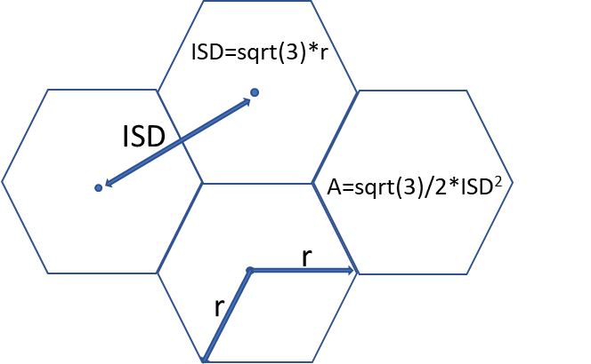
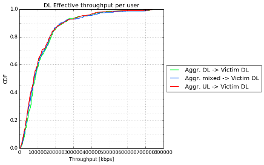
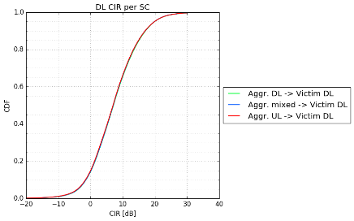
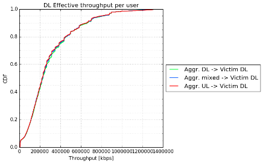
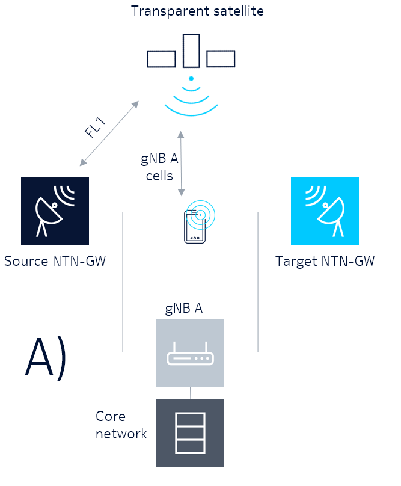

+----------------------------------+----------------------------------+
| 3GPP TS 38.101-4 V16.21.0        |                                  |
| (2025-06)                        |                                  |
+==================================+==================================+
| Technical Specification          |                                  |
+----------------------------------+----------------------------------+
| 3^rd^ Generation Partnership     |                                  |
| Project;                         |                                  |
|                                  |                                  |
| Technical Specification Group    |                                  |
| Radio Access Network;            |                                  |
|                                  |                                  |
| NR;                              |                                  |
|                                  |                                  |
| User Equipment (UE) radio        |                                  |
| transmission and reception;      |                                  |
|                                  |                                  |
| Part 4: Performance requirements |                                  |
|                                  |                                  |
| (Release 16)                     |                                  |
+----------------------------------+----------------------------------+
|                                  |                                  |
+----------------------------------+----------------------------------+
| {width="1.3263888888888888in" | ng){width="1.7708333333333333in" |
| height="0.9166666666666666in"}   | height="1.0347222222222223in"}   |
+----------------------------------+----------------------------------+
|                                  |                                  |
+----------------------------------+----------------------------------+
| The present document has been    |                                  |
| developed within the 3rd         |                                  |
| Generation Partnership Project   |                                  |
| (3GPP ^TM^) and may be further   |                                  |
| elaborated for the purposes of   |                                  |
| 3GPP.\                           |                                  |
| The present document has not     |                                  |
| been subject to any approval     |                                  |
| process by the 3GPP              |                                  |
| Organizational Partners and      |                                  |
| shall not be implemented.\       |                                  |
| This Specification is provided   |                                  |
| for future development work      |                                  |
| within 3GPP only. The            |                                  |
| Organizational Partners accept   |                                  |
| no liability for any use of this |                                  |
| Specification.\                  |                                  |
| Specifications and Reports for   |                                  |
| implementation of the 3GPP ^TM^  |                                  |
| system should be obtained via    |                                  |
| the 3GPP Organizational          |                                  |
| Partners\' Publications Offices. |                                  |
+----------------------------------+----------------------------------+

+----------------------------------------------------------------------+
|                                                                      |
+======================================================================+
| > ***3GPP***                                                         |
| >                                                                    |
| > Postal address                                                     |
| >                                                                    |
| > 3GPP support office address                                        |
| >                                                                    |
| > 650 Route des Lucioles - Sophia Antipolis                          |
| >                                                                    |
| > Valbonne - FRANCE                                                  |
| >                                                                    |
| > Tel.: +33 4 92 94 42 00 Fax: +33 4 93 65 47 16                     |
| >                                                                    |
| > Internet                                                           |
| >                                                                    |
| > http://www.3gpp.org                                                |
+----------------------------------------------------------------------+
| ***Copyright Notification***                                         |
|                                                                      |
| No part may be reproduced except as authorized by written            |
| permission.\                                                         |
| The copyright and the foregoing restriction extend to reproduction   |
| in all media.                                                        |
|                                                                      |
| © 2025, 3GPP Organizational Partners (ARIB, ATIS, CCSA, ETSI, TSDSI, |
| TTA, TTC).                                                           |
|                                                                      |
| All rights reserved.                                                 |
|                                                                      |
| UMTS™ is a Trade Mark of ETSI registered for the benefit of its      |
| members                                                              |
|                                                                      |
| 3GPP™ is a Trade Mark of ETSI registered for the benefit of its      |
| Members and of the 3GPP Organizational Partners\                     |
| LTE™ is a Trade Mark of ETSI registered for the benefit of its       |
| Members and of the 3GPP Organizational Partners                      |
|                                                                      |
| GSM® and the GSM logo are registered and owned by the GSM            |
| Association                                                          |
+----------------------------------------------------------------------+

 Contents {#contents .TT}
========

Foreword 12

1 Scope 14

2 References 14

3.1 Definitions 15

3.2 Symbols 15

3.3 Abbreviations 15

4 General 17

4.1 Relationship between minimum requirements and test requirements 17

4.2 Applicability of minimum requirements 17

4.3 Specification suffix information 17

4.4 Conducted requirements 17

4.4.0 Introduction 17

4.4.1 Reference point 18

4.4.2 SNR definition 18

4.4.3 Noc 18

4.4.3.1 Introduction 18

4.4.3.2 Noc for NR operating bands in FR1 18

4.4.3.2.1 Derivation of Noc values for NR operating bands in FR1 18

4.4.4 Es 19

4.4.4.1 Introduction 19

4.4.4.2 Es for NR operating bands in FR1 19

4.4.4.2.1 Derivation of Es values for NR operating bands in FR1 19

4.5 Radiated requirements 20

4.5.0 Introduction 20

4.5.1 Reference point 20

4.5.2 SNR definition 20

4.5.3 Noc 21

4.5.3.1 Introduction 21

4.5.3.2 Noc for NR operating bands in FR2 21

4.5.3.3 Derivation of Noc values for NR operating bands in FR2 21

4.5.4 Angle of arrival 22

4.5.5 Es 22

5 Demodulation performance requirements (Conducted requirements) 22

5.1 General 22

5.1.1 Applicability of requirements 22

5.1.1.1 General 22

5.1.1.2 Applicability of requirements for different number of RX antenna
ports 22

5.1.1.3 Applicability of requirements for optional UE features 23

5.1.1.4 Applicability of requirements for mandatory UE features with
capability signalling 27

5.1.1.5 Applicability of different requirements for HST 30

5.1.1.6 Applicability and test rules for PDSCH performance requirements
with power imbalance for intra-band contiguous CA 31

5.1.1.7 Applicability of CA requirements 31

5.1.1.7.1 Definition of CA capability 31

5.1.1.7.2 Applicability and test rules for different CA configurations
and bandwidth combination sets 31

5.1.1.7.3 Applicability rule and antenna connection for CA tests with 4
RX 33

5.1.1.8 Applicability of different requirements with Multi-TRxP 33

5.1.1.9 Applicability of requirements for PDSCH on bands with shared
spectrum access 33

5.2 PDSCH demodulation requirements 33

5.2.1 1RX requirements 37

5.2.2 2RX requirements 37

5.2.2.1 FDD 37

5.2.2.1.1 Minimum requirements for PDSCH Mapping Type A 37

5.2.2.1.2 Minimum requirements for PDSCH Mapping Type A and CSI-RS
overlapped with PDSCH 39

5.2.2.1.3 Minimum requirements for PDSCH Mapping Type B 40

5.2.2.1.4 Minimum requirements for PDSCH Mapping Type A and LTE-NR
coexistence 41

5.2.2.1.5 Minimum requirements for PDSCH 0.001% BLER 42

5.2.2.1.6 Minimum requirements for PDSCH repetitions over multiple slots
43

5.2.2.1.7 Minimum requirements for PDSCH Mapping Type B and UE
processing capability 2 44

5.2.2.1.8 Minimum requirements for PDSCH pre-emption 45

5.2.2.1.9 Minimum requirements for PDSCH HST-SFN 46

5.2.2.1.10 Minimum requirements for HST-DPS 47

5.2.2.1.11 Minimum requirements for PDSCH Single-DCI based SDM scheme 50

5.2.2.1.12 Minimum requirements for PDSCH Multi-DCI based transmission
scheme 53

5.2.2.1.13 Minimum requirements for PDSCH with single-DCI based FDM
Scheme A 56

5.2.2.1.14 Minimum requirements for PDSCH with single-DCI based
Inter-slot TDM scheme 59

5.2.2.2 TDD 62

5.2.2.2.1 Minimum requirements for PDSCH Mapping Type A 62

5.2.2.2.2 Minimum requirements for PDSCH Mapping Type A and CSI-RS
overlapped with PDSCH 64

5.2.2.2.3 Minimum requirements for PDSCH Mapping Type B 65

5.2.2.2.4 Minimum requirements for PDSCH Mapping Type A and LTE-NR
coexistence 66

5.2.2.2.5 Minimum requirements for PDSCH 0.001% BLER 67

5.2.2.2.6 Minimum requirements for PDSCH repetitions over multiple slots
68

5.2.2.2.7 Minimum requirements for PDSCH Mapping Type B and UE
processing capability 2 69

5.2.2.2.8 Minimum requirements for PDSCH pre-emption 70

5.2.2.2.9 Minimum requirements for HST-SFN 71

5.2.2.2.10 Minimum requirements for HST-DPS 72

5.2.2.2.11 Minimum requirements for PDSCH Single-DCI based SDM scheme 75

5.2.2.2.12 Minimum requirements for PDSCH Multi-DCI based transmission
scheme 78

5.2.2.2.13 Minimum requirements for PDSCH with single-DCI based FDM
Scheme A 81

5.2.2.2.14 Minimum requirements for PDSCH with single-DCI based
Inter-slot TDM scheme 84

5.2.2.2.15 Minimum requirements for PDSCH of PCell on band with shared
spectrum access 87

5.2.3 4RX requirements 88

5.2.3.1 FDD 88

5.2.3.1.1 Minimum requirements for PDSCH Mapping Type A 88

5.2.3.1.2 Minimum requirements for PDSCH Mapping Type A and CSI-RS
overlapped with PDSCH 91

5.2.3.1.3 Minimum requirements for PDSCH Mapping Type B 92

5.2.3.1.4 Minimum requirements for PDSCH Mapping Type A and LTE-NR
coexistence 93

5.2.3.1.5 Minimum requirements for PDSCH 0.001% BLER 94

5.2.3.1.6 Minimum requirements for PDSCH repetitions over multiple slots
94

5.2.3.1.7 Minimum requirements for PDSCH Mapping Type B and UE
processing capability 2 95

5.2.3.1.8 Minimum requirements for PDSCH pre-emption 96

5.2.3.1.9 Minimum requirements for PDSCH HST-SFN 97

5.2.3.1.10 Minimum requirements for HST-DPS 98

5.2.3.1.11 Minimum requirements for PDSCH Single-DCI based SDM scheme
101

5.2.3.1.12 Minimum requirements for PDSCH Multi-DCI based transmission
scheme 104

5.2.3.1.13 Minimum requirements for PDSCH with single-DCI based FDM
Scheme A 107

5.2.3.1.14 Minimum requirements for PDSCH with single-DCI based
Inter-slot TDM scheme 110

5.2.3.2 TDD 113

5.2.3.2.1 Minimum requirements for PDSCH Mapping Type A 113

5.2.3.2.2 Minimum requirements for PDSCH Mapping Type A and CSI-RS
overlapped with PDSCH 116

5.2.3.2.3 Minimum requirements for PDSCH Mapping Type B 117

5.2.3.2.4 Minimum requirements for PDSCH Mapping Type A and LTE-NR
coexistence 118

5.2.3.2.5 Minimum requirements for PDSCH 0.001% BLER 119

5.2.3.2.6 Minimum requirements for PDSCH repetitions over multiple slots
120

5.2.3.2.7 Minimum requirements for PDSCH Mapping Type B and UE
processing capability 2 121

5.2.3.2.8 Minimum requirements for PDSCH pre-emption 122

5.2.3.2.9 Minimum requirements for HST-SFN 123

5.2.3.2.10 Minimum requirements for HST-DPS 124

5.2.3.2.11 Minimum requirements for PDSCH Single-DCI based SDM scheme
127

5.2.3.2.12 Minimum requirements for PDSCH Multi-DCI based transmission
scheme 130

5.2.3.2.13 Minimum requirements for PDSCH with single-DCI based FDM
Scheme A 133

5.2.3.2.14 Minimum requirements for PDSCH with single-DCI based
Inter-slot TDM scheme 136

5.2.3.2.15 Minimum requirements for PDSCH of PCell on band with shared
spectrum access 139

5.2A PDSCH demodulation requirements for CA 140

5.2A.1 1RX requirements 142

5.2A.2 2RX requirements 142

5.2A.2.1 Minimum requirements 142

5.2A.2.2 Minimum requirements for carrier aggregation with power
imbalance 144

5.2A.2.3 Minimum requirements for PDSCH of SCell on band with shared
spectrum access 145

5.2A.3 4RX requirements 146

5.2A.3.1 Minimum requirements 146

5.2A.3.2 Minimum requirements for carrier aggregation with power
imbalance 148

5.2A.3.3 Minimum requirements for PDSCH of SCell on band with shared
spectrum access 149

5.3 PDCCH demodulation requirements 150

5.3.1 1RX requirements 153

5.3.2 2RX requirements 153

5.3.2.1 FDD 153

5.3.2.1.1 Minimum requirements with 1TX antenna 153

5.3.2.1.2 Minimum requirements with 2TX antenna 154

5.3.2.1.3 Minimum requirements for power saving 154

5.3.2.2 TDD 155

5.3.2.2.1 Minimum requirements with 1TX antenna 155

5.3.2.2.2 Minimum requirements with 2TX antenna 156

5.3.2.2.3 Minimum requirements for power saving 156

5.3.3 4RX requirements 157

5.3.3.1 FDD 157

5.3.3.1.1 Minimum requirements with 1TX antenna 157

5.3.3.1.2 Minimum requirements with 2TX antenna 157

5.3.3.1.3 Minimum requirements for power saving 158

5.3.3.2 TDD 158

5.3.3.2.1 Minimum requirements with 1TX antenna 159

5.3.3.2.2 Minimum requirements with 2TX antenna 159

5.3.3.2.3 Minimum requirements for power saving 159

5.4 PBCH demodulation requirements 160

5.4.1 1RX requirements 160

5.4.2 2RX requirements 161

5.4.2.1 FDD 161

5.4.2.2 TDD 161

5.4.3 4RX requirements 162

5.4.3.1 FDD 162

5.4.3.2 TDD 163

5.5 Sustained downlink data rate provided by lower layers 163

5.5.1 FR1 single carrier requirements 163

5.5A Sustained downlink data rate provided by lower layers 163

5.5A.1 FR1 CA requirements 163

6 CSI reporting requirements (Conducted requirements) 170

6.1 General 170

6.1.1 Applicability of requirements 170

6.1.1.1 General 170

6.1.1.2 Applicability of requirements for different number of RX antenna
ports 170

6.1.1.3 Applicability of requirements for optional UE features 170

6.1.1.4 Applicability of requirements for mandatory UE features with
capability signalling 171

6.1.1.5 Applicability of Channel Quality Indicator (CQI) reporting
requirements for CA 172

6.1.1.5.1 Applicability and test rules for different duplex modes and
SCS combinations 172

6.1.1.5.2 Applicability and test rules for different CA configurations
and bandwidth combination sets 172

6.1.1.5.3 Test coverage for different number of componenet carriers 173

6.1.1.5.4 Applicability rule and antenna connection for CA tests with 4
RX 173

6.1.2 Common test parameters 173

6.2 Reporting of Channel Quality Indicator (CQI) 178

6.2.1 1RX requirements 178

6.2.2 2RX requirements 178

6.2.2.1 FDD 178

6.2.2.1.1 CQI reporting definition under AWGN conditions 178

6.2.2.1.2 CQI reporting under fading conditions 181

6.2.2.2 TDD 186

6.2.2.2.1 CQI reporting definition under AWGN conditions 186

6.2.2.2.2 CQI reporting under fading conditions 191

6.2.3 4RX requirements 196

6.2.3.1 FDD 196

6.2.3.1.1 CQI reporting definition under AWGN conditions 196

6.2.3.1.2 CQI reporting under fading conditions 199

6.2.3.2 TDD 204

6.2.3.2.1 CQI reporting definition under AWGN 204

6.2.3.2.2 CQI reporting under fading conditions 209

6.2A Reporting of Channel Quality Indicator (CQI) for CA 214

6.2A.1 General 214

6.2A.2 1RX requirements 214

6.2A.3 2RX requirements 214

6.2A.3.1 CQI reporting definition under AWGN conditions 214

6.2A.3.1.1 Minimum requirement for periodic CQI reporting 214

6.2A.4 4RX requirements 219

6.2A.4.1 CQI reporting definition under AWGN conditions 219

6.2A.4.1.1 Minimum requirement for CQI reporting for SCell on band with
shared spectrum access 219

6.3 Reporting of Precoding Matrix Indicator (PMI) 221

6.3.1 1RX requirements 222

6.3.2 2RX requirements 222

6.3.2.1 FDD 222

6.3.2.1.1 Single PMI with 4TX TypeI-SinglePanel Codebook 222

6.3.2.1.2 Single PMI with 8TX TypeI-SinglePanel Codebook 225

6.3.2.1.3 Multiple PMI with 16TX TypeI-SinglePanel Codebook 228

6.3.2.1.4 Single PMI with 32TX TypeI-SinglePanel Codebook 230

6.3.2.1.5 Multiple PMI with 16TX TypeII Codebook 232

6.3.2.1.6 Multiple PMI with 16TX Enhanced Type II Codebook 235

6.3.2.2 TDD 238

6.3.2.2.1 Single PMI with 4TX TypeI-SinglePanel Codebook 238

6.3.2.2.2 Single PMI with 8TX TypeI-SinglePanel Codebook 241

6.3.2.2.3 Multiple PMI with 16TX TypeI-SinglePanel Codebook 244

6.3.2.2.4 Single PMI with 32TX TypeI-SinglePanel Codebook 246

6.3.2.2.5 Multiple PMI with 16TX TypeII Codebook 249

6.3.2.2.6 Multiple PMI with 16Tx Enhanced Type II Codebook 252

6.3.3 4RX requirements 255

6.3.3.1 FDD 255

6.3.3.1.1 Single PMI with 4TX TypeI-SinglePanel Codebook 255

6.3.3.1.2 Single PMI with 8TX TypeI-SinglePanel Codebook 258

6.3.3.1.3 Multiple PMI with 16TX TypeI-SinglePanel Codebook 261

6.3.3.1.4 Single PMI with 32TX TypeI-SinglePanel Codebook 263

6.3.3.1.5 Multiple PMI with 16TX TypeII Codebook 265

6.3.3.1.6 Multiple PMI with 16Tx Enhanced Type II Codebook 268

6.3.3.2 TDD 271

6.3.3.2.1 Single PMI with 4TX TypeI-SinglePanel Codebook 271

6.3.3.2.2 Single PMI with 8TX TypeI-SinglePanel Codebook 274

6.3.3.2.3 Multiple PMI with 16TX TypeI-SinglePanel Codebook 277

6.3.3.2.4 Single PMI with 32TX TypeI-SinglePanel Codebook 279

6.3.3.2.5 Multiple PMI with 16TX TypeII Codebook 282

6.3.3.2.6 Multiple PMI with 16Tx Enhanced Type II Codebook 285

6.4 Reporting of Rank Indicator (RI) 288

6.4.1 1RX requirements 288

6.4.2 2RX requirements 289

6.4.2.1 FDD 289

6.4.2.2 TDD 292

6.4.3 4RX requirements 295

6.4.3.1 FDD 295

6.4.3.2 TDD 298

7 Demodulation performance requirements (Radiated requirements) 301

7.1 General 301

7.1.1 Applicability of requirements 301

7.1.1.1 General 301

7.1.1.2 Applicability of requirements for different number of RX antenna
ports 301

7.1.1.3 Applicability of requirements for optional UE features 301

7.1.1.5 Applicability of CA requirements 303

7.1.1.5.1 Definition of CA capability 303

7.1.1.5.2 Applicability and test rules for different CA configurations
and bandwidth combination sets 303

7.2 PDSCH demodulation requirements 303

7.2.1 1RX requirements 308

7.2.2 2RX requirements 308

7.2.2.1 FDD 308

7.2.2.2 TDD 308

7.2.2.2.1 Minimum requirements for PDSCH Mapping Type-A 308

7.2.2.2.2 Minimum requirements for PDSCH repetitions over multiple slots
310

7.2.2.2.3 Minimum requirements for PDSCH Mapping Type B 311

7.2A PDSCH demodulation requirements for CA 312

7.2A.1 1RX requirements 312

7.2A.2 2RX requirements 312

7.2A.2.1 Minimum requirements 312

7.3 PDCCH demodulation requirements 313

7.3.1 1RX requirements 316

7.3.2 2RX requirements 316

7.3.2.1 FDD 316

7.3.2.2 TDD 316

7.3.2.2.1 Minimum requirements with 1TX antenna 317

7.3.2.2.2 Minimum requirements with 2TX antenna 317

7.3.2.2.3 Minimum requirements for power saving 317

7.4 PBCH demodulation requirements 318

7.4.1 1RX requirements 318

7.4.2 2RX requirements 318

7.4.2.1 FDD 318

7.4.2.2 TDD 319

7.5 Sustained downlink data rate provided by lower layers 319

7.5.1 FR2 single carrier requirements 319

7.5A Sustained downlink data rate provided by lower layers 319

7.5A.1 FR2 CA requirements 319

8 CSI reporting requirements (Radiated requirements) 326

8.1 General 326

8.1.1 Applicability of requirements 326

8.1.1.1 General 326

8.1.1.2 Applicability of requirements for different number of RX antenna
ports 326

8.1.1.3 Applicability of requirements for optional UE features 326

8.1.1.4 Applicability of requirements for mandatory UE features with
capability signalling 326

8.1.1.5 Applicability of Channel Quality Indicator (CQI) reporting
requirements for CA 327

8.1.1.5.1 Applicability and test rules for different CA configurations
and bandwidth combination sets 327

8.1.1.5.2 Test coverage for different number of componenet carriers 327

8.1.2 Common test parameters 327

8.2 Reporting of Channel Quality Indicator (CQI) 332

8.2.1 1RX requirements 332

8.2.2 2RX requirements 332

8.2.2.1 FDD 332

8.2.2.2 TDD 332

8.2.2.2.1 CQI reporting under AWGN conditions 332

8.2.2.2.2 CQI reporting under fading conditions 334

8.2A Reporting of Channel Quality Indicator (CQI) for CA 337

8.2A.1 General 337

8.2A.2 1RX requirements 337

8.2A.3 2RX requirements 337

8.2A.3.1 CQI reporting definition under AWGN conditions 337

8.2A.3.1.1 Minimum requirement for periodic CQI reporting 337

8.3 Reporting of Precoding Matrix Indicator (PMI) 339

8.3.1 1RX requirements 339

8.3.2 2RX requirements 339

8.3.2.1 FDD 339

8.3.2.2 TDD 339

8.3.2.2.1 Single PMI with 2TX TypeI-SinglePanel Codebook 339

8.4 Reporting of Rank Indicator (RI) 342

8.4.1 1RX requirements 343

8.4.2 2RX requirements 343

8.4.2.1 FDD 343

8.4.2.2 TDD 343

9 Demodulation performance requirements for interworking 346

9.1 General 346

9.1.1 Applicability of requirements 346

9.1.1.1 Applicability of requirements for optional UE features 348

9.1.1.2 Applicability of requirements for mandatory UE features with
capability signalling 348

9.1.2 E-UTRA Cell setup 348

9.1.2.1 FDD 348

9.1.2.2 TDD 349

9.2 PDSCH Demodulation 350

9.2A PDSCH demodulation for CA 350

9.2A.1 NR CA between FR1 and FR2 350

9.2B PDSCH demodulation for DC 351

9.2B.1 EN-DC 351

9.2B.1.1 EN-DC within FR1 351

9.2B.1.1.1 PDSCH 351

9.2B.1.2 EN-DC including FR2 NR carrier only 351

9.2B.1.2.1 PDSCH 351

9.2B.1.3 EN-DC including FR1 and FR2 NR carriers 351

9.2B.2 NR DC between FR1 and FR2 351

9.3 PDCCH demodulation 351

9.3A PDCCH demodulation for CA 351

9.3A.1 NR CA between FR1 and FR2 351

9.3B PDCCH demodulation for DC 351

9.3B.1 EN-DC 351

9.3B.1.1 EN-DC within FR1 351

9.3B.1.1.1 PDCCH 351

9.3B.1.2 EN-DC including FR2 NR carrier only 352

9.3B.1.2.1 PDCCH 352

9.3B.1.3 EN-DC including FR1 and FR2 NR carriers 352

9.3B.2 NR DC between FR1 and FR2 352

9.4 Void 352

9.4A SDR test for CA 352

9.4A.1 NR CA between FR1 and FR2 352

9.4B SDR test for DC 353

9.4B.1 EN-DC 353

9.4B.1.1 EN-DC within FR1 353

9.4B.1.1.1 SDR test 353

9.4B.1.2 EN-DC including FR2 NR carrier 354

9.4B.1.2.1 SDR test 354

9.4B.1.3 EN-DC including FR1 and FR2 NR carriers 355

9.4B.3.1 NE-DC within FR1 356

9.5B PDSCH demodulation for DC with power imbalance 356

9.5B.1 EN-DC 356

9.5B.1.1 Intra-band contiguous EN-DC within FR1 356

9.5B.1.1.1 PDSCH 356

9.5B.1.2 Intra-band non-contiguous EN-DC within FR1 357

9.5B.1.2.1 PDSCH 357

10 CSI reporting requirements for interworking 359

10.1 General 359

10.1.1 Applicability of requirements 359

10.1.1.1 Applicability of requirements for optional UE features 360

10.1.1.2 Applicability of requirements for mandatory UE features with
capability signalling 360

10.2 Reporting of Channel Quality Indicator (CQI) 360

10.2A Reporting of Channel Quality Indicator (CQI) for CA 360

10.2B Reporting of Channel Quality Indicator (CQI) for DC 360

10.2B.1 EN-DC 360

10.2B.1.1 EN-DC within FR1 360

10.2B.1.2 EN-DC including FR2 NR carrier 360

10.2B.1.3 EN-DC including FR1 and FR2 NR carriers 360

10.2B.2 NR DC between FR1 and FR2 361

10.3 Reporting of Precoding Matrix Indicator (PMI) 361

10.3A Reporting of Precoding Matrix Indicator (PMI) for CA 361

10.3B Reporting of Precoding Matrix Indicator (PMI) for DC 361

10.3B.1 EN-DC 361

10.3B.1.1 EN-DC within FR1 361

10.3B.1.2 EN-DC including NR FR2 carrier 361

10.3B.1.3 EN-DC including FR1 and FR2 NR carriers 361

10.3B.2 NR DC between FR1 and FR2 361

10.4 Reporting of Rank Indicator (RI) 361

10.4A Reporting of Rank Indicator (RI) for CA 361

10.4B Reporting of Rank Indicator (RI) for DC 361

10.4B.1 EN-DC 361

10.4B.1.1 EN-DC within FR1 361

10.4B.1.2 EN-DC including NR FR2 carrier 362

10.4B.1.3 EN-DC including FR1 and FR2 NR carriers 362

10.4B.2 NR DC between FR1 and FR2 362

11 V2X requirements 362

11.1 Demodulation performance requirements (Conducted requirements) 362

11.1.1 General 362

11.1.1.1 Applicability of requirements 362

11.1.1.1.1 General 362

11.1.1.1.2 Applicability of requirements for mandatory UE V2X features
with capability signalling 362

11.1.1.2 Common test parameters 363

11.1.2 PSSCH demodulation requirements 364

11.1.2.1 2Rx requirements 364

11.1.2.1.1 Minimum requirements 364

11.1.3.1 2Rx requirements 364

11.1.3.1.1 Minimum requirements 364

11.1.4 PSBCH demodulation requirements 365

11.1.4.1 2Rx requirements 365

11.1.4.1.1 Minimum requirements 365

11.1.5 PSFCH demodulation requirements 366

11.1.5.1 2Rx requirements 366

11.1.5.1.1 Minimum requirements 366

11.1.6 Power imbalance performance with two links 367

11.1.6.1 2RX requirements 367

11.1.6.1.1 Minimum requirements 367

11.1.7 HARQ buffer soft combining test 367

11.1.7.1 2Rx requirement 367

11.1.7.1.1 Minimum requirement 367

11.1.8 PSCCH decoding capability test 368

11.1.8.1 2RX requirements 368

11.1.8.1.1 Minimum requirements 368

11.1.9 PSFCH decoding capability test 370

11.1.9.1 2RX requirements 370

11.1.9.1.1 Minimum requirements 370

Annex A (normative): Measurement channels 371

A.1 General 371

A.1.1 Throughput definition 371

A.1.2 TDD UL-DL configurations for FR1 371

A.1.3 TDD UL-DL configurations for FR2 376

A.2 Void 377

A.3 DL reference measurement channels 378

A.3.1 General 378

A.3.2 Reference measurement channels for PDSCH performance requirements
378

A.3.2.1 FDD 379

A.3.2.1.1 Reference measurement channels for SCS 15 kHz FR1 379

A.3.2.1.2 Reference measurement channels for SCS 30 kHz FR1 391

A.3.2.1.3 Reference measurement channels for SCS 60 kHz FR1 392

A.3.2.1.4 Reference measurement channels for E-UTRA 392

A.3.2.2 TDD 398

A.3.2.2.1 Reference measurement channels for SCS 15 kHz FR1 398

A.3.2.2.2 Reference measurement channels for SCS 30 kHz FR1 401

A.3.2.2.3 Reference measurement channels for SCS 60 kHz FR1 430

A.3.2.2.4 Reference measurement channels for SCS 60 kHz FR2 430

A.3.2.2.5 Reference measurement channels for SCS 120 kHz FR2 432

A.3.2.2.6 Reference measurement channels for E-UTRA 445

A.3.3 Reference measurement channels for PDCCH performance requirements
451

A.3.3.1 FDD 451

A.3.3.1.1 Reference measurement channels for SCS 15 kHz FR1 451

A.3.3.1.2 Reference measurement channels for SCS 30 kHz FR1 452

A.3.3.2 TDD 452

A.3.3.2.1 Reference measurement channels for SCS 15 kHz FR1 452

A.3.3.2.2 Reference measurement channels for SCS 30 kHz FR1 453

A.3.3.2.3 Reference measurement channels for SCS 60 kHz FR1 454

A.3.3.2.4 Reference measurement channels for SCS 60 kHz FR2 454

A.3.3.2.5 Reference measurement channels for SCS 120 kHz FR2 454

A.3.4 Reference measurement channels for PBCH demodulation requirements
454

A.3.4.1 Reference measurement channels for FR1 454

A.3.4.2 Reference measurement channels for FR2 455

A.4 CSI reference measurement channels 455

A.5 OFDMA Channel Noise Generator (OCNG) 458

A.5.1 OCNG Patterns for FDD 458

A.5.1.1 OCNG FDD pattern 1: Generic OCNG FDD Pattern for all unused REs
458

A.5.2 OCNG Patterns for TDD 459

A.5.2.1 OCNG TDD pattern 1: Generic OCNG TDD Pattern for all unused REs
459

A.6 SL reference measurement channels 460

A.6.1 General 460

A.6.2 Reference measurement channels for PSSCH performance requirements
460

A.6.3 Reference measurement channels for PSCCH performance requirements
461

A.6.4 Reference measurement for PSBCH performance requirements 461

Annex B (normative): Propagation conditions 462

B.1 Static propagation condition 462

B.1.1 UE Receiver with 2Rx 462

B.1.2 UE Receiver with 4Rx 462

B.2 Multi-path fading propagation conditions 463

B.2.1 Delay profiles 463

B.2.1.1 Delay profiles for FR1 464

B.2.1.2 Delay profiles for FR2 465

B.2.2 Combinations of channel model parameters 466

B.2.3 MIMO Channel Correlation Matrices 467

B.2.3.1 MIMO Correlation Matrices using Uniform Linear Array (ULA) 467

B.2.3.1.1 Definition of MIMO Correlation Matrices 467

B.2.3.1.2 MIMO Correlation Matrices at High, Medium and Low Level 469

B.2.3.2 MIMO Correlation Matrices using Cross Polarized Antennas (X-pol)
473

B.2.3.2.1 Definition of MIMO Correlation Matrices using cross polarized
antennas 474

B.2.3.2.2 MIMO Correlation Matrices using cross polarized antennas 476

B.2.3.2.3 Beam steering approach 478

B.2.3.2.3A Beam steering approach with dual cluster beams 480

B.2.4 Two-tap propagation conditions for CQI tests 481

B.3 High Speed Train Scenario 481

B.3.1 Single Tap Channel Profile 481

B.3.2 HST-SFN Channel Profile 485

B.3.3 HST-DPS Channel Profile 488

B.4 Physical signals, channels mapping and precoding 492

B.4.1 General 492

Annex C (normative): Downlink physical channels 493

C.1 General 493

C.2 Setup (Conducted) 494

C.3 Connection (Conducted) 494

C.3.1 Measurement of Performance requirements 494

C.4 Setup (Radiated) 494

Annex D (informative): Void 496

Annex E (normative): Environmental conditions 497

E.1 General 497

E.2 Environmental (Conducted) 497

E.2.1 Temperature 497

E.2.2 Voltage 497

E.2.3 Vibration 498

E.3 Environmental (Radiated) 498

E.3.1 Temperature 498

E.3.2 Voltage 498

E.3.3 Void 499

Annex F (informative): Void 500

Annex G (informative): Void 500

Annex H (informative): Void 500

Annex I (informative): Void 500

Annex J (informative): Void 500

Annex K (informative): Void 500

Annex L (informative): Change history 501

 Foreword
========

This Technical Specification has been produced by the 3rd Generation
Partnership Project (3GPP).

The contents of the present document are subject to continuing work
within the TSG and may change following formal TSG approval. Should the
TSG modify the contents of the present document, it will be re-released
by the TSG with an identifying change of release date and an increase in
version number as follows:

Version x.y.z

where:

x the first digit:

1 presented to TSG for information;

2 presented to TSG for approval;

3 or greater indicates TSG approved document under change control.

y the second digit is incremented for all changes of substance, i.e.
technical enhancements, corrections, updates, etc.

z the third digit is incremented when editorial only changes have been
incorporated in the document.

In the present document, modal verbs have the following meanings:

**shall** indicates a mandatory requirement to do something

**shall not** indicates an interdiction (prohibition) to do something

The constructions \"shall\" and \"shall not\" are confined to the
context of normative provisions, and do not appear in Technical Reports.

The constructions \"must\" and \"must not\" are not used as substitutes
for \"shall\" and \"shall not\". Their use is avoided insofar as
possible, and they are not used in a normative context except in a
direct citation from an external, referenced, non-3GPP document, or so
as to maintain continuity of style when extending or modifying the
provisions of such a referenced document.

**should** indicates a recommendation to do something

**should not** indicates a recommendation not to do something

**may** indicates permission to do something

**need not** indicates permission not to do something

The construction \"may not\" is ambiguous and is not used in normative
elements. The unambiguous constructions \"might not\" or \"shall not\"
are used instead, depending upon the meaning intended.

**can** indicates that something is possible

**cannot** indicates that something is impossible

The constructions \"can\" and \"cannot\" are not substitutes for \"may\"
and \"need not\".

**will** indicates that something is certain or expected to happen as a
result of action taken by an agency the behaviour of which is outside
the scope of the present document

**will not** indicates that something is certain or expected not to
happen as a result of action taken by an agency the behaviour of which
is outside the scope of the present document

**might** indicates a likelihood that something will happen as a result
of action taken by some agency the behaviour of which is outside the
scope of the present document

**might not** indicates a likelihood that something will not happen as a
result of action taken by some agency the behaviour of which is outside
the scope of the present document

In addition:

**is** (or any other verb in the indicative mood) indicates a statement
of fact

**is not** (or any other negative verb in the indicative mood) indicates
a statement of fact

The constructions \"is\" and \"is not\" do not indicate requirements.

 1 Scope
=======

The present document establishes the minimum performance requirements
for NR User Equipment (UE).

2 References
============

The following documents contain provisions which, through reference in
this text, constitute provisions of the present document.

> \- References are either specific (identified by date of publication,
> edition number, version number, etc.) or non‑specific.
>
> \- For a specific reference, subsequent revisions do not apply.
>
> \- For a non-specific reference, the latest version applies. In the
> case of a reference to a 3GPP document (including a GSM document), a
> non-specific reference implicitly refers to the latest version of that
> document *in the same Release as the present document*.
>
> \[1\] 3GPP TR 21.905: \"Vocabulary for 3GPP Specifications\".
>
> \[2\] 3GPP TS 38.521-4: \"NR; User Equipment (UE) radio transmission
> and reception; Part 4: Performance requirements\".
>
> \[3\] Recommendation ITU-R M.1545: \"Measurement uncertainty as it
> applies to test limits for the terrestrial component of International
> Mobile Telecommunications-2000\".
>
> \[4\] 3GPP TS 36.101: \"Evolved Universal Terrestrial Radio Access
> (E-UTRA); User Equipment (UE) radio transmission and reception\".
>
> \[5\] 3GPP TR 38.901: \"Study on channel model for frequencies from
> 0.5 to 100 GHz\".
>
> \[6\] 3GPP TS 38.101-1: \"NR; User Equipment (UE) radio transmission
> and reception; Part 1: Range 1 Standalone\".
>
> \[7\] 3GPP TS 38.101-2: \"NR; User Equipment (UE) radio transmission
> and reception; Part 2: Range 2 Standalone\".
>
> \[8\] 3GPP TS 38.101-3: \"NR; User Equipment (UE) radio transmission
> and reception; Part 3: Range 1 and Range 2 Interworking operation with
> other radios\".
>
> \[9\] 3GPP TS 38.211: \"NR; Physical channels and modulation\".
>
> \[10\] 3GPP TS 38.212: \"NR; Multiplexing and channel coding\".
>
> \[11\] 3GPP TS 38.213: \"NR; Physical layer procedures for control \".
>
> \[12\] 3GPP TS 38.214: \"NR; Physical layer procedures for data\".
>
> \[13\] 3GPP TS 37.340: \"Evolved Universal Terrestrial Radio Access
> (E-UTRA) and NR; Multi-connectivity\", Stage 2.
>
> \[14\] 3GPP TS 38.306: \"NR; User Equipment (UE) radio access
> capabilities\".
>
> \[15\] 3GPP TS 36.211: \"Evolved Universal Terrestrial Radio Access
> (E-UTRA); Physical Channels and Modulation\".

\[16\] 3GPP TS38.521-4, \"User Equipment (UE) conformance specification;
Radio transmission and reception; Part 4: Performance\"

\[17\] 3GPP TS 38.331: "Radio Resource Control (RRC) protocol
specification".

3 Definitions, symbols and abbreviations

3.1 Definitions
---------------

For the purposes of the present document, the terms and definitions
given in 3GPP TR 21.905 \[1\] and the following apply. A term defined in
the present document takes precedence over the definition of the same
term, if any, in 3GPP TR 21.905 \[1\].

**DL BWP**: DL bandwidth part as defined in TS 38.213 \[11\].

**EN-DC**: E-UTRA-NR Dual Connectivity as defined in clause 4.1.2 of TS
37.340 \[13\].

**Enhanced Receiver Type 1: SU-MIMO interference mitigation advanced
receiver \[14\]**

\- R-ML (reduced complexity ML) receiver with enhanced inter-stream
interference suppression for SU-MIMO transmissions with rank 2 with 2 RX
antennas

\- R-ML (reduced complexity ML) receiver with enhanced inter-stream
interference suppression for SU-MIMO transmissions with rank 2, 3, and 4
with 4 RX antennas

**FR1**: Frequency range 1 as defined in clause 5.1 of TS 38.101-3
\[8\].

**FR2**: Frequency range 2 as defined in clause 5.1 of TS 38.101-3
\[8\].

**SSB:** SS/PBCH block as defined in clause 7.8.3 of TS 38.211 \[9\].

3.2 Symbols
-----------

For the purposes of the present document, the following symbols apply:

E~s~ The averaged received energy per Hz of the wanted signal during the
useful part of the symbol, i.e. excluding the cyclic prefix, at the UE
antenna connector; average power is computed within a set of REs used
for the transmission of physical, divided transmission bandwidth within
the set

> Subcarrier spacing configuration as defined in clause 4.2 of TS 38.211
> \[9\]
>
> The power spectral density of a white noise source with average power
> per Hz as defined in Clause 4.4.3 for conducted requirements and
> Clause 4.5.3 for radiated requirements

3.3 Abbreviations
-----------------

For the purposes of the present document, the abbreviations given in
3GPP TR 21.905 \[1\] and the following apply. An abbreviation defined in
the present document takes precedence over the definition of the same
abbreviation, if any, in 3GPP TR 21.905 \[1\].

> AGC Automatic Gain Control
>
> CA Carrier Aggregation
>
> CC Component Carrier
>
> CCE Control Channel Element
>
> CORESET Control Resource Set
>
> CP Cyclic Prefix
>
> CSI Channel-State Information
>
> CSI-IM CSI Interference Measurement
>
> CSI-RS CSI Reference Signal
>
> CW Codeword
>
> CQI Channel Quality Indicator
>
> CRC Cyclic Redundancy Check
>
> CRI CSI-RS Resource Indicator
>
> DC Dual Connectivity
>
> DCI Downlink Control Information
>
> DL Downlink
>
> DMRS Demodulation Reference Signal
>
> DPS Dynamic Point Selection
>
> EPRE Energy Per Resource Element
>
> EN-DC E-UTRA-NR Dual Connectivity
>
> FR Frequency Range
>
> FRC Fixed Reference Channel
>
> GNSS Global Navigation Satellite System
>
> HARQ Hybrid Automatic Repeat Request
>
> HST High Speed Train
>
> HST-SFN High Speed Train Single Frequency Network
>
> LI Layer Indicator
>
> MAC Medium Access Control
>
> MCS Modulation and Coding Scheme
>
> MIB Master Information Block
>
> NR New Radio
>
> NSA Non-Standalone Operation Mode
>
> OCC Orthogonal Cover Code
>
> OCNG OFDMA Channel Noise Generator
>
> OFDM Orthogonal Frequency Division Multiplexing
>
> OFDMA Orthogonal Frequency Division Multiple Access
>
> PBCH Physical Broadcast Channel
>
> Pcell Primary Cell
>
> PDCCH Physical Downlink Control Channel
>
> PDSCH Physical Downlink Shared Channel
>
> PMI Precoding Matrix Indicator
>
> PRB Physical Resource Block
>
> PRG Physical resource block group
>
> PSBCH Physical Sidelink Broadcast Channel
>
> PSCCH Physical Sidelink Control Channel
>
> PSFCH Physical Sidelink Feedback Channel
>
> PSS Primary Synchronization Signal
>
> PSSCH Physical Sidelink Shared Channel
>
> PTRS Phase Tracking Reference Signal
>
> PUCCH Physical Uplink Control Channel
>
> PUSCH Physical Uplink Shared Channel
>
> QCL Quasi Co-location
>
> RB Resource Block
>
> RBG Resource Block Group
>
> RE Resource Element
>
> REG Resource Element Group
>
> RI Rank Indicator
>
> RRC Radio Resource Control
>
> SA Standalone operation mode
>
> SCI Sidelink Control Information
>
> SCS Subcarrier Spacing
>
> SINR Signal-to-Interference-and-Noise Ratio
>
> SL Sidelink
>
> SLSS Sidelink Synchronization Signal
>
> SNR Signal-to-Noise Ratio
>
> SS Synchronization Signal
>
> SSB Synchronization Signal Block
>
> SSS Secondary Synchronization Signal
>
> TCI Transmission Configuration Indicator
>
> TDM Time division multiplexing
>
> TRxP Transmission and Reception Point
>
> TTI Transmission Time Interval
>
> UL Uplink
>
> V2X Vehicle to Everything
>
> VRB Virtual Resource Block

4 General
=========

4.1 Relationship between minimum requirements and test requirements
-------------------------------------------------------------------

The present document is a Single-RAT and interwork specification for NR
UE, covering minimum performance requirements of both conducted and
radiated requirements. Conformance to the present specification is
demonstrated by fulfilling the test requirements specified in the
conformance specification TS 38.521-4 \[2\].

The Minimum Requirements given in this specification make no allowance
for measurement uncertainty. The test specification TS 38.521-4 \[2\]
defines test tolerances. These test tolerances are individually
calculated for each test. The test tolerances are used to relax the
minimum requirements in this specification to create test requirements.

The measurement results returned by the test system are compared --
without any modification -- against the test requirements as defined by
the shared risk principle.

The shared risk principle is defined in Recommendation ITU‑R M.1545
\[3\].

The applicability of each requirement is described under each sub-clause
in 5.1, 6.1, 7.1, 8.1, 9.1 and 10.1.

4.2 Applicability of minimum requirements
-----------------------------------------

The conducted minimum requirements specified in this specification shall
be met in all applicable scenarios for FR1. The radiated minimum
requirements specified in this specification shall be met in all
applicable scenarios for FR2. The minimum requirements for interworking
specified in this specification shall be met in all applicable scenarios
for NR interworking operation.

All minimum performance requirements defined in Clauses 5-8 are
applicable to both SA and NSA unless otherwise explicitly stated in
Clause 9 and 10.

All minimum performance requirements defined in Clauses 5-10 are
applicable to all UE power classes unless otherwise stated.

For radiated minimum requirements specified in the specification, if
maximum achievable SNR in the test system for certain test conditions is
less than the defined SNR requirement for those tests, those
requirements shall not be tested.

4.3 Specification suffix information
------------------------------------

Unless stated otherwise the following suffixes are used for indicating
at 2^nd^ level clause, shown in Table 4.3-1.

Table 4.3-1: Definition of suffixes

  **Clause suffix**   **Variant**
  ------------------- --------------------------
  None                Single Carrier
  A                   Carrier Aggregation (CA)
  B                   Dual-Connectivity (DC)
  C                   Supplement Uplink (SUL)

A terminal which supports the above features needs to meet the
requirement defined in the additional clause (suffix A, B, C) in clauses
5, 6, 7, 8, 9, 10.

4.4 Conducted requirements
--------------------------

### 4.4.0 Introduction

The requirements are defined for the following modes:

\- Mode 1: Conditions with external noise source

\- Wanted signal with power level Es is transmitted.

\- External white noise source with power spectral density Noc is used.

\- *Es* and *Noc* levels are selected to achieve target SNR as described
in Clause 4.4.2.

\- Mode 2: Noise free conditions

\- Wanted signal with power level Es is transmitted.

\- No external noise transmitted.

### 4.4.1 Reference point

The reference point for SNR, Es and Noc of DL signal is the UE antenna
connector or connectors.

### 4.4.2 SNR definition

For Mode 1 conditions conducted UE demodulation and CSI requirements the
SNR is defined as:

$SNR = \frac{\sum_{j = 1}^{N_{\text{RX}}}E_{s}^{(j)}}{\sum_{j = 1}^{N_{\text{RX}}}N_{\text{oc}}^{(j)}}$

Where

\- N~RX~ denotes the number of receiver antenna connectors and the
superscript receiver antenna connector *j*.

\- The above SNR definition assumes that the REs are not precoded, and
does not account for any gain which can be associated to the precoding
operation.

\- Unless otherwise stated, the SNR refers to the SSS wanted signal.

\- The downlink SSS transmit power is defined as the linear average over
the power contributions in \[W\] of all resource elements that carry the
SSS within the operating system bandwidth.

\- The power ratio of other wanted signals to the SSS is defined in
clause C.3.1.

### 4.4.3 Noc

#### 4.4.3.1 Introduction

This clause describes the Noc power level for Mode 1 conditions
conducted testing of demodulation and CSI requirements.

Unless otherwise stated for CA and EN-DC testing, the same Noc level
shall be provided on different component carriers.

#### 4.4.3.2 Noc for NR operating bands in FR1

The Noc power spectrum density shall be larger or equal to the minimum
Noc power level for each operating band supported by the UE as defined
in clause 4.4.3.2.1.

Unless otherwise stated, a fixed Noc power level of -134 dBm/Hz shall be
used for all operating bands.

##### 4.4.3.2.1 Derivation of Noc values for NR operating bands in FR1

The minimum Noc power level for an operating band, subcarrier spacing
and channel bandwidth is derived based on the following equation:

Noc~Band\_X,\ SCS\_Y,\ CBW\_Z~ = REFSENS~Band\_X,\ SCS\_Y,\ CBW\_Z~ --
10\*log10(12\*SCS\_Y\*nPRB) + D -- SNR~REFSENS~ + ∆~thermal~

where

\- REFSENS~Band\_X,\ SCS\_Y,\ CBW\_Z~ is the REFSENS value in dBm for
Band X, SCS Y and CBW Z specified in Table 7.3.2-1 of TS 38.101-1 \[6\]

\- 12 is the number of subcarriers in a PRB

\- SCS Y is the subcarrier spacing associated with the REFSENS value

\- nPRB is the maximum number of PRB for SCS Y and CBW Z associated with
the REFSENS value, and is specified in Table 5.3.2-1 of TS 38.101-1
\[6\]

\- D is diversity gain equal to 3 dB

\- SNR~REFSENS~ = -1 dB is the SNR used for simulation of REFSENS

\- ∆~thermal~ is the amount of dB that the wanted noise is set above UE
thermal noise, giving a defined rise in total noise. ∆~thermal~ = 16dB,
giving a rise in total noise of 0.1dB, regarded as insignificant**.**

*The calculated Noc value for the baseline of Band n12, 15 kHz SCS,
15 MHz CBW is -135.5 dBm/Hz.*

An allowance of 1.5dB is made for CA and for future bands, giving an Noc
power level of -134 dBm/Hz.

### 4.4.4 Es

#### 4.4.4.1 Introduction

This clause describes the Es power level for Mode 2 conditions conducted
testing of demodulation and CSI requirements.

Unless otherwise stated for CA and EN-DC testing, the same Es level
shall be provided on different component carriers.

#### 4.4.4.2 Es for NR operating bands in FR1

The Es power spectrum density shall be larger or equal to the minimum Es
power level for each operating band supported by the UE as defined in
Clause 4.4.4.2.1.

Unless otherwise stated, a fixed Es power level of -112 dBm/Hz shall be
used for all operating bands.

##### 4.4.4.2.1 Derivation of Es values for NR operating bands in FR1

The minimum Es power level for an operating band, subcarrier spacing and
channel bandwidth is derived based on the following equation:

Es~Band\_X,\ SCS\_Y,\ CBW\_Z~ = REFSENS~Band\_X,\ SCS\_Y,\ CBW\_Z~ --
10\*log10(12\*SCS\_Y\*nPRB) + D -- SNR~REFSENS~ + dB~EVM~ +∆~thermal~

where:

\- REFSENS~Band\_X,\ SCS\_Y,\ CBW\_Z~ is the REFSENS value in dBm for
Band X, SCS Y and CBW Z specified in Table 7.3.2-1 of TS 38.101-1 \[6\]

\- 12 is the number of subcarriers in a PRB

\- SCS Y is the subcarrier spacing associated with the REFSENS value

\- nPRB is the maximum number of PRB for SCS Y and CBW Z associated with
the REFSENS value, and is specified in Table 5.3.2-1 of TS 38.101-1
\[6\]

\- D is diversity gain equal to 3 dB

\- SNR~REFSENS~ = -1 dB is the SNR used for simulation of REFSENS

\- dB~EVM~ is the SNR of the applied signal due to EVM impairment on the
wanted Es. An allowed EVM of 3% gives a dB~EVM~ of 30.5dB, derived as
20\*log10(1/0.03)**.**

\- ∆~thermal~ is the amount of dB that the impairment due to EVM on the
wanted Es is set above UE thermal noise, giving a defined rise in total
impairment. ∆~thermal~ = 7.6dB, giving a rise in total impairment of
0.7dB, regarded as acceptable**.**

*The calculated Es value for the baseline of Band n12, 15kHz SCS, 15MHz
CBW is -113.5 dBm/Hz.*

An allowance of 1.5dB is made for CA and for future bands, giving an Es
power level of -112 dBm/Hz.

4.5 Radiated requirements
-------------------------

### 4.5.0 Introduction

The requirements are defined for the following modes:

\- Mode 1: conditions with external noise source

\- Wanted signal with power level Es is transmitted.

\- External white noise source with power spectral density Noc is used.

\- Es and Noc levels are selected to achieve target SNR as described in
Clause 4.5.2.

\- Mode 2: Noise free conditions

\- Wanted signal with power level Es is transmitted.

\- No external noise transmitted.

### 4.5.1 Reference point

The reference point for SNR, Es and Noc of DL signal from the UE
perspective is the input of UE antenna array.

{width="3.2152777777777777in"
height="1.5763888888888888in"}

Figure 4.5.1-1: Reference point for radiated Demodulation and CSI
requirements

### 4.5.2 SNR definition

For Mode 1 conditions UE demodulation and CSI requirements, the Minimum
performance requirement in clause 7, 8, 9 and 10 are defined relative to
the baseband SNR level SNR~BB*.\ *~The SNR at the reference point is
defined as

*SNR = SNR~BB~ + **∆~BB~***

where **∆~BB~** is specified in clause 4.5.3.

The reference point SNR is defined as:

$\text{SNR} = \frac{\sum_{j = 1}^{N_{\text{RX}}}E_{s}^{(j)}}{\sum_{j = 1}^{N_{\text{RX}}}N_{\text{oc}}^{(j)}}$

\- N~RX~ denotes the number of receiver reference points, and the super
script receiver reference point *j*.

\- The above SNR definition assumes that the REs are not precoded, and
does not account for any gain which can be associated to the precoding
operation.

\- Unless otherwise stated, the SNR refers to the SSS wanted signal.

\- The downlink SSS transmit power is defined as the linear average over
the power contributions in \[W\] of all resource elements that carry the
SSS within the operating system bandwidth.

\- The power ratio of other wanted signals to the SSS is defined in
Clause C.3.1.

### 4.5.3 Noc

#### 4.5.3.1 Introduction

For Mode 1 conditions radiated testing of demodulation and CSI
requirements it is not feasible in practice to use signal levels high
enough to make the noise contribution of the UE negligible. Demodulation
requirements are therefore specified with the applied noise higher than
the UE peak EIS level in TS 38.101-2 \[7\] by a defined amount, so that
the impact of UE noise floor is limited to no greater than a value
**∆~BB~** at the specified Noc level. As UEs have EIS levels that are
dependent on operating band and power class, Noc level is dependent on
operating band and power class.

#### 4.5.3.2 Noc for NR operating bands in FR2

*Values for Noc according to* operating band and power class for single
carrier requirements *are specified in Table 4.5.3.2-1 for* **∆~BB~**
*=1dB.*

Table 4.5.3.2-1: Noc power level for different UE power classes and
frequency bands

  Operating band                               UE Power class                       
  -------------------------------------------- ---------------- --------- --------- ---------
                                               1                2         3         4
  n257                                         -167.3           -161. 8   -158.1    -166. 8
  n258                                         -167.3           -161. 8   -158.1    -166. 8
  n259                                                                    -154. 5   
  n260                                         -164.3                     -155. 5   -164. 8
  n261                                         -167.3           -161. 8   -158.1    -166. 8
  Note 1: Noc levels are specified in dBm/Hz                                        

For PC3 multi-band devices, the Noc power level (Noc~MB~) shall increase
by multi-band relaxation defined in Table 6.2.1.3-4 of TS 38.101-2
\[7\]:

Noc~MB~ = Noc~SB~ + ∆MB~P,n~

\- Noc~SB~ is the Noc defined in Table 4.5.3.2-1

\- ∆MB~P,n~ values are specified in TS 38.101-2 \[7\].

For CA case, the Noc power level (Noc~CA~) shall increase by a
relaxation factor defined in TS 38.101-2 \[7\] Table 7.3A.2.1-1:

Noc~CA~ = Noc~SC~ + ΔR~IB~

\- Noc~SC~ is derived by assuming UE supports single carrier.

\- ΔR~IB~ values are specified in TS 38.101-2 \[7\].

#### 4.5.3.3 Derivation of Noc values for NR operating bands in FR2

The Noc values in Table 4.5.3.2-1 are based on REFSENS for the operating
band X and on the UE Power class P, derived based on the following
equation:

Noc~PC\_P,\ Band\_X~ = REFSENS~PC\_P,\ Band\_X,\ 50MHz~ -10Log~10~(12 x
120kHz x PRB~REFSENS~) -- SNR~REFSENS~ + ∆~thermal~

*where:*

> \- REFSENS~PC\_P,\ Band\ X,\ 50MHz~ is the REFSENS value in dBm
> specified for the Power Class P of UE in Band X for 50MHz Channel
> bandwidth in clause 7.3.2 of TS 38.101-2 \[7\].

\- 12 is the number of subcarriers in a PRB

\- 120 kHz is chosen as a subcarrier spacing to select PRB~REFSENS~.

\- PRB~REFSENS~ is N~RB~ associated with subcarrier spacing 120 kHz for
50MHz in Table 5.3.2-1 of TS 38.101-2 \[7\] and is 32.

\- SNR~REFSENS~ = -1 dB is the SNR used for simulation of REFSENS

\- ∆~thermal~ is the amount of dB that the wanted noise is set above UE
thermal noise, giving a rise in total noise of **∆~BB~**. ∆~thermal~ =
-10Log~10~(10\^(**∆~BB~**/10)-1) = 5.87dB, giving a rise in total noise
**∆~BB~** of 1 dB**.**

*For example, the calculated Noc value for UE Power class 3 in Band n260
is -155.5 dBm/Hz, rounded to 0.1dB.*

### 4.5.4 Angle of arrival

Unless otherwise stated, the downlink signal and noise are aligned to
the direction with the following criteria:

\- Select the known Rx beam peak direction reused from RF testing if
available, as far as it satisfies the minimum isolation requirement
defined in TS 38.521-4 \[16\] and rank number in TS 38.521-4 \[16\]
corresponding to the test cases

\- Otherwise select one direction which satisfies the REFSENS defined in
TS 38.101-2 \[7\], minimum isolation requirement defined in TS 38.521-4
\[16\] and rank number in TS 38.521-4 \[16\] corresponding to the test
cases.

### 4.5.5 Es

For Mode 2 the test system shall transmit the wanted signal with power
level Es which is the best achievable power level by the test system.

The test system shall be able to determine achievable Es level and the
maximum achievable SNR level.

5 Demodulation performance requirements (Conducted requirements)
================================================================

5.1 General
-----------

### 5.1.1 Applicability of requirements

#### 5.1.1.1 General

The minimum performance requirements are applicable to all FR1 operating
bands defined in TS 38.101-1\[6\].

The minimum performance requirements in Clause 5 are mandatory for UE
supporting NR operation.

If same test is listed for different UE features/capabilities in Clauses
5.1.1.3 and 5.1.1.4, then this test shall apply for UEs which support
all corresponding UE features/capabilities.

#### 5.1.1.2 Applicability of requirements for different number of RX antenna ports

The number of RX antenna ports for different RF operating bands is up to
UE declaration.

The UE shall support 2 or 4 RX antenna ports for different RF operating
bands. The operating bands, where 4 RX antenna ports shall be the
baseline, are defined in Clause 7.2 of TS 38.101-1 \[6\]. The UE
requirements applicability for UEs with different number of RX antenna
ports is defined in Table 5.1.1.2-1.

Table 5.1.1.2-1: Requirements applicability

+---------------------------+-----------+---------------------------+
| Supported RX antenna      | Test type | Test list                 |
| ports                     |           |                           |
+===========================+===========+===========================+
| UE supports only 2RX      | PDSCH     | All tests in Clause 5.2.2 |
+---------------------------+-----------+---------------------------+
|                           | PDCCH     | All tests in Clause 5.3.2 |
+---------------------------+-----------+---------------------------+
|                           | PBCH      | All tests in Clause 5.4.2 |
+---------------------------+-----------+---------------------------+
| UE supports only 4RX or   | PDSCH     | All tests in Clause 5.2.3 |
| both 2RX and 4RX          |           | ^(Note\ 2)^               |
+---------------------------+-----------+---------------------------+
|                           | PDCCH     | All tests in Clause 5.3.3 |
|                           |           | ^(Note\ 2)^               |
+---------------------------+-----------+---------------------------+
|                           | PBCH      | All tests in Clause 5.4.2 |
|                           |           | or 5.4.3 ^(Note)^         |
+---------------------------+-----------+---------------------------+
| Note 1: Requirements for  |           |                           |
| PBCH with 4Rx is up to UE |           |                           |
| declaration               |           |                           |
|                           |           |                           |
| Note 2:                   |           |                           |
| *'maxMIMO-Layers-r16' is  |           |                           |
| not configured during the |           |                           |
| performance requirements  |           |                           |
| testing for UE supporting |           |                           |
| Release 16 per-BWP MIMO   |           |                           |
| layer adaptation.*        |           |                           |
+---------------------------+-----------+---------------------------+

#### 5.1.1.3 Applicability of requirements for optional UE features

The performance requirements in Table 5.1.1.3-1 shall apply for UEs
which support optional UE features only.

Table 5.1.1.3-1: Requirements applicability for optional UE features

+--------------+-----------+-----------+--------------+--------------+
| UE           | Test type | Test list | A            |              |
| featur       |           |           | pplicability |              |
| e/capability |           |           | notes        |              |
| \[14\]       |           |           |              |              |
+==============+===========+===========+==============+==============+
| SU-MIMO      | FR1 FDD   | PDSCH     | Clause       |              |
| Interference |           |           | 5.2.2.1.1    |              |
| Mitigation   |           |           | (Test 3-1)   |              |
| advanced     |           |           |              |              |
| receiver     |           |           | Clause       |              |
|              |           |           | 5.2.3.1.1    |              |
|              |           |           | (Test 5-1)   |              |
+--------------+-----------+-----------+--------------+--------------+
|              | FR1 TDD   | PDSCH     | Clause       |              |
|              |           |           | 5.2.2.2.1    |              |
|              |           |           | (Test 3-1)   |              |
|              |           |           |              |              |
|              |           |           | Clause       |              |
|              |           |           | 5.2.3.2.1    |              |
|              |           |           | (Test 5-1)   |              |
+--------------+-----------+-----------+--------------+--------------+
| Alternative  | FR1 FDD   | PDSCH     | Clause       |              |
| additional   |           |           | 5.2.2.1.4    |              |
| DMRS         |           |           | (Test 1-2)   |              |
| position for |           |           |              |              |
| co-existence |           |           | Clause       |              |
| with LTE CRS |           |           | 5.2.3.1.4    |              |
| *            |           |           | (Test 1-2)   |              |
| (additionalD |           |           |              |              |
| MRS-DL-Alt)* |           |           |              |              |
+--------------+-----------+-----------+--------------+--------------+
|              | FR1 TDD   | PDSCH     | Clause       |              |
|              |           |           | 5.2.2.2.4    |              |
|              |           |           | (Test 1-2)   |              |
|              |           |           |              |              |
|              |           |           | Clause       |              |
|              |           |           | 5.2.3.2.4    |              |
|              |           |           | (Test 1-2)   |              |
+--------------+-----------+-----------+--------------+--------------+
| Basic DL     | NR CA     | SDR       | Clause       | 1)Up to 16   |
| NR-NR CA     |           |           | 5.5A.1       | DL carriers  |
| operation    |           |           |              |              |
| (*suppor     |           |           |              | 2)Same       |
| tedBandCombi |           |           |              | numerology   |
| nationList*) |           |           |              | across       |
|              |           |           |              | carrier for  |
|              |           |           |              | data/control |
|              |           |           |              | channel at a |
|              |           |           |              | given time   |
+--------------+-----------+-----------+--------------+--------------+
| Enhanced     | FR1 FDD   | PDSCH     | Clause       |              |
| demodulation |           |           | 5.2.2.1.9    |              |
| processing   |           |           | (Test 1-1)   |              |
| for HST-SFN  |           |           |              |              |
| joint        |           |           | Clause       |              |
| transmission |           |           | 5.2.3.1.9    |              |
| scheme with  |           |           | (Test 1-1)   |              |
| velocity up  |           |           |              |              |
| to 500km/h   |           |           |              |              |
+--------------+-----------+-----------+--------------+--------------+
|              | FR1 TDD   | PDSCH     | Clause       |              |
|              |           |           | 5.2.2.2.9    |              |
|              |           |           | (Test 1-1)   |              |
|              |           |           |              |              |
|              |           |           | Clause       |              |
|              |           |           | 5.2.3.2.9    |              |
|              |           |           | (Test 1-1)   |              |
+--------------+-----------+-----------+--------------+--------------+
| Alternative  | FR1 FDD   | PDSCH     | Clause       |              |
| 64QAM MCS    |           |           | 5.2.2.1.5    |              |
| table for    |           |           |              |              |
| PDSCHNew     |           |           | Clause       |              |
| 64QAM MCS    |           |           | 5.2.3.1.5    |              |
| table for    |           |           |              |              |
| PDSCH        |           |           | Clause       |              |
| (            |           |           | 5.2.2.1.6    |              |
| *dl-64QAM-MC |           |           |              |              |
| S-TableAlt*) |           |           | Clause       |              |
|              |           |           | 5.2.3.1.6    |              |
+--------------+-----------+-----------+--------------+--------------+
|              | FR1 TDD   | PDSCH     | Clause       |              |
|              |           |           | 5.2.2.2.5    |              |
|              |           |           |              |              |
|              |           |           | Clause       |              |
|              |           |           | 5.2.3.2.5    |              |
|              |           |           |              |              |
|              |           |           | Clause       |              |
|              |           |           | 5.2.2.2.6    |              |
|              |           |           |              |              |
|              |           |           | Clause       |              |
|              |           |           | 5.2.3.2.6    |              |
+--------------+-----------+-----------+--------------+--------------+
| CQI table    | FR1 FDD   | PDSCH     | Clause       |              |
| with target  |           |           | 5.2.2.1.5    |              |
| BLER of      |           |           |              |              |
| 10\^-5New    |           |           | Clause       |              |
| CQI table    |           |           | 5.2.3.1.5    |              |
| (c           |           |           |              |              |
| qi-TableAlt) |           |           |              |              |
+--------------+-----------+-----------+--------------+--------------+
|              | FR1 TDD   | PDSCH     | Clause       |              |
|              |           |           | 5.2.2.2.5    |              |
|              |           |           |              |              |
|              |           |           | Clause       |              |
|              |           |           | 5.2.3.2.5    |              |
+--------------+-----------+-----------+--------------+--------------+
| PDSCH        | FR1 FDD   | PDSCH     | Clause       |              |
| repetitions  |           |           | 5.2.2.1.6    |              |
| over         |           |           |              |              |
| multiple     |           |           | Clause       |              |
| slots        |           |           | 5.2.3.1.6    |              |
| *(pdsc       |           |           |              |              |
| h-Repetition |           |           |              |              |
| MultiSlots)* |           |           |              |              |
+--------------+-----------+-----------+--------------+--------------+
|              | FR1 TDD   | PDSCH     | Clause       |              |
|              |           |           | 5.2.2.2.6    |              |
|              |           |           |              |              |
|              |           |           | Clause       |              |
|              |           |           | 5.2.3.2.6    |              |
+--------------+-----------+-----------+--------------+--------------+
| UE PDSCH     | FR1 FDD   | PDSCH     | Clause       |              |
| processing   |           |           | 5.2.2.1.7    |              |
| capability   |           |           |              |              |
| \#2          |           |           | Clause       |              |
| *            |           |           | 5.2.3.1.7    |              |
| (pdsch-Proce |           |           |              |              |
| ssingType2)* |           |           |              |              |
+--------------+-----------+-----------+--------------+--------------+
|              | FR1 TDD   | PDSCH     | Clause       |              |
|              |           |           | 5.2.2.2.7    |              |
|              |           |           |              |              |
|              |           |           | Clause       |              |
|              |           |           | 5.2.3.2.7    |              |
+--------------+-----------+-----------+--------------+--------------+
| Pre-emption  | FR1 FDD   | PDSCH     | Clause       |              |
| indication   |           |           | 5.2.2.1.8    |              |
| for DL       |           |           |              |              |
| *            |           |           | Clause       |              |
| (pre-EmptInd |           |           | 5.2.3.1.8    |              |
| ication-DL)* |           |           |              |              |
+--------------+-----------+-----------+--------------+--------------+
|              | FR1 TDD   | PDSCH     | Clause       |              |
|              |           |           | 5.2.2.2.8    |              |
|              |           |           |              |              |
|              |           |           | Clause       |              |
|              |           |           | 5.2.3.2.8    |              |
+--------------+-----------+-----------+--------------+--------------+
| Single DCI   | FR1 FDD   | PDSCH     | Clause       | The          |
| based SDM    |           |           | 5.2.2.1.11   | requirements |
| transmission |           |           |              | apply when   |
| for          |           |           | Clause       | UE supports  |
| multi-TRxP   |           |           | 5.2.3.1.11   | at least 2   |
| (s           |           |           |              | active TCI   |
| ingleDCI-SDM |           |           |              | states       |
| -scheme-r16) |           |           |              |              |
+--------------+-----------+-----------+--------------+--------------+
|              | FR1 TDD   | PDSCH     | Clause       |              |
|              |           |           | 5.2.2.2.11   |              |
|              |           |           |              |              |
|              |           |           | Clause       |              |
|              |           |           | 5.2.3.2.11   |              |
+--------------+-----------+-----------+--------------+--------------+
| Multi DCI    | FR1 FDD   | PDSCH     | Clause       |              |
| based        |           |           | 5.2.2.1.12   |              |
| multi-TRxP   |           |           |              |              |
| support      |           |           | Clause       |              |
| (multiDCI-M  |           |           | 5.2.3.1.12   |              |
| ultiTRP-r16) |           |           |              |              |
+--------------+-----------+-----------+--------------+--------------+
|              | FR1 TDD   | PDSCH     | Clause       |              |
|              |           |           | 5.2.2.2.12   |              |
|              |           |           |              |              |
|              |           |           | Clause       |              |
|              |           |           | 5.2.3.2.12   |              |
+--------------+-----------+-----------+--------------+--------------+
| Single DCI   | FR1 FDD   | PDSCH     | Clause       | The          |
| based FDM    |           |           | 5.2.2.1.13   | requirements |
| Scheme-A for |           |           |              | apply when   |
| multi-TRxP   |           |           | Clause       | UE supports  |
| (supportFDM- |           |           | 5.2.3.1.13   | at least 2   |
| SchemeA-r16) |           |           |              | active TCI   |
|              |           |           |              | states       |
+--------------+-----------+-----------+--------------+--------------+
|              | FR1 TDD   | PDSCH     | Clause       |              |
|              |           |           | 5.2.2.2.13   |              |
|              |           |           |              |              |
|              |           |           | Clause       |              |
|              |           |           | 5.2.3.2.13   |              |
+--------------+-----------+-----------+--------------+--------------+
| Single DCI   | FR1 FDD   | PDSCH     | Clause       | The          |
| based        |           |           | 5.2.2.1.14   | requirements |
| inter-slot   |           |           |              | apply only   |
| TDM for      |           |           | Clause       | when         |
| multi-TRxP   |           |           | 5.2.3.1.14   | maxNumberTC  |
| (s           |           |           |              | I-states-r16 |
| upportInter- |           |           |              | = 2.         |
| slotTDM-r16) |           |           |              |              |
+--------------+-----------+-----------+--------------+--------------+
|              | FR1 TDD   | PDSCH     | Clause       |              |
|              |           |           | 5.2.2.2.14   |              |
|              |           |           |              |              |
|              |           |           | Clause       |              |
|              |           |           | 5.2.3.2.14   |              |
+--------------+-----------+-----------+--------------+--------------+
| Maximum      | FR1 FDD   | PDSCH     | Clause       | The          |
| number of    |           |           | 5.2.2.1.14   | requirements |
| TCI states   |           |           |              | apply only   |
| in           |           |           | Clause       | when         |
| Single-DCI   |           |           | 5.2.3.1.14   | maxNumberTC  |
| based        |           |           |              | I-states-r16 |
| inter-slot   |           |           |              | = 2.         |
| TDM          |           |           |              |              |
| (            |           |           |              |              |
| maxNumberTCI |           |           |              |              |
| -states-r16) |           |           |              |              |
+--------------+-----------+-----------+--------------+--------------+
|              | FR1 TDD   | PDSCH     | Clause       |              |
|              |           |           | 5.2.2.2.14   |              |
|              |           |           |              |              |
|              |           |           | Clause       |              |
|              |           |           | 5.2.3.2.14   |              |
+--------------+-----------+-----------+--------------+--------------+
| DRX          | FR1 FDD   | PDCCH     | Clause       | If the Test  |
| Adaptation   |           |           | 5.3.2.1.3    | 1 in Clause  |
| (*drx-Adap   |           |           |              | 5.3.2.1.3 is |
| tation-r16*) |           |           |              | passed, the  |
|              |           |           |              | test         |
|              |           |           |              | coverage can |
|              |           |           |              | be           |
|              |           |           |              | considered   |
|              |           |           |              | fulfilled    |
|              |           |           |              | without      |
|              |           |           |              | executing    |
|              |           |           |              | Test 3 in    |
|              |           |           |              | clause       |
|              |           |           |              | 5.3.2.1.1.   |
+--------------+-----------+-----------+--------------+--------------+
|              | FR1 TDD   | PDCCH     | Clause       | If the Test  |
|              |           |           | 5.3.2.2.3    | 1 in Clause  |
|              |           |           |              | 5.3.2.2.3 is |
|              |           |           |              | passed, the  |
|              |           |           |              | test         |
|              |           |           |              | coverage can |
|              |           |           |              | be           |
|              |           |           |              | considered   |
|              |           |           |              | fulfilled    |
|              |           |           |              | without      |
|              |           |           |              | executing    |
|              |           |           |              | Test 2 in    |
|              |           |           |              | clause       |
|              |           |           |              | 5.3.2.2.1.   |
+--------------+-----------+-----------+--------------+--------------+
|              | FR1 FDD   | PDCCH     | Clause       | If the Test  |
|              |           |           | 5.3.3.1.3    | 1 in Clause  |
|              |           |           |              | 5.3.3.1.3 is |
|              |           |           |              | passed, the  |
|              |           |           |              | test         |
|              |           |           |              | coverage can |
|              |           |           |              | be           |
|              |           |           |              | considered   |
|              |           |           |              | fulfilled    |
|              |           |           |              | without      |
|              |           |           |              | executing    |
|              |           |           |              | Test 3 in    |
|              |           |           |              | clause       |
|              |           |           |              | 5.3.3.1.1.   |
+--------------+-----------+-----------+--------------+--------------+
|              | FR1 TDD   | PDCCH     | Clause       | If the Test  |
|              |           |           | 5.3.3.2.3    | 1 in Clause  |
|              |           |           |              | 5.3.3.2.3 is |
|              |           |           |              | passed, the  |
|              |           |           |              | test         |
|              |           |           |              | coverage can |
|              |           |           |              | be           |
|              |           |           |              | considered   |
|              |           |           |              | fulfilled    |
|              |           |           |              | without      |
|              |           |           |              | executing    |
|              |           |           |              | Test 2 in    |
|              |           |           |              | clause       |
|              |           |           |              | 5.3.3.2.1.   |
+--------------+-----------+-----------+--------------+--------------+
| Validating   | FR1 TDD   | PDSCH     | Clause       | The          |
| P/SP-CSI-RS  |           |           | 5.2.2.2.15   | requirements |
| reception    |           |           |              | apply only   |
| (*pe         |           |           | Clause       | in case      |
| riodicAndSem |           |           | 5.2.3.2.15   | tested UE    |
| i-Persistent |           |           |              | supporting   |
| CSI-RS-r16*) |           |           | Clause       | operations   |
|              |           |           | 5.2A.2.3     | in shared    |
|              |           |           |              | spectrum     |
|              |           |           | Clause       | access and   |
|              |           |           | 5.2A.3.3     | validation   |
|              |           |           |              | of           |
|              |           |           |              | P/SP-CSI-RS  |
|              |           |           |              | reception    |
|              |           |           |              | based on DCI |
+--------------+-----------+-----------+--------------+--------------+
| Supported UL | FR1 TDD   | PDSCH     | Clause       | The          |
| channels for |           |           | 5.2.2.2.15   | requirements |
| dynamic      |           |           |              | apply only   |
| channel      |           |           | Clause       | in case      |
| access mode  |           |           | 5.2.3.2.15   | tested UE    |
| (*           |           |           |              | supports one |
| ul-DynamicCh |           |           |              | of UL        |
| Access-r16*) |           |           |              | channels for |
| or UL        |           |           |              | dynamic      |
| channel      |           |           |              | channel      |
| access for   |           |           |              | access mode  |
| semi-static  |           |           |              | and UL       |
| channel      |           |           |              | channel      |
| access mode  |           |           |              | access for   |
| (ul-         |           |           |              | semi-static  |
| Semi-StaticC |           |           |              | channel      |
| hAccess-r16) |           |           |              | access mode  |
| or both      |           |           |              |              |
+--------------+-----------+-----------+--------------+--------------+

#### 5.1.1.4 Applicability of requirements for mandatory UE features with capability signalling

The performance requirements in Table 5.1.1.4-1 shall apply for UEs
which support mandatory UE features with capability signalling only.

Table 5.1.1.4-1: Requirements applicability for mandatory features with
UE capability signalling

+--------------+-----------+-----------+--------------+--------------+
| UE           | Test type | Test list | A            |              |
| featur       |           |           | pplicability |              |
| e/capability |           |           | notes        |              |
| \[14\]       |           |           |              |              |
+==============+===========+===========+==============+==============+
| 256QAM       | FR1 FDD   | PDSCH     | Clause       |              |
| modulation   |           |           | 5.2.2.1.1    |              |
| scheme for   |           |           | (Test 1-3)   |              |
| PDSCH for    |           |           |              |              |
| FR1          |           |           | Clause       |              |
| (*pdsch-     |           |           | 5.2.3.1.1    |              |
| 256QAM-FR1*) |           |           | (Test 1-3)   |              |
+--------------+-----------+-----------+--------------+--------------+
|              | FR1 TDD   | PDSCH     | Clause       |              |
|              |           |           | 5.2.2.2.1    |              |
|              |           |           | (Test 1-3)   |              |
|              |           |           |              |              |
|              |           |           | Clause       |              |
|              |           |           | 5.2.3.2.1    |              |
|              |           |           | (Test 1-3)   |              |
+--------------+-----------+-----------+--------------+--------------+
| PDSCH        | FR1 FDD   | PDSCH     | Clause       |              |
| mapping type |           |           | 5.2.2.1.3    |              |
| B            |           |           |              |              |
| (*pdsch-Ma   |           |           | Clause       |              |
| ppingTypeB*) |           |           | 5.2.3.1.3    |              |
|              |           |           |              |              |
|              |           |           | Clause       |              |
|              |           |           | 5.2.2.1.7    |              |
|              |           |           |              |              |
|              |           |           | Clause       |              |
|              |           |           | 5.2.3.1.7    |              |
+--------------+-----------+-----------+--------------+--------------+
|              | FR1 TDD   | PDSCH     | Clause       |              |
|              |           |           | 5.2.2.2.3    |              |
|              |           |           |              |              |
|              |           |           | Clause       |              |
|              |           |           | 5.2.3.2.3    |              |
|              |           |           |              |              |
|              |           |           | Clause       |              |
|              |           |           | 5.2.2.2.7    |              |
|              |           |           |              |              |
|              |           |           | Clause       |              |
|              |           |           | 5.2.3.2.7    |              |
+--------------+-----------+-----------+--------------+--------------+
| R            | FR1 FDD   | PDSCH     | Clause       | For UEs      |
| ate-matching |           |           | 5.2.2.1.4    | supporting   |
| around LTE   |           |           |              | "Alternative |
| CRS          |           |           | Clause       | additional   |
| (*rateMatch  |           |           | 5.2.3.1.4    | DMRS         |
| ingLTE-CRS*) |           |           |              | position for |
|              |           |           |              | co-existence |
|              |           |           |              | with LTE     |
|              |           |           |              | CRS", if     |
|              |           |           |              | Test 1-2 is  |
|              |           |           |              | tested, the  |
|              |           |           |              | test         |
|              |           |           |              | coverage can |
|              |           |           |              | be           |
|              |           |           |              | considered   |
|              |           |           |              | fulfilled    |
|              |           |           |              | without      |
|              |           |           |              | executing    |
|              |           |           |              | Test 1-1.    |
|              |           |           |              | Otherwise,   |
|              |           |           |              | only Test    |
|              |           |           |              | 1-1 is       |
|              |           |           |              | tested.      |
+--------------+-----------+-----------+--------------+--------------+
|              | FR1 TDD   | PDSCH     | Clause       |              |
|              |           |           | 5.2.2.2.4    |              |
|              |           |           |              |              |
|              |           |           | Clause       |              |
|              |           |           | 5.2.3.2.4    |              |
+--------------+-----------+-----------+--------------+--------------+
| Supported    | FR1 FDD   | PDSCH     | Clause       | The          |
| maximum      |           |           | 5.2.2.1.4    | requirements |
| number of    |           |           | (Tests 1-1,  | apply only   |
| ports across |           |           | 1-2)         | in case the  |
| all          |           |           |              | number of    |
| configured   |           |           | Clause       | NZP-CSI-RS   |
| NZP-CSI-RS   |           |           | 5.2.3.1.1    | ports in the |
| resources    |           |           | (Tests 3-1,  | test case    |
| per CC       |           |           | 4-1, 5-1)    | satisfies UE |
| (*maxConfi   |           |           |              | capability   |
| gNumberPorts |           |           | Clause       | on maximum   |
| AcrossNZP-CS |           |           | 5.2.3.1.4    | number of    |
| I-RS-PerCC*) |           |           | (Tests 1-1,  | NZP-CSI-RS   |
|              |           |           | 1-2)         | ports        |
+--------------+-----------+-----------+--------------+--------------+
|              | FR1 TDD   | PDSCH     | Clause       |              |
|              |           |           | 5.2.2.2.4    |              |
|              |           |           | (Tests 1-1,  |              |
|              |           |           | 1-2)         |              |
|              |           |           |              |              |
|              |           |           | Clause       |              |
|              |           |           | 5.2.3.2.1    |              |
|              |           |           | (Test 3-1,   |              |
|              |           |           | 4-1, 5-1)    |              |
|              |           |           |              |              |
|              |           |           | Clause       |              |
|              |           |           | 5.2.3.2.4    |              |
|              |           |           | (Tests 1-1,  |              |
|              |           |           | 1-2)         |              |
+--------------+-----------+-----------+--------------+--------------+
| Supported    | FR1 FDD   | PDSCH     | Clause       | The          |
| maximum      |           |           | 5.2.2.1.1    | requirements |
| number of    |           |           | (Tests 2-1,  | apply only   |
| PDSCH MIMO   |           |           | 2-2, 3-1)    | in case the  |
| layers       |           |           |              | PDSCH MIMO   |
| (*max        |           |           | Clause       | rank in the  |
| NumberMIMO-L |           |           | 5.2.2.1.2    | test case    |
| ayersPDSCH*) |           |           |              | does not     |
|              |           |           | Clause       | exceed UE    |
|              |           |           | 5.2.3.1.1    | PDSCH MIMO   |
|              |           |           | (Tests 2-1,  | layers       |
|              |           |           | 2-2, 3-1,    | capability   |
|              |           |           | 4-1, 5-1)    |              |
|              |           |           |              |              |
|              |           |           | Clause       |              |
|              |           |           | 5.2.3.1.2    |              |
+--------------+-----------+-----------+--------------+--------------+
|              | FR1 TDD   | PDSCH     | Clause       |              |
|              |           |           | 5.2.2.2.1    |              |
|              |           |           | (Tests 2-1,  |              |
|              |           |           | 2-2, 3-1)    |              |
|              |           |           |              |              |
|              |           |           | Clause       |              |
|              |           |           | 5.2.2.2.2    |              |
|              |           |           |              |              |
|              |           |           | Clause       |              |
|              |           |           | 5.2.3.2.1    |              |
|              |           |           | (Tests 2-1,  |              |
|              |           |           | 2-2, 3-1,    |              |
|              |           |           | 4-1, 5-1)    |              |
|              |           |           |              |              |
|              |           |           | Clause       |              |
|              |           |           | 5.2.3.2.2    |              |
+--------------+-----------+-----------+--------------+--------------+
| Support      | FR1 FDD   | PDSCH     | Clause       | The          |
| number of    |           |           | 5.2.2.1.10   | requirements |
| active TCI   |           |           | (Test 1-2)   | apply only   |
| states per   |           |           |              | when         |
| BWP per CC,  |           |           | Clause       | *ma          |
| including    |           |           | 5.2.3.1.10   | xNumberActiv |
| control and  |           |           | (Test 1-2)   | eTCI-PerBWP* |
| data         |           |           |              | is other     |
| *(max        |           |           |              | than n1.     |
| NumberActive |           |           |              |              |
| TCI-PerBWP)* |           |           |              |              |
+--------------+-----------+-----------+--------------+--------------+
|              | FR1 TDD   | PDSCH     | Clause       |              |
|              |           |           | 5.2.2.2.10   |              |
|              |           |           | (Test 1-2)   |              |
|              |           |           |              |              |
|              |           |           | Clause       |              |
|              |           |           | 5.2.3.2.10   |              |
|              |           |           | (Test 1-2)   |              |
+--------------+-----------+-----------+--------------+--------------+
| Support for  | FR1 FDD   | PDSCH     | Clause       | The          |
| maximum      |           |           | 5.2.2.1.10   | requirements |
| number of    |           |           | (Test 1-2)   | apply only   |
| TRS resource |           |           |              | when         |
| sets per CC  |           |           | Clause       | maxSimul     |
| which the UE |           |           | 5.2.3.1.10   | taneousResou |
| can track    |           |           | (Test 1-2)   | rceSetsPerCC |
| si           |           |           |              | ≥ 2          |
| multaneously |           |           | Clause       |              |
| (maxSimult   |           |           | 5.2.2.1.11   |              |
| aneousResour |           |           |              |              |
| ceSetsPerCC) |           |           | Clause       |              |
|              |           |           | 5.2.2.1.12   |              |
|              |           |           |              |              |
|              |           |           | Clause       |              |
|              |           |           | 5.2.2.1.13   |              |
|              |           |           |              |              |
|              |           |           | Clause       |              |
|              |           |           | 5.2.2.1.14   |              |
|              |           |           |              |              |
|              |           |           | Clause       |              |
|              |           |           | 5.2.3.1.11   |              |
|              |           |           |              |              |
|              |           |           | Clause       |              |
|              |           |           | 5.2.3.1.12   |              |
|              |           |           |              |              |
|              |           |           | Clause       |              |
|              |           |           | 5.2.3.1.13   |              |
|              |           |           |              |              |
|              |           |           | Clause       |              |
|              |           |           | 5.2.3.1.14   |              |
+--------------+-----------+-----------+--------------+--------------+
|              | FR1 TDD   | PDSCH     | Clause       |              |
|              |           |           | 5.2.2.2.10   |              |
|              |           |           | (Test 1-2)   |              |
|              |           |           |              |              |
|              |           |           | Clause       |              |
|              |           |           | 5.2.3.2.10   |              |
|              |           |           | (Test 1-2)   |              |
|              |           |           |              |              |
|              |           |           | Clause       |              |
|              |           |           | 5.2.2.2.11   |              |
|              |           |           |              |              |
|              |           |           | Clause       |              |
|              |           |           | 5.2.2.2.12   |              |
|              |           |           |              |              |
|              |           |           | Clause       |              |
|              |           |           | 5.2.2.2.13   |              |
|              |           |           |              |              |
|              |           |           | Clause       |              |
|              |           |           | 5.2.2.2.14   |              |
|              |           |           |              |              |
|              |           |           | Clause       |              |
|              |           |           | 5.2.3.2.11   |              |
|              |           |           |              |              |
|              |           |           | Clause       |              |
|              |           |           | 5.2.3.2.12   |              |
|              |           |           |              |              |
|              |           |           | Clause       |              |
|              |           |           | 5.2.3.2.13   |              |
|              |           |           |              |              |
|              |           |           | Clause       |              |
|              |           |           | 5.2.3.2.14   |              |
+--------------+-----------+-----------+--------------+--------------+

#### 5.1.1.5 Applicability of different requirements for HST

The applicability rules for different HST requirements in section 5 are
specified in Table 5.1.1.5-1.

Table 5.1.1.5-1: Applicability of requirements for HST

  **If UE has passed**   **UE can skip**   **Applicability notes**                                                                              
  ---------------------- ----------------- ------------------------------------- --------------- ------- -------------------------------------- --
  **Test type**          **Test list**     **Test type**                         **Test list**                                                  
  FR1 FDD                PDSCH             Clause 5.2.2.1.1 (Test 1-6)           FR1 FDD         PDSCH   Clause 5.2.2.1.1 (Test 1-5)            
  FR1 TDD                PDSCH             Clause 5.2.2.2.1 (Test 1-11)          FR1 TDD         PDSCH   Clause 5.2.2.2.1 (Test 1-7)            
  FR1 FDD                PDSCH             Clause 5.2.3.1.1 (Test 1-6)           FR1 FDD         PDSCH   Clause 5.2.3.1.1 (Test 1-5)            
  FR1 TDD                PDSCH             Clause 5.2.3.2.1 (Test 1-11)          FR1 TDD         PDSCH   Clause 5.2.3.2.1 (Test 1-7)            
  FR1 FDD                PDSCH             Clause 5.2.2.1.9 (Test 1-1)           FR1 FDD         PDSCH   Clause 5.2.2.1.1 (Test 1-5 )           
  FR1 TDD                PDSCH             Clause 5.2.2.2.9 (Test 1-1)           FR1 TDD         PDSCH   Clause 5.2.2.2.1 (Test 1-7 and 1-11)   
  FR1 FDD                PDSCH             Clause 5.2.3.1.9 (Test 1-1)           FR1 FDD         PDSCH   Clause 5.2.3.1.1 (Test 1-5)            
  FR1 TDD                PDSCH             Clause 5.2.3.2.9 (Test 1-1)           FR1 TDD         PDSCH   Clause 5.2.3.2.1 (Test 1-7 and 1-11)   
  FR1 FDD                PDSCH             Clause 5.2.2.1.1 (Test 1-7)           FR1 FDD         PDSCH   Clause 5.2.2.1.1 (Test 1-1)            
  FR1 FDD                PDSCH             Clause 5.2.3.1.1 (Test 1-7)           FR1 FDD         PDSCH   Clause 5.2.3.1.1 (Test 1-1)            
  FR1 FDD                PDSCH             Clause 5.2.2.1.10 (Test 1-1 or 1-2)   FR1 FDD         PDSCH   Clause 5.2.2.1.1 (Test 1-5 )           
  FR1 TDD                PDSCH             Clause 5.2.2.2.10 (Test 1-1 or 1-2)   FR1 TDD         PDSCH   Clause 5.2.2.2.1 (Test 1-7 and 1-11)   
  FR1 FDD                PDSCH             Clause 5.2.3.1.10 (Test 1-1 or 1-2)   FR1 FDD         PDSCH   Clause 5.2.3.1.1 (Test 1-5)            
  FR1 TDD                PDSCH             Clause 5.2.3.2.10 (Test 1-1 or 1-2)   FR1 TDD         PDSCH   Clause 5.2.3.2.1 (Test 1-7 and 1-11)   
  FR1 FDD                PDSCH             Clause 5.2.2.1.10 (Test 1-2)          FR1 FDD         PDSCH   Clause 5.2.2.1.10 (Test 1-1)           
  FR1 TDD                PDSCH             Clause 5.2.2.2.10 (Test 1-2)          FR1 TDD         PDSCH   Clause 5.2.2.2.10 (Test 1-1)           
  FR1 FDD                PDSCH             Clause 5.2.3.1.10 (Test 1-2)          FR1 FDD         PDSCH   Clause 5.2.3.1.10 (Test 1-1)           
  FR1 TDD                PDSCH             Clause 5.2.3.2.10 (Test 1-2)          FR1 TDD         PDSCH   Clause 5.2.3.2.10 (Test 1-1)           

#### 5.1.1.6 Applicability and test rules for PDSCH performance requirements with power imbalance for intra-band contiguous CA

For UE passing the FDD and TDD CA power imbalance performance
requirements with 2 DL CCs as defined in sections 5.2A.2.2 and 5.2A.3.2,
the test coverage can be considered fulfilled with FDD or TDD intra-band
contiguous CA with 3 or more DL CCs supported by the UE. During the
test, UE is required to test the supported intra-band contiguous CA
configurations with 2 DL CCs covering the lowest and highest operating
bands.

The channel bandwidth combination for testing is determined by following
procedure:

\- First select the bandwidth combinations with the same bandwidth in
each carrier.

\- If there is no such bandwidth combination, select the bandwidth
combinations with smallest bandwidth difference between the two
carriers, and the carrier with [smaller bandwidth]{.underline} will be
used for test.

\- Among the bandwidth combinations selected, select the CA combination
with largest aggregated bandwidth combination.

#### 5.1.1.7 Applicability of CA requirements

##### 5.1.1.7.1 Definition of CA capability

The definition with respect to CA capabilities is given as in Table
5.1.1.7.1-1.

Table 5.1.1.7.1-1: Definition of CA capability

  -----------------------------------------------------------------------------------------------------------------------------------------------------------------
  CA Capability                                                                                                                      CA Capability Description
  ---------------------------------------------------------------------------------------------------------------------------------- ------------------------------
  CA\_C                                                                                                                              Intra-band contiguous CA

  CA\_N                                                                                                                              Intra-band non-contiguous CA

  CA\_AX                                                                                                                             Inter-band CA (X bands)

  NOTE 1: CA\_C corresponds to NR CA configurations and bandwidth combination sets defined in Clause 5.5A.1 of TS 38.101-1 \[6\].\   
  CA\_N corresponds to NR CA configurations and bandwidth combination sets defined in Clause 5.5A.2 of TS 38.101-1 \[6\].\           
  CA\_AX corresponds to NR CA configurations and bandwidth combination sets defined in Clause 5.5A.3 of TS 38.101-1 \[6\].           
  -----------------------------------------------------------------------------------------------------------------------------------------------------------------

##### 5.1.1.7.2 Applicability and test rules for different CA configurations and bandwidth combination sets

The performance requirement for CA UE demodulation tests in Clause 5.2A
are defined independent of CA configurations and bandwidth combination
sets specified in Clause 5.5A of TS 38.101-1. For UEs supporting
different CA configurations and bandwidth combination sets, the
applicability and test rules are defined in Table 5.1.1.7.2-1 and Table
5.1.1.7.2-2. For simplicity, CA configuration below refers to
combination of CA configuration and bandwidth combination set.

Table 5.1.1.7.2-1: Applicability and test rules for CA UE demodulation
tests

+-------------+-------------+-------------+-------------+-------------+
| Tests       | CA          | CA          | CA          | PCell CC    |
|             | capability  | co          | Bandwidth   | co          |
|             | where the   | nfiguration | combination | nfiguration |
|             | tests apply | from the    | to be       |             |
|             |             | selected CA | tested in   |             |
|             |             | capability  | priority    |             |
|             |             | where the   | order       |             |
|             |             | tests apply |             |             |
+=============+=============+=============+=============+=============+
| Test 1 in   | CA\_C,      | Table       | Largest     | Any of CCs  |
| Clause      | CA\_N,      | 5.1.1.7.2-2 | aggregated  |             |
| 5.2A.2.1    | CA\_AX      |             | CA          |             |
| and         |             |             | bandwidth   |             |
| 5.2A.3.1    |             |             | combination |             |
+-------------+-------------+-------------+-------------+-------------+
| Test 2 in   | CA\_C,      | Table       | Largest     | Any of CCs  |
| Clause      | CA\_N,      | 5.1.1.7.2-2 | aggregated  |             |
| 5.2A.2.1    | CA\_AX      |             | CA          |             |
| and         |             |             | bandwidth   |             |
| 5.2A.3.1    |             |             | combination |             |
+-------------+-------------+-------------+-------------+-------------+
| Test 3 in   | CA\_AX      | Table       | Largest     | TDD CC if   |
| Clause      |             | 5.1.1.7.2-2 | aggregated  | supported,  |
| 5.2A.2.1    |             |             | CA          | otherwise   |
| and         |             |             | bandwidth   | FDD CC      |
| 5.2A.3.1    |             |             | combination |             |
+-------------+-------------+-------------+-------------+-------------+
| Test 4 in   | CA\_AX      | Table       | Largest     | Any of CCs  |
| Clause      |             | 5.1.1.7.2-2 | aggregated  |             |
| 5.2A.2.1    |             |             | CA          |             |
| and         |             |             | bandwidth   |             |
| 5.2A.3.1    |             |             | combination |             |
| (NOTE 2)    |             |             |             |             |
+-------------+-------------+-------------+-------------+-------------+
| Test 5 in   | CA\_AX      | Table       | Largest     | 15 kHz CC   |
| Clause      |             | 5.1.1.7.2-2 | aggregated  | if          |
| 5.2A.2.1    |             |             | CA          | supported,  |
| and         |             |             | bandwidth   | otherwise   |
| 5.2A.3.1    |             |             | combination | 30 kHz CC   |
| (NOTE 3)    |             |             |             |             |
+-------------+-------------+-------------+-------------+-------------+
| NOTE 1: In  |             |             |             |             |
| case CA\_AX |             |             |             |             |
| with        |             |             |             |             |
| different   |             |             |             |             |
| number of X |             |             |             |             |
| is          |             |             |             |             |
| supported   |             |             |             |             |
| then one or |             |             |             |             |
| two CA      |             |             |             |             |
| con         |             |             |             |             |
| figurations |             |             |             |             |
| are         |             |             |             |             |
| selected    |             |             |             |             |
| based on    |             |             |             |             |
| procedure   |             |             |             |             |
| from Table  |             |             |             |             |
| 5           |             |             |             |             |
| .1.1.7.2-2. |             |             |             |             |
|             |             |             |             |             |
| NOTE 2:     |             |             |             |             |
| These       |             |             |             |             |
| scenarios   |             |             |             |             |
| are only    |             |             |             |             |
| tested for  |             |             |             |             |
| UEs which   |             |             |             |             |
| are not     |             |             |             |             |
| verified    |             |             |             |             |
| with Test 3 |             |             |             |             |
| in Clause   |             |             |             |             |
| 5.2A.2.1    |             |             |             |             |
| and         |             |             |             |             |
| 5.2A.3.1.   |             |             |             |             |
|             |             |             |             |             |
| NOTE 3:     |             |             |             |             |
| These       |             |             |             |             |
| scenarios   |             |             |             |             |
| are only    |             |             |             |             |
| tested for  |             |             |             |             |
| UEs which   |             |             |             |             |
| are not     |             |             |             |             |
| verified    |             |             |             |             |
| with Test 2 |             |             |             |             |
| in Clause   |             |             |             |             |
| 5.2A.2.1    |             |             |             |             |
| and         |             |             |             |             |
| 5.2A.3.1.   |             |             |             |             |
+-------------+-------------+-------------+-------------+-------------+

Table 5.1.1.7.2-2: Selection of CA configurations

+-------------+-------------+-------------+-------------+-------------+
| CA          | Step 1      | Step 2      | Step 3      | Step 4      |
| capability  |             |             |             |             |
+=============+=============+=============+=============+=============+
| CA\_C or    | Select the  | Select any  | N/A         | N/A         |
| CA\_N       | CA          | one of CA   |             |             |
|             | con         | conf        |             |             |
|             | figurations | igurations, |             |             |
|             | with the    | which       |             |             |
|             | maximum     | contain CA  |             |             |
|             | number of   | bandwidth   |             |             |
|             | CCs, for    | combination |             |             |
|             | which the   | with the    |             |             |
|             | supported   | largest     |             |             |
|             | maximum     | aggregated  |             |             |
|             | number of   | channel     |             |             |
|             | MIMO layers | bandwidth   |             |             |
|             | is not      | and         |             |             |
|             | lower than  | supported   |             |             |
|             | 2.          | maximum     |             |             |
|             |             | data rate   |             |             |
|             |             | is not      |             |             |
|             |             | lower than  |             |             |
|             |             | the tested  |             |             |
|             |             | date rate,  |             |             |
|             |             | among all   |             |             |
|             |             | the         |             |             |
|             |             | selected CA |             |             |
|             |             | con         |             |             |
|             |             | figurations |             |             |
|             |             | from Step   |             |             |
|             |             | 1.          |             |             |
+-------------+-------------+-------------+-------------+-------------+
| CA\_AX      | Select the  | Select any  | Select the  | Select any  |
|             | CA          | one of CA   | CA          | one of CA   |
|             | con         | conf        | con         | conf        |
|             | figurations | igurations, | figurations | igurations, |
|             | with the    | which       | with the    | which       |
|             | maximum     | contain CA  | largest     | contain CA  |
|             | number of   | bandwidth   | number of   | bandwidth   |
|             | CCs, for    | combination | bands and   | combination |
|             | which the   | with the    | with the    | with the    |
|             | supported   | largest     | maximum     | largest     |
|             | maximum     | aggregated  | number of   | aggregated  |
|             | number of   | channel     | CCs, for    | channel     |
|             | MIMO layers | bandwidth   | which the   | bandwidth   |
|             | is not      | and         | supported   | and         |
|             | lower than  | supported   | maximum     | supported   |
|             | 2.          | maximum     | number of   | maximum     |
|             |             | data rate   | MIMO layers | data rate   |
|             |             | is not      | is not      | is not      |
|             |             | lower than  | lower than  | lower than  |
|             |             | the tested  | 2.          | the tested  |
|             |             | date rate,  |             | date rate,  |
|             |             | among all   |             | among all   |
|             |             | the         |             | the         |
|             |             | selected CA |             | selected CA |
|             |             | con         |             | con         |
|             |             | figurations |             | figurations |
|             |             | from Step   |             | from Step   |
|             |             | 1.          |             | 3.          |
+-------------+-------------+-------------+-------------+-------------+
| NOTE 1: For |             |             |             |             |
| CA\_AX      |             |             |             |             |
| capability, |             |             |             |             |
| if CA       |             |             |             |             |
| co          |             |             |             |             |
| nfiguration |             |             |             |             |
| from step 2 |             |             |             |             |
| is CA       |             |             |             |             |
| co          |             |             |             |             |
| nfiguration |             |             |             |             |
| with the    |             |             |             |             |
| largest     |             |             |             |             |
| number of   |             |             |             |             |
| bands then  |             |             |             |             |
| Step 3 and  |             |             |             |             |
| Step 4 are  |             |             |             |             |
| skipped.    |             |             |             |             |
| Otherwise,  |             |             |             |             |
| the two CA  |             |             |             |             |
| con         |             |             |             |             |
| figurations |             |             |             |             |
| selected    |             |             |             |             |
| from Step 2 |             |             |             |             |
| and Step 4  |             |             |             |             |
| are used    |             |             |             |             |
| for         |             |             |             |             |
| testing.    |             |             |             |             |
|             |             |             |             |             |
| NOTE 2:     |             |             |             |             |
| Maximum     |             |             |             |             |
| supported   |             |             |             |             |
| data rate   |             |             |             |             |
| for Step 2  |             |             |             |             |
| and Step 4  |             |             |             |             |
| is          |             |             |             |             |
| calculated  |             |             |             |             |
| based       |             |             |             |             |
| clause      |             |             |             |             |
| 4.1.2 of TS |             |             |             |             |
| 38.306      |             |             |             |             |
| \[14\].     |             |             |             |             |
|             |             |             |             |             |
| NOTE 3:     |             |             |             |             |
| Tested data |             |             |             |             |
| rate for    |             |             |             |             |
| Step 2 and  |             |             |             |             |
| Step 4 is   |             |             |             |             |
| calculated  |             |             |             |             |
| based on    |             |             |             |             |
| the         |             |             |             |             |
| equation    |             |             |             |             |
| $\tex       |             |             |             |             |
| t{DataRate} |             |             |             |             |
|  = 10^{- 3} |             |             |             |             |
| \sum_{j = 1 |             |             |             |             |
| }^{J}{\text |             |             |             |             |
| {TBS}_{j}2^ |             |             |             |             |
| {\mu_{j}}}$ |             |             |             |             |
| and FRCs    |             |             |             |             |
| used in the |             |             |             |             |
| test.       |             |             |             |             |
+-------------+-------------+-------------+-------------+-------------+

##### 5.1.1.7.3 Applicability rule and antenna connection for CA tests with 4 RX

Within the CA configuration if any of the PCell and/or the SCells is a
2Rx supported RF band, 2 out of the 4Rx should be connected with data
source from system simulator, depending on UE's declaration and AP
configuration. Requirements from Clause 5.2A.2.1 are applied.

Within the CA configuration if any of the PCell and/or the SCells is a
4Rx supported RF band, all 4Rx should be connected with data source from
system simulator. Requirements from Clause5.2A.3.1 are applied.

For 4Rx capable UEs, the 2Rx supported RF bands and 4Rx supported RF
bands are up to UE's declaration.

#### 5.1.1.8 Applicability of different requirements with Multi-TRxP

The applicability rules for requirements with multi-TRxP transmission
schemes in section 5 are specified in Table 5.1.1.8-1.

Table 5.1.1.8-1: Applicability of requirements with Multi-TRxP
Transmission

  If UE has passed   UE can skip   Applicability notes                                                               
  ------------------ ------------- ------------------------------ ----------- ------- ------------------------------ --
  Test type          Test list     Test type                      Test list                                          
  FR1 FDD            PDSCH         Clause 5.2.2.1.12 (Test 1-1)   FR1 FDD     PDSCH   Clause 5.2.2.1.11 (Test 1-1)   
  FR1 FDD            PDSCH         Clause 5.2.2.1.12 (Test 1-1)   FR1 FDD     PDSCH   Clause 5.2.2.1.13 (Test 1-1)   
  FR1 FDD            PDSCH         Clause 5.2.2.1.6 (Test 1-1)    FR1 FDD     PDSCH   Clause 5.2.2.1.14 (Test 1-1)   
  FR1 TDD            PDSCH         Clause 5.2.2.2.12 (Test 1-1)   FR1 TDD     PDSCH   Clause 5.2.2.2.11 (Test 1-1)   
  FR1 TDD            PDSCH         Clause 5.2.2.2.12 (Test 1-1)   FR1 TDD     PDSCH   Clause 5.2.2.2.13 (Test 1-1)   
  FR1 TDD            PDSCH         Clause 5.2.2.2.6 (Test 1-1)    FR1 TDD     PDSCH   Clause 5.2.2.2.14 (Test 1-1)   
  FR1 FDD            PDSCH         Clause 5.2.3.1.12 (Test 1-1)   FR1 FDD     PDSCH   Clause 5.2.3.1.11 (Test 1-1)   
  FR1 FDD            PDSCH         Clause 5.2.3.1.12 (Test 1-1)   FR1 FDD     PDSCH   Clause 5.2.3.1.13 (Test 1-1)   
  FR1 FDD            PDSCH         Clause 5.2.3.1.6 (Test 1-1)    FR1 FDD     PDSCH   Clause 5.2.3.1.14 (Test 1-1)   
  FR1 TDD            PDSCH         Clause 5.2.3.2.12 (Test 1-1)   FR1 TDD     PDSCH   Clause 5.2.3.2.11 (Test 1-1)   
  FR1 TDD            PDSCH         Clause 5.2.3.2.12 (Test 1-1)   FR1 TDD     PDSCH   Clause 5.2.3.2.13 (Test 1-1)   
  FR1 TDD            PDSCH         Clause 5.2.3.2.6 (Test 1-1)    FR1 TDD     PDSCH   Clause 5.2.3.2.14 (Test 1-1)   

#### 5.1.1.9 Applicability of requirements for PDSCH on bands with shared spectrum access

  Tests                                           Applicability notes
  ----------------------------------------------- -------------------------------------------------------------
  All tests in Clause 5.2.2.2.15 and 5.2.3.2.15   Only test the supported largest channel bandwidth.
  All tests in Clause 5.2A.2.3 and 5.2A.3.3       Only test the supported largest channel bandwidth on SCell.

5.2 PDSCH demodulation requirements
-----------------------------------

The parameters specified in Table 5.2-1 are valid for all PDSCH tests
unless otherwise stated.

Table 5.2-1: Common test parameters

+-------------+-------------+-------------+-------------+-------------+
| Parameter   | Unit        | Value       |             |             |
+=============+=============+=============+=============+=============+
| PDSCH       |             | T           |             |             |
| t           |             | ransmission |             |             |
| ransmission |             | scheme 1    |             |             |
| scheme      |             |             |             |             |
+-------------+-------------+-------------+-------------+-------------+
| Carrier     | Offset      | RBs         | 0           |             |
| co          | between     |             |             |             |
| nfiguration | Point A and |             |             |             |
|             | the lowest  |             |             |             |
|             | usable      |             |             |             |
|             | subcarrier  |             |             |             |
|             | on this     |             |             |             |
|             | carrier     |             |             |             |
|             | (Note 2)    |             |             |             |
+-------------+-------------+-------------+-------------+-------------+
|             | Subcarrier  | kHz         | 15 or 30    |             |
|             | spacing     |             |             |             |
+-------------+-------------+-------------+-------------+-------------+
| DL BWP      | Cyclic      |             | Normal      |             |
| co          | prefix      |             |             |             |
| nfiguration |             |             |             |             |
| \#1         |             |             |             |             |
+-------------+-------------+-------------+-------------+-------------+
|             | RB offset   | RBs         | 0           |             |
+-------------+-------------+-------------+-------------+-------------+
|             | Number of   | PRBs        | Maximum     |             |
|             | contiguous  |             | t           |             |
|             | PRB         |             | ransmission |             |
|             |             |             | bandwidth   |             |
|             |             |             | co          |             |
|             |             |             | nfiguration |             |
|             |             |             | as          |             |
|             |             |             | specified   |             |
|             |             |             | in clause   |             |
|             |             |             | 5.3.2 of    |             |
|             |             |             | TS 38.101-1 |             |
|             |             |             | \[6\] for   |             |
|             |             |             | tested      |             |
|             |             |             | channel     |             |
|             |             |             | bandwidth   |             |
|             |             |             | and         |             |
|             |             |             | subcarrier  |             |
|             |             |             | spacing     |             |
+-------------+-------------+-------------+-------------+-------------+
| Common      | Physical    |             | 0           |             |
| serving     | Cell ID     |             |             |             |
| cell        |             |             |             |             |
| parameters  |             |             |             |             |
+-------------+-------------+-------------+-------------+-------------+
|             | SSB         |             | First SSB   |             |
|             | position in |             | in Slot \#0 |             |
|             | burst       |             |             |             |
+-------------+-------------+-------------+-------------+-------------+
|             | SSB         | ms          | 20          |             |
|             | periodicity |             |             |             |
+-------------+-------------+-------------+-------------+-------------+
| PDCCH       | Slots for   |             | Each slot   |             |
| co          | PDCCH       |             |             |             |
| nfiguration | monitoring  |             |             |             |
+-------------+-------------+-------------+-------------+-------------+
|             | Symbols     | Symbols     | 0, 1        |             |
|             | with PDCCH  |             |             |             |
+-------------+-------------+-------------+-------------+-------------+
|             | Number of   |             | Table 5.2-2 |             |
|             | PRBs in     |             | for tested  |             |
|             | CORESET     |             | channel     |             |
|             |             |             | bandwidth   |             |
|             |             |             | and         |             |
|             |             |             | subcarrier  |             |
|             |             |             | spacing     |             |
+-------------+-------------+-------------+-------------+-------------+
|             | Number of   |             | 1/AL8       |             |
|             | PDCCH       |             |             |             |
|             | candidates  |             |             |             |
|             | and         |             |             |             |
|             | aggregation |             |             |             |
|             | levels      |             |             |             |
+-------------+-------------+-------------+-------------+-------------+
|             | CCE-to-REG  |             | Non-        |             |
|             | mapping     |             | interleaved |             |
|             | type        |             |             |             |
+-------------+-------------+-------------+-------------+-------------+
|             | DCI format  |             | 1\_1        |             |
+-------------+-------------+-------------+-------------+-------------+
|             | TCI state   |             | TCI state   |             |
|             |             |             | \#1         |             |
+-------------+-------------+-------------+-------------+-------------+
|             | PDCCH &     |             | For number  |             |
|             | PDCCH DMRS  |             | of TX = 1:  |             |
|             | Precoding   |             | No          |             |
|             | co          |             | precoding;  |             |
|             | nfiguration |             |             |             |
|             |             |             | For number  |             |
|             |             |             | of TX \> 1: |             |
|             |             |             | Single      |             |
|             |             |             | Panel Type  |             |
|             |             |             | I;          |             |
|             |             |             | Randomized  |             |
|             |             |             | precoder    |             |
|             |             |             | selection   |             |
|             |             |             | for every   |             |
|             |             |             | REG bundle  |             |
|             |             |             | and updated |             |
|             |             |             | per slot    |             |
|             |             |             | with equal  |             |
|             |             |             | probability |             |
|             |             |             | of each     |             |
|             |             |             | applicable  |             |
|             |             |             | i~1~/i~2~   |             |
|             |             |             | combination |             |
|             |             |             | or codebook |             |
|             |             |             |             |             |
|             |             |             | index,      |             |
|             |             |             | chosen from |             |
|             |             |             | section     |             |
|             |             |             | 5.2.2.2.1   |             |
|             |             |             | of TS       |             |
|             |             |             | 38.214      |             |
|             |             |             | \[12\]      |             |
|             |             |             |             |             |
|             |             |             | For number  |             |
|             |             |             | of Tx\>2,   |             |
|             |             |             | set         |             |
|             |             |             | "co         |             |
|             |             |             | debookMode" |             |
|             |             |             | to 1 as     |             |
|             |             |             | defined in  |             |
|             |             |             | section     |             |
|             |             |             | 5.2.2.2.1   |             |
|             |             |             | of TS       |             |
|             |             |             | 38.214      |             |
|             |             |             | \[12\]      |             |
+-------------+-------------+-------------+-------------+-------------+
| Cross       |             | Not         |             |             |
| carrier     |             | configured  |             |             |
| scheduling  |             |             |             |             |
+-------------+-------------+-------------+-------------+-------------+
| CSI-RS for  | First       |             | k~0~=0 for  |             |
| tracking    | subcarrier  |             | CSI-RS      |             |
|             | index in    |             | resource    |             |
|             | the PRB     |             | 1,2,3,4     |             |
|             | used for    |             |             |             |
|             | CSI-RS      |             |             |             |
+-------------+-------------+-------------+-------------+-------------+
|             | First OFDM  |             | l~0~ = 6    |             |
|             | symbol in   |             | for CSI-RS  |             |
|             | the PRB     |             | resource 1  |             |
|             | used for    |             | and 3       |             |
|             | CSI-RS      |             |             |             |
|             |             |             | l~0~ = 10   |             |
|             |             |             | for CSI-RS  |             |
|             |             |             | resource 2  |             |
|             |             |             | and 4       |             |
+-------------+-------------+-------------+-------------+-------------+
|             | Number of   |             | 1 for       |             |
|             | CSI-RS      |             | CSI-RS      |             |
|             | ports (X)   |             | resource    |             |
|             |             |             | 1,2,3,4     |             |
+-------------+-------------+-------------+-------------+-------------+
|             | CDM Type    |             | \'No CDM'   |             |
|             |             |             | for CSI-RS  |             |
|             |             |             | resource    |             |
|             |             |             | 1,2,3,4     |             |
+-------------+-------------+-------------+-------------+-------------+
|             | Density (ρ) |             | 3 for       |             |
|             |             |             | CSI-RS      |             |
|             |             |             | resource    |             |
|             |             |             | 1,2,3,4     |             |
+-------------+-------------+-------------+-------------+-------------+
|             | CSI-RS      | Slots       | 15 kHz SCS: |             |
|             | periodicity |             | 20 for      |             |
|             |             |             | CSI-RS      |             |
|             |             |             | resource    |             |
|             |             |             | 1,2,3,4     |             |
|             |             |             |             |             |
|             |             |             | 30 kHz SCS: |             |
|             |             |             | 40 for      |             |
|             |             |             | CSI-RS      |             |
|             |             |             | resource    |             |
|             |             |             | 1,2,3,4     |             |
+-------------+-------------+-------------+-------------+-------------+
|             | CSI-RS      | Slots       | 15 kHz SCS: |             |
|             | offset      |             |             |             |
|             |             |             | 10 for      |             |
|             |             |             | CSI-RS      |             |
|             |             |             | resource 1  |             |
|             |             |             | and 2       |             |
|             |             |             |             |             |
|             |             |             | 11 for      |             |
|             |             |             | CSI-RS      |             |
|             |             |             | resource 3  |             |
|             |             |             | and 4       |             |
|             |             |             |             |             |
|             |             |             | 30 kHz SCS: |             |
|             |             |             |             |             |
|             |             |             | 20 for      |             |
|             |             |             | CSI-RS      |             |
|             |             |             | resource 1  |             |
|             |             |             | and 2       |             |
|             |             |             |             |             |
|             |             |             | 21 for      |             |
|             |             |             | CSI-RS      |             |
|             |             |             | resource 3  |             |
|             |             |             | and 4       |             |
+-------------+-------------+-------------+-------------+-------------+
|             | Frequency   |             | Start PRB 0 |             |
|             | Occupation  |             |             |             |
|             |             |             | Number of   |             |
|             |             |             | PRB =       |             |
|             |             |             | ceil(BWP    |             |
|             |             |             | size/4)\*4  |             |
+-------------+-------------+-------------+-------------+-------------+
|             | QCL info    |             | TCI state   |             |
|             |             |             | \#0         |             |
+-------------+-------------+-------------+-------------+-------------+
| NZP CSI-RS  | Row index   |             | 3 for 2     |             |
| for CSI     | (Note 3^)^  |             | CSI-RS      |             |
| acquisition |             |             | ports and 5 |             |
|             |             |             | for 4       |             |
|             |             |             | CSI-RS      |             |
|             |             |             | ports       |             |
+-------------+-------------+-------------+-------------+-------------+
|             | First       |             | k~0~ = 0    |             |
|             | subcarrier  |             |             |             |
|             | index in    |             |             |             |
|             | the PRB     |             |             |             |
|             | used for    |             |             |             |
|             | CSI-RS      |             |             |             |
+-------------+-------------+-------------+-------------+-------------+
|             | First OFDM  |             | l~0~ = 12   |             |
|             | symbol in   |             |             |             |
|             | the PRB     |             |             |             |
|             | used for    |             |             |             |
|             | CSI-RS      |             |             |             |
+-------------+-------------+-------------+-------------+-------------+
|             | Number of   |             | Same as     |             |
|             | CSI-RS      |             | number of   |             |
|             | ports (X)   |             | transmit    |             |
|             |             |             | antenna     |             |
+-------------+-------------+-------------+-------------+-------------+
|             | CDM Type    |             | \'No CDM\'  |             |
|             |             |             | for 1       |             |
|             |             |             | transmit    |             |
|             |             |             | antenna     |             |
|             |             |             |             |             |
|             |             |             | \'FD-CDM2\' |             |
|             |             |             | for 2 and 4 |             |
|             |             |             | transmit    |             |
|             |             |             | antenna     |             |
+-------------+-------------+-------------+-------------+-------------+
|             | Density (ρ) |             | 1           |             |
+-------------+-------------+-------------+-------------+-------------+
|             | CSI-RS      | Slots       | 15 kHz SCS: |             |
|             | periodicity |             | 20          |             |
|             |             |             |             |             |
|             |             |             | 30 kHz SCS: |             |
|             |             |             | 40          |             |
+-------------+-------------+-------------+-------------+-------------+
|             | CSI-RS      | Slots       | 0           |             |
|             | offset      |             |             |             |
+-------------+-------------+-------------+-------------+-------------+
|             | Frequency   |             | Start PRB 0 |             |
|             | Occupation  |             |             |             |
|             |             |             | Number of   |             |
|             |             |             | PRB =       |             |
|             |             |             | ceil(BWP    |             |
|             |             |             | size/4)\*4  |             |
+-------------+-------------+-------------+-------------+-------------+
|             | QCL info    |             | TCI state   |             |
|             |             |             | \#1         |             |
+-------------+-------------+-------------+-------------+-------------+
| ZP CSI-RS   | Row index   |             | 5           |             |
| for CSI     | (Note 3)    |             |             |             |
| acquisition |             |             |             |             |
+-------------+-------------+-------------+-------------+-------------+
|             | First       |             | k~0~ = 4    |             |
|             | subcarrier  |             |             |             |
|             | index in    |             |             |             |
|             | the PRB     |             |             |             |
|             | used for    |             |             |             |
|             | CSI-RS      |             |             |             |
+-------------+-------------+-------------+-------------+-------------+
|             | First OFDM  |             | l~0~ = 12   |             |
|             | symbol in   |             |             |             |
|             | the PRB     |             |             |             |
|             | used for    |             |             |             |
|             | CSI-RS      |             |             |             |
+-------------+-------------+-------------+-------------+-------------+
|             | Number of   |             | 4           |             |
|             | CSI-RS      |             |             |             |
|             | ports (X)   |             |             |             |
+-------------+-------------+-------------+-------------+-------------+
|             | CDM Type    |             | \'FD-CDM2\' |             |
+-------------+-------------+-------------+-------------+-------------+
|             | Density (ρ) |             | 1           |             |
+-------------+-------------+-------------+-------------+-------------+
|             | CSI-RS      | Slots       | 15 kHz SCS: |             |
|             | periodicity |             | 20          |             |
|             |             |             |             |             |
|             |             |             | 30 kHz SCS: |             |
|             |             |             | 40          |             |
+-------------+-------------+-------------+-------------+-------------+
|             | CSI-RS      | Slots       | 0           |             |
|             | offset      |             |             |             |
+-------------+-------------+-------------+-------------+-------------+
|             | Frequency   |             | Start PRB 0 |             |
|             | Occupation  |             |             |             |
|             |             |             | Number of   |             |
|             |             |             | PRB =       |             |
|             |             |             | ceil(BWP    |             |
|             |             |             | size/4)\*4  |             |
+-------------+-------------+-------------+-------------+-------------+
| PDSCH DMRS  | Antenna     |             | {1000} for  |             |
| co          | ports       |             | Rank 1      |             |
| nfiguration | indexes     |             | tests\      |             |
|             |             |             | {1000,      |             |
|             |             |             | 1001} for   |             |
|             |             |             | Rank 2      |             |
|             |             |             | tests       |             |
|             |             |             |             |             |
|             |             |             | {1000-1002} |             |
|             |             |             | for Rank 3  |             |
|             |             |             | tests       |             |
|             |             |             |             |             |
|             |             |             | {1000-1003} |             |
|             |             |             | for Rank 4  |             |
|             |             |             | tests       |             |
+-------------+-------------+-------------+-------------+-------------+
|             | Position of |             | 2           |             |
|             | the first   |             |             |             |
|             | DMRS for    |             |             |             |
|             | PDSCH       |             |             |             |
|             | mapping     |             |             |             |
|             | type A      |             |             |             |
+-------------+-------------+-------------+-------------+-------------+
|             | Number of   |             | 1 for Rank  |             |
|             | PDSCH DMRS  |             | 1 and Rank  |             |
|             | CDM         |             | 2 tests     |             |
|             | group(s)    |             |             |             |
|             | without     |             | 2 for Rank  |             |
|             | data        |             | 3 and Rank  |             |
|             |             |             | 4 tests     |             |
+-------------+-------------+-------------+-------------+-------------+
| TCI state   | Type 1 QCL  | SSB index   |             | SSB \#0     |
| \#0         | information |             |             |             |
+-------------+-------------+-------------+-------------+-------------+
|             |             | QCL Type    |             | Type C      |
+-------------+-------------+-------------+-------------+-------------+
|             | Type 2 QCL  | SSB index   |             | N/A         |
|             | information |             |             |             |
+-------------+-------------+-------------+-------------+-------------+
|             |             | QCL Type    |             | N/A         |
+-------------+-------------+-------------+-------------+-------------+
| TCI state   | Type 1 QCL  | CSI-RS      |             | CSI-RS      |
| \#1         | information | resource    |             | resource 1  |
|             |             |             |             | from        |
|             |             |             |             | \'CSI-RS    |
|             |             |             |             | for         |
|             |             |             |             | tracking\'  |
|             |             |             |             | co          |
|             |             |             |             | nfiguration |
+-------------+-------------+-------------+-------------+-------------+
|             |             | QCL Type    |             | Type A      |
+-------------+-------------+-------------+-------------+-------------+
|             | Type 2 QCL  | CSI-RS      |             | N/A         |
|             | information | resource    |             |             |
+-------------+-------------+-------------+-------------+-------------+
|             |             | QCL Type    |             | N/A         |
+-------------+-------------+-------------+-------------+-------------+
| PT-RS       |             | PT-RS is    |             |             |
| co          |             | not         |             |             |
| nfiguration |             | configured  |             |             |
+-------------+-------------+-------------+-------------+-------------+
| Maximum     |             | 1           |             |             |
| number of   |             |             |             |             |
| code block  |             |             |             |             |
| groups for  |             |             |             |             |
| ACK/NACK    |             |             |             |             |
| feedback    |             |             |             |             |
+-------------+-------------+-------------+-------------+-------------+
| Maximum     |             | 4           |             |             |
| number of   |             |             |             |             |
| HARQ        |             |             |             |             |
| t           |             |             |             |             |
| ransmission |             |             |             |             |
+-------------+-------------+-------------+-------------+-------------+
| PUCCH HARQ  |             | Not         |             |             |
| ACK         |             | configured  |             |             |
| spaitial    |             |             |             |             |
| bundling    |             |             |             |             |
+-------------+-------------+-------------+-------------+-------------+
| Redundancy  |             | {0,2,3,1}   |             |             |
| version     |             |             |             |             |
| coding      |             |             |             |             |
| sequence    |             |             |             |             |
+-------------+-------------+-------------+-------------+-------------+
| PDSCH &     |             | For number  |             |             |
| PDSCH DMRS  |             | of TX = 1:  |             |             |
| Precoding   |             | No          |             |             |
| co          |             | precoding;  |             |             |
| nfiguration |             |             |             |             |
|             |             | For number  |             |             |
|             |             | of TX \>    |             |             |
|             |             | 1:Single    |             |             |
|             |             | Panel Type  |             |             |
|             |             | I;          |             |             |
|             |             | Randomized  |             |             |
|             |             | precoder    |             |             |
|             |             | selection   |             |             |
|             |             | for every   |             |             |
|             |             | PRB bundle  |             |             |
|             |             | and updated |             |             |
|             |             | per slot,   |             |             |
|             |             | with equal  |             |             |
|             |             | probability |             |             |
|             |             | of each     |             |             |
|             |             | applicable  |             |             |
|             |             | i~1~/i~2~   |             |             |
|             |             | combination |             |             |
|             |             | or codebook |             |             |
|             |             |             |             |             |
|             |             | index,      |             |             |
|             |             | chosen from |             |             |
|             |             | section     |             |             |
|             |             | 5.2.2.2.1   |             |             |
|             |             | of TS       |             |             |
|             |             | 38.214      |             |             |
|             |             | \[12\].     |             |             |
|             |             |             |             |             |
|             |             | For number  |             |             |
|             |             | of Tx\>2    |             |             |
|             |             | and Rank=1  |             |             |
|             |             | or 2, Set   |             |             |
|             |             | "co         |             |             |
|             |             | debookMode" |             |             |
|             |             | to 1 as     |             |             |
|             |             | defined in  |             |             |
|             |             | section     |             |             |
|             |             | 5.2.2.2.1   |             |             |
|             |             | of TS       |             |             |
|             |             | 38.214      |             |             |
|             |             | \[12\]      |             |             |
+-------------+-------------+-------------+-------------+-------------+
| Symbols for |             | OP.1 FDD as |             |             |
| all unused  |             | defined in  |             |             |
| REs         |             | Annex       |             |             |
|             |             | A.5.1.1     |             |             |
|             |             |             |             |             |
|             |             | OP.1 TDD as |             |             |
|             |             | defined in  |             |             |
|             |             | Annex       |             |             |
|             |             | A.5.2.1     |             |             |
+-------------+-------------+-------------+-------------+-------------+
| Physical    |             | As          |             |             |
| signals,    |             | specified   |             |             |
| channels    |             | in Annex    |             |             |
| mapping and |             | B.4.1       |             |             |
| precoding   |             |             |             |             |
+-------------+-------------+-------------+-------------+-------------+
| Note 1: UE  |             |             |             |             |
| assumes     |             |             |             |             |
| that the    |             |             |             |             |
| TCI state   |             |             |             |             |
| for the     |             |             |             |             |
| PDSCH is    |             |             |             |             |
| identical   |             |             |             |             |
| to the TCI  |             |             |             |             |
| state       |             |             |             |             |
| applied for |             |             |             |             |
| the PDCCH   |             |             |             |             |
| tr          |             |             |             |             |
| ansmission. |             |             |             |             |
|             |             |             |             |             |
| Note 2:     |             |             |             |             |
| Point A     |             |             |             |             |
| coincides   |             |             |             |             |
| with        |             |             |             |             |
| minimum     |             |             |             |             |
| guard band  |             |             |             |             |
| as          |             |             |             |             |
| specified   |             |             |             |             |
| in Table    |             |             |             |             |
| 5.3.3-1     |             |             |             |             |
| from TS     |             |             |             |             |
| 38.101-1    |             |             |             |             |
| \[6\] for   |             |             |             |             |
| tested      |             |             |             |             |
| channel     |             |             |             |             |
| bandwidth   |             |             |             |             |
| and         |             |             |             |             |
| subcarrier  |             |             |             |             |
| spacing.    |             |             |             |             |
|             |             |             |             |             |
| Note 3:     |             |             |             |             |
| Refer to    |             |             |             |             |
| Table       |             |             |             |             |
| 7.4.1.5.3-1 |             |             |             |             |
| in \[9\]    |             |             |             |             |
+-------------+-------------+-------------+-------------+-------------+

Table 5.2-2: Number of PRBs in CORESET

  --------------- ----------- ------------ ------------ ------------ ------------ ------------ ------------ ------------ ------------ ------------ -------------
  **SCS (kHz)**   **5 MHz**   **10 MHz**   **15 MHz**   **20 MHz**   **25 MHz**   **30 MHz**   **40 MHz**   **50 MHz**   **60 MHz**   **80 MHz**   **100 MHz**
  15              24          48           78           102          132          156          216          270          N/A          N/A          N/A
  30              6           24           36           48           60           78           102          132          162          216          270
  --------------- ----------- ------------ ------------ ------------ ------------ ------------ ------------ ------------ ------------ ------------ -------------

### 5.2.1 1RX requirements

(Void)

### 5.2.2 2RX requirements

#### 5.2.2.1 FDD

##### 5.2.2.1.1 Minimum requirements for PDSCH Mapping Type A

The performance requirements are specified in Table 5.2.2.1.1-3 and
Table 5.2.2.1.1-4, with the addition of test parameters in Table
5.2.2.1.1-2 and the downlink physical channel setup according to Annex
C.3.1.

The test purposes are specified in Table 5.2.2.1.1-1.

Table 5.2.2.1.1-1: Tests purpose

  **Purpose**                                                                                                                                               **Test index**
  --------------------------------------------------------------------------------------------------------------------------------------------------------- ----------------------------------------
  Verify the PDSCH mapping Type A normal performance under 2 receive antenna conditions and with different channel models, MCSs and number of MIMO layers   1-1, 1-2, 1-3, 1-5, 1-6, 1-7, 2-1, 2-2
  Verify the PDSCH mapping Type A HARQ soft combining performance under 2 receive antenna conditions.                                                       1-4
  Verify the PDSCH mapping Type A performance requirements for Enhanced Receiver Type 1 under 2 receive antenna conditions.                                 3-1

Table 5.2.2.1.1-2: Test parameters

+----------------+----------------+----------------+----------------+
| Parameter      | Unit           | Value          |                |
+================+================+================+================+
| Duplex mode    |                | FDD            |                |
+----------------+----------------+----------------+----------------+
| Active DL BWP  |                | 1              |                |
| index          |                |                |                |
+----------------+----------------+----------------+----------------+
| PDSCH          | Mapping type   |                | Type A         |
| configuration  |                |                |                |
+----------------+----------------+----------------+----------------+
|                | k0             |                | 0              |
+----------------+----------------+----------------+----------------+
|                | Starting       |                | 2              |
|                | symbol (S)     |                |                |
+----------------+----------------+----------------+----------------+
|                | Length (L)     |                | 12             |
+----------------+----------------+----------------+----------------+
|                | PDSCH          |                | 1              |
|                | aggregation    |                |                |
|                | factor         |                |                |
+----------------+----------------+----------------+----------------+
|                | PRB bundling   |                | Static         |
|                | type           |                |                |
+----------------+----------------+----------------+----------------+
|                | PRB bundling   |                | 4 for Test 1-1 |
|                | size           |                |                |
|                |                |                | 2 for other    |
|                |                |                | tests          |
+----------------+----------------+----------------+----------------+
|                | Resource       |                | Test 1-2: Type |
|                | allocation     |                | 1 with start   |
|                | type           |                | RB = 23,       |
|                |                |                | L~RBs~ = 6     |
|                |                |                |                |
|                |                |                | Other tests:   |
|                |                |                | Type 0         |
+----------------+----------------+----------------+----------------+
|                | RBG size       |                | Test 1-2: N/A  |
|                |                |                |                |
|                |                |                | Other tests:   |
|                |                |                | Config2        |
+----------------+----------------+----------------+----------------+
|                | VRB-to-PRB     |                | N              |
|                | mapping type   |                | on-interleaved |
+----------------+----------------+----------------+----------------+
|                | VRB-to-PRB     |                | N/A            |
|                | mapping        |                |                |
|                | interleaver    |                |                |
|                | bundle size    |                |                |
+----------------+----------------+----------------+----------------+
| PDSCH DMRS     | DMRS Type      |                | Type 1         |
| configuration  |                |                |                |
+----------------+----------------+----------------+----------------+
|                | Number of      |                | 2 for Tests    |
|                | additional     |                | 1-1, 1-5, 1-6, |
|                | DMRS           |                | 1-7\           |
|                |                |                | 1 for other    |
|                |                |                | tests          |
+----------------+----------------+----------------+----------------+
|                | Maximum number |                | 1              |
|                | of OFDM        |                |                |
|                | symbols for DL |                |                |
|                | front loaded   |                |                |
|                | DMRS           |                |                |
+----------------+----------------+----------------+----------------+
| CSI-RS for     | CSI-RS         | Slots          | Test 1-5, 1-6, |
| tracking       | periodicity    |                | 1-7:\          |
|                |                |                | 10 for CSI-RS  |
|                |                |                | resource       |
|                |                |                | 1,2,3,4.       |
|                |                |                |                |
|                |                |                | Other tests:   |
|                |                |                | Table 5.2-1.   |
+----------------+----------------+----------------+----------------+
|                | CSI-RS offset  | Slots          | Test 1-5, 1-6, |
|                |                |                | 1-7:\          |
|                |                |                | 1 for CSI-RS   |
|                |                |                | resource 1 and |
|                |                |                | 2\             |
|                |                |                | 2 for CSI-RS   |
|                |                |                | resource 3 and |
|                |                |                | 4.             |
|                |                |                |                |
|                |                |                | Other tests:   |
|                |                |                | Table 5.2-1.   |
+----------------+----------------+----------------+----------------+
| Number of HARQ |                | 8 for Test     |                |
| Processes      |                | 1-4\           |                |
|                |                | 4 for other    |                |
|                |                | tests          |                |
+----------------+----------------+----------------+----------------+
| The number of  |                | 2              |                |
| slots between  |                |                |                |
| PDSCH and      |                |                |                |
| corresponding  |                |                |                |
| HARQ-ACK       |                |                |                |
| information    |                |                |                |
+----------------+----------------+----------------+----------------+

Table 5.2.2.1.1-3: Minimum performance for Rank 1

  Test num.   Reference channel   Bandwidth (MHz) / Subcarrier spacing (kHz)   Modulation format and code rate   Propagation condition   Correlation matrix and antenna configuration   Reference value                      
  ----------- ------------------- -------------------------------------------- --------------------------------- ----------------------- ---------------------------------------------- ------------------------------------ ----------
                                                                                                                                                                                        Fraction of maximum throughput (%)   SNR (dB)
  1-1         R.PDSCH.1-1.1 FDD   10 / 15                                      QPSK, 0.30                        TDLB100-400             2x2, ULA Low                                   70                                   -0.8
  1-2         R.PDSCH.1-1.2 FDD   10 / 15                                      QPSK, 0.30                        TDLC300-100             2x2, ULA Low                                   70                                   0.2
  1-3         R.PDSCH.1-4.1 FDD   10 / 15                                      256QAM, 0.82                      TDLA30-10               2x2, ULA Low                                   70                                   24.6
  1-4         R.PDSCH.1-2.1 FDD   10 / 15                                      16QAM, 0.48                       TDLC300-100             2x2, ULA Low                                   30                                   1.1
  1-5         R.PDSCH.1-8.1 FDD   10 / 15                                      16QAM, 0.48                       HST-750                 1x2                                            70                                   6.2
  1-6         R.PDSCH.1-8.2 FDD   10 / 15                                      64QAM, 0.43                       HST-972                 1x2                                            70                                   9.9
  1-7         R.PDSCH.1-8.1 FDD   10 / 15                                      16QAM, 0.48                       TDLC300-600             2x2,ULA Low                                    70                                   8.6

Table 5.2.2.1.1-4: Minimum performance for Rank 2

  Test num.   Reference channel   Bandwidth (MHz) / Subcarrier spacing (kHz)   Modulation format and code rate   Propagation condition   Correlation matrix and antenna configuration   Reference value                      
  ----------- ------------------- -------------------------------------------- --------------------------------- ----------------------- ---------------------------------------------- ------------------------------------ ----------
                                                                                                                                                                                        Fraction of maximum throughput (%)   SNR (dB)
  2-1         R.PDSCH.1-3.1 FDD   10 / 15                                      64QAM, 0.50                       TDLA30-10               2x2, ULA Low                                   70                                   19.4
  2-2         R.PDSCH.2-1.1 FDD   20 / 30                                      64QAM, 0.50                       TDLA30-10               2x2, ULA Low                                   70                                   19.7

Table 5.2.2.1.1-5: Minimum performance for Rank 2 and Enhanced Receiver
Type 1

  Test num.   Reference channel   Bandwidth (MHz) / Subcarrier spacing (kHz)   Modulation format and code rate   Propagation condition   Correlation matrix and antenna configuration   Reference value                      
  ----------- ------------------- -------------------------------------------- --------------------------------- ----------------------- ---------------------------------------------- ------------------------------------ ----------
                                                                                                                                                                                        Fraction of maximum throughput (%)   SNR (dB)
  3-1         R.PDSCH.1-2.2 FDD   10 / 15                                      16QAM, 0.48                       TDLA30-10               2x2, ULA Medium                                70                                   17.6

##### 5.2.2.1.2 Minimum requirements for PDSCH Mapping Type A and CSI-RS overlapped with PDSCH

The performance requirements are specified in Table 5.2.2.1.2-3, with
the addition of test parameters in Table 5.2.2.1.2-2 and the downlink
physical channel setup according to Annex C.3.1.

The test purposes are specified in Table 5.2.2.1.2-1.

Table 5.2.2.1.2-1: Tests purpose

  **Purpose**                                                                                                              **Test index**
  ------------------------------------------------------------------------------------------------------------------------ ----------------
  Verify the PDSCH mapping Type A normal performance under 2 receive antenna conditions and CSI-RS overlapped with PDSCH   1-1

Table 5.2.2.1.2-2: Test parameters

  **Parameter**                                                              **Unit**                                                  **Value**   
  -------------------------------------------------------------------------- --------------------------------------------------------- ----------- ---------------------------------------
  Duplex mode                                                                                                                          FDD         
  Active DL BWP index                                                                                                                  1           
  PDSCH configuration                                                        Mapping type                                                          Type A
                                                                             k0                                                                    0
                                                                             Starting symbol (S)                                                   2
                                                                             Length (L)                                                            12
                                                                             PDSCH aggregation factor                                              1
                                                                             PRB bundling type                                                     Static
                                                                             PRB bundling size                                                     2
                                                                             Resource allocation type                                              Type 0
                                                                             RBG size                                                              Config2
                                                                             VRB-to-PRB mapping type                                               Non-interleaved
                                                                             VRB-to-PRB mapping interleaver bundle size                            N/A
  PDSCH DMRS configuration                                                   DMRS Type                                                             Type 1
                                                                             Number of additional DMRS                                             1
                                                                             Maximum number of OFDM symbols for DL front loaded DMRS               1
  NZP CSI-RS for CSI acquisition                                             OFDM symbols in the PRB used for CSI-RS                               l~0~ = 13
                                                                             CSI-RS periodicity                                        Slots       5
  ZP CSI-RS for CSI acquisition                                              Subcarrier index in the PRB used for CSI-RS                           (k~0~, k~1~, k~2~, k~3~)=(2, 4, 6, 8)
                                                                             Number of CSI-RS ports (X)                                            8
                                                                             CSI-RS periodicity                                        Slots       5
  Number of HARQ Processes                                                                                                             4           
  The number of slots between PDSCH and corresponding HARQ-ACK information                                                             2           

Table 5.2.2.1.2-3: Minimum performance for Rank 2

  **Test num.**   **Reference channel**   **Bandwidth (MHz) / Subcarrier spacing (kHz)**   **Modulation format and code rate**   **Propagation condition**   **Correlation matrix and antenna configuration**   **Reference value**                      
  --------------- ----------------------- ------------------------------------------------ ------------------------------------- --------------------------- -------------------------------------------------- ---------------------------------------- --------------
                                                                                                                                                                                                                **Fraction of maximum throughput (%)**   **SNR (dB)**
  1-1             R.PDSCH.1-5.1 FDD       10 / 15                                          16QAM, 0.48                           TDLC300-100                 2x2, ULA Low                                       70                                       14.8

##### 5.2.2.1.3 Minimum requirements for PDSCH Mapping Type B

The performance requirements are specified in Table 5.2.2.1.3-3, with
the addition of test parameters in Table 5.2.2.1.3-2 and the downlink
physical channel setup according to Annex C.3.1.

The test purposes are specified in Table 5.2.2.1.3-1.

Table 5.2.2.1.3-1: Tests purpose

  **Purpose**                                                                  **Test index**
  ---------------------------------------------------------------------------- ----------------
  Verify PDSCH mapping Type B performance under 2 receive antenna conditions   1-1

Table 5.2.2.1.3-2: Test parameters

  **Parameter**                                                              **Unit**                                                  **Value**   
  -------------------------------------------------------------------------- --------------------------------------------------------- ----------- -----------------
  Duplex mode                                                                                                                          FDD         
  Active DL BWP index                                                                                                                  1           
  PDSCH configuration                                                        Mapping type                                                          Type B
                                                                             k0                                                                    0
                                                                             Starting symbol (S)                                                   5
                                                                             Length (L)                                                            7
                                                                             PDSCH aggregation factor                                              1
                                                                             PRB bundling type                                                     Static
                                                                             PRB bundling size                                                     2
                                                                             Resource allocation type                                              Type 0
                                                                             RBG size                                                              Config2
                                                                             VRB-to-PRB mapping type                                               Non-interleaved
                                                                             VRB-to-PRB mapping interleaver bundle size                            N/A
  PDSCH DMRS configuration                                                   DMRS Type                                                             Type 1
                                                                             Number of additional DMRS                                             1
                                                                             Maximum number of OFDM symbols for DL front loaded DMRS               1
  Number of HARQ Processes                                                                                                             4           
  The number of slots between PDSCH and corresponding HARQ-ACK information                                                             2           

Table 5.2.2.1.3-3: Minimum performance for Rank 1

  Test num.   Reference channel   Bandwidth (MHz) / Subcarrier spacing (kHz)   Modulation format and code rate   Propagation condition   Correlation matrix and antenna configuration   Reference value                      
  ----------- ------------------- -------------------------------------------- --------------------------------- ----------------------- ---------------------------------------------- ------------------------------------ ----------
                                                                                                                                                                                        Fraction of maximum throughput (%)   SNR (dB)
  1-1         R.PDSCH.1-1.3 FDD   10 / 15                                      QPSK, 0.30                        TDLA30-10               2x2, ULA Low                                   70                                   -0.9

##### 5.2.2.1.4 Minimum requirements for PDSCH Mapping Type A and LTE-NR coexistence

The performance requirements are specified in Table 5.2.2.1.4-3, with
the addition of test parameters in Table 5.2.2.1.4-2 and the downlink
physical channel setup according to Annex C.3.1.

The test purposes are specified in Table 5.2.2.1.4-1.

Table 5.2.2.1.4-1: Tests purpose

  **Purpose**                                                                                                               **Test index**
  ------------------------------------------------------------------------------------------------------------------------- ----------------
  Verify the PDSCH mapping Type A normal performance under 2 receive antenna conditions with CRS rate matching configured   1-1, 1-2

Table 5.2.2.1.4-2: Test parameters

  ------------------------------------------------------------------------------------------------------------------------------------------------------------------------------------------------
  **Parameter**                                                              **Unit**                                                  **Value**   
  -------------------------------------------------------------------------- --------------------------------------------------------- ----------- -----------------------------------------------
  Duplex mode                                                                                                                          FDD         

  Active DL BWP index                                                                                                                  1           

  NR UL transmission with a 7.5 kHz shift to the LTE raster                                                                            true        

  PDCCH configuration                                                        Symbols with PDCCH                                                    Symbol\# 2

  PDSCH configuration                                                        Mapping type                                                          Type A

                                                                             k0                                                                    0

                                                                             Starting symbol (S)                                                   3

                                                                             Length (L)                                                            9 for Test 1-1\
                                                                                                                                                   11 for Test 1-2

                                                                             PDSCH aggregation factor                                              1

                                                                             PRB bundling type                                                     Static

                                                                             PRB bundling size                                                     2

                                                                             Resource allocation type                                              Type 0

                                                                             RBG size                                                              Config2

                                                                             VRB-to-PRB mapping type                                               Non-interleaved

                                                                             VRB-to-PRB mapping interleaver bundle size                            N/A

  PDSCH DMRS configuration                                                   DMRS Type                                                             Type 1

                                                                             Position of the first DM-RS for downlink                              3

                                                                             Number of additional DMRS                                             1

                                                                             Maximum number of OFDM symbols for DL front loaded DMRS               1

  CRS for rate matching (Note 1)                                             LTE carrier centre subcarrier location                                Same as NR carrier centre subcarrier location

                                                                             LTE carrier BW                                            MHz         10

                                                                             Number of antenna ports                                               4

                                                                             v-shift                                                               0

  Number of HARQ Processes                                                                                                             4           

  The number of slots between PDSCH and corresponding HARQ-ACK information                                                             2           

  Note 1: No MBSFN is configured on LTE carrier                                                                                                    
  ------------------------------------------------------------------------------------------------------------------------------------------------------------------------------------------------

Table 5.2.2.1.4-3: Minimum performance for Rank 1

  Test num.   Reference channel   Bandwidth (MHz) / Subcarrier spacing (kHz)   Modulation format and code rate   Propagation condition   Correlation matrix and antenna configuration   Reference value                      
  ----------- ------------------- -------------------------------------------- --------------------------------- ----------------------- ---------------------------------------------- ------------------------------------ ----------
                                                                                                                                                                                        Fraction of maximum throughput (%)   SNR (dB)
  1-1         R.PDSCH.1-7.1 FDD   10 / 15                                      QPSK, 0.30                        TDLA30-10               4x2, ULA Low                                   70                                   -1.0
  1-2         R.PDSCH.1-7.2 FDD   10 / 15                                      QPSK, 0.30                        TDLA30-10               4x2, ULA Low                                   70                                   -1.0

##### 5.2.2.1.5 Minimum requirements for PDSCH 0.001% BLER

The performance requirements are specified in Table 5.2.2.1.5-3, with
the addition of test parameters in Table 5.2.2.1.5-2 and the downlink
physical channel setup according to Annex C.3.1.

The test purposes are specified in Table 5.2.2.1.5-1.

Table 5.2.2.1.5-1: Tests purpose

  Purpose                                                                       Test index
  ----------------------------------------------------------------------------- ------------
  Verify the PDSCH 0.001% BLER performance under 2 receive antenna conditions   1-1

Table 5.2.2.1.5-2: Test parameters

  Parameter                                                                  Unit                                                      Value   
  -------------------------------------------------------------------------- --------------------------------------------------------- ------- -----------------
  Duplex mode                                                                                                                          FDD     
  Active DL BWP index                                                                                                                  1       
  PDSCH configuration                                                        Mapping type                                                      Type A
                                                                             k0                                                                0
                                                                             Starting symbol (S)                                               2
                                                                             Length (L)                                                        12
                                                                             PDSCH aggregation factor                                          1
                                                                             PRB bundling type                                                 Static
                                                                             PRB bundling size                                                 2
                                                                             Resource allocation type                                          Type 0
                                                                             RBG size                                                          Config2
                                                                             VRB-to-PRB mapping type                                           Non-interleaved
                                                                             VRB-to-PRB mapping interleaver bundle size                        N/A
  PDSCH DMRS configuration                                                   DMRS Type                                                         Type 1
                                                                             Number of additional DMRS                                         1
                                                                             Maximum number of OFDM symbols for DL front loaded DMRS           1
  Maximum number of HARQ transmission                                                                                                  1       
  Number of HARQ Processes                                                                                                             4       
  The number of slots between PDSCH and corresponding HARQ-ACK information                                                             2       

Table 5.2.2.1.5-3: Minimum performance for Rank 1

  Test num.   Reference channel   Bandwidth (MHz) / Subcarrier spacing (kHz)   Modulation format and code rate   Propagation condition   Correlation matrix and antenna configuration   Reference value   
  ----------- ------------------- -------------------------------------------- --------------------------------- ----------------------- ---------------------------------------------- ----------------- ----------
                                                                                                                                                                                        Target BLER       SNR (dB)
  1-1         R.PDSCH.1-1.4 FDD   10 / 15                                      QPSK, 0.59                        AWGN                    1x2, ULA Low                                   0.001%            3.2

##### 5.2.2.1.6 Minimum requirements for PDSCH repetitions over multiple slots

The performance requirements are specified in Table 5.2.2.1.6-3, with
the addition of test parameters in Table 5.2.2.1.6-2 and the downlink
physical channel setup according to Annex C.3.1.

The test purposes are specified in Table 5.2.2.1.6-1.

Table 5.2.2.1.6-1: Tests purpose

  Purpose                                                                                           Test index
  ------------------------------------------------------------------------------------------------- ------------
  Verify the PDSCH repetitions over multiple slots performance under 2 receive antenna conditions   1-1

Table 5.2.2.1.6-2: Test parameters

  Parameter                                                                                      Unit                                                      Value   
  ---------------------------------------------------------------------------------------------- --------------------------------------------------------- ------- -----------------
  Duplex mode                                                                                                                                              FDD     
  Active DL BWP index                                                                                                                                      1       
  PDSCH configuration                                                                            Mapping type                                                      Type A
                                                                                                 k0                                                                0
                                                                                                 Starting symbol (S)                                               2
                                                                                                 Length (L)                                                        12
                                                                                                 PDSCH aggregation factor                                          2
                                                                                                 PRB bundling type                                                 Static
                                                                                                 PRB bundling size                                                 2
                                                                                                 Resource allocation type                                          Type 0
                                                                                                 RBG size                                                          Config2
                                                                                                 VRB-to-PRB mapping type                                           Non-interleaved
                                                                                                 VRB-to-PRB mapping interleaver bundle size                        N/A
  PDSCH DMRS configuration                                                                       DMRS Type                                                         Type 1
                                                                                                 Number of additional DMRS                                         1
                                                                                                 Maximum number of OFDM symbols for DL front loaded DMRS           1
  Number of HARQ Processes                                                                                                                                 4       
  The number of slots between final repetition of PDSCH and corresponding HARQ-ACK information                                                             2       

Table 5.2.2.1.6-3: Minimum performance for Rank 1

  Test num.                                                                                                                                                                                           Reference channel    Bandwidth (MHz) / Subcarrier spacing (kHz)   Modulation format and code rate   Propagation condition   Correlation matrix and antenna configuration   Reference value   
  --------------------------------------------------------------------------------------------------------------------------------------------------------------------------------------------------- -------------------- -------------------------------------------- --------------------------------- ----------------------- ---------------------------------------------- ----------------- ----------
                                                                                                                                                                                                                                                                                                                                                                                 Target BLER       SNR (dB)
  1-1                                                                                                                                                                                                 R.PDSCH.1-11.1 FDD   10 / 15                                      16QAM, 0.54                       TDLA30-10               2x2, ULA Low                                   1% (Note 1)       1.6
  Note 1: BLER is defined as residual BLER; i.e. ratio of incorrectly received transport blocks / sent transport blocks, independently of the number HARQ transmission(s) for each transport block.                                                                                                                                                                                                

##### 5.2.2.1.7 Minimum requirements for PDSCH Mapping Type B and UE processing capability 2

The performance requirements are specified in Table 5.2.2.1.7-3, with
the addition of test parameters in Table 5.2.2.1.7-2 and the downlink
physical channel setup according to Annex C.3.1.

The test purposes are specified in Table 5.2.2.1.7-1.

Table 5.2.2.1.7-1: Tests purpose

  Purpose                                                                                                       Test index
  ------------------------------------------------------------------------------------------------------------- ------------
  Verify PDSCH mapping Type B performance and UE processing capability 2 under two receive antenna conditions   1-1

Table 5.2.2.1.7-2: Test parameters

  Parameter                                                                  Unit                                                      Value   
  -------------------------------------------------------------------------- --------------------------------------------------------- ------- -----------------
  Duplex mode                                                                                                                          FDD     
  Active DL BWP index                                                                                                                  1       
  PDSCH configuration                                                        Mapping type                                                      Type B
                                                                             k0                                                                0
                                                                             Starting symbol (S)                                               2
                                                                             Length (L)                                                        2
                                                                             PDSCH aggregation factor                                          1
                                                                             PRB bundling type                                                 Static
                                                                             PRB bundling size                                                 2
                                                                             Resource allocation type                                          Type 0
                                                                             RBG size                                                          Config2
                                                                             VRB-to-PRB mapping type                                           Non-interleaved
                                                                             VRB-to-PRB mapping interleaver bundle size                        N/A
  PDSCH DMRS configuration                                                   DMRS Type                                                         Type 1
                                                                             Number of additional DMRS                                         0
                                                                             Maximum number of OFDM symbols for DL front loaded DMRS           1
  Maximum number of HARQ transmission                                                                                                  1       
  Number of HARQ Processes                                                                                                             2       
  The number of slots between PDSCH and corresponding HARQ-ACK information                                                             0       

Table 5.2.2.1.7-3: Minimum performance for Rank 1

  Test num.   Reference channel    Bandwidth (MHz) / Subcarrier spacing (kHz)   Modulation format and code rate   Propagation condition   Correlation matrix and antenna configuration   Reference value                      
  ----------- -------------------- -------------------------------------------- --------------------------------- ----------------------- ---------------------------------------------- ------------------------------------ ----------
                                                                                                                                                                                         Fraction of maximum throughput (%)   SNR (dB)
  1-1         R.PDSCH.1-12.1 FDD   10 / 15                                      QPSK, 0.30                        TDLA30-10               2x2, ULA Low                                   70                                   0.8

##### 5.2.2.1.8 Minimum requirements for PDSCH pre-emption

The performance requirements are specified in Table 5.2.2.1.8-3, with
the addition of test parameters in Table 5.2.2.1.8-2 and the downlink
physical channel setup according to Annex C.3.1.

The test purposes are specified in Table 5.2.2.1.8-1.

Table 5.2.2.1.8-1: Tests purpose

  Purpose                                                                       Test index
  ----------------------------------------------------------------------------- ------------
  Verify the PDSCH pre-emption performance under 2 receive antenna conditions   1-1

Table 5.2.2.1.8-2: Test parameters

+-------------------+-------------------+-------+-----------------+
| Parameter         | Unit              | Value |                 |
+===================+===================+=======+=================+
| Duplex mode       |                   | FDD   |                 |
+-------------------+-------------------+-------+-----------------+
| Active DL BWP     |                   | 1     |                 |
| index             |                   |       |                 |
+-------------------+-------------------+-------+-----------------+
| PDCCH             | Symbols with      |       | 0, 1            |
| configuration     | PDCCH             |       |                 |
| (Note 4)          |                   |       |                 |
+-------------------+-------------------+-------+-----------------+
|                   | DCI format        |       | 2\_1            |
+-------------------+-------------------+-------+-----------------+
|                   | *                 |       | 14x1            |
|                   | timeFrequencySet* |       |                 |
+-------------------+-------------------+-------+-----------------+
| PDSCH             | Mapping type      |       | Type A          |
| configuration     |                   |       |                 |
+-------------------+-------------------+-------+-----------------+
|                   | k0                |       | 0               |
+-------------------+-------------------+-------+-----------------+
|                   | Starting symbol   |       | 2               |
|                   | (S)               |       |                 |
+-------------------+-------------------+-------+-----------------+
|                   | Length (L)        |       | 12              |
+-------------------+-------------------+-------+-----------------+
|                   | PDSCH aggregation |       | 1               |
|                   | factor            |       |                 |
+-------------------+-------------------+-------+-----------------+
|                   | PRB bundling type |       | Static          |
+-------------------+-------------------+-------+-----------------+
|                   | PRB bundling size |       | 2               |
+-------------------+-------------------+-------+-----------------+
|                   | Resource          |       | Type 0          |
|                   | allocation type   |       |                 |
+-------------------+-------------------+-------+-----------------+
|                   | RBG size          |       | Config2         |
+-------------------+-------------------+-------+-----------------+
|                   | VRB-to-PRB        |       | Non-interleaved |
|                   | mapping type      |       |                 |
+-------------------+-------------------+-------+-----------------+
|                   | VRB-to-PRB        |       | N/A             |
|                   | mapping           |       |                 |
|                   | interleaver       |       |                 |
|                   | bundle size       |       |                 |
+-------------------+-------------------+-------+-----------------+
| PDSCH DMRS        | DMRS Type         |       | Type 1          |
| configuration     |                   |       |                 |
+-------------------+-------------------+-------+-----------------+
|                   | Number of         |       | 1               |
|                   | additional DMRS   |       |                 |
+-------------------+-------------------+-------+-----------------+
|                   | Maximum number of |       | 1               |
|                   | OFDM symbols for  |       |                 |
|                   | DL front loaded   |       |                 |
|                   | DMRS              |       |                 |
+-------------------+-------------------+-------+-----------------+
| Pre-emption       | Starting symbol   |       | 3               |
| configuration     | (S)               |       |                 |
| (Note 2)          |                   |       |                 |
+-------------------+-------------------+-------+-----------------+
|                   | Length (L)        |       | 2               |
+-------------------+-------------------+-------+-----------------+
|                   | Pre-emption       | Slots | 10/1            |
|                   | periodicity and   |       |                 |
|                   | offset (Note 3)   |       |                 |
+-------------------+-------------------+-------+-----------------+
| Number of HARQ    |                   | 4     |                 |
| Processes         |                   |       |                 |
+-------------------+-------------------+-------+-----------------+
| The number of     |                   | 2     |                 |
| slots between     |                   |       |                 |
| PDSCH and         |                   |       |                 |
| corresponding     |                   |       |                 |
| HARQ-ACK          |                   |       |                 |
| information       |                   |       |                 |
+-------------------+-------------------+-------+-----------------+
| Note 1: Void      |                   |       |                 |
|                   |                   |       |                 |
| Note 2:           |                   |       |                 |
| Interference      |                   |       |                 |
| modelled as       |                   |       |                 |
| random data on    |                   |       |                 |
| pre-empted REs.   |                   |       |                 |
|                   |                   |       |                 |
| Note 3:           |                   |       |                 |
| Pre-emption is    |                   |       |                 |
| scheduled with a  |                   |       |                 |
| fixed scheduling  |                   |       |                 |
| with 10%          |                   |       |                 |
| probability       |                   |       |                 |
| within 10ms       |                   |       |                 |
| periodicity.      |                   |       |                 |
|                   |                   |       |                 |
| Note 4: In        |                   |       |                 |
| addition to PDCCH |                   |       |                 |
| configuration in  |                   |       |                 |
| Table 5.2-1.      |                   |       |                 |
+-------------------+-------------------+-------+-----------------+

Table 5.2.2.1.8-3: Minimum performance for Rank 1

+-------+-------+-------+-------+-------+-------+-------+-------+
| Test  | Refe  | *     | Modul | P     | C     | Refe  |       |
| num.  | rence | *Band | ation | ropag | orrel | rence |       |
|       | ch    | width | f     | ation | ation | value |       |
|       | annel | (MHz) | ormat | cond  | m     |       |       |
|       |       | /     | and   | ition | atrix |       |       |
|       |       | Subca | code  |       | and   |       |       |
|       |       | rrier | rate  |       | an    |       |       |
|       |       | sp    |       |       | tenna |       |       |
|       |       | acing |       |       | con   |       |       |
|       |       | (k    |       |       | figur |       |       |
|       |       | Hz)** |       |       | ation |       |       |
+=======+=======+=======+=======+=======+=======+=======+=======+
|       |       |       |       |       |       | Fra   | SNR   |
|       |       |       |       |       |       | ction | (dB)  |
|       |       |       |       |       |       | of    |       |
|       |       |       |       |       |       | ma    |       |
|       |       |       |       |       |       | ximum |       |
|       |       |       |       |       |       | throu |       |
|       |       |       |       |       |       | ghput |       |
|       |       |       |       |       |       | (%)   |       |
+-------+-------+-------+-------+-------+-------+-------+-------+
| 1-1   | R.P   | 10 /  | 16QAM | TDLA  | 2x2,  | 70    | 10.5  |
|       | DSCH. | 15    |       | 30-10 | ULA   |       |       |
|       | 1-2.6 |       | 0.64  |       | Low   |       |       |
|       | FDD   |       |       |       |       |       |       |
+-------+-------+-------+-------+-------+-------+-------+-------+

##### 5.2.2.1.9 Minimum requirements for PDSCH HST-SFN

The performance requirements are specified in Table 5.2.2.1.9-3, with
the addition of test parameters in Table 5.2.2.1.9-2 and the downlink
physical channel setup according to Annex C.3.1.

The test purposes are specified in Table 5.2.2.1.9-1.

Table 5.2.2.1.9-1: Tests purpose

  Purpose                                                                                                                                                    Test index
  ---------------------------------------------------------------------------------------------------------------------------------------------------------- ------------
  Verify PDSCH performance under 2 receive antenna conditions in the HST-SFN scenario defined in B.3.2 when highSpeedDemodFlag-r16 IE \[17\] is configured   1-1

Table 5.2.2.1.9-2: Test parameters

  ------------------------------------------------------------------------------------------------------------------------------------------------------------------------------
  Parameter                                                                  Unit                                                      Value   
  -------------------------------------------------------------------------- --------------------------------------------------------- ------- ---------------------------------
  Duplex mode                                                                                                                          FDD     

  Active DL BWP index                                                                                                                  1       

  PDSCH configuration                                                        Mapping type                                                      Type A

                                                                             k0                                                                0

                                                                             Starting symbol (S)                                               2

                                                                             Length (L)                                                        12

                                                                             PDSCH aggregation factor                                          1

                                                                             PRB bundling type                                                 Static

                                                                             PRB bundling size                                                 2

                                                                             Resource allocation type                                          Type 0

                                                                             RBG size                                                          Config2

                                                                             VRB-to-PRB mapping type                                           Non-interleaved

                                                                             VRB-to-PRB mapping interleaver bundle size                        N/A

  PDSCH DMRS configuration                                                   DMRS Type                                                         Type 1

                                                                             Number of additional DMRS                                         2

                                                                             Maximum number of OFDM symbols for DL front loaded DMRS           1

  CSI-RS for tracking                                                        CSI-RS periodicity                                        Slots   10 for CSI-RS resource 1,2,3,4.

                                                                             CSI-RS offset                                             Slots   1 for CSI-RS resource 1 and 2\
                                                                                                                                               2 for CSI-RS resource 3 and 4.

  Number of HARQ Processes                                                                                                             4       

  The number of slots between PDSCH and corresponding HARQ-ACK information                                                             2       
  ------------------------------------------------------------------------------------------------------------------------------------------------------------------------------

Table 5.2.2.1.9-3: Minimum performance for Rank 2

  Test num.   Reference channel   Bandwidth (MHz) / Subcarrier spacing (kHz)   Modulation format and code rate   Propagation condition   Correlation matrix and antenna configuration   Reference value                      
  ----------- ------------------- -------------------------------------------- --------------------------------- ----------------------- ---------------------------------------------- ------------------------------------ ----------
                                                                                                                                                                                        Fraction of maximum throughput (%)   SNR (dB)
  1-1         R.PDSCH.1-8.3 FDD   10 / 15                                      16QAM, 0.48                       HST-SFN                 2x2                                            70                                   13.0

##### 5.2.2.1.10 Minimum requirements for HST-DPS

The performance requirements are specified in Table 5.2.2.1.10-3, with
the addition of test parameters in Table 5.2.2.1.10-2 and the downlink
physical channel setup according to Annex C.3.1.

The test purposes are specified in Table 5.2.2.1.10-1.

Table 5.2.2.1.10-1: Tests purpose

  Purpose                                                          Test index
  ---------------------------------------------------------------- ------------
  Verify UE performance in the HST-DPS scenario defined in B.3.3   1-1, 1-2

Table 5.2.2.1.10-2: Test parameters

+-------------+-------------+-------------+-------------+-------------+
| Parameter   | Unit        | Value       |             |             |
+=============+=============+=============+=============+=============+
| Duplex mode |             | FDD         |             |             |
+-------------+-------------+-------------+-------------+-------------+
| Active DL   |             | 1           |             |             |
| BWP index   |             |             |             |             |
+-------------+-------------+-------------+-------------+-------------+
| PDCCH       | TCI state   |             | Note 1      |             |
| co          |             |             |             |             |
| nfiguration |             |             |             |             |
+-------------+-------------+-------------+-------------+-------------+
| PDSCH       | Mapping     |             | Type A      |             |
| co          | type        |             |             |             |
| nfiguration |             |             |             |             |
+-------------+-------------+-------------+-------------+-------------+
|             | k0          |             | 0           |             |
+-------------+-------------+-------------+-------------+-------------+
|             | Starting    |             | 2           |             |
|             | symbol (S)  |             |             |             |
+-------------+-------------+-------------+-------------+-------------+
|             | Length (L)  |             | 12          |             |
+-------------+-------------+-------------+-------------+-------------+
|             | PDSCH       |             | 1           |             |
|             | aggregation |             |             |             |
|             | factor      |             |             |             |
+-------------+-------------+-------------+-------------+-------------+
|             | PRB         |             | Static      |             |
|             | bundling    |             |             |             |
|             | type        |             |             |             |
+-------------+-------------+-------------+-------------+-------------+
|             | PRB         |             | 2           |             |
|             | bundling    |             |             |             |
|             | size        |             |             |             |
+-------------+-------------+-------------+-------------+-------------+
|             | Resource    |             | Type 0      |             |
|             | allocation  |             |             |             |
|             | type        |             |             |             |
+-------------+-------------+-------------+-------------+-------------+
|             | RBG size    |             | Config2     |             |
+-------------+-------------+-------------+-------------+-------------+
|             | VRB-to-PRB  |             | Non-        |             |
|             | mapping     |             | interleaved |             |
|             | type        |             |             |             |
+-------------+-------------+-------------+-------------+-------------+
|             | VRB-to-PRB  |             | N/A         |             |
|             | mapping     |             |             |             |
|             | interleaver |             |             |             |
|             | bundle size |             |             |             |
+-------------+-------------+-------------+-------------+-------------+
|             | TCI state   |             | Note 1      |             |
+-------------+-------------+-------------+-------------+-------------+
| PDSCH DMRS  | DMRS Type   |             | Type 1      |             |
| co          |             |             |             |             |
| nfiguration |             |             |             |             |
+-------------+-------------+-------------+-------------+-------------+
|             | Number of   |             | 2           |             |
|             | additional  |             |             |             |
|             | DMRS        |             |             |             |
+-------------+-------------+-------------+-------------+-------------+
|             | Maximum     |             | 1           |             |
|             | number of   |             |             |             |
|             | OFDM        |             |             |             |
|             | symbols for |             |             |             |
|             | DL front    |             |             |             |
|             | loaded DMRS |             |             |             |
+-------------+-------------+-------------+-------------+-------------+
| CSI-RS for  | Resource    | First OFDM  |             | l~0~ = 5    |
| tracking    | set \#1     | symbol in   |             | for CSI-RS  |
|             |             | the PRB     |             | resource 1  |
|             |             | used for    |             | and 3       |
|             |             | CSI-RS      |             |             |
|             |             |             |             | l~0~ = 9    |
|             |             |             |             | for CSI-RS  |
|             |             |             |             | resource 2  |
|             |             |             |             | and 4       |
+-------------+-------------+-------------+-------------+-------------+
|             |             | CSI-RS      | Slots       | 10 for      |
|             |             | periodicity |             | CSI-RS      |
|             |             |             |             | resource    |
|             |             |             |             | 1,2,3,4.    |
+-------------+-------------+-------------+-------------+-------------+
|             |             | CSI-RS      | Slots       | 1 for       |
|             |             | offset      |             | CSI-RS      |
|             |             |             |             | resource 1  |
|             |             |             |             | and 2\      |
|             |             |             |             | 2 for       |
|             |             |             |             | CSI-RS      |
|             |             |             |             | resource 3  |
|             |             |             |             | and 4       |
+-------------+-------------+-------------+-------------+-------------+
|             |             | QCL info    |             | TCI state   |
|             |             |             |             | \#2         |
+-------------+-------------+-------------+-------------+-------------+
|             | Resource    | First OFDM  |             | l~0~ = 6    |
|             | set \#2     | symbol in   |             | for CSI-RS  |
|             |             | the PRB     |             | resource 5  |
|             |             | used for    |             | and 7       |
|             |             | CSI-RS      |             |             |
|             |             |             |             | l~0~ = 10   |
|             |             |             |             | for CSI-RS  |
|             |             |             |             | resource 6  |
|             |             |             |             | and 8       |
+-------------+-------------+-------------+-------------+-------------+
|             |             | CSI-RS      | Slots       | 10 for      |
|             |             | periodicity |             | CSI-RS      |
|             |             |             |             | resource    |
|             |             |             |             | 5,6,7,8.    |
+-------------+-------------+-------------+-------------+-------------+
|             |             | CSI-RS      | Slots       | 1 for       |
|             |             | offset      |             | CSI-RS      |
|             |             |             |             | resource 5  |
|             |             |             |             | and 6\      |
|             |             |             |             | 2 for       |
|             |             |             |             | CSI-RS      |
|             |             |             |             | resource 7  |
|             |             |             |             | and 8       |
+-------------+-------------+-------------+-------------+-------------+
|             |             | QCL info    |             | TCI state   |
|             |             |             |             | \#3         |
+-------------+-------------+-------------+-------------+-------------+
| NZP CSI-RS  | Resource    | First OFDM  |             | l~0~ = 12   |
| for CSI     | set \#3     | symbol in   |             |             |
| acquisition |             | the PRB     |             |             |
|             |             | used for    |             |             |
|             |             | CSI-RS      |             |             |
+-------------+-------------+-------------+-------------+-------------+
|             |             | CSI-RS      | Slots       | 20          |
|             |             | periodicity |             |             |
+-------------+-------------+-------------+-------------+-------------+
|             |             | CSI-RS      | Slots       | 0           |
|             |             | offset      |             |             |
+-------------+-------------+-------------+-------------+-------------+
|             |             | QCL info    |             | TCI state   |
|             |             |             |             | \#0         |
+-------------+-------------+-------------+-------------+-------------+
|             | Resource    | First OFDM  |             | l~0~ = 13   |
|             | set \#4     | symbol in   |             |             |
|             |             | the PRB     |             |             |
|             |             | used for    |             |             |
|             |             | CSI-RS      |             |             |
+-------------+-------------+-------------+-------------+-------------+
|             |             | CSI-RS      | Slots       | 20          |
|             |             | periodicity |             |             |
+-------------+-------------+-------------+-------------+-------------+
|             |             | CSI-RS      | Slots       | 0           |
|             |             | offset      |             |             |
+-------------+-------------+-------------+-------------+-------------+
|             |             | QCL info    |             | TCI state   |
|             |             |             |             | \#1         |
+-------------+-------------+-------------+-------------+-------------+
| TCI state   | Type 1 QCL  | CSI-RS      |             | CSI-RS      |
| \#0         | information | resource    |             | resource 1  |
|             |             |             |             | from        |
|             |             |             |             | \'CSI-RS    |
|             |             |             |             | for         |
|             |             |             |             | tracking    |
|             |             |             |             | Resource    |
|             |             |             |             | set \#1\'   |
|             |             |             |             | co          |
|             |             |             |             | nfiguration |
+-------------+-------------+-------------+-------------+-------------+
|             |             | QCL Type    |             | Type A      |
+-------------+-------------+-------------+-------------+-------------+
|             | Type 2 QCL  | CSI-RS      |             | N/A         |
|             | information | resource    |             |             |
+-------------+-------------+-------------+-------------+-------------+
|             |             | QCL Type    |             | N/A         |
+-------------+-------------+-------------+-------------+-------------+
| TCI state   | Type 1 QCL  | CSI-RS      |             | CSI-RS      |
| \#1         | information | resource    |             | resource 5  |
|             |             |             |             | from        |
|             |             |             |             | \'CSI-RS    |
|             |             |             |             | for         |
|             |             |             |             | tracking    |
|             |             |             |             | Resource    |
|             |             |             |             | set \#2\'   |
|             |             |             |             | co          |
|             |             |             |             | nfiguration |
+-------------+-------------+-------------+-------------+-------------+
|             |             | QCL Type    |             | Type A      |
+-------------+-------------+-------------+-------------+-------------+
|             | Type 2 QCL  | CSI-RS      |             | N/A         |
|             | information | resource    |             |             |
+-------------+-------------+-------------+-------------+-------------+
|             |             | QCL Type    |             | N/A         |
+-------------+-------------+-------------+-------------+-------------+
| TCI state   | Type 1 QCL  | SSB index   |             | SSB \#0     |
| \#2         | information |             |             |             |
+-------------+-------------+-------------+-------------+-------------+
|             |             | QCL Type    |             | Type C      |
+-------------+-------------+-------------+-------------+-------------+
|             | Type 2 QCL  | SSB index   |             | N/A         |
|             | information |             |             |             |
+-------------+-------------+-------------+-------------+-------------+
|             |             | QCL Type    |             | N/A         |
+-------------+-------------+-------------+-------------+-------------+
| TCI state   | Type 1 QCL  | SSB index   |             | SSB \#1     |
| \#3         | information |             |             |             |
+-------------+-------------+-------------+-------------+-------------+
|             |             | QCL Type    |             | Type C      |
+-------------+-------------+-------------+-------------+-------------+
|             | Type 2 QCL  | SSB index   |             | N/A         |
|             | information |             |             |             |
+-------------+-------------+-------------+-------------+-------------+
|             |             | QCL Type    |             | N/A         |
+-------------+-------------+-------------+-------------+-------------+
| Number of   |             | 4           |             |             |
| HARQ        |             |             |             |             |
| Processes   |             |             |             |             |
+-------------+-------------+-------------+-------------+-------------+
| The number  |             | 2           |             |             |
| of slots    |             |             |             |             |
| between     |             |             |             |             |
| PDSCH and   |             |             |             |             |
| co          |             |             |             |             |
| rresponding |             |             |             |             |
| HARQ-ACK    |             |             |             |             |
| information |             |             |             |             |
+-------------+-------------+-------------+-------------+-------------+
| Note 1: SSB |             |             |             |             |
| \# (k mod   |             |             |             |             |
| 2) , CSI-RS |             |             |             |             |
| (for        |             |             |             |             |
| tracking)   |             |             |             |             |
| resource    |             |             |             |             |
| set \# ((k  |             |             |             |             |
| mod 2) + 1) |             |             |             |             |
| and CSI-RS  |             |             |             |             |
| (for CSI    |             |             |             |             |
| a           |             |             |             |             |
| cquisition) |             |             |             |             |
| resource    |             |             |             |             |
| set \# ((k  |             |             |             |             |
| mod 2) + 3) |             |             |             |             |
| are         |             |             |             |             |
| transmitted |             |             |             |             |
| by k^th^    |             |             |             |             |
| RRH.        |             |             |             |             |
|             |             |             |             |             |
| For Test    |             |             |             |             |
| 1-1, TCI    |             |             |             |             |
| state       |             |             |             |             |
| switching   |             |             |             |             |
| command     |             |             |             |             |
| scheduled   |             |             |             |             |
| by MAC CE   |             |             |             |             |
| with PDSCH  |             |             |             |             |
| co          |             |             |             |             |
| nfiguration |             |             |             |             |
| - MCS 4,    |             |             |             |             |
| Layer 1,    |             |             |             |             |
| StartRB 24, |             |             |             |             |
| NumOfRB 28  |             |             |             |             |
| is          |             |             |             |             |
| transmitted |             |             |             |             |
| in slot \#i |             |             |             |             |
| that        |             |             |             |             |
| s           |             |             |             |             |
| atisfy$\tex |             |             |             |             |
| t{\ mod}\le |             |             |             |             |
| ft( i,2n \r |             |             |             |             |
| ight) = n$. |             |             |             |             |
|             |             |             |             |             |
| PDCCH and   |             |             |             |             |
| PDSCH       |             |             |             |             |
| associated  |             |             |             |             |
| with TCI \# |             |             |             |             |
| (k mod 2)   |             |             |             |             |
| is          |             |             |             |             |
| transmitted |             |             |             |             |
| by k^th^    |             |             |             |             |
| RRH from    |             |             |             |             |
| slot\#      |             |             |             |             |
|             |             |             |             |             |
| $ma         |             |             |             |             |
| x\lbrack\le |             |             |             |             |
| ft( 2k - 1  |             |             |             |             |
| \right)n +  |             |             |             |             |
| 1 + T_{\tex |             |             |             |             |
| t{HARQ}} +  |             |             |             |             |
| T_{\text{MA |             |             |             |             |
| C\ proc}} + |             |             |             |             |
|  T_{\text{f |             |             |             |             |
| irstTRS}} + |             |             |             |             |
|  T_{\text{T |             |             |             |             |
| RS\ proc}}, |             |             |             |             |
| \ 0\rbrack$ |             |             |             |             |
|             |             |             |             |             |
| to          |             |             |             |             |
|             |             |             |             |             |
| > slot\#    |             |             |             |             |
| >           |             |             |             |             |
| $\left( 2k  |             |             |             |             |
| + 1 \right) |             |             |             |             |
| n + T_{\tex |             |             |             |             |
| t{HARQ}} +  |             |             |             |             |
| T_{\text{MA |             |             |             |             |
| C\ proc}}$, |             |             |             |             |
|             |             |             |             |             |
| PDCCH and   |             |             |             |             |
| PDSCH are   |             |             |             |             |
| DTXed in    |             |             |             |             |
| other slots |             |             |             |             |
| in which    |             |             |             |             |
| throughput  |             |             |             |             |
| statistics  |             |             |             |             |
| are not     |             |             |             |             |
| considered. |             |             |             |             |
|             |             |             |             |             |
| For Test    |             |             |             |             |
| 1-2, TCI    |             |             |             |             |
| state       |             |             |             |             |
| switching   |             |             |             |             |
| command     |             |             |             |             |
| scheduled   |             |             |             |             |
| by MAC CE   |             |             |             |             |
| with PDSCH  |             |             |             |             |
| co          |             |             |             |             |
| nfiguration |             |             |             |             |
| - MCS 4,    |             |             |             |             |
| Layer 1,    |             |             |             |             |
| StartRB 24, |             |             |             |             |
| NumOfRB 28  |             |             |             |             |
| is          |             |             |             |             |
| transmitted |             |             |             |             |
| in slot \#i |             |             |             |             |
| that        |             |             |             |             |
| s           |             |             |             |             |
| atisfy$\tex |             |             |             |             |
| t{\ mod}\le |             |             |             |             |
| ft( i,2n \r |             |             |             |             |
| ight) = n$. |             |             |             |             |
|             |             |             |             |             |
| PDCCH and   |             |             |             |             |
| PDSCH       |             |             |             |             |
| associated  |             |             |             |             |
| with TCI \# |             |             |             |             |
| (k mod 2)   |             |             |             |             |
| is          |             |             |             |             |
| transmitted |             |             |             |             |
| by k^th^    |             |             |             |             |
| RRH from:   |             |             |             |             |
|             |             |             |             |             |
| >           |             |             |             |             |
|  slot\#$\ m |             |             |             |             |
| ax\lbrack\l |             |             |             |             |
| eft( 2k - 1 |             |             |             |             |
|  \right)n + |             |             |             |             |
|  1 + T_{\te |             |             |             |             |
| xt{HARQ}} + |             |             |             |             |
|  T_{\text{M |             |             |             |             |
| AC\ proc}}, |             |             |             |             |
| \ 0\rbrack$ |             |             |             |             |
|             |             |             |             |             |
| to:         |             |             |             |             |
|             |             |             |             |             |
| >           |             |             |             |             |
|  slot\#$\ \ |             |             |             |             |
| left( 2k +  |             |             |             |             |
| 1 \right)n$ |             |             |             |             |
|             |             |             |             |             |
| PDCCH and   |             |             |             |             |
| PDSCH are   |             |             |             |             |
| DTXed in    |             |             |             |             |
| other slots |             |             |             |             |
| in which    |             |             |             |             |
| throughput  |             |             |             |             |
| statistics  |             |             |             |             |
| are not     |             |             |             |             |
| considered. |             |             |             |             |
|             |             |             |             |             |
| Where k=0,  |             |             |             |             |
| 1, 2... is  |             |             |             |             |
| the RRH     |             |             |             |             |
| number, n = |             |             |             |             |
| 2520 is     |             |             |             |             |
| half of the |             |             |             |             |
| number of   |             |             |             |             |
| slots       |             |             |             |             |
| between two |             |             |             |             |
| RRH,        |             |             |             |             |
| $T_{\t      |             |             |             |             |
| ext{HARQ}}$ |             |             |             |             |
| = 2 is the  |             |             |             |             |
| number of   |             |             |             |             |
| slots       |             |             |             |             |
| between     |             |             |             |             |
| PDSCH and   |             |             |             |             |
| co          |             |             |             |             |
| rresponding |             |             |             |             |
| HARQ-ACK    |             |             |             |             |
| i           |             |             |             |             |
| nformation, |             |             |             |             |
| $T_{\text{M |             |             |             |             |
| AC\ proc}}$ |             |             |             |             |
| = 3 is the  |             |             |             |             |
| number of   |             |             |             |             |
| slots for   |             |             |             |             |
| MAC CE      |             |             |             |             |
| processing, |             |             |             |             |
| $T_{\text{  |             |             |             |             |
| firstTRS}}$ |             |             |             |             |
| = 6 is the  |             |             |             |             |
| number of   |             |             |             |             |
| slots to    |             |             |             |             |
| first TRS   |             |             |             |             |
| t           |             |             |             |             |
| ransmission |             |             |             |             |
| occasion    |             |             |             |             |
| after MAC   |             |             |             |             |
| CE command  |             |             |             |             |
| is decoded  |             |             |             |             |
| by the UE,  |             |             |             |             |
| $T_{\text{T |             |             |             |             |
| RS\ proc}}$ |             |             |             |             |
| = 2 is the  |             |             |             |             |
| number of   |             |             |             |             |
| slots for   |             |             |             |             |
| TRS         |             |             |             |             |
| processing. |             |             |             |             |
+-------------+-------------+-------------+-------------+-------------+
|             |             |             |             |             |
+-------------+-------------+-------------+-------------+-------------+

Table 5.2.2.1.10-3: Minimum performance for HST-DPS

  Test num.   Reference channel   Bandwidth (MHz) / Subcarrier spacing (kHz)   Modulation format and code rate   Propagation condition   Number of active PDSCH TCI states   Correlation matrix and antenna configuration   Reference value                      
  ----------- ------------------- -------------------------------------------- --------------------------------- ----------------------- ----------------------------------- ---------------------------------------------- ------------------------------------ ----------
                                                                                                                                                                                                                            Fraction of maximum throughput (%)   SNR (dB)
  1-1         R.PDSCH.1-8.4 FDD   10 / 15                                      64QAM, 0.43                       HST-DPS                 1                                   2x2                                            70                                   13.4
  1-2         R.PDSCH.1-8.4 FDD   10 / 15                                      64QAM, 0.43                       HST-DPS                 2                                   2x2                                            70                                   13.4

##### 5.2.2.1.11 Minimum requirements for PDSCH Single-DCI based SDM scheme

The performance requirements are specified in Table 5.2.2.1.11-3, with
the addition of test parameters in Table 5.2.2.1.11-2 and the downlink
physical channel setup according to Annex C.3.1.

The test purposes are specified in Table 5.2.2.1.11-1.

Table 5.2.2.1.11-1: Tests purpose

  Purpose                                                                                            Test index
  -------------------------------------------------------------------------------------------------- ------------
  Verify the PDSCH performance with Single-DCI based SDM scheme under 2 receive antenna conditions   1-1,1-2

Table 5.2.2.1.11-2: Test parameters

+----------+----------+----------+----------+----------+----------+
| P        | Unit     | Value    |          |          |          |
| arameter |          |          |          |          |          |
+==========+==========+==========+==========+==========+==========+
|          |          | TRxP     | TRxP     |          |          |
|          |          | \#1(Note | \#2(Note |          |          |
|          |          | 1)       | 1)       |          |          |
+----------+----------+----------+----------+----------+----------+
| Transmit |          | TRxP \#1 |          |          |          |
| TRxP of  |          |          |          |          |          |
| SSB      |          |          |          |          |          |
+----------+----------+----------+----------+----------+----------+
| PDCCH    | TCI      |          | TCI      |          |          |
| confi    | state    |          | State    |          |          |
| guration |          |          | \#1      |          |          |
+----------+----------+----------+----------+----------+----------+
|          | CORESETP |          | 0        |          |          |
|          | oolIndex |          |          |          |          |
+----------+----------+----------+----------+----------+----------+
| CSI-RS   | First    |          | k0=0 for | k0=1 for |          |
| for      | su       |          | CSI-RS   | CSI-RS   |          |
| tracking | bcarrier |          | r        | r        |          |
|          | index in |          | esources | esources |          |
|          | the PRB  |          | 1,2,3,4  | 5,6,7,8  |          |
|          | used for |          |          |          |          |
|          | CSI-RS   |          |          |          |          |
+----------+----------+----------+----------+----------+----------+
|          | First    |          | l0 = 6   | l0 = 6   |          |
|          | OFDM     |          | for      | for      |          |
|          | symbol   |          | CSI-RS   | CSI-RS   |          |
|          | in the   |          | r        | r        |          |
|          | PRB used |          | esources | esources |          |
|          | for      |          | 1 and 3  | 5 and 7  |          |
|          | CSI-RS   |          |          |          |          |
|          |          |          | l0 = 10  | l0 = 10  |          |
|          |          |          | for      | for      |          |
|          |          |          | CSI-RS   | CSI-RS   |          |
|          |          |          | r        | r        |          |
|          |          |          | esources | esources |          |
|          |          |          | 2 and 4  | 6 and 8  |          |
+----------+----------+----------+----------+----------+----------+
|          | Number   |          | 1 for    | 1 for    |          |
|          | of       |          | CSI-RS   | CSI-RS   |          |
|          | CSI-RS   |          | resource | resource |          |
|          | ports    |          | 1,2,3,4  | 5,6,7,8  |          |
|          | (X)      |          |          |          |          |
+----------+----------+----------+----------+----------+----------+
|          | CDM Type |          | 'No CDM' |          |          |
|          |          |          | for      |          |          |
|          |          |          | CSI-RS   |          |          |
|          |          |          | resource |          |          |
|          |          |          | 1,2,3,4  |          |          |
|          |          |          | ,5,6,7,8 |          |          |
+----------+----------+----------+----------+----------+----------+
|          | Density  |          | 3        |          |          |
+----------+----------+----------+----------+----------+----------+
|          | CSI-RS   | Slots    | 20       |          |          |
|          | per      |          |          |          |          |
|          | iodicity |          |          |          |          |
+----------+----------+----------+----------+----------+----------+
|          | CSI-RS   | Slots    | 10 for   | 10 for   |          |
|          | offset   |          | CSI-RS   | CSI-RS   |          |
|          |          |          | r        | r        |          |
|          |          |          | esources | esources |          |
|          |          |          | 1 and 2  | 5 and 6  |          |
|          |          |          |          |          |          |
|          |          |          | 11 for   | 11 for   |          |
|          |          |          | CSI-RS   | CSI-RS   |          |
|          |          |          | r        | r        |          |
|          |          |          | esources | esources |          |
|          |          |          | 3 and 4  | 7 and 8  |          |
+----------+----------+----------+----------+----------+----------+
|          | QCL info |          | TCI      |          |          |
|          |          |          | state    |          |          |
|          |          |          | \#0      |          |          |
+----------+----------+----------+----------+----------+----------+
| Duplex   |          | FDD      |          |          |          |
| mode     |          |          |          |          |          |
+----------+----------+----------+----------+----------+----------+
| Active   |          | 1        |          |          |          |
| DL BWP   |          |          |          |          |          |
| index    |          |          |          |          |          |
+----------+----------+----------+----------+----------+----------+
| PDSCH    | Mapping  |          | Type A   |          |          |
| confi    | type     |          |          |          |          |
| guration |          |          |          |          |          |
+----------+----------+----------+----------+----------+----------+
|          | k0       |          | 0        |          |          |
+----------+----------+----------+----------+----------+----------+
|          | Starting |          | 2        |          |          |
|          | symbol   |          |          |          |          |
|          | (S)      |          |          |          |          |
+----------+----------+----------+----------+----------+----------+
|          | Length   |          | 12       |          |          |
|          | (L)      |          |          |          |          |
+----------+----------+----------+----------+----------+----------+
|          | PRB      |          | Static   |          |          |
|          | bundling |          |          |          |          |
|          | type     |          |          |          |          |
+----------+----------+----------+----------+----------+----------+
|          | PRB      |          | 2        |          |          |
|          | bundling |          |          |          |          |
|          | size     |          |          |          |          |
+----------+----------+----------+----------+----------+----------+
|          | Resource |          | Type 1   |          |          |
|          | al       |          |          |          |          |
|          | location |          |          |          |          |
|          | type     |          |          |          |          |
+----------+----------+----------+----------+----------+----------+
|          | RBG size |          | Config2  |          |          |
+----------+----------+----------+----------+----------+----------+
|          | VR       |          | Non-int  |          |          |
|          | B-to-PRB |          | erleaved |          |          |
|          | mapping  |          |          |          |          |
|          | type     |          |          |          |          |
+----------+----------+----------+----------+----------+----------+
|          | VR       |          | N/A      |          |          |
|          | B-to-PRB |          |          |          |          |
|          | mapping  |          |          |          |          |
|          | int      |          |          |          |          |
|          | erleaver |          |          |          |          |
|          | bundle   |          |          |          |          |
|          | size     |          |          |          |          |
+----------+----------+----------+----------+----------+----------+
| PDSCH    | Antenna  |          | 1000     | 1002     |          |
| DMRS     | port     |          |          |          |          |
| confi    | indexes  |          |          |          |          |
| guration |          |          |          |          |          |
+----------+----------+----------+----------+----------+----------+
|          | TCI      |          | TCI      | TCI      |          |
|          | state    |          | State    | State    |          |
|          |          |          | \#1      | \#2      |          |
+----------+----------+----------+----------+----------+----------+
|          | DMRS     |          | Type 1   |          |          |
|          | Type     |          |          |          |          |
+----------+----------+----------+----------+----------+----------+
|          | Number   |          | 1        |          |          |
|          | of       |          |          |          |          |
|          | ad       |          |          |          |          |
|          | ditional |          |          |          |          |
|          | DMRS     |          |          |          |          |
+----------+----------+----------+----------+----------+----------+
|          | Maximum  |          | 1        |          |          |
|          | number   |          |          |          |          |
|          | of OFDM  |          |          |          |          |
|          | symbols  |          |          |          |          |
|          | for DL   |          |          |          |          |
|          | front    |          |          |          |          |
|          | loaded   |          |          |          |          |
|          | DMRS     |          |          |          |          |
+----------+----------+----------+----------+----------+----------+
| TCI      | Type 1   | CSI-RS   |          | CSI-RS   | N/A      |
| State    | QCL      | resource |          | resource |          |
| \#1      | inf      |          |          | 1 from   |          |
|          | ormation |          |          | \'CSI-RS |          |
|          |          |          |          | for      |          |
|          |          |          |          | t        |          |
|          |          |          |          | racking' |          |
|          |          |          |          | confi    |          |
|          |          |          |          | guration |          |
+----------+----------+----------+----------+----------+----------+
|          |          | QCL Type |          | Type A   | N/A      |
+----------+----------+----------+----------+----------+----------+
|          | Type 2   | CSI-RS   |          | N/A      | N/A      |
|          | QCL      | resource |          |          |          |
|          | inf      |          |          |          |          |
|          | ormation |          |          |          |          |
+----------+----------+----------+----------+----------+----------+
|          |          | QCL Type |          | N/A      | N/A      |
+----------+----------+----------+----------+----------+----------+
| TCI      | Type 1   | CSI-RS   |          | N/A      | CSI-RS   |
| State    | QCL      | resource |          |          | resource |
| \#2      | inf      |          |          |          | 5 from   |
|          | ormation |          |          |          | \'CSI-RS |
|          |          |          |          |          | for      |
|          |          |          |          |          | t        |
|          |          |          |          |          | racking' |
|          |          |          |          |          | confi    |
|          |          |          |          |          | guration |
+----------+----------+----------+----------+----------+----------+
|          |          | QCL Type |          | N/A      | Type A   |
+----------+----------+----------+----------+----------+----------+
|          | Type 2   | CSI-RS   |          | N/A      | N/A      |
|          | QCL      | resource |          |          |          |
|          | inf      |          |          |          |          |
|          | ormation |          |          |          |          |
+----------+----------+----------+----------+----------+----------+
|          |          | QCL Type |          | N/A      | N/A      |
+----------+----------+----------+----------+----------+----------+
| Resource |          | Full-ove |          |          |          |
| al       |          | rlapping |          |          |          |
| location |          |          |          |          |          |
+----------+----------+----------+----------+----------+----------+
| Timing   | us       | -0.5 for |          |          |          |
| offset   |          | test 1-1 |          |          |          |
| of the   |          |          |          |          |          |
| second   |          | 2 for    |          |          |          |
| TRxP     |          | test 1-2 |          |          |          |
| from the |          |          |          |          |          |
| first    |          |          |          |          |          |
| TRxP     |          |          |          |          |          |
+----------+----------+----------+----------+----------+----------+
| F        | Hz       | 200 for  |          |          |          |
| requency |          | test 1-1 |          |          |          |
| offset   |          |          |          |          |          |
| of the   |          | 0 for    |          |          |          |
| second   |          | test 1-2 |          |          |          |
| TRxP     |          |          |          |          |          |
| from the |          |          |          |          |          |
| first    |          |          |          |          |          |
| TRxP     |          |          |          |          |          |
+----------+----------+----------+----------+----------+----------+
| Number   |          | 4        |          |          |          |
| of HARQ  |          |          |          |          |          |
| P        |          |          |          |          |          |
| rocesses |          |          |          |          |          |
+----------+----------+----------+----------+----------+----------+
| The      |          | 2        |          |          |          |
| number   |          |          |          |          |          |
| of slots |          |          |          |          |          |
| between  |          |          |          |          |          |
| PDSCH    |          |          |          |          |          |
| and      |          |          |          |          |          |
| corre    |          |          |          |          |          |
| sponding |          |          |          |          |          |
| HARQ-ACK |          |          |          |          |          |
| inf      |          |          |          |          |          |
| ormation |          |          |          |          |          |
+----------+----------+----------+----------+----------+----------+
| P        |          | SP Type  |          |          |          |
| recoding |          | I,       |          |          |          |
| confi    |          | ind      |          |          |          |
| guration |          | ependent |          |          |          |
|          |          | p        |          |          |          |
|          |          | recoding |          |          |          |
|          |          | ge       |          |          |          |
|          |          | neration |          |          |          |
|          |          | is       |          |          |          |
|          |          | applied  |          |          |          |
|          |          | for both |          |          |          |
|          |          | TRxPs,   |          |          |          |
|          |          | random   |          |          |          |
|          |          | per slot |          |          |          |
|          |          | with PRB |          |          |          |
|          |          | bundling |          |          |          |
|          |          | gra      |          |          |          |
|          |          | nularity |          |          |          |
+----------+----------+----------+----------+----------+----------+
| Note 1:  |          |          |          |          |          |
| PDSCH    |          |          |          |          |          |
| tran     |          |          |          |          |          |
| smission |          |          |          |          |          |
| is done  |          |          |          |          |          |
| from     |          |          |          |          |          |
| both     |          |          |          |          |          |
| TRxPs    |          |          |          |          |          |
| (PDSCH   |          |          |          |          |          |
| Layer 0  |          |          |          |          |          |
| is       |          |          |          |          |          |
| tra      |          |          |          |          |          |
| nsmitted |          |          |          |          |          |
| from     |          |          |          |          |          |
| TRxP \#1 |          |          |          |          |          |
| and      |          |          |          |          |          |
| PDSCH    |          |          |          |          |          |
| layer 1  |          |          |          |          |          |
| is       |          |          |          |          |          |
| tra      |          |          |          |          |          |
| nsmitted |          |          |          |          |          |
| from     |          |          |          |          |          |
| TRxP     |          |          |          |          |          |
| \#2)     |          |          |          |          |          |
+----------+----------+----------+----------+----------+----------+

Table 5.2.2.1.11-3: Minimum performance

+-------+-------+-------+-------+-------+-------+-------+-------+
| Test  | Refe  | Band  | Modul | P     | C     | Refe  |       |
| num.  | rence | width | ation | ropag | orrel | rence |       |
|       | ch    | (MHz) | f     | ation | ation | value |       |
|       | annel | /     | ormat | cond  | m     |       |       |
|       |       | Subca | and   | ition | atrix |       |       |
|       |       | rrier | code  | (Note | and   |       |       |
|       |       | sp    | rate  | 1)    | an    |       |       |
|       |       | acing |       |       | tenna |       |       |
|       |       | (kHz) |       |       | con   |       |       |
|       |       |       |       |       | figur |       |       |
|       |       |       |       |       | ation |       |       |
|       |       |       |       |       | (Note |       |       |
|       |       |       |       |       | 2)    |       |       |
+=======+=======+=======+=======+=======+=======+=======+=======+
|       |       |       |       |       |       | Fra   | SNR   |
|       |       |       |       |       |       | ction | (dB)  |
|       |       |       |       |       |       | of    | (Note |
|       |       |       |       |       |       | ma    | 3)    |
|       |       |       |       |       |       | ximum |       |
|       |       |       |       |       |       | throu |       |
|       |       |       |       |       |       | ghput |       |
|       |       |       |       |       |       | (%)   |       |
+-------+-------+-------+-------+-------+-------+-------+-------+
| 1-1   | R.P   | 10 /  | 6     | TDLA  | 2x2,  | 70    | 20.7  |
|       | DSCH. | 15    | 4QAM, | 30-10 | ULA   |       |       |
|       | 1-3.2 |       | 0.50  |       | Low   |       |       |
|       | FDD   |       |       |       |       |       |       |
+-------+-------+-------+-------+-------+-------+-------+-------+
| 1-2   | R.P   | 10 /  | 6     | TDLA  | 2x2,  | 70    | 20.1  |
|       | DSCH. | 15    | 4QAM, | 30-10 | ULA   |       |       |
|       | 1-3.2 |       | 0.50  |       | Low   |       |       |
|       | FDD   |       |       |       |       |       |       |
+-------+-------+-------+-------+-------+-------+-------+-------+
| Note  |       |       |       |       |       |       |       |
| 1:    |       |       |       |       |       |       |       |
| The   |       |       |       |       |       |       |       |
| p     |       |       |       |       |       |       |       |
| ropag |       |       |       |       |       |       |       |
| ation |       |       |       |       |       |       |       |
| condi |       |       |       |       |       |       |       |
| tions |       |       |       |       |       |       |       |
| apply |       |       |       |       |       |       |       |
| to    |       |       |       |       |       |       |       |
| each  |       |       |       |       |       |       |       |
| of    |       |       |       |       |       |       |       |
| TRxP  |       |       |       |       |       |       |       |
| \#1   |       |       |       |       |       |       |       |
| and   |       |       |       |       |       |       |       |
| TRxP  |       |       |       |       |       |       |       |
| \#2   |       |       |       |       |       |       |       |
| and   |       |       |       |       |       |       |       |
| are   |       |       |       |       |       |       |       |
| sta   |       |       |       |       |       |       |       |
| tisti |       |       |       |       |       |       |       |
| cally |       |       |       |       |       |       |       |
| i     |       |       |       |       |       |       |       |
| ndepe |       |       |       |       |       |       |       |
| ndent |       |       |       |       |       |       |       |
|       |       |       |       |       |       |       |       |
| Note  |       |       |       |       |       |       |       |
| 2:    |       |       |       |       |       |       |       |
| C     |       |       |       |       |       |       |       |
| orrel |       |       |       |       |       |       |       |
| ation |       |       |       |       |       |       |       |
| m     |       |       |       |       |       |       |       |
| atrix |       |       |       |       |       |       |       |
| and   |       |       |       |       |       |       |       |
| an    |       |       |       |       |       |       |       |
| tenna |       |       |       |       |       |       |       |
| con   |       |       |       |       |       |       |       |
| figur |       |       |       |       |       |       |       |
| ation |       |       |       |       |       |       |       |
| param |       |       |       |       |       |       |       |
| eters |       |       |       |       |       |       |       |
| apply |       |       |       |       |       |       |       |
| to    |       |       |       |       |       |       |       |
| each  |       |       |       |       |       |       |       |
| of    |       |       |       |       |       |       |       |
| TRxP  |       |       |       |       |       |       |       |
| \#1   |       |       |       |       |       |       |       |
| and   |       |       |       |       |       |       |       |
| TRxP  |       |       |       |       |       |       |       |
| \#2   |       |       |       |       |       |       |       |
|       |       |       |       |       |       |       |       |
| Note  |       |       |       |       |       |       |       |
| 3:    |       |       |       |       |       |       |       |
| SNR   |       |       |       |       |       |       |       |
| c     |       |       |       |       |       |       |       |
| orres |       |       |       |       |       |       |       |
| ponds |       |       |       |       |       |       |       |
| to    |       |       |       |       |       |       |       |
| SNR   |       |       |       |       |       |       |       |
| of    |       |       |       |       |       |       |       |
| TRxP  |       |       |       |       |       |       |       |
| \#1   |       |       |       |       |       |       |       |
| and   |       |       |       |       |       |       |       |
| TRxP  |       |       |       |       |       |       |       |
| \#2   |       |       |       |       |       |       |       |
| as    |       |       |       |       |       |       |       |
| de    |       |       |       |       |       |       |       |
| fined |       |       |       |       |       |       |       |
| in    |       |       |       |       |       |       |       |
| 4.4.2 |       |       |       |       |       |       |       |
| with  |       |       |       |       |       |       |       |
| sc    |       |       |       |       |       |       |       |
| aling |       |       |       |       |       |       |       |
| f     |       |       |       |       |       |       |       |
| actor |       |       |       |       |       |       |       |
| as    |       |       |       |       |       |       |       |
| 1/sq  |       |       |       |       |       |       |       |
| rt(2) |       |       |       |       |       |       |       |
| for   |       |       |       |       |       |       |       |
| t     |       |       |       |       |       |       |       |
| ransm |       |       |       |       |       |       |       |
| itted |       |       |       |       |       |       |       |
| s     |       |       |       |       |       |       |       |
| ignal |       |       |       |       |       |       |       |
| from  |       |       |       |       |       |       |       |
| each  |       |       |       |       |       |       |       |
| TRxP  |       |       |       |       |       |       |       |
+-------+-------+-------+-------+-------+-------+-------+-------+

##### 5.2.2.1.12 Minimum requirements for PDSCH Multi-DCI based transmission scheme

The performance requirements are specified in Table 5.2.2.1.12-3, with
the addition of test parameters in Table 5.2.2.1.12-2 and the downlink
physical channel setup according to Annex C.3.1.

The test purposes are specified in Table 5.2.2.1.12-1.

Table 5.2.2.1.12-1: Tests purpose

  Purpose                                                                                                                                                                    Test index
  -------------------------------------------------------------------------------------------------------------------------------------------------------------------------- ------------
  Verify the PDSCH performance when UE is configured two different values of CORESETPoolIndex in ControlResourceSet and when UE receives multiple PDCCHs scheduling PDSCHs   1-1

Table 5.2.2.1.12-2: Test parameters

+----------+----------+----------+----------+----------+----------+
| P        | Unit     | Value    |          |          |          |
| arameter |          |          |          |          |          |
+==========+==========+==========+==========+==========+==========+
|          |          | TRxP     | TRxP     |          |          |
|          |          | \#1(Note | \#2(Note |          |          |
|          |          | 1)       | 1)       |          |          |
+----------+----------+----------+----------+----------+----------+
| Transmit |          | TRxP \#1 |          |          |          |
| TRxP of  |          |          |          |          |          |
| SSB      |          |          |          |          |          |
+----------+----------+----------+----------+----------+----------+
| PDCCH    | TCI      |          | TCI      | TCI      |          |
| confi    | state    |          | State    | State    |          |
| guration |          |          | \#1      | \#2      |          |
+----------+----------+----------+----------+----------+----------+
|          | CORESETP |          | 0,1      |          |          |
|          | oolIndex |          |          |          |          |
+----------+----------+----------+----------+----------+----------+
| CSI-RS   | First    |          | k0=0 for | k0=1 for |          |
| for      | su       |          | CSI-RS   | CSI-RS   |          |
| tracking | bcarrier |          | r        | r        |          |
|          | index in |          | esources | esources |          |
|          | the PRB  |          | 1,2,3,4  | 5,6,7,8  |          |
|          | used for |          |          |          |          |
|          | CSI-RS   |          |          |          |          |
+----------+----------+----------+----------+----------+----------+
|          | First    |          | l0 = 6   | l0 = 6   |          |
|          | OFDM     |          | for      | for      |          |
|          | symbol   |          | CSI-RS   | CSI-RS   |          |
|          | in the   |          | r        | r        |          |
|          | PRB used |          | esources | esources |          |
|          | for      |          | 1 and 3  | 5 and 7  |          |
|          | CSI-RS   |          |          |          |          |
|          |          |          | l0 = 10  | l0 = 10  |          |
|          |          |          | for      | for      |          |
|          |          |          | CSI-RS   | CSI-RS   |          |
|          |          |          | r        | r        |          |
|          |          |          | esources | esources |          |
|          |          |          | 2 and 4  | 6 and 8  |          |
+----------+----------+----------+----------+----------+----------+
|          | Number   |          | 1 for    | 1 for    |          |
|          | of       |          | CSI-RS   | CSI-RS   |          |
|          | CSI-RS   |          | resource | resource |          |
|          | ports    |          | 1,2,3,4  | 5,6,7,8  |          |
|          | (X)      |          |          |          |          |
+----------+----------+----------+----------+----------+----------+
|          | CDM Type |          | 'No CDM' |          |          |
|          |          |          | for      |          |          |
|          |          |          | CSI-RS   |          |          |
|          |          |          | resource |          |          |
|          |          |          | 1,2,3,4  |          |          |
|          |          |          | ,5,6,7,8 |          |          |
+----------+----------+----------+----------+----------+----------+
|          | Density  |          | 3        |          |          |
+----------+----------+----------+----------+----------+----------+
|          | CSI-RS   | Slots    | 20       |          |          |
|          | per      |          |          |          |          |
|          | iodicity |          |          |          |          |
+----------+----------+----------+----------+----------+----------+
|          | CSI-RS   | Slots    | 10 for   | 10 for   |          |
|          | offset   |          | CSI-RS   | CSI-RS   |          |
|          |          |          | r        | r        |          |
|          |          |          | esources | esources |          |
|          |          |          | 1 and 2  | 5 and 6  |          |
|          |          |          |          |          |          |
|          |          |          | 11 for   | 11 for   |          |
|          |          |          | CSI-RS   | CSI-RS   |          |
|          |          |          | r        | r        |          |
|          |          |          | esources | esources |          |
|          |          |          | 3 and 4  | 7 and 8  |          |
+----------+----------+----------+----------+----------+----------+
|          | QCL info |          | TCI      |          |          |
|          |          |          | state    |          |          |
|          |          |          | \#0      |          |          |
+----------+----------+----------+----------+----------+----------+
| Duplex   |          | FDD      |          |          |          |
| mode     |          |          |          |          |          |
+----------+----------+----------+----------+----------+----------+
| Active   |          | 1        |          |          |          |
| DL BWP   |          |          |          |          |          |
| index    |          |          |          |          |          |
+----------+----------+----------+----------+----------+----------+
| PDSCH    | Mapping  |          | Type A   |          |          |
| confi    | type     |          |          |          |          |
| guration |          |          |          |          |          |
+----------+----------+----------+----------+----------+----------+
|          | k0       |          | 0        |          |          |
+----------+----------+----------+----------+----------+----------+
|          | Starting |          | 2        |          |          |
|          | symbol   |          |          |          |          |
|          | (S)      |          |          |          |          |
+----------+----------+----------+----------+----------+----------+
|          | Length   |          | 12       |          |          |
|          | (L)      |          |          |          |          |
+----------+----------+----------+----------+----------+----------+
|          | PRB      |          | Static   |          |          |
|          | bundling |          |          |          |          |
|          | type     |          |          |          |          |
+----------+----------+----------+----------+----------+----------+
|          | PRB      |          | 2        |          |          |
|          | bundling |          |          |          |          |
|          | size     |          |          |          |          |
+----------+----------+----------+----------+----------+----------+
|          | Resource |          | Type 1   |          |          |
|          | al       |          |          |          |          |
|          | location |          |          |          |          |
|          | type     |          |          |          |          |
+----------+----------+----------+----------+----------+----------+
|          | RBG size |          | Config2  |          |          |
+----------+----------+----------+----------+----------+----------+
|          | VR       |          | Non-int  |          |          |
|          | B-to-PRB |          | erleaved |          |          |
|          | mapping  |          |          |          |          |
|          | type     |          |          |          |          |
+----------+----------+----------+----------+----------+----------+
|          | VR       |          | N/A      |          |          |
|          | B-to-PRB |          |          |          |          |
|          | mapping  |          |          |          |          |
|          | int      |          |          |          |          |
|          | erleaver |          |          |          |          |
|          | bundle   |          |          |          |          |
|          | size     |          |          |          |          |
+----------+----------+----------+----------+----------+----------+
| PDSCH    | Antenna  |          | {10      | {10      |          |
| DMRS     | port     |          | 00,1001} | 02,1003} |          |
| confi    | indexes  |          |          |          |          |
| guration |          |          |          |          |          |
+----------+----------+----------+----------+----------+----------+
|          | TCI      |          | TCI      | TCI      |          |
|          | state    |          | State    | State    |          |
|          |          |          | \#1      | \#2      |          |
+----------+----------+----------+----------+----------+----------+
|          | DMRS     |          | Type 1   |          |          |
|          | Type     |          |          |          |          |
+----------+----------+----------+----------+----------+----------+
|          | Number   |          | 1        |          |          |
|          | of       |          |          |          |          |
|          | ad       |          |          |          |          |
|          | ditional |          |          |          |          |
|          | DMRS     |          |          |          |          |
+----------+----------+----------+----------+----------+----------+
|          | Maximum  |          | 1        |          |          |
|          | number   |          |          |          |          |
|          | of OFDM  |          |          |          |          |
|          | symbols  |          |          |          |          |
|          | for DL   |          |          |          |          |
|          | front    |          |          |          |          |
|          | loaded   |          |          |          |          |
|          | DMRS     |          |          |          |          |
+----------+----------+----------+----------+----------+----------+
| TCI      | Type 1   | CSI-RS   |          | CSI-RS   | N/A      |
| State    | QCL      | resource |          | resource |          |
| \#1      | inf      |          |          | 1 from   |          |
|          | ormation |          |          | \'CSI-RS |          |
|          |          |          |          | for      |          |
|          |          |          |          | t        |          |
|          |          |          |          | racking' |          |
|          |          |          |          | confi    |          |
|          |          |          |          | guration |          |
+----------+----------+----------+----------+----------+----------+
|          |          | QCL Type |          | Type A   | N/A      |
+----------+----------+----------+----------+----------+----------+
|          | Type 2   | CSI-RS   |          | N/A      | N/A      |
|          | QCL      | resource |          |          |          |
|          | inf      |          |          |          |          |
|          | ormation |          |          |          |          |
+----------+----------+----------+----------+----------+----------+
|          |          | QCL Type |          | N/A      | N/A      |
+----------+----------+----------+----------+----------+----------+
| TCI      | Type 1   | CSI-RS   |          | N/A      | CSI-RS   |
| State    | QCL      | resource |          |          | resource |
| \#2      | inf      |          |          |          | 5 from   |
|          | ormation |          |          |          | \'CSI-RS |
|          |          |          |          |          | for      |
|          |          |          |          |          | t        |
|          |          |          |          |          | racking' |
|          |          |          |          |          | confi    |
|          |          |          |          |          | guration |
+----------+----------+----------+----------+----------+----------+
|          |          | QCL Type |          | N/A      | Type A   |
+----------+----------+----------+----------+----------+----------+
|          | Type 2   | CSI-RS   |          | N/A      | N/A      |
|          | QCL      | resource |          |          |          |
|          | inf      |          |          |          |          |
|          | ormation |          |          |          |          |
+----------+----------+----------+----------+----------+----------+
|          |          | QCL Type |          | N/A      | N/A      |
+----------+----------+----------+----------+----------+----------+
| Resource |          | Non-ove  |          |          |          |
| al       |          | rlapping |          |          |          |
| location |          |          |          |          |          |
+----------+----------+----------+----------+----------+----------+
| Timing   | us       | -0.5     |          |          |          |
| offset   |          |          |          |          |          |
| of the   |          |          |          |          |          |
| second   |          |          |          |          |          |
| TRxP     |          |          |          |          |          |
| from the |          |          |          |          |          |
| first    |          |          |          |          |          |
| TRxP     |          |          |          |          |          |
+----------+----------+----------+----------+----------+----------+
| F        | Hz       | 200      |          |          |          |
| requency |          |          |          |          |          |
| offset   |          |          |          |          |          |
| of the   |          |          |          |          |          |
| second   |          |          |          |          |          |
| TRxP     |          |          |          |          |          |
| from the |          |          |          |          |          |
| first    |          |          |          |          |          |
| TRxP     |          |          |          |          |          |
+----------+----------+----------+----------+----------+----------+
| Number   |          | 4        |          |          |          |
| of HARQ  |          |          |          |          |          |
| P        |          |          |          |          |          |
| rocesses |          |          |          |          |          |
+----------+----------+----------+----------+----------+----------+
| The      |          | 2        |          |          |          |
| number   |          |          |          |          |          |
| of slots |          |          |          |          |          |
| between  |          |          |          |          |          |
| PDSCH    |          |          |          |          |          |
| and      |          |          |          |          |          |
| corre    |          |          |          |          |          |
| sponding |          |          |          |          |          |
| HARQ-ACK |          |          |          |          |          |
| inf      |          |          |          |          |          |
| ormation |          |          |          |          |          |
+----------+----------+----------+----------+----------+----------+
| P        |          | SP Type  |          |          |          |
| recoding |          | I,       |          |          |          |
| confi    |          | ind      |          |          |          |
| guration |          | ependent |          |          |          |
|          |          | p        |          |          |          |
|          |          | recoding |          |          |          |
|          |          | ge       |          |          |          |
|          |          | neration |          |          |          |
|          |          | is       |          |          |          |
|          |          | applied  |          |          |          |
|          |          | for both |          |          |          |
|          |          | TRxPs,   |          |          |          |
|          |          | random   |          |          |          |
|          |          | per slot |          |          |          |
|          |          | with PRB |          |          |          |
|          |          | bundling |          |          |          |
|          |          | gra      |          |          |          |
|          |          | nularity |          |          |          |
+----------+----------+----------+----------+----------+----------+
| Note 1:  |          |          |          |          |          |
| PDSCH    |          |          |          |          |          |
| tran     |          |          |          |          |          |
| smission |          |          |          |          |          |
| is done  |          |          |          |          |          |
| from     |          |          |          |          |          |
| both     |          |          |          |          |          |
| TRxPs.   |          |          |          |          |          |
| Tran     |          |          |          |          |          |
| smission |          |          |          |          |          |
| from     |          |          |          |          |          |
| TRxP \#1 |          |          |          |          |          |
| uses     |          |          |          |          |          |
| CORESETP |          |          |          |          |          |
| oolIndex |          |          |          |          |          |
| 0 and    |          |          |          |          |          |
| tran     |          |          |          |          |          |
| smission |          |          |          |          |          |
| from     |          |          |          |          |          |
| TRxP \#2 |          |          |          |          |          |
| uses     |          |          |          |          |          |
| CORESETP |          |          |          |          |          |
| oolIndex |          |          |          |          |          |
| 1        |          |          |          |          |          |
+----------+----------+----------+----------+----------+----------+

Table 5.2.2.1.12-3: Minimum performance

+-------+-------+-------+-------+-------+-------+-------+-------+------+
| Test  | Refe  | Band  | Modul | P     | C     | Refe  |       |      |
| num.  | rence | width | ation | ropag | orrel | rence |       |      |
|       | ch    | (MHz) | f     | ation | ation | value |       |      |
|       | annel | /     | ormat | cond  | m     |       |       |      |
|       |       | Subca | and   | ition | atrix |       |       |      |
|       |       | rrier | code  | (Note | and   |       |       |      |
|       |       | sp    | rate  | 1)    | an    |       |       |      |
|       |       | acing |       |       | tenna |       |       |      |
|       |       | (kHz) |       |       | con   |       |       |      |
|       |       |       |       |       | figur |       |       |      |
|       |       |       |       |       | ation |       |       |      |
|       |       |       |       |       | (Note |       |       |      |
|       |       |       |       |       | 2)    |       |       |      |
+=======+=======+=======+=======+=======+=======+=======+=======+======+
|       |       |       |       |       |       | Fra   | SNR   |      |
|       |       |       |       |       |       | ction | (dB)  |      |
|       |       |       |       |       |       | of    | (Note |      |
|       |       |       |       |       |       | ma    | 3)    |      |
|       |       |       |       |       |       | ximum |       |      |
|       |       |       |       |       |       | throu |       |      |
|       |       |       |       |       |       | ghput |       |      |
|       |       |       |       |       |       | (%)   |       |      |
+-------+-------+-------+-------+-------+-------+-------+-------+------+
|       | TRxP  | TRxP  |       |       |       |       |       |      |
|       | \#1   | \#2   |       |       |       |       |       |      |
+-------+-------+-------+-------+-------+-------+-------+-------+------+
| 1-1   | R.P   | R.P   | 10 /  | 6     | TDLA  | 2x2,  | 70    | 20.6 |
|       | DSCH. | DSCH. | 15    | 4QAM, | 30-10 | ULA   |       |      |
|       | 1-3.3 | 1-3.4 |       | 0.50  |       | Low   |       |      |
|       | FDD   | FDD   |       |       |       |       |       |      |
+-------+-------+-------+-------+-------+-------+-------+-------+------+
| Note  |       |       |       |       |       |       |       |      |
| 1:    |       |       |       |       |       |       |       |      |
| The   |       |       |       |       |       |       |       |      |
| p     |       |       |       |       |       |       |       |      |
| ropag |       |       |       |       |       |       |       |      |
| ation |       |       |       |       |       |       |       |      |
| condi |       |       |       |       |       |       |       |      |
| tions |       |       |       |       |       |       |       |      |
| apply |       |       |       |       |       |       |       |      |
| to    |       |       |       |       |       |       |       |      |
| each  |       |       |       |       |       |       |       |      |
| of    |       |       |       |       |       |       |       |      |
| TRxP  |       |       |       |       |       |       |       |      |
| \#1   |       |       |       |       |       |       |       |      |
| and   |       |       |       |       |       |       |       |      |
| TRxP  |       |       |       |       |       |       |       |      |
| \#2   |       |       |       |       |       |       |       |      |
| and   |       |       |       |       |       |       |       |      |
| are   |       |       |       |       |       |       |       |      |
| sta   |       |       |       |       |       |       |       |      |
| tisti |       |       |       |       |       |       |       |      |
| cally |       |       |       |       |       |       |       |      |
| i     |       |       |       |       |       |       |       |      |
| ndepe |       |       |       |       |       |       |       |      |
| ndent |       |       |       |       |       |       |       |      |
|       |       |       |       |       |       |       |       |      |
| Note  |       |       |       |       |       |       |       |      |
| 2:    |       |       |       |       |       |       |       |      |
| C     |       |       |       |       |       |       |       |      |
| orrel |       |       |       |       |       |       |       |      |
| ation |       |       |       |       |       |       |       |      |
| m     |       |       |       |       |       |       |       |      |
| atrix |       |       |       |       |       |       |       |      |
| and   |       |       |       |       |       |       |       |      |
| an    |       |       |       |       |       |       |       |      |
| tenna |       |       |       |       |       |       |       |      |
| con   |       |       |       |       |       |       |       |      |
| figur |       |       |       |       |       |       |       |      |
| ation |       |       |       |       |       |       |       |      |
| param |       |       |       |       |       |       |       |      |
| eters |       |       |       |       |       |       |       |      |
| apply |       |       |       |       |       |       |       |      |
| to    |       |       |       |       |       |       |       |      |
| each  |       |       |       |       |       |       |       |      |
| of    |       |       |       |       |       |       |       |      |
| TRxP  |       |       |       |       |       |       |       |      |
| \#1   |       |       |       |       |       |       |       |      |
| and   |       |       |       |       |       |       |       |      |
| TRxP  |       |       |       |       |       |       |       |      |
| \#2   |       |       |       |       |       |       |       |      |
|       |       |       |       |       |       |       |       |      |
| Note  |       |       |       |       |       |       |       |      |
| 3:    |       |       |       |       |       |       |       |      |
| SNR   |       |       |       |       |       |       |       |      |
| c     |       |       |       |       |       |       |       |      |
| orres |       |       |       |       |       |       |       |      |
| ponds |       |       |       |       |       |       |       |      |
| to    |       |       |       |       |       |       |       |      |
| SNR   |       |       |       |       |       |       |       |      |
| of    |       |       |       |       |       |       |       |      |
| TRxP  |       |       |       |       |       |       |       |      |
| \#1   |       |       |       |       |       |       |       |      |
| and   |       |       |       |       |       |       |       |      |
| TRxP  |       |       |       |       |       |       |       |      |
| \#2   |       |       |       |       |       |       |       |      |
| as    |       |       |       |       |       |       |       |      |
| de    |       |       |       |       |       |       |       |      |
| fined |       |       |       |       |       |       |       |      |
| in    |       |       |       |       |       |       |       |      |
| 4.4.2 |       |       |       |       |       |       |       |      |
+-------+-------+-------+-------+-------+-------+-------+-------+------+

##### 5.2.2.1.13 Minimum requirements for PDSCH with single-DCI based FDM Scheme A

The performance requirements are specified in Table 5.2.2.1.13-3, with
the addition of test parameters in Table 5.2.2.1.13-2 and the downlink
physical channel setup according to Annex C.3.1.

The test purposes are specified in Table 5.2.2.1.13-1.

Table 5.2.2.1.13-1: Tests purpose

  Purpose                                                                                                                                                                   Test index
  ------------------------------------------------------------------------------------------------------------------------------------------------------------------------- ------------
  Verify PDSCH performance under 2 receive antenna conditions when UE is configured with "FDMSchemeA" in "RepetitionScheme-r16" defined in clause 5.1 of TS 38.214 \[12\]   1-1

Table 5.2.2.1.13-2: Test parameters

+----------+----------+----------+----------+----------+----------+
| P        | Unit     | Value    |          |          |          |
| arameter |          |          |          |          |          |
+==========+==========+==========+==========+==========+==========+
|          |          | TRxP \#1 | TRxP \#2 |          |          |
|          |          | (Note 1) | (Note 1) |          |          |
+----------+----------+----------+----------+----------+----------+
| Transmit |          | TRxP \#1 |          |          |          |
| TRxP of  |          |          |          |          |          |
| SSB      |          |          |          |          |          |
+----------+----------+----------+----------+----------+----------+
| PDCCH    | TCI      |          | TCI      |          |          |
| confi    | state    |          | State    |          |          |
| guration |          |          | \#1      |          |          |
+----------+----------+----------+----------+----------+----------+
|          | CORESETP |          | Not      |          |          |
|          | oolIndex |          | co       |          |          |
|          |          |          | nfigured |          |          |
+----------+----------+----------+----------+----------+----------+
| CSI-RS   | First    |          | k0=0 for | k0=1 for |          |
| for      | su       |          | CSI-RS   | CSI-RS   |          |
| tracking | bcarrier |          | r        | r        |          |
|          | index in |          | esources | esources |          |
|          | the PRB  |          | 1,2,3,4  | 5,6,7,8  |          |
|          | used for |          |          |          |          |
|          | CSI-RS   |          |          |          |          |
+----------+----------+----------+----------+----------+----------+
|          | First    |          | l0 = 6   | l0 = 6   |          |
|          | OFDM     |          | for      | for      |          |
|          | symbol   |          | CSI-RS   | CSI-RS   |          |
|          | in the   |          | r        | r        |          |
|          | PRB used |          | esources | esources |          |
|          | for      |          | 1 and 3  | 5 and 7  |          |
|          | CSI-RS   |          |          |          |          |
|          |          |          | l0 = 10  | l0 = 10  |          |
|          |          |          | for      | for      |          |
|          |          |          | CSI-RS   | CSI-RS   |          |
|          |          |          | r        | r        |          |
|          |          |          | esources | esources |          |
|          |          |          | 2 and 4  | 6 and 8  |          |
+----------+----------+----------+----------+----------+----------+
|          | Number   |          | 1 for    | 1 for    |          |
|          | of       |          | CSI-RS   | CSI-RS   |          |
|          | CSI-RS   |          | resource | resource |          |
|          | ports    |          | 1,2,3,4  | 5,6,7,8  |          |
|          | (X)      |          |          |          |          |
+----------+----------+----------+----------+----------+----------+
|          | CDM Type |          | \'No     |          |          |
|          |          |          | CDM' for |          |          |
|          |          |          | CSI-RS   |          |          |
|          |          |          | resource |          |          |
|          |          |          | 1,2,3,4  |          |          |
|          |          |          | ,5,6,7,8 |          |          |
+----------+----------+----------+----------+----------+----------+
|          | Density  |          | 3        |          |          |
+----------+----------+----------+----------+----------+----------+
|          | CSI-RS   | Slots    | 20       |          |          |
|          | per      |          |          |          |          |
|          | iodicity |          |          |          |          |
+----------+----------+----------+----------+----------+----------+
|          | CSI-RS   | Slots    | 10 for   | 10 for   |          |
|          | offset   |          | CSI-RS   | CSI-RS   |          |
|          |          |          | r        | r        |          |
|          |          |          | esources | esources |          |
|          |          |          | 1 and 2  | 5 and 6  |          |
|          |          |          |          |          |          |
|          |          |          | 11 for   | 11 for   |          |
|          |          |          | CSI-RS   | CSI-RS   |          |
|          |          |          | r        | r        |          |
|          |          |          | esources | esources |          |
|          |          |          | 3 and 4  | 7 and 8  |          |
+----------+----------+----------+----------+----------+----------+
|          | QCL info |          | TCI      |          |          |
|          |          |          | state    |          |          |
|          |          |          | \#0      |          |          |
+----------+----------+----------+----------+----------+----------+
| Duplex   |          | FDD      |          |          |          |
| mode     |          |          |          |          |          |
+----------+----------+----------+----------+----------+----------+
| Active   |          | 1        |          |          |          |
| DL BWP   |          |          |          |          |          |
| index    |          |          |          |          |          |
+----------+----------+----------+----------+----------+----------+
| PDSCH    | Mapping  |          | Type A   |          |          |
| confi    | type     |          |          |          |          |
| guration |          |          |          |          |          |
+----------+----------+----------+----------+----------+----------+
|          | k0       |          | 0        |          |          |
+----------+----------+----------+----------+----------+----------+
|          | Starting |          | 2        |          |          |
|          | symbol   |          |          |          |          |
|          | (S)      |          |          |          |          |
+----------+----------+----------+----------+----------+----------+
|          | Length   |          | 12       |          |          |
|          | (L)      |          |          |          |          |
+----------+----------+----------+----------+----------+----------+
|          | PRB      |          | Static   |          |          |
|          | bundling |          |          |          |          |
|          | type     |          |          |          |          |
+----------+----------+----------+----------+----------+----------+
|          | PRB      |          | wideband |          |          |
|          | bundling |          |          |          |          |
|          | size     |          |          |          |          |
+----------+----------+----------+----------+----------+----------+
|          | Resource |          | Type 0   |          |          |
|          | al       |          |          |          |          |
|          | location |          |          |          |          |
|          | type     |          |          |          |          |
+----------+----------+----------+----------+----------+----------+
|          | RBG size |          | Config2  |          |          |
+----------+----------+----------+----------+----------+----------+
|          | VR       |          | Non-int  |          |          |
|          | B-to-PRB |          | erleaved |          |          |
|          | mapping  |          |          |          |          |
|          | type     |          |          |          |          |
+----------+----------+----------+----------+----------+----------+
|          | VR       |          | N/A      |          |          |
|          | B-to-PRB |          |          |          |          |
|          | mapping  |          |          |          |          |
|          | int      |          |          |          |          |
|          | erleaver |          |          |          |          |
|          | bundle   |          |          |          |          |
|          | size     |          |          |          |          |
+----------+----------+----------+----------+----------+----------+
| PDSCH    | Antenna  |          | 1000,    | 1000,    |          |
| DMRS     | port     |          | 1001     | 1001     |          |
| confi    | indexes  |          |          |          |          |
| guration |          |          |          |          |          |
+----------+----------+----------+----------+----------+----------+
|          | TCI      |          | TCI      | TCI      |          |
|          | state    |          | State    | State    |          |
|          |          |          | \#1      | \#2      |          |
+----------+----------+----------+----------+----------+----------+
|          | DMRS     |          | Type 1   |          |          |
|          | Type     |          |          |          |          |
+----------+----------+----------+----------+----------+----------+
|          | Number   |          | 1        |          |          |
|          | of       |          |          |          |          |
|          | ad       |          |          |          |          |
|          | ditional |          |          |          |          |
|          | DMRS     |          |          |          |          |
+----------+----------+----------+----------+----------+----------+
|          | Maximum  |          | 1        |          |          |
|          | number   |          |          |          |          |
|          | of OFDM  |          |          |          |          |
|          | symbols  |          |          |          |          |
|          | for DL   |          |          |          |          |
|          | front    |          |          |          |          |
|          | loaded   |          |          |          |          |
|          | DMRS     |          |          |          |          |
+----------+----------+----------+----------+----------+----------+
| TCI      | Type 1   | CSI-RS   |          | CSI-RS   | N/A      |
| State    | QCL      | resource |          | resource |          |
| \#1      | inf      |          |          | 1 from   |          |
|          | ormation |          |          | \'CSI-RS |          |
|          |          |          |          | for      |          |
|          |          |          |          | t        |          |
|          |          |          |          | racking' |          |
|          |          |          |          | confi    |          |
|          |          |          |          | guration |          |
+----------+----------+----------+----------+----------+----------+
|          |          | QCL Type |          | Type A   | N/A      |
+----------+----------+----------+----------+----------+----------+
|          | Type 2   | CSI-RS   |          | N/A      | N/A      |
|          | QCL      | resource |          |          |          |
|          | inf      |          |          |          |          |
|          | ormation |          |          |          |          |
+----------+----------+----------+----------+----------+----------+
|          |          | QCL Type |          | N/A      | N/A      |
+----------+----------+----------+----------+----------+----------+
| TCI      | Type 1   | CSI-RS   |          | N/A      | CSI-RS   |
| State    | QCL      | resource |          |          | resource |
| \#2      | inf      |          |          |          | 5 from   |
|          | ormation |          |          |          | \'CSI-RS |
|          |          |          |          |          | for      |
|          |          |          |          |          | t        |
|          |          |          |          |          | racking' |
|          |          |          |          |          | confi    |
|          |          |          |          |          | guration |
+----------+----------+----------+----------+----------+----------+
|          |          | QCL Type |          | N/A      | Type A   |
+----------+----------+----------+----------+----------+----------+
|          | Type 2   | CSI-RS   |          | N/A      | N/A      |
|          | QCL      | resource |          |          |          |
|          | inf      |          |          |          |          |
|          | ormation |          |          |          |          |
+----------+----------+----------+----------+----------+----------+
|          |          | QCL Type |          | N/A      | N/A      |
+----------+----------+----------+----------+----------+----------+
| Timing   | us       | -0.5     |          |          |          |
| offset   |          |          |          |          |          |
| of the   |          |          |          |          |          |
| second   |          |          |          |          |          |
| TRxP     |          |          |          |          |          |
| from the |          |          |          |          |          |
| first    |          |          |          |          |          |
| TRxP     |          |          |          |          |          |
+----------+----------+----------+----------+----------+----------+
| F        | Hz       | 200      |          |          |          |
| requency |          |          |          |          |          |
| offset   |          |          |          |          |          |
| of the   |          |          |          |          |          |
| second   |          |          |          |          |          |
| TRxP     |          |          |          |          |          |
| from the |          |          |          |          |          |
| first    |          |          |          |          |          |
| TRxP     |          |          |          |          |          |
+----------+----------+----------+----------+----------+----------+
| Number   |          | 4        |          |          |          |
| of HARQ  |          |          |          |          |          |
| P        |          |          |          |          |          |
| rocesses |          |          |          |          |          |
+----------+----------+----------+----------+----------+----------+
| The      |          | 2        |          |          |          |
| number   |          |          |          |          |          |
| of slots |          |          |          |          |          |
| between  |          |          |          |          |          |
| PDSCH    |          |          |          |          |          |
| and      |          |          |          |          |          |
| corre    |          |          |          |          |          |
| sponding |          |          |          |          |          |
| HARQ-ACK |          |          |          |          |          |
| inf      |          |          |          |          |          |
| ormation |          |          |          |          |          |
+----------+----------+----------+----------+----------+----------+
| P        |          | SP Type  |          |          |          |
| recoding |          | I,       |          |          |          |
| confi    |          | ind      |          |          |          |
| guration |          | ependent |          |          |          |
|          |          | p        |          |          |          |
|          |          | recoding |          |          |          |
|          |          | ge       |          |          |          |
|          |          | neration |          |          |          |
|          |          | is       |          |          |          |
|          |          | applied  |          |          |          |
|          |          | for both |          |          |          |
|          |          | TRxPs,   |          |          |          |
|          |          | random   |          |          |          |
|          |          | per slot |          |          |          |
|          |          | with PRB |          |          |          |
|          |          | bundling |          |          |          |
|          |          | gran     |          |          |          |
|          |          | ularity. |          |          |          |
+----------+----------+----------+----------+----------+----------+
| Note 1:  |          |          |          |          |          |
| PDSCH    |          |          |          |          |          |
| tran     |          |          |          |          |          |
| smission |          |          |          |          |          |
| is done  |          |          |          |          |          |
| from     |          |          |          |          |          |
| both     |          |          |          |          |          |
| TRxPs    |          |          |          |          |          |
+----------+----------+----------+----------+----------+----------+

Table 5.2.2.1.13-3: Minimum performance for Rank 2

+-------+-------+-------+-------+-------+-------+-------+-------+
| Test  | Refe  | Band  | Modul | P     | C     | Refe  |       |
| num.  | rence | width | ation | ropag | orrel | rence |       |
|       | ch    | (MHz) | f     | ation | ation | value |       |
|       | annel | /     | ormat | cond  | m     |       |       |
|       |       | Subca | and   | ition | atrix |       |       |
|       |       | rrier | code  | (Note | and   |       |       |
|       |       | sp    | rate  | 1)    | an    |       |       |
|       |       | acing |       |       | tenna |       |       |
|       |       | (kHz) |       |       | con   |       |       |
|       |       |       |       |       | figur |       |       |
|       |       |       |       |       | ation |       |       |
|       |       |       |       |       | (Note |       |       |
|       |       |       |       |       | 2)    |       |       |
+=======+=======+=======+=======+=======+=======+=======+=======+
|       |       |       |       |       |       | Fra   | SNR   |
|       |       |       |       |       |       | ction | (dB)  |
|       |       |       |       |       |       | of    | (Note |
|       |       |       |       |       |       |       | 3)    |
|       |       |       |       |       |       | ma    |       |
|       |       |       |       |       |       | ximum |       |
|       |       |       |       |       |       |       |       |
|       |       |       |       |       |       | throu |       |
|       |       |       |       |       |       | ghput |       |
|       |       |       |       |       |       |       |       |
|       |       |       |       |       |       | (%)   |       |
+-------+-------+-------+-------+-------+-------+-------+-------+
| 1-1   | R.P   | 10 /  | 1     | TDLA  | 2x2,  | 70    | 17\.  |
|       | DSCH. | 15    | 6QAM, | 30-10 | ULA   |       | 3     |
|       | 1-2.5 |       | 0.54  |       | Low   |       |       |
|       | FDD   |       |       |       |       |       |       |
+-------+-------+-------+-------+-------+-------+-------+-------+
| Note  |       |       |       |       |       |       |       |
| 1:    |       |       |       |       |       |       |       |
| The   |       |       |       |       |       |       |       |
| p     |       |       |       |       |       |       |       |
| ropag |       |       |       |       |       |       |       |
| ation |       |       |       |       |       |       |       |
| condi |       |       |       |       |       |       |       |
| tions |       |       |       |       |       |       |       |
| apply |       |       |       |       |       |       |       |
| to    |       |       |       |       |       |       |       |
| each  |       |       |       |       |       |       |       |
| of    |       |       |       |       |       |       |       |
| TRxP  |       |       |       |       |       |       |       |
| \#1   |       |       |       |       |       |       |       |
| and   |       |       |       |       |       |       |       |
| TRxP  |       |       |       |       |       |       |       |
| \#2   |       |       |       |       |       |       |       |
| and   |       |       |       |       |       |       |       |
| are   |       |       |       |       |       |       |       |
| sta   |       |       |       |       |       |       |       |
| tisti |       |       |       |       |       |       |       |
| cally |       |       |       |       |       |       |       |
| in    |       |       |       |       |       |       |       |
| depen |       |       |       |       |       |       |       |
| dent. |       |       |       |       |       |       |       |
|       |       |       |       |       |       |       |       |
| Note  |       |       |       |       |       |       |       |
| 2:    |       |       |       |       |       |       |       |
| C     |       |       |       |       |       |       |       |
| orrel |       |       |       |       |       |       |       |
| ation |       |       |       |       |       |       |       |
| m     |       |       |       |       |       |       |       |
| atrix |       |       |       |       |       |       |       |
| and   |       |       |       |       |       |       |       |
| an    |       |       |       |       |       |       |       |
| tenna |       |       |       |       |       |       |       |
| con   |       |       |       |       |       |       |       |
| figur |       |       |       |       |       |       |       |
| ation |       |       |       |       |       |       |       |
| param |       |       |       |       |       |       |       |
| eters |       |       |       |       |       |       |       |
| apply |       |       |       |       |       |       |       |
| to    |       |       |       |       |       |       |       |
| each  |       |       |       |       |       |       |       |
| of    |       |       |       |       |       |       |       |
| TRxP  |       |       |       |       |       |       |       |
| \#1   |       |       |       |       |       |       |       |
| and   |       |       |       |       |       |       |       |
| TRxP  |       |       |       |       |       |       |       |
| \#2.  |       |       |       |       |       |       |       |
|       |       |       |       |       |       |       |       |
| Note  |       |       |       |       |       |       |       |
| 3:    |       |       |       |       |       |       |       |
| SNR   |       |       |       |       |       |       |       |
| c     |       |       |       |       |       |       |       |
| orres |       |       |       |       |       |       |       |
| ponds |       |       |       |       |       |       |       |
| to    |       |       |       |       |       |       |       |
| SNR   |       |       |       |       |       |       |       |
| of    |       |       |       |       |       |       |       |
| TRxP  |       |       |       |       |       |       |       |
| \#1   |       |       |       |       |       |       |       |
| and   |       |       |       |       |       |       |       |
| TRxP  |       |       |       |       |       |       |       |
| \#2   |       |       |       |       |       |       |       |
| as    |       |       |       |       |       |       |       |
| de    |       |       |       |       |       |       |       |
| fined |       |       |       |       |       |       |       |
| in    |       |       |       |       |       |       |       |
| 4.4.2 |       |       |       |       |       |       |       |
+-------+-------+-------+-------+-------+-------+-------+-------+

##### 5.2.2.1.14 Minimum requirements for PDSCH with single-DCI based Inter-slot TDM scheme

The performance requirements are specified in Table 5.2.2.1.14-3, with
the addition of test parameters in Table 5.2.2.1.14-2 and the downlink
physical channel setup according to Annex C.3.1.

The test purposes are specified in Table 5.2.2.1.14-1.

Table 5.2.2.1.14-1: Tests purpose

  Purpose                                                                                                                                                                                                                                          Test index
  ------------------------------------------------------------------------------------------------------------------------------------------------------------------------------------------------------------------------------------------------ ------------
  Verify PDSCH performance under 2 receive antenna conditions when UE is configured with repetitionNumber-r16 with multiple slot level PDSCH transmission occasions of the same TB with two TCI states defined in clause 5.1 of TS 38.214 \[12\]   1-1

Table 5.2.2.1.14-2: Test parameters

+----------+----------+----------+----------+----------+----------+
| P        | Unit     | Value    |          |          |          |
| arameter |          |          |          |          |          |
+==========+==========+==========+==========+==========+==========+
|          |          | TRxP \#1 | TRxP \#2 |          |          |
|          |          | (Note 1) | (Note 1) |          |          |
+----------+----------+----------+----------+----------+----------+
| Transmit |          | TRxP \#1 |          |          |          |
| TRxP of  |          |          |          |          |          |
| SSB      |          |          |          |          |          |
+----------+----------+----------+----------+----------+----------+
| PDCCH    | TCI      |          | TCI      |          |          |
| confi    | state    |          | State    |          |          |
| guration |          |          | \#1      |          |          |
+----------+----------+----------+----------+----------+----------+
|          | CORESETP |          | Not      |          |          |
|          | oolIndex |          | co       |          |          |
|          |          |          | nfigured |          |          |
+----------+----------+----------+----------+----------+----------+
| CSI-RS   | First    |          | k0=0 for | k0=1 for |          |
| for      | su       |          | CSI-RS   | CSI-RS   |          |
| tracking | bcarrier |          | r        | r        |          |
|          | index in |          | esources | esources |          |
|          | the PRB  |          | 1,2,3,4  | 5,6,7,8  |          |
|          | used for |          |          |          |          |
|          | CSI-RS   |          |          |          |          |
+----------+----------+----------+----------+----------+----------+
|          | First    |          | l0 = 6   | l0 = 6   |          |
|          | OFDM     |          | for      | for      |          |
|          | symbol   |          | CSI-RS   | CSI-RS   |          |
|          | in the   |          | r        | r        |          |
|          | PRB used |          | esources | esources |          |
|          | for      |          | 1 and 3  | 5 and 7  |          |
|          | CSI-RS   |          |          |          |          |
|          |          |          | l0 = 10  | l0 = 10  |          |
|          |          |          | for      | for      |          |
|          |          |          | CSI-RS   | CSI-RS   |          |
|          |          |          | r        | r        |          |
|          |          |          | esources | esources |          |
|          |          |          | 2 and 4  | 6 and 8  |          |
+----------+----------+----------+----------+----------+----------+
|          | Number   |          | 1 for    | 1 for    |          |
|          | of       |          | CSI-RS   | CSI-RS   |          |
|          | CSI-RS   |          | resource | resource |          |
|          | ports    |          | 1,2,3,4  | 5,6,7,8  |          |
|          | (X)      |          |          |          |          |
+----------+----------+----------+----------+----------+----------+
|          | CDM Type |          | \'No     |          |          |
|          |          |          | CDM' for |          |          |
|          |          |          | CSI-RS   |          |          |
|          |          |          | resource |          |          |
|          |          |          | 1,2,3,4  |          |          |
|          |          |          | ,5,6,7,8 |          |          |
+----------+----------+----------+----------+----------+----------+
|          | Density  |          | 3        |          |          |
+----------+----------+----------+----------+----------+----------+
|          | CSI-RS   | Slots    | 20       |          |          |
|          | per      |          |          |          |          |
|          | iodicity |          |          |          |          |
+----------+----------+----------+----------+----------+----------+
|          | CSI-RS   | Slots    | 10 for   | 10 for   |          |
|          | offset   |          | CSI-RS   | CSI-RS   |          |
|          |          |          | r        | r        |          |
|          |          |          | esources | esources |          |
|          |          |          | 1 and 2  | 5 and 6  |          |
|          |          |          |          |          |          |
|          |          |          | 11 for   | 11 for   |          |
|          |          |          | CSI-RS   | CSI-RS   |          |
|          |          |          | r        | r        |          |
|          |          |          | esources | esources |          |
|          |          |          | 3 and 4  | 7 and 8  |          |
+----------+----------+----------+----------+----------+----------+
|          | QCL info |          | TCI      |          |          |
|          |          |          | state    |          |          |
|          |          |          | \#0      |          |          |
+----------+----------+----------+----------+----------+----------+
| Duplex   |          | FDD      |          |          |          |
| mode     |          |          |          |          |          |
+----------+----------+----------+----------+----------+----------+
| Active   |          | 1        |          |          |          |
| DL BWP   |          |          |          |          |          |
| index    |          |          |          |          |          |
+----------+----------+----------+----------+----------+----------+
| PDSCH    | Mapping  |          | Type A   |          |          |
| confi    | type     |          |          |          |          |
| guration |          |          |          |          |          |
+----------+----------+----------+----------+----------+----------+
|          | k0       |          | 0        |          |          |
+----------+----------+----------+----------+----------+----------+
|          | Starting |          | 2        |          |          |
|          | symbol   |          |          |          |          |
|          | (S)      |          |          |          |          |
+----------+----------+----------+----------+----------+----------+
|          | Length   |          | 12       |          |          |
|          | (L)      |          |          |          |          |
+----------+----------+----------+----------+----------+----------+
|          | Re       |          | 2        |          |          |
|          | petition |          |          |          |          |
|          | number   |          |          |          |          |
+----------+----------+----------+----------+----------+----------+
|          | PRB      |          | Static   |          |          |
|          | bundling |          |          |          |          |
|          | type     |          |          |          |          |
+----------+----------+----------+----------+----------+----------+
|          | PRB      |          | 2        |          |          |
|          | bundling |          |          |          |          |
|          | size     |          |          |          |          |
+----------+----------+----------+----------+----------+----------+
|          | Resource |          | Type 0   |          |          |
|          | al       |          |          |          |          |
|          | location |          |          |          |          |
|          | type     |          |          |          |          |
+----------+----------+----------+----------+----------+----------+
|          | RBG size |          | Config2  |          |          |
+----------+----------+----------+----------+----------+----------+
|          | VR       |          | Non-int  |          |          |
|          | B-to-PRB |          | erleaved |          |          |
|          | mapping  |          |          |          |          |
|          | type     |          |          |          |          |
+----------+----------+----------+----------+----------+----------+
|          | VR       |          | N/A      |          |          |
|          | B-to-PRB |          |          |          |          |
|          | mapping  |          |          |          |          |
|          | int      |          |          |          |          |
|          | erleaver |          |          |          |          |
|          | bundle   |          |          |          |          |
|          | size     |          |          |          |          |
+----------+----------+----------+----------+----------+----------+
| PDSCH    | Antenna  |          | 1000     | 1000     |          |
| DMRS     | port     |          |          |          |          |
| confi    | indexes  |          |          |          |          |
| guration |          |          |          |          |          |
+----------+----------+----------+----------+----------+----------+
|          | TCI      |          | TCI      | TCI      |          |
|          | state    |          | State    | State    |          |
|          |          |          | \#1      | \#2      |          |
+----------+----------+----------+----------+----------+----------+
|          | DMRS     |          | Type 1   |          |          |
|          | Type     |          |          |          |          |
+----------+----------+----------+----------+----------+----------+
|          | Number   |          | 1        |          |          |
|          | of       |          |          |          |          |
|          | ad       |          |          |          |          |
|          | ditional |          |          |          |          |
|          | DMRS     |          |          |          |          |
+----------+----------+----------+----------+----------+----------+
|          | Maximum  |          | 1        |          |          |
|          | number   |          |          |          |          |
|          | of OFDM  |          |          |          |          |
|          | symbols  |          |          |          |          |
|          | for DL   |          |          |          |          |
|          | front    |          |          |          |          |
|          | loaded   |          |          |          |          |
|          | DMRS     |          |          |          |          |
+----------+----------+----------+----------+----------+----------+
| TCI      | Type 1   | CSI-RS   |          | CSI-RS   | N/A      |
| State    | QCL      | resource |          | resource |          |
| \#1      | inf      |          |          | 1 from   |          |
|          | ormation |          |          | \'CSI-RS |          |
|          |          |          |          | for      |          |
|          |          |          |          | t        |          |
|          |          |          |          | racking' |          |
|          |          |          |          | confi    |          |
|          |          |          |          | guration |          |
+----------+----------+----------+----------+----------+----------+
|          |          | QCL Type |          | Type A   | N/A      |
+----------+----------+----------+----------+----------+----------+
|          | Type 2   | CSI-RS   |          | N/A      | N/A      |
|          | QCL      | resource |          |          |          |
|          | inf      |          |          |          |          |
|          | ormation |          |          |          |          |
+----------+----------+----------+----------+----------+----------+
|          |          | QCL Type |          | N/A      | N/A      |
+----------+----------+----------+----------+----------+----------+
| TCI      | Type 1   | CSI-RS   |          | N/A      | CSI-RS   |
| State    | QCL      | resource |          |          | resource |
| \#2      | inf      |          |          |          | 5 from   |
|          | ormation |          |          |          | \'CSI-RS |
|          |          |          |          |          | for      |
|          |          |          |          |          | t        |
|          |          |          |          |          | racking' |
|          |          |          |          |          | confi    |
|          |          |          |          |          | guration |
+----------+----------+----------+----------+----------+----------+
|          |          | QCL Type |          | N/A      | Type A   |
+----------+----------+----------+----------+----------+----------+
|          | Type 2   | CSI-RS   |          | N/A      | N/A      |
|          | QCL      | resource |          |          |          |
|          | inf      |          |          |          |          |
|          | ormation |          |          |          |          |
+----------+----------+----------+----------+----------+----------+
|          |          | QCL Type |          | N/A      | N/A      |
+----------+----------+----------+----------+----------+----------+
| Timing   | us       | 2        |          |          |          |
| offset   |          |          |          |          |          |
| of the   |          |          |          |          |          |
| second   |          |          |          |          |          |
| TRxP     |          |          |          |          |          |
| from the |          |          |          |          |          |
| first    |          |          |          |          |          |
| TRxP     |          |          |          |          |          |
+----------+----------+----------+----------+----------+----------+
| F        | Hz       | 200      |          |          |          |
| requency |          |          |          |          |          |
| offset   |          |          |          |          |          |
| of the   |          |          |          |          |          |
| second   |          |          |          |          |          |
| TRxP     |          |          |          |          |          |
| from the |          |          |          |          |          |
| first    |          |          |          |          |          |
| TRxP     |          |          |          |          |          |
+----------+----------+----------+----------+----------+----------+
| Number   |          | 4        |          |          |          |
| of HARQ  |          |          |          |          |          |
| P        |          |          |          |          |          |
| rocesses |          |          |          |          |          |
+----------+----------+----------+----------+----------+----------+
| The      |          | 2        |          |          |          |
| number   |          |          |          |          |          |
| of slots |          |          |          |          |          |
| between  |          |          |          |          |          |
| PDSCH    |          |          |          |          |          |
| and      |          |          |          |          |          |
| corre    |          |          |          |          |          |
| sponding |          |          |          |          |          |
| HARQ-ACK |          |          |          |          |          |
| inf      |          |          |          |          |          |
| ormation |          |          |          |          |          |
+----------+----------+----------+----------+----------+----------+
| P        |          | SP Type  |          |          |          |
| recoding |          | I,       |          |          |          |
| confi    |          | ind      |          |          |          |
| guration |          | ependent |          |          |          |
|          |          | p        |          |          |          |
|          |          | recoding |          |          |          |
|          |          | ge       |          |          |          |
|          |          | neration |          |          |          |
|          |          | is       |          |          |          |
|          |          | applied  |          |          |          |
|          |          | for both |          |          |          |
|          |          | TRxPs,   |          |          |          |
|          |          | random   |          |          |          |
|          |          | per slot |          |          |          |
|          |          | with PRB |          |          |          |
|          |          | bundling |          |          |          |
|          |          | gran     |          |          |          |
|          |          | ularity. |          |          |          |
+----------+----------+----------+----------+----------+----------+
| Note 1:  |          |          |          |          |          |
| PDSCH    |          |          |          |          |          |
| tran     |          |          |          |          |          |
| smission |          |          |          |          |          |
| is done  |          |          |          |          |          |
| from     |          |          |          |          |          |
| both     |          |          |          |          |          |
| TRxPs    |          |          |          |          |          |
+----------+----------+----------+----------+----------+----------+

Table 5.2.2.1.14-3: Minimum performance for Rank 1

+-------+-------+-------+-------+-------+-------+-------+-------+
| Test  | Refe  | Band  | Modul | P     | C     | Refe  |       |
| num.  | rence | width | ation | ropag | orrel | rence |       |
|       | ch    | (MHz) | f     | ation | ation | value |       |
|       | annel | /     | ormat | cond  | m     |       |       |
|       |       | Subca | and   | ition | atrix |       |       |
|       |       | rrier | code  | (Note | and   |       |       |
|       |       | sp    | rate  | 1)    | an    |       |       |
|       |       | acing |       |       | tenna |       |       |
|       |       | (kHz) |       |       | con   |       |       |
|       |       |       |       |       | figur |       |       |
|       |       |       |       |       | ation |       |       |
|       |       |       |       |       | Note  |       |       |
|       |       |       |       |       | 2)    |       |       |
+=======+=======+=======+=======+=======+=======+=======+=======+
|       |       |       |       |       |       | BLER  | SNR   |
|       |       |       |       |       |       | (%)   | (dB)  |
|       |       |       |       |       |       |       | (Note |
|       |       |       |       |       |       |       | 4)    |
+-------+-------+-------+-------+-------+-------+-------+-------+
| 1-1   | R.PD  | 10 /  | 1     | TDLA  | 2x2,  | 1     | 2\. 9 |
|       | SCH.1 | 15    | 6QAM, | 30-10 | ULA   | (Note |       |
|       | -11.2 |       | 0.54  |       | Low   | 3)    |       |
|       | FDD   |       |       |       |       |       |       |
+-------+-------+-------+-------+-------+-------+-------+-------+
| Note  |       |       |       |       |       |       |       |
| 1:    |       |       |       |       |       |       |       |
| The   |       |       |       |       |       |       |       |
| p     |       |       |       |       |       |       |       |
| ropag |       |       |       |       |       |       |       |
| ation |       |       |       |       |       |       |       |
| condi |       |       |       |       |       |       |       |
| tions |       |       |       |       |       |       |       |
| apply |       |       |       |       |       |       |       |
| to    |       |       |       |       |       |       |       |
| each  |       |       |       |       |       |       |       |
| of    |       |       |       |       |       |       |       |
| TRxP  |       |       |       |       |       |       |       |
| \#1   |       |       |       |       |       |       |       |
| and   |       |       |       |       |       |       |       |
| TRxP  |       |       |       |       |       |       |       |
| \#2   |       |       |       |       |       |       |       |
| and   |       |       |       |       |       |       |       |
| are   |       |       |       |       |       |       |       |
| sta   |       |       |       |       |       |       |       |
| tisti |       |       |       |       |       |       |       |
| cally |       |       |       |       |       |       |       |
| in    |       |       |       |       |       |       |       |
| depen |       |       |       |       |       |       |       |
| dent. |       |       |       |       |       |       |       |
|       |       |       |       |       |       |       |       |
| Note  |       |       |       |       |       |       |       |
| 2:    |       |       |       |       |       |       |       |
| C     |       |       |       |       |       |       |       |
| orrel |       |       |       |       |       |       |       |
| ation |       |       |       |       |       |       |       |
| m     |       |       |       |       |       |       |       |
| atrix |       |       |       |       |       |       |       |
| and   |       |       |       |       |       |       |       |
| an    |       |       |       |       |       |       |       |
| tenna |       |       |       |       |       |       |       |
| con   |       |       |       |       |       |       |       |
| figur |       |       |       |       |       |       |       |
| ation |       |       |       |       |       |       |       |
| param |       |       |       |       |       |       |       |
| eters |       |       |       |       |       |       |       |
| apply |       |       |       |       |       |       |       |
| to    |       |       |       |       |       |       |       |
| each  |       |       |       |       |       |       |       |
| of    |       |       |       |       |       |       |       |
| TRxP  |       |       |       |       |       |       |       |
| \#1   |       |       |       |       |       |       |       |
| and   |       |       |       |       |       |       |       |
| TRxP  |       |       |       |       |       |       |       |
| \#2.  |       |       |       |       |       |       |       |
|       |       |       |       |       |       |       |       |
| Note  |       |       |       |       |       |       |       |
| 3:    |       |       |       |       |       |       |       |
| BLER  |       |       |       |       |       |       |       |
| is    |       |       |       |       |       |       |       |
| de    |       |       |       |       |       |       |       |
| fined |       |       |       |       |       |       |       |
| as    |       |       |       |       |       |       |       |
| res   |       |       |       |       |       |       |       |
| idual |       |       |       |       |       |       |       |
| BLER; |       |       |       |       |       |       |       |
| i.e.  |       |       |       |       |       |       |       |
| ratio |       |       |       |       |       |       |       |
| of    |       |       |       |       |       |       |       |
| i     |       |       |       |       |       |       |       |
| ncorr |       |       |       |       |       |       |       |
| ectly |       |       |       |       |       |       |       |
| rec   |       |       |       |       |       |       |       |
| eived |       |       |       |       |       |       |       |
| tran  |       |       |       |       |       |       |       |
| sport |       |       |       |       |       |       |       |
| b     |       |       |       |       |       |       |       |
| locks |       |       |       |       |       |       |       |
| /     |       |       |       |       |       |       |       |
| sent  |       |       |       |       |       |       |       |
| tran  |       |       |       |       |       |       |       |
| sport |       |       |       |       |       |       |       |
| bl    |       |       |       |       |       |       |       |
| ocks, |       |       |       |       |       |       |       |
| ind   |       |       |       |       |       |       |       |
| epend |       |       |       |       |       |       |       |
| ently |       |       |       |       |       |       |       |
| of    |       |       |       |       |       |       |       |
| the   |       |       |       |       |       |       |       |
| n     |       |       |       |       |       |       |       |
| umber |       |       |       |       |       |       |       |
| HARQ  |       |       |       |       |       |       |       |
| trans |       |       |       |       |       |       |       |
| missi |       |       |       |       |       |       |       |
| on(s) |       |       |       |       |       |       |       |
| for   |       |       |       |       |       |       |       |
| each  |       |       |       |       |       |       |       |
| tran  |       |       |       |       |       |       |       |
| sport |       |       |       |       |       |       |       |
| b     |       |       |       |       |       |       |       |
| lock. |       |       |       |       |       |       |       |
|       |       |       |       |       |       |       |       |
| Note  |       |       |       |       |       |       |       |
| 4:    |       |       |       |       |       |       |       |
| SNR   |       |       |       |       |       |       |       |
| c     |       |       |       |       |       |       |       |
| orres |       |       |       |       |       |       |       |
| ponds |       |       |       |       |       |       |       |
| to    |       |       |       |       |       |       |       |
| SNR   |       |       |       |       |       |       |       |
| of    |       |       |       |       |       |       |       |
| TRxP  |       |       |       |       |       |       |       |
| \#1   |       |       |       |       |       |       |       |
| and   |       |       |       |       |       |       |       |
| TRxP  |       |       |       |       |       |       |       |
| \#2   |       |       |       |       |       |       |       |
| as    |       |       |       |       |       |       |       |
| de    |       |       |       |       |       |       |       |
| fined |       |       |       |       |       |       |       |
| in    |       |       |       |       |       |       |       |
| 4.4.2 |       |       |       |       |       |       |       |
+-------+-------+-------+-------+-------+-------+-------+-------+

#### 5.2.2.2 TDD

##### 5.2.2.2.1 Minimum requirements for PDSCH Mapping Type A

The performance requirements are specified in Table 5.2.2.2.1-3 and
Table 5.2.2.2.1-4, with the addition of test parameters in Table
5.2.2.2.1-2 and the downlink physical channel setup according to Annex
C.3.1.

The test purposes are specified in Table 5.2.2.2.1-1.

Table 5.2.2.2.1-1: Tests purpose

  **Purpose**                                                                                                                                               **Test index**
  --------------------------------------------------------------------------------------------------------------------------------------------------------- --------------------------------------------------------------
  Verify the PDSCH mapping Type A normal performance under 2 receive antenna conditions and with different channel models, MCSs and number of MIMO layers   1-1, 1-2, 1-3, 1-5, 1-6, 1-7, 1-8, 1-9, 1-10, 1-11, 2-1, 2-2
  Verify the PDSCH mapping Type A HARQ soft combining performance under 2 receive antenna conditions.                                                       1-4
  Verify the PDSCH mapping Type A performance requirements for Enhanced Receiver Type 1 under 2 receive antenna conditions.                                 3-1

Table 5.2.2.2.1-2: Test parameters

+----------------+----------------+----------------+----------------+
| **Parameter**  | **Unit**       | **Value**      |                |
+================+================+================+================+
| Duplex mode    |                | TDD            |                |
+----------------+----------------+----------------+----------------+
| Active DL BWP  |                | 1              |                |
| index          |                |                |                |
+----------------+----------------+----------------+----------------+
| PDSCH          | Mapping type   |                | Type A         |
| configuration  |                |                |                |
+----------------+----------------+----------------+----------------+
|                | k0             |                | 0              |
+----------------+----------------+----------------+----------------+
|                | Starting       |                | 2              |
|                | symbol (S)     |                |                |
+----------------+----------------+----------------+----------------+
|                | Length (L)     |                | Specific to    |
|                |                |                | each Reference |
|                |                |                | channel        |
+----------------+----------------+----------------+----------------+
|                | PDSCH          |                | 1              |
|                | aggregation    |                |                |
|                | factor         |                |                |
+----------------+----------------+----------------+----------------+
|                | PRB bundling   |                | Static         |
|                | type           |                |                |
+----------------+----------------+----------------+----------------+
|                | PRB bundling   |                | 4 for Tests    |
|                | size           |                | 1-1, 1-8, 1-9  |
|                |                |                |                |
|                |                |                | 2 for other    |
|                |                |                | tests          |
+----------------+----------------+----------------+----------------+
|                | Resource       |                | Test 1-2: Type |
|                | allocation     |                | 1 with start   |
|                | type           |                | RB = 50,       |
|                |                |                | L~RBs~ = 6     |
|                |                |                |                |
|                |                |                | Other tests:   |
|                |                |                | Type 0         |
+----------------+----------------+----------------+----------------+
|                | RBG size       |                | Test 1-2: N/A  |
|                |                |                |                |
|                |                |                | Other tests:   |
|                |                |                | Config2        |
+----------------+----------------+----------------+----------------+
|                | VRB-to-PRB     |                | N              |
|                | mapping type   |                | on-interleaved |
+----------------+----------------+----------------+----------------+
|                | VRB-to-PRB     |                | N/A            |
|                | mapping        |                |                |
|                | interleaver    |                |                |
|                | bundle size    |                |                |
+----------------+----------------+----------------+----------------+
| PDSCH DMRS     | DMRS Type      |                | Type 1         |
| configuration  |                |                |                |
+----------------+----------------+----------------+----------------+
|                | Number of      |                | 2 for Tests    |
|                | additional     |                | 1-1, 1-7, 1-8, |
|                | DMRS           |                | 1-9, 1-10,     |
|                |                |                | 1-11           |
|                |                |                |                |
|                |                |                | 1 for other    |
|                |                |                | tests          |
+----------------+----------------+----------------+----------------+
|                | Maximum number |                | 1              |
|                | of OFDM        |                |                |
|                | symbols for DL |                |                |
|                | front loaded   |                |                |
|                | DMRS           |                |                |
+----------------+----------------+----------------+----------------+
| CSI-RS for     | First OFDM     |                | Tests 1-8,     |
| tracking       | symbol in the  |                | 1-9:           |
|                | PRB used for   |                |                |
|                | CSI-RS         |                | l~0~ = 4 for   |
|                |                |                | CSI-RS         |
|                |                |                | resource 1 and |
|                |                |                | 3              |
|                |                |                |                |
|                |                |                | l~0~ = 8 for   |
|                |                |                | CSI-RS         |
|                |                |                | resource 2 and |
|                |                |                | 4              |
|                |                |                |                |
|                |                |                | Other tests;   |
|                |                |                | Table 5.2-1.   |
+----------------+----------------+----------------+----------------+
|                | CSI-RS         | Slots          | Test 1-7,      |
|                | periodicity    |                | 1-10, 1-11:\   |
|                |                |                | 20 for CSI-RS  |
|                |                |                | resource       |
|                |                |                | 1,2,3,4.       |
|                |                |                |                |
|                |                |                | Other tests:   |
|                |                |                | Table 5.2-1.   |
+----------------+----------------+----------------+----------------+
|                | CSI-RS offset  | Slots          | Test 1-7,      |
|                |                |                | 1-10, 1-11:\   |
|                |                |                | 1 for CSI-RS   |
|                |                |                | resource 1 and |
|                |                |                | 2\             |
|                |                |                | 2 for CSI-RS   |
|                |                |                | resource 3 and |
|                |                |                | 4.             |
|                |                |                |                |
|                |                |                | Other tests:   |
|                |                |                | Table 5.2-1.   |
+----------------+----------------+----------------+----------------+
|                | Frequency      |                | Test 1-7,      |
|                | Occupation     |                | 1-10, 1-11:\   |
|                |                |                | Start PRB 0\   |
|                |                |                | Number of PRB  |
|                |                |                | = 52           |
|                |                |                |                |
|                |                |                | Other tests:   |
|                |                |                | Table 5.2-1.   |
+----------------+----------------+----------------+----------------+
| Number of HARQ |                | 16 for Test    |                |
| Processes      |                | 1-4            |                |
|                |                |                |                |
|                |                | 10 for Test    |                |
|                |                | 1-9            |                |
|                |                |                |                |
|                |                | 8 for other    |                |
|                |                | tests          |                |
+----------------+----------------+----------------+----------------+
| The number of  |                | Specific to    |                |
| slots between  |                | each TDD UL-DL |                |
| PDSCH and      |                | pattern and as |                |
| corresponding  |                | defined in     |                |
| HARQ-ACK       |                | Annex A.1.2    |                |
| information    |                |                |                |
+----------------+----------------+----------------+----------------+

Table 5.2.2.2.1-3: Minimum performance for Rank 1

  Test num.   Reference channel    Bandwidth (MHz) / Subcarrier spacing (kHz)   Modulation format and code rate   TDD UL-DL pattern   Propagation condition   Correlation matrix and antenna configuration   Reference value                      
  ----------- -------------------- -------------------------------------------- --------------------------------- ------------------- ----------------------- ---------------------------------------------- ------------------------------------ ----------
                                                                                                                                                                                                             Fraction of maximum throughput (%)   SNR (dB)
  1-1         R.PDSCH.2-1.1 TDD    40 / 30                                      QPSK, 0.30                        FR1.30-1A           TDLB100-400             2x2, ULA Low                                   70                                   -1.1
  1-2         R.PDSCH.2-1.2 TDD    40 / 30                                      QPSK, 0.30                        FR1.30-1            TDLC300-100             2x2, ULA Low                                   70                                   0.2
  1-3         R.PDSCH.2-4.1 TDD    40 / 30                                      256QAM, 0.82                      FR1.30-1            TDLA30-10               2x2, ULA Low                                   70                                   25.3
  1-4         R.PDSCH.2-2.1 TDD    40 / 30                                      16QAM, 0.48                       FR1.30-1            TDLC300-100             2x2, ULA Low                                   30                                   1.6
  1-5         R.PDSCH.2-5.1 TDD    40 / 30                                      QPSK, 0.30                        FR1.30-2            TDLA30-10               2x2, ULA Low                                   70                                   -0.9
  1-6         R.PDSCH.2-6.1 TDD    40 / 30                                      QPSK, 0.30                        FR1.30-3            TDLA30-10               2x2, ULA Low                                   70                                   -0.8
  1-7         R.PDSCH.2-10.1 TDD   40 / 30                                      16QAM, 0.48                       FR1.30-1            HST-1000                1x2                                            70                                   6.4
  1-8         R.PDSCH.2-11.1 TDD   40 / 30                                      QPSK, 0.30                        FR1.30-5            TDLB100-400             2x2, ULA Low                                   70                                   -1.0
  1-9         R.PDSCH.2-12.1 TDD   40 / 30                                      QPSK, 0.30                        FR1.30-6            TDLB100-400             2x2, ULA Low                                   70                                   -1.1
  1-10        R.PDSCH.2-10.2 TDD   40 / 30                                      16QAM, 0.48                       FR1.30-1            TDLC300-1200            2x2                                            70                                   9.5
  1-11        R.PDSCH.2-10.3 TDD   40 / 30                                      64QAM, 0.43                       FR1.30-1            HST-1667                1x2                                            70                                   9.6

Table 5.2.2.2.1-4: Minimum performance for Rank 2

  **Test num.**   **Reference channel**   **Bandwidth (MHz) / Subcarrier spacing (kHz)**   **Modulation format and code rate**   **TDD UL-DL pattern**   **Propagation condition**   **Correlation matrix and antenna configuration**   **Reference value**                      
  --------------- ----------------------- ------------------------------------------------ ------------------------------------- ----------------------- --------------------------- -------------------------------------------------- ---------------------------------------- --------------
                                                                                                                                                                                                                                        **Fraction of maximum throughput (%)**   **SNR (dB)**
  2-1             R.PDSCH.2-3.1 TDD       40 / 30                                          64QAM, 0.50                           FR1.30-1                TDLA30-10                   2x2, ULA Low                                       70                                       19.8
  2-2             R.PDSCH.2-9.1 TDD       20 / 30                                          64QAM, 0.50                           FR1.30-4                TDLA30-10                   2x2, ULA Low                                       70                                       19.8

Table 5.2.2.2.1-5: Minimum performance for Rank 2 and Enhanced Receiver
Type 1

  Test num.   Reference channel   Bandwidth (MHz) / Subcarrier spacing (kHz)   Modulation format and code rate   TDD UL-DL pattern   Propagation condition   Correlation matrix and antenna configuration   Reference value                      
  ----------- ------------------- -------------------------------------------- --------------------------------- ------------------- ----------------------- ---------------------------------------------- ------------------------------------ ----------
                                                                                                                                                                                                            Fraction of maximum throughput (%)   SNR (dB)
  3-1         R.PDSCH.2-2.2 TDD   40 / 30                                      16QAM, 0.48                       FR1.30-1            TDLA30-10               2x2, ULA Medium                                70                                   18.0

##### 5.2.2.2.2 Minimum requirements for PDSCH Mapping Type A and CSI-RS overlapped with PDSCH

The performance requirements are specified in Table 5.2.2.2.2-3, with
the addition of test parameters in Table 5.2.2.2.2-2 and the downlink
physical channel setup according to Annex C.3.1.

The test purposes are specified in Table 5.2.2.2.2-1.

Table 5.2.2.2.2-1: Tests purpose

  **Purpose**                                                                                                              **Test index**
  ------------------------------------------------------------------------------------------------------------------------ ----------------
  Verify the PDSCH mapping Type A normal performance under 2 receive antenna conditions and CSI-RS overlapped with PDSCH   1-1

Table 5.2.2.2.2-2: Test parameters

  **Parameter**                                                              **Unit**                                                  **Value**                                                          
  -------------------------------------------------------------------------- --------------------------------------------------------- ------------------------------------------------------------------ ---------------------------------------
  Duplex mode                                                                                                                          TDD                                                                
  Active DL BWP index                                                                                                                  1                                                                  
  PDSCH configuration                                                        Mapping type                                                                                                                 Type A
                                                                             k0                                                                                                                           0
                                                                             Starting symbol (S)                                                                                                          2
                                                                             Length (L)                                                                                                                   Specific to each Reference channel
                                                                             PDSCH aggregation factor                                                                                                     1
                                                                             PRB bundling type                                                                                                            Static
                                                                             PRB bundling size                                                                                                            2
                                                                             Resource allocation type                                                                                                     Type 0
                                                                             RBG size                                                                                                                     Config2
                                                                             VRB-to-PRB mapping type                                                                                                      Non-interleaved
                                                                             VRB-to-PRB mapping interleaver bundle size                                                                                   N/A
  PDSCH DMRS configuration                                                   DMRS Type                                                                                                                    Type 1
                                                                             Number of additional DMRS                                                                                                    1
                                                                             Maximum number of OFDM symbols for DL front loaded DMRS                                                                      1
  NZP CSI-RS for CSI acquisition                                             OFDM symbols in the PRB used for CSI-RS                                                                                      l~0~ = 13
                                                                             CSI-RS periodicity                                        Slots                                                              5
  ZP CSI-RS for CSI acquisition                                              Subcarrier index in the PRB used for CSI-RS                                                                                  (k~0~, k~1~, k~2~, k~3~)=(2, 4, 6, 8)
                                                                             Number of CSI-RS ports (X)                                                                                                   8
                                                                             CSI-RS periodicity                                        Slots                                                              5
  Number of HARQ Processes                                                                                                             8                                                                  
  The number of slots between PDSCH and corresponding HARQ-ACK information                                                             Specific to each TDD UL-DL pattern and as defined in Annex A.1.2   

Table 5.2.2.2.2-3: Minimum performance for Rank 2

  **Test num.**   **Reference channel**   **Bandwidth (MHz) / Subcarrier spacing (kHz)**   **Modulation format and code rate**   **TDD UL-DL pattern**   **Propagation condition**   **Correlation matrix and antenna configuration**   **Reference value**                      
  --------------- ----------------------- ------------------------------------------------ ------------------------------------- ----------------------- --------------------------- -------------------------------------------------- ---------------------------------------- --------------
                                                                                                                                                                                                                                        **Fraction of maximum throughput (%)**   **SNR (dB)**
  1-1             R.PDSCH.2-7.1 TDD       40 / 30                                          16QAM, 0.48                           FR1.30-1                TDLC300-100                 2x2, ULA Low                                       70                                       14.8

##### 5.2.2.2.3 Minimum requirements for PDSCH Mapping Type B

The performance requirements are specified in Table 5.2.2.2.3-3, with
the addition of test parameters in Table 5.2.2.2.3-2 and the downlink
physical channel setup according to Annex C.3.1.

The test purposes are specified in Table 5.2.2.2.3-1.

Table 5.2.2.2.3-1: Tests purpose

  **Purpose**                                                                  **Test index**
  ---------------------------------------------------------------------------- ----------------
  Verify PDSCH mapping Type B performance under 2 receive antenna conditions   1-1

Table 5.2.2.2.3-2: Test parameters

  **Parameter**                                                              **Unit**                                                  **Value**                                                          
  -------------------------------------------------------------------------- --------------------------------------------------------- ------------------------------------------------------------------ -----------------
  Duplex mode                                                                                                                          TDD                                                                
  Active DL BWP index                                                                                                                  1                                                                  
  PDSCH configuration                                                        Mapping type                                                                                                                 Type B
                                                                             k0                                                                                                                           0
                                                                             Starting symbol (S)                                                                                                          5
                                                                             Length (L)                                                                                                                   7
                                                                             PDSCH aggregation factor                                                                                                     1
                                                                             PRB bundling type                                                                                                            Static
                                                                             PRB bundling size                                                                                                            2
                                                                             Resource allocation type                                                                                                     Type 0
                                                                             RBG size                                                                                                                     Config2
                                                                             VRB-to-PRB mapping type                                                                                                      Non-interleaved
                                                                             VRB-to-PRB mapping interleaver bundle size                                                                                   N/A
  PDSCH DMRS configuration                                                   DMRS Type                                                                                                                    Type 1
                                                                             Number of additional DMRS                                                                                                    1
                                                                             Maximum number of OFDM symbols for DL front loaded DMRS                                                                      1
  Number of HARQ Processes                                                                                                             8                                                                  
  The number of slots between PDSCH and corresponding HARQ-ACK information                                                             Specific to each TDD UL-DL pattern and as defined in Annex A.1.2   

Table 5.2.2.2.3-3: Minimum performance for Rank 1

+-------+-------+-------+-------+-------+-------+-------+-------+-------+
| *     | *     | *     | **    | **TDD | **Pro | **C   | *     |       |
| *Test | *Refe | *Band | Modul | UL-DL | pagat | orrel | *Refe |       |
| n     | rence | width | ation | patt  | ion** | ation | rence |       |
| um.** | chan  | (MHz) | f     | ern** |       | m     | va    |       |
|       | nel** | /     | ormat |       | **c   | atrix | lue** |       |
|       |       | Subca | and   |       | ondit | and   |       |       |
|       |       | rrier | code  |       | ion** | an    |       |       |
|       |       | sp    | r     |       |       | tenna |       |       |
|       |       | acing | ate** |       |       | confi |       |       |
|       |       | (k    |       |       |       | gurat |       |       |
|       |       | Hz)** |       |       |       | ion** |       |       |
+=======+=======+=======+=======+=======+=======+=======+=======+=======+
|       |       |       |       |       |       |       | **Fra | **SNR |
|       |       |       |       |       |       |       | ction | (     |
|       |       |       |       |       |       |       | of    | dB)** |
|       |       |       |       |       |       |       | ma    |       |
|       |       |       |       |       |       |       | ximum |       |
|       |       |       |       |       |       |       | throu |       |
|       |       |       |       |       |       |       | ghput |       |
|       |       |       |       |       |       |       | (%)** |       |
+-------+-------+-------+-------+-------+-------+-------+-------+-------+
| 1-1   | R.P   | 40 /  | QPSK, | FR1   | TDLA  | 2x2,  | 70    | -0.9  |
|       | DSCH. | 30    | 0.30  | .30-1 | 30-10 | ULA   |       |       |
|       | 2-1.3 |       |       |       |       | Low   |       |       |
|       | TDD   |       |       |       |       |       |       |       |
+-------+-------+-------+-------+-------+-------+-------+-------+-------+

##### 5.2.2.2.4 Minimum requirements for PDSCH Mapping Type A and LTE-NR coexistence

The performance requirements are specified in Table 5.2.2.2.4-3, with
the addition of test parameters in Table 5.2.2.2.4-2 and the downlink
physical channel setup according to Annex C.3.1.

The test purposes are specified in Table 5.2.2.2.4-1.

Table 5.2.2.2.4-1: Tests purpose

  **Purpose**                                                                                                               **Test index**
  ------------------------------------------------------------------------------------------------------------------------- ----------------
  Verify the PDSCH mapping Type A normal performance under 2 receive antenna conditions with CRS rate matching configured   1-1, 1-2

Table 5.2.2.2.4-2: Test parameters

+----------------+----------------+----------------+----------------+
| **Parameter**  | **Unit**       | **Value**      |                |
+================+================+================+================+
| Duplex mode    |                | TDD            |                |
+----------------+----------------+----------------+----------------+
| Active DL BWP  |                | 1              |                |
| index          |                |                |                |
+----------------+----------------+----------------+----------------+
| NR UL          |                | true           |                |
| transmission   |                |                |                |
| with a 7.5 kHz |                |                |                |
| shift to the   |                |                |                |
| LTE raster     |                |                |                |
+----------------+----------------+----------------+----------------+
| PDCCH          | Symbols with   |                | Symbol\# 2     |
| configuration  | PDCCH          |                |                |
+----------------+----------------+----------------+----------------+
| PDSCH          | Mapping type   |                | Type A         |
| configuration  |                |                |                |
+----------------+----------------+----------------+----------------+
|                | k0             |                | 0              |
+----------------+----------------+----------------+----------------+
|                | Starting       |                | 3              |
|                | symbol (S)     |                |                |
+----------------+----------------+----------------+----------------+
|                | Length (L)     |                | 9 for Test     |
|                |                |                | 1-1\           |
|                |                |                | 11 for Test    |
|                |                |                | 1-2            |
+----------------+----------------+----------------+----------------+
|                | PDSCH          |                | 1              |
|                | aggregation    |                |                |
|                | factor         |                |                |
+----------------+----------------+----------------+----------------+
|                | PRB bundling   |                | Static         |
|                | type           |                |                |
+----------------+----------------+----------------+----------------+
|                | PRB bundling   |                | 2              |
|                | size           |                |                |
+----------------+----------------+----------------+----------------+
|                | Resource       |                | Type 0         |
|                | allocation     |                |                |
|                | type           |                |                |
+----------------+----------------+----------------+----------------+
|                | RBG size       |                | Config2        |
+----------------+----------------+----------------+----------------+
|                | VRB-to-PRB     |                | N              |
|                | mapping type   |                | on-interleaved |
+----------------+----------------+----------------+----------------+
|                | VRB-to-PRB     |                | N/A            |
|                | mapping        |                |                |
|                | interleaver    |                |                |
|                | bundle size    |                |                |
+----------------+----------------+----------------+----------------+
| PDSCH DMRS     | DMRS Type      |                | Type 1         |
| configuration  |                |                |                |
+----------------+----------------+----------------+----------------+
|                | Position of    |                | 3              |
|                | the first      |                |                |
|                | DM-RS for      |                |                |
|                | downlink       |                |                |
+----------------+----------------+----------------+----------------+
|                | Number of      |                | 1              |
|                | additional     |                |                |
|                | DMRS           |                |                |
+----------------+----------------+----------------+----------------+
|                | Maximum number |                | 1              |
|                | of OFDM        |                |                |
|                | symbols for DL |                |                |
|                | front loaded   |                |                |
|                | DMRS           |                |                |
+----------------+----------------+----------------+----------------+
| CRS for rate   | LTE carrier    |                | Same as NR     |
| matching (Note | centre         |                | carrier centre |
| 1)             | subcarrier     |                | subcarrier     |
|                | location       |                | location       |
+----------------+----------------+----------------+----------------+
|                | LTE carrier BW | MHz            | 10             |
+----------------+----------------+----------------+----------------+
|                | Number of      |                | 4              |
|                | antenna ports  |                |                |
+----------------+----------------+----------------+----------------+
|                | v-shift        |                | 0              |
+----------------+----------------+----------------+----------------+
| Number of HARQ |                | 8              |                |
| Processes      |                |                |                |
+----------------+----------------+----------------+----------------+
| The number of  |                | Specific to    |                |
| slots between  |                | each TDD UL-DL |                |
| PDSCH and      |                | pattern and as |                |
| corresponding  |                | defined in     |                |
| HARQ-ACK       |                | Annex A.1.2    |                |
| information    |                |                |                |
+----------------+----------------+----------------+----------------+
| Note 1: No     |                |                |                |
| MBSFN is       |                |                |                |
| configured on  |                |                |                |
| LTE carrier.   |                |                |                |
|                |                |                |                |
| Note 2: LTE    |                |                |                |
| carrier is     |                |                |                |
| configured     |                |                |                |
| with           |                |                |                |
| U              |                |                |                |
| plink-downlink |                |                |                |
| configuration  |                |                |                |
| 2 \[Table      |                |                |                |
| 4.2-2, TS      |                |                |                |
| 36.211\] and   |                |                |                |
| Special        |                |                |                |
| subframe       |                |                |                |
| configuration  |                |                |                |
| 7 \[Table      |                |                |                |
| 4.2-1, TS      |                |                |                |
| 36.211\]. The  |                |                |                |
| start of       |                |                |                |
| transmission   |                |                |                |
| of LTE frame   |                |                |                |
| is delayed by  |                |                |                |
| 2 LTE          |                |                |                |
| subframes with |                |                |                |
| respect to the |                |                |                |
| start of       |                |                |                |
| transmission   |                |                |                |
| of NR frame.   |                |                |                |
+----------------+----------------+----------------+----------------+

Table 5.2.2.2.4-3: Minimum performance for Rank 1

  Test num.   Reference channel   Bandwidth (MHz) / Subcarrier spacing (kHz)   Modulation format and code rate   TDD UL-DL pattern   Propagation condition   Correlation matrix and antenna configuration   Reference value                      
  ----------- ------------------- -------------------------------------------- --------------------------------- ------------------- ----------------------- ---------------------------------------------- ------------------------------------ ----------
                                                                                                                                                                                                            Fraction of maximum throughput (%)   SNR (dB)
  1-1         R.PDSCH.1-1.1 TDD   10 / 15                                      QPSK, 0.30                        FR1.15-1            TDLA30-10               4x2, ULA Low                                   70                                   -0.8
  1-2         R.PDSCH.1-1.2 TDD   10 / 15                                      QPSK, 0.30                        FR1.15-1            TDLA30-10               4x2, ULA Low                                   70                                   -0.8

##### 5.2.2.2.5 Minimum requirements for PDSCH 0.001% BLER

The performance requirements are specified in Table 5.2.2.2.5-3, with
the addition of test parameters in Table 5.2.2.2.5-2 and the downlink
physical channel setup according to Annex C.3.1.

The test purposes are specified in Table 5.2.2.2.5-1.

Table 5.2.2.2.5-1: Tests purpose

  Purpose                                                                       Test index
  ----------------------------------------------------------------------------- ------------
  Verify the PDSCH 0.001% BLER performance under 2 receive antenna conditions   1-1

Table 5.2.2.2.5-2: Test parameters

  Parameter                                                                  Unit                                                      Value                                             
  -------------------------------------------------------------------------- --------------------------------------------------------- ------------------------------------------------- -----------------
  Duplex mode                                                                                                                          TDD                                               
  Active DL BWP index                                                                                                                  1                                                 
  PDSCH configuration                                                        Mapping type                                                                                                Type A
                                                                             k0                                                                                                          0
                                                                             Starting symbol (S)                                                                                         2
                                                                             Length (L)                                                                                                  12
                                                                             PDSCH aggregation factor                                                                                    1
                                                                             PRB bundling type                                                                                           Static
                                                                             PRB bundling size                                                                                           2
                                                                             Resource allocation type                                                                                    Type 0
                                                                             RBG size                                                                                                    Config2
                                                                             VRB-to-PRB mapping type                                                                                     Non-interleaved
                                                                             VRB-to-PRB mapping interleaver bundle size                                                                  N/A
  PDSCH DMRS configuration                                                   DMRS Type                                                                                                   Type 1
                                                                             Number of additional DMRS                                                                                   1
                                                                             Maximum number of OFDM symbols for DL front loaded DMRS                                                     1
  Maximum number of HARQ transmission                                                                                                  1                                                 
  Number of HARQ Processes                                                                                                             8                                                 
  The number of slots between PDSCH and corresponding HARQ-ACK information                                                             Defined in Annex A.1.2 for TDD pattern FR1.30-1   

Table 5.2.2.2.5-3: Minimum performance for Rank 1

  Test num.   Reference channel   Bandwidth (MHz) / Subcarrier spacing (kHz)   Modulation format and code rate   TDD UL-DL pattern   Propagation condition   Correlation matrix and antenna configuration   Reference value   
  ----------- ------------------- -------------------------------------------- --------------------------------- ------------------- ----------------------- ---------------------------------------------- ----------------- ----------
                                                                                                                                                                                                            Target BLER       SNR (dB)
  1-1         R.PDSCH.2-1.4 TDD   40 / 30                                      QPSK, 0.59                        FR1.30-1            AWGN                    1x2, ULA Low                                   0.001%            3.3

##### 5.2.2.2.6 Minimum requirements for PDSCH repetitions over multiple slots

The performance requirements are specified in Table 5.2.2.2.6-3, with
the addition of test parameters in Table 5.2.2.2.6-2 and the downlink
physical channel setup according to Annex C.3.1.

The test purposes are specified in Table 5.2.2.2.6-1.

Table 5.2.2.2.6-1: Tests purpose

  Purpose                                                                                           Test index
  ------------------------------------------------------------------------------------------------- ------------
  Verify the PDSCH repetitions over multiple slots performance under 2 receive antenna conditions   1-1

Table 5.2.2.2.6-2: Test parameters

  Parameter                                                                                      Unit                                                      Value                                                                       
  ---------------------------------------------------------------------------------------------- --------------------------------------------------------- --------------------------------------------------------------------------- -----------------
  Duplex mode                                                                                                                                              TDD                                                                         
  Active DL BWP index                                                                                                                                      1                                                                           
  PDSCH configuration                                                                            Mapping type                                                                                                                          Type A
                                                                                                 k0                                                                                                                                    0
                                                                                                 Starting symbol (S)                                                                                                                   2
                                                                                                 Length (L)                                                                                                                            12
                                                                                                 PDSCH aggregation factor                                                                                                              2
                                                                                                 PRB bundling type                                                                                                                     Static
                                                                                                 PRB bundling size                                                                                                                     2
                                                                                                 Resource allocation type                                                                                                              Type 0
                                                                                                 RBG size                                                                                                                              Config2
                                                                                                 VRB-to-PRB mapping type                                                                                                               Non-interleaved
                                                                                                 VRB-to-PRB mapping interleaver bundle size                                                                                            N/A
  PDSCH DMRS configuration                                                                       DMRS Type                                                                                                                             Type 1
                                                                                                 Number of additional DMRS                                                                                                             1
                                                                                                 Maximum number of OFDM symbols for DL front loaded DMRS                                                                               1
  Number of HARQ Processes                                                                                                                                 4                                                                           
  The number of slots between final repetition of PDSCH and corresponding HARQ-ACK information                                                             Specific to each TDD UL-DL pattern and as defined in Annex A.1.2 (Note 1)   
  Note 1: ACK/NACK feedback is generated for PDSCH on slot i, where mod(i,10) = {2, 4, 6}.                                                                                                                                             

Table 5.2.2.2.6-3: Minimum performance for Rank 1

  Test num.                                                                                                                                                                                           Reference channel    Bandwidth (MHz) / Subcarrier spacing (kHz)   Modulation format and code rate   TDD UL-DL pattern   Propagation condition   Correlation matrix and antenna configuration   Reference value   
  --------------------------------------------------------------------------------------------------------------------------------------------------------------------------------------------------- -------------------- -------------------------------------------- --------------------------------- ------------------- ----------------------- ---------------------------------------------- ----------------- ----------
                                                                                                                                                                                                                                                                                                                                                                                                     Target BLER       SNR (dB)
  1-1                                                                                                                                                                                                 R.PDSCH.2-16.1 TDD   40 / 30                                      16QAM, 0.54                       FR1.30-1            TDLA30-10               2x2, ULA Low                                   1% (Note 1)       1.4
  Note 1: BLER is defined as residual BLER; i.e. ratio of incorrectly received transport blocks / sent transport blocks, independently of the number HARQ transmission(s) for each transport block.                                                                                                                                                                                                                    

##### 5.2.2.2.7 Minimum requirements for PDSCH Mapping Type B and UE processing capability 2

The performance requirements are specified in Table 5.2.2.2.7-3, with
the addition of test parameters in Table 5.2.2.2.7-2 and the downlink
physical channel setup according to Annex C.3.1.

The test purposes are specified in Table 5.2.2.2.7-1.

Table 5.2.2.2.7-1: Tests purpose

  Purpose                                                                                                       Test index
  ------------------------------------------------------------------------------------------------------------- ------------
  Verify PDSCH mapping Type B performance and UE processing capability 2 under two receive antenna conditions   1-1

Table 5.2.2.2.7-2: Test parameters

  Parameter                                                                  Unit                                                      Value   
  -------------------------------------------------------------------------- --------------------------------------------------------- ------- -----------------
  Duplex mode                                                                                                                          TDD     
  Active DL BWP index                                                                                                                  1       
  PDSCH configuration                                                        Mapping type                                                      Type B
                                                                             k0                                                                0
                                                                             Starting symbol (S)                                               2
                                                                             Length (L)                                                        2
                                                                             PDSCH aggregation factor                                          1
                                                                             PRB bundling type                                                 Static
                                                                             PRB bundling size                                                 2
                                                                             Resource allocation type                                          Type 0
                                                                             RBG size                                                          Config2
                                                                             VRB-to-PRB mapping type                                           Non-interleaved
                                                                             VRB-to-PRB mapping interleaver bundle size                        N/A
  PDSCH DMRS configuration                                                   DMRS Type                                                         Type 1
                                                                             Number of additional DMRS                                         0
                                                                             Maximum number of OFDM symbols for DL front loaded DMRS           1
  Maximum number of HARQ transmission                                                                                                  1       
  Number of HARQ Processes                                                                                                             2       
  The number of slots between PDSCH and corresponding HARQ-ACK information                                                             0       

Table 5.2.2.2.7-3: Minimum performance for Rank 1

+-------+-------+-------+-------+-------+-------+-------+-------+-------+
| Test  | Refe  | Band  | Modul | TDD   | P     | C     | Refe  |       |
| num.  | rence | width | ation | UL-DL | ropag | orrel | rence |       |
|       | ch    | (MHz) | f     | pa    | ation | ation | value |       |
|       | annel | /     | ormat | ttern |       | m     |       |       |
|       |       | Subca | and   |       | cond  | atrix |       |       |
|       |       | rrier | code  |       | ition | and   |       |       |
|       |       | sp    | rate  |       |       | an    |       |       |
|       |       | acing |       |       |       | tenna |       |       |
|       |       | (kHz) |       |       |       | con   |       |       |
|       |       |       |       |       |       | figur |       |       |
|       |       |       |       |       |       | ation |       |       |
+=======+=======+=======+=======+=======+=======+=======+=======+=======+
|       |       |       |       |       |       |       | Fra   | SNR   |
|       |       |       |       |       |       |       | ction | (dB)  |
|       |       |       |       |       |       |       | of    |       |
|       |       |       |       |       |       |       | ma    |       |
|       |       |       |       |       |       |       | ximum |       |
|       |       |       |       |       |       |       | throu |       |
|       |       |       |       |       |       |       | ghput |       |
|       |       |       |       |       |       |       | (%)   |       |
+-------+-------+-------+-------+-------+-------+-------+-------+-------+
| 1-1   | R.PD  | 40 /  | QPSK, | FR1   | TDLA  | 2x2,  | 70    | 0.6   |
|       | SCH.2 | 30    | 0.30  | .30-2 | 30-10 | ULA   |       |       |
|       | -17.1 |       |       |       |       | Low   |       |       |
|       | TDD   |       |       |       |       |       |       |       |
+-------+-------+-------+-------+-------+-------+-------+-------+-------+

##### 5.2.2.2.8 Minimum requirements for PDSCH pre-emption

The performance requirements are specified in Table 5.2.2.2.8-3, with
the addition of test parameters in Table 5.2.2.2.8-2 and the downlink
physical channel setup according to Annex C.3.1.

The test purposes are specified in Table 5.2.2.2.8-1.

Table 5.2.2.2.8-1: Tests purpose

  Purpose                                                                       Test index
  ----------------------------------------------------------------------------- ------------
  Verify the PDSCH pre-emption performance under 2 receive antenna conditions   1-1

Table 5.2.2.2.8-2: Test parameters

+------------------+------------------+----------+------------------+
| Parameter        | Unit             | Value    |                  |
+==================+==================+==========+==================+
| Duplex mode      |                  | TDD      |                  |
+------------------+------------------+----------+------------------+
| Active DL BWP    |                  | 1        |                  |
| index            |                  |          |                  |
+------------------+------------------+----------+------------------+
| PDCCH            | Symbols with     |          | 0, 1             |
| configuration    | PDCCH            |          |                  |
| (Note 4)         |                  |          |                  |
+------------------+------------------+----------+------------------+
|                  | DCI format       |          | 2\_1             |
+------------------+------------------+----------+------------------+
|                  | *t               |          | 14x1             |
|                  | imeFrequencySet* |          |                  |
+------------------+------------------+----------+------------------+
| PDSCH            | Mapping type     |          | Type A           |
| configuration    |                  |          |                  |
+------------------+------------------+----------+------------------+
|                  | k0               |          | 0                |
+------------------+------------------+----------+------------------+
|                  | Starting symbol  |          | 2                |
|                  | (S)              |          |                  |
+------------------+------------------+----------+------------------+
|                  | Length (L)       |          | 12               |
+------------------+------------------+----------+------------------+
|                  | PDSCH            |          | 1                |
|                  | aggregation      |          |                  |
|                  | factor           |          |                  |
+------------------+------------------+----------+------------------+
|                  | PRB bundling     |          | Static           |
|                  | type             |          |                  |
+------------------+------------------+----------+------------------+
|                  | PRB bundling     |          | 2                |
|                  | size             |          |                  |
+------------------+------------------+----------+------------------+
|                  | Resource         |          | Type 0           |
|                  | allocation type  |          |                  |
+------------------+------------------+----------+------------------+
|                  | RBG size         |          | Config2          |
+------------------+------------------+----------+------------------+
|                  | VRB-to-PRB       |          | Non-interleaved  |
|                  | mapping type     |          |                  |
+------------------+------------------+----------+------------------+
|                  | VRB-to-PRB       |          | N/A              |
|                  | mapping          |          |                  |
|                  | interleaver      |          |                  |
|                  | bundle size      |          |                  |
+------------------+------------------+----------+------------------+
| PDSCH DMRS       | DMRS Type        |          | Type 1           |
| configuration    |                  |          |                  |
+------------------+------------------+----------+------------------+
|                  | Number of        |          | 1                |
|                  | additional DMRS  |          |                  |
+------------------+------------------+----------+------------------+
|                  | Maximum number   |          | 1                |
|                  | of OFDM symbols  |          |                  |
|                  | for DL front     |          |                  |
|                  | loaded DMRS      |          |                  |
+------------------+------------------+----------+------------------+
| Pre-emption      | Starting symbol  |          | 3                |
| configuration    | (S)              |          |                  |
| (Note 2)         |                  |          |                  |
+------------------+------------------+----------+------------------+
|                  | Length (L)       |          | 2                |
+------------------+------------------+----------+------------------+
|                  | Pre-emption      | Slots    | 40/(1,12,23,34)  |
|                  | periodicity and  |          | (Note 3)         |
|                  | offset           |          |                  |
+------------------+------------------+----------+------------------+
| Number of HARQ   |                  | 8        |                  |
| Processes        |                  |          |                  |
+------------------+------------------+----------+------------------+
| The number of    |                  | FR1.30-1 |                  |
| slots between    |                  |          |                  |
| PDSCH and        |                  |          |                  |
| corresponding    |                  |          |                  |
| HARQ-ACK         |                  |          |                  |
| information      |                  |          |                  |
+------------------+------------------+----------+------------------+
| Note 1: Void     |                  |          |                  |
|                  |                  |          |                  |
| Note 2:          |                  |          |                  |
| Interference     |                  |          |                  |
| modelled as      |                  |          |                  |
| random data on   |                  |          |                  |
| pre-empted REs.  |                  |          |                  |
|                  |                  |          |                  |
| Note 3:          |                  |          |                  |
| Pre-emption is   |                  |          |                  |
| scheduled with   |                  |          |                  |
| 10% probability  |                  |          |                  |
| within 20ms      |                  |          |                  |
| periodicity.     |                  |          |                  |
|                  |                  |          |                  |
| Note 4: In       |                  |          |                  |
| addition to      |                  |          |                  |
| PDCCH            |                  |          |                  |
| configuration in |                  |          |                  |
| Table 5.2-1.     |                  |          |                  |
+------------------+------------------+----------+------------------+

Table 5.2.2.2.8-3: Minimum performance for Rank 1

+-------+-------+-------+-------+-------+-------+-------+-------+-------+
| Test  | Refe  | *     | Modul | TDD   | P     | C     | Refe  |       |
| num.  | rence | *Band | ation | UL-DL | ropag | orrel | rence |       |
|       | ch    | width | f     | pa    | ation | ation | value |       |
|       | annel | (MHz) | ormat | ttern | cond  | m     |       |       |
|       |       | /     | and   |       | ition | atrix |       |       |
|       |       | Subca | code  |       |       | and   |       |       |
|       |       | rrier | rate  |       |       | an    |       |       |
|       |       | sp    |       |       |       | tenna |       |       |
|       |       | acing |       |       |       | con   |       |       |
|       |       | (k    |       |       |       | figur |       |       |
|       |       | Hz)** |       |       |       | ation |       |       |
+=======+=======+=======+=======+=======+=======+=======+=======+=======+
|       |       |       |       |       |       |       | Fra   | SNR   |
|       |       |       |       |       |       |       | ction | (dB)  |
|       |       |       |       |       |       |       | of    |       |
|       |       |       |       |       |       |       | ma    |       |
|       |       |       |       |       |       |       | ximum |       |
|       |       |       |       |       |       |       | throu |       |
|       |       |       |       |       |       |       | ghput |       |
|       |       |       |       |       |       |       | (%)   |       |
+-------+-------+-------+-------+-------+-------+-------+-------+-------+
| 1-1   | R.P   | 40 /  | 16QAM | FR1   | TDLA  | 2x2,  | 70    | 12.5  |
|       | DSCH. | 30    |       | .30-1 | 30-10 | ULA   |       |       |
|       | 2-2.6 |       | 0.64  |       |       | Low   |       |       |
|       | TDD   |       |       |       |       |       |       |       |
+-------+-------+-------+-------+-------+-------+-------+-------+-------+

##### 5.2.2.2.9 Minimum requirements for HST-SFN

The performance requirements are specified in Table 5.2.2.2.9-3, with
the addition of test parameters in Table 5.2.2.2.9-2 and the downlink
physical channel setup according to Annex C.3.1.

The test purposes are specified in Table 5.2.2.2.9-1.

Table 5.2.2.2.9-1: Tests purpose

  Purpose                                                                                                                                                   Test index
  --------------------------------------------------------------------------------------------------------------------------------------------------------- ------------
  Verify PDSCH performance under 2 receive antenna conditions in the HST-SFN scenario defined in B.3.2 when *highSpeedDemodFlag-r16* \[17\] is configured   1-1

Table 5.2.2.2.9-2: Test parameters

  -----------------------------------------------------------------------------------------------------------------------------------------------------------------------------------------------------------------------------------------
  Parameter                                                                  Unit                                                      Value                                                              
  -------------------------------------------------------------------------- --------------------------------------------------------- ------------------------------------------------------------------ ---------------------------------
  Duplex mode                                                                                                                          TDD                                                                

  Active DL BWP index                                                                                                                  1                                                                  

  PDSCH configuration                                                        Mapping type                                                                                                                 Type A

                                                                             k0                                                                                                                           0

                                                                             Starting symbol (S)                                                                                                          2

                                                                             Length (L)                                                                                                                   12

                                                                             PDSCH aggregation factor                                                                                                     1

                                                                             PRB bundling type                                                                                                            Static

                                                                             PRB bundling size                                                                                                            2

                                                                             Resource allocation type                                                                                                     Type 0

                                                                             RBG size                                                                                                                     Config2

                                                                             VRB-to-PRB mapping type                                                                                                      Non-interleaved

                                                                             VRB-to-PRB mapping interleaver bundle size                                                                                   N/A

  PDSCH DMRS configuration                                                   DMRS Type                                                                                                                    Type 1

                                                                             Number of additional DMRS                                                                                                    2

                                                                             Maximum number of OFDM symbols for DL front loaded DMRS                                                                      1

  CSI-RS for tracking                                                        CSI-RS periodicity                                        Slots                                                              20 for CSI-RS resource 1,2,3,4.

                                                                             CSI-RS offset                                             Slots                                                              1 for CSI-RS resource 1 and 2\
                                                                                                                                                                                                          2 for CSI-RS resource 3 and 4.

                                                                             Frequency Occupation                                                                                                         Start PRB 0\
                                                                                                                                                                                                          Number of PRB = 52

  Number of HARQ Processes                                                                                                             8                                                                  

  The number of slots between PDSCH and corresponding HARQ-ACK information                                                             Specific to each TDD UL-DL pattern and as defined in Annex A.1.2   
  -----------------------------------------------------------------------------------------------------------------------------------------------------------------------------------------------------------------------------------------

Table 5.2.2.2.9-3: Minimum performance for Rank 2

  Test num.   Reference channel    Bandwidth (MHz) / Subcarrier spacing (kHz)   Modulation format and code rate   TDD UL-DL pattern   Propagation condition   Correlation matrix and antenna configuration   Reference value                      
  ----------- -------------------- -------------------------------------------- --------------------------------- ------------------- ----------------------- ---------------------------------------------- ------------------------------------ ----------
                                                                                                                                                                                                             Fraction of maximum throughput (%)   SNR (dB)
  1-1         R.PDSCH.2-10.4 TDD   40 / 30                                      16QAM, 0.48                       FR1.30-1            HST-SFN                 2x2                                            70                                   14.2

##### 5.2.2.2.10 Minimum requirements for HST-DPS

The performance requirements are specified in Table 5.2.2.2.10-3, with
the addition of test parameters in Table 5.2.2.2.10-2 and the downlink
physical channel setup according to Annex C.3.1.

The test purposes are specified in Table 5.2.2.2.10-1.

Table 5.2.2.2.10-1: Tests purpose

  Purpose                                                          Test index
  ---------------------------------------------------------------- ------------
  Verify UE performance in the HST-DPS scenario defined in B.3.3   1-1, 1-2

Table 5.2.2.2.10-2: Test parameters

+-------------+-------------+-------------+-------------+-------------+
| Parameter   | Unit        | Value       |             |             |
+=============+=============+=============+=============+=============+
| Duplex mode |             | TDD         |             |             |
+-------------+-------------+-------------+-------------+-------------+
| Active DL   |             | 1           |             |             |
| BWP index   |             |             |             |             |
+-------------+-------------+-------------+-------------+-------------+
| PDCCH       | TCI state   |             | Note 1      |             |
| co          |             |             |             |             |
| nfiguration |             |             |             |             |
+-------------+-------------+-------------+-------------+-------------+
| PDSCH       | Mapping     |             | Type A      |             |
| co          | type        |             |             |             |
| nfiguration |             |             |             |             |
+-------------+-------------+-------------+-------------+-------------+
|             | k0          |             | 0           |             |
+-------------+-------------+-------------+-------------+-------------+
|             | Starting    |             | 2           |             |
|             | symbol (S)  |             |             |             |
+-------------+-------------+-------------+-------------+-------------+
|             | Length (L)  |             | Specific to |             |
|             |             |             | each        |             |
|             |             |             | Reference   |             |
|             |             |             | channel     |             |
+-------------+-------------+-------------+-------------+-------------+
|             | PDSCH       |             | 1           |             |
|             | aggregation |             |             |             |
|             | factor      |             |             |             |
+-------------+-------------+-------------+-------------+-------------+
|             | PRB         |             | Static      |             |
|             | bundling    |             |             |             |
|             | type        |             |             |             |
+-------------+-------------+-------------+-------------+-------------+
|             | PRB         |             | 2           |             |
|             | bundling    |             |             |             |
|             | size        |             |             |             |
+-------------+-------------+-------------+-------------+-------------+
|             | Resource    |             | Type 0      |             |
|             | allocation  |             |             |             |
|             | type        |             |             |             |
+-------------+-------------+-------------+-------------+-------------+
|             | RBG size    |             | Config2     |             |
+-------------+-------------+-------------+-------------+-------------+
|             | VRB-to-PRB  |             | Non-        |             |
|             | mapping     |             | interleaved |             |
|             | type        |             |             |             |
+-------------+-------------+-------------+-------------+-------------+
|             | VRB-to-PRB  |             | N/A         |             |
|             | mapping     |             |             |             |
|             | interleaver |             |             |             |
|             | bundle size |             |             |             |
+-------------+-------------+-------------+-------------+-------------+
|             | TCI state   |             | Note 1      |             |
+-------------+-------------+-------------+-------------+-------------+
| PDSCH DMRS  | DMRS Type   |             | Type 1      |             |
| co          |             |             |             |             |
| nfiguration |             |             |             |             |
+-------------+-------------+-------------+-------------+-------------+
|             | Number of   |             | 2           |             |
|             | additional  |             |             |             |
|             | DMRS        |             |             |             |
+-------------+-------------+-------------+-------------+-------------+
|             | Maximum     |             | 1           |             |
|             | number of   |             |             |             |
|             | OFDM        |             |             |             |
|             | symbols for |             |             |             |
|             | DL front    |             |             |             |
|             | loaded DMRS |             |             |             |
+-------------+-------------+-------------+-------------+-------------+
| CSI-RS for  | Resource    | First OFDM  |             | l~0~ = 5    |
| tracking    | set \#1     | symbol in   |             | for CSI-RS  |
|             |             | the PRB     |             | resource 1  |
|             |             | used for    |             | and 3       |
|             |             | CSI-RS      |             |             |
+-------------+-------------+-------------+-------------+-------------+
|             |             |             |             | l~0~ = 9    |
|             |             |             |             | for CSI-RS  |
|             |             |             |             | resource 2  |
|             |             |             |             | and 4       |
+-------------+-------------+-------------+-------------+-------------+
|             |             | CSI-RS      | Slots       | 20 for      |
|             |             | periodicity |             | CSI-RS      |
|             |             |             |             | resource    |
|             |             |             |             | 1,2,3,4     |
+-------------+-------------+-------------+-------------+-------------+
|             |             | CSI-RS      | Slots       | 1 for       |
|             |             | offset      |             | CSI-RS      |
|             |             |             |             | resource 1  |
|             |             |             |             | and 2       |
+-------------+-------------+-------------+-------------+-------------+
|             |             |             |             | 2 for       |
|             |             |             |             | CSI-RS      |
|             |             |             |             | resource 3  |
|             |             |             |             | and 4       |
+-------------+-------------+-------------+-------------+-------------+
|             |             | QCL info    |             | TCI state   |
|             |             |             |             | \#2         |
+-------------+-------------+-------------+-------------+-------------+
|             |             | Frequency   |             | Start PRB 0 |
|             |             | Occupation  |             |             |
+-------------+-------------+-------------+-------------+-------------+
|             |             |             |             | Number of   |
|             |             |             |             | PRB = 52    |
+-------------+-------------+-------------+-------------+-------------+
|             | Resource    | First OFDM  |             | l~0~ = 6    |
|             | set \#2     | symbol in   |             | for CSI-RS  |
|             |             | the PRB     |             | resource 5  |
|             |             | used for    |             | and 7       |
|             |             | CSI-RS      |             |             |
+-------------+-------------+-------------+-------------+-------------+
|             |             |             |             | l~0~ = 10   |
|             |             |             |             | for CSI-RS  |
|             |             |             |             | resource 6  |
|             |             |             |             | and 8       |
+-------------+-------------+-------------+-------------+-------------+
|             |             | CSI-RS      | Slots       | 20 for      |
|             |             | periodicity |             | CSI-RS      |
|             |             |             |             | resource    |
|             |             |             |             | 5,6,7,8.    |
+-------------+-------------+-------------+-------------+-------------+
|             |             | CSI-RS      | Slots       | 1 for       |
|             |             | offset      |             | CSI-RS      |
|             |             |             |             | resource 5  |
|             |             |             |             | and 6       |
+-------------+-------------+-------------+-------------+-------------+
|             |             |             |             | 2 for       |
|             |             |             |             | CSI-RS      |
|             |             |             |             | resource 7  |
|             |             |             |             | and 8       |
+-------------+-------------+-------------+-------------+-------------+
|             |             | QCL info    |             | TCI state   |
|             |             |             |             | \#3         |
+-------------+-------------+-------------+-------------+-------------+
|             |             | Frequency   |             | Start PRB 0 |
|             |             | Occupation  |             |             |
+-------------+-------------+-------------+-------------+-------------+
|             |             |             |             | Number of   |
|             |             |             |             | PRB = 52    |
+-------------+-------------+-------------+-------------+-------------+
| NZP CSI-RS  | Resource    | First OFDM  |             | l~0~ = 12   |
| for CSI     | set \#3     | symbol in   |             |             |
| acquisition |             | the PRB     |             |             |
|             |             | used for    |             |             |
|             |             | CSI-RS      |             |             |
+-------------+-------------+-------------+-------------+-------------+
|             |             | CSI-RS      | Slots       | 40          |
|             |             | periodicity |             |             |
+-------------+-------------+-------------+-------------+-------------+
|             |             | CSI-RS      | Slots       | 0           |
|             |             | offset      |             |             |
+-------------+-------------+-------------+-------------+-------------+
|             |             | QCL info    |             | TCI state   |
|             |             |             |             | \#0         |
+-------------+-------------+-------------+-------------+-------------+
|             | Resource    | First OFDM  |             | l0 = 13     |
|             | set \#4     | symbol in   |             |             |
|             |             | the PRB     |             |             |
|             |             | used for    |             |             |
|             |             | CSI-RS      |             |             |
+-------------+-------------+-------------+-------------+-------------+
|             |             | CSI-RS      | Slots       | 40          |
|             |             | periodicity |             |             |
+-------------+-------------+-------------+-------------+-------------+
|             |             | CSI-RS      | Slots       | 0           |
|             |             | offset      |             |             |
+-------------+-------------+-------------+-------------+-------------+
|             |             | QCL info    |             | TCI state   |
|             |             |             |             | \#1         |
+-------------+-------------+-------------+-------------+-------------+
| TCI state   | Type 1 QCL  | CSI-RS      |             | CSI-RS      |
| \#0         | information | resource    |             | resource 1  |
|             |             |             |             | from        |
|             |             |             |             | \'CSI-RS    |
|             |             |             |             | for         |
|             |             |             |             | tracking    |
|             |             |             |             | Resource    |
|             |             |             |             | set \#1\'   |
|             |             |             |             | co          |
|             |             |             |             | nfiguration |
+-------------+-------------+-------------+-------------+-------------+
|             |             | QCL Type    |             | Type A      |
+-------------+-------------+-------------+-------------+-------------+
|             | Type 2 QCL  | CSI-RS      |             | N/A         |
|             | information | resource    |             |             |
+-------------+-------------+-------------+-------------+-------------+
|             |             | QCL Type    |             | N/A         |
+-------------+-------------+-------------+-------------+-------------+
| TCI state   | Type 1 QCL  | CSI-RS      |             | CSI-RS      |
| \#1         | information | resource    |             | resource 5  |
|             |             |             |             | from        |
|             |             |             |             | \'CSI-RS    |
|             |             |             |             | for         |
|             |             |             |             | tracking    |
|             |             |             |             | Resource    |
|             |             |             |             | set \#2\'   |
|             |             |             |             | co          |
|             |             |             |             | nfiguration |
+-------------+-------------+-------------+-------------+-------------+
|             |             | QCL Type    |             | Type A      |
+-------------+-------------+-------------+-------------+-------------+
|             | Type 2 QCL  | CSI-RS      |             | N/A         |
|             | information | resource    |             |             |
+-------------+-------------+-------------+-------------+-------------+
|             |             | QCL Type    |             | N/A         |
+-------------+-------------+-------------+-------------+-------------+
| TCI state   | Type 1 QCL  | SSB index   |             | SSB \#0     |
| \#2         | information |             |             |             |
+-------------+-------------+-------------+-------------+-------------+
|             |             | QCL Type    |             | Type C      |
+-------------+-------------+-------------+-------------+-------------+
|             | Type 2 QCL  | SSB index   |             | N/A         |
|             | information |             |             |             |
+-------------+-------------+-------------+-------------+-------------+
|             |             | QCL Type    |             | N/A         |
+-------------+-------------+-------------+-------------+-------------+
| TCI state   | Type 1 QCL  | SSB index   |             | SSB \#1     |
| \#3         | information |             |             |             |
+-------------+-------------+-------------+-------------+-------------+
|             |             | QCL Type    |             | Type C      |
+-------------+-------------+-------------+-------------+-------------+
|             | Type 2 QCL  | SSB index   |             | N/A         |
|             | information |             |             |             |
+-------------+-------------+-------------+-------------+-------------+
|             |             | QCL Type    |             | N/A         |
+-------------+-------------+-------------+-------------+-------------+
| Number of   |             | 8           |             |             |
| HARQ        |             |             |             |             |
| Processes   |             |             |             |             |
+-------------+-------------+-------------+-------------+-------------+
| The number  |             | Specific to |             |             |
| of slots    |             | each TDD    |             |             |
| between     |             | UL-DL       |             |             |
| PDSCH and   |             | pattern and |             |             |
| co          |             | as defined  |             |             |
| rresponding |             | in Annex    |             |             |
| HARQ-ACK    |             | A.1.2       |             |             |
| information |             |             |             |             |
+-------------+-------------+-------------+-------------+-------------+
| > Note 1:   |             |             |             |             |
| > SSB \# (k |             |             |             |             |
| > mod 2),   |             |             |             |             |
| > CSI-RS    |             |             |             |             |
| > (for      |             |             |             |             |
| > tracking) |             |             |             |             |
| > resource  |             |             |             |             |
| > set \#    |             |             |             |             |
| > ((k mod   |             |             |             |             |
| > 2) + 1)   |             |             |             |             |
| > and       |             |             |             |             |
| > CSI-RS    |             |             |             |             |
| > (for CSI  |             |             |             |             |
| > a         |             |             |             |             |
| cquisition) |             |             |             |             |
| > resource  |             |             |             |             |
| > set \#    |             |             |             |             |
| > ((k mod   |             |             |             |             |
| > 2) + 3)   |             |             |             |             |
| > are       |             |             |             |             |
| >           |             |             |             |             |
| transmitted |             |             |             |             |
| > by k^th^  |             |             |             |             |
| > RRH.      |             |             |             |             |
| >           |             |             |             |             |
| > For Test  |             |             |             |             |
| > 1-1, TCI  |             |             |             |             |
| > state     |             |             |             |             |
| > switching |             |             |             |             |
| > command   |             |             |             |             |
| > scheduled |             |             |             |             |
| > by MAC CE |             |             |             |             |
| > with      |             |             |             |             |
| > PDSCH     |             |             |             |             |
| > co        |             |             |             |             |
| nfiguration |             |             |             |             |
| > - MCS 4,  |             |             |             |             |
| > Layer 1,  |             |             |             |             |
| > StartRB   |             |             |             |             |
| > 32,       |             |             |             |             |
| > NumOfRB   |             |             |             |             |
| > 74 is     |             |             |             |             |
| >           |             |             |             |             |
| transmitted |             |             |             |             |
| > in slot   |             |             |             |             |
| > \#i that  |             |             |             |             |
| > s         |             |             |             |             |
| atisfy$\tex |             |             |             |             |
| t{\ mod}\le |             |             |             |             |
| ft( i,2n \r |             |             |             |             |
| ight) = n$. |             |             |             |             |
| >           |             |             |             |             |
| > PDCCH and |             |             |             |             |
| > PDSCH     |             |             |             |             |
| >           |             |             |             |             |
|  associated |             |             |             |             |
| > with TCI  |             |             |             |             |
| > \# (k mod |             |             |             |             |
| > 2) is     |             |             |             |             |
| >           |             |             |             |             |
| transmitted |             |             |             |             |
| > by k^th^  |             |             |             |             |
| > RRH from: |             |             |             |             |
| >           |             |             |             |             |
| > slot\#    |             |             |             |             |
| > $ma       |             |             |             |             |
| x\lbrack\le |             |             |             |             |
| ft( 2k - 1  |             |             |             |             |
| \right)n +  |             |             |             |             |
| 1 + T_{\tex |             |             |             |             |
| t{HARQ}} +  |             |             |             |             |
| T_{\text{MA |             |             |             |             |
| C\ proc}} + |             |             |             |             |
|  T_{\text{f |             |             |             |             |
| irstTRS}} + |             |             |             |             |
|  T_{\text{T |             |             |             |             |
| RS\ proc}}, |             |             |             |             |
| \ 0\rbrack$ |             |             |             |             |
| >           |             |             |             |             |
| > to:       |             |             |             |             |
| >           |             |             |             |             |
| > slot\#    |             |             |             |             |
| > $\l       |             |             |             |             |
| eft( 2k + 1 |             |             |             |             |
|  \right)n$, |             |             |             |             |
| >           |             |             |             |             |
| > PDCCH and |             |             |             |             |
| > PDSCH are |             |             |             |             |
| > DTXed in  |             |             |             |             |
| > other     |             |             |             |             |
| > slots in  |             |             |             |             |
| > which     |             |             |             |             |
| >           |             |             |             |             |
|  throughput |             |             |             |             |
| >           |             |             |             |             |
|  statistics |             |             |             |             |
| > are not   |             |             |             |             |
| >           |             |             |             |             |
| considered. |             |             |             |             |
| >           |             |             |             |             |
| > For Test  |             |             |             |             |
| > 1-2, TCI  |             |             |             |             |
| > state     |             |             |             |             |
| > switching |             |             |             |             |
| > command   |             |             |             |             |
| > scheduled |             |             |             |             |
| > by MAC CE |             |             |             |             |
| > with      |             |             |             |             |
| > PDSCH     |             |             |             |             |
| > co        |             |             |             |             |
| nfiguration |             |             |             |             |
| > - MCS 4,  |             |             |             |             |
| > Layer 1,  |             |             |             |             |
| > StartRB   |             |             |             |             |
| > 32,       |             |             |             |             |
| > NumOfRB   |             |             |             |             |
| > 74 is     |             |             |             |             |
| >           |             |             |             |             |
| transmitted |             |             |             |             |
| > in slot   |             |             |             |             |
| > \#i that  |             |             |             |             |
| > s         |             |             |             |             |
| atisfy$\tex |             |             |             |             |
| t{\ mod}\le |             |             |             |             |
| ft( i,2n \r |             |             |             |             |
| ight) = n$. |             |             |             |             |
| >           |             |             |             |             |
| > PDCCH and |             |             |             |             |
| > PDSCH     |             |             |             |             |
| >           |             |             |             |             |
|  associated |             |             |             |             |
| > with TCI  |             |             |             |             |
| > \# (k mod |             |             |             |             |
| > 2) is     |             |             |             |             |
| >           |             |             |             |             |
| transmitted |             |             |             |             |
| > by k^th^  |             |             |             |             |
| > RRH from: |             |             |             |             |
| >           |             |             |             |             |
| > slot\#    |             |             |             |             |
| > $m        |             |             |             |             |
| ax\lbrack\l |             |             |             |             |
| eft( 2k - 1 |             |             |             |             |
|  \right)n + |             |             |             |             |
|  1 + T_{\te |             |             |             |             |
| xt{HARQ}} + |             |             |             |             |
|  T_{\text{M |             |             |             |             |
| AC\ proc}}, |             |             |             |             |
| \ 0\rbrack$ |             |             |             |             |
| >           |             |             |             |             |
| > to:       |             |             |             |             |
| >           |             |             |             |             |
| > slot\#    |             |             |             |             |
| > $\        |             |             |             |             |
| left( 2k +  |             |             |             |             |
| 1 \right)n$ |             |             |             |             |
|             |             |             |             |             |
| PDCCH and   |             |             |             |             |
| PDSCH are   |             |             |             |             |
| DTXed in    |             |             |             |             |
| other slots |             |             |             |             |
| in which    |             |             |             |             |
| throughput  |             |             |             |             |
| statistics  |             |             |             |             |
| are not     |             |             |             |             |
| considered. |             |             |             |             |
|             |             |             |             |             |
| Where k=0,  |             |             |             |             |
| 1, 2... is  |             |             |             |             |
| the RRH     |             |             |             |             |
| number, n = |             |             |             |             |
| 5040 is     |             |             |             |             |
| half of the |             |             |             |             |
| number of   |             |             |             |             |
| slots       |             |             |             |             |
| between two |             |             |             |             |
| RRH,        |             |             |             |             |
| $T_{\t      |             |             |             |             |
| ext{HARQ}}$ |             |             |             |             |
| = 8 is the  |             |             |             |             |
| number of   |             |             |             |             |
| slots       |             |             |             |             |
| between     |             |             |             |             |
| PDSCH and   |             |             |             |             |
| co          |             |             |             |             |
| rresponding |             |             |             |             |
| HARQ-ACK    |             |             |             |             |
| i           |             |             |             |             |
| nformation, |             |             |             |             |
| $T_{\text{M |             |             |             |             |
| AC\ proc}}$ |             |             |             |             |
| = 6 is the  |             |             |             |             |
| number of   |             |             |             |             |
| slots for   |             |             |             |             |
| MAC CE      |             |             |             |             |
| processing, |             |             |             |             |
| $T_{\text{  |             |             |             |             |
| firstTRS}}$ |             |             |             |             |
| = 7 is the  |             |             |             |             |
| number of   |             |             |             |             |
| slots to    |             |             |             |             |
| first TRS   |             |             |             |             |
| t           |             |             |             |             |
| ransmission |             |             |             |             |
| occasion    |             |             |             |             |
| after MAC   |             |             |             |             |
| CE command  |             |             |             |             |
| is decoded  |             |             |             |             |
| by the UE,  |             |             |             |             |
| $T_{\text{T |             |             |             |             |
| RS\ proc}}$ |             |             |             |             |
| = 4 is the  |             |             |             |             |
| number of   |             |             |             |             |
| slots for   |             |             |             |             |
| TRS         |             |             |             |             |
| processing. |             |             |             |             |
+-------------+-------------+-------------+-------------+-------------+

**Table 5.2.2.2.10-3: Minimum performance for HST-DPS**

  Test num.   Reference channel    Bandwidth (MHz) / Subcarrier spacing (kHz)   Modulation format and code rate   TDD UL-DL pattern   Propagation condition   Number of active PDSCH TCI states   Correlation matrix and antenna configuration   Reference value                      
  ----------- -------------------- -------------------------------------------- --------------------------------- ------------------- ----------------------- ----------------------------------- ---------------------------------------------- ------------------------------------ ----------
                                                                                                                                                                                                                                                 Fraction of maximum throughput (%)   SNR (dB)
  1-1         R.PDSCH.2-10.5 TDD   40 / 30                                      64QAM, 0.43                       FR1.30-1            HST-DPS                 1                                   2x2                                            70                                   13.0
  1-2         R.PDSCH.2-10.5 TDD   40 / 30                                      64QAM, 0.43                       FR1.30-1            HST-DPS                 2                                   2x2                                            70                                   13.0

##### 5.2.2.2.11 Minimum requirements for PDSCH Single-DCI based SDM scheme

The performance requirements are specified in Table 5.2.2.2.11-3, with
the addition of test parameters in Table 5.2.2.2.11-2 and the downlink
physical channel setup according to Annex C.3.1.

The test purposes are specified in Table 5.2.2.2.11-1.

Table 5.2.2.2.11-1: Tests purpose

  Purpose                                                                                             Test index
  --------------------------------------------------------------------------------------------------- ------------
  Verify the PDSCH performance with Single-DCI based SDM scheme under 2 receive antenna conditions.   1-1,1-2

Table 5.2.2.2.11-2: Test parameters

+----------+----------+----------+----------+----------+----------+
| P        | Unit     | Value    |          |          |          |
| arameter |          |          |          |          |          |
+==========+==========+==========+==========+==========+==========+
|          |          | TRxP     | TRxP     |          |          |
|          |          | \#1(Note | \#2(Note |          |          |
|          |          | 1)       | 1)       |          |          |
+----------+----------+----------+----------+----------+----------+
| Transmit |          | TRxP \#1 |          |          |          |
| TRxP of  |          |          |          |          |          |
| SSB      |          |          |          |          |          |
+----------+----------+----------+----------+----------+----------+
| PDCCH    | TCI      |          | TCI      |          |          |
| confi    | state    |          | State    |          |          |
| guration |          |          | \#1      |          |          |
+----------+----------+----------+----------+----------+----------+
|          | CORESETP |          | 0        |          |          |
|          | oolIndex |          |          |          |          |
+----------+----------+----------+----------+----------+----------+
| CSI-RS   | First    |          | k0=0 for | k0=1 for |          |
| for      | su       |          | CSI-RS   | CSI-RS   |          |
| tracking | bcarrier |          | r        | r        |          |
|          | index in |          | esources | esources |          |
|          | the PRB  |          | 1,2,3,4  | 5,6,7,8  |          |
|          | used for |          |          |          |          |
|          | CSI-RS   |          |          |          |          |
+----------+----------+----------+----------+----------+----------+
|          | First    |          | l0 = 6   | l0 = 6   |          |
|          | OFDM     |          | for      | for      |          |
|          | symbol   |          | CSI-RS   | CSI-RS   |          |
|          | in the   |          | r        | r        |          |
|          | PRB used |          | esources | esources |          |
|          | for      |          | 1 and 3  | 5 and 7  |          |
|          | CSI-RS   |          |          |          |          |
|          |          |          | l0 = 10  | l0 = 10  |          |
|          |          |          | for      | for      |          |
|          |          |          | CSI-RS   | CSI-RS   |          |
|          |          |          | r        | r        |          |
|          |          |          | esources | esources |          |
|          |          |          | 2 and 4  | 6 and 8  |          |
+----------+----------+----------+----------+----------+----------+
|          | Number   |          | 1 for    | 1 for    |          |
|          | of       |          | CSI-RS   | CSI-RS   |          |
|          | CSI-RS   |          | resource | resource |          |
|          | ports    |          | 1,2,3,4  | 5,6,7,8  |          |
|          | (X)      |          |          |          |          |
+----------+----------+----------+----------+----------+----------+
|          | CDM Type |          | 'No CDM' |          |          |
|          |          |          | for      |          |          |
|          |          |          | CSI-RS   |          |          |
|          |          |          | resource |          |          |
|          |          |          | 1,2,3,4  |          |          |
|          |          |          | ,5,6,7,8 |          |          |
+----------+----------+----------+----------+----------+----------+
|          | Density  |          | 3        |          |          |
+----------+----------+----------+----------+----------+----------+
|          | CSI-RS   | Slots    | 40       |          |          |
|          | per      |          |          |          |          |
|          | iodicity |          |          |          |          |
+----------+----------+----------+----------+----------+----------+
|          | CSI-RS   | Slots    | 20 for   | 20 for   |          |
|          | offset   |          | CSI-RS   | CSI-RS   |          |
|          |          |          | r        | r        |          |
|          |          |          | esources | esources |          |
|          |          |          | 1 and 2  | 5 and 6  |          |
|          |          |          |          |          |          |
|          |          |          | 21 for   | 21 for   |          |
|          |          |          | CSI-RS   | CSI-RS   |          |
|          |          |          | r        | r        |          |
|          |          |          | esources | esources |          |
|          |          |          | 3 and 4  | 7 and 8  |          |
+----------+----------+----------+----------+----------+----------+
|          | QCL info |          | TCI      |          |          |
|          |          |          | state    |          |          |
|          |          |          | \#0      |          |          |
+----------+----------+----------+----------+----------+----------+
| Duplex   |          | TDD      |          |          |          |
| mode     |          |          |          |          |          |
+----------+----------+----------+----------+----------+----------+
| Active   |          | 1        |          |          |          |
| DL BWP   |          |          |          |          |          |
| index    |          |          |          |          |          |
+----------+----------+----------+----------+----------+----------+
| PDSCH    | Mapping  |          | Type A   |          |          |
| confi    | type     |          |          |          |          |
| guration |          |          |          |          |          |
+----------+----------+----------+----------+----------+----------+
|          | k0       |          | 0        |          |          |
+----------+----------+----------+----------+----------+----------+
|          | Starting |          | 2        |          |          |
|          | symbol   |          |          |          |          |
|          | (S)      |          |          |          |          |
+----------+----------+----------+----------+----------+----------+
|          | Length   |          | 12       |          |          |
|          | (L)      |          |          |          |          |
+----------+----------+----------+----------+----------+----------+
|          | PRB      |          | Static   |          |          |
|          | bundling |          |          |          |          |
|          | type     |          |          |          |          |
+----------+----------+----------+----------+----------+----------+
|          | PRB      |          | 2        |          |          |
|          | bundling |          |          |          |          |
|          | size     |          |          |          |          |
+----------+----------+----------+----------+----------+----------+
|          | Resource |          | Type 1   |          |          |
|          | al       |          |          |          |          |
|          | location |          |          |          |          |
|          | type     |          |          |          |          |
+----------+----------+----------+----------+----------+----------+
|          | RBG size |          | Config2  |          |          |
+----------+----------+----------+----------+----------+----------+
|          | VR       |          | Non-int  |          |          |
|          | B-to-PRB |          | erleaved |          |          |
|          | mapping  |          |          |          |          |
|          | type     |          |          |          |          |
+----------+----------+----------+----------+----------+----------+
|          | VR       |          | N/A      |          |          |
|          | B-to-PRB |          |          |          |          |
|          | mapping  |          |          |          |          |
|          | int      |          |          |          |          |
|          | erleaver |          |          |          |          |
|          | bundle   |          |          |          |          |
|          | size     |          |          |          |          |
+----------+----------+----------+----------+----------+----------+
| PDSCH    | Antenna  |          | 1000     | 1002     |          |
| DMRS     | port     |          |          |          |          |
| confi    | indexes  |          |          |          |          |
| guration |          |          |          |          |          |
+----------+----------+----------+----------+----------+----------+
|          | TCI      |          | TCI      | TCI      |          |
|          | state    |          | State    | State    |          |
|          |          |          | \#1      | \#2      |          |
+----------+----------+----------+----------+----------+----------+
|          | DMRS     |          | Type 1   |          |          |
|          | Type     |          |          |          |          |
+----------+----------+----------+----------+----------+----------+
|          | Number   |          | 1        |          |          |
|          | of       |          |          |          |          |
|          | ad       |          |          |          |          |
|          | ditional |          |          |          |          |
|          | DMRS     |          |          |          |          |
+----------+----------+----------+----------+----------+----------+
|          | Maximum  |          | 1        |          |          |
|          | number   |          |          |          |          |
|          | of OFDM  |          |          |          |          |
|          | symbols  |          |          |          |          |
|          | for DL   |          |          |          |          |
|          | front    |          |          |          |          |
|          | loaded   |          |          |          |          |
|          | DMRS     |          |          |          |          |
+----------+----------+----------+----------+----------+----------+
| TCI      | Type 1   | CSI-RS   |          | CSI-RS   | N/A      |
| State    | QCL      | resource |          | resource |          |
| \#1      | inf      |          |          | 1 from   |          |
|          | ormation |          |          | \'CSI-RS |          |
|          |          |          |          | for      |          |
|          |          |          |          | t        |          |
|          |          |          |          | racking' |          |
|          |          |          |          | confi    |          |
|          |          |          |          | guration |          |
+----------+----------+----------+----------+----------+----------+
|          |          | QCL Type |          | Type A   | N/A      |
+----------+----------+----------+----------+----------+----------+
|          | Type 2   | CSI-RS   |          | N/A      | N/A      |
|          | QCL      | resource |          |          |          |
|          | inf      |          |          |          |          |
|          | ormation |          |          |          |          |
+----------+----------+----------+----------+----------+----------+
|          |          | QCL Type |          | N/A      | N/A      |
+----------+----------+----------+----------+----------+----------+
| TCI      | Type 1   | CSI-RS   |          | N/A      | CSI-RS   |
| State    | QCL      | resource |          |          | resource |
| \#2      | inf      |          |          |          | 5 from   |
|          | ormation |          |          |          | \'CSI-RS |
|          |          |          |          |          | for      |
|          |          |          |          |          | t        |
|          |          |          |          |          | racking' |
|          |          |          |          |          | confi    |
|          |          |          |          |          | guration |
+----------+----------+----------+----------+----------+----------+
|          |          | QCL Type |          | N/A      | Type A   |
+----------+----------+----------+----------+----------+----------+
|          | Type 2   | CSI-RS   |          | N/A      | N/A      |
|          | QCL      | resource |          |          |          |
|          | inf      |          |          |          |          |
|          | ormation |          |          |          |          |
+----------+----------+----------+----------+----------+----------+
|          |          | QCL Type |          | N/A      | N/A      |
+----------+----------+----------+----------+----------+----------+
| Resource |          | Full-ove |          |          |          |
| al       |          | rlapping |          |          |          |
| location |          |          |          |          |          |
+----------+----------+----------+----------+----------+----------+
| Timing   | us       | -0.25    |          |          |          |
| offset   |          | for test |          |          |          |
| of the   |          | 1-1      |          |          |          |
| second   |          |          |          |          |          |
| TRxP     |          | 1 for    |          |          |          |
| from the |          | test 1-2 |          |          |          |
| first    |          |          |          |          |          |
| TRxP     |          |          |          |          |          |
+----------+----------+----------+----------+----------+----------+
| F        | Hz       | 300 for  |          |          |          |
| requency |          | test 1-1 |          |          |          |
| offset   |          |          |          |          |          |
| of the   |          | 0 for    |          |          |          |
| second   |          | test 1-2 |          |          |          |
| TRxP     |          |          |          |          |          |
| from the |          |          |          |          |          |
| first    |          |          |          |          |          |
| TRxP     |          |          |          |          |          |
+----------+----------+----------+----------+----------+----------+
| Number   |          | 8        |          |          |          |
| of HARQ  |          |          |          |          |          |
| P        |          |          |          |          |          |
| rocesses |          |          |          |          |          |
+----------+----------+----------+----------+----------+----------+
| The      |          | Specific |          |          |          |
| number   |          | to each  |          |          |          |
| of slots |          | TDD      |          |          |          |
| between  |          | UL-DL    |          |          |          |
| PDSCH    |          | pattern  |          |          |          |
| and      |          | and as   |          |          |          |
| corre    |          | defined  |          |          |          |
| sponding |          | in Annex |          |          |          |
| HARQ-ACK |          | A.1.2    |          |          |          |
| inf      |          |          |          |          |          |
| ormation |          |          |          |          |          |
+----------+----------+----------+----------+----------+----------+
| P        |          | SP Type  |          |          |          |
| recoding |          | I,       |          |          |          |
| confi    |          | ind      |          |          |          |
| guration |          | ependent |          |          |          |
|          |          | p        |          |          |          |
|          |          | recoding |          |          |          |
|          |          | ge       |          |          |          |
|          |          | neration |          |          |          |
|          |          | is       |          |          |          |
|          |          | applied  |          |          |          |
|          |          | for both |          |          |          |
|          |          | TRxPs,   |          |          |          |
|          |          | random   |          |          |          |
|          |          | per slot |          |          |          |
|          |          | with PRB |          |          |          |
|          |          | bundling |          |          |          |
|          |          | gran     |          |          |          |
|          |          | ularity. |          |          |          |
+----------+----------+----------+----------+----------+----------+
| Note 1:  |          |          |          |          |          |
| PDSCH    |          |          |          |          |          |
| tran     |          |          |          |          |          |
| smission |          |          |          |          |          |
| is done  |          |          |          |          |          |
| from     |          |          |          |          |          |
| both     |          |          |          |          |          |
| TRxPs    |          |          |          |          |          |
| (PDSCH   |          |          |          |          |          |
| Layer 0  |          |          |          |          |          |
| is       |          |          |          |          |          |
| tra      |          |          |          |          |          |
| nsmitted |          |          |          |          |          |
| from     |          |          |          |          |          |
| TRxP \#1 |          |          |          |          |          |
| and      |          |          |          |          |          |
| PDSCH    |          |          |          |          |          |
| layer 1  |          |          |          |          |          |
| is       |          |          |          |          |          |
| tra      |          |          |          |          |          |
| nsmitted |          |          |          |          |          |
| from     |          |          |          |          |          |
| TRxP     |          |          |          |          |          |
| \#2)     |          |          |          |          |          |
+----------+----------+----------+----------+----------+----------+

Table 5.2.2.2.11-3: Minimum performance

+-------+-------+-------+-------+-------+-------+-------+-------+-------+
| Test  | Refe  | Band  | Modul | TDD   | P     | C     | Refe  |       |
| num.  | rence | width | ation | UL-DL | ropag | orrel | rence |       |
|       | ch    | (MHz) | f     | pa    | ation | ation | value |       |
|       | annel | /     | ormat | ttern | cond  | m     |       |       |
|       |       | Subca | and   |       | ition | atrix |       |       |
|       |       | rrier | code  |       | (Note | and   |       |       |
|       |       | sp    | rate  |       | 1)    | an    |       |       |
|       |       | acing |       |       |       | tenna |       |       |
|       |       | (kHz) |       |       |       | con   |       |       |
|       |       |       |       |       |       | figur |       |       |
|       |       |       |       |       |       | ation |       |       |
|       |       |       |       |       |       | (Note |       |       |
|       |       |       |       |       |       | 2)    |       |       |
+=======+=======+=======+=======+=======+=======+=======+=======+=======+
|       |       |       |       |       |       |       | Fra   | SNR   |
|       |       |       |       |       |       |       | ction | (dB)  |
|       |       |       |       |       |       |       | of    | (Note |
|       |       |       |       |       |       |       | ma    | 3)    |
|       |       |       |       |       |       |       | ximum |       |
|       |       |       |       |       |       |       | throu |       |
|       |       |       |       |       |       |       | ghput |       |
|       |       |       |       |       |       |       | (%)   |       |
+-------+-------+-------+-------+-------+-------+-------+-------+-------+
| 1-1   | R.P   | 40 /  | 6     | FR1   | TDLA  | 2x2,  | 70    | 20.2  |
|       | DSCH. | 30    | 4QAM, | .30-1 | 30-10 | ULA   |       |       |
|       | 2-3.2 |       | 0.50  |       |       | Low   |       |       |
|       | TDD   |       |       |       |       |       |       |       |
+-------+-------+-------+-------+-------+-------+-------+-------+-------+
| 1-2   | R.P   | 40 /  | 6     | FR1   | TDLA  | 2x2,  | 70    | 20.0  |
|       | DSCH. | 30    | 4QAM, | .30-1 | 30-10 | ULA   |       |       |
|       | 2-3.2 |       | 0.50  |       |       | Low   |       |       |
|       | TDD   |       |       |       |       |       |       |       |
+-------+-------+-------+-------+-------+-------+-------+-------+-------+
| Note  |       |       |       |       |       |       |       |       |
| 1:    |       |       |       |       |       |       |       |       |
| The   |       |       |       |       |       |       |       |       |
| p     |       |       |       |       |       |       |       |       |
| ropag |       |       |       |       |       |       |       |       |
| ation |       |       |       |       |       |       |       |       |
| condi |       |       |       |       |       |       |       |       |
| tions |       |       |       |       |       |       |       |       |
| apply |       |       |       |       |       |       |       |       |
| to    |       |       |       |       |       |       |       |       |
| each  |       |       |       |       |       |       |       |       |
| of    |       |       |       |       |       |       |       |       |
| TRxP  |       |       |       |       |       |       |       |       |
| \#1   |       |       |       |       |       |       |       |       |
| and   |       |       |       |       |       |       |       |       |
| TRxP  |       |       |       |       |       |       |       |       |
| \#2   |       |       |       |       |       |       |       |       |
| and   |       |       |       |       |       |       |       |       |
| are   |       |       |       |       |       |       |       |       |
| sta   |       |       |       |       |       |       |       |       |
| tisti |       |       |       |       |       |       |       |       |
| cally |       |       |       |       |       |       |       |       |
| i     |       |       |       |       |       |       |       |       |
| ndepe |       |       |       |       |       |       |       |       |
| ndent |       |       |       |       |       |       |       |       |
|       |       |       |       |       |       |       |       |       |
| Note  |       |       |       |       |       |       |       |       |
| 2:    |       |       |       |       |       |       |       |       |
| C     |       |       |       |       |       |       |       |       |
| orrel |       |       |       |       |       |       |       |       |
| ation |       |       |       |       |       |       |       |       |
| m     |       |       |       |       |       |       |       |       |
| atrix |       |       |       |       |       |       |       |       |
| and   |       |       |       |       |       |       |       |       |
| an    |       |       |       |       |       |       |       |       |
| tenna |       |       |       |       |       |       |       |       |
| con   |       |       |       |       |       |       |       |       |
| figur |       |       |       |       |       |       |       |       |
| ation |       |       |       |       |       |       |       |       |
| param |       |       |       |       |       |       |       |       |
| eters |       |       |       |       |       |       |       |       |
| apply |       |       |       |       |       |       |       |       |
| to    |       |       |       |       |       |       |       |       |
| each  |       |       |       |       |       |       |       |       |
| of    |       |       |       |       |       |       |       |       |
| TRxP  |       |       |       |       |       |       |       |       |
| \#1   |       |       |       |       |       |       |       |       |
| and   |       |       |       |       |       |       |       |       |
| TRxP  |       |       |       |       |       |       |       |       |
| \#2   |       |       |       |       |       |       |       |       |
|       |       |       |       |       |       |       |       |       |
| Note  |       |       |       |       |       |       |       |       |
| 3:    |       |       |       |       |       |       |       |       |
| SNR   |       |       |       |       |       |       |       |       |
| c     |       |       |       |       |       |       |       |       |
| orres |       |       |       |       |       |       |       |       |
| ponds |       |       |       |       |       |       |       |       |
| to    |       |       |       |       |       |       |       |       |
| SNR   |       |       |       |       |       |       |       |       |
| of    |       |       |       |       |       |       |       |       |
| TRxP  |       |       |       |       |       |       |       |       |
| \#1   |       |       |       |       |       |       |       |       |
| and   |       |       |       |       |       |       |       |       |
| TRxP  |       |       |       |       |       |       |       |       |
| \#2   |       |       |       |       |       |       |       |       |
| as    |       |       |       |       |       |       |       |       |
| de    |       |       |       |       |       |       |       |       |
| fined |       |       |       |       |       |       |       |       |
| in    |       |       |       |       |       |       |       |       |
| 4.4.2 |       |       |       |       |       |       |       |       |
| with  |       |       |       |       |       |       |       |       |
| sc    |       |       |       |       |       |       |       |       |
| aling |       |       |       |       |       |       |       |       |
| f     |       |       |       |       |       |       |       |       |
| actor |       |       |       |       |       |       |       |       |
| as    |       |       |       |       |       |       |       |       |
| 1/sq  |       |       |       |       |       |       |       |       |
| rt(2) |       |       |       |       |       |       |       |       |
| for   |       |       |       |       |       |       |       |       |
| t     |       |       |       |       |       |       |       |       |
| ransm |       |       |       |       |       |       |       |       |
| itted |       |       |       |       |       |       |       |       |
| s     |       |       |       |       |       |       |       |       |
| ignal |       |       |       |       |       |       |       |       |
| from  |       |       |       |       |       |       |       |       |
| each  |       |       |       |       |       |       |       |       |
| TRxP  |       |       |       |       |       |       |       |       |
+-------+-------+-------+-------+-------+-------+-------+-------+-------+

##### 5.2.2.2.12 Minimum requirements for PDSCH Multi-DCI based transmission scheme

The performance requirements are specified in Table 5.2.2.2.12-3, with
the addition of test parameters in Table 5.2.2.2.12-2 and the downlink
physical channel setup according to Annex C.3.1.

The test purposes are specified in Table 5.2.2.2.12-1.

Table 5.2.2.2.12-1: Tests purpose

  Purpose                                                                                                                                                                    Test index
  -------------------------------------------------------------------------------------------------------------------------------------------------------------------------- ------------
  Verify the PDSCH performance when UE is configured two different values of CORESETPoolIndex in ControlResourceSet and when UE receives multiple PDCCHs scheduling PDSCHs   1-1

Table 5.2.2.2.12-2: Test parameters

+----------+----------+----------+----------+----------+----------+
| P        | Unit     | Value    |          |          |          |
| arameter |          |          |          |          |          |
+==========+==========+==========+==========+==========+==========+
|          |          | TRxP     | TRxP     |          |          |
|          |          | \#1(Note | \#2(Note |          |          |
|          |          | 1)       | 1)       |          |          |
+----------+----------+----------+----------+----------+----------+
| Transmit |          | TRxP \#1 |          |          |          |
| TRxP of  |          |          |          |          |          |
| SSB      |          |          |          |          |          |
+----------+----------+----------+----------+----------+----------+
| PDCCH    | TCI      |          | TCI      | TCI      |          |
| confi    | state    |          | State    | State    |          |
| guration |          |          | \#1      | \#2      |          |
+----------+----------+----------+----------+----------+----------+
|          | CORESETP |          | 0,1      |          |          |
|          | oolIndex |          |          |          |          |
+----------+----------+----------+----------+----------+----------+
| CSI-RS   | First    |          | k0=0 for | k0=1 for |          |
| for      | su       |          | CSI-RS   | CSI-RS   |          |
| tracking | bcarrier |          | r        | r        |          |
|          | index in |          | esources | esources |          |
|          | the PRB  |          | 1,2,3,4  | 5,6,7,8  |          |
|          | used for |          |          |          |          |
|          | CSI-RS   |          |          |          |          |
+----------+----------+----------+----------+----------+----------+
|          | First    |          | l0 = 6   | l0 = 6   |          |
|          | OFDM     |          | for      | for      |          |
|          | symbol   |          | CSI-RS   | CSI-RS   |          |
|          | in the   |          | r        | r        |          |
|          | PRB used |          | esources | esources |          |
|          | for      |          | 1 and 3  | 5 and 7  |          |
|          | CSI-RS   |          |          |          |          |
|          |          |          | l0 = 10  | l0 = 10  |          |
|          |          |          | for      | for      |          |
|          |          |          | CSI-RS   | CSI-RS   |          |
|          |          |          | r        | r        |          |
|          |          |          | esources | esources |          |
|          |          |          | 2 and 4  | 6 and 8  |          |
+----------+----------+----------+----------+----------+----------+
|          | Number   |          | 1 for    | 1 for    |          |
|          | of       |          | CSI-RS   | CSI-RS   |          |
|          | CSI-RS   |          | resource | resource |          |
|          | ports    |          | 1,2,3,4  | 5,6,7,8  |          |
|          | (X)      |          |          |          |          |
+----------+----------+----------+----------+----------+----------+
|          | CDM Type |          | 'No CDM' |          |          |
|          |          |          | for      |          |          |
|          |          |          | CSI-RS   |          |          |
|          |          |          | resource |          |          |
|          |          |          | 1,2,3,4  |          |          |
|          |          |          | ,5,6,7,8 |          |          |
+----------+----------+----------+----------+----------+----------+
|          | Density  |          | 3        |          |          |
+----------+----------+----------+----------+----------+----------+
|          | CSI-RS   | Slots    | 40       |          |          |
|          | per      |          |          |          |          |
|          | iodicity |          |          |          |          |
+----------+----------+----------+----------+----------+----------+
|          | CSI-RS   | Slots    | 20 for   | 20 for   |          |
|          | offset   |          | CSI-RS   | CSI-RS   |          |
|          |          |          | r        | r        |          |
|          |          |          | esources | esources |          |
|          |          |          | 1 and 2  | 5 and 6  |          |
|          |          |          |          |          |          |
|          |          |          | 21 for   | 21 for   |          |
|          |          |          | CSI-RS   | CSI-RS   |          |
|          |          |          | r        | r        |          |
|          |          |          | esources | esources |          |
|          |          |          | 3 and 4  | 7 and 8  |          |
+----------+----------+----------+----------+----------+----------+
|          | QCL info |          | TCI      |          |          |
|          |          |          | state    |          |          |
|          |          |          | \#0      |          |          |
+----------+----------+----------+----------+----------+----------+
| Duplex   |          | TDD      |          |          |          |
| mode     |          |          |          |          |          |
+----------+----------+----------+----------+----------+----------+
| Active   |          | 1        |          |          |          |
| DL BWP   |          |          |          |          |          |
| index    |          |          |          |          |          |
+----------+----------+----------+----------+----------+----------+
| PDSCH    | Mapping  |          | Type A   |          |          |
| confi    | type     |          |          |          |          |
| guration |          |          |          |          |          |
+----------+----------+----------+----------+----------+----------+
|          | k0       |          | 0        |          |          |
+----------+----------+----------+----------+----------+----------+
|          | Starting |          | 2        |          |          |
|          | symbol   |          |          |          |          |
|          | (S)      |          |          |          |          |
+----------+----------+----------+----------+----------+----------+
|          | Length   |          | 12       |          |          |
|          | (L)      |          |          |          |          |
+----------+----------+----------+----------+----------+----------+
|          | PRB      |          | Static   |          |          |
|          | bundling |          |          |          |          |
|          | type     |          |          |          |          |
+----------+----------+----------+----------+----------+----------+
|          | PRB      |          | 2        |          |          |
|          | bundling |          |          |          |          |
|          | size     |          |          |          |          |
+----------+----------+----------+----------+----------+----------+
|          | Resource |          | Type 1   |          |          |
|          | al       |          |          |          |          |
|          | location |          |          |          |          |
|          | type     |          |          |          |          |
+----------+----------+----------+----------+----------+----------+
|          | RBG size |          | Config2  |          |          |
+----------+----------+----------+----------+----------+----------+
|          | VR       |          | Non-int  |          |          |
|          | B-to-PRB |          | erleaved |          |          |
|          | mapping  |          |          |          |          |
|          | type     |          |          |          |          |
+----------+----------+----------+----------+----------+----------+
|          | VR       |          | N/A      |          |          |
|          | B-to-PRB |          |          |          |          |
|          | mapping  |          |          |          |          |
|          | int      |          |          |          |          |
|          | erleaver |          |          |          |          |
|          | bundle   |          |          |          |          |
|          | size     |          |          |          |          |
+----------+----------+----------+----------+----------+----------+
| PDSCH    | Antenna  |          | {10      | {10      |          |
| DMRS     | port     |          | 00,1001} | 02,1003} |          |
| confi    | indexes  |          |          |          |          |
| guration |          |          |          |          |          |
+----------+----------+----------+----------+----------+----------+
|          | TCI      |          | TCI      | TCI      |          |
|          | state    |          | State    | State    |          |
|          |          |          | \#1      | \#2      |          |
+----------+----------+----------+----------+----------+----------+
|          | DMRS     |          | Type 1   |          |          |
|          | Type     |          |          |          |          |
+----------+----------+----------+----------+----------+----------+
|          | Number   |          | 1        |          |          |
|          | of       |          |          |          |          |
|          | ad       |          |          |          |          |
|          | ditional |          |          |          |          |
|          | DMRS     |          |          |          |          |
+----------+----------+----------+----------+----------+----------+
|          | Maximum  |          | 1        |          |          |
|          | number   |          |          |          |          |
|          | of OFDM  |          |          |          |          |
|          | symbols  |          |          |          |          |
|          | for DL   |          |          |          |          |
|          | front    |          |          |          |          |
|          | loaded   |          |          |          |          |
|          | DMRS     |          |          |          |          |
+----------+----------+----------+----------+----------+----------+
| TCI      | Type 1   | CSI-RS   |          | CSI-RS   | N/A      |
| State    | QCL      | resource |          | resource |          |
| \#1      | inf      |          |          | 1 from   |          |
|          | ormation |          |          | \'CSI-RS |          |
|          |          |          |          | for      |          |
|          |          |          |          | t        |          |
|          |          |          |          | racking' |          |
|          |          |          |          | confi    |          |
|          |          |          |          | guration |          |
+----------+----------+----------+----------+----------+----------+
|          |          | QCL Type |          | Type A   | N/A      |
+----------+----------+----------+----------+----------+----------+
|          | Type 2   | CSI-RS   |          | N/A      | N/A      |
|          | QCL      | resource |          |          |          |
|          | inf      |          |          |          |          |
|          | ormation |          |          |          |          |
+----------+----------+----------+----------+----------+----------+
|          |          | QCL Type |          | N/A      | N/A      |
+----------+----------+----------+----------+----------+----------+
| TCI      | Type 1   | CSI-RS   |          | N/A      | CSI-RS   |
| State    | QCL      | resource |          |          | resource |
| \#2      | inf      |          |          |          | 5 from   |
|          | ormation |          |          |          | \'CSI-RS |
|          |          |          |          |          | for      |
|          |          |          |          |          | t        |
|          |          |          |          |          | racking' |
|          |          |          |          |          | confi    |
|          |          |          |          |          | guration |
+----------+----------+----------+----------+----------+----------+
|          |          | QCL Type |          | N/A      | Type A   |
+----------+----------+----------+----------+----------+----------+
|          | Type 2   | CSI-RS   |          | N/A      | N/A      |
|          | QCL      | resource |          |          |          |
|          | inf      |          |          |          |          |
|          | ormation |          |          |          |          |
+----------+----------+----------+----------+----------+----------+
|          |          | QCL Type |          | N/A      | N/A      |
+----------+----------+----------+----------+----------+----------+
| Resource |          | Non-ove  |          |          |          |
| al       |          | rlapping |          |          |          |
| location |          |          |          |          |          |
+----------+----------+----------+----------+----------+----------+
| Timing   | us       | -0.25    |          |          |          |
| offset   |          |          |          |          |          |
| of the   |          |          |          |          |          |
| second   |          |          |          |          |          |
| TRxP     |          |          |          |          |          |
| from the |          |          |          |          |          |
| first    |          |          |          |          |          |
| TRxP     |          |          |          |          |          |
+----------+----------+----------+----------+----------+----------+
| F        | Hz       | 300      |          |          |          |
| requency |          |          |          |          |          |
| offset   |          |          |          |          |          |
| of the   |          |          |          |          |          |
| second   |          |          |          |          |          |
| TRxP     |          |          |          |          |          |
| from the |          |          |          |          |          |
| first    |          |          |          |          |          |
| TRxP     |          |          |          |          |          |
+----------+----------+----------+----------+----------+----------+
| Number   |          | 8        |          |          |          |
| of HARQ  |          |          |          |          |          |
| P        |          |          |          |          |          |
| rocesses |          |          |          |          |          |
+----------+----------+----------+----------+----------+----------+
| The      |          | Specific |          |          |          |
| number   |          | to each  |          |          |          |
| of slots |          | TDD      |          |          |          |
| between  |          | UL-DL    |          |          |          |
| PDSCH    |          | pattern  |          |          |          |
| and      |          | and as   |          |          |          |
| corre    |          | defined  |          |          |          |
| sponding |          | in Annex |          |          |          |
| HARQ-ACK |          | A.1.2    |          |          |          |
| inf      |          |          |          |          |          |
| ormation |          |          |          |          |          |
+----------+----------+----------+----------+----------+----------+
| P        |          | SP Type  |          |          |          |
| recoding |          | I,       |          |          |          |
| confi    |          | ind      |          |          |          |
| guration |          | ependent |          |          |          |
|          |          | p        |          |          |          |
|          |          | recoding |          |          |          |
|          |          | ge       |          |          |          |
|          |          | neration |          |          |          |
|          |          | is       |          |          |          |
|          |          | applied  |          |          |          |
|          |          | for both |          |          |          |
|          |          | TRxPs,   |          |          |          |
|          |          | random   |          |          |          |
|          |          | per slot |          |          |          |
|          |          | with PRB |          |          |          |
|          |          | bundling |          |          |          |
|          |          | gra      |          |          |          |
|          |          | nularity |          |          |          |
+----------+----------+----------+----------+----------+----------+
| Note 1:  |          |          |          |          |          |
| PDSCH    |          |          |          |          |          |
| tran     |          |          |          |          |          |
| smission |          |          |          |          |          |
| is done  |          |          |          |          |          |
| from     |          |          |          |          |          |
| both     |          |          |          |          |          |
| TRxPs.   |          |          |          |          |          |
| Tran     |          |          |          |          |          |
| smission |          |          |          |          |          |
| from     |          |          |          |          |          |
| TRxP \#1 |          |          |          |          |          |
| uses     |          |          |          |          |          |
| CORESETP |          |          |          |          |          |
| oolIndex |          |          |          |          |          |
| 0 and    |          |          |          |          |          |
| tran     |          |          |          |          |          |
| smission |          |          |          |          |          |
| from     |          |          |          |          |          |
| TRxP \#2 |          |          |          |          |          |
| uses     |          |          |          |          |          |
| CORESETP |          |          |          |          |          |
| oolIndex |          |          |          |          |          |
| 1        |          |          |          |          |          |
+----------+----------+----------+----------+----------+----------+

Table 5.2.2.2.12-3: Minimum performance

<table>
<thead>
<tr class="header">
<th>Test num.</th>
<th>Reference channel</th>
<th>Bandwidth (MHz) / Subcarrier spacing (kHz)</th>
<th>Modulation format and code rate</th>
<th>TDD UL-DL pattern</th>
<th>Propagation condition(Note 1)</th>
<th>Correlation matrix and antenna configuration(Note 2)</th>
<th>Reference value</th>
<th></th>
<th></th>
</tr>
</thead>
<tbody>
<tr class="odd">
<td></td>
<td></td>
<td></td>
<td></td>
<td></td>
<td></td>
<td></td>
<td>Fraction of maximum throughput (%)</td>
<td>SNR (dB)(Note 3)</td>
<td></td>
</tr>
<tr class="even">
<td></td>
<td>TRxP #1</td>
<td>TRxP #2</td>
<td></td>
<td></td>
<td></td>
<td></td>
<td></td>
<td></td>
<td></td>
</tr>
<tr class="odd">
<td>1-1</td>
<td>R.PDSCH.2-3.3 TDD</td>
<td>R.PDSCH.2-3.4 TDD</td>
<td>40 / 30</td>
<td>64QAM, 0.50</td>
<td>FR1.30-1</td>
<td>TDLA30-10</td>
<td>2x2, ULA Low</td>
<td>70</td>
<td>20.4</td>
</tr>
<tr class="even">
<td>
Note 1: The propagation conditions apply to each of TRxP #1 and TRxP #2 and are statistically independent

Note 2: Correlation matrix and antenna configuration parameters apply to each of TRxP #1 and TRxP #2

Note 3: SNR corresponds to SNR of TRxP #1 and TRxP #2 as defined in 4.4.2
</td>
<td></td>
<td></td>
<td></td>
<td></td>
<td></td>
<td></td>
<td></td>
<td></td>
<td></td>
</tr>
</tbody>
</table>

##### 5.2.2.2.13 Minimum requirements for PDSCH with single-DCI based FDM Scheme A

The performance requirements are specified in Table 5.2.2.2.13-3, with
the addition of test parameters in Table 5.2.2.2.13-2 and the downlink
physical channel setup according to Annex C.3.1.

The test purposes are specified in Table 5.2.2.2.13-1.

Table 5.2.2.2.13-1: Tests purpose

  Purpose                                                                                                                                                                     Test index
  --------------------------------------------------------------------------------------------------------------------------------------------------------------------------- ------------
  Verify PDSCH performance under 2 receive antenna conditions when UE is configured with "FDMSchemeA" in "RepetitionScheme-r16" defined in clause 5.1 of TS 38.214 \[12\]\]   1-1

Table 5.2.2.1.13-2: Test parameters

+----------+----------+----------+----------+----------+----------+
| P        | Unit     | Value    |          |          |          |
| arameter |          |          |          |          |          |
+==========+==========+==========+==========+==========+==========+
|          |          | TRxP \#1 | TRxP \#2 |          |          |
|          |          | (Note 1) | (Note 1) |          |          |
+----------+----------+----------+----------+----------+----------+
| Transmit |          | TRxP \#1 |          |          |          |
| TRxP of  |          |          |          |          |          |
| SSB      |          |          |          |          |          |
+----------+----------+----------+----------+----------+----------+
| PDCCH    | TCI      |          | TCI      |          |          |
| confi    | state    |          | State    |          |          |
| guration |          |          | \#1      |          |          |
+----------+----------+----------+----------+----------+----------+
|          | CORESETP |          | Not      |          |          |
|          | oolIndex |          | co       |          |          |
|          |          |          | nfigured |          |          |
+----------+----------+----------+----------+----------+----------+
| CSI-RS   | First    |          | k0=0 for | k0=1 for |          |
| for      | su       |          | CSI-RS   | CSI-RS   |          |
| tracking | bcarrier |          | r        | r        |          |
|          | index in |          | esources | esources |          |
|          | the PRB  |          | 1,2,3,4  | 5,6,7,8  |          |
|          | used for |          |          |          |          |
|          | CSI-RS   |          |          |          |          |
+----------+----------+----------+----------+----------+----------+
|          | First    |          | l0 = 6   | l0 = 6   |          |
|          | OFDM     |          | for      | for      |          |
|          | symbol   |          | CSI-RS   | CSI-RS   |          |
|          | in the   |          | r        | r        |          |
|          | PRB used |          | esources | esources |          |
|          | for      |          | 1 and 3  | 5 and 7  |          |
|          | CSI-RS   |          |          |          |          |
|          |          |          | l0 = 10  | l0 = 10  |          |
|          |          |          | for      | for      |          |
|          |          |          | CSI-RS   | CSI-RS   |          |
|          |          |          | r        | r        |          |
|          |          |          | esources | esources |          |
|          |          |          | 2 and 4  | 6 and 8  |          |
+----------+----------+----------+----------+----------+----------+
|          | Number   |          | 1 for    | 1 for    |          |
|          | of       |          | CSI-RS   | CSI-RS   |          |
|          | CSI-RS   |          | resource | resource |          |
|          | ports    |          | 1,2,3,4  | 5,6,7,8  |          |
|          | (X)      |          |          |          |          |
+----------+----------+----------+----------+----------+----------+
|          | CDM Type |          | \'No     |          |          |
|          |          |          | CDM' for |          |          |
|          |          |          | CSI-RS   |          |          |
|          |          |          | resource |          |          |
|          |          |          | 1,2,3,4  |          |          |
|          |          |          | ,5,6,7,8 |          |          |
+----------+----------+----------+----------+----------+----------+
|          | Density  |          | 3        |          |          |
+----------+----------+----------+----------+----------+----------+
|          | CSI-RS   | Slots    | 40       |          |          |
|          | per      |          |          |          |          |
|          | iodicity |          |          |          |          |
+----------+----------+----------+----------+----------+----------+
|          | CSI-RS   | Slots    | 20 for   | 20 for   |          |
|          | offset   |          | CSI-RS   | CSI-RS   |          |
|          |          |          | r        | r        |          |
|          |          |          | esources | esources |          |
|          |          |          | 1 and 2  | 5 and 6  |          |
|          |          |          |          |          |          |
|          |          |          | 21 for   | 21 for   |          |
|          |          |          | CSI-RS   | CSI-RS   |          |
|          |          |          | r        | r        |          |
|          |          |          | esources | esources |          |
|          |          |          | 3 and 4  | 7 and 8  |          |
+----------+----------+----------+----------+----------+----------+
|          | QCL info |          | TCI      |          |          |
|          |          |          | state    |          |          |
|          |          |          | \#0      |          |          |
+----------+----------+----------+----------+----------+----------+
| Duplex   |          | TDD      |          |          |          |
| mode     |          |          |          |          |          |
+----------+----------+----------+----------+----------+----------+
| Active   |          | 1        |          |          |          |
| DL BWP   |          |          |          |          |          |
| index    |          |          |          |          |          |
+----------+----------+----------+----------+----------+----------+
| PDSCH    | Mapping  |          | Type A   |          |          |
| confi    | type     |          |          |          |          |
| guration |          |          |          |          |          |
+----------+----------+----------+----------+----------+----------+
|          | k0       |          | 0        |          |          |
+----------+----------+----------+----------+----------+----------+
|          | Starting |          | 2        |          |          |
|          | symbol   |          |          |          |          |
|          | (S)      |          |          |          |          |
+----------+----------+----------+----------+----------+----------+
|          | Length   |          | 12       |          |          |
|          | (L)      |          |          |          |          |
+----------+----------+----------+----------+----------+----------+
|          | PRB      |          | Static   |          |          |
|          | bundling |          |          |          |          |
|          | type     |          |          |          |          |
+----------+----------+----------+----------+----------+----------+
|          | PRB      |          | wideband |          |          |
|          | bundling |          |          |          |          |
|          | size     |          |          |          |          |
+----------+----------+----------+----------+----------+----------+
|          | Resource |          | Type 0   |          |          |
|          | al       |          |          |          |          |
|          | location |          |          |          |          |
|          | type     |          |          |          |          |
+----------+----------+----------+----------+----------+----------+
|          | RBG size |          | Config2  |          |          |
+----------+----------+----------+----------+----------+----------+
|          | VR       |          | Non-int  |          |          |
|          | B-to-PRB |          | erleaved |          |          |
|          | mapping  |          |          |          |          |
|          | type     |          |          |          |          |
+----------+----------+----------+----------+----------+----------+
|          | VR       |          | N/A      |          |          |
|          | B-to-PRB |          |          |          |          |
|          | mapping  |          |          |          |          |
|          | int      |          |          |          |          |
|          | erleaver |          |          |          |          |
|          | bundle   |          |          |          |          |
|          | size     |          |          |          |          |
+----------+----------+----------+----------+----------+----------+
| PDSCH    | Antenna  |          | 1000,    | 1000,    |          |
| DMRS     | port     |          | 1001     | 1001     |          |
| confi    | indexes  |          |          |          |          |
| guration |          |          |          |          |          |
+----------+----------+----------+----------+----------+----------+
|          | TCI      |          | TCI      | TCI      |          |
|          | state    |          | State    | State    |          |
|          |          |          | \#1      | \#2      |          |
+----------+----------+----------+----------+----------+----------+
|          | DMRS     |          | Type 1   |          |          |
|          | Type     |          |          |          |          |
+----------+----------+----------+----------+----------+----------+
|          | Number   |          | 1        |          |          |
|          | of       |          |          |          |          |
|          | ad       |          |          |          |          |
|          | ditional |          |          |          |          |
|          | DMRS     |          |          |          |          |
+----------+----------+----------+----------+----------+----------+
|          | Maximum  |          | 1        |          |          |
|          | number   |          |          |          |          |
|          | of OFDM  |          |          |          |          |
|          | symbols  |          |          |          |          |
|          | for DL   |          |          |          |          |
|          | front    |          |          |          |          |
|          | loaded   |          |          |          |          |
|          | DMRS     |          |          |          |          |
+----------+----------+----------+----------+----------+----------+
| TCI      | Type 1   | CSI-RS   |          | CSI-RS   | N/A      |
| State    | QCL      | resource |          | resource |          |
| \#1      | inf      |          |          | 1 from   |          |
|          | ormation |          |          | \'CSI-RS |          |
|          |          |          |          | for      |          |
|          |          |          |          | t        |          |
|          |          |          |          | racking' |          |
|          |          |          |          | confi    |          |
|          |          |          |          | guration |          |
+----------+----------+----------+----------+----------+----------+
|          |          | QCL Type |          | Type A   | N/A      |
+----------+----------+----------+----------+----------+----------+
|          | Type 2   | CSI-RS   |          | N/A      | N/A      |
|          | QCL      | resource |          |          |          |
|          | inf      |          |          |          |          |
|          | ormation |          |          |          |          |
+----------+----------+----------+----------+----------+----------+
|          |          | QCL Type |          | N/A      | N/A      |
+----------+----------+----------+----------+----------+----------+
| TCI      | Type 1   | CSI-RS   |          | N/A      | CSI-RS   |
| State    | QCL      | resource |          |          | resource |
| \#2      | inf      |          |          |          | 5 from   |
|          | ormation |          |          |          | \'CSI-RS |
|          |          |          |          |          | for      |
|          |          |          |          |          | t        |
|          |          |          |          |          | racking' |
|          |          |          |          |          | confi    |
|          |          |          |          |          | guration |
+----------+----------+----------+----------+----------+----------+
|          |          | QCL Type |          | N/A      | Type A   |
+----------+----------+----------+----------+----------+----------+
|          | Type 2   | CSI-RS   |          | N/A      | N/A      |
|          | QCL      | resource |          |          |          |
|          | inf      |          |          |          |          |
|          | ormation |          |          |          |          |
+----------+----------+----------+----------+----------+----------+
|          |          | QCL Type |          | N/A      | N/A      |
+----------+----------+----------+----------+----------+----------+
| Timing   | us       | -0.25    |          |          |          |
| offset   |          |          |          |          |          |
| of the   |          |          |          |          |          |
| second   |          |          |          |          |          |
| TRxP     |          |          |          |          |          |
| from the |          |          |          |          |          |
| first    |          |          |          |          |          |
| TRxP     |          |          |          |          |          |
+----------+----------+----------+----------+----------+----------+
| F        | Hz       | 300      |          |          |          |
| requency |          |          |          |          |          |
| offset   |          |          |          |          |          |
| the      |          |          |          |          |          |
| second   |          |          |          |          |          |
| TRxP     |          |          |          |          |          |
| from the |          |          |          |          |          |
| first    |          |          |          |          |          |
| TRxP     |          |          |          |          |          |
+----------+----------+----------+----------+----------+----------+
| Number   |          | 8        |          |          |          |
| of HARQ  |          |          |          |          |          |
| P        |          |          |          |          |          |
| rocesses |          |          |          |          |          |
+----------+----------+----------+----------+----------+----------+
| The      |          | Specific |          |          |          |
| number   |          | to each  |          |          |          |
| of slots |          | TDD      |          |          |          |
| between  |          | UL-DL    |          |          |          |
| PDSCH    |          | pattern  |          |          |          |
| and      |          |          |          |          |          |
| corre    |          | and as   |          |          |          |
| sponding |          | defined  |          |          |          |
| HARQ-ACK |          | in Annex |          |          |          |
| inf      |          | A.1.2    |          |          |          |
| ormation |          |          |          |          |          |
+----------+----------+----------+----------+----------+----------+
| P        |          | SP Type  |          |          |          |
| recoding |          | I,       |          |          |          |
| confi    |          | ind      |          |          |          |
| guration |          | ependent |          |          |          |
|          |          | p        |          |          |          |
|          |          | recoding |          |          |          |
|          |          | ge       |          |          |          |
|          |          | neration |          |          |          |
|          |          | is       |          |          |          |
|          |          | applied  |          |          |          |
|          |          | for both |          |          |          |
|          |          | TRxPs,   |          |          |          |
|          |          | random   |          |          |          |
|          |          | per slot |          |          |          |
|          |          | with PRB |          |          |          |
|          |          | bundling |          |          |          |
|          |          | gran     |          |          |          |
|          |          | ularity. |          |          |          |
+----------+----------+----------+----------+----------+----------+
| Note 1:  |          |          |          |          |          |
| PDSCH    |          |          |          |          |          |
| tran     |          |          |          |          |          |
| smission |          |          |          |          |          |
| is done  |          |          |          |          |          |
| from     |          |          |          |          |          |
| both     |          |          |          |          |          |
| TRxPs    |          |          |          |          |          |
+----------+----------+----------+----------+----------+----------+

Table 5.2.2.2.13-3: Minimum performance for Rank 2

+-------+-------+-------+-------+-------+-------+-------+-------+-------+
| Test  | Refe  | Band  | Modul | TDD   | P     | C     | Refe  |       |
| num.  | rence | width | ation | UL-DL | ropag | orrel | rence |       |
|       | ch    | (MHz) | f     | pa    | ation | ation | value |       |
|       | annel | /     | ormat | ttern | cond  | m     |       |       |
|       |       | Subca | and   |       | ition | atrix |       |       |
|       |       | rrier | code  |       | (Note | and   |       |       |
|       |       | sp    | rate  |       | 1)    | an    |       |       |
|       |       | acing |       |       |       | tenna |       |       |
|       |       | (kHz) |       |       |       | con   |       |       |
|       |       |       |       |       |       | figur |       |       |
|       |       |       |       |       |       | ation |       |       |
|       |       |       |       |       |       | (Note |       |       |
|       |       |       |       |       |       | 2)    |       |       |
+=======+=======+=======+=======+=======+=======+=======+=======+=======+
|       |       |       |       |       |       |       | Fra   | SNR   |
|       |       |       |       |       |       |       | ction | (dB)  |
|       |       |       |       |       |       |       | of    | (Note |
|       |       |       |       |       |       |       |       | 3)    |
|       |       |       |       |       |       |       | ma    |       |
|       |       |       |       |       |       |       | ximum |       |
|       |       |       |       |       |       |       |       |       |
|       |       |       |       |       |       |       | throu |       |
|       |       |       |       |       |       |       | ghput |       |
|       |       |       |       |       |       |       |       |       |
|       |       |       |       |       |       |       | (%)   |       |
+-------+-------+-------+-------+-------+-------+-------+-------+-------+
| 1-1   | R.P   | 40 /  | 1     | FR1   | TDLA  | 2x2,  | 70    | 17.6  |
|       | DSCH. | 30    | 6QAM, | .30-1 | 30-10 | ULA   |       |       |
|       | 2-2.5 |       | 0.54  |       |       | Low   |       |       |
|       | TDD   |       |       |       |       |       |       |       |
+-------+-------+-------+-------+-------+-------+-------+-------+-------+
| Note  |       |       |       |       |       |       |       |       |
| 1:    |       |       |       |       |       |       |       |       |
| The   |       |       |       |       |       |       |       |       |
| p     |       |       |       |       |       |       |       |       |
| ropag |       |       |       |       |       |       |       |       |
| ation |       |       |       |       |       |       |       |       |
| condi |       |       |       |       |       |       |       |       |
| tions |       |       |       |       |       |       |       |       |
| apply |       |       |       |       |       |       |       |       |
| to    |       |       |       |       |       |       |       |       |
| each  |       |       |       |       |       |       |       |       |
| of    |       |       |       |       |       |       |       |       |
| TRxP  |       |       |       |       |       |       |       |       |
| \#1   |       |       |       |       |       |       |       |       |
| and   |       |       |       |       |       |       |       |       |
| TRxP  |       |       |       |       |       |       |       |       |
| \#2   |       |       |       |       |       |       |       |       |
| and   |       |       |       |       |       |       |       |       |
| are   |       |       |       |       |       |       |       |       |
| sta   |       |       |       |       |       |       |       |       |
| tisti |       |       |       |       |       |       |       |       |
| cally |       |       |       |       |       |       |       |       |
| in    |       |       |       |       |       |       |       |       |
| depen |       |       |       |       |       |       |       |       |
| dent. |       |       |       |       |       |       |       |       |
|       |       |       |       |       |       |       |       |       |
| Note  |       |       |       |       |       |       |       |       |
| 2:    |       |       |       |       |       |       |       |       |
| C     |       |       |       |       |       |       |       |       |
| orrel |       |       |       |       |       |       |       |       |
| ation |       |       |       |       |       |       |       |       |
| m     |       |       |       |       |       |       |       |       |
| atrix |       |       |       |       |       |       |       |       |
| and   |       |       |       |       |       |       |       |       |
| an    |       |       |       |       |       |       |       |       |
| tenna |       |       |       |       |       |       |       |       |
| con   |       |       |       |       |       |       |       |       |
| figur |       |       |       |       |       |       |       |       |
| ation |       |       |       |       |       |       |       |       |
| param |       |       |       |       |       |       |       |       |
| eters |       |       |       |       |       |       |       |       |
| apply |       |       |       |       |       |       |       |       |
| to    |       |       |       |       |       |       |       |       |
| each  |       |       |       |       |       |       |       |       |
| of    |       |       |       |       |       |       |       |       |
| TRxP  |       |       |       |       |       |       |       |       |
| \#1   |       |       |       |       |       |       |       |       |
| and   |       |       |       |       |       |       |       |       |
| TRxP  |       |       |       |       |       |       |       |       |
| \#2.  |       |       |       |       |       |       |       |       |
|       |       |       |       |       |       |       |       |       |
| Note  |       |       |       |       |       |       |       |       |
| 3:    |       |       |       |       |       |       |       |       |
| SNR   |       |       |       |       |       |       |       |       |
| c     |       |       |       |       |       |       |       |       |
| orres |       |       |       |       |       |       |       |       |
| ponds |       |       |       |       |       |       |       |       |
| to    |       |       |       |       |       |       |       |       |
| SNR   |       |       |       |       |       |       |       |       |
| of    |       |       |       |       |       |       |       |       |
| TRxP  |       |       |       |       |       |       |       |       |
| \#1   |       |       |       |       |       |       |       |       |
| and   |       |       |       |       |       |       |       |       |
| TRxP  |       |       |       |       |       |       |       |       |
| \#2   |       |       |       |       |       |       |       |       |
| as    |       |       |       |       |       |       |       |       |
| de    |       |       |       |       |       |       |       |       |
| fined |       |       |       |       |       |       |       |       |
| in    |       |       |       |       |       |       |       |       |
| 4.4.2 |       |       |       |       |       |       |       |       |
+-------+-------+-------+-------+-------+-------+-------+-------+-------+

##### 5.2.2.2.14 Minimum requirements for PDSCH with single-DCI based Inter-slot TDM scheme

The performance requirements are specified in Table 5.2.2.2.14-3, with
the addition of test parameters in Table 5.2.2.2.14-2 and the downlink
physical channel setup according to Annex C.3.1.

The test purposes are specified in Table 5.2.2.2.14-1.

Table 5.2.2.2.14-1: Tests purpose

  Purpose                                                                                                                                                                                                                                          Test index
  ------------------------------------------------------------------------------------------------------------------------------------------------------------------------------------------------------------------------------------------------ ------------
  Verify PDSCH performance under 2 receive antenna conditions when UE is configured with repetitionNumber-r16 with multiple slot level PDSCH transmission occasions of the same TB with two TCI states defined in clause 5.1 of TS 38.214 \[12\]   1-1

Table 5.2.2.2.14-2: Test parameters

+----------+----------+----------+----------+----------+----------+
| P        | Unit     | Value    |          |          |          |
| arameter |          |          |          |          |          |
+==========+==========+==========+==========+==========+==========+
|          |          | TRxP \#1 | TRxP \#2 |          |          |
|          |          | (Note 1) | (Note 1) |          |          |
+----------+----------+----------+----------+----------+----------+
| Transmit |          | TRxP \#1 |          |          |          |
| TRxP of  |          |          |          |          |          |
| SSB      |          |          |          |          |          |
+----------+----------+----------+----------+----------+----------+
| PDCCH    | TCI      |          | TCI      |          |          |
| confi    | state    |          | State    |          |          |
| guration |          |          | \#1      |          |          |
+----------+----------+----------+----------+----------+----------+
|          | CORESETP |          | Not      |          |          |
|          | oolIndex |          | co       |          |          |
|          |          |          | nfigured |          |          |
+----------+----------+----------+----------+----------+----------+
| CSI-RS   | First    |          | k0=0 for | k0=1 for |          |
| for      | su       |          | CSI-RS   | CSI-RS   |          |
| tracking | bcarrier |          | r        | r        |          |
|          | index in |          | esources | esources |          |
|          | the PRB  |          | 1,2,3,4  | 5,6,7,8  |          |
|          | used for |          |          |          |          |
|          | CSI-RS   |          |          |          |          |
+----------+----------+----------+----------+----------+----------+
|          | First    |          | l0 = 6   | l0 = 6   |          |
|          | OFDM     |          | for      | for      |          |
|          | symbol   |          | CSI-RS   | CSI-RS   |          |
|          | in the   |          | r        | r        |          |
|          | PRB used |          | esources | esources |          |
|          | for      |          | 1 and 3  | 5 and 7  |          |
|          | CSI-RS   |          |          |          |          |
|          |          |          | l0 = 10  | l0 = 10  |          |
|          |          |          | for      | for      |          |
|          |          |          | CSI-RS   | CSI-RS   |          |
|          |          |          | r        | r        |          |
|          |          |          | esources | esources |          |
|          |          |          | 2 and 4  | 6 and 8  |          |
+----------+----------+----------+----------+----------+----------+
|          | Number   |          | 1 for    | 1 for    |          |
|          | of       |          | CSI-RS   | CSI-RS   |          |
|          | CSI-RS   |          | resource | resource |          |
|          | ports    |          | 1,2,3,4  | 5,6,7,8  |          |
|          | (X)      |          |          |          |          |
+----------+----------+----------+----------+----------+----------+
|          | CDM Type |          | \'No     |          |          |
|          |          |          | CDM' for |          |          |
|          |          |          | CSI-RS   |          |          |
|          |          |          | resource |          |          |
|          |          |          | 1,2,3,4  |          |          |
|          |          |          | ,5,6,7,8 |          |          |
+----------+----------+----------+----------+----------+----------+
|          | Density  |          | 3        |          |          |
+----------+----------+----------+----------+----------+----------+
|          | CSI-RS   | Slots    | 40       |          |          |
|          | per      |          |          |          |          |
|          | iodicity |          |          |          |          |
+----------+----------+----------+----------+----------+----------+
|          | CSI-RS   | Slots    | 20 for   | 20 for   |          |
|          | offset   |          | CSI-RS   | CSI-RS   |          |
|          |          |          | r        | r        |          |
|          |          |          | esources | esources |          |
|          |          |          | 1 and 2  | 5 and 6  |          |
|          |          |          |          |          |          |
|          |          |          | 21 for   | 21 for   |          |
|          |          |          | CSI-RS   | CSI-RS   |          |
|          |          |          | r        | r        |          |
|          |          |          | esources | esources |          |
|          |          |          | 3 and 4  | 7 and 8  |          |
+----------+----------+----------+----------+----------+----------+
|          | QCL info |          | TCI      |          |          |
|          |          |          | state    |          |          |
|          |          |          | \#0      |          |          |
+----------+----------+----------+----------+----------+----------+
| Duplex   |          | TDD      |          |          |          |
| mode     |          |          |          |          |          |
+----------+----------+----------+----------+----------+----------+
| Active   |          | 1        |          |          |          |
| DL BWP   |          |          |          |          |          |
| index    |          |          |          |          |          |
+----------+----------+----------+----------+----------+----------+
| PDSCH    | Mapping  |          | Type A   |          |          |
| confi    | type     |          |          |          |          |
| guration |          |          |          |          |          |
+----------+----------+----------+----------+----------+----------+
|          | k0       |          | 0        |          |          |
+----------+----------+----------+----------+----------+----------+
|          | Starting |          | 2        |          |          |
|          | symbol   |          |          |          |          |
|          | (S)      |          |          |          |          |
+----------+----------+----------+----------+----------+----------+
|          | Length   |          | 12       |          |          |
|          | (L)      |          |          |          |          |
+----------+----------+----------+----------+----------+----------+
|          | Re       |          | 2        |          |          |
|          | petition |          |          |          |          |
|          | number   |          |          |          |          |
+----------+----------+----------+----------+----------+----------+
|          | PRB      |          | Static   |          |          |
|          | bundling |          |          |          |          |
|          | type     |          |          |          |          |
+----------+----------+----------+----------+----------+----------+
|          | PRB      |          | 2        |          |          |
|          | bundling |          |          |          |          |
|          | size     |          |          |          |          |
+----------+----------+----------+----------+----------+----------+
|          | Resource |          | Type 0   |          |          |
|          | al       |          |          |          |          |
|          | location |          |          |          |          |
|          | type     |          |          |          |          |
+----------+----------+----------+----------+----------+----------+
|          | RBG size |          | Config2  |          |          |
+----------+----------+----------+----------+----------+----------+
|          | VR       |          | Non-int  |          |          |
|          | B-to-PRB |          | erleaved |          |          |
|          | mapping  |          |          |          |          |
|          | type     |          |          |          |          |
+----------+----------+----------+----------+----------+----------+
|          | VR       |          | N/A      |          |          |
|          | B-to-PRB |          |          |          |          |
|          | mapping  |          |          |          |          |
|          | int      |          |          |          |          |
|          | erleaver |          |          |          |          |
|          | bundle   |          |          |          |          |
|          | size     |          |          |          |          |
+----------+----------+----------+----------+----------+----------+
| PDSCH    | Antenna  |          | 1000     | 1000     |          |
| DMRS     | port     |          |          |          |          |
| confi    | indexes  |          |          |          |          |
| guration |          |          |          |          |          |
+----------+----------+----------+----------+----------+----------+
|          | TCI      |          | TCI      | TCI      |          |
|          | state    |          | State    | State    |          |
|          |          |          | \#1      | \#2      |          |
+----------+----------+----------+----------+----------+----------+
|          | DMRS     |          | Type 1   |          |          |
|          | Type     |          |          |          |          |
+----------+----------+----------+----------+----------+----------+
|          | Number   |          | 1        |          |          |
|          | of       |          |          |          |          |
|          | ad       |          |          |          |          |
|          | ditional |          |          |          |          |
|          | DMRS     |          |          |          |          |
+----------+----------+----------+----------+----------+----------+
|          | Maximum  |          | 1        |          |          |
|          | number   |          |          |          |          |
|          | of OFDM  |          |          |          |          |
|          | symbols  |          |          |          |          |
|          | for DL   |          |          |          |          |
|          | front    |          |          |          |          |
|          | loaded   |          |          |          |          |
|          | DMRS     |          |          |          |          |
+----------+----------+----------+----------+----------+----------+
| TCI      | Type 1   | CSI-RS   |          | CSI-RS   | N/A      |
| State    | QCL      | resource |          | resource |          |
| \#1      | inf      |          |          | 1 from   |          |
|          | ormation |          |          | \'CSI-RS |          |
|          |          |          |          | for      |          |
|          |          |          |          | t        |          |
|          |          |          |          | racking' |          |
|          |          |          |          | confi    |          |
|          |          |          |          | guration |          |
+----------+----------+----------+----------+----------+----------+
|          |          | QCL Type |          | Type A   | N/A      |
+----------+----------+----------+----------+----------+----------+
|          | Type 2   | CSI-RS   |          | N/A      | N/A      |
|          | QCL      | resource |          |          |          |
|          | inf      |          |          |          |          |
|          | ormation |          |          |          |          |
+----------+----------+----------+----------+----------+----------+
|          |          | QCL Type |          | N/A      | N/A      |
+----------+----------+----------+----------+----------+----------+
| TCI      | Type 1   | CSI-RS   |          | N/A      | CSI-RS   |
| State    | QCL      | resource |          |          | resource |
| \#2      | inf      |          |          |          | 5 from   |
|          | ormation |          |          |          | \'CSI-RS |
|          |          |          |          |          | for      |
|          |          |          |          |          | t        |
|          |          |          |          |          | racking' |
|          |          |          |          |          | confi    |
|          |          |          |          |          | guration |
+----------+----------+----------+----------+----------+----------+
|          |          | QCL Type |          | N/A      | Type A   |
+----------+----------+----------+----------+----------+----------+
|          | Type 2   | CSI-RS   |          | N/A      | N/A      |
|          | QCL      | resource |          |          |          |
|          | inf      |          |          |          |          |
|          | ormation |          |          |          |          |
+----------+----------+----------+----------+----------+----------+
|          |          | QCL Type |          | N/A      | N/A      |
+----------+----------+----------+----------+----------+----------+
| Timing   | us       | 1        |          |          |          |
| offset   |          |          |          |          |          |
| of the   |          |          |          |          |          |
| second   |          |          |          |          |          |
| TRxP     |          |          |          |          |          |
| from the |          |          |          |          |          |
| first    |          |          |          |          |          |
| TRxP     |          |          |          |          |          |
+----------+----------+----------+----------+----------+----------+
| F        | Hz       | 300      |          |          |          |
| requency |          |          |          |          |          |
| offset   |          |          |          |          |          |
| of the   |          |          |          |          |          |
| second   |          |          |          |          |          |
| TRxP     |          |          |          |          |          |
| from the |          |          |          |          |          |
| first    |          |          |          |          |          |
| TRxP     |          |          |          |          |          |
+----------+----------+----------+----------+----------+----------+
| Number   |          | 4        |          |          |          |
| of HARQ  |          |          |          |          |          |
| P        |          |          |          |          |          |
| rocesses |          |          |          |          |          |
+----------+----------+----------+----------+----------+----------+
| The      |          | Specific |          |          |          |
| number   |          | to each  |          |          |          |
| of slots |          | TDD      |          |          |          |
| between  |          | UL-DL    |          |          |          |
| PDSCH    |          | pattern  |          |          |          |
| and      |          |          |          |          |          |
| corre    |          | and as   |          |          |          |
| sponding |          | defined  |          |          |          |
| HARQ-ACK |          | in Annex |          |          |          |
| inf      |          | A.1.2    |          |          |          |
| ormation |          | (Note 2) |          |          |          |
+----------+----------+----------+----------+----------+----------+
| P        |          | SP Type  |          |          |          |
| recoding |          | I,       |          |          |          |
| confi    |          | ind      |          |          |          |
| guration |          | ependent |          |          |          |
|          |          | p        |          |          |          |
|          |          | recoding |          |          |          |
|          |          | ge       |          |          |          |
|          |          | neration |          |          |          |
|          |          | is       |          |          |          |
|          |          | applied  |          |          |          |
|          |          | for both |          |          |          |
|          |          | TRxPs,   |          |          |          |
|          |          | random   |          |          |          |
|          |          | per slot |          |          |          |
|          |          | with PRB |          |          |          |
|          |          | bundling |          |          |          |
|          |          | gran     |          |          |          |
|          |          | ularity. |          |          |          |
+----------+----------+----------+----------+----------+----------+
| Note 1:  |          |          |          |          |          |
| PDSCH    |          |          |          |          |          |
| tran     |          |          |          |          |          |
| smission |          |          |          |          |          |
| is done  |          |          |          |          |          |
| from     |          |          |          |          |          |
| both     |          |          |          |          |          |
| TRxPs    |          |          |          |          |          |
|          |          |          |          |          |          |
| Note 2:  |          |          |          |          |          |
| ACK/NACK |          |          |          |          |          |
| feedback |          |          |          |          |          |
| is       |          |          |          |          |          |
| g        |          |          |          |          |          |
| enerated |          |          |          |          |          |
| for      |          |          |          |          |          |
| PDSCH on |          |          |          |          |          |
| slot i,  |          |          |          |          |          |
| where    |          |          |          |          |          |
| m        |          |          |          |          |          |
| od(i,10) |          |          |          |          |          |
| = {2, 4, |          |          |          |          |          |
| 6}.      |          |          |          |          |          |
+----------+----------+----------+----------+----------+----------+

Table 5.2.2.2.14-3: Minimum performance for Rank 1

+-------+-------+-------+-------+-------+-------+-------+-------+-------+
| Test  | Refe  | Band  | Modul | TDD   | P     | C     | Refe  |       |
| num.  | rence | width | ation | UL-DL | ropag | orrel | rence |       |
|       | ch    | (MHz) | f     | pa    | ation | ation | value |       |
|       | annel | /     | ormat | ttern | cond  | m     |       |       |
|       |       | Subca | and   |       | ition | atrix |       |       |
|       |       | rrier | code  |       | (Note | and   |       |       |
|       |       | sp    | rate  |       | 1)    | an    |       |       |
|       |       | acing |       |       |       | tenna |       |       |
|       |       | (kHz) |       |       |       | con   |       |       |
|       |       |       |       |       |       | figur |       |       |
|       |       |       |       |       |       | ation |       |       |
|       |       |       |       |       |       | (Note |       |       |
|       |       |       |       |       |       | 2)    |       |       |
+=======+=======+=======+=======+=======+=======+=======+=======+=======+
|       |       |       |       |       |       |       | BLER  | SNR   |
|       |       |       |       |       |       |       | (%)   | (dB)  |
|       |       |       |       |       |       |       |       | (Note |
|       |       |       |       |       |       |       |       | 4)    |
+-------+-------+-------+-------+-------+-------+-------+-------+-------+
| 1-1   | R.PD  | 40 /  | 1     | FR1   | TDLA  | 2x2,  | 1     | 2\. 8 |
|       | SCH.2 | 30    | 6QAM, | .30-1 | 30-10 | ULA   | (Note |       |
|       | -16.2 |       | 0.54  |       |       | Low   | 3)    |       |
|       | TDD   |       |       |       |       |       |       |       |
+-------+-------+-------+-------+-------+-------+-------+-------+-------+
| Note  |       |       |       |       |       |       |       |       |
| 1:    |       |       |       |       |       |       |       |       |
| The   |       |       |       |       |       |       |       |       |
| p     |       |       |       |       |       |       |       |       |
| ropag |       |       |       |       |       |       |       |       |
| ation |       |       |       |       |       |       |       |       |
| condi |       |       |       |       |       |       |       |       |
| tions |       |       |       |       |       |       |       |       |
| apply |       |       |       |       |       |       |       |       |
| to    |       |       |       |       |       |       |       |       |
| each  |       |       |       |       |       |       |       |       |
| of    |       |       |       |       |       |       |       |       |
| TRxP  |       |       |       |       |       |       |       |       |
| \#1   |       |       |       |       |       |       |       |       |
| and   |       |       |       |       |       |       |       |       |
| TRxP  |       |       |       |       |       |       |       |       |
| \#2   |       |       |       |       |       |       |       |       |
| and   |       |       |       |       |       |       |       |       |
| are   |       |       |       |       |       |       |       |       |
| sta   |       |       |       |       |       |       |       |       |
| tisti |       |       |       |       |       |       |       |       |
| cally |       |       |       |       |       |       |       |       |
| in    |       |       |       |       |       |       |       |       |
| depen |       |       |       |       |       |       |       |       |
| dent. |       |       |       |       |       |       |       |       |
|       |       |       |       |       |       |       |       |       |
| Note  |       |       |       |       |       |       |       |       |
| 2:    |       |       |       |       |       |       |       |       |
| C     |       |       |       |       |       |       |       |       |
| orrel |       |       |       |       |       |       |       |       |
| ation |       |       |       |       |       |       |       |       |
| m     |       |       |       |       |       |       |       |       |
| atrix |       |       |       |       |       |       |       |       |
| and   |       |       |       |       |       |       |       |       |
| an    |       |       |       |       |       |       |       |       |
| tenna |       |       |       |       |       |       |       |       |
| con   |       |       |       |       |       |       |       |       |
| figur |       |       |       |       |       |       |       |       |
| ation |       |       |       |       |       |       |       |       |
| param |       |       |       |       |       |       |       |       |
| eters |       |       |       |       |       |       |       |       |
| apply |       |       |       |       |       |       |       |       |
| to    |       |       |       |       |       |       |       |       |
| each  |       |       |       |       |       |       |       |       |
| of    |       |       |       |       |       |       |       |       |
| TRxP  |       |       |       |       |       |       |       |       |
| \#1   |       |       |       |       |       |       |       |       |
| and   |       |       |       |       |       |       |       |       |
| TRxP  |       |       |       |       |       |       |       |       |
| \#2.  |       |       |       |       |       |       |       |       |
|       |       |       |       |       |       |       |       |       |
| Note  |       |       |       |       |       |       |       |       |
| 3:    |       |       |       |       |       |       |       |       |
| BLER  |       |       |       |       |       |       |       |       |
| is    |       |       |       |       |       |       |       |       |
| de    |       |       |       |       |       |       |       |       |
| fined |       |       |       |       |       |       |       |       |
| as    |       |       |       |       |       |       |       |       |
| res   |       |       |       |       |       |       |       |       |
| idual |       |       |       |       |       |       |       |       |
| BLER; |       |       |       |       |       |       |       |       |
| i.e.  |       |       |       |       |       |       |       |       |
| ratio |       |       |       |       |       |       |       |       |
| of    |       |       |       |       |       |       |       |       |
| i     |       |       |       |       |       |       |       |       |
| ncorr |       |       |       |       |       |       |       |       |
| ectly |       |       |       |       |       |       |       |       |
| rec   |       |       |       |       |       |       |       |       |
| eived |       |       |       |       |       |       |       |       |
| tran  |       |       |       |       |       |       |       |       |
| sport |       |       |       |       |       |       |       |       |
| b     |       |       |       |       |       |       |       |       |
| locks |       |       |       |       |       |       |       |       |
| /     |       |       |       |       |       |       |       |       |
| sent  |       |       |       |       |       |       |       |       |
| tran  |       |       |       |       |       |       |       |       |
| sport |       |       |       |       |       |       |       |       |
| bl    |       |       |       |       |       |       |       |       |
| ocks, |       |       |       |       |       |       |       |       |
| ind   |       |       |       |       |       |       |       |       |
| epend |       |       |       |       |       |       |       |       |
| ently |       |       |       |       |       |       |       |       |
| of    |       |       |       |       |       |       |       |       |
| the   |       |       |       |       |       |       |       |       |
| n     |       |       |       |       |       |       |       |       |
| umber |       |       |       |       |       |       |       |       |
| HARQ  |       |       |       |       |       |       |       |       |
| trans |       |       |       |       |       |       |       |       |
| missi |       |       |       |       |       |       |       |       |
| on(s) |       |       |       |       |       |       |       |       |
| for   |       |       |       |       |       |       |       |       |
| each  |       |       |       |       |       |       |       |       |
| tran  |       |       |       |       |       |       |       |       |
| sport |       |       |       |       |       |       |       |       |
| b     |       |       |       |       |       |       |       |       |
| lock. |       |       |       |       |       |       |       |       |
|       |       |       |       |       |       |       |       |       |
| Note  |       |       |       |       |       |       |       |       |
| 4:    |       |       |       |       |       |       |       |       |
| SNR   |       |       |       |       |       |       |       |       |
| c     |       |       |       |       |       |       |       |       |
| orres |       |       |       |       |       |       |       |       |
| ponds |       |       |       |       |       |       |       |       |
| to    |       |       |       |       |       |       |       |       |
| SNR   |       |       |       |       |       |       |       |       |
| of    |       |       |       |       |       |       |       |       |
| TRxP  |       |       |       |       |       |       |       |       |
| \#1   |       |       |       |       |       |       |       |       |
| and   |       |       |       |       |       |       |       |       |
| TRxP  |       |       |       |       |       |       |       |       |
| \#2   |       |       |       |       |       |       |       |       |
| as    |       |       |       |       |       |       |       |       |
| de    |       |       |       |       |       |       |       |       |
| fined |       |       |       |       |       |       |       |       |
| in    |       |       |       |       |       |       |       |       |
| 4.4.2 |       |       |       |       |       |       |       |       |
+-------+-------+-------+-------+-------+-------+-------+-------+-------+

##### 5.2.2.2.15 Minimum requirements for PDSCH of PCell on band with shared spectrum access

The performance requirements are specified in Table 5.2.2.2.15-3, with
the addition of test parameters in Table 5.2.2.2.15-2 and the downlink
physical channel setup according to Annex C.3.1.

The test purposes are specified in Table 5.2.2.2.15-1.

Table 5.2.2.2.15-1: Tests purpose

  **Purpose**                                                                       **Test index**
  --------------------------------------------------------------------------------- --------------------
  Verify PDSCH performance for UE supporting operations in shared spectrum access   1-1, 1-2, 1-3, 1-4

Table 5.2.2.2.15-2: Test parameters

+----------------+----------------+----------------+----------------+
| **Parameter**  | **Unit**       | **Value**      |                |
+================+================+================+================+
| Duplex mode    |                | TDD            |                |
+----------------+----------------+----------------+----------------+
| Active DL BWP  |                | 1              |                |
| index          |                |                |                |
+----------------+----------------+----------------+----------------+
| DL             |                | As specified   |                |
| transmission   |                | in B.5         |                |
| model          |                |                |                |
+----------------+----------------+----------------+----------------+
| Downlink Model | QCL relation   |                | 8              |
| Parameters     | between SSB    |                |                |
|                | positions      |                |                |
|                | ($N            |                |                |
|                | _{\text{SSB}}^ |                |                |
|                | {\text{QCL}}$) |                |                |
+----------------+----------------+----------------+----------------+
|                | Downlink       | Slots          | {2,4,6,7}      |
|                | transmission   |                |                |
|                | duration       |                |                |
|                | values         |                |                |
+----------------+----------------+----------------+----------------+
|                | Occupied OFDM  | Symbols        | 14             |
|                | symbols in     |                |                |
|                | slot other     |                |                |
|                | than the last  |                |                |
|                | slot of the    |                |                |
|                | downlink       |                |                |
|                | duration       |                |                |
+----------------+----------------+----------------+----------------+
|                | Occupied OFDM  | Symbols        | {6,9,12,14}    |
|                | symbols in the |                | ^(Note\ 1)^    |
|                | last slot of   |                |                |
|                | the downlink   |                |                |
|                | duration       |                |                |
+----------------+----------------+----------------+----------------+
|                | Downlink       | ms             | 5              |
|                | period         |                |                |
+----------------+----------------+----------------+----------------+
|                | LBT failure    |                | 0.25           |
|                | probability    |                |                |
|                | (*p~LBT~*)     |                |                |
+----------------+----------------+----------------+----------------+
| PDSCH          | Mapping type   |                | Type A         |
| configuration  |                |                |                |
+----------------+----------------+----------------+----------------+
|                | k0             |                | 0              |
+----------------+----------------+----------------+----------------+
|                | Starting       |                | 2              |
|                | symbol (S)     |                |                |
+----------------+----------------+----------------+----------------+
|                | PDSCH          |                | 1              |
|                | aggregation    |                |                |
|                | factor         |                |                |
+----------------+----------------+----------------+----------------+
|                | PRB bundling   |                | Static         |
|                | type           |                |                |
+----------------+----------------+----------------+----------------+
|                | PRB bundling   |                | 2              |
|                | size           |                |                |
+----------------+----------------+----------------+----------------+
|                | Resource       |                | Type 0         |
|                | allocation     |                |                |
|                | type           |                |                |
+----------------+----------------+----------------+----------------+
|                | RBG size       |                | Config2        |
+----------------+----------------+----------------+----------------+
|                | VRB-to-PRB     |                | N              |
|                | mapping type   |                | on-interleaved |
+----------------+----------------+----------------+----------------+
|                | VRB-to-PRB     |                | N/A            |
|                | mapping        |                |                |
|                | interleaver    |                |                |
|                | bundle size    |                |                |
+----------------+----------------+----------------+----------------+
| PDSCH DMRS     | DMRS Type      |                | Type 1         |
| configuration  |                |                |                |
+----------------+----------------+----------------+----------------+
|                | dmrs-Addi      |                | pos1           |
|                | tionalPosition |                |                |
+----------------+----------------+----------------+----------------+
|                | Maximum number |                | 1              |
|                | of OFDM        |                |                |
|                | symbols for DL |                |                |
|                | front loaded   |                |                |
|                | DMRS           |                |                |
+----------------+----------------+----------------+----------------+
| Number of HARQ |                | 8              |                |
| Processes      |                |                |                |
+----------------+----------------+----------------+----------------+
| The number of  |                | Specific to    |                |
| slots between  |                | each TDD UL-DL |                |
| PDSCH and      |                | pattern        |                |
| corresponding  |                |                |                |
| HARQ-ACK       |                | and as defined |                |
| information    |                | in Annex A.1.2 |                |
+----------------+----------------+----------------+----------------+
| Note 1: If DL  |                |                |                |
| Transmission   |                |                |                |
| duration is 2  |                |                |                |
| Slot, the      |                |                |                |
| occupied OFDM  |                |                |                |
| symbols in the |                |                |                |
| last slot of   |                |                |                |
| the downlink   |                |                |                |
| duration is    |                |                |                |
| 14.            |                |                |                |
+----------------+----------------+----------------+----------------+

**Table 5.2.2.2.15-3: Minimum performance for Rank 2**

  **Test num.**   **Reference channel**   **Bandwidth (MHz) / Subcarrier spacing (kHz)**   **Modulation format and code rate**   **TDD UL-DL pattern**   **Propagation condition**   **Correlation matrix and antenna configuration**   **Reference value**                      
  --------------- ----------------------- ------------------------------------------------ ------------------------------------- ----------------------- --------------------------- -------------------------------------------------- ---------------------------------------- --------------
                                                                                                                                                                                                                                        **Fraction of maximum throughput (%)**   **SNR (dB)**
  1-1             R.PDSCH.2-18.1 TDD      20 / 30                                          16QAM, 0.48                           FR1.30-7                TDLA30-10                   2x2, ULA Low                                       70                                       13.8
  1-2             R.PDSCH.2-18.2 TDD      40 / 30                                          16QAM, 0.48                           FR1.30-7                TDLA30-10                   2x2, ULA Low                                       70                                       14.1
  1-3             R.PDSCH.2-18.3 TDD      60 / 30                                          16QAM, 0.48                           FR1.30-7                TDLA30-10                   2x2, ULA Low                                       70                                       14.2
  1-4             R.PDSCH.2-18.4 TDD      80 / 30                                          16QAM, 0.48                           FR1.30-7                TDLA30-10                   2x2, ULA Low                                       70                                       14.5

### 5.2.3 4RX requirements

#### 5.2.3.1 FDD

##### 5.2.3.1.1 Minimum requirements for PDSCH Mapping Type A

The performance requirements are specified in Table 5.2.3.1.1-3, Table
5.2.3.1.1-4, Table 5.2.3.1.1-5 and Table 5.2.3.1.1-6, with the addition
of test parameters in Table 5.2.3.1.1-2 and the downlink physical
channel setup according to Annex C.3.1.

The test purposes are specified in Table 5.2.3.1.1-1.

Table 5.2.3.1.1-1: Tests purpose

  Purpose                                                                                                                                                   Test index
  --------------------------------------------------------------------------------------------------------------------------------------------------------- --------------------------------------------------
  Verify the PDSCH mapping Type A normal performance under 4 receive antenna conditions and with different channel models, MCSs and number of MIMO layers   1-1, 1-2, 1-3, 1-5, 1-6, 1-7, 2-1, 2-2, 3-1, 4-1
  Verify the PDSCH mapping Type A HARQ soft combining performance under 4 receive antenna conditions.                                                       1-4
  Verify the PDSCH mapping Type A performance requirements for Enhanced Receiver Type 1 under 4 receive antenna conditions.                                 5-1

Table 5.2.3.1.1-2: Test parameters

+----------------+----------------+----------------+----------------+
| Parameter      | Unit           | Value          |                |
+================+================+================+================+
| Duplex mode    |                | FDD            |                |
+----------------+----------------+----------------+----------------+
| Active DL BWP  |                | 1              |                |
| index          |                |                |                |
+----------------+----------------+----------------+----------------+
| PDSCH          | Mapping type   |                | Type A         |
| configuration  |                |                |                |
+----------------+----------------+----------------+----------------+
|                | k0             |                | 0              |
+----------------+----------------+----------------+----------------+
|                | Starting       |                | 2              |
|                | symbol (S)     |                |                |
+----------------+----------------+----------------+----------------+
|                | Length (L)     |                | 12             |
+----------------+----------------+----------------+----------------+
|                | PDSCH          |                | 1              |
|                | aggregation    |                |                |
|                | factor         |                |                |
+----------------+----------------+----------------+----------------+
|                | PRB bundling   |                | Static         |
|                | type           |                |                |
+----------------+----------------+----------------+----------------+
|                | PRB bundling   |                | 4 for Test     |
|                | size           |                | 1-1\           |
|                |                |                | wideband for   |
|                |                |                | Test 3-1       |
|                |                |                |                |
|                |                |                | 2 for other    |
|                |                |                | tests          |
+----------------+----------------+----------------+----------------+
|                | Resource       |                | Test 1-2: Type |
|                | allocation     |                | 1 with start   |
|                | type           |                | RB = 23,       |
|                |                |                | L~RBs~ = 6     |
|                |                |                |                |
|                |                |                | Other test:    |
|                |                |                | Type 0         |
+----------------+----------------+----------------+----------------+
|                | RBG size       |                | Test 1-2: N/A  |
|                |                |                |                |
|                |                |                | Other tests:   |
|                |                |                | Config2        |
+----------------+----------------+----------------+----------------+
|                | VRB-to-PRB     |                | N              |
|                | mapping type   |                | on-interleaved |
+----------------+----------------+----------------+----------------+
|                | VRB-to-PRB     |                | N/A            |
|                | mapping        |                |                |
|                | interleaver    |                |                |
|                | bundle size    |                |                |
+----------------+----------------+----------------+----------------+
| PDSCH DMRS     | DMRS Type      |                | Type 1         |
| configuration  |                |                |                |
+----------------+----------------+----------------+----------------+
|                | Number of      |                | 2 for Test     |
|                | additional     |                | 1-1, 1-5, 1-6, |
|                | DMRS           |                | 1-7            |
|                |                |                |                |
|                |                |                | 1 for other    |
|                |                |                | tests          |
+----------------+----------------+----------------+----------------+
|                | Maximum number |                | 1              |
|                | of OFDM        |                |                |
|                | symbols for DL |                |                |
|                | front loaded   |                |                |
|                | DMRS           |                |                |
+----------------+----------------+----------------+----------------+
| CSI-RS for     | CSI-RS         | Slots          | Test 1-5, 1-6, |
| tracking       | periodicity    |                | 1-7:\          |
|                |                |                | 10 for CSI-RS  |
|                |                |                | resource       |
|                |                |                | 1,2,3,4.       |
|                |                |                |                |
|                |                |                | Other tests:   |
|                |                |                | Table 5.2-1.   |
+----------------+----------------+----------------+----------------+
|                | CSI-RS offset  | Slots          | Test 1-5, 1-6, |
|                |                |                | 1-7:\          |
|                |                |                | 1 for CSI-RS   |
|                |                |                | resource 1 and |
|                |                |                | 2\             |
|                |                |                | 2 for CSI-RS   |
|                |                |                | resource 3 and |
|                |                |                | 4.             |
|                |                |                |                |
|                |                |                | Other tests:   |
|                |                |                | Table 5.2-1.   |
+----------------+----------------+----------------+----------------+
| Number of HARQ |                | 8 for Test     |                |
| Processes      |                | 1-4, 2-1       |                |
|                |                |                |                |
|                |                | 4 for other    |                |
|                |                | tests          |                |
+----------------+----------------+----------------+----------------+
| The number of  |                | 2              |                |
| slots between  |                |                |                |
| PDSCH and      |                |                |                |
| corresponding  |                |                |                |
| HARQ-ACK       |                |                |                |
| information    |                |                |                |
+----------------+----------------+----------------+----------------+

Table 5.2.3.1.1-3: Minimum performance for Rank 1

  Test num.   Reference channel   Bandwidth (MHz) / Subcarrier spacing (kHz)   Modulation format and code rate   Propagation condition   Correlation matrix and antenna configuration   Reference value                      
  ----------- ------------------- -------------------------------------------- --------------------------------- ----------------------- ---------------------------------------------- ------------------------------------ ----------
                                                                                                                                                                                        Fraction of maximum throughput (%)   SNR (dB)
  1-1         R.PDSCH.1-1.1 FDD   10 / 15                                      QPSK, 0.30                        TDLB100-400             2x4, ULA Low                                   70                                   -3.5
  1-2         R.PDSCH.1-1.2 FDD   10 / 15                                      QPSK, 0.30                        TDLC300-100             2x4, ULA Low                                   70                                   -2.9
  1-3         R.PDSCH.1-4.1 FDD   10 / 15                                      256QAM, 0.82                      TDLA30-10               2x4, ULA Low                                   70                                   21.0
  1-4         R.PDSCH.1-2.1 FDD   10 / 15                                      16QAM, 0.48                       TDLC300-100             2x4, ULA Low                                   30                                   -1.5
  1-5         R.PDSCH.1-8.1 FDD   10 / 15                                      16QAM, 0.48                       HST-750                 1x4                                            70                                   3.3
  1-6         R.PDSCH.1-8.2 FDD   10 / 15                                      64QAM, 0.43                       HST-972                 1x4                                            70                                   7.0
  1-7         R.PDSCH.1-8.1 FDD   10 / 15                                      16QAM, 0.48                       TDLC300-600             2x4, ULA Low                                   70                                   5.0

Table 5.2.3.1.1-4: Minimum performance for Rank 2

  **Test num.**   **Reference channel**   **Bandwidth (MHz) / Subcarrier spacing (kHz)**   **Modulation format and code rate**   **Propagation condition**   **Correlation matrix and antenna configuration**   **Reference value**                      
  --------------- ----------------------- ------------------------------------------------ ------------------------------------- --------------------------- -------------------------------------------------- ---------------------------------------- --------------
                                                                                                                                                                                                                **Fraction of maximum throughput (%)**   **SNR (dB)**
  2-1             R.PDSCH.1-3.1 FDD       10 / 15                                          64QAM, 0.50                           TDLA30-10                   2x4, ULA Low                                       70                                       13.5
  2-2             R.PDSCH.2-1.1 FDD       20 / 30                                          64QAM, 0.50                           TDLA30-10                   2x4, ULA Low                                       70                                       13.7

Table 5.2.3.1.1-5: Minimum performance for Rank 3

  **Test num.**   **Reference channel**   **Bandwidth (MHz) / Subcarrier spacing (kHz)**   **Modulation format and code rate**   **Propagation condition**   **Correlation matrix and antenna configuration**   **Reference value**                      
  --------------- ----------------------- ------------------------------------------------ ------------------------------------- --------------------------- -------------------------------------------------- ---------------------------------------- --------------
                                                                                                                                                                                                                **Fraction of maximum throughput (%)**   **SNR (dB)**
  3-1             R.PDSCH.1-2.3 FDD       10 / 15                                          16QAM, 0.48                           TDLA30-10                   4x4, ULA Low                                       70                                       11.0

Table 5.2.3.1.1-6: Minimum performance for Rank 4

  **Test num.**   **Reference channel**   Bandwidth (MHz) / Subcarrier spacing (kHz)   **Modulation format and code rate**   **Propagation condition**   **Correlation matrix and antenna configuration**   **Reference value**                      
  --------------- ----------------------- -------------------------------------------- ------------------------------------- --------------------------- -------------------------------------------------- ---------------------------------------- --------------
                                                                                                                                                                                                            **Fraction of maximum throughput (%)**   **SNR (dB)**
  4-1             R.PDSCH.1-2.4 FDD       10 / 15                                      16QAM, 0.48                           TDLA30-10                   4x4, ULA Low                                       70                                       15.6

Table 5.2.3.1.1-7: Minimum performance for Rank 3 and Enhanced Receiver
Type 1

  Test num.   Reference channel   Bandwidth (MHz) / Subcarrier spacing (kHz)   Modulation format and code rate   Propagation condition   Correlation matrix and antenna configuration   Reference value                      
  ----------- ------------------- -------------------------------------------- --------------------------------- ----------------------- ---------------------------------------------- ------------------------------------ ----------
                                                                                                                                                                                        Fraction of maximum throughput (%)   SNR (dB)
  5-1         R.PDSCH.1-2.3 FDD   10 / 15                                      16QAM, 0.48                       TDLA30-10               4x4, ULA Medium A                              70                                   22.3

##### 5.2.3.1.2 Minimum requirements for PDSCH Mapping Type A and CSI-RS overlapped with PDSCH

The performance requirements are specified in Table 5.2.3.1.2-3, with
the addition of test parameters in Table 5.2.3.1.2-2 and the downlink
physical channel setup according to Annex C.3.1.

The test purposes are specified in Table 5.2.3.1.2-1.

Table 5.2.3.1.2-1: Tests purpose

  **Purpose**                                                                                                              **Test index**
  ------------------------------------------------------------------------------------------------------------------------ ----------------
  Verify the PDSCH mapping Type A normal performance under 4 receive antenna conditions and CSI-RS overlapped with PDSCH   1-1

Table 5.2.3.1.2-2: Test parameters

  **Parameter**                                                              **Unit**                                                  **Value**   
  -------------------------------------------------------------------------- --------------------------------------------------------- ----------- ---------------------------------------
  Duplex mode                                                                                                                          FDD         
  Active DL BWP index                                                                                                                  1           
  PDSCH configuration                                                        Mapping type                                                          Type A
                                                                             k0                                                                    0
                                                                             Starting symbol (S)                                                   2
                                                                             Length (L)                                                            12
                                                                             PDSCH aggregation factor                                              1
                                                                             PRB bundling type                                                     Static
                                                                             PRB bundling size                                                     2
                                                                             Resource allocation type                                              Type 0
                                                                             RBG size                                                              Config2
                                                                             VRB-to-PRB mapping type                                               Non-interleaved
                                                                             VRB-to-PRB mapping interleaver bundle size                            N/A
  PDSCH DMRS configuration                                                   DMRS Type                                                             Type 1
                                                                             Number of additional DMRS                                             1
                                                                             Maximum number of OFDM symbols for DL front loaded DMRS               1
  NZP CSI-RS for CSI acquisition                                             OFDM symbols in the PRB used for CSI-RS                               l~0~ = 13
                                                                             CSI-RS periodicity                                        Slots       5
  ZP CSI-RS for CSI acquisition                                              Subcarrier index in the PRB used for CSI-RS                           (k~0~, k~1~, k~2~, k~3~)=(2, 4, 6, 8)
                                                                             Number of CSI-RS ports (X)                                            8
                                                                             CSI-RS periodicity                                        Slots       5
  Number of HARQ Processes                                                                                                             4           
  The number of slots between PDSCH and corresponding HARQ-ACK information                                                             2           

Table 5.2.3.1.2-3: Minimum performance for Rank 2

  **Test num.**   **Reference channel**   **Bandwidth (MHz) / Subcarrier spacing (kHz)**   **Modulation format and code rate**   **Propagation condition**   **Correlation matrix and antenna configuration**   **Reference value**                      
  --------------- ----------------------- ------------------------------------------------ ------------------------------------- --------------------------- -------------------------------------------------- ---------------------------------------- --------------
                                                                                                                                                                                                                **Fraction of maximum throughput (%)**   **SNR (dB)**
  1-1             R.PDSCH.1-5.1 FDD       10 / 15                                          16QAM, 0.48                           TDLC300-100                 2x4, ULA Low                                       70                                       9.1

##### 5.2.3.1.3 Minimum requirements for PDSCH Mapping Type B

The performance requirements are specified in Table 5.2.3.1.3-3, with
the addition of test parameters in Table 5.2.3.1.3-2 and the downlink
physical channel setup according to Annex C.3.1.

The test purposes are specified in Table 5.2.3.1.3-1.

Table 5.2.3.1.3-1: Tests purpose

  **Purpose**                                                           **Test index**
  --------------------------------------------------------------------- ----------------
  PDSCH mapping Type B performance under 4 receive antenna conditions   1-1

Table 5.2.3.1.3-2: Test parameters

  **Parameter**                                                              **Unit**                                                  **Value**   
  -------------------------------------------------------------------------- --------------------------------------------------------- ----------- -----------------
  Duplex mode                                                                                                                          FDD         
  Active DL BWP index                                                                                                                  1           
  PDSCH configuration                                                        Mapping type                                                          Type B
                                                                             k0                                                                    0
                                                                             Starting symbol (S)                                                   5
                                                                             Length (L)                                                            7
                                                                             PDSCH aggregation factor                                              1
                                                                             PRB bundling type                                                     Static
                                                                             PRB bundling size                                                     2
                                                                             Resource allocation type                                              Type 0
                                                                             RBG size                                                              Config2
                                                                             VRB-to-PRB mapping type                                               Non-interleaved
                                                                             VRB-to-PRB mapping interleaver bundle size                            N/A
  PDSCH DMRS configuration                                                   DMRS Type                                                             Type 1
                                                                             Number of additional DMRS                                             1
                                                                             Maximum number of OFDM symbols for DL front loaded DMRS               1
  Number of HARQ Processes                                                                                                             4           
  The number of slots between PDSCH and corresponding HARQ-ACK information                                                             2           

Table 5.2.3.1.3-3: Minimum performance for Rank 1

  **Test num.**   **Reference channel**   **Bandwidth (MHz) / Subcarrier spacing (kHz)**   **Modulation format and code rate**   **Propagation condition**   **Correlation matrix and antenna configuration**   **Reference value**                      
  --------------- ----------------------- ------------------------------------------------ ------------------------------------- --------------------------- -------------------------------------------------- ---------------------------------------- --------------
                                                                                                                                                                                                                **Fraction of maximum throughput (%)**   **SNR (dB)**
  1-1             R.PDSCH.1-1.3 FDD       10 / 15                                          QPSK, 0.30                            TDLA30-10                   2x4, ULA Low                                       70                                       -3.8

##### 5.2.3.1.4 Minimum requirements for PDSCH Mapping Type A and LTE-NR coexistence

The performance requirements are specified in Table 5.2.3.1.4-3, with
the addition of test parameters in Table 5.2.3.1.4-2 and the downlink
physical channel setup according to Annex C.3.1.

The test purposes are specified in Table 5.2.3.1.4-1.

Table 5.2.3.1.4-1: Tests purpose

  **Purpose**                                                                                                               **Test index**
  ------------------------------------------------------------------------------------------------------------------------- ----------------
  Verify the PDSCH mapping Type A normal performance under 4 receive antenna conditions with CRS rate matching configured   1-1, 1-2

Table 5.2.3.1.4-2: Test parameters

  ------------------------------------------------------------------------------------------------------------------------------------------------------------------------------------------------
  **Parameter**                                                              **Unit**                                                  **Value**   
  -------------------------------------------------------------------------- --------------------------------------------------------- ----------- -----------------------------------------------
  Duplex mode                                                                                                                          FDD         

  Active DL BWP index                                                                                                                  1           

  NR UL transmission with a 7.5 kHz shift to the LTE raster                                                                            true        

  PDCCH configuration                                                        Symbols with PDCCH                                                    Symbol\# 2

  PDSCH configuration                                                        Mapping type                                                          Type A

                                                                             k0                                                                    0

                                                                             Starting symbol (S)                                                   3

                                                                             Length (L)                                                            9 for Test 1-1\
                                                                                                                                                   11 for Test 1-2

                                                                             PDSCH aggregation factor                                              1

                                                                             PRB bundling type                                                     Static

                                                                             PRB bundling size                                                     2

                                                                             Resource allocation type                                              Type 0

                                                                             RBG size                                                              Config2

                                                                             VRB-to-PRB mapping type                                               Non-interleaved

                                                                             VRB-to-PRB mapping interleaver bundle size                            N/A

  PDSCH DMRS configuration                                                   DMRS Type                                                             Type 1

                                                                             Position of the first DM-RS for downlink                              3

                                                                             Number of additional DMRS                                             1

                                                                             Maximum number of OFDM symbols for DL front loaded DMRS               1

  CRS for rate matching (Note 1)                                             LTE carrier centre subcarrier location                                Same as NR carrier centre subcarrier location

                                                                             LTE carrier BW                                            MHz         10

                                                                             Number of antenna ports                                               4

                                                                             v-shift                                                               0

  Number of HARQ Processes                                                                                                             4           

  The number of slots between PDSCH and corresponding HARQ-ACK information                                                             2           

  Note 1: No MBSFN is configured on LTE carrier                                                                                                    
  ------------------------------------------------------------------------------------------------------------------------------------------------------------------------------------------------

Table 5.2.3.1.4-3: Minimum performance for Rank 1

  **Test num.**   **Reference channel**   **Bandwidth (MHz) / Subcarrier spacing (kHz)**   **Modulation format and code rate**   **Propagation condition**   **Correlation matrix and antenna configuration**   **Reference value**                      
  --------------- ----------------------- ------------------------------------------------ ------------------------------------- --------------------------- -------------------------------------------------- ---------------------------------------- --------------
                                                                                                                                                                                                                **Fraction of maximum throughput (%)**   **SNR (dB)**
  1-1             R.PDSCH.1-7.1 FDD       10 / 15                                          QPSK, 0.30                            TDLA30-10                   4x4, ULA Low                                       70                                       -4.0
  1-2             R.PDSCH.1-7.2 FDD       10 / 15                                          QPSK, 0.30                            TDLA30-10                   4x4, ULA Low                                       70                                       -4.0

##### 5.2.3.1.5 Minimum requirements for PDSCH 0.001% BLER

The performance requirements are specified in Table 5.2.3.1.5-3, with
the addition of test parameters in Table 5.2.3.1.5-2 and the downlink
physical channel setup according to Annex C.3.1.

The test purposes are specified in Table 5.2.3.1.5-1.

Table 5.2.3.1.5-1: Tests purpose

  Purpose                                                                       Test index
  ----------------------------------------------------------------------------- ------------
  Verify the PDSCH 0.001% BLER performance under 4 receive antenna conditions   1-1

Table 5.2.3.1.5-2: Test parameters

  Parameter                                                                  Unit                                                      Value   
  -------------------------------------------------------------------------- --------------------------------------------------------- ------- -----------------
  Duplex mode                                                                                                                          FDD     
  Active DL BWP index                                                                                                                  1       
  PDSCH configuration                                                        Mapping type                                                      Type A
                                                                             k0                                                                0
                                                                             Starting symbol (S)                                               2
                                                                             Length (L)                                                        12
                                                                             PDSCH aggregation factor                                          1
                                                                             PRB bundling type                                                 Static
                                                                             PRB bundling size                                                 2
                                                                             Resource allocation type                                          Type 0
                                                                             RBG size                                                          Config2
                                                                             VRB-to-PRB mapping type                                           Non-interleaved
                                                                             VRB-to-PRB mapping interleaver bundle size                        N/A
  PDSCH DMRS configuration                                                   DMRS Type                                                         Type 1
                                                                             Number of additional DMRS                                         1
                                                                             Maximum number of OFDM symbols for DL front loaded DMRS           1
  Maximum number of HARQ transmission                                                                                                  1       
  Number of HARQ Processes                                                                                                             4       
  The number of slots between PDSCH and corresponding HARQ-ACK information                                                             2       

Table 5.2.3.1.5-3: Minimum performance for Rank 1

  Test num.   Reference channel   Bandwidth (MHz) / Subcarrier spacing (kHz)   Modulation format and code rate   Propagation condition   Correlation matrix and antenna configuration   Reference value   
  ----------- ------------------- -------------------------------------------- --------------------------------- ----------------------- ---------------------------------------------- ----------------- ----------
                                                                                                                                                                                        Target BLER       SNR (dB)
  1-1         R.PDSCH.1-1.4 FDD   10 / 15                                      QPSK, 0.59                        AWGN                    1x4, ULA Low                                   0.001%            0\. 7

##### 5.2.3.1.6 Minimum requirements for PDSCH repetitions over multiple slots

The performance requirements are specified in Table 5.2.3.1.6-3, with
the addition of test parameters in Table 5.2.3.1.6-2 and the downlink
physical channel setup according to Annex C.3.1.

The test purposes are specified in Table 5.2.3.1.6-1.

Table 5.2.3.1.6-1: Tests purpose

  Purpose                                                                                           Test index
  ------------------------------------------------------------------------------------------------- ------------
  Verify the PDSCH repetitions over multiple slots performance under 4 receive antenna conditions   1-1

Table 5.2.3.1.6-2: Test parameters

  Parameter                                                                                      Unit                                                      Value   
  ---------------------------------------------------------------------------------------------- --------------------------------------------------------- ------- -----------------
  Duplex mode                                                                                                                                              FDD     
  Active DL BWP index                                                                                                                                      1       
  PDSCH configuration                                                                            Mapping type                                                      Type A
                                                                                                 k0                                                                0
                                                                                                 Starting symbol (S)                                               2
                                                                                                 Length (L)                                                        12
                                                                                                 PDSCH aggregation factor                                          2
                                                                                                 PRB bundling type                                                 Static
                                                                                                 PRB bundling size                                                 2
                                                                                                 Resource allocation type                                          Type 0
                                                                                                 RBG size                                                          Config2
                                                                                                 VRB-to-PRB mapping type                                           Non-interleaved
                                                                                                 VRB-to-PRB mapping interleaver bundle size                        N/A
  PDSCH DMRS configuration                                                                       DMRS Type                                                         Type 1
                                                                                                 Number of additional DMRS                                         1
                                                                                                 Maximum number of OFDM symbols for DL front loaded DMRS           1
  Number of HARQ Processes                                                                                                                                 4       
  The number of slots between final repetition of PDSCH and corresponding HARQ-ACK information                                                             2       

Table 5.2.3.1.6-3: Minimum performance for Rank 1

  Test num.                                                                                                                                                                                           Reference channel    Bandwidth (MHz) / Subcarrier spacing (kHz)   Modulation format and code rate   Propagation condition   Correlation matrix and antenna configuration   Reference value   
  --------------------------------------------------------------------------------------------------------------------------------------------------------------------------------------------------- -------------------- -------------------------------------------- --------------------------------- ----------------------- ---------------------------------------------- ----------------- ----------
                                                                                                                                                                                                                                                                                                                                                                                 Target BLER       SNR (dB)
  1-1                                                                                                                                                                                                 R.PDSCH.1-11.1 FDD   10 / 15                                      16QAM, 0.54                       TDLA30-10               2x4, ULA Low                                   1% (Note 1)       -2.3
  Note 1: BLER is defined as residual BLER; i.e. ratio of incorrectly received transport blocks / sent transport blocks, independently of the number HARQ transmission(s) for each transport block.                                                                                                                                                                                                

##### 5.2.3.1.7 Minimum requirements for PDSCH Mapping Type B and UE processing capability 2

The performance requirements are specified in Table 5.2.3.1.7-3, with
the addition of test parameters in Table 5.2.3.1.7-2 and the downlink
physical channel setup according to Annex C.3.1.

The test purposes are specified in Table 5.2.3.1.7-1.

Table 5.2.3.1.7-1: Tests purpose

  Purpose                                                                                                 Test index
  ------------------------------------------------------------------------------------------------------- ------------
  PDSCH mapping Type B performance and UE processing capability 2 under four receive antenna conditions   1-1

Table 5.2.3.1.7-2: Test parameters

  Parameter                                                                  Unit                                                      Value   
  -------------------------------------------------------------------------- --------------------------------------------------------- ------- -----------------
  Duplex mode                                                                                                                          FDD     
  Active DL BWP index                                                                                                                  1       
  PDSCH configuration                                                        Mapping type                                                      Type B
                                                                             k0                                                                0
                                                                             Starting symbol (S)                                               2
                                                                             Length (L)                                                        2
                                                                             PDSCH aggregation factor                                          1
                                                                             PRB bundling type                                                 Static
                                                                             PRB bundling size                                                 2
                                                                             Resource allocation type                                          Type 0
                                                                             RBG size                                                          Config2
                                                                             VRB-to-PRB mapping type                                           Non-interleaved
                                                                             VRB-to-PRB mapping interleaver bundle size                        N/A
  PDSCH DMRS configuration                                                   DMRS Type                                                         Type 1
                                                                             Number of additional DMRS                                         0
                                                                             Maximum number of OFDM symbols for DL front loaded DMRS           1
  Maximum number of HARQ transmission                                                                                                  1       
  Number of HARQ Processes                                                                                                             2       
  The number of slots between PDSCH and corresponding HARQ-ACK information                                                             0       

Table 5.2.3.1.7-3: Minimum performance for Rank 1

  Test num.   Reference channel    Bandwidth (MHz) / Subcarrier spacing (kHz)   Modulation format and code rate   Propagation condition   Correlation matrix and antenna configuration   Reference value                      
  ----------- -------------------- -------------------------------------------- --------------------------------- ----------------------- ---------------------------------------------- ------------------------------------ ----------
                                                                                                                                                                                         Fraction of maximum throughput (%)   SNR (dB)
  1-1         R.PDSCH.1-12.1 FDD   10 / 15                                      QPSK, 0.30                        TDLA30-10               2x4, ULA Low                                   70                                   -2.3

##### 5.2.3.1.8 Minimum requirements for PDSCH pre-emption

The performance requirements are specified in Table 5.2.3.1.8-3, with
the addition of test parameters in Table 5.2.3.1.8-2 and the downlink
physical channel setup according to Annex C.3.1.

The test purposes are specified in Table 5.2.3.1.8-1.

Table 5.2.3.1.8-1: Tests purpose

  Purpose                                                                       Test index
  ----------------------------------------------------------------------------- ------------
  Verify the PDSCH pre-emption performance under 4 receive antenna conditions   1-1

Table 5.2.3.1.8-2: Test parameters

+-------------------+-------------------+-------+-----------------+
| Parameter         | Unit              | Value |                 |
+===================+===================+=======+=================+
| Duplex mode       |                   | FDD   |                 |
+-------------------+-------------------+-------+-----------------+
| Active DL BWP     |                   | 1     |                 |
| index             |                   |       |                 |
+-------------------+-------------------+-------+-----------------+
| PDCCH             | Symbols with      |       | 0, 1            |
| configuration     | PDCCH             |       |                 |
| (Note 4)          |                   |       |                 |
+-------------------+-------------------+-------+-----------------+
|                   | DCI format        |       | 2\_1            |
+-------------------+-------------------+-------+-----------------+
|                   | *                 |       | 14x1            |
|                   | timeFrequencySet* |       |                 |
+-------------------+-------------------+-------+-----------------+
| PDSCH             | Mapping type      |       | Type A          |
| configuration     |                   |       |                 |
+-------------------+-------------------+-------+-----------------+
|                   | k0                |       | 0               |
+-------------------+-------------------+-------+-----------------+
|                   | Starting symbol   |       | 2               |
|                   | (S)               |       |                 |
+-------------------+-------------------+-------+-----------------+
|                   | Length (L)        |       | 12              |
+-------------------+-------------------+-------+-----------------+
|                   | PDSCH aggregation |       | 1               |
|                   | factor            |       |                 |
+-------------------+-------------------+-------+-----------------+
|                   | PRB bundling type |       | Static          |
+-------------------+-------------------+-------+-----------------+
|                   | PRB bundling size |       | 2               |
+-------------------+-------------------+-------+-----------------+
|                   | Resource          |       | Type 0          |
|                   | allocation type   |       |                 |
+-------------------+-------------------+-------+-----------------+
|                   | RBG size          |       | Config2         |
+-------------------+-------------------+-------+-----------------+
|                   | VRB-to-PRB        |       | Non-interleaved |
|                   | mapping type      |       |                 |
+-------------------+-------------------+-------+-----------------+
|                   | VRB-to-PRB        |       | N/A             |
|                   | mapping           |       |                 |
|                   | interleaver       |       |                 |
|                   | bundle size       |       |                 |
+-------------------+-------------------+-------+-----------------+
| PDSCH DMRS        | DMRS Type         |       | Type 1          |
| configuration     |                   |       |                 |
+-------------------+-------------------+-------+-----------------+
|                   | Number of         |       | 1               |
|                   | additional DMRS   |       |                 |
+-------------------+-------------------+-------+-----------------+
|                   | Maximum number of |       | 1               |
|                   | OFDM symbols for  |       |                 |
|                   | DL front loaded   |       |                 |
|                   | DMRS              |       |                 |
+-------------------+-------------------+-------+-----------------+
| Pre-emption       | Starting symbol   |       | 3               |
| configuration     | (S)               |       |                 |
| (Note 2)          |                   |       |                 |
+-------------------+-------------------+-------+-----------------+
|                   | Length (L)        |       | 2               |
+-------------------+-------------------+-------+-----------------+
|                   | Pre-emption       | Slots | 10/1            |
|                   | periodicity and   |       |                 |
|                   | offset (Note 3)   |       |                 |
+-------------------+-------------------+-------+-----------------+
| Number of HARQ    |                   | 4     |                 |
| Processes         |                   |       |                 |
+-------------------+-------------------+-------+-----------------+
| The number of     |                   | 2     |                 |
| slots between     |                   |       |                 |
| PDSCH and         |                   |       |                 |
| corresponding     |                   |       |                 |
| HARQ-ACK          |                   |       |                 |
| information       |                   |       |                 |
+-------------------+-------------------+-------+-----------------+
| Note 1: Void      |                   |       |                 |
|                   |                   |       |                 |
| Note 2:           |                   |       |                 |
| Interference      |                   |       |                 |
| modelled as       |                   |       |                 |
| random data on    |                   |       |                 |
| pre-empted REs.   |                   |       |                 |
|                   |                   |       |                 |
| Note 3:           |                   |       |                 |
| Pre-emption is    |                   |       |                 |
| scheduled with a  |                   |       |                 |
| fixed scheduling  |                   |       |                 |
| with 10%          |                   |       |                 |
| probability       |                   |       |                 |
| within 10ms       |                   |       |                 |
| periodicity.      |                   |       |                 |
|                   |                   |       |                 |
| Note 4: In        |                   |       |                 |
| addition to PDCCH |                   |       |                 |
| configuration in  |                   |       |                 |
| Table 5.2-1.      |                   |       |                 |
+-------------------+-------------------+-------+-----------------+

Table 5.2.3.1.8-3: Minimum performance for Rank 1

+-------+-------+-------+-------+-------+-------+-------+-------+
| Test  | Refe  | *     | Modul | P     | C     | Refe  |       |
| num.  | rence | *Band | ation | ropag | orrel | rence |       |
|       | ch    | width | f     | ation | ation | value |       |
|       | annel | (MHz) | ormat | cond  | m     |       |       |
|       |       | /     | and   | ition | atrix |       |       |
|       |       | Subca | code  |       | and   |       |       |
|       |       | rrier | rate  |       | an    |       |       |
|       |       | sp    |       |       | tenna |       |       |
|       |       | acing |       |       | con   |       |       |
|       |       | (k    |       |       | figur |       |       |
|       |       | Hz)** |       |       | ation |       |       |
+=======+=======+=======+=======+=======+=======+=======+=======+
|       |       |       |       |       |       | Fra   | SNR   |
|       |       |       |       |       |       | ction | (dB)  |
|       |       |       |       |       |       | of    |       |
|       |       |       |       |       |       | ma    |       |
|       |       |       |       |       |       | ximum |       |
|       |       |       |       |       |       | throu |       |
|       |       |       |       |       |       | ghput |       |
|       |       |       |       |       |       | (%)   |       |
+-------+-------+-------+-------+-------+-------+-------+-------+
| 1-1   | R.P   | 10 /  | 16QAM | TDLA  | 2x4,  | 70    | 6\. 6 |
|       | DSCH. | 15    |       | 30-10 | ULA   |       |       |
|       | 1-2.6 |       | 0.64  |       | Low   |       |       |
|       | FDD   |       |       |       |       |       |       |
+-------+-------+-------+-------+-------+-------+-------+-------+

##### 5.2.3.1.9 Minimum requirements for PDSCH HST-SFN

The performance requirements are specified in Table 5.2.3.1.9-3, with
the addition of test parameters in Table 5.2.3.1.9-2 and the downlink
physical channel setup according to Annex C.3.1.

The test purposes are specified in Table 5.2.3.1.9-1.

Table 5.2.3.1.9-1: Tests purpose

  Purpose                                                                                                                                                    Test index
  ---------------------------------------------------------------------------------------------------------------------------------------------------------- ------------
  Verify PDSCH performance under 4 receive antenna conditions in the HST-SFN scenario defined in B.3.2 when highSpeedDemodFlag-r16 IE \[17\] is configured   1-1

Table 5.2.3.1.9-2: Test parameters

  ------------------------------------------------------------------------------------------------------------------------------------------------------------------------------
  Parameter                                                                  Unit                                                      Value   
  -------------------------------------------------------------------------- --------------------------------------------------------- ------- ---------------------------------
  Duplex mode                                                                                                                          FDD     

  Active DL BWP index                                                                                                                  1       

  PDSCH configuration                                                        Mapping type                                                      Type A

                                                                             k0                                                                0

                                                                             Starting symbol (S)                                               2

                                                                             Length (L)                                                        12

                                                                             PDSCH aggregation factor                                          1

                                                                             PRB bundling type                                                 Static

                                                                             PRB bundling size                                                 2

                                                                             Resource allocation type                                          Type 0

                                                                             RBG size                                                          Config2

                                                                             VRB-to-PRB mapping type                                           Non-interleaved

                                                                             VRB-to-PRB mapping interleaver bundle size                        N/A

  PDSCH DMRS configuration                                                   DMRS Type                                                         Type 1

                                                                             Number of additional DMRS                                         2

                                                                             Maximum number of OFDM symbols for DL front loaded DMRS           1

  CSI-RS for tracking                                                        CSI-RS periodicity                                        Slots   10 for CSI-RS resource 1,2,3,4.

                                                                             CSI-RS offset                                             Slots   1 for CSI-RS resource 1 and 2\
                                                                                                                                               2 for CSI-RS resource 3 and 4.

  Number of HARQ Processes                                                                                                             4       

  The number of slots between PDSCH and corresponding HARQ-ACK information                                                             2       
  ------------------------------------------------------------------------------------------------------------------------------------------------------------------------------

Table 5.2.3.1.9-3: Minimum performance for Rank 2

  Test num.   Reference channel   Bandwidth (MHz) / Subcarrier spacing (kHz)   Modulation format and code rate   Propagation condition   Correlation matrix and antenna configuration   Reference value                      
  ----------- ------------------- -------------------------------------------- --------------------------------- ----------------------- ---------------------------------------------- ------------------------------------ ----------
                                                                                                                                                                                        Fraction of maximum throughput (%)   SNR (dB)
  1-1         R.PDSCH.1-8.3 FDD   10 / 15                                      16QAM, 0.48                       HST-SFN                 2x4                                            70                                   10.4

##### 5.2.3.1.10 Minimum requirements for HST-DPS

The performance requirements are specified in Table 5.2.3.1.10-3, with
the addition of test parameters in Table 5.2.3.1.10-2 and the downlink
physical channel setup according to Annex C.3.1.

The test purposes are specified in Table 5.2.3.1.10-1.

Table 5.2.3.1.10-1: Tests purpose

  Purpose                                                          Test index
  ---------------------------------------------------------------- ------------
  Verify UE performance in the HST-DPS scenario defined in B.3.3   1-1, 1-2

Table 5.2.3.1.10-2: Test parameters

+-------------+-------------+-------------+-------------+-------------+
| Parameter   | Unit        | Value       |             |             |
+=============+=============+=============+=============+=============+
| Duplex mode |             | FDD         |             |             |
+-------------+-------------+-------------+-------------+-------------+
| Active DL   |             | 1           |             |             |
| BWP index   |             |             |             |             |
+-------------+-------------+-------------+-------------+-------------+
| PDCCH       | TCI state   |             | Note 1      |             |
| co          |             |             |             |             |
| nfiguration |             |             |             |             |
+-------------+-------------+-------------+-------------+-------------+
| PDSCH       | Mapping     |             | Type A      |             |
| co          | type        |             |             |             |
| nfiguration |             |             |             |             |
+-------------+-------------+-------------+-------------+-------------+
|             | k0          |             | 0           |             |
+-------------+-------------+-------------+-------------+-------------+
|             | Starting    |             | 2           |             |
|             | symbol (S)  |             |             |             |
+-------------+-------------+-------------+-------------+-------------+
|             | Length (L)  |             | 12          |             |
+-------------+-------------+-------------+-------------+-------------+
|             | PDSCH       |             | 1           |             |
|             | aggregation |             |             |             |
|             | factor      |             |             |             |
+-------------+-------------+-------------+-------------+-------------+
|             | PRB         |             | Static      |             |
|             | bundling    |             |             |             |
|             | type        |             |             |             |
+-------------+-------------+-------------+-------------+-------------+
|             | PRB         |             | 2           |             |
|             | bundling    |             |             |             |
|             | size        |             |             |             |
+-------------+-------------+-------------+-------------+-------------+
|             | Resource    |             | Type 0      |             |
|             | allocation  |             |             |             |
|             | type        |             |             |             |
+-------------+-------------+-------------+-------------+-------------+
|             | RBG size    |             | Config2     |             |
+-------------+-------------+-------------+-------------+-------------+
|             | VRB-to-PRB  |             | Non-        |             |
|             | mapping     |             | interleaved |             |
|             | type        |             |             |             |
+-------------+-------------+-------------+-------------+-------------+
|             | VRB-to-PRB  |             | N/A         |             |
|             | mapping     |             |             |             |
|             | interleaver |             |             |             |
|             | bundle size |             |             |             |
+-------------+-------------+-------------+-------------+-------------+
|             | TCI state   |             | Note 1      |             |
+-------------+-------------+-------------+-------------+-------------+
| PDSCH DMRS  | DMRS Type   |             | Type 1      |             |
| co          |             |             |             |             |
| nfiguration |             |             |             |             |
+-------------+-------------+-------------+-------------+-------------+
|             | Number of   |             | 2           |             |
|             | additional  |             |             |             |
|             | DMRS        |             |             |             |
+-------------+-------------+-------------+-------------+-------------+
|             | Maximum     |             | 1           |             |
|             | number of   |             |             |             |
|             | OFDM        |             |             |             |
|             | symbols for |             |             |             |
|             | DL front    |             |             |             |
|             | loaded DMRS |             |             |             |
+-------------+-------------+-------------+-------------+-------------+
| CSI-RS for  | Resource    | First OFDM  |             | l~0~ = 5    |
| tracking    | set \#1     | symbol in   |             | for CSI-RS  |
|             |             | the PRB     |             | resource 1  |
|             |             | used for    |             | and 3       |
|             |             | CSI-RS      |             |             |
|             |             |             |             | l~0~ = 9    |
|             |             |             |             | for CSI-RS  |
|             |             |             |             | resource 2  |
|             |             |             |             | and 4       |
+-------------+-------------+-------------+-------------+-------------+
|             |             | CSI-RS      | Slots       | 10 for      |
|             |             | periodicity |             | CSI-RS      |
|             |             |             |             | resource    |
|             |             |             |             | 1,2,3,4.    |
+-------------+-------------+-------------+-------------+-------------+
|             |             | CSI-RS      | Slots       | 1 for       |
|             |             | offset      |             | CSI-RS      |
|             |             |             |             | resource 1  |
|             |             |             |             | and 2\      |
|             |             |             |             | 2 for       |
|             |             |             |             | CSI-RS      |
|             |             |             |             | resource 3  |
|             |             |             |             | and 4       |
+-------------+-------------+-------------+-------------+-------------+
|             |             | QCL info    |             | TCI state   |
|             |             |             |             | \#2         |
+-------------+-------------+-------------+-------------+-------------+
|             | Resource    | First OFDM  |             | l~0~ = 6    |
|             | set \#2     | symbol in   |             | for CSI-RS  |
|             |             | the PRB     |             | resource 5  |
|             |             | used for    |             | and 7       |
|             |             | CSI-RS      |             |             |
|             |             |             |             | l~0~ = 10   |
|             |             |             |             | for CSI-RS  |
|             |             |             |             | resource 6  |
|             |             |             |             | and 8       |
+-------------+-------------+-------------+-------------+-------------+
|             |             | CSI-RS      | Slots       | 10 for      |
|             |             | periodicity |             | CSI-RS      |
|             |             |             |             | resource    |
|             |             |             |             | 5,6,7,8.    |
+-------------+-------------+-------------+-------------+-------------+
|             |             | CSI-RS      | Slots       | 1 for       |
|             |             | offset      |             | CSI-RS      |
|             |             |             |             | resource 5  |
|             |             |             |             | and 6\      |
|             |             |             |             | 2 for       |
|             |             |             |             | CSI-RS      |
|             |             |             |             | resource 7  |
|             |             |             |             | and 8       |
+-------------+-------------+-------------+-------------+-------------+
|             |             | QCL info    |             | TCI state   |
|             |             |             |             | \#3         |
+-------------+-------------+-------------+-------------+-------------+
| NZP CSI-RS  | Resource    | First OFDM  |             | l~0~ = 12   |
| for CSI     | set \#3     | symbol in   |             |             |
| acquisition |             | the PRB     |             |             |
|             |             | used for    |             |             |
|             |             | CSI-RS      |             |             |
+-------------+-------------+-------------+-------------+-------------+
|             |             | CSI-RS      | Slots       | 20          |
|             |             | periodicity |             |             |
+-------------+-------------+-------------+-------------+-------------+
|             |             | CSI-RS      | Slots       | 0           |
|             |             | offset      |             |             |
+-------------+-------------+-------------+-------------+-------------+
|             |             | QCL info    |             | TCI state   |
|             |             |             |             | \#0         |
+-------------+-------------+-------------+-------------+-------------+
|             | Resource    | First OFDM  |             | l~0~ = 13   |
|             | set \#4     | symbol in   |             |             |
|             |             | the PRB     |             |             |
|             |             | used for    |             |             |
|             |             | CSI-RS      |             |             |
+-------------+-------------+-------------+-------------+-------------+
|             |             | CSI-RS      | Slots       | 20          |
|             |             | periodicity |             |             |
+-------------+-------------+-------------+-------------+-------------+
|             |             | CSI-RS      | Slots       | 0           |
|             |             | offset      |             |             |
+-------------+-------------+-------------+-------------+-------------+
|             |             | QCL info    |             | TCI state   |
|             |             |             |             | \#1         |
+-------------+-------------+-------------+-------------+-------------+
| TCI state   | Type 1 QCL  | CSI-RS      |             | CSI-RS      |
| \#0         | information | resource    |             | resource 1  |
|             |             |             |             | from        |
|             |             |             |             | \'CSI-RS    |
|             |             |             |             | for         |
|             |             |             |             | tracking    |
|             |             |             |             | Resource    |
|             |             |             |             | set \#1\'   |
|             |             |             |             | co          |
|             |             |             |             | nfiguration |
+-------------+-------------+-------------+-------------+-------------+
|             |             | QCL Type    |             | Type A      |
+-------------+-------------+-------------+-------------+-------------+
|             | Type 2 QCL  | CSI-RS      |             | N/A         |
|             | information | resource    |             |             |
+-------------+-------------+-------------+-------------+-------------+
|             |             | QCL Type    |             | N/A         |
+-------------+-------------+-------------+-------------+-------------+
| TCI state   | Type 1 QCL  | CSI-RS      |             | CSI-RS      |
| \#1         | information | resource    |             | resource 5  |
|             |             |             |             | from        |
|             |             |             |             | \'CSI-RS    |
|             |             |             |             | for         |
|             |             |             |             | tracking    |
|             |             |             |             | Resource    |
|             |             |             |             | set \#2\'   |
|             |             |             |             | co          |
|             |             |             |             | nfiguration |
+-------------+-------------+-------------+-------------+-------------+
|             |             | QCL Type    |             | Type A      |
+-------------+-------------+-------------+-------------+-------------+
|             | Type 2 QCL  | CSI-RS      |             | N/A         |
|             | information | resource    |             |             |
+-------------+-------------+-------------+-------------+-------------+
|             |             | QCL Type    |             | N/A         |
+-------------+-------------+-------------+-------------+-------------+
| TCI state   | Type 1 QCL  | SSB index   |             | SSB \#0     |
| \#2         | information |             |             |             |
+-------------+-------------+-------------+-------------+-------------+
|             |             | QCL Type    |             | Type C      |
+-------------+-------------+-------------+-------------+-------------+
|             | Type 2 QCL  | SSB index   |             | N/A         |
|             | information |             |             |             |
+-------------+-------------+-------------+-------------+-------------+
|             |             | QCL Type    |             | N/A         |
+-------------+-------------+-------------+-------------+-------------+
| TCI state   | Type 1 QCL  | SSB index   |             | SSB \#1     |
| \#3         | information |             |             |             |
+-------------+-------------+-------------+-------------+-------------+
|             |             | QCL Type    |             | Type C      |
+-------------+-------------+-------------+-------------+-------------+
|             | Type 2 QCL  | SSB index   |             | N/A         |
|             | information |             |             |             |
+-------------+-------------+-------------+-------------+-------------+
|             |             | QCL Type    |             | N/A         |
+-------------+-------------+-------------+-------------+-------------+
| Number of   |             | 4           |             |             |
| HARQ        |             |             |             |             |
| Processes   |             |             |             |             |
+-------------+-------------+-------------+-------------+-------------+
| The number  |             | 2           |             |             |
| of slots    |             |             |             |             |
| between     |             |             |             |             |
| PDSCH and   |             |             |             |             |
| co          |             |             |             |             |
| rresponding |             |             |             |             |
| HARQ-ACK    |             |             |             |             |
| information |             |             |             |             |
+-------------+-------------+-------------+-------------+-------------+
| Note 1: SSB |             |             |             |             |
| \# (k mod   |             |             |             |             |
| 2), CSI-RS  |             |             |             |             |
| (for        |             |             |             |             |
| tracking)   |             |             |             |             |
| resource    |             |             |             |             |
| set \# ((k  |             |             |             |             |
| mod 2) + 1) |             |             |             |             |
| and CSI-RS  |             |             |             |             |
| (for CSI    |             |             |             |             |
| a           |             |             |             |             |
| cquisition) |             |             |             |             |
| resource    |             |             |             |             |
| set \# ((k  |             |             |             |             |
| mod 2) + 3) |             |             |             |             |
| are         |             |             |             |             |
| transmitted |             |             |             |             |
| by k^th^    |             |             |             |             |
| RRH.        |             |             |             |             |
|             |             |             |             |             |
| For Test    |             |             |             |             |
| 1-1, TCI    |             |             |             |             |
| state       |             |             |             |             |
| switching   |             |             |             |             |
| command     |             |             |             |             |
| scheduled   |             |             |             |             |
| by MAC CE   |             |             |             |             |
| with PDSCH  |             |             |             |             |
| co          |             |             |             |             |
| nfiguration |             |             |             |             |
| - MCS 4,    |             |             |             |             |
| Layer 1,    |             |             |             |             |
| StartRB 24, |             |             |             |             |
| NumOfRB 28  |             |             |             |             |
| is          |             |             |             |             |
| transmitted |             |             |             |             |
| in slot \#i |             |             |             |             |
| that        |             |             |             |             |
| s           |             |             |             |             |
| atisfy$\tex |             |             |             |             |
| t{\ mod}\le |             |             |             |             |
| ft( i,2n \r |             |             |             |             |
| ight) = n$. |             |             |             |             |
|             |             |             |             |             |
| PDCCH and   |             |             |             |             |
| PDSCH       |             |             |             |             |
| associated  |             |             |             |             |
| with TCI \# |             |             |             |             |
| (k mod 2)   |             |             |             |             |
| is          |             |             |             |             |
| transmitted |             |             |             |             |
| by k^th^    |             |             |             |             |
| RRH from:   |             |             |             |             |
|             |             |             |             |             |
| > slot\#    |             |             |             |             |
| > $ma       |             |             |             |             |
| x\lbrack\le |             |             |             |             |
| ft( 2k - 1  |             |             |             |             |
| \right)n +  |             |             |             |             |
| 1 + T_{\tex |             |             |             |             |
| t{HARQ}} +  |             |             |             |             |
| T_{\text{MA |             |             |             |             |
| C\ proc}} + |             |             |             |             |
|  T_{\text{f |             |             |             |             |
| irstTRS}} + |             |             |             |             |
|  T_{\text{T |             |             |             |             |
| RS\ proc}}, |             |             |             |             |
| \ 0\rbrack$ |             |             |             |             |
|             |             |             |             |             |
| to:         |             |             |             |             |
|             |             |             |             |             |
| > slot\#    |             |             |             |             |
| > $\l       |             |             |             |             |
| eft( 2k + 1 |             |             |             |             |
|  \right)n$, |             |             |             |             |
|             |             |             |             |             |
| PDCCH and   |             |             |             |             |
| PDSCH are   |             |             |             |             |
| DTXed in    |             |             |             |             |
| other slots |             |             |             |             |
| in which    |             |             |             |             |
| throughput  |             |             |             |             |
| statistics  |             |             |             |             |
| are not     |             |             |             |             |
| considered. |             |             |             |             |
|             |             |             |             |             |
| For Test    |             |             |             |             |
| 1-2, TCI    |             |             |             |             |
| state       |             |             |             |             |
| switching   |             |             |             |             |
| command     |             |             |             |             |
| scheduled   |             |             |             |             |
| by MAC CE   |             |             |             |             |
| with PDSCH  |             |             |             |             |
| co          |             |             |             |             |
| nfiguration |             |             |             |             |
| - MCS 4,    |             |             |             |             |
| Layer 1,    |             |             |             |             |
| StartRB 24, |             |             |             |             |
| NumOfRB 28  |             |             |             |             |
| is          |             |             |             |             |
| transmitted |             |             |             |             |
| in slot \#i |             |             |             |             |
| that        |             |             |             |             |
| s           |             |             |             |             |
| atisfy$\tex |             |             |             |             |
| t{\ mod}\le |             |             |             |             |
| ft( i,2n \r |             |             |             |             |
| ight) = n$. |             |             |             |             |
|             |             |             |             |             |
| PDCCH and   |             |             |             |             |
| PDSCH       |             |             |             |             |
| associated  |             |             |             |             |
| with TCI \# |             |             |             |             |
| (k mod 2)   |             |             |             |             |
| is          |             |             |             |             |
| transmitted |             |             |             |             |
| by k^th^    |             |             |             |             |
| RRH from:   |             |             |             |             |
|             |             |             |             |             |
| > slot\#    |             |             |             |             |
| > $m        |             |             |             |             |
| ax\lbrack\l |             |             |             |             |
| eft( 2k - 1 |             |             |             |             |
|  \right)n + |             |             |             |             |
|  1 + T_{\te |             |             |             |             |
| xt{HARQ}} + |             |             |             |             |
|  T_{\text{M |             |             |             |             |
| AC\ proc}}, |             |             |             |             |
| \ 0\rbrack$ |             |             |             |             |
|             |             |             |             |             |
| to:         |             |             |             |             |
|             |             |             |             |             |
| > slot\#    |             |             |             |             |
| > $\        |             |             |             |             |
| left( 2k +  |             |             |             |             |
| 1 \right)n$ |             |             |             |             |
|             |             |             |             |             |
| PDCCH and   |             |             |             |             |
| PDSCH are   |             |             |             |             |
| DTXed in    |             |             |             |             |
| other slots |             |             |             |             |
| in which    |             |             |             |             |
| throughput  |             |             |             |             |
| statistics  |             |             |             |             |
| are not     |             |             |             |             |
| considered. |             |             |             |             |
|             |             |             |             |             |
| Where k=0,  |             |             |             |             |
| 1, 2... is  |             |             |             |             |
| the RRH     |             |             |             |             |
| number, n = |             |             |             |             |
| 2520 is     |             |             |             |             |
| half of the |             |             |             |             |
| number of   |             |             |             |             |
| slots       |             |             |             |             |
| between two |             |             |             |             |
| RRH,        |             |             |             |             |
| $T_{\t      |             |             |             |             |
| ext{HARQ}}$ |             |             |             |             |
| = 2 is the  |             |             |             |             |
| number of   |             |             |             |             |
| slots       |             |             |             |             |
| between     |             |             |             |             |
| PDSCH and   |             |             |             |             |
| co          |             |             |             |             |
| rresponding |             |             |             |             |
| HARQ-ACK    |             |             |             |             |
| i           |             |             |             |             |
| nformation, |             |             |             |             |
| $T_{\text{M |             |             |             |             |
| AC\ proc}}$ |             |             |             |             |
| = 3 is the  |             |             |             |             |
| number of   |             |             |             |             |
| slots for   |             |             |             |             |
| MAC CE      |             |             |             |             |
| processing, |             |             |             |             |
| $T_{\text{  |             |             |             |             |
| firstTRS}}$ |             |             |             |             |
| = 6 is the  |             |             |             |             |
| number of   |             |             |             |             |
| slots to    |             |             |             |             |
| first TRS   |             |             |             |             |
| t           |             |             |             |             |
| ransmission |             |             |             |             |
| occasion    |             |             |             |             |
| after MAC   |             |             |             |             |
| CE command  |             |             |             |             |
| is decoded  |             |             |             |             |
| by the UE,  |             |             |             |             |
| $T_{\text{T |             |             |             |             |
| RS\ proc}}$ |             |             |             |             |
| = 2 is the  |             |             |             |             |
| number of   |             |             |             |             |
| slots for   |             |             |             |             |
| TRS         |             |             |             |             |
| processing. |             |             |             |             |
+-------------+-------------+-------------+-------------+-------------+

Table 5.2.3.1.10-3: Minimum performance for HST-DPS

  Test num.   Reference channel   Bandwidth (MHz) / Subcarrier spacing (kHz)   Modulation format and code rate   Propagation condition   Number of active PDSCH TCI states   Correlation matrix and antenna configuration   Reference value                      
  ----------- ------------------- -------------------------------------------- --------------------------------- ----------------------- ----------------------------------- ---------------------------------------------- ------------------------------------ ----------
                                                                                                                                                                                                                            Fraction of maximum throughput (%)   SNR (dB)
  1-1         R.PDSCH.1-8.4 FDD   10 / 15                                      64QAM, 0.43                       HST-DPS                 1                                   2x4                                            70                                   10.6
  1-2         R.PDSCH.1-8.4 FDD   10 / 15                                      64QAM, 0.43                       HST-DPS                 2                                   2x4                                            70                                   10.6

##### 5.2.3.1.11 Minimum requirements for PDSCH Single-DCI based SDM scheme

The performance requirements are specified in Table 5.2.3.1.11-3, with
the addition of test parameters in Table 5.2.3.1.11-2 and the downlink
physical channel setup according to Annex C.3.1.

The test purposes are specified in Table 5.2.3.1.11-1.

Table 5.2.3.1.11-1: Tests purpose

  Purpose                                                                                            Test index
  -------------------------------------------------------------------------------------------------- ------------
  Verify the PDSCH performance with Single-DCI based SDM scheme under 4 receive antenna conditions   1-1,1-2

Table 5.2.3.1.11-2: Test parameters

+----------+----------+----------+----------+----------+----------+
| P        | Unit     | Value    |          |          |          |
| arameter |          |          |          |          |          |
+==========+==========+==========+==========+==========+==========+
|          |          | TRxP     | TRxP     |          |          |
|          |          | \#1(Note | \#2(Note |          |          |
|          |          | 1)       | 1)       |          |          |
+----------+----------+----------+----------+----------+----------+
| Transmit |          | TRxP \#1 |          |          |          |
| TRxP of  |          |          |          |          |          |
| SSB      |          |          |          |          |          |
+----------+----------+----------+----------+----------+----------+
| PDCCH    | TCI      |          | TCI      |          |          |
| confi    | state    |          | State    |          |          |
| guration |          |          | \#1      |          |          |
+----------+----------+----------+----------+----------+----------+
|          | CORESETP |          | 0        |          |          |
|          | oolIndex |          |          |          |          |
+----------+----------+----------+----------+----------+----------+
| CSI-RS   | First    |          | k0=0 for | k0=1 for |          |
| for      | su       |          | CSI-RS   | CSI-RS   |          |
| tracking | bcarrier |          | r        | r        |          |
|          | index in |          | esources | esources |          |
|          | the PRB  |          | 1,2,3,4  | 5,6,7,8  |          |
|          | used for |          |          |          |          |
|          | CSI-RS   |          |          |          |          |
+----------+----------+----------+----------+----------+----------+
|          | First    |          | l0 = 6   | l0 = 6   |          |
|          | OFDM     |          | for      | for      |          |
|          | symbol   |          | CSI-RS   | CSI-RS   |          |
|          | in the   |          | r        | r        |          |
|          | PRB used |          | esources | esources |          |
|          | for      |          | 1 and 3  | 5 and 7  |          |
|          | CSI-RS   |          |          |          |          |
|          |          |          | l0 = 10  | l0 = 10  |          |
|          |          |          | for      | for      |          |
|          |          |          | CSI-RS   | CSI-RS   |          |
|          |          |          | r        | r        |          |
|          |          |          | esources | esources |          |
|          |          |          | 2 and 4  | 6 and 8  |          |
+----------+----------+----------+----------+----------+----------+
|          | Number   |          | 1 for    | 1 for    |          |
|          | of       |          | CSI-RS   | CSI-RS   |          |
|          | CSI-RS   |          | resource | resource |          |
|          | ports    |          | 1,2,3,4  | 5,6,7,8  |          |
|          | (X)      |          |          |          |          |
+----------+----------+----------+----------+----------+----------+
|          | CDM Type |          | 'No CDM' |          |          |
|          |          |          | for      |          |          |
|          |          |          | CSI-RS   |          |          |
|          |          |          | resource |          |          |
|          |          |          | 1,2,3,4  |          |          |
|          |          |          | ,5,6,7,8 |          |          |
+----------+----------+----------+----------+----------+----------+
|          | Density  |          | 3        |          |          |
+----------+----------+----------+----------+----------+----------+
|          | CSI-RS   | Slots    | 20       |          |          |
|          | per      |          |          |          |          |
|          | iodicity |          |          |          |          |
+----------+----------+----------+----------+----------+----------+
|          | CSI-RS   | Slots    | 10 for   | 10 for   |          |
|          | offset   |          | CSI-RS   | CSI-RS   |          |
|          |          |          | r        | r        |          |
|          |          |          | esources | esources |          |
|          |          |          | 1 and 2  | 5 and 6  |          |
|          |          |          |          |          |          |
|          |          |          | 11 for   | 11 for   |          |
|          |          |          | CSI-RS   | CSI-RS   |          |
|          |          |          | r        | r        |          |
|          |          |          | esources | esources |          |
|          |          |          | 3 and 4  | 7 and 8  |          |
+----------+----------+----------+----------+----------+----------+
|          | QCL info |          | TCI      |          |          |
|          |          |          | state    |          |          |
|          |          |          | \#0      |          |          |
+----------+----------+----------+----------+----------+----------+
| Duplex   |          | FDD      |          |          |          |
| mode     |          |          |          |          |          |
+----------+----------+----------+----------+----------+----------+
| Active   |          | 1        |          |          |          |
| DL BWP   |          |          |          |          |          |
| index    |          |          |          |          |          |
+----------+----------+----------+----------+----------+----------+
| PDSCH    | Mapping  |          | Type A   |          |          |
| confi    | type     |          |          |          |          |
| guration |          |          |          |          |          |
+----------+----------+----------+----------+----------+----------+
|          | k0       |          | 0        |          |          |
+----------+----------+----------+----------+----------+----------+
|          | Starting |          | 2        |          |          |
|          | symbol   |          |          |          |          |
|          | (S)      |          |          |          |          |
+----------+----------+----------+----------+----------+----------+
|          | Length   |          | 12       |          |          |
|          | (L)      |          |          |          |          |
+----------+----------+----------+----------+----------+----------+
|          | PRB      |          | Static   |          |          |
|          | bundling |          |          |          |          |
|          | type     |          |          |          |          |
+----------+----------+----------+----------+----------+----------+
|          | PRB      |          | 2        |          |          |
|          | bundling |          |          |          |          |
|          | size     |          |          |          |          |
+----------+----------+----------+----------+----------+----------+
|          | Resource |          | Type 1   |          |          |
|          | al       |          |          |          |          |
|          | location |          |          |          |          |
|          | type     |          |          |          |          |
+----------+----------+----------+----------+----------+----------+
|          | RBG size |          | Config2  |          |          |
+----------+----------+----------+----------+----------+----------+
|          | VR       |          | Non-int  |          |          |
|          | B-to-PRB |          | erleaved |          |          |
|          | mapping  |          |          |          |          |
|          | type     |          |          |          |          |
+----------+----------+----------+----------+----------+----------+
|          | VR       |          | N/A      |          |          |
|          | B-to-PRB |          |          |          |          |
|          | mapping  |          |          |          |          |
|          | int      |          |          |          |          |
|          | erleaver |          |          |          |          |
|          | bundle   |          |          |          |          |
|          | size     |          |          |          |          |
+----------+----------+----------+----------+----------+----------+
| PDSCH    | Antenna  |          | 1000     | 1002     |          |
| DMRS     | port     |          |          |          |          |
| confi    | indexes  |          |          |          |          |
| guration |          |          |          |          |          |
+----------+----------+----------+----------+----------+----------+
|          | TCI      |          | TCI      | TCI      |          |
|          | state    |          | State    | State    |          |
|          |          |          | \#1      | \#2      |          |
+----------+----------+----------+----------+----------+----------+
|          | DMRS     |          | Type 1   |          |          |
|          | Type     |          |          |          |          |
+----------+----------+----------+----------+----------+----------+
|          | Number   |          | 1        |          |          |
|          | of       |          |          |          |          |
|          | ad       |          |          |          |          |
|          | ditional |          |          |          |          |
|          | DMRS     |          |          |          |          |
+----------+----------+----------+----------+----------+----------+
|          | Maximum  |          | 1        |          |          |
|          | number   |          |          |          |          |
|          | of OFDM  |          |          |          |          |
|          | symbols  |          |          |          |          |
|          | for DL   |          |          |          |          |
|          | front    |          |          |          |          |
|          | loaded   |          |          |          |          |
|          | DMRS     |          |          |          |          |
+----------+----------+----------+----------+----------+----------+
| TCI      | Type 1   | CSI-RS   |          | CSI-RS   | N/A      |
| State    | QCL      | resource |          | resource |          |
| \#1      | inf      |          |          | 1 from   |          |
|          | ormation |          |          | \'CSI-RS |          |
|          |          |          |          | for      |          |
|          |          |          |          | t        |          |
|          |          |          |          | racking' |          |
|          |          |          |          | confi    |          |
|          |          |          |          | guration |          |
+----------+----------+----------+----------+----------+----------+
|          |          | QCL Type |          | Type A   | N/A      |
+----------+----------+----------+----------+----------+----------+
|          | Type 2   | CSI-RS   |          | N/A      | N/A      |
|          | QCL      | resource |          |          |          |
|          | inf      |          |          |          |          |
|          | ormation |          |          |          |          |
+----------+----------+----------+----------+----------+----------+
|          |          | QCL Type |          | N/A      | N/A      |
+----------+----------+----------+----------+----------+----------+
| TCI      | Type 1   | CSI-RS   |          | N/A      | CSI-RS   |
| State    | QCL      | resource |          |          | resource |
| \#2      | inf      |          |          |          | 5 from   |
|          | ormation |          |          |          | \'CSI-RS |
|          |          |          |          |          | for      |
|          |          |          |          |          | t        |
|          |          |          |          |          | racking' |
|          |          |          |          |          | confi    |
|          |          |          |          |          | guration |
+----------+----------+----------+----------+----------+----------+
|          |          | QCL Type |          | N/A      | Type A   |
+----------+----------+----------+----------+----------+----------+
|          | Type 2   | CSI-RS   |          | N/A      | N/A      |
|          | QCL      | resource |          |          |          |
|          | inf      |          |          |          |          |
|          | ormation |          |          |          |          |
+----------+----------+----------+----------+----------+----------+
|          |          | QCL Type |          | N/A      | N/A      |
+----------+----------+----------+----------+----------+----------+
| Resource |          | Full-ove |          |          |          |
| al       |          | rlapping |          |          |          |
| location |          |          |          |          |          |
+----------+----------+----------+----------+----------+----------+
| Timing   | us       | -0.5 for |          |          |          |
| offset   |          | test 1-1 |          |          |          |
| of the   |          |          |          |          |          |
| second   |          | 2 for    |          |          |          |
| TRxP     |          | test 1-2 |          |          |          |
| from the |          |          |          |          |          |
| first    |          |          |          |          |          |
| TRxP     |          |          |          |          |          |
+----------+----------+----------+----------+----------+----------+
| F        | Hz       | 200 for  |          |          |          |
| requency |          | test 1-1 |          |          |          |
| offset   |          |          |          |          |          |
| of the   |          | 0 for    |          |          |          |
| second   |          | test 1-2 |          |          |          |
| TRxP     |          |          |          |          |          |
| from the |          |          |          |          |          |
| first    |          |          |          |          |          |
| TRxP     |          |          |          |          |          |
+----------+----------+----------+----------+----------+----------+
| Number   |          | 4        |          |          |          |
| of HARQ  |          |          |          |          |          |
| P        |          |          |          |          |          |
| rocesses |          |          |          |          |          |
+----------+----------+----------+----------+----------+----------+
| The      |          | 2        |          |          |          |
| number   |          |          |          |          |          |
| of slots |          |          |          |          |          |
| between  |          |          |          |          |          |
| PDSCH    |          |          |          |          |          |
| and      |          |          |          |          |          |
| corre    |          |          |          |          |          |
| sponding |          |          |          |          |          |
| HARQ-ACK |          |          |          |          |          |
| inf      |          |          |          |          |          |
| ormation |          |          |          |          |          |
+----------+----------+----------+----------+----------+----------+
| P        |          | SP Type  |          |          |          |
| recoding |          | I,       |          |          |          |
| confi    |          | ind      |          |          |          |
| guration |          | ependent |          |          |          |
|          |          | p        |          |          |          |
|          |          | recoding |          |          |          |
|          |          | ge       |          |          |          |
|          |          | neration |          |          |          |
|          |          | is       |          |          |          |
|          |          | applied  |          |          |          |
|          |          | for both |          |          |          |
|          |          | TRxPs,   |          |          |          |
|          |          | random   |          |          |          |
|          |          | per slot |          |          |          |
|          |          | with PRB |          |          |          |
|          |          | bundling |          |          |          |
|          |          | gran     |          |          |          |
|          |          | ularity. |          |          |          |
+----------+----------+----------+----------+----------+----------+
| Note 1:  |          |          |          |          |          |
| PDSCH    |          |          |          |          |          |
| tran     |          |          |          |          |          |
| smission |          |          |          |          |          |
| is done  |          |          |          |          |          |
| from     |          |          |          |          |          |
| both     |          |          |          |          |          |
| TRxPs    |          |          |          |          |          |
| (PDSCH   |          |          |          |          |          |
| Layer 0  |          |          |          |          |          |
| is       |          |          |          |          |          |
| tra      |          |          |          |          |          |
| nsmitted |          |          |          |          |          |
| from     |          |          |          |          |          |
| TRxP \#1 |          |          |          |          |          |
| and      |          |          |          |          |          |
| PDSCH    |          |          |          |          |          |
| layer 1  |          |          |          |          |          |
| is       |          |          |          |          |          |
| tra      |          |          |          |          |          |
| nsmitted |          |          |          |          |          |
| from     |          |          |          |          |          |
| TRxP     |          |          |          |          |          |
| \#2)     |          |          |          |          |          |
+----------+----------+----------+----------+----------+----------+

Table 5.2.3.1.11-3: Minimum performance

+-------+-------+-------+-------+-------+-------+-------+-------+
| Test  | Refe  | Band  | Modul | P     | C     | Refe  |       |
| num.  | rence | width | ation | ropag | orrel | rence |       |
|       | ch    | (MHz) | f     | ation | ation | value |       |
|       | annel | /     | ormat | cond  | m     |       |       |
|       |       | Subca | and   | ition | atrix |       |       |
|       |       | rrier | code  | (Note | and   |       |       |
|       |       | sp    | rate  | 1)    | an    |       |       |
|       |       | acing |       |       | tenna |       |       |
|       |       | (kHz) |       |       | con   |       |       |
|       |       |       |       |       | figur |       |       |
|       |       |       |       |       | ation |       |       |
|       |       |       |       |       | (Note |       |       |
|       |       |       |       |       | 2)    |       |       |
+=======+=======+=======+=======+=======+=======+=======+=======+
|       |       |       |       |       |       | Fra   | SNR   |
|       |       |       |       |       |       | ction | (dB)  |
|       |       |       |       |       |       | of    | (Note |
|       |       |       |       |       |       | ma    | 3)    |
|       |       |       |       |       |       | ximum |       |
|       |       |       |       |       |       | throu |       |
|       |       |       |       |       |       | ghput |       |
|       |       |       |       |       |       | (%)   |       |
+-------+-------+-------+-------+-------+-------+-------+-------+
| 1-1   | R.P   | 10 /  | 6     | TDLA  | 2x4,  | 70    | 14.6  |
|       | DSCH. | 15    | 4QAM, | 30-10 | ULA   |       |       |
|       | 1-3.2 |       | 0.50  |       | Low   |       |       |
|       | FDD   |       |       |       |       |       |       |
+-------+-------+-------+-------+-------+-------+-------+-------+
| 1-2   | R.P   | 10 /  | 6     | TDLA  | 2x4,  | 70    | 13.9  |
|       | DSCH. | 15    | 4QAM, | 30-10 | ULA   |       |       |
|       | 1-3.2 |       | 0.50  |       | Low   |       |       |
|       | FDD   |       |       |       |       |       |       |
+-------+-------+-------+-------+-------+-------+-------+-------+
| Note  |       |       |       |       |       |       |       |
| 1:    |       |       |       |       |       |       |       |
| The   |       |       |       |       |       |       |       |
| p     |       |       |       |       |       |       |       |
| ropag |       |       |       |       |       |       |       |
| ation |       |       |       |       |       |       |       |
| condi |       |       |       |       |       |       |       |
| tions |       |       |       |       |       |       |       |
| apply |       |       |       |       |       |       |       |
| to    |       |       |       |       |       |       |       |
| each  |       |       |       |       |       |       |       |
| of    |       |       |       |       |       |       |       |
| TRxP  |       |       |       |       |       |       |       |
| \#1   |       |       |       |       |       |       |       |
| and   |       |       |       |       |       |       |       |
| TRxP  |       |       |       |       |       |       |       |
| \#2   |       |       |       |       |       |       |       |
| and   |       |       |       |       |       |       |       |
| are   |       |       |       |       |       |       |       |
| sta   |       |       |       |       |       |       |       |
| tisti |       |       |       |       |       |       |       |
| cally |       |       |       |       |       |       |       |
| i     |       |       |       |       |       |       |       |
| ndepe |       |       |       |       |       |       |       |
| ndent |       |       |       |       |       |       |       |
|       |       |       |       |       |       |       |       |
| Note  |       |       |       |       |       |       |       |
| 2:    |       |       |       |       |       |       |       |
| C     |       |       |       |       |       |       |       |
| orrel |       |       |       |       |       |       |       |
| ation |       |       |       |       |       |       |       |
| m     |       |       |       |       |       |       |       |
| atrix |       |       |       |       |       |       |       |
| and   |       |       |       |       |       |       |       |
| an    |       |       |       |       |       |       |       |
| tenna |       |       |       |       |       |       |       |
| con   |       |       |       |       |       |       |       |
| figur |       |       |       |       |       |       |       |
| ation |       |       |       |       |       |       |       |
| param |       |       |       |       |       |       |       |
| eters |       |       |       |       |       |       |       |
| apply |       |       |       |       |       |       |       |
| to    |       |       |       |       |       |       |       |
| each  |       |       |       |       |       |       |       |
| of    |       |       |       |       |       |       |       |
| TRxP  |       |       |       |       |       |       |       |
| \#1   |       |       |       |       |       |       |       |
| and   |       |       |       |       |       |       |       |
| TRxP  |       |       |       |       |       |       |       |
| \#2   |       |       |       |       |       |       |       |
|       |       |       |       |       |       |       |       |
| Note  |       |       |       |       |       |       |       |
| 3:    |       |       |       |       |       |       |       |
| SNR   |       |       |       |       |       |       |       |
| c     |       |       |       |       |       |       |       |
| orres |       |       |       |       |       |       |       |
| ponds |       |       |       |       |       |       |       |
| to    |       |       |       |       |       |       |       |
| SNR   |       |       |       |       |       |       |       |
| of    |       |       |       |       |       |       |       |
| TRxP  |       |       |       |       |       |       |       |
| \#1   |       |       |       |       |       |       |       |
| and   |       |       |       |       |       |       |       |
| TRxP  |       |       |       |       |       |       |       |
| \#2   |       |       |       |       |       |       |       |
| as    |       |       |       |       |       |       |       |
| de    |       |       |       |       |       |       |       |
| fined |       |       |       |       |       |       |       |
| in    |       |       |       |       |       |       |       |
| 4.4.2 |       |       |       |       |       |       |       |
| with  |       |       |       |       |       |       |       |
| sc    |       |       |       |       |       |       |       |
| aling |       |       |       |       |       |       |       |
| f     |       |       |       |       |       |       |       |
| actor |       |       |       |       |       |       |       |
| as    |       |       |       |       |       |       |       |
| 1/sq  |       |       |       |       |       |       |       |
| rt(2) |       |       |       |       |       |       |       |
| for   |       |       |       |       |       |       |       |
| t     |       |       |       |       |       |       |       |
| ransm |       |       |       |       |       |       |       |
| itted |       |       |       |       |       |       |       |
| s     |       |       |       |       |       |       |       |
| ignal |       |       |       |       |       |       |       |
| from  |       |       |       |       |       |       |       |
| each  |       |       |       |       |       |       |       |
| TRxP  |       |       |       |       |       |       |       |
+-------+-------+-------+-------+-------+-------+-------+-------+

##### 5.2.3.1.12 Minimum requirements for PDSCH Multi-DCI based transmission scheme

The performance requirements are specified in Table 5.2.3.1.12-3, with
the addition of test parameters in Table 5.2.3.1.12-2 and the downlink
physical channel setup according to Annex C.3.1.

The test purposes are specified in Table 5.2.3.1.12-1.

Table 5.2.3.1.12-1: Tests purpose

  Purpose                                                                                                                                                                    Test index
  -------------------------------------------------------------------------------------------------------------------------------------------------------------------------- ------------
  Verify the PDSCH performance when UE is configured two different values of CORESETPoolIndex in ControlResourceSet and when UE receives multiple PDCCHs scheduling PDSCHs   1-1

Table 5.2.3.1.12-2: Test parameters

+----------+----------+----------+----------+----------+----------+
| P        | Unit     | Value    |          |          |          |
| arameter |          |          |          |          |          |
+==========+==========+==========+==========+==========+==========+
|          |          | TRxP     | TRxP     |          |          |
|          |          | \#1(Note | \#2(Note |          |          |
|          |          | 1)       | 1)       |          |          |
+----------+----------+----------+----------+----------+----------+
| Transmit |          | TRxP \#1 |          |          |          |
| TRxP of  |          |          |          |          |          |
| SSB      |          |          |          |          |          |
+----------+----------+----------+----------+----------+----------+
| PDCCH    | TCI      |          | TCI      | TCI      |          |
| confi    | state    |          | State    | State    |          |
| guration |          |          | \#1      | \#2      |          |
+----------+----------+----------+----------+----------+----------+
|          | CORESETP |          | 0,1      |          |          |
|          | oolIndex |          |          |          |          |
+----------+----------+----------+----------+----------+----------+
| CSI-RS   | First    |          | k0=0 for | k0=1 for |          |
| for      | su       |          | CSI-RS   | CSI-RS   |          |
| tracking | bcarrier |          | r        | r        |          |
|          | index in |          | esources | esources |          |
|          | the PRB  |          | 1,2,3,4  | 5,6,7,8  |          |
|          | used for |          |          |          |          |
|          | CSI-RS   |          |          |          |          |
+----------+----------+----------+----------+----------+----------+
|          | First    |          | l0 = 6   | l0 = 6   |          |
|          | OFDM     |          | for      | for      |          |
|          | symbol   |          | CSI-RS   | CSI-RS   |          |
|          | in the   |          | r        | r        |          |
|          | PRB used |          | esources | esources |          |
|          | for      |          | 1 and 3  | 5 and 7  |          |
|          | CSI-RS   |          |          |          |          |
|          |          |          | l0 = 10  | l0 = 10  |          |
|          |          |          | for      | for      |          |
|          |          |          | CSI-RS   | CSI-RS   |          |
|          |          |          | r        | r        |          |
|          |          |          | esources | esources |          |
|          |          |          | 2 and 4  | 6 and 8  |          |
+----------+----------+----------+----------+----------+----------+
|          | Number   |          | 1 for    | 1 for    |          |
|          | of       |          | CSI-RS   | CSI-RS   |          |
|          | CSI-RS   |          | resource | resource |          |
|          | ports    |          | 1,2,3,4  | 5,6,7,8  |          |
|          | (X)      |          |          |          |          |
+----------+----------+----------+----------+----------+----------+
|          | CDM Type |          | 'No CDM' |          |          |
|          |          |          | for      |          |          |
|          |          |          | CSI-RS   |          |          |
|          |          |          | resource |          |          |
|          |          |          | 1,2,3,4  |          |          |
|          |          |          | ,5,6,7,8 |          |          |
+----------+----------+----------+----------+----------+----------+
|          | Density  |          | 3        |          |          |
+----------+----------+----------+----------+----------+----------+
|          | CSI-RS   | Slots    | 20       |          |          |
|          | per      |          |          |          |          |
|          | iodicity |          |          |          |          |
+----------+----------+----------+----------+----------+----------+
|          | CSI-RS   | Slots    | 10 for   | 10 for   |          |
|          | offset   |          | CSI-RS   | CSI-RS   |          |
|          |          |          | r        | r        |          |
|          |          |          | esources | esources |          |
|          |          |          | 1 and 2  | 5 and 6  |          |
|          |          |          |          |          |          |
|          |          |          | 11 for   | 11 for   |          |
|          |          |          | CSI-RS   | CSI-RS   |          |
|          |          |          | r        | r        |          |
|          |          |          | esources | esources |          |
|          |          |          | 3 and 4  | 7 and 8  |          |
+----------+----------+----------+----------+----------+----------+
|          | QCL info |          | TCI      |          |          |
|          |          |          | state    |          |          |
|          |          |          | \#0      |          |          |
+----------+----------+----------+----------+----------+----------+
| Duplex   |          | FDD      |          |          |          |
| mode     |          |          |          |          |          |
+----------+----------+----------+----------+----------+----------+
| Active   |          | 1        |          |          |          |
| DL BWP   |          |          |          |          |          |
| index    |          |          |          |          |          |
+----------+----------+----------+----------+----------+----------+
| PDSCH    | Mapping  |          | Type A   |          |          |
| confi    | type     |          |          |          |          |
| guration |          |          |          |          |          |
+----------+----------+----------+----------+----------+----------+
|          | k0       |          | 0        |          |          |
+----------+----------+----------+----------+----------+----------+
|          | Starting |          | 2        |          |          |
|          | symbol   |          |          |          |          |
|          | (S)      |          |          |          |          |
+----------+----------+----------+----------+----------+----------+
|          | Length   |          | 12       |          |          |
|          | (L)      |          |          |          |          |
+----------+----------+----------+----------+----------+----------+
|          | PRB      |          | Static   |          |          |
|          | bundling |          |          |          |          |
|          | type     |          |          |          |          |
+----------+----------+----------+----------+----------+----------+
|          | PRB      |          | 2        |          |          |
|          | bundling |          |          |          |          |
|          | size     |          |          |          |          |
+----------+----------+----------+----------+----------+----------+
|          | Resource |          | Type 1   |          |          |
|          | al       |          |          |          |          |
|          | location |          |          |          |          |
|          | type     |          |          |          |          |
+----------+----------+----------+----------+----------+----------+
|          | RBG size |          | Config2  |          |          |
+----------+----------+----------+----------+----------+----------+
|          | VR       |          | Non-int  |          |          |
|          | B-to-PRB |          | erleaved |          |          |
|          | mapping  |          |          |          |          |
|          | type     |          |          |          |          |
+----------+----------+----------+----------+----------+----------+
|          | VR       |          | N/A      |          |          |
|          | B-to-PRB |          |          |          |          |
|          | mapping  |          |          |          |          |
|          | int      |          |          |          |          |
|          | erleaver |          |          |          |          |
|          | bundle   |          |          |          |          |
|          | size     |          |          |          |          |
+----------+----------+----------+----------+----------+----------+
| PDSCH    | Antenna  |          | {10      | {10      |          |
| DMRS     | port     |          | 00,1001} | 02,1003} |          |
| confi    | indexes  |          |          |          |          |
| guration |          |          |          |          |          |
+----------+----------+----------+----------+----------+----------+
|          | TCI      |          | TCI      | TCI      |          |
|          | state    |          | State    | State    |          |
|          |          |          | \#1      | \#2      |          |
+----------+----------+----------+----------+----------+----------+
|          | DMRS     |          | Type 1   |          |          |
|          | Type     |          |          |          |          |
+----------+----------+----------+----------+----------+----------+
|          | Number   |          | 1        |          |          |
|          | of       |          |          |          |          |
|          | ad       |          |          |          |          |
|          | ditional |          |          |          |          |
|          | DMRS     |          |          |          |          |
+----------+----------+----------+----------+----------+----------+
|          | Maximum  |          | 1        |          |          |
|          | number   |          |          |          |          |
|          | of OFDM  |          |          |          |          |
|          | symbols  |          |          |          |          |
|          | for DL   |          |          |          |          |
|          | front    |          |          |          |          |
|          | loaded   |          |          |          |          |
|          | DMRS     |          |          |          |          |
+----------+----------+----------+----------+----------+----------+
| TCI      | Type 1   | CSI-RS   |          | CSI-RS   | N/A      |
| State    | QCL      | resource |          | resource |          |
| \#1      | inf      |          |          | 1 from   |          |
|          | ormation |          |          | \'CSI-RS |          |
|          |          |          |          | for      |          |
|          |          |          |          | t        |          |
|          |          |          |          | racking' |          |
|          |          |          |          | confi    |          |
|          |          |          |          | guration |          |
+----------+----------+----------+----------+----------+----------+
|          |          | QCL Type |          | Type A   | N/A      |
+----------+----------+----------+----------+----------+----------+
|          | Type 2   | CSI-RS   |          | N/A      | N/A      |
|          | QCL      | resource |          |          |          |
|          | inf      |          |          |          |          |
|          | ormation |          |          |          |          |
+----------+----------+----------+----------+----------+----------+
|          |          | QCL Type |          | N/A      | N/A      |
+----------+----------+----------+----------+----------+----------+
| TCI      | Type 1   | CSI-RS   |          | N/A      | CSI-RS   |
| State    | QCL      | resource |          |          | resource |
| \#2      | inf      |          |          |          | 5 from   |
|          | ormation |          |          |          | \'CSI-RS |
|          |          |          |          |          | for      |
|          |          |          |          |          | t        |
|          |          |          |          |          | racking' |
|          |          |          |          |          | confi    |
|          |          |          |          |          | guration |
+----------+----------+----------+----------+----------+----------+
|          |          | QCL Type |          | N/A      | Type A   |
+----------+----------+----------+----------+----------+----------+
|          | Type 2   | CSI-RS   |          | N/A      | N/A      |
|          | QCL      | resource |          |          |          |
|          | inf      |          |          |          |          |
|          | ormation |          |          |          |          |
+----------+----------+----------+----------+----------+----------+
|          |          | QCL Type |          | N/A      | N/A      |
+----------+----------+----------+----------+----------+----------+
| Resource |          | Non-ove  |          |          |          |
| al       |          | rlapping |          |          |          |
| location |          |          |          |          |          |
+----------+----------+----------+----------+----------+----------+
| Timing   | us       | -0.5     |          |          |          |
| offset   |          |          |          |          |          |
| of the   |          |          |          |          |          |
| second   |          |          |          |          |          |
| TRxP     |          |          |          |          |          |
| from the |          |          |          |          |          |
| first    |          |          |          |          |          |
| TRxP     |          |          |          |          |          |
+----------+----------+----------+----------+----------+----------+
| F        | Hz       | 200      |          |          |          |
| requency |          |          |          |          |          |
| offset   |          |          |          |          |          |
| of the   |          |          |          |          |          |
| second   |          |          |          |          |          |
| TRxP     |          |          |          |          |          |
| from the |          |          |          |          |          |
| first    |          |          |          |          |          |
| TRxP     |          |          |          |          |          |
+----------+----------+----------+----------+----------+----------+
| Number   |          | 4        |          |          |          |
| of HARQ  |          |          |          |          |          |
| P        |          |          |          |          |          |
| rocesses |          |          |          |          |          |
+----------+----------+----------+----------+----------+----------+
| The      |          | 2        |          |          |          |
| number   |          |          |          |          |          |
| of slots |          |          |          |          |          |
| between  |          |          |          |          |          |
| PDSCH    |          |          |          |          |          |
| and      |          |          |          |          |          |
| corre    |          |          |          |          |          |
| sponding |          |          |          |          |          |
| HARQ-ACK |          |          |          |          |          |
| inf      |          |          |          |          |          |
| ormation |          |          |          |          |          |
+----------+----------+----------+----------+----------+----------+
| P        |          | SP Type  |          |          |          |
| recoding |          | I,       |          |          |          |
| confi    |          | ind      |          |          |          |
| guration |          | ependent |          |          |          |
|          |          | p        |          |          |          |
|          |          | recoding |          |          |          |
|          |          | ge       |          |          |          |
|          |          | neration |          |          |          |
|          |          | is       |          |          |          |
|          |          | applied  |          |          |          |
|          |          | for both |          |          |          |
|          |          | TRxPs,   |          |          |          |
|          |          | random   |          |          |          |
|          |          | per slot |          |          |          |
|          |          | with PRB |          |          |          |
|          |          | bundling |          |          |          |
|          |          | gra      |          |          |          |
|          |          | nularity |          |          |          |
+----------+----------+----------+----------+----------+----------+
| Note 1:  |          |          |          |          |          |
| PDSCH    |          |          |          |          |          |
| tran     |          |          |          |          |          |
| smission |          |          |          |          |          |
| is done  |          |          |          |          |          |
| from     |          |          |          |          |          |
| both     |          |          |          |          |          |
| TRxPs.   |          |          |          |          |          |
| Tran     |          |          |          |          |          |
| smission |          |          |          |          |          |
| from     |          |          |          |          |          |
| TRxP \#1 |          |          |          |          |          |
| uses     |          |          |          |          |          |
| CORESETP |          |          |          |          |          |
| oolIndex |          |          |          |          |          |
| 0 and    |          |          |          |          |          |
| tran     |          |          |          |          |          |
| smission |          |          |          |          |          |
| from     |          |          |          |          |          |
| TRxP \#2 |          |          |          |          |          |
| uses     |          |          |          |          |          |
| CORESETP |          |          |          |          |          |
| oolIndex |          |          |          |          |          |
| 1        |          |          |          |          |          |
+----------+----------+----------+----------+----------+----------+

Table 5.2.3.1.12-3: Minimum performance

+-------+-------+-------+-------+-------+-------+-------+-------+------+
| Test  | Refe  | Band  | Modul | P     | C     | Refe  |       |      |
| num.  | rence | width | ation | ropag | orrel | rence |       |      |
|       | ch    | (MHz) | f     | ation | ation | value |       |      |
|       | annel | /     | ormat | cond  | m     |       |       |      |
|       |       | Subca | and   | ition | atrix |       |       |      |
|       |       | rrier | code  | (Note | and   |       |       |      |
|       |       | sp    | rate  | 1)    | an    |       |       |      |
|       |       | acing |       |       | tenna |       |       |      |
|       |       | (kHz) |       |       | con   |       |       |      |
|       |       |       |       |       | figur |       |       |      |
|       |       |       |       |       | ation |       |       |      |
|       |       |       |       |       | (Note |       |       |      |
|       |       |       |       |       | 2)    |       |       |      |
+=======+=======+=======+=======+=======+=======+=======+=======+======+
|       |       |       |       |       |       | Fra   | SNR   |      |
|       |       |       |       |       |       | ction | (dB)  |      |
|       |       |       |       |       |       | of    | (Note |      |
|       |       |       |       |       |       | ma    | 3)    |      |
|       |       |       |       |       |       | ximum |       |      |
|       |       |       |       |       |       | throu |       |      |
|       |       |       |       |       |       | ghput |       |      |
|       |       |       |       |       |       | (%)   |       |      |
+-------+-------+-------+-------+-------+-------+-------+-------+------+
| 1-1   | R.P   | R.P   | 10 /  | 6     | TDLA  | 2x4,  | 70    | 14.6 |
|       | DSCH. | DSCH. | 15    | 4QAM, | 30-10 | ULA   |       |      |
|       | 1-3.3 | 1-3.4 |       | 0.50  |       | Low   |       |      |
|       | FDD   | FDD   |       |       |       |       |       |      |
+-------+-------+-------+-------+-------+-------+-------+-------+------+
| Note  |       |       |       |       |       |       |       |      |
| 1:    |       |       |       |       |       |       |       |      |
| The   |       |       |       |       |       |       |       |      |
| p     |       |       |       |       |       |       |       |      |
| ropag |       |       |       |       |       |       |       |      |
| ation |       |       |       |       |       |       |       |      |
| condi |       |       |       |       |       |       |       |      |
| tions |       |       |       |       |       |       |       |      |
| apply |       |       |       |       |       |       |       |      |
| to    |       |       |       |       |       |       |       |      |
| each  |       |       |       |       |       |       |       |      |
| of    |       |       |       |       |       |       |       |      |
| TRxP  |       |       |       |       |       |       |       |      |
| \#1   |       |       |       |       |       |       |       |      |
| and   |       |       |       |       |       |       |       |      |
| TRxP  |       |       |       |       |       |       |       |      |
| \#2   |       |       |       |       |       |       |       |      |
| and   |       |       |       |       |       |       |       |      |
| are   |       |       |       |       |       |       |       |      |
| sta   |       |       |       |       |       |       |       |      |
| tisti |       |       |       |       |       |       |       |      |
| cally |       |       |       |       |       |       |       |      |
| i     |       |       |       |       |       |       |       |      |
| ndepe |       |       |       |       |       |       |       |      |
| ndent |       |       |       |       |       |       |       |      |
|       |       |       |       |       |       |       |       |      |
| Note  |       |       |       |       |       |       |       |      |
| 2:    |       |       |       |       |       |       |       |      |
| C     |       |       |       |       |       |       |       |      |
| orrel |       |       |       |       |       |       |       |      |
| ation |       |       |       |       |       |       |       |      |
| m     |       |       |       |       |       |       |       |      |
| atrix |       |       |       |       |       |       |       |      |
| and   |       |       |       |       |       |       |       |      |
| an    |       |       |       |       |       |       |       |      |
| tenna |       |       |       |       |       |       |       |      |
| con   |       |       |       |       |       |       |       |      |
| figur |       |       |       |       |       |       |       |      |
| ation |       |       |       |       |       |       |       |      |
| param |       |       |       |       |       |       |       |      |
| eters |       |       |       |       |       |       |       |      |
| apply |       |       |       |       |       |       |       |      |
| to    |       |       |       |       |       |       |       |      |
| each  |       |       |       |       |       |       |       |      |
| of    |       |       |       |       |       |       |       |      |
| TRxP  |       |       |       |       |       |       |       |      |
| \#1   |       |       |       |       |       |       |       |      |
| and   |       |       |       |       |       |       |       |      |
| TRxP  |       |       |       |       |       |       |       |      |
| \#2   |       |       |       |       |       |       |       |      |
|       |       |       |       |       |       |       |       |      |
| Note  |       |       |       |       |       |       |       |      |
| 3:    |       |       |       |       |       |       |       |      |
| SNR   |       |       |       |       |       |       |       |      |
| c     |       |       |       |       |       |       |       |      |
| orres |       |       |       |       |       |       |       |      |
| ponds |       |       |       |       |       |       |       |      |
| to    |       |       |       |       |       |       |       |      |
| SNR   |       |       |       |       |       |       |       |      |
| of    |       |       |       |       |       |       |       |      |
| TRxP  |       |       |       |       |       |       |       |      |
| \#1   |       |       |       |       |       |       |       |      |
| and   |       |       |       |       |       |       |       |      |
| TRxP  |       |       |       |       |       |       |       |      |
| \#2   |       |       |       |       |       |       |       |      |
| as    |       |       |       |       |       |       |       |      |
| de    |       |       |       |       |       |       |       |      |
| fined |       |       |       |       |       |       |       |      |
| in    |       |       |       |       |       |       |       |      |
| 4.4.2 |       |       |       |       |       |       |       |      |
+-------+-------+-------+-------+-------+-------+-------+-------+------+

##### 5.2.3.1.13 Minimum requirements for PDSCH with single-DCI based FDM Scheme A

The performance requirements are specified in Table 5.2.3.1.13-3, with
the addition of test parameters in Table 5.2.3.1.13-2 and the downlink
physical channel setup according to Annex C.3.1.

The test purposes are specified in Table 5.2.3.1.13-1.

Table 5.2.3.1.13-1: Tests purpose

  Purpose                                                                                                                                                                   Test index
  ------------------------------------------------------------------------------------------------------------------------------------------------------------------------- ------------
  Verify PDSCH performance under 4 receive antenna conditions when UE is configured with "FDMSchemeA" in "RepetitionScheme-r16" defined in clause 5.1 of TS 38.214 \[12\]   1-1

Table 5.2.3.1.13-2: Test parameters

+----------+----------+----------+----------+----------+----------+
| P        | Unit     | Value    |          |          |          |
| arameter |          |          |          |          |          |
+==========+==========+==========+==========+==========+==========+
|          |          | TRxP \#1 | TRxP \#2 |          |          |
|          |          | (Note 1) | (Note 1) |          |          |
+----------+----------+----------+----------+----------+----------+
| Transmit |          | TRxP \#1 |          |          |          |
| TRxP of  |          |          |          |          |          |
| SSB      |          |          |          |          |          |
+----------+----------+----------+----------+----------+----------+
| PDCCH    | TCI      |          | TCI      |          |          |
| confi    | state    |          | State    |          |          |
| guration |          |          | \#1      |          |          |
+----------+----------+----------+----------+----------+----------+
|          | CORESETP |          | Not      |          |          |
|          | oolIndex |          | co       |          |          |
|          |          |          | nfigured |          |          |
+----------+----------+----------+----------+----------+----------+
| CSI-RS   | First    |          | k0=0 for | k0=1 for |          |
| for      | su       |          | CSI-RS   | CSI-RS   |          |
| tracking | bcarrier |          | r        | r        |          |
|          | index in |          | esources | esources |          |
|          | the PRB  |          | 1,2,3,4  | 5,6,7,8  |          |
|          | used for |          |          |          |          |
|          | CSI-RS   |          |          |          |          |
+----------+----------+----------+----------+----------+----------+
|          | First    |          | l0 = 6   | l0 = 6   |          |
|          | OFDM     |          | for      | for      |          |
|          | symbol   |          | CSI-RS   | CSI-RS   |          |
|          | in the   |          | r        | r        |          |
|          | PRB used |          | esources | esources |          |
|          | for      |          | 1 and 3  | 5 and 7  |          |
|          | CSI-RS   |          |          |          |          |
|          |          |          | l0 = 10  | l0 = 10  |          |
|          |          |          | for      | for      |          |
|          |          |          | CSI-RS   | CSI-RS   |          |
|          |          |          | r        | r        |          |
|          |          |          | esources | esources |          |
|          |          |          | 2 and 4  | 6 and 8  |          |
+----------+----------+----------+----------+----------+----------+
|          | Number   |          | 1 for    | 1 for    |          |
|          | of       |          | CSI-RS   | CSI-RS   |          |
|          | CSI-RS   |          | resource | resource |          |
|          | ports    |          | 1,2,3,4  | 5,6,7,8  |          |
|          | (X)      |          |          |          |          |
+----------+----------+----------+----------+----------+----------+
|          | CDM Type |          | \'No     |          |          |
|          |          |          | CDM' for |          |          |
|          |          |          | CSI-RS   |          |          |
|          |          |          | resource |          |          |
|          |          |          | 1,2,3,4  |          |          |
|          |          |          | ,5,6,7,8 |          |          |
+----------+----------+----------+----------+----------+----------+
|          | Density  |          | 3        |          |          |
+----------+----------+----------+----------+----------+----------+
|          | CSI-RS   | Slots    | 20       |          |          |
|          | per      |          |          |          |          |
|          | iodicity |          |          |          |          |
+----------+----------+----------+----------+----------+----------+
|          | CSI-RS   | Slots    | 10 for   | 10 for   |          |
|          | offset   |          | CSI-RS   | CSI-RS   |          |
|          |          |          | r        | r        |          |
|          |          |          | esources | esources |          |
|          |          |          | 1 and 2  | 5 and 6  |          |
|          |          |          |          |          |          |
|          |          |          | 11 for   | 11 for   |          |
|          |          |          | CSI-RS   | CSI-RS   |          |
|          |          |          | r        | r        |          |
|          |          |          | esources | esources |          |
|          |          |          | 3 and 4  | 7 and 8  |          |
+----------+----------+----------+----------+----------+----------+
|          | QCL info |          | TCI      |          |          |
|          |          |          | state    |          |          |
|          |          |          | \#0      |          |          |
+----------+----------+----------+----------+----------+----------+
| Duplex   |          | FDD      |          |          |          |
| mode     |          |          |          |          |          |
+----------+----------+----------+----------+----------+----------+
| Active   |          | 1        |          |          |          |
| DL BWP   |          |          |          |          |          |
| index    |          |          |          |          |          |
+----------+----------+----------+----------+----------+----------+
| PDSCH    | Mapping  |          | Type A   |          |          |
| confi    | type     |          |          |          |          |
| guration |          |          |          |          |          |
+----------+----------+----------+----------+----------+----------+
|          | k0       |          | 0        |          |          |
+----------+----------+----------+----------+----------+----------+
|          | Starting |          | 2        |          |          |
|          | symbol   |          |          |          |          |
|          | (S)      |          |          |          |          |
+----------+----------+----------+----------+----------+----------+
|          | Length   |          | 12       |          |          |
|          | (L)      |          |          |          |          |
+----------+----------+----------+----------+----------+----------+
|          | PRB      |          | Static   |          |          |
|          | bundling |          |          |          |          |
|          | type     |          |          |          |          |
+----------+----------+----------+----------+----------+----------+
|          | PRB      |          | wideband |          |          |
|          | bundling |          |          |          |          |
|          | size     |          |          |          |          |
+----------+----------+----------+----------+----------+----------+
|          | Resource |          | Type 0   |          |          |
|          | al       |          |          |          |          |
|          | location |          |          |          |          |
|          | type     |          |          |          |          |
+----------+----------+----------+----------+----------+----------+
|          | RBG size |          | Config2  |          |          |
+----------+----------+----------+----------+----------+----------+
|          | VR       |          | Non-int  |          |          |
|          | B-to-PRB |          | erleaved |          |          |
|          | mapping  |          |          |          |          |
|          | type     |          |          |          |          |
+----------+----------+----------+----------+----------+----------+
|          | VR       |          | N/A      |          |          |
|          | B-to-PRB |          |          |          |          |
|          | mapping  |          |          |          |          |
|          | int      |          |          |          |          |
|          | erleaver |          |          |          |          |
|          | bundle   |          |          |          |          |
|          | size     |          |          |          |          |
+----------+----------+----------+----------+----------+----------+
| PDSCH    | Antenna  |          | 1000,    | 1000,    |          |
| DMRS     | port     |          | 1001     | 1001     |          |
| confi    | indexes  |          |          |          |          |
| guration |          |          |          |          |          |
+----------+----------+----------+----------+----------+----------+
|          | TCI      |          | TCI      | TCI      |          |
|          | state    |          | State    | State    |          |
|          |          |          | \#1      | \#2      |          |
+----------+----------+----------+----------+----------+----------+
|          | DMRS     |          | Type 1   |          |          |
|          | Type     |          |          |          |          |
+----------+----------+----------+----------+----------+----------+
|          | Number   |          | 1        |          |          |
|          | of       |          |          |          |          |
|          | ad       |          |          |          |          |
|          | ditional |          |          |          |          |
|          | DMRS     |          |          |          |          |
+----------+----------+----------+----------+----------+----------+
|          | Maximum  |          | 1        |          |          |
|          | number   |          |          |          |          |
|          | of OFDM  |          |          |          |          |
|          | symbols  |          |          |          |          |
|          | for DL   |          |          |          |          |
|          | front    |          |          |          |          |
|          | loaded   |          |          |          |          |
|          | DMRS     |          |          |          |          |
+----------+----------+----------+----------+----------+----------+
| TCI      | Type 1   | CSI-RS   |          | CSI-RS   | N/A      |
| State    | QCL      | resource |          | resource |          |
| \#1      | inf      |          |          | 1 from   |          |
|          | ormation |          |          | \'CSI-RS |          |
|          |          |          |          | for      |          |
|          |          |          |          | t        |          |
|          |          |          |          | racking' |          |
|          |          |          |          | confi    |          |
|          |          |          |          | guration |          |
+----------+----------+----------+----------+----------+----------+
|          |          | QCL Type |          | Type A   | N/A      |
+----------+----------+----------+----------+----------+----------+
|          | Type 2   | CSI-RS   |          | N/A      | N/A      |
|          | QCL      | resource |          |          |          |
|          | inf      |          |          |          |          |
|          | ormation |          |          |          |          |
+----------+----------+----------+----------+----------+----------+
|          |          | QCL Type |          | N/A      | N/A      |
+----------+----------+----------+----------+----------+----------+
| TCI      | Type 1   | CSI-RS   |          | N/A      | CSI-RS   |
| State    | QCL      | resource |          |          | resource |
| \#2      | inf      |          |          |          | 5 from   |
|          | ormation |          |          |          | \'CSI-RS |
|          |          |          |          |          | for      |
|          |          |          |          |          | t        |
|          |          |          |          |          | racking' |
|          |          |          |          |          | confi    |
|          |          |          |          |          | guration |
+----------+----------+----------+----------+----------+----------+
|          |          | QCL Type |          | N/A      | Type A   |
+----------+----------+----------+----------+----------+----------+
|          | Type 2   | CSI-RS   |          | N/A      | N/A      |
|          | QCL      | resource |          |          |          |
|          | inf      |          |          |          |          |
|          | ormation |          |          |          |          |
+----------+----------+----------+----------+----------+----------+
|          |          | QCL Type |          | N/A      | N/A      |
+----------+----------+----------+----------+----------+----------+
| Timing   | us       | -0.5     |          |          |          |
| offset   |          |          |          |          |          |
| of the   |          |          |          |          |          |
| second   |          |          |          |          |          |
| TRxP     |          |          |          |          |          |
| from the |          |          |          |          |          |
| first    |          |          |          |          |          |
| TRxP     |          |          |          |          |          |
+----------+----------+----------+----------+----------+----------+
| F        | Hz       | 200      |          |          |          |
| requency |          |          |          |          |          |
| offset   |          |          |          |          |          |
| of the   |          |          |          |          |          |
| second   |          |          |          |          |          |
| TRxP     |          |          |          |          |          |
| from the |          |          |          |          |          |
| first    |          |          |          |          |          |
| TRxP     |          |          |          |          |          |
+----------+----------+----------+----------+----------+----------+
| Number   |          | 4        |          |          |          |
| of HARQ  |          |          |          |          |          |
| P        |          |          |          |          |          |
| rocesses |          |          |          |          |          |
+----------+----------+----------+----------+----------+----------+
| The      |          | 2        |          |          |          |
| number   |          |          |          |          |          |
| of slots |          |          |          |          |          |
| between  |          |          |          |          |          |
| PDSCH    |          |          |          |          |          |
| and      |          |          |          |          |          |
| corre    |          |          |          |          |          |
| sponding |          |          |          |          |          |
| HARQ-ACK |          |          |          |          |          |
| inf      |          |          |          |          |          |
| ormation |          |          |          |          |          |
+----------+----------+----------+----------+----------+----------+
| P        |          | SP Type  |          |          |          |
| recoding |          | I,       |          |          |          |
| confi    |          | ind      |          |          |          |
| guration |          | ependent |          |          |          |
|          |          | p        |          |          |          |
|          |          | recoding |          |          |          |
|          |          | ge       |          |          |          |
|          |          | neration |          |          |          |
|          |          | is       |          |          |          |
|          |          | applied  |          |          |          |
|          |          | for both |          |          |          |
|          |          | TRxPs,   |          |          |          |
|          |          | random   |          |          |          |
|          |          | per slot |          |          |          |
|          |          | with PRB |          |          |          |
|          |          | bundling |          |          |          |
|          |          | gran     |          |          |          |
|          |          | ularity. |          |          |          |
+----------+----------+----------+----------+----------+----------+
| Note 1:  |          |          |          |          |          |
| PDSCH    |          |          |          |          |          |
| tran     |          |          |          |          |          |
| smission |          |          |          |          |          |
| is done  |          |          |          |          |          |
| from     |          |          |          |          |          |
| both     |          |          |          |          |          |
| TRxPs    |          |          |          |          |          |
+----------+----------+----------+----------+----------+----------+

Table 5.2.3.1.13-3: Minimum performance for Rank 2

+-------+-------+-------+-------+-------+-------+-------+-------+
| Test  | Refe  | Band  | Modul | P     | C     | Refe  |       |
| num.  | rence | width | ation | ropag | orrel | rence |       |
|       | ch    | (MHz) | f     | ation | ation | value |       |
|       | annel | /     | ormat | cond  | m     |       |       |
|       |       | Subca | and   | ition | atrix |       |       |
|       |       | rrier | code  | (Note | and   |       |       |
|       |       | sp    | rate  | 1)    | an    |       |       |
|       |       | acing |       |       | tenna |       |       |
|       |       | (kHz) |       |       | con   |       |       |
|       |       |       |       |       | figur |       |       |
|       |       |       |       |       | ation |       |       |
|       |       |       |       |       | (Note |       |       |
|       |       |       |       |       | 2)    |       |       |
+=======+=======+=======+=======+=======+=======+=======+=======+
|       |       |       |       |       |       | Fra   | SNR   |
|       |       |       |       |       |       | ction | (dB)  |
|       |       |       |       |       |       | of    | (Note |
|       |       |       |       |       |       |       | 3)    |
|       |       |       |       |       |       | ma    |       |
|       |       |       |       |       |       | ximum |       |
|       |       |       |       |       |       |       |       |
|       |       |       |       |       |       | throu |       |
|       |       |       |       |       |       | ghput |       |
|       |       |       |       |       |       |       |       |
|       |       |       |       |       |       | (%)   |       |
+-------+-------+-------+-------+-------+-------+-------+-------+
| 1-1   | R.P   | 10 /  | 1     | TDLA  | 2x4,  | 70    | 10\.  |
|       | DSCH. | 15    | 6QAM, | 30-10 | ULA   |       | 9     |
|       | 1-2.5 |       | 0.54  |       | Low   |       |       |
|       | FDD   |       |       |       |       |       |       |
+-------+-------+-------+-------+-------+-------+-------+-------+
| Note  |       |       |       |       |       |       |       |
| 1:    |       |       |       |       |       |       |       |
| The   |       |       |       |       |       |       |       |
| p     |       |       |       |       |       |       |       |
| ropag |       |       |       |       |       |       |       |
| ation |       |       |       |       |       |       |       |
| condi |       |       |       |       |       |       |       |
| tions |       |       |       |       |       |       |       |
| apply |       |       |       |       |       |       |       |
| to    |       |       |       |       |       |       |       |
| each  |       |       |       |       |       |       |       |
| of    |       |       |       |       |       |       |       |
| TRxP  |       |       |       |       |       |       |       |
| \#1   |       |       |       |       |       |       |       |
| and   |       |       |       |       |       |       |       |
| TRxP  |       |       |       |       |       |       |       |
| \#2   |       |       |       |       |       |       |       |
| and   |       |       |       |       |       |       |       |
| are   |       |       |       |       |       |       |       |
| sta   |       |       |       |       |       |       |       |
| tisti |       |       |       |       |       |       |       |
| cally |       |       |       |       |       |       |       |
| in    |       |       |       |       |       |       |       |
| depen |       |       |       |       |       |       |       |
| dent. |       |       |       |       |       |       |       |
|       |       |       |       |       |       |       |       |
| Note  |       |       |       |       |       |       |       |
| 2:    |       |       |       |       |       |       |       |
| C     |       |       |       |       |       |       |       |
| orrel |       |       |       |       |       |       |       |
| ation |       |       |       |       |       |       |       |
| m     |       |       |       |       |       |       |       |
| atrix |       |       |       |       |       |       |       |
| and   |       |       |       |       |       |       |       |
| an    |       |       |       |       |       |       |       |
| tenna |       |       |       |       |       |       |       |
| con   |       |       |       |       |       |       |       |
| figur |       |       |       |       |       |       |       |
| ation |       |       |       |       |       |       |       |
| param |       |       |       |       |       |       |       |
| eters |       |       |       |       |       |       |       |
| apply |       |       |       |       |       |       |       |
| to    |       |       |       |       |       |       |       |
| each  |       |       |       |       |       |       |       |
| of    |       |       |       |       |       |       |       |
| TRxP  |       |       |       |       |       |       |       |
| \#1   |       |       |       |       |       |       |       |
| and   |       |       |       |       |       |       |       |
| TRxP  |       |       |       |       |       |       |       |
| \#2.  |       |       |       |       |       |       |       |
|       |       |       |       |       |       |       |       |
| Note  |       |       |       |       |       |       |       |
| 3:    |       |       |       |       |       |       |       |
| SNR   |       |       |       |       |       |       |       |
| c     |       |       |       |       |       |       |       |
| orres |       |       |       |       |       |       |       |
| ponds |       |       |       |       |       |       |       |
| to    |       |       |       |       |       |       |       |
| SNR   |       |       |       |       |       |       |       |
| of    |       |       |       |       |       |       |       |
| TRxP  |       |       |       |       |       |       |       |
| \#1   |       |       |       |       |       |       |       |
| and   |       |       |       |       |       |       |       |
| TRxP  |       |       |       |       |       |       |       |
| \#2   |       |       |       |       |       |       |       |
| as    |       |       |       |       |       |       |       |
| de    |       |       |       |       |       |       |       |
| fined |       |       |       |       |       |       |       |
| in    |       |       |       |       |       |       |       |
| 4.4.2 |       |       |       |       |       |       |       |
+-------+-------+-------+-------+-------+-------+-------+-------+

##### 5.2.3.1.14 Minimum requirements for PDSCH with single-DCI based Inter-slot TDM scheme

The performance requirements are specified in Table 5.2.3.1.14-3, with
the addition of test parameters in Table 5.2.3.1.14-2 and the downlink
physical channel setup according to Annex C.3.1.

The test purposes are specified in Table 5.2.3.1.14-1.

Table 5.2.3.1.14-1: Tests purpose

  Purpose                                                                                                                                                                                                                                          Test index
  ------------------------------------------------------------------------------------------------------------------------------------------------------------------------------------------------------------------------------------------------ ------------
  Verify PDSCH performance under 4 receive antenna conditions when UE is configured with repetitionNumber-r16 with multiple slot level PDSCH transmission occasions of the same TB with two TCI states defined in clause 5.1 of TS 38.214 \[12\]   1-1

Table 5.2.3.1.14-2: Test parameters

+----------+----------+----------+----------+----------+----------+
| P        | Unit     | Value    |          |          |          |
| arameter |          |          |          |          |          |
+==========+==========+==========+==========+==========+==========+
|          |          | TRxP \#1 | TRxP \#2 |          |          |
|          |          | (Note 1) | (Note 1) |          |          |
+----------+----------+----------+----------+----------+----------+
| Transmit |          | TRxP \#1 |          |          |          |
| TRxP of  |          |          |          |          |          |
| SSB      |          |          |          |          |          |
+----------+----------+----------+----------+----------+----------+
| PDCCH    | TCI      |          | TCI      |          |          |
| confi    | state    |          | State    |          |          |
| guration |          |          | \#1      |          |          |
+----------+----------+----------+----------+----------+----------+
|          | CORESETP |          | Not      |          |          |
|          | oolIndex |          | co       |          |          |
|          |          |          | nfigured |          |          |
+----------+----------+----------+----------+----------+----------+
| CSI-RS   | First    |          | k0=0 for | k0=1 for |          |
| for      | su       |          | CSI-RS   | CSI-RS   |          |
| tracking | bcarrier |          | r        | r        |          |
|          | index in |          | esources | esources |          |
|          | the PRB  |          | 1,2,3,4  | 5,6,7,8  |          |
|          | used for |          |          |          |          |
|          | CSI-RS   |          |          |          |          |
+----------+----------+----------+----------+----------+----------+
|          | First    |          | l0 = 6   | l0 = 6   |          |
|          | OFDM     |          | for      | for      |          |
|          | symbol   |          | CSI-RS   | CSI-RS   |          |
|          | in the   |          | r        | r        |          |
|          | PRB used |          | esources | esources |          |
|          | for      |          | 1 and 3  | 5 and 7  |          |
|          | CSI-RS   |          |          |          |          |
|          |          |          | l0 = 10  | l0 = 10  |          |
|          |          |          | for      | for      |          |
|          |          |          | CSI-RS   | CSI-RS   |          |
|          |          |          | r        | r        |          |
|          |          |          | esources | esources |          |
|          |          |          | 2 and 4  | 6 and 8  |          |
+----------+----------+----------+----------+----------+----------+
|          | Number   |          | 1 for    | 1 for    |          |
|          | of       |          | CSI-RS   | CSI-RS   |          |
|          | CSI-RS   |          | resource | resource |          |
|          | ports    |          | 1,2,3,4  | 5,6,7,8  |          |
|          | (X)      |          |          |          |          |
+----------+----------+----------+----------+----------+----------+
|          | CDM Type |          | \'No     |          |          |
|          |          |          | CDM' for |          |          |
|          |          |          | CSI-RS   |          |          |
|          |          |          | resource |          |          |
|          |          |          | 1,2,3,4  |          |          |
|          |          |          | ,5,6,7,8 |          |          |
+----------+----------+----------+----------+----------+----------+
|          | Density  |          | 3        |          |          |
+----------+----------+----------+----------+----------+----------+
|          | CSI-RS   | Slots    | 20       |          |          |
|          | per      |          |          |          |          |
|          | iodicity |          |          |          |          |
+----------+----------+----------+----------+----------+----------+
|          | CSI-RS   | Slots    | 10 for   | 10 for   |          |
|          | offset   |          | CSI-RS   | CSI-RS   |          |
|          |          |          | r        | r        |          |
|          |          |          | esources | esources |          |
|          |          |          | 1 and 2  | 5 and 6  |          |
|          |          |          |          |          |          |
|          |          |          | 11 for   | 11 for   |          |
|          |          |          | CSI-RS   | CSI-RS   |          |
|          |          |          | r        | r        |          |
|          |          |          | esources | esources |          |
|          |          |          | 3 and 4  | 7 and 8  |          |
+----------+----------+----------+----------+----------+----------+
|          | QCL info |          | TCI      |          |          |
|          |          |          | state    |          |          |
|          |          |          | \#0      |          |          |
+----------+----------+----------+----------+----------+----------+
| Duplex   |          | FDD      |          |          |          |
| mode     |          |          |          |          |          |
+----------+----------+----------+----------+----------+----------+
| Active   |          | 1        |          |          |          |
| DL BWP   |          |          |          |          |          |
| index    |          |          |          |          |          |
+----------+----------+----------+----------+----------+----------+
| PDSCH    | Mapping  |          | Type A   |          |          |
| confi    | type     |          |          |          |          |
| guration |          |          |          |          |          |
+----------+----------+----------+----------+----------+----------+
|          | k0       |          | 0        |          |          |
+----------+----------+----------+----------+----------+----------+
|          | Starting |          | 2        |          |          |
|          | symbol   |          |          |          |          |
|          | (S)      |          |          |          |          |
+----------+----------+----------+----------+----------+----------+
|          | Length   |          | 12       |          |          |
|          | (L)      |          |          |          |          |
+----------+----------+----------+----------+----------+----------+
|          | Re       |          | 2        |          |          |
|          | petition |          |          |          |          |
|          | number   |          |          |          |          |
+----------+----------+----------+----------+----------+----------+
|          | PRB      |          | Static   |          |          |
|          | bundling |          |          |          |          |
|          | type     |          |          |          |          |
+----------+----------+----------+----------+----------+----------+
|          | PRB      |          | 2        |          |          |
|          | bundling |          |          |          |          |
|          | size     |          |          |          |          |
+----------+----------+----------+----------+----------+----------+
|          | Resource |          | Type 0   |          |          |
|          | al       |          |          |          |          |
|          | location |          |          |          |          |
|          | type     |          |          |          |          |
+----------+----------+----------+----------+----------+----------+
|          | RBG size |          | Config2  |          |          |
+----------+----------+----------+----------+----------+----------+
|          | VR       |          | Non-int  |          |          |
|          | B-to-PRB |          | erleaved |          |          |
|          | mapping  |          |          |          |          |
|          | type     |          |          |          |          |
+----------+----------+----------+----------+----------+----------+
|          | VR       |          | N/A      |          |          |
|          | B-to-PRB |          |          |          |          |
|          | mapping  |          |          |          |          |
|          | int      |          |          |          |          |
|          | erleaver |          |          |          |          |
|          | bundle   |          |          |          |          |
|          | size     |          |          |          |          |
+----------+----------+----------+----------+----------+----------+
| PDSCH    | Antenna  |          | 1000     | 1000     |          |
| DMRS     | port     |          |          |          |          |
| confi    | indexes  |          |          |          |          |
| guration |          |          |          |          |          |
+----------+----------+----------+----------+----------+----------+
|          | TCI      |          | TCI      | TCI      |          |
|          | state    |          | State    | State    |          |
|          |          |          | \#1      | \#2      |          |
+----------+----------+----------+----------+----------+----------+
|          | DMRS     |          | Type 1   |          |          |
|          | Type     |          |          |          |          |
+----------+----------+----------+----------+----------+----------+
|          | Number   |          | 1        |          |          |
|          | of       |          |          |          |          |
|          | ad       |          |          |          |          |
|          | ditional |          |          |          |          |
|          | DMRS     |          |          |          |          |
+----------+----------+----------+----------+----------+----------+
|          | Maximum  |          | 1        |          |          |
|          | number   |          |          |          |          |
|          | of OFDM  |          |          |          |          |
|          | symbols  |          |          |          |          |
|          | for DL   |          |          |          |          |
|          | front    |          |          |          |          |
|          | loaded   |          |          |          |          |
|          | DMRS     |          |          |          |          |
+----------+----------+----------+----------+----------+----------+
| TCI      | Type 1   | CSI-RS   |          | CSI-RS   | N/A      |
| State    | QCL      | resource |          | resource |          |
| \#1      | inf      |          |          | 1 from   |          |
|          | ormation |          |          | \'CSI-RS |          |
|          |          |          |          | for      |          |
|          |          |          |          | t        |          |
|          |          |          |          | racking' |          |
|          |          |          |          | confi    |          |
|          |          |          |          | guration |          |
+----------+----------+----------+----------+----------+----------+
|          |          | QCL Type |          | Type A   | N/A      |
+----------+----------+----------+----------+----------+----------+
|          | Type 2   | CSI-RS   |          | N/A      | N/A      |
|          | QCL      | resource |          |          |          |
|          | inf      |          |          |          |          |
|          | ormation |          |          |          |          |
+----------+----------+----------+----------+----------+----------+
|          |          | QCL Type |          | N/A      | N/A      |
+----------+----------+----------+----------+----------+----------+
| TCI      | Type 1   | CSI-RS   |          | N/A      | CSI-RS   |
| State    | QCL      | resource |          |          | resource |
| \#2      | inf      |          |          |          | 5 from   |
|          | ormation |          |          |          | \'CSI-RS |
|          |          |          |          |          | for      |
|          |          |          |          |          | t        |
|          |          |          |          |          | racking' |
|          |          |          |          |          | confi    |
|          |          |          |          |          | guration |
+----------+----------+----------+----------+----------+----------+
|          |          | QCL Type |          | N/A      | Type A   |
+----------+----------+----------+----------+----------+----------+
|          | Type 2   | CSI-RS   |          | N/A      | N/A      |
|          | QCL      | resource |          |          |          |
|          | inf      |          |          |          |          |
|          | ormation |          |          |          |          |
+----------+----------+----------+----------+----------+----------+
|          |          | QCL Type |          | N/A      | N/A      |
+----------+----------+----------+----------+----------+----------+
| Timing   | us       | 2        |          |          |          |
| offset   |          |          |          |          |          |
| of the   |          |          |          |          |          |
| second   |          |          |          |          |          |
| TRxP     |          |          |          |          |          |
| from the |          |          |          |          |          |
| first    |          |          |          |          |          |
| TRxP     |          |          |          |          |          |
+----------+----------+----------+----------+----------+----------+
| F        | Hz       | 200      |          |          |          |
| requency |          |          |          |          |          |
| offset   |          |          |          |          |          |
| of the   |          |          |          |          |          |
| second   |          |          |          |          |          |
| TRxP     |          |          |          |          |          |
| from the |          |          |          |          |          |
| first    |          |          |          |          |          |
| TRxP     |          |          |          |          |          |
+----------+----------+----------+----------+----------+----------+
| Number   |          | 4        |          |          |          |
| of HARQ  |          |          |          |          |          |
| P        |          |          |          |          |          |
| rocesses |          |          |          |          |          |
+----------+----------+----------+----------+----------+----------+
| The      |          | 2        |          |          |          |
| number   |          |          |          |          |          |
| of slots |          |          |          |          |          |
| between  |          |          |          |          |          |
| PDSCH    |          |          |          |          |          |
| and      |          |          |          |          |          |
| corre    |          |          |          |          |          |
| sponding |          |          |          |          |          |
| HARQ-ACK |          |          |          |          |          |
| inf      |          |          |          |          |          |
| ormation |          |          |          |          |          |
+----------+----------+----------+----------+----------+----------+
| P        |          | SP Type  |          |          |          |
| recoding |          | I,       |          |          |          |
| confi    |          | ind      |          |          |          |
| guration |          | ependent |          |          |          |
|          |          | p        |          |          |          |
|          |          | recoding |          |          |          |
|          |          | ge       |          |          |          |
|          |          | neration |          |          |          |
|          |          | is       |          |          |          |
|          |          | applied  |          |          |          |
|          |          | for both |          |          |          |
|          |          | TRxPs,   |          |          |          |
|          |          | random   |          |          |          |
|          |          | per slot |          |          |          |
|          |          | with PRB |          |          |          |
|          |          | bundling |          |          |          |
|          |          | gran     |          |          |          |
|          |          | ularity. |          |          |          |
+----------+----------+----------+----------+----------+----------+
| Note 1:  |          |          |          |          |          |
| PDSCH    |          |          |          |          |          |
| tran     |          |          |          |          |          |
| smission |          |          |          |          |          |
| is done  |          |          |          |          |          |
| from     |          |          |          |          |          |
| both     |          |          |          |          |          |
| TRxPs    |          |          |          |          |          |
+----------+----------+----------+----------+----------+----------+

Table 5.2.3.1.14-3: Minimum performance for Rank 1

+-------+-------+-------+-------+-------+-------+-------+-------+
| Test  | Refe  | Band  | Modul | P     | C     | Refe  |       |
| num.  | rence | width | ation | ropag | orrel | rence |       |
|       | ch    | (MHz) | f     | ation | ation | value |       |
|       | annel | /     | ormat | cond  | m     |       |       |
|       |       | Subca | and   | ition | atrix |       |       |
|       |       | rrier | code  | (Note | and   |       |       |
|       |       | sp    | rate  | 1)    | an    |       |       |
|       |       | acing |       |       | tenna |       |       |
|       |       | (kHz) |       |       | con   |       |       |
|       |       |       |       |       | figur |       |       |
|       |       |       |       |       | ation |       |       |
|       |       |       |       |       | (Note |       |       |
|       |       |       |       |       | 2)    |       |       |
+=======+=======+=======+=======+=======+=======+=======+=======+
|       |       |       |       |       |       | BLER  | SNR   |
|       |       |       |       |       |       | (%)   | (dB)  |
|       |       |       |       |       |       |       | (Note |
|       |       |       |       |       |       |       | 4)    |
+-------+-------+-------+-------+-------+-------+-------+-------+
| 1-1   | R.PD  | 10 /  | 1     | TDLA  | 2x4,  | 1     | -0. 4 |
|       | SCH.1 | 15    | 6QAM, | 30-10 | ULA   | (Note |       |
|       | -11.2 |       | 0.54  |       | Low   | 3)    |       |
|       | FDD   |       |       |       |       |       |       |
+-------+-------+-------+-------+-------+-------+-------+-------+
| Note  |       |       |       |       |       |       |       |
| 1:    |       |       |       |       |       |       |       |
| The   |       |       |       |       |       |       |       |
| p     |       |       |       |       |       |       |       |
| ropag |       |       |       |       |       |       |       |
| ation |       |       |       |       |       |       |       |
| condi |       |       |       |       |       |       |       |
| tions |       |       |       |       |       |       |       |
| apply |       |       |       |       |       |       |       |
| to    |       |       |       |       |       |       |       |
| each  |       |       |       |       |       |       |       |
| of    |       |       |       |       |       |       |       |
| TRxP  |       |       |       |       |       |       |       |
| \#1   |       |       |       |       |       |       |       |
| and   |       |       |       |       |       |       |       |
| TRxP  |       |       |       |       |       |       |       |
| \#2   |       |       |       |       |       |       |       |
| and   |       |       |       |       |       |       |       |
| are   |       |       |       |       |       |       |       |
| sta   |       |       |       |       |       |       |       |
| tisti |       |       |       |       |       |       |       |
| cally |       |       |       |       |       |       |       |
| in    |       |       |       |       |       |       |       |
| depen |       |       |       |       |       |       |       |
| dent. |       |       |       |       |       |       |       |
|       |       |       |       |       |       |       |       |
| Note  |       |       |       |       |       |       |       |
| 2:    |       |       |       |       |       |       |       |
| C     |       |       |       |       |       |       |       |
| orrel |       |       |       |       |       |       |       |
| ation |       |       |       |       |       |       |       |
| m     |       |       |       |       |       |       |       |
| atrix |       |       |       |       |       |       |       |
| and   |       |       |       |       |       |       |       |
| an    |       |       |       |       |       |       |       |
| tenna |       |       |       |       |       |       |       |
| con   |       |       |       |       |       |       |       |
| figur |       |       |       |       |       |       |       |
| ation |       |       |       |       |       |       |       |
| param |       |       |       |       |       |       |       |
| eters |       |       |       |       |       |       |       |
| apply |       |       |       |       |       |       |       |
| to    |       |       |       |       |       |       |       |
| each  |       |       |       |       |       |       |       |
| of    |       |       |       |       |       |       |       |
| TRxP  |       |       |       |       |       |       |       |
| \#1   |       |       |       |       |       |       |       |
| and   |       |       |       |       |       |       |       |
| TRxP  |       |       |       |       |       |       |       |
| \#2.  |       |       |       |       |       |       |       |
|       |       |       |       |       |       |       |       |
| Note  |       |       |       |       |       |       |       |
| 3:    |       |       |       |       |       |       |       |
| BLER  |       |       |       |       |       |       |       |
| is    |       |       |       |       |       |       |       |
| de    |       |       |       |       |       |       |       |
| fined |       |       |       |       |       |       |       |
| as    |       |       |       |       |       |       |       |
| res   |       |       |       |       |       |       |       |
| idual |       |       |       |       |       |       |       |
| BLER; |       |       |       |       |       |       |       |
| i.e.  |       |       |       |       |       |       |       |
| ratio |       |       |       |       |       |       |       |
| of    |       |       |       |       |       |       |       |
| i     |       |       |       |       |       |       |       |
| ncorr |       |       |       |       |       |       |       |
| ectly |       |       |       |       |       |       |       |
| rec   |       |       |       |       |       |       |       |
| eived |       |       |       |       |       |       |       |
| tran  |       |       |       |       |       |       |       |
| sport |       |       |       |       |       |       |       |
| b     |       |       |       |       |       |       |       |
| locks |       |       |       |       |       |       |       |
| /     |       |       |       |       |       |       |       |
| sent  |       |       |       |       |       |       |       |
| tran  |       |       |       |       |       |       |       |
| sport |       |       |       |       |       |       |       |
| bl    |       |       |       |       |       |       |       |
| ocks, |       |       |       |       |       |       |       |
| ind   |       |       |       |       |       |       |       |
| epend |       |       |       |       |       |       |       |
| ently |       |       |       |       |       |       |       |
| of    |       |       |       |       |       |       |       |
| the   |       |       |       |       |       |       |       |
| n     |       |       |       |       |       |       |       |
| umber |       |       |       |       |       |       |       |
| HARQ  |       |       |       |       |       |       |       |
| trans |       |       |       |       |       |       |       |
| missi |       |       |       |       |       |       |       |
| on(s) |       |       |       |       |       |       |       |
| for   |       |       |       |       |       |       |       |
| each  |       |       |       |       |       |       |       |
| tran  |       |       |       |       |       |       |       |
| sport |       |       |       |       |       |       |       |
| b     |       |       |       |       |       |       |       |
| lock. |       |       |       |       |       |       |       |
|       |       |       |       |       |       |       |       |
| Note  |       |       |       |       |       |       |       |
| 4:    |       |       |       |       |       |       |       |
| SNR   |       |       |       |       |       |       |       |
| c     |       |       |       |       |       |       |       |
| orres |       |       |       |       |       |       |       |
| ponds |       |       |       |       |       |       |       |
| to    |       |       |       |       |       |       |       |
| SNR   |       |       |       |       |       |       |       |
| of    |       |       |       |       |       |       |       |
| TRxP  |       |       |       |       |       |       |       |
| \#1   |       |       |       |       |       |       |       |
| and   |       |       |       |       |       |       |       |
| TRxP  |       |       |       |       |       |       |       |
| \#2   |       |       |       |       |       |       |       |
| as    |       |       |       |       |       |       |       |
| de    |       |       |       |       |       |       |       |
| fined |       |       |       |       |       |       |       |
| in    |       |       |       |       |       |       |       |
| 4.4.2 |       |       |       |       |       |       |       |
+-------+-------+-------+-------+-------+-------+-------+-------+

#### 5.2.3.2 TDD

##### 5.2.3.2.1 Minimum requirements for PDSCH Mapping Type A

The performance requirements are specified in Table 5.2.3.2.1-3, Table
5.2.3.2.1-4, Table 5.2.3.2.1-5 and Table 5.2.3.2.1-6, with the addition
of test parameters in Table 5.2.3.2.1-2 and the downlink physical
channel setup according to Annex C.3.1.

The test purposes are specified in Table 5.2.3.2.1-1.

Table 5.2.3.2.1-1: Tests purpose

  **Purpose**                                                                                                                                              **Test index**
  -------------------------------------------------------------------------------------------------------------------------------------------------------- ------------------------------------------------------------------------
  Verify the PDSCH mapping Type A normal performance under4 receive antenna conditions and with different channel models, MCSs and number of MIMO layers   1-1, 1-2, 1-3, 1-5, 1-6, 1-7, 1-8, 1-9, 1-10, 1-11, 2-1, 2-2, 3-1, 4-1
  Verify the PDSCH mapping Type A HARQ soft combining performance under 4 receive antenna conditions.                                                      1-4
  Verify the PDSCH mapping Type A performance requirements for Enhanced Receiver Type 1 under 4 receive antenna conditions.                                5-1

Table 5.2.3.2.1-2: Test parameters

+----------------+----------------+----------------+----------------+
| **Parameter**  | **Unit**       | **Value**      |                |
+================+================+================+================+
| Duplex mode    |                | TDD            |                |
+----------------+----------------+----------------+----------------+
| Active DL BWP  |                | 1              |                |
| index          |                |                |                |
+----------------+----------------+----------------+----------------+
| PDSCH          | Mapping type   |                | Type A         |
| configuration  |                |                |                |
+----------------+----------------+----------------+----------------+
|                | k0             |                | 0              |
+----------------+----------------+----------------+----------------+
|                | Starting       |                | 2              |
|                | symbol (S)     |                |                |
+----------------+----------------+----------------+----------------+
|                | Length (L)     |                | Specific to    |
|                |                |                | each Reference |
|                |                |                | channel        |
+----------------+----------------+----------------+----------------+
|                | PDSCH          |                | 1              |
|                | aggregation    |                |                |
|                | factor         |                |                |
+----------------+----------------+----------------+----------------+
|                | PRB bundling   |                | Static         |
|                | type           |                |                |
+----------------+----------------+----------------+----------------+
|                | PRB bundling   |                | 4 for Tests    |
|                | size           |                | 1-1, 1-8, 1-9  |
|                |                |                |                |
|                |                |                | wideband for   |
|                |                |                | Test 3-1       |
|                |                |                |                |
|                |                |                | 2 for other    |
|                |                |                | tests          |
+----------------+----------------+----------------+----------------+
|                | Resource       |                | Test 1-2: Type |
|                | allocation     |                | 1 with start   |
|                | type           |                | RB = 50,       |
|                |                |                | L~RBs~ = 6     |
|                |                |                |                |
|                |                |                | Other tests:   |
|                |                |                | Type 0         |
+----------------+----------------+----------------+----------------+
|                | RBG size       |                | Test 1-2: N/A  |
|                |                |                |                |
|                |                |                | Other tests:   |
|                |                |                | Config2        |
+----------------+----------------+----------------+----------------+
|                | VRB-to-PRB     |                | N              |
|                | mapping type   |                | on-interleaved |
+----------------+----------------+----------------+----------------+
|                | VRB-to-PRB     |                | N/A            |
|                | mapping        |                |                |
|                | interleaver    |                |                |
|                | bundle size    |                |                |
+----------------+----------------+----------------+----------------+
| PDSCH DMRS     | DMRS Type      |                | Type 1         |
| configuration  |                |                |                |
+----------------+----------------+----------------+----------------+
|                | Number of      |                | 2 for Tests    |
|                | additional     |                | 1-1, 1-7, 1-8, |
|                | DMRS           |                | 1-9, 1-10,     |
|                |                |                | 1-11\          |
|                |                |                | 1 for other    |
|                |                |                | tests          |
+----------------+----------------+----------------+----------------+
|                | Maximum number |                | 1              |
|                | of OFDM        |                |                |
|                | symbols for DL |                |                |
|                | front loaded   |                |                |
|                | DMRS           |                |                |
+----------------+----------------+----------------+----------------+
| CSI-RS for     | First OFDM     |                | Tests 1-8,     |
| tracking       | symbol in the  |                | 1-9:           |
|                | PRB used for   |                |                |
|                | CSI-RS         |                | l~0~ = 4 for   |
|                |                |                | CSI-RS         |
|                |                |                | resource 1 and |
|                |                |                | 3              |
|                |                |                |                |
|                |                |                | l~0~ = 8 for   |
|                |                |                | CSI-RS         |
|                |                |                | resource 2 and |
|                |                |                | 4              |
|                |                |                |                |
|                |                |                | Other tests;   |
|                |                |                | Table 5.2-1.   |
+----------------+----------------+----------------+----------------+
|                | CSI-RS         | Slots          | Test 1-7,      |
|                | periodicity    |                | 1-10, 1-11:\   |
|                |                |                | 20 for CSI-RS  |
|                |                |                | resource       |
|                |                |                | 1,2,3,4.       |
|                |                |                |                |
|                |                |                | Other tests:   |
|                |                |                | Table 5.2-1.   |
+----------------+----------------+----------------+----------------+
|                | CSI-RS offset  | Slots          | Test 1-7,      |
|                |                |                | 1-10, 1-11:\   |
|                |                |                | 1 for CSI-RS   |
|                |                |                | resource 1 and |
|                |                |                | 2\             |
|                |                |                | 2 for CSI-RS   |
|                |                |                | resource 3 and |
|                |                |                | 4.             |
|                |                |                |                |
|                |                |                | Other tests:   |
|                |                |                | Table 5.2-1.   |
+----------------+----------------+----------------+----------------+
|                | Frequency      |                | Test 1-7,      |
|                | Occupation     |                | 1-10, 1-11:\   |
|                |                |                | Start PRB 0\   |
|                |                |                | Number of PRB  |
|                |                |                | = 52           |
|                |                |                |                |
|                |                |                | Other tests:   |
|                |                |                | Table 5.2-1.   |
+----------------+----------------+----------------+----------------+
| Number of HARQ |                | 16 for Test    |                |
| Processes      |                | 1-4            |                |
|                |                |                |                |
|                |                | 10 for Test    |                |
|                |                | 1-9            |                |
|                |                |                |                |
|                |                | 8 for other    |                |
|                |                | tests          |                |
+----------------+----------------+----------------+----------------+
| The number of  |                | Specific to    |                |
| slots between  |                | each TDD UL-DL |                |
| PDSCH and      |                | pattern and as |                |
| corresponding  |                | defined in     |                |
| HARQ-ACK       |                | Annex A.1.2    |                |
| information    |                |                |                |
+----------------+----------------+----------------+----------------+

Table 5.2.3.2.1-3: Minimum performance for Rank 1

  Test num.   Reference channel    Bandwidth (MHz) / Subcarrier spacing (kHz)   Modulation format and code rate   TDD UL-DL pattern   Propagation condition   Correlation matrix and antenna configuration   Reference value                      
  ----------- -------------------- -------------------------------------------- --------------------------------- ------------------- ----------------------- ---------------------------------------------- ------------------------------------ ----------
                                                                                                                                                                                                             Fraction of maximum throughput (%)   SNR (dB)
  1-1         R.PDSCH.2-1.1 TDD    40 / 30                                      QPSK, 0.30                        FR1.30-1A           TDLB100-400             2x4, ULA Low                                   70                                   -4.1
  1-2         R.PDSCH.2-1.2 TDD    40 / 30                                      QPSK, 0.30                        FR1.30-1            TDLC300-100             2x4, ULA Low                                   70                                   -2.7
  1-3         R.PDSCH.2-4.1 TDD    40 / 30                                      256QAM, 0.82                      FR1.30-1            TDLA30-10               2x4, ULA Low                                   70                                   21.6
  1-4         R.PDSCH.2-2.1 TDD    40 / 30                                      16QAM, 0.48                       FR1.30-1            TDLC300-100             2x4, ULA Low                                   30                                   -1.2
  1-5         R.PDSCH.2-5.1 TDD    40 / 30                                      QPSK, 0.30                        FR1.30-2            TDLA30-10               2x4, ULA Low                                   70                                   -3.8
  1-6         R.PDSCH.2-6.1 TDD    40 / 30                                      QPSK, 0.30                        FR1.30-3            TDLA30-10               2x4, ULA Low                                   70                                   -3.6
  1-7         R.PDSCH.2-10.1 TDD   40 / 30                                      16QAM, 0.48                       FR1.30-1            HST-1000                1x4                                            70                                   3.4
  1-8         R.PDSCH.2-11.1 TDD   40 / 30                                      QPSK, 0.30                        FR1.30-5            TDLB100-400             2x4, ULA Low                                   70                                   -4.0
  1-9         R.PDSCH.2-12.1 TDD   40 / 30                                      QPSK, 0.30                        FR1.30-6            TDLB100-400             2x4, ULA Low                                   70                                   -4.0
  1-10        R.PDSCH.2-10.2 TDD   40 / 30                                      16QAM, 0.48                       FR1.30-1            TDLC300-1200            2x4                                            70                                   5.8
  1-11        R.PDSCH.2-10.3 TDD   40 / 30                                      64QAM, 0.43                       FR1.30-1            HST-1667                1x4                                            70                                   6.8

Table 5.2.3.2.1-4: Minimum performance for Rank 2

  **Test num.**   **Reference channel**   **Bandwidth (MHz) / Subcarrier spacing (kHz)**   **Modulation format and code rate**   **TDD UL-DL pattern**   **Propagation condition**   **Correlation matrix and antenna configuration**   **Reference value**                      
  --------------- ----------------------- ------------------------------------------------ ------------------------------------- ----------------------- --------------------------- -------------------------------------------------- ---------------------------------------- --------------
                                                                                                                                                                                                                                        **Fraction of maximum throughput (%)**   **SNR (dB)**
  2-1             R.PDSCH.2-3.1 TDD       40 / 30                                          64QAM, 0.50                           FR1.30-1                TDLA30-10                   2x4, ULA Low                                       70                                       13.6
  2-2             R.PDSCH.2-9.1 TDD       20 / 30                                          64QAM, 0.50                           FR1.30-4                TDLA30-10                   2x4, ULA Low                                       70                                       13.7

Table 5.2.3.2.1-5: Minimum performance for Rank 3

  **Test num.**   **Reference channel**   **Bandwidth (MHz) / Subcarrier spacing (kHz)**   **Modulation format and code rate**   **TDD UL-DL pattern**   **Propagation condition**   **Correlation matrix and antenna configuration**   **Reference value**                      
  --------------- ----------------------- ------------------------------------------------ ------------------------------------- ----------------------- --------------------------- -------------------------------------------------- ---------------------------------------- --------------
                                                                                                                                                                                                                                        **Fraction of maximum throughput (%)**   **SNR (dB)**
  3-1             R.PDSCH.2-2.3 TDD       40 / 30                                          16QAM, 0.48                           FR1.30-1                TDLA30-10                   4x4, ULA Low                                       70                                       11.1

Table 5.2.3.2.1-6: Minimum performance for Rank 4

  **Test num.**   **Reference channel**   **Bandwidth (MHz) / Subcarrier spacing (kHz)**   **Modulation format and code rate**   **TDD UL-DL pattern**   **Propagation condition**   **Correlation matrix and antenna configuration**   **Reference value**                      
  --------------- ----------------------- ------------------------------------------------ ------------------------------------- ----------------------- --------------------------- -------------------------------------------------- ---------------------------------------- --------------
                                                                                                                                                                                                                                        **Fraction of maximum throughput (%)**   **SNR (dB)**
  4-1             R.PDSCH.2-2.4 TDD       40 / 30                                          16QAM, 0.48                           FR1.30-1                TDLA30-10                   4x4, ULA Low                                       70                                       15.4

Table 5.2.3.2.1-7: Minimum performance for Rank 3 and Enhanced Receiver
Type 1

  **Test num.**   **Reference channel**   **Bandwidth (MHz) / Subcarrier spacing (kHz)**   **Modulation format and code rate**   **TDD UL-DL pattern**   **Propagation condition**   **Correlation matrix and antenna configuration**   **Reference value**                      
  --------------- ----------------------- ------------------------------------------------ ------------------------------------- ----------------------- --------------------------- -------------------------------------------------- ---------------------------------------- --------------
                                                                                                                                                                                                                                        **Fraction of maximum throughput (%)**   **SNR (dB)**
  5-1             R.PDSCH.2-2.3 TDD       40 / 30                                          16QAM, 0.48                           FR1.30-1                TDLA30-10                   4x4, ULA Medium A                                  70                                       22.9

##### 5.2.3.2.2 Minimum requirements for PDSCH Mapping Type A and CSI-RS overlapped with PDSCH

The performance requirements are specified in Table 5.2.3.2.2-3, with
the addition of test parameters in Table 5.2.3.2.2-2 and the downlink
physical channel setup according to Annex C.3.1.

The test purposes are specified in Table 5.2.3.2.2-1.

Table 5.2.3.2.2-1: Tests purpose

  **Purpose**                                                                                                              **Test index**
  ------------------------------------------------------------------------------------------------------------------------ ----------------
  Verify the PDSCH mapping Type A normal performance under 4 receive antenna conditions and CSI-RS overlapped with PDSCH   1-1

Table 5.2.3.2.2-2: Test parameters

  **Parameter**                                                              **Unit**                                                  **Value**                                                          
  -------------------------------------------------------------------------- --------------------------------------------------------- ------------------------------------------------------------------ ---------------------------------------
  Duplex mode                                                                                                                          TDD                                                                
  Active DL BWP index                                                                                                                  1                                                                  
  PDSCH configuration                                                        Mapping type                                                                                                                 Type A
                                                                             k0                                                                                                                           0
                                                                             Starting symbol (S)                                                                                                          2
                                                                             Length (L)                                                                                                                   12
                                                                             PDSCH aggregation factor                                                                                                     1
                                                                             PRB bundling type                                                                                                            Static
                                                                             PRB bundling size                                                                                                            2
                                                                             Resource allocation type                                                                                                     Type 0
                                                                             RBG size                                                                                                                     Config2
                                                                             VRB-to-PRB mapping type                                                                                                      Non-interleaved
                                                                             VRB-to-PRB mapping interleaver bundle size                                                                                   N/A
  PDSCH DMRS configuration                                                   DMRS Type                                                                                                                    Type 1
                                                                             Number of additional DMRS                                                                                                    1
                                                                             Maximum number of OFDM symbols for DL front loaded DMRS                                                                      1
  NZP CSI-RS for CSI acquisition                                             OFDM symbols in the PRB used for CSI-RS                                                                                      l~0~ = 13
                                                                             CSI-RS periodicity                                        Slots                                                              5
  ZP CSI-RS for CSI acquisition                                              Subcarrier index in the PRB used for CSI-RS                                                                                  (k~0~, k~1~, k~2~, k~3~)=(2, 4, 6, 8)
                                                                             Number of CSI-RS ports (X)                                                                                                   8
                                                                             CSI-RS periodicity                                        Slots                                                              5
  Number of HARQ Processes                                                                                                             8                                                                  
  The number of slots between PDSCH and corresponding HARQ-ACK information                                                             Specific to each TDD UL-DL pattern and as defined in Annex A.1.2   

Table 5.2.3.2.2-3: Minimum performance for Rank 2

  **Test num.**   **Reference channel**   **Bandwidth (MHz) / Subcarrier spacing (kHz)**   **Modulation format and code rate**   **TDD UL-DL pattern**   **Propagation condition**   **Correlation matrix and antenna configuration**   **Reference value**                      
  --------------- ----------------------- ------------------------------------------------ ------------------------------------- ----------------------- --------------------------- -------------------------------------------------- ---------------------------------------- --------------
                                                                                                                                                                                                                                        **Fraction of maximum throughput (%)**   **SNR (dB)**
  1-1             R.PDSCH.2-7.1 TDD       40 / 30                                          16QAM, 0.48                           FR1.30-1                TDLC300-100                 2x4, ULA Low                                       70                                       9.0

##### 5.2.3.2.3 Minimum requirements for PDSCH Mapping Type B

The performance requirements are specified in Table 5.2.3.2.3-3, with
the addition of test parameters in Table 5.2.3.2.3-2 and the downlink
physical channel setup according to Annex C.3.1.

The test purposes are specified in Table 5.2.3.2.3-1.

Table 5.2.3.2.3-1: Tests purpose

  **Purpose**                                                           **Test index**
  --------------------------------------------------------------------- ----------------
  PDSCH mapping Type B performance under 4 receive antenna conditions   1-1

Table 5.2.3.2.3-2: Test parameters

  **Parameter**                                                              **Unit**                                                  **Value**                                                          
  -------------------------------------------------------------------------- --------------------------------------------------------- ------------------------------------------------------------------ -----------------
  Duplex mode                                                                                                                          TDD                                                                
  Active DL BWP index                                                                                                                  1                                                                  
  PDSCH configuration                                                        Mapping type                                                                                                                 Type B
                                                                             k0                                                                                                                           0
                                                                             Starting symbol (S)                                                                                                          5
                                                                             Length (L)                                                                                                                   7
                                                                             PDSCH aggregation factor                                                                                                     1
                                                                             PRB bundling type                                                                                                            Static
                                                                             PRB bundling size                                                                                                            2
                                                                             Resource allocation type                                                                                                     Type 0
                                                                             RBG size                                                                                                                     Config2
                                                                             VRB-to-PRB mapping type                                                                                                      Non-interleaved
                                                                             VRB-to-PRB mapping interleaver bundle size                                                                                   N/A
  PDSCH DMRS configuration                                                   DMRS Type                                                                                                                    Type 1
                                                                             Number of additional DMRS                                                                                                    1
                                                                             Maximum number of OFDM symbols for DL front loaded DMRS                                                                      1
  Number of HARQ Processes                                                                                                             8                                                                  
  The number of slots between PDSCH and corresponding HARQ-ACK information                                                             Specific to each TDD UL-DL pattern and as defined in Annex A.1.2   

Table 5.2.3.2.3-3: Minimum performance for Rank 1

+-------+-------+-------+-------+-------+-------+-------+-------+-------+
| *     | *     | *     | **    | **TDD | **Pro | **C   | *     |       |
| *Test | *Refe | *Band | Modul | UL-DL | pagat | orrel | *Refe |       |
| n     | rence | width | ation | patt  | ion** | ation | rence |       |
| um.** | chan  | (MHz) | f     | ern** |       | m     | va    |       |
|       | nel** | /     | ormat |       | **c   | atrix | lue** |       |
|       |       | Subca | and   |       | ondit | and   |       |       |
|       |       | rrier | code  |       | ion** | an    |       |       |
|       |       | sp    | r     |       |       | tenna |       |       |
|       |       | acing | ate** |       |       | confi |       |       |
|       |       | (k    |       |       |       | gurat |       |       |
|       |       | Hz)** |       |       |       | ion** |       |       |
+=======+=======+=======+=======+=======+=======+=======+=======+=======+
|       |       |       |       |       |       |       | **Fra | **SNR |
|       |       |       |       |       |       |       | ction | (     |
|       |       |       |       |       |       |       | of    | dB)** |
|       |       |       |       |       |       |       | ma    |       |
|       |       |       |       |       |       |       | ximum |       |
|       |       |       |       |       |       |       | throu |       |
|       |       |       |       |       |       |       | ghput |       |
|       |       |       |       |       |       |       | (%)** |       |
+-------+-------+-------+-------+-------+-------+-------+-------+-------+
| 1-1   | R.P   | 40 /  | QPSK, | FR1   | TDLA  | 2x4,  | 70    | -3.9  |
|       | DSCH. | 30    | 0.30  | .30-1 | 30-10 | ULA   |       |       |
|       | 2-1.3 |       |       |       |       | Low   |       |       |
|       | TDD   |       |       |       |       |       |       |       |
+-------+-------+-------+-------+-------+-------+-------+-------+-------+

##### 5.2.3.2.4 Minimum requirements for PDSCH Mapping Type A and LTE-NR coexistence

The performance requirements are specified in Table 5.2.3.2.4-3, with
the addition of test parameters in Table 5.2.3.2.4-2 and the downlink
physical channel setup according to Annex C.3.1.

The test purposes are specified in Table 5.2.3.2.4-1.

Table 5.2.3.2.4-1: Tests purpose

  **Purpose**                                                                                                               **Test index**
  ------------------------------------------------------------------------------------------------------------------------- ----------------
  Verify the PDSCH mapping Type A normal performance under 4 receive antenna conditions with CRS rate matching configured   1-1, 1-2

Table 5.2.3.2.4-2: Test parameters

+----------------+----------------+----------------+----------------+
| **Parameter**  | **Unit**       | **Value**      |                |
+================+================+================+================+
| Duplex mode    |                | TDD            |                |
+----------------+----------------+----------------+----------------+
| Active DL BWP  |                | 1              |                |
| index          |                |                |                |
+----------------+----------------+----------------+----------------+
| NR UL          |                | true           |                |
| transmission   |                |                |                |
| with a 7.5 kHz |                |                |                |
| shift to the   |                |                |                |
| LTE raster     |                |                |                |
+----------------+----------------+----------------+----------------+
| PDSCH          | Mapping type   |                | Type A         |
| configuration  |                |                |                |
+----------------+----------------+----------------+----------------+
|                | k0             |                | 0              |
+----------------+----------------+----------------+----------------+
|                | Starting       |                | 3              |
|                | symbol (S)     |                |                |
+----------------+----------------+----------------+----------------+
|                | Length (L)     |                | 9 for Test     |
|                |                |                | 1-1\           |
|                |                |                | 11 for Test    |
|                |                |                | 1-2            |
+----------------+----------------+----------------+----------------+
|                | PDSCH          |                | 1              |
|                | aggregation    |                |                |
|                | factor         |                |                |
+----------------+----------------+----------------+----------------+
|                | PRB bundling   |                | Static         |
|                | type           |                |                |
+----------------+----------------+----------------+----------------+
|                | PRB bundling   |                | 2              |
|                | size           |                |                |
+----------------+----------------+----------------+----------------+
|                | Resource       |                | Type 0         |
|                | allocation     |                |                |
|                | type           |                |                |
+----------------+----------------+----------------+----------------+
|                | RBG size       |                | Config2        |
+----------------+----------------+----------------+----------------+
|                | VRB-to-PRB     |                | N              |
|                | mapping type   |                | on-interleaved |
+----------------+----------------+----------------+----------------+
|                | VRB-to-PRB     |                | N/A            |
|                | mapping        |                |                |
|                | interleaver    |                |                |
|                | bundle size    |                |                |
+----------------+----------------+----------------+----------------+
| PDSCH DMRS     | DMRS Type      |                | Type 1         |
| configuration  |                |                |                |
+----------------+----------------+----------------+----------------+
|                | Position of    |                | 3              |
|                | the first      |                |                |
|                | DM-RS for      |                |                |
|                | downlink       |                |                |
+----------------+----------------+----------------+----------------+
|                | Number of      |                | 1              |
|                | additional     |                |                |
|                | DMRS           |                |                |
+----------------+----------------+----------------+----------------+
|                | Maximum number |                | 1              |
|                | of OFDM        |                |                |
|                | symbols for DL |                |                |
|                | front loaded   |                |                |
|                | DMRS           |                |                |
+----------------+----------------+----------------+----------------+
| CRS for rate   | LTE carrier    |                | Same as NR     |
| matching (Note | centre         |                | carrier centre |
| 1)             | subcarrier     |                | subcarrier     |
|                | location       |                | location       |
+----------------+----------------+----------------+----------------+
|                | LTE carrier BW | MHz            | 10             |
+----------------+----------------+----------------+----------------+
|                | Number of      |                | 4              |
|                | antenna ports  |                |                |
+----------------+----------------+----------------+----------------+
|                | v-shift        |                | 0              |
+----------------+----------------+----------------+----------------+
| Number of HARQ |                | 8              |                |
| Processes      |                |                |                |
+----------------+----------------+----------------+----------------+
| The number of  |                | Specific to    |                |
| slots between  |                | each TDD UL-DL |                |
| PDSCH and      |                | pattern and as |                |
| corresponding  |                | defined in     |                |
| HARQ-ACK       |                | Annex A.1.2    |                |
| information    |                |                |                |
+----------------+----------------+----------------+----------------+
| Note 1: No     |                |                |                |
| MBSFN is       |                |                |                |
| configured on  |                |                |                |
| LTE carrier.   |                |                |                |
|                |                |                |                |
| Note 2: LTE    |                |                |                |
| carrier is     |                |                |                |
| configured     |                |                |                |
| with           |                |                |                |
| U              |                |                |                |
| plink-downlink |                |                |                |
| configuration  |                |                |                |
| 2 \[Table      |                |                |                |
| 4.2-2, TS      |                |                |                |
| 36.211\] and   |                |                |                |
| Special        |                |                |                |
| subframe       |                |                |                |
| configuration  |                |                |                |
| 7 \[Table      |                |                |                |
| 4.2-1, TS      |                |                |                |
| 36.211\]. The  |                |                |                |
| start of       |                |                |                |
| transmission   |                |                |                |
| of LTE frame   |                |                |                |
| is delayed by  |                |                |                |
| 2 LTE          |                |                |                |
| subframes with |                |                |                |
| respect to the |                |                |                |
| start of       |                |                |                |
| transmission   |                |                |                |
| of NR frame.   |                |                |                |
+----------------+----------------+----------------+----------------+

Table 5.2.3.2.4-3: Minimum performance for Rank 1

  Test num.   Reference channel   Bandwidth (MHz) / Subcarrier spacing (kHz)   Modulation format and code rate   TDD UL-DL pattern   Propagation condition   Correlation matrix and antenna configuration   Reference value                      
  ----------- ------------------- -------------------------------------------- --------------------------------- ------------------- ----------------------- ---------------------------------------------- ------------------------------------ ----------
                                                                                                                                                                                                            Fraction of maximum throughput (%)   SNR (dB)
  1-1         R.PDSCH.1-1.1 TDD   10 / 15                                      QPSK, 0.30                        FR1.15-1            TDLA30-10               4x4, ULA Low                                   70                                   -3.6
  1-2         R.PDSCH.1-1.2 TDD   10 / 15                                      QPSK, 0.30                        FR1.15-1            TDLA30-10               4x4, ULA Low                                   70                                   -3.5

##### 5.2.3.2.5 Minimum requirements for PDSCH 0.001% BLER

The performance requirements are specified in Table 5.2.3.2.5-3, with
the addition of test parameters in Table 5.2.3.2.5-2 and the downlink
physical channel setup according to Annex C.3.1.

The test purposes are specified in Table 5.2.3.2.5-1.

Table 5.2.3.2.5-1: Tests purpose

  Purpose                                                                       Test index
  ----------------------------------------------------------------------------- ------------
  Verify the PDSCH 0.001% BLER performance under 4 receive antenna conditions   1-1

Table 5.2.3.2.5-2: Test parameters

  Parameter                                                                  Unit                                                      Value                                             
  -------------------------------------------------------------------------- --------------------------------------------------------- ------------------------------------------------- -----------------
  Duplex mode                                                                                                                          TDD                                               
  Active DL BWP index                                                                                                                  1                                                 
  PDSCH configuration                                                        Mapping type                                                                                                Type A
                                                                             k0                                                                                                          0
                                                                             Starting symbol (S)                                                                                         2
                                                                             Length (L)                                                                                                  12
                                                                             PDSCH aggregation factor                                                                                    1
                                                                             PRB bundling type                                                                                           Static
                                                                             PRB bundling size                                                                                           2
                                                                             Resource allocation type                                                                                    Type 0
                                                                             RBG size                                                                                                    Config2
                                                                             VRB-to-PRB mapping type                                                                                     Non-interleaved
                                                                             VRB-to-PRB mapping interleaver bundle size                                                                  N/A
  PDSCH DMRS configuration                                                   DMRS Type                                                                                                   Type 1
                                                                             Number of additional DMRS                                                                                   1
                                                                             Maximum number of OFDM symbols for DL front loaded DMRS                                                     1
  Maximum number of HARQ transmission                                                                                                  1                                                 
  Number of HARQ Processes                                                                                                             8                                                 
  The number of slots between PDSCH and corresponding HARQ-ACK information                                                             Defined in Annex A.1.2 for TDD pattern FR1.30-1   

Table 5.2.3.2.5-3: Minimum performance for Rank 1

  Test num.   Reference channel   Bandwidth (MHz) / Subcarrier spacing (kHz)   Modulation format and code rate   TDD UL-DL pattern   Propagation condition   Correlation matrix and antenna configuration   Reference value   
  ----------- ------------------- -------------------------------------------- --------------------------------- ------------------- ----------------------- ---------------------------------------------- ----------------- ----------
                                                                                                                                                                                                            Target BLER       SNR (dB)
  1-1         R.PDSCH.2-1.4 TDD   40 / 30                                      QPSK, 0.59                        FR1.30-1            AWGN                    1x4, ULA Low                                   0.001%            0\. 7

##### 5.2.3.2.6 Minimum requirements for PDSCH repetitions over multiple slots

The performance requirements are specified in Table 5.2.3.2.6-3, with
the addition of test parameters in Table 5.2.3.2.6-2 and the downlink
physical channel setup according to Annex C.3.1.

The test purposes are specified in Table 5.2.3.2.6-1.

Table 5.2.3.2.6-1: Tests purpose

  Purpose                                                                                           Test index
  ------------------------------------------------------------------------------------------------- ------------
  Verify the PDSCH repetitions over multiple slots performance under 4 receive antenna conditions   1-1

Table 5.2.3.2.6-2: Test parameters

  Parameter                                                                                      Unit                                                      Value                                                                       
  ---------------------------------------------------------------------------------------------- --------------------------------------------------------- --------------------------------------------------------------------------- -----------------
  Duplex mode                                                                                                                                              TDD                                                                         
  Active DL BWP index                                                                                                                                      1                                                                           
  PDSCH configuration                                                                            Mapping type                                                                                                                          Type A
                                                                                                 k0                                                                                                                                    0
                                                                                                 Starting symbol (S)                                                                                                                   2
                                                                                                 Length (L)                                                                                                                            12
                                                                                                 PDSCH aggregation factor                                                                                                              2
                                                                                                 PRB bundling type                                                                                                                     Static
                                                                                                 PRB bundling size                                                                                                                     2
                                                                                                 Resource allocation type                                                                                                              Type 0
                                                                                                 RBG size                                                                                                                              Config2
                                                                                                 VRB-to-PRB mapping type                                                                                                               Non-interleaved
                                                                                                 VRB-to-PRB mapping interleaver bundle size                                                                                            N/A
  PDSCH DMRS configuration                                                                       DMRS Type                                                                                                                             Type 1
                                                                                                 Number of additional DMRS                                                                                                             1
                                                                                                 Maximum number of OFDM symbols for DL front loaded DMRS                                                                               1
  Number of HARQ Processes                                                                                                                                 4                                                                           
  The number of slots between final repetition of PDSCH and corresponding HARQ-ACK information                                                             Specific to each TDD UL-DL pattern and as defined in Annex A.1.2 (Note 1)   
  Note 1: ACK/NACK feedback is generated for PDSCH on slot i, where mod(i,10) = {2, 4, 6}.                                                                                                                                             

Table 5.2.3.2.6-3: Minimum performance for Rank 1

  Test num.                                                                                                                                                                                           Reference channel    Bandwidth (MHz) / Subcarrier spacing (kHz)   Modulation format and code rate   TDD UL-DL pattern   Propagation condition   Correlation matrix and antenna configuration   Reference value   
  --------------------------------------------------------------------------------------------------------------------------------------------------------------------------------------------------- -------------------- -------------------------------------------- --------------------------------- ------------------- ----------------------- ---------------------------------------------- ----------------- ----------
                                                                                                                                                                                                                                                                                                                                                                                                     Target BLER       SNR (dB)
  1-1                                                                                                                                                                                                 R.PDSCH.2-16.1 TDD   40 / 30                                      16QAM, 0.54                       FR1.30-1            TDLA30-10               2x4, ULA Low                                   1% (Note 1)       -2.6
  Note 1: BLER is defined as residual BLER; i.e. ratio of incorrectly received transport blocks / sent transport blocks, independently of the number HARQ transmission(s) for each transport block.                                                                                                                                                                                                                    

##### 5.2.3.2.7 Minimum requirements for PDSCH Mapping Type B and UE processing capability 2

The performance requirements are specified in Table 5.2.3.2.7-3, with
the addition of test parameters in Table 5.2.3.2.7-2 and the downlink
physical channel setup according to Annex C.3.1.

The test purposes are specified in Table 5.2.3.2.7-1.

Table 5.2.3.2.7-1: Tests purpose

  Purpose                                                                                                 Test index
  ------------------------------------------------------------------------------------------------------- ------------
  PDSCH mapping Type B performance and UE processing capability 2 under four receive antenna conditions   1-1

Table 5.2.3.2.7-2: Test parameters

  Parameter                                                                  Unit                                                      Value   
  -------------------------------------------------------------------------- --------------------------------------------------------- ------- -----------------
  Duplex mode                                                                                                                          TDD     
  Active DL BWP index                                                                                                                  1       
  PDSCH configuration                                                        Mapping type                                                      Type B
                                                                             k0                                                                0
                                                                             Starting symbol (S)                                               2
                                                                             Length (L)                                                        2
                                                                             PDSCH aggregation factor                                          1
                                                                             PRB bundling type                                                 Static
                                                                             PRB bundling size                                                 2
                                                                             Resource allocation type                                          Type 0
                                                                             RBG size                                                          Config2
                                                                             VRB-to-PRB mapping type                                           Non-interleaved
                                                                             VRB-to-PRB mapping interleaver bundle size                        N/A
  PDSCH DMRS configuration                                                   DMRS Type                                                         Type 1
                                                                             Number of additional DMRS                                         0
                                                                             Maximum number of OFDM symbols for DL front loaded DMRS           1
  Maximum number of HARQ transmission                                                                                                  1       
  Number of HARQ Processes                                                                                                             2       
  The number of slots between PDSCH and corresponding HARQ-ACK information                                                             0       

Table 5.2.3.2.7-3: Minimum performance for Rank 1

+-------+-------+-------+-------+-------+-------+-------+-------+-------+
| Test  | Refe  | Band  | Modul | TDD   | P     | C     | Refe  |       |
| num.  | rence | width | ation | UL-DL | ropag | orrel | rence |       |
|       | ch    | (MHz) | f     | pa    | ation | ation | value |       |
|       | annel | /     | ormat | ttern |       | m     |       |       |
|       |       | Subca | and   |       | cond  | atrix |       |       |
|       |       | rrier | code  |       | ition | and   |       |       |
|       |       | sp    | rate  |       |       | an    |       |       |
|       |       | acing |       |       |       | tenna |       |       |
|       |       | (kHz) |       |       |       | con   |       |       |
|       |       |       |       |       |       | figur |       |       |
|       |       |       |       |       |       | ation |       |       |
+=======+=======+=======+=======+=======+=======+=======+=======+=======+
|       |       |       |       |       |       |       | Fra   | SNR   |
|       |       |       |       |       |       |       | ction | (dB)  |
|       |       |       |       |       |       |       | of    |       |
|       |       |       |       |       |       |       | ma    |       |
|       |       |       |       |       |       |       | ximum |       |
|       |       |       |       |       |       |       | throu |       |
|       |       |       |       |       |       |       | ghput |       |
|       |       |       |       |       |       |       | (%)   |       |
+-------+-------+-------+-------+-------+-------+-------+-------+-------+
| 1-1   | R.PD  | 40 /  | QPSK, | FR1   | TDLA  | 2x4,  | 70    | -2.5  |
|       | SCH.2 | 30    | 0.30  | .30-2 | 30-10 | ULA   |       |       |
|       | -17.1 |       |       |       |       | Low   |       |       |
|       | TDD   |       |       |       |       |       |       |       |
+-------+-------+-------+-------+-------+-------+-------+-------+-------+

##### 5.2.3.2.8 Minimum requirements for PDSCH pre-emption

The performance requirements are specified in Table 5.2.3.2.8-3, with
the addition of test parameters in Table 5.2.3.2.8-2 and the downlink
physical channel setup according to Annex C.3.1.

The test purposes are specified in Table 5.2.3.2.8-1.

Table 5.2.3.2.8-1: Tests purpose

  Purpose                                                                       Test index
  ----------------------------------------------------------------------------- ------------
  Verify the PDSCH pre-emption performance under 4 receive antenna conditions   1-1

Table 5.2.3.2.8-2: Test parameters

+------------------+------------------+----------+------------------+
| Parameter        | Unit             | Value    |                  |
+==================+==================+==========+==================+
| Duplex mode      |                  | TDD      |                  |
+------------------+------------------+----------+------------------+
| Active DL BWP    |                  | 1        |                  |
| index            |                  |          |                  |
+------------------+------------------+----------+------------------+
| PDCCH            | Symbols with     |          | 0, 1             |
| configuration    | PDCCH            |          |                  |
| (Note 4)         |                  |          |                  |
+------------------+------------------+----------+------------------+
|                  | DCI format       |          | 2\_1             |
+------------------+------------------+----------+------------------+
|                  | *t               |          | 14x1             |
|                  | imeFrequencySet* |          |                  |
+------------------+------------------+----------+------------------+
| PDSCH            | Mapping type     |          | Type A           |
| configuration    |                  |          |                  |
+------------------+------------------+----------+------------------+
|                  | k0               |          | 0                |
+------------------+------------------+----------+------------------+
|                  | Starting symbol  |          | 2                |
|                  | (S)              |          |                  |
+------------------+------------------+----------+------------------+
|                  | Length (L)       |          | 12               |
+------------------+------------------+----------+------------------+
|                  | PDSCH            |          | 1                |
|                  | aggregation      |          |                  |
|                  | factor           |          |                  |
+------------------+------------------+----------+------------------+
|                  | PRB bundling     |          | Static           |
|                  | type             |          |                  |
+------------------+------------------+----------+------------------+
|                  | PRB bundling     |          | 2                |
|                  | size             |          |                  |
+------------------+------------------+----------+------------------+
|                  | Resource         |          | Type 0           |
|                  | allocation type  |          |                  |
+------------------+------------------+----------+------------------+
|                  | RBG size         |          | Config2          |
+------------------+------------------+----------+------------------+
|                  | VRB-to-PRB       |          | Non-interleaved  |
|                  | mapping type     |          |                  |
+------------------+------------------+----------+------------------+
|                  | VRB-to-PRB       |          | N/A              |
|                  | mapping          |          |                  |
|                  | interleaver      |          |                  |
|                  | bundle size      |          |                  |
+------------------+------------------+----------+------------------+
| PDSCH DMRS       | DMRS Type        |          | Type 1           |
| configuration    |                  |          |                  |
+------------------+------------------+----------+------------------+
|                  | Number of        |          | 1                |
|                  | additional DMRS  |          |                  |
+------------------+------------------+----------+------------------+
|                  | Maximum number   |          | 1                |
|                  | of OFDM symbols  |          |                  |
|                  | for DL front     |          |                  |
|                  | loaded DMRS      |          |                  |
+------------------+------------------+----------+------------------+
| Pre-emption      | Starting symbol  |          | 3                |
| configuration    | (S)              |          |                  |
| (Note 2)         |                  |          |                  |
+------------------+------------------+----------+------------------+
|                  | Length (L)       |          | 2                |
+------------------+------------------+----------+------------------+
|                  | Pre-emption      | Slots    | 40/(1,12,23,34)  |
|                  | periodicity and  |          | (Note 3)         |
|                  | offset           |          |                  |
+------------------+------------------+----------+------------------+
| Number of HARQ   |                  | 8        |                  |
| Processes        |                  |          |                  |
+------------------+------------------+----------+------------------+
| The number of    |                  | FR1.30-1 |                  |
| slots between    |                  |          |                  |
| PDSCH and        |                  |          |                  |
| corresponding    |                  |          |                  |
| HARQ-ACK         |                  |          |                  |
| information      |                  |          |                  |
+------------------+------------------+----------+------------------+
| Note 1: Void     |                  |          |                  |
|                  |                  |          |                  |
| Note 2:          |                  |          |                  |
| Interference     |                  |          |                  |
| modelled as      |                  |          |                  |
| random data on   |                  |          |                  |
| pre-empted REs.  |                  |          |                  |
|                  |                  |          |                  |
| Note 3:          |                  |          |                  |
| Pre-emption is   |                  |          |                  |
| scheduled with   |                  |          |                  |
| with 10%         |                  |          |                  |
| probability with |                  |          |                  |
| 20ms             |                  |          |                  |
| periodicity.     |                  |          |                  |
|                  |                  |          |                  |
| Note 4: In       |                  |          |                  |
| addition to      |                  |          |                  |
| PDCCH            |                  |          |                  |
| configuration in |                  |          |                  |
| Table 5.2-1.     |                  |          |                  |
+------------------+------------------+----------+------------------+

Table 5.2.3.2.8-3: Minimum performance for Rank 1

+-------+-------+-------+-------+-------+-------+-------+-------+-------+
| Test  | Refe  | *     | Modul | TDD   | P     | C     | Refe  |       |
| num.  | rence | *Band | ation | UL-DL | ropag | orrel | rence |       |
|       | ch    | width | f     | pa    | ation | ation | value |       |
|       | annel | (MHz) | ormat | ttern | cond  | m     |       |       |
|       |       | /     | and   |       | ition | atrix |       |       |
|       |       | Subca | code  |       |       | and   |       |       |
|       |       | rrier | rate  |       |       | an    |       |       |
|       |       | sp    |       |       |       | tenna |       |       |
|       |       | acing |       |       |       | con   |       |       |
|       |       | (k    |       |       |       | figur |       |       |
|       |       | Hz)** |       |       |       | ation |       |       |
+=======+=======+=======+=======+=======+=======+=======+=======+=======+
|       |       |       |       |       |       |       | Fra   | SNR   |
|       |       |       |       |       |       |       | ction | (dB)  |
|       |       |       |       |       |       |       | of    |       |
|       |       |       |       |       |       |       | ma    |       |
|       |       |       |       |       |       |       | ximum |       |
|       |       |       |       |       |       |       | throu |       |
|       |       |       |       |       |       |       | ghput |       |
|       |       |       |       |       |       |       | (%)   |       |
+-------+-------+-------+-------+-------+-------+-------+-------+-------+
| 1-1   | R.P   | 40 /  | 16QAM | FR1   | TDLA  | 2x4,  | 70    | 8.7   |
|       | DSCH. | 30    |       | .30-1 | 30-10 | ULA   |       |       |
|       | 2-2.6 |       | 0.64  |       |       | Low   |       |       |
|       | TDD   |       |       |       |       |       |       |       |
+-------+-------+-------+-------+-------+-------+-------+-------+-------+

##### 5.2.3.2.9 Minimum requirements for HST-SFN

The performance requirements are specified in Table 5.2.3.2.9-3, with
the addition of test parameters in Table 5.2.3.2.9-2 and the downlink
physical channel setup according to Annex C.3.1.

The test purposes are specified in Table 5.2.3.2.9-1.

Table 5.2.3.2.9-1: Tests purpose

  Purpose                                                                                                                                                    Test index
  ---------------------------------------------------------------------------------------------------------------------------------------------------------- ------------
  Verify PDSCH performance under 4 receive antenna conditions in the HST-SFN scenario defined in B.3.2 when *highSpeedDemodFlag-r16* \[17\] is configured.   1-1

Table 5.2.3.2.9-2: Test parameters

  ---------------------------------------------------------------------------------------------------------------------------------------------------------------------------------------------------------------------------------------------------------------------
  Parameter                                                                  Unit                                                      Value                                                              
  -------------------------------------------------------------------------- --------------------------------------------------------- ------------------------------------------------------------------ -------------------------------------------------------------
  Duplex mode                                                                                                                          TDD                                                                

  Active DL BWP index                                                                                                                  1                                                                  

  PDSCH configuration                                                        Mapping type                                                                                                                 Type A

                                                                             k0                                                                                                                           0

                                                                             Starting symbol (S)                                                                                                          2

                                                                             Length (L)                                                                                                                   12

                                                                             PDSCH aggregation factor                                                                                                     1

                                                                             PRB bundling type                                                                                                            Static

                                                                             PRB bundling size                                                                                                            2

                                                                             Resource allocation type                                                                                                     Type 0

                                                                             RBG size                                                                                                                     Config2

                                                                             VRB-to-PRB mapping type                                                                                                      Non-interleaved

                                                                             VRB-to-PRB mapping interleaver bundle size                                                                                   N/A

  PDSCH DMRS configuration                                                   DMRS Type                                                                                                                    Type 1

                                                                             Number of additional DMRS                                                                                                    2

                                                                             Maximum number of OFDM symbols for DL front loaded DMRS                                                                      1

  CSI-RS for tracking                                                        CSI-RS periodicity                                        Slots                                                              20 for CSI-RS resource 1,2,3,4.

                                                                             CSI-RS offset                                             Slots                                                              1 for CSI-RS resource 1 and 22 for CSI-RS resource 3 and 4.

                                                                             Frequency Occupation                                                                                                         Start PRB 0\
                                                                                                                                                                                                          Number of PRB = 52

  Number of HARQ Processes                                                                                                             8                                                                  

  The number of slots between PDSCH and corresponding HARQ-ACK information                                                             Specific to each TDD UL-DL pattern and as defined in Annex A.1.2   
  ---------------------------------------------------------------------------------------------------------------------------------------------------------------------------------------------------------------------------------------------------------------------

Table 5.2.3.2.9-3: Minimum performance for Rank 2

  Test num.   Reference channel    Bandwidth (MHz) / Subcarrier spacing (kHz)   Modulation format and code rate   TDD UL-DL pattern   Propagation condition   Correlation matrix and antenna configuration   Reference value                      
  ----------- -------------------- -------------------------------------------- --------------------------------- ------------------- ----------------------- ---------------------------------------------- ------------------------------------ ----------
                                                                                                                                                                                                             Fraction of maximum throughput (%)   SNR (dB)
  1-1         R.PDSCH.2-10.4 TDD   40 / 30                                      16QAM, 0.48                       FR1.30-1            HST-SFN                 2x4                                            70                                   11.7

##### 5.2.3.2.10 Minimum requirements for HST-DPS

The performance requirements are specified in Table 5.2.3.2.10-3, with
the addition of test parameters in Table 5.2.3.2.10-2 and the downlink
physical channel setup according to Annex C.3.1.

The test purposes are specified in Table 5.2.3.2.10-1.

Table 5.2.3.2.10-1: Tests purpose

  Purpose                                                          Test index
  ---------------------------------------------------------------- ------------
  Verify UE performance in the HST-DPS scenario defined in B.3.3   1-1, 1-2

Table 5.2.3.2.10-2: Test parameters

+-------------+-------------+-------------+-------------+-------------+
| Parameter   | Unit        | Value       |             |             |
+=============+=============+=============+=============+=============+
| Duplex mode |             | TDD         |             |             |
+-------------+-------------+-------------+-------------+-------------+
| Active DL   |             | 1           |             |             |
| BWP index   |             |             |             |             |
+-------------+-------------+-------------+-------------+-------------+
| PDCCH       | TCI state   |             | Note 1      |             |
| co          |             |             |             |             |
| nfiguration |             |             |             |             |
+-------------+-------------+-------------+-------------+-------------+
| PDSCH       | Mapping     |             | Type A      |             |
| co          | type        |             |             |             |
| nfiguration |             |             |             |             |
+-------------+-------------+-------------+-------------+-------------+
|             | k0          |             | 0           |             |
+-------------+-------------+-------------+-------------+-------------+
|             | Starting    |             | 2           |             |
|             | symbol (S)  |             |             |             |
+-------------+-------------+-------------+-------------+-------------+
|             | Length (L)  |             | Specific to |             |
|             |             |             | each        |             |
|             |             |             | Reference   |             |
|             |             |             | channel     |             |
+-------------+-------------+-------------+-------------+-------------+
|             | PDSCH       |             | 1           |             |
|             | aggregation |             |             |             |
|             | factor      |             |             |             |
+-------------+-------------+-------------+-------------+-------------+
|             | PRB         |             | Static      |             |
|             | bundling    |             |             |             |
|             | type        |             |             |             |
+-------------+-------------+-------------+-------------+-------------+
|             | PRB         |             | 2           |             |
|             | bundling    |             |             |             |
|             | size        |             |             |             |
+-------------+-------------+-------------+-------------+-------------+
|             | Resource    |             | Type 0      |             |
|             | allocation  |             |             |             |
|             | type        |             |             |             |
+-------------+-------------+-------------+-------------+-------------+
|             | RBG size    |             | Config2     |             |
+-------------+-------------+-------------+-------------+-------------+
|             | VRB-to-PRB  |             | Non-        |             |
|             | mapping     |             | interleaved |             |
|             | type        |             |             |             |
+-------------+-------------+-------------+-------------+-------------+
|             | VRB-to-PRB  |             | N/A         |             |
|             | mapping     |             |             |             |
|             | interleaver |             |             |             |
|             | bundle size |             |             |             |
+-------------+-------------+-------------+-------------+-------------+
|             | TCI state   |             | Note 1      |             |
+-------------+-------------+-------------+-------------+-------------+
| PDSCH DMRS  | DMRS Type   |             | Type 1      |             |
| co          |             |             |             |             |
| nfiguration |             |             |             |             |
+-------------+-------------+-------------+-------------+-------------+
|             | Number of   |             | 2           |             |
|             | additional  |             |             |             |
|             | DMRS        |             |             |             |
+-------------+-------------+-------------+-------------+-------------+
|             | Maximum     |             | 1           |             |
|             | number of   |             |             |             |
|             | OFDM        |             |             |             |
|             | symbols for |             |             |             |
|             | DL front    |             |             |             |
|             | loaded DMRS |             |             |             |
+-------------+-------------+-------------+-------------+-------------+
| CSI-RS for  | Resource    | First OFDM  |             | l0 = 5 for  |
| tracking    | set \#1     | symbol in   |             | CSI-RS      |
|             |             | the PRB     |             | resource 1  |
|             |             | used for    |             | and 3       |
|             |             | CSI-RS      |             |             |
+-------------+-------------+-------------+-------------+-------------+
|             |             |             |             | l0 = 9 for  |
|             |             |             |             | CSI-RS      |
|             |             |             |             | resource 2  |
|             |             |             |             | and 4       |
+-------------+-------------+-------------+-------------+-------------+
|             |             | CSI-RS      | Slots       | 20 for      |
|             |             | periodicity |             | CSI-RS      |
|             |             |             |             | resource    |
|             |             |             |             | 1,2,3,4     |
+-------------+-------------+-------------+-------------+-------------+
|             |             | CSI-RS      | Slots       | 1 for       |
|             |             | offset      |             | CSI-RS      |
|             |             |             |             | resource 1  |
|             |             |             |             | and 2       |
+-------------+-------------+-------------+-------------+-------------+
|             |             |             |             | 2 for       |
|             |             |             |             | CSI-RS      |
|             |             |             |             | resource 3  |
|             |             |             |             | and 4       |
+-------------+-------------+-------------+-------------+-------------+
|             |             | QCL info    |             | TCI state   |
|             |             |             |             | \#2         |
+-------------+-------------+-------------+-------------+-------------+
|             |             | Frequency   |             | Start PRB 0 |
|             |             | Occupation  |             |             |
+-------------+-------------+-------------+-------------+-------------+
|             |             |             |             | Number of   |
|             |             |             |             | PRB = 52    |
+-------------+-------------+-------------+-------------+-------------+
|             | Resource    | First OFDM  |             | l~0~ = 6    |
|             | set \#2     | symbol in   |             | for CSI-RS  |
|             |             | the PRB     |             | resource 5  |
|             |             | used for    |             | and 7       |
|             |             | CSI-RS      |             |             |
+-------------+-------------+-------------+-------------+-------------+
|             |             |             |             | l~0~ = 10   |
|             |             |             |             | for CSI-RS  |
|             |             |             |             | resource 6  |
|             |             |             |             | and 8       |
+-------------+-------------+-------------+-------------+-------------+
|             |             | CSI-RS      | Slots       | 20 for      |
|             |             | periodicity |             | CSI-RS      |
|             |             |             |             | resource    |
|             |             |             |             | 5,6,7,8.    |
+-------------+-------------+-------------+-------------+-------------+
|             |             | CSI-RS      | Slots       | 1 for       |
|             |             | offset      |             | CSI-RS      |
|             |             |             |             | resource 5  |
|             |             |             |             | and 6       |
+-------------+-------------+-------------+-------------+-------------+
|             |             |             |             | 2 for       |
|             |             |             |             | CSI-RS      |
|             |             |             |             | resource 7  |
|             |             |             |             | and 8       |
+-------------+-------------+-------------+-------------+-------------+
|             |             | QCL info    |             | TCI state   |
|             |             |             |             | \#3         |
+-------------+-------------+-------------+-------------+-------------+
|             |             | Frequency   |             | Start PRB 0 |
|             |             | Occupation  |             |             |
+-------------+-------------+-------------+-------------+-------------+
|             |             |             |             | Number of   |
|             |             |             |             | PRB = 52    |
+-------------+-------------+-------------+-------------+-------------+
| NZP CSI-RS  | Resource    | First OFDM  |             | l0 = 12     |
| for CSI     | set \#3     | symbol in   |             |             |
| acquisition |             | the PRB     |             |             |
|             |             | used for    |             |             |
|             |             | CSI-RS      |             |             |
+-------------+-------------+-------------+-------------+-------------+
|             |             | CSI-RS      | Slots       | 40          |
|             |             | periodicity |             |             |
+-------------+-------------+-------------+-------------+-------------+
|             |             | CSI-RS      | Slots       | 0           |
|             |             | offset      |             |             |
+-------------+-------------+-------------+-------------+-------------+
|             |             | QCL info    |             | TCI state   |
|             |             |             |             | \#0         |
+-------------+-------------+-------------+-------------+-------------+
|             | Resource    | First OFDM  |             | l0 = 13     |
|             | set \#4     | symbol in   |             |             |
|             |             | the PRB     |             |             |
|             |             | used for    |             |             |
|             |             | CSI-RS      |             |             |
+-------------+-------------+-------------+-------------+-------------+
|             |             | CSI-RS      | Slots       | 40          |
|             |             | periodicity |             |             |
+-------------+-------------+-------------+-------------+-------------+
|             |             | CSI-RS      | Slots       | 0           |
|             |             | offset      |             |             |
+-------------+-------------+-------------+-------------+-------------+
|             |             | QCL info    |             | TCI state   |
|             |             |             |             | \#1         |
+-------------+-------------+-------------+-------------+-------------+
| TCI state   | Type 1 QCL  | CSI-RS      |             | CSI-RS      |
| \#0         | information | resource    |             | resource 1  |
|             |             |             |             | from        |
|             |             |             |             | \'CSI-RS    |
|             |             |             |             | for         |
|             |             |             |             | tracking    |
|             |             |             |             | Resource    |
|             |             |             |             | set \#1\'   |
|             |             |             |             | co          |
|             |             |             |             | nfiguration |
+-------------+-------------+-------------+-------------+-------------+
|             |             | QCL Type    |             | Type A      |
+-------------+-------------+-------------+-------------+-------------+
|             | Type 2 QCL  | CSI-RS      |             | N/A         |
|             | information | resource    |             |             |
+-------------+-------------+-------------+-------------+-------------+
|             |             | QCL Type    |             | N/A         |
+-------------+-------------+-------------+-------------+-------------+
| TCI state   | Type 1 QCL  | CSI-RS      |             | CSI-RS      |
| \#1         | information | resource    |             | resource 5  |
|             |             |             |             | from        |
|             |             |             |             | \'CSI-RS    |
|             |             |             |             | for         |
|             |             |             |             | tracking    |
|             |             |             |             | Resource    |
|             |             |             |             | set \#2\'   |
|             |             |             |             | co          |
|             |             |             |             | nfiguration |
+-------------+-------------+-------------+-------------+-------------+
|             |             | QCL Type    |             | Type A      |
+-------------+-------------+-------------+-------------+-------------+
|             | Type 2 QCL  | CSI-RS      |             | N/A         |
|             | information | resource    |             |             |
+-------------+-------------+-------------+-------------+-------------+
|             |             | QCL Type    |             | N/A         |
+-------------+-------------+-------------+-------------+-------------+
| TCI state   | Type 1 QCL  | SSB index   |             | SSB \#0     |
| \#2         | information |             |             |             |
+-------------+-------------+-------------+-------------+-------------+
|             |             | QCL Type    |             | Type C      |
+-------------+-------------+-------------+-------------+-------------+
|             | Type 2 QCL  | SSB index   |             | N/A         |
|             | information |             |             |             |
+-------------+-------------+-------------+-------------+-------------+
|             |             | QCL Type    |             | N/A         |
+-------------+-------------+-------------+-------------+-------------+
| TCI state   | Type 1 QCL  | SSB index   |             | SSB \#1     |
| \#3         | information |             |             |             |
+-------------+-------------+-------------+-------------+-------------+
|             |             | QCL Type    |             | Type C      |
+-------------+-------------+-------------+-------------+-------------+
|             | Type 2 QCL  | SSB index   |             | N/A         |
|             | information |             |             |             |
+-------------+-------------+-------------+-------------+-------------+
|             |             | QCL Type    |             | N/A         |
+-------------+-------------+-------------+-------------+-------------+
| Number of   |             | 8           |             |             |
| HARQ        |             |             |             |             |
| Processes   |             |             |             |             |
+-------------+-------------+-------------+-------------+-------------+
| The number  |             | Specific to |             |             |
| of slots    |             | each TDD    |             |             |
| between     |             | UL-DL       |             |             |
| PDSCH and   |             | pattern and |             |             |
| co          |             | as defined  |             |             |
| rresponding |             | in Annex    |             |             |
| HARQ-ACK    |             | A.1.2       |             |             |
| information |             |             |             |             |
+-------------+-------------+-------------+-------------+-------------+
| Note 1: SSB |             |             |             |             |
| \# (k mod   |             |             |             |             |
| 2) , CSI-RS |             |             |             |             |
| (for        |             |             |             |             |
| tracking)   |             |             |             |             |
| resource    |             |             |             |             |
| set \# ((k  |             |             |             |             |
| mod 2) + 1) |             |             |             |             |
| and CSI-RS  |             |             |             |             |
| (for CSI    |             |             |             |             |
| a           |             |             |             |             |
| cquisition) |             |             |             |             |
| resource    |             |             |             |             |
| set \# ((k  |             |             |             |             |
| mod 2) + 3) |             |             |             |             |
| are         |             |             |             |             |
| transmitted |             |             |             |             |
| by k^th^    |             |             |             |             |
| RRH.        |             |             |             |             |
|             |             |             |             |             |
| For Test    |             |             |             |             |
| 1-1, TCI    |             |             |             |             |
| state       |             |             |             |             |
| switching   |             |             |             |             |
| command     |             |             |             |             |
| scheduled   |             |             |             |             |
| by MAC CE   |             |             |             |             |
| with PDSCH  |             |             |             |             |
| co          |             |             |             |             |
| nfiguration |             |             |             |             |
| - MCS 4,    |             |             |             |             |
| Layer 1,    |             |             |             |             |
| StartRB 32, |             |             |             |             |
| NumOfRB 74  |             |             |             |             |
| is          |             |             |             |             |
| transmitted |             |             |             |             |
| in slot \#i |             |             |             |             |
| that        |             |             |             |             |
| s           |             |             |             |             |
| atisfy$\tex |             |             |             |             |
| t{\ mod}\le |             |             |             |             |
| ft( i,2n \r |             |             |             |             |
| ight) = n$. |             |             |             |             |
| PDCCH and   |             |             |             |             |
| PDSCH       |             |             |             |             |
| associated  |             |             |             |             |
| with TCI \# |             |             |             |             |
| (k mod 2)   |             |             |             |             |
| is          |             |             |             |             |
| transmitted |             |             |             |             |
| by k^th^    |             |             |             |             |
| RRH from    |             |             |             |             |
| slot\#      |             |             |             |             |
|             |             |             |             |             |
| $ma         |             |             |             |             |
| x\lbrack\le |             |             |             |             |
| ft( 2k - 1  |             |             |             |             |
| \right)n +  |             |             |             |             |
| 1 + T_{\tex |             |             |             |             |
| t{HARQ}} +  |             |             |             |             |
| T_{\text{MA |             |             |             |             |
| C\ proc}} + |             |             |             |             |
|  T_{\text{f |             |             |             |             |
| irstTRS}} + |             |             |             |             |
|  T_{\text{T |             |             |             |             |
| RS\ proc}}, |             |             |             |             |
| \ 0\rbrack$ |             |             |             |             |
|             |             |             |             |             |
| to slot\#   |             |             |             |             |
|             |             |             |             |             |
| $\left( 2k  |             |             |             |             |
| + 1 \right) |             |             |             |             |
| n + T_{\tex |             |             |             |             |
| t{HARQ}} +  |             |             |             |             |
| T_{\text{MA |             |             |             |             |
| C\ proc}}$, |             |             |             |             |
|             |             |             |             |             |
| PDCCH and   |             |             |             |             |
| PDSCH are   |             |             |             |             |
| DTXed in    |             |             |             |             |
| other slots |             |             |             |             |
| in which    |             |             |             |             |
| throughput  |             |             |             |             |
| statistics  |             |             |             |             |
| are not     |             |             |             |             |
| considered. |             |             |             |             |
|             |             |             |             |             |
| For Test    |             |             |             |             |
| 1-2, TCI    |             |             |             |             |
| state       |             |             |             |             |
| switching   |             |             |             |             |
| command     |             |             |             |             |
| scheduled   |             |             |             |             |
| by MAC CE   |             |             |             |             |
| with PDSCH  |             |             |             |             |
| co          |             |             |             |             |
| nfiguration |             |             |             |             |
| - MCS 4,    |             |             |             |             |
| Layer 1,    |             |             |             |             |
| StartRB 32, |             |             |             |             |
| NumOfRB 74  |             |             |             |             |
| is          |             |             |             |             |
| transmitted |             |             |             |             |
| in slot \#i |             |             |             |             |
| that        |             |             |             |             |
| s           |             |             |             |             |
| atisfy$\tex |             |             |             |             |
| t{\ mod}\le |             |             |             |             |
| ft( i,2n \r |             |             |             |             |
| ight) = n$. |             |             |             |             |
| PDCCH and   |             |             |             |             |
| PDSCH       |             |             |             |             |
| associated  |             |             |             |             |
| with TCI \# |             |             |             |             |
| (k mod 2)   |             |             |             |             |
| is          |             |             |             |             |
| transmitted |             |             |             |             |
| by k^th^    |             |             |             |             |
| RRH from    |             |             |             |             |
| slot\#      |             |             |             |             |
|             |             |             |             |             |
| $m          |             |             |             |             |
| ax\lbrack\l |             |             |             |             |
| eft( 2k - 1 |             |             |             |             |
|  \right)n + |             |             |             |             |
|  1 + T_{\te |             |             |             |             |
| xt{HARQ}} + |             |             |             |             |
|  T_{\text{M |             |             |             |             |
| AC\ proc}}, |             |             |             |             |
| \ 0\rbrack$ |             |             |             |             |
|             |             |             |             |             |
| to slot\#   |             |             |             |             |
|             |             |             |             |             |
| $\left( 2k  |             |             |             |             |
|  + 1 \right |             |             |             |             |
| )n + T_{\te |             |             |             |             |
| xt{HARQ}} + |             |             |             |             |
|  T_{\text{M |             |             |             |             |
| AC\ proc}}$ |             |             |             |             |
|             |             |             |             |             |
| Where k=0,  |             |             |             |             |
| 1, 2... is  |             |             |             |             |
| the RRH     |             |             |             |             |
| number, n = |             |             |             |             |
| 5040 is     |             |             |             |             |
| half of the |             |             |             |             |
| number of   |             |             |             |             |
| slots       |             |             |             |             |
| between two |             |             |             |             |
| RRH,        |             |             |             |             |
| $T_{\t      |             |             |             |             |
| ext{HARQ}}$ |             |             |             |             |
| = 8 is the  |             |             |             |             |
| number of   |             |             |             |             |
| slots       |             |             |             |             |
| between     |             |             |             |             |
| PDSCH and   |             |             |             |             |
| co          |             |             |             |             |
| rresponding |             |             |             |             |
| HARQ-ACK    |             |             |             |             |
| i           |             |             |             |             |
| nformation, |             |             |             |             |
| $T_{\text{M |             |             |             |             |
| AC\ proc}}$ |             |             |             |             |
| = 6 is the  |             |             |             |             |
| number of   |             |             |             |             |
| slots for   |             |             |             |             |
| MAC CE      |             |             |             |             |
| processing, |             |             |             |             |
| $T_{\text{  |             |             |             |             |
| firstTRS}}$ |             |             |             |             |
| = 7 is the  |             |             |             |             |
| number of   |             |             |             |             |
| slots to    |             |             |             |             |
| first TRS   |             |             |             |             |
| t           |             |             |             |             |
| ransmission |             |             |             |             |
| occasion    |             |             |             |             |
| after MAC   |             |             |             |             |
| CE command  |             |             |             |             |
| is decoded  |             |             |             |             |
| by the UE,  |             |             |             |             |
| $T_{\text{T |             |             |             |             |
| RS\ proc}}$ |             |             |             |             |
| = 4 is the  |             |             |             |             |
| number of   |             |             |             |             |
| slots for   |             |             |             |             |
| TRS         |             |             |             |             |
| processing. |             |             |             |             |
+-------------+-------------+-------------+-------------+-------------+

**Table 5.2.3.2.10-3: Minimum performance for HST-DPS**

  Test num.   Reference channel    Bandwidth (MHz) / Subcarrier spacing (kHz)   Modulation format and code rate   TDD UL-DL pattern   Propagation condition   Number of active PDSCH TCI states   Correlation matrix and antenna configuration   Reference value                      
  ----------- -------------------- -------------------------------------------- --------------------------------- ------------------- ----------------------- ----------------------------------- ---------------------------------------------- ------------------------------------ ----------
                                                                                                                                                                                                                                                 Fraction of maximum throughput (%)   SNR (dB)
  1-1         R.PDSCH.2-10.5 TDD   40 / 30                                      64QAM, 0.43                       FR1.30-1            HST-DPS                 1                                   2x4                                            70                                   10.2
  1-2         R.PDSCH.2-10.5 TDD   40 / 30                                      64QAM, 0.43                       FR1.30-1            HST-DPS                 2                                   2x4                                            70                                   10.2

##### 5.2.3.2.11 Minimum requirements for PDSCH Single-DCI based SDM scheme

The performance requirements are specified in Table 5.2.3.2.11-3, with
the addition of test parameters in Table 5.2.3.2.11-2 and the downlink
physical channel setup according to Annex C.3.1.

The test purposes are specified in Table 5.2.3.2.11-1.

Table 5.2.3.2.11-1: Tests purpose

  Purpose                                                                                             Test index
  --------------------------------------------------------------------------------------------------- ------------
  Verify the PDSCH performance with Single-DCI based SDM scheme under 4 receive antenna conditions.   1-1,1-2

Table 5.2.3.2.11-2: Test parameters

+----------+----------+----------+----------+----------+----------+
| P        | Unit     | Value    |          |          |          |
| arameter |          |          |          |          |          |
+==========+==========+==========+==========+==========+==========+
|          |          | TRxP     | TRxP     |          |          |
|          |          | \#1(Note | \#2(Note |          |          |
|          |          | 1)       | 1)       |          |          |
+----------+----------+----------+----------+----------+----------+
| Transmit |          | TRxP \#1 |          |          |          |
| TRxP of  |          |          |          |          |          |
| SSB      |          |          |          |          |          |
+----------+----------+----------+----------+----------+----------+
| PDCCH    | TCI      |          | TCI      |          |          |
| confi    | state    |          | State    |          |          |
| guration |          |          | \#1      |          |          |
+----------+----------+----------+----------+----------+----------+
|          | CORESETP |          | 0        |          |          |
|          | oolIndex |          |          |          |          |
+----------+----------+----------+----------+----------+----------+
| CSI-RS   | First    |          | k0=0 for | k0=1 for |          |
| for      | su       |          | CSI-RS   | CSI-RS   |          |
| tracking | bcarrier |          | r        | r        |          |
|          | index in |          | esources | esources |          |
|          | the PRB  |          | 1,2,3,4  | 5,6,7,8  |          |
|          | used for |          |          |          |          |
|          | CSI-RS   |          |          |          |          |
+----------+----------+----------+----------+----------+----------+
|          | First    |          | l0 = 6   | l0 = 6   |          |
|          | OFDM     |          | for      | for      |          |
|          | symbol   |          | CSI-RS   | CSI-RS   |          |
|          | in the   |          | r        | r        |          |
|          | PRB used |          | esources | esources |          |
|          | for      |          | 1 and 3  | 5 and 7  |          |
|          | CSI-RS   |          |          |          |          |
|          |          |          | l0 = 10  | l0 = 10  |          |
|          |          |          | for      | for      |          |
|          |          |          | CSI-RS   | CSI-RS   |          |
|          |          |          | r        | r        |          |
|          |          |          | esources | esources |          |
|          |          |          | 2 and 4  | 6 and 8  |          |
+----------+----------+----------+----------+----------+----------+
|          | Number   |          | 1 for    | 1 for    |          |
|          | of       |          | CSI-RS   | CSI-RS   |          |
|          | CSI-RS   |          | resource | resource |          |
|          | ports    |          | 1,2,3,4  | 5,6,7,8  |          |
|          | (X)      |          |          |          |          |
+----------+----------+----------+----------+----------+----------+
|          | CDM Type |          | 'No CDM' |          |          |
|          |          |          | for      |          |          |
|          |          |          | CSI-RS   |          |          |
|          |          |          | resource |          |          |
|          |          |          | 1,2,3,4  |          |          |
|          |          |          | ,5,6,7,8 |          |          |
+----------+----------+----------+----------+----------+----------+
|          | Density  |          | 3        |          |          |
+----------+----------+----------+----------+----------+----------+
|          | CSI-RS   | Slots    | 40       |          |          |
|          | per      |          |          |          |          |
|          | iodicity |          |          |          |          |
+----------+----------+----------+----------+----------+----------+
|          | CSI-RS   | Slots    | 20 for   | 20 for   |          |
|          | offset   |          | CSI-RS   | CSI-RS   |          |
|          |          |          | r        | r        |          |
|          |          |          | esources | esources |          |
|          |          |          | 1 and 2  | 5 and 6  |          |
|          |          |          |          |          |          |
|          |          |          | 21 for   | 21 for   |          |
|          |          |          | CSI-RS   | CSI-RS   |          |
|          |          |          | r        | r        |          |
|          |          |          | esources | esources |          |
|          |          |          | 3 and 4  | 7 and 8  |          |
+----------+----------+----------+----------+----------+----------+
|          | QCL info |          | TCI      |          |          |
|          |          |          | state    |          |          |
|          |          |          | \#0      |          |          |
+----------+----------+----------+----------+----------+----------+
| Duplex   |          | TDD      |          |          |          |
| mode     |          |          |          |          |          |
+----------+----------+----------+----------+----------+----------+
| Active   |          | 1        |          |          |          |
| DL BWP   |          |          |          |          |          |
| index    |          |          |          |          |          |
+----------+----------+----------+----------+----------+----------+
| PDSCH    | Mapping  |          | Type A   |          |          |
| confi    | type     |          |          |          |          |
| guration |          |          |          |          |          |
+----------+----------+----------+----------+----------+----------+
|          | k0       |          | 0        |          |          |
+----------+----------+----------+----------+----------+----------+
|          | Starting |          | 2        |          |          |
|          | symbol   |          |          |          |          |
|          | (S)      |          |          |          |          |
+----------+----------+----------+----------+----------+----------+
|          | Length   |          | 12       |          |          |
|          | (L)      |          |          |          |          |
+----------+----------+----------+----------+----------+----------+
|          | PRB      |          | Static   |          |          |
|          | bundling |          |          |          |          |
|          | type     |          |          |          |          |
+----------+----------+----------+----------+----------+----------+
|          | PRB      |          | 2        |          |          |
|          | bundling |          |          |          |          |
|          | size     |          |          |          |          |
+----------+----------+----------+----------+----------+----------+
|          | Resource |          | Type 1   |          |          |
|          | al       |          |          |          |          |
|          | location |          |          |          |          |
|          | type     |          |          |          |          |
+----------+----------+----------+----------+----------+----------+
|          | RBG size |          | Config2  |          |          |
+----------+----------+----------+----------+----------+----------+
|          | VR       |          | Non-int  |          |          |
|          | B-to-PRB |          | erleaved |          |          |
|          | mapping  |          |          |          |          |
|          | type     |          |          |          |          |
+----------+----------+----------+----------+----------+----------+
|          | VR       |          | N/A      |          |          |
|          | B-to-PRB |          |          |          |          |
|          | mapping  |          |          |          |          |
|          | int      |          |          |          |          |
|          | erleaver |          |          |          |          |
|          | bundle   |          |          |          |          |
|          | size     |          |          |          |          |
+----------+----------+----------+----------+----------+----------+
| PDSCH    | Antenna  |          | 1000     | 1002     |          |
| DMRS     | port     |          |          |          |          |
| confi    | indexes  |          |          |          |          |
| guration |          |          |          |          |          |
+----------+----------+----------+----------+----------+----------+
|          | TCI      |          | TCI      | TCI      |          |
|          | state    |          | State    | State    |          |
|          |          |          | \#1      | \#2      |          |
+----------+----------+----------+----------+----------+----------+
|          | DMRS     |          | Type 1   |          |          |
|          | Type     |          |          |          |          |
+----------+----------+----------+----------+----------+----------+
|          | Number   |          | 1        |          |          |
|          | of       |          |          |          |          |
|          | ad       |          |          |          |          |
|          | ditional |          |          |          |          |
|          | DMRS     |          |          |          |          |
+----------+----------+----------+----------+----------+----------+
|          | Maximum  |          | 1        |          |          |
|          | number   |          |          |          |          |
|          | of OFDM  |          |          |          |          |
|          | symbols  |          |          |          |          |
|          | for DL   |          |          |          |          |
|          | front    |          |          |          |          |
|          | loaded   |          |          |          |          |
|          | DMRS     |          |          |          |          |
+----------+----------+----------+----------+----------+----------+
| TCI      | Type 1   | CSI-RS   |          | CSI-RS   | N/A      |
| State    | QCL      | resource |          | resource |          |
| \#1      | inf      |          |          | 1 from   |          |
|          | ormation |          |          | \'CSI-RS |          |
|          |          |          |          | for      |          |
|          |          |          |          | t        |          |
|          |          |          |          | racking' |          |
|          |          |          |          | confi    |          |
|          |          |          |          | guration |          |
+----------+----------+----------+----------+----------+----------+
|          |          | QCL Type |          | Type A   | N/A      |
+----------+----------+----------+----------+----------+----------+
|          | Type 2   | CSI-RS   |          | N/A      | N/A      |
|          | QCL      | resource |          |          |          |
|          | inf      |          |          |          |          |
|          | ormation |          |          |          |          |
+----------+----------+----------+----------+----------+----------+
|          |          | QCL Type |          | N/A      | N/A      |
+----------+----------+----------+----------+----------+----------+
| TCI      | Type 1   | CSI-RS   |          | N/A      | CSI-RS   |
| State    | QCL      | resource |          |          | resource |
| \#2      | inf      |          |          |          | 5 from   |
|          | ormation |          |          |          | \'CSI-RS |
|          |          |          |          |          | for      |
|          |          |          |          |          | t        |
|          |          |          |          |          | racking' |
|          |          |          |          |          | confi    |
|          |          |          |          |          | guration |
+----------+----------+----------+----------+----------+----------+
|          |          | QCL Type |          | N/A      | Type A   |
+----------+----------+----------+----------+----------+----------+
|          | Type 2   | CSI-RS   |          | N/A      | N/A      |
|          | QCL      | resource |          |          |          |
|          | inf      |          |          |          |          |
|          | ormation |          |          |          |          |
+----------+----------+----------+----------+----------+----------+
|          |          | QCL Type |          | N/A      | N/A      |
+----------+----------+----------+----------+----------+----------+
| Resource |          | F        |          |          |          |
| al       |          | ull-over |          |          |          |
| location |          | lappling |          |          |          |
+----------+----------+----------+----------+----------+----------+
| Timing   | us       | -0.25    |          |          |          |
| offset   |          | for test |          |          |          |
| of the   |          | 1-1      |          |          |          |
| second   |          |          |          |          |          |
| TRxP     |          | 1 for    |          |          |          |
| from the |          | test 1-2 |          |          |          |
| first    |          |          |          |          |          |
| TRxP     |          |          |          |          |          |
+----------+----------+----------+----------+----------+----------+
| F        | Hz       | 300 for  |          |          |          |
| requency |          | test 1-1 |          |          |          |
| offset   |          |          |          |          |          |
| of the   |          | 0 for    |          |          |          |
| second   |          | test 1-2 |          |          |          |
| TRxP     |          |          |          |          |          |
| from the |          |          |          |          |          |
| first    |          |          |          |          |          |
| TRxP     |          |          |          |          |          |
+----------+----------+----------+----------+----------+----------+
| Number   |          | 8        |          |          |          |
| of HARQ  |          |          |          |          |          |
| P        |          |          |          |          |          |
| rocesses |          |          |          |          |          |
+----------+----------+----------+----------+----------+----------+
| The      |          | Specific |          |          |          |
| number   |          | to each  |          |          |          |
| of slots |          | TDD      |          |          |          |
| between  |          | UL-DL    |          |          |          |
| PDSCH    |          | pattern  |          |          |          |
| and      |          | and as   |          |          |          |
| corre    |          | defined  |          |          |          |
| sponding |          | in Annex |          |          |          |
| HARQ-ACK |          | A.1.2    |          |          |          |
| inf      |          |          |          |          |          |
| ormation |          |          |          |          |          |
+----------+----------+----------+----------+----------+----------+
| P        |          | SP Type  |          |          |          |
| recoding |          | I,       |          |          |          |
| confi    |          | ind      |          |          |          |
| guration |          | ependent |          |          |          |
|          |          | p        |          |          |          |
|          |          | recoding |          |          |          |
|          |          | ge       |          |          |          |
|          |          | neration |          |          |          |
|          |          | is       |          |          |          |
|          |          | applied  |          |          |          |
|          |          | for both |          |          |          |
|          |          | TRxPs,   |          |          |          |
|          |          | random   |          |          |          |
|          |          | per slot |          |          |          |
|          |          | with PRB |          |          |          |
|          |          | bundling |          |          |          |
|          |          | gran     |          |          |          |
|          |          | ularity. |          |          |          |
+----------+----------+----------+----------+----------+----------+
| Note 1:  |          |          |          |          |          |
| PDSCH    |          |          |          |          |          |
| tran     |          |          |          |          |          |
| smission |          |          |          |          |          |
| is done  |          |          |          |          |          |
| from     |          |          |          |          |          |
| both     |          |          |          |          |          |
| TRxPs    |          |          |          |          |          |
| (PDSCH   |          |          |          |          |          |
| Layer 0  |          |          |          |          |          |
| is       |          |          |          |          |          |
| tra      |          |          |          |          |          |
| nsmitted |          |          |          |          |          |
| from     |          |          |          |          |          |
| TRxP \#1 |          |          |          |          |          |
| and      |          |          |          |          |          |
| PDSCH    |          |          |          |          |          |
| layer 1  |          |          |          |          |          |
| is       |          |          |          |          |          |
| tra      |          |          |          |          |          |
| nsmitted |          |          |          |          |          |
| from     |          |          |          |          |          |
| TRxP     |          |          |          |          |          |
| \#2)     |          |          |          |          |          |
+----------+----------+----------+----------+----------+----------+

Table 5.2.3.2.11-3: Minimum performance

+-------+-------+-------+-------+-------+-------+-------+-------+-------+
| Test  | Refe  | Band  | Modul | TDD   | P     | C     | Refe  |       |
| num.  | rence | width | ation | UL-DL | ropag | orrel | rence |       |
|       | ch    | (MHz) | f     | pa    | ation | ation | value |       |
|       | annel | /     | ormat | ttern | cond  | m     |       |       |
|       |       | Subca | and   |       | ition | atrix |       |       |
|       |       | rrier | code  |       | (Note | and   |       |       |
|       |       | sp    | rate  |       | 1)    | an    |       |       |
|       |       | acing |       |       |       | tenna |       |       |
|       |       | (kHz) |       |       |       | con   |       |       |
|       |       |       |       |       |       | figur |       |       |
|       |       |       |       |       |       | ation |       |       |
|       |       |       |       |       |       | (Note |       |       |
|       |       |       |       |       |       | 2)    |       |       |
+=======+=======+=======+=======+=======+=======+=======+=======+=======+
|       |       |       |       |       |       |       | Fra   | SNR   |
|       |       |       |       |       |       |       | ction | (dB)  |
|       |       |       |       |       |       |       | of    | (Note |
|       |       |       |       |       |       |       | ma    | 3)    |
|       |       |       |       |       |       |       | ximum |       |
|       |       |       |       |       |       |       | throu |       |
|       |       |       |       |       |       |       | ghput |       |
|       |       |       |       |       |       |       | (%)   |       |
+-------+-------+-------+-------+-------+-------+-------+-------+-------+
| 1-1   | R.P   | 40 /  | 6     | FR1   | TDLA  | 2x4,  | 70    | 14.5  |
|       | DSCH. | 30    | 4QAM, | .30-1 | 30-10 | ULA   |       |       |
|       | 2-3.2 |       | 0.50  |       |       | Low   |       |       |
|       | TDD   |       |       |       |       |       |       |       |
+-------+-------+-------+-------+-------+-------+-------+-------+-------+
| 1-2   | R.P   | 40 /  | 6     | FR1   | TDLA  | 2x4,  | 70    | 13.9  |
|       | DSCH. | 30    | 4QAM, | .30-1 | 30-10 | ULA   |       |       |
|       | 2-3.2 |       | 0.50  |       |       | Low   |       |       |
|       | TDD   |       |       |       |       |       |       |       |
+-------+-------+-------+-------+-------+-------+-------+-------+-------+
| Note  |       |       |       |       |       |       |       |       |
| 1:    |       |       |       |       |       |       |       |       |
| The   |       |       |       |       |       |       |       |       |
| p     |       |       |       |       |       |       |       |       |
| ropag |       |       |       |       |       |       |       |       |
| ation |       |       |       |       |       |       |       |       |
| condi |       |       |       |       |       |       |       |       |
| tions |       |       |       |       |       |       |       |       |
| apply |       |       |       |       |       |       |       |       |
| to    |       |       |       |       |       |       |       |       |
| each  |       |       |       |       |       |       |       |       |
| of    |       |       |       |       |       |       |       |       |
| TRxP  |       |       |       |       |       |       |       |       |
| \#1   |       |       |       |       |       |       |       |       |
| and   |       |       |       |       |       |       |       |       |
| TRxP  |       |       |       |       |       |       |       |       |
| \#2   |       |       |       |       |       |       |       |       |
| and   |       |       |       |       |       |       |       |       |
| are   |       |       |       |       |       |       |       |       |
| sta   |       |       |       |       |       |       |       |       |
| tisti |       |       |       |       |       |       |       |       |
| cally |       |       |       |       |       |       |       |       |
| i     |       |       |       |       |       |       |       |       |
| ndepe |       |       |       |       |       |       |       |       |
| ndent |       |       |       |       |       |       |       |       |
|       |       |       |       |       |       |       |       |       |
| Note  |       |       |       |       |       |       |       |       |
| 2:    |       |       |       |       |       |       |       |       |
| C     |       |       |       |       |       |       |       |       |
| orrel |       |       |       |       |       |       |       |       |
| ation |       |       |       |       |       |       |       |       |
| m     |       |       |       |       |       |       |       |       |
| atrix |       |       |       |       |       |       |       |       |
| and   |       |       |       |       |       |       |       |       |
| an    |       |       |       |       |       |       |       |       |
| tenna |       |       |       |       |       |       |       |       |
| con   |       |       |       |       |       |       |       |       |
| figur |       |       |       |       |       |       |       |       |
| ation |       |       |       |       |       |       |       |       |
| param |       |       |       |       |       |       |       |       |
| eters |       |       |       |       |       |       |       |       |
| apply |       |       |       |       |       |       |       |       |
| to    |       |       |       |       |       |       |       |       |
| each  |       |       |       |       |       |       |       |       |
| of    |       |       |       |       |       |       |       |       |
| TRxP  |       |       |       |       |       |       |       |       |
| \#1   |       |       |       |       |       |       |       |       |
| and   |       |       |       |       |       |       |       |       |
| TRxP  |       |       |       |       |       |       |       |       |
| \#2   |       |       |       |       |       |       |       |       |
|       |       |       |       |       |       |       |       |       |
| Note  |       |       |       |       |       |       |       |       |
| 3:    |       |       |       |       |       |       |       |       |
| SNR   |       |       |       |       |       |       |       |       |
| c     |       |       |       |       |       |       |       |       |
| orres |       |       |       |       |       |       |       |       |
| ponds |       |       |       |       |       |       |       |       |
| to    |       |       |       |       |       |       |       |       |
| SNR   |       |       |       |       |       |       |       |       |
| of    |       |       |       |       |       |       |       |       |
| TRxP  |       |       |       |       |       |       |       |       |
| \#1   |       |       |       |       |       |       |       |       |
| and   |       |       |       |       |       |       |       |       |
| TRxP  |       |       |       |       |       |       |       |       |
| \#2   |       |       |       |       |       |       |       |       |
| as    |       |       |       |       |       |       |       |       |
| de    |       |       |       |       |       |       |       |       |
| fined |       |       |       |       |       |       |       |       |
| in    |       |       |       |       |       |       |       |       |
| 4.4.2 |       |       |       |       |       |       |       |       |
| with  |       |       |       |       |       |       |       |       |
| sc    |       |       |       |       |       |       |       |       |
| aling |       |       |       |       |       |       |       |       |
| f     |       |       |       |       |       |       |       |       |
| actor |       |       |       |       |       |       |       |       |
| as    |       |       |       |       |       |       |       |       |
| 1/sq  |       |       |       |       |       |       |       |       |
| rt(2) |       |       |       |       |       |       |       |       |
| for   |       |       |       |       |       |       |       |       |
| t     |       |       |       |       |       |       |       |       |
| ransm |       |       |       |       |       |       |       |       |
| itted |       |       |       |       |       |       |       |       |
| s     |       |       |       |       |       |       |       |       |
| ignal |       |       |       |       |       |       |       |       |
| from  |       |       |       |       |       |       |       |       |
| each  |       |       |       |       |       |       |       |       |
| TRxP  |       |       |       |       |       |       |       |       |
+-------+-------+-------+-------+-------+-------+-------+-------+-------+

##### 5.2.3.2.12 Minimum requirements for PDSCH Multi-DCI based transmission scheme

The performance requirements are specified in Table 5.2.3.2.12-3, with
the addition of test parameters in Table 5.2.3.2.12-2 and the downlink
physical channel setup according to Annex C.3.1.

The test purposes are specified in Table 5.2.3.2.12-1.

Table 5.2.3.2.12-1: Tests purpose

  Purpose                                                                                                                                                                    Test index
  -------------------------------------------------------------------------------------------------------------------------------------------------------------------------- ------------
  Verify the PDSCH performance when UE is configured two different values of CORESETPoolIndex in ControlResourceSet and when UE receives multiple PDCCHs scheduling PDSCHs   1-1

Table 5.2.3.2.12-2: Test parameters

+----------+----------+----------+----------+----------+----------+
| P        | Unit     | Value    |          |          |          |
| arameter |          |          |          |          |          |
+==========+==========+==========+==========+==========+==========+
|          |          | TRxP     | TRxP     |          |          |
|          |          | \#1(Note | \#2(Note |          |          |
|          |          | 1)       | 1)       |          |          |
+----------+----------+----------+----------+----------+----------+
| Transmit |          | TRxP \#1 |          |          |          |
| TRxP of  |          |          |          |          |          |
| SSB      |          |          |          |          |          |
+----------+----------+----------+----------+----------+----------+
| PDCCH    | TCI      |          | TCI      | TCI      |          |
| confi    | state    |          | State    | State    |          |
| guration |          |          | \#1      | \#2      |          |
+----------+----------+----------+----------+----------+----------+
|          | CORESETP |          | 0,1      |          |          |
|          | oolIndex |          |          |          |          |
+----------+----------+----------+----------+----------+----------+
| CSI-RS   | First    |          | k0=0 for | k0=1 for |          |
| for      | su       |          | CSI-RS   | CSI-RS   |          |
| tracking | bcarrier |          | r        | r        |          |
|          | index in |          | esources | esources |          |
|          | the PRB  |          | 1,2,3,4  | 5,6,7,8  |          |
|          | used for |          |          |          |          |
|          | CSI-RS   |          |          |          |          |
+----------+----------+----------+----------+----------+----------+
|          | First    |          | l0 = 6   | l0 = 6   |          |
|          | OFDM     |          | for      | for      |          |
|          | symbol   |          | CSI-RS   | CSI-RS   |          |
|          | in the   |          | r        | r        |          |
|          | PRB used |          | esources | esources |          |
|          | for      |          | 1 and 3  | 5 and 7  |          |
|          | CSI-RS   |          |          |          |          |
|          |          |          | l0 = 10  | l0 = 10  |          |
|          |          |          | for      | for      |          |
|          |          |          | CSI-RS   | CSI-RS   |          |
|          |          |          | r        | r        |          |
|          |          |          | esources | esources |          |
|          |          |          | 2 and 4  | 6 and 8  |          |
+----------+----------+----------+----------+----------+----------+
|          | Number   |          | 1 for    | 1 for    |          |
|          | of       |          | CSI-RS   | CSI-RS   |          |
|          | CSI-RS   |          | resource | resource |          |
|          | ports    |          | 1,2,3,4  | 5,6,7,8  |          |
|          | (X)      |          |          |          |          |
+----------+----------+----------+----------+----------+----------+
|          | CDM Type |          | 'No CDM' |          |          |
|          |          |          | for      |          |          |
|          |          |          | CSI-RS   |          |          |
|          |          |          | resource |          |          |
|          |          |          | 1,2,3,4  |          |          |
|          |          |          | ,5,6,7,8 |          |          |
+----------+----------+----------+----------+----------+----------+
|          | Density  |          | 3        |          |          |
+----------+----------+----------+----------+----------+----------+
|          | CSI-RS   | Slots    | 40       |          |          |
|          | per      |          |          |          |          |
|          | iodicity |          |          |          |          |
+----------+----------+----------+----------+----------+----------+
|          | CSI-RS   | Slots    | 20 for   | 20 for   |          |
|          | offset   |          | CSI-RS   | CSI-RS   |          |
|          |          |          | r        | r        |          |
|          |          |          | esources | esources |          |
|          |          |          | 1 and 2  | 5 and 6  |          |
|          |          |          |          |          |          |
|          |          |          | 21 for   | 21 for   |          |
|          |          |          | CSI-RS   | CSI-RS   |          |
|          |          |          | r        | r        |          |
|          |          |          | esources | esources |          |
|          |          |          | 3 and 4  | 7 and 8  |          |
+----------+----------+----------+----------+----------+----------+
|          | QCL info |          | TCI      |          |          |
|          |          |          | state    |          |          |
|          |          |          | \#0      |          |          |
+----------+----------+----------+----------+----------+----------+
| Duplex   |          | TDD      |          |          |          |
| mode     |          |          |          |          |          |
+----------+----------+----------+----------+----------+----------+
| Active   |          | 1        |          |          |          |
| DL BWP   |          |          |          |          |          |
| index    |          |          |          |          |          |
+----------+----------+----------+----------+----------+----------+
| PDSCH    | Mapping  |          | Type A   |          |          |
| confi    | type     |          |          |          |          |
| guration |          |          |          |          |          |
+----------+----------+----------+----------+----------+----------+
|          | k0       |          | 0        |          |          |
+----------+----------+----------+----------+----------+----------+
|          | Starting |          | 2        |          |          |
|          | symbol   |          |          |          |          |
|          | (S)      |          |          |          |          |
+----------+----------+----------+----------+----------+----------+
|          | Length   |          | 12       |          |          |
|          | (L)      |          |          |          |          |
+----------+----------+----------+----------+----------+----------+
|          | PRB      |          | Static   |          |          |
|          | bundling |          |          |          |          |
|          | type     |          |          |          |          |
+----------+----------+----------+----------+----------+----------+
|          | PRB      |          | 2        |          |          |
|          | bundling |          |          |          |          |
|          | size     |          |          |          |          |
+----------+----------+----------+----------+----------+----------+
|          | Resource |          | Type 1   |          |          |
|          | al       |          |          |          |          |
|          | location |          |          |          |          |
|          | type     |          |          |          |          |
+----------+----------+----------+----------+----------+----------+
|          | RBG size |          | Config2  |          |          |
+----------+----------+----------+----------+----------+----------+
|          | VR       |          | Non-int  |          |          |
|          | B-to-PRB |          | erleaved |          |          |
|          | mapping  |          |          |          |          |
|          | type     |          |          |          |          |
+----------+----------+----------+----------+----------+----------+
|          | VR       |          | N/A      |          |          |
|          | B-to-PRB |          |          |          |          |
|          | mapping  |          |          |          |          |
|          | int      |          |          |          |          |
|          | erleaver |          |          |          |          |
|          | bundle   |          |          |          |          |
|          | size     |          |          |          |          |
+----------+----------+----------+----------+----------+----------+
| PDSCH    | Antenna  |          | {10      | {10      |          |
| DMRS     | port     |          | 00,1001} | 02,1003} |          |
| confi    | indexes  |          |          |          |          |
| guration |          |          |          |          |          |
+----------+----------+----------+----------+----------+----------+
|          | TCI      |          | TCI      | TCI      |          |
|          | state    |          | State    | State    |          |
|          |          |          | \#1      | \#2      |          |
+----------+----------+----------+----------+----------+----------+
|          | DMRS     |          | Type 1   |          |          |
|          | Type     |          |          |          |          |
+----------+----------+----------+----------+----------+----------+
|          | Number   |          | 1        |          |          |
|          | of       |          |          |          |          |
|          | ad       |          |          |          |          |
|          | ditional |          |          |          |          |
|          | DMRS     |          |          |          |          |
+----------+----------+----------+----------+----------+----------+
|          | Maximum  |          | 1        |          |          |
|          | number   |          |          |          |          |
|          | of OFDM  |          |          |          |          |
|          | symbols  |          |          |          |          |
|          | for DL   |          |          |          |          |
|          | front    |          |          |          |          |
|          | loaded   |          |          |          |          |
|          | DMRS     |          |          |          |          |
+----------+----------+----------+----------+----------+----------+
| TCI      | Type 1   | CSI-RS   |          | CSI-RS   | N/A      |
| State    | QCL      | resource |          | resource |          |
| \#1      | inf      |          |          | 1 from   |          |
|          | ormation |          |          | \'CSI-RS |          |
|          |          |          |          | for      |          |
|          |          |          |          | t        |          |
|          |          |          |          | racking' |          |
|          |          |          |          | confi    |          |
|          |          |          |          | guration |          |
+----------+----------+----------+----------+----------+----------+
|          |          | QCL Type |          | Type A   | N/A      |
+----------+----------+----------+----------+----------+----------+
|          | Type 2   | CSI-RS   |          | N/A      | N/A      |
|          | QCL      | resource |          |          |          |
|          | inf      |          |          |          |          |
|          | ormation |          |          |          |          |
+----------+----------+----------+----------+----------+----------+
|          |          | QCL Type |          | N/A      | N/A      |
+----------+----------+----------+----------+----------+----------+
| TCI      | Type 1   | CSI-RS   |          | N/A      | CSI-RS   |
| State    | QCL      | resource |          |          | resource |
| \#2      | inf      |          |          |          | 5 from   |
|          | ormation |          |          |          | \'CSI-RS |
|          |          |          |          |          | for      |
|          |          |          |          |          | t        |
|          |          |          |          |          | racking' |
|          |          |          |          |          | confi    |
|          |          |          |          |          | guration |
+----------+----------+----------+----------+----------+----------+
|          |          | QCL Type |          | N/A      | Type A   |
+----------+----------+----------+----------+----------+----------+
|          | Type 2   | CSI-RS   |          | N/A      | N/A      |
|          | QCL      | resource |          |          |          |
|          | inf      |          |          |          |          |
|          | ormation |          |          |          |          |
+----------+----------+----------+----------+----------+----------+
|          |          | QCL Type |          | N/A      | N/A      |
+----------+----------+----------+----------+----------+----------+
| Resource |          | Non-ove  |          |          |          |
| al       |          | rlapping |          |          |          |
| location |          |          |          |          |          |
+----------+----------+----------+----------+----------+----------+
| Timing   | us       | -0.25    |          |          |          |
| offset   |          |          |          |          |          |
| of the   |          |          |          |          |          |
| second   |          |          |          |          |          |
| TRxP     |          |          |          |          |          |
| from the |          |          |          |          |          |
| first    |          |          |          |          |          |
| TRxP     |          |          |          |          |          |
+----------+----------+----------+----------+----------+----------+
| F        | Hz       | 300      |          |          |          |
| requency |          |          |          |          |          |
| offset   |          |          |          |          |          |
| of the   |          |          |          |          |          |
| second   |          |          |          |          |          |
| TRxP     |          |          |          |          |          |
| from the |          |          |          |          |          |
| first    |          |          |          |          |          |
| TRxP     |          |          |          |          |          |
+----------+----------+----------+----------+----------+----------+
| Number   |          | 8        |          |          |          |
| of HARQ  |          |          |          |          |          |
| P        |          |          |          |          |          |
| rocesses |          |          |          |          |          |
+----------+----------+----------+----------+----------+----------+
| The      |          | Specific |          |          |          |
| number   |          | to each  |          |          |          |
| of slots |          | TDD      |          |          |          |
| between  |          | UL-DL    |          |          |          |
| PDSCH    |          | pattern  |          |          |          |
| and      |          | and as   |          |          |          |
| corre    |          | defined  |          |          |          |
| sponding |          | in Annex |          |          |          |
| HARQ-ACK |          | A.1.2    |          |          |          |
| inf      |          |          |          |          |          |
| ormation |          |          |          |          |          |
+----------+----------+----------+----------+----------+----------+
| P        |          | SP Type  |          |          |          |
| recoding |          | I,       |          |          |          |
| confi    |          | ind      |          |          |          |
| guration |          | ependent |          |          |          |
|          |          | p        |          |          |          |
|          |          | recoding |          |          |          |
|          |          | ge       |          |          |          |
|          |          | neration |          |          |          |
|          |          | is       |          |          |          |
|          |          | applied  |          |          |          |
|          |          | for both |          |          |          |
|          |          | TRxPs,   |          |          |          |
|          |          | random   |          |          |          |
|          |          | per slot |          |          |          |
|          |          | with PRB |          |          |          |
|          |          | bundling |          |          |          |
|          |          | gra      |          |          |          |
|          |          | nularity |          |          |          |
+----------+----------+----------+----------+----------+----------+
| Note 1:  |          |          |          |          |          |
| PDSCH    |          |          |          |          |          |
| tran     |          |          |          |          |          |
| smission |          |          |          |          |          |
| is done  |          |          |          |          |          |
| from     |          |          |          |          |          |
| both     |          |          |          |          |          |
| TRxPs.   |          |          |          |          |          |
| Tran     |          |          |          |          |          |
| smission |          |          |          |          |          |
| from     |          |          |          |          |          |
| TRxP \#1 |          |          |          |          |          |
| uses     |          |          |          |          |          |
| CORESETP |          |          |          |          |          |
| oolIndex |          |          |          |          |          |
| 0 and    |          |          |          |          |          |
| tran     |          |          |          |          |          |
| smission |          |          |          |          |          |
| from     |          |          |          |          |          |
| TRxP \#2 |          |          |          |          |          |
| uses     |          |          |          |          |          |
| CORESETP |          |          |          |          |          |
| oolIndex |          |          |          |          |          |
| 1        |          |          |          |          |          |
+----------+----------+----------+----------+----------+----------+

Table 5.2.3.2.12-3: Minimum performance

<table>
<thead>
<tr class="header">
<th>Test num.</th>
<th>Reference channel</th>
<th>Bandwidth (MHz) / Subcarrier spacing (kHz)</th>
<th>Modulation format and code rate</th>
<th>TDD UL-DL pattern</th>
<th>Propagation condition(Note 1)</th>
<th>Correlation matrix and antenna configuration(Note 2)</th>
<th>Reference value</th>
<th></th>
<th></th>
</tr>
</thead>
<tbody>
<tr class="odd">
<td></td>
<td></td>
<td></td>
<td></td>
<td></td>
<td></td>
<td></td>
<td>Fraction of maximum throughput (%)</td>
<td>SNR (dB)(Note 3)</td>
<td></td>
</tr>
<tr class="even">
<td></td>
<td>TRxP #1</td>
<td>TRxP #2</td>
<td></td>
<td></td>
<td></td>
<td></td>
<td></td>
<td></td>
<td></td>
</tr>
<tr class="odd">
<td>1-1</td>
<td>R.PDSCH.2-3.3 TDD</td>
<td>R.PDSCH.2-3.4 TDD</td>
<td>40 / 30</td>
<td>64QAM, 0.50</td>
<td>FR1.30-1</td>
<td>TDLA30-10</td>
<td>2x4, ULA Low</td>
<td>70</td>
<td>14. 6</td>
</tr>
<tr class="even">
<td>
Note 1: The propagation conditions apply to each of TRxP #1 and TRxP #2 and are statistically independent

Note 2: Correlation matrix and antenna configuration parameters apply to each of TRxP #1 and TRxP #2

Note 3: SNR corresponds to SNR of TRxP #1 and TRxP #2 as defined in 4.4.2
</td>
<td></td>
<td></td>
<td></td>
<td></td>
<td></td>
<td></td>
<td></td>
<td></td>
<td></td>
</tr>
</tbody>
</table>

##### 5.2.3.2.13 Minimum requirements for PDSCH with single-DCI based FDM Scheme A

The performance requirements are specified in Table 5.2.3.2.13-3, with
the addition of test parameters in Table 5.2.3.2.13-2 and the downlink
physical channel setup according to Annex C.3.1.

The test purposes are specified in Table 5.2.3.2.13-1.

Table 5.2.3.2.13-1: Tests purpose

  Purpose                                                                                                                                                                   Test index
  ------------------------------------------------------------------------------------------------------------------------------------------------------------------------- ------------
  Verify PDSCH performance under 4 receive antenna conditions when UE is configured with "FDMSchemeA" in "RepetitionScheme-r16" defined in clause 5.1 of TS 38.214 \[12\]   1-1

Table 5.2.3.1.13-2: Test parameters

+----------+----------+----------+----------+----------+----------+
| P        | Unit     | Value    |          |          |          |
| arameter |          |          |          |          |          |
+==========+==========+==========+==========+==========+==========+
|          |          | TRxP \#1 | TRxP \#2 |          |          |
|          |          | (Note 1) | (Note 1) |          |          |
+----------+----------+----------+----------+----------+----------+
| Transmit |          | TRxP \#1 |          |          |          |
| TRxP of  |          |          |          |          |          |
| SSB      |          |          |          |          |          |
+----------+----------+----------+----------+----------+----------+
| PDCCH    | TCI      |          | TCI      |          |          |
| confi    | state    |          | State    |          |          |
| guration |          |          | \#1      |          |          |
+----------+----------+----------+----------+----------+----------+
|          | CORESETP |          | Not      |          |          |
|          | oolIndex |          | co       |          |          |
|          |          |          | nfigured |          |          |
+----------+----------+----------+----------+----------+----------+
| CSI-RS   | First    |          | k0=0 for | k0=1 for |          |
| for      | su       |          | CSI-RS   | CSI-RS   |          |
| tracking | bcarrier |          | r        | r        |          |
|          | index in |          | esources | esources |          |
|          | the PRB  |          | 1,2,3,4  | 5,6,7,8  |          |
|          | used for |          |          |          |          |
|          | CSI-RS   |          |          |          |          |
+----------+----------+----------+----------+----------+----------+
|          | First    |          | l0 = 6   | l0 = 6   |          |
|          | OFDM     |          | for      | for      |          |
|          | symbol   |          | CSI-RS   | CSI-RS   |          |
|          | in the   |          | r        | r        |          |
|          | PRB used |          | esources | esources |          |
|          | for      |          | 1 and 3  | 5 and 7  |          |
|          | CSI-RS   |          |          |          |          |
|          |          |          | l0 = 10  | l0 = 10  |          |
|          |          |          | for      | for      |          |
|          |          |          | CSI-RS   | CSI-RS   |          |
|          |          |          | r        | r        |          |
|          |          |          | esources | esources |          |
|          |          |          | 2 and 4  | 6 and 8  |          |
+----------+----------+----------+----------+----------+----------+
|          | Number   |          | 1 for    | 1 for    |          |
|          | of       |          | CSI-RS   | CSI-RS   |          |
|          | CSI-RS   |          | resource | resource |          |
|          | ports    |          | 1,2,3,4  | 5,6,7,8  |          |
|          | (X)      |          |          |          |          |
+----------+----------+----------+----------+----------+----------+
|          | CDM Type |          | \'No     |          |          |
|          |          |          | CDM' for |          |          |
|          |          |          | CSI-RS   |          |          |
|          |          |          | resource |          |          |
|          |          |          | 1,2,3,4  |          |          |
|          |          |          | ,5,6,7,8 |          |          |
+----------+----------+----------+----------+----------+----------+
|          | Density  |          | 3        |          |          |
+----------+----------+----------+----------+----------+----------+
|          | CSI-RS   | Slots    | 40       |          |          |
|          | per      |          |          |          |          |
|          | iodicity |          |          |          |          |
+----------+----------+----------+----------+----------+----------+
|          | CSI-RS   | Slots    | 20 for   | 20 for   |          |
|          | offset   |          | CSI-RS   | CSI-RS   |          |
|          |          |          | r        | r        |          |
|          |          |          | esources | esources |          |
|          |          |          | 1 and 2  | 5 and 6  |          |
|          |          |          |          |          |          |
|          |          |          | 21 for   | 21 for   |          |
|          |          |          | CSI-RS   | CSI-RS   |          |
|          |          |          | r        | r        |          |
|          |          |          | esources | esources |          |
|          |          |          | 3 and 4  | 7 and 8  |          |
+----------+----------+----------+----------+----------+----------+
|          | QCL info |          | TCI      |          |          |
|          |          |          | state    |          |          |
|          |          |          | \#0      |          |          |
+----------+----------+----------+----------+----------+----------+
| Duplex   |          | TDD      |          |          |          |
| mode     |          |          |          |          |          |
+----------+----------+----------+----------+----------+----------+
| Active   |          | 1        |          |          |          |
| DL BWP   |          |          |          |          |          |
| index    |          |          |          |          |          |
+----------+----------+----------+----------+----------+----------+
| PDSCH    | Mapping  |          | Type A   |          |          |
| confi    | type     |          |          |          |          |
| guration |          |          |          |          |          |
+----------+----------+----------+----------+----------+----------+
|          | k0       |          | 0        |          |          |
+----------+----------+----------+----------+----------+----------+
|          | Starting |          | 2        |          |          |
|          | symbol   |          |          |          |          |
|          | (S)      |          |          |          |          |
+----------+----------+----------+----------+----------+----------+
|          | Length   |          | 12       |          |          |
|          | (L)      |          |          |          |          |
+----------+----------+----------+----------+----------+----------+
|          | PRB      |          | Static   |          |          |
|          | bundling |          |          |          |          |
|          | type     |          |          |          |          |
+----------+----------+----------+----------+----------+----------+
|          | PRB      |          | wideband |          |          |
|          | bundling |          |          |          |          |
|          | size     |          |          |          |          |
+----------+----------+----------+----------+----------+----------+
|          | Resource |          | Type 0   |          |          |
|          | al       |          |          |          |          |
|          | location |          |          |          |          |
|          | type     |          |          |          |          |
+----------+----------+----------+----------+----------+----------+
|          | RBG size |          | Config2  |          |          |
+----------+----------+----------+----------+----------+----------+
|          | VR       |          | Non-int  |          |          |
|          | B-to-PRB |          | erleaved |          |          |
|          | mapping  |          |          |          |          |
|          | type     |          |          |          |          |
+----------+----------+----------+----------+----------+----------+
|          | VR       |          | N/A      |          |          |
|          | B-to-PRB |          |          |          |          |
|          | mapping  |          |          |          |          |
|          | int      |          |          |          |          |
|          | erleaver |          |          |          |          |
|          | bundle   |          |          |          |          |
|          | size     |          |          |          |          |
+----------+----------+----------+----------+----------+----------+
| PDSCH    | Antenna  |          | 1000,    | 1000,    |          |
| DMRS     | port     |          | 1001     | 1001     |          |
| confi    | indexes  |          |          |          |          |
| guration |          |          |          |          |          |
+----------+----------+----------+----------+----------+----------+
|          | TCI      |          | TCI      | TCI      |          |
|          | state    |          | State    | State    |          |
|          |          |          | \#1      | \#2      |          |
+----------+----------+----------+----------+----------+----------+
|          | DMRS     |          | Type 1   |          |          |
|          | Type     |          |          |          |          |
+----------+----------+----------+----------+----------+----------+
|          | Number   |          | 1        |          |          |
|          | of       |          |          |          |          |
|          | ad       |          |          |          |          |
|          | ditional |          |          |          |          |
|          | DMRS     |          |          |          |          |
+----------+----------+----------+----------+----------+----------+
|          | Maximum  |          | 1        |          |          |
|          | number   |          |          |          |          |
|          | of OFDM  |          |          |          |          |
|          | symbols  |          |          |          |          |
|          | for DL   |          |          |          |          |
|          | front    |          |          |          |          |
|          | loaded   |          |          |          |          |
|          | DMRS     |          |          |          |          |
+----------+----------+----------+----------+----------+----------+
| TCI      | Type 1   | CSI-RS   |          | CSI-RS   | N/A      |
| State    | QCL      | resource |          | resource |          |
| \#1      | inf      |          |          | 1 from   |          |
|          | ormation |          |          | \'CSI-RS |          |
|          |          |          |          | for      |          |
|          |          |          |          | t        |          |
|          |          |          |          | racking' |          |
|          |          |          |          | confi    |          |
|          |          |          |          | guration |          |
+----------+----------+----------+----------+----------+----------+
|          |          | QCL Type |          | Type A   | N/A      |
+----------+----------+----------+----------+----------+----------+
|          | Type 2   | CSI-RS   |          | N/A      | N/A      |
|          | QCL      | resource |          |          |          |
|          | inf      |          |          |          |          |
|          | ormation |          |          |          |          |
+----------+----------+----------+----------+----------+----------+
|          |          | QCL Type |          | N/A      | N/A      |
+----------+----------+----------+----------+----------+----------+
| TCI      | Type 1   | CSI-RS   |          | N/A      | CSI-RS   |
| State    | QCL      | resource |          |          | resource |
| \#2      | inf      |          |          |          | 5 from   |
|          | ormation |          |          |          | \'CSI-RS |
|          |          |          |          |          | for      |
|          |          |          |          |          | t        |
|          |          |          |          |          | racking' |
|          |          |          |          |          | confi    |
|          |          |          |          |          | guration |
+----------+----------+----------+----------+----------+----------+
|          |          | QCL Type |          | N/A      | Type A   |
+----------+----------+----------+----------+----------+----------+
|          | Type 2   | CSI-RS   |          | N/A      | N/A      |
|          | QCL      | resource |          |          |          |
|          | inf      |          |          |          |          |
|          | ormation |          |          |          |          |
+----------+----------+----------+----------+----------+----------+
|          |          | QCL Type |          | N/A      | N/A      |
+----------+----------+----------+----------+----------+----------+
| Timing   | us       | -0.25    |          |          |          |
| offset   |          |          |          |          |          |
| of the   |          |          |          |          |          |
| second   |          |          |          |          |          |
| TRxP     |          |          |          |          |          |
| from the |          |          |          |          |          |
| first    |          |          |          |          |          |
| TRxP     |          |          |          |          |          |
+----------+----------+----------+----------+----------+----------+
| F        | Hz       | 300      |          |          |          |
| requency |          |          |          |          |          |
| offset   |          |          |          |          |          |
| of the   |          |          |          |          |          |
| second   |          |          |          |          |          |
| TRxP     |          |          |          |          |          |
| from the |          |          |          |          |          |
| first    |          |          |          |          |          |
| TRxP     |          |          |          |          |          |
+----------+----------+----------+----------+----------+----------+
| Number   |          | 8        |          |          |          |
| of HARQ  |          |          |          |          |          |
| P        |          |          |          |          |          |
| rocesses |          |          |          |          |          |
+----------+----------+----------+----------+----------+----------+
| The      |          | Specific |          |          |          |
| number   |          | to each  |          |          |          |
| of slots |          | TDD      |          |          |          |
| between  |          | UL-DL    |          |          |          |
| PDSCH    |          | pattern  |          |          |          |
| and      |          |          |          |          |          |
| corre    |          | and as   |          |          |          |
| sponding |          | defined  |          |          |          |
| HARQ-ACK |          | in Annex |          |          |          |
| inf      |          | A.1.2    |          |          |          |
| ormation |          |          |          |          |          |
+----------+----------+----------+----------+----------+----------+
| P        |          | SP Type  |          |          |          |
| recoding |          | I,       |          |          |          |
| confi    |          | ind      |          |          |          |
| guration |          | ependent |          |          |          |
|          |          | p        |          |          |          |
|          |          | recoding |          |          |          |
|          |          | ge       |          |          |          |
|          |          | neration |          |          |          |
|          |          | is       |          |          |          |
|          |          | applied  |          |          |          |
|          |          | for both |          |          |          |
|          |          | TRxPs,   |          |          |          |
|          |          | random   |          |          |          |
|          |          | per slot |          |          |          |
|          |          | with PRB |          |          |          |
|          |          | bundling |          |          |          |
|          |          | gran     |          |          |          |
|          |          | ularity. |          |          |          |
+----------+----------+----------+----------+----------+----------+
| Note 1:  |          |          |          |          |          |
| PDSCH    |          |          |          |          |          |
| tran     |          |          |          |          |          |
| smission |          |          |          |          |          |
| is done  |          |          |          |          |          |
| from     |          |          |          |          |          |
| both     |          |          |          |          |          |
| TRxPs    |          |          |          |          |          |
+----------+----------+----------+----------+----------+----------+

Table 5.2.3.2.13-3: Minimum performance for Rank 2

+-------+-------+-------+-------+-------+-------+-------+-------+-------+
| Test  | Refe  | Band  | Modul | TDD   | P     | C     | Refe  |       |
| num.  | rence | width | ation | UL-DL | ropag | orrel | rence |       |
|       | ch    | (MHz) | f     | pa    | ation | ation | value |       |
|       | annel | /     | ormat | ttern | cond  | m     |       |       |
|       |       | Subca | and   |       | ition | atrix |       |       |
|       |       | rrier | code  |       | (Note | and   |       |       |
|       |       | sp    | rate  |       | 1)    | an    |       |       |
|       |       | acing |       |       |       | tenna |       |       |
|       |       | (kHz) |       |       |       | con   |       |       |
|       |       |       |       |       |       | figur |       |       |
|       |       |       |       |       |       | ation |       |       |
|       |       |       |       |       |       | (Note |       |       |
|       |       |       |       |       |       | 2)    |       |       |
+=======+=======+=======+=======+=======+=======+=======+=======+=======+
|       |       |       |       |       |       |       | Fra   | SNR   |
|       |       |       |       |       |       |       | ction | (dB)  |
|       |       |       |       |       |       |       | of    | (Note |
|       |       |       |       |       |       |       |       | 3)    |
|       |       |       |       |       |       |       | ma    |       |
|       |       |       |       |       |       |       | ximum |       |
|       |       |       |       |       |       |       |       |       |
|       |       |       |       |       |       |       | throu |       |
|       |       |       |       |       |       |       | ghput |       |
|       |       |       |       |       |       |       |       |       |
|       |       |       |       |       |       |       | (%)   |       |
+-------+-------+-------+-------+-------+-------+-------+-------+-------+
| 1-1   | R.P   | 40 /  | 1     | FR1   | TDLA  | 2x4,  | 70    | 10.5  |
|       | DSCH. | 30    | 6QAM, | .30-1 | 30-10 | ULA   |       |       |
|       | 2-2.5 |       | 0.54  |       |       | Low   |       |       |
|       | TDD   |       |       |       |       |       |       |       |
+-------+-------+-------+-------+-------+-------+-------+-------+-------+
| Note  |       |       |       |       |       |       |       |       |
| 1:    |       |       |       |       |       |       |       |       |
| The   |       |       |       |       |       |       |       |       |
| p     |       |       |       |       |       |       |       |       |
| ropag |       |       |       |       |       |       |       |       |
| ation |       |       |       |       |       |       |       |       |
| condi |       |       |       |       |       |       |       |       |
| tions |       |       |       |       |       |       |       |       |
| apply |       |       |       |       |       |       |       |       |
| to    |       |       |       |       |       |       |       |       |
| each  |       |       |       |       |       |       |       |       |
| of    |       |       |       |       |       |       |       |       |
| TRxP  |       |       |       |       |       |       |       |       |
| \#1   |       |       |       |       |       |       |       |       |
| and   |       |       |       |       |       |       |       |       |
| TRxP  |       |       |       |       |       |       |       |       |
| \#2   |       |       |       |       |       |       |       |       |
| and   |       |       |       |       |       |       |       |       |
| are   |       |       |       |       |       |       |       |       |
| sta   |       |       |       |       |       |       |       |       |
| tisti |       |       |       |       |       |       |       |       |
| cally |       |       |       |       |       |       |       |       |
| in    |       |       |       |       |       |       |       |       |
| depen |       |       |       |       |       |       |       |       |
| dent. |       |       |       |       |       |       |       |       |
|       |       |       |       |       |       |       |       |       |
| Note  |       |       |       |       |       |       |       |       |
| 2:    |       |       |       |       |       |       |       |       |
| C     |       |       |       |       |       |       |       |       |
| orrel |       |       |       |       |       |       |       |       |
| ation |       |       |       |       |       |       |       |       |
| m     |       |       |       |       |       |       |       |       |
| atrix |       |       |       |       |       |       |       |       |
| and   |       |       |       |       |       |       |       |       |
| an    |       |       |       |       |       |       |       |       |
| tenna |       |       |       |       |       |       |       |       |
| con   |       |       |       |       |       |       |       |       |
| figur |       |       |       |       |       |       |       |       |
| ation |       |       |       |       |       |       |       |       |
| param |       |       |       |       |       |       |       |       |
| eters |       |       |       |       |       |       |       |       |
| apply |       |       |       |       |       |       |       |       |
| to    |       |       |       |       |       |       |       |       |
| each  |       |       |       |       |       |       |       |       |
| of    |       |       |       |       |       |       |       |       |
| TRxP  |       |       |       |       |       |       |       |       |
| \#1   |       |       |       |       |       |       |       |       |
| and   |       |       |       |       |       |       |       |       |
| TRxP  |       |       |       |       |       |       |       |       |
| \#2.  |       |       |       |       |       |       |       |       |
|       |       |       |       |       |       |       |       |       |
| Note  |       |       |       |       |       |       |       |       |
| 3:    |       |       |       |       |       |       |       |       |
| SNR   |       |       |       |       |       |       |       |       |
| c     |       |       |       |       |       |       |       |       |
| orres |       |       |       |       |       |       |       |       |
| ponds |       |       |       |       |       |       |       |       |
| to    |       |       |       |       |       |       |       |       |
| SNR   |       |       |       |       |       |       |       |       |
| of    |       |       |       |       |       |       |       |       |
| TRxP  |       |       |       |       |       |       |       |       |
| \#1   |       |       |       |       |       |       |       |       |
| and   |       |       |       |       |       |       |       |       |
| TRxP  |       |       |       |       |       |       |       |       |
| \#2   |       |       |       |       |       |       |       |       |
| as    |       |       |       |       |       |       |       |       |
| de    |       |       |       |       |       |       |       |       |
| fined |       |       |       |       |       |       |       |       |
| in    |       |       |       |       |       |       |       |       |
| 4.4.2 |       |       |       |       |       |       |       |       |
+-------+-------+-------+-------+-------+-------+-------+-------+-------+

##### 5.2.3.2.14 Minimum requirements for PDSCH with single-DCI based Inter-slot TDM scheme

The performance requirements are specified in Table 5.2.3.2.14-3, with
the addition of test parameters in Table 5.2.3.2.14-2 and the downlink
physical channel setup according to Annex C.3.1.

The test purposes are specified in Table 5.2.3.2.14-1.

Table 5.2.3.2.14-1: Tests purpose

  Purpose                                                                                                                                                                                                                                          Test index
  ------------------------------------------------------------------------------------------------------------------------------------------------------------------------------------------------------------------------------------------------ ------------
  Verify PDSCH performance under 4 receive antenna conditions when UE is configured with repetitionNumber-r16 with multiple slot level PDSCH transmission occasions of the same TB with two TCI states defined in clause 5.1 of TS 38.214 \[12\]   1-1

Table 5.2.3.2.14-2: Test parameters

+----------+----------+----------+----------+----------+----------+
| P        | Unit     | Value    |          |          |          |
| arameter |          |          |          |          |          |
+==========+==========+==========+==========+==========+==========+
|          |          | TRxP \#1 | TRxP \#2 |          |          |
|          |          | (Note 1) | (Note 1) |          |          |
+----------+----------+----------+----------+----------+----------+
| Transmit |          | TRxP \#1 |          |          |          |
| TRxP of  |          |          |          |          |          |
| SSB      |          |          |          |          |          |
+----------+----------+----------+----------+----------+----------+
| PDCCH    | TCI      |          | TCI      |          |          |
| confi    | state    |          | State    |          |          |
| guration |          |          | \#1      |          |          |
+----------+----------+----------+----------+----------+----------+
|          | CORESETP |          | Not      |          |          |
|          | oolIndex |          | co       |          |          |
|          |          |          | nfigured |          |          |
+----------+----------+----------+----------+----------+----------+
| CSI-RS   | First    |          | k0=0 for | k0=1 for |          |
| for      | su       |          | CSI-RS   | CSI-RS   |          |
| tracking | bcarrier |          | r        | r        |          |
|          | index in |          | esources | esources |          |
|          | the PRB  |          | 1,2,3,4  | 5,6,7,8  |          |
|          | used for |          |          |          |          |
|          | CSI-RS   |          |          |          |          |
+----------+----------+----------+----------+----------+----------+
|          | First    |          | l0 = 6   | l0 = 6   |          |
|          | OFDM     |          | for      | for      |          |
|          | symbol   |          | CSI-RS   | CSI-RS   |          |
|          | in the   |          | r        | r        |          |
|          | PRB used |          | esources | esources |          |
|          | for      |          | 1 and 3  | 5 and 7  |          |
|          | CSI-RS   |          |          |          |          |
|          |          |          | l0 = 10  | l0 = 10  |          |
|          |          |          | for      | for      |          |
|          |          |          | CSI-RS   | CSI-RS   |          |
|          |          |          | r        | r        |          |
|          |          |          | esources | esources |          |
|          |          |          | 2 and 4  | 6 and 8  |          |
+----------+----------+----------+----------+----------+----------+
|          | Number   |          | 1 for    | 1 for    |          |
|          | of       |          | CSI-RS   | CSI-RS   |          |
|          | CSI-RS   |          | resource | resource |          |
|          | ports    |          | 1,2,3,4  | 5,6,7,8  |          |
|          | (X)      |          |          |          |          |
+----------+----------+----------+----------+----------+----------+
|          | CDM Type |          | \'No     |          |          |
|          |          |          | CDM' for |          |          |
|          |          |          | CSI-RS   |          |          |
|          |          |          | resource |          |          |
|          |          |          | 1,2,3,4  |          |          |
|          |          |          | ,5,6,7,8 |          |          |
+----------+----------+----------+----------+----------+----------+
|          | Density  |          | 3        |          |          |
+----------+----------+----------+----------+----------+----------+
|          | CSI-RS   | Slots    | 40       |          |          |
|          | per      |          |          |          |          |
|          | iodicity |          |          |          |          |
+----------+----------+----------+----------+----------+----------+
|          | CSI-RS   | Slots    | 20 for   | 20 for   |          |
|          | offset   |          | CSI-RS   | CSI-RS   |          |
|          |          |          | r        | r        |          |
|          |          |          | esources | esources |          |
|          |          |          | 1 and 2  | 5 and 6  |          |
|          |          |          |          |          |          |
|          |          |          | 21 for   | 21 for   |          |
|          |          |          | CSI-RS   | CSI-RS   |          |
|          |          |          | r        | r        |          |
|          |          |          | esources | esources |          |
|          |          |          | 3 and 4  | 7 and 8  |          |
+----------+----------+----------+----------+----------+----------+
|          | QCL info |          | TCI      |          |          |
|          |          |          | state    |          |          |
|          |          |          | \#0      |          |          |
+----------+----------+----------+----------+----------+----------+
| Duplex   |          | TDD      |          |          |          |
| mode     |          |          |          |          |          |
+----------+----------+----------+----------+----------+----------+
| Active   |          | 1        |          |          |          |
| DL BWP   |          |          |          |          |          |
| index    |          |          |          |          |          |
+----------+----------+----------+----------+----------+----------+
| PDSCH    | Mapping  |          | Type A   |          |          |
| confi    | type     |          |          |          |          |
| guration |          |          |          |          |          |
+----------+----------+----------+----------+----------+----------+
|          | k0       |          | 0        |          |          |
+----------+----------+----------+----------+----------+----------+
|          | Starting |          | 2        |          |          |
|          | symbol   |          |          |          |          |
|          | (S)      |          |          |          |          |
+----------+----------+----------+----------+----------+----------+
|          | Length   |          | 12       |          |          |
|          | (L)      |          |          |          |          |
+----------+----------+----------+----------+----------+----------+
|          | Re       |          | 2        |          |          |
|          | petition |          |          |          |          |
|          | number   |          |          |          |          |
+----------+----------+----------+----------+----------+----------+
|          | PRB      |          | Static   |          |          |
|          | bundling |          |          |          |          |
|          | type     |          |          |          |          |
+----------+----------+----------+----------+----------+----------+
|          | PRB      |          | 2        |          |          |
|          | bundling |          |          |          |          |
|          | size     |          |          |          |          |
+----------+----------+----------+----------+----------+----------+
|          | Resource |          | Type 0   |          |          |
|          | al       |          |          |          |          |
|          | location |          |          |          |          |
|          | type     |          |          |          |          |
+----------+----------+----------+----------+----------+----------+
|          | RBG size |          | Config2  |          |          |
+----------+----------+----------+----------+----------+----------+
|          | VR       |          | Non-int  |          |          |
|          | B-to-PRB |          | erleaved |          |          |
|          | mapping  |          |          |          |          |
|          | type     |          |          |          |          |
+----------+----------+----------+----------+----------+----------+
|          | VR       |          | N/A      |          |          |
|          | B-to-PRB |          |          |          |          |
|          | mapping  |          |          |          |          |
|          | int      |          |          |          |          |
|          | erleaver |          |          |          |          |
|          | bundle   |          |          |          |          |
|          | size     |          |          |          |          |
+----------+----------+----------+----------+----------+----------+
| PDSCH    | Antenna  |          | 1000     | 1000     |          |
| DMRS     | port     |          |          |          |          |
| confi    | indexes  |          |          |          |          |
| guration |          |          |          |          |          |
+----------+----------+----------+----------+----------+----------+
|          | TCI      |          | TCI      | TCI      |          |
|          | state    |          | State    | State    |          |
|          |          |          | \#1      | \#2      |          |
+----------+----------+----------+----------+----------+----------+
|          | DMRS     |          | Type 1   |          |          |
|          | Type     |          |          |          |          |
+----------+----------+----------+----------+----------+----------+
|          | Number   |          | 1        |          |          |
|          | of       |          |          |          |          |
|          | ad       |          |          |          |          |
|          | ditional |          |          |          |          |
|          | DMRS     |          |          |          |          |
+----------+----------+----------+----------+----------+----------+
|          | Maximum  |          | 1        |          |          |
|          | number   |          |          |          |          |
|          | of OFDM  |          |          |          |          |
|          | symbols  |          |          |          |          |
|          | for DL   |          |          |          |          |
|          | front    |          |          |          |          |
|          | loaded   |          |          |          |          |
|          | DMRS     |          |          |          |          |
+----------+----------+----------+----------+----------+----------+
| TCI      | Type 1   | CSI-RS   |          | CSI-RS   | N/A      |
| State    | QCL      | resource |          | resource |          |
| \#1      | inf      |          |          | 1 from   |          |
|          | ormation |          |          | \'CSI-RS |          |
|          |          |          |          | for      |          |
|          |          |          |          | t        |          |
|          |          |          |          | racking' |          |
|          |          |          |          | confi    |          |
|          |          |          |          | guration |          |
+----------+----------+----------+----------+----------+----------+
|          |          | QCL Type |          | Type A   | N/A      |
+----------+----------+----------+----------+----------+----------+
|          | Type 2   | CSI-RS   |          | N/A      | N/A      |
|          | QCL      | resource |          |          |          |
|          | inf      |          |          |          |          |
|          | ormation |          |          |          |          |
+----------+----------+----------+----------+----------+----------+
|          |          | QCL Type |          | N/A      | N/A      |
+----------+----------+----------+----------+----------+----------+
| TCI      | Type 1   | CSI-RS   |          | N/A      | CSI-RS   |
| State    | QCL      | resource |          |          | resource |
| \#2      | inf      |          |          |          | 5 from   |
|          | ormation |          |          |          | \'CSI-RS |
|          |          |          |          |          | for      |
|          |          |          |          |          | t        |
|          |          |          |          |          | racking' |
|          |          |          |          |          | confi    |
|          |          |          |          |          | guration |
+----------+----------+----------+----------+----------+----------+
|          |          | QCL Type |          | N/A      | Type A   |
+----------+----------+----------+----------+----------+----------+
|          | Type 2   | CSI-RS   |          | N/A      | N/A      |
|          | QCL      | resource |          |          |          |
|          | inf      |          |          |          |          |
|          | ormation |          |          |          |          |
+----------+----------+----------+----------+----------+----------+
|          |          | QCL Type |          | N/A      | N/A      |
+----------+----------+----------+----------+----------+----------+
| Timing   | us       | 1        |          |          |          |
| offset   |          |          |          |          |          |
| of the   |          |          |          |          |          |
| second   |          |          |          |          |          |
| TRxP     |          |          |          |          |          |
| from the |          |          |          |          |          |
| first    |          |          |          |          |          |
| TRxP     |          |          |          |          |          |
+----------+----------+----------+----------+----------+----------+
| F        | Hz       | 300      |          |          |          |
| requency |          |          |          |          |          |
| offset   |          |          |          |          |          |
| of the   |          |          |          |          |          |
| second   |          |          |          |          |          |
| TRxP     |          |          |          |          |          |
| from the |          |          |          |          |          |
| first    |          |          |          |          |          |
| TRxP     |          |          |          |          |          |
+----------+----------+----------+----------+----------+----------+
| Number   |          | 4        |          |          |          |
| of HARQ  |          |          |          |          |          |
| P        |          |          |          |          |          |
| rocesses |          |          |          |          |          |
+----------+----------+----------+----------+----------+----------+
| The      |          | Specific |          |          |          |
| number   |          | to each  |          |          |          |
| of slots |          | TDD      |          |          |          |
| between  |          | UL-DL    |          |          |          |
| PDSCH    |          | pattern  |          |          |          |
| and      |          |          |          |          |          |
| corre    |          | and as   |          |          |          |
| sponding |          | defined  |          |          |          |
| HARQ-ACK |          | in Annex |          |          |          |
| inf      |          | A.1.2    |          |          |          |
| ormation |          | (Note 2) |          |          |          |
+----------+----------+----------+----------+----------+----------+
| P        |          | SP Type  |          |          |          |
| recoding |          | I,       |          |          |          |
| confi    |          | ind      |          |          |          |
| guration |          | ependent |          |          |          |
|          |          | p        |          |          |          |
|          |          | recoding |          |          |          |
|          |          | ge       |          |          |          |
|          |          | neration |          |          |          |
|          |          | is       |          |          |          |
|          |          | applied  |          |          |          |
|          |          | for both |          |          |          |
|          |          | TRxPs,   |          |          |          |
|          |          | random   |          |          |          |
|          |          | per slot |          |          |          |
|          |          | with PRB |          |          |          |
|          |          | bundling |          |          |          |
|          |          | gran     |          |          |          |
|          |          | ularity. |          |          |          |
+----------+----------+----------+----------+----------+----------+
| Note 1:  |          |          |          |          |          |
| PDSCH    |          |          |          |          |          |
| tran     |          |          |          |          |          |
| smission |          |          |          |          |          |
| is done  |          |          |          |          |          |
| from     |          |          |          |          |          |
| both     |          |          |          |          |          |
| TRxPs    |          |          |          |          |          |
|          |          |          |          |          |          |
| Note 2:  |          |          |          |          |          |
| ACK/NACK |          |          |          |          |          |
| feedback |          |          |          |          |          |
| is       |          |          |          |          |          |
| g        |          |          |          |          |          |
| enerated |          |          |          |          |          |
| for      |          |          |          |          |          |
| PDSCH on |          |          |          |          |          |
| slot i,  |          |          |          |          |          |
| where    |          |          |          |          |          |
| m        |          |          |          |          |          |
| od(i,10) |          |          |          |          |          |
| = {2, 4, |          |          |          |          |          |
| 6}.      |          |          |          |          |          |
+----------+----------+----------+----------+----------+----------+

Table 5.2.3.2.14-3: Minimum performance for Rank 1

+-------+-------+-------+-------+-------+-------+-------+-------+-------+
| Test  | Refe  | Band  | Modul | TDD   | P     | C     | Refe  |       |
| num.  | rence | width | ation | UL-DL | ropag | orrel | rence |       |
|       | ch    | (MHz) | f     | pa    | ation | ation | value |       |
|       | annel | /     | ormat | ttern | cond  | m     |       |       |
|       |       | Subca | and   |       | ition | atrix |       |       |
|       |       | rrier | code  |       | (Note | and   |       |       |
|       |       | sp    | rate  |       | 1)    | an    |       |       |
|       |       | acing |       |       |       | tenna |       |       |
|       |       | (kHz) |       |       |       | con   |       |       |
|       |       |       |       |       |       | figur |       |       |
|       |       |       |       |       |       | ation |       |       |
|       |       |       |       |       |       | (Note |       |       |
|       |       |       |       |       |       | 2)    |       |       |
+=======+=======+=======+=======+=======+=======+=======+=======+=======+
|       |       |       |       |       |       |       | BLER  | SNR   |
|       |       |       |       |       |       |       | (%)   | (dB)  |
|       |       |       |       |       |       |       |       | (Note |
|       |       |       |       |       |       |       |       | 4)    |
+-------+-------+-------+-------+-------+-------+-------+-------+-------+
| 1-1   | R.PD  | 40 /  | 1     | FR1   | TDLA  | 2x4,  | 1     | -0.5  |
|       | SCH.2 | 30    | 6QAM, | .30-1 | 30-10 | ULA   | (Note |       |
|       | -16.2 |       | 0.54  |       |       | Low   | 3)    |       |
|       | TDD   |       |       |       |       |       |       |       |
+-------+-------+-------+-------+-------+-------+-------+-------+-------+
| Note  |       |       |       |       |       |       |       |       |
| 1:    |       |       |       |       |       |       |       |       |
| The   |       |       |       |       |       |       |       |       |
| p     |       |       |       |       |       |       |       |       |
| ropag |       |       |       |       |       |       |       |       |
| ation |       |       |       |       |       |       |       |       |
| condi |       |       |       |       |       |       |       |       |
| tions |       |       |       |       |       |       |       |       |
| apply |       |       |       |       |       |       |       |       |
| to    |       |       |       |       |       |       |       |       |
| each  |       |       |       |       |       |       |       |       |
| of    |       |       |       |       |       |       |       |       |
| TRxP  |       |       |       |       |       |       |       |       |
| \#1   |       |       |       |       |       |       |       |       |
| and   |       |       |       |       |       |       |       |       |
| TRxP  |       |       |       |       |       |       |       |       |
| \#2   |       |       |       |       |       |       |       |       |
| and   |       |       |       |       |       |       |       |       |
| are   |       |       |       |       |       |       |       |       |
| sta   |       |       |       |       |       |       |       |       |
| tisti |       |       |       |       |       |       |       |       |
| cally |       |       |       |       |       |       |       |       |
| in    |       |       |       |       |       |       |       |       |
| depen |       |       |       |       |       |       |       |       |
| dent. |       |       |       |       |       |       |       |       |
|       |       |       |       |       |       |       |       |       |
| Note  |       |       |       |       |       |       |       |       |
| 2:    |       |       |       |       |       |       |       |       |
| C     |       |       |       |       |       |       |       |       |
| orrel |       |       |       |       |       |       |       |       |
| ation |       |       |       |       |       |       |       |       |
| m     |       |       |       |       |       |       |       |       |
| atrix |       |       |       |       |       |       |       |       |
| and   |       |       |       |       |       |       |       |       |
| an    |       |       |       |       |       |       |       |       |
| tenna |       |       |       |       |       |       |       |       |
| con   |       |       |       |       |       |       |       |       |
| figur |       |       |       |       |       |       |       |       |
| ation |       |       |       |       |       |       |       |       |
| param |       |       |       |       |       |       |       |       |
| eters |       |       |       |       |       |       |       |       |
| apply |       |       |       |       |       |       |       |       |
| to    |       |       |       |       |       |       |       |       |
| each  |       |       |       |       |       |       |       |       |
| of    |       |       |       |       |       |       |       |       |
| TRxP  |       |       |       |       |       |       |       |       |
| \#1   |       |       |       |       |       |       |       |       |
| and   |       |       |       |       |       |       |       |       |
| TRxP  |       |       |       |       |       |       |       |       |
| \#2.  |       |       |       |       |       |       |       |       |
|       |       |       |       |       |       |       |       |       |
| Note  |       |       |       |       |       |       |       |       |
| 3:    |       |       |       |       |       |       |       |       |
| BLER  |       |       |       |       |       |       |       |       |
| is    |       |       |       |       |       |       |       |       |
| de    |       |       |       |       |       |       |       |       |
| fined |       |       |       |       |       |       |       |       |
| as    |       |       |       |       |       |       |       |       |
| res   |       |       |       |       |       |       |       |       |
| idual |       |       |       |       |       |       |       |       |
| BLER; |       |       |       |       |       |       |       |       |
| i.e.  |       |       |       |       |       |       |       |       |
| ratio |       |       |       |       |       |       |       |       |
| of    |       |       |       |       |       |       |       |       |
| i     |       |       |       |       |       |       |       |       |
| ncorr |       |       |       |       |       |       |       |       |
| ectly |       |       |       |       |       |       |       |       |
| rec   |       |       |       |       |       |       |       |       |
| eived |       |       |       |       |       |       |       |       |
| tran  |       |       |       |       |       |       |       |       |
| sport |       |       |       |       |       |       |       |       |
| b     |       |       |       |       |       |       |       |       |
| locks |       |       |       |       |       |       |       |       |
| /     |       |       |       |       |       |       |       |       |
| sent  |       |       |       |       |       |       |       |       |
| tran  |       |       |       |       |       |       |       |       |
| sport |       |       |       |       |       |       |       |       |
| bl    |       |       |       |       |       |       |       |       |
| ocks, |       |       |       |       |       |       |       |       |
| ind   |       |       |       |       |       |       |       |       |
| epend |       |       |       |       |       |       |       |       |
| ently |       |       |       |       |       |       |       |       |
| of    |       |       |       |       |       |       |       |       |
| the   |       |       |       |       |       |       |       |       |
| n     |       |       |       |       |       |       |       |       |
| umber |       |       |       |       |       |       |       |       |
| HARQ  |       |       |       |       |       |       |       |       |
| trans |       |       |       |       |       |       |       |       |
| missi |       |       |       |       |       |       |       |       |
| on(s) |       |       |       |       |       |       |       |       |
| for   |       |       |       |       |       |       |       |       |
| each  |       |       |       |       |       |       |       |       |
| tran  |       |       |       |       |       |       |       |       |
| sport |       |       |       |       |       |       |       |       |
| b     |       |       |       |       |       |       |       |       |
| lock. |       |       |       |       |       |       |       |       |
|       |       |       |       |       |       |       |       |       |
| Note  |       |       |       |       |       |       |       |       |
| 4:    |       |       |       |       |       |       |       |       |
| SNR   |       |       |       |       |       |       |       |       |
| c     |       |       |       |       |       |       |       |       |
| orres |       |       |       |       |       |       |       |       |
| ponds |       |       |       |       |       |       |       |       |
| to    |       |       |       |       |       |       |       |       |
| SNR   |       |       |       |       |       |       |       |       |
| of    |       |       |       |       |       |       |       |       |
| TRxP  |       |       |       |       |       |       |       |       |
| \#1   |       |       |       |       |       |       |       |       |
| and   |       |       |       |       |       |       |       |       |
| TRxP  |       |       |       |       |       |       |       |       |
| \#2   |       |       |       |       |       |       |       |       |
| as    |       |       |       |       |       |       |       |       |
| de    |       |       |       |       |       |       |       |       |
| fined |       |       |       |       |       |       |       |       |
| in    |       |       |       |       |       |       |       |       |
| 4.4.2 |       |       |       |       |       |       |       |       |
+-------+-------+-------+-------+-------+-------+-------+-------+-------+

##### 5.2.3.2.15 Minimum requirements for PDSCH of PCell on band with shared spectrum access

The performance requirements are specified in Table 5.2.3.2.15-3, with
the addition of test parameters in Table 5.2.3.2.15-2 and the downlink
physical channel setup according to Annex C.3.1.

The test purposes are specified in Table 5.2.3.2.15-1.

Table 5.2.3.2.15-1: Tests purpose

  Purpose                                                                           Test index
  --------------------------------------------------------------------------------- --------------------
  Verify PDSCH performance for UE supporting operations in shared spectrum access   1-1, 1-2, 1-3, 1-4

Table 5.2.3.2.15-2: Test parameters

+----------------+----------------+----------------+----------------+
| Parameter      | Unit           | Value          |                |
+================+================+================+================+
| Duplex mode    |                | TDD            |                |
+----------------+----------------+----------------+----------------+
| Active DL BWP  |                | 1              |                |
| index          |                |                |                |
+----------------+----------------+----------------+----------------+
| DL             |                | As specified   |                |
| transmission   |                | in B.5         |                |
| model          |                |                |                |
+----------------+----------------+----------------+----------------+
| Downlink Model | QCL relation   |                | 8              |
| Parameters     | between SSB    |                |                |
|                | positions      |                |                |
|                | ($N            |                |                |
|                | _{\text{SSB}}^ |                |                |
|                | {\text{QCL}}$) |                |                |
+----------------+----------------+----------------+----------------+
|                | Downlink       | Slots          | {2,4,6,7}      |
|                | transmission   |                |                |
|                | duration       |                |                |
|                | values         |                |                |
+----------------+----------------+----------------+----------------+
|                | Occupied OFDM  | Symbols        | 14             |
|                | symbols in     |                |                |
|                | slot other     |                |                |
|                | than the last  |                |                |
|                | slot of the    |                |                |
|                | downlink       |                |                |
|                | duration       |                |                |
+----------------+----------------+----------------+----------------+
|                | Occupied OFDM  | Symbols        | {6,9,12,14}    |
|                | symbols in the |                | ^(Note\ 1)^    |
|                | last slot of   |                |                |
|                | the downlink   |                |                |
|                | duration       |                |                |
+----------------+----------------+----------------+----------------+
|                | Downlink       | ms             | 5              |
|                | period         |                |                |
+----------------+----------------+----------------+----------------+
|                | LBT failure    |                | 0.25           |
|                | probability    |                |                |
|                | (*p~LBT~*)     |                |                |
+----------------+----------------+----------------+----------------+
| PDSCH          | Mapping type   |                | Type A         |
| configuration  |                |                |                |
+----------------+----------------+----------------+----------------+
|                | k0             |                | 0              |
+----------------+----------------+----------------+----------------+
|                | Starting       |                | 2              |
|                | symbol (S)     |                |                |
+----------------+----------------+----------------+----------------+
|                | PDSCH          |                | 1              |
|                | aggregation    |                |                |
|                | factor         |                |                |
+----------------+----------------+----------------+----------------+
|                | PRB bundling   |                | Static         |
|                | type           |                |                |
+----------------+----------------+----------------+----------------+
|                | PRB bundling   |                | 2              |
|                | size           |                |                |
+----------------+----------------+----------------+----------------+
|                | Resource       |                | Type 0         |
|                | allocation     |                |                |
|                | type           |                |                |
+----------------+----------------+----------------+----------------+
|                | RBG size       |                | Config2        |
+----------------+----------------+----------------+----------------+
|                | VRB-to-PRB     |                | N              |
|                | mapping type   |                | on-interleaved |
+----------------+----------------+----------------+----------------+
|                | VRB-to-PRB     |                | N/A            |
|                | mapping        |                |                |
|                | interleaver    |                |                |
|                | bundle size    |                |                |
+----------------+----------------+----------------+----------------+
| PDSCH DMRS     | DMRS Type      |                | Type 1         |
| configuration  |                |                |                |
+----------------+----------------+----------------+----------------+
|                | dmrs-Addi      |                | pos1           |
|                | tionalPosition |                |                |
+----------------+----------------+----------------+----------------+
|                | Maximum number |                | 1              |
|                | of OFDM        |                |                |
|                | symbols for DL |                |                |
|                | front loaded   |                |                |
|                | DMRS           |                |                |
+----------------+----------------+----------------+----------------+
| Number of HARQ |                | 8              |                |
| Processes      |                |                |                |
+----------------+----------------+----------------+----------------+
| The number of  |                | Specific to    |                |
| slots between  |                | each TDD UL-DL |                |
| PDSCH and      |                | pattern        |                |
| corresponding  |                |                |                |
| HARQ-ACK       |                | and as defined |                |
| information    |                | in Annex A.1.2 |                |
+----------------+----------------+----------------+----------------+
| Note 1: If DL  |                |                |                |
| Transmission   |                |                |                |
| duration is 2  |                |                |                |
| Slot, the      |                |                |                |
| occupied OFDM  |                |                |                |
| symbols in the |                |                |                |
| last slot of   |                |                |                |
| the downlink   |                |                |                |
| duration is    |                |                |                |
| 14.            |                |                |                |
+----------------+----------------+----------------+----------------+

Table 5.2.3.2.15-3: Minimum performance for Rank 2

  **Test num.**   Reference channel    Bandwidth (MHz) / Subcarrier spacing (kHz)   Modulation format and code rate   TDD UL-DL pattern   Propagation condition   Correlation matrix and antenna configuration   Reference value                      
  --------------- -------------------- -------------------------------------------- --------------------------------- ------------------- ----------------------- ---------------------------------------------- ------------------------------------ ----------
                                                                                                                                                                                                                 Fraction of maximum throughput (%)   SNR (dB)
  1-1             R.PDSCH.2-18.1 TDD   20 / 30                                      16QAM, 0.48                       FR1.30-7            TDLA30-10               2x4, ULA Low                                   70                                   8.7
  1-2             R.PDSCH.2-18.2 TDD   40 / 30                                      16QAM, 0.48                       FR1.30-7            TDLA30-10               2x4, ULA Low                                   70                                   8.7
  1-3             R.PDSCH.2-18.3 TDD   60 / 30                                      16QAM, 0.48                       FR1.30-7            TDLA30-10               2x4, ULA Low                                   70                                   8.9
  1-4             R.PDSCH.2-18.4 TDD   80 / 30                                      16QAM, 0.48                       FR1.30-7            TDLA30-10               2x4, ULA Low                                   70                                   9.1

5.2A PDSCH demodulation requirements for CA
-------------------------------------------

The parameters specified in Table 5.2-1 for PDSCH single carrier tests
are reused for PDSCH CA tests unless otherwise stated.

Table 5.2A-1: Common test parameters for CA

+----------------+----------------+----------------+----------------+
| Parameter      | Unit           | Value          |                |
+================+================+================+================+
| Duplex mode    |                | FDD and TDD    |                |
+----------------+----------------+----------------+----------------+
| Active DL BWP  |                | 1              |                |
| index          |                |                |                |
+----------------+----------------+----------------+----------------+
| PDSCH          | Mapping type   |                | Type A         |
| configuration  |                |                |                |
+----------------+----------------+----------------+----------------+
|                | k0             |                | 0              |
+----------------+----------------+----------------+----------------+
|                | Starting       |                | 2              |
|                | symbol (S)     |                |                |
+----------------+----------------+----------------+----------------+
|                | Length (L)     |                | FDD: 12TDD:    |
|                |                |                | Specific to    |
|                |                |                | each Reference |
|                |                |                | channel        |
+----------------+----------------+----------------+----------------+
|                | PDSCH          |                | 1              |
|                | aggregation    |                |                |
|                | factor         |                |                |
+----------------+----------------+----------------+----------------+
|                | PRB bundling   |                | Static         |
|                | type           |                |                |
+----------------+----------------+----------------+----------------+
|                | PRB bundling   |                | 2              |
|                | size           |                |                |
+----------------+----------------+----------------+----------------+
|                | Resource       |                | Type 0         |
|                | allocation     |                |                |
|                | type           |                |                |
+----------------+----------------+----------------+----------------+
|                | RBG size       |                | Config2        |
+----------------+----------------+----------------+----------------+
|                | VRB-to-PRB     |                | N              |
|                | mapping type   |                | on-interleaved |
+----------------+----------------+----------------+----------------+
|                | VRB-to-PRB     |                | N/A            |
|                | mapping        |                |                |
|                | interleaver    |                |                |
|                | bundle size    |                |                |
+----------------+----------------+----------------+----------------+
| PDSCH DMRS     | DMRS Type      |                | Type 1         |
| configuration  |                |                |                |
+----------------+----------------+----------------+----------------+
|                | Number of      |                | 1              |
|                | additional     |                |                |
|                | DMRS           |                |                |
+----------------+----------------+----------------+----------------+
|                | Maximum number |                | 1              |
|                | of OFDM        |                |                |
|                | symbols for DL |                |                |
|                | front loaded   |                |                |
|                | DMRS           |                |                |
+----------------+----------------+----------------+----------------+
| PDCCH          | Number of      |                | 30kHz SCS and  |
| configuration  | PDCCH          |                | 5MHz           |
|                | candidates and |                | bandwidth:     |
|                | aggregation    |                | 1/AL1          |
|                | levels         |                |                |
|                |                |                | others: Table  |
|                |                |                | 5.2-1          |
+----------------+----------------+----------------+----------------+
| Number of HARQ |                | As defined in  |                |
| Processes      |                | Table 5.2A-2   |                |
+----------------+----------------+----------------+----------------+
| TDD UL-DL      |                | 15kHz SCS:     |                |
| pattern        |                | FR1.15-1       |                |
|                |                |                |                |
|                |                | 30kHz SCS:     |                |
|                |                | FR1.30-1       |                |
+----------------+----------------+----------------+----------------+
| The number of  |                | As defined in  |                |
| slots between  |                | Table 5.2A-3   |                |
| PDSCH and      |                |                |                |
| corresponding  |                |                |                |
| HARQ-ACK       |                |                |                |
| information    |                |                |                |
+----------------+----------------+----------------+----------------+
| PUCCH format   |                | PUCCH format 1 |                |
| for HARQ-ACK   |                | for cases      |                |
| feedback       |                | where the      |                |
|                |                | number of      |                |
|                |                | ACK/NACK to be |                |
|                |                | transmitted on |                |
|                |                | single PUCCH   |                |
|                |                | is 2 or less.  |                |
|                |                |                |                |
|                |                | PUCCH format 3 |                |
|                |                | for cases      |                |
|                |                | where the      |                |
|                |                | number of      |                |
|                |                | ACK/NACK to be |                |
|                |                | transmitted on |                |
|                |                | single PUCCH   |                |
|                |                | is more than   |                |
|                |                | 2.             |                |
+----------------+----------------+----------------+----------------+

Table 5.2A-2: Test parameters for number of HARQ processes

  ------------------------------------------------------------------------------------------------------------------------------
  HARQ process number   CCs with the same duplex mode & SCS with Pcell   CCs with different duplex mode / SCS with Pcell   
  --------------------- ------------------------------------------------ ------------------------------------------------- -----
  FDD 15 kHz +\         FDD PCell                                        4                                                 8
  TDD 30 kHz CA                                                                                                            

                        TDD PCell                                        10                                                8

  FDD 15 kHz +\         FDD PCell                                        4                                                 4
  TDD 15 kHz CA                                                                                                            

                        TDD PCell                                        8                                                 8

  TDD 15 kHz +\         15kHz PCell                                      8                                                 12
  TDD 30 kHz CA                                                                                                            

                        30kHz PCell                                      8                                                 8

  FDD 15 kHz +\         FDD PCell                                        4                                                 N/A
  FDD 15 kHz CA                                                                                                            

  TDD 30 kHz +\         TDD PCell                                        8                                                 N/A
  TDD 30 kHz CA                                                                                                            
  ------------------------------------------------------------------------------------------------------------------------------

Table 5.2A-3: Test parameters for K1 values

  --------------------------------------------------------------------------------------------------------------------------------------------------------------------------------------------------------
  The number of slots between PDSCH and corresponding HARQ-ACK information   CCs with the same duplex mode and SCS with Pcell   CCs with different duplex mode and/or SCS with Pcell   
  -------------------------------------------------------------------------- -------------------------------------------------- ------------------------------------------------------ -------------------
  FDD 15 kHz +\                                                              FDD PCell                                          {2}                                                    {2}
  TDD 30 kHz CA                                                                                                                                                                        

                                                                             TDD PCell                                          {8,7,6,5,5,4,3, 11}                                    {7,5,4,11,9}

  FDD 15 kHz +\                                                              FDD PCell                                          {2}                                                    {2}
  TDD 15 kHz CA                                                                                                                                                                        

                                                                             TDD PCell                                          {4,3,2,6}                                              {4,3,2,6,5}

  TDD 15 kHz +\                                                              15kHz PCell                                        {4,3,2,6}                                              {4,4,3,3,2,2,6,6}
  TDD 30 kHz CA                                                                                                                                                                        

                                                                             30kHz PCell                                        {8,7,6,5,5,4,3,2}                                      {7,5,4,11}

  FDD 15 kHz +\                                                              FDD PCell                                          {2}                                                    N/A
  FDD 15 kHz CA                                                                                                                                                                        

  TDD 30 kHz +\                                                              TDD PCell                                          {8,7,6,5,5,4,3,2}                                      N/A
  TDD 30 kHz CA                                                                                                                                                                        
  --------------------------------------------------------------------------------------------------------------------------------------------------------------------------------------------------------

### 5.2A.1 1RX requirements

(Void)

### 5.2A.2 2RX requirements

#### 5.2A.2.1 Minimum requirements

For CA with different numbers of DL component carriers, the requirements
are defined in Table 5.2A.2.1-4 based on the single carrier requirements
for different SCSs and different bandwidth specified in Table 5.2A.2.1-1
\~ Table 5.2A.2.1-3, with the parameters in Table 5.2A-1 \~ Table 5.2A-3
and the downlink physical channel setup according to Annex C.3.1. The
performance requirements specified in this sub-cluase do not apply for
UE single carrier test.

Table 5.2A.2.1-1: Single carrier performance for FDD 15 kHz SCS for CA
configurations

  Bandwidth (MHz)   Reference channel    Modulation format and code rate   Propagation condition   Correlation matrix and antenna configuration   Reference value                      
  ----------------- -------------------- --------------------------------- ----------------------- ---------------------------------------------- ------------------------------------ ----------
                                                                                                                                                  Fraction of maximum throughput (%)   SNR (dB)
  5                 R.PDSCH.1-9.1 FDD    16QAM, 0.48                       TDLA30-10               2x2, ULA Low                                   70                                   13.6
  10                R.PDSCH.1-2.2 FDD    16QAM, 0.48                       TDLA30-10               2x2, ULA Low                                   70                                   13.6
  15                R.PDSCH.1-9.2 FDD    16QAM, 0.48                       TDLA30-10               2x2, ULA Low                                   70                                   13.6
  20                R.PDSCH.1-9.3 FDD    16QAM, 0.48                       TDLA30-10               2x2, ULA Low                                   70                                   13.8
  25                R.PDSCH.1-9.4 FDD    16QAM, 0.48                       TDLA30-10               2x2, ULA Low                                   70                                   14.0
  30                R.PDSCH.1-9.5 FDD    16QAM, 0.48                       TDLA30-10               2x2, ULA Low                                   70                                   13.8
  40                R.PDSCH.1-10.1 FDD   16QAM, 0.48                       TDLA30-10               2x2, ULA Low                                   70                                   14.0
  50                R.PDSCH.1-10.2 FDD   16QAM, 0.48                       TDLA30-10               2x2, ULA Low                                   70                                   14.4

Table 5.2A.2.1-2 Single carrier performance for TDD 15 kHz SCS for CA
configurations

  Bandwidth (MHz)   Reference channel   Modulation format and code rate   Propagation condition   Correlation matrix and antenna configuration   Reference value                      
  ----------------- ------------------- --------------------------------- ----------------------- ---------------------------------------------- ------------------------------------ ----------
                                                                                                                                                 Fraction of maximum throughput (%)   SNR (dB)
  5                 R.PDSCH.1-2.1 TDD   16QAM, 0.48                       TDLA30-10               2x2, ULA Low                                   70                                   13.6
  10                R.PDSCH.1-2.2 TDD   16QAM, 0.48                       TDLA30-10               2x2, ULA Low                                   70                                   13.8
  15                R.PDSCH.1-2.3 TDD   16QAM, 0.48                       TDLA30-10               2x2, ULA Low                                   70                                   13.8
  20                R.PDSCH.1-2.4 TDD   16QAM, 0.48                       TDLA30-10               2x2, ULA Low                                   70                                   13.9
  25                R.PDSCH.1-2.5 TDD   16QAM, 0.48                       TDLA30-10               2x2, ULA Low                                   70                                   14.0
  30                R.PDSCH.1-3.1 TDD   16QAM, 0.48                       TDLA30-10               2x2, ULA Low                                   70                                   13.9
  40                R.PDSCH.1-3.2 TDD   16QAM, 0.48                       TDLA30-10               2x2, ULA Low                                   70                                   14.2
  50                R.PDSCH.1-3.3 TDD   16QAM, 0.48                       TDLA30-10               2x2, ULA Low                                   70                                   14.5

Table 5.2A.2.1-3 Single carrier performance for TDD 30 kHz SCS for CA
configurations

  Bandwidth (MHz)   Reference channel    Modulation format and code rate   Propagation condition   Correlation matrix and antenna configuration   Reference value                      
  ----------------- -------------------- --------------------------------- ----------------------- ---------------------------------------------- ------------------------------------ ----------
                                                                                                                                                  Fraction of maximum throughput (%)   SNR (dB)
  5                 R.PDSCH.2-13.1 TDD   16QAM, 0.48                       TDLA30-10               2x2, ULA Low                                   70                                   13.6
  10                R.PDSCH.2-13.2 TDD   16QAM, 0.48                       TDLA30-10               2x2, ULA Low                                   70                                   13.6
  15                R.PDSCH.2-13.3 TDD   16QAM, 0.48                       TDLA30-10               2x2, ULA Low                                   70                                   13.6
  20                R.PDSCH.2-13.4 TDD   16QAM, 0.48                       TDLA30-10               2x2, ULA Low                                   70                                   13.7
  25                R.PDSCH.2-13.5 TDD   16QAM, 0.48                       TDLA30-10               2x2, ULA Low                                   70                                   13.7
  30                R.PDSCH.2-14.1 TDD   16QAM, 0.48                       TDLA30-10               2x2, ULA Low                                   70                                   13.7
  40                R.PDSCH.2-2.2 TDD    16QAM, 0.48                       TDLA30-10               2x2, ULA Low                                   70                                   13.9
  50                R.PDSCH.2-14.2 TDD   16QAM, 0.48                       TDLA30-10               2x2, ULA Low                                   70                                   14.1
  60                R.PDSCH.2-14.3 TDD   16QAM, 0.48                       TDLA30-10               2x2, ULA Low                                   70                                   14.0
  80                R.PDSCH.2-14.4 TDD   16QAM, 0.48                       TDLA30-10               2x2, ULA Low                                   70                                   14.5
  90                R.PDSCH.2-14.5 TDD   16QAM, 0.48                       TDLA30-10               2x2, ULA Low                                   70                                   14.3
  100               R.PDSCH.2-15.1 TDD   16QAM, 0.48                       TDLA30-10               2x2, ULA Low                                   70                                   14.7

Table 5.2A.2.1-4: Minimum performance for multiple CA configurations

  Test number                                                                                                                                              CA duplex mode            Minimum performance requirements
  -------------------------------------------------------------------------------------------------------------------------------------------------------- ------------------------- ------------------------------------------------------------
  1                                                                                                                                                        FDD 15 kHz + FDD 15 kHz   As defined in Table 5.2A.2.1-1
  2                                                                                                                                                        TDD 30 kHz + TDD 30 kHz   As defined in Table 5.2A.2.1-3
  3                                                                                                                                                        FDD 15 kHz + TDD 30 kHz   As defined in Table 5.2A.2.1-1 and Table 5.2A.2.1-3 per CC
  4                                                                                                                                                        FDD 15 kHz + TDD 15 kHz   As defined in Table 5.2A.2.1-1 and Table 5.2A.2.1-2 per CC
  5                                                                                                                                                        TDD 15 kHz + TDD 30 kHz   As defined in Table 5.2A.2.1-2 and Table 5.2A.2.1-3 per CC
  Note 1: The applicability of requirements for different CA duplex modes, SCSs, CA configurations and bandwidth combination sets is defined in 5.1.1.7.                             

#### 5.2A.2.2 Minimum requirements for carrier aggregation with power imbalance

The performance requirements are specified in Table 5.2A.2.2-3 and Table
5.2A.2.2-4, with the addition of test parameters in Table 5.2A.2.2-2 and
the downlink physical channel setup according to Annex C.3.1.

The test purposes are specified in Table 5.2A.2.2-1.

Table 5.2A.2.2-1: Tests purpose

  Purpose                                                                                                                                                                                                                                                          Test index
  ---------------------------------------------------------------------------------------------------------------------------------------------------------------------------------------------------------------------------------------------------------------- ------------
  Verify the ability of an intra-band adjacent carrier aggregation UE to demodulate the signal transmitted by the PCell or SCell in the presence of a stronger SCell or PCell signal on an adjacent frequency. Throughput is measured on the PCell or SCell only   

Table 5.2A.2.2-2: Test parameters

+----------------+----------------+----------------+----------------+
| Parameter      | Unit           | Value          |                |
+================+================+================+================+
| Duplex mode    |                | FDD and TDD    |                |
+----------------+----------------+----------------+----------------+
| Active DL BWP  |                | 1              |                |
| index          |                |                |                |
+----------------+----------------+----------------+----------------+
| Propagation    |                | Static         |                |
| condition      |                | propagation    |                |
|                |                | condition      |                |
|                |                |                |                |
|                |                | No external    |                |
|                |                | noise sources  |                |
|                |                | are applied    |                |
+----------------+----------------+----------------+----------------+
| Antenna        |                | 1x2            |                |
| configuration  |                |                |                |
+----------------+----------------+----------------+----------------+
| PDSCH          | Length (L)     |                | FDD: 12TDD: 12 |
| configuration  |                |                | for DL slot, 4 |
|                |                |                | for special    |
|                |                |                | slot           |
+----------------+----------------+----------------+----------------+
|                | PRB bundling   |                | WB             |
|                | size           |                |                |
+----------------+----------------+----------------+----------------+
| Modulation and |                | 64QAM, MCS 26  |                |
| code rate      |                |                |                |
+----------------+----------------+----------------+----------------+
| Number of HARQ |                | FDD: 4         |                |
| Processes      |                |                |                |
|                |                | TDD: 8         |                |
+----------------+----------------+----------------+----------------+
| Maximum number |                | 1              |                |
| of HARQ        |                |                |                |
| transmission   |                |                |                |
+----------------+----------------+----------------+----------------+
| Redundancy     |                | {0}            |                |
| version coding |                |                |                |
| sequence       |                |                |                |
+----------------+----------------+----------------+----------------+
| TDD UL-DL      |                | 30kHz SCS:     |                |
| pattern        |                | FR1.30-1       |                |
+----------------+----------------+----------------+----------------+
| The number of  |                | As defined in  |                |
| slots between  |                | Table A.1.2-2  |                |
| PDSCH and      |                | for FR1.30-1   |                |
| corresponding  |                |                |                |
| HARQ-ACK       |                |                |                |
| information    |                |                |                |
+----------------+----------------+----------------+----------------+
| PUCCH format   |                | PUCCH format 1 |                |
| for HARQ-ACK   |                |                |                |
| feedback       |                |                |                |
+----------------+----------------+----------------+----------------+
| Overhead for   |                | 0              |                |
| TBS            |                |                |                |
| determination  |                |                |                |
+----------------+----------------+----------------+----------------+
| SSB            |                | Slot\#0 with   |                |
| transmission   |                | periodicity    |                |
|                |                | 20ms           |                |
+----------------+----------------+----------------+----------------+
| RB assignment  |                | Full           |                |
|                |                | applicable     |                |
|                |                | test bandwidth |                |
|                |                | as defined in  |                |
|                |                | Table 5.3.5-1  |                |
|                |                | of TS 38.101-1 |                |
|                |                | \[6\]          |                |
+----------------+----------------+----------------+----------------+

Table 5.2A.2.2-3: Minimum performance for FDD CA with 15 kHz SCS

+-------+-------+-------+-------+-------+-------+-------+-------+-------+
| Test  | Band  | Refe  | Power | Refe  |       |       |       |       |
| N     | width | rence | at    | rence |       |       |       |       |
| umber | (MHz) | ch    | an    | value |       |       |       |       |
|       |       | annel | tenna |       |       |       |       |       |
|       |       |       | port  | Fra   |       |       |       |       |
|       |       |       | (dB   | ction |       |       |       |       |
|       |       |       | m/Hz) | of    |       |       |       |       |
|       |       |       |       | Ma    |       |       |       |       |
|       |       |       |       | ximum |       |       |       |       |
|       |       |       |       |       |       |       |       |       |
|       |       |       |       | Throu |       |       |       |       |
|       |       |       |       | ghput |       |       |       |       |
|       |       |       |       | (%)   |       |       |       |       |
+=======+=======+=======+=======+=======+=======+=======+=======+=======+
|       | PCell | SCell | PCell | SCell | for   | for   | PCell | SCell |
|       |       |       |       |       | PCell | Scell |       |       |
+-------+-------+-------+-------+-------+-------+-------+-------+-------+
| 1     | Sel   | De    | NA    | -112  | -106  | 85    | NA    |       |
|       | ected | rived |       |       |       |       |       |       |
|       | Ch    | as    |       |       |       |       |       |       |
|       | annel | per   |       |       |       |       |       |       |
|       | band  | se    |       |       |       |       |       |       |
|       | width | ction |       |       |       |       |       |       |
|       | as    | 5.    |       |       |       |       |       |       |
|       | per   | 1.3.2 |       |       |       |       |       |       |
|       | se    | of TS |       |       |       |       |       |       |
|       | ction | 3     |       |       |       |       |       |       |
|       | 5.    | 8.214 |       |       |       |       |       |       |
|       | 1.1.6 | \     |       |       |       |       |       |       |
|       |       | [12\] |       |       |       |       |       |       |
+-------+-------+-------+-------+-------+-------+-------+-------+-------+

Table 5.2A.2.2-4: Minimum performance for TDD CA with 30 kHz SCS

+-------+-------+-------+-------+-------+-------+-------+-------+-------+
| Test  | Band  | Refe  | Power | Refe  |       |       |       |       |
| N     | width | rence | at    | rence |       |       |       |       |
| umber | (MHz) | ch    | an    | value |       |       |       |       |
|       |       | annel | tenna |       |       |       |       |       |
|       |       |       | port  | Fra   |       |       |       |       |
|       |       |       | (dB   | ction |       |       |       |       |
|       |       |       | m/Hz) | of    |       |       |       |       |
|       |       |       |       | Ma    |       |       |       |       |
|       |       |       |       | ximum |       |       |       |       |
|       |       |       |       |       |       |       |       |       |
|       |       |       |       | Throu |       |       |       |       |
|       |       |       |       | ghput |       |       |       |       |
|       |       |       |       | (%)   |       |       |       |       |
+=======+=======+=======+=======+=======+=======+=======+=======+=======+
|       | PCell | SCell | PCell | SCell | for   | for   | PCell | SCell |
|       |       |       |       |       | PCell | Scell |       |       |
+-------+-------+-------+-------+-------+-------+-------+-------+-------+
| 1     | Sel   | De    | NA    | -112  | -106  | 85    | NA    |       |
|       | ected | rived |       |       |       |       |       |       |
|       | Ch    | as    |       |       |       |       |       |       |
|       | annel | per   |       |       |       |       |       |       |
|       | band  | se    |       |       |       |       |       |       |
|       | width | ction |       |       |       |       |       |       |
|       | as    | 5.    |       |       |       |       |       |       |
|       | per   | 1.3.2 |       |       |       |       |       |       |
|       | se    | of TS |       |       |       |       |       |       |
|       | ction | 3     |       |       |       |       |       |       |
|       | 5.    | 8.214 |       |       |       |       |       |       |
|       | 1.1.6 | \     |       |       |       |       |       |       |
|       |       | [12\] |       |       |       |       |       |       |
+-------+-------+-------+-------+-------+-------+-------+-------+-------+

#### 5.2A.2.3 Minimum requirements for PDSCH of SCell on band with shared spectrum access

The performance requirements for SCell on band with shared spectrum
access are specified in Table 5.2.2.2.15-3, with the additional test
parameters for SCell in Table 5.2.2.2.15-2, the test parameters for
PCell in Table 5.2A.2.3-2 and the downlink physical channel setup
according to Annex C.3.1.

The test purposes are specified in Table 5.2A.2.3-1. During the test,
only the PDSCH performance of the SCell should be verified.

Table 5.2A.2.3-1: Tests purpose

  **Purpose**                                                                                    **Test index**
  ---------------------------------------------------------------------------------------------- --------------------
  Verify the PDSCH performance of SCell for UE supporting operations in shared spectrum access   1-1, 1-2, 1-3, 1-4

Table 5.2A.2.3-2: Test parameters for PCell

  Parameter                                                                  Unit                                                      Value                                                              
  -------------------------------------------------------------------------- --------------------------------------------------------- ------------------------------------------------------------------ -----------------
  Duplex mode                                                                                                                          TDD                                                                
  Bandwidth                                                                  MHz                                                       20                                                                 
  Subcarrier spacing                                                         kHz                                                       30                                                                 
  Active DL BWP index                                                                                                                  1                                                                  
  TDD pattern                                                                                                                          FR1.30-1                                                           
  PDSCH configuration                                                        Mapping type                                                                                                                 Type A
                                                                             k0                                                                                                                           0
                                                                             Starting symbol (S)                                                                                                          2
                                                                             Length (L)                                                                                                                   12
                                                                             PDSCH aggregation factor                                                                                                     1
                                                                             PRB bundling type                                                                                                            Static
                                                                             PRB bundling size                                                                                                            2
                                                                             Resource allocation type                                                                                                     Type 0
                                                                             RBG size                                                                                                                     Config2
                                                                             VRB-to-PRB mapping type                                                                                                      Non-interleaved
                                                                             VRB-to-PRB mapping interleaver bundle size                                                                                   N/A
  PDSCH DMRS configuration                                                   DMRS Type                                                                                                                    Type 1
                                                                             Dmrs-AdditionalPosition                                                                                                      pos1
                                                                             Maximum number of OFDM symbols for DL front loaded DMRS                                                                      1
  Number of HARQ Processes                                                                                                             8                                                                  
  The number of slots between PDSCH and corresponding HARQ-ACK information                                                             Specific to each TDD UL-DL pattern and as defined in Annex A.1.2   

### 5.2A.3 4RX requirements

#### 5.2A.3.1 Minimum requirements

For CA with different numbers of DL component carriers, the requirements
are defined in Table 5.2A.3.1-4 based on the single carrier requirements
for different SCSs and different bandwidth specified in Table 5.2A.3.1-1
\~ Table 5.2A.3.1-3, with the parameters in Table 5.2A-1 \~ Table 5.2A-3
and the downlink physical channel setup according to Annex C.3.1. The
performance requirements specified in this sub-cluase do not apply for
UE single carrier test.

Table 5.2A.3.1-1: Single carrier performance for FDD 15 kHz SCS for CA
configurations

  Bandwidth (MHz)   Reference channel    Modulation format and code rate   Propagation condition   Correlation matrix and antenna configuration   Reference value                      
  ----------------- -------------------- --------------------------------- ----------------------- ---------------------------------------------- ------------------------------------ ----------
                                                                                                                                                  Fraction of maximum throughput (%)   SNR (dB)
  5                 R.PDSCH.1-9.1 FDD    16QAM, 0.48                       TDLA30-10               2x4, ULA Low                                   70                                   8.5
  10                R.PDSCH.1-2.2 FDD    16QAM, 0.48                       TDLA30-10               2x4, ULA Low                                   70                                   8.5
  15                R.PDSCH.1-9.2 FDD    16QAM, 0.48                       TDLA30-10               2x4, ULA Low                                   70                                   8.6
  20                R.PDSCH.1-9.3 FDD    16QAM, 0.48                       TDLA30-10               2x4, ULA Low                                   70                                   8.6
  25                R.PDSCH.1-9.4 FDD    16QAM, 0.48                       TDLA30-10               2x4, ULA Low                                   70                                   8.7
  30                R.PDSCH.1-9.5 FDD    16QAM, 0.48                       TDLA30-10               2x4, ULA Low                                   70                                   8.6
  40                R.PDSCH.1-10.1 FDD   16QAM, 0.48                       TDLA30-10               2x4, ULA Low                                   70                                   8.7
  50                R.PDSCH.1-10.2 FDD   16QAM, 0.48                       TDLA30-10               2x4, ULA Low                                   70                                   8.9

Table 5.2A.3.1-2: Single carrier performance for TDD 15 kHz SCS for CA
configurations

  Bandwidth (MHz)   Reference channel   Modulation format and code rate   Propagation condition   Correlation matrix and antenna configuration   Reference value                      
  ----------------- ------------------- --------------------------------- ----------------------- ---------------------------------------------- ------------------------------------ ----------
                                                                                                                                                 Fraction of maximum throughput (%)   SNR (dB)
  5                 R.PDSCH.1-2.1 TDD   16QAM, 0.48                       TDLA30-10               2x4, ULA Low                                   70                                   8.5
  10                R.PDSCH.1-2.2 TDD   16QAM, 0.48                       TDLA30-10               2x4, ULA Low                                   70                                   8.6
  15                R.PDSCH.1-2.3 TDD   16QAM, 0.48                       TDLA30-10               2x4, ULA Low                                   70                                   8.7
  20                R.PDSCH.1-2.4 TDD   16QAM, 0.48                       TDLA30-10               2x4, ULA Low                                   70                                   8.6
  25                R.PDSCH.1-2.5 TDD   16QAM, 0.48                       TDLA30-10               2x4, ULA Low                                   70                                   8.8
  30                R.PDSCH.1-3.1 TDD   16QAM, 0.48                       TDLA30-10               2x4, ULA Low                                   70                                   8.6
  40                R.PDSCH.1-3.2 TDD   16QAM, 0.48                       TDLA30-10               2x4, ULA Low                                   70                                   8.8
  50                R.PDSCH.1-3.3 TDD   16QAM, 0.48                       TDLA30-10               2x4, ULA Low                                   70                                   9.0

Table 5.2A.3.1-3: Single carrier performance for TDD 30 kHz SCS for CA
configurations

  Bandwidth (MHz)   Reference channel    Modulation format and code rate   Propagation condition   Correlation matrix and antenna configuration   Reference value                      
  ----------------- -------------------- --------------------------------- ----------------------- ---------------------------------------------- ------------------------------------ ----------
                                                                                                                                                  Fraction of maximum throughput (%)   SNR (dB)
  5                 R.PDSCH.2-13.1 TDD   16QAM, 0.48                       TDLA30-10               2x4, ULA Low                                   70                                   8.5
  10                R.PDSCH.2-13.2 TDD   16QAM, 0.48                       TDLA30-10               2x4, ULA Low                                   70                                   8.5
  15                R.PDSCH.2-13.3 TDD   16QAM, 0.48                       TDLA30-10               2x4, ULA Low                                   70                                   8.5
  20                R.PDSCH.2-13.4 TDD   16QAM, 0.48                       TDLA30-10               2x4, ULA Low                                   70                                   8.6
  25                R.PDSCH.2-13.5 TDD   16QAM, 0.48                       TDLA30-10               2x4, ULA Low                                   70                                   8.6
  30                R.PDSCH.2-14.1 TDD   16QAM, 0.48                       TDLA30-10               2x4, ULA Low                                   70                                   8.6
  40                R.PDSCH.2-2.2 TDD    16QAM, 0.48                       TDLA30-10               2x4, ULA Low                                   70                                   8.7
  50                R.PDSCH.2-14.2 TDD   16QAM, 0.48                       TDLA30-10               2x4, ULA Low                                   70                                   8.9
  60                R.PDSCH.2-14.3 TDD   16QAM, 0.48                       TDLA30-10               2x4, ULA Low                                   70                                   8.8
  80                R.PDSCH.2-14.4 TDD   16QAM, 0.48                       TDLA30-10               2x4, ULA Low                                   70                                   9.1
  90                R.PDSCH.2-14.5 TDD   16QAM, 0.48                       TDLA30-10               2x4, ULA Low                                   70                                   9.0
  100               R.PDSCH.2-15.1 TDD   16QAM, 0.48                       TDLA30-10               2x4, ULA Low                                   70                                   9.3

Table 5.2A.3.1-4: Minimum performance for multiple CA configurations

  Test number                                                                                                                                              CA duplex mode            Minimum performance requirements
  -------------------------------------------------------------------------------------------------------------------------------------------------------- ------------------------- ------------------------------------------------------------
  1                                                                                                                                                        FDD 15 kHz + FDD 15 kHz   As defined in Table 5.2A.3.1-1
  2                                                                                                                                                        TDD 30 kHz + TDD 30 kHz   As defined in Table 5.2A.3.1-3
  3                                                                                                                                                        FDD 15 kHz + TDD 30 kHz   As defined in Table 5.2A.3.1-1 and Table 5.2A.3.1-3 per CC
  4                                                                                                                                                        FDD 15 kHz + TDD 15 kHz   As defined in Table 5.2A.3.1-1 and Table 5.2A.3.1-2 per CC
  5                                                                                                                                                        TDD 15 kHz + TDD 30 kHz   As defined in Table 5.2A.3.1-2 and Table 5.2A.3.1-3 per CC
  Note 1: The applicability of requirements for different CA duplex modes, SCSs, CA configurations and bandwidth combination sets is defined in 5.1.1.7.                             

#### 5.2A.3.2 Minimum requirements for carrier aggregation with power imbalance

The performance requirements are specified in Table 5.2A.3.2-3 and Table
5.2A.3.2-4, with the addition of test parameters in Table 5.2A.3.2-2 and
the downlink physical channel setup according to Annex C.3.1.

The test purposes are specified in Table 5.2A.3.2-1.

Table 5.2A.3.2-1: Tests purpose

  Purpose                                                                                                                                                                                                                                                          Test index
  ---------------------------------------------------------------------------------------------------------------------------------------------------------------------------------------------------------------------------------------------------------------- ------------
  Verify the ability of an intra-band adjacent carrier aggregation UE to demodulate the signal transmitted by the PCell or SCell in the presence of a stronger SCell or PCell signal on an adjacent frequency. Throughput is measured on the PCell or SCell only   

Table 5.2A.3.2-2: Test parameters

+----------------+----------------+----------------+----------------+
| Parameter      | Unit           | Value          |                |
+================+================+================+================+
| Duplex mode    |                | FDD and TDD    |                |
+----------------+----------------+----------------+----------------+
| Active DL BWP  |                | 1              |                |
| index          |                |                |                |
+----------------+----------------+----------------+----------------+
| Propagation    |                | Static         |                |
| condition      |                | propagation    |                |
|                |                | condition      |                |
|                |                |                |                |
|                |                | No external    |                |
|                |                | noise sources  |                |
|                |                | are applied    |                |
+----------------+----------------+----------------+----------------+
| Antenna        |                | 1x4            |                |
| configuration  |                |                |                |
+----------------+----------------+----------------+----------------+
| PDSCH          | Length (L)     |                | FDD: 12TDD: 12 |
| configuration  |                |                | for DL slot, 4 |
|                |                |                | for special    |
|                |                |                | slot           |
+----------------+----------------+----------------+----------------+
|                | PRB bundling   |                | WB             |
|                | size           |                |                |
+----------------+----------------+----------------+----------------+
| Modulation and |                | 64QAM, MCS 27  |                |
| code rate      |                |                |                |
+----------------+----------------+----------------+----------------+
| Number of HARQ |                | FDD: 4         |                |
| Processes      |                |                |                |
|                |                | TDD: 8         |                |
+----------------+----------------+----------------+----------------+
| Maximum number |                | 1              |                |
| of HARQ        |                |                |                |
| transmission   |                |                |                |
+----------------+----------------+----------------+----------------+
| Redundancy     |                | {0}            |                |
| version coding |                |                |                |
| sequence       |                |                |                |
+----------------+----------------+----------------+----------------+
| TDD UL-DL      |                | 30kHz SCS:     |                |
| pattern        |                | FR1.30-1       |                |
+----------------+----------------+----------------+----------------+
| The number of  |                | As defined in  |                |
| slots between  |                | Table A.1.2-2  |                |
| PDSCH and      |                | for FR1.30-1   |                |
| corresponding  |                |                |                |
| HARQ-ACK       |                |                |                |
| information    |                |                |                |
+----------------+----------------+----------------+----------------+
| PUCCH format   |                | PUCCH format 1 |                |
| for HARQ-ACK   |                |                |                |
| feedback       |                |                |                |
+----------------+----------------+----------------+----------------+
| Overhead for   |                | 0              |                |
| TBS            |                |                |                |
| determination  |                |                |                |
+----------------+----------------+----------------+----------------+
| SSB            |                | Slot\#0 with   |                |
| transmission   |                | periodicity    |                |
|                |                | 20ms           |                |
+----------------+----------------+----------------+----------------+
| RB assignment  |                | Full           |                |
|                |                | applicable     |                |
|                |                | test bandwidth |                |
|                |                | as defined in  |                |
|                |                | Table 5.3.5-1  |                |
|                |                | of TS 38.101-1 |                |
|                |                | \[6\]          |                |
+----------------+----------------+----------------+----------------+

Table 5.2A.3.2-3: Minimum performance for FDD CA with 15 kHz SCS

+-------+-------+-------+-------+-------+-------+-------+-------+-------+
| Test  | Band  | Refe  | Power | Refe  |       |       |       |       |
| N     | width | rence | at    | rence |       |       |       |       |
| umber | (MHz) | ch    | an    | value |       |       |       |       |
|       |       | annel | tenna |       |       |       |       |       |
|       |       |       | port  | Fra   |       |       |       |       |
|       |       |       | (dB   | ction |       |       |       |       |
|       |       |       | m/Hz) | of    |       |       |       |       |
|       |       |       |       | Ma    |       |       |       |       |
|       |       |       |       | ximum |       |       |       |       |
|       |       |       |       |       |       |       |       |       |
|       |       |       |       | Throu |       |       |       |       |
|       |       |       |       | ghput |       |       |       |       |
|       |       |       |       | (%)   |       |       |       |       |
+=======+=======+=======+=======+=======+=======+=======+=======+=======+
|       | PCell | SCell | PCell | SCell | for   | for   | PCell | SCell |
|       |       |       |       |       | PCell | Scell |       |       |
+-------+-------+-------+-------+-------+-------+-------+-------+-------+
| 1     | Sel   | De    | NA    | -112  | -106  | 85    | NA    |       |
|       | ected | rived |       |       |       |       |       |       |
|       | Ch    | as    |       |       |       |       |       |       |
|       | annel | per   |       |       |       |       |       |       |
|       | band  | se    |       |       |       |       |       |       |
|       | width | ction |       |       |       |       |       |       |
|       | as    | 5.    |       |       |       |       |       |       |
|       | per   | 1.3.2 |       |       |       |       |       |       |
|       | se    | of TS |       |       |       |       |       |       |
|       | ction | 3     |       |       |       |       |       |       |
|       | 5.    | 8.214 |       |       |       |       |       |       |
|       | 1.1.6 | \     |       |       |       |       |       |       |
|       |       | [12\] |       |       |       |       |       |       |
+-------+-------+-------+-------+-------+-------+-------+-------+-------+

Table 5.2A.3.2-4: Minimum performance for TDD CA with 30 kHz SCS

+-------+-------+-------+-------+-------+-------+-------+-------+-------+
| Test  | Band  | Refe  | Power | Refe  |       |       |       |       |
| N     | width | rence | at    | rence |       |       |       |       |
| umber | (MHz) | ch    | an    | value |       |       |       |       |
|       |       | annel | tenna |       |       |       |       |       |
|       |       |       | port  | Fra   |       |       |       |       |
|       |       |       | (dB   | ction |       |       |       |       |
|       |       |       | m/Hz) | of    |       |       |       |       |
|       |       |       |       | Ma    |       |       |       |       |
|       |       |       |       | ximum |       |       |       |       |
|       |       |       |       |       |       |       |       |       |
|       |       |       |       | Throu |       |       |       |       |
|       |       |       |       | ghput |       |       |       |       |
|       |       |       |       | (%)   |       |       |       |       |
+=======+=======+=======+=======+=======+=======+=======+=======+=======+
|       | PCell | SCell | PCell | SCell | for   | for   | PCell | SCell |
|       |       |       |       |       | PCell | Scell |       |       |
+-------+-------+-------+-------+-------+-------+-------+-------+-------+
| 1     | Sel   | De    | NA    | -112  | -106  | 85    | NA    |       |
|       | ected | rived |       |       |       |       |       |       |
|       | Ch    | as    |       |       |       |       |       |       |
|       | annel | per   |       |       |       |       |       |       |
|       | band  | se    |       |       |       |       |       |       |
|       | width | ction |       |       |       |       |       |       |
|       | as    | 5.    |       |       |       |       |       |       |
|       | per   | 1.3.2 |       |       |       |       |       |       |
|       | se    | of TS |       |       |       |       |       |       |
|       | ction | 3     |       |       |       |       |       |       |
|       | 5.    | 8.214 |       |       |       |       |       |       |
|       | 1.1.6 | \     |       |       |       |       |       |       |
|       |       | [12\] |       |       |       |       |       |       |
+-------+-------+-------+-------+-------+-------+-------+-------+-------+

#### 5.2A.3.3 Minimum requirements for PDSCH of SCell on band with shared spectrum access

The performance requirements for SCell on band with shared spectrum
access are specified in Table 5.2.3.2.15-3, with the additional test
parameters for SCell in Table 5.2.3.2.15-2, the test parameters for
PCell in Table 5.2A.3.3-2 and the downlink physical channel setup
according to Annex C.3.1.

The test purposes are specified in Table 5.2A.3.3-1. During the test,
only the PDSCH performance of the SCell should be verified.

**Table 5.2A.3.3-1: Tests purpose**

  Purpose                                                                                        Test index
  ---------------------------------------------------------------------------------------------- --------------------
  Verify the PDSCH performance of SCell for UE supporting operations in shared spectrum access   1-1, 1-2, 1-3, 1-4

**Table 5.2A.3.3-2: Test parameters for PCell**

  Parameter                                                                  Unit                                                      Value                                                              
  -------------------------------------------------------------------------- --------------------------------------------------------- ------------------------------------------------------------------ -----------------
  Duplex mode                                                                                                                          TDD                                                                
  Bandwidth                                                                  MHz                                                       20                                                                 
  Subcarrier spacing                                                         kHz                                                       30                                                                 
  Active DL BWP index                                                                                                                  1                                                                  
  TDD pattern                                                                                                                          FR1.30-1                                                           
  PDSCH configuration                                                        Mapping type                                                                                                                 Type A
                                                                             k0                                                                                                                           0
                                                                             Starting symbol (S)                                                                                                          2
                                                                             Length (L)                                                                                                                   12
                                                                             PDSCH aggregation factor                                                                                                     1
                                                                             PRB bundling type                                                                                                            Static
                                                                             PRB bundling size                                                                                                            2
                                                                             Resource allocation type                                                                                                     Type 0
                                                                             RBG size                                                                                                                     Config2
                                                                             VRB-to-PRB mapping type                                                                                                      Non-interleaved
                                                                             VRB-to-PRB mapping interleaver bundle size                                                                                   N/A
  PDSCH DMRS configuration                                                   DMRS Type                                                                                                                    Type 1
                                                                             Dmrs-AdditionalPosition                                                                                                      pos1
                                                                             Maximum number of OFDM symbols for DL front loaded DMRS                                                                      1
  The number of slots between PDSCH and corresponding HARQ-ACK information                                                             Specific to each TDD UL-DL pattern and as defined in Annex A.1.2   

5.3 PDCCH demodulation requirements
-----------------------------------

The receiver characteristics of the PDCCH are determined by the
probability of miss-detection of the Downlink Scheduling Grant (Pm-dsg).

The parameters specified in Table 5.3-1 are valid for all PDCCH tests
unless otherwise stated.

Table 5.3-1: Common test Parameters

+-------------+-------------+-------------+-------------+-------------+
| Parameter   | Unit        | Value       |             |             |
+=============+=============+=============+=============+=============+
| Carrier     | Offset      |             | 0           |             |
| co          | between     |             |             |             |
| nfiguration | Point A and |             |             |             |
|             | the lowest  |             |             |             |
|             | usable      |             |             |             |
|             | subcarrier  |             |             |             |
|             | on this     |             |             |             |
|             | carrier     |             |             |             |
|             | (Note 1)    |             |             |             |
+-------------+-------------+-------------+-------------+-------------+
| DL BWP      | Cyclic      |             | Normal      |             |
| co          | prefix      |             |             |             |
| nfiguration |             |             |             |             |
| \#1         |             |             |             |             |
+-------------+-------------+-------------+-------------+-------------+
|             | RB offset   | RBs         | 0           |             |
+-------------+-------------+-------------+-------------+-------------+
| Common      | Physical    |             | 0           |             |
| serving     | Cell ID     |             |             |             |
| cell        |             |             |             |             |
| parameters  |             |             |             |             |
+-------------+-------------+-------------+-------------+-------------+
|             | SSB         |             | First SSB   |             |
|             | position in |             | in Slot \#0 |             |
|             | burst       |             |             |             |
+-------------+-------------+-------------+-------------+-------------+
|             | SSB         | ms          | 20          |             |
|             | periodicity |             |             |             |
+-------------+-------------+-------------+-------------+-------------+
| PDCCH       | Slots for   |             | Each slot   |             |
| co          | PDCCH       |             |             |             |
| nfiguration | monitoring  |             |             |             |
+-------------+-------------+-------------+-------------+-------------+
|             | Number of   |             | 1           |             |
|             | PDCCH       |             |             |             |
|             | candidates  |             |             |             |
+-------------+-------------+-------------+-------------+-------------+
|             | Frequency   |             | Start from  |             |
|             | domain      |             | RB = 0 with |             |
|             | resource    |             | contiguous  |             |
|             | allocation  |             | RB          |             |
|             | for CORESET |             | allocation  |             |
+-------------+-------------+-------------+-------------+-------------+
|             | TCI state   |             | TCI state   |             |
|             |             |             | \#1         |             |
+-------------+-------------+-------------+-------------+-------------+
| CSI-RS for  | First       |             | 0           |             |
| tracking    | subcarrier  |             |             |             |
|             | index in    |             |             |             |
|             | the PRB     |             |             |             |
|             | used for    |             |             |             |
|             | CSI-RS      |             |             |             |
|             | (*k~0~*)    |             |             |             |
+-------------+-------------+-------------+-------------+-------------+
|             | First OFDM  |             | CSI-RS      |             |
|             | symbol in   |             | resource 1: |             |
|             | the PRB     |             | 4\          |             |
|             | used for    |             | CSI-RS      |             |
|             | CSI-RS      |             | resource 2: |             |
|             | (*l~0~*)    |             | 8\          |             |
|             |             |             | CSI-RS      |             |
|             |             |             | resource 3: |             |
|             |             |             | 4\          |             |
|             |             |             | CSI-RS      |             |
|             |             |             | resource 4: |             |
|             |             |             | 8           |             |
+-------------+-------------+-------------+-------------+-------------+
|             | Number of   |             | 1           |             |
|             | CSI-RS      |             |             |             |
|             | ports (*X*) |             |             |             |
+-------------+-------------+-------------+-------------+-------------+
|             | CDM Type    |             | No CDM      |             |
+-------------+-------------+-------------+-------------+-------------+
|             | Density     |             | 3           |             |
|             | (*ρ*)       |             |             |             |
+-------------+-------------+-------------+-------------+-------------+
|             | CSI-RS      | Slots       | 15 kHz SCS: |             |
|             | periodicity |             | 20          |             |
|             |             |             |             |             |
|             |             |             | 30 kHz SCS: |             |
|             |             |             | 40          |             |
+-------------+-------------+-------------+-------------+-------------+
|             | CSI-RS      | Slots       | 15 kHz SCS: |             |
|             | offset      |             |             |             |
|             |             |             | 10 for      |             |
|             |             |             | CSI-RS      |             |
|             |             |             | resource 1  |             |
|             |             |             | and 2       |             |
|             |             |             |             |             |
|             |             |             | 11 for      |             |
|             |             |             | CSI-RS      |             |
|             |             |             | resource 3  |             |
|             |             |             | and 4       |             |
|             |             |             |             |             |
|             |             |             | 30 kHz SCS: |             |
|             |             |             |             |             |
|             |             |             | 20 for      |             |
|             |             |             | CSI-RS      |             |
|             |             |             | resource 1  |             |
|             |             |             | and 2       |             |
|             |             |             |             |             |
|             |             |             | 21 for      |             |
|             |             |             | CSI-RS      |             |
|             |             |             | resource 3  |             |
|             |             |             | and 4       |             |
+-------------+-------------+-------------+-------------+-------------+
|             | Frequency   |             | Start PRB 0 |             |
|             | Occupation  |             |             |             |
|             |             |             | Number of   |             |
|             |             |             | PRB =       |             |
|             |             |             | ceil(BWP    |             |
|             |             |             | size /4)\*4 |             |
+-------------+-------------+-------------+-------------+-------------+
|             | QCL info    |             | TCI state   |             |
|             |             |             | \#0         |             |
+-------------+-------------+-------------+-------------+-------------+
| TCI state   | Type 1 QCL  | SSB index   |             | SSB \#0     |
| \#0         | information |             |             |             |
+-------------+-------------+-------------+-------------+-------------+
|             |             | QCL Type    |             | Type C      |
+-------------+-------------+-------------+-------------+-------------+
|             | Type 2 QCL  | SSB index   |             | SSB \#0     |
|             | information |             |             |             |
+-------------+-------------+-------------+-------------+-------------+
|             |             | QCL Type    |             | Type D      |
+-------------+-------------+-------------+-------------+-------------+
| TCI state   | Type 1 QCL  | CSI-RS      |             | CSI-RS      |
| \#1         | information | resource    |             | resource 1  |
|             |             |             |             | from        |
|             |             |             |             | \'CSI-RS    |
|             |             |             |             | for         |
|             |             |             |             | tracking\'  |
|             |             |             |             | co          |
|             |             |             |             | nfiguration |
+-------------+-------------+-------------+-------------+-------------+
|             |             | QCL Type    |             | Type A      |
+-------------+-------------+-------------+-------------+-------------+
|             | Type 2 QCL  | CSI-RS      |             | CSI-RS      |
|             | information | resource    |             | resource 1  |
|             |             |             |             | from        |
|             |             |             |             | \'CSI-RS    |
|             |             |             |             | for         |
|             |             |             |             | tracking\'  |
|             |             |             |             | co          |
|             |             |             |             | nfiguration |
+-------------+-------------+-------------+-------------+-------------+
|             |             | QCL Type    |             | Type D      |
+-------------+-------------+-------------+-------------+-------------+
| PDCCH &     |             | For number  |             |             |
| PDCCH DMRS  |             | of TX = 1:  |             |             |
| Precoding   |             | No          |             |             |
| co          |             | precoding;  |             |             |
| nfiguration |             |             |             |             |
|             |             | For number  |             |             |
|             |             | of TX \> 1: |             |             |
|             |             | Single      |             |             |
|             |             | Panel Type  |             |             |
|             |             | I,          |             |             |
|             |             | Randomized  |             |             |
|             |             | precoder    |             |             |
|             |             | selection   |             |             |
|             |             | for every   |             |             |
|             |             | REG bundle  |             |             |
|             |             | and updated |             |             |
|             |             | per slot    |             |             |
|             |             | with equal  |             |             |
|             |             | probability |             |             |
|             |             | of each     |             |             |
|             |             | applicable  |             |             |
|             |             | i~1~/i~2~   |             |             |
|             |             | combination |             |             |
|             |             | or codebook |             |             |
|             |             |             |             |             |
|             |             | index,      |             |             |
|             |             | chosen from |             |             |
|             |             | section     |             |             |
|             |             | 5.2.2.2.1   |             |             |
|             |             | of TS       |             |             |
|             |             | 38.214      |             |             |
|             |             | \[12\].     |             |             |
+-------------+-------------+-------------+-------------+-------------+
| Physical    |             | As          |             |             |
| signals,    |             | specified   |             |             |
| channels    |             | in Annex    |             |             |
| mapping and |             | B.4.1       |             |             |
| precoding   |             |             |             |             |
+-------------+-------------+-------------+-------------+-------------+
| Symbols for |             | OP.1 FDD as |             |             |
| all unused  |             | defined in  |             |             |
| REs         |             | Annex       |             |             |
|             |             | A.5.1.1     |             |             |
|             |             |             |             |             |
|             |             | OP.1 TDD as |             |             |
|             |             | defined in  |             |             |
|             |             | Annex       |             |             |
|             |             | A.5.2.1     |             |             |
+-------------+-------------+-------------+-------------+-------------+
| The number  |             | 2 for FDD.  |             |             |
| of slots    |             |             |             |             |
| between     |             | For TDD,    |             |             |
| PDSCH and   |             | specific to |             |             |
| co          |             | each TDD    |             |             |
| rresponding |             | UL-DL       |             |             |
| HARQ-ACK    |             | pattern and |             |             |
| information |             | as defined  |             |             |
|             |             | in Annex    |             |             |
|             |             | A.1.2.      |             |             |
+-------------+-------------+-------------+-------------+-------------+
| Note 1:     |             |             |             |             |
| Point A     |             |             |             |             |
| coincides   |             |             |             |             |
| with        |             |             |             |             |
| minimum     |             |             |             |             |
| guard band  |             |             |             |             |
| as          |             |             |             |             |
| specified   |             |             |             |             |
| in Table    |             |             |             |             |
| 5.3.3-1     |             |             |             |             |
| from TS     |             |             |             |             |
| 38.101-1    |             |             |             |             |
| \[6\] for   |             |             |             |             |
| tested      |             |             |             |             |
| channel     |             |             |             |             |
| bandwidth   |             |             |             |             |
| and         |             |             |             |             |
| subcarrier  |             |             |             |             |
| spacing.    |             |             |             |             |
|             |             |             |             |             |
| Note 2: The |             |             |             |             |
| high layer  |             |             |             |             |
| parameter   |             |             |             |             |
| *precoderG  |             |             |             |             |
| ranularity* |             |             |             |             |
| equals to   |             |             |             |             |
| *sameAs     |             |             |             |             |
| REG-bundle* |             |             |             |             |
| as defined  |             |             |             |             |
| in clause   |             |             |             |             |
| 7.4.1.3 of  |             |             |             |             |
| TS 38.211   |             |             |             |             |
| \[9\].      |             |             |             |             |
+-------------+-------------+-------------+-------------+-------------+

### 5.3.1 1RX requirements

(Void)

### 5.3.2 2RX requirements

#### 5.3.2.1 FDD

The parameters specified in Table 5.3.2.1-1 are valid for all FDD tests
unless otherwise stated.

Table 5.3.2.1-1: Test Parameters

  ------------------------- ------ ---------------- --------------
  Parameter                 Unit   1 Tx Antenna     2 Tx Antenna
  CCE to REG mapping type          nonInterleaved   
  REG bundle size                  6                
  Shift index                      0                
  ------------------------- ------ ---------------- --------------

##### 5.3.2.1.1 Minimum requirements with 1TX antenna

For the parameters specified in Table 5.3.2.1-1, the average probability
of a missed downlink scheduling grant (Pm-dsg) shall be below the
specified value in Table 5.3.2.1.1-1. The downlink physical setup is in
accordance with Annex C.3.1.

Table 5.3.2.1.1-1: Minimum performance for PDCCH with 15 kHz SCS

  Test number   Bandwidth (MHz)   CORESET RB   CORESET duration   Aggregation level   Reference Channel    Propagation Condition   Antenna configuration and correlation Matrix   Reference value   
  ------------- ----------------- ------------ ------------------ ------------------- -------------------- ----------------------- ---------------------------------------------- ----------------- ----------
                                                                                                                                                                                  Pm-dsg (%)        SNR (dB)
  1-1           10                24           2                  2                   R.PDCCH. 1-2.1 FDD   TDLA30-10               1x2 Low                                        1                 8.1
  1-2           10                24           2                  2                   R.PDCCH. 1-2.3 FDD   TDLC300-100             1x2 Low                                        1                 8.2
  1-3           10                48           2                  4                   R.PDCCH. 1-2.4 FDD   TDLA30-10               1x2 Low                                        1                 5.5
  1-4           10                48           1                  4                   R.PDCCH.1-1.1 FDD    TDLA30-10               1x2 Low                                        1                 4.4
  1-5           10                48           2                  16                  R.PDCCH. 1-2.6 FDD   TDLA30-10               1x2 Low                                        1                 -2.1

##### 5.3.2.1.2 Minimum requirements with 2TX antenna

For the parameters specified in Table 5.3.2.1-1, the average probability
of a missed downlink scheduling grant (Pm-dsg) shall be below the
specified value in Table 5.3.2.1.2-1. The downlink physical setup is in
accordance with Annex C.3.1.

Table 5.3.2.1.2-1: Minimum performance for PDCCH with 15 kHz SCS

  Test number   Bandwidth (MHz)   CORESET RB   CORESET duration   Aggregation level   Reference Channel    Propagation Condition   Antenna configuration and correlation Matrix   Reference value   
  ------------- ----------------- ------------ ------------------ ------------------- -------------------- ----------------------- ---------------------------------------------- ----------------- ----------
                                                                                                                                                                                  Pm-dsg (%)        SNR (dB)
  1-1           10                24           2                  4                   R.PDCCH. 1-2.2 FDD   TDLC300-100             2x2 Low                                        1                 2.0
  1-2           10                48           2                  8                   R.PDCCH. 1-2.5 FDD   TDLC300-100             2x2 Low                                        1                 -1.3
  1-3           10                48           1                  8                   R.PDCCH.1-1.3 FDD    TDLA30-10               2x2 Low                                        1                 -0.2

##### 5.3.2.1.3 Minimum requirements for power saving

During the test the UE shall monitor the *DCI format 2\_6* PDCCH in DRX
off state and decide whether to receive the following PDCCH in DRX on
period.

The parameters specified in Table 5.3.2.1.3-1 are valid for FDD test
unless otherwise stated.

Table 5.3.2.1.3-1: Test Parameters

  --------------------------------------------------------------------------------------- -------------------------------------------------- ---------------- -----------------------------------------------------
  Parameter                                                                               Unit                                               1 Tx Antenna     
  CCE to REG mapping type                                                                                                                    nonInterleaved   
  REG bundle size                                                                                                                            6                
  Shift Index                                                                                                                                0                
  DRX cycle                                                                               ms                                                 10               
  ps-WakeUp-r16                                                                                                                              absent           
  Wake-up indication bit in DCI format 2\_6                                                                                                  1                
  PDCCH DCI format 2\_6 configuration                                                     PS-offset                                                           $${(T}_{\text{minimumTimeGap}} + 1)/2^{\mu}/0.125$$
                                                                                          Number of PDCCH candidates                                          1
                                                                                          Frequency domain resource allocation for CORESET                    Start from RB = 0 with contiguous RB allocation
                                                                                          TCI state                                                           TCI state \#1
  PDCCH configuration                                                                     Slots for PDCCH monitoring                                          Each slot during DRX-on period
                                                                                                                                                              
  Note: T~minimumTimeGap­~ is signaled as a part of *drx-Adaptation-r16* UE capability.                                                                       
  --------------------------------------------------------------------------------------- -------------------------------------------------- ---------------- -----------------------------------------------------

For the parameters specified in Table 5.3.2.1.3-1, the average
probability of a missed downlink scheduling grant (Pm-dsg) observed on
PDCCH during DRX on shall be below the specified value in Table
5.3.2.1.3-2. The downlink physical setup is in accordance with Annex
C.3.1.

Table 5.3.2.1.3-2: Minimum performance for PDCCH with 15 kHz SCS

  Test number   Bandwidth (MHz)   CORESET RB   CORESET duration   Aggregation level   Reference Channel    Propagation Condition   Antenna configuration and correlation Matrix   Reference value   
  ------------- ----------------- ------------ ------------------ ------------------- -------------------- ----------------------- ---------------------------------------------- ----------------- ----------
                                                                                                                                                                                  Pm-dsg (%)        SNR (dB)
  1-1           10                48           2                  4                   R.PDCCH. 1-2.4 FDD   TDLA30-10               1x2 Low                                        1                 5.5
                                               2                  8                   R.PDCCH. 1-2.7 FDD                                                                                            

#### 5.3.2.2 TDD

The parameters specified in Table 5.3.2.2-1 are valid for all TDD tests
unless otherwise stated.

Table 5.3.2.2-1: Test Parameters

+-------------------------+----------+---------------------------+------------------+
| **Parameter**           | **Unit** | **1 Tx Antenna**          | **2 Tx Antenna** |
+-------------------------+----------+---------------------------+------------------+
| TDD UL-DL pattern       |          | FR1.30-1                  |                  |
+-------------------------+----------+---------------------------+------------------+
| CCE to REG mapping type |          | Test 1-3: non-interleaved | interleaved      |
|                         |          |                           |                  |
|                         |          | Other tests: interleaved  |                  |
+-------------------------+----------+---------------------------+------------------+
| Interleaver size        |          | 3                         |                  |
+-------------------------+----------+---------------------------+------------------+
| REG bundle size         |          | Test 1-3: 6               | 6                |
|                         |          |                           |                  |
|                         |          | Other tests: 2            |                  |
+-------------------------+----------+---------------------------+------------------+
| Shift Index             |          | 0                         |                  |
+-------------------------+----------+---------------------------+------------------+

##### 5.3.2.2.1 Minimum requirements with 1TX antenna

For the parameters specified in Table 5.3.2.2-1, the average probability
of a missed downlink scheduling grant (Pm-dsg) shall be below the
specified value in Table 5.3.2.2.1-1. The downlink physical setup is in
accordance with Annex C.3.1.

Table 5.3.2.2.1-1: Minimum performance for PDCCH with 30 kHz SCS

  **Test number**   **Bandwidth (MHz)**   **CORESET RB**   **CORESET duration**   **Aggregation level**   **Reference Channel**   **Propagation Condition**   **Antenna configuration and correlation Matrix**   **Reference value**   
  ----------------- --------------------- ---------------- ---------------------- ----------------------- ----------------------- --------------------------- -------------------------------------------------- --------------------- --------------
                                                                                                                                                                                                                 **Pm-dsg (%)**        **SNR (dB)**
  1-1               40                    102              1                      2                       R.PDCCH. 2-1.1 TDD      TDLA30-10                   1x2 Low                                            1                     7.0
  1-2               40                    102              1                      4                       R.PDCCH. 2-1.2 TDD      TDLC300- 100                1x2 Low                                            1                     3.0
  1-3               40                    48               2                      16                      R.PDCCH. 2-2.1 TDD      TDLC300- 100                1x2 Low                                            1                     -3.8

##### 5.3.2.2.2 Minimum requirements with 2TX antenna

For the parameters specified in Table 5.3.2.2-1, the average probability
of a missed downlink scheduling grant (Pm-dsg) shall be below the
specified value in Table 5.3.2.2.2-1. The downlink physical setup is in
accordance with Annex C.3.1.

Table 5.3.2.2.2-1: Minimum performance for PDCCH with 30 kHz SCS

  **Test number**   **Bandwidth (MHz)**   **CORESET RB**   **CORESET duration**   **Aggregation level**   **Reference Channel**   **Propagation Condition**   **Antenna configuration and correlation Matrix**   **Reference value**   
  ----------------- --------------------- ---------------- ---------------------- ----------------------- ----------------------- --------------------------- -------------------------------------------------- --------------------- --------------
                                                                                                                                                                                                                 **Pm-dsg (%)**        **SNR (dB)**
  1-1               40                    90               1                      8                       R.PDCCH. 2-1.3 TDD      TDLC300-100                 2x2 Low                                            1                     -1.2

##### 5.3.2.2.3 Minimum requirements for power saving

During the test the UE shall monitor the *DCI format 2\_6* PDCCH in DRX
off state and decide whether to receive the following PDCCH in DRX on
period.

The parameters specified in Table 5.3.2.2.3-1 are valid for all TDD
tests for power saving unless otherwise stated.

Table 5.3.2.2.3-1: Test Parameters

+----------------+----------------+--------------+----------------+
| Parameter      | Unit           | 1 Tx Antenna |                |
+----------------+----------------+--------------+----------------+
| TDD UL-DL      |                | FR1.30-1     |                |
| pattern        |                |              |                |
+----------------+----------------+--------------+----------------+
| CCE to REG     |                | interleaved  |                |
| mapping type   |                |              |                |
+----------------+----------------+--------------+----------------+
| Interleaver    |                | 3            |                |
| size           |                |              |                |
+----------------+----------------+--------------+----------------+
| REG bundle     |                | 2            |                |
| size           |                |              |                |
+----------------+----------------+--------------+----------------+
| Shift Index    |                | 0            |                |
+----------------+----------------+--------------+----------------+
| DRX cycle      | ms             | 10           |                |
+----------------+----------------+--------------+----------------+
| ps-WakeUp-r16  |                | absent       |                |
+----------------+----------------+--------------+----------------+
| Wake-up        |                | 1            |                |
| indication bit |                |              |                |
| in DCI format  |                |              |                |
| 2\_6           |                |              |                |
+----------------+----------------+--------------+----------------+
| PDCCH DCI      | PS-offset      |              | (T~minimu      |
| format 2\_6    |                |              | mTimeGap~+1)/$ |
| configuration  |                |              | 2^{\mu}$/0.125 |
+----------------+----------------+--------------+----------------+
|                | Number of      |              | 1              |
|                | PDCCH          |              |                |
|                | candidates     |              |                |
+----------------+----------------+--------------+----------------+
|                | Frequency      |              | Start from RB  |
|                | domain         |              | = 0 with       |
|                | resource       |              | contiguous RB  |
|                | allocation for |              | allocation     |
|                | CORESET        |              |                |
+----------------+----------------+--------------+----------------+
|                | TCI state      |              | TCI state \#1  |
+----------------+----------------+--------------+----------------+
| PDCCH          | Slots for      |              | Each slot      |
| configuration  | PDCCH          |              | during DRX-on  |
|                | monitoring     |              | period         |
+----------------+----------------+--------------+----------------+
|                |                |              |                |
+----------------+----------------+--------------+----------------+
|   ---          |                |              |                |
| -------------- |                |              |                |
| -------------- |                |              |                |
| -------------- |                |              |                |
| -------------- |                |              |                |
| -------------- |                |              |                |
| -------------- |                |              |                |
|   N            |                |              |                |
| ote: T~minimum |                |              |                |
| TimeGap­~ is s |                |              |                |
| ignaled as a p |                |              |                |
| art of *drx-Ad |                |              |                |
| aptation-r16*  |                |              |                |
| UE capability. |                |              |                |
|   ---          |                |              |                |
| -------------- |                |              |                |
| -------------- |                |              |                |
| -------------- |                |              |                |
| -------------- |                |              |                |
| -------------- |                |              |                |
| -------------- |                |              |                |
+----------------+----------------+--------------+----------------+

For the parameters specified in Table 5.3.2.2.3-1, the average
probability of a missed downlink scheduling grant (Pm-dsg) observed on
PDCCH during DRX on shall be below the specified value in Table
5.3.2.2.3-2. The downlink physical setup is in accordance with Annex
C.3.1.

Table 5.3.2.2.3-2: Minimum performance with 30 kHz SCS

  Test number   Bandwidth (MHz)   CORESET RB   CORESET duration   Aggregation level   Reference Channel    Propagation Condition   Antenna configuration and correlation Matrix   Reference value   
  ------------- ----------------- ------------ ------------------ ------------------- -------------------- ----------------------- ---------------------------------------------- ----------------- ----------
                                                                                                                                                                                  Pm-dsg (%)        SNR (dB)
  1-1           40                102          1                  4                   R.PDCCH. 2-1.2 TDD   TDLC300- 100            1x2 Low                                        1                 3.0
                                                                  8                   R.PDCCH. 2-1.4 TDD                                                                                            

### 5.3.3 4RX requirements

#### 5.3.3.1 FDD

The parameters specified in Table 5.3.3.1-1 are valid for all FDD tests
unless otherwise stated.

Table 5.3.3.1-1: Test Parameters

  ------------------------- ---------- ------------------ ------------------
  **Parameter**             **Unit**   **1 Tx Antenna**   **2 Tx Antenna**
  CCE to REG mapping type              nonInterleaved     
  REG bundle size                      6                  
  Shift index                          0                  
  ------------------------- ---------- ------------------ ------------------

##### 5.3.3.1.1 Minimum requirements with 1TX antenna

For the parameters specified in Table 5.3.3.1-1, the average probability
of a missed downlink scheduling grant (Pm-dsg) shall be below the
specified value in Table 5.3.3.1.1-1. The downlink physical setup is in
accordance with Annex C.3.1.

Table 5.3.3.1.1-1: Minimum performance for PDCCH with 15 kHz SCS

  **Test number**   **Bandwidth (MHz)**   **CORESET RB**   **CORESET duration**   **Aggregation level**   **Reference Channel**   **Propagation Condition**   **Antenna configuration and correlation Matrix**   **Reference value**   
  ----------------- --------------------- ---------------- ---------------------- ----------------------- ----------------------- --------------------------- -------------------------------------------------- --------------------- --------------
                                                                                                                                                                                                                 **Pm-dsg (%)**        **SNR (dB)**
  1-1               10                    24               2                      2                       R.PDCCH. 1-2.1 FDD      TDLA30-10                   1x4 Low                                            1                     2.2
  1-2               10                    24               2                      2                       R.PDCCH. 1-2.3 FDD      TDLC300- 100                1x4 Low                                            1                     2.7
  1-3               10                    48               2                      4                       R.PDCCH. 1-2.4 FDD      TDLA30-10                   1x4 Low                                            1                     0.2
  1-4               10                    48               1                      4                       R.PDCCH.1-1.1 FDD       TDLA30-10                   1x4 Low                                            1                     -0.4
  1-5               10                    48               2                      16                      R.PDCCH. 1-2.6 FDD      TDLA30-10                   1x4 Medium A                                       1                     -3.2

##### 5.3.3.1.2 Minimum requirements with 2TX antenna

For the parameters specified in Table 5.3.3.1-1, the average probability
of a missed downlink scheduling grant (Pm-dsg) shall be below the
specified value in Table 5.3.3.1.2-1. The downlink physical setup is in
accordance with Annex C.3.1.

Table 5.3.3.1.2-1: Minimum performance for PDCCH with 15 kHz SCS

  **Test number**   **Bandwidth (MHz)**   **CORESET RB**   **CORESET duration**   **Aggregation level**   **Reference Channel**   **Propagation Condition**   **Antenna configuration and correlation Matrix**   **Reference value**   
  ----------------- --------------------- ---------------- ---------------------- ----------------------- ----------------------- --------------------------- -------------------------------------------------- --------------------- --------------
                                                                                                                                                                                                                 **Pm-dsg (%)**        **SNR (dB)**
  1-1               10                    24               2                      4                       R.PDCCH. 1-2.2 FDD      TDLC300-100                 2x4 Low                                            1                     -1.9
  1-2               10                    48               2                      8                       R.PDCCH. 1-2.5 FDD      TDLC300-100                 2x4 Low                                            1                     -4.5
  1-3               10                    48               1                      4                       R.PDCCH.1-1.2 FDD       TDLA30-10                   2x4 Low                                            1                     -1.0

##### 5.3.3.1.3 Minimum requirements for power saving

During the test the UE shall monitor the *DCI format 2\_6* PDCCH in DRX
off state and decide whether to receive the following PDCCH in DRX on
period.

The parameters specified in Table 5.3.3.1.3-1 are valid for FDD test
unless otherwise stated.

Table 5.3.3.1.3-1: Test Parameters

  --------------------------------------------------------------------------------------- -------------------------------------------------- -------------------------------- -----------------------------------------------------
  Parameter                                                                               Unit                                               1 Tx Antenna                     
  CCE to REG mapping type                                                                                                                    nonInterleaved                   
  REG bundle size                                                                                                                            6                                
  Shift Index                                                                                                                                0                                
  DRX cycle                                                                               ms                                                 10                               
  ps-WakeUp-r16                                                                                                                              absent                           
  Wake-up indication bit in DCI format 2\_6                                                                                                  1                                
  PDCCH DCI format 2\_6 configuration                                                     PS-offset                                                                           $${(T}_{\text{minimumTimeGap}} + 1)/2^{\mu}/0.125$$
                                                                                          Number of PDCCH candidates                                                          1
                                                                                          Frequency domain resource allocation for CORESET                                    Start from RB = 0 with contiguous RB allocation
                                                                                          TCI state                                                                           TCI state \#1
  Slots for PDCCH monitoring                                                                                                                 Each slot during DRX-on period   
  Note: T~minimumTimeGap­~ is signaled as a part of *drx-Adaptation-r16* UE capability.                                                                                       
  --------------------------------------------------------------------------------------- -------------------------------------------------- -------------------------------- -----------------------------------------------------

For the parameters specified in Table 5.3.3.1.3-1, the average
probability of a missed downlink scheduling grant (Pm-dsg) observed on
PDCCH during DRX on shall be below the specified value in Table
5.3.3.1.3-2. The downlink physical setup is in accordance with Annex
C.3.1.

Table 5.3.3.1.3-2: Minimum performance for PDCCH with 15 kHz SCS

  Test number   Bandwidth (MHz)   CORESET RB   CORESET duration   Aggregation level   Reference Channel    Propagation Condition   Antenna configuration and correlation Matrix   Reference value   
  ------------- ----------------- ------------ ------------------ ------------------- -------------------- ----------------------- ---------------------------------------------- ----------------- ----------
                                                                                                                                                                                  Pm-dsg (%)        SNR (dB)
  1-1           10                48           2                  4                   R.PDCCH. 1-2.4 FDD   TDLA30-10               1x4 Low                                        1                 0.2
                                               2                  8                   R.PDCCH. 1-2.7 FDD                                                                                            

#### 5.3.3.2 TDD

The parameters specified in Table 5.3.3.2-1 are valid for all TDD tests
unless otherwise stated.

Table 5.3.3.2-1: Common Test Parameters

+-------------------------+----------+---------------------------+------------------+
| **Parameter**           | **Unit** | **1 Tx Antenna**          | **2 Tx Antenna** |
+-------------------------+----------+---------------------------+------------------+
| TDD UL-DL pattern       |          | FR1.30-1                  |                  |
+-------------------------+----------+---------------------------+------------------+
| CCE to REG mapping type |          | Test 1-3: Non-interleaved | interleaved      |
|                         |          |                           |                  |
|                         |          | Other tests: interleaved  |                  |
+-------------------------+----------+---------------------------+------------------+
| Interleaver size        |          | 3                         |                  |
+-------------------------+----------+---------------------------+------------------+
| REG bundle size         |          | Test 1-3: 6               | 6                |
|                         |          |                           |                  |
|                         |          | Other tests: 2            |                  |
+-------------------------+----------+---------------------------+------------------+
| Shift Index             |          | 0                         |                  |
+-------------------------+----------+---------------------------+------------------+

##### 5.3.3.2.1 Minimum requirements with 1TX antenna

For the parameters specified in Table 5.3.3.2-1, the average probability
of a missed downlink scheduling grant (Pm-dsg) shall be below the
specified value in Table 5.3.3.2.1-1. The downlink physical setup is in
accordance with Annex C.3.1.

Table 5.3.3.2.1-1: Minimum performance for PDCCH with 30 kHz SCS

  **Test number**   **Bandwidth (MHz)**   **CORESET RB**   **CORESET duration**   **Aggregation level**   **Reference Channel**   **Propagation Condition**   **Antenna configuration and correlation Matrix**   **Reference value**   
  ----------------- --------------------- ---------------- ---------------------- ----------------------- ----------------------- --------------------------- -------------------------------------------------- --------------------- --------------
                                                                                                                                                                                                                 **Pm-dsg (%)**        **SNR (dB)**
  1-1               40                    102              1                      2                       R.PDCCH. 2-1.1 TDD      TDLA30-10                   1x4 Low                                            1                     2.1
  1-2               40                    102              1                      4                       R.PDCCH. 2-1.2 TDD      TDLC300-100                 1x4 Low                                            1                     -0.9
  1-3               40                    48               2                      16                      R.PDCCH. 2-2.1 TDD      TDLA30-10                   1x4 Medium A                                       1                     -3.6

##### 5.3.3.2.2 Minimum requirements with 2TX antenna

For the parameters specified in Table 5.3.3.2-1, the average probability
of a missed downlink scheduling grant (Pm-dsg) shall be below the
specified value in Table 5.3.3.2.2-1. The downlink physical setup is in
accordance with Annex C.3.1.

Table 5.3.3.2.2-1: Minimum performance for PDCCH with 30 kHz SCS

  **Test number**   **Bandwidth (MHz)**   **CORESET RB**   **CORESET duration**   **Aggregation level**   **Reference Channel**   **Propagation Condition**   **Antenna configuration and correlation Matrix**   **Reference value**   
  ----------------- --------------------- ---------------- ---------------------- ----------------------- ----------------------- --------------------------- -------------------------------------------------- --------------------- --------------
                                                                                                                                                                                                                 **Pm-dsg (%)**        **SNR (dB)**
  1-1               40                    90               1                      8                       R.PDCCH. 2-1.3 TDD      TDLC300-100                 2x4 Low                                            1                     -4.3

##### 5.3.3.2.3 Minimum requirements for power saving

During the test the UE shall monitor the *DCI format 2\_6* PDCCH in DRX
off state and decide whether to receive the following PDCCH in DRX on
period.

For the parameters specified in Table 5.3.3.2.3-1, the average
probability of a missed downlink scheduling grant (Pm-dsg) observed on
PDCCH during DRX on shall be below the specified value in Table
5.3.3.2.3-2. The downlink physical setup is in accordance with Annex
C.3.1.

Table 5.3.3.2.3-1: Test Parameters

  --------------------------------------------------------------------------------------- -------------------------------------------------- -------------------------------- -------------------------------------------------
  Parameter                                                                               Unit                                               1 Tx Antenna                     
  TDD UL-DL pattern                                                                                                                          FR1.30-1                         
  CCE to REG mapping type                                                                                                                    interleaved                      
  Interleaver size                                                                                                                           3                                
  REG bundle size                                                                                                                            2                                
  Shift Index                                                                                                                                0                                
  DRX cycle                                                                               ms                                                 10                               
  ps-WakeUp-r16                                                                                                                              absent                           
  Wake-up indication bit in DCI format 2\_6                                                                                                  1                                
  PDCCH DCI format 2\_6 configuration                                                     PS-offset                                                                           (T~minimumTimeGap~+1)/$2^{\mu}$/0.125
                                                                                          Number of PDCCH candidates                                                          1
                                                                                          Frequency domain resource allocation for CORESET                                    Start from RB = 0 with contiguous RB allocation
                                                                                          TCI state                                                                           TCI state \#1
  Slots for PDCCH monitoring                                                                                                                 Each slot during DRX-on period   
  Note: T~minimumTimeGap­~ is signaled as a part of *drx-Adaptation-r16* UE capability.                                                                                       
  --------------------------------------------------------------------------------------- -------------------------------------------------- -------------------------------- -------------------------------------------------

Table 5.3.3.2.3-2: Minimum performance with 30 kHz SCS

  Test number   Bandwidth (MHz)   CORESET RB   CORESET duration   Aggregation level   Reference Channel    Propagation Condition   Antenna configuration and correlation Matrix   Reference value   
  ------------- ----------------- ------------ ------------------ ------------------- -------------------- ----------------------- ---------------------------------------------- ----------------- ----------
                                                                                                                                                                                  Pm-dsg (%)        SNR (dB)
  1-1           40                102          1                  4                   R.PDCCH. 2-1.2 TDD   TDLC300- 100            1x4 Low                                        1                 -0.9
                                                                  8                   R.PDCCH. 2-1.4 TDD                                                                                            

5.4 PBCH demodulation requirements
----------------------------------

The receiver characteristics of PBCH are determined by the probability
of miss-detection of the PBCH (Pm-bch), which is defined as

$$Pm - bch = 1 - \frac{A}{B}$$

Where A is the number of correctly decoded MIB PDUs and B is the number
of transmitted MIB PDUs. The Pm-bch is derived with the assumption UE
combines the PBCH symbols of the same SS/PBCH block index within the MIB
TTI (80ms).

### 5.4.1 1RX requirements

(Void)

### 5.4.2 2RX requirements

#### 5.4.2.1 FDD

Table 5.4.2.1-1: Test parameters for PBCH

  **Parameter**                                                 **Unit**   **Single antenna port**
  ------------------------------------------------------------- ---------- -------------------------
  Physical Cell ID                                                         0
  Cyclic prefix                                                            Normal
  Number of SS/PBCH blocks within an SS burst set periodicity              1
  SS/PBCH block index ^Note1^                                              0
  SS/PBCH block periodicity                                     ms         20
  Note 1: as specified in clause 4.1 of TS 38.213 \[11\]                   

For the parameters specified in Table 5.4.2.1-1 the average probability
of a miss-detected PBCH (Pm-bch) shall be below the specified values in
Table 5.4.2.1-2 in case SS/PBCH block index is not known and below the
specifies values in Table.5.4.2.1-3 in case SS/PBCH block index is
known. The downlink physical setup is in accordance with Annex C.3.1.

Table 5.4.2.1-2: Minimum performance PBCH in case SS/PBCH block index is
not known

  **Test number**   **Bandwidth (MHz) / Subcarrier spacing (kHz)**   **Reference channel**   **Propagation condition**   **Antenna configuration and correlation matrix**   **Reference value**   
  ----------------- ------------------------------------------------ ----------------------- --------------------------- -------------------------------------------------- --------------------- --------------
                                                                                                                                                                            **Pm-bch (%)**        **SNR (dB)**
  1-1               10 / 15                                          R.PBCH.1                TDLC300-100                 1 x 2 Low                                          1                     -6.7

Table 5.4.2.1-3 Minimum performance PBCH in case SS/PBCH block index is
known

  Test number   Bandwidth (MHz) / Subcarrier spacing (kHz)   Reference channel   Propagation condition   Antenna configuration and correlation matrix   Reference value   
  ------------- -------------------------------------------- ------------------- ----------------------- ---------------------------------------------- ----------------- ----------
                                                                                                                                                        Pm-bch (%)        SNR (dB)
  2-1           10 / 15                                      R.PBCH.1            TDLC300-100             1 x 2 Low                                      1                 -8.3

#### 5.4.2.2 TDD

Table 5.4.2.2-1: Test parameters for PBCH

+----------------------------+----------+-------------------------+
| **Parameter**              | **Unit** | **Single antenna port** |
+============================+==========+=========================+
| Physical Cell ID           |          | 0                       |
+----------------------------+----------+-------------------------+
| Cyclic prefix              |          | Normal                  |
+----------------------------+----------+-------------------------+
| Number of SS/PBCH blocks   |          | 1                       |
| within an SS burst set     |          |                         |
| periodicity                |          |                         |
+----------------------------+----------+-------------------------+
| SS/PBCH block index        |          | 0                       |
| ^Note1^                    |          |                         |
+----------------------------+----------+-------------------------+
| SS/PBCH block periodicity  | ms       | 20                      |
+----------------------------+----------+-------------------------+
| TDD UL-DL pattern          |          | FR1.30-1                |
+----------------------------+----------+-------------------------+
| Note 1: as specified in    |          |                         |
| clause 4.1 of TS 38.213    |          |                         |
| \[11\]                     |          |                         |
|                            |          |                         |
| Note 2: as specified in    |          |                         |
| clause 11.1 of TS 38.213   |          |                         |
| \[11\]                     |          |                         |
+----------------------------+----------+-------------------------+

For the parameters specified in Table 5.4.2.2-1 the average probability
of a miss-detected PBCH (Pm-bch) shall be below the specified values in
Table 5.4.2.2-2 in case SS/PBCH block index is not known and below the
specified values in Table.5.4.2.2-3 in case SS/PBCH block index is
known. The downlink physical setup is in accordance with Annex C.3.1.

Table 5.4.2.2-2: Minimum performance PBCH in case SS/PBCH block index is
not known

  **Test number**   **Bandwidth (MHz) / Subcarrier spacing (kHz)**   **Reference channel**   **Propagation condition**   **Antenna configuration and correlation matrix**   **Reference value**   
  ----------------- ------------------------------------------------ ----------------------- --------------------------- -------------------------------------------------- --------------------- --------------
                                                                                                                                                                            **Pm-bch (%)**        **SNR (dB)**
  1-1               40 / 30                                          R.PBCH.2                TDLA30-10                   1 x 2 Low                                          1                     -5.3

Table 5.4.2.2-3 Minimum performance PBCH in case SS/PBCH block index is
known

  Test number   Bandwidth (MHz) / Subcarrier spacing (kHz)   Reference channel   Propagation condition   Antenna configuration and correlation matrix   Reference value   
  ------------- -------------------------------------------- ------------------- ----------------------- ---------------------------------------------- ----------------- ----------
                                                                                                                                                        Pm-bch (%)        SNR (dB)
  2-1           40 / 30                                      R.PBCH.2            TDLA30-10               1 x 2 Low                                      1                 -6.5

### 5.4.3 4RX requirements

#### 5.4.3.1 FDD

Table 5.4.3.1-1: Test parameters for PBCH

  Parameter                                                     Unit   Single antenna port
  ------------------------------------------------------------- ------ ---------------------
  Physical Cell ID                                                     0
  Cyclic prefix                                                        Normal
  Number of SS/PBCH blocks within an SS burst set periodicity          1
  SS/PBCH block index ^Note1^                                          0
  SS/PBCH block periodicity                                     ms     20
  Note 1: as specified in clause 11.1 of TS 38.213 \[11\]              

For the parameters specified in Table 5.4.3.1-1 the average probability
of a miss-detected PBCH (Pm-bch) shall be below the specified values in
Table 5.4.3.1-2 in case SS/PBCH block index is not known and below the
specified values in Table.5.4.3.1-3 in case SS/PBCH block index is
known. The downlink physical setup is in accordance with Annex C.3.1.

Table 5.4.3.1-2: Minimum performance PBCH in case SS/PBCH block index is
not known

  Test number   Bandwidth (MHz) / Subcarrier spacing (kHz)   Reference channel   Propagation condition   Antenna configuration and correlation matrix   Reference value   
  ------------- -------------------------------------------- ------------------- ----------------------- ---------------------------------------------- ----------------- ----------
                                                                                                                                                        Pm-bch (%)        SNR (dB)
  1-1           10 / 15                                      R.PBCH.1            TDLC300-100             1 x 4 Low                                      1                 -8.9

Table 5.4.3.1-3: Minimum performance PBCH in case SS/PBCH block index is
known

  Test number   Bandwidth (MHz) / Subcarrier spacing (kHz)   Reference channel   Propagation condition   Antenna configuration and correlation matrix   Reference value   
  ------------- -------------------------------------------- ------------------- ----------------------- ---------------------------------------------- ----------------- ----------
                                                                                                                                                        Pm-bch (%)        SNR (dB)
  2-1           10 / 15                                      R.PBCH.1            TDLC300-100             1 x 4 Low                                      1                 -10.9

#### 5.4.3.2 TDD

Table 5.4.3.2-1: Test parameters for PBCH

+---------------------------------------+------+---------------------+
| Parameter                             | Unit | Single antenna port |
+=======================================+======+=====================+
| Physical Cell ID                      |      | 0                   |
+---------------------------------------+------+---------------------+
| Cyclic prefix                         |      | Normal              |
+---------------------------------------+------+---------------------+
| Number of SS/PBCH blocks within an SS |      | 1                   |
| burst set periodicity                 |      |                     |
+---------------------------------------+------+---------------------+
| SS/PBCH block index ^Note1^           |      | 0                   |
+---------------------------------------+------+---------------------+
| SS/PBCH block periodicity             | ms   | 20                  |
+---------------------------------------+------+---------------------+
| TDD UL-DL pattern                     |      | FR1.30-1            |
+---------------------------------------+------+---------------------+
| Note 1: as specified in clause 4.1 of |      |                     |
| TS 38.213 \[11\]                      |      |                     |
|                                       |      |                     |
| Note 2: as specified in clause 11.1   |      |                     |
| of TS 38.213 \[11\]                   |      |                     |
+---------------------------------------+------+---------------------+

For the parameters specified in Table 5.4.3.2-1 the average probability
of a miss-detected PBCH (Pm-bch) shall be below the specified values in
Table 5.4.3.2-2 in case SS/PBCH block index is not known and below the
specified values in Table.5.4.3.2-3 in case SS/PBCH block index is
known. The downlink physical setup is in accordance with Annex C.3.1.

Table 5.4.3.2-2: Minimum performance PBCH in case SS/PBCH block index is
not known

  Test number   Bandwidth (MHz) / Subcarrier spacing (kHz)   Reference channel   Propagation condition   Antenna configuration and correlation matrix   Reference value   
  ------------- -------------------------------------------- ------------------- ----------------------- ---------------------------------------------- ----------------- ----------
                                                                                                                                                        Pm-bch (%)        SNR (dB)
  1-1           40 / 30                                      R.PBCH.2            TDLA30-10               1 x 4 Low                                      1                 -8.6

Table 5.4.3.2-3: Minimum performance PBCH in case SS/PBCH block index is
known

  Test number   Bandwidth (MHz) / Subcarrier spacing (kHz)   Reference channel   Propagation condition   Antenna configuration and correlation matrix   Reference value   
  ------------- -------------------------------------------- ------------------- ----------------------- ---------------------------------------------- ----------------- ----------
                                                                                                                                                        Pm-bch (%)        SNR (dB)
  2-1           40 / 30                                      R.PBCH.2            TDLA30-10               1 x 4 Low                                      1                 -9.6

5.5 Sustained downlink data rate provided by lower layers
---------------------------------------------------------

### 5.5.1 FR1 single carrier requirements

The requirements in this clause are applicable to the FR1 single carrier
case.

The requirements and procedure defined in Clause 5.5A.1 apply using
operating band instead of CA configuration, and bandwidth instead of
bandwidth combination.

5.5A Sustained downlink data rate provided by lower layers
----------------------------------------------------------

### 5.5A.1 FR1 CA requirements

> *\<Editor*\'*s note: Open issues to be resolved:*
>
> *Whether same requirements apply for FR1 DC\>*

The Sustained Data Rate (SDR) requirements in this clause are applicable
to the FR1 CA.

The purpose of the test is to verify that the Layer 1 and Layer 2
correctly process in a sustained manner the received packets
corresponding to the maximum data rate indicated by UE capabilities*.*
The sustained downlink data rate shall be verified in terms of the
success rate of delivered PDCP SDU(s) by Layer 2. The test case below
specifies the RF conditions and the required success rate of delivered
TB by Layer 1 to meet the sustained data rate requirement.

The test parameters are determined by the following procedure:

\- Select one CA bandwidth combination among all supported CA
configurations and set of per component carrier (CC) UE capabilities
among all supported UE capabilities that provides the largest data rate
in accordance with clause 4.1.2 of TS 38.306 \[14\].

\- Set of per CC UE capabilities includes channel bandwidth, subcarrier
spacing, number of PDSCH MIMO layers, modulation format and scaling
factor in accordance with clause 4.1.2 of TS 38.306 \[14\].

\- When there are multiple sets of CA bandwidth combinations and UE
capabilities (channel bandwidth, subcarrier spacing, number of MIMO
layer, modulation format, scaling factor) with same largest data rate,
select one among sets with the smallest aggregated channel bandwidth.

\- For each CC in CA bandwidth combination, use Table 5.5A-5 to
determine MCS based on test parameters and indicated UE capabilities.

The TB success rate shall be higher than 85% when PDSCH is scheduled
with MCS defined for the selected CA bandwidth combination and with the
downlink physical channel setup according to Annex C.3.1.

The TB success rate is defined as 100%\*NDL\_correct\_rx / (NDL\_newtx +
NDL\_retx), where NDL\_newtx is the number of newly transmitted DL
transport blocks, NDL\_retx is the number of retransmitted DL transport
blocks, and NDL\_correct\_rx is the number of correctly received DL
transport blocks.

The common test parameters are specified in Table 5.5A-1. The parameters
specified in Table 5.5A-2 are applicable for tests on FDD CCs and
parameters specified in Table 5.5A-3 are applicable for tests on TDD
CCs.

Unless otherwise stated, no user data is scheduled on slot \#0, 10 and
11 within 20 ms for SCS 15 kHz.

Unless otherwise stated, no user data is scheduled on slot \#0, 20 and
21 within 20 ms for SCS 30 kHz.

Table 5.5A-1: Common test parameters for FDD and TDD component carriers

+-------------+-------------+-------------+-------------+-------------+
| Parameter   | Unit        | Value       |             |             |
+=============+=============+=============+=============+=============+
| PDSCH       |             | T           |             |             |
| t           |             | ransmission |             |             |
| ransmission |             | scheme 1    |             |             |
| scheme      |             |             |             |             |
+-------------+-------------+-------------+-------------+-------------+
| EPRE ratio  | dB          | N/A         |             |             |
| of PTRS to  |             |             |             |             |
| PDSCH       |             |             |             |             |
+-------------+-------------+-------------+-------------+-------------+
| Channel     | MHz         | Channel     |             |             |
| bandwidth   |             | bandwidth   |             |             |
|             |             | from        |             |             |
|             |             | selected CA |             |             |
|             |             | bandwidth   |             |             |
|             |             | combination |             |             |
+-------------+-------------+-------------+-------------+-------------+
| Common      | Physical    |             | 0           |             |
| serving     | Cell ID     |             |             |             |
| cell        |             |             |             |             |
| parameters  |             |             |             |             |
+-------------+-------------+-------------+-------------+-------------+
|             | SSB         |             | First SSB   |             |
|             | position in |             | in Slot \#0 |             |
|             | burst       |             |             |             |
+-------------+-------------+-------------+-------------+-------------+
|             | SSB         | ms          | 20          |             |
|             | periodicity |             |             |             |
+-------------+-------------+-------------+-------------+-------------+
|             | First DMRS  |             | 2           |             |
|             | position    |             |             |             |
|             | for Type A  |             |             |             |
|             | PDSCH       |             |             |             |
|             | mapping     |             |             |             |
+-------------+-------------+-------------+-------------+-------------+
| Cross       |             | Not         |             |             |
| carrier     |             | configured  |             |             |
| scheduling  |             |             |             |             |
+-------------+-------------+-------------+-------------+-------------+
| Active DL   |             | 1           |             |             |
| BWP index   |             |             |             |             |
+-------------+-------------+-------------+-------------+-------------+
| Actual      | Offset      | RBs         | 0           |             |
| carrier     | between     |             |             |             |
| co          | Point A and |             |             |             |
| nfiguration | the lowest  |             |             |             |
|             | usable      |             |             |             |
|             | subcarrier  |             |             |             |
|             | on this     |             |             |             |
|             | carrier     |             |             |             |
|             | (Note 2)    |             |             |             |
+-------------+-------------+-------------+-------------+-------------+
|             | Subcarrier  | kHz         | 15 or 30    |             |
|             | spacing     |             |             |             |
+-------------+-------------+-------------+-------------+-------------+
| DL BWP      | RB offset   | RBs         | 0           |             |
| co          |             |             |             |             |
| nfiguration |             |             |             |             |
| \#1         |             |             |             |             |
+-------------+-------------+-------------+-------------+-------------+
|             | Number of   |             | Maximum     |             |
|             | contiguous  |             | t           |             |
|             | PRB         |             | ransmission |             |
|             |             |             | bandwidth   |             |
|             |             |             | co          |             |
|             |             |             | nfiguration |             |
|             |             |             | as          |             |
|             |             |             | specified   |             |
|             |             |             | in clause   |             |
|             |             |             | 5.3.2 of TS |             |
|             |             |             | 38.101-1    |             |
|             |             |             | \[6\] for   |             |
|             |             |             | tested      |             |
|             |             |             | channel     |             |
|             |             |             | bandwidth   |             |
|             |             |             | and         |             |
|             |             |             | subcarrier  |             |
|             |             |             | spacing     |             |
+-------------+-------------+-------------+-------------+-------------+
|             | Subcarrier  | kHz         | 15 or 30    |             |
|             | spacing     |             |             |             |
+-------------+-------------+-------------+-------------+-------------+
|             | Cyclic      |             | Normal      |             |
|             | prefix      |             |             |             |
+-------------+-------------+-------------+-------------+-------------+
| PDCCH       | Slots for   |             | Each slot   |             |
| co          | PDCCH       |             |             |             |
| nfiguration | monitoring  |             |             |             |
+-------------+-------------+-------------+-------------+-------------+
|             | Symbols     |             | Symbols \#0 |             |
|             | with PDCCH  |             |             |             |
+-------------+-------------+-------------+-------------+-------------+
|             | Number of   |             | Table       |             |
|             | PRBs in     |             | 5.5A-4      |             |
|             | CORESET     |             |             |             |
+-------------+-------------+-------------+-------------+-------------+
|             | Number of   |             | 2/AL2 for   |             |
|             | PDCCH       |             | 15 kHz / 5  |             |
|             | candidates  |             | MHz, 30 kHz |             |
|             | and         |             | / 10 MHz    |             |
|             | aggregation |             | and 30 kHz  |             |
|             | levels      |             | / 15 MHz    |             |
|             |             |             |             |             |
|             |             |             | 2/AL4 for   |             |
|             |             |             | 15 kHz / 10 |             |
|             |             |             | MHz, 15 kHz |             |
|             |             |             | / 15 MHz,   |             |
|             |             |             | 30 kHz / 20 |             |
|             |             |             | MHz, 30 kHz |             |
|             |             |             | / 25 MHz    |             |
|             |             |             | and 30 kHz  |             |
|             |             |             | / 30 MHz    |             |
|             |             |             |             |             |
|             |             |             | 2/AL8 for   |             |
|             |             |             | other       |             |
|             |             |             | greater     |             |
|             |             |             | c           |             |
|             |             |             | ombinations |             |
+-------------+-------------+-------------+-------------+-------------+
|             | CCE-to-REG  |             | Non-        |             |
|             | mapping     |             | interleaved |             |
|             | type        |             |             |             |
+-------------+-------------+-------------+-------------+-------------+
|             | DCI format  |             | 1\_1        |             |
+-------------+-------------+-------------+-------------+-------------+
|             | TCI State   |             | TCI state   |             |
|             |             |             | \#1         |             |
+-------------+-------------+-------------+-------------+-------------+
|             | PDCCH &     |             | For number  |             |
|             | PDCCH DMRS  |             | of TX = 1:  |             |
|             | Precoding   |             | No          |             |
|             | co          |             | precoding;  |             |
|             | nfiguration |             |             |             |
|             |             |             | For Number  |             |
|             |             |             | of Tx = 2:  |             |
|             |             |             |             |             |
|             |             |             | Single      |             |
|             |             |             | Panel Type  |             |
|             |             |             | I,          |             |
|             |             |             | Randomized  |             |
|             |             |             | precoder    |             |
|             |             |             | selection   |             |
|             |             |             | for every   |             |
|             |             |             | REG bundle  |             |
|             |             |             | and updated |             |
|             |             |             | per slot    |             |
|             |             |             | with equal  |             |
|             |             |             | probability |             |
|             |             |             | of precoder |             |
|             |             |             | index 0 and |             |
|             |             |             | 2           |             |
|             |             |             |             |             |
|             |             |             | For Number  |             |
|             |             |             | of Tx= 4:   |             |
|             |             |             |             |             |
|             |             |             | Single      |             |
|             |             |             | Panel Type  |             |
|             |             |             | I,          |             |
|             |             |             | Randomized  |             |
|             |             |             | precoder    |             |
|             |             |             | selection   |             |
|             |             |             | for every   |             |
|             |             |             | REG bundle  |             |
|             |             |             | and updated |             |
|             |             |             | per slot    |             |
|             |             |             | with equal  |             |
|             |             |             | probability |             |
|             |             |             | of i\_1,1   |             |
|             |             |             | in          |             |
|             |             |             | {1          |             |
|             |             |             | ,2,3,5,6,7} |             |
|             |             |             | and i\_2 in |             |
|             |             |             | {0,2}       |             |
+-------------+-------------+-------------+-------------+-------------+
| PDSCH       | Mapping     |             | Type A      |             |
| co          | type        |             |             |             |
| nfiguration |             |             |             |             |
+-------------+-------------+-------------+-------------+-------------+
|             | k0          |             | 0           |             |
+-------------+-------------+-------------+-------------+-------------+
|             | PDSCH       |             | 1           |             |
|             | aggregation |             |             |             |
|             | factor      |             |             |             |
+-------------+-------------+-------------+-------------+-------------+
|             | PRB         |             | Static      |             |
|             | bundling    |             |             |             |
|             | type        |             |             |             |
+-------------+-------------+-------------+-------------+-------------+
|             | PRB         |             | wideband    |             |
|             | bundling    |             |             |             |
|             | size        |             |             |             |
+-------------+-------------+-------------+-------------+-------------+
|             | Resource    |             | Type 0      |             |
|             | allocation  |             |             |             |
|             | type        |             |             |             |
+-------------+-------------+-------------+-------------+-------------+
|             | VRB-to-PRB  |             | Non-        |             |
|             | mapping     |             | interleaved |             |
|             | type        |             |             |             |
+-------------+-------------+-------------+-------------+-------------+
|             | VRB-to-PRB  |             | N/A         |             |
|             | mapping     |             |             |             |
|             | interleaver |             |             |             |
|             | bundle size |             |             |             |
+-------------+-------------+-------------+-------------+-------------+
| PDSCH DMRS  | DMRS Type   |             | Type 1      |             |
| co          |             |             |             |             |
| nfiguration |             |             |             |             |
+-------------+-------------+-------------+-------------+-------------+
|             | Number of   |             | 1           |             |
|             | additional  |             |             |             |
|             | DMRS        |             |             |             |
+-------------+-------------+-------------+-------------+-------------+
|             | Length      |             | 1           |             |
+-------------+-------------+-------------+-------------+-------------+
|             | Antenna     |             | {1000} for  |             |
|             | ports       |             | 1 Layer     |             |
|             | indexes     |             | CCs\        |             |
|             |             |             | {1000,      |             |
|             |             |             | 1001} for 2 |             |
|             |             |             | Layers CCs  |             |
|             |             |             |             |             |
|             |             |             | {1000 --    |             |
|             |             |             | 1003} for 4 |             |
|             |             |             | Layers CCs  |             |
+-------------+-------------+-------------+-------------+-------------+
|             | Number of   |             | 1 for 1     |             |
|             | PDSCH DMRS  |             | layer and 2 |             |
|             | CDM         |             | layers CCs  |             |
|             | group(s)    |             |             |             |
|             | without     |             | 2 for 4     |             |
|             | data        |             | Layers CCs  |             |
+-------------+-------------+-------------+-------------+-------------+
| PTRS        |             | PTRS is not |             |             |
| co          |             | configured  |             |             |
| nfiguration |             |             |             |             |
+-------------+-------------+-------------+-------------+-------------+
| CSI-RS for  | Subcarrier  |             | k~0~ = 3    |             |
| tracking    | indexes in  |             | for CSI-RS  |             |
|             | the PRB     |             | resource    |             |
|             | used for    |             | 1,2,3,4     |             |
|             | CSI-RS      |             |             |             |
+-------------+-------------+-------------+-------------+-------------+
|             | OFDM        |             | l~0~ = 6    |             |
|             | symbols in  |             | for CSI-RS  |             |
|             | the PRB     |             | resource 1  |             |
|             | used for    |             | and 3       |             |
|             | CSI-RS      |             |             |             |
|             |             |             | l~0~ = 10   |             |
|             |             |             | for CSI-RS  |             |
|             |             |             | resource 2  |             |
|             |             |             | and 4       |             |
+-------------+-------------+-------------+-------------+-------------+
|             | Number of   |             | 1 for       |             |
|             | CSI-RS      |             | CSI-RS      |             |
|             | ports (X)   |             | resource    |             |
|             |             |             | 1,2,3,4     |             |
+-------------+-------------+-------------+-------------+-------------+
|             | CDM Type    |             | \'No CDM\'  |             |
|             |             |             | for CSI-RS  |             |
|             |             |             | resource    |             |
|             |             |             | 1,2,3,4     |             |
+-------------+-------------+-------------+-------------+-------------+
|             | Density (ρ) |             | 3 for       |             |
|             |             |             | CSI-RS      |             |
|             |             |             | resource    |             |
|             |             |             | 1,2,3,4     |             |
+-------------+-------------+-------------+-------------+-------------+
|             | CSI-RS      | Slots       | 15 kHz SCS: |             |
|             | periodicity |             | 20 for      |             |
|             |             |             | CSI-RS      |             |
|             |             |             | resource    |             |
|             |             |             | 1,2,3,4     |             |
|             |             |             |             |             |
|             |             |             | 30 kHz SCS: |             |
|             |             |             | 40 for      |             |
|             |             |             | CSI-RS      |             |
|             |             |             | resource    |             |
|             |             |             | 1,2,3,4     |             |
+-------------+-------------+-------------+-------------+-------------+
|             | CSI-RS      | Slots       | 15 kHz SCS: |             |
|             | offset      |             |             |             |
|             |             |             | 10 for      |             |
|             |             |             | CSI-RS      |             |
|             |             |             | resource 1  |             |
|             |             |             | and 2       |             |
|             |             |             |             |             |
|             |             |             | 11 for      |             |
|             |             |             | CSI-RS      |             |
|             |             |             | resource 3  |             |
|             |             |             | and 4       |             |
|             |             |             |             |             |
|             |             |             | 30 kHz SCS: |             |
|             |             |             |             |             |
|             |             |             | 20 for      |             |
|             |             |             | CSI-RS      |             |
|             |             |             | resource 1  |             |
|             |             |             | and 2       |             |
|             |             |             |             |             |
|             |             |             | 21 for      |             |
|             |             |             | CSI-RS      |             |
|             |             |             | resource 3  |             |
|             |             |             | and 4       |             |
+-------------+-------------+-------------+-------------+-------------+
|             | Frequency   |             | Start PRB 0 |             |
|             | Occupation  |             |             |             |
|             |             |             | Number of   |             |
|             |             |             | PRB =       |             |
|             |             |             | ceil(BWP    |             |
|             |             |             | size /4)\*4 |             |
+-------------+-------------+-------------+-------------+-------------+
|             | QCL info    |             | TCI state   |             |
|             |             |             | \#0         |             |
+-------------+-------------+-------------+-------------+-------------+
| NZP CSI-RS  | Subcarrier  |             | k~0~ = 4    |             |
| for CSI     | indexes in  |             |             |             |
| acquisition | the PRB     |             |             |             |
|             | used for    |             |             |             |
|             | CSI-RS      |             |             |             |
+-------------+-------------+-------------+-------------+-------------+
|             | OFDM        |             | l~0~ = 12   |             |
|             | symbols in  |             |             |             |
|             | the PRB     |             |             |             |
|             | used for    |             |             |             |
|             | CSI-RS      |             |             |             |
+-------------+-------------+-------------+-------------+-------------+
|             | Number of   |             | Same as     |             |
|             | CSI-RS      |             | number of   |             |
|             | ports (X)   |             | transmit    |             |
|             |             |             | antenna     |             |
+-------------+-------------+-------------+-------------+-------------+
|             | CDM Type    |             | \'FD-CDM2\' |             |
+-------------+-------------+-------------+-------------+-------------+
|             | Density (ρ) |             | 1           |             |
+-------------+-------------+-------------+-------------+-------------+
|             | CSI-RS      |             | 15 kHz SCS: |             |
|             | periodicity |             | 20          |             |
|             |             |             |             |             |
|             |             |             | 30 kHz SCS: |             |
|             |             |             | 40          |             |
+-------------+-------------+-------------+-------------+-------------+
|             | CSI-RS      |             | 0           |             |
|             | offset      |             |             |             |
+-------------+-------------+-------------+-------------+-------------+
|             | Frequency   |             | Start PRB 0 |             |
|             | Occupation  |             |             |             |
|             |             |             | Number of   |             |
|             |             |             | PRB =       |             |
|             |             |             | ceil(BWP    |             |
|             |             |             | size /4)\*4 |             |
+-------------+-------------+-------------+-------------+-------------+
|             | QCL info    |             | TCI state   |             |
|             |             |             | \#1         |             |
+-------------+-------------+-------------+-------------+-------------+
| ZP CSI-RS   | Subcarrier  |             | k~0~ = 0    |             |
| for CSI     | indexes in  |             |             |             |
| acquisition | the PRB     |             |             |             |
|             | used for    |             |             |             |
|             | CSI-RS      |             |             |             |
+-------------+-------------+-------------+-------------+-------------+
|             | OFDM        |             | l~0~ = 12   |             |
|             | symbols in  |             |             |             |
|             | the PRB     |             |             |             |
|             | used for    |             |             |             |
|             | CSI-RS      |             |             |             |
+-------------+-------------+-------------+-------------+-------------+
|             | Number of   |             | 4           |             |
|             | CSI-RS      |             |             |             |
|             | ports (X)   |             |             |             |
+-------------+-------------+-------------+-------------+-------------+
|             | CDM Type    |             | \'FD-CDM2\' |             |
+-------------+-------------+-------------+-------------+-------------+
|             | Density (ρ) |             | 1           |             |
+-------------+-------------+-------------+-------------+-------------+
|             | CSI-RS      |             | 15 kHz SCS: |             |
|             | periodicity |             | 20          |             |
|             |             |             |             |             |
|             |             |             | 30 kHz SCS: |             |
|             |             |             | 40          |             |
+-------------+-------------+-------------+-------------+-------------+
|             | CSI-RS      |             | 0           |             |
|             | offset      |             |             |             |
+-------------+-------------+-------------+-------------+-------------+
|             | Frequency   |             | Start PRB 0 |             |
|             | Occupation  |             |             |             |
|             |             |             | Number of   |             |
|             |             |             | PRB =       |             |
|             |             |             | ceil(BWP    |             |
|             |             |             | size/4)\*4  |             |
+-------------+-------------+-------------+-------------+-------------+
| TCI state   | Type 1 QCL  | SSB index   |             | SSB \#0     |
| \#0         | information |             |             |             |
+-------------+-------------+-------------+-------------+-------------+
|             |             | QCL Type    |             | Type C      |
+-------------+-------------+-------------+-------------+-------------+
|             | Type 2 QCL  | SSB index   |             | N/A         |
|             | information |             |             |             |
+-------------+-------------+-------------+-------------+-------------+
|             |             | QCL Type    |             | N/A         |
+-------------+-------------+-------------+-------------+-------------+
| TCI state   | Type 1 QCL  | CSI-RS      |             | CSI-RS      |
| \#1         | information | resource    |             | resource 1  |
|             |             |             |             | from        |
|             |             |             |             | \'CSI-RS    |
|             |             |             |             | for         |
|             |             |             |             | tracking\'  |
|             |             |             |             | co          |
|             |             |             |             | nfiguration |
+-------------+-------------+-------------+-------------+-------------+
|             |             | QCL Type    |             | Type A      |
+-------------+-------------+-------------+-------------+-------------+
|             | Type 2 QCL  | CSI-RS      |             | N/A         |
|             | information | resource    |             |             |
+-------------+-------------+-------------+-------------+-------------+
|             |             | QCL Type    |             | N/A         |
+-------------+-------------+-------------+-------------+-------------+
| Maximum     |             | 1           |             |             |
| number of   |             |             |             |             |
| code block  |             |             |             |             |
| groups for  |             |             |             |             |
| ACK/NACK    |             |             |             |             |
| feedback    |             |             |             |             |
+-------------+-------------+-------------+-------------+-------------+
| Maximum     |             | 4           |             |             |
| number of   |             |             |             |             |
| HARQ        |             |             |             |             |
| t           |             |             |             |             |
| ransmission |             |             |             |             |
+-------------+-------------+-------------+-------------+-------------+
| PUCCH HARQ  |             | Not         |             |             |
| ACK         |             | configured  |             |             |
| spaitial    |             |             |             |             |
| bundling    |             |             |             |             |
+-------------+-------------+-------------+-------------+-------------+
| Redundancy  |             | {0,2,3,1}   |             |             |
| version     |             |             |             |             |
| coding      |             |             |             |             |
| sequence    |             |             |             |             |
+-------------+-------------+-------------+-------------+-------------+
| PDSCH &     |             | For number  |             |             |
| PDSCH DMRS  |             | of TX = 1:  |             |             |
| Precoding   |             | No          |             |             |
| co          |             | precoding;  |             |             |
| nfiguration |             |             |             |             |
|             |             | For number  |             |             |
|             |             | of TX \> 1: |             |             |
|             |             | Single      |             |             |
|             |             | Panel Type  |             |             |
|             |             | I;          |             |             |
|             |             | Randomized  |             |             |
|             |             | precoder    |             |             |
|             |             | selection   |             |             |
|             |             | for every   |             |             |
|             |             | PRB bundle  |             |             |
|             |             | and updated |             |             |
|             |             | per slot,   |             |             |
|             |             | with equal  |             |             |
|             |             | probability |             |             |
|             |             | of each     |             |             |
|             |             | applicable  |             |             |
|             |             | i~1~/i~2~   |             |             |
|             |             | combination |             |             |
|             |             | or codebook |             |             |
|             |             |             |             |             |
|             |             | index,      |             |             |
|             |             | chosen from |             |             |
|             |             | section     |             |             |
|             |             | 5.2.2.2.1   |             |             |
|             |             | of TS       |             |             |
|             |             | 38.214      |             |             |
|             |             | \[12\].     |             |             |
+-------------+-------------+-------------+-------------+-------------+
| Symbols for |             | OP.1 FDD as |             |             |
| all unused  |             | defined in  |             |             |
| REs         |             | Annex       |             |             |
|             |             | A.5.1.1     |             |             |
|             |             |             |             |             |
|             |             | OP.1 TDD as |             |             |
|             |             | defined in  |             |             |
|             |             | Annex       |             |             |
|             |             | A.5.2.1     |             |             |
+-------------+-------------+-------------+-------------+-------------+
| Propagation |             | Static      |             |             |
| condition   |             | propagation |             |             |
|             |             | condition   |             |             |
|             |             |             |             |             |
|             |             | No external |             |             |
|             |             | noise       |             |             |
|             |             | sources are |             |             |
|             |             | applied     |             |             |
+-------------+-------------+-------------+-------------+-------------+
| Antenna     | 1 layer CCs |             | 1x2 or 1x4  |             |
| co          |             |             |             |             |
| nfiguration |             |             |             |             |
+-------------+-------------+-------------+-------------+-------------+
|             | 2 layers    |             | 2x2 or 2x4  |             |
|             | CCs         |             |             |             |
+-------------+-------------+-------------+-------------+-------------+
|             | 4 layers    |             | 4x4         |             |
|             | CCs         |             |             |             |
+-------------+-------------+-------------+-------------+-------------+
| Physical    |             | As          |             |             |
| signals,    |             | specified   |             |             |
| channels    |             | in Annex    |             |             |
| mapping and |             | B.4.1       |             |             |
| precoding   |             |             |             |             |
+-------------+-------------+-------------+-------------+-------------+
| Note 1: UE  |             |             |             |             |
| assumes     |             |             |             |             |
| that the    |             |             |             |             |
| TCI state   |             |             |             |             |
| for the     |             |             |             |             |
| PDSCH is    |             |             |             |             |
| identical   |             |             |             |             |
| to the TCI  |             |             |             |             |
| state       |             |             |             |             |
| applied for |             |             |             |             |
| the PDCCH   |             |             |             |             |
| t           |             |             |             |             |
| ransmission |             |             |             |             |
|             |             |             |             |             |
| Note 2:     |             |             |             |             |
| Point A     |             |             |             |             |
| coincides   |             |             |             |             |
| with        |             |             |             |             |
| minimum     |             |             |             |             |
| guard band  |             |             |             |             |
| as          |             |             |             |             |
| specified   |             |             |             |             |
| in Table    |             |             |             |             |
| 5.3.3-1     |             |             |             |             |
| from TS     |             |             |             |             |
| 38.101-1    |             |             |             |             |
| \[6\] for   |             |             |             |             |
| tested      |             |             |             |             |
| channel     |             |             |             |             |
| bandwidth   |             |             |             |             |
| and         |             |             |             |             |
| subcarrier  |             |             |             |             |
| spacing     |             |             |             |             |
+-------------+-------------+-------------+-------------+-------------+

Table 5.5A-2: Additional test parameters for FDD CC

  Parameter                  Unit                  Value   
  -------------------------- --------------------- ------- ----
  Duplex mode                                      FDD     
  PDSCH configuration        Starting symbol (S)           1
                             Length (L)                    13
  Number of HARQ Processes                         4       
  K1 value                                         2       

Table 5.5A-3: Additional test parameters for TDD CC

+--------------------+--------------------+--------------------+----+
| Parameter          | Unit               | Value              |    |
+====================+====================+====================+====+
| Duplex mode        |                    | TDD                |    |
+--------------------+--------------------+--------------------+----+
| PDSCH              | Starting symbol    |                    | 1  |
| configuration      | (S)                |                    |    |
+--------------------+--------------------+--------------------+----+
|                    | Length (L)         |                    | 13 |
+--------------------+--------------------+--------------------+----+
| Number of HARQ     |                    | 8                  |    |
| Processes          |                    |                    |    |
+--------------------+--------------------+--------------------+----+
| K1 value           |                    | Specific to each   |    |
|                    |                    | UL-DL pattern      |    |
+--------------------+--------------------+--------------------+----+
| TDD UL-DL pattern  |                    | 15 kHz SCS:        |    |
|                    |                    | FR1.15-1           |    |
|                    |                    |                    |    |
|                    |                    | 30 kHz SCS:        |    |
|                    |                    | FR1.30-1           |    |
+--------------------+--------------------+--------------------+----+
| Note 1: PDSCH is   |                    |                    |    |
| scheduled only on  |                    |                    |    |
| full DL slots      |                    |                    |    |
+--------------------+--------------------+--------------------+----+

Table 5.5A-4: Number of PRBs in CORESET

  ----------- ------- -------- -------- -------- -------- -------- -------- -------- -------- -------- --------
  SCS (kHz)   5 MHz   10 MHz   15 MHz   20 MHz   25 MHz   30 MHz   40 MHz   50 MHz   60 MHz   80 MHz   100MHz
  15          24      48       78       102      132      156      216      270      N/A      N/A      N/A
  30          6       24       36       48       60       78       102      132      162      216      270
  ----------- ------- -------- -------- -------- -------- -------- -------- -------- -------- -------- --------

Table 5.5A-5: MCS indexes for indicated UE capabilities

+-------------------+-------------------+----------------+-----+
| Maximum number of | Maximum           | Scaling factor | MCS |
| PDSCH MIMO layers | modulation format |                |     |
+===================+===================+================+=====+
| 1                 | 8                 | 1              | 26  |
+-------------------+-------------------+----------------+-----+
| 1                 | 8                 | 0.8            | 21  |
+-------------------+-------------------+----------------+-----+
| 1                 | 8                 | 0.75           | 20  |
+-------------------+-------------------+----------------+-----+
| 1                 | 8                 | 0.4            | 11  |
+-------------------+-------------------+----------------+-----+
| 1                 | 6                 | 1              | 27  |
+-------------------+-------------------+----------------+-----+
| 1                 | 6                 | 0.8            | 23  |
+-------------------+-------------------+----------------+-----+
| 1                 | 6                 | 0.75           | 22  |
+-------------------+-------------------+----------------+-----+
| 1                 | 6                 | 0.4            | 14  |
+-------------------+-------------------+----------------+-----+
| 1                 | 4                 | 1              | 16  |
+-------------------+-------------------+----------------+-----+
| 1                 | 4                 | 0.8            | 16  |
+-------------------+-------------------+----------------+-----+
| 1                 | 4                 | 0.75           | 16  |
+-------------------+-------------------+----------------+-----+
| 1                 | 4                 | 0.4            | 10  |
+-------------------+-------------------+----------------+-----+
| 1                 | 2                 | 1              | 9   |
+-------------------+-------------------+----------------+-----+
| 1                 | 2                 | 0.8            | 9   |
+-------------------+-------------------+----------------+-----+
| 1                 | 2                 | 0.75           | 9   |
+-------------------+-------------------+----------------+-----+
| 1                 | 2                 | 0.4            | 4   |
+-------------------+-------------------+----------------+-----+
| 2                 | 8                 | 1              | 26  |
+-------------------+-------------------+----------------+-----+
| 2                 | 8                 | 0.8            | 21  |
+-------------------+-------------------+----------------+-----+
| 2                 | 8                 | 0.75           | 20  |
+-------------------+-------------------+----------------+-----+
| 2                 | 8                 | 0.4            | 11  |
+-------------------+-------------------+----------------+-----+
| 2                 | 6                 | 1              | 27  |
+-------------------+-------------------+----------------+-----+
| 2                 | 6                 | 0.8            | 23  |
+-------------------+-------------------+----------------+-----+
| 2                 | 6                 | 0.75           | 22  |
+-------------------+-------------------+----------------+-----+
| 2                 | 6                 | 0.4            | 14  |
+-------------------+-------------------+----------------+-----+
| 2                 | 4                 | 1              | 16  |
+-------------------+-------------------+----------------+-----+
| 2                 | 4                 | 0.8            | 16  |
+-------------------+-------------------+----------------+-----+
| 2                 | 4                 | 0.75           | 16  |
+-------------------+-------------------+----------------+-----+
| 2                 | 4                 | 0.4            | 10  |
+-------------------+-------------------+----------------+-----+
| 2                 | 2                 | 1              | 9   |
+-------------------+-------------------+----------------+-----+
| 2                 | 2                 | 0.8            | 9   |
+-------------------+-------------------+----------------+-----+
| 2                 | 2                 | 0.75           | 9   |
+-------------------+-------------------+----------------+-----+
| 2                 | 2                 | 0.4            | 4   |
+-------------------+-------------------+----------------+-----+
| 4                 | 8                 | 1              | 26  |
+-------------------+-------------------+----------------+-----+
| 4                 | 8                 | 0.8            | 23  |
+-------------------+-------------------+----------------+-----+
| 4                 | 8                 | 0.75           | 22  |
+-------------------+-------------------+----------------+-----+
| 4                 | 8                 | 0.4            | 12  |
+-------------------+-------------------+----------------+-----+
| 4                 | 6                 | 1              | 27  |
+-------------------+-------------------+----------------+-----+
| 4                 | 6                 | 0.8            | 24  |
+-------------------+-------------------+----------------+-----+
| 4                 | 6                 | 0.75           | 23  |
+-------------------+-------------------+----------------+-----+
| 4                 | 6                 | 0.4            | 14  |
+-------------------+-------------------+----------------+-----+
| 4                 | 4                 | 1              | 16  |
+-------------------+-------------------+----------------+-----+
| 4                 | 4                 | 0.8            | 16  |
+-------------------+-------------------+----------------+-----+
| 4                 | 4                 | 0.75           | 16  |
+-------------------+-------------------+----------------+-----+
| 4                 | 4                 | 0.4            | 11  |
+-------------------+-------------------+----------------+-----+
| 4                 | 2                 | 1              | 9   |
+-------------------+-------------------+----------------+-----+
| 4                 | 2                 | 0.8            | 9   |
+-------------------+-------------------+----------------+-----+
| 4                 | 2                 | 0.75           | 9   |
+-------------------+-------------------+----------------+-----+
| 4                 | 2                 | 0.4            | 5   |
+-------------------+-------------------+----------------+-----+
| Note 1: MCS Index |                   |                |     |
| for maximum       |                   |                |     |
| modulation format |                   |                |     |
| 2,4 and 6 is      |                   |                |     |
| based on MCS      |                   |                |     |
| index Table 1     |                   |                |     |
| defined in clause |                   |                |     |
| 5.1.3.1 of TS     |                   |                |     |
| 38.214 \[12\]     |                   |                |     |
|                   |                   |                |     |
| Note 2: MCS Index |                   |                |     |
| for maximum       |                   |                |     |
| modulation format |                   |                |     |
| 8 is based on MCS |                   |                |     |
| index Table 2     |                   |                |     |
| defined in clause |                   |                |     |
| 5.1.3.1 of TS     |                   |                |     |
| 38.214 \[12\]     |                   |                |     |
+-------------------+-------------------+----------------+-----+

6 CSI reporting requirements (Conducted requirements)
=====================================================

6.1 General
-----------

This clause includes conducted requirements for the reporting of channel
state information (CSI).

### 6.1.1 Applicability of requirements

#### 6.1.1.1 General

The minimum performance requirements are applicable to all FR1 operating
bands defined in TS 38.101-1 \[6\] except for test cases listed in
Clause 6.2.2.2.1.3, Clause 6.2.3.2.1.3, Clause 6.2A.3.1.2 and Clause
6.2A.4.1.1 which are only applicable for FR1 bands restricted to
operation with shared spectrum.

The minimum performance requirements in Clause 6 are mandatary for UE
supporting NR operation, except test cases listed in Clause 6.1.1.3,
6.1.1.4, 6.1.1.5.

If same test is listed for different UE features/capabilities in Clauses
6.1.1.3 and 6.1.1.4, then this test shall apply for UEs which support
all corresponding UE features/capabilities.

#### 6.1.1.2 Applicability of requirements for different number of RX antenna ports

The number of RX antenna ports for different RF operating bands is up to
UE declaration.

The UE shall support 2 or 4 RX antenna ports for different RF operating
bands. The operating bands, where 4 RX antenna ports shall be the
baseline, are defined in clause 7.2 of TS 38.101-1 \[6\]. The UE
requirements applicability for UEs with different number of RX antenna
ports is defined in Table 6.1.1.2-1.

Table 6.1.1.2-1: Requirements applicability

  Supported RX antenna ports                 Test type   Test list
  ------------------------------------------ ----------- ---------------------------
  UE supports only 2RX                       CQI         All tests in Clause 6.2.2
                                             PMI         All tests in Clause 6.3.2
                                             RI          All tests in Clause 6.4.2
  UE supports only 4RX or both 2RX and 4RX   CQI         All tests in Clause 6.2.3
                                             PMI         All tests in Clause 6.3.3
                                             RI          All tests in Clause 6.4.3

#### 6.1.1.3 Applicability of requirements for optional UE features

The performance requirements in Table 6.1.1.3-1 shall apply for UEs
which support optional UE features with capability signalling only.

Table 6.1.1.3-1: Requirements applicability for optional features with
UE capability signalling

+--------------+-----------+-----------+--------------+--------------+
| UE           | Test type | Test list | A            |              |
| featur       |           |           | pplicability |              |
| e/capability |           |           | notes        |              |
| \[14\]       |           |           |              |              |
+==============+===========+===========+==============+==============+
| CQI table    | FR1 FDD   | CQI       | Clause       |              |
| with target  |           |           | 6.2.2.1.1.2  |              |
| BLER of      |           |           |              |              |
| 10\^-5New    |           |           | Clause       |              |
| CQI table    |           |           | 6.2.3.1.1.2  |              |
| (c           |           |           |              |              |
| qi-TableAlt) |           |           |              |              |
+--------------+-----------+-----------+--------------+--------------+
|              | FR1 TDD   | CQI       | Clause       |              |
|              |           |           | 6.2.2.2.1.2  |              |
|              |           |           |              |              |
|              |           |           | Clause       |              |
|              |           |           | 6.2.3.2.1.2  |              |
+--------------+-----------+-----------+--------------+--------------+
| Alternative  | FR1 FDD   | CQI       | Clause       |              |
| 64QAM MCS    |           |           | 6.2.2.1.1.2  |              |
| table for    |           |           |              |              |
| PDSCH New    |           |           | Clause       |              |
| 64QAM MCS    |           |           | 6.2.3.1.1.2  |              |
| table for    |           |           |              |              |
| PDSCH        |           |           |              |              |
| (            |           |           |              |              |
| *dl-64QAM-MC |           |           |              |              |
| S-TableAlt*) |           |           |              |              |
+--------------+-----------+-----------+--------------+--------------+
|              | FR1 TDD   | CQI       | Clause       |              |
|              |           |           | 6.2.2.2.1.2  |              |
|              |           |           |              |              |
|              |           |           | Clause       |              |
|              |           |           | 6.2.3.2.1.2  |              |
+--------------+-----------+-----------+--------------+--------------+
| Validating   | FR1 TDD   | CQI       | Clause       | The          |
| P/SP-CSI-RS  |           |           | 6.2.2.2.1.3  | requirements |
| reception    |           |           |              | apply only   |
| (*pe         |           |           | Clause       | in case      |
| riodicAndSem |           |           | 6.2.3.2.1.3  | tested UE    |
| i-Persistent |           |           |              | supporting   |
| CSI-RS-r16*) |           |           | Clause       | operations   |
|              |           |           | 6.2A.3.1.2   | in shared    |
|              |           |           |              | spectrum     |
|              |           |           | Clause       | access and   |
|              |           |           | 6.2A.4.1.1   | validation   |
|              |           |           |              | of           |
|              |           |           |              | P/SP-CSI-RS  |
|              |           |           |              | reception    |
|              |           |           |              | based on DCI |
+--------------+-----------+-----------+--------------+--------------+
| Supported UL | FR1 TDD   | CQI       | Clause       | The          |
| channels for |           |           | 6.2.2.2.1.3  | requirements |
| dynamic      |           |           |              | apply only   |
| channel      |           |           | Clause       | in case      |
| access mode  |           |           | 6.2.3.2.1.3  | tested UE    |
| (            |           |           |              | supports one |
| *ul-DynamicC |           |           |              | of UL        |
| hAccess-r16* |           |           |              | channels for |
| ) or UL      |           |           |              | dynamic      |
| channel      |           |           |              | channel      |
| access for   |           |           |              | access mode  |
| semi-static  |           |           |              | and UL       |
| channel      |           |           |              | channel      |
| access mode  |           |           |              | access for   |
| (*ul-S       |           |           |              | semi-static  |
| emi-StaticCh |           |           |              | channel      |
| Access-r16*) |           |           |              | access mode  |
| or both      |           |           |              |              |
+--------------+-----------+-----------+--------------+--------------+
| Support of   | FR1 FDD   | PMI       | Clause       |              |
| Type II      |           |           | 6.3.2.1.5    |              |
| codebook     |           |           |              |              |
|              |           |           | Clause       |              |
| (*Codebo     |           |           | 6.3.3.1.5    |              |
| okParameters |           |           |              |              |
| contains     |           |           |              |              |
| type2,       |           |           |              |              |
| suppo        |           |           |              |              |
| rtedCSI-RS-R |           |           |              |              |
| esourceList, |           |           |              |              |
| parameterLx, |           |           |              |              |
| amplitude    |           |           |              |              |
| ScalingType, |           |           |              |              |
| ampl         |           |           |              |              |
| itudeSubsetR |           |           |              |              |
| estriction*) |           |           |              |              |
+--------------+-----------+-----------+--------------+--------------+
|              | FR1 TDD   | PMI       | Clause       |              |
|              |           |           | 6.3.2.2.5    |              |
|              |           |           |              |              |
|              |           |           | Clause       |              |
|              |           |           | 6.3.3.2.5    |              |
+--------------+-----------+-----------+--------------+--------------+
| Support of   | FR1 FDD   | PMI       | Clause       |              |
| Enhanced     |           |           | 6.3.2.1.6    |              |
| Type II      |           |           |              |              |
| codebook     |           |           | Clause       |              |
| with at      |           |           | 6.3.3.1.6    |              |
| least 16     |           |           |              |              |
| ports per    |           |           |              |              |
| CSI-RS       |           |           |              |              |
| resou        |           |           |              |              |
| rce(*codeboo |           |           |              |              |
| kParametersA |           |           |              |              |
| ddition-r16* |           |           |              |              |
| contains     |           |           |              |              |
| *et          |           |           |              |              |
| ype2R1-r16,* |           |           |              |              |
| *            |           |           |              |              |
| supportedCSI |           |           |              |              |
| -RS-Resource |           |           |              |              |
| ListAdd-r16, |           |           |              |              |
| maxNu        |           |           |              |              |
| mberTxPortsP |           |           |              |              |
| erResource*) |           |           |              |              |
+--------------+-----------+-----------+--------------+--------------+
|              | FR1 TDD   | PMI       | Clause       |              |
|              |           |           | 6.3.2.2.6    |              |
|              |           |           |              |              |
|              |           |           | Clause       |              |
|              |           |           | 6.3.3.2.6    |              |
+--------------+-----------+-----------+--------------+--------------+

Table 6.1.1.3-2: Void

#### 6.1.1.4 Applicability of requirements for mandatory UE features with capability signalling

The performance requirements in Table 6.1.1.4-1 shall apply for UEs
which support mandatory UE features with capability signalling only.

Table 6.1.1.4-1: Requirements applicability for mandatory features with
UE capability signalling

+--------------+-----------+-----------+--------------+--------------+
| UE           | Test type | Test list | A            |              |
| featur       |           |           | pplicability |              |
| e/capability |           |           | notes        |              |
| \[14\]       |           |           |              |              |
+==============+===========+===========+==============+==============+
| Supported    | FR1 FDD   | CQI       | Clause       | The          |
| maximum      |           |           | 6.2.3.1.1.1  | requirements |
| number of    |           |           |              | apply only   |
| PDSCH MIMO   |           |           |              | in case the  |
| layers       |           |           |              | PDSCH MIMO   |
| (*max        |           |           |              | rank in the  |
| NumberMIMO-L |           |           |              | test case    |
| ayersPDSCH*) |           |           |              | does not     |
|              |           |           |              | exceed UE    |
|              |           |           |              | PDSCH MIMO   |
|              |           |           |              | layers       |
|              |           |           |              | capability   |
+--------------+-----------+-----------+--------------+--------------+
|              |           | PMI       | Clause       |              |
|              |           |           | 6.3.3.1.2    |              |
+--------------+-----------+-----------+--------------+--------------+
|              |           | RI        | Clause       |              |
|              |           |           | 6.4.2.1      |              |
|              |           |           |              |              |
|              |           |           | Clause       |              |
|              |           |           | 6.4.3.1      |              |
+--------------+-----------+-----------+--------------+--------------+
|              | FR1 TDD   | CQI       | Clause       |              |
|              |           |           | 6.2.3.2.1.1  |              |
+--------------+-----------+-----------+--------------+--------------+
|              |           | PMI       | Clause       |              |
|              |           |           | 6.3.3.2.2    |              |
+--------------+-----------+-----------+--------------+--------------+
|              |           | RI        | Clause       |              |
|              |           |           | 6.4.2.2      |              |
|              |           |           |              |              |
|              |           |           | Clause       |              |
|              |           |           | 6.4.3.2      |              |
+--------------+-----------+-----------+--------------+--------------+
| Supported    | FR1 FDD   | PMI       | Clause       | The          |
| maximum      |           |           | 6.3.2.1.1    | requirements |
| number of    |           |           |              | apply only   |
| ports across |           |           | Clause       | in case the  |
| all          |           |           | 6.3.2.1.2    | number of    |
| configured   |           |           |              | NZP-CSI-RS   |
| NZP-CSI-RS   |           |           | Clause       | ports in the |
| resources    |           |           | 6.3.2.1.3    | test case    |
| per CC       |           |           |              | satisfies UE |
| (*maxConfi   |           |           | Clause       | capability   |
| gNumberPorts |           |           | 6.3.2.1.4    | on maximum   |
| AcrossNZP-CS |           |           |              | number of    |
| I-RS-PerCC*) |           |           | Clause       | NZP-CSI-RS   |
|              |           |           | 6.3.3.1.1    | ports        |
|              |           |           |              |              |
|              |           |           | Clause       |              |
|              |           |           | 6.3.3.1.2    |              |
|              |           |           |              |              |
|              |           |           | Clause       |              |
|              |           |           | 6.3.3.1.3    |              |
|              |           |           |              |              |
|              |           |           | Clause       |              |
|              |           |           | 6.3.3.1.4    |              |
+--------------+-----------+-----------+--------------+--------------+
|              |           | RI        | Clause       |              |
|              |           |           | 6.4.3.1      |              |
|              |           |           | (Test 4)     |              |
+--------------+-----------+-----------+--------------+--------------+
|              | FR1 TDD   | PMI       | Clause       |              |
|              |           |           | 6.3.2.2.1    |              |
|              |           |           |              |              |
|              |           |           | Clause       |              |
|              |           |           | 6.3.2.2.2    |              |
|              |           |           |              |              |
|              |           |           | Clause       |              |
|              |           |           | 6.3.2.2.3    |              |
|              |           |           |              |              |
|              |           |           | Clause       |              |
|              |           |           | 6.3.2.2.4    |              |
|              |           |           |              |              |
|              |           |           | Clause       |              |
|              |           |           | 6.3.3.2.1    |              |
|              |           |           |              |              |
|              |           |           | Clause       |              |
|              |           |           | 6.3.3.2.2    |              |
|              |           |           |              |              |
|              |           |           | Clause       |              |
|              |           |           | 6.3.3.2.3    |              |
|              |           |           |              |              |
|              |           |           | Clause       |              |
|              |           |           | 6.3.3.2.4    |              |
+--------------+-----------+-----------+--------------+--------------+
|              |           | RI        | Clause       |              |
|              |           |           | 6.4.3.2      |              |
|              |           |           | (Test 4)     |              |
+--------------+-----------+-----------+--------------+--------------+

#### 6.1.1.5 Applicability of Channel Quality Indicator (CQI) reporting requirements for CA

##### 6.1.1.5.1 Applicability and test rules for different duplex modes and SCS combinations

The applicability and test rules for different duplex modes and SCS
combinations are defined in Table 6.1.1.5.1-1.

Table 6.1.1.5.1-1: Applicability for different duplex modes and SCS
combinations

+----------------------------------+----------------------------------+
| Tests                            | PCell CC configuration           |
+==================================+==================================+
| Test 1 in Clause 6.2A.3.1.1      | TDD CC if supported, otherwise   |
|                                  | FDD CC                           |
+----------------------------------+----------------------------------+
| Test 2 in Clause 6.2A.3.1.1      | Any of CCs                       |
| (NOTE 2)                         |                                  |
+----------------------------------+----------------------------------+
| Test 3 in Clause 6.2A.3.1.1      | Any of CCs                       |
+----------------------------------+----------------------------------+
| NOTE 1: The test coverage can be |                                  |
| considered fulfilled if UE       |                                  |
| passes one of the CC as PCell in |                                  |
| Test 1.                          |                                  |
|                                  |                                  |
| NOTE 2: These scenarios are only |                                  |
| tested for UEs which are not     |                                  |
| verified with Test 1 in Clause   |                                  |
| 6.2A.3.1.1.                      |                                  |
+----------------------------------+----------------------------------+

##### 6.1.1.5.2 Applicability and test rules for different CA configurations and bandwidth combination sets

The performance requirement for CA CQI tests in clause 6.2A are defined
independent of CA configurations and bandwidth combination sets
specified in clasue 5.5A in TS 38.101-1 \[6\].

For UEs supporting multiple CA capabilities, test any one of the
supported CA capabilities with largest aggregated CA bandwidth
combination. The categorization of CA capability is specified in clasue
5.1.1.7.1.

For UEs supporting multiple CA configurations from the selected CA
capability, test any one of the supported CA configurations with largest
aggregated CA bandwidth combination. For simplicity, the CA
configuration refers to combination of CA configuration and bandwidth
combination set.

A single uplink CC is configured for all tests.

##### 6.1.1.5.3 Test coverage for different number of componenet carriers

For CA CQI tests specified in clause 6.2A, among all supported CA
capabilities, if corresponding CA tests with the largest number of CCs
supported by the UE are tested, the test coverage can be considered
fulfilled without executing the CA tests with less than the largest
number of CCs supported by the UE.

##### 6.1.1.5.4 Applicability rule and antenna connection for CA tests with 4 RX

All the requirements specified in clause 6.2A for CA with 2 RX are
applied for 4 RX capable UEs by connecting all 4 RX with data source
from system simulator and reducing the signal power density by 3 dB
compared to the signal power density for 2 RX in the test
configurations.

### 6.1.2 Common test parameters

Parameters specified in Table 6.1.2-1 are applied for all test cases in
this clause unless otherwise stated.

Table 6.1.2-1: Test parameters for CSI test cases

+-------------+-------------+-------------+-------------+-------------+
| Parameter   | Unit        | Value       |             |             |
+=============+=============+=============+=============+=============+
| PDSCH       |             | T           |             |             |
| t           |             | ransmission |             |             |
| ransmission |             | scheme 1    |             |             |
| scheme      |             |             |             |             |
+-------------+-------------+-------------+-------------+-------------+
| Actual      | Offset      | RBs         | 0           |             |
| carrier     | between     |             |             |             |
| co          | Point A and |             |             |             |
| nfiguration | the lowest  |             |             |             |
|             | usable      |             |             |             |
|             | subcarrier  |             |             |             |
|             | on this     |             |             |             |
|             | carrier     |             |             |             |
|             | (Note 3)    |             |             |             |
+-------------+-------------+-------------+-------------+-------------+
|             | Subcarrier  | kHz         | 15 or 30    |             |
|             | spacing     |             |             |             |
+-------------+-------------+-------------+-------------+-------------+
| DL BWP      | Cyclic      |             | Normal      |             |
| co          | prefix      |             |             |             |
| nfiguration |             |             |             |             |
| \#1         |             |             |             |             |
+-------------+-------------+-------------+-------------+-------------+
|             | RB offset   | RBs         | 0           |             |
+-------------+-------------+-------------+-------------+-------------+
|             | Number of   | PRBs        | Maximum     |             |
|             | contiguous  |             | t           |             |
|             | PRB         |             | ransmission |             |
|             |             |             | bandwidth   |             |
|             |             |             | co          |             |
|             |             |             | nfiguration |             |
|             |             |             | as          |             |
|             |             |             | specified   |             |
|             |             |             | in          |             |
|             |             |             | c           |             |
|             |             |             | lause 5.3.2 |             |
|             |             |             | of          |             |
|             |             |             | TS 38.      |             |
|             |             |             | 101-1 \[6\] |             |
|             |             |             | for tested  |             |
|             |             |             | channel     |             |
|             |             |             | bandwidth   |             |
|             |             |             | and         |             |
|             |             |             | subcarrier  |             |
|             |             |             | spacing     |             |
+-------------+-------------+-------------+-------------+-------------+
| Additional  | Slots for   |             | Each slot   |             |
| PDCCH       | PDCCH       |             |             |             |
| Co          | monitoring  |             |             |             |
| nfiguration |             |             |             |             |
| for         |             |             |             |             |
| Aperiodic   |             |             |             |             |
| Reporting   |             |             |             |             |
| (Note 4)    |             |             |             |             |
+-------------+-------------+-------------+-------------+-------------+
|             | Symbols     |             | 0,1         |             |
|             | with PDCCH  |             |             |             |
+-------------+-------------+-------------+-------------+-------------+
|             | Number of   |             | 1/AL8       |             |
|             | PDCCH       |             |             |             |
|             | candidates  |             |             |             |
|             | and         |             |             |             |
|             | aggregation |             |             |             |
|             | levels      |             |             |             |
+-------------+-------------+-------------+-------------+-------------+
|             | DCI format  |             | 0\_1        |             |
+-------------+-------------+-------------+-------------+-------------+
|             | TCI state   |             | TCI state   |             |
|             |             |             | \#1         |             |
+-------------+-------------+-------------+-------------+-------------+
|             | PDCCH &     |             | Multi-path  |             |
|             | PDCCH DMRS  |             | fading      |             |
|             | Precoding   |             | propagation |             |
|             | co          |             | conditions: |             |
|             | nfiguration |             |             |             |
|             |             |             | Single      |             |
|             |             |             | Panel Type  |             |
|             |             |             | I, Random   |             |
|             |             |             | per slot    |             |
|             |             |             | with equal  |             |
|             |             |             | probability |             |
|             |             |             | of each     |             |
|             |             |             | applicable  |             |
|             |             |             | i1, i2      |             |
|             |             |             | c           |             |
|             |             |             | ombination, |             |
|             |             |             | and with    |             |
|             |             |             | REG         |             |
|             |             |             | bundling    |             |
|             |             |             | granularity |             |
|             |             |             | for number  |             |
|             |             |             | of Tx       |             |
|             |             |             | larger than |             |
|             |             |             | 1           |             |
+-------------+-------------+-------------+-------------+-------------+
| Active DL   |             | 1           |             |             |
| BWP index   |             |             |             |             |
+-------------+-------------+-------------+-------------+-------------+
| Common      | Physical    |             | 0           |             |
| serving     | Cell ID     |             |             |             |
| cell        |             |             |             |             |
| parameters  |             |             |             |             |
+-------------+-------------+-------------+-------------+-------------+
|             | SSB         |             | First SSB   |             |
|             | position in |             | in Slot \#0 |             |
|             | burst       |             |             |             |
+-------------+-------------+-------------+-------------+-------------+
|             | SSB         | ms          | 20          |             |
|             | periodicity |             |             |             |
+-------------+-------------+-------------+-------------+-------------+
| PDCCH       | Slots for   |             | Each slot   |             |
| co          | PDCCH       |             |             |             |
| nfiguration | monitoring  |             |             |             |
+-------------+-------------+-------------+-------------+-------------+
|             | Symbols     |             | 0,1         |             |
|             | with PDCCH  |             |             |             |
+-------------+-------------+-------------+-------------+-------------+
|             | Number of   |             | 1/AL8       |             |
|             | PDCCH       |             |             |             |
|             | candidates  |             |             |             |
|             | and         |             |             |             |
|             | aggregation |             |             |             |
|             | levels      |             |             |             |
+-------------+-------------+-------------+-------------+-------------+
|             | DCI format  |             | 1\_1        |             |
+-------------+-------------+-------------+-------------+-------------+
|             | TCI state   |             | TCI state   |             |
|             |             |             | \#1         |             |
+-------------+-------------+-------------+-------------+-------------+
|             | PDCCH &     |             | Multi-path  |             |
|             | PDCCH DMRS  |             | fading      |             |
|             | Precoding   |             | propagation |             |
|             | co          |             | conditions: |             |
|             | nfiguration |             |             |             |
|             |             |             | Single      |             |
|             |             |             | Panel Type  |             |
|             |             |             | I, Random   |             |
|             |             |             | per slot    |             |
|             |             |             | with equal  |             |
|             |             |             | probability |             |
|             |             |             | of each     |             |
|             |             |             | applicable  |             |
|             |             |             | i1, i2      |             |
|             |             |             | c           |             |
|             |             |             | ombination, |             |
|             |             |             | and with    |             |
|             |             |             | REG         |             |
|             |             |             | bundling    |             |
|             |             |             | granularity |             |
|             |             |             | for number  |             |
|             |             |             | of Tx       |             |
|             |             |             | larger than |             |
|             |             |             | 1           |             |
|             |             |             |             |             |
|             |             |             | Static      |             |
|             |             |             | propagation |             |
|             |             |             | conditions: |             |
|             |             |             |             |             |
|             |             |             | Single      |             |
|             |             |             | Panel Type  |             |
|             |             |             | I, Random   |             |
|             |             |             | precoder    |             |
|             |             |             | chosen from |             |
|             |             |             | precoder    |             |
|             |             |             | index 0 and |             |
|             |             |             | 2,          |             |
|             |             |             | selection   |             |
|             |             |             | updated per |             |
|             |             |             | slot        |             |
+-------------+-------------+-------------+-------------+-------------+
| Cross       |             | Not         |             |             |
| carrier     |             | configured  |             |             |
| scheduling  |             |             |             |             |
+-------------+-------------+-------------+-------------+-------------+
| PDSCH       | Mapping     |             | Type A      |             |
| co          | type        |             |             |             |
| nfiguration |             |             |             |             |
+-------------+-------------+-------------+-------------+-------------+
|             | *k0*        |             | 0           |             |
+-------------+-------------+-------------+-------------+-------------+
|             | Starting    |             | 2           |             |
|             | symbol (S)  |             |             |             |
+-------------+-------------+-------------+-------------+-------------+
|             | Length (L)  |             | 12          |             |
+-------------+-------------+-------------+-------------+-------------+
|             | PDSCH       |             | 1           |             |
|             | aggregation |             |             |             |
|             | factor      |             |             |             |
+-------------+-------------+-------------+-------------+-------------+
|             | PRB         |             | Static      |             |
|             | bundling    |             |             |             |
|             | type        |             |             |             |
+-------------+-------------+-------------+-------------+-------------+
|             | PRB         |             | 2           |             |
|             | bundling    |             |             |             |
|             | size        |             |             |             |
+-------------+-------------+-------------+-------------+-------------+
|             | Resource    |             | type 0      |             |
|             | allocation  |             |             |             |
|             | type        |             |             |             |
+-------------+-------------+-------------+-------------+-------------+
|             | VRB-to-PRB  |             | Non-        |             |
|             | mapping     |             | interleaved |             |
|             | type        |             |             |             |
+-------------+-------------+-------------+-------------+-------------+
|             | VRB-to-PRB  |             | N/A         |             |
|             | mapping     |             |             |             |
|             | interleaver |             |             |             |
|             | bundle size |             |             |             |
+-------------+-------------+-------------+-------------+-------------+
| PDSCH DMRS  | DMRS Type   |             | Type 1      |             |
| co          |             |             |             |             |
| nfiguration |             |             |             |             |
+-------------+-------------+-------------+-------------+-------------+
|             | Number of   |             | 1           |             |
|             | additional  |             |             |             |
|             | DMRS        |             |             |             |
+-------------+-------------+-------------+-------------+-------------+
|             | Maximum     |             | 1           |             |
|             | number of   |             |             |             |
|             | OFDM        |             |             |             |
|             | symbols for |             |             |             |
|             | DL front    |             |             |             |
|             | loaded DMRS |             |             |             |
+-------------+-------------+-------------+-------------+-------------+
|             | DMRS ports  |             | {1000} for  |             |
|             | indexes     |             | Rank1       |             |
|             |             |             |             |             |
|             |             |             | {1000,1001} |             |
|             |             |             | for Rank2   |             |
|             |             |             |             |             |
|             |             |             | {1000       |             |
|             |             |             | ,1001,1002} |             |
|             |             |             | for Rank3   |             |
|             |             |             |             |             |
|             |             |             | {1000,1001  |             |
|             |             |             | ,1002,1003} |             |
|             |             |             | for Rank4   |             |
+-------------+-------------+-------------+-------------+-------------+
|             | Number of   |             | 2           |             |
|             | PDSCH DMRS  |             |             |             |
|             | CDM         |             |             |             |
|             | group(s)    |             |             |             |
|             | without     |             |             |             |
|             | data        |             |             |             |
+-------------+-------------+-------------+-------------+-------------+
| PTRS        | Frequency   |             | N/A         |             |
| co          | density     |             |             |             |
| nfiguration | (           |             |             |             |
|             | *K~PT-RS~*) |             |             |             |
+-------------+-------------+-------------+-------------+-------------+
|             | Time        |             | N/A         |             |
|             | density     |             |             |             |
|             | (           |             |             |             |
|             | *L~PT-RS~*) |             |             |             |
+-------------+-------------+-------------+-------------+-------------+
| CSI-RS for  | First       |             | 0 for       |             |
| tracking    | subcarrier  |             | CSI-RS      |             |
|             | index in    |             | resource    |             |
|             | the PRB     |             | 1,2,3,4     |             |
|             | used for    |             |             |             |
|             | CSI-RS      |             |             |             |
|             | (*k~0~*)    |             |             |             |
+-------------+-------------+-------------+-------------+-------------+
|             | First OFDM  |             | 4 for       |             |
|             | symbol in   |             | CSI-RS      |             |
|             | the PRB     |             | resource 1  |             |
|             | used for    |             | and 3       |             |
|             | CSI-RS      |             |             |             |
|             | (*l~0~*)    |             | 8 for       |             |
|             |             |             | CSI-RS      |             |
|             |             |             | resource 2  |             |
|             |             |             | and 4       |             |
+-------------+-------------+-------------+-------------+-------------+
|             | Number of   |             | 1 for       |             |
|             | CSI-RS      |             | CSI-RS      |             |
|             | ports (*X*) |             | resource    |             |
|             |             |             | 1,2,3,4     |             |
+-------------+-------------+-------------+-------------+-------------+
|             | CDM Type    |             | \'No CDM\'  |             |
|             |             |             | for CSI-RS  |             |
|             |             |             | resource    |             |
|             |             |             | 1,2,3,4     |             |
+-------------+-------------+-------------+-------------+-------------+
|             | Density     |             | 3 for       |             |
|             | (*ρ*)       |             | CSI-RS      |             |
|             |             |             | resource    |             |
|             |             |             | 1,2,3,4     |             |
+-------------+-------------+-------------+-------------+-------------+
|             | CSI-RS      | slot        | 15 kHz SCS: |             |
|             | periodicity |             | 20 for      |             |
|             |             |             | CSI-RS      |             |
|             |             |             | resource    |             |
|             |             |             | 1,2,3,4     |             |
|             |             |             |             |             |
|             |             |             | 30 kHz SCS: |             |
|             |             |             | 40 for      |             |
|             |             |             | CSI-RS      |             |
|             |             |             | resource    |             |
+-------------+-------------+-------------+-------------+-------------+
|             | CSI-RS      | slot        | 15 kHz SCS: |             |
|             | offset      |             |             |             |
|             |             |             | 10 for      |             |
|             |             |             | CSI-RS      |             |
|             |             |             | resource 1  |             |
|             |             |             | and 2       |             |
|             |             |             |             |             |
|             |             |             | 11 for      |             |
|             |             |             | CSI-RS      |             |
|             |             |             | resource 3  |             |
|             |             |             | and 4       |             |
|             |             |             |             |             |
|             |             |             | 30 kHz SCS: |             |
|             |             |             |             |             |
|             |             |             | 20 for      |             |
|             |             |             | CSI-RS      |             |
|             |             |             | resource 1  |             |
|             |             |             | and 2       |             |
|             |             |             |             |             |
|             |             |             | 21 for      |             |
|             |             |             | CSI-RS      |             |
|             |             |             | resource 3  |             |
|             |             |             | and 4       |             |
+-------------+-------------+-------------+-------------+-------------+
|             | Frequency   |             | Start PRB 0 |             |
|             | Occupation  |             |             |             |
|             |             |             | Number of   |             |
|             |             |             | PRB =       |             |
|             |             |             | ceil(BWP    |             |
|             |             |             | size /4)\*4 |             |
+-------------+-------------+-------------+-------------+-------------+
|             | QCL info    |             | TCI state   |             |
|             |             |             | \#0         |             |
+-------------+-------------+-------------+-------------+-------------+
| NZP CSI-RS  | Frequency   |             | Start PRB 0 |             |
| for CSI     | Occupation  |             |             |             |
| acquisition |             |             | Number of   |             |
|             |             |             | PRB =       |             |
|             |             |             | ceil(BWP    |             |
|             |             |             | size /4)\*4 |             |
+-------------+-------------+-------------+-------------+-------------+
|             | QCL info    |             | TCI state   |             |
|             |             |             | \#1         |             |
+-------------+-------------+-------------+-------------+-------------+
| ZP CSI-RS   | Frequency   |             | Start PRB 0 |             |
| for CSI     | Occupation  |             |             |             |
| acquisition |             |             | Number of   |             |
|             |             |             | PRB =       |             |
|             |             |             | ceil(BWP    |             |
|             |             |             | size /4)\*4 |             |
+-------------+-------------+-------------+-------------+-------------+
| TCI state   | Type 1 QCL  | SSB index   |             | SSB \#0     |
| \#0         | information |             |             |             |
+-------------+-------------+-------------+-------------+-------------+
|             |             | QCL Type    |             | Type C      |
+-------------+-------------+-------------+-------------+-------------+
|             | Type 2 QCL  | SSB index   |             | N/A         |
|             | information |             |             |             |
+-------------+-------------+-------------+-------------+-------------+
|             |             | QCL Type    |             | N/A         |
+-------------+-------------+-------------+-------------+-------------+
| TCI state   | Type 1 QCL  | CSI-RS      |             | CSI-RS      |
| \#1         | information | resource    |             | resource 1  |
|             |             |             |             | from        |
|             |             |             |             | \'CSI-RS    |
|             |             |             |             | for         |
|             |             |             |             | tracking\'  |
|             |             |             |             | co          |
|             |             |             |             | nfiguration |
+-------------+-------------+-------------+-------------+-------------+
|             |             | QCL Type    |             | Type A      |
+-------------+-------------+-------------+-------------+-------------+
|             | Type 2 QCL  | CSI-RS      |             | N/A         |
|             | information | resource    |             |             |
+-------------+-------------+-------------+-------------+-------------+
|             |             | QCL Type    |             | N/A         |
+-------------+-------------+-------------+-------------+-------------+
| Number of   |             | 4 For FDD   |             |             |
| HARQ        |             |             |             |             |
| Processes   |             | 8 for TDD   |             |             |
+-------------+-------------+-------------+-------------+-------------+
| PUCCH HARQ  |             | Not         |             |             |
| ACK         |             | configured  |             |             |
| spaitial    |             |             |             |             |
| bundling    |             |             |             |             |
+-------------+-------------+-------------+-------------+-------------+
| Redundancy  |             | {0,2,3,1}   |             |             |
| version     |             |             |             |             |
| coding      |             |             |             |             |
| sequence    |             |             |             |             |
+-------------+-------------+-------------+-------------+-------------+
| K1 value\   |             | 2 for FDD   |             |             |
| (PDSCH-to-  |             |             |             |             |
| HARQ-timing |             | For         |             |             |
| -indicator) |             | FR1.30-1:   |             |             |
|             |             |             |             |             |
|             |             | 8 if        |             |             |
|             |             | mod(i,10) = |             |             |
|             |             | 0\          |             |             |
|             |             | 6 if        |             |             |
|             |             | mod(i,10) = |             |             |
|             |             | 2\          |             |             |
|             |             | 5 if        |             |             |
|             |             | mod(i,10) = |             |             |
|             |             | 3\          |             |             |
|             |             | 5 if        |             |             |
|             |             | mod(i,10) = |             |             |
|             |             | 4\          |             |             |
|             |             | 4 if        |             |             |
|             |             | mod(i,10) = |             |             |
|             |             | 5\          |             |             |
|             |             | 3 if        |             |             |
|             |             | mod(i,10) = |             |             |
|             |             | 6           |             |             |
|             |             |             |             |             |
|             |             | Where i is  |             |             |
|             |             | slot index  |             |             |
|             |             | per radio   |             |             |
|             |             | frame with  |             |             |
|             |             | 0\~19       |             |             |
|             |             |             |             |             |
|             |             | For         |             |             |
|             |             | FR1.30-7:   |             |             |
|             |             |             |             |             |
|             |             | 8 if        |             |             |
|             |             | mod(i,10) = |             |             |
|             |             | 0\          |             |             |
|             |             | 7 if        |             |             |
|             |             | mod(i,10) = |             |             |
|             |             | 1\          |             |             |
|             |             | 6 if        |             |             |
|             |             | mod(i,10) = |             |             |
|             |             | 2\          |             |             |
|             |             | 5 if        |             |             |
|             |             | mod(i,10) = |             |             |
|             |             | 3\          |             |             |
|             |             | 4 if        |             |             |
|             |             | mod(i,10) = |             |             |
|             |             | 4\          |             |             |
|             |             | 3 if        |             |             |
|             |             | mod(i,10) = |             |             |
|             |             | 5\          |             |             |
|             |             | 2 if        |             |             |
|             |             | mod(i,10) = |             |             |
|             |             | 6           |             |             |
|             |             |             |             |             |
|             |             | Where i is  |             |             |
|             |             | the slot    |             |             |
|             |             | index of    |             |             |
|             |             | all slots   |             |             |
|             |             | in every    |             |             |
|             |             | 5ms i =     |             |             |
|             |             | {0,...,9}   |             |             |
+-------------+-------------+-------------+-------------+-------------+
| Symbols for |             | OP.1 FDD as |             |             |
| unused REs  |             | defined in  |             |             |
|             |             | Annex       |             |             |
|             |             | A.5.1.1     |             |             |
|             |             |             |             |             |
|             |             | OP.1 TDD as |             |             |
|             |             | defined in  |             |             |
|             |             | Annex       |             |             |
|             |             | A.5.2.1     |             |             |
+-------------+-------------+-------------+-------------+-------------+
| Physical    |             | As          |             |             |
| signals,    |             | specified   |             |             |
| channels    |             | in Annex    |             |             |
| mapping and |             | B.4.1       |             |             |
| precoding   |             |             |             |             |
+-------------+-------------+-------------+-------------+-------------+
| Note 1: For |             |             |             |             |
| CQI, RI     |             |             |             |             |
| r           |             |             |             |             |
| equirements |             |             |             |             |
| PDSCH is    |             |             |             |             |
| not         |             |             |             |             |
| scheduled   |             |             |             |             |
| on slots    |             |             |             |             |
| containing  |             |             |             |             |
| CSI-RS or   |             |             |             |             |
| slots which |             |             |             |             |
| are not     |             |             |             |             |
| full DL.For |             |             |             |             |
| PMI         |             |             |             |             |
| r           |             |             |             |             |
| equirements |             |             |             |             |
| PDSCH is    |             |             |             |             |
| not         |             |             |             |             |
| scheduled   |             |             |             |             |
| on slots    |             |             |             |             |
| containing  |             |             |             |             |
| CSI-RS for  |             |             |             |             |
| CSI         |             |             |             |             |
| acquisition |             |             |             |             |
| or slots    |             |             |             |             |
| which are   |             |             |             |             |
| not full    |             |             |             |             |
| DL.         |             |             |             |             |
|             |             |             |             |             |
| Note 2: UE  |             |             |             |             |
| assumes     |             |             |             |             |
| that the    |             |             |             |             |
| TCI state   |             |             |             |             |
| for the     |             |             |             |             |
| PDSCH is    |             |             |             |             |
| identical   |             |             |             |             |
| to the TCI  |             |             |             |             |
| state       |             |             |             |             |
| applied for |             |             |             |             |
| the PDCCH   |             |             |             |             |
| tr          |             |             |             |             |
| ansmission. |             |             |             |             |
|             |             |             |             |             |
| Note 3:     |             |             |             |             |
| Point A     |             |             |             |             |
| coincides   |             |             |             |             |
| with        |             |             |             |             |
| minimum     |             |             |             |             |
| guard band  |             |             |             |             |
| as          |             |             |             |             |
| specified   |             |             |             |             |
| in Table    |             |             |             |             |
| 5.3.3-1     |             |             |             |             |
| from        |             |             |             |             |
| TS 38.101-1 |             |             |             |             |
| \[6\] for   |             |             |             |             |
| tested      |             |             |             |             |
| channel     |             |             |             |             |
| bandwidth   |             |             |             |             |
| and         |             |             |             |             |
| subcarrier  |             |             |             |             |
| spacing.    |             |             |             |             |
|             |             |             |             |             |
| Note 4:     |             |             |             |             |
| Additional  |             |             |             |             |
| PDCCH       |             |             |             |             |
| co          |             |             |             |             |
| nfiguration |             |             |             |             |
| for         |             |             |             |             |
| aperiodic   |             |             |             |             |
| reporting   |             |             |             |             |
| is only for |             |             |             |             |
| test cases  |             |             |             |             |
| with        |             |             |             |             |
| aperiodic   |             |             |             |             |
| CSI         |             |             |             |             |
| reporting   |             |             |             |             |
| configured. |             |             |             |             |
+-------------+-------------+-------------+-------------+-------------+

6.2 Reporting of Channel Quality Indicator (CQI)
------------------------------------------------

This clause includes the requirements for the reporting of channel
quality indicator (CQI).

### 6.2.1 1RX requirements

(Void)

### 6.2.2 2RX requirements

This sub-clause includes the requirements for reporting of CQI for UE
equipped with 2 receiver antennas.

#### 6.2.2.1 FDD

##### 6.2.2.1.1 CQI reporting definition under AWGN conditions

The reporting accuracy of the channel quality indicator (CQI) under
frequency non-selective conditions is determined by the reporting
variance and the BLER performance using the transport format indicated
by the reported CQI median. The purpose is to verify that the reported
CQI values are in accordance with the CQI definition given in TS 38.214
\[12\]. To account for sensitivity of the input SNR the reporting
definition is considered to be verified if the reporting accuracy is met
for at least one of two SNR levels separated by an offset of 1 dB.

##### 6.2.2.1.1.1 Minimum requirement for periodic CQI reporting {#minimum-requirement-for-periodic-cqi-reporting .H6}

For the parameters specified in Table 6.2.2.1.1.1-1, and using the
downlink physical channels specified in Annex C.3.1, the minimum
requirements are specified by the following:

a\) The reported CQI value according to the reference channel shall be
in the range of ±1 of the reported median more than 90% of the time.

b\) If the PDSCH BLER using the transport format indicated by median CQI
is less than or equal to 0.1, then the BLER using the transport format
indicated by the (median CQI+1) shall be greater than 0.1. If the PDSCH
BLER using the transport format indicated by the median CQI is greater
than 0.1, then the BLER using transport format indicated by (median
CQI-1) shall be less than or equal to 0.1.

Table 6.2.2.1.1.1-1: CQI reporting definition test

+-------------+-------------+-------------+-------------+----+----+
| Parameter   | Unit        | Test 1      | Test 2      |    |    |
+=============+=============+=============+=============+====+====+
| Bandwidth   | MHz         | 10          |             |    |    |
+-------------+-------------+-------------+-------------+----+----+
| Duplex Mode |             | FDD         |             |    |    |
+-------------+-------------+-------------+-------------+----+----+
| Subcarrier  | kHz         | 15          |             |    |    |
| spacing     |             |             |             |    |    |
+-------------+-------------+-------------+-------------+----+----+
| SNR         | dB          | 8           | 9           | 14 | 15 |
+-------------+-------------+-------------+-------------+----+----+
| Propagation |             | AWGN        |             |    |    |
| channel     |             |             |             |    |    |
+-------------+-------------+-------------+-------------+----+----+
| Antenna     |             | 2×2 with    |             |    |    |
| co          |             | static      |             |    |    |
| nfiguration |             | channel     |             |    |    |
|             |             | specified   |             |    |    |
|             |             | in Annex    |             |    |    |
|             |             | B.1         |             |    |    |
+-------------+-------------+-------------+-------------+----+----+
| Beamforming |             | As          |             |    |    |
| Model       |             | specified   |             |    |    |
|             |             | in Annex    |             |    |    |
|             |             | B.4.1       |             |    |    |
+-------------+-------------+-------------+-------------+----+----+
| ZP CSI-RS   | CSI-RS      |             | Periodic    |    |    |
| co          | resource    |             |             |    |    |
| nfiguration | Type        |             |             |    |    |
+-------------+-------------+-------------+-------------+----+----+
|             | Number of   |             | 4           |    |    |
|             | CSI-RS      |             |             |    |    |
|             | ports (*X*) |             |             |    |    |
+-------------+-------------+-------------+-------------+----+----+
|             | CDM Type    |             | FD-CDM2     |    |    |
+-------------+-------------+-------------+-------------+----+----+
|             | Density (ρ) |             | 1           |    |    |
+-------------+-------------+-------------+-------------+----+----+
|             | First       |             | Row 5,(4)   |    |    |
|             | subcarrier  |             |             |    |    |
|             | index in    |             |             |    |    |
|             | the PRB     |             |             |    |    |
|             | used for    |             |             |    |    |
|             | CSI-RS      |             |             |    |    |
|             | (k~0~)      |             |             |    |    |
+-------------+-------------+-------------+-------------+----+----+
|             | First OFDM  |             | Row 5,(9)   |    |    |
|             | symbol in   |             |             |    |    |
|             | the PRB     |             |             |    |    |
|             | used for    |             |             |    |    |
|             | CSI-RS      |             |             |    |    |
|             | (l~0~)      |             |             |    |    |
+-------------+-------------+-------------+-------------+----+----+
|             | CSI-RS      | slot        | 5/1         |    |    |
|             |             |             |             |    |    |
|             | periodicity |             |             |    |    |
|             | and offset  |             |             |    |    |
+-------------+-------------+-------------+-------------+----+----+
| NZP CSI-RS  | CSI-RS      |             | Periodic    |    |    |
| for CSI     | resource    |             |             |    |    |
| acquisition | Type        |             |             |    |    |
+-------------+-------------+-------------+-------------+----+----+
|             | Number of   |             | 2           |    |    |
|             | CSI-RS      |             |             |    |    |
|             | ports (*X*) |             |             |    |    |
+-------------+-------------+-------------+-------------+----+----+
|             | CDM Type    |             | FD-CDM2     |    |    |
+-------------+-------------+-------------+-------------+----+----+
|             | Density (ρ) |             | 1           |    |    |
+-------------+-------------+-------------+-------------+----+----+
|             | First       |             | Row 3,(6)   |    |    |
|             | subcarrier  |             |             |    |    |
|             | index in    |             |             |    |    |
|             | the PRB     |             |             |    |    |
|             | used for    |             |             |    |    |
|             | CSI-RS      |             |             |    |    |
|             | (k~0~)      |             |             |    |    |
+-------------+-------------+-------------+-------------+----+----+
|             | First OFDM  |             | Row 3,(13)  |    |    |
|             | symbol in   |             |             |    |    |
|             | the PRB     |             |             |    |    |
|             | used for    |             |             |    |    |
|             | CSI-RS      |             |             |    |    |
|             | (l~0~)      |             |             |    |    |
+-------------+-------------+-------------+-------------+----+----+
|             | NZP         | slot        | 5/1         |    |    |
|             | CSI-RS      |             |             |    |    |
|             | -timeConfig |             |             |    |    |
|             |             |             |             |    |    |
|             | periodicity |             |             |    |    |
|             | and offset  |             |             |    |    |
+-------------+-------------+-------------+-------------+----+----+
| CSI-IM      | CSI-IM      |             | Periodic    |    |    |
| co          | resource    |             |             |    |    |
| nfiguration | Type        |             |             |    |    |
+-------------+-------------+-------------+-------------+----+----+
|             | CSI-IM RE   |             | 0           |    |    |
|             | pattern     |             |             |    |    |
+-------------+-------------+-------------+-------------+----+----+
|             | CSI-IM      |             | (4, 9)      |    |    |
|             | Resource    |             |             |    |    |
|             | Mapping     |             |             |    |    |
|             |             |             |             |    |    |
|             | (k~CSI-IM~  |             |             |    |    |
|             | ,l~CSI-IM~) |             |             |    |    |
+-------------+-------------+-------------+-------------+----+----+
|             | CSI-IM      | slot        | 5/1         |    |    |
|             | timeConfig  |             |             |    |    |
|             |             |             |             |    |    |
|             | periodicity |             |             |    |    |
|             | and offset  |             |             |    |    |
+-------------+-------------+-------------+-------------+----+----+
| Repor       |             | Periodic    |             |    |    |
| tConfigType |             |             |             |    |    |
+-------------+-------------+-------------+-------------+----+----+
| CQI-table   |             | Table 2     |             |    |    |
+-------------+-------------+-------------+-------------+----+----+
| rep         |             | cri         |             |    |    |
| ortQuantity |             | -RI-PMI-CQI |             |    |    |
+-------------+-------------+-------------+-------------+----+----+
| time        |             | Not         |             |    |    |
| Restriction |             | configured  |             |    |    |
| ForChannelM |             |             |             |    |    |
| easurements |             |             |             |    |    |
+-------------+-------------+-------------+-------------+----+----+
| timeRestr   |             | Not         |             |    |    |
| ictionForIn |             | configured  |             |    |    |
| terferenceM |             |             |             |    |    |
| easurements |             |             |             |    |    |
+-------------+-------------+-------------+-------------+----+----+
| cqi-Form    |             | Wideband    |             |    |    |
| atIndicator |             |             |             |    |    |
+-------------+-------------+-------------+-------------+----+----+
| pmi-Form    |             | Wideband    |             |    |    |
| atIndicator |             |             |             |    |    |
+-------------+-------------+-------------+-------------+----+----+
| Sub-band    | RB          | 8           |             |    |    |
| Size        |             |             |             |    |    |
+-------------+-------------+-------------+-------------+----+----+
| Csi-Re      |             | 1111111     |             |    |    |
| portingBand |             |             |             |    |    |
+-------------+-------------+-------------+-------------+----+----+
| CSI-Report  | slot        | 5/0         |             |    |    |
| periodicity |             |             |             |    |    |
| and offset  |             |             |             |    |    |
+-------------+-------------+-------------+-------------+----+----+
| ape         |             | Not         |             |    |    |
| riodicTrigg |             | configured  |             |    |    |
| eringOffset |             |             |             |    |    |
+-------------+-------------+-------------+-------------+----+----+
| Codebook    | Codebook    |             | typeI-      |    |    |
| co          | Type        |             | SinglePanel |    |    |
| nfiguration |             |             |             |    |    |
+-------------+-------------+-------------+-------------+----+----+
|             | Codebook    |             | 1           |    |    |
|             | Mode        |             |             |    |    |
+-------------+-------------+-------------+-------------+----+----+
|             | (Cod        |             | Not         |    |    |
|             | ebookConfig |             | configured  |    |    |
|             | -N1,Codeboo |             |             |    |    |
|             | kConfig-N2) |             |             |    |    |
+-------------+-------------+-------------+-------------+----+----+
|             | Cod         |             | 010000      |    |    |
|             | ebookSubset |             |             |    |    |
|             | Restriction |             |             |    |    |
+-------------+-------------+-------------+-------------+----+----+
|             | RI          |             | N/A         |    |    |
|             | Restriction |             |             |    |    |
+-------------+-------------+-------------+-------------+----+----+
| Physical    |             | PUCCH       |             |    |    |
| channel for |             |             |             |    |    |
| CSI report  |             |             |             |    |    |
+-------------+-------------+-------------+-------------+----+----+
| CQI/RI/PMI  | ms          | 8           |             |    |    |
| delay       |             |             |             |    |    |
+-------------+-------------+-------------+-------------+----+----+
| Maximum     |             | 1           |             |    |    |
| number of   |             |             |             |    |    |
| HARQ        |             |             |             |    |    |
| t           |             |             |             |    |    |
| ransmission |             |             |             |    |    |
+-------------+-------------+-------------+-------------+----+----+
| Measurement |             | As          |             |    |    |
| channel     |             | specified   |             |    |    |
|             |             | in Table    |             |    |    |
|             |             | A.4-2,      |             |    |    |
|             |             | TBS.2-2     |             |    |    |
+-------------+-------------+-------------+-------------+----+----+

##### 6.2.2.1.1.2 Minimum requirement for periodic CQI reporting with Table 3 {#minimum-requirement-for-periodic-cqi-reporting-with-table-3 .H6}

For the parameters specified in Table 6.2.2.1.1.2-1, and using the
downlink physical channels specified in Annex C.3.1, the minimum
requirements are specified by the following:

a\) The reported CQI value according to the reference channel shall be
in the range of ±1 of the reported median more than 90% of the time.

b\) If the PDSCH BLER using the transport format indicated by median CQI
is less than or equal to 10^-5^, then the BLER using the transport
format indicated by the (median CQI+1) shall be greater than 10^-5^. If
the PDSCH BLER using the transport format indicated by the median CQI is
greater than 10^-5^, then the BLER using transport format indicated by
(median CQI-1) shall be less than or equal to 10^-5^.

c\) The reported CQI value according to the reference channel shall be ≥
1.

Table 6.2.2.1.1.2-1: CQI reporting test parameters

+-----------------+-----------------+-----------------+------------+
| Parameter       | Unit            | Test 1          |            |
+=================+=================+=================+============+
| Bandwidth       | MHz             | 10              |            |
+-----------------+-----------------+-----------------+------------+
| Duplex Mode     |                 | FDD             |            |
+-----------------+-----------------+-----------------+------------+
| Subcarrier      | kHz             | 15              |            |
| spacing         |                 |                 |            |
+-----------------+-----------------+-----------------+------------+
| SNR             | dB              | 1               | 2          |
+-----------------+-----------------+-----------------+------------+
| Propagation     |                 | AWGN            |            |
| channel         |                 |                 |            |
+-----------------+-----------------+-----------------+------------+
| Antenna         |                 | 1×2 with static |            |
| configuration   |                 | channel         |            |
|                 |                 | specified in    |            |
|                 |                 | Annex B.1       |            |
+-----------------+-----------------+-----------------+------------+
| Beamforming     |                 | As specified in |            |
| Model           |                 | Annex B.4.1     |            |
+-----------------+-----------------+-----------------+------------+
| ZP CSI-RS       | CSI-RS resource |                 | Periodic   |
| configuration   | Type            |                 |            |
+-----------------+-----------------+-----------------+------------+
|                 | Number of       |                 | 4          |
|                 | CSI-RS ports    |                 |            |
|                 | (*X*)           |                 |            |
+-----------------+-----------------+-----------------+------------+
|                 | CDM Type        |                 | FD-CDM2    |
+-----------------+-----------------+-----------------+------------+
|                 | Density (ρ)     |                 | 1          |
+-----------------+-----------------+-----------------+------------+
|                 | First           |                 | Row 5,(4)  |
|                 | subcarrier      |                 |            |
|                 | index in the    |                 |            |
|                 | PRB used for    |                 |            |
|                 | CSI-RS (k~0~)   |                 |            |
+-----------------+-----------------+-----------------+------------+
|                 | First OFDM      |                 | Row 5,(9)  |
|                 | symbol in the   |                 |            |
|                 | PRB used for    |                 |            |
|                 | CSI-RS (l~0~)   |                 |            |
+-----------------+-----------------+-----------------+------------+
|                 | CSI-RS          | slot            | 5/1        |
|                 |                 |                 |            |
|                 | periodicity and |                 |            |
|                 | offset          |                 |            |
+-----------------+-----------------+-----------------+------------+
| NZP CSI-RS for  | CSI-RS resource |                 | Periodic   |
| CSI acquisition | Type            |                 |            |
+-----------------+-----------------+-----------------+------------+
|                 | Number of       |                 | 1          |
|                 | CSI-RS ports    |                 |            |
|                 | (*X*)           |                 |            |
+-----------------+-----------------+-----------------+------------+
|                 | CDM Type        |                 | No CDM     |
+-----------------+-----------------+-----------------+------------+
|                 | Density (ρ)     |                 | 3          |
+-----------------+-----------------+-----------------+------------+
|                 | First           |                 | Row 1,(0)  |
|                 | subcarrier      |                 |            |
|                 | index in the    |                 |            |
|                 | PRB used for    |                 |            |
|                 | CSI-RS (k~0~)   |                 |            |
+-----------------+-----------------+-----------------+------------+
|                 | First OFDM      |                 | Row 1,(13) |
|                 | symbol in the   |                 |            |
|                 | PRB used for    |                 |            |
|                 | CSI-RS (l~0~)   |                 |            |
+-----------------+-----------------+-----------------+------------+
|                 | NZP             | slot            | 5/1        |
|                 | CS              |                 |            |
|                 | I-RS-timeConfig |                 |            |
|                 |                 |                 |            |
|                 | periodicity and |                 |            |
|                 | offset          |                 |            |
+-----------------+-----------------+-----------------+------------+
| CSI-IM          | CSI-IM resource |                 | Periodic   |
| configuration   | Type            |                 |            |
+-----------------+-----------------+-----------------+------------+
|                 | CSI-IM RE       |                 | 0          |
|                 | pattern         |                 |            |
+-----------------+-----------------+-----------------+------------+
|                 | CSI-IM Resource |                 | (4, 9)     |
|                 | Mapping         |                 |            |
|                 |                 |                 |            |
|                 | (k~CSI          |                 |            |
|                 | -IM~,l~CSI-IM~) |                 |            |
+-----------------+-----------------+-----------------+------------+
|                 | CSI-IM          | slot            | 5/1        |
|                 | timeConfig      |                 |            |
|                 |                 |                 |            |
|                 | periodicity and |                 |            |
|                 | offset          |                 |            |
+-----------------+-----------------+-----------------+------------+
| R               |                 | Periodic        |            |
| eportConfigType |                 |                 |            |
+-----------------+-----------------+-----------------+------------+
| CQI-table       |                 | Table 3         |            |
+-----------------+-----------------+-----------------+------------+
| reportQuantity  |                 | cri-RI-PMI-CQI  |            |
|                 |                 | (Note 1)        |            |
+-----------------+-----------------+-----------------+------------+
| timeRes         |                 | Not configured  |            |
| trictionForChan |                 |                 |            |
| nelMeasurements |                 |                 |            |
+-----------------+-----------------+-----------------+------------+
| timeRestrict    |                 | Not configured  |            |
| ionForInterfere |                 |                 |            |
| nceMeasurements |                 |                 |            |
+-----------------+-----------------+-----------------+------------+
| cqi-            |                 | Wideband        |            |
| FormatIndicator |                 |                 |            |
+-----------------+-----------------+-----------------+------------+
| pmi-            |                 | Wideband        |            |
| FormatIndicator |                 |                 |            |
+-----------------+-----------------+-----------------+------------+
| Sub-band Size   | RB              | 8               |            |
+-----------------+-----------------+-----------------+------------+
| Cs              |                 | 1111111         |            |
| i-ReportingBand |                 |                 |            |
+-----------------+-----------------+-----------------+------------+
| CSI-Report      | slot            | 5/0             |            |
| periodicity and |                 |                 |            |
| offset          |                 |                 |            |
+-----------------+-----------------+-----------------+------------+
| aperiodicT      |                 | Not configured  |            |
| riggeringOffset |                 |                 |            |
+-----------------+-----------------+-----------------+------------+
| Codebook        |                 | Not configured  |            |
| configuration   |                 |                 |            |
+-----------------+-----------------+-----------------+------------+
| Physical        |                 | PUCCH           |            |
| channel for CSI |                 |                 |            |
| report          |                 |                 |            |
+-----------------+-----------------+-----------------+------------+
| CQI/RI delay    | ms              | 8               |            |
+-----------------+-----------------+-----------------+------------+
| Maximum number  |                 | 1               |            |
| of HARQ         |                 |                 |            |
| transmission    |                 |                 |            |
+-----------------+-----------------+-----------------+------------+
| Measurement     |                 | As specified in |            |
| channel         |                 | Table A.4-4,    |            |
|                 |                 | TBS.4-1         |            |
+-----------------+-----------------+-----------------+------------+
| Note 1: The     |                 |                 |            |
| bitwidth of PMI |                 |                 |            |
| for UCI on      |                 |                 |            |
| PUCCH in a case |                 |                 |            |
| 1-port CSI-RS   |                 |                 |            |
| is configured   |                 |                 |            |
| as channel      |                 |                 |            |
| measurement     |                 |                 |            |
| resource is     |                 |                 |            |
| given in        |                 |                 |            |
| \[10\], section |                 |                 |            |
| 6.3.1.1.2.      |                 |                 |            |
+-----------------+-----------------+-----------------+------------+

##### 6.2.2.1.2 CQI reporting under fading conditions

##### 6.2.2.1.2.1 Minimum requirement for wideband CQI reporting {#minimum-requirement-for-wideband-cqi-reporting .H6}

The purpose of the requirements is to verify that the UE is tracking the
channel variations and selecting the largest transport format possible
according to the prevailing channel state for the frequency
non-selective scheduling.

The reporting accuracy of CQI under frequency non-selective fading
conditions is determined by the reporting variance, the relative
increase of the throughput obtained when the transport format is
indicated by the reported CQI compared to the throughput obtained when a
fixed transport format is configured according to the reported median
CQI, and a minimum BLER using the transport formats indicated by the
reported CQI. To account for sensitivity of the input SNR the wideband
CQI reporting under frequency selective fading conditions is considered
to be verified if the reporting accuracy is met for at least one of two
SNR levels separated by an offset of 1 dB.

For the parameters specified in Table 6.2.2.1.2.1-1 and using the
downlink physical channels specified in Annex C.3.1, the minimum
requirements are specified by the following:

a\) A CQI index not in the set {median CQI -1, median CQI, median CQI
+1} shall be reported at least *α*% of the time where *α*% is specified
in Table 6.2.2.1.2.1-2;

b\) The ratio of the throughput obtained when transmitting the transport
format indicated by each reported wideband CQI index and that obtained
when transmitting a fixed transport format configured according to the
wideband CQI median shall be ≥ *γ*, where *γ* is specified in Table
6.2.2.1.2.1-2;

c\) When transmitting the transport format indicated by each reported
wideband CQI index, the average BLER for the indicated transport formats
shall be greater than or equal to 0.02.

Table 6.2.2.1.2.1-1: Wideband CQI reporting test under frequency
non-selective fading conditions

+-------------+-------------+-------------+-------------+----+----+
| Parameter   | Unit        | Test 1      | Test 2      |    |    |
+=============+=============+=============+=============+====+====+
| Bandwidth   | MHz         | 10          |             |    |    |
+-------------+-------------+-------------+-------------+----+----+
| Subcarrier  | kHz         | 15          |             |    |    |
| spacing     |             |             |             |    |    |
+-------------+-------------+-------------+-------------+----+----+
| Duplex Mode |             | FDD         |             |    |    |
+-------------+-------------+-------------+-------------+----+----+
| SNR         | dB          | 6           | 7           | 12 | 13 |
+-------------+-------------+-------------+-------------+----+----+
| Propagation |             | TDLA30-5    |             |    |    |
| channel     |             |             |             |    |    |
+-------------+-------------+-------------+-------------+----+----+
| Antenna     |             | 2×2         |             |    |    |
| co          |             |             |             |    |    |
| nfiguration |             |             |             |    |    |
+-------------+-------------+-------------+-------------+----+----+
| Correlation |             | ULA high    |             |    |    |
| co          |             |             |             |    |    |
| nfiguration |             |             |             |    |    |
+-------------+-------------+-------------+-------------+----+----+
| Beamforming |             | As          |             |    |    |
| Model       |             | specified   |             |    |    |
|             |             | in Annex    |             |    |    |
|             |             | B.4.1       |             |    |    |
+-------------+-------------+-------------+-------------+----+----+
| ZP CSI-RS   | CSI-RS      |             | Periodic    |    |    |
| co          | resource    |             |             |    |    |
| nfiguration | Type        |             |             |    |    |
+-------------+-------------+-------------+-------------+----+----+
|             | Number of   |             | 4           |    |    |
|             | CSI-RS      |             |             |    |    |
|             | ports (*X*) |             |             |    |    |
+-------------+-------------+-------------+-------------+----+----+
|             | CDM Type    |             | FD-CDM2     |    |    |
+-------------+-------------+-------------+-------------+----+----+
|             | Density (ρ) |             | 1           |    |    |
+-------------+-------------+-------------+-------------+----+----+
|             | First       |             | Row 5,(4)   |    |    |
|             | subcarrier  |             |             |    |    |
|             | index in    |             |             |    |    |
|             | the PRB     |             |             |    |    |
|             | used for    |             |             |    |    |
|             | CSI-RS      |             |             |    |    |
|             | (k~0~)      |             |             |    |    |
+-------------+-------------+-------------+-------------+----+----+
|             | First OFDM  |             | Row 5,(9)   |    |    |
|             | symbol in   |             |             |    |    |
|             | the PRB     |             |             |    |    |
|             | used for    |             |             |    |    |
|             | CSI-RS      |             |             |    |    |
|             | (l~0~)      |             |             |    |    |
+-------------+-------------+-------------+-------------+----+----+
|             | CSI-RS      | slot        | 5/1         |    |    |
|             |             |             |             |    |    |
|             | periodicity |             |             |    |    |
|             | and offset  |             |             |    |    |
+-------------+-------------+-------------+-------------+----+----+
| NZP CSI-RS  | CSI-RS      |             | Periodic    |    |    |
| for CSI     | resource    |             |             |    |    |
| acquisition | Type        |             |             |    |    |
+-------------+-------------+-------------+-------------+----+----+
|             | Number of   |             | 2           |    |    |
|             | CSI-RS      |             |             |    |    |
|             | ports (*X*) |             |             |    |    |
+-------------+-------------+-------------+-------------+----+----+
|             | CDM Type    |             | FD-CDM2     |    |    |
+-------------+-------------+-------------+-------------+----+----+
|             | Density (ρ) |             | 1           |    |    |
+-------------+-------------+-------------+-------------+----+----+
|             | First       |             | Row 3,(6)   |    |    |
|             | subcarrier  |             |             |    |    |
|             | index in    |             |             |    |    |
|             | the PRB     |             |             |    |    |
|             | used for    |             |             |    |    |
|             | CSI-RS      |             |             |    |    |
|             | (k~0~)      |             |             |    |    |
+-------------+-------------+-------------+-------------+----+----+
|             | First OFDM  |             | Row 3,(13)  |    |    |
|             | symbol in   |             |             |    |    |
|             | the PRB     |             |             |    |    |
|             | used for    |             |             |    |    |
|             | CSI-RS      |             |             |    |    |
|             | (l~0~)      |             |             |    |    |
+-------------+-------------+-------------+-------------+----+----+
|             | NZP         | slot        | 5/1         |    |    |
|             | CSI-RS      |             |             |    |    |
|             | -timeConfig |             |             |    |    |
|             |             |             |             |    |    |
|             | periodicity |             |             |    |    |
|             | and offset  |             |             |    |    |
+-------------+-------------+-------------+-------------+----+----+
| CSI-IM      | CSI-IM      |             | Periodic    |    |    |
| co          | resource    |             |             |    |    |
| nfiguration | Type        |             |             |    |    |
+-------------+-------------+-------------+-------------+----+----+
|             | CSI-IM RE   |             | 0           |    |    |
|             | pattern     |             |             |    |    |
+-------------+-------------+-------------+-------------+----+----+
|             | CSI-IM      |             | (4, 9)      |    |    |
|             | Resource    |             |             |    |    |
|             | Mapping     |             |             |    |    |
|             |             |             |             |    |    |
|             | (k~CSI-IM~  |             |             |    |    |
|             | ,l~CSI-IM~) |             |             |    |    |
+-------------+-------------+-------------+-------------+----+----+
|             | CSI-IM      | slot        | 5/1         |    |    |
|             | timeConfig  |             |             |    |    |
|             |             |             |             |    |    |
|             | periodicity |             |             |    |    |
|             | and offset  |             |             |    |    |
+-------------+-------------+-------------+-------------+----+----+
| Repor       |             | Periodic    |             |    |    |
| tConfigType |             |             |             |    |    |
+-------------+-------------+-------------+-------------+----+----+
| CQI-table   |             | Table 2     |             |    |    |
+-------------+-------------+-------------+-------------+----+----+
| rep         |             | cri         |             |    |    |
| ortQuantity |             | -RI-PMI-CQI |             |    |    |
+-------------+-------------+-------------+-------------+----+----+
| time        |             | Not         |             |    |    |
| Restriction |             | configured  |             |    |    |
| ForChannelM |             |             |             |    |    |
| easurements |             |             |             |    |    |
+-------------+-------------+-------------+-------------+----+----+
| timeRestr   |             | Not         |             |    |    |
| ictionForIn |             | configured  |             |    |    |
| terferenceM |             |             |             |    |    |
| easurements |             |             |             |    |    |
+-------------+-------------+-------------+-------------+----+----+
| cqi-Form    |             | Wideband    |             |    |    |
| atIndicator |             |             |             |    |    |
+-------------+-------------+-------------+-------------+----+----+
| pmi-Form    |             | Wideband    |             |    |    |
| atIndicator |             |             |             |    |    |
+-------------+-------------+-------------+-------------+----+----+
| Sub-band    | RB          | 8           |             |    |    |
| Size        |             |             |             |    |    |
+-------------+-------------+-------------+-------------+----+----+
| Csi-Re      |             | 1111111     |             |    |    |
| portingBand |             |             |             |    |    |
+-------------+-------------+-------------+-------------+----+----+
| CSI-Report  | slot        | 5/0         |             |    |    |
| periodicity |             |             |             |    |    |
| and offset  |             |             |             |    |    |
+-------------+-------------+-------------+-------------+----+----+
| ape         |             | Not         |             |    |    |
| riodicTrigg |             | configured  |             |    |    |
| eringOffset |             |             |             |    |    |
+-------------+-------------+-------------+-------------+----+----+
| Codebook    | Codebook    |             | typeI-      |    |    |
| co          | Type        |             | SinglePanel |    |    |
| nfiguration |             |             |             |    |    |
+-------------+-------------+-------------+-------------+----+----+
|             | Codebook    |             | 1           |    |    |
|             | Mode        |             |             |    |    |
+-------------+-------------+-------------+-------------+----+----+
|             | (Cod        |             | Not         |    |    |
|             | ebookConfig |             | configured  |    |    |
|             | -N1,Codeboo |             |             |    |    |
|             | kConfig-N2) |             |             |    |    |
+-------------+-------------+-------------+-------------+----+----+
|             | Cod         |             | 000001      |    |    |
|             | ebookSubset |             |             |    |    |
|             | Restriction |             |             |    |    |
+-------------+-------------+-------------+-------------+----+----+
|             | RI          |             | N/A         |    |    |
|             | Restriction |             |             |    |    |
+-------------+-------------+-------------+-------------+----+----+
| Physical    |             | PUCCH       |             |    |    |
| channel for |             |             |             |    |    |
| CSI report  |             |             |             |    |    |
+-------------+-------------+-------------+-------------+----+----+
| CQI/RI/PMI  | ms          | 8           |             |    |    |
| delay       |             |             |             |    |    |
+-------------+-------------+-------------+-------------+----+----+
| Maximum     |             | 1           |             |    |    |
| number of   |             |             |             |    |    |
| HARQ        |             |             |             |    |    |
| t           |             |             |             |    |    |
| ransmission |             |             |             |    |    |
+-------------+-------------+-------------+-------------+----+----+
| Measurement |             | As          |             |    |    |
| channel     |             | specified   |             |    |    |
|             |             | in Table    |             |    |    |
|             |             | A.4-2,      |             |    |    |
|             |             | TBS.2-1     |             |    |    |
+-------------+-------------+-------------+-------------+----+----+

Table 6.2.2.1.2.1-2: Minimum requirements

  ------------ -------- --------
  Parameters   Test 1   Test 2
  *α* \[%\]    20       20
  *γ*          1.05     1.05
  ------------ -------- --------

##### 6.2.2.1.2.2 Minimum requirement for sub-band CQI reporting {#minimum-requirement-for-sub-band-cqi-reporting .H6}

The purpose of the requirements is to verify that the preferred
sub-bands can be used for frequency-selective scheduling under the
frequency-selective fading conditions.

The accuracy of sub-band channel CQI reporting under the
frequency-selective fading conditions is determined by a double-sided
percentile of the reported differential CQI offset level 0 per sub-band,
and the relative increase of the throughput obtained when transmitting
the transport format indicated by the corresponding reported sub-band
CQI on a randomly selected sub-band among the sub-bands with the highest
reported differential CQI offset level compared to the throughput when
transmitting a fixed transport format according to the wideband CQI
median on a randomly selected sub-band among all the sub-bands. To
account for sensitivity of the input SNR the sub-band CQI reporting
under frequency selective fading conditions is considered to be verified
if the reporting accuracy is met for at least one of two SNR levels
separated by an offset of 1 dB.

For the parameters specified in Table 6.2.2.1.2.2-1 and using the
downlink physical channels specified in Annex C.3.1, the minimum
requirements are specified by the following:

a\) A sub-band differential CQI offset level of 0 shall be reported at
least *α*% of the time but less than *β*% of the time for each sub-band,
where *α* and *β* are specified in Table 6.2.2.1.2.2-2;

b\) The ratio of the throughput obtained when transmitting the
corresponding transport format on a randomly selected sub-band among the
sub-bands with the highest differential CQI offset level and that
obtained when transmitting the transport format indicated by the
reported wideband CQI median on a randomly selected sub-band among all
the sub-bands shall be ≥ *γ*, where *γ* is specified in Table
6.2.2.1.2.2-2;

c\) When transmitting the corresponding transport format on a randomly
selected sub-band among the sub-bands with the highest differential CQI
offset level, the average BLER for the indicated transport format shall
be greater than or equal to 0.02.

The requirements only apply for sub-bands of full size and the random
scheduling across the sub-bands is done by selecting a new sub-band in
each TTI for FDD.

Table 6.2.2.1.2.2-1: Sub-band CQI reporting test under
frequency-selective fading conditions

+-------------+-------------+-------------+-------------+----+----+
| Parameter   | Unit        | Test 1      | Test 2      |    |    |
+=============+=============+=============+=============+====+====+
| Bandwidth   | MHz         | 10          |             |    |    |
+-------------+-------------+-------------+-------------+----+----+
| Subcarrier  | kHz         | 15          |             |    |    |
| spacing     |             |             |             |    |    |
+-------------+-------------+-------------+-------------+----+----+
| Duplex Mode |             | FDD         |             |    |    |
+-------------+-------------+-------------+-------------+----+----+
| SNR         | dB          | 8           | 9           | 14 | 15 |
+-------------+-------------+-------------+-------------+----+----+
| Propagation |             | Two tap     |             |    |    |
| channel     |             | model       |             |    |    |
|             |             | specified   |             |    |    |
|             |             | in Annex    |             |    |    |
|             |             | B.2.4 with  |             |    |    |
|             |             | *a*=1,      |             |    |    |
|             |             | *f*~D~ =    |             |    |    |
|             |             | 5Hz, and    |             |    |    |
|             |             | τ~d~=0.45μs |             |    |    |
+-------------+-------------+-------------+-------------+----+----+
| Antenna     |             | 2×2         |             |    |    |
| co          |             |             |             |    |    |
| nfiguration |             |             |             |    |    |
+-------------+-------------+-------------+-------------+----+----+
| Correlation |             | As per      |             |    |    |
| co          |             | Annex B.1   |             |    |    |
| nfiguration |             |             |             |    |    |
+-------------+-------------+-------------+-------------+----+----+
| Beamforming |             | As          |             |    |    |
| Model       |             | specified   |             |    |    |
|             |             | in Annex    |             |    |    |
|             |             | B.4.1       |             |    |    |
+-------------+-------------+-------------+-------------+----+----+
| ZP CSI-RS   | CSI-RS      |             | Periodic    |    |    |
| co          | resource    |             |             |    |    |
| nfiguration | Type        |             |             |    |    |
+-------------+-------------+-------------+-------------+----+----+
|             | Number of   |             | 4           |    |    |
|             | CSI-RS      |             |             |    |    |
|             | ports (*X*) |             |             |    |    |
+-------------+-------------+-------------+-------------+----+----+
|             | CDM Type    |             | FD-CDM2     |    |    |
+-------------+-------------+-------------+-------------+----+----+
|             | Density (ρ) |             | 1           |    |    |
+-------------+-------------+-------------+-------------+----+----+
|             | First       |             | Row 5,(4)   |    |    |
|             | subcarrier  |             |             |    |    |
|             | index in    |             |             |    |    |
|             | the PRB     |             |             |    |    |
|             | used for    |             |             |    |    |
|             | CSI-RS      |             |             |    |    |
|             | (k~0~)      |             |             |    |    |
+-------------+-------------+-------------+-------------+----+----+
|             | First OFDM  |             | Row 5,(9)   |    |    |
|             | symbol in   |             |             |    |    |
|             | the PRB     |             |             |    |    |
|             | used for    |             |             |    |    |
|             | CSI-RS      |             |             |    |    |
|             | (l~0~)      |             |             |    |    |
+-------------+-------------+-------------+-------------+----+----+
|             | CSI-RS      | slot        | 5/1         |    |    |
|             |             |             |             |    |    |
|             | periodicity |             |             |    |    |
|             | and offset  |             |             |    |    |
+-------------+-------------+-------------+-------------+----+----+
| NZP CSI-RS  | CSI-RS      |             | Periodic    |    |    |
| for CSI     | resource    |             |             |    |    |
| acquisition | Type        |             |             |    |    |
+-------------+-------------+-------------+-------------+----+----+
|             | Number of   |             | 2           |    |    |
|             | CSI-RS      |             |             |    |    |
|             | ports (*X*) |             |             |    |    |
+-------------+-------------+-------------+-------------+----+----+
|             | CDM Type    |             | FD-CDM2     |    |    |
+-------------+-------------+-------------+-------------+----+----+
|             | Density (ρ) |             | 1           |    |    |
+-------------+-------------+-------------+-------------+----+----+
|             | First       |             | Row 3,(6)   |    |    |
|             | subcarrier  |             |             |    |    |
|             | index in    |             |             |    |    |
|             | the PRB     |             |             |    |    |
|             | used for    |             |             |    |    |
|             | CSI-RS      |             |             |    |    |
|             | (k~0~)      |             |             |    |    |
+-------------+-------------+-------------+-------------+----+----+
|             | First OFDM  |             | Row 3,(13)  |    |    |
|             | symbol in   |             |             |    |    |
|             | the PRB     |             |             |    |    |
|             | used for    |             |             |    |    |
|             | CSI-RS      |             |             |    |    |
|             | (l~0~)      |             |             |    |    |
+-------------+-------------+-------------+-------------+----+----+
|             | NZP         | slot        | 5/1         |    |    |
|             | CSI-RS      |             |             |    |    |
|             | -timeConfig |             |             |    |    |
|             |             |             |             |    |    |
|             | periodicity |             |             |    |    |
|             | and offset  |             |             |    |    |
+-------------+-------------+-------------+-------------+----+----+
| CSI-IM      | CSI-IM      |             | Periodic    |    |    |
| co          | resource    |             |             |    |    |
| nfiguration | Type        |             |             |    |    |
+-------------+-------------+-------------+-------------+----+----+
|             | CSI-IM RE   |             | 0           |    |    |
|             | pattern     |             |             |    |    |
+-------------+-------------+-------------+-------------+----+----+
|             | CSI-IM      |             | (4, 9)      |    |    |
|             | Resource    |             |             |    |    |
|             | Mapping     |             |             |    |    |
|             |             |             |             |    |    |
|             | (k~CSI-IM~  |             |             |    |    |
|             | ,l~CSI-IM~) |             |             |    |    |
+-------------+-------------+-------------+-------------+----+----+
|             | CSI-IM      | slot        | 5/1         |    |    |
|             | timeConfig  |             |             |    |    |
|             |             |             |             |    |    |
|             | periodicity |             |             |    |    |
|             | and offset  |             |             |    |    |
+-------------+-------------+-------------+-------------+----+----+
| Repor       |             | Aperiodic   |             |    |    |
| tConfigType |             |             |             |    |    |
+-------------+-------------+-------------+-------------+----+----+
| CQI-table   |             | Table 2     |             |    |    |
+-------------+-------------+-------------+-------------+----+----+
| rep         |             | cri         |             |    |    |
| ortQuantity |             | -RI-PMI-CQI |             |    |    |
+-------------+-------------+-------------+-------------+----+----+
| time        |             | Not         |             |    |    |
| Restriction |             | configured  |             |    |    |
| ForChannelM |             |             |             |    |    |
| easurements |             |             |             |    |    |
+-------------+-------------+-------------+-------------+----+----+
| timeRestr   |             | Not         |             |    |    |
| ictionForIn |             | configured  |             |    |    |
| terferenceM |             |             |             |    |    |
| easurements |             |             |             |    |    |
+-------------+-------------+-------------+-------------+----+----+
| cqi-Form    |             | Subband     |             |    |    |
| atIndicator |             |             |             |    |    |
+-------------+-------------+-------------+-------------+----+----+
| pmi-Form    |             | Wideband    |             |    |    |
| atIndicator |             |             |             |    |    |
+-------------+-------------+-------------+-------------+----+----+
| Sub-band    | RB          | 8           |             |    |    |
| Size        |             |             |             |    |    |
+-------------+-------------+-------------+-------------+----+----+
| csi-Re      |             | 1111111     |             |    |    |
| portingBand |             |             |             |    |    |
+-------------+-------------+-------------+-------------+----+----+
| CSI-Report  | slot        | Not         |             |    |    |
| periodicity |             | configured  |             |    |    |
| and offset  |             |             |             |    |    |
+-------------+-------------+-------------+-------------+----+----+
| Aperiodic   |             | 5           |             |    |    |
| Report Slot |             |             |             |    |    |
| Offset      |             |             |             |    |    |
+-------------+-------------+-------------+-------------+----+----+
| CSI request |             | 1 in slots  |             |    |    |
|             |             | i, where    |             |    |    |
|             |             | mod(i, 5) = |             |    |    |
|             |             | 1,          |             |    |    |
|             |             | otherwise   |             |    |    |
|             |             | it is equal |             |    |    |
|             |             | to 0        |             |    |    |
+-------------+-------------+-------------+-------------+----+----+
| report      |             | 1           |             |    |    |
| TriggerSize |             |             |             |    |    |
+-------------+-------------+-------------+-------------+----+----+
| CSI-Ape     |             | One State   |             |    |    |
| riodicTrigg |             | with one    |             |    |    |
| erStateList |             | Associated  |             |    |    |
|             |             | Report      |             |    |    |
|             |             | Co          |             |    |    |
|             |             | nfiguration |             |    |    |
|             |             |             |             |    |    |
|             |             | Associated  |             |    |    |
|             |             | Report      |             |    |    |
|             |             | Co          |             |    |    |
|             |             | nfiguration |             |    |    |
|             |             | contains    |             |    |    |
|             |             | pointers to |             |    |    |
|             |             | NZP CSI-RS  |             |    |    |
|             |             | and CSI-IM  |             |    |    |
+-------------+-------------+-------------+-------------+----+----+
| ape         |             | Not         |             |    |    |
| riodicTrigg |             | configured  |             |    |    |
| eringOffset |             |             |             |    |    |
+-------------+-------------+-------------+-------------+----+----+
| Codebook    | Codebook    |             | typeI-      |    |    |
| co          | Type        |             | SinglePanel |    |    |
| nfiguration |             |             |             |    |    |
+-------------+-------------+-------------+-------------+----+----+
|             | Codebook    |             | 1           |    |    |
|             | Mode        |             |             |    |    |
+-------------+-------------+-------------+-------------+----+----+
|             | (Cod        |             | Not         |    |    |
|             | ebookConfig |             | configured  |    |    |
|             | -N1,Codeboo |             |             |    |    |
|             | kConfig-N2) |             |             |    |    |
+-------------+-------------+-------------+-------------+----+----+
|             | Cod         |             | 000001      |    |    |
|             | ebookSubset |             |             |    |    |
|             | Restriction |             |             |    |    |
+-------------+-------------+-------------+-------------+----+----+
|             | RI          |             | N/A         |    |    |
|             | Restriction |             |             |    |    |
+-------------+-------------+-------------+-------------+----+----+
| Physical    |             | PUSCH       |             |    |    |
| channel for |             |             |             |    |    |
| CSI report  |             |             |             |    |    |
+-------------+-------------+-------------+-------------+----+----+
| CQI/RI/PMI  | ms          | 8           |             |    |    |
| delay       |             |             |             |    |    |
+-------------+-------------+-------------+-------------+----+----+
| Maximum     |             | 1           |             |    |    |
| number of   |             |             |             |    |    |
| HARQ        |             |             |             |    |    |
| t           |             |             |             |    |    |
| ransmission |             |             |             |    |    |
+-------------+-------------+-------------+-------------+----+----+
| Measurement |             | As          |             |    |    |
| channel     |             | specified   |             |    |    |
|             |             | in Table    |             |    |    |
|             |             | A.4-2,      |             |    |    |
|             |             | TBS.2-5     |             |    |    |
+-------------+-------------+-------------+-------------+----+----+

Table 6.2.2.1.2.2-2: Minimum requirements

  ------------ -------- --------
  Parameters   Test 1   Test 2
  *α* \[%\]    2        2
  *β* \[%\]    55       55
  *γ*          1.05     1.05
  ------------ -------- --------

#### 6.2.2.2 TDD

##### 6.2.2.2.1 CQI reporting definition under AWGN conditions

##### 6.2.2.2.1.1 Minimum requirement for periodic CQI reporting {#minimum-requirement-for-periodic-cqi-reporting-1 .H6}

The purpose of the requirements is to verify that the reported CQI
values are in accordance with the CQI definition given in TS 38.214
\[12\]. The reporting accuracy of CQI under AWGN condition is determined
by the reporting variance and BLER performance using the transport
format indicated by the reported CQI median. To account for sensitivity
of the input SNR the reporting definition is considered to be verified
if the reporting accuracy is met for at least one of two SNR levels
separated by an offset of 1 dB.

For the parameters specified in Table 6.2.2.2.1.1-1, and using the
downlink physical channels specified in Annex C.3.1, the minimum
requirements are specified by the following:

a\) The reported CQI value according to the reference channel shall be
in the range of ±1 of the reported median more than 90% of the time.

b\) If the PDSCH BLER using the transport format indicated by median CQI
is less than or equal to 0.1, then the BLER using the transport format
indicated by the (median CQI+1) shall be greater than 0.1. If the PDSCH
BLER using the transport format indicated by the median CQI is greater
than 0.1, then the BLER using transport format indicated by (median
CQI-1) shall be less than or equal to 0.1.

Table 6.2.2.2.1.1-1: CQI reporting definition test

+-------------+-------------+-------------+-------------+----+----+
| Parameter   | Unit        | Test 1      | Test 2      |    |    |
+=============+=============+=============+=============+====+====+
| Bandwidth   | MHz         | 40          |             |    |    |
+-------------+-------------+-------------+-------------+----+----+
| Subcarrier  | kHz         | 30          |             |    |    |
| spacing     |             |             |             |    |    |
+-------------+-------------+-------------+-------------+----+----+
| Duplex Mode |             | TDD         |             |    |    |
+-------------+-------------+-------------+-------------+----+----+
| TDD UL-DL   |             | FR1.30-1    |             |    |    |
| pattern     |             |             |             |    |    |
+-------------+-------------+-------------+-------------+----+----+
| SNR         | dB          | 8           | 9           | 14 | 15 |
+-------------+-------------+-------------+-------------+----+----+
| Propagation |             | AWGN        |             |    |    |
| channel     |             |             |             |    |    |
+-------------+-------------+-------------+-------------+----+----+
| Antenna     |             | 2×2 with    |             |    |    |
| co          |             | static      |             |    |    |
| nfiguration |             | channel     |             |    |    |
|             |             | specified   |             |    |    |
|             |             | in Annex    |             |    |    |
|             |             | B.1         |             |    |    |
+-------------+-------------+-------------+-------------+----+----+
| Beamforming |             | As          |             |    |    |
| Model       |             | specified   |             |    |    |
|             |             | in Annex    |             |    |    |
|             |             | B.4.1       |             |    |    |
+-------------+-------------+-------------+-------------+----+----+
| ZP CSI-RS   | CSI-RS      |             | Periodic    |    |    |
| co          | resource    |             |             |    |    |
| nfiguration | Type        |             |             |    |    |
+-------------+-------------+-------------+-------------+----+----+
|             | Number of   |             | 4           |    |    |
|             | CSI-RS      |             |             |    |    |
|             | ports (*X*) |             |             |    |    |
+-------------+-------------+-------------+-------------+----+----+
|             | CDM Type    |             | FD-CDM2     |    |    |
+-------------+-------------+-------------+-------------+----+----+
|             | Density (ρ) |             | 1           |    |    |
+-------------+-------------+-------------+-------------+----+----+
|             | First       |             | Row 5,(4)   |    |    |
|             | subcarrier  |             |             |    |    |
|             | index in    |             |             |    |    |
|             | the PRB     |             |             |    |    |
|             | used for    |             |             |    |    |
|             | CSI-RS      |             |             |    |    |
|             | (k~0~)      |             |             |    |    |
+-------------+-------------+-------------+-------------+----+----+
|             | First OFDM  |             | Row 5,(9)   |    |    |
|             | symbol in   |             |             |    |    |
|             | the PRB     |             |             |    |    |
|             | used for    |             |             |    |    |
|             | CSI-RS      |             |             |    |    |
|             | (l~0~)      |             |             |    |    |
+-------------+-------------+-------------+-------------+----+----+
|             | CSI-RS      | slot        | 10/1        |    |    |
|             |             |             |             |    |    |
|             | periodicity |             |             |    |    |
|             | and offset  |             |             |    |    |
+-------------+-------------+-------------+-------------+----+----+
| NZP CSI-RS  | CSI-RS      |             | Periodic    |    |    |
| for CSI     | resource    |             |             |    |    |
| acquisition | Type        |             |             |    |    |
+-------------+-------------+-------------+-------------+----+----+
|             | Number of   |             | 2           |    |    |
|             | CSI-RS      |             |             |    |    |
|             | ports (*X*) |             |             |    |    |
+-------------+-------------+-------------+-------------+----+----+
|             | CDM Type    |             | FD-CDM2     |    |    |
+-------------+-------------+-------------+-------------+----+----+
|             | Density (ρ) |             | 1           |    |    |
+-------------+-------------+-------------+-------------+----+----+
|             | First       |             | Row 3,(6)   |    |    |
|             | subcarrier  |             |             |    |    |
|             | index in    |             |             |    |    |
|             | the PRB     |             |             |    |    |
|             | used for    |             |             |    |    |
|             | CSI-RS      |             |             |    |    |
|             | (k~0~)      |             |             |    |    |
+-------------+-------------+-------------+-------------+----+----+
|             | First OFDM  |             | Row 3,(13)  |    |    |
|             | symbol in   |             |             |    |    |
|             | the PRB     |             |             |    |    |
|             | used for    |             |             |    |    |
|             | CSI-RS      |             |             |    |    |
|             | (l~0~)      |             |             |    |    |
+-------------+-------------+-------------+-------------+----+----+
|             | NZP         | slot        | 10/1        |    |    |
|             | CSI-RS      |             |             |    |    |
|             | -timeConfig |             |             |    |    |
|             |             |             |             |    |    |
|             | periodicity |             |             |    |    |
|             | and offset  |             |             |    |    |
+-------------+-------------+-------------+-------------+----+----+
| CSI-IM      | CSI-IM      |             | Periodic    |    |    |
| co          | resource    |             |             |    |    |
| nfiguration | Type        |             |             |    |    |
+-------------+-------------+-------------+-------------+----+----+
|             | CSI-IM RE   |             | 0           |    |    |
|             | pattern     |             |             |    |    |
+-------------+-------------+-------------+-------------+----+----+
|             | CSI-IM      |             | (4, 9)      |    |    |
|             | Resource    |             |             |    |    |
|             | Mapping     |             |             |    |    |
|             |             |             |             |    |    |
|             | (k~CSI-IM~  |             |             |    |    |
|             | ,l~CSI-IM~) |             |             |    |    |
+-------------+-------------+-------------+-------------+----+----+
|             | CSI-IM      | slot        | 10/1        |    |    |
|             | timeConfig  |             |             |    |    |
|             |             |             |             |    |    |
|             | periodicity |             |             |    |    |
|             | and offset  |             |             |    |    |
+-------------+-------------+-------------+-------------+----+----+
| Repor       |             | Periodic    |             |    |    |
| tConfigType |             |             |             |    |    |
+-------------+-------------+-------------+-------------+----+----+
| CQI-table   |             | Table 2     |             |    |    |
+-------------+-------------+-------------+-------------+----+----+
| rep         |             | cri         |             |    |    |
| ortQuantity |             | -RI-PMI-CQI |             |    |    |
+-------------+-------------+-------------+-------------+----+----+
| time        |             | Not         |             |    |    |
| Restriction |             | configured  |             |    |    |
| ForChannelM |             |             |             |    |    |
| easurements |             |             |             |    |    |
+-------------+-------------+-------------+-------------+----+----+
| timeRestr   |             | Not         |             |    |    |
| ictionForIn |             | configured  |             |    |    |
| terferenceM |             |             |             |    |    |
| easurements |             |             |             |    |    |
+-------------+-------------+-------------+-------------+----+----+
| cqi-Form    |             | Wideband    |             |    |    |
| atIndicator |             |             |             |    |    |
+-------------+-------------+-------------+-------------+----+----+
| pmi-Form    |             | Wideband    |             |    |    |
| atIndicator |             |             |             |    |    |
+-------------+-------------+-------------+-------------+----+----+
| Sub-band    | RB          | 16          |             |    |    |
| Size        |             |             |             |    |    |
+-------------+-------------+-------------+-------------+----+----+
| Csi-Re      |             | 1111111     |             |    |    |
| portingBand |             |             |             |    |    |
+-------------+-------------+-------------+-------------+----+----+
| CSI-Report  | slot        | 10/9        |             |    |    |
| periodicity |             |             |             |    |    |
| and offset  |             |             |             |    |    |
+-------------+-------------+-------------+-------------+----+----+
| ape         |             | Not         |             |    |    |
| riodicTrigg |             | configured  |             |    |    |
| eringOffset |             |             |             |    |    |
+-------------+-------------+-------------+-------------+----+----+
| Codebook    | Codebook    |             | typeI-      |    |    |
| co          | Type        |             | SinglePanel |    |    |
| nfiguration |             |             |             |    |    |
+-------------+-------------+-------------+-------------+----+----+
|             | Codebook    |             | 1           |    |    |
|             | Mode        |             |             |    |    |
+-------------+-------------+-------------+-------------+----+----+
|             | (Cod        |             | Not         |    |    |
|             | ebookConfig |             | configured  |    |    |
|             | -N1,Codeboo |             |             |    |    |
|             | kConfig-N2) |             |             |    |    |
+-------------+-------------+-------------+-------------+----+----+
|             | Cod         |             | 010000      |    |    |
|             | ebookSubset |             |             |    |    |
|             | Restriction |             |             |    |    |
+-------------+-------------+-------------+-------------+----+----+
|             | RI          |             | N/A         |    |    |
|             | Restriction |             |             |    |    |
+-------------+-------------+-------------+-------------+----+----+
| Physical    |             | PUCCH       |             |    |    |
| channel for |             |             |             |    |    |
| CSI report  |             |             |             |    |    |
+-------------+-------------+-------------+-------------+----+----+
| CQI/RI/PMI  | ms          | 9.5         |             |    |    |
| delay       |             |             |             |    |    |
+-------------+-------------+-------------+-------------+----+----+
| Maximum     |             | 1           |             |    |    |
| number of   |             |             |             |    |    |
| HARQ        |             |             |             |    |    |
| t           |             |             |             |    |    |
| ransmission |             |             |             |    |    |
+-------------+-------------+-------------+-------------+----+----+
| Measurement |             | As          |             |    |    |
| channel     |             | specified   |             |    |    |
|             |             | in Table    |             |    |    |
|             |             | A.4-2,      |             |    |    |
|             |             | TBS.2-4     |             |    |    |
+-------------+-------------+-------------+-------------+----+----+

##### 6.2.2.2.1.2 Minimum requirement for periodic CQI reporting with Table 3 {#minimum-requirement-for-periodic-cqi-reporting-with-table-3-1 .H6}

The purpose of the requirements is to verify that the reported CQI
values are in accordance with the CQI definition given in TS 38.214
\[12\]. The reporting accuracy of CQI under AWGN condition is determined
by the reporting variance and BLER performance using the transport
format indicated by the reported CQI median. To account for sensitivity
of the input SNR the reporting definition is considered to be verified
if the reporting accuracy is met for at least one of two SNR levels
separated by an offset of 1 dB.

For the parameters specified in Table 6.2.2.2.1.2-1, and using the
downlink physical channels specified in Annex C.3.1, the minimum
requirements are specified by the following:

a\) The reported CQI value according to the reference channel shall be
in the range of ±1 of the reported median more than 90% of the time.

b\) If the PDSCH BLER using the transport format indicated by median CQI
is less than or equal to 10^-5^, then the BLER using the transport
format indicated by the (median CQI+1) shall be greater than 10^-5^. If
the PDSCH BLER using the transport format indicated by the median CQI is
greater than 10^-5^, then the BLER using transport format indicated by
(median CQI-1) shall be less than or equal to 10^-5^.

c\) The reported CQI value according to the reference channel shall be ≥
1.

Table 6.2.2.2.1.2-1: CQI reporting test parameters

+-----------------+-----------------+-----------------+------------+
| Parameter       | Unit            | Test 1          |            |
+=================+=================+=================+============+
| Bandwidth       | MHz             | 40              |            |
+-----------------+-----------------+-----------------+------------+
| Subcarrier      | kHz             | 30              |            |
| spacing         |                 |                 |            |
+-----------------+-----------------+-----------------+------------+
| Duplex Mode     |                 | TDD             |            |
+-----------------+-----------------+-----------------+------------+
| TDD UL-DL       |                 | FR1.30-1        |            |
| pattern         |                 |                 |            |
+-----------------+-----------------+-----------------+------------+
| SNR             | dB              | 1               | 2          |
+-----------------+-----------------+-----------------+------------+
| Propagation     |                 | AWGN            |            |
| channel         |                 |                 |            |
+-----------------+-----------------+-----------------+------------+
| Antenna         |                 | 1×2 with static |            |
| configuration   |                 | channel         |            |
|                 |                 | specified in    |            |
|                 |                 | Annex B.1       |            |
+-----------------+-----------------+-----------------+------------+
| Beamforming     |                 | As specified in |            |
| Model           |                 | Annex B.4.1     |            |
+-----------------+-----------------+-----------------+------------+
| ZP CSI-RS       | CSI-RS resource |                 | Periodic   |
| configuration   | Type            |                 |            |
+-----------------+-----------------+-----------------+------------+
|                 | Number of       |                 | 4          |
|                 | CSI-RS ports    |                 |            |
|                 | (*X*)           |                 |            |
+-----------------+-----------------+-----------------+------------+
|                 | CDM Type        |                 | FD-CDM2    |
+-----------------+-----------------+-----------------+------------+
|                 | Density (ρ)     |                 | 1          |
+-----------------+-----------------+-----------------+------------+
|                 | First           |                 | Row 5,(4)  |
|                 | subcarrier      |                 |            |
|                 | index in the    |                 |            |
|                 | PRB used for    |                 |            |
|                 | CSI-RS (k~0~)   |                 |            |
+-----------------+-----------------+-----------------+------------+
|                 | First OFDM      |                 | Row 5,(9)  |
|                 | symbol in the   |                 |            |
|                 | PRB used for    |                 |            |
|                 | CSI-RS (l~0~)   |                 |            |
+-----------------+-----------------+-----------------+------------+
|                 | CSI-RS          | slot            | 10/1       |
|                 |                 |                 |            |
|                 | periodicity and |                 |            |
|                 | offset          |                 |            |
+-----------------+-----------------+-----------------+------------+
| NZP CSI-RS for  | CSI-RS resource |                 | Periodic   |
| CSI acquisition | Type            |                 |            |
+-----------------+-----------------+-----------------+------------+
|                 | Number of       |                 | 1          |
|                 | CSI-RS ports    |                 |            |
|                 | (*X*)           |                 |            |
+-----------------+-----------------+-----------------+------------+
|                 | CDM Type        |                 | No CDM     |
+-----------------+-----------------+-----------------+------------+
|                 | Density (ρ)     |                 | 3          |
+-----------------+-----------------+-----------------+------------+
|                 | First           |                 | Row 1,(0)  |
|                 | subcarrier      |                 |            |
|                 | index in the    |                 |            |
|                 | PRB used for    |                 |            |
|                 | CSI-RS (k~0~)   |                 |            |
+-----------------+-----------------+-----------------+------------+
|                 | First OFDM      |                 | Row 1,(13) |
|                 | symbol in the   |                 |            |
|                 | PRB used for    |                 |            |
|                 | CSI-RS (l~0~)   |                 |            |
+-----------------+-----------------+-----------------+------------+
|                 | NZP             | slot            | 10/1       |
|                 | CS              |                 |            |
|                 | I-RS-timeConfig |                 |            |
|                 |                 |                 |            |
|                 | periodicity and |                 |            |
|                 | offset          |                 |            |
+-----------------+-----------------+-----------------+------------+
| CSI-IM          | CSI-IM resource |                 | Periodic   |
| configuration   | Type            |                 |            |
+-----------------+-----------------+-----------------+------------+
|                 | CSI-IM RE       |                 | 0          |
|                 | pattern         |                 |            |
+-----------------+-----------------+-----------------+------------+
|                 | CSI-IM Resource |                 | (4, 9)     |
|                 | Mapping         |                 |            |
|                 |                 |                 |            |
|                 | (k~CSI          |                 |            |
|                 | -IM~,l~CSI-IM~) |                 |            |
+-----------------+-----------------+-----------------+------------+
|                 | CSI-IM          | slot            | 10/1       |
|                 | timeConfig      |                 |            |
|                 |                 |                 |            |
|                 | periodicity and |                 |            |
|                 | offset          |                 |            |
+-----------------+-----------------+-----------------+------------+
| R               |                 | Periodic        |            |
| eportConfigType |                 |                 |            |
+-----------------+-----------------+-----------------+------------+
| CQI-table       |                 | Table 3         |            |
+-----------------+-----------------+-----------------+------------+
| reportQuantity  |                 | cri-RI-PMI-CQI  |            |
|                 |                 | (Note 1)        |            |
+-----------------+-----------------+-----------------+------------+
| timeRes         |                 | Not configured  |            |
| trictionForChan |                 |                 |            |
| nelMeasurements |                 |                 |            |
+-----------------+-----------------+-----------------+------------+
| timeRestrict    |                 | Not configured  |            |
| ionForInterfere |                 |                 |            |
| nceMeasurements |                 |                 |            |
+-----------------+-----------------+-----------------+------------+
| cqi-            |                 | Wideband        |            |
| FormatIndicator |                 |                 |            |
+-----------------+-----------------+-----------------+------------+
| pmi-            |                 | Wideband        |            |
| FormatIndicator |                 |                 |            |
+-----------------+-----------------+-----------------+------------+
| Sub-band Size   | RB              | 16              |            |
+-----------------+-----------------+-----------------+------------+
| Cs              |                 | 1111111         |            |
| i-ReportingBand |                 |                 |            |
+-----------------+-----------------+-----------------+------------+
| CSI-Report      | slot            | 10/9            |            |
| periodicity and |                 |                 |            |
| offset          |                 |                 |            |
+-----------------+-----------------+-----------------+------------+
| aperiodicT      |                 | Not configured  |            |
| riggeringOffset |                 |                 |            |
+-----------------+-----------------+-----------------+------------+
| Codebook        |                 | Not configured  |            |
| configuration   |                 |                 |            |
+-----------------+-----------------+-----------------+------------+
| Physical        |                 | PUCCH           |            |
| channel for CSI |                 |                 |            |
| report          |                 |                 |            |
+-----------------+-----------------+-----------------+------------+
| CQI/RI delay    | ms              | 9.5             |            |
+-----------------+-----------------+-----------------+------------+
| Maximum number  |                 | 1               |            |
| of HARQ         |                 |                 |            |
| transmission    |                 |                 |            |
+-----------------+-----------------+-----------------+------------+
| Measurement     |                 | As specified in |            |
| channel         |                 | Table A.4-4,    |            |
|                 |                 | TBS.4-2         |            |
+-----------------+-----------------+-----------------+------------+
| Note 1: The     |                 |                 |            |
| bitwidth of PMI |                 |                 |            |
| for UCI on      |                 |                 |            |
| PUCCH in a case |                 |                 |            |
| 1-port CSI-RS   |                 |                 |            |
| is configured   |                 |                 |            |
| as channel      |                 |                 |            |
| measurement     |                 |                 |            |
| resource is     |                 |                 |            |
| given in        |                 |                 |            |
| \[10\], section |                 |                 |            |
| 6.3.1.1.2.      |                 |                 |            |
+-----------------+-----------------+-----------------+------------+

##### 6.2.2.2.1.3 Minimum requirement for CQI reporting for PCell on band with shared spectrum access {#minimum-requirement-for-cqi-reporting-for-pcell-on-band-with-shared-spectrum-access .H6}

The purpose of the requirements is to verify that the reported CQI
values are in accordance with the CQI definition given in TS 38.214
\[12\] for PCell on band with shared spectrum access. For each Downlink
Transmission Duration the transmission power offset is randomly chosen
between \[0, +6\] dB and 2 sets of CQI reports are obtained for each
transmission power offset. The reporting accuracy of CQI under AWGN
condition is determined by the reporting variance and BLER performance
using the transport format indicated by the reported CQI median for each
power offset. To account for sensitivity of the input SNR the reporting
definition is considered to be verified if the reporting accuracy is met
for at least one of two SNR levels separated by an offset of 1 dB.

For the parameters specified in Table 6.2.2.2.1.3-1, and using the
downlink physical channels specified in Annex A.4, the minimum
requirements are specified by the following:

a\) For each transmission power offset the reported CQI value according
to the reference channel shall be in the range of ±1 of the reported
median more than 90% of the time.

b\) For each transmission power offset, if the PDSCH BLER using the
transport format indicated by median CQI is less than or equal to 0.1,
then the BLER using the transport format indicated by the (median CQI+1)
shall be greater than 0.1. For each transmission power offset, if the
PDSCH BLER using the transport format indicated by the median CQI is
greater than 0.1, then the BLER using transport format indicated by
(median CQI-1) shall be less than or equal to 0.1.

c\) The absolute difference in median CQI for each of transmission power
offset shall be ≥ 2.

Table 6.2.2.2.1.3-1: CQI reporting test parameters for PCell on band
with shared spectrum access

+----------------+----------------+----------------+----------------+
| Parameter      | Unit           | Test 1         |                |
+================+================+================+================+
| Bandwidth      | MHz            | 20             |                |
+----------------+----------------+----------------+----------------+
| Subcarrier     | kHz            | 30             |                |
| spacing        |                |                |                |
+----------------+----------------+----------------+----------------+
| Duplex Mode    |                | TDD            |                |
+----------------+----------------+----------------+----------------+
| Downlink       |                | As specified   |                |
| Transmission   |                | in Annex B.5   |                |
| Model          |                |                |                |
+----------------+----------------+----------------+----------------+
| Downlink       | Downlink       | ms             | 5              |
| Transmission   | period         |                |                |
| Model          |                |                |                |
| Parameters     |                |                |                |
+----------------+----------------+----------------+----------------+
|                | LBT failure    |                | 0.25           |
|                | probability    |                |                |
|                | (*p~LBT~*)     |                |                |
+----------------+----------------+----------------+----------------+
|                | Downlink       | slot           | {4,6,7}        |
|                | transmission   |                |                |
|                | duration       |                |                |
|                | values set     |                |                |
+----------------+----------------+----------------+----------------+
|                | Occupied OFDM  | symbol         | 14             |
|                | symbols in     |                |                |
|                | slot other     |                |                |
|                | than the last  |                |                |
|                | slot of the    |                |                |
|                | downlink       |                |                |
|                | duration       |                |                |
+----------------+----------------+----------------+----------------+
|                | Occupied OFDM  | symbol         | 14             |
|                | symbols in the |                |                |
|                | last slot set  |                |                |
|                | of the         |                |                |
|                | downlink       |                |                |
|                | duration       |                |                |
+----------------+----------------+----------------+----------------+
| TDD UL-DL      |                | FR1.30-7       |                |
| pattern        |                |                |                |
+----------------+----------------+----------------+----------------+
| SNR            | dB             | 8              | 9              |
+----------------+----------------+----------------+----------------+
| $\w            | dBm/Hz         | -112           |                |
| idehat{E_{s}}$ |                |                |                |
| for power      |                |                |                |
| offset 1       |                |                |                |
+----------------+----------------+----------------+----------------+
| $\w            | dBm/Hz         | -106           |                |
| idehat{E_{s}}$ |                |                |                |
| for power      |                |                |                |
| offset 2       |                |                |                |
+----------------+----------------+----------------+----------------+
| Propagation    |                | AWGN           |                |
| channel        |                |                |                |
+----------------+----------------+----------------+----------------+
| Antenna        |                | 2×2 with       |                |
| configuration  |                | static channel |                |
|                |                | specified in   |                |
|                |                | Annex B.1      |                |
+----------------+----------------+----------------+----------------+
| Beamforming    |                | As specified   |                |
| Model          |                | in Annex B.4.1 |                |
+----------------+----------------+----------------+----------------+
| ZP CSI-RS      | CSI-RS         |                | Aperiodic      |
| configuration  | resource Type  |                |                |
+----------------+----------------+----------------+----------------+
|                | Number of      |                | 4              |
|                | CSI-RS ports   |                |                |
|                | (*X*)          |                |                |
+----------------+----------------+----------------+----------------+
|                | CDM Type       |                | FD-CDM2        |
+----------------+----------------+----------------+----------------+
|                | Density (ρ)    |                | 1              |
+----------------+----------------+----------------+----------------+
|                | First          |                | Row 5,(4)      |
|                | subcarrier     |                |                |
|                | index in the   |                |                |
|                | PRB used for   |                |                |
|                | CSI-RS (k~0~)  |                |                |
+----------------+----------------+----------------+----------------+
|                | First OFDM     |                | Row 5,(9)      |
|                | symbol in the  |                |                |
|                | PRB used for   |                |                |
|                | CSI-RS (l~0~)  |                |                |
+----------------+----------------+----------------+----------------+
|                | CSI-RS         | slot           | Not configured |
|                |                |                |                |
|                | interval and   |                |                |
|                | offset         |                |                |
+----------------+----------------+----------------+----------------+
|                | ZP CSI-RS      |                | 1 in slots i,  |
|                | trigger        |                | where mod(i,   |
|                |                |                | 10) = 1,       |
|                |                |                | otherwise it   |
|                |                |                | is equal to 0  |
+----------------+----------------+----------------+----------------+
| NZP CSI-RS for | CSI-RS         |                | Aperiodic      |
| CSI            | resource Type  |                |                |
| acquisition    |                |                |                |
+----------------+----------------+----------------+----------------+
|                | Number of      |                | 2              |
|                | CSI-RS ports   |                |                |
|                | (*X*)          |                |                |
+----------------+----------------+----------------+----------------+
|                | CDM Type       |                | FD-CDM2        |
+----------------+----------------+----------------+----------------+
|                | Density (ρ)    |                | 1              |
+----------------+----------------+----------------+----------------+
|                | First          |                | Row 3,(6)      |
|                | subcarrier     |                |                |
|                | index in the   |                |                |
|                | PRB used for   |                |                |
|                | CSI-RS (k~0~)  |                |                |
+----------------+----------------+----------------+----------------+
|                | First OFDM     |                | Row 3,(3)      |
|                | symbol in the  |                |                |
|                | PRB used for   |                |                |
|                | CSI-RS (l~0~)  |                |                |
+----------------+----------------+----------------+----------------+
|                | CSI-RS         | slot           | Not configured |
|                |                |                |                |
|                | interval and   |                |                |
|                | offset         |                |                |
+----------------+----------------+----------------+----------------+
|                | aperiodicTr    | slot           | 0              |
|                | iggeringOffset |                |                |
+----------------+----------------+----------------+----------------+
| CSI-IM         | CSI-IM         |                | Aperiodic      |
| configuration  | resource Type  |                |                |
+----------------+----------------+----------------+----------------+
|                | CSI-IM RE      |                | 0              |
|                | pattern        |                |                |
+----------------+----------------+----------------+----------------+
|                | CSI-IM         |                | (4, 9)         |
|                | Resource       |                |                |
|                | Mapping        |                |                |
|                |                |                |                |
|                | (k~CSI-        |                |                |
|                | IM~,l~CSI-IM~) |                |                |
+----------------+----------------+----------------+----------------+
|                | CSI-IM         | slot           | Not configured |
|                | timeConfig     |                |                |
|                |                |                |                |
|                | interval and   |                |                |
|                | offset         |                |                |
+----------------+----------------+----------------+----------------+
| Re             |                | Aperiodic      |                |
| portConfigType |                |                |                |
+----------------+----------------+----------------+----------------+
| CQI-table      |                | Table 2        |                |
+----------------+----------------+----------------+----------------+
| reportQuantity |                | cri-RI-PMI-CQI |                |
+----------------+----------------+----------------+----------------+
| timeRestr      |                | configured     |                |
| ictionForChann |                |                |                |
| elMeasurements |                |                |                |
+----------------+----------------+----------------+----------------+
| timeRestrictio |                | configured     |                |
| nForInterferen |                |                |                |
| ceMeasurements |                |                |                |
+----------------+----------------+----------------+----------------+
| cqi-F          |                | Wideband       |                |
| ormatIndicator |                |                |                |
+----------------+----------------+----------------+----------------+
| pmi-F          |                | Wideband       |                |
| ormatIndicator |                |                |                |
+----------------+----------------+----------------+----------------+
| Sub-band Size  | RB             | 8              |                |
+----------------+----------------+----------------+----------------+
| csi            |                | 1111111        |                |
| -ReportingBand |                |                |                |
+----------------+----------------+----------------+----------------+
| CSI-Report     | slot           | Not configured |                |
| interval and   |                |                |                |
| offset         |                |                |                |
+----------------+----------------+----------------+----------------+
| Aperiodic      |                | 7              |                |
| Report Slot    |                |                |                |
| Offset         |                |                |                |
+----------------+----------------+----------------+----------------+
| CSI request    |                | 1 in slots i,  |                |
|                |                | where mod(i,   |                |
|                |                | 10) = 1,       |                |
|                |                | otherwise it   |                |
|                |                | is equal to 0  |                |
+----------------+----------------+----------------+----------------+
| rep            |                | 1              |                |
| ortTriggrtSize |                |                |                |
+----------------+----------------+----------------+----------------+
| C              |                | One State with |                |
| SI-AperiodicTr |                | one Associated |                |
| iggerStateList |                | Report         |                |
|                |                | Configuration  |                |
|                |                |                |                |
|                |                | Associated     |                |
|                |                | Report         |                |
|                |                | Configuration  |                |
|                |                | contains       |                |
|                |                | pointers to    |                |
|                |                | NZP CSI-RS and |                |
|                |                | CSI-IM         |                |
+----------------+----------------+----------------+----------------+
| Codebook       | Codebook Type  |                | typ            |
| configuration  |                |                | eI-SinglePanel |
+----------------+----------------+----------------+----------------+
|                | Codebook Mode  |                | 1              |
+----------------+----------------+----------------+----------------+
|                | (Codebook      |                | Not configured |
|                | Config-N1,Code |                |                |
|                | bookConfig-N2) |                |                |
+----------------+----------------+----------------+----------------+
|                | CodebookSub    |                | 010000         |
|                | setRestriction |                |                |
+----------------+----------------+----------------+----------------+
|                | RI Restriction |                | N/A            |
+----------------+----------------+----------------+----------------+
| Physical       |                | PUSCH          |                |
| channel for    |                |                |                |
| CSI report     |                |                |                |
+----------------+----------------+----------------+----------------+
| CQI/RI/PMI     | ms             | 9.5            |                |
| delay          |                |                |                |
+----------------+----------------+----------------+----------------+
| Maximum number |                | 1              |                |
| of HARQ        |                |                |                |
| transmission   |                |                |                |
+----------------+----------------+----------------+----------------+
| Measurement    |                | As specified   |                |
| channel        |                | in Table       |                |
|                |                | A.4-2, TBS.2-8 |                |
+----------------+----------------+----------------+----------------+

##### 6.2.2.2.2 CQI reporting under fading conditions

##### 6.2.2.2.2.1 Minimum requirement for wideband CQI reporting {#minimum-requirement-for-wideband-cqi-reporting-1 .H6}

The purpose of the requirements is to verify that the UE is tracking the
channel variations and selecting the largest transport format possible
according to the prevailing channel state for the frequency
non-selective scheduling.

The reporting accuracy of CQI under frequency non-selective fading
conditions is determined by the reporting variance, the relative
increase of the throughput obtained when the transport format is
indicated by the reported CQI compared to the throughput obtained when a
fixed transport format is configured according to the reported median
CQI, and a minimum BLER using the transport formats indicated by the
reported CQI. To account for sensitivity of the input SNR the reporting
definition is considered to be verified if the reporting accuracy is met
for at least one of two SNR levels separated by an offset of 1 dB.

For the parameters specified in Table 6.2.2.2.2.1-1 and using the
downlink physical channels specified in Annex C.3.1, the minimum
requirements are specified by the following:

a\) A CQI index not in the set {median CQI -1, median CQI, median CQI
+1} shall be reported at least *α*% of the time where *α*% is specified
in Table 6.2.2.2.2.1-2;

b\) The ratio of the throughput obtained when transmitting the transport
format indicated by each reported wideband CQI index and that obtained
when transmitting a fixed transport format configured according to the
wideband CQI median shall be ≥ *γ*, where *γ* is specified in Table
6.2.2.2.2.1-2;

c\) When transmitting the transport format indicated by each reported
wideband CQI index, the average BLER for the indicated transport formats
shall be greater than or equal to 0.02.

Table 6.2.2.2.2.1-1: Wideband CQI reporting test under frequency
non-selective fading conditions

+-------------+-------------+-------------+-------------+----+----+
| Parameter   | Unit        | Test 1      | Test 2      |    |    |
+=============+=============+=============+=============+====+====+
| Bandwidth   | MHz         | 40          |             |    |    |
+-------------+-------------+-------------+-------------+----+----+
| Subcarrier  | kHz         | 30          |             |    |    |
| spacing     |             |             |             |    |    |
+-------------+-------------+-------------+-------------+----+----+
| Duplex Mode |             | TDD         |             |    |    |
+-------------+-------------+-------------+-------------+----+----+
| TDD UL-DL   |             | FR1.30-1    |             |    |    |
| pattern     |             |             |             |    |    |
+-------------+-------------+-------------+-------------+----+----+
| SNR         | dB          | 6           | 7           | 12 | 13 |
+-------------+-------------+-------------+-------------+----+----+
| Propagation |             | TDLA30-5    |             |    |    |
| channel     |             |             |             |    |    |
+-------------+-------------+-------------+-------------+----+----+
| Antenna     |             | 2×2         |             |    |    |
| co          |             |             |             |    |    |
| nfiguration |             |             |             |    |    |
+-------------+-------------+-------------+-------------+----+----+
| Correlation |             | ULA high    |             |    |    |
| co          |             |             |             |    |    |
| nfiguration |             |             |             |    |    |
+-------------+-------------+-------------+-------------+----+----+
| Beamforming |             | As          |             |    |    |
| Model       |             | specified   |             |    |    |
|             |             | in Annex    |             |    |    |
|             |             | B.4.1       |             |    |    |
+-------------+-------------+-------------+-------------+----+----+
| ZP CSI-RS   | CSI-RS      |             | Periodic    |    |    |
| co          | resource    |             |             |    |    |
| nfiguration | Type        |             |             |    |    |
+-------------+-------------+-------------+-------------+----+----+
|             | Number of   |             | 4           |    |    |
|             | CSI-RS      |             |             |    |    |
|             | ports (*X*) |             |             |    |    |
+-------------+-------------+-------------+-------------+----+----+
|             | CDM Type    |             | FD-CDM2     |    |    |
+-------------+-------------+-------------+-------------+----+----+
|             | Density (ρ) |             | 1           |    |    |
+-------------+-------------+-------------+-------------+----+----+
|             | First       |             | Row 5,(4)   |    |    |
|             | subcarrier  |             |             |    |    |
|             | index in    |             |             |    |    |
|             | the PRB     |             |             |    |    |
|             | used for    |             |             |    |    |
|             | CSI-RS      |             |             |    |    |
|             | (k~0~)      |             |             |    |    |
+-------------+-------------+-------------+-------------+----+----+
|             | First OFDM  |             | Row 5,(9)   |    |    |
|             | symbol in   |             |             |    |    |
|             | the PRB     |             |             |    |    |
|             | used for    |             |             |    |    |
|             | CSI-RS      |             |             |    |    |
|             | (l~0~)      |             |             |    |    |
+-------------+-------------+-------------+-------------+----+----+
|             | CSI-RS      | slot        | 10/1        |    |    |
|             |             |             |             |    |    |
|             | periodicity |             |             |    |    |
|             | and offset  |             |             |    |    |
+-------------+-------------+-------------+-------------+----+----+
| NZP CSI-RS  | CSI-RS      |             | Periodic    |    |    |
| for CSI     | resource    |             |             |    |    |
| acquisition | Type        |             |             |    |    |
+-------------+-------------+-------------+-------------+----+----+
|             | Number of   |             | 2           |    |    |
|             | CSI-RS      |             |             |    |    |
|             | ports (*X*) |             |             |    |    |
+-------------+-------------+-------------+-------------+----+----+
|             | CDM Type    |             | FD-CDM2     |    |    |
+-------------+-------------+-------------+-------------+----+----+
|             | Density (ρ) |             | 1           |    |    |
+-------------+-------------+-------------+-------------+----+----+
|             | First       |             | Row 3,(6)   |    |    |
|             | subcarrier  |             |             |    |    |
|             | index in    |             |             |    |    |
|             | the PRB     |             |             |    |    |
|             | used for    |             |             |    |    |
|             | CSI-RS      |             |             |    |    |
|             | (k~0~)      |             |             |    |    |
+-------------+-------------+-------------+-------------+----+----+
|             | First OFDM  |             | Row 3,(13)  |    |    |
|             | symbol in   |             |             |    |    |
|             | the PRB     |             |             |    |    |
|             | used for    |             |             |    |    |
|             | CSI-RS      |             |             |    |    |
|             | (l~0~)      |             |             |    |    |
+-------------+-------------+-------------+-------------+----+----+
|             | NZP         | slot        | 10/1        |    |    |
|             | CSI-RS      |             |             |    |    |
|             | -timeConfig |             |             |    |    |
|             |             |             |             |    |    |
|             | periodicity |             |             |    |    |
|             | and offset  |             |             |    |    |
+-------------+-------------+-------------+-------------+----+----+
| CSI-IM      | CSI-IM      |             | Periodic    |    |    |
| co          | resource    |             |             |    |    |
| nfiguration | Type        |             |             |    |    |
+-------------+-------------+-------------+-------------+----+----+
|             | CSI-IM RE   |             | 0           |    |    |
|             | pattern     |             |             |    |    |
+-------------+-------------+-------------+-------------+----+----+
|             | CSI-IM      |             | (4, 9)      |    |    |
|             | Resource    |             |             |    |    |
|             | Mapping     |             |             |    |    |
|             |             |             |             |    |    |
|             | (k~CSI-IM~  |             |             |    |    |
|             | ,l~CSI-IM~) |             |             |    |    |
+-------------+-------------+-------------+-------------+----+----+
|             | CSI-IM      | slot        | 10/1        |    |    |
|             | timeConfig  |             |             |    |    |
|             |             |             |             |    |    |
|             | periodicity |             |             |    |    |
|             | and offset  |             |             |    |    |
+-------------+-------------+-------------+-------------+----+----+
| Repor       |             | Periodic    |             |    |    |
| tConfigType |             |             |             |    |    |
+-------------+-------------+-------------+-------------+----+----+
| CQI-table   |             | Table 2     |             |    |    |
+-------------+-------------+-------------+-------------+----+----+
| rep         |             | cri         |             |    |    |
| ortQuantity |             | -RI-PMI-CQI |             |    |    |
+-------------+-------------+-------------+-------------+----+----+
| time        |             | Not         |             |    |    |
| Restriction |             | configured  |             |    |    |
| ForChannelM |             |             |             |    |    |
| easurements |             |             |             |    |    |
+-------------+-------------+-------------+-------------+----+----+
| timeRestr   |             | Not         |             |    |    |
| ictionForIn |             | configured  |             |    |    |
| terferenceM |             |             |             |    |    |
| easurements |             |             |             |    |    |
+-------------+-------------+-------------+-------------+----+----+
| cqi-Form    |             | Wideband    |             |    |    |
| atIndicator |             |             |             |    |    |
+-------------+-------------+-------------+-------------+----+----+
| pmi-Form    |             | Wideband    |             |    |    |
| atIndicator |             |             |             |    |    |
+-------------+-------------+-------------+-------------+----+----+
| Sub-band    | RB          | 16          |             |    |    |
| Size        |             |             |             |    |    |
+-------------+-------------+-------------+-------------+----+----+
| Csi-Re      |             | 1111111     |             |    |    |
| portingBand |             |             |             |    |    |
+-------------+-------------+-------------+-------------+----+----+
| CSI-Report  | slot        | 10/9        |             |    |    |
| periodicity |             |             |             |    |    |
| and offset  |             |             |             |    |    |
+-------------+-------------+-------------+-------------+----+----+
| ape         |             | Not         |             |    |    |
| riodicTrigg |             | configured  |             |    |    |
| eringOffset |             |             |             |    |    |
+-------------+-------------+-------------+-------------+----+----+
| Codebook    | Codebook    |             | typeI-      |    |    |
| co          | Type        |             | SinglePanel |    |    |
| nfiguration |             |             |             |    |    |
+-------------+-------------+-------------+-------------+----+----+
|             | Codebook    |             | 1           |    |    |
|             | Mode        |             |             |    |    |
+-------------+-------------+-------------+-------------+----+----+
|             | (Cod        |             | Not         |    |    |
|             | ebookConfig |             | configured  |    |    |
|             | -N1,Codeboo |             |             |    |    |
|             | kConfig-N2) |             |             |    |    |
+-------------+-------------+-------------+-------------+----+----+
|             | Cod         |             | 000001      |    |    |
|             | ebookSubset |             |             |    |    |
|             | Restriction |             |             |    |    |
+-------------+-------------+-------------+-------------+----+----+
|             | RI          |             | N/A         |    |    |
|             | Restriction |             |             |    |    |
+-------------+-------------+-------------+-------------+----+----+
| Physical    |             | PUCCH       |             |    |    |
| channel for |             |             |             |    |    |
| CSI report  |             |             |             |    |    |
+-------------+-------------+-------------+-------------+----+----+
| CQI/RI/PMI  | ms          | 9.5         |             |    |    |
| delay       |             |             |             |    |    |
+-------------+-------------+-------------+-------------+----+----+
| Maximum     |             | 1           |             |    |    |
| number of   |             |             |             |    |    |
| HARQ        |             |             |             |    |    |
| t           |             |             |             |    |    |
| ransmission |             |             |             |    |    |
+-------------+-------------+-------------+-------------+----+----+
| Measurement |             | As          |             |    |    |
| channel     |             | specified   |             |    |    |
|             |             | in Table    |             |    |    |
|             |             | A.4-2,      |             |    |    |
|             |             | TBS.2-3     |             |    |    |
+-------------+-------------+-------------+-------------+----+----+

Table 6.2.2.2.2.1-2: Minimum requirements

  ------------ -------- --------
  Parameters   Test 1   Test 2
  *α* \[%\]    20       20
  *γ*          1.05     1.05
  ------------ -------- --------

##### 6.2.2.2.2.2 Minimum requirement for sub-band CQI reporting {#minimum-requirement-for-sub-band-cqi-reporting-1 .H6}

The purpose of the requirements is to verify that the preferred
sub-bands can be used for frequency-selective scheduling under the
frequency-selective fading conditions.

The accuracy of sub-band channel CQI reporting under the
frequency-selective fading conditions is determined by a double-sided
percentile of the reported differential CQI offset level 0 per sub-band,
and the relative increase of the throughput obtained when transmitting
the transport format indicated by the corresponding reported sub-band
CQI on a randomly selected sub-band among the sub-bands with the highest
reported differential CQI offset level compared to the throughput when
transmitting a fixed transport format according to the wideband CQI
median on a randomly selected sub-band among all the sub-bands. To
account for sensitivity of the input SNR the sub-band CQI reporting
under frequency selective fading conditions is considered to be verified
if the reporting accuracy is met for at least one of two SNR levels
separated by an offset of 1 dB.

For the parameters specified in Table 6.2.2.2.2.2-1 and using the
downlink physical channels specified in Annex C.3.1, the minimum
requirements are specified by the following:

a\) A sub-band differential CQI offset level of 0 shall be reported at
least α% of the time but less than β% of the time for each sub-band,
where α and β are specified in Table 6.2.2.2.2.2-2;

b\) The ratio of the throughput obtained when transmitting the
corresponding transport format on a randomly selected sub-band among the
sub-bands with the highest differential CQI offset level and that
obtained when transmitting the transport format indicated by the
reported wideband CQI median on a randomly selected sub-band among all
the sub-bands shall be ≥ *γ*, where *γ* is specified in Table
6.2.2.2.2.2-2;

c\) When transmitting the corresponding transport format on a randomly
selected sub-band among the sub-bands with the highest differential CQI
offset level, the average BLER for the indicated transport format shall
be greater than or equal to 0.02.

The requirements only apply for sub-bands of full size and the random
scheduling across the sub-bands is done by selecting a new sub-band in
each available downlink transmission instance for TDD.

Table 6.2.2.2.2.2-1: Sub-band CQI reporting test under
frequency-selective fading conditions

+-------------+-------------+-------------+-------------+----+----+
| Parameter   | Unit        | Test 1      | Test 2      |    |    |
+=============+=============+=============+=============+====+====+
| Bandwidth   | MHz         | 40          |             |    |    |
+-------------+-------------+-------------+-------------+----+----+
| Subcarrier  | kHz         | 30          |             |    |    |
| spacing     |             |             |             |    |    |
+-------------+-------------+-------------+-------------+----+----+
| Duplex Mode |             | TDD         |             |    |    |
+-------------+-------------+-------------+-------------+----+----+
| TDD UL-DL   |             | FR1.30-1    |             |    |    |
| pattern     |             |             |             |    |    |
+-------------+-------------+-------------+-------------+----+----+
| SNR         | dB          | 8           | 9           | 14 | 15 |
+-------------+-------------+-------------+-------------+----+----+
| Propagation |             | Two tap     |             |    |    |
| channel     |             | model       |             |    |    |
|             |             | specified   |             |    |    |
|             |             | in Annex    |             |    |    |
|             |             | B.2.4 with  |             |    |    |
|             |             | *a*=1,      |             |    |    |
|             |             | *f*~D~ =    |             |    |    |
|             |             | 5Hz, and    |             |    |    |
|             |             | τ~          |             |    |    |
|             |             | d~=0.1125μs |             |    |    |
+-------------+-------------+-------------+-------------+----+----+
| Antenna     |             | 2×2         |             |    |    |
| co          |             |             |             |    |    |
| nfiguration |             |             |             |    |    |
+-------------+-------------+-------------+-------------+----+----+
| Correlation |             | As per      |             |    |    |
| co          |             | Annex B.1   |             |    |    |
| nfiguration |             |             |             |    |    |
+-------------+-------------+-------------+-------------+----+----+
| Beamforming |             | As          |             |    |    |
| Model       |             | specified   |             |    |    |
|             |             | in Annex    |             |    |    |
|             |             | B.4.1       |             |    |    |
+-------------+-------------+-------------+-------------+----+----+
| ZP CSI-RS   | CSI-RS      |             | Periodic    |    |    |
| co          | resource    |             |             |    |    |
| nfiguration | Type        |             |             |    |    |
+-------------+-------------+-------------+-------------+----+----+
|             | Number of   |             | 4           |    |    |
|             | CSI-RS      |             |             |    |    |
|             | ports (*X*) |             |             |    |    |
+-------------+-------------+-------------+-------------+----+----+
|             | CDM Type    |             | FD-CDM2     |    |    |
+-------------+-------------+-------------+-------------+----+----+
|             | Density (ρ) |             | 1           |    |    |
+-------------+-------------+-------------+-------------+----+----+
|             | First       |             | Row 5,(4)   |    |    |
|             | subcarrier  |             |             |    |    |
|             | index in    |             |             |    |    |
|             | the PRB     |             |             |    |    |
|             | used for    |             |             |    |    |
|             | CSI-RS      |             |             |    |    |
|             | (k~0~)      |             |             |    |    |
+-------------+-------------+-------------+-------------+----+----+
|             | First OFDM  |             | Row 5,(9)   |    |    |
|             | symbol in   |             |             |    |    |
|             | the PRB     |             |             |    |    |
|             | used for    |             |             |    |    |
|             | CSI-RS      |             |             |    |    |
|             | (l~0~)      |             |             |    |    |
+-------------+-------------+-------------+-------------+----+----+
|             | CSI-RS      | slot        | 10/1        |    |    |
|             |             |             |             |    |    |
|             | periodicity |             |             |    |    |
|             | and offset  |             |             |    |    |
+-------------+-------------+-------------+-------------+----+----+
| NZP CSI-RS  | CSI-RS      |             | Periodic    |    |    |
| for CSI     | resource    |             |             |    |    |
| acquisition | Type        |             |             |    |    |
+-------------+-------------+-------------+-------------+----+----+
|             | Number of   |             | 2           |    |    |
|             | CSI-RS      |             |             |    |    |
|             | ports (*X*) |             |             |    |    |
+-------------+-------------+-------------+-------------+----+----+
|             | CDM Type    |             | FD-CDM2     |    |    |
+-------------+-------------+-------------+-------------+----+----+
|             | Density (ρ) |             | 1           |    |    |
+-------------+-------------+-------------+-------------+----+----+
|             | First       |             | Row 3,(6)   |    |    |
|             | subcarrier  |             |             |    |    |
|             | index in    |             |             |    |    |
|             | the PRB     |             |             |    |    |
|             | used for    |             |             |    |    |
|             | CSI-RS      |             |             |    |    |
|             | (k~0~)      |             |             |    |    |
+-------------+-------------+-------------+-------------+----+----+
|             | First OFDM  |             | Row 3,(13)  |    |    |
|             | symbol in   |             |             |    |    |
|             | the PRB     |             |             |    |    |
|             | used for    |             |             |    |    |
|             | CSI-RS      |             |             |    |    |
|             | (l~0~)      |             |             |    |    |
+-------------+-------------+-------------+-------------+----+----+
|             | NZP         | slot        | 10/1        |    |    |
|             | CSI-RS      |             |             |    |    |
|             | -timeConfig |             |             |    |    |
|             |             |             |             |    |    |
|             | periodicity |             |             |    |    |
|             | and offset  |             |             |    |    |
+-------------+-------------+-------------+-------------+----+----+
| CSI-IM      | CSI-IM      |             | Periodic    |    |    |
| co          | resource    |             |             |    |    |
| nfiguration | Type        |             |             |    |    |
+-------------+-------------+-------------+-------------+----+----+
|             | CSI-IM RE   |             | 0           |    |    |
|             | pattern     |             |             |    |    |
+-------------+-------------+-------------+-------------+----+----+
|             | CSI-IM      |             | (4, 9)      |    |    |
|             | Resource    |             |             |    |    |
|             | Mapping     |             |             |    |    |
|             |             |             |             |    |    |
|             | (k~CSI-IM~  |             |             |    |    |
|             | ,l~CSI-IM~) |             |             |    |    |
+-------------+-------------+-------------+-------------+----+----+
|             | CSI-IM      | slot        | 10/1        |    |    |
|             | timeConfig  |             |             |    |    |
|             |             |             |             |    |    |
|             | periodicity |             |             |    |    |
|             | and offset  |             |             |    |    |
+-------------+-------------+-------------+-------------+----+----+
| Repor       |             | Aperiodic   |             |    |    |
| tConfigType |             |             |             |    |    |
+-------------+-------------+-------------+-------------+----+----+
| CQI-table   |             | Table 2     |             |    |    |
+-------------+-------------+-------------+-------------+----+----+
| rep         |             | cri         |             |    |    |
| ortQuantity |             | -RI-PMI-CQI |             |    |    |
+-------------+-------------+-------------+-------------+----+----+
| time        |             | Not         |             |    |    |
| Restriction |             | configured  |             |    |    |
| ForChannelM |             |             |             |    |    |
| easurements |             |             |             |    |    |
+-------------+-------------+-------------+-------------+----+----+
| timeRestr   |             | Not         |             |    |    |
| ictionForIn |             | configured  |             |    |    |
| terferenceM |             |             |             |    |    |
| easurements |             |             |             |    |    |
+-------------+-------------+-------------+-------------+----+----+
| cqi-Form    |             | Subband     |             |    |    |
| atIndicator |             |             |             |    |    |
+-------------+-------------+-------------+-------------+----+----+
| pmi-Form    |             | Wideband    |             |    |    |
| atIndicator |             |             |             |    |    |
+-------------+-------------+-------------+-------------+----+----+
| Sub-band    | RB          | 16          |             |    |    |
| Size        |             |             |             |    |    |
+-------------+-------------+-------------+-------------+----+----+
| csi-Re      |             | 1111111     |             |    |    |
| portingBand |             |             |             |    |    |
+-------------+-------------+-------------+-------------+----+----+
| CSI-Report  | slot        | Not         |             |    |    |
| periodicity |             | configured  |             |    |    |
| and offset  |             |             |             |    |    |
+-------------+-------------+-------------+-------------+----+----+
| Aperiodic   |             | 8           |             |    |    |
| Report Slot |             |             |             |    |    |
| Offset      |             |             |             |    |    |
+-------------+-------------+-------------+-------------+----+----+
| CSI request |             | 1 in slots  |             |    |    |
|             |             | i, where    |             |    |    |
|             |             | mod(i, 10)  |             |    |    |
|             |             | = 1,        |             |    |    |
|             |             | otherwise   |             |    |    |
|             |             | it is equal |             |    |    |
|             |             | to 0        |             |    |    |
+-------------+-------------+-------------+-------------+----+----+
| report      |             | 1           |             |    |    |
| TriggerSize |             |             |             |    |    |
+-------------+-------------+-------------+-------------+----+----+
| CSI-Ape     |             | One State   |             |    |    |
| riodicTrigg |             | with one    |             |    |    |
| erStateList |             | Associated  |             |    |    |
|             |             | Report      |             |    |    |
|             |             | Co          |             |    |    |
|             |             | nfiguration |             |    |    |
|             |             |             |             |    |    |
|             |             | Associated  |             |    |    |
|             |             | Report      |             |    |    |
|             |             | Co          |             |    |    |
|             |             | nfiguration |             |    |    |
|             |             | contains    |             |    |    |
|             |             | pointers to |             |    |    |
|             |             | NZP CSI-RS  |             |    |    |
|             |             | and CSI-IM  |             |    |    |
+-------------+-------------+-------------+-------------+----+----+
| ape         |             | Not         |             |    |    |
| riodicTrigg |             | configured  |             |    |    |
| eringOffset |             |             |             |    |    |
+-------------+-------------+-------------+-------------+----+----+
| Codebook    | Codebook    |             | typeI-      |    |    |
| co          | Type        |             | SinglePanel |    |    |
| nfiguration |             |             |             |    |    |
+-------------+-------------+-------------+-------------+----+----+
|             | Codebook    |             | 1           |    |    |
|             | Mode        |             |             |    |    |
+-------------+-------------+-------------+-------------+----+----+
|             | (Cod        |             | Not         |    |    |
|             | ebookConfig |             | configured  |    |    |
|             | -N1,Codeboo |             |             |    |    |
|             | kConfig-N2) |             |             |    |    |
+-------------+-------------+-------------+-------------+----+----+
|             | Cod         |             | 000001      |    |    |
|             | ebookSubset |             |             |    |    |
|             | Restriction |             |             |    |    |
+-------------+-------------+-------------+-------------+----+----+
|             | RI          |             | N/A         |    |    |
|             | Restriction |             |             |    |    |
+-------------+-------------+-------------+-------------+----+----+
| Physical    |             | PUSCH       |             |    |    |
| channel for |             |             |             |    |    |
| CSI report  |             |             |             |    |    |
+-------------+-------------+-------------+-------------+----+----+
| CQI/RI/PMI  | ms          | 9.5         |             |    |    |
| delay       |             |             |             |    |    |
+-------------+-------------+-------------+-------------+----+----+
| Maximum     |             | 1           |             |    |    |
| number of   |             |             |             |    |    |
| HARQ        |             |             |             |    |    |
| t           |             |             |             |    |    |
| ransmission |             |             |             |    |    |
+-------------+-------------+-------------+-------------+----+----+
| Measurement |             | As          |             |    |    |
| channel     |             | specified   |             |    |    |
|             |             | in Table    |             |    |    |
|             |             | A.4-2,      |             |    |    |
|             |             | TBS.2-6     |             |    |    |
+-------------+-------------+-------------+-------------+----+----+

Table 6.2.2.2.2.2-2: Minimum requirements

  ------------ -------- --------
  Parameters   Test 1   Test 2
  *α* \[%\]    2        2
  *β* \[%\]    55       55
  *γ*          1.05     1.05
  ------------ -------- --------

### 6.2.3 4RX requirements

This sub-clause includes the requirements for reporting of CQI for UE
equipped with 4 receiver antennas.

#### 6.2.3.1 FDD

##### 6.2.3.1.1 CQI reporting definition under AWGN conditions

The purpose of the requirements is to verify that the reported CQI
values are in accordance with the CQI definition given in TS 38.214
\[12\]. The reporting accuracy of CQI under AWGN condition is determined
by the reporting variance and BLER performance using the transport
format indicated by the reported CQI median. To account for sensitivity
of the input SNR the reporting definition is considered to be verified
if the reporting accuracy is met for at least one of two SNR levels
separated by an offset of 1 dB.

##### 6.2.3.1.1.1 Minimum requirement for period CQI reporting {#minimum-requirement-for-period-cqi-reporting .H6}

For the parameters specified in Table 6.2.3.1.1.1-1, and using the
downlink physical channels specified in Annex C.3.1, the minimum
requirements are specified by the following:

a\) The reported CQI value according to the reference channel shall be
in the range of ±1 of the reported median more than 90 % of the time.

b\) If the PDSCH BLER using the transport format indicated by median CQI
is less than or equal to 0.1, then the BLER using the transport format
indicated by the (median CQI+1) shall be greater than 0.1. If the PDSCH
BLER using the transport format indicated by the median CQI is greater
than 0.1, then the BLER using transport format indicated by (median
CQI-1) shall be less than or equal to 0.1.

Table 6.2.3.1.1.1-1: CQI reporting definition test

+-------------+-------------+-------------+-------------+----+----+
| Parameter   | Unit        | Test 1      | Test 2      |    |    |
+=============+=============+=============+=============+====+====+
| Bandwidth   | MHz         | 10          |             |    |    |
+-------------+-------------+-------------+-------------+----+----+
| Subcarrier  | kHz         | 15          |             |    |    |
| spacing     |             |             |             |    |    |
+-------------+-------------+-------------+-------------+----+----+
| Duplex Mode |             | FDD         |             |    |    |
+-------------+-------------+-------------+-------------+----+----+
| SNR         | dB          | 5           | 6           | 11 | 12 |
+-------------+-------------+-------------+-------------+----+----+
| Propagation |             | AWGN        |             |    |    |
| channel     |             |             |             |    |    |
+-------------+-------------+-------------+-------------+----+----+
| Antenna     |             | 2×4 with    |             |    |    |
| co          |             | static      |             |    |    |
| nfiguration |             | channel     |             |    |    |
|             |             | specified   |             |    |    |
|             |             | in Annex    |             |    |    |
|             |             | B.1         |             |    |    |
+-------------+-------------+-------------+-------------+----+----+
| Beamforming |             | As          |             |    |    |
| Model       |             | specified   |             |    |    |
|             |             | in Annex    |             |    |    |
|             |             | B.4.1       |             |    |    |
+-------------+-------------+-------------+-------------+----+----+
| ZP CSI-RS   | CSI-RS      |             | Periodic    |    |    |
| co          | resource    |             |             |    |    |
| nfiguration | Type        |             |             |    |    |
+-------------+-------------+-------------+-------------+----+----+
|             | Number of   |             | 4           |    |    |
|             | CSI-RS      |             |             |    |    |
|             | ports (*X*) |             |             |    |    |
+-------------+-------------+-------------+-------------+----+----+
|             | CDM Type    |             | FD-CDM2     |    |    |
+-------------+-------------+-------------+-------------+----+----+
|             | Density (ρ) |             | 1           |    |    |
+-------------+-------------+-------------+-------------+----+----+
|             | First       |             | Row 5,(4)   |    |    |
|             | subcarrier  |             |             |    |    |
|             | index in    |             |             |    |    |
|             | the PRB     |             |             |    |    |
|             | used for    |             |             |    |    |
|             | CSI-RS      |             |             |    |    |
|             | (k~0~)      |             |             |    |    |
+-------------+-------------+-------------+-------------+----+----+
|             | First OFDM  |             | Row 5,(9)   |    |    |
|             | symbol in   |             |             |    |    |
|             | the PRB     |             |             |    |    |
|             | used for    |             |             |    |    |
|             | CSI-RS      |             |             |    |    |
|             | (l~0~)      |             |             |    |    |
+-------------+-------------+-------------+-------------+----+----+
|             | CSI-RS      | slot        | 5/1         |    |    |
|             |             |             |             |    |    |
|             | periodicity |             |             |    |    |
|             | and offset  |             |             |    |    |
+-------------+-------------+-------------+-------------+----+----+
| NZP CSI-RS  | CSI-RS      |             | Periodic    |    |    |
| for CSI     | resource    |             |             |    |    |
| acquisition | Type        |             |             |    |    |
+-------------+-------------+-------------+-------------+----+----+
|             | Number of   |             | 2           |    |    |
|             | CSI-RS      |             |             |    |    |
|             | ports (*X*) |             |             |    |    |
+-------------+-------------+-------------+-------------+----+----+
|             | CDM Type    |             | FD-CDM2     |    |    |
+-------------+-------------+-------------+-------------+----+----+
|             | Density (ρ) |             | 1           |    |    |
+-------------+-------------+-------------+-------------+----+----+
|             | First       |             | Row 3,(6)   |    |    |
|             | subcarrier  |             |             |    |    |
|             | index in    |             |             |    |    |
|             | the PRB     |             |             |    |    |
|             | used for    |             |             |    |    |
|             | CSI-RS      |             |             |    |    |
|             | (k~0~)      |             |             |    |    |
+-------------+-------------+-------------+-------------+----+----+
|             | First OFDM  |             | Row 3,(13)  |    |    |
|             | symbol in   |             |             |    |    |
|             | the PRB     |             |             |    |    |
|             | used for    |             |             |    |    |
|             | CSI-RS      |             |             |    |    |
|             | (l~0~)      |             |             |    |    |
+-------------+-------------+-------------+-------------+----+----+
|             | NZP         | slot        | 5/1         |    |    |
|             | CSI-RS      |             |             |    |    |
|             | -timeConfig |             |             |    |    |
|             |             |             |             |    |    |
|             | periodicity |             |             |    |    |
|             | and offset  |             |             |    |    |
+-------------+-------------+-------------+-------------+----+----+
| CSI-IM      | CSI-IM      |             | Periodic    |    |    |
| co          | resource    |             |             |    |    |
| nfiguration | Type        |             |             |    |    |
+-------------+-------------+-------------+-------------+----+----+
|             | CSI-IM RE   |             | 0           |    |    |
|             | pattern     |             |             |    |    |
+-------------+-------------+-------------+-------------+----+----+
|             | CSI-IM      |             | (4, 9)      |    |    |
|             | Resource    |             |             |    |    |
|             | Mapping     |             |             |    |    |
|             |             |             |             |    |    |
|             | (k~CSI-IM~  |             |             |    |    |
|             | ,l~CSI-IM~) |             |             |    |    |
+-------------+-------------+-------------+-------------+----+----+
|             | CSI-IM      | slot        | 5/1         |    |    |
|             | timeConfig  |             |             |    |    |
|             |             |             |             |    |    |
|             | periodicity |             |             |    |    |
|             | and offset  |             |             |    |    |
+-------------+-------------+-------------+-------------+----+----+
| Repor       |             | Periodic    |             |    |    |
| tConfigType |             |             |             |    |    |
+-------------+-------------+-------------+-------------+----+----+
| CQI-table   |             | Table 2     |             |    |    |
+-------------+-------------+-------------+-------------+----+----+
| rep         |             | cri         |             |    |    |
| ortQuantity |             | -RI-PMI-CQI |             |    |    |
+-------------+-------------+-------------+-------------+----+----+
| time        |             | Not         |             |    |    |
| Restriction |             | configured  |             |    |    |
| ForChannelM |             |             |             |    |    |
| easurements |             |             |             |    |    |
+-------------+-------------+-------------+-------------+----+----+
| timeRestr   |             | Not         |             |    |    |
| ictionForIn |             | configured  |             |    |    |
| terferenceM |             |             |             |    |    |
| easurements |             |             |             |    |    |
+-------------+-------------+-------------+-------------+----+----+
| cqi-Form    |             | Wideband    |             |    |    |
| atIndicator |             |             |             |    |    |
+-------------+-------------+-------------+-------------+----+----+
| pmi-Form    |             | Wideband    |             |    |    |
| atIndicator |             |             |             |    |    |
+-------------+-------------+-------------+-------------+----+----+
| Sub-band    | RB          | 8           |             |    |    |
| Size        |             |             |             |    |    |
+-------------+-------------+-------------+-------------+----+----+
| csi-Re      |             | 1111111     |             |    |    |
| portingBand |             |             |             |    |    |
+-------------+-------------+-------------+-------------+----+----+
| CSI-Report  | slot        | 5/0         |             |    |    |
| periodicity |             |             |             |    |    |
| and offset  |             |             |             |    |    |
+-------------+-------------+-------------+-------------+----+----+
| ape         |             | Not         |             |    |    |
| riodicTrigg |             | configured  |             |    |    |
| eringOffset |             |             |             |    |    |
+-------------+-------------+-------------+-------------+----+----+
| Codebook    | Codebook    |             | typeI-      |    |    |
| co          | Type        |             | SinglePanel |    |    |
| nfiguration |             |             |             |    |    |
+-------------+-------------+-------------+-------------+----+----+
|             | Codebook    |             | 1           |    |    |
|             | Mode        |             |             |    |    |
+-------------+-------------+-------------+-------------+----+----+
|             | (Cod        |             | Not         |    |    |
|             | ebookConfig |             | configured  |    |    |
|             | -N1,Codeboo |             |             |    |    |
|             | kConfig-N2) |             |             |    |    |
+-------------+-------------+-------------+-------------+----+----+
|             | Cod         |             | 010000      |    |    |
|             | ebookSubset |             |             |    |    |
|             | Restriction |             |             |    |    |
+-------------+-------------+-------------+-------------+----+----+
|             | RI          |             | N/A         |    |    |
|             | Restriction |             |             |    |    |
+-------------+-------------+-------------+-------------+----+----+
| Physical    |             | PUCCH       |             |    |    |
| channel for |             |             |             |    |    |
| CSI report  |             |             |             |    |    |
+-------------+-------------+-------------+-------------+----+----+
| CQI/RI/PMI  | ms          | 8           |             |    |    |
| delay       |             |             |             |    |    |
+-------------+-------------+-------------+-------------+----+----+
| Maximum     |             | 1           |             |    |    |
| number of   |             |             |             |    |    |
| HARQ        |             |             |             |    |    |
| t           |             |             |             |    |    |
| ransmission |             |             |             |    |    |
+-------------+-------------+-------------+-------------+----+----+
| Measurement |             | As          |             |    |    |
| channel     |             | specified   |             |    |    |
|             |             | in Table    |             |    |    |
|             |             | A.4-2,      |             |    |    |
|             |             | TBS.2-2     |             |    |    |
+-------------+-------------+-------------+-------------+----+----+

##### 6.2.3.1.1.2 Minimum requirement for period CQI reporting with Table 3 {#minimum-requirement-for-period-cqi-reporting-with-table-3 .H6}

For the parameters specified in Table 6.2.3.1.1.2-1, and using the
downlink physical channels specified in Annex C.3.1, the minimum
requirements are specified by the following:

a\) The reported CQI value according to the reference channel shall be
in the range of ±1 of the reported median more than 90 % of the time.

b\) If the PDSCH BLER using the transport format indicated by median CQI
is less than or equal to 10^-5^, then the BLER using the transport
format indicated by the (median CQI+1) shall be greater than 10^-5^. If
the PDSCH BLER using the transport format indicated by the median CQI is
greater than 10^-5^, then the BLER using transport format indicated by
(median CQI-1) shall be less than or equal to 10^-5^.

c\) The reported CQI value according to the reference channel shall be ≥
1.

Table 6.2.3.1.1.2-1: CQI reporting test parameters

+-----------------+-----------------+-----------------+-----------+
| Parameter       | Unit            | Test 1          |           |
+=================+=================+=================+===========+
| Bandwidth       | MHz             | 10              |           |
+-----------------+-----------------+-----------------+-----------+
| Subcarrier      | kHz             | 15              |           |
| spacing         |                 |                 |           |
+-----------------+-----------------+-----------------+-----------+
| Duplex Mode     |                 | FDD             |           |
+-----------------+-----------------+-----------------+-----------+
| SNR             | dB              | -2              | -1        |
+-----------------+-----------------+-----------------+-----------+
| Propagation     |                 | AWGN            |           |
| channel         |                 |                 |           |
+-----------------+-----------------+-----------------+-----------+
| Antenna         |                 | 1×4 with static |           |
| configuration   |                 | channel         |           |
|                 |                 | specified in    |           |
|                 |                 | Annex B.1       |           |
+-----------------+-----------------+-----------------+-----------+
| Beamforming     |                 | As specified in |           |
| Model           |                 | Annex B.4.1     |           |
+-----------------+-----------------+-----------------+-----------+
| ZP CSI-RS       | CSI-RS resource |                 | Periodic  |
| configuration   | Type            |                 |           |
+-----------------+-----------------+-----------------+-----------+
|                 | Number of       |                 | 4         |
|                 | CSI-RS ports    |                 |           |
|                 | (*X*)           |                 |           |
+-----------------+-----------------+-----------------+-----------+
|                 | CDM Type        |                 | FD-CDM2   |
+-----------------+-----------------+-----------------+-----------+
|                 | Density (ρ)     |                 | 1         |
+-----------------+-----------------+-----------------+-----------+
|                 | First           |                 | Row 5,(4) |
|                 | subcarrier      |                 |           |
|                 | index in the    |                 |           |
|                 | PRB used for    |                 |           |
|                 | CSI-RS (k~0~)   |                 |           |
+-----------------+-----------------+-----------------+-----------+
|                 | First OFDM      |                 | Row 5,(9) |
|                 | symbol in the   |                 |           |
|                 | PRB used for    |                 |           |
|                 | CSI-RS (l~0~)   |                 |           |
+-----------------+-----------------+-----------------+-----------+
|                 | CSI-RS          | slot            | 5/1       |
|                 |                 |                 |           |
|                 | periodicity and |                 |           |
|                 | offset          |                 |           |
+-----------------+-----------------+-----------------+-----------+
| NZP CSI-RS for  | CSI-RS resource |                 | Periodic  |
| CSI acquisition | Type            |                 |           |
+-----------------+-----------------+-----------------+-----------+
|                 | Number of       |                 | 1         |
|                 | CSI-RS ports    |                 |           |
|                 | (*X*)           |                 |           |
+-----------------+-----------------+-----------------+-----------+
|                 | CDM Type        |                 | No CDM    |
+-----------------+-----------------+-----------------+-----------+
|                 | Density (ρ)     |                 | 3         |
+-----------------+-----------------+-----------------+-----------+
|                 | First           |                 | Row 1,(0) |
|                 | subcarrier      |                 |           |
|                 | index in the    |                 |           |
|                 | PRB used for    |                 |           |
|                 | CSI-RS (k~0~)   |                 |           |
+-----------------+-----------------+-----------------+-----------+
|                 | First OFDM      |                 | Row 1,(1) |
|                 | symbol in the   |                 |           |
|                 | PRB used for    |                 |           |
|                 | CSI-RS (l~0~)   |                 |           |
+-----------------+-----------------+-----------------+-----------+
|                 | NZP             | slot            | 5/1       |
|                 | CS              |                 |           |
|                 | I-RS-timeConfig |                 |           |
|                 |                 |                 |           |
|                 | periodicity and |                 |           |
|                 | offset          |                 |           |
+-----------------+-----------------+-----------------+-----------+
| CSI-IM          | CSI-IM resource |                 | Periodic  |
| configuration   | Type            |                 |           |
+-----------------+-----------------+-----------------+-----------+
|                 | CSI-IM RE       |                 | 0         |
|                 | pattern         |                 |           |
+-----------------+-----------------+-----------------+-----------+
|                 | CSI-IM Resource |                 | (4, 9)    |
|                 | Mapping         |                 |           |
|                 |                 |                 |           |
|                 | (k~CSI          |                 |           |
|                 | -IM~,l~CSI-IM~) |                 |           |
+-----------------+-----------------+-----------------+-----------+
|                 | CSI-IM          | slot            | 5/1       |
|                 | timeConfig      |                 |           |
|                 |                 |                 |           |
|                 | periodicity and |                 |           |
|                 | offset          |                 |           |
+-----------------+-----------------+-----------------+-----------+
| R               |                 | Periodic        |           |
| eportConfigType |                 |                 |           |
+-----------------+-----------------+-----------------+-----------+
| CQI-table       |                 | Table 3         |           |
+-----------------+-----------------+-----------------+-----------+
| reportQuantity  |                 | cri-RI-PMI-CQI  |           |
|                 |                 | (Note 1)        |           |
+-----------------+-----------------+-----------------+-----------+
| timeRes         |                 | Not configured  |           |
| trictionForChan |                 |                 |           |
| nelMeasurements |                 |                 |           |
+-----------------+-----------------+-----------------+-----------+
| timeRestrict    |                 | Not configured  |           |
| ionForInterfere |                 |                 |           |
| nceMeasurements |                 |                 |           |
+-----------------+-----------------+-----------------+-----------+
| cqi-            |                 | Wideband        |           |
| FormatIndicator |                 |                 |           |
+-----------------+-----------------+-----------------+-----------+
| pmi-            |                 | Wideband        |           |
| FormatIndicator |                 |                 |           |
+-----------------+-----------------+-----------------+-----------+
| Sub-band Size   | RB              | 8               |           |
+-----------------+-----------------+-----------------+-----------+
| cs              |                 | 1111111         |           |
| i-ReportingBand |                 |                 |           |
+-----------------+-----------------+-----------------+-----------+
| CSI-Report      | slot            | 5/0             |           |
| periodicity and |                 |                 |           |
| offset          |                 |                 |           |
+-----------------+-----------------+-----------------+-----------+
| aperiodicT      |                 | Not configured  |           |
| riggeringOffset |                 |                 |           |
+-----------------+-----------------+-----------------+-----------+
| Codebook        |                 | Not configured  |           |
| configuration   |                 |                 |           |
+-----------------+-----------------+-----------------+-----------+
| Physical        |                 | PUCCH           |           |
| channel for CSI |                 |                 |           |
| report          |                 |                 |           |
+-----------------+-----------------+-----------------+-----------+
| CQI/RI delay    | ms              | 8               |           |
+-----------------+-----------------+-----------------+-----------+
| Maximum number  |                 | 1               |           |
| of HARQ         |                 |                 |           |
| transmission    |                 |                 |           |
+-----------------+-----------------+-----------------+-----------+
| Measurement     |                 | As specified in |           |
| channel         |                 | Table A.4-4,    |           |
|                 |                 | TBS.4-1         |           |
+-----------------+-----------------+-----------------+-----------+
| Note 1: The     |                 |                 |           |
| bitwidth of PMI |                 |                 |           |
| for UCI on      |                 |                 |           |
| PUCCH in a case |                 |                 |           |
| 1-port CSI-RS   |                 |                 |           |
| is configured   |                 |                 |           |
| as channel      |                 |                 |           |
| measurement     |                 |                 |           |
| resource is     |                 |                 |           |
| given in        |                 |                 |           |
| \[10\], section |                 |                 |           |
| 6.3.1.1.2.      |                 |                 |           |
+-----------------+-----------------+-----------------+-----------+

##### 6.2.3.1.2 CQI reporting under fading conditions

##### 6.2.3.1.2.1 Minimum requirement for wideband CQI reporting {#minimum-requirement-for-wideband-cqi-reporting-2 .H6}

The purpose of the requirements is to verify that the UE is tracking the
channel variations and selecting the largest transport format possible
according to the prevailing channel state for the frequency
non-selective scheduling.

The reporting accuracy of CQI under frequency non-selective fading
conditions is determined by the reporting variance, the relative
increase of the throughput obtained when the transport format is
indicated by the reported CQI compared to the throughput obtained when a
fixed transport format is configured according to the reported median
CQI, and a minimum BLER using the transport formats indicated by the
reported CQI. To account for sensitivity of the input SNR the reporting
definition is considered to be verified if the reporting accuracy is met
for at least one of two SNR levels separated by an offset of 1 dB.

For the parameters specified in Table 6.2.3.1.2.1-1 and using the
downlink physical channels specified in Annex C.3.1, the minimum
requirements are specified by the following:

a\) A CQI index not in the set {median CQI -1, median CQI, median CQI
+1} shall be reported at least *α*% of the time where *α*% is specified
in Table 6.2.3.1.2.1-2;

b\) The ratio of the throughput obtained when transmitting the transport
format indicated by each reported wideband CQI index and that obtained
when transmitting a fixed transport format configured according to the
wideband CQI median shall be ≥ *γ*, where *γ* is specified in Table
6.2.3.1.2.1-2;

c\) When transmitting the transport format indicated by each reported
wideband CQI index, the average BLER for the indicated transport formats
shall be greater than or equal to 0.02.

Table 6.2.3.1.2.1-1: Wideband CQI reporting test under frequency
non-selective fading conditions

+-------------+-------------+-------------+-------------+---+----+
| Parameter   | Unit        | Test 1      | Test 2      |   |    |
+=============+=============+=============+=============+===+====+
| Bandwidth   | MHz         | 10          |             |   |    |
+-------------+-------------+-------------+-------------+---+----+
| Subcarrier  | kHz         | 15          |             |   |    |
| spacing     |             |             |             |   |    |
+-------------+-------------+-------------+-------------+---+----+
| Duplex Mode |             | FDD         |             |   |    |
+-------------+-------------+-------------+-------------+---+----+
| SNR         | dB          | 3           | 4           | 9 | 10 |
+-------------+-------------+-------------+-------------+---+----+
| Propagation |             | TDLA30-5    |             |   |    |
| channel     |             |             |             |   |    |
+-------------+-------------+-------------+-------------+---+----+
| Antenna     |             | 2×4         |             |   |    |
| co          |             |             |             |   |    |
| nfiguration |             |             |             |   |    |
+-------------+-------------+-------------+-------------+---+----+
| Correlation |             | XP High     |             |   |    |
| co          |             |             |             |   |    |
| nfiguration |             |             |             |   |    |
+-------------+-------------+-------------+-------------+---+----+
| Beamforming |             | As          |             |   |    |
| Model       |             | specified   |             |   |    |
|             |             | in Annex    |             |   |    |
|             |             | B.4.1       |             |   |    |
+-------------+-------------+-------------+-------------+---+----+
| ZP CSI-RS   | CSI-RS      |             | Periodic    |   |    |
| co          | resource    |             |             |   |    |
| nfiguration | Type        |             |             |   |    |
+-------------+-------------+-------------+-------------+---+----+
|             | Number of   |             | 4           |   |    |
|             | CSI-RS      |             |             |   |    |
|             | ports (*X*) |             |             |   |    |
+-------------+-------------+-------------+-------------+---+----+
|             | CDM Type    |             | FD-CDM2     |   |    |
+-------------+-------------+-------------+-------------+---+----+
|             | Density (ρ) |             | 1           |   |    |
+-------------+-------------+-------------+-------------+---+----+
|             | First       |             | Row 5,(4)   |   |    |
|             | subcarrier  |             |             |   |    |
|             | index in    |             |             |   |    |
|             | the PRB     |             |             |   |    |
|             | used for    |             |             |   |    |
|             | CSI-RS      |             |             |   |    |
|             | (k~0~)      |             |             |   |    |
+-------------+-------------+-------------+-------------+---+----+
|             | First OFDM  |             | Row 5,(9)   |   |    |
|             | symbol in   |             |             |   |    |
|             | the PRB     |             |             |   |    |
|             | used for    |             |             |   |    |
|             | CSI-RS      |             |             |   |    |
|             | (l~0~)      |             |             |   |    |
+-------------+-------------+-------------+-------------+---+----+
|             | CSI-RS      | slot        | 5/1         |   |    |
|             |             |             |             |   |    |
|             | periodicity |             |             |   |    |
|             | and offset  |             |             |   |    |
+-------------+-------------+-------------+-------------+---+----+
| NZP CSI-RS  | CSI-RS      |             | Periodic    |   |    |
| for CSI     | resource    |             |             |   |    |
| acquisition | Type        |             |             |   |    |
+-------------+-------------+-------------+-------------+---+----+
|             | Number of   |             | 2           |   |    |
|             | CSI-RS      |             |             |   |    |
|             | ports (*X*) |             |             |   |    |
+-------------+-------------+-------------+-------------+---+----+
|             | CDM Type    |             | FD-CDM2     |   |    |
+-------------+-------------+-------------+-------------+---+----+
|             | Density (ρ) |             | 1           |   |    |
+-------------+-------------+-------------+-------------+---+----+
|             | First       |             | Row 3,(6)   |   |    |
|             | subcarrier  |             |             |   |    |
|             | index in    |             |             |   |    |
|             | the PRB     |             |             |   |    |
|             | used for    |             |             |   |    |
|             | CSI-RS      |             |             |   |    |
|             | (k~0~)      |             |             |   |    |
+-------------+-------------+-------------+-------------+---+----+
|             | First OFDM  |             | Row 3,(13)  |   |    |
|             | symbol in   |             |             |   |    |
|             | the PRB     |             |             |   |    |
|             | used for    |             |             |   |    |
|             | CSI-RS      |             |             |   |    |
|             | (l~0~)      |             |             |   |    |
+-------------+-------------+-------------+-------------+---+----+
|             | NZP         | slot        | 5/1         |   |    |
|             | CSI-RS      |             |             |   |    |
|             | -timeConfig |             |             |   |    |
|             |             |             |             |   |    |
|             | periodicity |             |             |   |    |
|             | and offset  |             |             |   |    |
+-------------+-------------+-------------+-------------+---+----+
| CSI-IM      | CSI-IM      |             | Periodic    |   |    |
| co          | resource    |             |             |   |    |
| nfiguration | Type        |             |             |   |    |
+-------------+-------------+-------------+-------------+---+----+
|             | CSI-IM RE   |             | 0           |   |    |
|             | pattern     |             |             |   |    |
+-------------+-------------+-------------+-------------+---+----+
|             | CSI-IM      |             | (4, 9)      |   |    |
|             | Resource    |             |             |   |    |
|             | Mapping     |             |             |   |    |
|             |             |             |             |   |    |
|             | (k~CSI-IM~  |             |             |   |    |
|             | ,l~CSI-IM~) |             |             |   |    |
+-------------+-------------+-------------+-------------+---+----+
|             | CSI-IM      | slot        | 5/1         |   |    |
|             | timeConfig  |             |             |   |    |
|             |             |             |             |   |    |
|             | periodicity |             |             |   |    |
|             | and offset  |             |             |   |    |
+-------------+-------------+-------------+-------------+---+----+
| Repor       |             | Periodic    |             |   |    |
| tConfigType |             |             |             |   |    |
+-------------+-------------+-------------+-------------+---+----+
| CQI-table   |             | Table 2     |             |   |    |
+-------------+-------------+-------------+-------------+---+----+
| rep         |             | cri         |             |   |    |
| ortQuantity |             | -RI-PMI-CQI |             |   |    |
+-------------+-------------+-------------+-------------+---+----+
| time        |             | Not         |             |   |    |
| Restriction |             | configured  |             |   |    |
| ForChannelM |             |             |             |   |    |
| easurements |             |             |             |   |    |
+-------------+-------------+-------------+-------------+---+----+
| timeRestr   |             | Not         |             |   |    |
| ictionForIn |             | configured  |             |   |    |
| terferenceM |             |             |             |   |    |
| easurements |             |             |             |   |    |
+-------------+-------------+-------------+-------------+---+----+
| cqi-Form    |             | Wideband    |             |   |    |
| atIndicator |             |             |             |   |    |
+-------------+-------------+-------------+-------------+---+----+
| pmi-Form    |             | Wideband    |             |   |    |
| atIndicator |             |             |             |   |    |
+-------------+-------------+-------------+-------------+---+----+
| Sub-band    | RB          | 8           |             |   |    |
| Size        |             |             |             |   |    |
+-------------+-------------+-------------+-------------+---+----+
| csi-Re      |             | 1111111     |             |   |    |
| portingBand |             |             |             |   |    |
+-------------+-------------+-------------+-------------+---+----+
| CSI-Report  | slot        | 5/0         |             |   |    |
| periodicity |             |             |             |   |    |
| and offset  |             |             |             |   |    |
+-------------+-------------+-------------+-------------+---+----+
| ape         |             | Not         |             |   |    |
| riodicTrigg |             | configured  |             |   |    |
| eringOffset |             |             |             |   |    |
+-------------+-------------+-------------+-------------+---+----+
| Codebook    | Codebook    |             | typeI-      |   |    |
| co          | Type        |             | SinglePanel |   |    |
| nfiguration |             |             |             |   |    |
+-------------+-------------+-------------+-------------+---+----+
|             | Codebook    |             | 1           |   |    |
|             | Mode        |             |             |   |    |
+-------------+-------------+-------------+-------------+---+----+
|             | (Cod        |             | Not         |   |    |
|             | ebookConfig |             | configured  |   |    |
|             | -N1,Codeboo |             |             |   |    |
|             | kConfig-N2) |             |             |   |    |
+-------------+-------------+-------------+-------------+---+----+
|             | Cod         |             | 000001      |   |    |
|             | ebookSubset |             |             |   |    |
|             | Restriction |             |             |   |    |
+-------------+-------------+-------------+-------------+---+----+
|             | RI          |             | N/A         |   |    |
|             | Restriction |             |             |   |    |
+-------------+-------------+-------------+-------------+---+----+
| Physical    |             | PUCCH       |             |   |    |
| channel for |             |             |             |   |    |
| CSI report  |             |             |             |   |    |
+-------------+-------------+-------------+-------------+---+----+
| CQI/RI/PMI  | ms          | 8           |             |   |    |
| delay       |             |             |             |   |    |
+-------------+-------------+-------------+-------------+---+----+
| Maximum     |             | 1           |             |   |    |
| number of   |             |             |             |   |    |
| HARQ        |             |             |             |   |    |
| t           |             |             |             |   |    |
| ransmission |             |             |             |   |    |
+-------------+-------------+-------------+-------------+---+----+
| Measurement |             | As          |             |   |    |
| channel     |             | specified   |             |   |    |
|             |             | in Table    |             |   |    |
|             |             | A.4-2,      |             |   |    |
|             |             | TBS.2-1     |             |   |    |
+-------------+-------------+-------------+-------------+---+----+

Table 6.2.3.1.2.1-2: Minimum requirements

  ------------ -------- --------
  Parameters   Test 1   Test 2
  *α* \[%\]    5        5
  *γ*          1.05     1.05
  ------------ -------- --------

##### 6.2.3.1.2.2 Minimum requirement for sub-band CQI reporting {#minimum-requirement-for-sub-band-cqi-reporting-2 .H6}

The purpose of the requirements is to verify that the preferred
sub-bands can be used for frequency-selective scheduling under the
frequency-selective fading conditions.

The accuracy of sub-band channel CQI reporting under the
frequency-selective fading conditions is determined by a double-sided
percentile of the reported differential CQI offset level 0 per sub-band,
and the relative increase of the throughput obtained when transmitting
the transport format indicated by the corresponding reported sub-band
CQI on a randomly selected sub-band among the sub-bands with the highest
reported differential CQI offset level compared to the throughput when
transmitting a fixed transport format according to the wideband CQI
median on a randomly selected sub-band among all the sub-bands. To
account for sensitivity of the input SNR the sub-band CQI reporting
under frequency selective fading conditions is considered to be verified
if the reporting accuracy is met for at least one of two SNR levels
separated by an offset of 1 dB.

For the parameters specified in Table 6.2.3.1.2.2-1 and using the
downlink physical channels specified in Annex C.3.1, the minimum
requirements are specified by the following:

a\) A sub-band differential CQI offset level of 0 shall be reported at
least α% of the time but less than β% of the time for each sub-band,
where α and β are specified in Table 6.2.3.1.2.2-2;

b\) The ratio of the throughput obtained when transmitting the
corresponding transport format on a randomly selected sub-band among the
sub-bands with the highest differential CQI offset level and that
obtained when transmitting the transport format indicated by the
reported wideband CQI median on a randomly selected sub-band among all
the sub-bands shall be ≥ *γ*, where *γ* is specified in Table
6.2.3.1.2.2-2;

c\) When transmitting the corresponding transport format on a randomly
selected sub-band among the sub-bands with the highest differential CQI
offset level, the average BLER for the indicated transport format shall
be greater than or equal to 0.02.

The requirements only apply for sub-bands of full size and the random
scheduling across the sub-bands is done by selecting a new sub-band in
each TTI for FDD.

Table 6.2.3.1.2.2-1: Sub-band CQI reporting test under
frequency-selective fading conditions

+-------------+-------------+-------------+-------------+----+----+
| **          | **Unit**    | **Test 1**  | **Test 2**  |    |    |
| Parameter** |             |             |             |    |    |
+=============+=============+=============+=============+====+====+
| Bandwidth   | MHz         | 10          |             |    |    |
+-------------+-------------+-------------+-------------+----+----+
| Subcarrier  | kHz         | 15          |             |    |    |
| spacing     |             |             |             |    |    |
+-------------+-------------+-------------+-------------+----+----+
| Duplex Mode |             | FDD         |             |    |    |
+-------------+-------------+-------------+-------------+----+----+
| SNR         | dB          | 5           | 6           | 11 | 12 |
+-------------+-------------+-------------+-------------+----+----+
| Propagation |             | Two tap     |             |    |    |
| channel     |             | model       |             |    |    |
|             |             | specified   |             |    |    |
|             |             | in Annex    |             |    |    |
|             |             | B.2.4 with  |             |    |    |
|             |             | *a*=1,      |             |    |    |
|             |             | *f*~D~ =    |             |    |    |
|             |             | 5Hz, and    |             |    |    |
|             |             | τ~d~=0.45μs |             |    |    |
+-------------+-------------+-------------+-------------+----+----+
| Antenna     |             | 2×4         |             |    |    |
| co          |             |             |             |    |    |
| nfiguration |             |             |             |    |    |
+-------------+-------------+-------------+-------------+----+----+
| Correlation |             | As per      |             |    |    |
| co          |             | Annex B.1   |             |    |    |
| nfiguration |             |             |             |    |    |
+-------------+-------------+-------------+-------------+----+----+
| Beamforming |             | As          |             |    |    |
| Model       |             | specified   |             |    |    |
|             |             | in Annex    |             |    |    |
|             |             | B.4.1       |             |    |    |
+-------------+-------------+-------------+-------------+----+----+
| ZP CSI-RS   | CSI-RS      |             | Periodic    |    |    |
| co          | resource    |             |             |    |    |
| nfiguration | Type        |             |             |    |    |
+-------------+-------------+-------------+-------------+----+----+
|             | Number of   |             | 4           |    |    |
|             | CSI-RS      |             |             |    |    |
|             | ports (*X*) |             |             |    |    |
+-------------+-------------+-------------+-------------+----+----+
|             | CDM Type    |             | FD-CDM2     |    |    |
+-------------+-------------+-------------+-------------+----+----+
|             | Density (ρ) |             | 1           |    |    |
+-------------+-------------+-------------+-------------+----+----+
|             | First       |             | Row 5,(4)   |    |    |
|             | subcarrier  |             |             |    |    |
|             | index in    |             |             |    |    |
|             | the PRB     |             |             |    |    |
|             | used for    |             |             |    |    |
|             | CSI-RS      |             |             |    |    |
|             | (k~0~)      |             |             |    |    |
+-------------+-------------+-------------+-------------+----+----+
|             | First OFDM  |             | Row 5,(9)   |    |    |
|             | symbol in   |             |             |    |    |
|             | the PRB     |             |             |    |    |
|             | used for    |             |             |    |    |
|             | CSI-RS      |             |             |    |    |
|             | (l~0~)      |             |             |    |    |
+-------------+-------------+-------------+-------------+----+----+
|             | CSI-RS      | slot        | 5/1         |    |    |
|             |             |             |             |    |    |
|             | periodicity |             |             |    |    |
|             | and offset  |             |             |    |    |
+-------------+-------------+-------------+-------------+----+----+
| NZP CSI-RS  | CSI-RS      |             | Periodic    |    |    |
| for CSI     | resource    |             |             |    |    |
| acquisition | Type        |             |             |    |    |
+-------------+-------------+-------------+-------------+----+----+
|             | Number of   |             | 2           |    |    |
|             | CSI-RS      |             |             |    |    |
|             | ports (*X*) |             |             |    |    |
+-------------+-------------+-------------+-------------+----+----+
|             | CDM Type    |             | FD-CDM2     |    |    |
+-------------+-------------+-------------+-------------+----+----+
|             | Density (ρ) |             | 1           |    |    |
+-------------+-------------+-------------+-------------+----+----+
|             | First       |             | Row 3,(6)   |    |    |
|             | subcarrier  |             |             |    |    |
|             | index in    |             |             |    |    |
|             | the PRB     |             |             |    |    |
|             | used for    |             |             |    |    |
|             | CSI-RS      |             |             |    |    |
|             | (k~0~)      |             |             |    |    |
+-------------+-------------+-------------+-------------+----+----+
|             | First OFDM  |             | Row 3,(13)  |    |    |
|             | symbol in   |             |             |    |    |
|             | the PRB     |             |             |    |    |
|             | used for    |             |             |    |    |
|             | CSI-RS      |             |             |    |    |
|             | (l~0~)      |             |             |    |    |
+-------------+-------------+-------------+-------------+----+----+
|             | NZP         | slot        | 5/1         |    |    |
|             | CSI-RS      |             |             |    |    |
|             | -timeConfig |             |             |    |    |
|             |             |             |             |    |    |
|             | periodicity |             |             |    |    |
|             | and offset  |             |             |    |    |
+-------------+-------------+-------------+-------------+----+----+
| CSI-IM      | CSI-IM      |             | Periodic    |    |    |
| co          | resource    |             |             |    |    |
| nfiguration | Type        |             |             |    |    |
+-------------+-------------+-------------+-------------+----+----+
|             | CSI-IM RE   |             | 0           |    |    |
|             | pattern     |             |             |    |    |
+-------------+-------------+-------------+-------------+----+----+
|             | CSI-IM      |             | (4, 9)      |    |    |
|             | Resource    |             |             |    |    |
|             | Mapping     |             |             |    |    |
|             |             |             |             |    |    |
|             | (k~CSI-IM~  |             |             |    |    |
|             | ,l~CSI-IM~) |             |             |    |    |
+-------------+-------------+-------------+-------------+----+----+
|             | CSI-IM      | slot        | 5/1         |    |    |
|             | timeConfig  |             |             |    |    |
|             |             |             |             |    |    |
|             | periodicity |             |             |    |    |
|             | and offset  |             |             |    |    |
+-------------+-------------+-------------+-------------+----+----+
| Repor       |             | Aperiodic   |             |    |    |
| tConfigType |             |             |             |    |    |
+-------------+-------------+-------------+-------------+----+----+
| CQI-table   |             | Table 2     |             |    |    |
+-------------+-------------+-------------+-------------+----+----+
| rep         |             | cri         |             |    |    |
| ortQuantity |             | -RI-PMI-CQI |             |    |    |
+-------------+-------------+-------------+-------------+----+----+
| time        |             | Not         |             |    |    |
| Restriction |             | configured  |             |    |    |
| ForChannelM |             |             |             |    |    |
| easurements |             |             |             |    |    |
+-------------+-------------+-------------+-------------+----+----+
| timeRestr   |             | Not         |             |    |    |
| ictionForIn |             | configured  |             |    |    |
| terferenceM |             |             |             |    |    |
| easurements |             |             |             |    |    |
+-------------+-------------+-------------+-------------+----+----+
| cqi-Form    |             | Subband     |             |    |    |
| atIndicator |             |             |             |    |    |
+-------------+-------------+-------------+-------------+----+----+
| pmi-Form    |             | Wideband    |             |    |    |
| atIndicator |             |             |             |    |    |
+-------------+-------------+-------------+-------------+----+----+
| Sub-band    | RB          | 8           |             |    |    |
| Size        |             |             |             |    |    |
+-------------+-------------+-------------+-------------+----+----+
| csi-Re      |             | 1111111     |             |    |    |
| portingBand |             |             |             |    |    |
+-------------+-------------+-------------+-------------+----+----+
| CSI-Report  | slot        | Not         |             |    |    |
| periodicity |             | configured  |             |    |    |
| and offset  |             |             |             |    |    |
+-------------+-------------+-------------+-------------+----+----+
| Aperiodic   |             | 5           |             |    |    |
| Report Slot |             |             |             |    |    |
| Offset      |             |             |             |    |    |
+-------------+-------------+-------------+-------------+----+----+
| CSI request |             | 1 in slots  |             |    |    |
|             |             | i, where    |             |    |    |
|             |             | mod(i, 5) = |             |    |    |
|             |             | 1,          |             |    |    |
|             |             | otherwise   |             |    |    |
|             |             | it is equal |             |    |    |
|             |             | to 0        |             |    |    |
+-------------+-------------+-------------+-------------+----+----+
| report      |             | 1           |             |    |    |
| TriggerSize |             |             |             |    |    |
+-------------+-------------+-------------+-------------+----+----+
| CSI-Ape     |             | One State   |             |    |    |
| riodicTrigg |             | with one    |             |    |    |
| erStateList |             | Associated  |             |    |    |
|             |             | Report      |             |    |    |
|             |             | Co          |             |    |    |
|             |             | nfiguration |             |    |    |
|             |             |             |             |    |    |
|             |             | Associated  |             |    |    |
|             |             | Report      |             |    |    |
|             |             | Co          |             |    |    |
|             |             | nfiguration |             |    |    |
|             |             | contains    |             |    |    |
|             |             | pointers to |             |    |    |
|             |             | NZP CSI-RS  |             |    |    |
|             |             | and CSI-IM  |             |    |    |
+-------------+-------------+-------------+-------------+----+----+
| ape         |             | Not         |             |    |    |
| riodicTrigg |             | configured  |             |    |    |
| eringOffset |             |             |             |    |    |
+-------------+-------------+-------------+-------------+----+----+
| Codebook    | Codebook    |             | typeI-      |    |    |
| co          | Type        |             | SinglePanel |    |    |
| nfiguration |             |             |             |    |    |
+-------------+-------------+-------------+-------------+----+----+
|             | Codebook    |             | 1           |    |    |
|             | Mode        |             |             |    |    |
+-------------+-------------+-------------+-------------+----+----+
|             | (Cod        |             | Not         |    |    |
|             | ebookConfig |             | configured  |    |    |
|             | -N1,Codeboo |             |             |    |    |
|             | kConfig-N2) |             |             |    |    |
+-------------+-------------+-------------+-------------+----+----+
|             | Cod         |             | 000001      |    |    |
|             | ebookSubset |             |             |    |    |
|             | Restriction |             |             |    |    |
+-------------+-------------+-------------+-------------+----+----+
|             | RI          |             | N/A         |    |    |
|             | Restriction |             |             |    |    |
+-------------+-------------+-------------+-------------+----+----+
| Physical    |             | PUSCH       |             |    |    |
| channel for |             |             |             |    |    |
| CSI report  |             |             |             |    |    |
+-------------+-------------+-------------+-------------+----+----+
| CQI/RI/PMI  | ms          | 8           |             |    |    |
| delay       |             |             |             |    |    |
+-------------+-------------+-------------+-------------+----+----+
| Maximum     |             | 1           |             |    |    |
| number of   |             |             |             |    |    |
| HARQ        |             |             |             |    |    |
| t           |             |             |             |    |    |
| ransmission |             |             |             |    |    |
+-------------+-------------+-------------+-------------+----+----+
| Measurement |             | As          |             |    |    |
| channel     |             | specified   |             |    |    |
|             |             | in Table    |             |    |    |
|             |             | A.4-2,      |             |    |    |
|             |             | TBS.2-5     |             |    |    |
+-------------+-------------+-------------+-------------+----+----+

Table 6.2.3.1.2.2-2: Minimum requirements

  ------------ -------- --------
  Parameters   Test 1   Test 2
  *α* \[%\]    2        2
  *β* \[%\]    55       55
  *γ*          1.05     1.05
  ------------ -------- --------

#### 6.2.3.2 TDD

##### 6.2.3.2.1 CQI reporting definition under AWGN

##### 6.2.3.2.1.1 Minimum requirement for CQI periodic reporting {#minimum-requirement-for-cqi-periodic-reporting .H6}

The purpose of the requirements is to verify that the reported CQI
values are in accordance with the CQI definition given in TS38.214
\[12\]. The reporting accuracy of CQI under AWGN condition is determined
by the reporting variance and BLER performance using the transport
format indicated by the reported CQI median. To account for sensitivity
of the input SNR the reporting definition is considered to be verified
if the reporting accuracy is met for at least one of two SNR levels
separated by an offset of 1 dB.

For the parameters specified in Table 6.2.3.2.1.1-1, and using the
downlink physical channels specified in Annex C.3.1, the minimum
requirements are specified by the following:

a\) The reported CQI value according to the reference channel shall be
in the range of ±1 of the reported median more than 90% of the time.

b\) If the PDSCH BLER using the transport format indicated by median CQI
is less than or equal to 0.1, then the BLER using the transport format
indicated by the (median CQI+1) shall be greater than 0.1. If the PDSCH
BLER using the transport format indicated by the median CQI is greater
than 0.1, then the BLER using transport format indicated by (median
CQI-1) shall be less than or equal to 0.1.

Table 6.2.3.2.1.1-1: CQI reporting definition test

+-------------+-------------+-------------+-------------+----+----+
| Parameter   | Unit        | Test 1      | Test 2      |    |    |
+=============+=============+=============+=============+====+====+
| Bandwidth   | MHz         | 40          |             |    |    |
+-------------+-------------+-------------+-------------+----+----+
| Subcarrier  | kHz         | 30          |             |    |    |
| spacing     |             |             |             |    |    |
+-------------+-------------+-------------+-------------+----+----+
| Duplex Mode |             | TDD         |             |    |    |
+-------------+-------------+-------------+-------------+----+----+
| TDD UL-DL   |             | FR1.30-1    |             |    |    |
| pattern     |             |             |             |    |    |
+-------------+-------------+-------------+-------------+----+----+
| SNR         | dB          | 5           | 6           | 11 | 12 |
+-------------+-------------+-------------+-------------+----+----+
| Propagation |             | AWGN        |             |    |    |
| channel     |             |             |             |    |    |
+-------------+-------------+-------------+-------------+----+----+
| Antenna     |             | 2×4 with    |             |    |    |
| co          |             | static      |             |    |    |
| nfiguration |             | channel     |             |    |    |
|             |             | specified   |             |    |    |
|             |             | in Annex    |             |    |    |
|             |             | B.1         |             |    |    |
+-------------+-------------+-------------+-------------+----+----+
| Beamforming |             | As          |             |    |    |
| Model       |             | specified   |             |    |    |
|             |             | in Annex    |             |    |    |
|             |             | B.4.1       |             |    |    |
+-------------+-------------+-------------+-------------+----+----+
| ZP CSI-RS   | CSI-RS      |             | Periodic    |    |    |
| co          | resource    |             |             |    |    |
| nfiguration | Type        |             |             |    |    |
+-------------+-------------+-------------+-------------+----+----+
|             | Number of   |             | 4           |    |    |
|             | CSI-RS      |             |             |    |    |
|             | ports (*X*) |             |             |    |    |
+-------------+-------------+-------------+-------------+----+----+
|             | CDM Type    |             | FD-CDM2     |    |    |
+-------------+-------------+-------------+-------------+----+----+
|             | Density (ρ) |             | 1           |    |    |
+-------------+-------------+-------------+-------------+----+----+
|             | First       |             | Row 5,(4)   |    |    |
|             | subcarrier  |             |             |    |    |
|             | index in    |             |             |    |    |
|             | the PRB     |             |             |    |    |
|             | used for    |             |             |    |    |
|             | CSI-RS      |             |             |    |    |
|             | (k~0~)      |             |             |    |    |
+-------------+-------------+-------------+-------------+----+----+
|             | First OFDM  |             | Row 5,(9)   |    |    |
|             | symbol in   |             |             |    |    |
|             | the PRB     |             |             |    |    |
|             | used for    |             |             |    |    |
|             | CSI-RS      |             |             |    |    |
|             | (l~0~)      |             |             |    |    |
+-------------+-------------+-------------+-------------+----+----+
|             | CSI-RS      | slot        | 10/1        |    |    |
|             |             |             |             |    |    |
|             | periodicity |             |             |    |    |
|             | and offset  |             |             |    |    |
+-------------+-------------+-------------+-------------+----+----+
| NZP CSI-RS  | CSI-RS      |             | Periodic    |    |    |
| for CSI     | resource    |             |             |    |    |
| acquisition | Type        |             |             |    |    |
+-------------+-------------+-------------+-------------+----+----+
|             | Number of   |             | 2           |    |    |
|             | CSI-RS      |             |             |    |    |
|             | ports (*X*) |             |             |    |    |
+-------------+-------------+-------------+-------------+----+----+
|             | CDM Type    |             | FD-CDM2     |    |    |
+-------------+-------------+-------------+-------------+----+----+
|             | Density (ρ) |             | 1           |    |    |
+-------------+-------------+-------------+-------------+----+----+
|             |             |             |             |    |    |
+-------------+-------------+-------------+-------------+----+----+
|             | First       |             | Row 3,(6)   |    |    |
|             | subcarrier  |             |             |    |    |
|             | index in    |             |             |    |    |
|             | the PRB     |             |             |    |    |
|             | used for    |             |             |    |    |
|             | CSI-RS      |             |             |    |    |
|             | (k~0~)      |             |             |    |    |
+-------------+-------------+-------------+-------------+----+----+
|             | First OFDM  |             | Row 3,(13)  |    |    |
|             | symbol in   |             |             |    |    |
|             | the PRB     |             |             |    |    |
|             | used for    |             |             |    |    |
|             | CSI-RS      |             |             |    |    |
|             | (l~0~)      |             |             |    |    |
+-------------+-------------+-------------+-------------+----+----+
|             | NZP         | slot        | 10/1        |    |    |
|             | CSI-RS      |             |             |    |    |
|             | -timeConfig |             |             |    |    |
|             |             |             |             |    |    |
|             | periodicity |             |             |    |    |
|             | and offset  |             |             |    |    |
+-------------+-------------+-------------+-------------+----+----+
| CSI-IM      | CSI-IM      |             | Periodic    |    |    |
| co          | resource    |             |             |    |    |
| nfiguration | Type        |             |             |    |    |
+-------------+-------------+-------------+-------------+----+----+
|             | CSI-IM RE   |             | 0           |    |    |
|             | pattern     |             |             |    |    |
+-------------+-------------+-------------+-------------+----+----+
|             | CSI-IM      |             | (4, 9)      |    |    |
|             | Resource    |             |             |    |    |
|             | Mapping     |             |             |    |    |
|             |             |             |             |    |    |
|             | (k~CSI-IM~  |             |             |    |    |
|             | ,l~CSI-IM~) |             |             |    |    |
+-------------+-------------+-------------+-------------+----+----+
|             | CSI-IM      | slot        | 10/1        |    |    |
|             | timeConfig  |             |             |    |    |
|             |             |             |             |    |    |
|             | periodicity |             |             |    |    |
|             | and offset  |             |             |    |    |
+-------------+-------------+-------------+-------------+----+----+
| Repor       |             | Periodic    |             |    |    |
| tConfigType |             |             |             |    |    |
+-------------+-------------+-------------+-------------+----+----+
| CQI-table   |             | Table 2     |             |    |    |
+-------------+-------------+-------------+-------------+----+----+
| rep         |             | cri         |             |    |    |
| ortQuantity |             | -RI-PMI-CQI |             |    |    |
+-------------+-------------+-------------+-------------+----+----+
| time        |             | Not         |             |    |    |
| Restriction |             | configured  |             |    |    |
| ForChannelM |             |             |             |    |    |
| easurements |             |             |             |    |    |
+-------------+-------------+-------------+-------------+----+----+
| timeRestr   |             | Not         |             |    |    |
| ictionForIn |             | configured  |             |    |    |
| terferenceM |             |             |             |    |    |
| easurements |             |             |             |    |    |
+-------------+-------------+-------------+-------------+----+----+
| cqi-Form    |             | Wideband    |             |    |    |
| atIndicator |             |             |             |    |    |
+-------------+-------------+-------------+-------------+----+----+
| pmi-Form    |             | Wideband    |             |    |    |
| atIndicator |             |             |             |    |    |
+-------------+-------------+-------------+-------------+----+----+
| Sub-band    | RB          | 16          |             |    |    |
| Size        |             |             |             |    |    |
+-------------+-------------+-------------+-------------+----+----+
| csi-Re      |             | 1111111     |             |    |    |
| portingBand |             |             |             |    |    |
+-------------+-------------+-------------+-------------+----+----+
| CSI-Report  | slot        | 10/9        |             |    |    |
| periodicity |             |             |             |    |    |
| and offset  |             |             |             |    |    |
+-------------+-------------+-------------+-------------+----+----+
| ape         |             | Not         |             |    |    |
| riodicTrigg |             | configured  |             |    |    |
| eringOffset |             |             |             |    |    |
+-------------+-------------+-------------+-------------+----+----+
| Codebook    | Codebook    |             | typeI-      |    |    |
| co          | Type        |             | SinglePanel |    |    |
| nfiguration |             |             |             |    |    |
+-------------+-------------+-------------+-------------+----+----+
|             | Codebook    |             | 1           |    |    |
|             | Mode        |             |             |    |    |
+-------------+-------------+-------------+-------------+----+----+
|             | (Cod        |             | Not         |    |    |
|             | ebookConfig |             | configured  |    |    |
|             | -N1,Codeboo |             |             |    |    |
|             | kConfig-N2) |             |             |    |    |
+-------------+-------------+-------------+-------------+----+----+
|             | Cod         |             | 010000      |    |    |
|             | ebookSubset |             |             |    |    |
|             | Restriction |             |             |    |    |
+-------------+-------------+-------------+-------------+----+----+
|             | RI          |             | N/A         |    |    |
|             | Restriction |             |             |    |    |
+-------------+-------------+-------------+-------------+----+----+
| Physical    |             | PUCCH       |             |    |    |
| channel for |             |             |             |    |    |
| CSI report  |             |             |             |    |    |
+-------------+-------------+-------------+-------------+----+----+
| CQI/RI/PMI  | ms          | 9.5         |             |    |    |
| delay       |             |             |             |    |    |
+-------------+-------------+-------------+-------------+----+----+
| Maximum     |             | 1           |             |    |    |
| number of   |             |             |             |    |    |
| HARQ        |             |             |             |    |    |
| t           |             |             |             |    |    |
| ransmission |             |             |             |    |    |
+-------------+-------------+-------------+-------------+----+----+
| Measurement |             | As          |             |    |    |
| channel     |             | specified   |             |    |    |
|             |             | in Table    |             |    |    |
|             |             | A.4-2,      |             |    |    |
|             |             | TBS.2-4     |             |    |    |
+-------------+-------------+-------------+-------------+----+----+

##### 6.2.3.2.1.2 Minimum requirement for CQI periodic reporting with Table 3 {#minimum-requirement-for-cqi-periodic-reporting-with-table-3 .H6}

The purpose of the requirements is to verify that the reported CQI
values are in accordance with the CQI definition given in TS38.214
\[12\]. The reporting accuracy of CQI under AWGN condition is determined
by the reporting variance and BLER performance using the transport
format indicated by the reported CQI median. To account for sensitivity
of the input SNR the reporting definition is considered to be verified
if the reporting accuracy is met for at least one of two SNR levels
separated by an offset of 1 dB.

For the parameters specified in Table 6.2.3.2.1.2-1, and using the
downlink physical channels specified in Annex C.3.1, the minimum
requirements are specified by the following:

a\) The reported CQI value according to the reference channel shall be
in the range of ±1 of the reported median more than 90% of the time.

b\) If the PDSCH BLER using the transport format indicated by median CQI
is less than or equal to 10^-5^, then the BLER using the transport
format indicated by the (median CQI+1) shall be greater than 10^-5^. If
the PDSCH BLER using the transport format indicated by the median CQI is
greater than 10^-5^, then the BLER using transport format indicated by
(median CQI-1) shall be less than or equal to 10^-5^.

c\) The reported CQI value according to the reference channel shall be ≥
1.

Table 6.2.3.2.1.2-1: CQI reporting test parameters

+-----------------+-----------------+-----------------+------------+
| Parameter       | Unit            | Test 1          |            |
+=================+=================+=================+============+
| Bandwidth       | MHz             | 40              |            |
+-----------------+-----------------+-----------------+------------+
| Subcarrier      | kHz             | 30              |            |
| spacing         |                 |                 |            |
+-----------------+-----------------+-----------------+------------+
| Duplex Mode     |                 | TDD             |            |
+-----------------+-----------------+-----------------+------------+
| TDD UL-DL       |                 | FR1.30-1        |            |
| pattern         |                 |                 |            |
+-----------------+-----------------+-----------------+------------+
| SNR             | dB              | -2              | -1         |
+-----------------+-----------------+-----------------+------------+
| Propagation     |                 | AWGN            |            |
| channel         |                 |                 |            |
+-----------------+-----------------+-----------------+------------+
| Antenna         |                 | 1×4 with static |            |
| configuration   |                 | channel         |            |
|                 |                 | specified in    |            |
|                 |                 | Annex B.1       |            |
+-----------------+-----------------+-----------------+------------+
| Beamforming     |                 | As specified in |            |
| Model           |                 | Annex B.4.1     |            |
+-----------------+-----------------+-----------------+------------+
| ZP CSI-RS       | CSI-RS resource |                 | Periodic   |
| configuration   | Type            |                 |            |
+-----------------+-----------------+-----------------+------------+
|                 | Number of       |                 | 4          |
|                 | CSI-RS ports    |                 |            |
|                 | (*X*)           |                 |            |
+-----------------+-----------------+-----------------+------------+
|                 | CDM Type        |                 | FD-CDM2    |
+-----------------+-----------------+-----------------+------------+
|                 | Density (ρ)     |                 | 1          |
+-----------------+-----------------+-----------------+------------+
|                 | First           |                 | Row 5,(4)  |
|                 | subcarrier      |                 |            |
|                 | index in the    |                 |            |
|                 | PRB used for    |                 |            |
|                 | CSI-RS (k~0~)   |                 |            |
+-----------------+-----------------+-----------------+------------+
|                 | First OFDM      |                 | Row 5,(9)  |
|                 | symbol in the   |                 |            |
|                 | PRB used for    |                 |            |
|                 | CSI-RS (l~0~)   |                 |            |
+-----------------+-----------------+-----------------+------------+
|                 | CSI-RS          | slot            | 10/1       |
|                 |                 |                 |            |
|                 | periodicity and |                 |            |
|                 | offset          |                 |            |
+-----------------+-----------------+-----------------+------------+
| NZP CSI-RS for  | CSI-RS resource |                 | Periodic   |
| CSI acquisition | Type            |                 |            |
+-----------------+-----------------+-----------------+------------+
|                 | Number of       |                 | 1          |
|                 | CSI-RS ports    |                 |            |
|                 | (*X*)           |                 |            |
+-----------------+-----------------+-----------------+------------+
|                 | CDM Type        |                 | No CDM     |
+-----------------+-----------------+-----------------+------------+
|                 | Density (ρ)     |                 | 3          |
+-----------------+-----------------+-----------------+------------+
|                 |                 |                 |            |
+-----------------+-----------------+-----------------+------------+
|                 | First           |                 | Row 1,(0)  |
|                 | subcarrier      |                 |            |
|                 | index in the    |                 |            |
|                 | PRB used for    |                 |            |
|                 | CSI-RS (k~0~)   |                 |            |
+-----------------+-----------------+-----------------+------------+
|                 | First OFDM      |                 | Row 1,(13) |
|                 | symbol in the   |                 |            |
|                 | PRB used for    |                 |            |
|                 | CSI-RS (l~0~)   |                 |            |
+-----------------+-----------------+-----------------+------------+
|                 | NZP             | slot            | 10/1       |
|                 | CS              |                 |            |
|                 | I-RS-timeConfig |                 |            |
|                 |                 |                 |            |
|                 | periodicity and |                 |            |
|                 | offset          |                 |            |
+-----------------+-----------------+-----------------+------------+
| CSI-IM          | CSI-IM resource |                 | Periodic   |
| configuration   | Type            |                 |            |
+-----------------+-----------------+-----------------+------------+
|                 | CSI-IM RE       |                 | 0          |
|                 | pattern         |                 |            |
+-----------------+-----------------+-----------------+------------+
|                 | CSI-IM Resource |                 | (4, 9)     |
|                 | Mapping         |                 |            |
|                 |                 |                 |            |
|                 | (k~CSI          |                 |            |
|                 | -IM~,l~CSI-IM~) |                 |            |
+-----------------+-----------------+-----------------+------------+
|                 | CSI-IM          | slot            | 10/1       |
|                 | timeConfig      |                 |            |
|                 |                 |                 |            |
|                 | periodicity and |                 |            |
|                 | offset          |                 |            |
+-----------------+-----------------+-----------------+------------+
| R               |                 | Periodic        |            |
| eportConfigType |                 |                 |            |
+-----------------+-----------------+-----------------+------------+
| CQI-table       |                 | Table 3         |            |
+-----------------+-----------------+-----------------+------------+
| timeRes         |                 | Not configured  |            |
| trictionForChan |                 |                 |            |
| nelMeasurements |                 |                 |            |
+-----------------+-----------------+-----------------+------------+
| timeRestrict    |                 | Not configured  |            |
| ionForInterfere |                 |                 |            |
| nceMeasurements |                 |                 |            |
+-----------------+-----------------+-----------------+------------+
| cqi-            |                 | Wideband        |            |
| FormatIndicator |                 |                 |            |
+-----------------+-----------------+-----------------+------------+
| reportQuantity  |                 | cri-RI-PMI-CQI  |            |
|                 |                 | (Note 1)        |            |
+-----------------+-----------------+-----------------+------------+
| pmi-            |                 | Wideband        |            |
| FormatIndicator |                 |                 |            |
+-----------------+-----------------+-----------------+------------+
| Sub-band Size   | RB              | 16              |            |
+-----------------+-----------------+-----------------+------------+
| cs              |                 | 1111111         |            |
| i-ReportingBand |                 |                 |            |
+-----------------+-----------------+-----------------+------------+
| CSI-Report      | slot            | 10/9            |            |
| periodicity and |                 |                 |            |
| offset          |                 |                 |            |
+-----------------+-----------------+-----------------+------------+
| aperiodicT      |                 | Not configured  |            |
| riggeringOffset |                 |                 |            |
+-----------------+-----------------+-----------------+------------+
| Codebook        |                 | Not configured  |            |
| configuration   |                 |                 |            |
+-----------------+-----------------+-----------------+------------+
| Physical        |                 | PUCCH           |            |
| channel for CSI |                 |                 |            |
| report          |                 |                 |            |
+-----------------+-----------------+-----------------+------------+
| CQI/RI delay    | ms              | 9.5             |            |
+-----------------+-----------------+-----------------+------------+
| Maximum number  |                 | 1               |            |
| of HARQ         |                 |                 |            |
| transmission    |                 |                 |            |
+-----------------+-----------------+-----------------+------------+
| Measurement     |                 | As specified in |            |
| channel         |                 | Table A.4-4,    |            |
|                 |                 | TBS.4-2         |            |
+-----------------+-----------------+-----------------+------------+
| Note 1: The     |                 |                 |            |
| bitwidth of PMI |                 |                 |            |
| for UCI on      |                 |                 |            |
| PUCCH in a case |                 |                 |            |
| 1-port CSI-RS   |                 |                 |            |
| is configured   |                 |                 |            |
| as channel      |                 |                 |            |
| measurement     |                 |                 |            |
| resource is     |                 |                 |            |
| given in        |                 |                 |            |
| \[10\], section |                 |                 |            |
| 6.3.1.1.2.      |                 |                 |            |
+-----------------+-----------------+-----------------+------------+

##### 6.2.3.2.1.3 Minimum requirement for CQI reporting for PCell on band with shared spectrum access {#minimum-requirement-for-cqi-reporting-for-pcell-on-band-with-shared-spectrum-access-1 .H6}

The purpose of the requirements is to verify that the reported CQI
values are in accordance with the CQI definition given in TS 38.214
\[12\] for PCell on band with shared spectrum access. For each Downlink
Transmission Duration the transmission power offset is randomly chosen
between \[0, +6\] dB and 2 sets of CQI reports are obtained for each
transmission power offset. The reporting accuracy of CQI under AWGN
condition is determined by the reporting variance and BLER performance
using the transport format indicated by the reported CQI median for each
power offset. To account for sensitivity of the input SNR the reporting
definition is considered to be verified if the reporting accuracy is met
for at least one of two SNR levels separated by an offset of 1 dB.

For the parameters specified in Table 6.2.3.2.1.3-1, and using the
downlink physical channels specified in Annex C.3.1, the minimum
requirements are specified by the following:

a\) For each transmission power offset the reported CQI value according
to the reference channel shall be in the range of ±1 of the reported
median more than 90% of the time.

b\) For each transmission power offset, if the PDSCH BLER using the
transport format indicated by median CQI is less than or equal to 0.1,
then the BLER using the transport format indicated by the (median CQI+1)
shall be greater than 0.1. For each transmission power offset, if the
PDSCH BLER using the transport format indicated by the median CQI is
greater than 0.1, then the BLER using transport format indicated by
(median CQI-1) shall be less than or equal to 0.1.

c\) The absolute difference in median CQI for each of transmission power
offset shall be ≥ 2.

Table 6.2. 3.2.1.3-1: CQI reporting test parameters for PCell on band
with shared spectrum access

+----------------+----------------+----------------+----------------+
| Parameter      | Unit           | Test 1         |                |
+================+================+================+================+
| Bandwidth      | MHz            | 20             |                |
+----------------+----------------+----------------+----------------+
| Subcarrier     | kHz            | 30             |                |
| spacing        |                |                |                |
+----------------+----------------+----------------+----------------+
| Duplex Mode    |                | TDD            |                |
+----------------+----------------+----------------+----------------+
| Downlink       |                | As specified   |                |
| Transmission   |                | in Annex B.5   |                |
| Model          |                |                |                |
+----------------+----------------+----------------+----------------+
| Downlink       | Downlink       |                | 5              |
| Transmission   | period         |                |                |
| Model          |                |                |                |
| Parameters     |                |                |                |
+----------------+----------------+----------------+----------------+
|                | LBT failure    |                | 0.25           |
|                | probability    |                |                |
|                | (*p~LBT~*)     |                |                |
+----------------+----------------+----------------+----------------+
|                | Downlink       |                | {4,6,7}        |
|                | transmission   |                |                |
|                | duration       |                |                |
|                | values set     |                |                |
+----------------+----------------+----------------+----------------+
|                | Occupied OFDM  |                | 14             |
|                | symbols in     |                |                |
|                | slot other     |                |                |
|                | than the last  |                |                |
|                | slot of the    |                |                |
|                | downlink       |                |                |
|                | duration       |                |                |
+----------------+----------------+----------------+----------------+
|                | Occupied OFDM  |                | 14             |
|                | symbols in the |                |                |
|                | last slot set  |                |                |
|                | of the         |                |                |
|                | downlink       |                |                |
|                | duration       |                |                |
+----------------+----------------+----------------+----------------+
| TDD UL-DL      |                | FR1.30-7       |                |
| pattern        |                |                |                |
+----------------+----------------+----------------+----------------+
| SNR            | dB             | 5              | 6              |
+----------------+----------------+----------------+----------------+
| $\w            | dBm/Hz         | -112           |                |
| idehat{E_{s}}$ |                |                |                |
| for power      |                |                |                |
| offset 1       |                |                |                |
+----------------+----------------+----------------+----------------+
| $\w            | dBm/Hz         | -106           |                |
| idehat{E_{s}}$ |                |                |                |
| for power      |                |                |                |
| offset 2       |                |                |                |
+----------------+----------------+----------------+----------------+
| Propagation    |                | AWGN           |                |
| channel        |                |                |                |
+----------------+----------------+----------------+----------------+
| Antenna        |                | 2×4 with       |                |
| configuration  |                | static channel |                |
|                |                | specified in   |                |
|                |                | Annex B.1      |                |
+----------------+----------------+----------------+----------------+
| Beamforming    |                | As specified   |                |
| Model          |                | in Annex B.4.1 |                |
+----------------+----------------+----------------+----------------+
| ZP CSI-RS      | CSI-RS         |                | Aperiodic      |
| configuration  | resource Type  |                |                |
+----------------+----------------+----------------+----------------+
|                | Number of      |                | 4              |
|                | CSI-RS ports   |                |                |
|                | (*X*)          |                |                |
+----------------+----------------+----------------+----------------+
|                | CDM Type       |                | FD-CDM2        |
+----------------+----------------+----------------+----------------+
|                | Density (ρ)    |                | 1              |
+----------------+----------------+----------------+----------------+
|                | First          |                | Row 5,(4)      |
|                | subcarrier     |                |                |
|                | index in the   |                |                |
|                | PRB used for   |                |                |
|                | CSI-RS (k~0~)  |                |                |
+----------------+----------------+----------------+----------------+
|                | First OFDM     |                | Row 5,(9)      |
|                | symbol in the  |                |                |
|                | PRB used for   |                |                |
|                | CSI-RS (l~0~)  |                |                |
+----------------+----------------+----------------+----------------+
|                | CSI-RS         | slot           | Not configured |
|                |                |                |                |
|                | interval and   |                |                |
|                | offset         |                |                |
+----------------+----------------+----------------+----------------+
|                | ZP CSI-RS      |                | 1 in slots i,  |
|                | trigger        |                | where mod(i,   |
|                |                |                | 10) = 1,       |
|                |                |                | otherwise it   |
|                |                |                | is equal to 0  |
+----------------+----------------+----------------+----------------+
| NZP CSI-RS for | CSI-RS         |                | Periodic       |
| CSI            | resource Type  |                |                |
| acquisition    |                |                |                |
+----------------+----------------+----------------+----------------+
|                | Number of      |                | 2              |
|                | CSI-RS ports   |                |                |
|                | (*X*)          |                |                |
+----------------+----------------+----------------+----------------+
|                | CDM Type       |                | FD-CDM2        |
+----------------+----------------+----------------+----------------+
|                | Density (ρ)    |                | 1              |
+----------------+----------------+----------------+----------------+
|                | First          |                | Row 3,(6)      |
|                | subcarrier     |                |                |
|                | index in the   |                |                |
|                | PRB used for   |                |                |
|                | CSI-RS (k~0~)  |                |                |
+----------------+----------------+----------------+----------------+
|                | First OFDM     |                | Row 3,(3)      |
|                | symbol in the  |                |                |
|                | PRB used for   |                |                |
|                | CSI-RS (l~0~)  |                |                |
+----------------+----------------+----------------+----------------+
|                | CSI-RS         | slot           | Not configured |
|                |                |                |                |
|                | interval and   |                |                |
|                | offset         |                |                |
+----------------+----------------+----------------+----------------+
|                | aperiodicTr    |                | 0              |
|                | iggeringOffset |                |                |
+----------------+----------------+----------------+----------------+
| CSI-IM         | CSI-IM         |                | Aperiodic      |
| configuration  | resource Type  |                |                |
+----------------+----------------+----------------+----------------+
|                | CSI-IM RE      |                | 0              |
|                | pattern        |                |                |
+----------------+----------------+----------------+----------------+
|                | CSI-IM         |                | (4, 9)         |
|                | Resource       |                |                |
|                | Mapping        |                |                |
|                |                |                |                |
|                | (k~CSI-        |                |                |
|                | IM~,l~CSI-IM~) |                |                |
+----------------+----------------+----------------+----------------+
|                | CSI-IM         | slot           | Not configured |
|                | timeConfig     |                |                |
|                |                |                |                |
|                | interval and   |                |                |
|                | offset         |                |                |
+----------------+----------------+----------------+----------------+
| Re             |                | Aperiodic      |                |
| portConfigType |                |                |                |
+----------------+----------------+----------------+----------------+
| CQI-table      |                | Table 2        |                |
+----------------+----------------+----------------+----------------+
| reportQuantity |                | cri-RI-PMI-CQI |                |
+----------------+----------------+----------------+----------------+
| timeRestr      |                | configured     |                |
| ictionForChann |                |                |                |
| elMeasurements |                |                |                |
+----------------+----------------+----------------+----------------+
| timeRestrictio |                | configured     |                |
| nForInterferen |                |                |                |
| ceMeasurements |                |                |                |
+----------------+----------------+----------------+----------------+
| cqi-F          |                | Wideband       |                |
| ormatIndicator |                |                |                |
+----------------+----------------+----------------+----------------+
| pmi-F          |                | Wideband       |                |
| ormatIndicator |                |                |                |
+----------------+----------------+----------------+----------------+
| Sub-band Size  | RB             | 8              |                |
+----------------+----------------+----------------+----------------+
| csi            |                | 1111111        |                |
| -ReportingBand |                |                |                |
+----------------+----------------+----------------+----------------+
| CSI-Report     | slot           | Not configured |                |
| interval and   |                |                |                |
| offset         |                |                |                |
+----------------+----------------+----------------+----------------+
| Aperiodic      |                | 7              |                |
| Report Slot    |                |                |                |
| Offset         |                |                |                |
+----------------+----------------+----------------+----------------+
| CSI request    |                | 1 in slots i,  |                |
|                |                | where mod(i,   |                |
|                |                | 10) = 1,       |                |
|                |                | otherwise it   |                |
|                |                | is equal to 0  |                |
+----------------+----------------+----------------+----------------+
| rep            |                | 1              |                |
| ortTriggrtSize |                |                |                |
+----------------+----------------+----------------+----------------+
| C              |                | One State with |                |
| SI-AperiodicTr |                | one Associated |                |
| iggerStateList |                | Report         |                |
|                |                | Configuration  |                |
|                |                |                |                |
|                |                | Associated     |                |
|                |                | Report         |                |
|                |                | Configuration  |                |
|                |                | contains       |                |
|                |                | pointers to    |                |
|                |                | NZP CSI-RS and |                |
|                |                | CSI-IM         |                |
+----------------+----------------+----------------+----------------+
| Codebook       | Codebook Type  |                | typ            |
| configuration  |                |                | eI-SinglePanel |
+----------------+----------------+----------------+----------------+
|                | Codebook Mode  |                | 1              |
+----------------+----------------+----------------+----------------+
|                | (Codebook      |                | Not configured |
|                | Config-N1,Code |                |                |
|                | bookConfig-N2) |                |                |
+----------------+----------------+----------------+----------------+
|                | CodebookSub    |                | 010000         |
|                | setRestriction |                |                |
+----------------+----------------+----------------+----------------+
|                | RI Restriction |                | N/A            |
+----------------+----------------+----------------+----------------+
| Physical       |                | PUSCH          |                |
| channel for    |                |                |                |
| CSI report     |                |                |                |
+----------------+----------------+----------------+----------------+
| CQI/RI/PMI     | ms             | 9.5            |                |
| delay          |                |                |                |
+----------------+----------------+----------------+----------------+
| Maximum number |                | 1              |                |
| of HARQ        |                |                |                |
| transmission   |                |                |                |
+----------------+----------------+----------------+----------------+
| Measurement    |                | As specified   |                |
| channel        |                | in Table       |                |
|                |                | A.4-2, TBS.2-8 |                |
+----------------+----------------+----------------+----------------+

##### 6.2.3.2.2 CQI reporting under fading conditions

##### 6.2.3.2.2.1 Minimum requirement for wideband CQI reporting {#minimum-requirement-for-wideband-cqi-reporting-3 .H6}

The purpose of the requirements is to verify that the UE is tracking the
channel variations and selecting the largest transport format possible
according to the prevailing channel state for the frequency
non-selective scheduling.

The reporting accuracy of CQI under frequency non-selective fading
conditions is determined by the reporting variance, the relative
increase of the throughput obtained when the transport format is
indicated by the reported CQI compared to the throughput obtained when a
fixed transport format is configured according to the reported median
CQI, and a minimum BLER using the transport formats indicated by the
reported CQI. To account for sensitivity of the input SNR the reporting
definition is considered to be verified if the reporting accuracy is met
for at least one of two SNR levels separated by an offset of 1 dB.

For the parameters specified in Table 6.2.3.2.2.1-1 and using the
downlink physical channels specified in Annex C.3.1, the minimum
requirements are specified by the following:

a\) A CQI index not in the set {median CQI -1, median CQI, median CQI
+1} shall be reported at least *α*% of the time where *α*% is specified
in Table 6.2.3.2.2.1-2;

b\) The ratio of the throughput obtained when transmitting the transport
format indicated by each reported wideband CQI index and that obtained
when transmitting a fixed transport format configured according to the
wideband CQI median shall be ≥ *γ*, where *γ* is specified in Table
6.2.3.2.2.1-2;

c\) When transmitting the transport format indicated by each reported
wideband CQI index, the average BLER for the indicated transport formats
shall be greater than or equal to 0.02.

Table 6.2.3.2.2.1-1: Wideband CQI reporting test under frequency
non-selective fading conditions

+-------------+-------------+-------------+-------------+---+----+
| Parameter   | Unit        | Test 1      | Test 2      |   |    |
+=============+=============+=============+=============+===+====+
| Bandwidth   | MHz         | 40          |             |   |    |
+-------------+-------------+-------------+-------------+---+----+
| Subcarrier  | kHz         | 30          |             |   |    |
| spacing     |             |             |             |   |    |
+-------------+-------------+-------------+-------------+---+----+
| Duplex Mode |             | TDD         |             |   |    |
+-------------+-------------+-------------+-------------+---+----+
| TDD UL-DL   |             | FR1.30-1    |             |   |    |
| pattern     |             |             |             |   |    |
+-------------+-------------+-------------+-------------+---+----+
| SNR         | dB          | 3           | 4           | 9 | 10 |
+-------------+-------------+-------------+-------------+---+----+
| Propagation |             | TDLA30-5    |             |   |    |
| channel     |             |             |             |   |    |
+-------------+-------------+-------------+-------------+---+----+
| Antenna     |             | 2×4         |             |   |    |
| co          |             |             |             |   |    |
| nfiguration |             |             |             |   |    |
+-------------+-------------+-------------+-------------+---+----+
| Correlation |             | XP High     |             |   |    |
| co          |             |             |             |   |    |
| nfiguration |             |             |             |   |    |
+-------------+-------------+-------------+-------------+---+----+
| Beamforming |             | As          |             |   |    |
| Model       |             | specified   |             |   |    |
|             |             | in Annex    |             |   |    |
|             |             | B.4.1       |             |   |    |
+-------------+-------------+-------------+-------------+---+----+
| ZP CSI-RS   | CSI-RS      |             | Periodic    |   |    |
| co          | resource    |             |             |   |    |
| nfiguration | Type        |             |             |   |    |
+-------------+-------------+-------------+-------------+---+----+
|             | Number of   |             | 4           |   |    |
|             | CSI-RS      |             |             |   |    |
|             | ports (*X*) |             |             |   |    |
+-------------+-------------+-------------+-------------+---+----+
|             | CDM Type    |             | FD-CDM2     |   |    |
+-------------+-------------+-------------+-------------+---+----+
|             | Density (ρ) |             | 1           |   |    |
+-------------+-------------+-------------+-------------+---+----+
|             | First       |             | Row 5,(4)   |   |    |
|             | subcarrier  |             |             |   |    |
|             | index in    |             |             |   |    |
|             | the PRB     |             |             |   |    |
|             | used for    |             |             |   |    |
|             | CSI-RS      |             |             |   |    |
|             | (k~0~)      |             |             |   |    |
+-------------+-------------+-------------+-------------+---+----+
|             | First OFDM  |             | Row 5,(9)   |   |    |
|             | symbol in   |             |             |   |    |
|             | the PRB     |             |             |   |    |
|             | used for    |             |             |   |    |
|             | CSI-RS      |             |             |   |    |
|             | (l~0~)      |             |             |   |    |
+-------------+-------------+-------------+-------------+---+----+
|             | CSI-RS      | slot        | 10/1        |   |    |
|             |             |             |             |   |    |
|             | periodicity |             |             |   |    |
|             | and offset  |             |             |   |    |
+-------------+-------------+-------------+-------------+---+----+
| NZP CSI-RS  | CSI-RS      |             | Periodic    |   |    |
| for CSI     | resource    |             |             |   |    |
| acquisition | Type        |             |             |   |    |
+-------------+-------------+-------------+-------------+---+----+
|             | Number of   |             | 2           |   |    |
|             | CSI-RS      |             |             |   |    |
|             | ports (*X*) |             |             |   |    |
+-------------+-------------+-------------+-------------+---+----+
|             | CDM Type    |             | FD-CDM2     |   |    |
+-------------+-------------+-------------+-------------+---+----+
|             | Density (ρ) |             | 1           |   |    |
+-------------+-------------+-------------+-------------+---+----+
|             | First       |             | Row 3,(6)   |   |    |
|             | subcarrier  |             |             |   |    |
|             | index in    |             |             |   |    |
|             | the PRB     |             |             |   |    |
|             | used for    |             |             |   |    |
|             | CSI-RS      |             |             |   |    |
|             | (k~0~)      |             |             |   |    |
+-------------+-------------+-------------+-------------+---+----+
|             | First OFDM  |             | Row 3,(13)  |   |    |
|             | symbol in   |             |             |   |    |
|             | the PRB     |             |             |   |    |
|             | used for    |             |             |   |    |
|             | CSI-RS      |             |             |   |    |
|             | (l~0~)      |             |             |   |    |
+-------------+-------------+-------------+-------------+---+----+
|             | NZP         | slot        | 10/1        |   |    |
|             | CSI-RS      |             |             |   |    |
|             | -timeConfig |             |             |   |    |
|             |             |             |             |   |    |
|             | periodicity |             |             |   |    |
|             | and offset  |             |             |   |    |
+-------------+-------------+-------------+-------------+---+----+
| CSI-IM      | CSI-IM      |             | Periodic    |   |    |
| co          | resource    |             |             |   |    |
| nfiguration | Type        |             |             |   |    |
+-------------+-------------+-------------+-------------+---+----+
|             | CSI-IM RE   |             | 0           |   |    |
|             | pattern     |             |             |   |    |
+-------------+-------------+-------------+-------------+---+----+
|             | CSI-IM      |             | (4, 9)      |   |    |
|             | Resource    |             |             |   |    |
|             | Mapping     |             |             |   |    |
|             |             |             |             |   |    |
|             | (k~CSI-IM~  |             |             |   |    |
|             | ,l~CSI-IM~) |             |             |   |    |
+-------------+-------------+-------------+-------------+---+----+
|             | CSI-IM      | slot        | 10/1        |   |    |
|             | timeConfig  |             |             |   |    |
|             |             |             |             |   |    |
|             | periodicity |             |             |   |    |
|             | and offset  |             |             |   |    |
+-------------+-------------+-------------+-------------+---+----+
| Repor       |             | Periodic    |             |   |    |
| tConfigType |             |             |             |   |    |
+-------------+-------------+-------------+-------------+---+----+
| CQI-table   |             | Table 2     |             |   |    |
+-------------+-------------+-------------+-------------+---+----+
| rep         |             | cri         |             |   |    |
| ortQuantity |             | -RI-PMI-CQI |             |   |    |
+-------------+-------------+-------------+-------------+---+----+
| time        |             | Not         |             |   |    |
| Restriction |             | configured  |             |   |    |
| ForChannelM |             |             |             |   |    |
| easurements |             |             |             |   |    |
+-------------+-------------+-------------+-------------+---+----+
| timeRestr   |             | Not         |             |   |    |
| ictionForIn |             | configured  |             |   |    |
| terferenceM |             |             |             |   |    |
| easurements |             |             |             |   |    |
+-------------+-------------+-------------+-------------+---+----+
| cqi-Form    |             | Wideband    |             |   |    |
| atIndicator |             |             |             |   |    |
+-------------+-------------+-------------+-------------+---+----+
| pmi-Form    |             | Wideband    |             |   |    |
| atIndicator |             |             |             |   |    |
+-------------+-------------+-------------+-------------+---+----+
| Sub-band    | RB          | 16          |             |   |    |
| Size        |             |             |             |   |    |
+-------------+-------------+-------------+-------------+---+----+
| csi-Re      |             | 1111111     |             |   |    |
| portingBand |             |             |             |   |    |
+-------------+-------------+-------------+-------------+---+----+
| CSI-Report  | slot        | 10/9        |             |   |    |
| periodicity |             |             |             |   |    |
| and offset  |             |             |             |   |    |
+-------------+-------------+-------------+-------------+---+----+
| ape         |             | Not         |             |   |    |
| riodicTrigg |             | configured  |             |   |    |
| eringOffset |             |             |             |   |    |
+-------------+-------------+-------------+-------------+---+----+
| Codebook    | Codebook    |             | typeI-      |   |    |
| co          | Type        |             | SinglePanel |   |    |
| nfiguration |             |             |             |   |    |
+-------------+-------------+-------------+-------------+---+----+
|             | Codebook    |             | 1           |   |    |
|             | Mode        |             |             |   |    |
+-------------+-------------+-------------+-------------+---+----+
|             | (Cod        |             | Not         |   |    |
|             | ebookConfig |             | configured  |   |    |
|             | -N1,Codeboo |             |             |   |    |
|             | kConfig-N2) |             |             |   |    |
+-------------+-------------+-------------+-------------+---+----+
|             | Cod         |             | 000001      |   |    |
|             | ebookSubset |             |             |   |    |
|             | Restriction |             |             |   |    |
+-------------+-------------+-------------+-------------+---+----+
|             | RI          |             | N/A         |   |    |
|             | Restriction |             |             |   |    |
+-------------+-------------+-------------+-------------+---+----+
| Physical    |             | PUCCH       |             |   |    |
| channel for |             |             |             |   |    |
| CSI report  |             |             |             |   |    |
+-------------+-------------+-------------+-------------+---+----+
| CQI/RI/PMI  | ms          | 9.5         |             |   |    |
| delay       |             |             |             |   |    |
+-------------+-------------+-------------+-------------+---+----+
| Maximum     |             | 1           |             |   |    |
| number of   |             |             |             |   |    |
| HARQ        |             |             |             |   |    |
| t           |             |             |             |   |    |
| ransmission |             |             |             |   |    |
+-------------+-------------+-------------+-------------+---+----+
| Measurement |             | As          |             |   |    |
| channel     |             | specified   |             |   |    |
|             |             | in Table    |             |   |    |
|             |             | A.4-2,      |             |   |    |
|             |             | TBS.2-3     |             |   |    |
+-------------+-------------+-------------+-------------+---+----+

Table 6.2.3.2.2.1-2: Minimum requirements

  ------------ -------- --------
  Parameters   Test 1   Test 2
  *α* \[%\]    5        5
  *γ*          1.05     1.05
  ------------ -------- --------

##### 6.2.3.2.2.2 Minimum requirement for sub-band CQI reporting {#minimum-requirement-for-sub-band-cqi-reporting-3 .H6}

The purpose of the requirements is to verify that the preferred
sub-bands can be used for frequency-selective scheduling under the
frequency-selective fading conditions.

The accuracy of sub-band channel CQI reporting under the
frequency-selective fading conditions is determined by a double-sided
percentile of the reported differential CQI offset level 0 per sub-band,
and the relative increase of the throughput obtained when transmitting
the transport format indicated by the corresponding reported sub-band
CQI on a randomly selected sub-band among the sub-bands with the highest
reported differential CQI offset level compared to the throughput when
transmitting a fixed transport format according to the wideband CQI
median on a randomly selected sub-band among all the sub-bands. To
account for sensitivity of the input SNR the sub-band CQI reporting
under frequency selective fading conditions is considered to be verified
if the reporting accuracy is met for at least one of two SNR levels
separated by an offset of 1 dB.

For the parameters specified in Table 6.2.3.2.2.2-1 and using the
downlink physical channels specified in Annex C.3.1, the minimum
requirements are specified by the following:

a\) A sub-band differential CQI offset level of 0 shall be reported at
least α% of the time but less than β% of the time for each sub-band,
where α and β are specified in Table 6.2.3.2.2.2-2;

b\) The ratio of the throughput obtained when transmitting the
corresponding transport format on a randomly selected sub-band among the
sub-bands with the highest differential CQI offset level and that
obtained when transmitting the transport format indicated by the
reported wideband CQI median on a randomly selected sub-band among all
the sub-bands shall be ≥ *γ*, where *γ* is specified in Table
6.2.3.2.2.2-2;

c\) When transmitting the corresponding transport format on a randomly
selected sub-band among the sub-bands with the highest differential CQI
offset level, the average BLER for the indicated transport format shall
be greater than or equal to 0.02.

The requirements only apply for sub-bands of full size and the random
scheduling across the sub-bands is done by selecting a new sub-band in
each available downlink transmission instance for TDD.

Table 6.2.3.2.2.2-1: Sub-band CQI reporting test under
frequency-selective fading conditions

+-------------+-------------+-------------+-------------+----+----+
| Parameter   | Unit        | Test 1      | Test 2      |    |    |
+=============+=============+=============+=============+====+====+
| Bandwidth   | MHz         | 40          |             |    |    |
+-------------+-------------+-------------+-------------+----+----+
| Subcarrier  | kHz         | 30          |             |    |    |
| spacing     |             |             |             |    |    |
+-------------+-------------+-------------+-------------+----+----+
| Duplex Mode |             | TDD         |             |    |    |
+-------------+-------------+-------------+-------------+----+----+
| TDD UL-DL   |             | FR1.30-1    |             |    |    |
| pattern     |             |             |             |    |    |
+-------------+-------------+-------------+-------------+----+----+
| SNR         | dB          | 5           | 6           | 11 | 12 |
+-------------+-------------+-------------+-------------+----+----+
| Propagation |             | Two tap     |             |    |    |
| channel     |             | model       |             |    |    |
|             |             | specified   |             |    |    |
|             |             | in Annex    |             |    |    |
|             |             | B.2.4 with  |             |    |    |
|             |             | *a*=1,      |             |    |    |
|             |             | *f*~D~ =    |             |    |    |
|             |             | 5Hz, and    |             |    |    |
|             |             | τ~          |             |    |    |
|             |             | d~=0.1125μs |             |    |    |
+-------------+-------------+-------------+-------------+----+----+
| Antenna     |             | 2×4         |             |    |    |
| co          |             |             |             |    |    |
| nfiguration |             |             |             |    |    |
+-------------+-------------+-------------+-------------+----+----+
| Correlation |             | As per      |             |    |    |
| co          |             | Annex B.1   |             |    |    |
| nfiguration |             |             |             |    |    |
+-------------+-------------+-------------+-------------+----+----+
| Beamforming |             | As          |             |    |    |
| Model       |             | specified   |             |    |    |
|             |             | in Annex    |             |    |    |
|             |             | B.4.1       |             |    |    |
+-------------+-------------+-------------+-------------+----+----+
| ZP CSI-RS   | CSI-RS      |             | Periodic    |    |    |
| co          | resource    |             |             |    |    |
| nfiguration | Type        |             |             |    |    |
+-------------+-------------+-------------+-------------+----+----+
|             | Number of   |             | 4           |    |    |
|             | CSI-RS      |             |             |    |    |
|             | ports (*X*) |             |             |    |    |
+-------------+-------------+-------------+-------------+----+----+
|             | CDM Type    |             | FD-CDM2     |    |    |
+-------------+-------------+-------------+-------------+----+----+
|             | Density (ρ) |             | 1           |    |    |
+-------------+-------------+-------------+-------------+----+----+
|             | First       |             | Row 5,(4)   |    |    |
|             | subcarrier  |             |             |    |    |
|             | index in    |             |             |    |    |
|             | the PRB     |             |             |    |    |
|             | used for    |             |             |    |    |
|             | CSI-RS      |             |             |    |    |
|             | (k~0~)      |             |             |    |    |
+-------------+-------------+-------------+-------------+----+----+
|             | First OFDM  |             | Row 5,(9)   |    |    |
|             | symbol in   |             |             |    |    |
|             | the PRB     |             |             |    |    |
|             | used for    |             |             |    |    |
|             | CSI-RS      |             |             |    |    |
|             | (l~0~)      |             |             |    |    |
+-------------+-------------+-------------+-------------+----+----+
|             | CSI-RS      | slot        | 10/1        |    |    |
|             |             |             |             |    |    |
|             | periodicity |             |             |    |    |
|             | and offset  |             |             |    |    |
+-------------+-------------+-------------+-------------+----+----+
| NZP CSI-RS  | CSI-RS      |             | Periodic    |    |    |
| for CSI     | resource    |             |             |    |    |
| acquisition | Type        |             |             |    |    |
+-------------+-------------+-------------+-------------+----+----+
|             | Number of   |             | 2           |    |    |
|             | CSI-RS      |             |             |    |    |
|             | ports (*X*) |             |             |    |    |
+-------------+-------------+-------------+-------------+----+----+
|             | CDM Type    |             | FD-CDM2     |    |    |
+-------------+-------------+-------------+-------------+----+----+
|             | Density (ρ) |             | 1           |    |    |
+-------------+-------------+-------------+-------------+----+----+
|             | First       |             | Row 3,(6)   |    |    |
|             | subcarrier  |             |             |    |    |
|             | index in    |             |             |    |    |
|             | the PRB     |             |             |    |    |
|             | used for    |             |             |    |    |
|             | CSI-RS      |             |             |    |    |
|             | (k~0~)      |             |             |    |    |
+-------------+-------------+-------------+-------------+----+----+
|             | First OFDM  |             | Row 3,(13)  |    |    |
|             | symbol in   |             |             |    |    |
|             | the PRB     |             |             |    |    |
|             | used for    |             |             |    |    |
|             | CSI-RS      |             |             |    |    |
|             | (l~0~)      |             |             |    |    |
+-------------+-------------+-------------+-------------+----+----+
|             | NZP         | slot        | 10/1        |    |    |
|             | CSI-RS      |             |             |    |    |
|             | -timeConfig |             |             |    |    |
|             |             |             |             |    |    |
|             | periodicity |             |             |    |    |
|             | and offset  |             |             |    |    |
+-------------+-------------+-------------+-------------+----+----+
| CSI-IM      | CSI-IM      |             | Periodic    |    |    |
| co          | resource    |             |             |    |    |
| nfiguration | Type        |             |             |    |    |
+-------------+-------------+-------------+-------------+----+----+
|             | CSI-IM RE   |             | 0           |    |    |
|             | pattern     |             |             |    |    |
+-------------+-------------+-------------+-------------+----+----+
|             | CSI-IM      |             | (4, 9)      |    |    |
|             | Resource    |             |             |    |    |
|             | Mapping     |             |             |    |    |
|             |             |             |             |    |    |
|             | (k~CSI-IM~  |             |             |    |    |
|             | ,l~CSI-IM~) |             |             |    |    |
+-------------+-------------+-------------+-------------+----+----+
|             | CSI-IM      | slot        | 10/1        |    |    |
|             | timeConfig  |             |             |    |    |
|             |             |             |             |    |    |
|             | periodicity |             |             |    |    |
|             | and offset  |             |             |    |    |
+-------------+-------------+-------------+-------------+----+----+
| Repor       |             | Aperiodic   |             |    |    |
| tConfigType |             |             |             |    |    |
+-------------+-------------+-------------+-------------+----+----+
| CQI-table   |             | Table 2     |             |    |    |
+-------------+-------------+-------------+-------------+----+----+
| rep         |             | cri         |             |    |    |
| ortQuantity |             | -RI-PMI-CQI |             |    |    |
+-------------+-------------+-------------+-------------+----+----+
| time        |             | Not         |             |    |    |
| Restriction |             | configured  |             |    |    |
| ForChannelM |             |             |             |    |    |
| easurements |             |             |             |    |    |
+-------------+-------------+-------------+-------------+----+----+
| timeRestr   |             | Not         |             |    |    |
| ictionForIn |             | configured  |             |    |    |
| terferenceM |             |             |             |    |    |
| easurements |             |             |             |    |    |
+-------------+-------------+-------------+-------------+----+----+
| cqi-Form    |             | Subband     |             |    |    |
| atIndicator |             |             |             |    |    |
+-------------+-------------+-------------+-------------+----+----+
| pmi-Form    |             | Wideband    |             |    |    |
| atIndicator |             |             |             |    |    |
+-------------+-------------+-------------+-------------+----+----+
| Sub-band    | RB          | 16          |             |    |    |
| Size        |             |             |             |    |    |
+-------------+-------------+-------------+-------------+----+----+
| csi-Re      |             | 1111111     |             |    |    |
| portingBand |             |             |             |    |    |
+-------------+-------------+-------------+-------------+----+----+
| CSI-Report  | slot        | Not         |             |    |    |
| periodicity |             | configured  |             |    |    |
| and offset  |             |             |             |    |    |
+-------------+-------------+-------------+-------------+----+----+
| Aperiodic   |             | 8           |             |    |    |
| Report Slot |             |             |             |    |    |
| Offset      |             |             |             |    |    |
+-------------+-------------+-------------+-------------+----+----+
| CSI request |             | 1 in slots  |             |    |    |
|             |             | i, where    |             |    |    |
|             |             | mod(i, 10)  |             |    |    |
|             |             | = 1,        |             |    |    |
|             |             | otherwise   |             |    |    |
|             |             | it is equal |             |    |    |
|             |             | to 0        |             |    |    |
+-------------+-------------+-------------+-------------+----+----+
| report      |             | 1           |             |    |    |
| TriggerSize |             |             |             |    |    |
+-------------+-------------+-------------+-------------+----+----+
| CSI-Ape     |             | One State   |             |    |    |
| riodicTrigg |             | with one    |             |    |    |
| erStateList |             | Associated  |             |    |    |
|             |             | Report      |             |    |    |
|             |             | Co          |             |    |    |
|             |             | nfiguration |             |    |    |
|             |             |             |             |    |    |
|             |             | Associated  |             |    |    |
|             |             | Report      |             |    |    |
|             |             | Co          |             |    |    |
|             |             | nfiguration |             |    |    |
|             |             | contains    |             |    |    |
|             |             | pointers to |             |    |    |
|             |             | NZP CSI-RS  |             |    |    |
|             |             | and CSI-IM  |             |    |    |
+-------------+-------------+-------------+-------------+----+----+
| ape         |             | Not         |             |    |    |
| riodicTrigg |             | configured  |             |    |    |
| eringOffset |             |             |             |    |    |
+-------------+-------------+-------------+-------------+----+----+
| Codebook    | Codebook    |             | typeI-      |    |    |
| co          | Type        |             | SinglePanel |    |    |
| nfiguration |             |             |             |    |    |
+-------------+-------------+-------------+-------------+----+----+
|             | Codebook    |             | 1           |    |    |
|             | Mode        |             |             |    |    |
+-------------+-------------+-------------+-------------+----+----+
|             | (Cod        |             | Not         |    |    |
|             | ebookConfig |             | configured  |    |    |
|             | -N1,Codeboo |             |             |    |    |
|             | kConfig-N2) |             |             |    |    |
+-------------+-------------+-------------+-------------+----+----+
|             | Cod         |             | 000001      |    |    |
|             | ebookSubset |             |             |    |    |
|             | Restriction |             |             |    |    |
+-------------+-------------+-------------+-------------+----+----+
|             | RI          |             | N/A         |    |    |
|             | Restriction |             |             |    |    |
+-------------+-------------+-------------+-------------+----+----+
| Physical    |             | PUSCH       |             |    |    |
| channel for |             |             |             |    |    |
| CSI report  |             |             |             |    |    |
+-------------+-------------+-------------+-------------+----+----+
| CQI/RI/PMI  | ms          | 9.5         |             |    |    |
| delay       |             |             |             |    |    |
+-------------+-------------+-------------+-------------+----+----+
| Maximum     |             | 1           |             |    |    |
| number of   |             |             |             |    |    |
| HARQ        |             |             |             |    |    |
| t           |             |             |             |    |    |
| ransmission |             |             |             |    |    |
+-------------+-------------+-------------+-------------+----+----+
| Measurement |             | As          |             |    |    |
| channel     |             | specified   |             |    |    |
|             |             | in Table    |             |    |    |
|             |             | A.4-2,      |             |    |    |
|             |             | TBS.2-6     |             |    |    |
+-------------+-------------+-------------+-------------+----+----+

Table 6.2.3.2.2.2-2: Minimum requirements

  ------------ -------- --------
  Parameters   Test 1   Test 2
  *α* \[%\]    2        2
  *β* \[%\]    55       55
  *γ*          1.05     1.05
  ------------ -------- --------

6.2A Reporting of Channel Quality Indicator (CQI) for CA
--------------------------------------------------------

### 6.2A.1 General

This clause includes the requirements for the reporting of channel
quality indicator (CQI) with the UE configured for CA. The purpose is to
verify that the CQI is correctly reported in accordance with the CQI
definition given in TS 38.214 \[12\] for each CC with multiple cells
configured for periodic reporting.

### 6.2A.2 1RX requirements

(Void)

### 6.2A.3 2RX requirements

#### 6.2A.3.1 CQI reporting definition under AWGN conditions

##### 6.2A.3.1.1 Minimum requirement for periodic CQI reporting

For each CA CQI reporting test defined in Table 6.2A.3.1.1-6, the test
requirements and the test parameters are defined as below.

For each CC, the test parameters are specified in Table 6.2A.3.1.1-1.
The additional parameters specified in Table 6.2A.3.1.1-2 are applicable
for tests on FDD CC. The additional parameters specified in Table
6.2A.3.1.1-3 are applicable for tests on TDD CC.

For CA with 2 DL CC, for the SNR configuration specified in Table
6.2A.3.1.1-4, and using the downlink physical channels specified in
Annex C.3.1 on each CC, the difference between the wideband CQI indices
of PCell and SCell reported shall be such that

wideband CQI~PCell~ -- wideband CQI~SCell~ ≥ 2

for more than 90% of the time.

For CA with 3 or more DL CC, for the SNR configuration specified in
Table 6.2A.3.1.1-5, and using the downlink physical channels specified
in Annex C.3.1 on each cell, the difference between the wideband CQI
indices of PCell and SCell1 reported, and the difference between the
wideband CQI indices of SCell1 and SCell2, 3... reported shall be such
that

wideband CQI~PCell~ -- wideband CQI~SCell1~ ≥ 2

wideband CQI~SCell1~ -- wideband CQI~SCell2,\ 3...~ ≥ 2

for more than 90% of the time.

Table 6.2A.3.1.1-1: CA CQI reporting test parameters for FDD and TDD CC

+-----------------+-----------------+-----------------+------------+
| Parameter       | Unit            | Value           |            |
+=================+=================+=================+============+
| Propagation     |                 | AWGN            |            |
| channel         |                 |                 |            |
+-----------------+-----------------+-----------------+------------+
| Antenna         |                 | 1×2 with static |            |
| configuration   |                 | channel         |            |
|                 |                 | specified in    |            |
|                 |                 | Annex B.1       |            |
+-----------------+-----------------+-----------------+------------+
| ZP CSI-RS       | CSI-RS resource |                 | Periodic   |
| configuration   | Type            |                 |            |
+-----------------+-----------------+-----------------+------------+
|                 | Number of       |                 | 4          |
|                 | CSI-RS ports    |                 |            |
|                 | (*X*)           |                 |            |
+-----------------+-----------------+-----------------+------------+
|                 | CDM Type        |                 | FD-CDM2    |
+-----------------+-----------------+-----------------+------------+
|                 | Density (ρ)     |                 | 1          |
+-----------------+-----------------+-----------------+------------+
|                 | First           |                 | Row 5,(4)  |
|                 | subcarrier      |                 |            |
|                 | index in the    |                 |            |
|                 | PRB used for    |                 |            |
|                 | CSI-RS (k~0~)   |                 |            |
+-----------------+-----------------+-----------------+------------+
|                 | First OFDM      |                 | Row 5,(9)  |
|                 | symbol in the   |                 |            |
|                 | PRB used for    |                 |            |
|                 | CSI-RS (l~0~)   |                 |            |
+-----------------+-----------------+-----------------+------------+
| NZP CSI-RS for  | CSI-RS resource |                 | Periodic   |
| CSI acquisition | Type            |                 |            |
+-----------------+-----------------+-----------------+------------+
|                 | Number of       |                 | 1          |
|                 | CSI-RS ports    |                 |            |
|                 | (*X*)           |                 |            |
+-----------------+-----------------+-----------------+------------+
|                 | CDM Type        |                 | No CDM     |
+-----------------+-----------------+-----------------+------------+
|                 | Density (ρ)     |                 | 1          |
+-----------------+-----------------+-----------------+------------+
|                 | First           |                 | Row 2,(6)  |
|                 | subcarrier      |                 |            |
|                 | index in the    |                 |            |
|                 | PRB used for    |                 |            |
|                 | CSI-RS (k~0~)   |                 |            |
+-----------------+-----------------+-----------------+------------+
|                 | First OFDM      |                 | Row 2,(13) |
|                 | symbol in the   |                 |            |
|                 | PRB used for    |                 |            |
|                 | CSI-RS (l~0~)   |                 |            |
+-----------------+-----------------+-----------------+------------+
| CSI-IM          | CSI-IM resource |                 | Periodic   |
| configuration   | Type            |                 |            |
+-----------------+-----------------+-----------------+------------+
|                 | CSI-IM RE       |                 | 0          |
|                 | pattern         |                 |            |
+-----------------+-----------------+-----------------+------------+
|                 | CSI-IM Resource |                 | (4, 9)     |
|                 | Mapping         |                 |            |
|                 |                 |                 |            |
|                 | (k~CSI          |                 |            |
|                 | -IM~,l~CSI-IM~) |                 |            |
+-----------------+-----------------+-----------------+------------+
| R               |                 | Periodic        |            |
| eportConfigType |                 |                 |            |
+-----------------+-----------------+-----------------+------------+
| CQI-table       |                 | Table 2         |            |
+-----------------+-----------------+-----------------+------------+
| reportQuantity  |                 | cri-RI-PMI-CQI  |            |
|                 |                 | (Note 1)        |            |
+-----------------+-----------------+-----------------+------------+
| timeRes         |                 | Not configured  |            |
| trictionForChan |                 |                 |            |
| nelMeasurements |                 |                 |            |
+-----------------+-----------------+-----------------+------------+
| timeRestrict    |                 | Not configured  |            |
| ionForInterfere |                 |                 |            |
| nceMeasurements |                 |                 |            |
+-----------------+-----------------+-----------------+------------+
| cqi-            |                 | Wideband        |            |
| FormatIndicator |                 |                 |            |
+-----------------+-----------------+-----------------+------------+
| pmi-            |                 | Wideband        |            |
| FormatIndicator |                 |                 |            |
+-----------------+-----------------+-----------------+------------+
| Cs              |                 | 1111111         |            |
| i-ReportingBand |                 |                 |            |
+-----------------+-----------------+-----------------+------------+
| aperiodicT      |                 | Not configured  |            |
| riggeringOffset |                 |                 |            |
+-----------------+-----------------+-----------------+------------+
| Codebook        |                 | Not configured  |            |
| configuration   |                 |                 |            |
+-----------------+-----------------+-----------------+------------+
| Physical        |                 | PUCCH           |            |
| channel for CSI |                 |                 |            |
| report          |                 |                 |            |
+-----------------+-----------------+-----------------+------------+
| Maximum number  |                 | 1               |            |
| of HARQ         |                 |                 |            |
| transmission    |                 |                 |            |
+-----------------+-----------------+-----------------+------------+
| Measurement     |                 | Derived as per  |            |
| channel         |                 | section 5.1.3.2 |            |
|                 |                 | of TS 38.214    |            |
|                 |                 | \[12\]          |            |
+-----------------+-----------------+-----------------+------------+
| Note 1: The     |                 |                 |            |
| bitwidth of PMI |                 |                 |            |
| for UCI on      |                 |                 |            |
| PUCCH in a case |                 |                 |            |
| 1-port CSI-RS   |                 |                 |            |
| is configured   |                 |                 |            |
| as channel      |                 |                 |            |
| measurement     |                 |                 |            |
| resource is     |                 |                 |            |
| given in        |                 |                 |            |
| \[10\], section |                 |                 |            |
| 6.3.1.1.2.      |                 |                 |            |
+-----------------+-----------------+-----------------+------------+

Table 6.2A.3.1.1-2: Additional test parameters for FDD CC

+----------------+----------------+----------------+----------------+
| Parameter      | Unit           | Value          |                |
+================+================+================+================+
| Duplex Mode    |                | FDD            |                |
+----------------+----------------+----------------+----------------+
| Subcarrier     | kHz            | 15             |                |
| spacing        |                |                |                |
+----------------+----------------+----------------+----------------+
| ZP CSI-RS      | CSI-RS         | slot           | 5/1            |
| configuration  |                |                |                |
|                | periodicity    |                |                |
|                | and offset     |                |                |
+----------------+----------------+----------------+----------------+
| NZP CSI-RS for | NZP            | slot           | 5/1            |
| CSI            | CSI            |                |                |
| acquisition    | -RS-timeConfig |                |                |
|                |                |                |                |
|                | periodicity    |                |                |
|                | and offset     |                |                |
+----------------+----------------+----------------+----------------+
|                |                |                | 10/1 if        |
|                |                |                | configured as  |
|                |                |                | SCell with TDD |
|                |                |                | PCell (Test1)  |
+----------------+----------------+----------------+----------------+
| CSI-IM         | CSI-IM         | slot           | 5/1            |
| configuration  | timeConfig     |                |                |
|                |                |                |                |
|                | periodicity    |                |                |
|                | and offset     |                |                |
+----------------+----------------+----------------+----------------+
| CSI-Report     | slot           | 5/0 if         |                |
| periodicity    |                | configured as  |                |
| and offset     |                | PCell          |                |
+----------------+----------------+----------------+----------------+
|                |                | 5/1 if         |                |
|                |                | configured as  |                |
|                |                | SCell with FDD |                |
|                |                | PCell (Test2)  |                |
+----------------+----------------+----------------+----------------+
|                |                | 20/18 if       |                |
|                |                | configured as  |                |
|                |                | SCell with TDD |                |
|                |                | PCell (Test1)  |                |
+----------------+----------------+----------------+----------------+
| CQI/RI/PMI     | ms             | 8 if           |                |
| delay          |                | configured as  |                |
|                |                | PCell          |                |
+----------------+----------------+----------------+----------------+
|                |                | 12 if          |                |
|                |                | configured as  |                |
|                |                | SCell          |                |
+----------------+----------------+----------------+----------------+
| Sub-band Size  | RB             | 8 for 5MHz and |                |
|                |                | 10MHz,         |                |
|                |                |                |                |
|                |                | 16 for 15MHz,  |                |
|                |                | 20MHz and      |                |
|                |                | 25MHz, 32 for  |                |
|                |                | 30MHz, 40MHz   |                |
|                |                | and 50MHz      |                |
+----------------+----------------+----------------+----------------+
| Note 1: NZP    |                |                |                |
| CSI-RS         |                |                |                |
| peri           |                |                |                |
| odicity/offset |                |                |                |
| slots are      |                |                |                |
| based on the   |                |                |                |
| carrier SCS    |                |                |                |
| and CSI        |                |                |                |
| reporting      |                |                |                |
| peri           |                |                |                |
| odicity/offset |                |                |                |
| slots are      |                |                |                |
| based on the   |                |                |                |
| PCell SCS.     |                |                |                |
+----------------+----------------+----------------+----------------+

Table 6.2A.3.1.1-3: Additional test parameters for TDD CC

+----------------+----------------+----------------+----------------+
| Parameter      | Unit           | Value          |                |
+================+================+================+================+
| Duplex Mode    |                | TDD            |                |
+----------------+----------------+----------------+----------------+
| Subcarrier     | kHz            | 30             |                |
| spacing        |                |                |                |
+----------------+----------------+----------------+----------------+
| TDD UL-DL      |                | FR1.30-1       |                |
| pattern        |                |                |                |
+----------------+----------------+----------------+----------------+
| ZP CSI-RS      | CSI-RS         | slot           | 10/1           |
| configuration  |                |                |                |
|                | periodicity    |                |                |
|                | and offset     |                |                |
+----------------+----------------+----------------+----------------+
| NZP CSI-RS for | NZP            | slot           | 10/1 if        |
| CSI            | CSI            |                | configured as  |
| acquisition    | -RS-timeConfig |                | SCell with FDD |
|                |                |                | PCell (Test1)  |
|                | periodicity    |                |                |
|                | and offset     |                |                |
+----------------+----------------+----------------+----------------+
|                |                |                | 20/1           |
+----------------+----------------+----------------+----------------+
| CSI-IM         | CSI-IM         | slot           | 10/1           |
| configuration  | timeConfig     |                |                |
|                |                |                |                |
|                | periodicity    |                |                |
|                | and offset     |                |                |
+----------------+----------------+----------------+----------------+
| CSI-Report     | slot           | 20/19 if       |                |
| periodicity    |                | configured as  |                |
| and offset     |                | PCell          |                |
+----------------+----------------+----------------+----------------+
|                |                | 20/18 if       |                |
|                |                | configured as  |                |
|                |                | SCell with TDD |                |
|                |                | PCell (Test3)  |                |
+----------------+----------------+----------------+----------------+
|                |                | 5/1 if         |                |
|                |                | configured as  |                |
|                |                | SCell with FDD |                |
|                |                | PCell (Test1)  |                |
+----------------+----------------+----------------+----------------+
| CQI/RI/PMI     | ms             | 14.5 if        |                |
| delay          |                | configured as  |                |
|                |                | PCell          |                |
+----------------+----------------+----------------+----------------+
|                |                | 12.5 if        |                |
|                |                | configured as  |                |
|                |                | SCell with TDD |                |
|                |                | PCell (Test3)  |                |
+----------------+----------------+----------------+----------------+
|                |                | 9.5 if         |                |
|                |                | configured as  |                |
|                |                | SCell with FDD |                |
|                |                | PCell (Test1)  |                |
|                |                | (Note 2)       |                |
+----------------+----------------+----------------+----------------+
| Sub-band Size  | RB             | 8 for 10MHz,   |                |
|                |                | 15MHz, 20MHz   |                |
|                |                | and 25MHz,     |                |
|                |                |                |                |
|                |                | 16 for 30MHz,  |                |
|                |                | 40MHz and      |                |
|                |                | 50MHz, 32 for  |                |
|                |                | 60MHz, 80MHz,  |                |
|                |                | 90MHz and      |                |
|                |                | 100MHz         |                |
+----------------+----------------+----------------+----------------+
| Note 1: NZP    |                |                |                |
| CSI-RS         |                |                |                |
| peri           |                |                |                |
| odicity/offset |                |                |                |
| slots are      |                |                |                |
| based on the   |                |                |                |
| carrier SCS    |                |                |                |
| and CSI        |                |                |                |
| reporting      |                |                |                |
| peri           |                |                |                |
| odicity/offset |                |                |                |
| slots are      |                |                |                |
| based on the   |                |                |                |
| PCell SCS.     |                |                |                |
|                |                |                |                |
| Note 2: The    |                |                |                |
| minimum delay  |                |                |                |
| between the    |                |                |                |
| NZP CSI-RS for |                |                |                |
| CSI            |                |                |                |
| Acquisition    |                |                |                |
| transmission   |                |                |                |
| and            |                |                |                |
| application of |                |                |                |
| the reported   |                |                |                |
| CQI/PMI/RI on  |                |                |                |
| PDSCH.         |                |                |                |
+----------------+----------------+----------------+----------------+

Table 6.2A.3.1.1-4: SNR configurations for 2 DL CA

  Parameter   PCell   SCell
  ----------- ------- -------
  SNR (dB)    10.0    4.0

Table 6.2A.3.1.1-5: SNR configurations for 3 or more DL CA

  Parameter   PCell   SCell1   SCell2, 3...
  ----------- ------- -------- --------------
  SNR (dB)    12.0    6.0      0.0

Table 6.2A.3.1.1-6: List of CA CQI reporting test

+----------------------------------+----------------------------------+
| Test number                      | CA duplex mode and SCS           |
|                                  | combination                      |
+==================================+==================================+
| 1                                | FDD 15 kHz + TDD 30 kHz          |
+----------------------------------+----------------------------------+
| 2                                | FDD 15 kHz + FDD 15 kHz          |
+----------------------------------+----------------------------------+
| 3                                | TDD 30 kHz + TDD 30 kHz          |
+----------------------------------+----------------------------------+
| Note 1: The applicability of     |                                  |
| requirements for different CA    |                                  |
| duplex modes, SCSs, is defined   |                                  |
| in 6.1.1.5.1.                    |                                  |
|                                  |                                  |
| Note 2: The applicability of     |                                  |
| requirements for different CA    |                                  |
| configurations and bandwidth     |                                  |
| combination sets is defined in   |                                  |
| 6.1.1.5.2.                       |                                  |
+----------------------------------+----------------------------------+

6.2A.3.1.2 Minimum requirement for CQI reporting for SCell on band with
shared spectrum access

The purpose of the requirements is to verify that the reported CQI
values are in accordance with the CQI definition given in TS 38.214
\[12\] for Scell on band with shared spectrum access. For each downlink
transmission duration the transmission power offset is randomly chosen
between \[0, +6\] dB and 2 sets of CQI reports are obtained for each
transmission power offset. The reporting accuracy of CQI under AWGN
condition is determined by the reporting variance and BLER performance
using the transport format indicated by the reported CQI median for each
power offset. To account for sensitivity of the input SNR the reporting
definition is considered to be verified if the reporting accuracy is met
for at least one of two SNR levels separated by an offset of 1 dB.

For the parameters specified in Table 6.2A.3.1.2-1, and using the
downlink physical channels specified in Annex C.3.1, the minimum
requirements are specified by the following:

a\) For each transmission power offset the reported CQI value according
to the reference channel shall be in the range of ±1 of the reported
median more than 90% of the time.

b\) For each transmission power offset, if the PDSCH BLER using the
transport format indicated by median CQI is less than or equal to 0.1,
then the BLER using the transport format indicated by the (median CQI+1)
shall be greater than 0.1. For each transmission power offset, if the
PDSCH BLER using the transport format indicated by the median CQI is
greater than 0.1, then the BLER using transport format indicated by
(median CQI-1) shall be less than or equal to 0.1.

c\) The absolute difference in median CQI for each of transmission power
offset shall be ≥ 2.

The test parameters for configuring the PCell are specified in Table
6.2A.3.1.2-2, but requirements are only applicable to SCell on band with
shared spectrum access. CSI reporting configuration parameters for SCell
are configured on PCell and CSI reports are transmitted on PCell.

**Table 6.2A.3.1.2-1: CQI reporting test parameters for SCell on band
with shared spectrum access**

+----------------+----------------+----------------+----------------+
| Parameter      | Unit           | Test 1         |                |
+================+================+================+================+
| Bandwidth      | MHz            | 20             |                |
+----------------+----------------+----------------+----------------+
| Subcarrier     | kHz            | 30             |                |
| spacing        |                |                |                |
+----------------+----------------+----------------+----------------+
| Duplex Mode    |                | TDD            |                |
+----------------+----------------+----------------+----------------+
| Downlink       |                | As specified   |                |
| Transmission   |                | in Annex B.5   |                |
| Model          |                |                |                |
+----------------+----------------+----------------+----------------+
| Downlink       | Downlink       | ms             | 5              |
| Transmission   | period         |                |                |
| Model          |                |                |                |
| Parameters     |                |                |                |
+----------------+----------------+----------------+----------------+
|                | LBT failure    |                | 0.25           |
|                | probability    |                |                |
|                | (*p~LBT~*)     |                |                |
+----------------+----------------+----------------+----------------+
|                | Downlink       | slot           | {4,6,7}        |
|                | transmission   |                |                |
|                | duration       |                |                |
|                | values set     |                |                |
+----------------+----------------+----------------+----------------+
|                | Occupied OFDM  | symbols        | 14             |
|                | symbols in     |                |                |
|                | slot other     |                |                |
|                | than the last  |                |                |
|                | slot of the    |                |                |
|                | downlink       |                |                |
|                | duration       |                |                |
+----------------+----------------+----------------+----------------+
|                | Occupied OFDM  | symbols        | 14             |
|                | symbols in the |                |                |
|                | last slot of   |                |                |
|                | the downlink   |                |                |
|                | duration       |                |                |
+----------------+----------------+----------------+----------------+
| TDD UL-DL      |                | FR1.30-7       |                |
| pattern        |                |                |                |
+----------------+----------------+----------------+----------------+
| SNR            | dB             | 8              | 9              |
+----------------+----------------+----------------+----------------+
| $\w            | dBm/Hz         | -112           |                |
| idehat{E_{s}}$ |                |                |                |
| for power      |                |                |                |
| offset 1       |                |                |                |
+----------------+----------------+----------------+----------------+
| $\w            | dBm/Hz         | -106           |                |
| idehat{E_{s}}$ |                |                |                |
| for power      |                |                |                |
| offset 2       |                |                |                |
+----------------+----------------+----------------+----------------+
| Propagation    |                | AWGN           |                |
| channel        |                |                |                |
+----------------+----------------+----------------+----------------+
| Antenna        |                | 2×2 with       |                |
| configuration  |                | static channel |                |
|                |                | specified in   |                |
|                |                | Annex B.1      |                |
+----------------+----------------+----------------+----------------+
| Beamforming    |                | As specified   |                |
| Model          |                | in Annex B.4.1 |                |
+----------------+----------------+----------------+----------------+
| ZP CSI-RS      | CSI-RS         |                | Periodic       |
| configuration  | resource Type  |                |                |
+----------------+----------------+----------------+----------------+
|                | Number of      |                | 4              |
|                | CSI-RS ports   |                |                |
|                | (*X*)          |                |                |
+----------------+----------------+----------------+----------------+
|                | CDM Type       |                | FD-CDM2        |
+----------------+----------------+----------------+----------------+
|                | Density (ρ)    |                | 1              |
+----------------+----------------+----------------+----------------+
|                | First          |                | Row 5,(4)      |
|                | subcarrier     |                |                |
|                | index in the   |                |                |
|                | PRB used for   |                |                |
|                | CSI-RS (k~0~)  |                |                |
+----------------+----------------+----------------+----------------+
|                | First OFDM     |                | Row 5,(9)      |
|                | symbol in the  |                |                |
|                | PRB used for   |                |                |
|                | CSI-RS (l~0~)  |                |                |
+----------------+----------------+----------------+----------------+
|                | CSI-RS         | slot           | 10/1           |
|                |                |                |                |
|                | periodicity    |                |                |
|                | and offset     |                |                |
+----------------+----------------+----------------+----------------+
| NZP CSI-RS for | CSI-RS         |                | Aperiodic      |
| CSI            | resource Type  |                |                |
| acquisition    |                |                |                |
+----------------+----------------+----------------+----------------+
|                | Number of      |                | 2              |
|                | CSI-RS ports   |                |                |
|                | (*X*)          |                |                |
+----------------+----------------+----------------+----------------+
|                | CDM Type       |                | FD-CDM2        |
+----------------+----------------+----------------+----------------+
|                | Density (ρ)    |                | 1              |
+----------------+----------------+----------------+----------------+
|                | First          |                | Row 3,(6)      |
|                | subcarrier     |                |                |
|                | index in the   |                |                |
|                | PRB used for   |                |                |
|                | CSI-RS (k~0~)  |                |                |
+----------------+----------------+----------------+----------------+
|                | First OFDM     |                | Row 3,(3)      |
|                | symbol in the  |                |                |
|                | PRB used for   |                |                |
|                | CSI-RS (l~0~)  |                |                |
+----------------+----------------+----------------+----------------+
|                | NZP            | slot           | Not configured |
|                | CSI            |                |                |
|                | -RS-timeConfig |                |                |
|                |                |                |                |
|                | periodicity    |                |                |
|                | and offset     |                |                |
+----------------+----------------+----------------+----------------+
|                | aperiodicTr    |                | 0              |
|                | iggeringOffset |                |                |
+----------------+----------------+----------------+----------------+
| CSI-IM         | CSI-IM         |                | Aperiodic      |
| configuration  | resource Type  |                |                |
+----------------+----------------+----------------+----------------+
|                | CSI-IM RE      |                | 0              |
|                | pattern        |                |                |
+----------------+----------------+----------------+----------------+
|                | CSI-IM         |                | (4, 9)         |
|                | Resource       |                |                |
|                | Mapping        |                |                |
|                |                |                |                |
|                | (k~CSI-        |                |                |
|                | IM~,l~CSI-IM~) |                |                |
+----------------+----------------+----------------+----------------+
|                | CSI-IM         | slot           | Not configured |
|                | timeConfig     |                |                |
|                |                |                |                |
|                | periodicity    |                |                |
|                | and offset     |                |                |
+----------------+----------------+----------------+----------------+
| Codebook       | Codebook Type  |                | typ            |
| configuration  |                |                | eI-SinglePanel |
+----------------+----------------+----------------+----------------+
|                | Codebook Mode  |                | 1              |
+----------------+----------------+----------------+----------------+
|                | (Codebook      |                | Not configured |
|                | Config-N1,Code |                |                |
|                | bookConfig-N2) |                |                |
+----------------+----------------+----------------+----------------+
|                | CodebookSub    |                | 010000         |
|                | setRestriction |                |                |
+----------------+----------------+----------------+----------------+
|                | RI Restriction |                | N/A            |
+----------------+----------------+----------------+----------------+
| CQI/RI/PMI     | ms             | 9.5            |                |
| delay          |                |                |                |
+----------------+----------------+----------------+----------------+
| Maximum number |                | 1              |                |
| of HARQ        |                |                |                |
| transmission   |                |                |                |
+----------------+----------------+----------------+----------------+
| Measurement    |                | As specified   |                |
| channel        |                | in Table       |                |
|                |                | A.4-2, TBS.2-8 |                |
+----------------+----------------+----------------+----------------+

**Table 6.2A.3.1.2-2: Configuration parameters for PCell**

+------------------------------+------+------------------------------+
| Parameter                    | Unit | Test 1                       |
+==============================+======+==============================+
| Bandwidth                    | MHz  | 20                           |
+------------------------------+------+------------------------------+
| Subcarrier spacing           | kHz  | 30                           |
+------------------------------+------+------------------------------+
| Duplex Mode                  |      | TDD                          |
+------------------------------+------+------------------------------+
| TDD UL-DL pattern            |      | FR1.30-1                     |
+------------------------------+------+------------------------------+
| Propagation channel          |      | AWGN                         |
+------------------------------+------+------------------------------+
| Antenna configuration        |      | 2×2 with static channel      |
|                              |      | specified in Annex B.1       |
+------------------------------+------+------------------------------+
| Beamforming Model            |      | As specified in Annex B.4.1  |
+------------------------------+------+------------------------------+
| ReportConfigType             |      | Aperiodic                    |
+------------------------------+------+------------------------------+
| CQI-table                    |      | Table 2                      |
+------------------------------+------+------------------------------+
| reportQuantity               |      | cri-RI-PMI-CQI               |
+------------------------------+------+------------------------------+
| timeRestr                    |      | configured                   |
| ictionForChannelMeasurements |      |                              |
+------------------------------+------+------------------------------+
| timeRestrictio               |      | configured                   |
| nForInterferenceMeasurements |      |                              |
+------------------------------+------+------------------------------+
| cqi-FormatIndicator          |      | Wideband                     |
+------------------------------+------+------------------------------+
| pmi-FormatIndicator          |      | Wideband                     |
+------------------------------+------+------------------------------+
| Sub-band Size                | RB   | 8                            |
+------------------------------+------+------------------------------+
| Csi-ReportingBand            |      | 1111111                      |
+------------------------------+------+------------------------------+
| CSI-Report periodicity and   | slot | Not configured               |
| offset                       |      |                              |
+------------------------------+------+------------------------------+
| aperiodicTriggeringOffset    |      | 7                            |
+------------------------------+------+------------------------------+
| CSI request                  |      | 1 in slots i, where mod(i,   |
|                              |      | 10) = 1, otherwise it is     |
|                              |      | equal to 0                   |
+------------------------------+------+------------------------------+
| reportTriggerSize            |      | 1                            |
+------------------------------+------+------------------------------+
| C                            |      | One State with one           |
| SI-AperiodicTriggerStateList |      | Associated Report            |
|                              |      | Configuration                |
|                              |      |                              |
|                              |      | Associated Report            |
|                              |      | Configuration contains       |
|                              |      | pointers to NZP CSI-RS and   |
|                              |      | CSI-IM                       |
+------------------------------+------+------------------------------+
| Physical channel for CSI     |      | PUSCH                        |
| report                       |      |                              |
+------------------------------+------+------------------------------+

### 6.2A.4 4RX requirements

#### 6.2A.4.1 CQI reporting definition under AWGN conditions

##### 6.2A.4.1.1 Minimum requirement for CQI reporting for SCell on band with shared spectrum access

The purpose of the requirements is to verify that the reported CQI
values are in accordance with the CQI definition given in TS 38.214
\[12\] for Scell on band with shared spectrum access. For each downlink
transmission duration the transmission power offset is randomly chosen
between \[0, +6\] dB and 2 sets of CQI reports are obtained for each
transmission power offset. The reporting accuracy of CQI under AWGN
condition is determined by the reporting variance and BLER performance
using the transport format indicated by the reported CQI median for each
power offset. To account for sensitivity of the input SNR the reporting
definition is considered to be verified if the reporting accuracy is met
for at least one of two SNR levels separated by an offset of 1 dB.

For the parameters specified in Table 6.2A.4.1.1-1, and using the
downlink physical channels specified in Annex C.3.1, the minimum
requirements are specified by the following:

a\) For each transmission power offset the reported CQI value according
to the reference channel shall be in the range of ±1 of the reported
median more than 90% of the time.

b\) For each transmission power offset, if the PDSCH BLER using the
transport format indicated by median CQI is less than or equal to 0.1,
then the BLER using the transport format indicated by the (median CQI+1)
shall be greater than 0.1. For each transmission power offset, if the
PDSCH BLER using the transport format indicated by the median CQI is
greater than 0.1, then the BLER using transport format indicated by
(median CQI-1) shall be less than or equal to 0.1.

c\) The absolute difference in median CQI for each of transmission power
offset shall be ≥ 2.

The test parameters for configuring the PCell are specified in Table
6.2A.4.1.1-2, but requirements are only applicable to SCell on band with
shared spectrum access. CSI reporting configuration parameters for SCell
are configured on PCell and CSI reports are transmitted on PCell.

**Table 6.2A.4.1.1-1: CQI reporting test parameters for SCell on band
with shared spectrum access**

+----------------+----------------+----------------+----------------+
| Parameter      | Unit           | Test 1         |                |
+================+================+================+================+
| Bandwidth      | MHz            | 20             |                |
+----------------+----------------+----------------+----------------+
| Subcarrier     | kHz            | 30             |                |
| spacing        |                |                |                |
+----------------+----------------+----------------+----------------+
| Duplex Mode    |                | TDD            |                |
+----------------+----------------+----------------+----------------+
| Downlink       |                | As specified   |                |
| Transmission   |                | in Annex B.5   |                |
| Model          |                |                |                |
+----------------+----------------+----------------+----------------+
| Downlink       | Downlink       | ms             | 5              |
| Transmission   | period         |                |                |
| Model          |                |                |                |
| Parameters     |                |                |                |
+----------------+----------------+----------------+----------------+
|                | LBT failure    |                | 0.25           |
|                | probability    |                |                |
|                | (*p~LBT~*)     |                |                |
+----------------+----------------+----------------+----------------+
|                | Downlink       | slot           | {4,6,7}        |
|                | transmission   |                |                |
|                | duration       |                |                |
|                | values set     |                |                |
+----------------+----------------+----------------+----------------+
|                | Occupied OFDM  | symbols        | 14             |
|                | symbols in     |                |                |
|                | slot other     |                |                |
|                | than the last  |                |                |
|                | slot of the    |                |                |
|                | downlink       |                |                |
|                | duration       |                |                |
+----------------+----------------+----------------+----------------+
|                | Occupied OFDM  | symbols        | 14             |
|                | symbols in the |                |                |
|                | last slot of   |                |                |
|                | the downlink   |                |                |
|                | duration       |                |                |
+----------------+----------------+----------------+----------------+
| TDD UL-DL      |                | FR1.30-7       |                |
| pattern        |                |                |                |
+----------------+----------------+----------------+----------------+
| SNR            | dB             | 5              | 6              |
+----------------+----------------+----------------+----------------+
| $\w            | dBm/Hz         | -112           |                |
| idehat{E_{s}}$ |                |                |                |
| for power      |                |                |                |
| offset 1       |                |                |                |
+----------------+----------------+----------------+----------------+
| $\w            | dBm/Hz         | -106           |                |
| idehat{E_{s}}$ |                |                |                |
| for power      |                |                |                |
| offset 2       |                |                |                |
+----------------+----------------+----------------+----------------+
| Propagation    |                | AWGN           |                |
| channel        |                |                |                |
+----------------+----------------+----------------+----------------+
| Antenna        |                | 2×4 with       |                |
| configuration  |                | static channel |                |
|                |                | specified in   |                |
|                |                | Annex B.1      |                |
+----------------+----------------+----------------+----------------+
| Beamforming    |                | As specified   |                |
| Model          |                | in Annex B.4.1 |                |
+----------------+----------------+----------------+----------------+
| ZP CSI-RS      | CSI-RS         |                | Periodic       |
| configuration  | resource Type  |                |                |
+----------------+----------------+----------------+----------------+
|                | Number of      |                | 4              |
|                | CSI-RS ports   |                |                |
|                | (*X*)          |                |                |
+----------------+----------------+----------------+----------------+
|                | CDM Type       |                | FD-CDM2        |
+----------------+----------------+----------------+----------------+
|                | Density (ρ)    |                | 1              |
+----------------+----------------+----------------+----------------+
|                | First          |                | Row 5,(4)      |
|                | subcarrier     |                |                |
|                | index in the   |                |                |
|                | PRB used for   |                |                |
|                | CSI-RS (k~0~)  |                |                |
+----------------+----------------+----------------+----------------+
|                | First OFDM     |                | Row 5,(9)      |
|                | symbol in the  |                |                |
|                | PRB used for   |                |                |
|                | CSI-RS (l~0~)  |                |                |
+----------------+----------------+----------------+----------------+
|                | CSI-RS         | slot           | 10/1           |
|                |                |                |                |
|                | periodicity    |                |                |
|                | and offset     |                |                |
+----------------+----------------+----------------+----------------+
| NZP CSI-RS for | CSI-RS         |                | Aperiodic      |
| CSI            | resource Type  |                |                |
| acquisition    |                |                |                |
+----------------+----------------+----------------+----------------+
|                | Number of      |                | 2              |
|                | CSI-RS ports   |                |                |
|                | (*X*)          |                |                |
+----------------+----------------+----------------+----------------+
|                | CDM Type       |                | FD-CDM2        |
+----------------+----------------+----------------+----------------+
|                | Density (ρ)    |                | 1              |
+----------------+----------------+----------------+----------------+
|                | First          |                | Row 3,(6)      |
|                | subcarrier     |                |                |
|                | index in the   |                |                |
|                | PRB used for   |                |                |
|                | CSI-RS (k~0~)  |                |                |
+----------------+----------------+----------------+----------------+
|                | First OFDM     |                | Row 3,(3)      |
|                | symbol in the  |                |                |
|                | PRB used for   |                |                |
|                | CSI-RS (l~0~)  |                |                |
+----------------+----------------+----------------+----------------+
|                | NZP            | slot           | Not configured |
|                | CSI            |                |                |
|                | -RS-timeConfig |                |                |
|                |                |                |                |
|                | periodicity    |                |                |
|                | and offset     |                |                |
+----------------+----------------+----------------+----------------+
|                | aperiodicTr    |                | 0              |
|                | iggeringOffset |                |                |
+----------------+----------------+----------------+----------------+
| CSI-IM         | CSI-IM         |                | Aperiodic      |
| configuration  | resource Type  |                |                |
+----------------+----------------+----------------+----------------+
|                | CSI-IM RE      |                | 0              |
|                | pattern        |                |                |
+----------------+----------------+----------------+----------------+
|                | CSI-IM         |                | (4, 9)         |
|                | Resource       |                |                |
|                | Mapping        |                |                |
|                |                |                |                |
|                | (k~CSI-        |                |                |
|                | IM~,l~CSI-IM~) |                |                |
+----------------+----------------+----------------+----------------+
|                | CSI-IM         | slot           | Not configured |
|                | timeConfig     |                |                |
|                |                |                |                |
|                | periodicity    |                |                |
|                | and offset     |                |                |
+----------------+----------------+----------------+----------------+
| Codebook       | Codebook Type  |                | typ            |
| configuration  |                |                | eI-SinglePanel |
+----------------+----------------+----------------+----------------+
|                | Codebook Mode  |                | 1              |
+----------------+----------------+----------------+----------------+
|                | (Codebook      |                | Not configured |
|                | Config-N1,Code |                |                |
|                | bookConfig-N2) |                |                |
+----------------+----------------+----------------+----------------+
|                | CodebookSub    |                | 010000         |
|                | setRestriction |                |                |
+----------------+----------------+----------------+----------------+
|                | RI Restriction |                | N/A            |
+----------------+----------------+----------------+----------------+
| CQI/RI/PMI     | ms             | 9.5            |                |
| delay          |                |                |                |
+----------------+----------------+----------------+----------------+
| Maximum number |                | 1              |                |
| of HARQ        |                |                |                |
| transmission   |                |                |                |
+----------------+----------------+----------------+----------------+
| Measurement    |                | As specified   |                |
| channel        |                | in Table       |                |
|                |                | A.4-2, TBS.2-8 |                |
+----------------+----------------+----------------+----------------+

**Table 6.2A.4.1.1-2: Configuration parameters for PCell**

+------------------------------+------+------------------------------+
| Parameter                    | Unit | Test 1                       |
+==============================+======+==============================+
| Bandwidth                    | MHz  | 20                           |
+------------------------------+------+------------------------------+
| Subcarrier spacing           | kHz  | 30                           |
+------------------------------+------+------------------------------+
| Duplex Mode                  |      | TDD                          |
+------------------------------+------+------------------------------+
| TDD UL-DL pattern            |      | FR1.30-1                     |
+------------------------------+------+------------------------------+
| Propagation channel          |      | AWGN                         |
+------------------------------+------+------------------------------+
| Antenna configuration        |      | 2×4 with static channel      |
|                              |      | specified in Annex B.1       |
+------------------------------+------+------------------------------+
| Beamforming Model            |      | As specified in Annex B.4.1  |
+------------------------------+------+------------------------------+
| ReportConfigType             |      | Aperiodic                    |
+------------------------------+------+------------------------------+
| CQI-table                    |      | Table 2                      |
+------------------------------+------+------------------------------+
| reportQuantity               |      | cri-RI-PMI-CQI               |
+------------------------------+------+------------------------------+
| timeRestr                    |      | configured                   |
| ictionForChannelMeasurements |      |                              |
+------------------------------+------+------------------------------+
| timeRestrictio               |      | configured                   |
| nForInterferenceMeasurements |      |                              |
+------------------------------+------+------------------------------+
| cqi-FormatIndicator          |      | Wideband                     |
+------------------------------+------+------------------------------+
| pmi-FormatIndicator          |      | Wideband                     |
+------------------------------+------+------------------------------+
| Sub-band Size                | RB   | 8                            |
+------------------------------+------+------------------------------+
| Csi-ReportingBand            |      | 1111111                      |
+------------------------------+------+------------------------------+
| CSI-Report periodicity and   | slot | Not configured               |
| offset                       |      |                              |
+------------------------------+------+------------------------------+
| aperiodicTriggeringOffset    |      | 7                            |
+------------------------------+------+------------------------------+
| CSI request                  |      | 1 in slots i, where mod(i,   |
|                              |      | 10) = 1, otherwise it is     |
|                              |      | equal to 0                   |
+------------------------------+------+------------------------------+
| reportTriggerSize            |      | 1                            |
+------------------------------+------+------------------------------+
| C                            |      | One State with one           |
| SI-AperiodicTriggerStateList |      | Associated Report            |
|                              |      | Configuration                |
|                              |      |                              |
|                              |      | Associated Report            |
|                              |      | Configuration contains       |
|                              |      | pointers to NZP CSI-RS and   |
|                              |      | CSI-IM                       |
+------------------------------+------+------------------------------+
| Physical channel for CSI     |      | PUSCH                        |
| report                       |      |                              |
+------------------------------+------+------------------------------+

6.3 Reporting of Precoding Matrix Indicator (PMI)
-------------------------------------------------

The minimum performance requirements of PMI reporting are defined based
on the precoding gain, expressed as the relative increase in throughput
when the transmitter is configured according to the UE reported PMI
compared to the case when the transmitter is using random precoding,
respectively. When the transmitter uses random precoding, for each PDSCH
allocation a precoder is randomly generated with equal propability of
each applicable i~1~ and i~2~ combination and applied to the PDSCH. A
fixed transport format (FRC) is configured for all requirements.

The requirements for transmission scheme 1 with higher layer parameter
*codebookType* set to \'typeI-SinglePanel\' are specified in terms of
the ratio:

In the definition of *γ*, for 4TX, 8TX, 16TX, and 32TX PMI requirements,
is 90 % of the maximum throughput obtained at using the precoders
configured according to the UE reports, and is the throughput measured
at with random precoding.

The requirements for transmission scheme 1 with higher layer parameter
*codebookType* set to \'typeII\' or \'typeII-r16\' are specified in
terms of the ratio:

In the definition of *γ*, for 16TX PMI requirements, is 90 % of the
maximum throughput obtained at using the precoders configured according
to the UE reports, and is the throughput measured at with random
precoding.

### 6.3.1 1RX requirements

(Void)

### 6.3.2 2RX requirements

#### 6.3.2.1 FDD

##### 6.3.2.1.1 Single PMI with 4TX TypeI-SinglePanel Codebook

For the parameters specified in Table 6.3.2.1.1-1, and using the
downlink physical channels specified in Annex C.3.1, the minimum
requirements are specified in Table 6.3.2.1.1-2.

Table 6.3.2.1.1-1: Test parameters (single layer)

+----------------+----------------+----------------+----------------+
| Parameter      | Unit           | Test 1         |                |
+================+================+================+================+
| Bandwidth      | MHz            | 10             |                |
+----------------+----------------+----------------+----------------+
| Subcarrier     | kHz            | 15             |                |
| spacing        |                |                |                |
+----------------+----------------+----------------+----------------+
| Duplex Mode    |                | FDD            |                |
+----------------+----------------+----------------+----------------+
| Propagation    |                | TDLA30-5       |                |
| channel        |                |                |                |
+----------------+----------------+----------------+----------------+
| Antenna        |                | High XP 4 x 2  |                |
| configuration  |                |                |                |
|                |                | (N1,N2) =      |                |
|                |                | (2,1)          |                |
+----------------+----------------+----------------+----------------+
| Beamforming    |                | As specified   |                |
| Model          |                | in Annex B.4.1 |                |
+----------------+----------------+----------------+----------------+
| ZP CSI-RS      | CSI-RS         |                | Periodic       |
| configuration  | resource Type  |                |                |
+----------------+----------------+----------------+----------------+
|                | Number of      |                | 4              |
|                | CSI-RS ports   |                |                |
|                | (*X*)          |                |                |
+----------------+----------------+----------------+----------------+
|                | CDM Type       |                | FD-CDM2        |
+----------------+----------------+----------------+----------------+
|                | Density (ρ)    |                | 1              |
+----------------+----------------+----------------+----------------+
|                | First          |                | Row 5,(4)      |
|                | subcarrier     |                |                |
|                | index in the   |                |                |
|                | PRB used for   |                |                |
|                | CSI-RS (k~0~)  |                |                |
+----------------+----------------+----------------+----------------+
|                | First OFDM     |                | Row 5,(9)      |
|                | symbol in the  |                |                |
|                | PRB used for   |                |                |
|                | CSI-RS (l~0~)  |                |                |
+----------------+----------------+----------------+----------------+
|                | CSI-RS         | slot           | 5/1            |
|                |                |                |                |
|                | periodicity    |                |                |
|                | and offset     |                |                |
+----------------+----------------+----------------+----------------+
| NZP CSI-RS for | CSI-RS         |                | Aperiodic      |
| CSI            | resource Type  |                |                |
| acquisition    |                |                |                |
+----------------+----------------+----------------+----------------+
|                | Number of      |                | 4              |
|                | CSI-RS ports   |                |                |
|                | (*X*)          |                |                |
+----------------+----------------+----------------+----------------+
|                | CDM Type       |                | FD-CDM2        |
+----------------+----------------+----------------+----------------+
|                | Density (ρ)    |                | 1              |
+----------------+----------------+----------------+----------------+
|                | First          |                | Row 4,(0)      |
|                | subcarrier     |                |                |
|                | index in the   |                |                |
|                | PRB used for   |                |                |
|                | CSI-RS (k~0~)  |                |                |
+----------------+----------------+----------------+----------------+
|                | First OFDM     |                | Row 4,(13)     |
|                | symbol in the  |                |                |
|                | PRB used for   |                |                |
|                | CSI-RS (l~0~)  |                |                |
+----------------+----------------+----------------+----------------+
|                | CSI-RS         |                | Not configured |
|                |                |                |                |
|                | periodicity    |                |                |
|                | and offset     |                |                |
+----------------+----------------+----------------+----------------+
|                | aperiodicTr    |                | 0              |
|                | iggeringOffset |                |                |
+----------------+----------------+----------------+----------------+
| CSI-IM         | CSI-IM         |                | Aperiodic      |
| configuration  | resource Type  |                |                |
+----------------+----------------+----------------+----------------+
|                | CSI-IM RE      |                | Pattern 0      |
|                | pattern        |                |                |
+----------------+----------------+----------------+----------------+
|                | CSI-IM         |                | (4,9)          |
|                | Resource       |                |                |
|                | Mapping        |                |                |
|                |                |                |                |
|                | (k~CSI-        |                |                |
|                | IM~,l~CSI-IM~) |                |                |
+----------------+----------------+----------------+----------------+
|                | CSI-IM         | slot           | Not configured |
|                | timeConfig     |                |                |
|                |                |                |                |
|                | periodicity    |                |                |
|                | and offset     |                |                |
+----------------+----------------+----------------+----------------+
| Re             |                | Aperiodic      |                |
| portConfigType |                |                |                |
+----------------+----------------+----------------+----------------+
| CQI-table      |                | Table 1        |                |
+----------------+----------------+----------------+----------------+
| reportQuantity |                | cri-RI-PMI-CQI |                |
+----------------+----------------+----------------+----------------+
| timeRestr      |                | Not configured |                |
| ictionForChann |                |                |                |
| elMeasurements |                |                |                |
+----------------+----------------+----------------+----------------+
| timeRestrictio |                | Not configured |                |
| nForInterferen |                |                |                |
| ceMeasurements |                |                |                |
+----------------+----------------+----------------+----------------+
| cqi-F          |                | Wideband       |                |
| ormatIndicator |                |                |                |
+----------------+----------------+----------------+----------------+
| pmi-F          |                | Wideband       |                |
| ormatIndicator |                |                |                |
+----------------+----------------+----------------+----------------+
| Sub-band Size  | RB             | 8              |                |
+----------------+----------------+----------------+----------------+
| csi            |                | 1111111        |                |
| -ReportingBand |                |                |                |
+----------------+----------------+----------------+----------------+
| CSI-Report     | slot           | Not configured |                |
| periodicity    |                |                |                |
| and offset     |                |                |                |
+----------------+----------------+----------------+----------------+
| Aperiodic      |                | 4              |                |
| Report Slot    |                |                |                |
| Offset         |                |                |                |
+----------------+----------------+----------------+----------------+
| CSI request    |                | 1 in slots i,  |                |
|                |                | where mod(i,   |                |
|                |                | 5) = 1,        |                |
|                |                | otherwise it   |                |
|                |                | is equal to 0  |                |
+----------------+----------------+----------------+----------------+
| rep            |                | 1              |                |
| ortTriggerSize |                |                |                |
+----------------+----------------+----------------+----------------+
| C              |                | One State with |                |
| SI-AperiodicTr |                | one Associated |                |
| iggerStateList |                | Report         |                |
|                |                | Configuration  |                |
|                |                |                |                |
|                |                | Associated     |                |
|                |                | Report         |                |
|                |                | Configuration  |                |
|                |                | contains       |                |
|                |                | pointers to    |                |
|                |                | NZP CSI-RS and |                |
|                |                | CSI-IM         |                |
+----------------+----------------+----------------+----------------+
| Codebook       | Codebook Type  |                | typ            |
| configuration  |                |                | eI-SinglePanel |
+----------------+----------------+----------------+----------------+
|                | Codebook Mode  |                | 1              |
+----------------+----------------+----------------+----------------+
|                | (Codebook      |                | (2,1)          |
|                | Config-N1,Code |                |                |
|                | bookConfig-N2) |                |                |
+----------------+----------------+----------------+----------------+
|                | (Codebook      |                | (4,1)          |
|                | Config-O1,Code |                |                |
|                | bookConfig-O2) |                |                |
+----------------+----------------+----------------+----------------+
|                | CodebookSub    |                | 11111111       |
|                | setRestriction |                |                |
+----------------+----------------+----------------+----------------+
|                | RI Restriction |                | 00000001       |
+----------------+----------------+----------------+----------------+
| Physical       |                | PUSCH          |                |
| channel for    |                |                |                |
| CSI report     |                |                |                |
+----------------+----------------+----------------+----------------+
| CQI/RI/PMI     | ms             | 7              |                |
| delay          |                |                |                |
+----------------+----------------+----------------+----------------+
| Maximum number |                | 4              |                |
| of HARQ        |                |                |                |
| transmission   |                |                |                |
+----------------+----------------+----------------+----------------+
| Measurement    |                | R.PDSCH.1-6.1  |                |
| channel        |                | FDD            |                |
+----------------+----------------+----------------+----------------+
| PDSCH & PDSCH  |                | Single Panel   |                |
| DMRS Precoding |                | Type I, Random |                |
| configuration  |                | precoder       |                |
| for random     |                | selection      |                |
| Precoding      |                | updated per    |                |
|                |                | slot, with     |                |
|                |                | equal          |                |
|                |                | probability of |                |
|                |                | each           |                |
|                |                | applicable     |                |
|                |                | i~1~, i~2~     |                |
|                |                | combination,   |                |
|                |                | and with       |                |
|                |                | Wideband       |                |
|                |                | granularity    |                |
+----------------+----------------+----------------+----------------+
| Note 1: When   |                |                |                |
| Throughput is  |                |                |                |
| measured using |                |                |                |
| random         |                |                |                |
| precoder       |                |                |                |
| selection, the |                |                |                |
| precoder shall |                |                |                |
| be updated in  |                |                |                |
| each slot (1   |                |                |                |
| ms             |                |                |                |
| granularity)   |                |                |                |
| with equal     |                |                |                |
| probability of |                |                |                |
| each           |                |                |                |
| applicable     |                |                |                |
| i~1~, i~2~     |                |                |                |
| combination.   |                |                |                |
|                |                |                |                |
| Note 2: If the |                |                |                |
| UE reports in  |                |                |                |
| an available   |                |                |                |
| uplink         |                |                |                |
| reporting      |                |                |                |
| instance at    |                |                |                |
| slot\#n based  |                |                |                |
| on PMI         |                |                |                |
| estimation at  |                |                |                |
| a downlink     |                |                |                |
| slot not later |                |                |                |
| than           |                |                |                |
| slot\#(n-3),   |                |                |                |
| this reported  |                |                |                |
| PMI cannot be  |                |                |                |
| applied at the |                |                |                |
| gNB downlink   |                |                |                |
| before         |                |                |                |
| slot\#(n+3).   |                |                |                |
|                |                |                |                |
| Note 3:        |                |                |                |
| Randomization  |                |                |                |
| of the         |                |                |                |
| principle beam |                |                |                |
| direction      |                |                |                |
| shall be used  |                |                |                |
| as specified   |                |                |                |
| in Annex       |                |                |                |
| B.2.3.2.3.     |                |                |                |
+----------------+----------------+----------------+----------------+

Table 6.3.2.1.1-2: Minimum requirement

  Parameter   Test 1
  ----------- --------
  *γ*         1.3

##### 6.3.2.1.2 Single PMI with 8TX TypeI-SinglePanel Codebook

For the parameters specified in Table 6.3.2.1.2-1, and using the
downlink physical channels specified in Annex C.3.1, the minimum
requirements are specified in Table 6.3.2.1.2-2.

Table 6.3.2.1.2-1: Test parameters (dual-layer)

+----------------+----------------+----------------+----------------+
| Parameter      | Unit           | Test 1         |                |
+================+================+================+================+
| Bandwidth      | MHz            | 10             |                |
+----------------+----------------+----------------+----------------+
| Subcarrier     | kHz            | 15             |                |
| spacing        |                |                |                |
+----------------+----------------+----------------+----------------+
| Duplex Mode    |                | FDD            |                |
+----------------+----------------+----------------+----------------+
| Propagation    |                | TDLA30-5       |                |
| channel        |                |                |                |
+----------------+----------------+----------------+----------------+
| Antenna        |                | High XP 8 x 2  |                |
| configuration  |                |                |                |
|                |                | (N1,N2) =      |                |
|                |                | (4,1)          |                |
+----------------+----------------+----------------+----------------+
| Beamforming    |                | As specified   |                |
| Model          |                | in Annex B.4.1 |                |
+----------------+----------------+----------------+----------------+
| ZP CSI-RS      | CSI-RS         |                | Periodic       |
| configuration  | resource Type  |                |                |
+----------------+----------------+----------------+----------------+
|                | Number of      |                | 4              |
|                | CSI-RS ports   |                |                |
|                | (*X*)          |                |                |
+----------------+----------------+----------------+----------------+
|                | CDM Type       |                | FD-CDM2        |
+----------------+----------------+----------------+----------------+
|                | Density (ρ)    |                | 1              |
+----------------+----------------+----------------+----------------+
|                | First          |                | Row 5,(4)      |
|                | subcarrier     |                |                |
|                | index in the   |                |                |
|                | PRB used for   |                |                |
|                | CSI-RS (k~0~)  |                |                |
+----------------+----------------+----------------+----------------+
|                | First OFDM     |                | Row 5,(9)      |
|                | symbol in the  |                |                |
|                | PRB used for   |                |                |
|                | CSI-RS (l~0~)  |                |                |
+----------------+----------------+----------------+----------------+
|                | CSI-RS         | slot           | 5/1            |
|                |                |                |                |
|                | periodicity    |                |                |
|                | and offset     |                |                |
+----------------+----------------+----------------+----------------+
| NZP CSI-RS for | CSI-RS         |                | Aperiodic      |
| CSI            | resource Type  |                |                |
| acquisition    |                |                |                |
+----------------+----------------+----------------+----------------+
|                | Number of      |                | 8              |
|                | CSI-RS ports   |                |                |
|                | (*X*)          |                |                |
+----------------+----------------+----------------+----------------+
|                | CDM Type       |                | CDM4 (FD2,     |
|                |                |                | TD2)           |
+----------------+----------------+----------------+----------------+
|                | Density (ρ)    |                | 1              |
+----------------+----------------+----------------+----------------+
|                | First          |                | Row 8,(4,6)    |
|                | subcarrier     |                |                |
|                | index in the   |                |                |
|                | PRB used for   |                |                |
|                | CSI-RS (k~0~,  |                |                |
|                | k~1~ )         |                |                |
+----------------+----------------+----------------+----------------+
|                | First OFDM     |                | Row 8,(5)      |
|                | symbol in the  |                |                |
|                | PRB used for   |                |                |
|                | CSI-RS (l~0~)  |                |                |
+----------------+----------------+----------------+----------------+
|                | CSI-RS         | slot           | Not configured |
|                |                |                |                |
|                | periodicity    |                |                |
|                | and offset     |                |                |
+----------------+----------------+----------------+----------------+
|                | aperiodicTr    |                | 0              |
|                | iggeringOffset |                |                |
+----------------+----------------+----------------+----------------+
| CSI-IM         | CSI-IM         |                | Aperiodic      |
| configuration  | resource Type  |                |                |
+----------------+----------------+----------------+----------------+
|                | CSI-IM RE      |                | Pattern 0      |
|                | pattern        |                |                |
+----------------+----------------+----------------+----------------+
|                | CSI-IM         |                | (4,9)          |
|                | Resource       |                |                |
|                | Mapping        |                |                |
|                |                |                |                |
|                | (k~CSI-        |                |                |
|                | IM~,l~CSI-IM~) |                |                |
+----------------+----------------+----------------+----------------+
|                | CSI-IM         | slot           | Not configured |
|                | timeConfig     |                |                |
|                |                |                |                |
|                | periodicity    |                |                |
|                | and offset     |                |                |
+----------------+----------------+----------------+----------------+
| Re             |                | Aperiodic      |                |
| portConfigType |                |                |                |
+----------------+----------------+----------------+----------------+
| CQI-table      |                | Table 1        |                |
+----------------+----------------+----------------+----------------+
| reportQuantity |                | cri-RI-PMI-CQI |                |
+----------------+----------------+----------------+----------------+
| timeRestr      |                | Not configured |                |
| ictionForChann |                |                |                |
| elMeasurements |                |                |                |
+----------------+----------------+----------------+----------------+
| timeRestrictio |                | Not configured |                |
| nForInterferen |                |                |                |
| ceMeasurements |                |                |                |
+----------------+----------------+----------------+----------------+
| cqi-F          |                | Wideband       |                |
| ormatIndicator |                |                |                |
+----------------+----------------+----------------+----------------+
| pmi-F          |                | Wideband       |                |
| ormatIndicator |                |                |                |
+----------------+----------------+----------------+----------------+
| Sub-band Size  | RB             | 8              |                |
+----------------+----------------+----------------+----------------+
| csi            |                | 1111111        |                |
| -ReportingBand |                |                |                |
+----------------+----------------+----------------+----------------+
| CSI-Report     | slot           | Not configured |                |
| periodicity    |                |                |                |
| and offset     |                |                |                |
+----------------+----------------+----------------+----------------+
| Aperiodic      |                | 5              |                |
| Report Slot    |                |                |                |
| Offset         |                |                |                |
+----------------+----------------+----------------+----------------+
| CSI request    |                | 1 in slots i,  |                |
|                |                | where mod(i,   |                |
|                |                | 5) = 1,        |                |
|                |                | otherwise it   |                |
|                |                | is equal to 0  |                |
+----------------+----------------+----------------+----------------+
| rep            |                | 1              |                |
| ortTriggerSize |                |                |                |
+----------------+----------------+----------------+----------------+
| C              |                | One State with |                |
| SI-AperiodicTr |                | one Associated |                |
| iggerStateList |                | Report         |                |
|                |                | Configuration  |                |
|                |                |                |                |
|                |                | Associated     |                |
|                |                | Report         |                |
|                |                | Configuration  |                |
|                |                | contains       |                |
|                |                | pointers to    |                |
|                |                | NZP CSI-RS and |                |
|                |                | CSI-IM         |                |
+----------------+----------------+----------------+----------------+
| Codebook       | Codebook Type  |                | typ            |
| configuration  |                |                | eI-SinglePanel |
+----------------+----------------+----------------+----------------+
|                | Codebook Mode  |                | 1              |
+----------------+----------------+----------------+----------------+
|                | (Codebook      |                | (4,1)          |
|                | Config-N1,Code |                |                |
|                | bookConfig-N2) |                |                |
+----------------+----------------+----------------+----------------+
|                | (Codebook      |                | (4,1)          |
|                | Config-O1,Code |                |                |
|                | bookConfig-O2) |                |                |
+----------------+----------------+----------------+----------------+
|                | CodebookSub    |                | 0x FFFF        |
|                | setRestriction |                |                |
+----------------+----------------+----------------+----------------+
|                | RI Restriction |                | 00000010       |
+----------------+----------------+----------------+----------------+
| Physical       |                | PUSCH          |                |
| channel for    |                |                |                |
| CSI report     |                |                |                |
+----------------+----------------+----------------+----------------+
| CQI/RI/PMI     | ms             | 9              |                |
| delay          |                |                |                |
+----------------+----------------+----------------+----------------+
| Maximum number |                | 4              |                |
| of HARQ        |                |                |                |
| transmission   |                |                |                |
+----------------+----------------+----------------+----------------+
| Measurement    |                | R.PDSCH.1-6.2  |                |
| channel        |                |                |                |
+----------------+----------------+----------------+----------------+
| PDSCH & PDSCH  |                | Single Panel   |                |
| DMRS Precoding |                | Type I, Random |                |
| configuration  |                | precoder       |                |
| for random     |                | selection      |                |
| Precoding      |                | updated per    |                |
|                |                | slot, with     |                |
|                |                | equal          |                |
|                |                | probability of |                |
|                |                | each           |                |
|                |                | applicable     |                |
|                |                | i~1~, i~2~     |                |
|                |                | combination,   |                |
|                |                | and with       |                |
|                |                | Wideband       |                |
|                |                | granularity    |                |
+----------------+----------------+----------------+----------------+
| Note 1: When   |                |                |                |
| Throughput is  |                |                |                |
| measured using |                |                |                |
| random         |                |                |                |
| precoder       |                |                |                |
| selection, the |                |                |                |
| precoder shall |                |                |                |
| be updated in  |                |                |                |
| each slot (1   |                |                |                |
| ms             |                |                |                |
| granularity)   |                |                |                |
| with equal     |                |                |                |
| probability of |                |                |                |
| each           |                |                |                |
| applicable     |                |                |                |
| i~1~, i~2~     |                |                |                |
| combination.   |                |                |                |
|                |                |                |                |
| Note 2: If the |                |                |                |
| UE reports in  |                |                |                |
| an available   |                |                |                |
| uplink         |                |                |                |
| reporting      |                |                |                |
| instance at    |                |                |                |
| slot\#n based  |                |                |                |
| on PMI         |                |                |                |
| estimation at  |                |                |                |
| a downlink     |                |                |                |
| slot not later |                |                |                |
| than           |                |                |                |
| slot\#(n-4),   |                |                |                |
| this reported  |                |                |                |
| PMI cannot be  |                |                |                |
| applied at the |                |                |                |
| gNB downlink   |                |                |                |
| before         |                |                |                |
| slot\#(n+4).   |                |                |                |
|                |                |                |                |
| Note 3:        |                |                |                |
| Randomization  |                |                |                |
| of the         |                |                |                |
| principle beam |                |                |                |
| direction      |                |                |                |
| shall be used  |                |                |                |
| as specified   |                |                |                |
| in Annex       |                |                |                |
| B.2.3.2.3.     |                |                |                |
+----------------+----------------+----------------+----------------+

Table 6.3.2.1.2-2: Minimum requirement

  Parameter   Test 1
  ----------- --------
  *γ*         1.5

##### 6.3.2.1.3 Multiple PMI with 16TX TypeI-SinglePanel Codebook

For the parameters specified in Table 6.3.2.1.3-1, and using the
downlink physical channels specified in Annex C.3.1, the minimum
requirements are specified in Table 6.3.2.1.3-2.

Table 6.3.2.1.3-1: Test parameters (dual-layer)

+----------------+----------------+----------------+----------------+
| Parameter      | Unit           | Test 1         |                |
+================+================+================+================+
| Bandwidth      | MHz            | 10             |                |
+----------------+----------------+----------------+----------------+
| Subcarrier     | kHz            | 15             |                |
| spacing        |                |                |                |
+----------------+----------------+----------------+----------------+
| Duplex Mode    |                | FDD            |                |
+----------------+----------------+----------------+----------------+
| Propagation    |                | TDLC300-5      |                |
| channel        |                |                |                |
+----------------+----------------+----------------+----------------+
| Antenna        |                | High XP 16 x 2 |                |
| configuration  |                |                |                |
|                |                | (N1,N2) =      |                |
|                |                | (4,2)          |                |
+----------------+----------------+----------------+----------------+
| Beamforming    |                | As specified   |                |
| Model          |                | in Annex B.4.1 |                |
+----------------+----------------+----------------+----------------+
| ZP CSI-RS      | CSI-RS         |                | Periodic       |
| configuration  | resource Type  |                |                |
+----------------+----------------+----------------+----------------+
|                | Number of      |                | 4              |
|                | CSI-RS ports   |                |                |
|                | (*X*)          |                |                |
+----------------+----------------+----------------+----------------+
|                | CDM Type       |                | FD-CDM2        |
+----------------+----------------+----------------+----------------+
|                | Density (ρ)    |                | 1              |
+----------------+----------------+----------------+----------------+
|                | First          |                | Row 5,(4)      |
|                | subcarrier     |                |                |
|                | index in the   |                |                |
|                | PRB used for   |                |                |
|                | CSI-RS (k~0~)  |                |                |
+----------------+----------------+----------------+----------------+
|                | First OFDM     |                | Row 5,(9)      |
|                | symbol in the  |                |                |
|                | PRB used for   |                |                |
|                | CSI-RS (l~0~)  |                |                |
+----------------+----------------+----------------+----------------+
|                | CSI-RS         | slot           | 5/1            |
|                |                |                |                |
|                | periodicity    |                |                |
|                | and offset     |                |                |
+----------------+----------------+----------------+----------------+
| NZP CSI-RS for | CSI-RS         |                | Aperiodic      |
| CSI            | resource Type  |                |                |
| acquisition    |                |                |                |
+----------------+----------------+----------------+----------------+
|                | Number of      |                | 16             |
|                | CSI-RS ports   |                |                |
|                | (*X*)          |                |                |
+----------------+----------------+----------------+----------------+
|                | CDM Type       |                | CDM4 (FD2,     |
|                |                |                | TD2)           |
+----------------+----------------+----------------+----------------+
|                | Density (ρ)    |                | 1              |
+----------------+----------------+----------------+----------------+
|                | First          |                | Row 12,(2, 4,  |
|                | subcarrier     |                | 6, 8)          |
|                | index in the   |                |                |
|                | PRB used for   |                |                |
|                | CSI-RS (k~0~,  |                |                |
|                | k~1,~ k~2~,    |                |                |
|                | k~3~)          |                |                |
+----------------+----------------+----------------+----------------+
|                | First OFDM     |                | Row 12,(5)     |
|                | symbol in the  |                |                |
|                | PRB used for   |                |                |
|                | CSI-RS (l~0~)  |                |                |
+----------------+----------------+----------------+----------------+
|                | CSI-RS         | slot           | Not configured |
|                |                |                |                |
|                | interval and   |                |                |
|                | offset         |                |                |
+----------------+----------------+----------------+----------------+
|                | aperiodicTr    |                | 0              |
|                | iggeringOffset |                |                |
+----------------+----------------+----------------+----------------+
| CSI-IM         | CSI-IM         |                | Aperiodic      |
| configuration  | resource Type  |                |                |
+----------------+----------------+----------------+----------------+
|                | CSI-IM RE      |                | Pattern 0      |
|                | pattern        |                |                |
+----------------+----------------+----------------+----------------+
|                | CSI-IM         |                | (4,9)          |
|                | Resource       |                |                |
|                | Mapping        |                |                |
|                |                |                |                |
|                | (k~CSI-        |                |                |
|                | IM~,l~CSI-IM~) |                |                |
+----------------+----------------+----------------+----------------+
|                | CSI-IM         | slot           | Not configured |
|                | timeConfig     |                |                |
|                |                |                |                |
|                | interval and   |                |                |
|                | offset         |                |                |
+----------------+----------------+----------------+----------------+
| Re             |                | Aperiodic      |                |
| portConfigType |                |                |                |
+----------------+----------------+----------------+----------------+
| CQI-table      |                | Table 1        |                |
+----------------+----------------+----------------+----------------+
| reportQuantity |                | cri-RI-PMI-CQI |                |
+----------------+----------------+----------------+----------------+
| timeRestr      |                | Not configured |                |
| ictionForChann |                |                |                |
| elMeasurements |                |                |                |
+----------------+----------------+----------------+----------------+
| timeRestrictio |                | Not configured |                |
| nForInterferen |                |                |                |
| ceMeasurements |                |                |                |
+----------------+----------------+----------------+----------------+
| cqi-F          |                | Wideband       |                |
| ormatIndicator |                |                |                |
+----------------+----------------+----------------+----------------+
| pmi-F          |                | Subband        |                |
| ormatIndicator |                |                |                |
+----------------+----------------+----------------+----------------+
| Sub-band Size  | RB             | 8              |                |
+----------------+----------------+----------------+----------------+
| csi            |                | 1111111        |                |
| -ReportingBand |                |                |                |
+----------------+----------------+----------------+----------------+
| CSI-Report     | slot           | Not configured |                |
| interval and   |                |                |                |
| offset         |                |                |                |
+----------------+----------------+----------------+----------------+
| Aperiodic      |                | 5              |                |
| Report Slot    |                |                |                |
| Offset         |                |                |                |
+----------------+----------------+----------------+----------------+
| CSI request    |                | 1 in slots i,  |                |
|                |                | where mod(i,   |                |
|                |                | 5) = 1,        |                |
|                |                | otherwise it   |                |
|                |                | is equal to 0  |                |
+----------------+----------------+----------------+----------------+
| rep            |                | 1              |                |
| ortTriggerSize |                |                |                |
+----------------+----------------+----------------+----------------+
| C              |                | One State with |                |
| SI-AperiodicTr |                | one Associated |                |
| iggerStateList |                | Report         |                |
|                |                | Configuration  |                |
|                |                |                |                |
|                |                | Associated     |                |
|                |                | Report         |                |
|                |                | Configuration  |                |
|                |                | contains       |                |
|                |                | pointers to    |                |
|                |                | NZP CSI-RS and |                |
|                |                | CSI-IM         |                |
+----------------+----------------+----------------+----------------+
| Codebook       | Codebook Type  |                | typ            |
| configuration  |                |                | eI-SinglePanel |
+----------------+----------------+----------------+----------------+
|                | Codebook Mode  |                | 1              |
+----------------+----------------+----------------+----------------+
|                | (Codebook      |                | (4,2)          |
|                | Config-N1,Code |                |                |
|                | bookConfig-N2) |                |                |
+----------------+----------------+----------------+----------------+
|                | (Codebook      |                | (4,4)          |
|                | Config-O1,Code |                |                |
|                | bookConfig-O2) |                |                |
+----------------+----------------+----------------+----------------+
|                | CodebookSub    |                | 0x             |
|                | setRestriction |                |                |
|                |                |                | FFFF FFFF FFFF |
|                |                |                | FFFF           |
|                |                |                |                |
|                |                |                | FFFF FFFF FFFF |
|                |                |                | FFFF           |
+----------------+----------------+----------------+----------------+
|                | RI Restriction |                | 00000010       |
+----------------+----------------+----------------+----------------+
| Physical       |                | PUSCH          |                |
| channel for    |                |                |                |
| CSI report     |                |                |                |
+----------------+----------------+----------------+----------------+
| CQI/RI/PMI     | ms             | 9              |                |
| delay          |                |                |                |
+----------------+----------------+----------------+----------------+
| Maximum number |                | 4              |                |
| of HARQ        |                |                |                |
| transmission   |                |                |                |
+----------------+----------------+----------------+----------------+
| Measurement    |                | R.PDSCH.1-6.3  |                |
| channel        |                | FDD            |                |
+----------------+----------------+----------------+----------------+
| PDSCH & PDSCH  |                | Single Panel   |                |
| DMRS Precoding |                | Type I, Random |                |
| configuration  |                | precoder       |                |
| for random     |                | selection      |                |
| Precoding      |                | updated per    |                |
|                |                | slot, with     |                |
|                |                | equal          |                |
|                |                | probability of |                |
|                |                | each           |                |
|                |                | applicable i1, |                |
|                |                | i2             |                |
|                |                | combination,   |                |
|                |                | and with i1    |                |
|                |                | wideband       |                |
|                |                | granularity    |                |
|                |                | and i2 subband |                |
|                |                | granularity    |                |
+----------------+----------------+----------------+----------------+
| Note 1: When   |                |                |                |
| Throughput is  |                |                |                |
| measured using |                |                |                |
| random         |                |                |                |
| precoder       |                |                |                |
| selection, the |                |                |                |
| precoder shall |                |                |                |
| be updated in  |                |                |                |
| each slot (1   |                |                |                |
| ms             |                |                |                |
| granularity)   |                |                |                |
| with equal     |                |                |                |
| probability of |                |                |                |
| each           |                |                |                |
| applicable     |                |                |                |
| i~1~, i~2~     |                |                |                |
| combination.   |                |                |                |
|                |                |                |                |
| Note 2: If the |                |                |                |
| UE reports in  |                |                |                |
| an available   |                |                |                |
| uplink         |                |                |                |
| reporting      |                |                |                |
| instance at    |                |                |                |
| slot\#n based  |                |                |                |
| on PMI         |                |                |                |
| estimation at  |                |                |                |
| a downlink     |                |                |                |
| slot not later |                |                |                |
| than           |                |                |                |
| slot\#(n-4),   |                |                |                |
| this reported  |                |                |                |
| PMI cannot be  |                |                |                |
| applied at the |                |                |                |
| gNB downlink   |                |                |                |
| before         |                |                |                |
| slot\#(n+4).   |                |                |                |
|                |                |                |                |
| Note 3:        |                |                |                |
| Randomization  |                |                |                |
| of the         |                |                |                |
| principle beam |                |                |                |
| direction      |                |                |                |
| shall be used  |                |                |                |
| as specified   |                |                |                |
| in Annex       |                |                |                |
| B.2.3.2.3.     |                |                |                |
+----------------+----------------+----------------+----------------+

Table 6.3.2.1.3-2: Minimum requirement

  Parameter   Test 1
  ----------- --------
  *γ*         2.5

##### 6.3.2.1.4 Single PMI with 32TX TypeI-SinglePanel Codebook

For the parameters specified in Table 6.3.2.1.4-1, and using the
downlink physical channels specified in Annex C.3.1, the minimum
requirements are specified in Table 6.3.2.1.4-2.

Table 6.3.2.1.4-1: Test parameters (dual-layer)

+----------------+----------------+----------------+----------------+
| Parameter      | Unit           | Test 1         |                |
+================+================+================+================+
| Bandwidth      | MHz            | 10             |                |
+----------------+----------------+----------------+----------------+
| Subcarrier     | kHz            | 15             |                |
| spacing        |                |                |                |
+----------------+----------------+----------------+----------------+
| Duplex Mode    |                | FDD            |                |
+----------------+----------------+----------------+----------------+
| Propagation    |                | TDLA30-5       |                |
| channel        |                |                |                |
+----------------+----------------+----------------+----------------+
| Antenna        |                | High XP 32 x 2 |                |
| configuration  |                |                |                |
|                |                | (N1,N2) =      |                |
|                |                | (4,4)          |                |
+----------------+----------------+----------------+----------------+
| Beamforming    |                | As specified   |                |
| Model          |                | in Annex B.4.1 |                |
+----------------+----------------+----------------+----------------+
| ZP CSI-RS      | CSI-RS         |                | Periodic       |
| configuration  | resource Type  |                |                |
+----------------+----------------+----------------+----------------+
|                | Number of      |                | 4              |
|                | CSI-RS ports   |                |                |
|                | (*X*)          |                |                |
+----------------+----------------+----------------+----------------+
|                | CDM Type       |                | FD-CDM2        |
+----------------+----------------+----------------+----------------+
|                | Density (ρ)    |                | 1              |
+----------------+----------------+----------------+----------------+
|                | First          |                | Row 5,(4)      |
|                | subcarrier     |                |                |
|                | index in the   |                |                |
|                | PRB used for   |                |                |
|                | CSI-RS (k~0~)  |                |                |
+----------------+----------------+----------------+----------------+
|                | First OFDM     |                | Row 5,(9)      |
|                | symbol in the  |                |                |
|                | PRB used for   |                |                |
|                | CSI-RS (l~0~)  |                |                |
+----------------+----------------+----------------+----------------+
|                | CSI-RS         | slot           | 5/1            |
|                |                |                |                |
|                | periodicity    |                |                |
|                | and offset     |                |                |
+----------------+----------------+----------------+----------------+
| NZP CSI-RS for | CSI-RS         |                | Aperiodic      |
| CSI            | resource Type  |                |                |
| acquisition    |                |                |                |
+----------------+----------------+----------------+----------------+
|                | Number of      |                | 32             |
|                | CSI-RS ports   |                |                |
|                | (*X*)          |                |                |
+----------------+----------------+----------------+----------------+
|                | CDM Type       |                | CDM4 (FD2,     |
|                |                |                | TD2)           |
+----------------+----------------+----------------+----------------+
|                | Density (ρ)    |                | 1              |
+----------------+----------------+----------------+----------------+
|                | First          |                | Row 17,(2, 4,  |
|                | subcarrier     |                | 6, 8)          |
|                | index in the   |                |                |
|                | PRB used for   |                |                |
|                | CSI-RS (k~0~,  |                |                |
|                | k~1,~ k~2~,    |                |                |
|                | k~3~)          |                |                |
+----------------+----------------+----------------+----------------+
|                | First OFDM     |                | Row 17,(5, 12) |
|                | symbol in the  |                |                |
|                | PRB used for   |                |                |
|                | CSI-RS (l~0~,  |                |                |
|                | l~1~)          |                |                |
+----------------+----------------+----------------+----------------+
|                | CSI-RS         | slot           | Not configured |
|                |                |                |                |
|                | interval and   |                |                |
|                | offset         |                |                |
+----------------+----------------+----------------+----------------+
|                | aperiodicTr    |                | 0              |
|                | iggeringOffset |                |                |
+----------------+----------------+----------------+----------------+
| CSI-IM         | CSI-IM         |                | Aperiodic      |
| configuration  | resource Type  |                |                |
+----------------+----------------+----------------+----------------+
|                | CSI-IM RE      |                | Pattern 0      |
|                | pattern        |                |                |
+----------------+----------------+----------------+----------------+
|                | CSI-IM         |                | (4,9)          |
|                | Resource       |                |                |
|                | Mapping        |                |                |
|                |                |                |                |
|                | (k~CSI-        |                |                |
|                | IM~,l~CSI-IM~) |                |                |
+----------------+----------------+----------------+----------------+
|                | CSI-IM         | slot           | Not configured |
|                | timeConfig     |                |                |
|                |                |                |                |
|                | interval and   |                |                |
|                | offset         |                |                |
+----------------+----------------+----------------+----------------+
| Re             |                | Aperiodic      |                |
| portConfigType |                |                |                |
+----------------+----------------+----------------+----------------+
| CQI-table      |                | Table 1        |                |
+----------------+----------------+----------------+----------------+
| reportQuantity |                | cri-RI-PMI-CQI |                |
+----------------+----------------+----------------+----------------+
| timeRestr      |                | Not configured |                |
| ictionForChann |                |                |                |
| elMeasurements |                |                |                |
+----------------+----------------+----------------+----------------+
| timeRestrictio |                | Not configured |                |
| nForInterferen |                |                |                |
| ceMeasurements |                |                |                |
+----------------+----------------+----------------+----------------+
| cqi-F          |                | Wideband       |                |
| ormatIndicator |                |                |                |
+----------------+----------------+----------------+----------------+
| pmi-F          |                | Wideband       |                |
| ormatIndicator |                |                |                |
+----------------+----------------+----------------+----------------+
| Sub-band Size  | RB             | 8              |                |
+----------------+----------------+----------------+----------------+
| csi            |                | 1111111        |                |
| -ReportingBand |                |                |                |
+----------------+----------------+----------------+----------------+
| CSI-Report     | slot           | Not configured |                |
| interval and   |                |                |                |
| offset         |                |                |                |
+----------------+----------------+----------------+----------------+
| Aperiodic      |                | 5              |                |
| Report Slot    |                |                |                |
| Offset         |                |                |                |
+----------------+----------------+----------------+----------------+
| CSI request    |                | 1 in slots i,  |                |
|                |                | where mod(i,   |                |
|                |                | 5) = 1,        |                |
|                |                | otherwise it   |                |
|                |                | is equal to 0  |                |
+----------------+----------------+----------------+----------------+
| rep            |                | 1              |                |
| ortTriggerSize |                |                |                |
+----------------+----------------+----------------+----------------+
| C              |                | One State with |                |
| SI-AperiodicTr |                | one Associated |                |
| iggerStateList |                | Report         |                |
|                |                | Configuration  |                |
|                |                |                |                |
|                |                | Associated     |                |
|                |                | Report         |                |
|                |                | Configuration  |                |
|                |                | contains       |                |
|                |                | pointers to    |                |
|                |                | NZP CSI-RS and |                |
|                |                | CSI-IM         |                |
+----------------+----------------+----------------+----------------+
| Codebook       | Codebook Type  |                | typ            |
| configuration  |                |                | eI-SinglePanel |
+----------------+----------------+----------------+----------------+
|                | Codebook Mode  |                | 1              |
+----------------+----------------+----------------+----------------+
|                | (Codebook      |                | (4,4)          |
|                | Config-N1,Code |                |                |
|                | bookConfig-N2) |                |                |
+----------------+----------------+----------------+----------------+
|                | (Codebook      |                | (4,4)          |
|                | Config-O1,Code |                |                |
|                | bookConfig-O2) |                |                |
+----------------+----------------+----------------+----------------+
|                | CodebookSub    |                | 0x             |
|                | setRestriction |                |                |
|                |                |                | FFFF FFFF FFFF |
|                |                |                | FFFF           |
|                |                |                |                |
|                |                |                | FFFF FFFF FFFF |
|                |                |                | FFFF           |
|                |                |                |                |
|                |                |                | FFFF FFFF FFFF |
|                |                |                | FFFF           |
|                |                |                |                |
|                |                |                | FFFF FFFF FFFF |
|                |                |                | FFFF           |
+----------------+----------------+----------------+----------------+
|                | RI Restriction |                | 00000010       |
+----------------+----------------+----------------+----------------+
| Physical       |                | PUSCH          |                |
| channel for    |                |                |                |
| CSI report     |                |                |                |
+----------------+----------------+----------------+----------------+
| CQI/RI/PMI     | ms             | 9              |                |
| delay          |                |                |                |
+----------------+----------------+----------------+----------------+
| Maximum number |                | 4              |                |
| of HARQ        |                |                |                |
| transmission   |                |                |                |
+----------------+----------------+----------------+----------------+
| Measurement    |                | R.PDSCH.1-6.3  |                |
| channel        |                | FDD            |                |
+----------------+----------------+----------------+----------------+
| PDSCH & PDSCH  |                | Single Panel   |                |
| DMRS Precoding |                | Type I, Random |                |
| configuration  |                | precoder       |                |
| for random     |                | selection      |                |
| Precoding      |                | updated per    |                |
|                |                | slot, with     |                |
|                |                | equal          |                |
|                |                | probability of |                |
|                |                | each           |                |
|                |                | applicable     |                |
|                |                | i~1~, i~2~     |                |
|                |                | combination,   |                |
|                |                | and with       |                |
|                |                | Wideband       |                |
|                |                | granularity    |                |
+----------------+----------------+----------------+----------------+
| Note 1: When   |                |                |                |
| Throughput is  |                |                |                |
| measured using |                |                |                |
| random         |                |                |                |
| precoder       |                |                |                |
| selection, the |                |                |                |
| precoder shall |                |                |                |
| be updated in  |                |                |                |
| each slot (1   |                |                |                |
| ms             |                |                |                |
| granularity)   |                |                |                |
| with equal     |                |                |                |
| probability of |                |                |                |
| each           |                |                |                |
| applicable     |                |                |                |
| i~1~, i~2~     |                |                |                |
| combination.   |                |                |                |
|                |                |                |                |
| Note 2: If the |                |                |                |
| UE reports in  |                |                |                |
| an available   |                |                |                |
| uplink         |                |                |                |
| reporting      |                |                |                |
| instance at    |                |                |                |
| slot\#n based  |                |                |                |
| on PMI         |                |                |                |
| estimation at  |                |                |                |
| a downlink     |                |                |                |
| slot not later |                |                |                |
| than           |                |                |                |
| slot\#(n-4),   |                |                |                |
| this reported  |                |                |                |
| PMI cannot be  |                |                |                |
| applied at the |                |                |                |
| gNB downlink   |                |                |                |
| before         |                |                |                |
| slot\#(n+4).   |                |                |                |
|                |                |                |                |
| Note 3:        |                |                |                |
| Randomization  |                |                |                |
| of the         |                |                |                |
| principle beam |                |                |                |
| direction      |                |                |                |
| shall be used  |                |                |                |
| as specified   |                |                |                |
| in Annex       |                |                |                |
| B.2.3.2.3.     |                |                |                |
+----------------+----------------+----------------+----------------+

Table 6.3.2.1.4-2: Minimum requirement

  Parameter   Test 1
  ----------- --------
  *γ*         5.0

##### 6.3.2.1.5 Multiple PMI with 16TX TypeII Codebook

For the parameters specified in Table 6.3.2.1.5-1, and using the
downlink physical channels specified in Annex C.3.1, the minimum
requirements are specified in Table 6.3.2.1.5-2.

Table 6.3.2.1.5-1: Test parameters (dual-layer)

+----------------+----------------+----------------+----------------+
| Parameter      | Unit           | Test 1         |                |
+================+================+================+================+
| Bandwidth      | MHz            | 10             |                |
+----------------+----------------+----------------+----------------+
| Subcarrier     | kHz            | 15             |                |
| spacing        |                |                |                |
+----------------+----------------+----------------+----------------+
| Duplex Mode    |                | FDD            |                |
+----------------+----------------+----------------+----------------+
| Propagation    |                | TDLA30-5       |                |
| channel        |                |                |                |
+----------------+----------------+----------------+----------------+
| Antenna        |                | XP Medium 16 x |                |
| configuration  |                | 2              |                |
|                |                |                |                |
|                |                | (N1,N2) =      |                |
|                |                | (4,2)          |                |
+----------------+----------------+----------------+----------------+
| Beamforming    |                | As specified   |                |
| Model          |                | in Annex B.4.1 |                |
+----------------+----------------+----------------+----------------+
| ZP CSI-RS      | CSI-RS         |                | Periodic       |
| configuration  | resource Type  |                |                |
+----------------+----------------+----------------+----------------+
|                | Number of      |                | 4              |
|                | CSI-RS ports   |                |                |
|                | (*X*)          |                |                |
+----------------+----------------+----------------+----------------+
|                | CDM Type       |                | FD-CDM2        |
+----------------+----------------+----------------+----------------+
|                | Density (ρ)    |                | 1              |
+----------------+----------------+----------------+----------------+
|                | First          |                | Row 5,(4)      |
|                | subcarrier     |                |                |
|                | index in the   |                |                |
|                | PRB used for   |                |                |
|                | CSI-RS (k~0~)  |                |                |
+----------------+----------------+----------------+----------------+
|                | First OFDM     |                | Row 5,(9)      |
|                | symbol in the  |                |                |
|                | PRB used for   |                |                |
|                | CSI-RS (l~0~)  |                |                |
+----------------+----------------+----------------+----------------+
|                | CSI-RS         | slot           | 5/1            |
|                |                |                |                |
|                | periodicity    |                |                |
|                | and offset     |                |                |
+----------------+----------------+----------------+----------------+
| NZP CSI-RS for | CSI-RS         |                | Aperiodic      |
| CSI            | resource Type  |                |                |
| acquisition    |                |                |                |
+----------------+----------------+----------------+----------------+
|                | Number of      |                | 16             |
|                | CSI-RS ports   |                |                |
|                | (*X*)          |                |                |
+----------------+----------------+----------------+----------------+
|                | CDM Type       |                | CDM4 (FD2,     |
|                |                |                | TD2)           |
+----------------+----------------+----------------+----------------+
|                | Density (ρ)    |                | 1              |
+----------------+----------------+----------------+----------------+
|                | First          |                | Row 12,(2, 4,  |
|                | subcarrier     |                | 6, 8)          |
|                | index in the   |                |                |
|                | PRB used for   |                |                |
|                | CSI-RS (k~0~,  |                |                |
|                | k~1,~ k~2~,    |                |                |
|                | k~3~)          |                |                |
+----------------+----------------+----------------+----------------+
|                | First OFDM     |                | Row 12,(5)     |
|                | symbol in the  |                |                |
|                | PRB used for   |                |                |
|                | CSI-RS (l~0~)  |                |                |
+----------------+----------------+----------------+----------------+
|                | CSI-RS         | slot           | Not configured |
|                |                |                |                |
|                | interval and   |                |                |
|                | offset         |                |                |
+----------------+----------------+----------------+----------------+
|                | aperiodicTr    |                | 0              |
|                | iggeringOffset |                |                |
+----------------+----------------+----------------+----------------+
| CSI-IM         | CSI-IM         |                | Aperiodic      |
| configuration  | resource Type  |                |                |
+----------------+----------------+----------------+----------------+
|                | CSI-IM RE      |                | Pattern 0      |
|                | pattern        |                |                |
+----------------+----------------+----------------+----------------+
|                | CSI-IM         |                | (4,9)          |
|                | Resource       |                |                |
|                | Mapping        |                |                |
|                |                |                |                |
|                | (k~CSI-        |                |                |
|                | IM~,l~CSI-IM~) |                |                |
+----------------+----------------+----------------+----------------+
|                | CSI-IM         | slot           | Not configured |
|                | timeConfig     |                |                |
|                |                |                |                |
|                | interval and   |                |                |
|                | offset         |                |                |
+----------------+----------------+----------------+----------------+
| Re             |                | Aperiodic      |                |
| portConfigType |                |                |                |
+----------------+----------------+----------------+----------------+
| CQI-table      |                | Table 1        |                |
+----------------+----------------+----------------+----------------+
| reportQuantity |                | cri-RI-PMI-CQI |                |
+----------------+----------------+----------------+----------------+
| timeRestr      |                | Not configured |                |
| ictionForChann |                |                |                |
| elMeasurements |                |                |                |
+----------------+----------------+----------------+----------------+
| timeRestrictio |                | Not configured |                |
| nForInterferen |                |                |                |
| ceMeasurements |                |                |                |
+----------------+----------------+----------------+----------------+
| cqi-F          |                | Wideband       |                |
| ormatIndicator |                |                |                |
+----------------+----------------+----------------+----------------+
| pmi-F          |                | Subband        |                |
| ormatIndicator |                |                |                |
+----------------+----------------+----------------+----------------+
| Sub-band Size  | RB             | 8              |                |
+----------------+----------------+----------------+----------------+
| csi            |                | 1111111        |                |
| -ReportingBand |                |                |                |
+----------------+----------------+----------------+----------------+
| CSI-Report     | slot           | Not configured |                |
| interval and   |                |                |                |
| offset         |                |                |                |
+----------------+----------------+----------------+----------------+
| Aperiodic      |                | 5              |                |
| Report Slot    |                |                |                |
| Offset         |                |                |                |
+----------------+----------------+----------------+----------------+
| CSI request    |                | 1 in slots i,  |                |
|                |                | where mod(i,   |                |
|                |                | 5) = 1,        |                |
|                |                | otherwise it   |                |
|                |                | is equal to 0  |                |
+----------------+----------------+----------------+----------------+
| rep            |                | 1              |                |
| ortTriggerSize |                |                |                |
+----------------+----------------+----------------+----------------+
| C              |                | One State with |                |
| SI-AperiodicTr |                | one Associated |                |
| iggerStateList |                | Report         |                |
|                |                | Configuration  |                |
|                |                |                |                |
|                |                | Associated     |                |
|                |                | Report         |                |
|                |                | Configuration  |                |
|                |                | contains       |                |
|                |                | pointers to    |                |
|                |                | NZP CSI-RS and |                |
|                |                | CSI-IM         |                |
+----------------+----------------+----------------+----------------+
| Codebook       | Codebook Type  |                | typeII         |
| configuration  |                |                |                |
+----------------+----------------+----------------+----------------+
|                | L              |                | 2              |
|                | (*n            |                |                |
|                | umberOfBeams*) |                |                |
+----------------+----------------+----------------+----------------+
|                | N~PSK~         |                | 8              |
|                | (*phase        |                |                |
|                | AlphabetSize*) |                |                |
+----------------+----------------+----------------+----------------+
|                | *sub           |                | True           |
|                | bandAmplitude* |                |                |
+----------------+----------------+----------------+----------------+
|                | (Codebook      |                | (4,2)          |
|                | Config-N1,Code |                |                |
|                | bookConfig-N2) |                |                |
+----------------+----------------+----------------+----------------+
|                | (Codebook      |                | (4,4)          |
|                | Config-O1,Code |                |                |
|                | bookConfig-O2) |                |                |
+----------------+----------------+----------------+----------------+
|                | CodebookSub    |                | 0x 7FF         |
|                | setRestriction |                |                |
|                |                |                | FFFF FFFF FFFF |
|                |                |                | FFFF           |
+----------------+----------------+----------------+----------------+
|                | RI Restriction |                | 10             |
|                | (typeII-R      |                |                |
|                | I-Restriction) |                |                |
+----------------+----------------+----------------+----------------+
| Physical       |                | PUSCH          |                |
| channel for    |                |                |                |
| CSI report     |                |                |                |
+----------------+----------------+----------------+----------------+
| CQI/RI/PMI     | ms             | 9              |                |
| delay          |                |                |                |
+----------------+----------------+----------------+----------------+
| Maximum number |                | 4              |                |
| of HARQ        |                |                |                |
| transmission   |                |                |                |
+----------------+----------------+----------------+----------------+
| Measurement    |                | R.PDSCH.1-6.3  |                |
| channel        |                | FDD            |                |
+----------------+----------------+----------------+----------------+
| PDSCH & PDSCH  |                | Single Panel   |                |
| DMRS Precoding |                | Type I, Random |                |
| configuration  |                | precoder       |                |
| for random     |                | selection      |                |
| Precoding      |                | updated per    |                |
|                |                | slot, with     |                |
|                |                | equal          |                |
|                |                | probability of |                |
|                |                | each           |                |
|                |                | applicable     |                |
|                |                | i~1~, i~2~     |                |
|                |                | combination,   |                |
|                |                | and with i~1~  |                |
|                |                | wideband       |                |
|                |                | granularity    |                |
|                |                | and i~2~       |                |
|                |                | subband        |                |
|                |                | granularity    |                |
+----------------+----------------+----------------+----------------+
| Note 1: When   |                |                |                |
| Throughput is  |                |                |                |
| measured using |                |                |                |
| random         |                |                |                |
| precoder       |                |                |                |
| selection, the |                |                |                |
| precoder shall |                |                |                |
| be updated in  |                |                |                |
| each slot (1   |                |                |                |
| ms             |                |                |                |
| granularity)   |                |                |                |
| with equal     |                |                |                |
| probability of |                |                |                |
| each           |                |                |                |
| applicable     |                |                |                |
| i~1~, i~2~     |                |                |                |
| combination.   |                |                |                |
| The random     |                |                |                |
| precoder       |                |                |                |
| generation     |                |                |                |
| shall follow   |                |                |                |
| \'typeI        |                |                |                |
| -SinglePanel\' |                |                |                |
| codebook       |                |                |                |
| configuration  |                |                |                |
| as specified   |                |                |                |
| in table       |                |                |                |
| 6.3.2.1.3-1.   |                |                |                |
|                |                |                |                |
| Note 2: If the |                |                |                |
| UE reports in  |                |                |                |
| an available   |                |                |                |
| uplink         |                |                |                |
| reporting      |                |                |                |
| instance at    |                |                |                |
| slot\#n based  |                |                |                |
| on PMI         |                |                |                |
| estimation at  |                |                |                |
| a downlink     |                |                |                |
| slot not later |                |                |                |
| than           |                |                |                |
| slot\#(n-4),   |                |                |                |
| this reported  |                |                |                |
| PMI cannot be  |                |                |                |
| applied at the |                |                |                |
| gNB downlink   |                |                |                |
| before         |                |                |                |
| slot\#(n+4).   |                |                |                |
|                |                |                |                |
| Note 3:        |                |                |                |
| Randomization  |                |                |                |
| of the         |                |                |                |
| dual-cluster   |                |                |                |
| beam           |                |                |                |
| directions     |                |                |                |
| shall be used  |                |                |                |
| as specified   |                |                |                |
| in Annex       |                |                |                |
| B.2.3.2.3A.    |                |                |                |
| The value of   |                |                |                |
| relative power |                |                |                |
| ratio (p)      |                |                |                |
| shall be fixed |                |                |                |
| as 1 during    |                |                |                |
| the test.      |                |                |                |
+----------------+----------------+----------------+----------------+

Table 6.3.2.1.5-2: Minimum requirement

  Parameter   Test 1
  ----------- --------
  *γ*         1.9

##### 6.3.2.1.6 Multiple PMI with 16TX Enhanced Type II Codebook

For the parameters specified in Table 6.3.2.1.6-1, and using the
downlink physical channels specified in Annex C.3.1, the minimum
requirements are specified in Table 6.3.2.1.6-2.

Table 6.3.2.1.6-1: Test parameters (dual-layer)

+----------------+----------------+----------------+----------------+
| Parameter      | Unit           | Test 1         |                |
+================+================+================+================+
| Bandwidth      | MHz            | 10             |                |
+----------------+----------------+----------------+----------------+
| Subcarrier     | kHz            | 15             |                |
| spacing        |                |                |                |
+----------------+----------------+----------------+----------------+
| Duplex Mode    |                | FDD            |                |
+----------------+----------------+----------------+----------------+
| Propagation    |                | TDLA30-5       |                |
| channel        |                |                |                |
+----------------+----------------+----------------+----------------+
| Antenna        |                | XP Medium 16 x |                |
| configuration  |                | 2              |                |
|                |                |                |                |
|                |                | (N1,N2) =      |                |
|                |                | (4,2)          |                |
+----------------+----------------+----------------+----------------+
| Beamforming    |                | As specified   |                |
| Model          |                | in Annex B.4.1 |                |
+----------------+----------------+----------------+----------------+
| ZP CSI-RS      | CSI-RS         |                | Periodic       |
| configuration  | resource Type  |                |                |
+----------------+----------------+----------------+----------------+
|                | Number of      |                | 4              |
|                | CSI-RS ports   |                |                |
|                | (*X*)          |                |                |
+----------------+----------------+----------------+----------------+
|                | CDM Type       |                | FD-CDM2        |
+----------------+----------------+----------------+----------------+
|                | Density (ρ)    |                | 1              |
+----------------+----------------+----------------+----------------+
|                | First          |                | Row 5,(4)      |
|                | subcarrier     |                |                |
|                | index in the   |                |                |
|                | PRB used for   |                |                |
|                | CSI-RS (k~0~)  |                |                |
+----------------+----------------+----------------+----------------+
|                | First OFDM     |                | Row 5,(9)      |
|                | symbol in the  |                |                |
|                | PRB used for   |                |                |
|                | CSI-RS (l~0~)  |                |                |
+----------------+----------------+----------------+----------------+
|                | CSI-RS         | slot           | 5/1            |
|                |                |                |                |
|                | periodicity    |                |                |
|                | and offset     |                |                |
+----------------+----------------+----------------+----------------+
| NZP CSI-RS for | CSI-RS         |                | Aperiodic      |
| CSI            | resource Type  |                |                |
| acquisition    |                |                |                |
+----------------+----------------+----------------+----------------+
|                | Number of      |                | 16             |
|                | CSI-RS ports   |                |                |
|                | (*X*)          |                |                |
+----------------+----------------+----------------+----------------+
|                | CDM Type       |                | CDM4 (FD2,     |
|                |                |                | TD2)           |
+----------------+----------------+----------------+----------------+
|                | Density (ρ)    |                | 1              |
+----------------+----------------+----------------+----------------+
|                | First          |                | Row 12,(2, 4,  |
|                | subcarrier     |                | 6, 8)          |
|                | index in the   |                |                |
|                | PRB used for   |                |                |
|                | CSI-RS (k~0~,  |                |                |
|                | k~1,~ k~2~,    |                |                |
|                | k~3~)          |                |                |
+----------------+----------------+----------------+----------------+
|                | First OFDM     |                | Row 12,(5)     |
|                | symbol in the  |                |                |
|                | PRB used for   |                |                |
|                | CSI-RS (l~0~)  |                |                |
+----------------+----------------+----------------+----------------+
|                | CSI-RS         | slot           | Not configured |
|                |                |                |                |
|                | interval and   |                |                |
|                | offset         |                |                |
+----------------+----------------+----------------+----------------+
|                | aperiodicTr    |                | 0              |
|                | iggeringOffset |                |                |
+----------------+----------------+----------------+----------------+
| CSI-IM         | CSI-IM         |                | Aperiodic      |
| configuration  | resource Type  |                |                |
+----------------+----------------+----------------+----------------+
|                | CSI-IM RE      |                | Pattern 0      |
|                | pattern        |                |                |
+----------------+----------------+----------------+----------------+
|                | CSI-IM         |                | (4,9)          |
|                | Resource       |                |                |
|                | Mapping        |                |                |
|                |                |                |                |
|                | (k~CSI-        |                |                |
|                | IM~,l~CSI-IM~) |                |                |
+----------------+----------------+----------------+----------------+
|                | CSI-IM         | slot           | Not configured |
|                | timeConfig     |                |                |
|                |                |                |                |
|                | interval and   |                |                |
|                | offset         |                |                |
+----------------+----------------+----------------+----------------+
| Re             |                | Aperiodic      |                |
| portConfigType |                |                |                |
+----------------+----------------+----------------+----------------+
| CQI-table      |                | Table 1        |                |
+----------------+----------------+----------------+----------------+
| reportQuantity |                | cri-RI-PMI-CQI |                |
+----------------+----------------+----------------+----------------+
| timeRestr      |                | Not configured |                |
| ictionForChann |                |                |                |
| elMeasurements |                |                |                |
+----------------+----------------+----------------+----------------+
| timeRestrictio |                | Not configured |                |
| nForInterferen |                |                |                |
| ceMeasurements |                |                |                |
+----------------+----------------+----------------+----------------+
| cqi-F          |                | Wideband       |                |
| ormatIndicator |                |                |                |
+----------------+----------------+----------------+----------------+
| pmi-F          |                | Not configured |                |
| ormatIndicator |                |                |                |
+----------------+----------------+----------------+----------------+
| Sub-band Size  | RB             | 4              |                |
+----------------+----------------+----------------+----------------+
| csi            |                | 1111111111111  |                |
| -ReportingBand |                |                |                |
+----------------+----------------+----------------+----------------+
| CSI-Report     | slot           | Not configured |                |
| interval and   |                |                |                |
| offset         |                |                |                |
+----------------+----------------+----------------+----------------+
| Aperiodic      |                | 5              |                |
| Report Slot    |                |                |                |
| Offset         |                |                |                |
+----------------+----------------+----------------+----------------+
| CSI request    |                | 1 in slots i,  |                |
|                |                | where mod(i,   |                |
|                |                | 5) = 1,        |                |
|                |                | otherwise it   |                |
|                |                | is equal to 0  |                |
+----------------+----------------+----------------+----------------+
| rep            |                | 1              |                |
| ortTriggerSize |                |                |                |
+----------------+----------------+----------------+----------------+
| C              |                | One State with |                |
| SI-AperiodicTr |                | one Associated |                |
| iggerStateList |                | Report         |                |
|                |                | Configuration  |                |
|                |                |                |                |
|                |                | Associated     |                |
|                |                | Report         |                |
|                |                | Configuration  |                |
|                |                | contains       |                |
|                |                | pointers to    |                |
|                |                | NZP CSI-RS and |                |
|                |                | CSI-IM         |                |
+----------------+----------------+----------------+----------------+
| Codebook       | Codebook Type  |                | typeII-r16     |
| configuration  |                |                |                |
+----------------+----------------+----------------+----------------+
|                | *paramCo       |                | 6              |
|                | mbination-r16* |                |                |
|                |                |                | (L =4, *p~ν~*  |
|                |                |                | =1/2, β=1/2 )  |
+----------------+----------------+----------------+----------------+
|                | R*(numberOfPM  |                | 1              |
|                | ISubbandsPerCQ |                |                |
|                | ISubband-r16)* |                |                |
+----------------+----------------+----------------+----------------+
|                | (Codebook      |                | (4,2)          |
|                | Config-N1,Code |                |                |
|                | bookConfig-N2) |                |                |
+----------------+----------------+----------------+----------------+
|                | (Codebook      |                | (4,4)          |
|                | Config-O1,Code |                |                |
|                | bookConfig-O2) |                |                |
+----------------+----------------+----------------+----------------+
|                | CodebookSub    |                | 0x 7FF         |
|                | setRestriction |                |                |
|                |                |                | FFFF FFFF FFFF |
|                |                |                | FFFF           |
+----------------+----------------+----------------+----------------+
|                | RI Restriction |                | 0010           |
|                | (typeII-RI-Re  |                |                |
|                | striction-r16) |                |                |
+----------------+----------------+----------------+----------------+
| Physical       |                | PUSCH          |                |
| channel for    |                |                |                |
| CSI report     |                |                |                |
+----------------+----------------+----------------+----------------+
| CQI/RI/PMI     | ms             | 9              |                |
| delay          |                |                |                |
+----------------+----------------+----------------+----------------+
| Maximum number |                | 4              |                |
| of HARQ        |                |                |                |
| transmission   |                |                |                |
+----------------+----------------+----------------+----------------+
| Measurement    |                | R.PDSCH.1-6.3  |                |
| channel        |                | FDD            |                |
+----------------+----------------+----------------+----------------+
| PDSCH & PDSCH  |                | Single Panel   |                |
| DMRS Precoding |                | Type I, Random |                |
| configuration  |                | precoder       |                |
| for random     |                | selection      |                |
| Precoding      |                | updated per    |                |
|                |                | slot, with     |                |
|                |                | equal          |                |
|                |                | probability of |                |
|                |                | each           |                |
|                |                | applicable     |                |
|                |                | i~1~, i~2~     |                |
|                |                | combination,   |                |
|                |                | and with i~1~  |                |
|                |                | wideband       |                |
|                |                | granularity    |                |
|                |                | and i~2~       |                |
|                |                | subband        |                |
|                |                | granularity    |                |
+----------------+----------------+----------------+----------------+
| Note 1: When   |                |                |                |
| Throughput is  |                |                |                |
| measured using |                |                |                |
| random         |                |                |                |
| precoder       |                |                |                |
| selection, the |                |                |                |
| precoder shall |                |                |                |
| be updated in  |                |                |                |
| each slot (1   |                |                |                |
| ms             |                |                |                |
| granularity)   |                |                |                |
| with equal     |                |                |                |
| probability of |                |                |                |
| each           |                |                |                |
| applicable     |                |                |                |
| i~1~, i~2~     |                |                |                |
| combination.   |                |                |                |
| The random     |                |                |                |
| precoder       |                |                |                |
| generation     |                |                |                |
| shall follow   |                |                |                |
| \'typeI        |                |                |                |
| -SinglePanel\' |                |                |                |
| codebook       |                |                |                |
| configuration  |                |                |                |
| as specified   |                |                |                |
| in table       |                |                |                |
| 6.3.2.1.3-1.   |                |                |                |
|                |                |                |                |
| Note 2: If the |                |                |                |
| UE reports in  |                |                |                |
| an available   |                |                |                |
| uplink         |                |                |                |
| reporting      |                |                |                |
| instance at    |                |                |                |
| slot\#n based  |                |                |                |
| on PMI         |                |                |                |
| estimation at  |                |                |                |
| a downlink     |                |                |                |
| slot not later |                |                |                |
| than           |                |                |                |
| slot\#(n-4),   |                |                |                |
| this reported  |                |                |                |
| PMI cannot be  |                |                |                |
| applied at the |                |                |                |
| gNB downlink   |                |                |                |
| before         |                |                |                |
| slot\#(n+4).   |                |                |                |
|                |                |                |                |
| Note 3:        |                |                |                |
| Randomization  |                |                |                |
| of the         |                |                |                |
| dual-cluster   |                |                |                |
| beam           |                |                |                |
| directions     |                |                |                |
| shall be used  |                |                |                |
| as specified   |                |                |                |
| in             |                |                |                |
| An             |                |                |                |
| nexB.2.3.2.3A. |                |                |                |
| The value of   |                |                |                |
| relative power |                |                |                |
| ratio (p)      |                |                |                |
| shall be fixed |                |                |                |
| as 1 during    |                |                |                |
| the test.      |                |                |                |
+----------------+----------------+----------------+----------------+

Table 6.3.2.1.6-2: Minimum requirement

  Parameter   Test 1
  ----------- --------
  *γ*         2.2

#### 6.3.2.2 TDD

##### 6.3.2.2.1 Single PMI with 4TX TypeI-SinglePanel Codebook

For the parameters specified in Table 6.3.2.2.1-1, and using the
downlink physical channels specified in Annex C.3.1, the minimum
requirements are specified in Table 6.3.2.2.1-2.

Table 6.3.2.2.1-1: Test parameters (single layer)

+----------------+----------------+----------------+----------------+
| Parameter      | Unit           | Test 1         |                |
+================+================+================+================+
| Bandwidth      | MHz            | 40             |                |
+----------------+----------------+----------------+----------------+
| Subcarrier     | kHz            | 30             |                |
| spacing        |                |                |                |
+----------------+----------------+----------------+----------------+
| Duplex Mode    |                | TDD            |                |
+----------------+----------------+----------------+----------------+
| TDD DL-UL      |                | FR1.30-1 as    |                |
| configuration  |                | specified in   |                |
|                |                | Annex A        |                |
+----------------+----------------+----------------+----------------+
| Propagation    |                | TDLA30-5       |                |
| channel        |                |                |                |
+----------------+----------------+----------------+----------------+
| Antenna        |                | High XP 4 x 2  |                |
| configuration  |                |                |                |
|                |                | (N1,N2) =      |                |
|                |                | (2,1)          |                |
+----------------+----------------+----------------+----------------+
| Beamforming    |                | As specified   |                |
| Model          |                | in Annex B.4.1 |                |
+----------------+----------------+----------------+----------------+
| ZP CSI-RS      | CSI-RS         |                | Periodic       |
| configuration  | resource Type  |                |                |
+----------------+----------------+----------------+----------------+
|                | Number of      |                | 4              |
|                | CSI-RS ports   |                |                |
|                | (*X*)          |                |                |
+----------------+----------------+----------------+----------------+
|                | CDM Type       |                | FD-CDM2        |
+----------------+----------------+----------------+----------------+
|                | Density (ρ)    |                | 1              |
+----------------+----------------+----------------+----------------+
|                | First          |                | Row 5,(4)      |
|                | subcarrier     |                |                |
|                | index in the   |                |                |
|                | PRB used for   |                |                |
|                | CSI-RS (k~0~)  |                |                |
+----------------+----------------+----------------+----------------+
|                | First OFDM     |                | Row 5,(9)      |
|                | symbol in the  |                |                |
|                | PRB used for   |                |                |
|                | CSI-RS (l~0~)  |                |                |
+----------------+----------------+----------------+----------------+
|                | CSI-RS         | slot           | 10/1           |
|                |                |                |                |
|                | periodicity    |                |                |
|                | and offset     |                |                |
+----------------+----------------+----------------+----------------+
| NZP CSI-RS for | CSI-RS         |                | Aperiodic      |
| CSI            | resource Type  |                |                |
| acquisition    |                |                |                |
+----------------+----------------+----------------+----------------+
|                | Number of      |                | 4              |
|                | CSI-RS ports   |                |                |
|                | (*X*)          |                |                |
+----------------+----------------+----------------+----------------+
|                | CDM Type       |                | FD-CDM2        |
+----------------+----------------+----------------+----------------+
|                | Density (ρ)    |                | 1              |
+----------------+----------------+----------------+----------------+
|                | First          |                | Row 4,(0)      |
|                | subcarrier     |                |                |
|                | index in the   |                |                |
|                | PRB used for   |                |                |
|                | CSI-RS (k~0~)  |                |                |
+----------------+----------------+----------------+----------------+
|                | First OFDM     |                | Row 4,(13)     |
|                | symbol in the  |                |                |
|                | PRB used for   |                |                |
|                | CSI-RS (l~0~)  |                |                |
+----------------+----------------+----------------+----------------+
|                | CSI-RS         | slot           | Not configured |
|                |                |                |                |
|                | periodicity    |                |                |
|                | and offset     |                |                |
+----------------+----------------+----------------+----------------+
|                | aperiodicTr    |                | 0              |
|                | iggeringOffset |                |                |
+----------------+----------------+----------------+----------------+
| CSI-IM         | CSI-IM         |                | Aperiodic      |
| configuration  | resource Type  |                |                |
+----------------+----------------+----------------+----------------+
|                | CSI-IM RE      |                | Pattern 0      |
|                | pattern        |                |                |
+----------------+----------------+----------------+----------------+
|                | CSI-IM         |                | (4,9)          |
|                | Resource       |                |                |
|                | Mapping        |                |                |
|                |                |                |                |
|                | (k~CSI-        |                |                |
|                | IM~,l~CSI-IM~) |                |                |
+----------------+----------------+----------------+----------------+
|                | CSI-IM         | slot           | Not configured |
|                | timeConfig     |                |                |
|                |                |                |                |
|                | periodicity    |                |                |
|                | and offset     |                |                |
+----------------+----------------+----------------+----------------+
| Re             |                | Aperiodic      |                |
| portConfigType |                |                |                |
+----------------+----------------+----------------+----------------+
| CQI-table      |                | Table 1        |                |
+----------------+----------------+----------------+----------------+
| reportQuantity |                | cri-RI-PMI-CQI |                |
+----------------+----------------+----------------+----------------+
| timeRestr      |                | Not configured |                |
| ictionForChann |                |                |                |
| elMeasurements |                |                |                |
+----------------+----------------+----------------+----------------+
| timeRestrictio |                | Not configured |                |
| nForInterferen |                |                |                |
| ceMeasurements |                |                |                |
+----------------+----------------+----------------+----------------+
| cqi-F          |                | Wideband       |                |
| ormatIndicator |                |                |                |
+----------------+----------------+----------------+----------------+
| pmi-F          |                | Wideband       |                |
| ormatIndicator |                |                |                |
+----------------+----------------+----------------+----------------+
| Sub-band Size  | RB             | 16             |                |
+----------------+----------------+----------------+----------------+
| csi            |                | 1111111        |                |
| -ReportingBand |                |                |                |
+----------------+----------------+----------------+----------------+
| CSI-Report     | slot           | Not configured |                |
| periodicity    |                |                |                |
| and offset     |                |                |                |
+----------------+----------------+----------------+----------------+
| Aperiodic      |                | 8              |                |
| Report Slot    |                |                |                |
| Offset         |                |                |                |
+----------------+----------------+----------------+----------------+
| CSI request    |                | 1 in slots i,  |                |
|                |                | where mod(i,   |                |
|                |                | 10) = 1,       |                |
|                |                | otherwise it   |                |
|                |                | is equal to 0  |                |
+----------------+----------------+----------------+----------------+
| rep            |                | 1              |                |
| ortTriggerSize |                |                |                |
+----------------+----------------+----------------+----------------+
| C              |                | One State with |                |
| SI-AperiodicTr |                | one Associated |                |
| iggerStateList |                | Report         |                |
|                |                | Configuration  |                |
|                |                |                |                |
|                |                | Associated     |                |
|                |                | Report         |                |
|                |                | Configuration  |                |
|                |                | contains       |                |
|                |                | pointers to    |                |
|                |                | NZP CSI-RS and |                |
|                |                | CSI-IM         |                |
+----------------+----------------+----------------+----------------+
| Codebook       | Codebook Type  |                | typ            |
| configuration  |                |                | eI-SinglePanel |
+----------------+----------------+----------------+----------------+
|                | Codebook Mode  |                | 1              |
+----------------+----------------+----------------+----------------+
|                | (Codebook      |                | (2,1)          |
|                | Config-N1,Code |                |                |
|                | bookConfig-N2) |                |                |
+----------------+----------------+----------------+----------------+
|                | (Codebook      |                | (4,1)          |
|                | Config-O1,Code |                |                |
|                | bookConfig-O2) |                |                |
+----------------+----------------+----------------+----------------+
|                | CodebookSub    |                | 11111111       |
|                | setRestriction |                |                |
+----------------+----------------+----------------+----------------+
|                | RI Restriction |                | 00000001       |
+----------------+----------------+----------------+----------------+
| Physical       |                | PUSCH          |                |
| channel for    |                |                |                |
| CSI report     |                |                |                |
+----------------+----------------+----------------+----------------+
| CQI/RI/PMI     | ms             | 6              |                |
| delay          |                |                |                |
+----------------+----------------+----------------+----------------+
| Maximum number |                | 4              |                |
| of HARQ        |                |                |                |
| transmission   |                |                |                |
+----------------+----------------+----------------+----------------+
| Measurement    |                | R.PDSCH.2-8.1  |                |
| channel        |                | TDD            |                |
+----------------+----------------+----------------+----------------+
| PDSCH & PDSCH  |                | Single Panel   |                |
| DMRS Precoding |                | Type I, Random |                |
| configuration  |                | precoder       |                |
| for random     |                | selection      |                |
| Precoding      |                | updated per    |                |
|                |                | slot, with     |                |
|                |                | equal          |                |
|                |                | probability of |                |
|                |                | each           |                |
|                |                | applicable     |                |
|                |                | i~1~, i~2~     |                |
|                |                | combination,   |                |
|                |                | and with       |                |
|                |                | Wideband       |                |
|                |                | granularity    |                |
+----------------+----------------+----------------+----------------+
| Note 1: When   |                |                |                |
| Throughput is  |                |                |                |
| measured using |                |                |                |
| random         |                |                |                |
| precoder       |                |                |                |
| selection, the |                |                |                |
| precoder shall |                |                |                |
| be updated in  |                |                |                |
| each slot (0.5 |                |                |                |
| ms             |                |                |                |
| granularity)   |                |                |                |
| with equal     |                |                |                |
| probability of |                |                |                |
| each           |                |                |                |
| applicable     |                |                |                |
| i~1~, i~2~     |                |                |                |
| combination.   |                |                |                |
|                |                |                |                |
| Note 2: If the |                |                |                |
| UE reports in  |                |                |                |
| an available   |                |                |                |
| uplink         |                |                |                |
| reporting      |                |                |                |
| instance at    |                |                |                |
| slot \#n based |                |                |                |
| on PMI         |                |                |                |
| estimation at  |                |                |                |
| a downlink     |                |                |                |
| slot not later |                |                |                |
| than           |                |                |                |
| slot\#(n-4),   |                |                |                |
| this reported  |                |                |                |
| PMI cannot be  |                |                |                |
| applied at the |                |                |                |
| gNB downlink   |                |                |                |
| before         |                |                |                |
| slot\#(n+4).   |                |                |                |
|                |                |                |                |
| Note 3:        |                |                |                |
| Randomization  |                |                |                |
| of the         |                |                |                |
| principle beam |                |                |                |
| direction      |                |                |                |
| shall be used  |                |                |                |
| as specified   |                |                |                |
| in Annex       |                |                |                |
| B.2.3.2.3.     |                |                |                |
+----------------+----------------+----------------+----------------+

Table 6.3.2.2.1-2: Minimum requirement

  **Parameter**   **Test 1**
  --------------- ------------
  *γ*             1.3

##### 6.3.2.2.2 Single PMI with 8TX TypeI-SinglePanel Codebook

For the parameters specified in Table 6.3.2.2.2-1, and using the
downlink physical channels specified in Annex C.3.1, the minimum
requirements are specified in Table 6.3.2.2.2-2.

Table 6.3.2.2.2-1: Test parameters (dual-layer)

+----------------+----------------+----------------+----------------+
| Parameter      | Unit           | Test 1         |                |
+================+================+================+================+
| Bandwidth      | MHz            | 40             |                |
+----------------+----------------+----------------+----------------+
| Subcarrier     | kHz            | 30             |                |
| spacing        |                |                |                |
+----------------+----------------+----------------+----------------+
| Duplex Mode    |                | TDD            |                |
+----------------+----------------+----------------+----------------+
| TDD DL-UL      |                | FR1.30-1 as    |                |
| configurations |                | specified in   |                |
|                |                | Annex A        |                |
+----------------+----------------+----------------+----------------+
| Propagation    |                | TDLA30-5       |                |
| channel        |                |                |                |
+----------------+----------------+----------------+----------------+
| Antenna        |                | High XP 8 x 2  |                |
| configuration  |                |                |                |
|                |                | (N1,N2) =      |                |
|                |                | (4,1)          |                |
+----------------+----------------+----------------+----------------+
| Beamforming    |                | As specified   |                |
| Model          |                | in Annex B.4.1 |                |
+----------------+----------------+----------------+----------------+
| ZP CSI-RS      | CSI-RS         |                | Periodic       |
| configuration  | resource Type  |                |                |
+----------------+----------------+----------------+----------------+
|                | Number of      |                | 4              |
|                | CSI-RS ports   |                |                |
|                | (*X*)          |                |                |
+----------------+----------------+----------------+----------------+
|                | CDM Type       |                | FD-CDM2        |
+----------------+----------------+----------------+----------------+
|                | Density (ρ)    |                | 1              |
+----------------+----------------+----------------+----------------+
|                | First          |                | Row 5,(4)      |
|                | subcarrier     |                |                |
|                | index in the   |                |                |
|                | PRB used for   |                |                |
|                | CSI-RS (k~0~)  |                |                |
+----------------+----------------+----------------+----------------+
|                | First OFDM     |                | Row 5,(9)      |
|                | symbol in the  |                |                |
|                | PRB used for   |                |                |
|                | CSI-RS (l~0~)  |                |                |
+----------------+----------------+----------------+----------------+
|                | CSI-RS         | slot           | 10/1           |
|                |                |                |                |
|                | periodicity    |                |                |
|                | and offset     |                |                |
+----------------+----------------+----------------+----------------+
| NZP CSI-RS for | CSI-RS         |                | Aperiodic      |
| CSI            | resource Type  |                |                |
| acquisition    |                |                |                |
+----------------+----------------+----------------+----------------+
|                | Number of      |                | 8              |
|                | CSI-RS ports   |                |                |
|                | (*X*)          |                |                |
+----------------+----------------+----------------+----------------+
|                | CDM Type       |                | CDM4 (FD2,     |
|                |                |                | TD2)           |
+----------------+----------------+----------------+----------------+
|                | Density (ρ)    |                | 1              |
+----------------+----------------+----------------+----------------+
|                | First          |                | Row 8,(4,6)    |
|                | subcarrier     |                |                |
|                | index in the   |                |                |
|                | PRB used for   |                |                |
|                | CSI-RS (k~0~,  |                |                |
|                | k~1~)          |                |                |
+----------------+----------------+----------------+----------------+
|                | First OFDM     |                | Row 8,(5)      |
|                | symbol in the  |                |                |
|                | PRB used for   |                |                |
|                | CSI-RS (l~0~)  |                |                |
+----------------+----------------+----------------+----------------+
|                | CSI-RS         | slot           | Not configured |
|                |                |                |                |
|                | periodicity    |                |                |
|                | and offset     |                |                |
+----------------+----------------+----------------+----------------+
|                | aperiodicTr    |                | 0              |
|                | iggeringOffset |                |                |
+----------------+----------------+----------------+----------------+
| CSI-IM         | CSI-IM         |                | Aperiodic      |
| configuration  | resource Type  |                |                |
+----------------+----------------+----------------+----------------+
|                | CSI-IM RE      |                | Pattern 0      |
|                | pattern        |                |                |
+----------------+----------------+----------------+----------------+
|                | CSI-IM         |                | (4,9)          |
|                | Resource       |                |                |
|                | Mapping        |                |                |
|                |                |                |                |
|                | (k~CSI-        |                |                |
|                | IM~,l~CSI-IM~) |                |                |
+----------------+----------------+----------------+----------------+
|                | CSI-IM         | slot           | Not configured |
|                | timeConfig     |                |                |
|                |                |                |                |
|                | periodicity    |                |                |
|                | and offset     |                |                |
+----------------+----------------+----------------+----------------+
| Re             |                | Aperiodic      |                |
| portConfigType |                |                |                |
+----------------+----------------+----------------+----------------+
| CQI-table      |                | Table 1        |                |
+----------------+----------------+----------------+----------------+
| reportQuantity |                | cri-RI-PMI-CQI |                |
+----------------+----------------+----------------+----------------+
| timeRestri     |                | Not configured |                |
| ctionForIChann |                |                |                |
| elMeasurements |                |                |                |
+----------------+----------------+----------------+----------------+
| timeRestrictio |                | Not configured |                |
| nForInterferen |                |                |                |
| ceMeasurements |                |                |                |
+----------------+----------------+----------------+----------------+
| cqi-F          |                | Wideband       |                |
| ormatIndicator |                |                |                |
+----------------+----------------+----------------+----------------+
| pmi-F          |                | Wideband       |                |
| ormatIndicator |                |                |                |
+----------------+----------------+----------------+----------------+
| Sub-band Size  | RB             | 16             |                |
+----------------+----------------+----------------+----------------+
| csi            |                | 1111111        |                |
| -ReportingBand |                |                |                |
+----------------+----------------+----------------+----------------+
| CSI-Report     | slot           | Not configured |                |
| periodicity    |                |                |                |
| and offset     |                |                |                |
+----------------+----------------+----------------+----------------+
| Aperiodic      |                | 8              |                |
| Report Slot    |                |                |                |
| Offset         |                |                |                |
+----------------+----------------+----------------+----------------+
| CSI request    |                | 1 in slots i,  |                |
|                |                | where mod(i,   |                |
|                |                | 10) = 1,       |                |
|                |                | otherwise it   |                |
|                |                | is equal to 0  |                |
+----------------+----------------+----------------+----------------+
| rep            |                | 1              |                |
| ortTriggerSize |                |                |                |
+----------------+----------------+----------------+----------------+
| C              |                | One State with |                |
| SI-AperiodicTr |                | one Associated |                |
| iggerStateList |                | Report         |                |
|                |                | Configuration  |                |
|                |                |                |                |
|                |                | Associated     |                |
|                |                | Report         |                |
|                |                | Configuration  |                |
|                |                | contains       |                |
|                |                | pointers to    |                |
|                |                | NZP CSI-RS and |                |
|                |                | CSI-IM         |                |
+----------------+----------------+----------------+----------------+
| Codebook       | Codebook Type  |                | typ            |
| configuration  |                |                | eI-SinglePanel |
+----------------+----------------+----------------+----------------+
|                | Codebook Mode  |                | 1              |
+----------------+----------------+----------------+----------------+
|                | (Codebook      |                | (4,1)          |
|                | Config-N1,Code |                |                |
|                | bookConfig-N2) |                |                |
+----------------+----------------+----------------+----------------+
|                | (Codebook      |                | (4,1)          |
|                | Config-O1,Code |                |                |
|                | bookConfig-O2) |                |                |
+----------------+----------------+----------------+----------------+
|                | CodebookSub    |                | 0x FFFF        |
|                | setRestriction |                |                |
+----------------+----------------+----------------+----------------+
|                | RI Restriction |                | 00000010       |
+----------------+----------------+----------------+----------------+
| Physical       |                | PUSCH          |                |
| channel for    |                |                |                |
| CSI report     |                |                |                |
+----------------+----------------+----------------+----------------+
| CQI/RI/PMI     | ms             | 7              |                |
| delay          |                |                |                |
+----------------+----------------+----------------+----------------+
| Maximum number |                | 4              |                |
| of HARQ        |                |                |                |
| transmission   |                |                |                |
+----------------+----------------+----------------+----------------+
| Measurement    |                | R.PDSCH.2-8.2  |                |
| channel        |                | TDD            |                |
+----------------+----------------+----------------+----------------+
| PDSCH & PDSCH  |                | Single Panel   |                |
| DMRS Precoding |                | Type I, Random |                |
| configuration  |                | precoder       |                |
| for random     |                | selection      |                |
| Precoding      |                | updated per    |                |
|                |                | slot, with     |                |
|                |                | equal          |                |
|                |                | probability of |                |
|                |                | each           |                |
|                |                | applicable     |                |
|                |                | i~1~, i~2~     |                |
|                |                | combination,   |                |
|                |                | and with       |                |
|                |                | Wideband       |                |
|                |                | granularity    |                |
+----------------+----------------+----------------+----------------+
| Note 1: When   |                |                |                |
| Throughput is  |                |                |                |
| measured using |                |                |                |
| random         |                |                |                |
| precoder       |                |                |                |
| selection, the |                |                |                |
| precoder shall |                |                |                |
| be updated in  |                |                |                |
| each slot (0.5 |                |                |                |
| ms             |                |                |                |
| granularity)   |                |                |                |
| with equal     |                |                |                |
| probability of |                |                |                |
| each           |                |                |                |
| applicable     |                |                |                |
| i~1~, i~2~     |                |                |                |
| combination.   |                |                |                |
|                |                |                |                |
| Note 2: If the |                |                |                |
| UE reports in  |                |                |                |
| an available   |                |                |                |
| uplink         |                |                |                |
| reporting      |                |                |                |
| instance at    |                |                |                |
| slot\#n based  |                |                |                |
| on PMI         |                |                |                |
| estimation at  |                |                |                |
| a downlink     |                |                |                |
| slot not later |                |                |                |
| than           |                |                |                |
| slot\#(n-6),   |                |                |                |
| this reported  |                |                |                |
| PMI cannot be  |                |                |                |
| applied at the |                |                |                |
| gNB downlink   |                |                |                |
| before         |                |                |                |
| slot\#(n+6).   |                |                |                |
|                |                |                |                |
| Note 3:        |                |                |                |
| Randomization  |                |                |                |
| of the         |                |                |                |
| principle beam |                |                |                |
| direction      |                |                |                |
| shall be used  |                |                |                |
| as specified   |                |                |                |
| in Annex       |                |                |                |
| B.2.3.2.3.     |                |                |                |
+----------------+----------------+----------------+----------------+

Table 6.3.2.2.2-2: Minimum requirement

  Parameter   Test 1
  ----------- --------
  *γ*         1.5

##### 6.3.2.2.3 Multiple PMI with 16TX TypeI-SinglePanel Codebook

For the parameters specified in Table 6.3.2.2.3-1, and using the
downlink physical channels specified in Annex C.3.1, the minimum
requirements are specified in Table 6.3.2.2.3-2.

Table 6.3.2.2.3-1: Test parameters (dual-layer)

+----------------+----------------+----------------+----------------+
| Parameter      | Unit           | Test 1         |                |
+================+================+================+================+
| Bandwidth      | MHz            | 40             |                |
+----------------+----------------+----------------+----------------+
| Subcarrier     | kHz            | 30             |                |
| spacing        |                |                |                |
+----------------+----------------+----------------+----------------+
| Duplex Mode    |                | TDD            |                |
+----------------+----------------+----------------+----------------+
| TDD DL-UL      |                | FR1.30-1 as    |                |
| configurations |                | specified in   |                |
|                |                | Annex A        |                |
+----------------+----------------+----------------+----------------+
| Propagation    |                | TDLC300-5      |                |
| channel        |                |                |                |
+----------------+----------------+----------------+----------------+
| Antenna        |                | High XP 16 x 2 |                |
| configuration  |                |                |                |
|                |                | (N1,N2) =      |                |
|                |                | (4,2)          |                |
+----------------+----------------+----------------+----------------+
| Beamforming    |                | As specified   |                |
| Model          |                | in Annex B.4.1 |                |
+----------------+----------------+----------------+----------------+
| ZP CSI-RS      | CSI-RS         |                | Periodic       |
| configuration  | resource Type  |                |                |
+----------------+----------------+----------------+----------------+
|                | Number of      |                | 4              |
|                | CSI-RS ports   |                |                |
|                | (*X*)          |                |                |
+----------------+----------------+----------------+----------------+
|                | CDM Type       |                | FD-CDM2        |
+----------------+----------------+----------------+----------------+
|                | Density (ρ)    |                | 1              |
+----------------+----------------+----------------+----------------+
|                | First          |                | Row 5,(4)      |
|                | subcarrier     |                |                |
|                | index in the   |                |                |
|                | PRB used for   |                |                |
|                | CSI-RS (k~0~)  |                |                |
+----------------+----------------+----------------+----------------+
|                | First OFDM     |                | Row 5,(9)      |
|                | symbol in the  |                |                |
|                | PRB used for   |                |                |
|                | CSI-RS (l~0~)  |                |                |
+----------------+----------------+----------------+----------------+
|                | CSI-RS         | slot           | 10/1           |
|                |                |                |                |
|                | periodicity    |                |                |
|                | and offset     |                |                |
+----------------+----------------+----------------+----------------+
| NZP CSI-RS for | CSI-RS         |                | Aperiodic      |
| CSI            | resource Type  |                |                |
| acquisition    |                |                |                |
+----------------+----------------+----------------+----------------+
|                | Number of      |                | 16             |
|                | CSI-RS ports   |                |                |
|                | (*X*)          |                |                |
+----------------+----------------+----------------+----------------+
|                | CDM Type       |                | CDM4 (FD2,     |
|                |                |                | TD2)           |
+----------------+----------------+----------------+----------------+
|                | Density (ρ)    |                | 1              |
+----------------+----------------+----------------+----------------+
|                | First          |                | Row 12,(2, 4,  |
|                | subcarrier     |                | 6, 8)          |
|                | index in the   |                |                |
|                | PRB used for   |                |                |
|                | CSI-RS (k~0~,  |                |                |
|                | k~1,~ k~2~,    |                |                |
|                | k~3~)          |                |                |
+----------------+----------------+----------------+----------------+
|                | First OFDM     |                | Row 12,(5)     |
|                | symbol in the  |                |                |
|                | PRB used for   |                |                |
|                | CSI-RS (l~0~)  |                |                |
+----------------+----------------+----------------+----------------+
|                | CSI-RS         | slot           | Not configured |
|                |                |                |                |
|                | interval and   |                |                |
|                | offset         |                |                |
+----------------+----------------+----------------+----------------+
|                | aperiodicTr    |                | 0              |
|                | iggeringOffset |                |                |
+----------------+----------------+----------------+----------------+
| CSI-IM         | CSI-IM         |                | Aperiodic      |
| configuration  | resource Type  |                |                |
+----------------+----------------+----------------+----------------+
|                | CSI-IM RE      |                | Pattern 0      |
|                | pattern        |                |                |
+----------------+----------------+----------------+----------------+
|                | CSI-IM         |                | (4,9)          |
|                | Resource       |                |                |
|                | Mapping        |                |                |
|                |                |                |                |
|                | (k~CSI-        |                |                |
|                | IM~,l~CSI-IM~) |                |                |
+----------------+----------------+----------------+----------------+
|                | CSI-IM         | slot           | Not configured |
|                | timeConfig     |                |                |
|                |                |                |                |
|                | interval and   |                |                |
|                | offset         |                |                |
+----------------+----------------+----------------+----------------+
| Re             |                | Aperiodic      |                |
| portConfigType |                |                |                |
+----------------+----------------+----------------+----------------+
| CQI-table      |                | Table 1        |                |
+----------------+----------------+----------------+----------------+
| reportQuantity |                | cri-RI-PMI-CQI |                |
+----------------+----------------+----------------+----------------+
| timeRestri     |                | Not configured |                |
| ctionForIChann |                |                |                |
| elMeasurements |                |                |                |
+----------------+----------------+----------------+----------------+
| timeRestrictio |                | Not configured |                |
| nForInterferen |                |                |                |
| ceMeasurements |                |                |                |
+----------------+----------------+----------------+----------------+
| cqi-F          |                | Wideband       |                |
| ormatIndicator |                |                |                |
+----------------+----------------+----------------+----------------+
| pmi-F          |                | Subband        |                |
| ormatIndicator |                |                |                |
+----------------+----------------+----------------+----------------+
| Sub-band Size  | RB             | 16             |                |
+----------------+----------------+----------------+----------------+
| csi            |                | 1111111        |                |
| -ReportingBand |                |                |                |
+----------------+----------------+----------------+----------------+
| CSI-Report     | slot           | Not configured |                |
| interval and   |                |                |                |
| offset         |                |                |                |
+----------------+----------------+----------------+----------------+
| Aperiodic      |                | 8              |                |
| Report Slot    |                |                |                |
| Offset         |                |                |                |
+----------------+----------------+----------------+----------------+
| CSI request    |                | 1 in slots i,  |                |
|                |                | where mod(i,   |                |
|                |                | 10) = 1,       |                |
|                |                | otherwise it   |                |
|                |                | is equal to 0  |                |
+----------------+----------------+----------------+----------------+
| rep            |                | 1              |                |
| ortTriggerSize |                |                |                |
+----------------+----------------+----------------+----------------+
| C              |                | One State with |                |
| SI-AperiodicTr |                | one Associated |                |
| iggerStateList |                | Report         |                |
|                |                | Configuration  |                |
|                |                |                |                |
|                |                | Associated     |                |
|                |                | Report         |                |
|                |                | Configuration  |                |
|                |                | contains       |                |
|                |                | pointers to    |                |
|                |                | NZP CSI-RS and |                |
|                |                | CSI-IM         |                |
+----------------+----------------+----------------+----------------+
| Codebook       | Codebook Type  |                | typ            |
| configuration  |                |                | eI-SinglePanel |
+----------------+----------------+----------------+----------------+
|                | Codebook Mode  |                | 1              |
+----------------+----------------+----------------+----------------+
|                | (Codebook      |                | (4,2)          |
|                | Config-N1,Code |                |                |
|                | bookConfig-N2) |                |                |
+----------------+----------------+----------------+----------------+
|                | (Codebook      |                | (4,4)          |
|                | Config-O1,Code |                |                |
|                | bookConfig-O2) |                |                |
+----------------+----------------+----------------+----------------+
|                | CodebookSub    |                | 0x             |
|                | setRestriction |                |                |
|                |                |                | FFFF FFFF FFFF |
|                |                |                | FFFF           |
|                |                |                |                |
|                |                |                | FFFF FFFF FFFF |
|                |                |                | FFFF           |
+----------------+----------------+----------------+----------------+
|                | RI Restriction |                | 00000010       |
+----------------+----------------+----------------+----------------+
| Physical       |                | PUSCH          |                |
| channel for    |                |                |                |
| CSI report     |                |                |                |
+----------------+----------------+----------------+----------------+
| CQI/RI/PMI     | ms             | 7              |                |
| delay          |                |                |                |
+----------------+----------------+----------------+----------------+
| Maximum number |                | 4              |                |
| of HARQ        |                |                |                |
| transmission   |                |                |                |
+----------------+----------------+----------------+----------------+
| Measurement    |                | R.PDSCH.2-8.3  |                |
| channel        |                | TDD            |                |
+----------------+----------------+----------------+----------------+
| PDSCH & PDSCH  |                | Single Panel   |                |
| DMRS Precoding |                | Type I, Random |                |
| configuration  |                | precoder       |                |
| for random     |                | selection      |                |
| Precoding      |                | updated per    |                |
|                |                | slot, with     |                |
|                |                | equal          |                |
|                |                | probability of |                |
|                |                | each           |                |
|                |                | applicable i1, |                |
|                |                | i2             |                |
|                |                | combination,   |                |
|                |                | and with i1    |                |
|                |                | wideband       |                |
|                |                | granularity    |                |
|                |                | and i2 subband |                |
|                |                | granularity    |                |
+----------------+----------------+----------------+----------------+
| Note 1: When   |                |                |                |
| Throughput is  |                |                |                |
| measured using |                |                |                |
| random         |                |                |                |
| precoder       |                |                |                |
| selection, the |                |                |                |
| precoder shall |                |                |                |
| be updated in  |                |                |                |
| each slot (0.5 |                |                |                |
| ms             |                |                |                |
| granularity)   |                |                |                |
| with equal     |                |                |                |
| probability of |                |                |                |
| each           |                |                |                |
| applicable     |                |                |                |
| i~1~, i~2~     |                |                |                |
| combination.   |                |                |                |
|                |                |                |                |
| Note 2: If the |                |                |                |
| UE reports in  |                |                |                |
| an available   |                |                |                |
| uplink         |                |                |                |
| reporting      |                |                |                |
| instance at    |                |                |                |
| slot\#n based  |                |                |                |
| on PMI         |                |                |                |
| estimation at  |                |                |                |
| a downlink     |                |                |                |
| slot not later |                |                |                |
| than           |                |                |                |
| slot\#(n-6),   |                |                |                |
| this reported  |                |                |                |
| PMI cannot be  |                |                |                |
| applied at the |                |                |                |
| gNB downlink   |                |                |                |
| before         |                |                |                |
| slot\#(n+6).   |                |                |                |
|                |                |                |                |
| Note 3:        |                |                |                |
| Randomization  |                |                |                |
| of the         |                |                |                |
| principle beam |                |                |                |
| direction      |                |                |                |
| shall be used  |                |                |                |
| as specified   |                |                |                |
| in Annex       |                |                |                |
| B.2.3.2.3.     |                |                |                |
+----------------+----------------+----------------+----------------+

Table 6.3.2.2.3-2: Minimum requirement

  Parameter   Test 1
  ----------- --------
  *γ*         2.5

##### 6.3.2.2.4 Single PMI with 32TX TypeI-SinglePanel Codebook

For the parameters specified in Table 6.3.2.2.4-1, and using the
downlink physical channels specified in Annex C.3.1, the minimum
requirements are specified in Table 6.3.2.2.4-2.

Table 6.3.2.2.4-1: Test parameters (dual-layer)

+----------------+----------------+----------------+----------------+
| Parameter      | Unit           | Test 1         |                |
+================+================+================+================+
| Bandwidth      | MHz            | 40             |                |
+----------------+----------------+----------------+----------------+
| Subcarrier     | kHz            | 30             |                |
| spacing        |                |                |                |
+----------------+----------------+----------------+----------------+
| Duplex Mode    |                | TDD            |                |
+----------------+----------------+----------------+----------------+
| TDD DL-UL      |                | FR1.30-1 as    |                |
| configurations |                | specified in   |                |
|                |                | Annex A        |                |
+----------------+----------------+----------------+----------------+
| Propagation    |                | TDLA30-5       |                |
| channel        |                |                |                |
+----------------+----------------+----------------+----------------+
| Antenna        |                | High XP 32 x 2 |                |
| configuration  |                |                |                |
|                |                | (N1,N2) =      |                |
|                |                | (4,4)          |                |
+----------------+----------------+----------------+----------------+
| Beamforming    |                | As specified   |                |
| Model          |                | in Annex B.4.1 |                |
+----------------+----------------+----------------+----------------+
| ZP CSI-RS      | CSI-RS         |                | Periodic       |
| configuration  | resource Type  |                |                |
+----------------+----------------+----------------+----------------+
|                | Number of      |                | 4              |
|                | CSI-RS ports   |                |                |
|                | (*X*)          |                |                |
+----------------+----------------+----------------+----------------+
|                | CDM Type       |                | FD-CDM2        |
+----------------+----------------+----------------+----------------+
|                | Density (ρ)    |                | 1              |
+----------------+----------------+----------------+----------------+
|                | First          |                | Row 5,(4)      |
|                | subcarrier     |                |                |
|                | index in the   |                |                |
|                | PRB used for   |                |                |
|                | CSI-RS (k~0~)  |                |                |
+----------------+----------------+----------------+----------------+
|                | First OFDM     |                | Row 5,(9)      |
|                | symbol in the  |                |                |
|                | PRB used for   |                |                |
|                | CSI-RS (l~0~)  |                |                |
+----------------+----------------+----------------+----------------+
|                | CSI-RS         | slot           | 10/1           |
|                |                |                |                |
|                | periodicity    |                |                |
|                | and offset     |                |                |
+----------------+----------------+----------------+----------------+
| NZP CSI-RS for | CSI-RS         |                | Aperiodic      |
| CSI            | resource Type  |                |                |
| acquisition    |                |                |                |
+----------------+----------------+----------------+----------------+
|                | Number of      |                | 32             |
|                | CSI-RS ports   |                |                |
|                | (*X*)          |                |                |
+----------------+----------------+----------------+----------------+
|                | CDM Type       |                | CDM4 (FD2,     |
|                |                |                | TD2)           |
+----------------+----------------+----------------+----------------+
|                | Density (ρ)    |                | 1              |
+----------------+----------------+----------------+----------------+
|                | First          |                | Row 17,(2, 4,  |
|                | subcarrier     |                | 6, 8)          |
|                | index in the   |                |                |
|                | PRB used for   |                |                |
|                | CSI-RS (k~0~,  |                |                |
|                | k~1,~ k~2~,    |                |                |
|                | k~3~)          |                |                |
+----------------+----------------+----------------+----------------+
|                | First OFDM     |                | Row 17,(5, 12) |
|                | symbol in the  |                |                |
|                | PRB used for   |                |                |
|                | CSI-RS (l~0~,  |                |                |
|                | l~1~)          |                |                |
+----------------+----------------+----------------+----------------+
|                | CSI-RS         | slot           | Not configured |
|                |                |                |                |
|                | interval and   |                |                |
|                | offset         |                |                |
+----------------+----------------+----------------+----------------+
|                | aperiodicTr    |                | 0              |
|                | iggeringOffset |                |                |
+----------------+----------------+----------------+----------------+
| CSI-IM         | CSI-IM         |                | Aperiodic      |
| configuration  | resource Type  |                |                |
+----------------+----------------+----------------+----------------+
|                | CSI-IM RE      |                | Pattern 0      |
|                | pattern        |                |                |
+----------------+----------------+----------------+----------------+
|                | CSI-IM         |                | (4,9)          |
|                | Resource       |                |                |
|                | Mapping        |                |                |
|                |                |                |                |
|                | (k~CSI-        |                |                |
|                | IM~,l~CSI-IM~) |                |                |
+----------------+----------------+----------------+----------------+
|                | CSI-IM         | slot           | Not configured |
|                | timeConfig     |                |                |
|                |                |                |                |
|                | interval and   |                |                |
|                | offset         |                |                |
+----------------+----------------+----------------+----------------+
| Re             |                | Aperiodic      |                |
| portConfigType |                |                |                |
+----------------+----------------+----------------+----------------+
| CQI-table      |                | Table 1        |                |
+----------------+----------------+----------------+----------------+
| reportQuantity |                | cri-RI-PMI-CQI |                |
+----------------+----------------+----------------+----------------+
| timeRestri     |                | Not configured |                |
| ctionForIChann |                |                |                |
| elMeasurements |                |                |                |
+----------------+----------------+----------------+----------------+
| timeRestrictio |                | Not configured |                |
| nForInterferen |                |                |                |
| ceMeasurements |                |                |                |
+----------------+----------------+----------------+----------------+
| cqi-F          |                | Wideband       |                |
| ormatIndicator |                |                |                |
+----------------+----------------+----------------+----------------+
| pmi-F          |                | Wideband       |                |
| ormatIndicator |                |                |                |
+----------------+----------------+----------------+----------------+
| Sub-band Size  | RB             | 16             |                |
+----------------+----------------+----------------+----------------+
| csi            |                | 1111111        |                |
| -ReportingBand |                |                |                |
+----------------+----------------+----------------+----------------+
| CSI-Report     | slot           | Not configured |                |
| interval and   |                |                |                |
| offset         |                |                |                |
+----------------+----------------+----------------+----------------+
| Aperiodic      |                | 8              |                |
| Report Slot    |                |                |                |
| Offset         |                |                |                |
+----------------+----------------+----------------+----------------+
| CSI request    |                | 1 in slots i,  |                |
|                |                | where mod(i,   |                |
|                |                | 10) = 1,       |                |
|                |                | otherwise it   |                |
|                |                | is equal to 0  |                |
+----------------+----------------+----------------+----------------+
| rep            |                | 1              |                |
| ortTriggerSize |                |                |                |
+----------------+----------------+----------------+----------------+
| C              |                | One State with |                |
| SI-AperiodicTr |                | one Associated |                |
| iggerStateList |                | Report         |                |
|                |                | Configuration  |                |
|                |                |                |                |
|                |                | Associated     |                |
|                |                | Report         |                |
|                |                | Configuration  |                |
|                |                | contains       |                |
|                |                | pointers to    |                |
|                |                | NZP CSI-RS and |                |
|                |                | CSI-IM         |                |
+----------------+----------------+----------------+----------------+
| Codebook       | Codebook Type  |                | typ            |
| configuration  |                |                | eI-SinglePanel |
+----------------+----------------+----------------+----------------+
|                | Codebook Mode  |                | 1              |
+----------------+----------------+----------------+----------------+
|                | (Codebook      |                | (4,4)          |
|                | Config-N1,Code |                |                |
|                | bookConfig-N2) |                |                |
+----------------+----------------+----------------+----------------+
|                | (Codebook      |                | (4,4)          |
|                | Config-O1,Code |                |                |
|                | bookConfig-O2) |                |                |
+----------------+----------------+----------------+----------------+
|                | CodebookSub    |                | 0x             |
|                | setRestriction |                |                |
|                |                |                | FFFF FFFF FFFF |
|                |                |                | FFFF           |
|                |                |                |                |
|                |                |                | FFFF FFFF FFFF |
|                |                |                | FFFF           |
|                |                |                |                |
|                |                |                | FFFF FFFF FFFF |
|                |                |                | FFFF           |
|                |                |                |                |
|                |                |                | FFFF FFFF FFFF |
|                |                |                | FFFF           |
+----------------+----------------+----------------+----------------+
|                | RI Restriction |                | 00000010       |
+----------------+----------------+----------------+----------------+
| Physical       |                | PUSCH          |                |
| channel for    |                |                |                |
| CSI report     |                |                |                |
+----------------+----------------+----------------+----------------+
| CQI/RI/PMI     | ms             | 7              |                |
| delay          |                |                |                |
+----------------+----------------+----------------+----------------+
| Maximum number |                | 4              |                |
| of HARQ        |                |                |                |
| transmission   |                |                |                |
+----------------+----------------+----------------+----------------+
| Measurement    |                | R.PDSCH.2-8.3  |                |
| channel        |                | TDD            |                |
+----------------+----------------+----------------+----------------+
| PDSCH & PDSCH  |                | Single Panel   |                |
| DMRS Precoding |                | Type I, Random |                |
| configuration  |                | precoder       |                |
| for random     |                | selection      |                |
| Precoding      |                | updated per    |                |
|                |                | slot, with     |                |
|                |                | equal          |                |
|                |                | probability of |                |
|                |                | each           |                |
|                |                | applicable     |                |
|                |                | i~1~, i~2~     |                |
|                |                | combination,   |                |
|                |                | and with       |                |
|                |                | Wideband       |                |
|                |                | granularity    |                |
+----------------+----------------+----------------+----------------+
| Note 1: When   |                |                |                |
| Throughput is  |                |                |                |
| measured using |                |                |                |
| random         |                |                |                |
| precoder       |                |                |                |
| selection, the |                |                |                |
| precoder shall |                |                |                |
| be updated in  |                |                |                |
| each slot (0.5 |                |                |                |
| ms             |                |                |                |
| granularity)   |                |                |                |
| with equal     |                |                |                |
| probability of |                |                |                |
| each           |                |                |                |
| applicable     |                |                |                |
| i~1~, i~2~     |                |                |                |
| combination.   |                |                |                |
|                |                |                |                |
| Note 2: If the |                |                |                |
| UE reports in  |                |                |                |
| an available   |                |                |                |
| uplink         |                |                |                |
| reporting      |                |                |                |
| instance at    |                |                |                |
| slot\#n based  |                |                |                |
| on PMI         |                |                |                |
| estimation at  |                |                |                |
| a downlink     |                |                |                |
| slot not later |                |                |                |
| than           |                |                |                |
| slot\#(n-6),   |                |                |                |
| this reported  |                |                |                |
| PMI cannot be  |                |                |                |
| applied at the |                |                |                |
| gNB downlink   |                |                |                |
| before         |                |                |                |
| slot\#(n+6).   |                |                |                |
|                |                |                |                |
| Note 3:        |                |                |                |
| Randomization  |                |                |                |
| of the         |                |                |                |
| principle beam |                |                |                |
| direction      |                |                |                |
| shall be used  |                |                |                |
| as specified   |                |                |                |
| in Annex       |                |                |                |
| B.2.3.2.3.     |                |                |                |
+----------------+----------------+----------------+----------------+

Table 6.3.2.2.4-2: Minimum requirement

  **Parameter**   **Test 1**
  --------------- ------------
  *γ*             5.0

##### 6.3.2.2.5 Multiple PMI with 16TX TypeII Codebook

For the parameters specified in Table 6.3.2.2.5-1, and using the
downlink physical channels specified in Annex C.3.1, the minimum
requirements are specified in Table 6.3.2.2.5-2.

Table 6.3.2.2.5-1: Test parameters (dual-layer)

+----------------+----------------+----------------+----------------+
| Parameter      | Unit           | Test 1         |                |
+================+================+================+================+
| Bandwidth      | MHz            | 40             |                |
+----------------+----------------+----------------+----------------+
| Subcarrier     | kHz            | 30             |                |
| spacing        |                |                |                |
+----------------+----------------+----------------+----------------+
| Duplex Mode    |                | TDD            |                |
+----------------+----------------+----------------+----------------+
| TDD DL-UL      |                | FR1.30-1 as    |                |
| configurations |                | specified in   |                |
|                |                | Annex A        |                |
+----------------+----------------+----------------+----------------+
| Propagation    |                | TDLA30-5       |                |
| channel        |                |                |                |
+----------------+----------------+----------------+----------------+
| Antenna        |                | XP Medium 16 x |                |
| configuration  |                | 2              |                |
|                |                |                |                |
|                |                | (N1,N2) =      |                |
|                |                | (4,2)          |                |
+----------------+----------------+----------------+----------------+
| Beamforming    |                | As specified   |                |
| Model          |                | in Annex B.4.1 |                |
+----------------+----------------+----------------+----------------+
| ZP CSI-RS      | CSI-RS         |                | Periodic       |
| configuration  | resource Type  |                |                |
+----------------+----------------+----------------+----------------+
|                | Number of      |                | 4              |
|                | CSI-RS ports   |                |                |
|                | (*X*)          |                |                |
+----------------+----------------+----------------+----------------+
|                | CDM Type       |                | FD-CDM2        |
+----------------+----------------+----------------+----------------+
|                | Density (ρ)    |                | 1              |
+----------------+----------------+----------------+----------------+
|                | First          |                | Row 5,(4)      |
|                | subcarrier     |                |                |
|                | index in the   |                |                |
|                | PRB used for   |                |                |
|                | CSI-RS (k~0~)  |                |                |
+----------------+----------------+----------------+----------------+
|                | First OFDM     |                | Row 5,(9)      |
|                | symbol in the  |                |                |
|                | PRB used for   |                |                |
|                | CSI-RS (l~0~)  |                |                |
+----------------+----------------+----------------+----------------+
|                | CSI-RS         | slot           | 10/1           |
|                |                |                |                |
|                | periodicity    |                |                |
|                | and offset     |                |                |
+----------------+----------------+----------------+----------------+
| NZP CSI-RS for | CSI-RS         |                | Aperiodic      |
| CSI            | resource Type  |                |                |
| acquisition    |                |                |                |
+----------------+----------------+----------------+----------------+
|                | Number of      |                | 16             |
|                | CSI-RS ports   |                |                |
|                | (*X*)          |                |                |
+----------------+----------------+----------------+----------------+
|                | CDM Type       |                | CDM4 (FD2,     |
|                |                |                | TD2)           |
+----------------+----------------+----------------+----------------+
|                | Density (ρ)    |                | 1              |
+----------------+----------------+----------------+----------------+
|                | First          |                | Row 12,(2, 4,  |
|                | subcarrier     |                | 6, 8)          |
|                | index in the   |                |                |
|                | PRB used for   |                |                |
|                | CSI-RS (k~0~,  |                |                |
|                | k~1,~ k~2~,    |                |                |
|                | k~3~)          |                |                |
+----------------+----------------+----------------+----------------+
|                | First OFDM     |                | Row 12,(5)     |
|                | symbol in the  |                |                |
|                | PRB used for   |                |                |
|                | CSI-RS (l~0~)  |                |                |
+----------------+----------------+----------------+----------------+
|                | CSI-RS         | slot           | Not configured |
|                |                |                |                |
|                | interval and   |                |                |
|                | offset         |                |                |
+----------------+----------------+----------------+----------------+
|                | aperiodicTr    |                | 0              |
|                | iggeringOffset |                |                |
+----------------+----------------+----------------+----------------+
| CSI-IM         | CSI-IM         |                | Aperiodic      |
| configuration  | resource Type  |                |                |
+----------------+----------------+----------------+----------------+
|                | CSI-IM RE      |                | Pattern 0      |
|                | pattern        |                |                |
+----------------+----------------+----------------+----------------+
|                | CSI-IM         |                | (4,9)          |
|                | Resource       |                |                |
|                | Mapping        |                |                |
|                |                |                |                |
|                | (k~CSI-        |                |                |
|                | IM~,l~CSI-IM~) |                |                |
+----------------+----------------+----------------+----------------+
|                | CSI-IM         | slot           | Not configured |
|                | timeConfig     |                |                |
|                |                |                |                |
|                | interval and   |                |                |
|                | offset         |                |                |
+----------------+----------------+----------------+----------------+
| Re             |                | Aperiodic      |                |
| portConfigType |                |                |                |
+----------------+----------------+----------------+----------------+
| CQI-table      |                | Table 1        |                |
+----------------+----------------+----------------+----------------+
| reportQuantity |                | cri-RI-PMI-CQI |                |
+----------------+----------------+----------------+----------------+
| timeRestri     |                | Not configured |                |
| ctionForIChann |                |                |                |
| elMeasurements |                |                |                |
+----------------+----------------+----------------+----------------+
| timeRestrictio |                | Not configured |                |
| nForInterferen |                |                |                |
| ceMeasurements |                |                |                |
+----------------+----------------+----------------+----------------+
| cqi-F          |                | Wideband       |                |
| ormatIndicator |                |                |                |
+----------------+----------------+----------------+----------------+
| pmi-F          |                | Subband        |                |
| ormatIndicator |                |                |                |
+----------------+----------------+----------------+----------------+
| Sub-band Size  | RB             | 16             |                |
+----------------+----------------+----------------+----------------+
| csi            |                | 1111111        |                |
| -ReportingBand |                |                |                |
+----------------+----------------+----------------+----------------+
| CSI-Report     | slot           | Not configured |                |
| interval and   |                |                |                |
| offset         |                |                |                |
+----------------+----------------+----------------+----------------+
| Aperiodic      |                | 8              |                |
| Report Slot    |                |                |                |
| Offset         |                |                |                |
+----------------+----------------+----------------+----------------+
| CSI request    |                | 1 in slots i,  |                |
|                |                | where mod(i,   |                |
|                |                | 10) = 1,       |                |
|                |                | otherwise it   |                |
|                |                | is equal to 0  |                |
+----------------+----------------+----------------+----------------+
| rep            |                | 1              |                |
| ortTriggerSize |                |                |                |
+----------------+----------------+----------------+----------------+
| C              |                | One State with |                |
| SI-AperiodicTr |                | one Associated |                |
| iggerStateList |                | Report         |                |
|                |                | Configuration  |                |
|                |                |                |                |
|                |                | Associated     |                |
|                |                | Report         |                |
|                |                | Configuration  |                |
|                |                | contains       |                |
|                |                | pointers to    |                |
|                |                | NZP CSI-RS and |                |
|                |                | CSI-IM         |                |
+----------------+----------------+----------------+----------------+
| Codebook       | Codebook Type  |                | typeII         |
| configuration  |                |                |                |
+----------------+----------------+----------------+----------------+
|                | L              |                | 2              |
|                | (*n            |                |                |
|                | umberOfBeams*) |                |                |
+----------------+----------------+----------------+----------------+
|                | N~PSK~         |                | 8              |
|                | (*phase        |                |                |
|                | AlphabetSize*) |                |                |
+----------------+----------------+----------------+----------------+
|                | *sub           |                | True           |
|                | bandAmplitude* |                |                |
+----------------+----------------+----------------+----------------+
|                | (Codebook      |                | (4,2)          |
|                | Config-N1,Code |                |                |
|                | bookConfig-N2) |                |                |
+----------------+----------------+----------------+----------------+
|                | (Codebook      |                | (4,4)          |
|                | Config-O1,Code |                |                |
|                | bookConfig-O2) |                |                |
+----------------+----------------+----------------+----------------+
|                | CodebookSub    |                | 0x 7FF         |
|                | setRestriction |                |                |
|                |                |                | FFFF FFFF FFFF |
|                |                |                | FFFF           |
+----------------+----------------+----------------+----------------+
|                | RI Restriction |                | 10             |
|                | (typeII-R      |                |                |
|                | I-Restriction) |                |                |
+----------------+----------------+----------------+----------------+
| Physical       |                | PUSCH          |                |
| channel for    |                |                |                |
| CSI report     |                |                |                |
+----------------+----------------+----------------+----------------+
| CQI/RI/PMI     | ms             | 7              |                |
| delay          |                |                |                |
+----------------+----------------+----------------+----------------+
| Maximum number |                | 4              |                |
| of HARQ        |                |                |                |
| transmission   |                |                |                |
+----------------+----------------+----------------+----------------+
| Measurement    |                | R.PDSCH.2-8.3  |                |
| channel        |                | TDD            |                |
+----------------+----------------+----------------+----------------+
| PDSCH & PDSCH  |                | Single Panel   |                |
| DMRS Precoding |                | Type I, Random |                |
| configuration  |                | precoder       |                |
| for random     |                | selection      |                |
| Precoding      |                | updated per    |                |
|                |                | slot, with     |                |
|                |                | equal          |                |
|                |                | probability of |                |
|                |                | each           |                |
|                |                | applicable     |                |
|                |                | i~1~, i~2~     |                |
|                |                | combination,   |                |
|                |                | and with i~1~  |                |
|                |                | wideband       |                |
|                |                | granularity    |                |
|                |                | and i~2~       |                |
|                |                | subband        |                |
|                |                | granularity    |                |
+----------------+----------------+----------------+----------------+
| Note 1: When   |                |                |                |
| Throughput is  |                |                |                |
| measured using |                |                |                |
| random         |                |                |                |
| precoder       |                |                |                |
| selection, the |                |                |                |
| precoder shall |                |                |                |
| be updated in  |                |                |                |
| each slot (0.5 |                |                |                |
| ms             |                |                |                |
| granularity)   |                |                |                |
| with equal     |                |                |                |
| probability of |                |                |                |
| each           |                |                |                |
| applicable     |                |                |                |
| i~1~, i~2~     |                |                |                |
| combination.   |                |                |                |
| The random     |                |                |                |
| precoder       |                |                |                |
| generation     |                |                |                |
| shall follow   |                |                |                |
| \'typeI        |                |                |                |
| -SinglePanel\' |                |                |                |
| codebook       |                |                |                |
| configuration  |                |                |                |
| as specified   |                |                |                |
| in table       |                |                |                |
| 6.3.2.2.3-1.   |                |                |                |
|                |                |                |                |
| Note 2: If the |                |                |                |
| UE reports in  |                |                |                |
| an available   |                |                |                |
| uplink         |                |                |                |
| reporting      |                |                |                |
| instance at    |                |                |                |
| slot\#n based  |                |                |                |
| on PMI         |                |                |                |
| estimation at  |                |                |                |
| a downlink     |                |                |                |
| slot not later |                |                |                |
| than           |                |                |                |
| slot\#(n-6),   |                |                |                |
| this reported  |                |                |                |
| PMI cannot be  |                |                |                |
| applied at the |                |                |                |
| gNB downlink   |                |                |                |
| before         |                |                |                |
| slot\#(n+6).   |                |                |                |
|                |                |                |                |
| Note 3:        |                |                |                |
| Randomization  |                |                |                |
| of the         |                |                |                |
| dual-cluster   |                |                |                |
| beam           |                |                |                |
| directions     |                |                |                |
| shall be used  |                |                |                |
| as specified   |                |                |                |
| in Annex       |                |                |                |
| B.2.3.2.3A.    |                |                |                |
| The value of   |                |                |                |
| relative power |                |                |                |
| ratio (p)      |                |                |                |
| shall be fixed |                |                |                |
| as 1 during    |                |                |                |
| the test.      |                |                |                |
+----------------+----------------+----------------+----------------+

Table 6.3.2.2.5-2: Minimum requirement

  Parameter   Test 1
  ----------- --------
  *γ*         1.9

##### 6.3.2.2.6 Multiple PMI with 16Tx Enhanced Type II Codebook

For the parameters specified in Table 6.3.2.2.6-1, and using the
downlink physical channels specified in Annex C.3.1, the minimum
requirements are specified in Table 6.3.2.2.6-2.

Table 6.3.2.2.6-1: Test parameters (dual-layer)

+----------------+----------------+----------------+----------------+
| Parameter      | Unit           | Test 1         |                |
+================+================+================+================+
| Bandwidth      | MHz            | 40             |                |
+----------------+----------------+----------------+----------------+
| Subcarrier     | kHz            | 30             |                |
| spacing        |                |                |                |
+----------------+----------------+----------------+----------------+
| Duplex Mode    |                | TDD            |                |
+----------------+----------------+----------------+----------------+
| TDD DL-UL      |                | FR1.30-1 as    |                |
| configurations |                | specified in   |                |
|                |                | Annex A        |                |
+----------------+----------------+----------------+----------------+
| Propagation    |                | TDLA30-5       |                |
| channel        |                |                |                |
+----------------+----------------+----------------+----------------+
| Antenna        |                | XP Medium 16 x |                |
| configuration  |                | 2              |                |
|                |                |                |                |
|                |                | (N1,N2) =      |                |
|                |                | (4,2)          |                |
+----------------+----------------+----------------+----------------+
| Beamforming    |                | As specified   |                |
| Model          |                | in Annex B.4.1 |                |
+----------------+----------------+----------------+----------------+
| ZP CSI-RS      | CSI-RS         |                | Periodic       |
| configuration  | resource Type  |                |                |
+----------------+----------------+----------------+----------------+
|                | Number of      |                | 4              |
|                | CSI-RS ports   |                |                |
|                | (*X*)          |                |                |
+----------------+----------------+----------------+----------------+
|                | CDM Type       |                | FD-CDM2        |
+----------------+----------------+----------------+----------------+
|                | Density (ρ)    |                | 1              |
+----------------+----------------+----------------+----------------+
|                | First          |                | Row 5,(4)      |
|                | subcarrier     |                |                |
|                | index in the   |                |                |
|                | PRB used for   |                |                |
|                | CSI-RS (k~0~)  |                |                |
+----------------+----------------+----------------+----------------+
|                | First OFDM     |                | Row 5,(9)      |
|                | symbol in the  |                |                |
|                | PRB used for   |                |                |
|                | CSI-RS (l~0~)  |                |                |
+----------------+----------------+----------------+----------------+
|                | CSI-RS         | slot           | 10/1           |
|                |                |                |                |
|                | periodicity    |                |                |
|                | and offset     |                |                |
+----------------+----------------+----------------+----------------+
| NZP CSI-RS for | CSI-RS         |                | Aperiodic      |
| CSI            | resource Type  |                |                |
| acquisition    |                |                |                |
+----------------+----------------+----------------+----------------+
|                | Number of      |                | 16             |
|                | CSI-RS ports   |                |                |
|                | (*X*)          |                |                |
+----------------+----------------+----------------+----------------+
|                | CDM Type       |                | CDM4 (FD2,     |
|                |                |                | TD2)           |
+----------------+----------------+----------------+----------------+
|                | Density (ρ)    |                | 1              |
+----------------+----------------+----------------+----------------+
|                | First          |                | Row 12,(2, 4,  |
|                | subcarrier     |                | 6, 8)          |
|                | index in the   |                |                |
|                | PRB used for   |                |                |
|                | CSI-RS (k~0~,  |                |                |
|                | k~1,~ k~2~,    |                |                |
|                | k~3~)          |                |                |
+----------------+----------------+----------------+----------------+
|                | First OFDM     |                | Row 12,(5)     |
|                | symbol in the  |                |                |
|                | PRB used for   |                |                |
|                | CSI-RS (l~0~)  |                |                |
+----------------+----------------+----------------+----------------+
|                | CSI-RS         | slot           | Not configured |
|                |                |                |                |
|                | interval and   |                |                |
|                | offset         |                |                |
+----------------+----------------+----------------+----------------+
|                | aperiodicTr    |                | 0              |
|                | iggeringOffset |                |                |
+----------------+----------------+----------------+----------------+
| CSI-IM         | CSI-IM         |                | Aperiodic      |
| configuration  | resource Type  |                |                |
+----------------+----------------+----------------+----------------+
|                | CSI-IM RE      |                | Pattern 0      |
|                | pattern        |                |                |
+----------------+----------------+----------------+----------------+
|                | CSI-IM         |                | (4,9)          |
|                | Resource       |                |                |
|                | Mapping        |                |                |
|                |                |                |                |
|                | (k~CSI-        |                |                |
|                | IM~,l~CSI-IM~) |                |                |
+----------------+----------------+----------------+----------------+
|                | CSI-IM         | slot           | Not configured |
|                | timeConfig     |                |                |
|                |                |                |                |
|                | interval and   |                |                |
|                | offset         |                |                |
+----------------+----------------+----------------+----------------+
| Re             |                | Aperiodic      |                |
| portConfigType |                |                |                |
+----------------+----------------+----------------+----------------+
| CQI-table      |                | Table 1        |                |
+----------------+----------------+----------------+----------------+
| reportQuantity |                | cri-RI-PMI-CQI |                |
+----------------+----------------+----------------+----------------+
| timeRestri     |                | Not configured |                |
| ctionForIChann |                |                |                |
| elMeasurements |                |                |                |
+----------------+----------------+----------------+----------------+
| timeRestrictio |                | Not configured |                |
| nForInterferen |                |                |                |
| ceMeasurements |                |                |                |
+----------------+----------------+----------------+----------------+
| cqi-F          |                | Wideband       |                |
| ormatIndicator |                |                |                |
+----------------+----------------+----------------+----------------+
| pmi-F          |                | Not configured |                |
| ormatIndicator |                |                |                |
+----------------+----------------+----------------+----------------+
| Sub-band Size  | RB             | 8              |                |
+----------------+----------------+----------------+----------------+
| csi            |                | 11111111111111 |                |
| -ReportingBand |                |                |                |
+----------------+----------------+----------------+----------------+
| CSI-Report     | slot           | Not configured |                |
| interval and   |                |                |                |
| offset         |                |                |                |
+----------------+----------------+----------------+----------------+
| Aperiodic      |                | 8              |                |
| Report Slot    |                |                |                |
| Offset         |                |                |                |
+----------------+----------------+----------------+----------------+
| CSI request    |                | 1 in slots i,  |                |
|                |                | where mod(i,   |                |
|                |                | 10) = 1,       |                |
|                |                | otherwise it   |                |
|                |                | is equal to 0  |                |
+----------------+----------------+----------------+----------------+
| rep            |                | 1              |                |
| ortTriggerSize |                |                |                |
+----------------+----------------+----------------+----------------+
| C              |                | One State with |                |
| SI-AperiodicTr |                | one Associated |                |
| iggerStateList |                | Report         |                |
|                |                | Configuration  |                |
|                |                |                |                |
|                |                | Associated     |                |
|                |                | Report         |                |
|                |                | Configuration  |                |
|                |                | contains       |                |
|                |                | pointers to    |                |
|                |                | NZP CSI-RS and |                |
|                |                | CSI-IM         |                |
+----------------+----------------+----------------+----------------+
| Codebook       | Codebook Type  |                | typeII-r16     |
| configuration  |                |                |                |
+----------------+----------------+----------------+----------------+
|                | *paramCo       |                | 6              |
|                | mbination-r16* |                |                |
|                |                |                | (L =4, *p~ν~*  |
|                |                |                | =1/2, β=1/2 )  |
+----------------+----------------+----------------+----------------+
|                | R*(numberOfPM  |                | 1              |
|                | ISubbandsPerCQ |                |                |
|                | ISubband-r16)* |                |                |
+----------------+----------------+----------------+----------------+
|                | (Codebook      |                | (4,2)          |
|                | Config-N1,Code |                |                |
|                | bookConfig-N2) |                |                |
+----------------+----------------+----------------+----------------+
|                | (Codebook      |                | (4,4)          |
|                | Config-O1,Code |                |                |
|                | bookConfig-O2) |                |                |
+----------------+----------------+----------------+----------------+
|                | CodebookSub    |                | 0x 7FF         |
|                | setRestriction |                |                |
|                |                |                | FFFF FFFF FFFF |
|                |                |                | FFFF           |
+----------------+----------------+----------------+----------------+
|                | RI Restriction |                | 0010           |
|                | (typeII-RI-Re  |                |                |
|                | striction-r16) |                |                |
+----------------+----------------+----------------+----------------+
| Physical       |                | PUSCH          |                |
| channel for    |                |                |                |
| CSI report     |                |                |                |
+----------------+----------------+----------------+----------------+
| CQI/RI/PMI     | ms             | 7              |                |
| delay          |                |                |                |
+----------------+----------------+----------------+----------------+
| Maximum number |                | 4              |                |
| of HARQ        |                |                |                |
| transmission   |                |                |                |
+----------------+----------------+----------------+----------------+
| Measurement    |                | R.PDSCH.2-8.3  |                |
| channel        |                | TDD            |                |
+----------------+----------------+----------------+----------------+
| PDSCH & PDSCH  |                | Single Panel   |                |
| DMRS Precoding |                | Type I, Random |                |
| configuration  |                | precoder       |                |
| for random     |                | selection      |                |
| Precoding      |                | updated per    |                |
|                |                | slot, with     |                |
|                |                | equal          |                |
|                |                | probability of |                |
|                |                | each           |                |
|                |                | applicable     |                |
|                |                | i~1~, i~2~     |                |
|                |                | combination,   |                |
|                |                | and with i~1~  |                |
|                |                | wideband       |                |
|                |                | granularity    |                |
|                |                | and i~2~       |                |
|                |                | subband        |                |
|                |                | granularity    |                |
+----------------+----------------+----------------+----------------+
| Note 1: When   |                |                |                |
| Throughput is  |                |                |                |
| measured using |                |                |                |
| random         |                |                |                |
| precoder       |                |                |                |
| selection, the |                |                |                |
| precoder shall |                |                |                |
| be updated in  |                |                |                |
| each slot (0.5 |                |                |                |
| ms             |                |                |                |
| granularity)   |                |                |                |
| with equal     |                |                |                |
| probability of |                |                |                |
| each           |                |                |                |
| applicable     |                |                |                |
| i~1~, i~2~     |                |                |                |
| combination.   |                |                |                |
| The random     |                |                |                |
| precoder       |                |                |                |
| generation     |                |                |                |
| shall follow   |                |                |                |
| \'typeI        |                |                |                |
| -SinglePanel\' |                |                |                |
| codebook       |                |                |                |
| configuration  |                |                |                |
| as specified   |                |                |                |
| in table       |                |                |                |
| 6.3.2.2.3-1.   |                |                |                |
|                |                |                |                |
| Note 2: If the |                |                |                |
| UE reports in  |                |                |                |
| an available   |                |                |                |
| uplink         |                |                |                |
| reporting      |                |                |                |
| instance at    |                |                |                |
| slot\#n based  |                |                |                |
| on PMI         |                |                |                |
| estimation at  |                |                |                |
| a downlink     |                |                |                |
| slot not later |                |                |                |
| than           |                |                |                |
| slot\#(n-6),   |                |                |                |
| this reported  |                |                |                |
| PMI cannot be  |                |                |                |
| applied at the |                |                |                |
| gNB downlink   |                |                |                |
| before         |                |                |                |
| slot\#(n+6).   |                |                |                |
|                |                |                |                |
| Note 3:        |                |                |                |
| Randomization  |                |                |                |
| of the         |                |                |                |
| dual-cluster   |                |                |                |
| beam           |                |                |                |
| directions     |                |                |                |
| shall be used  |                |                |                |
| as specified   |                |                |                |
| in Annex       |                |                |                |
| B.2.3.2.3A.    |                |                |                |
| The value of   |                |                |                |
| relative power |                |                |                |
| ratio (p)      |                |                |                |
| shall be fixed |                |                |                |
| as 1 during    |                |                |                |
| the test.      |                |                |                |
+----------------+----------------+----------------+----------------+

Table 6.3.2.2.6-2: Minimum requirement

  Parameter   Test 1
  ----------- --------
  *γ*         2.2

### 6.3.3 4RX requirements

#### 6.3.3.1 FDD

##### 6.3.3.1.1 Single PMI with 4TX TypeI-SinglePanel Codebook

For the parameters specified in Table 6.3.3.1.1-1, and using the
downlink physical channels specified in Annex C.3.1, the minimum
requirements are specified in Table 6.3.3.1.1-2.

Table 6.3.3.1.1-1: Test parameters (single layer)

+----------------+----------------+----------------+----------------+
| Parameter      | Unit           | Test 1         |                |
+================+================+================+================+
| Bandwidth      | MHz            | 10             |                |
+----------------+----------------+----------------+----------------+
| Subcarrier     | kHz            | 15             |                |
| spacing        |                |                |                |
+----------------+----------------+----------------+----------------+
| Duplex Mode    |                | FDD            |                |
+----------------+----------------+----------------+----------------+
| Propagation    |                | TDLA30-5       |                |
| channel        |                |                |                |
+----------------+----------------+----------------+----------------+
| Antenna        |                | High XP 4 x 4  |                |
| configuration  |                |                |                |
|                |                | (N1,N2) =      |                |
|                |                | (2,1)          |                |
+----------------+----------------+----------------+----------------+
| Beamforming    |                | As specified   |                |
| Model          |                | in Annex B.4.1 |                |
+----------------+----------------+----------------+----------------+
| ZP CSI-RS      | CSI-RS         |                | Periodic       |
| configuration  | resource Type  |                |                |
+----------------+----------------+----------------+----------------+
|                | Number of      |                | 4              |
|                | CSI-RS ports   |                |                |
|                | (*X*)          |                |                |
+----------------+----------------+----------------+----------------+
|                | CDM Type       |                | FD-CDM2        |
+----------------+----------------+----------------+----------------+
|                | Density (ρ)    |                | 1              |
+----------------+----------------+----------------+----------------+
|                | First          |                | Row 5,(4)      |
|                | subcarrier     |                |                |
|                | index in the   |                |                |
|                | PRB used for   |                |                |
|                | CSI-RS (k~0~)  |                |                |
+----------------+----------------+----------------+----------------+
|                | First OFDM     |                | Row 5,(9)      |
|                | symbol in the  |                |                |
|                | PRB used for   |                |                |
|                | CSI-RS (l~0~)  |                |                |
+----------------+----------------+----------------+----------------+
|                | CSI-RS         | slot           | 5/1            |
|                |                |                |                |
|                | periodicity    |                |                |
|                | and offset     |                |                |
+----------------+----------------+----------------+----------------+
| NZP CSI-RS for | CSI-RS         |                | Aperiodic      |
| CSI            | resource Type  |                |                |
| acquisition    |                |                |                |
+----------------+----------------+----------------+----------------+
|                | Number of      |                | 4              |
|                | CSI-RS ports   |                |                |
|                | (*X*)          |                |                |
+----------------+----------------+----------------+----------------+
|                | CDM Type       |                | FD-CDM2        |
+----------------+----------------+----------------+----------------+
|                | Density (ρ)    |                | 1              |
+----------------+----------------+----------------+----------------+
|                | First          |                | Row 4,(0)      |
|                | subcarrier     |                |                |
|                | index in the   |                |                |
|                | PRB used for   |                |                |
|                | CSI-RS (k~0~)  |                |                |
+----------------+----------------+----------------+----------------+
|                | First OFDM     |                | Row 4,(13)     |
|                | symbol in the  |                |                |
|                | PRB used for   |                |                |
|                | CSI-RS (l~0~)  |                |                |
+----------------+----------------+----------------+----------------+
|                | CSI-RS         | slot           | Not configured |
|                |                |                |                |
|                | periodicity    |                |                |
|                | and offset     |                |                |
+----------------+----------------+----------------+----------------+
|                | aperiodicTr    |                | 0              |
|                | iggeringOffset |                |                |
+----------------+----------------+----------------+----------------+
| CSI-IM         | CSI-IM         |                | Aperiodic      |
| configuration  | resource Type  |                |                |
+----------------+----------------+----------------+----------------+
|                | CSI-IM RE      |                | Pattern 0      |
|                | pattern        |                |                |
+----------------+----------------+----------------+----------------+
|                | CSI-IM         |                | (4,9)          |
|                | Resource       |                |                |
|                | Mapping        |                |                |
|                |                |                |                |
|                | (k~CSI-        |                |                |
|                | IM~,l~CSI-IM~) |                |                |
+----------------+----------------+----------------+----------------+
|                | CSI-IM         | slot           | Not configured |
|                | timeConfig     |                |                |
|                |                |                |                |
|                | periodicity    |                |                |
|                | and offset     |                |                |
+----------------+----------------+----------------+----------------+
| Re             |                | Aperiodic      |                |
| portConfigType |                |                |                |
+----------------+----------------+----------------+----------------+
| CQI-table      |                | Table 1        |                |
+----------------+----------------+----------------+----------------+
| reportQuantity |                | cri-RI-PMI-CQI |                |
+----------------+----------------+----------------+----------------+
| timeRestr      |                | Not configured |                |
| ictionForChann |                |                |                |
| elMeasurements |                |                |                |
+----------------+----------------+----------------+----------------+
| timeRestrictio |                | Not configured |                |
| nForInterferen |                |                |                |
| ceMeasurements |                |                |                |
+----------------+----------------+----------------+----------------+
| cqi-F          |                | Wideband       |                |
| ormatIndicator |                |                |                |
+----------------+----------------+----------------+----------------+
| pmi-F          |                | Wideband       |                |
| ormatIndicator |                |                |                |
+----------------+----------------+----------------+----------------+
| Sub-band Size  | RB             | 8              |                |
+----------------+----------------+----------------+----------------+
| csi            |                | 1111111        |                |
| -ReportingBand |                |                |                |
+----------------+----------------+----------------+----------------+
| CSI-Report     | slot           | Not configured |                |
| periodicity    |                |                |                |
| and offset     |                |                |                |
+----------------+----------------+----------------+----------------+
| Aperiodic      |                | 4              |                |
| Report Slot    |                |                |                |
| Offset         |                |                |                |
+----------------+----------------+----------------+----------------+
| CSI request    |                | 1 in slots i,  |                |
|                |                | where mod(i,   |                |
|                |                | 5) = 1,        |                |
|                |                | otherwise it   |                |
|                |                | is equal to 0  |                |
+----------------+----------------+----------------+----------------+
| rep            |                | 1              |                |
| ortTriggerSize |                |                |                |
+----------------+----------------+----------------+----------------+
| C              |                | One State with |                |
| SI-AperiodicTr |                | one Associated |                |
| iggerStateList |                | Report         |                |
|                |                | Configuration  |                |
|                |                |                |                |
|                |                | Associated     |                |
|                |                | Report         |                |
|                |                | Configuration  |                |
|                |                | contains       |                |
|                |                | pointers to    |                |
|                |                | NZP CSI-RS and |                |
|                |                | CSI-IM         |                |
+----------------+----------------+----------------+----------------+
| Codebook       | Codebook Type  |                | typ            |
| configuration  |                |                | eI-SinglePanel |
+----------------+----------------+----------------+----------------+
|                | Codebook Mode  |                | 1              |
+----------------+----------------+----------------+----------------+
|                | (Codebook      |                | (2,1)          |
|                | Config-N1,Code |                |                |
|                | bookConfig-N2) |                |                |
+----------------+----------------+----------------+----------------+
|                | (Codebook      |                | (4,1)          |
|                | Config-O1,Code |                |                |
|                | bookConfig-O2) |                |                |
+----------------+----------------+----------------+----------------+
|                | CodebookSub    |                | 11111111       |
|                | setRestriction |                |                |
+----------------+----------------+----------------+----------------+
|                | RI Restriction |                | 00000001       |
+----------------+----------------+----------------+----------------+
| Physical       |                | PUSCH          |                |
| channel for    |                |                |                |
| CSI report     |                |                |                |
+----------------+----------------+----------------+----------------+
| CQI/RI/PMI     | ms             | 7              |                |
| delay          |                |                |                |
+----------------+----------------+----------------+----------------+
| Maximum number |                | 4              |                |
| of HARQ        |                |                |                |
| transmission   |                |                |                |
+----------------+----------------+----------------+----------------+
| Measurement    |                | R.PDSCH.1-6.1  |                |
| channel        |                | FDD            |                |
+----------------+----------------+----------------+----------------+
| PDSCH & PDSCH  |                | Single Panel   |                |
| DMRS Precoding |                | Type I, Random |                |
| configuration  |                | precoder       |                |
| for random     |                | selection      |                |
| Precoding      |                | updated per    |                |
|                |                | slot, with     |                |
|                |                | equal          |                |
|                |                | probability of |                |
|                |                | each           |                |
|                |                | applicable     |                |
|                |                | i~1~, i~2~     |                |
|                |                | combination,   |                |
|                |                | and with       |                |
|                |                | Wideband       |                |
|                |                | granularity    |                |
+----------------+----------------+----------------+----------------+
| Note 1: When   |                |                |                |
| Throughput is  |                |                |                |
| measured using |                |                |                |
| random         |                |                |                |
| precoder       |                |                |                |
| selection, the |                |                |                |
| precoder shall |                |                |                |
| be updated in  |                |                |                |
| each slot (1   |                |                |                |
| ms             |                |                |                |
| granularity)   |                |                |                |
| with equal     |                |                |                |
| probability of |                |                |                |
| each           |                |                |                |
| applicable     |                |                |                |
| i~1~, i~2~     |                |                |                |
| combination.   |                |                |                |
|                |                |                |                |
| Note 2: If the |                |                |                |
| UE reports in  |                |                |                |
| an available   |                |                |                |
| uplink         |                |                |                |
| reporting      |                |                |                |
| instance at    |                |                |                |
| slot\#n based  |                |                |                |
| on PMI         |                |                |                |
| estimation at  |                |                |                |
| a downlink     |                |                |                |
| slot not later |                |                |                |
| than           |                |                |                |
| slot\#(n-3),   |                |                |                |
| this reported  |                |                |                |
| PMI cannot be  |                |                |                |
| applied at the |                |                |                |
| gNB downlink   |                |                |                |
| before         |                |                |                |
| slot\#(n+3).   |                |                |                |
|                |                |                |                |
| Note 3:        |                |                |                |
| Randomization  |                |                |                |
| of the         |                |                |                |
| principle beam |                |                |                |
| direction      |                |                |                |
| shall be used  |                |                |                |
| as specified   |                |                |                |
| in Annex       |                |                |                |
| B.2.3.2.3.     |                |                |                |
+----------------+----------------+----------------+----------------+

Table 6.3.3.1.1-2: Minimum requirement

  Parameter   Test 1
  ----------- --------
  *γ*         1.3

##### 6.3.3.1.2 Single PMI with 8TX TypeI-SinglePanel Codebook

For the parameters specified in Table 6.3.3.1.2-1, and using the
downlink physical channels specified in Annex C.3.1, the minimum
requirements are specified in Table 6.3.3.1.2-2.

Table 6.3.3.1.2-1: Test parameters (dual-layer)

+----------------+----------------+----------------+----------------+
| Parameter      | Unit           | Test 1         |                |
+================+================+================+================+
| Bandwidth      | MHz            | 10             |                |
+----------------+----------------+----------------+----------------+
| Subcarrier     | kHz            | 15             |                |
| spacing        |                |                |                |
+----------------+----------------+----------------+----------------+
| Duplex Mode    |                | FDD            |                |
+----------------+----------------+----------------+----------------+
| Propagation    |                | TDLA30-5       |                |
| channel        |                |                |                |
+----------------+----------------+----------------+----------------+
| Antenna        |                | High XP 8 x 4  |                |
| configuration  |                |                |                |
|                |                | (N1,N2) =      |                |
|                |                | (4,1)          |                |
+----------------+----------------+----------------+----------------+
| Beamforming    |                | As specified   |                |
| Model          |                | in Annex B.4.1 |                |
+----------------+----------------+----------------+----------------+
| ZP CSI-RS      | CSI-RS         |                | Periodic       |
| configuration  | resource Type  |                |                |
+----------------+----------------+----------------+----------------+
|                | Number of      |                | 4              |
|                | CSI-RS ports   |                |                |
|                | (*X*)          |                |                |
+----------------+----------------+----------------+----------------+
|                | CDM Type       |                | FD-CDM2        |
+----------------+----------------+----------------+----------------+
|                | Density (ρ)    |                | 1              |
+----------------+----------------+----------------+----------------+
|                | First          |                | Row 5,(4)      |
|                | subcarrier     |                |                |
|                | index in the   |                |                |
|                | PRB used for   |                |                |
|                | CSI-RS (k~0~)  |                |                |
+----------------+----------------+----------------+----------------+
|                | First OFDM     |                | Row 5,(9)      |
|                | symbol in the  |                |                |
|                | PRB used for   |                |                |
|                | CSI-RS (l~0~)  |                |                |
+----------------+----------------+----------------+----------------+
|                | CSI-RS         | slot           | 5/1            |
|                |                |                |                |
|                | periodicity    |                |                |
|                | and offset     |                |                |
+----------------+----------------+----------------+----------------+
| NZP CSI-RS for | CSI-RS         |                | Aperiodic      |
| CSI            | resource Type  |                |                |
| acquisition    |                |                |                |
+----------------+----------------+----------------+----------------+
|                | Number of      |                | 8              |
|                | CSI-RS ports   |                |                |
|                | (*X*)          |                |                |
+----------------+----------------+----------------+----------------+
|                | CDM Type       |                | CDM4 (FD2,     |
|                |                |                | TD2)           |
+----------------+----------------+----------------+----------------+
|                | Density (ρ)    |                | 1              |
+----------------+----------------+----------------+----------------+
|                | First          |                | Row 8,(4,6)    |
|                | subcarrier     |                |                |
|                | index in the   |                |                |
|                | PRB used for   |                |                |
|                | CSI-RS (k~0~,  |                |                |
|                | k~1~)          |                |                |
+----------------+----------------+----------------+----------------+
|                | First OFDM     |                | Row 8,(5)      |
|                | symbol in the  |                |                |
|                | PRB used for   |                |                |
|                | CSI-RS (l~0~)  |                |                |
+----------------+----------------+----------------+----------------+
|                | CSI-RS         | slot           | Not configured |
|                |                |                |                |
|                | periodicity    |                |                |
|                | and offset     |                |                |
+----------------+----------------+----------------+----------------+
|                | aperiodicTr    |                | 0              |
|                | iggeringOffset |                |                |
+----------------+----------------+----------------+----------------+
| CSI-IM         | CSI-IM         |                | Aperiodic      |
| configuration  | resource Type  |                |                |
+----------------+----------------+----------------+----------------+
|                | CSI-IM RE      |                | Pattern 0      |
|                | pattern        |                |                |
+----------------+----------------+----------------+----------------+
|                | CSI-IM         |                | (4,9)          |
|                | Resource       |                |                |
|                | Mapping        |                |                |
|                |                |                |                |
|                | (k~CSI-        |                |                |
|                | IM~,l~CSI-IM~) |                |                |
+----------------+----------------+----------------+----------------+
|                | CSI-IM         | slot           | Not configured |
|                | timeConfig     |                |                |
|                |                |                |                |
|                | periodicity    |                |                |
|                | and offset     |                |                |
+----------------+----------------+----------------+----------------+
| Re             |                | Aperiodic      |                |
| portConfigType |                |                |                |
+----------------+----------------+----------------+----------------+
| CQI-table      |                | Table 1        |                |
+----------------+----------------+----------------+----------------+
| reportQuantity |                | cri-RI-PMI-CQI |                |
+----------------+----------------+----------------+----------------+
| timeRestr      |                | Not configured |                |
| ictionForChann |                |                |                |
| elMeasurements |                |                |                |
+----------------+----------------+----------------+----------------+
| timeRestrictio |                | Not configured |                |
| nForInterferen |                |                |                |
| ceMeasurements |                |                |                |
+----------------+----------------+----------------+----------------+
| cqi-F          |                | Wideband       |                |
| ormatIndicator |                |                |                |
+----------------+----------------+----------------+----------------+
| pmi-F          |                | Wideband       |                |
| ormatIndicator |                |                |                |
+----------------+----------------+----------------+----------------+
| Sub-band Size  | RB             | 8              |                |
+----------------+----------------+----------------+----------------+
| csi            |                | 1111111        |                |
| -ReportingBand |                |                |                |
+----------------+----------------+----------------+----------------+
| CSI-Report     | slot           | Not configured |                |
| periodicity    |                |                |                |
| and offset     |                |                |                |
+----------------+----------------+----------------+----------------+
| Aperiodic      |                | 5              |                |
| Report Slot    |                |                |                |
| Offset         |                |                |                |
+----------------+----------------+----------------+----------------+
| CSI request    |                | 1 in slots i,  |                |
|                |                | where mod(i,   |                |
|                |                | 5) = 1,        |                |
|                |                | otherwise it   |                |
|                |                | is equal to 0  |                |
+----------------+----------------+----------------+----------------+
| rep            |                | 1              |                |
| ortTriggerSize |                |                |                |
+----------------+----------------+----------------+----------------+
| C              |                | One State with |                |
| SI-AperiodicTr |                | one Associated |                |
| iggerStateList |                | Report         |                |
|                |                | Configuration  |                |
|                |                |                |                |
|                |                | Associated     |                |
|                |                | Report         |                |
|                |                | Configuration  |                |
|                |                | contains       |                |
|                |                | pointers to    |                |
|                |                | NZP CSI-RS and |                |
|                |                | CSI-IM         |                |
+----------------+----------------+----------------+----------------+
| Codebook       | Codebook Type  |                | typ            |
| configuration  |                |                | eI-SinglePanel |
+----------------+----------------+----------------+----------------+
|                | Codebook Mode  |                | 1              |
+----------------+----------------+----------------+----------------+
|                | (Codebook      |                | (4,1)          |
|                | Config-N1,Code |                |                |
|                | bookConfig-N2) |                |                |
+----------------+----------------+----------------+----------------+
|                | (Codebook      |                | (4,1)          |
|                | Config-O1,Code |                |                |
|                | bookConfig-O2) |                |                |
+----------------+----------------+----------------+----------------+
|                | CodebookSub    |                | 0x FFFF        |
|                | setRestriction |                |                |
+----------------+----------------+----------------+----------------+
|                | RI Restriction |                | 00000010       |
+----------------+----------------+----------------+----------------+
| Physical       |                | PUSCH          |                |
| channel for    |                |                |                |
| CSI report     |                |                |                |
+----------------+----------------+----------------+----------------+
| CQI/RI/PMI     | ms             | 9              |                |
| delay          |                |                |                |
+----------------+----------------+----------------+----------------+
| Maximum number |                | 4              |                |
| of HARQ        |                |                |                |
| transmission   |                |                |                |
+----------------+----------------+----------------+----------------+
| Measurement    |                | R.PDSCH.1-6.2  |                |
| channel        |                | FDD            |                |
+----------------+----------------+----------------+----------------+
| PDSCH & PDSCH  |                | Single Panel   |                |
| DMRS Precoding |                | Type I, Random |                |
| configuration  |                | precoder       |                |
| for random     |                | selection      |                |
| Precoding      |                | updated per    |                |
|                |                | slot, with     |                |
|                |                | equal          |                |
|                |                | probability of |                |
|                |                | each           |                |
|                |                | applicable     |                |
|                |                | i~1~, i~2~     |                |
|                |                | combination,   |                |
|                |                | and with       |                |
|                |                | Wideband       |                |
|                |                | granularity    |                |
+----------------+----------------+----------------+----------------+
| Note 1: When   |                |                |                |
| Throughput is  |                |                |                |
| measured using |                |                |                |
| random         |                |                |                |
| precoder       |                |                |                |
| selection, the |                |                |                |
| precoder shall |                |                |                |
| be updated in  |                |                |                |
| each slot (1   |                |                |                |
| ms             |                |                |                |
| granularity)   |                |                |                |
| with equal     |                |                |                |
| probability of |                |                |                |
| each           |                |                |                |
| applicable     |                |                |                |
| i~1~, i~2~     |                |                |                |
| combination.   |                |                |                |
|                |                |                |                |
| Note 2: If the |                |                |                |
| UE reports in  |                |                |                |
| an available   |                |                |                |
| uplink         |                |                |                |
| reporting      |                |                |                |
| instance at    |                |                |                |
| slot\#n based  |                |                |                |
| on PMI         |                |                |                |
| estimation at  |                |                |                |
| a downlink     |                |                |                |
| slot not later |                |                |                |
| than           |                |                |                |
| slot\#(n-4),   |                |                |                |
| this reported  |                |                |                |
| PMI cannot be  |                |                |                |
| applied at the |                |                |                |
| gNB downlink   |                |                |                |
| before         |                |                |                |
| slot\#(n+4).   |                |                |                |
|                |                |                |                |
| Note 3:        |                |                |                |
| Randomization  |                |                |                |
| of the         |                |                |                |
| principle beam |                |                |                |
| direction      |                |                |                |
| shall be used  |                |                |                |
| as specified   |                |                |                |
| in Annex       |                |                |                |
| B.2.3.2.3.     |                |                |                |
+----------------+----------------+----------------+----------------+

Table 6.3.3.1.2-2: Minimum requirement

  Parameter   Test 1
  ----------- --------
  *γ*         1.5

##### 6.3.3.1.3 Multiple PMI with 16TX TypeI-SinglePanel Codebook

For the parameters specified in Table 6.3.3.1.3-1, and using the
downlink physical channels specified in Annex C.3.1, the minimum
requirements are specified in Table 6.3.3.1.3-2.

Table 6.3.3.1.3-1: Test parameters (dual-layer)

+----------------+----------------+----------------+----------------+
| Parameter      | Unit           | Test 1         |                |
+================+================+================+================+
| Bandwidth      | MHz            | 10             |                |
+----------------+----------------+----------------+----------------+
| Subcarrier     | kHz            | 15             |                |
| spacing        |                |                |                |
+----------------+----------------+----------------+----------------+
| Duplex Mode    |                | FDD            |                |
+----------------+----------------+----------------+----------------+
| Propagation    |                | TDLC300-5      |                |
| channel        |                |                |                |
+----------------+----------------+----------------+----------------+
| Antenna        |                | High XP 16 x 4 |                |
| configuration  |                |                |                |
|                |                | (N1,N2) =      |                |
|                |                | (4,2)          |                |
+----------------+----------------+----------------+----------------+
| Beamforming    |                | As specified   |                |
| Model          |                | in Annex B.4.1 |                |
+----------------+----------------+----------------+----------------+
| ZP CSI-RS      | CSI-RS         |                | Periodic       |
| configuration  | resource Type  |                |                |
+----------------+----------------+----------------+----------------+
|                | Number of      |                | 4              |
|                | CSI-RS ports   |                |                |
|                | (*X*)          |                |                |
+----------------+----------------+----------------+----------------+
|                | CDM Type       |                | FD-CDM2        |
+----------------+----------------+----------------+----------------+
|                | Density (ρ)    |                | 1              |
+----------------+----------------+----------------+----------------+
|                | First          |                | Row 5,(4)      |
|                | subcarrier     |                |                |
|                | index in the   |                |                |
|                | PRB used for   |                |                |
|                | CSI-RS (k~0~)  |                |                |
+----------------+----------------+----------------+----------------+
|                | First OFDM     |                | Row 5,(9)      |
|                | symbol in the  |                |                |
|                | PRB used for   |                |                |
|                | CSI-RS (l~0~)  |                |                |
+----------------+----------------+----------------+----------------+
|                | CSI-RS         | slot           | 5/1            |
|                |                |                |                |
|                | periodicity    |                |                |
|                | and offset     |                |                |
+----------------+----------------+----------------+----------------+
| NZP CSI-RS for | CSI-RS         |                | Aperiodic      |
| CSI            | resource Type  |                |                |
| acquisition    |                |                |                |
+----------------+----------------+----------------+----------------+
|                | Number of      |                | 16             |
|                | CSI-RS ports   |                |                |
|                | (*X*)          |                |                |
+----------------+----------------+----------------+----------------+
|                | CDM Type       |                | CDM4 (FD2,     |
|                |                |                | TD2)           |
+----------------+----------------+----------------+----------------+
|                | Density (ρ)    |                | 1              |
+----------------+----------------+----------------+----------------+
|                | First          |                | Row 12,(2, 4,  |
|                | subcarrier     |                | 6, 8)          |
|                | index in the   |                |                |
|                | PRB used for   |                |                |
|                | CSI-RS (k~0~,  |                |                |
|                | k~1,~ k~2~,    |                |                |
|                | k~3~)          |                |                |
+----------------+----------------+----------------+----------------+
|                | First OFDM     |                | Row 12,(5)     |
|                | symbol in the  |                |                |
|                | PRB used for   |                |                |
|                | CSI-RS (l~0~)  |                |                |
+----------------+----------------+----------------+----------------+
|                | CSI-RS         | slot           | Not configured |
|                |                |                |                |
|                | interval and   |                |                |
|                | offset         |                |                |
+----------------+----------------+----------------+----------------+
|                | aperiodicTr    |                | 0              |
|                | iggeringOffset |                |                |
+----------------+----------------+----------------+----------------+
| CSI-IM         | CSI-IM         |                | Aperiodic      |
| configuration  | resource Type  |                |                |
+----------------+----------------+----------------+----------------+
|                | CSI-IM RE      |                | Pattern 0      |
|                | pattern        |                |                |
+----------------+----------------+----------------+----------------+
|                | CSI-IM         |                | (4,9)          |
|                | Resource       |                |                |
|                | Mapping        |                |                |
|                |                |                |                |
|                | (k~CSI-        |                |                |
|                | IM~,l~CSI-IM~) |                |                |
+----------------+----------------+----------------+----------------+
|                | CSI-IM         | slot           | Not configured |
|                | timeConfig     |                |                |
|                |                |                |                |
|                | interval and   |                |                |
|                | offset         |                |                |
+----------------+----------------+----------------+----------------+
| Re             |                | Aperiodic      |                |
| portConfigType |                |                |                |
+----------------+----------------+----------------+----------------+
| CQI-table      |                | Table 1        |                |
+----------------+----------------+----------------+----------------+
| reportQuantity |                | cri-RI-PMI-CQI |                |
+----------------+----------------+----------------+----------------+
| timeRestr      |                | Not configured |                |
| ictionForChann |                |                |                |
| elMeasurements |                |                |                |
+----------------+----------------+----------------+----------------+
| timeRestrictio |                | Not configured |                |
| nForInterferen |                |                |                |
| ceMeasurements |                |                |                |
+----------------+----------------+----------------+----------------+
| cqi-F          |                | Wideband       |                |
| ormatIndicator |                |                |                |
+----------------+----------------+----------------+----------------+
| pmi-F          |                | Subband        |                |
| ormatIndicator |                |                |                |
+----------------+----------------+----------------+----------------+
| Sub-band Size  | RB             | 8              |                |
+----------------+----------------+----------------+----------------+
| csi            |                | 1111111        |                |
| -ReportingBand |                |                |                |
+----------------+----------------+----------------+----------------+
| CSI-Report     | slot           | Not configured |                |
| interval and   |                |                |                |
| offset         |                |                |                |
+----------------+----------------+----------------+----------------+
| Aperiodic      |                | 5              |                |
| Report Slot    |                |                |                |
| Offset         |                |                |                |
+----------------+----------------+----------------+----------------+
| CSI request    |                | 1 in slots i,  |                |
|                |                | where mod(i,   |                |
|                |                | 5) = 1,        |                |
|                |                | otherwise it   |                |
|                |                | is equal to 0  |                |
+----------------+----------------+----------------+----------------+
| rep            |                | 1              |                |
| ortTriggerSize |                |                |                |
+----------------+----------------+----------------+----------------+
| C              |                | One State with |                |
| SI-AperiodicTr |                | one Associated |                |
| iggerStateList |                | Report         |                |
|                |                | Configuration  |                |
|                |                |                |                |
|                |                | Associated     |                |
|                |                | Report         |                |
|                |                | Configuration  |                |
|                |                | contains       |                |
|                |                | pointers to    |                |
|                |                | NZP CSI-RS and |                |
|                |                | CSI-IM         |                |
+----------------+----------------+----------------+----------------+
| Codebook       | Codebook Type  |                | typ            |
| configuration  |                |                | eI-SinglePanel |
+----------------+----------------+----------------+----------------+
|                | Codebook Mode  |                | 1              |
+----------------+----------------+----------------+----------------+
|                | (Codebook      |                | (4,2)          |
|                | Config-N1,Code |                |                |
|                | bookConfig-N2) |                |                |
+----------------+----------------+----------------+----------------+
|                | (Codebook      |                | (4,4)          |
|                | Config-O1,Code |                |                |
|                | bookConfig-O2) |                |                |
+----------------+----------------+----------------+----------------+
|                | CodebookSub    |                | 0x             |
|                | setRestriction |                |                |
|                |                |                | FFFF FFFF FFFF |
|                |                |                | FFFF           |
|                |                |                |                |
|                |                |                | FFFF FFFF FFFF |
|                |                |                | FFFF           |
+----------------+----------------+----------------+----------------+
|                | RI Restriction |                | 00000010       |
+----------------+----------------+----------------+----------------+
| Physical       |                | PUSCH          |                |
| channel for    |                |                |                |
| CSI report     |                |                |                |
+----------------+----------------+----------------+----------------+
| CQI/RI/PMI     | ms             | 9              |                |
| delay          |                |                |                |
+----------------+----------------+----------------+----------------+
| Maximum number |                | 4              |                |
| of HARQ        |                |                |                |
| transmission   |                |                |                |
+----------------+----------------+----------------+----------------+
| Measurement    |                | R.PDSCH.1-6.3  |                |
| channel        |                | FDD            |                |
+----------------+----------------+----------------+----------------+
| PDSCH & PDSCH  |                | Single Panel   |                |
| DMRS Precoding |                | Type I, Random |                |
| configuration  |                | precoder       |                |
| for random     |                | selection      |                |
| Precoding      |                | updated per    |                |
|                |                | slot, with     |                |
|                |                | equal          |                |
|                |                | probability of |                |
|                |                | each           |                |
|                |                | applicable i1, |                |
|                |                | i2             |                |
|                |                | combination,   |                |
|                |                | and with i1    |                |
|                |                | wideband       |                |
|                |                | granularity    |                |
|                |                | and i2 subband |                |
|                |                | granularity    |                |
+----------------+----------------+----------------+----------------+
| Note 1: When   |                |                |                |
| Throughput is  |                |                |                |
| measured using |                |                |                |
| random         |                |                |                |
| precoder       |                |                |                |
| selection, the |                |                |                |
| precoder shall |                |                |                |
| be updated in  |                |                |                |
| each slot (1   |                |                |                |
| ms             |                |                |                |
| granularity)   |                |                |                |
| with equal     |                |                |                |
| probability of |                |                |                |
| each           |                |                |                |
| applicable     |                |                |                |
| i~1~, i~2~     |                |                |                |
| combination.   |                |                |                |
|                |                |                |                |
| Note 2: If the |                |                |                |
| UE reports in  |                |                |                |
| an available   |                |                |                |
| uplink         |                |                |                |
| reporting      |                |                |                |
| instance at    |                |                |                |
| slot\#n based  |                |                |                |
| on PMI         |                |                |                |
| estimation at  |                |                |                |
| a downlink     |                |                |                |
| slot not later |                |                |                |
| than           |                |                |                |
| slot\#(n-4),   |                |                |                |
| this reported  |                |                |                |
| PMI cannot be  |                |                |                |
| applied at the |                |                |                |
| gNB downlink   |                |                |                |
| before         |                |                |                |
| slot\#(n+4).   |                |                |                |
|                |                |                |                |
| Note 3:        |                |                |                |
| Randomization  |                |                |                |
| of the         |                |                |                |
| principle beam |                |                |                |
| direction      |                |                |                |
| shall be used  |                |                |                |
| as specified   |                |                |                |
| in Annex       |                |                |                |
| B.2.3.2.3.     |                |                |                |
+----------------+----------------+----------------+----------------+

Table 6.3.3.1.3-2: Minimum requirement

  Parameter   Test 1
  ----------- --------
  *γ*         3.0

##### 6.3.3.1.4 Single PMI with 32TX TypeI-SinglePanel Codebook

For the parameters specified in Table 6.3.3.1.4-1, and using the
downlink physical channels specified in Annex C.3.1, the minimum
requirements are specified in Table 6.3.3.1.4-2.

Table 6.3.3.1.4-1: Test parameters (dual-layer)

+----------------+----------------+----------------+----------------+
| Parameter      | Unit           | Test 1         |                |
+================+================+================+================+
| Bandwidth      | MHz            | 10             |                |
+----------------+----------------+----------------+----------------+
| Subcarrier     | kHz            | 15             |                |
| spacing        |                |                |                |
+----------------+----------------+----------------+----------------+
| Duplex Mode    |                | FDD            |                |
+----------------+----------------+----------------+----------------+
| Propagation    |                | TDLA30-5       |                |
| channel        |                |                |                |
+----------------+----------------+----------------+----------------+
| Antenna        |                | High XP 32 x 4 |                |
| configuration  |                |                |                |
|                |                | (N1,N2) =      |                |
|                |                | (4,4)          |                |
+----------------+----------------+----------------+----------------+
| Beamforming    |                | As specified   |                |
| Model          |                | in Annex B.4.1 |                |
+----------------+----------------+----------------+----------------+
| ZP CSI-RS      | CSI-RS         |                | Periodic       |
| configuration  | resource Type  |                |                |
+----------------+----------------+----------------+----------------+
|                | Number of      |                | 4              |
|                | CSI-RS ports   |                |                |
|                | (*X*)          |                |                |
+----------------+----------------+----------------+----------------+
|                | CDM Type       |                | FD-CDM2        |
+----------------+----------------+----------------+----------------+
|                | Density (ρ)    |                | 1              |
+----------------+----------------+----------------+----------------+
|                | First          |                | Row 5,(4)      |
|                | subcarrier     |                |                |
|                | index in the   |                |                |
|                | PRB used for   |                |                |
|                | CSI-RS (k~0~)  |                |                |
+----------------+----------------+----------------+----------------+
|                | First OFDM     |                | Row 5,(9)      |
|                | symbol in the  |                |                |
|                | PRB used for   |                |                |
|                | CSI-RS (l~0~)  |                |                |
+----------------+----------------+----------------+----------------+
|                | CSI-RS         | slot           | 5/1            |
|                |                |                |                |
|                | periodicity    |                |                |
|                | and offset     |                |                |
+----------------+----------------+----------------+----------------+
| NZP CSI-RS for | CSI-RS         |                | Aperiodic      |
| CSI            | resource Type  |                |                |
| acquisition    |                |                |                |
+----------------+----------------+----------------+----------------+
|                | Number of      |                | 32             |
|                | CSI-RS ports   |                |                |
|                | (*X*)          |                |                |
+----------------+----------------+----------------+----------------+
|                | CDM Type       |                | CDM4 (FD2,     |
|                |                |                | TD2)           |
+----------------+----------------+----------------+----------------+
|                | Density (ρ)    |                | 1              |
+----------------+----------------+----------------+----------------+
|                | First          |                | Row 17,(2, 4,  |
|                | subcarrier     |                | 6, 8)          |
|                | index in the   |                |                |
|                | PRB used for   |                |                |
|                | CSI-RS (k~0~,  |                |                |
|                | k~1,~ k~2~,    |                |                |
|                | k~3~)          |                |                |
+----------------+----------------+----------------+----------------+
|                | First OFDM     |                | Row 17,(5, 12) |
|                | symbol in the  |                |                |
|                | PRB used for   |                |                |
|                | CSI-RS (l~0~,  |                |                |
|                | l~1~)          |                |                |
+----------------+----------------+----------------+----------------+
|                | CSI-RS         | slot           | Not configured |
|                |                |                |                |
|                | interval and   |                |                |
|                | offset         |                |                |
+----------------+----------------+----------------+----------------+
|                | aperiodicTr    |                | 0              |
|                | iggeringOffset |                |                |
+----------------+----------------+----------------+----------------+
| CSI-IM         | CSI-IM         |                | Aperiodic      |
| configuration  | resource Type  |                |                |
+----------------+----------------+----------------+----------------+
|                | CSI-IM RE      |                | Pattern 0      |
|                | pattern        |                |                |
+----------------+----------------+----------------+----------------+
|                | CSI-IM         |                | (4,9)          |
|                | Resource       |                |                |
|                | Mapping        |                |                |
|                |                |                |                |
|                | (k~CSI-        |                |                |
|                | IM~,l~CSI-IM~) |                |                |
+----------------+----------------+----------------+----------------+
|                | CSI-IM         | slot           | Not configured |
|                | timeConfig     |                |                |
|                |                |                |                |
|                | interval and   |                |                |
|                | offset         |                |                |
+----------------+----------------+----------------+----------------+
| Re             |                | Aperiodic      |                |
| portConfigType |                |                |                |
+----------------+----------------+----------------+----------------+
| CQI-table      |                | Table 1        |                |
+----------------+----------------+----------------+----------------+
| reportQuantity |                | cri-RI-PMI-CQI |                |
+----------------+----------------+----------------+----------------+
| timeRestr      |                | Not configured |                |
| ictionForChann |                |                |                |
| elMeasurements |                |                |                |
+----------------+----------------+----------------+----------------+
| timeRestrictio |                | Not configured |                |
| nForInterferen |                |                |                |
| ceMeasurements |                |                |                |
+----------------+----------------+----------------+----------------+
| cqi-F          |                | Wideband       |                |
| ormatIndicator |                |                |                |
+----------------+----------------+----------------+----------------+
| pmi-F          |                | Wideband       |                |
| ormatIndicator |                |                |                |
+----------------+----------------+----------------+----------------+
| Sub-band Size  | RB             | 8              |                |
+----------------+----------------+----------------+----------------+
| csi            |                | 1111111        |                |
| -ReportingBand |                |                |                |
+----------------+----------------+----------------+----------------+
| CSI-Report     | slot           | Not configured |                |
| interval and   |                |                |                |
| offset         |                |                |                |
+----------------+----------------+----------------+----------------+
| Aperiodic      |                | 5              |                |
| Report Slot    |                |                |                |
| Offset         |                |                |                |
+----------------+----------------+----------------+----------------+
| CSI request    |                | 1 in slots i,  |                |
|                |                | where mod(i,   |                |
|                |                | 5) = 1,        |                |
|                |                | otherwise it   |                |
|                |                | is equal to 0  |                |
+----------------+----------------+----------------+----------------+
| rep            |                | 1              |                |
| ortTriggerSize |                |                |                |
+----------------+----------------+----------------+----------------+
| C              |                | One State with |                |
| SI-AperiodicTr |                | one Associated |                |
| iggerStateList |                | Report         |                |
|                |                | Configuration  |                |
|                |                |                |                |
|                |                | Associated     |                |
|                |                | Report         |                |
|                |                | Configuration  |                |
|                |                | contains       |                |
|                |                | pointers to    |                |
|                |                | NZP CSI-RS and |                |
|                |                | CSI-IM         |                |
+----------------+----------------+----------------+----------------+
| Codebook       | Codebook Type  |                | typ            |
| configuration  |                |                | eI-SinglePanel |
+----------------+----------------+----------------+----------------+
|                | Codebook Mode  |                | 1              |
+----------------+----------------+----------------+----------------+
|                | (Codebook      |                | (4,4)          |
|                | Config-N1,Code |                |                |
|                | bookConfig-N2) |                |                |
+----------------+----------------+----------------+----------------+
|                | (Codebook      |                | (4,4)          |
|                | Config-O1,Code |                |                |
|                | bookConfig-O2) |                |                |
+----------------+----------------+----------------+----------------+
|                | CodebookSub    |                | 0x             |
|                | setRestriction |                |                |
|                |                |                | FFFF FFFF FFFF |
|                |                |                | FFFF           |
|                |                |                |                |
|                |                |                | FFFF FFFF FFFF |
|                |                |                | FFFF           |
|                |                |                |                |
|                |                |                | FFFF FFFF FFFF |
|                |                |                | FFFF           |
|                |                |                |                |
|                |                |                | FFFF FFFF FFFF |
|                |                |                | FFFF           |
+----------------+----------------+----------------+----------------+
|                | RI Restriction |                | 00000010       |
+----------------+----------------+----------------+----------------+
| Physical       |                | PUSCH          |                |
| channel for    |                |                |                |
| CSI report     |                |                |                |
+----------------+----------------+----------------+----------------+
| CQI/RI/PMI     | ms             | 9              |                |
| delay          |                |                |                |
+----------------+----------------+----------------+----------------+
| Maximum number |                | 4              |                |
| of HARQ        |                |                |                |
| transmission   |                |                |                |
+----------------+----------------+----------------+----------------+
| Measurement    |                | R.PDSCH.1-6.3  |                |
| channel        |                | FDD            |                |
+----------------+----------------+----------------+----------------+
| PDSCH & PDSCH  |                | Single Panel   |                |
| DMRS Precoding |                | Type I, Random |                |
| configuration  |                | precoder       |                |
| for random     |                | selection      |                |
| Precoding      |                | updated per    |                |
|                |                | slot, with     |                |
|                |                | equal          |                |
|                |                | probability of |                |
|                |                | each           |                |
|                |                | applicable     |                |
|                |                | i~1~, i~2~     |                |
|                |                | combination,   |                |
|                |                | and with       |                |
|                |                | Wideband       |                |
|                |                | granularity    |                |
+----------------+----------------+----------------+----------------+
| Note 1: When   |                |                |                |
| Throughput is  |                |                |                |
| measured using |                |                |                |
| random         |                |                |                |
| precoder       |                |                |                |
| selection, the |                |                |                |
| precoder shall |                |                |                |
| be updated in  |                |                |                |
| each slot (1   |                |                |                |
| ms             |                |                |                |
| granularity)   |                |                |                |
| with equal     |                |                |                |
| probability of |                |                |                |
| each           |                |                |                |
| applicable     |                |                |                |
| i~1~, i~2~     |                |                |                |
| combination.   |                |                |                |
|                |                |                |                |
| Note 2: If the |                |                |                |
| UE reports in  |                |                |                |
| an available   |                |                |                |
| uplink         |                |                |                |
| reporting      |                |                |                |
| instance at    |                |                |                |
| slot\#n based  |                |                |                |
| on PMI         |                |                |                |
| estimation at  |                |                |                |
| a downlink     |                |                |                |
| slot not later |                |                |                |
| than           |                |                |                |
| slot\#(n-4),   |                |                |                |
| this reported  |                |                |                |
| PMI cannot be  |                |                |                |
| applied at the |                |                |                |
| gNB downlink   |                |                |                |
| before         |                |                |                |
| slot\#(n+4).   |                |                |                |
|                |                |                |                |
| Note 3:        |                |                |                |
| Randomization  |                |                |                |
| of the         |                |                |                |
| principle beam |                |                |                |
| direction      |                |                |                |
| shall be used  |                |                |                |
| as specified   |                |                |                |
| in Annex       |                |                |                |
| B.2.3.2.3.     |                |                |                |
+----------------+----------------+----------------+----------------+

Table 6.3.3.1.4-2: Minimum requirement

  Parameter   Test 1
  ----------- --------
  *γ*         7.0

##### 6.3.3.1.5 Multiple PMI with 16TX TypeII Codebook

For the parameters specified in Table 6.3.3.1.5-1, and using the
downlink physical channels specified in Annex C.3.1, the minimum
requirements are specified in Table 6.3.3.1.5-2.

Table 6.3.3.1.5-1: Test parameters (dual-layer)

+----------------+----------------+----------------+----------------+
| Parameter      | Unit           | Test 1         |                |
+================+================+================+================+
| Bandwidth      | MHz            | 10             |                |
+----------------+----------------+----------------+----------------+
| Subcarrier     | kHz            | 15             |                |
| spacing        |                |                |                |
+----------------+----------------+----------------+----------------+
| Duplex Mode    |                | FDD            |                |
+----------------+----------------+----------------+----------------+
| Propagation    |                | TDLA30-5       |                |
| channel        |                |                |                |
+----------------+----------------+----------------+----------------+
| Antenna        |                | XP Medium 16 x |                |
| configuration  |                | 4              |                |
|                |                |                |                |
|                |                | (N1,N2) =      |                |
|                |                | (4,2)          |                |
+----------------+----------------+----------------+----------------+
| Beamforming    |                | As specified   |                |
| Model          |                | in Annex B.4.1 |                |
+----------------+----------------+----------------+----------------+
| ZP CSI-RS      | CSI-RS         |                | Periodic       |
| configuration  | resource Type  |                |                |
+----------------+----------------+----------------+----------------+
|                | Number of      |                | 4              |
|                | CSI-RS ports   |                |                |
|                | (*X*)          |                |                |
+----------------+----------------+----------------+----------------+
|                | CDM Type       |                | FD-CDM2        |
+----------------+----------------+----------------+----------------+
|                | Density (ρ)    |                | 1              |
+----------------+----------------+----------------+----------------+
|                | First          |                | Row 5,(4)      |
|                | subcarrier     |                |                |
|                | index in the   |                |                |
|                | PRB used for   |                |                |
|                | CSI-RS (k~0~)  |                |                |
+----------------+----------------+----------------+----------------+
|                | First OFDM     |                | Row 5,(9)      |
|                | symbol in the  |                |                |
|                | PRB used for   |                |                |
|                | CSI-RS (l~0~)  |                |                |
+----------------+----------------+----------------+----------------+
|                | CSI-RS         | slot           | 5/1            |
|                |                |                |                |
|                | periodicity    |                |                |
|                | and offset     |                |                |
+----------------+----------------+----------------+----------------+
| NZP CSI-RS for | CSI-RS         |                | Aperiodic      |
| CSI            | resource Type  |                |                |
| acquisition    |                |                |                |
+----------------+----------------+----------------+----------------+
|                | Number of      |                | 16             |
|                | CSI-RS ports   |                |                |
|                | (*X*)          |                |                |
+----------------+----------------+----------------+----------------+
|                | CDM Type       |                | CDM4 (FD2,     |
|                |                |                | TD2)           |
+----------------+----------------+----------------+----------------+
|                | Density (ρ)    |                | 1              |
+----------------+----------------+----------------+----------------+
|                | First          |                | Row 12,(2, 4,  |
|                | subcarrier     |                | 6, 8)          |
|                | index in the   |                |                |
|                | PRB used for   |                |                |
|                | CSI-RS (k~0~,  |                |                |
|                | k~1,~ k~2~,    |                |                |
|                | k~3~)          |                |                |
+----------------+----------------+----------------+----------------+
|                | First OFDM     |                | Row 12,(5)     |
|                | symbol in the  |                |                |
|                | PRB used for   |                |                |
|                | CSI-RS (l~0~)  |                |                |
+----------------+----------------+----------------+----------------+
|                | CSI-RS         | slot           | Not configured |
|                |                |                |                |
|                | interval and   |                |                |
|                | offset         |                |                |
+----------------+----------------+----------------+----------------+
|                | aperiodicTr    |                | 0              |
|                | iggeringOffset |                |                |
+----------------+----------------+----------------+----------------+
| CSI-IM         | CSI-IM         |                | Aperiodic      |
| configuration  | resource Type  |                |                |
+----------------+----------------+----------------+----------------+
|                | CSI-IM RE      |                | Pattern 0      |
|                | pattern        |                |                |
+----------------+----------------+----------------+----------------+
|                | CSI-IM         |                | (4,9)          |
|                | Resource       |                |                |
|                | Mapping        |                |                |
|                |                |                |                |
|                | (k~CSI-        |                |                |
|                | IM~,l~CSI-IM~) |                |                |
+----------------+----------------+----------------+----------------+
|                | CSI-IM         | slot           | Not configured |
|                | timeConfig     |                |                |
|                |                |                |                |
|                | interval and   |                |                |
|                | offset         |                |                |
+----------------+----------------+----------------+----------------+
| Re             |                | Aperiodic      |                |
| portConfigType |                |                |                |
+----------------+----------------+----------------+----------------+
| CQI-table      |                | Table 1        |                |
+----------------+----------------+----------------+----------------+
| reportQuantity |                | cri-RI-PMI-CQI |                |
+----------------+----------------+----------------+----------------+
| timeRestr      |                | Not configured |                |
| ictionForChann |                |                |                |
| elMeasurements |                |                |                |
+----------------+----------------+----------------+----------------+
| timeRestrictio |                | Not configured |                |
| nForInterferen |                |                |                |
| ceMeasurements |                |                |                |
+----------------+----------------+----------------+----------------+
| cqi-F          |                | Wideband       |                |
| ormatIndicator |                |                |                |
+----------------+----------------+----------------+----------------+
| pmi-F          |                | Subband        |                |
| ormatIndicator |                |                |                |
+----------------+----------------+----------------+----------------+
| Sub-band Size  | RB             | 8              |                |
+----------------+----------------+----------------+----------------+
| csi            |                | 1111111        |                |
| -ReportingBand |                |                |                |
+----------------+----------------+----------------+----------------+
| CSI-Report     | slot           | Not configured |                |
| interval and   |                |                |                |
| offset         |                |                |                |
+----------------+----------------+----------------+----------------+
| Aperiodic      |                | 5              |                |
| Report Slot    |                |                |                |
| Offset         |                |                |                |
+----------------+----------------+----------------+----------------+
| CSI request    |                | 1 in slots i,  |                |
|                |                | where mod(i,   |                |
|                |                | 5) = 1,        |                |
|                |                | otherwise it   |                |
|                |                | is equal to 0  |                |
+----------------+----------------+----------------+----------------+
| rep            |                | 1              |                |
| ortTriggerSize |                |                |                |
+----------------+----------------+----------------+----------------+
| C              |                | One State with |                |
| SI-AperiodicTr |                | one Associated |                |
| iggerStateList |                | Report         |                |
|                |                | Configuration  |                |
|                |                |                |                |
|                |                | Associated     |                |
|                |                | Report         |                |
|                |                | Configuration  |                |
|                |                | contains       |                |
|                |                | pointers to    |                |
|                |                | NZP CSI-RS and |                |
|                |                | CSI-IM         |                |
+----------------+----------------+----------------+----------------+
| Codebook       | Codebook Type  |                | typeII         |
| configuration  |                |                |                |
+----------------+----------------+----------------+----------------+
|                | L              |                | 2              |
|                | (*n            |                |                |
|                | umberOfBeams*) |                |                |
+----------------+----------------+----------------+----------------+
|                | N~PSK~         |                | 8              |
|                | (*phase        |                |                |
|                | AlphabetSize*) |                |                |
+----------------+----------------+----------------+----------------+
|                | *sub           |                | True           |
|                | bandAmplitude* |                |                |
+----------------+----------------+----------------+----------------+
|                | (Codebook      |                | (4,2)          |
|                | Config-N1,Code |                |                |
|                | bookConfig-N2) |                |                |
+----------------+----------------+----------------+----------------+
|                | (Codebook      |                | (4,4)          |
|                | Config-O1,Code |                |                |
|                | bookConfig-O2) |                |                |
+----------------+----------------+----------------+----------------+
|                | CodebookSub    |                | 0x 7FF         |
|                | setRestriction |                |                |
|                |                |                | FFFF FFFF FFFF |
|                |                |                | FFFF           |
+----------------+----------------+----------------+----------------+
|                | RI Restriction |                | 10             |
|                | (typeII-R      |                |                |
|                | I-Restriction) |                |                |
+----------------+----------------+----------------+----------------+
| Physical       |                | PUSCH          |                |
| channel for    |                |                |                |
| CSI report     |                |                |                |
+----------------+----------------+----------------+----------------+
| CQI/RI/PMI     | ms             | 9              |                |
| delay          |                |                |                |
+----------------+----------------+----------------+----------------+
| Maximum number |                | 4              |                |
| of HARQ        |                |                |                |
| transmission   |                |                |                |
+----------------+----------------+----------------+----------------+
| Measurement    |                | R.PDSCH.1-6.3  |                |
| channel        |                | FDD            |                |
+----------------+----------------+----------------+----------------+
| PDSCH & PDSCH  |                | Single Panel   |                |
| DMRS Precoding |                | Type I, Random |                |
| configuration  |                | precoder       |                |
| for random     |                | selection      |                |
| Precoding      |                | updated per    |                |
|                |                | slot, with     |                |
|                |                | equal          |                |
|                |                | probability of |                |
|                |                | each           |                |
|                |                | applicable     |                |
|                |                | i~1~, i~2~     |                |
|                |                | combination,   |                |
|                |                | and with i~1~  |                |
|                |                | wideband       |                |
|                |                | granularity    |                |
|                |                | and i~2~       |                |
|                |                | subband        |                |
|                |                | granularity    |                |
+----------------+----------------+----------------+----------------+
| Note 1: When   |                |                |                |
| Throughput is  |                |                |                |
| measured using |                |                |                |
| random         |                |                |                |
| precoder       |                |                |                |
| selection, the |                |                |                |
| precoder shall |                |                |                |
| be updated in  |                |                |                |
| each slot (1   |                |                |                |
| ms             |                |                |                |
| granularity)   |                |                |                |
| with equal     |                |                |                |
| probability of |                |                |                |
| each           |                |                |                |
| applicable     |                |                |                |
| i~1~, i~2~     |                |                |                |
| combination.   |                |                |                |
| The random     |                |                |                |
| precoder       |                |                |                |
| generation     |                |                |                |
| shall follow   |                |                |                |
| \'typeI        |                |                |                |
| -SinglePanel\' |                |                |                |
| codebook       |                |                |                |
| configuration  |                |                |                |
| as specified   |                |                |                |
| in table       |                |                |                |
| 6.3.3.1.3-1.   |                |                |                |
|                |                |                |                |
| Note 2: If the |                |                |                |
| UE reports in  |                |                |                |
| an available   |                |                |                |
| uplink         |                |                |                |
| reporting      |                |                |                |
| instance at    |                |                |                |
| slot\#n based  |                |                |                |
| on PMI         |                |                |                |
| estimation at  |                |                |                |
| a downlink     |                |                |                |
| slot not later |                |                |                |
| than           |                |                |                |
| slot\#(n-4),   |                |                |                |
| this reported  |                |                |                |
| PMI cannot be  |                |                |                |
| applied at the |                |                |                |
| gNB downlink   |                |                |                |
| before         |                |                |                |
| slot\#(n+4).   |                |                |                |
|                |                |                |                |
| Note 3:        |                |                |                |
| Randomization  |                |                |                |
| of the         |                |                |                |
| dual-cluster   |                |                |                |
| beam           |                |                |                |
| directions     |                |                |                |
| shall be used  |                |                |                |
| as specified   |                |                |                |
| in Annex       |                |                |                |
| B.2.3.2.3A.    |                |                |                |
| The value of   |                |                |                |
| relative power |                |                |                |
| ratio (p)      |                |                |                |
| shall be fixed |                |                |                |
| as 1 during    |                |                |                |
| the test.      |                |                |                |
+----------------+----------------+----------------+----------------+

Table 6.3.3.1.5-2: Minimum requirement

  Parameter   Test 1
  ----------- --------
  *γ*         1.9

##### 6.3.3.1.6 Multiple PMI with 16Tx Enhanced Type II Codebook

For the parameters specified in Table 6.3.3.1.6-1, and using the
downlink physical channels specified in Annex C.3.1, the minimum
requirements are specified in Table 6.3.3.1.6-2.

Table 6.3.3.1.6-1: Test parameters (dual-layer)

+----------------+----------------+----------------+----------------+
| Parameter      | Unit           | Test 1         |                |
+================+================+================+================+
| Bandwidth      | MHz            | 10             |                |
+----------------+----------------+----------------+----------------+
| Subcarrier     | kHz            | 15             |                |
| spacing        |                |                |                |
+----------------+----------------+----------------+----------------+
| Duplex Mode    |                | FDD            |                |
+----------------+----------------+----------------+----------------+
| Propagation    |                | TDLA30-5       |                |
| channel        |                |                |                |
+----------------+----------------+----------------+----------------+
| Antenna        |                | XP Medium 16 x |                |
| configuration  |                | 4              |                |
|                |                |                |                |
|                |                | (N1,N2) =      |                |
|                |                | (4,2)          |                |
+----------------+----------------+----------------+----------------+
| Beamforming    |                | As specified   |                |
| Model          |                | in Annex B.4.1 |                |
+----------------+----------------+----------------+----------------+
| ZP CSI-RS      | CSI-RS         |                | Periodic       |
| configuration  | resource Type  |                |                |
+----------------+----------------+----------------+----------------+
|                | Number of      |                | 4              |
|                | CSI-RS ports   |                |                |
|                | (*X*)          |                |                |
+----------------+----------------+----------------+----------------+
|                | CDM Type       |                | FD-CDM2        |
+----------------+----------------+----------------+----------------+
|                | Density (ρ)    |                | 1              |
+----------------+----------------+----------------+----------------+
|                | First          |                | Row 5,(4)      |
|                | subcarrier     |                |                |
|                | index in the   |                |                |
|                | PRB used for   |                |                |
|                | CSI-RS (k~0~)  |                |                |
+----------------+----------------+----------------+----------------+
|                | First OFDM     |                | Row 5,(9)      |
|                | symbol in the  |                |                |
|                | PRB used for   |                |                |
|                | CSI-RS (l~0~)  |                |                |
+----------------+----------------+----------------+----------------+
|                | CSI-RS         | slot           | 5/1            |
|                |                |                |                |
|                | periodicity    |                |                |
|                | and offset     |                |                |
+----------------+----------------+----------------+----------------+
| NZP CSI-RS for | CSI-RS         |                | Aperiodic      |
| CSI            | resource Type  |                |                |
| acquisition    |                |                |                |
+----------------+----------------+----------------+----------------+
|                | Number of      |                | 16             |
|                | CSI-RS ports   |                |                |
|                | (*X*)          |                |                |
+----------------+----------------+----------------+----------------+
|                | CDM Type       |                | CDM4 (FD2,     |
|                |                |                | TD2)           |
+----------------+----------------+----------------+----------------+
|                | Density (ρ)    |                | 1              |
+----------------+----------------+----------------+----------------+
|                | First          |                | Row 12,(2, 4,  |
|                | subcarrier     |                | 6, 8)          |
|                | index in the   |                |                |
|                | PRB used for   |                |                |
|                | CSI-RS (k~0~,  |                |                |
|                | k~1,~ k~2~,    |                |                |
|                | k~3~)          |                |                |
+----------------+----------------+----------------+----------------+
|                | First OFDM     |                | Row 12,(5)     |
|                | symbol in the  |                |                |
|                | PRB used for   |                |                |
|                | CSI-RS (l~0~)  |                |                |
+----------------+----------------+----------------+----------------+
|                | CSI-RS         | slot           | Not configured |
|                |                |                |                |
|                | interval and   |                |                |
|                | offset         |                |                |
+----------------+----------------+----------------+----------------+
|                | aperiodicTr    |                | 0              |
|                | iggeringOffset |                |                |
+----------------+----------------+----------------+----------------+
| CSI-IM         | CSI-IM         |                | Aperiodic      |
| configuration  | resource Type  |                |                |
+----------------+----------------+----------------+----------------+
|                | CSI-IM RE      |                | Pattern 0      |
|                | pattern        |                |                |
+----------------+----------------+----------------+----------------+
|                | CSI-IM         |                | (4,9)          |
|                | Resource       |                |                |
|                | Mapping        |                |                |
|                |                |                |                |
|                | (k~CSI-        |                |                |
|                | IM~,l~CSI-IM~) |                |                |
+----------------+----------------+----------------+----------------+
|                | CSI-IM         | slot           | Not configured |
|                | timeConfig     |                |                |
|                |                |                |                |
|                | interval and   |                |                |
|                | offset         |                |                |
+----------------+----------------+----------------+----------------+
| Re             |                | Aperiodic      |                |
| portConfigType |                |                |                |
+----------------+----------------+----------------+----------------+
| CQI-table      |                | Table 1        |                |
+----------------+----------------+----------------+----------------+
| reportQuantity |                | cri-RI-PMI-CQI |                |
+----------------+----------------+----------------+----------------+
| timeRestr      |                | Not configured |                |
| ictionForChann |                |                |                |
| elMeasurements |                |                |                |
+----------------+----------------+----------------+----------------+
| timeRestrictio |                | Not configured |                |
| nForInterferen |                |                |                |
| ceMeasurements |                |                |                |
+----------------+----------------+----------------+----------------+
| cqi-F          |                | Wideband       |                |
| ormatIndicator |                |                |                |
+----------------+----------------+----------------+----------------+
| pmi-F          |                | Not configured |                |
| ormatIndicator |                |                |                |
+----------------+----------------+----------------+----------------+
| Sub-band Size  | RB             | 4              |                |
+----------------+----------------+----------------+----------------+
| csi            |                | 1111111111111  |                |
| -ReportingBand |                |                |                |
+----------------+----------------+----------------+----------------+
| CSI-Report     | slot           | Not configured |                |
| interval and   |                |                |                |
| offset         |                |                |                |
+----------------+----------------+----------------+----------------+
| Aperiodic      |                | 5              |                |
| Report Slot    |                |                |                |
| Offset         |                |                |                |
+----------------+----------------+----------------+----------------+
| CSI request    |                | 1 in slots i,  |                |
|                |                | where mod(i,   |                |
|                |                | 5) = 1,        |                |
|                |                | otherwise it   |                |
|                |                | is equal to 0  |                |
+----------------+----------------+----------------+----------------+
| rep            |                | 1              |                |
| ortTriggerSize |                |                |                |
+----------------+----------------+----------------+----------------+
| C              |                | One State with |                |
| SI-AperiodicTr |                | one Associated |                |
| iggerStateList |                | Report         |                |
|                |                | Configuration  |                |
|                |                |                |                |
|                |                | Associated     |                |
|                |                | Report         |                |
|                |                | Configuration  |                |
|                |                | contains       |                |
|                |                | pointers to    |                |
|                |                | NZP CSI-RS and |                |
|                |                | CSI-IM         |                |
+----------------+----------------+----------------+----------------+
| Codebook       | Codebook Type  |                | typeII-r16     |
| configuration  |                |                |                |
+----------------+----------------+----------------+----------------+
|                | *paramCo       |                | 6              |
|                | mbination-r16* |                |                |
|                |                |                | (L =4, *p~ν~*  |
|                |                |                | =1/2, β=1/2 )  |
+----------------+----------------+----------------+----------------+
|                | R*(numberOfPM  |                | 1              |
|                | ISubbandsPerCQ |                |                |
|                | ISubband-r16)* |                |                |
+----------------+----------------+----------------+----------------+
|                | (Codebook      |                | (4,2)          |
|                | Config-N1,Code |                |                |
|                | bookConfig-N2) |                |                |
+----------------+----------------+----------------+----------------+
|                | (Codebook      |                | (4,4)          |
|                | Config-O1,Code |                |                |
|                | bookConfig-O2) |                |                |
+----------------+----------------+----------------+----------------+
|                | CodebookSub    |                | 0x 7FF         |
|                | setRestriction |                |                |
|                |                |                | FFFF FFFF FFFF |
|                |                |                | FFFF           |
+----------------+----------------+----------------+----------------+
|                | RI Restriction |                | 0010           |
|                | (typeII-RI-Re  |                |                |
|                | striction-r16) |                |                |
+----------------+----------------+----------------+----------------+
| Physical       |                | PUSCH          |                |
| channel for    |                |                |                |
| CSI report     |                |                |                |
+----------------+----------------+----------------+----------------+
| CQI/RI/PMI     | ms             | 9              |                |
| delay          |                |                |                |
+----------------+----------------+----------------+----------------+
| Maximum number |                | 4              |                |
| of HARQ        |                |                |                |
| transmission   |                |                |                |
+----------------+----------------+----------------+----------------+
| Measurement    |                | R.PDSCH.1-6.3  |                |
| channel        |                | FDD            |                |
+----------------+----------------+----------------+----------------+
| PDSCH & PDSCH  |                | Single Panel   |                |
| DMRS Precoding |                | Type I, Random |                |
| configuration  |                | precoder       |                |
| for random     |                | selection      |                |
| Precoding      |                | updated per    |                |
|                |                | slot, with     |                |
|                |                | equal          |                |
|                |                | probability of |                |
|                |                | each           |                |
|                |                | applicable     |                |
|                |                | i~1~, i~2~     |                |
|                |                | combination,   |                |
|                |                | and with i~1~  |                |
|                |                | wideband       |                |
|                |                | granularity    |                |
|                |                | and i~2~       |                |
|                |                | subband        |                |
|                |                | granularity    |                |
+----------------+----------------+----------------+----------------+
| Note 1: When   |                |                |                |
| Throughput is  |                |                |                |
| measured using |                |                |                |
| random         |                |                |                |
| precoder       |                |                |                |
| selection, the |                |                |                |
| precoder shall |                |                |                |
| be updated in  |                |                |                |
| each slot (1   |                |                |                |
| ms             |                |                |                |
| granularity)   |                |                |                |
| with equal     |                |                |                |
| probability of |                |                |                |
| each           |                |                |                |
| applicable     |                |                |                |
| i~1~, i~2~     |                |                |                |
| combination.   |                |                |                |
| The random     |                |                |                |
| precoder       |                |                |                |
| generation     |                |                |                |
| shall follow   |                |                |                |
| \'typeI        |                |                |                |
| -SinglePanel\' |                |                |                |
| codebook       |                |                |                |
| configuration  |                |                |                |
| as specified   |                |                |                |
| in table       |                |                |                |
| 6.3.3.1.3-1.   |                |                |                |
|                |                |                |                |
| Note 2: If the |                |                |                |
| UE reports in  |                |                |                |
| an available   |                |                |                |
| uplink         |                |                |                |
| reporting      |                |                |                |
| instance at    |                |                |                |
| slot\#n based  |                |                |                |
| on PMI         |                |                |                |
| estimation at  |                |                |                |
| a downlink     |                |                |                |
| slot not later |                |                |                |
| than           |                |                |                |
| slot\#(n-4),   |                |                |                |
| this reported  |                |                |                |
| PMI cannot be  |                |                |                |
| applied at the |                |                |                |
| gNB downlink   |                |                |                |
| before         |                |                |                |
| slot\#(n+4).   |                |                |                |
|                |                |                |                |
| Note 3:        |                |                |                |
| Randomization  |                |                |                |
| of the         |                |                |                |
| dual-cluster   |                |                |                |
| beam           |                |                |                |
| directions     |                |                |                |
| shall be used  |                |                |                |
| as specified   |                |                |                |
| in Annex       |                |                |                |
| B.2.3.2.3A.    |                |                |                |
| The value of   |                |                |                |
| relative power |                |                |                |
| ratio (p)      |                |                |                |
| shall be fixed |                |                |                |
| as 1 during    |                |                |                |
| the test.      |                |                |                |
+----------------+----------------+----------------+----------------+

Table 6.3.3.1.6-2: Minimum requirement

  Parameter   Test 1
  ----------- --------
  *γ*         2.2

#### 6.3.3.2 TDD

##### 6.3.3.2.1 Single PMI with 4TX TypeI-SinglePanel Codebook

For the parameters specified in Table 6.3.3.2.1-1, and using the
downlink physical channels specified in Annex C.3.1, the minimum
requirements are specified in Table 6.3.3.2.1-2.

Table 6.3.3.2.1-1: Test parameters (single layer)

+----------------+----------------+----------------+----------------+
| Parameter      | Unit           | Test 1         |                |
+================+================+================+================+
| Bandwidth      | MHz            | 40             |                |
+----------------+----------------+----------------+----------------+
| Subcarrier     | kHz            | 30             |                |
| spacing        |                |                |                |
+----------------+----------------+----------------+----------------+
| Duplex Mode    |                | TDD            |                |
+----------------+----------------+----------------+----------------+
| TDD DL-UL      |                | FR1.30-1 as    |                |
| configuration  |                | specified in   |                |
|                |                | Annex A        |                |
+----------------+----------------+----------------+----------------+
| Propagation    |                | TDLA30-5       |                |
| channel        |                |                |                |
+----------------+----------------+----------------+----------------+
| Antenna        |                | High XP 4 x 4  |                |
| configuration  |                |                |                |
|                |                | (N1,N2) =      |                |
|                |                | (2,1)          |                |
+----------------+----------------+----------------+----------------+
| Beamforming    |                | As specified   |                |
| Model          |                | in Annex B.4.1 |                |
+----------------+----------------+----------------+----------------+
| ZP CSI-RS      | CSI-RS         |                | Periodic       |
| configuration  | resource Type  |                |                |
+----------------+----------------+----------------+----------------+
|                | Number of      |                | 4              |
|                | CSI-RS ports   |                |                |
|                | (*X*)          |                |                |
+----------------+----------------+----------------+----------------+
|                | CDM Type       |                | FD-CDM2        |
+----------------+----------------+----------------+----------------+
|                | Density (ρ)    |                | 1              |
+----------------+----------------+----------------+----------------+
|                | First          |                | Row 5,(4)      |
|                | subcarrier     |                |                |
|                | index in the   |                |                |
|                | PRB used for   |                |                |
|                | CSI-RS (k~0~)  |                |                |
+----------------+----------------+----------------+----------------+
|                | First OFDM     |                | Row 5,(9)      |
|                | symbol in the  |                |                |
|                | PRB used for   |                |                |
|                | CSI-RS (l~0~)  |                |                |
+----------------+----------------+----------------+----------------+
|                | CSI-RS         | slot           | 10/1           |
|                |                |                |                |
|                | interval and   |                |                |
|                | offset         |                |                |
+----------------+----------------+----------------+----------------+
| NZP CSI-RS for | CSI-RS         |                | Aperiodic      |
| CSI            | resource Type  |                |                |
| acquisition    |                |                |                |
+----------------+----------------+----------------+----------------+
|                | Number of      |                | 4              |
|                | CSI-RS ports   |                |                |
|                | (*X*)          |                |                |
+----------------+----------------+----------------+----------------+
|                | CDM Type       |                | FD-CDM2        |
+----------------+----------------+----------------+----------------+
|                | Density (ρ)    |                | 1              |
+----------------+----------------+----------------+----------------+
|                | First          |                | Row 4,(0)      |
|                | subcarrier     |                |                |
|                | index in the   |                |                |
|                | PRB used for   |                |                |
|                | CSI-RS (k~0~)  |                |                |
+----------------+----------------+----------------+----------------+
|                | First OFDM     |                | Row 4,(13)     |
|                | symbol in the  |                |                |
|                | PRB used for   |                |                |
|                | CSI-RS (l~0~)  |                |                |
+----------------+----------------+----------------+----------------+
|                | CSI-RS         |                | Not configured |
|                |                |                |                |
|                | interval and   |                |                |
|                | offset         |                |                |
+----------------+----------------+----------------+----------------+
|                | aperiodicTr    |                | 0              |
|                | iggeringOffset |                |                |
+----------------+----------------+----------------+----------------+
| CSI-IM         | CSI-IM         |                | Aperiodic      |
| configuration  | resource Type  |                |                |
+----------------+----------------+----------------+----------------+
|                | CSI-IM RE      |                | Pattern 0      |
|                | pattern        |                |                |
+----------------+----------------+----------------+----------------+
|                | CSI-IM         |                | (4,9)          |
|                | Resource       |                |                |
|                | Mapping        |                |                |
|                |                |                |                |
|                | (k~CSI-        |                |                |
|                | IM~,l~CSI-IM~) |                |                |
+----------------+----------------+----------------+----------------+
|                | CSI-IM         | slot           | Not configured |
|                | timeConfig     |                |                |
|                |                |                |                |
|                | interval and   |                |                |
|                | offset         |                |                |
+----------------+----------------+----------------+----------------+
| Re             |                | Aperiodic      |                |
| portConfigType |                |                |                |
+----------------+----------------+----------------+----------------+
| CQI-table      |                | Table 1        |                |
+----------------+----------------+----------------+----------------+
| reportQuantity |                | cri-RI-PMI-CQI |                |
+----------------+----------------+----------------+----------------+
| timeRestr      |                | Not configured |                |
| ictionForChann |                |                |                |
| elMeasurements |                |                |                |
+----------------+----------------+----------------+----------------+
| timeRestrictio |                | Not configured |                |
| nForInterferen |                |                |                |
| ceMeasurements |                |                |                |
+----------------+----------------+----------------+----------------+
| cqi-F          |                | Wideband       |                |
| ormatIndicator |                |                |                |
+----------------+----------------+----------------+----------------+
| pmi-F          |                | Wideband       |                |
| ormatIndicator |                |                |                |
+----------------+----------------+----------------+----------------+
| Sub-band Size  | RB             | 16             |                |
+----------------+----------------+----------------+----------------+
| csi            |                | 1111111        |                |
| -ReportingBand |                |                |                |
+----------------+----------------+----------------+----------------+
| CSI-Report     | slot           | Not configured |                |
| interval and   |                |                |                |
| offset         |                |                |                |
+----------------+----------------+----------------+----------------+
| Aperiodic      |                | 8              |                |
| Report Slot    |                |                |                |
| Offset         |                |                |                |
+----------------+----------------+----------------+----------------+
| CSI request    |                | 1 in slots i,  |                |
|                |                | where mod(i,   |                |
|                |                | 10) = 1,       |                |
|                |                | otherwise it   |                |
|                |                | is equal to 0  |                |
+----------------+----------------+----------------+----------------+
| rep            |                | 1              |                |
| ortTriggerSize |                |                |                |
+----------------+----------------+----------------+----------------+
| C              |                | One State with |                |
| SI-AperiodicTr |                | one Associated |                |
| iggerStateList |                | Report         |                |
|                |                | Configuration  |                |
|                |                |                |                |
|                |                | Associated     |                |
|                |                | Report         |                |
|                |                | Configuration  |                |
|                |                | contains       |                |
|                |                | pointers to    |                |
|                |                | NZP CSI-RS and |                |
|                |                | CSI-IM         |                |
+----------------+----------------+----------------+----------------+
| Codebook       | Codebook Type  |                | typ            |
| configuration  |                |                | eI-SinglePanel |
+----------------+----------------+----------------+----------------+
|                | Codebook Mode  |                | 1              |
+----------------+----------------+----------------+----------------+
|                | (Codebook      |                | (2,1)          |
|                | Config-N1,Code |                |                |
|                | bookConfig-N2) |                |                |
+----------------+----------------+----------------+----------------+
|                | (Codebook      |                | (4,1)          |
|                | Config-O1,Code |                |                |
|                | bookConfig-O2) |                |                |
+----------------+----------------+----------------+----------------+
|                | CodebookSub    |                | 11111111       |
|                | setRestriction |                |                |
+----------------+----------------+----------------+----------------+
|                | RI Restriction |                | 00000001       |
+----------------+----------------+----------------+----------------+
| Physical       |                | PUSCH          |                |
| channel for    |                |                |                |
| CSI report     |                |                |                |
+----------------+----------------+----------------+----------------+
| CQI/RI/PMI     | ms             | 6              |                |
| delay          |                |                |                |
+----------------+----------------+----------------+----------------+
| Maximum number |                | 4              |                |
| of HARQ        |                |                |                |
| transmission   |                |                |                |
+----------------+----------------+----------------+----------------+
| Measurement    |                | R.PDSCH.2-8.1  |                |
| channel        |                | TDD            |                |
+----------------+----------------+----------------+----------------+
| PDSCH & PDSCH  |                | Single Panel   |                |
| DMRS Precoding |                | Type I, Random |                |
| configuration  |                | precoder       |                |
| for random     |                | selection      |                |
| Precoding      |                | updated per    |                |
|                |                | slot, with     |                |
|                |                | equal          |                |
|                |                | probability of |                |
|                |                | each           |                |
|                |                | applicable     |                |
|                |                | i~1~, i~2~     |                |
|                |                | combination,   |                |
|                |                | and with       |                |
|                |                | Wideband       |                |
|                |                | granularity    |                |
+----------------+----------------+----------------+----------------+
| Note 1: When   |                |                |                |
| Throughput is  |                |                |                |
| measured using |                |                |                |
| random         |                |                |                |
| precoder       |                |                |                |
| selection, the |                |                |                |
| precoder shall |                |                |                |
| be updated in  |                |                |                |
| each slot (0.5 |                |                |                |
| ms             |                |                |                |
| granularity)   |                |                |                |
| with equal     |                |                |                |
| probability of |                |                |                |
| each           |                |                |                |
| applicable     |                |                |                |
| i~1~, i~2~     |                |                |                |
| combination.   |                |                |                |
|                |                |                |                |
| Note 2: If the |                |                |                |
| UE reports in  |                |                |                |
| an available   |                |                |                |
| uplink         |                |                |                |
| reporting      |                |                |                |
| instance at    |                |                |                |
| slot\#n based  |                |                |                |
| on PMI         |                |                |                |
| estimation at  |                |                |                |
| a downlink     |                |                |                |
| slot not later |                |                |                |
| than           |                |                |                |
| slot\#(n-4),   |                |                |                |
| this reported  |                |                |                |
| PMI cannot be  |                |                |                |
| applied at the |                |                |                |
| gNB downlink   |                |                |                |
| before         |                |                |                |
| slot\#(n+4).   |                |                |                |
|                |                |                |                |
| Note 3:        |                |                |                |
| Randomization  |                |                |                |
| of the         |                |                |                |
| principle beam |                |                |                |
| direction      |                |                |                |
| shall be used  |                |                |                |
| as specified   |                |                |                |
| in Annex       |                |                |                |
| B.2.3.2.3.     |                |                |                |
+----------------+----------------+----------------+----------------+

Table 6.3.3.2.1-2: Minimum requirement

  Parameter   Test 1
  ----------- --------
  *γ*         1.3

##### 6.3.3.2.2 Single PMI with 8TX TypeI-SinglePanel Codebook

For the parameters specified in Table 6.3.3.2.2-1, and using the
downlink physical channels specified in Annex C.3.1, the minimum
requirements are specified in Table 6.3.3.2.2-2.

Table 6.3.3.2.2-1: Test parameters (dual-layer)

+----------------+----------------+----------------+----------------+
| Parameter      | Unit           | Test 1         |                |
+================+================+================+================+
| Bandwidth      | MHz            | 40             |                |
+----------------+----------------+----------------+----------------+
| Subcarrier     | kHz            | 30             |                |
| spacing        |                |                |                |
+----------------+----------------+----------------+----------------+
| Duplex Mode    |                | TDD            |                |
+----------------+----------------+----------------+----------------+
| TDD DL-UL      |                | FR1.30-1 as    |                |
| configurations |                | specified in   |                |
|                |                | Annex A        |                |
+----------------+----------------+----------------+----------------+
| Propagation    |                | TDLA30-5       |                |
| channel        |                |                |                |
+----------------+----------------+----------------+----------------+
| Antenna        |                | High XP 8 x 4  |                |
| configuration  |                |                |                |
|                |                | (N1,N2) =      |                |
|                |                | (4,1)          |                |
+----------------+----------------+----------------+----------------+
| Beamforming    |                | As specified   |                |
| Model          |                | in Annex B.4.1 |                |
+----------------+----------------+----------------+----------------+
| ZP CSI-RS      | CSI-RS         |                | Periodic       |
| configuration  | resource Type  |                |                |
+----------------+----------------+----------------+----------------+
|                | Number of      |                | 4              |
|                | CSI-RS ports   |                |                |
|                | (*X*)          |                |                |
+----------------+----------------+----------------+----------------+
|                | CDM Type       |                | FD-CDM2        |
+----------------+----------------+----------------+----------------+
|                | Density (ρ)    |                | 1              |
+----------------+----------------+----------------+----------------+
|                | First          |                | Row 5,(4)      |
|                | subcarrier     |                |                |
|                | index in the   |                |                |
|                | PRB used for   |                |                |
|                | CSI-RS (k~0~)  |                |                |
+----------------+----------------+----------------+----------------+
|                | First OFDM     |                | Row 5,(9)      |
|                | symbol in the  |                |                |
|                | PRB used for   |                |                |
|                | CSI-RS (l~0~)  |                |                |
+----------------+----------------+----------------+----------------+
|                | CSI-RS         | slot           | 10/1           |
|                |                |                |                |
|                | periodicity    |                |                |
|                | and offset     |                |                |
+----------------+----------------+----------------+----------------+
| NZP CSI-RS for | CSI-RS         |                | Aperiodic      |
| CSI            | resource Type  |                |                |
| acquisition    |                |                |                |
+----------------+----------------+----------------+----------------+
|                | Number of      |                | 8              |
|                | CSI-RS ports   |                |                |
|                | (*X*)          |                |                |
+----------------+----------------+----------------+----------------+
|                | CDM Type       |                | CDM4 (FD2,     |
|                |                |                | TD2)           |
+----------------+----------------+----------------+----------------+
|                | Density (ρ)    |                | 1              |
+----------------+----------------+----------------+----------------+
|                | First          |                | Row 8,(4,6)    |
|                | subcarrier     |                |                |
|                | index in the   |                |                |
|                | PRB used for   |                |                |
|                | CSI-RS (k~0~,  |                |                |
|                | k~1~ )         |                |                |
+----------------+----------------+----------------+----------------+
|                | First OFDM     |                | Row 8,(5)      |
|                | symbol in the  |                |                |
|                | PRB used for   |                |                |
|                | CSI-RS (l~0~)  |                |                |
+----------------+----------------+----------------+----------------+
|                | CSI-RS         | slot           | Not configured |
|                |                |                |                |
|                | periodicity    |                |                |
|                | and offset     |                |                |
+----------------+----------------+----------------+----------------+
|                | aperiodicTr    |                | 0              |
|                | iggeringOffset |                |                |
+----------------+----------------+----------------+----------------+
| CSI-IM         | CSI-IM         |                | Aperiodic      |
| configuration  | resource Type  |                |                |
+----------------+----------------+----------------+----------------+
|                | CSI-IM RE      |                | Pattern 0      |
|                | pattern        |                |                |
+----------------+----------------+----------------+----------------+
|                | CSI-IM         |                | (4,9)          |
|                | Resource       |                |                |
|                | Mapping        |                |                |
|                |                |                |                |
|                | (k~CSI-        |                |                |
|                | IM~,l~CSI-IM~) |                |                |
+----------------+----------------+----------------+----------------+
|                | CSI-IM         | slot           | Not configured |
|                | timeConfig     |                |                |
|                |                |                |                |
|                | periodicity    |                |                |
|                | and offset     |                |                |
+----------------+----------------+----------------+----------------+
| Re             |                | Aperiodic      |                |
| portConfigType |                |                |                |
+----------------+----------------+----------------+----------------+
| CQI-table      |                | Table 1        |                |
+----------------+----------------+----------------+----------------+
| reportQuantity |                | cri-RI-PMI-CQI |                |
+----------------+----------------+----------------+----------------+
| timeRestri     |                | Not configured |                |
| ctionForChannn |                |                |                |
| elMeasurements |                |                |                |
+----------------+----------------+----------------+----------------+
| timeRestrictio |                | Not configured |                |
| nForInterferen |                |                |                |
| ceMeasurements |                |                |                |
+----------------+----------------+----------------+----------------+
| cqi-F          |                | Wideband       |                |
| ormatIndicator |                |                |                |
+----------------+----------------+----------------+----------------+
| pmi-F          |                | Wideband       |                |
| ormatIndicator |                |                |                |
+----------------+----------------+----------------+----------------+
| Sub-band Size  | RB             | 16             |                |
+----------------+----------------+----------------+----------------+
| csi            |                | 1111111        |                |
| -ReportingBand |                |                |                |
+----------------+----------------+----------------+----------------+
| CSI-Report     | slot           | Not configured |                |
| periodicity    |                |                |                |
| and offset     |                |                |                |
+----------------+----------------+----------------+----------------+
| Aperiodic      |                | 8              |                |
| Report Slot    |                |                |                |
| Offset         |                |                |                |
+----------------+----------------+----------------+----------------+
| CSI request    |                | 1 in slots i,  |                |
|                |                | where mod(i,   |                |
|                |                | 10) = 1,       |                |
|                |                | otherwise it   |                |
|                |                | is equal to 0  |                |
+----------------+----------------+----------------+----------------+
| rep            |                | 1              |                |
| ortTriggerSize |                |                |                |
+----------------+----------------+----------------+----------------+
| C              |                | One State with |                |
| SI-AperiodicTr |                | one Associated |                |
| iggerStateList |                | Report         |                |
|                |                | Configuration  |                |
|                |                |                |                |
|                |                | Associated     |                |
|                |                | Report         |                |
|                |                | Configuration  |                |
|                |                | contains       |                |
|                |                | pointers to    |                |
|                |                | NZP CSI-RS and |                |
|                |                | CSI-IM         |                |
+----------------+----------------+----------------+----------------+
| Codebook       | Codebook Type  |                | typ            |
| configuration  |                |                | eI-SinglePanel |
+----------------+----------------+----------------+----------------+
|                | Codebook Mode  |                | 1              |
+----------------+----------------+----------------+----------------+
|                | (Codebook      |                | (4,1)          |
|                | Config-N1,Code |                |                |
|                | bookConfig-N2) |                |                |
+----------------+----------------+----------------+----------------+
|                | (Codebook      |                | (4,1)          |
|                | Config-O1,Code |                |                |
|                | bookConfig-O2) |                |                |
+----------------+----------------+----------------+----------------+
|                | CodebookSub    |                | 0x FFFF        |
|                | setRestriction |                |                |
+----------------+----------------+----------------+----------------+
|                | RI Restriction |                | 00000010       |
+----------------+----------------+----------------+----------------+
| Physical       |                | PUSCH          |                |
| channel for    |                |                |                |
| CSI report     |                |                |                |
+----------------+----------------+----------------+----------------+
| CQI/RI/PMI     | ms             | 7              |                |
| delay          |                |                |                |
+----------------+----------------+----------------+----------------+
| Maximum number |                | 4              |                |
| of HARQ        |                |                |                |
| transmission   |                |                |                |
+----------------+----------------+----------------+----------------+
| Measurement    |                | R.PDSCH.2-8.2  |                |
| channel        |                | TDD            |                |
+----------------+----------------+----------------+----------------+
| PDSCH & PDSCH  |                | Single Panel   |                |
| DMRS Precoding |                | Type I, Random |                |
| configuration  |                | precoder       |                |
| for random     |                | selection      |                |
| Precoding      |                | updated per    |                |
|                |                | slot, with     |                |
|                |                | equal          |                |
|                |                | probability of |                |
|                |                | each           |                |
|                |                | applicable     |                |
|                |                | i~1~, i~2~     |                |
|                |                | combination,   |                |
|                |                | and with       |                |
|                |                | Wideband       |                |
|                |                | granularity    |                |
+----------------+----------------+----------------+----------------+
| Note 1: When   |                |                |                |
| Throughput is  |                |                |                |
| measured using |                |                |                |
| random         |                |                |                |
| precoder       |                |                |                |
| selection, the |                |                |                |
| precoder shall |                |                |                |
| be updated in  |                |                |                |
| each slot (0.5 |                |                |                |
| ms             |                |                |                |
| granularity)   |                |                |                |
| with equal     |                |                |                |
| probability of |                |                |                |
| each           |                |                |                |
| applicable     |                |                |                |
| i~1~, i~2~     |                |                |                |
| combination.   |                |                |                |
|                |                |                |                |
| Note 2: If the |                |                |                |
| UE reports in  |                |                |                |
| an available   |                |                |                |
| uplink         |                |                |                |
| reporting      |                |                |                |
| instance at    |                |                |                |
| slot\#n based  |                |                |                |
| on PMI         |                |                |                |
| estimation at  |                |                |                |
| a downlink     |                |                |                |
| slot not later |                |                |                |
| than           |                |                |                |
| slot\#(n-6),   |                |                |                |
| this reported  |                |                |                |
| PMI cannot be  |                |                |                |
| applied at the |                |                |                |
| gNB downlink   |                |                |                |
| before         |                |                |                |
| slot\#(n+6).   |                |                |                |
|                |                |                |                |
| Note 3:        |                |                |                |
| Randomization  |                |                |                |
| of the         |                |                |                |
| principle beam |                |                |                |
| direction      |                |                |                |
| shall be used  |                |                |                |
| as specified   |                |                |                |
| in Annex       |                |                |                |
| B.2.3.2.3.     |                |                |                |
+----------------+----------------+----------------+----------------+

Table 6.3.3.2.2-2: Minimum requirement

  Parameter   Test 1
  ----------- --------
  *γ*         1.5

##### 6.3.3.2.3 Multiple PMI with 16TX TypeI-SinglePanel Codebook

For the parameters specified in Table 6.3.3.2.3-1, and using the
downlink physical channels specified in Annex C.3.1, the minimum
requirements are specified in Table 6.3.3.2.3-2.

Table 6.3.3.2.3-1: Test parameters (dual-layer)

+----------------+----------------+----------------+----------------+
| Parameter      | Unit           | Test 1         |                |
+================+================+================+================+
| Bandwidth      | MHz            | 40             |                |
+----------------+----------------+----------------+----------------+
| Subcarrier     | kHz            | 30             |                |
| spacing        |                |                |                |
+----------------+----------------+----------------+----------------+
| Duplex Mode    |                | TDD            |                |
+----------------+----------------+----------------+----------------+
| TDD DL-UL      |                | FR1.30-1 as    |                |
| configurations |                | specified in   |                |
|                |                | Annex A        |                |
+----------------+----------------+----------------+----------------+
| Propagation    |                | TDLC300-5      |                |
| channel        |                |                |                |
+----------------+----------------+----------------+----------------+
| Antenna        |                | High XP 16 x 4 |                |
| configuration  |                |                |                |
|                |                | (N1,N2) =      |                |
|                |                | (4,2)          |                |
+----------------+----------------+----------------+----------------+
| Beamforming    |                | As specified   |                |
| Model          |                | in Annex B.4.1 |                |
+----------------+----------------+----------------+----------------+
| ZP CSI-RS      | CSI-RS         |                | Periodic       |
| configuration  | resource Type  |                |                |
+----------------+----------------+----------------+----------------+
|                | Number of      |                | 4              |
|                | CSI-RS ports   |                |                |
|                | (*X*)          |                |                |
+----------------+----------------+----------------+----------------+
|                | CDM Type       |                | FD-CDM2        |
+----------------+----------------+----------------+----------------+
|                | Density (ρ)    |                | 1              |
+----------------+----------------+----------------+----------------+
|                | First          |                | Row 5,(4)      |
|                | subcarrier     |                |                |
|                | index in the   |                |                |
|                | PRB used for   |                |                |
|                | CSI-RS (k~0~)  |                |                |
+----------------+----------------+----------------+----------------+
|                | First OFDM     |                | Row 5,(9)      |
|                | symbol in the  |                |                |
|                | PRB used for   |                |                |
|                | CSI-RS (l~0~)  |                |                |
+----------------+----------------+----------------+----------------+
|                | CSI-RS         | slot           | 10/1           |
|                |                |                |                |
|                | periodicity    |                |                |
|                | and offset     |                |                |
+----------------+----------------+----------------+----------------+
| NZP CSI-RS for | CSI-RS         |                | Aperiodic      |
| CSI            | resource Type  |                |                |
| acquisition    |                |                |                |
+----------------+----------------+----------------+----------------+
|                | Number of      |                | 16             |
|                | CSI-RS ports   |                |                |
|                | (*X*)          |                |                |
+----------------+----------------+----------------+----------------+
|                | CDM Type       |                | CDM4 (FD2,     |
|                |                |                | TD2)           |
+----------------+----------------+----------------+----------------+
|                | Density (ρ)    |                | 1              |
+----------------+----------------+----------------+----------------+
|                | First          |                | Row 12,(2, 4,  |
|                | subcarrier     |                | 6, 8)          |
|                | index in the   |                |                |
|                | PRB used for   |                |                |
|                | CSI-RS (k~0~,  |                |                |
|                | k~1,~ k~2~,    |                |                |
|                | k~3~)          |                |                |
+----------------+----------------+----------------+----------------+
|                | First OFDM     |                | Row 12,(5)     |
|                | symbol in the  |                |                |
|                | PRB used for   |                |                |
|                | CSI-RS (l~0~)  |                |                |
+----------------+----------------+----------------+----------------+
|                | CSI-RS         | slot           | Not configured |
|                |                |                |                |
|                | interval and   |                |                |
|                | offset         |                |                |
+----------------+----------------+----------------+----------------+
|                | aperiodicTr    |                | 0              |
|                | iggeringOffset |                |                |
+----------------+----------------+----------------+----------------+
| CSI-IM         | CSI-IM         |                | Aperiodic      |
| configuration  | resource Type  |                |                |
+----------------+----------------+----------------+----------------+
|                | CSI-IM RE      |                | Pattern 0      |
|                | pattern        |                |                |
+----------------+----------------+----------------+----------------+
|                | CSI-IM         |                | (4,9)          |
|                | Resource       |                |                |
|                | Mapping        |                |                |
|                |                |                |                |
|                | (k~CSI-        |                |                |
|                | IM~,l~CSI-IM~) |                |                |
+----------------+----------------+----------------+----------------+
|                | CSI-IM         | slot           | Not configured |
|                | timeConfig     |                |                |
|                |                |                |                |
|                | interval and   |                |                |
|                | offset         |                |                |
+----------------+----------------+----------------+----------------+
| Re             |                | Aperiodic      |                |
| portConfigType |                |                |                |
+----------------+----------------+----------------+----------------+
| CQI-table      |                | Table 1        |                |
+----------------+----------------+----------------+----------------+
| reportQuantity |                | cri-RI-PMI-CQI |                |
+----------------+----------------+----------------+----------------+
| timeRestri     |                | Not configured |                |
| ctionForChannn |                |                |                |
| elMeasurements |                |                |                |
+----------------+----------------+----------------+----------------+
| timeRestrictio |                | Not configured |                |
| nForInterferen |                |                |                |
| ceMeasurements |                |                |                |
+----------------+----------------+----------------+----------------+
| cqi-F          |                | Wideband       |                |
| ormatIndicator |                |                |                |
+----------------+----------------+----------------+----------------+
| pmi-F          |                | Subband        |                |
| ormatIndicator |                |                |                |
+----------------+----------------+----------------+----------------+
| Sub-band Size  | RB             | 16             |                |
+----------------+----------------+----------------+----------------+
| csi            |                | 1111111        |                |
| -ReportingBand |                |                |                |
+----------------+----------------+----------------+----------------+
| CSI-Report     | slot           | Not configured |                |
| interval and   |                |                |                |
| offset         |                |                |                |
+----------------+----------------+----------------+----------------+
| Aperiodic      |                | 8              |                |
| Report Slot    |                |                |                |
| Offset         |                |                |                |
+----------------+----------------+----------------+----------------+
| CSI request    |                | 1 in slots i,  |                |
|                |                | where mod(i,   |                |
|                |                | 10) = 1,       |                |
|                |                | otherwise it   |                |
|                |                | is equal to 0  |                |
+----------------+----------------+----------------+----------------+
| rep            |                | 1              |                |
| ortTriggerSize |                |                |                |
+----------------+----------------+----------------+----------------+
| C              |                | One State with |                |
| SI-AperiodicTr |                | one Associated |                |
| iggerStateList |                | Report         |                |
|                |                | Configuration  |                |
|                |                |                |                |
|                |                | Associated     |                |
|                |                | Report         |                |
|                |                | Configuration  |                |
|                |                | contains       |                |
|                |                | pointers to    |                |
|                |                | NZP CSI-RS and |                |
|                |                | CSI-IM         |                |
+----------------+----------------+----------------+----------------+
| Codebook       | Codebook Type  |                | typ            |
| configuration  |                |                | eI-SinglePanel |
+----------------+----------------+----------------+----------------+
|                | Codebook Mode  |                | 1              |
+----------------+----------------+----------------+----------------+
|                | (Codebook      |                | (4,2)          |
|                | Config-N1,Code |                |                |
|                | bookConfig-N2) |                |                |
+----------------+----------------+----------------+----------------+
|                | (Codebook      |                | (4,4)          |
|                | Config-O1,Code |                |                |
|                | bookConfig-O2) |                |                |
+----------------+----------------+----------------+----------------+
|                | CodebookSub    |                | 0x             |
|                | setRestriction |                |                |
|                |                |                | FFFF FFFF FFFF |
|                |                |                | FFFF           |
|                |                |                |                |
|                |                |                | FFFF FFFF FFFF |
|                |                |                | FFFF           |
+----------------+----------------+----------------+----------------+
|                | RI Restriction |                | 00000010       |
+----------------+----------------+----------------+----------------+
| Physical       |                | PUSCH          |                |
| channel for    |                |                |                |
| CSI report     |                |                |                |
+----------------+----------------+----------------+----------------+
| CQI/RI/PMI     | ms             | 7              |                |
| delay          |                |                |                |
+----------------+----------------+----------------+----------------+
| Maximum number |                | 4              |                |
| of HARQ        |                |                |                |
| transmission   |                |                |                |
+----------------+----------------+----------------+----------------+
| Measurement    |                | R.PDSCH.2-8.3  |                |
| channel        |                | TDD            |                |
+----------------+----------------+----------------+----------------+
| PDSCH & PDSCH  |                | Single Panel   |                |
| DMRS Precoding |                | Type I, Random |                |
| configuration  |                | precoder       |                |
| for random     |                | selection      |                |
| Precoding      |                | updated per    |                |
|                |                | slot, with     |                |
|                |                | equal          |                |
|                |                | probability of |                |
|                |                | each           |                |
|                |                | applicable i1, |                |
|                |                | i2             |                |
|                |                | combination,   |                |
|                |                | and with i1    |                |
|                |                | wideband       |                |
|                |                | granularity    |                |
|                |                | and i2 subband |                |
|                |                | granularity    |                |
+----------------+----------------+----------------+----------------+
| Note 1: When   |                |                |                |
| Throughput is  |                |                |                |
| measured using |                |                |                |
| random         |                |                |                |
| precoder       |                |                |                |
| selection, the |                |                |                |
| precoder shall |                |                |                |
| be updated in  |                |                |                |
| each slot (0.5 |                |                |                |
| ms             |                |                |                |
| granularity)   |                |                |                |
| with equal     |                |                |                |
| probability of |                |                |                |
| each           |                |                |                |
| applicable     |                |                |                |
| i~1~, i~2~     |                |                |                |
| combination.   |                |                |                |
|                |                |                |                |
| Note 2: If the |                |                |                |
| UE reports in  |                |                |                |
| an available   |                |                |                |
| uplink         |                |                |                |
| reporting      |                |                |                |
| instance at    |                |                |                |
| slot\#n based  |                |                |                |
| on PMI         |                |                |                |
| estimation at  |                |                |                |
| a downlink     |                |                |                |
| slot not later |                |                |                |
| than           |                |                |                |
| slot\#(n-6),   |                |                |                |
| this reported  |                |                |                |
| PMI cannot be  |                |                |                |
| applied at the |                |                |                |
| gNB downlink   |                |                |                |
| before         |                |                |                |
| slot\#(n+6).   |                |                |                |
|                |                |                |                |
| Note 3:        |                |                |                |
| Randomization  |                |                |                |
| of the         |                |                |                |
| principle beam |                |                |                |
| direction      |                |                |                |
| shall be used  |                |                |                |
| as specified   |                |                |                |
| in Annex       |                |                |                |
| B.2.3.2.3.     |                |                |                |
+----------------+----------------+----------------+----------------+

Table 6.3.3.2.3-2: Minimum requirement

  Parameter   Test 1
  ----------- --------
  *γ*         3.0

##### 6.3.3.2.4 Single PMI with 32TX TypeI-SinglePanel Codebook

For the parameters specified in Table 6.3.3.2.4-1, and using the
downlink physical channels specified in Annex C.3.1, the minimum
requirements are specified in Table 6.3.3.2.4-2.

Table 6.3.3.2.4-1: Test parameters (dual-layer)

+----------------+----------------+----------------+----------------+
| Parameter      | Unit           | Test 1         |                |
+================+================+================+================+
| Bandwidth      | MHz            | 40             |                |
+----------------+----------------+----------------+----------------+
| Subcarrier     | kHz            | 30             |                |
| spacing        |                |                |                |
+----------------+----------------+----------------+----------------+
| Duplex Mode    |                | TDD            |                |
+----------------+----------------+----------------+----------------+
| TDD DL-UL      |                | FR1.30-1 as    |                |
| configurations |                | specified in   |                |
|                |                | Annex A        |                |
+----------------+----------------+----------------+----------------+
| Propagation    |                | TDLA30-5       |                |
| channel        |                |                |                |
+----------------+----------------+----------------+----------------+
| Antenna        |                | High XP 32 x 4 |                |
| configuration  |                |                |                |
|                |                | (N1,N2) =      |                |
|                |                | (4,4)          |                |
+----------------+----------------+----------------+----------------+
| Beamforming    |                | As specified   |                |
| Model          |                | in Annex B.4.1 |                |
+----------------+----------------+----------------+----------------+
| ZP CSI-RS      | CSI-RS         |                | Periodic       |
| configuration  | resource Type  |                |                |
+----------------+----------------+----------------+----------------+
|                | Number of      |                | 4              |
|                | CSI-RS ports   |                |                |
|                | (*X*)          |                |                |
+----------------+----------------+----------------+----------------+
|                | CDM Type       |                | FD-CDM2        |
+----------------+----------------+----------------+----------------+
|                | Density (ρ)    |                | 1              |
+----------------+----------------+----------------+----------------+
|                | First          |                | Row 5,(4)      |
|                | subcarrier     |                |                |
|                | index in the   |                |                |
|                | PRB used for   |                |                |
|                | CSI-RS (k~0~)  |                |                |
+----------------+----------------+----------------+----------------+
|                | First OFDM     |                | Row 5,(9)      |
|                | symbol in the  |                |                |
|                | PRB used for   |                |                |
|                | CSI-RS (l~0~)  |                |                |
+----------------+----------------+----------------+----------------+
|                | CSI-RS         | slot           | 10/1           |
|                |                |                |                |
|                | periodicity    |                |                |
|                | and offset     |                |                |
+----------------+----------------+----------------+----------------+
| NZP CSI-RS for | CSI-RS         |                | Aperiodic      |
| CSI            | resource Type  |                |                |
| acquisition    |                |                |                |
+----------------+----------------+----------------+----------------+
|                | Number of      |                | 32             |
|                | CSI-RS ports   |                |                |
|                | (*X*)          |                |                |
+----------------+----------------+----------------+----------------+
|                | CDM Type       |                | CDM4 (FD2,     |
|                |                |                | TD2)           |
+----------------+----------------+----------------+----------------+
|                | Density (ρ)    |                | 1              |
+----------------+----------------+----------------+----------------+
|                | First          |                | Row 17,(2, 4,  |
|                | subcarrier     |                | 6, 8)          |
|                | index in the   |                |                |
|                | PRB used for   |                |                |
|                | CSI-RS (k~0~,  |                |                |
|                | k~1,~ k~2~,    |                |                |
|                | k~3~)          |                |                |
+----------------+----------------+----------------+----------------+
|                | First OFDM     |                | Row 17,(5, 12) |
|                | symbol in the  |                |                |
|                | PRB used for   |                |                |
|                | CSI-RS (l~0~,  |                |                |
|                | l~1~)          |                |                |
+----------------+----------------+----------------+----------------+
|                | CSI-RS         | slot           | Not configured |
|                |                |                |                |
|                | interval and   |                |                |
|                | offset         |                |                |
+----------------+----------------+----------------+----------------+
|                | aperiodicTr    |                | 0              |
|                | iggeringOffset |                |                |
+----------------+----------------+----------------+----------------+
| CSI-IM         | CSI-IM         |                | Aperiodic      |
| configuration  | resource Type  |                |                |
+----------------+----------------+----------------+----------------+
|                | CSI-IM RE      |                | Pattern 0      |
|                | pattern        |                |                |
+----------------+----------------+----------------+----------------+
|                | CSI-IM         |                | (4,9)          |
|                | Resource       |                |                |
|                | Mapping        |                |                |
|                |                |                |                |
|                | (k~CSI-        |                |                |
|                | IM~,l~CSI-IM~) |                |                |
+----------------+----------------+----------------+----------------+
|                | CSI-IM         | slot           | Not configured |
|                | timeConfig     |                |                |
|                |                |                |                |
|                | interval and   |                |                |
|                | offset         |                |                |
+----------------+----------------+----------------+----------------+
| Re             |                | Aperiodic      |                |
| portConfigType |                |                |                |
+----------------+----------------+----------------+----------------+
| CQI-table      |                | Table 1        |                |
+----------------+----------------+----------------+----------------+
| reportQuantity |                | cri-RI-PMI-CQI |                |
+----------------+----------------+----------------+----------------+
| timeRestri     |                | Not configured |                |
| ctionForChannn |                |                |                |
| elMeasurements |                |                |                |
+----------------+----------------+----------------+----------------+
| timeRestrictio |                | Not configured |                |
| nForInterferen |                |                |                |
| ceMeasurements |                |                |                |
+----------------+----------------+----------------+----------------+
| cqi-F          |                | Wideband       |                |
| ormatIndicator |                |                |                |
+----------------+----------------+----------------+----------------+
| pmi-F          |                | Wideband       |                |
| ormatIndicator |                |                |                |
+----------------+----------------+----------------+----------------+
| Sub-band Size  | RB             | 16             |                |
+----------------+----------------+----------------+----------------+
| csi            |                | 1111111        |                |
| -ReportingBand |                |                |                |
+----------------+----------------+----------------+----------------+
| CSI-Report     | slot           | Not configured |                |
| interval and   |                |                |                |
| offset         |                |                |                |
+----------------+----------------+----------------+----------------+
| Aperiodic      |                | 8              |                |
| Report Slot    |                |                |                |
| Offset         |                |                |                |
+----------------+----------------+----------------+----------------+
| CSI request    |                | 1 in slots i,  |                |
|                |                | where mod(i,   |                |
|                |                | 10) = 1,       |                |
|                |                | otherwise it   |                |
|                |                | is equal to 0  |                |
+----------------+----------------+----------------+----------------+
| rep            |                | 1              |                |
| ortTriggerSize |                |                |                |
+----------------+----------------+----------------+----------------+
| C              |                | One State with |                |
| SI-AperiodicTr |                | one Associated |                |
| iggerStateList |                | Report         |                |
|                |                | Configuration  |                |
|                |                |                |                |
|                |                | Associated     |                |
|                |                | Report         |                |
|                |                | Configuration  |                |
|                |                | contains       |                |
|                |                | pointers to    |                |
|                |                | NZP CSI-RS and |                |
|                |                | CSI-IM         |                |
+----------------+----------------+----------------+----------------+
| Codebook       | Codebook Type  |                | typ            |
| configuration  |                |                | eI-SinglePanel |
+----------------+----------------+----------------+----------------+
|                | Codebook Mode  |                | 1              |
+----------------+----------------+----------------+----------------+
|                | (Codebook      |                | (4,4)          |
|                | Config-N1,Code |                |                |
|                | bookConfig-N2) |                |                |
+----------------+----------------+----------------+----------------+
|                | (Codebook      |                | (4,4)          |
|                | Config-O1,Code |                |                |
|                | bookConfig-O2) |                |                |
+----------------+----------------+----------------+----------------+
|                | CodebookSub    |                | 0x             |
|                | setRestriction |                |                |
|                |                |                | FFFF FFFF FFFF |
|                |                |                | FFFF           |
|                |                |                |                |
|                |                |                | FFFF FFFF FFFF |
|                |                |                | FFFF           |
|                |                |                |                |
|                |                |                | FFFF FFFF FFFF |
|                |                |                | FFFF           |
|                |                |                |                |
|                |                |                | FFFF FFFF FFFF |
|                |                |                | FFFF           |
+----------------+----------------+----------------+----------------+
|                | RI Restriction |                | 00000010       |
+----------------+----------------+----------------+----------------+
| Physical       |                | PUSCH          |                |
| channel for    |                |                |                |
| CSI report     |                |                |                |
+----------------+----------------+----------------+----------------+
| CQI/RI/PMI     | ms             | 7              |                |
| delay          |                |                |                |
+----------------+----------------+----------------+----------------+
| Maximum number |                | 4              |                |
| of HARQ        |                |                |                |
| transmission   |                |                |                |
+----------------+----------------+----------------+----------------+
| Measurement    |                | R.PDSCH.2-8.3  |                |
| channel        |                | TDD            |                |
+----------------+----------------+----------------+----------------+
| PDSCH & PDSCH  |                | Single Panel   |                |
| DMRS Precoding |                | Type I, Random |                |
| configuration  |                | precoder       |                |
| for random     |                | selection      |                |
| Precoding      |                | updated per    |                |
|                |                | slot, with     |                |
|                |                | equal          |                |
|                |                | probability of |                |
|                |                | each           |                |
|                |                | applicable     |                |
|                |                | i~1~, i~2~     |                |
|                |                | combination,   |                |
|                |                | and with       |                |
|                |                | Wideband       |                |
|                |                | granularity    |                |
+----------------+----------------+----------------+----------------+
| Note 1: When   |                |                |                |
| Throughput is  |                |                |                |
| measured using |                |                |                |
| random         |                |                |                |
| precoder       |                |                |                |
| selection, the |                |                |                |
| precoder shall |                |                |                |
| be updated in  |                |                |                |
| each slot (0.5 |                |                |                |
| ms             |                |                |                |
| granularity)   |                |                |                |
| with equal     |                |                |                |
| probability of |                |                |                |
| each           |                |                |                |
| applicable     |                |                |                |
| i~1~, i~2~     |                |                |                |
| combination.   |                |                |                |
|                |                |                |                |
| Note 2: If the |                |                |                |
| UE reports in  |                |                |                |
| an available   |                |                |                |
| uplink         |                |                |                |
| reporting      |                |                |                |
| instance at    |                |                |                |
| slot\#n based  |                |                |                |
| on PMI         |                |                |                |
| estimation at  |                |                |                |
| a downlink     |                |                |                |
| slot not later |                |                |                |
| than           |                |                |                |
| slot\#(n-6),   |                |                |                |
| this reported  |                |                |                |
| PMI cannot be  |                |                |                |
| applied at the |                |                |                |
| gNB downlink   |                |                |                |
| before         |                |                |                |
| slot\#(n+6).   |                |                |                |
|                |                |                |                |
| Note 3:        |                |                |                |
| Randomization  |                |                |                |
| of the         |                |                |                |
| principle beam |                |                |                |
| direction      |                |                |                |
| shall be used  |                |                |                |
| as specified   |                |                |                |
| in Annex       |                |                |                |
| B.2.3.2.3.     |                |                |                |
+----------------+----------------+----------------+----------------+

Table 6.3.3.2.4-2: Minimum requirement

  Parameter   Test 1
  ----------- --------
  *γ*         7.0

##### 6.3.3.2.5 Multiple PMI with 16TX TypeII Codebook

For the parameters specified in Table 6.3.3.2.5-1, and using the
downlink physical channels specified in Annex C.3.1, the minimum
requirements are specified in Table 6.3.3.2.5-2.

Table 6.3.3.2.5-1: Test parameters (dual-layer)

+----------------+----------------+----------------+----------------+
| Parameter      | Unit           | Test 1         |                |
+================+================+================+================+
| Bandwidth      | MHz            | 40             |                |
+----------------+----------------+----------------+----------------+
| Subcarrier     | kHz            | 30             |                |
| spacing        |                |                |                |
+----------------+----------------+----------------+----------------+
| Duplex Mode    |                | TDD            |                |
+----------------+----------------+----------------+----------------+
| TDD DL-UL      |                | FR1.30-1 as    |                |
| configurations |                | specified in   |                |
|                |                | Annex A        |                |
+----------------+----------------+----------------+----------------+
| Propagation    |                | TDLA30-5       |                |
| channel        |                |                |                |
+----------------+----------------+----------------+----------------+
| Antenna        |                | XP Medium 16 x |                |
| configuration  |                | 4              |                |
|                |                |                |                |
|                |                | (N1,N2) =      |                |
|                |                | (4,2)          |                |
+----------------+----------------+----------------+----------------+
| Beamforming    |                | As specified   |                |
| Model          |                | in Annex B.4.1 |                |
+----------------+----------------+----------------+----------------+
| ZP CSI-RS      | CSI-RS         |                | Periodic       |
| configuration  | resource Type  |                |                |
+----------------+----------------+----------------+----------------+
|                | Number of      |                | 4              |
|                | CSI-RS ports   |                |                |
|                | (*X*)          |                |                |
+----------------+----------------+----------------+----------------+
|                | CDM Type       |                | FD-CDM2        |
+----------------+----------------+----------------+----------------+
|                | Density (ρ)    |                | 1              |
+----------------+----------------+----------------+----------------+
|                | First          |                | Row 5,(4)      |
|                | subcarrier     |                |                |
|                | index in the   |                |                |
|                | PRB used for   |                |                |
|                | CSI-RS (k~0~)  |                |                |
+----------------+----------------+----------------+----------------+
|                | First OFDM     |                | Row 5,(9)      |
|                | symbol in the  |                |                |
|                | PRB used for   |                |                |
|                | CSI-RS (l~0~)  |                |                |
+----------------+----------------+----------------+----------------+
|                | CSI-RS         | slot           | 10/1           |
|                |                |                |                |
|                | periodicity    |                |                |
|                | and offset     |                |                |
+----------------+----------------+----------------+----------------+
| NZP CSI-RS for | CSI-RS         |                | Aperiodic      |
| CSI            | resource Type  |                |                |
| acquisition    |                |                |                |
+----------------+----------------+----------------+----------------+
|                | Number of      |                | 16             |
|                | CSI-RS ports   |                |                |
|                | (*X*)          |                |                |
+----------------+----------------+----------------+----------------+
|                | CDM Type       |                | CDM4 (FD2,     |
|                |                |                | TD2)           |
+----------------+----------------+----------------+----------------+
|                | Density (ρ)    |                | 1              |
+----------------+----------------+----------------+----------------+
|                | First          |                | Row 12,(2, 4,  |
|                | subcarrier     |                | 6, 8)          |
|                | index in the   |                |                |
|                | PRB used for   |                |                |
|                | CSI-RS (k~0~,  |                |                |
|                | k~1,~ k~2~,    |                |                |
|                | k~3~)          |                |                |
+----------------+----------------+----------------+----------------+
|                | First OFDM     |                | Row 12,(5)     |
|                | symbol in the  |                |                |
|                | PRB used for   |                |                |
|                | CSI-RS (l~0~)  |                |                |
+----------------+----------------+----------------+----------------+
|                | CSI-RS         | slot           | Not configured |
|                |                |                |                |
|                | interval and   |                |                |
|                | offset         |                |                |
+----------------+----------------+----------------+----------------+
|                | aperiodicTr    |                | 0              |
|                | iggeringOffset |                |                |
+----------------+----------------+----------------+----------------+
| CSI-IM         | CSI-IM         |                | Aperiodic      |
| configuration  | resource Type  |                |                |
+----------------+----------------+----------------+----------------+
|                | CSI-IM RE      |                | Pattern 0      |
|                | pattern        |                |                |
+----------------+----------------+----------------+----------------+
|                | CSI-IM         |                | (4,9)          |
|                | Resource       |                |                |
|                | Mapping        |                |                |
|                |                |                |                |
|                | (k~CSI-        |                |                |
|                | IM~,l~CSI-IM~) |                |                |
+----------------+----------------+----------------+----------------+
|                | CSI-IM         | slot           | Not configured |
|                | timeConfig     |                |                |
|                |                |                |                |
|                | interval and   |                |                |
|                | offset         |                |                |
+----------------+----------------+----------------+----------------+
| Re             |                | Aperiodic      |                |
| portConfigType |                |                |                |
+----------------+----------------+----------------+----------------+
| CQI-table      |                | Table 1        |                |
+----------------+----------------+----------------+----------------+
| reportQuantity |                | cri-RI-PMI-CQI |                |
+----------------+----------------+----------------+----------------+
| timeRestri     |                | Not configured |                |
| ctionForIChann |                |                |                |
| elMeasurements |                |                |                |
+----------------+----------------+----------------+----------------+
| timeRestrictio |                | Not configured |                |
| nForInterferen |                |                |                |
| ceMeasurements |                |                |                |
+----------------+----------------+----------------+----------------+
| cqi-F          |                | Wideband       |                |
| ormatIndicator |                |                |                |
+----------------+----------------+----------------+----------------+
| pmi-F          |                | Subband        |                |
| ormatIndicator |                |                |                |
+----------------+----------------+----------------+----------------+
| Sub-band Size  | RB             | 16             |                |
+----------------+----------------+----------------+----------------+
| csi            |                | 1111111        |                |
| -ReportingBand |                |                |                |
+----------------+----------------+----------------+----------------+
| CSI-Report     | slot           | Not configured |                |
| interval and   |                |                |                |
| offset         |                |                |                |
+----------------+----------------+----------------+----------------+
| Aperiodic      |                | 8              |                |
| Report Slot    |                |                |                |
| Offset         |                |                |                |
+----------------+----------------+----------------+----------------+
| CSI request    |                | 1 in slots i,  |                |
|                |                | where mod(i,   |                |
|                |                | 10) = 1,       |                |
|                |                | otherwise it   |                |
|                |                | is equal to 0  |                |
+----------------+----------------+----------------+----------------+
| rep            |                | 1              |                |
| ortTriggerSize |                |                |                |
+----------------+----------------+----------------+----------------+
| C              |                | One State with |                |
| SI-AperiodicTr |                | one Associated |                |
| iggerStateList |                | Report         |                |
|                |                | Configuration  |                |
|                |                |                |                |
|                |                | Associated     |                |
|                |                | Report         |                |
|                |                | Configuration  |                |
|                |                | contains       |                |
|                |                | pointers to    |                |
|                |                | NZP CSI-RS and |                |
|                |                | CSI-IM         |                |
+----------------+----------------+----------------+----------------+
| Codebook       | Codebook Type  |                | typeII         |
| configuration  |                |                |                |
+----------------+----------------+----------------+----------------+
|                | L              |                | 2              |
|                | (*n            |                |                |
|                | umberOfBeams*) |                |                |
+----------------+----------------+----------------+----------------+
|                | N~PSK~         |                | 8              |
|                | (*phase        |                |                |
|                | AlphabetSize*) |                |                |
+----------------+----------------+----------------+----------------+
|                | *sub           |                | True           |
|                | bandAmplitude* |                |                |
+----------------+----------------+----------------+----------------+
|                | (Codebook      |                | (4,2)          |
|                | Config-N1,Code |                |                |
|                | bookConfig-N2) |                |                |
+----------------+----------------+----------------+----------------+
|                | (Codebook      |                | (4,4)          |
|                | Config-O1,Code |                |                |
|                | bookConfig-O2) |                |                |
+----------------+----------------+----------------+----------------+
|                | CodebookSub    |                | 0x 7FF         |
|                | setRestriction |                |                |
|                |                |                | FFFF FFFF FFFF |
|                |                |                | FFFF           |
+----------------+----------------+----------------+----------------+
|                | RI Restriction |                | 10             |
|                | (typeII-R      |                |                |
|                | I-Restriction) |                |                |
+----------------+----------------+----------------+----------------+
| Physical       |                | PUSCH          |                |
| channel for    |                |                |                |
| CSI report     |                |                |                |
+----------------+----------------+----------------+----------------+
| CQI/RI/PMI     | ms             | 7              |                |
| delay          |                |                |                |
+----------------+----------------+----------------+----------------+
| Maximum number |                | 4              |                |
| of HARQ        |                |                |                |
| transmission   |                |                |                |
+----------------+----------------+----------------+----------------+
| Measurement    |                | R.PDSCH.2-8.3  |                |
| channel        |                | TDD            |                |
+----------------+----------------+----------------+----------------+
| PDSCH & PDSCH  |                | Single Panel   |                |
| DMRS Precoding |                | Type I, Random |                |
| configuration  |                | precoder       |                |
| for random     |                | selection      |                |
| Precoding      |                | updated per    |                |
|                |                | slot, with     |                |
|                |                | equal          |                |
|                |                | probability of |                |
|                |                | each           |                |
|                |                | applicable     |                |
|                |                | i~1~, i~2~     |                |
|                |                | combination,   |                |
|                |                | and with i~1~  |                |
|                |                | wideband       |                |
|                |                | granularity    |                |
|                |                | and i~2~       |                |
|                |                | subband        |                |
|                |                | granularity    |                |
+----------------+----------------+----------------+----------------+
| Note 1: When   |                |                |                |
| Throughput is  |                |                |                |
| measured using |                |                |                |
| random         |                |                |                |
| precoder       |                |                |                |
| selection, the |                |                |                |
| precoder shall |                |                |                |
| be updated in  |                |                |                |
| each slot (0.5 |                |                |                |
| ms             |                |                |                |
| granularity)   |                |                |                |
| with equal     |                |                |                |
| probability of |                |                |                |
| each           |                |                |                |
| applicable     |                |                |                |
| i~1~, i~2~     |                |                |                |
| combination.   |                |                |                |
| The random     |                |                |                |
| precoder       |                |                |                |
| generation     |                |                |                |
| shall follow   |                |                |                |
| \'typeI        |                |                |                |
| -SinglePanel\' |                |                |                |
| codebook       |                |                |                |
| configuration  |                |                |                |
| as specified   |                |                |                |
| in table       |                |                |                |
| 6.3.3.2.3-1.   |                |                |                |
|                |                |                |                |
| Note 2: If the |                |                |                |
| UE reports in  |                |                |                |
| an available   |                |                |                |
| uplink         |                |                |                |
| reporting      |                |                |                |
| instance at    |                |                |                |
| slot\#n based  |                |                |                |
| on PMI         |                |                |                |
| estimation at  |                |                |                |
| a downlink     |                |                |                |
| slot not later |                |                |                |
| than           |                |                |                |
| slot\#(n-6),   |                |                |                |
| this reported  |                |                |                |
| PMI cannot be  |                |                |                |
| applied at the |                |                |                |
| gNB downlink   |                |                |                |
| before         |                |                |                |
| slot\#(n+6).   |                |                |                |
|                |                |                |                |
| Note 3:        |                |                |                |
| Randomization  |                |                |                |
| of the         |                |                |                |
| dual-cluster   |                |                |                |
| beam           |                |                |                |
| directions     |                |                |                |
| shall be used  |                |                |                |
| as specified   |                |                |                |
| in Annex       |                |                |                |
| B.2.3.2.3A.    |                |                |                |
| The value of   |                |                |                |
| relative power |                |                |                |
| ratio (p)      |                |                |                |
| shall be fixed |                |                |                |
| as 1 during    |                |                |                |
| the test.      |                |                |                |
+----------------+----------------+----------------+----------------+

Table 6.3.3.2.5-2: Minimum requirement

  Parameter   Test 1
  ----------- --------
  *γ*         1.8

##### 6.3.3.2.6 Multiple PMI with 16Tx Enhanced Type II Codebook

For the parameters specified in Table 6.3.3.2.6-1, and using the
downlink physical channels specified in Annex C.3.1, the minimum
requirements are specified in Table 6.3.3.2.6-2.

Table 6.3.3.2.6-1: Test parameters (dual-layer)

+----------------+----------------+----------------+----------------+
| Parameter      | Unit           | Test 1         |                |
+================+================+================+================+
| Bandwidth      | MHz            | 40             |                |
+----------------+----------------+----------------+----------------+
| Subcarrier     | kHz            | 30             |                |
| spacing        |                |                |                |
+----------------+----------------+----------------+----------------+
| Duplex Mode    |                | TDD            |                |
+----------------+----------------+----------------+----------------+
| TDD DL-UL      |                | FR1.30-1 as    |                |
| configurations |                | specified in   |                |
|                |                | Annex A        |                |
+----------------+----------------+----------------+----------------+
| Propagation    |                | TDLA30-5       |                |
| channel        |                |                |                |
+----------------+----------------+----------------+----------------+
| Antenna        |                | XP Medium 16 x |                |
| configuration  |                | 4              |                |
|                |                |                |                |
|                |                | (N1,N2) =      |                |
|                |                | (4,2)          |                |
+----------------+----------------+----------------+----------------+
| Beamforming    |                | As specified   |                |
| Model          |                | in Annex B.4.1 |                |
+----------------+----------------+----------------+----------------+
| ZP CSI-RS      | CSI-RS         |                | Periodic       |
| configuration  | resource Type  |                |                |
+----------------+----------------+----------------+----------------+
|                | Number of      |                | 4              |
|                | CSI-RS ports   |                |                |
|                | (*X*)          |                |                |
+----------------+----------------+----------------+----------------+
|                | CDM Type       |                | FD-CDM2        |
+----------------+----------------+----------------+----------------+
|                | Density (ρ)    |                | 1              |
+----------------+----------------+----------------+----------------+
|                | First          |                | Row 5,(4)      |
|                | subcarrier     |                |                |
|                | index in the   |                |                |
|                | PRB used for   |                |                |
|                | CSI-RS (k~0~)  |                |                |
+----------------+----------------+----------------+----------------+
|                | First OFDM     |                | Row 5,(9)      |
|                | symbol in the  |                |                |
|                | PRB used for   |                |                |
|                | CSI-RS (l~0~)  |                |                |
+----------------+----------------+----------------+----------------+
|                | CSI-RS         | slot           | 10/1           |
|                |                |                |                |
|                | periodicity    |                |                |
|                | and offset     |                |                |
+----------------+----------------+----------------+----------------+
| NZP CSI-RS for | CSI-RS         |                | Aperiodic      |
| CSI            | resource Type  |                |                |
| acquisition    |                |                |                |
+----------------+----------------+----------------+----------------+
|                | Number of      |                | 16             |
|                | CSI-RS ports   |                |                |
|                | (*X*)          |                |                |
+----------------+----------------+----------------+----------------+
|                | CDM Type       |                | CDM4 (FD2,     |
|                |                |                | TD2)           |
+----------------+----------------+----------------+----------------+
|                | Density (ρ)    |                | 1              |
+----------------+----------------+----------------+----------------+
|                | First          |                | Row 12,(2, 4,  |
|                | subcarrier     |                | 6, 8)          |
|                | index in the   |                |                |
|                | PRB used for   |                |                |
|                | CSI-RS (k~0~,  |                |                |
|                | k~1,~ k~2~,    |                |                |
|                | k~3~)          |                |                |
+----------------+----------------+----------------+----------------+
|                | First OFDM     |                | Row 12,(5)     |
|                | symbol in the  |                |                |
|                | PRB used for   |                |                |
|                | CSI-RS (l~0~)  |                |                |
+----------------+----------------+----------------+----------------+
|                | CSI-RS         | slot           | Not configured |
|                |                |                |                |
|                | interval and   |                |                |
|                | offset         |                |                |
+----------------+----------------+----------------+----------------+
|                | aperiodicTr    |                | 0              |
|                | iggeringOffset |                |                |
+----------------+----------------+----------------+----------------+
| CSI-IM         | CSI-IM         |                | Aperiodic      |
| configuration  | resource Type  |                |                |
+----------------+----------------+----------------+----------------+
|                | CSI-IM RE      |                | Pattern 0      |
|                | pattern        |                |                |
+----------------+----------------+----------------+----------------+
|                | CSI-IM         |                | (4,9)          |
|                | Resource       |                |                |
|                | Mapping        |                |                |
|                |                |                |                |
|                | (k~CSI-        |                |                |
|                | IM~,l~CSI-IM~) |                |                |
+----------------+----------------+----------------+----------------+
|                | CSI-IM         | slot           | Not configured |
|                | timeConfig     |                |                |
|                |                |                |                |
|                | interval and   |                |                |
|                | offset         |                |                |
+----------------+----------------+----------------+----------------+
| Re             |                | Aperiodic      |                |
| portConfigType |                |                |                |
+----------------+----------------+----------------+----------------+
| CQI-table      |                | Table 1        |                |
+----------------+----------------+----------------+----------------+
| reportQuantity |                | cri-RI-PMI-CQI |                |
+----------------+----------------+----------------+----------------+
| timeRestri     |                | Not configured |                |
| ctionForIChann |                |                |                |
| elMeasurements |                |                |                |
+----------------+----------------+----------------+----------------+
| timeRestrictio |                | Not configured |                |
| nForInterferen |                |                |                |
| ceMeasurements |                |                |                |
+----------------+----------------+----------------+----------------+
| cqi-F          |                | Wideband       |                |
| ormatIndicator |                |                |                |
+----------------+----------------+----------------+----------------+
| pmi-F          |                | Not configured |                |
| ormatIndicator |                |                |                |
+----------------+----------------+----------------+----------------+
| Sub-band Size  | RB             | 8              |                |
+----------------+----------------+----------------+----------------+
| csi            |                | 11111111111111 |                |
| -ReportingBand |                |                |                |
+----------------+----------------+----------------+----------------+
| CSI-Report     | slot           | Not configured |                |
| interval and   |                |                |                |
| offset         |                |                |                |
+----------------+----------------+----------------+----------------+
| Aperiodic      |                | 8              |                |
| Report Slot    |                |                |                |
| Offset         |                |                |                |
+----------------+----------------+----------------+----------------+
| CSI request    |                | 1 in slots i,  |                |
|                |                | where mod(i,   |                |
|                |                | 10) = 1,       |                |
|                |                | otherwise it   |                |
|                |                | is equal to 0  |                |
+----------------+----------------+----------------+----------------+
| rep            |                | 1              |                |
| ortTriggerSize |                |                |                |
+----------------+----------------+----------------+----------------+
| C              |                | One State with |                |
| SI-AperiodicTr |                | one Associated |                |
| iggerStateList |                | Report         |                |
|                |                | Configuration  |                |
|                |                |                |                |
|                |                | Associated     |                |
|                |                | Report         |                |
|                |                | Configuration  |                |
|                |                | contains       |                |
|                |                | pointers to    |                |
|                |                | NZP CSI-RS and |                |
|                |                | CSI-IM         |                |
+----------------+----------------+----------------+----------------+
| Codebook       | Codebook Type  |                | typeII-r16     |
| configuration  |                |                |                |
+----------------+----------------+----------------+----------------+
|                | *paramCo       |                | 6              |
|                | mbination-r16* |                |                |
|                |                |                | (L =4, *p~ν~*  |
|                |                |                | =1/2, β=1/2 )  |
+----------------+----------------+----------------+----------------+
|                | R*(numberOfPM  |                | 1              |
|                | ISubbandsPerCQ |                |                |
|                | ISubband-r16)* |                |                |
+----------------+----------------+----------------+----------------+
|                | (Codebook      |                | (4,2)          |
|                | Config-N1,Code |                |                |
|                | bookConfig-N2) |                |                |
+----------------+----------------+----------------+----------------+
|                | (Codebook      |                | (4,4)          |
|                | Config-O1,Code |                |                |
|                | bookConfig-O2) |                |                |
+----------------+----------------+----------------+----------------+
|                | CodebookSub    |                | 0x 7FF         |
|                | setRestriction |                |                |
|                |                |                | FFFF FFFF FFFF |
|                |                |                | FFFF           |
+----------------+----------------+----------------+----------------+
|                | RI Restriction |                | 0010           |
|                | (typeII-RI-Re  |                |                |
|                | striction-r16) |                |                |
+----------------+----------------+----------------+----------------+
| Physical       |                | PUSCH          |                |
| channel for    |                |                |                |
| CSI report     |                |                |                |
+----------------+----------------+----------------+----------------+
| CQI/RI/PMI     | ms             | 7              |                |
| delay          |                |                |                |
+----------------+----------------+----------------+----------------+
| Maximum number |                | 4              |                |
| of HARQ        |                |                |                |
| transmission   |                |                |                |
+----------------+----------------+----------------+----------------+
| Measurement    |                | R.PDSCH.2-8.3  |                |
| channel        |                | TDD            |                |
+----------------+----------------+----------------+----------------+
| PDSCH & PDSCH  |                | Single Panel   |                |
| DMRS Precoding |                | Type I, Random |                |
| configuration  |                | precoder       |                |
| for random     |                | selection      |                |
| Precoding      |                | updated per    |                |
|                |                | slot, with     |                |
|                |                | equal          |                |
|                |                | probability of |                |
|                |                | each           |                |
|                |                | applicable     |                |
|                |                | i~1~, i~2~     |                |
|                |                | combination,   |                |
|                |                | and with i~1~  |                |
|                |                | wideband       |                |
|                |                | granularity    |                |
|                |                | and i~2~       |                |
|                |                | subband        |                |
|                |                | granularity    |                |
+----------------+----------------+----------------+----------------+
| Note 1: When   |                |                |                |
| Throughput is  |                |                |                |
| measured using |                |                |                |
| random         |                |                |                |
| precoder       |                |                |                |
| selection, the |                |                |                |
| precoder shall |                |                |                |
| be updated in  |                |                |                |
| each slot (0.5 |                |                |                |
| ms             |                |                |                |
| granularity)   |                |                |                |
| with equal     |                |                |                |
| probability of |                |                |                |
| each           |                |                |                |
| applicable     |                |                |                |
| i~1~, i~2~     |                |                |                |
| combination.   |                |                |                |
| The random     |                |                |                |
| precoder       |                |                |                |
| generation     |                |                |                |
| shall follow   |                |                |                |
| \'typeI        |                |                |                |
| -SinglePanel\' |                |                |                |
| codebook       |                |                |                |
| configuration  |                |                |                |
| as specified   |                |                |                |
| in table       |                |                |                |
| 6.3.3.2.3-1.   |                |                |                |
|                |                |                |                |
| Note 2: If the |                |                |                |
| UE reports in  |                |                |                |
| an available   |                |                |                |
| uplink         |                |                |                |
| reporting      |                |                |                |
| instance at    |                |                |                |
| slot\#n based  |                |                |                |
| on PMI         |                |                |                |
| estimation at  |                |                |                |
| a downlink     |                |                |                |
| slot not later |                |                |                |
| than           |                |                |                |
| slot\#(n-6),   |                |                |                |
| this reported  |                |                |                |
| PMI cannot be  |                |                |                |
| applied at the |                |                |                |
| gNB downlink   |                |                |                |
| before         |                |                |                |
| slot\#(n+6).   |                |                |                |
|                |                |                |                |
| Note 3:        |                |                |                |
| Randomization  |                |                |                |
| of the         |                |                |                |
| dual-cluster   |                |                |                |
| beam           |                |                |                |
| directions     |                |                |                |
| shall be used  |                |                |                |
| as specified   |                |                |                |
| in Annex       |                |                |                |
| B.2.3.2.3A.    |                |                |                |
| The value of   |                |                |                |
| relative power |                |                |                |
| ratio (p)      |                |                |                |
| shall be fixed |                |                |                |
| as 1 during    |                |                |                |
| the test.      |                |                |                |
+----------------+----------------+----------------+----------------+

Table 6.3.3.2.6-2: Minimum requirement

  Parameter   Test 1
  ----------- --------
  *γ*         2.2

6.4 Reporting of Rank Indicator (RI)
------------------------------------

The purpose of this test is to verify that the reported rank indicator
accurately represents the channel rank. The accuracy of RI reporting is
determined by the relative increase of the throughput obtained when
transmitting based on the reported rank compared to the case for which a
fixed rank is used for transmission.

### 6.4.1 1RX requirements

(Void)

### 6.4.2 2RX requirements

#### 6.4.2.1 FDD

The minimum performance requirement in Table 6.4.2.1-2 is defined as

a\) The ratio of the throughput obtained when transmitting based on UE
reported RI and that obtained when transmitting with fixed rank 1 shall
be ≥ γ~1~;

b\) The ratio of the throughput obtained when transmitting based on UE
reported RI and that obtained when transmitting with fixed rank 2 shall
be ≥ γ~2~;

For the parameters specified in Table 6.4.2.1-1, and using the downlink
physical channels specified in Annex C.3.1, the minimum requirements are
specified in Table 6.4.2.1-2.

Table 6.4.2.1-1: RI Test (FDD)

+----------+----------+----------+----------+----------+----------+
| P        | Unit     | Test 1   | Test 2   | Test 3   |          |
| arameter |          |          |          |          |          |
+==========+==========+==========+==========+==========+==========+
| B        | MHz      | 10       | 10       | 10       |          |
| andwidth |          |          |          |          |          |
+----------+----------+----------+----------+----------+----------+
| Su       | kHz      | 15       | 15       | 15       |          |
| bcarrier |          |          |          |          |          |
| spacing  |          |          |          |          |          |
+----------+----------+----------+----------+----------+----------+
| Duplex   |          | FDD      | FDD      | FDD      |          |
| Mode     |          |          |          |          |          |
+----------+----------+----------+----------+----------+----------+
| SNR      | dB       | 0        | 20       | 20       |          |
+----------+----------+----------+----------+----------+----------+
| Pro      |          | TDLA30-5 | TDLA30-5 | TDLA30-5 |          |
| pagation |          |          |          |          |          |
| channel  |          |          |          |          |          |
+----------+----------+----------+----------+----------+----------+
| Antenna  |          | ULA Low  | ULA Low  | ULA High |          |
| confi    |          | 2x2      | 2x2      | 2x2      |          |
| guration |          |          |          |          |          |
+----------+----------+----------+----------+----------+----------+
| Bea      |          | As       | As       | As       |          |
| mforming |          | defined  | defined  | defined  |          |
| Model    |          | in Annex | in Annex | in Annex |          |
|          |          | B.4.1    | B.4.1    | B.4.1    |          |
+----------+----------+----------+----------+----------+----------+
| ZP       | CSI-RS   |          | Periodic | Periodic | Periodic |
| CSI-RS   | resource |          |          |          |          |
| confi    | Type     |          |          |          |          |
| guration |          |          |          |          |          |
+----------+----------+----------+----------+----------+----------+
|          | Number   |          | 4        | 4        | 4        |
|          | of       |          |          |          |          |
|          | CSI-RS   |          |          |          |          |
|          | ports    |          |          |          |          |
|          | (*X*)    |          |          |          |          |
+----------+----------+----------+----------+----------+----------+
|          | CDM Type |          | FD-CDM2  | FD-CDM2  | FD-CDM2  |
+----------+----------+----------+----------+----------+----------+
|          | Density  |          | 1        | 1        | 1        |
|          | (ρ)      |          |          |          |          |
+----------+----------+----------+----------+----------+----------+
|          | First    |          | Row      | Row      | Row      |
|          | su       |          | 5,(4)    | 5,(4)    | 5,(4)    |
|          | bcarrier |          |          |          |          |
|          | index in |          |          |          |          |
|          | the PRB  |          |          |          |          |
|          | used for |          |          |          |          |
|          | CSI-RS   |          |          |          |          |
|          | (k~0~)   |          |          |          |          |
+----------+----------+----------+----------+----------+----------+
|          | First    |          | Row      | Row      | Row      |
|          | OFDM     |          | 5,(9)    | 5,(9)    | 5,(9)    |
|          | symbol   |          |          |          |          |
|          | in the   |          |          |          |          |
|          | PRB used |          |          |          |          |
|          | for      |          |          |          |          |
|          | CSI-RS   |          |          |          |          |
|          | (l~0~)   |          |          |          |          |
+----------+----------+----------+----------+----------+----------+
|          | CSI-RS   | slot     | 5/1      | 5/1      | 5/1      |
|          |          |          |          |          |          |
|          | per      |          |          |          |          |
|          | iodicity |          |          |          |          |
|          | and      |          |          |          |          |
|          | offset   |          |          |          |          |
+----------+----------+----------+----------+----------+----------+
| NZP      | CSI-RS   |          | Periodic | Periodic | Periodic |
| CSI-RS   | resource |          |          |          |          |
| for CSI  | Type     |          |          |          |          |
| acq      |          |          |          |          |          |
| uisition |          |          |          |          |          |
+----------+----------+----------+----------+----------+----------+
|          | Number   |          | 2        | 2        | 2        |
|          | of       |          |          |          |          |
|          | CSI-RS   |          |          |          |          |
|          | ports    |          |          |          |          |
|          | (*X*)    |          |          |          |          |
+----------+----------+----------+----------+----------+----------+
|          | CDM Type |          | FD-CDM2  | FD-CDM2  | FD-CDM2  |
+----------+----------+----------+----------+----------+----------+
|          | Density  |          | 1        | 1        | 1        |
|          | (ρ)      |          |          |          |          |
+----------+----------+----------+----------+----------+----------+
|          | First    |          | Row      | Row      | Row      |
|          | su       |          | 3,(6)    | 3,(6)    | 3,(6)    |
|          | bcarrier |          |          |          |          |
|          | index in |          |          |          |          |
|          | the PRB  |          |          |          |          |
|          | used for |          |          |          |          |
|          | CSI-RS   |          |          |          |          |
|          | (k~0~)   |          |          |          |          |
+----------+----------+----------+----------+----------+----------+
|          | First    |          | Row      | Row      | Row      |
|          | OFDM     |          | 3,(13)   | 3,(13)   | 3,(13)   |
|          | symbol   |          |          |          |          |
|          | in the   |          |          |          |          |
|          | PRB used |          |          |          |          |
|          | for      |          |          |          |          |
|          | CSI-RS   |          |          |          |          |
|          | (l~0~)   |          |          |          |          |
+----------+----------+----------+----------+----------+----------+
|          | NZP      | slot     | 5/1      | 5/1      | 5/1      |
|          | C        |          |          |          |          |
|          | SI-RS-ti |          |          |          |          |
|          | meConfig |          |          |          |          |
|          |          |          |          |          |          |
|          | per      |          |          |          |          |
|          | iodicity |          |          |          |          |
|          | and      |          |          |          |          |
|          | offset   |          |          |          |          |
+----------+----------+----------+----------+----------+----------+
| CSI-IM   | CSI-IM   |          | Periodic | Periodic | Periodic |
| confi    | resource |          |          |          |          |
| guration | Type     |          |          |          |          |
+----------+----------+----------+----------+----------+----------+
|          | CSI-IM   |          | Pattern  | Pattern  | Pattern  |
|          | RE       |          | 0        | 0        | 0        |
|          | pattern  |          |          |          |          |
+----------+----------+----------+----------+----------+----------+
|          | CSI-IM   |          | (4,9)    | (4,9)    | (4,9)    |
|          | Resource |          |          |          |          |
|          | Mapping  |          |          |          |          |
|          |          |          |          |          |          |
|          | (k~CS    |          |          |          |          |
|          | I-IM~,l~ |          |          |          |          |
|          | CSI-IM~) |          |          |          |          |
+----------+----------+----------+----------+----------+----------+
|          | CSI-IM   | slot     | 5/1      | 5/1      | 5/1      |
|          | ti       |          |          |          |          |
|          | meConfig |          |          |          |          |
|          |          |          |          |          |          |
|          | per      |          |          |          |          |
|          | iodicity |          |          |          |          |
|          | and      |          |          |          |          |
|          | offset   |          |          |          |          |
+----------+----------+----------+----------+----------+----------+
| ReportCo |          | Periodic | Periodic | Periodic |          |
| nfigType |          |          |          |          |          |
+----------+----------+----------+----------+----------+----------+
| C        |          | Table 2  | Table 2  | Table 2  |          |
| QI-table |          |          |          |          |          |
+----------+----------+----------+----------+----------+----------+
| report   |          | *cri-RI- | *cri-RI- | *cri-RI- |          |
| Quantity |          | PMI-CQI* | PMI-CQI* | PMI-CQI* |          |
+----------+----------+----------+----------+----------+----------+
| timeR    |          | not      | not      | not      |          |
| estricti |          | co       | co       | co       |          |
| onForCha |          | nfigured | nfigured | nfigured |          |
| nnelMeas |          |          |          |          |          |
| urements |          |          |          |          |          |
+----------+----------+----------+----------+----------+----------+
| ti       |          | not      | not      | not      |          |
| meRestri |          | co       | co       | co       |          |
| ctionFor |          | nfigured | nfigured | nfigured |          |
| Interfer |          |          |          |          |          |
| enceMeas |          |          |          |          |          |
| urements |          |          |          |          |          |
+----------+----------+----------+----------+----------+----------+
| cqi      |          | Wideband | Wideband | Wideband |          |
| -FormatI |          |          |          |          |          |
| ndicator |          |          |          |          |          |
+----------+----------+----------+----------+----------+----------+
| pmi      |          | Wideband | Wideband | Wideband |          |
| -FormatI |          |          |          |          |          |
| ndicator |          |          |          |          |          |
+----------+----------+----------+----------+----------+----------+
| Sub-band | RB       | 8        | 8        | 8        |          |
| Size     |          |          |          |          |          |
+----------+----------+----------+----------+----------+----------+
| c        |          | 1111111  | 1111111  | 1111111  |          |
| si-Repor |          |          |          |          |          |
| tingBand |          |          |          |          |          |
+----------+----------+----------+----------+----------+----------+
| CS       | slot     | 5/0      | 5/0      | 5/0      |          |
| I-Report |          |          |          |          |          |
| per      |          |          |          |          |          |
| iodicity |          |          |          |          |          |
| and      |          |          |          |          |          |
| offset   |          |          |          |          |          |
+----------+----------+----------+----------+----------+----------+
| Codebook | Codebook |          | t        | t        | t        |
| confi    | Type     |          | ypeI-Sin | ypeI-Sin | ypeI-Sin |
| guration |          |          | glePanel | glePanel | glePanel |
+----------+----------+----------+----------+----------+----------+
|          | Codebook |          | 1        | 1        | 1        |
|          | Mode     |          |          |          |          |
+----------+----------+----------+----------+----------+----------+
|          | (Code    |          | N/A      | N/A      | N/A      |
|          | bookConf |          |          |          |          |
|          | ig-N1,Co |          |          |          |          |
|          | debookCo |          |          |          |          |
|          | nfig-N2) |          |          |          |          |
+----------+----------+----------+----------+----------+----------+
|          | C        |          | 010000   | 000011   | 000011   |
|          | odebookS |          | for      | for      | for      |
|          | ubsetRes |          | fixed    | fixed    | fixed    |
|          | triction |          | rank 2,  | rank 1,  | rank 1,  |
|          |          |          |          |          |          |
|          |          |          | 010011   | 010011   | 010011   |
|          |          |          | for      | for      | for      |
|          |          |          | f        | f        | f        |
|          |          |          | ollowing | ollowing | ollowing |
|          |          |          | rank     | rank     | rank     |
+----------+----------+----------+----------+----------+----------+
|          | RI       |          | N/A      | N/A      | N/A      |
|          | Res      |          |          |          |          |
|          | triction |          |          |          |          |
+----------+----------+----------+----------+----------+----------+
| Physical |          | PUCCH    | PUCCH    | PUCCH    |          |
| channel  |          |          |          |          |          |
| for CSI  |          |          |          |          |          |
| report   |          |          |          |          |          |
+----------+----------+----------+----------+----------+----------+
| CQ       | ms       | 8        | 8        | 8        |          |
| I/RI/PMI |          |          |          |          |          |
| delay    |          |          |          |          |          |
+----------+----------+----------+----------+----------+----------+
| Maximum  |          | 1        | 1        | 1        |          |
| number   |          |          |          |          |          |
| of HARQ  |          |          |          |          |          |
| tran     |          |          |          |          |          |
| smission |          |          |          |          |          |
+----------+----------+----------+----------+----------+----------+
| RI       |          | Fixed RI | Fixed RI | Fixed RI |          |
| Confi    |          | = 2 and  | = 1 and  | = 1 and  |          |
| guration |          | follow   | follow   | follow   |          |
|          |          | RI       | RI       | RI       |          |
+----------+----------+----------+----------+----------+----------+
| Note 1:  |          |          |          |          |          |
| Meas     |          |          |          |          |          |
| urements |          |          |          |          |          |
| channels |          |          |          |          |          |
| are      |          |          |          |          |          |
| s        |          |          |          |          |          |
| pecified |          |          |          |          |          |
| in Table |          |          |          |          |          |
| A.4-2.   |          |          |          |          |          |
| TBS.2-1  |          |          |          |          |          |
| is used  |          |          |          |          |          |
| for Rank |          |          |          |          |          |
| 1 case.  |          |          |          |          |          |
| TBS.2-2  |          |          |          |          |          |
| is used  |          |          |          |          |          |
| for Rank |          |          |          |          |          |
| 2 case.  |          |          |          |          |          |
+----------+----------+----------+----------+----------+----------+

Table 6.4.2.1-2: Minimum requirement (FDD)

  -------- -------- -------- --------
           Test 1   Test 2   Test 3
  *γ*~1~   N/A      1.05     0.9
  *γ*~2~   1.0      N/A      N/A
  -------- -------- -------- --------

#### 6.4.2.2 TDD

The minimum performance requirement in Table 6.4.2.2-2 is defined as

a\) The ratio of the throughput obtained when transmitting based on UE
reported RI and that obtained when transmitting with fixed rank 1 shall
be ≥ γ~1~;

b\) The ratio of the throughput obtained when transmitting based on UE
reported RI and that obtained when transmitting with fixed rank 2 shall
be ≥ γ~2~;

For the parameters specified in Table 6.4.2.2-1, and using the downlink
physical channels specified in Annex C.3.1, the minimum requirements are
specified in Table 6.4.2.2-2.

Table 6.4.2.2-1: RI Test (TDD)

+----------+----------+----------+----------+----------+----------+
| P        | Unit     | Test 1   | Test 2   | Test 3   |          |
| arameter |          |          |          |          |          |
+==========+==========+==========+==========+==========+==========+
| B        | MHz      | 40       | 40       | 40       |          |
| andwidth |          |          |          |          |          |
+----------+----------+----------+----------+----------+----------+
| Su       | kHz      | 30       | 30       | 30       |          |
| bcarrier |          |          |          |          |          |
| spacing  |          |          |          |          |          |
+----------+----------+----------+----------+----------+----------+
| Duplex   |          | TDD      | TDD      | TDD      |          |
| Mode     |          |          |          |          |          |
+----------+----------+----------+----------+----------+----------+
| TDD Slot |          | FR1.30-1 | FR1.30-1 | FR1.30-1 |          |
| Confi    |          |          |          |          |          |
| guration |          |          |          |          |          |
+----------+----------+----------+----------+----------+----------+
| SNR      | dB       | 0        | 20       | 20       |          |
+----------+----------+----------+----------+----------+----------+
| Pro      |          | TDLA30-5 | TDLA30-5 | TDLA30-5 |          |
| pagation |          |          |          |          |          |
| channel  |          |          |          |          |          |
+----------+----------+----------+----------+----------+----------+
| Antenna  |          | ULA Low  | ULA Low  | ULA High |          |
| confi    |          | 2x2      | 2x2      | 2x2      |          |
| guration |          |          |          |          |          |
+----------+----------+----------+----------+----------+----------+
| Bea      |          | As       | As       | As       |          |
| mforming |          | defined  | defined  | defined  |          |
| Model    |          | in Annex | in Annex | in Annex |          |
|          |          | B.4.1    | B.4.1    | B.4.1    |          |
+----------+----------+----------+----------+----------+----------+
| ZP       | CSI-RS   |          | Periodic | Periodic | Periodic |
| CSI-RS   | resource |          |          |          |          |
| confi    | Type     |          |          |          |          |
| guration |          |          |          |          |          |
+----------+----------+----------+----------+----------+----------+
|          | Number   |          | 4        | 4        | 4        |
|          | of       |          |          |          |          |
|          | CSI-RS   |          |          |          |          |
|          | ports    |          |          |          |          |
|          | (*X*)    |          |          |          |          |
+----------+----------+----------+----------+----------+----------+
|          | CDM Type |          | FD-CDM2  | FD-CDM2  | FD-CDM2  |
+----------+----------+----------+----------+----------+----------+
|          | Density  |          | 1        | 1        | 1        |
|          | (ρ)      |          |          |          |          |
+----------+----------+----------+----------+----------+----------+
|          | First    |          | Row      | Row      | Row      |
|          | su       |          | 5,(4)    | 5,(4)    | 5,(4)    |
|          | bcarrier |          |          |          |          |
|          | index in |          |          |          |          |
|          | the PRB  |          |          |          |          |
|          | used for |          |          |          |          |
|          | CSI-RS   |          |          |          |          |
|          | (k~0~)   |          |          |          |          |
+----------+----------+----------+----------+----------+----------+
|          | First    |          | Row      | Row      | Row      |
|          | OFDM     |          | 5,(9)    | 5,(9)    | 5,(9)    |
|          | symbol   |          |          |          |          |
|          | in the   |          |          |          |          |
|          | PRB used |          |          |          |          |
|          | for      |          |          |          |          |
|          | CSI-RS   |          |          |          |          |
|          | (l~0~)   |          |          |          |          |
+----------+----------+----------+----------+----------+----------+
|          | CSI-RS   | slot     | 10/1     | 10/1     | 10/1     |
|          |          |          |          |          |          |
|          | per      |          |          |          |          |
|          | iodicity |          |          |          |          |
|          | and      |          |          |          |          |
|          | offset   |          |          |          |          |
+----------+----------+----------+----------+----------+----------+
| NZP      | CSI-RS   |          | Periodic | Periodic | Periodic |
| CSI-RS   | resource |          |          |          |          |
| for CSI  | Type     |          |          |          |          |
| acq      |          |          |          |          |          |
| uisition |          |          |          |          |          |
+----------+----------+----------+----------+----------+----------+
|          | Number   |          | 2        | 2        | 2        |
|          | of       |          |          |          |          |
|          | CSI-RS   |          |          |          |          |
|          | ports    |          |          |          |          |
|          | (*X*)    |          |          |          |          |
+----------+----------+----------+----------+----------+----------+
|          | CDM Type |          | FD-CDM2  | FD-CDM2  | FD-CDM2  |
+----------+----------+----------+----------+----------+----------+
|          | Density  |          | 1        | 1        | 1        |
|          | (ρ)      |          |          |          |          |
+----------+----------+----------+----------+----------+----------+
|          | First    |          | Row      | Row      | Row      |
|          | su       |          | 3,(6)    | 3,(6)    | 3,(6)    |
|          | bcarrier |          |          |          |          |
|          | index in |          |          |          |          |
|          | the PRB  |          |          |          |          |
|          | used for |          |          |          |          |
|          | CSI-RS   |          |          |          |          |
|          | (k~0~)   |          |          |          |          |
+----------+----------+----------+----------+----------+----------+
|          | First    |          | Row      | Row      | Row      |
|          | OFDM     |          | 3,(13)   | 3,(13)   | 3,(13)   |
|          | symbol   |          |          |          |          |
|          | in the   |          |          |          |          |
|          | PRB used |          |          |          |          |
|          | for      |          |          |          |          |
|          | CSI-RS   |          |          |          |          |
|          | (l~0~)   |          |          |          |          |
+----------+----------+----------+----------+----------+----------+
|          | NZP      | slot     | 10/1     | 10/1     | 10/1     |
|          | C        |          |          |          |          |
|          | SI-RS-ti |          |          |          |          |
|          | meConfig |          |          |          |          |
|          |          |          |          |          |          |
|          | per      |          |          |          |          |
|          | iodicity |          |          |          |          |
|          | and      |          |          |          |          |
|          | offset   |          |          |          |          |
+----------+----------+----------+----------+----------+----------+
| CSI-IM   | CSI-IM   |          | Periodic | Periodic | Periodic |
| confi    | resource |          |          |          |          |
| guration | Type     |          |          |          |          |
+----------+----------+----------+----------+----------+----------+
|          | CSI-IM   |          | Pattern  | Pattern  | Pattern  |
|          | RE       |          | 0        | 0        | 0        |
|          | pattern  |          |          |          |          |
+----------+----------+----------+----------+----------+----------+
|          | CSI-IM   |          | (4,9)    | (4,9)    | (4,9)    |
|          | Resource |          |          |          |          |
|          | Mapping  |          |          |          |          |
|          |          |          |          |          |          |
|          | (k~CS    |          |          |          |          |
|          | I-IM~,l~ |          |          |          |          |
|          | CSI-IM~) |          |          |          |          |
+----------+----------+----------+----------+----------+----------+
|          | CSI-IM   | slot     | 10/1     | 10/1     | 10/1     |
|          | ti       |          |          |          |          |
|          | meConfig |          |          |          |          |
|          |          |          |          |          |          |
|          | per      |          |          |          |          |
|          | iodicity |          |          |          |          |
|          | and      |          |          |          |          |
|          | offset   |          |          |          |          |
+----------+----------+----------+----------+----------+----------+
| ReportCo |          | Periodic | Periodic | Periodic |          |
| nfigType |          |          |          |          |          |
+----------+----------+----------+----------+----------+----------+
| C        |          | Table 2  | Table 2  | Table 2  |          |
| QI-table |          |          |          |          |          |
+----------+----------+----------+----------+----------+----------+
| report   |          | *cri-RI- | *cri-RI- | *cri-RI- |          |
| Quantity |          | PMI-CQI* | PMI-CQI* | PMI-CQI* |          |
+----------+----------+----------+----------+----------+----------+
| timeR    |          | not      | not      | not      |          |
| estricti |          | co       | co       | co       |          |
| onForCha |          | nfigured | nfigured | nfigured |          |
| nnelMeas |          |          |          |          |          |
| urements |          |          |          |          |          |
+----------+----------+----------+----------+----------+----------+
| ti       |          | not      | not      | not      |          |
| meRestri |          | co       | co       | co       |          |
| ctionFor |          | nfigured | nfigured | nfigured |          |
| Interfer |          |          |          |          |          |
| enceMeas |          |          |          |          |          |
| urements |          |          |          |          |          |
+----------+----------+----------+----------+----------+----------+
| cqi      |          | Wideband | Wideband | Wideband |          |
| -FormatI |          |          |          |          |          |
| ndicator |          |          |          |          |          |
+----------+----------+----------+----------+----------+----------+
| pmi      |          | Wideband | Wideband | Wideband |          |
| -FormatI |          |          |          |          |          |
| ndicator |          |          |          |          |          |
+----------+----------+----------+----------+----------+----------+
| Sub-band | RB       | 16       | 16       | 16       |          |
| Size     |          |          |          |          |          |
+----------+----------+----------+----------+----------+----------+
| c        |          | 1111111  | 1111111  | 1111111  |          |
| si-Repor |          |          |          |          |          |
| tingBand |          |          |          |          |          |
+----------+----------+----------+----------+----------+----------+
| CS       | slot     | 10/9     | 10/9     | 10/9     |          |
| I-Report |          |          |          |          |          |
| per      |          |          |          |          |          |
| iodicity |          |          |          |          |          |
| and      |          |          |          |          |          |
| offset   |          |          |          |          |          |
+----------+----------+----------+----------+----------+----------+
| Codebook | Codebook |          | t        | t        | t        |
| confi    | Type     |          | ypeI-Sin | ypeI-Sin | ypeI-Sin |
| guration |          |          | glePanel | glePanel | glePanel |
+----------+----------+----------+----------+----------+----------+
|          | Codebook |          | 1        | 1        | 1        |
|          | Mode     |          |          |          |          |
+----------+----------+----------+----------+----------+----------+
|          | (Code    |          | N/A      | N/A      | N/A      |
|          | bookConf |          |          |          |          |
|          | ig-N1,Co |          |          |          |          |
|          | debookCo |          |          |          |          |
|          | nfig-N2) |          |          |          |          |
+----------+----------+----------+----------+----------+----------+
|          | C        |          | 010000   | 000011   | 000011   |
|          | odebookS |          | for      | for      | for      |
|          | ubsetRes |          | fixed    | fixed    | fixed    |
|          | triction |          | rank 2,  | rank 1,  | rank 1,  |
|          |          |          |          |          |          |
|          |          |          | 010011   | 010011   | 010011   |
|          |          |          | for      | for      | for      |
|          |          |          | f        | f        | f        |
|          |          |          | ollowing | ollowing | ollowing |
|          |          |          | rank     | rank     | rank     |
+----------+----------+----------+----------+----------+----------+
|          | RI       |          | N/A      | N/A      | N/A      |
|          | Res      |          |          |          |          |
|          | triction |          |          |          |          |
+----------+----------+----------+----------+----------+----------+
| Physical |          | PUCCH    | PUCCH    | PUCCH    |          |
| channel  |          |          |          |          |          |
| for CSI  |          |          |          |          |          |
| report   |          |          |          |          |          |
+----------+----------+----------+----------+----------+----------+
| CQ       | ms       | 9.5      | 9.5      | 9.5      |          |
| I/RI/PMI |          |          |          |          |          |
| delay    |          |          |          |          |          |
+----------+----------+----------+----------+----------+----------+
| Maximum  |          | 1        | 1        | 1        |          |
| number   |          |          |          |          |          |
| of HARQ  |          |          |          |          |          |
| tran     |          |          |          |          |          |
| smission |          |          |          |          |          |
+----------+----------+----------+----------+----------+----------+
| RI       |          | Fixed RI | Fixed RI | Fixed RI |          |
| Confi    |          | = 2 and  | = 1 and  | = 1 and  |          |
| guration |          | follow   | follow   | follow   |          |
|          |          | RI       | RI       | RI       |          |
+----------+----------+----------+----------+----------+----------+
| Note 1:  |          |          |          |          |          |
| Meas     |          |          |          |          |          |
| urements |          |          |          |          |          |
| channels |          |          |          |          |          |
| are      |          |          |          |          |          |
| s        |          |          |          |          |          |
| pecified |          |          |          |          |          |
| in Table |          |          |          |          |          |
| A.4-2.   |          |          |          |          |          |
| TBS.2-3  |          |          |          |          |          |
| is used  |          |          |          |          |          |
| for Rank |          |          |          |          |          |
| 1 case.  |          |          |          |          |          |
| TBS.2-4  |          |          |          |          |          |
| is used  |          |          |          |          |          |
| for Rank |          |          |          |          |          |
| 2 case.  |          |          |          |          |          |
+----------+----------+----------+----------+----------+----------+

Table 6.4.2.2-2: Minimum requirement (TDD)

  -------- -------- -------- --------
           Test 1   Test 2   Test 3
  *γ*~1~   N/A      1.05     0.9
  *γ*~2~   1.0      N/A      N/A
  -------- -------- -------- --------

### 6.4.3 4RX requirements

#### 6.4.3.1 FDD

The minimum performance requirement in Table 6.4.3.1-2 is defined as

a\) The ratio of the throughput obtained when transmitting based on UE
reported RI and that obtained when transmitting with fixed rank 1 shall
be ≥ γ~1~;

b\) The ratio of the throughput obtained when transmitting based on UE
reported RI and that obtained when transmitting with fixed rank 2 shall
be ≥ γ~2~;

For the parameters specified in Table 6.4.3.1-1, and using the downlink
physical channels specified in Annex C.3.1, the minimum requirements are
specified in Table 6.4.3.1-2.

Table 6.4.3.1-1: RI Test (FDD)

+---------+---------+---------+---------+---------+---------+---------+
| Pa      | Unit    | Test 1  | Test 2  | Test 3  | Test 4  |         |
| rameter |         |         |         |         |         |         |
+=========+=========+=========+=========+=========+=========+=========+
| Ba      | MHz     | 10      | 10      | 10      | 10      |         |
| ndwidth |         |         |         |         |         |         |
+---------+---------+---------+---------+---------+---------+---------+
| Sub     | kHz     | 15      | 15      | 15      | 15      |         |
| carrier |         |         |         |         |         |         |
| spacing |         |         |         |         |         |         |
+---------+---------+---------+---------+---------+---------+---------+
| Duplex  |         | FDD     | FDD     | FDD     | FDD     |         |
| Mode    |         |         |         |         |         |         |
+---------+---------+---------+---------+---------+---------+---------+
| SNR     | dB      | -2      | 16      | 16      | 22      |         |
+---------+---------+---------+---------+---------+---------+---------+
| Prop    |         | T       | T       | T       | T       |         |
| agation |         | DLA30-5 | DLA30-5 | DLA30-5 | DLA30-5 |         |
| channel |         |         |         |         |         |         |
+---------+---------+---------+---------+---------+---------+---------+
| Antenna |         | ULA Low | ULA Low | ULA     | ULA Low |         |
| config  |         | 2x4     | 2x4     | High    | 4x4     |         |
| uration |         |         |         | 2x4     |         |         |
+---------+---------+---------+---------+---------+---------+---------+
| Beam    |         | As      | As      | As      | As      |         |
| forming |         | defined | defined | defined | defined |         |
| Model   |         | in      | in      | in      | in      |         |
|         |         | Annex   | Annex   | Annex   | Annex   |         |
|         |         | B.4.1   | B.4.1   | B.4.1   | B.4.1   |         |
+---------+---------+---------+---------+---------+---------+---------+
| ZP      | CSI-RS  |         | P       | P       | P       | P       |
| CSI-RS  | r       |         | eriodic | eriodic | eriodic | eriodic |
| config  | esource |         |         |         |         |         |
| uration | Type    |         |         |         |         |         |
+---------+---------+---------+---------+---------+---------+---------+
|         | Number  |         | 4       | 4       | 4       | 4       |
|         | of      |         |         |         |         |         |
|         | CSI-RS  |         |         |         |         |         |
|         | ports   |         |         |         |         |         |
|         | (*X*)   |         |         |         |         |         |
+---------+---------+---------+---------+---------+---------+---------+
|         | CDM     |         | FD-CDM2 | FD-CDM2 | FD-CDM2 | FD-CDM2 |
|         | Type    |         |         |         |         |         |
+---------+---------+---------+---------+---------+---------+---------+
|         | Density |         | 1       | 1       | 1       | 1       |
|         | (ρ)     |         |         |         |         |         |
+---------+---------+---------+---------+---------+---------+---------+
|         | First   |         | Row     | Row     | Row     | Row     |
|         | sub     |         | 5,(4)   | 5,(4)   | 5,(4)   | 5,(4)   |
|         | carrier |         |         |         |         |         |
|         | index   |         |         |         |         |         |
|         | in the  |         |         |         |         |         |
|         | PRB     |         |         |         |         |         |
|         | used    |         |         |         |         |         |
|         | for     |         |         |         |         |         |
|         | CSI-RS  |         |         |         |         |         |
|         | (k~0~)  |         |         |         |         |         |
+---------+---------+---------+---------+---------+---------+---------+
|         | First   |         | Row     | Row     | Row     | Row     |
|         | OFDM    |         | 5,(9)   | 5,(9)   | 5,(9)   | 5,(9)   |
|         | symbol  |         |         |         |         |         |
|         | in the  |         |         |         |         |         |
|         | PRB     |         |         |         |         |         |
|         | used    |         |         |         |         |         |
|         | for     |         |         |         |         |         |
|         | CSI-RS  |         |         |         |         |         |
|         | (l~0~)  |         |         |         |         |         |
+---------+---------+---------+---------+---------+---------+---------+
|         | CSI-RS  | slot    | 5/1     | 5/1     | 5/1     | 5/1     |
|         |         |         |         |         |         |         |
|         | peri    |         |         |         |         |         |
|         | odicity |         |         |         |         |         |
|         | and     |         |         |         |         |         |
|         | offset  |         |         |         |         |         |
+---------+---------+---------+---------+---------+---------+---------+
| NZP     | CSI-RS  |         | P       | P       | P       | P       |
| CSI-RS  | r       |         | eriodic | eriodic | eriodic | eriodic |
| for CSI | esource |         |         |         |         |         |
| acqu    | Type    |         |         |         |         |         |
| isition |         |         |         |         |         |         |
+---------+---------+---------+---------+---------+---------+---------+
|         | Number  |         | 2       | 2       | 2       | 4       |
|         | of      |         |         |         |         |         |
|         | CSI-RS  |         |         |         |         |         |
|         | ports   |         |         |         |         |         |
|         | (*X*)   |         |         |         |         |         |
+---------+---------+---------+---------+---------+---------+---------+
|         | CDM     |         | FD-CDM2 | FD-CDM2 | FD-CDM2 | FD-CDM2 |
|         | Type    |         |         |         |         |         |
+---------+---------+---------+---------+---------+---------+---------+
|         | Density |         | 1       | 1       | 1       | 1       |
|         | (ρ)     |         |         |         |         |         |
+---------+---------+---------+---------+---------+---------+---------+
|         | First   |         | Row     | Row     | Row     | Row     |
|         | sub     |         | 3,(6)   | 3,(6)   | 3,(6)   | 4,(0)   |
|         | carrier |         |         |         |         |         |
|         | index   |         |         |         |         |         |
|         | in the  |         |         |         |         |         |
|         | PRB     |         |         |         |         |         |
|         | used    |         |         |         |         |         |
|         | for     |         |         |         |         |         |
|         | CSI-RS  |         |         |         |         |         |
|         | (k~0~)  |         |         |         |         |         |
+---------+---------+---------+---------+---------+---------+---------+
|         | First   |         | Row     | Row     | Row     | Row     |
|         | OFDM    |         | 3,(13)  | 3,(13)  | 3,(13)  | 4,(13)  |
|         | symbol  |         |         |         |         |         |
|         | in the  |         |         |         |         |         |
|         | PRB     |         |         |         |         |         |
|         | used    |         |         |         |         |         |
|         | for     |         |         |         |         |         |
|         | CSI-RS  |         |         |         |         |         |
|         | (l~0~)  |         |         |         |         |         |
+---------+---------+---------+---------+---------+---------+---------+
|         | NZP     | slot    | 5/1     | 5/1     | 5/1     | 5/1     |
|         | CSI     |         |         |         |         |         |
|         | -RS-tim |         |         |         |         |         |
|         | eConfig |         |         |         |         |         |
|         |         |         |         |         |         |         |
|         | peri    |         |         |         |         |         |
|         | odicity |         |         |         |         |         |
|         | and     |         |         |         |         |         |
|         | offset  |         |         |         |         |         |
+---------+---------+---------+---------+---------+---------+---------+
| CSI-IM  | CSI-IM  |         | P       | P       | P       | P       |
| config  | r       |         | eriodic | eriodic | eriodic | eriodic |
| uration | esource |         |         |         |         |         |
|         | Type    |         |         |         |         |         |
+---------+---------+---------+---------+---------+---------+---------+
|         | CSI-IM  |         | Pattern | Pattern | Pattern | Pattern |
|         | RE      |         | 0       | 0       | 0       | 0       |
|         | pattern |         |         |         |         |         |
+---------+---------+---------+---------+---------+---------+---------+
|         | CSI-IM  |         | (4,9)   | (4,9)   | (4,9)   | (4,9)   |
|         | R       |         |         |         |         |         |
|         | esource |         |         |         |         |         |
|         | Mapping |         |         |         |         |         |
|         |         |         |         |         |         |         |
|         | (k~CSI- |         |         |         |         |         |
|         | IM~,l~C |         |         |         |         |         |
|         | SI-IM~) |         |         |         |         |         |
+---------+---------+---------+---------+---------+---------+---------+
|         | CSI-IM  | slot    | 5/1     | 5/1     | 5/1     | 5/1     |
|         | tim     |         |         |         |         |         |
|         | eConfig |         |         |         |         |         |
|         |         |         |         |         |         |         |
|         | peri    |         |         |         |         |         |
|         | odicity |         |         |         |         |         |
|         | and     |         |         |         |         |         |
|         | offset  |         |         |         |         |         |
+---------+---------+---------+---------+---------+---------+---------+
| Re      |         | P       | P       | P       | P       |         |
| portCon |         | eriodic | eriodic | eriodic | eriodic |         |
| figType |         |         |         |         |         |         |
+---------+---------+---------+---------+---------+---------+---------+
| CQ      |         | Table 2 | Table 2 | Table 2 | Table 2 |         |
| I-table |         |         |         |         |         |         |
+---------+---------+---------+---------+---------+---------+---------+
| reportQ |         | *c      | *c      | *c      | *c      |         |
| uantity |         | ri-RI-P | ri-RI-P | ri-RI-P | ri-RI-P |         |
|         |         | MI-CQI* | MI-CQI* | MI-CQI* | MI-CQI* |         |
+---------+---------+---------+---------+---------+---------+---------+
| ti      |         | not     | not     | not     | not     |         |
| meRestr |         | con     | con     | con     | con     |         |
| ictionF |         | figured | figured | figured | figured |         |
| orChann |         |         |         |         |         |         |
| elMeasu |         |         |         |         |         |         |
| rements |         |         |         |         |         |         |
+---------+---------+---------+---------+---------+---------+---------+
| timeRes |         | not     | not     | not     | not     |         |
| trictio |         | con     | con     | con     | con     |         |
| nForInt |         | figured | figured | figured | figured |         |
| erferen |         |         |         |         |         |         |
| ceMeasu |         |         |         |         |         |         |
| rements |         |         |         |         |         |         |
+---------+---------+---------+---------+---------+---------+---------+
| cqi-F   |         | W       | W       | W       | W       |         |
| ormatIn |         | ideband | ideband | ideband | ideband |         |
| dicator |         |         |         |         |         |         |
+---------+---------+---------+---------+---------+---------+---------+
| pmi-F   |         | W       | W       | W       | W       |         |
| ormatIn |         | ideband | ideband | ideband | ideband |         |
| dicator |         |         |         |         |         |         |
+---------+---------+---------+---------+---------+---------+---------+
| S       | RB      | 8       | 8       | 8       | 8       |         |
| ub-band |         |         |         |         |         |         |
| Size    |         |         |         |         |         |         |
+---------+---------+---------+---------+---------+---------+---------+
| csi     |         | 1111111 | 1111111 | 1111111 | 1111111 |         |
| -Report |         |         |         |         |         |         |
| ingBand |         |         |         |         |         |         |
+---------+---------+---------+---------+---------+---------+---------+
| CSI     | slot    | 5/0     | 5/0     | 5/0     | 5/0     |         |
| -Report |         |         |         |         |         |         |
| peri    |         |         |         |         |         |         |
| odicity |         |         |         |         |         |         |
| and     |         |         |         |         |         |         |
| offset  |         |         |         |         |         |         |
+---------+---------+---------+---------+---------+---------+---------+
| C       | C       |         | typ     | typ     | typ     | typ     |
| odebook | odebook |         | eI-Sing | eI-Sing | eI-Sing | eI-Sing |
| config  | Type    |         | lePanel | lePanel | lePanel | lePanel |
| uration |         |         |         |         |         |         |
+---------+---------+---------+---------+---------+---------+---------+
|         | C       |         | 1       | 1       | 1       | 1       |
|         | odebook |         |         |         |         |         |
|         | Mode    |         |         |         |         |         |
+---------+---------+---------+---------+---------+---------+---------+
|         | (C      |         | N/A     | N/A     | N/A     | (2,1)   |
|         | odebook |         |         |         |         |         |
|         | Config- |         |         |         |         |         |
|         | N1,Code |         |         |         |         |         |
|         | bookCon |         |         |         |         |         |
|         | fig-N2) |         |         |         |         |         |
+---------+---------+---------+---------+---------+---------+---------+
|         | Code    |         | 010000  | 000011  | 000011  | 1       |
|         | bookSub |         | for     | for     | for     | 1111111 |
|         | setRest |         | fixed   | fixed   | fixed   |         |
|         | riction |         | rank 2, | rank 1, | rank 1, |         |
|         |         |         |         |         |         |         |
|         |         |         | 010011  | 010011  | 010011  |         |
|         |         |         | for     | for     | for     |         |
|         |         |         | fo      | fo      | fo      |         |
|         |         |         | llowing | llowing | llowing |         |
|         |         |         | rank    | rank    | rank    |         |
+---------+---------+---------+---------+---------+---------+---------+
|         | RI      |         | N/A     | N/A     | N/A     | 0       |
|         | Rest    |         |         |         |         | 0000010 |
|         | riction |         |         |         |         | for     |
|         |         |         |         |         |         | fixed   |
|         |         |         |         |         |         | Rank 2  |
|         |         |         |         |         |         | and     |
|         |         |         |         |         |         | 0       |
|         |         |         |         |         |         | 0001111 |
|         |         |         |         |         |         | for     |
|         |         |         |         |         |         | follow  |
|         |         |         |         |         |         | RI      |
+---------+---------+---------+---------+---------+---------+---------+
| P       |         | PUCCH   | PUCCH   | PUCCH   | PUCCH   |         |
| hysical |         |         |         |         |         |         |
| channel |         |         |         |         |         |         |
| for CSI |         |         |         |         |         |         |
| report  |         |         |         |         |         |         |
+---------+---------+---------+---------+---------+---------+---------+
| CQI     | ms      | 8       | 8       | 8       | 8       |         |
| /RI/PMI |         |         |         |         |         |         |
| delay   |         |         |         |         |         |         |
+---------+---------+---------+---------+---------+---------+---------+
| Maximum |         | 1       | 1       | 1       | 1       |         |
| number  |         |         |         |         |         |         |
| of HARQ |         |         |         |         |         |         |
| trans   |         |         |         |         |         |         |
| mission |         |         |         |         |         |         |
+---------+---------+---------+---------+---------+---------+---------+
| RI      |         | Fixed   | Fixed   | Fixed   | Fixed   |         |
| Config  |         | RI = 2  | RI = 1  | RI = 1  | RI = 2  |         |
| uration |         | and     | and     | and     | and     |         |
|         |         | follow  | follow  | follow  | follow  |         |
|         |         | RI      | RI      | RI      | RI      |         |
+---------+---------+---------+---------+---------+---------+---------+
| Note 1: |         |         |         |         |         |         |
| Measu   |         |         |         |         |         |         |
| rements |         |         |         |         |         |         |
| c       |         |         |         |         |         |         |
| hannels |         |         |         |         |         |         |
| are     |         |         |         |         |         |         |
| sp      |         |         |         |         |         |         |
| ecified |         |         |         |         |         |         |
| in      |         |         |         |         |         |         |
| Table   |         |         |         |         |         |         |
| A.4-2   |         |         |         |         |         |         |
| and     |         |         |         |         |         |         |
| Table   |         |         |         |         |         |         |
| A.4-3.  |         |         |         |         |         |         |
| TBS.2-1 |         |         |         |         |         |         |
| is used |         |         |         |         |         |         |
| for     |         |         |         |         |         |         |
| Rank 1  |         |         |         |         |         |         |
| case.   |         |         |         |         |         |         |
| TBS.2-2 |         |         |         |         |         |         |
| is used |         |         |         |         |         |         |
| for     |         |         |         |         |         |         |
| Rank 2  |         |         |         |         |         |         |
| case.   |         |         |         |         |         |         |
| TBS.3-1 |         |         |         |         |         |         |
| is used |         |         |         |         |         |         |
| for     |         |         |         |         |         |         |
| Rank 3  |         |         |         |         |         |         |
| case.   |         |         |         |         |         |         |
| TBS.3-2 |         |         |         |         |         |         |
| is used |         |         |         |         |         |         |
| for     |         |         |         |         |         |         |
| Rank 4  |         |         |         |         |         |         |
| case.   |         |         |         |         |         |         |
+---------+---------+---------+---------+---------+---------+---------+

Table 6.4.3.1-2: Minimum requirement (FDD)

  -------- ------------ ------------ ------------ ------------
           **Test 1**   **Test 2**   **Test 3**   **Test 4**
  *γ*~1~   N/A          1.05         0.9          N/A
  *γ*~2~   0.9          N/A          N/A          0.9
  -------- ------------ ------------ ------------ ------------

#### 6.4.3.2 TDD

The minimum performance requirement in Table 6.4.3.2-2 is defined as

a\) The ratio of the throughput obtained when transmitting based on UE
reported RI and that obtained when transmitting with fixed rank 1 shall
be ≥ γ~1~;

b\) The ratio of the throughput obtained when transmitting based on UE
reported RI and that obtained when transmitting with fixed rank 2 shall
be ≥ γ~2~;

For the parameters specified in Table 6.4.3.2-1, and using the downlink
physical channels specified in Annex C.3.1, the minimum requirements are
specified in Table 6.4.3.2-2.

Table 6.4.3.2-1: RI Test (TDD)

+---------+---------+---------+---------+---------+---------+---------+
| Pa      | Unit    | Test 1  | Test 2  | Test 3  | Test 4  |         |
| rameter |         |         |         |         |         |         |
+=========+=========+=========+=========+=========+=========+=========+
| Ba      | MHz     | 40      | 40      | 40      | 40      |         |
| ndwidth |         |         |         |         |         |         |
+---------+---------+---------+---------+---------+---------+---------+
| Sub     | kHz     | 30      | 30      | 30      | 30      |         |
| carrier |         |         |         |         |         |         |
| spacing |         |         |         |         |         |         |
+---------+---------+---------+---------+---------+---------+---------+
| Duplex  |         | TDD     | TDD     | TDD     | TDD     |         |
| Mode    |         |         |         |         |         |         |
+---------+---------+---------+---------+---------+---------+---------+
| TDD     |         | F       | F       | F       | F       |         |
| Slot    |         | R1.30-1 | R1.30-1 | R1.30-1 | R1.30-1 |         |
| Config  |         |         |         |         |         |         |
| uration |         |         |         |         |         |         |
+---------+---------+---------+---------+---------+---------+---------+
| SNR     | dB      | -2      | 16      | 16      | 22      |         |
+---------+---------+---------+---------+---------+---------+---------+
| Prop    |         | T       | T       | T       | T       |         |
| agation |         | DLA30-5 | DLA30-5 | DLA30-5 | DLA30-5 |         |
| channel |         |         |         |         |         |         |
+---------+---------+---------+---------+---------+---------+---------+
| Antenna |         | ULA Low | ULA Low | ULA     | ULA Low |         |
| config  |         | 2x4     | 2x4     | High    | 4x4     |         |
| uration |         |         |         | 2x4     |         |         |
+---------+---------+---------+---------+---------+---------+---------+
| Beam    |         | As      | As      | As      | As      |         |
| forming |         | defined | defined | defined | defined |         |
| Model   |         | in      | in      | in      | in      |         |
|         |         | Annex   | Annex   | Annex   | Annex   |         |
|         |         | B.4.1   | B.4.1   | B.4.1   | B.4.1   |         |
+---------+---------+---------+---------+---------+---------+---------+
| ZP      | CSI-RS  |         | P       | P       | P       | P       |
| CSI-RS  | r       |         | eriodic | eriodic | eriodic | eriodic |
| config  | esource |         |         |         |         |         |
| uration | Type    |         |         |         |         |         |
+---------+---------+---------+---------+---------+---------+---------+
|         | Number  |         | 4       | 4       | 4       | 4       |
|         | of      |         |         |         |         |         |
|         | CSI-RS  |         |         |         |         |         |
|         | ports   |         |         |         |         |         |
|         | (*X*)   |         |         |         |         |         |
+---------+---------+---------+---------+---------+---------+---------+
|         | CDM     |         | FD-CDM2 | FD-CDM2 | FD-CDM2 | FD-CDM2 |
|         | Type    |         |         |         |         |         |
+---------+---------+---------+---------+---------+---------+---------+
|         | Density |         | 1       | 1       | 1       | 1       |
|         | (ρ)     |         |         |         |         |         |
+---------+---------+---------+---------+---------+---------+---------+
|         | First   |         | Row     | Row     | Row     | Row     |
|         | sub     |         | 5,(4)   | 5,(4)   | 5,(4)   | 5,(4)   |
|         | carrier |         |         |         |         |         |
|         | index   |         |         |         |         |         |
|         | in the  |         |         |         |         |         |
|         | PRB     |         |         |         |         |         |
|         | used    |         |         |         |         |         |
|         | for     |         |         |         |         |         |
|         | CSI-RS  |         |         |         |         |         |
|         | (k~0~)  |         |         |         |         |         |
+---------+---------+---------+---------+---------+---------+---------+
|         | First   |         | Row     | Row     | Row     | Row     |
|         | OFDM    |         | 5,(9)   | 5,(9)   | 5,(9)   | 5,(9)   |
|         | symbol  |         |         |         |         |         |
|         | in the  |         |         |         |         |         |
|         | PRB     |         |         |         |         |         |
|         | used    |         |         |         |         |         |
|         | for     |         |         |         |         |         |
|         | CSI-RS  |         |         |         |         |         |
|         | (l~0~)  |         |         |         |         |         |
+---------+---------+---------+---------+---------+---------+---------+
|         | CSI-RS  | slot    | 10/1    | 10/1    | 10/1    | 10/1    |
|         |         |         |         |         |         |         |
|         | peri    |         |         |         |         |         |
|         | odicity |         |         |         |         |         |
|         | and     |         |         |         |         |         |
|         | offset  |         |         |         |         |         |
+---------+---------+---------+---------+---------+---------+---------+
| NZP     | CSI-RS  |         | P       | P       | P       | P       |
| CSI-RS  | r       |         | eriodic | eriodic | eriodic | eriodic |
| for CSI | esource |         |         |         |         |         |
| acqu    | Type    |         |         |         |         |         |
| isition |         |         |         |         |         |         |
+---------+---------+---------+---------+---------+---------+---------+
|         | Number  |         | 2       | 2       | 2       | 4       |
|         | of      |         |         |         |         |         |
|         | CSI-RS  |         |         |         |         |         |
|         | ports   |         |         |         |         |         |
|         | (*X*)   |         |         |         |         |         |
+---------+---------+---------+---------+---------+---------+---------+
|         | CDM     |         | FD-CDM2 | FD-CDM2 | FD-CDM2 | FD-CDM2 |
|         | Type    |         |         |         |         |         |
+---------+---------+---------+---------+---------+---------+---------+
|         | Density |         | 1       | 1       | 1       | 1       |
|         | (ρ)     |         |         |         |         |         |
+---------+---------+---------+---------+---------+---------+---------+
|         | First   |         | Row     | Row     | Row     | Row     |
|         | sub     |         | 3,(6)   | 3,(6)   | 3,(6)   | 4,(0)   |
|         | carrier |         |         |         |         |         |
|         | index   |         |         |         |         |         |
|         | in the  |         |         |         |         |         |
|         | PRB     |         |         |         |         |         |
|         | used    |         |         |         |         |         |
|         | for     |         |         |         |         |         |
|         | CSI-RS  |         |         |         |         |         |
|         | (k~0~)  |         |         |         |         |         |
+---------+---------+---------+---------+---------+---------+---------+
|         | First   |         | Row     | Row     | Row     | Row     |
|         | OFDM    |         | 3,(13)  | 3,(13)  | 3,(13)  | 4,(13)  |
|         | symbol  |         |         |         |         |         |
|         | in the  |         |         |         |         |         |
|         | PRB     |         |         |         |         |         |
|         | used    |         |         |         |         |         |
|         | for     |         |         |         |         |         |
|         | CSI-RS  |         |         |         |         |         |
|         | (l~0~)  |         |         |         |         |         |
+---------+---------+---------+---------+---------+---------+---------+
|         | NZP     | slot    | 10/1    | 10/1    | 10/1    | 10/1    |
|         | CSI     |         |         |         |         |         |
|         | -RS-tim |         |         |         |         |         |
|         | eConfig |         |         |         |         |         |
|         |         |         |         |         |         |         |
|         | peri    |         |         |         |         |         |
|         | odicity |         |         |         |         |         |
|         | and     |         |         |         |         |         |
|         | offset  |         |         |         |         |         |
+---------+---------+---------+---------+---------+---------+---------+
| CSI-IM  | CSI-IM  |         | P       | P       | P       | P       |
| config  | r       |         | eriodic | eriodic | eriodic | eriodic |
| uration | esource |         |         |         |         |         |
|         | Type    |         |         |         |         |         |
+---------+---------+---------+---------+---------+---------+---------+
|         | CSI-IM  |         | Pattern | Pattern | Pattern | Pattern |
|         | RE      |         | 0       | 0       | 0       | 0       |
|         | pattern |         |         |         |         |         |
+---------+---------+---------+---------+---------+---------+---------+
|         | CSI-IM  |         | (4,9)   | (4,9)   | (4,9)   | (4,9)   |
|         | R       |         |         |         |         |         |
|         | esource |         |         |         |         |         |
|         | Mapping |         |         |         |         |         |
|         |         |         |         |         |         |         |
|         | (k~CSI- |         |         |         |         |         |
|         | IM~,l~C |         |         |         |         |         |
|         | SI-IM~) |         |         |         |         |         |
+---------+---------+---------+---------+---------+---------+---------+
|         | CSI-IM  | slot    | 10/1    | 10/1    | 10/1    | 10/1    |
|         | tim     |         |         |         |         |         |
|         | eConfig |         |         |         |         |         |
|         |         |         |         |         |         |         |
|         | peri    |         |         |         |         |         |
|         | odicity |         |         |         |         |         |
|         | and     |         |         |         |         |         |
|         | offset  |         |         |         |         |         |
+---------+---------+---------+---------+---------+---------+---------+
| Re      |         | P       | P       | P       | P       |         |
| portCon |         | eriodic | eriodic | eriodic | eriodic |         |
| figType |         |         |         |         |         |         |
+---------+---------+---------+---------+---------+---------+---------+
| CQ      |         | Table 2 | Table 2 | Table 2 | Table 2 |         |
| I-table |         |         |         |         |         |         |
+---------+---------+---------+---------+---------+---------+---------+
| reportQ |         | *c      | *c      | *c      | *c      |         |
| uantity |         | ri-RI-P | ri-RI-P | ri-RI-P | ri-RI-P |         |
|         |         | MI-CQI* | MI-CQI* | MI-CQI* | MI-CQI* |         |
+---------+---------+---------+---------+---------+---------+---------+
| ti      |         | not     | not     | not     | not     |         |
| meRestr |         | con     | con     | con     | con     |         |
| ictionF |         | figured | figured | figured | figured |         |
| orChann |         |         |         |         |         |         |
| elMeasu |         |         |         |         |         |         |
| rements |         |         |         |         |         |         |
+---------+---------+---------+---------+---------+---------+---------+
| timeRes |         | not     | not     | not     | not     |         |
| trictio |         | con     | con     | con     | con     |         |
| nForInt |         | figured | figured | figured | figured |         |
| erferen |         |         |         |         |         |         |
| ceMeasu |         |         |         |         |         |         |
| rements |         |         |         |         |         |         |
+---------+---------+---------+---------+---------+---------+---------+
| cqi-F   |         | W       | W       | W       | W       |         |
| ormatIn |         | ideband | ideband | ideband | ideband |         |
| dicator |         |         |         |         |         |         |
+---------+---------+---------+---------+---------+---------+---------+
| pmi-F   |         | W       | W       | W       | W       |         |
| ormatIn |         | ideband | ideband | ideband | ideband |         |
| dicator |         |         |         |         |         |         |
+---------+---------+---------+---------+---------+---------+---------+
| S       | RB      | 16      | 16      | 16      | 16      |         |
| ub-band |         |         |         |         |         |         |
| Size    |         |         |         |         |         |         |
+---------+---------+---------+---------+---------+---------+---------+
| csi     |         | 1111111 | 1111111 | 1111111 | 1111111 |         |
| -Report |         |         |         |         |         |         |
| ingBand |         |         |         |         |         |         |
+---------+---------+---------+---------+---------+---------+---------+
| CSI     | slot    | 10/9    | 10/9    | 10/9    | 10/9    |         |
| -Report |         |         |         |         |         |         |
| peri    |         |         |         |         |         |         |
| odicity |         |         |         |         |         |         |
| and     |         |         |         |         |         |         |
| offset  |         |         |         |         |         |         |
+---------+---------+---------+---------+---------+---------+---------+
| C       | C       |         | typ     | typ     | typ     | typ     |
| odebook | odebook |         | eI-Sing | eI-Sing | eI-Sing | eI-Sing |
| config  | Type    |         | lePanel | lePanel | lePanel | lePanel |
| uration |         |         |         |         |         |         |
+---------+---------+---------+---------+---------+---------+---------+
|         | C       |         | 1       | 1       | 1       | 1       |
|         | odebook |         |         |         |         |         |
|         | Mode    |         |         |         |         |         |
+---------+---------+---------+---------+---------+---------+---------+
|         | (C      |         | N/A     | N/A     | N/A     | (2,1)   |
|         | odebook |         |         |         |         |         |
|         | Config- |         |         |         |         |         |
|         | N1,Code |         |         |         |         |         |
|         | bookCon |         |         |         |         |         |
|         | fig-N2) |         |         |         |         |         |
+---------+---------+---------+---------+---------+---------+---------+
|         | Code    |         | 010000  | 000011  | 000011  | 1       |
|         | bookSub |         | for     | for     | for     | 1111111 |
|         | setRest |         | fixed   | fixed   | fixed   |         |
|         | riction |         | rank 2, | rank 1, | rank 1, |         |
|         |         |         |         |         |         |         |
|         |         |         | 010011  | 010011  | 010011  |         |
|         |         |         | for     | for     | for     |         |
|         |         |         | fo      | fo      | fo      |         |
|         |         |         | llowing | llowing | llowing |         |
|         |         |         | rank    | rank    | rank    |         |
+---------+---------+---------+---------+---------+---------+---------+
|         | RI      |         | N/A     | N/A     | N/A     | 0       |
|         | Rest    |         |         |         |         | 0000010 |
|         | riction |         |         |         |         | for     |
|         |         |         |         |         |         | fixed   |
|         |         |         |         |         |         | Rank 2  |
|         |         |         |         |         |         | and     |
|         |         |         |         |         |         | 0       |
|         |         |         |         |         |         | 0001111 |
|         |         |         |         |         |         | for     |
|         |         |         |         |         |         | follow  |
|         |         |         |         |         |         | RI      |
+---------+---------+---------+---------+---------+---------+---------+
| P       |         | PUCCH   | PUCCH   | PUCCH   | PUCCH   |         |
| hysical |         |         |         |         |         |         |
| channel |         |         |         |         |         |         |
| for CSI |         |         |         |         |         |         |
| report  |         |         |         |         |         |         |
+---------+---------+---------+---------+---------+---------+---------+
| CQI     | ms      | 9.5     | 9.5     | 9.5     | 9.5     |         |
| /RI/PMI |         |         |         |         |         |         |
| delay   |         |         |         |         |         |         |
+---------+---------+---------+---------+---------+---------+---------+
| Maximum |         | 1       | 1       | 1       | 1       |         |
| number  |         |         |         |         |         |         |
| of HARQ |         |         |         |         |         |         |
| trans   |         |         |         |         |         |         |
| mission |         |         |         |         |         |         |
+---------+---------+---------+---------+---------+---------+---------+
| RI      |         | Fixed   | Fixed   | Fixed   | Fixed   |         |
| Config  |         | RI = 2  | RI = 1  | RI = 1  | RI = 2  |         |
| uration |         | and     | and     | and     | and     |         |
|         |         | follow  | follow  | follow  | follow  |         |
|         |         | RI      | RI      | RI      | RI      |         |
+---------+---------+---------+---------+---------+---------+---------+
| Note 1: |         |         |         |         |         |         |
| Measu   |         |         |         |         |         |         |
| rements |         |         |         |         |         |         |
| c       |         |         |         |         |         |         |
| hannels |         |         |         |         |         |         |
| are     |         |         |         |         |         |         |
| sp      |         |         |         |         |         |         |
| ecified |         |         |         |         |         |         |
| in      |         |         |         |         |         |         |
| Table   |         |         |         |         |         |         |
| A.4-2   |         |         |         |         |         |         |
| and     |         |         |         |         |         |         |
| Table   |         |         |         |         |         |         |
| A.4-3.  |         |         |         |         |         |         |
| TBS.2-3 |         |         |         |         |         |         |
| is used |         |         |         |         |         |         |
| for     |         |         |         |         |         |         |
| Rank 1  |         |         |         |         |         |         |
| case.   |         |         |         |         |         |         |
| TBS.2-4 |         |         |         |         |         |         |
| is used |         |         |         |         |         |         |
| for     |         |         |         |         |         |         |
| Rank 2  |         |         |         |         |         |         |
| case.   |         |         |         |         |         |         |
| TBS.3-3 |         |         |         |         |         |         |
| is used |         |         |         |         |         |         |
| for     |         |         |         |         |         |         |
| Rank 3  |         |         |         |         |         |         |
| case.   |         |         |         |         |         |         |
| TBS.3-4 |         |         |         |         |         |         |
| is used |         |         |         |         |         |         |
| for     |         |         |         |         |         |         |
| Rank 4  |         |         |         |         |         |         |
| case.   |         |         |         |         |         |         |
+---------+---------+---------+---------+---------+---------+---------+

Table 6.4.3.2-2: Minimum requirement (TDD)

  -------- ------------ ------------ ------------ ------------
           **Test 1**   **Test 2**   **Test 3**   **Test 4**
  *γ*~1~   N/A          1.05         0.9          N/A
  *γ*~2~   0.9          N/A          N/A          0.9
  -------- ------------ ------------ ------------ ------------

7 Demodulation performance requirements (Radiated requirements)
===============================================================

7.1 General
-----------

### 7.1.1 Applicability of requirements

#### 7.1.1.1 General

The minimum performance requirements are applicable to the FR2 operating
bands defined in TS 38.101-2 \[7\] with F~DL\_high~ not exceeding 40000
MHz.

The minimum performance requirements in Clause 7 are mandatary for UE
supporting NR operation, except test cases listed in Clause 7.1.1.3,
7.1.1.4, 7.1.1.5.

If same test is listed for different UE features/capabilities in Clauses
7.1.1.3 and 7.1.1.4, then this test shall apply for UEs which support
all corresponding UE features/capabilities.

#### 7.1.1.2 Applicability of requirements for different number of RX antenna ports

UE shall support 2 RX ports for different RF operating bands. The UE
requirements applicability is defined in Table 7.1.1.2-1.

Table 7.1.1.2-1: Requirements applicability

  Supported RX antenna ports      Test type   Test list
  ------------------------------- ----------- ---------------------------
  UE supports 2RX antenna ports   PDSCH       All tests in Clause 7.2.2
                                  PDCCH       All tests in Clause 7.3.2
                                  PBCH        All tests in Clause 7.4.2

#### 7.1.1.3 Applicability of requirements for optional UE features

The performance requirements in Table 7.1.1.3-1 shall apply for UEs
which support optional UE features only.

Table 7.1.1.3-1: Requirements applicability for optional UE features

+--------------+-----------+-----------+--------------+--------------+
| UE           | Test type | Test list | A            |              |
| featur       |           |           | pplicability |              |
| e/capability |           |           | notes        |              |
| \[14\]       |           |           |              |              |
+==============+===========+===========+==============+==============+
| SU-MIMO      | FR2 TDD   | PDSCH     | Clause       |              |
| Interference |           |           | 7.2.2.2.1    |              |
| Mitigation   |           |           | (Test 3-1)   |              |
| advanced     |           |           |              |              |
| receiver     |           |           |              |              |
+--------------+-----------+-----------+--------------+--------------+
| Basic DL     | NR CA     | SDR       | Clause       | 1\) Up to 16 |
| NR-NR CA     |           |           | 7.5A.1       | DL carriers  |
| operation    |           |           |              |              |
| (*suppor     |           |           |              | 2\) Same     |
| tedBandCombi |           |           |              | numerology   |
| nationList*) |           |           |              | across       |
|              |           |           |              | carrier for  |
|              |           |           |              | data/control |
|              |           |           |              | channel at a |
|              |           |           |              | given time   |
+--------------+-----------+-----------+--------------+--------------+
| PDSCH        | FR2 TDD   | PDSCH     | Clause       |              |
| repetitions  |           |           | 7.2.2.2.2    |              |
| over         |           |           |              |              |
| multiple     |           |           |              |              |
| slots        |           |           |              |              |
| *(pdsc       |           |           |              |              |
| h-Repetition |           |           |              |              |
| MultiSlots)* |           |           |              |              |
+--------------+-----------+-----------+--------------+--------------+
| Alternative  | FR2 TDD   | PDSCH     | Clause       |              |
| 64QAM MCS    |           |           | 7.2.2.2.2    |              |
| table for    |           |           |              |              |
| PDSCHNew     |           |           |              |              |
| 64QAM MCS    |           |           |              |              |
| table for    |           |           |              |              |
| PDSCH        |           |           |              |              |
| (            |           |           |              |              |
| *dl-64QAM-MC |           |           |              |              |
| S-TableAlt*) |           |           |              |              |
+--------------+-----------+-----------+--------------+--------------+
| DRX          | FR2 TDD   | PDCCH     | Clause       | If the Test  |
| Adaptation   |           |           | 7.3.2.2.3    | 3-1 in       |
| (*drx-Adap   |           |           |              | Clause       |
| tation-r16*) |           |           |              | 7.3.2.2.3 is |
|              |           |           |              | passed, the  |
|              |           |           |              | test         |
|              |           |           |              | coverage can |
|              |           |           |              | be           |
|              |           |           |              | considered   |
|              |           |           |              | fulfilled    |
|              |           |           |              | without      |
|              |           |           |              | executing    |
|              |           |           |              | Test 1-2 in  |
|              |           |           |              | clause       |
|              |           |           |              | 7.3.2.2.1.   |
+--------------+-----------+-----------+--------------+--------------+
| 256QAM for   | FR2 TDD   | PDSCH     | Clause       |              |
| PDSCH        |           |           | 7.2.2.2.1    |              |
|              |           |           | (Test 1-4)   |              |
| (*pdsch-     |           |           |              |              |
| 256QAM-FR2*) |           |           |              |              |
+--------------+-----------+-----------+--------------+--------------+
| 256QAM for   | FR2 TDD   | SDR       | Clause       | For UE       |
| PDSCH        |           |           | 7.5A.1       | capable of   |
| (*pdsch-     |           |           |              | *pdsch       |
| 256QAM-FR2*) |           |           |              | -256QAM-FR2* |
|              |           |           |              | for certain  |
|              |           |           |              | band(s),     |
|              |           |           |              | *mcs-Table*  |
|              |           |           |              | is           |
|              |           |           |              | configured   |
|              |           |           |              | to '64QAM'   |
|              |           |           |              | for SDR      |
|              |           |           |              | test.        |
+--------------+-----------+-----------+--------------+--------------+

7.1.1.4 Applicability of requirements for mandatory UE features with
capability signalling

The performance requirements in Table 7.1.1.4-1 shall apply for UEs
which support mandatory UE features with capability signalling only.

Table 7.1.1.4-1: Requirements applicability for mandatory features with
UE capability signalling

+--------------+-----------+-----------+--------------+--------------+
| UE           | Test type | Test list | A            |              |
| featur       |           |           | pplicability |              |
| e/capability |           |           | notes        |              |
| \[14\]       |           |           |              |              |
+==============+===========+===========+==============+==============+
| Supported    | FR2 TDD   | PDSCH     | Clause       | The          |
| maximum      |           |           | 7.2.2.2.1    | requirements |
| number of    |           |           | (Tests from  | apply only   |
| PDSCH MIMO   |           |           | 2-1 to 2-6)  | in case the  |
| layers       |           |           |              | PDSCH MIMO   |
| (*max        |           |           |              | rank in the  |
| NumberMIMO-L |           |           |              | test case    |
| ayersPDSCH)* |           |           |              | does not     |
|              |           |           |              | exceed UE    |
|              |           |           |              | PDSCH MIMO   |
|              |           |           |              | layers       |
|              |           |           |              | capability   |
+--------------+-----------+-----------+--------------+--------------+
| Support of   | FR2 TDD   | PDSCH     | Clause 7.2   |              |
| PT-RS with   |           |           |              |              |
| one antenna  |           |           |              |              |
| port for DL  |           |           |              |              |
| reception    |           |           |              |              |
| (*on         |           |           |              |              |
| ePortsPTRS*) |           |           |              |              |
+--------------+-----------+-----------+--------------+--------------+
|              |           | SDR       | Clause 7.5.1 |              |
|              |           |           |              |              |
|              |           |           | Clause       |              |
|              |           |           | 7.5A.1       |              |
+--------------+-----------+-----------+--------------+--------------+
| PCell        | FR2 TDD   | SDR       | Clause       |              |
| operation on |           |           | 7.5A.1       |              |
| FR2          |           |           |              |              |
| (            |           |           |              |              |
| *pCell-FR2*) |           |           |              |              |
+--------------+-----------+-----------+--------------+--------------+
| PDSCH        | FR2 TDD   | PDSCH     | Clause       |              |
| mapping type |           |           | 7.2.2.2.3    |              |
| B            |           |           |              |              |
| (*pdsch-Ma   |           |           |              |              |
| ppingTypeB*) |           |           |              |              |
+--------------+-----------+-----------+--------------+--------------+

#### 7.1.1.5 Applicability of CA requirements

##### 7.1.1.5.1 Definition of CA capability

The definition with respect to CA capabilities is given as in Table
7.1.1.5.1-1.

Table 7.1.1.5.1-1: Definition of CA capability

  -----------------------------------------------------------------------------------------------------------------------------------------------------------------
  CA Capability                                                                                                                      CA Capability Description
  ---------------------------------------------------------------------------------------------------------------------------------- ------------------------------
  CA\_C                                                                                                                              Intra-band contiguous CA

  CA\_N                                                                                                                              Intra-band non-contiguous CA

  CA\_AX                                                                                                                             Inter-band CA (X bands)

  NOTE 1: CA\_C corresponds to NR CA configurations and bandwidth combination sets defined in Clause 5.5A.1 of TS 38.101-2 \[7\].\   
  CA\_N corresponds to NR CA configurations and bandwidth combination sets defined in Clause 5.5A.2 of TS 38.101-2 \[7\].\           
  CA\_AX corresponds to NR CA configurations and bandwidth combination sets defined in Clause 5.5A.3 of TS 38.101-2 \[7\].           
  -----------------------------------------------------------------------------------------------------------------------------------------------------------------

##### 7.1.1.5.2 Applicability and test rules for different CA configurations and bandwidth combination sets

The performance requirement for CA UE demodulation tests in Clause 7.2A
are defined independent of CA configurations and bandwidth combination
sets specified in Clause 5.5A of TS 38.101-2. For UEs supporting
different CA configurations and bandwidth combination sets, the
applicability and test rules are defined in Table 7.1.1.5.2-1 and Table
7.1.1.5.2-2. For simplicity, CA configuration below refers to
combination of CA configuration and bandwidth combination set.

Table 7.1.1.5.2-1: Applicability and test rules for CA UE demodulation
tests

  Tests                       CA capability where the tests apply   CA configuration from the selected CA capability where the tests apply   CA Bandwidth combination to be tested in priority order   PCell CC configuration
  --------------------------- ------------------------------------- ------------------------------------------------------------------------ --------------------------------------------------------- ------------------------
  Test 1 in Clause 7.2A.2.1   CA\_C, CA\_N, CA\_AX                  Table 7.1.1.5.2-2                                                        Largest aggregated CA bandwidth combination               Any of CCs

Table 7.1.1.5.2-2: Selection of CA configurations

+----------------+----------------+----------------+----------------+
| CA capability  | Step 1         | Step 2         | Step 3         |
+================+================+================+================+
| CA\_C or CA\_N | Select CA      | Select the CA  | Select any one |
| or CA\_AX      | con            | configurations | of CA          |
|                | figuration(s), | with the       | c              |
|                | which contain  | maximum number | onfigurations, |
|                | all CA         | of CCs, for    | which contain  |
|                | bandwidth      | which the      | CA bandwidth   |
|                | combinations   | supported      | combination    |
|                | requiring SNR  | maximum number | with the       |
|                | below test     | of MIMO layers | largest        |
|                | equipment      | is not lower   | aggregated     |
|                | maximum        | than 2, among  | channel        |
|                | achievable SNR | all the        | bandwidth and  |
|                |                | selected CA    | supported      |
|                |                | configurations | maximum data   |
|                |                | from Step 1.   | rate is not    |
|                |                |                | lower than the |
|                |                |                | tested date    |
|                |                |                | rate, among    |
|                |                |                | all the        |
|                |                |                | selected CA    |
|                |                |                | configurations |
|                |                |                | from Step 2.   |
+----------------+----------------+----------------+----------------+
| NOTE 1:        |                |                |                |
| Maximum        |                |                |                |
| supported data |                |                |                |
| rate for Step  |                |                |                |
| 3 is           |                |                |                |
| calculated     |                |                |                |
| based clause   |                |                |                |
| 4.1.2 of TS    |                |                |                |
| 38.306 \[14\]  |                |                |                |
|                |                |                |                |
| NOTE 2: Tested |                |                |                |
| data rate for  |                |                |                |
| Step 3 is      |                |                |                |
| calculated     |                |                |                |
| based on the   |                |                |                |
| equation       |                |                |                |
| $              |                |                |                |
| \text{DataRate |                |                |                |
| } = 10^{- 3}\s |                |                |                |
| um_{j = 1}^{J} |                |                |                |
| {\text{TBS}_{j |                |                |                |
| }2^{\mu_{j}}}$ |                |                |                |
| and FRCs used  |                |                |                |
| in the test.   |                |                |                |
+----------------+----------------+----------------+----------------+

7.2 PDSCH demodulation requirements
-----------------------------------

The parameters specified in Table 7.2-1 are valid for all PDSCH
demodulation tests unless otherwise stated.

Table 7.2-1: Common Test Parameters

+-------------+-------------+-------------+-------------+-------------+
| Parameter   | Unit        | Value       |             |             |
+=============+=============+=============+=============+=============+
| PDSCH       |             | T           |             |             |
| t           |             | ransmission |             |             |
| ransmission |             | scheme 1    |             |             |
| scheme      |             |             |             |             |
+-------------+-------------+-------------+-------------+-------------+
| PTRS        |             | 0           |             |             |
| *           |             |             |             |             |
| epre-Ratio* |             |             |             |             |
+-------------+-------------+-------------+-------------+-------------+
| Actual      | Offset      | RBs         | 0           |             |
| carrier     | between     |             |             |             |
| co          | Point A and |             |             |             |
| nfiguration | the lowest  |             |             |             |
|             | usable      |             |             |             |
|             | subcarrier  |             |             |             |
|             | on this     |             |             |             |
|             | carrier     |             |             |             |
|             | (Note 2)    |             |             |             |
+-------------+-------------+-------------+-------------+-------------+
|             | Subcarrier  | kHz         | 60 or 120   |             |
|             | spacing     |             |             |             |
+-------------+-------------+-------------+-------------+-------------+
| DL BWP      | Cyclic      |             | Normal      |             |
| co          | prefix      |             |             |             |
| nfiguration |             |             |             |             |
| \#1         |             |             |             |             |
+-------------+-------------+-------------+-------------+-------------+
|             | RB offset   | RBs         | 0           |             |
+-------------+-------------+-------------+-------------+-------------+
|             | Number of   | PRBs        | Maximum     |             |
|             | contiguous  |             | t           |             |
|             | PRB         |             | ransmission |             |
|             |             |             | bandwidth   |             |
|             |             |             | co          |             |
|             |             |             | nfiguration |             |
|             |             |             | as          |             |
|             |             |             | specified   |             |
|             |             |             | in          |             |
|             |             |             | c           |             |
|             |             |             | lause 5.3.2 |             |
|             |             |             | of          |             |
|             |             |             | TS 38.      |             |
|             |             |             | 101-2 \[7\] |             |
|             |             |             | for tested  |             |
|             |             |             | channel     |             |
|             |             |             | bandwidth   |             |
|             |             |             | and         |             |
|             |             |             | subcarrier  |             |
|             |             |             | spacing     |             |
+-------------+-------------+-------------+-------------+-------------+
| Common      | Physical    |             | 0           |             |
| serving     | Cell ID     |             |             |             |
| cell        |             |             |             |             |
| parameters  |             |             |             |             |
+-------------+-------------+-------------+-------------+-------------+
|             | SSB         |             | First SSB   |             |
|             | position in |             | in Slot \#0 |             |
|             | burst       |             |             |             |
+-------------+-------------+-------------+-------------+-------------+
|             | SSB         | ms          | 20          |             |
|             | periodicity |             |             |             |
+-------------+-------------+-------------+-------------+-------------+
| PDCCH       | Slots for   |             | Each slot   |             |
| co          | PDCCH       |             |             |             |
| nfiguration | monitoring  |             |             |             |
+-------------+-------------+-------------+-------------+-------------+
|             | Symbols     |             | 0           |             |
|             | with PDCCH  |             |             |             |
+-------------+-------------+-------------+-------------+-------------+
|             | Number of   |             | Table 7.2-2 |             |
|             | PRBs in     |             | for tested  |             |
|             | CORESET     |             | channel     |             |
|             |             |             | bandwidth   |             |
|             |             |             | and         |             |
|             |             |             | subcarrier  |             |
|             |             |             | spacing     |             |
+-------------+-------------+-------------+-------------+-------------+
|             | Number of   |             | 1/AL8       |             |
|             | PDCCH       |             |             |             |
|             | candidates  |             |             |             |
|             | and         |             |             |             |
|             | aggregation |             |             |             |
|             | levels      |             |             |             |
+-------------+-------------+-------------+-------------+-------------+
|             | CCE-to-REG  |             | Non-        |             |
|             | mapping     |             | interleaved |             |
|             | type        |             |             |             |
+-------------+-------------+-------------+-------------+-------------+
|             | DCI format  |             | 1\_1        |             |
+-------------+-------------+-------------+-------------+-------------+
|             | TCI state   |             | TCI state   |             |
|             |             |             | \#1         |             |
+-------------+-------------+-------------+-------------+-------------+
|             | PDCCH &     |             | For number  |             |
|             | PDCCH DMRS  |             | of TX = 1:  |             |
|             | Precoding   |             | No          |             |
|             | co          |             | precoding;  |             |
|             | nfiguration |             |             |             |
|             |             |             | For number  |             |
|             |             |             | of TX \> 1: |             |
|             |             |             | Single      |             |
|             |             |             | Panel Type  |             |
|             |             |             | I,          |             |
|             |             |             | Randomized  |             |
|             |             |             | precoder    |             |
|             |             |             | selection   |             |
|             |             |             | for every   |             |
|             |             |             | REG bundle  |             |
|             |             |             | and updated |             |
|             |             |             | per slot    |             |
|             |             |             | Random per  |             |
|             |             |             | slot with   |             |
|             |             |             | equal       |             |
|             |             |             | probability |             |
|             |             |             | of each     |             |
|             |             |             | applicable  |             |
|             |             |             | i~1~/i~2~   |             |
|             |             |             | combination |             |
|             |             |             | or codebook |             |
|             |             |             |             |             |
|             |             |             | index,      |             |
|             |             |             | chosen from |             |
|             |             |             | section     |             |
|             |             |             | 5.2.2.2.1   |             |
|             |             |             | of TS       |             |
|             |             |             | 38.214      |             |
|             |             |             | \           |             |
|             |             |             | [12\].i~1~, |             |
|             |             |             | i~2~        |             |
|             |             |             | c           |             |
|             |             |             | ombination, |             |
|             |             |             | and with    |             |
|             |             |             | REG         |             |
|             |             |             | bundling    |             |
|             |             |             | granularity |             |
|             |             |             | for number  |             |
|             |             |             | of Tx       |             |
|             |             |             | larger than |             |
|             |             |             | 1           |             |
+-------------+-------------+-------------+-------------+-------------+
| Cross       |             | Not         |             |             |
| carrier     |             | configured  |             |             |
| scheduling  |             |             |             |             |
+-------------+-------------+-------------+-------------+-------------+
| CSI-RS for  | First       |             | 0 for       |             |
| tracking    | subcarrier  |             | CSI-RS      |             |
|             | index in    |             | resource    |             |
|             | the PRB     |             | 1,2,3,4     |             |
|             | used for    |             |             |             |
|             | CSI-RS      |             |             |             |
|             | (*k~0~*)    |             |             |             |
+-------------+-------------+-------------+-------------+-------------+
|             | First OFDM  |             | 6 for       |             |
|             | symbol in   |             | CSI-RS      |             |
|             | the PRB     |             | resource 1  |             |
|             | used for    |             | and 3\      |             |
|             | CSI-RS      |             | 10 for      |             |
|             | (*l~0~*)    |             | CSI-RS      |             |
|             |             |             | resource 2  |             |
|             |             |             | and 4       |             |
+-------------+-------------+-------------+-------------+-------------+
|             | Number of   |             | 1 for       |             |
|             | CSI-RS      |             | CSI-RS      |             |
|             | ports (*X*) |             | resource    |             |
|             |             |             | 1,2,3,4     |             |
+-------------+-------------+-------------+-------------+-------------+
|             | CDM Type    |             | \'No CDM\'  |             |
|             |             |             | for CSI-RS  |             |
|             |             |             | resource    |             |
|             |             |             | 1,2,3,4     |             |
+-------------+-------------+-------------+-------------+-------------+
|             | Density     |             | 3 for       |             |
|             | (*ρ*)       |             | CSI-RS      |             |
|             |             |             | resource    |             |
|             |             |             | 1,2,3,4     |             |
+-------------+-------------+-------------+-------------+-------------+
|             | CSI-RS      | Slots       | 60 kHz SCS: |             |
|             | periodicity |             | 80 for      |             |
|             |             |             | CSI-RS      |             |
|             |             |             | resource    |             |
|             |             |             | 1,2,3,4     |             |
|             |             |             |             |             |
|             |             |             | 120 kHz     |             |
|             |             |             | SCS: 160    |             |
|             |             |             | for CSI-RS  |             |
|             |             |             | resource    |             |
|             |             |             | 1,2,3,4     |             |
+-------------+-------------+-------------+-------------+-------------+
|             | CSI-RS      | Slots       | 60 kHz SCS: |             |
|             | offset      |             |             |             |
|             |             |             | 40 for      |             |
|             |             |             | CSI-RS      |             |
|             |             |             | resource 1  |             |
|             |             |             | and 2       |             |
|             |             |             |             |             |
|             |             |             | 41 for      |             |
|             |             |             | CSI-RS      |             |
|             |             |             | resource 3  |             |
|             |             |             | and 4       |             |
|             |             |             |             |             |
|             |             |             | 120 kHz     |             |
|             |             |             | SCS:        |             |
|             |             |             |             |             |
|             |             |             | 80 for      |             |
|             |             |             | CSI-RS      |             |
|             |             |             | resource 1  |             |
|             |             |             | and 2       |             |
|             |             |             |             |             |
|             |             |             | 81 for      |             |
|             |             |             | CSI-RS      |             |
|             |             |             | resource 3  |             |
|             |             |             | and 4       |             |
+-------------+-------------+-------------+-------------+-------------+
|             | Frequency   |             | Start PRB 0 |             |
|             | Occupation  |             |             |             |
|             |             |             | Number of   |             |
|             |             |             | PRB =       |             |
|             |             |             | ceil(BWP    |             |
|             |             |             | size/4)\*4  |             |
+-------------+-------------+-------------+-------------+-------------+
|             | QCL info    |             | TCI state   |             |
|             |             |             | \#0         |             |
+-------------+-------------+-------------+-------------+-------------+
| NZP CSI-RS  | Row index   |             | 3 for 2     |             |
| for CSI     | (Note 3)    |             | CSI-RS      |             |
| acquisition |             |             | ports and 5 |             |
|             |             |             | for 4       |             |
|             |             |             | CSI-RS      |             |
|             |             |             | ports       |             |
+-------------+-------------+-------------+-------------+-------------+
|             | First       |             | 0           |             |
|             | subcarrier  |             |             |             |
|             | index in    |             |             |             |
|             | the PRB     |             |             |             |
|             | used for    |             |             |             |
|             | CSI-RS      |             |             |             |
|             | (*k~0~*)    |             |             |             |
+-------------+-------------+-------------+-------------+-------------+
|             | First OFDM  |             | 12          |             |
|             | symbol in   |             |             |             |
|             | the PRB     |             |             |             |
|             | used for    |             |             |             |
|             | CSI-RS      |             |             |             |
|             | (*l~0~*)    |             |             |             |
+-------------+-------------+-------------+-------------+-------------+
|             | Number of   |             | 2           |             |
|             | CSI-RS      |             |             |             |
|             | ports (*X*) |             |             |             |
+-------------+-------------+-------------+-------------+-------------+
|             | CDM Type    |             | FD-CDM2     |             |
+-------------+-------------+-------------+-------------+-------------+
|             | Density     |             | 1           |             |
|             | (*ρ*)       |             |             |             |
+-------------+-------------+-------------+-------------+-------------+
|             | CSI-RS      | Slots       | 60 kHz SCS: |             |
|             | periodicity |             | 80          |             |
|             |             |             |             |             |
|             |             |             | 120 kHz     |             |
|             |             |             | SCS: 160    |             |
+-------------+-------------+-------------+-------------+-------------+
|             | CSI-RS      |             | 0           |             |
|             | offset      |             |             |             |
+-------------+-------------+-------------+-------------+-------------+
|             | Frequency   |             | Start PRB 0 |             |
|             | Occupation  |             |             |             |
|             |             |             | Number of   |             |
|             |             |             | PRB =       |             |
|             |             |             | ceil(BWP    |             |
|             |             |             | size/4) \*4 |             |
+-------------+-------------+-------------+-------------+-------------+
|             | QCL info    |             | TCI state   |             |
|             |             |             | \#1         |             |
+-------------+-------------+-------------+-------------+-------------+
| ZP CSI-RS   | Row index   |             | 5           |             |
| for CSI     | (Note 3)    |             |             |             |
| acquisition |             |             |             |             |
+-------------+-------------+-------------+-------------+-------------+
|             | First       |             | 4           |             |
|             | subcarrier  |             |             |             |
|             | index in    |             |             |             |
|             | the PRB     |             |             |             |
|             | used for    |             |             |             |
|             | CSI-RS      |             |             |             |
|             | (k~0~)      |             |             |             |
+-------------+-------------+-------------+-------------+-------------+
|             | First OFDM  |             | 12          |             |
|             | symbol in   |             |             |             |
|             | the PRB     |             |             |             |
|             | used for    |             |             |             |
|             | CSI-RS      |             |             |             |
|             | (*l~0~*)    |             |             |             |
+-------------+-------------+-------------+-------------+-------------+
|             | Number of   |             | 4           |             |
|             | CSI-RS      |             |             |             |
|             | ports (*X*) |             |             |             |
+-------------+-------------+-------------+-------------+-------------+
|             | CDM Type    |             | FD-CDM2     |             |
+-------------+-------------+-------------+-------------+-------------+
|             | Density     |             | 1           |             |
|             | (*ρ*)       |             |             |             |
+-------------+-------------+-------------+-------------+-------------+
|             | CSI-RS      | Slots       | 60 kHz SCS: |             |
|             | periodicity |             | 80          |             |
|             |             |             |             |             |
|             |             |             | 120 kHz     |             |
|             |             |             | SCS: 160    |             |
+-------------+-------------+-------------+-------------+-------------+
|             | CSI-RS      |             | 0           |             |
|             | offset      |             |             |             |
+-------------+-------------+-------------+-------------+-------------+
|             | Frequency   |             | Start PRB 0 |             |
|             | Occupation  |             |             |             |
|             |             |             | Number of   |             |
|             |             |             | PRB =       |             |
|             |             |             | ceil(BWP    |             |
|             |             |             | size/4) \*4 |             |
+-------------+-------------+-------------+-------------+-------------+
| CSI-RS for  | First       |             | k~0~=0 for  |             |
| beam        | subcarrier  |             | CSI-RS      |             |
| refinement  | index in    |             | resource    |             |
|             | the PRB     |             | 1,2         |             |
|             | used for    |             |             |             |
|             | CSI-RS      |             |             |             |
+-------------+-------------+-------------+-------------+-------------+
|             | First OFDM  |             | l~0~ = 8    |             |
|             | symbol in   |             | for CSI-RS  |             |
|             | the PRB     |             | resource 1  |             |
|             | used for    |             |             |             |
|             | CSI-RS      |             | l~0~ = 9    |             |
|             |             |             | for CSI-RS  |             |
|             |             |             | resource 2  |             |
+-------------+-------------+-------------+-------------+-------------+
|             | Number of   |             | 1 for       |             |
|             | CSI-RS      |             | CSI-RS      |             |
|             | ports (X)   |             | resource    |             |
|             |             |             | 1,2         |             |
+-------------+-------------+-------------+-------------+-------------+
|             | CDM Type    |             | \'No CDM\'  |             |
|             |             |             | for CSI-RS  |             |
|             |             |             | resource    |             |
|             |             |             | 1,2         |             |
+-------------+-------------+-------------+-------------+-------------+
|             | Density (ρ) |             | 3 for       |             |
|             |             |             | CSI-RS      |             |
|             |             |             | resource    |             |
|             |             |             | 1,2         |             |
+-------------+-------------+-------------+-------------+-------------+
|             | CSI-RS      | Slots       | 60 kHz SCS: |             |
|             | periodicity |             | 80 for      |             |
|             |             |             | CSI-RS      |             |
|             |             |             | resource    |             |
|             |             |             | 1,2         |             |
|             |             |             |             |             |
|             |             |             | 120 kHz     |             |
|             |             |             | SCS: 160    |             |
|             |             |             | for CSI-RS  |             |
|             |             |             | resource    |             |
|             |             |             | 1,2         |             |
+-------------+-------------+-------------+-------------+-------------+
|             | CSI-RS      | Slots       | 0 for       |             |
|             | offset      |             | CSI-RS      |             |
|             |             |             | resource    |             |
|             |             |             | 1,2         |             |
+-------------+-------------+-------------+-------------+-------------+
|             | Frequency   |             | Start PRB 0 |             |
|             | Occupation  |             |             |             |
|             |             |             | Number of   |             |
|             |             |             | PRB =       |             |
|             |             |             | ceil(BWP    |             |
|             |             |             | size/4)\*4  |             |
+-------------+-------------+-------------+-------------+-------------+
|             | Repetition  |             | ON          |             |
+-------------+-------------+-------------+-------------+-------------+
|             | QCL info    |             | TCI state   |             |
|             |             |             | \#1         |             |
+-------------+-------------+-------------+-------------+-------------+
| PDSCH DMRS  | Antenna     |             | {1000} for  |             |
| co          | ports       |             | Rank 1      |             |
| nfiguration | indexes     |             | tests\      |             |
|             |             |             | {1000,      |             |
|             |             |             | 1001} for   |             |
|             |             |             | Rank 2      |             |
|             |             |             | tests       |             |
+-------------+-------------+-------------+-------------+-------------+
|             | Position of |             | 2           |             |
|             | the first   |             |             |             |
|             | DMRS for    |             |             |             |
|             | PDSCH       |             |             |             |
|             | mapping     |             |             |             |
|             | type A      |             |             |             |
+-------------+-------------+-------------+-------------+-------------+
|             | Number of   |             | 1           |             |
|             | PDSCH DMRS  |             |             |             |
|             | CDM         |             |             |             |
|             | group(s)    |             |             |             |
|             | without     |             |             |             |
|             | data        |             |             |             |
+-------------+-------------+-------------+-------------+-------------+
| TCI state   | Type 1 QCL  | SSB index   |             | SSB \#0     |
| \#0         | information |             |             |             |
+-------------+-------------+-------------+-------------+-------------+
|             |             | QCL Type    |             | Type C      |
+-------------+-------------+-------------+-------------+-------------+
|             | Type 2 QCL  | SSB index   |             | SSB \#0     |
|             | information |             |             |             |
+-------------+-------------+-------------+-------------+-------------+
|             |             | QCL Type    |             | Type D      |
+-------------+-------------+-------------+-------------+-------------+
| TCI state   | Type 1 QCL  | CSI-RS      |             | CSI-RS      |
| \#1         | information | resource    |             | resource 1  |
|             |             |             |             | from        |
|             |             |             |             | \'CSI-RS    |
|             |             |             |             | for         |
|             |             |             |             | tracking\'  |
|             |             |             |             | co          |
|             |             |             |             | nfiguration |
+-------------+-------------+-------------+-------------+-------------+
|             |             | QCL Type    |             | Type A      |
+-------------+-------------+-------------+-------------+-------------+
|             | Type 2 QCL  | CSI-RS      |             | CSI-RS      |
|             | information | resource    |             | resource 1  |
|             |             |             |             | from        |
|             |             |             |             | \'CSI-RS    |
|             |             |             |             | for         |
|             |             |             |             | tracking\'  |
|             |             |             |             | co          |
|             |             |             |             | nfiguration |
+-------------+-------------+-------------+-------------+-------------+
|             |             | QCL Type    |             | Type D      |
+-------------+-------------+-------------+-------------+-------------+
| PTRS (Note  | Frequency   |             | 2           |             |
| 4)          | density     |             |             |             |
|             | (           |             |             |             |
|             | *K~PT-RS~*) |             |             |             |
+-------------+-------------+-------------+-------------+-------------+
|             | Time        |             | 1           |             |
|             | density     |             |             |             |
|             | (           |             |             |             |
|             | *L~PT-RS~*) |             |             |             |
+-------------+-------------+-------------+-------------+-------------+
|             | Resource    |             | offset10    |             |
|             | Element     |             |             |             |
|             | Offset      |             |             |             |
+-------------+-------------+-------------+-------------+-------------+
| Maximum     |             | 1           |             |             |
| number of   |             |             |             |             |
| code block  |             |             |             |             |
| groups for  |             |             |             |             |
| ACK/NACK    |             |             |             |             |
| feedback    |             |             |             |             |
+-------------+-------------+-------------+-------------+-------------+
| Maximum     |             | 4           |             |             |
| number of   |             |             |             |             |
| HARQ        |             |             |             |             |
| t           |             |             |             |             |
| ransmission |             |             |             |             |
+-------------+-------------+-------------+-------------+-------------+
| PUCCH HARQ  |             | Not         |             |             |
| ACK         |             | configued   |             |             |
| spaitial    |             |             |             |             |
| bundling    |             |             |             |             |
+-------------+-------------+-------------+-------------+-------------+
| Redundancy  |             | {0,2,3,1}   |             |             |
| version     |             |             |             |             |
| coding      |             |             |             |             |
| sequence    |             |             |             |             |
+-------------+-------------+-------------+-------------+-------------+
| PDSCH &     |             | For number  |             |             |
| PDSCH DMRS  |             | of TX = 1:  |             |             |
| Precoding   |             | No          |             |             |
| co          |             | precoding;  |             |             |
| nfiguration |             |             |             |             |
|             |             | For number  |             |             |
|             |             | of TX \> 1: |             |             |
|             |             | Single      |             |             |
|             |             | Panel Type  |             |             |
|             |             | I,          |             |             |
|             |             | Randomized  |             |             |
|             |             | precoder    |             |             |
|             |             | selection   |             |             |
|             |             | with        |             |             |
|             |             | Wideband    |             |             |
|             |             | size and    |             |             |
|             |             | updated per |             |             |
|             |             | slot,       |             |             |
|             |             | Random      |             |             |
|             |             | precoder    |             |             |
|             |             | selection   |             |             |
|             |             | updated per |             |             |
|             |             | slot, with  |             |             |
|             |             | equal       |             |             |
|             |             | probability |             |             |
|             |             | of each     |             |             |
|             |             | applicable  |             |             |
|             |             | i~1~/i~2~   |             |             |
|             |             | combination |             |             |
|             |             | or codebook |             |             |
|             |             |             |             |             |
|             |             | index,      |             |             |
|             |             | chosen from |             |             |
|             |             | section     |             |             |
|             |             | 5.2.2.2.1   |             |             |
|             |             | of TS       |             |             |
|             |             | 38.214      |             |             |
|             |             | \           |             |             |
|             |             | [12\].i~1~, |             |             |
|             |             | i~2~        |             |             |
|             |             | c           |             |             |
|             |             | ombination, |             |             |
|             |             | andwith     |             |             |
|             |             | Wideband    |             |             |
|             |             | granularity |             |             |
+-------------+-------------+-------------+-------------+-------------+
| Symbols for |             | OP.1 FDD as |             |             |
| all unused  |             | defined in  |             |             |
| REs         |             | Annex       |             |             |
|             |             | A.5.1.1     |             |             |
|             |             |             |             |             |
|             |             | OP.1 TDD as |             |             |
|             |             | defined in  |             |             |
|             |             | Annex       |             |             |
|             |             | A.5.2.1     |             |             |
+-------------+-------------+-------------+-------------+-------------+
| Physical    |             | As          |             |             |
| signals,    |             | specified   |             |             |
| channels    |             | in Annex    |             |             |
| mapping and |             | B.4.1       |             |             |
| precoding   |             |             |             |             |
+-------------+-------------+-------------+-------------+-------------+
| Note 1: UE  |             |             |             |             |
| assumes     |             |             |             |             |
| that the    |             |             |             |             |
| TCI state   |             |             |             |             |
| for the     |             |             |             |             |
| PDSCH is    |             |             |             |             |
| identical   |             |             |             |             |
| to the TCI  |             |             |             |             |
| state       |             |             |             |             |
| applied for |             |             |             |             |
| the PDCCH   |             |             |             |             |
| tr          |             |             |             |             |
| ansmission. |             |             |             |             |
|             |             |             |             |             |
| Note 2:     |             |             |             |             |
| Point A     |             |             |             |             |
| coincides   |             |             |             |             |
| with        |             |             |             |             |
| minimum     |             |             |             |             |
| guard band  |             |             |             |             |
| as          |             |             |             |             |
| specified   |             |             |             |             |
| in Table    |             |             |             |             |
| 5.3.3-1     |             |             |             |             |
| from        |             |             |             |             |
| TS 38.101-2 |             |             |             |             |
| \[7\] for   |             |             |             |             |
| tested      |             |             |             |             |
| channel     |             |             |             |             |
| bandwidth   |             |             |             |             |
| and         |             |             |             |             |
| subcarrier  |             |             |             |             |
| spacing.    |             |             |             |             |
|             |             |             |             |             |
| Note 3:     |             |             |             |             |
| Refer to    |             |             |             |             |
| Table       |             |             |             |             |
| 7.4.1.5.3-1 |             |             |             |             |
| in \[9\] .  |             |             |             |             |
|             |             |             |             |             |
| Note 4: The |             |             |             |             |
| *freque     |             |             |             |             |
| ncyDensity* |             |             |             |             |
| and         |             |             |             |             |
| *t          |             |             |             |             |
| imeDensity* |             |             |             |             |
| in          |             |             |             |             |
| *phase      |             |             |             |             |
| TrackingRS* |             |             |             |             |
| are         |             |             |             |             |
| configured. |             |             |             |             |
| The actual  |             |             |             |             |
| PT-RS       |             |             |             |             |
| co          |             |             |             |             |
| nfiguration |             |             |             |             |
| depends on  |             |             |             |             |
| the         |             |             |             |             |
| scheduled   |             |             |             |             |
| MCS         |             |             |             |             |
| according   |             |             |             |             |
| to section  |             |             |             |             |
| 5.1.6.3     |             |             |             |             |
| from TS     |             |             |             |             |
| 38          |             |             |             |             |
| .214\[12\]. |             |             |             |             |
+-------------+-------------+-------------+-------------+-------------+

Table 7.2-2: Number of PRBs in CORESET

  ----------- -------- --------- --------- ---------
  SCS (kHz)   50 MHz   100 MHz   200 MHz   400 MHz
  60          66       132       264       N.A
  120         30       66        132       264
  ----------- -------- --------- --------- ---------

### 7.2.1 1RX requirements

(Void)

### 7.2.2 2RX requirements

#### 7.2.2.1 FDD

(Void)

#### 7.2.2.2 TDD

##### 7.2.2.2.1 Minimum requirements for PDSCH Mapping Type-A

For PDSCH Type-A scheduling, the requirements are specified in Table
7.2.2.2.1-3, 7.2.2.2.1-4 and 7.2.2.2.1-5, with the addition of the
parameters in Table 7.2.2.2.1-2 and the downlink physical channel setup
according to Annex C.5.1. The purpose is to verify the performance of
PDSCH Type-A scheduling.

The test purposes are specified in Table 7.2.2.2.1-1.

Table 7.2.2.2.1-1: Tests purpose

  Purpose                                                                                                                                                  Test index
  -------------------------------------------------------------------------------------------------------------------------------------------------------- ---------------------------------------------
  Verify the PDSCH mapping Type A normal performance under 2 receive antenna conditions and with different channel models, MCSs andnumber of MIMO layers   1-1, 1-3, 1-4, 2-1, 2-2, 2-3, 2-4, 2-5, 2-6
  Verify the PDSCH mapping Type A HARQ soft combining performance under 2 receive antenna conditions.                                                      1-2
  Verify the PDSCH mapping Type A performance requirements for Enhanced Receiver Type 1 under 2 receive antenna conditions.                                3-1

Table 7.2.2.2.1-2: Test Parameters

+----------------+----------------+----------------+----------------+
| Parameter      | Unit           | Value          |                |
+================+================+================+================+
| Duplex mode    |                | TDD            |                |
+----------------+----------------+----------------+----------------+
| Active DL BWP  |                | 1              |                |
| index          |                |                |                |
+----------------+----------------+----------------+----------------+
| CSI-RS for     | First OFDM     |                | For Test 1-1   |
| tracking       | symbol in the  |                | and 1-2:       |
|                | PRB used for   |                |                |
|                | CSI-RS         |                | 3 for CSI-RS   |
|                | (*l~0~*)       |                | resource 1 and |
|                |                |                | 3\             |
|                |                |                | 7 for CSI-RS   |
|                |                |                | resource 2 and |
|                |                |                | 4              |
+----------------+----------------+----------------+----------------+
|                | CSI-RS offset  | Slots          | For Test 1-2:  |
|                |                |                |                |
|                |                |                | 82 for CSI-RS  |
|                |                |                | resource 1 and |
|                |                |                | 2              |
|                |                |                |                |
|                |                |                | 83 for CSI-RS  |
|                |                |                | resource 3 and |
|                |                |                | 4              |
+----------------+----------------+----------------+----------------+
| PDCCH          | Number of      |                | 1/AL4 for Test |
| configuration  | PDCCH          |                | 1-4 and 2-3    |
|                | candidates and |                |                |
|                | aggregation    |                | 1/AL8 for      |
|                | levels         |                | other tests    |
+----------------+----------------+----------------+----------------+
| PDSCH          | Mapping type   |                | Type A         |
| configuration  |                |                |                |
+----------------+----------------+----------------+----------------+
|                | *k0*           |                | 0              |
+----------------+----------------+----------------+----------------+
|                | Starting       |                | 1              |
|                | symbol (S)     |                |                |
+----------------+----------------+----------------+----------------+
|                | Length (L)     |                | Specific to    |
|                |                |                | each Reference |
|                |                |                | channel as     |
|                |                |                | defined in     |
|                |                |                | A.3.2.2        |
+----------------+----------------+----------------+----------------+
|                | PDSCH          |                | 1              |
|                | aggregation    |                |                |
|                | factor         |                |                |
+----------------+----------------+----------------+----------------+
|                | PRB bundling   |                | Static         |
|                | type           |                |                |
+----------------+----------------+----------------+----------------+
|                | PRB bundling   |                | wideband for   |
|                | size           |                | Test 1-1,      |
|                |                |                |                |
|                |                |                | 2 for other    |
|                |                |                | tests          |
+----------------+----------------+----------------+----------------+
|                | Resource       |                | Test 2-1: Type |
|                | allocation     |                | 1 with start   |
|                | type           |                | RB = 30,       |
|                |                |                | L~RBs~ = 6     |
|                |                |                |                |
|                |                |                | Other tests:   |
|                |                |                | Type 0         |
+----------------+----------------+----------------+----------------+
|                | RBG size       |                | Test 2-1: N/A  |
|                |                |                |                |
|                |                |                | Other tests:   |
|                |                |                | Config2        |
+----------------+----------------+----------------+----------------+
|                | VRB-to-PRB     |                | N              |
|                | mapping type   |                | on-interleaved |
+----------------+----------------+----------------+----------------+
|                | VRB-to-PRB     |                | N/A            |
|                | mapping        |                |                |
|                | interleaver    |                |                |
|                | bundle size    |                |                |
+----------------+----------------+----------------+----------------+
| PDSCH DMRS     | DMRS Type      |                | Type 1         |
| configuration  |                |                |                |
+----------------+----------------+----------------+----------------+
|                | Number of      |                | 1              |
|                | additional     |                |                |
|                | DMRS           |                |                |
+----------------+----------------+----------------+----------------+
|                | Maximum number |                | 1              |
|                | of OFDM        |                |                |
|                | symbols for DL |                |                |
|                | front loaded   |                |                |
|                | DMRS           |                |                |
+----------------+----------------+----------------+----------------+
| Number of HARQ |                | 8 for Test     |                |
| Processes      |                | 1-1, 1-3, 1-4, |                |
|                |                | 2-2, 2-4       |                |
|                |                |                |                |
|                |                | 10 for Test    |                |
|                |                | 2-1, 2-3, 2-5, |                |
|                |                | 2-6, 3-1       |                |
|                |                |                |                |
|                |                | 16 for Test    |                |
|                |                | 1-2            |                |
+----------------+----------------+----------------+----------------+
| The number of  |                | As defined in  |                |
| slots between  |                | Annex A.1.3    |                |
| PDSCH and      |                |                |                |
| corresponding  |                |                |                |
| HARQ-ACK       |                |                |                |
| information    |                |                |                |
+----------------+----------------+----------------+----------------+

Table 7.2.2.2.1-3: Minimum performance for Rank 1 (FRC)

+-------+-------+-------+-------+-------+-------+-------+-------+-------+
| Test  | Refe  | Band  | Modul | TDD   | P     | C     | Refe  |       |
| num.  | rence | width | ation | UL-DL | ropag | orrel | rence |       |
|       | ch    | (MHz) | and   | pa    | ation | ation | value |       |
|       | annel | /     | code  | ttern | cond  | m     |       |       |
|       |       | Subca | rate  |       | ition | atrix |       |       |
|       |       | rrier |       |       |       | and   |       |       |
|       |       | sp    |       |       |       | an    |       |       |
|       |       | acing |       |       |       | tenna |       |       |
|       |       | (kHz) |       |       |       | con   |       |       |
|       |       |       |       |       |       | figur |       |       |
|       |       |       |       |       |       | ation |       |       |
+=======+=======+=======+=======+=======+=======+=======+=======+=======+
|       |       |       |       |       |       |       | Fra   | SN    |
|       |       |       |       |       |       |       | ction | R~BB~ |
|       |       |       |       |       |       |       | of    | (dB)  |
|       |       |       |       |       |       |       | ma    |       |
|       |       |       |       |       |       |       | ximum |       |
|       |       |       |       |       |       |       | throu |       |
|       |       |       |       |       |       |       | ghput |       |
|       |       |       |       |       |       |       | (%)   |       |
+-------+-------+-------+-------+-------+-------+-------+-------+-------+
| 1-1   | R.P   | 100 / | QPSK, | FR2.1 | TDLC6 | 2x2   | 70    | -0.4  |
|       | DSCH. | 120   | 0.30  | 20-1A | 0-300 | ULA   |       |       |
|       | 5-1.1 |       |       |       |       | Low   |       |       |
|       | TDD   |       |       |       |       |       |       |       |
+-------+-------+-------+-------+-------+-------+-------+-------+-------+
| 1-2   | R.P   | 100 / | 1     | FR2.  | TDLA3 | 2x2   | 30    | 1.7   |
|       | DSCH. | 120   | 6QAM, | 120-1 | 0-300 | ULA   |       |       |
|       | 5-2.1 |       | 0.48  |       |       | Low   |       |       |
|       | TDD   |       |       |       |       |       |       |       |
+-------+-------+-------+-------+-------+-------+-------+-------+-------+
| 1-3   | R.P   | 100 / | 6     | FR2.  | TDLA3 | 2x2   | 70    | 12.4  |
|       | DSCH. | 120   | 4QAM, | 120-1 | 0-300 | XPL   |       |       |
|       | 5-3.1 |       | 0.46  |       |       | M     |       |       |
|       | TDD   |       |       |       |       | edium |       |       |
+-------+-------+-------+-------+-------+-------+-------+-------+-------+
| 1-4   | R.PD  | 50 /  | 2     | FR2.  | TDLD  | 2x2   | 70    | 20.2  |
|       | SCH.5 | 120   | 56QAM | 120-1 | 30-75 | ULA   |       |       |
|       | -10.1 |       |       |       |       | Low   |       |       |
|       | TDD   |       | 0.67  |       |       |       |       |       |
+-------+-------+-------+-------+-------+-------+-------+-------+-------+

Table 7.2.2.2.1-4: Minimum performance for Rank 2 (FRC)

  Test num.   Reference channel   Bandwidth (MHz) / Subcarrier spacing (kHz)   Modulation and code rate   TDD UL-DL pattern   Propagation condition   Correlation matrix and antenna configuration   Reference value                      
  ----------- ------------------- -------------------------------------------- -------------------------- ------------------- ----------------------- ---------------------------------------------- ------------------------------------ --------------
                                                                                                                                                                                                     Fraction of maximum throughput (%)   SNR~BB~ (dB)
  2-1         R.PDSCH.5-4.1 TDD   100 / 120                                    QPSK, 0.30                 FR2.120-2           TDLA30-75               2x2 ULA Low                                    70                                   4.1
  2-2         R.PDSCH.5-2.2 TDD   100 / 120                                    16QAM, 0.48                FR2.120-1           TDLA30-300              2x2 ULA Low                                    70                                   14.4
  2-3         R.PDSCH.5-5.2 TDD   50 / 120                                     16QAM,0.48                 FR2.120-2           TDLA30-75               2x2 ULA Low                                    70                                   14.0
  2-4         R.PDSCH.5-2.3 TDD   200 / 120                                    16QAM, 0.48                FR2.120-1           TDLA30-300              2x2 ULA Low                                    70                                   14.2
  2-5         R.PDSCH.4-1.1 TDD   50 / 60                                      16QAM, 0.48                FR2.60-1            TDLA30-75               2x2 ULA Low                                    70                                   14.3
  2-6         R.PDSCH.5-6.1 TDD   100 / 120                                    64QAM, 0.43                FR2.120-2           TDLA30-75               2x2 ULA Low                                    70                                   18.6

Table 7.2.2.2.1-5: Minimum performance for Rank 2 (FRC) for Enhanced
Receiver Type 1

  Test num.   Reference channel   Bandwidth (MHz) / Subcarrier spacing (kHz)   Modulation and code rate   TDD UL-DL pattern   Propagation condition   Correlation matrix and antenna configuration   Reference value                      
  ----------- ------------------- -------------------------------------------- -------------------------- ------------------- ----------------------- ---------------------------------------------- ------------------------------------ --------------
                                                                                                                                                                                                     Fraction of maximum throughput (%)   SNR~BB~ (dB)
  3-1         R.PDSCH.5-5.1 TDD   100 / 120                                    16QAM, 0.48                FR2.120-2           TDLA30-75               2x2 ULA Medium                                 70                                   19.0

##### 7.2.2.2.2 Minimum requirements for PDSCH repetitions over multiple slots

For PDSCH with slot aggregation, the requirements are specified in Table
7.2.2.2.2-3, additional parameters in Table 7.2.2.2.2-2 and the downlink
physical channel setup according to Annex C.5.1.

The test purpose is specified in Table 7.2.2.2.2-1.

Table 7.2.2.2.2-1: Test purpose

  Purpose                                                                                           Test index
  ------------------------------------------------------------------------------------------------- ------------
  Verify the PDSCH repetitions over multiple slots performance under 2 receive antenna conditions   1-1

Table 7.2.2.2.2-2: Test Parameters

  Parameter                                                                                                                              Unit                                                      Value                                
  -------------------------------------------------------------------------------------------------------------------------------------- --------------------------------------------------------- ------------------------------------ -----------------
  Duplex mode                                                                                                                                                                                      TDD                                  
  Active DL BWP index                                                                                                                                                                              1                                    
  PDSCH configuration                                                                                                                    Mapping type                                                                                   Type A
                                                                                                                                         *k0*                                                                                           0
                                                                                                                                         Starting symbol (S)                                                                            1
                                                                                                                                         Length (L)                                                                                     13
                                                                                                                                         PDSCH aggregation factor                                                                       2
                                                                                                                                         PRB bundling type                                                                              Static
                                                                                                                                         PRB bundling size                                                                              2
                                                                                                                                         Resource allocation type                                                                       Type 0
                                                                                                                                         RBG size                                                                                       Config2
                                                                                                                                         VRB-to-PRB mapping type                                                                        Non-interleaved
                                                                                                                                         VRB-to-PRB mapping interleaver bundle size                                                     N/A
  PDSCH DMRS configuration                                                                                                               DMRS Type                                                                                      Type 1
                                                                                                                                         Number of additional DMRS                                                                      1
                                                                                                                                         Maximum number of OFDM symbols for DL front loaded DMRS                                        1
  Number of HARQ Processes                                                                                                                                                                         2                                    
  The number of slots between final repetition of PDSCH and corresponding HARQ-ACK information                                                                                                     As defined in Annex A.1.3 (Note 1)   
  Note 1: ACK/NACK feedback is generated for PDSCH on slot i, where mod(i,4) = 1, where i is the slot index per frame; i = {0,\...,79}                                                                                                  

Table 7.2.2.2.2-3: Minimum performance for Rank 1 (FRC)

+-------+-------+-------+-------+-------+-------+-------+-------+-------+
| Test  | Refe  | Band  | Modul | TDD   | P     | C     | Refe  |       |
| num   | rence | width | ation | UL-DL | ropag | orrel | rence |       |
|       | ch    | (MHz) | and   | pa    | ation | ation | value |       |
|       | annel | /     | code  | ttern | cond  | m     |       |       |
|       |       | Subca | rate  |       | ition | atrix |       |       |
|       |       | rrier |       |       |       | and   |       |       |
|       |       | sp    |       |       |       | an    |       |       |
|       |       | acing |       |       |       | tenna |       |       |
|       |       | (kHz) |       |       |       | con   |       |       |
|       |       |       |       |       |       | figur |       |       |
|       |       |       |       |       |       | ation |       |       |
+=======+=======+=======+=======+=======+=======+=======+=======+=======+
|       |       |       |       |       |       |       | T     | SNR   |
|       |       |       |       |       |       |       | arget | (dB)  |
|       |       |       |       |       |       |       | BLER  |       |
+-------+-------+-------+-------+-------+-------+-------+-------+-------+
| 1-1   | R.P   | 100 / | 1     | FR2.  | TDLA  | 2x2   | 1%    | -1.1  |
|       | DSCH. | 120   | 6QAM, | 120-2 | 30-75 | ULA   | (Note |       |
|       | 5     |       |       |       |       | Low   | 1)    |       |
|       | -11.1 |       | 0.37  |       |       |       |       |       |
|       | TDD   |       |       |       |       |       |       |       |
+-------+-------+-------+-------+-------+-------+-------+-------+-------+
| Note  |       |       |       |       |       |       |       |       |
| 1:    |       |       |       |       |       |       |       |       |
| BLER  |       |       |       |       |       |       |       |       |
| is    |       |       |       |       |       |       |       |       |
| de    |       |       |       |       |       |       |       |       |
| fined |       |       |       |       |       |       |       |       |
| as    |       |       |       |       |       |       |       |       |
| res   |       |       |       |       |       |       |       |       |
| idual |       |       |       |       |       |       |       |       |
| BLER; |       |       |       |       |       |       |       |       |
| i.e.  |       |       |       |       |       |       |       |       |
| ratio |       |       |       |       |       |       |       |       |
| of    |       |       |       |       |       |       |       |       |
| i     |       |       |       |       |       |       |       |       |
| ncorr |       |       |       |       |       |       |       |       |
| ectly |       |       |       |       |       |       |       |       |
| rec   |       |       |       |       |       |       |       |       |
| eived |       |       |       |       |       |       |       |       |
| tran  |       |       |       |       |       |       |       |       |
| sport |       |       |       |       |       |       |       |       |
| b     |       |       |       |       |       |       |       |       |
| locks |       |       |       |       |       |       |       |       |
| /     |       |       |       |       |       |       |       |       |
| sent  |       |       |       |       |       |       |       |       |
| tran  |       |       |       |       |       |       |       |       |
| sport |       |       |       |       |       |       |       |       |
| bl    |       |       |       |       |       |       |       |       |
| ocks, |       |       |       |       |       |       |       |       |
| ind   |       |       |       |       |       |       |       |       |
| epend |       |       |       |       |       |       |       |       |
| ently |       |       |       |       |       |       |       |       |
| of    |       |       |       |       |       |       |       |       |
| the   |       |       |       |       |       |       |       |       |
| n     |       |       |       |       |       |       |       |       |
| umber |       |       |       |       |       |       |       |       |
| HARQ  |       |       |       |       |       |       |       |       |
| trans |       |       |       |       |       |       |       |       |
| missi |       |       |       |       |       |       |       |       |
| on(s) |       |       |       |       |       |       |       |       |
| for   |       |       |       |       |       |       |       |       |
| each  |       |       |       |       |       |       |       |       |
| tran  |       |       |       |       |       |       |       |       |
| sport |       |       |       |       |       |       |       |       |
| b     |       |       |       |       |       |       |       |       |
| lock. |       |       |       |       |       |       |       |       |
+-------+-------+-------+-------+-------+-------+-------+-------+-------+

##### 7.2.2.2.3 Minimum requirements for PDSCH Mapping Type B

The performance requirements are specified in Table 7.2.2.2.3-3, with
the addition of test parameters in Table 7.2.2.2. 3-2 and the downlink
physical channel setup according to Annex C.5.1. The purpose is to
verify the performance of PDSCH Type B scheduling.

The test purposes are specified in Table 7.2.2.2.3-1.

Table 7.2.2.2.3-1: Test purpose

  Purpose                                                                      Test index
  ---------------------------------------------------------------------------- ------------
  Verify PDSCH mapping Type B performance under 2 receive antenna conditions   1-1

Table 7.2.2.2.3-2: Test parameters

  Parameter                                                                  Unit                                                      Value                                                              
  -------------------------------------------------------------------------- --------------------------------------------------------- ------------------------------------------------------------------ -----------------
  Duplex mode                                                                                                                          TDD                                                                
  Active DL BWP index                                                                                                                  1                                                                  
  PDCCH configuration                                                        Number of PDCCH candidates and aggregation levels                                                                            1/AL8
  PDSCH configuration                                                        Mapping type                                                                                                                 Type B
                                                                             k0                                                                                                                           0
                                                                             Starting symbol (S)                                                                                                          1
                                                                             Length (L)                                                                                                                   2
                                                                             PDSCH aggregation factor                                                                                                     1
                                                                             PRB bundling type                                                                                                            Static
                                                                             PRB bundling size                                                                                                            2
                                                                             Resource allocation type                                                                                                     Type 0
                                                                             RBG size                                                                                                                     Config2
                                                                             VRB-to-PRB mapping type                                                                                                      Non-interleaved
                                                                             VRB-to-PRB mapping interleaver bundle size                                                                                   N/A
  PDSCH DMRS configuration                                                   DMRS Type                                                                                                                    Type 1
                                                                             Number of additional DMRS                                                                                                    0
                                                                             Maximum number of OFDM symbols for DL front loaded DMRS                                                                      1
  Number of HARQ Processes                                                                                                             8                                                                  
  The number of slots between PDSCH and corresponding HARQ-ACK information                                                             Specific to each TDD UL-DL pattern and as defined in Annex A.1.3   

Table 7.2.2.2.3-3: Minimum performance for Rank 1

+-------+-------+-------+-------+-------+-------+-------+-------+-------+
| Test  | Refe  | *     | Modul | TDD   | P     | C     | Refe  |       |
| num.  | rence | *Band | ation | UL-DL | ropag | orrel | rence |       |
|       | ch    | width | f     | pa    | ation | ation | value |       |
|       | annel | (MHz) | ormat | ttern |       | m     |       |       |
|       |       | /     | and   |       | cond  | atrix |       |       |
|       |       | Subca | code  |       | ition | and   |       |       |
|       |       | rrier | rate  |       |       | an    |       |       |
|       |       | sp    |       |       |       | tenna |       |       |
|       |       | acing |       |       |       | con   |       |       |
|       |       | (k    |       |       |       | figur |       |       |
|       |       | Hz)** |       |       |       | ation |       |       |
+=======+=======+=======+=======+=======+=======+=======+=======+=======+
|       |       |       |       |       |       |       | Fra   | SNR   |
|       |       |       |       |       |       |       | ction | (dB)  |
|       |       |       |       |       |       |       | of    |       |
|       |       |       |       |       |       |       | ma    |       |
|       |       |       |       |       |       |       | ximum |       |
|       |       |       |       |       |       |       | throu |       |
|       |       |       |       |       |       |       | ghput |       |
|       |       |       |       |       |       |       | (%)   |       |
+-------+-------+-------+-------+-------+-------+-------+-------+-------+
| 1-1   | R.P   | 100 / | QPSK, | FR2.  | TDLA  | 2x2,  | 70    | 1.3   |
|       | DSCH. | 120   | 0.30  | 120-1 | 30-75 | ULA   |       |       |
|       | 5-1.2 |       |       |       |       | Low   |       |       |
|       | TDD   |       |       |       |       |       |       |       |
+-------+-------+-------+-------+-------+-------+-------+-------+-------+

7.2A PDSCH demodulation requirements for CA
-------------------------------------------

The parameters specified in Table 7.2-1 for PDSCH single carrier tests
are reused for PDSCH CA test unless otherwise stated.

### 7.2A.1 1RX requirements

(Void)

### 7.2A.2 2RX requirements

#### 7.2A.2.1 Minimum requirements

For CA with different numbers of DL component carriers, the requirements
are defined in Table 7.2A.2.1-3 based on the single carrier requirements
for different bandwidth specified in Table 7.2A.2.1-2, with the
parameters in Table 7.2A.2.1-1 and the downlink physical channel setup
according to Annex C.5.1. The performance requirements specified in this
sub-cluase do not apply for UE single carrier test.

Table 7.2A.2.1-1: Test parameters for CA

+----------------+----------------+----------------+----------------+
| Parameter      | Unit           | Value          |                |
+================+================+================+================+
| Duplex mode    |                | TDD            |                |
+----------------+----------------+----------------+----------------+
| Active DL BWP  |                | 1              |                |
| index          |                |                |                |
+----------------+----------------+----------------+----------------+
| PDSCH          | Mapping type   |                | Type A         |
| configuration  |                |                |                |
+----------------+----------------+----------------+----------------+
|                | k0             |                | 0              |
+----------------+----------------+----------------+----------------+
|                | Starting       |                | 1              |
|                | symbol (S)     |                |                |
+----------------+----------------+----------------+----------------+
|                | Length (L)     |                | Specific to    |
|                |                |                | each Reference |
|                |                |                | channel        |
+----------------+----------------+----------------+----------------+
|                | PDSCH          |                | 1              |
|                | aggregation    |                |                |
|                | factor         |                |                |
+----------------+----------------+----------------+----------------+
|                | PRB bundling   |                | Static         |
|                | type           |                |                |
+----------------+----------------+----------------+----------------+
|                | PRB bundling   |                | 2              |
|                | size           |                |                |
+----------------+----------------+----------------+----------------+
|                | Resource       |                | Type 0         |
|                | allocation     |                |                |
|                | type           |                |                |
+----------------+----------------+----------------+----------------+
|                | RBG size       |                | Config2        |
+----------------+----------------+----------------+----------------+
|                | VRB-to-PRB     |                | N              |
|                | mapping type   |                | on-interleaved |
+----------------+----------------+----------------+----------------+
|                | VRB-to-PRB     |                | N/A            |
|                | mapping        |                |                |
|                | interleaver    |                |                |
|                | bundle size    |                |                |
+----------------+----------------+----------------+----------------+
| PDSCH DMRS     | DMRS Type      |                | Type 1         |
| configuration  |                |                |                |
+----------------+----------------+----------------+----------------+
|                | Number of      |                | 1              |
|                | additional     |                |                |
|                | DMRS           |                |                |
+----------------+----------------+----------------+----------------+
|                | Maximum number |                | 1              |
|                | of OFDM        |                |                |
|                | symbols for DL |                |                |
|                | front loaded   |                |                |
|                | DMRS           |                |                |
+----------------+----------------+----------------+----------------+
| PDCCH          | Number of      |                | 120kHz SCS and |
| configuration  | PDCCH          |                | 50MHz          |
|                | candidates and |                | bandwidth:     |
|                | aggregation    |                | 1/AL2          |
|                | levels         |                |                |
|                |                |                | others: Table  |
|                |                |                | 7.2-1          |
+----------------+----------------+----------------+----------------+
| Number of HARQ |                | 8              |                |
| Processes      |                |                |                |
+----------------+----------------+----------------+----------------+
| TDD UL-DL      |                | 120kHz SCS:    |                |
| pattern        |                | FR2.120-1      |                |
+----------------+----------------+----------------+----------------+
| The number of  |                | As defined in  |                |
| slots between  |                | Annex A.1.3    |                |
| PDSCH and      |                |                |                |
| corresponding  |                |                |                |
| HARQ-ACK       |                |                |                |
| information    |                |                |                |
+----------------+----------------+----------------+----------------+

Table 7.2A.2.1-2: Single carrier performance for TDD 120 kHz SCS for CA
configurations

  Bandwidth (MHz)   Reference channel   Modulation format and code rate   Propagation condition   Correlation matrix and antenna configuration   Reference value                      
  ----------------- ------------------- --------------------------------- ----------------------- ---------------------------------------------- ------------------------------------ ----------
                                                                                                                                                 Fraction of maximum throughput (%)   SNR (dB)
  50                R.PDSCH.5-9.1 TDD   16QAM, 0.33                       TDLA30-75               2x2, ULA Low                                   70                                   10.4
  100               R.PDSCH.5-9.2 TDD   16QAM, 0.33                       TDLA30-75               2x2, ULA Low                                   70                                   10.2
  200               R.PDSCH.5-9.3 TDD   16QAM, 0.33                       TDLA30-75               2x2, ULA Low                                   70                                   10.3
  400               R.PDSCH.5-9.4 TDD   16QAM, 0.33                       TDLA30-75               2x2, ULA Low                                   70                                   10.3

**Table 7.2A.2.1-3: Minimum performance for multiple CA configurations**

  Test number                                                                                                                                              CA duplex mode              Minimum performance requirements
  -------------------------------------------------------------------------------------------------------------------------------------------------------- --------------------------- ----------------------------------
  1                                                                                                                                                        TDD 120 kHz + TDD 120 kHz   As defined in Table 7.2A.2.1-2
  Note 1: The applicability of requirements for different CA duplex modes, SCSs, CA configurations and bandwidth combination sets is defined in 7.1.1.5.                               

7.3 PDCCH demodulation requirements
-----------------------------------

The receiver characteristics of the PDCCH are determined by the
probability of miss-detection of the Downlink Scheduling Grant (Pm-dsg).

The parameters specified in Table 7.3-1 are valid for all PDCCH tests
unless otherwise stated.

Table 7.3-1: Common test Parameters

+-------------+-------------+-------------+-------------+-------------+
| Parameter   | Unit        | Value       |             |             |
+=============+=============+=============+=============+=============+
| Carrier     | Offset      |             | 0           |             |
| co          | between     |             |             |             |
| nfiguration | Point A and |             |             |             |
|             | the lowest  |             |             |             |
|             | usable      |             |             |             |
|             | subcarrier  |             |             |             |
|             | on this     |             |             |             |
|             | carrier     |             |             |             |
|             | (Note 1)    |             |             |             |
+-------------+-------------+-------------+-------------+-------------+
| DL BWP      | Cyclic      |             | Normal      |             |
| co          | prefix      |             |             |             |
| nfiguration |             |             |             |             |
| \#1         |             |             |             |             |
+-------------+-------------+-------------+-------------+-------------+
| Common      | Physical    |             | 0           |             |
| serving     | Cell ID     |             |             |             |
| cell        |             |             |             |             |
| parameters  |             |             |             |             |
+-------------+-------------+-------------+-------------+-------------+
|             | SSB         |             | First SSB   |             |
|             | position in |             | in Slot \#0 |             |
|             | burst       |             |             |             |
+-------------+-------------+-------------+-------------+-------------+
|             | SSB         | ms          | 20          |             |
|             | periodicity |             |             |             |
+-------------+-------------+-------------+-------------+-------------+
| PDCCH       | Slots for   |             | Each slot   |             |
| co          | PDCCH       |             |             |             |
| nfiguration | monitoring  |             |             |             |
+-------------+-------------+-------------+-------------+-------------+
|             | Number of   |             | 1           |             |
|             | PDCCH       |             |             |             |
|             | candidates  |             |             |             |
+-------------+-------------+-------------+-------------+-------------+
|             | Frequency   |             | Start from  |             |
|             | domain      |             | RB = 0 with |             |
|             | resource    |             | contiguous  |             |
|             | allocation  |             | RB          |             |
|             | for CORESET |             | allocation  |             |
+-------------+-------------+-------------+-------------+-------------+
|             | TCI state   |             | TCI state   |             |
|             |             |             | \#1         |             |
+-------------+-------------+-------------+-------------+-------------+
| CSI-RS for  | First       |             | 0           |             |
| tracking    | subcarrier  |             |             |             |
|             | index in    |             |             |             |
|             | the PRB     |             |             |             |
|             | used for    |             |             |             |
|             | CSI-RS (k0) |             |             |             |
+-------------+-------------+-------------+-------------+-------------+
|             | First OFDM  |             | CSI-RS      |             |
|             | symbol in   |             | resource 1: |             |
|             | the PRB     |             | 4\          |             |
|             | used for    |             | CSI-RS      |             |
|             | CSI-RS (l0) |             | resource 2: |             |
|             |             |             | 8\          |             |
|             |             |             | CSI-RS      |             |
|             |             |             | resource 3: |             |
|             |             |             | 4\          |             |
|             |             |             | CSI-RS      |             |
|             |             |             | resource 4: |             |
|             |             |             | 8           |             |
+-------------+-------------+-------------+-------------+-------------+
|             | Number of   |             | 1           |             |
|             | CSI-RS      |             |             |             |
|             | ports (X)   |             |             |             |
+-------------+-------------+-------------+-------------+-------------+
|             | CDM Type    |             | No CDM      |             |
+-------------+-------------+-------------+-------------+-------------+
|             | Density (ρ) |             | 3           |             |
+-------------+-------------+-------------+-------------+-------------+
|             | CSI-RS      | Slots       | 160         |             |
|             | periodicity |             |             |             |
+-------------+-------------+-------------+-------------+-------------+
|             | CSI-RS      | Slots       | 80 for      |             |
|             | offset      |             | CSI-RS      |             |
|             |             |             | resource 1  |             |
|             |             |             | and 2       |             |
|             |             |             |             |             |
|             |             |             | 81 for      |             |
|             |             |             | CSI-RS      |             |
|             |             |             | resource 3  |             |
|             |             |             | and 4       |             |
+-------------+-------------+-------------+-------------+-------------+
|             | Frequency   |             | Start PRB 0 |             |
|             | Occupation  |             |             |             |
|             |             |             | Number of   |             |
|             |             |             | PRB =       |             |
|             |             |             | ceil(BWP    |             |
|             |             |             | size/4)\*4  |             |
+-------------+-------------+-------------+-------------+-------------+
|             | QCL info    |             | TCI state   |             |
|             |             |             | \#0         |             |
+-------------+-------------+-------------+-------------+-------------+
| NZP CSI-RS  | First       |             | 0           |             |
| for beam    | subcarrier  |             |             |             |
| refinement  | index in    |             |             |             |
|             | the PRB     |             |             |             |
|             | used for    |             |             |             |
|             | CSI-RS (k0) |             |             |             |
+-------------+-------------+-------------+-------------+-------------+
|             | First OFDM  |             | CSI-RS      |             |
|             | symbol in   |             | resource 1: |             |
|             | the PRB     |             | 8           |             |
|             | used for    |             |             |             |
|             | CSI-RS (l0) |             | CSI-RS      |             |
|             |             |             | resource 2: |             |
|             |             |             | 9           |             |
+-------------+-------------+-------------+-------------+-------------+
|             | Number of   |             | 1           |             |
|             | CSI-RS      |             |             |             |
|             | ports (X)   |             |             |             |
+-------------+-------------+-------------+-------------+-------------+
|             | CDM Type    |             | No CDM      |             |
+-------------+-------------+-------------+-------------+-------------+
|             | Density (ρ) |             | 3           |             |
+-------------+-------------+-------------+-------------+-------------+
|             | CSI-RS      | Slots       | 120 kHz     |             |
|             | periodicity |             | SCS: 160    |             |
|             |             |             | for CSI-RS  |             |
|             |             |             | resource    |             |
|             |             |             | 1,2         |             |
+-------------+-------------+-------------+-------------+-------------+
|             | CSI-RS      | Slots       | 0 for       |             |
|             | offset      |             | CSI-RS      |             |
|             |             |             | resource    |             |
|             |             |             | 1,2         |             |
+-------------+-------------+-------------+-------------+-------------+
|             | Frequency   |             | Start PRB 0 |             |
|             | Occupation  |             |             |             |
|             |             |             | Number of   |             |
|             |             |             | PRB =       |             |
|             |             |             | ceil(BWP    |             |
|             |             |             | size/4) \*4 |             |
+-------------+-------------+-------------+-------------+-------------+
|             | Repetition  |             | ON          |             |
+-------------+-------------+-------------+-------------+-------------+
|             | QCL info    |             | TCI state   |             |
|             |             |             | \#1         |             |
+-------------+-------------+-------------+-------------+-------------+
| PDCCH &     |             | For number  |             |             |
| PDCCH DMRS  |             | of TX = 1:  |             |             |
| Precoding   |             | No          |             |             |
| co          |             | precoding;  |             |             |
| nfiguration |             |             |             |             |
|             |             | For number  |             |             |
|             |             | of TX \> 1: |             |             |
|             |             | Single      |             |             |
|             |             | Panel Type  |             |             |
|             |             | I,          |             |             |
|             |             | Randomized  |             |             |
|             |             | precoder    |             |             |
|             |             | selection   |             |             |
|             |             | for every   |             |             |
|             |             | REG bundle  |             |             |
|             |             | and updated |             |             |
|             |             | per slot    |             |             |
|             |             | with equal  |             |             |
|             |             | probability |             |             |
|             |             | of each     |             |             |
|             |             | applicable  |             |             |
|             |             | i~1~/i~2~   |             |             |
|             |             | combination |             |             |
|             |             | or codebook |             |             |
|             |             |             |             |             |
|             |             | index,      |             |             |
|             |             | chosen from |             |             |
|             |             | section     |             |             |
|             |             | 5.2.2.2.1   |             |             |
|             |             | of TS       |             |             |
|             |             | 38.214      |             |             |
|             |             | \[12\].     |             |             |
+-------------+-------------+-------------+-------------+-------------+
| TCI state   | Type 1 QCL  | SSB index   |             | SSB \#0     |
| \#0         | information |             |             |             |
+-------------+-------------+-------------+-------------+-------------+
|             |             | QCL Type    |             | Type C      |
+-------------+-------------+-------------+-------------+-------------+
|             | Type 2 QCL  | SSB index   |             | SSB \#0     |
|             | information |             |             |             |
+-------------+-------------+-------------+-------------+-------------+
|             |             | QCL Type    |             | Type D      |
+-------------+-------------+-------------+-------------+-------------+
| TCI state   | Type 1 QCL  | CSI-RS      |             | CSI-RS      |
| \#1         | information | resource    |             | resource 1  |
|             |             |             |             | from        |
|             |             |             |             | \'CSI-RS    |
|             |             |             |             | for         |
|             |             |             |             | tracking\'  |
|             |             |             |             | co          |
|             |             |             |             | nfiguration |
+-------------+-------------+-------------+-------------+-------------+
|             |             | QCL Type    |             | Type A      |
+-------------+-------------+-------------+-------------+-------------+
|             | Type 2 QCL  | CSI-RS      |             | CSI-RS      |
|             | information | resource    |             | resource 1  |
|             |             |             |             | from        |
|             |             |             |             | \'CSI-RS    |
|             |             |             |             | for         |
|             |             |             |             | tracking\'  |
|             |             |             |             | co          |
|             |             |             |             | nfiguration |
+-------------+-------------+-------------+-------------+-------------+
|             |             | QCL Type    |             | Type D      |
+-------------+-------------+-------------+-------------+-------------+
| Symbols for |             | OP.1 FDD as |             |             |
| all unused  |             | defined in  |             |             |
| REs         |             | Annex       |             |             |
|             |             | A.5.1.1     |             |             |
|             |             |             |             |             |
|             |             | OP.1 TDD as |             |             |
|             |             | defined in  |             |             |
|             |             | Annex       |             |             |
|             |             | A.5.2.1     |             |             |
+-------------+-------------+-------------+-------------+-------------+
| The number  |             | Specific to |             |             |
| of slots    |             | each TDD    |             |             |
| between     |             | UL-DL       |             |             |
| PDSCH and   |             | pattern and |             |             |
| co          |             | as defined  |             |             |
| rresponding |             | in Annex    |             |             |
| HARQ-ACK    |             | A.1.3.      |             |             |
| information |             |             |             |             |
+-------------+-------------+-------------+-------------+-------------+
| Note 1:     |             |             |             |             |
| Point A     |             |             |             |             |
| coincides   |             |             |             |             |
| with        |             |             |             |             |
| minimum     |             |             |             |             |
| guard band  |             |             |             |             |
| as          |             |             |             |             |
| specified   |             |             |             |             |
| in Table    |             |             |             |             |
| 5.3.3-1     |             |             |             |             |
| from TS     |             |             |             |             |
| 38.101-1    |             |             |             |             |
| \[6\] for   |             |             |             |             |
| tested      |             |             |             |             |
| channel     |             |             |             |             |
| bandwidth   |             |             |             |             |
| and         |             |             |             |             |
| subcarrier  |             |             |             |             |
| spacing.    |             |             |             |             |
|             |             |             |             |             |
| Note 2: The |             |             |             |             |
| high layer  |             |             |             |             |
| parameter   |             |             |             |             |
| *precoderG  |             |             |             |             |
| ranularity* |             |             |             |             |
| equals to   |             |             |             |             |
| *sameAs     |             |             |             |             |
| REG-bundle* |             |             |             |             |
| as defined  |             |             |             |             |
| in clause   |             |             |             |             |
| 7.4.1.3 of  |             |             |             |             |
| TS 38.211   |             |             |             |             |
| \[9\].      |             |             |             |             |
+-------------+-------------+-------------+-------------+-------------+

### 7.3.1 1RX requirements

(Void)

### 7.3.2 2RX requirements

#### 7.3.2.1 FDD

(Void)

#### 7.3.2.2 TDD

The parameters specified in Table 7.3.2.2-1 are valid for all TDD tests
unless otherwise stated.

Table 7.3.2.2-1: Test Parameters

+-------------------------+----------+------------------+------------------+
| **Parameter**           | **Unit** | **1 Tx Antenna** | **2 Tx Antenna** |
+=========================+==========+==================+==================+
| TDD UL-DL pattern       |          | FR2.120-1        |                  |
+-------------------------+----------+------------------+------------------+
| CCE to REG mapping type |          | Interleaved      |                  |
+-------------------------+----------+------------------+------------------+
| REG bundle size         |          | 2 for test 1-1   | 2                |
|                         |          |                  |                  |
|                         |          | 6 for test 1-2   |                  |
+-------------------------+----------+------------------+------------------+
| Interleaver size        |          | 3 for test 1-1   | 3                |
|                         |          |                  |                  |
|                         |          | 2 for test 1-2   |                  |
+-------------------------+----------+------------------+------------------+
| Shift index             |          | 0                |                  |
+-------------------------+----------+------------------+------------------+

##### 7.3.2.2.1 Minimum requirements with 1TX antenna

For the parameters specified in Table 7.3.2.2-1, the average probability
of a missed downlink scheduling grant (Pm-dsg) shall be below the
specified value in Table 7.3.2.2.1-1. The downlink physical setup is in
accordance with Annex C.5.1.

Table 7.3.2.2.1-1: Minimum performance requirements with 120 kHz SCS

  **Test number**   **Bandwidth (MHz)**   **CORESET RB**   **CORESET duration**   **Aggregation level**   **Reference Channel**   **Propagation Condition**   **Antenna configuration and correlation Matrix**   **Reference value**   
  ----------------- --------------------- ---------------- ---------------------- ----------------------- ----------------------- --------------------------- -------------------------------------------------- --------------------- ------------------
                                                                                                                                                                                                                 **Pm-dsg (%)**        **SNR~BB~ (dB)**
  1-1               100                   60               1                      2                       R.PDCCH. 5-1.1 TDD      TDLA30-75                   1x2 Low                                            1                     6.4
  1-2               100                   60               1                      4                       R.PDCCH. 5-1.2 TDD      TDLA30-300                  1x2 Low                                            1                     3.0

##### 7.3.2.2.2 Minimum requirements with 2TX antenna

For the parameters specified in Table 7.3.2.2-1, the average probability
of a missed downlink scheduling grant (Pm-dsg) shall be below the
specified value in Table 7.3.2.2.2-1. The downlink physical setup is in
accordance with Annex C.5.1.

Table 7.3.2.2.2-1: Minimum performance requirements with 120 kHz SCS

  **Test number**   **Bandwidth (MHz)**   **CORESET RB**   **CORESET duration**   **Aggregation level**   **Reference Channel**   **Propagation Condition**   **Antenna configuration and correlation Matrix**   **Reference value**   
  ----------------- --------------------- ---------------- ---------------------- ----------------------- ----------------------- --------------------------- -------------------------------------------------- --------------------- ------------------
                                                                                                                                                                                                                 **Pm-dsg (%)**        **SNR~BB~ (dB)**
  2-1               100                   60               1                      8                       R.PDCCH. 5-1.3 TDD      TDLA30-75                   2x2 Low                                            1                     0.1
  2-2               100                   60               2                      16                      R.PDCCH. 5-2.1 TDD      TDLA30-75                   2x2 Low                                            1                     -3.0

##### 7.3.2.2.3 Minimum requirements for power saving

During the test the UE shall monitor the *DCI format 2\_6* PDCCH in DRX
off state and decide whether to receive the following PDCCH in DRX on
period.

The parameters specified in Table 7.3.2.2.3-1 are valid for normal PDCCH
in DRX on period and PDCCH in DRX off period.

Table 7.3.2.2.3-1: Test Parameters

  Parameter                                                                               Unit                                               1 Tx Antenna   
  --------------------------------------------------------------------------------------- -------------------------------------------------- -------------- -------------------------------------------------
  TDD UL-DL pattern                                                                                                                          FR2.120-1      
  CCE to REG mapping type                                                                                                                    Interleaved    
  REG bundle size                                                                                                                            6              
  Interleaver size                                                                                                                           2              
  Shift index                                                                                                                                0              
                                                                                                                                                            
  DRX cycle                                                                               ms                                                 10             
  *ps-WakeUp-r16*                                                                                                                            absent         
  Wake-up indication bit in DCI format 2\_6                                                                                                  1              
  PDCCH DCI format 2\_6 configuration                                                     PS-offset                                                         (T~minimumTimeGap~+1)/$2^{\mu}$/0.125
                                                                                          Number of PDCCH candidates                                        1
                                                                                          Frequency domain resource allocation for CORESET                  Start from RB = 0 with contiguous RB allocation
                                                                                          TCI state                                                         TCI state \#1
  PDCCH configuration                                                                     Slots for PDCCH monitoring                                        Each slot during DRX-on period
                                                                                                                                                            
  Note: T~minimumTimeGap­~ is signaled as a part of *drx-Adaptation-r16* UE capability.                                                                     

For the parameters specified in Table 7.3.2.2.3-2, the average
probability of a missed downlink scheduling grant (Pm-dsg) observed on
PDCCH during DRX on shall be below the specified value in Table
7.3.2.2.3-2. The downlink physical setup is in accordance with Annex
C.5.1.

Table 7.3.2.2.3-2: Minimum performance requirements with 120 kHz SCS

  Test number   Bandwidth (MHz)   CORESET RB   CORESET duration   Aggregation level   Reference Channel    Propagation Condition   Antenna configuration and correlation Matrix   Reference value   
  ------------- ----------------- ------------ ------------------ ------------------- -------------------- ----------------------- ---------------------------------------------- ----------------- --------------
                                                                                                                                                                                  Pm-dsg (%)        SNR~BB~ (dB)
  3-1           100               60           1                  4                   R.PDCCH. 5-1.2 TDD   TDLA30-300              1x2 Low                                        1                 3.0
                                                                  8                   R.PDCCH. 5-1.4 TDD                                                                                            

7.4 PBCH demodulation requirements
----------------------------------

The receiver characteristics of PBCH are determined by the probability
of miss-detection of the PBCH (Pm-bch), which is defined as

$$Pm - bch = 1 - \frac{A}{B}$$

Where A is the number of correctly decoded MIB PDUs and B is the number
of transmitted MIB PDUs. The Pm-bch is derived with the assumption UE
combines the PBCH symbols of the same SS/PBCH block index within the MIB
TTI (80ms).

### 7.4.1 1RX requirements

(Void)

### 7.4.2 2RX requirements

#### 7.4.2.1 FDD

(Void)

#### 7.4.2.2 TDD

Table 7.4.2.2-1: Test parameters for PBCH

+----------------------------+----------+-------------------------+
| **Parameter**              | **Unit** | **Single antenna port** |
+============================+==========+=========================+
| Physical Cell ID           |          | 0                       |
+----------------------------+----------+-------------------------+
| Cyclic prefix              |          | Normal                  |
+----------------------------+----------+-------------------------+
| Number of SS/PBCH blocks   |          | 1                       |
| within an SS burst set     |          |                         |
| periodicity                |          |                         |
+----------------------------+----------+-------------------------+
| SS/PBCH block index        |          | 0                       |
| ^Note1^                    |          |                         |
+----------------------------+----------+-------------------------+
| SS/PBCH block periodicity  | ms       | 20                      |
+----------------------------+----------+-------------------------+
| TDD UL-DL pattern ^Note2^  |          | FR2.120-1               |
+----------------------------+----------+-------------------------+
| Note 1: as specified in    |          |                         |
| clause 4.1 of TS 38.213    |          |                         |
| \[11\]                     |          |                         |
|                            |          |                         |
| Note 2: as specified in    |          |                         |
| clause 11.1 of TS 38.213   |          |                         |
| \[11\]                     |          |                         |
+----------------------------+----------+-------------------------+

For the parameters specified in Table 7.4.2.2-1 the average probability
of a miss-detected PBCH (Pm-bch) shall be below the specified values in
Table 7.4.2.2-2 in case SS/PBCH block index is not known and below the
specified values in Table.7.4.2.2-3 in case SS/PBCH block index is
known. The downlink physical setup is in accordance with Annex C.5.1.

Table 7.4.2.2-2: Minimum performance PBCH in case SS/PBCH block index is
not known

  **Test number**   **Bandwidth (MHz) / Subcarrier spacing (kHz)**   **Reference channel**   **Propagation condition**   **Antenna configuration and correlation matrix**   **Reference value**   
  ----------------- ------------------------------------------------ ----------------------- --------------------------- -------------------------------------------------- --------------------- ------------------
                                                                                                                                                                            **Pm-bch (%)**        **SNR~BB~ (dB)**
  1-1               100 / 120                                        R.PBCH.5                TDLA30-300                  1 x 2 Low                                          1                     -6.3
  1-2               100 / 240                                        R.PBCH.6                TDLA30-75                   1 x 2 Low                                          1                     -6.1

Table 7.4.2.2-3: Minimum performance PBCH in case SS/PBCH block index is
known

  Test number   Bandwidth (MHz) / Subcarrier spacing (kHz)   Reference channel   Propagation condition   Antenna configuration and correlation matrix   Reference value   
  ------------- -------------------------------------------- ------------------- ----------------------- ---------------------------------------------- ----------------- ---------------
                                                                                                                                                        Pm-bch (%)        PBCH SNR (dB)
  2-1           100 / 120                                    R.PBCH.5            TDLA30-300              1 x 2 Low                                      1                 -7.9
  2-2           100 / 240                                    R.PBCH.6            TDLA30-75               1 x 2 Low                                      1                 -7.6

7.5 Sustained downlink data rate provided by lower layers
---------------------------------------------------------

### 7.5.1 FR2 single carrier requirements

The requirements in this clause are applicable to the FR2 single carrier
case.

The requirements and procedure defined in Clause 7.5A.1 apply using
operating band instead of CA configuration, and bandwidth instead of
bandwidth combination.

7.5A Sustained downlink data rate provided by lower layers
----------------------------------------------------------

### 7.5A.1 FR2 CA requirements

The Sustained Data Rate (SDR) requirements in this clause are applicable
to the FR2 CA.

The purpose of the test is to verify that the Layer 1 and Layer 2
correctly process in a sustained manner the received packets
corresponding to the maximum data rate indicated by UE capabilities*.*
The sustained downlink data rate shall be verified in terms of the
success rate of delivered PDCP SDU(s) by Layer 2. The test case below
specifies the RF conditions and the required success rate of delivered
TB by Layer 1 to meet the sustained data rate requirement.

The test parameters are determined by the following procedure:

\- Step 1: Calculate the date rate for all supported CA configurations
and set of per component carrier (CC) UE capabilities among all
supported UE capabilities:

\- Use Table 7.5A.1-3 to determine the MCS (=MCS1) achieving the largest
data rate \[clause 4.1.2 of TS 38.306 \[14\]\] based on UE capabilities.

\- Use Table 7.5A.1-4 to determine the largest MCS (=MCS2) requiring SNR
below test equipment maximum achievable SNR for that CA configuration.

\- Compute the data rate for CA configuration using the MCS =
min(MCS1,MCS2) and the following equation for each CC in CA bandwidth
combination.

$\text{DataRate} = 10^{- 3}\sum_{j = 1}^{J}{\text{TBS}_{j}2^{\mu_{j}}}$

where

J is the number of aggregated component carriers in CA bandwidth
combination

TBS~j~ is the total number of DL-SCH transport block bits calculated
based on methodology in Clause 5.1.3.2 of TS 38.214 \[12\] and using
parameters from Table 7.5A.1-1

µ~j~ is provided in Clause 4.2 of TS 38.211 for different subcarrier
spacing values

\- Step 2: Choose the CA bandwidth combination among all supported CA
configurations that achieves maximum data rate in step 1 among all UE
capabilities.

\- Set of per CC UE capabilities includes channel bandwidth, subcarrier
spacing, number of PDSCH MIMO layers, modulation format and scaling
factor in accordance with clause 4.1.2 of TS 38.306 \[14\].

\- When there are multiple sets of CA bandwidth combinations and UE
capabilities (channel bandwidth, subcarrier spacing, number of MIMO
layer, modulation format, scaling factor) with same data rate, select
one among sets with the smallest aggregated channel bandwidth.

\- Step 3: For each CC in chosen CA bandwidth combination, use
determined MCS for each CC in step 1 for that CA configuration based on
test parameters and indicated UE capabilities.

The TB success rate shall be higher than 85% when PDSCH is scheduled
with MCS defined for the selected CA bandwidth combination and with the
downlink physical channel setup according to Annex C.3.1.

The TB success rate is defined as 100%\*NDL\_correct\_rx / (NDL\_newtx +
NDL\_retx), where NDL\_newtx is the number of newly transmitted DL
transport blocks, NDL\_retx is the number of retransmitted DL transport
blocks, and NDL\_correct\_rx is the number of correctly received DL
transport blocks.

The test parameters are specified in Table 7.5A.1-1.

Unless otherwise stated, no user data is scheduled on slot \#0, 40 and
41 within 20 ms for SCS 60 kHz.

Unless otherwise stated, no user data is scheduled on slot \#0, 80 and
81 within 20 ms for SCS 120 kHz.

Table 7.5A.1-1: Test parameters for FR2 TDD

+-------------+-------------+-------------+-------------+-------------+
| Parameter   | Unit        | Value       |             |             |
+=============+=============+=============+=============+=============+
| PDSCH       |             | T           |             |             |
| t           |             | ransmission |             |             |
| ransmission |             | scheme 1    |             |             |
| scheme      |             |             |             |             |
+-------------+-------------+-------------+-------------+-------------+
| PTRS        |             | 0           |             |             |
| epre-Ratio  |             |             |             |             |
+-------------+-------------+-------------+-------------+-------------+
| Channel     | MHz         | Channel     |             |             |
| bandwidth   |             | bandwidth   |             |             |
|             |             | from        |             |             |
|             |             | selected CA |             |             |
|             |             | bandwidth   |             |             |
|             |             | combination |             |             |
+-------------+-------------+-------------+-------------+-------------+
| Common      | Physical    |             | 0           |             |
| serving     | Cell ID     |             |             |             |
| cell        |             |             |             |             |
| parameters  |             |             |             |             |
+-------------+-------------+-------------+-------------+-------------+
|             | SSB         |             | First SSB   |             |
|             | position in |             | in Slot \#0 |             |
|             | burst       |             |             |             |
+-------------+-------------+-------------+-------------+-------------+
|             | SSB         | ms          | 20          |             |
|             | periodicity |             |             |             |
+-------------+-------------+-------------+-------------+-------------+
|             | First DMRS  |             | 2           |             |
|             | position    |             |             |             |
|             | for Type A  |             |             |             |
|             | PDSCH       |             |             |             |
|             | mapping     |             |             |             |
+-------------+-------------+-------------+-------------+-------------+
| Cross       |             | Not         |             |             |
| carrier     |             | configured  |             |             |
| scheduling  |             |             |             |             |
+-------------+-------------+-------------+-------------+-------------+
| Active DL   |             | 1           |             |             |
| BWP index   |             |             |             |             |
+-------------+-------------+-------------+-------------+-------------+
| Actual      | Offset      | RBs         | 0           |             |
| carrier     | between     |             |             |             |
| co          | Point A and |             |             |             |
| nfiguration | the lowest  |             |             |             |
|             | usable      |             |             |             |
|             | subcarrier  |             |             |             |
|             | on this     |             |             |             |
|             | carrier     |             |             |             |
|             | (Note 3)    |             |             |             |
+-------------+-------------+-------------+-------------+-------------+
|             | Subcarrier  | kHz         | 60 or 120   |             |
|             | spacing     |             |             |             |
+-------------+-------------+-------------+-------------+-------------+
| DL BWP      | RB Offset   |             | 0           |             |
| co          |             |             |             |             |
| nfiguration |             |             |             |             |
| \#1         |             |             |             |             |
+-------------+-------------+-------------+-------------+-------------+
|             | Number of   |             | Maximum     |             |
|             | contiguous  |             | t           |             |
|             | PRB         |             | ransmission |             |
|             |             |             | bandwidth   |             |
|             |             |             | co          |             |
|             |             |             | nfiguration |             |
|             |             |             | as          |             |
|             |             |             | specified   |             |
|             |             |             | in clause   |             |
|             |             |             | 5.3.2 of    |             |
|             |             |             | TS 38.101-2 |             |
|             |             |             | \[7\] for   |             |
|             |             |             | tested      |             |
|             |             |             | channel     |             |
|             |             |             | bandwidth   |             |
|             |             |             | and         |             |
|             |             |             | subcarrier  |             |
|             |             |             | spacing     |             |
+-------------+-------------+-------------+-------------+-------------+
|             | Subcarrier  | kHz         | 60 or 120   |             |
|             | spacing     |             |             |             |
+-------------+-------------+-------------+-------------+-------------+
|             | Cyclic      |             | Normal      |             |
|             | prefix      |             |             |             |
+-------------+-------------+-------------+-------------+-------------+
| PDCCH       | Slots for   |             | Each slot   |             |
| co          | PDCCH       |             |             |             |
| nfiguration | monitoring  |             |             |             |
+-------------+-------------+-------------+-------------+-------------+
|             | Symbols     |             | Symbols \#0 |             |
|             | with PDCCH  |             |             |             |
+-------------+-------------+-------------+-------------+-------------+
|             | Number of   |             | Table       |             |
|             | PRBs in     |             | 7.5A.1-2    |             |
|             | CORESET     |             |             |             |
+-------------+-------------+-------------+-------------+-------------+
|             | Number of   |             | 2/AL2 for   |             |
|             | PDCCH       |             | 120 kHz /   |             |
|             | candidates  |             | 50 MHz      |             |
|             | and         |             |             |             |
|             | aggregation |             | 2/AL4 for   |             |
|             | levels      |             | 60 kHz / 50 |             |
|             |             |             | MHz, 120    |             |
|             |             |             | kHz / 100   |             |
|             |             |             | MHz         |             |
|             |             |             |             |             |
|             |             |             | 2/AL8 for   |             |
|             |             |             | other       |             |
|             |             |             | greater     |             |
|             |             |             | c           |             |
|             |             |             | ombinations |             |
+-------------+-------------+-------------+-------------+-------------+
|             | CCE-to-REG  |             | Non-        |             |
|             | mapping     |             | interleaved |             |
|             | type        |             |             |             |
+-------------+-------------+-------------+-------------+-------------+
|             | DCI format  |             | 1-1         |             |
+-------------+-------------+-------------+-------------+-------------+
|             | TCI State   |             | TCI state   |             |
|             |             |             | \#1         |             |
+-------------+-------------+-------------+-------------+-------------+
|             | PDCCH       |             | For number  |             |
|             | &PDCCH DMRS |             | of TX = 1:  |             |
|             | Precoding   |             | No          |             |
|             | co          |             | precoding;  |             |
|             | nfiguration |             |             |             |
|             |             |             | For number  |             |
|             |             |             | of TX \> 1: |             |
|             |             |             |             |             |
|             |             |             | Single      |             |
|             |             |             | Panel Type  |             |
|             |             |             | I,          |             |
|             |             |             | Randomized  |             |
|             |             |             | precoder    |             |
|             |             |             | selection   |             |
|             |             |             | for every   |             |
|             |             |             | REG bundle  |             |
|             |             |             | and updated |             |
|             |             |             | per slot    |             |
|             |             |             | Random per  |             |
|             |             |             | slot with   |             |
|             |             |             | equal       |             |
|             |             |             | probability |             |
|             |             |             | of precoder |             |
|             |             |             | index 0 and |             |
|             |             |             | 2, and with |             |
|             |             |             | REG         |             |
|             |             |             | bundling    |             |
|             |             |             | granularity |             |
|             |             |             | for number  |             |
|             |             |             | of Tx       |             |
|             |             |             | larger than |             |
|             |             |             | 1           |             |
+-------------+-------------+-------------+-------------+-------------+
| PDSCH       | Mapping     |             | Type A      |             |
| co          | type        |             |             |             |
| nfiguration |             |             |             |             |
+-------------+-------------+-------------+-------------+-------------+
|             | k0          |             | 0           |             |
+-------------+-------------+-------------+-------------+-------------+
|             | PDSCH       |             | 1           |             |
|             | aggregation |             |             |             |
|             | factor      |             |             |             |
+-------------+-------------+-------------+-------------+-------------+
|             | PRB         |             | Static      |             |
|             | bundling    |             |             |             |
|             | type        |             |             |             |
+-------------+-------------+-------------+-------------+-------------+
|             | PRB         |             | wideband    |             |
|             | bundling    |             |             |             |
|             | size        |             |             |             |
+-------------+-------------+-------------+-------------+-------------+
|             | Resource    |             | Type 0      |             |
|             | allocation  |             |             |             |
|             | type        |             |             |             |
+-------------+-------------+-------------+-------------+-------------+
|             | RBG size    |             | Config2     |             |
+-------------+-------------+-------------+-------------+-------------+
|             | VRB-to-PRB  |             | Non-        |             |
|             | mapping     |             | interleaved |             |
|             | type        |             |             |             |
+-------------+-------------+-------------+-------------+-------------+
|             | VRB-to-PRB  |             | N/A         |             |
|             | mapping     |             |             |             |
|             | interleaver |             |             |             |
|             | bundle size |             |             |             |
+-------------+-------------+-------------+-------------+-------------+
|             | Starting    |             | 1           |             |
|             | symbol (S)  |             |             |             |
+-------------+-------------+-------------+-------------+-------------+
|             | Length (L)  |             | 13          |             |
+-------------+-------------+-------------+-------------+-------------+
| PDSCH DMRS  | DMRS Type   |             | Type 1      |             |
| co          |             |             |             |             |
| nfiguration |             |             |             |             |
+-------------+-------------+-------------+-------------+-------------+
|             | Number of   |             | 1           |             |
|             | additional  |             |             |             |
|             | DMRS        |             |             |             |
+-------------+-------------+-------------+-------------+-------------+
|             | Length      |             | 1           |             |
+-------------+-------------+-------------+-------------+-------------+
|             | Antenna     |             | {1000} for  |             |
|             | ports       |             | 1 Layer     |             |
|             | indexes     |             | CCs\        |             |
|             |             |             | {1000,      |             |
|             |             |             | 1001} for 2 |             |
|             |             |             | Layers CCs  |             |
+-------------+-------------+-------------+-------------+-------------+
|             | Number of   |             | 1           |             |
|             | PDSCH DMRS  |             |             |             |
|             | CDM         |             |             |             |
|             | group(s)    |             |             |             |
|             | without     |             |             |             |
|             | data        |             |             |             |
+-------------+-------------+-------------+-------------+-------------+
| PTRS (Note  | Frequency   |             | 2           |             |
| 4)          | density     |             |             |             |
|             | (           |             |             |             |
|             | *K~PT-RS~*) |             |             |             |
+-------------+-------------+-------------+-------------+-------------+
|             | Time        |             | 1           |             |
|             | density     |             |             |             |
|             | (           |             |             |             |
|             | *L~PT-RS~*) |             |             |             |
+-------------+-------------+-------------+-------------+-------------+
| CSI-RS for  | Subcarrier  |             | k~0~ = 3    |             |
| tracking    | indexes in  |             | for CSI-RS  |             |
|             | the PRB     |             | resource    |             |
|             | used for    |             | 1,2,3,4     |             |
|             | CSI-RS      |             |             |             |
+-------------+-------------+-------------+-------------+-------------+
|             | OFDM        |             | l~0~ = 6    |             |
|             | symbols in  |             | for CSI-RS  |             |
|             | the PRB     |             | resource 1  |             |
|             | used for    |             | and 3       |             |
|             | CSI-RS      |             |             |             |
|             |             |             | l~0~ = 10   |             |
|             |             |             | for CSI-RS  |             |
|             |             |             | resource 2  |             |
|             |             |             | and 4       |             |
+-------------+-------------+-------------+-------------+-------------+
|             | Number of   |             | 1 for       |             |
|             | CSI-RS      |             | CSI-RS      |             |
|             | ports (X)   |             | resource    |             |
|             |             |             | 1,2,3,4     |             |
+-------------+-------------+-------------+-------------+-------------+
|             | CDM Type    |             | \'No CDM\'  |             |
|             |             |             | for CSI-RS  |             |
|             |             |             | resource    |             |
|             |             |             | 1,2,3,4     |             |
+-------------+-------------+-------------+-------------+-------------+
|             | Density (ρ) |             | 3 for       |             |
|             |             |             | CSI-RS      |             |
|             |             |             | resource    |             |
|             |             |             | 1,2,3,4     |             |
+-------------+-------------+-------------+-------------+-------------+
|             | CSI-RS      | Slots       | 60 kHz SCS: |             |
|             | periodicity |             | 80 for      |             |
|             |             |             | CSI-RS      |             |
|             |             |             | resource    |             |
|             |             |             | 1,2,3,4     |             |
|             |             |             |             |             |
|             |             |             | 120 kHz     |             |
|             |             |             | SCS: 160    |             |
|             |             |             | for CSI-RS  |             |
|             |             |             | resource    |             |
|             |             |             | 1,2,3,4     |             |
+-------------+-------------+-------------+-------------+-------------+
|             | CSI-RS      | Slots       | 60 kHz SCS: |             |
|             | offset      |             |             |             |
|             |             |             | 40 for      |             |
|             |             |             | CSI-RS      |             |
|             |             |             | resource 1  |             |
|             |             |             | and 2       |             |
|             |             |             |             |             |
|             |             |             | 41 for      |             |
|             |             |             | CSI-RS      |             |
|             |             |             | resource 3  |             |
|             |             |             | and 4       |             |
|             |             |             |             |             |
|             |             |             | 120 kHz     |             |
|             |             |             | SCS:        |             |
|             |             |             |             |             |
|             |             |             | 80 for      |             |
|             |             |             | CSI-RS      |             |
|             |             |             | resource 1  |             |
|             |             |             | and 2       |             |
|             |             |             |             |             |
|             |             |             | 81 for      |             |
|             |             |             | CSI-RS      |             |
|             |             |             | resource 3  |             |
|             |             |             | and 4       |             |
+-------------+-------------+-------------+-------------+-------------+
|             | Frequency   |             | Start PRB 0 |             |
|             | Occupation  |             |             |             |
|             |             |             | Number of   |             |
|             |             |             | PRB =       |             |
|             |             |             | ceil(BWP    |             |
|             |             |             | size/4)\*4  |             |
+-------------+-------------+-------------+-------------+-------------+
|             | QCL info    |             | TCI state   |             |
|             |             |             | \#0         |             |
+-------------+-------------+-------------+-------------+-------------+
| NZP CSI-RS  | Subcarrier  |             | k~0~ = 4    |             |
| for CSI     | indexes in  |             |             |             |
| acquisition | the PRB     |             |             |             |
|             | used for    |             |             |             |
|             | CSI-RS      |             |             |             |
+-------------+-------------+-------------+-------------+-------------+
|             | OFDM        |             | l~0~ = 13   |             |
|             | symbols in  |             |             |             |
|             | the PRB     |             |             |             |
|             | used for    |             |             |             |
|             | CSI-RS      |             |             |             |
+-------------+-------------+-------------+-------------+-------------+
|             | Number of   |             | Same as     |             |
|             | CSI-RS      |             | number of   |             |
|             | ports (X)   |             | transmit    |             |
|             |             |             | antenna     |             |
+-------------+-------------+-------------+-------------+-------------+
|             | CDM Type    |             | \'FD-CDM2\' |             |
+-------------+-------------+-------------+-------------+-------------+
|             | Density (ρ) |             | 1           |             |
+-------------+-------------+-------------+-------------+-------------+
|             | CSI-RS      | Slots       | 60 kHz SCS: |             |
|             | periodicity |             | 80          |             |
|             |             |             |             |             |
|             |             |             | 120 kHz     |             |
|             |             |             | SCS: 160    |             |
+-------------+-------------+-------------+-------------+-------------+
|             | CSI-RS      |             | 0           |             |
|             | offset      |             |             |             |
+-------------+-------------+-------------+-------------+-------------+
|             | Frequency   |             | Start PRB 0 |             |
|             | Occupation  |             |             |             |
|             |             |             | Number of   |             |
|             |             |             | PRB =       |             |
|             |             |             | ceil(BWP    |             |
|             |             |             | size/4)\*4  |             |
+-------------+-------------+-------------+-------------+-------------+
|             | QCL info    |             | TCI state   |             |
|             |             |             | \#1         |             |
+-------------+-------------+-------------+-------------+-------------+
| ZP CSI-RS   | Subcarrier  |             | k~0~ = 0    |             |
| for CSI     | indexes in  |             |             |             |
| acquisition | the PRB     |             |             |             |
|             | used for    |             |             |             |
|             | CSI-RS      |             |             |             |
+-------------+-------------+-------------+-------------+-------------+
|             | OFDM        |             | l~0~ = 12   |             |
|             | symbols in  |             |             |             |
|             | the PRB     |             |             |             |
|             | used for    |             |             |             |
|             | CSI-RS      |             |             |             |
+-------------+-------------+-------------+-------------+-------------+
|             | Number of   |             | 4           |             |
|             | CSI-RS      |             |             |             |
|             | ports (X)   |             |             |             |
+-------------+-------------+-------------+-------------+-------------+
|             | CDM Type    |             | \'FD-CDM2\' |             |
+-------------+-------------+-------------+-------------+-------------+
|             | Density (ρ) |             | 1           |             |
+-------------+-------------+-------------+-------------+-------------+
|             | CSI-RS      | Slots       | 60 kHz SCS: |             |
|             | periodicity |             | 80          |             |
|             |             |             |             |             |
|             |             |             | 120 kHz     |             |
|             |             |             | SCS: 160    |             |
+-------------+-------------+-------------+-------------+-------------+
|             | CSI-RS      |             | 0           |             |
|             | offset      |             |             |             |
+-------------+-------------+-------------+-------------+-------------+
|             | Frequency   |             | Start PRB 0 |             |
|             | Occupation  |             |             |             |
|             |             |             | Number of   |             |
|             |             |             | PRB =       |             |
|             |             |             | ceil(BWP    |             |
|             |             |             | size/4)\*4  |             |
+-------------+-------------+-------------+-------------+-------------+
| CSI-RS for  | First       |             | k~0~=0 for  |             |
| beam        | subcarrier  |             | CSI-RS      |             |
| refinement  | index in    |             | resource    |             |
|             | the PRB     |             | 1,2         |             |
|             | used for    |             |             |             |
|             | CSI-RS      |             |             |             |
+-------------+-------------+-------------+-------------+-------------+
|             | First OFDM  |             | l~0~ = 8    |             |
|             | symbol in   |             | for CSI-RS  |             |
|             | the PRB     |             | resource 1  |             |
|             | used for    |             |             |             |
|             | CSI-RS      |             | l~0~ = 9    |             |
|             |             |             | for CSI-RS  |             |
|             |             |             | resource 2  |             |
+-------------+-------------+-------------+-------------+-------------+
|             | Number of   |             | 1 for       |             |
|             | CSI-RS      |             | CSI-RS      |             |
|             | ports (X)   |             | resource    |             |
|             |             |             | 1,2         |             |
+-------------+-------------+-------------+-------------+-------------+
|             | CDM Type    |             | \'No CDM\'  |             |
|             |             |             | for CSI-RS  |             |
|             |             |             | resource    |             |
|             |             |             | 1,2         |             |
+-------------+-------------+-------------+-------------+-------------+
|             | Density (ρ) |             | 3 for       |             |
|             |             |             | CSI-RS      |             |
|             |             |             | resource    |             |
|             |             |             | 1,2         |             |
+-------------+-------------+-------------+-------------+-------------+
|             | CSI-RS      | Slots       | 60 kHz SCS: |             |
|             | periodicity |             | 80 for      |             |
|             |             |             | CSI-RS      |             |
|             |             |             | resource    |             |
|             |             |             | 1,2         |             |
|             |             |             |             |             |
|             |             |             | 120 kHz     |             |
|             |             |             | SCS: 160    |             |
|             |             |             | for CSI-RS  |             |
|             |             |             | resource    |             |
|             |             |             | 1,2         |             |
+-------------+-------------+-------------+-------------+-------------+
|             | CSI-RS      | Slots       | 0 for       |             |
|             | offset      |             | CSI-RS      |             |
|             |             |             | resource    |             |
|             |             |             | 1,2         |             |
+-------------+-------------+-------------+-------------+-------------+
|             | Frequency   |             | Start PRB 0 |             |
|             | Occupation  |             |             |             |
|             |             |             | Number of   |             |
|             |             |             | PRB =       |             |
|             |             |             | ceil(BWP    |             |
|             |             |             | size/4)\*4  |             |
+-------------+-------------+-------------+-------------+-------------+
|             | Repetition  |             | ON          |             |
+-------------+-------------+-------------+-------------+-------------+
|             | QCL info    |             | TCI state   |             |
|             |             |             | \#1         |             |
+-------------+-------------+-------------+-------------+-------------+
| TCI state   | Type 1 QCL  | SSB index   |             | SSB \#0     |
| \#0         | information |             |             |             |
+-------------+-------------+-------------+-------------+-------------+
|             |             | QCL Type    |             | Type C      |
+-------------+-------------+-------------+-------------+-------------+
|             | Type 2 QCL  | SSB index   |             | SSB \#0     |
|             | information |             |             |             |
+-------------+-------------+-------------+-------------+-------------+
|             |             | QCL Type    |             | Type D      |
+-------------+-------------+-------------+-------------+-------------+
| TCI state   | Type 1 QCL  | CSI-RS      |             | CSI-RS      |
| \#1         | information | resource    |             | resource 1  |
|             |             |             |             | from        |
|             |             |             |             | \'CSI-RS    |
|             |             |             |             | for         |
|             |             |             |             | tracking\'  |
|             |             |             |             | co          |
|             |             |             |             | nfiguration |
+-------------+-------------+-------------+-------------+-------------+
|             |             | QCL Type    |             | Type A      |
+-------------+-------------+-------------+-------------+-------------+
|             | Type 2 QCL  | CSI-RS      |             | CSI-RS      |
|             | information | resource    |             | resource 1  |
|             |             |             |             | from        |
|             |             |             |             | \'CSI-RS    |
|             |             |             |             | for         |
|             |             |             |             | tracking\'  |
|             |             |             |             | co          |
|             |             |             |             | nfiguration |
+-------------+-------------+-------------+-------------+-------------+
|             |             | QCL Type    |             | Type D      |
+-------------+-------------+-------------+-------------+-------------+
| Maximum     |             | 1           |             |             |
| number of   |             |             |             |             |
| code block  |             |             |             |             |
| groups for  |             |             |             |             |
| ACK/NACK    |             |             |             |             |
| feedback    |             |             |             |             |
+-------------+-------------+-------------+-------------+-------------+
| Number of   |             | 10 for      |             |             |
| HARQ        |             | FR2.60-1    |             |             |
| Processes   |             | and 8 for   |             |             |
|             |             | FR2.120-1   |             |             |
+-------------+-------------+-------------+-------------+-------------+
| K1 value    |             | Specific to |             |             |
|             |             | each UL-DL  |             |             |
|             |             | pattern     |             |             |
+-------------+-------------+-------------+-------------+-------------+
| Maximum     |             | 4           |             |             |
| number of   |             |             |             |             |
| HARQ        |             |             |             |             |
| t           |             |             |             |             |
| ransmission |             |             |             |             |
+-------------+-------------+-------------+-------------+-------------+
| PUCCH HARQ  |             | Not         |             |             |
| ACK         |             | configured  |             |             |
| spaitial    |             |             |             |             |
| bundling    |             |             |             |             |
+-------------+-------------+-------------+-------------+-------------+
| Redundancy  |             | {0,2,3,1}   |             |             |
| version     |             |             |             |             |
| coding      |             |             |             |             |
| sequence    |             |             |             |             |
+-------------+-------------+-------------+-------------+-------------+
| TDD UL-DL   |             | 60 kHz SCS: |             |             |
| pattern     |             | FR2.60-1    |             |             |
|             |             |             |             |             |
|             |             | 120 kHz     |             |             |
|             |             | SCS:        |             |             |
|             |             | FR2.120-1   |             |             |
+-------------+-------------+-------------+-------------+-------------+
| PDSCH &     |             | Single      |             |             |
| PDSCH DMRS  |             | Panel Type  |             |             |
| Precoding   |             | I, Precoder |             |             |
| co          |             | index 0 per |             |             |
| nfiguration |             | slot with   |             |             |
|             |             | Wideband    |             |             |
|             |             | granularity |             |             |
|             |             | for Rank 2  |             |             |
+-------------+-------------+-------------+-------------+-------------+
| Symbols for |             | OP.1 FDD as |             |             |
| all unused  |             | defined in  |             |             |
| REs         |             | Annex       |             |             |
|             |             | A.5.1.1     |             |             |
|             |             |             |             |             |
|             |             | OP.1 TDD as |             |             |
|             |             | defined in  |             |             |
|             |             | Annex       |             |             |
|             |             | A.5.2.1     |             |             |
+-------------+-------------+-------------+-------------+-------------+
| Propagation |             | Static      |             |             |
| condition   |             | propagation |             |             |
|             |             | condition   |             |             |
|             |             |             |             |             |
|             |             | No external |             |             |
|             |             | noise       |             |             |
|             |             | sources are |             |             |
|             |             | applied     |             |             |
+-------------+-------------+-------------+-------------+-------------+
| Antenna     | 1 layer CCs |             | 1x2         |             |
| co          |             |             |             |             |
| nfiguration |             |             |             |             |
+-------------+-------------+-------------+-------------+-------------+
|             | 2 layers    |             | 2x2         |             |
|             | CCs         |             |             |             |
+-------------+-------------+-------------+-------------+-------------+
| Physical    |             | As          |             |             |
| signals,    |             | specified   |             |             |
| channels    |             | in Annex    |             |             |
| mapping and |             | B.4.1       |             |             |
| precoding   |             |             |             |             |
+-------------+-------------+-------------+-------------+-------------+
| Note 1:     |             |             |             |             |
| PDSCH is    |             |             |             |             |
| scheduled   |             |             |             |             |
| only on     |             |             |             |             |
| full DL     |             |             |             |             |
| slots not   |             |             |             |             |
| containing  |             |             |             |             |
| SSB or TRS. |             |             |             |             |
|             |             |             |             |             |
| Note 2: UE  |             |             |             |             |
| assumes     |             |             |             |             |
| that the    |             |             |             |             |
| TCI state   |             |             |             |             |
| for the     |             |             |             |             |
| PDSCH is    |             |             |             |             |
| identical   |             |             |             |             |
| to the TCI  |             |             |             |             |
| state       |             |             |             |             |
| applied for |             |             |             |             |
| the PDCCH   |             |             |             |             |
| tr          |             |             |             |             |
| ansmission. |             |             |             |             |
|             |             |             |             |             |
| Note 3:     |             |             |             |             |
| Point A     |             |             |             |             |
| coincides   |             |             |             |             |
| with        |             |             |             |             |
| minimum     |             |             |             |             |
| guard band  |             |             |             |             |
| as          |             |             |             |             |
| specified   |             |             |             |             |
| in Table    |             |             |             |             |
| 5.3.3-1     |             |             |             |             |
| from        |             |             |             |             |
| TS 38.101-2 |             |             |             |             |
| \[7\] for   |             |             |             |             |
| tested      |             |             |             |             |
| channel     |             |             |             |             |
| bandwidth   |             |             |             |             |
| and         |             |             |             |             |
| subcarrier  |             |             |             |             |
| spacing.    |             |             |             |             |
|             |             |             |             |             |
| Note 4: The |             |             |             |             |
| *freque     |             |             |             |             |
| ncyDensity* |             |             |             |             |
| and         |             |             |             |             |
| *t          |             |             |             |             |
| imeDensity* |             |             |             |             |
| in          |             |             |             |             |
| *phase      |             |             |             |             |
| TrackingRS* |             |             |             |             |
| are         |             |             |             |             |
| configured. |             |             |             |             |
| The actual  |             |             |             |             |
| PT-RS       |             |             |             |             |
| co          |             |             |             |             |
| nfiguration |             |             |             |             |
| depends on  |             |             |             |             |
| the         |             |             |             |             |
| scheduled   |             |             |             |             |
| MCS         |             |             |             |             |
| according   |             |             |             |             |
| to section  |             |             |             |             |
| 5.1.6.3     |             |             |             |             |
| from TS     |             |             |             |             |
| 38          |             |             |             |             |
| .214\[12\]. |             |             |             |             |
+-------------+-------------+-------------+-------------+-------------+

Table 7.5A.1-2: Number of PRBs in CORESET

  ----------- -------- --------- --------- ---------
  SCS (kHz)   50 MHz   100 MHz   200 MHz   400 MHz
  60          66       132       264       N.A
  120         30       66        132       264
  ----------- -------- --------- --------- ---------

Table 7.5A.1-3: MCS indexes for indicated UE capabilities

+----------------+----------------+----------------+--------------+
| Maximum number | Maximum        | Scaling factor | MCS (Note 2) |
| of PDSCH MIMO  | modulation     |                |              |
| layers         | format (Note   |                |              |
|                | 1)             |                |              |
+================+================+================+==============+
| 1              | 6              | 1              | 27           |
+----------------+----------------+----------------+--------------+
| 1              | 6              | 0.8            | 23           |
+----------------+----------------+----------------+--------------+
| 1              | 6              | 0.75           | 22           |
+----------------+----------------+----------------+--------------+
| 1              | 6              | 0.4            | 14           |
+----------------+----------------+----------------+--------------+
| 1              | 4              | 1              | 16           |
+----------------+----------------+----------------+--------------+
| 1              | 4              | 0.8            | 16           |
+----------------+----------------+----------------+--------------+
| 1              | 4              | 0.75           | 16           |
+----------------+----------------+----------------+--------------+
| 1              | 4              | 0.4            | 10           |
+----------------+----------------+----------------+--------------+
| 1              | 2              | 1              | 9            |
+----------------+----------------+----------------+--------------+
| 1              | 2              | 0.8            | 9            |
+----------------+----------------+----------------+--------------+
| 1              | 2              | 0.75           | 9            |
+----------------+----------------+----------------+--------------+
| 1              | 2              | 0.4            | 4            |
+----------------+----------------+----------------+--------------+
| 2              | 6              | 1              | 27           |
+----------------+----------------+----------------+--------------+
| 2              | 6              | 0.8            | 23           |
+----------------+----------------+----------------+--------------+
| 2              | 6              | 0.75           | 22           |
+----------------+----------------+----------------+--------------+
| 2              | 6              | 0.4            | 14           |
+----------------+----------------+----------------+--------------+
| 2              | 4              | 1              | 16           |
+----------------+----------------+----------------+--------------+
| 2              | 4              | 0.8            | 16           |
+----------------+----------------+----------------+--------------+
| 2              | 4              | 0.75           | 16           |
+----------------+----------------+----------------+--------------+
| 2              | 4              | 0.4            | 10           |
+----------------+----------------+----------------+--------------+
| 2              | 2              | 1              | 9            |
+----------------+----------------+----------------+--------------+
| 2              | 2              | 0.8            | 9            |
+----------------+----------------+----------------+--------------+
| 2              | 2              | 0.75           | 9            |
+----------------+----------------+----------------+--------------+
| 2              | 2              | 0.4            | 4            |
+----------------+----------------+----------------+--------------+
| Note 1: For    |                |                |              |
| the band(s) on |                |                |              |
| which UE       |                |                |              |
| supporting     |                |                |              |
| "Maximum       |                |                |              |
| modulation     |                |                |              |
| format" of 8,  |                |                |              |
| the MCS index  |                |                |              |
| is derived     |                |                |              |
| from the rows  |                |                |              |
| with "Maximum  |                |                |              |
| modulation     |                |                |              |
| format" of 6.  |                |                |              |
|                |                |                |              |
| Note 2: MCS    |                |                |              |
| Index is based |                |                |              |
| on MCS index   |                |                |              |
| Table 1        |                |                |              |
| defined in     |                |                |              |
| clause 5.1.3.1 |                |                |              |
| of TS 38.214   |                |                |              |
| \[12\].        |                |                |              |
+----------------+----------------+----------------+--------------+

Table 7.5A.1-4: SNR required to achieve 85% of peak throughput

  MCS Index (Note 1)                                                                               SNR~BB~(dB) for maximum number of PDSCH MIMO Layers = 1   SNR~BB~(dB) for maximum number of PDSCH MIMO Layers = 2
  ------------------------------------------------------------------------------------------------ --------------------------------------------------------- ---------------------------------------------------------
  13                                                                                               6.2                                                       9.0
  14                                                                                               7.2                                                       9.9
  15                                                                                               8.2                                                       10.9
  16                                                                                               8.7                                                       11.6
  17                                                                                               10.1                                                      13.2
  18                                                                                               10.7                                                      13.7
  19                                                                                               11.7                                                      14.7
  20                                                                                               12.7                                                      15.6
  21                                                                                               13.6                                                      16.5
  22                                                                                               14.8                                                      17.6
  23                                                                                               15.6                                                      18.6
  24                                                                                               16.9                                                      19.7
  25                                                                                               18.3                                                      21.2
  26                                                                                               19.3                                                      22.3
  27                                                                                               20.5                                                      23.3
  Note 1: MCS Index is based on MCS index Table 1 defined in clause 5.1.3.1 of TS 38.214 \[12\].                                                             

8 CSI reporting requirements (Radiated requirements)
====================================================

8.1 General
-----------

This clause includes radiated requirements for the reporting of channel
state information (CSI).

### 8.1.1 Applicability of requirements

#### 8.1.1.1 General

The minimum performance requirements are applicable to the FR2 operating
bands defined in TS 38.101-2 \[7\] with F~DL\_high~ not exceeding 40000
MHz.

The minimum performance requirements in Clause 8 are mandatory for UE
supporting NR operation, except test cases listed in Clause 8.1.1.3,
8.1.1.4, 8.1.1.5.

If same test is listed for different UE features/capabilities in Clauses
8.1.1.3 and 8.1.1.4, then this test shall apply for UEs which support
all corresponding UE features/capabilities.

#### 8.1.1.2 Applicability of requirements for different number of RX antenna ports

UE shall support 2 RX ports for different RF operating bands. The UE
requirements applicability is defined in Table 8.1.1.2-1.

Table 8.1.1.2-1: Requirements applicability

  Supported RX antenna ports   Test type   Test list
  ---------------------------- ----------- ---------------------------
  UE supports 2RX antenna      CQI         All tests in Clause 8.2.2
                               PMI         All tests in Clause 8.3.2
                               RI          All tests in Clause 8.4.2

#### 8.1.1.3 Applicability of requirements for optional UE features

The performance requirements in Table 8.1.1.3-1 shall apply for UEs
which support optional UE features only.

Table 8.1.1.3-1: Requirements applicability for optional UE features

  UE feature/capability \[14\]                                      Test type   Test list   Applicability notes                   
  ----------------------------------------------------------------- ----------- ----------- ------------------------------------- ------------------------------------------------------------------------------------------------------------------------------------------------------------
  256QAM modulation scheme for PDSCH for FR2 (*pdsch-256QAM-FR2*)   FR2 TDD     CQI         Clause 8.2.2.2. 2.1 (Tests 3 and 4)   The test coverage can be considered fulfilled without executing of Test 1 and 2 from Clause 8.2.2.2. 2.1 if UE passes Test 3 and 4 from Clause 8.2.2.2.2.1

#### 8.1.1.4 Applicability of requirements for mandatory UE features with capability signalling

The performance requirements in Table 8.1.1.4-1 shall apply for UEs
which support mandatory UE features with capability signalling only.

.

Table 8.1.1.4-1: Requirements applicability for mandatory features with
UE capability signalling

  UE feature/capability \[14\]                                                  Test type   Test list   Applicability notes   
  ----------------------------------------------------------------------------- ----------- ----------- --------------------- --------------------------------------------------------------------------------------------------------------------------
  Supported maximum number of PDSCH MIMO layers (*maxNumberMIMO-LayersPDSCH)*   FR2 TDD     CQI         Clause 8.2.2.2.1.1    The requirements apply only in case the PDSCH MIMO rank in the test case does not exceed UE PDSCH MIMO layers capability
                                                                                            RI          Clause 8.4.2.2        
  Support of 1 port PTRS (*onePortsPTRS*)                                       FR2 TDD     CQI         Clause 8.2            
                                                                                            PMI         Clause 8.3            
                                                                                            RI          Clause 8.4            
                                                                                                                              
                                                                                                                              

#### 8.1.1.5 Applicability of Channel Quality Indicator (CQI) reporting requirements for CA

##### 8.1.1.5.1 Applicability and test rules for different CA configurations and bandwidth combination sets

The performance requirement for CA CQI tests in clause 8.2A are defined
independent of CA configurations and bandwidth combination sets
specified in clasue 5.5A in TS 38.101-2 \[7\].

For UEs supporting multiple CA capabilities, test any one of the
supported CA capabilities with largest aggregated CA bandwidth
combination. The categorization of CA capability is specified in clasue
7.1.1.5.1.

For UEs supporting multiple CA configurations from the selected CA
capability, test any one of the supported CA configurations with largest
aggregated CA bandwidth combination. For simplicity, the CA
configuration refers to combination of CA configuration and bandwidth
combination set.

A single uplink CC is configured for all tests.

##### 8.1.1.5.2 Test coverage for different number of componenet carriers

For CA CQI tests specified in clause 8.2A, among all supported CA
capabilities, if corresponding CA tests with the largest number of CCs
supported by the UE are tested, the test coverage can be considered
fulfilled without executing the CA tests with less than the largest
number of CCs supported by the UE.

### 8.1.2 Common test parameters

Parameters specified in Table 8.1.2-1 are applied for all test cases in
this clause unless otherwise stated.

Table 8.1.2-1: Test parameters for CSI test cases

+-------------+-------------+-------------+-------------+-------------+
| Parameter   | Unit        | Value       |             |             |
+=============+=============+=============+=============+=============+
| PDSCH       |             | T           |             |             |
| t           |             | ransmission |             |             |
| ransmission |             | scheme 1    |             |             |
| scheme      |             |             |             |             |
+-------------+-------------+-------------+-------------+-------------+
| Duplex Mode |             | TDD         |             |             |
+-------------+-------------+-------------+-------------+-------------+
| PTRS        |             | 0           |             |             |
| *           |             |             |             |             |
| epre-Ratio* |             |             |             |             |
+-------------+-------------+-------------+-------------+-------------+
| Actual      | Offset      | RBs         | 0           |             |
| carrier     | between     |             |             |             |
| co          | Point A and |             |             |             |
| nfiguration | the lowest  |             |             |             |
|             | usable      |             |             |             |
|             | subcarrier  |             |             |             |
|             | on this     |             |             |             |
|             | carrier     |             |             |             |
|             | (Note 3)    |             |             |             |
+-------------+-------------+-------------+-------------+-------------+
|             | Subcarrier  | kHz         | 120         |             |
|             | spacing     |             |             |             |
+-------------+-------------+-------------+-------------+-------------+
| DL BWP      | Cyclic      |             | Normal      |             |
| co          | prefix      |             |             |             |
| nfiguration |             |             |             |             |
| \#1         |             |             |             |             |
+-------------+-------------+-------------+-------------+-------------+
|             | RB offset   | RBs         | 0           |             |
+-------------+-------------+-------------+-------------+-------------+
|             | Number of   | PRBs        | Maximum     |             |
|             | contiguous  |             | t           |             |
|             | PRB         |             | ransmission |             |
|             |             |             | bandwidth   |             |
|             |             |             | co          |             |
|             |             |             | nfiguration |             |
|             |             |             | as          |             |
|             |             |             | specified   |             |
|             |             |             | in          |             |
|             |             |             | c           |             |
|             |             |             | lause 5.3.2 |             |
|             |             |             | of          |             |
|             |             |             | TS 38.      |             |
|             |             |             | 101-2 \[7\] |             |
|             |             |             | for tested  |             |
|             |             |             | channel     |             |
|             |             |             | bandwidth   |             |
|             |             |             | and         |             |
|             |             |             | subcarrier  |             |
|             |             |             | spacing     |             |
+-------------+-------------+-------------+-------------+-------------+
| Active DL   |             | 1           |             |             |
| BWP index   |             |             |             |             |
+-------------+-------------+-------------+-------------+-------------+
| Common      | Physical    |             | 0           |             |
| serving     | Cell ID     |             |             |             |
| cell        |             |             |             |             |
| parameters  |             |             |             |             |
+-------------+-------------+-------------+-------------+-------------+
|             | SSB         |             | First SSB   |             |
|             | position in |             | in Slot \#0 |             |
|             | burst       |             |             |             |
+-------------+-------------+-------------+-------------+-------------+
|             | SSB         | ms          | 20          |             |
|             | periodicity |             |             |             |
+-------------+-------------+-------------+-------------+-------------+
| PDCCH       | Slots for   |             | Each slot   |             |
| co          | PDCCH       |             |             |             |
| nfiguration | monitoring  |             |             |             |
+-------------+-------------+-------------+-------------+-------------+
|             | Symbols     |             | 0,1         |             |
|             | with PDCCH  |             |             |             |
+-------------+-------------+-------------+-------------+-------------+
|             | Number of   |             | 1/AL8       |             |
|             | PDCCH       |             |             |             |
|             | candidates  |             |             |             |
|             | and         |             |             |             |
|             | aggregation |             |             |             |
|             | levels      |             |             |             |
+-------------+-------------+-------------+-------------+-------------+
|             | DCI format  |             | 1\_1        |             |
+-------------+-------------+-------------+-------------+-------------+
|             | TCI state   |             | TCI state   |             |
|             |             |             | \#1         |             |
+-------------+-------------+-------------+-------------+-------------+
|             | PDCCH &     |             | Multi-path  |             |
|             | PDCCH DMRS  |             | fading      |             |
|             | Precoding   |             | propagation |             |
|             | co          |             | conditions: |             |
|             | nfiguration |             |             |             |
|             |             |             | Single      |             |
|             |             |             | Panel Type  |             |
|             |             |             | I, Random   |             |
|             |             |             | per slot    |             |
|             |             |             | with equal  |             |
|             |             |             | probability |             |
|             |             |             | of each     |             |
|             |             |             | applicable  |             |
|             |             |             | i1, i2      |             |
|             |             |             | c           |             |
|             |             |             | ombination, |             |
|             |             |             | and with    |             |
|             |             |             | REG         |             |
|             |             |             | bundling    |             |
|             |             |             | granularity |             |
|             |             |             | for number  |             |
|             |             |             | of Tx       |             |
|             |             |             | larger than |             |
|             |             |             | 1           |             |
|             |             |             |             |             |
|             |             |             | Static      |             |
|             |             |             | propagation |             |
|             |             |             | conditions: |             |
|             |             |             |             |             |
|             |             |             | Single      |             |
|             |             |             | Panel Type  |             |
|             |             |             | I, Random   |             |
|             |             |             | precoder    |             |
|             |             |             | chosen from |             |
|             |             |             | precoder    |             |
|             |             |             | index 0 and |             |
|             |             |             | 2,          |             |
|             |             |             | selection   |             |
|             |             |             | updated per |             |
|             |             |             | slot        |             |
+-------------+-------------+-------------+-------------+-------------+
| Additional  | Slots for   |             | Each slot   |             |
| PDCCH       | PDCCH       |             |             |             |
| Co          | monitoring  |             |             |             |
| nfiguration |             |             |             |             |
| for         |             |             |             |             |
| Aperiodic   |             |             |             |             |
| Reporting   |             |             |             |             |
| (Note 4)    |             |             |             |             |
+-------------+-------------+-------------+-------------+-------------+
|             | Symbols     |             | 0,1         |             |
|             | with PDCCH  |             |             |             |
+-------------+-------------+-------------+-------------+-------------+
|             | Number of   |             | 1/AL8       |             |
|             | PDCCH       |             |             |             |
|             | candidates  |             |             |             |
|             | and         |             |             |             |
|             | aggregation |             |             |             |
|             | levels      |             |             |             |
+-------------+-------------+-------------+-------------+-------------+
|             | DCI format  |             | 0\_1        |             |
+-------------+-------------+-------------+-------------+-------------+
|             | TCI state   |             | TCI state   |             |
|             |             |             | \#1         |             |
+-------------+-------------+-------------+-------------+-------------+
|             | PDCCH &     |             | Multi-path  |             |
|             | PDCCH DMRS  |             | fading      |             |
|             | Precoding   |             | propagation |             |
|             | co          |             | conditions: |             |
|             | nfiguration |             |             |             |
|             |             |             | Single      |             |
|             |             |             | Panel Type  |             |
|             |             |             | I, Random   |             |
|             |             |             | per slot    |             |
|             |             |             | with equal  |             |
|             |             |             | probability |             |
|             |             |             | of each     |             |
|             |             |             | applicable  |             |
|             |             |             | i1, i2      |             |
|             |             |             | c           |             |
|             |             |             | ombination, |             |
|             |             |             | and with    |             |
|             |             |             | REG         |             |
|             |             |             | bundling    |             |
|             |             |             | granularity |             |
|             |             |             | for number  |             |
|             |             |             | of Tx       |             |
|             |             |             | larger than |             |
|             |             |             | 1           |             |
+-------------+-------------+-------------+-------------+-------------+
| Cross       |             | Not         |             |             |
| carrier     |             | configured  |             |             |
| scheduling  |             |             |             |             |
+-------------+-------------+-------------+-------------+-------------+
| PDSCH       | Mapping     |             | Type A      |             |
| co          | type        |             |             |             |
| nfiguration |             |             |             |             |
+-------------+-------------+-------------+-------------+-------------+
|             | *k0*        |             | 0           |             |
+-------------+-------------+-------------+-------------+-------------+
|             | Starting    |             | 2           |             |
|             | symbol (S)  |             |             |             |
+-------------+-------------+-------------+-------------+-------------+
|             | Length (L)  |             | 12          |             |
+-------------+-------------+-------------+-------------+-------------+
|             | PDSCH       |             | 1           |             |
|             | aggregation |             |             |             |
|             | factor      |             |             |             |
+-------------+-------------+-------------+-------------+-------------+
|             | PRB         |             | Static      |             |
|             | bundling    |             |             |             |
|             | type        |             |             |             |
+-------------+-------------+-------------+-------------+-------------+
|             | PRB         |             | 2           |             |
|             | bundling    |             |             |             |
|             | size        |             |             |             |
+-------------+-------------+-------------+-------------+-------------+
|             | Resource    |             | Type 0      |             |
|             | allocation  |             |             |             |
|             | type        |             |             |             |
+-------------+-------------+-------------+-------------+-------------+
|             | RBG size    |             | Config2     |             |
+-------------+-------------+-------------+-------------+-------------+
|             | VRB-to-PRB  |             | Non-        |             |
|             | mapping     |             | interleaved |             |
|             | type        |             |             |             |
+-------------+-------------+-------------+-------------+-------------+
|             | VRB-to-PRB  |             | N/A         |             |
|             | mapping     |             |             |             |
|             | interleaver |             |             |             |
|             | bundle size |             |             |             |
+-------------+-------------+-------------+-------------+-------------+
| PDSCH DMRS  | DMRS Type   |             | Type 1      |             |
| co          |             |             |             |             |
| nfiguration |             |             |             |             |
+-------------+-------------+-------------+-------------+-------------+
|             | Number of   |             | 1           |             |
|             | additional  |             |             |             |
|             | DMRS        |             |             |             |
+-------------+-------------+-------------+-------------+-------------+
|             | DMRS ports  |             | {1000} for  |             |
|             | indexes     |             | Rank1       |             |
|             |             |             |             |             |
|             |             |             | {1000,1001} |             |
|             |             |             | for Rank2   |             |
+-------------+-------------+-------------+-------------+-------------+
|             | Maximum     |             | 1           |             |
|             | number of   |             |             |             |
|             | OFDM        |             |             |             |
|             | symbols for |             |             |             |
|             | DL front    |             |             |             |
|             | loaded DMRS |             |             |             |
+-------------+-------------+-------------+-------------+-------------+
|             | Number of   |             | 2           |             |
|             | PDSCH DMRS  |             |             |             |
|             | CDM         |             |             |             |
|             | group(s)    |             |             |             |
|             | without     |             |             |             |
|             | data        |             |             |             |
+-------------+-------------+-------------+-------------+-------------+
| PTRS (Note  | Frequency   |             | 2           |             |
| 5)          | density     |             |             |             |
|             | (           |             |             |             |
|             | *K~PT-RS~*) |             |             |             |
+-------------+-------------+-------------+-------------+-------------+
|             | Time        |             | 1           |             |
|             | density     |             |             |             |
|             | (           |             |             |             |
|             | *L~PT-RS~*) |             |             |             |
+-------------+-------------+-------------+-------------+-------------+
|             | Resource    |             | offset10    |             |
|             | Element     |             |             |             |
|             | Offset      |             |             |             |
+-------------+-------------+-------------+-------------+-------------+
| CSI-RS for  | First       |             | 0 for       |             |
| tracking    | subcarrier  |             | CSI-RS      |             |
|             | index in    |             | resource    |             |
|             | the PRB     |             | 1,2,3,4     |             |
|             | used for    |             |             |             |
|             | CSI-RS      |             |             |             |
|             | (*k~0~*)    |             |             |             |
+-------------+-------------+-------------+-------------+-------------+
|             | First OFDM  |             | 4 for       |             |
|             | symbol in   |             | CSI-RS      |             |
|             | the PRB     |             | resource 1  |             |
|             | used for    |             | and 3       |             |
|             | CSI-RS      |             |             |             |
|             | (*l~0~*)    |             | 8 for       |             |
|             |             |             | CSI-RS      |             |
|             |             |             | resource 2  |             |
|             |             |             | and 4       |             |
+-------------+-------------+-------------+-------------+-------------+
|             | Number of   |             | 1 for       |             |
|             | CSI-RS      |             | CSI-RS      |             |
|             | ports (*X*) |             | resource    |             |
|             |             |             | 1,2,3,4     |             |
+-------------+-------------+-------------+-------------+-------------+
|             | CDM Type    |             | No CDM for  |             |
|             |             |             | CSI-RS      |             |
|             |             |             | resource    |             |
|             |             |             | 1,2,3,4     |             |
+-------------+-------------+-------------+-------------+-------------+
|             | Density     |             | 3 for       |             |
|             | (*ρ*)       |             | CSI-RS      |             |
|             |             |             | resource    |             |
|             |             |             | 1,2,3,4     |             |
+-------------+-------------+-------------+-------------+-------------+
|             | CSI-RS      | slot        | 120kHz SCS: |             |
|             | periodicity |             | 160 for     |             |
|             |             |             | CSI-RS      |             |
|             |             |             | resource    |             |
|             |             |             | 1,2,3,4     |             |
+-------------+-------------+-------------+-------------+-------------+
|             | CSI-RS      | slot        | 120 kHz     |             |
|             | offset      |             | SCS:        |             |
|             |             |             |             |             |
|             |             |             | 80 for      |             |
|             |             |             | CSI-RS      |             |
|             |             |             | resource 1  |             |
|             |             |             | and 2       |             |
|             |             |             |             |             |
|             |             |             | 81 for      |             |
|             |             |             | CSI-RS      |             |
|             |             |             | resource 3  |             |
|             |             |             | and 4       |             |
+-------------+-------------+-------------+-------------+-------------+
|             | Frequency   |             | Start PRB 0 |             |
|             | Occupation  |             |             |             |
|             |             |             | Number of   |             |
|             |             |             | PRB =       |             |
|             |             |             | ceil(BWP    |             |
|             |             |             | size/4)\*4  |             |
+-------------+-------------+-------------+-------------+-------------+
|             | QCL info    |             | TCI state   |             |
|             |             |             | \#0         |             |
+-------------+-------------+-------------+-------------+-------------+
| NZP CSI-RS  | Frequency   |             | Start PRB 0 |             |
| for CSI     | Occupation  |             |             |             |
| acquisition |             |             | Number of   |             |
|             |             |             | PRB =       |             |
|             |             |             | ceil(BWP    |             |
|             |             |             | size /4)\*4 |             |
+-------------+-------------+-------------+-------------+-------------+
|             | QCL info    |             | TCI state   |             |
|             |             |             | \#1         |             |
+-------------+-------------+-------------+-------------+-------------+
| ZP CSI-RS   | Frequency   |             | Start PRB 0 |             |
| for CSI     | Occupation  |             |             |             |
| acquisition |             |             | Number of   |             |
|             |             |             | PRB =       |             |
|             |             |             | ceil(BWP    |             |
|             |             |             | size /4)\*4 |             |
+-------------+-------------+-------------+-------------+-------------+
| CSI-RS for  | First       |             | k~0~=0 for  |             |
| beam        | subcarrier  |             | CSI-RS      |             |
| refinement  | index in    |             | resource    |             |
|             | the PRB     |             | 1,2         |             |
|             | used for    |             |             |             |
|             | CSI-RS      |             |             |             |
+-------------+-------------+-------------+-------------+-------------+
|             | First OFDM  |             | l~0~ = 8    |             |
|             | symbol in   |             | for CSI-RS  |             |
|             | the PRB     |             | resource 1  |             |
|             | used for    |             |             |             |
|             | CSI-RS      |             | l~0~ = 9    |             |
|             |             |             | for CSI-RS  |             |
|             |             |             | resource 2  |             |
+-------------+-------------+-------------+-------------+-------------+
|             | Number of   |             | 1 for       |             |
|             | CSI-RS      |             | CSI-RS      |             |
|             | ports (X)   |             | resource    |             |
|             |             |             | 1,2         |             |
+-------------+-------------+-------------+-------------+-------------+
|             | CDM Type    |             | \'No CDM\'  |             |
|             |             |             | for CSI-RS  |             |
|             |             |             | resource    |             |
|             |             |             | 1,2         |             |
+-------------+-------------+-------------+-------------+-------------+
|             | Density (ρ) |             | 3 for       |             |
|             |             |             | CSI-RS      |             |
|             |             |             | resource    |             |
|             |             |             | 1,2         |             |
+-------------+-------------+-------------+-------------+-------------+
|             | CSI-RS      | Slots       | 120 kHz     |             |
|             | periodicity |             | SCS: 160    |             |
|             |             |             | for CSI-RS  |             |
|             |             |             | resource    |             |
|             |             |             | 1,2         |             |
+-------------+-------------+-------------+-------------+-------------+
|             | CSI-RS      | Slots       | 0 for       |             |
|             | offset      |             | CSI-RS      |             |
|             |             |             | resource    |             |
|             |             |             | 1,2         |             |
+-------------+-------------+-------------+-------------+-------------+
|             | Frequency   |             | Start PRB 0 |             |
|             | Occupation  |             |             |             |
|             |             |             | Number of   |             |
|             |             |             | PRB =       |             |
|             |             |             | ceil(BWP    |             |
|             |             |             | size /4)\*4 |             |
+-------------+-------------+-------------+-------------+-------------+
|             | Repetition  |             | ON          |             |
+-------------+-------------+-------------+-------------+-------------+
|             | QCL info    |             | TCI state   |             |
|             |             |             | \#1         |             |
+-------------+-------------+-------------+-------------+-------------+
| TCI state   | Type 1 QCL  | SSB index   |             | SSB \#0     |
| \#0         | information |             |             |             |
+-------------+-------------+-------------+-------------+-------------+
|             |             | QCL Type    |             | Type C      |
+-------------+-------------+-------------+-------------+-------------+
|             | Type 2 QCL  | SSB index   |             | SSB \#0     |
|             | information |             |             |             |
+-------------+-------------+-------------+-------------+-------------+
|             |             | QCL Type    |             | Type D      |
+-------------+-------------+-------------+-------------+-------------+
| TCI state   | Type 1 QCL  | CSI-RS      |             | CSI-RS      |
| \#1         | information | resource    |             | resource 1  |
|             |             |             |             | from        |
|             |             |             |             | \'CSI-RS    |
|             |             |             |             | for         |
|             |             |             |             | tracking\'  |
|             |             |             |             | co          |
|             |             |             |             | nfiguration |
+-------------+-------------+-------------+-------------+-------------+
|             |             | QCL Type    |             | Type A      |
+-------------+-------------+-------------+-------------+-------------+
|             | Type 2 QCL  | CSI-RS      |             | CSI-RS      |
|             | information | resource    |             | resource 1  |
|             |             |             |             | from        |
|             |             |             |             | \'CSI-RS    |
|             |             |             |             | for         |
|             |             |             |             | tracking\'  |
|             |             |             |             | co          |
|             |             |             |             | nfiguration |
+-------------+-------------+-------------+-------------+-------------+
|             |             | QCL Type    |             | Type D      |
+-------------+-------------+-------------+-------------+-------------+
| Number of   |             | 8           |             |             |
| HARQ        |             |             |             |             |
| Processes   |             |             |             |             |
+-------------+-------------+-------------+-------------+-------------+
| PUCCH HARQ  |             | Not         |             |             |
| ACK         |             | configured  |             |             |
| spaitial    |             |             |             |             |
| bundling    |             |             |             |             |
+-------------+-------------+-------------+-------------+-------------+
| Redundancy  |             | {0,2,3,1}   |             |             |
| version     |             |             |             |             |
| coding      |             |             |             |             |
| sequence    |             |             |             |             |
+-------------+-------------+-------------+-------------+-------------+
| K1 value\   |             | For         |             |             |
| (PDSCH-to-  |             | FR2.120-1:  |             |             |
| HARQ-timing |             |             |             |             |
| -indicator) |             | 3 if mod    |             |             |
|             |             | (i.5) = 0,  |             |             |
|             |             |             |             |             |
|             |             | 6 if        |             |             |
|             |             | mod(i,5) =  |             |             |
|             |             | 2           |             |             |
|             |             |             |             |             |
|             |             | For         |             |             |
|             |             | FR2.120-2:  |             |             |
|             |             |             |             |             |
|             |             | 11 if       |             |             |
|             |             | mod(i,8) =  |             |             |
|             |             | 0,          |             |             |
|             |             |             |             |             |
|             |             | 7\]if       |             |             |
|             |             | mod(i,8) =  |             |             |
|             |             | 4,          |             |             |
|             |             |             |             |             |
|             |             | 6\]if       |             |             |
|             |             | mod(i,8) =  |             |             |
|             |             | 5,          |             |             |
|             |             |             |             |             |
|             |             | where i is  |             |             |
|             |             | slot index  |             |             |
|             |             | per radio   |             |             |
|             |             | fame with   |             |             |
|             |             | values      |             |             |
|             |             | 0-79.       |             |             |
+-------------+-------------+-------------+-------------+-------------+
| Symbols for |             | OP.1 FDD as |             |             |
| unused REs  |             | defined in  |             |             |
|             |             | Annex       |             |             |
|             |             | A.5.1.1     |             |             |
|             |             |             |             |             |
|             |             | OP.1 TDD as |             |             |
|             |             | defined in  |             |             |
|             |             | Annex       |             |             |
|             |             | A.5.2.1     |             |             |
+-------------+-------------+-------------+-------------+-------------+
| Physical    |             | As          |             |             |
| signals,    |             | specified   |             |             |
| channels    |             | in Annex    |             |             |
| mapping and |             | B.4.1       |             |             |
| precoding   |             |             |             |             |
+-------------+-------------+-------------+-------------+-------------+
| Note 1:     |             |             |             |             |
| PDSCH is    |             |             |             |             |
| not         |             |             |             |             |
| scheduled   |             |             |             |             |
| on slots    |             |             |             |             |
| containing  |             |             |             |             |
| CSI-RS or   |             |             |             |             |
| slots which |             |             |             |             |
| are not     |             |             |             |             |
| full DL.    |             |             |             |             |
|             |             |             |             |             |
| Note 2: UE  |             |             |             |             |
| assumes     |             |             |             |             |
| that the    |             |             |             |             |
| TCI state   |             |             |             |             |
| for the     |             |             |             |             |
| PDSCH is    |             |             |             |             |
| identical   |             |             |             |             |
| to the TCI  |             |             |             |             |
| state       |             |             |             |             |
| applied for |             |             |             |             |
| the PDCCH   |             |             |             |             |
| tr          |             |             |             |             |
| ansmission. |             |             |             |             |
|             |             |             |             |             |
| Note 3:     |             |             |             |             |
| Point A     |             |             |             |             |
| coincides   |             |             |             |             |
| with        |             |             |             |             |
| minimum     |             |             |             |             |
| guard band  |             |             |             |             |
| as          |             |             |             |             |
| specified   |             |             |             |             |
| in Table    |             |             |             |             |
| 5.3.3-1     |             |             |             |             |
| from        |             |             |             |             |
| TS 38.101-2 |             |             |             |             |
| \[7\] for   |             |             |             |             |
| tested      |             |             |             |             |
| channel     |             |             |             |             |
| bandwidth   |             |             |             |             |
| and         |             |             |             |             |
| subcarrier  |             |             |             |             |
| spacing.    |             |             |             |             |
|             |             |             |             |             |
| Note 4:     |             |             |             |             |
| Additional  |             |             |             |             |
| PDCCH       |             |             |             |             |
| co          |             |             |             |             |
| nfiguration |             |             |             |             |
| for         |             |             |             |             |
| aperiodic   |             |             |             |             |
| reporting   |             |             |             |             |
| is only for |             |             |             |             |
| test cases  |             |             |             |             |
| with        |             |             |             |             |
| aperiodic   |             |             |             |             |
| CSI         |             |             |             |             |
| reporting   |             |             |             |             |
| configured. |             |             |             |             |
|             |             |             |             |             |
| Note 5: The |             |             |             |             |
| *freque     |             |             |             |             |
| ncyDensity* |             |             |             |             |
| and         |             |             |             |             |
| *t          |             |             |             |             |
| imeDensity* |             |             |             |             |
| in          |             |             |             |             |
| *phase      |             |             |             |             |
| TrackingRS* |             |             |             |             |
| are         |             |             |             |             |
| configured. |             |             |             |             |
| The actual  |             |             |             |             |
| PT-RS       |             |             |             |             |
| co          |             |             |             |             |
| nfiguration |             |             |             |             |
| depends on  |             |             |             |             |
| the         |             |             |             |             |
| scheduled   |             |             |             |             |
| MCS         |             |             |             |             |
| according   |             |             |             |             |
| to section  |             |             |             |             |
| 5.1.6.3     |             |             |             |             |
| from TS     |             |             |             |             |
| 38          |             |             |             |             |
| .214\[12\]. |             |             |             |             |
+-------------+-------------+-------------+-------------+-------------+

8.2 Reporting of Channel Quality Indicator (CQI)
------------------------------------------------

### 8.2.1 1RX requirements

(Void)

### 8.2.2 2RX requirements

#### 8.2.2.1 FDD

(Void)

#### 8.2.2.2 TDD

##### 8.2.2.2.1 CQI reporting under AWGN conditions

The reporting accuracy of the channel quality indicator (CQI) under
frequency non-selective conditions is determined by the reporting
variance and the BLER performance using the transport format indicated
by the reported CQI median. The purpose is to verify that the reported
CQI values are in accordance with the CQI definition given in TS 38.214
\[12\]. To account for sensitivity of the input SNR the reporting
definition is considered to be verified if the reporting accuracy is met
for at least one of two SNR levels separated by an offset of 1 dB.

##### 8.2.2.2.1.1 Minimum requirement for periodic CQI reporting {#minimum-requirement-for-periodic-cqi-reporting-2 .H6}

For the parameters specified in Table 8.2.2.2.1.1-1, and using the
downlink physical channels specified in Annex C.5.1, the minimum
requirements are specified by the following:

a\) the reported CQI value shall be in the range of ±1 of the reported
median more than 90% of the time;

b\) if the PDSCH BLER using the transport format indicated by median CQI
is less than or equal to 0.1, the BLER using the transport format
indicated by the (median CQI + 1) shall be greater than 0.1. If the
PDSCH BLER using the transport format indicated by the median CQI is
greater than 0.1, the BLER using transport format indicated by (median
CQI -- 1) shall be less than or equal to 0.1.

Table 8.2.2.2.1.1-1 Test parameters

+-------------+-------------+-------------+-------------+----+----+
| Parameter   | Unit        | Test 1      | Test 2      |    |    |
+=============+=============+=============+=============+====+====+
| Bandwidth   | MHz         | 100         |             |    |    |
+-------------+-------------+-------------+-------------+----+----+
| Subcarrier  | kHz         | 120         |             |    |    |
| spacing     |             |             |             |    |    |
+-------------+-------------+-------------+-------------+----+----+
| Duplex Mode |             | TDD         |             |    |    |
+-------------+-------------+-------------+-------------+----+----+
| TDD Slot    |             | FR2.120-2   |             |    |    |
| Co          |             | Annex A.1.3 |             |    |    |
| nfiguration |             |             |             |    |    |
+-------------+-------------+-------------+-------------+----+----+
| SNR~BB~     | dB          | 8           | 9           | 14 | 15 |
+-------------+-------------+-------------+-------------+----+----+
| Propagation |             | AWGN        |             |    |    |
| channel     |             |             |             |    |    |
+-------------+-------------+-------------+-------------+----+----+
| Antenna     |             | 2×2 with    |             |    |    |
| co          |             | static      |             |    |    |
| nfiguration |             | channel     |             |    |    |
|             |             | specified   |             |    |    |
|             |             | in Annex    |             |    |    |
|             |             | B.1         |             |    |    |
+-------------+-------------+-------------+-------------+----+----+
| Beamforming |             | As          |             |    |    |
| Model       |             | specified   |             |    |    |
|             |             | in Annex    |             |    |    |
|             |             | B.4.1       |             |    |    |
+-------------+-------------+-------------+-------------+----+----+
| ZP CSI-RS   | CSI-RS      |             | *Periodic*  |    |    |
| co          | resource    |             |             |    |    |
| nfiguration | Type        |             |             |    |    |
+-------------+-------------+-------------+-------------+----+----+
|             | Number of   |             | 4           |    |    |
|             | CSI-RS      |             |             |    |    |
|             | ports (*X*) |             |             |    |    |
+-------------+-------------+-------------+-------------+----+----+
|             | CDM Type    |             | *FD-CDM2*   |    |    |
+-------------+-------------+-------------+-------------+----+----+
|             | Density (ρ) |             | 1           |    |    |
+-------------+-------------+-------------+-------------+----+----+
|             | First       |             | 8           |    |    |
|             | subcarrier  |             |             |    |    |
|             | index in    |             |             |    |    |
|             | the PRB     |             |             |    |    |
|             | used for    |             |             |    |    |
|             | CSI-RS      |             |             |    |    |
|             | (k~0~, k~1~ |             |             |    |    |
|             | )           |             |             |    |    |
+-------------+-------------+-------------+-------------+----+----+
|             | First OFDM  |             | 13          |    |    |
|             | symbol in   |             |             |    |    |
|             | the PRB     |             |             |    |    |
|             | used for    |             |             |    |    |
|             | CSI-RS      |             |             |    |    |
|             | (l~0~,      |             |             |    |    |
|             | l~1~)       |             |             |    |    |
+-------------+-------------+-------------+-------------+----+----+
|             | CSI-RS      | slot        | 8/1         |    |    |
|             |             |             |             |    |    |
|             | periodicity |             |             |    |    |
|             | and offset  |             |             |    |    |
+-------------+-------------+-------------+-------------+----+----+
| NZP CSI-RS  | CSI-RS      |             | *Periodic*  |    |    |
| for CSI     | resource    |             |             |    |    |
| acquisition | Type        |             |             |    |    |
+-------------+-------------+-------------+-------------+----+----+
|             | Number of   |             | 2           |    |    |
|             | CSI-RS      |             |             |    |    |
|             | ports (*X*) |             |             |    |    |
+-------------+-------------+-------------+-------------+----+----+
|             | CDM Type    |             | *fd-CDM2*   |    |    |
+-------------+-------------+-------------+-------------+----+----+
|             | Density (ρ) |             | 1           |    |    |
+-------------+-------------+-------------+-------------+----+----+
|             | First       |             | 6           |    |    |
|             | subcarrier  |             |             |    |    |
|             | index in    |             |             |    |    |
|             | the PRB     |             |             |    |    |
|             | used for    |             |             |    |    |
|             | CSI-RS      |             |             |    |    |
|             | (k~0~, k~1~ |             |             |    |    |
|             | )           |             |             |    |    |
+-------------+-------------+-------------+-------------+----+----+
|             | First OFDM  |             | 13          |    |    |
|             | symbol in   |             |             |    |    |
|             | the PRB     |             |             |    |    |
|             | used for    |             |             |    |    |
|             | CSI-RS      |             |             |    |    |
|             | (l~0~,      |             |             |    |    |
|             | l~1~)       |             |             |    |    |
+-------------+-------------+-------------+-------------+----+----+
|             | NZP         | slot        | 8/1         |    |    |
|             | CSI-RS      |             |             |    |    |
|             | -timeConfig |             |             |    |    |
|             |             |             |             |    |    |
|             | periodicity |             |             |    |    |
|             | and offset  |             |             |    |    |
+-------------+-------------+-------------+-------------+----+----+
| CSI-IM      | CSI-IM      |             | Periodic    |    |    |
| co          | resource    |             |             |    |    |
| nfiguration | Type        |             |             |    |    |
+-------------+-------------+-------------+-------------+----+----+
|             | CSI-IM RE   |             | 1           |    |    |
|             | pattern     |             |             |    |    |
+-------------+-------------+-------------+-------------+----+----+
|             | CSI-IM      |             | (8, 13)     |    |    |
|             | Resource    |             |             |    |    |
|             | Mapping     |             |             |    |    |
|             |             |             |             |    |    |
|             | (k~CSI-IM~  |             |             |    |    |
|             | ,l~CSI-IM~) |             |             |    |    |
+-------------+-------------+-------------+-------------+----+----+
|             | CSI-IM      | slot        | 8/1         |    |    |
|             | timeConfig  |             |             |    |    |
|             |             |             |             |    |    |
|             | periodicity |             |             |    |    |
|             | and offset  |             |             |    |    |
+-------------+-------------+-------------+-------------+----+----+
| Repor       |             | *Periodic*  |             |    |    |
| tConfigType |             |             |             |    |    |
+-------------+-------------+-------------+-------------+----+----+
| CQI-table   |             | Table 1     |             |    |    |
+-------------+-------------+-------------+-------------+----+----+
| rep         |             | *cri-       |             |    |    |
| ortQuantity |             | RI-PMI-CQI* |             |    |    |
+-------------+-------------+-------------+-------------+----+----+
| time        |             | *Not        |             |    |    |
| Restriction |             | configured* |             |    |    |
| ForChannelM |             |             |             |    |    |
| easurements |             |             |             |    |    |
+-------------+-------------+-------------+-------------+----+----+
| timeRestr   |             | *Not        |             |    |    |
| ictionForIn |             | configured* |             |    |    |
| terferenceM |             |             |             |    |    |
| easurements |             |             |             |    |    |
+-------------+-------------+-------------+-------------+----+----+
| cqi-Form    |             | *Wideband*  |             |    |    |
| atIndicator |             |             |             |    |    |
+-------------+-------------+-------------+-------------+----+----+
| pmi-Form    |             | *Wideband*  |             |    |    |
| atIndicator |             |             |             |    |    |
+-------------+-------------+-------------+-------------+----+----+
| Sub-band    | RB          | 8           |             |    |    |
| Size        |             |             |             |    |    |
+-------------+-------------+-------------+-------------+----+----+
| csi-Re      |             | 111111111   |             |    |    |
| portingBand |             |             |             |    |    |
+-------------+-------------+-------------+-------------+----+----+
| CSI-Report  | slot        | 8/3         |             |    |    |
| periodicity |             |             |             |    |    |
| and offset  |             |             |             |    |    |
+-------------+-------------+-------------+-------------+----+----+
| ape         |             | *Not        |             |    |    |
| riodicTrigg |             | configured* |             |    |    |
| eringOffset |             |             |             |    |    |
+-------------+-------------+-------------+-------------+----+----+
| Codebook    | Codebook    |             | *typeI-S    |    |    |
| co          | Type        |             | inglePanel* |    |    |
| nfiguration |             |             |             |    |    |
+-------------+-------------+-------------+-------------+----+----+
|             | Codebook    |             | 1           |    |    |
|             | Mode        |             |             |    |    |
+-------------+-------------+-------------+-------------+----+----+
|             | (Cod        |             | *Not        |    |    |
|             | ebookConfig |             | configured* |    |    |
|             | -N1,Codeboo |             |             |    |    |
|             | kConfig-N2) |             |             |    |    |
+-------------+-------------+-------------+-------------+----+----+
|             | Cod         |             | 010000      |    |    |
|             | ebookSubset |             |             |    |    |
|             | Restriction |             |             |    |    |
+-------------+-------------+-------------+-------------+----+----+
|             | RI          |             | N/A         |    |    |
|             | Restriction |             |             |    |    |
+-------------+-------------+-------------+-------------+----+----+
| Physical    |             | PUCCH       |             |    |    |
| channel for |             |             |             |    |    |
| CSI report  |             |             |             |    |    |
+-------------+-------------+-------------+-------------+----+----+
| CQI/RI/PMI  | ms          | 8.375       |             |    |    |
| delay       |             |             |             |    |    |
+-------------+-------------+-------------+-------------+----+----+
| Maximum     |             | 1           |             |    |    |
| number of   |             |             |             |    |    |
| HARQ        |             |             |             |    |    |
| t           |             |             |             |    |    |
| ransmission |             |             |             |    |    |
+-------------+-------------+-------------+-------------+----+----+
| Measurement |             | As          |             |    |    |
| channel     |             | specified   |             |    |    |
|             |             | in Table    |             |    |    |
|             |             | A.4-1,      |             |    |    |
|             |             | TBS.1-2     |             |    |    |
+-------------+-------------+-------------+-------------+----+----+

##### 8.2.2.2.2 CQI reporting under fading conditions

##### 8.2.2.2.2.1 Minimum requirement for wideband CQI reporting {#minimum-requirement-for-wideband-cqi-reporting-4 .H6}

The purpose of the requirements is to verify that the UE is tracking the
channel variations and selecting the largest transport format possible
according to the prevailing channel state for the frequency
non-selective scheduling.

The reporting accuracy of CQI under frequency non-selective fading
conditions is determined by the reporting variance, the relative
increase of the throughput obtained when the transport format is
indicated by the reported CQI compared to the throughput obtained when a
fixed transport format is configured according to the reported median
CQI, and a minimum BLER using the transport formats indicated by the
reported CQI. To account for sensitivity of the input SNR the CQI
reporting under frequency non-selective fading conditions is considered
to be verified if the reporting accuracy is met for at least one of two
SNR levels separated by an offset of 1 dB.

For the parameters specified in Table 8.2.2.2.2.1-1 and using the
downlink physical channels specified in Annex C.5.1, the minimum
requirements are specified by the following:

a\) a CQI index not in the set {median CQI -1, median CQI, median CQI
+1} shall be reported at least α % of the time, where α% is specified in
Table 8.2.2.2.2.1-2;

b\) the ratio of the throughput obtained when transmitting the transport
format indicated by each reported wideband CQI index and that obtained
when transmitting a fixed transport format configured according to the
wideband CQI median shall be ≥ γ, where γ is specified in Table
8.2.2.2.2.1-2;

c\) when transmitting the transport format indicated by each reported
wideband CQI index, the average BLER for the indicated transport formats
shall be greater or equal to 0.01.

Table 8.2.2.2.2.1-1 Test parameters

<table>
<thead>
<tr class="header">
<th>Parameter</th>
<th>Unit</th>
<th>Test 1</th>
<th>Test 2</th>
<th>Test 3</th>
<th>Test 4</th>
<th></th>
<th></th>
<th></th>
<th></th>
</tr>
</thead>
<tbody>
<tr class="odd">
<td>Bandwidth</td>
<td>MHz</td>
<td>100</td>
<td>50</td>
<td></td>
<td></td>
<td></td>
<td></td>
<td></td>
<td></td>
</tr>
<tr class="even">
<td>Subcarrier spacing</td>
<td>kHz</td>
<td>120</td>
<td></td>
<td></td>
<td></td>
<td></td>
<td></td>
<td></td>
<td></td>
</tr>
<tr class="odd">
<td>Duplex Mode</td>
<td></td>
<td>TDD</td>
<td></td>
<td></td>
<td></td>
<td></td>
<td></td>
<td></td>
<td></td>
</tr>
<tr class="even">
<td>TDD Slot Configuration</td>
<td></td>
<td>FR2.120-2 Annex A.1.3</td>
<td></td>
<td></td>
<td></td>
<td></td>
<td></td>
<td></td>
<td></td>
</tr>
<tr class="odd">
<td>SNRBB</td>
<td>dB</td>
<td>6</td>
<td>7</td>
<td>12</td>
<td>13</td>
<td>7</td>
<td>8</td>
<td>20</td>
<td>21</td>
</tr>
<tr class="even">
<td>Propagation channel</td>
<td></td>
<td>TDLA30-35</td>
<td></td>
<td></td>
<td></td>
<td></td>
<td></td>
<td></td>
<td></td>
</tr>
<tr class="odd">
<td>Antenna configuration</td>
<td></td>
<td>
2×2

ULA High
</td>
<td></td>
<td></td>
<td></td>
<td></td>
<td></td>
<td></td>
<td></td>
</tr>
<tr class="even">
<td>Beamforming Model</td>
<td></td>
<td>As specified in Annex B.4.1</td>
<td></td>
<td></td>
<td></td>
<td></td>
<td></td>
<td></td>
<td></td>
</tr>
<tr class="odd">
<td>ZP CSI-RS configuration</td>
<td>CSI-RS resource Type</td>
<td></td>
<td><em>Periodic</em></td>
<td></td>
<td></td>
<td></td>
<td></td>
<td></td>
<td></td>
</tr>
<tr class="even">
<td></td>
<td>Number of CSI-RS ports (<em>X</em>)</td>
<td></td>
<td>4</td>
<td></td>
<td></td>
<td></td>
<td></td>
<td></td>
<td></td>
</tr>
<tr class="odd">
<td></td>
<td>CDM Type</td>
<td></td>
<td><em>FD-CDM2</em></td>
<td></td>
<td></td>
<td></td>
<td></td>
<td></td>
<td></td>
</tr>
<tr class="even">
<td></td>
<td>Density (ρ)</td>
<td></td>
<td>1</td>
<td></td>
<td></td>
<td></td>
<td></td>
<td></td>
<td></td>
</tr>
<tr class="odd">
<td></td>
<td>First subcarrier index in the PRB used for CSI-RS (k0, k1 )</td>
<td></td>
<td>8</td>
<td></td>
<td></td>
<td></td>
<td></td>
<td></td>
<td></td>
</tr>
<tr class="even">
<td></td>
<td>First OFDM symbol in the PRB used for CSI-RS (l0, l1)</td>
<td></td>
<td>13</td>
<td></td>
<td></td>
<td></td>
<td></td>
<td></td>
<td></td>
</tr>
<tr class="odd">
<td></td>
<td>
CSI-RS

periodicity and offset
</td>
<td>slot</td>
<td>8/1</td>
<td></td>
<td></td>
<td></td>
<td></td>
<td></td>
<td></td>
</tr>
<tr class="even">
<td>NZP CSI-RS for CSI acquisition</td>
<td>CSI-RS resource Type</td>
<td></td>
<td><em>Aperiodic</em></td>
<td></td>
<td></td>
<td></td>
<td></td>
<td></td>
<td></td>
</tr>
<tr class="odd">
<td></td>
<td>Number of CSI-RS ports (<em>X</em>)</td>
<td></td>
<td>2</td>
<td></td>
<td></td>
<td></td>
<td></td>
<td></td>
<td></td>
</tr>
<tr class="even">
<td></td>
<td>CDM Type</td>
<td></td>
<td><em>fd-CDM2</em></td>
<td></td>
<td></td>
<td></td>
<td></td>
<td></td>
<td></td>
</tr>
<tr class="odd">
<td></td>
<td>Density (ρ)</td>
<td></td>
<td>1</td>
<td></td>
<td></td>
<td></td>
<td></td>
<td></td>
<td></td>
</tr>
<tr class="even">
<td></td>
<td>First subcarrier index in the PRB used for CSI-RS (k0, k1 )</td>
<td></td>
<td>6</td>
<td></td>
<td></td>
<td></td>
<td></td>
<td></td>
<td></td>
</tr>
<tr class="odd">
<td></td>
<td>First OFDM symbol in the PRB used for CSI-RS (l0, l1)</td>
<td></td>
<td>13</td>
<td></td>
<td></td>
<td></td>
<td></td>
<td></td>
<td></td>
</tr>
<tr class="even">
<td></td>
<td>
NZP CSI-RS-timeConfig

periodicity and offset
</td>
<td>slot</td>
<td>Not configured</td>
<td></td>
<td></td>
<td></td>
<td></td>
<td></td>
<td></td>
</tr>
<tr class="odd">
<td></td>
<td>aperiodicTriggeringOffset</td>
<td></td>
<td>0</td>
<td></td>
<td></td>
<td></td>
<td></td>
<td></td>
<td></td>
</tr>
<tr class="even">
<td>CSI-IM configuration</td>
<td>CSI-IM resource Type</td>
<td></td>
<td>Aperiodic</td>
<td></td>
<td></td>
<td></td>
<td></td>
<td></td>
<td></td>
</tr>
<tr class="odd">
<td></td>
<td>CSI-IM RE pattern</td>
<td></td>
<td>1</td>
<td></td>
<td></td>
<td></td>
<td></td>
<td></td>
<td></td>
</tr>
<tr class="even">
<td></td>
<td>
CSI-IM Resource Mapping

(kCSI-IM,lCSI-IM)
</td>
<td></td>
<td>(8, 13)</td>
<td></td>
<td></td>
<td></td>
<td></td>
<td></td>
<td></td>
</tr>
<tr class="odd">
<td></td>
<td>
CSI-IM timeConfig

periodicity and offset
</td>
<td>slot</td>
<td>Not configured</td>
<td></td>
<td></td>
<td></td>
<td></td>
<td></td>
<td></td>
</tr>
<tr class="even">
<td>ReportConfigType</td>
<td></td>
<td><em>Aperiodic</em></td>
<td></td>
<td></td>
<td></td>
<td></td>
<td></td>
<td></td>
<td></td>
</tr>
<tr class="odd">
<td>CQI-table</td>
<td></td>
<td>Table 1</td>
<td>Table 2</td>
<td></td>
<td></td>
<td></td>
<td></td>
<td></td>
<td></td>
</tr>
<tr class="even">
<td>reportQuantity</td>
<td></td>
<td><em>cri-RI-PMI-CQI</em></td>
<td></td>
<td></td>
<td></td>
<td></td>
<td></td>
<td></td>
<td></td>
</tr>
<tr class="odd">
<td>timeRestrictionForChannelMeasurements</td>
<td></td>
<td><em>Not configured</em></td>
<td></td>
<td></td>
<td></td>
<td></td>
<td></td>
<td></td>
<td></td>
</tr>
<tr class="even">
<td>timeRestrictionForInterferenceMeasurements</td>
<td></td>
<td><em>Not configured</em></td>
<td></td>
<td></td>
<td></td>
<td></td>
<td></td>
<td></td>
<td></td>
</tr>
<tr class="odd">
<td>cqi-FormatIndicator</td>
<td></td>
<td><em>Wideband</em></td>
<td></td>
<td></td>
<td></td>
<td></td>
<td></td>
<td></td>
<td></td>
</tr>
<tr class="even">
<td>pmi-FormatIndicator</td>
<td></td>
<td><em>Wideband</em></td>
<td></td>
<td></td>
<td></td>
<td></td>
<td></td>
<td></td>
<td></td>
</tr>
<tr class="odd">
<td>Sub-band Size</td>
<td>RB</td>
<td>8</td>
<td></td>
<td></td>
<td></td>
<td></td>
<td></td>
<td></td>
<td></td>
</tr>
<tr class="even">
<td>csi-ReportingBand</td>
<td></td>
<td>111111111</td>
<td>1111</td>
<td></td>
<td></td>
<td></td>
<td></td>
<td></td>
<td></td>
</tr>
<tr class="odd">
<td>CSI-Report periodicity and offset</td>
<td>slot</td>
<td>Not configured</td>
<td></td>
<td></td>
<td></td>
<td></td>
<td></td>
<td></td>
<td></td>
</tr>
<tr class="even">
<td>Aperiodic Report Slot Offset</td>
<td></td>
<td>6</td>
<td></td>
<td></td>
<td></td>
<td></td>
<td></td>
<td></td>
<td></td>
</tr>
<tr class="odd">
<td>CSI request</td>
<td></td>
<td>1 in slots i, where mod(i, 8) = 1, otherwise it is equal to 0</td>
<td></td>
<td></td>
<td></td>
<td></td>
<td></td>
<td></td>
<td></td>
</tr>
<tr class="even">
<td>reportTriggerSize</td>
<td></td>
<td>1</td>
<td></td>
<td></td>
<td></td>
<td></td>
<td></td>
<td></td>
<td></td>
</tr>
<tr class="odd">
<td>CSI-AperiodicTriggerStateList</td>
<td></td>
<td>
One State with one Associated Report Configuration

Associated Report Configuration contains pointers to NZP CSI-RS and CSI-IM
</td>
<td></td>
<td></td>
<td></td>
<td></td>
<td></td>
<td></td>
<td></td>
</tr>
<tr class="even">
<td>Codebook configuration</td>
<td>Codebook Type</td>
<td></td>
<td><em>typeI-SinglePanel</em></td>
<td></td>
<td></td>
<td></td>
<td></td>
<td></td>
<td></td>
</tr>
<tr class="odd">
<td></td>
<td>Codebook Mode</td>
<td></td>
<td>1</td>
<td></td>
<td></td>
<td></td>
<td></td>
<td></td>
<td></td>
</tr>
<tr class="even">
<td></td>
<td>(CodebookConfig-N1,CodebookConfig-N2)</td>
<td></td>
<td><em>Not configured</em></td>
<td></td>
<td></td>
<td></td>
<td></td>
<td></td>
<td></td>
</tr>
<tr class="odd">
<td></td>
<td>CodebookSubsetRestriction</td>
<td></td>
<td>000001</td>
<td></td>
<td></td>
<td></td>
<td></td>
<td></td>
<td></td>
</tr>
<tr class="even">
<td></td>
<td>RI Restriction</td>
<td></td>
<td>N/A</td>
<td></td>
<td></td>
<td></td>
<td></td>
<td></td>
<td></td>
</tr>
<tr class="odd">
<td>Physical channel for CSI report</td>
<td></td>
<td>PUSCH</td>
<td></td>
<td></td>
<td></td>
<td></td>
<td></td>
<td></td>
<td></td>
</tr>
<tr class="even">
<td>CQI/RI/PMI delay</td>
<td>ms</td>
<td>1.375</td>
<td></td>
<td></td>
<td></td>
<td></td>
<td></td>
<td></td>
<td></td>
</tr>
<tr class="odd">
<td>Maximum number of HARQ transmission</td>
<td></td>
<td>1</td>
<td></td>
<td></td>
<td></td>
<td></td>
<td></td>
<td></td>
<td></td>
</tr>
<tr class="even">
<td>Measurement channel</td>
<td></td>
<td>As specified in Table A.4-1, TBS.1-1</td>
<td>As specified in Table A.4-2, TBS.2-7</td>
<td></td>
<td></td>
<td></td>
<td></td>
<td></td>
<td></td>
</tr>
</tbody>
</table>

Table 8.2.2.2.2.1-2 Minimum requirements

  ----------- ------------ ------------ ------------ ------------
              **Test 1**   **Test 2**   **Test 3**   **Test 4**
  *α* \[%\]   2            2            2            2
  *γ*         1.05         1.05         1.05         1.05
  ----------- ------------ ------------ ------------ ------------

8.2A Reporting of Channel Quality Indicator (CQI) for CA
--------------------------------------------------------

### 8.2A.1 General

This clause includes the requirements for the reporting of channel
quality indicator (CQI) with the UE configured for CA. The purpose is to
verify that the CQI is correctly reported in accordance with the CQI
definition given in TS 38.214 \[12\] for each CC with multiple cells
configured for periodic reporting.

### 8.2A.2 1RX requirements

(Void)

### 8.2A.3 2RX requirements

#### 8.2A.3.1 CQI reporting definition under AWGN conditions

##### 8.2A.3.1.1 Minimum requirement for periodic CQI reporting

For the CA CQI reporting test defined in Table 8.2A.3.1.1-4, the test
requirements and the test parameters are defined as below.

For each CC, the test parameters are specified in Table 8.2A.3.1.1-1.

For CA with 2 DL CC, for the SNR configuration specified in Table
8.2A.3.1.1-2, and using the downlink physical channels specified in
Annex C.5.1 on each CC, the difference between the wideband CQI indices
of PCell and SCell reported shall be such that

wideband CQI~PCell~ -- wideband CQI~SCell~ ≥ 2

for more than 90% of the time.

For CA with 3 or more DL CC, for the SNR configuration specified in
Table 8.2A.3.1.1-3, and using the downlink physical channels specified
in Annex C.5.1 on each cell, the difference between the wideband CQI
indices of PCell and SCell1 reported, and the difference between the
wideband CQI indices of SCell1 and SCell2, 3... reported shall be such
that

wideband CQI~PCell~ -- wideband CQI~SCell1~ ≥ 2

wideband CQI~SCell1~ -- wideband CQI~SCell2,\ 3...~ ≥ 2

for more than 90% of the time.

Table 8.2A.3.1.1-1: CA CQI reporting test parameters for each CC

+------------------+------------------+------------------+----------+
| Parameter        | Unit             | Value            |          |
+==================+==================+==================+==========+
| Subcarrier       | kHz              | 120              |          |
| spacing          |                  |                  |          |
+------------------+------------------+------------------+----------+
| Duplex Mode      |                  | TDD              |          |
+------------------+------------------+------------------+----------+
| TDD Slot         |                  | FR2.120-2 Annex  |          |
| Configuration    |                  | A.1.3            |          |
+------------------+------------------+------------------+----------+
| Propagation      |                  | AWGN             |          |
| channel          |                  |                  |          |
+------------------+------------------+------------------+----------+
| Antenna          |                  | 1×2 with static  |          |
| configuration    |                  | channel          |          |
|                  |                  | specified in     |          |
|                  |                  | Annex B.1        |          |
+------------------+------------------+------------------+----------+
| ZP CSI-RS        | CSI-RS resource  |                  | Periodic |
| configuration    | Type             |                  |          |
+------------------+------------------+------------------+----------+
|                  | Number of CSI-RS |                  | 4        |
|                  | ports (*X*)      |                  |          |
+------------------+------------------+------------------+----------+
|                  | CDM Type         |                  | FD-CDM2  |
+------------------+------------------+------------------+----------+
|                  | Density (ρ)      |                  | 1        |
+------------------+------------------+------------------+----------+
|                  | First subcarrier |                  | 8        |
|                  | index in the PRB |                  |          |
|                  | used for CSI-RS  |                  |          |
|                  | (k~0~, k~1~ )    |                  |          |
+------------------+------------------+------------------+----------+
|                  | First OFDM       |                  | 13       |
|                  | symbol in the    |                  |          |
|                  | PRB used for     |                  |          |
|                  | CSI-RS (l~0~,    |                  |          |
|                  | l~1~)            |                  |          |
+------------------+------------------+------------------+----------+
|                  | CSI-RS           | slot             | 8/1      |
|                  | periodicity and  |                  |          |
|                  | offset           |                  |          |
+------------------+------------------+------------------+----------+
| NZP CSI-RS for   | CSI-RS resource  |                  | Periodic |
| CSI acquisition  | Type             |                  |          |
+------------------+------------------+------------------+----------+
|                  | Number of CSI-RS |                  | 1        |
|                  | ports (*X*)      |                  |          |
+------------------+------------------+------------------+----------+
|                  | CDM Type         |                  | No CDM   |
+------------------+------------------+------------------+----------+
|                  | Density (ρ)      |                  | 1        |
+------------------+------------------+------------------+----------+
|                  | First subcarrier |                  | 6        |
|                  | index in the PRB |                  |          |
|                  | used for CSI-RS  |                  |          |
|                  | (k~0~, k~1~ )    |                  |          |
+------------------+------------------+------------------+----------+
|                  | First OFDM       |                  | 13       |
|                  | symbol in the    |                  |          |
|                  | PRB used for     |                  |          |
|                  | CSI-RS (l~0~,    |                  |          |
|                  | l~1~)            |                  |          |
+------------------+------------------+------------------+----------+
|                  | NZP              | slot             | 8/1      |
|                  | C                |                  |          |
|                  | SI-RS-timeConfig |                  |          |
|                  |                  |                  |          |
|                  | periodicity and  |                  |          |
|                  | offset           |                  |          |
+------------------+------------------+------------------+----------+
| CSI-IM           | CSI-IM resource  |                  | Periodic |
| configuration    | Type             |                  |          |
+------------------+------------------+------------------+----------+
|                  | CSI-IM RE        |                  | 1        |
|                  | pattern          |                  |          |
+------------------+------------------+------------------+----------+
|                  | CSI-IM Resource  |                  | (8, 13)  |
|                  | Mapping          |                  |          |
|                  |                  |                  |          |
|                  | (k~CS            |                  |          |
|                  | I-IM~,l~CSI-IM~) |                  |          |
+------------------+------------------+------------------+----------+
|                  | CSI-IM           | slot             | 8/1      |
|                  | timeConfig       |                  |          |
|                  |                  |                  |          |
|                  | periodicity and  |                  |          |
|                  | offset           |                  |          |
+------------------+------------------+------------------+----------+
| ReportConfigType |                  | Periodic         |          |
+------------------+------------------+------------------+----------+
| CQI-table        |                  | Table 1          |          |
+------------------+------------------+------------------+----------+
| timeR            |                  | Not configured   |          |
| estrictionForCha |                  |                  |          |
| nnelMeasurements |                  |                  |          |
+------------------+------------------+------------------+----------+
| timeRestri       |                  | Not configured   |          |
| ctionForInterfer |                  |                  |          |
| enceMeasurements |                  |                  |          |
+------------------+------------------+------------------+----------+
| cqi              |                  | Wideband         |          |
| -FormatIndicator |                  |                  |          |
+------------------+------------------+------------------+----------+
| reportQuantity   |                  | cri-RI-PMI-CQI   |          |
|                  |                  | (Note 1)         |          |
+------------------+------------------+------------------+----------+
| pmi              |                  | Wideband         |          |
| -FormatIndicator |                  |                  |          |
+------------------+------------------+------------------+----------+
| Sub-band Size    | RB               | 8 for 50MHz,     |          |
|                  |                  | 100MHz,          |          |
|                  |                  |                  |          |
|                  |                  | 16 for 200MHz,   |          |
|                  |                  |                  |          |
|                  |                  | 32 for 400MHz    |          |
+------------------+------------------+------------------+----------+
| c                |                  | 111111111        |          |
| si-ReportingBand |                  |                  |          |
+------------------+------------------+------------------+----------+
| CSI-Report       | slot             | 8/3              |          |
| periodicity and  |                  |                  |          |
| offset           |                  |                  |          |
+------------------+------------------+------------------+----------+
| Codebook         |                  | Not configured   |          |
| configuration    |                  |                  |          |
+------------------+------------------+------------------+----------+
| aperiodic        |                  | Not configured   |          |
| TriggeringOffset |                  |                  |          |
+------------------+------------------+------------------+----------+
| Physical channel |                  | PUCCH            |          |
| for CSI report   |                  |                  |          |
+------------------+------------------+------------------+----------+
| CQI/RI/PMI delay | ms               | 8.375            |          |
+------------------+------------------+------------------+----------+
| Maximum number   |                  | 1                |          |
| of HARQ          |                  |                  |          |
| transmission     |                  |                  |          |
+------------------+------------------+------------------+----------+
| Measurement      |                  | Derived as per   |          |
| channel          |                  | section 5.1.3.2  |          |
|                  |                  | of TS 38.214     |          |
|                  |                  | \[12\]           |          |
+------------------+------------------+------------------+----------+
| Note 1: The      |                  |                  |          |
| bitwidth of PMI  |                  |                  |          |
| for UCI on PUCCH |                  |                  |          |
| in a case 1-port |                  |                  |          |
| CSI-RS is        |                  |                  |          |
| configured as    |                  |                  |          |
| channel          |                  |                  |          |
| measurement      |                  |                  |          |
| resource is      |                  |                  |          |
| given in \[10\], |                  |                  |          |
| section          |                  |                  |          |
| 6.3.1.1.2.       |                  |                  |          |
+------------------+------------------+------------------+----------+

Table 8.2A.3.1.1-2: SNR configurations for 2 DL CA

  Parameter   PCell   SCell
  ----------- ------- -------
  SNR (dB)    10.0    4.0

Table 8.2A.3.1.1-3: SNR configurations for 3 or more DL CA

  Parameter   PCell   SCell1   SCell2, 3...
  ----------- ------- -------- --------------
  SNR (dB)    12.0    6.0      0.0

Table 8.2A.3.1.1-4: List of CA CQI reporting test

  Test number                                                                                                                         CA duplex mode and SCS combination
  ----------------------------------------------------------------------------------------------------------------------------------- ------------------------------------
  1                                                                                                                                   TDD 120 kHz + TDD 120 kHz
  Note 1: The applicability of requirements for different CA configurations and bandwidth combination sets is defined in 8.1.1.5.1.   

8.3 Reporting of Precoding Matrix Indicator (PMI)
-------------------------------------------------

The minimum performance requirements of PMI reporting are defined based
on the precoding gain, expressed as the relative increase in throughput
when the transmitter is configured according to the UE reports compared
to the case when the transmitter is using random precoding,
respectively. When the transmitter uses random precoding, for each PDSCH
allocation a precoder is randomly generated and applied to the PDSCH. A
fixed transport format (FRC) is configured for all requirements.

The requirements for transmission scheme 1 with 2TX and higher layer
parameter *codebookType* set to \'typeI-SinglePanel\' are specified in
terms of the ratio

In the definition of *γ*, for 2TX PMI requirements, is 90 % of the
maximum throughput obtained at using the precoders configured according
to the UE reports, and is the throughput measured at with random
precoding.

### 8.3.1 1RX requirements

(Void)

### 8.3.2 2RX requirements

#### 8.3.2.1 FDD

(Void)

#### 8.3.2.2 TDD

##### 8.3.2.2.1 Single PMI with 2TX TypeI-SinglePanel Codebook

For the parameters specified in Table 8.3.2.2.1-1, and using the
downlink physical channels specified in Annex C.5.1, the minimum
requirements are specified in Table 8.3.2.2.1-2.

Table 8.3.2.2.1-1: Test parameters (single layer)

+-------------+-------------+-------------+-------------+-------------+
| Parameter   | Unit        | Test 1      | Test 2      |             |
+=============+=============+=============+=============+=============+
| Bandwidth   | MHz         | 100         | 100         |             |
+-------------+-------------+-------------+-------------+-------------+
| Subcarrier  | kHz         | 120         | 120         |             |
| spacing     |             |             |             |             |
+-------------+-------------+-------------+-------------+-------------+
| TDD DL-UL   |             | FR2.120-2   | FR2.120-1   |             |
| co          |             | as          | as          |             |
| nfiguration |             | specified   | specified   |             |
|             |             | in Annex    | in Annex    |             |
|             |             | A.1.3       | A.1.3       |             |
+-------------+-------------+-------------+-------------+-------------+
| Propagation |             | TDLA30-35   | TDLA30-35   |             |
| channel     |             |             |             |             |
+-------------+-------------+-------------+-------------+-------------+
| Antenna     |             | 2 x 2 ULA   | 2 x 2 ULA   |             |
| co          |             | Low         | Low         |             |
| nfiguration |             |             |             |             |
+-------------+-------------+-------------+-------------+-------------+
| Beamforming |             | As          | As          |             |
| Model       |             | specified   | specified   |             |
|             |             | in Annex    | in Annex    |             |
|             |             | B.4.1       | B.4.1       |             |
+-------------+-------------+-------------+-------------+-------------+
| ZP CSI-RS   | CSI-RS      |             | Periodic    | Periodic    |
| co          | resource    |             |             |             |
| nfiguration | Type        |             |             |             |
+-------------+-------------+-------------+-------------+-------------+
|             | Number of   |             | 4           | 4           |
|             | CSI-RS      |             |             |             |
|             | ports (*X*) |             |             |             |
+-------------+-------------+-------------+-------------+-------------+
|             | CDM Type    |             | FD-CDM2     | FD-CDM2     |
+-------------+-------------+-------------+-------------+-------------+
|             | Density (ρ) |             | 1           | 1           |
+-------------+-------------+-------------+-------------+-------------+
|             | First       |             | Row 4,      | Row 4,      |
|             | subcarrier  |             | (8,-)       | (8,-)       |
|             | index in    |             |             |             |
|             | the PRB     |             |             |             |
|             | used for    |             |             |             |
|             | CSI-RS      |             |             |             |
|             | (k~0~, k~1~ |             |             |             |
|             | )           |             |             |             |
+-------------+-------------+-------------+-------------+-------------+
|             | First OFDM  |             | (13,-)      | (13,-)      |
|             | symbol in   |             |             |             |
|             | the PRB     |             |             |             |
|             | used for    |             |             |             |
|             | CSI-RS      |             |             |             |
|             | (l~0~,      |             |             |             |
|             | l~1~)       |             |             |             |
+-------------+-------------+-------------+-------------+-------------+
|             | CSI-RS      | slot        | 8/1         | 5/1         |
|             |             |             |             |             |
|             | periodicity |             |             |             |
|             | and offset  |             |             |             |
+-------------+-------------+-------------+-------------+-------------+
| NZP CSI-RS  | CSI-RS      |             | Aperiodic   | Aperiodic   |
| for CSI     | resource    |             |             |             |
| acquisition | Type        |             |             |             |
+-------------+-------------+-------------+-------------+-------------+
|             | Number of   |             | 2           | 2           |
|             | CSI-RS      |             |             |             |
|             | ports (*X*) |             |             |             |
+-------------+-------------+-------------+-------------+-------------+
|             | CDM Type    |             | FD-CDM2     | FD-CDM2     |
+-------------+-------------+-------------+-------------+-------------+
|             | Density (ρ) |             | 1           | 1           |
+-------------+-------------+-------------+-------------+-------------+
|             | First       |             | Row 3,      | Row 3,      |
|             | subcarrier  |             | (6,-)       | (6,-)       |
|             | index in    |             |             |             |
|             | the PRB     |             |             |             |
|             | used for    |             |             |             |
|             | CSI-RS      |             |             |             |
|             | (k~0~, k~1~ |             |             |             |
|             | )           |             |             |             |
+-------------+-------------+-------------+-------------+-------------+
|             | First OFDM  |             | (13,-)      | (13,-)      |
|             | symbol in   |             |             |             |
|             | the PRB     |             |             |             |
|             | used for    |             |             |             |
|             | CSI-RS      |             |             |             |
|             | (l~0~,      |             |             |             |
|             | l~1~)       |             |             |             |
+-------------+-------------+-------------+-------------+-------------+
|             | CSI-RS      | slot        | Not         | Not         |
|             |             |             | configured  | configured  |
|             | periodicity |             |             |             |
|             | and offset  |             |             |             |
+-------------+-------------+-------------+-------------+-------------+
|             | ape         |             | 0           | 0           |
|             | riodicTrigg |             |             |             |
|             | eringOffset |             |             |             |
+-------------+-------------+-------------+-------------+-------------+
| CSI-IM      | CSI-IM      |             | Aperiodic   | Aperiodic   |
| co          | resource    |             |             |             |
| nfiguration | Type        |             |             |             |
+-------------+-------------+-------------+-------------+-------------+
|             | CSI-IM RE   |             | Pattern 1   | Pattern 1   |
|             | pattern     |             |             |             |
+-------------+-------------+-------------+-------------+-------------+
|             | CSI-IM      |             | (8,13)      | (8,13)      |
|             | Resource    |             |             |             |
|             | Mapping     |             |             |             |
|             |             |             |             |             |
|             | (k~CSI-IM~  |             |             |             |
|             | ,l~CSI-IM~) |             |             |             |
+-------------+-------------+-------------+-------------+-------------+
|             | CSI-IM      | slot        | Not         | Not         |
|             | timeConfig  |             | configured  | configured  |
|             |             |             |             |             |
|             | periodicity |             |             |             |
|             | and offset  |             |             |             |
+-------------+-------------+-------------+-------------+-------------+
| Repor       |             | Aperiodic   | Aperiodic   |             |
| tConfigType |             |             |             |             |
+-------------+-------------+-------------+-------------+-------------+
| CQI-table   |             | Table 1     | Table 1     |             |
+-------------+-------------+-------------+-------------+-------------+
| rep         |             | cri         | cri         |             |
| ortQuantity |             | -RI-PMI-CQI | -RI-PMI-CQI |             |
+-------------+-------------+-------------+-------------+-------------+
| time        |             | Not         | Not         |             |
| Restriction |             | configured  | configured  |             |
| ForChannelM |             |             |             |             |
| easurements |             |             |             |             |
+-------------+-------------+-------------+-------------+-------------+
| timeRestr   |             | Not         | Not         |             |
| ictionForIn |             | configured  | configured  |             |
| terferenceM |             |             |             |             |
| easurements |             |             |             |             |
+-------------+-------------+-------------+-------------+-------------+
| cqi-Form    |             | Wideband    | Wideband    |             |
| atIndicator |             |             |             |             |
+-------------+-------------+-------------+-------------+-------------+
| pmi-Form    |             | Wideband    | Wideband    |             |
| atIndicator |             |             |             |             |
+-------------+-------------+-------------+-------------+-------------+
| Sub-band    | RB          | 8           | 8           |             |
| Size        |             |             |             |             |
+-------------+-------------+-------------+-------------+-------------+
| csi-Re      |             | 111111111   | 111111111   |             |
| portingBand |             |             |             |             |
+-------------+-------------+-------------+-------------+-------------+
| CSI-Report  | slot        | Not         | Not         |             |
| periodicity |             | configured  | configured  |             |
| and offset  |             |             |             |             |
+-------------+-------------+-------------+-------------+-------------+
| Aperiodic   |             | 6           | 8           |             |
| Report Slot |             |             |             |             |
| Offset      |             |             |             |             |
+-------------+-------------+-------------+-------------+-------------+
| CSI request |             | 1 in slots  | 1 in slots  |             |
|             |             | i, where    | i, where    |             |
|             |             | mod(i, 8) = | mod(i, 5) = |             |
|             |             | 1,          | 1,          |             |
|             |             | otherwise   | otherwise   |             |
|             |             | it is equal | it is equal |             |
|             |             | to 0        | to 0        |             |
+-------------+-------------+-------------+-------------+-------------+
| report      |             | 1           | 1           |             |
| TriggerSize |             |             |             |             |
+-------------+-------------+-------------+-------------+-------------+
| CSI-Ape     |             | One State   | One State   |             |
| riodicTrigg |             | with one    | with one    |             |
| erStateList |             | Associated  | Associated  |             |
|             |             | Report      | Report      |             |
|             |             | Co          | Co          |             |
|             |             | nfiguration | nfiguration |             |
|             |             |             |             |             |
|             |             | Associated  | Associated  |             |
|             |             | Report      | Report      |             |
|             |             | Co          | Co          |             |
|             |             | nfiguration | nfiguration |             |
|             |             | contains    | contains    |             |
|             |             | pointers to | pointers to |             |
|             |             | NZP CSI-RS  | NZP CSI-RS  |             |
|             |             | and CSI-IM  | and CSI-IM  |             |
+-------------+-------------+-------------+-------------+-------------+
| Codebook    | Codebook    |             | typeI-      | typeI-      |
| co          | Type        |             | SinglePanel | SinglePanel |
| nfiguration |             |             |             |             |
+-------------+-------------+-------------+-------------+-------------+
|             | Codebook    |             | 1           | 1           |
|             | Mode        |             |             |             |
+-------------+-------------+-------------+-------------+-------------+
|             | (Cod        |             | N/A         | N/A         |
|             | ebookConfig |             |             |             |
|             | -N1,Codeboo |             |             |             |
|             | kConfig-N2) |             |             |             |
+-------------+-------------+-------------+-------------+-------------+
|             | Cod         |             | 001111      | 001111      |
|             | ebookSubset |             |             |             |
|             | Restriction |             |             |             |
+-------------+-------------+-------------+-------------+-------------+
|             | RI          |             | N/A         | N/A         |
|             | Restriction |             |             |             |
+-------------+-------------+-------------+-------------+-------------+
| Physical    |             | PUSCH       | PUSCH       |             |
| channel for |             |             |             |             |
| CSI report  |             |             |             |             |
+-------------+-------------+-------------+-------------+-------------+
| CQI/RI/PMI  | ms          | 1.375       | 1.75        |             |
| delay       |             |             |             |             |
+-------------+-------------+-------------+-------------+-------------+
| Maximum     |             | 4           | 4           |             |
| number of   |             |             |             |             |
| HARQ        |             |             |             |             |
| t           |             |             |             |             |
| ransmission |             |             |             |             |
+-------------+-------------+-------------+-------------+-------------+
| Measurement |             | R.          | R.          |             |
| channel     |             | PDSCH.5-8.1 | PDSCH.5-7.1 |             |
|             |             | TDD         | TDD         |             |
+-------------+-------------+-------------+-------------+-------------+
| PDSCH &     |             | Single      |             |             |
| PDSCH DMRS  |             | Panel Type  |             |             |
| Precoding   |             | I, Random   |             |             |
| co          |             | precoder    |             |             |
| nfiguration |             | selection   |             |             |
| for random  |             | updated per |             |             |
| Precoding   |             | slot, with  |             |             |
|             |             | equal       |             |             |
|             |             | probability |             |             |
|             |             | of each     |             |             |
|             |             | applicable  |             |             |
|             |             | codebook    |             |             |
|             |             | index,      |             |             |
|             |             | chosen from |             |             |
|             |             | section     |             |             |
|             |             | 5.2.2.2.1   |             |             |
|             |             | of TS       |             |             |
|             |             | 38.214      |             |             |
|             |             | \[12\], and |             |             |
|             |             | with        |             |             |
|             |             | Wideband    |             |             |
|             |             | granularity |             |             |
+-------------+-------------+-------------+-------------+-------------+
| Note 1: For |             |             |             |             |
| random      |             |             |             |             |
| precoder    |             |             |             |             |
| selection,  |             |             |             |             |
| the         |             |             |             |             |
| precoder    |             |             |             |             |
| shall be    |             |             |             |             |
| updated in  |             |             |             |             |
| each slot   |             |             |             |             |
| (0.125 ms   |             |             |             |             |
| gr          |             |             |             |             |
| anularity). |             |             |             |             |
|             |             |             |             |             |
| Note 2: If  |             |             |             |             |
| the UE      |             |             |             |             |
| reports in  |             |             |             |             |
| an          |             |             |             |             |
| available   |             |             |             |             |
| uplink      |             |             |             |             |
| reporting   |             |             |             |             |
| instance at |             |             |             |             |
| slot\#n     |             |             |             |             |
| based on    |             |             |             |             |
| PMI         |             |             |             |             |
| estimation  |             |             |             |             |
| at a        |             |             |             |             |
| downlink    |             |             |             |             |
| slot not    |             |             |             |             |
| later than  |             |             |             |             |
| slo         |             |             |             |             |
| t\#(n-4)\], |             |             |             |             |
| this        |             |             |             |             |
| reported    |             |             |             |             |
| PMI cannot  |             |             |             |             |
| be applied  |             |             |             |             |
| at the gNB  |             |             |             |             |
| downlink    |             |             |             |             |
| before      |             |             |             |             |
| slo         |             |             |             |             |
| t\#(n+4)\]. |             |             |             |             |
|             |             |             |             |             |
| Note 3:     |             |             |             |             |
| Ra          |             |             |             |             |
| ndomization |             |             |             |             |
| of the      |             |             |             |             |
| principle   |             |             |             |             |
| beam        |             |             |             |             |
| direction   |             |             |             |             |
| shall be    |             |             |             |             |
| used as     |             |             |             |             |
| specified   |             |             |             |             |
| in Annex    |             |             |             |             |
| B.2.3.2.3.  |             |             |             |             |
+-------------+-------------+-------------+-------------+-------------+

Table 8.3.2.2.1-2: Minimum requirement

  Parameter   Test 1   Test 2
  ----------- -------- --------
  *γ*         1.05     1.05

8.4 Reporting of Rank Indicator (RI)
------------------------------------

The purpose of this test is to verify that the reported rank indicator
accurately represents the channel rank. The accuracy of RI reporting is
determined by the relative increase of the throughput obtained when
transmitting based on the reported rank compared to the case for which a
fixed rank is used for transmission.

### 8.4.1 1RX requirements

(Void)

### 8.4.2 2RX requirements

#### 8.4.2.1 FDD

(Void)

#### 8.4.2.2 TDD

The minimum performance requirement in Table 8.4.2.2-2 is defined as

a\) The ratio of the throughput obtained when transmitting based on UE
reported RI and that obtained when transmitting with fixed rank 1 shall
be ≥ γ~1~;

b\) The ratio of the throughput obtained when transmitting based on UE
reported RI and that obtained when transmitting with fixed rank 2 shall
be ≥ γ~2~;

For the parameters specified in Table 8.4.2.2-1, and using the downlink
physical channels specified in Annex C.5.1, the minimum requirements are
specified in Table 8.4.2.2-2.

Table 8.4.2.2-1: RI Test (TDD)

+----------+----------+----------+----------+----------+----------+
| P        | Unit     | Test 1   | Test 2   | Test 3   |          |
| arameter |          |          |          |          |          |
+==========+==========+==========+==========+==========+==========+
| B        | MHz      | 100      | 100      | 100      |          |
| andwidth |          |          |          |          |          |
+----------+----------+----------+----------+----------+----------+
| Su       | kHz      | 120      | 120      | 120      |          |
| bcarrier |          |          |          |          |          |
| spacing  |          |          |          |          |          |
+----------+----------+----------+----------+----------+----------+
| Duplex   |          | TDD      | TDD      | TDD      |          |
| Mode     |          |          |          |          |          |
+----------+----------+----------+----------+----------+----------+
| TDD Slot |          | F        | F        | F        |          |
| Confi    |          | R2.120-2 | R2.120-2 | R2.120-2 |          |
| guration |          |          |          |          |          |
+----------+----------+----------+----------+----------+----------+
| SNR      | dB       | 0        | 16       | 16       |          |
+----------+----------+----------+----------+----------+----------+
| Pro      |          | T        | T        | T        |          |
| pagation |          | DLA30-35 | DLA30-35 | DLA30-35 |          |
| channel  |          |          |          |          |          |
+----------+----------+----------+----------+----------+----------+
| Antenna  |          | ULA Low  | ULA Low  | XP High  |          |
| confi    |          | 2x2      | 2x2      | 2x2      |          |
| guration |          |          |          |          |          |
+----------+----------+----------+----------+----------+----------+
| Bea      |          | As       | As       | As       |          |
| mforming |          | defined  | defined  | defined  |          |
| Model    |          | in Annex | in Annex | in Annex |          |
|          |          | B.4.1    | B.4.1    | B.4.1    |          |
+----------+----------+----------+----------+----------+----------+
| ZP       | CSI-RS   |          | Periodic | Periodic | Periodic |
| CSI-RS   | resource |          |          |          |          |
| confi    | Type     |          |          |          |          |
| guration |          |          |          |          |          |
+----------+----------+----------+----------+----------+----------+
|          | Number   |          | 4        | 4        | 4        |
|          | of       |          |          |          |          |
|          | CSI-RS   |          |          |          |          |
|          | ports    |          |          |          |          |
|          | (*X*)    |          |          |          |          |
+----------+----------+----------+----------+----------+----------+
|          | CDM Type |          | FD-CDM2  | FD-CDM2  | FD-CDM2  |
+----------+----------+----------+----------+----------+----------+
|          | Density  |          | 1        | 1        | 1        |
|          | (ρ)      |          |          |          |          |
+----------+----------+----------+----------+----------+----------+
|          | First    |          | Row 4,   | Row 4,   | Row 4,   |
|          | su       |          | (8,-)    | (8,-)    | (8,-)    |
|          | bcarrier |          |          |          |          |
|          | index in |          |          |          |          |
|          | the PRB  |          |          |          |          |
|          | used for |          |          |          |          |
|          | CSI-RS   |          |          |          |          |
|          | (k~0~,   |          |          |          |          |
|          | k~1~ )   |          |          |          |          |
+----------+----------+----------+----------+----------+----------+
|          | First    |          | (13,-)   | (13,-)   | (13,-)   |
|          | OFDM     |          |          |          |          |
|          | symbol   |          |          |          |          |
|          | in the   |          |          |          |          |
|          | PRB used |          |          |          |          |
|          | for      |          |          |          |          |
|          | CSI-RS   |          |          |          |          |
|          | (l~0~,   |          |          |          |          |
|          | l~1~)    |          |          |          |          |
+----------+----------+----------+----------+----------+----------+
|          | CSI-RS   | slot     | 8/1      | 8/1      | 8/1      |
|          |          |          |          |          |          |
|          | per      |          |          |          |          |
|          | iodicity |          |          |          |          |
|          | and      |          |          |          |          |
|          | offset   |          |          |          |          |
+----------+----------+----------+----------+----------+----------+
| NZP      | CSI-RS   |          | A        | A        | A        |
| CSI-RS   | resource |          | periodic | periodic | periodic |
| for CSI  | Type     |          |          |          |          |
| acq      |          |          |          |          |          |
| uisition |          |          |          |          |          |
+----------+----------+----------+----------+----------+----------+
|          | Number   |          | 2        | 2        | 2        |
|          | of       |          |          |          |          |
|          | CSI-RS   |          |          |          |          |
|          | ports    |          |          |          |          |
|          | (*X*)    |          |          |          |          |
+----------+----------+----------+----------+----------+----------+
|          | CDM Type |          | FD-CDM2  | FD-CDM2  | FD-CDM2  |
+----------+----------+----------+----------+----------+----------+
|          | Density  |          | 1        | 1        | 1        |
|          | (ρ)      |          |          |          |          |
+----------+----------+----------+----------+----------+----------+
|          | First    |          | Row 3    | Row 3    | Row 3    |
|          | su       |          | (6,-)    | (6,-)    | (6,-)    |
|          | bcarrier |          |          |          |          |
|          | index in |          |          |          |          |
|          | the PRB  |          |          |          |          |
|          | used for |          |          |          |          |
|          | CSI-RS   |          |          |          |          |
|          | (k~0~,   |          |          |          |          |
|          | k~1~ )   |          |          |          |          |
+----------+----------+----------+----------+----------+----------+
|          | First    |          | (13,-)   | (13,-)   | (13,-)   |
|          | OFDM     |          |          |          |          |
|          | symbol   |          |          |          |          |
|          | in the   |          |          |          |          |
|          | PRB used |          |          |          |          |
|          | for      |          |          |          |          |
|          | CSI-RS   |          |          |          |          |
|          | (l~0~,   |          |          |          |          |
|          | l~1~)    |          |          |          |          |
+----------+----------+----------+----------+----------+----------+
|          | NZP      | slot     | Not      | Not      | Not      |
|          | C        |          | co       | co       | co       |
|          | SI-RS-ti |          | nfigured | nfigured | nfigured |
|          | meConfig |          |          |          |          |
|          |          |          |          |          |          |
|          | per      |          |          |          |          |
|          | iodicity |          |          |          |          |
|          | and      |          |          |          |          |
|          | offset   |          |          |          |          |
+----------+----------+----------+----------+----------+----------+
|          | a        |          | 0        | 0        | 0        |
|          | periodic |          |          |          |          |
|          | Triggeri |          |          |          |          |
|          | ngOffset |          |          |          |          |
+----------+----------+----------+----------+----------+----------+
| CSI-IM   | CSI-IM   |          | A        | A        | A        |
| confi    | resource |          | periodic | periodic | periodic |
| guration | Type     |          |          |          |          |
+----------+----------+----------+----------+----------+----------+
|          | CSI-IM   |          | Pattern  | Pattern  | Pattern  |
|          | RE       |          | 1        | 1        | 1        |
|          | pattern  |          |          |          |          |
+----------+----------+----------+----------+----------+----------+
|          | CSI-IM   |          | (8,13)   | (8,13)   | (8,13)   |
|          | Resource |          |          |          |          |
|          | Mapping  |          |          |          |          |
|          |          |          |          |          |          |
|          | (k~CS    |          |          |          |          |
|          | I-IM~,l~ |          |          |          |          |
|          | CSI-IM~) |          |          |          |          |
+----------+----------+----------+----------+----------+----------+
|          | CSI-IM   | slot     | Not      | Not      | Not      |
|          | ti       |          | co       | co       | co       |
|          | meConfig |          | nfigured | nfigured | nfigured |
|          |          |          |          |          |          |
|          | per      |          |          |          |          |
|          | iodicity |          |          |          |          |
|          | and      |          |          |          |          |
|          | offset   |          |          |          |          |
+----------+----------+----------+----------+----------+----------+
| ReportCo |          | A        | A        | A        |          |
| nfigType |          | periodic | periodic | periodic |          |
+----------+----------+----------+----------+----------+----------+
| C        |          | Table 1  | Table 1  | Table 1  |          |
| QI-table |          |          |          |          |          |
+----------+----------+----------+----------+----------+----------+
| report   |          | *cri-RI- | *cri-RI- | *cri-RI- |          |
| Quantity |          | PMI-CQI* | PMI-CQI* | PMI-CQI* |          |
+----------+----------+----------+----------+----------+----------+
| timeR    |          | not      | not      | not      |          |
| estricti |          | co       | co       | co       |          |
| onForCha |          | nfigured | nfigured | nfigured |          |
| nnelMeas |          |          |          |          |          |
| urements |          |          |          |          |          |
+----------+----------+----------+----------+----------+----------+
| ti       |          | not      | not      | not      |          |
| meRestri |          | co       | co       | co       |          |
| ctionFor |          | nfigured | nfigured | nfigured |          |
| Interfer |          |          |          |          |          |
| enceMeas |          |          |          |          |          |
| urements |          |          |          |          |          |
+----------+----------+----------+----------+----------+----------+
| cqi      |          | Wideband | Wideband | Wideband |          |
| -FormatI |          |          |          |          |          |
| ndicator |          |          |          |          |          |
+----------+----------+----------+----------+----------+----------+
| pmi      |          | Wideband | Wideband | Wideband |          |
| -FormatI |          |          |          |          |          |
| ndicator |          |          |          |          |          |
+----------+----------+----------+----------+----------+----------+
| Sub-band | RB       | 8        | 8        | 8        |          |
| Size     |          |          |          |          |          |
+----------+----------+----------+----------+----------+----------+
| c        |          | 1        | 1        | 1        |          |
| si-Repor |          | 11111111 | 11111111 | 11111111 |          |
| tingBand |          |          |          |          |          |
+----------+----------+----------+----------+----------+----------+
| CS       | slot     | Not      | Not      | Not      |          |
| I-Report |          | co       | co       | co       |          |
| per      |          | nfigured | nfigured | nfigured |          |
| iodicity |          |          |          |          |          |
| and      |          |          |          |          |          |
| offset   |          |          |          |          |          |
+----------+----------+----------+----------+----------+----------+
| A        |          | 6        | 6        | 6        |          |
| periodic |          |          |          |          |          |
| Report   |          |          |          |          |          |
| Slot     |          |          |          |          |          |
| Offset   |          |          |          |          |          |
+----------+----------+----------+----------+----------+----------+
| CSI      |          | 1 in     | 1 in     | 1 in     |          |
| request  |          | slots i, | slots i, | slots i, |          |
|          |          | where    | where    | where    |          |
|          |          | mod(i,   | mod(i,   | mod(i,   |          |
|          |          | 8) = 1,  | 8) = 1,  | 8) = 1,  |          |
|          |          | o        | o        | o        |          |
|          |          | therwise | therwise | therwise |          |
|          |          | it is    | it is    | it is    |          |
|          |          | equal to | equal to | equal to |          |
|          |          | 0        | 0        | 0        |          |
+----------+----------+----------+----------+----------+----------+
| r        |          | 1        | 1        | 1        |          |
| eportTri |          |          |          |          |          |
| ggerSize |          |          |          |          |          |
+----------+----------+----------+----------+----------+----------+
| CSI-A    |          | One      | One      | One      |          |
| periodic |          | State    | State    | State    |          |
| TriggerS |          | with one | with one | with one |          |
| tateList |          | As       | As       | As       |          |
|          |          | sociated | sociated | sociated |          |
|          |          | Report   | Report   | Report   |          |
|          |          | Confi    | Confi    | Confi    |          |
|          |          | guration | guration | guration |          |
|          |          |          |          |          |          |
|          |          | As       | As       | As       |          |
|          |          | sociated | sociated | sociated |          |
|          |          | Report   | Report   | Report   |          |
|          |          | Confi    | Confi    | Confi    |          |
|          |          | guration | guration | guration |          |
|          |          | contains | contains | contains |          |
|          |          | pointers | pointers | pointers |          |
|          |          | to NZP   | to NZP   | to NZP   |          |
|          |          | CSI-RS   | CSI-RS   | CSI-RS   |          |
|          |          | and      | and      | and      |          |
|          |          | CSI-IM   | CSI-IM   | CSI-IM   |          |
+----------+----------+----------+----------+----------+----------+
| Codebook | Codebook |          | t        | t        | t        |
| confi    | Type     |          | ypeI-Sin | ypeI-Sin | ypeI-Sin |
| guration |          |          | glePanel | glePanel | glePanel |
+----------+----------+----------+----------+----------+----------+
|          | Codebook |          | 1        | 1        | 1        |
|          | Mode     |          |          |          |          |
+----------+----------+----------+----------+----------+----------+
|          | (Code    |          | N/A      | N/A      | N/A      |
|          | bookConf |          |          |          |          |
|          | ig-N1,Co |          |          |          |          |
|          | debookCo |          |          |          |          |
|          | nfig-N2) |          |          |          |          |
+----------+----------+----------+----------+----------+----------+
|          | C        |          | 010000   | 000011   | 000011   |
|          | odebookS |          | for      | for      | for      |
|          | ubsetRes |          | fixed    | fixed    | fixed    |
|          | triction |          | rank 2,  | rank 1,  | rank 1,  |
|          |          |          |          |          |          |
|          |          |          | 010011   | 010011   | 010011   |
|          |          |          | for      | for      | for      |
|          |          |          | f        | f        | f        |
|          |          |          | ollowing | ollowing | ollowing |
|          |          |          | rank     | rank     | rank     |
+----------+----------+----------+----------+----------+----------+
|          | RI       |          | N/A      | N/A      | N/A      |
|          | Res      |          |          |          |          |
|          | triction |          |          |          |          |
+----------+----------+----------+----------+----------+----------+
| Physical |          | PUSCH    | PUSCH    | PUSCH    |          |
| channel  |          |          |          |          |          |
| for CSI  |          |          |          |          |          |
| report   |          |          |          |          |          |
+----------+----------+----------+----------+----------+----------+
| CQ       | ms       | 1.375    | 1.375    | 1.375    |          |
| I/RI/PMI |          |          |          |          |          |
| delay    |          |          |          |          |          |
+----------+----------+----------+----------+----------+----------+
| Maximum  |          | 1        | 1        | 1        |          |
| number   |          |          |          |          |          |
| of HARQ  |          |          |          |          |          |
| tran     |          |          |          |          |          |
| smission |          |          |          |          |          |
+----------+----------+----------+----------+----------+----------+
| RI       |          | Fixed RI | Fixed RI | Fixed RI |          |
| Confi    |          | = 2 and  | = 1 and  | = 1 and  |          |
| guration |          | follow   | follow   | follow   |          |
|          |          | RI       | RI       | RI       |          |
+----------+----------+----------+----------+----------+----------+
| Note 1:  |          |          |          |          |          |
| Meas     |          |          |          |          |          |
| urements |          |          |          |          |          |
| channels |          |          |          |          |          |
| are      |          |          |          |          |          |
| s        |          |          |          |          |          |
| pecified |          |          |          |          |          |
| in Table |          |          |          |          |          |
| A.4-1.   |          |          |          |          |          |
| TBS.1-1  |          |          |          |          |          |
| is used  |          |          |          |          |          |
| for Rank |          |          |          |          |          |
| 1 case.  |          |          |          |          |          |
| TBS.1-2  |          |          |          |          |          |
| is used  |          |          |          |          |          |
| for Rank |          |          |          |          |          |
| 2 case.  |          |          |          |          |          |
+----------+----------+----------+----------+----------+----------+

Table 8.4.2.2-2: Minimum requirement (TDD)

  -------- ------------ ------------ ------------
           **Test 1**   **Test 2**   **Test 3**
  *γ*~1~   N/A          1.05         1.05
  *γ*~2~   1.0          N/A          N/A
  -------- ------------ ------------ ------------

9 Demodulation performance requirements for interworking
========================================================

9.1 General
-----------

This clause covers the UE demodulation performance requirements for
EN-DC, NE-DC, inter-band NR-DC between FR1 and FR2, and inter-band NR CA
between FR1 and FR2.

### 9.1.1 Applicability of requirements

The following applicability rules are specified for demodulation
performance requirements for interworking:

\- For UEs supporting both SA and NSA,

\- The performance requirements specified in Clause 5 will be verified
only for SA except for the sustained downlink data rate test specified
in Clause 5.5 and 5.5A.

\- The performance requirements specified in Clause 7 will be verified
only for SA except for the sustained downlink data rate test specified
in Clause 7.5 and 7.5A.

\- The sustained downlink data rate tests specified in Clauses 5.5, 5.5A
and 7.5, 7.5A for SA and in Clause 9.4B for NSA are verified separately.

\- The FR1 EN-DC test cases with the NR TDD DL-UL configurations which
are not aligned with LTE\'s can be tested on the corresponding EN-DC
band combinations where UE supports simultaneous transmission and
reception.

\- For UEs supporting NR FR1 CA and/or NR CA including FR1 and FR2, the
requirements applicability is specified in Table 9.1.1-1.

Table 9.1.1-1: Requirements applicability for UEs supporting NR FR2 CA
and NR CA including FR1 and FR2

  Supported scenarios                              Requirements
  ------------------------------------------------ ---------------
  NR FR2 CA                                        Clause 7.5A
  NR CA including FR1 and FR2                      Clause 9.4A.1
  Both NR FR2 CA and NR CA including FR1 and FR2   Clause 7.5A

\- For UEs supporting EN-DC including FR2 and/or EN-DC including FR1 and
FR2, the requirements applicability is specified in Table 9.1.1-2.

Table 9.1.1-2: Requirements applicability for UEs supporting EN-DC
including FR2 and EN-DC including FR1 and FR2

  Supported scenarios                                        SDR requirements   PDSCH requirements   PDCCH requirements
  ---------------------------------------------------------- ------------------ -------------------- --------------------
  EN-DC including FR2                                        Clause 9.4B.1.2    Clause 9.2B.1.2      Clause 9.3B.1.2
  EN-DC including FR1 and FR2                                Clause 9.4B.1.3    Clause 9.2B.1.3      Clause 9.3B.1.3
  Both EN-DC including FR2 and EN-DC including FR1 and FR2   Clause 9.4B.1.2    Clause 9.2B.1.2      Clause 9.3B.1.2

\- For UEs supporting NR-DC including FR1 and FR2, if the FR2
requirements in Clause 7.2 and Clause 7.3 are tested, the test coverage
can be considered fulfilled without executing requirements in Clause
9.2B.2 and Clause 9.3B.2.

> \- For UEs supporting NR-DC between FR1 and FR2, if requirements in
> Clause 9.4A.1 are tested under same or higher data rate as in Clause
> 9.4B.2, the test coverage can be considered fulfilled without
> executing the requirements in Clause 9.4B.2.

\- For UEs supporting NE-DC and EN-DC, the test coverage of demodulation
performance requirements can be considered fulfilled, if the
demodulation requirements in Clause 5 and Clause 9.4B.1 are executed for
UE under test in the standalone mode.

\- For UEs supporting NE-DC and not supporting EN-DC, the test coverage
of demodulation performance requirements can be considered fulfilled, if
the demodulation requirements in Clause 5 and Clause 9.4B.3 are executed
for UE under test.

\- For UEs supporting NGEN-DC, the test coverage of demodulation
performance requirements can be considered fulfilled, if the
demodulation requirements in Clause 5 and Clause 9.4B.1 are executed for
UE under test.

\- For UEs supporting FR1 intra-band contiguous and non-contiguous
EN-DC, the requirements applicability is specified in Table 9.1.1-3.

Table 9.1.1-3: Requirements applicability for UE supporting FR1
intra-band and inter-band EN-DC

+----------------+----------------+----------------+----------------+
|                | Inter-band     | UE indicates   | UE does not    |
|                | scenarios are  | "interBandC    | indicate       |
|                | not supported  | ontiguousMRDC" | "interBandC    |
|                |                | (Note 1, Note  | ontiguousMRDC" |
|                |                | 2)             | (Note 1, Note  |
|                |                |                | 3)             |
+================+================+================+================+
| Intra-band     | N/A            | Clause         | Clause         |
| scenarios are  |                | 9.5B.1.1 is    | 9.5B.1.2 is    |
| not supported  |                | executed for   | executed for   |
|                |                | inter-band     | inter-band     |
|                |                | EN-DC          | EN-DC          |
|                |                | scenarios      | scenarios      |
+----------------+----------------+----------------+----------------+
| UE does not    | Clause         | Clause         | Clause         |
| indicate       | 9.5B.1.1 is    | 9.5B.1.1 is    | 9.5B.1.1 is    |
| "intraBan      | only executed  | executed for   | only executed  |
| dENDC-Support" | for intra-band | both           | for intra-band |
| or UE          | EN-DC          | intra-band and | EN-DC          |
| indicates      | scenarios      | inter-band     | scenarios      |
| "both" in      |                | EN-DC          |                |
| "intraBan      |                | scenarios      |                |
| dENDC-Support" |                |                |                |
| (Note 4)       |                |                |                |
+----------------+----------------+----------------+----------------+
| UE indicates   | Clause         | Clause         | Clause         |
| "n             | 9.5B.1.2 is    | 9.5B.1.1 is    | 9.5B.1.2 is    |
| on-contiguous" | only executed  | executed for   | executed for   |
| in             | for intra-band | inter-band     | both           |
| "intraBan      | EN-DC          | EN-DC          | intra-band and |
| dENDC-Support" | scenarios      | scenarios      | inter-band     |
| (Note 5)       |                |                | EN-DC          |
|                |                |                | scenarios      |
+----------------+----------------+----------------+----------------+
| Note 1:        |                |                |                |
| Requirements   |                |                |                |
| are applicable |                |                |                |
| to intra-band  |                |                |                |
| scenarios and  |                |                |                |
| only           |                |                |                |
| inter-band     |                |                |                |
| scenarios from |                |                |                |
| Table          |                |                |                |
| 5.5B.4.1-1 of  |                |                |                |
| TS 38.101-3    |                |                |                |
| \[8\] for      |                |                |                |
| which Note 4   |                |                |                |
| is applied.    |                |                |                |
|                |                |                |                |
| Note 2: UE     |                |                |                |
| supports both  |                |                |                |
| intra-band     |                |                |                |
| contiguous and |                |                |                |
| non-contiguous |                |                |                |
| EN-DC          |                |                |                |
| requirements   |                |                |                |
| for supported  |                |                |                |
| inter-band     |                |                |                |
| EN-DC          |                |                |                |
| combinations.  |                |                |                |
|                |                |                |                |
| Note 3: UE     |                |                |                |
| supports       |                |                |                |
| intra-band     |                |                |                |
| non-contiguous |                |                |                |
| EN-DC          |                |                |                |
| requirements   |                |                |                |
| for supported  |                |                |                |
| inter-band     |                |                |                |
| EN-DC          |                |                |                |
| combinations.  |                |                |                |
|                |                |                |                |
| Note 4: UE     |                |                |                |
| supports       |                |                |                |
| intra-band     |                |                |                |
| contiguous     |                |                |                |
| EN-DC, or both |                |                |                |
| intra-band     |                |                |                |
| contiguous and |                |                |                |
| non-contiguous |                |                |                |
| EN-DC for      |                |                |                |
| supported      |                |                |                |
| intra-band     |                |                |                |
| EN-DC          |                |                |                |
| combinations.  |                |                |                |
|                |                |                |                |
| Note 5: UE     |                |                |                |
| supports only  |                |                |                |
| intra-band     |                |                |                |
| non-contiguous |                |                |                |
| EN-DC for      |                |                |                |
| supported      |                |                |                |
| intra-band     |                |                |                |
| EN-DC          |                |                |                |
| combinations.  |                |                |                |
+----------------+----------------+----------------+----------------+

#### 9.1.1.1 Applicability of requirements for optional UE features

Table 9.1.1.1-1: Void

The applicability rule defined in Clause 5.1.1.3 shall be applied for
performance requirements in Clauses 9.2B.1.1 and 9.4B.1.1.

The applicability rule defined in Clause 7.1.1.3 shall be applied for
performance requirements in Clauses 9.2B.1.2, 9.4A.1, 9.4B.1.2 and
9.4B.1.3.

#### 9.1.1.2 Applicability of requirements for mandatory UE features with capability signalling

The applicability rule defined in Clause 5.1.1.4 shall be applied for
performance requirements in Clauses 9.2B.1.1 and 9.4B.1.1.

The applicability rule defined in Clause 7.1.1.4 shall be applied for
performance requirements in Clauses 9.2B.1.2, 9.4A.1, 9.4B.1.2 and
9.4B.1.3.

### 9.1.2 E-UTRA Cell setup

This sub-clause provides the parameters for E-UTRA cell during the
demodulation performance test for EN-DC unless otherwise stated. For
EN-DC with multiple E-UTRA carriers or bands, randomly selected one
carrier or band can be used as E-UTRA Pcell for the connection setup
unless otherwise stated.

#### 9.1.2.1 FDD

The parameters specified in Table 9.1.2.1-1 and Table 9.1.2.1-2 are used
to setup E-UTRA cell. One of test setup in Table 9.1.2.1-2 will be
selected for the E-UTRA Cell depending on the maximum bandwidth of an
E-UTRA carrier for all the EN-DC band combinations supported by the UE.

The measurement channels in Table 9.1.2.1-2 and OCNG pattern OP.1 FDD
are specified in TS 36.101 \[4\]. The physical channel setup with
downlink power allocation is according to Annex C.3.2 of
TS 36.101 \[4\].

Table 9.1.2.1-1: Common Test Parameters (FDD)

+---------------------------+-----------+---------------------------+
| **Parameter**             | **Unit**  | **Value**                 |
+---------------------------+-----------+---------------------------+
| Cyclic prefix             |           | Normal                    |
+---------------------------+-----------+---------------------------+
| **Physical Cell ID**      |           | 0                         |
+---------------------------+-----------+---------------------------+
| Number of PDCCH symbols   | symbols   | 1                         |
+---------------------------+-----------+---------------------------+
| PHICH Ng (Note 1)         |           | 1                         |
+---------------------------+-----------+---------------------------+
| PHICH duration            |           | Normal                    |
+---------------------------+-----------+---------------------------+
| Number of HARQ processes  | Processes | 8                         |
| per component carrier     |           |                           |
+---------------------------+-----------+---------------------------+
| Maximum number of HARQ    |           | 4                         |
| transmission              |           |                           |
+---------------------------+-----------+---------------------------+
| Redundancy version coding |           | {0,0,1,2} for 64QAM       |
| sequence                  |           |                           |
+---------------------------+-----------+---------------------------+
| Propagation condition     |           | Static propagation        |
|                           |           | condition                 |
|                           |           |                           |
|                           |           | No external noise sources |
|                           |           | are applied               |
+---------------------------+-----------+---------------------------+
| Transmission mode         |           | 1                         |
+---------------------------+-----------+---------------------------+
| Transmission time         | μs        | 0                         |
| difference between E-UTRA |           |                           |
| cell and NR cell(s)       |           |                           |
+---------------------------+-----------+---------------------------+
| Antenna configuration     |           | All NR cells are in FR1:  |
|                           |           | 1x2                       |
|                           |           |                           |
|                           |           | Any NR cell is in FR2: 1  |
|                           |           | Tx^Note\ 1^               |
+---------------------------+-----------+---------------------------+
| Codebook subset           |           | 10                        |
| restriction               |           |                           |
+---------------------------+-----------+---------------------------+
| Symbols for all unused    |           | OCNG in Annex A.5         |
| REs                       |           |                           |
+---------------------------+-----------+---------------------------+
| Note 1: As the link can   |           |                           |
| be provided over the air, |           |                           |
| the UE Rx antenna         |           |                           |
| configuration is not      |           |                           |
| relevant for the test     |           |                           |
| configuration and has no  |           |                           |
| impact on the test        |           |                           |
| implementation.           |           |                           |
+---------------------------+-----------+---------------------------+

Table 9.1.2.1-2: Specific Test Parameters (FDD \[64QAM\])

  **Test setup**   **Bandwidth (MHz)**   **Downlink power allocation (dB)**                                                                                                                                             
  ---------------- --------------------- -------------------------------------------------------------------------------------- --------------------------------------------------------------------------------------- -------
                                         {width="0.2013888888888889in" height="0.2013888888888889in"}   {width="0.19444444444444445in" height="0.2013888888888889in"}   **σ**
  1                5                     0                                                                                      0                                                                                       0
  2                10                    0                                                                                      0                                                                                       0
  3                15                    0                                                                                      0                                                                                       0
  4                20                    0                                                                                      0                                                                                       0

#### 9.1.2.2 TDD

The parameters specified in Table 9.1.2.2-1 and Table 9.1.2.2-2 are used
to setup an E-UTRA cell. One of test setup in Table 9.1.2.2-2 will be
selected for the E-UTRA Cell depending on the maximum bandwidth of an
E-UTRA carrier for all the EN-DC band combinations supported by the UE.

The measurement channels in Table 9.1.2.2-2 and OCNG pattern OP.1 TDD
are specified in TS 36.101 \[4\]. The physical channel setup with
downlink power allocation is according to Annex C.3.2 of
TS 36.101 \[4\].

Table 9.1.2.2-1: Common Test Parameters (TDD)

+----------------------------+----------+----------------------------+
| **Parameter**              | **Unit** | **Value**                  |
+----------------------------+----------+----------------------------+
| UL DL configuration        |          | 2 (Note1)                  |
+----------------------------+----------+----------------------------+
| Special subframe           |          | 7                          |
| configuration              |          |                            |
+----------------------------+----------+----------------------------+
| Number of PDCCH symbols    | symbols  | 1                          |
+----------------------------+----------+----------------------------+
| PHICH Ng (Note 3)          |          | 1                          |
+----------------------------+----------+----------------------------+
| PHICH duration             |          | Normal                     |
+----------------------------+----------+----------------------------+
| Cyclic prefix              |          | Normal                     |
+----------------------------+----------+----------------------------+
| **Cell ID**                |          | 0                          |
+----------------------------+----------+----------------------------+
| Maximum number of HARQ     |          | 4                          |
| transmission               |          |                            |
+----------------------------+----------+----------------------------+
| Redundancy version coding  |          | {0,0,1,2} for 64QAM        |
| sequence                   |          |                            |
+----------------------------+----------+----------------------------+
| Propagation condition      |          | Static propagation         |
|                            |          | condition                  |
|                            |          |                            |
|                            |          | No external noise sources  |
|                            |          | are applied                |
+----------------------------+----------+----------------------------+
| Transmission mode          |          | 1                          |
+----------------------------+----------+----------------------------+
| Transmission time          | μs       | 0                          |
| difference between E-UTRA  |          |                            |
| cell and NR cell(s)        |          |                            |
+----------------------------+----------+----------------------------+
| Antenna configuration      |          | All NR cells are in FR1:   |
|                            |          | 1x2                        |
|                            |          |                            |
|                            |          | Any NR cell is in FR2: 1   |
|                            |          | Tx^Note\ 2^                |
+----------------------------+----------+----------------------------+
| Codebook subset            |          | 10                         |
| restriction                |          |                            |
+----------------------------+----------+----------------------------+
| Symbols for all unused REs |          | OCNG in Annex A.5          |
+----------------------------+----------+----------------------------+
| Note 1: The start of       |          |                            |
| transmission of LTE frame  |          |                            |
| is delayed by 2 LTE        |          |                            |
| subframes with respect to  |          |                            |
| the start of transmission  |          |                            |
| of NR frame when TDD-TDD   |          |                            |
| EN-DC configuration is     |          |                            |
| configured during the      |          |                            |
| test.                      |          |                            |
|                            |          |                            |
| Note 2: As the link can be |          |                            |
| provided over the air, the |          |                            |
| UE Rx antenna              |          |                            |
| configuration is not       |          |                            |
| relevant for the test      |          |                            |
| configuration and has no   |          |                            |
| impact on the test         |          |                            |
| implementation.            |          |                            |
+----------------------------+----------+----------------------------+

Table 9.1.2.2-2: Specific Test Parameters (FDD 64QAM)

  Test setup   Bandwidth (MHz)   Downlink power allocation (dB)                                                                                                                                                 
  ------------ ----------------- -------------------------------------------------------------------------------------- --------------------------------------------------------------------------------------- ---
                                 {width="0.2013888888888889in" height="0.2013888888888889in"}   {width="0.19444444444444445in" height="0.2013888888888889in"}   σ
  1            10                0                                                                                      0                                                                                       0
  2            15                0                                                                                      0                                                                                       0
  3            20                0                                                                                      0                                                                                       0

9.2 PDSCH Demodulation
----------------------

9.2A PDSCH demodulation for CA
------------------------------

### 9.2A.1 NR CA between FR1 and FR2

(Void)

9.2B PDSCH demodulation for DC
------------------------------

### 9.2B.1 EN-DC

#### 9.2B.1.1 EN-DC within FR1

##### 9.2B.1.1.1 PDSCH

The test setup for E-UTRA PCell is specified in Clause 9.1.2. The NR
PDSCH demodulation performance requirements for NR are specified in
Clause 5.2. During the test, only the PDSCH performance on the NR
cell(s) shall be verified.

#### 9.2B.1.2 EN-DC including FR2 NR carrier only

##### 9.2B.1.2.1 PDSCH

The test setup for E-UTRA PCell is specified in Clause 9.1.2. The NR
PDSCH demodulation performance requirements for NR are specified in
Clause 7.2. During the test, only the PDSCH performance on the NR
cell(s) on FR2 carriers shall be verified.

##### 9.2B.1.3 EN-DC including FR1 and FR2 NR carriers

The test setup for E-UTRA PCell is specified in Clause 9.1.2. The NR
PDSCH demodulation performance requirements for NR are specified in
Clause 9.2B.1.1 and Clause 9.2B.1.2. During the test, only the PDSCH
performance on the NR cell(s) on FR2 carriers shall be verified.

### 9.2B.2 NR DC between FR1 and FR2

The test setup for FR1 PCell is specified in Table 5.5A-1 with antenna
configuration 1x2. The PDSCH demodulation performance requirements for
NR FR2 cell(s) are specified in Clause 7.2. During the test, only the
PDSCH performance on FR2 NR cell(s) shall be verified.

9.3 PDCCH demodulation
----------------------

9.3A PDCCH demodulation for CA
------------------------------

### 9.3A.1 NR CA between FR1 and FR2

(Void)

9.3B PDCCH demodulation for DC
------------------------------

### 9.3B.1 EN-DC

#### 9.3B.1.1 EN-DC within FR1

##### 9.3B.1.1.1 PDCCH

The test setup for E-UTRA PCell is specified in Clause 9.1.2. The NR
PDCCH demodulation performance requirements for NR are specified in
Clause 5.3. During the test, only the PDCCH performance on the single NR
cell shall be verified.

#### 9.3B.1.2 EN-DC including FR2 NR carrier only

##### 9.3B.1.2.1 PDCCH

The test setup for E-UTRA PCell is specified in Clause 9.1.2. The NR
PDCCH demodulation performance requirements are specified in Clause 7.3.
During the test, only the PDCCH performance on the single NR cell shall
be verified.

#### 9.3B.1.3 EN-DC including FR1 and FR2 NR carriers

The test setup for E-UTRA PCell is specified in Clause 9.1.2. The NR
PDCCH demodulation performance requirements are specified in Clause
9.3B.1.1 and Clause 9.3B.1.2. During the test, only the PDCCH
performance on the NR cell(s) on FR2 carriers shall be verified.

### 9.3B.2 NR DC between FR1 and FR2

The test setup for FR1 PCell is specified in Table 5.5A-1 with antenna
configuration 1x2. The PDCCH demodulation performance requirements for
NR FR2 cell are specified in Clause 7.3. During the test, only the PDCCH
performance on FR2 NR cell shall be verified.

9.4 Void
--------

9.4A SDR test for CA
--------------------

### 9.4A.1 NR CA between FR1 and FR2

The Sustained Data Rate (SDR) requirements in this clause are applicable
to the NR CA between FR1 and FR2 NR carriers.

The purpose of the test is to verify that the Layer 1 and Layer 2
correctly process in a sustained manner the received packets
corresponding to the maximum data rate indicated by UE capabilities*.*
The sustained downlink data rate shall be verified in terms of the
success rate of delivered PDCP SDU(s) by Layer 2. The test case below
specifies the conditions and the required success rate of delivered TB
by Layer 1 to meet the sustained data rate requirement.

The test parameters are determined by the following procedure:

\- Step 1: Calculate the NR FR1 data rate for CA bandwidth combinations,
using a procedure from clause 4.1.2 of TS 38.306 \[14\], for all
supported CA configurations and set of per NR component carrier (CC) UE
capabilities among all supported UE capabilities:

\- Set of per NR CC UE capabilities includes a channel bandwidth,
subcarrier spacing, number of PDSCH MIMO layers, modulation format and
scaling factor as defined in clause 4.1.2 of TS 38.306 \[14\].

\- Step 2: Calculate the NR FR2 data rate for CA bandwidth combinations,
using a procedure from Clause 7.5A, for all supported CA configurations
and set of per NR component carrier (CC) UE capabilities among all
supported UE capabilities:

\- Set of per NR CC UE capabilities includes a channel bandwidth,
subcarrier spacing, number of PDSCH MIMO layers, modulation format and
scaling factor as defined in clause 4.1.2 of TS 38.306 \[14\].

\- Step 3: Select the CA bandwidth combination among all supported CA
configurations that achieves maximum total data rate in steps 1 and 2
among all UE capabilities:

\- When there are multiple sets of CA bandwidth combinations and UE
capabilities with the same largest data rate, select a single set with
the smallest aggregated channel bandwidth.

\- Step 4: For each NR FR2 CC in the selected CA bandwidth combination,
use MCS determined in step 2 for that CA bandwidth combination based on
test parameters and indicated UE capabilities.

The test setup for NR FR1 PCell is specified in Clause 5.5A. The NR FR2
SDR tests setup is specified in Clause 7.5A. During the test, only the
PDSCH performance on the NR cell(s) on FR2 carriers is verified and only
NR FR1 PCell is activated from all FR1 CCs for the tested CA bandwidth
combination.

The TB success rate shall be higher than 85% when NR FR2 PDSCH is
scheduled with MCS defined for the selected CA bandwidth combination and
with the downlink physical channel setup according to Annex C.3.1.

9.4B SDR test for DC
--------------------

### 9.4B.1 EN-DC

*\<Editor note: which NR SDR test case(s) will be selected for EN-DC
test need FFS.\>*

#### 9.4B.1.1 EN-DC within FR1

##### 9.4B.1.1.1 SDR test

The Sustained Data Rate (SDR) requirements in this clause are applicable
to the EN-DC within FR1.

The purpose of the test is to verify that the Layer 1 and Layer 2
correctly process in a sustained manner the received packets
corresponding to the maximum data rate indicated by UE capabilities*.*
The sustained downlink data rate shall be verified in terms of the
success rate of delivered PDCP SDU(s) by Layer 2. The test case below
specifies the RF conditions and the required success rate of delivered
TB by Layer 1 to meet the sustained data rate requirement.

The test parameters are determined by the following procedure:

\- Select one EN-DC bandwidth combination among all supported EN-DC
configurations and set of per component carrier (CC) UE capabilities
among all supported UE capabilities that provides the largest data rate
\[in accordance with clause 4.1.2 of TS 38.306 \[14\]\].

\- Set of per NR CC UE capabilities includes channel bandwidth,
subcarrier spacing, number of PDSCH MIMO layers, modulation format and
scaling factor in accordance with clause 4.1.2 of TS 38.306 \[14\].

\- Set of per E-UTRA CC UE capabilities includes channel bandwidth,
number of PDSCH MIMO layers and modulation format in accordance with
clause 4.1.2 of TS 38.306 \[14\].

\- When there are multiple sets of EN-DC bandwidth combinations and UE
capabilities with same largest data rate, select one among sets with the
smallest aggregated channel bandwidth.

\- For each NR FR1 CC in EN-DC bandwidth combination, use Table 5.5A-5
in Clause 5.5A to determine MCS based on test parameters and indicated
UE capabilities.

\- For each E-UTRA CC in EN-DC bandwidth combination, use Table
9.4B.1.1.1-2 and Table 9.4B.1.1.1-3 to determine FRC based on test
parameters and indicated UE capabilities.

The test setup for E-UTRA Pcell is specified in Clause 9.1.2 and Table
9.4B.1.1.1-1. The NR SDR tests setup is specified in Clause 5.5A. During
the test, the PDSCH performance on both the NR cell(s) and LTE cell(s)
shall be verified.

The TB success rate shall be higher than 85% when NR PDSCH is scheduled
with MCS defined for the selected EN-DC bandwidth combination and with
the downlink physical channel setup according to Annex C.3.1 and when
E-UTRA PDSCH is scheduled with FRC defined for the selected EN-DC
bandwidth combination and with the downlink physical channel setup
according to Annex C.3.2 from TS 36.101 \[4\]. The TB success rate of
delivered PDCP SDU(s) by Layer2 is defined according to the different
DRB type: Split bearer, MCG or SCG bearer.

\- For the configuration of DRB type of Split bearer, the TB success
rate across CGs is defined as TB success rate = 100%\*NDL\_correct\_rx/
(NDL\_newtx + NDL\_retx), where NDL\_newtx is the number of newly
transmitted DL transport blocks, NDL\_retx is the number of
retransmitted DL transport blocks, and NDL\_correct\_rx is the number of
correctly received DL transport blocks. All the above numbers of
transmitted, retransmitted or correctly received DL transport blocks are
calculated as the sum of the numbers of DL transport blocks across all
the CGs used for DC transmission or reception.

\- For the configuration of DRB type of MCG or SCG bearer, the TB
success rate across CGs is defined as TB success rate =
100%\*NDL\_correct\_rx/ (NDL\_newtx + NDL\_retx), where NDL\_newtx is
the number of newly transmitted DL transport blocks, NDL\_retx is the
number of retransmitted DL transport blocks, and DL\_correct\_rx is the
number of correctly received DL transport blocks. All the above numbers
of transmitted, retransmitted or correctly received DL transport blocks
are calculated as the sum of the numbers of DL transport blocks per CG
used for DC.

Table 9.4B.1.1.1-1: Additional test setup for E-UTRA CC

+--------------------------+--------------+--------------------------+
| Parameter                | Unit         | Value                    |
+--------------------------+--------------+--------------------------+
| Inter-TTI Distance       |              | 1                        |
+--------------------------+--------------+--------------------------+
| Number of OFDM symbols   | OFDM symbols | 1                        |
| for PDCCH per component  |              |                          |
| carrier                  |              |                          |
+--------------------------+--------------+--------------------------+
| Cross carrier scheduling |              | Not configured           |
+--------------------------+--------------+--------------------------+
| Propagation condition    |              | Static propagation       |
|                          |              | condition                |
|                          |              |                          |
|                          |              | No external noise        |
|                          |              | sources are applied      |
+--------------------------+--------------+--------------------------+
| {width |              |                          |
| ="0.20833333333333334in" |              |                          |
| height                   |              |                          |
| ="0.2777777777777778in"} |              |                          |
| at antenna port          |              |                          |
+--------------------------+--------------+--------------------------+
| Antenna configuration    | 2 layer CC   | 2x2 or 2x4               |
+--------------------------+--------------+--------------------------+
|                          | 4 layer CC   | 4x4                      |
+--------------------------+--------------+--------------------------+
| Codebook subset          | 2 layer CC   | 10                       |
|                          |              |                          |
| restriction              |              |                          |
+--------------------------+--------------+--------------------------+
|                          | 4 layer CC   | 1000                     |
+--------------------------+--------------+--------------------------+
| Downlink power           | 2 layer CC   | = -3dB, = -3dB, **σ** =  |
|                          |              | 0dB                      |
| allocation               |              |                          |
+--------------------------+--------------+--------------------------+
|                          | 4 layer CC   | = -6dB, = -6dB, **σ** =  |
|                          |              | 3dB                      |
+--------------------------+--------------+--------------------------+

Table 9.4B.1.1.1-2: E-UTRA FRC for SDR test (FDD)

  MIMO layer   Bandwidth   Reference channel                       
  ------------ ----------- ------------------- ------------------- -------------------
                           64QAM               256QAM              1024QAM
  2 layer      5           R.PDSCH.4-1.1 FDD   R.PDSCH.4-3.1 FDD   R.PDSCH.4-5.1 FDD
               10          R.PDSCH.4-1.2 FDD   R.PDSCH.4-3.2 FDD   R.PDSCH.4-5.2 FDD
               15          R.PDSCH.4-1.3 FDD   R.PDSCH.4-3.3 FDD   R.PDSCH.4-5.3 FDD
               20          R.PDSCH.4-1.4 FDD   R.PDSCH.4-3.4 FDD   R.PDSCH.4-5.4 FDD
  4 layer      5           R.PDSCH.4-2.1 FDD   R.PDSCH.4-4.1 FDD   R.PDSCH.4-6.1 FDD
               10          R.PDSCH.4-2.2 FDD   R.PDSCH.4-4.2 FDD   R.PDSCH.4-6.2 FDD
               15          R.PDSCH.4-2.3 FDD   R.PDSCH.4-4.3 FDD   R.PDSCH.4-6.3 FDD
               20          R.PDSCH.4-2.4 FDD   R.PDSCH.4-4.4 FDD   R.PDSCH.4-6.4 FDD

Table 9.4B.1.1.1-3: E-UTRA FRC for SDR test (TDD)

  MIMO layer   Bandwidth   Reference channel                       
  ------------ ----------- ------------------- ------------------- -------------------
                           64QAM               256QAM              1024QAM
  2 layer      10          R.PDSCH.6-1.1 TDD   R.PDSCH.6-3.1 TDD   R.PDSCH.6-5.1 TDD
               15          R.PDSCH.6-1.2 TDD   R.PDSCH.6-3.2 TDD   R.PDSCH.6-5.2 TDD
               20          R.PDSCH.6-1.3 TDD   R.PDSCH.6-3.3 TDD   R.PDSCH.6-5.3 TDD
  4 layer      10          R.PDSCH.6-2.1 TDD   R.PDSCH.6-4.1 TDD   R.PDSCH.6-6.1 TDD
               15          R.PDSCH.6-2.2 TDD   R.PDSCH.6-4.2 TDD   R.PDSCH.6-6.2 TDD
               20          R.PDSCH.6-2.3 TDD   R.PDSCH.6-4.3 TDD   R.PDSCH.6-6.3 TDD

#### 9.4B.1.2 EN-DC including FR2 NR carrier

##### 9.4B.1.2.1 SDR test

The Sustained Data Rate (SDR) requirements in this clause are applicable
to the EN-DC including FR2 NR carrier.

The purpose of the test is to verify that the Layer 1 and Layer 2
correctly process in a sustained manner the received packets
corresponding to the maximum data rate indicated by UE capabilities*.*
The sustained downlink data rate shall be verified in terms of the
success rate of delivered PDCP SDU(s) by Layer 2. The test case below
specifies the conditions and the required success rate of delivered TB
by Layer 1 to meet the sustained data rate requirement.

The test parameters are determined by the following procedure:

\- Step 1: Calculate the NR FR2 data rate for EN-DC bandwidth
combinations, using a procedure from Clause 7.5A, for all supported
EN-DC configurations and set of per NR component carrier (CC) UE
capabilities among all supported UE capabilities:

\- Set of per NR CC UE capabilities includes a channel bandwidth,
subcarrier spacing, number of PDSCH MIMO layers, modulation format and
scaling factor as defined in clause 4.1.2 of TS 38.306 \[14\].

\- Step 2: Calculate the E-UTRA data rate for EN-DC bandwidth
combinations, using a procedure from clause 4.1.2 of TS 38.306 \[14\],
for all supported EN-DC configurations and set of per E-UTRA component
carrier (CC) UE capabilities among all supported UE capabilities:

\- Set of per E-UTRA CC UE capabilities includes a channel bandwidth,
number of PDSCH MIMO layers and modulation format as defined in clause
4.1.2 of TS 38.306 \[14\].

\- Step 3: Select the EN-DC bandwidth combination among all supported
EN-DC configurations that achieves maximum total data rate in steps 1
and 2 among all UE capabilities:

\- When there are multiple sets of EN-DC bandwidth combinations and UE
capabilities with the same largest data rate, select a single set with
the smallest aggregated channel bandwidth.

\- Step 4: For each NR FR2 CC in the selected EN-DC bandwidth
combination, use MCS determined in step 1 for that EN-DC bandwidth
combination based on test parameters and indicated UE capabilities.

The test setup for E-UTRA Pcell is specified in Clause 9.1.2 and Table
9.4B.1.1.1-1. The NR PDSCH SDR tests setup is specified in Clause 7.5A.
During the test, only the PDSCH performance on the NR cell(s) on FR2
carriers is verified.

The TB success rate shall be higher than 85% when NR PDSCH is scheduled
with MCS defined for the selected EN-DC bandwidth combination and with
the downlink physical channel setup according to Annex C.3.1.

#### 9.4B.1.3 EN-DC including FR1 and FR2 NR carriers

The Sustained Data Rate (SDR) requirements in this clause are applicable
to the EN-DC including both FR1 and FR2 NR carriers.

The purpose of the test is to verify that the Layer 1 and Layer 2
correctly process in a sustained manner the received packets
corresponding to the maximum data rate indicated by UE capabilities*.*
The sustained downlink data rate shall be verified in terms of the
success rate of delivered PDCP SDU(s) by Layer 2. The test case below
specifies the conditions and the required success rate of delivered TB
by Layer 1 to meet the sustained data rate requirement.

The test parameters are determined by the following procedure:

\- Step 1: Calculate the NR FR1 data rate for EN-DC bandwidth
combinations, using a procedure from clause 4.1.2 of TS 38.306 \[14\],
for all supported EN-DC configurations and set of per NR component
carrier (CC) UE capabilities among all supported UE capabilities:

\- Set of per NR CC UE capabilities includes a channel bandwidth,
subcarrier spacing, number of PDSCH MIMO layers, modulation format and
scaling factor as defined in clause 4.1.2 of TS 38.306 \[14\].

\- Step 2: Calculate the NR FR2 data rate for EN-DC bandwidth
combinations, using a procedure from Clause 7.5A, for all supported
EN-DC configurations and set of per NR component carrier (CC) UE
capabilities among all supported UE capabilities:

\- Set of per NR CC UE capabilities includes a channel bandwidth,
subcarrier spacing, number of PDSCH MIMO layers, modulation format and
scaling factor as defined in clause 4.1.2 of TS 38.306 \[14\].

\- Step 3: Calculate the E-UTRA data rate for EN-DC bandwidth
combinations, using a procedure from clause 4.1.2 of TS 38.306 \[14\],
for all supported EN-DC configurations and set of per E-UTRA component
carrier (CC) UE capabilities among all supported UE capabilities:

\- Set of per E-UTRA CC UE capabilities includes a channel bandwidth,
number of PDSCH MIMO layers and modulation format as defined in clause
4.1.2 of TS 38.306 \[14\].

\- Step 4: Select the EN-DC bandwidth combination among all supported
EN-DC configurations that achieves the maximum total data rate in steps
1, 2 and 3 among all UE capabilities:

\- When there are multiple sets of EN-DC bandwidth combinations and UE
capabilities with the same largest data rate, select a single set among
sets with the smallest aggregated channel bandwidth.

\- Step 5: For each NR FR2 CC in the selected EN-DC bandwidth
combination, use MCS determined in step 2 for that EN-DC bandwidth
combination based on test parameters and indicated UE capabilities.

The test setup for E-UTRA Pcell is specified in Clause 9.1.2 and Table
9.4B.1.1.1-1. The NR FR2 PDSCH SDR tests setup is specified in Clause
7.5A. During the test, only the PDSCH performance on the NR cell(s) on
FR2 carriers is verified.

The TB success rate shall be higher than 85% when NR FR2 PDSCH is
scheduled with MCS defined for the selected EN-DC bandwidth combination
and with the downlink physical channel setup according to Annex C.3.1.

9.4B.2 NR DC between FR1 and FR2

The methodology for selection of tested NR DC bandwidth combination and
the requirements are specified in Clause 9.4A.1.

9.4B.3 NE-DC

#### 9.4B.3.1 NE-DC within FR1

The methodology for selection of tested NE-DC bandwidth combination and
the requirements are specified in Clause 9.4B.1.1.

9.5B PDSCH demodulation for DC with power imbalance
---------------------------------------------------

### 9.5B.1 EN-DC

#### 9.5B.1.1 Intra-band contiguous EN-DC within FR1

##### 9.5B.1.1.1 PDSCH

The requirements in this section verify the ability of intra-band
contiguous EN-DC UE to demodulate the signal transmitted by the NR SCG
in the presence of a stronger E-UTRA MCG. The parameters specified in
Table 5.2A.2.2-2 and Table 5.2A.3.2-2 are valid for all intra-band
contiguous EN-DC power imbalance tests unless otherwise stated. The test
setup for each E-UTRA MCG CC is specified in Clause 9.1.2. During the
test, only the PDSCH performance on the NR SCG CC shall be verified.

The test parameters of channel bandwidth and allocated resource blocks
are determined by the following procedure:

\- Step 1: First select the CBW combinations with the same BWs between
E-UTRA MCG carrier(s) and NR SCG carrier. If there is no such CBW
combination, go to Step 1a. Otherwise go to step 2.

\- Step 1a: Select the CBW combinations that the BW of NR SCG carrier is
smaller than the BW of E-UTRA MCG carrier(s). If there is no such CBW
combination, go to Step 1c.

\- Step 1b: Among the CBW combinations selected from Step 1a, select the
CBW combinations with the smallest CBW difference between NR SCG carrier
and E-UTRA MCG carrier(s). Go to step 2.

\- Step 1c: Select the EN-DC combinations with smallest CBW difference
between the NR SCG carrier and E-UTRA MCG carrier(s). Go to step 2.

\- Step 2: Among the CBW combinations selected from Step 1, select the
EN-DC combination with the largest aggregated CBW.

\- When the BW of NR SCG carrier is smaller than or equal to the BW of
E-UTRA MCG carrier(s), test full allocated PRBs

\- When the BW of NR SCG carrier is larger than the BW of E-UTRA MCG
carrier(s), test partial allocated PRBs, and the PRB number for testing
equals to the PRB number in the full bandwidth of E-UTRA MCG carrier(s).

\- If frequency of NR SCG carrier is higher than E-UTRA MCG carrier,
then the test RBs will be allocated on the highest part of NR SCG
carrier.

\- If frequency of NR SCG carrier is lower than E-UTRA MCG carrier, then
the test RBs will be allocated on the lowest part of NR SCG carrier.

The performance requirements are specified in Table 9.5B.1.1.1-1 and
Table 9.5B.1.1.1-2. The downlink physical channel setup according to
Annex C.3.1.

Table 9.5B.1.1.1-1: Minimum performance for FDD EN-DC with 15kHz SCS

+-------+-------+-------+-------+-------+-------+-------+-------+
| Test  | Band  | Refe  | Power | Refe  |       |       |       |
| N     | width | rence | at    | rence |       |       |       |
| umber | (MHz) | ch    | an    | value |       |       |       |
|       |       | annel | tenna |       |       |       |       |
|       |       |       | port  | Fra   |       |       |       |
|       |       |       | (dB   | ction |       |       |       |
|       |       |       | m/Hz) | of    |       |       |       |
|       |       |       |       | Ma    |       |       |       |
|       |       |       |       | ximum |       |       |       |
|       |       |       |       |       |       |       |       |
|       |       |       |       | Throu |       |       |       |
|       |       |       |       | ghput |       |       |       |
|       |       |       |       | (%)   |       |       |       |
+=======+=======+=======+=======+=======+=======+=======+=======+
|       | NR    | E     | NR    | E     | NR    | E     | NR    |
|       | SCG   | -UTRA | SCG   | -UTRA | SCG   | -UTRA | SCG   |
|       | CC    | MCG   | CC    | MCG   | CC    | MCG   | CC    |
|       |       | CC    |       | CC    |       | CC    |       |
|       |       |       |       |       |       |       |       |
|       |       | (Note |       |       |       | (Note |       |
|       |       | 1)    |       |       |       | 1)    |       |
+-------+-------+-------+-------+-------+-------+-------+-------+
| 1     | Sel   | NA    | De    | -106  | -112  | NA    | 85    |
|       | ected |       | rived |       |       |       |       |
|       | EN-DC |       | as    |       |       |       |       |
|       | c     |       | per   |       |       |       |       |
|       | ombin |       | se    |       |       |       |       |
|       | ation |       | ction |       |       |       |       |
|       | as    |       | 5.    |       |       |       |       |
|       | per   |       | 1.3.2 |       |       |       |       |
|       | the   |       | of TS |       |       |       |       |
|       | test  |       | 3     |       |       |       |       |
|       | proc  |       | 8.214 |       |       |       |       |
|       | edure |       | \     |       |       |       |       |
|       |       |       | [12\] |       |       |       |       |
+-------+-------+-------+-------+-------+-------+-------+-------+
| Note  |       |       |       |       |       |       |       |
| 1:    |       |       |       |       |       |       |       |
| The   |       |       |       |       |       |       |       |
| n     |       |       |       |       |       |       |       |
| umber |       |       |       |       |       |       |       |
| of    |       |       |       |       |       |       |       |
| E     |       |       |       |       |       |       |       |
| -UTRA |       |       |       |       |       |       |       |
| MCG   |       |       |       |       |       |       |       |
| car   |       |       |       |       |       |       |       |
| riers |       |       |       |       |       |       |       |
| d     |       |       |       |       |       |       |       |
| epend |       |       |       |       |       |       |       |
| on    |       |       |       |       |       |       |       |
| the   |       |       |       |       |       |       |       |
| intra |       |       |       |       |       |       |       |
| -band |       |       |       |       |       |       |       |
| and   |       |       |       |       |       |       |       |
| inter |       |       |       |       |       |       |       |
| -band |       |       |       |       |       |       |       |
| c     |       |       |       |       |       |       |       |
| ontig |       |       |       |       |       |       |       |
| uous\ |       |       |       |       |       |       |       |
| EN-DC |       |       |       |       |       |       |       |
| con   |       |       |       |       |       |       |       |
| figur |       |       |       |       |       |       |       |
| ation |       |       |       |       |       |       |       |
| and   |       |       |       |       |       |       |       |
| band  |       |       |       |       |       |       |       |
| width |       |       |       |       |       |       |       |
| c     |       |       |       |       |       |       |       |
| ombin |       |       |       |       |       |       |       |
| ation |       |       |       |       |       |       |       |
| set   |       |       |       |       |       |       |       |
+-------+-------+-------+-------+-------+-------+-------+-------+

Table 9.5B.1.1.1-2: Minimum performance for TDD EN-DC with 30kHz SCS

+-------+-------+-------+-------+-------+-------+-------+-------+
| Test  | Band  | Refe  | Power | Refe  |       |       |       |
| N     | width | rence | at    | rence |       |       |       |
| umber | (MHz) | ch    | an    | value |       |       |       |
|       |       | annel | tenna |       |       |       |       |
|       |       |       | port  | Fra   |       |       |       |
|       |       |       | (dB   | ction |       |       |       |
|       |       |       | m/Hz) | of    |       |       |       |
|       |       |       |       | Ma    |       |       |       |
|       |       |       |       | ximum |       |       |       |
|       |       |       |       |       |       |       |       |
|       |       |       |       | Throu |       |       |       |
|       |       |       |       | ghput |       |       |       |
|       |       |       |       | (%)   |       |       |       |
+=======+=======+=======+=======+=======+=======+=======+=======+
|       | NR    | E     | NR    | E     | NR    | E     | NR    |
|       | SCG   | -UTRA | SCG   | -UTRA | SCG   | -UTRA | SCG   |
|       | CC    | MCG   | CC    | MCG   | CC    | MCG   | CC    |
|       |       | CC    |       | CC    |       | CC    |       |
|       |       |       |       |       |       |       |       |
|       |       | (Note |       |       |       | (Note |       |
|       |       | 1)    |       |       |       | 1)    |       |
+-------+-------+-------+-------+-------+-------+-------+-------+
| 1     | Sel   | NA    | De    | -106  | -112  | NA    | 85    |
|       | ected |       | rived |       |       |       |       |
|       | EN-DC |       | as    |       |       |       |       |
|       | c     |       | per   |       |       |       |       |
|       | ombin |       | se    |       |       |       |       |
|       | ation |       | ction |       |       |       |       |
|       | as    |       | 5.    |       |       |       |       |
|       | per   |       | 1.3.2 |       |       |       |       |
|       | the   |       | of TS |       |       |       |       |
|       | test  |       | 3     |       |       |       |       |
|       | proc  |       | 8.214 |       |       |       |       |
|       | edure |       | \     |       |       |       |       |
|       |       |       | [12\] |       |       |       |       |
+-------+-------+-------+-------+-------+-------+-------+-------+
| Note  |       |       |       |       |       |       |       |
| 1:    |       |       |       |       |       |       |       |
| The   |       |       |       |       |       |       |       |
| n     |       |       |       |       |       |       |       |
| umber |       |       |       |       |       |       |       |
| of    |       |       |       |       |       |       |       |
| E     |       |       |       |       |       |       |       |
| -UTRA |       |       |       |       |       |       |       |
| MCG   |       |       |       |       |       |       |       |
| car   |       |       |       |       |       |       |       |
| riers |       |       |       |       |       |       |       |
| d     |       |       |       |       |       |       |       |
| epend |       |       |       |       |       |       |       |
| on    |       |       |       |       |       |       |       |
| the   |       |       |       |       |       |       |       |
| intra |       |       |       |       |       |       |       |
| -band |       |       |       |       |       |       |       |
| and   |       |       |       |       |       |       |       |
| inter |       |       |       |       |       |       |       |
| -band |       |       |       |       |       |       |       |
| c     |       |       |       |       |       |       |       |
| ontig |       |       |       |       |       |       |       |
| uous\ |       |       |       |       |       |       |       |
| EN-DC |       |       |       |       |       |       |       |
| con   |       |       |       |       |       |       |       |
| figur |       |       |       |       |       |       |       |
| ation |       |       |       |       |       |       |       |
| and   |       |       |       |       |       |       |       |
| band  |       |       |       |       |       |       |       |
| width |       |       |       |       |       |       |       |
| c     |       |       |       |       |       |       |       |
| ombin |       |       |       |       |       |       |       |
| ation |       |       |       |       |       |       |       |
| set   |       |       |       |       |       |       |       |
+-------+-------+-------+-------+-------+-------+-------+-------+

#### 9.5B.1.2 Intra-band non-contiguous EN-DC within FR1

##### 9.5B.1.2.1 PDSCH

The requirements in this section verify the ability of intra-band
non-contiguous EN-DC UE to demodulate the signal transmitted by the NR
SCG in the presence of a stronger E-UTRA MCG. The parameters specified
in Table 5.2A.2.2-2 and Table 5.2A.3.2-2 are valid for all intra-band
non-contiguous EN-DC power imbalance tests unless otherwise stated. The
test setup for each E-UTRA MCG CC is specified in Clause 9.1.2. During
the test, only the PDSCH performance on the NR SCG CC shall be verified.

The test parameters of channel bandwidth and allocated resource blocks
are determined by the following procedure:

\- Step 1: First select the CBW combinations with the same BWs between
E-UTRA MCG carrier(s) and NR SCG carrier. If there is no such CBW
combination, go to Step 1a. Otherwise go to step 2.

\- Step 1a: Select the CBW combinations that the BW of NR SCG carrier is
smaller than the BW of E-UTRA MCG carrier(s). If there is no such CBW
combination, go to Step 1c.

\- Step 1b: Among the CBW combinations selected from Step 1a, select the
CBW combinations with the smallest CBW difference between NR SCG carrier
and E-UTRA MCG carrier(s). Go to step 2.

\- Step 1c: Select the EN-DC combinations with smallest CBW difference
between the NR SCG carrier and E-UTRA MCG carrier(s). Go to step 2.

\- Step 2: Among the CBW combinations selected from Step 1, select the
EN-DC combination with the largest aggregated CBW.

\- When the BW of NR SCG carrier is smaller than or equal to the BW of
E-UTRA MCG carrier(s), test full allocated PRBs

\- When the BW of NR SCG carrier is larger than the BW of E-UTRA MCG
carrier(s), test partial allocated PRBs, and the PRB number for testing
equals to the PRB number in the full bandwidth of E-UTRA MCG carrier(s).

\- If frequency of NR SCG carrier is higher than E-UTRA MCG carrier,
then the test RBs will be allocated on the highest part of NR SCG
carrier.

\- If frequency of NR SCG carrier is lower than E-UTRA MCG carrier, then
the test RBs will be allocated on the lowest part of NR SCG carrier.

The performance requirements are specified in Table 9.5B.1.2.1-1 and
Table 9.5B.1.2.1-2. The downlink physical channel setup according to
Annex C.3.1.

Table 9.5B.1.2.1-1: Minimum performance for FDD EN-DC with 15kHz SCS

+-------+-------+-------+-------+-------+-------+-------+-------+
| Test  | Band  | Refe  | Power | Refe  |       |       |       |
| N     | width | rence | at    | rence |       |       |       |
| umber | (MHz) | ch    | an    | value |       |       |       |
|       |       | annel | tenna |       |       |       |       |
|       |       |       | port  | Fra   |       |       |       |
|       |       |       | (dB   | ction |       |       |       |
|       |       |       | m/Hz) | of    |       |       |       |
|       |       |       |       | Ma    |       |       |       |
|       |       |       |       | ximum |       |       |       |
|       |       |       |       |       |       |       |       |
|       |       |       |       | Throu |       |       |       |
|       |       |       |       | ghput |       |       |       |
|       |       |       |       | (%)   |       |       |       |
+=======+=======+=======+=======+=======+=======+=======+=======+
|       | NR    | E     | NR    | E     | NR    | E     | NR    |
|       | SCG   | -UTRA | SCG   | -UTRA | SCG   | -UTRA | SCG   |
|       | CC    | MCG   | CC    | MCG   | CC    | MCG   | CC    |
|       |       | CC    |       | CC    |       | CC    |       |
|       |       |       |       |       |       |       |       |
|       |       | (Note |       |       |       | (Note |       |
|       |       | 1)    |       |       |       | 1)    |       |
+-------+-------+-------+-------+-------+-------+-------+-------+
| 1     | Sel   | NA    | De    | -106  | -112  | NA    | 85    |
|       | ected |       | rived |       |       |       |       |
|       | EN-DC |       | as    |       |       |       |       |
|       | c     |       | per   |       |       |       |       |
|       | ombin |       | se    |       |       |       |       |
|       | ation |       | ction |       |       |       |       |
|       | as    |       | 5.    |       |       |       |       |
|       | per   |       | 1.3.2 |       |       |       |       |
|       | the   |       | of TS |       |       |       |       |
|       | test  |       | 3     |       |       |       |       |
|       | proc  |       | 8.214 |       |       |       |       |
|       | edure |       | \     |       |       |       |       |
|       |       |       | [12\] |       |       |       |       |
+-------+-------+-------+-------+-------+-------+-------+-------+
| Note  |       |       |       |       |       |       |       |
| 1:    |       |       |       |       |       |       |       |
| The   |       |       |       |       |       |       |       |
| n     |       |       |       |       |       |       |       |
| umber |       |       |       |       |       |       |       |
| of    |       |       |       |       |       |       |       |
| E     |       |       |       |       |       |       |       |
| -UTRA |       |       |       |       |       |       |       |
| MCG   |       |       |       |       |       |       |       |
| car   |       |       |       |       |       |       |       |
| riers |       |       |       |       |       |       |       |
| d     |       |       |       |       |       |       |       |
| epend |       |       |       |       |       |       |       |
| on    |       |       |       |       |       |       |       |
| the   |       |       |       |       |       |       |       |
| intra |       |       |       |       |       |       |       |
| -band |       |       |       |       |       |       |       |
| and   |       |       |       |       |       |       |       |
| inter |       |       |       |       |       |       |       |
| -band |       |       |       |       |       |       |       |
| non-c |       |       |       |       |       |       |       |
| ontig |       |       |       |       |       |       |       |
| uous\ |       |       |       |       |       |       |       |
| EN-DC |       |       |       |       |       |       |       |
| con   |       |       |       |       |       |       |       |
| figur |       |       |       |       |       |       |       |
| ation |       |       |       |       |       |       |       |
| and   |       |       |       |       |       |       |       |
| band  |       |       |       |       |       |       |       |
| width |       |       |       |       |       |       |       |
| c     |       |       |       |       |       |       |       |
| ombin |       |       |       |       |       |       |       |
| ation |       |       |       |       |       |       |       |
| set   |       |       |       |       |       |       |       |
+-------+-------+-------+-------+-------+-------+-------+-------+

Table 9.5B.1.2.1-2: Minimum performance for TDD EN-DC with 30kHz SCS

+-------+-------+-------+-------+-------+-------+-------+-------+
| Test  | Band  | Refe  | Power | Refe  |       |       |       |
| N     | width | rence | at    | rence |       |       |       |
| umber | (MHz) | ch    | an    | value |       |       |       |
|       |       | annel | tenna |       |       |       |       |
|       |       |       | port  | Fra   |       |       |       |
|       |       |       | (dB   | ction |       |       |       |
|       |       |       | m/Hz) | of    |       |       |       |
|       |       |       |       | Ma    |       |       |       |
|       |       |       |       | ximum |       |       |       |
|       |       |       |       |       |       |       |       |
|       |       |       |       | Throu |       |       |       |
|       |       |       |       | ghput |       |       |       |
|       |       |       |       | (%)   |       |       |       |
+=======+=======+=======+=======+=======+=======+=======+=======+
|       | NR    | E     | NR    | E     | NR    | E     | NR    |
|       | SCG   | -UTRA | SCG   | -UTRA | SCG   | -UTRA | SCG   |
|       | CC    | MCG   | CC    | MCG   | CC    | MCG   | CC    |
|       |       | CC    |       | CC    |       | CC    |       |
|       |       |       |       |       |       |       |       |
|       |       | (Note |       |       |       | (Note |       |
|       |       | 1)    |       |       |       | 1)    |       |
+-------+-------+-------+-------+-------+-------+-------+-------+
| 1     | Sel   | NA    | De    | -106  | -112  | NA    | 85    |
|       | ected |       | rived |       |       |       |       |
|       | EN-DC |       | as    |       |       |       |       |
|       | c     |       | per   |       |       |       |       |
|       | ombin |       | se    |       |       |       |       |
|       | ation |       | ction |       |       |       |       |
|       | as    |       | 5.    |       |       |       |       |
|       | per   |       | 1.3.2 |       |       |       |       |
|       | the   |       | of TS |       |       |       |       |
|       | test  |       | 3     |       |       |       |       |
|       | proc  |       | 8.214 |       |       |       |       |
|       | edure |       | \     |       |       |       |       |
|       |       |       | [12\] |       |       |       |       |
+-------+-------+-------+-------+-------+-------+-------+-------+
| Note  |       |       |       |       |       |       |       |
| 1:    |       |       |       |       |       |       |       |
| The   |       |       |       |       |       |       |       |
| n     |       |       |       |       |       |       |       |
| umber |       |       |       |       |       |       |       |
| of    |       |       |       |       |       |       |       |
| E     |       |       |       |       |       |       |       |
| -UTRA |       |       |       |       |       |       |       |
| MCG   |       |       |       |       |       |       |       |
| car   |       |       |       |       |       |       |       |
| riers |       |       |       |       |       |       |       |
| d     |       |       |       |       |       |       |       |
| epend |       |       |       |       |       |       |       |
| on    |       |       |       |       |       |       |       |
| the   |       |       |       |       |       |       |       |
| intra |       |       |       |       |       |       |       |
| -band |       |       |       |       |       |       |       |
| and   |       |       |       |       |       |       |       |
| inter |       |       |       |       |       |       |       |
| -band |       |       |       |       |       |       |       |
| non-c |       |       |       |       |       |       |       |
| ontig |       |       |       |       |       |       |       |
| uous\ |       |       |       |       |       |       |       |
| EN-DC |       |       |       |       |       |       |       |
| con   |       |       |       |       |       |       |       |
| figur |       |       |       |       |       |       |       |
| ation |       |       |       |       |       |       |       |
| and   |       |       |       |       |       |       |       |
| band  |       |       |       |       |       |       |       |
| width |       |       |       |       |       |       |       |
| c     |       |       |       |       |       |       |       |
| ombin |       |       |       |       |       |       |       |
| ation |       |       |       |       |       |       |       |
| set   |       |       |       |       |       |       |       |
+-------+-------+-------+-------+-------+-------+-------+-------+

10 CSI reporting requirements for interworking
==============================================

10.1 General
------------

This clause specifies CSI performance requirements for EN-DC, NE-DC,
inter-band NR-DC between FR1 and FR2, and inter-band NR CA between FR1
and FR2.

The definition of frequency ranges (FR1 and FR2) are specified in Table
5.1-1 of TS 38.101-3 \[8\].

### 10.1.1 Applicability of requirements

The following applicability rules are specified for demodulation
performance requirements for interworking:

\- For UEs supporting both SA and NSA,

> \- The performance requirements specified in Clause 6 will be verified
> only for SA.
>
> \- The performance requirements specified in Clause 8 will be verified
> only for SA.
>
> \- The FR1 EN-DC test cases with the NR TDD DL-UL configurations which
> are not aligned with LTE\'s can be tested on the corresponding EN-DC
> band combinations where UE supports simultaneous transmission and
> reception.

\- For UEs supporting NR-DC including FR1 and FR2, if the FR2
requirements in Clause 8.2, Clause 8.3 and Clause 8.4 are tested, the
test coverage can be considered fulfilled without executing requirements
in Clause 10.2B.2, Clause 10.3B.2 and Clause 10.4B.2.

\- For UEs supporting NE-DC, the test coverage of CSI reporting
requirements can be considered fulfilled, if the CSI reporting
requirements in Clause 6 are executed for UE under test in the
standalone mode.

\- For UEs supporting NGEN-DC, the test coverage of CSI reporting
requirements can be considered fulfilled, if the CSI reporting
requirements in Clause 6 are executed for UE under test.

\- For UEs supporting EN-DC including FR2 and/or EN-DC including FR1 and
FR2, the requirements applicability is specified in Table 10.1.1-1.

Table 10.1.1-1: Requirements applicability for UEs supporting EN-DC
including FR2 and/or EN-DC including FR1 and FR2

  Supported scenarios                                        CQI requirements   PMI requirements   RI requirements
  ---------------------------------------------------------- ------------------ ------------------ ------------------
  EN-DC including FR2                                        Clause 10.2B.1.2   Clause 10.3B.1.2   Clause 10.4B.1.2
  EN-DC including FR1 and FR2                                Clause 10.2B.1.3   Clause 10.3B.1.3   Clause 10.4B.1.3
  Both EN-DC including FR2 and EN-DC including FR1 and FR2   Clause 10.2B.1.2   Clause 10.3B.1.2   Clause 10.4B.1.2

#### 10.1.1.1 Applicability of requirements for optional UE features

**Table 10.1.1.1-1: Void**

#### 10.1.1.2 Applicability of requirements for mandatory UE features with capability signalling

The applicability rule defined in Clause 6.1.1.4 shall be applied for
performance requirements in Clauses 10.2B.1.1, 10.3B.1.1 and 10.4B.1.1.

The applicability rule defined in Clause 8.1.1.4 shall be applied for
performance requirements in Clauses 10.2B.1.2, 10.3B.1.2 and 10.4B.1.2.

10.2 Reporting of Channel Quality Indicator (CQI)
-------------------------------------------------

10.2A Reporting of Channel Quality Indicator (CQI) for CA
---------------------------------------------------------

(Void)

10.2B Reporting of Channel Quality Indicator (CQI) for DC
---------------------------------------------------------

### 10.2B.1 EN-DC

#### 10.2B.1.1 EN-DC within FR1

The test setup for E-UTRA PCell is specified in Clause 9.1.2. The NR CQI
reporting requirements are specified in Clause 6.2. During the test,
only the performance based on NR requirements on the NR cell(s) shall be
verified.

#### 10.2B.1.2 EN-DC including FR2 NR carrier

The test setup for E-UTRA PCell is specified in Clause 9.1.2. The NR CQI
reporting requirements are specified in Clause 8.2. During the test,
only the performance based on NR requirements on the NR cell(s) on FR2
carriers shall be verified.

#### 10.2B.1.3 EN-DC including FR1 and FR2 NR carriers

The test setup for E-UTRA PCell is specified in Clause 9.1.2. The NR CQI
reporting requirements are specified in Clause 10.2B.1.1 and Clause
10.2B.1.2. During the test, only the performance based on NR
requirements on the NR cell(s) on FR2 carriers shall be verified.

### 10.2B.2 NR DC between FR1 and FR2

The test setup for FR1 PCell is specified in Table 5.5A-1 with antenna
configuration 1x2. The test setup for FR2 cell is specified in Clause
8.1.2 and Clause 8.2. The NR CQI reporting requirements are specified in
Clause 8.2. During the test, only the CQI performance based on NR
requirements on the NR cell(s) on FR2 carriers shall be verified.

10.3 Reporting of Precoding Matrix Indicator (PMI)
--------------------------------------------------

10.3A Reporting of Precoding Matrix Indicator (PMI) for CA
----------------------------------------------------------

(Void)

10.3B Reporting of Precoding Matrix Indicator (PMI) for DC
----------------------------------------------------------

### 10.3B.1 EN-DC

#### 10.3B.1.1 EN-DC within FR1

The test setup for E-UTRA PCell is specified in Clause 9.1.2. The NR PMI
reporting requirements are specified in Clause 6.3. During the test,
only the performance based on NR requirements on the NR cell(s) shall be
verified.

#### 10.3B.1.2 EN-DC including NR FR2 carrier

The test setup for E-UTRA PCell is specified in Clause 9.1.2. The NR PMI
reporting requirements are specified in Clause 8.3. During the test,
only the performance based on NR requirements on the NR cell(s) on FR2
carriers shall be verified.

#### 10.3B.1.3 EN-DC including FR1 and FR2 NR carriers

The test setup for E-UTRA PCell is specified in Clause 9.1.2. The NR PMI
reporting requirements are specified in Clause 10.3B.1.1 and Clause
10.3B.1.2. During the test, only the performance based on NR
requirements on the NR cell(s) on FR2 carriers shall be verified.

### 10.3B.2 NR DC between FR1 and FR2

The test setup for FR1 PCell is specified in Table 5.5A-1 with antenna
configuration 1x2. The test setup for FR2 cell is specified in Clause
8.1.2 and Clause 8.3. The PMI reporting requirements are specified in
Clause 8.3. During the test, only the PMI performance based on NR
requirements on the NR cell(s) on FR2 carriers shall be verified.

10.4 Reporting of Rank Indicator (RI)
-------------------------------------

10.4A Reporting of Rank Indicator (RI) for CA
---------------------------------------------

10.4B Reporting of Rank Indicator (RI) for DC
---------------------------------------------

### 10.4B.1 EN-DC

#### 10.4B.1.1 EN-DC within FR1

The test setup for E-UTRA PCell is specified in Clause 9.1.2. The NR RI
reporting requirements are specified in Clause 6.4. During the test,
only the performance based on NR requirements on the NR cell(s) shall be
verified.

#### 10.4B.1.2 EN-DC including NR FR2 carrier

The test setup for E-UTRA PCell is specified in Clause 9.1.2. The NR RI
reporting requirements are specified in Clause 8.4. During the test,
only the performance based on NR requirements on the NR cell(s) on FR2
carriers shall be verified.

#### 10.4B.1.3 EN-DC including FR1 and FR2 NR carriers

The test setup for E-UTRA PCell is specified in Clause 9.1.2. The NR PMI
reporting requirements are specified in Clause 10.4B.1.1 and Clause
10.4B.1.2. During the test, only the performance based on the NR
requirements on the NR cell(s) on FR2 carriers shall be verified.

### 10.4B.2 NR DC between FR1 and FR2

The test setup for FR1 PCell is specified in Table 5.5A-1 with antenna
configuration 1x2.The test setup for FR2 cell is specified in Clause
8.1.2 and Clause 8.4. The NR RI reporting requirements for NR FR2 cell
are specified in Clause 8.4. During the test, only the RI performance
based on NR requirements on the NR cell(s) on FR2 carriers shall be
verified.

11 V2X requirements
===================

This clause contains the performance requirements for the sidelink
physical channels specified for V2X Sidelink Communication.

11.1 Demodulation performance requirements (Conducted requirements)
-------------------------------------------------------------------

### 11.1.1 General

#### 11.1.1.1 Applicability of requirements

##### 11.1.1.1.1 General

The minimum performance requirements are applicable to all V2X operating
bands defined in TS 38.101-1\[6\] Clause 5.2E.

The minimum performance requirements in Clause 11.1 are mandatory for UE
supporting NR SL operation (*sl-Reception-r16*), except test cases
listed in Clauses 11.1.1.1.2.

##### 11.1.1.1.2 Applicability of requirements for mandatory UE V2X features with capability signalling

The performance requirements in Table 11.1.1.1.2-1 shall apply for V2X
UEs which support mandatory UE features with capability signalling only.

Table 11.1.1.1.2-1: Requirements applicability for mandatory features
with UE capability signalling

+--------------------+-----------+-----------+--------------------+---+
| UE                 | Test type | Test list | Applicability      |   |
| feature/capability |           |           | notes              |   |
| \[14\]             |           |           |                    |   |
+====================+===========+===========+====================+===+
| Support of         | FR1       | PSSCH     | Clause 11.1.2.1.1  |   |
| synchronization    |           |           |                    |   |
| sources for NR     |           |           | Clause 11.1.6.1.1  |   |
| sidelink           |           |           |                    |   |
| (*s                |           |           | Clause 11.1.7.1.1  |   |
| ync-Sidelink-r16*) |           |           |                    |   |
+--------------------+-----------+-----------+--------------------+---+
|                    |           | PSCCH     | Clause 11.1.3.1.1  |   |
|                    |           |           |                    |   |
|                    |           |           | Clause 11.1.8.1.1  |   |
+--------------------+-----------+-----------+--------------------+---+
|                    |           | PSBCH     | Clause 11.1.4.1.1  |   |
+--------------------+-----------+-----------+--------------------+---+
|                    |           | PSFCH     | Clause 11.1.5.1.1  |   |
|                    |           |           |                    |   |
|                    |           |           | Clause 11.1.9.1.1  |   |
+--------------------+-----------+-----------+--------------------+---+
| Supports of PSFCH  | FR1       | PSSCH     | Clause 11.1.2.1.1  |   |
| format 0           |           |           |                    |   |
| (*psfch-Format     |           |           | Clause 11.1.6.1.1  |   |
| ZeroSidelink-r16)* |           |           |                    |   |
|                    |           |           | Clause 11.1.7.1.1  |   |
+--------------------+-----------+-----------+--------------------+---+
|                    |           | PSCCH     | Clause 11.1.3.1.1  |   |
|                    |           |           |                    |   |
|                    |           |           | Clause 11.1.8.1.1  |   |
+--------------------+-----------+-----------+--------------------+---+
|                    |           | PSFCH     | Clause 11.1.5.1.1  |   |
|                    |           |           |                    |   |
|                    |           |           | Clause 11.1.9.1.1  |   |
+--------------------+-----------+-----------+--------------------+---+

#### 11.1.1.2 Common test parameters

Parameters specified in Table 11.1.1.2-1 are applied for all test cases
in this clause unless otherwise stated.

Table 11.1.1.2-1: Common test parameters

  Parameter                                                                                                                                                     Unit                                                                               Value                     
  ------------------------------------------------------------------------------------------------------------------------------------------------------------- ---------------------------------------------------------------------------------- ------------------------- ----------------------------------------------------------------------------------------------------------------------------------------------------
  Carrier configuration                                                                                                                                         Offset between Point A and the lowest usable subcarrier on this carrier (Note 1)   RBs                       0
                                                                                                                                                                Subcarrier spacing                                                                 kHz                       30
  SL BWP configuration \#1                                                                                                                                      Cyclic prefix                                                                                                Normal
                                                                                                                                                                RB offset                                                                          RBs                       0
                                                                                                                                                                Number of contiguous PRB                                                           PRBs                      Maximum transmission bandwidth configuration as specified in clause 5.3.2 of TS 38.101-1 \[6\] for tested channel bandwidth and subcarrier spacing
  PT-RS configuration                                                                                                                                                                                                                              PT-RS is not configured   
  Resource pool configuration                                                                                                                                   PSCCH Time resource                                                                Symbols                   2
                                                                                                                                                                PSCCH Frequency resource                                                           PRBs                      10
                                                                                                                                                                PSFCH number of cyclic shift pairs                                                                           n1
                                                                                                                                                                PSFCH hopping ID                                                                                             0
                                                                                                                                                                PSFCH candidate resource type                                                                                allocSubCH
                                                                                                                                                                Set of PRBs for PSFCH transmission                                                                           ones(1,100) for 40 MHz and ones(1,50) for 20 MHz
                                                                                                                                                                PSSCH RSRP threshold                                                                                         66 (infinity dBm)
                                                                                                                                                                Synchronization reference                                                                                    GNSS
                                                                                                                                                                Subchannel size                                                                    PRBs                      10
                                                                                                                                                                Number of sub-channels                                                                                       5 for 20 MHz and 10 for 40 MHz
                                                                                                                                                                Start PRB for first sub-channel                                                                              0
                                                                                                                                                                Time resource bitmap                                                                                         ones(1, 160)
  Note 1: Point A coincides with minimum guard band as specified in Table 5.3.3-1 from TS 38.101-1 \[6\] for tested channel bandwidth and subcarrier spacing.                                                                                                                

### 11.1.2 PSSCH demodulation requirements

#### 11.1.2.1 2Rx requirements

##### 11.1.2.1.1 Minimum requirements

The purpose of the requirements in this subclause is to verify the PSSCH
for V2X demodulation performance with a single active PSSCH link.

The minimum requirements are specified in Table 11.1.2.1.1-2 with the
test parameters specified in Table 11.1.2.1.1-1. In this test scenario,
GNSS or GNSS-equivalent synchronization source is used and sidelink UE 1
transmits PSCCH and PSSCH.

Table 11.1.2.1.1-1: Test parameters

+------------+------------+--------+------------+---------+-------+
| Parameter  | Unit       | Value  |            |         |       |
+------------+------------+--------+------------+---------+-------+
|            |            | Test 1 | Test 2     | Test 3  |       |
+------------+------------+--------+------------+---------+-------+
| Active     |            | None   |            |         |       |
| cell(s)    |            |        |            |         |       |
+------------+------------+--------+------------+---------+-------+
| Sidelink   | Sidelink   |        | PSCCH +    |         |       |
| UE 1       | tra        |        | PSSCH      |         |       |
|            | nsmissions |        |            |         |       |
+------------+------------+--------+------------+---------+-------+
|            | PSSCH DMRS |        | {3,4}      | {2,3}   | {2,2} |
|            | pattern    |        |            |         |       |
|            | (Note 1)   |        |            |         |       |
+------------+------------+--------+------------+---------+-------+
|            | Index of   |        | \[0,1\]    | \[0,1\] | \[0\] |
|            | s          |        |            |         |       |
|            | ub-channel |        |            |         |       |
|            | allocation |        |            |         |       |
+------------+------------+--------+------------+---------+-------+
|            | Timing     | μs     | CP/2-      |         |       |
|            | offset     |        | 12\*64\*Tc |         |       |
|            | (Note 2)   |        |            |         |       |
+------------+------------+--------+------------+---------+-------+
|            | Frequency  | Hz     | +600       |         |       |
|            | offset     |        |            |         |       |
|            | (Note 3)   |        |            |         |       |
+------------+------------+--------+------------+---------+-------+
|            | Synch      |        | GNSS or    |         |       |
|            | ronization |        | GNSS-      |         |       |
|            |            |        | equivalent |         |       |
+------------+------------+--------+------------+---------+-------+
|            | Antenna    |        | 1x2 Low    |         |       |
|            | con        |        |            |         |       |
|            | figuration |        |            |         |       |
+------------+------------+--------+------------+---------+-------+
| PSFCH      | Slot       | 4      | 4          | 4       |       |
| resource   |            |        |            |         |       |
| period     |            |        |            |         |       |
+------------+------------+--------+------------+---------+-------+
| MinTi      | Slot       | 3      | 3          | 3       |       |
| meGapPSFCH |            |        |            |         |       |
+------------+------------+--------+------------+---------+-------+
| Note 1:    |            |        |            |         |       |
| {x, y}: x  |            |        |            |         |       |
| and y      |            |        |            |         |       |
| means the  |            |        |            |         |       |
| number of  |            |        |            |         |       |
| DMRS       |            |        |            |         |       |
| symbols    |            |        |            |         |       |
| for slot   |            |        |            |         |       |
| with PSFCH |            |        |            |         |       |
| tr         |            |        |            |         |       |
| ansmission |            |        |            |         |       |
| and        |            |        |            |         |       |
| without    |            |        |            |         |       |
| PSFCH      |            |        |            |         |       |
| tra        |            |        |            |         |       |
| nsmission, |            |        |            |         |       |
| res        |            |        |            |         |       |
| pectively. |            |        |            |         |       |
|            |            |        |            |         |       |
| Note 2:    |            |        |            |         |       |
| Time       |            |        |            |         |       |
| offset of  |            |        |            |         |       |
| t          |            |        |            |         |       |
| ransmitted |            |        |            |         |       |
| Sidelink   |            |        |            |         |       |
| UE signal  |            |        |            |         |       |
| with       |            |        |            |         |       |
| respect to |            |        |            |         |       |
| GNSS       |            |        |            |         |       |
| referring  |            |        |            |         |       |
| timing.    |            |        |            |         |       |
|            |            |        |            |         |       |
| Note 3:    |            |        |            |         |       |
| Frequency  |            |        |            |         |       |
| offset of  |            |        |            |         |       |
| t          |            |        |            |         |       |
| ransmitted |            |        |            |         |       |
| Sidelink   |            |        |            |         |       |
| UE signal  |            |        |            |         |       |
| with       |            |        |            |         |       |
| respect to |            |        |            |         |       |
| GNSS       |            |        |            |         |       |
| reference  |            |        |            |         |       |
| frequency. |            |        |            |         |       |
+------------+------------+--------+------------+---------+-------+

Table 11.1.2.1.1‑2: Minimum performance

  ----------- ------------------- ------------------------- --------------------------------- ----------------------- ----------------- ------------------
  Test num.   Reference channel   Bandwidth (MHz)/\         Modulation format and code rate   Propagation condition   Reference value   
                                  Subcarrier spacing(kHz)                                                                               

                                                                                                                      PSSCH BLER (%)    SNR(dB) of PSSCH

  1           R.PSSCH.2-1.1       20 / 30                   QPSK, 0.30                        TDLA30-2700             10%               3.4

  2           R.PSSCH.2-1.2       20 / 30                   16QAM, 0.37                       TDLA30-1400                               8.8

  3           R.PSSCH.2-1.3       20 / 30                   64QAM, 0.43                       TDLA30-180                                14.8
  ----------- ------------------- ------------------------- --------------------------------- ----------------------- ----------------- ------------------

11.1.3 PSCCH demodulation requirements

#### 11.1.3.1 2Rx requirements

##### 11.1.3.1.1 Minimum requirements

The purpose of the requirements in this subclause is to verify the PSCCH
for V2X demodulation performance with a single active PSSCH link.

The minimum requirements are specified in Table 11.1.3.1.1-2 with the
test parameters specified in Table 11.1.3.1.1-1. In this test scenario,
GNSS or GNSS-equivalent synchronization source is used and Sidelink UE 1
transmits PSCCH and PSSCH.

Table 11.1.3.1.1-1: Test Parameters

+------------------+------------------+--------+------------------+
| Parameter        | Unit             | Test 1 |                  |
+==================+==================+========+==================+
| Active cell(s)   |                  | None   |                  |
+------------------+------------------+--------+------------------+
| Sidelink UE 1    | Sidelink         |        | PSCCH+PSSCH      |
|                  | Transmissions    |        |                  |
+------------------+------------------+--------+------------------+
|                  | Timing offset    | μs     | CP/2-12\*64\*Tc  |
|                  | (Note 1)         |        |                  |
+------------------+------------------+--------+------------------+
|                  | Frequency offset | Hz     | +600             |
|                  | (Note 2)         |        |                  |
+------------------+------------------+--------+------------------+
|                  | Synchronization  |        | GNSS or          |
|                  |                  |        | GNSS-equivalent  |
+------------------+------------------+--------+------------------+
|                  | Antenna          |        | 1x2 Low          |
|                  | configuration    |        |                  |
+------------------+------------------+--------+------------------+
|                  | PSSCH RMC        |        | R.PSSCH.2-1.1    |
+------------------+------------------+--------+------------------+
| NOTE 1: Time     |                  |        |                  |
| offset of        |                  |        |                  |
| transmitted      |                  |        |                  |
| Sidelink UE      |                  |        |                  |
| signal with      |                  |        |                  |
| respect to GNSS  |                  |        |                  |
| reference        |                  |        |                  |
| timing.          |                  |        |                  |
|                  |                  |        |                  |
| NOTE 2:          |                  |        |                  |
| Frequency offset |                  |        |                  |
| of transmitted   |                  |        |                  |
| Sidelink UE      |                  |        |                  |
| signal with      |                  |        |                  |
| respect to GNSS  |                  |        |                  |
| reference        |                  |        |                  |
| frequency.       |                  |        |                  |
|                  |                  |        |                  |
| NOTE 3: OCC      |                  |        |                  |
| index i for      |                  |        |                  |
| PSCCH DMRS is    |                  |        |                  |
| randomly         |                  |        |                  |
| selected from    |                  |        |                  |
| {0, 1, 2} for    |                  |        |                  |
| each PSCCH       |                  |        |                  |
| transmission.    |                  |        |                  |
+------------------+------------------+--------+------------------+

Table 11.1.3.1.1-2: Minimum performance

  Test number   PSCCH Reference channel   Bandwidth (MHz) / Subcarrier spacing (kHz)   Propagation condition   Reference value                   
  ------------- ------------------------- -------------------------------------------- ----------------------- --------------------------------- -------------------
                                                                                                               Probability of missed PSCCH (%)   SNR (dB) of PSCCH
  1             R.PSCCH.2-1.1             20 / 30                                      TDLA30-1400             1                                 4.7

### 11.1.4 PSBCH demodulation requirements

#### 11.1.4.1 2Rx requirements

##### 11.1.4.1.1 Minimum requirements

The purpose of the requirements in this subclause is to verify the PSBCH
demodulation performance with a single active link.

The minimum requirements are specified in Table 11.1.4.1.1-2 with the
test parameters specified in Table 11.1.4.1.1-1. The Sidelink UE 1
transmits PSBCH to tested UE and tested UE is synchronized to SLSS of
Sidelink UE 1.

Table 11.1.4.1.1-1: Test Parameters

+------------------+------------------+--------+------------------+
| Parameter        | Unit             | Test 1 |                  |
+==================+==================+========+==================+
| Active cell(s)   |                  | None   |                  |
+------------------+------------------+--------+------------------+
| Sidelink UE 1    | Sidelink         |        | SLSS+PSBCH (Note |
|                  | Transmissions    |        | 3)               |
+------------------+------------------+--------+------------------+
|                  | slssid           |        | 0                |
+------------------+------------------+--------+------------------+
|                  | Time offset      | μs     | 0                |
|                  | (Note 1)         |        |                  |
+------------------+------------------+--------+------------------+
|                  | Frequency offset | Hz     | 0                |
|                  | (Note 2)         |        |                  |
+------------------+------------------+--------+------------------+
|                  | Synchronization  |        | GNSS             |
|                  | source           |        |                  |
+------------------+------------------+--------+------------------+
|                  | Antenna          |        | 1x2 Low          |
|                  | configuration    |        |                  |
+------------------+------------------+--------+------------------+
| Note 1: Time     |                  |        |                  |
| offset of        |                  |        |                  |
| transmitted      |                  |        |                  |
| Sidelink UE 1    |                  |        |                  |
| signal with      |                  |        |                  |
| respect to GNSS  |                  |        |                  |
| reference        |                  |        |                  |
| timing.          |                  |        |                  |
|                  |                  |        |                  |
| Note 2:          |                  |        |                  |
| Frequency offset |                  |        |                  |
| of transmitted   |                  |        |                  |
| Sidelink UE 1    |                  |        |                  |
| signal with      |                  |        |                  |
| respect to GNSS  |                  |        |                  |
| reference        |                  |        |                  |
| frequency.       |                  |        |                  |
|                  |                  |        |                  |
| Note 3: PSBCH    |                  |        |                  |
| transmits        |                  |        |                  |
| together with    |                  |        |                  |
| corresponding    |                  |        |                  |
| SLSS in the same |                  |        |                  |
| slot.            |                  |        |                  |
+------------------+------------------+--------+------------------+

Table 11.1.4.1.1-2: Minimum performance

  Test number   Bandwidth (MHz) / Subcarrier spacing (kHz)   PSBCH Reference channel   Propagation condition   Reference value                   
  ------------- -------------------------------------------- ------------------------- ----------------------- --------------------------------- ----------
                                                                                                               Probability of missed PSBCH (%)   SNR (dB)
  1             20 / 30                                      R.PSBCH.2-1               TDLA30-180              1                                 0.1

### 11.1.5 PSFCH demodulation requirements

#### 11.1.5.1 2Rx requirements

##### 11.1.5.1.1 Minimum requirements

##### 11.1.5.1.1.1 NACK missed detection requirements {#nack-missed-detection-requirements .H6}

The NACK missed detection probability is the probability of not
detecting an NACK when an NACK was sent. The test parameters are
configured in table 11.1.5.1.1.1-1.

Table 11.1.5.1.1.1-1: Test Parameters

+-----------------------------------------+--------+-----------------+
| Parameter                               | unit   | Test 1          |
+=========================================+========+=================+
| Allocated resource blocks               | RB     | 1               |
+-----------------------------------------+--------+-----------------+
| The number of PSFCH symbols (Note 1)    | symbol | 2               |
+-----------------------------------------+--------+-----------------+
| Number of information bits              | bit    | 1               |
+-----------------------------------------+--------+-----------------+
| Synchronization source                  |        | GNSS            |
+-----------------------------------------+--------+-----------------+
| Timing offset (Note 2)                  | μs     | CP/2-12\*64\*Tc |
+-----------------------------------------+--------+-----------------+
| Frequency offset (Note 3)               | Hz     | 600             |
+-----------------------------------------+--------+-----------------+
| PSFCH resource period                   | Slots  | 1               |
+-----------------------------------------+--------+-----------------+
| Antenna configuration                   |        | 1x2 Low         |
+-----------------------------------------+--------+-----------------+
| Note 1: First symbol is included. First |        |                 |
| symbol is used for AGC and not used for |        |                 |
| demodulation.                           |        |                 |
|                                         |        |                 |
| Note 2: Time offset of transmitted      |        |                 |
| Sidelink UE signal with respect to GNSS |        |                 |
| referring timing.                       |        |                 |
|                                         |        |                 |
| Note 3: Frequency offset of transmitted |        |                 |
| Sidelink UE signal with respect to GNSS |        |                 |
| reference frequency.                    |        |                 |
+-----------------------------------------+--------+-----------------+

The NACK missed detection probability shall not exceed 1% at the SNR
given in table 11.1.5.1.1.1-2.

Table 11.1.5.1.1.1-2: Minimum requirements

  Test num.   Bandwidth (MHz) / Subcarrier spacing (kHz)   Propagation condition   Reference value                         
  ----------- -------------------------------------------- ----------------------- --------------------------------------- ----------
                                                                                   NACK missed detection probability (%)   SNR (dB)
  1           20 / 30                                      TDLA30-180              1                                       9.5

##### 11.1.5.1.1.2 DTX to NACK requirements {#dtx-to-nack-requirements .H6}

The DTX to NACK probability, i.e. the probability that NACK is detected
when nothing was sent:

$\text{Prob}\left( P\text{SFCH}\text{\ DTX} \rightarrow \text{NACK\ bits} \right) = \ \frac{\#(\text{false}\text{\ N}\text{ACK}\ \text{bits})}{\#\left( \text{PSFCH\ DTX} \right)*\#(\text{NACK}\ \text{bits})}$

where:

> \- \#(false NACK bits) denotes the number of detected NACK bits.
>
> \- \#(NACK bits) denotes the number of encoded bits per slot
>
> \- \#(PSFCH DTX) denotes the number of DTX occasions

The test parameters are configured in table 11.1.5.1.1.1-1.

The DTX to NACK probability shall not exceed 1%.

### 11.1.6 Power imbalance performance with two links

#### 11.1.6.1 2RX requirements

##### 11.1.6.1.1 Minimum requirements

The purpose of this test is to check the demodulation performance when
receiving PSSCH transmissions from two Sidelink UEs with power imbalance
in one slot.

The minimum requirements are specified in Table 11.1.6.1.1-2 with the
test parameters specified in Table 11.1.6.1.1-1. The Sidelink UE 1 and 2
are synchronized to GNSS or GNSS-equivalent synchronization reference.

Table 11.1.6.1.1-1: Test Parameters

+----------------+----------------+----------------+----------------+
| Parameter      | Unit           | Test 1         |                |
+================+================+================+================+
| Active cell(s) |                | None           |                |
+----------------+----------------+----------------+----------------+
| Active         |                | Sidelink UE 1, |                |
| Sidelink UE(s) |                | Sidelink UE 2  |                |
+----------------+----------------+----------------+----------------+
| Sidelink UE 1  | Sidelink       |                | PSCCH + PSSCH  |
|                | Transmissions  |                |                |
+----------------+----------------+----------------+----------------+
|                | PSSCH DMRS     |                | {2,3}          |
|                | pattern(Note   |                |                |
|                | 1)             |                |                |
+----------------+----------------+----------------+----------------+
|                | Sub-channel    |                | Sub-channel 0  |
|                | allocation     |                |                |
+----------------+----------------+----------------+----------------+
|                | Time offset    | μs             | 0              |
|                | (Note 2)       |                |                |
+----------------+----------------+----------------+----------------+
|                | Frequency      | Hz             | 0              |
|                | offset (Note   |                |                |
|                | 3)             |                |                |
+----------------+----------------+----------------+----------------+
|                | Antenna        |                | 1x2 Low        |
|                | configuration  |                |                |
+----------------+----------------+----------------+----------------+
|                | PSFCH          | Slots          | 4              |
|                | periodicity    |                |                |
+----------------+----------------+----------------+----------------+
|                | M              | Slots          | 3              |
|                | inTimeGapPSFCH |                |                |
+----------------+----------------+----------------+----------------+
| Sidelink UE 2  | Sidelink       |                | PSCCH + PSSCH  |
|                | Transmissions  |                |                |
+----------------+----------------+----------------+----------------+
|                | PSSCH DMRS     |                | {2,3}          |
|                | pattern(Note   |                |                |
|                | 1)             |                |                |
+----------------+----------------+----------------+----------------+
|                | Sub-channel    |                | Sub-channnel 3 |
|                | allocation     |                |                |
+----------------+----------------+----------------+----------------+
|                | Time offset    | μs             | 0              |
|                | (Note 2)       |                |                |
+----------------+----------------+----------------+----------------+
|                | Frequency      | Hz             | 0              |
|                | offset (Note   |                |                |
|                | 3)             |                |                |
+----------------+----------------+----------------+----------------+
|                | Antenna        |                | 1x2 Low        |
|                | configuration  |                |                |
+----------------+----------------+----------------+----------------+
|                | PSFCH          | Slots          | 4              |
|                | periodicity    |                |                |
+----------------+----------------+----------------+----------------+
|                | M              | Slots          | 3              |
|                | inTimeGapPSFCH |                |                |
+----------------+----------------+----------------+----------------+
| Note 1: {x,    |                |                |                |
| y}: x and y    |                |                |                |
| means the      |                |                |                |
| number of DMRS |                |                |                |
| symbols for    |                |                |                |
| slot with      |                |                |                |
| PSFCH          |                |                |                |
| transmission   |                |                |                |
| and without    |                |                |                |
| PSFCH          |                |                |                |
| transmission,  |                |                |                |
| respectively.  |                |                |                |
|                |                |                |                |
| Note 2: Time   |                |                |                |
| offset of      |                |                |                |
| transmitted    |                |                |                |
| Sidelink UE    |                |                |                |
| signal with    |                |                |                |
| respect to     |                |                |                |
| GNSS reference |                |                |                |
| timing.        |                |                |                |
|                |                |                |                |
| Note 3:        |                |                |                |
| Frequency      |                |                |                |
| offset of      |                |                |                |
| transmitted    |                |                |                |
| Sidelink UE    |                |                |                |
| signal with    |                |                |                |
| respect to     |                |                |                |
| GNSS reference |                |                |                |
| frequency.     |                |                |                |
+----------------+----------------+----------------+----------------+

Table 11.1.6.1.1-2: Minimum performance

+-------+-------+-------+-------+-------+-------+-------+-------+
| Test  | Band  | Sid   | PSSCH | Modul | P     | Refe  |       |
| n     | width | elink | Refe  | ation | ropag | rence |       |
| umber | (M    | UE    | rence | f     | ation | value |       |
|       | Hz)/\ |       | ch    | ormat | cond  |       |       |
|       | Subca |       | annel | and   | ition |       |       |
|       | rrier |       |       |       |       |       |       |
|       | sp    |       |       | code  |       |       |       |
|       | acing |       |       | rate  |       |       |       |
|       | (kHz) |       |       |       |       |       |       |
+=======+=======+=======+=======+=======+=======+=======+=======+
|       |       |       |       |       |       | PSSCH | SNR   |
|       |       |       |       |       |       | BLER  | (dB)  |
|       |       |       |       |       |       | (%)   | of    |
|       |       |       |       |       |       |       | PSSCH |
+-------+-------+-------+-------+-------+-------+-------+-------+
| 1     | 20 /  | 1     | R.P   | QPSK, | AWGN  | (Note | 30.35 |
|       | 30    |       | SSCH. | 0.30  |       | 1)    |       |
|       |       |       | 2-1.4 |       |       |       |       |
+-------+-------+-------+-------+-------+-------+-------+-------+
|       |       | 2     | R.P   | QPSK, | AWGN  | 10    | 4.8   |
|       |       |       | SSCH. | 0.30  |       |       |       |
|       |       |       | 2-1.4 |       |       |       |       |
+-------+-------+-------+-------+-------+-------+-------+-------+
| >     |       |       |       |       |       |       |       |
|  Note |       |       |       |       |       |       |       |
| > 1:  |       |       |       |       |       |       |       |
| >     |       |       |       |       |       |       |       |
| There |       |       |       |       |       |       |       |
| > is  |       |       |       |       |       |       |       |
| > no  |       |       |       |       |       |       |       |
| >     |       |       |       |       |       |       |       |
|  BLER |       |       |       |       |       |       |       |
| > r   |       |       |       |       |       |       |       |
| equir |       |       |       |       |       |       |       |
| ement |       |       |       |       |       |       |       |
| > for |       |       |       |       |       |       |       |
| > Sid |       |       |       |       |       |       |       |
| elink |       |       |       |       |       |       |       |
| > UE  |       |       |       |       |       |       |       |
| > 1.  |       |       |       |       |       |       |       |
+-------+-------+-------+-------+-------+-------+-------+-------+

### 11.1.7 HARQ buffer soft combining test

#### 11.1.7.1 2Rx requirement

##### 11.1.7.1.1 Minimum requirement

The purpose of this test is to verify the maximum number of HARQ
processes per TTI supported by the V2X UE.

The minimum requirement is specified in Table 11.1.7.1.1-2 with the test
parameters specified in Table 11.1.7.1.1-1.

Table 11.1.7.1.1-1: Test Parameters

+----------------+----------------+----------------+----------------+
| Parameter      | Unit           | Test 1         |                |
+================+================+================+================+
| Active cell(s) |                | None           |                |
+----------------+----------------+----------------+----------------+
| Active         |                | Sidelink UE i, |                |
| Sidelink UE(s) |                | 0 ≤ i \< *n*   |                |
|                |                | (Note 1,2)     |                |
+----------------+----------------+----------------+----------------+
| Sidelink UE i, | Sidelink       |                | PSCCH + PSSCH  |
|                | Transmissions  |                |                |
| 0 ≤ i \< *n*   |                |                |                |
+----------------+----------------+----------------+----------------+
|                | PSSCH DMRS     |                | {2}            |
|                | pattern        |                |                |
+----------------+----------------+----------------+----------------+
|                | Time gap       | Slots          | *k* (Note 3)   |
|                | between        |                |                |
|                | initial        |                |                |
|                | transmission   |                |                |
|                | and            |                |                |
|                | retransmission |                |                |
+----------------+----------------+----------------+----------------+
|                | Timing offset  | μs             | 0              |
|                | (Note 4)       |                |                |
+----------------+----------------+----------------+----------------+
|                | Frequency      | Hz             | 0              |
|                | offset (Note   |                |                |
|                | 5)             |                |                |
+----------------+----------------+----------------+----------------+
|                | S              |                | GNSS or        |
|                | ynchronization |                | G              |
|                | source         |                | NSS-equivalent |
+----------------+----------------+----------------+----------------+
|                | Antenna        |                | 1x2 Low        |
|                | configuration  |                |                |
+----------------+----------------+----------------+----------------+
|                | Redundancy     |                | {0,2}          |
|                | version coding |                |                |
|                | sequence       |                |                |
+----------------+----------------+----------------+----------------+
| PSFCH resource | Slots          | 1              |                |
| period         |                |                |                |
+----------------+----------------+----------------+----------------+
| Note 1: *n* is |                |                |                |
| the number of  |                |                |                |
| HARQ process   |                |                |                |
| UE can support |                |                |                |
| (based on IE   |                |                |                |
| harq-RxPr      |                |                |                |
| ocessSidelink) |                |                |                |
|                |                |                |                |
| Note 2: When   |                |                |                |
| *n* = 16 or    |                |                |                |
| 24, sidelink   |                |                |                |
| UEs transmit   |                |                |                |
| one by one     |                |                |                |
| circularly for |                |                |                |
| every slot;\   |                |                |                |
| When *n*=32,   |                |                |                |
| the first 31   |                |                |                |
| UEs transmit   |                |                |                |
| signal one by  |                |                |                |
| one circularly |                |                |                |
| for every slot |                |                |                |
| and in the     |                |                |                |
| first          |                |                |                |
| subchannel,    |                |                |                |
| and the 32nd   |                |                |                |
| UE transmits   |                |                |                |
| signal in the  |                |                |                |
| first slot but |                |                |                |
| in the second  |                |                |                |
| subchannel;\   |                |                |                |
| When *n*=48,   |                |                |                |
| the first 31   |                |                |                |
| UEs transmit   |                |                |                |
| signal one by  |                |                |                |
| one circularly |                |                |                |
| for every slot |                |                |                |
| and in the     |                |                |                |
| first          |                |                |                |
| subchannel,    |                |                |                |
| the next 17    |                |                |                |
| UEs transmit   |                |                |                |
| signal in the  |                |                |                |
| same slot as   |                |                |                |
| the first 17   |                |                |                |
| UEs but in the |                |                |                |
| second         |                |                |                |
| subchannel;\   |                |                |                |
| When *n*=64,   |                |                |                |
| first 31 UEs   |                |                |                |
| transmit       |                |                |                |
| signal one by  |                |                |                |
| one circularly |                |                |                |
| for every slot |                |                |                |
| and in the     |                |                |                |
| first          |                |                |                |
| subchannel,    |                |                |                |
| the next 31    |                |                |                |
| UEs transmit   |                |                |                |
| signal one by  |                |                |                |
| one circularly |                |                |                |
| for every slot |                |                |                |
| and in the     |                |                |                |
| second         |                |                |                |
| subchannel,    |                |                |                |
| the last 2 UEs |                |                |                |
| transmit       |                |                |                |
| signal in the  |                |                |                |
| same slot as   |                |                |                |
| the first 2    |                |                |                |
| UEs in the     |                |                |                |
| third          |                |                |                |
| subchannel     |                |                |                |
|                |                |                |                |
| Note 3: *k* =  |                |                |                |
| *n* if *n* \<  |                |                |                |
| 32, otherwise  |                |                |                |
| *k* = 31       |                |                |                |
|                |                |                |                |
| Note 4: Time   |                |                |                |
| offset of      |                |                |                |
| transmitted    |                |                |                |
| Sidelink UE    |                |                |                |
| signal is with |                |                |                |
| respect to     |                |                |                |
| GNSS reference |                |                |                |
| timing.        |                |                |                |
|                |                |                |                |
| Note 5:        |                |                |                |
| Frequency      |                |                |                |
| offset of      |                |                |                |
| transmitted    |                |                |                |
| Sidelink UE    |                |                |                |
| signal with    |                |                |                |
| respect to     |                |                |                |
| GNSS reference |                |                |                |
| frequency.     |                |                |                |
+----------------+----------------+----------------+----------------+

Table 11.1.7.1.1-2: Minimum performance

  -----------------------------------------------------------------------------------------------------------------------------
  Test num.   Bandwidth (MHz) /\        PSSCH Reference channel   Propagation condition   Reference value   
              Subcarrier spacing(kHz)                                                                       
  ----------- ------------------------- ------------------------- ----------------------- ----------------- -------------------
                                                                                          PSSCH BLER (%)    SNR (dB) of PSSCH

  1           20 / 30                   R.PSSCH.2-1.5             AWGN                    5                 10.9
  -----------------------------------------------------------------------------------------------------------------------------

### 11.1.8 PSCCH decoding capability test

#### 11.1.8.1 2RX requirements

##### 11.1.8.1.1 Minimum requirements

The purpose of this test is to verify the maximum number of received
PSCCHs per TTI supported by the V2X UE.

The minimum requirements are specified in Table 11.1.8.1.1-2 with the
test parameters specified in Table 11.1.8.1.1-1 and the test procedure
is specified as follows:

\- 10 UEs transmit PSCCHs and corresponding PSSCHs to the tested UE per
slot with each UE occupying one subchannel.

\- x UEs transmit PSCCHs and corresponding PSSCHs with high priority
level on x subchannels that are randomly selected from 10 subchannels
per slot and 10-x UEs transmit PSCCHs and corresponding PSSCHs with low
priority level on the remaining subchannels. The indication of priority
level specified in Clause 5.4.3.3 of TS 23.287 \[12\] and Clause
5.22.1.3.1 of TS 38.321 \[8\] is included in PSCCH.

Where x equals to:

\- The number of PSFCH(s) resources that the tested UE can transmit in a
slot (i.e. IE *psfch-TxNumber* specified in clause 4.2.16.1.6 of TS
38.306 \[14\]) if the number of PSFCH(s) resources that the tested UE
can transmit in a slot is less than 10

\- 10, otherwise.

The probability of PSCCH miss detection is calculated as follows:

$$\text{Prob}\left( \text{PSCCH\ }\text{mi}\text{ss\ detection\ } \right) = \ \frac{\#(\text{missing}\ \text{ACK}/NACK)}{\#(\text{Tx}\ high\ priority\ PSCCH/PSSCH)}$$

Where:

\- \# (Tx high priority PSCCH/PSSCH) denotes the total number of
transmitted PSCCH/PSSCH with high priority level.

\- \# (missing ACK/NACK) denotes the total number of missing ACK/NACK
with high priority.

Table 11.1.8.1.1-1: Test Parameters

+--------------+--------------+--------------+--------------+-------+
| Parameter    | Unit         | Value        |              |       |
+==============+==============+==============+==============+=======+
| Member ID    |              | 0            |              |       |
| (Note 1)     |              |              |              |       |
+--------------+--------------+--------------+--------------+-------+
| Sidelink UE  | Sidelink     |              | PSCCH +      |       |
| i,           | T            |              | PSSCH        |       |
|              | ransmissions |              |              |       |
| 0 ≤ i ≤ 9    |              |              |              |       |
| (Note 5)     |              |              |              |       |
+--------------+--------------+--------------+--------------+-------+
|              | Timing       | μs           | 0            |       |
|              | offset (Note |              |              |       |
|              | 2)           |              |              |       |
+--------------+--------------+--------------+--------------+-------+
|              | Frequency    | Hz           | 0            |       |
|              | offset (Note |              |              |       |
|              | 3)           |              |              |       |
+--------------+--------------+--------------+--------------+-------+
|              | Syn          |              | GNSS         |       |
|              | chronization |              |              |       |
|              | source       |              |              |       |
+--------------+--------------+--------------+--------------+-------+
|              | Propagation  |              | Static       |       |
|              | Channel      |              | propagation  |       |
|              |              |              | condition    |       |
|              |              |              | without      |       |
|              |              |              | external     |       |
|              |              |              | noise        |       |
+--------------+--------------+--------------+--------------+-------+
|              | Antenna      |              | 1x2 Low      |       |
|              | c            |              |              |       |
|              | onfiguration |              |              |       |
+--------------+--------------+--------------+--------------+-------+
|              | PSSCH RMC    |              | R            |       |
|              |              |              | .PSSCH.2-1.4 |       |
+--------------+--------------+--------------+--------------+-------+
|              | PSCCH RMC    |              | R            |       |
|              | (Note 4)     |              | .PSCCH.2-1.1 |       |
+--------------+--------------+--------------+--------------+-------+
|              | Source ID    |              | 0            |       |
+--------------+--------------+--------------+--------------+-------+
|              | PSFCH        | Slots        | 1            |       |
|              | periodicity  |              |              |       |
+--------------+--------------+--------------+--------------+-------+
|              | Min          | Slots        | 2            |       |
|              | TimeGapPSFCH |              |              |       |
+--------------+--------------+--------------+--------------+-------+
|              | PSFCH        | RB index     |              | 10\*i |
|              | Resource     |              |              |       |
|              | (Note 6)     |              |              |       |
+--------------+--------------+--------------+--------------+-------+
|              |              | CS pair      |              | 0     |
|              |              | index        |              |       |
+--------------+--------------+--------------+--------------+-------+
| Note 1:      |              |              |              |       |
| Member ID is |              |              |              |       |
| an           |              |              |              |       |
| identifier   |              |              |              |       |
| uniquely     |              |              |              |       |
| identifying  |              |              |              |       |
| a member.    |              |              |              |       |
|              |              |              |              |       |
| Note 2: Time |              |              |              |       |
| offset of    |              |              |              |       |
| transmitted  |              |              |              |       |
| Sidelink UE  |              |              |              |       |
| signal with  |              |              |              |       |
| respect to   |              |              |              |       |
| GNSS         |              |              |              |       |
| reference    |              |              |              |       |
| timing.      |              |              |              |       |
|              |              |              |              |       |
| Note 3:      |              |              |              |       |
| Frequency    |              |              |              |       |
| offset of    |              |              |              |       |
| transmitted  |              |              |              |       |
| Sidelink UE  |              |              |              |       |
| signal with  |              |              |              |       |
| respect to   |              |              |              |       |
| GNSS         |              |              |              |       |
| reference    |              |              |              |       |
| frequency.   |              |              |              |       |
|              |              |              |              |       |
| Note 4: OCC  |              |              |              |       |
| index for    |              |              |              |       |
| PSCCH DMRS   |              |              |              |       |
| is randomly  |              |              |              |       |
| selected     |              |              |              |       |
| between {0,  |              |              |              |       |
| 1, 2} for    |              |              |              |       |
| each PSCCH   |              |              |              |       |
| transmission |              |              |              |       |
| as per in    |              |              |              |       |
| Clause       |              |              |              |       |
| 8.4.1.3.2 of |              |              |              |       |
| TS           |              |              |              |       |
| 38.211\[9\]. |              |              |              |       |
|              |              |              |              |       |
| Note 5: Each |              |              |              |       |
| UE occupies  |              |              |              |       |
| one          |              |              |              |       |
| sub-channel  |              |              |              |       |
| so that all  |              |              |              |       |
| sub-channels |              |              |              |       |
| are filled.  |              |              |              |       |
|              |              |              |              |       |
| Note 6: The  |              |              |              |       |
| mapping      |              |              |              |       |
| procedure of |              |              |              |       |
| PSSCH        |              |              |              |       |
| resource and |              |              |              |       |
| PSFCH        |              |              |              |       |
| resource is  |              |              |              |       |
| specified in |              |              |              |       |
| Clause 16.3  |              |              |              |       |
| of TS 38.213 |              |              |              |       |
| \[11\].      |              |              |              |       |
+--------------+--------------+--------------+--------------+-------+

Table 11.1.8.1.1-2: Minimum performance

+--------+--------------+--------------+--------------+--------------+
| Test   | Bandwidth    | PSCCH        | Propagation  | Reference    |
|        | (MHz) /\     | Reference    | Channel      | value        |
| Number | Subcarrier   | channel      |              |              |
|        | spacing(kHz) |              |              |              |
+========+==============+==============+==============+==============+
|        |              |              |              | Probability  |
|        |              |              |              | of missed    |
|        |              |              |              | PSCCH (%)    |
+--------+--------------+--------------+--------------+--------------+
| 1      | 40 / 30      | R            | Static       | 1            |
|        |              | .PSCCH.2-1.1 | propagation  |              |
|        |              |              | condition    |              |
|        |              |              | without      |              |
|        |              |              | external     |              |
|        |              |              | noise        |              |
+--------+--------------+--------------+--------------+--------------+

### 11.1.9 PSFCH decoding capability test

#### 11.1.9.1 2RX requirements

##### 11.1.9.1.1 Minimum requirements

The purpose of this test is to verify the maximum number of PSFCHs
received by UE per slot in group cast scenario by using ACK/NACK
feedback mode. In each slot, a group of UEs transmits PSFCHs to the
tested UE. Information transmitted in each PSFCH is randomly selected
from Option A, Option B and Option C with probability of 50%, 25% and
25% respectively. Transmitted PSFCHs are related to one PSSCH which is
transmitted by tested UE and occupies all the subchannels.

\- Option A: All the UEs in the group transmit ACKs

\- Option B: One UE transmits NACK and the rest of UEs transmit ACKs.
The PSFCH resource index with NACK is random per slot

\- Option C: One UE transmits nothing (i.e.DTX) and the rest of UEs
transmit ACKs. The PSFCH resource index of the DTX is random per slot.

The minimum requirements are specified in Table 11.1.9.1.1-2 with the
test parameters specified in Table 11.1.9.1.1-

Table 11.1.9.1.1-1: Test parameters

+-----------------+-----------------+-------------+-----------------+
| Parameter       | Unit            | Test 1      |                 |
+=================+=================+=============+=================+
| HARQ-ACK        |                 | ACK or NACK |                 |
| information     |                 |             |                 |
+-----------------+-----------------+-------------+-----------------+
| Source ID of    |                 | 0           |                 |
| tested UE       |                 |             |                 |
+-----------------+-----------------+-------------+-----------------+
| Sidelink UE i,  | Sidelink        |             | PSFCH           |
|                 | transmissions   |             |                 |
| 0 ≤ i ≤         | for             |             |                 |
| N-1(Note 3)     |                 |             |                 |
+-----------------+-----------------+-------------+-----------------+
|                 | Timing offset   | μs          | 0               |
|                 | (Note 1)        |             |                 |
+-----------------+-----------------+-------------+-----------------+
|                 | Frequency       | Hz          | 0               |
|                 | offset (Note 2) |             |                 |
+-----------------+-----------------+-------------+-----------------+
|                 | Synchronization |             | GNSS or         |
|                 | source          |             | GNSS-equivalent |
+-----------------+-----------------+-------------+-----------------+
|                 | Propagation     |             | Static          |
|                 | Channel         |             | propagation     |
|                 |                 |             | condition       |
|                 |                 |             |                 |
|                 |                 |             | No external     |
|                 |                 |             | noise sources   |
|                 |                 |             | are applied     |
+-----------------+-----------------+-------------+-----------------+
|                 | Antenna         |             | 1x2 Low         |
|                 | configuration   |             |                 |
+-----------------+-----------------+-------------+-----------------+
|                 | Member ID(Note  |             | i               |
|                 | 4)              |             |                 |
+-----------------+-----------------+-------------+-----------------+
|                 | PSFCH resource  |             | N UEs transmit  |
|                 | allocation(Note |             | PSFCHs one by   |
|                 | 5)              |             | one on each RB  |
|                 |                 |             | with CS pair    |
|                 |                 |             | index 0. i.e.   |
|                 |                 |             | UE 0 transmits  |
|                 |                 |             | PSFCH on RB 0,  |
|                 |                 |             | UE 1 transmits  |
|                 |                 |             | PSFCH on RB     |
|                 |                 |             | 1,..., UE (N-1) |
|                 |                 |             | transmits PSFCH |
|                 |                 |             | on RB N-1       |
+-----------------+-----------------+-------------+-----------------+
|                 | PSFCH           | Slots       | 1               |
|                 | periodicity     |             |                 |
+-----------------+-----------------+-------------+-----------------+
| Note 1: Time    |                 |             |                 |
| offset of       |                 |             |                 |
| transmitted     |                 |             |                 |
| Sidelink UE     |                 |             |                 |
| signal with     |                 |             |                 |
| respect to GNSS |                 |             |                 |
| reference       |                 |             |                 |
| timing.         |                 |             |                 |
|                 |                 |             |                 |
| Note 2:         |                 |             |                 |
| Frequency       |                 |             |                 |
| offset of       |                 |             |                 |
| transmitted     |                 |             |                 |
| Sidelink UE     |                 |             |                 |
| signal with     |                 |             |                 |
| respect to GNSS |                 |             |                 |
| reference       |                 |             |                 |
| frequency.      |                 |             |                 |
|                 |                 |             |                 |
| Note 3: N       |                 |             |                 |
| equals to the   |                 |             |                 |
| number of       |                 |             |                 |
| PSFCH(s)        |                 |             |                 |
| resources that  |                 |             |                 |
| UE can receive  |                 |             |                 |
| in a slot as    |                 |             |                 |
| specified in    |                 |             |                 |
| Clause          |                 |             |                 |
| 4.2.16.1.6 of   |                 |             |                 |
| TS              |                 |             |                 |
| 38.306\[14\](   |                 |             |                 |
| IE              |                 |             |                 |
| *ps             |                 |             |                 |
| fch-RxNumber*)) |                 |             |                 |
| .               |                 |             |                 |
|                 |                 |             |                 |
| Note 4: Member  |                 |             |                 |
| ID is an        |                 |             |                 |
| identifier      |                 |             |                 |
| uniquely        |                 |             |                 |
| identifying a   |                 |             |                 |
| member          |                 |             |                 |
|                 |                 |             |                 |
| Note 5: All     |                 |             |                 |
| PSFCHs in a     |                 |             |                 |
| slot are        |                 |             |                 |
| corresponding   |                 |             |                 |
| to one PSSCH    |                 |             |                 |
| that occupies   |                 |             |                 |
| all sub         |                 |             |                 |
| channels.       |                 |             |                 |
+-----------------+-----------------+-------------+-----------------+

Table 11.1.9.1.1-2: Minimum requirement

+-------------+-------------+-------------+-------------+-------------+
| Test        | Bandwidth   | Propagation | Reference   |             |
|             | (MHz) /\    | Channel     | value       |             |
| Number      | Subcarrier  |             |             |             |
|             | s           |             |             |             |
|             | pacing(kHz) |             |             |             |
+=============+=============+=============+=============+=============+
|             |             |             | Probability | Probability |
|             |             |             | of success  | of success  |
|             |             |             | detection   | detection   |
|             |             |             | slot with   | slot with   |
|             |             |             | ACK only    | NACK or DTX |
|             |             |             | (%)         | (%)         |
+-------------+-------------+-------------+-------------+-------------+
| 1           | 40 / 30     | Static      | 99          | 99          |
|             |             | propagation |             |             |
|             |             | condition   |             |             |
|             |             | without     |             |             |
|             |             | external    |             |             |
|             |             | noise       |             |             |
+-------------+-------------+-------------+-------------+-------------+
| Note 1: The |             |             |             |             |
| probability |             |             |             |             |
| of success  |             |             |             |             |
| detection   |             |             |             |             |
| slot with   |             |             |             |             |
| ACK only is |             |             |             |             |
| the         |             |             |             |             |
| probability |             |             |             |             |
| that the    |             |             |             |             |
| co          |             |             |             |             |
| rresponding |             |             |             |             |
| PSSCH is    |             |             |             |             |
| not         |             |             |             |             |
| re          |             |             |             |             |
| transmitted |             |             |             |             |
| when Option |             |             |             |             |
| A is        |             |             |             |             |
| selected.   |             |             |             |             |
|             |             |             |             |             |
| Note 2: The |             |             |             |             |
| probability |             |             |             |             |
| of success  |             |             |             |             |
| detection   |             |             |             |             |
| slot with   |             |             |             |             |
| NACK or DTX |             |             |             |             |
| is the      |             |             |             |             |
| probability |             |             |             |             |
| that the    |             |             |             |             |
| co          |             |             |             |             |
| rresponding |             |             |             |             |
| PSSCH is    |             |             |             |             |
| re          |             |             |             |             |
| transmitted |             |             |             |             |
| when Option |             |             |             |             |
| B or option |             |             |             |             |
| C is        |             |             |             |             |
| selected.   |             |             |             |             |
+-------------+-------------+-------------+-------------+-------------+

########  Annex A (normative): Measurement channels

A.1 General
===========

A.1.1 Throughput definition
---------------------------

The throughput values defined in the measurement channels specified in
Annex A, are calculated and are valid per codeword. For multi-codeword
transmissions, the throughput referenced in the minimum requirements is
the sum of throughputs of all codewords.

A.1.2 TDD UL-DL configurations for FR1
--------------------------------------

TDD UL-DL configurations for performance requirements are provided in
Tables A.1.2-1, A.1.2-2, and A.1.2-3.

Table A.1.2-1: TDD UL-DL configuration for SCS 15 kHz

+--------------------+--------------------+--------------------+----+
| Parameter          | Unit               | UL-DL pattern      |    |
+====================+====================+====================+====+
|                    |                    | FR1.15-1           |    |
+--------------------+--------------------+--------------------+----+
| TDD Slot           |                    | DDDSU              |    |
| Configuration      |                    |                    |    |
| pattern (Note 1)   |                    |                    |    |
+--------------------+--------------------+--------------------+----+
| Special Slot       |                    | 10D+2G+2U          |    |
| Configuration      |                    |                    |    |
| (Note 2)           |                    |                    |    |
+--------------------+--------------------+--------------------+----+
| *reference         | kHz                | 15                 |    |
| SubcarrierSpacing* |                    |                    |    |
+--------------------+--------------------+--------------------+----+
| pattern1           | *dl-UL-Transm      | ms                 | 5  |
|                    | issionPeriodicity* |                    |    |
+--------------------+--------------------+--------------------+----+
|                    | *                  |                    | 3  |
|                    | nrofDownlinkSlots* |                    |    |
+--------------------+--------------------+--------------------+----+
|                    | *nr                |                    | 10 |
|                    | ofDownlinkSymbols* |                    |    |
+--------------------+--------------------+--------------------+----+
|                    | *nrofUplinkSlot*   |                    | 1  |
+--------------------+--------------------+--------------------+----+
|                    | *                  |                    | 2  |
|                    | nrofUplinkSymbols* |                    |    |
+--------------------+--------------------+--------------------+----+
| The number of      |                    | 4 if mod(i,5) = 0\ |    |
| slots between      |                    | 3 if mod(i,5) = 1\ |    |
| PDSCH and          |                    | 2 if mod(i,5) = 2\ |    |
| corresponding      |                    | 6 if mod(i,5) = 3  |    |
| HARQ-ACK           |                    |                    |    |
| information (Note  |                    |                    |    |
| 3)                 |                    |                    |    |
+--------------------+--------------------+--------------------+----+
| Note 1: D denotes  |                    |                    |    |
| a slot with all DL |                    |                    |    |
| symbols; S denotes |                    |                    |    |
| a slot with a mix  |                    |                    |    |
| of DL, UL and      |                    |                    |    |
| guard symbols; U   |                    |                    |    |
| denotes a slot     |                    |                    |    |
| with all UL        |                    |                    |    |
| symbols. The field |                    |                    |    |
| is for             |                    |                    |    |
| information.       |                    |                    |    |
|                    |                    |                    |    |
| Note 2: D, G, U    |                    |                    |    |
| denote DL, guard   |                    |                    |    |
| and UL symbols,    |                    |                    |    |
| respectively. The  |                    |                    |    |
| field is for       |                    |                    |    |
| information.       |                    |                    |    |
|                    |                    |                    |    |
| Note 3: i is the   |                    |                    |    |
| slot index per     |                    |                    |    |
| frame; i =         |                    |                    |    |
| {0,...,9}.         |                    |                    |    |
+--------------------+--------------------+--------------------+----+

Table A.1.2-2: TDD UL-DL configuration for SCS 30 kHz

+-------+-------+-------+-------+-------+-------+-------+-------+----+
| Para  | Unit  | UL-DL |       |       |       |       |       |    |
| meter |       | pa    |       |       |       |       |       |    |
|       |       | ttern |       |       |       |       |       |    |
+=======+=======+=======+=======+=======+=======+=======+=======+====+
|       |       | FR1   | FR1   | FR1   | FR1   | FR1   | FR1   |    |
|       |       | .30-1 | .30-2 | .30-3 | .30-4 | .30-5 | .30-6 |    |
+-------+-------+-------+-------+-------+-------+-------+-------+----+
| TDD   |       | 7DS2U | DDDSU | DDDSU | DDDSU | DSUU  | DS~1~ |    |
| Slot  |       |       |       | DDSUU | UDDDD |       | S~2~U |    |
| Con   |       |       |       |       |       |       |       |    |
| figur |       |       |       |       |       |       |       |    |
| ation |       |       |       |       |       |       |       |    |
| pa    |       |       |       |       |       |       |       |    |
| ttern |       |       |       |       |       |       |       |    |
| (Note |       |       |       |       |       |       |       |    |
| 1)    |       |       |       |       |       |       |       |    |
+-------+-------+-------+-------+-------+-------+-------+-------+----+
| Sp    |       | 6D+   | 10D+  | 10D+  | 6D+   | 1     | S1:   |    |
| ecial |       | 4G+4U | 2G+2U | 2G+2U | 4G+4U | 2D+2G | 10D+2 |    |
| Slot  |       |       |       |       |       |       | G+2U\ |    |
| Con   |       |       |       |       |       |       | S2:   |    |
| figur |       |       |       |       |       |       | 12D+  |    |
| ation |       |       |       |       |       |       | 2G+0U |    |
| (Note |       |       |       |       |       |       |       |    |
| 2)    |       |       |       |       |       |       |       |    |
+-------+-------+-------+-------+-------+-------+-------+-------+----+
| *re   | kHz   | 30    | 30    | 30    | 30    | 30    | 30    |    |
| feren |       |       |       |       |       |       |       |    |
| ceSub |       |       |       |       |       |       |       |    |
| carri |       |       |       |       |       |       |       |    |
| erSpa |       |       |       |       |       |       |       |    |
| cing* |       |       |       |       |       |       |       |    |
+-------+-------+-------+-------+-------+-------+-------+-------+----+
| pat   |       |       |       |       |       |       |       |    |
| tern1 |       |       |       |       |       |       |       |    |
+-------+-------+-------+-------+-------+-------+-------+-------+----+
|       | *     | ms    | 5     | 2.5   | 2.5   | 3     | 2     | 1  |
|       | dl-UL |       |       |       |       |       |       |    |
|       | -Tran |       |       |       |       |       |       |    |
|       | smiss |       |       |       |       |       |       |    |
|       | ionPe |       |       |       |       |       |       |    |
|       | riodi |       |       |       |       |       |       |    |
|       | city* |       |       |       |       |       |       |    |
+-------+-------+-------+-------+-------+-------+-------+-------+----+
|       | *nro  |       | 7     | 3     | 3     | 3     | 1     | 1  |
|       | fDown |       |       |       |       |       |       |    |
|       | linkS |       |       |       |       |       |       |    |
|       | lots* |       |       |       |       |       |       |    |
+-------+-------+-------+-------+-------+-------+-------+-------+----+
|       | *     |       | 6     | 10    | 10    | 6     | 12    | 10 |
|       | nrofD |       |       |       |       |       |       |    |
|       | ownli |       |       |       |       |       |       |    |
|       | nkSym |       |       |       |       |       |       |    |
|       | bols* |       |       |       |       |       |       |    |
+-------+-------+-------+-------+-------+-------+-------+-------+----+
|       | *     |       | 2     | 1     | 1     | 2     | 2     | 0  |
|       | nrofU |       |       |       |       |       |       |    |
|       | plink |       |       |       |       |       |       |    |
|       | Slot* |       |       |       |       |       |       |    |
+-------+-------+-------+-------+-------+-------+-------+-------+----+
|       | *nro  |       | 4     | 2     | 2     | 4     | 0     | 2  |
|       | fUpli |       |       |       |       |       |       |    |
|       | nkSym |       |       |       |       |       |       |    |
|       | bols* |       |       |       |       |       |       |    |
+-------+-------+-------+-------+-------+-------+-------+-------+----+
| pat   |       |       |       |       |       |       |       |    |
| tern2 |       |       |       |       |       |       |       |    |
+-------+-------+-------+-------+-------+-------+-------+-------+----+
|       | *     | ms    | N/A   | N/A   | 2.5   | 2     | N/A   | 1  |
|       | dl-UL |       |       |       |       |       |       |    |
|       | -Tran |       |       |       |       |       |       |    |
|       | smiss |       |       |       |       |       |       |    |
|       | ionPe |       |       |       |       |       |       |    |
|       | riodi |       |       |       |       |       |       |    |
|       | city* |       |       |       |       |       |       |    |
+-------+-------+-------+-------+-------+-------+-------+-------+----+
|       | *nro  |       | N/A   | N/A   | 2     | 4     | N/A   | 0  |
|       | fDown |       |       |       |       |       |       |    |
|       | linkS |       |       |       |       |       |       |    |
|       | lots* |       |       |       |       |       |       |    |
+-------+-------+-------+-------+-------+-------+-------+-------+----+
|       | *     |       | N/A   | N/A   | 10    | 0     | N/A   | 12 |
|       | nrofD |       |       |       |       |       |       |    |
|       | ownli |       |       |       |       |       |       |    |
|       | nkSym |       |       |       |       |       |       |    |
|       | bols* |       |       |       |       |       |       |    |
+-------+-------+-------+-------+-------+-------+-------+-------+----+
|       | *     |       | N/A   | N/A   | 2     | 0     | N/A   | 1  |
|       | nrofU |       |       |       |       |       |       |    |
|       | plink |       |       |       |       |       |       |    |
|       | Slot* |       |       |       |       |       |       |    |
+-------+-------+-------+-------+-------+-------+-------+-------+----+
|       | *nro  |       | N/A   | N/A   | 2     | 0     | N/A   | 0  |
|       | fUpli |       |       |       |       |       |       |    |
|       | nkSym |       |       |       |       |       |       |    |
|       | bols* |       |       |       |       |       |       |    |
+-------+-------+-------+-------+-------+-------+-------+-------+----+
| The   |       | 8 if  | 4 if  | 4 if  | 5 if  | 3 if  | 3 if  |    |
| n     |       | mod(  | mod   | mod(  | mod(  | mod   | mod   |    |
| umber |       | i,10) | (i,5) | i,10) | i,10) | (i,4) | (i,4) |    |
| of    |       | = 0\  | = 0\  | = 0\  | = 0\  | = 0\  | = 0\  |    |
| slots |       | 7 if  | 3 if  | 3 if  | 4 if  | 2 if  | 2 if  |    |
| be    |       | mod(  | mod   | mod(  | mod(  | mod   | mod   |    |
| tween |       | i,10) | (i,5) | i,10) | i,10) | (i,4) | (i,4) |    |
| PDSCH |       | = 1\  | = 1\  | = 1\  | = 1\  | = 1   | = 1\  |    |
| and   |       | 6 if  | 2 if  | 2 if  | 3 if  |       | 3 if  |    |
| cor   |       | mod(  | mod   | mod(  | mod(  |       | mod   |    |
| respo |       | i,10) | (i,5) | i,10) | i,10) |       | (i,4) |    |
| nding |       | = 2\  | = 2\  | = 2\  | = 2\  |       | = 2   |    |
| HAR   |       | 5 if  | 6 if  | 5 if  | 2 if  |       |       |    |
| Q-ACK |       | mod(  | mod   | mod(  | mod(  |       |       |    |
| i     |       | i,10) | (i,5) | i,10) | i,10) |       |       |    |
| nform |       | = 3\  | = 3   | = 3\  | = 3\  |       |       |    |
| ation |       | 5 if  |       | 3 if  | 8 if  |       |       |    |
| (Note |       | mod(  |       | mod(  | mod(  |       |       |    |
| 3)    |       | i,10) |       | i,10) | i,10) |       |       |    |
|       |       | = 4\  |       | = 5\  | = 6\  |       |       |    |
|       |       | 4 if  |       | 3 if  | 7 if  |       |       |    |
|       |       | mod(  |       | mod(  | mod(  |       |       |    |
|       |       | i,10) |       | i,10) | i,10) |       |       |    |
|       |       | = 5\  |       | = 6\  | = 7\  |       |       |    |
|       |       | 3 if  |       | 2 if  | 6 if  |       |       |    |
|       |       | mod(  |       | mod(  | mod(  |       |       |    |
|       |       | i,10) |       | i,10) | i,10) |       |       |    |
|       |       | = 6\  |       | = 7   | = 8\  |       |       |    |
|       |       | 2 if  |       |       | 5 if  |       |       |    |
|       |       | mod(  |       |       | mod(  |       |       |    |
|       |       | i,10) |       |       | i,10) |       |       |    |
|       |       | = 7   |       |       | = 9   |       |       |    |
+-------+-------+-------+-------+-------+-------+-------+-------+----+
| Note  |       |       |       |       |       |       |       |    |
| 1: D  |       |       |       |       |       |       |       |    |
| de    |       |       |       |       |       |       |       |    |
| notes |       |       |       |       |       |       |       |    |
| a     |       |       |       |       |       |       |       |    |
| slot  |       |       |       |       |       |       |       |    |
| with  |       |       |       |       |       |       |       |    |
| all   |       |       |       |       |       |       |       |    |
| DL    |       |       |       |       |       |       |       |    |
| sym   |       |       |       |       |       |       |       |    |
| bols; |       |       |       |       |       |       |       |    |
| S     |       |       |       |       |       |       |       |    |
| de    |       |       |       |       |       |       |       |    |
| notes |       |       |       |       |       |       |       |    |
| a     |       |       |       |       |       |       |       |    |
| slot  |       |       |       |       |       |       |       |    |
| with  |       |       |       |       |       |       |       |    |
| a mix |       |       |       |       |       |       |       |    |
| of    |       |       |       |       |       |       |       |    |
| DL,   |       |       |       |       |       |       |       |    |
| UL    |       |       |       |       |       |       |       |    |
| and   |       |       |       |       |       |       |       |    |
| guard |       |       |       |       |       |       |       |    |
| sym   |       |       |       |       |       |       |       |    |
| bols; |       |       |       |       |       |       |       |    |
| U     |       |       |       |       |       |       |       |    |
| de    |       |       |       |       |       |       |       |    |
| notes |       |       |       |       |       |       |       |    |
| a     |       |       |       |       |       |       |       |    |
| slot  |       |       |       |       |       |       |       |    |
| with  |       |       |       |       |       |       |       |    |
| all   |       |       |       |       |       |       |       |    |
| UL    |       |       |       |       |       |       |       |    |
| sym   |       |       |       |       |       |       |       |    |
| bols. |       |       |       |       |       |       |       |    |
| The   |       |       |       |       |       |       |       |    |
| field |       |       |       |       |       |       |       |    |
| is    |       |       |       |       |       |       |       |    |
| for   |       |       |       |       |       |       |       |    |
| in    |       |       |       |       |       |       |       |    |
| forma |       |       |       |       |       |       |       |    |
| tion. |       |       |       |       |       |       |       |    |
|       |       |       |       |       |       |       |       |    |
| Note  |       |       |       |       |       |       |       |    |
| 2: D, |       |       |       |       |       |       |       |    |
| G, U  |       |       |       |       |       |       |       |    |
| d     |       |       |       |       |       |       |       |    |
| enote |       |       |       |       |       |       |       |    |
| DL,   |       |       |       |       |       |       |       |    |
| guard |       |       |       |       |       |       |       |    |
| and   |       |       |       |       |       |       |       |    |
| UL    |       |       |       |       |       |       |       |    |
| sym   |       |       |       |       |       |       |       |    |
| bols, |       |       |       |       |       |       |       |    |
| res   |       |       |       |       |       |       |       |    |
| pecti |       |       |       |       |       |       |       |    |
| vely. |       |       |       |       |       |       |       |    |
| The   |       |       |       |       |       |       |       |    |
| field |       |       |       |       |       |       |       |    |
| is    |       |       |       |       |       |       |       |    |
| for   |       |       |       |       |       |       |       |    |
| in    |       |       |       |       |       |       |       |    |
| forma |       |       |       |       |       |       |       |    |
| tion. |       |       |       |       |       |       |       |    |
|       |       |       |       |       |       |       |       |    |
| Note  |       |       |       |       |       |       |       |    |
| 3: i  |       |       |       |       |       |       |       |    |
| is    |       |       |       |       |       |       |       |    |
| the   |       |       |       |       |       |       |       |    |
| slot  |       |       |       |       |       |       |       |    |
| index |       |       |       |       |       |       |       |    |
| per   |       |       |       |       |       |       |       |    |
| f     |       |       |       |       |       |       |       |    |
| rame; |       |       |       |       |       |       |       |    |
| i =   |       |       |       |       |       |       |       |    |
| {0,.. |       |       |       |       |       |       |       |    |
| .,19} |       |       |       |       |       |       |       |    |
+-------+-------+-------+-------+-------+-------+-------+-------+----+

Table A.1.2-2a: TDD UL-DL configuration for SCS 30 kHz for DCI-based
dynamic UL/DL detection

+----------------+----------------+----------------+----------------+
| Parameter      | Unit           | UL-DL pattern  |                |
+================+================+================+================+
|                |                | FR1.30-1A      |                |
+----------------+----------------+----------------+----------------+
| TDD Slot       |                | 7DS2U          |                |
| Configuration  |                |                |                |
| pattern (Note  |                |                |                |
| 1)             |                |                |                |
+----------------+----------------+----------------+----------------+
| Special Slot   |                | 6D+4G+4U       |                |
| Configuration  |                |                |                |
| (Note 2)       |                |                |                |
+----------------+----------------+----------------+----------------+
| *referenceSubc | kHz            | N/A            |                |
| arrierSpacing* |                |                |                |
+----------------+----------------+----------------+----------------+
| pattern1 (Note |                |                |                |
| 4)             |                |                |                |
+----------------+----------------+----------------+----------------+
|                | *dl            | ms             | N/A            |
|                | -UL-Transmissi |                |                |
|                | onPeriodicity* |                |                |
+----------------+----------------+----------------+----------------+
|                | *nrof          |                | N/A            |
|                | DownlinkSlots* |                |                |
+----------------+----------------+----------------+----------------+
|                | *nrofDo        |                | N/A            |
|                | wnlinkSymbols* |                |                |
+----------------+----------------+----------------+----------------+
|                | *n             |                | N/A            |
|                | rofUplinkSlot* |                |                |
+----------------+----------------+----------------+----------------+
|                | *nrof          |                | N/A            |
|                | UplinkSymbols* |                |                |
+----------------+----------------+----------------+----------------+
| PDCCH DCI      | DCI Format     |                | 1-1 for slot   |
| Configuration  |                |                | indices with   |
|                |                |                | mod(i,10) =    |
|                |                |                | 0              |
|                |                |                | ,1,2,3,4,5,6,7 |
+----------------+----------------+----------------+----------------+
|                | Scheduled      |                | Symbol 2-13    |
|                | Grant          |                | for slot       |
|                |                |                | indices with   |
|                |                |                | mod(i,10) =    |
|                |                |                | 0,1,2,3,4,5,6  |
|                |                |                | and Symbol 2-5 |
|                |                |                | for slot       |
|                |                |                | indices with   |
|                |                |                | mod(i,10) = 7  |
+----------------+----------------+----------------+----------------+
| The number of  |                | 8 if mod(i,10) |                |
| slots between  |                | = 0\           |                |
| PDSCH and      |                | 7 if mod(i,10) |                |
| corresponding  |                | = 1\           |                |
| HARQ-ACK       |                | 6 if mod(i,10) |                |
| information    |                | = 2\           |                |
| (Note 3)\      |                | 5 if mod(i,10) |                |
| (PDS           |                | = 3\           |                |
| CH-to-HARQ-tim |                | 5 if mod(i,10) |                |
| ing-indicator) |                | = 4\           |                |
|                |                | 4 if mod(i,10) |                |
|                |                | = 5\           |                |
|                |                | 3 if mod(i,10) |                |
|                |                | = 6\           |                |
|                |                | 2 if mod(i,10) |                |
|                |                | = 7            |                |
+----------------+----------------+----------------+----------------+
| Note 1: D      |                |                |                |
| denotes a slot |                |                |                |
| with all DL    |                |                |                |
| symbols; S     |                |                |                |
| denotes a slot |                |                |                |
| with a mix of  |                |                |                |
| DL, UL and     |                |                |                |
| guard symbols; |                |                |                |
| U denotes a    |                |                |                |
| slot with all  |                |                |                |
| UL symbols.    |                |                |                |
| The field is   |                |                |                |
| for            |                |                |                |
| information.   |                |                |                |
|                |                |                |                |
| Note 2: D, G   |                |                |                |
| and U denote   |                |                |                |
| DL, guard and  |                |                |                |
| UL symbols,    |                |                |                |
| respectively.  |                |                |                |
| The field is   |                |                |                |
| for            |                |                |                |
| information.   |                |                |                |
|                |                |                |                |
| Note 3: i is   |                |                |                |
| the slot index |                |                |                |
| per frame; i = |                |                |                |
| {0,...,19}     |                |                |                |
|                |                |                |                |
| Note 4: Do not |                |                |                |
| configure      |                |                |                |
| *td            |                |                |                |
| d-UL-DL-Config |                |                |                |
| urationCommon* |                |                |                |
| using RRC      |                |                |                |
| configuration  |                |                |                |
+----------------+----------------+----------------+----------------+

**Table A.1.2-2b: TDD UL-DL configuration for SCS 30 kHz for PDSCH on
band with shared spectrum access**

+-------------------+-------------------+-------------------+-----+
| Parameter         | Unit              | UL-DL pattern     |     |
+===================+===================+===================+=====+
|                   |                   | FR1.30-7          |     |
+-------------------+-------------------+-------------------+-----+
| TDD Slot          |                   | 7DS2U             |     |
| Configuration     |                   |                   |     |
| pattern (Note 1)  |                   |                   |     |
+-------------------+-------------------+-------------------+-----+
| Special Slot      |                   | 6D+4G+4U          |     |
| Configuration     |                   |                   |     |
| (Note 2)          |                   |                   |     |
+-------------------+-------------------+-------------------+-----+
| *referenceS       | kHz               | 30                |     |
| ubcarrierSpacing* |                   |                   |     |
+-------------------+-------------------+-------------------+-----+
| *Pattern 1*       | *dl-UL-Transmi    | ms                | 5   |
|                   | ssionPeriodicity* |                   |     |
+-------------------+-------------------+-------------------+-----+
|                   | *n                | slot              | 7   |
|                   | rofDownlinkSlots* |                   |     |
+-------------------+-------------------+-------------------+-----+
|                   | *nro              | symbol            | 6   |
|                   | fDownlinkSymbols* |                   |     |
+-------------------+-------------------+-------------------+-----+
|                   | *nrofUplinkSlot*  | slot              | 2   |
+-------------------+-------------------+-------------------+-----+
|                   | *n                | symbol            | 4   |
|                   | rofUplinkSymbols* |                   |     |
+-------------------+-------------------+-------------------+-----+
| *Pattern 2*       | *dl-UL-Transmi    | ms                | N/A |
|                   | ssionPeriodicity* |                   |     |
+-------------------+-------------------+-------------------+-----+
|                   | *n                |                   | N/A |
|                   | rofDownlinkSlots* |                   |     |
+-------------------+-------------------+-------------------+-----+
|                   | *nro              |                   | N/A |
|                   | fDownlinkSymbols* |                   |     |
+-------------------+-------------------+-------------------+-----+
|                   | *nrofUplinkSlot*  |                   | N/A |
+-------------------+-------------------+-------------------+-----+
|                   | *n                |                   | N/A |
|                   | rofUplinkSymbols* |                   |     |
+-------------------+-------------------+-------------------+-----+
| The number of     |                   | 8 if mod(i,10) =  |     |
| slots between     |                   | 0\                |     |
| PDSCH and         |                   | 7 if mod(i,10) =  |     |
| corresponding     |                   | 1\                |     |
| HARQ-ACK          |                   | 6 if mod(i,10) =  |     |
| information (Note |                   | 2\                |     |
| 3)                |                   | 5 if mod(i,10) =  |     |
|                   |                   | 3\                |     |
|                   |                   | 4 if mod(i,10) =  |     |
|                   |                   | 4\                |     |
|                   |                   | 3 if mod(i,10) =  |     |
|                   |                   | 5\                |     |
|                   |                   | 2 if mod(i,10) =  |     |
|                   |                   | 6                 |     |
+-------------------+-------------------+-------------------+-----+
| Note 1: D denotes |                   |                   |     |
| a slot with all   |                   |                   |     |
| DL symbols; S     |                   |                   |     |
| denotes a slot    |                   |                   |     |
| with a mix of DL, |                   |                   |     |
| UL and guard      |                   |                   |     |
| symbols; U        |                   |                   |     |
| denotes a slot    |                   |                   |     |
| with all UL       |                   |                   |     |
| symbols. The      |                   |                   |     |
| field is for      |                   |                   |     |
| information.      |                   |                   |     |
|                   |                   |                   |     |
| Note 2: D, G, U   |                   |                   |     |
| denote DL, guard  |                   |                   |     |
| and UL symbols,   |                   |                   |     |
| respectively. The |                   |                   |     |
| field is for      |                   |                   |     |
| information.      |                   |                   |     |
|                   |                   |                   |     |
| Note 3: i is the  |                   |                   |     |
| slot index of all |                   |                   |     |
| slots in every    |                   |                   |     |
| 5ms i =           |                   |                   |     |
| {0,...,9}Note 4:  |                   |                   |     |
| The slot i, mod   |                   |                   |     |
| (i,10)=9 is idle  |                   |                   |     |
| slot with no UL   |                   |                   |     |
| transmission.     |                   |                   |     |
+-------------------+-------------------+-------------------+-----+

A.1.3 TDD UL-DL configurations for FR2
--------------------------------------

TDD UL-DL patterns configurations for performance requirements are
provided in Tables A.1.3-1, A.1.3-2.

Table A.1.3-1: TDD UL-DL pattern for SCS 60 kHz

+--------------------+--------------------+--------------------+----+
| **Parameter**      | **Unit**           | **UL-DL pattern**  |    |
+====================+====================+====================+====+
|                    |                    | **FR2.60-1**       |    |
+--------------------+--------------------+--------------------+----+
| TDD Slot           |                    | DDSU               |    |
| Configuration      |                    |                    |    |
| pattern (Note 1)   |                    |                    |    |
+--------------------+--------------------+--------------------+----+
| Special Slot       |                    | 11D+3G+0U          |    |
| Configuration      |                    |                    |    |
| (Note 2)           |                    |                    |    |
+--------------------+--------------------+--------------------+----+
| *reference         | kHz                | 60                 |    |
| SubcarrierSpacing* |                    |                    |    |
+--------------------+--------------------+--------------------+----+
| pattern1           | *dl-UL-Transm      | ms                 | 1  |
|                    | issionPeriodicity* |                    |    |
+--------------------+--------------------+--------------------+----+
|                    | *                  |                    | 2  |
|                    | nrofDownlinkSlots* |                    |    |
+--------------------+--------------------+--------------------+----+
|                    | *nr                |                    | 11 |
|                    | ofDownlinkSymbols* |                    |    |
+--------------------+--------------------+--------------------+----+
|                    | *nrofUplinkSlot*   |                    | 1  |
+--------------------+--------------------+--------------------+----+
|                    | *                  |                    | 0  |
|                    | nrofUplinkSymbols* |                    |    |
+--------------------+--------------------+--------------------+----+
| The number of      |                    | 3 if mod(i,4) = 0\ |    |
| slots between      |                    | 2 if mod(i,4) = 1\ |    |
| PDSCH and          |                    | 5 if mod(i,4) = 2  |    |
| corresponding      |                    |                    |    |
| HARQ-ACK           |                    |                    |    |
| information (Note  |                    |                    |    |
| 3)                 |                    |                    |    |
+--------------------+--------------------+--------------------+----+
| Note 1: D denotes  |                    |                    |    |
| a slot with all DL |                    |                    |    |
| symbols; S denotes |                    |                    |    |
| a slot with a mix  |                    |                    |    |
| of DL, UL and      |                    |                    |    |
| guard symbols; U   |                    |                    |    |
| denotes a slot     |                    |                    |    |
| with all UL        |                    |                    |    |
| symbols. The field |                    |                    |    |
| is for             |                    |                    |    |
| information.       |                    |                    |    |
|                    |                    |                    |    |
| Note 2: D, G, U    |                    |                    |    |
| denote DL, guard   |                    |                    |    |
| and UL symbols,    |                    |                    |    |
| respectively. The  |                    |                    |    |
| field is for       |                    |                    |    |
| information.       |                    |                    |    |
|                    |                    |                    |    |
| Note 3: i is the   |                    |                    |    |
| slot index per     |                    |                    |    |
| frame; i =         |                    |                    |    |
| {0,...,39}         |                    |                    |    |
+--------------------+--------------------+--------------------+----+

Table A.1.3-2: TDD UL-DL configuration for SCS 120 kHz

+---------------+---------------+---------------+---------------+-----+
| Parameter     | Unit          | UL-DL pattern |               |     |
+===============+===============+===============+===============+=====+
|               |               | FR2.120-1     | FR2.120-2     |     |
+---------------+---------------+---------------+---------------+-----+
| TDD Slot      |               | DDDSU         | DDSU          |     |
| Configuration |               |               |               |     |
| pattern (Note |               |               |               |     |
| 1)            |               |               |               |     |
+---------------+---------------+---------------+---------------+-----+
| Special Slot  |               | 10D+2G+2U     | 11D+3G+0U     |     |
| Configuration |               |               |               |     |
| (Note 2)      |               |               |               |     |
+---------------+---------------+---------------+---------------+-----+
| *r            | kHz           | 120           | 120           |     |
| eferenceSubca |               |               |               |     |
| rrierSpacing* |               |               |               |     |
+---------------+---------------+---------------+---------------+-----+
| pattern1      | *dl-U         | ms            | 0.625         | 0.5 |
|               | L-Transmissio |               |               |     |
|               | nPeriodicity* |               |               |     |
+---------------+---------------+---------------+---------------+-----+
|               | *nrofD        |               | 3             | 2   |
|               | ownlinkSlots* |               |               |     |
+---------------+---------------+---------------+---------------+-----+
|               | *nrofDow      |               | 10            | 11  |
|               | nlinkSymbols* |               |               |     |
+---------------+---------------+---------------+---------------+-----+
|               | *nr           |               | 1             | 1   |
|               | ofUplinkSlot* |               |               |     |
+---------------+---------------+---------------+---------------+-----+
|               | *nrofU        |               | 2             | 0   |
|               | plinkSymbols* |               |               |     |
+---------------+---------------+---------------+---------------+-----+
| The number of |               | 4 if mod(i,5) | 3 if mod(i,4) |     |
| slots between |               | = 0\          | = 0\          |     |
| PDSCH and     |               | 3 if mod(i,5) | 2 if mod(i,4) |     |
| corresponding |               | = 1\          | = 1\          |     |
| HARQ-ACK      |               | 2 if mod(i,5) | 5 if mod(i,4) |     |
| inf           |               | = 2\          | = 2           |     |
| ormation(Note |               | 6 if mod(i,5) |               |     |
| 3)            |               | = 3           |               |     |
+---------------+---------------+---------------+---------------+-----+
| Note 1: D     |               |               |               |     |
| denotes a     |               |               |               |     |
| slot with all |               |               |               |     |
| DL symbols; S |               |               |               |     |
| denotes a     |               |               |               |     |
| slot with a   |               |               |               |     |
| mix of DL, UL |               |               |               |     |
| and guard     |               |               |               |     |
| symbols; U    |               |               |               |     |
| denotes a     |               |               |               |     |
| slot with all |               |               |               |     |
| UL symbols.   |               |               |               |     |
| The field is  |               |               |               |     |
| for           |               |               |               |     |
| information.  |               |               |               |     |
|               |               |               |               |     |
| Note 2: D, G, |               |               |               |     |
| U denote DL,  |               |               |               |     |
| guard and UL  |               |               |               |     |
| symbols,      |               |               |               |     |
| respectively. |               |               |               |     |
| The field is  |               |               |               |     |
| for           |               |               |               |     |
| information.  |               |               |               |     |
|               |               |               |               |     |
| Note 3: i is  |               |               |               |     |
| the slot      |               |               |               |     |
| index per     |               |               |               |     |
| frame; i =    |               |               |               |     |
| {0,...,79}    |               |               |               |     |
+---------------+---------------+---------------+---------------+-----+

Table A.1.3-2a: TDD UL-DL configuration for SCS 120 kHz for DCI-based
dynamic UL/DL detection

+----------------+----------------+----------------+----------------+
| Parameter      | Unit           | UL-DL pattern  |                |
+================+================+================+================+
|                |                | FR2.120-1A     |                |
+----------------+----------------+----------------+----------------+
| TDD Slot       |                | DDDSU          |                |
| Configuration  |                |                |                |
| pattern (Note  |                |                |                |
| 1)             |                |                |                |
+----------------+----------------+----------------+----------------+
| Special Slot   |                | 10D+2G+2U      |                |
| Configuration  |                |                |                |
| (Note 2)       |                |                |                |
+----------------+----------------+----------------+----------------+
| *referenceSubc | kHz            | N/A            |                |
| arrierSpacing* |                |                |                |
+----------------+----------------+----------------+----------------+
| pattern1 (Note | *dl            | ms             | N/A            |
| 4)             | -UL-Transmissi |                |                |
|                | onPeriodicity* |                |                |
+----------------+----------------+----------------+----------------+
|                | *nrof          |                | N/A            |
|                | DownlinkSlots* |                |                |
+----------------+----------------+----------------+----------------+
|                | *nrofDo        |                | N/A            |
|                | wnlinkSymbols* |                |                |
+----------------+----------------+----------------+----------------+
|                | *n             |                | N/A            |
|                | rofUplinkSlot* |                |                |
+----------------+----------------+----------------+----------------+
|                | *nrof          |                | N/A            |
|                | UplinkSymbols* |                |                |
+----------------+----------------+----------------+----------------+
| PDCCH DCI      | DCI Format     |                | 1-1 for slot   |
| Configuration  |                |                | indices with   |
|                |                |                | mod(i,5) =     |
|                |                |                | 0,1,2,3        |
+----------------+----------------+----------------+----------------+
|                | Scheduled      |                | Symbol 1-13    |
|                | Grant          |                | for slot       |
|                |                |                | indices with   |
|                |                |                | mod(i,5) =     |
|                |                |                | 0,1,2 and      |
|                |                |                | Symbol 1-9 for |
|                |                |                | slot indices   |
|                |                |                | with mod(i,5)  |
|                |                |                | = 3            |
+----------------+----------------+----------------+----------------+
| The number of  |                | 4 if mod(i,5)  |                |
| slots between  |                | = 0\           |                |
| PDSCH and      |                | 3 if mod(i,5)  |                |
| corresponding  |                | = 1\           |                |
| HARQ-ACK       |                | 2 if mod(i,5)  |                |
| in             |                | = 2\           |                |
| formation(Note |                | 6 if mod(i,5)  |                |
| 3)             |                | = 3            |                |
+----------------+----------------+----------------+----------------+
| Note 1: D      |                |                |                |
| denotes a slot |                |                |                |
| with all DL    |                |                |                |
| symbols; S     |                |                |                |
| denotes a slot |                |                |                |
| with a mix of  |                |                |                |
| DL, UL and     |                |                |                |
| guard symbols; |                |                |                |
| U denotes a    |                |                |                |
| slot with all  |                |                |                |
| UL symbols.    |                |                |                |
| The field is   |                |                |                |
| for            |                |                |                |
| information.   |                |                |                |
|                |                |                |                |
| Note 2: D, G   |                |                |                |
| and U denote   |                |                |                |
| DL, guard and  |                |                |                |
| UL symbols,    |                |                |                |
| respectively.  |                |                |                |
| The field is   |                |                |                |
| for            |                |                |                |
| information.   |                |                |                |
|                |                |                |                |
| Note 3: i is   |                |                |                |
| the slot index |                |                |                |
| per frame; i = |                |                |                |
| {0,...,79}     |                |                |                |
|                |                |                |                |
| Note 4: Do not |                |                |                |
| configure      |                |                |                |
| *td            |                |                |                |
| d-UL-DL-Config |                |                |                |
| urationCommon* |                |                |                |
| using RRC      |                |                |                |
| configuration. |                |                |                |
+----------------+----------------+----------------+----------------+

A.2 Void
========

*\<Editor*\'*s note: Clause A.2 is a placeholder for UL Measurement
channels\>*

A.3 DL reference measurement channels
=====================================

A.3.1 General
-------------

The transport block size (TBS) determination procedure is described in
clause 5.1.3.2 of TS 38.214 \[12\].

Unless otherwise stated, no user data is scheduled on slot \#0 within 20
ms in order to avoid SSB and PDSCH transmissions in one slot and
simplify test configuration.

Unless otherwise stated, SIB1 transmission shall only be scheduled
during call setup to avoid SIB1 and PDSCH transmissions in the same
slot.

A.3.2 Reference measurement channels for PDSCH performance requirements
-----------------------------------------------------------------------

For PDSCH reference channels if more than one Code Block is present, an
additional CRC sequence of L = 24 Bits is attached to each Code Block
(otherwise L = 0 Bit).

### A.3.2.1 FDD

#### A.3.2.1.1 Reference measurement channels for SCS 15 kHz FR1

Table A.3.2.1.1-1: PDSCH Reference Channel for FDD (QPSK)

+----------+-------+----------+----------+----------+----------+---+
| P        | Unit  | Value    |          |          |          |   |
| arameter |       |          |          |          |          |   |
+==========+=======+==========+==========+==========+==========+===+
| R        |       | R.PDS    | R.PDS    | R.PDS    | R.PDS    |   |
| eference |       | CH.1-1.1 | CH.1-1.2 | CH.1-1.3 | CH.1-1.4 |   |
| channel  |       | FDD      | FDD      | FDD      | FDD      |   |
+----------+-------+----------+----------+----------+----------+---+
| Channel  | MHz   | 10       | 10       | 10       | 10       |   |
| b        |       |          |          |          |          |   |
| andwidth |       |          |          |          |          |   |
+----------+-------+----------+----------+----------+----------+---+
| Su       | kHz   | 15       | 15       | 15       | 15       |   |
| bcarrier |       |          |          |          |          |   |
| spacing  |       |          |          |          |          |   |
+----------+-------+----------+----------+----------+----------+---+
| Number   | PRBs  | 52       | 6        | 52       | 52       |   |
| of       |       |          |          |          |          |   |
| a        |       |          |          |          |          |   |
| llocated |       |          |          |          |          |   |
| resource |       |          |          |          |          |   |
| blocks   |       |          |          |          |          |   |
+----------+-------+----------+----------+----------+----------+---+
| Number   |       | 12       | 12       | 7        | 12       |   |
| of       |       |          |          |          |          |   |
| con      |       |          |          |          |          |   |
| secutive |       |          |          |          |          |   |
| PDSCH    |       |          |          |          |          |   |
| symbols  |       |          |          |          |          |   |
+----------+-------+----------+----------+----------+----------+---+
| A        | Slots | 19       | 19       | 19       | 19       |   |
| llocated |       |          |          |          |          |   |
| slots    |       |          |          |          |          |   |
| per 2    |       |          |          |          |          |   |
| frames   |       |          |          |          |          |   |
+----------+-------+----------+----------+----------+----------+---+
| MCS      |       | 64QAM    | 64QAM    | 64QAM    | 64       |   |
| table    |       |          |          |          | QAMLowSE |   |
+----------+-------+----------+----------+----------+----------+---+
| MCS      |       | 4        | 4        | 4        | 14       |   |
| index    |       |          |          |          |          |   |
+----------+-------+----------+----------+----------+----------+---+
| Mo       |       | QPSK     | QPSK     | QPSK     | QPSK     |   |
| dulation |       |          |          |          |          |   |
+----------+-------+----------+----------+----------+----------+---+
| Target   |       | 0.30     | 0.30     | 0.30     | 0.59     |   |
| Coding   |       |          |          |          |          |   |
| Rate     |       |          |          |          |          |   |
+----------+-------+----------+----------+----------+----------+---+
| Number   |       | 1        | 1        | 1        | 1        |   |
| of MIMO  |       |          |          |          |          |   |
| layers   |       |          |          |          |          |   |
+----------+-------+----------+----------+----------+----------+---+
| Number   |       | 18       | 12       | 12       | 12       |   |
| of DMRS  |       |          |          |          |          |   |
| REs      |       |          |          |          |          |   |
+----------+-------+----------+----------+----------+----------+---+
| Overhead |       | 0        | 0        | 0        | 0        |   |
| for TBS  |       |          |          |          |          |   |
| deter    |       |          |          |          |          |   |
| mination |       |          |          |          |          |   |
+----------+-------+----------+----------+----------+----------+---+
| Inf      |       |          |          |          |          |   |
| ormation |       |          |          |          |          |   |
| Bit      |       |          |          |          |          |   |
| Payload  |       |          |          |          |          |   |
| per Slot |       |          |          |          |          |   |
+----------+-------+----------+----------+----------+----------+---+
| For Slot | Bits  | N/A      | N/A      | N/A      | N/A      |   |
| i = 0    |       |          |          |          |          |   |
+----------+-------+----------+----------+----------+----------+---+
| For      | Bits  | 3904     | 480      | 2280     | 8064     |   |
| Slots i  |       |          |          |          |          |   |
| = 1,..., |       |          |          |          |          |   |
| 19       |       |          |          |          |          |   |
+----------+-------+----------+----------+----------+----------+---+
| T        |       |          |          |          |          |   |
| ransport |       |          |          |          |          |   |
| block    |       |          |          |          |          |   |
| CRC per  |       |          |          |          |          |   |
| Slot     |       |          |          |          |          |   |
+----------+-------+----------+----------+----------+----------+---+
| For Slot | Bits  | N/A      | N/A      | N/A      | N/A      |   |
| i = 0    |       |          |          |          |          |   |
+----------+-------+----------+----------+----------+----------+---+
| For      | Bits  | 24       | 16       | 16       | 24       |   |
| Slots i  |       |          |          |          |          |   |
| = 1,..., |       |          |          |          |          |   |
| 19       |       |          |          |          |          |   |
+----------+-------+----------+----------+----------+----------+---+
| Number   |       |          |          |          |          |   |
| of Code  |       |          |          |          |          |   |
| Blocks   |       |          |          |          |          |   |
| per Slot |       |          |          |          |          |   |
+----------+-------+----------+----------+----------+----------+---+
| For Slot | CBs   | N/A      | N/A      | N/A      | N/A      |   |
| i = 0    |       |          |          |          |          |   |
+----------+-------+----------+----------+----------+----------+---+
| For      | CBs   | 1        | 1        | 1        | 1        |   |
| Slots i  |       |          |          |          |          |   |
| = 1,..., |       |          |          |          |          |   |
| 19       |       |          |          |          |          |   |
+----------+-------+----------+----------+----------+----------+---+
| Binary   |       |          |          |          |          |   |
| Channel  |       |          |          |          |          |   |
| Bits Per |       |          |          |          |          |   |
| Slot     |       |          |          |          |          |   |
+----------+-------+----------+----------+----------+----------+---+
| For Slot | Bits  | N/A      | N/A      | N/A      | N/A      |   |
| i = 0    |       |          |          |          |          |   |
+----------+-------+----------+----------+----------+----------+---+
| For      | Bits  | 12480    | 1512     | 6864     | 13104    |   |
| Slots i  |       |          |          |          |          |   |
| = 10, 11 |       |          |          |          |          |   |
+----------+-------+----------+----------+----------+----------+---+
| For      | Bits  | 13104    | 1584     | 7488     | 13728    |   |
| Slots i  |       |          |          |          |          |   |
| =1,...,  |       |          |          |          |          |   |
| 9, 12,   |       |          |          |          |          |   |
| ..., 19  |       |          |          |          |          |   |
+----------+-------+----------+----------+----------+----------+---+
| Max.     | Mbps  | 3.709    | 0.456    | 2.166    | 7.661    |   |
| Th       |       |          |          |          |          |   |
| roughput |       |          |          |          |          |   |
| averaged |       |          |          |          |          |   |
| over 2   |       |          |          |          |          |   |
| frames   |       |          |          |          |          |   |
+----------+-------+----------+----------+----------+----------+---+
| Note 1:  |       |          |          |          |          |   |
| SS/PBCH  |       |          |          |          |          |   |
| block is |       |          |          |          |          |   |
| tra      |       |          |          |          |          |   |
| nsmitted |       |          |          |          |          |   |
| in slot  |       |          |          |          |          |   |
| \#0 with |       |          |          |          |          |   |
| per      |       |          |          |          |          |   |
| iodicity |       |          |          |          |          |   |
| 20 ms    |       |          |          |          |          |   |
|          |       |          |          |          |          |   |
| Note 2:  |       |          |          |          |          |   |
| Slot i   |       |          |          |          |          |   |
| is slot  |       |          |          |          |          |   |
| index    |       |          |          |          |          |   |
| per 2    |       |          |          |          |          |   |
| frames   |       |          |          |          |          |   |
+----------+-------+----------+----------+----------+----------+---+

Table A.3.2.1.1-2: PDSCH Reference Channel for FDD (16QAM)

+-------+-------+-------+-------+-------+-------+-------+-------+
| Para  | Unit  | Value |       |       |       |       |       |
| meter |       |       |       |       |       |       |       |
+=======+=======+=======+=======+=======+=======+=======+=======+
| Refe  |       | R.P   | R.P   | R.P   | R.P   | R.P   | R.P   |
| rence |       | DSCH. | DSCH. | DSCH. | DSCH. | DSCH. | DSCH. |
| ch    |       | 1-2.1 | 1-2.2 | 1-2.3 | 1-2.4 | 1-2.5 | 1-2.6 |
| annel |       | FDD   | FDD   | FDD   | FDD   | FDD   | FDD   |
+-------+-------+-------+-------+-------+-------+-------+-------+
| Ch    | MHz   | 10    | 10    | 10    | 10    | 10    | 10    |
| annel |       |       |       |       |       |       |       |
| band  |       |       |       |       |       |       |       |
| width |       |       |       |       |       |       |       |
+-------+-------+-------+-------+-------+-------+-------+-------+
| Subca | kHz   | 15    | 15    | 15    | 15    | 15    | 15    |
| rrier |       |       |       |       |       |       |       |
| sp    |       |       |       |       |       |       |       |
| acing |       |       |       |       |       |       |       |
+-------+-------+-------+-------+-------+-------+-------+-------+
| N     | PRBs  | 52    | 52    | 52    | 52    | 52    | 52    |
| umber |       |       |       |       |       |       |       |
| of    |       |       |       |       |       |       |       |
| allo  |       |       |       |       |       |       |       |
| cated |       |       |       |       |       |       |       |
| res   |       |       |       |       |       |       |       |
| ource |       |       |       |       |       |       |       |
| b     |       |       |       |       |       |       |       |
| locks |       |       |       |       |       |       |       |
+-------+-------+-------+-------+-------+-------+-------+-------+
| N     |       | 12    | 12    | 12    | 12    | 12    | 12    |
| umber |       |       |       |       |       |       |       |
| of    |       |       |       |       |       |       |       |
| c     |       |       |       |       |       |       |       |
| onsec |       |       |       |       |       |       |       |
| utive |       |       |       |       |       |       |       |
| PDSCH |       |       |       |       |       |       |       |
| sy    |       |       |       |       |       |       |       |
| mbols |       |       |       |       |       |       |       |
+-------+-------+-------+-------+-------+-------+-------+-------+
| Allo  | Slots | 19    | 19    | 19    | 19    | 19    | 19    |
| cated |       |       |       |       |       |       |       |
| slots |       |       |       |       |       |       |       |
| per 2 |       |       |       |       |       |       |       |
| f     |       |       |       |       |       |       |       |
| rames |       |       |       |       |       |       |       |
+-------+-------+-------+-------+-------+-------+-------+-------+
| MCS   |       | 64QAM | 64QAM | 64QAM | 64QAM | 64QAM | 64QAM |
| table |       |       |       |       |       | LowSE |       |
+-------+-------+-------+-------+-------+-------+-------+-------+
| MCS   |       | 13    | 13    | 13    | 13    | 19    | 16    |
| index |       |       |       |       |       |       |       |
+-------+-------+-------+-------+-------+-------+-------+-------+
| Modul |       | 16QAM | 16QAM | 16QAM | 16QAM | 16QAM | 16QAM |
| ation |       |       |       |       |       |       |       |
+-------+-------+-------+-------+-------+-------+-------+-------+
| T     |       | 0.48  | 0.48  | 0.48  | 0.48  | 0.54  | 0.64  |
| arget |       |       |       |       |       |       |       |
| C     |       |       |       |       |       |       |       |
| oding |       |       |       |       |       |       |       |
| Rate  |       |       |       |       |       |       |       |
+-------+-------+-------+-------+-------+-------+-------+-------+
| N     |       | 1     | 2     | 3     | 4     | 2     | 1     |
| umber |       |       |       |       |       |       |       |
| of    |       |       |       |       |       |       |       |
| MIMO  |       |       |       |       |       |       |       |
| l     |       |       |       |       |       |       |       |
| ayers |       |       |       |       |       |       |       |
+-------+-------+-------+-------+-------+-------+-------+-------+
| N     |       | 12    | 12    | 24    | 24    | 12    | 12    |
| umber |       |       |       |       |       |       |       |
| of    |       |       |       |       |       |       |       |
| DMRS  |       |       |       |       |       |       |       |
| REs   |       |       |       |       |       |       |       |
+-------+-------+-------+-------+-------+-------+-------+-------+
| Ove   |       | 0     | 0     | 0     | 0     | 0     | 0     |
| rhead |       |       |       |       |       |       |       |
| for   |       |       |       |       |       |       |       |
| TBS   |       |       |       |       |       |       |       |
| det   |       |       |       |       |       |       |       |
| ermin |       |       |       |       |       |       |       |
| ation |       |       |       |       |       |       |       |
+-------+-------+-------+-------+-------+-------+-------+-------+
| I     |       |       |       |       |       |       |       |
| nform |       |       |       |       |       |       |       |
| ation |       |       |       |       |       |       |       |
| Bit   |       |       |       |       |       |       |       |
| Pa    |       |       |       |       |       |       |       |
| yload |       |       |       |       |       |       |       |
| per   |       |       |       |       |       |       |       |
| Slot  |       |       |       |       |       |       |       |
+-------+-------+-------+-------+-------+-------+-------+-------+
| For   | Bits  | N/A   | N/A   | N/A   | N/A   | N/A   | N/A   |
| Slot  |       |       |       |       |       |       |       |
| i = 0 |       |       |       |       |       |       |       |
+-------+-------+-------+-------+-------+-------+-------+-------+
| For   | Bits  | 13064 | 26120 | 35856 | 48168 | 29704 | 17424 |
| Slots |       |       |       |       |       |       |       |
| i =   |       |       |       |       |       |       |       |
| 1     |       |       |       |       |       |       |       |
| ,..., |       |       |       |       |       |       |       |
| 19    |       |       |       |       |       |       |       |
+-------+-------+-------+-------+-------+-------+-------+-------+
| Tran  |       |       |       |       |       |       |       |
| sport |       |       |       |       |       |       |       |
| block |       |       |       |       |       |       |       |
| CRC   |       |       |       |       |       |       |       |
| per   |       |       |       |       |       |       |       |
| Slot  |       |       |       |       |       |       |       |
+-------+-------+-------+-------+-------+-------+-------+-------+
| For   | Bits  | N/A   | N/A   | N/A   | N/A   | N/A   | N/A   |
| Slot  |       |       |       |       |       |       |       |
| i = 0 |       |       |       |       |       |       |       |
+-------+-------+-------+-------+-------+-------+-------+-------+
| For   | Bits  | 24    | 24    | 24    | 24    | 24    | 24    |
| Slots |       |       |       |       |       |       |       |
| i =   |       |       |       |       |       |       |       |
| 1     |       |       |       |       |       |       |       |
| ,..., |       |       |       |       |       |       |       |
| 19    |       |       |       |       |       |       |       |
+-------+-------+-------+-------+-------+-------+-------+-------+
| N     |       |       |       |       |       |       |       |
| umber |       |       |       |       |       |       |       |
| of    |       |       |       |       |       |       |       |
| Code  |       |       |       |       |       |       |       |
| B     |       |       |       |       |       |       |       |
| locks |       |       |       |       |       |       |       |
| per   |       |       |       |       |       |       |       |
| Slot  |       |       |       |       |       |       |       |
+-------+-------+-------+-------+-------+-------+-------+-------+
| For   | CBs   | N/A   | N/A   | N/A   | N/A   | N/A   | N/A   |
| Slot  |       |       |       |       |       |       |       |
| i = 0 |       |       |       |       |       |       |       |
+-------+-------+-------+-------+-------+-------+-------+-------+
| For   | CBs   | 2     | 4     | 5     | 6     | 4     | 3     |
| Slots |       |       |       |       |       |       |       |
| i =   |       |       |       |       |       |       |       |
| 1     |       |       |       |       |       |       |       |
| ,..., |       |       |       |       |       |       |       |
| 19    |       |       |       |       |       |       |       |
+-------+-------+-------+-------+-------+-------+-------+-------+
| B     |       |       |       |       |       |       |       |
| inary |       |       |       |       |       |       |       |
| Ch    |       |       |       |       |       |       |       |
| annel |       |       |       |       |       |       |       |
| Bits  |       |       |       |       |       |       |       |
| Per   |       |       |       |       |       |       |       |
| Slot  |       |       |       |       |       |       |       |
+-------+-------+-------+-------+-------+-------+-------+-------+
| For   | Bits  | N/A   | N/A   | N/A   | N/A   | N/A   | N/A   |
| Slot  |       |       |       |       |       |       |       |
| i = 0 |       |       |       |       |       |       |       |
+-------+-------+-------+-------+-------+-------+-------+-------+
| For   | Bits  | 26208 | 52416 | 71136 | 94848 | 49920 | 26208 |
| Slots |       |       |       |       |       |       |       |
| i =   |       |       |       |       |       |       |       |
| 10,   |       |       |       |       |       |       |       |
| 11    |       |       |       |       |       |       |       |
+-------+-------+-------+-------+-------+-------+-------+-------+
| For   | Bits  | 27456 | 54912 | 74880 | 99840 | 54912 | 27456 |
| Slots |       |       |       |       |       |       |       |
| i =   |       |       |       |       |       |       |       |
| 1     |       |       |       |       |       |       |       |
| ,..., |       |       |       |       |       |       |       |
| 9,    |       |       |       |       |       |       |       |
| 12,   |       |       |       |       |       |       |       |
| ...,  |       |       |       |       |       |       |       |
| 19    |       |       |       |       |       |       |       |
+-------+-------+-------+-------+-------+-------+-------+-------+
| Max.  | Mbps  | 1     | 2     | 3     | 4     | 2     | 1     |
| Throu |       | 2.411 | 4.814 | 4.063 | 5.760 | 8.219 | 6.553 |
| ghput |       |       |       |       |       |       |       |
| ave   |       |       |       |       |       |       |       |
| raged |       |       |       |       |       |       |       |
| over  |       |       |       |       |       |       |       |
| 2     |       |       |       |       |       |       |       |
| f     |       |       |       |       |       |       |       |
| rames |       |       |       |       |       |       |       |
+-------+-------+-------+-------+-------+-------+-------+-------+
| Note  |       |       |       |       |       |       |       |
| 1:    |       |       |       |       |       |       |       |
| SS    |       |       |       |       |       |       |       |
| /PBCH |       |       |       |       |       |       |       |
| block |       |       |       |       |       |       |       |
| is    |       |       |       |       |       |       |       |
| t     |       |       |       |       |       |       |       |
| ransm |       |       |       |       |       |       |       |
| itted |       |       |       |       |       |       |       |
| in    |       |       |       |       |       |       |       |
| slot  |       |       |       |       |       |       |       |
| \#0   |       |       |       |       |       |       |       |
| with  |       |       |       |       |       |       |       |
| p     |       |       |       |       |       |       |       |
| eriod |       |       |       |       |       |       |       |
| icity |       |       |       |       |       |       |       |
| 20 ms |       |       |       |       |       |       |       |
|       |       |       |       |       |       |       |       |
| Note  |       |       |       |       |       |       |       |
| 2:    |       |       |       |       |       |       |       |
| Slot  |       |       |       |       |       |       |       |
| i is  |       |       |       |       |       |       |       |
| slot  |       |       |       |       |       |       |       |
| index |       |       |       |       |       |       |       |
| per 2 |       |       |       |       |       |       |       |
| f     |       |       |       |       |       |       |       |
| rames |       |       |       |       |       |       |       |
+-------+-------+-------+-------+-------+-------+-------+-------+

Table A.3.2.1.1-3: PDSCH Reference Channel for FDD (64QAM)

+----------+-------+----------+----------+----------+----------+---+
| P        | Unit  | Value    |          |          |          |   |
| arameter |       |          |          |          |          |   |
+==========+=======+==========+==========+==========+==========+===+
| R        |       | R.PDS    | R.PDS    | R.PDS    | R.PDS    |   |
| eference |       | CH.1-3.1 | CH.1-3.2 | CH.1-3.3 | CH.1-3.4 |   |
| channel  |       | FDD      | FDD      | FDD      | FDD      |   |
+----------+-------+----------+----------+----------+----------+---+
| Channel  | MHz   | 10       | 10       | 10       | 10       |   |
| b        |       |          |          |          |          |   |
| andwidth |       |          |          |          |          |   |
+----------+-------+----------+----------+----------+----------+---+
| Su       | kHz   | 15       | 15       | 15       | 15       |   |
| bcarrier |       |          |          |          |          |   |
| spacing  |       |          |          |          |          |   |
+----------+-------+----------+----------+----------+----------+---+
| Number   | PRBs  | 52       | 52       | 26 (Note | 26 (Note |   |
| of       |       |          |          | 3)       | 4)       |   |
| a        |       |          |          |          |          |   |
| llocated |       |          |          |          |          |   |
| resource |       |          |          |          |          |   |
| blocks   |       |          |          |          |          |   |
+----------+-------+----------+----------+----------+----------+---+
| Number   |       | 12       | 12       | 12       | 12       |   |
| of       |       |          |          |          |          |   |
| con      |       |          |          |          |          |   |
| secutive |       |          |          |          |          |   |
| PDSCH    |       |          |          |          |          |   |
| symbols  |       |          |          |          |          |   |
+----------+-------+----------+----------+----------+----------+---+
| A        | Slots | 19       | 19       | 19       | 19       |   |
| llocated |       |          |          |          |          |   |
| slots    |       |          |          |          |          |   |
| per 2    |       |          |          |          |          |   |
| frames   |       |          |          |          |          |   |
+----------+-------+----------+----------+----------+----------+---+
| MCS      |       | 64QAM    | 64QAM    | 64QAM    | 64QAM    |   |
| table    |       |          |          |          |          |   |
+----------+-------+----------+----------+----------+----------+---+
| MCS      |       | 19       | 19       | 19       | 19       |   |
| index    |       |          |          |          |          |   |
+----------+-------+----------+----------+----------+----------+---+
| Mo       |       | 64QAM    | 64QAM    | 64QAM    | 64QAM    |   |
| dulation |       |          |          |          |          |   |
+----------+-------+----------+----------+----------+----------+---+
| Target   |       | 0.51     | 0.51     | 0.51     | 0.51     |   |
| Coding   |       |          |          |          |          |   |
| Rate     |       |          |          |          |          |   |
+----------+-------+----------+----------+----------+----------+---+
| Number   |       | 2        | 2        | 2        | 2        |   |
| of MIMO  |       |          |          |          |          |   |
| layers   |       |          |          |          |          |   |
+----------+-------+----------+----------+----------+----------+---+
| Number   |       | 12       | 24       | 24       | 24       |   |
| of DMRS  |       |          |          |          |          |   |
| REs      |       |          |          |          |          |   |
+----------+-------+----------+----------+----------+----------+---+
| Overhead |       | 0        | 0        | 0        | 0        |   |
| for TBS  |       |          |          |          |          |   |
| deter    |       |          |          |          |          |   |
| mination |       |          |          |          |          |   |
+----------+-------+----------+----------+----------+----------+---+
| Inf      |       |          |          |          |          |   |
| ormation |       |          |          |          |          |   |
| Bit      |       |          |          |          |          |   |
| Payload  |       |          |          |          |          |   |
| per Slot |       |          |          |          |          |   |
+----------+-------+----------+----------+----------+----------+---+
| For Slot | Bits  | N/A      | N/A      | N/A      | N/A      |   |
| i = 0    |       |          |          |          |          |   |
+----------+-------+----------+----------+----------+----------+---+
| For      | Bits  | 42016    | 37896    | 18960    | 18960    |   |
| Slots i  |       |          |          |          |          |   |
| = 1,..., |       |          |          |          |          |   |
| 19       |       |          |          |          |          |   |
+----------+-------+----------+----------+----------+----------+---+
| T        |       |          |          |          |          |   |
| ransport |       |          |          |          |          |   |
| block    |       |          |          |          |          |   |
| CRC per  |       |          |          |          |          |   |
| Slot     |       |          |          |          |          |   |
+----------+-------+----------+----------+----------+----------+---+
| For Slot | Bits  | N/A      | N/A      | N/A      | N/A      |   |
| i = 0    |       |          |          |          |          |   |
+----------+-------+----------+----------+----------+----------+---+
| For      | Bits  | 24       | 24       | 24       | 24       |   |
| Slots i  |       |          |          |          |          |   |
| = 1,..., |       |          |          |          |          |   |
| 19       |       |          |          |          |          |   |
+----------+-------+----------+----------+----------+----------+---+
| Number   |       |          |          |          |          |   |
| of Code  |       |          |          |          |          |   |
| Blocks   |       |          |          |          |          |   |
| per Slot |       |          |          |          |          |   |
+----------+-------+----------+----------+----------+----------+---+
| For Slot | CBs   | N/A      | N/A      | N/A      | N/A      |   |
| i = 0    |       |          |          |          |          |   |
+----------+-------+----------+----------+----------+----------+---+
| For      | CBs   | 5        | 5        | 3        | 3        |   |
| Slots i  |       |          |          |          |          |   |
| = 1,..., |       |          |          |          |          |   |
| 19       |       |          |          |          |          |   |
+----------+-------+----------+----------+----------+----------+---+
| Binary   |       |          |          |          |          |   |
| Channel  |       |          |          |          |          |   |
| Bits Per |       |          |          |          |          |   |
| Slot     |       |          |          |          |          |   |
+----------+-------+----------+----------+----------+----------+---+
| For Slot | Bits  | N/A      | N/A      | N/A      | N/A      |   |
| i = 0    |       |          |          |          |          |   |
+----------+-------+----------+----------+----------+----------+---+
| For      | Bits  | 78624    | 67392    | 33696    | 33696    |   |
| Slots i  |       |          |          |          |          |   |
| = 10, 11 |       |          |          |          |          |   |
+----------+-------+----------+----------+----------+----------+---+
| For      | Bits  | 82368    | 74880    | 37440    | 37440    |   |
| Slots i  |       |          |          |          |          |   |
| = 1,..., |       |          |          |          |          |   |
| 9, 12,   |       |          |          |          |          |   |
| ..., 19  |       |          |          |          |          |   |
+----------+-------+----------+----------+----------+----------+---+
| Max.     | Mbps  | 39.915   | 36.001   | 18.012   | 18.012   |   |
| Th       |       |          |          |          |          |   |
| roughput |       |          |          |          |          |   |
| averaged |       |          |          |          |          |   |
| over 2   |       |          |          |          |          |   |
| frames   |       |          |          |          |          |   |
+----------+-------+----------+----------+----------+----------+---+
| Note 1:  |       |          |          |          |          |   |
| SS/PBCH  |       |          |          |          |          |   |
| block is |       |          |          |          |          |   |
| tra      |       |          |          |          |          |   |
| nsmitted |       |          |          |          |          |   |
| in slot  |       |          |          |          |          |   |
| \#0 with |       |          |          |          |          |   |
| per      |       |          |          |          |          |   |
| iodicity |       |          |          |          |          |   |
| 20 ms    |       |          |          |          |          |   |
|          |       |          |          |          |          |   |
| Note 2:  |       |          |          |          |          |   |
| Slot i   |       |          |          |          |          |   |
| is slot  |       |          |          |          |          |   |
| index    |       |          |          |          |          |   |
| per 2    |       |          |          |          |          |   |
| frames   |       |          |          |          |          |   |
|          |       |          |          |          |          |   |
| Note 3:  |       |          |          |          |          |   |
| PDSCH is |       |          |          |          |          |   |
| s        |       |          |          |          |          |   |
| cheduled |       |          |          |          |          |   |
| in PRB   |       |          |          |          |          |   |
| numbers  |       |          |          |          |          |   |
| from 0   |       |          |          |          |          |   |
| to 25.   |       |          |          |          |          |   |
|          |       |          |          |          |          |   |
| Note 4:  |       |          |          |          |          |   |
| PDSCH is |       |          |          |          |          |   |
| s        |       |          |          |          |          |   |
| cheduled |       |          |          |          |          |   |
| in PRB   |       |          |          |          |          |   |
| numbers  |       |          |          |          |          |   |
| from 26  |       |          |          |          |          |   |
| to 51.   |       |          |          |          |          |   |
+----------+-------+----------+----------+----------+----------+---+

Table A.3.2.1.1-4: PDSCH Reference Channel for FDD (256QAM)

+----------------------+-------+-------------------+---+---+---+---+
| Parameter            | Unit  | Value             |   |   |   |   |
+======================+=======+===================+===+===+===+===+
| Reference channel    |       | R.PDSCH.1-4.1 FDD |   |   |   |   |
+----------------------+-------+-------------------+---+---+---+---+
| Channel bandwidth    | MHz   | 10                |   |   |   |   |
+----------------------+-------+-------------------+---+---+---+---+
| Subcarrier spacing   | kHz   | 15                |   |   |   |   |
+----------------------+-------+-------------------+---+---+---+---+
| Number of allocated  | PRBs  | 52                |   |   |   |   |
| resource blocks      |       |                   |   |   |   |   |
+----------------------+-------+-------------------+---+---+---+---+
| Number of            |       | 12                |   |   |   |   |
| consecutive PDSCH    |       |                   |   |   |   |   |
| symbols              |       |                   |   |   |   |   |
+----------------------+-------+-------------------+---+---+---+---+
| Allocated slots per  | Slots | 19                |   |   |   |   |
| 2 frames             |       |                   |   |   |   |   |
+----------------------+-------+-------------------+---+---+---+---+
| MCS table            |       | 256QAM            |   |   |   |   |
+----------------------+-------+-------------------+---+---+---+---+
| MCS index            |       | 24                |   |   |   |   |
+----------------------+-------+-------------------+---+---+---+---+
| Modulation           |       | 256QAM            |   |   |   |   |
+----------------------+-------+-------------------+---+---+---+---+
| Target Coding Rate   |       | 0.82              |   |   |   |   |
+----------------------+-------+-------------------+---+---+---+---+
| Number of MIMO       |       | 1                 |   |   |   |   |
| layers               |       |                   |   |   |   |   |
+----------------------+-------+-------------------+---+---+---+---+
| Number of DMRS REs   |       | 12                |   |   |   |   |
+----------------------+-------+-------------------+---+---+---+---+
| Overhead for TBS     |       | 0                 |   |   |   |   |
| determination        |       |                   |   |   |   |   |
+----------------------+-------+-------------------+---+---+---+---+
| Information Bit      |       |                   |   |   |   |   |
| Payload per Slot     |       |                   |   |   |   |   |
+----------------------+-------+-------------------+---+---+---+---+
| For Slot i = 0       | Bits  | N/A               |   |   |   |   |
+----------------------+-------+-------------------+---+---+---+---+
| For Slots i = 1,..., | Bits  | 45096             |   |   |   |   |
| 19                   |       |                   |   |   |   |   |
+----------------------+-------+-------------------+---+---+---+---+
| Transport block CRC  |       |                   |   |   |   |   |
| per Slot             |       |                   |   |   |   |   |
+----------------------+-------+-------------------+---+---+---+---+
| For Slot i = 0       | Bits  | N/A               |   |   |   |   |
+----------------------+-------+-------------------+---+---+---+---+
| For Slots i = 1,..., | Bits  | 24                |   |   |   |   |
| 19                   |       |                   |   |   |   |   |
+----------------------+-------+-------------------+---+---+---+---+
| Number of Code       |       |                   |   |   |   |   |
| Blocks per Slot      |       |                   |   |   |   |   |
+----------------------+-------+-------------------+---+---+---+---+
| For Slot i = 0       | CBs   | N/A               |   |   |   |   |
+----------------------+-------+-------------------+---+---+---+---+
| For Slots i = 1,..., | CBs   | 6                 |   |   |   |   |
| 19                   |       |                   |   |   |   |   |
+----------------------+-------+-------------------+---+---+---+---+
| Binary Channel Bits  |       |                   |   |   |   |   |
| Per Slot             |       |                   |   |   |   |   |
+----------------------+-------+-------------------+---+---+---+---+
| For Slot i = 0       | Bits  | N/A               |   |   |   |   |
+----------------------+-------+-------------------+---+---+---+---+
| For Slots i = 10, 11 | Bits  | 52416             |   |   |   |   |
+----------------------+-------+-------------------+---+---+---+---+
| For Slots i = 1,..., | Bits  | 54912             |   |   |   |   |
| 9, 12, ..., 19       |       |                   |   |   |   |   |
+----------------------+-------+-------------------+---+---+---+---+
| Max. Throughput      | Mbps  | 42.841            |   |   |   |   |
| averaged over 2      |       |                   |   |   |   |   |
| frames               |       |                   |   |   |   |   |
+----------------------+-------+-------------------+---+---+---+---+
| Note 1: SS/PBCH      |       |                   |   |   |   |   |
| block is transmitted |       |                   |   |   |   |   |
| in slot \#0 with     |       |                   |   |   |   |   |
| periodicity 20 ms    |       |                   |   |   |   |   |
|                      |       |                   |   |   |   |   |
| Note 2: Slot i is    |       |                   |   |   |   |   |
| slot index per 2     |       |                   |   |   |   |   |
| frames               |       |                   |   |   |   |   |
+----------------------+-------+-------------------+---+---+---+---+

Table A.3.2.1.1-5: PDSCH Reference Channel for FDD and CSI-RS overlapped
with PDSCH

+----------------------+-------+-------------------+---+---+---+---+
| Parameter            | Unit  | Value             |   |   |   |   |
+======================+=======+===================+===+===+===+===+
| Reference channel    |       | R.PDSCH.1-5.1 FDD |   |   |   |   |
+----------------------+-------+-------------------+---+---+---+---+
| Channel bandwidth    | MHz   | 10                |   |   |   |   |
+----------------------+-------+-------------------+---+---+---+---+
| Subcarrier spacing   | kHz   | 15                |   |   |   |   |
+----------------------+-------+-------------------+---+---+---+---+
| Number of allocated  | PRBs  | 52                |   |   |   |   |
| resource blocks      |       |                   |   |   |   |   |
+----------------------+-------+-------------------+---+---+---+---+
| Number of            |       | 12                |   |   |   |   |
| consecutive PDSCH    |       |                   |   |   |   |   |
| symbols              |       |                   |   |   |   |   |
+----------------------+-------+-------------------+---+---+---+---+
| Allocated slots per  | Slots | 19                |   |   |   |   |
| 2 frames             |       |                   |   |   |   |   |
+----------------------+-------+-------------------+---+---+---+---+
| MCS table            |       | 64QAM             |   |   |   |   |
+----------------------+-------+-------------------+---+---+---+---+
| MCS index            |       | 13                |   |   |   |   |
+----------------------+-------+-------------------+---+---+---+---+
| Modulation           |       | 16QAM             |   |   |   |   |
+----------------------+-------+-------------------+---+---+---+---+
| Target Coding Rate   |       | 0.48              |   |   |   |   |
+----------------------+-------+-------------------+---+---+---+---+
| Number of MIMO       |       | 2                 |   |   |   |   |
| layers               |       |                   |   |   |   |   |
+----------------------+-------+-------------------+---+---+---+---+
| Number of DMRS REs   |       | 12                |   |   |   |   |
+----------------------+-------+-------------------+---+---+---+---+
| Overhead for TBS     |       | 0                 |   |   |   |   |
| determination        |       |                   |   |   |   |   |
+----------------------+-------+-------------------+---+---+---+---+
| Information Bit      |       |                   |   |   |   |   |
| Payload per Slot     |       |                   |   |   |   |   |
+----------------------+-------+-------------------+---+---+---+---+
| For Slot i = 0       | Bits  | N/A               |   |   |   |   |
+----------------------+-------+-------------------+---+---+---+---+
| For Slots i = 1,..., | Bits  | 26120             |   |   |   |   |
| 19                   |       |                   |   |   |   |   |
+----------------------+-------+-------------------+---+---+---+---+
| Transport block CRC  |       |                   |   |   |   |   |
| per Slot             |       |                   |   |   |   |   |
+----------------------+-------+-------------------+---+---+---+---+
| For Slot i = 0       | Bits  | N/A               |   |   |   |   |
+----------------------+-------+-------------------+---+---+---+---+
| For Slots i = 1,..., | Bits  | 24                |   |   |   |   |
| 19                   |       |                   |   |   |   |   |
+----------------------+-------+-------------------+---+---+---+---+
| Number of Code       |       |                   |   |   |   |   |
| Blocks per Slot      |       |                   |   |   |   |   |
+----------------------+-------+-------------------+---+---+---+---+
| For Slot i = 0       | CBs   | N/A               |   |   |   |   |
+----------------------+-------+-------------------+---+---+---+---+
| For Slots i = 1,..., | CBs   | 4                 |   |   |   |   |
| 19                   |       |                   |   |   |   |   |
+----------------------+-------+-------------------+---+---+---+---+
| Binary Channel Bits  |       |                   |   |   |   |   |
| Per Slot             |       |                   |   |   |   |   |
+----------------------+-------+-------------------+---+---+---+---+
| For Slot i = 0       | Bits  | N/A               |   |   |   |   |
+----------------------+-------+-------------------+---+---+---+---+
| For Slots i = 5, 15  | Bits  | 50752             |   |   |   |   |
+----------------------+-------+-------------------+---+---+---+---+
| For Slots i = 10     | Bits  | 48256             |   |   |   |   |
+----------------------+-------+-------------------+---+---+---+---+
| For Slots i = 11     | Bits  | 52416             |   |   |   |   |
+----------------------+-------+-------------------+---+---+---+---+
| For Slots i =        | Bits  | 54912             |   |   |   |   |
| 1,...,4,6,...,       |       |                   |   |   |   |   |
| 9,12,...14,16,...,19 |       |                   |   |   |   |   |
+----------------------+-------+-------------------+---+---+---+---+
| Max. Throughput      | Mbps  | 24.814            |   |   |   |   |
| averaged over 2      |       |                   |   |   |   |   |
| frames               |       |                   |   |   |   |   |
+----------------------+-------+-------------------+---+---+---+---+
| Note 1: SS/PBCH      |       |                   |   |   |   |   |
| block is transmitted |       |                   |   |   |   |   |
| in slot \#0 with     |       |                   |   |   |   |   |
| periodicity 20 ms    |       |                   |   |   |   |   |
|                      |       |                   |   |   |   |   |
| Note 2: Slot i is    |       |                   |   |   |   |   |
| slot index per 2     |       |                   |   |   |   |   |
| frames               |       |                   |   |   |   |   |
+----------------------+-------+-------------------+---+---+---+---+

Table A.3.2.1.1-6: PDSCH Reference Channel for FDD PMI reporting
requirements

+------------+-------+------------+------------+------------+---+---+
| Parameter  | Unit  | Value      |            |            |   |   |
+============+=======+============+============+============+===+===+
| Reference  |       | R.P        | R.P        | R.P        |   |   |
| channel    |       | DSCH.1-6.1 | DSCH.1-6.2 | DSCH.1-6.3 |   |   |
|            |       | FDD        | FDD        | FDD        |   |   |
+------------+-------+------------+------------+------------+---+---+
| Channel    | MHz   | 10         | 10         | 10         |   |   |
| bandwidth  |       |            |            |            |   |   |
+------------+-------+------------+------------+------------+---+---+
| Subcarrier | kHz   | 15         | 15         | 15         |   |   |
| spacing    |       |            |            |            |   |   |
+------------+-------+------------+------------+------------+---+---+
| Number of  | PRBs  | 52         | 52         | 52         |   |   |
| allocated  |       |            |            |            |   |   |
| resource   |       |            |            |            |   |   |
| blocks     |       |            |            |            |   |   |
+------------+-------+------------+------------+------------+---+---+
| Number of  |       | 12         | 12         | 12         |   |   |
| c          |       |            |            |            |   |   |
| onsecutive |       |            |            |            |   |   |
| PDSCH      |       |            |            |            |   |   |
| symbols    |       |            |            |            |   |   |
+------------+-------+------------+------------+------------+---+---+
| Allocated  | Slots | 15         | 15         | 15         |   |   |
| slots per  |       |            |            |            |   |   |
| 2 frames   |       |            |            |            |   |   |
+------------+-------+------------+------------+------------+---+---+
| MCS table  |       | 64QAM      | 64QAM      | 64QAM      |   |   |
+------------+-------+------------+------------+------------+---+---+
| MCS index  |       | 13         | 13         | 20         |   |   |
+------------+-------+------------+------------+------------+---+---+
| Modulation |       | 16QAM      | 16QAM      | 64QAM      |   |   |
+------------+-------+------------+------------+------------+---+---+
| Target     |       | 0.48       | 0.48       | 0.55       |   |   |
| Coding     |       |            |            |            |   |   |
| Rate       |       |            |            |            |   |   |
+------------+-------+------------+------------+------------+---+---+
| Number of  |       | 1          | 2          | 2          |   |   |
| MIMO layer |       |            |            |            |   |   |
+------------+-------+------------+------------+------------+---+---+
| Number of  |       | 24         | 24         | 24         |   |   |
| DMRS REs   |       |            |            |            |   |   |
| (Note 3)   |       |            |            |            |   |   |
+------------+-------+------------+------------+------------+---+---+
| Overhead   |       | 0          | 0          | 0          |   |   |
| for TBS    |       |            |            |            |   |   |
| det        |       |            |            |            |   |   |
| ermination |       |            |            |            |   |   |
+------------+-------+------------+------------+------------+---+---+
| I          |       |            |            |            |   |   |
| nformation |       |            |            |            |   |   |
| Bit        |       |            |            |            |   |   |
| Payload    |       |            |            |            |   |   |
| per Slot   |       |            |            |            |   |   |
+------------+-------+------------+------------+------------+---+---+
| For Slot i | Bits  | N/A        | N/A        | N/A        |   |   |
| = 0        |       |            |            |            |   |   |
+------------+-------+------------+------------+------------+---+---+
| For CSI    |       | N/A        | N/A        | N/A        |   |   |
| Slots i,   |       |            |            |            |   |   |
| if mod     |       |            |            |            |   |   |
| (i,5) =1,  |       |            |            |            |   |   |
| i=         |       |            |            |            |   |   |
| {0,...,19} |       |            |            |            |   |   |
+------------+-------+------------+------------+------------+---+---+
| For Non    | Bits  | 12040      | 24072      | 40976      |   |   |
| CSI-RS     |       |            |            |            |   |   |
| Slot i, if |       |            |            |            |   |   |
| mod (i,5)  |       |            |            |            |   |   |
| =          |       |            |            |            |   |   |
| {0,2,3,4}, |       |            |            |            |   |   |
| i={1,..19} |       |            |            |            |   |   |
+------------+-------+------------+------------+------------+---+---+
| Transport  |       |            |            |            |   |   |
| block CRC  |       |            |            |            |   |   |
| per Slot   |       |            |            |            |   |   |
+------------+-------+------------+------------+------------+---+---+
| For Slot i | Bits  | N/A        | N/A        | N/A        |   |   |
| = 0        |       |            |            |            |   |   |
+------------+-------+------------+------------+------------+---+---+
| For CSI    |       | N/A        | N/A        | N/A        |   |   |
| Slots i,   |       |            |            |            |   |   |
| if mod     |       |            |            |            |   |   |
| (i,5) =1,  |       |            |            |            |   |   |
| i=         |       |            |            |            |   |   |
| {0,...,19} |       |            |            |            |   |   |
+------------+-------+------------+------------+------------+---+---+
| For Non    | Bits  | 24         | 24         | 24         |   |   |
| CSI-RS     |       |            |            |            |   |   |
| Slot i, if |       |            |            |            |   |   |
| mod (i,5)  |       |            |            |            |   |   |
| =          |       |            |            |            |   |   |
| {0,2,3,4}, |       |            |            |            |   |   |
| i={1,..19} |       |            |            |            |   |   |
+------------+-------+------------+------------+------------+---+---+
| Number of  |       |            |            |            |   |   |
| Code       |       |            |            |            |   |   |
| Blocks per |       |            |            |            |   |   |
| Slot       |       |            |            |            |   |   |
+------------+-------+------------+------------+------------+---+---+
| For Slot i | CBs   | N/A        | N/A        | N/A        |   |   |
| = 0        |       |            |            |            |   |   |
+------------+-------+------------+------------+------------+---+---+
| For CSI    |       | N/A        | N/A        | N/A        |   |   |
| Slots i,   |       |            |            |            |   |   |
| if mod     |       |            |            |            |   |   |
| (i,5) =1,  |       |            |            |            |   |   |
| i=         |       |            |            |            |   |   |
| {0,...,19} |       |            |            |            |   |   |
+------------+-------+------------+------------+------------+---+---+
| For Non    | CBs   | 2          | 3          | 5          |   |   |
| CSI-RS     |       |            |            |            |   |   |
| Slot i, if |       |            |            |            |   |   |
| mod (i,5)  |       |            |            |            |   |   |
| =          |       |            |            |            |   |   |
| {0,2,3,4}, |       |            |            |            |   |   |
| i          |       |            |            |            |   |   |
| ={1,..,19} |       |            |            |            |   |   |
+------------+-------+------------+------------+------------+---+---+
| Binary     |       |            |            |            |   |   |
| Channel    |       |            |            |            |   |   |
| Bits Per   |       |            |            |            |   |   |
| Slot       |       |            |            |            |   |   |
+------------+-------+------------+------------+------------+---+---+
| For Slot i | Bits  | N/A        | N/A        | N/A        |   |   |
| = 0        |       |            |            |            |   |   |
+------------+-------+------------+------------+------------+---+---+
| For CSI    |       | N/A        | N/A        | N/A        |   |   |
| Slots i,   |       |            |            |            |   |   |
| if mod     |       |            |            |            |   |   |
| (i,5) =1,  |       |            |            |            |   |   |
| i=         |       |            |            |            |   |   |
| {0,...,19} |       |            |            |            |   |   |
+------------+-------+------------+------------+------------+---+---+
| For Slots  | Bits  | 23712      | 47424      | 71136      |   |   |
| i = 10     |       |            |            |            |   |   |
+------------+-------+------------+------------+------------+---+---+
| For Non    | Bits  | 24960      | 49920      | 74880      |   |   |
| CSI-RS     |       |            |            |            |   |   |
| Slot i, if |       |            |            |            |   |   |
| mod (i,5)  |       |            |            |            |   |   |
| =          |       |            |            |            |   |   |
| {0,2,3,4}, |       |            |            |            |   |   |
| i={1,..9,  |       |            |            |            |   |   |
| 11,...,19} |       |            |            |            |   |   |
+------------+-------+------------+------------+------------+---+---+
| Max.       | Mbps  | 9.030      | 18.054     | 30.732     |   |   |
| Throughput |       |            |            |            |   |   |
| averaged   |       |            |            |            |   |   |
| over 2     |       |            |            |            |   |   |
| frames     |       |            |            |            |   |   |
+------------+-------+------------+------------+------------+---+---+
| Note 1:    |       |            |            |            |   |   |
| SS/PBCH    |       |            |            |            |   |   |
| block is   |       |            |            |            |   |   |
| t          |       |            |            |            |   |   |
| ransmitted |       |            |            |            |   |   |
| in slot    |       |            |            |            |   |   |
| \#0 with   |       |            |            |            |   |   |
| p          |       |            |            |            |   |   |
| eriodicity |       |            |            |            |   |   |
| 20 ms      |       |            |            |            |   |   |
|            |       |            |            |            |   |   |
| Note 2:    |       |            |            |            |   |   |
| Slot i is  |       |            |            |            |   |   |
| slot index |       |            |            |            |   |   |
| per 2      |       |            |            |            |   |   |
| frames     |       |            |            |            |   |   |
|            |       |            |            |            |   |   |
| Note 3:    |       |            |            |            |   |   |
| Number of  |       |            |            |            |   |   |
| DMRS REs   |       |            |            |            |   |   |
| includes   |       |            |            |            |   |   |
| the        |       |            |            |            |   |   |
| overhead   |       |            |            |            |   |   |
| of the     |       |            |            |            |   |   |
| DM-RS CDM  |       |            |            |            |   |   |
| groups     |       |            |            |            |   |   |
| without    |       |            |            |            |   |   |
| data       |       |            |            |            |   |   |
|            |       |            |            |            |   |   |
| Note 4:    |       |            |            |            |   |   |
| PDSCH is   |       |            |            |            |   |   |
| not        |       |            |            |            |   |   |
| scheduled  |       |            |            |            |   |   |
| on slots   |       |            |            |            |   |   |
| containing |       |            |            |            |   |   |
| CSI-RS for |       |            |            |            |   |   |
| CSI        |       |            |            |            |   |   |
| ac         |       |            |            |            |   |   |
| quisition. |       |            |            |            |   |   |
| No change  |       |            |            |            |   |   |
| to PDSCH   |       |            |            |            |   |   |
| scheduling |       |            |            |            |   |   |
| for other  |       |            |            |            |   |   |
| type of    |       |            |            |            |   |   |
| CSI-RS     |       |            |            |            |   |   |
| slots.     |       |            |            |            |   |   |
+------------+-------+------------+------------+------------+---+---+

Table A.3.2.1.1-7: PDSCH Reference Channel for FDD LTE-NR coexistence
scenario

+---------------+-------+---------------+---------------+---+---+---+
| Parameter     | Unit  | Value         |               |   |   |   |
+===============+=======+===============+===============+===+===+===+
| Reference     |       | R.PDSCH.1-7.1 | R.PDSCH.1-7.2 |   |   |   |
| channel       |       | FDD           | FDD           |   |   |   |
+---------------+-------+---------------+---------------+---+---+---+
| Channel       | MHz   | 10            | 10            |   |   |   |
| bandwidth     |       |               |               |   |   |   |
+---------------+-------+---------------+---------------+---+---+---+
| Subcarrier    | kHz   | 15            | 15            |   |   |   |
| spacing       |       |               |               |   |   |   |
+---------------+-------+---------------+---------------+---+---+---+
| Number of     | PRBs  | 52            | 52            |   |   |   |
| allocated     |       |               |               |   |   |   |
| resource      |       |               |               |   |   |   |
| blocks        |       |               |               |   |   |   |
+---------------+-------+---------------+---------------+---+---+---+
| Number of     |       | 9             | 11            |   |   |   |
| consecutive   |       |               |               |   |   |   |
| PDSCH symbols |       |               |               |   |   |   |
+---------------+-------+---------------+---------------+---+---+---+
| Allocated     | Slots | 16            | 16            |   |   |   |
| slots per 2   |       |               |               |   |   |   |
| frames        |       |               |               |   |   |   |
+---------------+-------+---------------+---------------+---+---+---+
| MCS table     |       | 64QAM         | 64QAM         |   |   |   |
+---------------+-------+---------------+---------------+---+---+---+
| MCS index     |       | 4             | 4             |   |   |   |
+---------------+-------+---------------+---------------+---+---+---+
| Modulation    |       | QPSK          | QPSK          |   |   |   |
+---------------+-------+---------------+---------------+---+---+---+
| Target Coding |       | 0.30          | 0.30          |   |   |   |
| Rate          |       |               |               |   |   |   |
+---------------+-------+---------------+---------------+---+---+---+
| Number of     |       | 1             | 1             |   |   |   |
| MIMO layers   |       |               |               |   |   |   |
+---------------+-------+---------------+---------------+---+---+---+
| Number of     |       | 12            | 12            |   |   |   |
| DMRS REs      |       |               |               |   |   |   |
+---------------+-------+---------------+---------------+---+---+---+
| Overhead for  |       | 18            | 18            |   |   |   |
| TBS           |       |               |               |   |   |   |
| determination |       |               |               |   |   |   |
+---------------+-------+---------------+---------------+---+---+---+
| Information   |       |               |               |   |   |   |
| Bit Payload   |       |               |               |   |   |   |
| per Slot      |       |               |               |   |   |   |
+---------------+-------+---------------+---------------+---+---+---+
| For Slots i = | Bits  | N/A           | N/A           |   |   |   |
| 0,5,10,15     |       |               |               |   |   |   |
+---------------+-------+---------------+---------------+---+---+---+
| For Slots i,  | Bits  | 2472          | 3240          |   |   |   |
| if mod(i, 5)  |       |               |               |   |   |   |
| = {1,2,3,4}   |       |               |               |   |   |   |
| for i from    |       |               |               |   |   |   |
| {0,...,19}    |       |               |               |   |   |   |
+---------------+-------+---------------+---------------+---+---+---+
| Transport     |       |               |               |   |   |   |
| block CRC per |       |               |               |   |   |   |
| Slot          |       |               |               |   |   |   |
+---------------+-------+---------------+---------------+---+---+---+
| For Slots i = | Bits  | N/A           | N/A           |   |   |   |
| 0,5,10,15     |       |               |               |   |   |   |
+---------------+-------+---------------+---------------+---+---+---+
| For Slots i,  | Bits  | 16            | 16            |   |   |   |
| if mod(i, 5)  |       |               |               |   |   |   |
| = {1,2,3,4}   |       |               |               |   |   |   |
| for i from    |       |               |               |   |   |   |
| {0,...,19}    |       |               |               |   |   |   |
+---------------+-------+---------------+---------------+---+---+---+
| Number of     |       |               |               |   |   |   |
| Code Blocks   |       |               |               |   |   |   |
| per Slot      |       |               |               |   |   |   |
+---------------+-------+---------------+---------------+---+---+---+
| For Slots i = | CBs   | N/A           | N/A           |   |   |   |
| 0,5,10,15     |       |               |               |   |   |   |
+---------------+-------+---------------+---------------+---+---+---+
| For Slots i,  | CBs   | 1             | 1             |   |   |   |
| if mod(i, 5)  |       |               |               |   |   |   |
| = {1,2,3,4}   |       |               |               |   |   |   |
| for i from    |       |               |               |   |   |   |
| {0,...,19}    |       |               |               |   |   |   |
+---------------+-------+---------------+---------------+---+---+---+
| Binary        |       |               |               |   |   |   |
| Channel Bits  |       |               |               |   |   |   |
| Per Slot      |       |               |               |   |   |   |
+---------------+-------+---------------+---------------+---+---+---+
| For Slots i = | Bits  | N/A           | N/A           |   |   |   |
| 0,5,10,15     |       |               |               |   |   |   |
+---------------+-------+---------------+---------------+---+---+---+
| For Slots i = | Bits  | 7760          | 10256         |   |   |   |
| 11            |       |               |               |   |   |   |
+---------------+-------+---------------+---------------+---+---+---+
| For Slots i,  | Bits  | 8384          | 10880         |   |   |   |
| if mod(i, 5)  |       |               |               |   |   |   |
| = {1,2,3,4}   |       |               |               |   |   |   |
| for i from    |       |               |               |   |   |   |
| {1,..., 9,    |       |               |               |   |   |   |
| 12, ..., 19}  |       |               |               |   |   |   |
+---------------+-------+---------------+---------------+---+---+---+
| Max.          | Mbps  | 1.978         | 2.592         |   |   |   |
| Throughput    |       |               |               |   |   |   |
| averaged over |       |               |               |   |   |   |
| 2 frames      |       |               |               |   |   |   |
+---------------+-------+---------------+---------------+---+---+---+
| Note 1:       |       |               |               |   |   |   |
| SS/PBCH block |       |               |               |   |   |   |
| is            |       |               |               |   |   |   |
| transmitted   |       |               |               |   |   |   |
| in slot \#0   |       |               |               |   |   |   |
| with          |       |               |               |   |   |   |
| periodicity   |       |               |               |   |   |   |
| 20 ms         |       |               |               |   |   |   |
|               |       |               |               |   |   |   |
| Note 2: Slot  |       |               |               |   |   |   |
| i is slot     |       |               |               |   |   |   |
| index per 2   |       |               |               |   |   |   |
| frames        |       |               |               |   |   |   |
|               |       |               |               |   |   |   |
| Note 3: No    |       |               |               |   |   |   |
| user data is  |       |               |               |   |   |   |
| scheduled on  |       |               |               |   |   |   |
| slots with    |       |               |               |   |   |   |
| LTE           |       |               |               |   |   |   |
| PBCH/PSS/SSS  |       |               |               |   |   |   |
+---------------+-------+---------------+---------------+---+---+---+

Table A.3.2.1.1-8: PDSCH Reference Channel for FDD HST scenario

+----------+-------+----------+----------+----------+----------+---+
| P        | Unit  | Value    |          |          |          |   |
| arameter |       |          |          |          |          |   |
+==========+=======+==========+==========+==========+==========+===+
| R        |       | R.PDS    | R.PDS    | R.PDS    | R.PDS    |   |
| eference |       | CH.1-8.1 | CH.1-8.2 | CH.1-8.3 | CH.1-8.4 |   |
| channel  |       | FDD      | FDD      | FDD      | FDD      |   |
+----------+-------+----------+----------+----------+----------+---+
| Channel  | MHz   | 10       | 10       | 10       | 10       |   |
| b        |       |          |          |          |          |   |
| andwidth |       |          |          |          |          |   |
+----------+-------+----------+----------+----------+----------+---+
| Su       | kHz   | 15       | 15       | 15       | 15       |   |
| bcarrier |       |          |          |          |          |   |
| spacing  |       |          |          |          |          |   |
+----------+-------+----------+----------+----------+----------+---+
| Number   | PRBs  | 52       | 52       | 52       | 52       |   |
| of       |       |          |          |          |          |   |
| a        |       |          |          |          |          |   |
| llocated |       |          |          |          |          |   |
| resource |       |          |          |          |          |   |
| blocks   |       |          |          |          |          |   |
+----------+-------+----------+----------+----------+----------+---+
| Number   |       | 12       | 12       | 12       | 12       |   |
| of       |       |          |          |          |          |   |
| con      |       |          |          |          |          |   |
| secutive |       |          |          |          |          |   |
| PDSCH    |       |          |          |          |          |   |
| symbols  |       |          |          |          |          |   |
+----------+-------+----------+----------+----------+----------+---+
| A        | Slots | 19       | 19       | 19       | 19       |   |
| llocated |       |          |          |          |          |   |
| slots    |       |          |          |          |          |   |
| per 2    |       |          |          |          |          |   |
| frames   |       |          |          |          |          |   |
+----------+-------+----------+----------+----------+----------+---+
| MCS      |       | 64QAM    | 64QAM    | 64QAM    | 64QAM    |   |
| table    |       |          |          |          |          |   |
+----------+-------+----------+----------+----------+----------+---+
| MCS      |       | 13       | 17       | 13       | 17       |   |
| index    |       |          |          |          |          |   |
+----------+-------+----------+----------+----------+----------+---+
| Mo       |       | 16QAM    | 64QAM    | 16QAM    | 64QAM    |   |
| dulation |       |          |          |          |          |   |
+----------+-------+----------+----------+----------+----------+---+
| Target   |       | 0.48     | 0.43     | 0.48     | 0.43     |   |
| Coding   |       |          |          |          |          |   |
| Rate     |       |          |          |          |          |   |
+----------+-------+----------+----------+----------+----------+---+
| Number   |       | 1        | 1        | 2        | 2        |   |
| of MIMO  |       |          |          |          |          |   |
| layers   |       |          |          |          |          |   |
+----------+-------+----------+----------+----------+----------+---+
| Number   |       | 18       | 18       | 18       | 18       |   |
| of DMRS  |       |          |          |          |          |   |
| REs      |       |          |          |          |          |   |
+----------+-------+----------+----------+----------+----------+---+
| Overhead |       | 0        | 0        | 0        | 0        |   |
| for TBS  |       |          |          |          |          |   |
| deter    |       |          |          |          |          |   |
| mination |       |          |          |          |          |   |
+----------+-------+----------+----------+----------+----------+---+
| Inf      |       |          |          |          |          |   |
| ormation |       |          |          |          |          |   |
| Bit      |       |          |          |          |          |   |
| Payload  |       |          |          |          |          |   |
| per Slot |       |          |          |          |          |   |
+----------+-------+----------+----------+----------+----------+---+
| For Slot | Bits  | N/A      | N/A      | N/A      | N/A      |   |
| i = 0    |       |          |          |          |          |   |
+----------+-------+----------+----------+----------+----------+---+
| For      | Bits  | 12552    | 16896    | 25104    | 33816    |   |
| Slots i  |       |          |          |          |          |   |
| = 1,..., |       |          |          |          |          |   |
| 19       |       |          |          |          |          |   |
+----------+-------+----------+----------+----------+----------+---+
| T        |       |          |          |          |          |   |
| ransport |       |          |          |          |          |   |
| block    |       |          |          |          |          |   |
| CRC per  |       |          |          |          |          |   |
| Slot     |       |          |          |          |          |   |
+----------+-------+----------+----------+----------+----------+---+
| For Slot | Bits  | N/A      | N/A      | N/A      | N/A      |   |
| i = 0    |       |          |          |          |          |   |
+----------+-------+----------+----------+----------+----------+---+
| For      | Bits  | 24       | 24       | 24       | 24       |   |
| Slots i  |       |          |          |          |          |   |
| = 1,..., |       |          |          |          |          |   |
| 19       |       |          |          |          |          |   |
+----------+-------+----------+----------+----------+----------+---+
| Number   |       |          |          |          |          |   |
| of Code  |       |          |          |          |          |   |
| Blocks   |       |          |          |          |          |   |
| per Slot |       |          |          |          |          |   |
+----------+-------+----------+----------+----------+----------+---+
| For Slot | CBs   | N/A      | N/A      | N/A      | N/A      |   |
| i = 0    |       |          |          |          |          |   |
+----------+-------+----------+----------+----------+----------+---+
| For      | CBs   | 2        | 3        | 3        | 5        |   |
| Slots i  |       |          |          |          |          |   |
| = 1,..., |       |          |          |          |          |   |
| 19       |       |          |          |          |          |   |
+----------+-------+----------+----------+----------+----------+---+
| Binary   |       |          |          |          |          |   |
| Channel  |       |          |          |          |          |   |
| Bits Per |       |          |          |          |          |   |
| Slot     |       |          |          |          |          |   |
+----------+-------+----------+----------+----------+----------+---+
| For Slot | Bits  | N/A      | N/A      | N/A      | N/A      |   |
| i = 0    |       |          |          |          |          |   |
+----------+-------+----------+----------+----------+----------+---+
| For      | Bits  | 24960    | 37440    | 49920    | 74880    |   |
| Slots i  |       |          |          |          |          |   |
| =        |       |          |          |          |          |   |
| 1        |       |          |          |          |          |   |
| ,2,11,12 |       |          |          |          |          |   |
+----------+-------+----------+----------+----------+----------+---+
| For      | Bits  | 26208    | 39312    | 52416    | 78624    |   |
| Slots i  |       |          |          |          |          |   |
| = 3,..., |       |          |          |          |          |   |
| 10, 13,  |       |          |          |          |          |   |
| ..., 19  |       |          |          |          |          |   |
+----------+-------+----------+----------+----------+----------+---+
| Max.     | Mbps  | 11.924   | 16.0512  | 23.8488  | 32.1252  |   |
| Th       |       |          |          |          |          |   |
| roughput |       |          |          |          |          |   |
| averaged |       |          |          |          |          |   |
| over 2   |       |          |          |          |          |   |
| frames   |       |          |          |          |          |   |
+----------+-------+----------+----------+----------+----------+---+
| Note 1:  |       |          |          |          |          |   |
| SS/PBCH  |       |          |          |          |          |   |
| block is |       |          |          |          |          |   |
| tra      |       |          |          |          |          |   |
| nsmitted |       |          |          |          |          |   |
| in slot  |       |          |          |          |          |   |
| \#0 with |       |          |          |          |          |   |
| per      |       |          |          |          |          |   |
| iodicity |       |          |          |          |          |   |
| 20 ms    |       |          |          |          |          |   |
|          |       |          |          |          |          |   |
| Note 2:  |       |          |          |          |          |   |
| Slot i   |       |          |          |          |          |   |
| is slot  |       |          |          |          |          |   |
| index    |       |          |          |          |          |   |
| per 2    |       |          |          |          |          |   |
| frames   |       |          |          |          |          |   |
+----------+-------+----------+----------+----------+----------+---+

Table A.3.2.1.1-9: PDSCH Reference Channel for FDD CC and CA scenario

+---------+-------+---------+---------+---------+---------+---------+
| Pa      | Unit  | Value   |         |         |         |         |
| rameter |       |         |         |         |         |         |
+=========+=======+=========+=========+=========+=========+=========+
| Re      |       | R.PDSC  | R.PDSC  | R.PDSC  | R.PDSC  | R.PDSC  |
| ference |       | H.1-9.1 | H.1-9.2 | H.1-9.3 | H.1-9.4 | H.1-9.5 |
| channel |       | FDD     | FDD     | FDD     | FDD     | FDD     |
+---------+-------+---------+---------+---------+---------+---------+
| Channel | MHz   | 5       | 15      | 20      | 25      | 30      |
| ba      |       |         |         |         |         |         |
| ndwidth |       |         |         |         |         |         |
+---------+-------+---------+---------+---------+---------+---------+
| Sub     | kHz   | 15      | 15      | 15      | 15      | 15      |
| carrier |       |         |         |         |         |         |
| spacing |       |         |         |         |         |         |
+---------+-------+---------+---------+---------+---------+---------+
| Number  | PRBs  | 25      | 79      | 106     | 133     | 160     |
| of      |       |         |         |         |         |         |
| al      |       |         |         |         |         |         |
| located |       |         |         |         |         |         |
| r       |       |         |         |         |         |         |
| esource |       |         |         |         |         |         |
| blocks  |       |         |         |         |         |         |
+---------+-------+---------+---------+---------+---------+---------+
| Number  |       | 12      | 12      | 12      | 12      | 12      |
| of      |       |         |         |         |         |         |
| cons    |       |         |         |         |         |         |
| ecutive |       |         |         |         |         |         |
| PDSCH   |       |         |         |         |         |         |
| symbols |       |         |         |         |         |         |
+---------+-------+---------+---------+---------+---------+---------+
| Al      | Slots | 19      | 19      | 19      | 19      | 19      |
| located |       |         |         |         |         |         |
| slots   |       |         |         |         |         |         |
| per 2   |       |         |         |         |         |         |
| frames  |       |         |         |         |         |         |
+---------+-------+---------+---------+---------+---------+---------+
| MCS     |       | 64QAM   | 64QAM   | 64QAM   | 64QAM   | 64QAM   |
| table   |       |         |         |         |         |         |
+---------+-------+---------+---------+---------+---------+---------+
| MCS     |       | 13      | 13      | 13      | 13      | 13      |
| index   |       |         |         |         |         |         |
+---------+-------+---------+---------+---------+---------+---------+
| Mod     |       | 16QAM   | 16QAM   | 16QAM   | 16QAM   | 16QAM   |
| ulation |       |         |         |         |         |         |
+---------+-------+---------+---------+---------+---------+---------+
| Target  |       | 0.48    | 0.48    | 0.48    | 0.48    | 0.48    |
| Coding  |       |         |         |         |         |         |
| Rate    |       |         |         |         |         |         |
+---------+-------+---------+---------+---------+---------+---------+
| Number  |       | 2       | 2       | 2       | 2       | 2       |
| of MIMO |       |         |         |         |         |         |
| layers  |       |         |         |         |         |         |
+---------+-------+---------+---------+---------+---------+---------+
| Number  |       | 12      | 12      | 12      | 12      | 12      |
| of DMRS |       |         |         |         |         |         |
| REs     |       |         |         |         |         |         |
+---------+-------+---------+---------+---------+---------+---------+
| O       |       | 0       | 0       | 0       | 0       | 0       |
| verhead |       |         |         |         |         |         |
| for TBS |       |         |         |         |         |         |
| determ  |       |         |         |         |         |         |
| ination |       |         |         |         |         |         |
+---------+-------+---------+---------+---------+---------+---------+
| Info    |       |         |         |         |         |         |
| rmation |       |         |         |         |         |         |
| Bit     |       |         |         |         |         |         |
| Payload |       |         |         |         |         |         |
| per     |       |         |         |         |         |         |
| Slot    |       |         |         |         |         |         |
+---------+-------+---------+---------+---------+---------+---------+
| For     | Bits  | N/A     | N/A     | N/A     | N/A     | N/A     |
| Slot i  |       |         |         |         |         |         |
| = 0     |       |         |         |         |         |         |
+---------+-------+---------+---------+---------+---------+---------+
| For     | Bits  | 12552   | 39936   | 53288   | 67584   | 79896   |
| Slots i |       |         |         |         |         |         |
| =       |       |         |         |         |         |         |
| 1,...,  |       |         |         |         |         |         |
| 19      |       |         |         |         |         |         |
+---------+-------+---------+---------+---------+---------+---------+
| Tr      |       |         |         |         |         |         |
| ansport |       |         |         |         |         |         |
| block   |       |         |         |         |         |         |
| CRC per |       |         |         |         |         |         |
| Slot    |       |         |         |         |         |         |
+---------+-------+---------+---------+---------+---------+---------+
| For     | Bits  | N/A     | N/A     | N/A     | N/A     | N/A     |
| Slot i  |       |         |         |         |         |         |
| = 0     |       |         |         |         |         |         |
+---------+-------+---------+---------+---------+---------+---------+
| For     | Bits  | 24      | 24      | 24      | 24      | 24      |
| Slots i |       |         |         |         |         |         |
| =       |       |         |         |         |         |         |
| 1,...,  |       |         |         |         |         |         |
| 19      |       |         |         |         |         |         |
+---------+-------+---------+---------+---------+---------+---------+
| Number  |       |         |         |         |         |         |
| of Code |       |         |         |         |         |         |
| Blocks  |       |         |         |         |         |         |
| per     |       |         |         |         |         |         |
| Slot    |       |         |         |         |         |         |
+---------+-------+---------+---------+---------+---------+---------+
| For     | CBs   | N/A     | N/A     | N/A     | N/A     | N/A     |
| Slot i  |       |         |         |         |         |         |
| = 0     |       |         |         |         |         |         |
+---------+-------+---------+---------+---------+---------+---------+
| For     | CBs   | 2       | 5       | 7       | 9       | 10      |
| Slots i |       |         |         |         |         |         |
| =       |       |         |         |         |         |         |
| 1,...,  |       |         |         |         |         |         |
| 19      |       |         |         |         |         |         |
+---------+-------+---------+---------+---------+---------+---------+
| Binary  |       |         |         |         |         |         |
| Channel |       |         |         |         |         |         |
| Bits    |       |         |         |         |         |         |
| Per     |       |         |         |         |         |         |
| Slot    |       |         |         |         |         |         |
+---------+-------+---------+---------+---------+---------+---------+
| For     | Bits  | N/A     | N/A     | N/A     | N/A     | N/A     |
| Slot i  |       |         |         |         |         |         |
| = 0     |       |         |         |         |         |         |
+---------+-------+---------+---------+---------+---------+---------+
| For     | Bits  | 25200   | 79632   | 106848  | 134064  | 161280  |
| Slots i |       |         |         |         |         |         |
| = 10,   |       |         |         |         |         |         |
| 11      |       |         |         |         |         |         |
+---------+-------+---------+---------+---------+---------+---------+
| For     | Bits  | 26400   | 83424   | 111936  | 140448  | 168960  |
| Slots i |       |         |         |         |         |         |
| =1,..., |       |         |         |         |         |         |
| 9, 12,  |       |         |         |         |         |         |
| ..., 19 |       |         |         |         |         |         |
+---------+-------+---------+---------+---------+---------+---------+
| Max.    | Mbps  | 11.924  | 37.939  | 50.624  | 64.205  | 75.901  |
| Thr     |       |         |         |         |         |         |
| oughput |       |         |         |         |         |         |
| a       |       |         |         |         |         |         |
| veraged |       |         |         |         |         |         |
| over 2  |       |         |         |         |         |         |
| frames  |       |         |         |         |         |         |
+---------+-------+---------+---------+---------+---------+---------+
| Note 1: |       |         |         |         |         |         |
| SS/PBCH |       |         |         |         |         |         |
| block   |       |         |         |         |         |         |
| is      |       |         |         |         |         |         |
| tran    |       |         |         |         |         |         |
| smitted |       |         |         |         |         |         |
| in slot |       |         |         |         |         |         |
| \#0     |       |         |         |         |         |         |
| with    |       |         |         |         |         |         |
| peri    |       |         |         |         |         |         |
| odicity |       |         |         |         |         |         |
| 20 ms   |       |         |         |         |         |         |
|         |       |         |         |         |         |         |
| Note 2: |       |         |         |         |         |         |
| Slot i  |       |         |         |         |         |         |
| is slot |       |         |         |         |         |         |
| index   |       |         |         |         |         |         |
| per 2   |       |         |         |         |         |         |
| frames  |       |         |         |         |         |         |
+---------+-------+---------+---------+---------+---------+---------+

Table A.3.2.1.1-10: PDSCH Reference Channel for FDD CC and CA scenario

+---------------+-------+---------------+---------------+---+---+---+
| Parameter     | Unit  | Value         |               |   |   |   |
+===============+=======+===============+===============+===+===+===+
| Reference     |       | R             | R             |   |   |   |
| channel       |       | .PDSCH.1-10.1 | .PDSCH.1-10.2 |   |   |   |
|               |       | FDD           | FDD           |   |   |   |
+---------------+-------+---------------+---------------+---+---+---+
| Channel       | MHz   | 40            | 50            |   |   |   |
| bandwidth     |       |               |               |   |   |   |
+---------------+-------+---------------+---------------+---+---+---+
| Subcarrier    | kHz   | 15            | 15            |   |   |   |
| spacing       |       |               |               |   |   |   |
+---------------+-------+---------------+---------------+---+---+---+
| Number of     | PRBs  | 216           | 270           |   |   |   |
| allocated     |       |               |               |   |   |   |
| resource      |       |               |               |   |   |   |
| blocks        |       |               |               |   |   |   |
+---------------+-------+---------------+---------------+---+---+---+
| Number of     |       | 12            | 12            |   |   |   |
| consecutive   |       |               |               |   |   |   |
| PDSCH symbols |       |               |               |   |   |   |
+---------------+-------+---------------+---------------+---+---+---+
| Allocated     | Slots | 19            | 19            |   |   |   |
| slots per 2   |       |               |               |   |   |   |
| frames        |       |               |               |   |   |   |
+---------------+-------+---------------+---------------+---+---+---+
| MCS table     |       | 64QAM         | 64QAM         |   |   |   |
+---------------+-------+---------------+---------------+---+---+---+
| MCS index     |       | 13            | 13            |   |   |   |
+---------------+-------+---------------+---------------+---+---+---+
| Modulation    |       | 16QAM         | 16QAM         |   |   |   |
+---------------+-------+---------------+---------------+---+---+---+
| Target Coding |       | 0.48          | 0.48          |   |   |   |
| Rate          |       |               |               |   |   |   |
+---------------+-------+---------------+---------------+---+---+---+
| Number of     |       | 2             | 2             |   |   |   |
| MIMO layers   |       |               |               |   |   |   |
+---------------+-------+---------------+---------------+---+---+---+
| Number of     |       | 12            | 12            |   |   |   |
| DMRS REs      |       |               |               |   |   |   |
+---------------+-------+---------------+---------------+---+---+---+
| Overhead for  |       | 0             | 0             |   |   |   |
| TBS           |       |               |               |   |   |   |
| determination |       |               |               |   |   |   |
+---------------+-------+---------------+---------------+---+---+---+
| Information   |       |               |               |   |   |   |
| Bit Payload   |       |               |               |   |   |   |
| per Slot      |       |               |               |   |   |   |
+---------------+-------+---------------+---------------+---+---+---+
| For Slot i =  | Bits  | N/A           | N/A           |   |   |   |
| 0             |       |               |               |   |   |   |
+---------------+-------+---------------+---------------+---+---+---+
| For Slots i = | Bits  | 108552        | 135296        |   |   |   |
| 1,..., 19     |       |               |               |   |   |   |
+---------------+-------+---------------+---------------+---+---+---+
| Transport     |       |               |               |   |   |   |
| block CRC per |       |               |               |   |   |   |
| Slot          |       |               |               |   |   |   |
+---------------+-------+---------------+---------------+---+---+---+
| For Slot i =  | Bits  | N/A           | N/A           |   |   |   |
| 0             |       |               |               |   |   |   |
+---------------+-------+---------------+---------------+---+---+---+
| For Slots i = | Bits  | 24            | 24            |   |   |   |
| 1,..., 19     |       |               |               |   |   |   |
+---------------+-------+---------------+---------------+---+---+---+
| Number of     |       |               |               |   |   |   |
| Code Blocks   |       |               |               |   |   |   |
| per Slot      |       |               |               |   |   |   |
+---------------+-------+---------------+---------------+---+---+---+
| For Slot i =  | CBs   | N/A           | N/A           |   |   |   |
| 0             |       |               |               |   |   |   |
+---------------+-------+---------------+---------------+---+---+---+
| For Slots i = | CBs   | 13            | 17            |   |   |   |
| 1,..., 19     |       |               |               |   |   |   |
+---------------+-------+---------------+---------------+---+---+---+
| Binary        |       |               |               |   |   |   |
| Channel Bits  |       |               |               |   |   |   |
| Per Slot      |       |               |               |   |   |   |
+---------------+-------+---------------+---------------+---+---+---+
| For Slot i =  | Bits  | N/A           | N/A           |   |   |   |
| 0             |       |               |               |   |   |   |
+---------------+-------+---------------+---------------+---+---+---+
| For Slots i = | Bits  | 217728        | 272160        |   |   |   |
| 10, 11        |       |               |               |   |   |   |
+---------------+-------+---------------+---------------+---+---+---+
| For Slots i   | Bits  | 228096        | 285120        |   |   |   |
| =1,..., 9,    |       |               |               |   |   |   |
| 12, ..., 19   |       |               |               |   |   |   |
+---------------+-------+---------------+---------------+---+---+---+
| Max.          | Mbps  | 103.124       | 128.531       |   |   |   |
| Throughput    |       |               |               |   |   |   |
| averaged over |       |               |               |   |   |   |
| 2 frames      |       |               |               |   |   |   |
+---------------+-------+---------------+---------------+---+---+---+
| Note 1:       |       |               |               |   |   |   |
| SS/PBCH block |       |               |               |   |   |   |
| is            |       |               |               |   |   |   |
| transmitted   |       |               |               |   |   |   |
| in slot \#0   |       |               |               |   |   |   |
| with          |       |               |               |   |   |   |
| periodicity   |       |               |               |   |   |   |
| 20 ms         |       |               |               |   |   |   |
|               |       |               |               |   |   |   |
| Note 2: Slot  |       |               |               |   |   |   |
| i is slot     |       |               |               |   |   |   |
| index per 2   |       |               |               |   |   |   |
| frames        |       |               |               |   |   |   |
+---------------+-------+---------------+---------------+---+---+---+

Table A.3.2.1.1-11: PDSCH Reference Channel for FDD

+---------------+-------+---------------+---------------+---+---+---+
| Parameter     | Unit  | Value         |               |   |   |   |
+===============+=======+===============+===============+===+===+===+
| Reference     |       | R             | R             |   |   |   |
| channel       |       | .PDSCH.1-11.1 | .PDSCH.1-11.2 |   |   |   |
|               |       | FDD           | FDD           |   |   |   |
+---------------+-------+---------------+---------------+---+---+---+
| Channel       | MHz   | 10            | 10            |   |   |   |
| bandwidth     |       |               |               |   |   |   |
+---------------+-------+---------------+---------------+---+---+---+
| Subcarrier    | kHz   | 15            | 15            |   |   |   |
| spacing       |       |               |               |   |   |   |
+---------------+-------+---------------+---------------+---+---+---+
| Number of     | PRBs  | 52            | 52            |   |   |   |
| allocated     |       |               |               |   |   |   |
| resource      |       |               |               |   |   |   |
| blocks        |       |               |               |   |   |   |
+---------------+-------+---------------+---------------+---+---+---+
| Number of     |       | 12            | 12            |   |   |   |
| consecutive   |       |               |               |   |   |   |
| PDSCH symbols |       |               |               |   |   |   |
+---------------+-------+---------------+---------------+---+---+---+
| Allocated     | Slots | 18            | 18            |   |   |   |
| slots per 2   |       |               |               |   |   |   |
| frames        |       |               |               |   |   |   |
+---------------+-------+---------------+---------------+---+---+---+
| MCS table     |       | 64QAMLowSE    | 64QAMLowSE    |   |   |   |
+---------------+-------+---------------+---------------+---+---+---+
| MCS index     |       | 19            | 19            |   |   |   |
+---------------+-------+---------------+---------------+---+---+---+
| Modulation    |       | 16QAM         | 16QAM         |   |   |   |
+---------------+-------+---------------+---------------+---+---+---+
| Target Coding |       | 0.54          | 0.54          |   |   |   |
| Rate          |       |               |               |   |   |   |
+---------------+-------+---------------+---------------+---+---+---+
| Number of     |       | 1             | 1             |   |   |   |
| MIMO layers   |       |               |               |   |   |   |
+---------------+-------+---------------+---------------+---+---+---+
| Number of     |       | 12            | 12            |   |   |   |
| DMRS REs      |       |               |               |   |   |   |
+---------------+-------+---------------+---------------+---+---+---+
| Overhead for  |       | 0             | 0             |   |   |   |
| TBS           |       |               |               |   |   |   |
| determination |       |               |               |   |   |   |
+---------------+-------+---------------+---------------+---+---+---+
| Information   |       |               |               |   |   |   |
| Bit Payload   |       |               |               |   |   |   |
| per Slot      |       |               |               |   |   |   |
+---------------+-------+---------------+---------------+---+---+---+
| For Slot i =  | Bits  | N/A           | N/A           |   |   |   |
| 0,1           |       |               |               |   |   |   |
+---------------+-------+---------------+---------------+---+---+---+
| For Slots i = | Bits  | 14856         | 14856         |   |   |   |
| 2,..., 19     |       |               |               |   |   |   |
+---------------+-------+---------------+---------------+---+---+---+
| Transport     |       |               |               |   |   |   |
| block CRC per |       |               |               |   |   |   |
| Slot          |       |               |               |   |   |   |
+---------------+-------+---------------+---------------+---+---+---+
| For Slot i =  | Bits  | N/A           | N/A           |   |   |   |
| 0,1           |       |               |               |   |   |   |
+---------------+-------+---------------+---------------+---+---+---+
| For Slots i = | Bits  | 24            | 24            |   |   |   |
| 2,..., 19     |       |               |               |   |   |   |
+---------------+-------+---------------+---------------+---+---+---+
| Number of     |       |               |               |   |   |   |
| Code Blocks   |       |               |               |   |   |   |
| per Slot      |       |               |               |   |   |   |
+---------------+-------+---------------+---------------+---+---+---+
| For Slot i =  | CBs   | N/A           | N/A           |   |   |   |
| 0,1           |       |               |               |   |   |   |
+---------------+-------+---------------+---------------+---+---+---+
| For Slots i = | CBs   | 2             | 2             |   |   |   |
| 2,..., 19     |       |               |               |   |   |   |
+---------------+-------+---------------+---------------+---+---+---+
| Binary        |       |               |               |   |   |   |
| Channel Bits  |       |               |               |   |   |   |
| Per Slot      |       |               |               |   |   |   |
+---------------+-------+---------------+---------------+---+---+---+
| For Slot i =  | Bits  | N/A           | N/A           |   |   |   |
| 0,1           |       |               |               |   |   |   |
+---------------+-------+---------------+---------------+---+---+---+
| For Slots i = | Bits  | 26208         | 24960         |   |   |   |
| 10, 11        |       |               |               |   |   |   |
+---------------+-------+---------------+---------------+---+---+---+
| For Slots i   | Bits  | 27456         | 27456         |   |   |   |
| =2,..., 9,    |       |               |               |   |   |   |
| 12, ..., 19   |       |               |               |   |   |   |
+---------------+-------+---------------+---------------+---+---+---+
| Max.          | Mbps  | 6.685\        | 6.685\        |   |   |   |
| Throughput    |       | (NOTE 3)      | (NOTE 4)      |   |   |   |
| averaged over |       |               |               |   |   |   |
| 2 frames      |       |               |               |   |   |   |
+---------------+-------+---------------+---------------+---+---+---+
| Note 1:       |       |               |               |   |   |   |
| SS/PBCH block |       |               |               |   |   |   |
| is            |       |               |               |   |   |   |
| transmitted   |       |               |               |   |   |   |
| in slot \#0   |       |               |               |   |   |   |
| with          |       |               |               |   |   |   |
| periodicity   |       |               |               |   |   |   |
| 20 ms         |       |               |               |   |   |   |
|               |       |               |               |   |   |   |
| Note 2: Slot  |       |               |               |   |   |   |
| i is slot     |       |               |               |   |   |   |
| index per 2   |       |               |               |   |   |   |
| frames        |       |               |               |   |   |   |
|               |       |               |               |   |   |   |
| Note 3:       |       |               |               |   |   |   |
| Throughput is |       |               |               |   |   |   |
| calculated    |       |               |               |   |   |   |
| under         |       |               |               |   |   |   |
| assumption of |       |               |               |   |   |   |
| aggregation   |       |               |               |   |   |   |
| factor 2.     |       |               |               |   |   |   |
|               |       |               |               |   |   |   |
| Note 4:       |       |               |               |   |   |   |
| Throughput is |       |               |               |   |   |   |
| calculated    |       |               |               |   |   |   |
| under         |       |               |               |   |   |   |
| assumption of |       |               |               |   |   |   |
| repetition    |       |               |               |   |   |   |
| number 2      |       |               |               |   |   |   |
+---------------+-------+---------------+---------------+---+---+---+

Table A.3.2.1.1-12: PDSCH Reference Channel for FDD

+----------------------+-------+--------------------+---+---+---+---+
| Parameter            | Unit  | Value              |   |   |   |   |
+======================+=======+====================+===+===+===+===+
| Reference channel    |       | R.PDSCH.1-12.1 FDD |   |   |   |   |
+----------------------+-------+--------------------+---+---+---+---+
| Channel bandwidth    | MHz   | 10                 |   |   |   |   |
+----------------------+-------+--------------------+---+---+---+---+
| Subcarrier spacing   | kHz   | 15                 |   |   |   |   |
+----------------------+-------+--------------------+---+---+---+---+
| Number of allocated  | PRBs  | 52                 |   |   |   |   |
| resource blocks      |       |                    |   |   |   |   |
+----------------------+-------+--------------------+---+---+---+---+
| Number of            |       | 2                  |   |   |   |   |
| consecutive PDSCH    |       |                    |   |   |   |   |
| symbols              |       |                    |   |   |   |   |
+----------------------+-------+--------------------+---+---+---+---+
| Allocated slots per  | Slots | 19                 |   |   |   |   |
| 2 frames             |       |                    |   |   |   |   |
+----------------------+-------+--------------------+---+---+---+---+
| MCS table            |       | 64QAM              |   |   |   |   |
+----------------------+-------+--------------------+---+---+---+---+
| MCS index            |       | 4                  |   |   |   |   |
+----------------------+-------+--------------------+---+---+---+---+
| Modulation           |       | QPSK               |   |   |   |   |
+----------------------+-------+--------------------+---+---+---+---+
| Target Coding Rate   |       | 0.3                |   |   |   |   |
+----------------------+-------+--------------------+---+---+---+---+
| Number of MIMO       |       | 1                  |   |   |   |   |
| layers               |       |                    |   |   |   |   |
+----------------------+-------+--------------------+---+---+---+---+
| Number of DMRS REs   |       | 6                  |   |   |   |   |
+----------------------+-------+--------------------+---+---+---+---+
| Overhead for TBS     |       | 0                  |   |   |   |   |
| determination        |       |                    |   |   |   |   |
+----------------------+-------+--------------------+---+---+---+---+
| Information Bit      |       |                    |   |   |   |   |
| Payload per Slot     |       |                    |   |   |   |   |
+----------------------+-------+--------------------+---+---+---+---+
| For Slot i = 0       | Bits  | N/A                |   |   |   |   |
+----------------------+-------+--------------------+---+---+---+---+
| For Slots i = 1,..., | Bits  | 576                |   |   |   |   |
| 19                   |       |                    |   |   |   |   |
+----------------------+-------+--------------------+---+---+---+---+
| Transport block CRC  |       |                    |   |   |   |   |
| per Slot             |       |                    |   |   |   |   |
+----------------------+-------+--------------------+---+---+---+---+
| For Slot i = 0       | Bits  | N/A                |   |   |   |   |
+----------------------+-------+--------------------+---+---+---+---+
| For Slots i = 1,..., | Bits  | 16                 |   |   |   |   |
| 19                   |       |                    |   |   |   |   |
+----------------------+-------+--------------------+---+---+---+---+
| Number of Code       |       |                    |   |   |   |   |
| Blocks per Slot      |       |                    |   |   |   |   |
+----------------------+-------+--------------------+---+---+---+---+
| For Slot i = 0       | CBs   | N/A                |   |   |   |   |
+----------------------+-------+--------------------+---+---+---+---+
| For Slots i = 1,..., | CBs   | 1                  |   |   |   |   |
| 19                   |       |                    |   |   |   |   |
+----------------------+-------+--------------------+---+---+---+---+
| Binary Channel Bits  |       |                    |   |   |   |   |
| Per Slot             |       |                    |   |   |   |   |
+----------------------+-------+--------------------+---+---+---+---+
| For Slot i = 0       | Bits  | N/A                |   |   |   |   |
+----------------------+-------+--------------------+---+---+---+---+
| For Slots i = 10, 11 | Bits  | 1872               |   |   |   |   |
+----------------------+-------+--------------------+---+---+---+---+
| For Slots i =1,...,  | Bits  | 1872               |   |   |   |   |
| 9, 12, ..., 19       |       |                    |   |   |   |   |
+----------------------+-------+--------------------+---+---+---+---+
| Max. Throughput      | Mbps  | 0.547              |   |   |   |   |
| averaged over 2      |       |                    |   |   |   |   |
| frames               |       |                    |   |   |   |   |
+----------------------+-------+--------------------+---+---+---+---+
| Note 1: SS/PBCH      |       |                    |   |   |   |   |
| block is transmitted |       |                    |   |   |   |   |
| in slot \#0 with     |       |                    |   |   |   |   |
| periodicity 20 ms    |       |                    |   |   |   |   |
|                      |       |                    |   |   |   |   |
| Note 2: Slot i is    |       |                    |   |   |   |   |
| slot index per 2     |       |                    |   |   |   |   |
| frames               |       |                    |   |   |   |   |
+----------------------+-------+--------------------+---+---+---+---+

#### A.3.2.1.2 Reference measurement channels for SCS 30 kHz FR1

Table A.3.2.1.2-1: PDSCH Reference Channel for FDD (64QAM)

+----------------------+-------+-------------------+---+---+---+---+
| Parameter            | Unit  | Value             |   |   |   |   |
+======================+=======+===================+===+===+===+===+
| Reference channel    |       | R.PDSCH.2-1.1 FDD |   |   |   |   |
+----------------------+-------+-------------------+---+---+---+---+
| Channel bandwidth    | MHz   | 20                |   |   |   |   |
+----------------------+-------+-------------------+---+---+---+---+
| Subcarrier spacing   | kHz   | 30                |   |   |   |   |
+----------------------+-------+-------------------+---+---+---+---+
| Number of allocated  | PRBs  | 51                |   |   |   |   |
| resource blocks      |       |                   |   |   |   |   |
+----------------------+-------+-------------------+---+---+---+---+
| Number of            |       | 12                |   |   |   |   |
| consecutive PDSCH    |       |                   |   |   |   |   |
| symbols              |       |                   |   |   |   |   |
+----------------------+-------+-------------------+---+---+---+---+
| Allocated slots per  | Slots | 39                |   |   |   |   |
| 2 frames             |       |                   |   |   |   |   |
+----------------------+-------+-------------------+---+---+---+---+
| MCS table            |       | 64QAM             |   |   |   |   |
+----------------------+-------+-------------------+---+---+---+---+
| MCS index            |       | 19                |   |   |   |   |
+----------------------+-------+-------------------+---+---+---+---+
| Modulation           |       | 64QAM             |   |   |   |   |
+----------------------+-------+-------------------+---+---+---+---+
| Target Coding Rate   |       | 0.51              |   |   |   |   |
+----------------------+-------+-------------------+---+---+---+---+
| Number of MIMO       |       | 2                 |   |   |   |   |
| layers               |       |                   |   |   |   |   |
+----------------------+-------+-------------------+---+---+---+---+
| Number of DMRS REs   |       | 12                |   |   |   |   |
+----------------------+-------+-------------------+---+---+---+---+
| Overhead for TBS     |       | 0                 |   |   |   |   |
| determination        |       |                   |   |   |   |   |
+----------------------+-------+-------------------+---+---+---+---+
| Information Bit      |       |                   |   |   |   |   |
| Payload per Slot     |       |                   |   |   |   |   |
+----------------------+-------+-------------------+---+---+---+---+
| For Slot i = 0       | Bits  | N/A               |   |   |   |   |
+----------------------+-------+-------------------+---+---+---+---+
| For Slots i = 1,..., | Bits  | 40976             |   |   |   |   |
| 39                   |       |                   |   |   |   |   |
+----------------------+-------+-------------------+---+---+---+---+
| Transport block CRC  |       |                   |   |   |   |   |
| per Slot             |       |                   |   |   |   |   |
+----------------------+-------+-------------------+---+---+---+---+
| For Slot i = 0       | Bits  | N/A               |   |   |   |   |
+----------------------+-------+-------------------+---+---+---+---+
| For Slots i = 1,..., | Bits  | 24                |   |   |   |   |
| 39                   |       |                   |   |   |   |   |
+----------------------+-------+-------------------+---+---+---+---+
| Number of Code       |       |                   |   |   |   |   |
| Blocks per Slot      |       |                   |   |   |   |   |
+----------------------+-------+-------------------+---+---+---+---+
| For Slot i = 0       | CBs   | N/A               |   |   |   |   |
+----------------------+-------+-------------------+---+---+---+---+
| For Slots i = 1,..., | CBs   | 5                 |   |   |   |   |
| 39                   |       |                   |   |   |   |   |
+----------------------+-------+-------------------+---+---+---+---+
| Binary Channel Bits  |       |                   |   |   |   |   |
| Per Slot             |       |                   |   |   |   |   |
+----------------------+-------+-------------------+---+---+---+---+
| For Slot i = 0       | Bits  | N/A               |   |   |   |   |
+----------------------+-------+-------------------+---+---+---+---+
| For Slots i = 20, 21 | Bits  | 77112             |   |   |   |   |
+----------------------+-------+-------------------+---+---+---+---+
| For Slots i = 1,..., | Bits  | 80784             |   |   |   |   |
| 19, 22, ..., 39      |       |                   |   |   |   |   |
+----------------------+-------+-------------------+---+---+---+---+
| Max. Throughput      | Mbps  | 79.903            |   |   |   |   |
| averaged over 2      |       |                   |   |   |   |   |
| frames               |       |                   |   |   |   |   |
+----------------------+-------+-------------------+---+---+---+---+
| Note 1: SS/PBCH      |       |                   |   |   |   |   |
| block is transmitted |       |                   |   |   |   |   |
| in slot \#0 with     |       |                   |   |   |   |   |
| periodicity 20 ms    |       |                   |   |   |   |   |
|                      |       |                   |   |   |   |   |
| Note 2: Slot i is    |       |                   |   |   |   |   |
| slot index per 2     |       |                   |   |   |   |   |
| frames               |       |                   |   |   |   |   |
+----------------------+-------+-------------------+---+---+---+---+

#### A.3.2.1.3 Reference measurement channels for SCS 60 kHz FR1

#### A.3.2.1.4 Reference measurement channels for E-UTRA

Table A.3.2.1.4-1: PDSCH Reference Channel for sustained data-rate test
(64QAM, 2 MIMO layers)

+----------+------+----------+----------+----------+----------+
| P        | Unit | Value    |          |          |          |
| arameter |      |          |          |          |          |
+==========+======+==========+==========+==========+==========+
| R        |      | R.PDS    | R.PDS    | R.PDS    | R.PDS    |
| eference |      | CH.4-1.1 | CH.4-1.2 | CH.4-1.3 | CH.4-1.4 |
| channel  |      | FDD      | FDD      | FDD      | FDD      |
+----------+------+----------+----------+----------+----------+
| Channel  | MHz  | 5        | 10       | 15       | 20       |
| b        |      |          |          |          |          |
| andwidth |      |          |          |          |          |
+----------+------+----------+----------+----------+----------+
| A        |      | Note 6   | Note 7   | Note 8   | Note 9   |
| llocated |      |          |          |          |          |
| resource |      |          |          |          |          |
| blocks   |      |          |          |          |          |
+----------+------+----------+----------+----------+----------+
| A        |      | 9        | 10       | 10       | 10       |
| llocated |      |          |          |          |          |
| s        |      |          |          |          |          |
| ubframes |      |          |          |          |          |
| per      |      |          |          |          |          |
| Radio    |      |          |          |          |          |
| Frame    |      |          |          |          |          |
+----------+------+----------+----------+----------+----------+
| Mo       |      | 64QAM    | 64QAM    | 64QAM    | 64QAM    |
| dulation |      |          |          |          |          |
+----------+------+----------+----------+----------+----------+
| Coding   |      |          |          |          |          |
| Rate     |      |          |          |          |          |
+----------+------+----------+----------+----------+----------+
| For      |      | 0.85     | 0.85     | 0.85     | 0.88     |
| Su       |      |          |          |          |          |
| b-Frames |      |          |          |          |          |
| 1,2,3,4, |      |          |          |          |          |
| 6,7,8,9, |      |          |          |          |          |
+----------+------+----------+----------+----------+----------+
| For      |      | N/A      | 0.89     | 0.91     | 0.87     |
| S        |      |          |          |          |          |
| ub-Frame |      |          |          |          |          |
| 5        |      |          |          |          |          |
+----------+------+----------+----------+----------+----------+
| For      |      | 0.83     | 0.90     | 0.88     | 0.90     |
| S        |      |          |          |          |          |
| ub-Frame |      |          |          |          |          |
| 0        |      |          |          |          |          |
+----------+------+----------+----------+----------+----------+
| Inf      |      |          |          |          |          |
| ormation |      |          |          |          |          |
| Bit      |      |          |          |          |          |
| Payload  |      |          |          |          |          |
| (Note 3) |      |          |          |          |          |
+----------+------+----------+----------+----------+----------+
| For      | Bits | 18336    | 36696    | 55056    | 75376    |
| Su       |      |          |          |          |          |
| b-Frames |      |          |          |          |          |
| 1,2,3,4  |      |          |          |          |          |
| ,6,7,8,9 |      |          |          |          |          |
+----------+------+----------+----------+----------+----------+
| For      | Bits | N/A      | 35160    | 52752    | 71112    |
| S        |      |          |          |          |          |
| ub-Frame |      |          |          |          |          |
| 5        |      |          |          |          |          |
+----------+------+----------+----------+----------+----------+
| For      | Bits | 15840    | 36696    | 55056    | 75376    |
| S        |      |          |          |          |          |
| ub-Frame |      |          |          |          |          |
| 0        |      |          |          |          |          |
+----------+------+----------+----------+----------+----------+
| Number   |      |          |          |          |          |
| of Code  |      |          |          |          |          |
| Blocks\  |      |          |          |          |          |
| (Notes 3 |      |          |          |          |          |
| and 4)   |      |          |          |          |          |
+----------+------+----------+----------+----------+----------+
| For      | CBs  | 3        | 6        | 9        | 13       |
| Su       |      |          |          |          |          |
| b-Frames |      |          |          |          |          |
| 1,2,3,4  |      |          |          |          |          |
| ,6,7,8,9 |      |          |          |          |          |
+----------+------+----------+----------+----------+----------+
| For      | CBs  | N/A      | 6        | 9        | 12       |
| S        |      |          |          |          |          |
| ub-Frame |      |          |          |          |          |
| 5        |      |          |          |          |          |
+----------+------+----------+----------+----------+----------+
| For      | CBs  | 3        | 6        | 9        | 13       |
| S        |      |          |          |          |          |
| ub-Frame |      |          |          |          |          |
| 0        |      |          |          |          |          |
+----------+------+----------+----------+----------+----------+
| Binary   |      |          |          |          |          |
| Channel  |      |          |          |          |          |
| Bits     |      |          |          |          |          |
| (Note 3) |      |          |          |          |          |
+----------+------+----------+----------+----------+----------+
| For      | Bits | 21600    | 43200    | 64800    | 86400    |
| Su       |      |          |          |          |          |
| b-Frames |      |          |          |          |          |
| 1,2,3,4  |      |          |          |          |          |
| ,6,7,8,9 |      |          |          |          |          |
+----------+------+----------+----------+----------+----------+
| For      | Bits | N/A      | 39744    | 60480    | 82080    |
| S        |      |          |          |          |          |
| ub-Frame |      |          |          |          |          |
| 5        |      |          |          |          |          |
+----------+------+----------+----------+----------+----------+
| For      | Bits | 19152    | 40752    | 62352    | 83952    |
| S        |      |          |          |          |          |
| ub-Frame |      |          |          |          |          |
| 0        |      |          |          |          |          |
+----------+------+----------+----------+----------+----------+
| Number   |      | 2        | 2        | 2        | 2        |
| of       |      |          |          |          |          |
| layers   |      |          |          |          |          |
+----------+------+----------+----------+----------+----------+
| Max.     | Mbps | 16.253   | 36.542   | 54.826   | 74.950   |
| Th       |      |          |          |          |          |
| roughput |      |          |          |          |          |
| averaged |      |          |          |          |          |
| over 1   |      |          |          |          |          |
| frame    |      |          |          |          |          |
| (Note 3) |      |          |          |          |          |
+----------+------+----------+----------+----------+----------+
| Note 1:  |      |          |          |          |          |
| 1 symbol |      |          |          |          |          |
| a        |      |          |          |          |          |
| llocated |      |          |          |          |          |
| to PDCCH |      |          |          |          |          |
| for all  |      |          |          |          |          |
| tests.   |      |          |          |          |          |
|          |      |          |          |          |          |
| Note 2:  |      |          |          |          |          |
| R        |      |          |          |          |          |
| eference |      |          |          |          |          |
| signal,  |      |          |          |          |          |
| synchro  |      |          |          |          |          |
| nization |      |          |          |          |          |
| signals  |      |          |          |          |          |
| and PBCH |      |          |          |          |          |
| a        |      |          |          |          |          |
| llocated |      |          |          |          |          |
| as per   |      |          |          |          |          |
| TS       |      |          |          |          |          |
| 36.211   |      |          |          |          |          |
| \[15\].  |      |          |          |          |          |
|          |      |          |          |          |          |
| Note 3:  |      |          |          |          |          |
| Given    |      |          |          |          |          |
| per      |      |          |          |          |          |
| c        |      |          |          |          |          |
| omponent |      |          |          |          |          |
| carrier  |      |          |          |          |          |
| per      |      |          |          |          |          |
| c        |      |          |          |          |          |
| odeword. |      |          |          |          |          |
|          |      |          |          |          |          |
| Note 4:  |      |          |          |          |          |
| If more  |      |          |          |          |          |
| than one |      |          |          |          |          |
| Code     |      |          |          |          |          |
| Block is |      |          |          |          |          |
| present, |      |          |          |          |          |
| an       |      |          |          |          |          |
| ad       |      |          |          |          |          |
| ditional |      |          |          |          |          |
| CRC      |      |          |          |          |          |
| sequence |      |          |          |          |          |
| of L =   |      |          |          |          |          |
| 24 Bits  |      |          |          |          |          |
| is       |      |          |          |          |          |
| attached |      |          |          |          |          |
| to each  |      |          |          |          |          |
| Code     |      |          |          |          |          |
| Block    |      |          |          |          |          |
| (o       |      |          |          |          |          |
| therwise |      |          |          |          |          |
| L = 0    |      |          |          |          |          |
| Bit).    |      |          |          |          |          |
|          |      |          |          |          |          |
| Note 5:  |      |          |          |          |          |
| Resource |      |          |          |          |          |
| blocks   |      |          |          |          |          |
| n~PRB~ = |      |          |          |          |          |
| 0..2 are |      |          |          |          |          |
| a        |      |          |          |          |          |
| llocated |      |          |          |          |          |
| for SIB  |      |          |          |          |          |
| trans    |      |          |          |          |          |
| missions |      |          |          |          |          |
| in       |      |          |          |          |          |
| s        |      |          |          |          |          |
| ub-frame |      |          |          |          |          |
| 5 for    |      |          |          |          |          |
| all      |      |          |          |          |          |
| ban      |      |          |          |          |          |
| dwidths. |      |          |          |          |          |
|          |      |          |          |          |          |
| Note 6:  |      |          |          |          |          |
| Resource |      |          |          |          |          |
| blocks   |      |          |          |          |          |
| n~PRB~ = |      |          |          |          |          |
| 0..24 in |      |          |          |          |          |
| su       |      |          |          |          |          |
| b-frames |      |          |          |          |          |
| 0,       |      |          |          |          |          |
| 1,2,3,4, |      |          |          |          |          |
| 6,7,8,9. |      |          |          |          |          |
|          |      |          |          |          |          |
| Note 7:  |      |          |          |          |          |
| Resource |      |          |          |          |          |
| blocks   |      |          |          |          |          |
| n~PRB~ = |      |          |          |          |          |
| 3..49    |      |          |          |          |          |
| are      |      |          |          |          |          |
| a        |      |          |          |          |          |
| llocated |      |          |          |          |          |
| for the  |      |          |          |          |          |
| user     |      |          |          |          |          |
| data in  |      |          |          |          |          |
| s        |      |          |          |          |          |
| ub-frame |      |          |          |          |          |
| 5, and   |      |          |          |          |          |
| resource |      |          |          |          |          |
| blocks   |      |          |          |          |          |
| n~PRB~ = |      |          |          |          |          |
| 0..49 in |      |          |          |          |          |
| su       |      |          |          |          |          |
| b-frames |      |          |          |          |          |
| 0,       |      |          |          |          |          |
| 1,2,3,4, |      |          |          |          |          |
| 6,7,8,9. |      |          |          |          |          |
|          |      |          |          |          |          |
| Note 8:  |      |          |          |          |          |
| Resource |      |          |          |          |          |
| blocks   |      |          |          |          |          |
| nPRB =   |      |          |          |          |          |
| 4..74    |      |          |          |          |          |
| are      |      |          |          |          |          |
| a        |      |          |          |          |          |
| llocated |      |          |          |          |          |
| for the  |      |          |          |          |          |
| user     |      |          |          |          |          |
| data in  |      |          |          |          |          |
| s        |      |          |          |          |          |
| ub-frame |      |          |          |          |          |
| 5, and   |      |          |          |          |          |
| resource |      |          |          |          |          |
| blocks   |      |          |          |          |          |
| nPRB =   |      |          |          |          |          |
| 0..74 in |      |          |          |          |          |
| su       |      |          |          |          |          |
| b-frames |      |          |          |          |          |
| 0,       |      |          |          |          |          |
| 1,2,3,4, |      |          |          |          |          |
| 6,7,8,9. |      |          |          |          |          |
|          |      |          |          |          |          |
| Note 9:  |      |          |          |          |          |
| Resource |      |          |          |          |          |
| blocks   |      |          |          |          |          |
| n~PRB~ = |      |          |          |          |          |
| 4..99    |      |          |          |          |          |
| are      |      |          |          |          |          |
| a        |      |          |          |          |          |
| llocated |      |          |          |          |          |
| for the  |      |          |          |          |          |
| user     |      |          |          |          |          |
| data in  |      |          |          |          |          |
| s        |      |          |          |          |          |
| ub-frame |      |          |          |          |          |
| 5, and   |      |          |          |          |          |
| resource |      |          |          |          |          |
| blocks   |      |          |          |          |          |
| n~PRB~ = |      |          |          |          |          |
| 0..99 in |      |          |          |          |          |
| su       |      |          |          |          |          |
| b-frames |      |          |          |          |          |
| 0,       |      |          |          |          |          |
| 1,2,3,4, |      |          |          |          |          |
| 6,7,8,9. |      |          |          |          |          |
+----------+------+----------+----------+----------+----------+

Table A.3.2.1.4-2: PDSCH Reference Channel for sustained data-rate test
(64QAM, 4 MIMO layers)

+----------+------+----------+----------+----------+----------+
| P        | Unit | Value    |          |          |          |
| arameter |      |          |          |          |          |
+==========+======+==========+==========+==========+==========+
| R        |      | R.PDS    | R.PDS    | R.PDS    | R.PDS    |
| eference |      | CH.4-2.1 | CH.4-2.2 | CH.4-2.3 | CH.4-2.4 |
| channel  |      | FDD      | FDD      | FDD      | FDD      |
+----------+------+----------+----------+----------+----------+
| Channel  | MHz  | 5        | 10       | 15       | 20       |
| b        |      |          |          |          |          |
| andwidth |      |          |          |          |          |
+----------+------+----------+----------+----------+----------+
| A        |      | Note 6   | Note 7   | Note 8   | Note 9   |
| llocated |      |          |          |          |          |
| resource |      |          |          |          |          |
| blocks   |      |          |          |          |          |
+----------+------+----------+----------+----------+----------+
| A        |      | 9        | 10       | 10       | 10       |
| llocated |      |          |          |          |          |
| s        |      |          |          |          |          |
| ubframes |      |          |          |          |          |
| per      |      |          |          |          |          |
| Radio    |      |          |          |          |          |
| Frame    |      |          |          |          |          |
+----------+------+----------+----------+----------+----------+
| Mo       |      | 64QAM    | 64QAM    | 64QAM    | 64QAM    |
| dulation |      |          |          |          |          |
+----------+------+----------+----------+----------+----------+
| Coding   |      |          |          |          |          |
| Rate     |      |          |          |          |          |
+----------+------+----------+----------+----------+----------+
| For      |      | 0.78     | 0.78     | 0.77     | 0.79     |
| Su       |      |          |          |          |          |
| b-Frames |      |          |          |          |          |
| 1,2,3,4, |      |          |          |          |          |
| 6,7,8,9, |      |          |          |          |          |
+----------+------+----------+----------+----------+----------+
| For      |      | N/A      | 0.80     | 0.79     | 0.81     |
| S        |      |          |          |          |          |
| ub-Frame |      |          |          |          |          |
| 5        |      |          |          |          |          |
+----------+------+----------+----------+----------+----------+
| For      |      | 0.85     | 0.83     | 0.8      | 0.81     |
| S        |      |          |          |          |          |
| ub-Frame |      |          |          |          |          |
| 0        |      |          |          |          |          |
+----------+------+----------+----------+----------+----------+
| Inf      |      |          |          |          |          |
| ormation |      |          |          |          |          |
| Bit      |      |          |          |          |          |
| Payload  |      |          |          |          |          |
| (Note 3) |      |          |          |          |          |
+----------+------+----------+----------+----------+----------+
| For      | Bits | 31704    | 63776    | 93800    | 128496   |
| Su       |      |          |          |          |          |
| b-Frames |      |          |          |          |          |
| 1,2,3,4  |      |          |          |          |          |
| ,6,7,8,9 |      |          |          |          |          |
+----------+------+----------+----------+----------+----------+
| For      | Bits | N/A      | 59256    | 90816    | 124464   |
| S        |      |          |          |          |          |
| ub-Frame |      |          |          |          |          |
| 5        |      |          |          |          |          |
+----------+------+----------+----------+----------+----------+
| For      | Bits | 30576    | 63776    | 93800    | 128496   |
| S        |      |          |          |          |          |
| ub-Frame |      |          |          |          |          |
| 0        |      |          |          |          |          |
+----------+------+----------+----------+----------+----------+
| Number   |      |          |          |          |          |
| of Code  |      |          |          |          |          |
| Blocks\  |      |          |          |          |          |
| (Notes 3 |      |          |          |          |          |
| and 4)   |      |          |          |          |          |
+----------+------+----------+----------+----------+----------+
| For      | CBs  | 6        | 11       | 16       | 21       |
| Su       |      |          |          |          |          |
| b-Frames |      |          |          |          |          |
| 1,2,3,4  |      |          |          |          |          |
| ,6,7,8,9 |      |          |          |          |          |
+----------+------+----------+----------+----------+----------+
| For      | CBs  | N/A      | 10       | 15       | 21       |
| S        |      |          |          |          |          |
| ub-Frame |      |          |          |          |          |
| 5        |      |          |          |          |          |
+----------+------+----------+----------+----------+----------+
| For      | CBs  | 5        | 11       | 16       | 21       |
| S        |      |          |          |          |          |
| ub-Frame |      |          |          |          |          |
| 0        |      |          |          |          |          |
+----------+------+----------+----------+----------+----------+
| Binary   |      |          |          |          |          |
| Channel  |      |          |          |          |          |
| Bits     |      |          |          |          |          |
| (Note 3) |      |          |          |          |          |
+----------+------+----------+----------+----------+----------+
| For      | Bits | 40800    | 81600    | 122400   | 163200   |
| Su       |      |          |          |          |          |
| b-Frames |      |          |          |          |          |
| 1,2,3,4  |      |          |          |          |          |
| ,6,7,8,9 |      |          |          |          |          |
+----------+------+----------+----------+----------+----------+
| For      | Bits | N/A      | 74976    | 114144   | 154944   |
| S        |      |          |          |          |          |
| ub-Frame |      |          |          |          |          |
| 5        |      |          |          |          |          |
+----------+------+----------+----------+----------+----------+
| For      | Bits | 36192    | 76992    | 117792   | 158592   |
| S        |      |          |          |          |          |
| ub-Frame |      |          |          |          |          |
| 0        |      |          |          |          |          |
+----------+------+----------+----------+----------+----------+
| Number   |      | 4        | 4        | 4        | 4        |
| of       |      |          |          |          |          |
| layers   |      |          |          |          |          |
+----------+------+----------+----------+----------+----------+
| Max.     | Mbps | 28.421   | 63.324   | 93.502   | 128.093  |
| Th       |      |          |          |          |          |
| roughput |      |          |          |          |          |
| averaged |      |          |          |          |          |
| over 1   |      |          |          |          |          |
| frame    |      |          |          |          |          |
| (Note 3) |      |          |          |          |          |
+----------+------+----------+----------+----------+----------+
| Note 1:  |      |          |          |          |          |
| 1 symbol |      |          |          |          |          |
| a        |      |          |          |          |          |
| llocated |      |          |          |          |          |
| to PDCCH |      |          |          |          |          |
| for all  |      |          |          |          |          |
| tests.   |      |          |          |          |          |
|          |      |          |          |          |          |
| Note 2:  |      |          |          |          |          |
| R        |      |          |          |          |          |
| eference |      |          |          |          |          |
| signal,  |      |          |          |          |          |
| synchro  |      |          |          |          |          |
| nization |      |          |          |          |          |
| signals  |      |          |          |          |          |
| and PBCH |      |          |          |          |          |
| a        |      |          |          |          |          |
| llocated |      |          |          |          |          |
| as per   |      |          |          |          |          |
| TS       |      |          |          |          |          |
| 36.211   |      |          |          |          |          |
| \[15\].  |      |          |          |          |          |
|          |      |          |          |          |          |
| Note 3:  |      |          |          |          |          |
| Given    |      |          |          |          |          |
| per      |      |          |          |          |          |
| c        |      |          |          |          |          |
| omponent |      |          |          |          |          |
| carrier  |      |          |          |          |          |
| per      |      |          |          |          |          |
| c        |      |          |          |          |          |
| odeword. |      |          |          |          |          |
|          |      |          |          |          |          |
| Note 4:  |      |          |          |          |          |
| If more  |      |          |          |          |          |
| than one |      |          |          |          |          |
| Code     |      |          |          |          |          |
| Block is |      |          |          |          |          |
| present, |      |          |          |          |          |
| an       |      |          |          |          |          |
| ad       |      |          |          |          |          |
| ditional |      |          |          |          |          |
| CRC      |      |          |          |          |          |
| sequence |      |          |          |          |          |
| of L =   |      |          |          |          |          |
| 24 Bits  |      |          |          |          |          |
| is       |      |          |          |          |          |
| attached |      |          |          |          |          |
| to each  |      |          |          |          |          |
| Code     |      |          |          |          |          |
| Block    |      |          |          |          |          |
| (o       |      |          |          |          |          |
| therwise |      |          |          |          |          |
| L = 0    |      |          |          |          |          |
| Bit).    |      |          |          |          |          |
|          |      |          |          |          |          |
| Note 5:  |      |          |          |          |          |
| Resource |      |          |          |          |          |
| blocks   |      |          |          |          |          |
| n~PRB~ = |      |          |          |          |          |
| 0..2 are |      |          |          |          |          |
| a        |      |          |          |          |          |
| llocated |      |          |          |          |          |
| for SIB  |      |          |          |          |          |
| trans    |      |          |          |          |          |
| missions |      |          |          |          |          |
| in       |      |          |          |          |          |
| s        |      |          |          |          |          |
| ub-frame |      |          |          |          |          |
| 5 for    |      |          |          |          |          |
| all      |      |          |          |          |          |
| ban      |      |          |          |          |          |
| dwidths. |      |          |          |          |          |
|          |      |          |          |          |          |
| Note 6:  |      |          |          |          |          |
| Resource |      |          |          |          |          |
| blocks   |      |          |          |          |          |
| n~PRB~ = |      |          |          |          |          |
| 0..24 in |      |          |          |          |          |
| su       |      |          |          |          |          |
| b-frames |      |          |          |          |          |
| 0,       |      |          |          |          |          |
| 1,2,3,4, |      |          |          |          |          |
| 6,7,8,9. |      |          |          |          |          |
|          |      |          |          |          |          |
| Note 7:  |      |          |          |          |          |
| Resource |      |          |          |          |          |
| blocks   |      |          |          |          |          |
| n~PRB~ = |      |          |          |          |          |
| 3..49    |      |          |          |          |          |
| are      |      |          |          |          |          |
| a        |      |          |          |          |          |
| llocated |      |          |          |          |          |
| for the  |      |          |          |          |          |
| user     |      |          |          |          |          |
| data in  |      |          |          |          |          |
| s        |      |          |          |          |          |
| ub-frame |      |          |          |          |          |
| 5, and   |      |          |          |          |          |
| resource |      |          |          |          |          |
| blocks   |      |          |          |          |          |
| n~PRB~ = |      |          |          |          |          |
| 0..49 in |      |          |          |          |          |
| su       |      |          |          |          |          |
| b-frames |      |          |          |          |          |
| 0,       |      |          |          |          |          |
| 1,2,3,4, |      |          |          |          |          |
| 6,7,8,9. |      |          |          |          |          |
|          |      |          |          |          |          |
| Note 8:  |      |          |          |          |          |
| Resource |      |          |          |          |          |
| blocks   |      |          |          |          |          |
| nPRB =   |      |          |          |          |          |
| 4..74    |      |          |          |          |          |
| are      |      |          |          |          |          |
| a        |      |          |          |          |          |
| llocated |      |          |          |          |          |
| for the  |      |          |          |          |          |
| user     |      |          |          |          |          |
| data in  |      |          |          |          |          |
| s        |      |          |          |          |          |
| ub-frame |      |          |          |          |          |
| 5, and   |      |          |          |          |          |
| resource |      |          |          |          |          |
| blocks   |      |          |          |          |          |
| nPRB =   |      |          |          |          |          |
| 0..74 in |      |          |          |          |          |
| su       |      |          |          |          |          |
| b-frames |      |          |          |          |          |
| 0,       |      |          |          |          |          |
| 1,2,3,4, |      |          |          |          |          |
| 6,7,8,9. |      |          |          |          |          |
|          |      |          |          |          |          |
| Note 9:  |      |          |          |          |          |
| Resource |      |          |          |          |          |
| blocks   |      |          |          |          |          |
| n~PRB~ = |      |          |          |          |          |
| 4..99    |      |          |          |          |          |
| are      |      |          |          |          |          |
| a        |      |          |          |          |          |
| llocated |      |          |          |          |          |
| for the  |      |          |          |          |          |
| user     |      |          |          |          |          |
| data in  |      |          |          |          |          |
| s        |      |          |          |          |          |
| ub-frame |      |          |          |          |          |
| 5, and   |      |          |          |          |          |
| resource |      |          |          |          |          |
| blocks   |      |          |          |          |          |
| n~PRB~ = |      |          |          |          |          |
| 0..99 in |      |          |          |          |          |
| su       |      |          |          |          |          |
| b-frames |      |          |          |          |          |
| 0,       |      |          |          |          |          |
| 1,2,3,4, |      |          |          |          |          |
| 6,7,8,9. |      |          |          |          |          |
+----------+------+----------+----------+----------+----------+

Table A.3.2.1.4-3: PDSCH Reference Channel for sustained data-rate test
(256QAM, 2 MIMO layers)

+----------+------+----------+----------+----------+----------+
| P        | Unit | Value    |          |          |          |
| arameter |      |          |          |          |          |
+==========+======+==========+==========+==========+==========+
| R        |      | R.PDS    | R.PDS    | R.PDS    | R.PDS    |
| eference |      | CH.4-3.1 | CH.4-3.2 | CH.4-3.3 | CH.4-3.4 |
| channel  |      | FDD      | FDD      | FDD      | FDD      |
+----------+------+----------+----------+----------+----------+
| Channel  | MHz  | 5        | 10       | 15       | 20       |
| b        |      |          |          |          |          |
| andwidth |      |          |          |          |          |
+----------+------+----------+----------+----------+----------+
| A        |      | Note 6   | Note 7   | Note 8   | Note 9   |
| llocated |      |          |          |          |          |
| resource |      |          |          |          |          |
| blocks   |      |          |          |          |          |
+----------+------+----------+----------+----------+----------+
| A        |      | 10       | 10       | 10       | 10       |
| llocated |      |          |          |          |          |
| s        |      |          |          |          |          |
| ubframes |      |          |          |          |          |
| per      |      |          |          |          |          |
| Radio    |      |          |          |          |          |
| Frame    |      |          |          |          |          |
+----------+------+----------+----------+----------+----------+
| Mo       |      | 256QAM   | 256QAM   | 256QAM   | 256QAM   |
| dulation |      |          |          |          |          |
+----------+------+----------+----------+----------+----------+
| Coding   |      |          |          |          |          |
| Rate     |      |          |          |          |          |
+----------+------+----------+----------+----------+----------+
| For      |      | 0.85     | 0.85     | 0.88     | 0.85     |
| Su       |      |          |          |          |          |
| b-Frames |      |          |          |          |          |
| 3,4,8,9  |      |          |          |          |          |
+----------+------+----------+----------+----------+----------+
| For      |      | 0.77     | 0.74     | 0.74     | 0.74     |
| Su       |      |          |          |          |          |
| b-Frames |      |          |          |          |          |
| 1,2,6,7  |      |          |          |          |          |
+----------+------+----------+----------+----------+----------+
| For      |      | 0.79     | 0.77     | 0.77     | 0.75     |
| S        |      |          |          |          |          |
| ub-Frame |      |          |          |          |          |
| 5        |      |          |          |          |          |
+----------+------+----------+----------+----------+----------+
| For      |      | 0.84     | 0.78     | 0.77     | 0.76     |
| S        |      |          |          |          |          |
| ub-Frame |      |          |          |          |          |
| 0        |      |          |          |          |          |
+----------+------+----------+----------+----------+----------+
| Inf      |      |          |          |          |          |
| ormation |      |          |          |          |          |
| Bit      |      |          |          |          |          |
| Payload  |      |          |          |          |          |
| (Note 3) |      |          |          |          |          |
+----------+------+----------+----------+----------+----------+
| For      | Bits | 24496    | 48936    | 75376    | 97896    |
| Su       |      |          |          |          |          |
| b-Frames |      |          |          |          |          |
| 3,4,8,9  |      |          |          |          |          |
+----------+------+----------+----------+----------+----------+
| For      | Bits | 21384    | 42368    | 63776    | 84760    |
| Su       |      |          |          |          |          |
| b-Frames |      |          |          |          |          |
| 1,2,6,7  |      |          |          |          |          |
+----------+------+----------+----------+----------+----------+
| For      | Bits | 19848    | 40576    | 61664    | 81176    |
| S        |      |          |          |          |          |
| ub-Frame |      |          |          |          |          |
| 5        |      |          |          |          |          |
+----------+------+----------+----------+----------+----------+
| For      | Bits | 21384    | 42368    | 63776    | 84760    |
| S        |      |          |          |          |          |
| ub-Frame |      |          |          |          |          |
| 0        |      |          |          |          |          |
+----------+------+----------+----------+----------+----------+
| Number   |      |          |          |          |          |
| of Code  |      |          |          |          |          |
| Blocks\  |      |          |          |          |          |
| (Notes 3 |      |          |          |          |          |
| and 4)   |      |          |          |          |          |
+----------+------+----------+----------+----------+----------+
| For      | CBs  | 4        | 8        | 13       | 16       |
| Su       |      |          |          |          |          |
| b-Frames |      |          |          |          |          |
| 3,4,8,9  |      |          |          |          |          |
+----------+------+----------+----------+----------+----------+
| For      | CBs  | 4        | 7        | 11       | 14       |
| Su       |      |          |          |          |          |
| b-Frames |      |          |          |          |          |
| 1,2,6,7  |      |          |          |          |          |
+----------+------+----------+----------+----------+----------+
| For      | CBs  | 4        | 7        | 11       | 14       |
| S        |      |          |          |          |          |
| ub-Frame |      |          |          |          |          |
| 5        |      |          |          |          |          |
+----------+------+----------+----------+----------+----------+
| For      | CBs  | 4        | 7        | 11       | 14       |
| S        |      |          |          |          |          |
| ub-Frame |      |          |          |          |          |
| 0        |      |          |          |          |          |
+----------+------+----------+----------+----------+----------+
| Binary   |      |          |          |          |          |
| Channel  |      |          |          |          |          |
| Bits     |      |          |          |          |          |
| (Note 3) |      |          |          |          |          |
+----------+------+----------+----------+----------+----------+
| For      | Bits | 28800    | 57600    | 86400    | 115200   |
| Su       |      |          |          |          |          |
| b-Frames |      |          |          |          |          |
| 3,4,8,9  |      |          |          |          |          |
+----------+------+----------+----------+----------+----------+
| For      | Bits | 28800    | 57600    | 86400    | 115200   |
| Su       |      |          |          |          |          |
| b-Frames |      |          |          |          |          |
| 1,2,6,7  |      |          |          |          |          |
+----------+------+----------+----------+----------+----------+
| For      | Bits | 25344    | 52992    | 80640    | 109440   |
| S        |      |          |          |          |          |
| ub-Frame |      |          |          |          |          |
| 5        |      |          |          |          |          |
+----------+------+----------+----------+----------+----------+
| For      | Bits | 25536    | 54336    | 83136    | 111936   |
| S        |      |          |          |          |          |
| ub-Frame |      |          |          |          |          |
| 0        |      |          |          |          |          |
+----------+------+----------+----------+----------+----------+
| Number   |      | 2        | 2        | 2        | 2        |
| of       |      |          |          |          |          |
| layers   |      |          |          |          |          |
+----------+------+----------+----------+----------+----------+
| Max.     | Mbps | 22.475   | 44.816   | 68.205   | 89.656   |
| Th       |      |          |          |          |          |
| roughput |      |          |          |          |          |
| averaged |      |          |          |          |          |
| over 1   |      |          |          |          |          |
| frame    |      |          |          |          |          |
| (Note 3) |      |          |          |          |          |
+----------+------+----------+----------+----------+----------+
| Note 1:  |      |          |          |          |          |
| 1 symbol |      |          |          |          |          |
| a        |      |          |          |          |          |
| llocated |      |          |          |          |          |
| to PDCCH |      |          |          |          |          |
| for all  |      |          |          |          |          |
| tests.   |      |          |          |          |          |
|          |      |          |          |          |          |
| Note 2:  |      |          |          |          |          |
| R        |      |          |          |          |          |
| eference |      |          |          |          |          |
| signal,  |      |          |          |          |          |
| synchro  |      |          |          |          |          |
| nization |      |          |          |          |          |
| signals  |      |          |          |          |          |
| and PBCH |      |          |          |          |          |
| a        |      |          |          |          |          |
| llocated |      |          |          |          |          |
| as per   |      |          |          |          |          |
| TS       |      |          |          |          |          |
| 36.211   |      |          |          |          |          |
| \[15\].  |      |          |          |          |          |
|          |      |          |          |          |          |
| Note 3:  |      |          |          |          |          |
| Given    |      |          |          |          |          |
| per      |      |          |          |          |          |
| c        |      |          |          |          |          |
| omponent |      |          |          |          |          |
| carrier  |      |          |          |          |          |
| per      |      |          |          |          |          |
| c        |      |          |          |          |          |
| odeword. |      |          |          |          |          |
|          |      |          |          |          |          |
| Note 4:  |      |          |          |          |          |
| If more  |      |          |          |          |          |
| than one |      |          |          |          |          |
| Code     |      |          |          |          |          |
| Block is |      |          |          |          |          |
| present, |      |          |          |          |          |
| an       |      |          |          |          |          |
| ad       |      |          |          |          |          |
| ditional |      |          |          |          |          |
| CRC      |      |          |          |          |          |
| sequence |      |          |          |          |          |
| of L =   |      |          |          |          |          |
| 24 Bits  |      |          |          |          |          |
| is       |      |          |          |          |          |
| attached |      |          |          |          |          |
| to each  |      |          |          |          |          |
| Code     |      |          |          |          |          |
| Block    |      |          |          |          |          |
| (o       |      |          |          |          |          |
| therwise |      |          |          |          |          |
| L = 0    |      |          |          |          |          |
| Bit).    |      |          |          |          |          |
|          |      |          |          |          |          |
| Note 5:  |      |          |          |          |          |
| Resource |      |          |          |          |          |
| blocks   |      |          |          |          |          |
| n~PRB~ = |      |          |          |          |          |
| 0..2 are |      |          |          |          |          |
| a        |      |          |          |          |          |
| llocated |      |          |          |          |          |
| for SIB  |      |          |          |          |          |
| trans    |      |          |          |          |          |
| missions |      |          |          |          |          |
| in       |      |          |          |          |          |
| s        |      |          |          |          |          |
| ub-frame |      |          |          |          |          |
| 5 for    |      |          |          |          |          |
| all      |      |          |          |          |          |
| ban      |      |          |          |          |          |
| dwidths. |      |          |          |          |          |
|          |      |          |          |          |          |
| Note 6:  |      |          |          |          |          |
| Resource |      |          |          |          |          |
| blocks   |      |          |          |          |          |
| n~PRB~ = |      |          |          |          |          |
| 2..24    |      |          |          |          |          |
| are      |      |          |          |          |          |
| a        |      |          |          |          |          |
| llocated |      |          |          |          |          |
| for the  |      |          |          |          |          |
| user     |      |          |          |          |          |
| data in  |      |          |          |          |          |
| s        |      |          |          |          |          |
| ub-frame |      |          |          |          |          |
| 5, and   |      |          |          |          |          |
| resource |      |          |          |          |          |
| blocks   |      |          |          |          |          |
| n~PRB~ = |      |          |          |          |          |
| 0..24 in |      |          |          |          |          |
| su       |      |          |          |          |          |
| b-frames |      |          |          |          |          |
| 0,       |      |          |          |          |          |
| 1,2,3,4, |      |          |          |          |          |
| 6,7,8,9. |      |          |          |          |          |
|          |      |          |          |          |          |
| Note 7:  |      |          |          |          |          |
| Resource |      |          |          |          |          |
| blocks   |      |          |          |          |          |
| n~PRB~ = |      |          |          |          |          |
| 3..49    |      |          |          |          |          |
| are      |      |          |          |          |          |
| a        |      |          |          |          |          |
| llocated |      |          |          |          |          |
| for the  |      |          |          |          |          |
| user     |      |          |          |          |          |
| data in  |      |          |          |          |          |
| s        |      |          |          |          |          |
| ub-frame |      |          |          |          |          |
| 5, and   |      |          |          |          |          |
| resource |      |          |          |          |          |
| blocks   |      |          |          |          |          |
| n~PRB~ = |      |          |          |          |          |
| 0..49 in |      |          |          |          |          |
| su       |      |          |          |          |          |
| b-frames |      |          |          |          |          |
| 0,       |      |          |          |          |          |
| 1,2,3,4, |      |          |          |          |          |
| 6,7,8,9. |      |          |          |          |          |
|          |      |          |          |          |          |
| Note 8:  |      |          |          |          |          |
| Resource |      |          |          |          |          |
| blocks   |      |          |          |          |          |
| nPRB =   |      |          |          |          |          |
| 4..74    |      |          |          |          |          |
| are      |      |          |          |          |          |
| a        |      |          |          |          |          |
| llocated |      |          |          |          |          |
| for the  |      |          |          |          |          |
| user     |      |          |          |          |          |
| data in  |      |          |          |          |          |
| s        |      |          |          |          |          |
| ub-frame |      |          |          |          |          |
| 5, and   |      |          |          |          |          |
| resource |      |          |          |          |          |
| blocks   |      |          |          |          |          |
| nPRB =   |      |          |          |          |          |
| 0..74 in |      |          |          |          |          |
| su       |      |          |          |          |          |
| b-frames |      |          |          |          |          |
| 0,       |      |          |          |          |          |
| 1,2,3,4, |      |          |          |          |          |
| 6,7,8,9. |      |          |          |          |          |
|          |      |          |          |          |          |
| Note 9:  |      |          |          |          |          |
| Resource |      |          |          |          |          |
| blocks   |      |          |          |          |          |
| n~PRB~ = |      |          |          |          |          |
| 4..99    |      |          |          |          |          |
| are      |      |          |          |          |          |
| a        |      |          |          |          |          |
| llocated |      |          |          |          |          |
| for the  |      |          |          |          |          |
| user     |      |          |          |          |          |
| data in  |      |          |          |          |          |
| s        |      |          |          |          |          |
| ub-frame |      |          |          |          |          |
| 5, and   |      |          |          |          |          |
| resource |      |          |          |          |          |
| blocks   |      |          |          |          |          |
| n~PRB~ = |      |          |          |          |          |
| 0..99 in |      |          |          |          |          |
| su       |      |          |          |          |          |
| b-frames |      |          |          |          |          |
| 0,       |      |          |          |          |          |
| 1,2,3,4, |      |          |          |          |          |
| 6,7,8,9. |      |          |          |          |          |
+----------+------+----------+----------+----------+----------+

Table A.3.2.1.4-4: PDSCH Reference Channel for sustained data-rate test
(256QAM, 4 MIMO layers)

+----------+------+----------+----------+----------+----------+
| P        | Unit | Value    |          |          |          |
| arameter |      |          |          |          |          |
+==========+======+==========+==========+==========+==========+
| R        |      | R.PDS    | R.PDS    | R.PDS    | R.PDS    |
| eference |      | CH.4-4.1 | CH.4-4.2 | CH.4-4.3 | CH.4-4.4 |
| channel  |      | FDD      | FDD      | FDD      | FDD      |
+----------+------+----------+----------+----------+----------+
| Channel  | MHz  | 5        | 10       | 15       | 20       |
| b        |      |          |          |          |          |
| andwidth |      |          |          |          |          |
+----------+------+----------+----------+----------+----------+
| A        |      | Note 6   | Note 7   | Note 8   | Note 9   |
| llocated |      |          |          |          |          |
| resource |      |          |          |          |          |
| blocks   |      |          |          |          |          |
+----------+------+----------+----------+----------+----------+
| A        |      | 10       | 10       | 10       | 10       |
| llocated |      |          |          |          |          |
| s        |      |          |          |          |          |
| ubframes |      |          |          |          |          |
| per      |      |          |          |          |          |
| Radio    |      |          |          |          |          |
| Frame    |      |          |          |          |          |
+----------+------+----------+----------+----------+----------+
| Mo       |      | 256QAM   | 256QAM   | 256QAM   | 256QAM   |
| dulation |      |          |          |          |          |
+----------+------+----------+----------+----------+----------+
| Coding   |      |          |          |          |          |
| Rate     |      |          |          |          |          |
+----------+------+----------+----------+----------+----------+
| For      |      | 0.85     | 0.78     | 0.79     | 0.78     |
| Su       |      |          |          |          |          |
| b-Frames |      |          |          |          |          |
| 3,4,8,9  |      |          |          |          |          |
+----------+------+----------+----------+----------+----------+
| For      |      | 0.77     | 0.78     | 0.79     | 0.78     |
| Su       |      |          |          |          |          |
| b-Frames |      |          |          |          |          |
| 1,2,6,7  |      |          |          |          |          |
+----------+------+----------+----------+----------+----------+
| For      |      | 0.79     | 0.82     | 0.82     | 0.786    |
| S        |      |          |          |          |          |
| ub-Frame |      |          |          |          |          |
| 5        |      |          |          |          |          |
+----------+------+----------+----------+----------+----------+
| For      |      | 0.84     | 0.83     | 0.82     | 0.80     |
| S        |      |          |          |          |          |
| ub-Frame |      |          |          |          |          |
| 0        |      |          |          |          |          |
+----------+------+----------+----------+----------+----------+
| Inf      |      |          |          |          |          |
| ormation |      |          |          |          |          |
| Bit      |      |          |          |          |          |
| Payload  |      |          |          |          |          |
| (Note 3) |      |          |          |          |          |
+----------+------+----------+----------+----------+----------+
| For      | Bits | 42368    | 84760    | 128496   | 169544   |
| Su       |      |          |          |          |          |
| b-Frames |      |          |          |          |          |
| 3,4,8,9  |      |          |          |          |          |
+----------+------+----------+----------+----------+----------+
| For      | Bits | 42368    | 84760    | 128496   | 169544   |
| Su       |      |          |          |          |          |
| b-Frames |      |          |          |          |          |
| 1,2,6,7  |      |          |          |          |          |
+----------+------+----------+----------+----------+----------+
| For      | Bits | 39232    | 81176    | 124464   | 161760   |
| S        |      |          |          |          |          |
| ub-Frame |      |          |          |          |          |
| 5        |      |          |          |          |          |
+----------+------+----------+----------+----------+----------+
| For      | Bits | 39232    | 84760    | 128496   | 169544   |
| S        |      |          |          |          |          |
| ub-Frame |      |          |          |          |          |
| 0        |      |          |          |          |          |
+----------+------+----------+----------+----------+----------+
| Number   |      |          |          |          |          |
| of Code  |      |          |          |          |          |
| Blocks\  |      |          |          |          |          |
| (Notes 3 |      |          |          |          |          |
| and 4)   |      |          |          |          |          |
+----------+------+----------+----------+----------+----------+
| For      | CBs  | 7        | 14       | 21       | 28       |
| Su       |      |          |          |          |          |
| b-Frames |      |          |          |          |          |
| 3,4,8,9  |      |          |          |          |          |
+----------+------+----------+----------+----------+----------+
| For      | CBs  | 7        | 14       | 21       | 28       |
| Su       |      |          |          |          |          |
| b-Frames |      |          |          |          |          |
| 1,2,6,7  |      |          |          |          |          |
+----------+------+----------+----------+----------+----------+
| For      | CBs  | 7        | 14       | 21       | 27       |
| S        |      |          |          |          |          |
| ub-Frame |      |          |          |          |          |
| 5        |      |          |          |          |          |
+----------+------+----------+----------+----------+----------+
| For      | CBs  | 7        | 14       | 21       | 28       |
| S        |      |          |          |          |          |
| ub-Frame |      |          |          |          |          |
| 0        |      |          |          |          |          |
+----------+------+----------+----------+----------+----------+
| Binary   |      |          |          |          |          |
| Channel  |      |          |          |          |          |
| Bits     |      |          |          |          |          |
| (Note 3) |      |          |          |          |          |
+----------+------+----------+----------+----------+----------+
| For      | Bits | 54400    | 108800   | 163200   | 217600   |
| Su       |      |          |          |          |          |
| b-Frames |      |          |          |          |          |
| 3,4,8,9  |      |          |          |          |          |
+----------+------+----------+----------+----------+----------+
| For      | Bits | 54400    | 108800   | 163200   | 217600   |
| Su       |      |          |          |          |          |
| b-Frames |      |          |          |          |          |
| 1,2,6,7  |      |          |          |          |          |
+----------+------+----------+----------+----------+----------+
| For      | Bits | 47744    | 99968    | 152192   | 206592   |
| S        |      |          |          |          |          |
| ub-Frame |      |          |          |          |          |
| 5        |      |          |          |          |          |
+----------+------+----------+----------+----------+----------+
| For      | Bits | 48256    | 102656   | 157056   | 211456   |
| S        |      |          |          |          |          |
| ub-Frame |      |          |          |          |          |
| 0        |      |          |          |          |          |
+----------+------+----------+----------+----------+----------+
| Number   |      | 4        | 4        | 4        | 4        |
| of       |      |          |          |          |          |
| layers   |      |          |          |          |          |
+----------+------+----------+----------+----------+----------+
| Max.     | Mbps | 41.741   | 84.4016  | 128.093  | 168.766  |
| Th       |      |          |          |          |          |
| roughput |      |          |          |          |          |
| averaged |      |          |          |          |          |
| over 1   |      |          |          |          |          |
| frame    |      |          |          |          |          |
| (Note 3) |      |          |          |          |          |
+----------+------+----------+----------+----------+----------+
| Note 1:  |      |          |          |          |          |
| 1 symbol |      |          |          |          |          |
| a        |      |          |          |          |          |
| llocated |      |          |          |          |          |
| to PDCCH |      |          |          |          |          |
| for all  |      |          |          |          |          |
| tests.   |      |          |          |          |          |
|          |      |          |          |          |          |
| Note 2:  |      |          |          |          |          |
| R        |      |          |          |          |          |
| eference |      |          |          |          |          |
| signal,  |      |          |          |          |          |
| synchro  |      |          |          |          |          |
| nization |      |          |          |          |          |
| signals  |      |          |          |          |          |
| and PBCH |      |          |          |          |          |
| a        |      |          |          |          |          |
| llocated |      |          |          |          |          |
| as per   |      |          |          |          |          |
| TS       |      |          |          |          |          |
| 36.211   |      |          |          |          |          |
| \[15\].  |      |          |          |          |          |
|          |      |          |          |          |          |
| Note 3:  |      |          |          |          |          |
| Given    |      |          |          |          |          |
| per      |      |          |          |          |          |
| c        |      |          |          |          |          |
| omponent |      |          |          |          |          |
| carrier  |      |          |          |          |          |
| per      |      |          |          |          |          |
| c        |      |          |          |          |          |
| odeword. |      |          |          |          |          |
|          |      |          |          |          |          |
| Note 4:  |      |          |          |          |          |
| If more  |      |          |          |          |          |
| than one |      |          |          |          |          |
| Code     |      |          |          |          |          |
| Block is |      |          |          |          |          |
| present, |      |          |          |          |          |
| an       |      |          |          |          |          |
| ad       |      |          |          |          |          |
| ditional |      |          |          |          |          |
| CRC      |      |          |          |          |          |
| sequence |      |          |          |          |          |
| of L =   |      |          |          |          |          |
| 24 Bits  |      |          |          |          |          |
| is       |      |          |          |          |          |
| attached |      |          |          |          |          |
| to each  |      |          |          |          |          |
| Code     |      |          |          |          |          |
| Block    |      |          |          |          |          |
| (o       |      |          |          |          |          |
| therwise |      |          |          |          |          |
| L = 0    |      |          |          |          |          |
| Bit).    |      |          |          |          |          |
|          |      |          |          |          |          |
| Note 5:  |      |          |          |          |          |
| Resource |      |          |          |          |          |
| blocks   |      |          |          |          |          |
| n~PRB~ = |      |          |          |          |          |
| 0..2 are |      |          |          |          |          |
| a        |      |          |          |          |          |
| llocated |      |          |          |          |          |
| for SIB  |      |          |          |          |          |
| trans    |      |          |          |          |          |
| missions |      |          |          |          |          |
| in       |      |          |          |          |          |
| s        |      |          |          |          |          |
| ub-frame |      |          |          |          |          |
| 5 for    |      |          |          |          |          |
| all      |      |          |          |          |          |
| ban      |      |          |          |          |          |
| dwidths. |      |          |          |          |          |
|          |      |          |          |          |          |
| Note 6:  |      |          |          |          |          |
| Resource |      |          |          |          |          |
| blocks   |      |          |          |          |          |
| n~PRB~ = |      |          |          |          |          |
| 2..24    |      |          |          |          |          |
| are      |      |          |          |          |          |
| a        |      |          |          |          |          |
| llocated |      |          |          |          |          |
| for the  |      |          |          |          |          |
| user     |      |          |          |          |          |
| data in  |      |          |          |          |          |
| s        |      |          |          |          |          |
| ub-frame |      |          |          |          |          |
| 5, and   |      |          |          |          |          |
| resource |      |          |          |          |          |
| blocks   |      |          |          |          |          |
| n~PRB~ = |      |          |          |          |          |
| 0..24 in |      |          |          |          |          |
| su       |      |          |          |          |          |
| b-frames |      |          |          |          |          |
| 0,       |      |          |          |          |          |
| 1,2,3,4, |      |          |          |          |          |
| 6,7,8,9. |      |          |          |          |          |
|          |      |          |          |          |          |
| Note 7:  |      |          |          |          |          |
| Resource |      |          |          |          |          |
| blocks   |      |          |          |          |          |
| n~PRB~ = |      |          |          |          |          |
| 3..49    |      |          |          |          |          |
| are      |      |          |          |          |          |
| a        |      |          |          |          |          |
| llocated |      |          |          |          |          |
| for the  |      |          |          |          |          |
| user     |      |          |          |          |          |
| data in  |      |          |          |          |          |
| s        |      |          |          |          |          |
| ub-frame |      |          |          |          |          |
| 5, and   |      |          |          |          |          |
| resource |      |          |          |          |          |
| blocks   |      |          |          |          |          |
| n~PRB~ = |      |          |          |          |          |
| 0..49 in |      |          |          |          |          |
| su       |      |          |          |          |          |
| b-frames |      |          |          |          |          |
| 0,       |      |          |          |          |          |
| 1,2,3,4, |      |          |          |          |          |
| 6,7,8,9. |      |          |          |          |          |
|          |      |          |          |          |          |
| Note 8:  |      |          |          |          |          |
| Resource |      |          |          |          |          |
| blocks   |      |          |          |          |          |
| nPRB =   |      |          |          |          |          |
| 4..74    |      |          |          |          |          |
| are      |      |          |          |          |          |
| a        |      |          |          |          |          |
| llocated |      |          |          |          |          |
| for the  |      |          |          |          |          |
| user     |      |          |          |          |          |
| data in  |      |          |          |          |          |
| s        |      |          |          |          |          |
| ub-frame |      |          |          |          |          |
| 5, and   |      |          |          |          |          |
| resource |      |          |          |          |          |
| blocks   |      |          |          |          |          |
| nPRB =   |      |          |          |          |          |
| 0..74 in |      |          |          |          |          |
| su       |      |          |          |          |          |
| b-frames |      |          |          |          |          |
| 0,       |      |          |          |          |          |
| 1,2,3,4, |      |          |          |          |          |
| 6,7,8,9. |      |          |          |          |          |
|          |      |          |          |          |          |
| Note 9:  |      |          |          |          |          |
| Resource |      |          |          |          |          |
| blocks   |      |          |          |          |          |
| n~PRB~ = |      |          |          |          |          |
| 4..99    |      |          |          |          |          |
| are      |      |          |          |          |          |
| a        |      |          |          |          |          |
| llocated |      |          |          |          |          |
| for the  |      |          |          |          |          |
| user     |      |          |          |          |          |
| data in  |      |          |          |          |          |
| s        |      |          |          |          |          |
| ub-frame |      |          |          |          |          |
| 5, and   |      |          |          |          |          |
| resource |      |          |          |          |          |
| blocks   |      |          |          |          |          |
| n~PRB~ = |      |          |          |          |          |
| 0..99 in |      |          |          |          |          |
| su       |      |          |          |          |          |
| b-frames |      |          |          |          |          |
| 0,       |      |          |          |          |          |
| 1,2,3,4, |      |          |          |          |          |
| 6,7,8,9. |      |          |          |          |          |
+----------+------+----------+----------+----------+----------+

Table A.3.2.1.4-5: PDSCH Reference Channel for sustained data-rate test
(1024QAM, 2 MIMO layers)

+----------+------+----------+----------+----------+----------+
| P        | Unit | Value    |          |          |          |
| arameter |      |          |          |          |          |
+==========+======+==========+==========+==========+==========+
| R        |      | R.PDS    | R.PDS    | R.PDS    | R.PDS    |
| eference |      | CH.4-5.1 | CH.4-5.2 | CH.4-5.3 | CH.4-5.4 |
| channel  |      | FDD      | FDD      | FDD      | FDD      |
+----------+------+----------+----------+----------+----------+
| Channel  | MHz  | 5        | 10       | 15       | 20       |
| b        |      |          |          |          |          |
| andwidth |      |          |          |          |          |
+----------+------+----------+----------+----------+----------+
| A        |      | Note 6   | Note 7   | Note 8   | Note 9   |
| llocated |      |          |          |          |          |
| resource |      |          |          |          |          |
| blocks   |      |          |          |          |          |
+----------+------+----------+----------+----------+----------+
| A        |      | 10       | 10       | 10       | 10       |
| llocated |      |          |          |          |          |
| s        |      |          |          |          |          |
| ubframes |      |          |          |          |          |
| per      |      |          |          |          |          |
| Radio    |      |          |          |          |          |
| Frame    |      |          |          |          |          |
+----------+------+----------+----------+----------+----------+
| Mo       |      | 1024QAM  | 1024QAM  | 1024QAM  | 1024QAM  |
| dulation |      |          |          |          |          |
+----------+------+----------+----------+----------+----------+
| Coding   |      |          |          |          |          |
| Rate     |      |          |          |          |          |
+----------+------+----------+----------+----------+----------+
| For      |      | 0.76     | 0.73     | 0.75     | 0.76     |
| Su       |      |          |          |          |          |
| b-Frames |      |          |          |          |          |
| 3,4,8,9  |      |          |          |          |          |
+----------+------+----------+----------+----------+----------+
| For      |      | 0.76     | 0.73     | 0.75     | 0.76     |
| Su       |      |          |          |          |          |
| b-Frames |      |          |          |          |          |
| 1,2,6,7  |      |          |          |          |          |
+----------+------+----------+----------+----------+----------+
| For      |      | 0.80     | 0.77     | 0.78     | 0.77     |
| S        |      |          |          |          |          |
| ub-Frame |      |          |          |          |          |
| 5        |      |          |          |          |          |
+----------+------+----------+----------+----------+----------+
| For      |      | 0.86     | 0.78     | 0.78     | 0.79     |
| S        |      |          |          |          |          |
| ub-Frame |      |          |          |          |          |
| 0        |      |          |          |          |          |
+----------+------+----------+----------+----------+----------+
| Inf      |      |          |          |          |          |
| ormation |      |          |          |          |          |
| Bit      |      |          |          |          |          |
| Payload  |      |          |          |          |          |
| (Note 3) |      |          |          |          |          |
+----------+------+----------+----------+----------+----------+
| For      | Bits | 27376    | 52752    | 81176    | 110136   |
| Su       |      |          |          |          |          |
| b-Frames |      |          |          |          |          |
| 3,4,8,9  |      |          |          |          |          |
+----------+------+----------+----------+----------+----------+
| For      | Bits | 27376    | 52752    | 81176    | 110136   |
| Su       |      |          |          |          |          |
| b-Frames |      |          |          |          |          |
| 1,2,6,7  |      |          |          |          |          |
+----------+------+----------+----------+----------+----------+
| For      | Bits | 25456    | 51024    | 78704    | 105528   |
| S        |      |          |          |          |          |
| ub-Frame |      |          |          |          |          |
| 5        |      |          |          |          |          |
+----------+------+----------+----------+----------+----------+
| For      | Bits | 27376    | 52752    | 81176    | 110136   |
| S        |      |          |          |          |          |
| ub-Frame |      |          |          |          |          |
| 0        |      |          |          |          |          |
+----------+------+----------+----------+----------+----------+
| Number   |      |          |          |          |          |
| of Code  |      |          |          |          |          |
| Blocks\  |      |          |          |          |          |
| (Notes 3 |      |          |          |          |          |
| and 4)   |      |          |          |          |          |
+----------+------+----------+----------+----------+----------+
| For      | CBs  | 5        | 9        | 14       | 18       |
| Su       |      |          |          |          |          |
| b-Frames |      |          |          |          |          |
| 3,4,8,9  |      |          |          |          |          |
+----------+------+----------+----------+----------+----------+
| For      | CBs  | 5        | 9        | 14       | 18       |
| Su       |      |          |          |          |          |
| b-Frames |      |          |          |          |          |
| 1,2,6,7  |      |          |          |          |          |
+----------+------+----------+----------+----------+----------+
| For      | CBs  | 5        | 9        | 13       | 18       |
| S        |      |          |          |          |          |
| ub-Frame |      |          |          |          |          |
| 5        |      |          |          |          |          |
+----------+------+----------+----------+----------+----------+
| For      | CBs  | 5        | 9        | 14       | 18       |
| S        |      |          |          |          |          |
| ub-Frame |      |          |          |          |          |
| 0        |      |          |          |          |          |
+----------+------+----------+----------+----------+----------+
| Binary   |      |          |          |          |          |
| Channel  |      |          |          |          |          |
| Bits     |      |          |          |          |          |
| (Note 3) |      |          |          |          |          |
+----------+------+----------+----------+----------+----------+
| For      | Bits | 36000    | 72000    | 108000   | 144000   |
| Su       |      |          |          |          |          |
| b-Frames |      |          |          |          |          |
| 3,4,8,9  |      |          |          |          |          |
+----------+------+----------+----------+----------+----------+
| For      | Bits | 36000    | 72000    | 108000   | 144000   |
| Su       |      |          |          |          |          |
| b-Frames |      |          |          |          |          |
| 1,2,6,7  |      |          |          |          |          |
+----------+------+----------+----------+----------+----------+
| For      | Bits | 31680    | 66240    | 100800   | 136800   |
| S        |      |          |          |          |          |
| ub-Frame |      |          |          |          |          |
| 5        |      |          |          |          |          |
+----------+------+----------+----------+----------+----------+
| For      | Bits | 31920    | 67920    | 103920   | 139920   |
| S        |      |          |          |          |          |
| ub-Frame |      |          |          |          |          |
| 0        |      |          |          |          |          |
+----------+------+----------+----------+----------+----------+
| Number   |      | 2        | 2        | 2        | 2        |
| of       |      |          |          |          |          |
| layers   |      |          |          |          |          |
+----------+------+----------+----------+----------+----------+
| Max.     | Mbps | 27.18    | 52.58    | 80.93    | 109.68   |
| Th       |      |          |          |          |          |
| roughput |      |          |          |          |          |
| averaged |      |          |          |          |          |
| over 1   |      |          |          |          |          |
| frame    |      |          |          |          |          |
| (Note 3) |      |          |          |          |          |
+----------+------+----------+----------+----------+----------+
| Note 1:  |      |          |          |          |          |
| 1 symbol |      |          |          |          |          |
| a        |      |          |          |          |          |
| llocated |      |          |          |          |          |
| to PDCCH |      |          |          |          |          |
| for all  |      |          |          |          |          |
| tests.   |      |          |          |          |          |
|          |      |          |          |          |          |
| Note 2:  |      |          |          |          |          |
| R        |      |          |          |          |          |
| eference |      |          |          |          |          |
| signal,  |      |          |          |          |          |
| synchro  |      |          |          |          |          |
| nization |      |          |          |          |          |
| signals  |      |          |          |          |          |
| and PBCH |      |          |          |          |          |
| a        |      |          |          |          |          |
| llocated |      |          |          |          |          |
| as per   |      |          |          |          |          |
| TS       |      |          |          |          |          |
| 36.211   |      |          |          |          |          |
| \[15\].  |      |          |          |          |          |
|          |      |          |          |          |          |
| Note 3:  |      |          |          |          |          |
| Given    |      |          |          |          |          |
| per      |      |          |          |          |          |
| c        |      |          |          |          |          |
| omponent |      |          |          |          |          |
| carrier  |      |          |          |          |          |
| per      |      |          |          |          |          |
| c        |      |          |          |          |          |
| odeword. |      |          |          |          |          |
|          |      |          |          |          |          |
| Note 4:  |      |          |          |          |          |
| If more  |      |          |          |          |          |
| than one |      |          |          |          |          |
| Code     |      |          |          |          |          |
| Block is |      |          |          |          |          |
| present, |      |          |          |          |          |
| an       |      |          |          |          |          |
| ad       |      |          |          |          |          |
| ditional |      |          |          |          |          |
| CRC      |      |          |          |          |          |
| sequence |      |          |          |          |          |
| of L =   |      |          |          |          |          |
| 24 Bits  |      |          |          |          |          |
| is       |      |          |          |          |          |
| attached |      |          |          |          |          |
| to each  |      |          |          |          |          |
| Code     |      |          |          |          |          |
| Block    |      |          |          |          |          |
| (o       |      |          |          |          |          |
| therwise |      |          |          |          |          |
| L = 0    |      |          |          |          |          |
| Bit).    |      |          |          |          |          |
|          |      |          |          |          |          |
| Note 5:  |      |          |          |          |          |
| Resource |      |          |          |          |          |
| blocks   |      |          |          |          |          |
| n~PRB~ = |      |          |          |          |          |
| 0..2 are |      |          |          |          |          |
| a        |      |          |          |          |          |
| llocated |      |          |          |          |          |
| for SIB  |      |          |          |          |          |
| trans    |      |          |          |          |          |
| missions |      |          |          |          |          |
| in       |      |          |          |          |          |
| s        |      |          |          |          |          |
| ub-frame |      |          |          |          |          |
| 5 for    |      |          |          |          |          |
| all      |      |          |          |          |          |
| ban      |      |          |          |          |          |
| dwidths. |      |          |          |          |          |
|          |      |          |          |          |          |
| Note 6:  |      |          |          |          |          |
| Resource |      |          |          |          |          |
| blocks   |      |          |          |          |          |
| n~PRB~ = |      |          |          |          |          |
| 2..24    |      |          |          |          |          |
| are      |      |          |          |          |          |
| a        |      |          |          |          |          |
| llocated |      |          |          |          |          |
| for the  |      |          |          |          |          |
| user     |      |          |          |          |          |
| data in  |      |          |          |          |          |
| s        |      |          |          |          |          |
| ub-frame |      |          |          |          |          |
| 5, and   |      |          |          |          |          |
| resource |      |          |          |          |          |
| blocks   |      |          |          |          |          |
| n~PRB~ = |      |          |          |          |          |
| 0..24 in |      |          |          |          |          |
| su       |      |          |          |          |          |
| b-frames |      |          |          |          |          |
| 0,       |      |          |          |          |          |
| 1,2,3,4, |      |          |          |          |          |
| 6,7,8,9. |      |          |          |          |          |
|          |      |          |          |          |          |
| Note 7:  |      |          |          |          |          |
| Resource |      |          |          |          |          |
| blocks   |      |          |          |          |          |
| n~PRB~ = |      |          |          |          |          |
| 3..49    |      |          |          |          |          |
| are      |      |          |          |          |          |
| a        |      |          |          |          |          |
| llocated |      |          |          |          |          |
| for the  |      |          |          |          |          |
| user     |      |          |          |          |          |
| data in  |      |          |          |          |          |
| s        |      |          |          |          |          |
| ub-frame |      |          |          |          |          |
| 5, and   |      |          |          |          |          |
| resource |      |          |          |          |          |
| blocks   |      |          |          |          |          |
| n~PRB~ = |      |          |          |          |          |
| 0..49 in |      |          |          |          |          |
| su       |      |          |          |          |          |
| b-frames |      |          |          |          |          |
| 0,       |      |          |          |          |          |
| 1,2,3,4, |      |          |          |          |          |
| 6,7,8,9. |      |          |          |          |          |
|          |      |          |          |          |          |
| Note 8:  |      |          |          |          |          |
| Resource |      |          |          |          |          |
| blocks   |      |          |          |          |          |
| nPRB =   |      |          |          |          |          |
| 4..74    |      |          |          |          |          |
| are      |      |          |          |          |          |
| a        |      |          |          |          |          |
| llocated |      |          |          |          |          |
| for the  |      |          |          |          |          |
| user     |      |          |          |          |          |
| data in  |      |          |          |          |          |
| s        |      |          |          |          |          |
| ub-frame |      |          |          |          |          |
| 5, and   |      |          |          |          |          |
| resource |      |          |          |          |          |
| blocks   |      |          |          |          |          |
| nPRB =   |      |          |          |          |          |
| 0..74 in |      |          |          |          |          |
| su       |      |          |          |          |          |
| b-frames |      |          |          |          |          |
| 0,       |      |          |          |          |          |
| 1,2,3,4, |      |          |          |          |          |
| 6,7,8,9. |      |          |          |          |          |
|          |      |          |          |          |          |
| Note 9:  |      |          |          |          |          |
| Resource |      |          |          |          |          |
| blocks   |      |          |          |          |          |
| n~PRB~ = |      |          |          |          |          |
| 4..99    |      |          |          |          |          |
| are      |      |          |          |          |          |
| a        |      |          |          |          |          |
| llocated |      |          |          |          |          |
| for the  |      |          |          |          |          |
| user     |      |          |          |          |          |
| data in  |      |          |          |          |          |
| s        |      |          |          |          |          |
| ub-frame |      |          |          |          |          |
| 5, and   |      |          |          |          |          |
| resource |      |          |          |          |          |
| blocks   |      |          |          |          |          |
| n~PRB~ = |      |          |          |          |          |
| 0..99 in |      |          |          |          |          |
| su       |      |          |          |          |          |
| b-frames |      |          |          |          |          |
| 0,       |      |          |          |          |          |
| 1,2,3,4, |      |          |          |          |          |
| 6,7,8,9. |      |          |          |          |          |
+----------+------+----------+----------+----------+----------+

Table A.3.2.1.4-6: PDSCH Reference Channel for sustained data-rate test
(1024QAM, 4 MIMO layers)

+----------+------+----------+----------+----------+----------+
| P        | Unit | Value    |          |          |          |
| arameter |      |          |          |          |          |
+==========+======+==========+==========+==========+==========+
| R        |      | R.PDS    | R.PDS    | R.PDS    | R.PDS    |
| eference |      | CH.4-6.1 | CH.4-6.2 | CH.4-6.3 | CH.4-6.4 |
| channel  |      | FDD      | FDD      | FDD      | FDD      |
+----------+------+----------+----------+----------+----------+
| Channel  | MHz  | 5        | 10       | 15       | 20       |
| b        |      |          |          |          |          |
| andwidth |      |          |          |          |          |
+----------+------+----------+----------+----------+----------+
| A        |      | Note 6   | Note 7   | Note 8   | Note 9   |
| llocated |      |          |          |          |          |
| resource |      |          |          |          |          |
| blocks   |      |          |          |          |          |
+----------+------+----------+----------+----------+----------+
| A        |      | 10       | 10       | 10       | 10       |
| llocated |      |          |          |          |          |
| s        |      |          |          |          |          |
| ubframes |      |          |          |          |          |
| per      |      |          |          |          |          |
| Radio    |      |          |          |          |          |
| Frame    |      |          |          |          |          |
+----------+------+----------+----------+----------+----------+
| Mo       |      | 1024QAM  | 1024QAM  | 1024QAM  | 1024QAM  |
| dulation |      |          |          |          |          |
+----------+------+----------+----------+----------+----------+
| Coding   |      |          |          |          |          |
| Rate     |      |          |          |          |          |
+----------+------+----------+----------+----------+----------+
| For      |      | 0.78     | 0.81     | 0.79     | 0.81     |
| Su       |      |          |          |          |          |
| b-Frames |      |          |          |          |          |
| 3,4,8,9  |      |          |          |          |          |
+----------+------+----------+----------+----------+----------+
| For      |      | 0.78     | 0.81     | 0.79     | 0.81     |
| Su       |      |          |          |          |          |
| b-Frames |      |          |          |          |          |
| 1,2,6,7  |      |          |          |          |          |
+----------+------+----------+----------+----------+----------+
| For      |      | 0.82     | 0.81     | 0.83     | 0.82     |
| S        |      |          |          |          |          |
| ub-Frame |      |          |          |          |          |
| 5        |      |          |          |          |          |
+----------+------+----------+----------+----------+----------+
| For      |      | 0.87     | 0.86     | 0.82     | 0.83     |
| S        |      |          |          |          |          |
| ub-Frame |      |          |          |          |          |
| 0        |      |          |          |          |          |
+----------+------+----------+----------+----------+----------+
| Inf      |      |          |          |          |          |
| ormation |      |          |          |          |          |
| Bit      |      |          |          |          |          |
| Payload  |      |          |          |          |          |
| (Note 3) |      |          |          |          |          |
+----------+------+----------+----------+----------+----------+
| For      | Bits | 52752    | 110136   | 161760   | 220296   |
| Su       |      |          |          |          |          |
| b-Frames |      |          |          |          |          |
| 3,4,8,9  |      |          |          |          |          |
+----------+------+----------+----------+----------+----------+
| For      | Bits | 52752    | 110136   | 161760   | 220296   |
| Su       |      |          |          |          |          |
| b-Frames |      |          |          |          |          |
| 1,2,6,7  |      |          |          |          |          |
+----------+------+----------+----------+----------+----------+
| For      | Bits | 48936    | 101840   | 157432   | 211936   |
| S        |      |          |          |          |          |
| ub-Frame |      |          |          |          |          |
| 5        |      |          |          |          |          |
+----------+------+----------+----------+----------+----------+
| For      | Bits | 52752    | 110136   | 161760   | 220296   |
| S        |      |          |          |          |          |
| ub-Frame |      |          |          |          |          |
| 0        |      |          |          |          |          |
+----------+------+----------+----------+----------+----------+
| Number   |      |          |          |          |          |
| of Code  |      |          |          |          |          |
| Blocks\  |      |          |          |          |          |
| (Notes 3 |      |          |          |          |          |
| and 4)   |      |          |          |          |          |
+----------+------+----------+----------+----------+----------+
| For      | CBs  | 9        | 18       | 27       | 36       |
| Su       |      |          |          |          |          |
| b-Frames |      |          |          |          |          |
| 3,4,8,9  |      |          |          |          |          |
+----------+------+----------+----------+----------+----------+
| For      | CBs  | 9        | 18       | 27       | 36       |
| Su       |      |          |          |          |          |
| b-Frames |      |          |          |          |          |
| 1,2,6,7  |      |          |          |          |          |
+----------+------+----------+----------+----------+----------+
| For      | CBs  | 8        | 17       | 26       | 35       |
| S        |      |          |          |          |          |
| ub-Frame |      |          |          |          |          |
| 5        |      |          |          |          |          |
+----------+------+----------+----------+----------+----------+
| For      | CBs  | 9        | 18       | 27       | 36       |
| S        |      |          |          |          |          |
| ub-Frame |      |          |          |          |          |
| 0        |      |          |          |          |          |
+----------+------+----------+----------+----------+----------+
| Binary   |      |          |          |          |          |
| Channel  |      |          |          |          |          |
| Bits     |      |          |          |          |          |
| (Note 3) |      |          |          |          |          |
+----------+------+----------+----------+----------+----------+
| For      | Bits | 68000    | 136000   | 204000   | 272000   |
| Su       |      |          |          |          |          |
| b-Frames |      |          |          |          |          |
| 3,4,8,9  |      |          |          |          |          |
+----------+------+----------+----------+----------+----------+
| For      | Bits | 68000    | 136000   | 204000   | 272000   |
| Su       |      |          |          |          |          |
| b-Frames |      |          |          |          |          |
| 1,2,6,7  |      |          |          |          |          |
+----------+------+----------+----------+----------+----------+
| For      | Bits | 59680    | 124960   | 190240   | 258240   |
| S        |      |          |          |          |          |
| ub-Frame |      |          |          |          |          |
| 5        |      |          |          |          |          |
+----------+------+----------+----------+----------+----------+
| For      | Bits | 60320    | 128320   | 196320   | 264320   |
| S        |      |          |          |          |          |
| ub-Frame |      |          |          |          |          |
| 0        |      |          |          |          |          |
+----------+------+----------+----------+----------+----------+
| Number   |      | 4        | 4        | 4        | 4        |
| of       |      |          |          |          |          |
| layers   |      |          |          |          |          |
+----------+------+----------+----------+----------+----------+
| Max.     | Mbps | 52.37    | 109.31   | 161.33   | 219.46   |
| Th       |      |          |          |          |          |
| roughput |      |          |          |          |          |
| averaged |      |          |          |          |          |
| over 1   |      |          |          |          |          |
| frame    |      |          |          |          |          |
| (Note 3) |      |          |          |          |          |
+----------+------+----------+----------+----------+----------+
| Note 1:  |      |          |          |          |          |
| 1 symbol |      |          |          |          |          |
| a        |      |          |          |          |          |
| llocated |      |          |          |          |          |
| to PDCCH |      |          |          |          |          |
| for all  |      |          |          |          |          |
| tests.   |      |          |          |          |          |
|          |      |          |          |          |          |
| Note 2:  |      |          |          |          |          |
| R        |      |          |          |          |          |
| eference |      |          |          |          |          |
| signal,  |      |          |          |          |          |
| synchro  |      |          |          |          |          |
| nization |      |          |          |          |          |
| signals  |      |          |          |          |          |
| and PBCH |      |          |          |          |          |
| a        |      |          |          |          |          |
| llocated |      |          |          |          |          |
| as per   |      |          |          |          |          |
| TS       |      |          |          |          |          |
| 36.211   |      |          |          |          |          |
| \[15\].  |      |          |          |          |          |
|          |      |          |          |          |          |
| Note 3:  |      |          |          |          |          |
| Given    |      |          |          |          |          |
| per      |      |          |          |          |          |
| c        |      |          |          |          |          |
| omponent |      |          |          |          |          |
| carrier  |      |          |          |          |          |
| per      |      |          |          |          |          |
| c        |      |          |          |          |          |
| odeword. |      |          |          |          |          |
|          |      |          |          |          |          |
| Note 4:  |      |          |          |          |          |
| If more  |      |          |          |          |          |
| than one |      |          |          |          |          |
| Code     |      |          |          |          |          |
| Block is |      |          |          |          |          |
| present, |      |          |          |          |          |
| an       |      |          |          |          |          |
| ad       |      |          |          |          |          |
| ditional |      |          |          |          |          |
| CRC      |      |          |          |          |          |
| sequence |      |          |          |          |          |
| of L =   |      |          |          |          |          |
| 24 Bits  |      |          |          |          |          |
| is       |      |          |          |          |          |
| attached |      |          |          |          |          |
| to each  |      |          |          |          |          |
| Code     |      |          |          |          |          |
| Block    |      |          |          |          |          |
| (o       |      |          |          |          |          |
| therwise |      |          |          |          |          |
| L = 0    |      |          |          |          |          |
| Bit).    |      |          |          |          |          |
|          |      |          |          |          |          |
| Note 5:  |      |          |          |          |          |
| Resource |      |          |          |          |          |
| blocks   |      |          |          |          |          |
| n~PRB~ = |      |          |          |          |          |
| 0..2 are |      |          |          |          |          |
| a        |      |          |          |          |          |
| llocated |      |          |          |          |          |
| for SIB  |      |          |          |          |          |
| trans    |      |          |          |          |          |
| missions |      |          |          |          |          |
| in       |      |          |          |          |          |
| s        |      |          |          |          |          |
| ub-frame |      |          |          |          |          |
| 5 for    |      |          |          |          |          |
| all      |      |          |          |          |          |
| ban      |      |          |          |          |          |
| dwidths. |      |          |          |          |          |
|          |      |          |          |          |          |
| Note 6:  |      |          |          |          |          |
| Resource |      |          |          |          |          |
| blocks   |      |          |          |          |          |
| n~PRB~ = |      |          |          |          |          |
| 2..24    |      |          |          |          |          |
| are      |      |          |          |          |          |
| a        |      |          |          |          |          |
| llocated |      |          |          |          |          |
| for the  |      |          |          |          |          |
| user     |      |          |          |          |          |
| data in  |      |          |          |          |          |
| s        |      |          |          |          |          |
| ub-frame |      |          |          |          |          |
| 5, and   |      |          |          |          |          |
| resource |      |          |          |          |          |
| blocks   |      |          |          |          |          |
| n~PRB~ = |      |          |          |          |          |
| 0..24 in |      |          |          |          |          |
| su       |      |          |          |          |          |
| b-frames |      |          |          |          |          |
| 0,       |      |          |          |          |          |
| 1,2,3,4, |      |          |          |          |          |
| 6,7,8,9. |      |          |          |          |          |
|          |      |          |          |          |          |
| Note 7:  |      |          |          |          |          |
| Resource |      |          |          |          |          |
| blocks   |      |          |          |          |          |
| n~PRB~ = |      |          |          |          |          |
| 3..49    |      |          |          |          |          |
| are      |      |          |          |          |          |
| a        |      |          |          |          |          |
| llocated |      |          |          |          |          |
| for the  |      |          |          |          |          |
| user     |      |          |          |          |          |
| data in  |      |          |          |          |          |
| s        |      |          |          |          |          |
| ub-frame |      |          |          |          |          |
| 5, and   |      |          |          |          |          |
| resource |      |          |          |          |          |
| blocks   |      |          |          |          |          |
| n~PRB~ = |      |          |          |          |          |
| 0..49 in |      |          |          |          |          |
| su       |      |          |          |          |          |
| b-frames |      |          |          |          |          |
| 0,       |      |          |          |          |          |
| 1,2,3,4, |      |          |          |          |          |
| 6,7,8,9. |      |          |          |          |          |
|          |      |          |          |          |          |
| Note 8:  |      |          |          |          |          |
| Resource |      |          |          |          |          |
| blocks   |      |          |          |          |          |
| nPRB =   |      |          |          |          |          |
| 4..74    |      |          |          |          |          |
| are      |      |          |          |          |          |
| a        |      |          |          |          |          |
| llocated |      |          |          |          |          |
| for the  |      |          |          |          |          |
| user     |      |          |          |          |          |
| data in  |      |          |          |          |          |
| s        |      |          |          |          |          |
| ub-frame |      |          |          |          |          |
| 5, and   |      |          |          |          |          |
| resource |      |          |          |          |          |
| blocks   |      |          |          |          |          |
| nPRB =   |      |          |          |          |          |
| 0..74 in |      |          |          |          |          |
| su       |      |          |          |          |          |
| b-frames |      |          |          |          |          |
| 0,       |      |          |          |          |          |
| 1,2,3,4, |      |          |          |          |          |
| 6,7,8,9. |      |          |          |          |          |
|          |      |          |          |          |          |
| Note 9:  |      |          |          |          |          |
| Resource |      |          |          |          |          |
| blocks   |      |          |          |          |          |
| n~PRB~ = |      |          |          |          |          |
| 4..99    |      |          |          |          |          |
| are      |      |          |          |          |          |
| a        |      |          |          |          |          |
| llocated |      |          |          |          |          |
| for the  |      |          |          |          |          |
| user     |      |          |          |          |          |
| data in  |      |          |          |          |          |
| s        |      |          |          |          |          |
| ub-frame |      |          |          |          |          |
| 5, and   |      |          |          |          |          |
| resource |      |          |          |          |          |
| blocks   |      |          |          |          |          |
| n~PRB~ = |      |          |          |          |          |
| 0..99 in |      |          |          |          |          |
| su       |      |          |          |          |          |
| b-frames |      |          |          |          |          |
| 0,       |      |          |          |          |          |
| 1,2,3,4, |      |          |          |          |          |
| 6,7,8,9. |      |          |          |          |          |
+----------+------+----------+----------+----------+----------+

### A.3.2.2 TDD

#### A.3.2.2.1 Reference measurement channels for SCS 15 kHz FR1

Table A.3.2.2.1-1: PDSCH Reference Channel for TDD UL-DL pattern
FR1.15-1 and LTE-NR coexistence scenario

+----------------+------+----------------+----------------+---+---+---+
| Parameter      | Unit | Value          |                |   |   |   |
+================+======+================+================+===+===+===+
| Reference      |      | R.PDSCH.1-1.1  | R.PDSCH.1-1.2  |   |   |   |
| channel        |      | TDD            | TDD            |   |   |   |
+----------------+------+----------------+----------------+---+---+---+
| Channel        | MHz  | 10             | 10             |   |   |   |
| bandwidth      |      |                |                |   |   |   |
+----------------+------+----------------+----------------+---+---+---+
| Subcarrier     | kHz  | 15             | 15             |   |   |   |
| spacing        |      |                |                |   |   |   |
+----------------+------+----------------+----------------+---+---+---+
| Allocated      | PRBs | 52             | 52             |   |   |   |
| resource       |      |                |                |   |   |   |
| blocks         |      |                |                |   |   |   |
+----------------+------+----------------+----------------+---+---+---+
| Number of      |      |                |                |   |   |   |
| consecutive    |      |                |                |   |   |   |
| PDSCH symbols  |      |                |                |   |   |   |
+----------------+------+----------------+----------------+---+---+---+
| For Slot 0 and |      | N/A            | N/A            |   |   |   |
| Slot i, if     |      |                |                |   |   |   |
| mod(i, 5) =    |      |                |                |   |   |   |
| {2,3,4} for i  |      |                |                |   |   |   |
| from           |      |                |                |   |   |   |
| {0,...,19}     |      |                |                |   |   |   |
+----------------+------+----------------+----------------+---+---+---+
| For Slot i, if |      | 9              | 11             |   |   |   |
| mod(i, 5) =    |      |                |                |   |   |   |
| {0,1} for i    |      |                |                |   |   |   |
| from           |      |                |                |   |   |   |
| {1,...,19}     |      |                |                |   |   |   |
+----------------+------+----------------+----------------+---+---+---+
| Allocated      |      | 7              | 7              |   |   |   |
| slots per 2    |      |                |                |   |   |   |
| frames         |      |                |                |   |   |   |
+----------------+------+----------------+----------------+---+---+---+
| MCS table      |      | 64QAM          | 64QAM          |   |   |   |
+----------------+------+----------------+----------------+---+---+---+
| MCS index      |      | 4              | 4              |   |   |   |
+----------------+------+----------------+----------------+---+---+---+
| Modulation     |      | QPSK           | QPSK           |   |   |   |
+----------------+------+----------------+----------------+---+---+---+
| Target Coding  |      | 0.30           | 0.30           |   |   |   |
| Rate           |      |                |                |   |   |   |
+----------------+------+----------------+----------------+---+---+---+
| Number of MIMO |      | 1              | 1              |   |   |   |
| layers         |      |                |                |   |   |   |
+----------------+------+----------------+----------------+---+---+---+
| Number of DMRS |      |                |                |   |   |   |
| REs            |      |                |                |   |   |   |
+----------------+------+----------------+----------------+---+---+---+
| For Slot 0 and |      | N/A            | N/A            |   |   |   |
| Slot i, if     |      |                |                |   |   |   |
| mod(i, 5) =    |      |                |                |   |   |   |
| {2,3,4} for i  |      |                |                |   |   |   |
| from           |      |                |                |   |   |   |
| {0,...,19}     |      |                |                |   |   |   |
+----------------+------+----------------+----------------+---+---+---+
| For Slot i, if |      | 12             | 12             |   |   |   |
| mod(i, 5) =    |      |                |                |   |   |   |
| {0,1} for i    |      |                |                |   |   |   |
| from           |      |                |                |   |   |   |
| {1,...,19}     |      |                |                |   |   |   |
+----------------+------+----------------+----------------+---+---+---+
| Overhead for   |      | 18             | 18             |   |   |   |
| TBS            |      |                |                |   |   |   |
| determination  |      |                |                |   |   |   |
+----------------+------+----------------+----------------+---+---+---+
| Information    |      |                |                |   |   |   |
| Bit Payload    |      |                |                |   |   |   |
| per Slot       |      |                |                |   |   |   |
+----------------+------+----------------+----------------+---+---+---+
| For Slot 0 and | Bits | N/A            | N/A            |   |   |   |
| Slot i, if     |      |                |                |   |   |   |
| mod(i, 5) =    |      |                |                |   |   |   |
| {2,3,4} for i  |      |                |                |   |   |   |
| from           |      |                |                |   |   |   |
| {0,...,19}     |      |                |                |   |   |   |
+----------------+------+----------------+----------------+---+---+---+
| For Slot i, if | Bits | 2472           | 3240           |   |   |   |
| mod(i, 5) =    |      |                |                |   |   |   |
| {0,1} for i    |      |                |                |   |   |   |
| from           |      |                |                |   |   |   |
| {1,...,19}     |      |                |                |   |   |   |
+----------------+------+----------------+----------------+---+---+---+
| Transport      |      |                |                |   |   |   |
| block CRC per  |      |                |                |   |   |   |
| Slot           |      |                |                |   |   |   |
+----------------+------+----------------+----------------+---+---+---+
| For Slot 0 and | Bits | N/A            | N/A            |   |   |   |
| Slot i, if     |      |                |                |   |   |   |
| mod(i, 5) =    |      |                |                |   |   |   |
| {2,3,4} for i  |      |                |                |   |   |   |
| from           |      |                |                |   |   |   |
| {0,...,19}     |      |                |                |   |   |   |
+----------------+------+----------------+----------------+---+---+---+
| For Slot i, if | Bits | 16             | 16             |   |   |   |
| mod(i, 5) =    |      |                |                |   |   |   |
| {0,1} for i    |      |                |                |   |   |   |
| from           |      |                |                |   |   |   |
| {1,...,19}     |      |                |                |   |   |   |
+----------------+------+----------------+----------------+---+---+---+
| Number of Code |      |                |                |   |   |   |
| Blocks per     |      |                |                |   |   |   |
| Slot           |      |                |                |   |   |   |
+----------------+------+----------------+----------------+---+---+---+
| For Slot 0 and | CBs  | N/A            | N/A            |   |   |   |
| Slot i, if     |      |                |                |   |   |   |
| mod(i, 5) =    |      |                |                |   |   |   |
| {2,3,4} for i  |      |                |                |   |   |   |
| from           |      |                |                |   |   |   |
| {0,...,19}     |      |                |                |   |   |   |
+----------------+------+----------------+----------------+---+---+---+
| For Slot i, if | CBs  | 1              | 1              |   |   |   |
| mod(i, 5) =    |      |                |                |   |   |   |
| {0,1} for i    |      |                |                |   |   |   |
| from           |      |                |                |   |   |   |
| {1,...,19}     |      |                |                |   |   |   |
+----------------+------+----------------+----------------+---+---+---+
| Binary Channel |      |                |                |   |   |   |
| Bits Per Slot  |      |                |                |   |   |   |
+----------------+------+----------------+----------------+---+---+---+
| For Slot 0 and | Bits | N/A            | N/A            |   |   |   |
| Slot i, if     |      |                |                |   |   |   |
| mod(i, 5) =    |      |                |                |   |   |   |
| {2,3,4} for i  |      |                |                |   |   |   |
| from           |      |                |                |   |   |   |
| {0,...,19}     |      |                |                |   |   |   |
+----------------+------+----------------+----------------+---+---+---+
| For Slots i =  | Bits | 7760           | 10256          |   |   |   |
| 10, 11         |      |                |                |   |   |   |
+----------------+------+----------------+----------------+---+---+---+
| For Slot i, if | Bits | 8384           | 10880          |   |   |   |
| mod(i, 5) =    |      |                |                |   |   |   |
| {0,1} for i    |      |                |                |   |   |   |
| from           |      |                |                |   |   |   |
| {1,..          |      |                |                |   |   |   |
| .,9,12,...,19} |      |                |                |   |   |   |
+----------------+------+----------------+----------------+---+---+---+
| Max.           | Mbps | 0.865          | 1.134          |   |   |   |
| Throughput     |      |                |                |   |   |   |
| averaged over  |      |                |                |   |   |   |
| 2 frames       |      |                |                |   |   |   |
+----------------+------+----------------+----------------+---+---+---+
| Note 1:        |      |                |                |   |   |   |
| SS/PBCH block  |      |                |                |   |   |   |
| is transmitted |      |                |                |   |   |   |
| in slot \#0    |      |                |                |   |   |   |
| with           |      |                |                |   |   |   |
| periodicity 20 |      |                |                |   |   |   |
| ms             |      |                |                |   |   |   |
|                |      |                |                |   |   |   |
| Note 2: Slot i |      |                |                |   |   |   |
| is slot index  |      |                |                |   |   |   |
| per 2 frames   |      |                |                |   |   |   |
|                |      |                |                |   |   |   |
| Note 3: No     |      |                |                |   |   |   |
| user data is   |      |                |                |   |   |   |
| scheduled on   |      |                |                |   |   |   |
| slots with LTE |      |                |                |   |   |   |
| PBCH/PSS/SSS   |      |                |                |   |   |   |
+----------------+------+----------------+----------------+---+---+---+

Table A.3.2.2.1-2: PDSCH Reference Channel for TDD CC with UL-DL pattern
FR1.15-1 and CA scenario

+---------+-------+---------+---------+---------+---------+---------+
| Pa      | Unit  | Value   |         |         |         |         |
| rameter |       |         |         |         |         |         |
+=========+=======+=========+=========+=========+=========+=========+
| Re      |       | R.PDSC  | R.PDSC  | R.PDSC  | R.PDSC  | R.PDSC  |
| ference |       | H.1-2.1 | H.1-2.2 | H.1-2.3 | H.1-2.4 | H.1-2.5 |
| channel |       | TDD     | TDD     | TDD     | TDD     | TDD     |
+---------+-------+---------+---------+---------+---------+---------+
| Channel | MHz   | 5       | 10      | 15      | 20      | 25      |
| ba      |       |         |         |         |         |         |
| ndwidth |       |         |         |         |         |         |
+---------+-------+---------+---------+---------+---------+---------+
| Sub     | kHz   | 15      | 15      | 15      | 15      | 15      |
| carrier |       |         |         |         |         |         |
| spacing |       |         |         |         |         |         |
+---------+-------+---------+---------+---------+---------+---------+
| Number  | PRBs  | 25      | 52      | 79      | 106     | 133     |
| of      |       |         |         |         |         |         |
| al      |       |         |         |         |         |         |
| located |       |         |         |         |         |         |
| r       |       |         |         |         |         |         |
| esource |       |         |         |         |         |         |
| blocks  |       |         |         |         |         |         |
+---------+-------+---------+---------+---------+---------+---------+
| Number  |       |         |         |         |         |         |
| of      |       |         |         |         |         |         |
| cons    |       |         |         |         |         |         |
| ecutive |       |         |         |         |         |         |
| PDSCH   |       |         |         |         |         |         |
| symbols |       |         |         |         |         |         |
+---------+-------+---------+---------+---------+---------+---------+
| For     |       | 8       | 8       | 8       | 8       | 8       |
| Slot i, |       |         |         |         |         |         |
| if      |       |         |         |         |         |         |
| mod(i,  |       |         |         |         |         |         |
| 5) = 3  |       |         |         |         |         |         |
| for i   |       |         |         |         |         |         |
| from    |       |         |         |         |         |         |
| {0,     |       |         |         |         |         |         |
| ...,19} |       |         |         |         |         |         |
+---------+-------+---------+---------+---------+---------+---------+
| For     |       | 12      | 12      | 12      | 12      | 12      |
| Slot i, |       |         |         |         |         |         |
| if      |       |         |         |         |         |         |
| mod(i,  |       |         |         |         |         |         |
| 5) =    |       |         |         |         |         |         |
| {0,1,2} |       |         |         |         |         |         |
| for i   |       |         |         |         |         |         |
| from    |       |         |         |         |         |         |
| {1,     |       |         |         |         |         |         |
| ...,19} |       |         |         |         |         |         |
+---------+-------+---------+---------+---------+---------+---------+
| Al      | Slots | 15      | 15      | 15      | 15      | 15      |
| located |       |         |         |         |         |         |
| slots   |       |         |         |         |         |         |
| per 2   |       |         |         |         |         |         |
| frames  |       |         |         |         |         |         |
+---------+-------+---------+---------+---------+---------+---------+
| MCS     |       | 64QAM   | 64QAM   | 64QAM   | 64QAM   | 64QAM   |
| table   |       |         |         |         |         |         |
+---------+-------+---------+---------+---------+---------+---------+
| MCS     |       | 13      | 13      | 13      | 13      | 13      |
| index   |       |         |         |         |         |         |
+---------+-------+---------+---------+---------+---------+---------+
| Mod     |       | 16QAM   | 16QAM   | 16QAM   | 16QAM   | 16QAM   |
| ulation |       |         |         |         |         |         |
+---------+-------+---------+---------+---------+---------+---------+
| Target  |       | 0.48    | 0.48    | 0.48    | 0.48    | 0.48    |
| Coding  |       |         |         |         |         |         |
| Rate    |       |         |         |         |         |         |
+---------+-------+---------+---------+---------+---------+---------+
| Number  |       | 2       | 2       | 2       | 2       | 2       |
| of MIMO |       |         |         |         |         |         |
| layers  |       |         |         |         |         |         |
+---------+-------+---------+---------+---------+---------+---------+
| Number  |       |         |         |         |         |         |
| of DMRS |       |         |         |         |         |         |
| REs     |       |         |         |         |         |         |
+---------+-------+---------+---------+---------+---------+---------+
| For     |       | 12      | 12      | 12      | 12      | 12      |
| Slot i, |       |         |         |         |         |         |
| if      |       |         |         |         |         |         |
| mod(i,  |       |         |         |         |         |         |
| 5) = 3  |       |         |         |         |         |         |
| for i   |       |         |         |         |         |         |
| from    |       |         |         |         |         |         |
| {0,     |       |         |         |         |         |         |
| ...,19} |       |         |         |         |         |         |
+---------+-------+---------+---------+---------+---------+---------+
| For     |       | 12      | 12      | 12      | 12      | 12      |
| Slot i, |       |         |         |         |         |         |
| if      |       |         |         |         |         |         |
| mod(i,  |       |         |         |         |         |         |
| 5) =    |       |         |         |         |         |         |
| {0,1,2} |       |         |         |         |         |         |
| for i   |       |         |         |         |         |         |
| from    |       |         |         |         |         |         |
| {1,     |       |         |         |         |         |         |
| ...,19} |       |         |         |         |         |         |
+---------+-------+---------+---------+---------+---------+---------+
| O       |       | 0       | 0       | 0       | 0       | 0       |
| verhead |       |         |         |         |         |         |
| for TBS |       |         |         |         |         |         |
| determ  |       |         |         |         |         |         |
| ination |       |         |         |         |         |         |
+---------+-------+---------+---------+---------+---------+---------+
| Info    |       |         |         |         |         |         |
| rmation |       |         |         |         |         |         |
| Bit     |       |         |         |         |         |         |
| Payload |       |         |         |         |         |         |
| per     |       |         |         |         |         |         |
| Slot    |       |         |         |         |         |         |
+---------+-------+---------+---------+---------+---------+---------+
| For     | Bits  | N/A     | N/A     | N/A     | N/A     | N/A     |
| Slot i  |       |         |         |         |         |         |
| = 0     |       |         |         |         |         |         |
+---------+-------+---------+---------+---------+---------+---------+
| For     | Bits  | 8064    | 16896   | 25608   | 33816   | 43032   |
| Slot i, |       |         |         |         |         |         |
| if      |       |         |         |         |         |         |
| mod(i,  |       |         |         |         |         |         |
| 5) = 3  |       |         |         |         |         |         |
| for i   |       |         |         |         |         |         |
| from    |       |         |         |         |         |         |
| {0,     |       |         |         |         |         |         |
| ...,19} |       |         |         |         |         |         |
+---------+-------+---------+---------+---------+---------+---------+
| For     | Bits  | 12552   | 26120   | 39936   | 53288   | 67584   |
| Slot i, |       |         |         |         |         |         |
| if      |       |         |         |         |         |         |
| mod(i,  |       |         |         |         |         |         |
| 5) =    |       |         |         |         |         |         |
| {0,1,2} |       |         |         |         |         |         |
| for i   |       |         |         |         |         |         |
| from    |       |         |         |         |         |         |
| {1,     |       |         |         |         |         |         |
| ...,19} |       |         |         |         |         |         |
+---------+-------+---------+---------+---------+---------+---------+
| Tr      |       |         |         |         |         |         |
| ansport |       |         |         |         |         |         |
| block   |       |         |         |         |         |         |
| CRC per |       |         |         |         |         |         |
| Slot    |       |         |         |         |         |         |
+---------+-------+---------+---------+---------+---------+---------+
| For     | Bits  | N/A     | N/A     | N/A     | N/A     | N/A     |
| Slot i  |       |         |         |         |         |         |
| = 0     |       |         |         |         |         |         |
+---------+-------+---------+---------+---------+---------+---------+
| For     | Bits  | 24      | 24      | 24      | 24      | 24      |
| Slot i, |       |         |         |         |         |         |
| if      |       |         |         |         |         |         |
| mod(i,  |       |         |         |         |         |         |
| 5) = 3  |       |         |         |         |         |         |
| for i   |       |         |         |         |         |         |
| from    |       |         |         |         |         |         |
| {0,     |       |         |         |         |         |         |
| ...,19} |       |         |         |         |         |         |
+---------+-------+---------+---------+---------+---------+---------+
| For     | Bits  | 24      | 24      | 24      | 24      | 24      |
| Slot i, |       |         |         |         |         |         |
| if      |       |         |         |         |         |         |
| mod(i,  |       |         |         |         |         |         |
| 5) =    |       |         |         |         |         |         |
| {0,1,2} |       |         |         |         |         |         |
| for i   |       |         |         |         |         |         |
| from    |       |         |         |         |         |         |
| {1,     |       |         |         |         |         |         |
| ...,19} |       |         |         |         |         |         |
+---------+-------+---------+---------+---------+---------+---------+
| Number  |       |         |         |         |         |         |
| of Code |       |         |         |         |         |         |
| Blocks  |       |         |         |         |         |         |
| per     |       |         |         |         |         |         |
| Slot    |       |         |         |         |         |         |
+---------+-------+---------+---------+---------+---------+---------+
| For     | CBs   | N/A     | N/A     | N/A     | N/A     | N/A     |
| Slot i  |       |         |         |         |         |         |
| = 0     |       |         |         |         |         |         |
+---------+-------+---------+---------+---------+---------+---------+
| For     | CBs   | 1       | 3       | 4       | 5       | 6       |
| Slot i, |       |         |         |         |         |         |
| if      |       |         |         |         |         |         |
| mod(i,  |       |         |         |         |         |         |
| 5) = 3  |       |         |         |         |         |         |
| for i   |       |         |         |         |         |         |
| from    |       |         |         |         |         |         |
| {0,     |       |         |         |         |         |         |
| ...,19} |       |         |         |         |         |         |
+---------+-------+---------+---------+---------+---------+---------+
| For     | CBs   | 2       | 4       | 5       | 7       | 9       |
| Slot i, |       |         |         |         |         |         |
| if      |       |         |         |         |         |         |
| mod(i,  |       |         |         |         |         |         |
| 5) =    |       |         |         |         |         |         |
| {0,1,2} |       |         |         |         |         |         |
| for i   |       |         |         |         |         |         |
| from    |       |         |         |         |         |         |
| {1,     |       |         |         |         |         |         |
| ...,19} |       |         |         |         |         |         |
+---------+-------+---------+---------+---------+---------+---------+
| Binary  |       |         |         |         |         |         |
| Channel |       |         |         |         |         |         |
| Bits    |       |         |         |         |         |         |
| Per     |       |         |         |         |         |         |
| Slot    |       |         |         |         |         |         |
+---------+-------+---------+---------+---------+---------+---------+
| For     | Bits  | N/A     | N/A     | N/A     | N/A     | N/A     |
| Slot i  |       |         |         |         |         |         |
| = 0     |       |         |         |         |         |         |
+---------+-------+---------+---------+---------+---------+---------+
| For     | Bits  | 25200   | 52416   | 79632   | 106848  | 134064  |
| Slots i |       |         |         |         |         |         |
| = 10,   |       |         |         |         |         |         |
| 11      |       |         |         |         |         |         |
+---------+-------+---------+---------+---------+---------+---------+
| For     | Bits  | 16800   | 34944   | 53088   | 71232   | 89376   |
| Slot i, |       |         |         |         |         |         |
| if      |       |         |         |         |         |         |
| mod(i,  |       |         |         |         |         |         |
| 5) = 3  |       |         |         |         |         |         |
| for i   |       |         |         |         |         |         |
| from    |       |         |         |         |         |         |
| {0,     |       |         |         |         |         |         |
| ...,19} |       |         |         |         |         |         |
+---------+-------+---------+---------+---------+---------+---------+
| For     | Bits  | 26400   | 54912   | 83424   | 111936  | 140448  |
| Slot i, |       |         |         |         |         |         |
| if      |       |         |         |         |         |         |
| mod(i,  |       |         |         |         |         |         |
| 5) =    |       |         |         |         |         |         |
| {0,1,2} |       |         |         |         |         |         |
| for i   |       |         |         |         |         |         |
| from    |       |         |         |         |         |         |
| {1,..   |       |         |         |         |         |         |
| .,9,12, |       |         |         |         |         |         |
| ...,19} |       |         |         |         |         |         |
+---------+-------+---------+---------+---------+---------+---------+
| Max.    | Mbps  | 8.516   | 17.745  | 27.086  | 36.072  | 45.778  |
| Thr     |       |         |         |         |         |         |
| oughput |       |         |         |         |         |         |
| a       |       |         |         |         |         |         |
| veraged |       |         |         |         |         |         |
| over 2  |       |         |         |         |         |         |
| frames  |       |         |         |         |         |         |
+---------+-------+---------+---------+---------+---------+---------+
| Note 1: |       |         |         |         |         |         |
| SS/PBCH |       |         |         |         |         |         |
| block   |       |         |         |         |         |         |
| is      |       |         |         |         |         |         |
| tran    |       |         |         |         |         |         |
| smitted |       |         |         |         |         |         |
| in slot |       |         |         |         |         |         |
| \#0     |       |         |         |         |         |         |
| with    |       |         |         |         |         |         |
| peri    |       |         |         |         |         |         |
| odicity |       |         |         |         |         |         |
| 20 ms   |       |         |         |         |         |         |
|         |       |         |         |         |         |         |
| Note 2: |       |         |         |         |         |         |
| Slot i  |       |         |         |         |         |         |
| is slot |       |         |         |         |         |         |
| index   |       |         |         |         |         |         |
| per 2   |       |         |         |         |         |         |
| frames  |       |         |         |         |         |         |
+---------+-------+---------+---------+---------+---------+---------+

Table A.3.2.2.1-3: PDSCH Reference Channel for TDD CC with UL-DL pattern
FR1.15-1 and CA scenario

+------------+-------+------------+------------+------------+---+---+
| Parameter  | Unit  | Value      |            |            |   |   |
+============+=======+============+============+============+===+===+
| Reference  |       | R.P        | R.P        | R.P        |   |   |
| channel    |       | DSCH.1-3.1 | DSCH.1-3.2 | DSCH.1-3.3 |   |   |
|            |       | TDD        | TDD        | TDD        |   |   |
+------------+-------+------------+------------+------------+---+---+
| Channel    | MHz   | 30         | 40         | 50         |   |   |
| bandwidth  |       |            |            |            |   |   |
+------------+-------+------------+------------+------------+---+---+
| Subcarrier | kHz   | 15         | 15         | 15         |   |   |
| spacing    |       |            |            |            |   |   |
+------------+-------+------------+------------+------------+---+---+
| Number of  | PRBs  | 160        | 216        | 270        |   |   |
| allocated  |       |            |            |            |   |   |
| resource   |       |            |            |            |   |   |
| blocks     |       |            |            |            |   |   |
+------------+-------+------------+------------+------------+---+---+
| Number of  |       |            |            |            |   |   |
| c          |       |            |            |            |   |   |
| onsecutive |       |            |            |            |   |   |
| PDSCH      |       |            |            |            |   |   |
| symbols    |       |            |            |            |   |   |
+------------+-------+------------+------------+------------+---+---+
| For Slot   |       | 8          | 8          | 8          |   |   |
| i, if      |       |            |            |            |   |   |
| mod(i, 5)  |       |            |            |            |   |   |
| = 3 for i  |       |            |            |            |   |   |
| from       |       |            |            |            |   |   |
| {0,...,19} |       |            |            |            |   |   |
+------------+-------+------------+------------+------------+---+---+
| For Slot   |       | 12         | 12         | 12         |   |   |
| i, if      |       |            |            |            |   |   |
| mod(i, 5)  |       |            |            |            |   |   |
| = {0,1,2}  |       |            |            |            |   |   |
| for i from |       |            |            |            |   |   |
| {1,...,19} |       |            |            |            |   |   |
+------------+-------+------------+------------+------------+---+---+
| Allocated  | Slots | 15         | 15         | 15         |   |   |
| slots per  |       |            |            |            |   |   |
| 2 frames   |       |            |            |            |   |   |
+------------+-------+------------+------------+------------+---+---+
| MCS table  |       | 64QAM      | 64QAM      | 64QAM      |   |   |
+------------+-------+------------+------------+------------+---+---+
| MCS index  |       | 13         | 13         | 13         |   |   |
+------------+-------+------------+------------+------------+---+---+
| Modulation |       | 16QAM      | 16QAM      | 16QAM      |   |   |
+------------+-------+------------+------------+------------+---+---+
| Target     |       | 0.48       | 0.48       | 0.48       |   |   |
| Coding     |       |            |            |            |   |   |
| Rate       |       |            |            |            |   |   |
+------------+-------+------------+------------+------------+---+---+
| Number of  |       | 2          | 2          | 2          |   |   |
| MIMO       |       |            |            |            |   |   |
| layers     |       |            |            |            |   |   |
+------------+-------+------------+------------+------------+---+---+
| Number of  |       |            |            |            |   |   |
| DMRS REs   |       |            |            |            |   |   |
+------------+-------+------------+------------+------------+---+---+
| For Slot   |       | 12         | 12         | 12         |   |   |
| i, if      |       |            |            |            |   |   |
| mod(i, 5)  |       |            |            |            |   |   |
| = 3 for i  |       |            |            |            |   |   |
| from       |       |            |            |            |   |   |
| {0,...,19} |       |            |            |            |   |   |
+------------+-------+------------+------------+------------+---+---+
| For Slot   |       | 12         | 12         | 12         |   |   |
| i, if      |       |            |            |            |   |   |
| mod(i, 5)  |       |            |            |            |   |   |
| = {0,1,2}  |       |            |            |            |   |   |
| for i from |       |            |            |            |   |   |
| {1,...,19} |       |            |            |            |   |   |
+------------+-------+------------+------------+------------+---+---+
| Overhead   |       | 0          | 0          | 0          |   |   |
| for TBS    |       |            |            |            |   |   |
| det        |       |            |            |            |   |   |
| ermination |       |            |            |            |   |   |
+------------+-------+------------+------------+------------+---+---+
| I          |       |            |            |            |   |   |
| nformation |       |            |            |            |   |   |
| Bit        |       |            |            |            |   |   |
| Payload    |       |            |            |            |   |   |
| per Slot   |       |            |            |            |   |   |
+------------+-------+------------+------------+------------+---+---+
| For Slot i | Bits  | N/A        | N/A        | N/A        |   |   |
| = 0        |       |            |            |            |   |   |
+------------+-------+------------+------------+------------+---+---+
| For Slot   | Bits  | 51216      | 69672      | 86040      |   |   |
| i, if      |       |            |            |            |   |   |
| mod(i, 5)  |       |            |            |            |   |   |
| = 3 for i  |       |            |            |            |   |   |
| from       |       |            |            |            |   |   |
| {0,...,19} |       |            |            |            |   |   |
+------------+-------+------------+------------+------------+---+---+
| For Slot   | Bits  | 79896      | 108552     | 135296     |   |   |
| i, if      |       |            |            |            |   |   |
| mod(i, 5)  |       |            |            |            |   |   |
| = {0,1,2}  |       |            |            |            |   |   |
| for i from |       |            |            |            |   |   |
| {1,...,19} |       |            |            |            |   |   |
+------------+-------+------------+------------+------------+---+---+
| Transport  |       |            |            |            |   |   |
| block CRC  |       |            |            |            |   |   |
| per Slot   |       |            |            |            |   |   |
+------------+-------+------------+------------+------------+---+---+
| For Slot i | Bits  | N/A        | N/A        | N/A        |   |   |
| = 0        |       |            |            |            |   |   |
+------------+-------+------------+------------+------------+---+---+
| For Slot   | Bits  | 24         | 24         | 24         |   |   |
| i, if      |       |            |            |            |   |   |
| mod(i, 5)  |       |            |            |            |   |   |
| = 3 for i  |       |            |            |            |   |   |
| from       |       |            |            |            |   |   |
| {0,...,19} |       |            |            |            |   |   |
+------------+-------+------------+------------+------------+---+---+
| For Slot   | Bits  | 24         | 24         | 24         |   |   |
| i, if      |       |            |            |            |   |   |
| mod(i, 5)  |       |            |            |            |   |   |
| = {0,1,2}  |       |            |            |            |   |   |
| for i from |       |            |            |            |   |   |
| {1,...,19} |       |            |            |            |   |   |
+------------+-------+------------+------------+------------+---+---+
| Number of  |       |            |            |            |   |   |
| Code       |       |            |            |            |   |   |
| Blocks per |       |            |            |            |   |   |
| Slot       |       |            |            |            |   |   |
+------------+-------+------------+------------+------------+---+---+
| For Slot i | CBs   | N/A        | N/A        | N/A        |   |   |
| = 0        |       |            |            |            |   |   |
+------------+-------+------------+------------+------------+---+---+
| For Slot   | CBs   | 7          | 9          | 11         |   |   |
| i, if      |       |            |            |            |   |   |
| mod(i, 5)  |       |            |            |            |   |   |
| = 3 for i  |       |            |            |            |   |   |
| from       |       |            |            |            |   |   |
| {0,...,19} |       |            |            |            |   |   |
+------------+-------+------------+------------+------------+---+---+
| For Slot   | CBs   | 10         | 13         | 17         |   |   |
| i, if      |       |            |            |            |   |   |
| mod(i, 5)  |       |            |            |            |   |   |
| = {0,1,2}  |       |            |            |            |   |   |
| for i from |       |            |            |            |   |   |
| {1,...,19} |       |            |            |            |   |   |
+------------+-------+------------+------------+------------+---+---+
| Binary     |       |            |            |            |   |   |
| Channel    |       |            |            |            |   |   |
| Bits Per   |       |            |            |            |   |   |
| Slot       |       |            |            |            |   |   |
+------------+-------+------------+------------+------------+---+---+
| For Slot i | Bits  | N/A        | N/A        | N/A        |   |   |
| = 0        |       |            |            |            |   |   |
+------------+-------+------------+------------+------------+---+---+
| For Slots  | Bits  | 161280     | 217728     | 272160     |   |   |
| i = 10, 11 |       |            |            |            |   |   |
+------------+-------+------------+------------+------------+---+---+
| For Slot   | Bits  | 107520     | 145152     | 181440     |   |   |
| i, if      |       |            |            |            |   |   |
| mod(i, 5)  |       |            |            |            |   |   |
| = 3 for i  |       |            |            |            |   |   |
| from       |       |            |            |            |   |   |
| {0,...,19} |       |            |            |            |   |   |
+------------+-------+------------+------------+------------+---+---+
| For Slot   | Bits  | 168960     | 228096     | 285120     |   |   |
| i, if      |       |            |            |            |   |   |
| mod(i, 5)  |       |            |            |            |   |   |
| = {0,1,2}  |       |            |            |            |   |   |
| for i from |       |            |            |            |   |   |
| {1,...,9,  |       |            |            |            |   |   |
| 12,...,19} |       |            |            |            |   |   |
+------------+-------+------------+------------+------------+---+---+
| Max.       | Mbps  | 54.186     | 73.638     | 91.621     |   |   |
| Throughput |       |            |            |            |   |   |
| averaged   |       |            |            |            |   |   |
| over 2     |       |            |            |            |   |   |
| frames     |       |            |            |            |   |   |
+------------+-------+------------+------------+------------+---+---+
| Note 1:    |       |            |            |            |   |   |
| SS/PBCH    |       |            |            |            |   |   |
| block is   |       |            |            |            |   |   |
| t          |       |            |            |            |   |   |
| ransmitted |       |            |            |            |   |   |
| in slot    |       |            |            |            |   |   |
| \#0 with   |       |            |            |            |   |   |
| p          |       |            |            |            |   |   |
| eriodicity |       |            |            |            |   |   |
| 20 ms      |       |            |            |            |   |   |
|            |       |            |            |            |   |   |
| Note 2:    |       |            |            |            |   |   |
| Slot i is  |       |            |            |            |   |   |
| slot index |       |            |            |            |   |   |
| per 2      |       |            |            |            |   |   |
| frames     |       |            |            |            |   |   |
+------------+-------+------------+------------+------------+---+---+

#### A.3.2.2.2 Reference measurement channels for SCS 30 kHz FR1

Table A.3.2.2.2-1: PDSCH Reference Channel for TDD UL-DL pattern
FR1.30-1 and FR1.30-1A (QPSK)

+----------+------+----------+----------+----------+----------+---+
| P        | Unit | Value    |          |          |          |   |
| arameter |      |          |          |          |          |   |
+==========+======+==========+==========+==========+==========+===+
| R        |      | R.PDS    | R.PDS    | R.PDS    | R.PDS    |   |
| eference |      | CH.2-1.1 | CH.2-1.2 | CH.2-1.3 | CH.2-1.4 |   |
| channel  |      | TDD      | TDD      | TDD      | TDD      |   |
+----------+------+----------+----------+----------+----------+---+
| Channel  | MHz  | 40       | 40       | 40       | 40       |   |
| b        |      |          |          |          |          |   |
| andwidth |      |          |          |          |          |   |
+----------+------+----------+----------+----------+----------+---+
| Su       | kHz  | 30       | 30       | 30       | 30       |   |
| bcarrier |      |          |          |          |          |   |
| spacing  |      |          |          |          |          |   |
+----------+------+----------+----------+----------+----------+---+
| A        | PRBs | 106      | 6        | 106      | 106      |   |
| llocated |      |          |          |          |          |   |
| resource |      |          |          |          |          |   |
| blocks   |      |          |          |          |          |   |
+----------+------+----------+----------+----------+----------+---+
| Number   |      |          |          |          |          |   |
| of       |      |          |          |          |          |   |
| con      |      |          |          |          |          |   |
| secutive |      |          |          |          |          |   |
| PDSCH    |      |          |          |          |          |   |
| symbols  |      |          |          |          |          |   |
+----------+------+----------+----------+----------+----------+---+
| For Slot |      | 4        | 4        | N/A      | N/A      |   |
| i, if    |      |          |          |          |          |   |
| mod(i,   |      |          |          |          |          |   |
| 10) = 7  |      |          |          |          |          |   |
| for i    |      |          |          |          |          |   |
| from     |      |          |          |          |          |   |
| {0       |      |          |          |          |          |   |
| ,...,39} |      |          |          |          |          |   |
+----------+------+----------+----------+----------+----------+---+
| For Slot |      | 12       | 12       | 7        | 12       |   |
| i, if    |      |          |          |          |          |   |
| mod(i,   |      |          |          |          |          |   |
| 10) =    |      |          |          |          |          |   |
| {0,1,2,  |      |          |          |          |          |   |
| 3,4,5,6} |      |          |          |          |          |   |
| for i    |      |          |          |          |          |   |
| from     |      |          |          |          |          |   |
| {1       |      |          |          |          |          |   |
| ,...,39} |      |          |          |          |          |   |
+----------+------+----------+----------+----------+----------+---+
| A        |      | 31       | 31       | 27       | 27       |   |
| llocated |      |          |          |          |          |   |
| slots    |      |          |          |          |          |   |
| per 2    |      |          |          |          |          |   |
| frames   |      |          |          |          |          |   |
+----------+------+----------+----------+----------+----------+---+
| MCS      |      | 64QAM    | 64QAM    | 64QAM    | 64       |   |
| table    |      |          |          |          | QAMLowSE |   |
+----------+------+----------+----------+----------+----------+---+
| MCS      |      | 4        | 4        | 4        | 14       |   |
| index    |      |          |          |          |          |   |
+----------+------+----------+----------+----------+----------+---+
| Mo       |      | QPSK     | QPSK     | QPSK     | QPSK     |   |
| dulation |      |          |          |          |          |   |
+----------+------+----------+----------+----------+----------+---+
| Target   |      | 0.30     | 0.30     | 0.30     | 0.59     |   |
| Coding   |      |          |          |          |          |   |
| Rate     |      |          |          |          |          |   |
+----------+------+----------+----------+----------+----------+---+
| Number   |      | 1        | 1        | 1        | 1        |   |
| of MIMO  |      |          |          |          |          |   |
| layers   |      |          |          |          |          |   |
+----------+------+----------+----------+----------+----------+---+
| Number   |      |          |          |          |          |   |
| of DMRS  |      |          |          |          |          |   |
| REs      |      |          |          |          |          |   |
+----------+------+----------+----------+----------+----------+---+
| For Slot |      | 6        | 6        | N/A      | N/A      |   |
| i, if    |      |          |          |          |          |   |
| mod(i,   |      |          |          |          |          |   |
| 10) = 7  |      |          |          |          |          |   |
| for i    |      |          |          |          |          |   |
| from     |      |          |          |          |          |   |
| {0       |      |          |          |          |          |   |
| ,...,39} |      |          |          |          |          |   |
+----------+------+----------+----------+----------+----------+---+
| For Slot |      | 18       | 12       | 12       | 12       |   |
| i, if    |      |          |          |          |          |   |
| mod(i,   |      |          |          |          |          |   |
| 10) =    |      |          |          |          |          |   |
| {0,1,2,  |      |          |          |          |          |   |
| 3,4,5,6} |      |          |          |          |          |   |
| for i    |      |          |          |          |          |   |
| from     |      |          |          |          |          |   |
| {1       |      |          |          |          |          |   |
| ,...,39} |      |          |          |          |          |   |
+----------+------+----------+----------+----------+----------+---+
| Overhead |      | 0        | 0        | 0        | 0        |   |
| for TBS  |      |          |          |          |          |   |
| deter    |      |          |          |          |          |   |
| mination |      |          |          |          |          |   |
+----------+------+----------+----------+----------+----------+---+
| Inf      |      |          |          |          |          |   |
| ormation |      |          |          |          |          |   |
| Bit      |      |          |          |          |          |   |
| Payload  |      |          |          |          |          |   |
| per Slot |      |          |          |          |          |   |
+----------+------+----------+----------+----------+----------+---+
| For      | Bits | N/A      | N/A      | N/A      | N/A      |   |
| Slots 0  |      |          |          |          |          |   |
| and Slot |      |          |          |          |          |   |
| i, if    |      |          |          |          |          |   |
| mod(i,   |      |          |          |          |          |   |
| 10) =    |      |          |          |          |          |   |
| {8,9}    |      |          |          |          |          |   |
| for i    |      |          |          |          |          |   |
| from     |      |          |          |          |          |   |
| {0       |      |          |          |          |          |   |
| ,...,39} |      |          |          |          |          |   |
+----------+------+----------+----------+----------+----------+---+
| For Slot | Bits | 2664     | 144      | N/A      | N/A      |   |
| i, if    |      |          |          |          |          |   |
| mod(i,   |      |          |          |          |          |   |
| 10) = 7  |      |          |          |          |          |   |
| for i    |      |          |          |          |          |   |
| from     |      |          |          |          |          |   |
| {0       |      |          |          |          |          |   |
| ,...,39} |      |          |          |          |          |   |
+----------+------+----------+----------+----------+----------+---+
| For Slot | Bits | 8064     | 480      | 4608     | 16392    |   |
| i, if    |      |          |          |          |          |   |
| mod(i,   |      |          |          |          |          |   |
| 10) =    |      |          |          |          |          |   |
| {0,1,2,  |      |          |          |          |          |   |
| 3,4,5,6} |      |          |          |          |          |   |
| for i    |      |          |          |          |          |   |
| from     |      |          |          |          |          |   |
| {1       |      |          |          |          |          |   |
| ,...,39} |      |          |          |          |          |   |
+----------+------+----------+----------+----------+----------+---+
| T        |      |          |          |          |          |   |
| ransport |      |          |          |          |          |   |
| block    |      |          |          |          |          |   |
| CRC per  |      |          |          |          |          |   |
| Slot     |      |          |          |          |          |   |
+----------+------+----------+----------+----------+----------+---+
| For      | Bits | N/A      | N/A      | N/A      | N/A      |   |
| Slots 0  |      |          |          |          |          |   |
| and Slot |      |          |          |          |          |   |
| i, if    |      |          |          |          |          |   |
| mod(i,   |      |          |          |          |          |   |
| 10) =    |      |          |          |          |          |   |
| {8,9}    |      |          |          |          |          |   |
| for i    |      |          |          |          |          |   |
| from     |      |          |          |          |          |   |
| {0       |      |          |          |          |          |   |
| ,...,39} |      |          |          |          |          |   |
+----------+------+----------+----------+----------+----------+---+
| For Slot | Bits | 16       | 16       | N/A      | N/A      |   |
| i, if    |      |          |          |          |          |   |
| mod(i,   |      |          |          |          |          |   |
| 10) = 7  |      |          |          |          |          |   |
| for i    |      |          |          |          |          |   |
| from     |      |          |          |          |          |   |
| {0       |      |          |          |          |          |   |
| ,...,39} |      |          |          |          |          |   |
+----------+------+----------+----------+----------+----------+---+
| For Slot | Bits | 24       | 16       | 24       | 24       |   |
| i, if    |      |          |          |          |          |   |
| mod(i,   |      |          |          |          |          |   |
| 10) =    |      |          |          |          |          |   |
| {0,1,2,  |      |          |          |          |          |   |
| 3,4,5,6} |      |          |          |          |          |   |
| for i    |      |          |          |          |          |   |
| from     |      |          |          |          |          |   |
| {1       |      |          |          |          |          |   |
| ,...,39} |      |          |          |          |          |   |
+----------+------+----------+----------+----------+----------+---+
| Number   |      |          |          |          |          |   |
| of Code  |      |          |          |          |          |   |
| Blocks   |      |          |          |          |          |   |
| per Slot |      |          |          |          |          |   |
+----------+------+----------+----------+----------+----------+---+
| For      | CBs  | N/A      | N/A      | N/A      | N/A      |   |
| Slots 0  |      |          |          |          |          |   |
| and Slot |      |          |          |          |          |   |
| i, if    |      |          |          |          |          |   |
| mod(i,   |      |          |          |          |          |   |
| 10) =    |      |          |          |          |          |   |
| {8,9}    |      |          |          |          |          |   |
| for i    |      |          |          |          |          |   |
| from     |      |          |          |          |          |   |
| {0       |      |          |          |          |          |   |
| ,...,39} |      |          |          |          |          |   |
+----------+------+----------+----------+----------+----------+---+
| For Slot | CBs  | 1        | 1        | N/A      | N/A      |   |
| i, if    |      |          |          |          |          |   |
| mod(i,   |      |          |          |          |          |   |
| 10) = 7  |      |          |          |          |          |   |
| for i    |      |          |          |          |          |   |
| from     |      |          |          |          |          |   |
| {0       |      |          |          |          |          |   |
| ,...,39} |      |          |          |          |          |   |
+----------+------+----------+----------+----------+----------+---+
| For Slot | CBs  | 1        | 1        | 1        | 2        |   |
| i, if    |      |          |          |          |          |   |
| mod(i,   |      |          |          |          |          |   |
| 10) =    |      |          |          |          |          |   |
| {0,1,2,  |      |          |          |          |          |   |
| 3,4,5,6} |      |          |          |          |          |   |
| for i    |      |          |          |          |          |   |
| from     |      |          |          |          |          |   |
| {1       |      |          |          |          |          |   |
| ,...,39} |      |          |          |          |          |   |
+----------+------+----------+----------+----------+----------+---+
| Binary   |      |          |          |          |          |   |
| Channel  |      |          |          |          |          |   |
| Bits Per |      |          |          |          |          |   |
| Slot     |      |          |          |          |          |   |
+----------+------+----------+----------+----------+----------+---+
| For      | Bits | N/A      | N/A      | N/A      | N/A      |   |
| Slots 0  |      |          |          |          |          |   |
| and Slot |      |          |          |          |          |   |
| i, if    |      |          |          |          |          |   |
| mod(i,   |      |          |          |          |          |   |
| 10) =    |      |          |          |          |          |   |
| {8,9}    |      |          |          |          |          |   |
| for i    |      |          |          |          |          |   |
| from     |      |          |          |          |          |   |
| {0       |      |          |          |          |          |   |
| ,...,39} |      |          |          |          |          |   |
+----------+------+----------+----------+----------+----------+---+
| For      | Bits | 25440    | 1512     | 13992    | 27612    |   |
| Slots i  |      |          |          |          |          |   |
| = 20, 21 |      |          |          |          |          |   |
+----------+------+----------+----------+----------+----------+---+
| For Slot | Bits | 8904     | 504      | N/A      | N/A      |   |
| i, if    |      |          |          |          |          |   |
| mod(i,   |      |          |          |          |          |   |
| 10) = 7  |      |          |          |          |          |   |
| for i    |      |          |          |          |          |   |
| from     |      |          |          |          |          |   |
| {0       |      |          |          |          |          |   |
| ,...,39} |      |          |          |          |          |   |
+----------+------+----------+----------+----------+----------+---+
| For Slot | Bits | 26712    | 1584     | 15264    | 27984    |   |
| i, if    |      |          |          |          |          |   |
| mod(i,   |      |          |          |          |          |   |
| 10) =    |      |          |          |          |          |   |
| {0,1,2,  |      |          |          |          |          |   |
| 3,4,5,6} |      |          |          |          |          |   |
| for i    |      |          |          |          |          |   |
| from     |      |          |          |          |          |   |
| {1,.     |      |          |          |          |          |   |
| ..,19,22 |      |          |          |          |          |   |
| ,...,39} |      |          |          |          |          |   |
+----------+------+----------+----------+----------+----------+---+
| Max.     | Mbps | 11.419   | 0.677    | 6.221    | 22.129   |   |
| Th       |      |          |          |          |          |   |
| roughput |      |          |          |          |          |   |
| averaged |      |          |          |          |          |   |
| over 2   |      |          |          |          |          |   |
| frames   |      |          |          |          |          |   |
+----------+------+----------+----------+----------+----------+---+
| Note 1:  |      |          |          |          |          |   |
| SS/PBCH  |      |          |          |          |          |   |
| block is |      |          |          |          |          |   |
| tra      |      |          |          |          |          |   |
| nsmitted |      |          |          |          |          |   |
| in slot  |      |          |          |          |          |   |
| \#0 with |      |          |          |          |          |   |
| per      |      |          |          |          |          |   |
| iodicity |      |          |          |          |          |   |
| 20 ms    |      |          |          |          |          |   |
|          |      |          |          |          |          |   |
| Note 2:  |      |          |          |          |          |   |
| Slot i   |      |          |          |          |          |   |
| is slot  |      |          |          |          |          |   |
| index    |      |          |          |          |          |   |
| per 2    |      |          |          |          |          |   |
| frames   |      |          |          |          |          |   |
+----------+------+----------+----------+----------+----------+---+

Table A.3.2.2.2-2: PDSCH Reference Channel for TDD UL-DL pattern
FR1.30-1 (16QAM)

+-------+------+-------+-------+-------+-------+-------+-------+
| Para  | Unit | Value |       |       |       |       |       |
| meter |      |       |       |       |       |       |       |
+=======+======+=======+=======+=======+=======+=======+=======+
| Refe  |      | R.P   | R.P   | R.P   | R.P   | R.P   | R.P   |
| rence |      | DSCH. | DSCH. | DSCH. | DSCH. | DSCH. | DSCH. |
| ch    |      | 2-2.1 | 2-2.2 | 2-2.3 | 2-2.4 | 2-2.5 | 2-2.6 |
| annel |      | TDD   | TDD   | TDD   | TDD   | TDD   | TDD   |
+-------+------+-------+-------+-------+-------+-------+-------+
| Ch    | MHz  | 40    | 40    | 40    | 40    | 40    | 40    |
| annel |      |       |       |       |       |       |       |
| band  |      |       |       |       |       |       |       |
| width |      |       |       |       |       |       |       |
+-------+------+-------+-------+-------+-------+-------+-------+
| Subca | kHz  | 30    | 30    | 30    | 30    | 30    | 30    |
| rrier |      |       |       |       |       |       |       |
| sp    |      |       |       |       |       |       |       |
| acing |      |       |       |       |       |       |       |
+-------+------+-------+-------+-------+-------+-------+-------+
| Allo  | PRBs | 106   | 106   | 106   | 106   | 106   | 106   |
| cated |      |       |       |       |       |       |       |
| res   |      |       |       |       |       |       |       |
| ource |      |       |       |       |       |       |       |
| b     |      |       |       |       |       |       |       |
| locks |      |       |       |       |       |       |       |
+-------+------+-------+-------+-------+-------+-------+-------+
| N     |      |       |       |       |       |       |       |
| umber |      |       |       |       |       |       |       |
| of    |      |       |       |       |       |       |       |
| c     |      |       |       |       |       |       |       |
| onsec |      |       |       |       |       |       |       |
| utive |      |       |       |       |       |       |       |
| PDSCH |      |       |       |       |       |       |       |
| sy    |      |       |       |       |       |       |       |
| mbols |      |       |       |       |       |       |       |
+-------+------+-------+-------+-------+-------+-------+-------+
| For   |      | N/A   | N/A   | N/A   | N/A   | N/A   | N/A   |
| Slots |      |       |       |       |       |       |       |
| 0 and |      |       |       |       |       |       |       |
| Slot  |      |       |       |       |       |       |       |
| i, if |      |       |       |       |       |       |       |
| m     |      |       |       |       |       |       |       |
| od(i, |      |       |       |       |       |       |       |
| 10) = |      |       |       |       |       |       |       |
| {8,9} |      |       |       |       |       |       |       |
| for i |      |       |       |       |       |       |       |
| from  |      |       |       |       |       |       |       |
| {0,.. |      |       |       |       |       |       |       |
| .,39} |      |       |       |       |       |       |       |
+-------+------+-------+-------+-------+-------+-------+-------+
| For   |      | 4     | 4     | 4     | 4     | 4     | 4     |
| Slot  |      |       |       |       |       |       |       |
| i, if |      |       |       |       |       |       |       |
| m     |      |       |       |       |       |       |       |
| od(i, |      |       |       |       |       |       |       |
| 10) = |      |       |       |       |       |       |       |
| 7 for |      |       |       |       |       |       |       |
| i     |      |       |       |       |       |       |       |
| from  |      |       |       |       |       |       |       |
| {0,.. |      |       |       |       |       |       |       |
| .,39} |      |       |       |       |       |       |       |
+-------+------+-------+-------+-------+-------+-------+-------+
| For   |      | 12    | 12    | 12    | 12    | 12    | 12    |
| Slot  |      |       |       |       |       |       |       |
| i, if |      |       |       |       |       |       |       |
| m     |      |       |       |       |       |       |       |
| od(i, |      |       |       |       |       |       |       |
| 10) = |      |       |       |       |       |       |       |
| {0,1, |      |       |       |       |       |       |       |
| 2,3,4 |      |       |       |       |       |       |       |
| ,5,6} |      |       |       |       |       |       |       |
| for i |      |       |       |       |       |       |       |
| from  |      |       |       |       |       |       |       |
| {1,.. |      |       |       |       |       |       |       |
| .,39} |      |       |       |       |       |       |       |
+-------+------+-------+-------+-------+-------+-------+-------+
| Allo  |      | 31    | 31    | 31    | 31    | 31    | 31    |
| cated |      |       |       |       |       |       |       |
| slots |      |       |       |       |       |       |       |
| per 2 |      |       |       |       |       |       |       |
| f     |      |       |       |       |       |       |       |
| rames |      |       |       |       |       |       |       |
+-------+------+-------+-------+-------+-------+-------+-------+
| MCS   |      | 64QAM | 64QAM | 64QAM | 64QAM | 64QAM | 64QAM |
| table |      |       |       |       |       | LowSE |       |
+-------+------+-------+-------+-------+-------+-------+-------+
| MCS   |      | 13    | 13    | 13    | 13    | 19    | 16    |
| index |      |       |       |       |       |       |       |
+-------+------+-------+-------+-------+-------+-------+-------+
| Modul |      | 16QAM | 16QAM | 16QAM | 16QAM | 16QAM | 16QAM |
| ation |      |       |       |       |       |       |       |
+-------+------+-------+-------+-------+-------+-------+-------+
| T     |      | 0.48  | 0.48  | 0.48  | 0.48  | 0.54  | 0.64  |
| arget |      |       |       |       |       |       |       |
| C     |      |       |       |       |       |       |       |
| oding |      |       |       |       |       |       |       |
| Rate  |      |       |       |       |       |       |       |
+-------+------+-------+-------+-------+-------+-------+-------+
| N     |      | 1     | 2     | 3     | 4     | 2     | 1     |
| umber |      |       |       |       |       |       |       |
| of    |      |       |       |       |       |       |       |
| MIMO  |      |       |       |       |       |       |       |
| l     |      |       |       |       |       |       |       |
| ayers |      |       |       |       |       |       |       |
+-------+------+-------+-------+-------+-------+-------+-------+
| N     |      |       |       |       |       |       |       |
| umber |      |       |       |       |       |       |       |
| of    |      |       |       |       |       |       |       |
| DMRS  |      |       |       |       |       |       |       |
| REs   |      |       |       |       |       |       |       |
+-------+------+-------+-------+-------+-------+-------+-------+
| For   |      | N/A   | N/A   | N/A   | N/A   | N/A   | N/A   |
| Slots |      |       |       |       |       |       |       |
| 0 and |      |       |       |       |       |       |       |
| Slot  |      |       |       |       |       |       |       |
| i, if |      |       |       |       |       |       |       |
| m     |      |       |       |       |       |       |       |
| od(i, |      |       |       |       |       |       |       |
| 10) = |      |       |       |       |       |       |       |
| {8,9} |      |       |       |       |       |       |       |
| for i |      |       |       |       |       |       |       |
| from  |      |       |       |       |       |       |       |
| {0,.. |      |       |       |       |       |       |       |
| .,39} |      |       |       |       |       |       |       |
+-------+------+-------+-------+-------+-------+-------+-------+
| For   |      | 6     | 6     | 12    | 12    | 6     | 6     |
| Slot  |      |       |       |       |       |       |       |
| i, if |      |       |       |       |       |       |       |
| m     |      |       |       |       |       |       |       |
| od(i, |      |       |       |       |       |       |       |
| 10) = |      |       |       |       |       |       |       |
| 7 for |      |       |       |       |       |       |       |
| i     |      |       |       |       |       |       |       |
| from  |      |       |       |       |       |       |       |
| {0,.. |      |       |       |       |       |       |       |
| .,39} |      |       |       |       |       |       |       |
+-------+------+-------+-------+-------+-------+-------+-------+
| For   |      | 12    | 12    | 24    | 24    | 12    | 12    |
| Slot  |      |       |       |       |       |       |       |
| i, if |      |       |       |       |       |       |       |
| m     |      |       |       |       |       |       |       |
| od(i, |      |       |       |       |       |       |       |
| 10) = |      |       |       |       |       |       |       |
| {0,1, |      |       |       |       |       |       |       |
| 2,3,4 |      |       |       |       |       |       |       |
| ,5,6} |      |       |       |       |       |       |       |
| for i |      |       |       |       |       |       |       |
| from  |      |       |       |       |       |       |       |
| {1,.. |      |       |       |       |       |       |       |
| .,39} |      |       |       |       |       |       |       |
+-------+------+-------+-------+-------+-------+-------+-------+
| Ove   |      | 0     | 0     | 0     | 0     | 0     | 0     |
| rhead |      |       |       |       |       |       |       |
| for   |      |       |       |       |       |       |       |
| TBS   |      |       |       |       |       |       |       |
| det   |      |       |       |       |       |       |       |
| ermin |      |       |       |       |       |       |       |
| ation |      |       |       |       |       |       |       |
+-------+------+-------+-------+-------+-------+-------+-------+
| I     |      |       |       |       |       |       |       |
| nform |      |       |       |       |       |       |       |
| ation |      |       |       |       |       |       |       |
| Bit   |      |       |       |       |       |       |       |
| Pa    |      |       |       |       |       |       |       |
| yload |      |       |       |       |       |       |       |
| per   |      |       |       |       |       |       |       |
| Slot  |      |       |       |       |       |       |       |
+-------+------+-------+-------+-------+-------+-------+-------+
| For   | Bits | N/A   | N/A   | N/A   | N/A   | N/A   | N/A   |
| Slots |      |       |       |       |       |       |       |
| 0 and |      |       |       |       |       |       |       |
| Slot  |      |       |       |       |       |       |       |
| i, if |      |       |       |       |       |       |       |
| m     |      |       |       |       |       |       |       |
| od(i, |      |       |       |       |       |       |       |
| 10) = |      |       |       |       |       |       |       |
| {8,9} |      |       |       |       |       |       |       |
| for i |      |       |       |       |       |       |       |
| from  |      |       |       |       |       |       |       |
| {0,.. |      |       |       |       |       |       |       |
| .,39} |      |       |       |       |       |       |       |
+-------+------+-------+-------+-------+-------+-------+-------+
| For   | Bits | 8456  | 16896 | 22032 | 29192 | 19464 | 11528 |
| Slot  |      |       |       |       |       |       |       |
| i, if |      |       |       |       |       |       |       |
| m     |      |       |       |       |       |       |       |
| od(i, |      |       |       |       |       |       |       |
| 10) = |      |       |       |       |       |       |       |
| 7 for |      |       |       |       |       |       |       |
| i     |      |       |       |       |       |       |       |
| from  |      |       |       |       |       |       |       |
| {0,.. |      |       |       |       |       |       |       |
| .,39} |      |       |       |       |       |       |       |
+-------+------+-------+-------+-------+-------+-------+-------+
| For   | Bits | 26632 | 53288 | 73776 | 98376 | 60456 | 35856 |
| Slot  |      |       |       |       |       |       |       |
| i, if |      |       |       |       |       |       |       |
| m     |      |       |       |       |       |       |       |
| od(i, |      |       |       |       |       |       |       |
| 10) = |      |       |       |       |       |       |       |
| {0,1, |      |       |       |       |       |       |       |
| 2,3,4 |      |       |       |       |       |       |       |
| ,5,6} |      |       |       |       |       |       |       |
| for i |      |       |       |       |       |       |       |
| from  |      |       |       |       |       |       |       |
| {1,.. |      |       |       |       |       |       |       |
| .,39} |      |       |       |       |       |       |       |
+-------+------+-------+-------+-------+-------+-------+-------+
| Tran  |      |       |       |       |       |       |       |
| sport |      |       |       |       |       |       |       |
| block |      |       |       |       |       |       |       |
| CRC   |      |       |       |       |       |       |       |
| per   |      |       |       |       |       |       |       |
| Slot  |      |       |       |       |       |       |       |
+-------+------+-------+-------+-------+-------+-------+-------+
| For   | Bits | N/A   | N/A   | N/A   | N/A   | N/A   | N/A   |
| Slots |      |       |       |       |       |       |       |
| 0 and |      |       |       |       |       |       |       |
| Slot  |      |       |       |       |       |       |       |
| i, if |      |       |       |       |       |       |       |
| m     |      |       |       |       |       |       |       |
| od(i, |      |       |       |       |       |       |       |
| 10) = |      |       |       |       |       |       |       |
| {8,9} |      |       |       |       |       |       |       |
| for i |      |       |       |       |       |       |       |
| from  |      |       |       |       |       |       |       |
| {0,.. |      |       |       |       |       |       |       |
| .,39} |      |       |       |       |       |       |       |
+-------+------+-------+-------+-------+-------+-------+-------+
| For   | Bits | 24    | 24    | 24    | 24    | 24    | 24    |
| Slot  |      |       |       |       |       |       |       |
| i, if |      |       |       |       |       |       |       |
| m     |      |       |       |       |       |       |       |
| od(i, |      |       |       |       |       |       |       |
| 10) = |      |       |       |       |       |       |       |
| 7 for |      |       |       |       |       |       |       |
| i     |      |       |       |       |       |       |       |
| from  |      |       |       |       |       |       |       |
| {0,.. |      |       |       |       |       |       |       |
| .,39} |      |       |       |       |       |       |       |
+-------+------+-------+-------+-------+-------+-------+-------+
| For   | Bits | 24    | 24    | 24    | 24    | 24    | 24    |
| Slot  |      |       |       |       |       |       |       |
| i, if |      |       |       |       |       |       |       |
| m     |      |       |       |       |       |       |       |
| od(i, |      |       |       |       |       |       |       |
| 10) = |      |       |       |       |       |       |       |
| {0,   |      |       |       |       |       |       |       |
| 1,2,3 |      |       |       |       |       |       |       |
| ,4,5, |      |       |       |       |       |       |       |
| 6}for |      |       |       |       |       |       |       |
| i     |      |       |       |       |       |       |       |
| from  |      |       |       |       |       |       |       |
| {1,.. |      |       |       |       |       |       |       |
| .,39} |      |       |       |       |       |       |       |
+-------+------+-------+-------+-------+-------+-------+-------+
| N     |      |       |       |       |       |       |       |
| umber |      |       |       |       |       |       |       |
| of    |      |       |       |       |       |       |       |
| Code  |      |       |       |       |       |       |       |
| B     |      |       |       |       |       |       |       |
| locks |      |       |       |       |       |       |       |
| per   |      |       |       |       |       |       |       |
| Slot  |      |       |       |       |       |       |       |
+-------+------+-------+-------+-------+-------+-------+-------+
| For   | CBs  | N/A   | N/A   | N/A   | N/A   | N/A   | N/A   |
| Slots |      |       |       |       |       |       |       |
| 0 and |      |       |       |       |       |       |       |
| Slot  |      |       |       |       |       |       |       |
| i, if |      |       |       |       |       |       |       |
| m     |      |       |       |       |       |       |       |
| od(i, |      |       |       |       |       |       |       |
| 10) = |      |       |       |       |       |       |       |
| {8,9} |      |       |       |       |       |       |       |
| for i |      |       |       |       |       |       |       |
| from  |      |       |       |       |       |       |       |
| {0,.. |      |       |       |       |       |       |       |
| .,39} |      |       |       |       |       |       |       |
+-------+------+-------+-------+-------+-------+-------+-------+
| For   | CBs  | 2     | 3     | 3     | 4     | 3     | 2     |
| Slot  |      |       |       |       |       |       |       |
| i, if |      |       |       |       |       |       |       |
| m     |      |       |       |       |       |       |       |
| od(i, |      |       |       |       |       |       |       |
| 10) = |      |       |       |       |       |       |       |
| 7 for |      |       |       |       |       |       |       |
| i     |      |       |       |       |       |       |       |
| from  |      |       |       |       |       |       |       |
| {0,.. |      |       |       |       |       |       |       |
| .,39} |      |       |       |       |       |       |       |
+-------+------+-------+-------+-------+-------+-------+-------+
| For   | CBs  | 4     | 7     | 9     | 12    | 8     | 5     |
| Slot  |      |       |       |       |       |       |       |
| i, if |      |       |       |       |       |       |       |
| m     |      |       |       |       |       |       |       |
| od(i, |      |       |       |       |       |       |       |
| 10) = |      |       |       |       |       |       |       |
| {0,1, |      |       |       |       |       |       |       |
| 2,3,4 |      |       |       |       |       |       |       |
| ,5,6} |      |       |       |       |       |       |       |
| for i |      |       |       |       |       |       |       |
| from  |      |       |       |       |       |       |       |
| {1,.. |      |       |       |       |       |       |       |
| .,39} |      |       |       |       |       |       |       |
+-------+------+-------+-------+-------+-------+-------+-------+
| B     |      |       |       |       |       |       |       |
| inary |      |       |       |       |       |       |       |
| Ch    |      |       |       |       |       |       |       |
| annel |      |       |       |       |       |       |       |
| Bits  |      |       |       |       |       |       |       |
| Per   |      |       |       |       |       |       |       |
| Slot  |      |       |       |       |       |       |       |
+-------+------+-------+-------+-------+-------+-------+-------+
| For   | Bits | N/A   | N/A   | N/A   | N/A   | N/A   | N/A   |
| Slots |      |       |       |       |       |       |       |
| 0 and |      |       |       |       |       |       |       |
| Slot  |      |       |       |       |       |       |       |
| i, if |      |       |       |       |       |       |       |
| m     |      |       |       |       |       |       |       |
| od(i, |      |       |       |       |       |       |       |
| 10) = |      |       |       |       |       |       |       |
| {8,9} |      |       |       |       |       |       |       |
| for i |      |       |       |       |       |       |       |
| from  |      |       |       |       |       |       |       |
| {0,.. |      |       |       |       |       |       |       |
| .,39} |      |       |       |       |       |       |       |
+-------+------+-------+-------+-------+-------+-------+-------+
| For   | Bits | 53424 | 1     | 1     | 1     | 1     | 53424 |
| Slots |      |       | 06848 | 45008 | 93344 | 06848 |       |
| i =   |      |       |       |       |       |       |       |
| 20,   |      |       |       |       |       |       |       |
| 21    |      |       |       |       |       |       |       |
+-------+------+-------+-------+-------+-------+-------+-------+
| For   | Bits | 17808 | 35616 | 45792 | 61056 | 35616 | 17808 |
| Slot  |      |       |       |       |       |       |       |
| i, if |      |       |       |       |       |       |       |
| m     |      |       |       |       |       |       |       |
| od(i, |      |       |       |       |       |       |       |
| 10) = |      |       |       |       |       |       |       |
| 7 for |      |       |       |       |       |       |       |
| i     |      |       |       |       |       |       |       |
| from  |      |       |       |       |       |       |       |
| {0,.. |      |       |       |       |       |       |       |
| .,39} |      |       |       |       |       |       |       |
+-------+------+-------+-------+-------+-------+-------+-------+
| For   | Bits | 55968 | 1     | 1     | 2     | 1     | 55968 |
| Slot  |      |       | 11936 | 52640 | 03520 | 11936 |       |
| i, if |      |       |       |       |       |       |       |
| m     |      |       |       |       |       |       |       |
| od(i, |      |       |       |       |       |       |       |
| 10) = |      |       |       |       |       |       |       |
| {0,1, |      |       |       |       |       |       |       |
| 2,3,4 |      |       |       |       |       |       |       |
| ,5,6} |      |       |       |       |       |       |       |
| for i |      |       |       |       |       |       |       |
| from  |      |       |       |       |       |       |       |
| {1,.. |      |       |       |       |       |       |       |
| .,19, |      |       |       |       |       |       |       |
| 22,.. |      |       |       |       |       |       |       |
| .,39} |      |       |       |       |       |       |       |
+-------+------+-------+-------+-------+-------+-------+-------+
| Max.  | Mbps | 3     | 7     | 10    | 13    | 8     | 5     |
| Throu |      | 7.644 | 5.318 | 4.004 | 8.646 | 5.508 | 0.711 |
| ghput |      |       |       |       |       |       |       |
| ave   |      |       |       |       |       |       |       |
| raged |      |       |       |       |       |       |       |
| over  |      |       |       |       |       |       |       |
| 2     |      |       |       |       |       |       |       |
| f     |      |       |       |       |       |       |       |
| rames |      |       |       |       |       |       |       |
+-------+------+-------+-------+-------+-------+-------+-------+
| Note  |      |       |       |       |       |       |       |
| 1:    |      |       |       |       |       |       |       |
| SS    |      |       |       |       |       |       |       |
| /PBCH |      |       |       |       |       |       |       |
| block |      |       |       |       |       |       |       |
| is    |      |       |       |       |       |       |       |
| t     |      |       |       |       |       |       |       |
| ransm |      |       |       |       |       |       |       |
| itted |      |       |       |       |       |       |       |
| in    |      |       |       |       |       |       |       |
| slot  |      |       |       |       |       |       |       |
| \#0   |      |       |       |       |       |       |       |
| with  |      |       |       |       |       |       |       |
| p     |      |       |       |       |       |       |       |
| eriod |      |       |       |       |       |       |       |
| icity |      |       |       |       |       |       |       |
| 20 ms |      |       |       |       |       |       |       |
|       |      |       |       |       |       |       |       |
| Note  |      |       |       |       |       |       |       |
| 2:    |      |       |       |       |       |       |       |
| Slot  |      |       |       |       |       |       |       |
| i is  |      |       |       |       |       |       |       |
| slot  |      |       |       |       |       |       |       |
| index |      |       |       |       |       |       |       |
| per 2 |      |       |       |       |       |       |       |
| f     |      |       |       |       |       |       |       |
| rames |      |       |       |       |       |       |       |
+-------+------+-------+-------+-------+-------+-------+-------+

Table A.3.2.2.2-3: PDSCH Reference Channel for TDD UL-DL pattern
FR1.30-1 (64QAM)

+----------+------+----------+----------+----------+----------+---+
| P        | Unit | Value    |          |          |          |   |
| arameter |      |          |          |          |          |   |
+==========+======+==========+==========+==========+==========+===+
| R        |      | R.PDS    | R.PDS    | R.PDS    | R.PDS    |   |
| eference |      | CH.2-3.1 | CH.2-3.2 | CH.2-3.3 | CH.2-3.4 |   |
| channel  |      | TDD      | TDD      | TDD      | TDD      |   |
+----------+------+----------+----------+----------+----------+---+
| Channel  | MHz  | 40       | 40       | 40       | 40       |   |
| b        |      |          |          |          |          |   |
| andwidth |      |          |          |          |          |   |
+----------+------+----------+----------+----------+----------+---+
| Su       | kHz  | 30       | 30       | 30       | 30       |   |
| bcarrier |      |          |          |          |          |   |
| spacing  |      |          |          |          |          |   |
+----------+------+----------+----------+----------+----------+---+
| A        | PRBs | 106      | 106      | 53 (Note | 53 (Note |   |
| llocated |      |          |          | 3)       | 4)       |   |
| resource |      |          |          |          |          |   |
| blocks   |      |          |          |          |          |   |
+----------+------+----------+----------+----------+----------+---+
| Number   |      |          |          |          |          |   |
| of       |      |          |          |          |          |   |
| con      |      |          |          |          |          |   |
| secutive |      |          |          |          |          |   |
| PDSCH    |      |          |          |          |          |   |
| symbols  |      |          |          |          |          |   |
+----------+------+----------+----------+----------+----------+---+
| For      |      | N/A      | N/A      | N/A      | N/A      |   |
| Slots 0  |      |          |          |          |          |   |
| and Slot |      |          |          |          |          |   |
| i, if    |      |          |          |          |          |   |
| mod(i,   |      |          |          |          |          |   |
| 10) =    |      |          |          |          |          |   |
| {8,9}    |      |          |          |          |          |   |
| for i    |      |          |          |          |          |   |
| from     |      |          |          |          |          |   |
| {0       |      |          |          |          |          |   |
| ,...,39} |      |          |          |          |          |   |
+----------+------+----------+----------+----------+----------+---+
| For Slot |      | 4        | 4        | 4        | 4        |   |
| i, if    |      |          |          |          |          |   |
| mod(i,   |      |          |          |          |          |   |
| 10) = 7  |      |          |          |          |          |   |
| for i    |      |          |          |          |          |   |
| from     |      |          |          |          |          |   |
| {0       |      |          |          |          |          |   |
| ,...,39} |      |          |          |          |          |   |
+----------+------+----------+----------+----------+----------+---+
| For Slot |      | 12       | 12       | 12       | 12       |   |
| i, if    |      |          |          |          |          |   |
| mod(i,   |      |          |          |          |          |   |
| 10) =    |      |          |          |          |          |   |
| {0,1,2,  |      |          |          |          |          |   |
| 3,4,5,6} |      |          |          |          |          |   |
| for i    |      |          |          |          |          |   |
| from     |      |          |          |          |          |   |
| {1       |      |          |          |          |          |   |
| ,...,39} |      |          |          |          |          |   |
+----------+------+----------+----------+----------+----------+---+
| A        |      | 31       | 31       | 31       | 31       |   |
| llocated |      |          |          |          |          |   |
| slots    |      |          |          |          |          |   |
| per 2    |      |          |          |          |          |   |
| frames   |      |          |          |          |          |   |
+----------+------+----------+----------+----------+----------+---+
| MCS      |      | 64QAM    | 64QAM    | 64QAM    | 64QAM    |   |
| table    |      |          |          |          |          |   |
+----------+------+----------+----------+----------+----------+---+
| MCS      |      | 19       | 19       | 19       | 19       |   |
| index    |      |          |          |          |          |   |
+----------+------+----------+----------+----------+----------+---+
| Mo       |      | 64QAM    | 64QAM    | 64QAM    | 64QAM    |   |
| dulation |      |          |          |          |          |   |
+----------+------+----------+----------+----------+----------+---+
| Target   |      | 0.51     | 0.51     | 0.51     | 0.51     |   |
| Coding   |      |          |          |          |          |   |
| Rate     |      |          |          |          |          |   |
+----------+------+----------+----------+----------+----------+---+
| Number   |      | 2        | 2        | 2        | 2        |   |
| of MIMO  |      |          |          |          |          |   |
| layers   |      |          |          |          |          |   |
+----------+------+----------+----------+----------+----------+---+
| Number   |      |          |          |          |          |   |
| of DMRS  |      |          |          |          |          |   |
| REs      |      |          |          |          |          |   |
+----------+------+----------+----------+----------+----------+---+
| For      |      | N/A      | N/A      | N/A      | N/A      |   |
| Slots 0  |      |          |          |          |          |   |
| and Slot |      |          |          |          |          |   |
| i, if    |      |          |          |          |          |   |
| mod(i,   |      |          |          |          |          |   |
| 10) =    |      |          |          |          |          |   |
| {8,9}    |      |          |          |          |          |   |
| for i    |      |          |          |          |          |   |
| from     |      |          |          |          |          |   |
| {0       |      |          |          |          |          |   |
| ,...,39} |      |          |          |          |          |   |
+----------+------+----------+----------+----------+----------+---+
| For Slot |      | 6        | 12       | 12       | 12       |   |
| i, if    |      |          |          |          |          |   |
| mod(i,   |      |          |          |          |          |   |
| 10) = 7  |      |          |          |          |          |   |
| for i    |      |          |          |          |          |   |
| from     |      |          |          |          |          |   |
| {0       |      |          |          |          |          |   |
| ,...,39} |      |          |          |          |          |   |
+----------+------+----------+----------+----------+----------+---+
| For Slot |      | 12       | 24       | 24       | 24       |   |
| i, if    |      |          |          |          |          |   |
| mod(i,   |      |          |          |          |          |   |
| 10) =    |      |          |          |          |          |   |
| {0,1,2,  |      |          |          |          |          |   |
| 3,4,5,6} |      |          |          |          |          |   |
| for i    |      |          |          |          |          |   |
| from     |      |          |          |          |          |   |
| {1       |      |          |          |          |          |   |
| ,...,39} |      |          |          |          |          |   |
+----------+------+----------+----------+----------+----------+---+
| Overhead |      | 0        | 0        | 0        | 0        |   |
| for TBS  |      |          |          |          |          |   |
| deter    |      |          |          |          |          |   |
| mination |      |          |          |          |          |   |
+----------+------+----------+----------+----------+----------+---+
| Inf      |      |          |          |          |          |   |
| ormation |      |          |          |          |          |   |
| Bit      |      |          |          |          |          |   |
| Payload  |      |          |          |          |          |   |
| per Slot |      |          |          |          |          |   |
+----------+------+----------+----------+----------+----------+---+
| For      | Bits | N/A      | N/A      | N/A      | N/A      |   |
| Slots 0  |      |          |          |          |          |   |
| and Slot |      |          |          |          |          |   |
| i, if    |      |          |          |          |          |   |
| mod(i,   |      |          |          |          |          |   |
| 10) =    |      |          |          |          |          |   |
| {8,9}    |      |          |          |          |          |   |
| for i    |      |          |          |          |          |   |
| from     |      |          |          |          |          |   |
| {0       |      |          |          |          |          |   |
| ,...,39} |      |          |          |          |          |   |
+----------+------+----------+----------+----------+----------+---+
| For Slot | Bits | 27144    | 23040    | 11528    | 11528    |   |
| i, if    |      |          |          |          |          |   |
| mod(i,   |      |          |          |          |          |   |
| 10) = 7  |      |          |          |          |          |   |
| for i    |      |          |          |          |          |   |
| from     |      |          |          |          |          |   |
| {0       |      |          |          |          |          |   |
| ,...,39} |      |          |          |          |          |   |
+----------+------+----------+----------+----------+----------+---+
| For Slot | Bits | 83976    | 77896    | 38936    | 38936    |   |
| i, if    |      |          |          |          |          |   |
| mod(i,   |      |          |          |          |          |   |
| 10) =    |      |          |          |          |          |   |
| {0,1,2,  |      |          |          |          |          |   |
| 3,4,5,6} |      |          |          |          |          |   |
| for i    |      |          |          |          |          |   |
| from     |      |          |          |          |          |   |
| {1       |      |          |          |          |          |   |
| ,...,39} |      |          |          |          |          |   |
+----------+------+----------+----------+----------+----------+---+
| T        |      |          |          |          |          |   |
| ransport |      |          |          |          |          |   |
| block    |      |          |          |          |          |   |
| CRC per  |      |          |          |          |          |   |
| Slot     |      |          |          |          |          |   |
+----------+------+----------+----------+----------+----------+---+
| For      | Bits | N/A      | N/A      | N/A      | N/A      |   |
| Slots 0  |      |          |          |          |          |   |
| and Slot |      |          |          |          |          |   |
| i, if    |      |          |          |          |          |   |
| mod(i,   |      |          |          |          |          |   |
| 10) =    |      |          |          |          |          |   |
| {8,9}    |      |          |          |          |          |   |
| for i    |      |          |          |          |          |   |
| from     |      |          |          |          |          |   |
| {0       |      |          |          |          |          |   |
| ,...,39} |      |          |          |          |          |   |
+----------+------+----------+----------+----------+----------+---+
| For Slot | Bits | 24       | 24       | 24       | 24       |   |
| i, if    |      |          |          |          |          |   |
| mod(i,   |      |          |          |          |          |   |
| 10) = 7  |      |          |          |          |          |   |
| for i    |      |          |          |          |          |   |
| from     |      |          |          |          |          |   |
| {0       |      |          |          |          |          |   |
| ,...,39} |      |          |          |          |          |   |
+----------+------+----------+----------+----------+----------+---+
| For Slot | Bits | 24       | 24       | 24       | 24       |   |
| i, if    |      |          |          |          |          |   |
| mod(i,   |      |          |          |          |          |   |
| 10) =    |      |          |          |          |          |   |
| {0       |      |          |          |          |          |   |
| ,1,2,3,4 |      |          |          |          |          |   |
| ,5,6}for |      |          |          |          |          |   |
| i from   |      |          |          |          |          |   |
| {1       |      |          |          |          |          |   |
| ,...,39} |      |          |          |          |          |   |
+----------+------+----------+----------+----------+----------+---+
| Number   |      |          |          |          |          |   |
| of Code  |      |          |          |          |          |   |
| Blocks   |      |          |          |          |          |   |
| per Slot |      |          |          |          |          |   |
+----------+------+----------+----------+----------+----------+---+
| For      | CBs  | N/A      | N/A      | N/A      | N/A      |   |
| Slots 0  |      |          |          |          |          |   |
| and Slot |      |          |          |          |          |   |
| i, if    |      |          |          |          |          |   |
| mod(i,   |      |          |          |          |          |   |
| 10) =    |      |          |          |          |          |   |
| {8,9}    |      |          |          |          |          |   |
| for i    |      |          |          |          |          |   |
| from     |      |          |          |          |          |   |
| {0       |      |          |          |          |          |   |
| ,...,39} |      |          |          |          |          |   |
+----------+------+----------+----------+----------+----------+---+
| For Slot | CBs  | 4        | 3        | 2        | 2        |   |
| i, if    |      |          |          |          |          |   |
| mod(i,   |      |          |          |          |          |   |
| 10) = 7  |      |          |          |          |          |   |
| for i    |      |          |          |          |          |   |
| from     |      |          |          |          |          |   |
| {0       |      |          |          |          |          |   |
| ,...,39} |      |          |          |          |          |   |
+----------+------+----------+----------+----------+----------+---+
| For Slot | CBs  | 10       | 10       | 5        | 5        |   |
| i, if    |      |          |          |          |          |   |
| mod(i,   |      |          |          |          |          |   |
| 10) =    |      |          |          |          |          |   |
| {0,1,2,  |      |          |          |          |          |   |
| 3,4,5,6} |      |          |          |          |          |   |
| for i    |      |          |          |          |          |   |
| from     |      |          |          |          |          |   |
| {1       |      |          |          |          |          |   |
| ,...,39} |      |          |          |          |          |   |
+----------+------+----------+----------+----------+----------+---+
| Binary   |      |          |          |          |          |   |
| Channel  |      |          |          |          |          |   |
| Bits Per |      |          |          |          |          |   |
| Slot     |      |          |          |          |          |   |
+----------+------+----------+----------+----------+----------+---+
| For      | Bits | N/A      | N/A      | N/A      | N/A      |   |
| Slots 0  |      |          |          |          |          |   |
| and Slot |      |          |          |          |          |   |
| i, if    |      |          |          |          |          |   |
| mod(i,   |      |          |          |          |          |   |
| 10) =    |      |          |          |          |          |   |
| {8,9}    |      |          |          |          |          |   |
| for i    |      |          |          |          |          |   |
| from     |      |          |          |          |          |   |
| {0       |      |          |          |          |          |   |
| ,...,39} |      |          |          |          |          |   |
+----------+------+----------+----------+----------+----------+---+
| For      | Bits | 160272   | 145008   | 68688    | 72504    |   |
| Slots i  |      |          |          |          |          |   |
| = 20, 21 |      |          |          |          |          |   |
+----------+------+----------+----------+----------+----------+---+
| For Slot | Bits | 53424    | 45792    | 22896    | 22896    |   |
| i, if    |      |          |          |          |          |   |
| mod(i,   |      |          |          |          |          |   |
| 10) = 7  |      |          |          |          |          |   |
| for i    |      |          |          |          |          |   |
| from     |      |          |          |          |          |   |
| {0       |      |          |          |          |          |   |
| ,...,39} |      |          |          |          |          |   |
+----------+------+----------+----------+----------+----------+---+
| For Slot | Bits | 167904   | 152640   | 76320    | 76320    |   |
| i, if    |      |          |          |          |          |   |
| mod(i,   |      |          |          |          |          |   |
| 10) =    |      |          |          |          |          |   |
| {0,1,2,  |      |          |          |          |          |   |
| 3,4,5,6} |      |          |          |          |          |   |
| for i    |      |          |          |          |          |   |
| from     |      |          |          |          |          |   |
| {1,.     |      |          |          |          |          |   |
| ..,19,22 |      |          |          |          |          |   |
| ,...,39} |      |          |          |          |          |   |
+----------+------+----------+----------+----------+----------+---+
| Max.     | Mbps | 118.796  | 109.768  | 54.869   | 54.869   |   |
| Th       |      |          |          |          |          |   |
| roughput |      |          |          |          |          |   |
| averaged |      |          |          |          |          |   |
| over 2   |      |          |          |          |          |   |
| frames   |      |          |          |          |          |   |
+----------+------+----------+----------+----------+----------+---+
| Note 1:  |      |          |          |          |          |   |
| SS/PBCH  |      |          |          |          |          |   |
| block is |      |          |          |          |          |   |
| tra      |      |          |          |          |          |   |
| nsmitted |      |          |          |          |          |   |
| in slot  |      |          |          |          |          |   |
| \#0 with |      |          |          |          |          |   |
| per      |      |          |          |          |          |   |
| iodicity |      |          |          |          |          |   |
| 20 ms    |      |          |          |          |          |   |
|          |      |          |          |          |          |   |
| Note 2:  |      |          |          |          |          |   |
| Slot i   |      |          |          |          |          |   |
| is slot  |      |          |          |          |          |   |
| index    |      |          |          |          |          |   |
| per 2    |      |          |          |          |          |   |
| frames   |      |          |          |          |          |   |
|          |      |          |          |          |          |   |
| Note 3:  |      |          |          |          |          |   |
| PDSCH is |      |          |          |          |          |   |
| s        |      |          |          |          |          |   |
| cheduled |      |          |          |          |          |   |
| in PRB   |      |          |          |          |          |   |
| numbers  |      |          |          |          |          |   |
| from 0   |      |          |          |          |          |   |
| to 52.   |      |          |          |          |          |   |
|          |      |          |          |          |          |   |
| Note 4:  |      |          |          |          |          |   |
| PDSCH is |      |          |          |          |          |   |
| s        |      |          |          |          |          |   |
| cheduled |      |          |          |          |          |   |
| in PRB   |      |          |          |          |          |   |
| numbers  |      |          |          |          |          |   |
| from 53  |      |          |          |          |          |   |
| to 105.  |      |          |          |          |          |   |
+----------+------+----------+----------+----------+----------+---+

Table A.3.2.2.2-4: PDSCH Reference Channel for TDD UL-DL pattern
FR1.30-1 (256QAM)

+----------------------+------+-------------------+---+---+---+---+
| Parameter            | Unit | Value             |   |   |   |   |
+======================+======+===================+===+===+===+===+
| Reference channel    |      | R.PDSCH.2-4.1 TDD |   |   |   |   |
+----------------------+------+-------------------+---+---+---+---+
| Channel bandwidth    | MHz  | 40                |   |   |   |   |
+----------------------+------+-------------------+---+---+---+---+
| Subcarrier spacing   | kHz  | 30                |   |   |   |   |
+----------------------+------+-------------------+---+---+---+---+
| Allocated resource   | PRBs | 106               |   |   |   |   |
| blocks               |      |                   |   |   |   |   |
+----------------------+------+-------------------+---+---+---+---+
| Number of            |      |                   |   |   |   |   |
| consecutive PDSCH    |      |                   |   |   |   |   |
| symbols              |      |                   |   |   |   |   |
+----------------------+------+-------------------+---+---+---+---+
| For Slots 0 and Slot |      | N/A               |   |   |   |   |
| i, if mod(i, 10) =   |      |                   |   |   |   |   |
| {8,9} for i from     |      |                   |   |   |   |   |
| {0,...,39}           |      |                   |   |   |   |   |
+----------------------+------+-------------------+---+---+---+---+
| For Slot i, if       |      | 4                 |   |   |   |   |
| mod(i, 10) = 7 for i |      |                   |   |   |   |   |
| from {0,...,39}      |      |                   |   |   |   |   |
+----------------------+------+-------------------+---+---+---+---+
| For Slot i, if       |      | 12                |   |   |   |   |
| mod(i, 10) =         |      |                   |   |   |   |   |
| {0,1,2,3,4,5,6} for  |      |                   |   |   |   |   |
| i from {1,...,39}    |      |                   |   |   |   |   |
+----------------------+------+-------------------+---+---+---+---+
| Allocated slots per  |      | 31                |   |   |   |   |
| 2 frames             |      |                   |   |   |   |   |
+----------------------+------+-------------------+---+---+---+---+
| MCS table            |      | 256QAM            |   |   |   |   |
+----------------------+------+-------------------+---+---+---+---+
| MCS index            |      | 24                |   |   |   |   |
+----------------------+------+-------------------+---+---+---+---+
| Modulation           |      | 256QAM            |   |   |   |   |
+----------------------+------+-------------------+---+---+---+---+
| Target Coding Rate   |      | 0.82              |   |   |   |   |
+----------------------+------+-------------------+---+---+---+---+
| Number of MIMO       |      | 1                 |   |   |   |   |
| layers               |      |                   |   |   |   |   |
+----------------------+------+-------------------+---+---+---+---+
| Number of DMRS REs   |      |                   |   |   |   |   |
+----------------------+------+-------------------+---+---+---+---+
| For Slots 0 and Slot |      | N/A               |   |   |   |   |
| i, if mod(i, 10) =   |      |                   |   |   |   |   |
| {8,9} for i from     |      |                   |   |   |   |   |
| {0,...,39}           |      |                   |   |   |   |   |
+----------------------+------+-------------------+---+---+---+---+
| For Slot i, if       |      | 6                 |   |   |   |   |
| mod(i, 10) = 7 for i |      |                   |   |   |   |   |
| from {0,...,39}      |      |                   |   |   |   |   |
+----------------------+------+-------------------+---+---+---+---+
| For Slot i, if       |      | 12                |   |   |   |   |
| mod(i, 10) =         |      |                   |   |   |   |   |
| {0,1,2,3,4,5,6} for  |      |                   |   |   |   |   |
| i from {1,...,39}    |      |                   |   |   |   |   |
+----------------------+------+-------------------+---+---+---+---+
| Overhead for TBS     |      | 0                 |   |   |   |   |
| determination        |      |                   |   |   |   |   |
+----------------------+------+-------------------+---+---+---+---+
| Information Bit      |      |                   |   |   |   |   |
| Payload per Slot     |      |                   |   |   |   |   |
+----------------------+------+-------------------+---+---+---+---+
| For Slots 0 and Slot | Bits | N/A               |   |   |   |   |
| i, if mod(i, 10) =   |      |                   |   |   |   |   |
| {8,9} for i from     |      |                   |   |   |   |   |
| {0,...,39}           |      |                   |   |   |   |   |
+----------------------+------+-------------------+---+---+---+---+
| For Slot i, if       | Bits | 29192             |   |   |   |   |
| mod(i, 10) = 7 for i |      |                   |   |   |   |   |
| from {0,...,39}      |      |                   |   |   |   |   |
+----------------------+------+-------------------+---+---+---+---+
| For Slot i, if       | Bits | 92200             |   |   |   |   |
| mod(i, 10) =         |      |                   |   |   |   |   |
| {0,1,2,3,4,5,6} for  |      |                   |   |   |   |   |
| i from {1,...,39}    |      |                   |   |   |   |   |
+----------------------+------+-------------------+---+---+---+---+
| Transport block CRC  |      |                   |   |   |   |   |
| per Slot             |      |                   |   |   |   |   |
+----------------------+------+-------------------+---+---+---+---+
| For Slots 0 and Slot | Bits | N/A               |   |   |   |   |
| i, if mod(i, 10) =   |      |                   |   |   |   |   |
| {8,9} for i from     |      |                   |   |   |   |   |
| {0,...,39}           |      |                   |   |   |   |   |
+----------------------+------+-------------------+---+---+---+---+
| For Slot i, if       | Bits | 24                |   |   |   |   |
| mod(i, 10) = 7 for i |      |                   |   |   |   |   |
| from {0,...,39}      |      |                   |   |   |   |   |
+----------------------+------+-------------------+---+---+---+---+
| For Slot i, if       | Bits | 24                |   |   |   |   |
| mod(i, 10) =         |      |                   |   |   |   |   |
| {0,1,2,3,4,5,6} for  |      |                   |   |   |   |   |
| i from {1,...,39}    |      |                   |   |   |   |   |
+----------------------+------+-------------------+---+---+---+---+
| Number of Code       |      |                   |   |   |   |   |
| Blocks per Slot      |      |                   |   |   |   |   |
+----------------------+------+-------------------+---+---+---+---+
| For Slots 0 and Slot | CBs  | N/A               |   |   |   |   |
| i, if mod(i, 10) =   |      |                   |   |   |   |   |
| {8,9} for i from     |      |                   |   |   |   |   |
| {0,...,39}           |      |                   |   |   |   |   |
+----------------------+------+-------------------+---+---+---+---+
| For Slot i, if       | CBs  | 4                 |   |   |   |   |
| mod(i, 10) = 7 for i |      |                   |   |   |   |   |
| from {0,...,39}      |      |                   |   |   |   |   |
+----------------------+------+-------------------+---+---+---+---+
| For Slot i, if       | CBs  | 11                |   |   |   |   |
| mod(i, 10) =         |      |                   |   |   |   |   |
| {0,1,2,3,4,5,6} for  |      |                   |   |   |   |   |
| i from {1,...,39}    |      |                   |   |   |   |   |
+----------------------+------+-------------------+---+---+---+---+
| Binary Channel Bits  |      |                   |   |   |   |   |
| Per Slot             |      |                   |   |   |   |   |
+----------------------+------+-------------------+---+---+---+---+
| For Slots 0 and Slot | Bits | N/A               |   |   |   |   |
| i, if mod(i, 10) =   |      |                   |   |   |   |   |
| {8,9} for i from     |      |                   |   |   |   |   |
| {0,...,39}           |      |                   |   |   |   |   |
+----------------------+------+-------------------+---+---+---+---+
| For Slots i = 20, 21 | Bits | 106848            |   |   |   |   |
+----------------------+------+-------------------+---+---+---+---+
| For Slot i, if       | Bits | 35616             |   |   |   |   |
| mod(i, 10) = 7 for i |      |                   |   |   |   |   |
| from {0,...,39}      |      |                   |   |   |   |   |
+----------------------+------+-------------------+---+---+---+---+
| For Slot i, if       | Bits | 111936            |   |   |   |   |
| mod(i, 10) =         |      |                   |   |   |   |   |
| {0,1,2,3,4,5,6} for  |      |                   |   |   |   |   |
| i from               |      |                   |   |   |   |   |
| {1,...,19,22,...,39} |      |                   |   |   |   |   |
+----------------------+------+-------------------+---+---+---+---+
| Max. Throughput      | Mbps | 130.308           |   |   |   |   |
| averaged over 2      |      |                   |   |   |   |   |
| frames               |      |                   |   |   |   |   |
+----------------------+------+-------------------+---+---+---+---+
| Note 1: SS/PBCH      |      |                   |   |   |   |   |
| block is transmitted |      |                   |   |   |   |   |
| in slot \#0 with     |      |                   |   |   |   |   |
| periodicity 20 ms    |      |                   |   |   |   |   |
|                      |      |                   |   |   |   |   |
| Note 2: Slot i is    |      |                   |   |   |   |   |
| slot index per 2     |      |                   |   |   |   |   |
| frames               |      |                   |   |   |   |   |
+----------------------+------+-------------------+---+---+---+---+

Table A.3.2.2.2-5: PDSCH Reference Channel for TDD UL-DL pattern
FR1.30-2

+----------------------+------+-------------------+---+---+---+---+
| Parameter            | Unit | Value             |   |   |   |   |
+======================+======+===================+===+===+===+===+
| Reference channel    |      | R.PDSCH.2-5.1 TDD |   |   |   |   |
+----------------------+------+-------------------+---+---+---+---+
| Channel bandwidth    | MHz  | 40                |   |   |   |   |
+----------------------+------+-------------------+---+---+---+---+
| Subcarrier spacing   | kHz  | 30                |   |   |   |   |
+----------------------+------+-------------------+---+---+---+---+
| Allocated resource   | PRBs | 106               |   |   |   |   |
| blocks               |      |                   |   |   |   |   |
+----------------------+------+-------------------+---+---+---+---+
| Number of            |      |                   |   |   |   |   |
| consecutive PDSCH    |      |                   |   |   |   |   |
| symbols              |      |                   |   |   |   |   |
+----------------------+------+-------------------+---+---+---+---+
| For Slot 0 and Slot  |      | N/A               |   |   |   |   |
| i, if mod(i, 5) = 4  |      |                   |   |   |   |   |
| for i from           |      |                   |   |   |   |   |
| {0,...,39}           |      |                   |   |   |   |   |
+----------------------+------+-------------------+---+---+---+---+
| For Slot i, if       |      | 8                 |   |   |   |   |
| mod(i, 5) = 3 for i  |      |                   |   |   |   |   |
| from {0,...,39}      |      |                   |   |   |   |   |
+----------------------+------+-------------------+---+---+---+---+
| For Slot i, if       |      | 12                |   |   |   |   |
| mod(i, 5) = {0,1,2}  |      |                   |   |   |   |   |
| for i from           |      |                   |   |   |   |   |
| {1,...,39}           |      |                   |   |   |   |   |
+----------------------+------+-------------------+---+---+---+---+
| Allocated slots per  |      | 31                |   |   |   |   |
| 2 frames             |      |                   |   |   |   |   |
+----------------------+------+-------------------+---+---+---+---+
| MCS table            |      | 64QAM             |   |   |   |   |
+----------------------+------+-------------------+---+---+---+---+
| MCS index            |      | 4                 |   |   |   |   |
+----------------------+------+-------------------+---+---+---+---+
| Modulation           |      | QPSK              |   |   |   |   |
+----------------------+------+-------------------+---+---+---+---+
| Target Coding Rate   |      | 0.30              |   |   |   |   |
+----------------------+------+-------------------+---+---+---+---+
| Number of MIMO       |      | 1                 |   |   |   |   |
| layers               |      |                   |   |   |   |   |
+----------------------+------+-------------------+---+---+---+---+
| Number of DMRS REs   |      |                   |   |   |   |   |
+----------------------+------+-------------------+---+---+---+---+
| For Slot 0 and Slot  |      | N/A               |   |   |   |   |
| i, if mod(i, 5) = 4  |      |                   |   |   |   |   |
| for i from           |      |                   |   |   |   |   |
| {0,...,39}           |      |                   |   |   |   |   |
+----------------------+------+-------------------+---+---+---+---+
| For Slot i, if       |      | 12                |   |   |   |   |
| mod(i, 5) = 3 for i  |      |                   |   |   |   |   |
| from {0,...,39}      |      |                   |   |   |   |   |
+----------------------+------+-------------------+---+---+---+---+
| For Slot i, if       |      | 12                |   |   |   |   |
| mod(i, 5) = {0,1,2}  |      |                   |   |   |   |   |
| for i from           |      |                   |   |   |   |   |
| {1,...,39}           |      |                   |   |   |   |   |
+----------------------+------+-------------------+---+---+---+---+
| Overhead for TBS     |      | 0                 |   |   |   |   |
| determination        |      |                   |   |   |   |   |
+----------------------+------+-------------------+---+---+---+---+
| Information Bit      |      |                   |   |   |   |   |
| Payload per Slot     |      |                   |   |   |   |   |
+----------------------+------+-------------------+---+---+---+---+
| For Slot 0 and Slot  | Bits | N/A               |   |   |   |   |
| i, if mod(i, 5) = 4  |      |                   |   |   |   |   |
| for i from           |      |                   |   |   |   |   |
| {0,...,39}           |      |                   |   |   |   |   |
+----------------------+------+-------------------+---+---+---+---+
| For Slot i, if       | Bits | 5376              |   |   |   |   |
| mod(i, 5) = 3 for i  |      |                   |   |   |   |   |
| from {0,...,39}      |      |                   |   |   |   |   |
+----------------------+------+-------------------+---+---+---+---+
| For Slot i, if       | Bits | 8456              |   |   |   |   |
| mod(i, 5) = {0,1,2}  |      |                   |   |   |   |   |
| for i from           |      |                   |   |   |   |   |
| {1,...,39}           |      |                   |   |   |   |   |
+----------------------+------+-------------------+---+---+---+---+
| Transport block CRC  |      |                   |   |   |   |   |
| per Slot             |      |                   |   |   |   |   |
+----------------------+------+-------------------+---+---+---+---+
| For Slot 0 and Slot  | Bits | N/A               |   |   |   |   |
| i, if mod(i, 5) = 4  |      |                   |   |   |   |   |
| for i from           |      |                   |   |   |   |   |
| {0,...,39}           |      |                   |   |   |   |   |
+----------------------+------+-------------------+---+---+---+---+
| For Slot i, if       | Bits | 24                |   |   |   |   |
| mod(i, 5) = 3 for i  |      |                   |   |   |   |   |
| from {0,...,39}      |      |                   |   |   |   |   |
+----------------------+------+-------------------+---+---+---+---+
| For Slot i, if       | Bits | 24                |   |   |   |   |
| mod(i, 5) = {0,1,2}  |      |                   |   |   |   |   |
| for i from           |      |                   |   |   |   |   |
| {1,...,39}           |      |                   |   |   |   |   |
+----------------------+------+-------------------+---+---+---+---+
| Number of Code       |      |                   |   |   |   |   |
| Blocks per Slot      |      |                   |   |   |   |   |
+----------------------+------+-------------------+---+---+---+---+
| For Slot 0 and Slot  | CBs  | N/A               |   |   |   |   |
| i, if mod(i, 5) = 4  |      |                   |   |   |   |   |
| for i from           |      |                   |   |   |   |   |
| {0,...,39}           |      |                   |   |   |   |   |
+----------------------+------+-------------------+---+---+---+---+
| For Slot i, if       | CBs  | 1                 |   |   |   |   |
| mod(i, 5) = 3 for i  |      |                   |   |   |   |   |
| from {0,...,39}      |      |                   |   |   |   |   |
+----------------------+------+-------------------+---+---+---+---+
| For Slot i, if       | CBs  | 2                 |   |   |   |   |
| mod(i, 5) = {0,1,2}  |      |                   |   |   |   |   |
| for i from           |      |                   |   |   |   |   |
| {1,...,39}           |      |                   |   |   |   |   |
+----------------------+------+-------------------+---+---+---+---+
| Binary Channel Bits  |      |                   |   |   |   |   |
| Per Slot             |      |                   |   |   |   |   |
+----------------------+------+-------------------+---+---+---+---+
| For Slot 0 and Slot  | Bits | N/A               |   |   |   |   |
| i, if mod(i, 5) = 4  |      |                   |   |   |   |   |
| for i from           |      |                   |   |   |   |   |
| {0,...,39}           |      |                   |   |   |   |   |
+----------------------+------+-------------------+---+---+---+---+
| For Slot i = 20, 21  | Bits | 26712             |   |   |   |   |
+----------------------+------+-------------------+---+---+---+---+
| For Slot i, if       | Bits | 17808             |   |   |   |   |
| mod(i, 5) = 3 for i  |      |                   |   |   |   |   |
| from {0,...,39}      |      |                   |   |   |   |   |
+----------------------+------+-------------------+---+---+---+---+
| For Slot i, if       | Bits | 27984             |   |   |   |   |
| mod(i, 5) = {0,1,2}  |      |                   |   |   |   |   |
| for i from           |      |                   |   |   |   |   |
| {1,...,19,22,...,39} |      |                   |   |   |   |   |
+----------------------+------+-------------------+---+---+---+---+
| Max. Throughput      | Mbps | 11.875            |   |   |   |   |
| averaged over 2      |      |                   |   |   |   |   |
| frames               |      |                   |   |   |   |   |
+----------------------+------+-------------------+---+---+---+---+
| Note 1: SS/PBCH      |      |                   |   |   |   |   |
| block is transmitted |      |                   |   |   |   |   |
| in slot \#0 with     |      |                   |   |   |   |   |
| periodicity 20 ms    |      |                   |   |   |   |   |
|                      |      |                   |   |   |   |   |
| Note 2: Slot i is    |      |                   |   |   |   |   |
| slot index per 2     |      |                   |   |   |   |   |
| frames               |      |                   |   |   |   |   |
+----------------------+------+-------------------+---+---+---+---+

Table A.3.2.2.2-6: PDSCH Reference Channel for TDD UL-DL pattern
FR1.30-3

+----------------------+------+-------------------+---+---+---+---+
| Parameter            | Unit | Value             |   |   |   |   |
+======================+======+===================+===+===+===+===+
| Reference channel    |      | R.PDSCH.2-6.1 TDD |   |   |   |   |
+----------------------+------+-------------------+---+---+---+---+
| Channel bandwidth    | MHz  | 40                |   |   |   |   |
+----------------------+------+-------------------+---+---+---+---+
| Subcarrier spacing   | kHz  | 30                |   |   |   |   |
+----------------------+------+-------------------+---+---+---+---+
| Allocated resource   | PRBs | 106               |   |   |   |   |
| blocks               |      |                   |   |   |   |   |
+----------------------+------+-------------------+---+---+---+---+
| Number of            |      |                   |   |   |   |   |
| consecutive PDSCH    |      |                   |   |   |   |   |
| symbols              |      |                   |   |   |   |   |
+----------------------+------+-------------------+---+---+---+---+
| For Slot 0 and Slot  |      | N/A               |   |   |   |   |
| i, if mod(i, 10) =   |      |                   |   |   |   |   |
| {4,8,9} for i from   |      |                   |   |   |   |   |
| {0,...,39}           |      |                   |   |   |   |   |
+----------------------+------+-------------------+---+---+---+---+
| For Slot i, if       |      | 8                 |   |   |   |   |
| mod(i, 10) = {3,7}   |      |                   |   |   |   |   |
| for i from           |      |                   |   |   |   |   |
| {0,...,39}           |      |                   |   |   |   |   |
+----------------------+------+-------------------+---+---+---+---+
| For Slot i, if       |      | 12                |   |   |   |   |
| mod(i, 10) =         |      |                   |   |   |   |   |
| {0,1,2,5,6} for i    |      |                   |   |   |   |   |
| from {1,...,39}      |      |                   |   |   |   |   |
+----------------------+------+-------------------+---+---+---+---+
| Allocated slots per  |      | 27                |   |   |   |   |
| 2 frames             |      |                   |   |   |   |   |
+----------------------+------+-------------------+---+---+---+---+
| MCS table            |      | 64QAM             |   |   |   |   |
+----------------------+------+-------------------+---+---+---+---+
| MCS index            |      | 4                 |   |   |   |   |
+----------------------+------+-------------------+---+---+---+---+
| Modulation           |      | QPSK              |   |   |   |   |
+----------------------+------+-------------------+---+---+---+---+
| Target Coding Rate   |      | 0.30              |   |   |   |   |
+----------------------+------+-------------------+---+---+---+---+
| Number of MIMO       |      | 1                 |   |   |   |   |
| layers               |      |                   |   |   |   |   |
+----------------------+------+-------------------+---+---+---+---+
| Number of DMRS REs   |      |                   |   |   |   |   |
+----------------------+------+-------------------+---+---+---+---+
| For Slot 0 and Slot  |      | N/A               |   |   |   |   |
| i, if mod(i, 10) =   |      |                   |   |   |   |   |
| {4,8,9} for i from   |      |                   |   |   |   |   |
| {0,...,39}           |      |                   |   |   |   |   |
+----------------------+------+-------------------+---+---+---+---+
| For Slot i, if       |      | 12                |   |   |   |   |
| mod(i, 10) = {3,7}   |      |                   |   |   |   |   |
| for i from           |      |                   |   |   |   |   |
| {0,...,39}           |      |                   |   |   |   |   |
+----------------------+------+-------------------+---+---+---+---+
| For Slot i, if       |      | 12                |   |   |   |   |
| mod(i, 10) =         |      |                   |   |   |   |   |
| {0,1,2,5,6} for i    |      |                   |   |   |   |   |
| from {1,...,39}      |      |                   |   |   |   |   |
+----------------------+------+-------------------+---+---+---+---+
| Overhead for TBS     |      | 0                 |   |   |   |   |
| determination        |      |                   |   |   |   |   |
+----------------------+------+-------------------+---+---+---+---+
| Information Bit      |      |                   |   |   |   |   |
| Payload per Slot     |      |                   |   |   |   |   |
+----------------------+------+-------------------+---+---+---+---+
| For Slot 0 and Slot  | Bits | N/A               |   |   |   |   |
| i, if mod(i, 10) =   |      |                   |   |   |   |   |
| {4,8,9} for i from   |      |                   |   |   |   |   |
| {0,...,39}           |      |                   |   |   |   |   |
+----------------------+------+-------------------+---+---+---+---+
| For Slot i, if       | Bits | 5376              |   |   |   |   |
| mod(i, 10) = {3,7}   |      |                   |   |   |   |   |
| for i from           |      |                   |   |   |   |   |
| {0,...,39}           |      |                   |   |   |   |   |
+----------------------+------+-------------------+---+---+---+---+
| For Slot i, if       | Bits | 8456              |   |   |   |   |
| mod(i, 10) =         |      |                   |   |   |   |   |
| {0,1,2,5,6} for i    |      |                   |   |   |   |   |
| from {1,...,39}      |      |                   |   |   |   |   |
+----------------------+------+-------------------+---+---+---+---+
| Transport block CRC  |      |                   |   |   |   |   |
| per Slot             |      |                   |   |   |   |   |
+----------------------+------+-------------------+---+---+---+---+
| For Slot 0 and Slot  | Bits | N/A               |   |   |   |   |
| i, if mod(i, 10) =   |      |                   |   |   |   |   |
| {4,8,9} for i from   |      |                   |   |   |   |   |
| {0,...,39}           |      |                   |   |   |   |   |
+----------------------+------+-------------------+---+---+---+---+
| For Slot i, if       | Bits | 24                |   |   |   |   |
| mod(i, 10) = {3,7}   |      |                   |   |   |   |   |
| for i from           |      |                   |   |   |   |   |
| {0,...,39}           |      |                   |   |   |   |   |
+----------------------+------+-------------------+---+---+---+---+
| For Slot i, if       | Bits | 24                |   |   |   |   |
| mod(i, 10) =         |      |                   |   |   |   |   |
| {0,1,2,5,6} for i    |      |                   |   |   |   |   |
| from {1,...,39}      |      |                   |   |   |   |   |
+----------------------+------+-------------------+---+---+---+---+
| Number of Code       |      |                   |   |   |   |   |
| Blocks per Slot      |      |                   |   |   |   |   |
+----------------------+------+-------------------+---+---+---+---+
| For Slot 0 and Slot  | CBs  | N/A               |   |   |   |   |
| i, if mod(i, 10) =   |      |                   |   |   |   |   |
| {4,8,9} for i from   |      |                   |   |   |   |   |
| {0,...,39}           |      |                   |   |   |   |   |
+----------------------+------+-------------------+---+---+---+---+
| For Slot i, if       | CBs  | 1                 |   |   |   |   |
| mod(i, 10) = {3,7}   |      |                   |   |   |   |   |
| for i from           |      |                   |   |   |   |   |
| {0,...,39}           |      |                   |   |   |   |   |
+----------------------+------+-------------------+---+---+---+---+
| For Slot i, if       | CBs  | 2                 |   |   |   |   |
| mod(i, 10) =         |      |                   |   |   |   |   |
| {0,1,2,5,6} for i    |      |                   |   |   |   |   |
| from {1,...,39}      |      |                   |   |   |   |   |
+----------------------+------+-------------------+---+---+---+---+
| Binary Channel Bits  |      |                   |   |   |   |   |
| Per Slot             |      |                   |   |   |   |   |
+----------------------+------+-------------------+---+---+---+---+
| For Slot 0 and Slot  | Bits | N/A               |   |   |   |   |
| i, if mod(i, 10) =   |      |                   |   |   |   |   |
| {4,8,9} for i from   |      |                   |   |   |   |   |
| {0,...,39}           |      |                   |   |   |   |   |
+----------------------+------+-------------------+---+---+---+---+
| For Slot i = 20, 21  | Bits | 26712             |   |   |   |   |
+----------------------+------+-------------------+---+---+---+---+
| For Slot i, if       | Bits | 17808             |   |   |   |   |
| mod(i, 10) = {3,7}   |      |                   |   |   |   |   |
| for i from           |      |                   |   |   |   |   |
| {0,...,39}           |      |                   |   |   |   |   |
+----------------------+------+-------------------+---+---+---+---+
| For Slot i, if       | Bits | 27984             |   |   |   |   |
| mod(i, 10) =         |      |                   |   |   |   |   |
| {0,1,2,5,6} for i    |      |                   |   |   |   |   |
| from                 |      |                   |   |   |   |   |
| {1,...,19,22,...,39} |      |                   |   |   |   |   |
+----------------------+------+-------------------+---+---+---+---+
| Max. Throughput      | Mbps | 10.184            |   |   |   |   |
| averaged over 2      |      |                   |   |   |   |   |
| frames               |      |                   |   |   |   |   |
+----------------------+------+-------------------+---+---+---+---+
| Note 1: SS/PBCH      |      |                   |   |   |   |   |
| block is transmitted |      |                   |   |   |   |   |
| in slot \#0 with     |      |                   |   |   |   |   |
| periodicity 20 ms    |      |                   |   |   |   |   |
|                      |      |                   |   |   |   |   |
| Note 2: Slot i is    |      |                   |   |   |   |   |
| slot index per 2     |      |                   |   |   |   |   |
| frames               |      |                   |   |   |   |   |
+----------------------+------+-------------------+---+---+---+---+

Table A.3.2.2.2-7: PDSCH Reference Channel for TDD UL-DL pattern
FR1.30-1 and CSI-RS overlapped with PDSCH

+----------------------+------+-------------------+---+---+---+---+
| Parameter            | Unit | Value             |   |   |   |   |
+======================+======+===================+===+===+===+===+
| Reference channel    |      | R.PDSCH.2-7.1 TDD |   |   |   |   |
+----------------------+------+-------------------+---+---+---+---+
| Channel bandwidth    | MHz  | 40                |   |   |   |   |
+----------------------+------+-------------------+---+---+---+---+
| Subcarrier spacing   | kHz  | 30                |   |   |   |   |
+----------------------+------+-------------------+---+---+---+---+
| Allocated resource   | PRBs | 106               |   |   |   |   |
| blocks               |      |                   |   |   |   |   |
+----------------------+------+-------------------+---+---+---+---+
| Number of            |      |                   |   |   |   |   |
| consecutive PDSCH    |      |                   |   |   |   |   |
| symbols              |      |                   |   |   |   |   |
+----------------------+------+-------------------+---+---+---+---+
| For Slots 0 and Slot |      | N/A               |   |   |   |   |
| i, if mod(i, 10) =   |      |                   |   |   |   |   |
| {8,9} for i from     |      |                   |   |   |   |   |
| {0,...,39}           |      |                   |   |   |   |   |
+----------------------+------+-------------------+---+---+---+---+
| For Slot i, if       |      | 4                 |   |   |   |   |
| mod(i, 10) = 7 for i |      |                   |   |   |   |   |
| from {0,...,39}      |      |                   |   |   |   |   |
+----------------------+------+-------------------+---+---+---+---+
| For Slot i, if       |      | 12                |   |   |   |   |
| mod(i, 10) =         |      |                   |   |   |   |   |
| {0,1,2,3,4,5,6} for  |      |                   |   |   |   |   |
| i from {1,...,39}    |      |                   |   |   |   |   |
+----------------------+------+-------------------+---+---+---+---+
| Allocated slots per  |      | 31                |   |   |   |   |
| 2 frames             |      |                   |   |   |   |   |
+----------------------+------+-------------------+---+---+---+---+
| MCS table            |      | 64QAM             |   |   |   |   |
+----------------------+------+-------------------+---+---+---+---+
| MCS index            |      | 13                |   |   |   |   |
+----------------------+------+-------------------+---+---+---+---+
| Modulation           |      | 16QAM             |   |   |   |   |
+----------------------+------+-------------------+---+---+---+---+
| Target Coding Rate   |      | 0.48              |   |   |   |   |
+----------------------+------+-------------------+---+---+---+---+
| Number of MIMO       |      | 2                 |   |   |   |   |
| layers               |      |                   |   |   |   |   |
+----------------------+------+-------------------+---+---+---+---+
| Number of DMRS REs   |      |                   |   |   |   |   |
+----------------------+------+-------------------+---+---+---+---+
| For Slots 0 and Slot |      | N/A               |   |   |   |   |
| i, if mod(i, 10) =   |      |                   |   |   |   |   |
| {8,9} for i from     |      |                   |   |   |   |   |
| {0,...,39}           |      |                   |   |   |   |   |
+----------------------+------+-------------------+---+---+---+---+
| For Slot i, if       |      | 6                 |   |   |   |   |
| mod(i, 10) = 7 for i |      |                   |   |   |   |   |
| from {0,...,39}      |      |                   |   |   |   |   |
+----------------------+------+-------------------+---+---+---+---+
| For Slot i, if       |      | 12                |   |   |   |   |
| mod(i, 10) =         |      |                   |   |   |   |   |
| {0,1,2,3,4,5,6} for  |      |                   |   |   |   |   |
| i from {1,...,39}    |      |                   |   |   |   |   |
+----------------------+------+-------------------+---+---+---+---+
| Overhead for TBS     |      | 0                 |   |   |   |   |
| determination        |      |                   |   |   |   |   |
+----------------------+------+-------------------+---+---+---+---+
| Information Bit      |      |                   |   |   |   |   |
| Payload per Slot     |      |                   |   |   |   |   |
+----------------------+------+-------------------+---+---+---+---+
| For Slots 0 and Slot | Bits | N/A               |   |   |   |   |
| i, if mod(i, 10) =   |      |                   |   |   |   |   |
| {8,9} for i from     |      |                   |   |   |   |   |
| {0,...,39}           |      |                   |   |   |   |   |
+----------------------+------+-------------------+---+---+---+---+
| For Slot i, if       | Bits | 16896             |   |   |   |   |
| mod(i, 10) = 7 for i |      |                   |   |   |   |   |
| from {0,...,39}      |      |                   |   |   |   |   |
+----------------------+------+-------------------+---+---+---+---+
| For Slot i, if       | Bits | 53288             |   |   |   |   |
| mod(i, 10) =         |      |                   |   |   |   |   |
| {0,1,2,3,4,5,6} for  |      |                   |   |   |   |   |
| i from {1,...,39}    |      |                   |   |   |   |   |
+----------------------+------+-------------------+---+---+---+---+
| Transport block CRC  |      |                   |   |   |   |   |
| per Slot             |      |                   |   |   |   |   |
+----------------------+------+-------------------+---+---+---+---+
| For Slots 0 and Slot | Bits | N/A               |   |   |   |   |
| i, if mod(i, 10) =   |      |                   |   |   |   |   |
| {8,9} for i from     |      |                   |   |   |   |   |
| {0,...,39}           |      |                   |   |   |   |   |
+----------------------+------+-------------------+---+---+---+---+
| For Slot i, if       | Bits | 24                |   |   |   |   |
| mod(i, 10) = 7 for i |      |                   |   |   |   |   |
| from {0,...,39}      |      |                   |   |   |   |   |
+----------------------+------+-------------------+---+---+---+---+
| For Slot i, if       | Bits | 24                |   |   |   |   |
| mod(i, 10) =         |      |                   |   |   |   |   |
| {0,1,2,3,4,5,6} for  |      |                   |   |   |   |   |
| i from {1,...,39}    |      |                   |   |   |   |   |
+----------------------+------+-------------------+---+---+---+---+
| Number of Code       |      |                   |   |   |   |   |
| Blocks per Slot      |      |                   |   |   |   |   |
+----------------------+------+-------------------+---+---+---+---+
| For Slots 0 and Slot | CBs  | N/A               |   |   |   |   |
| i, if mod(i, 10) =   |      |                   |   |   |   |   |
| {8,9} for i from     |      |                   |   |   |   |   |
| {0,...,39}           |      |                   |   |   |   |   |
+----------------------+------+-------------------+---+---+---+---+
| For Slot i, if       | CBs  | 3                 |   |   |   |   |
| mod(i, 10) = 7 for i |      |                   |   |   |   |   |
| from {0,...,39}      |      |                   |   |   |   |   |
+----------------------+------+-------------------+---+---+---+---+
| For Slot i, if       | CBs  | 7                 |   |   |   |   |
| mod(i, 10) =         |      |                   |   |   |   |   |
| {0,1,2,3,4,5,6} for  |      |                   |   |   |   |   |
| i from {1,...,39}    |      |                   |   |   |   |   |
+----------------------+------+-------------------+---+---+---+---+
| Binary Channel Bits  |      |                   |   |   |   |   |
| Per Slot             |      |                   |   |   |   |   |
+----------------------+------+-------------------+---+---+---+---+
| For Slots 0 and Slot | Bits | N/A               |   |   |   |   |
| i, if mod(i, 10) =   |      |                   |   |   |   |   |
| {8,9} for i from     |      |                   |   |   |   |   |
| {0,...,39}           |      |                   |   |   |   |   |
+----------------------+------+-------------------+---+---+---+---+
| For Slot i, if       | Bits | 103456            |   |   |   |   |
| mod(i, 10) = {0,5}   |      |                   |   |   |   |   |
| for i from           |      |                   |   |   |   |   |
| {1,...,19,22,...,39} |      |                   |   |   |   |   |
+----------------------+------+-------------------+---+---+---+---+
| For Slots i = 20     | Bits | 98368             |   |   |   |   |
+----------------------+------+-------------------+---+---+---+---+
| For Slots i = 21     | Bits | 106848            |   |   |   |   |
+----------------------+------+-------------------+---+---+---+---+
| For Slot i, if       | Bits | 35616             |   |   |   |   |
| mod(i, 10) = 7 for i |      |                   |   |   |   |   |
| from {0,...,39}      |      |                   |   |   |   |   |
+----------------------+------+-------------------+---+---+---+---+
| For Slot i, if       | Bits | 111936            |   |   |   |   |
| mod(i, 10) =         |      |                   |   |   |   |   |
| {1,2,3,4,6} for i    |      |                   |   |   |   |   |
| from                 |      |                   |   |   |   |   |
| {1,...,19,22,...,39} |      |                   |   |   |   |   |
+----------------------+------+-------------------+---+---+---+---+
| Max. Throughput      | Mbps | 75.318            |   |   |   |   |
| averaged over 2      |      |                   |   |   |   |   |
| frames               |      |                   |   |   |   |   |
+----------------------+------+-------------------+---+---+---+---+
| Note 1: SS/PBCH      |      |                   |   |   |   |   |
| block is transmitted |      |                   |   |   |   |   |
| in slot \#0 with     |      |                   |   |   |   |   |
| periodicity 20 ms    |      |                   |   |   |   |   |
|                      |      |                   |   |   |   |   |
| Note 2: Slot i is    |      |                   |   |   |   |   |
| slot index per 2     |      |                   |   |   |   |   |
| frames               |      |                   |   |   |   |   |
+----------------------+------+-------------------+---+---+---+---+

Table A.3.2.2.2-8: PDSCH Reference Channel for TDD PMI reporting
requirements with UL-DL pattern FR1.30-1

+------------+------+------------+------------+------------+---+---+
| Parameter  | Unit | Value      |            |            |   |   |
+============+======+============+============+============+===+===+
| Reference  |      | R.P        | R.P        | R.P        |   |   |
| channel    |      | DSCH.2-8.1 | DSCH.2-8.2 | DSCH.2-8.3 |   |   |
|            |      | TDD        | TDD        | TDD        |   |   |
+------------+------+------------+------------+------------+---+---+
| Channel    | MHz  | 40         | 40         | 40         |   |   |
| bandwidth  |      |            |            |            |   |   |
+------------+------+------------+------------+------------+---+---+
| Subcarrier | kHz  | 30         | 30         | 30         |   |   |
| spacing    |      |            |            |            |   |   |
+------------+------+------------+------------+------------+---+---+
| Allocated  | PRBs | 106        | 106        | 106        |   |   |
| resource   |      |            |            |            |   |   |
| blocks     |      |            |            |            |   |   |
+------------+------+------------+------------+------------+---+---+
| Number of  |      | 12         | 12         | 12         |   |   |
| c          |      |            |            |            |   |   |
| onsecutive |      |            |            |            |   |   |
| PDSCH      |      |            |            |            |   |   |
| symbols    |      |            |            |            |   |   |
+------------+------+------------+------------+------------+---+---+
| Allocated  |      | 23         | 23         | 23         |   |   |
| slots per  |      |            |            |            |   |   |
| 2 frames   |      |            |            |            |   |   |
+------------+------+------------+------------+------------+---+---+
| MCS table  |      | 64QAM      | 64QAM      | 64QAM      |   |   |
+------------+------+------------+------------+------------+---+---+
| MCS index  |      | 13         | 13         | 20         |   |   |
+------------+------+------------+------------+------------+---+---+
| Modulation |      | 16QAM      | 16QAM      | 64QAM      |   |   |
+------------+------+------------+------------+------------+---+---+
| Target     |      | 0.48       | 0.48       | 0.55       |   |   |
| Coding     |      |            |            |            |   |   |
| Rate       |      |            |            |            |   |   |
+------------+------+------------+------------+------------+---+---+
| Number of  |      | 1          | 2          | 2          |   |   |
| MIMO       |      |            |            |            |   |   |
| layers     |      |            |            |            |   |   |
+------------+------+------------+------------+------------+---+---+
| Number of  |      | 24         | 24         | 24         |   |   |
| DMRS REs   |      |            |            |            |   |   |
| (Note 3)   |      |            |            |            |   |   |
+------------+------+------------+------------+------------+---+---+
| Overhead   |      | 0          | 0          | 0          |   |   |
| for TBS    |      |            |            |            |   |   |
| det        |      |            |            |            |   |   |
| ermination |      |            |            |            |   |   |
+------------+------+------------+------------+------------+---+---+
| I          |      |            |            |            |   |   |
| nformation |      |            |            |            |   |   |
| Bit        |      |            |            |            |   |   |
| Payload    |      |            |            |            |   |   |
| per Slot   |      |            |            |            |   |   |
+------------+------+------------+------------+------------+---+---+
| For Slots  | Bits | N/A        | N/A        | N/A        |   |   |
| 0 and Slot |      |            |            |            |   |   |
| i, if      |      |            |            |            |   |   |
| mod(i, 10) |      |            |            |            |   |   |
| = {7,8,9}  |      |            |            |            |   |   |
| for i from |      |            |            |            |   |   |
| {0,...,39} |      |            |            |            |   |   |
+------------+------+------------+------------+------------+---+---+
| For CSI-RS | Bits | N/A        | N/A        | N/A        |   |   |
| Slot i, if |      |            |            |            |   |   |
| mod(i,10)  |      |            |            |            |   |   |
| =1 for i   |      |            |            |            |   |   |
| from       |      |            |            |            |   |   |
| {0,...,39} |      |            |            |            |   |   |
+------------+------+------------+------------+------------+---+---+
| For Slot i | Bits | 24576      | 49176      | 83976      |   |   |
| = 20       |      |            |            |            |   |   |
+------------+------+------------+------------+------------+---+---+
| For Slot   | Bits | 24576      | 49176      | 83976      |   |   |
| i, if      |      |            |            |            |   |   |
| mod(i, 10) |      |            |            |            |   |   |
| =          |      |            |            |            |   |   |
| {0,        |      |            |            |            |   |   |
| 2,3,4,5,6} |      |            |            |            |   |   |
| for i from |      |            |            |            |   |   |
| {1,...,19, |      |            |            |            |   |   |
| 22,...,39} |      |            |            |            |   |   |
+------------+------+------------+------------+------------+---+---+
| Transport  |      |            |            |            |   |   |
| block CRC  |      |            |            |            |   |   |
| per Slot   |      |            |            |            |   |   |
+------------+------+------------+------------+------------+---+---+
| For Slots  | Bits | N/A        | N/A        | N/A        |   |   |
| 0 and Slot |      |            |            |            |   |   |
| i, if      |      |            |            |            |   |   |
| mod(i, 10) |      |            |            |            |   |   |
| = {7,8,9}  |      |            |            |            |   |   |
| for i from |      |            |            |            |   |   |
| {0,...,39} |      |            |            |            |   |   |
+------------+------+------------+------------+------------+---+---+
| For CSI-RS | Bits | N/A        | N/A        | N/A        |   |   |
| Slot i, if |      |            |            |            |   |   |
| mod(i,10)  |      |            |            |            |   |   |
| =1 for i   |      |            |            |            |   |   |
| from       |      |            |            |            |   |   |
| {0,...,39} |      |            |            |            |   |   |
+------------+------+------------+------------+------------+---+---+
| For Slot i | Bits | 24         | 24         | 24         |   |   |
| = 20       |      |            |            |            |   |   |
+------------+------+------------+------------+------------+---+---+
| For Slot   | Bits | 24         | 24         | 24         |   |   |
| i, if      |      |            |            |            |   |   |
| mod(i, 10) |      |            |            |            |   |   |
| =          |      |            |            |            |   |   |
| {0,        |      |            |            |            |   |   |
| 2,3,4,5,6} |      |            |            |            |   |   |
| for i from |      |            |            |            |   |   |
| {1,...,19, |      |            |            |            |   |   |
| 22,...,39} |      |            |            |            |   |   |
+------------+------+------------+------------+------------+---+---+
| Number of  |      |            |            |            |   |   |
| Code       |      |            |            |            |   |   |
| Blocks per |      |            |            |            |   |   |
| Slot       |      |            |            |            |   |   |
+------------+------+------------+------------+------------+---+---+
| For Slots  | CBs  | N/A        | N/A        | N/A        |   |   |
| 0 and Slot |      |            |            |            |   |   |
| i, if      |      |            |            |            |   |   |
| mod(i, 10) |      |            |            |            |   |   |
| = {7,8,9}  |      |            |            |            |   |   |
| for i from |      |            |            |            |   |   |
| {0,...,39} |      |            |            |            |   |   |
+------------+------+------------+------------+------------+---+---+
| For CSI-RS | CBs  | N/A        | N/A        | N/A        |   |   |
| Slot i, if |      |            |            |            |   |   |
| mod(i,10)  |      |            |            |            |   |   |
| =1 for i   |      |            |            |            |   |   |
| from       |      |            |            |            |   |   |
| {0,...,39} |      |            |            |            |   |   |
+------------+------+------------+------------+------------+---+---+
| For Slot i | CBs  | 3          | 6          | 10         |   |   |
| = 20       |      |            |            |            |   |   |
+------------+------+------------+------------+------------+---+---+
| For Slot   | CBs  | 3          | 6          | 10         |   |   |
| i, if      |      |            |            |            |   |   |
| mod(i, 10) |      |            |            |            |   |   |
| =          |      |            |            |            |   |   |
| {0,        |      |            |            |            |   |   |
| 2,3,4,5,6} |      |            |            |            |   |   |
| for i from |      |            |            |            |   |   |
| {1,...,19, |      |            |            |            |   |   |
| 22,...,39} |      |            |            |            |   |   |
+------------+------+------------+------------+------------+---+---+
| Binary     |      |            |            |            |   |   |
| Channel    |      |            |            |            |   |   |
| Bits Per   |      |            |            |            |   |   |
| Slot       |      |            |            |            |   |   |
+------------+------+------------+------------+------------+---+---+
| For Slots  | Bits | N/A        | N/A        | N/A        |   |   |
| 0 and Slot |      |            |            |            |   |   |
| i, if      |      |            |            |            |   |   |
| mod(i, 10) |      |            |            |            |   |   |
| = {7,8,9}  |      |            |            |            |   |   |
| for i from |      |            |            |            |   |   |
| {0,...,39} |      |            |            |            |   |   |
+------------+------+------------+------------+------------+---+---+
| For CSI-RS | Bits | N/A        | N/A        | N/A        |   |   |
| Slot i, if |      |            |            |            |   |   |
| mod(i,10)  |      |            |            |            |   |   |
| =1 for i   |      |            |            |            |   |   |
| from       |      |            |            |            |   |   |
| {0,...,39} |      |            |            |            |   |   |
+------------+------+------------+------------+------------+---+---+
| For Slot i | Bits | 48336      | 96672      | 145008     |   |   |
| = 20       |      |            |            |            |   |   |
+------------+------+------------+------------+------------+---+---+
| For Slot   | Bits | 50880      | 101760     | 152640     |   |   |
| i, if      |      |            |            |            |   |   |
| mod(i, 10) |      |            |            |            |   |   |
| =          |      |            |            |            |   |   |
| {0,        |      |            |            |            |   |   |
| 2,3,4,5,6} |      |            |            |            |   |   |
| for i from |      |            |            |            |   |   |
| {1,...,19, |      |            |            |            |   |   |
| 22,...,39} |      |            |            |            |   |   |
+------------+------+------------+------------+------------+---+---+
| Max.       | Mbps | 28.2624    | 56.5524    | 96.5724    |   |   |
| Throughput |      |            |            |            |   |   |
| averaged   |      |            |            |            |   |   |
| over 2     |      |            |            |            |   |   |
| frames     |      |            |            |            |   |   |
+------------+------+------------+------------+------------+---+---+
| Note 1:    |      |            |            |            |   |   |
| SS/PBCH    |      |            |            |            |   |   |
| block is   |      |            |            |            |   |   |
| t          |      |            |            |            |   |   |
| ransmitted |      |            |            |            |   |   |
| in slot    |      |            |            |            |   |   |
| \#0 with   |      |            |            |            |   |   |
| p          |      |            |            |            |   |   |
| eriodicity |      |            |            |            |   |   |
| 20 ms      |      |            |            |            |   |   |
|            |      |            |            |            |   |   |
| Note 2:    |      |            |            |            |   |   |
| Slot i is  |      |            |            |            |   |   |
| slot index |      |            |            |            |   |   |
| per 2      |      |            |            |            |   |   |
| frames     |      |            |            |            |   |   |
|            |      |            |            |            |   |   |
| Note 3:    |      |            |            |            |   |   |
| Number of  |      |            |            |            |   |   |
| DMRS REs   |      |            |            |            |   |   |
| includes   |      |            |            |            |   |   |
| the        |      |            |            |            |   |   |
| overhead   |      |            |            |            |   |   |
| of the     |      |            |            |            |   |   |
| DM-RS CDM  |      |            |            |            |   |   |
| groups     |      |            |            |            |   |   |
| without    |      |            |            |            |   |   |
| data       |      |            |            |            |   |   |
|            |      |            |            |            |   |   |
| Note 4:    |      |            |            |            |   |   |
| PDSCH is   |      |            |            |            |   |   |
| not        |      |            |            |            |   |   |
| scheduled  |      |            |            |            |   |   |
| on slots   |      |            |            |            |   |   |
| containing |      |            |            |            |   |   |
| CSI-RS for |      |            |            |            |   |   |
| CSI        |      |            |            |            |   |   |
| ac         |      |            |            |            |   |   |
| quisition. |      |            |            |            |   |   |
| No change  |      |            |            |            |   |   |
| to PDSCH   |      |            |            |            |   |   |
| scheduling |      |            |            |            |   |   |
| for other  |      |            |            |            |   |   |
| type of    |      |            |            |            |   |   |
| CSI-RS     |      |            |            |            |   |   |
| slots.     |      |            |            |            |   |   |
+------------+------+------------+------------+------------+---+---+

Table A.3.2.2.2-9: PDSCH Reference Channel for TDD UL-DL pattern
FR1.30-4 (64QAM)

+----------------------+------+-------------------+---+---+---+---+
| Parameter            | Unit | Value             |   |   |   |   |
+======================+======+===================+===+===+===+===+
| Reference channel    |      | R.PDSCH.2-9.1 TDD |   |   |   |   |
+----------------------+------+-------------------+---+---+---+---+
| Channel bandwidth    | MHz  | 20                |   |   |   |   |
+----------------------+------+-------------------+---+---+---+---+
| Subcarrier spacing   | kHz  | 30                |   |   |   |   |
+----------------------+------+-------------------+---+---+---+---+
| Allocated resource   | PRBs | 51                |   |   |   |   |
| blocks               |      |                   |   |   |   |   |
+----------------------+------+-------------------+---+---+---+---+
| Number of            |      |                   |   |   |   |   |
| consecutive PDSCH    |      |                   |   |   |   |   |
| symbols              |      |                   |   |   |   |   |
+----------------------+------+-------------------+---+---+---+---+
| For Slots 0 and Slot |      | N/A               |   |   |   |   |
| i, if mod(i, 10) =   |      |                   |   |   |   |   |
| {4,5} for i from     |      |                   |   |   |   |   |
| {0,...,39}           |      |                   |   |   |   |   |
+----------------------+------+-------------------+---+---+---+---+
| For Slot i, if       |      | 4                 |   |   |   |   |
| mod(i, 10) = 3 for i |      |                   |   |   |   |   |
| from {0,...,39}      |      |                   |   |   |   |   |
+----------------------+------+-------------------+---+---+---+---+
| For Slot i, if       |      | 12                |   |   |   |   |
| mod(i, 10) =         |      |                   |   |   |   |   |
| {0,1,2,6,7,8,9} for  |      |                   |   |   |   |   |
| i from {1,...,39}    |      |                   |   |   |   |   |
+----------------------+------+-------------------+---+---+---+---+
| Allocated slots per  |      | 31                |   |   |   |   |
| 2 frames             |      |                   |   |   |   |   |
+----------------------+------+-------------------+---+---+---+---+
| MCS table            |      | 64QAM             |   |   |   |   |
+----------------------+------+-------------------+---+---+---+---+
| MCS index            |      | 19                |   |   |   |   |
+----------------------+------+-------------------+---+---+---+---+
| Modulation           |      | 64QAM             |   |   |   |   |
+----------------------+------+-------------------+---+---+---+---+
| Target Coding Rate   |      | 0.51              |   |   |   |   |
+----------------------+------+-------------------+---+---+---+---+
| Number of MIMO       |      | 2                 |   |   |   |   |
| layers               |      |                   |   |   |   |   |
+----------------------+------+-------------------+---+---+---+---+
| Number of DMRS REs   |      |                   |   |   |   |   |
+----------------------+------+-------------------+---+---+---+---+
| For Slots 0 and Slot |      | N/A               |   |   |   |   |
| i, if mod(i, 10) =   |      |                   |   |   |   |   |
| {4,5} for i from     |      |                   |   |   |   |   |
| {0,...,39}           |      |                   |   |   |   |   |
+----------------------+------+-------------------+---+---+---+---+
| For Slot i, if       |      | 6                 |   |   |   |   |
| mod(i, 10) = 3 for i |      |                   |   |   |   |   |
| from {0,...,39}      |      |                   |   |   |   |   |
+----------------------+------+-------------------+---+---+---+---+
| For Slot i, if       |      | 12                |   |   |   |   |
| mod(i, 10) =         |      |                   |   |   |   |   |
| {0,1,2,6,7,8,9} for  |      |                   |   |   |   |   |
| i from {1,...,39}    |      |                   |   |   |   |   |
+----------------------+------+-------------------+---+---+---+---+
| Overhead for TBS     |      | 0                 |   |   |   |   |
| determination        |      |                   |   |   |   |   |
+----------------------+------+-------------------+---+---+---+---+
| Information Bit      |      |                   |   |   |   |   |
| Payload per Slot     |      |                   |   |   |   |   |
+----------------------+------+-------------------+---+---+---+---+
| For Slots 0 and Slot | Bits | N/A               |   |   |   |   |
| i, if mod(i, 10) =   |      |                   |   |   |   |   |
| {4,5} for i from     |      |                   |   |   |   |   |
| {0,...,39}           |      |                   |   |   |   |   |
+----------------------+------+-------------------+---+---+---+---+
| For Slot i, if       | Bits | 13064             |   |   |   |   |
| mod(i, 10) = 3 for i |      |                   |   |   |   |   |
| from {0,...,39}      |      |                   |   |   |   |   |
+----------------------+------+-------------------+---+---+---+---+
| For Slot i, if       | Bits | 40976             |   |   |   |   |
| mod(i, 10) =         |      |                   |   |   |   |   |
| {0,1,2,6,7,8,9} for  |      |                   |   |   |   |   |
| i from {1,...,39}    |      |                   |   |   |   |   |
+----------------------+------+-------------------+---+---+---+---+
| Transport block CRC  |      |                   |   |   |   |   |
| per Slot             |      |                   |   |   |   |   |
+----------------------+------+-------------------+---+---+---+---+
| For Slots 0 and Slot | Bits | N/A               |   |   |   |   |
| i, if mod(i, 10) =   |      |                   |   |   |   |   |
| {4,5} for i from     |      |                   |   |   |   |   |
| {0,...,39}           |      |                   |   |   |   |   |
+----------------------+------+-------------------+---+---+---+---+
| For Slot i, if       | Bits | 24                |   |   |   |   |
| mod(i, 10) = 3 for i |      |                   |   |   |   |   |
| from {0,...,39}      |      |                   |   |   |   |   |
+----------------------+------+-------------------+---+---+---+---+
| For Slot i, if       | Bits | 24                |   |   |   |   |
| mod(i, 10) =         |      |                   |   |   |   |   |
| {0,1,2,6,7,8,9} for  |      |                   |   |   |   |   |
| i from {1,...,39}    |      |                   |   |   |   |   |
+----------------------+------+-------------------+---+---+---+---+
| Number of Code       |      |                   |   |   |   |   |
| Blocks per Slot      |      |                   |   |   |   |   |
+----------------------+------+-------------------+---+---+---+---+
| For Slots 0 and Slot | CBs  | N/A               |   |   |   |   |
| i, if mod(i, 10) =   |      |                   |   |   |   |   |
| {4,5} for i from     |      |                   |   |   |   |   |
| {0,...,39}           |      |                   |   |   |   |   |
+----------------------+------+-------------------+---+---+---+---+
| For Slot i, if       | CBs  | 2                 |   |   |   |   |
| mod(i, 10) = 3 for i |      |                   |   |   |   |   |
| from {0,...,39}      |      |                   |   |   |   |   |
+----------------------+------+-------------------+---+---+---+---+
| For Slot i, if       | CBs  | 5                 |   |   |   |   |
| mod(i, 10) =         |      |                   |   |   |   |   |
| {0,1,2,6,7,8,9} for  |      |                   |   |   |   |   |
| i from {1,...,39}    |      |                   |   |   |   |   |
+----------------------+------+-------------------+---+---+---+---+
| Binary Channel Bits  |      |                   |   |   |   |   |
| Per Slot             |      |                   |   |   |   |   |
+----------------------+------+-------------------+---+---+---+---+
| For Slots 0 and Slot | Bits | N/A               |   |   |   |   |
| i, if mod(i, 10) =   |      |                   |   |   |   |   |
| {4,5} for i from     |      |                   |   |   |   |   |
| {0,...,39}           |      |                   |   |   |   |   |
+----------------------+------+-------------------+---+---+---+---+
| For Slots i = 20, 21 | Bits | 77112             |   |   |   |   |
+----------------------+------+-------------------+---+---+---+---+
| For Slot i, if       | Bits | 25704             |   |   |   |   |
| mod(i, 10) = 3 for i |      |                   |   |   |   |   |
| from {0,...,39}      |      |                   |   |   |   |   |
+----------------------+------+-------------------+---+---+---+---+
| For Slot i, if       | Bits | 80784             |   |   |   |   |
| mod(i, 10) =         |      |                   |   |   |   |   |
| {0,1,2,6,7,8,9} for  |      |                   |   |   |   |   |
| i from               |      |                   |   |   |   |   |
| {1,...,19,22,...,39} |      |                   |   |   |   |   |
+----------------------+------+-------------------+---+---+---+---+
| Max. Throughput      | Mbps | 57.930            |   |   |   |   |
| averaged over 2      |      |                   |   |   |   |   |
| frames               |      |                   |   |   |   |   |
+----------------------+------+-------------------+---+---+---+---+
| Note 1: SS/PBCH      |      |                   |   |   |   |   |
| block is transmitted |      |                   |   |   |   |   |
| in slot \#0 with     |      |                   |   |   |   |   |
| periodicity 20 ms    |      |                   |   |   |   |   |
|                      |      |                   |   |   |   |   |
| Note 2: Slot i is    |      |                   |   |   |   |   |
| slot index per 2     |      |                   |   |   |   |   |
| frames               |      |                   |   |   |   |   |
+----------------------+------+-------------------+---+---+---+---+

Table A.3.2.2.2-10: PDSCH Reference Channel for TDD UL-DL pattern
FR1.30-1 and HST scenario

+---------+------+---------+---------+---------+---------+---------+
| Pa      | Unit | Value   |         |         |         |         |
| rameter |      |         |         |         |         |         |
+=========+======+=========+=========+=========+=========+=========+
| Re      |      | R.PDSCH | R.PDSCH | R.PDSCH | R.PDSCH | R.PDSCH |
| ference |      | .2-10.1 | .2-10.2 | .2-10.3 | .2-10.4 | .2-10.5 |
| channel |      | TDD     | TDD     | TDD     | TDD     | TDD     |
+---------+------+---------+---------+---------+---------+---------+
| Channel | MHz  | 40      | 40      | 40      | 40      | 40      |
| ba      |      |         |         |         |         |         |
| ndwidth |      |         |         |         |         |         |
+---------+------+---------+---------+---------+---------+---------+
| Sub     | kHz  | 30      | 30      | 30      | 30      | 30      |
| carrier |      |         |         |         |         |         |
| spacing |      |         |         |         |         |         |
+---------+------+---------+---------+---------+---------+---------+
| Al      | PRBs | 106     | 106     | 106     | 106     | 106     |
| located |      |         |         |         |         |         |
| r       |      |         |         |         |         |         |
| esource |      |         |         |         |         |         |
| blocks  |      |         |         |         |         |         |
+---------+------+---------+---------+---------+---------+---------+
| Number  |      |         |         |         |         |         |
| of      |      |         |         |         |         |         |
| cons    |      |         |         |         |         |         |
| ecutive |      |         |         |         |         |         |
| PDSCH   |      |         |         |         |         |         |
| symbols |      |         |         |         |         |         |
+---------+------+---------+---------+---------+---------+---------+
| For     |      | 4       | N/A     | 4       | N/A     | 4       |
| Slot i, |      |         |         |         |         |         |
| if      |      |         |         |         |         |         |
| mod(i,  |      |         |         |         |         |         |
| 10) = 7 |      |         |         |         |         |         |
| for i   |      |         |         |         |         |         |
| from    |      |         |         |         |         |         |
| {0,     |      |         |         |         |         |         |
| ...,39} |      |         |         |         |         |         |
+---------+------+---------+---------+---------+---------+---------+
| For     |      | 12      | 12      | 12      | 12      | 12      |
| Slot i, |      |         |         |         |         |         |
| if      |      |         |         |         |         |         |
| mod(i,  |      |         |         |         |         |         |
| 10) =   |      |         |         |         |         |         |
| {       |      |         |         |         |         |         |
| 0,1,2,3 |      |         |         |         |         |         |
| ,4,5,6} |      |         |         |         |         |         |
| for i   |      |         |         |         |         |         |
| from    |      |         |         |         |         |         |
| {1,     |      |         |         |         |         |         |
| ...,39} |      |         |         |         |         |         |
+---------+------+---------+---------+---------+---------+---------+
| Al      |      | 31      | 27      | 31      | 27      | 31      |
| located |      |         |         |         |         |         |
| slots   |      |         |         |         |         |         |
| per 2   |      |         |         |         |         |         |
| frames  |      |         |         |         |         |         |
+---------+------+---------+---------+---------+---------+---------+
| MCS     |      | 64QAM   | 64QAM   | 64QAM   | 64QAM   | 64QAM   |
| table   |      |         |         |         |         |         |
+---------+------+---------+---------+---------+---------+---------+
| MCS     |      | 13      | 13      | 17      | 13      | 17      |
| index   |      |         |         |         |         |         |
+---------+------+---------+---------+---------+---------+---------+
| Mod     |      | 16QAM   | 16QAM   | 64QAM   | 16QAM   | 64QAM   |
| ulation |      |         |         |         |         |         |
+---------+------+---------+---------+---------+---------+---------+
| Target  |      | 0.48    | 0.48    | 0.43    | 0.48    | 0.43    |
| Coding  |      |         |         |         |         |         |
| Rate    |      |         |         |         |         |         |
+---------+------+---------+---------+---------+---------+---------+
| Number  |      | 1       | 1       | 1       | 2       | 2       |
| of MIMO |      |         |         |         |         |         |
| layers  |      |         |         |         |         |         |
+---------+------+---------+---------+---------+---------+---------+
| Number  |      |         |         |         |         |         |
| of DMRS |      |         |         |         |         |         |
| REs     |      |         |         |         |         |         |
+---------+------+---------+---------+---------+---------+---------+
| For     |      | 6       | N/A     | 6       | N/A     | 6       |
| Slot i, |      |         |         |         |         |         |
| if      |      |         |         |         |         |         |
| mod(i,  |      |         |         |         |         |         |
| 10) = 7 |      |         |         |         |         |         |
| for i   |      |         |         |         |         |         |
| from    |      |         |         |         |         |         |
| {0,     |      |         |         |         |         |         |
| ...,39} |      |         |         |         |         |         |
+---------+------+---------+---------+---------+---------+---------+
| For     |      | 18      | 18      | 18      | 18      | 18      |
| Slot i, |      |         |         |         |         |         |
| if      |      |         |         |         |         |         |
| mod(i,  |      |         |         |         |         |         |
| 10) =   |      |         |         |         |         |         |
| {       |      |         |         |         |         |         |
| 0,1,2,3 |      |         |         |         |         |         |
| ,4,5,6} |      |         |         |         |         |         |
| for i   |      |         |         |         |         |         |
| from    |      |         |         |         |         |         |
| {1,     |      |         |         |         |         |         |
| ...,39} |      |         |         |         |         |         |
+---------+------+---------+---------+---------+---------+---------+
| O       |      | 0       | 0       | 0       | 0       | 0       |
| verhead |      |         |         |         |         |         |
| for TBS |      |         |         |         |         |         |
| determ  |      |         |         |         |         |         |
| ination |      |         |         |         |         |         |
+---------+------+---------+---------+---------+---------+---------+
| Info    |      |         |         |         |         |         |
| rmation |      |         |         |         |         |         |
| Bit     |      |         |         |         |         |         |
| Payload |      |         |         |         |         |         |
| per     |      |         |         |         |         |         |
| Slot    |      |         |         |         |         |         |
+---------+------+---------+---------+---------+---------+---------+
| For     | Bits | N/A     | N/A     | N/A     | N/A     | N/A     |
| Slots 0 |      |         |         |         |         |         |
| and     |      |         |         |         |         |         |
| Slot i, |      |         |         |         |         |         |
| if      |      |         |         |         |         |         |
| mod(i,  |      |         |         |         |         |         |
| 10) =   |      |         |         |         |         |         |
| {8,9}   |      |         |         |         |         |         |
| for i   |      |         |         |         |         |         |
| from    |      |         |         |         |         |         |
| {0,     |      |         |         |         |         |         |
| ...,39} |      |         |         |         |         |         |
+---------+------+---------+---------+---------+---------+---------+
| For     | Bits | 8456    | N/A     | 11528   | N/A     | 23040   |
| Slot i, |      |         |         |         |         |         |
| if      |      |         |         |         |         |         |
| mod(i,  |      |         |         |         |         |         |
| 10) = 7 |      |         |         |         |         |         |
| for i   |      |         |         |         |         |         |
| from    |      |         |         |         |         |         |
| {0,     |      |         |         |         |         |         |
| ...,39} |      |         |         |         |         |         |
+---------+------+---------+---------+---------+---------+---------+
| For     | Bits | 25608   | 25608   | 33816   | 51216   | 67584   |
| Slot i, |      |         |         |         |         |         |
| if      |      |         |         |         |         |         |
| mod(i,  |      |         |         |         |         |         |
| 10) =   |      |         |         |         |         |         |
| {       |      |         |         |         |         |         |
| 0,1,2,3 |      |         |         |         |         |         |
| ,4,5,6} |      |         |         |         |         |         |
| for i   |      |         |         |         |         |         |
| from    |      |         |         |         |         |         |
| {1,     |      |         |         |         |         |         |
| ...,39} |      |         |         |         |         |         |
+---------+------+---------+---------+---------+---------+---------+
| Tr      |      |         |         |         |         |         |
| ansport |      |         |         |         |         |         |
| block   |      |         |         |         |         |         |
| CRC per |      |         |         |         |         |         |
| Slot    |      |         |         |         |         |         |
+---------+------+---------+---------+---------+---------+---------+
| For     | Bits | N/A     | N/A     | N/A     | N/A     | N/A     |
| Slots 0 |      |         |         |         |         |         |
| and     |      |         |         |         |         |         |
| Slot i, |      |         |         |         |         |         |
| if      |      |         |         |         |         |         |
| mod(i,  |      |         |         |         |         |         |
| 10) =   |      |         |         |         |         |         |
| {8,9}   |      |         |         |         |         |         |
| for i   |      |         |         |         |         |         |
| from    |      |         |         |         |         |         |
| {0,     |      |         |         |         |         |         |
| ...,39} |      |         |         |         |         |         |
+---------+------+---------+---------+---------+---------+---------+
| For     | Bits | 24      | N/A     | 24      | N/A     | 24      |
| Slot i, |      |         |         |         |         |         |
| if      |      |         |         |         |         |         |
| mod(i,  |      |         |         |         |         |         |
| 10) = 7 |      |         |         |         |         |         |
| for i   |      |         |         |         |         |         |
| from    |      |         |         |         |         |         |
| {0,     |      |         |         |         |         |         |
| ...,39} |      |         |         |         |         |         |
+---------+------+---------+---------+---------+---------+---------+
| For     | Bits | 24      | 24      | 24      | 24      | 24      |
| Slot i, |      |         |         |         |         |         |
| if      |      |         |         |         |         |         |
| mod(i,  |      |         |         |         |         |         |
| 10) =   |      |         |         |         |         |         |
| {       |      |         |         |         |         |         |
| 0,1,2,3 |      |         |         |         |         |         |
| ,4,5,6} |      |         |         |         |         |         |
| for i   |      |         |         |         |         |         |
| from    |      |         |         |         |         |         |
| {1,     |      |         |         |         |         |         |
| ...,39} |      |         |         |         |         |         |
+---------+------+---------+---------+---------+---------+---------+
| Number  |      |         |         |         |         |         |
| of Code |      |         |         |         |         |         |
| Blocks  |      |         |         |         |         |         |
| per     |      |         |         |         |         |         |
| Slot    |      |         |         |         |         |         |
+---------+------+---------+---------+---------+---------+---------+
| For     | CBs  | N/A     | N/A     | N/A     | N/A     | N/A     |
| Slots 0 |      |         |         |         |         |         |
| and     |      |         |         |         |         |         |
| Slot i, |      |         |         |         |         |         |
| if      |      |         |         |         |         |         |
| mod(i,  |      |         |         |         |         |         |
| 10) =   |      |         |         |         |         |         |
| {8,9}   |      |         |         |         |         |         |
| for i   |      |         |         |         |         |         |
| from    |      |         |         |         |         |         |
| {0,     |      |         |         |         |         |         |
| ...,39} |      |         |         |         |         |         |
+---------+------+---------+---------+---------+---------+---------+
| For     | CBs  | 2       | N/A     | 2       | N/A     | 3       |
| Slot i, |      |         |         |         |         |         |
| if      |      |         |         |         |         |         |
| mod(i,  |      |         |         |         |         |         |
| 10) = 7 |      |         |         |         |         |         |
| for i   |      |         |         |         |         |         |
| from    |      |         |         |         |         |         |
| {0,     |      |         |         |         |         |         |
| ...,39} |      |         |         |         |         |         |
+---------+------+---------+---------+---------+---------+---------+
| For     | CBs  | 4       | 4       | 5       | 7       | 9       |
| Slot i, |      |         |         |         |         |         |
| if      |      |         |         |         |         |         |
| mod(i,  |      |         |         |         |         |         |
| 10) =   |      |         |         |         |         |         |
| {       |      |         |         |         |         |         |
| 0,1,2,3 |      |         |         |         |         |         |
| ,4,5,6} |      |         |         |         |         |         |
| for i   |      |         |         |         |         |         |
| from    |      |         |         |         |         |         |
| {1,     |      |         |         |         |         |         |
| ...,39} |      |         |         |         |         |         |
+---------+------+---------+---------+---------+---------+---------+
| Binary  |      |         |         |         |         |         |
| Channel |      |         |         |         |         |         |
| Bits    |      |         |         |         |         |         |
| Per     |      |         |         |         |         |         |
| Slot    |      |         |         |         |         |         |
+---------+------+---------+---------+---------+---------+---------+
| For     | Bits | N/A     | N/A     | N/A     | N/A     | N/A     |
| Slots 0 |      |         |         |         |         |         |
| and     |      |         |         |         |         |         |
| Slot i, |      |         |         |         |         |         |
| if      |      |         |         |         |         |         |
| mod(i,  |      |         |         |         |         |         |
| 10) =   |      |         |         |         |         |         |
| {8,9}   |      |         |         |         |         |         |
| for i   |      |         |         |         |         |         |
| from    |      |         |         |         |         |         |
| {0,     |      |         |         |         |         |         |
| ...,39} |      |         |         |         |         |         |
+---------+------+---------+---------+---------+---------+---------+
| For     | Bits | 52176   | 52176   | 78264   | 104352  | 156528  |
| Slots i |      |         |         |         |         |         |
| =       |      |         |         |         |         |         |
| 1,      |      |         |         |         |         |         |
| 2,21,22 |      |         |         |         |         |         |
| (Note   |      |         |         |         |         |         |
| 3)      |      |         |         |         |         |         |
+---------+------+---------+---------+---------+---------+---------+
| For     | Bits | 17808   | N/A     | 26712   | N/A     | 53424   |
| Slot i, |      |         |         |         |         |         |
| if      |      |         |         |         |         |         |
| mod(i,  |      |         |         |         |         |         |
| 10) = 7 |      |         |         |         |         |         |
| for i   |      |         |         |         |         |         |
| from    |      |         |         |         |         |         |
| {0,     |      |         |         |         |         |         |
| ...,39} |      |         |         |         |         |         |
+---------+------+---------+---------+---------+---------+---------+
| For     | Bits | 53424   | 53424   | 80136   | 106848  | 160272  |
| Slot i, |      |         |         |         |         |         |
| if      |      |         |         |         |         |         |
| mod(i,  |      |         |         |         |         |         |
| 10) =   |      |         |         |         |         |         |
| {       |      |         |         |         |         |         |
| 0,1,2,3 |      |         |         |         |         |         |
| ,4,5,6} |      |         |         |         |         |         |
| for i   |      |         |         |         |         |         |
| from    |      |         |         |         |         |         |
| {3,...  |      |         |         |         |         |         |
| ,20,23, |      |         |         |         |         |         |
| ...,39} |      |         |         |         |         |         |
+---------+------+---------+---------+---------+---------+---------+
| Max.    | Mbps | 36.262  | 34.5708 | 47.9572 | 69.1416 | 95.8464 |
| Thr     |      |         |         |         |         |         |
| oughput |      |         |         |         |         |         |
| a       |      |         |         |         |         |         |
| veraged |      |         |         |         |         |         |
| over 2  |      |         |         |         |         |         |
| frames  |      |         |         |         |         |         |
+---------+------+---------+---------+---------+---------+---------+
| Note 1: |      |         |         |         |         |         |
| SS/PBCH |      |         |         |         |         |         |
| block   |      |         |         |         |         |         |
| is      |      |         |         |         |         |         |
| tran    |      |         |         |         |         |         |
| smitted |      |         |         |         |         |         |
| in slot |      |         |         |         |         |         |
| \#0     |      |         |         |         |         |         |
| with    |      |         |         |         |         |         |
| peri    |      |         |         |         |         |         |
| odicity |      |         |         |         |         |         |
| 20 ms   |      |         |         |         |         |         |
|         |      |         |         |         |         |         |
| Note 2: |      |         |         |         |         |         |
| Slot i  |      |         |         |         |         |         |
| is slot |      |         |         |         |         |         |
| index   |      |         |         |         |         |         |
| per 2   |      |         |         |         |         |         |
| frames  |      |         |         |         |         |         |
|         |      |         |         |         |         |         |
| Note 3: |      |         |         |         |         |         |
| Binary  |      |         |         |         |         |         |
| Channel |      |         |         |         |         |         |
| Bits    |      |         |         |         |         |         |
| are     |      |         |         |         |         |         |
| cal     |      |         |         |         |         |         |
| culated |      |         |         |         |         |         |
| under   |      |         |         |         |         |         |
| ass     |      |         |         |         |         |         |
| umption |      |         |         |         |         |         |
| of 52   |      |         |         |         |         |         |
| PRBs    |      |         |         |         |         |         |
| TRS     |      |         |         |         |         |         |
| allo    |      |         |         |         |         |         |
| cation. |      |         |         |         |         |         |
+---------+------+---------+---------+---------+---------+---------+

Table A.3.2.2.2-11: PDSCH Reference Channel for TDD UL-DL pattern
FR1.30-5

+----------------------+------+--------------------+---+---+---+---+
| Parameter            | Unit | Value              |   |   |   |   |
+======================+======+====================+===+===+===+===+
| Reference channel    |      | R.PDSCH.2-11.1 TDD |   |   |   |   |
+----------------------+------+--------------------+---+---+---+---+
| Channel bandwidth    | MHz  | 40                 |   |   |   |   |
+----------------------+------+--------------------+---+---+---+---+
| Subcarrier spacing   | kHz  | 30                 |   |   |   |   |
+----------------------+------+--------------------+---+---+---+---+
| Allocated resource   | PRBs | 106                |   |   |   |   |
| blocks               |      |                    |   |   |   |   |
+----------------------+------+--------------------+---+---+---+---+
| Number of            |      |                    |   |   |   |   |
| consecutive PDSCH    |      |                    |   |   |   |   |
| symbols              |      |                    |   |   |   |   |
+----------------------+------+--------------------+---+---+---+---+
| For Slot 0 and Slot  |      | N/A                |   |   |   |   |
| i, if mod(i, 4) =    |      |                    |   |   |   |   |
| {2,3} for i from     |      |                    |   |   |   |   |
| {0,...,39}           |      |                    |   |   |   |   |
+----------------------+------+--------------------+---+---+---+---+
| For Slot i, if       |      | 12                 |   |   |   |   |
| mod(i, 4) = 0 for i  |      |                    |   |   |   |   |
| from {1,...,39}      |      |                    |   |   |   |   |
+----------------------+------+--------------------+---+---+---+---+
| For Slot i, if       |      | 10                 |   |   |   |   |
| mod(i, 4) = 1 for i  |      |                    |   |   |   |   |
| from {0,...,39}      |      |                    |   |   |   |   |
+----------------------+------+--------------------+---+---+---+---+
| Allocated slots per  |      | 31                 |   |   |   |   |
| 2 frames             |      |                    |   |   |   |   |
+----------------------+------+--------------------+---+---+---+---+
| MCS table            |      | 64QAM              |   |   |   |   |
+----------------------+------+--------------------+---+---+---+---+
| MCS index            |      | 4                  |   |   |   |   |
+----------------------+------+--------------------+---+---+---+---+
| Modulation           |      | QPSK               |   |   |   |   |
+----------------------+------+--------------------+---+---+---+---+
| Target Coding Rate   |      | 0.30               |   |   |   |   |
+----------------------+------+--------------------+---+---+---+---+
| Number of MIMO       |      | 1                  |   |   |   |   |
| layers               |      |                    |   |   |   |   |
+----------------------+------+--------------------+---+---+---+---+
| Number of DMRS REs   |      |                    |   |   |   |   |
+----------------------+------+--------------------+---+---+---+---+
| For Slot 0 and Slot  |      | N/A                |   |   |   |   |
| i, if mod(i, 4) =    |      |                    |   |   |   |   |
| {2,3} for i from     |      |                    |   |   |   |   |
| {0,...,39}           |      |                    |   |   |   |   |
+----------------------+------+--------------------+---+---+---+---+
| For Slot i, if       |      | 18                 |   |   |   |   |
| mod(i, 4) = 0 for i  |      |                    |   |   |   |   |
| from {1,...,39}      |      |                    |   |   |   |   |
+----------------------+------+--------------------+---+---+---+---+
| For Slot i, if       |      | 18                 |   |   |   |   |
| mod(i, 4) = 1 for i  |      |                    |   |   |   |   |
| from {0,...,39}      |      |                    |   |   |   |   |
+----------------------+------+--------------------+---+---+---+---+
| Overhead for TBS     |      | 0                  |   |   |   |   |
| determination        |      |                    |   |   |   |   |
+----------------------+------+--------------------+---+---+---+---+
| Information Bit      |      |                    |   |   |   |   |
| Payload per Slot     |      |                    |   |   |   |   |
+----------------------+------+--------------------+---+---+---+---+
| For Slot 0 and Slot  | Bits | N/A                |   |   |   |   |
| i, if mod(i, 4) =    |      |                    |   |   |   |   |
| {2,3} for i from     |      |                    |   |   |   |   |
| {0,...,39}           |      |                    |   |   |   |   |
+----------------------+------+--------------------+---+---+---+---+
| For Slot i, if       | Bits | 8064               |   |   |   |   |
| mod(i, 4) = 0 for i  |      |                    |   |   |   |   |
| from {1,...,39}      |      |                    |   |   |   |   |
+----------------------+------+--------------------+---+---+---+---+
| For Slot i, if       | Bits | 6528               |   |   |   |   |
| mod(i, 4) = 1 for i  |      |                    |   |   |   |   |
| from {0,...,39}      |      |                    |   |   |   |   |
+----------------------+------+--------------------+---+---+---+---+
| Transport block CRC  |      |                    |   |   |   |   |
| per Slot             |      |                    |   |   |   |   |
+----------------------+------+--------------------+---+---+---+---+
| For Slot 0 and Slot  | Bits | N/A                |   |   |   |   |
| i, if mod(i, 4) =    |      |                    |   |   |   |   |
| {2,3} for i from     |      |                    |   |   |   |   |
| {0,...,39}           |      |                    |   |   |   |   |
+----------------------+------+--------------------+---+---+---+---+
| For Slot i, if       | Bits | 24                 |   |   |   |   |
| mod(i, 4) = 0 for i  |      |                    |   |   |   |   |
| from {1,...,39}      |      |                    |   |   |   |   |
+----------------------+------+--------------------+---+---+---+---+
| For Slot i, if       | Bits | 24                 |   |   |   |   |
| mod(i, 4) = 1 for i  |      |                    |   |   |   |   |
| from {0,...,39}      |      |                    |   |   |   |   |
+----------------------+------+--------------------+---+---+---+---+
| Number of Code       |      |                    |   |   |   |   |
| Blocks per Slot      |      |                    |   |   |   |   |
+----------------------+------+--------------------+---+---+---+---+
| For Slot 0 and Slot  | CBs  | N/A                |   |   |   |   |
| i, if mod(i, 4) =    |      |                    |   |   |   |   |
| {2,3} for i from     |      |                    |   |   |   |   |
| {0,...,39}           |      |                    |   |   |   |   |
+----------------------+------+--------------------+---+---+---+---+
| For Slot i, if       | CBs  | 1                  |   |   |   |   |
| mod(i, 4) = 0 for i  |      |                    |   |   |   |   |
| from {1,...,39}      |      |                    |   |   |   |   |
+----------------------+------+--------------------+---+---+---+---+
| For Slot i, if       | CBs  | 1                  |   |   |   |   |
| mod(i, 4) = 1 for i  |      |                    |   |   |   |   |
| from {0,...,39}      |      |                    |   |   |   |   |
+----------------------+------+--------------------+---+---+---+---+
| Binary Channel Bits  |      |                    |   |   |   |   |
| Per Slot             |      |                    |   |   |   |   |
+----------------------+------+--------------------+---+---+---+---+
| For Slot 0 and Slot  | Bits | N/A                |   |   |   |   |
| i, if mod(i, 4) =    |      |                    |   |   |   |   |
| {2,3} for i from     |      |                    |   |   |   |   |
| {0,...,39}           |      |                    |   |   |   |   |
+----------------------+------+--------------------+---+---+---+---+
| For Slot i = 20      | Bits | 25440              |   |   |   |   |
+----------------------+------+--------------------+---+---+---+---+
| For Slot i = 21      | Bits | 20352              |   |   |   |   |
+----------------------+------+--------------------+---+---+---+---+
| For Slot i, if       | Bits | 26712              |   |   |   |   |
| mod(i, 4) = 0 for i  |      |                    |   |   |   |   |
| from                 |      |                    |   |   |   |   |
| {1,...,19,22,...,39} |      |                    |   |   |   |   |
+----------------------+------+--------------------+---+---+---+---+
| For Slot i, if       | Bits | 21624              |   |   |   |   |
| mod(i, 4) = 1 for i  |      |                    |   |   |   |   |
| from                 |      |                    |   |   |   |   |
| {0,...,19,22,...,39} |      |                    |   |   |   |   |
+----------------------+------+--------------------+---+---+---+---+
| Max. Throughput      | Mbps | 6.893              |   |   |   |   |
| averaged over 2      |      |                    |   |   |   |   |
| frames               |      |                    |   |   |   |   |
+----------------------+------+--------------------+---+---+---+---+
| Note 1: SS/PBCH      |      |                    |   |   |   |   |
| block is transmitted |      |                    |   |   |   |   |
| in slot \#0 with     |      |                    |   |   |   |   |
| periodicity 20 ms    |      |                    |   |   |   |   |
|                      |      |                    |   |   |   |   |
| Note 2: Slot i is    |      |                    |   |   |   |   |
| slot index per 2     |      |                    |   |   |   |   |
| frames               |      |                    |   |   |   |   |
+----------------------+------+--------------------+---+---+---+---+

Table A.3.2.2.2-12: PDSCH Reference Channel for TDD UL-DL pattern
FR1.30-6

+----------------------+------+--------------------+---+---+---+---+
| Parameter            | Unit | Value              |   |   |   |   |
+======================+======+====================+===+===+===+===+
| Reference channel    |      | R.PDSCH.2-12.1 TDD |   |   |   |   |
+----------------------+------+--------------------+---+---+---+---+
| Channel bandwidth    | MHz  | 40                 |   |   |   |   |
+----------------------+------+--------------------+---+---+---+---+
| Subcarrier spacing   | kHz  | 30                 |   |   |   |   |
+----------------------+------+--------------------+---+---+---+---+
| Allocated resource   | PRBs | 106                |   |   |   |   |
| blocks               |      |                    |   |   |   |   |
+----------------------+------+--------------------+---+---+---+---+
| Number of            |      |                    |   |   |   |   |
| consecutive PDSCH    |      |                    |   |   |   |   |
| symbols              |      |                    |   |   |   |   |
+----------------------+------+--------------------+---+---+---+---+
| For Slot 0 and Slot  |      | N/A                |   |   |   |   |
| i, if mod(i, 4) = 3  |      |                    |   |   |   |   |
| for i from           |      |                    |   |   |   |   |
| {0,...,39}           |      |                    |   |   |   |   |
+----------------------+------+--------------------+---+---+---+---+
| For Slot i, if       |      | 12                 |   |   |   |   |
| mod(i, 4) = 0 for i  |      |                    |   |   |   |   |
| from {1,...,39}      |      |                    |   |   |   |   |
+----------------------+------+--------------------+---+---+---+---+
| For Slot i, if       |      | 8                  |   |   |   |   |
| mod(i, 4) = 1 for i  |      |                    |   |   |   |   |
| from {0,...,39}      |      |                    |   |   |   |   |
+----------------------+------+--------------------+---+---+---+---+
| For Slot i, if       |      | 10                 |   |   |   |   |
| mod(i, 4) = 2 for i  |      |                    |   |   |   |   |
| from {0,...,39}      |      |                    |   |   |   |   |
+----------------------+------+--------------------+---+---+---+---+
| Allocated slots per  |      | 31                 |   |   |   |   |
| 2 frames             |      |                    |   |   |   |   |
+----------------------+------+--------------------+---+---+---+---+
| MCS table            |      | 64QAM              |   |   |   |   |
+----------------------+------+--------------------+---+---+---+---+
| MCS index            |      | 4                  |   |   |   |   |
+----------------------+------+--------------------+---+---+---+---+
| Modulation           |      | QPSK               |   |   |   |   |
+----------------------+------+--------------------+---+---+---+---+
| Target Coding Rate   |      | 0.30               |   |   |   |   |
+----------------------+------+--------------------+---+---+---+---+
| Number of MIMO       |      | 1                  |   |   |   |   |
| layers               |      |                    |   |   |   |   |
+----------------------+------+--------------------+---+---+---+---+
| Number of DMRS REs   |      |                    |   |   |   |   |
+----------------------+------+--------------------+---+---+---+---+
| For Slot 0 and Slot  |      | N/A                |   |   |   |   |
| i, if mod(i, 4) = 3  |      |                    |   |   |   |   |
| for i from           |      |                    |   |   |   |   |
| {0,...,39}           |      |                    |   |   |   |   |
+----------------------+------+--------------------+---+---+---+---+
| For Slot i, if       |      | 18                 |   |   |   |   |
| mod(i, 4) = 0 for i  |      |                    |   |   |   |   |
| from {1,...,39}      |      |                    |   |   |   |   |
+----------------------+------+--------------------+---+---+---+---+
| For Slot i, if       |      | 18                 |   |   |   |   |
| mod(i, 4) = 1 for i  |      |                    |   |   |   |   |
| from {0,...,39}      |      |                    |   |   |   |   |
+----------------------+------+--------------------+---+---+---+---+
| For Slot i, if       |      | 18                 |   |   |   |   |
| mod(i, 4) = 2 for i  |      |                    |   |   |   |   |
| from {0,...,39}      |      |                    |   |   |   |   |
+----------------------+------+--------------------+---+---+---+---+
| Overhead for TBS     |      | 0                  |   |   |   |   |
| determination        |      |                    |   |   |   |   |
+----------------------+------+--------------------+---+---+---+---+
| Information Bit      |      |                    |   |   |   |   |
| Payload per Slot     |      |                    |   |   |   |   |
+----------------------+------+--------------------+---+---+---+---+
| For Slot 0 and Slot  | Bits | N/A                |   |   |   |   |
| i, if mod(i, 4) = 3  |      |                    |   |   |   |   |
| for i from           |      |                    |   |   |   |   |
| {0,...,39}           |      |                    |   |   |   |   |
+----------------------+------+--------------------+---+---+---+---+
| For Slot i, if       | Bits | 8064               |   |   |   |   |
| mod(i, 4) = 0 for i  |      |                    |   |   |   |   |
| from {1,...,39}      |      |                    |   |   |   |   |
+----------------------+------+--------------------+---+---+---+---+
| For Slot i, if       | Bits | 4992               |   |   |   |   |
| mod(i, 4) = 1 for i  |      |                    |   |   |   |   |
| from {0,...,39}      |      |                    |   |   |   |   |
+----------------------+------+--------------------+---+---+---+---+
| For Slot i, if       | Bits | 6528               |   |   |   |   |
| mod(i, 4) = 2 for i  |      |                    |   |   |   |   |
| from {0,...,39}      |      |                    |   |   |   |   |
+----------------------+------+--------------------+---+---+---+---+
| Transport block CRC  |      |                    |   |   |   |   |
| per Slot             |      |                    |   |   |   |   |
+----------------------+------+--------------------+---+---+---+---+
| For Slot 0 and Slot  | Bits | N/A                |   |   |   |   |
| i, if mod(i, 4) = 3  |      |                    |   |   |   |   |
| for i from           |      |                    |   |   |   |   |
| {0,...,39}           |      |                    |   |   |   |   |
+----------------------+------+--------------------+---+---+---+---+
| For Slot i, if       | Bits | 24                 |   |   |   |   |
| mod(i, 4) = 0 for i  |      |                    |   |   |   |   |
| from {1,...,39}      |      |                    |   |   |   |   |
+----------------------+------+--------------------+---+---+---+---+
| For Slot i, if       | Bits | 24                 |   |   |   |   |
| mod(i, 4) = 1 for i  |      |                    |   |   |   |   |
| from {0,...,39}      |      |                    |   |   |   |   |
+----------------------+------+--------------------+---+---+---+---+
| For Slot i, if       | Bits | 24                 |   |   |   |   |
| mod(i, 4) = 2 for i  |      |                    |   |   |   |   |
| from {0,...,39}      |      |                    |   |   |   |   |
+----------------------+------+--------------------+---+---+---+---+
| Number of Code       |      |                    |   |   |   |   |
| Blocks per Slot      |      |                    |   |   |   |   |
+----------------------+------+--------------------+---+---+---+---+
| For Slot 0 and Slot  | CBs  | N/A                |   |   |   |   |
| i, if mod(i, 4) = 3  |      |                    |   |   |   |   |
| for i from           |      |                    |   |   |   |   |
| {0,...,39}           |      |                    |   |   |   |   |
+----------------------+------+--------------------+---+---+---+---+
| For Slot i, if       | CBs  | 1                  |   |   |   |   |
| mod(i, 4) = 0 for i  |      |                    |   |   |   |   |
| from {1,...,39}      |      |                    |   |   |   |   |
+----------------------+------+--------------------+---+---+---+---+
| For Slot i, if       | CBs  | 1                  |   |   |   |   |
| mod(i, 4) = 1 for i  |      |                    |   |   |   |   |
| from {0,...,39}      |      |                    |   |   |   |   |
+----------------------+------+--------------------+---+---+---+---+
| For Slot i, if       | CBs  | 1                  |   |   |   |   |
| mod(i, 4) = 2 for i  |      |                    |   |   |   |   |
| from {0,...,39}      |      |                    |   |   |   |   |
+----------------------+------+--------------------+---+---+---+---+
| Binary Channel Bits  |      |                    |   |   |   |   |
| Per Slot             |      |                    |   |   |   |   |
+----------------------+------+--------------------+---+---+---+---+
| For Slot 0 and Slot  | Bits | N/A                |   |   |   |   |
| i, if mod(i, 4) = 3  |      |                    |   |   |   |   |
| for i from           |      |                    |   |   |   |   |
| {0,...,39}           |      |                    |   |   |   |   |
+----------------------+------+--------------------+---+---+---+---+
| For Slot i = 20      | Bits | 25440              |   |   |   |   |
+----------------------+------+--------------------+---+---+---+---+
| For Slot i = 21      | Bits | 15264              |   |   |   |   |
+----------------------+------+--------------------+---+---+---+---+
| For Slot i, if       | Bits | 26712              |   |   |   |   |
| mod(i, 4) = 0 for i  |      |                    |   |   |   |   |
| from                 |      |                    |   |   |   |   |
| {1,...,19,22,...,39} |      |                    |   |   |   |   |
+----------------------+------+--------------------+---+---+---+---+
| For Slot i, if       | Bits | 16536              |   |   |   |   |
| mod(i, 4) = 1 for i  |      |                    |   |   |   |   |
| from                 |      |                    |   |   |   |   |
| {1,...,19,22,...,39} |      |                    |   |   |   |   |
+----------------------+------+--------------------+---+---+---+---+
| For Slot i, if       | Bits | 21624              |   |   |   |   |
| mod(i, 4) = 2 for i  |      |                    |   |   |   |   |
| from {0,...,39}      |      |                    |   |   |   |   |
+----------------------+------+--------------------+---+---+---+---+
| Max. Throughput      | Mbps | 9.389              |   |   |   |   |
| averaged over 2      |      |                    |   |   |   |   |
| frames               |      |                    |   |   |   |   |
+----------------------+------+--------------------+---+---+---+---+
| Note 1: SS/PBCH      |      |                    |   |   |   |   |
| block is transmitted |      |                    |   |   |   |   |
| in slot \#0 with     |      |                    |   |   |   |   |
| periodicity 20 ms    |      |                    |   |   |   |   |
|                      |      |                    |   |   |   |   |
| Note 2: Slot i is    |      |                    |   |   |   |   |
| slot index per 2     |      |                    |   |   |   |   |
| frames               |      |                    |   |   |   |   |
+----------------------+------+--------------------+---+---+---+---+

Table A.3.2.2.2-13: PDSCH Reference Channel for TDD CC with UL-DL
pattern FR1.30-1 and CA scenario

+---------+------+---------+---------+---------+---------+---------+
| Pa      | Unit | Value   |         |         |         |         |
| rameter |      |         |         |         |         |         |
+=========+======+=========+=========+=========+=========+=========+
| Re      |      | R.PDSCH | R.PDSCH | R.PDSCH | R.PDSCH | R.PDSCH |
| ference |      | .2-13.1 | .2-13.2 | .2-13.3 | .2-13.4 | .2-13.5 |
| channel |      | TDD     | TDD     | TDD     | TDD     | TDD     |
+---------+------+---------+---------+---------+---------+---------+
| Channel | MHz  | 5       | 10      | 15      | 20      | 25      |
| ba      |      |         |         |         |         |         |
| ndwidth |      |         |         |         |         |         |
+---------+------+---------+---------+---------+---------+---------+
| Sub     | kHz  | 30      | 30      | 30      | 30      | 30      |
| carrier |      |         |         |         |         |         |
| spacing |      |         |         |         |         |         |
+---------+------+---------+---------+---------+---------+---------+
| Al      | PRBs | 11      | 24      | 38      | 51      | 65      |
| located |      |         |         |         |         |         |
| r       |      |         |         |         |         |         |
| esource |      |         |         |         |         |         |
| blocks  |      |         |         |         |         |         |
+---------+------+---------+---------+---------+---------+---------+
| Number  |      |         |         |         |         |         |
| of      |      |         |         |         |         |         |
| cons    |      |         |         |         |         |         |
| ecutive |      |         |         |         |         |         |
| PDSCH   |      |         |         |         |         |         |
| symbols |      |         |         |         |         |         |
+---------+------+---------+---------+---------+---------+---------+
| For     |      | 4       | 4       | 4       | 4       | 4       |
| Slot i, |      |         |         |         |         |         |
| if      |      |         |         |         |         |         |
| mod(i,  |      |         |         |         |         |         |
| 10) = 7 |      |         |         |         |         |         |
| for i   |      |         |         |         |         |         |
| from    |      |         |         |         |         |         |
| {0,     |      |         |         |         |         |         |
| ...,39} |      |         |         |         |         |         |
+---------+------+---------+---------+---------+---------+---------+
| For     |      | 12      | 12      | 12      | 12      | 12      |
| Slot i, |      |         |         |         |         |         |
| if      |      |         |         |         |         |         |
| mod(i,  |      |         |         |         |         |         |
| 10) =   |      |         |         |         |         |         |
| {       |      |         |         |         |         |         |
| 0,1,2,3 |      |         |         |         |         |         |
| ,4,5,6} |      |         |         |         |         |         |
| for i   |      |         |         |         |         |         |
| from    |      |         |         |         |         |         |
| {1,     |      |         |         |         |         |         |
| ...,39} |      |         |         |         |         |         |
+---------+------+---------+---------+---------+---------+---------+
| Al      |      | 31      | 31      | 31      | 31      | 31      |
| located |      |         |         |         |         |         |
| slots   |      |         |         |         |         |         |
| per 2   |      |         |         |         |         |         |
| frames  |      |         |         |         |         |         |
+---------+------+---------+---------+---------+---------+---------+
| MCS     |      | 64QAM   | 64QAM   | 64QAM   | 64QAM   | 64QAM   |
| table   |      |         |         |         |         |         |
+---------+------+---------+---------+---------+---------+---------+
| MCS     |      | 13      | 13      | 13      | 13      | 13      |
| index   |      |         |         |         |         |         |
+---------+------+---------+---------+---------+---------+---------+
| Mod     |      | 16QAM   | 16QAM   | 16QAM   | 16QAM   | 16QAM   |
| ulation |      |         |         |         |         |         |
+---------+------+---------+---------+---------+---------+---------+
| Target  |      | 0.48    | 0.48    | 0.48    | 0.48    | 0.48    |
| Coding  |      |         |         |         |         |         |
| Rate    |      |         |         |         |         |         |
+---------+------+---------+---------+---------+---------+---------+
| Number  |      | 2       | 2       | 2       | 2       | 2       |
| of MIMO |      |         |         |         |         |         |
| layers  |      |         |         |         |         |         |
+---------+------+---------+---------+---------+---------+---------+
| Number  |      |         |         |         |         |         |
| of DMRS |      |         |         |         |         |         |
| REs     |      |         |         |         |         |         |
+---------+------+---------+---------+---------+---------+---------+
| For     |      | 6       | 6       | 6       | 6       | 6       |
| Slot i, |      |         |         |         |         |         |
| if      |      |         |         |         |         |         |
| mod(i,  |      |         |         |         |         |         |
| 10) = 7 |      |         |         |         |         |         |
| for i   |      |         |         |         |         |         |
| from    |      |         |         |         |         |         |
| {0,     |      |         |         |         |         |         |
| ...,39} |      |         |         |         |         |         |
+---------+------+---------+---------+---------+---------+---------+
| For     |      | 12      | 12      | 12      | 12      | 12      |
| Slot i, |      |         |         |         |         |         |
| if      |      |         |         |         |         |         |
| mod(i,  |      |         |         |         |         |         |
| 10) =   |      |         |         |         |         |         |
| {       |      |         |         |         |         |         |
| 0,1,2,3 |      |         |         |         |         |         |
| ,4,5,6} |      |         |         |         |         |         |
| for i   |      |         |         |         |         |         |
| from    |      |         |         |         |         |         |
| {1,     |      |         |         |         |         |         |
| ...,39} |      |         |         |         |         |         |
+---------+------+---------+---------+---------+---------+---------+
| O       |      | 0       | 0       | 0       | 0       | 0       |
| verhead |      |         |         |         |         |         |
| for TBS |      |         |         |         |         |         |
| determ  |      |         |         |         |         |         |
| ination |      |         |         |         |         |         |
+---------+------+---------+---------+---------+---------+---------+
| Info    |      |         |         |         |         |         |
| rmation |      |         |         |         |         |         |
| Bit     |      |         |         |         |         |         |
| Payload |      |         |         |         |         |         |
| per     |      |         |         |         |         |         |
| Slot    |      |         |         |         |         |         |
+---------+------+---------+---------+---------+---------+---------+
| For     | Bits | N/A     | N/A     | N/A     | N/A     | N/A     |
| Slots 0 |      |         |         |         |         |         |
| and     |      |         |         |         |         |         |
| Slot i, |      |         |         |         |         |         |
| if      |      |         |         |         |         |         |
| mod(i,  |      |         |         |         |         |         |
| 10) =   |      |         |         |         |         |         |
| {8,9}   |      |         |         |         |         |         |
| for i   |      |         |         |         |         |         |
| from    |      |         |         |         |         |         |
| {0,     |      |         |         |         |         |         |
| ...,39} |      |         |         |         |         |         |
+---------+------+---------+---------+---------+---------+---------+
| For     | Bits | 1800    | 3840    | 6144    | 8192    | 10504   |
| Slot i, |      |         |         |         |         |         |
| if      |      |         |         |         |         |         |
| mod(i,  |      |         |         |         |         |         |
| 10) = 7 |      |         |         |         |         |         |
| for i   |      |         |         |         |         |         |
| from    |      |         |         |         |         |         |
| {0,     |      |         |         |         |         |         |
| ...,39} |      |         |         |         |         |         |
+---------+------+---------+---------+---------+---------+---------+
| For     | Bits | 5504    | 12040   | 18960   | 25608   | 32776   |
| Slot i, |      |         |         |         |         |         |
| if      |      |         |         |         |         |         |
| mod(i,  |      |         |         |         |         |         |
| 10) =   |      |         |         |         |         |         |
| {       |      |         |         |         |         |         |
| 0,1,2,3 |      |         |         |         |         |         |
| ,4,5,6} |      |         |         |         |         |         |
| for i   |      |         |         |         |         |         |
| from    |      |         |         |         |         |         |
| {1,     |      |         |         |         |         |         |
| ...,39} |      |         |         |         |         |         |
+---------+------+---------+---------+---------+---------+---------+
| Tr      |      |         |         |         |         |         |
| ansport |      |         |         |         |         |         |
| block   |      |         |         |         |         |         |
| CRC per |      |         |         |         |         |         |
| Slot    |      |         |         |         |         |         |
+---------+------+---------+---------+---------+---------+---------+
| For     | Bits | N/A     | N/A     | N/A     | N/A     | N/A     |
| Slots 0 |      |         |         |         |         |         |
| and     |      |         |         |         |         |         |
| Slot i, |      |         |         |         |         |         |
| if      |      |         |         |         |         |         |
| mod(i,  |      |         |         |         |         |         |
| 10) =   |      |         |         |         |         |         |
| {8,9}   |      |         |         |         |         |         |
| for i   |      |         |         |         |         |         |
| from    |      |         |         |         |         |         |
| {0,     |      |         |         |         |         |         |
| ...,39} |      |         |         |         |         |         |
+---------+------+---------+---------+---------+---------+---------+
| For     | Bits | 16      | 24      | 24      | 24      | 24      |
| Slot i, |      |         |         |         |         |         |
| if      |      |         |         |         |         |         |
| mod(i,  |      |         |         |         |         |         |
| 10) = 7 |      |         |         |         |         |         |
| for i   |      |         |         |         |         |         |
| from    |      |         |         |         |         |         |
| {0,     |      |         |         |         |         |         |
| ...,39} |      |         |         |         |         |         |
+---------+------+---------+---------+---------+---------+---------+
| For     | Bits | 24      | 24      | 24      | 24      | 24      |
| Slot i, |      |         |         |         |         |         |
| if      |      |         |         |         |         |         |
| mod(i,  |      |         |         |         |         |         |
| 10) =   |      |         |         |         |         |         |
| {       |      |         |         |         |         |         |
| 0,1,2,3 |      |         |         |         |         |         |
| ,4,5,6} |      |         |         |         |         |         |
| for i   |      |         |         |         |         |         |
| from    |      |         |         |         |         |         |
| {1,     |      |         |         |         |         |         |
| ...,39} |      |         |         |         |         |         |
+---------+------+---------+---------+---------+---------+---------+
| Number  |      |         |         |         |         |         |
| of Code |      |         |         |         |         |         |
| Blocks  |      |         |         |         |         |         |
| per     |      |         |         |         |         |         |
| Slot    |      |         |         |         |         |         |
+---------+------+---------+---------+---------+---------+---------+
| For     | CBs  | N/A     | N/A     | N/A     | N/A     | N/A     |
| Slots 0 |      |         |         |         |         |         |
| and     |      |         |         |         |         |         |
| Slot i, |      |         |         |         |         |         |
| if      |      |         |         |         |         |         |
| mod(i,  |      |         |         |         |         |         |
| 10) =   |      |         |         |         |         |         |
| {8,9}   |      |         |         |         |         |         |
| for i   |      |         |         |         |         |         |
| from    |      |         |         |         |         |         |
| {0,     |      |         |         |         |         |         |
| ...,39} |      |         |         |         |         |         |
+---------+------+---------+---------+---------+---------+---------+
| For     | CBs  | 1       | 1       | 1       | 1       | 2       |
| Slot i, |      |         |         |         |         |         |
| if      |      |         |         |         |         |         |
| mod(i,  |      |         |         |         |         |         |
| 10) = 7 |      |         |         |         |         |         |
| for i   |      |         |         |         |         |         |
| from    |      |         |         |         |         |         |
| {0,     |      |         |         |         |         |         |
| ...,39} |      |         |         |         |         |         |
+---------+------+---------+---------+---------+---------+---------+
| For     | CBs  | 1       | 2       | 3       | 4       | 4       |
| Slot i, |      |         |         |         |         |         |
| if      |      |         |         |         |         |         |
| mod(i,  |      |         |         |         |         |         |
| 10) =   |      |         |         |         |         |         |
| {       |      |         |         |         |         |         |
| 0,1,2,3 |      |         |         |         |         |         |
| ,4,5,6} |      |         |         |         |         |         |
| for i   |      |         |         |         |         |         |
| from    |      |         |         |         |         |         |
| {1,     |      |         |         |         |         |         |
| ...,39} |      |         |         |         |         |         |
+---------+------+---------+---------+---------+---------+---------+
| Binary  |      |         |         |         |         |         |
| Channel |      |         |         |         |         |         |
| Bits    |      |         |         |         |         |         |
| Per     |      |         |         |         |         |         |
| Slot    |      |         |         |         |         |         |
+---------+------+---------+---------+---------+---------+---------+
| For     | Bits | N/A     | N/A     | N/A     | N/A     | N/A     |
| Slots 0 |      |         |         |         |         |         |
| and     |      |         |         |         |         |         |
| Slot i, |      |         |         |         |         |         |
| if      |      |         |         |         |         |         |
| mod(i,  |      |         |         |         |         |         |
| 10) =   |      |         |         |         |         |         |
| {8,9}   |      |         |         |         |         |         |
| for i   |      |         |         |         |         |         |
| from    |      |         |         |         |         |         |
| {0,     |      |         |         |         |         |         |
| ...,39} |      |         |         |         |         |         |
+---------+------+---------+---------+---------+---------+---------+
| For     | Bits | 11088   | 24192   | 38304   | 51408   | 65520   |
| Slots i |      |         |         |         |         |         |
| = 20,   |      |         |         |         |         |         |
| 21      |      |         |         |         |         |         |
+---------+------+---------+---------+---------+---------+---------+
| For     | Bits | 3696    | 8064    | 12768   | 17136   | 21840   |
| Slot i, |      |         |         |         |         |         |
| if      |      |         |         |         |         |         |
| mod(i,  |      |         |         |         |         |         |
| 10) = 7 |      |         |         |         |         |         |
| for i   |      |         |         |         |         |         |
| from    |      |         |         |         |         |         |
| {0,     |      |         |         |         |         |         |
| ...,39} |      |         |         |         |         |         |
+---------+------+---------+---------+---------+---------+---------+
| For     | Bits | 11616   | 25344   | 40128   | 53856   | 68640   |
| Slot i, |      |         |         |         |         |         |
| if      |      |         |         |         |         |         |
| mod(i,  |      |         |         |         |         |         |
| 10) =   |      |         |         |         |         |         |
| {       |      |         |         |         |         |         |
| 0,1,2,3 |      |         |         |         |         |         |
| ,4,5,6} |      |         |         |         |         |         |
| for i   |      |         |         |         |         |         |
| from    |      |         |         |         |         |         |
| {1,...  |      |         |         |         |         |         |
| ,19,22, |      |         |         |         |         |         |
| ...,39} |      |         |         |         |         |         |
+---------+------+---------+---------+---------+---------+---------+
| Max.    | Mbps | 7.790   | 17.022  | 26.825  | 36.209  | 46.348  |
| Thr     |      |         |         |         |         |         |
| oughput |      |         |         |         |         |         |
| a       |      |         |         |         |         |         |
| veraged |      |         |         |         |         |         |
| over 2  |      |         |         |         |         |         |
| frames  |      |         |         |         |         |         |
+---------+------+---------+---------+---------+---------+---------+
| Note 1: |      |         |         |         |         |         |
| SS/PBCH |      |         |         |         |         |         |
| block   |      |         |         |         |         |         |
| is      |      |         |         |         |         |         |
| tran    |      |         |         |         |         |         |
| smitted |      |         |         |         |         |         |
| in slot |      |         |         |         |         |         |
| \#0     |      |         |         |         |         |         |
| with    |      |         |         |         |         |         |
| peri    |      |         |         |         |         |         |
| odicity |      |         |         |         |         |         |
| 20 ms   |      |         |         |         |         |         |
|         |      |         |         |         |         |         |
| Note 2: |      |         |         |         |         |         |
| Slot i  |      |         |         |         |         |         |
| is slot |      |         |         |         |         |         |
| index   |      |         |         |         |         |         |
| per 2   |      |         |         |         |         |         |
| frames  |      |         |         |         |         |         |
+---------+------+---------+---------+---------+---------+---------+

Table A.3.2.2.2-14: PDSCH Reference Channel for TDD CC with UL-DL
pattern FR1.30-1 and CA scenario

+---------+------+---------+---------+---------+---------+---------+
| Pa      | Unit | Value   |         |         |         |         |
| rameter |      |         |         |         |         |         |
+=========+======+=========+=========+=========+=========+=========+
| Re      |      | R.PDSCH | R.PDSCH | R.PDSCH | R.PDSCH | R.PDSCH |
| ference |      | .2-14.1 | .2-14.2 | .2-14.3 | .2-14.4 | .2-14.5 |
| channel |      | TDD     | TDD     | TDD     | TDD     | TDD     |
+---------+------+---------+---------+---------+---------+---------+
| Channel | MHz  | 30      | 50      | 60      | 80      | 90      |
| ba      |      |         |         |         |         |         |
| ndwidth |      |         |         |         |         |         |
+---------+------+---------+---------+---------+---------+---------+
| Sub     | kHz  | 30      | 30      | 30      | 30      | 30      |
| carrier |      |         |         |         |         |         |
| spacing |      |         |         |         |         |         |
+---------+------+---------+---------+---------+---------+---------+
| Al      | PRBs | 78      | 133     | 162     | 217     | 245     |
| located |      |         |         |         |         |         |
| r       |      |         |         |         |         |         |
| esource |      |         |         |         |         |         |
| blocks  |      |         |         |         |         |         |
+---------+------+---------+---------+---------+---------+---------+
| Number  |      |         |         |         |         |         |
| of      |      |         |         |         |         |         |
| cons    |      |         |         |         |         |         |
| ecutive |      |         |         |         |         |         |
| PDSCH   |      |         |         |         |         |         |
| symbols |      |         |         |         |         |         |
+---------+------+---------+---------+---------+---------+---------+
| For     |      | 4       | 4       | 4       | 4       | 4       |
| Slot i, |      |         |         |         |         |         |
| if      |      |         |         |         |         |         |
| mod(i,  |      |         |         |         |         |         |
| 10) = 7 |      |         |         |         |         |         |
| for i   |      |         |         |         |         |         |
| from    |      |         |         |         |         |         |
| {0,     |      |         |         |         |         |         |
| ...,39} |      |         |         |         |         |         |
+---------+------+---------+---------+---------+---------+---------+
| For     |      | 12      | 12      | 12      | 12      | 12      |
| Slot i, |      |         |         |         |         |         |
| if      |      |         |         |         |         |         |
| mod(i,  |      |         |         |         |         |         |
| 10) =   |      |         |         |         |         |         |
| {       |      |         |         |         |         |         |
| 0,1,2,3 |      |         |         |         |         |         |
| ,4,5,6} |      |         |         |         |         |         |
| for i   |      |         |         |         |         |         |
| from    |      |         |         |         |         |         |
| {1,     |      |         |         |         |         |         |
| ...,39} |      |         |         |         |         |         |
+---------+------+---------+---------+---------+---------+---------+
| Al      |      | 31      | 31      | 31      | 31      | 31      |
| located |      |         |         |         |         |         |
| slots   |      |         |         |         |         |         |
| per 2   |      |         |         |         |         |         |
| frames  |      |         |         |         |         |         |
+---------+------+---------+---------+---------+---------+---------+
| MCS     |      | 64QAM   | 64QAM   | 64QAM   | 64QAM   | 64QAM   |
| table   |      |         |         |         |         |         |
+---------+------+---------+---------+---------+---------+---------+
| MCS     |      | 13      | 13      | 13      | 13      | 13      |
| index   |      |         |         |         |         |         |
+---------+------+---------+---------+---------+---------+---------+
| Mod     |      | 16QAM   | 16QAM   | 16QAM   | 16QAM   | 16QAM   |
| ulation |      |         |         |         |         |         |
+---------+------+---------+---------+---------+---------+---------+
| Target  |      | 0.48    | 0.48    | 0.48    | 0.48    | 0.48    |
| Coding  |      |         |         |         |         |         |
| Rate    |      |         |         |         |         |         |
+---------+------+---------+---------+---------+---------+---------+
| Number  |      | 2       | 2       | 2       | 2       | 2       |
| of MIMO |      |         |         |         |         |         |
| layers  |      |         |         |         |         |         |
+---------+------+---------+---------+---------+---------+---------+
| Number  |      |         |         |         |         |         |
| of DMRS |      |         |         |         |         |         |
| REs     |      |         |         |         |         |         |
+---------+------+---------+---------+---------+---------+---------+
| For     |      | 6       | 6       | 6       | 6       | 6       |
| Slot i, |      |         |         |         |         |         |
| if      |      |         |         |         |         |         |
| mod(i,  |      |         |         |         |         |         |
| 10) = 7 |      |         |         |         |         |         |
| for i   |      |         |         |         |         |         |
| from    |      |         |         |         |         |         |
| {0,     |      |         |         |         |         |         |
| ...,39} |      |         |         |         |         |         |
+---------+------+---------+---------+---------+---------+---------+
| For     |      | 12      | 12      | 12      | 12      | 12      |
| Slot i, |      |         |         |         |         |         |
| if      |      |         |         |         |         |         |
| mod(i,  |      |         |         |         |         |         |
| 10) =   |      |         |         |         |         |         |
| {       |      |         |         |         |         |         |
| 0,1,2,3 |      |         |         |         |         |         |
| ,4,5,6} |      |         |         |         |         |         |
| for i   |      |         |         |         |         |         |
| from    |      |         |         |         |         |         |
| {1,     |      |         |         |         |         |         |
| ...,39} |      |         |         |         |         |         |
+---------+------+---------+---------+---------+---------+---------+
| O       |      | 0       | 0       | 0       | 0       | 0       |
| verhead |      |         |         |         |         |         |
| for TBS |      |         |         |         |         |         |
| determ  |      |         |         |         |         |         |
| ination |      |         |         |         |         |         |
+---------+------+---------+---------+---------+---------+---------+
| Info    |      |         |         |         |         |         |
| rmation |      |         |         |         |         |         |
| Bit     |      |         |         |         |         |         |
| Payload |      |         |         |         |         |         |
| per     |      |         |         |         |         |         |
| Slot    |      |         |         |         |         |         |
+---------+------+---------+---------+---------+---------+---------+
| For     | Bits | N/A     | N/A     | N/A     | N/A     | N/A     |
| Slots 0 |      |         |         |         |         |         |
| and     |      |         |         |         |         |         |
| Slot i, |      |         |         |         |         |         |
| if      |      |         |         |         |         |         |
| mod(i,  |      |         |         |         |         |         |
| 10) =   |      |         |         |         |         |         |
| {8,9}   |      |         |         |         |         |         |
| for i   |      |         |         |         |         |         |
| from    |      |         |         |         |         |         |
| {0,     |      |         |         |         |         |         |
| ...,39} |      |         |         |         |         |         |
+---------+------+---------+---------+---------+---------+---------+
| For     | Bits | 12552   | 21504   | 26120   | 34816   | 38936   |
| Slot i, |      |         |         |         |         |         |
| if      |      |         |         |         |         |         |
| mod(i,  |      |         |         |         |         |         |
| 10) = 7 |      |         |         |         |         |         |
| for i   |      |         |         |         |         |         |
| from    |      |         |         |         |         |         |
| {0,     |      |         |         |         |         |         |
| ...,39} |      |         |         |         |         |         |
+---------+------+---------+---------+---------+---------+---------+
| For     | Bits | 38936   | 67584   | 81976   | 110632  | 122976  |
| Slot i, |      |         |         |         |         |         |
| if      |      |         |         |         |         |         |
| mod(i,  |      |         |         |         |         |         |
| 10) =   |      |         |         |         |         |         |
| {       |      |         |         |         |         |         |
| 0,1,2,3 |      |         |         |         |         |         |
| ,4,5,6} |      |         |         |         |         |         |
| for i   |      |         |         |         |         |         |
| from    |      |         |         |         |         |         |
| {1,     |      |         |         |         |         |         |
| ...,39} |      |         |         |         |         |         |
+---------+------+---------+---------+---------+---------+---------+
| Tr      |      |         |         |         |         |         |
| ansport |      |         |         |         |         |         |
| block   |      |         |         |         |         |         |
| CRC per |      |         |         |         |         |         |
| Slot    |      |         |         |         |         |         |
+---------+------+---------+---------+---------+---------+---------+
| For     | Bits | N/A     | N/A     | N/A     | N/A     | N/A     |
| Slots 0 |      |         |         |         |         |         |
| and     |      |         |         |         |         |         |
| Slot i, |      |         |         |         |         |         |
| if      |      |         |         |         |         |         |
| mod(i,  |      |         |         |         |         |         |
| 10) =   |      |         |         |         |         |         |
| {8,9}   |      |         |         |         |         |         |
| for i   |      |         |         |         |         |         |
| from    |      |         |         |         |         |         |
| {0,     |      |         |         |         |         |         |
| ...,39} |      |         |         |         |         |         |
+---------+------+---------+---------+---------+---------+---------+
| For     | Bits | 24      | 24      | 24      | 24      | 24      |
| Slot i, |      |         |         |         |         |         |
| if      |      |         |         |         |         |         |
| mod(i,  |      |         |         |         |         |         |
| 10) = 7 |      |         |         |         |         |         |
| for i   |      |         |         |         |         |         |
| from    |      |         |         |         |         |         |
| {0,     |      |         |         |         |         |         |
| ...,39} |      |         |         |         |         |         |
+---------+------+---------+---------+---------+---------+---------+
| For     | Bits | 24      | 24      | 24      | 24      | 24      |
| Slot i, |      |         |         |         |         |         |
| if      |      |         |         |         |         |         |
| mod(i,  |      |         |         |         |         |         |
| 10) =   |      |         |         |         |         |         |
| {       |      |         |         |         |         |         |
| 0,1,2,3 |      |         |         |         |         |         |
| ,4,5,6} |      |         |         |         |         |         |
| for i   |      |         |         |         |         |         |
| from    |      |         |         |         |         |         |
| {1,     |      |         |         |         |         |         |
| ...,39} |      |         |         |         |         |         |
+---------+------+---------+---------+---------+---------+---------+
| Number  |      |         |         |         |         |         |
| of Code |      |         |         |         |         |         |
| Blocks  |      |         |         |         |         |         |
| per     |      |         |         |         |         |         |
| Slot    |      |         |         |         |         |         |
+---------+------+---------+---------+---------+---------+---------+
| For     | CBs  | N/A     | N/A     | N/A     | N/A     | N/A     |
| Slots 0 |      |         |         |         |         |         |
| and     |      |         |         |         |         |         |
| Slot i, |      |         |         |         |         |         |
| if      |      |         |         |         |         |         |
| mod(i,  |      |         |         |         |         |         |
| 10) =   |      |         |         |         |         |         |
| {8,9}   |      |         |         |         |         |         |
| for i   |      |         |         |         |         |         |
| from    |      |         |         |         |         |         |
| {0,     |      |         |         |         |         |         |
| ...,39} |      |         |         |         |         |         |
+---------+------+---------+---------+---------+---------+---------+
| For     | CBs  | 2       | 3       | 4       | 5       | 5       |
| Slot i, |      |         |         |         |         |         |
| if      |      |         |         |         |         |         |
| mod(i,  |      |         |         |         |         |         |
| 10) = 7 |      |         |         |         |         |         |
| for i   |      |         |         |         |         |         |
| from    |      |         |         |         |         |         |
| {0,     |      |         |         |         |         |         |
| ...,39} |      |         |         |         |         |         |
+---------+------+---------+---------+---------+---------+---------+
| For     | CBs  | 5       | 9       | 10      | 14      | 15      |
| Slot i, |      |         |         |         |         |         |
| if      |      |         |         |         |         |         |
| mod(i,  |      |         |         |         |         |         |
| 10) =   |      |         |         |         |         |         |
| {       |      |         |         |         |         |         |
| 0,1,2,3 |      |         |         |         |         |         |
| ,4,5,6} |      |         |         |         |         |         |
| for i   |      |         |         |         |         |         |
| from    |      |         |         |         |         |         |
| {1,     |      |         |         |         |         |         |
| ...,39} |      |         |         |         |         |         |
+---------+------+---------+---------+---------+---------+---------+
| Binary  |      |         |         |         |         |         |
| Channel |      |         |         |         |         |         |
| Bits    |      |         |         |         |         |         |
| Per     |      |         |         |         |         |         |
| Slot    |      |         |         |         |         |         |
+---------+------+---------+---------+---------+---------+---------+
| For     | Bits | N/A     | N/A     | N/A     | N/A     | N/A     |
| Slots 0 |      |         |         |         |         |         |
| and     |      |         |         |         |         |         |
| Slot i, |      |         |         |         |         |         |
| if      |      |         |         |         |         |         |
| mod(i,  |      |         |         |         |         |         |
| 10) =   |      |         |         |         |         |         |
| {8,9}   |      |         |         |         |         |         |
| for i   |      |         |         |         |         |         |
| from    |      |         |         |         |         |         |
| {0,     |      |         |         |         |         |         |
| ...,39} |      |         |         |         |         |         |
+---------+------+---------+---------+---------+---------+---------+
| For     | Bits | 78624   | 134064  | 163296  | 218736  | 246960  |
| Slots i |      |         |         |         |         |         |
| = 20,   |      |         |         |         |         |         |
| 21      |      |         |         |         |         |         |
+---------+------+---------+---------+---------+---------+---------+
| For     | Bits | 26208   | 44688   | 54432   | 72912   | 82320   |
| Slot i, |      |         |         |         |         |         |
| if      |      |         |         |         |         |         |
| mod(i,  |      |         |         |         |         |         |
| 10) = 7 |      |         |         |         |         |         |
| for i   |      |         |         |         |         |         |
| from    |      |         |         |         |         |         |
| {0,     |      |         |         |         |         |         |
| ...,39} |      |         |         |         |         |         |
+---------+------+---------+---------+---------+---------+---------+
| For     | Bits | 82368   | 140448  | 171072  | 229152  | 258720  |
| Slot i, |      |         |         |         |         |         |
| if      |      |         |         |         |         |         |
| mod(i,  |      |         |         |         |         |         |
| 10) =   |      |         |         |         |         |         |
| {       |      |         |         |         |         |         |
| 0,1,2,3 |      |         |         |         |         |         |
| ,4,5,6} |      |         |         |         |         |         |
| for i   |      |         |         |         |         |         |
| from    |      |         |         |         |         |         |
| {1,...  |      |         |         |         |         |         |
| ,19,22, |      |         |         |         |         |         |
| ...,39} |      |         |         |         |         |         |
+---------+------+---------+---------+---------+---------+---------+
| Max.    | Mbps | 55.074  | 95.539  | 115.892 | 156.316 | 173.805 |
| Thr     |      |         |         |         |         |         |
| oughput |      |         |         |         |         |         |
| a       |      |         |         |         |         |         |
| veraged |      |         |         |         |         |         |
| over 2  |      |         |         |         |         |         |
| frames  |      |         |         |         |         |         |
+---------+------+---------+---------+---------+---------+---------+
| Note 1: |      |         |         |         |         |         |
| SS/PBCH |      |         |         |         |         |         |
| block   |      |         |         |         |         |         |
| is      |      |         |         |         |         |         |
| tran    |      |         |         |         |         |         |
| smitted |      |         |         |         |         |         |
| in slot |      |         |         |         |         |         |
| \#0     |      |         |         |         |         |         |
| with    |      |         |         |         |         |         |
| peri    |      |         |         |         |         |         |
| odicity |      |         |         |         |         |         |
| 20 ms   |      |         |         |         |         |         |
|         |      |         |         |         |         |         |
| Note 2: |      |         |         |         |         |         |
| Slot i  |      |         |         |         |         |         |
| is slot |      |         |         |         |         |         |
| index   |      |         |         |         |         |         |
| per 2   |      |         |         |         |         |         |
| frames  |      |         |         |         |         |         |
+---------+------+---------+---------+---------+---------+---------+

Table A.3.2.2.2-15: PDSCH Reference Channel for TDD CC with UL-DL
pattern FR1.30-1 and CA scenario

+----------------------+------+--------------------+---+---+---+---+
| Parameter            | Unit | Value              |   |   |   |   |
+======================+======+====================+===+===+===+===+
| Reference channel    |      | R.PDSCH.2-15.1 TDD |   |   |   |   |
+----------------------+------+--------------------+---+---+---+---+
| Channel bandwidth    | MHz  | 100                |   |   |   |   |
+----------------------+------+--------------------+---+---+---+---+
| Subcarrier spacing   | kHz  | 30                 |   |   |   |   |
+----------------------+------+--------------------+---+---+---+---+
| Allocated resource   | PRBs | 273                |   |   |   |   |
| blocks               |      |                    |   |   |   |   |
+----------------------+------+--------------------+---+---+---+---+
| Number of            |      |                    |   |   |   |   |
| consecutive PDSCH    |      |                    |   |   |   |   |
| symbols              |      |                    |   |   |   |   |
+----------------------+------+--------------------+---+---+---+---+
| For Slot i, if       |      | 4                  |   |   |   |   |
| mod(i, 10) = 7 for i |      |                    |   |   |   |   |
| from {0,...,39}      |      |                    |   |   |   |   |
+----------------------+------+--------------------+---+---+---+---+
| For Slot i, if       |      | 12                 |   |   |   |   |
| mod(i, 10) =         |      |                    |   |   |   |   |
| {0,1,2,3,4,5,6} for  |      |                    |   |   |   |   |
| i from {1,...,39}    |      |                    |   |   |   |   |
+----------------------+------+--------------------+---+---+---+---+
| Allocated slots per  |      | 31                 |   |   |   |   |
| 2 frames             |      |                    |   |   |   |   |
+----------------------+------+--------------------+---+---+---+---+
| MCS table            |      | 64QAM              |   |   |   |   |
+----------------------+------+--------------------+---+---+---+---+
| MCS index            |      | 13                 |   |   |   |   |
+----------------------+------+--------------------+---+---+---+---+
| Modulation           |      | 16QAM              |   |   |   |   |
+----------------------+------+--------------------+---+---+---+---+
| Target Coding Rate   |      | 0.48               |   |   |   |   |
+----------------------+------+--------------------+---+---+---+---+
| Number of MIMO       |      | 2                  |   |   |   |   |
| layers               |      |                    |   |   |   |   |
+----------------------+------+--------------------+---+---+---+---+
| Number of DMRS REs   |      |                    |   |   |   |   |
+----------------------+------+--------------------+---+---+---+---+
| For Slot i, if       |      | 6                  |   |   |   |   |
| mod(i, 10) = 7 for i |      |                    |   |   |   |   |
| from {0,...,39}      |      |                    |   |   |   |   |
+----------------------+------+--------------------+---+---+---+---+
| For Slot i, if       |      | 12                 |   |   |   |   |
| mod(i, 10) =         |      |                    |   |   |   |   |
| {0,1,2,3,4,5,6} for  |      |                    |   |   |   |   |
| i from {1,...,39}    |      |                    |   |   |   |   |
+----------------------+------+--------------------+---+---+---+---+
| Overhead for TBS     |      | 0                  |   |   |   |   |
| determination        |      |                    |   |   |   |   |
+----------------------+------+--------------------+---+---+---+---+
| Information Bit      |      |                    |   |   |   |   |
| Payload per Slot     |      |                    |   |   |   |   |
+----------------------+------+--------------------+---+---+---+---+
| For Slots 0 and Slot | Bits | N/A                |   |   |   |   |
| i, if mod(i, 10) =   |      |                    |   |   |   |   |
| {8,9} for i from     |      |                    |   |   |   |   |
| {0,...,39}           |      |                    |   |   |   |   |
+----------------------+------+--------------------+---+---+---+---+
| For Slot i, if       | Bits | 44040              |   |   |   |   |
| mod(i, 10) = 7 for i |      |                    |   |   |   |   |
| from {0,...,39}      |      |                    |   |   |   |   |
+----------------------+------+--------------------+---+---+---+---+
| For Slot i, if       | Bits | 139376             |   |   |   |   |
| mod(i, 10) =         |      |                    |   |   |   |   |
| {0,1,2,3,4,5,6} for  |      |                    |   |   |   |   |
| i from {1,...,39}    |      |                    |   |   |   |   |
+----------------------+------+--------------------+---+---+---+---+
| Transport block CRC  |      |                    |   |   |   |   |
| per Slot             |      |                    |   |   |   |   |
+----------------------+------+--------------------+---+---+---+---+
| For Slots 0 and Slot | Bits | N/A                |   |   |   |   |
| i, if mod(i, 10) =   |      |                    |   |   |   |   |
| {8,9} for i from     |      |                    |   |   |   |   |
| {0,...,39}           |      |                    |   |   |   |   |
+----------------------+------+--------------------+---+---+---+---+
| For Slot i, if       | Bits | 24                 |   |   |   |   |
| mod(i, 10) = 7 for i |      |                    |   |   |   |   |
| from {0,...,39}      |      |                    |   |   |   |   |
+----------------------+------+--------------------+---+---+---+---+
| For Slot i, if       | Bits | 24                 |   |   |   |   |
| mod(i, 10) =         |      |                    |   |   |   |   |
| {0,1,2,3,4,5,6} for  |      |                    |   |   |   |   |
| i from {1,...,39}    |      |                    |   |   |   |   |
+----------------------+------+--------------------+---+---+---+---+
| Number of Code       |      |                    |   |   |   |   |
| Blocks per Slot      |      |                    |   |   |   |   |
+----------------------+------+--------------------+---+---+---+---+
| For Slots 0 and Slot | CBs  | N/A                |   |   |   |   |
| i, if mod(i, 10) =   |      |                    |   |   |   |   |
| {8,9} for i from     |      |                    |   |   |   |   |
| {0,...,39}           |      |                    |   |   |   |   |
+----------------------+------+--------------------+---+---+---+---+
| For Slot i, if       | CBs  | 6                  |   |   |   |   |
| mod(i, 10) = 7 for i |      |                    |   |   |   |   |
| from {0,...,39}      |      |                    |   |   |   |   |
+----------------------+------+--------------------+---+---+---+---+
| For Slot i, if       | CBs  | 17                 |   |   |   |   |
| mod(i, 10) =         |      |                    |   |   |   |   |
| {0,1,2,3,4,5,6} for  |      |                    |   |   |   |   |
| i from {1,...,39}    |      |                    |   |   |   |   |
+----------------------+------+--------------------+---+---+---+---+
| Binary Channel Bits  |      |                    |   |   |   |   |
| Per Slot             |      |                    |   |   |   |   |
+----------------------+------+--------------------+---+---+---+---+
| For Slots 0 and Slot | Bits | N/A                |   |   |   |   |
| i, if mod(i, 10) =   |      |                    |   |   |   |   |
| {8,9} for i from     |      |                    |   |   |   |   |
| {0,...,39}           |      |                    |   |   |   |   |
+----------------------+------+--------------------+---+---+---+---+
| For Slots i = 20, 21 | Bits | 275184             |   |   |   |   |
+----------------------+------+--------------------+---+---+---+---+
| For Slot i, if       | Bits | 91728              |   |   |   |   |
| mod(i, 10) = 7 for i |      |                    |   |   |   |   |
| from {0,...,39}      |      |                    |   |   |   |   |
+----------------------+------+--------------------+---+---+---+---+
| For Slot i, if       | Bits | 288288             |   |   |   |   |
| mod(i, 10) =         |      |                    |   |   |   |   |
| {0,1,2,3,4,5,6} for  |      |                    |   |   |   |   |
| i from               |      |                    |   |   |   |   |
| {1,...,19,22,...,39} |      |                    |   |   |   |   |
+----------------------+------+--------------------+---+---+---+---+
| Max. Throughput      | Mbps | 196.966            |   |   |   |   |
| averaged over 2      |      |                    |   |   |   |   |
| frames               |      |                    |   |   |   |   |
+----------------------+------+--------------------+---+---+---+---+
| Note 1: SS/PBCH      |      |                    |   |   |   |   |
| block is transmitted |      |                    |   |   |   |   |
| in slot \#0 with     |      |                    |   |   |   |   |
| periodicity 20 ms    |      |                    |   |   |   |   |
|                      |      |                    |   |   |   |   |
| Note 2: Slot i is    |      |                    |   |   |   |   |
| slot index per 2     |      |                    |   |   |   |   |
| frames               |      |                    |   |   |   |   |
+----------------------+------+--------------------+---+---+---+---+

**Table A.3.2.2.2-16: PDSCH Reference Channel for TDD UL-DL pattern
FR1.30-1**

+----------------+------+----------------+----------------+---+---+---+
| Parameter      | Unit | Value          |                |   |   |   |
+================+======+================+================+===+===+===+
| Reference      |      | R.PDSCH.2-16.1 | R.PDSCH.2-16.2 |   |   |   |
| channel        |      | TDD            | TDD            |   |   |   |
+----------------+------+----------------+----------------+---+---+---+
| Channel        | MHz  | 40             | 40             |   |   |   |
| bandwidth      |      |                |                |   |   |   |
+----------------+------+----------------+----------------+---+---+---+
| Subcarrier     | kHz  | 30             | 30             |   |   |   |
| spacing        |      |                |                |   |   |   |
+----------------+------+----------------+----------------+---+---+---+
| Allocated      | PRBs | 106            | 106            |   |   |   |
| resource       |      |                |                |   |   |   |
| blocks         |      |                |                |   |   |   |
+----------------+------+----------------+----------------+---+---+---+
| Number of      |      |                |                |   |   |   |
| consecutive    |      |                |                |   |   |   |
| PDSCH symbols  |      |                |                |   |   |   |
+----------------+------+----------------+----------------+---+---+---+
| For Slot i, if |      | N/A            | N/A            |   |   |   |
| mod(i, 10) =   |      |                |                |   |   |   |
| {0, 7} for i   |      |                |                |   |   |   |
| from           |      |                |                |   |   |   |
| {0,...,39}     |      |                |                |   |   |   |
+----------------+------+----------------+----------------+---+---+---+
| For Slot i, if |      | 12             | 12             |   |   |   |
| mod(i, 10) =   |      |                |                |   |   |   |
| {1,2,3,4,5,6}  |      |                |                |   |   |   |
| for i from     |      |                |                |   |   |   |
| {1,...,39}     |      |                |                |   |   |   |
+----------------+------+----------------+----------------+---+---+---+
| Allocated      |      | 24             | 24             |   |   |   |
| slots per 2    |      |                |                |   |   |   |
| frames         |      |                |                |   |   |   |
+----------------+------+----------------+----------------+---+---+---+
| MCS table      |      | 64QAMLowSE     | 64QAMLowSE     |   |   |   |
+----------------+------+----------------+----------------+---+---+---+
| MCS index      |      | 19             | 19             |   |   |   |
+----------------+------+----------------+----------------+---+---+---+
| Modulation     |      | 16QAM          | 16QAM          |   |   |   |
+----------------+------+----------------+----------------+---+---+---+
| Target Coding  |      | 0.54           | 0.54           |   |   |   |
| Rate           |      |                |                |   |   |   |
+----------------+------+----------------+----------------+---+---+---+
| Number of MIMO |      | 1              | 1              |   |   |   |
| layers         |      |                |                |   |   |   |
+----------------+------+----------------+----------------+---+---+---+
| Number of DMRS |      |                |                |   |   |   |
| REs            |      |                |                |   |   |   |
+----------------+------+----------------+----------------+---+---+---+
| For Slot i, if |      | N/A            | N/A            |   |   |   |
| mod(i, 10) =   |      |                |                |   |   |   |
| {0, 7} for i   |      |                |                |   |   |   |
| from           |      |                |                |   |   |   |
| {0,...,39}     |      |                |                |   |   |   |
+----------------+------+----------------+----------------+---+---+---+
| For Slot i, if |      | 12             | 12             |   |   |   |
| mod(i, 10) =   |      |                |                |   |   |   |
| {              |      |                |                |   |   |   |
| 0,1,2,3,4,5,6} |      |                |                |   |   |   |
| for i from     |      |                |                |   |   |   |
| {1,...,39}     |      |                |                |   |   |   |
+----------------+------+----------------+----------------+---+---+---+
| Overhead for   |      | 0              | 0              |   |   |   |
| TBS            |      |                |                |   |   |   |
| determination  |      |                |                |   |   |   |
+----------------+------+----------------+----------------+---+---+---+
| Information    |      |                |                |   |   |   |
| Bit Payload    |      |                |                |   |   |   |
| per Slot       |      |                |                |   |   |   |
+----------------+------+----------------+----------------+---+---+---+
| For Slot i, if | Bits | N/A            | N/A            |   |   |   |
| mod(i, 10) =   |      |                |                |   |   |   |
| {0,7,8,9} for  |      |                |                |   |   |   |
| i from         |      |                |                |   |   |   |
| {0,...,39}     |      |                |                |   |   |   |
+----------------+------+----------------+----------------+---+---+---+
| For Slot i, if | Bits | 30216          | 30216          |   |   |   |
| mod(i, 10) =   |      |                |                |   |   |   |
| {1,2,3,4,5,6}  |      |                |                |   |   |   |
| for i from     |      |                |                |   |   |   |
| {1,...,39}     |      |                |                |   |   |   |
+----------------+------+----------------+----------------+---+---+---+
| Transport      |      |                |                |   |   |   |
| block CRC per  |      |                |                |   |   |   |
| Slot           |      |                |                |   |   |   |
+----------------+------+----------------+----------------+---+---+---+
| For Slot i, if | Bits | N/A            | N/A            |   |   |   |
| mod(i, 10) =   |      |                |                |   |   |   |
| {0,7,8,9} for  |      |                |                |   |   |   |
| i from         |      |                |                |   |   |   |
| {0,...,39}     |      |                |                |   |   |   |
+----------------+------+----------------+----------------+---+---+---+
| For Slot i, if | Bits | 24             | 24             |   |   |   |
| mod(i, 10) =   |      |                |                |   |   |   |
| {1,2,3,4,5,6}  |      |                |                |   |   |   |
| for i from     |      |                |                |   |   |   |
| {1,...,39}     |      |                |                |   |   |   |
+----------------+------+----------------+----------------+---+---+---+
| Number of Code |      |                |                |   |   |   |
| Blocks per     |      |                |                |   |   |   |
| Slot           |      |                |                |   |   |   |
+----------------+------+----------------+----------------+---+---+---+
| For Slot i, if | CBs  | N/A            | N/A            |   |   |   |
| mod(i, 10) =   |      |                |                |   |   |   |
| {0,7,8,9} for  |      |                |                |   |   |   |
| i from         |      |                |                |   |   |   |
| {0,...,39}     |      |                |                |   |   |   |
+----------------+------+----------------+----------------+---+---+---+
| For Slot i, if | CBs  | 4              | 4              |   |   |   |
| mod(i, 10) =   |      |                |                |   |   |   |
| {1,2,3,4,5,6}  |      |                |                |   |   |   |
| for i from     |      |                |                |   |   |   |
| {1,...,39}     |      |                |                |   |   |   |
+----------------+------+----------------+----------------+---+---+---+
| Binary Channel |      |                |                |   |   |   |
| Bits Per Slot  |      |                |                |   |   |   |
+----------------+------+----------------+----------------+---+---+---+
| For Slot i, if | Bits | N/A            | N/A            |   |   |   |
| mod(i, 10) =   |      |                |                |   |   |   |
| {0,7,8,9} for  |      |                |                |   |   |   |
| i from         |      |                |                |   |   |   |
| {0,...,39}     |      |                |                |   |   |   |
+----------------+------+----------------+----------------+---+---+---+
| For Slot i =   | Bits | 53424          | 50880          |   |   |   |
| 21             |      |                |                |   |   |   |
+----------------+------+----------------+----------------+---+---+---+
| For Slot i, if | Bits | 55968          | 55968          |   |   |   |
| mod(i, 10) =   |      |                |                |   |   |   |
| {1,2,3,4,5,6}  |      |                |                |   |   |   |
| for i from     |      |                |                |   |   |   |
| {1,...         |      |                |                |   |   |   |
| ,19,22,...,39} |      |                |                |   |   |   |
+----------------+------+----------------+----------------+---+---+---+
| Max.           | Mbps | 18.130\        | 18.130\        |   |   |   |
| Throughput     |      | (NOTE 3)       | (NOTE 4)       |   |   |   |
| averaged over  |      |                |                |   |   |   |
| 2 frames       |      |                |                |   |   |   |
+----------------+------+----------------+----------------+---+---+---+
| Note 1:        |      |                |                |   |   |   |
| SS/PBCH block  |      |                |                |   |   |   |
| is transmitted |      |                |                |   |   |   |
| in slot \#0    |      |                |                |   |   |   |
| with           |      |                |                |   |   |   |
| periodicity 20 |      |                |                |   |   |   |
| ms             |      |                |                |   |   |   |
|                |      |                |                |   |   |   |
| Note 2: Slot i |      |                |                |   |   |   |
| is slot index  |      |                |                |   |   |   |
| per 2 frames   |      |                |                |   |   |   |
|                |      |                |                |   |   |   |
| Note 3:        |      |                |                |   |   |   |
| Throughput is  |      |                |                |   |   |   |
| calculated     |      |                |                |   |   |   |
| under          |      |                |                |   |   |   |
| assumption of  |      |                |                |   |   |   |
| aggregation    |      |                |                |   |   |   |
| factor 2.      |      |                |                |   |   |   |
|                |      |                |                |   |   |   |
| Note 4:        |      |                |                |   |   |   |
| Throughput is  |      |                |                |   |   |   |
| calculated     |      |                |                |   |   |   |
| under          |      |                |                |   |   |   |
| assumption of  |      |                |                |   |   |   |
| repetition     |      |                |                |   |   |   |
| number 2       |      |                |                |   |   |   |
+----------------+------+----------------+----------------+---+---+---+

**Table A.3.2.2.2-17: PDSCH Reference Channel for TDD UL-DL pattern
FR1.30-2**

+----------------------+------+--------------------+---+---+---+---+
| Parameter            | Unit | Value              |   |   |   |   |
+======================+======+====================+===+===+===+===+
| Reference channel    |      | R.PDSCH.2-17.1 TDD |   |   |   |   |
+----------------------+------+--------------------+---+---+---+---+
| Channel bandwidth    | MHz  | 40                 |   |   |   |   |
+----------------------+------+--------------------+---+---+---+---+
| Subcarrier spacing   | kHz  | 30                 |   |   |   |   |
+----------------------+------+--------------------+---+---+---+---+
| Allocated resource   | PRBs | 106                |   |   |   |   |
| blocks               |      |                    |   |   |   |   |
+----------------------+------+--------------------+---+---+---+---+
| Number of            |      |                    |   |   |   |   |
| consecutive PDSCH    |      |                    |   |   |   |   |
| symbols              |      |                    |   |   |   |   |
+----------------------+------+--------------------+---+---+---+---+
| For Slot i, if       |      | 2                  |   |   |   |   |
| mod(i, 5) = 3 for i  |      |                    |   |   |   |   |
| from {0,...,39}      |      |                    |   |   |   |   |
+----------------------+------+--------------------+---+---+---+---+
| For Slot i, if       |      | N/A                |   |   |   |   |
| mod(i, 5) = {0,1,2}  |      |                    |   |   |   |   |
| for i from           |      |                    |   |   |   |   |
| {1,...,39}           |      |                    |   |   |   |   |
+----------------------+------+--------------------+---+---+---+---+
| Allocated slots per  |      | 8                  |   |   |   |   |
| 2 frames             |      |                    |   |   |   |   |
+----------------------+------+--------------------+---+---+---+---+
| MCS table            |      | 64QAM              |   |   |   |   |
+----------------------+------+--------------------+---+---+---+---+
| MCS index            |      | 4                  |   |   |   |   |
+----------------------+------+--------------------+---+---+---+---+
| Modulation           |      | QPSK               |   |   |   |   |
+----------------------+------+--------------------+---+---+---+---+
| Target Coding Rate   |      | 0.3                |   |   |   |   |
+----------------------+------+--------------------+---+---+---+---+
| Number of MIMO       |      | 1                  |   |   |   |   |
| layers               |      |                    |   |   |   |   |
+----------------------+------+--------------------+---+---+---+---+
| Number of DMRS REs   |      |                    |   |   |   |   |
+----------------------+------+--------------------+---+---+---+---+
| For Slot i, if       |      | 6                  |   |   |   |   |
| mod(i, 5) = 3 for i  |      |                    |   |   |   |   |
| from {0,...,39}      |      |                    |   |   |   |   |
+----------------------+------+--------------------+---+---+---+---+
| For Slot i, if       |      | N/A                |   |   |   |   |
| mod(i, 5) = {0,1,2}  |      |                    |   |   |   |   |
| for i from           |      |                    |   |   |   |   |
| {1,...,39}           |      |                    |   |   |   |   |
+----------------------+------+--------------------+---+---+---+---+
| Overhead for TBS     |      | 0                  |   |   |   |   |
| determination        |      |                    |   |   |   |   |
+----------------------+------+--------------------+---+---+---+---+
| Information Bit      |      |                    |   |   |   |   |
| Payload per Slot     |      |                    |   |   |   |   |
+----------------------+------+--------------------+---+---+---+---+
| For Slot i, if       | Bits | 1160               |   |   |   |   |
| mod(i, 5) = 3 for i  |      |                    |   |   |   |   |
| from {0,...,39}      |      |                    |   |   |   |   |
+----------------------+------+--------------------+---+---+---+---+
| For Slot i, if       | Bits | N/A                |   |   |   |   |
| mod(i, 5) = {0,1,2}  |      |                    |   |   |   |   |
| for i from           |      |                    |   |   |   |   |
| {1,...,39}           |      |                    |   |   |   |   |
+----------------------+------+--------------------+---+---+---+---+
| Transport block CRC  |      |                    |   |   |   |   |
| per Slot             |      |                    |   |   |   |   |
+----------------------+------+--------------------+---+---+---+---+
| For Slot i, if       | Bits | 16                 |   |   |   |   |
| mod(i, 5) = 3 for i  |      |                    |   |   |   |   |
| from {0,...,39}      |      |                    |   |   |   |   |
+----------------------+------+--------------------+---+---+---+---+
| For Slot i, if       | Bits | N/A                |   |   |   |   |
| mod(i, 5) = {0,1,2}  |      |                    |   |   |   |   |
| for i from           |      |                    |   |   |   |   |
| {1,...,39}           |      |                    |   |   |   |   |
+----------------------+------+--------------------+---+---+---+---+
| Number of Code       |      |                    |   |   |   |   |
| Blocks per Slot      |      |                    |   |   |   |   |
+----------------------+------+--------------------+---+---+---+---+
| For Slot i, if       | CBs  | 1                  |   |   |   |   |
| mod(i, 5) = 3 for i  |      |                    |   |   |   |   |
| from {0,...,39}      |      |                    |   |   |   |   |
+----------------------+------+--------------------+---+---+---+---+
| For Slot i, if       | CBs  | N/A                |   |   |   |   |
| mod(i, 5) = {0,1,2}  |      |                    |   |   |   |   |
| for i from           |      |                    |   |   |   |   |
| {1,...,39}           |      |                    |   |   |   |   |
+----------------------+------+--------------------+---+---+---+---+
| Binary Channel Bits  |      |                    |   |   |   |   |
| Per Slot             |      |                    |   |   |   |   |
+----------------------+------+--------------------+---+---+---+---+
| For Slot i, if       | Bits | 3816               |   |   |   |   |
| mod(i, 5) = 3 for i  |      |                    |   |   |   |   |
| from {0,...,39}      |      |                    |   |   |   |   |
+----------------------+------+--------------------+---+---+---+---+
| For Slot i, if       | Bits | N/A                |   |   |   |   |
| mod(i, 5) = {0,1,2}  |      |                    |   |   |   |   |
| for i from           |      |                    |   |   |   |   |
| {1,...,39}           |      |                    |   |   |   |   |
+----------------------+------+--------------------+---+---+---+---+
| Max. Throughput      | Mbps | 0.464              |   |   |   |   |
| averaged over 2      |      |                    |   |   |   |   |
| frames               |      |                    |   |   |   |   |
+----------------------+------+--------------------+---+---+---+---+
| Note 1: SS/PBCH      |      |                    |   |   |   |   |
| block is transmitted |      |                    |   |   |   |   |
| in slot \#0 with     |      |                    |   |   |   |   |
| periodicity 20 ms    |      |                    |   |   |   |   |
|                      |      |                    |   |   |   |   |
| Note 2: Slot i is    |      |                    |   |   |   |   |
| slot index per 2     |      |                    |   |   |   |   |
| frames               |      |                    |   |   |   |   |
+----------------------+------+--------------------+---+---+---+---+

**Table A.3.2.2.2-18: PDSCH Reference Channel for PDSCH on band with
shared spectrum access with TDD UL-DL pattern FR1.30-7**

+----------+--------+----------+----------+----------+----------+
| P        | Unit   | Value    |          |          |          |
| arameter |        |          |          |          |          |
+==========+========+==========+==========+==========+==========+
| R        |        | R.PDSC   | R.PDSC   | R.PDSC   | R.PDSC   |
| eference |        | H.2-18.1 | H.2-18.2 | H.2-18.3 | H.2-18.4 |
| channel  |        | TDD      | TDD      | TDD      | TDD      |
+----------+--------+----------+----------+----------+----------+
| Channel  | MHz    | 20       | 40       | 60       | 80       |
| b        |        |          |          |          |          |
| andwidth |        |          |          |          |          |
+----------+--------+----------+----------+----------+----------+
| Su       | kHz    | 30       | 30       | 30       | 30       |
| bcarrier |        |          |          |          |          |
| spacing  |        |          |          |          |          |
+----------+--------+----------+----------+----------+----------+
| A        | PRBs   | 51       | 106      | 162      | 217      |
| llocated |        |          |          |          |          |
| resource |        |          |          |          |          |
| blocks   |        |          |          |          |          |
+----------+--------+----------+----------+----------+----------+
| Number   |        |          |          |          |          |
| of       |        |          |          |          |          |
| con      |        |          |          |          |          |
| secutive |        |          |          |          |          |
| PDSCH    |        |          |          |          |          |
| symbols  |        |          |          |          |          |
+----------+--------+----------+----------+----------+----------+
| For Slot |        | N/A      | N/A      | N/A      | N/A      |
| 0 and    |        |          |          |          |          |
| slot i,  |        |          |          |          |          |
| if       |        |          |          |          |          |
| mod(i,   |        |          |          |          |          |
| 10) =7   |        |          |          |          |          |
| for i    |        |          |          |          |          |
| from     |        |          |          |          |          |
| {0       |        |          |          |          |          |
| ,...,39} |        |          |          |          |          |
+----------+--------+----------+----------+----------+----------+
| For Slot | symbol | {4,      | {4,      | {4,      | {4,      |
| i, if    |        | 7,10,12} | 7,10,12} | 7,10,12} | 7,10,12} |
| mod(i,   |        |          |          |          |          |
| 10) =    |        |          |          |          |          |
| {3, 5,   |        |          |          |          |          |
| 6} for i |        |          |          |          |          |
| from     |        |          |          |          |          |
| {1       |        |          |          |          |          |
| ,...,39} |        |          |          |          |          |
| (Note 3, |        |          |          |          |          |
| 5)       |        |          |          |          |          |
+----------+--------+----------+----------+----------+----------+
| For Slot | symbol | 12       | 12       | 12       | 12       |
| i, if    |        |          |          |          |          |
| mod(i,   |        |          |          |          |          |
| 10) =    |        |          |          |          |          |
| {0, 1,   |        |          |          |          |          |
| 2, 4}    |        |          |          |          |          |
| for i    |        |          |          |          |          |
| from     |        |          |          |          |          |
| {1       |        |          |          |          |          |
| ,...,39} |        |          |          |          |          |
| (Note 5) |        |          |          |          |          |
+----------+--------+----------+----------+----------+----------+
| 3        | slot   | 31       | 31       | 31       | 31       |
|          |        |          |          |          |          |
| A        |        |          |          |          |          |
| llocated |        |          |          |          |          |
| slots    |        |          |          |          |          |
| per 2    |        |          |          |          |          |
| frames   |        |          |          |          |          |
+----------+--------+----------+----------+----------+----------+
| MCS      |        | 64QAM    | 64QAM    | 64QAM    | 64QAM    |
| table    |        |          |          |          |          |
+----------+--------+----------+----------+----------+----------+
| MCS      |        | 13       | 13       | 13       | 13       |
| index    |        |          |          |          |          |
+----------+--------+----------+----------+----------+----------+
| Mo       |        | 16QAM    | 16QAM    | 16QAM    | 16QAM    |
| dulation |        |          |          |          |          |
+----------+--------+----------+----------+----------+----------+
| Target   |        | 0.48     | 0.48     | 0.48     | 0.48     |
| Coding   |        |          |          |          |          |
| Rate     |        |          |          |          |          |
+----------+--------+----------+----------+----------+----------+
| Number   |        | 2        | 2        | 2        | 2        |
| of MIMO  |        |          |          |          |          |
| layers   |        |          |          |          |          |
+----------+--------+----------+----------+----------+----------+
| Number   |        |          |          |          |          |
| of DMRS  |        |          |          |          |          |
| REs      |        |          |          |          |          |
+----------+--------+----------+----------+----------+----------+
| For Slot |        | N/A      | N/A      | N/A      | N/A      |
| 0 and    |        |          |          |          |          |
| slot i,  |        |          |          |          |          |
| if       |        |          |          |          |          |
| mod(i,   |        |          |          |          |          |
| 10) = 7  |        |          |          |          |          |
| for i    |        |          |          |          |          |
| from     |        |          |          |          |          |
| {0       |        |          |          |          |          |
| ,...,39} |        |          |          |          |          |
+----------+--------+----------+----------+----------+----------+
| For Slot | symbol | {6,      | {6,      | {6,      | {6,      |
| i, if    |        | 6,12,12} | 6,12,12} | 6,12,12} | 6,12,12} |
| mod(i,   |        |          |          |          |          |
| 10) =    |        |          |          |          |          |
| {3, 5,   |        |          |          |          |          |
| 6} for i |        |          |          |          |          |
| from     |        |          |          |          |          |
| {1       |        |          |          |          |          |
| ,...,39} |        |          |          |          |          |
| (Note 3, |        |          |          |          |          |
| 5)       |        |          |          |          |          |
+----------+--------+----------+----------+----------+----------+
| For Slot | symbol | 12       | 12       | 12       | 12       |
| i, if    |        |          |          |          |          |
| mod(i,   |        |          |          |          |          |
| 10) =    |        |          |          |          |          |
| {0, 1,   |        |          |          |          |          |
| 2, 4}    |        |          |          |          |          |
| for i    |        |          |          |          |          |
| from     |        |          |          |          |          |
| {1       |        |          |          |          |          |
| ,...,39} |        |          |          |          |          |
| (Note 5) |        |          |          |          |          |
+----------+--------+----------+----------+----------+----------+
| Overhead |        | 0        | 0        | 0        | 0        |
| for TBS  |        |          |          |          |          |
| deter    |        |          |          |          |          |
| mination |        |          |          |          |          |
+----------+--------+----------+----------+----------+----------+
| Inf      |        |          |          |          |          |
| ormation |        |          |          |          |          |
| Bit      |        |          |          |          |          |
| Payload  |        |          |          |          |          |
| per Slot |        |          |          |          |          |
+----------+--------+----------+----------+----------+----------+
| For Slot | Bits   | N/A      | N/A      | N/A      | N/A      |
| 0 and    |        |          |          |          |          |
| slot i,  |        |          |          |          |          |
| if       |        |          |          |          |          |
| mod(i,   |        |          |          |          |          |
| 10) = 7  |        |          |          |          |          |
| for i    |        |          |          |          |          |
| from     |        |          |          |          |          |
| {0       |        |          |          |          |          |
| ,...,39} |        |          |          |          |          |
+----------+--------+----------+----------+----------+----------+
| For Slot | Bits   | {8192    | {        | {2612    | {3481    |
| i, if    |        | ,14088， | 16896,29 | 0,45096, | 6,60456, |
| mod(i,   |        | 1639     | 192,4404 | 67584    | 90176    |
| 10) =    |        | 2,25608} | 0,53288} | ,81976,} | ,110632} |
| {3, 5,   |        |          |          |          |          |
| 6} for i |        |          |          |          |          |
| from     |        |          |          |          |          |
| {1       |        |          |          |          |          |
| ,...,39} |        |          |          |          |          |
| (Note 3, |        |          |          |          |          |
| 5)       |        |          |          |          |          |
+----------+--------+----------+----------+----------+----------+
| For Slot | Bits   | 25608    | 53288    | 81976    | 110632   |
| i, if    |        |          |          |          |          |
| mod(i,   |        |          |          |          |          |
| 10) =    |        |          |          |          |          |
| {0, 1,   |        |          |          |          |          |
| 2, 4}    |        |          |          |          |          |
| for i    |        |          |          |          |          |
| from     |        |          |          |          |          |
| {1       |        |          |          |          |          |
| ,...,39} |        |          |          |          |          |
| (Note 5) |        |          |          |          |          |
+----------+--------+----------+----------+----------+----------+
| T        |        |          |          |          |          |
| ransport |        |          |          |          |          |
| block    |        |          |          |          |          |
| CRC per  |        |          |          |          |          |
| Slot     |        |          |          |          |          |
+----------+--------+----------+----------+----------+----------+
| For Slot | Bits   | N/A      | N/A      | N/A      | N/A      |
| 0 and    |        |          |          |          |          |
| slot i,  |        |          |          |          |          |
| if       |        |          |          |          |          |
| mod(i,   |        |          |          |          |          |
| 10) = 7  |        |          |          |          |          |
| for i    |        |          |          |          |          |
| from     |        |          |          |          |          |
| {0       |        |          |          |          |          |
| ,...,39} |        |          |          |          |          |
+----------+--------+----------+----------+----------+----------+
| For Slot | Bits   | 24       | 24       | 24       | 24       |
| i, if    |        |          |          |          |          |
| mod(i,   |        |          |          |          |          |
| 10) =    |        |          |          |          |          |
| {0,1,2,  |        |          |          |          |          |
| 3,4,5,6} |        |          |          |          |          |
| for i    |        |          |          |          |          |
| from     |        |          |          |          |          |
| {1       |        |          |          |          |          |
| ,...,39} |        |          |          |          |          |
| (Note 5) |        |          |          |          |          |
+----------+--------+----------+----------+----------+----------+
| Number   |        |          |          |          |          |
| of Code  |        |          |          |          |          |
| Blocks   |        |          |          |          |          |
| per Slot |        |          |          |          |          |
+----------+--------+----------+----------+----------+----------+
| For Slot | CBs    | N/A      | N/A      | N/A      | N/A      |
| 0 and    |        |          |          |          |          |
| slot i,  |        |          |          |          |          |
| if       |        |          |          |          |          |
| mod(i,   |        |          |          |          |          |
| 10) = 7  |        |          |          |          |          |
| for i    |        |          |          |          |          |
| from     |        |          |          |          |          |
| {0       |        |          |          |          |          |
| ,...,39} |        |          |          |          |          |
+----------+--------+----------+----------+----------+----------+
| For Slot | CBs    | {        | {        | {4       | {5,      |
| i, if    |        | 1,2,4,4} | 3,4,6,7} | ,6,9,10} | 8,11,14} |
| mod(i,   |        |          |          |          |          |
| 10) =    |        |          |          |          |          |
| {3, 5,   |        |          |          |          |          |
| 6} for i |        |          |          |          |          |
| from     |        |          |          |          |          |
| {1       |        |          |          |          |          |
| ,...,39} |        |          |          |          |          |
| (Note 3, |        |          |          |          |          |
| 5)       |        |          |          |          |          |
+----------+--------+----------+----------+----------+----------+
| For Slot | CBs    | 4        | 7        | 10       | 14       |
| i, if    |        |          |          |          |          |
| mod(i,   |        |          |          |          |          |
| 10) =    |        |          |          |          |          |
| {0, 1,   |        |          |          |          |          |
| 2, 4}    |        |          |          |          |          |
| for i    |        |          |          |          |          |
| from     |        |          |          |          |          |
| {1       |        |          |          |          |          |
| ,...,39} |        |          |          |          |          |
| (Note 5) |        |          |          |          |          |
+----------+--------+----------+----------+----------+----------+
| Binary   |        |          |          |          |          |
| Channel  |        |          |          |          |          |
| Bits Per |        |          |          |          |          |
| Slot     |        |          |          |          |          |
+----------+--------+----------+----------+----------+----------+
| For Slot | Bits   | N/A      | N/A      | N/A      | N/A      |
| 0 and    |        |          |          |          |          |
| slot i,  |        |          |          |          |          |
| if       |        |          |          |          |          |
| mod(i,   |        |          |          |          |          |
| 10) = 7  |        |          |          |          |          |
| for i    |        |          |          |          |          |
| from     |        |          |          |          |          |
| {0       |        |          |          |          |          |
| ,...,39} |        |          |          |          |          |
+----------+--------+----------+----------+----------+----------+
| For Slot | Bits   | {        | {        | {5443    | {729     |
| i, if    |        | 17136,29 | 35616,61 | 2,93312, | 12,12499 |
| mod(i,   |        | 376,4406 | 056,9185 |          | 2,187488 |
| 10) =    |        | 4,53865} | 4,11193} | 139968   | ,229152} |
| {3, 5,   |        |          |          | ,171072} |          |
| 6} for i |        |          |          |          |          |
| from     |        |          |          |          |          |
| {1       |        |          |          |          |          |
| ,...,39} |        |          |          |          |          |
| (Note 3, |        |          |          |          |          |
| 5)       |        |          |          |          |          |
+----------+--------+----------+----------+----------+----------+
| For Slot | Bits   | 53865    | 111936   | 171073   | 229152   |
| i, if    |        |          |          |          |          |
| mod(i,   |        |          |          |          |          |
| 10) =    |        |          |          |          |          |
| {0, 1,   |        |          |          |          |          |
| 2, 4}    |        |          |          |          |          |
| for i    |        |          |          |          |          |
| from     |        |          |          |          |          |
| {1       |        |          |          |          |          |
| ,...,39} |        |          |          |          |          |
| (Note 5) |        |          |          |          |          |
+----------+--------+----------+----------+----------+----------+
| Note 1:  |        |          |          |          |          |
| SS/PBCH  |        |          |          |          |          |
| block is |        |          |          |          |          |
| tra      |        |          |          |          |          |
| nsmitted |        |          |          |          |          |
| in slot  |        |          |          |          |          |
| \#0 with |        |          |          |          |          |
| per      |        |          |          |          |          |
| iodicity |        |          |          |          |          |
| 20 ms    |        |          |          |          |          |
|          |        |          |          |          |          |
| Note 2:  |        |          |          |          |          |
| Slot i   |        |          |          |          |          |
| is slot  |        |          |          |          |          |
| index    |        |          |          |          |          |
| per 2    |        |          |          |          |          |
| frames   |        |          |          |          |          |
|          |        |          |          |          |          |
| Note 3:  |        |          |          |          |          |
| For      |        |          |          |          |          |
| {a1,     |        |          |          |          |          |
| a2,a3,a4 |        |          |          |          |          |
| }, a1,   |        |          |          |          |          |
| a2, a3   |        |          |          |          |          |
| and a4   |        |          |          |          |          |
| stand    |        |          |          |          |          |
| for the  |        |          |          |          |          |
| setup    |        |          |          |          |          |
| when the |        |          |          |          |          |
| number   |        |          |          |          |          |
| of OFDM  |        |          |          |          |          |
| symbols  |        |          |          |          |          |
| is       |        |          |          |          |          |
| 6        |        |          |          |          |          |
| ,9,12,14 |        |          |          |          |          |
| respe    |        |          |          |          |          |
| ctively. |        |          |          |          |          |
| It       |        |          |          |          |          |
| applies  |        |          |          |          |          |
| only to  |        |          |          |          |          |
| the last |        |          |          |          |          |
| slot     |        |          |          |          |          |
| within   |        |          |          |          |          |
| the      |        |          |          |          |          |
| Downlink |        |          |          |          |          |
| Tran     |        |          |          |          |          |
| smission |        |          |          |          |          |
| duration |        |          |          |          |          |
| (s       |        |          |          |          |          |
| pecified |        |          |          |          |          |
| in Annex |        |          |          |          |          |
| B.5).    |        |          |          |          |          |
| For all  |        |          |          |          |          |
| other    |        |          |          |          |          |
| slots    |        |          |          |          |          |
| the      |        |          |          |          |          |
| setup    |        |          |          |          |          |
| when the |        |          |          |          |          |
| number   |        |          |          |          |          |
| of OFDM  |        |          |          |          |          |
| symbols  |        |          |          |          |          |
| is 14    |        |          |          |          |          |
| should   |        |          |          |          |          |
| apply.   |        |          |          |          |          |
|          |        |          |          |          |          |
| Note 4:  |        |          |          |          |          |
| The slot |        |          |          |          |          |
| i, mod   |        |          |          |          |          |
| (i,10)=9 |        |          |          |          |          |
| is idle  |        |          |          |          |          |
| slot     |        |          |          |          |          |
| with no  |        |          |          |          |          |
| UL       |        |          |          |          |          |
| trans    |        |          |          |          |          |
| mission. |        |          |          |          |          |
|          |        |          |          |          |          |
| Note 5:  |        |          |          |          |          |
| The per  |        |          |          |          |          |
| Slot     |        |          |          |          |          |
| value    |        |          |          |          |          |
| applies  |        |          |          |          |          |
| only to  |        |          |          |          |          |
| slots    |        |          |          |          |          |
| included |        |          |          |          |          |
| within   |        |          |          |          |          |
| the      |        |          |          |          |          |
| Downlink |        |          |          |          |          |
| Tran     |        |          |          |          |          |
| smission |        |          |          |          |          |
| d        |        |          |          |          |          |
| uration. |        |          |          |          |          |
| For all  |        |          |          |          |          |
| other    |        |          |          |          |          |
| slots    |        |          |          |          |          |
| not      |        |          |          |          |          |
| included |        |          |          |          |          |
| in the   |        |          |          |          |          |
| Downlink |        |          |          |          |          |
| Tran     |        |          |          |          |          |
| smission |        |          |          |          |          |
| D        |        |          |          |          |          |
| uration, |        |          |          |          |          |
| N/A      |        |          |          |          |          |
| should   |        |          |          |          |          |
| apply    |        |          |          |          |          |
+----------+--------+----------+----------+----------+----------+

#### A.3.2.2.3 Reference measurement channels for SCS 60 kHz FR1

#### A.3.2.2.4 Reference measurement channels for SCS 60 kHz FR2

Table A.3.2.2.4-1: PDSCH Reference Channel for TDD UL-DL pattern
FR2.60-1 (16QAM)

+----------------------+------+-------------------+---+---+---+---+
| Parameter            | Unit | Value             |   |   |   |   |
+======================+======+===================+===+===+===+===+
| Reference channel    |      | R.PDSCH.4-1.1 TDD |   |   |   |   |
+----------------------+------+-------------------+---+---+---+---+
| Channel bandwidth    | MHz  | 50                |   |   |   |   |
+----------------------+------+-------------------+---+---+---+---+
| Subcarrier spacing   | kHz  | 60                |   |   |   |   |
+----------------------+------+-------------------+---+---+---+---+
| Allocated resource   | PRBs | 66                |   |   |   |   |
| blocks               |      |                   |   |   |   |   |
+----------------------+------+-------------------+---+---+---+---+
| Number of            |      |                   |   |   |   |   |
| consecutive PDSCH    |      |                   |   |   |   |   |
| symbols              |      |                   |   |   |   |   |
+----------------------+------+-------------------+---+---+---+---+
| For Slots 0 and Slot |      | N/A               |   |   |   |   |
| i, if mod(i, 4) = 3  |      |                   |   |   |   |   |
| for i from           |      |                   |   |   |   |   |
| {0,...,79}           |      |                   |   |   |   |   |
+----------------------+------+-------------------+---+---+---+---+
| For Slot i, if       |      | 10                |   |   |   |   |
| mod(i, 4) = 2 for i  |      |                   |   |   |   |   |
| from {1,..., 79}     |      |                   |   |   |   |   |
+----------------------+------+-------------------+---+---+---+---+
| For Slot i, if       |      | 13                |   |   |   |   |
| mod(i, 4) = {0,1}    |      |                   |   |   |   |   |
| for i from           |      |                   |   |   |   |   |
| {1,...,79}           |      |                   |   |   |   |   |
+----------------------+------+-------------------+---+---+---+---+
| Allocated slots per  |      | 59                |   |   |   |   |
| 2 frames             |      |                   |   |   |   |   |
+----------------------+------+-------------------+---+---+---+---+
| MCS table            |      | 64QAM             |   |   |   |   |
+----------------------+------+-------------------+---+---+---+---+
| MCS index            |      | 13                |   |   |   |   |
+----------------------+------+-------------------+---+---+---+---+
| Modulation           |      | 16QAM             |   |   |   |   |
+----------------------+------+-------------------+---+---+---+---+
| Target Coding Rate   |      | 0.48              |   |   |   |   |
+----------------------+------+-------------------+---+---+---+---+
| Number of MIMO       |      | 2                 |   |   |   |   |
| layers               |      |                   |   |   |   |   |
+----------------------+------+-------------------+---+---+---+---+
| Number of DMRS REs   |      |                   |   |   |   |   |
+----------------------+------+-------------------+---+---+---+---+
| For Slots 0 and Slot |      | N/A               |   |   |   |   |
| i, if mod(i, 4) = 3  |      |                   |   |   |   |   |
| for i from           |      |                   |   |   |   |   |
| {0,...,79}           |      |                   |   |   |   |   |
+----------------------+------+-------------------+---+---+---+---+
| For Slot i, if       |      | 12                |   |   |   |   |
| mod(i, 4) = 2 for i  |      |                   |   |   |   |   |
| from {1,..., 79}     |      |                   |   |   |   |   |
+----------------------+------+-------------------+---+---+---+---+
| For Slot i, if       |      | 12                |   |   |   |   |
| mod(i, 4) = {0,1}    |      |                   |   |   |   |   |
| for i from           |      |                   |   |   |   |   |
| {1,...,79}           |      |                   |   |   |   |   |
+----------------------+------+-------------------+---+---+---+---+
| Overhead for TBS     |      | 6                 |   |   |   |   |
| determination        |      |                   |   |   |   |   |
+----------------------+------+-------------------+---+---+---+---+
| Information Bit      |      |                   |   |   |   |   |
| Payload per Slot     |      |                   |   |   |   |   |
+----------------------+------+-------------------+---+---+---+---+
| For Slots 0 and Slot | Bits | N/A               |   |   |   |   |
| i, if mod(i, 4) = 3  |      |                   |   |   |   |   |
| for i from           |      |                   |   |   |   |   |
| {0,...,79}           |      |                   |   |   |   |   |
+----------------------+------+-------------------+---+---+---+---+
| For Slot i, if       | Bits | 25608             |   |   |   |   |
| mod(i, 4) = 2 for i  |      |                   |   |   |   |   |
| from {1,..., 79}     |      |                   |   |   |   |   |
+----------------------+------+-------------------+---+---+---+---+
| For Slot i, if       | Bits | 34816             |   |   |   |   |
| mod(i, 4) = {0,1}    |      |                   |   |   |   |   |
| for i from           |      |                   |   |   |   |   |
| {1,...,79}           |      |                   |   |   |   |   |
+----------------------+------+-------------------+---+---+---+---+
| Transport block CRC  |      |                   |   |   |   |   |
| per Slot             |      |                   |   |   |   |   |
+----------------------+------+-------------------+---+---+---+---+
| For Slots 0 and Slot | Bits | N/A               |   |   |   |   |
| i, if mod(i, 4) = 3  |      |                   |   |   |   |   |
| for i from           |      |                   |   |   |   |   |
| {0,...,79}           |      |                   |   |   |   |   |
+----------------------+------+-------------------+---+---+---+---+
| For Slot i, if       | Bits | 24                |   |   |   |   |
| mod(i, 4) = 2 for i  |      |                   |   |   |   |   |
| from {1,..., 79}     |      |                   |   |   |   |   |
+----------------------+------+-------------------+---+---+---+---+
| For Slot i, if       | Bits | 24                |   |   |   |   |
| mod(i, 4) = {0,1}    |      |                   |   |   |   |   |
| for i from           |      |                   |   |   |   |   |
| {1,...,79}           |      |                   |   |   |   |   |
+----------------------+------+-------------------+---+---+---+---+
| Number of Code       |      |                   |   |   |   |   |
| Blocks per Slot      |      |                   |   |   |   |   |
+----------------------+------+-------------------+---+---+---+---+
| For Slots 0 and Slot | CBs  | N/A               |   |   |   |   |
| i, if mod(i, 4) = 3  |      |                   |   |   |   |   |
| for i from           |      |                   |   |   |   |   |
| {0,...,79}           |      |                   |   |   |   |   |
+----------------------+------+-------------------+---+---+---+---+
| For Slot i, if       | CBs  | 4                 |   |   |   |   |
| mod(i, 4) = 2 for i  |      |                   |   |   |   |   |
| from {1,..., 79}     |      |                   |   |   |   |   |
+----------------------+------+-------------------+---+---+---+---+
| For Slot i, if       | CBs  | 5                 |   |   |   |   |
| mod(i, 4) = {0,1}    |      |                   |   |   |   |   |
| for i from           |      |                   |   |   |   |   |
| {1,...,79}           |      |                   |   |   |   |   |
+----------------------+------+-------------------+---+---+---+---+
| Binary Channel Bits  |      |                   |   |   |   |   |
| Per Slot             |      |                   |   |   |   |   |
+----------------------+------+-------------------+---+---+---+---+
| For Slots 0 and Slot | Bits | N/A               |   |   |   |   |
| i, if mod(i, 4) = 3  |      |                   |   |   |   |   |
| for i from           |      |                   |   |   |   |   |
| {0,...,79}           |      |                   |   |   |   |   |
+----------------------+------+-------------------+---+---+---+---+
| For Slot i = 40, 41  | Bits | 69960             |   |   |   |   |
+----------------------+------+-------------------+---+---+---+---+
| For Slot i, if       | Bits | 54912             |   |   |   |   |
| mod(i, 4) = 2 for i  |      |                   |   |   |   |   |
| from {4,..., 79}     |      |                   |   |   |   |   |
+----------------------+------+-------------------+---+---+---+---+
| For Slot i, if       | Bits | 73128             |   |   |   |   |
| mod(i, 4) = {0,1}    |      |                   |   |   |   |   |
| for i from           |      |                   |   |   |   |   |
| {1,...,39,42,...,79} |      |                   |   |   |   |   |
+----------------------+------+-------------------+---+---+---+---+
| Max. Throughput      | Mbps | 93.499            |   |   |   |   |
| averaged over 2      |      |                   |   |   |   |   |
| frames               |      |                   |   |   |   |   |
+----------------------+------+-------------------+---+---+---+---+
| Note 1: SS/PBCH      |      |                   |   |   |   |   |
| block is transmitted |      |                   |   |   |   |   |
| in slot \#0 with     |      |                   |   |   |   |   |
| periodicity 20 ms    |      |                   |   |   |   |   |
|                      |      |                   |   |   |   |   |
| Note 2: Slot i is    |      |                   |   |   |   |   |
| slot index per 2     |      |                   |   |   |   |   |
| frames               |      |                   |   |   |   |   |
+----------------------+------+-------------------+---+---+---+---+

#### A.3.2.2.5 Reference measurement channels for SCS 120 kHz FR2

Table A.3.2.2.5-1: PDSCH Reference Channel for TDD UL-DL pattern
FR2.120-1 and FR2.120-1A (QPSK)

+----------------+------+----------------+----------------+---+---+---+
| Parameter      | Unit | Value          |                |   |   |   |
+================+======+================+================+===+===+===+
| Reference      |      | R.PDSCH.5-1.1  | R.PDSCH.5-1.2  |   |   |   |
| channel        |      | TDD            | TDD            |   |   |   |
+----------------+------+----------------+----------------+---+---+---+
| Channel        | MHz  | 100            | 100            |   |   |   |
| bandwidth      |      |                |                |   |   |   |
+----------------+------+----------------+----------------+---+---+---+
| Subcarrier     | kHz  | 120            | 120            |   |   |   |
| spacing        |      |                |                |   |   |   |
+----------------+------+----------------+----------------+---+---+---+
| Allocated      | PRBs | 66             | 66             |   |   |   |
| resource       |      |                |                |   |   |   |
| blocks         |      |                |                |   |   |   |
+----------------+------+----------------+----------------+---+---+---+
| Number of      |      |                |                |   |   |   |
| consecutive    |      |                |                |   |   |   |
| PDSCH symbols  |      |                |                |   |   |   |
+----------------+------+----------------+----------------+---+---+---+
| For Slots 0    |      | N/A            | N/A            |   |   |   |
| and Slot i, if |      |                |                |   |   |   |
| mod(i, 5) = 4  |      |                |                |   |   |   |
| for i from     |      |                |                |   |   |   |
| {0,...,159}    |      |                |                |   |   |   |
+----------------+------+----------------+----------------+---+---+---+
| For Slot i, if |      | 9              | 2              |   |   |   |
| mod(i, 5) = 3  |      |                |                |   |   |   |
| for i from     |      |                |                |   |   |   |
| {0,..., 159}   |      |                |                |   |   |   |
+----------------+------+----------------+----------------+---+---+---+
| For Slot i, if |      | 13             | 2              |   |   |   |
| mod(i, 5) =    |      |                |                |   |   |   |
| {0,1,2} for i  |      |                |                |   |   |   |
| from           |      |                |                |   |   |   |
| {1,...,159}    |      |                |                |   |   |   |
+----------------+------+----------------+----------------+---+---+---+
| Allocated      |      | 127            | 127            |   |   |   |
| slots per 2    |      |                |                |   |   |   |
| frames         |      |                |                |   |   |   |
+----------------+------+----------------+----------------+---+---+---+
| MCS table      |      | 64QAM          | 64QAM          |   |   |   |
+----------------+------+----------------+----------------+---+---+---+
| MCS index      |      | 4              | 4              |   |   |   |
+----------------+------+----------------+----------------+---+---+---+
| Modulation     |      | QPSK           | QPSK           |   |   |   |
+----------------+------+----------------+----------------+---+---+---+
| Target Coding  |      | 0.30           | 0.30           |   |   |   |
| Rate           |      |                |                |   |   |   |
+----------------+------+----------------+----------------+---+---+---+
| Number of MIMO |      | 1              | 1              |   |   |   |
| layers         |      |                |                |   |   |   |
+----------------+------+----------------+----------------+---+---+---+
| Number of DMRS |      |                |                |   |   |   |
| REs            |      |                |                |   |   |   |
+----------------+------+----------------+----------------+---+---+---+
| For Slots 0    |      | N/A            | N/A            |   |   |   |
| and Slot i, if |      |                |                |   |   |   |
| mod(i, 5) = 4  |      |                |                |   |   |   |
| for i from     |      |                |                |   |   |   |
| {0,...,159}    |      |                |                |   |   |   |
+----------------+------+----------------+----------------+---+---+---+
| For Slot i, if |      | 12             | 6              |   |   |   |
| mod(i, 5) = 3  |      |                |                |   |   |   |
| for i from     |      |                |                |   |   |   |
| {0,..., 159}   |      |                |                |   |   |   |
+----------------+------+----------------+----------------+---+---+---+
| For Slot i, if |      | 12             | 6              |   |   |   |
| mod(i, 5) =    |      |                |                |   |   |   |
| {0,1,2} for i  |      |                |                |   |   |   |
| from           |      |                |                |   |   |   |
| {1,...,159}    |      |                |                |   |   |   |
+----------------+------+----------------+----------------+---+---+---+
| Overhead for   |      | 6              | 0              |   |   |   |
| TBS            |      |                |                |   |   |   |
| determination  |      |                |                |   |   |   |
+----------------+------+----------------+----------------+---+---+---+
| Information    |      |                |                |   |   |   |
| Bit Payload    |      |                |                |   |   |   |
| per Slot       |      |                |                |   |   |   |
+----------------+------+----------------+----------------+---+---+---+
| For Slots 0    | Bits | N/A            | N/A            |   |   |   |
| and Slot i, if |      |                |                |   |   |   |
| mod(i, 5) = 4  |      |                |                |   |   |   |
| for i from     |      |                |                |   |   |   |
| {0,...,159}    |      |                |                |   |   |   |
+----------------+------+----------------+----------------+---+---+---+
| For Slot i, if | Bits | 3624           | 736            |   |   |   |
| mod(i, 5) = 3  |      |                |                |   |   |   |
| for i from     |      |                |                |   |   |   |
| {0,..., 159}   |      |                |                |   |   |   |
+----------------+------+----------------+----------------+---+---+---+
| For Slot i, if | Bits | 5504           | 736            |   |   |   |
| mod(i, 5) =    |      |                |                |   |   |   |
| {0,1,2} for i  |      |                |                |   |   |   |
| from           |      |                |                |   |   |   |
| {1,...,159}    |      |                |                |   |   |   |
+----------------+------+----------------+----------------+---+---+---+
| Transport      |      |                |                |   |   |   |
| block CRC per  |      |                |                |   |   |   |
| Slot           |      |                |                |   |   |   |
+----------------+------+----------------+----------------+---+---+---+
| For Slots 0    | Bits | N/A            | N/A            |   |   |   |
| and Slot i, if |      |                |                |   |   |   |
| mod(i, 5) = 4  |      |                |                |   |   |   |
| for i from     |      |                |                |   |   |   |
| {0,...,159}    |      |                |                |   |   |   |
+----------------+------+----------------+----------------+---+---+---+
| For Slot i, if | Bits | 16             | 16             |   |   |   |
| mod(i, 5) = 3  |      |                |                |   |   |   |
| for i from     |      |                |                |   |   |   |
| {0,..., 159}   |      |                |                |   |   |   |
+----------------+------+----------------+----------------+---+---+---+
| For Slot i, if | Bits | 24             | 16             |   |   |   |
| mod(i, 5) =    |      |                |                |   |   |   |
| {0,1,2} for i  |      |                |                |   |   |   |
| from           |      |                |                |   |   |   |
| {1,...,159}    |      |                |                |   |   |   |
+----------------+------+----------------+----------------+---+---+---+
| Number of Code |      |                |                |   |   |   |
| Blocks per     |      |                |                |   |   |   |
| Slot           |      |                |                |   |   |   |
+----------------+------+----------------+----------------+---+---+---+
| For Slots 0    | CBs  | N/A            | N/A            |   |   |   |
| and Slot i, if |      |                |                |   |   |   |
| mod(i, 5) = 4  |      |                |                |   |   |   |
| for i from     |      |                |                |   |   |   |
| {0,...,159}    |      |                |                |   |   |   |
+----------------+------+----------------+----------------+---+---+---+
| For Slot i, if | CBs  | 1              | 1              |   |   |   |
| mod(i, 5) = 3  |      |                |                |   |   |   |
| for i from     |      |                |                |   |   |   |
| {0,..., 159}   |      |                |                |   |   |   |
+----------------+------+----------------+----------------+---+---+---+
| For Slot i, if | CBs  | 1              | 1              |   |   |   |
| mod(i, 5) =    |      |                |                |   |   |   |
| {0,1,2} for i  |      |                |                |   |   |   |
| from           |      |                |                |   |   |   |
| {1,...,159}    |      |                |                |   |   |   |
+----------------+------+----------------+----------------+---+---+---+
| Binary Channel |      |                |                |   |   |   |
| Bits Per Slot  |      |                |                |   |   |   |
+----------------+------+----------------+----------------+---+---+---+
| For Slots 0    | Bits | N/A            | N/A            |   |   |   |
| and Slot i, if |      |                |                |   |   |   |
| mod(i, 5) = 4  |      |                |                |   |   |   |
| for i from     |      |                |                |   |   |   |
| {0,...,159}    |      |                |                |   |   |   |
+----------------+------+----------------+----------------+---+---+---+
| For Slots i =  | Bits | 17490          | 2310           |   |   |   |
| 80, 81         |      |                |                |   |   |   |
+----------------+------+----------------+----------------+---+---+---+
| For Slot i, if | Bits | 12210          | 2310           |   |   |   |
| mod(i, 5) = 3  |      |                |                |   |   |   |
| for i from     |      |                |                |   |   |   |
| {0,..., 159}   |      |                |                |   |   |   |
+----------------+------+----------------+----------------+---+---+---+
| For Slot i, if | Bits | 18282          | 2310           |   |   |   |
| mod(i, 5) =    |      |                |                |   |   |   |
| {0,1,2} for i  |      |                |                |   |   |   |
| from           |      |                |                |   |   |   |
| {1,...,        |      |                |                |   |   |   |
| 79,82,...,159} |      |                |                |   |   |   |
+----------------+------+----------------+----------------+---+---+---+
| Max.           | Mbps | 31.942         | 4.673          |   |   |   |
| Throughput     |      |                |                |   |   |   |
| averaged over  |      |                |                |   |   |   |
| 2 frames       |      |                |                |   |   |   |
+----------------+------+----------------+----------------+---+---+---+
| Note 1:        |      |                |                |   |   |   |
| SS/PBCH block  |      |                |                |   |   |   |
| is transmitted |      |                |                |   |   |   |
| in slot \#0    |      |                |                |   |   |   |
| with           |      |                |                |   |   |   |
| periodicity 20 |      |                |                |   |   |   |
| ms             |      |                |                |   |   |   |
|                |      |                |                |   |   |   |
| Note 2: Slot i |      |                |                |   |   |   |
| is slot index  |      |                |                |   |   |   |
| per 2 frames   |      |                |                |   |   |   |
+----------------+------+----------------+----------------+---+---+---+

Table A.3.2.2.5-2: PDSCH Reference Channel for TDD UL-DL pattern
FR2.120-1 (16QAM)

+------------+------+------------+------------+------------+---+---+
| Parameter  | Unit | Value      |            |            |   |   |
+============+======+============+============+============+===+===+
| Reference  |      | R.P        | R.P        | R.P        |   |   |
| channel    |      | DSCH.5-2.1 | DSCH.5-2.2 | DSCH.5-2.3 |   |   |
|            |      | TDD        | TDD        | TDD        |   |   |
+------------+------+------------+------------+------------+---+---+
| Channel    | MHz  | 100        | 100        | 200        |   |   |
| bandwidth  |      |            |            |            |   |   |
+------------+------+------------+------------+------------+---+---+
| Subcarrier | kHz  | 120        | 120        | 120        |   |   |
| spacing    |      |            |            |            |   |   |
+------------+------+------------+------------+------------+---+---+
| Allocated  | PRBs | 66         | 66         | 132        |   |   |
| resource   |      |            |            |            |   |   |
| blocks     |      |            |            |            |   |   |
+------------+------+------------+------------+------------+---+---+
| Number of  |      |            |            |            |   |   |
| c          |      |            |            |            |   |   |
| onsecutive |      |            |            |            |   |   |
| PDSCH      |      |            |            |            |   |   |
| symbols    |      |            |            |            |   |   |
+------------+------+------------+------------+------------+---+---+
| For Slots  |      | N/A        | N/A        | N/A        |   |   |
| 0 and Slot |      |            |            |            |   |   |
| i, if      |      |            |            |            |   |   |
| mod(i, 5)  |      |            |            |            |   |   |
| = 4 for i  |      |            |            |            |   |   |
| from       |      |            |            |            |   |   |
| {          |      |            |            |            |   |   |
| 0,...,159} |      |            |            |            |   |   |
+------------+------+------------+------------+------------+---+---+
| For Slot   |      | 9          | 9          | 9          |   |   |
| i, if      |      |            |            |            |   |   |
| mod(i, 5)  |      |            |            |            |   |   |
| = 3 for i  |      |            |            |            |   |   |
| from       |      |            |            |            |   |   |
| {0,...,    |      |            |            |            |   |   |
| 159}       |      |            |            |            |   |   |
+------------+------+------------+------------+------------+---+---+
| For Slot   |      | 13         | 13         | 13         |   |   |
| i, if      |      |            |            |            |   |   |
| mod(i, 5)  |      |            |            |            |   |   |
| = {0,1,2}  |      |            |            |            |   |   |
| for i from |      |            |            |            |   |   |
| {          |      |            |            |            |   |   |
| 1,...,159} |      |            |            |            |   |   |
+------------+------+------------+------------+------------+---+---+
| Allocated  |      | 127        | 127        | 127        |   |   |
| slots per  |      |            |            |            |   |   |
| 2 frames   |      |            |            |            |   |   |
+------------+------+------------+------------+------------+---+---+
| MCS table  |      | 64QAM      | 64QAM      | 64QAM      |   |   |
+------------+------+------------+------------+------------+---+---+
| MCS index  |      | 13         | 13         | 13         |   |   |
+------------+------+------------+------------+------------+---+---+
| Modulation |      | 16QAM      | 16QAM      | 16QAM      |   |   |
+------------+------+------------+------------+------------+---+---+
| Target     |      | 0.48       | 0.48       | 0.48       |   |   |
| Coding     |      |            |            |            |   |   |
| Rate       |      |            |            |            |   |   |
+------------+------+------------+------------+------------+---+---+
| Number of  |      | 1          | 2          | 2          |   |   |
| MIMO       |      |            |            |            |   |   |
| layers     |      |            |            |            |   |   |
+------------+------+------------+------------+------------+---+---+
| Number of  |      |            |            |            |   |   |
| DMRS REs   |      |            |            |            |   |   |
+------------+------+------------+------------+------------+---+---+
| For Slots  |      | N/A        | N/A        | N/A        |   |   |
| 0 and Slot |      |            |            |            |   |   |
| i, if      |      |            |            |            |   |   |
| mod(i, 5)  |      |            |            |            |   |   |
| = 4 for i  |      |            |            |            |   |   |
| from       |      |            |            |            |   |   |
| {          |      |            |            |            |   |   |
| 0,...,159} |      |            |            |            |   |   |
+------------+------+------------+------------+------------+---+---+
| For Slot   |      | 12         | 12         | 12         |   |   |
| i, if      |      |            |            |            |   |   |
| mod(i, 5)  |      |            |            |            |   |   |
| = 3 for i  |      |            |            |            |   |   |
| from       |      |            |            |            |   |   |
| {0,...,    |      |            |            |            |   |   |
| 159}       |      |            |            |            |   |   |
+------------+------+------------+------------+------------+---+---+
| For Slot   |      | 12         | 12         | 12         |   |   |
| i, if      |      |            |            |            |   |   |
| mod(i, 5)  |      |            |            |            |   |   |
| = {0,1,2}  |      |            |            |            |   |   |
| for i from |      |            |            |            |   |   |
| {          |      |            |            |            |   |   |
| 1,...,159} |      |            |            |            |   |   |
+------------+------+------------+------------+------------+---+---+
| Overhead   |      | 6          | 6          | 6          |   |   |
| for TBS    |      |            |            |            |   |   |
| det        |      |            |            |            |   |   |
| ermination |      |            |            |            |   |   |
+------------+------+------------+------------+------------+---+---+
| I          |      |            |            |            |   |   |
| nformation |      |            |            |            |   |   |
| Bit        |      |            |            |            |   |   |
| Payload    |      |            |            |            |   |   |
| per Slot   |      |            |            |            |   |   |
+------------+------+------------+------------+------------+---+---+
| For Slots  | Bits | N/A        | N/A        | N/A        |   |   |
| 0 and Slot |      |            |            |            |   |   |
| i, if      |      |            |            |            |   |   |
| mod(i, 5)  |      |            |            |            |   |   |
| = 4 for i  |      |            |            |            |   |   |
| from       |      |            |            |            |   |   |
| {          |      |            |            |            |   |   |
| 0,...,159} |      |            |            |            |   |   |
+------------+------+------------+------------+------------+---+---+
| For Slot   | Bits | 11272      | 22536      | 45096      |   |   |
| i, if      |      |            |            |            |   |   |
| mod(i, 5)  |      |            |            |            |   |   |
| = 3 for i  |      |            |            |            |   |   |
| from       |      |            |            |            |   |   |
| {0,...,    |      |            |            |            |   |   |
| 159}       |      |            |            |            |   |   |
+------------+------+------------+------------+------------+---+---+
| For Slot   | Bits | 17424      | 34816      | 69672      |   |   |
| i, if      |      |            |            |            |   |   |
| mod(i, 5)  |      |            |            |            |   |   |
| = {0,1,2}  |      |            |            |            |   |   |
| for i from |      |            |            |            |   |   |
| {          |      |            |            |            |   |   |
| 1,...,159} |      |            |            |            |   |   |
+------------+------+------------+------------+------------+---+---+
| Transport  |      |            |            |            |   |   |
| block CRC  |      |            |            |            |   |   |
| per Slot   |      |            |            |            |   |   |
+------------+------+------------+------------+------------+---+---+
| For Slots  | Bits | N/A        | N/A        | N/A        |   |   |
| 0 and Slot |      |            |            |            |   |   |
| i, if      |      |            |            |            |   |   |
| mod(i, 5)  |      |            |            |            |   |   |
| = 4 for i  |      |            |            |            |   |   |
| from       |      |            |            |            |   |   |
| {          |      |            |            |            |   |   |
| 0,...,159} |      |            |            |            |   |   |
+------------+------+------------+------------+------------+---+---+
| For Slot   | Bits | 24         | 24         | 24         |   |   |
| i, if      |      |            |            |            |   |   |
| mod(i, 5)  |      |            |            |            |   |   |
| = 3 for i  |      |            |            |            |   |   |
| from       |      |            |            |            |   |   |
| {0,...,    |      |            |            |            |   |   |
| 159}       |      |            |            |            |   |   |
+------------+------+------------+------------+------------+---+---+
| For Slot   | Bits | 24         | 24         | 24         |   |   |
| i, if      |      |            |            |            |   |   |
| mod(i, 5)  |      |            |            |            |   |   |
| = {0,1,2}  |      |            |            |            |   |   |
| for i from |      |            |            |            |   |   |
| {          |      |            |            |            |   |   |
| 1,...,159} |      |            |            |            |   |   |
+------------+------+------------+------------+------------+---+---+
| Number of  |      |            |            |            |   |   |
| Code       |      |            |            |            |   |   |
| Blocks per |      |            |            |            |   |   |
| Slot       |      |            |            |            |   |   |
+------------+------+------------+------------+------------+---+---+
| For Slots  | CBs  | N/A        | N/A        | N/A        |   |   |
| 0 and Slot |      |            |            |            |   |   |
| i, if      |      |            |            |            |   |   |
| mod(i, 5)  |      |            |            |            |   |   |
| = 4 for i  |      |            |            |            |   |   |
| from       |      |            |            |            |   |   |
| {          |      |            |            |            |   |   |
| 0,...,159} |      |            |            |            |   |   |
+------------+------+------------+------------+------------+---+---+
| For Slot   | CBs  | 2          | 3          | 6          |   |   |
| i, if      |      |            |            |            |   |   |
| mod(i, 5)  |      |            |            |            |   |   |
| = 3 for i  |      |            |            |            |   |   |
| from       |      |            |            |            |   |   |
| {0,...,    |      |            |            |            |   |   |
| 159}       |      |            |            |            |   |   |
+------------+------+------------+------------+------------+---+---+
| For Slot   | CBs  | 3          | 5          | 9          |   |   |
| i, if      |      |            |            |            |   |   |
| mod(i, 5)  |      |            |            |            |   |   |
| = {0,1,2}  |      |            |            |            |   |   |
| for i from |      |            |            |            |   |   |
| {          |      |            |            |            |   |   |
| 1,...,159} |      |            |            |            |   |   |
+------------+------+------------+------------+------------+---+---+
| Binary     |      |            |            |            |   |   |
| Channel    |      |            |            |            |   |   |
| Bits Per   |      |            |            |            |   |   |
| Slot       |      |            |            |            |   |   |
+------------+------+------------+------------+------------+---+---+
| For Slots  | Bits | N/A        | N/A        | N/A        |   |   |
| 0 and Slot |      |            |            |            |   |   |
| i, if      |      |            |            |            |   |   |
| mod(i, 5)  |      |            |            |            |   |   |
| = 4 for i  |      |            |            |            |   |   |
| from       |      |            |            |            |   |   |
| {          |      |            |            |            |   |   |
| 0,...,159} |      |            |            |            |   |   |
+------------+------+------------+------------+------------+---+---+
| For Slots  | Bits | 36564      | 69960      | 139920     |   |   |
| i = 80, 81 |      |            |            |            |   |   |
+------------+------+------------+------------+------------+---+---+
| For Slots  | Bits | 34980      | 73128      | 146256     |   |   |
| i = 82     |      |            |            |            |   |   |
+------------+------+------------+------------+------------+---+---+
| For Slots  | Bits | 22836      | 48840      | 97680      |   |   |
| i = 83     |      |            |            |            |   |   |
+------------+------+------------+------------+------------+---+---+
| For Slot   | Bits | 24420      | 48840      | 97680      |   |   |
| i, if      |      |            |            |            |   |   |
| mod(i, 5)  |      |            |            |            |   |   |
| = 3 for i  |      |            |            |            |   |   |
| from       |      |            |            |            |   |   |
| {0,...,    |      |            |            |            |   |   |
| 159}       |      |            |            |            |   |   |
+------------+------+------------+------------+------------+---+---+
| For Slot   | Bits | 36564      | 73128      | 146256     |   |   |
| i, if      |      |            |            |            |   |   |
| mod(i, 5)  |      |            |            |            |   |   |
| = {0,1,2}  |      |            |            |            |   |   |
| for i from |      |            |            |            |   |   |
| {          |      |            |            |            |   |   |
| 1,...,79,8 |      |            |            |            |   |   |
| 4,...,159} |      |            |            |            |   |   |
+------------+------+------------+------------+------------+---+---+
| Max.       | Mbps | 100.799    | 201.434    | 403.096    |   |   |
| Throughput |      |            |            |            |   |   |
| averaged   |      |            |            |            |   |   |
| over 2     |      |            |            |            |   |   |
| frames     |      |            |            |            |   |   |
+------------+------+------------+------------+------------+---+---+
| Note 1:    |      |            |            |            |   |   |
| SS/PBCH    |      |            |            |            |   |   |
| block is   |      |            |            |            |   |   |
| t          |      |            |            |            |   |   |
| ransmitted |      |            |            |            |   |   |
| in slot    |      |            |            |            |   |   |
| \#0 with   |      |            |            |            |   |   |
| p          |      |            |            |            |   |   |
| eriodicity |      |            |            |            |   |   |
| 20 ms      |      |            |            |            |   |   |
|            |      |            |            |            |   |   |
| Note 2:    |      |            |            |            |   |   |
| Slot i is  |      |            |            |            |   |   |
| slot index |      |            |            |            |   |   |
| per 2      |      |            |            |            |   |   |
| frames     |      |            |            |            |   |   |
+------------+------+------------+------------+------------+---+---+

Table A.3.2.2.5-3: PDSCH Reference Channel for TDD UL-DL pattern
FR2.120-1 (64QAM)

+----------------------+------+-------------------+---+---+---+---+
| Parameter            | Unit | Value             |   |   |   |   |
+======================+======+===================+===+===+===+===+
| Reference channel    |      | R.PDSCH.5-3.1 TDD |   |   |   |   |
+----------------------+------+-------------------+---+---+---+---+
| Channel bandwidth    | MHz  | 100               |   |   |   |   |
+----------------------+------+-------------------+---+---+---+---+
| Subcarrier spacing   | kHz  | 120               |   |   |   |   |
+----------------------+------+-------------------+---+---+---+---+
| Allocated resource   | PRBs | 66                |   |   |   |   |
| blocks               |      |                   |   |   |   |   |
+----------------------+------+-------------------+---+---+---+---+
| Number of            |      |                   |   |   |   |   |
| consecutive PDSCH    |      |                   |   |   |   |   |
| symbols              |      |                   |   |   |   |   |
+----------------------+------+-------------------+---+---+---+---+
| For Slots 0 and Slot |      | N/A               |   |   |   |   |
| i, if mod(i, 5) = 4  |      |                   |   |   |   |   |
| for i from           |      |                   |   |   |   |   |
| {0,...,159}          |      |                   |   |   |   |   |
+----------------------+------+-------------------+---+---+---+---+
| For Slots i = 80, 81 |      | 13                |   |   |   |   |
+----------------------+------+-------------------+---+---+---+---+
| For Slot i, if       |      | 9                 |   |   |   |   |
| mod(i, 5) = 3 for i  |      |                   |   |   |   |   |
| from {0,..., 159}    |      |                   |   |   |   |   |
+----------------------+------+-------------------+---+---+---+---+
| For Slot i, if       |      | 13                |   |   |   |   |
| mod(i, 5) = {0,1,2}  |      |                   |   |   |   |   |
| for i from           |      |                   |   |   |   |   |
| {1,...,159}          |      |                   |   |   |   |   |
+----------------------+------+-------------------+---+---+---+---+
| Allocated slots per  |      | 127               |   |   |   |   |
| 2 frames             |      |                   |   |   |   |   |
+----------------------+------+-------------------+---+---+---+---+
| MCS table            |      | 64QAM             |   |   |   |   |
+----------------------+------+-------------------+---+---+---+---+
| MCS index            |      | 18                |   |   |   |   |
+----------------------+------+-------------------+---+---+---+---+
| Modulation           |      | 64QAM             |   |   |   |   |
+----------------------+------+-------------------+---+---+---+---+
| Target Coding Rate   |      | 0.46              |   |   |   |   |
+----------------------+------+-------------------+---+---+---+---+
| Number of MIMO       |      | 1                 |   |   |   |   |
| layers               |      |                   |   |   |   |   |
+----------------------+------+-------------------+---+---+---+---+
| Number of DMRS REs   |      |                   |   |   |   |   |
+----------------------+------+-------------------+---+---+---+---+
| For Slots 0 and Slot |      | N/A               |   |   |   |   |
| i, if mod(i, 5) = 4  |      |                   |   |   |   |   |
| for i from           |      |                   |   |   |   |   |
| {0,...,159}          |      |                   |   |   |   |   |
+----------------------+------+-------------------+---+---+---+---+
| For Slots i = 80, 81 |      | 12                |   |   |   |   |
+----------------------+------+-------------------+---+---+---+---+
| For Slot i, if       |      | 12                |   |   |   |   |
| mod(i, 5) = 3 for i  |      |                   |   |   |   |   |
| from {0,..., 159}    |      |                   |   |   |   |   |
+----------------------+------+-------------------+---+---+---+---+
| For Slot i, if       |      | 12                |   |   |   |   |
| mod(i, 5) = {0,1,2}  |      |                   |   |   |   |   |
| for i from           |      |                   |   |   |   |   |
| {1,...,159}          |      |                   |   |   |   |   |
+----------------------+------+-------------------+---+---+---+---+
| Overhead for TBS     |      | 6                 |   |   |   |   |
| determination        |      |                   |   |   |   |   |
+----------------------+------+-------------------+---+---+---+---+
| Information Bit      |      |                   |   |   |   |   |
| Payload per Slot     |      |                   |   |   |   |   |
+----------------------+------+-------------------+---+---+---+---+
| For Slots 0 and Slot | Bits | N/A               |   |   |   |   |
| i, if mod(i, 5) = 4  |      |                   |   |   |   |   |
| for i from           |      |                   |   |   |   |   |
| {0,...,159}          |      |                   |   |   |   |   |
+----------------------+------+-------------------+---+---+---+---+
| For Slots i = 80, 81 | Bits | 25104             |   |   |   |   |
+----------------------+------+-------------------+---+---+---+---+
| For Slot i, if       | Bits | 16136             |   |   |   |   |
| mod(i, 5) = 3 for i  |      |                   |   |   |   |   |
| from {0,..., 159}    |      |                   |   |   |   |   |
+----------------------+------+-------------------+---+---+---+---+
| For Slot i, if       | Bits | 25104             |   |   |   |   |
| mod(i, 5) = {0,1,2}  |      |                   |   |   |   |   |
| for i from           |      |                   |   |   |   |   |
| {1,...,159}          |      |                   |   |   |   |   |
+----------------------+------+-------------------+---+---+---+---+
| Transport block CRC  |      |                   |   |   |   |   |
| per Slot             |      |                   |   |   |   |   |
+----------------------+------+-------------------+---+---+---+---+
| For Slots 0 and Slot | Bits | N/A               |   |   |   |   |
| i, if mod(i, 5) = 4  |      |                   |   |   |   |   |
| for i from           |      |                   |   |   |   |   |
| {0,...,159}          |      |                   |   |   |   |   |
+----------------------+------+-------------------+---+---+---+---+
| For Slots i = 80, 81 | Bits | 24                |   |   |   |   |
+----------------------+------+-------------------+---+---+---+---+
| For Slot i, if       | Bits | 24                |   |   |   |   |
| mod(i, 5) = 3 for i  |      |                   |   |   |   |   |
| from {0,..., 159}    |      |                   |   |   |   |   |
+----------------------+------+-------------------+---+---+---+---+
| For Slot i, if       | Bits | 24                |   |   |   |   |
| mod(i, 5) = {0,1,2}  |      |                   |   |   |   |   |
| for i from           |      |                   |   |   |   |   |
| {1,...,159}          |      |                   |   |   |   |   |
+----------------------+------+-------------------+---+---+---+---+
| Number of Code       |      |                   |   |   |   |   |
| Blocks per Slot      |      |                   |   |   |   |   |
+----------------------+------+-------------------+---+---+---+---+
| For Slots 0 and Slot | CBs  | N/A               |   |   |   |   |
| i, if mod(i, 5) = 4  |      |                   |   |   |   |   |
| for i from           |      |                   |   |   |   |   |
| {0,...,159}          |      |                   |   |   |   |   |
+----------------------+------+-------------------+---+---+---+---+
| For Slots i = 80, 81 | CBs  | 3                 |   |   |   |   |
+----------------------+------+-------------------+---+---+---+---+
| For Slot i, if       | CBs  | 2                 |   |   |   |   |
| mod(i, 5) = 3 for i  |      |                   |   |   |   |   |
| from {0,..., 159}    |      |                   |   |   |   |   |
+----------------------+------+-------------------+---+---+---+---+
| For Slot i, if       | CBs  | 3                 |   |   |   |   |
| mod(i, 5) = {0,1,2}  |      |                   |   |   |   |   |
| for i from           |      |                   |   |   |   |   |
| {1,...,159}          |      |                   |   |   |   |   |
+----------------------+------+-------------------+---+---+---+---+
| Binary Channel Bits  |      |                   |   |   |   |   |
| Per Slot             |      |                   |   |   |   |   |
+----------------------+------+-------------------+---+---+---+---+
| For Slots 0 and Slot | Bits | N/A               |   |   |   |   |
| i, if mod(i, 5) = 4  |      |                   |   |   |   |   |
| for i from           |      |                   |   |   |   |   |
| {0,...,159}          |      |                   |   |   |   |   |
+----------------------+------+-------------------+---+---+---+---+
| For Slots i = 80, 81 | Bits | 52470             |   |   |   |   |
+----------------------+------+-------------------+---+---+---+---+
| For Slot i, if       | Bits | 36630             |   |   |   |   |
| mod(i, 5) = 3 for i  |      |                   |   |   |   |   |
| from {0,..., 159}    |      |                   |   |   |   |   |
+----------------------+------+-------------------+---+---+---+---+
| For Slot i, if       | Bits | 54846             |   |   |   |   |
| mod(i, 5) = {0,1,2}  |      |                   |   |   |   |   |
| for i from           |      |                   |   |   |   |   |
| {                    |      |                   |   |   |   |   |
| 1,...,79,82,...,159} |      |                   |   |   |   |   |
+----------------------+------+-------------------+---+---+---+---+
| Max. Throughput      | Mbps | 145.062           |   |   |   |   |
| averaged over 2      |      |                   |   |   |   |   |
| frames               |      |                   |   |   |   |   |
+----------------------+------+-------------------+---+---+---+---+
| Note 1: SS/PBCH      |      |                   |   |   |   |   |
| block is transmitted |      |                   |   |   |   |   |
| in slot \#0 with     |      |                   |   |   |   |   |
| periodicity 20 ms    |      |                   |   |   |   |   |
|                      |      |                   |   |   |   |   |
| Note 2: Slot i is    |      |                   |   |   |   |   |
| slot index per 2     |      |                   |   |   |   |   |
| frames               |      |                   |   |   |   |   |
+----------------------+------+-------------------+---+---+---+---+

Table A.3.2.2.5-4: PDSCH Reference Channel for TDD UL-DL pattern
FR2.120-2 (QPSK)

+----------------------+------+-------------------+---+---+---+---+
| Parameter            | Unit | Value             |   |   |   |   |
+======================+======+===================+===+===+===+===+
| Reference channel    |      | R.PDSCH.5-4.1 TDD |   |   |   |   |
+----------------------+------+-------------------+---+---+---+---+
| Channel bandwidth    | MHz  | 100               |   |   |   |   |
+----------------------+------+-------------------+---+---+---+---+
| Subcarrier spacing   | kHz  | 120               |   |   |   |   |
+----------------------+------+-------------------+---+---+---+---+
| Allocated resource   | PRBs | 6                 |   |   |   |   |
| blocks               |      |                   |   |   |   |   |
+----------------------+------+-------------------+---+---+---+---+
| Number of            |      |                   |   |   |   |   |
| consecutive PDSCH    |      |                   |   |   |   |   |
| symbols              |      |                   |   |   |   |   |
+----------------------+------+-------------------+---+---+---+---+
| For Slots 0 and Slot |      | N/A               |   |   |   |   |
| i, if mod(i, 4) = 3  |      |                   |   |   |   |   |
| for i from           |      |                   |   |   |   |   |
| {0,...,159}          |      |                   |   |   |   |   |
+----------------------+------+-------------------+---+---+---+---+
| For Slot i, if       |      | 10                |   |   |   |   |
| mod(i, 4) = 2 for i  |      |                   |   |   |   |   |
| from {1,..., 159}    |      |                   |   |   |   |   |
+----------------------+------+-------------------+---+---+---+---+
| For Slot i, if       |      | 13                |   |   |   |   |
| mod(i, 4) = {0,1}    |      |                   |   |   |   |   |
| for i from           |      |                   |   |   |   |   |
| {1,...,159}          |      |                   |   |   |   |   |
+----------------------+------+-------------------+---+---+---+---+
| Allocated slots per  |      | 119               |   |   |   |   |
| 2 frames             |      |                   |   |   |   |   |
+----------------------+------+-------------------+---+---+---+---+
| MCS table            |      | 64QAM             |   |   |   |   |
+----------------------+------+-------------------+---+---+---+---+
| MCS index            |      | 4                 |   |   |   |   |
+----------------------+------+-------------------+---+---+---+---+
| Modulation           |      | QPSK              |   |   |   |   |
+----------------------+------+-------------------+---+---+---+---+
| Target Coding Rate   |      | 0.30              |   |   |   |   |
+----------------------+------+-------------------+---+---+---+---+
| Number of MIMO       |      | 2                 |   |   |   |   |
| layers               |      |                   |   |   |   |   |
+----------------------+------+-------------------+---+---+---+---+
| Number of DMRS REs   |      |                   |   |   |   |   |
+----------------------+------+-------------------+---+---+---+---+
| For Slots 0 and Slot |      | N/A               |   |   |   |   |
| i, if mod(i, 4) = 3  |      |                   |   |   |   |   |
| for i from           |      |                   |   |   |   |   |
| {0,...,159}          |      |                   |   |   |   |   |
+----------------------+------+-------------------+---+---+---+---+
| For Slot i, if       |      | 12                |   |   |   |   |
| mod(i, 4) = 2 for i  |      |                   |   |   |   |   |
| from {1,..., 159}    |      |                   |   |   |   |   |
+----------------------+------+-------------------+---+---+---+---+
| For Slot i, if       |      | 12                |   |   |   |   |
| mod(i, 4) = {0,1}    |      |                   |   |   |   |   |
| for i from           |      |                   |   |   |   |   |
| {1,...,159}          |      |                   |   |   |   |   |
+----------------------+------+-------------------+---+---+---+---+
| Overhead for TBS     |      | 6                 |   |   |   |   |
| determination        |      |                   |   |   |   |   |
+----------------------+------+-------------------+---+---+---+---+
| Information Bit      |      |                   |   |   |   |   |
| Payload per Slot     |      |                   |   |   |   |   |
+----------------------+------+-------------------+---+---+---+---+
| For Slots 0 and Slot | Bits | N/A               |   |   |   |   |
| i, if mod(i, 4) = 3  |      |                   |   |   |   |   |
| for i from           |      |                   |   |   |   |   |
| {0,...,159}          |      |                   |   |   |   |   |
+----------------------+------+-------------------+---+---+---+---+
| For Slot i, if       | Bits | 736               |   |   |   |   |
| mod(i, 4) = 2 for i  |      |                   |   |   |   |   |
| from {1,..., 159}    |      |                   |   |   |   |   |
+----------------------+------+-------------------+---+---+---+---+
| For Slot i, if       | Bits | 1032              |   |   |   |   |
| mod(i, 4) = {0,1}    |      |                   |   |   |   |   |
| for i from           |      |                   |   |   |   |   |
| {1,...,159}          |      |                   |   |   |   |   |
+----------------------+------+-------------------+---+---+---+---+
| Transport block CRC  |      |                   |   |   |   |   |
| per Slot             |      |                   |   |   |   |   |
+----------------------+------+-------------------+---+---+---+---+
| For Slots 0 and Slot | Bits | N/A               |   |   |   |   |
| i, if mod(i, 4) = 3  |      |                   |   |   |   |   |
| for i from           |      |                   |   |   |   |   |
| {0,...,159}          |      |                   |   |   |   |   |
+----------------------+------+-------------------+---+---+---+---+
| For Slot i, if       | Bits | 16                |   |   |   |   |
| mod(i, 4) = 2 for i  |      |                   |   |   |   |   |
| from {1,..., 159}    |      |                   |   |   |   |   |
+----------------------+------+-------------------+---+---+---+---+
| For Slot i, if       | Bits | 16                |   |   |   |   |
| mod(i, 4) = {0,1}    |      |                   |   |   |   |   |
| for i from           |      |                   |   |   |   |   |
| {1,...,159}          |      |                   |   |   |   |   |
+----------------------+------+-------------------+---+---+---+---+
| Number of Code       |      |                   |   |   |   |   |
| Blocks per Slot      |      |                   |   |   |   |   |
+----------------------+------+-------------------+---+---+---+---+
| For Slots 0 and Slot | CBs  | N/A               |   |   |   |   |
| i, if mod(i, 4) = 3  |      |                   |   |   |   |   |
| for i from           |      |                   |   |   |   |   |
| {0,...,159}          |      |                   |   |   |   |   |
+----------------------+------+-------------------+---+---+---+---+
| For Slot i, if       | CBs  | 1                 |   |   |   |   |
| mod(i, 4) = 2 for i  |      |                   |   |   |   |   |
| from {1,..., 159}    |      |                   |   |   |   |   |
+----------------------+------+-------------------+---+---+---+---+
| For Slot i, if       | CBs  | 1                 |   |   |   |   |
| mod(i, 4) = {0,1}    |      |                   |   |   |   |   |
| for i from           |      |                   |   |   |   |   |
| {1,...,159}          |      |                   |   |   |   |   |
+----------------------+------+-------------------+---+---+---+---+
| Binary Channel Bits  |      |                   |   |   |   |   |
| Per Slot             |      |                   |   |   |   |   |
+----------------------+------+-------------------+---+---+---+---+
| For Slots 0 and Slot | Bits | N/A               |   |   |   |   |
| i, if mod(i, 4) = 3  |      |                   |   |   |   |   |
| for i from           |      |                   |   |   |   |   |
| {0,...,159}          |      |                   |   |   |   |   |
+----------------------+------+-------------------+---+---+---+---+
| For Slot i = 80, 81  | Bits | 3180              |   |   |   |   |
+----------------------+------+-------------------+---+---+---+---+
| For Slot i, if       | Bits | 2496              |   |   |   |   |
| mod(i, 4) = 2 for i  |      |                   |   |   |   |   |
| from {4,..., 159}    |      |                   |   |   |   |   |
+----------------------+------+-------------------+---+---+---+---+
| For Slot i, if       | Bits | 3324              |   |   |   |   |
| mod(i, 4) = {0,1}    |      |                   |   |   |   |   |
| for i from           |      |                   |   |   |   |   |
| {                    |      |                   |   |   |   |   |
| 1,...,79,82,...,159} |      |                   |   |   |   |   |
+----------------------+------+-------------------+---+---+---+---+
| Max. Throughput      | Mbps | 5.548             |   |   |   |   |
| averaged over 2      |      |                   |   |   |   |   |
| frames               |      |                   |   |   |   |   |
+----------------------+------+-------------------+---+---+---+---+
| Note 1: SS/PBCH      |      |                   |   |   |   |   |
| block is transmitted |      |                   |   |   |   |   |
| in slot \#0 with     |      |                   |   |   |   |   |
| periodicity 20 ms    |      |                   |   |   |   |   |
|                      |      |                   |   |   |   |   |
| Note 2: Slot i is    |      |                   |   |   |   |   |
| slot index per 2     |      |                   |   |   |   |   |
| frames               |      |                   |   |   |   |   |
+----------------------+------+-------------------+---+---+---+---+

Table A.3.2.2.5-5: PDSCH Reference Channel for TDD UL-DL pattern
FR2.120-2 (16QAM)

+----------------+------+----------------+----------------+---+---+---+
| Parameter      | Unit | Value          |                |   |   |   |
+================+======+================+================+===+===+===+
| Reference      |      | R.PDSCH.5-5.1  | R.PDSCH.5-5.2  |   |   |   |
| channel        |      | TDD            | TDD            |   |   |   |
+----------------+------+----------------+----------------+---+---+---+
| Channel        | MHz  | 100            | 50             |   |   |   |
| bandwidth      |      |                |                |   |   |   |
+----------------+------+----------------+----------------+---+---+---+
| Subcarrier     | kHz  | 120            | 120            |   |   |   |
| spacing        |      |                |                |   |   |   |
+----------------+------+----------------+----------------+---+---+---+
| Allocated      | PRBs | 66             | 32             |   |   |   |
| resource       |      |                |                |   |   |   |
| blocks         |      |                |                |   |   |   |
+----------------+------+----------------+----------------+---+---+---+
| Number of      |      |                |                |   |   |   |
| consecutive    |      |                |                |   |   |   |
| PDSCH symbols  |      |                |                |   |   |   |
+----------------+------+----------------+----------------+---+---+---+
| For Slots 0    |      | N/A            | N/A            |   |   |   |
| and Slot i, if |      |                |                |   |   |   |
| mod(i, 4) = 3  |      |                |                |   |   |   |
| for i from     |      |                |                |   |   |   |
| {0,...,159}    |      |                |                |   |   |   |
+----------------+------+----------------+----------------+---+---+---+
| For Slot i, if |      | 10             | 10             |   |   |   |
| mod(i, 4) = 2  |      |                |                |   |   |   |
| for i from     |      |                |                |   |   |   |
| {1,..., 159}   |      |                |                |   |   |   |
+----------------+------+----------------+----------------+---+---+---+
| For Slot i, if |      | 13             | 13             |   |   |   |
| mod(i, 4) =    |      |                |                |   |   |   |
| {0,1} for i    |      |                |                |   |   |   |
| from           |      |                |                |   |   |   |
| {1,...,159}    |      |                |                |   |   |   |
+----------------+------+----------------+----------------+---+---+---+
| Allocated      |      | 119            | 119            |   |   |   |
| slots per 2    |      |                |                |   |   |   |
| frames         |      |                |                |   |   |   |
+----------------+------+----------------+----------------+---+---+---+
| MCS table      |      | 64QAM          | 64QAM          |   |   |   |
+----------------+------+----------------+----------------+---+---+---+
| MCS index      |      | 13             | 13             |   |   |   |
+----------------+------+----------------+----------------+---+---+---+
| Modulation     |      | 16QAM          | 16QAM          |   |   |   |
+----------------+------+----------------+----------------+---+---+---+
| Target Coding  |      | 0.48           | 0.48           |   |   |   |
| Rate           |      |                |                |   |   |   |
+----------------+------+----------------+----------------+---+---+---+
| Number of MIMO |      | 2              | 2              |   |   |   |
| layers         |      |                |                |   |   |   |
+----------------+------+----------------+----------------+---+---+---+
| Number of DMRS |      |                |                |   |   |   |
| REs            |      |                |                |   |   |   |
+----------------+------+----------------+----------------+---+---+---+
| For Slots 0    |      | N/A            | N/A            |   |   |   |
| and Slot i, if |      |                |                |   |   |   |
| mod(i, 4) = 3  |      |                |                |   |   |   |
| for i from     |      |                |                |   |   |   |
| {0,...,159}    |      |                |                |   |   |   |
+----------------+------+----------------+----------------+---+---+---+
| For Slot i, if |      | 12             | 12             |   |   |   |
| mod(i, 4) = 2  |      |                |                |   |   |   |
| for i from     |      |                |                |   |   |   |
| {1,..., 159}   |      |                |                |   |   |   |
+----------------+------+----------------+----------------+---+---+---+
| For Slot i, if |      | 12             | 12             |   |   |   |
| mod(i, 4) =    |      |                |                |   |   |   |
| {0,1} for i    |      |                |                |   |   |   |
| from           |      |                |                |   |   |   |
| {1,...,159}    |      |                |                |   |   |   |
+----------------+------+----------------+----------------+---+---+---+
| Overhead for   |      | 6              | 6              |   |   |   |
| TBS            |      |                |                |   |   |   |
| determination  |      |                |                |   |   |   |
+----------------+------+----------------+----------------+---+---+---+
| Information    |      |                |                |   |   |   |
| Bit Payload    |      |                |                |   |   |   |
| per Slot       |      |                |                |   |   |   |
+----------------+------+----------------+----------------+---+---+---+
| For Slots 0    | Bits | N/A            | N/A            |   |   |   |
| and Slot i, if |      |                |                |   |   |   |
| mod(i, 4) = 3  |      |                |                |   |   |   |
| for i from     |      |                |                |   |   |   |
| {0,...,159}    |      |                |                |   |   |   |
+----------------+------+----------------+----------------+---+---+---+
| For Slot i, if | Bits | 25608          | 12552          |   |   |   |
| mod(i, 4) = 2  |      |                |                |   |   |   |
| for i from     |      |                |                |   |   |   |
| {1,..., 159}   |      |                |                |   |   |   |
+----------------+------+----------------+----------------+---+---+---+
| For Slot i, if | Bits | 34816          | 16896          |   |   |   |
| mod(i, 4) =    |      |                |                |   |   |   |
| {0,1} for i    |      |                |                |   |   |   |
| from           |      |                |                |   |   |   |
| {1,...,159}    |      |                |                |   |   |   |
+----------------+------+----------------+----------------+---+---+---+
| Transport      |      |                |                |   |   |   |
| block CRC per  |      |                |                |   |   |   |
| Slot           |      |                |                |   |   |   |
+----------------+------+----------------+----------------+---+---+---+
| For Slots 0    | Bits | N/A            | N/A            |   |   |   |
| and Slot i, if |      |                |                |   |   |   |
| mod(i, 4) = 3  |      |                |                |   |   |   |
| for i from     |      |                |                |   |   |   |
| {0,...,159}    |      |                |                |   |   |   |
+----------------+------+----------------+----------------+---+---+---+
| For Slot i, if | Bits | 24             | 24             |   |   |   |
| mod(i, 4) = 2  |      |                |                |   |   |   |
| for i from     |      |                |                |   |   |   |
| {1,..., 159}   |      |                |                |   |   |   |
+----------------+------+----------------+----------------+---+---+---+
| For Slot i, if | Bits | 24             | 24             |   |   |   |
| mod(i, 4) =    |      |                |                |   |   |   |
| {0,1} for i    |      |                |                |   |   |   |
| from           |      |                |                |   |   |   |
| {1,...,159}    |      |                |                |   |   |   |
+----------------+------+----------------+----------------+---+---+---+
| Number of Code |      |                |                |   |   |   |
| Blocks per     |      |                |                |   |   |   |
| Slot           |      |                |                |   |   |   |
+----------------+------+----------------+----------------+---+---+---+
| For Slots 0    | CBs  | N/A            | N/A            |   |   |   |
| and Slot i, if |      |                |                |   |   |   |
| mod(i, 4) = 3  |      |                |                |   |   |   |
| for i from     |      |                |                |   |   |   |
| {0,...,159}    |      |                |                |   |   |   |
+----------------+------+----------------+----------------+---+---+---+
| For Slot i, if | CBs  | 4              | 2              |   |   |   |
| mod(i, 4) = 2  |      |                |                |   |   |   |
| for i from     |      |                |                |   |   |   |
| {1,..., 159}   |      |                |                |   |   |   |
+----------------+------+----------------+----------------+---+---+---+
| For Slot i, if | CBs  | 5              | 3              |   |   |   |
| mod(i, 4) =    |      |                |                |   |   |   |
| {0,1} for i    |      |                |                |   |   |   |
| from           |      |                |                |   |   |   |
| {1,...,159}    |      |                |                |   |   |   |
+----------------+------+----------------+----------------+---+---+---+
| Binary Channel |      |                |                |   |   |   |
| Bits Per Slot  |      |                |                |   |   |   |
+----------------+------+----------------+----------------+---+---+---+
| For Slots 0    | Bits | N/A            | N/A            |   |   |   |
| and Slot i, if |      |                |                |   |   |   |
| mod(i, 4) = 3  |      |                |                |   |   |   |
| for i from     |      |                |                |   |   |   |
| {0,...,159}    |      |                |                |   |   |   |
+----------------+------+----------------+----------------+---+---+---+
| For Slot i =   | Bits | 69960          | 33920          |   |   |   |
| 80, 81         |      |                |                |   |   |   |
+----------------+------+----------------+----------------+---+---+---+
| For Slot i, if | Bits | 54912          | 26624          |   |   |   |
| mod(i, 4) = 2  |      |                |                |   |   |   |
| for i from     |      |                |                |   |   |   |
| {4,..., 159}   |      |                |                |   |   |   |
+----------------+------+----------------+----------------+---+---+---+
| For Slot i, if | Bits | 73128          | 35456          |   |   |   |
| mod(i, 4) =    |      |                |                |   |   |   |
| {0,1} for i    |      |                |                |   |   |   |
| from           |      |                |                |   |   |   |
| {1,...,        |      |                |                |   |   |   |
| 79,82,...,159} |      |                |                |   |   |   |
+----------------+------+----------------+----------------+---+---+---+
| Max.           | Mbps | 188.739        | 91.843         |   |   |   |
| Throughput     |      |                |                |   |   |   |
| averaged over  |      |                |                |   |   |   |
| 2 frames       |      |                |                |   |   |   |
+----------------+------+----------------+----------------+---+---+---+
| Note 1:        |      |                |                |   |   |   |
| SS/PBCH block  |      |                |                |   |   |   |
| is transmitted |      |                |                |   |   |   |
| in slot \#0    |      |                |                |   |   |   |
| with           |      |                |                |   |   |   |
| periodicity 20 |      |                |                |   |   |   |
| ms             |      |                |                |   |   |   |
|                |      |                |                |   |   |   |
| Note 2: Slot i |      |                |                |   |   |   |
| is slot index  |      |                |                |   |   |   |
| per 2 frames   |      |                |                |   |   |   |
+----------------+------+----------------+----------------+---+---+---+

Table A.3.2.2.5-6: PDSCH Reference Channel for TDD UL-DL pattern
FR2.120-2 (64QAM)

+----------------------+------+-------------------+---+---+---+---+
| Parameter            | Unit | Value             |   |   |   |   |
+======================+======+===================+===+===+===+===+
| Reference channel    |      | R.PDSCH.5-6.1 TDD |   |   |   |   |
+----------------------+------+-------------------+---+---+---+---+
| Channel bandwidth    | MHz  | 100               |   |   |   |   |
+----------------------+------+-------------------+---+---+---+---+
| Subcarrier spacing   | kHz  | 120               |   |   |   |   |
+----------------------+------+-------------------+---+---+---+---+
| Allocated resource   | PRBs | 66                |   |   |   |   |
| blocks               |      |                   |   |   |   |   |
+----------------------+------+-------------------+---+---+---+---+
| Number of            |      |                   |   |   |   |   |
| consecutive PDSCH    |      |                   |   |   |   |   |
| symbols              |      |                   |   |   |   |   |
+----------------------+------+-------------------+---+---+---+---+
| For Slots 0 and Slot |      | N/A               |   |   |   |   |
| i, if mod(i, 4) = 3  |      |                   |   |   |   |   |
| for i from           |      |                   |   |   |   |   |
| {0,...,159}          |      |                   |   |   |   |   |
+----------------------+------+-------------------+---+---+---+---+
| For Slot i, if       |      | 10                |   |   |   |   |
| mod(i, 4) = 2 for i  |      |                   |   |   |   |   |
| from {1,..., 159}    |      |                   |   |   |   |   |
+----------------------+------+-------------------+---+---+---+---+
| For Slot i, if       |      | 13                |   |   |   |   |
| mod(i, 4) = {0,1}    |      |                   |   |   |   |   |
| for i from           |      |                   |   |   |   |   |
| {1,...,159}          |      |                   |   |   |   |   |
+----------------------+------+-------------------+---+---+---+---+
| Allocated slots per  |      | 119               |   |   |   |   |
| 2 frames             |      |                   |   |   |   |   |
+----------------------+------+-------------------+---+---+---+---+
| MCS table            |      | 64QAM             |   |   |   |   |
+----------------------+------+-------------------+---+---+---+---+
| MCS index            |      | 17                |   |   |   |   |
+----------------------+------+-------------------+---+---+---+---+
| Modulation           |      | 64QAM             |   |   |   |   |
+----------------------+------+-------------------+---+---+---+---+
| Target Coding Rate   |      | 0.43              |   |   |   |   |
+----------------------+------+-------------------+---+---+---+---+
| Number of MIMO       |      | 2                 |   |   |   |   |
| layers               |      |                   |   |   |   |   |
+----------------------+------+-------------------+---+---+---+---+
| Number of DMRS REs   |      |                   |   |   |   |   |
+----------------------+------+-------------------+---+---+---+---+
| For Slots 0 and Slot |      | N/A               |   |   |   |   |
| i, if mod(i, 4) = 3  |      |                   |   |   |   |   |
| for i from           |      |                   |   |   |   |   |
| {0,...,159}          |      |                   |   |   |   |   |
+----------------------+------+-------------------+---+---+---+---+
| For Slot i, if       |      | 12                |   |   |   |   |
| mod(i, 4) = 2 for i  |      |                   |   |   |   |   |
| from {1,..., 159}    |      |                   |   |   |   |   |
+----------------------+------+-------------------+---+---+---+---+
| For Slot i, if       |      | 12                |   |   |   |   |
| mod(i, 4) = {0,1}    |      |                   |   |   |   |   |
| for i from           |      |                   |   |   |   |   |
| {1,...,159}          |      |                   |   |   |   |   |
+----------------------+------+-------------------+---+---+---+---+
| Overhead for TBS     |      | 6                 |   |   |   |   |
| determination        |      |                   |   |   |   |   |
+----------------------+------+-------------------+---+---+---+---+
| Information Bit      |      |                   |   |   |   |   |
| Payload per Slot     |      |                   |   |   |   |   |
+----------------------+------+-------------------+---+---+---+---+
| For Slots 0 and Slot | Bits | N/A               |   |   |   |   |
| i, if mod(i, 4) = 3  |      |                   |   |   |   |   |
| for i from           |      |                   |   |   |   |   |
| {0,...,159}          |      |                   |   |   |   |   |
+----------------------+------+-------------------+---+---+---+---+
| For Slot i, if       | Bits | 34816             |   |   |   |   |
| mod(i, 4) = 2 for i  |      |                   |   |   |   |   |
| from {1,..., 159}    |      |                   |   |   |   |   |
+----------------------+------+-------------------+---+---+---+---+
| For Slot i, if       | Bits | 47112             |   |   |   |   |
| mod(i, 4) = {0,1}    |      |                   |   |   |   |   |
| for i from           |      |                   |   |   |   |   |
| {1,...,159}          |      |                   |   |   |   |   |
+----------------------+------+-------------------+---+---+---+---+
| Transport block CRC  |      |                   |   |   |   |   |
| per Slot             |      |                   |   |   |   |   |
+----------------------+------+-------------------+---+---+---+---+
| For Slots 0 and Slot | Bits | N/A               |   |   |   |   |
| i, if mod(i, 4) = 3  |      |                   |   |   |   |   |
| for i from           |      |                   |   |   |   |   |
| {0,...,159}          |      |                   |   |   |   |   |
+----------------------+------+-------------------+---+---+---+---+
| For Slot i, if       | Bits | 24                |   |   |   |   |
| mod(i, 4) = 2 for i  |      |                   |   |   |   |   |
| from {1,..., 159}    |      |                   |   |   |   |   |
+----------------------+------+-------------------+---+---+---+---+
| For Slot i, if       | Bits | 24                |   |   |   |   |
| mod(i, 4) = {0,1}    |      |                   |   |   |   |   |
| for i from           |      |                   |   |   |   |   |
| {1,...,159}          |      |                   |   |   |   |   |
+----------------------+------+-------------------+---+---+---+---+
| Number of Code       |      |                   |   |   |   |   |
| Blocks per Slot      |      |                   |   |   |   |   |
+----------------------+------+-------------------+---+---+---+---+
| For Slots 0 and Slot | CBs  | N/A               |   |   |   |   |
| i, if mod(i, 4) = 3  |      |                   |   |   |   |   |
| for i from           |      |                   |   |   |   |   |
| {0,...,159}          |      |                   |   |   |   |   |
+----------------------+------+-------------------+---+---+---+---+
| For Slot i, if       | CBs  | 5                 |   |   |   |   |
| mod(i, 4) = 2 for i  |      |                   |   |   |   |   |
| from {1,..., 159}    |      |                   |   |   |   |   |
+----------------------+------+-------------------+---+---+---+---+
| For Slot i, if       | CBs  | 6                 |   |   |   |   |
| mod(i, 4) = {0,1}    |      |                   |   |   |   |   |
| for i from           |      |                   |   |   |   |   |
| {1,...,159}          |      |                   |   |   |   |   |
+----------------------+------+-------------------+---+---+---+---+
| Binary Channel Bits  |      |                   |   |   |   |   |
| Per Slot             |      |                   |   |   |   |   |
+----------------------+------+-------------------+---+---+---+---+
| For Slots 0 and Slot | Bits | N/A               |   |   |   |   |
| i, if mod(i, 4) = 3  |      |                   |   |   |   |   |
| for i from           |      |                   |   |   |   |   |
| {0,...,159}          |      |                   |   |   |   |   |
+----------------------+------+-------------------+---+---+---+---+
| For Slot i = 80, 81  | Bits | 114940            |   |   |   |   |
+----------------------+------+-------------------+---+---+---+---+
| For Slot i, if       | Bits | 82368             |   |   |   |   |
| mod(i, 4) = 2 for i  |      |                   |   |   |   |   |
| from {4,..., 159}    |      |                   |   |   |   |   |
+----------------------+------+-------------------+---+---+---+---+
| For Slot i, if       | Bits | 109692            |   |   |   |   |
| mod(i, 4) = {0,1}    |      |                   |   |   |   |   |
| for i from           |      |                   |   |   |   |   |
| {                    |      |                   |   |   |   |   |
| 1,...,79,82,...,159} |      |                   |   |   |   |   |
+----------------------+------+-------------------+---+---+---+---+
| Max. Throughput      | Mbps | 255.724           |   |   |   |   |
| averaged over 2      |      |                   |   |   |   |   |
| frames               |      |                   |   |   |   |   |
+----------------------+------+-------------------+---+---+---+---+
| Note 1: SS/PBCH      |      |                   |   |   |   |   |
| block is transmitted |      |                   |   |   |   |   |
| in slot \#0 with     |      |                   |   |   |   |   |
| periodicity 20 ms    |      |                   |   |   |   |   |
|                      |      |                   |   |   |   |   |
| Note 2: Slot i is    |      |                   |   |   |   |   |
| slot index per 2     |      |                   |   |   |   |   |
| frames               |      |                   |   |   |   |   |
+----------------------+------+-------------------+---+---+---+---+

Table A.3.2.2.5-7: PDSCH Reference Channel for TDD PMI reporting
requirements with UL-DL pattern FR2.120-1 (16QAM)

+----------------------+------+-------------------+---+---+---+---+
| Parameter            | Unit | Value             |   |   |   |   |
+======================+======+===================+===+===+===+===+
| Reference channel    |      | R.PDSCH.5-7.1 TDD |   |   |   |   |
+----------------------+------+-------------------+---+---+---+---+
| Channel bandwidth    | MHz  | 100               |   |   |   |   |
+----------------------+------+-------------------+---+---+---+---+
| Subcarrier spacing   | kHz  | 120               |   |   |   |   |
+----------------------+------+-------------------+---+---+---+---+
| Allocated resource   | PRBs | 66                |   |   |   |   |
| blocks               |      |                   |   |   |   |   |
+----------------------+------+-------------------+---+---+---+---+
| Number of            |      | 12                |   |   |   |   |
| consecutive PDSCH    |      |                   |   |   |   |   |
| symbols              |      |                   |   |   |   |   |
+----------------------+------+-------------------+---+---+---+---+
| Allocated slots per  |      | 63                |   |   |   |   |
| 2 frames             |      |                   |   |   |   |   |
+----------------------+------+-------------------+---+---+---+---+
| MCS table            |      | 64QAM             |   |   |   |   |
+----------------------+------+-------------------+---+---+---+---+
| MCS index            |      | 13                |   |   |   |   |
+----------------------+------+-------------------+---+---+---+---+
| Modulation           |      | 16QAM             |   |   |   |   |
+----------------------+------+-------------------+---+---+---+---+
| Target Coding Rate   |      | 0.48              |   |   |   |   |
+----------------------+------+-------------------+---+---+---+---+
| Number of MIMO       |      | 1                 |   |   |   |   |
| layers               |      |                   |   |   |   |   |
+----------------------+------+-------------------+---+---+---+---+
| Number of DMRS REs   |      | 24                |   |   |   |   |
| (Note 3)             |      |                   |   |   |   |   |
+----------------------+------+-------------------+---+---+---+---+
| Overhead for TBS     |      | 6                 |   |   |   |   |
| determination        |      |                   |   |   |   |   |
+----------------------+------+-------------------+---+---+---+---+
| Information Bit      |      |                   |   |   |   |   |
| Payload per Slot     |      |                   |   |   |   |   |
+----------------------+------+-------------------+---+---+---+---+
| For Slots 0 and Slot | Bits | N/A               |   |   |   |   |
| i, if mod(i, 5) =    |      |                   |   |   |   |   |
| {3,4} for i from     |      |                   |   |   |   |   |
| {0,...,159}          |      |                   |   |   |   |   |
+----------------------+------+-------------------+---+---+---+---+
| For CSI-RS Slot i,   | Bits | N/A               |   |   |   |   |
| if mod(i,5) =1 for i |      |                   |   |   |   |   |
| from {0,...,159}     |      |                   |   |   |   |   |
+----------------------+------+-------------------+---+---+---+---+
| For Slot i = 80      | Bits | 14344             |   |   |   |   |
+----------------------+------+-------------------+---+---+---+---+
| For Slot i, if       | Bits | 14344             |   |   |   |   |
| mod(i, 5) = {0,2}    |      |                   |   |   |   |   |
| for i from           |      |                   |   |   |   |   |
| {                    |      |                   |   |   |   |   |
| 1,...,79,82,...,159} |      |                   |   |   |   |   |
+----------------------+------+-------------------+---+---+---+---+
| Transport block CRC  |      |                   |   |   |   |   |
| per Slot             |      |                   |   |   |   |   |
+----------------------+------+-------------------+---+---+---+---+
| For Slots 0 and Slot | Bits | N/A               |   |   |   |   |
| i, if mod(i, 5) =    |      |                   |   |   |   |   |
| {3,4} for i from     |      |                   |   |   |   |   |
| {0,...,159}          |      |                   |   |   |   |   |
+----------------------+------+-------------------+---+---+---+---+
| For CSI-RS Slot i,   | Bits | N/A               |   |   |   |   |
| if mod(i,5) =1 for i |      |                   |   |   |   |   |
| from {0,...,159}     |      |                   |   |   |   |   |
+----------------------+------+-------------------+---+---+---+---+
| For Slot i = 80      | Bits | 24                |   |   |   |   |
+----------------------+------+-------------------+---+---+---+---+
| For Slot i, if       | Bits | 24                |   |   |   |   |
| mod(i, 5) = {0,2}    |      |                   |   |   |   |   |
| for i from           |      |                   |   |   |   |   |
| {                    |      |                   |   |   |   |   |
| 1,...,79,82,...,159} |      |                   |   |   |   |   |
+----------------------+------+-------------------+---+---+---+---+
| Number of Code       |      |                   |   |   |   |   |
| Blocks per Slot      |      |                   |   |   |   |   |
+----------------------+------+-------------------+---+---+---+---+
| For Slots 0 and Slot | CBs  | N/A               |   |   |   |   |
| i, if mod(i, 5) =    |      |                   |   |   |   |   |
| {3,4} for i from     |      |                   |   |   |   |   |
| {0,...,159}          |      |                   |   |   |   |   |
+----------------------+------+-------------------+---+---+---+---+
| For CSI-RS Slot i,   | CBs  | N/A               |   |   |   |   |
| if mod(i,5) =1 for i |      |                   |   |   |   |   |
| from {0,...,159}     |      |                   |   |   |   |   |
+----------------------+------+-------------------+---+---+---+---+
| For Slot i = 80      | CBs  | 2                 |   |   |   |   |
+----------------------+------+-------------------+---+---+---+---+
| For Slot i, if       | CBs  | 2                 |   |   |   |   |
| mod(i, 5) = {0,2}    |      |                   |   |   |   |   |
| for i from           |      |                   |   |   |   |   |
| {                    |      |                   |   |   |   |   |
| 1,...,79,82,...,159} |      |                   |   |   |   |   |
+----------------------+------+-------------------+---+---+---+---+
| Binary Channel Bits  |      |                   |   |   |   |   |
| Per Slot             |      |                   |   |   |   |   |
+----------------------+------+-------------------+---+---+---+---+
| For Slots 0 and Slot | Bits | N/A               |   |   |   |   |
| i, if mod(i, 5) =    |      |                   |   |   |   |   |
| {3,4} for i from     |      |                   |   |   |   |   |
| {0,...,159}          |      |                   |   |   |   |   |
+----------------------+------+-------------------+---+---+---+---+
| For CSI-RS Slot i,   | Bits | N/A               |   |   |   |   |
| if mod(i,5) =1 for i |      |                   |   |   |   |   |
| from {0,...,159}     |      |                   |   |   |   |   |
+----------------------+------+-------------------+---+---+---+---+
| For Slot i = 80      | Bits | 28776             |   |   |   |   |
+----------------------+------+-------------------+---+---+---+---+
| For Slot i, if       | Bits | 30360             |   |   |   |   |
| mod(i, 5) = {0,2}    |      |                   |   |   |   |   |
| for i from           |      |                   |   |   |   |   |
| {                    |      |                   |   |   |   |   |
| 1,...,79,82,...,159} |      |                   |   |   |   |   |
+----------------------+------+-------------------+---+---+---+---+
| Max. Throughput      | Mbps | 45.1836           |   |   |   |   |
| averaged over 2      |      |                   |   |   |   |   |
| frames               |      |                   |   |   |   |   |
+----------------------+------+-------------------+---+---+---+---+
| Note 1: SS/PBCH      |      |                   |   |   |   |   |
| block is transmitted |      |                   |   |   |   |   |
| in slot \#0 with     |      |                   |   |   |   |   |
| periodicity 20 ms    |      |                   |   |   |   |   |
|                      |      |                   |   |   |   |   |
| Note 2: Slot i is    |      |                   |   |   |   |   |
| slot index per 2     |      |                   |   |   |   |   |
| frames               |      |                   |   |   |   |   |
|                      |      |                   |   |   |   |   |
| Note 3: Number of    |      |                   |   |   |   |   |
| DMRS REs includes    |      |                   |   |   |   |   |
| the overhead of the  |      |                   |   |   |   |   |
| DM-RS CDM groups     |      |                   |   |   |   |   |
| without data         |      |                   |   |   |   |   |
|                      |      |                   |   |   |   |   |
| Note 4: PDSCH is not |      |                   |   |   |   |   |
| scheduled on slots   |      |                   |   |   |   |   |
| containing CSI-RS    |      |                   |   |   |   |   |
| for CSI acquisition. |      |                   |   |   |   |   |
| No change to PDSCH   |      |                   |   |   |   |   |
| scheduling for other |      |                   |   |   |   |   |
| type of CSI-RS       |      |                   |   |   |   |   |
| slots.               |      |                   |   |   |   |   |
+----------------------+------+-------------------+---+---+---+---+

Table A.3.2.2.5-8: PDSCH Reference Channel for TDD PMI reporting
requirements with UL-DL pattern FR2.120-2 (16QAM)

+----------------------+------+-------------------+---+---+---+---+
| Parameter            | Unit | Value             |   |   |   |   |
+======================+======+===================+===+===+===+===+
| Reference channel    |      | R.PDSCH.5-8.1 TDD |   |   |   |   |
+----------------------+------+-------------------+---+---+---+---+
| Channel bandwidth    | MHz  | 100               |   |   |   |   |
+----------------------+------+-------------------+---+---+---+---+
| Subcarrier spacing   | kHz  | 120               |   |   |   |   |
+----------------------+------+-------------------+---+---+---+---+
| Allocated resource   | PRBs | 66                |   |   |   |   |
| blocks               |      |                   |   |   |   |   |
+----------------------+------+-------------------+---+---+---+---+
| Number of            |      | 12                |   |   |   |   |
| consecutive PDSCH    |      |                   |   |   |   |   |
| symbols              |      |                   |   |   |   |   |
+----------------------+------+-------------------+---+---+---+---+
| Allocated slots per  |      | 59                |   |   |   |   |
| 2 frames             |      |                   |   |   |   |   |
+----------------------+------+-------------------+---+---+---+---+
| MCS table            |      | 64QAM             |   |   |   |   |
+----------------------+------+-------------------+---+---+---+---+
| MCS index            |      | 13                |   |   |   |   |
+----------------------+------+-------------------+---+---+---+---+
| Modulation           |      | 16QAM             |   |   |   |   |
+----------------------+------+-------------------+---+---+---+---+
| Target Coding Rate   |      | 0.48              |   |   |   |   |
+----------------------+------+-------------------+---+---+---+---+
| Number of MIMO       |      | 1                 |   |   |   |   |
| layers               |      |                   |   |   |   |   |
+----------------------+------+-------------------+---+---+---+---+
| Number of DMRS REs   |      | 24                |   |   |   |   |
| (Note 3)             |      |                   |   |   |   |   |
+----------------------+------+-------------------+---+---+---+---+
| Overhead for TBS     |      | 6                 |   |   |   |   |
| determination        |      |                   |   |   |   |   |
+----------------------+------+-------------------+---+---+---+---+
| Information Bit      |      |                   |   |   |   |   |
| Payload per Slot     |      |                   |   |   |   |   |
+----------------------+------+-------------------+---+---+---+---+
| For Slots 0 and Slot | Bits | N/A               |   |   |   |   |
| i, if mod(i, 4) =    |      |                   |   |   |   |   |
| {2,3} for i from     |      |                   |   |   |   |   |
| {0,...,159}          |      |                   |   |   |   |   |
+----------------------+------+-------------------+---+---+---+---+
| For CSI-RS Slot i,   | Bits | N/A               |   |   |   |   |
| if mod(i,8) =1 for i |      |                   |   |   |   |   |
| from {0,...,159}     |      |                   |   |   |   |   |
+----------------------+------+-------------------+---+---+---+---+
| For Slot i = 80      | Bits | 14344             |   |   |   |   |
+----------------------+------+-------------------+---+---+---+---+
| For Slot i, if       | Bits | 14344             |   |   |   |   |
| mod(i, 8) = {0,4,5}  |      |                   |   |   |   |   |
| for i from           |      |                   |   |   |   |   |
| {                    |      |                   |   |   |   |   |
| 1,...,79,82,...,159} |      |                   |   |   |   |   |
+----------------------+------+-------------------+---+---+---+---+
| Transport block CRC  |      |                   |   |   |   |   |
| per Slot             |      |                   |   |   |   |   |
+----------------------+------+-------------------+---+---+---+---+
| For Slots 0 and Slot | Bits | N/A               |   |   |   |   |
| i, if mod(i, 4) =    |      |                   |   |   |   |   |
| {2,3} for i from     |      |                   |   |   |   |   |
| {0,...,159}          |      |                   |   |   |   |   |
+----------------------+------+-------------------+---+---+---+---+
| For CSI-RS Slot i,   | Bits | N/A               |   |   |   |   |
| if mod(i,8) =1 for i |      |                   |   |   |   |   |
| from {0,...,159}     |      |                   |   |   |   |   |
+----------------------+------+-------------------+---+---+---+---+
| For Slot i = 80      | Bits | 24                |   |   |   |   |
+----------------------+------+-------------------+---+---+---+---+
| For Slot i, if       | Bits | 24                |   |   |   |   |
| mod(i, 8) = {0,4,5}  |      |                   |   |   |   |   |
| for i from           |      |                   |   |   |   |   |
| {                    |      |                   |   |   |   |   |
| 1,...,79,82,...,159} |      |                   |   |   |   |   |
+----------------------+------+-------------------+---+---+---+---+
| Number of Code       |      |                   |   |   |   |   |
| Blocks per Slot      |      |                   |   |   |   |   |
+----------------------+------+-------------------+---+---+---+---+
| For Slots 0 and Slot | CBs  | N/A               |   |   |   |   |
| i, if mod(i, 4) =    |      |                   |   |   |   |   |
| {2,3} for i from     |      |                   |   |   |   |   |
| {0,...,159}          |      |                   |   |   |   |   |
+----------------------+------+-------------------+---+---+---+---+
| For CSI-RS Slot i,   | CBs  | N/A               |   |   |   |   |
| if mod(i,8) =1 for i |      |                   |   |   |   |   |
| from {0,...,159}     |      |                   |   |   |   |   |
+----------------------+------+-------------------+---+---+---+---+
| For Slot i = 80      | CBs  | 2                 |   |   |   |   |
+----------------------+------+-------------------+---+---+---+---+
| For Slot i, if       | CBs  | 2                 |   |   |   |   |
| mod(i, 8) = {0,4,5}  |      |                   |   |   |   |   |
| for i from           |      |                   |   |   |   |   |
| {                    |      |                   |   |   |   |   |
| 1,...,79,82,...,159} |      |                   |   |   |   |   |
+----------------------+------+-------------------+---+---+---+---+
| Binary Channel Bits  |      |                   |   |   |   |   |
| Per Slot             |      |                   |   |   |   |   |
+----------------------+------+-------------------+---+---+---+---+
| For Slots 0 and Slot | Bits | N/A               |   |   |   |   |
| i, if mod(i, 4) =    |      |                   |   |   |   |   |
| {2,3} for i from     |      |                   |   |   |   |   |
| {0,...,159}          |      |                   |   |   |   |   |
+----------------------+------+-------------------+---+---+---+---+
| For CSI-RS Slot i,   | Bits | N/A               |   |   |   |   |
| if mod(i,8) =1 for i |      |                   |   |   |   |   |
| from {0,...,159}     |      |                   |   |   |   |   |
+----------------------+------+-------------------+---+---+---+---+
| For Slot i = 80      | Bits | 28776             |   |   |   |   |
+----------------------+------+-------------------+---+---+---+---+
| For Slot i, if       | Bits | 30360             |   |   |   |   |
| mod(i, 8) = {0,4,5}  |      |                   |   |   |   |   |
| for i from           |      |                   |   |   |   |   |
| {                    |      |                   |   |   |   |   |
| 1,...,79,82,...,159} |      |                   |   |   |   |   |
+----------------------+------+-------------------+---+---+---+---+
| Max. Throughput      | Mbps | 42.3148           |   |   |   |   |
| averaged over 2      |      |                   |   |   |   |   |
| frames               |      |                   |   |   |   |   |
+----------------------+------+-------------------+---+---+---+---+
| Note 1: SS/PBCH      |      |                   |   |   |   |   |
| block is transmitted |      |                   |   |   |   |   |
| in slot \#0 with     |      |                   |   |   |   |   |
| periodicity 20 ms    |      |                   |   |   |   |   |
|                      |      |                   |   |   |   |   |
| Note 2: Slot i is    |      |                   |   |   |   |   |
| slot index per 2     |      |                   |   |   |   |   |
| frames               |      |                   |   |   |   |   |
|                      |      |                   |   |   |   |   |
| Note 3: Number of    |      |                   |   |   |   |   |
| DMRS REs includes    |      |                   |   |   |   |   |
| the overhead of the  |      |                   |   |   |   |   |
| DM-RS CDM groups     |      |                   |   |   |   |   |
| without data         |      |                   |   |   |   |   |
|                      |      |                   |   |   |   |   |
| Note 4: PDSCH is not |      |                   |   |   |   |   |
| scheduled on slots   |      |                   |   |   |   |   |
| containing CSI-RS    |      |                   |   |   |   |   |
| for CSI acquisition. |      |                   |   |   |   |   |
| No change to PDSCH   |      |                   |   |   |   |   |
| scheduling for other |      |                   |   |   |   |   |
| type of CSI-RS       |      |                   |   |   |   |   |
| slots.               |      |                   |   |   |   |   |
+----------------------+------+-------------------+---+---+---+---+

Table A.3.2.2.5-9: PDSCH Reference Channel for TDD CC with UL-DL pattern
FR2.120-1 and CA scenario

+----------+------+----------+----------+----------+----------+---+
| P        | Unit | Value    |          |          |          |   |
| arameter |      |          |          |          |          |   |
+==========+======+==========+==========+==========+==========+===+
| R        |      | R.PDS    | R.PDS    | R.PDS    | R.PDS    |   |
| eference |      | CH.5-9.1 | CH.5-9.2 | CH.5-9.3 | CH.5-9.4 |   |
| channel  |      | TDD      | TDD      | TDD      | TDD      |   |
+----------+------+----------+----------+----------+----------+---+
| Channel  | MHz  | 50       | 100      | 200      | 400      |   |
| b        |      |          |          |          |          |   |
| andwidth |      |          |          |          |          |   |
+----------+------+----------+----------+----------+----------+---+
| Su       | kHz  | 120      | 120      | 120      | 120      |   |
| bcarrier |      |          |          |          |          |   |
| spacing  |      |          |          |          |          |   |
+----------+------+----------+----------+----------+----------+---+
| A        | PRBs | 32       | 66       | 132      | 264      |   |
| llocated |      |          |          |          |          |   |
| resource |      |          |          |          |          |   |
| blocks   |      |          |          |          |          |   |
+----------+------+----------+----------+----------+----------+---+
| Number   |      |          |          |          |          |   |
| of       |      |          |          |          |          |   |
| con      |      |          |          |          |          |   |
| secutive |      |          |          |          |          |   |
| PDSCH    |      |          |          |          |          |   |
| symbols  |      |          |          |          |          |   |
+----------+------+----------+----------+----------+----------+---+
| For Slot |      | 9        | 9        | 9        | 9        |   |
| i, if    |      |          |          |          |          |   |
| mod(i,   |      |          |          |          |          |   |
| 5) = 3   |      |          |          |          |          |   |
| for i    |      |          |          |          |          |   |
| from     |      |          |          |          |          |   |
| {0,...,  |      |          |          |          |          |   |
| 159}     |      |          |          |          |          |   |
+----------+------+----------+----------+----------+----------+---+
| For Slot |      | 13       | 13       | 13       | 13       |   |
| i, if    |      |          |          |          |          |   |
| mod(i,   |      |          |          |          |          |   |
| 5) =     |      |          |          |          |          |   |
| {0,1,2}  |      |          |          |          |          |   |
| for i    |      |          |          |          |          |   |
| from     |      |          |          |          |          |   |
| {1,      |      |          |          |          |          |   |
| ...,159} |      |          |          |          |          |   |
+----------+------+----------+----------+----------+----------+---+
| A        |      | 127      | 127      | 127      | 127      |   |
| llocated |      |          |          |          |          |   |
| slots    |      |          |          |          |          |   |
| per 2    |      |          |          |          |          |   |
| frames   |      |          |          |          |          |   |
+----------+------+----------+----------+----------+----------+---+
| MCS      |      | 64QAM    | 64QAM    | 64QAM    | 64QAM    |   |
| table    |      |          |          |          |          |   |
+----------+------+----------+----------+----------+----------+---+
| MCS      |      | 10       | 10       | 10       | 10       |   |
| index    |      |          |          |          |          |   |
+----------+------+----------+----------+----------+----------+---+
| Mo       |      | 16QAM    | 16QAM    | 16QAM    | 16QAM    |   |
| dulation |      |          |          |          |          |   |
+----------+------+----------+----------+----------+----------+---+
| Target   |      | 0.33     | 0.33     | 0.33     | 0.33     |   |
| Coding   |      |          |          |          |          |   |
| Rate     |      |          |          |          |          |   |
+----------+------+----------+----------+----------+----------+---+
| Number   |      | 2        | 2        | 2        | 2        |   |
| of MIMO  |      |          |          |          |          |   |
| layers   |      |          |          |          |          |   |
+----------+------+----------+----------+----------+----------+---+
| Number   |      |          |          |          |          |   |
| of DMRS  |      |          |          |          |          |   |
| REs      |      |          |          |          |          |   |
+----------+------+----------+----------+----------+----------+---+
| For Slot |      | 12       | 12       | 12       | 12       |   |
| i, if    |      |          |          |          |          |   |
| mod(i,   |      |          |          |          |          |   |
| 5) = 3   |      |          |          |          |          |   |
| for i    |      |          |          |          |          |   |
| from     |      |          |          |          |          |   |
| {0,...,  |      |          |          |          |          |   |
| 159}     |      |          |          |          |          |   |
+----------+------+----------+----------+----------+----------+---+
| For Slot |      | 12       | 12       | 12       | 12       |   |
| i, if    |      |          |          |          |          |   |
| mod(i,   |      |          |          |          |          |   |
| 5) =     |      |          |          |          |          |   |
| {0,1,2}  |      |          |          |          |          |   |
| for i    |      |          |          |          |          |   |
| from     |      |          |          |          |          |   |
| {1,      |      |          |          |          |          |   |
| ...,159} |      |          |          |          |          |   |
+----------+------+----------+----------+----------+----------+---+
| Overhead |      | 6        | 6        | 6        | 6        |   |
| for TBS  |      |          |          |          |          |   |
| deter    |      |          |          |          |          |   |
| mination |      |          |          |          |          |   |
+----------+------+----------+----------+----------+----------+---+
| Inf      |      |          |          |          |          |   |
| ormation |      |          |          |          |          |   |
| Bit      |      |          |          |          |          |   |
| Payload  |      |          |          |          |          |   |
| per Slot |      |          |          |          |          |   |
+----------+------+----------+----------+----------+----------+---+
| For      | Bits | N/A      | N/A      | N/A      | N/A      |   |
| Slots 0  |      |          |          |          |          |   |
| and Slot |      |          |          |          |          |   |
| i, if    |      |          |          |          |          |   |
| mod(i,   |      |          |          |          |          |   |
| 5) = 4   |      |          |          |          |          |   |
| for i    |      |          |          |          |          |   |
| from     |      |          |          |          |          |   |
| {0,      |      |          |          |          |          |   |
| ...,159} |      |          |          |          |          |   |
+----------+------+----------+----------+----------+----------+---+
| For Slot | Bits | 7680     | 15880    | 31752    | 63528    |   |
| i, if    |      |          |          |          |          |   |
| mod(i,   |      |          |          |          |          |   |
| 5) = 3   |      |          |          |          |          |   |
| for i    |      |          |          |          |          |   |
| from     |      |          |          |          |          |   |
| {0,...,  |      |          |          |          |          |   |
| 159}     |      |          |          |          |          |   |
+----------+------+----------+----------+----------+----------+---+
| For Slot | Bits | 11784    | 24072    | 48168    | 96264    |   |
| i, if    |      |          |          |          |          |   |
| mod(i,   |      |          |          |          |          |   |
| 5) =     |      |          |          |          |          |   |
| {0,1,2}  |      |          |          |          |          |   |
| for i    |      |          |          |          |          |   |
| from     |      |          |          |          |          |   |
| {1,      |      |          |          |          |          |   |
| ...,159} |      |          |          |          |          |   |
+----------+------+----------+----------+----------+----------+---+
| T        |      |          |          |          |          |   |
| ransport |      |          |          |          |          |   |
| block    |      |          |          |          |          |   |
| CRC per  |      |          |          |          |          |   |
| Slot     |      |          |          |          |          |   |
+----------+------+----------+----------+----------+----------+---+
| For      | Bits | N/A      | N/A      | N/A      | N/A      |   |
| Slots 0  |      |          |          |          |          |   |
| and Slot |      |          |          |          |          |   |
| i, if    |      |          |          |          |          |   |
| mod(i,   |      |          |          |          |          |   |
| 5) = 4   |      |          |          |          |          |   |
| for i    |      |          |          |          |          |   |
| from     |      |          |          |          |          |   |
| {0,      |      |          |          |          |          |   |
| ...,159} |      |          |          |          |          |   |
+----------+------+----------+----------+----------+----------+---+
| For Slot | Bits | 24       | 24       | 24       | 24       |   |
| i, if    |      |          |          |          |          |   |
| mod(i,   |      |          |          |          |          |   |
| 5) = 3   |      |          |          |          |          |   |
| for i    |      |          |          |          |          |   |
| from     |      |          |          |          |          |   |
| {0,...,  |      |          |          |          |          |   |
| 159}     |      |          |          |          |          |   |
+----------+------+----------+----------+----------+----------+---+
| For Slot | Bits | 24       | 24       | 24       | 24       |   |
| i, if    |      |          |          |          |          |   |
| mod(i,   |      |          |          |          |          |   |
| 5) =     |      |          |          |          |          |   |
| {0,1,2}  |      |          |          |          |          |   |
| for i    |      |          |          |          |          |   |
| from     |      |          |          |          |          |   |
| {1,      |      |          |          |          |          |   |
| ...,159} |      |          |          |          |          |   |
+----------+------+----------+----------+----------+----------+---+
| Number   |      |          |          |          |          |   |
| of Code  |      |          |          |          |          |   |
| Blocks   |      |          |          |          |          |   |
| per Slot |      |          |          |          |          |   |
+----------+------+----------+----------+----------+----------+---+
| For      | CBs  | N/A      | N/A      | N/A      | N/A      |   |
| Slots 0  |      |          |          |          |          |   |
| and Slot |      |          |          |          |          |   |
| i, if    |      |          |          |          |          |   |
| mod(i,   |      |          |          |          |          |   |
| 5) = 4   |      |          |          |          |          |   |
| for i    |      |          |          |          |          |   |
| from     |      |          |          |          |          |   |
| {0,      |      |          |          |          |          |   |
| ...,159} |      |          |          |          |          |   |
+----------+------+----------+----------+----------+----------+---+
| For Slot | CBs  | 1        | 2        | 4        | 8        |   |
| i, if    |      |          |          |          |          |   |
| mod(i,   |      |          |          |          |          |   |
| 5) = 3   |      |          |          |          |          |   |
| for i    |      |          |          |          |          |   |
| from     |      |          |          |          |          |   |
| {0,...,  |      |          |          |          |          |   |
| 159}     |      |          |          |          |          |   |
+----------+------+----------+----------+----------+----------+---+
| For Slot | CBs  | 2        | 3        | 6        | 12       |   |
| i, if    |      |          |          |          |          |   |
| mod(i,   |      |          |          |          |          |   |
| 5) =     |      |          |          |          |          |   |
| {0,1,2}  |      |          |          |          |          |   |
| for i    |      |          |          |          |          |   |
| from     |      |          |          |          |          |   |
| {1,      |      |          |          |          |          |   |
| ...,159} |      |          |          |          |          |   |
+----------+------+----------+----------+----------+----------+---+
| Binary   |      |          |          |          |          |   |
| Channel  |      |          |          |          |          |   |
| Bits Per |      |          |          |          |          |   |
| Slot     |      |          |          |          |          |   |
+----------+------+----------+----------+----------+----------+---+
| For      | Bits | N/A      | N/A      | N/A      | N/A      |   |
| Slots 0  |      |          |          |          |          |   |
| and Slot |      |          |          |          |          |   |
| i, if    |      |          |          |          |          |   |
| mod(i,   |      |          |          |          |          |   |
| 5) = 4   |      |          |          |          |          |   |
| for i    |      |          |          |          |          |   |
| from     |      |          |          |          |          |   |
| {0,      |      |          |          |          |          |   |
| ...,159} |      |          |          |          |          |   |
+----------+------+----------+----------+----------+----------+---+
| For      | Bits | 33920    | 69960    | 139920   | 279840   |   |
| Slots i  |      |          |          |          |          |   |
| = 80, 81 |      |          |          |          |          |   |
+----------+------+----------+----------+----------+----------+---+
| For Slot | Bits | 23680    | 48840    | 97680    | 195360   |   |
| i, if    |      |          |          |          |          |   |
| mod(i,   |      |          |          |          |          |   |
| 5) = 3   |      |          |          |          |          |   |
| for i    |      |          |          |          |          |   |
| from     |      |          |          |          |          |   |
| {0,...,  |      |          |          |          |          |   |
| 159}     |      |          |          |          |          |   |
+----------+------+----------+----------+----------+----------+---+
| For Slot | Bits | 35456    | 73128    | 146256   | 292512   |   |
| i, if    |      |          |          |          |          |   |
| mod(i,   |      |          |          |          |          |   |
| 5) =     |      |          |          |          |          |   |
| {0,1,2}  |      |          |          |          |          |   |
| for i    |      |          |          |          |          |   |
| from     |      |          |          |          |          |   |
| {1,..    |      |          |          |          |          |   |
| .,79,84, |      |          |          |          |          |   |
| ...,159} |      |          |          |          |          |   |
+----------+------+----------+----------+----------+----------+---+
| Max.     | Mbps | 68.262   | 139.750  | 279.601  | 558.899  |   |
| Th       |      |          |          |          |          |   |
| roughput |      |          |          |          |          |   |
| averaged |      |          |          |          |          |   |
| over 2   |      |          |          |          |          |   |
| frames   |      |          |          |          |          |   |
+----------+------+----------+----------+----------+----------+---+
| Note 1:  |      |          |          |          |          |   |
| SS/PBCH  |      |          |          |          |          |   |
| block is |      |          |          |          |          |   |
| tra      |      |          |          |          |          |   |
| nsmitted |      |          |          |          |          |   |
| in slot  |      |          |          |          |          |   |
| \#0 with |      |          |          |          |          |   |
| per      |      |          |          |          |          |   |
| iodicity |      |          |          |          |          |   |
| 20 ms    |      |          |          |          |          |   |
|          |      |          |          |          |          |   |
| Note 2:  |      |          |          |          |          |   |
| Slot i   |      |          |          |          |          |   |
| is slot  |      |          |          |          |          |   |
| index    |      |          |          |          |          |   |
| per 2    |      |          |          |          |          |   |
| frames   |      |          |          |          |          |   |
+----------+------+----------+----------+----------+----------+---+

Table A.3.2.2.5-10: PDSCH Reference Channel for TDD UL-DL pattern
FR2.120-1 (256QAM)

+----------------------+------+--------------------+---+---+---+---+
| Parameter            | Unit | Value              |   |   |   |   |
+======================+======+====================+===+===+===+===+
| Reference channel    |      | R.PDSCH.5-10.1 TDD |   |   |   |   |
+----------------------+------+--------------------+---+---+---+---+
| Channel bandwidth    | MHz  | 50                 |   |   |   |   |
+----------------------+------+--------------------+---+---+---+---+
| Subcarrier spacing   | kHz  | 120                |   |   |   |   |
+----------------------+------+--------------------+---+---+---+---+
| Allocated resource   | PRBs | 32                 |   |   |   |   |
| blocks               |      |                    |   |   |   |   |
+----------------------+------+--------------------+---+---+---+---+
| Number of            |      |                    |   |   |   |   |
| consecutive PDSCH    |      |                    |   |   |   |   |
| symbols              |      |                    |   |   |   |   |
+----------------------+------+--------------------+---+---+---+---+
| For Slot i, if       |      | 9                  |   |   |   |   |
| mod(i, 5) = 3 for i  |      |                    |   |   |   |   |
| from {0,..., 159}    |      |                    |   |   |   |   |
+----------------------+------+--------------------+---+---+---+---+
| For Slot i, if       |      | 13                 |   |   |   |   |
| mod(i, 5) = {0,1,2}  |      |                    |   |   |   |   |
| for i from           |      |                    |   |   |   |   |
| {1,...,159}          |      |                    |   |   |   |   |
+----------------------+------+--------------------+---+---+---+---+
| Allocated slots per  |      | 127                |   |   |   |   |
| 2 frames             |      |                    |   |   |   |   |
+----------------------+------+--------------------+---+---+---+---+
| MCS table            |      | 256QAM             |   |   |   |   |
+----------------------+------+--------------------+---+---+---+---+
| MCS index            |      | 20                 |   |   |   |   |
+----------------------+------+--------------------+---+---+---+---+
| Modulation           |      | 256QAM             |   |   |   |   |
+----------------------+------+--------------------+---+---+---+---+
| Target Coding Rate   |      | 0.67               |   |   |   |   |
+----------------------+------+--------------------+---+---+---+---+
| Number of MIMO       |      | 1                  |   |   |   |   |
| layers               |      |                    |   |   |   |   |
+----------------------+------+--------------------+---+---+---+---+
| Number of DMRS REs   |      |                    |   |   |   |   |
+----------------------+------+--------------------+---+---+---+---+
| For Slot i, if       |      | 12                 |   |   |   |   |
| mod(i, 5) = 3 for i  |      |                    |   |   |   |   |
| from {0,..., 159}    |      |                    |   |   |   |   |
+----------------------+------+--------------------+---+---+---+---+
| For Slot i, if       |      | 12                 |   |   |   |   |
| mod(i, 5) = {0,1,2}  |      |                    |   |   |   |   |
| for i from           |      |                    |   |   |   |   |
| {1,...,159}          |      |                    |   |   |   |   |
+----------------------+------+--------------------+---+---+---+---+
| Overhead for TBS     |      | 6                  |   |   |   |   |
| determination        |      |                    |   |   |   |   |
+----------------------+------+--------------------+---+---+---+---+
| Information Bit      |      |                    |   |   |   |   |
| Payload per Slot     |      |                    |   |   |   |   |
+----------------------+------+--------------------+---+---+---+---+
| For Slots 0 and Slot | Bits | N/A                |   |   |   |   |
| i, if mod(i, 5) = 4  |      |                    |   |   |   |   |
| for i from           |      |                    |   |   |   |   |
| {0,...,159}          |      |                    |   |   |   |   |
+----------------------+------+--------------------+---+---+---+---+
| For Slot i, if       | Bits | 15368              |   |   |   |   |
| mod(i, 5) = 3 for i  |      |                    |   |   |   |   |
| from {0,..., 159}    |      |                    |   |   |   |   |
+----------------------+------+--------------------+---+---+---+---+
| For Slot i, if       | Bits | 23568              |   |   |   |   |
| mod(i, 5) = {0,1,2}  |      |                    |   |   |   |   |
| for i from           |      |                    |   |   |   |   |
| {1,...,159}          |      |                    |   |   |   |   |
+----------------------+------+--------------------+---+---+---+---+
| Transport block CRC  |      |                    |   |   |   |   |
| per Slot             |      |                    |   |   |   |   |
+----------------------+------+--------------------+---+---+---+---+
| For Slots 0 and Slot | Bits | N/A                |   |   |   |   |
| i, if mod(i, 5) = 4  |      |                    |   |   |   |   |
| for i from           |      |                    |   |   |   |   |
| {0,...,159}          |      |                    |   |   |   |   |
+----------------------+------+--------------------+---+---+---+---+
| For Slot i, if       | Bits | 24                 |   |   |   |   |
| mod(i, 5) = 3 for i  |      |                    |   |   |   |   |
| from {0,..., 159}    |      |                    |   |   |   |   |
+----------------------+------+--------------------+---+---+---+---+
| For Slot i, if       | Bits | 24                 |   |   |   |   |
| mod(i, 5) = {0,1,2}  |      |                    |   |   |   |   |
| for i from           |      |                    |   |   |   |   |
| {1,...,159}          |      |                    |   |   |   |   |
+----------------------+------+--------------------+---+---+---+---+
| Number of Code       |      |                    |   |   |   |   |
| Blocks per Slot      |      |                    |   |   |   |   |
+----------------------+------+--------------------+---+---+---+---+
| For Slots 0 and Slot | CBs  | N/A                |   |   |   |   |
| i, if mod(i, 5) = 4  |      |                    |   |   |   |   |
| for i from           |      |                    |   |   |   |   |
| {0,...,159}          |      |                    |   |   |   |   |
+----------------------+------+--------------------+---+---+---+---+
| For Slot i, if       | CBs  | 2                  |   |   |   |   |
| mod(i, 5) = 3 for i  |      |                    |   |   |   |   |
| from {0,..., 159}    |      |                    |   |   |   |   |
+----------------------+------+--------------------+---+---+---+---+
| For Slot i, if       | CBs  | 3                  |   |   |   |   |
| mod(i, 5) = {0,1,2}  |      |                    |   |   |   |   |
| for i from           |      |                    |   |   |   |   |
| {1,...,159}          |      |                    |   |   |   |   |
+----------------------+------+--------------------+---+---+---+---+
| Binary Channel Bits  |      |                    |   |   |   |   |
| Per Slot             |      |                    |   |   |   |   |
+----------------------+------+--------------------+---+---+---+---+
| For Slots 0 and Slot | Bits | N/A                |   |   |   |   |
| i, if mod(i, 5) = 4  |      |                    |   |   |   |   |
| for i from           |      |                    |   |   |   |   |
| {0,...,159}          |      |                    |   |   |   |   |
+----------------------+------+--------------------+---+---+---+---+
| For Slots i = 80, 81 | Bits | 33920              |   |   |   |   |
+----------------------+------+--------------------+---+---+---+---+
| For Slot i, if       | Bits | 23680              |   |   |   |   |
| mod(i, 5) = 3 for i  |      |                    |   |   |   |   |
| from {0,..., 159}    |      |                    |   |   |   |   |
+----------------------+------+--------------------+---+---+---+---+
| For Slot i, if       | Bits | 35456              |   |   |   |   |
| mod(i, 5) = {0,1,2}  |      |                    |   |   |   |   |
| for i from           |      |                    |   |   |   |   |
| {                    |      |                    |   |   |   |   |
| 1,...,79,82,...,159} |      |                    |   |   |   |   |
+----------------------+------+--------------------+---+---+---+---+
| Max. Throughput      | Mbps | 136.537            |   |   |   |   |
| averaged over 2      |      |                    |   |   |   |   |
| frames               |      |                    |   |   |   |   |
+----------------------+------+--------------------+---+---+---+---+
| Note 1: SS/PBCH      |      |                    |   |   |   |   |
| block is transmitted |      |                    |   |   |   |   |
| in slot \#0 with     |      |                    |   |   |   |   |
| periodicity 20 ms    |      |                    |   |   |   |   |
|                      |      |                    |   |   |   |   |
| Note 2: Slot i is    |      |                    |   |   |   |   |
| slot index per 2     |      |                    |   |   |   |   |
| frames               |      |                    |   |   |   |   |
+----------------------+------+--------------------+---+---+---+---+

Table A.3.2.2.5-11: PDSCH Reference Channel for TDD UL-DL pattern
FR2.120-2

+----------------------+------+--------------------+---+---+---+---+
| Parameter            | Unit | Value              |   |   |   |   |
+======================+======+====================+===+===+===+===+
| Reference channel    |      | R.PDSCH.5-11.1 TDD |   |   |   |   |
+----------------------+------+--------------------+---+---+---+---+
| Channel bandwidth    | MHz  | 100                |   |   |   |   |
+----------------------+------+--------------------+---+---+---+---+
| Subcarrier spacing   | kHz  | 120                |   |   |   |   |
+----------------------+------+--------------------+---+---+---+---+
| Allocated resource   | PRBs | 66                 |   |   |   |   |
| blocks               |      |                    |   |   |   |   |
+----------------------+------+--------------------+---+---+---+---+
| Number of            |      |                    |   |   |   |   |
| consecutive PDSCH    |      |                    |   |   |   |   |
| symbols              |      |                    |   |   |   |   |
+----------------------+------+--------------------+---+---+---+---+
| For Slot i, if       |      | 13                 |   |   |   |   |
| mod(i, 4) = {0,1}    |      |                    |   |   |   |   |
| for i from           |      |                    |   |   |   |   |
| {2,...,159}          |      |                    |   |   |   |   |
+----------------------+------+--------------------+---+---+---+---+
| Allocated slots per  |      | 78                 |   |   |   |   |
| 2 frames             |      |                    |   |   |   |   |
+----------------------+------+--------------------+---+---+---+---+
| MCS table            |      | 64QAMLowSE         |   |   |   |   |
+----------------------+------+--------------------+---+---+---+---+
| MCS index            |      | 16                 |   |   |   |   |
+----------------------+------+--------------------+---+---+---+---+
| Modulation           |      | 16QAM              |   |   |   |   |
+----------------------+------+--------------------+---+---+---+---+
| Target Coding Rate   |      | 0.37               |   |   |   |   |
+----------------------+------+--------------------+---+---+---+---+
| Number of MIMO       |      | 1                  |   |   |   |   |
| layers               |      |                    |   |   |   |   |
+----------------------+------+--------------------+---+---+---+---+
| Number of DMRS REs   |      |                    |   |   |   |   |
+----------------------+------+--------------------+---+---+---+---+
| For Slot i, if       |      | 12                 |   |   |   |   |
| mod(i, 4) = {0,1}    |      |                    |   |   |   |   |
| for i from           |      |                    |   |   |   |   |
| {2,...,159}          |      |                    |   |   |   |   |
+----------------------+------+--------------------+---+---+---+---+
| Overhead for TBS     |      | 6                  |   |   |   |   |
| determination        |      |                    |   |   |   |   |
+----------------------+------+--------------------+---+---+---+---+
| Information Bit      |      |                    |   |   |   |   |
| Payload per Slot     |      |                    |   |   |   |   |
+----------------------+------+--------------------+---+---+---+---+
| For Slots 0, 1 and   | Bits | N/A                |   |   |   |   |
| Slot i, if mod(i, 4) |      |                    |   |   |   |   |
| = {2,3} for i from   |      |                    |   |   |   |   |
| {0,...,159}          |      |                    |   |   |   |   |
+----------------------+------+--------------------+---+---+---+---+
| For Slot i, if       | Bits | 13320              |   |   |   |   |
| mod(i, 4) = {0,1}    |      |                    |   |   |   |   |
| for i from           |      |                    |   |   |   |   |
| {2,...,159}          |      |                    |   |   |   |   |
+----------------------+------+--------------------+---+---+---+---+
| Transport block CRC  |      |                    |   |   |   |   |
| per Slot             |      |                    |   |   |   |   |
+----------------------+------+--------------------+---+---+---+---+
| For Slots 0, 1 and   | Bits | N/A                |   |   |   |   |
| Slot i, if mod(i, 4) |      |                    |   |   |   |   |
| = {2,3} for i from   |      |                    |   |   |   |   |
| {0,...,159}          |      |                    |   |   |   |   |
+----------------------+------+--------------------+---+---+---+---+
| For Slot i, if       | Bits | 24                 |   |   |   |   |
| mod(i, 4) = {0,1}    |      |                    |   |   |   |   |
| for i from           |      |                    |   |   |   |   |
| {2,...,159}          |      |                    |   |   |   |   |
+----------------------+------+--------------------+---+---+---+---+
| Number of Code       |      |                    |   |   |   |   |
| Blocks per Slot      |      |                    |   |   |   |   |
+----------------------+------+--------------------+---+---+---+---+
| For Slots 0, 1 and   | CBs  | N/A                |   |   |   |   |
| Slot i, if mod(i, 4) |      |                    |   |   |   |   |
| = {2,3} for i from   |      |                    |   |   |   |   |
| {0,...,159}          |      |                    |   |   |   |   |
+----------------------+------+--------------------+---+---+---+---+
| For Slot i, if       | CBs  | 2                  |   |   |   |   |
| mod(i, 4) = {0,1}    |      |                    |   |   |   |   |
| for i from           |      |                    |   |   |   |   |
| {2,...,159}          |      |                    |   |   |   |   |
+----------------------+------+--------------------+---+---+---+---+
| Binary Channel Bits  |      |                    |   |   |   |   |
| Per Slot             |      |                    |   |   |   |   |
+----------------------+------+--------------------+---+---+---+---+
| For Slots 0,1 and    | Bits | N/A                |   |   |   |   |
| Slot i, if mod(i, 4) |      |                    |   |   |   |   |
| = {2, 3} for i from  |      |                    |   |   |   |   |
| {0,...,159}          |      |                    |   |   |   |   |
+----------------------+------+--------------------+---+---+---+---+
| For Slot i = 80, 81  | Bits | 34980              |   |   |   |   |
+----------------------+------+--------------------+---+---+---+---+
| For Slot i, if       | Bits | 36564              |   |   |   |   |
| mod(i, 4) = {0,1}    |      |                    |   |   |   |   |
| for i from           |      |                    |   |   |   |   |
| {2,...,159}          |      |                    |   |   |   |   |
+----------------------+------+--------------------+---+---+---+---+
| Max. Throughput      | Mbps | 25.974\            |   |   |   |   |
| averaged over 2      |      | (Note 3)           |   |   |   |   |
| frames               |      |                    |   |   |   |   |
+----------------------+------+--------------------+---+---+---+---+
| Note 1: SS/PBCH      |      |                    |   |   |   |   |
| block is transmitted |      |                    |   |   |   |   |
| in slot \#0 with     |      |                    |   |   |   |   |
| periodicity 20 ms    |      |                    |   |   |   |   |
|                      |      |                    |   |   |   |   |
| Note 2: Slot i is    |      |                    |   |   |   |   |
| slot index per 2     |      |                    |   |   |   |   |
| frames               |      |                    |   |   |   |   |
|                      |      |                    |   |   |   |   |
| Note 3: Throughput   |      |                    |   |   |   |   |
| is calculated under  |      |                    |   |   |   |   |
| assumption of        |      |                    |   |   |   |   |
| aggregation factor   |      |                    |   |   |   |   |
| 2.                   |      |                    |   |   |   |   |
+----------------------+------+--------------------+---+---+---+---+

#### A.3.2.2.6 Reference measurement channels for E-UTRA

Table A.3.2.2.6-1: PDSCH Reference Channel for sustained data-rate test
(64QAM, 2 MIMO layers)

+------------+------+------------+------------+------------+---+
| Parameter  | Unit | Value      |            |            |   |
+============+======+============+============+============+===+
| Reference  |      | R.P        | R.P        | R.P        |   |
| channel    |      | DSCH.6-1.1 | DSCH.6-1.2 | DSCH.6-1.3 |   |
|            |      | TDD        | TDD        | TDD        |   |
+------------+------+------------+------------+------------+---+
| Channel    | MHz  | 10         | 15         | 20         |   |
| bandwidth  |      |            |            |            |   |
+------------+------+------------+------------+------------+---+
| Allocated  |      | Note 7     | Note 8     | Note 9     |   |
| resource   |      |            |            |            |   |
| blocks     |      |            |            |            |   |
+------------+------+------------+------------+------------+---+
| Uplin      |      | 2          | 2          | 2          |   |
| k-Downlink |      |            |            |            |   |
| Con        |      |            |            |            |   |
| figuration |      |            |            |            |   |
| (Note 3)   |      |            |            |            |   |
+------------+------+------------+------------+------------+---+
| Number of  |      | 10         | 10         | 10         |   |
| HARQ       |      |            |            |            |   |
| Processes  |      |            |            |            |   |
| per        |      |            |            |            |   |
| component  |      |            |            |            |   |
| carrier    |      |            |            |            |   |
+------------+------+------------+------------+------------+---+
| Allocated  |      | 6          | 6          | 6          |   |
| subframes  |      |            |            |            |   |
| per Radio  |      |            |            |            |   |
| Frame      |      |            |            |            |   |
| (D+S)      |      |            |            |            |   |
+------------+------+------------+------------+------------+---+
| Modulation |      | 64QAM      | 64QAM      | 64QAM      |   |
+------------+------+------------+------------+------------+---+
| Coding     |      |            |            |            |   |
| Rate       |      |            |            |            |   |
+------------+------+------------+------------+------------+---+
| For        |      | N/A        | N/A        | N/A        |   |
| Sub-Frames |      |            |            |            |   |
| 1,2,6,7    |      |            |            |            |   |
+------------+------+------------+------------+------------+---+
| For        |      | 0.85       | 0.85       | 0.88       |   |
| Sub-Frames |      |            |            |            |   |
| 3,4,8,9    |      |            |            |            |   |
+------------+------+------------+------------+------------+---+
| For        |      | 0.88       | 0.87       | 0.87       |   |
| Sub-Frame  |      |            |            |            |   |
| 5          |      |            |            |            |   |
+------------+------+------------+------------+------------+---+
| For        |      | 0.90       | 0.88       | 0.90       |   |
| Sub-Frame  |      |            |            |            |   |
| 0          |      |            |            |            |   |
+------------+------+------------+------------+------------+---+
| I          |      |            |            |            |   |
| nformation |      |            |            |            |   |
| Bit        |      |            |            |            |   |
| Payload    |      |            |            |            |   |
| (Note 4)   |      |            |            |            |   |
+------------+------+------------+------------+------------+---+
| For        | Bits | N/A        | N/A        | N/A        |   |
| Sub-Frames |      |            |            |            |   |
| 1,2,6,7    |      |            |            |            |   |
+------------+------+------------+------------+------------+---+
| For        | Bits | 36696      | 55056      | 75376      |   |
| Sub-Frames |      |            |            |            |   |
| 3,4,8,9    |      |            |            |            |   |
+------------+------+------------+------------+------------+---+
| For        | Bits | 35160      | 52752      | 71112      |   |
| Sub-Frame  |      |            |            |            |   |
| 5          |      |            |            |            |   |
+------------+------+------------+------------+------------+---+
| For        | Bits | 36696      | 55056      | 75376      |   |
| Sub-Frame  |      |            |            |            |   |
| 0          |      |            |            |            |   |
+------------+------+------------+------------+------------+---+
| Number of  |      |            |            |            |   |
| Code       |      |            |            |            |   |
| Blocks\    |      |            |            |            |   |
| (Notes 4   |      |            |            |            |   |
| and 5)     |      |            |            |            |   |
+------------+------+------------+------------+------------+---+
| For        | CBs  | N/A        | N/A        | N/A        |   |
| Sub-Frames |      |            |            |            |   |
| 1,2,6,7    |      |            |            |            |   |
+------------+------+------------+------------+------------+---+
| For        | CBs  | 6          | 9          | 13         |   |
| Sub-Frames |      |            |            |            |   |
| 3,4,8,9    |      |            |            |            |   |
+------------+------+------------+------------+------------+---+
| For        | CBs  | 6          | 9          | 12         |   |
| Sub-Frame  |      |            |            |            |   |
| 5          |      |            |            |            |   |
+------------+------+------------+------------+------------+---+
| For        | CBs  | 6          | 9          | 13         |   |
| Sub-Frame  |      |            |            |            |   |
| 0          |      |            |            |            |   |
+------------+------+------------+------------+------------+---+
| Binary     |      |            |            |            |   |
| Channel    |      |            |            |            |   |
| Bits (Note |      |            |            |            |   |
| 4)         |      |            |            |            |   |
+------------+------+------------+------------+------------+---+
| For        | Bits | N/A        | N/A        | N/A        |   |
| Sub-Frames |      |            |            |            |   |
| 1,2,6,7    |      |            |            |            |   |
+------------+------+------------+------------+------------+---+
| For        | Bits | 43200      | 64800      | 86400      |   |
| Sub-Frames |      |            |            |            |   |
| 3,4,8,9    |      |            |            |            |   |
+------------+------+------------+------------+------------+---+
| For        | Bits | 40176      | 60912      | 82512      |   |
| Sub-Frame  |      |            |            |            |   |
| 5          |      |            |            |            |   |
+------------+------+------------+------------+------------+---+
| For        | Bits | 41184      | 62784      | 84384      |   |
| Sub-Frame  |      |            |            |            |   |
| 0          |      |            |            |            |   |
+------------+------+------------+------------+------------+---+
| Number of  |      | 2          | 2          | 2          |   |
| layers     |      |            |            |            |   |
+------------+------+------------+------------+------------+---+
| Max.       | Mbps | 21.864     | 32.803     | 44.799     |   |
| Throughput |      |            |            |            |   |
| averaged   |      |            |            |            |   |
| over 1     |      |            |            |            |   |
| frame      |      |            |            |            |   |
| (Note 4)   |      |            |            |            |   |
+------------+------+------------+------------+------------+---+
| Note 1: 1  |      |            |            |            |   |
| symbol     |      |            |            |            |   |
| allocated  |      |            |            |            |   |
| to PDCCH   |      |            |            |            |   |
| for all    |      |            |            |            |   |
| tests.     |      |            |            |            |   |
|            |      |            |            |            |   |
| Note 2:    |      |            |            |            |   |
| Reference  |      |            |            |            |   |
| signal,    |      |            |            |            |   |
| synch      |      |            |            |            |   |
| ronization |      |            |            |            |   |
| signals    |      |            |            |            |   |
| and PBCH   |      |            |            |            |   |
| allocated  |      |            |            |            |   |
| as per TS  |      |            |            |            |   |
| 36.211     |      |            |            |            |   |
| \[15\].    |      |            |            |            |   |
|            |      |            |            |            |   |
| Note 3: As |      |            |            |            |   |
| per Table  |      |            |            |            |   |
| 4.2-2 in   |      |            |            |            |   |
| TS 36.211  |      |            |            |            |   |
| \[15\].    |      |            |            |            |   |
|            |      |            |            |            |   |
| Note 4:    |      |            |            |            |   |
| Given per  |      |            |            |            |   |
| component  |      |            |            |            |   |
| carrier    |      |            |            |            |   |
| per        |      |            |            |            |   |
| codeword.  |      |            |            |            |   |
|            |      |            |            |            |   |
| Note 5: If |      |            |            |            |   |
| more than  |      |            |            |            |   |
| one Code   |      |            |            |            |   |
| Block is   |      |            |            |            |   |
| present,   |      |            |            |            |   |
| an         |      |            |            |            |   |
| additional |      |            |            |            |   |
| CRC        |      |            |            |            |   |
| sequence   |      |            |            |            |   |
| of L = 24  |      |            |            |            |   |
| Bits is    |      |            |            |            |   |
| attached   |      |            |            |            |   |
| to each    |      |            |            |            |   |
| Code Block |      |            |            |            |   |
| (otherwise |      |            |            |            |   |
| L = 0      |      |            |            |            |   |
| Bit).      |      |            |            |            |   |
|            |      |            |            |            |   |
| Note 6:    |      |            |            |            |   |
| Resource   |      |            |            |            |   |
| blocks     |      |            |            |            |   |
| n~PRB~ =   |      |            |            |            |   |
| 0..2 are   |      |            |            |            |   |
| allocated  |      |            |            |            |   |
| for SIB    |      |            |            |            |   |
| tra        |      |            |            |            |   |
| nsmissions |      |            |            |            |   |
| in         |      |            |            |            |   |
| sub-frame  |      |            |            |            |   |
| 5 for all  |      |            |            |            |   |
| b          |      |            |            |            |   |
| andwidths. |      |            |            |            |   |
|            |      |            |            |            |   |
| Note 7:    |      |            |            |            |   |
| Resource   |      |            |            |            |   |
| blocks     |      |            |            |            |   |
| n~PRB~ =   |      |            |            |            |   |
| 3..49 are  |      |            |            |            |   |
| allocated  |      |            |            |            |   |
| for the    |      |            |            |            |   |
| user data  |      |            |            |            |   |
| in         |      |            |            |            |   |
| sub-frame  |      |            |            |            |   |
| 5, and     |      |            |            |            |   |
| resource   |      |            |            |            |   |
| blocks     |      |            |            |            |   |
| n~PRB~ =   |      |            |            |            |   |
| 0..49 in   |      |            |            |            |   |
| sub-frames |      |            |            |            |   |
| 0,3,4,8,9. |      |            |            |            |   |
|            |      |            |            |            |   |
| Note 8:    |      |            |            |            |   |
| Resource   |      |            |            |            |   |
| blocks     |      |            |            |            |   |
| n~PRB~ =   |      |            |            |            |   |
| 4..74 are  |      |            |            |            |   |
| allocated  |      |            |            |            |   |
| for the    |      |            |            |            |   |
| user data  |      |            |            |            |   |
| in         |      |            |            |            |   |
| sub-frame  |      |            |            |            |   |
| 5, and     |      |            |            |            |   |
| resource   |      |            |            |            |   |
| blocks     |      |            |            |            |   |
| n~PRB~ =   |      |            |            |            |   |
| 0..74 in   |      |            |            |            |   |
| sub-frames |      |            |            |            |   |
| 0,3,4,8,9. |      |            |            |            |   |
|            |      |            |            |            |   |
| Note 9:    |      |            |            |            |   |
| Resource   |      |            |            |            |   |
| blocks     |      |            |            |            |   |
| n~PRB~ =   |      |            |            |            |   |
| 4..99 are  |      |            |            |            |   |
| allocated  |      |            |            |            |   |
| for the    |      |            |            |            |   |
| user data  |      |            |            |            |   |
| in         |      |            |            |            |   |
| sub-frame  |      |            |            |            |   |
| 5, and     |      |            |            |            |   |
| resource   |      |            |            |            |   |
| blocks     |      |            |            |            |   |
| n~PRB~ =   |      |            |            |            |   |
| 0..99 in   |      |            |            |            |   |
| sub-frames |      |            |            |            |   |
| 0,3,4,8,9. |      |            |            |            |   |
+------------+------+------------+------------+------------+---+

Table A.3.2.2.6-2: PDSCH Reference Channel for sustained data-rate test
(64QAM, 4 MIMO layers)

+------------+------+------------+------------+------------+---+
| Parameter  | Unit | Value      |            |            |   |
+============+======+============+============+============+===+
| Reference  |      | R.P        | R.P        | R.P        |   |
| channel    |      | DSCH.6-2.1 | DSCH.6-2.2 | DSCH.6-2.3 |   |
|            |      | TDD        | TDD        | TDD        |   |
+------------+------+------------+------------+------------+---+
| Channel    | MHz  | 10         | 15         | 20         |   |
| bandwidth  |      |            |            |            |   |
+------------+------+------------+------------+------------+---+
| Allocated  |      | Note 7     | Note 8     | Note 9     |   |
| resource   |      |            |            |            |   |
| blocks     |      |            |            |            |   |
+------------+------+------------+------------+------------+---+
| Uplin      |      | 2          | 2          | 2          |   |
| k-Downlink |      |            |            |            |   |
| Con        |      |            |            |            |   |
| figuration |      |            |            |            |   |
| (Note 3)   |      |            |            |            |   |
+------------+------+------------+------------+------------+---+
| Number of  |      | 10         | 10         | 10         |   |
| HARQ       |      |            |            |            |   |
| Processes  |      |            |            |            |   |
| per        |      |            |            |            |   |
| component  |      |            |            |            |   |
| carrier    |      |            |            |            |   |
+------------+------+------------+------------+------------+---+
| Allocated  |      | 6          | 6          | 6          |   |
| subframes  |      |            |            |            |   |
| per Radio  |      |            |            |            |   |
| Frame      |      |            |            |            |   |
| (D+S)      |      |            |            |            |   |
+------------+------+------------+------------+------------+---+
| Modulation |      | 64QAM      | 64QAM      | 64QAM      |   |
+------------+------+------------+------------+------------+---+
| Coding     |      |            |            |            |   |
| Rate       |      |            |            |            |   |
+------------+------+------------+------------+------------+---+
| For        |      | N/A        | N/A        | N/A        |   |
| Sub-Frames |      |            |            |            |   |
| 1,2,6,7    |      |            |            |            |   |
+------------+------+------------+------------+------------+---+
| For        |      | 0.78       | 0.77       | 0.79       |   |
| Sub-Frames |      |            |            |            |   |
| 3,4,8,9    |      |            |            |            |   |
+------------+------+------------+------------+------------+---+
| For        |      | 0.79       | 0.79       | 0.80       |   |
| Sub-Frame  |      |            |            |            |   |
| 5          |      |            |            |            |   |
+------------+------+------------+------------+------------+---+
| For        |      | 0.82       | 0.79       | 0.81       |   |
| Sub-Frame  |      |            |            |            |   |
| 0          |      |            |            |            |   |
+------------+------+------------+------------+------------+---+
| I          |      |            |            |            |   |
| nformation |      |            |            |            |   |
| Bit        |      |            |            |            |   |
| Payload    |      |            |            |            |   |
| (Note 4)   |      |            |            |            |   |
+------------+------+------------+------------+------------+---+
| For        | Bits | N/A        | N/A        | N/A        |   |
| Sub-Frames |      |            |            |            |   |
| 1,2,6,7    |      |            |            |            |   |
+------------+------+------------+------------+------------+---+
| For        | Bits | 63776      | 93800      | 128496     |   |
| Sub-Frames |      |            |            |            |   |
| 3,4,8,9    |      |            |            |            |   |
+------------+------+------------+------------+------------+---+
| For        | Bits | 59256      | 90816      | 124464     |   |
| Sub-Frame  |      |            |            |            |   |
| 5          |      |            |            |            |   |
+------------+------+------------+------------+------------+---+
| For        | Bits | 63776      | 93800      | 128496     |   |
| Sub-Frame  |      |            |            |            |   |
| 0          |      |            |            |            |   |
+------------+------+------------+------------+------------+---+
| Number of  |      |            |            |            |   |
| Code       |      |            |            |            |   |
| Blocks\    |      |            |            |            |   |
| (Notes 4   |      |            |            |            |   |
| and 5)     |      |            |            |            |   |
+------------+------+------------+------------+------------+---+
| For        | CBs  | N/A        | N/A        | N/A        |   |
| Sub-Frames |      |            |            |            |   |
| 1,2,6,7    |      |            |            |            |   |
+------------+------+------------+------------+------------+---+
| For        | CBs  | 11         | 16         | 21         |   |
| Sub-Frames |      |            |            |            |   |
| 3,4,8,9    |      |            |            |            |   |
+------------+------+------------+------------+------------+---+
| For        | CBs  | 10         | 15         | 21         |   |
| Sub-Frame  |      |            |            |            |   |
| 5          |      |            |            |            |   |
+------------+------+------------+------------+------------+---+
| For        | CBs  | 11         | 16         | 21         |   |
| Sub-Frame  |      |            |            |            |   |
| 0          |      |            |            |            |   |
+------------+------+------------+------------+------------+---+
| Binary     |      |            |            |            |   |
| Channel    |      |            |            |            |   |
| Bits (Note |      |            |            |            |   |
| 4)         |      |            |            |            |   |
+------------+------+------------+------------+------------+---+
| For        | Bits | N/A        | N/A        | N/A        |   |
| Sub-Frames |      |            |            |            |   |
| 1,2,6,7    |      |            |            |            |   |
+------------+------+------------+------------+------------+---+
| For        | Bits | 81600      | 122400     | 163200     |   |
| Sub-Frames |      |            |            |            |   |
| 3,4,8,9    |      |            |            |            |   |
+------------+------+------------+------------+------------+---+
| For        | Bits | 75840      | 115008     | 155808     |   |
| Sub-Frame  |      |            |            |            |   |
| 5          |      |            |            |            |   |
+------------+------+------------+------------+------------+---+
| For        | Bits | 77856      | 118656     | 159456     |   |
| Sub-Frame  |      |            |            |            |   |
| 0          |      |            |            |            |   |
+------------+------+------------+------------+------------+---+
| Number of  |      | 4          | 4          | 4          |   |
| layers     |      |            |            |            |   |
+------------+------+------------+------------+------------+---+
| Max.       | Mbps | 37.813     | 55.981     | 76.694     |   |
| Throughput |      |            |            |            |   |
| averaged   |      |            |            |            |   |
| over 1     |      |            |            |            |   |
| frame      |      |            |            |            |   |
| (Note 4)   |      |            |            |            |   |
+------------+------+------------+------------+------------+---+
| Note 1: 1  |      |            |            |            |   |
| symbol     |      |            |            |            |   |
| allocated  |      |            |            |            |   |
| to PDCCH   |      |            |            |            |   |
| for all    |      |            |            |            |   |
| tests.     |      |            |            |            |   |
|            |      |            |            |            |   |
| Note 2:    |      |            |            |            |   |
| Reference  |      |            |            |            |   |
| signal,    |      |            |            |            |   |
| synch      |      |            |            |            |   |
| ronization |      |            |            |            |   |
| signals    |      |            |            |            |   |
| and PBCH   |      |            |            |            |   |
| allocated  |      |            |            |            |   |
| as per TS  |      |            |            |            |   |
| 36.211     |      |            |            |            |   |
| \[15\].    |      |            |            |            |   |
|            |      |            |            |            |   |
| Note 3: As |      |            |            |            |   |
| per Table  |      |            |            |            |   |
| 4.2-2 in   |      |            |            |            |   |
| TS 36.211  |      |            |            |            |   |
| \[15\].    |      |            |            |            |   |
|            |      |            |            |            |   |
| Note 4:    |      |            |            |            |   |
| Given per  |      |            |            |            |   |
| component  |      |            |            |            |   |
| carrier    |      |            |            |            |   |
| per        |      |            |            |            |   |
| codeword.  |      |            |            |            |   |
|            |      |            |            |            |   |
| Note 5: If |      |            |            |            |   |
| more than  |      |            |            |            |   |
| one Code   |      |            |            |            |   |
| Block is   |      |            |            |            |   |
| present,   |      |            |            |            |   |
| an         |      |            |            |            |   |
| additional |      |            |            |            |   |
| CRC        |      |            |            |            |   |
| sequence   |      |            |            |            |   |
| of L = 24  |      |            |            |            |   |
| Bits is    |      |            |            |            |   |
| attached   |      |            |            |            |   |
| to each    |      |            |            |            |   |
| Code Block |      |            |            |            |   |
| (otherwise |      |            |            |            |   |
| L = 0      |      |            |            |            |   |
| Bit).      |      |            |            |            |   |
|            |      |            |            |            |   |
| Note 6:    |      |            |            |            |   |
| Resource   |      |            |            |            |   |
| blocks     |      |            |            |            |   |
| n~PRB~ =   |      |            |            |            |   |
| 0..2 are   |      |            |            |            |   |
| allocated  |      |            |            |            |   |
| for SIB    |      |            |            |            |   |
| tra        |      |            |            |            |   |
| nsmissions |      |            |            |            |   |
| in         |      |            |            |            |   |
| sub-frame  |      |            |            |            |   |
| 5 for all  |      |            |            |            |   |
| b          |      |            |            |            |   |
| andwidths. |      |            |            |            |   |
|            |      |            |            |            |   |
| Note 7:    |      |            |            |            |   |
| Resource   |      |            |            |            |   |
| blocks     |      |            |            |            |   |
| n~PRB~ =   |      |            |            |            |   |
| 3..49 are  |      |            |            |            |   |
| allocated  |      |            |            |            |   |
| for the    |      |            |            |            |   |
| user data  |      |            |            |            |   |
| in         |      |            |            |            |   |
| sub-frame  |      |            |            |            |   |
| 5, and     |      |            |            |            |   |
| resource   |      |            |            |            |   |
| blocks     |      |            |            |            |   |
| n~PRB~ =   |      |            |            |            |   |
| 0..49 in   |      |            |            |            |   |
| sub-frames |      |            |            |            |   |
| 0,3,4,8,9. |      |            |            |            |   |
|            |      |            |            |            |   |
| Note 8:    |      |            |            |            |   |
| Resource   |      |            |            |            |   |
| blocks     |      |            |            |            |   |
| n~PRB~ =   |      |            |            |            |   |
| 4..74 are  |      |            |            |            |   |
| allocated  |      |            |            |            |   |
| for the    |      |            |            |            |   |
| user data  |      |            |            |            |   |
| in         |      |            |            |            |   |
| sub-frame  |      |            |            |            |   |
| 5, and     |      |            |            |            |   |
| resource   |      |            |            |            |   |
| blocks     |      |            |            |            |   |
| n~PRB~ =   |      |            |            |            |   |
| 0..74 in   |      |            |            |            |   |
| sub-frames |      |            |            |            |   |
| 0,3,4,8,9. |      |            |            |            |   |
|            |      |            |            |            |   |
| Note 9:    |      |            |            |            |   |
| Resource   |      |            |            |            |   |
| blocks     |      |            |            |            |   |
| n~PRB~ =   |      |            |            |            |   |
| 4..99 are  |      |            |            |            |   |
| allocated  |      |            |            |            |   |
| for the    |      |            |            |            |   |
| user data  |      |            |            |            |   |
| in         |      |            |            |            |   |
| sub-frame  |      |            |            |            |   |
| 5, and     |      |            |            |            |   |
| resource   |      |            |            |            |   |
| blocks     |      |            |            |            |   |
| n~PRB~ =   |      |            |            |            |   |
| 0..99 in   |      |            |            |            |   |
| sub-frames |      |            |            |            |   |
| 0,3,4,8,9. |      |            |            |            |   |
+------------+------+------------+------------+------------+---+

Table A.3.2.2.6-3: PDSCH Reference Channel for sustained data-rate test
(256QAM, 2 MIMO layers)

+------------+------+------------+------------+------------+---+
| Parameter  | Unit | Value      |            |            |   |
+============+======+============+============+============+===+
| Reference  |      | R.P        | R.P        | R.P        |   |
| channel    |      | DSCH.6-3.1 | DSCH.6-3.2 | DSCH.6-3.3 |   |
|            |      | TDD        | TDD        | TDD        |   |
+------------+------+------------+------------+------------+---+
| Channel    | MHz  | 10         | 15         | 20         |   |
| bandwidth  |      |            |            |            |   |
+------------+------+------------+------------+------------+---+
| Allocated  |      | Note 7     | Note 8     | Note 9     |   |
| resource   |      |            |            |            |   |
| blocks     |      |            |            |            |   |
+------------+------+------------+------------+------------+---+
| Uplin      |      | 2          | 2          | 2          |   |
| k-Downlink |      |            |            |            |   |
| Con        |      |            |            |            |   |
| figuration |      |            |            |            |   |
| (Note 3)   |      |            |            |            |   |
+------------+------+------------+------------+------------+---+
| Number of  |      | 10         | 10         | 10         |   |
| HARQ       |      |            |            |            |   |
| Processes  |      |            |            |            |   |
| per        |      |            |            |            |   |
| component  |      |            |            |            |   |
| carrier    |      |            |            |            |   |
+------------+------+------------+------------+------------+---+
| Allocated  |      | 6          | 6          | 6          |   |
| subframes  |      |            |            |            |   |
| per Radio  |      |            |            |            |   |
| Frame      |      |            |            |            |   |
| (D+S)      |      |            |            |            |   |
+------------+------+------------+------------+------------+---+
| Modulation |      | 256QAM     | 256QAM     | 256QAM     |   |
+------------+------+------------+------------+------------+---+
| Coding     |      |            |            |            |   |
| Rate       |      |            |            |            |   |
+------------+------+------------+------------+------------+---+
| For        |      | N/A        | N/A        | N/A        |   |
| Sub-Frames |      |            |            |            |   |
| 1,2,6,7    |      |            |            |            |   |
+------------+------+------------+------------+------------+---+
| For        |      | 0.74       | 0.79       | 0.74       |   |
| Sub-Frames |      |            |            |            |   |
| 3,4        |      |            |            |            |   |
+------------+------+------------+------------+------------+---+
| For        |      | 0.85       | 0.88       | 0.85       |   |
| Sub-Frames |      |            |            |            |   |
| 8,9        |      |            |            |            |   |
+------------+------+------------+------------+------------+---+
| For        |      | 0.76       | 0.76       | 0.74       |   |
| Sub-Frame  |      |            |            |            |   |
| 5          |      |            |            |            |   |
+------------+------+------------+------------+------------+---+
| For        |      | 0.78       | 0.77       | 0.76       |   |
| Sub-Frame  |      |            |            |            |   |
| 0          |      |            |            |            |   |
+------------+------+------------+------------+------------+---+
| I          |      |            |            |            |   |
| nformation |      |            |            |            |   |
| Bit        |      |            |            |            |   |
| Payload    |      |            |            |            |   |
| (Note 4)   |      |            |            |            |   |
+------------+------+------------+------------+------------+---+
| For        | Bits | N/A        | N/A        | N/A        |   |
| Sub-Frames |      |            |            |            |   |
| 1,2,6,7    |      |            |            |            |   |
+------------+------+------------+------------+------------+---+
| For        | Bits | 42368      | 63776      | 84760      |   |
| Sub-Frames |      |            |            |            |   |
| 3,4        |      |            |            |            |   |
+------------+------+------------+------------+------------+---+
| For        | Bits | 48936      | 75376      | 97896      |   |
| Sub-Frames |      |            |            |            |   |
| 8,9        |      |            |            |            |   |
+------------+------+------------+------------+------------+---+
| For        | Bits | 40576      | 61664      | 81176      |   |
| Sub-Frame  |      |            |            |            |   |
| 5          |      |            |            |            |   |
+------------+------+------------+------------+------------+---+
| For        | Bits | 42368      | 63776      | 84760      |   |
| Sub-Frame  |      |            |            |            |   |
| 0          |      |            |            |            |   |
+------------+------+------------+------------+------------+---+
| Number of  |      |            |            |            |   |
| Code       |      |            |            |            |   |
| Blocks\    |      |            |            |            |   |
| (Notes 4   |      |            |            |            |   |
| and 5)     |      |            |            |            |   |
+------------+------+------------+------------+------------+---+
| For        | CBs  | N/A        | N/A        | N/A        |   |
| Sub-Frames |      |            |            |            |   |
| 1,2,6,7    |      |            |            |            |   |
+------------+------+------------+------------+------------+---+
| For        | CBs  | 7          | 11         | 14         |   |
| Sub-Frames |      |            |            |            |   |
| 3,4        |      |            |            |            |   |
+------------+------+------------+------------+------------+---+
| For        | CBs  | 8          | 13         | 16         |   |
| Sub-Frames |      |            |            |            |   |
| 8,9        |      |            |            |            |   |
+------------+------+------------+------------+------------+---+
| For        | CBs  | 7          | 11         | 14         |   |
| Sub-Frame  |      |            |            |            |   |
| 5          |      |            |            |            |   |
+------------+------+------------+------------+------------+---+
| For        | CBs  | 7          | 11         | 14         |   |
| Sub-Frame  |      |            |            |            |   |
| 0          |      |            |            |            |   |
+------------+------+------------+------------+------------+---+
| Binary     |      |            |            |            |   |
| Channel    |      |            |            |            |   |
| Bits (Note |      |            |            |            |   |
| 4)         |      |            |            |            |   |
+------------+------+------------+------------+------------+---+
| For        | Bits | N/A        | N/A        | N/A        |   |
| Sub-Frames |      |            |            |            |   |
| 1,2,6,7    |      |            |            |            |   |
+------------+------+------------+------------+------------+---+
| For        | Bits | 57600      | 86400      | 115200     |   |
| Sub-Frames |      |            |            |            |   |
| 3,4        |      |            |            |            |   |
+------------+------+------------+------------+------------+---+
| For        | Bits | 57600      | 86400      | 115200     |   |
| Sub-Frames |      |            |            |            |   |
| 8,9        |      |            |            |            |   |
+------------+------+------------+------------+------------+---+
| For        | Bits | 53568      | 81216      | 110016     |   |
| Sub-Frame  |      |            |            |            |   |
| 5          |      |            |            |            |   |
+------------+------+------------+------------+------------+---+
| For        | Bits | 54912      | 83712      | 112512     |   |
| Sub-Frame  |      |            |            |            |   |
| 0          |      |            |            |            |   |
+------------+------+------------+------------+------------+---+
| Number of  |      | 2          | 2          | 2          |   |
| layers     |      |            |            |            |   |
+------------+------+------------+------------+------------+---+
| Max.       | Mbps | 26.555     | 40.374     | 53.125     |   |
| Throughput |      |            |            |            |   |
| averaged   |      |            |            |            |   |
| over 1     |      |            |            |            |   |
| frame      |      |            |            |            |   |
| (Note 4)   |      |            |            |            |   |
+------------+------+------------+------------+------------+---+
| Note 1: 1  |      |            |            |            |   |
| symbol     |      |            |            |            |   |
| allocated  |      |            |            |            |   |
| to PDCCH   |      |            |            |            |   |
| for all    |      |            |            |            |   |
| tests.     |      |            |            |            |   |
|            |      |            |            |            |   |
| Note 2:    |      |            |            |            |   |
| Reference  |      |            |            |            |   |
| signal,    |      |            |            |            |   |
| synch      |      |            |            |            |   |
| ronization |      |            |            |            |   |
| signals    |      |            |            |            |   |
| and PBCH   |      |            |            |            |   |
| allocated  |      |            |            |            |   |
| as per TS  |      |            |            |            |   |
| 36.211     |      |            |            |            |   |
| \[15\].    |      |            |            |            |   |
|            |      |            |            |            |   |
| Note 3: As |      |            |            |            |   |
| per Table  |      |            |            |            |   |
| 4.2-2 in   |      |            |            |            |   |
| TS 36.211  |      |            |            |            |   |
| \[15\].    |      |            |            |            |   |
|            |      |            |            |            |   |
| Note 4:    |      |            |            |            |   |
| Given per  |      |            |            |            |   |
| component  |      |            |            |            |   |
| carrier    |      |            |            |            |   |
| per        |      |            |            |            |   |
| codeword.  |      |            |            |            |   |
|            |      |            |            |            |   |
| Note 5: If |      |            |            |            |   |
| more than  |      |            |            |            |   |
| one Code   |      |            |            |            |   |
| Block is   |      |            |            |            |   |
| present,   |      |            |            |            |   |
| an         |      |            |            |            |   |
| additional |      |            |            |            |   |
| CRC        |      |            |            |            |   |
| sequence   |      |            |            |            |   |
| of L = 24  |      |            |            |            |   |
| Bits is    |      |            |            |            |   |
| attached   |      |            |            |            |   |
| to each    |      |            |            |            |   |
| Code Block |      |            |            |            |   |
| (otherwise |      |            |            |            |   |
| L = 0      |      |            |            |            |   |
| Bit).      |      |            |            |            |   |
|            |      |            |            |            |   |
| Note 6:    |      |            |            |            |   |
| Resource   |      |            |            |            |   |
| blocks     |      |            |            |            |   |
| n~PRB~ =   |      |            |            |            |   |
| 0..2 are   |      |            |            |            |   |
| allocated  |      |            |            |            |   |
| for SIB    |      |            |            |            |   |
| tra        |      |            |            |            |   |
| nsmissions |      |            |            |            |   |
| in         |      |            |            |            |   |
| sub-frame  |      |            |            |            |   |
| 5 for all  |      |            |            |            |   |
| b          |      |            |            |            |   |
| andwidths. |      |            |            |            |   |
|            |      |            |            |            |   |
| Note 7:    |      |            |            |            |   |
| Resource   |      |            |            |            |   |
| blocks     |      |            |            |            |   |
| n~PRB~ =   |      |            |            |            |   |
| 3..49 are  |      |            |            |            |   |
| allocated  |      |            |            |            |   |
| for the    |      |            |            |            |   |
| user data  |      |            |            |            |   |
| in         |      |            |            |            |   |
| sub-frame  |      |            |            |            |   |
| 5, and     |      |            |            |            |   |
| resource   |      |            |            |            |   |
| blocks     |      |            |            |            |   |
| n~PRB~ =   |      |            |            |            |   |
| 0..49 in   |      |            |            |            |   |
| sub-frames |      |            |            |            |   |
| 0,3,4,8,9. |      |            |            |            |   |
|            |      |            |            |            |   |
| Note 8:    |      |            |            |            |   |
| Resource   |      |            |            |            |   |
| blocks     |      |            |            |            |   |
| n~PRB~ =   |      |            |            |            |   |
| 4..74 are  |      |            |            |            |   |
| allocated  |      |            |            |            |   |
| for the    |      |            |            |            |   |
| user data  |      |            |            |            |   |
| in         |      |            |            |            |   |
| sub-frame  |      |            |            |            |   |
| 5, and     |      |            |            |            |   |
| resource   |      |            |            |            |   |
| blocks     |      |            |            |            |   |
| n~PRB~ =   |      |            |            |            |   |
| 0..74 in   |      |            |            |            |   |
| sub-frames |      |            |            |            |   |
| 0,3,4,8,9. |      |            |            |            |   |
|            |      |            |            |            |   |
| Note 9:    |      |            |            |            |   |
| Resource   |      |            |            |            |   |
| blocks     |      |            |            |            |   |
| n~PRB~ =   |      |            |            |            |   |
| 4..99 are  |      |            |            |            |   |
| allocated  |      |            |            |            |   |
| for the    |      |            |            |            |   |
| user data  |      |            |            |            |   |
| in         |      |            |            |            |   |
| sub-frame  |      |            |            |            |   |
| 5, and     |      |            |            |            |   |
| resource   |      |            |            |            |   |
| blocks     |      |            |            |            |   |
| n~PRB~ =   |      |            |            |            |   |
| 0..99 in   |      |            |            |            |   |
| sub-frames |      |            |            |            |   |
| 0,3,4,8,9. |      |            |            |            |   |
+------------+------+------------+------------+------------+---+

Table A.3.2.2.6-4: PDSCH Reference Channel for sustained data-rate test
(256QAM, 4 MIMO layers)

+------------+------+------------+------------+------------+---+
| Parameter  | Unit | Value      |            |            |   |
+============+======+============+============+============+===+
| Reference  |      | R.P        | R.P        | R.P        |   |
| channel    |      | DSCH.6-4.1 | DSCH.6-4.2 | DSCH.6-4.3 |   |
|            |      | TDD        | TDD        | TDD        |   |
+------------+------+------------+------------+------------+---+
| Channel    | MHz  | 10         | 15         | 20         |   |
| bandwidth  |      |            |            |            |   |
+------------+------+------------+------------+------------+---+
| Allocated  |      | Note 7     | Note 8     | Note 9     |   |
| resource   |      |            |            |            |   |
| blocks     |      |            |            |            |   |
+------------+------+------------+------------+------------+---+
| Uplin      |      | 2          | 2          | 2          |   |
| k-Downlink |      |            |            |            |   |
| Con        |      |            |            |            |   |
| figuration |      |            |            |            |   |
| (Note 3)   |      |            |            |            |   |
+------------+------+------------+------------+------------+---+
| Number of  |      | 10         | 10         | 10         |   |
| HARQ       |      |            |            |            |   |
| Processes  |      |            |            |            |   |
| per        |      |            |            |            |   |
| component  |      |            |            |            |   |
| carrier    |      |            |            |            |   |
+------------+------+------------+------------+------------+---+
| Allocated  |      | 6          | 6          | 6          |   |
| subframes  |      |            |            |            |   |
| per Radio  |      |            |            |            |   |
| Frame      |      |            |            |            |   |
| (D+S)      |      |            |            |            |   |
+------------+------+------------+------------+------------+---+
| Modulation |      | 256QAM     | 256QAM     | 256QAM     |   |
+------------+------+------------+------------+------------+---+
| Coding     |      |            |            |            |   |
| Rate       |      |            |            |            |   |
+------------+------+------------+------------+------------+---+
| For        |      | N/A        | N/A        | N/A        |   |
| Sub-Frames |      |            |            |            |   |
| 1,2,6,7    |      |            |            |            |   |
+------------+------+------------+------------+------------+---+
| For        |      | 0.78       | 0.79       | 0.78       |   |
| Sub-Frames |      |            |            |            |   |
| 3,4        |      |            |            |            |   |
+------------+------+------------+------------+------------+---+
| For        |      | 0.78       | 0.79       | 0.78       |   |
| Sub-Frames |      |            |            |            |   |
| 8,9        |      |            |            |            |   |
+------------+------+------------+------------+------------+---+
| For        |      | 0.81       | 0.82       | 0.78       |   |
| Sub-Frame  |      |            |            |            |   |
| 5          |      |            |            |            |   |
+------------+------+------------+------------+------------+---+
| For        |      | 0.82       | 0.82       | 0.80       |   |
| Sub-Frame  |      |            |            |            |   |
| 0          |      |            |            |            |   |
+------------+------+------------+------------+------------+---+
| I          |      |            |            |            |   |
| nformation |      |            |            |            |   |
| Bit        |      |            |            |            |   |
| Payload    |      |            |            |            |   |
| (Note 4)   |      |            |            |            |   |
+------------+------+------------+------------+------------+---+
| For        | Bits | N/A        | N/A        | N/A        |   |
| Sub-Frames |      |            |            |            |   |
| 1,2,6,7    |      |            |            |            |   |
+------------+------+------------+------------+------------+---+
| For        | Bits | 84760      | 128496     | 169544     |   |
| Sub-Frames |      |            |            |            |   |
| 3,4        |      |            |            |            |   |
+------------+------+------------+------------+------------+---+
| For        | Bits | 84760      | 128496     | 169544     |   |
| Sub-Frames |      |            |            |            |   |
| 8,9        |      |            |            |            |   |
+------------+------+------------+------------+------------+---+
| For        | Bits | 81176      | 124464     | 161760     |   |
| Sub-Frame  |      |            |            |            |   |
| 5          |      |            |            |            |   |
+------------+------+------------+------------+------------+---+
| For        | Bits | 84760      | 128496     | 169544     |   |
| Sub-Frame  |      |            |            |            |   |
| 0          |      |            |            |            |   |
+------------+------+------------+------------+------------+---+
| Number of  |      |            |            |            |   |
| Code       |      |            |            |            |   |
| Blocks\    |      |            |            |            |   |
| (Notes 4   |      |            |            |            |   |
| and 5)     |      |            |            |            |   |
+------------+------+------------+------------+------------+---+
| For        | CBs  | N/A        | N/A        | N/A        |   |
| Sub-Frames |      |            |            |            |   |
| 1,2,6,7    |      |            |            |            |   |
+------------+------+------------+------------+------------+---+
| For        | CBs  | 14         | 21         | 28         |   |
| Sub-Frames |      |            |            |            |   |
| 3,4        |      |            |            |            |   |
+------------+------+------------+------------+------------+---+
| For        | CBs  | 14         | 21         | 28         |   |
| Sub-Frames |      |            |            |            |   |
| 8,9        |      |            |            |            |   |
+------------+------+------------+------------+------------+---+
| For        | CBs  | 14         | 21         | 27         |   |
| Sub-Frame  |      |            |            |            |   |
| 5          |      |            |            |            |   |
+------------+------+------------+------------+------------+---+
| For        | CBs  | 14         | 21         | 28         |   |
| Sub-Frame  |      |            |            |            |   |
| 0          |      |            |            |            |   |
+------------+------+------------+------------+------------+---+
| Binary     |      |            |            |            |   |
| Channel    |      |            |            |            |   |
| Bits (Note |      |            |            |            |   |
| 4)         |      |            |            |            |   |
+------------+------+------------+------------+------------+---+
| For        | Bits | N/A        | N/A        | N/A        |   |
| Sub-Frames |      |            |            |            |   |
| 1,2,6,7    |      |            |            |            |   |
+------------+------+------------+------------+------------+---+
| For        | Bits | 108800     | 163200     | 217600     |   |
| Sub-Frames |      |            |            |            |   |
| 3,4        |      |            |            |            |   |
+------------+------+------------+------------+------------+---+
| For        | Bits | 108800     | 163200     | 217600     |   |
| Sub-Frames |      |            |            |            |   |
| 8,9        |      |            |            |            |   |
+------------+------+------------+------------+------------+---+
| For        | Bits | 101120     | 153344     | 207744     |   |
| Sub-Frame  |      |            |            |            |   |
| 5          |      |            |            |            |   |
+------------+------+------------+------------+------------+---+
| For        | Bits | 103808     | 158208     | 212608     |   |
| Sub-Frame  |      |            |            |            |   |
| 0          |      |            |            |            |   |
+------------+------+------------+------------+------------+---+
| Number of  |      | 4          | 4          | 4          |   |
| layers     |      |            |            |            |   |
+------------+------+------------+------------+------------+---+
| Max.       | Mbps | 50.498     | 76.694     | 100.948    |   |
| Throughput |      |            |            |            |   |
| averaged   |      |            |            |            |   |
| over 1     |      |            |            |            |   |
| frame      |      |            |            |            |   |
| (Note 4)   |      |            |            |            |   |
+------------+------+------------+------------+------------+---+
| Note 1: 1  |      |            |            |            |   |
| symbol     |      |            |            |            |   |
| allocated  |      |            |            |            |   |
| to PDCCH   |      |            |            |            |   |
| for all    |      |            |            |            |   |
| tests.     |      |            |            |            |   |
|            |      |            |            |            |   |
| Note 2:    |      |            |            |            |   |
| Reference  |      |            |            |            |   |
| signal,    |      |            |            |            |   |
| synch      |      |            |            |            |   |
| ronization |      |            |            |            |   |
| signals    |      |            |            |            |   |
| and PBCH   |      |            |            |            |   |
| allocated  |      |            |            |            |   |
| as per TS  |      |            |            |            |   |
| 36.211     |      |            |            |            |   |
| \[15\].    |      |            |            |            |   |
|            |      |            |            |            |   |
| Note 3: As |      |            |            |            |   |
| per Table  |      |            |            |            |   |
| 4.2-2 in   |      |            |            |            |   |
| TS 36.211  |      |            |            |            |   |
| \[15\].    |      |            |            |            |   |
|            |      |            |            |            |   |
| Note 4:    |      |            |            |            |   |
| Given per  |      |            |            |            |   |
| component  |      |            |            |            |   |
| carrier    |      |            |            |            |   |
| per        |      |            |            |            |   |
| codeword.  |      |            |            |            |   |
|            |      |            |            |            |   |
| Note 5: If |      |            |            |            |   |
| more than  |      |            |            |            |   |
| one Code   |      |            |            |            |   |
| Block is   |      |            |            |            |   |
| present,   |      |            |            |            |   |
| an         |      |            |            |            |   |
| additional |      |            |            |            |   |
| CRC        |      |            |            |            |   |
| sequence   |      |            |            |            |   |
| of L = 24  |      |            |            |            |   |
| Bits is    |      |            |            |            |   |
| attached   |      |            |            |            |   |
| to each    |      |            |            |            |   |
| Code Block |      |            |            |            |   |
| (otherwise |      |            |            |            |   |
| L = 0      |      |            |            |            |   |
| Bit).      |      |            |            |            |   |
|            |      |            |            |            |   |
| Note 6:    |      |            |            |            |   |
| Resource   |      |            |            |            |   |
| blocks     |      |            |            |            |   |
| n~PRB~ =   |      |            |            |            |   |
| 0..2 are   |      |            |            |            |   |
| allocated  |      |            |            |            |   |
| for SIB    |      |            |            |            |   |
| tra        |      |            |            |            |   |
| nsmissions |      |            |            |            |   |
| in         |      |            |            |            |   |
| sub-frame  |      |            |            |            |   |
| 5 for all  |      |            |            |            |   |
| b          |      |            |            |            |   |
| andwidths. |      |            |            |            |   |
|            |      |            |            |            |   |
| Note 7:    |      |            |            |            |   |
| Resource   |      |            |            |            |   |
| blocks     |      |            |            |            |   |
| n~PRB~ =   |      |            |            |            |   |
| 3..49 are  |      |            |            |            |   |
| allocated  |      |            |            |            |   |
| for the    |      |            |            |            |   |
| user data  |      |            |            |            |   |
| in         |      |            |            |            |   |
| sub-frame  |      |            |            |            |   |
| 5, and     |      |            |            |            |   |
| resource   |      |            |            |            |   |
| blocks     |      |            |            |            |   |
| n~PRB~ =   |      |            |            |            |   |
| 0..49 in   |      |            |            |            |   |
| sub-frames |      |            |            |            |   |
| 0,3,4,8,9. |      |            |            |            |   |
|            |      |            |            |            |   |
| Note 8:    |      |            |            |            |   |
| Resource   |      |            |            |            |   |
| blocks     |      |            |            |            |   |
| n~PRB~ =   |      |            |            |            |   |
| 4..74 are  |      |            |            |            |   |
| allocated  |      |            |            |            |   |
| for the    |      |            |            |            |   |
| user data  |      |            |            |            |   |
| in         |      |            |            |            |   |
| sub-frame  |      |            |            |            |   |
| 5, and     |      |            |            |            |   |
| resource   |      |            |            |            |   |
| blocks     |      |            |            |            |   |
| n~PRB~ =   |      |            |            |            |   |
| 0..74 in   |      |            |            |            |   |
| sub-frames |      |            |            |            |   |
| 0,3,4,8,9. |      |            |            |            |   |
|            |      |            |            |            |   |
| Note 9:    |      |            |            |            |   |
| Resource   |      |            |            |            |   |
| blocks     |      |            |            |            |   |
| n~PRB~ =   |      |            |            |            |   |
| 4..99 are  |      |            |            |            |   |
| allocated  |      |            |            |            |   |
| for the    |      |            |            |            |   |
| user data  |      |            |            |            |   |
| in         |      |            |            |            |   |
| sub-frame  |      |            |            |            |   |
| 5, and     |      |            |            |            |   |
| resource   |      |            |            |            |   |
| blocks     |      |            |            |            |   |
| n~PRB~ =   |      |            |            |            |   |
| 0..99 in   |      |            |            |            |   |
| sub-frames |      |            |            |            |   |
| 0,3,4,8,9. |      |            |            |            |   |
+------------+------+------------+------------+------------+---+

Table A.3.2.2.6-5: PDSCH Reference Channel for sustained data-rate test
(1024QAM, 2 MIMO layers)

+------------+------+------------+------------+------------+---+
| Parameter  | Unit | Value      |            |            |   |
+============+======+============+============+============+===+
| Reference  |      | R.P        | R.P        | R.P        |   |
| channel    |      | DSCH.6-5.1 | DSCH.6-5.2 | DSCH.6-5.3 |   |
|            |      | TDD        | TDD        | TDD        |   |
+------------+------+------------+------------+------------+---+
| Channel    | MHz  | 10         | 15         | 20         |   |
| bandwidth  |      |            |            |            |   |
+------------+------+------------+------------+------------+---+
| Allocated  |      | Note 7     | Note 8     | Note 9     |   |
| resource   |      |            |            |            |   |
| blocks     |      |            |            |            |   |
+------------+------+------------+------------+------------+---+
| Uplin      |      | 2          | 2          | 2          |   |
| k-Downlink |      |            |            |            |   |
| Con        |      |            |            |            |   |
| figuration |      |            |            |            |   |
| (Note 3)   |      |            |            |            |   |
+------------+------+------------+------------+------------+---+
| Number of  |      | 10         | 10         | 10         |   |
| HARQ       |      |            |            |            |   |
| Processes  |      |            |            |            |   |
| per        |      |            |            |            |   |
| component  |      |            |            |            |   |
| carrier    |      |            |            |            |   |
+------------+------+------------+------------+------------+---+
| Allocated  |      | 6          | 6          | 6          |   |
| subframes  |      |            |            |            |   |
| per Radio  |      |            |            |            |   |
| Frame      |      |            |            |            |   |
| (D+S)      |      |            |            |            |   |
+------------+------+------------+------------+------------+---+
| Modulation |      | 1024QAM    | 1024QAM    | 1024QAM    |   |
+------------+------+------------+------------+------------+---+
| Coding     |      |            |            |            |   |
| Rate       |      |            |            |            |   |
+------------+------+------------+------------+------------+---+
| For        |      | N/A        | N/A        | N/A        |   |
| Sub-Frames |      |            |            |            |   |
| 1,2,6,7    |      |            |            |            |   |
+------------+------+------------+------------+------------+---+
| For        |      | 0.76       | 0.75       | 0.76       |   |
| Sub-Frames |      |            |            |            |   |
| 3,4        |      |            |            |            |   |
+------------+------+------------+------------+------------+---+
| For        |      | 0.76       | 0.75       | 0.76       |   |
| Sub-Frames |      |            |            |            |   |
| 8,9        |      |            |            |            |   |
+------------+------+------------+------------+------------+---+
| For        |      | 0.76       | 0.78       | 0.77       |   |
| Sub-Frame  |      |            |            |            |   |
| 5          |      |            |            |            |   |
+------------+------+------------+------------+------------+---+
| For        |      | 0.80       | 0.78       | 0.78       |   |
| Sub-Frame  |      |            |            |            |   |
| 0          |      |            |            |            |   |
+------------+------+------------+------------+------------+---+
| I          |      |            |            |            |   |
| nformation |      |            |            |            |   |
| Bit        |      |            |            |            |   |
| Payload    |      |            |            |            |   |
| (Note 4)   |      |            |            |            |   |
+------------+------+------------+------------+------------+---+
| For        | Bits | N/A        | N/A        | N/A        |   |
| Sub-Frames |      |            |            |            |   |
| 1,2,6,7    |      |            |            |            |   |
+------------+------+------------+------------+------------+---+
| For        | Bits | 55056      | 81176      | 110136     |   |
| Sub-Frames |      |            |            |            |   |
| 3,4        |      |            |            |            |   |
+------------+------+------------+------------+------------+---+
| For        | Bits | 55056      | 81176      | 110136     |   |
| Sub-Frames |      |            |            |            |   |
| 8,9        |      |            |            |            |   |
+------------+------+------------+------------+------------+---+
| For        | Bits | 51024      | 78704      | 105528     |   |
| Sub-Frame  |      |            |            |            |   |
| 5          |      |            |            |            |   |
+------------+------+------------+------------+------------+---+
| For        | Bits | 55056      | 81176      | 110136     |   |
| Sub-Frame  |      |            |            |            |   |
| 0          |      |            |            |            |   |
+------------+------+------------+------------+------------+---+
| Number of  |      |            |            |            |   |
| Code       |      |            |            |            |   |
| Blocks\    |      |            |            |            |   |
| (Notes 4   |      |            |            |            |   |
| and 5)     |      |            |            |            |   |
+------------+------+------------+------------+------------+---+
| For        | CBs  | N/A        | N/A        | N/A        |   |
| Sub-Frames |      |            |            |            |   |
| 1,2,6,7    |      |            |            |            |   |
+------------+------+------------+------------+------------+---+
| For        | CBs  | 9          | 14         | 18         |   |
| Sub-Frames |      |            |            |            |   |
| 3,4        |      |            |            |            |   |
+------------+------+------------+------------+------------+---+
| For        | CBs  | 9          | 14         | 18         |   |
| Sub-Frames |      |            |            |            |   |
| 8,9        |      |            |            |            |   |
+------------+------+------------+------------+------------+---+
| For        | CBs  | 9          | 13         | 18         |   |
| Sub-Frame  |      |            |            |            |   |
| 5          |      |            |            |            |   |
+------------+------+------------+------------+------------+---+
| For        | CBs  | 9          | 14         | 18         |   |
| Sub-Frame  |      |            |            |            |   |
| 0          |      |            |            |            |   |
+------------+------+------------+------------+------------+---+
| Binary     |      |            |            |            |   |
| Channel    |      |            |            |            |   |
| Bits (Note |      |            |            |            |   |
| 4)         |      |            |            |            |   |
+------------+------+------------+------------+------------+---+
| For        | Bits | N/A        | N/A        | N/A        |   |
| Sub-Frames |      |            |            |            |   |
| 1,2,6,7    |      |            |            |            |   |
+------------+------+------------+------------+------------+---+
| For        | Bits | 72000      | 108000     | 144000     |   |
| Sub-Frames |      |            |            |            |   |
| 3,4        |      |            |            |            |   |
+------------+------+------------+------------+------------+---+
| For        | Bits | 72000      | 108000     | 144000     |   |
| Sub-Frames |      |            |            |            |   |
| 8,9        |      |            |            |            |   |
+------------+------+------------+------------+------------+---+
| For        | Bits | 66960      | 101520     | 137520     |   |
| Sub-Frame  |      |            |            |            |   |
| 5          |      |            |            |            |   |
+------------+------+------------+------------+------------+---+
| For        | Bits | 68640      | 104640     | 140640     |   |
| Sub-Frame  |      |            |            |            |   |
| 0          |      |            |            |            |   |
+------------+------+------------+------------+------------+---+
| Number of  |      | 2          | 2          | 2          |   |
| layers     |      |            |            |            |   |
+------------+------+------------+------------+------------+---+
| Max.       | Mbps | 32.630     | 48.458     | 65.621     |   |
| Throughput |      |            |            |            |   |
| averaged   |      |            |            |            |   |
| over 1     |      |            |            |            |   |
| frame      |      |            |            |            |   |
| (Note 4)   |      |            |            |            |   |
+------------+------+------------+------------+------------+---+
| Note 1: 1  |      |            |            |            |   |
| symbol     |      |            |            |            |   |
| allocated  |      |            |            |            |   |
| to PDCCH   |      |            |            |            |   |
| for all    |      |            |            |            |   |
| tests.     |      |            |            |            |   |
|            |      |            |            |            |   |
| Note 2:    |      |            |            |            |   |
| Reference  |      |            |            |            |   |
| signal,    |      |            |            |            |   |
| synch      |      |            |            |            |   |
| ronization |      |            |            |            |   |
| signals    |      |            |            |            |   |
| and PBCH   |      |            |            |            |   |
| allocated  |      |            |            |            |   |
| as per TS  |      |            |            |            |   |
| 36.211     |      |            |            |            |   |
| \[15\].    |      |            |            |            |   |
|            |      |            |            |            |   |
| Note 3: As |      |            |            |            |   |
| per Table  |      |            |            |            |   |
| 4.2-2 in   |      |            |            |            |   |
| TS 36.211  |      |            |            |            |   |
| \[15\].    |      |            |            |            |   |
|            |      |            |            |            |   |
| Note 4:    |      |            |            |            |   |
| Given per  |      |            |            |            |   |
| component  |      |            |            |            |   |
| carrier    |      |            |            |            |   |
| per        |      |            |            |            |   |
| codeword.  |      |            |            |            |   |
|            |      |            |            |            |   |
| Note 5: If |      |            |            |            |   |
| more than  |      |            |            |            |   |
| one Code   |      |            |            |            |   |
| Block is   |      |            |            |            |   |
| present,   |      |            |            |            |   |
| an         |      |            |            |            |   |
| additional |      |            |            |            |   |
| CRC        |      |            |            |            |   |
| sequence   |      |            |            |            |   |
| of L = 24  |      |            |            |            |   |
| Bits is    |      |            |            |            |   |
| attached   |      |            |            |            |   |
| to each    |      |            |            |            |   |
| Code Block |      |            |            |            |   |
| (otherwise |      |            |            |            |   |
| L = 0      |      |            |            |            |   |
| Bit).      |      |            |            |            |   |
|            |      |            |            |            |   |
| Note 6:    |      |            |            |            |   |
| Resource   |      |            |            |            |   |
| blocks     |      |            |            |            |   |
| n~PRB~ =   |      |            |            |            |   |
| 0..2 are   |      |            |            |            |   |
| allocated  |      |            |            |            |   |
| for SIB    |      |            |            |            |   |
| tra        |      |            |            |            |   |
| nsmissions |      |            |            |            |   |
| in         |      |            |            |            |   |
| sub-frame  |      |            |            |            |   |
| 5 for all  |      |            |            |            |   |
| b          |      |            |            |            |   |
| andwidths. |      |            |            |            |   |
|            |      |            |            |            |   |
| Note 7:    |      |            |            |            |   |
| Resource   |      |            |            |            |   |
| blocks     |      |            |            |            |   |
| n~PRB~ =   |      |            |            |            |   |
| 3..49 are  |      |            |            |            |   |
| allocated  |      |            |            |            |   |
| for the    |      |            |            |            |   |
| user data  |      |            |            |            |   |
| in         |      |            |            |            |   |
| sub-frame  |      |            |            |            |   |
| 5, and     |      |            |            |            |   |
| resource   |      |            |            |            |   |
| blocks     |      |            |            |            |   |
| n~PRB~ =   |      |            |            |            |   |
| 0..49 in   |      |            |            |            |   |
| sub-frames |      |            |            |            |   |
| 0,3,4,8,9. |      |            |            |            |   |
|            |      |            |            |            |   |
| Note 8:    |      |            |            |            |   |
| Resource   |      |            |            |            |   |
| blocks     |      |            |            |            |   |
| n~PRB~ =   |      |            |            |            |   |
| 4..74 are  |      |            |            |            |   |
| allocated  |      |            |            |            |   |
| for the    |      |            |            |            |   |
| user data  |      |            |            |            |   |
| in         |      |            |            |            |   |
| sub-frame  |      |            |            |            |   |
| 5, and     |      |            |            |            |   |
| resource   |      |            |            |            |   |
| blocks     |      |            |            |            |   |
| n~PRB~ =   |      |            |            |            |   |
| 0..74 in   |      |            |            |            |   |
| sub-frames |      |            |            |            |   |
| 0,3,4,8,9. |      |            |            |            |   |
|            |      |            |            |            |   |
| Note 9:    |      |            |            |            |   |
| Resource   |      |            |            |            |   |
| blocks     |      |            |            |            |   |
| n~PRB~ =   |      |            |            |            |   |
| 4..99 are  |      |            |            |            |   |
| allocated  |      |            |            |            |   |
| for the    |      |            |            |            |   |
| user data  |      |            |            |            |   |
| in         |      |            |            |            |   |
| sub-frame  |      |            |            |            |   |
| 5, and     |      |            |            |            |   |
| resource   |      |            |            |            |   |
| blocks     |      |            |            |            |   |
| n~PRB~ =   |      |            |            |            |   |
| 0..99 in   |      |            |            |            |   |
| sub-frames |      |            |            |            |   |
| 0,3,4,8,9. |      |            |            |            |   |
+------------+------+------------+------------+------------+---+

Table A.3.2.2.6-6: PDSCH Reference Channel for sustained data-rate test
(1024QAM, 4 MIMO layers)

+------------+------+------------+------------+------------+---+
| Parameter  | Unit | Value      |            |            |   |
+============+======+============+============+============+===+
| Reference  |      | R.P        | R.P        | R.P        |   |
| channel    |      | DSCH.6-6.1 | DSCH.6-6.2 | DSCH.6-6.3 |   |
|            |      | TDD        | TDD        | TDD        |   |
+------------+------+------------+------------+------------+---+
| Channel    | MHz  | 10         | 15         | 20         |   |
| bandwidth  |      |            |            |            |   |
+------------+------+------------+------------+------------+---+
| Allocated  |      | Note 7     | Note 8     | Note 9     |   |
| resource   |      |            |            |            |   |
| blocks     |      |            |            |            |   |
+------------+------+------------+------------+------------+---+
| Uplin      |      | 2          | 2          | 2          |   |
| k-Downlink |      |            |            |            |   |
| Con        |      |            |            |            |   |
| figuration |      |            |            |            |   |
| (Note 3)   |      |            |            |            |   |
+------------+------+------------+------------+------------+---+
| Number of  |      | 10         | 10         | 10         |   |
| HARQ       |      |            |            |            |   |
| Processes  |      |            |            |            |   |
| per        |      |            |            |            |   |
| component  |      |            |            |            |   |
| carrier    |      |            |            |            |   |
+------------+------+------------+------------+------------+---+
| Allocated  |      | 6          | 6          | 6          |   |
| subframes  |      |            |            |            |   |
| per Radio  |      |            |            |            |   |
| Frame      |      |            |            |            |   |
| (D+S)      |      |            |            |            |   |
+------------+------+------------+------------+------------+---+
| Modulation |      | 1024QAM    | 1024QAM    | 1024QAM    |   |
+------------+------+------------+------------+------------+---+
| Coding     |      |            |            |            |   |
| Rate       |      |            |            |            |   |
+------------+------+------------+------------+------------+---+
| For        |      | N/A        | N/A        | N/A        |   |
| Sub-Frames |      |            |            |            |   |
| 1,2,6,7    |      |            |            |            |   |
+------------+------+------------+------------+------------+---+
| For        |      | 0.81       | 0.79       | 0.81       |   |
| Sub-Frames |      |            |            |            |   |
| 3,4        |      |            |            |            |   |
+------------+------+------------+------------+------------+---+
| For        |      | 0.81       | 0.79       | 0.81       |   |
| Sub-Frames |      |            |            |            |   |
| 8,9        |      |            |            |            |   |
+------------+------+------------+------------+------------+---+
| For        |      | 0.81       | 0.82       | 0.82       |   |
| Sub-Frame  |      |            |            |            |   |
| 5          |      |            |            |            |   |
+------------+------+------------+------------+------------+---+
| For        |      | 0.85       | 0.82       | 0.83       |   |
| Sub-Frame  |      |            |            |            |   |
| 0          |      |            |            |            |   |
+------------+------+------------+------------+------------+---+
| I          |      |            |            |            |   |
| nformation |      |            |            |            |   |
| Bit        |      |            |            |            |   |
| Payload    |      |            |            |            |   |
| (Note 4)   |      |            |            |            |   |
+------------+------+------------+------------+------------+---+
| For        | Bits | N/A        | N/A        | N/A        |   |
| Sub-Frames |      |            |            |            |   |
| 1,2,6,7    |      |            |            |            |   |
+------------+------+------------+------------+------------+---+
| For        | Bits | 110136     | 161760     | 220296     |   |
| Sub-Frames |      |            |            |            |   |
| 3,4        |      |            |            |            |   |
+------------+------+------------+------------+------------+---+
| For        | Bits | 110136     | 161760     | 220296     |   |
| Sub-Frames |      |            |            |            |   |
| 8,9        |      |            |            |            |   |
+------------+------+------------+------------+------------+---+
| For        | Bits | 101840     | 157432     | 211936     |   |
| Sub-Frame  |      |            |            |            |   |
| 5          |      |            |            |            |   |
+------------+------+------------+------------+------------+---+
| For        | Bits | 110136     | 161760     | 220296     |   |
| Sub-Frame  |      |            |            |            |   |
| 0          |      |            |            |            |   |
+------------+------+------------+------------+------------+---+
| Number of  |      |            |            |            |   |
| Code       |      |            |            |            |   |
| Blocks\    |      |            |            |            |   |
| (Notes 4   |      |            |            |            |   |
| and 5)     |      |            |            |            |   |
+------------+------+------------+------------+------------+---+
| For        | CBs  | N/A        | N/A        | N/A        |   |
| Sub-Frames |      |            |            |            |   |
| 1,2,6,7    |      |            |            |            |   |
+------------+------+------------+------------+------------+---+
| For        | CBs  | 18         | 27         | 36         |   |
| Sub-Frames |      |            |            |            |   |
| 3,4        |      |            |            |            |   |
+------------+------+------------+------------+------------+---+
| For        | CBs  | 18         | 27         | 36         |   |
| Sub-Frames |      |            |            |            |   |
| 8,9        |      |            |            |            |   |
+------------+------+------------+------------+------------+---+
| For        | CBs  | 17         | 26         | 35         |   |
| Sub-Frame  |      |            |            |            |   |
| 5          |      |            |            |            |   |
+------------+------+------------+------------+------------+---+
| For        | CBs  | 18         | 27         | 36         |   |
| Sub-Frame  |      |            |            |            |   |
| 0          |      |            |            |            |   |
+------------+------+------------+------------+------------+---+
| Binary     |      |            |            |            |   |
| Channel    |      |            |            |            |   |
| Bits (Note |      |            |            |            |   |
| 4)         |      |            |            |            |   |
+------------+------+------------+------------+------------+---+
| For        | Bits | N/A        | N/A        | N/A        |   |
| Sub-Frames |      |            |            |            |   |
| 1,2,6,7    |      |            |            |            |   |
+------------+------+------------+------------+------------+---+
| For        | Bits | 136000     | 204000     | 272000     |   |
| Sub-Frames |      |            |            |            |   |
| 3,4        |      |            |            |            |   |
+------------+------+------------+------------+------------+---+
| For        | Bits | 136000     | 204000     | 272000     |   |
| Sub-Frames |      |            |            |            |   |
| 8,9        |      |            |            |            |   |
+------------+------+------------+------------+------------+---+
| For        | Bits | 126400     | 191680     | 259680     |   |
| Sub-Frame  |      |            |            |            |   |
| 5          |      |            |            |            |   |
+------------+------+------------+------------+------------+---+
| For        | Bits | 129760     | 197760     | 265760     |   |
| Sub-Frame  |      |            |            |            |   |
| 0          |      |            |            |            |   |
+------------+------+------------+------------+------------+---+
| Number of  |      | 2          | 2          | 2          |   |
| layers     |      |            |            |            |   |
+------------+------+------------+------------+------------+---+
| Max.       | Mbps | 65.252     | 96.623     | 131.342    |   |
| Throughput |      |            |            |            |   |
| averaged   |      |            |            |            |   |
| over 1     |      |            |            |            |   |
| frame      |      |            |            |            |   |
| (Note 4)   |      |            |            |            |   |
+------------+------+------------+------------+------------+---+
| Note 1: 1  |      |            |            |            |   |
| symbol     |      |            |            |            |   |
| allocated  |      |            |            |            |   |
| to PDCCH   |      |            |            |            |   |
| for all    |      |            |            |            |   |
| tests.     |      |            |            |            |   |
|            |      |            |            |            |   |
| Note 2:    |      |            |            |            |   |
| Reference  |      |            |            |            |   |
| signal,    |      |            |            |            |   |
| synch      |      |            |            |            |   |
| ronization |      |            |            |            |   |
| signals    |      |            |            |            |   |
| and PBCH   |      |            |            |            |   |
| allocated  |      |            |            |            |   |
| as per TS  |      |            |            |            |   |
| 36.211     |      |            |            |            |   |
| \[15\].    |      |            |            |            |   |
|            |      |            |            |            |   |
| Note 3: As |      |            |            |            |   |
| per Table  |      |            |            |            |   |
| 4.2-2 in   |      |            |            |            |   |
| TS 36.211  |      |            |            |            |   |
| \[15\].    |      |            |            |            |   |
|            |      |            |            |            |   |
| Note 4:    |      |            |            |            |   |
| Given per  |      |            |            |            |   |
| component  |      |            |            |            |   |
| carrier    |      |            |            |            |   |
| per        |      |            |            |            |   |
| codeword.  |      |            |            |            |   |
|            |      |            |            |            |   |
| Note 5: If |      |            |            |            |   |
| more than  |      |            |            |            |   |
| one Code   |      |            |            |            |   |
| Block is   |      |            |            |            |   |
| present,   |      |            |            |            |   |
| an         |      |            |            |            |   |
| additional |      |            |            |            |   |
| CRC        |      |            |            |            |   |
| sequence   |      |            |            |            |   |
| of L = 24  |      |            |            |            |   |
| Bits is    |      |            |            |            |   |
| attached   |      |            |            |            |   |
| to each    |      |            |            |            |   |
| Code Block |      |            |            |            |   |
| (otherwise |      |            |            |            |   |
| L = 0      |      |            |            |            |   |
| Bit).      |      |            |            |            |   |
|            |      |            |            |            |   |
| Note 6:    |      |            |            |            |   |
| Resource   |      |            |            |            |   |
| blocks     |      |            |            |            |   |
| n~PRB~ =   |      |            |            |            |   |
| 0..2 are   |      |            |            |            |   |
| allocated  |      |            |            |            |   |
| for SIB    |      |            |            |            |   |
| tra        |      |            |            |            |   |
| nsmissions |      |            |            |            |   |
| in         |      |            |            |            |   |
| sub-frame  |      |            |            |            |   |
| 5 for all  |      |            |            |            |   |
| b          |      |            |            |            |   |
| andwidths. |      |            |            |            |   |
|            |      |            |            |            |   |
| Note 7:    |      |            |            |            |   |
| Resource   |      |            |            |            |   |
| blocks     |      |            |            |            |   |
| n~PRB~ =   |      |            |            |            |   |
| 3..49 are  |      |            |            |            |   |
| allocated  |      |            |            |            |   |
| for the    |      |            |            |            |   |
| user data  |      |            |            |            |   |
| in         |      |            |            |            |   |
| sub-frame  |      |            |            |            |   |
| 5, and     |      |            |            |            |   |
| resource   |      |            |            |            |   |
| blocks     |      |            |            |            |   |
| n~PRB~ =   |      |            |            |            |   |
| 0..49 in   |      |            |            |            |   |
| sub-frames |      |            |            |            |   |
| 0,3,4,8,9. |      |            |            |            |   |
|            |      |            |            |            |   |
| Note 8:    |      |            |            |            |   |
| Resource   |      |            |            |            |   |
| blocks     |      |            |            |            |   |
| n~PRB~ =   |      |            |            |            |   |
| 4..74 are  |      |            |            |            |   |
| allocated  |      |            |            |            |   |
| for the    |      |            |            |            |   |
| user data  |      |            |            |            |   |
| in         |      |            |            |            |   |
| sub-frame  |      |            |            |            |   |
| 5, and     |      |            |            |            |   |
| resource   |      |            |            |            |   |
| blocks     |      |            |            |            |   |
| n~PRB~ =   |      |            |            |            |   |
| 0..74 in   |      |            |            |            |   |
| sub-frames |      |            |            |            |   |
| 0,3,4,8,9. |      |            |            |            |   |
|            |      |            |            |            |   |
| Note 9:    |      |            |            |            |   |
| Resource   |      |            |            |            |   |
| blocks     |      |            |            |            |   |
| n~PRB~ =   |      |            |            |            |   |
| 4..99 are  |      |            |            |            |   |
| allocated  |      |            |            |            |   |
| for the    |      |            |            |            |   |
| user data  |      |            |            |            |   |
| in         |      |            |            |            |   |
| sub-frame  |      |            |            |            |   |
| 5, and     |      |            |            |            |   |
| resource   |      |            |            |            |   |
| blocks     |      |            |            |            |   |
| n~PRB~ =   |      |            |            |            |   |
| 0..99 in   |      |            |            |            |   |
| sub-frames |      |            |            |            |   |
| 0,3,4,8,9. |      |            |            |            |   |
+------------+------+------------+------------+------------+---+

A.3.3 Reference measurement channels for PDCCH performance requirements
-----------------------------------------------------------------------

### A.3.3.1 FDD

#### A.3.3.1.1 Reference measurement channels for SCS 15 kHz FR1

Table A.3.3.1.1-1: PDCCH Reference Channels (Time domain allocation 1
symbol)

  Parameter                             Unit   Value                                                             
  ------------------------------------- ------ ------------------- ------------------- ------------------- -- -- --
  Reference channel                            R.PDCCH.1-1.1 FDD   R.PDCCH.1-1.2 FDD   R.PDCCH.1-1.3 FDD         
  Subcarrier spacing                    kHz    15                  15                  15                        
  CORESET frequency domain allocation          48                  48                  48                        
  CORESET time domain allocation               1                   1                   1                         
  Aggregation level                            4                   4                   8                         
  DCI Format                                   1\_0                1\_1                1\_1                      
  Payload (without CRC)                 Bits   39                  52                  52                        

Table A.3.3.1.1-2: PDCCH Reference Channel (Time domain allocation 2
symbols)

  Parameter                             Unit   Value                                                                                                                   
  ------------------------------------- ------ ------------------- ------------------- ------------------- ------------------- ------------------- ------------------- -------------------
  Reference channel                            R.PDCCH.1-2.1 FDD   R.PDCCH.1-2.2 FDD   R.PDCCH.1-2.3 FDD   R.PDCCH.1-2.4 FDD   R.PDCCH.1-2.5 FDD   R.PDCCH.1-2.6 FDD   R.PDCCH.1-2.7 FDD
  Subcarrier spacing                    kHz    15                  15                  15                  15                  15                  15                  15
  CORESET frequency domain allocation          24                  24                  24                  48                  48                  48                  48
  CORESET time domain allocation               2                   2                   2                   2                   2                   2                   2
  Aggregation level                            2                   4                   2                   4                   8                   16                  8
  DCI Format                                   1\_0                1\_0                1\_1                1\_1                1\_1                1\_0                2\_6
  Payload (without CRC)                 Bits   39                  39                  52                  52                  52                  39                  12

#### A.3.3.1.2 Reference measurement channels for SCS 30 kHz FR1

Table A.3.3.1.2-1: PDCCH Reference Channels (Time domain allocation 1
symbol)

  Parameter                             Unit   Value                                                             
  ------------------------------------- ------ ------------------- ------------------- ------------------- -- -- --
  Reference channel                            R.PDCCH.2-1.1 FDD   R.PDCCH.2-1.2 FDD   R.PDCCH.2-1.3 FDD         
  Subcarrier spacing                    kHz    30                  30                  30                        
  CORESET frequency domain allocation          102                 102                 90                        
  CORESET time domain allocation               1                   1                   1                         
  Aggregation level                            2                   4                   8                         
  DCI Format                                   1\_0                1\_1                1\_1                      
  Payload (without CRC)                 Bits   41                  53                  53                        

Table A.3.3.1.2-2: PDCCH Reference Channel (Time domain allocation 2
symbols)

  Parameter                             Unit   Value                           
  ------------------------------------- ------ ------------------- -- -- -- -- --
  Reference channel                            R.PDCCH.2-2.1 FDD               
  Subcarrier spacing                    kHz    30                              
  CORESET frequency domain allocation          48                              
  CORESET time domain allocation               2                               
  Aggregation level                            16                              
  DCI Format                                   1\_0                            
  Payload (without CRC)                 Bits   41                              

### A.3.3.2 TDD

#### A.3.3.2.1 Reference measurement channels for SCS 15 kHz FR1

Table A.3.3.2.1-1: PDCCH Reference Channels (Time domain allocation 1
symbol)

  Parameter                             Unit   Value                                                             
  ------------------------------------- ------ ------------------- ------------------- ------------------- -- -- --
  Reference channel                            R.PDCCH.1-1.1 TDD   R.PDCCH.1-1.2 TDD   R.PDCCH.1-1.3 TDD         
  Subcarrier spacing                    kHz    15                  15                  15                        
  CORESET frequency domain allocation          48                  48                  48                        
  CORESET time domain allocation               1                   1                   1                         
  Aggregation level                            4                   4                   8                         
  DCI Format                                   1\_0                1\_1                1\_1                      
  Payload (without CRC)                 Bits   39                  52                  52                        

Table A.3.3.2.1-2: PDCCH Reference Channel (Time domain allocation 2
symbols)

  Parameter                             Unit   Value                                                                                               
  ------------------------------------- ------ ------------------- ------------------- ------------------- ------------------- ------------------- -------------------
  Reference channel                            R.PDCCH.1-2.1 TDD   R.PDCCH.1-2.2 TDD   R.PDCCH.1-2.3 TDD   R.PDCCH.1-2.4 TDD   R.PDCCH.1-2.5 TDD   R.PDCCH.1-2.6 TDD
  Subcarrier spacing                    kHz    15                  15                  15                  15                  15                  15
  CORESET frequency domain allocation          24                  24                  24                  48                  48                  48
  CORESET time domain allocation               2                   2                   2                   2                   2                   2
  Aggregation level                            2                   4                   2                   4                   8                   16
  DCI Format                                   1\_0                1\_0                1\_1                1\_1                1\_1                1\_0
  Payload (without CRC)                 Bits   39                  39                  52                  52                  52                  39

#### A.3.3.2.2 Reference measurement channels for SCS 30 kHz FR1

Table A.3.3.2.2-1: PDCCH Reference Channels (Time domain allocation 1
symbol)

  Parameter                             Unit   Value                                                                              
  ------------------------------------- ------ ------------------- ------------------- ------------------- ------------------- -- --
  Reference channel                            R.PDCCH.2-1.1 TDD   R.PDCCH.2-1.2 TDD   R.PDCCH.2-1.3 TDD   R.PDCCH.2-1.4 TDD      
  Subcarrier spacing                    kHz    30                  30                  30                  30                     
  CORESET frequency domain allocation          102                 102                 90                  102                    
  CORESET time domain allocation               1                   1                   1                   1                      
  Aggregation level                            2                   4                   8                   8                      
  DCI Format                                   1\_0                1\_1                1\_1                2\_6                   
  Payload (without CRC)                 Bits   41                  53                  53                  12                     

Table A.3.3.2.2-2: PDCCH Reference Channel (Time domain allocation 2
symbols)

  Parameter                             Unit   Value                           
  ------------------------------------- ------ ------------------- -- -- -- -- --
  Reference channel                            R.PDCCH.2-2.1 TDD               
  Subcarrier spacing                    kHz    30                              
  CORESET frequency domain allocation          48                              
  CORESET time domain allocation               2                               
  Aggregation level                            16                              
  DCI Format                                   1\_0                            
  Payload (without CRC)                 Bits   41                              

#### A.3.3.2.3 Reference measurement channels for SCS 60 kHz FR1

#### A.3.3.2.4 Reference measurement channels for SCS 60 kHz FR2

#### A.3.3.2.5 Reference measurement channels for SCS 120 kHz FR2

Table A.3.3.2.5-1: PDCCH Reference Channels (Time domain allocation 1
symbol)

  Parameter                             Unit   Value                                                                               
  ------------------------------------- ------ ------------------- ------------------- ------------------- -------------------- -- --
  Reference channel                            R.PDCCH.5-1.1 TDD   R.PDCCH.5-1.2 TDD   R.PDCCH.5-1.3 TDD   R.PDCCH. 5-1.4 TDD      
  Subcarrier spacing                    kHz    120                 120                 120                 120                     
  CORESET frequency domain allocation          60                  60                  60                  60                      
  CORESET time domain allocation               1                   1                   1                   1                       
  Aggregation level                            2                   4                   8                   8                       
  DCI Format                                   1\_0                1\_1                1\_1                2\_6                    
  Payload (without CRC)                 Bits   40                  56                  56                  12                      

Table A.3.3.2.5-2: PDCCH Reference Channel (Time domain allocation 2
symbols)

  Parameter                             Unit   Value                           
  ------------------------------------- ------ ------------------- -- -- -- -- --
  Reference channel                            R.PDCCH.5-2.1 TDD               
  Subcarrier spacing                    kHz    120                             
  CORESET frequency domain allocation          60                              
  CORESET time domain allocation               2                               
  Aggregation level                            16                              
  DCI Format                                   1\_0                            
  Payload (without CRC)                 Bits   40                              

A.3.4 Reference measurement channels for PBCH demodulation requirements
-----------------------------------------------------------------------

### A.3.4.1 Reference measurement channels for FR1

Table A.3.4.1-1: PBCH Reference Channel

  Parameter                                                    Unit   Value      
  ------------------------------------------------------------ ------ ---------- ----------
  Reference channel                                                   R.PBCH.1   R.PBCH.2
  SS/PBCH block subcarrier spacing                             kHz    15         30
  Modulation                                                          QPSK       QPSK
  Target coding rate                                                  56/864     56/864
  Payload (without CRC and timing related PBCH payload bits)   bits   24         24

### A.3.4.2 Reference measurement channels for FR2

Table A.3.4.2-1: PBCH Reference Channel

  Parameter                                                    Unit   Value      
  ------------------------------------------------------------ ------ ---------- ----------
  Reference channels                                                  R.PBCH.5   R.PBCH.6
  SS/PBCH block subcarrier spacing                             kHz    120        240
  Modulation                                                          QPSK       QPSK
  Target coding rate                                                  56/864     56/864
  Payload (without CRC and timing related PBCH payload bits)   bits   24         24

A.4 CSI reference measurement channels
======================================

This clause defines the DL signal applicable to the reporting of channel
state information (Clauses 6 and 8).

Tables in this clause specifies the mapping of CQI index to Information
Bit payload, which complies with the CQI definition specified in clause
5.2.2.1 of TS 38.214 \[12\] and with MCS definition specified in clause
5.1.3 of TS 38.214 \[12\].

Table A.4-1: Mapping of CQI Index to Information Bit payload (CQI table
1)

<table>
<thead>
<tr class="header">
<th>TBS Scheme</th>
<th>TBS.1-1</th>
<th>TBS.1-2</th>
<th></th>
<th></th>
<th></th>
<th></th>
<th></th>
<th></th>
<th></th>
</tr>
</thead>
<tbody>
<tr class="odd">
<td>MCS table</td>
<td>64QAM</td>
<td></td>
<td></td>
<td></td>
<td></td>
<td></td>
<td></td>
<td></td>
<td></td>
</tr>
<tr class="even">
<td>Number of allocated PDSCH resource blocks</td>
<td>66</td>
<td>66</td>
<td></td>
<td></td>
<td></td>
<td></td>
<td></td>
<td></td>
<td></td>
</tr>
<tr class="odd">
<td>Number of consecutive PDSCH symbols</td>
<td>12</td>
<td>12</td>
<td></td>
<td></td>
<td></td>
<td></td>
<td></td>
<td></td>
<td></td>
</tr>
<tr class="even">
<td>Number of PDSCH MIMO layers</td>
<td>1</td>
<td>2</td>
<td></td>
<td></td>
<td></td>
<td></td>
<td></td>
<td></td>
<td></td>
</tr>
<tr class="odd">
<td>Number of DMRS REs (Note 1)</td>
<td>24</td>
<td>24</td>
<td></td>
<td></td>
<td></td>
<td></td>
<td></td>
<td></td>
<td></td>
</tr>
<tr class="even">
<td>Overhead for TBS determination</td>
<td>6</td>
<td>6</td>
<td></td>
<td></td>
<td></td>
<td></td>
<td></td>
<td></td>
<td></td>
</tr>
<tr class="odd">
<td>Available RE-s</td>
<td>7590</td>
<td>7590</td>
<td></td>
<td></td>
<td></td>
<td></td>
<td></td>
<td></td>
<td></td>
</tr>
<tr class="even">
<td>CQI index</td>
<td>Spectral efficiency</td>
<td>MCS index</td>
<td>Modulation</td>
<td>Information Bit Payload per Slot</td>
<td></td>
<td></td>
<td></td>
<td></td>
<td></td>
</tr>
<tr class="odd">
<td>0</td>
<td>OOR</td>
<td>OOR</td>
<td>OOR</td>
<td>N/A</td>
<td>N/A</td>
<td></td>
<td></td>
<td></td>
<td></td>
</tr>
<tr class="even">
<td>1</td>
<td>0.2344</td>
<td>0</td>
<td>QPSK</td>
<td>1800</td>
<td>3624</td>
<td></td>
<td></td>
<td></td>
<td></td>
</tr>
<tr class="odd">
<td>2</td>
<td>0.2344</td>
<td>0</td>
<td></td>
<td>1800</td>
<td>3624</td>
<td></td>
<td></td>
<td></td>
<td></td>
</tr>
<tr class="even">
<td>3</td>
<td>0.3770</td>
<td>2</td>
<td></td>
<td>2856</td>
<td>5640</td>
<td></td>
<td></td>
<td></td>
<td></td>
</tr>
<tr class="odd">
<td>4</td>
<td>0.6016</td>
<td>4</td>
<td></td>
<td>4480</td>
<td>8968</td>
<td></td>
<td></td>
<td></td>
<td></td>
</tr>
<tr class="even">
<td>5</td>
<td>0.8770</td>
<td>6</td>
<td></td>
<td>6528</td>
<td>13064</td>
<td></td>
<td></td>
<td></td>
<td></td>
</tr>
<tr class="odd">
<td>6</td>
<td>1.1758</td>
<td>8</td>
<td></td>
<td>8712</td>
<td>17928</td>
<td></td>
<td></td>
<td></td>
<td></td>
</tr>
<tr class="even">
<td>7</td>
<td>1.4766</td>
<td>11</td>
<td>16QAM</td>
<td>11016</td>
<td>22032</td>
<td></td>
<td></td>
<td></td>
<td></td>
</tr>
<tr class="odd">
<td>8</td>
<td>1.9141</td>
<td>13</td>
<td></td>
<td>14344</td>
<td>28680</td>
<td></td>
<td></td>
<td></td>
<td></td>
</tr>
<tr class="even">
<td>9</td>
<td>2.4063</td>
<td>15</td>
<td></td>
<td>17928</td>
<td>35856</td>
<td></td>
<td></td>
<td></td>
<td></td>
</tr>
<tr class="odd">
<td>10</td>
<td>2.7305</td>
<td>18</td>
<td>64QAM</td>
<td>20496</td>
<td>40976</td>
<td></td>
<td></td>
<td></td>
<td></td>
</tr>
<tr class="even">
<td>11</td>
<td>3.3223</td>
<td>20</td>
<td></td>
<td>25104</td>
<td>50184</td>
<td></td>
<td></td>
<td></td>
<td></td>
</tr>
<tr class="odd">
<td>12</td>
<td>3.9023</td>
<td>22</td>
<td></td>
<td>29192</td>
<td>58384</td>
<td></td>
<td></td>
<td></td>
<td></td>
</tr>
<tr class="even">
<td>13</td>
<td>4.5234</td>
<td>24</td>
<td></td>
<td>33816</td>
<td>67584</td>
<td></td>
<td></td>
<td></td>
<td></td>
</tr>
<tr class="odd">
<td>14</td>
<td>5.1152</td>
<td>26</td>
<td></td>
<td>38936</td>
<td>77896</td>
<td></td>
<td></td>
<td></td>
<td></td>
</tr>
<tr class="even">
<td>15</td>
<td>5.5547</td>
<td>28</td>
<td></td>
<td>42016</td>
<td>83976</td>
<td></td>
<td></td>
<td></td>
<td></td>
</tr>
<tr class="odd">
<td>
Note 1: Number of DMRS REs includes the overhead of the DM-RS CDM groups without data

Note 2: PDSCH is not scheduled on slots containing CSI-RS for tracking, CSI-RS for CSI acquisition and CSI-RS for beam refinement or slots which are not full DL

Note 3: PDSCH is not scheduled on slots containing PBCH, i.e. slot#0 per 20ms periodicity

Note 4: Spectral efficiency is based on MCS Table defined in Table 5.1.3.1-1 of TS 38.214 [12]
</td>
<td></td>
<td></td>
<td></td>
<td></td>
<td></td>
<td></td>
<td></td>
<td></td>
<td></td>
</tr>
</tbody>
</table>

Table A.4-2: Mapping of CQI Index to Information Bit payload (CQI table
2, Rank 1 and Rank 2)

<table>
<thead>
<tr class="header">
<th>TBS Scheme</th>
<th>TBS.2-1</th>
<th>TBS.2-2</th>
<th>TBS.2-3</th>
<th>TBS.2-4</th>
<th>TBS.2-5</th>
<th>TBS.2-6</th>
<th>TBS.2-7</th>
<th>TBS.2-8</th>
<th></th>
<th></th>
<th></th>
</tr>
</thead>
<tbody>
<tr class="odd">
<td>MCS table</td>
<td>256QAM</td>
<td></td>
<td></td>
<td></td>
<td></td>
<td></td>
<td></td>
<td></td>
<td></td>
<td></td>
<td></td>
</tr>
<tr class="even">
<td>Number of allocated PDSCH resource blocks</td>
<td>52</td>
<td>52</td>
<td>106</td>
<td>106</td>
<td>8</td>
<td>16</td>
<td>32</td>
<td>51</td>
<td></td>
<td></td>
<td></td>
</tr>
<tr class="odd">
<td>Number of consecutive PDSCH symbols</td>
<td>12</td>
<td>12</td>
<td>12</td>
<td>12</td>
<td>12</td>
<td>12</td>
<td>12</td>
<td>12</td>
<td></td>
<td></td>
<td></td>
</tr>
<tr class="even">
<td>Number of PDSCH MIMO layers</td>
<td>1</td>
<td>2</td>
<td>1</td>
<td>2</td>
<td>1</td>
<td>1</td>
<td>1</td>
<td>2</td>
<td></td>
<td></td>
<td></td>
</tr>
<tr class="odd">
<td>Number of DMRS REs (Note 1)</td>
<td>24</td>
<td>24</td>
<td>24</td>
<td>24</td>
<td>24</td>
<td>24</td>
<td>24</td>
<td>24</td>
<td></td>
<td></td>
<td></td>
</tr>
<tr class="even">
<td>Overhead for TBS determination</td>
<td>0</td>
<td>0</td>
<td>0</td>
<td>0</td>
<td>0</td>
<td>0</td>
<td>6</td>
<td>0</td>
<td></td>
<td></td>
<td></td>
</tr>
<tr class="odd">
<td>Available RE-s for PDSCH</td>
<td>6240</td>
<td>6240</td>
<td>12720</td>
<td>12720</td>
<td>960</td>
<td>1920</td>
<td>3680</td>
<td>6120</td>
<td></td>
<td></td>
<td></td>
</tr>
<tr class="even">
<td>CQI index</td>
<td>Spectral efficiency</td>
<td>MCS index</td>
<td>Modulation</td>
<td>Information Bit Payload per Slot</td>
<td></td>
<td></td>
<td></td>
<td></td>
<td></td>
<td></td>
<td></td>
</tr>
<tr class="odd">
<td>0</td>
<td>OOR</td>
<td>OOR</td>
<td>OOR</td>
<td>N/A</td>
<td>N/A</td>
<td>N/A</td>
<td>N/A</td>
<td>N/A</td>
<td>N/A</td>
<td>N/A</td>
<td>N/A</td>
</tr>
<tr class="even">
<td>1</td>
<td>0.2344</td>
<td>0</td>
<td>QPSK</td>
<td>1480</td>
<td>2976</td>
<td>2976</td>
<td>5896</td>
<td>224</td>
<td>456</td>
<td>848</td>
<td>2856</td>
</tr>
<tr class="odd">
<td>2</td>
<td>0.3770</td>
<td>1</td>
<td></td>
<td>2408</td>
<td>4744</td>
<td>4744</td>
<td>9480</td>
<td>368</td>
<td>736</td>
<td>1416</td>
<td>4616</td>
</tr>
<tr class="even">
<td>3</td>
<td>0.8770</td>
<td>3</td>
<td></td>
<td>5504</td>
<td>11016</td>
<td>11016</td>
<td>22536</td>
<td>848</td>
<td>1736</td>
<td>3240</td>
<td>10760</td>
</tr>
<tr class="odd">
<td>4</td>
<td>1.4766</td>
<td>5</td>
<td>16QAM</td>
<td>9224</td>
<td>18432</td>
<td>18960</td>
<td>37896</td>
<td>1416</td>
<td>2856</td>
<td>5376</td>
<td>17928</td>
</tr>
<tr class="even">
<td>5</td>
<td>1.9141</td>
<td>7</td>
<td></td>
<td>12040</td>
<td>24072</td>
<td>24576</td>
<td>49176</td>
<td>1864</td>
<td>3752</td>
<td>6912</td>
<td>23568</td>
</tr>
<tr class="odd">
<td>6</td>
<td>2.4063</td>
<td>9</td>
<td></td>
<td>15112</td>
<td>30216</td>
<td>30728</td>
<td>61480</td>
<td>2408</td>
<td>4608</td>
<td>8712</td>
<td>29192</td>
</tr>
<tr class="even">
<td>7</td>
<td>2.7305</td>
<td>11</td>
<td>64QAM</td>
<td>16896</td>
<td>33816</td>
<td>34816</td>
<td>69672</td>
<td>2600</td>
<td>5248</td>
<td>9992</td>
<td>33816</td>
</tr>
<tr class="odd">
<td>8</td>
<td>3.3223</td>
<td>13</td>
<td></td>
<td>20496</td>
<td>40976</td>
<td>42016</td>
<td>83976</td>
<td>3240</td>
<td>6400</td>
<td>12040</td>
<td>40976</td>
</tr>
<tr class="even">
<td>9</td>
<td>3.9023</td>
<td>15</td>
<td></td>
<td>24576</td>
<td>49176</td>
<td>49176</td>
<td>98376</td>
<td>3752</td>
<td>7424</td>
<td>14344</td>
<td>48168</td>
</tr>
<tr class="odd">
<td>10</td>
<td>4.5234</td>
<td>17</td>
<td></td>
<td>28168</td>
<td>56368</td>
<td>57376</td>
<td>114776</td>
<td>4352</td>
<td>8712</td>
<td>16392</td>
<td>55304</td>
</tr>
<tr class="even">
<td>11</td>
<td>5.1152</td>
<td>19</td>
<td></td>
<td>31752</td>
<td>63528</td>
<td>65576</td>
<td>131176</td>
<td>4864</td>
<td>9736</td>
<td>18432</td>
<td>62504</td>
</tr>
<tr class="odd">
<td>12</td>
<td>5.5547</td>
<td>21</td>
<td>256QAM</td>
<td>34816</td>
<td>69672</td>
<td>69672</td>
<td>139376</td>
<td>5248</td>
<td>10760</td>
<td>20496</td>
<td>67584</td>
</tr>
<tr class="even">
<td>13</td>
<td>6.2266</td>
<td>23</td>
<td></td>
<td>38936</td>
<td>77896</td>
<td>79896</td>
<td>159880</td>
<td>6016</td>
<td>12040</td>
<td>22536</td>
<td>75792</td>
</tr>
<tr class="odd">
<td>14</td>
<td>6.9141</td>
<td>25</td>
<td></td>
<td>43032</td>
<td>86040</td>
<td>88064</td>
<td>176208</td>
<td>6656</td>
<td>13320</td>
<td>25104</td>
<td>83976</td>
</tr>
<tr class="even">
<td>15</td>
<td>7.4063</td>
<td>27</td>
<td></td>
<td>46104</td>
<td>92200</td>
<td>94248</td>
<td>188576</td>
<td>7040</td>
<td>14088</td>
<td>27144</td>
<td>90176</td>
</tr>
<tr class="odd">
<td>
Note 1: Number of DMRS REs includes the overhead of the DM-RS CDM groups without data

Note 2: PDSCH is not scheduled on slots containing CSI-RS for tracking, CSI-RS for CSI acquisition and CSI-RS for beam refinement or slots which are not full DL

Note 3: PDSCH is not scheduled on slots containing PBCH, i.e. slot#0 per 20ms periodicity

Note 4: Spectral efficiency is based on MCS Table defined in Table 5.1.3.1-2 of TS 38.214 [12]
</td>
<td></td>
<td></td>
<td></td>
<td></td>
<td></td>
<td></td>
<td></td>
<td></td>
<td></td>
<td></td>
<td></td>
</tr>
</tbody>
</table>

**Table A.4-3: Mapping of CQI Index to Information Bit payload (CQI
table 2, Rank 3 and Rank 4)**

<table>
<thead>
<tr class="header">
<th>TBS Scheme</th>
<th>TBS.3-1</th>
<th>TBS.3-2</th>
<th>TBS.3-3</th>
<th>TBS.3-4</th>
<th></th>
<th></th>
<th></th>
<th></th>
<th></th>
</tr>
</thead>
<tbody>
<tr class="odd">
<td>MCS table</td>
<td>256QAM</td>
<td></td>
<td></td>
<td></td>
<td></td>
<td></td>
<td></td>
<td></td>
<td></td>
</tr>
<tr class="even">
<td>Number of allocated PDSCH resource blocks</td>
<td>52</td>
<td>52</td>
<td>106</td>
<td>106</td>
<td></td>
<td></td>
<td></td>
<td></td>
<td></td>
</tr>
<tr class="odd">
<td>Number of consecutive PDSCH symbols</td>
<td>12</td>
<td>12</td>
<td>12</td>
<td>12</td>
<td></td>
<td></td>
<td></td>
<td></td>
<td></td>
</tr>
<tr class="even">
<td>Number of PDSCH MIMO layers</td>
<td>3</td>
<td>4</td>
<td>3</td>
<td>4</td>
<td></td>
<td></td>
<td></td>
<td></td>
<td></td>
</tr>
<tr class="odd">
<td>Number of DMRS REs (Note 1)</td>
<td>24</td>
<td>24</td>
<td>24</td>
<td>24</td>
<td></td>
<td></td>
<td></td>
<td></td>
<td></td>
</tr>
<tr class="even">
<td>Overhead for TBS determination</td>
<td>0</td>
<td>0</td>
<td>0</td>
<td>0</td>
<td></td>
<td></td>
<td></td>
<td></td>
<td></td>
</tr>
<tr class="odd">
<td>Available RE-s for PDSCH</td>
<td>6240</td>
<td>6240</td>
<td>12720</td>
<td>12720</td>
<td></td>
<td></td>
<td></td>
<td></td>
<td></td>
</tr>
<tr class="even">
<td>CQI index</td>
<td>Spectral efficiency</td>
<td>MCS index</td>
<td>Modulation</td>
<td>Information Bit Payload per Slot</td>
<td></td>
<td></td>
<td></td>
<td></td>
<td></td>
</tr>
<tr class="odd">
<td>0</td>
<td>OOR</td>
<td>OOR</td>
<td>OOR</td>
<td>N/A</td>
<td>N/A</td>
<td>N/A</td>
<td>N/A</td>
<td></td>
<td></td>
</tr>
<tr class="even">
<td>1</td>
<td>0.2344</td>
<td>0</td>
<td>QPSK</td>
<td>4360</td>
<td>5896</td>
<td>8976</td>
<td>11784</td>
<td></td>
<td></td>
</tr>
<tr class="odd">
<td>2</td>
<td>0.3770</td>
<td>1</td>
<td></td>
<td>7048</td>
<td>9480</td>
<td>14344</td>
<td>18976</td>
<td></td>
<td></td>
</tr>
<tr class="even">
<td>3</td>
<td>0.8770</td>
<td>3</td>
<td></td>
<td>16392</td>
<td>22032</td>
<td>33816</td>
<td>45096</td>
<td></td>
<td></td>
</tr>
<tr class="odd">
<td>4</td>
<td>1.4766</td>
<td>5</td>
<td>16QAM</td>
<td>27656</td>
<td>36896</td>
<td>56368</td>
<td>75792</td>
<td></td>
<td></td>
</tr>
<tr class="even">
<td>5</td>
<td>1.9141</td>
<td>7</td>
<td></td>
<td>35856</td>
<td>48168</td>
<td>73776</td>
<td>98376</td>
<td></td>
<td></td>
</tr>
<tr class="odd">
<td>6</td>
<td>2.4063</td>
<td>9</td>
<td></td>
<td>45096</td>
<td>60456</td>
<td>92200</td>
<td>122976</td>
<td></td>
<td></td>
</tr>
<tr class="even">
<td>7</td>
<td>2.7305</td>
<td>11</td>
<td>64QAM</td>
<td>51216</td>
<td>67584</td>
<td>104496</td>
<td>139376</td>
<td></td>
<td></td>
</tr>
<tr class="odd">
<td>8</td>
<td>3.3223</td>
<td>13</td>
<td></td>
<td>62504</td>
<td>81976</td>
<td>127080</td>
<td>167976</td>
<td></td>
<td></td>
</tr>
<tr class="even">
<td>9</td>
<td>3.9023</td>
<td>15</td>
<td></td>
<td>73776</td>
<td>98376</td>
<td>147576</td>
<td>196776</td>
<td></td>
<td></td>
</tr>
<tr class="odd">
<td>10</td>
<td>4.5234</td>
<td>17</td>
<td></td>
<td>83976</td>
<td>112648</td>
<td>172176</td>
<td>229576</td>
<td></td>
<td></td>
</tr>
<tr class="even">
<td>11</td>
<td>5.1152</td>
<td>19</td>
<td></td>
<td>96264</td>
<td>127080</td>
<td>196776</td>
<td>262376</td>
<td></td>
<td></td>
</tr>
<tr class="odd">
<td>12</td>
<td>5.5547</td>
<td>21</td>
<td>256QAM</td>
<td>104496</td>
<td>139376</td>
<td>213176</td>
<td>278776</td>
<td></td>
<td></td>
</tr>
<tr class="even">
<td>13</td>
<td>6.2266</td>
<td>23</td>
<td></td>
<td>116792</td>
<td>155776</td>
<td>237776</td>
<td>319784</td>
<td></td>
<td></td>
</tr>
<tr class="odd">
<td>14</td>
<td>6.9141</td>
<td>25</td>
<td></td>
<td>129128</td>
<td>172176</td>
<td>262376</td>
<td>352440</td>
<td></td>
<td></td>
</tr>
<tr class="even">
<td>15</td>
<td>7.4063</td>
<td>27</td>
<td></td>
<td>139376</td>
<td>184424</td>
<td>278776</td>
<td>376896</td>
<td></td>
<td></td>
</tr>
<tr class="odd">
<td>
Note 1: Number of DMRS REs includes the overhead of the DM-RS CDM groups without data

Note 2: PDSCH is not scheduled on slots containing CSI-RS for tracking, CSI-RS for CSI acquisition and CSI-RS for beam refinement or slots which are not full DL

Note 3: PDSCH is not scheduled on slots containing PBCH, i.e. slot#0 per 20ms periodicity

Note 4: Spectral efficiency is based on MCS Table defined in Table 5.1.3.1-2 of TS 38.214 [12]
</td>
<td></td>
<td></td>
<td></td>
<td></td>
<td></td>
<td></td>
<td></td>
<td></td>
<td></td>
</tr>
</tbody>
</table>

Table A.4-4: Mapping of CQI Index to Information Bit payload (CQI table
3)

<table>
<thead>
<tr class="header">
<th>TBS Scheme</th>
<th>TBS.4-1</th>
<th>TBS.4-2</th>
<th></th>
<th></th>
<th></th>
<th></th>
<th></th>
<th></th>
<th></th>
</tr>
</thead>
<tbody>
<tr class="odd">
<td>MCS table</td>
<td>64QAMLowSE</td>
<td></td>
<td></td>
<td></td>
<td></td>
<td></td>
<td></td>
<td></td>
<td></td>
</tr>
<tr class="even">
<td>Number of allocated PDSCH resource blocks</td>
<td>52</td>
<td>106</td>
<td></td>
<td></td>
<td></td>
<td></td>
<td></td>
<td></td>
<td></td>
</tr>
<tr class="odd">
<td>Number of consecutive PDSCH symbols</td>
<td>12</td>
<td>12</td>
<td></td>
<td></td>
<td></td>
<td></td>
<td></td>
<td></td>
<td></td>
</tr>
<tr class="even">
<td>Number of PDSCH MIMO layers</td>
<td>1</td>
<td>1</td>
<td></td>
<td></td>
<td></td>
<td></td>
<td></td>
<td></td>
<td></td>
</tr>
<tr class="odd">
<td>Number of DMRS REs (Note 1)</td>
<td>24</td>
<td>24</td>
<td></td>
<td></td>
<td></td>
<td></td>
<td></td>
<td></td>
<td></td>
</tr>
<tr class="even">
<td>Overhead for TBS determination</td>
<td>0</td>
<td>0</td>
<td></td>
<td></td>
<td></td>
<td></td>
<td></td>
<td></td>
<td></td>
</tr>
<tr class="odd">
<td>Available RE-s for PDSCH</td>
<td>6240</td>
<td>12720</td>
<td></td>
<td></td>
<td></td>
<td></td>
<td></td>
<td></td>
<td></td>
</tr>
<tr class="even">
<td>CQI index</td>
<td>Spectral efficiency</td>
<td>MCS index</td>
<td>Modulation</td>
<td>Information Bit Payload per Slot</td>
<td></td>
<td></td>
<td></td>
<td></td>
<td></td>
</tr>
<tr class="odd">
<td>0</td>
<td>OOR</td>
<td>OOR</td>
<td>OOR</td>
<td>N/A</td>
<td>N/A</td>
<td></td>
<td></td>
<td></td>
<td></td>
</tr>
<tr class="even">
<td>1</td>
<td>0.0586</td>
<td>0</td>
<td>QPSK</td>
<td>368</td>
<td>768</td>
<td></td>
<td></td>
<td></td>
<td></td>
</tr>
<tr class="odd">
<td>2</td>
<td>0.0977</td>
<td>2</td>
<td></td>
<td>608</td>
<td>1256</td>
<td></td>
<td></td>
<td></td>
<td></td>
</tr>
<tr class="even">
<td>3</td>
<td>0.1523</td>
<td>4</td>
<td></td>
<td>984</td>
<td>2024</td>
<td></td>
<td></td>
<td></td>
<td></td>
</tr>
<tr class="odd">
<td>4</td>
<td>0.2344</td>
<td>6</td>
<td></td>
<td>1480</td>
<td>2976</td>
<td></td>
<td></td>
<td></td>
<td></td>
</tr>
<tr class="even">
<td>5</td>
<td>0.3770</td>
<td>8</td>
<td></td>
<td>2408</td>
<td>4744</td>
<td></td>
<td></td>
<td></td>
<td></td>
</tr>
<tr class="odd">
<td>6</td>
<td>0.6016</td>
<td>10</td>
<td></td>
<td>3752</td>
<td>7680</td>
<td></td>
<td></td>
<td></td>
<td></td>
</tr>
<tr class="even">
<td>7</td>
<td>0.8770</td>
<td>12</td>
<td></td>
<td>5504</td>
<td>11016</td>
<td></td>
<td></td>
<td></td>
<td></td>
</tr>
<tr class="odd">
<td>8</td>
<td>1.1758</td>
<td>14</td>
<td></td>
<td>7296</td>
<td>14856</td>
<td></td>
<td></td>
<td></td>
<td></td>
</tr>
<tr class="even">
<td>9</td>
<td>1.4766</td>
<td>16</td>
<td>16QAM</td>
<td>9224</td>
<td>18960</td>
<td></td>
<td></td>
<td></td>
<td></td>
</tr>
<tr class="odd">
<td>10</td>
<td>1.9141</td>
<td>18</td>
<td></td>
<td>12040</td>
<td>24576</td>
<td></td>
<td></td>
<td></td>
<td></td>
</tr>
<tr class="even">
<td>11</td>
<td>2.4063</td>
<td>20</td>
<td></td>
<td>15112</td>
<td>30728</td>
<td></td>
<td></td>
<td></td>
<td></td>
</tr>
<tr class="odd">
<td>12</td>
<td>2.7305</td>
<td>22</td>
<td>64QAM</td>
<td>16896</td>
<td>34816</td>
<td></td>
<td></td>
<td></td>
<td></td>
</tr>
<tr class="even">
<td>13</td>
<td>3.3223</td>
<td>24</td>
<td></td>
<td>20496</td>
<td>42016</td>
<td></td>
<td></td>
<td></td>
<td></td>
</tr>
<tr class="odd">
<td>14</td>
<td>3.9023</td>
<td>26</td>
<td></td>
<td>24576</td>
<td>49176</td>
<td></td>
<td></td>
<td></td>
<td></td>
</tr>
<tr class="even">
<td>15</td>
<td>4.5234</td>
<td>28</td>
<td></td>
<td>28168</td>
<td>57376</td>
<td></td>
<td></td>
<td></td>
<td></td>
</tr>
<tr class="odd">
<td>
Note 1: Number of DMRS REs includes the overhead of the DM-RS CDM groups without data

Note 2: PDSCH is not scheduled on slots containing CSI-RS for tracking and CSI-RS for CSI acquisition or slots which are not full DL

Note 3: PDSCH is not scheduled on slots containing PBCH, i.e. slot#0 per 20ms periodicity
</td>
<td></td>
<td></td>
<td></td>
<td></td>
<td></td>
<td></td>
<td></td>
<td></td>
<td></td>
</tr>
</tbody>
</table>

A.5 OFDMA Channel Noise Generator (OCNG)
========================================

A.5.1 OCNG Patterns for FDD
---------------------------

### A.5.1.1 OCNG FDD pattern 1: Generic OCNG FDD Pattern for all unused REs

Table A.5.1.1-1: OP.1 FDD: Generic OCNG FDD Pattern for all unused REs

+----------------------+----------------------+----------------------+
| **OCNG Appliance**   | **Control Region\    | **Data Region**      |
|                      | (CORESET)**          |                      |
| **OCNG Parameters**  |                      |                      |
+======================+======================+======================+
| Resources allocated  | All unused REs (Note | All unused REs (Note |
|                      | 1)                   | 2)                   |
+----------------------+----------------------+----------------------+
| Structure            | PDCCH                | PDSCH                |
+----------------------+----------------------+----------------------+
| Content              | Uncorrelated pseudo  | Uncorrelated pseudo  |
|                      | random QPSK          | random QPSK          |
|                      | modulated data       | modulated data       |
+----------------------+----------------------+----------------------+
| Transmission scheme  | Single Tx port       | Spatial multiplexing |
| for multiple         | transmission         | using any precoding  |
|                      |                      | matrix with          |
| antennas ports       |                      | dimensions same as   |
| transmission         |                      | the precoding matrix |
|                      |                      | for PDSCH            |
+----------------------+----------------------+----------------------+
| Subcarrier Spacing   | Same as for RMC      | Same as for RMC      |
|                      | PDCCH in the active  | PDSCH in the active  |
|                      | BWP                  | BWP                  |
+----------------------+----------------------+----------------------+
| Power Level          | Same as for RMC      | Same as for RMC      |
|                      | PDCCH                | PDSCH                |
+----------------------+----------------------+----------------------+
| Note 1: All unused   |                      |                      |
| REs in the active    |                      |                      |
| CORESETS appointed   |                      |                      |
| by the search spaces |                      |                      |
| in use.              |                      |                      |
|                      |                      |                      |
| Note 2: Unused       |                      |                      |
| available REs refer  |                      |                      |
| to REs in PRBs not   |                      |                      |
| allocated for any    |                      |                      |
| physical channels,   |                      |                      |
| CORESETs,            |                      |                      |
| synchronization      |                      |                      |
| signals or reference |                      |                      |
| signals, and         |                      |                      |
| excluding REs in all |                      |                      |
| the available PDSCH  |                      |                      |
| DMRS CDM groups, in  |                      |                      |
| channel bandwidth.   |                      |                      |
+----------------------+----------------------+----------------------+

A.5.2 OCNG Patterns for TDD
---------------------------

### A.5.2.1 OCNG TDD pattern 1: Generic OCNG TDD Pattern for all unused REs

Table A.5.2.1-1: OP.1 TDD: Generic OCNG TDD Pattern for all unused REs

+----------------------+----------------------+----------------------+
| **OCNG Appliance**   | **Control Region\    | **Data Region**      |
|                      | (CORESET)**          |                      |
| **OCNG Parameters**  |                      |                      |
+======================+======================+======================+
| Resources allocated  | All unused REs (Note | All unused REs (Note |
|                      | 1)                   | 2)                   |
+----------------------+----------------------+----------------------+
| Structure            | PDCCH                | PDSCH                |
+----------------------+----------------------+----------------------+
| Content              | Uncorrelated pseudo  | Uncorrelated pseudo  |
|                      | random QPSK          | random QPSK          |
|                      | modulated data       | modulated data       |
+----------------------+----------------------+----------------------+
| Transmission scheme  | Single Tx port       | Spatial multiplexing |
| for multiple         | transmission         | using any precoding  |
|                      |                      | matrix with          |
| antennas ports       |                      | dimensions same as   |
| transmission         |                      | the precoding matrix |
|                      |                      | for PDSCH            |
+----------------------+----------------------+----------------------+
| Subcarrier Spacing   | Same as for RMC      | Same as for RMC      |
|                      | PDCCH in the active  | PDSCH in the active  |
|                      | BWP                  | BWP                  |
+----------------------+----------------------+----------------------+
| Power Level          | Same as for RMC      | Same as for RMC      |
|                      | PDCCH                | PDSCH                |
+----------------------+----------------------+----------------------+
| Note 1: All unused   |                      |                      |
| REs in the active    |                      |                      |
| CORESETS appointed   |                      |                      |
| by the search spaces |                      |                      |
| in use.              |                      |                      |
|                      |                      |                      |
| Note 2: Unused       |                      |                      |
| available REs refer  |                      |                      |
| to REs in PRBs not   |                      |                      |
| allocated for any    |                      |                      |
| physical channels,   |                      |                      |
| CORESETs,            |                      |                      |
| synchronization      |                      |                      |
| signals or reference |                      |                      |
| signals, and         |                      |                      |
| excluding REs in all |                      |                      |
| the available PDSCH  |                      |                      |
| DMRS CDM groups, in  |                      |                      |
| channel bandwidth.   |                      |                      |
+----------------------+----------------------+----------------------+

 A.6 SL reference measurement channels
=====================================

A.6.1 General
-------------

The transport block size (TBS) determination procedure is described in
clause 8.1.3 of TS 38.214 \[12\].

A.6.2 Reference measurement channels for PSSCH performance requirements
-----------------------------------------------------------------------

A.6.2.1 Reference measurement channels for SCS 15 kHz FR1

A.6.2.2 Reference measurement channels for SCS 30 kHz FR1

Table A.6.2.2-1: PSSCH Reference Channel

+-------+-------+-------+-------+-------+-------+-------+-----+
| Para  | Unit  | Value |       |       |       |       |     |
| meter |       |       |       |       |       |       |     |
+=======+=======+=======+=======+=======+=======+=======+=====+
| Refe  |       | R.P   | R.P   | R.P   | R.P   | R.P   |     |
| rence |       | SSCH. | SSCH. | SSCH. | SSCH. | SSCH. |     |
| ch    |       | 2-1.1 | 2-1.2 | 2-1.3 | 2-1.4 | 2-1.5 |     |
| annel |       |       |       |       |       |       |     |
+-------+-------+-------+-------+-------+-------+-------+-----+
| Ch    | MHz   | 20    | 20    | 20    | 20    | 20    |     |
| annel |       |       |       |       |       |       |     |
| band  |       |       |       |       |       |       |     |
| width |       |       |       |       |       |       |     |
+-------+-------+-------+-------+-------+-------+-------+-----+
| Subca | kHz   | 30    | 30    | 30    | 30    | 30    |     |
| rrier |       |       |       |       |       |       |     |
| sp    |       |       |       |       |       |       |     |
| acing |       |       |       |       |       |       |     |
+-------+-------+-------+-------+-------+-------+-------+-----+
| Allo  | RB    | 20    | 20    | 10    | 10    | 10    |     |
| cated |       |       |       |       |       |       |     |
| res   |       |       |       |       |       |       |     |
| ource |       |       |       |       |       |       |     |
| b     |       |       |       |       |       |       |     |
| locks |       |       |       |       |       |       |     |
+-------+-------+-------+-------+-------+-------+-------+-----+
| CP    |       | 9     | 9     | 9     | 9     | 9     |     |
| -OFDM |       |       |       |       |       |       |     |
| sy    |       |       |       |       |       |       |     |
| mbols |       |       |       |       |       |       |     |
| for   |       |       |       |       |       |       |     |
| slot  |       |       |       |       |       |       |     |
| with  |       |       |       |       |       |       |     |
| PSFCH |       |       |       |       |       |       |     |
| (Note |       |       |       |       |       |       |     |
| 1)    |       |       |       |       |       |       |     |
+-------+-------+-------+-------+-------+-------+-------+-----+
| CP    |       | 12    | 12    | 12    | 12    | \-    |     |
| -OFDM |       |       |       |       |       |       |     |
| sy    |       |       |       |       |       |       |     |
| mbols |       |       |       |       |       |       |     |
| for   |       |       |       |       |       |       |     |
| slot  |       |       |       |       |       |       |     |
| wi    |       |       |       |       |       |       |     |
| thout |       |       |       |       |       |       |     |
| PSFCH |       |       |       |       |       |       |     |
| (Note |       |       |       |       |       |       |     |
| 2)    |       |       |       |       |       |       |     |
+-------+-------+-------+-------+-------+-------+-------+-----+
| Modul |       | QPSK  | 16QAM | 64QAM | QPSK  | 64QAM |     |
| ation |       |       |       |       |       |       |     |
| order |       |       |       |       |       |       |     |
+-------+-------+-------+-------+-------+-------+-------+-----+
| MCS   |       | 4     | 11    | 17    | 4     | 27    |     |
| index |       |       |       |       |       |       |     |
+-------+-------+-------+-------+-------+-------+-------+-----+
| N     |       | 1     | 1     | 1     | 1     | 1     |     |
| umber |       |       |       |       |       |       |     |
| of    |       |       |       |       |       |       |     |
| MIMO  |       |       |       |       |       |       |     |
| l     |       |       |       |       |       |       |     |
| ayers |       |       |       |       |       |       |     |
+-------+-------+-------+-------+-------+-------+-------+-----+
| N     |       | 21    | 15    | 12    | 15    | 12    |     |
| umber |       |       |       |       |       |       |     |
| of    |       |       |       |       |       |       |     |
| DMRS  |       |       |       |       |       |       |     |
| REs   |       |       |       |       |       |       |     |
+-------+-------+-------+-------+-------+-------+-------+-----+
| N     |       | 240   | 240   | 240   | 240   | 240   |     |
| umber |       |       |       |       |       |       |     |
| of    |       |       |       |       |       |       |     |
| REs   |       |       |       |       |       |       |     |
| for   |       |       |       |       |       |       |     |
| SCI   |       |       |       |       |       |       |     |
| f     |       |       |       |       |       |       |     |
| ormat |       |       |       |       |       |       |     |
| 1-A   |       |       |       |       |       |       |     |
+-------+-------+-------+-------+-------+-------+-------+-----+
| 2^nd^ | Pay   | Bits  | 35    | 35    | 35    | 35    | 35  |
| stage | loads |       |       |       |       |       |     |
| SCI   |       |       |       |       |       |       |     |
| f     |       |       |       |       |       |       |     |
| ormat |       |       |       |       |       |       |     |
| 2-A   |       |       |       |       |       |       |     |
| co    |       |       |       |       |       |       |     |
| nfigu |       |       |       |       |       |       |     |
| raion |       |       |       |       |       |       |     |
+-------+-------+-------+-------+-------+-------+-------+-----+
|       | *α*   |       | 1     | 1     | 1     | 1     | 1   |
+-------+-------+-------+-------+-------+-------+-------+-----+
|       | *     |       | 3.5   | 5     | 5     | 3.5   | 2.5 |
|       | β~off |       |       |       |       |       |     |
|       | set~* |       |       |       |       |       |     |
+-------+-------+-------+-------+-------+-------+-------+-----+
| Ove   |       | 0     | 0     | 0     | 0     | 0     |     |
| rhead |       |       |       |       |       |       |     |
| for   |       |       |       |       |       |       |     |
| TBS   |       |       |       |       |       |       |     |
| det   |       |       |       |       |       |       |     |
| ermin |       |       |       |       |       |       |     |
| ation |       |       |       |       |       |       |     |
+-------+-------+-------+-------+-------+-------+-------+-----+
| Tran  | Bits  | 704   | 1800  | 984   | 208   | 3496  |     |
| sport |       |       |       |       |       |       |     |
| Block |       |       |       |       |       |       |     |
| Size  |       |       |       |       |       |       |     |
| for   |       |       |       |       |       |       |     |
| slot  |       |       |       |       |       |       |     |
| with  |       |       |       |       |       |       |     |
| PSFCH |       |       |       |       |       |       |     |
+-------+-------+-------+-------+-------+-------+-------+-----+
| Tran  | Bits  | 1128  | 2856  | 1928  | 432   | \-    |     |
| sport |       |       |       |       |       |       |     |
| Block |       |       |       |       |       |       |     |
| Size  |       |       |       |       |       |       |     |
| for   |       |       |       |       |       |       |     |
| slot  |       |       |       |       |       |       |     |
| wi    |       |       |       |       |       |       |     |
| thout |       |       |       |       |       |       |     |
| PSFCH |       |       |       |       |       |       |     |
+-------+-------+-------+-------+-------+-------+-------+-----+
| Tran  | Bits  | 24    | 24    | 24    | 24    | 16    |     |
| sport |       |       |       |       |       |       |     |
| block |       |       |       |       |       |       |     |
| CRC   |       |       |       |       |       |       |     |
+-------+-------+-------+-------+-------+-------+-------+-----+
| Ma    |       | 1     | 1     | 1     | 1     | 2     |     |
| ximum |       |       |       |       |       |       |     |
| n     |       |       |       |       |       |       |     |
| umber |       |       |       |       |       |       |     |
| of    |       |       |       |       |       |       |     |
| HARQ  |       |       |       |       |       |       |     |
| tra   |       |       |       |       |       |       |     |
| nsmis |       |       |       |       |       |       |     |
| sions |       |       |       |       |       |       |     |
+-------+-------+-------+-------+-------+-------+-------+-----+
| B     |       | 2304  | 4848  | 2232  | 744   | 3816  |     |
| inary |       |       |       |       |       |       |     |
| Ch    |       |       |       |       |       |       |     |
| annel |       |       |       |       |       |       |     |
| Bits  |       |       |       |       |       |       |     |
| for   |       |       |       |       |       |       |     |
| slots |       |       |       |       |       |       |     |
| with  |       |       |       |       |       |       |     |
| PSFCH |       |       |       |       |       |       |     |
+-------+-------+-------+-------+-------+-------+-------+-----+
| B     | Bits  | 3744  | 7728  | 4392  | 1464  | \-    |     |
| inary |       |       |       |       |       |       |     |
| Ch    |       |       |       |       |       |       |     |
| annel |       |       |       |       |       |       |     |
| Bits  |       |       |       |       |       |       |     |
| for   |       |       |       |       |       |       |     |
| slots |       |       |       |       |       |       |     |
| wi    |       |       |       |       |       |       |     |
| thout |       |       |       |       |       |       |     |
| PSFCH |       |       |       |       |       |       |     |
+-------+-------+-------+-------+-------+-------+-------+-----+
| Note  |       |       |       |       |       |       |     |
| 1:    |       |       |       |       |       |       |     |
| OFDM  |       |       |       |       |       |       |     |
| sy    |       |       |       |       |       |       |     |
| mbols |       |       |       |       |       |       |     |
| is    |       |       |       |       |       |       |     |
| for   |       |       |       |       |       |       |     |
| P     |       |       |       |       |       |       |     |
| SCCH/ |       |       |       |       |       |       |     |
| PSSCH |       |       |       |       |       |       |     |
| tr    |       |       |       |       |       |       |     |
| ansmi |       |       |       |       |       |       |     |
| ssion |       |       |       |       |       |       |     |
| not   |       |       |       |       |       |       |     |
| incl  |       |       |       |       |       |       |     |
| uding |       |       |       |       |       |       |     |
| first |       |       |       |       |       |       |     |
| s     |       |       |       |       |       |       |     |
| ymbol |       |       |       |       |       |       |     |
| (     |       |       |       |       |       |       |     |
| AGC), |       |       |       |       |       |       |     |
| PSFCH |       |       |       |       |       |       |     |
| sym   |       |       |       |       |       |       |     |
| bols, |       |       |       |       |       |       |     |
| and   |       |       |       |       |       |       |     |
| guard |       |       |       |       |       |       |     |
| sym   |       |       |       |       |       |       |     |
| bols. |       |       |       |       |       |       |     |
|       |       |       |       |       |       |       |     |
| Note  |       |       |       |       |       |       |     |
| 2:    |       |       |       |       |       |       |     |
| OFDM  |       |       |       |       |       |       |     |
| sy    |       |       |       |       |       |       |     |
| mbols |       |       |       |       |       |       |     |
| is    |       |       |       |       |       |       |     |
| for   |       |       |       |       |       |       |     |
| P     |       |       |       |       |       |       |     |
| SCCH/ |       |       |       |       |       |       |     |
| PSSCH |       |       |       |       |       |       |     |
| tr    |       |       |       |       |       |       |     |
| ansmi |       |       |       |       |       |       |     |
| ssion |       |       |       |       |       |       |     |
| not   |       |       |       |       |       |       |     |
| incl  |       |       |       |       |       |       |     |
| uding |       |       |       |       |       |       |     |
| first |       |       |       |       |       |       |     |
| s     |       |       |       |       |       |       |     |
| ymbol |       |       |       |       |       |       |     |
| (AGC) |       |       |       |       |       |       |     |
| and   |       |       |       |       |       |       |     |
| guard |       |       |       |       |       |       |     |
| sym   |       |       |       |       |       |       |     |
| bols. |       |       |       |       |       |       |     |
+-------+-------+-------+-------+-------+-------+-------+-----+

A.6.3 Reference measurement channels for PSCCH performance requirements
-----------------------------------------------------------------------

A.6.3.1 Reference measurement channels for SCS 15 kHz FR1

A.6.3.2 Reference measurement channels for SCS 30 kHz FR1

Table A.6.3.2-1: PSCCH Reference Channel

+------------------------------------------+---------+---------------+
| Parameter                                | Unit    | Value         |
+==========================================+=========+===============+
| Reference channel                        |         | R.PSCCH.2-1.1 |
+------------------------------------------+---------+---------------+
| Allocated resource blocks                | PRBs    | 10            |
+------------------------------------------+---------+---------------+
| OFDM Symbols per slot (Note 2)           | Symbols | 2             |
+------------------------------------------+---------+---------------+
| Modulation                               |         | QPSK          |
+------------------------------------------+---------+---------------+
| Payload (without CRC)                    | Bits    | 26            |
+------------------------------------------+---------+---------------+
| CRC                                      | Bits    | 24            |
+------------------------------------------+---------+---------------+
| SCI Format                               |         | 1-A           |
+------------------------------------------+---------+---------------+
| Binary Channel Bits                      | Bits    | 180           |
+------------------------------------------+---------+---------------+
| NOTE 1: The first OFDM symbol of a PSSCH |         |               |
| and its associated PSCCH is duplicated   |         |               |
| as described in clauses 8.3.1.5 and      |         |               |
| 8.3.2.3 of TS 38.211. This symbol is     |         |               |
| used for AGC and not used for            |         |               |
| demodulation.                            |         |               |
|                                          |         |               |
| NOTE 2: First OFDM symbol is not         |         |               |
| included.                                |         |               |
+------------------------------------------+---------+---------------+

A.6.4 Reference measurement for PSBCH performance requirements
--------------------------------------------------------------

A.6.4.1 Reference measurement channels for SCS 15 kHz FR1

A.6.4.2 Reference measurement channels for SCS 30 kHz FR1

Table A.6.4.2-1: PSBCH Reference Channel

  Parameter                                                                                                                                                                                                 Unit      Value
  --------------------------------------------------------------------------------------------------------------------------------------------------------------------------------------------------------- --------- -------------
  Reference channel                                                                                                                                                                                                   R.PSBCH.2-1
  Channel bandwidth                                                                                                                                                                                         MHz       20
  Allocated resource blocks                                                                                                                                                                                 PRBs      11
  CP-OFDM Symbols per slot (see Note 1)                                                                                                                                                                     Symbols   8
  Modulation                                                                                                                                                                                                          QPSK
  Transport Block Size (without CRC)                                                                                                                                                                        Bits      32
  Transport block CRC                                                                                                                                                                                       Bits      24
  Binary Channel Bits                                                                                                                                                                                       Bits      1782
  Note 1: PSBCH transmissions are rate-matched for 9 CP-OFDM symbols per slot. The first symbol is used for AGC and the last symbol is gap and shall not be used for PSBCH transmission as per TS 38.211.             

######## Annex B (normative): Propagation conditions

B.1 Static propagation condition
================================

B.1.1 UE Receiver with 2Rx
--------------------------

For 1 port transmission the channel matrix is defined in the frequency
domain by

.

For 2 port transmission the channel matrix is defined in the frequency
domain by

.

For 4 port transmission the channel matrix is defined in the frequency
domain by

For 8 port transmission the channel matrix is defined in the frequency
domain by

B.1.2 UE Receiver with 4Rx
--------------------------

For 1 port transmission the channel matrix is defined in the frequency
domain by

.

For 2 port transmission the channel matrix is defined in the frequency
domain by

.

For 4 port transmission the channel matrix is defined in the frequency
domain by

.

For 8 port transmission the channel matrix is defined in the frequency
domain by

B.2 Multi-path fading propagation conditions
============================================

The multipath propagation conditions consist of several parts:

\- A delay profile in the form of a \"tapped delay-line\", characterized
by a number of taps at fixed positions on a sampling grid. The profile
can be further characterized by the r.m.s. delay spread and the maximum
delay spanned by the taps.

\- A combination of channel model parameters that include the Delay
profile and the Doppler spectrum that is characterized by a classical
spectrum shape and a maximum Doppler frequency.

\- Different models are used for FR1 (below 6 GHz) and FR2 (above 6
GHz).

Initial channel matrix for LOS component of TDL-D channel model is equal
to channel matrix of Static propagation conditions in Clause B.1.

B.2.1 Delay profiles
--------------------

The delay profiles are simplified from the TR 38.901 \[5\] TDL models.
The simplification steps are shown below for information. These steps
are only used when new delay profiles are created. Otherwise, the delay
profiles specified in B.2.1.1 and B.2.1.2 can be used as such.

> Step 1: Use the original TDL model from TR 38.901\[5\].
>
> Step 2: Re-order the taps in ascending delays
>
> Step 3: Perform delay scaling according to the procedure described in
> clause 7.7.3 in TR 38.901 \[5\].
>
> Step 4: Apply the quantization to the delay resolution 5 ns. This is
> done simply by rounding the tap delays to the nearest multiple of the
> delay resolution.
>
> Step 5: If multiple taps are rounded to the same delay bin, merge them
> by calculating their linear power sum.
>
> Step 6: If there are more than 12 taps in the quantized model, merge
> the taps as follows

\- Find the weakest tap from all taps (both merged and unmerged taps are
considered)

\- If there are two or more taps having the same value and are the
weakest, select the tap with the smallest delay as the weakest tap.

\- When the weakest tap is the first delay tap, merge taps as follows

\- Update the power of the first delay tap as the linear power sum of
the weakest tap and the second delay tap.

\- Remove the second delay tap.

\- When the weakest tap is the last delay tap, merge taps as follows

\- Update the power of the last delay tap as the linear power sum of the
second-to-last tap and the last tap.

\- Remove the second-to-last tap.

\- Otherwise

\- For each side of the weakest tap, identify the neighbour tap that has
the smaller delay difference to the weakest tap.

\- When the delay difference between the weakest tap and the identified
neighbour tap on one side equals the delay difference between the
weakest tap and the identified neighbour tap on the other side.

> \- Select the neighbour tap that is weaker in power for merging.

\- Otherwise, select the neighbour tap that has smaller delay difference
for merging.

\- To merge, the power of the merged tap is the linear sum of the power
of the weakest tap and the selected tap.

\- When the selected tap is the first tap, the location of the merged
tap is the location of the first tap. The weakest tap is removed.

\- When the selected tap is the last tap, the location of the merged tap
is the location of the last tap. The weakest tap is removed.

\- Otherwise, the location of the merged tap is based on the average
delay of the weakest tap and selected tap. If the average delay is on
the sampling grid, the location of the merged tap is the average delay.
Merge two parallel taps with different delays (average delay, sum power)
starting from the weakest ones. Otherwise, the location of the merged
tap is rounded towards the direction of the selected tap (e.g. 10 ns &
20 ns 15 ns, 10 ns & 25 ns 20 ns, if 25 ns had higher or equal power; 15
ns, if 10 ns had higher power). The weakest tap and the selected tap are
removed.

> \- Repeat step 6 until the final number of taps is 12.
>
> Step 7: Round the amplitudes of taps to one decimal (e.g. -8.78 dB
> -8.8 dB)
>
> Step 8: If the delay spread has slightly changed due to the tap merge,
> adjust the final delay spread by increasing or decreasing the power of
> the last tap so that the delay spread is corrected.
>
> Step 9: Re-normalize tap powers such that the strongest tap is at 0dB.

Note: Some values of the delay profile created by the simplification
steps may differ from the values in tables B.2.1.1-2, B.2.1.1-3,
B.2.1.1-4, B.2.1.2-2, and B.2.1.1-3 for the corresponding model.

Note: For Step 5 and Step 6, the power values are expressed in the
linear domain using 6 digits of precision. The operations are in the
linear domain.

Note: Delay profile for TDLD30 is generated under assumption that Steps
1-8 are applied for taps with Rayleigh distribution.

### B.2.1.1 Delay profiles for FR1

The delay profiles for FR1 are selected to be representative of low,
medium and high delay spread environment. The resulting model parameters
are specified in B.2.1.1-1 and the tapped delay line models are
specified in Tables B.2.1.1-2 \~ Table B.2.1.1-4.

Table B.2.1.1-1: Delay profiles for NR channel models

+-----------+-------------+-------------+-------------+-------------+
| **Model** | **Number    | **Delay     | **Maximum   | **Delay     |
|           | of\         | spread**    | excess tap  | r           |
|           | channel     |             | delay       | esolution** |
|           | taps**      | *           | (span)**    |             |
|           |             | *(r.m.s.)** |             |             |
+===========+=============+=============+=============+=============+
| TDLA30    | 12          | 30 ns       | 290 ns      | 5 ns        |
+-----------+-------------+-------------+-------------+-------------+
| TDLB100   | 12          | 100 ns      | 480 ns      | 5 ns        |
+-----------+-------------+-------------+-------------+-------------+
| TDLC300   | 12          | 300 ns      | 2595 ns     | 5 ns        |
+-----------+-------------+-------------+-------------+-------------+

Table B.2.1.1-2: TDLA30 (DS = 30 ns)

  Tap \#   Delay \[ns\]   Power \[dB\]   Fading distribution
  -------- -------------- -------------- ---------------------
  1        0              -15.5          Rayleigh
  2        10             0              Rayleigh
  3        15             -5.1           Rayleigh
  4        20             -5.1           Rayleigh
  5        25             -9.6           Rayleigh
  6        50             -8.2           Rayleigh
  7        65             -13.1          Rayleigh
  8        75             -11.5          Rayleigh
  9        105            -11.0          Rayleigh
  10       135            -16.2          Rayleigh
  11       150            -16.6          Rayleigh
  12       290            -26.2          Rayleigh

Table B.2.1.1-3: TDLB100 (DS = 100ns)

  Tap \#   Delay \[ns\]   Power \[dB\]   Fading distribution
  -------- -------------- -------------- ---------------------
  1        0              0              Rayleigh
  2        10             -2.2           Rayleigh
  3        20             -0.6           Rayleigh
  4        30             -0.6           Rayleigh
  5        35             -0.3           Rayleigh
  6        45             -1.2           Rayleigh
  7        55             -5.9           Rayleigh
  8        120            -2.2           Rayleigh
  9        170            -0.8           Rayleigh
  10       245            -6.3           Rayleigh
  11       330            -7.5           Rayleigh
  12       480            -7.1           Rayleigh

Table B.2.1.1-4: TDLC300 (DS = 300 ns)

  Tap \#   Delay \[ns\]   Power \[dB\]   Fading distribution
  -------- -------------- -------------- ---------------------
  1        0              -6.9           Rayleigh
  2        65             0              Rayleigh
  3        70             -7.7           Rayleigh
  4        190            -2.5           Rayleigh
  5        195            -2.4           Rayleigh
  6        200            -9.9           Rayleigh
  7        240            -8.0           Rayleigh
  8        325            -6.6           Rayleigh
  9        520            -7.1           Rayleigh
  10       1045           -13.0          Rayleigh
  11       1510           -14.2          Rayleigh
  12       2595           -16.0          Rayleigh

### B.2.1.2 Delay profiles for FR2

The delay profiles for FR2 are specified in B.2.1.2-1 and the tapped
delay line models are specified in Tables B.2.1.2-2 and Table B.2.1.2-3.

Table B.2.1.2-1: Delay profiles for NR channel models

+--------+--------------+--------------+--------------+--------------+
| Model  | Number of\   | Delay spread | Maximum      | Delay        |
|        | channel taps |              | excess tap   | resolution   |
|        |              | (r.m.s.)     | delay (span) |              |
+========+==============+==============+==============+==============+
| TDLA30 | 12           | 30 ns        | 290 ns       | 5 ns         |
+--------+--------------+--------------+--------------+--------------+
| TDLC60 | 12           | 60 ns        | 520 ns       | 5 ns         |
+--------+--------------+--------------+--------------+--------------+
| TDLD30 | 10           | 30 ns        | 375 ns       | 5 ns         |
+--------+--------------+--------------+--------------+--------------+

Table B.2.1.2-2: TDLA30 (DS = 30 ns)

  Tap \#   Delay \[ns\]   Power \[dB\]   Fading distribution
  -------- -------------- -------------- ---------------------
  1        0              -15.5          Rayleigh
  2        10             0              Rayleigh
  3        15             -5.1           Rayleigh
  4        20             -5.1           Rayleigh
  5        25             -9.6           Rayleigh
  6        50             -8.2           Rayleigh
  7        65             -13.1          Rayleigh
  8        75             -11.5          Rayleigh
  9        105            -11.0          Rayleigh
  10       135            -16.2          Rayleigh
  11       150            -16.6          Rayleigh
  12       290            -26.2          Rayleigh

Table B.2.1.2-3: TDLC60 (DS = 60 ns)

  Tap \#   Delay \[ns\]   Power \[dB\]   Fading distribution
  -------- -------------- -------------- ---------------------
  1        0              -7.8           Rayleigh
  2        15             -0.3           Rayleigh
  3        40             0              Rayleigh
  4        50             -8.9           Rayleigh
  5        55             -14.5          Rayleigh
  6        75             -8.5           Rayleigh
  7        80             -10.2          Rayleigh
  8        130            -12.1          Rayleigh
  9        210            -13.9          Rayleigh
  10       300            -15.2          Rayleigh
  11       360            -16.9          Rayleigh
  12       520            -19.4          Rayleigh

**Table B.2.1.2-4 TDLD30 (DS = 30 ns)**

  Tap \#                                           Delay \[ns\]   Power \[dB\]   Fading distribution
  ------------------------------------------------ -------------- -------------- ---------------------
  1                                                0              -0.2           LOS path
                                                   0              -12.4          Rayleigh
  2                                                20             -21            Rayleigh
  3                                                40             -16.7          Rayleigh
  4                                                55             -18.3          Rayleigh
  5                                                80             -21.9          Rayleigh
  6                                                120            -27.8          Rayleigh
  7                                                240            -23.6          Rayleigh
  8                                                285            -24.8          Rayleigh
  9                                                290            -30.0          Rayleigh
  10                                               375            -27.6          Rayleigh
  Note 1: Tap \#1 follows a Ricean distribution.                                 

B.2.2 Combinations of channel model parameters
----------------------------------------------

The propagation conditions used for the performance measurements in
multi-path fading environment are indicated as a combination of a
channel model name and a maximum Doppler frequency, i.e.,
TDLA\<DS\>-\<Doppler\>, TDLB\<DS\>-\<Doppler\> or TDLC\<DS\>-\<Doppler\>
where \'\<DS\>\' indicates the desired delay spread and \'\<Doppler\>\'
indicates the maximum Doppler frequency (Hz).

Table B.2.2-1 and Table B.2.2-2 show the propagation conditions that are
used for the performance measurements in multi-path fading environment
for low, medium and high Doppler frequencies for FR1 and FR2,
respectively.

Table B.2.2-1: Channel model parameters for FR1

  **Combination name**   **Model**   **Maximum Doppler frequency**
  ---------------------- ----------- -------------------------------
  TDLA30-5               TDLA30      5 Hz
  TDLA30-10              TDLA30      10 Hz
  TDLA30-180             TDLA30      180 Hz
  TDLA30-1400            TDLA30      1400 Hz
  TDLA30-2700            TDLA30      2700 Hz
  TDLB100-400            TDLB100     400 Hz
  TDLC300-100            TDLC300     100 Hz
  TDLC300-600            TDLC300     600 Hz
  TDLC300-1200           TDLC300     1200 Hz

Table B.2.2-2: Channel model parameters for FR2

  **Combination name**   **Model**   **Maximum Doppler frequency**
  ---------------------- ----------- -------------------------------
  TDLA30-35              TDLA30      35 Hz
  TDLA30-75              TDLA30      ***75 Hz***
  TDLA30-300             TDLA30      ***300 Hz***
  TDLC60-300             TDLC60      ***300 Hz***
  TDLD30-75              TDLD30      ***75 Hz***

B.2.3 MIMO Channel Correlation Matrices
---------------------------------------

The MIMO channel correlation matrices defined in B.2.3 apply for the
antenna configuration using uniform linear arrays at both gNB and UE and
for the antenna configuration using cross polarized antennas.

### B.2.3.1 MIMO Correlation Matrices using Uniform Linear Array (ULA)

The MIMO channel correlation matrices defined in B.2.3.1 apply for the
antenna configuration using uniform linear array (ULA) at both gNB and
UE.

#### B.2.3.1.1 Definition of MIMO Correlation Matrices

Table B.2.3.1.1-1 defines the correlation matrix for the gNB.

Table B.2.3.1.1-1: gNB correlation matrix

                    **One antenna**   **Two antennas**   **Four antennas**
  ----------------- ----------------- ------------------ -------------------
  gNB Correlation                                        

Table B.2.3.1.1-2 defines the correlation matrix for the UE:

Table B.2.3.1.1-2: UE correlation matrix

                   **One antenna**   **Two antennas**   **Four antennas**
  ---------------- ----------------- ------------------ -------------------
  UE Correlation                                        

Table B.2.3.1.1-3 defines the channel spatial correlation matrix. The
parameters, *α* and *β* in Table B.2.3.1-3 defines the spatial
correlation between the antennas at the gNB and UE.

Table B.2.3.1.1-3: correlation matrices

  **1x2 case**   
  -------------- --
  **1x4 case**   
  **2x1 case**   
  **2x2 case**   
  **2x4 case**   
  **4x1 case**   
  **4x2 case**   
  **4x4 case**   

For cases with more antennas at either gNB or UE or both, the channel
spatial correlation matrix can still be expressed as the Kronecker
product of and according to .

#### B.2.3.1.2 MIMO Correlation Matrices at High, Medium and Low Level

The *α* and *β* for different correlation types are given in Table
B.2.3.1.2-1.

Table B.2.3.1.2-1: The *α* and *β* parameters for ULA MIMO correlation
matrices

  **Correlation Model**      *α*   *β*
  -------------------------- ----- --------
  **Low correlation**        0     0
  **Medium Correlation**     0.3   0.9
  **Medium Correlation A**   0.3   0.3874
  **High Correlation**       0.9   0.9

The correlation matrices for high, medium, medium A and low correlation
are defined in Table B.2.3.1.2-2, B.2.3.1.2-3, B.2.3.1.2-4 and
B.2.3.1.2-5 as below.

The values in Table B.2.3.1.2-2 have been adjusted for the 4x2 and 4x4
high correlation cases to insure the correlation matrix is positive
semi-definite after round-off to 4 digit precision. This is done using
the equation:

Where the value \"*a*\" is a scaling factor such that the smallest value
is used to obtain a positive semi-definite result. For the 4x2 high
correlation case, *a*=0.00010. For the 4x4 high correlation case,
*a*=0.00012.

The same method is used to adjust the 2x4 and 4x4 medium correlation
matrix in Table B.2.3.1.2-3 to insure the correlation matrix is positive
semi-definite after round-off to 4 digit precision with *a* = 0.00010
and *a* = 0.00012.

Table B.2.3.1.2-2: MIMO correlation matrices for high correlation

  **1x2 case**   
  -------------- --
  **2x1 case**   
  **2x2 case**   
  **4x2 case**   
  **4x4 case**   

Table B.2.3.1.2-3: MIMO correlation matrices for medium correlation

  **1x2 case**   N/A
  -------------- -------------------------------------------------------------------------------------
  **2x1 case**   N/A
  **2x2 case**   
  **2x4 case**   {width="4.402777777777778in" height="1.6666666666666667in"}
  **4x2 case**   
  **4x4 case**   

Table B.2.3.1.2-4: MIMO correlation matrices for medium correlation A

  **1x4 case**   $$R_{\text{medium}\ A} = \begin{bmatrix}
                 \begin{matrix}
                 1 & 0.9000 \\
                 0.9000 & 1 \\
                 \end{matrix} & \begin{matrix}
                 0.6561 & 0.3874 \\
                 0.9000 & 0.6561 \\
                 \end{matrix} \\
                 \begin{matrix}
                 0.6561 & 0.9000 \\
                 0.3874 & 0.6561 \\
                 \end{matrix} & \begin{matrix}
                 1 & 0.9000 \\
                 0.9000 & 1 \\
                 \end{matrix} \\
                 \end{bmatrix}$$
  -------------- ------------------------------------------------------------------------------------
  **2x4 case**   
  **4x4 case**   {width="7.041666666666667in" height="2.826388888888889in"}

Table B.2.3.1.2-5: MIMO correlation matrices for low correlation

  **1x2 case**   
  -------------- --
  **1x4 case**   
  **2x1 case**   
  **2x2 case**   
  **2x4 case**   
  **4x1 case**   
  **4x2 case**   
  **4x4 case**   

In Table B.2.3.1.2-5, **I**~d~ is the *d*×*d* identity matrix.

### B.2.3.2 MIMO Correlation Matrices using Cross Polarized Antennas (X-pol)

The MIMO channel correlation matrices defined in B.2.3.2 apply for the
antenna configuration using cross polarized (XP/X-pol) antennas at both
gNB and UE. The cross-polarized antenna elements with +/-45 degrees
polarization slant angles are deployed at gNB and cross-polarized
antenna elements with +90/0 degrees polarization slant angles are
deployed at UE.

For the 2D cross-polarized antenna array at eNodeB, the *N* antennas are
indexed by , and total number of antennas is , where

\- is the number of antenna elements in first dimension with same
polarization,

\- is the number of antenna elements in second dimension with same
polarization, and

\- is the number of polarization groups.

For the 2D cross-polarized antennas at gNB, the *N* antennas are
labelled such that antennas shall be in increasing order of the second
dimension firstly, then the first dimension, and finally the
polarization group. For a specific antenna element at *p*-th
polarization, *n*~1~-th row, and *n*~2~-th column within the 2D antenna
array, the following index number is used for antenna labelling:

where *N* is the number of transmit antennas, *p* is the polarization
group index, *n*~1~ is the row index, and *n*~2~ is the column index of
the antenna element.

For the linear (single dimension, 1D) cross-polarized antenna, the *N*
antennas are labelled following the above equations with *N*~2~=1.

#### B.2.3.2.1 Definition of MIMO Correlation Matrices using cross polarized antennas

For the channel spatial correlation matrix, the following is used:

where

> \- is the spatial correlation matrix at the UE with same polarization,
>
> \- is the spatial correlation matrix at the gNB with same
> polarization,
>
> \- is a polarization correlation matrix, and
>
> \- denotes transpose.

The matrix is defined as

A permutation matrix P elements are defined as

{width="5.875in" height="0.6388888888888888in"}.

where *Nt* and *Nr* is the number of transmitter and receiver
respectively. This is used to map the spatial correlation coefficients
in accordance with the antenna element labelling system described in
B.2.3.2.

For the 2D cross-polarized antenna array at gNB, the spatial correlation
matrix at the gNB is further expressed as following for 2D
cross-polarized antenna array at gNB:

where

> \- - is the correlation matrix of antenna elements in first dimension
> with same polarization, and
>
> \- - is the correlation matrix of antenna elements in second dimension
> with same polarization.

For the 2D cross polarized antenna array at gNB side, the spatial
correlation matrices in one direction of antenna array are as follows:

> \- For 1 antenna element with the same polarization in one direction,
>
> .
>
> \- For 2 antenna elements with the same polarization in one direction,
>
> .
>
> \- For 3 antenna elements with the same polarization in one direction,
>
> .
>
> \- For 4 antenna elements with the same polarization in one direction,
>
> .

where the index *i* = 1,2 stands for first dimension and second
dimension respectively.

For the 1D cross-polarized antenna array at gNB, the matrix ofis
determined by follow the equations for 2D cross-polarized antenna array
and letting, i.e.,

The spatial correlation matrices at UE side are as follows:

> \- For 1 antenna element with the same polarization,

.

> \- For 2 antenna elements with the same polarization,

.

#### B.2.3.2.2 MIMO Correlation Matrices using cross polarized antennas

The values for parameters *α*~1~, *α*~2~, *β* and *γ* for the cross
polarized antenna models are given in Table B.2.3.2.2-1.

Table B.2.3.2.2-1: The *α* and *β* parameters for cross-polarized MIMO
correlation matrices

+---------------------------------------+--------+--------+-----+-----+
| Correlation Model                     | *α*~1~ | *α*~2~ | *β* | *γ* |
+=======================================+========+========+=====+=====+
| Medium Correlation                    | 0.3    | 0.3    | 0.6 | 0.2 |
+---------------------------------------+--------+--------+-----+-----+
| High Correlation                      | 0.9    | 0.9    | 0.9 | 0.3 |
+---------------------------------------+--------+--------+-----+-----+
| Note 1: Value of *α~1~* applies when  |        |        |     |     |
| more than one pair of cross-polarized |        |        |     |     |
| antenna elements in first dimension   |        |        |     |     |
| at gNB side.                          |        |        |     |     |
|                                       |        |        |     |     |
| Note 2: Value of *α~2~* applies when  |        |        |     |     |
| more than one pair of cross-polarized |        |        |     |     |
| antenna elements in second dimension  |        |        |     |     |
| at gNB side.                          |        |        |     |     |
|                                       |        |        |     |     |
| Note 3: Value of *β* applies when     |        |        |     |     |
| more than one pair of cross-polarized |        |        |     |     |
| antenna elements at UE side.          |        |        |     |     |
+---------------------------------------+--------+--------+-----+-----+

For the 1D cross polarized antenna array at gNB side, the correlation
matrices for high spatial correlation and medium correlation are defined
in Table B.2.3.2.2-2 and Table B.2.3.2.2-3 as below.

For the 2D cross polarized antenna array at gNB side, the correlation
matrices for high spatial correlation are defined in Table B.2.3.2.2-4
as below.

The values in Table B.2.3.2.2-2, and Table B.2.3.2.2-4 have been
adjusted to ensure the correlation matrix is positive semi-definite
after round-off to 4 digit precision. This is done using the equation:

or

Where the value \"*a*\" is a scaling factor such that the smallest value
is used to obtain a positive semi-definite result. For the 8(4,1,2)x2
high spatial correlation case, *a*=0.00010. For the 16 (4,2,2)x2 high
spatial correlation case, a=0.00012.

The same method is used to adjust the the 16(4,2,2)x4, 32(4,4,2)x2 and
32(4,4,2)x4 high correlation matrix to insure the correlation matrix is
positive semi-definite after round-off to 4 digit precision with a
=0.00012, a =0.00022, and a=0.00022 resoectively.

Table B.2.3.2.2-2: MIMO correlation matrices for high spatial
correlation (1D cross polarized antenna array at gNB side)

  **4(2,1,2)x2 case**   
  --------------------- --
  **2(1,1,2)x4 case**   
  **4(2,1,2)x4 case**   
  **8(4,1,2)x2 case**   

**Table B.2.3.2.2-3: MIMO correlation matrices for medium spatial
correlation (1D cross polarized antenna array at gNB side)**

  --------------------- ---------------------------------------------------------------
  **2(1,1,2)x2 case**   $$R_{\text{medium}} = \begin{bmatrix}
                        \text{\ 1.0000\ \ \ 0.0000\ \ \ \ \ -0.2000\ \ \ \ 0.0000} \\
                        \text{\ 0.0000\ \ \ 1.0000\ \ \ \ \ 0.0000\ \ \ \ 0.2000} \\
                        \text{\ -0.2000\ \ \ 0.0000\ \ \ \ \ 1.0000\ \ \ \ 0.0000} \\
                        \text{\ 0.0000\ \ \ 0.2000\ \ \ \ \ 0.0000\ \ \ \ 1.0000} \\
                        \end{bmatrix}$$
  --------------------- ---------------------------------------------------------------

**Table** **1 B.2.3.2.2-4: MIMO correlation matices for high spatial
correlation (2D cross polarized antenna array at gNB side)**

+-----------------+---------------------------------------------------+
| **16(4,2,2)x2** | , where                                           |
|                 |                                                   |
| **case**        | ![]                                               |
|                 | (./media/image95.emf){width="5.798700787401575in" |
|                 | height="2.13379593175853in"}                      |
|                 |                                                   |
|                 | ![]                                               |
|                 | (./media/image96.emf){width="6.220779746281715in" |
|                 | height="1.8311843832020998in"}                    |
+-----------------+---------------------------------------------------+

#### B.2.3.2.3 Beam steering approach

For the 2D cross-polarized antenna array at gNB, given the channel
spatial correlation matrix in B.2.3.2.1 and B.2.3.2.2, the corresponding
random channel matrix *H* can be calculated. The signal model for the
*k*-th slot is denoted as

And the steering matrix is further expressed as following:

where

> \- *H* is the *N­r*×*Nt* channel matrix per subcarrier.
>
> \- is the steering matrix,
>
> \- is the steering matrix in first dimension with same polarization,
>
> \- is the steering matrix in second dimension with same polarization,
>
> \- is the number of antenna elements in first dimension with same
> polarization,
>
> \- is the number of antenna elements in second dimension with same
> polarization,
>
> \- For antenna array with only one direction, number of antenna
> element in second direction equals 1.

For 1 antenna element with the same polarization in one direction,

.

For 2 antenna elements with the same polarization in one direction,

.

For 3 antenna elements with the same polarization in one direction,

.

For 4 antenna elements with the same polarization in one direction,

.

where the index stands for first dimension and second dimension
respectively.

> \- controls the phase variation in first dimension and second
> dimension respectively, and the phase for k-th subframe is denoted by,
> where is the random start value with the uniform distribution, i.e., ,
> is the step of phase variation, which is defined in Table B.2.3.2.3-1,
> and k is the linear increment of 2^-μ^ for every slot throughout the
> simulation, the index stands for first dimension and second dimension
> respectively.
>
> \- is the precoding matrix for Nt transmission antennas,
>
> \- *y* is the received signal, *x* is the transmitted signal, and *n*
> is AWGN.
>
> \- corresponds to subcarrier spacing configuration,

For the 1D cross-polarized antenna array at gNB, the corresponding
random channel matrix *H* can be calculated by letting *N*~2~=1, i.e.,

Table B.2.3.2.3-1: The step of phase variation

  **Variation Step**   **Value (rad/ms)**
  -------------------- --------------------
                       1.2566×10^-3^

#### B.2.3.2.3A Beam steering approach with dual cluster beams

For the 2D cross-polarized antenna array at gNB, given the channel
spatial correlation matrix in B.2.3.2.1 and B.2.3.2.2, the corresponding
random channel matrix *H* can be calculated. The signal model for the
*k*-th slot is denoted as

And the steering matrix is further expressed as following:

where

\- ,are independent channels for the first beam and second beam with the
N­r xNt channel matrix per subcarrier.

\- , are the steering matrix for first beam and second beam

\- is the steering matrix in first dimension with same polarization,

\- is the steering matrix in second dimension with same polarization,

\- is the number of antenna elements infirst dimension with same
polarization,

\- is the number of antenna elements in second dimension with same
polarization,

> \- For antenna array with only one direction, number of antenna
> element in second direction equals 1，

\- is the relative power ratio of the second beam to the first beam, the
value of is specific to a test case,

For 1 antenna element of the same polarization in one direction, .

For 2 antenna elements of the same polarization in one direction, .

For 3 antenna elements of the same polarization in one direction,.

For 4 antenna elements of the same polarization in one direction, .

where the index stands for first dimension and second dimension
respectively.

\- controls the phase variation in first dimension and second dimension
respectively, and the phase for k-th subframe is denoted by, where is
the random start value with the uniform distribution, i.e., , is the
step of phase variation, which is defined in Table B.2.3.2.3A-1, and k
is the linear increment of 2^-μ^ for every slot throughout the
simulation, the index stands for first dimension and second dimension
respectively.

\- is the precoding matrix for Nt transmission antennas,

\- *y* is the received signal, *x* is the transmitted signal, and *n* is
AWGN.

\- corresponds to subcarrier spacing configuration,

For the 1D cross-polarized antenna array at gNB, the corresponding
random channel matrix *H* can be calculated by letting *N*~2~=1, i.e.,

Table B.2.3.2.3A-1: The step of phase variation

  Variation Step   Value (rad/subframe)
  ---------------- ----------------------
                   1.2566×10^-3^
                   2.5132×10^-3^

B.2.4 Two-tap propagation conditions for CQI tests
--------------------------------------------------

For Channel Quality Indication (CQI) tests, the following additional
multi-path profile is used:

in continuous time representation, with the delay, a constant value of
*a* andthe Doppler frequency. The same *h*(*t*,*τ*) is used to describe
the fading channel between every pair of Tx and Rx.

B.3 High Speed Train Scenario
=============================

B.3.1 Single Tap Channel Profile
--------------------------------

The high speed train condition for the test of the baseband performance
is a non fading propagation channel with one tap. Doppler shift is given
by

(B.3.1.1)

where is the Doppler shift and is the maximum Doppler frequency. The
cosine of angle is given by

, (B.3.1.2)

, (B.3.1.3)

, (B.3.1.4)

where is the initial distance of the train from gNB, and is gNB Railway
track distance, both in meters; is the velocity of the train in m/s, is
time in seconds.

Doppler shift and cosine angle are given by equation B.3.1.1 and
B.3.1.2-B.3.1.4 respectively, where the required input parameters listed
in Table B.3.1-1 and the resulting Doppler shift shown in Figures
B.3.1-1, B.3.1-2, B.3.1-3, B.3.1-4 are applied for all frequency bands.

Table B.3.1-1: High speed train scenario

  ----------- ---------------------------- ---------------------------- ----------------------------- -----------------------------
  Parameter   Value                                                                                   
              HST-750                      HST-972                      HST-1000                      HST-1667
              300 m                        300 m                        300 m                         300 m
              2 m                          2 m                          2 m                           2 m
              300 km/h                     500 km/h                     300 km/h                      500 km/h
              750 Hz for 15 kHz SCS test   972 Hz for 15 kHz SCS test   1000 Hz for 30 kHz SCS test   1667 Hz for 30 kHz SCS test
  ----------- ---------------------------- ---------------------------- ----------------------------- -----------------------------

Note 1: Parameters for HST conditions in Table B.3.1-1 including and
Doppler shift trajectories presented on figures B.3.1-1 for 750 Hz and
B.3.1-3 for 972 Hz for 15 kHz SCS and figures B.3.1-2 for 1000 Hz and
B.3.1-4 for 1667 Hz for 30 kHz SCS are applied for performance
verification in all frequency bands.

Note 2: The propagation conditions used for the performance requirements
under high speed train condition are indicated as a combination of
\"HST\" and Doppler shift, i.e. HST-\<Doppler shift\>, where \'\<Dopper
shift\>\' indicates the maximum Doppler shift (Hz) .

{width="5.083333333333333in"
height="4.006944444444445in"}

Figure B.3.1-1: Doppler shift trajectory (

= 750 Hz)

{width="5.243055555555555in"
height="4.076388888888889in"}

Figure B.3.1-2: Doppler shift trajectory (

= 1000 Hz)

{width="5.244094488188976in"
height="4.074803149606299in"}

Figure B.3.1-3: Doppler shift trajectory (

= 972 Hz)

{width="5.244094488188976in"
height="4.074803149606299in"}

Figure B.3.1-4: Doppler shift trajectory (

= 1667 Hz)

For 1x2 antenna configuration, the same *h*(*t*,*τ*) is used to describe
the channel between every pair of Tx and Rx.

For 1x4 antenna configuration, the same *h*(*t*,*τ*) is used to describe
the channel between every pair of Tx and Rx.

Static channel matrix will be used as defined in Annex B.1.

B.3.2 HST-SFN Channel Profile
-----------------------------

There is an infinite number of RRHs distributed equidistantly along the
track with the same Cell ID as depicted in figure B.3.2-1.

Figure B.3.2-1: Deployment of HST-SFN

The location of RRH *k* is given as:

(B.3.2.1)

where: , and is the distance between the RRHs and railway track, while
is the distance of two RRHs, both in meters.

The train location is denoted as:

(B.3.2.2)

where: and *a* means distance in meters, which means the train is right
on the track.

The HST-SFN scenario for the test of the baseband performance is a non
fading propagation channel with four taps, namely the four nearest RRHs.
Thus, RRH *k* is visible for the train only in the range:

(B.3.2.3)

Power level (dB) for the signal from *k*^th^ RRH, normalized to the
total power received from all visible RRHs, is given by:

for (B.3.2.4)

Doppler shift (Hz) from *k*^th^ RRH is given by:

$F_{D,k} = f_{d} \times \text{real}\left\lbrack - \frac{y - x_{k}}{\left| y - x_{k} \right|} \right\rbrack\ \text{for\ }kD_{s} - 2D_{s} \leq a < \ kD_{s} + 2D_{s}$
*(B.3.2.5)*

The relative delay (s) for the signal from *k*^th^ RRH can be derived
as:

for (B.3.2.6)

In the, *f*~d~(Hz) is the maximum Doppler frequency as given in Table
B.3.2-1, and *C* (m/s) is the velocity of light.

Power level, Doppler shift and relative delay are given by equations
B.3.2.4 \~ B.3.2.6 respectively, where the required input parameters
listed in table B.3.2-1 and the resulting Doppler shift shown in Figures
B.3.2-3 and B.3.2-4 are applied for all frequency bands.

Table B.3.2-1: HST-SFN scenario

+-----------+-----------------------------+
| Parameter | Value                       |
+-----------+-----------------------------+
|           | 700 m                       |
+-----------+-----------------------------+
|           | 150 m                       |
+-----------+-----------------------------+
|           | 500 km/h                    |
+-----------+-----------------------------+
|           | 870 Hz for 15 kHz SCS test; |
|           |                             |
|           | 1667 Hz for 30 kHz SCS test |
+-----------+-----------------------------+

NOTE 1: The trajectories of relative power, Doppler shifts and absolute
delays presented in Figures B.3.2-2, B.3.2-3, B.3.2-4 and B.3.2-5 are
derived from the equations B.3.2.4 \~ B.3.2.6 respectively, *v* is the
velocity of the train.

{width="5.15046697287839in"
height="3.858267716535433in"}

Figure B.3.2-2 Relative power level trajectories

{width="5.1443569553805775in"
height="3.858267716535433in"}

Figure B.3.2-3 Doppler shift trajectories (

= 870 Hz)

{width="5.1443569553805775in"
height="3.858267716535433in"}

Figure B.3.2-4 Doppler shift trajectories (

= 1667 Hz)

{width="5.1443569553805775in"
height="3.858267716535433in"}

Figure B.3.2-5 Absolute delay trajectories

Static channel matrix will be used as defined in Annex B.1.

B.3.3 HST-DPS Channel Profile
-----------------------------

There is an infinite number of RRHs distributed equidistantly along the
railway track with the same Cell ID as illustrated in Figure B.3.3-1.

{width="6.688194444444444in"
height="2.036502624671916in"}

Figure B.3.3-1: Deployment of HST-DPS

The location of RRH *k* is given as:

(B.3.3.1)

where: , and is the distance between the RRHs and railway track, while
is the distance of two RRHs, both in meters.

The train location is denoted as:

(B.3.3.2)

where: and *a* means distance in meters, which means the train is right
on the track.

The HST DPS multi-RRH scenario for the test of the baseband performance
is a single tap propagation channel at each time with switching of
transmission point in the middle point between two RRHs. As shown in
Figures B.3.3-2 and B.3.3-4, RRH *k* is visible for the train only in
the range:

$k*D_{s} - D_{s} \leq a < k*D_{s} + D_{s}$ (B.3.3.3)

However, as shown in Figures B.3.3-3 and B.3.3-5, RRH k is considered
for PDSCH and PDCCH signal transmission only in the range:

$\mathbf{k}\mathbf{*}\mathbf{D}_{\mathbf{s}}\mathbf{-}\frac{\mathbf{D}_{\mathbf{s}}}{\mathbf{2}}\mathbf{<}\mathbf{a}\mathbf{\leq}\mathbf{k}\mathbf{*}\mathbf{D}_{\mathbf{s}}\mathbf{+}\frac{\mathbf{D}_{\mathbf{s}}}{\mathbf{2}}$
**(B.3.3.4)**

Propagation delay difference are not considered between signals from
different RRHs.

Power level (dB) for the signal from each RRH equals to 0. Doppler shift
(Hz) from *k*^th^ RRH is given by:

for $k*D_{s} - \frac{D_{s}}{2} \leq a < k*D_{s} + \frac{D_{s}}{2}$
(B.3.3. 5)

In the above v (m/s) is the moving speed of the train, f~C~ (Hz) is the
centre frequency, and C (m/s) is the velocity of light.

Doppler shift is given by equation B.3.3.5, where the required input
parameters listed in table B.3.3-1 and the resulting Doppler shift shown
in Figures B.3.3-2 \~ B.3.3-5 are applied for all frequency bands.

Table B.3.3-1: HST-DPS scenario

+-----------+-----------------------------+
| Parameter | Value                       |
+===========+=============================+
|           | 700 m                       |
+-----------+-----------------------------+
|           | 150 m                       |
+-----------+-----------------------------+
|           | 500 km/h                    |
+-----------+-----------------------------+
|           | 870 Hz for 15 kHz SCS test; |
|           |                             |
|           | 1667 Hz for 30 kHz SCS test |
+-----------+-----------------------------+

NOTE 1: Equation B.3.3.5 is a general formula for Doppler shift
calculation. When defining the requirement for FR1 HST, max Doppler
shifts f~d~ which corresponds to fc\*v/C in equation B.3.3.5 are
selected as defined in Table B.3.3-1 for HST-DPS scenario.

{width="5.146811023622047in"
height="3.858267716535433in"}

Figure B.3.3-2 Doppler shift trajectory (

= 870 Hz) showing visibility of each RRH

{width="5.147426727909012in"
height="3.858267716535433in"}

Figure B.3.3-3 Doppler shift trajectory (

= 870 Hz) as seen by PDCCH and PDSCH for each RRH

{width="5.146811023622047in"
height="3.858267716535433in"}

Figure B.3.3-4 Doppler shift trajectory (

= 1667 Hz) showing visibility of each RRH

{width="5.147426727909012in"
height="3.858267716535433in"}

Figure B.3.3-5 Doppler shift trajectory (

= 1667 Hz) as seen by PDCCH and PDSCH for each RRH

Static channel matrix will be used as defined in Annex B.1.

B.4 Physical signals, channels mapping and precoding
====================================================

B.4.1 General
-------------

Unless otherwise stated, the transmission on antenna port(s)
$p = p_{0},\ p_{0} + 1,...,\ p_{0} + N_{p} - 1$ is defined by using a
precoder matrix of size $N_{\text{ANT}} \times N_{p}$, where
$N_{\text{ANT}}\ $is the number of physical transmit antenna elements
configured per test , $N_{p}$ is the number of ports for a reference
signal or physical channel configured per test, and $p_{0}$ is the first
port for that reference signal or physical channel as defined in clauses
7.3 and 7.4 in TS 38.211 \[9\]. This precoder takes as an input a block
of signals for antenna port(s)
$p = p_{0},p_{0} + 1,...,p_{0} + N_{p} - 1$,
$y^{\left( p \right)}\left( i \right) = \left\lbrack y^{\left( p_{0} \right)}\left( i \right)\text{\ \ }y^{\left( p_{0} + 1 \right)}\left( i \right)\ \ldots\ \ \ y^{\left( p_{0} + N_{p} - 1 \right)}\left( i \right) \right\rbrack^{T}$,
, with being the number of modulation symbols per antenna port including
the reference signal symbols, and generates a block of signals
$y_{\text{bf}}^{\left( q \right)}\left( i \right) = \left\lbrack y_{\text{bf}}^{\left( 0 \right)}\left( i \right)\text{\ \ }y_{\text{bf}}^{\left( 1 \right)}\left( i \right)\ \ldots\ \ \ y_{\text{bf}}^{\left( N_{\text{ANT}} - 1 \right)}\left( i \right) \right\rbrack^{T}$
the elements of which are to be mapped onto the frequency-time index
pair as per the test configuration but transmitted on different physical
antenna elements:

$$y_{\text{bf}}^{\left( q \right)}\left( i \right) = W\left( i \right)y^{\left( p \right)}(i)$$

For Clause 6 and 8, the transmission of PDCCH and PDCCH DMRS on antenna
port $p = p_{0}$ is defined by using a precoder matrix of size 2x1. This
precoder takes as an input a block of signals for antenna port(s)
$p = p_{0}$,
$y^{\left( p \right)}\left( i \right) = y^{\left( p_{0} \right)}\left( i \right)$
and generates a block of signals
$y_{\text{bf}}^{\left( q \right)}\left( i \right) = \left\lbrack y_{\text{bf}}^{\left( 0 \right)}\left( i \right)\text{\ \ }y_{\text{bf}}^{\left( \frac{N_{\text{ANT}}}{2} \right)}\left( i \right) \right\rbrack^{T}$
the elements of which are to be mapped onto the frequency-time index
pair as per the test configuration but transmitted on different physical
antenna elements:

$$y_{\text{bf}}^{\left( q \right)}\left( i \right) = W\left( i \right)y^{\left( p \right)}(i)$$

The precoder matrix is specific to the test case configuration. is
defined in Clause 5.2.2.2 of TS 38.214 \[12\].

The transimison on PT-RS antenna port is associated (using same
precoder) with the lowest indexed DM-RS antenna port among the DM-RS
antenna ports assigned for the PDSCH.

The physical antenna elements are identified by indices, where is the
number of physical antenna elements configured per test.

Modulation symbols $y^{\left( p \right)}(i)$ with
$p \in \left\{ 4000 \right\}$ (i.e. PSS, SSS, PBCH and DM-RS for PBCH)
are directly mapped to first physical antenna element.

*Modulation symbols for CSI-RS resources which configured for tracking
with one port* are directly mapped to first physical antenna element.

*Modulation symbols for CSI-RS resources which configured for beam
refinement with one port* are directly mapped to first physical antenna
element.

*Modulation symbols for NZP CSI-RS which configured for CSI acquisition
with* are *mapped to the physical antenna index* where is the number of
NZP CSI-RS ports configured per test.

########  Annex C (normative): Downlink physical channels

B.5 Downlink Transmission Model for requirements on bands with shared
spectrum access

This clause provides a description of the Downlink Transmission Model to
be used in PDSCH Demodulation and CQI reporting performance tests on
bands with shared spectrum access.

The model as designed in the following applies to both configurations
for *channelAccessMode*='semiStatic' or 'dynamic'.

B.5.1 Downlink Transmission Model for bands with shared spectrum access

The Downlink Period for performance tests on bands with shared spectrum
access is defined as the duration included in the Test Configuration
Parameters.

For tests configured with the RRC Parameter
*channelAccessMode*='semiStatic', the duration of the Fixed Frame Period
(FFP) equals the duration of the Downlink Period.

For each Downlink Period, the downlink signal to be transmitted is
allocated according to the steps listed below:

1\. Select the Downlink Transmission Duration in number of slots,
randomly and with equally distributed probability, from the set of
possible Downlink Transmission Duration values as included in the Test
Configuration Parameters;

a\. This duration includes occupied OFDM symbols and non-occupied OFDM
symbols within the Downlink Transmission;

2\. Depending on the Downlink Transmission Duration chosen in the
previous step:

b\. If the Downlink Transmission Duration equals 2 slots, all the OFDM
symbols in both slots are fully allocated to downlink transmission,
else;

c\. If the Downlink Transmission Duration is larger than 2 slots, the
configuration of occupied symbols in the last slot included in the
downlink duration is selected in number of symbols, randomly and with
equally distributed probability, from the set of possible 'Occupied OFDM
symbols in the last slot of the downlink duration' as included in the
Test Configuration Parameters;

For each Downlink Period, the last Slot is not scheduled for downlink
transmission. This is to comply with the Idle period requirement in case
of *channelAccessMode*='semiStatic', and to align the test setup. In the
case of *channelAccessMode*='semiStatic', it can be assumed that the
Channel Occupancy Time (COT) covers the entire duration of the Downlink
Period except for the last slot.

For each Downlink Period, a uniform random variable from \[0, 1\] is
generated. If the random variable is less than the *p~LBT~* value
included in the Test Configuration Parameters, the entire Downlink
Period duration is muted across the entire bandwidth. This applies to
all the signals that were scheduled for transmission, including but not
limited to PDSCH, PDCCH, SSB, TRS, CSI-RS, etc.

C.1 General
===========

This annex specifies the downlink physical channels that are needed for
setting a connection and channels that are needed during a connection.

C.2 Setup (Conducted)
=====================

Table C.2-1 describes the downlink Physical Channels that are required
for connection set up.

Table C.2-1: Downlink Physical Channels required for connection set-up

  **Physical Channel**
  ----------------------
  PBCH
  SSS
  PSS
  PDCCH
  PDSCH
  PBCH DMRS
  PDCCH DMRS
  PDSCH DMRS
  CSI-RS

C.3 Connection (Conducted)
==========================

The following clauses, describes the downlink Physical Channels that are
transmitted during a connection i.e., when measurements are done.

C.3.1 Measurement of Performance requirements
---------------------------------------------

Table C.3.1-1 is applicable for measurements in which uniform RS-to-EPRE
boosting for all downlink physical channels, unless otherwise stated.

Table C.3.1-1: Downlink Physical Channels transmitted during a
connection (FDD and TDD)

+------------------------------+------+------------------------+
| Parameter                    | Unit | Value (Note 2)         |
+==============================+======+========================+
| SSS transmit power           | W    | Test specific          |
+------------------------------+------+------------------------+
| EPRE ratio of PSS to SSS     | dB   | 0                      |
+------------------------------+------+------------------------+
| EPRE ratio of PBCH to SSS    | dB   | 0                      |
+------------------------------+------+------------------------+
| EPRE ratio of PBCH to PBCH   | dB   | 0                      |
| DMRS                         |      |                        |
+------------------------------+------+------------------------+
| EPRE ratio of PDCCH to SSS   | dB   | 0                      |
+------------------------------+------+------------------------+
| EPRE ratio of PDCCH to PDCCH | dB   | 0                      |
| DMRS                         |      |                        |
+------------------------------+------+------------------------+
| EPRE ratio of PDSCH to SSS   | dB   | 0                      |
+------------------------------+------+------------------------+
| EPRE ratio of PDSCH to PDSCH | dB   | Test specific (Note 1) |
| DMRS                         |      |                        |
+------------------------------+------+------------------------+
| EPRE ratio of CSI-RS to SSS  | dB   | -10\*log10(L) (Note 3) |
+------------------------------+------+------------------------+
| EPRE ratio of OCNG to SSS    | dB   | 0                      |
+------------------------------+------+------------------------+
| EPRE ratio of PDCCH OCNG to  | dB   | 0                      |
| SSS                          |      |                        |
+------------------------------+------+------------------------+
| EPRE ratio of LTE CRS to NR  | dB   | 0 (Note 4)             |
| SSS                          |      |                        |
+------------------------------+------+------------------------+
| Note 1: Value is derived     |      |                        |
| from Table 4.1-1 in TS       |      |                        |
| 38.214 \[12\] based on       |      |                        |
| \"Number of DM-RS CDM groups |      |                        |
| without data\" and \"DMRS    |      |                        |
| Type\" parameters specified  |      |                        |
| for each test.               |      |                        |
|                              |      |                        |
| Note 2: The value is the     |      |                        |
| energy of per RE for a       |      |                        |
| single antenna port before   |      |                        |
| pre-coding.                  |      |                        |
|                              |      |                        |
| Note 3: is the CDM group     |      |                        |
| size of NZP CSI-RS specified |      |                        |
| for each test.               |      |                        |
|                              |      |                        |
| Note 4: It is only           |      |                        |
| applicable to LTE-NR         |      |                        |
| coexistence tests.           |      |                        |
+------------------------------+------+------------------------+

C.4 Setup (Radiated)
====================

Table C.4-1 describes the downlink Physical Channels that are required
for connection set up.

Table C.4-1: Downlink Physical Channels required for connection set-up

  **Physical Channel**
  ----------------------
  PBCH
  SSS
  PSS
  PDCCH
  PDSCH
  PBCH DMRS
  PDCCH DMRS
  PDSCH DMRS
  CSI-RS
  PTRS

C.5 Connection (Radiated)

The following clauses, describes the downlink Physical Channels that are
transmitted during a connection i.e., when measurements are done.

C.5.1 Measurement of Receiver Characteristics

Table C.5.1-1 is applicable for measurements in which uniform RS-to-EPRE
boosting for all downlink physical channels, unless otherwise stated.

Table C.5.1-1: Downlink Physical Channels transmitted during a
connection (TDD)

+------------------------------+------+------------------------+
| Parameter                    | Unit | Value (Note 2)         |
+==============================+======+========================+
| SSS transmit power           | W    | Test specific          |
+------------------------------+------+------------------------+
| EPRE ratio of PSS to SSS     | dB   | 0                      |
+------------------------------+------+------------------------+
| EPRE ratio of PBCH to SSS    | dB   | 0                      |
+------------------------------+------+------------------------+
| EPRE ratio of PBCH to PBCH   | dB   | 0                      |
| DMRS                         |      |                        |
+------------------------------+------+------------------------+
| EPRE ratio of PDCCH to SSS   | dB   | 0                      |
+------------------------------+------+------------------------+
| EPRE ratio of PDCCH to PDCCH | dB   | 0                      |
| DMRS                         |      |                        |
+------------------------------+------+------------------------+
| EPRE ratio of PDSCH to SSS   | dB   | 0                      |
+------------------------------+------+------------------------+
| EPRE ratio of PDSCH to PDSCH | dB   | Test specific (Note 1) |
| DMRS                         |      |                        |
+------------------------------+------+------------------------+
| EPRE ratio of CSI-RS to SSS  | dB   | -10\*log10(L) (Note 3) |
+------------------------------+------+------------------------+
| EPRE ratio of PTRS to PDSCH  | dB   | Test specific          |
+------------------------------+------+------------------------+
| EPRE ratio of OCNG to SSS    | dB   | 0                      |
+------------------------------+------+------------------------+
| EPRE ratio of PDCCH OCNG to  | dB   | 0                      |
| SSS                          |      |                        |
+------------------------------+------+------------------------+
| Note 1: Value is derived     |      |                        |
| from Table 4.1-1 in TS       |      |                        |
| 38.214 \[12\] based on       |      |                        |
| \"Number of DM-RS CDM groups |      |                        |
| without data\" and \"DMRS    |      |                        |
| Type\" parameters specified  |      |                        |
| for each test.               |      |                        |
|                              |      |                        |
| Note 2: The value is the     |      |                        |
| energy of per RE for a       |      |                        |
| single antenna port before   |      |                        |
| pre-coding.                  |      |                        |
|                              |      |                        |
| Note 3: is the CDM group     |      |                        |
| size of NZP CSI-RS specified |      |                        |
| for each test.               |      |                        |
|                              |      |                        |
| Note 4: Value is derived     |      |                        |
| from Table 4.1-2 in TS       |      |                        |
| 38.214 \[12\] based on "The  |      |                        |
| number of PDSCH layers" and  |      |                        |
| "*epre-Ratio*" parameters    |      |                        |
| specified for each test.     |      |                        |
+------------------------------+------+------------------------+

######## Annex D (informative): Void

########  Annex E (normative): Environmental conditions

E.1 General
===========

This annex specifies the environmental requirements of the UE. Within
these limits the requirements of the present documents shall be
fulfilled.

E.2 Environmental (Conducted)
=============================

The requirements in this clause apply to all types of UE(s).

E.2.1 Temperature
-----------------

The UE shall fulfil all the requirements in the temperature range
defined in Table E.2.1-1.

Table E.2.1-1: Temperature conditions

  ---------------- ----------------------------------------------------------------
  +15°C to +35°C   For normal conditions (with relative humidity of 25 % to 75 %)
  ---------------- ----------------------------------------------------------------

Outside this temperature range the UE, if powered on, shall not make
ineffective use of the radio frequency spectrum. In no case shall the UE
exceed the transmitted levels as defined in clause 6.2 of TS 38.101-1
\[6\] for extreme operation.

E.2.2 Voltage
-------------

The UE shall fulfil all the requirements in the voltage range defined in
Table E.2.2-1.

Table E.2.2-1: Voltage conditions

+-----------------------------+-----------------------+
| **Power source**            | **Normal conditions** |
|                             |                       |
|                             | **voltage**           |
+-----------------------------+-----------------------+
| AC mains                    | nominal               |
+-----------------------------+-----------------------+
| Regulated lead acid battery | 1,1 \* nominal        |
+-----------------------------+-----------------------+
| Non regulated batteries:    | Nominal               |
|                             |                       |
| Leclanché                   | 1,1 \* Nominal        |
|                             |                       |
| Lithium                     | Nominal               |
|                             |                       |
| Mercury/nickel & cadmium    |                       |
+-----------------------------+-----------------------+

Outside this voltage range the UE if powered on, shall not make
ineffective use of the radio frequency spectrum. In no case shall the UE
exceed the transmitted levels as defined in TS 38.101-1\[6, Clause 6.2\]
for extreme operation. In particular, the UE shall inhibit all RF
transmissions when the power supply voltage is below the manufacturer
declared shutdown voltage.

E.2.3 Vibration
---------------

The UE shall fulfil all the requirements when vibrated at the following
frequency/amplitudes.

Table E.2.3-1: Vibration conditions

  ----------------- ----------------------------------------------------------
  **Frequency**     **ASD (Acceleration Spectral Density) random vibration**
  5 Hz to 20 Hz     0,96 m2/s3
  20 Hz to 500 Hz   0,96 m2/s3 at 20 Hz, thereafter --3 dB/Octave
  ----------------- ----------------------------------------------------------

Outside the specified frequency range the UE, if powered on, shall not
make ineffective use of the radio frequency spectrum. In no case shall
the UE exceed the transmitted levels as defined in TS 38.101-1\[6\] for
extreme operation.

E.3 Environmental (Radiated)
============================

The requirements in this clause apply to all types of UE(s).

E.3.1 Temperature
-----------------

All requirements for UEs operating in FR2 are defined over the air and
can only be tested in an OTA chamber.

The UE shall fulfil all the requirements in the temperature range
defined in Table E.3.1-1.

Table E.3.1-1: Temperature conditions

  ------------------ -------------------------------------------------------------------------------
  \+ 25 °C ± 10 °C   For normal (room temperature) conditions with relative humidity of 25% to 75%
  ------------------ -------------------------------------------------------------------------------

Outside this temperature range the UE, if powered on, shall not make
ineffective use of the radio frequency spectrum. In no case shall the UE
exceed the transmitted levels as defined in clause 6.2 of
TS 38.101-2 \[7\] for extreme operation.

E.3.2 Voltage
-------------

*\<Editor\'s note: This requirement is incomplete. The following aspects
are either missing or not yet determined:*

*Methodology to control the voltage in a case which a power cable is not
connected to DUT is FFS since it is not agreed whether we can connect
the power cable to DUT at the OTA measurement situation yet.\>*

The UE shall fulfil all the requirements in the voltage range defined in
Table E.3.2-1.

Table E.3.2-1: Voltage conditions

+-----------------------------+-------------------+
| Power source                | Normal conditions |
|                             |                   |
|                             | voltage           |
+-----------------------------+-------------------+
| AC mains                    | nominal           |
+-----------------------------+-------------------+
| Regulated lead acid battery | 1,1 \* nominal    |
+-----------------------------+-------------------+
| Non regulated batteries:    | Nominal           |
|                             |                   |
| Leclanché                   | 1,1 \* Nominal    |
|                             |                   |
| Lithium                     | Nominal           |
|                             |                   |
| Mercury/nickel & cadmium    |                   |
+-----------------------------+-------------------+

Outside this voltage range the UE if powered on, shall not make
ineffective use of the radio frequency spectrum. In no case shall the UE
exceed the transmitted levels as defined in clause 6.2 of
TS 38.101-2 \[7\] for extreme operation. In particular, the UE shall
inhibit all RF transmissions when the power supply voltage is below the
manufacturer declared shutdown voltage.

E.3.3 Void
----------

######## Annex F (informative): Void

######## Annex G (informative): Void

######## Annex H (informative): Void

######## Annex I (informative): Void

######## Annex J (informative): Void

######## Annex K (informative): Void

######## Annex L (informative): Change history

+-------+-------+-------+-------+-------+-------+-------+-------+
| **C   |       |       |       |       |       |       |       |
| hange |       |       |       |       |       |       |       |
| hist  |       |       |       |       |       |       |       |
| ory** |       |       |       |       |       |       |       |
+-------+-------+-------+-------+-------+-------+-------+-------+
| **D   | *     | **t   | *     | **    | **    | **Su  | **New |
| ate** | *Meet | Doc** | *CR** | Rev** | Cat** | bject | vers  |
|       | ing** |       |       |       |       | /Comm | ion** |
|       |       |       |       |       |       | ent** |       |
+-------+-------+-------+-------+-------+-------+-------+-------+
| 20    | RAN4  | R4-18 |       |       |       | Draft | 0.0.1 |
| 18-07 | AH    | 09554 |       |       |       | ske   |       |
|       | 18-07 |       |       |       |       | leton |       |
+-------+-------+-------+-------+-------+-------+-------+-------+
| 20    | RAN   | R4-18 |       |       |       | Ske   | 0.0.2 |
| 18-08 | 4\#88 | 11357 |       |       |       | leton |       |
|       |       |       |       |       |       | u     |       |
|       |       |       |       |       |       | pdate |       |
+-------+-------+-------+-------+-------+-------+-------+-------+
| 20    | R     | R4-18 |       |       |       | App   | 0.1.0 |
| 18-10 | AN4\# | 14237 |       |       |       | roved |       |
|       | 88bis |       |       |       |       | Text  |       |
|       |       |       |       |       |       | Pro   |       |
|       |       |       |       |       |       | posal |       |
|       |       |       |       |       |       | in    |       |
|       |       |       |       |       |       | RA    |       |
|       |       |       |       |       |       | N4\#8 |       |
|       |       |       |       |       |       | 8bis: |       |
|       |       |       |       |       |       |       |       |
|       |       |       |       |       |       | R     |       |
|       |       |       |       |       |       | 4-181 |       |
|       |       |       |       |       |       | 4053, |       |
|       |       |       |       |       |       | \"TP  |       |
|       |       |       |       |       |       | on    |       |
|       |       |       |       |       |       | p     |       |
|       |       |       |       |       |       | erfor |       |
|       |       |       |       |       |       | mance |       |
|       |       |       |       |       |       | spe   |       |
|       |       |       |       |       |       | cific |       |
|       |       |       |       |       |       | ation |       |
|       |       |       |       |       |       | 38.   |       |
|       |       |       |       |       |       | 101-4 |       |
|       |       |       |       |       |       | Ch    |       |
|       |       |       |       |       |       | apter |       |
|       |       |       |       |       |       | 4     |       |
|       |       |       |       |       |       | ge    |       |
|       |       |       |       |       |       | neral |       |
|       |       |       |       |       |       | p     |       |
|       |       |       |       |       |       | art\" |       |
|       |       |       |       |       |       |       |       |
|       |       |       |       |       |       | R     |       |
|       |       |       |       |       |       | 4-181 |       |
|       |       |       |       |       |       | 4054, |       |
|       |       |       |       |       |       | \"TP  |       |
|       |       |       |       |       |       | to TS |       |
|       |       |       |       |       |       | 38.1  |       |
|       |       |       |       |       |       | 01-4: |       |
|       |       |       |       |       |       | FR1   |       |
|       |       |       |       |       |       | PDSCH |       |
|       |       |       |       |       |       | de    |       |
|       |       |       |       |       |       | modul |       |
|       |       |       |       |       |       | ation |       |
|       |       |       |       |       |       | re    |       |
|       |       |       |       |       |       | quire |       |
|       |       |       |       |       |       | ments |       |
|       |       |       |       |       |       | (5    |       |
|       |       |       |       |       |       | .2)\" |       |
|       |       |       |       |       |       |       |       |
|       |       |       |       |       |       | R     |       |
|       |       |       |       |       |       | 4-181 |       |
|       |       |       |       |       |       | 3924, |       |
|       |       |       |       |       |       | \"TP  |       |
|       |       |       |       |       |       | for   |       |
|       |       |       |       |       |       | i     |       |
|       |       |       |       |       |       | ntrod |       |
|       |       |       |       |       |       | ucing |       |
|       |       |       |       |       |       | FR1   |       |
|       |       |       |       |       |       | PDCCH |       |
|       |       |       |       |       |       | re    |       |
|       |       |       |       |       |       | quire |       |
|       |       |       |       |       |       | ments |       |
|       |       |       |       |       |       | in TS |       |
|       |       |       |       |       |       | 38.   |       |
|       |       |       |       |       |       | 101-4 |       |
|       |       |       |       |       |       | c     |       |
|       |       |       |       |       |       | lause |       |
|       |       |       |       |       |       | 5.3\" |       |
|       |       |       |       |       |       |       |       |
|       |       |       |       |       |       | R     |       |
|       |       |       |       |       |       | 4-181 |       |
|       |       |       |       |       |       | 4058, |       |
|       |       |       |       |       |       | \"TP  |       |
|       |       |       |       |       |       | for   |       |
|       |       |       |       |       |       | 38.   |       |
|       |       |       |       |       |       | 101-4 |       |
|       |       |       |       |       |       | se    |       |
|       |       |       |       |       |       | ction |       |
|       |       |       |       |       |       | 6.3   |       |
|       |       |       |       |       |       | FR1   |       |
|       |       |       |       |       |       | PMI   |       |
|       |       |       |       |       |       | test  |       |
|       |       |       |       |       |       | ca    |       |
|       |       |       |       |       |       | ses\" |       |
|       |       |       |       |       |       |       |       |
|       |       |       |       |       |       | R     |       |
|       |       |       |       |       |       | 4-181 |       |
|       |       |       |       |       |       | 4060, |       |
|       |       |       |       |       |       | \"    |       |
|       |       |       |       |       |       | Draft |       |
|       |       |       |       |       |       | TP on |       |
|       |       |       |       |       |       | FR1   |       |
|       |       |       |       |       |       | Rank  |       |
|       |       |       |       |       |       | Indic |       |
|       |       |       |       |       |       | ation |       |
|       |       |       |       |       |       | Repo  |       |
|       |       |       |       |       |       | rting |       |
|       |       |       |       |       |       | P     |       |
|       |       |       |       |       |       | erfor |       |
|       |       |       |       |       |       | mance |       |
|       |       |       |       |       |       | Requ  |       |
|       |       |       |       |       |       | ireme |       |
|       |       |       |       |       |       | nts\" |       |
|       |       |       |       |       |       |       |       |
|       |       |       |       |       |       | R     |       |
|       |       |       |       |       |       | 4-181 |       |
|       |       |       |       |       |       | 4055, |       |
|       |       |       |       |       |       | \"    |       |
|       |       |       |       |       |       | Draft |       |
|       |       |       |       |       |       | TP on |       |
|       |       |       |       |       |       | FR2   |       |
|       |       |       |       |       |       | PDSCH |       |
|       |       |       |       |       |       | De    |       |
|       |       |       |       |       |       | modul |       |
|       |       |       |       |       |       | ation |       |
|       |       |       |       |       |       | P     |       |
|       |       |       |       |       |       | erfor |       |
|       |       |       |       |       |       | mance |       |
|       |       |       |       |       |       | Requ  |       |
|       |       |       |       |       |       | ireme |       |
|       |       |       |       |       |       | nts\" |       |
|       |       |       |       |       |       |       |       |
|       |       |       |       |       |       | R     |       |
|       |       |       |       |       |       | 4-181 |       |
|       |       |       |       |       |       | 4022, |       |
|       |       |       |       |       |       | \"TP  |       |
|       |       |       |       |       |       | to    |       |
|       |       |       |       |       |       | TS38. |       |
|       |       |       |       |       |       | 101-4 |       |
|       |       |       |       |       |       | Se    |       |
|       |       |       |       |       |       | ction |       |
|       |       |       |       |       |       | 7.3:  |       |
|       |       |       |       |       |       | PDCCH |       |
|       |       |       |       |       |       | de    |       |
|       |       |       |       |       |       | modul |       |
|       |       |       |       |       |       | ation |       |
|       |       |       |       |       |       | requ  |       |
|       |       |       |       |       |       | ireme |       |
|       |       |       |       |       |       | nts\" |       |
|       |       |       |       |       |       |       |       |
|       |       |       |       |       |       | R     |       |
|       |       |       |       |       |       | 4-181 |       |
|       |       |       |       |       |       | 4059, |       |
|       |       |       |       |       |       | \"TP  |       |
|       |       |       |       |       |       | for   |       |
|       |       |       |       |       |       | 38.   |       |
|       |       |       |       |       |       | 101-4 |       |
|       |       |       |       |       |       | se    |       |
|       |       |       |       |       |       | ction |       |
|       |       |       |       |       |       | 8.3   |       |
|       |       |       |       |       |       | FR2   |       |
|       |       |       |       |       |       | PMI   |       |
|       |       |       |       |       |       | test  |       |
|       |       |       |       |       |       | ca    |       |
|       |       |       |       |       |       | ses\" |       |
|       |       |       |       |       |       |       |       |
|       |       |       |       |       |       | R     |       |
|       |       |       |       |       |       | 4-181 |       |
|       |       |       |       |       |       | 4061, |       |
|       |       |       |       |       |       | \"    |       |
|       |       |       |       |       |       | Draft |       |
|       |       |       |       |       |       | TP on |       |
|       |       |       |       |       |       | FR2   |       |
|       |       |       |       |       |       | Rank  |       |
|       |       |       |       |       |       | Indic |       |
|       |       |       |       |       |       | ation |       |
|       |       |       |       |       |       | Repo  |       |
|       |       |       |       |       |       | rting |       |
|       |       |       |       |       |       | P     |       |
|       |       |       |       |       |       | erfor |       |
|       |       |       |       |       |       | mance |       |
|       |       |       |       |       |       | Requ  |       |
|       |       |       |       |       |       | ireme |       |
|       |       |       |       |       |       | nts\" |       |
|       |       |       |       |       |       |       |       |
|       |       |       |       |       |       | R     |       |
|       |       |       |       |       |       | 4-181 |       |
|       |       |       |       |       |       | 3925, |       |
|       |       |       |       |       |       | \"TP  |       |
|       |       |       |       |       |       | for   |       |
|       |       |       |       |       |       | i     |       |
|       |       |       |       |       |       | ntrod |       |
|       |       |       |       |       |       | ucing |       |
|       |       |       |       |       |       | de    |       |
|       |       |       |       |       |       | modul |       |
|       |       |       |       |       |       | ation |       |
|       |       |       |       |       |       | p     |       |
|       |       |       |       |       |       | erfor |       |
|       |       |       |       |       |       | mance |       |
|       |       |       |       |       |       | re    |       |
|       |       |       |       |       |       | quire |       |
|       |       |       |       |       |       | ments |       |
|       |       |       |       |       |       | for   |       |
|       |       |       |       |       |       | in    |       |
|       |       |       |       |       |       | terwo |       |
|       |       |       |       |       |       | rking |       |
|       |       |       |       |       |       | TS    |       |
|       |       |       |       |       |       | 38.   |       |
|       |       |       |       |       |       | 101-4 |       |
|       |       |       |       |       |       | se    |       |
|       |       |       |       |       |       | ction |       |
|       |       |       |       |       |       | 9\"   |       |
|       |       |       |       |       |       |       |       |
|       |       |       |       |       |       | R     |       |
|       |       |       |       |       |       | 4-181 |       |
|       |       |       |       |       |       | 4052, |       |
|       |       |       |       |       |       | \"TP  |       |
|       |       |       |       |       |       | for   |       |
|       |       |       |       |       |       | 38.   |       |
|       |       |       |       |       |       | 101-4 |       |
|       |       |       |       |       |       | se    |       |
|       |       |       |       |       |       | ction |       |
|       |       |       |       |       |       | 10    |       |
|       |       |       |       |       |       | CSI   |       |
|       |       |       |       |       |       | test  |       |
|       |       |       |       |       |       | cases |       |
|       |       |       |       |       |       | of    |       |
|       |       |       |       |       |       | inte  |       |
|       |       |       |       |       |       | rwork |       |
|       |       |       |       |       |       | ing\" |       |
|       |       |       |       |       |       |       |       |
|       |       |       |       |       |       | R     |       |
|       |       |       |       |       |       | 4-181 |       |
|       |       |       |       |       |       | 4066, |       |
|       |       |       |       |       |       | \"TP  |       |
|       |       |       |       |       |       | on    |       |
|       |       |       |       |       |       | ch    |       |
|       |       |       |       |       |       | annel |       |
|       |       |       |       |       |       | m     |       |
|       |       |       |       |       |       | odels |       |
|       |       |       |       |       |       | for   |       |
|       |       |       |       |       |       | TS    |       |
|       |       |       |       |       |       | 38.10 |       |
|       |       |       |       |       |       | 1-4\" |       |
|       |       |       |       |       |       |       |       |
|       |       |       |       |       |       | R     |       |
|       |       |       |       |       |       | 4-181 |       |
|       |       |       |       |       |       | 4023, |       |
|       |       |       |       |       |       | \"TP  |       |
|       |       |       |       |       |       | to    |       |
|       |       |       |       |       |       | TS38. |       |
|       |       |       |       |       |       | 101-4 |       |
|       |       |       |       |       |       | Annex |       |
|       |       |       |       |       |       | C:    |       |
|       |       |       |       |       |       | Dow   |       |
|       |       |       |       |       |       | nlink |       |
|       |       |       |       |       |       | phy   |       |
|       |       |       |       |       |       | sical |       |
|       |       |       |       |       |       | chann |       |
|       |       |       |       |       |       | els\" |       |
|       |       |       |       |       |       |       |       |
|       |       |       |       |       |       | R     |       |
|       |       |       |       |       |       | 4-181 |       |
|       |       |       |       |       |       | 4024, |       |
|       |       |       |       |       |       | \"TP  |       |
|       |       |       |       |       |       | to    |       |
|       |       |       |       |       |       | TS38. |       |
|       |       |       |       |       |       | 101-4 |       |
|       |       |       |       |       |       | Annex |       |
|       |       |       |       |       |       | E:    |       |
|       |       |       |       |       |       | Env   |       |
|       |       |       |       |       |       | ironm |       |
|       |       |       |       |       |       | ental |       |
|       |       |       |       |       |       | co    |       |
|       |       |       |       |       |       | nditi |       |
|       |       |       |       |       |       | ons\" |       |
+-------+-------+-------+-------+-------+-------+-------+-------+
| 20    | RAN   | R4-18 |       |       |       | App   | 0.2.0 |
| 18-11 | 4\#89 | 16559 |       |       |       | roved |       |
|       |       |       |       |       |       | Text  |       |
|       |       |       |       |       |       | Pro   |       |
|       |       |       |       |       |       | posal |       |
|       |       |       |       |       |       | in    |       |
|       |       |       |       |       |       | RAN4  |       |
|       |       |       |       |       |       | \#89: |       |
|       |       |       |       |       |       |       |       |
|       |       |       |       |       |       | R     |       |
|       |       |       |       |       |       | 4-181 |       |
|       |       |       |       |       |       | 4053, |       |
|       |       |       |       |       |       | \"TP  |       |
|       |       |       |       |       |       | on    |       |
|       |       |       |       |       |       | p     |       |
|       |       |       |       |       |       | erfor |       |
|       |       |       |       |       |       | mance |       |
|       |       |       |       |       |       | spe   |       |
|       |       |       |       |       |       | cific |       |
|       |       |       |       |       |       | ation |       |
|       |       |       |       |       |       | 38.   |       |
|       |       |       |       |       |       | 101-4 |       |
|       |       |       |       |       |       | Ch    |       |
|       |       |       |       |       |       | apter |       |
|       |       |       |       |       |       | 4     |       |
|       |       |       |       |       |       | ge    |       |
|       |       |       |       |       |       | neral |       |
|       |       |       |       |       |       | p     |       |
|       |       |       |       |       |       | art\" |       |
|       |       |       |       |       |       |       |       |
|       |       |       |       |       |       | R     |       |
|       |       |       |       |       |       | 4-181 |       |
|       |       |       |       |       |       | 4487, |       |
|       |       |       |       |       |       | \"TP  |       |
|       |       |       |       |       |       | for   |       |
|       |       |       |       |       |       | TS38. |       |
|       |       |       |       |       |       | 101-4 |       |
|       |       |       |       |       |       | se    |       |
|       |       |       |       |       |       | ction |       |
|       |       |       |       |       |       | 2     |       |
|       |       |       |       |       |       | (Re   |       |
|       |       |       |       |       |       | feren |       |
|       |       |       |       |       |       | ce)\" |       |
|       |       |       |       |       |       |       |       |
|       |       |       |       |       |       | R     |       |
|       |       |       |       |       |       | 4-181 |       |
|       |       |       |       |       |       | 4488, |       |
|       |       |       |       |       |       | \"TP  |       |
|       |       |       |       |       |       | for   |       |
|       |       |       |       |       |       | TS38. |       |
|       |       |       |       |       |       | 101-4 |       |
|       |       |       |       |       |       | se    |       |
|       |       |       |       |       |       | ction |       |
|       |       |       |       |       |       | 3     |       |
|       |       |       |       |       |       | (De   |       |
|       |       |       |       |       |       | finit |       |
|       |       |       |       |       |       | ions, |       |
|       |       |       |       |       |       | sy    |       |
|       |       |       |       |       |       | mbols |       |
|       |       |       |       |       |       | and   |       |
|       |       |       |       |       |       | abbre |       |
|       |       |       |       |       |       | viati |       |
|       |       |       |       |       |       | ons)" |       |
|       |       |       |       |       |       |       |       |
|       |       |       |       |       |       | R     |       |
|       |       |       |       |       |       | 4-181 |       |
|       |       |       |       |       |       | 4579, |       |
|       |       |       |       |       |       | \"TP  |       |
|       |       |       |       |       |       | to TS |       |
|       |       |       |       |       |       | 38.1  |       |
|       |       |       |       |       |       | 01-4: |       |
|       |       |       |       |       |       | Annex |       |
|       |       |       |       |       |       | A     |       |
|       |       |       |       |       |       | M     |       |
|       |       |       |       |       |       | easur |       |
|       |       |       |       |       |       | ement |       |
|       |       |       |       |       |       | cha   |       |
|       |       |       |       |       |       | nnels |       |
|       |       |       |       |       |       | --    |       |
|       |       |       |       |       |       | PD    |       |
|       |       |       |       |       |       | SCH\" |       |
|       |       |       |       |       |       |       |       |
|       |       |       |       |       |       | R     |       |
|       |       |       |       |       |       | 4-181 |       |
|       |       |       |       |       |       | 4580, |       |
|       |       |       |       |       |       | \"TP  |       |
|       |       |       |       |       |       | to TS |       |
|       |       |       |       |       |       | 38.1  |       |
|       |       |       |       |       |       | 01-4: |       |
|       |       |       |       |       |       | Annex |       |
|       |       |       |       |       |       | A     |       |
|       |       |       |       |       |       | M     |       |
|       |       |       |       |       |       | easur |       |
|       |       |       |       |       |       | ement |       |
|       |       |       |       |       |       | cha   |       |
|       |       |       |       |       |       | nnels |       |
|       |       |       |       |       |       | - DL  |       |
|       |       |       |       |       |       | Cont  |       |
|       |       |       |       |       |       | rol\" |       |
|       |       |       |       |       |       |       |       |
|       |       |       |       |       |       | R     |       |
|       |       |       |       |       |       | 4-181 |       |
|       |       |       |       |       |       | 4581, |       |
|       |       |       |       |       |       | \"TP  |       |
|       |       |       |       |       |       | to TS |       |
|       |       |       |       |       |       | 38.1  |       |
|       |       |       |       |       |       | 01-4: |       |
|       |       |       |       |       |       | Annex |       |
|       |       |       |       |       |       | A     |       |
|       |       |       |       |       |       | M     |       |
|       |       |       |       |       |       | easur |       |
|       |       |       |       |       |       | ement |       |
|       |       |       |       |       |       | cha   |       |
|       |       |       |       |       |       | nnels |       |
|       |       |       |       |       |       | --    |       |
|       |       |       |       |       |       | CSI\" |       |
|       |       |       |       |       |       |       |       |
|       |       |       |       |       |       | R     |       |
|       |       |       |       |       |       | 4-181 |       |
|       |       |       |       |       |       | 6395, |       |
|       |       |       |       |       |       | \"FR2 |       |
|       |       |       |       |       |       | d     |       |
|       |       |       |       |       |       | emod: |       |
|       |       |       |       |       |       | Noc,  |       |
|       |       |       |       |       |       | Band  |       |
|       |       |       |       |       |       | g     |       |
|       |       |       |       |       |       | roups |       |
|       |       |       |       |       |       | and   |       |
|       |       |       |       |       |       | Ref   |       |
|       |       |       |       |       |       | point |       |
|       |       |       |       |       |       | - TP  |       |
|       |       |       |       |       |       | for   |       |
|       |       |       |       |       |       | TS    |       |
|       |       |       |       |       |       | 38.10 |       |
|       |       |       |       |       |       | 1-4\" |       |
|       |       |       |       |       |       |       |       |
|       |       |       |       |       |       | R     |       |
|       |       |       |       |       |       | 4-181 |       |
|       |       |       |       |       |       | 6692, |       |
|       |       |       |       |       |       | \"TP  |       |
|       |       |       |       |       |       | to TS |       |
|       |       |       |       |       |       | 38.1  |       |
|       |       |       |       |       |       | 01-4: |       |
|       |       |       |       |       |       | Re    |       |
|       |       |       |       |       |       | quire |       |
|       |       |       |       |       |       | ments |       |
|       |       |       |       |       |       | appli |       |
|       |       |       |       |       |       | cabil |       |
|       |       |       |       |       |       | ity\" |       |
|       |       |       |       |       |       |       |       |
|       |       |       |       |       |       | R     |       |
|       |       |       |       |       |       | 4-181 |       |
|       |       |       |       |       |       | 6693, |       |
|       |       |       |       |       |       | \"TP  |       |
|       |       |       |       |       |       | for   |       |
|       |       |       |       |       |       | p     |       |
|       |       |       |       |       |       | erfor |       |
|       |       |       |       |       |       | mance |       |
|       |       |       |       |       |       | re    |       |
|       |       |       |       |       |       | quire |       |
|       |       |       |       |       |       | ments |       |
|       |       |       |       |       |       | for   |       |
|       |       |       |       |       |       | in    |       |
|       |       |       |       |       |       | terwo |       |
|       |       |       |       |       |       | rking |       |
|       |       |       |       |       |       | (9)\" |       |
|       |       |       |       |       |       |       |       |
|       |       |       |       |       |       | R     |       |
|       |       |       |       |       |       | 4-181 |       |
|       |       |       |       |       |       | 6694, |       |
|       |       |       |       |       |       | \"TP  |       |
|       |       |       |       |       |       | to TS |       |
|       |       |       |       |       |       | 38.1  |       |
|       |       |       |       |       |       | 01-4: |       |
|       |       |       |       |       |       | FR1   |       |
|       |       |       |       |       |       | PDSCH |       |
|       |       |       |       |       |       | de    |       |
|       |       |       |       |       |       | modul |       |
|       |       |       |       |       |       | ation |       |
|       |       |       |       |       |       | re    |       |
|       |       |       |       |       |       | quire |       |
|       |       |       |       |       |       | ments |       |
|       |       |       |       |       |       | (5    |       |
|       |       |       |       |       |       | .2)\" |       |
|       |       |       |       |       |       |       |       |
|       |       |       |       |       |       | R     |       |
|       |       |       |       |       |       | 4-181 |       |
|       |       |       |       |       |       | 6695, |       |
|       |       |       |       |       |       | \"    |       |
|       |       |       |       |       |       | Draft |       |
|       |       |       |       |       |       | TP on |       |
|       |       |       |       |       |       | FR2   |       |
|       |       |       |       |       |       | PDSCH |       |
|       |       |       |       |       |       | De    |       |
|       |       |       |       |       |       | modul |       |
|       |       |       |       |       |       | ation |       |
|       |       |       |       |       |       | P     |       |
|       |       |       |       |       |       | erfor |       |
|       |       |       |       |       |       | mance |       |
|       |       |       |       |       |       | Requ  |       |
|       |       |       |       |       |       | ireme |       |
|       |       |       |       |       |       | nts\" |       |
|       |       |       |       |       |       |       |       |
|       |       |       |       |       |       | R     |       |
|       |       |       |       |       |       | 4-181 |       |
|       |       |       |       |       |       | 6697, |       |
|       |       |       |       |       |       | \"TP  |       |
|       |       |       |       |       |       | for   |       |
|       |       |       |       |       |       | upd   |       |
|       |       |       |       |       |       | ating |       |
|       |       |       |       |       |       | FR1   |       |
|       |       |       |       |       |       | PDCCH |       |
|       |       |       |       |       |       | re    |       |
|       |       |       |       |       |       | quire |       |
|       |       |       |       |       |       | ments |       |
|       |       |       |       |       |       | in TS |       |
|       |       |       |       |       |       | 38.   |       |
|       |       |       |       |       |       | 101-4 |       |
|       |       |       |       |       |       | se    |       |
|       |       |       |       |       |       | ction |       |
|       |       |       |       |       |       | 5.3\" |       |
|       |       |       |       |       |       |       |       |
|       |       |       |       |       |       | R     |       |
|       |       |       |       |       |       | 4-181 |       |
|       |       |       |       |       |       | 6699, |       |
|       |       |       |       |       |       | \"TP  |       |
|       |       |       |       |       |       | to TS |       |
|       |       |       |       |       |       | 38.1  |       |
|       |       |       |       |       |       | 01-4: |       |
|       |       |       |       |       |       | 5.4   |       |
|       |       |       |       |       |       | FR1   |       |
|       |       |       |       |       |       | PBCH  |       |
|       |       |       |       |       |       | de    |       |
|       |       |       |       |       |       | modul |       |
|       |       |       |       |       |       | ation |       |
|       |       |       |       |       |       | requ  |       |
|       |       |       |       |       |       | ireme |       |
|       |       |       |       |       |       | nts\" |       |
|       |       |       |       |       |       |       |       |
|       |       |       |       |       |       | R     |       |
|       |       |       |       |       |       | 4-181 |       |
|       |       |       |       |       |       | 6700, |       |
|       |       |       |       |       |       | \"TP  |       |
|       |       |       |       |       |       | to TS |       |
|       |       |       |       |       |       | 38.1  |       |
|       |       |       |       |       |       | 01-4: |       |
|       |       |       |       |       |       | 7.4   |       |
|       |       |       |       |       |       | FR2   |       |
|       |       |       |       |       |       | PBCH  |       |
|       |       |       |       |       |       | de    |       |
|       |       |       |       |       |       | modul |       |
|       |       |       |       |       |       | ation |       |
|       |       |       |       |       |       | requ  |       |
|       |       |       |       |       |       | ireme |       |
|       |       |       |       |       |       | nts\" |       |
|       |       |       |       |       |       |       |       |
|       |       |       |       |       |       | R     |       |
|       |       |       |       |       |       | 4-181 |       |
|       |       |       |       |       |       | 6701, |       |
|       |       |       |       |       |       | \"TP  |       |
|       |       |       |       |       |       | of    |       |
|       |       |       |       |       |       | in    |       |
|       |       |       |       |       |       | trodu |       |
|       |       |       |       |       |       | ction |       |
|       |       |       |       |       |       | of    |       |
|       |       |       |       |       |       | FR1   |       |
|       |       |       |       |       |       | CQI   |       |
|       |       |       |       |       |       | r     |       |
|       |       |       |       |       |       | equir |       |
|       |       |       |       |       |       | ement |       |
|       |       |       |       |       |       | (6    |       |
|       |       |       |       |       |       | .2)\" |       |
|       |       |       |       |       |       |       |       |
|       |       |       |       |       |       | R     |       |
|       |       |       |       |       |       | 4-181 |       |
|       |       |       |       |       |       | 6702, |       |
|       |       |       |       |       |       | \"TP  |       |
|       |       |       |       |       |       | to TS |       |
|       |       |       |       |       |       | 38.1  |       |
|       |       |       |       |       |       | 01-4: |       |
|       |       |       |       |       |       | FR2   |       |
|       |       |       |       |       |       | CQI   |       |
|       |       |       |       |       |       | re    |       |
|       |       |       |       |       |       | quire |       |
|       |       |       |       |       |       | ments |       |
|       |       |       |       |       |       | (8    |       |
|       |       |       |       |       |       | .2)\" |       |
|       |       |       |       |       |       |       |       |
|       |       |       |       |       |       | R     |       |
|       |       |       |       |       |       | 4-181 |       |
|       |       |       |       |       |       | 6703, |       |
|       |       |       |       |       |       | \"    |       |
|       |       |       |       |       |       | Draft |       |
|       |       |       |       |       |       | TP on |       |
|       |       |       |       |       |       | FR1   |       |
|       |       |       |       |       |       | Rank  |       |
|       |       |       |       |       |       | Indic |       |
|       |       |       |       |       |       | ation |       |
|       |       |       |       |       |       | Repo  |       |
|       |       |       |       |       |       | rting |       |
|       |       |       |       |       |       | P     |       |
|       |       |       |       |       |       | erfor |       |
|       |       |       |       |       |       | mance |       |
|       |       |       |       |       |       | Requ  |       |
|       |       |       |       |       |       | ireme |       |
|       |       |       |       |       |       | nts\" |       |
|       |       |       |       |       |       |       |       |
|       |       |       |       |       |       | R     |       |
|       |       |       |       |       |       | 4-181 |       |
|       |       |       |       |       |       | 6704, |       |
|       |       |       |       |       |       | \"    |       |
|       |       |       |       |       |       | Draft |       |
|       |       |       |       |       |       | TP on |       |
|       |       |       |       |       |       | FR2   |       |
|       |       |       |       |       |       | Rank  |       |
|       |       |       |       |       |       | Indic |       |
|       |       |       |       |       |       | ation |       |
|       |       |       |       |       |       | Repo  |       |
|       |       |       |       |       |       | rting |       |
|       |       |       |       |       |       | P     |       |
|       |       |       |       |       |       | erfor |       |
|       |       |       |       |       |       | mance |       |
|       |       |       |       |       |       | Requ  |       |
|       |       |       |       |       |       | ireme |       |
|       |       |       |       |       |       | nts\" |       |
|       |       |       |       |       |       |       |       |
|       |       |       |       |       |       | R     |       |
|       |       |       |       |       |       | 4-181 |       |
|       |       |       |       |       |       | 6705, |       |
|       |       |       |       |       |       | \"TP  |       |
|       |       |       |       |       |       | for   |       |
|       |       |       |       |       |       | TS    |       |
|       |       |       |       |       |       | 38.   |       |
|       |       |       |       |       |       | 101-4 |       |
|       |       |       |       |       |       | FR1   |       |
|       |       |       |       |       |       | PMI   |       |
|       |       |       |       |       |       | test  |       |
|       |       |       |       |       |       | req   |       |
|       |       |       |       |       |       | uirem |       |
|       |       |       |       |       |       | ent\" |       |
|       |       |       |       |       |       |       |       |
|       |       |       |       |       |       | R     |       |
|       |       |       |       |       |       | 4-181 |       |
|       |       |       |       |       |       | 6706, |       |
|       |       |       |       |       |       | \"TP  |       |
|       |       |       |       |       |       | to TS |       |
|       |       |       |       |       |       | 38.   |       |
|       |       |       |       |       |       | 101-4 |       |
|       |       |       |       |       |       | FR2   |       |
|       |       |       |       |       |       | PMI   |       |
|       |       |       |       |       |       | requ  |       |
|       |       |       |       |       |       | ireme |       |
|       |       |       |       |       |       | nts\" |       |
|       |       |       |       |       |       |       |       |
|       |       |       |       |       |       | R     |       |
|       |       |       |       |       |       | 4-181 |       |
|       |       |       |       |       |       | 6712, |       |
|       |       |       |       |       |       | \"TP  |       |
|       |       |       |       |       |       | to TS |       |
|       |       |       |       |       |       | 38.1  |       |
|       |       |       |       |       |       | 01-4: |       |
|       |       |       |       |       |       | FR1   |       |
|       |       |       |       |       |       | SDR   |       |
|       |       |       |       |       |       | re    |       |
|       |       |       |       |       |       | quire |       |
|       |       |       |       |       |       | ments |       |
|       |       |       |       |       |       | (5.5) |       |
|       |       |       |       |       |       | \"    |       |
|       |       |       |       |       |       |       |       |
|       |       |       |       |       |       | R     |       |
|       |       |       |       |       |       | 4-181 |       |
|       |       |       |       |       |       | 6713, |       |
|       |       |       |       |       |       | \"TP  |       |
|       |       |       |       |       |       | to    |       |
|       |       |       |       |       |       | TS38. |       |
|       |       |       |       |       |       | 101-4 |       |
|       |       |       |       |       |       | Se    |       |
|       |       |       |       |       |       | ction |       |
|       |       |       |       |       |       | 7.3:  |       |
|       |       |       |       |       |       | PDCCH |       |
|       |       |       |       |       |       | de    |       |
|       |       |       |       |       |       | modul |       |
|       |       |       |       |       |       | ation |       |
|       |       |       |       |       |       | requ  |       |
|       |       |       |       |       |       | ireme |       |
|       |       |       |       |       |       | nts\" |       |
|       |       |       |       |       |       |       |       |
|       |       |       |       |       |       | R     |       |
|       |       |       |       |       |       | 4-181 |       |
|       |       |       |       |       |       | 6714, |       |
|       |       |       |       |       |       | \"TP  |       |
|       |       |       |       |       |       | for   |       |
|       |       |       |       |       |       | p     |       |
|       |       |       |       |       |       | ropag |       |
|       |       |       |       |       |       | ation |       |
|       |       |       |       |       |       | condi |       |
|       |       |       |       |       |       | tions |       |
|       |       |       |       |       |       | in TS |       |
|       |       |       |       |       |       | 38.1  |       |
|       |       |       |       |       |       | 04-4( |       |
|       |       |       |       |       |       | Annex |       |
|       |       |       |       |       |       | B)\"  |       |
+-------+-------+-------+-------+-------+-------+-------+-------+
| 20    | RA    | RP-1  |       |       |       | V     | 1.0.0 |
| 18-12 | N\#82 | 82408 |       |       |       | 1.0.0 |       |
|       |       |       |       |       |       | is    |       |
|       |       |       |       |       |       | subm  |       |
|       |       |       |       |       |       | itted |       |
|       |       |       |       |       |       | to    |       |
|       |       |       |       |       |       | RAN   |       |
|       |       |       |       |       |       | for   |       |
|       |       |       |       |       |       | 1     |       |
|       |       |       |       |       |       | -step |       |
|       |       |       |       |       |       | app   |       |
|       |       |       |       |       |       | roval |       |
+-------+-------+-------+-------+-------+-------+-------+-------+
| 20    | RA    | RP-1  |       |       |       | V     | 1.0.1 |
| 18-12 | N\#82 | 82704 |       |       |       | 1.0.1 |       |
|       |       |       |       |       |       | with  |       |
|       |       |       |       |       |       | edit  |       |
|       |       |       |       |       |       | orial |       |
|       |       |       |       |       |       | ch    |       |
|       |       |       |       |       |       | anges |       |
+-------+-------+-------+-------+-------+-------+-------+-------+
| 20    | RA    |       |       |       |       | App   | 1     |
| 18-12 | N\#82 |       |       |       |       | roved | 5.0.0 |
|       |       |       |       |       |       | by    |       |
|       |       |       |       |       |       | pl    |       |
|       |       |       |       |       |       | enary |       |
|       |       |       |       |       |       | --    |       |
|       |       |       |       |       |       | R     |       |
|       |       |       |       |       |       | el-15 |       |
|       |       |       |       |       |       | spec  |       |
|       |       |       |       |       |       | under |       |
|       |       |       |       |       |       | c     |       |
|       |       |       |       |       |       | hange |       |
|       |       |       |       |       |       | co    |       |
|       |       |       |       |       |       | ntrol |       |
+-------+-------+-------+-------+-------+-------+-------+-------+
| 20    | RA    | RP-1  | 0001  |       | B     | CR on | 1     |
| 19-03 | N\#83 | 90403 |       |       |       | UE    | 5.1.0 |
|       |       |       |       |       |       | de    |       |
|       |       |       |       |       |       | modul |       |
|       |       |       |       |       |       | ation |       |
|       |       |       |       |       |       | and   |       |
|       |       |       |       |       |       | CSI   |       |
|       |       |       |       |       |       | re    |       |
|       |       |       |       |       |       | quire |       |
|       |       |       |       |       |       | ments |       |
|       |       |       |       |       |       | for   |       |
|       |       |       |       |       |       | 38.   |       |
|       |       |       |       |       |       | 101-4 |       |
|       |       |       |       |       |       |       |       |
|       |       |       |       |       |       | This  |       |
|       |       |       |       |       |       | CR    |       |
|       |       |       |       |       |       | comb  |       |
|       |       |       |       |       |       | oines |       |
|       |       |       |       |       |       | all   |       |
|       |       |       |       |       |       | the   |       |
|       |       |       |       |       |       | end   |       |
|       |       |       |       |       |       | orsed |       |
|       |       |       |       |       |       | draft |       |
|       |       |       |       |       |       | CRs   |       |
|       |       |       |       |       |       | as    |       |
|       |       |       |       |       |       | list  |       |
|       |       |       |       |       |       | b     |       |
|       |       |       |       |       |       | elow: |       |
|       |       |       |       |       |       |       |       |
|       |       |       |       |       |       | Ge    |       |
|       |       |       |       |       |       | neral |       |
|       |       |       |       |       |       | sec   |       |
|       |       |       |       |       |       | tions |       |
|       |       |       |       |       |       |       |       |
|       |       |       |       |       |       | R     |       |
|       |       |       |       |       |       | 4-190 |       |
|       |       |       |       |       |       | 2427, |       |
|       |       |       |       |       |       | Draft |       |
|       |       |       |       |       |       | CR on |       |
|       |       |       |       |       |       | NR UE |       |
|       |       |       |       |       |       | de    |       |
|       |       |       |       |       |       | modul |       |
|       |       |       |       |       |       | ation |       |
|       |       |       |       |       |       | re    |       |
|       |       |       |       |       |       | quire |       |
|       |       |       |       |       |       | ments |       |
|       |       |       |       |       |       | app   |       |
|       |       |       |       |       |       | licab |       |
|       |       |       |       |       |       | ility |       |
|       |       |       |       |       |       | (     |       |
|       |       |       |       |       |       | Intel |       |
|       |       |       |       |       |       | Co    |       |
|       |       |       |       |       |       | rpora |       |
|       |       |       |       |       |       | tion) |       |
|       |       |       |       |       |       |       |       |
|       |       |       |       |       |       | R     |       |
|       |       |       |       |       |       | 4-190 |       |
|       |       |       |       |       |       | 2576, |       |
|       |       |       |       |       |       | Draft |       |
|       |       |       |       |       |       | CR on |       |
|       |       |       |       |       |       | Ge    |       |
|       |       |       |       |       |       | neral |       |
|       |       |       |       |       |       | App   |       |
|       |       |       |       |       |       | licab |       |
|       |       |       |       |       |       | ility |       |
|       |       |       |       |       |       | of    |       |
|       |       |       |       |       |       | Re    |       |
|       |       |       |       |       |       | quire |       |
|       |       |       |       |       |       | ments |       |
|       |       |       |       |       |       | (Qua  |       |
|       |       |       |       |       |       | lcomm |       |
|       |       |       |       |       |       | Inc   |       |
|       |       |       |       |       |       | orpor |       |
|       |       |       |       |       |       | ated) |       |
|       |       |       |       |       |       |       |       |
|       |       |       |       |       |       | R     |       |
|       |       |       |       |       |       | 4-190 |       |
|       |       |       |       |       |       | 2412, |       |
|       |       |       |       |       |       | Edit  |       |
|       |       |       |       |       |       | orial |       |
|       |       |       |       |       |       | cl    |       |
|       |       |       |       |       |       | eanup |       |
|       |       |       |       |       |       | of    |       |
|       |       |       |       |       |       | FR2   |       |
|       |       |       |       |       |       | Rad   |       |
|       |       |       |       |       |       | iated |       |
|       |       |       |       |       |       | Re    |       |
|       |       |       |       |       |       | quire |       |
|       |       |       |       |       |       | ments |       |
|       |       |       |       |       |       | Ge    |       |
|       |       |       |       |       |       | neral |       |
|       |       |       |       |       |       | se    |       |
|       |       |       |       |       |       | ction |       |
|       |       |       |       |       |       | (ANR  |       |
|       |       |       |       |       |       | ITSU) |       |
|       |       |       |       |       |       |       |       |
|       |       |       |       |       |       | PDSCH |       |
|       |       |       |       |       |       |       |       |
|       |       |       |       |       |       | R     |       |
|       |       |       |       |       |       | 4-190 |       |
|       |       |       |       |       |       | 2414, |       |
|       |       |       |       |       |       | Draft |       |
|       |       |       |       |       |       | CR on |       |
|       |       |       |       |       |       | FR1   |       |
|       |       |       |       |       |       | n     |       |
|       |       |       |       |       |       | ormal |       |
|       |       |       |       |       |       | PDSCH |       |
|       |       |       |       |       |       | de    |       |
|       |       |       |       |       |       | modul |       |
|       |       |       |       |       |       | ation |       |
|       |       |       |       |       |       | re    |       |
|       |       |       |       |       |       | quire |       |
|       |       |       |       |       |       | ments |       |
|       |       |       |       |       |       | (     |       |
|       |       |       |       |       |       | Intel |       |
|       |       |       |       |       |       | Co    |       |
|       |       |       |       |       |       | rpora |       |
|       |       |       |       |       |       | tion) |       |
|       |       |       |       |       |       |       |       |
|       |       |       |       |       |       | R     |       |
|       |       |       |       |       |       | 4-190 |       |
|       |       |       |       |       |       | 2415, |       |
|       |       |       |       |       |       | Draft |       |
|       |       |       |       |       |       | CR on |       |
|       |       |       |       |       |       | FR2   |       |
|       |       |       |       |       |       | PDSCH |       |
|       |       |       |       |       |       | Re    |       |
|       |       |       |       |       |       | quire |       |
|       |       |       |       |       |       | ments |       |
|       |       |       |       |       |       | (Qua  |       |
|       |       |       |       |       |       | lcomm |       |
|       |       |       |       |       |       | Inc   |       |
|       |       |       |       |       |       | orpor |       |
|       |       |       |       |       |       | ated) |       |
|       |       |       |       |       |       |       |       |
|       |       |       |       |       |       | R     |       |
|       |       |       |       |       |       | 4-190 |       |
|       |       |       |       |       |       | 2411, |       |
|       |       |       |       |       |       | Draft |       |
|       |       |       |       |       |       | CR on |       |
|       |       |       |       |       |       | FR1   |       |
|       |       |       |       |       |       | SDR   |       |
|       |       |       |       |       |       | re    |       |
|       |       |       |       |       |       | quire |       |
|       |       |       |       |       |       | ments |       |
|       |       |       |       |       |       | (     |       |
|       |       |       |       |       |       | Intel |       |
|       |       |       |       |       |       | Co    |       |
|       |       |       |       |       |       | rpora |       |
|       |       |       |       |       |       | tion) |       |
|       |       |       |       |       |       |       |       |
|       |       |       |       |       |       | PDCCH |       |
|       |       |       |       |       |       |       |       |
|       |       |       |       |       |       | R4-19 |       |
|       |       |       |       |       |       | 02416 |       |
|       |       |       |       |       |       | Draft |       |
|       |       |       |       |       |       | CR    |       |
|       |       |       |       |       |       | for   |       |
|       |       |       |       |       |       | upd   |       |
|       |       |       |       |       |       | ating |       |
|       |       |       |       |       |       | FR1   |       |
|       |       |       |       |       |       | PDCCH |       |
|       |       |       |       |       |       | p     |       |
|       |       |       |       |       |       | erfor |       |
|       |       |       |       |       |       | mance |       |
|       |       |       |       |       |       | re    |       |
|       |       |       |       |       |       | quire |       |
|       |       |       |       |       |       | ments |       |
|       |       |       |       |       |       | in    |       |
|       |       |       |       |       |       | TS38. |       |
|       |       |       |       |       |       | 101-4 |       |
|       |       |       |       |       |       | Hu    |       |
|       |       |       |       |       |       | awei, |       |
|       |       |       |       |       |       | HiSi  |       |
|       |       |       |       |       |       | licon |       |
|       |       |       |       |       |       |       |       |
|       |       |       |       |       |       | R4-19 |       |
|       |       |       |       |       |       | 02423 |       |
|       |       |       |       |       |       | Draft |       |
|       |       |       |       |       |       | CR    |       |
|       |       |       |       |       |       | for   |       |
|       |       |       |       |       |       | upd   |       |
|       |       |       |       |       |       | ating |       |
|       |       |       |       |       |       | FR2   |       |
|       |       |       |       |       |       | PDCCH |       |
|       |       |       |       |       |       | p     |       |
|       |       |       |       |       |       | erfor |       |
|       |       |       |       |       |       | mance |       |
|       |       |       |       |       |       | re    |       |
|       |       |       |       |       |       | quire |       |
|       |       |       |       |       |       | ments |       |
|       |       |       |       |       |       | in    |       |
|       |       |       |       |       |       | TS38. |       |
|       |       |       |       |       |       | 101-4 |       |
|       |       |       |       |       |       | se    |       |
|       |       |       |       |       |       | ction |       |
|       |       |       |       |       |       | 7.3   |       |
|       |       |       |       |       |       | CATT  |       |
|       |       |       |       |       |       |       |       |
|       |       |       |       |       |       | PBCH  |       |
|       |       |       |       |       |       |       |       |
|       |       |       |       |       |       | R     |       |
|       |       |       |       |       |       | 4-190 |       |
|       |       |       |       |       |       | 2420, |       |
|       |       |       |       |       |       | Draft |       |
|       |       |       |       |       |       | CR on |       |
|       |       |       |       |       |       | 2Rx   |       |
|       |       |       |       |       |       | PBCH  |       |
|       |       |       |       |       |       | de    |       |
|       |       |       |       |       |       | modul |       |
|       |       |       |       |       |       | ation |       |
|       |       |       |       |       |       | r     |       |
|       |       |       |       |       |       | equir |       |
|       |       |       |       |       |       | ement |       |
|       |       |       |       |       |       | for   |       |
|       |       |       |       |       |       | FR1   |       |
|       |       |       |       |       |       | (     |       |
|       |       |       |       |       |       | CMCC) |       |
|       |       |       |       |       |       |       |       |
|       |       |       |       |       |       | R     |       |
|       |       |       |       |       |       | 4-190 |       |
|       |       |       |       |       |       | 2421, |       |
|       |       |       |       |       |       | Draft |       |
|       |       |       |       |       |       | CR on |       |
|       |       |       |       |       |       | 4Rx   |       |
|       |       |       |       |       |       | PBCH  |       |
|       |       |       |       |       |       | de    |       |
|       |       |       |       |       |       | modul |       |
|       |       |       |       |       |       | ation |       |
|       |       |       |       |       |       | re    |       |
|       |       |       |       |       |       | quire |       |
|       |       |       |       |       |       | ments |       |
|       |       |       |       |       |       | for   |       |
|       |       |       |       |       |       | FR1   |       |
|       |       |       |       |       |       | (     |       |
|       |       |       |       |       |       | CMCC) |       |
|       |       |       |       |       |       |       |       |
|       |       |       |       |       |       | R     |       |
|       |       |       |       |       |       | 4-190 |       |
|       |       |       |       |       |       | 2422, |       |
|       |       |       |       |       |       | Draft |       |
|       |       |       |       |       |       | CR on |       |
|       |       |       |       |       |       | 2Rx   |       |
|       |       |       |       |       |       | PBCH  |       |
|       |       |       |       |       |       | de    |       |
|       |       |       |       |       |       | modul |       |
|       |       |       |       |       |       | ation |       |
|       |       |       |       |       |       | r     |       |
|       |       |       |       |       |       | equir |       |
|       |       |       |       |       |       | ement |       |
|       |       |       |       |       |       | for   |       |
|       |       |       |       |       |       | FR2   |       |
|       |       |       |       |       |       | (     |       |
|       |       |       |       |       |       | CMCC) |       |
|       |       |       |       |       |       |       |       |
|       |       |       |       |       |       | CSI   |       |
|       |       |       |       |       |       |       |       |
|       |       |       |       |       |       | R     |       |
|       |       |       |       |       |       | 4-190 |       |
|       |       |       |       |       |       | 2418, |       |
|       |       |       |       |       |       | Draft |       |
|       |       |       |       |       |       | CR on |       |
|       |       |       |       |       |       | FR2   |       |
|       |       |       |       |       |       | CSI   |       |
|       |       |       |       |       |       | Repo  |       |
|       |       |       |       |       |       | rting |       |
|       |       |       |       |       |       | Tests |       |
|       |       |       |       |       |       | (Qua  |       |
|       |       |       |       |       |       | lcomm |       |
|       |       |       |       |       |       | Inc   |       |
|       |       |       |       |       |       | orpor |       |
|       |       |       |       |       |       | ated) |       |
|       |       |       |       |       |       |       |       |
|       |       |       |       |       |       | R     |       |
|       |       |       |       |       |       | 4-190 |       |
|       |       |       |       |       |       | 2419, |       |
|       |       |       |       |       |       | Draft |       |
|       |       |       |       |       |       | CR on |       |
|       |       |       |       |       |       | FR1   |       |
|       |       |       |       |       |       | CSI   |       |
|       |       |       |       |       |       | Repo  |       |
|       |       |       |       |       |       | rting |       |
|       |       |       |       |       |       | Tests |       |
|       |       |       |       |       |       | (Qua  |       |
|       |       |       |       |       |       | lcomm |       |
|       |       |       |       |       |       | Inc   |       |
|       |       |       |       |       |       | orpor |       |
|       |       |       |       |       |       | ated) |       |
|       |       |       |       |       |       |       |       |
|       |       |       |       |       |       | R     |       |
|       |       |       |       |       |       | 4-190 |       |
|       |       |       |       |       |       | 0105, |       |
|       |       |       |       |       |       | Draft |       |
|       |       |       |       |       |       | CR on |       |
|       |       |       |       |       |       | NR    |       |
|       |       |       |       |       |       | CSI   |       |
|       |       |       |       |       |       | repo  |       |
|       |       |       |       |       |       | rting |       |
|       |       |       |       |       |       | (     |       |
|       |       |       |       |       |       | Intel |       |
|       |       |       |       |       |       | Co    |       |
|       |       |       |       |       |       | rpora |       |
|       |       |       |       |       |       | tion) |       |
|       |       |       |       |       |       |       |       |
|       |       |       |       |       |       | R     |       |
|       |       |       |       |       |       | 4-190 |       |
|       |       |       |       |       |       | 2058, |       |
|       |       |       |       |       |       | Draft |       |
|       |       |       |       |       |       | CR    |       |
|       |       |       |       |       |       | for   |       |
|       |       |       |       |       |       | u     |       |
|       |       |       |       |       |       | pdate |       |
|       |       |       |       |       |       | of    |       |
|       |       |       |       |       |       | FR1   |       |
|       |       |       |       |       |       | CQI   |       |
|       |       |       |       |       |       | repo  |       |
|       |       |       |       |       |       | rting |       |
|       |       |       |       |       |       | test  |       |
|       |       |       |       |       |       | (Hu   |       |
|       |       |       |       |       |       | awei, |       |
|       |       |       |       |       |       | HiSil |       |
|       |       |       |       |       |       | icon) |       |
|       |       |       |       |       |       |       |       |
|       |       |       |       |       |       | R     |       |
|       |       |       |       |       |       | 4-190 |       |
|       |       |       |       |       |       | 2059, |       |
|       |       |       |       |       |       | Draft |       |
|       |       |       |       |       |       | CR    |       |
|       |       |       |       |       |       | for   |       |
|       |       |       |       |       |       | u     |       |
|       |       |       |       |       |       | pdate |       |
|       |       |       |       |       |       | of    |       |
|       |       |       |       |       |       | FR2   |       |
|       |       |       |       |       |       | CQI   |       |
|       |       |       |       |       |       | repo  |       |
|       |       |       |       |       |       | rting |       |
|       |       |       |       |       |       | test  |       |
|       |       |       |       |       |       | (I    |       |
|       |       |       |       |       |       | ntel) |       |
|       |       |       |       |       |       |       |       |
|       |       |       |       |       |       | R     |       |
|       |       |       |       |       |       | 4-190 |       |
|       |       |       |       |       |       | 2426, |       |
|       |       |       |       |       |       | Draft |       |
|       |       |       |       |       |       | CR    |       |
|       |       |       |       |       |       | for   |       |
|       |       |       |       |       |       | PMI   |       |
|       |       |       |       |       |       | test  |       |
|       |       |       |       |       |       | c     |       |
|       |       |       |       |       |       | ases: |       |
|       |       |       |       |       |       | 6.2,  |       |
|       |       |       |       |       |       | 8.2,  |       |
|       |       |       |       |       |       | A.3.2 |       |
|       |       |       |       |       |       | .2.2, |       |
|       |       |       |       |       |       | A.3.  |       |
|       |       |       |       |       |       | 2.2.5 |       |
|       |       |       |       |       |       | (Sam  |       |
|       |       |       |       |       |       | sung) |       |
|       |       |       |       |       |       |       |       |
|       |       |       |       |       |       | R     |       |
|       |       |       |       |       |       | 4-190 |       |
|       |       |       |       |       |       | 2425, |       |
|       |       |       |       |       |       | Draft |       |
|       |       |       |       |       |       | CR    |       |
|       |       |       |       |       |       | for   |       |
|       |       |       |       |       |       | FR1   |       |
|       |       |       |       |       |       | and   |       |
|       |       |       |       |       |       | FR2   |       |
|       |       |       |       |       |       | RI    |       |
|       |       |       |       |       |       | test  |       |
|       |       |       |       |       |       | cases |       |
|       |       |       |       |       |       | (Qual |       |
|       |       |       |       |       |       | comm) |       |
|       |       |       |       |       |       |       |       |
|       |       |       |       |       |       | Annex |       |
|       |       |       |       |       |       |       |       |
|       |       |       |       |       |       | R     |       |
|       |       |       |       |       |       | 4-190 |       |
|       |       |       |       |       |       | 0369, |       |
|       |       |       |       |       |       | Draft |       |
|       |       |       |       |       |       | CR on |       |
|       |       |       |       |       |       | PDSCH |       |
|       |       |       |       |       |       | FRC   |       |
|       |       |       |       |       |       | (     |       |
|       |       |       |       |       |       | Intel |       |
|       |       |       |       |       |       | Co    |       |
|       |       |       |       |       |       | rpora |       |
|       |       |       |       |       |       | tion) |       |
|       |       |       |       |       |       |       |       |
|       |       |       |       |       |       | R     |       |
|       |       |       |       |       |       | 4-190 |       |
|       |       |       |       |       |       | 0370, |       |
|       |       |       |       |       |       | Draft |       |
|       |       |       |       |       |       | CR on |       |
|       |       |       |       |       |       | PDCCH |       |
|       |       |       |       |       |       | FRC   |       |
|       |       |       |       |       |       | (     |       |
|       |       |       |       |       |       | Intel |       |
|       |       |       |       |       |       | Co    |       |
|       |       |       |       |       |       | rpora |       |
|       |       |       |       |       |       | tion) |       |
|       |       |       |       |       |       |       |       |
|       |       |       |       |       |       | R     |       |
|       |       |       |       |       |       | 4-190 |       |
|       |       |       |       |       |       | 2424, |       |
|       |       |       |       |       |       | C     |       |
|       |       |       |       |       |       | orrec |       |
|       |       |       |       |       |       | tions |       |
|       |       |       |       |       |       | to    |       |
|       |       |       |       |       |       | 38.   |       |
|       |       |       |       |       |       | 101-4 |       |
|       |       |       |       |       |       | c     |       |
|       |       |       |       |       |       | lause |       |
|       |       |       |       |       |       | B.2.1 |       |
|       |       |       |       |       |       | Delay |       |
|       |       |       |       |       |       | pr    |       |
|       |       |       |       |       |       | ofile |       |
|       |       |       |       |       |       | c     |       |
|       |       |       |       |       |       | alcul |       |
|       |       |       |       |       |       | ation |       |
|       |       |       |       |       |       | (Hu   |       |
|       |       |       |       |       |       | awei, |       |
|       |       |       |       |       |       | HiSil |       |
|       |       |       |       |       |       | icon) |       |
|       |       |       |       |       |       |       |       |
|       |       |       |       |       |       | R     |       |
|       |       |       |       |       |       | 4-190 |       |
|       |       |       |       |       |       | 2575, |       |
|       |       |       |       |       |       | Draft |       |
|       |       |       |       |       |       | CR on |       |
|       |       |       |       |       |       | B     |       |
|       |       |       |       |       |       | eamfo |       |
|       |       |       |       |       |       | rming |       |
|       |       |       |       |       |       | Model |       |
|       |       |       |       |       |       | (Qual |       |
|       |       |       |       |       |       | comm) |       |
|       |       |       |       |       |       |       |       |
|       |       |       |       |       |       | Addit |       |
|       |       |       |       |       |       | ional |       |
|       |       |       |       |       |       | modi  |       |
|       |       |       |       |       |       | ficat |       |
|       |       |       |       |       |       | ions: |       |
|       |       |       |       |       |       |       |       |
|       |       |       |       |       |       | \-    |       |
|       |       |       |       |       |       | Com   |       |
|       |       |       |       |       |       | pared |       |
|       |       |       |       |       |       | to    |       |
|       |       |       |       |       |       | end   |       |
|       |       |       |       |       |       | orsed |       |
|       |       |       |       |       |       | CR    |       |
|       |       |       |       |       |       | R     |       |
|       |       |       |       |       |       | 4-190 |       |
|       |       |       |       |       |       | 2414, |       |
|       |       |       |       |       |       | re    |       |
|       |       |       |       |       |       | quire |       |
|       |       |       |       |       |       | ments |       |
|       |       |       |       |       |       | for   |       |
|       |       |       |       |       |       | se    |       |
|       |       |       |       |       |       | veral |       |
|       |       |       |       |       |       | FR1   |       |
|       |       |       |       |       |       | PDSCH |       |
|       |       |       |       |       |       | test  |       |
|       |       |       |       |       |       | cases |       |
|       |       |       |       |       |       | were  |       |
|       |       |       |       |       |       | mod   |       |
|       |       |       |       |       |       | ified |       |
|       |       |       |       |       |       | to    |       |
|       |       |       |       |       |       | co    |       |
|       |       |       |       |       |       | rrect |       |
|       |       |       |       |       |       | stat  |       |
|       |       |       |       |       |       | error |       |
|       |       |       |       |       |       |       |       |
|       |       |       |       |       |       | \-    |       |
|       |       |       |       |       |       | Co    |       |
|       |       |       |       |       |       | rrect |       |
|       |       |       |       |       |       | the   |       |
|       |       |       |       |       |       | f     |       |
|       |       |       |       |       |       | ormat |       |
|       |       |       |       |       |       | for   |       |
|       |       |       |       |       |       | Annex |       |
|       |       |       |       |       |       | A.x   |       |
|       |       |       |       |       |       |       |       |
|       |       |       |       |       |       | \-    |       |
|       |       |       |       |       |       | Co    |       |
|       |       |       |       |       |       | rrect |       |
|       |       |       |       |       |       | table |       |
|       |       |       |       |       |       | n     |       |
|       |       |       |       |       |       | umber |       |
|       |       |       |       |       |       | under |       |
|       |       |       |       |       |       | PDSCH |       |
|       |       |       |       |       |       | se    |       |
|       |       |       |       |       |       | ction |       |
|       |       |       |       |       |       | 5.2.  |       |
|       |       |       |       |       |       | 3.1.3 |       |
|       |       |       |       |       |       |       |       |
|       |       |       |       |       |       | \-    |       |
|       |       |       |       |       |       | Some  |       |
|       |       |       |       |       |       | minor |       |
|       |       |       |       |       |       | edit  |       |
|       |       |       |       |       |       | orial |       |
|       |       |       |       |       |       | ch    |       |
|       |       |       |       |       |       | anges |       |
|       |       |       |       |       |       |       |       |
|       |       |       |       |       |       | Edit  |       |
|       |       |       |       |       |       | orial |       |
|       |       |       |       |       |       | ch    |       |
|       |       |       |       |       |       | anges |       |
|       |       |       |       |       |       | after |       |
|       |       |       |       |       |       | RA    |       |
|       |       |       |       |       |       | N\#83 |       |
|       |       |       |       |       |       |       |       |
|       |       |       |       |       |       | To    |       |
|       |       |       |       |       |       | align |       |
|       |       |       |       |       |       | the   |       |
|       |       |       |       |       |       | annex |       |
|       |       |       |       |       |       | numb  |       |
|       |       |       |       |       |       | ering |       |
|       |       |       |       |       |       | with  |       |
|       |       |       |       |       |       | other |       |
|       |       |       |       |       |       | spec  |       |
|       |       |       |       |       |       | ifica |       |
|       |       |       |       |       |       | tions |       |
|       |       |       |       |       |       | (TS   |       |
|       |       |       |       |       |       | 38.   |       |
|       |       |       |       |       |       | 101-x |       |
|       |       |       |       |       |       | ser   |       |
|       |       |       |       |       |       | ies), |       |
|       |       |       |       |       |       | an    |       |
|       |       |       |       |       |       | nexes |       |
|       |       |       |       |       |       | J and |       |
|       |       |       |       |       |       | K     |       |
|       |       |       |       |       |       | were  |       |
|       |       |       |       |       |       | added |       |
|       |       |       |       |       |       | and   |       |
|       |       |       |       |       |       | C     |       |
|       |       |       |       |       |       | hange |       |
|       |       |       |       |       |       | hi    |       |
|       |       |       |       |       |       | story |       |
|       |       |       |       |       |       | was   |       |
|       |       |       |       |       |       | num   |       |
|       |       |       |       |       |       | bered |       |
|       |       |       |       |       |       | as    |       |
|       |       |       |       |       |       | annex |       |
|       |       |       |       |       |       | L.    |       |
+-------+-------+-------+-------+-------+-------+-------+-------+
| 20    | RA    | RP-1  | 0002  |       | B     | CR to | 1     |
| 19-06 | N\#84 | 91240 |       |       |       | TS    | 5.2.0 |
|       |       |       |       |       |       | 38.1  |       |
|       |       |       |       |       |       | 01-4: |       |
|       |       |       |       |       |       | Impl  |       |
|       |       |       |       |       |       | ement |       |
|       |       |       |       |       |       | ation |       |
|       |       |       |       |       |       | of    |       |
|       |       |       |       |       |       | end   |       |
|       |       |       |       |       |       | orsed |       |
|       |       |       |       |       |       | draft |       |
|       |       |       |       |       |       | CRs   |       |
|       |       |       |       |       |       | from  |       |
|       |       |       |       |       |       | R     |       |
|       |       |       |       |       |       | AN4\# |       |
|       |       |       |       |       |       | 90bis |       |
|       |       |       |       |       |       | and   |       |
|       |       |       |       |       |       | RAN   |       |
|       |       |       |       |       |       | 4\#91 |       |
|       |       |       |       |       |       |       |       |
|       |       |       |       |       |       | end   |       |
|       |       |       |       |       |       | orsed |       |
|       |       |       |       |       |       | draft |       |
|       |       |       |       |       |       | CRs   |       |
|       |       |       |       |       |       | from  |       |
|       |       |       |       |       |       | R     |       |
|       |       |       |       |       |       | AN4\# |       |
|       |       |       |       |       |       | 90bis |       |
|       |       |       |       |       |       |       |       |
|       |       |       |       |       |       | R     |       |
|       |       |       |       |       |       | 4-190 |       |
|       |       |       |       |       |       | 2885, |       |
|       |       |       |       |       |       | Draft |       |
|       |       |       |       |       |       | CR on |       |
|       |       |       |       |       |       | DL    |       |
|       |       |       |       |       |       | power |       |
|       |       |       |       |       |       | alloc |       |
|       |       |       |       |       |       | ation |       |
|       |       |       |       |       |       | for   |       |
|       |       |       |       |       |       | TS    |       |
|       |       |       |       |       |       | 38.   |       |
|       |       |       |       |       |       | 101-4 |       |
|       |       |       |       |       |       |       |       |
|       |       |       |       |       |       | R     |       |
|       |       |       |       |       |       | 4-190 |       |
|       |       |       |       |       |       | 3387, |       |
|       |       |       |       |       |       | Draft |       |
|       |       |       |       |       |       | CR    |       |
|       |       |       |       |       |       | for   |       |
|       |       |       |       |       |       | a     |       |
|       |       |       |       |       |       | dding |       |
|       |       |       |       |       |       | appli |       |
|       |       |       |       |       |       | cable |       |
|       |       |       |       |       |       | rules |       |
|       |       |       |       |       |       | on    |       |
|       |       |       |       |       |       | CSI   |       |
|       |       |       |       |       |       | test  |       |
|       |       |       |       |       |       | c     |       |
|       |       |       |       |       |       | ases: |       |
|       |       |       |       |       |       | 6, 8, |       |
|       |       |       |       |       |       | 10    |       |
|       |       |       |       |       |       |       |       |
|       |       |       |       |       |       | R     |       |
|       |       |       |       |       |       | 4-190 |       |
|       |       |       |       |       |       | 3471, |       |
|       |       |       |       |       |       | Draft |       |
|       |       |       |       |       |       | CR on |       |
|       |       |       |       |       |       | PBCH  |       |
|       |       |       |       |       |       | re    |       |
|       |       |       |       |       |       | quire |       |
|       |       |       |       |       |       | ments |       |
|       |       |       |       |       |       |       |       |
|       |       |       |       |       |       | R     |       |
|       |       |       |       |       |       | 4-190 |       |
|       |       |       |       |       |       | 4750, |       |
|       |       |       |       |       |       | dr    |       |
|       |       |       |       |       |       | aftCR |       |
|       |       |       |       |       |       | on    |       |
|       |       |       |       |       |       | RMC   |       |
|       |       |       |       |       |       | for   |       |
|       |       |       |       |       |       | demod |       |
|       |       |       |       |       |       | r     |       |
|       |       |       |       |       |       | equir |       |
|       |       |       |       |       |       | ement |       |
|       |       |       |       |       |       | for   |       |
|       |       |       |       |       |       | 38.   |       |
|       |       |       |       |       |       | 101-4 |       |
|       |       |       |       |       |       |       |       |
|       |       |       |       |       |       | R     |       |
|       |       |       |       |       |       | 4-190 |       |
|       |       |       |       |       |       | 4751, |       |
|       |       |       |       |       |       | Cla   |       |
|       |       |       |       |       |       | rific |       |
|       |       |       |       |       |       | ation |       |
|       |       |       |       |       |       | on    |       |
|       |       |       |       |       |       | step  |       |
|       |       |       |       |       |       | 5 and |       |
|       |       |       |       |       |       | step  |       |
|       |       |       |       |       |       | 6 for |       |
|       |       |       |       |       |       | delay |       |
|       |       |       |       |       |       | pro   |       |
|       |       |       |       |       |       | files |       |
|       |       |       |       |       |       | c     |       |
|       |       |       |       |       |       | alcul |       |
|       |       |       |       |       |       | ation |       |
|       |       |       |       |       |       | in    |       |
|       |       |       |       |       |       | B.2.1 |       |
|       |       |       |       |       |       |       |       |
|       |       |       |       |       |       | R     |       |
|       |       |       |       |       |       | 4-190 |       |
|       |       |       |       |       |       | 4756, |       |
|       |       |       |       |       |       | Draft |       |
|       |       |       |       |       |       | CR on |       |
|       |       |       |       |       |       | FR1   |       |
|       |       |       |       |       |       | n     |       |
|       |       |       |       |       |       | ormal |       |
|       |       |       |       |       |       | PDSCH |       |
|       |       |       |       |       |       | de    |       |
|       |       |       |       |       |       | modul |       |
|       |       |       |       |       |       | ation |       |
|       |       |       |       |       |       | re    |       |
|       |       |       |       |       |       | quire |       |
|       |       |       |       |       |       | ments |       |
|       |       |       |       |       |       |       |       |
|       |       |       |       |       |       | R     |       |
|       |       |       |       |       |       | 4-190 |       |
|       |       |       |       |       |       | 4757, |       |
|       |       |       |       |       |       | Draft |       |
|       |       |       |       |       |       | CR on |       |
|       |       |       |       |       |       | FR2   |       |
|       |       |       |       |       |       | PDSCH |       |
|       |       |       |       |       |       | De    |       |
|       |       |       |       |       |       | modul |       |
|       |       |       |       |       |       | ation |       |
|       |       |       |       |       |       | P     |       |
|       |       |       |       |       |       | erfor |       |
|       |       |       |       |       |       | mance |       |
|       |       |       |       |       |       | Tests |       |
|       |       |       |       |       |       |       |       |
|       |       |       |       |       |       | R     |       |
|       |       |       |       |       |       | 4-190 |       |
|       |       |       |       |       |       | 4758, |       |
|       |       |       |       |       |       | Draft |       |
|       |       |       |       |       |       | CR on |       |
|       |       |       |       |       |       | EN-DC |       |
|       |       |       |       |       |       | SDR   |       |
|       |       |       |       |       |       | re    |       |
|       |       |       |       |       |       | quire |       |
|       |       |       |       |       |       | ments |       |
|       |       |       |       |       |       |       |       |
|       |       |       |       |       |       | R     |       |
|       |       |       |       |       |       | 4-190 |       |
|       |       |       |       |       |       | 4759, |       |
|       |       |       |       |       |       | Add   |       |
|       |       |       |       |       |       | ition |       |
|       |       |       |       |       |       | of    |       |
|       |       |       |       |       |       | a     |       |
|       |       |       |       |       |       | ltern |       |
|       |       |       |       |       |       | ative |       |
|       |       |       |       |       |       | TDD   |       |
|       |       |       |       |       |       | con   |       |
|       |       |       |       |       |       | figur |       |
|       |       |       |       |       |       | ation |       |
|       |       |       |       |       |       | for   |       |
|       |       |       |       |       |       | UE    |       |
|       |       |       |       |       |       | de    |       |
|       |       |       |       |       |       | modul |       |
|       |       |       |       |       |       | ation |       |
|       |       |       |       |       |       | re    |       |
|       |       |       |       |       |       | quire |       |
|       |       |       |       |       |       | ments |       |
|       |       |       |       |       |       |       |       |
|       |       |       |       |       |       | R     |       |
|       |       |       |       |       |       | 4-190 |       |
|       |       |       |       |       |       | 4765, |       |
|       |       |       |       |       |       | Draft |       |
|       |       |       |       |       |       | CR on |       |
|       |       |       |       |       |       | FR2   |       |
|       |       |       |       |       |       | PDCCH |       |
|       |       |       |       |       |       | de    |       |
|       |       |       |       |       |       | modul |       |
|       |       |       |       |       |       | ation |       |
|       |       |       |       |       |       | re    |       |
|       |       |       |       |       |       | quire |       |
|       |       |       |       |       |       | ments |       |
|       |       |       |       |       |       |       |       |
|       |       |       |       |       |       | R     |       |
|       |       |       |       |       |       | 4-190 |       |
|       |       |       |       |       |       | 4766, |       |
|       |       |       |       |       |       | dra   |       |
|       |       |       |       |       |       | ftCR: |       |
|       |       |       |       |       |       | Up    |       |
|       |       |       |       |       |       | dates |       |
|       |       |       |       |       |       | to    |       |
|       |       |       |       |       |       | FR1   |       |
|       |       |       |       |       |       | PDCCH |       |
|       |       |       |       |       |       | de    |       |
|       |       |       |       |       |       | modul |       |
|       |       |       |       |       |       | ation |       |
|       |       |       |       |       |       | re    |       |
|       |       |       |       |       |       | quire |       |
|       |       |       |       |       |       | ments |       |
|       |       |       |       |       |       |       |       |
|       |       |       |       |       |       | R     |       |
|       |       |       |       |       |       | 4-190 |       |
|       |       |       |       |       |       | 4767, |       |
|       |       |       |       |       |       | Draft |       |
|       |       |       |       |       |       | CR    |       |
|       |       |       |       |       |       | for   |       |
|       |       |       |       |       |       | B     |       |
|       |       |       |       |       |       | eamfo |       |
|       |       |       |       |       |       | rming |       |
|       |       |       |       |       |       | m     |       |
|       |       |       |       |       |       | odel: |       |
|       |       |       |       |       |       | Annex |       |
|       |       |       |       |       |       | B.4.1 |       |
|       |       |       |       |       |       |       |       |
|       |       |       |       |       |       | R     |       |
|       |       |       |       |       |       | 4-190 |       |
|       |       |       |       |       |       | 4768, |       |
|       |       |       |       |       |       | Draft |       |
|       |       |       |       |       |       | CR    |       |
|       |       |       |       |       |       | for   |       |
|       |       |       |       |       |       | mo    |       |
|       |       |       |       |       |       | dific |       |
|       |       |       |       |       |       | ation |       |
|       |       |       |       |       |       | on    |       |
|       |       |       |       |       |       | CSI   |       |
|       |       |       |       |       |       | test  |       |
|       |       |       |       |       |       | c     |       |
|       |       |       |       |       |       | ases: |       |
|       |       |       |       |       |       | 6, 8, |       |
|       |       |       |       |       |       | 10    |       |
|       |       |       |       |       |       |       |       |
|       |       |       |       |       |       | R     |       |
|       |       |       |       |       |       | 4-190 |       |
|       |       |       |       |       |       | 4776, |       |
|       |       |       |       |       |       | Draft |       |
|       |       |       |       |       |       | CR on |       |
|       |       |       |       |       |       | FR1   |       |
|       |       |       |       |       |       | SDR   |       |
|       |       |       |       |       |       | re    |       |
|       |       |       |       |       |       | quire |       |
|       |       |       |       |       |       | ments |       |
|       |       |       |       |       |       |       |       |
|       |       |       |       |       |       | R     |       |
|       |       |       |       |       |       | 4-190 |       |
|       |       |       |       |       |       | 4777, |       |
|       |       |       |       |       |       | Draft |       |
|       |       |       |       |       |       | CR on |       |
|       |       |       |       |       |       | FR2   |       |
|       |       |       |       |       |       | SDR   |       |
|       |       |       |       |       |       | Re    |       |
|       |       |       |       |       |       | quire |       |
|       |       |       |       |       |       | ments |       |
|       |       |       |       |       |       |       |       |
|       |       |       |       |       |       | R     |       |
|       |       |       |       |       |       | 4-190 |       |
|       |       |       |       |       |       | 4778, |       |
|       |       |       |       |       |       | Draft |       |
|       |       |       |       |       |       | CR on |       |
|       |       |       |       |       |       | PDSCH |       |
|       |       |       |       |       |       | DL    |       |
|       |       |       |       |       |       | RMC   |       |
|       |       |       |       |       |       |       |       |
|       |       |       |       |       |       | R     |       |
|       |       |       |       |       |       | 4-190 |       |
|       |       |       |       |       |       | 4779, |       |
|       |       |       |       |       |       | Draft |       |
|       |       |       |       |       |       | CR to |       |
|       |       |       |       |       |       | T     |       |
|       |       |       |       |       |       | S38.1 |       |
|       |       |       |       |       |       | 01-4: |       |
|       |       |       |       |       |       | Corre |       |
|       |       |       |       |       |       | ction |       |
|       |       |       |       |       |       | to    |       |
|       |       |       |       |       |       | FR1   |       |
|       |       |       |       |       |       | CSI   |       |
|       |       |       |       |       |       | test  |       |
|       |       |       |       |       |       | cases |       |
|       |       |       |       |       |       |       |       |
|       |       |       |       |       |       | R     |       |
|       |       |       |       |       |       | 4-190 |       |
|       |       |       |       |       |       | 4780, |       |
|       |       |       |       |       |       | Draft |       |
|       |       |       |       |       |       | CR to |       |
|       |       |       |       |       |       | T     |       |
|       |       |       |       |       |       | S38.1 |       |
|       |       |       |       |       |       | 01-4: |       |
|       |       |       |       |       |       | Corre |       |
|       |       |       |       |       |       | ction |       |
|       |       |       |       |       |       | to    |       |
|       |       |       |       |       |       | FR2   |       |
|       |       |       |       |       |       | CSI   |       |
|       |       |       |       |       |       | test  |       |
|       |       |       |       |       |       | cases |       |
|       |       |       |       |       |       |       |       |
|       |       |       |       |       |       | R     |       |
|       |       |       |       |       |       | 4-190 |       |
|       |       |       |       |       |       | 4796, |       |
|       |       |       |       |       |       | Draft |       |
|       |       |       |       |       |       | CR to |       |
|       |       |       |       |       |       | 38.   |       |
|       |       |       |       |       |       | 101-4 |       |
|       |       |       |       |       |       | on    |       |
|       |       |       |       |       |       | appli |       |
|       |       |       |       |       |       | cable |       |
|       |       |       |       |       |       | SNR   |       |
|       |       |       |       |       |       | level |       |
|       |       |       |       |       |       | for   |       |
|       |       |       |       |       |       | FR2   |       |
|       |       |       |       |       |       |       |       |
|       |       |       |       |       |       | R     |       |
|       |       |       |       |       |       | 4-190 |       |
|       |       |       |       |       |       | 4833, |       |
|       |       |       |       |       |       | Draft |       |
|       |       |       |       |       |       | CR to |       |
|       |       |       |       |       |       | TS    |       |
|       |       |       |       |       |       | 38.   |       |
|       |       |       |       |       |       | 101-4 |       |
|       |       |       |       |       |       | on    |       |
|       |       |       |       |       |       | SNR,  |       |
|       |       |       |       |       |       | Es    |       |
|       |       |       |       |       |       | and   |       |
|       |       |       |       |       |       | Noc   |       |
|       |       |       |       |       |       | setup |       |
|       |       |       |       |       |       |       |       |
|       |       |       |       |       |       | end   |       |
|       |       |       |       |       |       | orsed |       |
|       |       |       |       |       |       | draft |       |
|       |       |       |       |       |       | CRs   |       |
|       |       |       |       |       |       | from  |       |
|       |       |       |       |       |       | RAN   |       |
|       |       |       |       |       |       | 4\#91 |       |
|       |       |       |       |       |       |       |       |
|       |       |       |       |       |       | R     |       |
|       |       |       |       |       |       | 4-190 |       |
|       |       |       |       |       |       | 6069, |       |
|       |       |       |       |       |       | Draft |       |
|       |       |       |       |       |       | CR on |       |
|       |       |       |       |       |       | PBCH  |       |
|       |       |       |       |       |       | re    |       |
|       |       |       |       |       |       | quire |       |
|       |       |       |       |       |       | ments |       |
|       |       |       |       |       |       |       |       |
|       |       |       |       |       |       | R     |       |
|       |       |       |       |       |       | 4-190 |       |
|       |       |       |       |       |       | 6706, |       |
|       |       |       |       |       |       | Edit  |       |
|       |       |       |       |       |       | orial |       |
|       |       |       |       |       |       | c     |       |
|       |       |       |       |       |       | orrec |       |
|       |       |       |       |       |       | tions |       |
|       |       |       |       |       |       | for   |       |
|       |       |       |       |       |       | 38.   |       |
|       |       |       |       |       |       | 101-4 |       |
|       |       |       |       |       |       | PBCH  |       |
|       |       |       |       |       |       | t     |       |
|       |       |       |       |       |       | ables |       |
|       |       |       |       |       |       |       |       |
|       |       |       |       |       |       | R     |       |
|       |       |       |       |       |       | 4-190 |       |
|       |       |       |       |       |       | 7194, |       |
|       |       |       |       |       |       | Draft |       |
|       |       |       |       |       |       | CR on |       |
|       |       |       |       |       |       | Noc   |       |
|       |       |       |       |       |       | and   |       |
|       |       |       |       |       |       | Es    |       |
|       |       |       |       |       |       | setup |       |
|       |       |       |       |       |       |       |       |
|       |       |       |       |       |       | R     |       |
|       |       |       |       |       |       | 4-190 |       |
|       |       |       |       |       |       | 7293, |       |
|       |       |       |       |       |       | Draft |       |
|       |       |       |       |       |       | CR to |       |
|       |       |       |       |       |       | TS38. |       |
|       |       |       |       |       |       | 101-4 |       |
|       |       |       |       |       |       | for   |       |
|       |       |       |       |       |       | FR2   |       |
|       |       |       |       |       |       | SDR   |       |
|       |       |       |       |       |       | test  |       |
|       |       |       |       |       |       | cases |       |
|       |       |       |       |       |       |       |       |
|       |       |       |       |       |       | R     |       |
|       |       |       |       |       |       | 4-190 |       |
|       |       |       |       |       |       | 7294, |       |
|       |       |       |       |       |       | dra   |       |
|       |       |       |       |       |       | ftCR: |       |
|       |       |       |       |       |       | Intr  |       |
|       |       |       |       |       |       | oduce |       |
|       |       |       |       |       |       | singl |       |
|       |       |       |       |       |       | e-tap |       |
|       |       |       |       |       |       | HST   |       |
|       |       |       |       |       |       | ch    |       |
|       |       |       |       |       |       | annel |       |
|       |       |       |       |       |       | model |       |
|       |       |       |       |       |       | in TS |       |
|       |       |       |       |       |       | 38.   |       |
|       |       |       |       |       |       | 101-4 |       |
|       |       |       |       |       |       |       |       |
|       |       |       |       |       |       | R     |       |
|       |       |       |       |       |       | 4-190 |       |
|       |       |       |       |       |       | 7295, |       |
|       |       |       |       |       |       | dra   |       |
|       |       |       |       |       |       | ftCR: |       |
|       |       |       |       |       |       | up    |       |
|       |       |       |       |       |       | dates |       |
|       |       |       |       |       |       | to    |       |
|       |       |       |       |       |       | FR2   |       |
|       |       |       |       |       |       | PDSCH |       |
|       |       |       |       |       |       | test  |       |
|       |       |       |       |       |       | param |       |
|       |       |       |       |       |       | eters |       |
|       |       |       |       |       |       |       |       |
|       |       |       |       |       |       | R     |       |
|       |       |       |       |       |       | 4-190 |       |
|       |       |       |       |       |       | 7296, |       |
|       |       |       |       |       |       | dra   |       |
|       |       |       |       |       |       | ftCR: |       |
|       |       |       |       |       |       | up    |       |
|       |       |       |       |       |       | dates |       |
|       |       |       |       |       |       | to    |       |
|       |       |       |       |       |       | FRC   |       |
|       |       |       |       |       |       | for   |       |
|       |       |       |       |       |       | de    |       |
|       |       |       |       |       |       | modul |       |
|       |       |       |       |       |       | ation |       |
|       |       |       |       |       |       | p     |       |
|       |       |       |       |       |       | erfor |       |
|       |       |       |       |       |       | mance |       |
|       |       |       |       |       |       |       |       |
|       |       |       |       |       |       | R     |       |
|       |       |       |       |       |       | 4-190 |       |
|       |       |       |       |       |       | 7297, |       |
|       |       |       |       |       |       | dra   |       |
|       |       |       |       |       |       | ftCR: |       |
|       |       |       |       |       |       | up    |       |
|       |       |       |       |       |       | dates |       |
|       |       |       |       |       |       | to    |       |
|       |       |       |       |       |       | FR1   |       |
|       |       |       |       |       |       | CQI   |       |
|       |       |       |       |       |       | repo  |       |
|       |       |       |       |       |       | rting |       |
|       |       |       |       |       |       | test  |       |
|       |       |       |       |       |       | cases |       |
|       |       |       |       |       |       | in    |       |
|       |       |       |       |       |       | se    |       |
|       |       |       |       |       |       | ction |       |
|       |       |       |       |       |       | 6.2   |       |
|       |       |       |       |       |       |       |       |
|       |       |       |       |       |       | R     |       |
|       |       |       |       |       |       | 4-190 |       |
|       |       |       |       |       |       | 7298, |       |
|       |       |       |       |       |       | Draft |       |
|       |       |       |       |       |       | CR to |       |
|       |       |       |       |       |       | 38.   |       |
|       |       |       |       |       |       | 101-4 |       |
|       |       |       |       |       |       | on    |       |
|       |       |       |       |       |       | App   |       |
|       |       |       |       |       |       | licab |       |
|       |       |       |       |       |       | ility |       |
|       |       |       |       |       |       | of    |       |
|       |       |       |       |       |       | re    |       |
|       |       |       |       |       |       | quire |       |
|       |       |       |       |       |       | ments |       |
|       |       |       |       |       |       |       |       |
|       |       |       |       |       |       | R     |       |
|       |       |       |       |       |       | 4-190 |       |
|       |       |       |       |       |       | 7299, |       |
|       |       |       |       |       |       | Draft |       |
|       |       |       |       |       |       | CR to |       |
|       |       |       |       |       |       | 38.   |       |
|       |       |       |       |       |       | 101-4 |       |
|       |       |       |       |       |       | on    |       |
|       |       |       |       |       |       | De    |       |
|       |       |       |       |       |       | modul |       |
|       |       |       |       |       |       | ation |       |
|       |       |       |       |       |       | re    |       |
|       |       |       |       |       |       | quire |       |
|       |       |       |       |       |       | ments |       |
|       |       |       |       |       |       | for   |       |
|       |       |       |       |       |       | in    |       |
|       |       |       |       |       |       | terwo |       |
|       |       |       |       |       |       | rking |       |
|       |       |       |       |       |       |       |       |
|       |       |       |       |       |       | R     |       |
|       |       |       |       |       |       | 4-190 |       |
|       |       |       |       |       |       | 7300, |       |
|       |       |       |       |       |       | Draft |       |
|       |       |       |       |       |       | CR to |       |
|       |       |       |       |       |       | 38.   |       |
|       |       |       |       |       |       | 101-4 |       |
|       |       |       |       |       |       | on    |       |
|       |       |       |       |       |       | CSI   |       |
|       |       |       |       |       |       | re    |       |
|       |       |       |       |       |       | quire |       |
|       |       |       |       |       |       | ments |       |
|       |       |       |       |       |       | for   |       |
|       |       |       |       |       |       | in    |       |
|       |       |       |       |       |       | terwo |       |
|       |       |       |       |       |       | rking |       |
|       |       |       |       |       |       |       |       |
|       |       |       |       |       |       | R     |       |
|       |       |       |       |       |       | 4-190 |       |
|       |       |       |       |       |       | 7301, |       |
|       |       |       |       |       |       | Draft |       |
|       |       |       |       |       |       | CR on |       |
|       |       |       |       |       |       | FR1   |       |
|       |       |       |       |       |       | n     |       |
|       |       |       |       |       |       | ormal |       |
|       |       |       |       |       |       | PDSCH |       |
|       |       |       |       |       |       | de    |       |
|       |       |       |       |       |       | modul |       |
|       |       |       |       |       |       | ation |       |
|       |       |       |       |       |       | re    |       |
|       |       |       |       |       |       | quire |       |
|       |       |       |       |       |       | ments |       |
|       |       |       |       |       |       |       |       |
|       |       |       |       |       |       | R     |       |
|       |       |       |       |       |       | 4-190 |       |
|       |       |       |       |       |       | 7302, |       |
|       |       |       |       |       |       | Draft |       |
|       |       |       |       |       |       | CR on |       |
|       |       |       |       |       |       | PDSCH |       |
|       |       |       |       |       |       | FRC   |       |
|       |       |       |       |       |       |       |       |
|       |       |       |       |       |       | R     |       |
|       |       |       |       |       |       | 4-190 |       |
|       |       |       |       |       |       | 7303, |       |
|       |       |       |       |       |       | Draft |       |
|       |       |       |       |       |       | CR on |       |
|       |       |       |       |       |       | FR2   |       |
|       |       |       |       |       |       | CSI   |       |
|       |       |       |       |       |       | Repo  |       |
|       |       |       |       |       |       | rting |       |
|       |       |       |       |       |       | tests |       |
|       |       |       |       |       |       |       |       |
|       |       |       |       |       |       | R     |       |
|       |       |       |       |       |       | 4-190 |       |
|       |       |       |       |       |       | 7304, |       |
|       |       |       |       |       |       | Edit  |       |
|       |       |       |       |       |       | orial |       |
|       |       |       |       |       |       | c     |       |
|       |       |       |       |       |       | orrec |       |
|       |       |       |       |       |       | tions |       |
|       |       |       |       |       |       | for   |       |
|       |       |       |       |       |       | 38.   |       |
|       |       |       |       |       |       | 101-4 |       |
|       |       |       |       |       |       | PDCCH |       |
|       |       |       |       |       |       | t     |       |
|       |       |       |       |       |       | ables |       |
|       |       |       |       |       |       |       |       |
|       |       |       |       |       |       | R     |       |
|       |       |       |       |       |       | 4-190 |       |
|       |       |       |       |       |       | 7307, |       |
|       |       |       |       |       |       | dra   |       |
|       |       |       |       |       |       | ftCR: |       |
|       |       |       |       |       |       | up    |       |
|       |       |       |       |       |       | dates |       |
|       |       |       |       |       |       | to    |       |
|       |       |       |       |       |       | FR1   |       |
|       |       |       |       |       |       | PDSCH |       |
|       |       |       |       |       |       | test  |       |
|       |       |       |       |       |       | param |       |
|       |       |       |       |       |       | eters |       |
|       |       |       |       |       |       |       |       |
|       |       |       |       |       |       | R     |       |
|       |       |       |       |       |       | 4-190 |       |
|       |       |       |       |       |       | 7308, |       |
|       |       |       |       |       |       | Draft |       |
|       |       |       |       |       |       | CR on |       |
|       |       |       |       |       |       | EN-DC |       |
|       |       |       |       |       |       | SDR   |       |
|       |       |       |       |       |       | re    |       |
|       |       |       |       |       |       | quire |       |
|       |       |       |       |       |       | ments |       |
|       |       |       |       |       |       |       |       |
|       |       |       |       |       |       | R     |       |
|       |       |       |       |       |       | 4-190 |       |
|       |       |       |       |       |       | 7309, |       |
|       |       |       |       |       |       | Draft |       |
|       |       |       |       |       |       | CR to |       |
|       |       |       |       |       |       | TS38. |       |
|       |       |       |       |       |       | 101-4 |       |
|       |       |       |       |       |       | on    |       |
|       |       |       |       |       |       | a     |       |
|       |       |       |       |       |       | dding |       |
|       |       |       |       |       |       | FRC   |       |
|       |       |       |       |       |       | for   |       |
|       |       |       |       |       |       | sub   |       |
|       |       |       |       |       |       | -band |       |
|       |       |       |       |       |       | CQI   |       |
|       |       |       |       |       |       | test  |       |
|       |       |       |       |       |       | cases |       |
|       |       |       |       |       |       |       |       |
|       |       |       |       |       |       | R     |       |
|       |       |       |       |       |       | 4-190 |       |
|       |       |       |       |       |       | 7310, |       |
|       |       |       |       |       |       | Draft |       |
|       |       |       |       |       |       | CR to |       |
|       |       |       |       |       |       | T     |       |
|       |       |       |       |       |       | S38.1 |       |
|       |       |       |       |       |       | 01-4: |       |
|       |       |       |       |       |       | Env   |       |
|       |       |       |       |       |       | ironm |       |
|       |       |       |       |       |       | ental |       |
|       |       |       |       |       |       | condi |       |
|       |       |       |       |       |       | tions |       |
|       |       |       |       |       |       | (     |       |
|       |       |       |       |       |       | Annex |       |
|       |       |       |       |       |       | E)    |       |
|       |       |       |       |       |       |       |       |
|       |       |       |       |       |       | R     |       |
|       |       |       |       |       |       | 4-190 |       |
|       |       |       |       |       |       | 7315, |       |
|       |       |       |       |       |       | Draft |       |
|       |       |       |       |       |       | CR on |       |
|       |       |       |       |       |       | SDR   |       |
|       |       |       |       |       |       | re    |       |
|       |       |       |       |       |       | quire |       |
|       |       |       |       |       |       | ments |       |
|       |       |       |       |       |       | for   |       |
|       |       |       |       |       |       | NR CA |       |
|       |       |       |       |       |       | be    |       |
|       |       |       |       |       |       | tween |       |
|       |       |       |       |       |       | FR1   |       |
|       |       |       |       |       |       | and   |       |
|       |       |       |       |       |       | FR2   |       |
+-------+-------+-------+-------+-------+-------+-------+-------+
| 20    | RA    | RP-1  | 0008  |       | F     | CR to | 1     |
| 19-09 | N\#85 | 92022 |       |       |       | TS    | 5.3.0 |
|       |       |       |       |       |       | 38.1  |       |
|       |       |       |       |       |       | 01-4: |       |
|       |       |       |       |       |       | Impl  |       |
|       |       |       |       |       |       | ement |       |
|       |       |       |       |       |       | ation |       |
|       |       |       |       |       |       | of    |       |
|       |       |       |       |       |       | end   |       |
|       |       |       |       |       |       | orsed |       |
|       |       |       |       |       |       | draft |       |
|       |       |       |       |       |       | CRs   |       |
|       |       |       |       |       |       | from  |       |
|       |       |       |       |       |       | RAN   |       |
|       |       |       |       |       |       | 4\#92 |       |
|       |       |       |       |       |       | (Re   |       |
|       |       |       |       |       |       | l-15) |       |
|       |       |       |       |       |       |       |       |
|       |       |       |       |       |       | R     |       |
|       |       |       |       |       |       | 4-190 |       |
|       |       |       |       |       |       | 7978, |       |
|       |       |       |       |       |       | U     |       |
|       |       |       |       |       |       | pdate |       |
|       |       |       |       |       |       | of    |       |
|       |       |       |       |       |       | Noc   |       |
|       |       |       |       |       |       | v     |       |
|       |       |       |       |       |       | alues |       |
|       |       |       |       |       |       | for   |       |
|       |       |       |       |       |       | Power |       |
|       |       |       |       |       |       | class |       |
|       |       |       |       |       |       | 2     |       |
|       |       |       |       |       |       | de    |       |
|       |       |       |       |       |       | modul |       |
|       |       |       |       |       |       | ation |       |
|       |       |       |       |       |       | test  |       |
|       |       |       |       |       |       |       |       |
|       |       |       |       |       |       | R     |       |
|       |       |       |       |       |       | 4-190 |       |
|       |       |       |       |       |       | 8202, |       |
|       |       |       |       |       |       | Draft |       |
|       |       |       |       |       |       | CR to |       |
|       |       |       |       |       |       | TS    |       |
|       |       |       |       |       |       | 38.1  |       |
|       |       |       |       |       |       | 01-4: |       |
|       |       |       |       |       |       | Env   |       |
|       |       |       |       |       |       | ironm |       |
|       |       |       |       |       |       | ental |       |
|       |       |       |       |       |       | condi |       |
|       |       |       |       |       |       | tions |       |
|       |       |       |       |       |       |       |       |
|       |       |       |       |       |       | R     |       |
|       |       |       |       |       |       | 4-190 |       |
|       |       |       |       |       |       | 8215, |       |
|       |       |       |       |       |       | Draft |       |
|       |       |       |       |       |       | CR to |       |
|       |       |       |       |       |       | TS    |       |
|       |       |       |       |       |       | 38.1  |       |
|       |       |       |       |       |       | 01-4: |       |
|       |       |       |       |       |       | Cla   |       |
|       |       |       |       |       |       | rific |       |
|       |       |       |       |       |       | ation |       |
|       |       |       |       |       |       | of    |       |
|       |       |       |       |       |       | PTRS  |       |
|       |       |       |       |       |       | con   |       |
|       |       |       |       |       |       | figur |       |
|       |       |       |       |       |       | ation |       |
|       |       |       |       |       |       | for   |       |
|       |       |       |       |       |       | FR2   |       |
|       |       |       |       |       |       | tests |       |
|       |       |       |       |       |       |       |       |
|       |       |       |       |       |       | R     |       |
|       |       |       |       |       |       | 4-190 |       |
|       |       |       |       |       |       | 8217, |       |
|       |       |       |       |       |       | Draft |       |
|       |       |       |       |       |       | CR to |       |
|       |       |       |       |       |       | TS    |       |
|       |       |       |       |       |       | 38.1  |       |
|       |       |       |       |       |       | 01-4: |       |
|       |       |       |       |       |       | DL    |       |
|       |       |       |       |       |       | power |       |
|       |       |       |       |       |       | con   |       |
|       |       |       |       |       |       | figur |       |
|       |       |       |       |       |       | ation |       |
|       |       |       |       |       |       | in    |       |
|       |       |       |       |       |       | rad   |       |
|       |       |       |       |       |       | iated |       |
|       |       |       |       |       |       | tests |       |
|       |       |       |       |       |       |       |       |
|       |       |       |       |       |       | R     |       |
|       |       |       |       |       |       | 4-190 |       |
|       |       |       |       |       |       | 8517, |       |
|       |       |       |       |       |       | Draft |       |
|       |       |       |       |       |       | CR to |       |
|       |       |       |       |       |       | TS    |       |
|       |       |       |       |       |       | 38.1  |       |
|       |       |       |       |       |       | 01-4: |       |
|       |       |       |       |       |       | C     |       |
|       |       |       |       |       |       | orrec |       |
|       |       |       |       |       |       | tions |       |
|       |       |       |       |       |       | of    |       |
|       |       |       |       |       |       | FRC   |       |
|       |       |       |       |       |       | for   |       |
|       |       |       |       |       |       | FR2   |       |
|       |       |       |       |       |       | PMI   |       |
|       |       |       |       |       |       | tests |       |
|       |       |       |       |       |       |       |       |
|       |       |       |       |       |       | R     |       |
|       |       |       |       |       |       | 4-190 |       |
|       |       |       |       |       |       | 9250, |       |
|       |       |       |       |       |       | Edit  |       |
|       |       |       |       |       |       | orial |       |
|       |       |       |       |       |       | c     |       |
|       |       |       |       |       |       | hange |       |
|       |       |       |       |       |       | to    |       |
|       |       |       |       |       |       | co    |       |
|       |       |       |       |       |       | rrect |       |
|       |       |       |       |       |       | TDD   |       |
|       |       |       |       |       |       | m     |       |
|       |       |       |       |       |       | easur |       |
|       |       |       |       |       |       | ement |       |
|       |       |       |       |       |       | cha   |       |
|       |       |       |       |       |       | nnels |       |
|       |       |       |       |       |       |       |       |
|       |       |       |       |       |       | R     |       |
|       |       |       |       |       |       | 4-190 |       |
|       |       |       |       |       |       | 9252, |       |
|       |       |       |       |       |       | Edit  |       |
|       |       |       |       |       |       | orial |       |
|       |       |       |       |       |       | corre |       |
|       |       |       |       |       |       | ction |       |
|       |       |       |       |       |       | to    |       |
|       |       |       |       |       |       | PBCH  |       |
|       |       |       |       |       |       | re    |       |
|       |       |       |       |       |       | quire |       |
|       |       |       |       |       |       | ments |       |
|       |       |       |       |       |       |       |       |
|       |       |       |       |       |       | R     |       |
|       |       |       |       |       |       | 4-190 |       |
|       |       |       |       |       |       | 9253, |       |
|       |       |       |       |       |       | Edit  |       |
|       |       |       |       |       |       | orial |       |
|       |       |       |       |       |       | corre |       |
|       |       |       |       |       |       | ction |       |
|       |       |       |       |       |       | to    |       |
|       |       |       |       |       |       | PDSCH |       |
|       |       |       |       |       |       | refe  |       |
|       |       |       |       |       |       | rence |       |
|       |       |       |       |       |       | cha   |       |
|       |       |       |       |       |       | nnels |       |
|       |       |       |       |       |       |       |       |
|       |       |       |       |       |       | R     |       |
|       |       |       |       |       |       | 4-190 |       |
|       |       |       |       |       |       | 9862, |       |
|       |       |       |       |       |       | draft |       |
|       |       |       |       |       |       | CR:   |       |
|       |       |       |       |       |       | up    |       |
|       |       |       |       |       |       | dates |       |
|       |       |       |       |       |       | to    |       |
|       |       |       |       |       |       | FR2   |       |
|       |       |       |       |       |       | PDSCH |       |
|       |       |       |       |       |       | test  |       |
|       |       |       |       |       |       | param |       |
|       |       |       |       |       |       | eters |       |
|       |       |       |       |       |       |       |       |
|       |       |       |       |       |       | R     |       |
|       |       |       |       |       |       | 4-190 |       |
|       |       |       |       |       |       | 9864, |       |
|       |       |       |       |       |       | dra   |       |
|       |       |       |       |       |       | ftCR: |       |
|       |       |       |       |       |       | Intr  |       |
|       |       |       |       |       |       | oduce |       |
|       |       |       |       |       |       | singl |       |
|       |       |       |       |       |       | e-tap |       |
|       |       |       |       |       |       | HST   |       |
|       |       |       |       |       |       | ch    |       |
|       |       |       |       |       |       | annel |       |
|       |       |       |       |       |       | model |       |
|       |       |       |       |       |       | in TS |       |
|       |       |       |       |       |       | 38.   |       |
|       |       |       |       |       |       | 101-4 |       |
|       |       |       |       |       |       |       |       |
|       |       |       |       |       |       | R     |       |
|       |       |       |       |       |       | 4-191 |       |
|       |       |       |       |       |       | 0020, |       |
|       |       |       |       |       |       | An    |       |
|       |       |       |       |       |       | tenna |       |
|       |       |       |       |       |       | con   |       |
|       |       |       |       |       |       | figur |       |
|       |       |       |       |       |       | ation |       |
|       |       |       |       |       |       | for   |       |
|       |       |       |       |       |       | LTE   |       |
|       |       |       |       |       |       | cell  |       |
|       |       |       |       |       |       | in    |       |
|       |       |       |       |       |       | EN-DC |       |
|       |       |       |       |       |       |       |       |
|       |       |       |       |       |       | R     |       |
|       |       |       |       |       |       | 4-191 |       |
|       |       |       |       |       |       | 0021, |       |
|       |       |       |       |       |       | Dr    |       |
|       |       |       |       |       |       | aftCR |       |
|       |       |       |       |       |       | to    |       |
|       |       |       |       |       |       | 38.   |       |
|       |       |       |       |       |       | 101-4 |       |
|       |       |       |       |       |       | :     |       |
|       |       |       |       |       |       | C     |       |
|       |       |       |       |       |       | orrec |       |
|       |       |       |       |       |       | tions |       |
|       |       |       |       |       |       | to    |       |
|       |       |       |       |       |       | In    |       |
|       |       |       |       |       |       | terwo |       |
|       |       |       |       |       |       | rking |       |
|       |       |       |       |       |       | re    |       |
|       |       |       |       |       |       | quire |       |
|       |       |       |       |       |       | ments |       |
|       |       |       |       |       |       |       |       |
|       |       |       |       |       |       | R     |       |
|       |       |       |       |       |       | 4-191 |       |
|       |       |       |       |       |       | 0023, |       |
|       |       |       |       |       |       | Draft |       |
|       |       |       |       |       |       | CR to |       |
|       |       |       |       |       |       | TS    |       |
|       |       |       |       |       |       | 38.1  |       |
|       |       |       |       |       |       | 01-4: |       |
|       |       |       |       |       |       | Enh   |       |
|       |       |       |       |       |       | anced |       |
|       |       |       |       |       |       | SU    |       |
|       |       |       |       |       |       | -MIMO |       |
|       |       |       |       |       |       | rec   |       |
|       |       |       |       |       |       | eiver |       |
|       |       |       |       |       |       | defin |       |
|       |       |       |       |       |       | ition |       |
|       |       |       |       |       |       |       |       |
|       |       |       |       |       |       | R     |       |
|       |       |       |       |       |       | 4-191 |       |
|       |       |       |       |       |       | 0024, |       |
|       |       |       |       |       |       | dra   |       |
|       |       |       |       |       |       | ftCR: |       |
|       |       |       |       |       |       | add   |       |
|       |       |       |       |       |       | ition |       |
|       |       |       |       |       |       | of    |       |
|       |       |       |       |       |       | test  |       |
|       |       |       |       |       |       | app   |       |
|       |       |       |       |       |       | licab |       |
|       |       |       |       |       |       | ility |       |
|       |       |       |       |       |       | for   |       |
|       |       |       |       |       |       | fea   |       |
|       |       |       |       |       |       | tures |       |
|       |       |       |       |       |       | with  |       |
|       |       |       |       |       |       | UE    |       |
|       |       |       |       |       |       | capab |       |
|       |       |       |       |       |       | ility |       |
|       |       |       |       |       |       |       |       |
|       |       |       |       |       |       | R     |       |
|       |       |       |       |       |       | 4-191 |       |
|       |       |       |       |       |       | 0053, |       |
|       |       |       |       |       |       | Draft |       |
|       |       |       |       |       |       | CR on |       |
|       |       |       |       |       |       | c     |       |
|       |       |       |       |       |       | orrec |       |
|       |       |       |       |       |       | tions |       |
|       |       |       |       |       |       | and   |       |
|       |       |       |       |       |       | mi    |       |
|       |       |       |       |       |       | ssing |       |
|       |       |       |       |       |       | param |       |
|       |       |       |       |       |       | eters |       |
|       |       |       |       |       |       | for   |       |
|       |       |       |       |       |       | PDSCH |       |
|       |       |       |       |       |       | de    |       |
|       |       |       |       |       |       | modul |       |
|       |       |       |       |       |       | ation |       |
|       |       |       |       |       |       | p     |       |
|       |       |       |       |       |       | erfor |       |
|       |       |       |       |       |       | mance |       |
|       |       |       |       |       |       | tests |       |
|       |       |       |       |       |       |       |       |
|       |       |       |       |       |       | R     |       |
|       |       |       |       |       |       | 4-191 |       |
|       |       |       |       |       |       | 0054, |       |
|       |       |       |       |       |       | Draft |       |
|       |       |       |       |       |       | CR to |       |
|       |       |       |       |       |       | TS    |       |
|       |       |       |       |       |       | 38.1  |       |
|       |       |       |       |       |       | 01-4: |       |
|       |       |       |       |       |       | NR    |       |
|       |       |       |       |       |       | FR1   |       |
|       |       |       |       |       |       | PDSCH |       |
|       |       |       |       |       |       | re    |       |
|       |       |       |       |       |       | quire |       |
|       |       |       |       |       |       | ments |       |
|       |       |       |       |       |       | fi    |       |
|       |       |       |       |       |       | naliz |       |
|       |       |       |       |       |       | ation |       |
|       |       |       |       |       |       |       |       |
|       |       |       |       |       |       | R     |       |
|       |       |       |       |       |       | 4-191 |       |
|       |       |       |       |       |       | 0055, |       |
|       |       |       |       |       |       | Draft |       |
|       |       |       |       |       |       | CR to |       |
|       |       |       |       |       |       | TS    |       |
|       |       |       |       |       |       | 38.1  |       |
|       |       |       |       |       |       | 01-4: |       |
|       |       |       |       |       |       | C     |       |
|       |       |       |       |       |       | orrec |       |
|       |       |       |       |       |       | tions |       |
|       |       |       |       |       |       | for   |       |
|       |       |       |       |       |       | SDR   |       |
|       |       |       |       |       |       | re    |       |
|       |       |       |       |       |       | quire |       |
|       |       |       |       |       |       | ments |       |
|       |       |       |       |       |       |       |       |
|       |       |       |       |       |       | R     |       |
|       |       |       |       |       |       | 4-191 |       |
|       |       |       |       |       |       | 0056, |       |
|       |       |       |       |       |       | Edit  |       |
|       |       |       |       |       |       | orial |       |
|       |       |       |       |       |       | corre |       |
|       |       |       |       |       |       | ction |       |
|       |       |       |       |       |       | to    |       |
|       |       |       |       |       |       | forma |       |
|       |       |       |       |       |       | tting |       |
|       |       |       |       |       |       | on    |       |
|       |       |       |       |       |       | SDR   |       |
|       |       |       |       |       |       | table |       |
|       |       |       |       |       |       |       |       |
|       |       |       |       |       |       | R     |       |
|       |       |       |       |       |       | 4-191 |       |
|       |       |       |       |       |       | 0057, |       |
|       |       |       |       |       |       | draft |       |
|       |       |       |       |       |       | CR:   |       |
|       |       |       |       |       |       | up    |       |
|       |       |       |       |       |       | dates |       |
|       |       |       |       |       |       | to    |       |
|       |       |       |       |       |       | FR1   |       |
|       |       |       |       |       |       | PDSCH |       |
|       |       |       |       |       |       | test  |       |
|       |       |       |       |       |       | param |       |
|       |       |       |       |       |       | eters |       |
|       |       |       |       |       |       |       |       |
|       |       |       |       |       |       | R     |       |
|       |       |       |       |       |       | 4-191 |       |
|       |       |       |       |       |       | 0058, |       |
|       |       |       |       |       |       | Draft |       |
|       |       |       |       |       |       | CR on |       |
|       |       |       |       |       |       | c     |       |
|       |       |       |       |       |       | orrec |       |
|       |       |       |       |       |       | tions |       |
|       |       |       |       |       |       | for   |       |
|       |       |       |       |       |       | PDCCH |       |
|       |       |       |       |       |       | de    |       |
|       |       |       |       |       |       | modul |       |
|       |       |       |       |       |       | ation |       |
|       |       |       |       |       |       | p     |       |
|       |       |       |       |       |       | erfor |       |
|       |       |       |       |       |       | mance |       |
|       |       |       |       |       |       | tests |       |
|       |       |       |       |       |       |       |       |
|       |       |       |       |       |       | R     |       |
|       |       |       |       |       |       | 4-191 |       |
|       |       |       |       |       |       | 0060, |       |
|       |       |       |       |       |       | Draft |       |
|       |       |       |       |       |       | CR on |       |
|       |       |       |       |       |       | c     |       |
|       |       |       |       |       |       | orrec |       |
|       |       |       |       |       |       | tions |       |
|       |       |       |       |       |       | for   |       |
|       |       |       |       |       |       | CSI   |       |
|       |       |       |       |       |       | Repo  |       |
|       |       |       |       |       |       | rting |       |
|       |       |       |       |       |       | p     |       |
|       |       |       |       |       |       | erfor |       |
|       |       |       |       |       |       | mance |       |
|       |       |       |       |       |       | tests |       |
|       |       |       |       |       |       |       |       |
|       |       |       |       |       |       | R     |       |
|       |       |       |       |       |       | 4-191 |       |
|       |       |       |       |       |       | 0061, |       |
|       |       |       |       |       |       | Draft |       |
|       |       |       |       |       |       | CR on |       |
|       |       |       |       |       |       | up    |       |
|       |       |       |       |       |       | dates |       |
|       |       |       |       |       |       | to    |       |
|       |       |       |       |       |       | FR1   |       |
|       |       |       |       |       |       | CSI   |       |
|       |       |       |       |       |       | repo  |       |
|       |       |       |       |       |       | rting |       |
|       |       |       |       |       |       | test  |       |
|       |       |       |       |       |       |       |       |
|       |       |       |       |       |       | R     |       |
|       |       |       |       |       |       | 4-191 |       |
|       |       |       |       |       |       | 0062, |       |
|       |       |       |       |       |       | Draft |       |
|       |       |       |       |       |       | CR on |       |
|       |       |       |       |       |       | up    |       |
|       |       |       |       |       |       | dates |       |
|       |       |       |       |       |       | to    |       |
|       |       |       |       |       |       | FR2   |       |
|       |       |       |       |       |       | CSI   |       |
|       |       |       |       |       |       | repo  |       |
|       |       |       |       |       |       | rting |       |
|       |       |       |       |       |       | test  |       |
|       |       |       |       |       |       |       |       |
|       |       |       |       |       |       | R     |       |
|       |       |       |       |       |       | 4-191 |       |
|       |       |       |       |       |       | 0129, |       |
|       |       |       |       |       |       | Draft |       |
|       |       |       |       |       |       | CR to |       |
|       |       |       |       |       |       | TS    |       |
|       |       |       |       |       |       | 38.1  |       |
|       |       |       |       |       |       | 01-4: |       |
|       |       |       |       |       |       | App   |       |
|       |       |       |       |       |       | licab |       |
|       |       |       |       |       |       | ility |       |
|       |       |       |       |       |       | of    |       |
|       |       |       |       |       |       | mi    |       |
|       |       |       |       |       |       | nimum |       |
|       |       |       |       |       |       | re    |       |
|       |       |       |       |       |       | quire |       |
|       |       |       |       |       |       | ments |       |
|       |       |       |       |       |       |       |       |
|       |       |       |       |       |       | R     |       |
|       |       |       |       |       |       | 4-191 |       |
|       |       |       |       |       |       | 0563, |       |
|       |       |       |       |       |       | Up    |       |
|       |       |       |       |       |       | dates |       |
|       |       |       |       |       |       | to NR |       |
|       |       |       |       |       |       | PDCCH |       |
|       |       |       |       |       |       | test  |       |
|       |       |       |       |       |       | param |       |
|       |       |       |       |       |       | eters |       |
+-------+-------+-------+-------+-------+-------+-------+-------+
| 20    | RA    | RP-1  | 0009  | 2     | F     | CR to | 1     |
| 19-12 | N\#86 | 92998 |       |       |       | TS    | 5.4.0 |
|       |       |       |       |       |       | 38.1  |       |
|       |       |       |       |       |       | 01-4: |       |
|       |       |       |       |       |       | C     |       |
|       |       |       |       |       |       | orrec |       |
|       |       |       |       |       |       | tions |       |
|       |       |       |       |       |       | for   |       |
|       |       |       |       |       |       | app   |       |
|       |       |       |       |       |       | licab |       |
|       |       |       |       |       |       | ility |       |
|       |       |       |       |       |       | rules |       |
|       |       |       |       |       |       | (R15) |       |
+-------+-------+-------+-------+-------+-------+-------+-------+
| 20    | RA    | RP-1  | 0010  |       | F     | CR to | 1     |
| 19-12 | N\#86 | 92998 |       |       |       | TS    | 5.4.0 |
|       |       |       |       |       |       | 38.1  |       |
|       |       |       |       |       |       | 01-4: |       |
|       |       |       |       |       |       | Edit  |       |
|       |       |       |       |       |       | orial |       |
|       |       |       |       |       |       | c     |       |
|       |       |       |       |       |       | orrec |       |
|       |       |       |       |       |       | tions |       |
|       |       |       |       |       |       | for   |       |
|       |       |       |       |       |       | PDSCH |       |
|       |       |       |       |       |       | RMC   |       |
|       |       |       |       |       |       | (R15) |       |
+-------+-------+-------+-------+-------+-------+-------+-------+
| 20    | RA    | RP-1  | 0011  |       | B     | CR to | 1     |
| 19-12 | N\#86 | 92998 |       |       |       | TS    | 5.4.0 |
|       |       |       |       |       |       | 38.1  |       |
|       |       |       |       |       |       | 01-4: |       |
|       |       |       |       |       |       | In    |       |
|       |       |       |       |       |       | trodu |       |
|       |       |       |       |       |       | ction |       |
|       |       |       |       |       |       | of    |       |
|       |       |       |       |       |       | NE-DC |       |
|       |       |       |       |       |       | and   |       |
|       |       |       |       |       |       | NR-DC |       |
|       |       |       |       |       |       | SDR   |       |
|       |       |       |       |       |       | re    |       |
|       |       |       |       |       |       | quire |       |
|       |       |       |       |       |       | ments |       |
|       |       |       |       |       |       | (R15) |       |
+-------+-------+-------+-------+-------+-------+-------+-------+
| 20    | RA    | RP-1  | 0014  | 1     | F     | CR on | 1     |
| 19-12 | N\#86 | 92998 |       |       |       | c     | 5.4.0 |
|       |       |       |       |       |       | orrec |       |
|       |       |       |       |       |       | tions |       |
|       |       |       |       |       |       | for   |       |
|       |       |       |       |       |       | MIMO  |       |
|       |       |       |       |       |       | C     |       |
|       |       |       |       |       |       | orrel |       |
|       |       |       |       |       |       | ation |       |
|       |       |       |       |       |       | Mat   |       |
|       |       |       |       |       |       | rices |       |
+-------+-------+-------+-------+-------+-------+-------+-------+
| 20    | RA    | RP-1  | 0015  | 1     | F     | CR on | 1     |
| 19-12 | N\#86 | 92998 |       |       |       | c     | 5.4.0 |
|       |       |       |       |       |       | orrec |       |
|       |       |       |       |       |       | tions |       |
|       |       |       |       |       |       | for   |       |
|       |       |       |       |       |       | FR1   |       |
|       |       |       |       |       |       | PDSCH |       |
|       |       |       |       |       |       | de    |       |
|       |       |       |       |       |       | modul |       |
|       |       |       |       |       |       | ation |       |
|       |       |       |       |       |       | p     |       |
|       |       |       |       |       |       | erfor |       |
|       |       |       |       |       |       | mance |       |
|       |       |       |       |       |       | tests |       |
+-------+-------+-------+-------+-------+-------+-------+-------+
| 20    | RA    | RP-1  | 0016  | 1     | F     | CR on | 1     |
| 19-12 | N\#86 | 92998 |       |       |       | c     | 5.4.0 |
|       |       |       |       |       |       | orrec |       |
|       |       |       |       |       |       | tions |       |
|       |       |       |       |       |       | for   |       |
|       |       |       |       |       |       | FR2   |       |
|       |       |       |       |       |       | PDSCH |       |
|       |       |       |       |       |       | de    |       |
|       |       |       |       |       |       | modul |       |
|       |       |       |       |       |       | ation |       |
|       |       |       |       |       |       | p     |       |
|       |       |       |       |       |       | erfor |       |
|       |       |       |       |       |       | mance |       |
|       |       |       |       |       |       | tests |       |
+-------+-------+-------+-------+-------+-------+-------+-------+
| 20    | RA    | RP-1  | 0017  | 1     | F     | CR on | 1     |
| 19-12 | N\#86 | 92998 |       |       |       | c     | 5.4.0 |
|       |       |       |       |       |       | orrec |       |
|       |       |       |       |       |       | tions |       |
|       |       |       |       |       |       | for   |       |
|       |       |       |       |       |       | FR1   |       |
|       |       |       |       |       |       | CSI   |       |
|       |       |       |       |       |       | Repo  |       |
|       |       |       |       |       |       | rting |       |
|       |       |       |       |       |       | p     |       |
|       |       |       |       |       |       | erfor |       |
|       |       |       |       |       |       | mance |       |
|       |       |       |       |       |       | tests |       |
+-------+-------+-------+-------+-------+-------+-------+-------+
| 20    | RA    | RP-1  | 0018  | 1     | F     | CR on | 1     |
| 19-12 | N\#86 | 92998 |       |       |       | c     | 5.4.0 |
|       |       |       |       |       |       | orrec |       |
|       |       |       |       |       |       | tions |       |
|       |       |       |       |       |       | for   |       |
|       |       |       |       |       |       | FR2   |       |
|       |       |       |       |       |       | CSI   |       |
|       |       |       |       |       |       | Repo  |       |
|       |       |       |       |       |       | rting |       |
|       |       |       |       |       |       | p     |       |
|       |       |       |       |       |       | erfor |       |
|       |       |       |       |       |       | mance |       |
|       |       |       |       |       |       | tests |       |
+-------+-------+-------+-------+-------+-------+-------+-------+
| 20    | RA    | RP-1  | 0019  |       | F     | Edit  | 1     |
| 19-12 | N\#86 | 92998 |       |       |       | orial | 5.4.0 |
|       |       |       |       |       |       | c     |       |
|       |       |       |       |       |       | hange |       |
|       |       |       |       |       |       | on    |       |
|       |       |       |       |       |       | refe  |       |
|       |       |       |       |       |       | rence |       |
|       |       |       |       |       |       | PDCCH |       |
|       |       |       |       |       |       | pa    |       |
|       |       |       |       |       |       | yload |       |
|       |       |       |       |       |       | size  |       |
+-------+-------+-------+-------+-------+-------+-------+-------+
| 20    | RA    | RP-1  | 0021  | 1     | F     | Edit  | 1     |
| 19-12 | N\#86 | 92998 |       |       |       | orial | 5.4.0 |
|       |       |       |       |       |       | CR to |       |
|       |       |       |       |       |       | co    |       |
|       |       |       |       |       |       | rrect |       |
|       |       |       |       |       |       | PMI   |       |
|       |       |       |       |       |       | test  |       |
|       |       |       |       |       |       | cases |       |
+-------+-------+-------+-------+-------+-------+-------+-------+
| 20    | RA    | RP-1  | 0023  | 1     | F     | CR    | 1     |
| 19-12 | N\#86 | 92998 |       |       |       | for   | 5.4.0 |
|       |       |       |       |       |       | T     |       |
|       |       |       |       |       |       | S38.1 |       |
|       |       |       |       |       |       | 01-4: |       |
|       |       |       |       |       |       | Angle |       |
|       |       |       |       |       |       | of    |       |
|       |       |       |       |       |       | ar    |       |
|       |       |       |       |       |       | rival |       |
|       |       |       |       |       |       | for   |       |
|       |       |       |       |       |       | rad   |       |
|       |       |       |       |       |       | iated |       |
|       |       |       |       |       |       | UE    |       |
|       |       |       |       |       |       | de    |       |
|       |       |       |       |       |       | modul |       |
|       |       |       |       |       |       | ation |       |
|       |       |       |       |       |       | te    |       |
|       |       |       |       |       |       | sting |       |
+-------+-------+-------+-------+-------+-------+-------+-------+
| 20    | RA    | RP-1  | 0024  |       | F     | CR on | 1     |
| 19-12 | N\#86 | 92998 |       |       |       | de    | 5.4.0 |
|       |       |       |       |       |       | modul |       |
|       |       |       |       |       |       | ation |       |
|       |       |       |       |       |       | p     |       |
|       |       |       |       |       |       | erfor |       |
|       |       |       |       |       |       | mance |       |
|       |       |       |       |       |       | re    |       |
|       |       |       |       |       |       | quire |       |
|       |       |       |       |       |       | ments |       |
|       |       |       |       |       |       | for   |       |
|       |       |       |       |       |       | EN-DC |       |
|       |       |       |       |       |       | incl  |       |
|       |       |       |       |       |       | uding |       |
|       |       |       |       |       |       | FR1   |       |
|       |       |       |       |       |       | and   |       |
|       |       |       |       |       |       | FR2   |       |
|       |       |       |       |       |       | CCs   |       |
+-------+-------+-------+-------+-------+-------+-------+-------+
| 20    | RA    | RP-1  | 0025  |       | F     | CR:   | 1     |
| 19-12 | N\#86 | 92998 |       |       |       | Corre | 5.4.0 |
|       |       |       |       |       |       | ction |       |
|       |       |       |       |       |       | on NR |       |
|       |       |       |       |       |       | PDCCH |       |
|       |       |       |       |       |       | de    |       |
|       |       |       |       |       |       | modul |       |
|       |       |       |       |       |       | ation |       |
|       |       |       |       |       |       | p     |       |
|       |       |       |       |       |       | erfor |       |
|       |       |       |       |       |       | mance |       |
|       |       |       |       |       |       | re    |       |
|       |       |       |       |       |       | quire |       |
|       |       |       |       |       |       | ments |       |
+-------+-------+-------+-------+-------+-------+-------+-------+
| 20    | RA    | RP-1  | 0026  |       | F     | CR on | 1     |
| 19-12 | N\#86 | 92998 |       |       |       | CSI   | 5.4.0 |
|       |       |       |       |       |       | repo  |       |
|       |       |       |       |       |       | rting |       |
|       |       |       |       |       |       | re    |       |
|       |       |       |       |       |       | quire |       |
|       |       |       |       |       |       | ments |       |
|       |       |       |       |       |       | for   |       |
|       |       |       |       |       |       | EN-DC |       |
|       |       |       |       |       |       | incl  |       |
|       |       |       |       |       |       | uding |       |
|       |       |       |       |       |       | FR1   |       |
|       |       |       |       |       |       | and   |       |
|       |       |       |       |       |       | FR2   |       |
|       |       |       |       |       |       | CCs   |       |
+-------+-------+-------+-------+-------+-------+-------+-------+
| 20    | RA    | RP-1  | 0027  | 1     | B     | CR on | 1     |
| 19-12 | N\#86 | 92998 |       |       |       | NE-DC | 5.4.0 |
|       |       |       |       |       |       | and   |       |
|       |       |       |       |       |       | NG    |       |
|       |       |       |       |       |       | EN-DC |       |
|       |       |       |       |       |       | p     |       |
|       |       |       |       |       |       | erfor |       |
|       |       |       |       |       |       | mance |       |
|       |       |       |       |       |       | re    |       |
|       |       |       |       |       |       | quire |       |
|       |       |       |       |       |       | ments |       |
+-------+-------+-------+-------+-------+-------+-------+-------+
| 20    | RA    | RP-1  | 0028  | 1     | B     | CR on | 1     |
| 19-12 | N\#86 | 92998 |       |       |       | NR-DC | 5.4.0 |
|       |       |       |       |       |       | p     |       |
|       |       |       |       |       |       | erfor |       |
|       |       |       |       |       |       | mance |       |
|       |       |       |       |       |       | re    |       |
|       |       |       |       |       |       | quire |       |
|       |       |       |       |       |       | ments |       |
+-------+-------+-------+-------+-------+-------+-------+-------+
| 20    | RA    | RP-1  | 0029  |       | F     | CR:   | 1     |
| 19-12 | N\#86 | 92998 |       |       |       | Up    | 5.4.0 |
|       |       |       |       |       |       | dates |       |
|       |       |       |       |       |       | to NR |       |
|       |       |       |       |       |       | RMC   |       |
|       |       |       |       |       |       | for   |       |
|       |       |       |       |       |       | UE    |       |
|       |       |       |       |       |       | p     |       |
|       |       |       |       |       |       | erfor |       |
|       |       |       |       |       |       | mance |       |
|       |       |       |       |       |       | re    |       |
|       |       |       |       |       |       | quire |       |
|       |       |       |       |       |       | ments |       |
+-------+-------+-------+-------+-------+-------+-------+-------+
| 20    | RA    | RP-1  | 0030  | 1     | F     | CR:   | 1     |
| 19-12 | N\#86 | 92998 |       |       |       | Up    | 5.4.0 |
|       |       |       |       |       |       | dates |       |
|       |       |       |       |       |       | to NR |       |
|       |       |       |       |       |       | EN-DC |       |
|       |       |       |       |       |       | SDR   |       |
|       |       |       |       |       |       | tests |       |
+-------+-------+-------+-------+-------+-------+-------+-------+
| 20    | RA    | RP-2  | 0031  | 1     | F     | Cla   | 1     |
| 20-03 | N\#87 | 00397 |       |       |       | rific | 5.5.0 |
|       |       |       |       |       |       | ation |       |
|       |       |       |       |       |       | of    |       |
|       |       |       |       |       |       | R     |       |
|       |       |       |       |       |       | andom |       |
|       |       |       |       |       |       | PMI   |       |
|       |       |       |       |       |       | when  |       |
|       |       |       |       |       |       | te    |       |
|       |       |       |       |       |       | sting |       |
+-------+-------+-------+-------+-------+-------+-------+-------+
| 20    | RA    | RP-2  | 0032  | 1     | F     | Corre | 1     |
| 20-03 | N\#87 | 00397 |       |       |       | ction | 5.5.0 |
|       |       |       |       |       |       | to    |       |
|       |       |       |       |       |       | 5.3.3 |       |
|       |       |       |       |       |       | 4Rx   |       |
|       |       |       |       |       |       | PDCCH |       |
|       |       |       |       |       |       | Demod |       |
|       |       |       |       |       |       | Re    |       |
|       |       |       |       |       |       | quire |       |
|       |       |       |       |       |       | ments |       |
+-------+-------+-------+-------+-------+-------+-------+-------+
| 20    | RA    | RP-2  | 0033  | 1     | F     | CR on | 1     |
| 20-03 | N\#87 | 00397 |       |       |       | c     | 5.5.0 |
|       |       |       |       |       |       | orrec |       |
|       |       |       |       |       |       | tions |       |
|       |       |       |       |       |       | for   |       |
|       |       |       |       |       |       | FR1   |       |
|       |       |       |       |       |       | PDSCH |       |
|       |       |       |       |       |       | de    |       |
|       |       |       |       |       |       | modul |       |
|       |       |       |       |       |       | ation |       |
|       |       |       |       |       |       | p     |       |
|       |       |       |       |       |       | erfor |       |
|       |       |       |       |       |       | mance |       |
|       |       |       |       |       |       | tests |       |
+-------+-------+-------+-------+-------+-------+-------+-------+
| 20    | RA    | RP-2  | 0034  | 1     | F     | CR to | 1     |
| 20-03 | N\#87 | 00397 |       |       |       | TS    | 5.5.0 |
|       |       |       |       |       |       | 38.1  |       |
|       |       |       |       |       |       | 01-4: |       |
|       |       |       |       |       |       | Edit  |       |
|       |       |       |       |       |       | orial |       |
|       |       |       |       |       |       | c     |       |
|       |       |       |       |       |       | orrec |       |
|       |       |       |       |       |       | tions |       |
|       |       |       |       |       |       | (R15) |       |
+-------+-------+-------+-------+-------+-------+-------+-------+
| 20    | RA    | RP-2  | 0037  |       | F     | CR on | 1     |
| 20-03 | N\#87 | 00397 |       |       |       | n     | 5.5.0 |
|       |       |       |       |       |       | umber |       |
|       |       |       |       |       |       | of    |       |
|       |       |       |       |       |       | NZP   |       |
|       |       |       |       |       |       | C     |       |
|       |       |       |       |       |       | SI-RS |       |
|       |       |       |       |       |       | ports |       |
|       |       |       |       |       |       | for   |       |
|       |       |       |       |       |       | RI    |       |
|       |       |       |       |       |       | repo  |       |
|       |       |       |       |       |       | rting |       |
|       |       |       |       |       |       | test  |       |
|       |       |       |       |       |       | in a  |       |
|       |       |       |       |       |       | TDD   |       |
|       |       |       |       |       |       | 4Rx   |       |
|       |       |       |       |       |       | test  |       |
|       |       |       |       |       |       | case  |       |
+-------+-------+-------+-------+-------+-------+-------+-------+
| 20    | RA    | RP-2  | 0038  |       | F     | CR:   | 1     |
| 20-03 | N\#87 | 00397 |       |       |       | Up    | 5.5.0 |
|       |       |       |       |       |       | dates |       |
|       |       |       |       |       |       | to NR |       |
|       |       |       |       |       |       | PDSCH |       |
|       |       |       |       |       |       | test  |       |
|       |       |       |       |       |       | param |       |
|       |       |       |       |       |       | eters |       |
|       |       |       |       |       |       | (Re   |       |
|       |       |       |       |       |       | l-15) |       |
+-------+-------+-------+-------+-------+-------+-------+-------+
| 20    | RA    | RP-2  | 0035  |       | B     | CR to | 1     |
| 20-03 | N\#87 | 00379 |       |       |       | TS    | 6.0.0 |
|       |       |       |       |       |       | 38.1  |       |
|       |       |       |       |       |       | 01-4: |       |
|       |       |       |       |       |       | L     |       |
|       |       |       |       |       |       | TE-NR |       |
|       |       |       |       |       |       | c     |       |
|       |       |       |       |       |       | oexis |       |
|       |       |       |       |       |       | tence |       |
|       |       |       |       |       |       | re    |       |
|       |       |       |       |       |       | quire |       |
|       |       |       |       |       |       | ments |       |
|       |       |       |       |       |       | for   |       |
|       |       |       |       |       |       | TDD   |       |
|       |       |       |       |       |       | mode  |       |
|       |       |       |       |       |       | (R16) |       |
+-------+-------+-------+-------+-------+-------+-------+-------+
| 20    | RA    | RP-2  | 0040  |       | A     | CR to | 1     |
| 20-06 | N\#88 | 00985 |       |       |       | Aper  | 6.1.0 |
|       |       |       |       |       |       | iodic |       |
|       |       |       |       |       |       | R     |       |
|       |       |       |       |       |       | eport |       |
|       |       |       |       |       |       | Slot  |       |
|       |       |       |       |       |       | O     |       |
|       |       |       |       |       |       | ffset |       |
|       |       |       |       |       |       | for   |       |
|       |       |       |       |       |       | CQI   |       |
|       |       |       |       |       |       | r     |       |
|       |       |       |       |       |       | eport |       |
+-------+-------+-------+-------+-------+-------+-------+-------+
| 20    | RA    | RP-2  | 0044  |       | A     | CR to | 1     |
| 20-06 | N\#88 | 00985 |       |       |       | TS    | 6.1.0 |
|       |       |       |       |       |       | 38.1  |       |
|       |       |       |       |       |       | 01-4: |       |
|       |       |       |       |       |       | B     |       |
|       |       |       |       |       |       | eamfo |       |
|       |       |       |       |       |       | rming |       |
|       |       |       |       |       |       | cla   |       |
|       |       |       |       |       |       | rific |       |
|       |       |       |       |       |       | ation |       |
|       |       |       |       |       |       | (R16) |       |
+-------+-------+-------+-------+-------+-------+-------+-------+
| 20    | RA    | RP-2  | 0045  |       | F     | CR to | 1     |
| 20-06 | N\#88 | 01043 |       |       |       | TS    | 6.1.0 |
|       |       |       |       |       |       | 38.1  |       |
|       |       |       |       |       |       | 01-4: |       |
|       |       |       |       |       |       | CR on |       |
|       |       |       |       |       |       | TDD   |       |
|       |       |       |       |       |       | L     |       |
|       |       |       |       |       |       | TE-NR |       |
|       |       |       |       |       |       | c     |       |
|       |       |       |       |       |       | oexis |       |
|       |       |       |       |       |       | tence |       |
|       |       |       |       |       |       | re    |       |
|       |       |       |       |       |       | quire |       |
|       |       |       |       |       |       | ments |       |
|       |       |       |       |       |       | fi    |       |
|       |       |       |       |       |       | naliz |       |
|       |       |       |       |       |       | ation |       |
+-------+-------+-------+-------+-------+-------+-------+-------+
| 20    | RA    | RP-2  | 0047  |       | A     | CR to | 1     |
| 20-06 | N\#88 | 00985 |       |       |       | TS    | 6.1.0 |
|       |       |       |       |       |       | 38.1  |       |
|       |       |       |       |       |       | 01-4: |       |
|       |       |       |       |       |       | MIMO  |       |
|       |       |       |       |       |       | c     |       |
|       |       |       |       |       |       | orrel |       |
|       |       |       |       |       |       | ation |       |
|       |       |       |       |       |       | mat   |       |
|       |       |       |       |       |       | rices |       |
|       |       |       |       |       |       | defin |       |
|       |       |       |       |       |       | ition |       |
|       |       |       |       |       |       | (R16) |       |
+-------+-------+-------+-------+-------+-------+-------+-------+
| 20    | RA    | RP-2  | 0054  |       | A     | CR    | 1     |
| 20-06 | N\#88 | 00985 |       |       |       | for   | 6.1.0 |
|       |       |       |       |       |       | corre |       |
|       |       |       |       |       |       | ction |       |
|       |       |       |       |       |       | of    |       |
|       |       |       |       |       |       | Angle |       |
|       |       |       |       |       |       | of    |       |
|       |       |       |       |       |       | Ar    |       |
|       |       |       |       |       |       | rival |       |
|       |       |       |       |       |       | for   |       |
|       |       |       |       |       |       | Rad   |       |
|       |       |       |       |       |       | iated |       |
|       |       |       |       |       |       | Re    |       |
|       |       |       |       |       |       | quire |       |
|       |       |       |       |       |       | ments |       |
|       |       |       |       |       |       | in    |       |
|       |       |       |       |       |       | se    |       |
|       |       |       |       |       |       | ction |       |
|       |       |       |       |       |       | 4     |       |
+-------+-------+-------+-------+-------+-------+-------+-------+
| 20    | RA    | RP-2  | 0055  |       | A     | CR:   | 1     |
| 20-06 | N\#88 | 00985 |       |       |       | up    | 6.1.0 |
|       |       |       |       |       |       | dates |       |
|       |       |       |       |       |       | to NR |       |
|       |       |       |       |       |       | CSI   |       |
|       |       |       |       |       |       | test  |       |
+-------+-------+-------+-------+-------+-------+-------+-------+
| 20    | RA    | RP-2  | 0042  | 1     | F     | CR on | 1     |
| 20-06 | N\#88 | 01048 |       |       |       | max   | 6.1.0 |
|       |       |       |       |       |       | MIMO  |       |
|       |       |       |       |       |       | layer |       |
|       |       |       |       |       |       | assum |       |
|       |       |       |       |       |       | ption |       |
|       |       |       |       |       |       | in    |       |
|       |       |       |       |       |       | TS38. |       |
|       |       |       |       |       |       | 101-4 |       |
+-------+-------+-------+-------+-------+-------+-------+-------+
| 20    | RA    | RP-2  | 0056  |       | A     | U     | 1     |
| 20-06 | N\#88 | 00985 |       |       |       | pdate | 6.1.0 |
|       |       |       |       |       |       | of DL |       |
|       |       |       |       |       |       | phy   |       |
|       |       |       |       |       |       | sical |       |
|       |       |       |       |       |       | cha   |       |
|       |       |       |       |       |       | nnels |       |
|       |       |       |       |       |       | d     |       |
|       |       |       |       |       |       | efini |       |
|       |       |       |       |       |       | tions |       |
+-------+-------+-------+-------+-------+-------+-------+-------+
| 20    | RA    | RP-2  | 0057  |       | A     | CR:   | 1     |
| 20-06 | N\#88 | 00985 |       |       |       | cla   | 6.1.0 |
|       |       |       |       |       |       | rific |       |
|       |       |       |       |       |       | ation |       |
|       |       |       |       |       |       | on    |       |
|       |       |       |       |       |       | EPRE  |       |
|       |       |       |       |       |       | ratio |       |
|       |       |       |       |       |       | defin |       |
|       |       |       |       |       |       | ition |       |
+-------+-------+-------+-------+-------+-------+-------+-------+
| 20    | RA    | RP-2  | 0059  |       | A     | CR to | 1     |
| 20-09 | N\#89 | 01512 |       |       |       | ZP-C  | 6.2.0 |
|       |       |       |       |       |       | SI-RS |       |
|       |       |       |       |       |       | con   |       |
|       |       |       |       |       |       | figur |       |
|       |       |       |       |       |       | ation |       |
+-------+-------+-------+-------+-------+-------+-------+-------+
| 20    | RA    | RP-2  | 0061  |       | A     | CR to | 1     |
| 20-09 | N\#89 | 01512 |       |       |       | 2Rx   | 6.2.0 |
|       |       |       |       |       |       | PDSCH |       |
|       |       |       |       |       |       | ma    |       |
|       |       |       |       |       |       | pping |       |
|       |       |       |       |       |       | type  |       |
|       |       |       |       |       |       | B     |       |
+-------+-------+-------+-------+-------+-------+-------+-------+
| 20    | RA    | RP-2  | 0074  |       | B     | CR    | 1     |
| 20-09 | N\#89 | 01499 |       |       |       | for   | 6.2.0 |
|       |       |       |       |       |       | TS    |       |
|       |       |       |       |       |       | 38.1  |       |
|       |       |       |       |       |       | 01-4: |       |
|       |       |       |       |       |       | App   |       |
|       |       |       |       |       |       | licab |       |
|       |       |       |       |       |       | ility |       |
|       |       |       |       |       |       | for   |       |
|       |       |       |       |       |       | NR    |       |
|       |       |       |       |       |       | PMI   |       |
|       |       |       |       |       |       | re    |       |
|       |       |       |       |       |       | quire |       |
|       |       |       |       |       |       | ments |       |
|       |       |       |       |       |       | with  |       |
|       |       |       |       |       |       | Tx    |       |
|       |       |       |       |       |       | ports |       |
|       |       |       |       |       |       | l     |       |
|       |       |       |       |       |       | arger |       |
|       |       |       |       |       |       | than  |       |
|       |       |       |       |       |       | 8 and |       |
|       |       |       |       |       |       | up to |       |
|       |       |       |       |       |       | 32    |       |
+-------+-------+-------+-------+-------+-------+-------+-------+
| 20    | RA    | RP-2  | 0075  |       | B     | Add   | 1     |
| 20-09 | N\#89 | 01499 |       |       |       | ition | 6.2.0 |
|       |       |       |       |       |       | of    |       |
|       |       |       |       |       |       | R     |       |
|       |       |       |       |       |       | el-16 |       |
|       |       |       |       |       |       | SP    |       |
|       |       |       |       |       |       | Type  |       |
|       |       |       |       |       |       | I PMI |       |
|       |       |       |       |       |       | t     |       |
|       |       |       |       |       |       | ests, |       |
|       |       |       |       |       |       | FRCs, |       |
|       |       |       |       |       |       | and   |       |
|       |       |       |       |       |       | sp    |       |
|       |       |       |       |       |       | atial |       |
|       |       |       |       |       |       | c     |       |
|       |       |       |       |       |       | orrel |       |
|       |       |       |       |       |       | ation |       |
|       |       |       |       |       |       | mat   |       |
|       |       |       |       |       |       | rices |       |
+-------+-------+-------+-------+-------+-------+-------+-------+
| 20    | RA    | RP-2  | 0078  |       | A     | CR on | 1     |
| 20-09 | N\#89 | 01512 |       |       |       | C     | 6.2.0 |
|       |       |       |       |       |       | orrec |       |
|       |       |       |       |       |       | tions |       |
|       |       |       |       |       |       | in    |       |
|       |       |       |       |       |       | 38.   |       |
|       |       |       |       |       |       | 101-4 |       |
+-------+-------+-------+-------+-------+-------+-------+-------+
| 20    | RA    | RP-2  | 0080  |       | A     | U     | 1     |
| 20-12 | N\#90 | 02489 |       |       |       | pdate | 6.3.0 |
|       |       |       |       |       |       | of    |       |
|       |       |       |       |       |       | Noc   |       |
|       |       |       |       |       |       | for   |       |
|       |       |       |       |       |       | NR    |       |
|       |       |       |       |       |       | oper  |       |
|       |       |       |       |       |       | ating |       |
|       |       |       |       |       |       | bands |       |
|       |       |       |       |       |       | in    |       |
|       |       |       |       |       |       | FR2   |       |
+-------+-------+-------+-------+-------+-------+-------+-------+
| 20    | RA    | RP-2  | 0082  |       | A     | Corre | 1     |
| 20-12 | N\#90 | 02489 |       |       |       | ction | 6.3.0 |
|       |       |       |       |       |       | to    |       |
|       |       |       |       |       |       | FR1   |       |
|       |       |       |       |       |       | Aper  |       |
|       |       |       |       |       |       | iodic |       |
|       |       |       |       |       |       | CSI   |       |
|       |       |       |       |       |       | Repo  |       |
|       |       |       |       |       |       | rting |       |
+-------+-------+-------+-------+-------+-------+-------+-------+
| 20    | RA    | RP-2  | 0084  |       | A     | Corre | 1     |
| 20-12 | N\#90 | 02489 |       |       |       | ction | 6.3.0 |
|       |       |       |       |       |       | to    |       |
|       |       |       |       |       |       | FR2   |       |
|       |       |       |       |       |       | PMI   |       |
|       |       |       |       |       |       | Aper  |       |
|       |       |       |       |       |       | iodic |       |
|       |       |       |       |       |       | CSI   |       |
|       |       |       |       |       |       | Repo  |       |
|       |       |       |       |       |       | rting |       |
+-------+-------+-------+-------+-------+-------+-------+-------+
| 20    | RA    | RP-2  | 0085  | 1     | B     | CR on | 1     |
| 20-12 | N\#90 | 02416 |       |       |       | re    | 6.3.0 |
|       |       |       |       |       |       | quire |       |
|       |       |       |       |       |       | ments |       |
|       |       |       |       |       |       | with  |       |
|       |       |       |       |       |       | slot  |       |
|       |       |       |       |       |       | a     |       |
|       |       |       |       |       |       | ggreg |       |
|       |       |       |       |       |       | ation |       |
|       |       |       |       |       |       | in    |       |
|       |       |       |       |       |       | FR2   |       |
+-------+-------+-------+-------+-------+-------+-------+-------+
| 20    | RA    | RP-2  | 0088  |       | B     | Draft | 1     |
| 20-12 | N\#90 | 02423 |       |       |       | CR on | 6.3.0 |
|       |       |       |       |       |       | FRC   |       |
|       |       |       |       |       |       | for   |       |
|       |       |       |       |       |       | N     |       |
|       |       |       |       |       |       | ormal |       |
|       |       |       |       |       |       | NR CA |       |
|       |       |       |       |       |       | de    |       |
|       |       |       |       |       |       | modul |       |
|       |       |       |       |       |       | ation |       |
|       |       |       |       |       |       | re    |       |
|       |       |       |       |       |       | quire |       |
|       |       |       |       |       |       | ments |       |
+-------+-------+-------+-------+-------+-------+-------+-------+
| 20    | RA    | RP-2  | 0090  | 1     | B     | CR to | 1     |
| 20-12 | N\#90 | 02422 |       |       |       | TS    | 6.3.0 |
|       |       |       |       |       |       | 38.1  |       |
|       |       |       |       |       |       | 01-4: |       |
|       |       |       |       |       |       | HS    |       |
|       |       |       |       |       |       | T-SFN |       |
|       |       |       |       |       |       | FDD   |       |
|       |       |       |       |       |       | p     |       |
|       |       |       |       |       |       | erfor |       |
|       |       |       |       |       |       | mance |       |
|       |       |       |       |       |       | re    |       |
|       |       |       |       |       |       | quire |       |
|       |       |       |       |       |       | ments |       |
+-------+-------+-------+-------+-------+-------+-------+-------+
| 20    | RA    | RP-2  | 0091  | 1     | B     | CR to | 1     |
| 20-12 | N\#90 | 02422 |       |       |       | TS    | 6.3.0 |
|       |       |       |       |       |       | 38.1  |       |
|       |       |       |       |       |       | 01-4: |       |
|       |       |       |       |       |       | P     |       |
|       |       |       |       |       |       | ropag |       |
|       |       |       |       |       |       | ation |       |
|       |       |       |       |       |       | condi |       |
|       |       |       |       |       |       | tions |       |
|       |       |       |       |       |       | for   |       |
|       |       |       |       |       |       | HST   |       |
|       |       |       |       |       |       | scen  |       |
|       |       |       |       |       |       | arios |       |
+-------+-------+-------+-------+-------+-------+-------+-------+
| 20    | RA    | RP-2  | 0092  | 1     | B     | CR on | 1     |
| 20-12 | N\#90 | 02422 |       |       |       | HS    | 6.3.0 |
|       |       |       |       |       |       | T-SFN |       |
|       |       |       |       |       |       | re    |       |
|       |       |       |       |       |       | quire |       |
|       |       |       |       |       |       | ments |       |
|       |       |       |       |       |       | for   |       |
|       |       |       |       |       |       | TDD   |       |
+-------+-------+-------+-------+-------+-------+-------+-------+
| 20    | RA    | RP-2  | 0093  | 1     | B     | In    | 1     |
| 20-12 | N\#90 | 02423 |       |       |       | trodu | 6.3.0 |
|       |       |       |       |       |       | ction |       |
|       |       |       |       |       |       | of NR |       |
|       |       |       |       |       |       | PDSCH |       |
|       |       |       |       |       |       | FR1   |       |
|       |       |       |       |       |       | CA    |       |
|       |       |       |       |       |       | 2Rx   |       |
|       |       |       |       |       |       | p     |       |
|       |       |       |       |       |       | erfor |       |
|       |       |       |       |       |       | mance |       |
|       |       |       |       |       |       | re    |       |
|       |       |       |       |       |       | quire |       |
|       |       |       |       |       |       | ments |       |
+-------+-------+-------+-------+-------+-------+-------+-------+
| 20    | RA    | RP-2  | 0094  | 1     | B     | CR:   | 1     |
| 20-12 | N\#90 | 02423 |       |       |       | FR1   | 6.3.0 |
|       |       |       |       |       |       | EN-DC |       |
|       |       |       |       |       |       | power |       |
|       |       |       |       |       |       | imba  |       |
|       |       |       |       |       |       | lance |       |
|       |       |       |       |       |       | re    |       |
|       |       |       |       |       |       | quire |       |
|       |       |       |       |       |       | ments |       |
+-------+-------+-------+-------+-------+-------+-------+-------+
| 20    | RA    | RP-2  | 0097  | 1     | B     | CR on | 1     |
| 20-12 | N\#90 | 02422 |       |       |       | HST   | 6.3.0 |
|       |       |       |       |       |       | DPS   |       |
|       |       |       |       |       |       | re    |       |
|       |       |       |       |       |       | quire |       |
|       |       |       |       |       |       | ments |       |
+-------+-------+-------+-------+-------+-------+-------+-------+
| 20    | RA    | RP-2  | 0098  | 1     | B     | CR on | 1     |
| 20-12 | N\#90 | 02422 |       |       |       | HST   | 6.3.0 |
|       |       |       |       |       |       | singl |       |
|       |       |       |       |       |       | e-tap |       |
|       |       |       |       |       |       | and   |       |
|       |       |       |       |       |       | HST   |       |
|       |       |       |       |       |       | multi |       |
|       |       |       |       |       |       | -path |       |
|       |       |       |       |       |       | f     |       |
|       |       |       |       |       |       | ading |       |
|       |       |       |       |       |       | re    |       |
|       |       |       |       |       |       | quire |       |
|       |       |       |       |       |       | ments |       |
+-------+-------+-------+-------+-------+-------+-------+-------+
| 20    | RA    | RP-2  | 0099  | 1     | B     | CR on | 1     |
| 20-12 | N\#90 | 02422 |       |       |       | app   | 6.3.0 |
|       |       |       |       |       |       | licab |       |
|       |       |       |       |       |       | ility |       |
|       |       |       |       |       |       | rules |       |
|       |       |       |       |       |       | for   |       |
|       |       |       |       |       |       | HST   |       |
|       |       |       |       |       |       | scen  |       |
|       |       |       |       |       |       | arios |       |
+-------+-------+-------+-------+-------+-------+-------+-------+
| 20    | RA    | RP-2  | 0100  | 1     | B     | CR to | 1     |
| 20-12 | N\#90 | 02416 |       |       |       | TS    | 6.3.0 |
|       |       |       |       |       |       | 38.1  |       |
|       |       |       |       |       |       | 01-4: |       |
|       |       |       |       |       |       | Add   |       |
|       |       |       |       |       |       | ition |       |
|       |       |       |       |       |       | of UE |       |
|       |       |       |       |       |       | p     |       |
|       |       |       |       |       |       | erfor |       |
|       |       |       |       |       |       | mance |       |
|       |       |       |       |       |       | re    |       |
|       |       |       |       |       |       | quire |       |
|       |       |       |       |       |       | ments |       |
|       |       |       |       |       |       | for   |       |
|       |       |       |       |       |       | FR1   |       |
|       |       |       |       |       |       | URLLC |       |
|       |       |       |       |       |       | PDSCH |       |
|       |       |       |       |       |       | r     |       |
|       |       |       |       |       |       | epeti |       |
|       |       |       |       |       |       | tions |       |
|       |       |       |       |       |       | over  |       |
|       |       |       |       |       |       | mul   |       |
|       |       |       |       |       |       | tiple |       |
|       |       |       |       |       |       | slots |       |
+-------+-------+-------+-------+-------+-------+-------+-------+
| 20    | RA    | RP-2  | 0102  | 1     | B     | CR to | 1     |
| 20-12 | N\#90 | 02416 |       |       |       | TS    | 6.3.0 |
|       |       |       |       |       |       | 38.1  |       |
|       |       |       |       |       |       | 01-4: |       |
|       |       |       |       |       |       | App   |       |
|       |       |       |       |       |       | licab |       |
|       |       |       |       |       |       | ility |       |
|       |       |       |       |       |       | rules |       |
|       |       |       |       |       |       | for   |       |
|       |       |       |       |       |       | URLLC |       |
|       |       |       |       |       |       | UE    |       |
|       |       |       |       |       |       | de    |       |
|       |       |       |       |       |       | modul |       |
|       |       |       |       |       |       | ation |       |
|       |       |       |       |       |       | re    |       |
|       |       |       |       |       |       | quire |       |
|       |       |       |       |       |       | ments |       |
+-------+-------+-------+-------+-------+-------+-------+-------+
| 20    | RA    | RP-2  | 0103  | 1     | B     | CR:   | 1     |
| 20-12 | N\#90 | 02423 |       |       |       | In    | 6.3.0 |
|       |       |       |       |       |       | trodu |       |
|       |       |       |       |       |       | ction |       |
|       |       |       |       |       |       | of    |       |
|       |       |       |       |       |       | p     |       |
|       |       |       |       |       |       | erfor |       |
|       |       |       |       |       |       | mance |       |
|       |       |       |       |       |       | re    |       |
|       |       |       |       |       |       | quire |       |
|       |       |       |       |       |       | ments |       |
|       |       |       |       |       |       | for   |       |
|       |       |       |       |       |       | NR    |       |
|       |       |       |       |       |       | FR1   |       |
|       |       |       |       |       |       | PDSCH |       |
|       |       |       |       |       |       | CA    |       |
|       |       |       |       |       |       | with  |       |
|       |       |       |       |       |       | 4Rx   |       |
+-------+-------+-------+-------+-------+-------+-------+-------+
| 20    | RA    | RP-2  | 0105  | 1     | B     | CR:   | 1     |
| 20-12 | N\#90 | 02423 |       |       |       | Add   | 6.3.0 |
|       |       |       |       |       |       | ition |       |
|       |       |       |       |       |       | of    |       |
|       |       |       |       |       |       | power |       |
|       |       |       |       |       |       | imba  |       |
|       |       |       |       |       |       | lance |       |
|       |       |       |       |       |       | re    |       |
|       |       |       |       |       |       | quire |       |
|       |       |       |       |       |       | ments |       |
|       |       |       |       |       |       | for   |       |
|       |       |       |       |       |       | intra |       |
|       |       |       |       |       |       | -band |       |
|       |       |       |       |       |       | conti |       |
|       |       |       |       |       |       | guous |       |
|       |       |       |       |       |       | CA    |       |
|       |       |       |       |       |       | and   |       |
|       |       |       |       |       |       | intra |       |
|       |       |       |       |       |       | -band |       |
|       |       |       |       |       |       | EN-DC |       |
+-------+-------+-------+-------+-------+-------+-------+-------+
| 20    | RA    | RP-2  | 0108  | 1     | B     | CR on | 1     |
| 20-12 | N\#90 | 02423 |       |       |       | App   | 6.3.0 |
|       |       |       |       |       |       | licab |       |
|       |       |       |       |       |       | ility |       |
|       |       |       |       |       |       | rules |       |
|       |       |       |       |       |       | for   |       |
|       |       |       |       |       |       | N     |       |
|       |       |       |       |       |       | ormal |       |
|       |       |       |       |       |       | NR CA |       |
|       |       |       |       |       |       | de    |       |
|       |       |       |       |       |       | modul |       |
|       |       |       |       |       |       | ation |       |
|       |       |       |       |       |       | re    |       |
|       |       |       |       |       |       | quire |       |
|       |       |       |       |       |       | ments |       |
+-------+-------+-------+-------+-------+-------+-------+-------+
| 20    | RA    | RP-2  | 0109  |       | B     | CR on | 1     |
| 20-12 | N\#90 | 02416 |       |       |       | FRC   | 6.3.0 |
|       |       |       |       |       |       | for   |       |
|       |       |       |       |       |       | UE    |       |
|       |       |       |       |       |       | Ultr  |       |
|       |       |       |       |       |       | a-low |       |
|       |       |       |       |       |       | BLER  |       |
|       |       |       |       |       |       | re    |       |
|       |       |       |       |       |       | quire |       |
|       |       |       |       |       |       | ments |       |
+-------+-------+-------+-------+-------+-------+-------+-------+
| 20    | RA    | RP-2  | 0110  | 1     | B     | CR on | 1     |
| 20-12 | N\#90 | 02416 |       |       |       | FRC   | 6.3.0 |
|       |       |       |       |       |       | for   |       |
|       |       |       |       |       |       | UE    |       |
|       |       |       |       |       |       | H     |       |
|       |       |       |       |       |       | igher |       |
|       |       |       |       |       |       | BLER  |       |
|       |       |       |       |       |       | re    |       |
|       |       |       |       |       |       | quire |       |
|       |       |       |       |       |       | ments |       |
+-------+-------+-------+-------+-------+-------+-------+-------+
| 20    | RA    | RP-2  | 0111  | 1     | B     | CR to | 1     |
| 20-12 | N\#90 | 02416 |       |       |       | TS    | 6.3.0 |
|       |       |       |       |       |       | 38.1  |       |
|       |       |       |       |       |       | 01-4: |       |
|       |       |       |       |       |       | P     |       |
|       |       |       |       |       |       | erfor |       |
|       |       |       |       |       |       | mance |       |
|       |       |       |       |       |       | re    |       |
|       |       |       |       |       |       | quire |       |
|       |       |       |       |       |       | ments |       |
|       |       |       |       |       |       | for   |       |
|       |       |       |       |       |       | URLLC |       |
|       |       |       |       |       |       | High  |       |
|       |       |       |       |       |       | BLER  |       |
|       |       |       |       |       |       | fe    |       |
|       |       |       |       |       |       | ature |       |
|       |       |       |       |       |       | tests |       |
+-------+-------+-------+-------+-------+-------+-------+-------+
| 20    | RA    | RP-2  | 0112  | 1     | B     | CR to | 1     |
| 20-12 | N\#90 | 02416 |       |       |       | TS    | 6.3.0 |
|       |       |       |       |       |       | 38.1  |       |
|       |       |       |       |       |       | 01-4: |       |
|       |       |       |       |       |       | P     |       |
|       |       |       |       |       |       | erfor |       |
|       |       |       |       |       |       | mance |       |
|       |       |       |       |       |       | re    |       |
|       |       |       |       |       |       | quire |       |
|       |       |       |       |       |       | ments |       |
|       |       |       |       |       |       | for   |       |
|       |       |       |       |       |       | URLLC |       |
|       |       |       |       |       |       | PDSCH |       |
|       |       |       |       |       |       | 0     |       |
|       |       |       |       |       |       | .001% |       |
|       |       |       |       |       |       | BLER  |       |
+-------+-------+-------+-------+-------+-------+-------+-------+
| 20    | RA    | RP-2  | 0113  | 1     | B     | CR to | 1     |
| 20-12 | N\#90 | 02422 |       |       |       | T     | 6.3.0 |
|       |       |       |       |       |       | S38.1 |       |
|       |       |       |       |       |       | 01-4: |       |
|       |       |       |       |       |       | Add   |       |
|       |       |       |       |       |       | ition |       |
|       |       |       |       |       |       | of    |       |
|       |       |       |       |       |       | R     |       |
|       |       |       |       |       |       | el-16 |       |
|       |       |       |       |       |       | HST   |       |
|       |       |       |       |       |       | FRCs  |       |
+-------+-------+-------+-------+-------+-------+-------+-------+
| 20    | RA    | RP-2  | 0117  |       | A     | CR:   | 1     |
| 20-12 | N\#90 | 02489 |       |       |       | Up    | 6.3.0 |
|       |       |       |       |       |       | dates |       |
|       |       |       |       |       |       | OCNG  |       |
|       |       |       |       |       |       | pa    |       |
|       |       |       |       |       |       | ttern |       |
|       |       |       |       |       |       | refe  |       |
|       |       |       |       |       |       | rence |       |
|       |       |       |       |       |       | (Re   |       |
|       |       |       |       |       |       | l-16) |       |
+-------+-------+-------+-------+-------+-------+-------+-------+
| 20    | RA    | RP-2  | 0119  | 1     | A     | CR:   | 1     |
| 20-12 | N\#90 | 02489 |       |       |       | Corre | 6.3.0 |
|       |       |       |       |       |       | ction |       |
|       |       |       |       |       |       | on    |       |
|       |       |       |       |       |       | OCNG  |       |
|       |       |       |       |       |       | pa    |       |
|       |       |       |       |       |       | ttern |       |
+-------+-------+-------+-------+-------+-------+-------+-------+
| 20    | RA    | RP-2  | 0120  | 2     | B     | CR on | 1     |
| 20-12 | N\#90 | 02422 |       |       |       | FDD   | 6.3.0 |
|       |       |       |       |       |       | HST   |       |
|       |       |       |       |       |       | Singl |       |
|       |       |       |       |       |       | e-Tap |       |
|       |       |       |       |       |       | and   |       |
|       |       |       |       |       |       | Mult  |       |
|       |       |       |       |       |       | ipath |       |
|       |       |       |       |       |       | F     |       |
|       |       |       |       |       |       | ading |       |
|       |       |       |       |       |       | Re    |       |
|       |       |       |       |       |       | quire |       |
|       |       |       |       |       |       | ments |       |
+-------+-------+-------+-------+-------+-------+-------+-------+
| 20    | RA    | RP-2  | 0121  | 2     | B     | CR on | 1     |
| 20-12 | N\#90 | 02416 |       |       |       | FR1   | 6.3.0 |
|       |       |       |       |       |       | PDSCH |       |
|       |       |       |       |       |       | Ma    |       |
|       |       |       |       |       |       | pping |       |
|       |       |       |       |       |       | Type  |       |
|       |       |       |       |       |       | B and |       |
|       |       |       |       |       |       | Proce |       |
|       |       |       |       |       |       | ssing |       |
|       |       |       |       |       |       | Capab |       |
|       |       |       |       |       |       | ility |       |
|       |       |       |       |       |       | 2     |       |
|       |       |       |       |       |       | Re    |       |
|       |       |       |       |       |       | quire |       |
|       |       |       |       |       |       | ments |       |
+-------+-------+-------+-------+-------+-------+-------+-------+
| 20    | RA    | RP-2  | 0122  |       | B     | CR on | 1     |
| 20-12 | N\#90 | 02423 |       |       |       | FR2   | 6.3.0 |
|       |       |       |       |       |       | PDSCH |       |
|       |       |       |       |       |       | CA    |       |
|       |       |       |       |       |       | Re    |       |
|       |       |       |       |       |       | quire |       |
|       |       |       |       |       |       | ments |       |
+-------+-------+-------+-------+-------+-------+-------+-------+
| 20    | RA    | RP-2  | 0123  |       | F     | CR to | 1     |
| 20-12 | N\#90 | 02423 |       |       |       | TS    | 6.3.0 |
|       |       |       |       |       |       | 38.1  |       |
|       |       |       |       |       |       | 01-4: |       |
|       |       |       |       |       |       | on    |       |
|       |       |       |       |       |       | gamma |       |
|       |       |       |       |       |       | v     |       |
|       |       |       |       |       |       | alues |       |
|       |       |       |       |       |       | for   |       |
|       |       |       |       |       |       | SP    |       |
|       |       |       |       |       |       | Type  |       |
|       |       |       |       |       |       | I PMI |       |
|       |       |       |       |       |       | re    |       |
|       |       |       |       |       |       | quire |       |
|       |       |       |       |       |       | ments |       |
+-------+-------+-------+-------+-------+-------+-------+-------+
| 20    | RA    | RP-2  | 0124  | 1     | F     | CR on | 1     |
| 21-03 | N\#91 | 10078 |       |       |       | FDD   | 6.4.0 |
|       |       |       |       |       |       | HST   |       |
|       |       |       |       |       |       | Singl |       |
|       |       |       |       |       |       | e-Tap |       |
|       |       |       |       |       |       | and   |       |
|       |       |       |       |       |       | Mult  |       |
|       |       |       |       |       |       | ipath |       |
|       |       |       |       |       |       | F     |       |
|       |       |       |       |       |       | ading |       |
|       |       |       |       |       |       | Re    |       |
|       |       |       |       |       |       | quire |       |
|       |       |       |       |       |       | ments |       |
+-------+-------+-------+-------+-------+-------+-------+-------+
| 20    | RA    | RP-2  | 0126  | 1     | B     | CR to | 1     |
| 21-03 | N\#91 | 10068 |       |       |       | 38-   | 6.4.0 |
|       |       |       |       |       |       | 101-4 |       |
|       |       |       |       |       |       | on    |       |
|       |       |       |       |       |       | CQI   |       |
|       |       |       |       |       |       | repo  |       |
|       |       |       |       |       |       | rting |       |
|       |       |       |       |       |       | re    |       |
|       |       |       |       |       |       | quire |       |
|       |       |       |       |       |       | ments |       |
|       |       |       |       |       |       | for   |       |
|       |       |       |       |       |       | URLLC |       |
+-------+-------+-------+-------+-------+-------+-------+-------+
| 20    | RA    | RP-2  | 0127  | 1     | F     | CR to | 1     |
| 21-03 | N\#91 | 10068 |       |       |       | 38.   | 6.4.0 |
|       |       |       |       |       |       | 101-4 |       |
|       |       |       |       |       |       | on    |       |
|       |       |       |       |       |       | re    |       |
|       |       |       |       |       |       | quire |       |
|       |       |       |       |       |       | ments |       |
|       |       |       |       |       |       | with  |       |
|       |       |       |       |       |       | slot  |       |
|       |       |       |       |       |       | ag    |       |
|       |       |       |       |       |       | greag |       |
|       |       |       |       |       |       | ation |       |
|       |       |       |       |       |       | in    |       |
|       |       |       |       |       |       | FR2   |       |
+-------+-------+-------+-------+-------+-------+-------+-------+
| 20    | RA    | RP-2  | 0128  | 1     | B     | CR to | 1     |
| 21-03 | N\#91 | 10064 |       |       |       | 38.   | 6.4.0 |
|       |       |       |       |       |       | 101-4 |       |
|       |       |       |       |       |       | for   |       |
|       |       |       |       |       |       | eMIMO |       |
|       |       |       |       |       |       | demod |       |
|       |       |       |       |       |       | re    |       |
|       |       |       |       |       |       | quire |       |
|       |       |       |       |       |       | ments |       |
|       |       |       |       |       |       | -     |       |
|       |       |       |       |       |       | Ge    |       |
|       |       |       |       |       |       | neral |       |
|       |       |       |       |       |       | and   |       |
|       |       |       |       |       |       | App   |       |
|       |       |       |       |       |       | licab |       |
|       |       |       |       |       |       | ility |       |
|       |       |       |       |       |       | rule  |       |
+-------+-------+-------+-------+-------+-------+-------+-------+
| 20    | RA    | RP-2  | 0129  | 1     | B     | CR    | 1     |
| 21-03 | N\#91 | 10066 |       |       |       | for   | 6.4.0 |
|       |       |       |       |       |       | T     |       |
|       |       |       |       |       |       | S38.1 |       |
|       |       |       |       |       |       | 01-4, |       |
|       |       |       |       |       |       | test  |       |
|       |       |       |       |       |       | for   |       |
|       |       |       |       |       |       | FR2   |       |
|       |       |       |       |       |       | PDCCH |       |
|       |       |       |       |       |       | DCI   |       |
|       |       |       |       |       |       | f     |       |
|       |       |       |       |       |       | ormat |       |
|       |       |       |       |       |       | 2\_6  |       |
|       |       |       |       |       |       | de    |       |
|       |       |       |       |       |       | modul |       |
|       |       |       |       |       |       | ation |       |
+-------+-------+-------+-------+-------+-------+-------+-------+
| 20    | RA    | RP-2  | 0130  |       | F     | CR    | 1     |
| 21-03 | N\#91 | 10065 |       |       |       | for   | 6.4.0 |
|       |       |       |       |       |       | NR    |       |
|       |       |       |       |       |       | PDSCH |       |
|       |       |       |       |       |       | FR1   |       |
|       |       |       |       |       |       | CA    |       |
|       |       |       |       |       |       | 2Rx   |       |
|       |       |       |       |       |       | p     |       |
|       |       |       |       |       |       | erfor |       |
|       |       |       |       |       |       | mance |       |
|       |       |       |       |       |       | re    |       |
|       |       |       |       |       |       | quire |       |
|       |       |       |       |       |       | ments |       |
+-------+-------+-------+-------+-------+-------+-------+-------+
| 20    | RA    | RP-2  | 0131  | 1     | B     | CR    | 1     |
| 21-03 | N\#91 | 10066 |       |       |       | for   | 6.4.0 |
|       |       |       |       |       |       | T     |       |
|       |       |       |       |       |       | S38.1 |       |
|       |       |       |       |       |       | 01-4, |       |
|       |       |       |       |       |       | test  |       |
|       |       |       |       |       |       | for   |       |
|       |       |       |       |       |       | FR1   |       |
|       |       |       |       |       |       | TDD   |       |
|       |       |       |       |       |       | PDCCH |       |
|       |       |       |       |       |       | DCI   |       |
|       |       |       |       |       |       | f     |       |
|       |       |       |       |       |       | ormat |       |
|       |       |       |       |       |       | 2\_6  |       |
|       |       |       |       |       |       | de    |       |
|       |       |       |       |       |       | modul |       |
|       |       |       |       |       |       | ation |       |
+-------+-------+-------+-------+-------+-------+-------+-------+
| 20    | RA    | RP-2  | 0133  | 1     | B     | CR on | 1     |
| 21-03 | N\#91 | 10067 |       |       |       | a     | 6.4.0 |
|       |       |       |       |       |       | dding |       |
|       |       |       |       |       |       | appl  |       |
|       |       |       |       |       |       | icabi |       |
|       |       |       |       |       |       | lity, |       |
|       |       |       |       |       |       | re    |       |
|       |       |       |       |       |       | quire |       |
|       |       |       |       |       |       | ments |       |
|       |       |       |       |       |       | and   |       |
|       |       |       |       |       |       | m     |       |
|       |       |       |       |       |       | easur |       |
|       |       |       |       |       |       | ement |       |
|       |       |       |       |       |       | ch    |       |
|       |       |       |       |       |       | annel |       |
|       |       |       |       |       |       | for   |       |
|       |       |       |       |       |       | FR2   |       |
|       |       |       |       |       |       | DL    |       |
|       |       |       |       |       |       | 2     |       |
|       |       |       |       |       |       | 56QAM |       |
|       |       |       |       |       |       | CQI   |       |
|       |       |       |       |       |       | repo  |       |
|       |       |       |       |       |       | rting |       |
|       |       |       |       |       |       | test  |       |
|       |       |       |       |       |       | under |       |
|       |       |       |       |       |       | f     |       |
|       |       |       |       |       |       | ading |       |
|       |       |       |       |       |       | cond  |       |
|       |       |       |       |       |       | ition |       |
+-------+-------+-------+-------+-------+-------+-------+-------+
| 20    | RA    | RP-2  | 0134  |       | B     | CR:   | 1     |
| 21-03 | N\#91 | 10065 |       |       |       | A     | 6.4.0 |
|       |       |       |       |       |       | dding |       |
|       |       |       |       |       |       | app   |       |
|       |       |       |       |       |       | licab |       |
|       |       |       |       |       |       | ility |       |
|       |       |       |       |       |       | and   |       |
|       |       |       |       |       |       | re    |       |
|       |       |       |       |       |       | quire |       |
|       |       |       |       |       |       | ments |       |
|       |       |       |       |       |       | for   |       |
|       |       |       |       |       |       | FR1   |       |
|       |       |       |       |       |       | and   |       |
|       |       |       |       |       |       | FR2   |       |
|       |       |       |       |       |       | CA    |       |
|       |       |       |       |       |       | CQI   |       |
|       |       |       |       |       |       | repo  |       |
|       |       |       |       |       |       | rting |       |
|       |       |       |       |       |       | test  |       |
+-------+-------+-------+-------+-------+-------+-------+-------+
| 20    | RA    | RP-2  | 0135  | 2     | B     | In    | 1     |
| 21-03 | N\#91 | 10064 |       |       |       | trodu | 6.4.0 |
|       |       |       |       |       |       | ction |       |
|       |       |       |       |       |       | of    |       |
|       |       |       |       |       |       | PMI   |       |
|       |       |       |       |       |       | test  |       |
|       |       |       |       |       |       | cases |       |
|       |       |       |       |       |       | with  |       |
|       |       |       |       |       |       | R     |       |
|       |       |       |       |       |       | el-16 |       |
|       |       |       |       |       |       | eType |       |
|       |       |       |       |       |       | II    |       |
|       |       |       |       |       |       | cod   |       |
|       |       |       |       |       |       | ebook |       |
+-------+-------+-------+-------+-------+-------+-------+-------+
| 20    | RA    | RP-2  | 0136  | 2     | B     | In    | 1     |
| 21-03 | N\#91 | 10065 |       |       |       | trodu | 6.4.0 |
|       |       |       |       |       |       | ction |       |
|       |       |       |       |       |       | of    |       |
|       |       |       |       |       |       | PMI   |       |
|       |       |       |       |       |       | test  |       |
|       |       |       |       |       |       | cases |       |
|       |       |       |       |       |       | with  |       |
|       |       |       |       |       |       | R     |       |
|       |       |       |       |       |       | el-15 |       |
|       |       |       |       |       |       | Type  |       |
|       |       |       |       |       |       | II    |       |
|       |       |       |       |       |       | cod   |       |
|       |       |       |       |       |       | ebook |       |
+-------+-------+-------+-------+-------+-------+-------+-------+
| 20    | RA    | RP-2  | 0137  |       | F     | CR to | 1     |
| 21-03 | N\#91 | 10068 |       |       |       | 38.   | 6.4.0 |
|       |       |       |       |       |       | 101-4 |       |
|       |       |       |       |       |       | on    |       |
|       |       |       |       |       |       | FRC   |       |
|       |       |       |       |       |       | table |       |
|       |       |       |       |       |       | u     |       |
|       |       |       |       |       |       | pdate |       |
|       |       |       |       |       |       | for   |       |
|       |       |       |       |       |       | URLLC |       |
|       |       |       |       |       |       | ultra |       |
|       |       |       |       |       |       | low   |       |
|       |       |       |       |       |       | BLER  |       |
|       |       |       |       |       |       | re    |       |
|       |       |       |       |       |       | quire |       |
|       |       |       |       |       |       | ments |       |
+-------+-------+-------+-------+-------+-------+-------+-------+
| 20    | RA    | RP-2  | 0138  | 1     | F     | CR on | 1     |
| 21-03 | N\#91 | 10067 |       |       |       | de    | 6.4.0 |
|       |       |       |       |       |       | modul |       |
|       |       |       |       |       |       | ation |       |
|       |       |       |       |       |       | p     |       |
|       |       |       |       |       |       | erfor |       |
|       |       |       |       |       |       | mance |       |
|       |       |       |       |       |       | re    |       |
|       |       |       |       |       |       | quire |       |
|       |       |       |       |       |       | ments |       |
|       |       |       |       |       |       | for   |       |
|       |       |       |       |       |       | DL    |       |
|       |       |       |       |       |       | 2     |       |
|       |       |       |       |       |       | 56QAM |       |
|       |       |       |       |       |       | for   |       |
|       |       |       |       |       |       | FR2   |       |
+-------+-------+-------+-------+-------+-------+-------+-------+
| 20    | RA    | RP-2  | 0139  | 1     | B     | CR on | 1     |
| 21-03 | N\#91 | 10068 |       |       |       | FRC   | 6.4.0 |
|       |       |       |       |       |       | for   |       |
|       |       |       |       |       |       | URLLC |       |
|       |       |       |       |       |       | UE    |       |
|       |       |       |       |       |       | H     |       |
|       |       |       |       |       |       | igher |       |
|       |       |       |       |       |       | BLER  |       |
|       |       |       |       |       |       | re    |       |
|       |       |       |       |       |       | quire |       |
|       |       |       |       |       |       | ments |       |
+-------+-------+-------+-------+-------+-------+-------+-------+
| 20    | RA    | RP-2  | 0140  | 1     | B     | CR on | 1     |
| 21-03 | N\#91 | 10067 |       |       |       | simpl | 6.4.0 |
|       |       |       |       |       |       | ified |       |
|       |       |       |       |       |       | TDL-D |       |
|       |       |       |       |       |       | ch    |       |
|       |       |       |       |       |       | annel |       |
|       |       |       |       |       |       | model |       |
|       |       |       |       |       |       | for   |       |
|       |       |       |       |       |       | FR2   |       |
|       |       |       |       |       |       | DL    |       |
|       |       |       |       |       |       | 2     |       |
|       |       |       |       |       |       | 56QAM |       |
|       |       |       |       |       |       | de    |       |
|       |       |       |       |       |       | modul |       |
|       |       |       |       |       |       | ation |       |
|       |       |       |       |       |       | re    |       |
|       |       |       |       |       |       | quire |       |
|       |       |       |       |       |       | ments |       |
+-------+-------+-------+-------+-------+-------+-------+-------+
| 20    | RA    | RP-2  | 0141  | 1     | B     | CR on | 1     |
| 21-03 | N\#91 | 10067 |       |       |       | app   | 6.4.0 |
|       |       |       |       |       |       | licab |       |
|       |       |       |       |       |       | ility |       |
|       |       |       |       |       |       | rules |       |
|       |       |       |       |       |       | and   |       |
|       |       |       |       |       |       | FRC   |       |
|       |       |       |       |       |       | for   |       |
|       |       |       |       |       |       | FR2   |       |
|       |       |       |       |       |       | DL    |       |
|       |       |       |       |       |       | 2     |       |
|       |       |       |       |       |       | 56QAM |       |
|       |       |       |       |       |       | CQI   |       |
|       |       |       |       |       |       | re    |       |
|       |       |       |       |       |       | quire |       |
|       |       |       |       |       |       | ments |       |
+-------+-------+-------+-------+-------+-------+-------+-------+
| 20    | RA    | RP-2  | 0142  | 1     | B     | CR on | 1     |
| 21-03 | N\#91 | 10065 |       |       |       | app   | 6.4.0 |
|       |       |       |       |       |       | licab |       |
|       |       |       |       |       |       | ility |       |
|       |       |       |       |       |       | rules |       |
|       |       |       |       |       |       | for   |       |
|       |       |       |       |       |       | N     |       |
|       |       |       |       |       |       | ormal |       |
|       |       |       |       |       |       | NR CA |       |
|       |       |       |       |       |       | re    |       |
|       |       |       |       |       |       | quire |       |
|       |       |       |       |       |       | ments |       |
+-------+-------+-------+-------+-------+-------+-------+-------+
| 20    | RA    | RP-2  | 0143  | 1     | B     | CR to | 1     |
| 21-03 | N\#91 | 10064 |       |       |       | TS    | 6.4.0 |
|       |       |       |       |       |       | 38.1  |       |
|       |       |       |       |       |       | 01-4: |       |
|       |       |       |       |       |       | P     |       |
|       |       |       |       |       |       | erfor |       |
|       |       |       |       |       |       | mance |       |
|       |       |       |       |       |       | re    |       |
|       |       |       |       |       |       | quire |       |
|       |       |       |       |       |       | ments |       |
|       |       |       |       |       |       | singl |       |
|       |       |       |       |       |       | e-DCI |       |
|       |       |       |       |       |       | based |       |
|       |       |       |       |       |       | mult  |       |
|       |       |       |       |       |       | i-TRP |       |
|       |       |       |       |       |       | Repet |       |
|       |       |       |       |       |       | ition |       |
|       |       |       |       |       |       | Tx    |       |
|       |       |       |       |       |       | sc    |       |
|       |       |       |       |       |       | hemes |       |
+-------+-------+-------+-------+-------+-------+-------+-------+
| 20    | RA    | RP-2  | 0144  |       | B     | CR on | 1     |
| 21-03 | N\#91 | 10067 |       |       |       | app   | 6.4.0 |
|       |       |       |       |       |       | licab |       |
|       |       |       |       |       |       | ility |       |
|       |       |       |       |       |       | and   |       |
|       |       |       |       |       |       | FRC   |       |
|       |       |       |       |       |       | for   |       |
|       |       |       |       |       |       | PDSCH |       |
|       |       |       |       |       |       | n     |       |
|       |       |       |       |       |       | ormal |       |
|       |       |       |       |       |       | de    |       |
|       |       |       |       |       |       | modul |       |
|       |       |       |       |       |       | ation |       |
|       |       |       |       |       |       | for   |       |
|       |       |       |       |       |       | DL    |       |
|       |       |       |       |       |       | 2     |       |
|       |       |       |       |       |       | 56QAM |       |
|       |       |       |       |       |       | for   |       |
|       |       |       |       |       |       | FR2   |       |
+-------+-------+-------+-------+-------+-------+-------+-------+
| 20    | RA    | RP-2  | 0145  | 1     | B     | CR on | 1     |
| 21-03 | N\#91 | 10067 |       |       |       | SDR   | 6.4.0 |
|       |       |       |       |       |       | re    |       |
|       |       |       |       |       |       | quire |       |
|       |       |       |       |       |       | ments |       |
|       |       |       |       |       |       | for   |       |
|       |       |       |       |       |       | DL    |       |
|       |       |       |       |       |       | 2     |       |
|       |       |       |       |       |       | 56QAM |       |
|       |       |       |       |       |       | for   |       |
|       |       |       |       |       |       | FR2   |       |
+-------+-------+-------+-------+-------+-------+-------+-------+
| 20    | RA    | RP-2  | 0146  |       | F     | CR on | 1     |
| 21-03 | N\#91 | 10078 |       |       |       | u     | 6.4.0 |
|       |       |       |       |       |       | pdate |       |
|       |       |       |       |       |       | TRS   |       |
|       |       |       |       |       |       | and   |       |
|       |       |       |       |       |       | C     |       |
|       |       |       |       |       |       | SI-RS |       |
|       |       |       |       |       |       | tr    |       |
|       |       |       |       |       |       | ansmi |       |
|       |       |       |       |       |       | ssion |       |
|       |       |       |       |       |       | for   |       |
|       |       |       |       |       |       | HST   |       |
|       |       |       |       |       |       | DPS   |       |
|       |       |       |       |       |       | re    |       |
|       |       |       |       |       |       | quire |       |
|       |       |       |       |       |       | ments |       |
+-------+-------+-------+-------+-------+-------+-------+-------+
| 20    | RA    | RP-2  | 0147  | 1     | B     | CR    | 1     |
| 21-03 | N\#91 | 10064 |       |       |       | for   | 6.4.0 |
|       |       |       |       |       |       | 38.   |       |
|       |       |       |       |       |       | 101-4 |       |
|       |       |       |       |       |       | In    |       |
|       |       |       |       |       |       | trodu |       |
|       |       |       |       |       |       | ction |       |
|       |       |       |       |       |       | of    |       |
|       |       |       |       |       |       | PDSCH |       |
|       |       |       |       |       |       | r     |       |
|       |       |       |       |       |       | equir |       |
|       |       |       |       |       |       | ement |       |
|       |       |       |       |       |       | with  |       |
|       |       |       |       |       |       | Singl |       |
|       |       |       |       |       |       | e-DCI |       |
|       |       |       |       |       |       | based |       |
|       |       |       |       |       |       | SDM   |       |
|       |       |       |       |       |       | s     |       |
|       |       |       |       |       |       | cheme |       |
+-------+-------+-------+-------+-------+-------+-------+-------+
| 20    | RA    | RP-2  | 0148  | 2     | B     | CR    | 1     |
| 21-03 | N\#91 | 10064 |       |       |       | for   | 6.4.0 |
|       |       |       |       |       |       | 38.   |       |
|       |       |       |       |       |       | 101-4 |       |
|       |       |       |       |       |       | In    |       |
|       |       |       |       |       |       | trodu |       |
|       |       |       |       |       |       | ction |       |
|       |       |       |       |       |       | of    |       |
|       |       |       |       |       |       | PDSCH |       |
|       |       |       |       |       |       | r     |       |
|       |       |       |       |       |       | equir |       |
|       |       |       |       |       |       | ement |       |
|       |       |       |       |       |       | with  |       |
|       |       |       |       |       |       | Mult  |       |
|       |       |       |       |       |       | i-DCI |       |
|       |       |       |       |       |       | based |       |
|       |       |       |       |       |       | mult  |       |
|       |       |       |       |       |       | i-TRP |       |
|       |       |       |       |       |       | tr    |       |
|       |       |       |       |       |       | ansmi |       |
|       |       |       |       |       |       | ssion |       |
|       |       |       |       |       |       | sc    |       |
|       |       |       |       |       |       | hemes |       |
+-------+-------+-------+-------+-------+-------+-------+-------+
| 20    | RA    | RP-2  | 0149  | 1     | B     | CR    | 1     |
| 21-03 | N\#91 | 10065 |       |       |       | for   | 6.4.0 |
|       |       |       |       |       |       | 38.   |       |
|       |       |       |       |       |       | 101-4 |       |
|       |       |       |       |       |       | Ap    |       |
|       |       |       |       |       |       | plica |       |
|       |       |       |       |       |       | blity |       |
|       |       |       |       |       |       | of    |       |
|       |       |       |       |       |       | PMI   |       |
|       |       |       |       |       |       | repo  |       |
|       |       |       |       |       |       | rting |       |
|       |       |       |       |       |       | test  |       |
|       |       |       |       |       |       | with  |       |
|       |       |       |       |       |       | Tx    |       |
|       |       |       |       |       |       | ports |       |
|       |       |       |       |       |       | l     |       |
|       |       |       |       |       |       | arger |       |
|       |       |       |       |       |       | than  |       |
|       |       |       |       |       |       | 8 and |       |
|       |       |       |       |       |       | up to |       |
|       |       |       |       |       |       | 32    |       |
+-------+-------+-------+-------+-------+-------+-------+-------+
| 20    | RA    | RP-2  | 0150  | 1     | B     | CR    | 1     |
| 21-03 | N\#91 | 10065 |       |       |       | for   | 6.4.0 |
|       |       |       |       |       |       | 38.   |       |
|       |       |       |       |       |       | 101-4 |       |
|       |       |       |       |       |       | Ap    |       |
|       |       |       |       |       |       | plica |       |
|       |       |       |       |       |       | blity |       |
|       |       |       |       |       |       | of    |       |
|       |       |       |       |       |       | PMI   |       |
|       |       |       |       |       |       | repo  |       |
|       |       |       |       |       |       | rting |       |
|       |       |       |       |       |       | test  |       |
|       |       |       |       |       |       | of    |       |
|       |       |       |       |       |       | eType |       |
|       |       |       |       |       |       | II    |       |
|       |       |       |       |       |       | cod   |       |
|       |       |       |       |       |       | ebook |       |
+-------+-------+-------+-------+-------+-------+-------+-------+
| 20    | RA    | RP-2  | 0151  | 1     | F     | CR to | 1     |
| 21-03 | N\#91 | 10068 |       |       |       | TS    | 6.4.0 |
|       |       |       |       |       |       | 38.   |       |
|       |       |       |       |       |       | 101-4 |       |
|       |       |       |       |       |       | Corre |       |
|       |       |       |       |       |       | ction |       |
|       |       |       |       |       |       | of UE |       |
|       |       |       |       |       |       | p     |       |
|       |       |       |       |       |       | erfor |       |
|       |       |       |       |       |       | mance |       |
|       |       |       |       |       |       | re    |       |
|       |       |       |       |       |       | quire |       |
|       |       |       |       |       |       | ments |       |
|       |       |       |       |       |       | for   |       |
|       |       |       |       |       |       | FR1   |       |
|       |       |       |       |       |       | URLLC |       |
|       |       |       |       |       |       | PDSCH |       |
|       |       |       |       |       |       | r     |       |
|       |       |       |       |       |       | epeti |       |
|       |       |       |       |       |       | tions |       |
|       |       |       |       |       |       | over  |       |
|       |       |       |       |       |       | mul   |       |
|       |       |       |       |       |       | tiple |       |
|       |       |       |       |       |       | s     |       |
|       |       |       |       |       |       | lots. |       |
+-------+-------+-------+-------+-------+-------+-------+-------+
| 20    | RA    | RP-2  | 0152  | 1     | B     | CR to | 1     |
| 21-03 | N\#91 | 10068 |       |       |       | TS38. | 6.4.0 |
|       |       |       |       |       |       | 101-4 |       |
|       |       |       |       |       |       | App   |       |
|       |       |       |       |       |       | licab |       |
|       |       |       |       |       |       | ility |       |
|       |       |       |       |       |       | rules |       |
|       |       |       |       |       |       | for   |       |
|       |       |       |       |       |       | URLLC |       |
|       |       |       |       |       |       | CSI   |       |
|       |       |       |       |       |       | re    |       |
|       |       |       |       |       |       | quire |       |
|       |       |       |       |       |       | ments |       |
+-------+-------+-------+-------+-------+-------+-------+-------+
| 20    | RA    | RP-2  | 0153  |       | F     | CR:   | 1     |
| 21-03 | N\#91 | 10065 |       |       |       | Up    | 6.4.0 |
|       |       |       |       |       |       | dates |       |
|       |       |       |       |       |       | to    |       |
|       |       |       |       |       |       | power |       |
|       |       |       |       |       |       | imba  |       |
|       |       |       |       |       |       | lance |       |
|       |       |       |       |       |       | for   |       |
|       |       |       |       |       |       | CA    |       |
+-------+-------+-------+-------+-------+-------+-------+-------+
| 20    | RA    | RP-2  | 0154  | 1     | F     | CR on | 1     |
| 21-03 | N\#91 | 10066 |       |       |       | Fixed | 6.4.0 |
|       |       |       |       |       |       | refe  |       |
|       |       |       |       |       |       | rence |       |
|       |       |       |       |       |       | ch    |       |
|       |       |       |       |       |       | annel |       |
|       |       |       |       |       |       | for   |       |
|       |       |       |       |       |       | power |       |
|       |       |       |       |       |       | s     |       |
|       |       |       |       |       |       | aving |       |
|       |       |       |       |       |       | p     |       |
|       |       |       |       |       |       | erfor |       |
|       |       |       |       |       |       | mance |       |
+-------+-------+-------+-------+-------+-------+-------+-------+
| 20    | RA    | RP-2  | 0156  |       | F     | Corre | 1     |
| 21-03 | N\#91 | 10065 |       |       |       | ction | 6.4.0 |
|       |       |       |       |       |       | of    |       |
|       |       |       |       |       |       | title |       |
|       |       |       |       |       |       | on    |       |
|       |       |       |       |       |       | 16Tx  |       |
|       |       |       |       |       |       | port  |       |
|       |       |       |       |       |       | su    |       |
|       |       |       |       |       |       | bband |       |
|       |       |       |       |       |       | PMI   |       |
|       |       |       |       |       |       | repo  |       |
|       |       |       |       |       |       | rting |       |
+-------+-------+-------+-------+-------+-------+-------+-------+
| 20    | RA    | RP-2  | 0158  |       | A     | Corre | 1     |
| 21-03 | N\#91 | 10116 |       |       |       | ction | 6.4.0 |
|       |       |       |       |       |       | of    |       |
|       |       |       |       |       |       | CQI   |       |
|       |       |       |       |       |       | test  |       |
|       |       |       |       |       |       | param |       |
|       |       |       |       |       |       | eters |       |
|       |       |       |       |       |       | and   |       |
|       |       |       |       |       |       | FRC   |       |
|       |       |       |       |       |       | for   |       |
|       |       |       |       |       |       | UE    |       |
|       |       |       |       |       |       | de    |       |
|       |       |       |       |       |       | modul |       |
|       |       |       |       |       |       | ation |       |
|       |       |       |       |       |       | test  |       |
+-------+-------+-------+-------+-------+-------+-------+-------+
| 20    | RA    | RP-2  | 0159  | 1     | B     | CR:   | 1     |
| 21-03 | N\#91 | 10064 |       |       |       | FRC   | 6.4.0 |
|       |       |       |       |       |       | for   |       |
|       |       |       |       |       |       | eMIMO |       |
|       |       |       |       |       |       | sDCI/ |       |
|       |       |       |       |       |       | mDCI- |       |
|       |       |       |       |       |       | based |       |
|       |       |       |       |       |       | PDSCH |       |
|       |       |       |       |       |       | tr    |       |
|       |       |       |       |       |       | ansmi |       |
|       |       |       |       |       |       | ssion |       |
+-------+-------+-------+-------+-------+-------+-------+-------+
| 20    | RA    | RP-2  | 0160  | 1     | B     | CR on | 1     |
| 21-03 | N\#91 | 10068 |       |       |       | FRC   | 6.4.0 |
|       |       |       |       |       |       | for   |       |
|       |       |       |       |       |       | Ultra |       |
|       |       |       |       |       |       | low   |       |
|       |       |       |       |       |       | BLER  |       |
|       |       |       |       |       |       | UE    |       |
|       |       |       |       |       |       | CQI   |       |
|       |       |       |       |       |       | re    |       |
|       |       |       |       |       |       | quire |       |
|       |       |       |       |       |       | ments |       |
+-------+-------+-------+-------+-------+-------+-------+-------+
| 20    | RA    | RP-2  | 0162  |       | A     | CR on | 1     |
| 21-03 | N\#91 | 10116 |       |       |       | FRC   | 6.4.0 |
|       |       |       |       |       |       | for   |       |
|       |       |       |       |       |       | NR RI |       |
|       |       |       |       |       |       | re    |       |
|       |       |       |       |       |       | quire |       |
|       |       |       |       |       |       | ments |       |
|       |       |       |       |       |       | (Re   |       |
|       |       |       |       |       |       | l-16) |       |
+-------+-------+-------+-------+-------+-------+-------+-------+
| 20    | RA    | RP-2  | 0164  | 1     | F     | CR to | 1     |
| 21-03 | N\#91 | 10068 |       |       |       | TS    | 6.4.0 |
|       |       |       |       |       |       | 38.1  |       |
|       |       |       |       |       |       | 01-4: |       |
|       |       |       |       |       |       | P     |       |
|       |       |       |       |       |       | erfor |       |
|       |       |       |       |       |       | mance |       |
|       |       |       |       |       |       | re    |       |
|       |       |       |       |       |       | quire |       |
|       |       |       |       |       |       | ments |       |
|       |       |       |       |       |       | for   |       |
|       |       |       |       |       |       | URLLC |       |
|       |       |       |       |       |       | PDSCH |       |
|       |       |       |       |       |       | 0     |       |
|       |       |       |       |       |       | .001% |       |
|       |       |       |       |       |       | BLER  |       |
+-------+-------+-------+-------+-------+-------+-------+-------+
| 20    | RA    | RP-2  | 0165  | 1     | F     | CR to | 1     |
| 21-03 | N\#91 | 10068 |       |       |       | TS    | 6.4.0 |
|       |       |       |       |       |       | 38.1  |       |
|       |       |       |       |       |       | 01-4: |       |
|       |       |       |       |       |       | P     |       |
|       |       |       |       |       |       | erfor |       |
|       |       |       |       |       |       | mance |       |
|       |       |       |       |       |       | re    |       |
|       |       |       |       |       |       | quire |       |
|       |       |       |       |       |       | ments |       |
|       |       |       |       |       |       | for   |       |
|       |       |       |       |       |       | URLLC |       |
|       |       |       |       |       |       | High  |       |
|       |       |       |       |       |       | BLER  |       |
|       |       |       |       |       |       | fe    |       |
|       |       |       |       |       |       | ature |       |
|       |       |       |       |       |       | tests |       |
+-------+-------+-------+-------+-------+-------+-------+-------+
| 20    | RA    | RP-2  | 0166  | 1     | F     | CR on | 1     |
| 21-03 | N\#91 | 10068 |       |       |       | FR1   | 6.4.0 |
|       |       |       |       |       |       | PDSCH |       |
|       |       |       |       |       |       | Ma    |       |
|       |       |       |       |       |       | pping |       |
|       |       |       |       |       |       | Type  |       |
|       |       |       |       |       |       | B and |       |
|       |       |       |       |       |       | Proce |       |
|       |       |       |       |       |       | ssing |       |
|       |       |       |       |       |       | Capab |       |
|       |       |       |       |       |       | ility |       |
|       |       |       |       |       |       | 2     |       |
|       |       |       |       |       |       | Re    |       |
|       |       |       |       |       |       | quire |       |
|       |       |       |       |       |       | ments |       |
+-------+-------+-------+-------+-------+-------+-------+-------+
| 20    | RA    | RP-2  | 0168  |       | A     | CR on | 1     |
| 21-03 | N\#91 | 10116 |       |       |       | c     | 6.4.0 |
|       |       |       |       |       |       | orrec |       |
|       |       |       |       |       |       | tions |       |
|       |       |       |       |       |       | for   |       |
|       |       |       |       |       |       | L     |       |
|       |       |       |       |       |       | TE-NR |       |
|       |       |       |       |       |       | Co    |       |
|       |       |       |       |       |       | -exis |       |
|       |       |       |       |       |       | tence |       |
|       |       |       |       |       |       | tests |       |
|       |       |       |       |       |       | and   |       |
|       |       |       |       |       |       | OCNG  |       |
|       |       |       |       |       |       | pa    |       |
|       |       |       |       |       |       | ttern |       |
+-------+-------+-------+-------+-------+-------+-------+-------+
| 20    | RA    | RP-2  | 0170  |       | A     | CR to | 1     |
| 21-03 | N\#91 | 10116 |       |       |       | 38.   | 6.4.0 |
|       |       |       |       |       |       | 101-4 |       |
|       |       |       |       |       |       | on    |       |
|       |       |       |       |       |       | u     |       |
|       |       |       |       |       |       | pdate |       |
|       |       |       |       |       |       | to    |       |
|       |       |       |       |       |       | CSI   |       |
|       |       |       |       |       |       | repo  |       |
|       |       |       |       |       |       | rting |       |
|       |       |       |       |       |       | test  |       |
|       |       |       |       |       |       | param |       |
|       |       |       |       |       |       | eters |       |
|       |       |       |       |       |       | for   |       |
|       |       |       |       |       |       | Aper  |       |
|       |       |       |       |       |       | iodic |       |
|       |       |       |       |       |       | repo  |       |
|       |       |       |       |       |       | rting |       |
|       |       |       |       |       |       | (R16) |       |
+-------+-------+-------+-------+-------+-------+-------+-------+
| 20    | RA    | RP-2  | 0171  |       | F     | CR    | 1     |
| 21-03 | N\#91 | 10066 |       |       |       | for   | 6.4.0 |
|       |       |       |       |       |       | T     |       |
|       |       |       |       |       |       | S38.1 |       |
|       |       |       |       |       |       | 01-4, |       |
|       |       |       |       |       |       | test  |       |
|       |       |       |       |       |       | for   |       |
|       |       |       |       |       |       | FR1   |       |
|       |       |       |       |       |       | FDD   |       |
|       |       |       |       |       |       | PDCCH |       |
|       |       |       |       |       |       | DCI   |       |
|       |       |       |       |       |       | f     |       |
|       |       |       |       |       |       | ormat |       |
|       |       |       |       |       |       | 2\_6  |       |
|       |       |       |       |       |       | de    |       |
|       |       |       |       |       |       | modul |       |
|       |       |       |       |       |       | ation |       |
+-------+-------+-------+-------+-------+-------+-------+-------+
| 20    | RA    | RP-2  | 0172  |       | F     | CR:   | 1     |
| 21-03 | N\#91 | 10065 |       |       |       | U     | 6.4.0 |
|       |       |       |       |       |       | pdate |       |
|       |       |       |       |       |       | on    |       |
|       |       |       |       |       |       | test  |       |
|       |       |       |       |       |       | app   |       |
|       |       |       |       |       |       | licab |       |
|       |       |       |       |       |       | ility |       |
|       |       |       |       |       |       | rule  |       |
|       |       |       |       |       |       | for   |       |
|       |       |       |       |       |       | EN-DC |       |
|       |       |       |       |       |       | power |       |
|       |       |       |       |       |       | imba  |       |
|       |       |       |       |       |       | lance |       |
+-------+-------+-------+-------+-------+-------+-------+-------+
| 20    | RAN   | RP-2  | 0178  |       | A     | CR to | 1     |
| 21-06 | \#92e | 11084 |       |       |       | the   | 6.5.0 |
|       |       |       |       |       |       | defin |       |
|       |       |       |       |       |       | ition |       |
|       |       |       |       |       |       | of    |       |
|       |       |       |       |       |       | expli |       |
|       |       |       |       |       |       | citly |       |
|       |       |       |       |       |       | HARQ  |       |
|       |       |       |       |       |       | fee   |       |
|       |       |       |       |       |       | dback |       |
|       |       |       |       |       |       | t     |       |
|       |       |       |       |       |       | iming |       |
|       |       |       |       |       |       | in    |       |
|       |       |       |       |       |       | DCI   |       |
|       |       |       |       |       |       | f     |       |
|       |       |       |       |       |       | ormat |       |
|       |       |       |       |       |       | 1\_0  |       |
|       |       |       |       |       |       | for   |       |
|       |       |       |       |       |       | PDCCH |       |
|       |       |       |       |       |       | de    |       |
|       |       |       |       |       |       | modul |       |
|       |       |       |       |       |       | ation |       |
|       |       |       |       |       |       | tests |       |
+-------+-------+-------+-------+-------+-------+-------+-------+
| 20    | RAN   | RP-2  | 0181  |       | A     | Noc   | 1     |
| 21-06 | \#92e | 11084 |       |       |       | l     | 6.5.0 |
|       |       |       |       |       |       | evels |       |
|       |       |       |       |       |       | for   |       |
|       |       |       |       |       |       | FR2   |       |
|       |       |       |       |       |       | de    |       |
|       |       |       |       |       |       | modul |       |
|       |       |       |       |       |       | ation |       |
|       |       |       |       |       |       | test  |       |
|       |       |       |       |       |       | cases |       |
+-------+-------+-------+-------+-------+-------+-------+-------+
| 20    | RAN   | RP-2  | 0187  |       | A     | CR on | 1     |
| 21-06 | \#92e | 11086 |       |       |       | NR UE | 6.5.0 |
|       |       |       |       |       |       | de    |       |
|       |       |       |       |       |       | modul |       |
|       |       |       |       |       |       | ation |       |
|       |       |       |       |       |       | p     |       |
|       |       |       |       |       |       | erfor |       |
|       |       |       |       |       |       | mance |       |
|       |       |       |       |       |       | re    |       |
|       |       |       |       |       |       | quire |       |
|       |       |       |       |       |       | ments |       |
|       |       |       |       |       |       | m     |       |
|       |       |       |       |       |       | ainte |       |
|       |       |       |       |       |       | nance |       |
|       |       |       |       |       |       | (R16) |       |
+-------+-------+-------+-------+-------+-------+-------+-------+
| 20    | RAN   | RP-2  | 0189  |  1    | F     | CR to | 1     |
| 21-06 | \#92e | 11103 |       |       |       | TS    | 6.5.0 |
|       |       |       |       |       |       | 38.1  |       |
|       |       |       |       |       |       | 01-4: |       |
|       |       |       |       |       |       | P     |       |
|       |       |       |       |       |       | erfor |       |
|       |       |       |       |       |       | mance |       |
|       |       |       |       |       |       | re    |       |
|       |       |       |       |       |       | quire |       |
|       |       |       |       |       |       | ments |       |
|       |       |       |       |       |       | for   |       |
|       |       |       |       |       |       | singl |       |
|       |       |       |       |       |       | e-DCI |       |
|       |       |       |       |       |       | based |       |
|       |       |       |       |       |       | mult  |       |
|       |       |       |       |       |       | i-TRP |       |
|       |       |       |       |       |       | Repet |       |
|       |       |       |       |       |       | ition |       |
|       |       |       |       |       |       | Tx    |       |
|       |       |       |       |       |       | sc    |       |
|       |       |       |       |       |       | hemes |       |
|       |       |       |       |       |       | (R16) |       |
+-------+-------+-------+-------+-------+-------+-------+-------+
| 20    | RAN   | RP-2  | 0191  |  1    | F     | CR to | 1     |
| 21-06 | \#92e | 11104 |       |       |       | TS    | 6.5.0 |
|       |       |       |       |       |       | 38.1  |       |
|       |       |       |       |       |       | 01-4: |       |
|       |       |       |       |       |       | HS    |       |
|       |       |       |       |       |       | T-DPS |       |
|       |       |       |       |       |       | ch    |       |
|       |       |       |       |       |       | annel |       |
|       |       |       |       |       |       | model |       |
|       |       |       |       |       |       | cla   |       |
|       |       |       |       |       |       | rific |       |
|       |       |       |       |       |       | ation |       |
+-------+-------+-------+-------+-------+-------+-------+-------+
| 20    | RAN   | RP-2  | 0193  |  1    | F     | C     | 1     |
| 21-06 | \#92e | 11102 |       |       |       | orrec | 6.5.0 |
|       |       |       |       |       |       | tions |       |
|       |       |       |       |       |       | to    |       |
|       |       |       |       |       |       | align |       |
|       |       |       |       |       |       | the   |       |
|       |       |       |       |       |       | d     |       |
|       |       |       |       |       |       | escri |       |
|       |       |       |       |       |       | ption |       |
|       |       |       |       |       |       | of    |       |
|       |       |       |       |       |       | PMI   |       |
|       |       |       |       |       |       | test  |       |
|       |       |       |       |       |       | cases |       |
|       |       |       |       |       |       | with  |       |
|       |       |       |       |       |       | TS    |       |
|       |       |       |       |       |       | 3     |       |
|       |       |       |       |       |       | 8.214 |       |
+-------+-------+-------+-------+-------+-------+-------+-------+
| 20    | RAN   | RP-2  | 0201  |       | F     | CR to | 1     |
| 21-06 | \#92e | 11104 |       |       |       | 38.   | 6.5.0 |
|       |       |       |       |       |       | 101-4 |       |
|       |       |       |       |       |       | on    |       |
|       |       |       |       |       |       | URLLC |       |
|       |       |       |       |       |       | re    |       |
|       |       |       |       |       |       | quire |       |
|       |       |       |       |       |       | ments |       |
|       |       |       |       |       |       | for   |       |
|       |       |       |       |       |       | PDSCH |       |
|       |       |       |       |       |       | slot  |       |
|       |       |       |       |       |       | a     |       |
|       |       |       |       |       |       | ggreg |       |
|       |       |       |       |       |       | ation |       |
|       |       |       |       |       |       | in    |       |
|       |       |       |       |       |       | FR2 - |       |
|       |       |       |       |       |       | R16   |       |
+-------+-------+-------+-------+-------+-------+-------+-------+
| 20    | RAN   | RP-2  | 0203  |       | F     | CR to | 1     |
| 21-06 | \#92e | 11104 |       |       |       | 38.   | 6.5.0 |
|       |       |       |       |       |       | 101-4 |       |
|       |       |       |       |       |       | on    |       |
|       |       |       |       |       |       | CQI   |       |
|       |       |       |       |       |       | Repo  |       |
|       |       |       |       |       |       | rting |       |
|       |       |       |       |       |       | re    |       |
|       |       |       |       |       |       | quire |       |
|       |       |       |       |       |       | ments |       |
|       |       |       |       |       |       | with  |       |
|       |       |       |       |       |       | T     |       |
|       |       |       |       |       |       | able3 |       |
|       |       |       |       |       |       | - R16 |       |
+-------+-------+-------+-------+-------+-------+-------+-------+
| 20    | RAN   | RP-2  | 0205  |  1    | F     | CR to | 1     |
| 21-06 | \#92e | 11104 |       |       |       | 38.   | 6.5.0 |
|       |       |       |       |       |       | 101-4 |       |
|       |       |       |       |       |       | on    |       |
|       |       |       |       |       |       | TRS   |       |
|       |       |       |       |       |       | c     |       |
|       |       |       |       |       |       | onfig |       |
|       |       |       |       |       |       | u     |       |
|       |       |       |       |       |       | pdate |       |
|       |       |       |       |       |       | for   |       |
|       |       |       |       |       |       | HS    |       |
|       |       |       |       |       |       | T-DPS |       |
|       |       |       |       |       |       | test  |       |
|       |       |       |       |       |       | c     |       |
|       |       |       |       |       |       | ases- |       |
|       |       |       |       |       |       | R16   |       |
+-------+-------+-------+-------+-------+-------+-------+-------+
| 20    | RAN   | RP-2  | 0208  |       | F     | CR on | 1     |
| 21-06 | \#92e | 11104 |       |       |       | HS    | 6.5.0 |
|       |       |       |       |       |       | T-SFN |       |
|       |       |       |       |       |       | re    |       |
|       |       |       |       |       |       | quire |       |
|       |       |       |       |       |       | ments |       |
|       |       |       |       |       |       | for   |       |
|       |       |       |       |       |       | TDD   |       |
+-------+-------+-------+-------+-------+-------+-------+-------+
| 20    | RAN   | RP-2  | 0210  |       | B     | Big   | 1     |
| 21-06 | \#92e | 11101 |       |       |       | CR:   | 6.5.0 |
|       |       |       |       |       |       | In    |       |
|       |       |       |       |       |       | trodu |       |
|       |       |       |       |       |       | ction |       |
|       |       |       |       |       |       | of    |       |
|       |       |       |       |       |       | R     |       |
|       |       |       |       |       |       | el-16 |       |
|       |       |       |       |       |       | NR    |       |
|       |       |       |       |       |       | V2X   |       |
|       |       |       |       |       |       | de    |       |
|       |       |       |       |       |       | modul |       |
|       |       |       |       |       |       | ation |       |
|       |       |       |       |       |       | p     |       |
|       |       |       |       |       |       | erfor |       |
|       |       |       |       |       |       | mance |       |
|       |       |       |       |       |       | re    |       |
|       |       |       |       |       |       | quire |       |
|       |       |       |       |       |       | ments |       |
+-------+-------+-------+-------+-------+-------+-------+-------+
| 20    | RAN   | RP-2  | 0213  |       | F     | Clear | 1     |
| 21-06 | \#92e | 11105 |       |       |       | up CR | 6.5.0 |
|       |       |       |       |       |       | for   |       |
|       |       |       |       |       |       | R     |       |
|       |       |       |       |       |       | el-16 |       |
|       |       |       |       |       |       | eMIMO |       |
|       |       |       |       |       |       | PMI   |       |
|       |       |       |       |       |       | test  |       |
|       |       |       |       |       |       | cases |       |
+-------+-------+-------+-------+-------+-------+-------+-------+
| 20    | RAN   | RP-2  | 0215  |  1    | F     | Corre | 1     |
| 21-06 | \#92e | 11103 |       |       |       | ction | 6.5.0 |
|       |       |       |       |       |       | on    |       |
|       |       |       |       |       |       | PMI   |       |
|       |       |       |       |       |       | test  |       |
|       |       |       |       |       |       | cases |       |
|       |       |       |       |       |       | with  |       |
|       |       |       |       |       |       | R     |       |
|       |       |       |       |       |       | el-15 |       |
|       |       |       |       |       |       | Type  |       |
|       |       |       |       |       |       | I,    |       |
|       |       |       |       |       |       | T     |       |
|       |       |       |       |       |       | ypeII |       |
|       |       |       |       |       |       | cod   |       |
|       |       |       |       |       |       | ebook |       |
+-------+-------+-------+-------+-------+-------+-------+-------+
| 20    | RAN   | RP-2  | 0217  |       | F     | CR on | 1     |
| 21-06 | \#92e | 11106 |       |       |       | c     | 6.5.0 |
|       |       |       |       |       |       | orrec |       |
|       |       |       |       |       |       | tions |       |
|       |       |       |       |       |       | of    |       |
|       |       |       |       |       |       | PDCC  |       |
|       |       |       |       |       |       | H-WUS |       |
|       |       |       |       |       |       | re    |       |
|       |       |       |       |       |       | quire |       |
|       |       |       |       |       |       | ments |       |
+-------+-------+-------+-------+-------+-------+-------+-------+
| 20    | RAN   | RP-2  | 0220  |       | A     | CR:   | 1     |
| 21-06 | \#92e | 11088 |       |       |       | Up    | 6.5.0 |
|       |       |       |       |       |       | dates |       |
|       |       |       |       |       |       | to    |       |
|       |       |       |       |       |       | PDSCH |       |
|       |       |       |       |       |       | re    |       |
|       |       |       |       |       |       | quire |       |
|       |       |       |       |       |       | ments |       |
|       |       |       |       |       |       | and   |       |
|       |       |       |       |       |       | CSI   |       |
|       |       |       |       |       |       | re    |       |
|       |       |       |       |       |       | quire |       |
|       |       |       |       |       |       | ments |       |
|       |       |       |       |       |       | (Re   |       |
|       |       |       |       |       |       | l-16) |       |
+-------+-------+-------+-------+-------+-------+-------+-------+
| 20    | RAN   | RP-2  | 0224  |       | F     | CR on | 1     |
| 21-06 | \#92e | 11107 |       |       |       | corre | 6.5.0 |
|       |       |       |       |       |       | ction |       |
|       |       |       |       |       |       | of    |       |
|       |       |       |       |       |       | FRC   |       |
|       |       |       |       |       |       | for   |       |
|       |       |       |       |       |       | HST   |       |
|       |       |       |       |       |       | (Re   |       |
|       |       |       |       |       |       | l-16) |       |
+-------+-------+-------+-------+-------+-------+-------+-------+
| 20    | RAN   | RP-2  | 0226  |       | F     | CR on | 1     |
| 21-06 | \#92e | 11108 |       |       |       | re    | 6.5.0 |
|       |       |       |       |       |       | moval |       |
|       |       |       |       |       |       | of    |       |
|       |       |       |       |       |       | s     |       |
|       |       |       |       |       |       | quare |       |
|       |       |       |       |       |       | bra   |       |
|       |       |       |       |       |       | ckets |       |
|       |       |       |       |       |       | for   |       |
|       |       |       |       |       |       | HST   |       |
|       |       |       |       |       |       | re    |       |
|       |       |       |       |       |       | quire |       |
|       |       |       |       |       |       | ments |       |
+-------+-------+-------+-------+-------+-------+-------+-------+
| 20    | RAN   | RP-2  | 0229  |       | F     | CR on | 1     |
| 21-06 | \#92e | 11100 |       |       |       | corre | 6.5.0 |
|       |       |       |       |       |       | ction |       |
|       |       |       |       |       |       | of    |       |
|       |       |       |       |       |       | FRC   |       |
|       |       |       |       |       |       | for   |       |
|       |       |       |       |       |       | DL    |       |
|       |       |       |       |       |       | 2     |       |
|       |       |       |       |       |       | 56QAM |       |
|       |       |       |       |       |       | (Re   |       |
|       |       |       |       |       |       | l-16) |       |
+-------+-------+-------+-------+-------+-------+-------+-------+
| 20    | RAN   | RP-2  | 0231  |       | F     | CR on | 1     |
| 21-06 | \#92e | 11100 |       |       |       | corre | 6.5.0 |
|       |       |       |       |       |       | ction |       |
|       |       |       |       |       |       | of    |       |
|       |       |       |       |       |       | FR2   |       |
|       |       |       |       |       |       | 2     |       |
|       |       |       |       |       |       | 56QAM |       |
|       |       |       |       |       |       | CQI   |       |
|       |       |       |       |       |       | app   |       |
|       |       |       |       |       |       | licab |       |
|       |       |       |       |       |       | ility |       |
|       |       |       |       |       |       | rules |       |
|       |       |       |       |       |       | (Re   |       |
|       |       |       |       |       |       | l-16) |       |
+-------+-------+-------+-------+-------+-------+-------+-------+
| 20    | RAN   | RP-2  | 0233  |  1    | F     | CR to | 1     |
| 21-06 | \#92e | 11104 |       |       |       | TS    | 6.5.0 |
|       |       |       |       |       |       | 38.1  |       |
|       |       |       |       |       |       | 01-4: |       |
|       |       |       |       |       |       | Cl    |       |
|       |       |       |       |       |       | eanup |       |
|       |       |       |       |       |       | of UE |       |
|       |       |       |       |       |       | p     |       |
|       |       |       |       |       |       | erfor |       |
|       |       |       |       |       |       | mance |       |
|       |       |       |       |       |       | re    |       |
|       |       |       |       |       |       | quire |       |
|       |       |       |       |       |       | ments |       |
|       |       |       |       |       |       | for   |       |
|       |       |       |       |       |       | FR1   |       |
|       |       |       |       |       |       | URLLC |       |
|       |       |       |       |       |       | PDSCH |       |
|       |       |       |       |       |       | r     |       |
|       |       |       |       |       |       | epeti |       |
|       |       |       |       |       |       | tions |       |
|       |       |       |       |       |       | over  |       |
|       |       |       |       |       |       | mul   |       |
|       |       |       |       |       |       | tiple |       |
|       |       |       |       |       |       | slots |       |
+-------+-------+-------+-------+-------+-------+-------+-------+
| 20    | RAN   | RP-2  | 0235  |  1    | F     | CR    | 1     |
| 21-06 | \#92e | 11103 |       |       |       | for   | 6.5.0 |
|       |       |       |       |       |       | 38.1  |       |
|       |       |       |       |       |       | 01-4: |       |
|       |       |       |       |       |       | Up    |       |
|       |       |       |       |       |       | dates |       |
|       |       |       |       |       |       | on    |       |
|       |       |       |       |       |       | PDSCH |       |
|       |       |       |       |       |       | r     |       |
|       |       |       |       |       |       | equir |       |
|       |       |       |       |       |       | ement |       |
|       |       |       |       |       |       | with  |       |
|       |       |       |       |       |       | Singl |       |
|       |       |       |       |       |       | e-DCI |       |
|       |       |       |       |       |       | based |       |
|       |       |       |       |       |       | SDM   |       |
|       |       |       |       |       |       | s     |       |
|       |       |       |       |       |       | cheme |       |
+-------+-------+-------+-------+-------+-------+-------+-------+
| 20    | RAN   | RP-2  | 0236  |  1    | F     | CR    | 1     |
| 21-06 | \#92e | 11103 |       |       |       | for   | 6.5.0 |
|       |       |       |       |       |       | 38.1  |       |
|       |       |       |       |       |       | 01-4: |       |
|       |       |       |       |       |       | Up    |       |
|       |       |       |       |       |       | dates |       |
|       |       |       |       |       |       | on    |       |
|       |       |       |       |       |       | PDSCH |       |
|       |       |       |       |       |       | r     |       |
|       |       |       |       |       |       | equir |       |
|       |       |       |       |       |       | ement |       |
|       |       |       |       |       |       | with  |       |
|       |       |       |       |       |       | Mult  |       |
|       |       |       |       |       |       | i-DCI |       |
|       |       |       |       |       |       | based |       |
|       |       |       |       |       |       | tr    |       |
|       |       |       |       |       |       | ansmi |       |
|       |       |       |       |       |       | ssion |       |
|       |       |       |       |       |       | s     |       |
|       |       |       |       |       |       | cheme |       |
+-------+-------+-------+-------+-------+-------+-------+-------+
| 20    | RAN   | RP-2  | 0240  |       | A     | Corre | 1     |
| 21-06 | \#92e | 11088 |       |       |       | ction | 6.5.0 |
|       |       |       |       |       |       | of    |       |
|       |       |       |       |       |       | var   |       |
|       |       |       |       |       |       | iable |       |
|       |       |       |       |       |       | name  |       |
|       |       |       |       |       |       | for   |       |
|       |       |       |       |       |       | PMI   |       |
|       |       |       |       |       |       | test  |       |
|       |       |       |       |       |       | m     |       |
|       |       |       |       |       |       | etric |       |
+-------+-------+-------+-------+-------+-------+-------+-------+
| 20    | RAN   | RP-2  | 0242  |       | F     | CR:   | 1     |
| 21-06 | \#92e | 11109 |       |       |       | Corre | 6.5.0 |
|       |       |       |       |       |       | ction |       |
|       |       |       |       |       |       | of    |       |
|       |       |       |       |       |       | the   |       |
|       |       |       |       |       |       | app   |       |
|       |       |       |       |       |       | licab |       |
|       |       |       |       |       |       | ility |       |
|       |       |       |       |       |       | of    |       |
|       |       |       |       |       |       | re    |       |
|       |       |       |       |       |       | quire |       |
|       |       |       |       |       |       | ments |       |
+-------+-------+-------+-------+-------+-------+-------+-------+
| 20    | RAN   | RP-2  | 0245  |  1    | F     | Fi    | 1     |
| 21-06 | \#92e | 11103 |       |       |       | naliz | 6.5.0 |
|       |       |       |       |       |       | ation |       |
|       |       |       |       |       |       | of    |       |
|       |       |       |       |       |       | URLLC |       |
|       |       |       |       |       |       | p     |       |
|       |       |       |       |       |       | re-em |       |
|       |       |       |       |       |       | ption |       |
|       |       |       |       |       |       | and   |       |
|       |       |       |       |       |       | ma    |       |
|       |       |       |       |       |       | pping |       |
|       |       |       |       |       |       | type  |       |
|       |       |       |       |       |       | B     |       |
|       |       |       |       |       |       | re    |       |
|       |       |       |       |       |       | quire |       |
|       |       |       |       |       |       | ments |       |
+-------+-------+-------+-------+-------+-------+-------+-------+
| 20    | RA    | RP-2  | 0249  | 1     | F     | CR    | 1     |
| 21-06 | N\#92 | 11103 |       |       |       | for   | 6.5.0 |
|       |       |       |       |       |       | T     |       |
|       |       |       |       |       |       | S38.1 |       |
|       |       |       |       |       |       | 01-4, |       |
|       |       |       |       |       |       | Edit  |       |
|       |       |       |       |       |       | orial |       |
|       |       |       |       |       |       | corre |       |
|       |       |       |       |       |       | ction |       |
|       |       |       |       |       |       | to UE |       |
|       |       |       |       |       |       | p     |       |
|       |       |       |       |       |       | erfor |       |
|       |       |       |       |       |       | mance |       |
|       |       |       |       |       |       | re    |       |
|       |       |       |       |       |       | quire |       |
|       |       |       |       |       |       | ments |       |
|       |       |       |       |       |       | for   |       |
|       |       |       |       |       |       | FR1   |       |
|       |       |       |       |       |       | p     |       |
|       |       |       |       |       |       | re-em |       |
|       |       |       |       |       |       | ption |       |
|       |       |       |       |       |       | and   |       |
|       |       |       |       |       |       | FR2   |       |
|       |       |       |       |       |       | PDSCH |       |
|       |       |       |       |       |       | ma    |       |
|       |       |       |       |       |       | pping |       |
|       |       |       |       |       |       | Type  |       |
|       |       |       |       |       |       | B R16 |       |
|       |       |       |       |       |       |       |       |
|       |       |       |       |       |       | NOTE: |       |
|       |       |       |       |       |       | The   |       |
|       |       |       |       |       |       | CR is |       |
|       |       |       |       |       |       | was   |       |
|       |       |       |       |       |       | not   |       |
|       |       |       |       |       |       | imp   |       |
|       |       |       |       |       |       | lemen |       |
|       |       |       |       |       |       | table |       |
|       |       |       |       |       |       | be    |       |
|       |       |       |       |       |       | cause |       |
|       |       |       |       |       |       | it    |       |
|       |       |       |       |       |       | confl |       |
|       |       |       |       |       |       | icted |       |
|       |       |       |       |       |       | with  |       |
|       |       |       |       |       |       | an    |       |
|       |       |       |       |       |       | other |       |
|       |       |       |       |       |       | CR    |       |
+-------+-------+-------+-------+-------+-------+-------+-------+
| 20    | RAN   | RP-2  | 0251  |  1    | F     | CR on | 1     |
| 21-06 | \#92e | 11110 |       |       |       | App   | 6.5.0 |
|       |       |       |       |       |       | licab |       |
|       |       |       |       |       |       | ility |       |
|       |       |       |       |       |       | Rule  |       |
|       |       |       |       |       |       | for   |       |
|       |       |       |       |       |       | TDD   |       |
|       |       |       |       |       |       | L     |       |
|       |       |       |       |       |       | TE-NR |       |
|       |       |       |       |       |       | C     |       |
|       |       |       |       |       |       | oexis |       |
|       |       |       |       |       |       | tence |       |
|       |       |       |       |       |       | Tests |       |
+-------+-------+-------+-------+-------+-------+-------+-------+
| 20    | RAN   | RP-2  | 0252  |  1    | F     | CR on | 1     |
| 21-06 | \#92e | 11100 |       |       |       | cla   | 6.5.0 |
|       |       |       |       |       |       | rific |       |
|       |       |       |       |       |       | ation |       |
|       |       |       |       |       |       | of    |       |
|       |       |       |       |       |       | TDL-D |       |
|       |       |       |       |       |       | ch    |       |
|       |       |       |       |       |       | annel |       |
|       |       |       |       |       |       | model |       |
|       |       |       |       |       |       | (R16) |       |
+-------+-------+-------+-------+-------+-------+-------+-------+
| 20    | RAN   | RP-2  | 0259  |       | A     | CR to | 1     |
| 21-06 | \#92e | 11091 |       |       |       | TS    | 6.5.0 |
|       |       |       |       |       |       | 38.1  |       |
|       |       |       |       |       |       | 01-4: |       |
|       |       |       |       |       |       | Edit  |       |
|       |       |       |       |       |       | orial |       |
|       |       |       |       |       |       | c     |       |
|       |       |       |       |       |       | orrec |       |
|       |       |       |       |       |       | tions |       |
|       |       |       |       |       |       | (R16) |       |
+-------+-------+-------+-------+-------+-------+-------+-------+
| 20    | RAN   | RP-2  | 0262  |  2    | F     | CR to | 1     |
| 21-06 | \#92e | 11102 |       |       |       | TS    | 6.5.0 |
|       |       |       |       |       |       | 38.1  |       |
|       |       |       |       |       |       | 01-4: |       |
|       |       |       |       |       |       | FRC   |       |
|       |       |       |       |       |       | index |       |
|       |       |       |       |       |       | u     |       |
|       |       |       |       |       |       | pdate |       |
|       |       |       |       |       |       | and   |       |
|       |       |       |       |       |       | Edit  |       |
|       |       |       |       |       |       | orial |       |
|       |       |       |       |       |       | c     |       |
|       |       |       |       |       |       | orrec |       |
|       |       |       |       |       |       | tions |       |
|       |       |       |       |       |       | (R16) |       |
+-------+-------+-------+-------+-------+-------+-------+-------+
| 20    | RAN   | RP-2  | 0264  |       | F     | CR on | 1     |
| 21-06 | \#92e | 11100 |       |       |       | fi    | 6.5.0 |
|       |       |       |       |       |       | naliz |       |
|       |       |       |       |       |       | ation |       |
|       |       |       |       |       |       | on    |       |
|       |       |       |       |       |       | the   |       |
|       |       |       |       |       |       | FR2   |       |
|       |       |       |       |       |       | 2     |       |
|       |       |       |       |       |       | 56QAM |       |
|       |       |       |       |       |       | CQI   |       |
|       |       |       |       |       |       | r     |       |
|       |       |       |       |       |       | eport |       |
|       |       |       |       |       |       | test  |       |
|       |       |       |       |       |       | case  |       |
+-------+-------+-------+-------+-------+-------+-------+-------+
| 20    | RAN   | RP-2  | 0265  |       | B     | Big   | 1     |
| 21-06 | \#92e | 11094 |       |       |       | CR    | 6.5.0 |
|       |       |       |       |       |       | for   |       |
|       |       |       |       |       |       | the   |       |
|       |       |       |       |       |       | In    |       |
|       |       |       |       |       |       | trodu |       |
|       |       |       |       |       |       | ction |       |
|       |       |       |       |       |       | of    |       |
|       |       |       |       |       |       | NR-U  |       |
|       |       |       |       |       |       | UE    |       |
|       |       |       |       |       |       | De    |       |
|       |       |       |       |       |       | modul |       |
|       |       |       |       |       |       | ation |       |
|       |       |       |       |       |       | Re    |       |
|       |       |       |       |       |       | quire |       |
|       |       |       |       |       |       | ments |       |
|       |       |       |       |       |       | (     |       |
|       |       |       |       |       |       | PDSCH |       |
|       |       |       |       |       |       | and   |       |
|       |       |       |       |       |       | CQI)  |       |
+-------+-------+-------+-------+-------+-------+-------+-------+
| 20    | RAN   | RP-2  | 0271  |       | F     | Big   | 1     |
| 21-09 | \#93e | 11924 |       |       |       | CR    | 6.6.0 |
|       |       |       |       |       |       | for   |       |
|       |       |       |       |       |       | TS    |       |
|       |       |       |       |       |       | 38.   |       |
|       |       |       |       |       |       | 101-4 |       |
|       |       |       |       |       |       | M     |       |
|       |       |       |       |       |       | ainte |       |
|       |       |       |       |       |       | nance |       |
|       |       |       |       |       |       | (Re   |       |
|       |       |       |       |       |       | l-16, |       |
|       |       |       |       |       |       | CAT   |       |
|       |       |       |       |       |       | F)    |       |
+-------+-------+-------+-------+-------+-------+-------+-------+
| 20    | RAN   | RP-2  | 0271  |       | F     | Big   | 1     |
| 21-12 | \#94e | 12846 |       |       |       | CR    | 6.7.0 |
|       |       |       |       |       |       | for   |       |
|       |       |       |       |       |       | TS    |       |
|       |       |       |       |       |       | 38.   |       |
|       |       |       |       |       |       | 101-4 |       |
|       |       |       |       |       |       | M     |       |
|       |       |       |       |       |       | ainte |       |
|       |       |       |       |       |       | nance |       |
|       |       |       |       |       |       | (Re   |       |
|       |       |       |       |       |       | l-16, |       |
|       |       |       |       |       |       | CAT   |       |
|       |       |       |       |       |       | F)    |       |
+-------+-------+-------+-------+-------+-------+-------+-------+
| 20    | RA    | RP-2  | 0280  |       | F     | Big   | 1     |
| 22-03 | N\#95 | 20337 |       |       |       | CR    | 6.8.0 |
|       |       |       |       |       |       | for   |       |
|       |       |       |       |       |       | TS    |       |
|       |       |       |       |       |       | 38.   |       |
|       |       |       |       |       |       | 101-4 |       |
|       |       |       |       |       |       | M     |       |
|       |       |       |       |       |       | ainte |       |
|       |       |       |       |       |       | nance |       |
|       |       |       |       |       |       | (Re   |       |
|       |       |       |       |       |       | l-16, |       |
|       |       |       |       |       |       | CAT   |       |
|       |       |       |       |       |       | F)    |       |
+-------+-------+-------+-------+-------+-------+-------+-------+
| 20    | RA    | RP-2  | 0289  |       | F     | Big   | 1     |
| 22-06 | N\#96 | 21665 |       |       |       | CR    | 6.9.0 |
|       |       |       |       |       |       | for   |       |
|       |       |       |       |       |       | TS    |       |
|       |       |       |       |       |       | 38.   |       |
|       |       |       |       |       |       | 101-4 |       |
|       |       |       |       |       |       | M     |       |
|       |       |       |       |       |       | ainte |       |
|       |       |       |       |       |       | nance |       |
|       |       |       |       |       |       | (Re   |       |
|       |       |       |       |       |       | l-16, |       |
|       |       |       |       |       |       | CAT   |       |
|       |       |       |       |       |       | F)    |       |
+-------+-------+-------+-------+-------+-------+-------+-------+
| 20    | RA    | RP-2  | 0303  |       | F     | Big   | 16    |
| 22-09 | N\#97 | 22025 |       |       |       | CR    | .10.0 |
|       |       |       |       |       |       | for   |       |
|       |       |       |       |       |       | TS    |       |
|       |       |       |       |       |       | 38.   |       |
|       |       |       |       |       |       | 101-4 |       |
|       |       |       |       |       |       | M     |       |
|       |       |       |       |       |       | ainte |       |
|       |       |       |       |       |       | nance |       |
|       |       |       |       |       |       | (Re   |       |
|       |       |       |       |       |       | l-16, |       |
|       |       |       |       |       |       | CAT   |       |
|       |       |       |       |       |       | F)    |       |
+-------+-------+-------+-------+-------+-------+-------+-------+
| 20    | RAN\  | RP-2  | 0311  |       | F     | Corre | 16    |
| 22-12 | #98-e | 23297 |       |       |       | ction | .11.0 |
|       |       |       |       |       |       | to    |       |
|       |       |       |       |       |       | L     |       |
|       |       |       |       |       |       | TE-NR |       |
|       |       |       |       |       |       | c     |       |
|       |       |       |       |       |       | oexis |       |
|       |       |       |       |       |       | tence |       |
|       |       |       |       |       |       | re    |       |
|       |       |       |       |       |       | quire |       |
|       |       |       |       |       |       | ments |       |
+-------+-------+-------+-------+-------+-------+-------+-------+
| 20    | RAN\  | RP-2  | 0314  |       | F     | CR to | 16    |
| 22-12 | #98-e | 23297 |       |       |       | dl-Da | .11.0 |
|       |       |       |       |       |       | taToU |       |
|       |       |       |       |       |       | L-ACK |       |
|       |       |       |       |       |       | for   |       |
|       |       |       |       |       |       | PDSCH |       |
|       |       |       |       |       |       | demod |       |
|       |       |       |       |       |       | CA    |       |
|       |       |       |       |       |       | TCs   |       |
+-------+-------+-------+-------+-------+-------+-------+-------+
| 20    | RAN\  | RP-2  | 0316  |       | F     | CR to | 16    |
| 22-12 | #98-e | 23297 |       |       |       | T     | .11.0 |
|       |       |       |       |       |       | S38.1 |       |
|       |       |       |       |       |       | 01-4, |       |
|       |       |       |       |       |       | C     |       |
|       |       |       |       |       |       | orrec |       |
|       |       |       |       |       |       | tions |       |
|       |       |       |       |       |       | to    |       |
|       |       |       |       |       |       | NR-U  |       |
|       |       |       |       |       |       | (Re   |       |
|       |       |       |       |       |       | l-16) |       |
+-------+-------+-------+-------+-------+-------+-------+-------+
| 20    | RAN\  | RP-2  | 0325  |       | F     | CR on | 16    |
| 22-12 | #98-e | 23297 |       |       |       | c     | .11.0 |
|       |       |       |       |       |       | orrec |       |
|       |       |       |       |       |       | tions |       |
|       |       |       |       |       |       | to    |       |
|       |       |       |       |       |       | param |       |
|       |       |       |       |       |       | eters |       |
|       |       |       |       |       |       | of    |       |
|       |       |       |       |       |       | R     |       |
|       |       |       |       |       |       | el-16 |       |
|       |       |       |       |       |       | V2X   |       |
|       |       |       |       |       |       | HARQ  |       |
|       |       |       |       |       |       | b     |       |
|       |       |       |       |       |       | uffer |       |
|       |       |       |       |       |       | test  |       |
|       |       |       |       |       |       | in TS |       |
|       |       |       |       |       |       | 38.   |       |
|       |       |       |       |       |       | 101-4 |       |
+-------+-------+-------+-------+-------+-------+-------+-------+
| 20    | RAN\  | RP-2  | 0327  | 1     | F     | CR on | 16    |
| 22-12 | #98-e | 23297 |       |       |       | c     | .11.0 |
|       |       |       |       |       |       | orrec |       |
|       |       |       |       |       |       | tions |       |
|       |       |       |       |       |       | to    |       |
|       |       |       |       |       |       | param |       |
|       |       |       |       |       |       | eters |       |
|       |       |       |       |       |       | of    |       |
|       |       |       |       |       |       | R     |       |
|       |       |       |       |       |       | el-16 |       |
|       |       |       |       |       |       | NR-U  |       |
|       |       |       |       |       |       | test  |       |
|       |       |       |       |       |       | in TS |       |
|       |       |       |       |       |       | 38.   |       |
|       |       |       |       |       |       | 101-4 |       |
+-------+-------+-------+-------+-------+-------+-------+-------+
| 20    | RAN\  | RP-2  | 0331  |       | A     | CR    | 16    |
| 22-12 | #98-e | 23293 |       |       |       | for   | .11.0 |
|       |       |       |       |       |       | 38.   |       |
|       |       |       |       |       |       | 101-4 |       |
|       |       |       |       |       |       | on    |       |
|       |       |       |       |       |       | corre |       |
|       |       |       |       |       |       | ction |       |
|       |       |       |       |       |       | of    |       |
|       |       |       |       |       |       | FR2   |       |
|       |       |       |       |       |       | PBCH  |       |
|       |       |       |       |       |       | Test  |       |
|       |       |       |       |       |       | Param |       |
|       |       |       |       |       |       | eters |       |
+-------+-------+-------+-------+-------+-------+-------+-------+
| 20    | RA    | RP-2  | 0339  | 1     | F     | HS    | 16    |
| 23-03 | N\#99 | 30514 |       |       |       | T-SFN | .12.0 |
|       |       |       |       |       |       | and   |       |
|       |       |       |       |       |       | HS    |       |
|       |       |       |       |       |       | T-DPS |       |
|       |       |       |       |       |       | model |       |
|       |       |       |       |       |       | cla   |       |
|       |       |       |       |       |       | rific |       |
|       |       |       |       |       |       | ation |       |
+-------+-------+-------+-------+-------+-------+-------+-------+
| 20    | RA    | RP-2  | 0343  |       | A     | CR:   | 16    |
| 23-03 | N\#99 | 30505 |       |       |       | Up    | .12.0 |
|       |       |       |       |       |       | dates |       |
|       |       |       |       |       |       | to    |       |
|       |       |       |       |       |       | pre   |       |
|       |       |       |       |       |       | coder |       |
|       |       |       |       |       |       | con   |       |
|       |       |       |       |       |       | figur |       |
|       |       |       |       |       |       | ation |       |
|       |       |       |       |       |       | for   |       |
|       |       |       |       |       |       | P     |       |
|       |       |       |       |       |       | DSCH, |       |
|       |       |       |       |       |       | PDCCH |       |
|       |       |       |       |       |       | and   |       |
|       |       |       |       |       |       | SDR   |       |
|       |       |       |       |       |       | tests |       |
|       |       |       |       |       |       | in TS |       |
|       |       |       |       |       |       | 38.   |       |
|       |       |       |       |       |       | 101-4 |       |
|       |       |       |       |       |       | (Re   |       |
|       |       |       |       |       |       | l-16) |       |
+-------+-------+-------+-------+-------+-------+-------+-------+
| 20    | RA    | RP-2  | 0346  | 1     | F     | CR:   | 16    |
| 23-03 | N\#99 | 30499 |       |       |       | Up    | .12.0 |
|       |       |       |       |       |       | dates |       |
|       |       |       |       |       |       | to    |       |
|       |       |       |       |       |       | V2X   |       |
|       |       |       |       |       |       | FRC   |       |
|       |       |       |       |       |       | in TS |       |
|       |       |       |       |       |       | 38.   |       |
|       |       |       |       |       |       | 101-4 |       |
|       |       |       |       |       |       | (Re   |       |
|       |       |       |       |       |       | l-16) |       |
+-------+-------+-------+-------+-------+-------+-------+-------+
| 20    | RAN   | RP-2  | 0354  | 1     | F     | Corre | 16    |
| 23-06 | \#100 | 31358 |       |       |       | ction | .13.0 |
|       |       |       |       |       |       | CR    |       |
|       |       |       |       |       |       | for   |       |
|       |       |       |       |       |       | the   |       |
|       |       |       |       |       |       | R     |       |
|       |       |       |       |       |       | eport |       |
|       |       |       |       |       |       | Qua   |       |
|       |       |       |       |       |       | ntity |       |
|       |       |       |       |       |       | for   |       |
|       |       |       |       |       |       | CQI   |       |
|       |       |       |       |       |       | Repo  |       |
|       |       |       |       |       |       | rting |       |
|       |       |       |       |       |       | Tests |       |
|       |       |       |       |       |       | with  |       |
|       |       |       |       |       |       | 1TX   |       |
+-------+-------+-------+-------+-------+-------+-------+-------+
| 20    | RAN   | RP-2  | 0358  |       | A     | CR to | 16    |
| 23-06 | \#100 | 31357 |       |       |       | Cand  | .13.0 |
|       |       |       |       |       |       | idate |       |
|       |       |       |       |       |       | CCEs  |       |
|       |       |       |       |       |       | of    |       |
|       |       |       |       |       |       | SDR   |       |
|       |       |       |       |       |       | SA    |       |
|       |       |       |       |       |       | DL-CA |       |
+-------+-------+-------+-------+-------+-------+-------+-------+
| 20    | RAN   | RP-2  | 0368  |       | A     | CR on | 16    |
| 23-06 | \#100 | 31358 |       |       |       | 38.1  | .13.0 |
|       |       |       |       |       |       | 01-4: |       |
|       |       |       |       |       |       | U     |       |
|       |       |       |       |       |       | pdate |       |
|       |       |       |       |       |       | PDSCH |       |
|       |       |       |       |       |       | and   |       |
|       |       |       |       |       |       | PDCCH |       |
|       |       |       |       |       |       | cod   |       |
|       |       |       |       |       |       | ebook |       |
|       |       |       |       |       |       | conf  |       |
|       |       |       |       |       |       | igura |       |
|       |       |       |       |       |       | tions |       |
|       |       |       |       |       |       | in    |       |
|       |       |       |       |       |       | 4Tx   |       |
|       |       |       |       |       |       | tests |       |
|       |       |       |       |       |       | (Re   |       |
|       |       |       |       |       |       | l-16) |       |
+-------+-------+-------+-------+-------+-------+-------+-------+
| 20    | RAN   | RP-2  | 0370  |       | F     | CR on | 16    |
| 23-06 | \#100 | 31351 |       |       |       | 38.1  | .13.0 |
|       |       |       |       |       |       | 01-4: |       |
|       |       |       |       |       |       | In    |       |
|       |       |       |       |       |       | trodu |       |
|       |       |       |       |       |       | ction |       |
|       |       |       |       |       |       | of    |       |
|       |       |       |       |       |       | ch    |       |
|       |       |       |       |       |       | annel |       |
|       |       |       |       |       |       | model |       |
|       |       |       |       |       |       | param |       |
|       |       |       |       |       |       | eters |       |
|       |       |       |       |       |       | defin |       |
|       |       |       |       |       |       | ition |       |
|       |       |       |       |       |       | spec  |       |
|       |       |       |       |       |       | ified |       |
|       |       |       |       |       |       | for   |       |
|       |       |       |       |       |       | V2X   |       |
|       |       |       |       |       |       | re    |       |
|       |       |       |       |       |       | quire |       |
|       |       |       |       |       |       | ments |       |
+-------+-------+-------+-------+-------+-------+-------+-------+
| 20    | RAN   | RP-2  | 0380  |       | F     | Corre | 16    |
| 23-06 | \#100 | 31354 |       |       |       | ction | .13.0 |
|       |       |       |       |       |       | for   |       |
|       |       |       |       |       |       | HST   |       |
|       |       |       |       |       |       | test  |       |
|       |       |       |       |       |       | setup |       |
|       |       |       |       |       |       | from  |       |
|       |       |       |       |       |       | R     |       |
|       |       |       |       |       |       | el-16 |       |
|       |       |       |       |       |       | (TS   |       |
|       |       |       |       |       |       | 38.1  |       |
|       |       |       |       |       |       | 01-4, |       |
|       |       |       |       |       |       | Re    |       |
|       |       |       |       |       |       | l-16) |       |
+-------+-------+-------+-------+-------+-------+-------+-------+
| 20    | RAN   | [R    | 0416  | 1     | F     | \[NR  | 16    |
| 23-09 | \#101 | P-232 |       |       |       | \_new | .14.0 |
|       |       | 502]( |       |       |       | RAT-P |       |
|       |       | http: |       |       |       | erf\] |       |
|       |       | //por |       |       |       | CR on |       |
|       |       | tal.3 |       |       |       | corre |       |
|       |       | gpp.o |       |       |       | ction |       |
|       |       | rg/ng |       |       |       | of    |       |
|       |       | ppapp |       |       |       | FRC   |       |
|       |       | /Down |       |       |       | defin |       |
|       |       | loadT |       |       |       | ition |       |
|       |       | Doc.a |       |       |       | (T    |       |
|       |       | spx?c |       |       |       | S38.1 |       |
|       |       | ontri |       |       |       | 01-4, |       |
|       |       | butio |       |       |       | Re    |       |
|       |       | nUid= |       |       |       | l-16) |       |
|       |       | RP-23 |       |       |       |       |       |
|       |       | 2502) |       |       |       |       |       |
+-------+-------+-------+-------+-------+-------+-------+-------+
| 20    | RAN   | [R    | 0402  | 1     | F     | \[N   | 16    |
| 23-09 | \#101 | P-232 |       |       |       | R\_un | .14.0 |
|       |       | 499]( |       |       |       | lic-P |       |
|       |       | http: |       |       |       | erf\] |       |
|       |       | //por |       |       |       | Add   |       |
|       |       | tal.3 |       |       |       | cla   |       |
|       |       | gpp.o |       |       |       | rific |       |
|       |       | rg/ng |       |       |       | ation |       |
|       |       | ppapp |       |       |       | to    |       |
|       |       | /Down |       |       |       | simul |       |
|       |       | loadT |       |       |       | ation |       |
|       |       | Doc.a |       |       |       | param |       |
|       |       | spx?c |       |       |       | eters |       |
|       |       | ontri |       |       |       | for   |       |
|       |       | butio |       |       |       | SSB Q |       |
|       |       | nUid= |       |       |       | F     |       |
|       |       | RP-23 |       |       |       | actor |       |
|       |       | 2499) |       |       |       | (R    |       |
|       |       |       |       |       |       | el.16 |       |
|       |       |       |       |       |       | -     |       |
|       |       |       |       |       |       | Cat.  |       |
|       |       |       |       |       |       | F)    |       |
+-------+-------+-------+-------+-------+-------+-------+-------+
| 202   | RAN   | RP-2  | 0430  |       | A     | \[NR  | 16    |
| 3-012 | \#102 | 33333 |       |       |       | \_new | .15.0 |
|       |       |       |       |       |       | RAT-P |       |
|       |       |       |       |       |       | erf\] |       |
|       |       |       |       |       |       | CR    |       |
|       |       |       |       |       |       | for   |       |
|       |       |       |       |       |       | 38.   |       |
|       |       |       |       |       |       | 101-4 |       |
|       |       |       |       |       |       | on    |       |
|       |       |       |       |       |       | corre |       |
|       |       |       |       |       |       | ction |       |
|       |       |       |       |       |       | of    |       |
|       |       |       |       |       |       | wrong |       |
|       |       |       |       |       |       | table |       |
|       |       |       |       |       |       | n     |       |
|       |       |       |       |       |       | umber |       |
|       |       |       |       |       |       | (Re   |       |
|       |       |       |       |       |       | l-16, |       |
|       |       |       |       |       |       | Cat   |       |
|       |       |       |       |       |       | A)    |       |
+-------+-------+-------+-------+-------+-------+-------+-------+
| 202   | RAN   | RP-2  | 0439  |       | D     | Sid   | 16    |
| 3-012 | \#102 | 33336 |       |       |       | elink | .15.0 |
|       |       |       |       |       |       | de    |       |
|       |       |       |       |       |       | modul |       |
|       |       |       |       |       |       | ation |       |
|       |       |       |       |       |       | typo  |       |
|       |       |       |       |       |       | fixed |       |
+-------+-------+-------+-------+-------+-------+-------+-------+
| 202   | RAN   | RP-2  | 0448  |       | A     | C     | 16    |
| 3-012 | \#102 | 33334 |       |       |       | orrec | .15.0 |
|       |       |       |       |       |       | tions |       |
|       |       |       |       |       |       | on    |       |
|       |       |       |       |       |       | test  |       |
|       |       |       |       |       |       | param |       |
|       |       |       |       |       |       | eters |       |
|       |       |       |       |       |       | for   |       |
|       |       |       |       |       |       | PDSCH |       |
|       |       |       |       |       |       | test  |       |
+-------+-------+-------+-------+-------+-------+-------+-------+
| 202   | RAN   | RP-2  | 0453  |       | F     | CR on | 16    |
| 3-012 | \#102 | 33338 |       |       |       | 38.   | .15.0 |
|       |       |       |       |       |       | 101-4 |       |
|       |       |       |       |       |       | Corre |       |
|       |       |       |       |       |       | cting |       |
|       |       |       |       |       |       | app   |       |
|       |       |       |       |       |       | licab |       |
|       |       |       |       |       |       | ility |       |
|       |       |       |       |       |       | for   |       |
|       |       |       |       |       |       | FR2   |       |
|       |       |       |       |       |       | multi |       |
|       |       |       |       |       |       | -slot |       |
|       |       |       |       |       |       | repet |       |
|       |       |       |       |       |       | ition |       |
|       |       |       |       |       |       | test  |       |
|       |       |       |       |       |       | case  |       |
|       |       |       |       |       |       | (Re   |       |
|       |       |       |       |       |       | l-16) |       |
+-------+-------+-------+-------+-------+-------+-------+-------+
| 202   | RAN   | RP-2  | 0457  |       | F     | \[NR  | 16    |
| 3-012 | \#102 | 33334 |       |       |       | \_new | .15.0 |
|       |       |       |       |       |       | RAT-P |       |
|       |       |       |       |       |       | erf\] |       |
|       |       |       |       |       |       | CR to |       |
|       |       |       |       |       |       | TS38. |       |
|       |       |       |       |       |       | 101-4 |       |
|       |       |       |       |       |       | C     |       |
|       |       |       |       |       |       | orrec |       |
|       |       |       |       |       |       | tions |       |
|       |       |       |       |       |       | to    |       |
|       |       |       |       |       |       | test  |       |
|       |       |       |       |       |       | param |       |
|       |       |       |       |       |       | eters |       |
|       |       |       |       |       |       | for   |       |
|       |       |       |       |       |       | CSI   |       |
|       |       |       |       |       |       | test  |       |
|       |       |       |       |       |       | cases |       |
|       |       |       |       |       |       | (Re   |       |
|       |       |       |       |       |       | l-16) |       |
+-------+-------+-------+-------+-------+-------+-------+-------+
| 202   | RAN   | RP-2  | 0436  | 1     | F     | \[NR\ | 16    |
| 3-012 | \#102 | 33338 |       |       |       | _L1en | .15.0 |
|       |       |       |       |       |       | h\_UR |       |
|       |       |       |       |       |       | LLC-P |       |
|       |       |       |       |       |       | erf\] |       |
|       |       |       |       |       |       | CR to |       |
|       |       |       |       |       |       | R     |       |
|       |       |       |       |       |       | eport |       |
|       |       |       |       |       |       | qua   |       |
|       |       |       |       |       |       | ntity |       |
|       |       |       |       |       |       | for   |       |
|       |       |       |       |       |       | CQI   |       |
|       |       |       |       |       |       | Repo  |       |
|       |       |       |       |       |       | rting |       |
|       |       |       |       |       |       | tests |       |
|       |       |       |       |       |       | with  |       |
|       |       |       |       |       |       | 1Tx   |       |
+-------+-------+-------+-------+-------+-------+-------+-------+
| 202   | RAN   | RP-2  | 0440  | 1     | F     | \[N   | 16    |
| 3-012 | \#102 | 33335 |       |       |       | R\_ne | .15.0 |
|       |       |       |       |       |       | wRAT- |       |
|       |       |       |       |       |       | Perf, |       |
|       |       |       |       |       |       | NR    |       |
|       |       |       |       |       |       | \_red |       |
|       |       |       |       |       |       | cap-P |       |
|       |       |       |       |       |       | erf\] |       |
|       |       |       |       |       |       | CR on |       |
|       |       |       |       |       |       | 38.   |       |
|       |       |       |       |       |       | 101-4 |       |
|       |       |       |       |       |       | ge    |       |
|       |       |       |       |       |       | neral |       |
|       |       |       |       |       |       | ap    |       |
|       |       |       |       |       |       | plica |       |
|       |       |       |       |       |       | blity |       |
|       |       |       |       |       |       | of    |       |
|       |       |       |       |       |       | re    |       |
|       |       |       |       |       |       | quire |       |
|       |       |       |       |       |       | ments |       |
|       |       |       |       |       |       | (Re   |       |
|       |       |       |       |       |       | l-16) |       |
+-------+-------+-------+-------+-------+-------+-------+-------+
| 202   | RAN   | RP-2  | 0433  | 2     | F     | \     | 16    |
| 3-012 | \#102 | 33338 |       |       |       | [NR\_ | .15.0 |
|       |       |       |       |       |       | HST\] |       |
|       |       |       |       |       |       | HS    |       |
|       |       |       |       |       |       | T-SFN |       |
|       |       |       |       |       |       | and   |       |
|       |       |       |       |       |       | HS    |       |
|       |       |       |       |       |       | T-DPS |       |
|       |       |       |       |       |       | model |       |
|       |       |       |       |       |       | cla   |       |
|       |       |       |       |       |       | rific |       |
|       |       |       |       |       |       | ation |       |
+-------+-------+-------+-------+-------+-------+-------+-------+
| 20    | RAN   | RP-2  | 0474  |       | F     | (NR\  | 16    |
| 24-03 | \#103 | 40558 |       |       |       | _DL25 | .16.0 |
|       |       |       |       |       |       | 6QAM\ |       |
|       |       |       |       |       |       | _FR2- |       |
|       |       |       |       |       |       | Perf) |       |
|       |       |       |       |       |       | Corre |       |
|       |       |       |       |       |       | ction |       |
|       |       |       |       |       |       | to    |       |
|       |       |       |       |       |       | 2     |       |
|       |       |       |       |       |       | 56QAM |       |
|       |       |       |       |       |       | CQI   |       |
|       |       |       |       |       |       | repo  |       |
|       |       |       |       |       |       | rting |       |
+-------+-------+-------+-------+-------+-------+-------+-------+
| 20    | RAN   | RP-2  | 0468  |       | A     | (N    | 16    |
| 24-03 | \#103 | 40567 |       |       |       | R\_ne | .16.0 |
|       |       |       |       |       |       | wRAT- |       |
|       |       |       |       |       |       | Perf) |       |
|       |       |       |       |       |       | Corre |       |
|       |       |       |       |       |       | ction |       |
|       |       |       |       |       |       | to    |       |
|       |       |       |       |       |       | FR2   |       |
|       |       |       |       |       |       | SDR   |       |
|       |       |       |       |       |       | re    |       |
|       |       |       |       |       |       | quire |       |
|       |       |       |       |       |       | ments |       |
+-------+-------+-------+-------+-------+-------+-------+-------+
| 20    | RAN   | RP-2  | 0502  | 1     | F     | (N    | 16    |
| 24-03 | \#103 | 40569 |       |       |       | R\_ne | .16.0 |
|       |       |       |       |       |       | wRAT- |       |
|       |       |       |       |       |       | Perf) |       |
|       |       |       |       |       |       | CR to |       |
|       |       |       |       |       |       | T     |       |
|       |       |       |       |       |       | S38.1 |       |
|       |       |       |       |       |       | 01-4: |       |
|       |       |       |       |       |       | C     |       |
|       |       |       |       |       |       | orrec |       |
|       |       |       |       |       |       | tions |       |
|       |       |       |       |       |       | on    |       |
|       |       |       |       |       |       | FRC   |       |
|       |       |       |       |       |       | defin |       |
|       |       |       |       |       |       | ition |       |
|       |       |       |       |       |       | (Re   |       |
|       |       |       |       |       |       | l-16) |       |
+-------+-------+-------+-------+-------+-------+-------+-------+
| 20    | RAN   | RP-2  | 0492  | 1     | F     | (     | 16    |
| 24-03 | \#103 | 40576 |       |       |       | NR\_u | .16.0 |
|       |       |       |       |       |       | nlic- |       |
|       |       |       |       |       |       | Perf) |       |
|       |       |       |       |       |       | Corre |       |
|       |       |       |       |       |       | ction |       |
|       |       |       |       |       |       | of    |       |
|       |       |       |       |       |       | con   |       |
|       |       |       |       |       |       | figur |       |
|       |       |       |       |       |       | ation |       |
|       |       |       |       |       |       | for   |       |
|       |       |       |       |       |       | NR-U  |       |
|       |       |       |       |       |       | CQI   |       |
|       |       |       |       |       |       | repo  |       |
|       |       |       |       |       |       | rting |       |
|       |       |       |       |       |       | re    |       |
|       |       |       |       |       |       | quire |       |
|       |       |       |       |       |       | ments |       |
|       |       |       |       |       |       | (R16) |       |
+-------+-------+-------+-------+-------+-------+-------+-------+
| 20    | RAN   | RP-2  | 0521  |       | A     | (N    | 16    |
| 24-06 | \#104 | 41384 |       |       |       | R\_ne | .17.0 |
|       |       |       |       |       |       | wRAT- |       |
|       |       |       |       |       |       | Perf) |       |
|       |       |       |       |       |       | Edit  |       |
|       |       |       |       |       |       | orial |       |
|       |       |       |       |       |       | CR to |       |
|       |       |       |       |       |       | R     |       |
|       |       |       |       |       |       | ename |       |
|       |       |       |       |       |       | s     |       |
|       |       |       |       |       |       | ub-cl |       |
|       |       |       |       |       |       | auses |       |
|       |       |       |       |       |       | under |       |
|       |       |       |       |       |       | PDCCH |       |
|       |       |       |       |       |       | re    |       |
|       |       |       |       |       |       | quire |       |
|       |       |       |       |       |       | ments |       |
+-------+-------+-------+-------+-------+-------+-------+-------+
| 20    | RAN   | RP-2  | 0514  | 1     | F     | (NR\  | 16    |
| 24-06 | \#104 | 41397 |       |       |       | _HST- | .17.0 |
|       |       |       |       |       |       | Perf) |       |
|       |       |       |       |       |       | CR to |       |
|       |       |       |       |       |       | FR1   |       |
|       |       |       |       |       |       | HS    |       |
|       |       |       |       |       |       | T-DPS |       |
|       |       |       |       |       |       | on    |       |
|       |       |       |       |       |       | TCI   |       |
|       |       |       |       |       |       | state |       |
|       |       |       |       |       |       | swit  |       |
|       |       |       |       |       |       | ching |       |
|       |       |       |       |       |       | sched |       |
|       |       |       |       |       |       | uling |       |
+-------+-------+-------+-------+-------+-------+-------+-------+
| 20    | RAN   | RP-2  | 0517  | 1     | F     | (NR\_ | 16    |
| 24-06 | \#104 | 41399 |       |       |       | perf\ | .17.0 |
|       |       |       |       |       |       | _enh- |       |
|       |       |       |       |       |       | Perf) |       |
|       |       |       |       |       |       | Edit  |       |
|       |       |       |       |       |       | orial |       |
|       |       |       |       |       |       | CR    |       |
|       |       |       |       |       |       | c     |       |
|       |       |       |       |       |       | hange |       |
|       |       |       |       |       |       | to    |       |
|       |       |       |       |       |       | co    |       |
|       |       |       |       |       |       | mbine |       |
|       |       |       |       |       |       | t     |       |
|       |       |       |       |       |       | ables |       |
|       |       |       |       |       |       | for   |       |
|       |       |       |       |       |       | re    |       |
|       |       |       |       |       |       | quire |       |
|       |       |       |       |       |       | ments |       |
|       |       |       |       |       |       | app   |       |
|       |       |       |       |       |       | licab |       |
|       |       |       |       |       |       | ility |       |
|       |       |       |       |       |       | for   |       |
|       |       |       |       |       |       | opt   |       |
|       |       |       |       |       |       | ional |       |
|       |       |       |       |       |       | UE    |       |
|       |       |       |       |       |       | fea   |       |
|       |       |       |       |       |       | tures |       |
+-------+-------+-------+-------+-------+-------+-------+-------+
| 20    | RAN   | RP-2  | 0593  | 1     | F     | (N    | 16    |
| 24-09 | \#105 | 42176 |       |       |       | R\_ne | .18.0 |
|       |       |       |       |       |       | wRAT- |       |
|       |       |       |       |       |       | Perf) |       |
|       |       |       |       |       |       | CR to |       |
|       |       |       |       |       |       | R     |       |
|       |       |       |       |       |       | el-16 |       |
|       |       |       |       |       |       | 38.   |       |
|       |       |       |       |       |       | 101-4 |       |
|       |       |       |       |       |       | Freq  |       |
|       |       |       |       |       |       | uency |       |
|       |       |       |       |       |       | d     |       |
|       |       |       |       |       |       | omain |       |
|       |       |       |       |       |       | g     |       |
|       |       |       |       |       |       | ranul |       |
|       |       |       |       |       |       | arity |       |
|       |       |       |       |       |       | of    |       |
|       |       |       |       |       |       | r     |       |
|       |       |       |       |       |       | andom |       |
|       |       |       |       |       |       | PMI   |       |
|       |       |       |       |       |       | for   |       |
|       |       |       |       |       |       | PMI   |       |
|       |       |       |       |       |       | re    |       |
|       |       |       |       |       |       | quire |       |
|       |       |       |       |       |       | ments |       |
+-------+-------+-------+-------+-------+-------+-------+-------+
| 20    | RAN   | RP-2  | 0601  | 1     | F     | (NR\  | 16    |
| 24-09 | \#105 | 42167 |       |       |       | _HST- | .18.0 |
|       |       |       |       |       |       | Perf) |       |
|       |       |       |       |       |       | C     |       |
|       |       |       |       |       |       | orrec |       |
|       |       |       |       |       |       | tions |       |
|       |       |       |       |       |       | on NR |       |
|       |       |       |       |       |       | HST   |       |
|       |       |       |       |       |       | test  |       |
|       |       |       |       |       |       | param |       |
|       |       |       |       |       |       | eters |       |
+-------+-------+-------+-------+-------+-------+-------+-------+
| 20    | RAN   | RP-2  | 0618  | \-    | A     | (N    | 16    |
| 24-09 | \#105 | 42176 |       |       |       | R\_ne | .18.0 |
|       |       |       |       |       |       | wRAT- |       |
|       |       |       |       |       |       | Perf) |       |
|       |       |       |       |       |       | CR on |       |
|       |       |       |       |       |       | PTRS  |       |
|       |       |       |       |       |       | con   |       |
|       |       |       |       |       |       | figur |       |
|       |       |       |       |       |       | ation |       |
|       |       |       |       |       |       | for   |       |
|       |       |       |       |       |       | UE    |       |
|       |       |       |       |       |       | de    |       |
|       |       |       |       |       |       | modul |       |
|       |       |       |       |       |       | ation |       |
|       |       |       |       |       |       | re    |       |
|       |       |       |       |       |       | quire |       |
|       |       |       |       |       |       | ments |       |
+-------+-------+-------+-------+-------+-------+-------+-------+
| 20    | RAN   | RP-2  | 0627  | \-    | F     | (NR\_ | 16    |
| 24-09 | \#105 | 42183 |       |       |       | perf\ | .18.0 |
|       |       |       |       |       |       | _enh- |       |
|       |       |       |       |       |       | Perf) |       |
|       |       |       |       |       |       | Corre |       |
|       |       |       |       |       |       | ction |       |
|       |       |       |       |       |       | CR on |       |
|       |       |       |       |       |       | app   |       |
|       |       |       |       |       |       | licab |       |
|       |       |       |       |       |       | ility |       |
|       |       |       |       |       |       | of    |       |
|       |       |       |       |       |       | FR1   |       |
|       |       |       |       |       |       | de    |       |
|       |       |       |       |       |       | modul |       |
|       |       |       |       |       |       | ation |       |
|       |       |       |       |       |       | re    |       |
|       |       |       |       |       |       | quire |       |
|       |       |       |       |       |       | ments |       |
|       |       |       |       |       |       | (Re   |       |
|       |       |       |       |       |       | l-16) |       |
+-------+-------+-------+-------+-------+-------+-------+-------+
| 20    | RAN   | RP-2  | 0636  | \-    | A     | (N    | 16    |
| 24-09 | \#105 | 42176 |       |       |       | R\_ne | .18.0 |
|       |       |       |       |       |       | wRAT- |       |
|       |       |       |       |       |       | Perf) |       |
|       |       |       |       |       |       | Edit  |       |
|       |       |       |       |       |       | orial |       |
|       |       |       |       |       |       | CR to |       |
|       |       |       |       |       |       | 38.   |       |
|       |       |       |       |       |       | 101-4 |       |
|       |       |       |       |       |       | on    |       |
|       |       |       |       |       |       | PBCH  |       |
|       |       |       |       |       |       | re    |       |
|       |       |       |       |       |       | quire |       |
|       |       |       |       |       |       | ments |       |
|       |       |       |       |       |       | to    |       |
|       |       |       |       |       |       | unify |       |
|       |       |       |       |       |       | table |       |
|       |       |       |       |       |       | numb  |       |
|       |       |       |       |       |       | ering |       |
|       |       |       |       |       |       | f     |       |
|       |       |       |       |       |       | ormat |       |
+-------+-------+-------+-------+-------+-------+-------+-------+
| 20    | RAN   | RP-2  | 0655  |       | F     | (NR   | 16    |
| 24-12 | \#106 | 43047 |       |       |       | \_L1e | .19.0 |
|       |       |       |       |       |       | nh\_U |       |
|       |       |       |       |       |       | RLLC- |       |
|       |       |       |       |       |       | Perf) |       |
|       |       |       |       |       |       | CR    |       |
|       |       |       |       |       |       | for   |       |
|       |       |       |       |       |       | 38.   |       |
|       |       |       |       |       |       | 101-4 |       |
|       |       |       |       |       |       | on    |       |
|       |       |       |       |       |       | mi    |       |
|       |       |       |       |       |       | ssing |       |
|       |       |       |       |       |       | MCS   |       |
|       |       |       |       |       |       | table |       |
|       |       |       |       |       |       | name  |       |
|       |       |       |       |       |       | in    |       |
|       |       |       |       |       |       | FRC   |       |
+-------+-------+-------+-------+-------+-------+-------+-------+
| 20    | RAN   | RP-2  | 0658  | 1     | F     | (N    | 16    |
| 24-12 | \#106 | 43060 |       |       |       | R\_ne | .19.0 |
|       |       |       |       |       |       | wRAT- |       |
|       |       |       |       |       |       | Perf) |       |
|       |       |       |       |       |       | Cl    |       |
|       |       |       |       |       |       | arify |       |
|       |       |       |       |       |       | C     |       |
|       |       |       |       |       |       | SI-RS |       |
|       |       |       |       |       |       | mu    |       |
|       |       |       |       |       |       | ltipl |       |
|       |       |       |       |       |       | exing |       |
|       |       |       |       |       |       | for   |       |
|       |       |       |       |       |       | PMI   |       |
|       |       |       |       |       |       | Repo  |       |
|       |       |       |       |       |       | rting |       |
|       |       |       |       |       |       | Re    |       |
|       |       |       |       |       |       | quire |       |
|       |       |       |       |       |       | ments |       |
+-------+-------+-------+-------+-------+-------+-------+-------+
| 20    | RAN   | RP-2  | 0662  | 1     | F     | CR    | 16    |
| 24-12 | \#106 | 43055 |       |       |       | for   | .19.0 |
|       |       |       |       |       |       | R     |       |
|       |       |       |       |       |       | el-16 |       |
|       |       |       |       |       |       | T     |       |
|       |       |       |       |       |       | S38.1 |       |
|       |       |       |       |       |       | 01-4, |       |
|       |       |       |       |       |       | align |       |
|       |       |       |       |       |       | ments |       |
|       |       |       |       |       |       | on    |       |
|       |       |       |       |       |       | the   |       |
|       |       |       |       |       |       | expre |       |
|       |       |       |       |       |       | ssion |       |
|       |       |       |       |       |       | of    |       |
|       |       |       |       |       |       | C     |       |
|       |       |       |       |       |       | SI-RS |       |
|       |       |       |       |       |       | con   |       |
|       |       |       |       |       |       | igura |       |
|       |       |       |       |       |       | tions |       |
|       |       |       |       |       |       | for   |       |
|       |       |       |       |       |       | CQI,  |       |
|       |       |       |       |       |       | PMI   |       |
|       |       |       |       |       |       | and   |       |
|       |       |       |       |       |       | RI    |       |
|       |       |       |       |       |       | re    |       |
|       |       |       |       |       |       | quire |       |
|       |       |       |       |       |       | ments |       |
+-------+-------+-------+-------+-------+-------+-------+-------+
| 20    | RAN   | RP-2  | 0669  | 1     | A     | (N    | 16    |
| 24-12 | \#106 | 43055 |       |       |       | R\_ne | .19.0 |
|       |       |       |       |       |       | wRAT- |       |
|       |       |       |       |       |       | Perf) |       |
|       |       |       |       |       |       | Edit  |       |
|       |       |       |       |       |       | orial |       |
|       |       |       |       |       |       | CR to |       |
|       |       |       |       |       |       | 38.   |       |
|       |       |       |       |       |       | 101-4 |       |
|       |       |       |       |       |       | on    |       |
|       |       |       |       |       |       | PDCCH |       |
|       |       |       |       |       |       | re    |       |
|       |       |       |       |       |       | quire |       |
|       |       |       |       |       |       | ments |       |
|       |       |       |       |       |       | to    |       |
|       |       |       |       |       |       | unify |       |
|       |       |       |       |       |       | table |       |
|       |       |       |       |       |       | numb  |       |
|       |       |       |       |       |       | ering |       |
|       |       |       |       |       |       | f     |       |
|       |       |       |       |       |       | ormat |       |
+-------+-------+-------+-------+-------+-------+-------+-------+
| 20    | RAN   | RP-2  | 0690  | 1     | F     | (NR\_ | 16    |
| 24-12 | \#106 | 43060 |       |       |       | perf\ | .19.0 |
|       |       |       |       |       |       | _enh- |       |
|       |       |       |       |       |       | Perf) |       |
|       |       |       |       |       |       | CR on |       |
|       |       |       |       |       |       | UE CA |       |
|       |       |       |       |       |       | de    |       |
|       |       |       |       |       |       | modul |       |
|       |       |       |       |       |       | ation |       |
|       |       |       |       |       |       | re    |       |
|       |       |       |       |       |       | quire |       |
|       |       |       |       |       |       | ments |       |
+-------+-------+-------+-------+-------+-------+-------+-------+
| 20    | RAN   | RP-2  | 0709  | 1     | F     | (NR\_ | 16    |
| 25-03 | \#107 | 50586 |       |       |       | perf\ | .20.0 |
|       |       |       |       |       |       | _enh- |       |
|       |       |       |       |       |       | Perf) |       |
|       |       |       |       |       |       | CR to |       |
|       |       |       |       |       |       | CQI-P |       |
|       |       |       |       |       |       | MI-RI |       |
|       |       |       |       |       |       | Delay |       |
|       |       |       |       |       |       | in    |       |
|       |       |       |       |       |       | 6.2A. |       |
|       |       |       |       |       |       | 3.1.1 |       |
|       |       |       |       |       |       | Test1 |       |
+-------+-------+-------+-------+-------+-------+-------+-------+
| 20    | RAN   | RP-2  | 0713  |       | F     | (NR\_ | 16    |
| 25-03 | \#107 | 50586 |       |       |       | perf\ | .20.0 |
|       |       |       |       |       |       | _enh- |       |
|       |       |       |       |       |       | Perf) |       |
|       |       |       |       |       |       | CR to |       |
|       |       |       |       |       |       | 38.   |       |
|       |       |       |       |       |       | 101-4 |       |
|       |       |       |       |       |       | for   |       |
|       |       |       |       |       |       | PT-RS |       |
|       |       |       |       |       |       | confi |       |
|       |       |       |       |       |       | g-R16 |       |
+-------+-------+-------+-------+-------+-------+-------+-------+
| 20    | RAN   | RP-2  | 0742  |       | A     | (N    | 16    |
| 25-03 | \#107 | 50580 |       |       |       | R\_ne | .20.0 |
|       |       |       |       |       |       | wRAT- |       |
|       |       |       |       |       |       | Perf) |       |
|       |       |       |       |       |       | CR on |       |
|       |       |       |       |       |       | UE    |       |
|       |       |       |       |       |       | CSI   |       |
|       |       |       |       |       |       | re    |       |
|       |       |       |       |       |       | quire |       |
|       |       |       |       |       |       | ments |       |
+-------+-------+-------+-------+-------+-------+-------+-------+
| 20    | RAN   | RP-2  | 0745  | 1     | F     | (NR\_ | 16    |
| 25-03 | \#107 | 50586 |       |       |       | perf\ | .20.0 |
|       |       |       |       |       |       | _enh- |       |
|       |       |       |       |       |       | Perf) |       |
|       |       |       |       |       |       | CR on |       |
|       |       |       |       |       |       | UE    |       |
|       |       |       |       |       |       | CSI   |       |
|       |       |       |       |       |       | re    |       |
|       |       |       |       |       |       | quire |       |
|       |       |       |       |       |       | ments |       |
+-------+-------+-------+-------+-------+-------+-------+-------+
| 20    | RAN   | RP-2  | 0748  | 1     | F     | (     | 16    |
| 25-03 | \#107 | 50583 |       |       |       | NR\_e | .20.0 |
|       |       |       |       |       |       | MIMO- |       |
|       |       |       |       |       |       | Perf) |       |
|       |       |       |       |       |       | CR on |       |
|       |       |       |       |       |       | UE    |       |
|       |       |       |       |       |       | CSI   |       |
|       |       |       |       |       |       | re    |       |
|       |       |       |       |       |       | quire |       |
|       |       |       |       |       |       | ments |       |
+-------+-------+-------+-------+-------+-------+-------+-------+
| 20    | RAN   | RP-2  | 0760  |       | A     | (N    | 16    |
| 25-03 | \#107 | 50580 |       |       |       | R\_ne | .20.0 |
|       |       |       |       |       |       | wRAT- |       |
|       |       |       |       |       |       | Perf) |       |
|       |       |       |       |       |       | CR to |       |
|       |       |       |       |       |       | TS38  |       |
|       |       |       |       |       |       | 101-4 |       |
|       |       |       |       |       |       | Corre |       |
|       |       |       |       |       |       | ction |       |
|       |       |       |       |       |       | on    |       |
|       |       |       |       |       |       | the   |       |
|       |       |       |       |       |       | test  |       |
|       |       |       |       |       |       | numb  |       |
|       |       |       |       |       |       | ering |       |
|       |       |       |       |       |       | of    |       |
|       |       |       |       |       |       | PDCCH |       |
|       |       |       |       |       |       | re    |       |
|       |       |       |       |       |       | quire |       |
|       |       |       |       |       |       | ments |       |
+-------+-------+-------+-------+-------+-------+-------+-------+
| 20    | RAN   | RP-2  | 0764  | 1     | F     | (     | 16    |
| 25-06 | \#108 | 50913 |       |       |       | NR\_e | .21.0 |
|       |       |       |       |       |       | MIMO- |       |
|       |       |       |       |       |       | Perf) |       |
|       |       |       |       |       |       | Corre |       |
|       |       |       |       |       |       | ction |       |
|       |       |       |       |       |       | to ZP |       |
|       |       |       |       |       |       | CSI   |       |
|       |       |       |       |       |       | con   |       |
|       |       |       |       |       |       | figur |       |
|       |       |       |       |       |       | ation |       |
|       |       |       |       |       |       | for   |       |
|       |       |       |       |       |       | PMI   |       |
|       |       |       |       |       |       | re    |       |
|       |       |       |       |       |       | quire |       |
|       |       |       |       |       |       | ments |       |
+-------+-------+-------+-------+-------+-------+-------+-------+
| 20    | RAN   | RP-2  | 0767  |       | F     | (NR\_ | 16    |
| 25-06 | \#108 | 50915 |       |       |       | perf\ | .21.0 |
|       |       |       |       |       |       | _enh- |       |
|       |       |       |       |       |       | Perf) |       |
|       |       |       |       |       |       | Corre |       |
|       |       |       |       |       |       | ction |       |
|       |       |       |       |       |       | to ZP |       |
|       |       |       |       |       |       | CSI   |       |
|       |       |       |       |       |       | con   |       |
|       |       |       |       |       |       | figur |       |
|       |       |       |       |       |       | ation |       |
|       |       |       |       |       |       | for   |       |
|       |       |       |       |       |       | PMI   |       |
|       |       |       |       |       |       | re    |       |
|       |       |       |       |       |       | quire |       |
|       |       |       |       |       |       | ments |       |
+-------+-------+-------+-------+-------+-------+-------+-------+
| 20    | RAN   | RP-2  | 0782  |       | A     | (N    | 16    |
| 25-06 | \#108 | 50912 |       |       |       | R\_ne | .21.0 |
|       |       |       |       |       |       | wRAT- |       |
|       |       |       |       |       |       | Perf) |       |
|       |       |       |       |       |       | Corre |       |
|       |       |       |       |       |       | ction |       |
|       |       |       |       |       |       | on    |       |
|       |       |       |       |       |       | a     |       |
|       |       |       |       |       |       | ggreg |       |
|       |       |       |       |       |       | ation |       |
|       |       |       |       |       |       | level |       |
|       |       |       |       |       |       | and   |       |
|       |       |       |       |       |       | n     |       |
|       |       |       |       |       |       | umber |       |
|       |       |       |       |       |       | of    |       |
|       |       |       |       |       |       | candi |       |
|       |       |       |       |       |       | dates |       |
|       |       |       |       |       |       | for   |       |
|       |       |       |       |       |       | SDR   |       |
|       |       |       |       |       |       | test  |       |
|       |       |       |       |       |       | param |       |
|       |       |       |       |       |       | eters |       |
|       |       |       |       |       |       | (R    |       |
|       |       |       |       |       |       | el16) |       |
+-------+-------+-------+-------+-------+-------+-------+-------+
